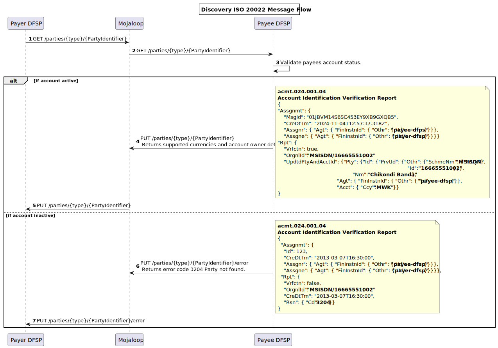
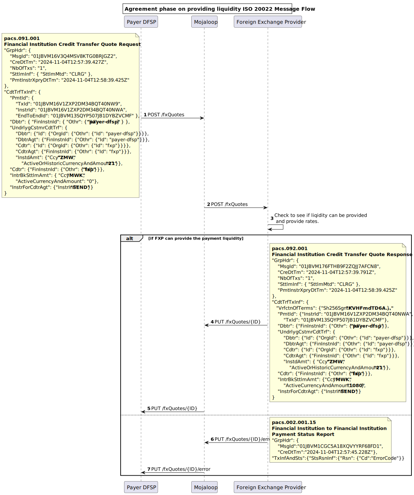

# Mojaloop ISO 20022 Market Practice Document


# Introduction
## Purpose of the Document
The purpose of this document is to provide a comprehensive, generic framework for implementing ISO 20022 messaging within Mojaloop ecosystems, specifically for supporting peer-to-peer (P2P) cross-border (FX) transfers. It is designed to assist Digital Financial Service Providers (DFSPs) in understanding the structure, expectations, and usage of ISO 20022 messages as they integrate into Mojaloop-powered schemes.
This document focuses on the foundational aspects of ISO 20022 messaging required for Mojaloop integration. It aims to establish clear practices and conventions for using ISO 20022 while maintaining flexibility for schemes to define specific rules and adaptations. The primary scope includes:
Offering a generic guide to ISO 20022 messaging as applied in Mojaloop for P2P FX transactions.
Providing clarity on which fields are supported, which are not, and how unsupported fields should be handled.
Ensuring DFSPs understand the transactional flows and message interactions necessary for successful integration.
Discussing fraud detection and prevention considerations without imposing restrictive practices.
Highlighting the relationship between this document and scheme-specific rules, allowing schemes to customize and enforce additional requirements.
By offering a standard reference point, this document empowers DFSPs to meet Mojaloop message requirements effectively and fosters consistency across different schemes using Mojaloop. However, it does not prescribe scheme-specific fields, validations, or rules, which must be defined and governed through individual scheme rules and agreements.
## Intended Audience
This document is intended for stakeholders involved in the design, implementation, and operation of Mojaloop ISO 20022-based schemes, specifically:
1. **Direct Financial Service Providers (DFSPs):**
DFSPs building integrations into Mojaloop schemes can use this document as a guide to understand the messaging framework, field requirements, and transaction flows. It provides the necessary context to ensure compliance with Mojaloop ISO 20022 messaging standards while leaving room for scheme-specific adaptations.
1. **Foreign Exchange Providers:**
Foreign Exchange Providers building integrations into Mojaloop schemes can use this document as a guide to understand the messaging framework, field requirements, and transaction flows. It provides the necessary context to ensure compliance with Mojaloop ISO 20022 messaging standards while leaving room for scheme-specific adaptations.
1. **Scheme Administrators:**
Administrators overseeing the setup and management of Mojaloop-based payment schemes can reference this document to define and enforce scheme-specific rules. It serves as a foundational framework for understanding the general practices and capabilities of Mojaloop ISO 20022 messaging.
Solution Architects and System Integrators:
Architects and integrators designing Mojaloop-compatible systems will benefit from the detailed explanation of ISO 20022 message structures and transaction flows. The document provides a blueprint for aligning technical solutions with Mojaloop’s messaging framework.
1. **Other Stakeholders:**
While primarily aimed at DFSPs and scheme administrators, this document may also be useful for fraud prevention teams, regulatory bodies, and technology providers looking to understand the broader operational context of Mojaloop’s ISO 20022 implementation.

By addressing the needs of these audiences, the document ensures consistency and clarity in the integration process, enabling participants to effectively collaborate within Mojaloop-based schemes.
# Overview of Mojaloop and ISO 20022

## Introduction to Mojaloop
Mojaloop is an open-source, inclusive instant payment platform designed to meet the needs of financial ecosystems in promoting greater financial inclusion. It offers a scalable, interoperable framework for facilitating low-cost, real-time digital payments, particularly for underserved populations. By utilizing a modular architecture and open standards, Mojaloop ensures affordability, efficiency, and accessibility, in line with the principles of financial inclusion.
A Mojaloop transfer typically progresses through three key phases:
1. **Discovery Phase**<br>
The payer DFSP identifies and confirms the payee, ensuring that the payee exists and can receive funds. This step often includes alias resolution and account validation.
1. **Agreement Phase** <br>
Both parties agree on the terms of the transaction, including fees, FX rates (if applicable), and any other relevant details. All parties conduct necessary checks to ensure the transfer can proceed. This phase ensures mutual understanding and consent before committing to the transfer. If currency conversion is necessary to support the transfer, the terms for obtaining that liquidity cover are also determined in this phase.
1. **Transfer Phase** <br>
In the transfer phase, funds are instantly cleared and made available to the end parties, and obligations are set to reflect the amount owed between DFSPs.

These phases form the basis of all payments, ensuring a structured approach to instant payments while minimizing risks and uncertainties for all participants.

### ISO 20022 and Its Advantages
ISO 20022 is a global financial messaging standard designed to improve interoperability, consistency, and efficiency in payment systems. Its use in Mojaloop provides several advantages:
1. **Rich Data and Standardization** <br>
ISO 20022 allows for comprehensive and structured data, enhancing transparency, reconciliation, and compliance with regulatory requirements.
1. **Interoperability** <br>
The standard enables seamless communication across diverse financial institutions and payment systems, fostering greater collaboration and ecosystem integration.
1. **Flexibility and Scalability** <br>
ISO 20022 supports various financial products and services, making it adaptable to the unique needs of Mojaloop schemes, including cross-border P2P transfers.

**ISO 20022 for IIPS**

By combining the principles of financial inclusion with the robust capabilities of ISO 20022, Mojaloop ensures that DFSPs and other stakeholders can deliver real-time payment solutions that are cost-effective, secure, and scalable to meet the demands of inclusive financial ecosystems.

# How to Use This Document?
This document provides a foundational reference for implementing ISO 20022 messaging for IIPS within Mojaloop-based schemes. It outlines general guidelines and practices that apply universally across Mojaloop schemes, focusing on the base-level requirements. However, it is designed to be supplemented by scheme-specific rules documents, which can define additional message fields, validations, and rules necessary to meet the unique regulations and requirements of individual schemes. This layered approach enables each scheme to tailor its implementation details while maintaining consistency with the broader Mojaloop framework.

## Relationship with Scheme-Specific Rules Documents
This document serves as a foundation for understanding how ISO 20022 is applied in Mojaloop, focusing on core principles and practices. However, it does not prescribe the detailed business requirements, validations, and governance frameworks that are specific to individual schemes. Scheme-specific rules address these details, including mandatory and optional field specifications, tailored compliance protocols, and defined procedures for error handling. They also encompass business rules governing message flows, participant roles, and responsibilities within the scheme. The flexibility of this document allows scheme administrators to adapt and extend its guidance to meet their unique operational needs.

## Distinction Between Generic Practices and Scheme-Specific Requirements
This document distinctly separates generic practices from scheme-specific requirements to achieve a balance between consistency and adaptability in ISO 20022 implementations within Mojaloop. The generic practices outlined here establish foundational principles, including expectations for message structures, required fields to meet switch requirements, supported fields, and transactional flows. Additionally, they provide a high-level overview of the Mojaloop P2P FX transfer lifecycle.

Scheme-specific requirements, documented separately, delve into additional field mappings, enhanced validations, and precise rules for settlement, reconciliation, and dispute resolution. These requirements also encompass governance policies and compliance obligations tailored to the unique needs of individual schemes.

This distinction enables DFSPs to implement a consistent core messaging framework while granting scheme administrators the flexibility to define operational specifics. The generic practices presented in this document are purposefully designed to be extensible, ensuring seamless integration with scheme-specific rules and supporting adherence to Mojaloop’s ISO 20022 for IIPS standards.

# Message Expectations, Obligations, and Rules
The Mojaloop transfer process is divided into three key phases, each essential to ensuring secure and efficient transactions. These phases use specific resources to enable participant interactions, ensuring clear communication, agreement, and execution. While some phases and resources are optional, the ultimate goal is to ensure every transfer is accurate, secure, and aligns with agreed terms. 
1. [Discovery](#discovery-phase)
2. [Agreement](#agreement-phase)
3. [Transfer](#transfer-phase)

### Currency Conversion
Currency conversion is included to support cross-currency transactions. As it is not always required, the associated messages and flows are only used when needed, ensuring flexibility for both single-currency and multi-currency scenarios.

### JSON Messages
Mojaloop adopts a JSON variant of ISO 20022 messages, moving away from the traditional XML format to enhance efficiency and compatibility with modern APIs. The ISO 20022 organization is actively developing a canonical JSON representation of its messages, and Mojaloop aims to align with this standard as it evolves.

### APIs
ISO 20022 messages are exchanged in Mojaloop via REST-like API calls. This approach enhances interoperability, reduces data overhead through lightweight JSON messages, and supports scalable and modular implementations. By integrating ISO 20022 with REST APIs, Mojaloop delivers a robust, adaptable framework that balances global standards with practical implementation needs. 

### ULIDs as Unique Identifiers
Mojaloop employs Universally Unique Lexicographically Sortable Identifiers (ULIDs) as the standard for unique identifiers across its messaging system. ULIDs offer a robust alternative to traditional UUIDs, ensuring globally unique identifiers while also enabling natural ordering by time of creation. This lexicographical sorting simplifies traceability, troubleshooting, and operational analytics.

### Inter-ledger Protocol (v4) to represent the Cryptographic Terms
Mojaloop leverages the Inter-ledger Protocol (ILP) version 4 to define and represent cryptographic terms in its transfer processes. ILP v4 provides a standardized framework for secure and interoperable exchange of payment instructions, ensuring integrity and non-repudiation of transactions. By integrating ILP's cryptographic capabilities, Mojaloop supports precise and tamper-proof agreements between participants, enabling secure end-to-end transfer execution while maintaining compatibility with global payment ecosystems.

### ISO 20022 Supplementary Data Fields

It is not expected that ISO 20022 supplementary data fields will be required for any of the messages used. If supplementary data is provided, the switch will not reject the message; however, it will ignore its contents and behave as if the supplementary data was not present.

## Discovery Phase
The Discovery Phase is an optional step in the transfer process, necessary only when the payee (end party) must be identified and confirmed before initiating an agreement. This phase utilizes the parties resource, which facilitates the retrieval and validation of the payee’s information to ensure they are eligible to receive the transfer. Key checks performed during this phase include verifying that the payee's account is active, identifying the currencies that can be transferred into the account, and confirming the account owner’s details. This information allows the payer to verify the payee's details accurately, reducing the risk of errors and ensuring a secure foundation for the subsequent phases of the transfer process.

### Message flow

| Endpoint | Message |
|--- | --- |
|[GET /parties/{type}/{partyIdentifier}[/{subId}]](#get-partiestypepartyidentifiersubid) |  |
|[PUT /parties/{type}/{partyIdentifier}[/{subId}]](#put-partiestypepartyidentifiersubid) | acmt.024.001.04 |
|[PUT /parties/{type}/{partyIdentifier}[/{subId}]/error](#put-partiestypepartyidentifiersubiderror) | acmt.024.001.04 |

The sequence diagram shows the discovery example messages in a Payer initiated P2P transfer.


### Parties Resource
The Parties resource provides all the necessary functionality in the discovery phase of a transfer. The functionality is always initiated with a GET /parties call, and responses to this are returned to the originator through a PUT /parties callback. Error messages are returned through the PUT /parties/.../error callback. These endpoints support an optional sub id type.
### GET /parties/{type}/{partyIdentifier}[/{subId}]
The GET /parties endpoint does not support or require a payload, and can be seen as an instruction to trigger an Account identification Verification report.
- **{type}** - Party identifier types<br>
The **{type}** refers to the classification of the party Identifier type. Each scheme only supports a limited number of these codes. The codes supported by the scheme may be derived from the ISO 20022 external organisation or personal identification codes, or they could be FSPIOP supported codes. The full list of supported codes is available in the [**Appendix A**](#appendix_A).
 - **partyIdentifier** <br>
 This is the party identifier of the party being represented and of the type specified by the {type} above.
 - **{subId}** <br>
 This represent a sub-identifier or sub-type for the party that some implementations require in order to ensure uniqueness of the identifier. 

### **Account Identification Verification Report - acmt.024.001.04**
### PUT /Parties/{type}/{partyIdentifier}[/{subId}]
#### Context
This is triggers as a callback response to the GET /parties call. The message is between DFSPs connected in the scheme and is a check that validates that the account represented is active.

Here is an example of the message:
``` json
{
"Assgnmt": {
    "MsgId": "01JBVM14S6SC453EY9XB9GXQB5",
    "CreDtTm": "2024-11-04T12:57:37.318Z",
    "Assgnr": { "Agt": { "FinInstnId": { "Othr": { "Id": "payee-dfps" } } } },
    "Assgne": { "Agt": { "FinInstnId": { "Othr": { "Id": "payer-dfsp" } } } }
    }
"Rpt": {
    "Vrfctn": true,
    "OrgnlId": "MSISDN/16665551002",
    "UpdtdPtyAndAcctId": {
    "Pty": {
        "Id": {"PrvtId": {"Othr": {"SchmeNm": {"Prtry": "MSISDN"},
                                               "Id": "16665551002"}}},
        "Nm": "Chikondi Banda"},
    "Agt": { "FinInstnId": { "Othr": { "Id": "payee-dfsp" } } },
    "Acct": { "Ccy": "MWK" }
    }
}
```

#### Required fields
There are the required fields that are needed by the switch to operate.

| **ISO 20022 Field** | **Description** |
|---|----|
|Assignment `Assgnmt`         | Assignment details |
|&nbsp;&nbsp;&nbsp;&nbsp;MessageIdentification `MsgId`        | ULID Unique identifier for the assignment message, generated by the assigning party to distinguish this message from others. |
|&nbsp;&nbsp;&nbsp;&nbsp;CreationDateTime `CreDtTm`        | Timestamp indicating when the assignment message was created, in ISO 8601 format (YYYY-MM-DDTHH:MM:SS.sssZ). |
|&nbsp;&nbsp;&nbsp;&nbsp;Assigner `Assgnr`        | Assigning party details. |
|{or&nbsp;&nbsp;&nbsp;&nbsp;&nbsp;&nbsp; Party `Pty`       | Party details of the assigner party. |
|or}&nbsp;&nbsp;&nbsp;&nbsp;&nbsp;&nbsp; Agent `Agt`       | Agent details of the assigner party. |
|&nbsp;&nbsp;&nbsp;&nbsp;Assignee `Assgne`        | Assignee party details. |
|{or&nbsp;&nbsp;&nbsp;&nbsp;&nbsp;&nbsp; Party `Pty`       | Party details of the assignee party. |
|or}&nbsp;&nbsp;&nbsp;&nbsp;&nbsp;&nbsp; Agent `Agt`       | Agent details of the assignee party. |
|Report `Rpt`         | Report details. |
|&nbsp;&nbsp;&nbsp;&nbsp;OriginalIdentification `OrgnlId`        | The original identifier of the account verification request being reported on. This is a string representation of the type and identifier that aligns with the path of the API endpoint. |
|&nbsp;&nbsp;&nbsp;&nbsp;Verification `Vrfctn`        | Indicates the verification status or result, such as whether the party and account details were successfully verified as active. |
|&nbsp;&nbsp;&nbsp;&nbsp;Reason `Rsn`        | Reason for the verification result. |
|{or&nbsp;&nbsp;&nbsp;&nbsp;&nbsp;&nbsp; Code `Cd`       | Code representing the reason for the verification result. |
|or}&nbsp;&nbsp;&nbsp;&nbsp;&nbsp;&nbsp; Proprietary `Prtry`       | Proprietary reason for the verification result. |
|&nbsp;&nbsp;&nbsp;&nbsp;OriginalPartyAndAccountIdentification `OrgnlPtyAndAcctId`        | Original party and account identification. |
|&nbsp;&nbsp;&nbsp;&nbsp;&nbsp;&nbsp;&nbsp;&nbsp;Party `Pty`       | Party details. |
|&nbsp;&nbsp;&nbsp;&nbsp;&nbsp;&nbsp;&nbsp;&nbsp;&nbsp;&nbsp;&nbsp;&nbsp;Identification `Id`      | Identification details. |
|{or&nbsp;&nbsp;&nbsp;&nbsp;&nbsp;&nbsp;&nbsp;&nbsp;&nbsp;&nbsp;&nbsp;&nbsp;&nbsp;&nbsp; OrganisationIdentification `OrgId`     | Organization identification details. |
|or}&nbsp;&nbsp;&nbsp;&nbsp;&nbsp;&nbsp;&nbsp;&nbsp;&nbsp;&nbsp;&nbsp;&nbsp;&nbsp;&nbsp; PrivateIdentification `PrvtId`     | Private identification details. |
|&nbsp;&nbsp;&nbsp;&nbsp;&nbsp;&nbsp;&nbsp;&nbsp;&nbsp;&nbsp;&nbsp;&nbsp;&nbsp;&nbsp;&nbsp;&nbsp;&nbsp;&nbsp;&nbsp;&nbsp;Other `Othr`    | Other identification details. |
|&nbsp;&nbsp;&nbsp;&nbsp;&nbsp;&nbsp;&nbsp;&nbsp;&nbsp;&nbsp;&nbsp;&nbsp;&nbsp;&nbsp;&nbsp;&nbsp;&nbsp;&nbsp;&nbsp;&nbsp;&nbsp;&nbsp;&nbsp;&nbsp;Identification `Id`   | Identification of the party or account. |


#### Optional Fields
Here is a list of all the optional fields. Some of these fields when specified require other fields to be defined and cannot be specified in isolation. For more information please refer to the ISO 20022 specification.

| **ISO 20022 Field** | **Description** |
|---|----|
|Report `Rpt`         |  |
|&nbsp;&nbsp;&nbsp;&nbsp;OriginalPartyAndAccountIdentification `OrgnlPtyAndAcctId`        |  |
|&nbsp;&nbsp;&nbsp;&nbsp;&nbsp;&nbsp;&nbsp;&nbsp;Party `Pty`       |  |
|&nbsp;&nbsp;&nbsp;&nbsp;&nbsp;&nbsp;&nbsp;&nbsp;&nbsp;&nbsp;&nbsp;&nbsp;Name `Nm`      | Name of the party. |
|&nbsp;&nbsp;&nbsp;&nbsp;&nbsp;&nbsp;&nbsp;&nbsp;&nbsp;&nbsp;&nbsp;&nbsp;PostalAddress `PstlAdr`      | Postal address of the party. |
|{or&nbsp;&nbsp;&nbsp;&nbsp;&nbsp;&nbsp;&nbsp;&nbsp;&nbsp;&nbsp;&nbsp;&nbsp;&nbsp;&nbsp; OrganisationIdentification `OrgId`     |  |
|&nbsp;&nbsp;&nbsp;&nbsp;&nbsp;&nbsp;&nbsp;&nbsp;&nbsp;&nbsp;&nbsp;&nbsp;&nbsp;&nbsp;&nbsp;&nbsp;&nbsp;&nbsp;&nbsp;&nbsp;AnyBIC `AnyBIC`    | AnyBIC (Business Identifier Code) for the organization. |
|&nbsp;&nbsp;&nbsp;&nbsp;&nbsp;&nbsp;&nbsp;&nbsp;&nbsp;&nbsp;&nbsp;&nbsp;&nbsp;&nbsp;&nbsp;&nbsp;&nbsp;&nbsp;&nbsp;&nbsp;LEI `LEI`    | LEI (Legal Entity Identifier) for the organization. |
|&nbsp;&nbsp;&nbsp;&nbsp;&nbsp;&nbsp;&nbsp;&nbsp;&nbsp;&nbsp;&nbsp;&nbsp;&nbsp;&nbsp;&nbsp;&nbsp;&nbsp;&nbsp;&nbsp;&nbsp;Other `Othr`    | Other identification details. |
|&nbsp;&nbsp;&nbsp;&nbsp;&nbsp;&nbsp;&nbsp;&nbsp;&nbsp;&nbsp;&nbsp;&nbsp;&nbsp;&nbsp;&nbsp;&nbsp;&nbsp;&nbsp;&nbsp;&nbsp;&nbsp;&nbsp;&nbsp;&nbsp;Identification `Id`   | Identification of the party or account. |
|&nbsp;&nbsp;&nbsp;&nbsp;&nbsp;&nbsp;&nbsp;&nbsp;&nbsp;&nbsp;&nbsp;&nbsp;&nbsp;&nbsp;&nbsp;&nbsp;&nbsp;&nbsp;&nbsp;&nbsp;&nbsp;&nbsp;&nbsp;&nbsp;SchemeName `SchmeNm`   | Scheme name for the identification. |
|{or&nbsp;&nbsp;&nbsp;&nbsp;&nbsp;&nbsp;&nbsp;&nbsp;&nbsp;&nbsp;&nbsp;&nbsp;&nbsp;&nbsp;&nbsp;&nbsp;&nbsp;&nbsp;&nbsp;&nbsp;&nbsp;&nbsp;&nbsp;&nbsp;&nbsp;&nbsp; Code `Cd`  | Code for the scheme name. |
|or}&nbsp;&nbsp;&nbsp;&nbsp;&nbsp;&nbsp;&nbsp;&nbsp;&nbsp;&nbsp;&nbsp;&nbsp;&nbsp;&nbsp;&nbsp;&nbsp;&nbsp;&nbsp;&nbsp;&nbsp;&nbsp;&nbsp;&nbsp;&nbsp;&nbsp;&nbsp; Proprietary `Prtry`  | Proprietary scheme name. |
|&nbsp;&nbsp;&nbsp;&nbsp;&nbsp;&nbsp;&nbsp;&nbsp;&nbsp;&nbsp;&nbsp;&nbsp;&nbsp;&nbsp;&nbsp;&nbsp;&nbsp;&nbsp;&nbsp;&nbsp;&nbsp;&nbsp;&nbsp;&nbsp;Issuer `Issr`   | Issuer of the identification. |
|or}&nbsp;&nbsp;&nbsp;&nbsp;&nbsp;&nbsp;&nbsp;&nbsp;&nbsp;&nbsp;&nbsp;&nbsp;&nbsp;&nbsp; PrivateIdentification `PrvtId`     |  |
|&nbsp;&nbsp;&nbsp;&nbsp;&nbsp;&nbsp;&nbsp;&nbsp;&nbsp;&nbsp;&nbsp;&nbsp;&nbsp;&nbsp;&nbsp;&nbsp;&nbsp;&nbsp;&nbsp;&nbsp;DateAndPlaceOfBirth `DtAndPlcOfBirth`    | Date and place of birth. |
|&nbsp;&nbsp;&nbsp;&nbsp;&nbsp;&nbsp;&nbsp;&nbsp;&nbsp;&nbsp;&nbsp;&nbsp;&nbsp;&nbsp;&nbsp;&nbsp;&nbsp;&nbsp;&nbsp;&nbsp;&nbsp;&nbsp;&nbsp;&nbsp;BirthDate `BirthDt`   | Birth date of the individual. |
|&nbsp;&nbsp;&nbsp;&nbsp;&nbsp;&nbsp;&nbsp;&nbsp;&nbsp;&nbsp;&nbsp;&nbsp;&nbsp;&nbsp;&nbsp;&nbsp;&nbsp;&nbsp;&nbsp;&nbsp;&nbsp;&nbsp;&nbsp;&nbsp;ProvinceOfBirth `PrvcOfBirth`   | Province of birth of the individual. |
|&nbsp;&nbsp;&nbsp;&nbsp;&nbsp;&nbsp;&nbsp;&nbsp;&nbsp;&nbsp;&nbsp;&nbsp;&nbsp;&nbsp;&nbsp;&nbsp;&nbsp;&nbsp;&nbsp;&nbsp;&nbsp;&nbsp;&nbsp;&nbsp;CityOfBirth `CityOfBirth`   | City of birth of the individual. |
|&nbsp;&nbsp;&nbsp;&nbsp;&nbsp;&nbsp;&nbsp;&nbsp;&nbsp;&nbsp;&nbsp;&nbsp;&nbsp;&nbsp;&nbsp;&nbsp;&nbsp;&nbsp;&nbsp;&nbsp;&nbsp;&nbsp;&nbsp;&nbsp;CountryOfBirth `CtryOfBirth`   | Country of birth of the individual. |
|&nbsp;&nbsp;&nbsp;&nbsp;&nbsp;&nbsp;&nbsp;&nbsp;&nbsp;&nbsp;&nbsp;&nbsp;&nbsp;&nbsp;&nbsp;&nbsp;&nbsp;&nbsp;&nbsp;&nbsp;Other `Othr`    |  |
|&nbsp;&nbsp;&nbsp;&nbsp;&nbsp;&nbsp;&nbsp;&nbsp;&nbsp;&nbsp;&nbsp;&nbsp;&nbsp;&nbsp;&nbsp;&nbsp;&nbsp;&nbsp;&nbsp;&nbsp;&nbsp;&nbsp;&nbsp;&nbsp;SchemeName `SchmeNm`   | Scheme name for the identification. |
|{or&nbsp;&nbsp;&nbsp;&nbsp;&nbsp;&nbsp;&nbsp;&nbsp;&nbsp;&nbsp;&nbsp;&nbsp;&nbsp;&nbsp;&nbsp;&nbsp;&nbsp;&nbsp;&nbsp;&nbsp;&nbsp;&nbsp;&nbsp;&nbsp;&nbsp;&nbsp; Code `Cd`  | Code for the scheme name. |
|or}&nbsp;&nbsp;&nbsp;&nbsp;&nbsp;&nbsp;&nbsp;&nbsp;&nbsp;&nbsp;&nbsp;&nbsp;&nbsp;&nbsp;&nbsp;&nbsp;&nbsp;&nbsp;&nbsp;&nbsp;&nbsp;&nbsp;&nbsp;&nbsp;&nbsp;&nbsp; Proprietary `Prtry`  | Proprietary scheme name. |
|&nbsp;&nbsp;&nbsp;&nbsp;&nbsp;&nbsp;&nbsp;&nbsp;&nbsp;&nbsp;&nbsp;&nbsp;&nbsp;&nbsp;&nbsp;&nbsp;&nbsp;&nbsp;&nbsp;&nbsp;&nbsp;&nbsp;&nbsp;&nbsp;Issuer `Issr`   | Issuer of the identification. |
|&nbsp;&nbsp;&nbsp;&nbsp;&nbsp;&nbsp;&nbsp;&nbsp;&nbsp;&nbsp;&nbsp;&nbsp;CountryOfResidence `CtryOfRes`      | Country of residence. |
|&nbsp;&nbsp;&nbsp;&nbsp;&nbsp;&nbsp;&nbsp;&nbsp;&nbsp;&nbsp;&nbsp;&nbsp;ContactDetails `CtctDtls`      | Contact details. |
|&nbsp;&nbsp;&nbsp;&nbsp;&nbsp;&nbsp;&nbsp;&nbsp;&nbsp;&nbsp;&nbsp;&nbsp;&nbsp;&nbsp;&nbsp;&nbsp;NamePrefix `NmPrfx`     | Name prefix. |
|&nbsp;&nbsp;&nbsp;&nbsp;&nbsp;&nbsp;&nbsp;&nbsp;&nbsp;&nbsp;&nbsp;&nbsp;&nbsp;&nbsp;&nbsp;&nbsp;Name `Nm`     | Name |
|&nbsp;&nbsp;&nbsp;&nbsp;&nbsp;&nbsp;&nbsp;&nbsp;&nbsp;&nbsp;&nbsp;&nbsp;&nbsp;&nbsp;&nbsp;&nbsp;PhoneNumber `PhneNb`     | Phone number. |
|&nbsp;&nbsp;&nbsp;&nbsp;&nbsp;&nbsp;&nbsp;&nbsp;&nbsp;&nbsp;&nbsp;&nbsp;&nbsp;&nbsp;&nbsp;&nbsp;MobileNumber `MobNb`     | Mobile number. |
|&nbsp;&nbsp;&nbsp;&nbsp;&nbsp;&nbsp;&nbsp;&nbsp;&nbsp;&nbsp;&nbsp;&nbsp;&nbsp;&nbsp;&nbsp;&nbsp;FaxNumber `FaxNb`     | Fax number. |
|&nbsp;&nbsp;&nbsp;&nbsp;&nbsp;&nbsp;&nbsp;&nbsp;&nbsp;&nbsp;&nbsp;&nbsp;&nbsp;&nbsp;&nbsp;&nbsp;URLAddress `URLAdr`     | URL address. |
|&nbsp;&nbsp;&nbsp;&nbsp;&nbsp;&nbsp;&nbsp;&nbsp;&nbsp;&nbsp;&nbsp;&nbsp;&nbsp;&nbsp;&nbsp;&nbsp;EmailAddress `EmailAdr`     | Email address. |
|&nbsp;&nbsp;&nbsp;&nbsp;&nbsp;&nbsp;&nbsp;&nbsp;&nbsp;&nbsp;&nbsp;&nbsp;&nbsp;&nbsp;&nbsp;&nbsp;EmailPurpose `EmailPurp`     | Purpose of the email address. |
|&nbsp;&nbsp;&nbsp;&nbsp;&nbsp;&nbsp;&nbsp;&nbsp;&nbsp;&nbsp;&nbsp;&nbsp;&nbsp;&nbsp;&nbsp;&nbsp;JobTitle `JobTitl`     | Job title. |
|&nbsp;&nbsp;&nbsp;&nbsp;&nbsp;&nbsp;&nbsp;&nbsp;&nbsp;&nbsp;&nbsp;&nbsp;&nbsp;&nbsp;&nbsp;&nbsp;Responsibility `Rspnsblty`     | Responsibility. |
|&nbsp;&nbsp;&nbsp;&nbsp;&nbsp;&nbsp;&nbsp;&nbsp;&nbsp;&nbsp;&nbsp;&nbsp;&nbsp;&nbsp;&nbsp;&nbsp;Department `Dept`     | Department. |
|&nbsp;&nbsp;&nbsp;&nbsp;&nbsp;&nbsp;&nbsp;&nbsp;&nbsp;&nbsp;&nbsp;&nbsp;&nbsp;&nbsp;&nbsp;&nbsp;Other `Othr`     | Other contact details. |
|&nbsp;&nbsp;&nbsp;&nbsp;&nbsp;&nbsp;&nbsp;&nbsp;&nbsp;&nbsp;&nbsp;&nbsp;&nbsp;&nbsp;&nbsp;&nbsp;&nbsp;&nbsp;&nbsp;&nbsp;ChannelType `ChanlTp`    | Channel type. |
|&nbsp;&nbsp;&nbsp;&nbsp;&nbsp;&nbsp;&nbsp;&nbsp;&nbsp;&nbsp;&nbsp;&nbsp;&nbsp;&nbsp;&nbsp;&nbsp;&nbsp;&nbsp;&nbsp;&nbsp;Identification `Id`    | Other contact identification detail. |
|&nbsp;&nbsp;&nbsp;&nbsp;&nbsp;&nbsp;&nbsp;&nbsp;&nbsp;&nbsp;&nbsp;&nbsp;&nbsp;&nbsp;&nbsp;&nbsp;PreferredMethod `PrefrdMtd`     | Preferred method. |
|&nbsp;&nbsp;&nbsp;&nbsp;&nbsp;&nbsp;&nbsp;&nbsp;Account `Acct`       | Account details. |
|&nbsp;&nbsp;&nbsp;&nbsp;&nbsp;&nbsp;&nbsp;&nbsp;&nbsp;&nbsp;&nbsp;&nbsp;Identification `Id`      | Account Identification |
|{or&nbsp;&nbsp;&nbsp;&nbsp;&nbsp;&nbsp;&nbsp;&nbsp;&nbsp;&nbsp;&nbsp;&nbsp;&nbsp;&nbsp; IBAN `IBAN`     | IBAN (International Bank Account Number). |
|or}&nbsp;&nbsp;&nbsp;&nbsp;&nbsp;&nbsp;&nbsp;&nbsp;&nbsp;&nbsp;&nbsp;&nbsp;&nbsp;&nbsp; Other `Othr`     | Other identification details. |
|&nbsp;&nbsp;&nbsp;&nbsp;&nbsp;&nbsp;&nbsp;&nbsp;&nbsp;&nbsp;&nbsp;&nbsp;&nbsp;&nbsp;&nbsp;&nbsp;&nbsp;&nbsp;&nbsp;&nbsp;Identification `Id`    | Identification of the party or account. |
|&nbsp;&nbsp;&nbsp;&nbsp;&nbsp;&nbsp;&nbsp;&nbsp;&nbsp;&nbsp;&nbsp;&nbsp;&nbsp;&nbsp;&nbsp;&nbsp;&nbsp;&nbsp;&nbsp;&nbsp;SchemeName `SchmeNm`    | Scheme name for the identification. |
|{or&nbsp;&nbsp;&nbsp;&nbsp;&nbsp;&nbsp;&nbsp;&nbsp;&nbsp;&nbsp;&nbsp;&nbsp;&nbsp;&nbsp;&nbsp;&nbsp;&nbsp;&nbsp;&nbsp;&nbsp;&nbsp;&nbsp; Code `Cd`   | Code for the scheme name. |
|or}&nbsp;&nbsp;&nbsp;&nbsp;&nbsp;&nbsp;&nbsp;&nbsp;&nbsp;&nbsp;&nbsp;&nbsp;&nbsp;&nbsp;&nbsp;&nbsp;&nbsp;&nbsp;&nbsp;&nbsp;&nbsp;&nbsp; Proprietary `Prtry`   | Proprietary scheme name. |
|&nbsp;&nbsp;&nbsp;&nbsp;&nbsp;&nbsp;&nbsp;&nbsp;&nbsp;&nbsp;&nbsp;&nbsp;&nbsp;&nbsp;&nbsp;&nbsp;&nbsp;&nbsp;&nbsp;&nbsp;Issuer `Issr`    | Issuer of the identification. |
|&nbsp;&nbsp;&nbsp;&nbsp;&nbsp;&nbsp;&nbsp;&nbsp;&nbsp;&nbsp;&nbsp;&nbsp;Type `Tp`      | Type of the account. |
|{or&nbsp;&nbsp;&nbsp;&nbsp;&nbsp;&nbsp;&nbsp;&nbsp;&nbsp;&nbsp;&nbsp;&nbsp;&nbsp;&nbsp; Code `Cd`     | Identifier for the financial institution managing the party's account, provided in a proprietary format. |
|or}&nbsp;&nbsp;&nbsp;&nbsp;&nbsp;&nbsp;&nbsp;&nbsp;&nbsp;&nbsp;&nbsp;&nbsp;&nbsp;&nbsp; Proprietary `Prtry`     | Financial institution identification. |
|&nbsp;&nbsp;&nbsp;&nbsp;&nbsp;&nbsp;&nbsp;&nbsp;&nbsp;&nbsp;&nbsp;&nbsp;Currency `Ccy`      | Currency code (ISO 4217 format) of the account being verified, indicating the currency in which the account operates. |
|&nbsp;&nbsp;&nbsp;&nbsp;&nbsp;&nbsp;&nbsp;&nbsp;&nbsp;&nbsp;&nbsp;&nbsp;Name `Nm`      | Name of the account. |
|&nbsp;&nbsp;&nbsp;&nbsp;&nbsp;&nbsp;&nbsp;&nbsp;&nbsp;&nbsp;&nbsp;&nbsp;Proxy `Prxy`      | Proxy identifier for the account. |
|&nbsp;&nbsp;&nbsp;&nbsp;&nbsp;&nbsp;&nbsp;&nbsp;&nbsp;&nbsp;&nbsp;&nbsp;&nbsp;&nbsp;&nbsp;&nbsp;Type `Tp`     | Type of the account. |
|{or&nbsp;&nbsp;&nbsp;&nbsp;&nbsp;&nbsp;&nbsp;&nbsp;&nbsp;&nbsp;&nbsp;&nbsp;&nbsp;&nbsp;&nbsp;&nbsp;&nbsp;&nbsp; Code `Cd`    | Code for the type of the account. |
|or}&nbsp;&nbsp;&nbsp;&nbsp;&nbsp;&nbsp;&nbsp;&nbsp;&nbsp;&nbsp;&nbsp;&nbsp;&nbsp;&nbsp;&nbsp;&nbsp;&nbsp;&nbsp; Proprietary `Prtry`    | Proprietary type of the account. |
|&nbsp;&nbsp;&nbsp;&nbsp;&nbsp;&nbsp;&nbsp;&nbsp;&nbsp;&nbsp;&nbsp;&nbsp;&nbsp;&nbsp;&nbsp;&nbsp;Identification `Id`     | Identification of the account. |
|{or&nbsp;&nbsp;&nbsp;&nbsp;&nbsp;&nbsp;&nbsp;&nbsp;&nbsp;&nbsp;&nbsp;&nbsp;&nbsp;&nbsp;&nbsp;&nbsp;&nbsp;&nbsp; IBAN `IBAN`    | IBAN (International Bank Account Number). |
|or}&nbsp;&nbsp;&nbsp;&nbsp;&nbsp;&nbsp;&nbsp;&nbsp;&nbsp;&nbsp;&nbsp;&nbsp;&nbsp;&nbsp;&nbsp;&nbsp;&nbsp;&nbsp; Other `Othr`    | Other identification details. |
|&nbsp;&nbsp;&nbsp;&nbsp;&nbsp;&nbsp;&nbsp;&nbsp;&nbsp;&nbsp;&nbsp;&nbsp;&nbsp;&nbsp;&nbsp;&nbsp;&nbsp;&nbsp;&nbsp;&nbsp;&nbsp;&nbsp;&nbsp;&nbsp;Identification `Id`   | Identification of the party or account. |
|&nbsp;&nbsp;&nbsp;&nbsp;&nbsp;&nbsp;&nbsp;&nbsp;&nbsp;&nbsp;&nbsp;&nbsp;&nbsp;&nbsp;&nbsp;&nbsp;&nbsp;&nbsp;&nbsp;&nbsp;&nbsp;&nbsp;&nbsp;&nbsp;SchemeName `SchmeNm`   | Scheme name for the identification. |
|{or&nbsp;&nbsp;&nbsp;&nbsp;&nbsp;&nbsp;&nbsp;&nbsp;&nbsp;&nbsp;&nbsp;&nbsp;&nbsp;&nbsp;&nbsp;&nbsp;&nbsp;&nbsp;&nbsp;&nbsp;&nbsp;&nbsp;&nbsp;&nbsp;&nbsp;&nbsp; Code `Cd`  | Code for the scheme name. |
|or}&nbsp;&nbsp;&nbsp;&nbsp;&nbsp;&nbsp;&nbsp;&nbsp;&nbsp;&nbsp;&nbsp;&nbsp;&nbsp;&nbsp;&nbsp;&nbsp;&nbsp;&nbsp;&nbsp;&nbsp;&nbsp;&nbsp;&nbsp;&nbsp;&nbsp;&nbsp; Proprietary `Prtry`  | Proprietary scheme name. |
|&nbsp;&nbsp;&nbsp;&nbsp;&nbsp;&nbsp;&nbsp;&nbsp;&nbsp;&nbsp;&nbsp;&nbsp;&nbsp;&nbsp;&nbsp;&nbsp;&nbsp;&nbsp;&nbsp;&nbsp;&nbsp;&nbsp;&nbsp;&nbsp;Issuer `Issr`   | Issuer of the identification. |
|&nbsp;&nbsp;&nbsp;&nbsp;&nbsp;&nbsp;&nbsp;&nbsp;&nbsp;&nbsp;&nbsp;&nbsp;Currency `Ccy`      | Currency code (ISO 4217 format) of the account being verified, indicating the currency in which the account operates. |
|&nbsp;&nbsp;&nbsp;&nbsp;&nbsp;&nbsp;&nbsp;&nbsp;&nbsp;&nbsp;&nbsp;&nbsp;Name `Nm`      | Name of the account. |
|&nbsp;&nbsp;&nbsp;&nbsp;&nbsp;&nbsp;&nbsp;&nbsp;Agent `Agt`       | Identifier for the financial institution managing the party's account, provided in a proprietary format. |
|&nbsp;&nbsp;&nbsp;&nbsp;&nbsp;&nbsp;&nbsp;&nbsp;&nbsp;&nbsp;&nbsp;&nbsp;FinancialInstitutionIdentification `FinInstnId`      | Financial institution identification. |
|&nbsp;&nbsp;&nbsp;&nbsp;&nbsp;&nbsp;&nbsp;&nbsp;&nbsp;&nbsp;&nbsp;&nbsp;&nbsp;&nbsp;&nbsp;&nbsp;BICFI `BICFI`     | BIC (Business Identifier Code) for the financial institution. |
|&nbsp;&nbsp;&nbsp;&nbsp;&nbsp;&nbsp;&nbsp;&nbsp;&nbsp;&nbsp;&nbsp;&nbsp;&nbsp;&nbsp;&nbsp;&nbsp;ClearingSystemMemberIdentification `ClrSysMmbId`     | Clearing system member identification. |
|&nbsp;&nbsp;&nbsp;&nbsp;&nbsp;&nbsp;&nbsp;&nbsp;&nbsp;&nbsp;&nbsp;&nbsp;&nbsp;&nbsp;&nbsp;&nbsp;LEI `LEI`     | Legal Entity Identifier (LEI) for the financial institution. |
|&nbsp;&nbsp;&nbsp;&nbsp;&nbsp;&nbsp;&nbsp;&nbsp;&nbsp;&nbsp;&nbsp;&nbsp;&nbsp;&nbsp;&nbsp;&nbsp;Name `Nm`     | Name of the financial institution. |
|&nbsp;&nbsp;&nbsp;&nbsp;&nbsp;&nbsp;&nbsp;&nbsp;&nbsp;&nbsp;&nbsp;&nbsp;&nbsp;&nbsp;&nbsp;&nbsp;PostalAddress `PstlAdr`     | Postal address of the financial institution. |
|&nbsp;&nbsp;&nbsp;&nbsp;&nbsp;&nbsp;&nbsp;&nbsp;&nbsp;&nbsp;&nbsp;&nbsp;&nbsp;&nbsp;&nbsp;&nbsp;Other `Othr`     | Other identification details. |
|&nbsp;&nbsp;&nbsp;&nbsp;&nbsp;&nbsp;&nbsp;&nbsp;&nbsp;&nbsp;&nbsp;&nbsp;BranchIdentification `BrnchId`      | Branch identification. |
|&nbsp;&nbsp;&nbsp;&nbsp;&nbsp;&nbsp;&nbsp;&nbsp;&nbsp;&nbsp;&nbsp;&nbsp;&nbsp;&nbsp;&nbsp;&nbsp;Identification `Id`     | Identification of the branch. |
|&nbsp;&nbsp;&nbsp;&nbsp;&nbsp;&nbsp;&nbsp;&nbsp;&nbsp;&nbsp;&nbsp;&nbsp;&nbsp;&nbsp;&nbsp;&nbsp;LEI `LEI`     | Legal Entity Identifier (LEI) for the branch. |
|&nbsp;&nbsp;&nbsp;&nbsp;&nbsp;&nbsp;&nbsp;&nbsp;&nbsp;&nbsp;&nbsp;&nbsp;&nbsp;&nbsp;&nbsp;&nbsp;Name `Nm`     | Name of the branch. |
|&nbsp;&nbsp;&nbsp;&nbsp;&nbsp;&nbsp;&nbsp;&nbsp;&nbsp;&nbsp;&nbsp;&nbsp;&nbsp;&nbsp;&nbsp;&nbsp;PostalAddress `PstlAdr`     | Postal address of the branch. |
|&nbsp;&nbsp;&nbsp;&nbsp;UpdatedPartyAndAccountIdentification `UpdtdPtyAndAcctId`        | Updated party and account identification. |
|&nbsp;&nbsp;&nbsp;&nbsp;&nbsp;&nbsp;&nbsp;&nbsp;Party `Pty`       | Party details. |
|&nbsp;&nbsp;&nbsp;&nbsp;&nbsp;&nbsp;&nbsp;&nbsp;&nbsp;&nbsp;&nbsp;&nbsp;Name `Nm`      | Name of the party. |
|&nbsp;&nbsp;&nbsp;&nbsp;&nbsp;&nbsp;&nbsp;&nbsp;&nbsp;&nbsp;&nbsp;&nbsp;PostalAddress `PstlAdr`      | Postal address of the party. |
|&nbsp;&nbsp;&nbsp;&nbsp;&nbsp;&nbsp;&nbsp;&nbsp;&nbsp;&nbsp;&nbsp;&nbsp;Identification `Id`      | Identification of the party. |
|{or&nbsp;&nbsp;&nbsp;&nbsp;&nbsp;&nbsp;&nbsp;&nbsp;&nbsp;&nbsp;&nbsp;&nbsp;&nbsp;&nbsp; OrganisationIdentification `OrgId`     | Organization identification details. |
|&nbsp;&nbsp;&nbsp;&nbsp;&nbsp;&nbsp;&nbsp;&nbsp;&nbsp;&nbsp;&nbsp;&nbsp;&nbsp;&nbsp;&nbsp;&nbsp;&nbsp;&nbsp;&nbsp;&nbsp;AnyBIC `AnyBIC`    | AnyBIC (Business Identifier Code) for the organization. |
|&nbsp;&nbsp;&nbsp;&nbsp;&nbsp;&nbsp;&nbsp;&nbsp;&nbsp;&nbsp;&nbsp;&nbsp;&nbsp;&nbsp;&nbsp;&nbsp;&nbsp;&nbsp;&nbsp;&nbsp;LEI `LEI`    | Legal Entity Identifier (LEI) for the organization. |
|&nbsp;&nbsp;&nbsp;&nbsp;&nbsp;&nbsp;&nbsp;&nbsp;&nbsp;&nbsp;&nbsp;&nbsp;&nbsp;&nbsp;&nbsp;&nbsp;&nbsp;&nbsp;&nbsp;&nbsp;Other `Othr`    | Other identification details. |
|&nbsp;&nbsp;&nbsp;&nbsp;&nbsp;&nbsp;&nbsp;&nbsp;&nbsp;&nbsp;&nbsp;&nbsp;&nbsp;&nbsp;&nbsp;&nbsp;&nbsp;&nbsp;&nbsp;&nbsp;&nbsp;&nbsp;&nbsp;&nbsp;Identification `Id`   | Identification of the party. |
|&nbsp;&nbsp;&nbsp;&nbsp;&nbsp;&nbsp;&nbsp;&nbsp;&nbsp;&nbsp;&nbsp;&nbsp;&nbsp;&nbsp;&nbsp;&nbsp;&nbsp;&nbsp;&nbsp;&nbsp;&nbsp;&nbsp;&nbsp;&nbsp;SchemeName `SchmeNm`   | Scheme name for the identification. |
|{or&nbsp;&nbsp;&nbsp;&nbsp;&nbsp;&nbsp;&nbsp;&nbsp;&nbsp;&nbsp;&nbsp;&nbsp;&nbsp;&nbsp;&nbsp;&nbsp;&nbsp;&nbsp;&nbsp;&nbsp;&nbsp;&nbsp;&nbsp;&nbsp;&nbsp;&nbsp; Code `Cd`  | Code for the scheme name. |
|or}&nbsp;&nbsp;&nbsp;&nbsp;&nbsp;&nbsp;&nbsp;&nbsp;&nbsp;&nbsp;&nbsp;&nbsp;&nbsp;&nbsp;&nbsp;&nbsp;&nbsp;&nbsp;&nbsp;&nbsp;&nbsp;&nbsp;&nbsp;&nbsp;&nbsp;&nbsp; Proprietary `Prtry`  | Proprietary scheme name. |
|&nbsp;&nbsp;&nbsp;&nbsp;&nbsp;&nbsp;&nbsp;&nbsp;&nbsp;&nbsp;&nbsp;&nbsp;&nbsp;&nbsp;&nbsp;&nbsp;&nbsp;&nbsp;&nbsp;&nbsp;&nbsp;&nbsp;&nbsp;&nbsp;Issuer `Issr`   | Issuer of the identification. |
|or}&nbsp;&nbsp;&nbsp;&nbsp;&nbsp;&nbsp;&nbsp;&nbsp;&nbsp;&nbsp;&nbsp;&nbsp;&nbsp;&nbsp; PrivateIdentification `PrvtId`     | Private identification details. |
|&nbsp;&nbsp;&nbsp;&nbsp;&nbsp;&nbsp;&nbsp;&nbsp;&nbsp;&nbsp;&nbsp;&nbsp;&nbsp;&nbsp;&nbsp;&nbsp;&nbsp;&nbsp;&nbsp;&nbsp;DateAndPlaceOfBirth `DtAndPlcOfBirth`    | Date and place of birth. |
|&nbsp;&nbsp;&nbsp;&nbsp;&nbsp;&nbsp;&nbsp;&nbsp;&nbsp;&nbsp;&nbsp;&nbsp;&nbsp;&nbsp;&nbsp;&nbsp;&nbsp;&nbsp;&nbsp;&nbsp;&nbsp;&nbsp;&nbsp;&nbsp;BirthDate `BirthDt`   | Birth date of the individual. |
|&nbsp;&nbsp;&nbsp;&nbsp;&nbsp;&nbsp;&nbsp;&nbsp;&nbsp;&nbsp;&nbsp;&nbsp;&nbsp;&nbsp;&nbsp;&nbsp;&nbsp;&nbsp;&nbsp;&nbsp;&nbsp;&nbsp;&nbsp;&nbsp;ProvinceOfBirth `PrvcOfBirth`   | Province of birth of the individual. |
|&nbsp;&nbsp;&nbsp;&nbsp;&nbsp;&nbsp;&nbsp;&nbsp;&nbsp;&nbsp;&nbsp;&nbsp;&nbsp;&nbsp;&nbsp;&nbsp;&nbsp;&nbsp;&nbsp;&nbsp;&nbsp;&nbsp;&nbsp;&nbsp;CityOfBirth `CityOfBirth`   | City of birth of the individual. |
|&nbsp;&nbsp;&nbsp;&nbsp;&nbsp;&nbsp;&nbsp;&nbsp;&nbsp;&nbsp;&nbsp;&nbsp;&nbsp;&nbsp;&nbsp;&nbsp;&nbsp;&nbsp;&nbsp;&nbsp;&nbsp;&nbsp;&nbsp;&nbsp;CountryOfBirth `CtryOfBirth`   | Country of birth of the individual. |
|&nbsp;&nbsp;&nbsp;&nbsp;&nbsp;&nbsp;&nbsp;&nbsp;&nbsp;&nbsp;&nbsp;&nbsp;&nbsp;&nbsp;&nbsp;&nbsp;&nbsp;&nbsp;&nbsp;&nbsp;Other `Othr`    | Other identification details. |
|&nbsp;&nbsp;&nbsp;&nbsp;&nbsp;&nbsp;&nbsp;&nbsp;&nbsp;&nbsp;&nbsp;&nbsp;&nbsp;&nbsp;&nbsp;&nbsp;&nbsp;&nbsp;&nbsp;&nbsp;&nbsp;&nbsp;&nbsp;&nbsp;Identification `Id`   | Identification of the party. |
|&nbsp;&nbsp;&nbsp;&nbsp;&nbsp;&nbsp;&nbsp;&nbsp;&nbsp;&nbsp;&nbsp;&nbsp;&nbsp;&nbsp;&nbsp;&nbsp;&nbsp;&nbsp;&nbsp;&nbsp;&nbsp;&nbsp;&nbsp;&nbsp;SchemeName `SchmeNm`   | Scheme name for the identification. |
|{or&nbsp;&nbsp;&nbsp;&nbsp;&nbsp;&nbsp;&nbsp;&nbsp;&nbsp;&nbsp;&nbsp;&nbsp;&nbsp;&nbsp;&nbsp;&nbsp;&nbsp;&nbsp;&nbsp;&nbsp;&nbsp;&nbsp;&nbsp;&nbsp;&nbsp;&nbsp; Code `Cd`  | Code for the scheme name. |
|or}&nbsp;&nbsp;&nbsp;&nbsp;&nbsp;&nbsp;&nbsp;&nbsp;&nbsp;&nbsp;&nbsp;&nbsp;&nbsp;&nbsp;&nbsp;&nbsp;&nbsp;&nbsp;&nbsp;&nbsp;&nbsp;&nbsp;&nbsp;&nbsp;&nbsp;&nbsp; Proprietary `Prtry`  | Proprietary scheme name. |
|&nbsp;&nbsp;&nbsp;&nbsp;&nbsp;&nbsp;&nbsp;&nbsp;&nbsp;&nbsp;&nbsp;&nbsp;&nbsp;&nbsp;&nbsp;&nbsp;&nbsp;&nbsp;&nbsp;&nbsp;&nbsp;&nbsp;&nbsp;&nbsp;Issuer `Issr`   | Issuer of the identification. |
|&nbsp;&nbsp;&nbsp;&nbsp;&nbsp;&nbsp;&nbsp;&nbsp;&nbsp;&nbsp;&nbsp;&nbsp;CountryOfResidence `CtryOfRes`      | Country of residence. |
|&nbsp;&nbsp;&nbsp;&nbsp;&nbsp;&nbsp;&nbsp;&nbsp;&nbsp;&nbsp;&nbsp;&nbsp;ContactDetails `CtctDtls`      | Contact details. |
|&nbsp;&nbsp;&nbsp;&nbsp;&nbsp;&nbsp;&nbsp;&nbsp;&nbsp;&nbsp;&nbsp;&nbsp;&nbsp;&nbsp;&nbsp;&nbsp;NamePrefix `NmPrfx`     | Name prefix. |
|&nbsp;&nbsp;&nbsp;&nbsp;&nbsp;&nbsp;&nbsp;&nbsp;&nbsp;&nbsp;&nbsp;&nbsp;&nbsp;&nbsp;&nbsp;&nbsp;Name `Nm`     | Name of the contact. |
|&nbsp;&nbsp;&nbsp;&nbsp;&nbsp;&nbsp;&nbsp;&nbsp;&nbsp;&nbsp;&nbsp;&nbsp;&nbsp;&nbsp;&nbsp;&nbsp;PhoneNumber `PhneNb`     | Phone number. |
|&nbsp;&nbsp;&nbsp;&nbsp;&nbsp;&nbsp;&nbsp;&nbsp;&nbsp;&nbsp;&nbsp;&nbsp;&nbsp;&nbsp;&nbsp;&nbsp;MobileNumber `MobNb`     | Mobile number. |
|&nbsp;&nbsp;&nbsp;&nbsp;&nbsp;&nbsp;&nbsp;&nbsp;&nbsp;&nbsp;&nbsp;&nbsp;&nbsp;&nbsp;&nbsp;&nbsp;FaxNumber `FaxNb`     | Fax number. |
|&nbsp;&nbsp;&nbsp;&nbsp;&nbsp;&nbsp;&nbsp;&nbsp;&nbsp;&nbsp;&nbsp;&nbsp;&nbsp;&nbsp;&nbsp;&nbsp;URLAddress `URLAdr`     | URL address. |
|&nbsp;&nbsp;&nbsp;&nbsp;&nbsp;&nbsp;&nbsp;&nbsp;&nbsp;&nbsp;&nbsp;&nbsp;&nbsp;&nbsp;&nbsp;&nbsp;EmailAddress `EmailAdr`     | Email address. |
|&nbsp;&nbsp;&nbsp;&nbsp;&nbsp;&nbsp;&nbsp;&nbsp;&nbsp;&nbsp;&nbsp;&nbsp;&nbsp;&nbsp;&nbsp;&nbsp;EmailPurpose `EmailPurp`     | Purpose of the email address. |
|&nbsp;&nbsp;&nbsp;&nbsp;&nbsp;&nbsp;&nbsp;&nbsp;&nbsp;&nbsp;&nbsp;&nbsp;&nbsp;&nbsp;&nbsp;&nbsp;JobTitle `JobTitl`     | Job title. |
|&nbsp;&nbsp;&nbsp;&nbsp;&nbsp;&nbsp;&nbsp;&nbsp;&nbsp;&nbsp;&nbsp;&nbsp;&nbsp;&nbsp;&nbsp;&nbsp;Responsibility `Rspnsblty`     | Responsibility. |
|&nbsp;&nbsp;&nbsp;&nbsp;&nbsp;&nbsp;&nbsp;&nbsp;&nbsp;&nbsp;&nbsp;&nbsp;&nbsp;&nbsp;&nbsp;&nbsp;Department `Dept`     | Department. |
|&nbsp;&nbsp;&nbsp;&nbsp;&nbsp;&nbsp;&nbsp;&nbsp;&nbsp;&nbsp;&nbsp;&nbsp;&nbsp;&nbsp;&nbsp;&nbsp;Other `Othr`     | Other identification details. |
|&nbsp;&nbsp;&nbsp;&nbsp;&nbsp;&nbsp;&nbsp;&nbsp;&nbsp;&nbsp;&nbsp;&nbsp;&nbsp;&nbsp;&nbsp;&nbsp;&nbsp;&nbsp;&nbsp;&nbsp;ChannelType `ChanlTp`    | Channel type. |
|&nbsp;&nbsp;&nbsp;&nbsp;&nbsp;&nbsp;&nbsp;&nbsp;&nbsp;&nbsp;&nbsp;&nbsp;&nbsp;&nbsp;&nbsp;&nbsp;&nbsp;&nbsp;&nbsp;&nbsp;Identification `Id`    | Identification of the channel. |
|&nbsp;&nbsp;&nbsp;&nbsp;&nbsp;&nbsp;&nbsp;&nbsp;&nbsp;&nbsp;&nbsp;&nbsp;&nbsp;&nbsp;&nbsp;&nbsp;PreferredMethod `PrefrdMtd`     | Preferred method. |
|&nbsp;&nbsp;&nbsp;&nbsp;&nbsp;&nbsp;&nbsp;&nbsp;Account `Acct`       | Account details. |
|&nbsp;&nbsp;&nbsp;&nbsp;&nbsp;&nbsp;&nbsp;&nbsp;&nbsp;&nbsp;&nbsp;&nbsp;Identification `Id`      | Account Identification. |
|{or&nbsp;&nbsp;&nbsp;&nbsp;&nbsp;&nbsp;&nbsp;&nbsp;&nbsp;&nbsp;&nbsp;&nbsp;&nbsp;&nbsp; IBAN `IBAN`     | IBAN (International Bank Account Number). |
|or}&nbsp;&nbsp;&nbsp;&nbsp;&nbsp;&nbsp;&nbsp;&nbsp;&nbsp;&nbsp;&nbsp;&nbsp;&nbsp;&nbsp; Other `Othr`     | Other identification details. |
|&nbsp;&nbsp;&nbsp;&nbsp;&nbsp;&nbsp;&nbsp;&nbsp;&nbsp;&nbsp;&nbsp;&nbsp;&nbsp;&nbsp;&nbsp;&nbsp;&nbsp;&nbsp;&nbsp;&nbsp;Identification `Id`    | Identification of the party or account. |
|&nbsp;&nbsp;&nbsp;&nbsp;&nbsp;&nbsp;&nbsp;&nbsp;&nbsp;&nbsp;&nbsp;&nbsp;&nbsp;&nbsp;&nbsp;&nbsp;&nbsp;&nbsp;&nbsp;&nbsp;SchemeName `SchmeNm`    | Scheme name for the identification. |
|{or&nbsp;&nbsp;&nbsp;&nbsp;&nbsp;&nbsp;&nbsp;&nbsp;&nbsp;&nbsp;&nbsp;&nbsp;&nbsp;&nbsp;&nbsp;&nbsp;&nbsp;&nbsp;&nbsp;&nbsp;&nbsp;&nbsp; Code `Cd`   | Code for the scheme name. |
|or}&nbsp;&nbsp;&nbsp;&nbsp;&nbsp;&nbsp;&nbsp;&nbsp;&nbsp;&nbsp;&nbsp;&nbsp;&nbsp;&nbsp;&nbsp;&nbsp;&nbsp;&nbsp;&nbsp;&nbsp;&nbsp;&nbsp; Proprietary `Prtry`   | Proprietary scheme name. |
|&nbsp;&nbsp;&nbsp;&nbsp;&nbsp;&nbsp;&nbsp;&nbsp;&nbsp;&nbsp;&nbsp;&nbsp;&nbsp;&nbsp;&nbsp;&nbsp;&nbsp;&nbsp;&nbsp;&nbsp;Issuer `Issr`    | Issuer of the identification. |
|&nbsp;&nbsp;&nbsp;&nbsp;&nbsp;&nbsp;&nbsp;&nbsp;&nbsp;&nbsp;&nbsp;&nbsp;Type `Tp`      | Type of the account. |
|{or&nbsp;&nbsp;&nbsp;&nbsp;&nbsp;&nbsp;&nbsp;&nbsp;&nbsp;&nbsp;&nbsp;&nbsp;&nbsp;&nbsp; Code `Cd`     | Code for the type of the account. |
|or}&nbsp;&nbsp;&nbsp;&nbsp;&nbsp;&nbsp;&nbsp;&nbsp;&nbsp;&nbsp;&nbsp;&nbsp;&nbsp;&nbsp; Proprietary `Prtry`     | Proprietary type of the account. |
|&nbsp;&nbsp;&nbsp;&nbsp;&nbsp;&nbsp;&nbsp;&nbsp;&nbsp;&nbsp;&nbsp;&nbsp;Currency `Ccy`      | Currency code (ISO 4217 format) of the account being verified, indicating the currency in which the account operates. |
|&nbsp;&nbsp;&nbsp;&nbsp;&nbsp;&nbsp;&nbsp;&nbsp;&nbsp;&nbsp;&nbsp;&nbsp;Name `Nm`      | Name of the account. |
|&nbsp;&nbsp;&nbsp;&nbsp;&nbsp;&nbsp;&nbsp;&nbsp;&nbsp;&nbsp;&nbsp;&nbsp;Proxy `Prxy`      | Proxy identifier for the account. |
|&nbsp;&nbsp;&nbsp;&nbsp;&nbsp;&nbsp;&nbsp;&nbsp;&nbsp;&nbsp;&nbsp;&nbsp;&nbsp;&nbsp;&nbsp;&nbsp;Type `Tp`     | Type of the account. |
|{or&nbsp;&nbsp;&nbsp;&nbsp;&nbsp;&nbsp;&nbsp;&nbsp;&nbsp;&nbsp;&nbsp;&nbsp;&nbsp;&nbsp;&nbsp;&nbsp;&nbsp;&nbsp; Code `Cd`    | Code for the type of the account. |
|or}&nbsp;&nbsp;&nbsp;&nbsp;&nbsp;&nbsp;&nbsp;&nbsp;&nbsp;&nbsp;&nbsp;&nbsp;&nbsp;&nbsp;&nbsp;&nbsp;&nbsp;&nbsp; Proprietary `Prtry`    | Proprietary type of the account. |
|&nbsp;&nbsp;&nbsp;&nbsp;&nbsp;&nbsp;&nbsp;&nbsp;&nbsp;&nbsp;&nbsp;&nbsp;&nbsp;&nbsp;&nbsp;&nbsp;Identification `Id`     | Identification of the account. |
|{or&nbsp;&nbsp;&nbsp;&nbsp;&nbsp;&nbsp;&nbsp;&nbsp;&nbsp;&nbsp;&nbsp;&nbsp;&nbsp;&nbsp;&nbsp;&nbsp;&nbsp;&nbsp; IBAN `IBAN`    | IBAN (International Bank Account Number). |
|or}&nbsp;&nbsp;&nbsp;&nbsp;&nbsp;&nbsp;&nbsp;&nbsp;&nbsp;&nbsp;&nbsp;&nbsp;&nbsp;&nbsp;&nbsp;&nbsp;&nbsp;&nbsp; Other `Othr`    | Other identification details. |
|&nbsp;&nbsp;&nbsp;&nbsp;&nbsp;&nbsp;&nbsp;&nbsp;&nbsp;&nbsp;&nbsp;&nbsp;&nbsp;&nbsp;&nbsp;&nbsp;&nbsp;&nbsp;&nbsp;&nbsp;&nbsp;&nbsp;&nbsp;&nbsp;Identification `Id`   | Identification of the party or account. |
|&nbsp;&nbsp;&nbsp;&nbsp;&nbsp;&nbsp;&nbsp;&nbsp;&nbsp;&nbsp;&nbsp;&nbsp;&nbsp;&nbsp;&nbsp;&nbsp;&nbsp;&nbsp;&nbsp;&nbsp;&nbsp;&nbsp;&nbsp;&nbsp;SchemeName `SchmeNm`   | Scheme name for the identification. |
|{or&nbsp;&nbsp;&nbsp;&nbsp;&nbsp;&nbsp;&nbsp;&nbsp;&nbsp;&nbsp;&nbsp;&nbsp;&nbsp;&nbsp;&nbsp;&nbsp;&nbsp;&nbsp;&nbsp;&nbsp;&nbsp;&nbsp;&nbsp;&nbsp;&nbsp;&nbsp; Code `Cd`  | Code for the scheme name. |
|or}&nbsp;&nbsp;&nbsp;&nbsp;&nbsp;&nbsp;&nbsp;&nbsp;&nbsp;&nbsp;&nbsp;&nbsp;&nbsp;&nbsp;&nbsp;&nbsp;&nbsp;&nbsp;&nbsp;&nbsp;&nbsp;&nbsp;&nbsp;&nbsp;&nbsp;&nbsp; Proprietary `Prtry`  | Proprietary scheme name. |
|&nbsp;&nbsp;&nbsp;&nbsp;&nbsp;&nbsp;&nbsp;&nbsp;&nbsp;&nbsp;&nbsp;&nbsp;&nbsp;&nbsp;&nbsp;&nbsp;&nbsp;&nbsp;&nbsp;&nbsp;&nbsp;&nbsp;&nbsp;&nbsp;Issuer `Issr`   | Issuer of the identification. |
|&nbsp;&nbsp;&nbsp;&nbsp;&nbsp;&nbsp;&nbsp;&nbsp;&nbsp;&nbsp;&nbsp;&nbsp;Currency `Ccy`      | Currency code (ISO 4217 format) of the account being verified, indicating the currency in which the account operates. |
|&nbsp;&nbsp;&nbsp;&nbsp;&nbsp;&nbsp;&nbsp;&nbsp;&nbsp;&nbsp;&nbsp;&nbsp;Name `Nm`      | Name of the account. |
|&nbsp;&nbsp;&nbsp;&nbsp;&nbsp;&nbsp;&nbsp;&nbsp;Agent `Agt`       | Identifier for the financial institution managing the party's account, provided in a proprietary format. |
|&nbsp;&nbsp;&nbsp;&nbsp;&nbsp;&nbsp;&nbsp;&nbsp;&nbsp;&nbsp;&nbsp;&nbsp;FinancialInstitutionIdentification `FinInstnId`      | Financial institution identification. |
|&nbsp;&nbsp;&nbsp;&nbsp;&nbsp;&nbsp;&nbsp;&nbsp;&nbsp;&nbsp;&nbsp;&nbsp;&nbsp;&nbsp;&nbsp;&nbsp;BICFI `BICFI`     | BIC (Business Identifier Code) for the financial institution. |
|&nbsp;&nbsp;&nbsp;&nbsp;&nbsp;&nbsp;&nbsp;&nbsp;&nbsp;&nbsp;&nbsp;&nbsp;&nbsp;&nbsp;&nbsp;&nbsp;ClearingSystemMemberIdentification `ClrSysMmbId`     | Clearing system member identification. |
|&nbsp;&nbsp;&nbsp;&nbsp;&nbsp;&nbsp;&nbsp;&nbsp;&nbsp;&nbsp;&nbsp;&nbsp;&nbsp;&nbsp;&nbsp;&nbsp;LEI `LEI`     | Branch identification. |
|&nbsp;&nbsp;&nbsp;&nbsp;&nbsp;&nbsp;&nbsp;&nbsp;&nbsp;&nbsp;&nbsp;&nbsp;&nbsp;&nbsp;&nbsp;&nbsp;Name `Nm`     | Legal Entity Identifier (LEI) for the financial institution. |
|&nbsp;&nbsp;&nbsp;&nbsp;&nbsp;&nbsp;&nbsp;&nbsp;&nbsp;&nbsp;&nbsp;&nbsp;&nbsp;&nbsp;&nbsp;&nbsp;PostalAddress `PstlAdr`     | Postal address of the financial institution. |
|&nbsp;&nbsp;&nbsp;&nbsp;&nbsp;&nbsp;&nbsp;&nbsp;&nbsp;&nbsp;&nbsp;&nbsp;&nbsp;&nbsp;&nbsp;&nbsp;Other `Othr`     | Other identification details. |
|&nbsp;&nbsp;&nbsp;&nbsp;&nbsp;&nbsp;&nbsp;&nbsp;&nbsp;&nbsp;&nbsp;&nbsp;BranchIdentification `BrnchId`      | Branch identification. |
|&nbsp;&nbsp;&nbsp;&nbsp;&nbsp;&nbsp;&nbsp;&nbsp;&nbsp;&nbsp;&nbsp;&nbsp;&nbsp;&nbsp;&nbsp;&nbsp;Identification `Id`     | Identification of the branch. |
|&nbsp;&nbsp;&nbsp;&nbsp;&nbsp;&nbsp;&nbsp;&nbsp;&nbsp;&nbsp;&nbsp;&nbsp;&nbsp;&nbsp;&nbsp;&nbsp;LEI `LEI`     | Legal Entity Identifier (LEI) for the branch. |
|&nbsp;&nbsp;&nbsp;&nbsp;&nbsp;&nbsp;&nbsp;&nbsp;&nbsp;&nbsp;&nbsp;&nbsp;&nbsp;&nbsp;&nbsp;&nbsp;Name `Nm`     | Name of the branch. |
|&nbsp;&nbsp;&nbsp;&nbsp;&nbsp;&nbsp;&nbsp;&nbsp;&nbsp;&nbsp;&nbsp;&nbsp;&nbsp;&nbsp;&nbsp;&nbsp;PostalAddress `PstlAdr`     | Postal address of the branch. |

#### Unsupported Fields

Mojaloop is an end-to-end messaging system where messages are signed at each end by the participating organisation. This is imperitive to maintain non-repudiation. The following field therefore are unsupported and if provided will reject the message, as these violate this end-to-end message support.

| **ISO 20022 Field** | **Description** |
|---|----|
|Assignment `Assgnmt`         |  |
|&nbsp;&nbsp;&nbsp;&nbsp;Creator `Cretr`        | Creator of the assignment message. |
|{or&nbsp;&nbsp;&nbsp;&nbsp;&nbsp;&nbsp; Party `Pty`       | Party details of the assigning party. |
|or}&nbsp;&nbsp;&nbsp;&nbsp;&nbsp;&nbsp; Agent `Agt`       | Agent details of the assigning party. |
|&nbsp;&nbsp;&nbsp;&nbsp;FirstAgent `FrstAgt`        | First agent involved in the assignment. |
|OriginalAssignment `OrgnlAssgnmt`         | Original assignment details. |
|&nbsp;&nbsp;&nbsp;&nbsp;MessageIdentification `MsgId`        | Unique identifier for the original assignment message. |
|&nbsp;&nbsp;&nbsp;&nbsp;CreationDateTime `CreDtTm`        | Timestamp indicating when the original assignment message was created. |
|&nbsp;&nbsp;&nbsp;&nbsp;FirstAgent `FrstAgt`        | First agent involved in the original assignment. |

If a message is rejected, then a different end point must be called which is why the report and reason codes are not supported in this message.

| **ISO 20022 Field** | **Description** |
|---|----|
|`Rpt` | Report details |
|&nbsp;&nbsp;&nbsp;&nbsp;`Rsn` | Reason |
|&nbsp;&nbsp;&nbsp;&nbsp;`OrgnlPtyAndAcctId` | Original party and account identification |

#### Supported HTTP Responses

| **HTTP Error Code** | **Description and Common Causes** |
|---|----|
|**400 Bad Request** | **Description**: The server could not understand the request due to invalid syntax. This response indicates that the request was malformed or contained invalid parameters.<br>**Common Causes**: Missing required fields, invalid field values, or incorrect request format. |
|**401 Unauthorized** | **Description**: The client must authenticate itself to get the requested response. This response indicates that the request lacks valid authentication credentials.<br>**Common Causes**: Missing or invalid authentication token. |
|**403 Forbidden** | **Description**: The client does not have access rights to the content. This response indicates that the server understood the request but refuses to authorize it.<br>**Common Causes**: Insufficient permissions to access the resource. |
|**404 Not Found** | **Description**: The server can not find the requested resource. This response indicates that the specified resource does not exist.<br>**Common Causes**: Incorrect resource identifier or the resource has been deleted. |
|**405 Method Not Allowed** | **Description**: The request method is known by the server but is not supported by the target resource. This response indicates that the HTTP method used is not allowed for the endpoint.<br>**Common Causes**: Using an unsupported HTTP method (e.g., POST instead of PUT). |
|**406 Not Acceptable** | **Description**: The server cannot produce a response matching the list of acceptable values defined in the request's proactive content negotiation headers. This response indicates that the server cannot generate a response that is acceptable according to the Accept headers sent in the request.<br>**Common Causes**: Unsupported media type or format specified in the Accept header. |
|**501 Not Implemented** | **Description**: The server does not support the functionality required to fulfill the request. This response indicates that the server does not recognize the request method or lacks the ability to fulfill the request.<br>**Common Causes**: The requested functionality is not implemented on the server. |
|**503 Service Unavailable** | **Description**: The server is not ready to handle the request. This response indicates that the server is temporarily unable to handle the request due to maintenance or overload.<br>**Common Causes**: Server maintenance, temporary overload, or server downtime. |

#### Common Error Payload

All error responses return a common payload structure that includes a specific message. The payload typically contains the following fields:

- **errorCode**: A code representing the specific error.
- **errorDescription**: A description of the error.
- **extensionList**: An optional list of key-value pairs providing additional information about the error.

This common error payload helps clients understand the nature of the error and take appropriate actions.

### **Account Identification Verification Report - acmt.024.001.04**
### PUT /parties/{type}/{partyIdentifier}[/{subId}]/error
#### Context
This is triggered as a callback response to the GET /parties call when an error occurs. The message is between DFSPs connected in the scheme and indicates an error in the account verification process. All DFSP participating the the scheme are expected to respond with this message.

Here is an example of the message:
```json
{
  "Assgnmt": {
  "MsgId": "01JBVM14S6SC453EY9XB9GXQBW",
    "CreDtTm": "2013-03-07T16:30:00",
    "Assgnr": { "Agt": { "FinInstnId": { "Othr": { "Id": "payee-dfsp" } } } },
    "Assgne": { "Agt": { "FinInstnId": { "Othr": { "Id": "payer-dfsp" } } } }
  },
  "Rpt": {
    "Vrfctn": false,
    "OrgnlId": "MSISDN/16665551002",
    "CreDtTm": "2013-03-07T16:30:00",
    "Rsn": { "Prtry": 3204 }
  }
}
```
#### Required Fields
Here are the required fields that are needed by the switch to operate.

| **ISO 20022 Field** | **Description** |
|---|----|
|Assignment `Assgnmt`         | Assignment details |
|&nbsp;&nbsp;&nbsp;&nbsp;MessageIdentification `MsgId`        | ULID Unique identifier for the assignment message, generated by the assigning party to distinguish this message from others. |
|&nbsp;&nbsp;&nbsp;&nbsp;CreationDateTime `CreDtTm`        | Timestamp indicating when the assignment message was created, in ISO 8601 format (YYYY-MM-DDTHH:MM:SS.sssZ). |
|&nbsp;&nbsp;&nbsp;&nbsp;Assigner `Assgnr`        | Assigning party details. |
|{or&nbsp;&nbsp;&nbsp;&nbsp;&nbsp;&nbsp; Party `Pty`       | Party details of the assigner party. |
|or}&nbsp;&nbsp;&nbsp;&nbsp;&nbsp;&nbsp; Agent `Agt`       | Agent details of the assigner party. |
|&nbsp;&nbsp;&nbsp;&nbsp;Assignee `Assgne`        | Assignee party details. |
|{or&nbsp;&nbsp;&nbsp;&nbsp;&nbsp;&nbsp; Party `Pty`       | Party details of the assignee party. |
|or}&nbsp;&nbsp;&nbsp;&nbsp;&nbsp;&nbsp; Agent `Agt`       | Agent details of the assignee party. |
|Report `Rpt`         | Report details. |
|&nbsp;&nbsp;&nbsp;&nbsp;OriginalIdentification `OrgnlId`        | The original identifier of the account verification request being reported on. This is a string representation of the type and identifier that aligns with the path of the API endpoint. |
|&nbsp;&nbsp;&nbsp;&nbsp;Verification `Vrfctn`        | Indicates the verification status or result, such as whether the party and account details were successfully verified as active. |
|&nbsp;&nbsp;&nbsp;&nbsp;Reason `Rsn`        | Reason for the verification result. |
|{or&nbsp;&nbsp;&nbsp;&nbsp;&nbsp;&nbsp; Code `Cd`       | Code representing the reason for the verification result. |
|or}&nbsp;&nbsp;&nbsp;&nbsp;&nbsp;&nbsp; Proprietary `Prtry`       | Proprietary reason for the verification result. |

#### Optional Fields
Here is a list of all the optional fields. Some of these fields when specified require other fields to be defined and cannot be specified in isolation. For more information please refer to the ISO 20022 specification.

| **ISO 20022 Field** | **Description** |
|---|----|
|Report `Rpt`         |  |
|&nbsp;&nbsp;&nbsp;&nbsp;OriginalPartyAndAccountIdentification `OrgnlPtyAndAcctId`        | Original party and account identification. |
|&nbsp;&nbsp;&nbsp;&nbsp;&nbsp;&nbsp;&nbsp;&nbsp;Party `Pty`       | Party details. |
|&nbsp;&nbsp;&nbsp;&nbsp;&nbsp;&nbsp;&nbsp;&nbsp;&nbsp;&nbsp;&nbsp;&nbsp;Name `Nm`      | Name of the party. |
|&nbsp;&nbsp;&nbsp;&nbsp;&nbsp;&nbsp;&nbsp;&nbsp;&nbsp;&nbsp;&nbsp;&nbsp;PostalAddress `PstlAdr`      | Postal address of the party. |
|&nbsp;&nbsp;&nbsp;&nbsp;&nbsp;&nbsp;&nbsp;&nbsp;&nbsp;&nbsp;&nbsp;&nbsp;Identification `Id`      | Identification details. |
|{or&nbsp;&nbsp;&nbsp;&nbsp;&nbsp;&nbsp;&nbsp;&nbsp;&nbsp;&nbsp;&nbsp;&nbsp;&nbsp;&nbsp; OrganisationIdentification `OrgId`     | Organization identification details. |
|&nbsp;&nbsp;&nbsp;&nbsp;&nbsp;&nbsp;&nbsp;&nbsp;&nbsp;&nbsp;&nbsp;&nbsp;&nbsp;&nbsp;&nbsp;&nbsp;&nbsp;&nbsp;&nbsp;&nbsp;AnyBIC `AnyBIC`    | AnyBIC (Business Identifier Code) for the organization. |
|&nbsp;&nbsp;&nbsp;&nbsp;&nbsp;&nbsp;&nbsp;&nbsp;&nbsp;&nbsp;&nbsp;&nbsp;&nbsp;&nbsp;&nbsp;&nbsp;&nbsp;&nbsp;&nbsp;&nbsp;LEI `LEI`    | LEI (Legal Entity Identifier) for the organization. |
|&nbsp;&nbsp;&nbsp;&nbsp;&nbsp;&nbsp;&nbsp;&nbsp;&nbsp;&nbsp;&nbsp;&nbsp;&nbsp;&nbsp;&nbsp;&nbsp;&nbsp;&nbsp;&nbsp;&nbsp;Other `Othr`    | Other identification details. |
|&nbsp;&nbsp;&nbsp;&nbsp;&nbsp;&nbsp;&nbsp;&nbsp;&nbsp;&nbsp;&nbsp;&nbsp;&nbsp;&nbsp;&nbsp;&nbsp;&nbsp;&nbsp;&nbsp;&nbsp;&nbsp;&nbsp;&nbsp;&nbsp;Identification `Id`   | Identification of the party or account. |
|&nbsp;&nbsp;&nbsp;&nbsp;&nbsp;&nbsp;&nbsp;&nbsp;&nbsp;&nbsp;&nbsp;&nbsp;&nbsp;&nbsp;&nbsp;&nbsp;&nbsp;&nbsp;&nbsp;&nbsp;&nbsp;&nbsp;&nbsp;&nbsp;SchemeName `SchmeNm`   | Scheme name for the identification. |
|{or&nbsp;&nbsp;&nbsp;&nbsp;&nbsp;&nbsp;&nbsp;&nbsp;&nbsp;&nbsp;&nbsp;&nbsp;&nbsp;&nbsp;&nbsp;&nbsp;&nbsp;&nbsp;&nbsp;&nbsp;&nbsp;&nbsp;&nbsp;&nbsp;&nbsp;&nbsp; Code `Cd`  | Code for the scheme name. |
|or}&nbsp;&nbsp;&nbsp;&nbsp;&nbsp;&nbsp;&nbsp;&nbsp;&nbsp;&nbsp;&nbsp;&nbsp;&nbsp;&nbsp;&nbsp;&nbsp;&nbsp;&nbsp;&nbsp;&nbsp;&nbsp;&nbsp;&nbsp;&nbsp;&nbsp;&nbsp; Proprietary `Prtry`  | Proprietary scheme name. |
|&nbsp;&nbsp;&nbsp;&nbsp;&nbsp;&nbsp;&nbsp;&nbsp;&nbsp;&nbsp;&nbsp;&nbsp;&nbsp;&nbsp;&nbsp;&nbsp;&nbsp;&nbsp;&nbsp;&nbsp;&nbsp;&nbsp;&nbsp;&nbsp;Issuer `Issr`   | Issuer of the identification. |
|or}&nbsp;&nbsp;&nbsp;&nbsp;&nbsp;&nbsp;&nbsp;&nbsp;&nbsp;&nbsp;&nbsp;&nbsp;&nbsp;&nbsp; PrivateIdentification `PrvtId`     | Private identification details. |
|&nbsp;&nbsp;&nbsp;&nbsp;&nbsp;&nbsp;&nbsp;&nbsp;&nbsp;&nbsp;&nbsp;&nbsp;&nbsp;&nbsp;&nbsp;&nbsp;&nbsp;&nbsp;&nbsp;&nbsp;DateAndPlaceOfBirth `DtAndPlcOfBirth`    | Date and place of birth. |
|&nbsp;&nbsp;&nbsp;&nbsp;&nbsp;&nbsp;&nbsp;&nbsp;&nbsp;&nbsp;&nbsp;&nbsp;&nbsp;&nbsp;&nbsp;&nbsp;&nbsp;&nbsp;&nbsp;&nbsp;&nbsp;&nbsp;&nbsp;&nbsp;BirthDate `BirthDt`   | Birth date of the individual. |
|&nbsp;&nbsp;&nbsp;&nbsp;&nbsp;&nbsp;&nbsp;&nbsp;&nbsp;&nbsp;&nbsp;&nbsp;&nbsp;&nbsp;&nbsp;&nbsp;&nbsp;&nbsp;&nbsp;&nbsp;&nbsp;&nbsp;&nbsp;&nbsp;ProvinceOfBirth `PrvcOfBirth`   | Province of birth of the individual. |
|&nbsp;&nbsp;&nbsp;&nbsp;&nbsp;&nbsp;&nbsp;&nbsp;&nbsp;&nbsp;&nbsp;&nbsp;&nbsp;&nbsp;&nbsp;&nbsp;&nbsp;&nbsp;&nbsp;&nbsp;&nbsp;&nbsp;&nbsp;&nbsp;CityOfBirth `CityOfBirth`   | City of birth of the individual. |
|&nbsp;&nbsp;&nbsp;&nbsp;&nbsp;&nbsp;&nbsp;&nbsp;&nbsp;&nbsp;&nbsp;&nbsp;&nbsp;&nbsp;&nbsp;&nbsp;&nbsp;&nbsp;&nbsp;&nbsp;&nbsp;&nbsp;&nbsp;&nbsp;CountryOfBirth `CtryOfBirth`   | Country of birth of the individual. |
|&nbsp;&nbsp;&nbsp;&nbsp;&nbsp;&nbsp;&nbsp;&nbsp;&nbsp;&nbsp;&nbsp;&nbsp;&nbsp;&nbsp;&nbsp;&nbsp;&nbsp;&nbsp;&nbsp;&nbsp;Other `Othr`    | Other identification details. |
|&nbsp;&nbsp;&nbsp;&nbsp;&nbsp;&nbsp;&nbsp;&nbsp;&nbsp;&nbsp;&nbsp;&nbsp;&nbsp;&nbsp;&nbsp;&nbsp;&nbsp;&nbsp;&nbsp;&nbsp;&nbsp;&nbsp;&nbsp;&nbsp;Identification `Id`   | Identification of the party or account. |
|&nbsp;&nbsp;&nbsp;&nbsp;&nbsp;&nbsp;&nbsp;&nbsp;&nbsp;&nbsp;&nbsp;&nbsp;&nbsp;&nbsp;&nbsp;&nbsp;&nbsp;&nbsp;&nbsp;&nbsp;&nbsp;&nbsp;&nbsp;&nbsp;SchemeName `SchmeNm`   | Scheme name for the identification. |
|{or&nbsp;&nbsp;&nbsp;&nbsp;&nbsp;&nbsp;&nbsp;&nbsp;&nbsp;&nbsp;&nbsp;&nbsp;&nbsp;&nbsp;&nbsp;&nbsp;&nbsp;&nbsp;&nbsp;&nbsp;&nbsp;&nbsp;&nbsp;&nbsp;&nbsp;&nbsp; Code `Cd`  | Code for the scheme name. |
|or}&nbsp;&nbsp;&nbsp;&nbsp;&nbsp;&nbsp;&nbsp;&nbsp;&nbsp;&nbsp;&nbsp;&nbsp;&nbsp;&nbsp;&nbsp;&nbsp;&nbsp;&nbsp;&nbsp;&nbsp;&nbsp;&nbsp;&nbsp;&nbsp;&nbsp;&nbsp; Proprietary `Prtry`  | Proprietary scheme name. |
|&nbsp;&nbsp;&nbsp;&nbsp;&nbsp;&nbsp;&nbsp;&nbsp;&nbsp;&nbsp;&nbsp;&nbsp;&nbsp;&nbsp;&nbsp;&nbsp;&nbsp;&nbsp;&nbsp;&nbsp;&nbsp;&nbsp;&nbsp;&nbsp;Issuer `Issr`   | Issuer of the identification. |
|&nbsp;&nbsp;&nbsp;&nbsp;&nbsp;&nbsp;&nbsp;&nbsp;&nbsp;&nbsp;&nbsp;&nbsp;CountryOfResidence `CtryOfRes`      | Country of residence. |
|&nbsp;&nbsp;&nbsp;&nbsp;&nbsp;&nbsp;&nbsp;&nbsp;&nbsp;&nbsp;&nbsp;&nbsp;ContactDetails `CtctDtls`      | Contact details. |
|&nbsp;&nbsp;&nbsp;&nbsp;&nbsp;&nbsp;&nbsp;&nbsp;&nbsp;&nbsp;&nbsp;&nbsp;&nbsp;&nbsp;&nbsp;&nbsp;NamePrefix `NmPrfx`     | Name prefix. |
|&nbsp;&nbsp;&nbsp;&nbsp;&nbsp;&nbsp;&nbsp;&nbsp;&nbsp;&nbsp;&nbsp;&nbsp;&nbsp;&nbsp;&nbsp;&nbsp;Name `Nm`     | Name |
|&nbsp;&nbsp;&nbsp;&nbsp;&nbsp;&nbsp;&nbsp;&nbsp;&nbsp;&nbsp;&nbsp;&nbsp;&nbsp;&nbsp;&nbsp;&nbsp;PhoneNumber `PhneNb`     | Phone number. |
|&nbsp;&nbsp;&nbsp;&nbsp;&nbsp;&nbsp;&nbsp;&nbsp;&nbsp;&nbsp;&nbsp;&nbsp;&nbsp;&nbsp;&nbsp;&nbsp;MobileNumber `MobNb`     | Mobile number. |
|&nbsp;&nbsp;&nbsp;&nbsp;&nbsp;&nbsp;&nbsp;&nbsp;&nbsp;&nbsp;&nbsp;&nbsp;&nbsp;&nbsp;&nbsp;&nbsp;FaxNumber `FaxNb`     | Fax number. |
|&nbsp;&nbsp;&nbsp;&nbsp;&nbsp;&nbsp;&nbsp;&nbsp;&nbsp;&nbsp;&nbsp;&nbsp;&nbsp;&nbsp;&nbsp;&nbsp;URLAddress `URLAdr`     | URL address. |
|&nbsp;&nbsp;&nbsp;&nbsp;&nbsp;&nbsp;&nbsp;&nbsp;&nbsp;&nbsp;&nbsp;&nbsp;&nbsp;&nbsp;&nbsp;&nbsp;EmailAddress `EmailAdr`     | Email address. |
|&nbsp;&nbsp;&nbsp;&nbsp;&nbsp;&nbsp;&nbsp;&nbsp;&nbsp;&nbsp;&nbsp;&nbsp;&nbsp;&nbsp;&nbsp;&nbsp;EmailPurpose `EmailPurp`     | Purpose of the email address. |
|&nbsp;&nbsp;&nbsp;&nbsp;&nbsp;&nbsp;&nbsp;&nbsp;&nbsp;&nbsp;&nbsp;&nbsp;&nbsp;&nbsp;&nbsp;&nbsp;JobTitle `JobTitl`     | Job title. |
|&nbsp;&nbsp;&nbsp;&nbsp;&nbsp;&nbsp;&nbsp;&nbsp;&nbsp;&nbsp;&nbsp;&nbsp;&nbsp;&nbsp;&nbsp;&nbsp;Responsibility `Rspnsblty`     | Responsibility. |
|&nbsp;&nbsp;&nbsp;&nbsp;&nbsp;&nbsp;&nbsp;&nbsp;&nbsp;&nbsp;&nbsp;&nbsp;&nbsp;&nbsp;&nbsp;&nbsp;Department `Dept`     | Department. |
|&nbsp;&nbsp;&nbsp;&nbsp;&nbsp;&nbsp;&nbsp;&nbsp;&nbsp;&nbsp;&nbsp;&nbsp;&nbsp;&nbsp;&nbsp;&nbsp;Other `Othr`     | Other contact details. |
|&nbsp;&nbsp;&nbsp;&nbsp;&nbsp;&nbsp;&nbsp;&nbsp;&nbsp;&nbsp;&nbsp;&nbsp;&nbsp;&nbsp;&nbsp;&nbsp;&nbsp;&nbsp;&nbsp;&nbsp;ChannelType `ChanlTp`    | Channel type. |
|&nbsp;&nbsp;&nbsp;&nbsp;&nbsp;&nbsp;&nbsp;&nbsp;&nbsp;&nbsp;&nbsp;&nbsp;&nbsp;&nbsp;&nbsp;&nbsp;&nbsp;&nbsp;&nbsp;&nbsp;Identification `Id`    | Other contact identification detail. |
|&nbsp;&nbsp;&nbsp;&nbsp;&nbsp;&nbsp;&nbsp;&nbsp;&nbsp;&nbsp;&nbsp;&nbsp;&nbsp;&nbsp;&nbsp;&nbsp;PreferredMethod `PrefrdMtd`     | Preferred method. |
|&nbsp;&nbsp;&nbsp;&nbsp;&nbsp;&nbsp;&nbsp;&nbsp;Account `Acct`       | Account details. |
|&nbsp;&nbsp;&nbsp;&nbsp;&nbsp;&nbsp;&nbsp;&nbsp;&nbsp;&nbsp;&nbsp;&nbsp;Identification `Id`      | Account Identification |
|{or&nbsp;&nbsp;&nbsp;&nbsp;&nbsp;&nbsp;&nbsp;&nbsp;&nbsp;&nbsp;&nbsp;&nbsp;&nbsp;&nbsp; IBAN `IBAN`     | IBAN (International Bank Account Number). |
|or}&nbsp;&nbsp;&nbsp;&nbsp;&nbsp;&nbsp;&nbsp;&nbsp;&nbsp;&nbsp;&nbsp;&nbsp;&nbsp;&nbsp; Other `Othr`     | Other identification details. |
|&nbsp;&nbsp;&nbsp;&nbsp;&nbsp;&nbsp;&nbsp;&nbsp;&nbsp;&nbsp;&nbsp;&nbsp;&nbsp;&nbsp;&nbsp;&nbsp;&nbsp;&nbsp;&nbsp;&nbsp;Identification `Id`    | Identification of the party or account. |
|&nbsp;&nbsp;&nbsp;&nbsp;&nbsp;&nbsp;&nbsp;&nbsp;&nbsp;&nbsp;&nbsp;&nbsp;&nbsp;&nbsp;&nbsp;&nbsp;&nbsp;&nbsp;&nbsp;&nbsp;SchemeName `SchmeNm`    | Scheme name for the identification. |
|{or&nbsp;&nbsp;&nbsp;&nbsp;&nbsp;&nbsp;&nbsp;&nbsp;&nbsp;&nbsp;&nbsp;&nbsp;&nbsp;&nbsp;&nbsp;&nbsp;&nbsp;&nbsp;&nbsp;&nbsp;&nbsp;&nbsp; Code `Cd`   | Code for the scheme name. |
|or}&nbsp;&nbsp;&nbsp;&nbsp;&nbsp;&nbsp;&nbsp;&nbsp;&nbsp;&nbsp;&nbsp;&nbsp;&nbsp;&nbsp;&nbsp;&nbsp;&nbsp;&nbsp;&nbsp;&nbsp;&nbsp;&nbsp; Proprietary `Prtry`   | Proprietary scheme name. |
|&nbsp;&nbsp;&nbsp;&nbsp;&nbsp;&nbsp;&nbsp;&nbsp;&nbsp;&nbsp;&nbsp;&nbsp;&nbsp;&nbsp;&nbsp;&nbsp;&nbsp;&nbsp;&nbsp;&nbsp;Issuer `Issr`    | Issuer of the identification. |
|&nbsp;&nbsp;&nbsp;&nbsp;&nbsp;&nbsp;&nbsp;&nbsp;&nbsp;&nbsp;&nbsp;&nbsp;Type `Tp`      | Type of the account. |
|{or&nbsp;&nbsp;&nbsp;&nbsp;&nbsp;&nbsp;&nbsp;&nbsp;&nbsp;&nbsp;&nbsp;&nbsp;&nbsp;&nbsp; Code `Cd`     | Identifier for the financial institution managing the party's account, provided in a proprietary format. |
|or}&nbsp;&nbsp;&nbsp;&nbsp;&nbsp;&nbsp;&nbsp;&nbsp;&nbsp;&nbsp;&nbsp;&nbsp;&nbsp;&nbsp; Proprietary `Prtry`     | Financial institution identification. |
|&nbsp;&nbsp;&nbsp;&nbsp;&nbsp;&nbsp;&nbsp;&nbsp;&nbsp;&nbsp;&nbsp;&nbsp;Currency `Ccy`      | Currency code (ISO 4217 format) of the account being verified, indicating the currency in which the account operates. |
|&nbsp;&nbsp;&nbsp;&nbsp;&nbsp;&nbsp;&nbsp;&nbsp;&nbsp;&nbsp;&nbsp;&nbsp;Name `Nm`      | Name of the account. |
|&nbsp;&nbsp;&nbsp;&nbsp;&nbsp;&nbsp;&nbsp;&nbsp;&nbsp;&nbsp;&nbsp;&nbsp;Proxy `Prxy`      | Proxy identifier for the account. |
|&nbsp;&nbsp;&nbsp;&nbsp;&nbsp;&nbsp;&nbsp;&nbsp;&nbsp;&nbsp;&nbsp;&nbsp;&nbsp;&nbsp;&nbsp;&nbsp;Type `Tp`     | Type of the account. |
|{or&nbsp;&nbsp;&nbsp;&nbsp;&nbsp;&nbsp;&nbsp;&nbsp;&nbsp;&nbsp;&nbsp;&nbsp;&nbsp;&nbsp;&nbsp;&nbsp;&nbsp;&nbsp; Code `Cd`    | Code for the type of the account. |
|or}&nbsp;&nbsp;&nbsp;&nbsp;&nbsp;&nbsp;&nbsp;&nbsp;&nbsp;&nbsp;&nbsp;&nbsp;&nbsp;&nbsp;&nbsp;&nbsp;&nbsp;&nbsp; Proprietary `Prtry`    | Proprietary type of the account. |
|&nbsp;&nbsp;&nbsp;&nbsp;&nbsp;&nbsp;&nbsp;&nbsp;&nbsp;&nbsp;&nbsp;&nbsp;&nbsp;&nbsp;&nbsp;&nbsp;Identification `Id`     | Identification of the account. |
|{or&nbsp;&nbsp;&nbsp;&nbsp;&nbsp;&nbsp;&nbsp;&nbsp;&nbsp;&nbsp;&nbsp;&nbsp;&nbsp;&nbsp;&nbsp;&nbsp;&nbsp;&nbsp; IBAN `IBAN`    | IBAN (International Bank Account Number). |
|or}&nbsp;&nbsp;&nbsp;&nbsp;&nbsp;&nbsp;&nbsp;&nbsp;&nbsp;&nbsp;&nbsp;&nbsp;&nbsp;&nbsp;&nbsp;&nbsp;&nbsp;&nbsp; Other `Othr`    | Other identification details. |
|&nbsp;&nbsp;&nbsp;&nbsp;&nbsp;&nbsp;&nbsp;&nbsp;&nbsp;&nbsp;&nbsp;&nbsp;&nbsp;&nbsp;&nbsp;&nbsp;&nbsp;&nbsp;&nbsp;&nbsp;&nbsp;&nbsp;&nbsp;&nbsp;Identification `Id`   | Identification of the party or account. |
|&nbsp;&nbsp;&nbsp;&nbsp;&nbsp;&nbsp;&nbsp;&nbsp;&nbsp;&nbsp;&nbsp;&nbsp;&nbsp;&nbsp;&nbsp;&nbsp;&nbsp;&nbsp;&nbsp;&nbsp;&nbsp;&nbsp;&nbsp;&nbsp;SchemeName `SchmeNm`   | Scheme name for the identification. |
|{or&nbsp;&nbsp;&nbsp;&nbsp;&nbsp;&nbsp;&nbsp;&nbsp;&nbsp;&nbsp;&nbsp;&nbsp;&nbsp;&nbsp;&nbsp;&nbsp;&nbsp;&nbsp;&nbsp;&nbsp;&nbsp;&nbsp;&nbsp;&nbsp;&nbsp;&nbsp; Code `Cd`  | Code for the scheme name. |
|or}&nbsp;&nbsp;&nbsp;&nbsp;&nbsp;&nbsp;&nbsp;&nbsp;&nbsp;&nbsp;&nbsp;&nbsp;&nbsp;&nbsp;&nbsp;&nbsp;&nbsp;&nbsp;&nbsp;&nbsp;&nbsp;&nbsp;&nbsp;&nbsp;&nbsp;&nbsp; Proprietary `Prtry`  | Proprietary scheme name. |
|&nbsp;&nbsp;&nbsp;&nbsp;&nbsp;&nbsp;&nbsp;&nbsp;&nbsp;&nbsp;&nbsp;&nbsp;&nbsp;&nbsp;&nbsp;&nbsp;&nbsp;&nbsp;&nbsp;&nbsp;&nbsp;&nbsp;&nbsp;&nbsp;Issuer `Issr`   | Issuer of the identification. |
|&nbsp;&nbsp;&nbsp;&nbsp;&nbsp;&nbsp;&nbsp;&nbsp;&nbsp;&nbsp;&nbsp;&nbsp;Currency `Ccy`      | Currency code (ISO 4217 format) of the account being verified, indicating the currency in which the account operates. |
|&nbsp;&nbsp;&nbsp;&nbsp;&nbsp;&nbsp;&nbsp;&nbsp;&nbsp;&nbsp;&nbsp;&nbsp;Name `Nm`      | Name of the account. |
|&nbsp;&nbsp;&nbsp;&nbsp;&nbsp;&nbsp;&nbsp;&nbsp;Agent `Agt`       | Identifier for the financial institution managing the party's account, provided in a proprietary format. |
|&nbsp;&nbsp;&nbsp;&nbsp;&nbsp;&nbsp;&nbsp;&nbsp;&nbsp;&nbsp;&nbsp;&nbsp;FinancialInstitutionIdentification `FinInstnId`      | Financial institution identification. |
|&nbsp;&nbsp;&nbsp;&nbsp;&nbsp;&nbsp;&nbsp;&nbsp;&nbsp;&nbsp;&nbsp;&nbsp;&nbsp;&nbsp;&nbsp;&nbsp;BICFI `BICFI`     | BIC (Business Identifier Code) for the financial institution. |
|&nbsp;&nbsp;&nbsp;&nbsp;&nbsp;&nbsp;&nbsp;&nbsp;&nbsp;&nbsp;&nbsp;&nbsp;&nbsp;&nbsp;&nbsp;&nbsp;ClearingSystemMemberIdentification `ClrSysMmbId`     | Clearing system member identification. |
|&nbsp;&nbsp;&nbsp;&nbsp;&nbsp;&nbsp;&nbsp;&nbsp;&nbsp;&nbsp;&nbsp;&nbsp;&nbsp;&nbsp;&nbsp;&nbsp;LEI `LEI`     | Legal Entity Identifier (LEI) for the financial institution. |
|&nbsp;&nbsp;&nbsp;&nbsp;&nbsp;&nbsp;&nbsp;&nbsp;&nbsp;&nbsp;&nbsp;&nbsp;&nbsp;&nbsp;&nbsp;&nbsp;Name `Nm`     | Name of the financial institution. |
|&nbsp;&nbsp;&nbsp;&nbsp;&nbsp;&nbsp;&nbsp;&nbsp;&nbsp;&nbsp;&nbsp;&nbsp;&nbsp;&nbsp;&nbsp;&nbsp;PostalAddress `PstlAdr`     | Postal address of the financial institution. |
|&nbsp;&nbsp;&nbsp;&nbsp;&nbsp;&nbsp;&nbsp;&nbsp;&nbsp;&nbsp;&nbsp;&nbsp;&nbsp;&nbsp;&nbsp;&nbsp;Other `Othr`     | Other identification details. |
|&nbsp;&nbsp;&nbsp;&nbsp;&nbsp;&nbsp;&nbsp;&nbsp;&nbsp;&nbsp;&nbsp;&nbsp;BranchIdentification `BrnchId`      | Branch identification. |
|&nbsp;&nbsp;&nbsp;&nbsp;&nbsp;&nbsp;&nbsp;&nbsp;&nbsp;&nbsp;&nbsp;&nbsp;&nbsp;&nbsp;&nbsp;&nbsp;Identification `Id`     | Identification of the branch. |
|&nbsp;&nbsp;&nbsp;&nbsp;&nbsp;&nbsp;&nbsp;&nbsp;&nbsp;&nbsp;&nbsp;&nbsp;&nbsp;&nbsp;&nbsp;&nbsp;LEI `LEI`     | Legal Entity Identifier (LEI) for the branch. |
|&nbsp;&nbsp;&nbsp;&nbsp;&nbsp;&nbsp;&nbsp;&nbsp;&nbsp;&nbsp;&nbsp;&nbsp;&nbsp;&nbsp;&nbsp;&nbsp;Name `Nm`     | Name of the branch. |
|&nbsp;&nbsp;&nbsp;&nbsp;&nbsp;&nbsp;&nbsp;&nbsp;&nbsp;&nbsp;&nbsp;&nbsp;&nbsp;&nbsp;&nbsp;&nbsp;PostalAddress `PstlAdr`     | Postal address of the branch. |
|&nbsp;&nbsp;&nbsp;&nbsp;UpdatedPartyAndAccountIdentification `UpdtdPtyAndAcctId`        | Updated party and account identification. |
|&nbsp;&nbsp;&nbsp;&nbsp;&nbsp;&nbsp;&nbsp;&nbsp;Party `Pty`       | Party details. |
|&nbsp;&nbsp;&nbsp;&nbsp;&nbsp;&nbsp;&nbsp;&nbsp;&nbsp;&nbsp;&nbsp;&nbsp;Name `Nm`      | Name of the party. |
|&nbsp;&nbsp;&nbsp;&nbsp;&nbsp;&nbsp;&nbsp;&nbsp;&nbsp;&nbsp;&nbsp;&nbsp;PostalAddress `PstlAdr`      | Postal address of the party. |
|&nbsp;&nbsp;&nbsp;&nbsp;&nbsp;&nbsp;&nbsp;&nbsp;&nbsp;&nbsp;&nbsp;&nbsp;Identification `Id`      | Identification of the party. |
|{or&nbsp;&nbsp;&nbsp;&nbsp;&nbsp;&nbsp;&nbsp;&nbsp;&nbsp;&nbsp;&nbsp;&nbsp;&nbsp;&nbsp; OrganisationIdentification `OrgId`     | Organization identification details. |
|&nbsp;&nbsp;&nbsp;&nbsp;&nbsp;&nbsp;&nbsp;&nbsp;&nbsp;&nbsp;&nbsp;&nbsp;&nbsp;&nbsp;&nbsp;&nbsp;&nbsp;&nbsp;&nbsp;&nbsp;AnyBIC `AnyBIC`    | AnyBIC (Business Identifier Code) for the organization. |
|&nbsp;&nbsp;&nbsp;&nbsp;&nbsp;&nbsp;&nbsp;&nbsp;&nbsp;&nbsp;&nbsp;&nbsp;&nbsp;&nbsp;&nbsp;&nbsp;&nbsp;&nbsp;&nbsp;&nbsp;LEI `LEI`    | Legal Entity Identifier (LEI) for the organization. |
|&nbsp;&nbsp;&nbsp;&nbsp;&nbsp;&nbsp;&nbsp;&nbsp;&nbsp;&nbsp;&nbsp;&nbsp;&nbsp;&nbsp;&nbsp;&nbsp;&nbsp;&nbsp;&nbsp;&nbsp;Other `Othr`    | Other identification details. |
|&nbsp;&nbsp;&nbsp;&nbsp;&nbsp;&nbsp;&nbsp;&nbsp;&nbsp;&nbsp;&nbsp;&nbsp;&nbsp;&nbsp;&nbsp;&nbsp;&nbsp;&nbsp;&nbsp;&nbsp;&nbsp;&nbsp;&nbsp;&nbsp;Identification `Id`   | Identification of the party. |
|&nbsp;&nbsp;&nbsp;&nbsp;&nbsp;&nbsp;&nbsp;&nbsp;&nbsp;&nbsp;&nbsp;&nbsp;&nbsp;&nbsp;&nbsp;&nbsp;&nbsp;&nbsp;&nbsp;&nbsp;&nbsp;&nbsp;&nbsp;&nbsp;SchemeName `SchmeNm`   | Scheme name for the identification. |
|{or&nbsp;&nbsp;&nbsp;&nbsp;&nbsp;&nbsp;&nbsp;&nbsp;&nbsp;&nbsp;&nbsp;&nbsp;&nbsp;&nbsp;&nbsp;&nbsp;&nbsp;&nbsp;&nbsp;&nbsp;&nbsp;&nbsp;&nbsp;&nbsp;&nbsp;&nbsp; Code `Cd`  | Code for the scheme name. |
|or}&nbsp;&nbsp;&nbsp;&nbsp;&nbsp;&nbsp;&nbsp;&nbsp;&nbsp;&nbsp;&nbsp;&nbsp;&nbsp;&nbsp;&nbsp;&nbsp;&nbsp;&nbsp;&nbsp;&nbsp;&nbsp;&nbsp;&nbsp;&nbsp;&nbsp;&nbsp; Proprietary `Prtry`  | Proprietary scheme name. |
|&nbsp;&nbsp;&nbsp;&nbsp;&nbsp;&nbsp;&nbsp;&nbsp;&nbsp;&nbsp;&nbsp;&nbsp;&nbsp;&nbsp;&nbsp;&nbsp;&nbsp;&nbsp;&nbsp;&nbsp;&nbsp;&nbsp;&nbsp;&nbsp;Issuer `Issr`   | Issuer of the identification. |
|or}&nbsp;&nbsp;&nbsp;&nbsp;&nbsp;&nbsp;&nbsp;&nbsp;&nbsp;&nbsp;&nbsp;&nbsp;&nbsp;&nbsp; PrivateIdentification `PrvtId`     | Private identification details. |
|&nbsp;&nbsp;&nbsp;&nbsp;&nbsp;&nbsp;&nbsp;&nbsp;&nbsp;&nbsp;&nbsp;&nbsp;&nbsp;&nbsp;&nbsp;&nbsp;&nbsp;&nbsp;&nbsp;&nbsp;DateAndPlaceOfBirth `DtAndPlcOfBirth`    | Date and place of birth. |
|&nbsp;&nbsp;&nbsp;&nbsp;&nbsp;&nbsp;&nbsp;&nbsp;&nbsp;&nbsp;&nbsp;&nbsp;&nbsp;&nbsp;&nbsp;&nbsp;&nbsp;&nbsp;&nbsp;&nbsp;&nbsp;&nbsp;&nbsp;&nbsp;BirthDate `BirthDt`   | Birth date of the individual. |
|&nbsp;&nbsp;&nbsp;&nbsp;&nbsp;&nbsp;&nbsp;&nbsp;&nbsp;&nbsp;&nbsp;&nbsp;&nbsp;&nbsp;&nbsp;&nbsp;&nbsp;&nbsp;&nbsp;&nbsp;&nbsp;&nbsp;&nbsp;&nbsp;ProvinceOfBirth `PrvcOfBirth`   | Province of birth of the individual. |
|&nbsp;&nbsp;&nbsp;&nbsp;&nbsp;&nbsp;&nbsp;&nbsp;&nbsp;&nbsp;&nbsp;&nbsp;&nbsp;&nbsp;&nbsp;&nbsp;&nbsp;&nbsp;&nbsp;&nbsp;&nbsp;&nbsp;&nbsp;&nbsp;CityOfBirth `CityOfBirth`   | City of birth of the individual. |
|&nbsp;&nbsp;&nbsp;&nbsp;&nbsp;&nbsp;&nbsp;&nbsp;&nbsp;&nbsp;&nbsp;&nbsp;&nbsp;&nbsp;&nbsp;&nbsp;&nbsp;&nbsp;&nbsp;&nbsp;&nbsp;&nbsp;&nbsp;&nbsp;CountryOfBirth `CtryOfBirth`   | Country of birth of the individual. |
|&nbsp;&nbsp;&nbsp;&nbsp;&nbsp;&nbsp;&nbsp;&nbsp;&nbsp;&nbsp;&nbsp;&nbsp;&nbsp;&nbsp;&nbsp;&nbsp;&nbsp;&nbsp;&nbsp;&nbsp;Other `Othr`    | Other identification details. |
|&nbsp;&nbsp;&nbsp;&nbsp;&nbsp;&nbsp;&nbsp;&nbsp;&nbsp;&nbsp;&nbsp;&nbsp;&nbsp;&nbsp;&nbsp;&nbsp;&nbsp;&nbsp;&nbsp;&nbsp;&nbsp;&nbsp;&nbsp;&nbsp;Identification `Id`   | Identification of the party. |
|&nbsp;&nbsp;&nbsp;&nbsp;&nbsp;&nbsp;&nbsp;&nbsp;&nbsp;&nbsp;&nbsp;&nbsp;&nbsp;&nbsp;&nbsp;&nbsp;&nbsp;&nbsp;&nbsp;&nbsp;&nbsp;&nbsp;&nbsp;&nbsp;SchemeName `SchmeNm`   | Scheme name for the identification. |
|{or&nbsp;&nbsp;&nbsp;&nbsp;&nbsp;&nbsp;&nbsp;&nbsp;&nbsp;&nbsp;&nbsp;&nbsp;&nbsp;&nbsp;&nbsp;&nbsp;&nbsp;&nbsp;&nbsp;&nbsp;&nbsp;&nbsp;&nbsp;&nbsp;&nbsp;&nbsp; Code `Cd`  | Code for the scheme name. |
|or}&nbsp;&nbsp;&nbsp;&nbsp;&nbsp;&nbsp;&nbsp;&nbsp;&nbsp;&nbsp;&nbsp;&nbsp;&nbsp;&nbsp;&nbsp;&nbsp;&nbsp;&nbsp;&nbsp;&nbsp;&nbsp;&nbsp;&nbsp;&nbsp;&nbsp;&nbsp; Proprietary `Prtry`  | Proprietary scheme name. |
|&nbsp;&nbsp;&nbsp;&nbsp;&nbsp;&nbsp;&nbsp;&nbsp;&nbsp;&nbsp;&nbsp;&nbsp;&nbsp;&nbsp;&nbsp;&nbsp;&nbsp;&nbsp;&nbsp;&nbsp;&nbsp;&nbsp;&nbsp;&nbsp;Issuer `Issr`   | Issuer of the identification. |
|&nbsp;&nbsp;&nbsp;&nbsp;&nbsp;&nbsp;&nbsp;&nbsp;&nbsp;&nbsp;&nbsp;&nbsp;CountryOfResidence `CtryOfRes`      | Country of residence. |
|&nbsp;&nbsp;&nbsp;&nbsp;&nbsp;&nbsp;&nbsp;&nbsp;&nbsp;&nbsp;&nbsp;&nbsp;ContactDetails `CtctDtls`      | Contact details. |
|&nbsp;&nbsp;&nbsp;&nbsp;&nbsp;&nbsp;&nbsp;&nbsp;&nbsp;&nbsp;&nbsp;&nbsp;&nbsp;&nbsp;&nbsp;&nbsp;NamePrefix `NmPrfx`     | Name prefix. |
|&nbsp;&nbsp;&nbsp;&nbsp;&nbsp;&nbsp;&nbsp;&nbsp;&nbsp;&nbsp;&nbsp;&nbsp;&nbsp;&nbsp;&nbsp;&nbsp;Name `Nm`     | Name of the contact. |
|&nbsp;&nbsp;&nbsp;&nbsp;&nbsp;&nbsp;&nbsp;&nbsp;&nbsp;&nbsp;&nbsp;&nbsp;&nbsp;&nbsp;&nbsp;&nbsp;PhoneNumber `PhneNb`     | Phone number. |
|&nbsp;&nbsp;&nbsp;&nbsp;&nbsp;&nbsp;&nbsp;&nbsp;&nbsp;&nbsp;&nbsp;&nbsp;&nbsp;&nbsp;&nbsp;&nbsp;MobileNumber `MobNb`     | Mobile number. |
|&nbsp;&nbsp;&nbsp;&nbsp;&nbsp;&nbsp;&nbsp;&nbsp;&nbsp;&nbsp;&nbsp;&nbsp;&nbsp;&nbsp;&nbsp;&nbsp;FaxNumber `FaxNb`     | Fax number. |
|&nbsp;&nbsp;&nbsp;&nbsp;&nbsp;&nbsp;&nbsp;&nbsp;&nbsp;&nbsp;&nbsp;&nbsp;&nbsp;&nbsp;&nbsp;&nbsp;URLAddress `URLAdr`     | URL address. |
|&nbsp;&nbsp;&nbsp;&nbsp;&nbsp;&nbsp;&nbsp;&nbsp;&nbsp;&nbsp;&nbsp;&nbsp;&nbsp;&nbsp;&nbsp;&nbsp;EmailAddress `EmailAdr`     | Email address. |
|&nbsp;&nbsp;&nbsp;&nbsp;&nbsp;&nbsp;&nbsp;&nbsp;&nbsp;&nbsp;&nbsp;&nbsp;&nbsp;&nbsp;&nbsp;&nbsp;EmailPurpose `EmailPurp`     | Purpose of the email address. |
|&nbsp;&nbsp;&nbsp;&nbsp;&nbsp;&nbsp;&nbsp;&nbsp;&nbsp;&nbsp;&nbsp;&nbsp;&nbsp;&nbsp;&nbsp;&nbsp;JobTitle `JobTitl`     | Job title. |
|&nbsp;&nbsp;&nbsp;&nbsp;&nbsp;&nbsp;&nbsp;&nbsp;&nbsp;&nbsp;&nbsp;&nbsp;&nbsp;&nbsp;&nbsp;&nbsp;Responsibility `Rspnsblty`     | Responsibility. |
|&nbsp;&nbsp;&nbsp;&nbsp;&nbsp;&nbsp;&nbsp;&nbsp;&nbsp;&nbsp;&nbsp;&nbsp;&nbsp;&nbsp;&nbsp;&nbsp;Department `Dept`     | Department. |
|&nbsp;&nbsp;&nbsp;&nbsp;&nbsp;&nbsp;&nbsp;&nbsp;&nbsp;&nbsp;&nbsp;&nbsp;&nbsp;&nbsp;&nbsp;&nbsp;Other `Othr`     | Other identification details. |
|&nbsp;&nbsp;&nbsp;&nbsp;&nbsp;&nbsp;&nbsp;&nbsp;&nbsp;&nbsp;&nbsp;&nbsp;&nbsp;&nbsp;&nbsp;&nbsp;&nbsp;&nbsp;&nbsp;&nbsp;ChannelType `ChanlTp`    | Channel type. |
|&nbsp;&nbsp;&nbsp;&nbsp;&nbsp;&nbsp;&nbsp;&nbsp;&nbsp;&nbsp;&nbsp;&nbsp;&nbsp;&nbsp;&nbsp;&nbsp;&nbsp;&nbsp;&nbsp;&nbsp;Identification `Id`    | Identification of the channel. |
|&nbsp;&nbsp;&nbsp;&nbsp;&nbsp;&nbsp;&nbsp;&nbsp;&nbsp;&nbsp;&nbsp;&nbsp;&nbsp;&nbsp;&nbsp;&nbsp;PreferredMethod `PrefrdMtd`     | Preferred method. |
|&nbsp;&nbsp;&nbsp;&nbsp;&nbsp;&nbsp;&nbsp;&nbsp;Account `Acct`       | Account details. |
|&nbsp;&nbsp;&nbsp;&nbsp;&nbsp;&nbsp;&nbsp;&nbsp;&nbsp;&nbsp;&nbsp;&nbsp;Identification `Id`      | Account Identification. |
|{or&nbsp;&nbsp;&nbsp;&nbsp;&nbsp;&nbsp;&nbsp;&nbsp;&nbsp;&nbsp;&nbsp;&nbsp;&nbsp;&nbsp; IBAN `IBAN`     | IBAN (International Bank Account Number). |
|or}&nbsp;&nbsp;&nbsp;&nbsp;&nbsp;&nbsp;&nbsp;&nbsp;&nbsp;&nbsp;&nbsp;&nbsp;&nbsp;&nbsp; Other `Othr`     | Other identification details. |
|&nbsp;&nbsp;&nbsp;&nbsp;&nbsp;&nbsp;&nbsp;&nbsp;&nbsp;&nbsp;&nbsp;&nbsp;&nbsp;&nbsp;&nbsp;&nbsp;&nbsp;&nbsp;&nbsp;&nbsp;Identification `Id`    | Identification of the party or account. |
|&nbsp;&nbsp;&nbsp;&nbsp;&nbsp;&nbsp;&nbsp;&nbsp;&nbsp;&nbsp;&nbsp;&nbsp;&nbsp;&nbsp;&nbsp;&nbsp;&nbsp;&nbsp;&nbsp;&nbsp;SchemeName `SchmeNm`    | Scheme name for the identification. |
|{or&nbsp;&nbsp;&nbsp;&nbsp;&nbsp;&nbsp;&nbsp;&nbsp;&nbsp;&nbsp;&nbsp;&nbsp;&nbsp;&nbsp;&nbsp;&nbsp;&nbsp;&nbsp;&nbsp;&nbsp;&nbsp;&nbsp; Code `Cd`   | Code for the scheme name. |
|or}&nbsp;&nbsp;&nbsp;&nbsp;&nbsp;&nbsp;&nbsp;&nbsp;&nbsp;&nbsp;&nbsp;&nbsp;&nbsp;&nbsp;&nbsp;&nbsp;&nbsp;&nbsp;&nbsp;&nbsp;&nbsp;&nbsp; Proprietary `Prtry`   | Proprietary scheme name. |
|&nbsp;&nbsp;&nbsp;&nbsp;&nbsp;&nbsp;&nbsp;&nbsp;&nbsp;&nbsp;&nbsp;&nbsp;&nbsp;&nbsp;&nbsp;&nbsp;&nbsp;&nbsp;&nbsp;&nbsp;Issuer `Issr`    | Issuer of the identification. |
|&nbsp;&nbsp;&nbsp;&nbsp;&nbsp;&nbsp;&nbsp;&nbsp;&nbsp;&nbsp;&nbsp;&nbsp;Type `Tp`      | Type of the account. |
|{or&nbsp;&nbsp;&nbsp;&nbsp;&nbsp;&nbsp;&nbsp;&nbsp;&nbsp;&nbsp;&nbsp;&nbsp;&nbsp;&nbsp; Code `Cd`     | Code for the type of the account. |
|or}&nbsp;&nbsp;&nbsp;&nbsp;&nbsp;&nbsp;&nbsp;&nbsp;&nbsp;&nbsp;&nbsp;&nbsp;&nbsp;&nbsp; Proprietary `Prtry`     | Proprietary type of the account. |
|&nbsp;&nbsp;&nbsp;&nbsp;&nbsp;&nbsp;&nbsp;&nbsp;&nbsp;&nbsp;&nbsp;&nbsp;Currency `Ccy`      | Currency code (ISO 4217 format) of the account being verified, indicating the currency in which the account operates. |
|&nbsp;&nbsp;&nbsp;&nbsp;&nbsp;&nbsp;&nbsp;&nbsp;&nbsp;&nbsp;&nbsp;&nbsp;Name `Nm`      | Name of the account. |
|&nbsp;&nbsp;&nbsp;&nbsp;&nbsp;&nbsp;&nbsp;&nbsp;&nbsp;&nbsp;&nbsp;&nbsp;Proxy `Prxy`      | Proxy identifier for the account. |
|&nbsp;&nbsp;&nbsp;&nbsp;&nbsp;&nbsp;&nbsp;&nbsp;&nbsp;&nbsp;&nbsp;&nbsp;&nbsp;&nbsp;&nbsp;&nbsp;Type `Tp`     | Type of the account. |
|{or&nbsp;&nbsp;&nbsp;&nbsp;&nbsp;&nbsp;&nbsp;&nbsp;&nbsp;&nbsp;&nbsp;&nbsp;&nbsp;&nbsp;&nbsp;&nbsp;&nbsp;&nbsp; Code `Cd`    | Code for the type of the account. |
|or}&nbsp;&nbsp;&nbsp;&nbsp;&nbsp;&nbsp;&nbsp;&nbsp;&nbsp;&nbsp;&nbsp;&nbsp;&nbsp;&nbsp;&nbsp;&nbsp;&nbsp;&nbsp; Proprietary `Prtry`    | Proprietary type of the account. |
|&nbsp;&nbsp;&nbsp;&nbsp;&nbsp;&nbsp;&nbsp;&nbsp;&nbsp;&nbsp;&nbsp;&nbsp;&nbsp;&nbsp;&nbsp;&nbsp;Identification `Id`     | Identification of the account. |
|{or&nbsp;&nbsp;&nbsp;&nbsp;&nbsp;&nbsp;&nbsp;&nbsp;&nbsp;&nbsp;&nbsp;&nbsp;&nbsp;&nbsp;&nbsp;&nbsp;&nbsp;&nbsp; IBAN `IBAN`    | IBAN (International Bank Account Number). |
|or}&nbsp;&nbsp;&nbsp;&nbsp;&nbsp;&nbsp;&nbsp;&nbsp;&nbsp;&nbsp;&nbsp;&nbsp;&nbsp;&nbsp;&nbsp;&nbsp;&nbsp;&nbsp; Other `Othr`    | Other identification details. |
|&nbsp;&nbsp;&nbsp;&nbsp;&nbsp;&nbsp;&nbsp;&nbsp;&nbsp;&nbsp;&nbsp;&nbsp;&nbsp;&nbsp;&nbsp;&nbsp;&nbsp;&nbsp;&nbsp;&nbsp;&nbsp;&nbsp;&nbsp;&nbsp;Identification `Id`   | Identification of the party or account. |
|&nbsp;&nbsp;&nbsp;&nbsp;&nbsp;&nbsp;&nbsp;&nbsp;&nbsp;&nbsp;&nbsp;&nbsp;&nbsp;&nbsp;&nbsp;&nbsp;&nbsp;&nbsp;&nbsp;&nbsp;&nbsp;&nbsp;&nbsp;&nbsp;SchemeName `SchmeNm`   | Scheme name for the identification. |
|{or&nbsp;&nbsp;&nbsp;&nbsp;&nbsp;&nbsp;&nbsp;&nbsp;&nbsp;&nbsp;&nbsp;&nbsp;&nbsp;&nbsp;&nbsp;&nbsp;&nbsp;&nbsp;&nbsp;&nbsp;&nbsp;&nbsp;&nbsp;&nbsp;&nbsp;&nbsp; Code `Cd`  | Code for the scheme name. |
|or}&nbsp;&nbsp;&nbsp;&nbsp;&nbsp;&nbsp;&nbsp;&nbsp;&nbsp;&nbsp;&nbsp;&nbsp;&nbsp;&nbsp;&nbsp;&nbsp;&nbsp;&nbsp;&nbsp;&nbsp;&nbsp;&nbsp;&nbsp;&nbsp;&nbsp;&nbsp; Proprietary `Prtry`  | Proprietary scheme name. |
|&nbsp;&nbsp;&nbsp;&nbsp;&nbsp;&nbsp;&nbsp;&nbsp;&nbsp;&nbsp;&nbsp;&nbsp;&nbsp;&nbsp;&nbsp;&nbsp;&nbsp;&nbsp;&nbsp;&nbsp;&nbsp;&nbsp;&nbsp;&nbsp;Issuer `Issr`   | Issuer of the identification. |
|&nbsp;&nbsp;&nbsp;&nbsp;&nbsp;&nbsp;&nbsp;&nbsp;&nbsp;&nbsp;&nbsp;&nbsp;Currency `Ccy`      | Currency code (ISO 4217 format) of the account being verified, indicating the currency in which the account operates. |
|&nbsp;&nbsp;&nbsp;&nbsp;&nbsp;&nbsp;&nbsp;&nbsp;&nbsp;&nbsp;&nbsp;&nbsp;Name `Nm`      | Name of the account. |
|&nbsp;&nbsp;&nbsp;&nbsp;&nbsp;&nbsp;&nbsp;&nbsp;Agent `Agt`       | Identifier for the financial institution managing the party's account, provided in a proprietary format. |
|&nbsp;&nbsp;&nbsp;&nbsp;&nbsp;&nbsp;&nbsp;&nbsp;&nbsp;&nbsp;&nbsp;&nbsp;FinancialInstitutionIdentification `FinInstnId`      | Financial institution identification. |
|&nbsp;&nbsp;&nbsp;&nbsp;&nbsp;&nbsp;&nbsp;&nbsp;&nbsp;&nbsp;&nbsp;&nbsp;&nbsp;&nbsp;&nbsp;&nbsp;BICFI `BICFI`     | BIC (Business Identifier Code) for the financial institution. |
|&nbsp;&nbsp;&nbsp;&nbsp;&nbsp;&nbsp;&nbsp;&nbsp;&nbsp;&nbsp;&nbsp;&nbsp;&nbsp;&nbsp;&nbsp;&nbsp;ClearingSystemMemberIdentification `ClrSysMmbId`     | Clearing system member identification. |
|&nbsp;&nbsp;&nbsp;&nbsp;&nbsp;&nbsp;&nbsp;&nbsp;&nbsp;&nbsp;&nbsp;&nbsp;&nbsp;&nbsp;&nbsp;&nbsp;LEI `LEI`     | Branch identification. |
|&nbsp;&nbsp;&nbsp;&nbsp;&nbsp;&nbsp;&nbsp;&nbsp;&nbsp;&nbsp;&nbsp;&nbsp;&nbsp;&nbsp;&nbsp;&nbsp;Name `Nm`     | Legal Entity Identifier (LEI) for the financial institution. |
|&nbsp;&nbsp;&nbsp;&nbsp;&nbsp;&nbsp;&nbsp;&nbsp;&nbsp;&nbsp;&nbsp;&nbsp;&nbsp;&nbsp;&nbsp;&nbsp;PostalAddress `PstlAdr`     | Postal address of the financial institution. |
|&nbsp;&nbsp;&nbsp;&nbsp;&nbsp;&nbsp;&nbsp;&nbsp;&nbsp;&nbsp;&nbsp;&nbsp;&nbsp;&nbsp;&nbsp;&nbsp;Other `Othr`     | Other identification details. |
|&nbsp;&nbsp;&nbsp;&nbsp;&nbsp;&nbsp;&nbsp;&nbsp;&nbsp;&nbsp;&nbsp;&nbsp;BranchIdentification `BrnchId`      | Branch identification. |
|&nbsp;&nbsp;&nbsp;&nbsp;&nbsp;&nbsp;&nbsp;&nbsp;&nbsp;&nbsp;&nbsp;&nbsp;&nbsp;&nbsp;&nbsp;&nbsp;Identification `Id`     | Identification of the branch. |
|&nbsp;&nbsp;&nbsp;&nbsp;&nbsp;&nbsp;&nbsp;&nbsp;&nbsp;&nbsp;&nbsp;&nbsp;&nbsp;&nbsp;&nbsp;&nbsp;LEI `LEI`     | Legal Entity Identifier (LEI) for the branch. |
|&nbsp;&nbsp;&nbsp;&nbsp;&nbsp;&nbsp;&nbsp;&nbsp;&nbsp;&nbsp;&nbsp;&nbsp;&nbsp;&nbsp;&nbsp;&nbsp;Name `Nm`     | Name of the branch. |
|&nbsp;&nbsp;&nbsp;&nbsp;&nbsp;&nbsp;&nbsp;&nbsp;&nbsp;&nbsp;&nbsp;&nbsp;&nbsp;&nbsp;&nbsp;&nbsp;PostalAddress `PstlAdr`     | Postal address of the branch. |


#### Unsupported Fields

Mojaloop is an end-to-end messaging system where messages are signed at each end by the participating organisation. This is imperitive to maintain non-repudiation. The following field therefore are unsupported and if provided will reject the message, as these violate this end-to-end message support.

| **ISO 20022 Field** | **Description** |
|---|----|
|Assignment `Assgnmt`         |  |
|&nbsp;&nbsp;&nbsp;&nbsp;Creator `Cretr`        | Creator of the assignment message. |
|{or&nbsp;&nbsp;&nbsp;&nbsp;&nbsp;&nbsp; Party `Pty`       | Party details of the assigning party. |
|or}&nbsp;&nbsp;&nbsp;&nbsp;&nbsp;&nbsp; Agent `Agt`       | Agent details of the assigning party. |
|&nbsp;&nbsp;&nbsp;&nbsp;FirstAgent `FrstAgt`        | First agent involved in the assignment. |
|OriginalAssignment `OrgnlAssgnmt`         | Original assignment details. |
|&nbsp;&nbsp;&nbsp;&nbsp;MessageIdentification `MsgId`        | Unique identifier for the original assignment message. |
|&nbsp;&nbsp;&nbsp;&nbsp;CreationDateTime `CreDtTm`        | Timestamp indicating when the original assignment message was created. |
|&nbsp;&nbsp;&nbsp;&nbsp;FirstAgent `FrstAgt`        | First agent involved in the original assignment. |


# Agreement Phase


## Currency Conversion Agreement - defining terms for obtaining Liquidity Cover
This is optional

### Message flow


| Endpoint | Message |
|--- | --- |
|[POST /fxquotes/{ID}](#post-fxquotes) | **pacs.091.001** |
|[PUT /fxquotes/{ID}](#put-fxquotesid) | **pacs.092.001** |
|[PUT /fxquotes/{ID}/error](#put-fxquotesiderror) | **pacs.002.001.15** |

The sequence diagram shows the discovery example messages in a Payer initiated P2P transfer.


### fxQuotes Resource


### **Financial Institution Credit Transfer Quote Request - pacs.091.001**
### POST /fxQuotes/

#### Context
This is triggered as a callback response to the GET /parties call when an error occurs. The message is between DFSPs connected in the scheme and indicates an error in the account verification process. All DFSP participating the the scheme are expected to respond with this message.

Here is an example of the message:
```json
"GrpHdr": {
    "MsgId": "01JBVM16V3Q4MSV8KTG0BRJGZ2",
    "CreDtTm": "2024-11-04T12:57:39.427Z",
    "NbOfTxs": "1",
    "SttlmInf": { "SttlmMtd": "CLRG" },
    "PmtInstrXpryDtTm": "2024-11-04T12:58:39.425Z"
},
"CdtTrfTxInf": {
    "PmtId": {
        "TxId": "01JBVM16V1ZXP2DM34BQT40NW9",
        "InstrId": "01JBVM16V1ZXP2DM34BQT40NWA",
        "EndToEndId": "01JBVM13SQYP507JB1DYBZVCMF" },
    "Dbtr": { "FinInstnId": { "Othr": { "Id": "payer-dfsp" } } },
    "UndrlygCstmrCdtTrf": {
        "Dbtr": {"Id": {"OrgId": {"Othr": {"Id": "payer-dfsp"}}}},
        "DbtrAgt": {"FinInstnId": {"Othr": {"Id": "payer-dfsp"}}},
        "Cdtr": {"Id": {"OrgId": {"Othr": {"Id": "fxp"}}}},
        "CdtrAgt": {"FinInstnId": {"Othr": {"Id": "fxp"}}},
        "InstdAmt": {"Ccy": "ZMW",
            "ActiveOrHistoricCurrencyAndAmount": "21"}},
    "Cdtr": {"FinInstnId": {"Othr": {"Id": "fxp"}}},
    "IntrBkSttlmAmt": { "Ccy": "MWK",
        "ActiveCurrencyAndAmount": "0"},
    "InstrForCdtrAgt": {"InstrInf": "SEND"}}
}
```
#### Required Fields
Here are the required fields that are needed by the switch to operate.

| **ISO 20022 Field** | **Description** |
|---|----|
| GroupHeader `GrpHdr`         | Contains details about the group of transactions. |
| &nbsp;&nbsp;&nbsp;&nbsp;MessageIdentification `MsgId`        | Unique identifier for the message. |
| &nbsp;&nbsp;&nbsp;&nbsp;CreationDateTime `CreDtTm`        | Date and time when the message was created. |
|&nbsp;&nbsp;&nbsp;&nbsp;NumberOfTransactions `NbOfTxs`        | Total number of transactions in the message. |
|&nbsp;&nbsp;&nbsp;&nbsp;SettlementInformation `SttlmInf`        | Information about the settlement. |
| &nbsp;&nbsp;&nbsp;&nbsp;&nbsp;&nbsp;&nbsp;&nbsp;SettlementMethod `SttlmMtd`       | Method used for settlement. |
|CreditTransferTransactionInformation `CdtTrfTxInf`         | Information about the credit transfer transaction. |
| &nbsp;&nbsp;&nbsp;&nbsp;PaymentIdentification `PmtId`        | Identification of the payment. |
|&nbsp;&nbsp;&nbsp;&nbsp;&nbsp;&nbsp;&nbsp;&nbsp;TransactionIdentification `TxId`       | Transaction Identification. |
|&nbsp;&nbsp;&nbsp;&nbsp;InterbankSettlementAmount `IntrBkSttlmAmt`        | Amount to be settled between banks. |
| &nbsp;&nbsp;&nbsp;&nbsp;&nbsp;&nbsp;&nbsp;&nbsp;ActiveCurrencyAndAmount `ActiveCurrencyAndAmount`       | Active currency and amount |
| &nbsp;&nbsp;&nbsp;&nbsp;&nbsp;&nbsp;&nbsp;&nbsp;Currency Code `Ccy`       | Currency Identification compliant with ISO 4217 |
|&nbsp;&nbsp;&nbsp;&nbsp;Debtor `Dbtr`        | Debtor in the transaction. |
| &nbsp;&nbsp;&nbsp;&nbsp;&nbsp;&nbsp;&nbsp;&nbsp;FinancialInstitutionIdentification `FinInstnId`       | Identification of the financial institution. |
|&nbsp;&nbsp;&nbsp;&nbsp;Creditor `Cdtr`        | Creditor in the transaction. |
| &nbsp;&nbsp;&nbsp;&nbsp;&nbsp;&nbsp;&nbsp;&nbsp;FinancialInstitutionIdentification `FinInstnId`       | Identification of the financial institution. |
|&nbsp;&nbsp;&nbsp;&nbsp;UnderlyingCustomerCreditTransfer `UndrlygCstmrCdtTrf`        | Information about the underlying customer credit transfer. |
| &nbsp;&nbsp;&nbsp;&nbsp;&nbsp;&nbsp;&nbsp;&nbsp;InstructedAmount `InstdAmt`       | Amount instructed for the remittance. |
| &nbsp;&nbsp;&nbsp;&nbsp;&nbsp;&nbsp;&nbsp;&nbsp;&nbsp;&nbsp;&nbsp;&nbsp;ActiveCurrencyAndAmount `ActiveCurrencyAndAmount`      | Active currency and amount |
| &nbsp;&nbsp;&nbsp;&nbsp;&nbsp;&nbsp;&nbsp;&nbsp;&nbsp;&nbsp;&nbsp;&nbsp;Currency Code `Ccy`      | Currency Identification compliant with ISO 4217 |
|&nbsp;&nbsp;&nbsp;&nbsp;&nbsp;&nbsp;&nbsp;&nbsp;Debtor `Dbtr`       | Debtor in the underlying transfer. |
|&nbsp;&nbsp;&nbsp;&nbsp;&nbsp;&nbsp;&nbsp;&nbsp;DebtorAgent `DbtrAgt`       | Agent of the debtor in the underlying transfer. |
|&nbsp;&nbsp;&nbsp;&nbsp;&nbsp;&nbsp;&nbsp;&nbsp;CreditorAgent `CdtrAgt`       | Agent of the creditor in the underlying transfer. |
|&nbsp;&nbsp;&nbsp;&nbsp;&nbsp;&nbsp;&nbsp;&nbsp;Creditor `Cdtr`       | Creditor in the underlying transfer. |
|&nbsp;&nbsp;&nbsp;&nbsp;InstructionForCreditorAgent `InstrForCdtrAgt`        | Instructions for the creditor's agent in the underlying transfer. |

#### Optional Fields
Here is a list of all the optional fields. Some of these fields when specified require other fields to be defined and cannot be specified in isolation. For more information please refer to the ISO 20022 specification.

| **ISO 20022 Field** | **Description** |
|---|----|
| GroupHeader `GrpHdr`         |  |
|&nbsp;&nbsp;&nbsp;&nbsp;PaymentInstructionExpiryDateTime `PmtInstrXpryDtTm`        | Payment Instruction Expiry Date and Time |
|&nbsp;&nbsp;&nbsp;&nbsp;TotalInterbankSettlementAmount `TtlIntrBkSttlmAmt`        | Total amount to be settled between banks. |
| &nbsp;&nbsp;&nbsp;&nbsp;&nbsp;&nbsp;&nbsp;&nbsp;ActiveCurrencyAndAmount `ActiveCurrencyAndAmount`       | Active currency and amount |
| &nbsp;&nbsp;&nbsp;&nbsp;&nbsp;&nbsp;&nbsp;&nbsp;Currency Code `Ccy`       | Currency Identification compliant with ISO 4217 |
|&nbsp;&nbsp;&nbsp;&nbsp;PaymentTypeInformation `PmtTpInf`        | Information about the type of payment. |
|CreditTransferTransactionInformation `CdtTrfTxInf`         |  |
| &nbsp;&nbsp;&nbsp;&nbsp;PaymentIdentification `PmtId`        |  |
| &nbsp;&nbsp;&nbsp;&nbsp;&nbsp;&nbsp;&nbsp;&nbsp;InstructionIdentification `InstrId`       | Instruction Identification. |
| &nbsp;&nbsp;&nbsp;&nbsp;&nbsp;&nbsp;&nbsp;&nbsp;EndToEndIdentification `EndToEndId`       | End-to-End Identification. |
|&nbsp;&nbsp;&nbsp;&nbsp;&nbsp;&nbsp;&nbsp;&nbsp;UETR `UETR`       | Unique End-to-End Transaction Reference (UETR). |
| &nbsp;&nbsp;&nbsp;&nbsp;&nbsp;&nbsp;&nbsp;&nbsp;ClearingSystemReference `ClrSysRef`       | Clearing System Reference. |
| &nbsp;&nbsp;&nbsp;&nbsp;PaymentTypeInformation `PmtTpInf`        | Information about the type of payment. |
| &nbsp;&nbsp;&nbsp;&nbsp;&nbsp;&nbsp;&nbsp;&nbsp;InstructionPriority `InstrPrty`       | Instruction Priority. |
| &nbsp;&nbsp;&nbsp;&nbsp;&nbsp;&nbsp;&nbsp;&nbsp;ClearingChannel `ClrChanl`       | Clearing Channel. |
| &nbsp;&nbsp;&nbsp;&nbsp;&nbsp;&nbsp;&nbsp;&nbsp;ServiceLevel `SvcLvl`       | Service Level. |
| {or&nbsp;&nbsp;&nbsp;&nbsp;&nbsp;&nbsp;&nbsp;&nbsp;&nbsp;&nbsp; Code `Cd`      | Code. |
| or}&nbsp;&nbsp;&nbsp;&nbsp;&nbsp;&nbsp;&nbsp;&nbsp;&nbsp;&nbsp; Proprietary `Prtry`      | Proprietary. |
| &nbsp;&nbsp;&nbsp;&nbsp;&nbsp;&nbsp;&nbsp;&nbsp;LocalInstrument `LclInstrm`       | Local Instrument. |
| {or&nbsp;&nbsp;&nbsp;&nbsp;&nbsp;&nbsp;&nbsp;&nbsp;&nbsp;&nbsp; Code `Cd`      | Code. |
| or}&nbsp;&nbsp;&nbsp;&nbsp;&nbsp;&nbsp;&nbsp;&nbsp;&nbsp;&nbsp; Proprietary `Prtry`      | Proprietary. |
| &nbsp;&nbsp;&nbsp;&nbsp;&nbsp;&nbsp;&nbsp;&nbsp;CategoryPurpose `CtgyPurp`       | Category Purpose. |
| {or&nbsp;&nbsp;&nbsp;&nbsp;&nbsp;&nbsp;&nbsp;&nbsp;&nbsp;&nbsp; Code `Cd`      | Code. |
| or}&nbsp;&nbsp;&nbsp;&nbsp;&nbsp;&nbsp;&nbsp;&nbsp;&nbsp;&nbsp; Proprietary `Prtry`      | Proprietary. |
|&nbsp;&nbsp;&nbsp;&nbsp;Debtor `Dbtr`        |  |
| &nbsp;&nbsp;&nbsp;&nbsp;&nbsp;&nbsp;&nbsp;&nbsp;FinancialInstitutionIdentification `FinInstnId`       |  |
| &nbsp;&nbsp;&nbsp;&nbsp;&nbsp;&nbsp;&nbsp;&nbsp;&nbsp;&nbsp;&nbsp;&nbsp;BICFI `BICFI`      | Bank Identifier Code (BIC). |
| &nbsp;&nbsp;&nbsp;&nbsp;&nbsp;&nbsp;&nbsp;&nbsp;&nbsp;&nbsp;&nbsp;&nbsp;ClearingSystemMemberIdentification `ClrSysMmbId`      | Clearing system member identification. |
| &nbsp;&nbsp;&nbsp;&nbsp;&nbsp;&nbsp;&nbsp;&nbsp;&nbsp;&nbsp;&nbsp;&nbsp;LEI `LEI`      | Legal Entity Identifier (LEI). |
| &nbsp;&nbsp;&nbsp;&nbsp;&nbsp;&nbsp;&nbsp;&nbsp;&nbsp;&nbsp;&nbsp;&nbsp;Name `Nm`      | Name of the entity. |
| &nbsp;&nbsp;&nbsp;&nbsp;&nbsp;&nbsp;&nbsp;&nbsp;&nbsp;&nbsp;&nbsp;&nbsp;PostalAddress `PstlAdr`      | Postal address. |
| &nbsp;&nbsp;&nbsp;&nbsp;&nbsp;&nbsp;&nbsp;&nbsp;&nbsp;&nbsp;&nbsp;&nbsp;Other `Othr`      | Other identification details. |
| &nbsp;&nbsp;&nbsp;&nbsp;&nbsp;&nbsp;&nbsp;&nbsp;BranchIdentification `BrnchId`       | Branch identification. |
| &nbsp;&nbsp;&nbsp;&nbsp;&nbsp;&nbsp;&nbsp;&nbsp;&nbsp;&nbsp;&nbsp;&nbsp;Identification `Id`      | Identification. |
| &nbsp;&nbsp;&nbsp;&nbsp;&nbsp;&nbsp;&nbsp;&nbsp;&nbsp;&nbsp;&nbsp;&nbsp;LEI `LEI`      | Legal Entity Identifier (LEI). |
| &nbsp;&nbsp;&nbsp;&nbsp;&nbsp;&nbsp;&nbsp;&nbsp;&nbsp;&nbsp;&nbsp;&nbsp;Name `Nm`      | Name of the entity. |
| &nbsp;&nbsp;&nbsp;&nbsp;&nbsp;&nbsp;&nbsp;&nbsp;&nbsp;&nbsp;&nbsp;&nbsp;PostalAddress `PstlAdr`      | Postal address. |
| &nbsp;&nbsp;&nbsp;&nbsp;DebtorAccount `DbtrAcct`        | Account of the debtor. |
| &nbsp;&nbsp;&nbsp;&nbsp;DebtorAgent `DbtrAgt`        | Agent of the debtor. |
| &nbsp;&nbsp;&nbsp;&nbsp;DebtorAgentAccount `DbtrAgtAcct`        | Account of the debtor's agent. |
| &nbsp;&nbsp;&nbsp;&nbsp;CreditorAgent `CdtrAgt`        | Agent of the creditor. |
| &nbsp;&nbsp;&nbsp;&nbsp;CreditorAgentAccount `CdtrAgtAcct`        | Account of the creditor's agent. |
| &nbsp;&nbsp;&nbsp;&nbsp;Creditor `Cdtr`        |  |
| &nbsp;&nbsp;&nbsp;&nbsp;&nbsp;&nbsp;&nbsp;&nbsp;FinancialInstitutionIdentification `FinInstnId`       |  |
| &nbsp;&nbsp;&nbsp;&nbsp;&nbsp;&nbsp;&nbsp;&nbsp;&nbsp;&nbsp;&nbsp;&nbsp;BICFI `BICFI`      | Bank Identifier Code (BIC). |
| &nbsp;&nbsp;&nbsp;&nbsp;&nbsp;&nbsp;&nbsp;&nbsp;&nbsp;&nbsp;&nbsp;&nbsp;ClearingSystemMemberIdentification `ClrSysMmbId`      | Clearing system member identification. |
| &nbsp;&nbsp;&nbsp;&nbsp;&nbsp;&nbsp;&nbsp;&nbsp;&nbsp;&nbsp;&nbsp;&nbsp;LEI `LEI`      | Legal Entity Identifier (LEI). |
| &nbsp;&nbsp;&nbsp;&nbsp;&nbsp;&nbsp;&nbsp;&nbsp;&nbsp;&nbsp;&nbsp;&nbsp;Name `Nm`      | Name of the entity. |
| &nbsp;&nbsp;&nbsp;&nbsp;&nbsp;&nbsp;&nbsp;&nbsp;&nbsp;&nbsp;&nbsp;&nbsp;PostalAddress `PstlAdr`      | Postal address. |
| &nbsp;&nbsp;&nbsp;&nbsp;&nbsp;&nbsp;&nbsp;&nbsp;&nbsp;&nbsp;&nbsp;&nbsp;Other `Othr`      | Other identification details. |
| &nbsp;&nbsp;&nbsp;&nbsp;&nbsp;&nbsp;&nbsp;&nbsp;BranchIdentification `BrnchId`       | Branch identification. |
| &nbsp;&nbsp;&nbsp;&nbsp;&nbsp;&nbsp;&nbsp;&nbsp;&nbsp;&nbsp;&nbsp;&nbsp;Identification `Id`      | Identification. |
| &nbsp;&nbsp;&nbsp;&nbsp;&nbsp;&nbsp;&nbsp;&nbsp;&nbsp;&nbsp;&nbsp;&nbsp;LEI `LEI`      | Legal Entity Identifier (LEI). |
| &nbsp;&nbsp;&nbsp;&nbsp;&nbsp;&nbsp;&nbsp;&nbsp;&nbsp;&nbsp;&nbsp;&nbsp;Name `Nm`      | Name of the entity. |
| &nbsp;&nbsp;&nbsp;&nbsp;&nbsp;&nbsp;&nbsp;&nbsp;&nbsp;&nbsp;&nbsp;&nbsp;PostalAddress `PstlAdr`      | Postal address. |
| &nbsp;&nbsp;&nbsp;&nbsp;CreditorAccount `CdtrAcct`        | Account of the creditor. |
|&nbsp;&nbsp;&nbsp;&nbsp;InstructionForCreditorAgent `InstrForCdtrAgt`        | Instructions for the creditor's agent. |
| &nbsp;&nbsp;&nbsp;&nbsp;&nbsp;&nbsp;&nbsp;&nbsp;Code `Cd`       | Code representing the instruction. |
| &nbsp;&nbsp;&nbsp;&nbsp;&nbsp;&nbsp;&nbsp;&nbsp;InstructionInformation `InstrInf`       | Information about the instruction. |
|&nbsp;&nbsp;&nbsp;&nbsp;CryptographicLockChoice `VrfctnOfTerms`        | Verification of terms using cryptographic lock. |
| {or&nbsp;&nbsp;&nbsp;&nbsp;&nbsp;&nbsp; InterLedgerPrePacket `IlpV4PrepPacket`       | Interledger Protocol packet containing cryptographically signed terms. |
| or}&nbsp;&nbsp;&nbsp;&nbsp;&nbsp;&nbsp; SHA256Signature `Sh256Sgntr`       | SHA-256 signature of the terms. |
| &nbsp;&nbsp;&nbsp;&nbsp;Purpose `Purp`        | Purpose of the transaction. |
|&nbsp;&nbsp;&nbsp;&nbsp;UnderlyingCustomerCreditTransfer `UndrlygCstmrCdtTrf`        |  |


#### Unsupported Fields

Mojaloop is an end-to-end messaging system where messages are signed at each end by the participating organisation. This is imperitive to maintain non-repudiation. The following field therefore are unsupported and if provided will reject the message, as these violate this end-to-end message support.

| **ISO 20022 Field** | **Description** |
|---|----|
| GroupHeader `GrpHdr`         |  |
|&nbsp;&nbsp;&nbsp;&nbsp;BatchBooking `BtchBookg`        | Indicates if batch booking is used. |
|&nbsp;&nbsp;&nbsp;&nbsp;ControlSum `CtrlSum`        | Sum of all individual amounts in the message. |
|&nbsp;&nbsp;&nbsp;&nbsp;InterbankSettlementDate `IntrBkSttlmDt`        | Date on which the settlement between banks occurs. |
|&nbsp;&nbsp;&nbsp;&nbsp;&nbsp;&nbsp;&nbsp;&nbsp;SettlementAccount `SttlmAcct`       | Account used for settlement. |
| &nbsp;&nbsp;&nbsp;&nbsp;&nbsp;&nbsp;&nbsp;&nbsp;ClearingSystem `ClrSys`       | Clearing system used for settlement. |
| {or&nbsp;&nbsp;&nbsp;&nbsp;&nbsp;&nbsp;&nbsp;&nbsp;&nbsp;&nbsp; Code `Cd`      | Code representing the clearing system. |
| or}&nbsp;&nbsp;&nbsp;&nbsp;&nbsp;&nbsp;&nbsp;&nbsp;&nbsp;&nbsp; Proprietary `Prtry`      | Proprietary information about the clearing system. |
| &nbsp;&nbsp;&nbsp;&nbsp;&nbsp;&nbsp;&nbsp;&nbsp;InstructingReimbursementAgent `InstgRmbrsmntAgt`       | Agent instructing the reimbursement. |
| &nbsp;&nbsp;&nbsp;&nbsp;&nbsp;&nbsp;&nbsp;&nbsp;InstructingReimbursementAgentAccount `InstgRmbrsmntAgtAcct`       | Account of the instructing reimbursement agent. |
| &nbsp;&nbsp;&nbsp;&nbsp;&nbsp;&nbsp;&nbsp;&nbsp;InstructedReimbursementAgent `InstdRmbrsmntAgt`       | Agent being instructed for reimbursement. |
| &nbsp;&nbsp;&nbsp;&nbsp;&nbsp;&nbsp;&nbsp;&nbsp;InstructedReimbursementAgentAccount `InstdRmbrsmntAgtAcct`       | Account of the instructed reimbursement agent. |
| &nbsp;&nbsp;&nbsp;&nbsp;&nbsp;&nbsp;&nbsp;&nbsp;ThirdReimbursementAgent `ThrdRmbrsmntAgt`       | Third agent involved in the reimbursement. |
| &nbsp;&nbsp;&nbsp;&nbsp;&nbsp;&nbsp;&nbsp;&nbsp;ThirdReimbursementAgentAccount `ThrdRmbrsmntAgtAcct`       | Account of the third reimbursement agent. |
|&nbsp;&nbsp;&nbsp;&nbsp;InstructingAgent `InstgAgt`        | Agent instructing the payment. |
| &nbsp;&nbsp;&nbsp;&nbsp;InstructedAgent `InstdAgt`        | Agent being instructed for the payment. |
|&nbsp;&nbsp;&nbsp;&nbsp;InterbankSettlementDate `IntrBkSttlmDt`        | Date on which the settlement between banks occurs. |
| &nbsp;&nbsp;&nbsp;&nbsp;SettlementPriority `SttlmPrty`        | Priority of the settlement. |
| &nbsp;&nbsp;&nbsp;&nbsp;SettlementTimeIndication `SttlmTmIndctn`        | Indication of the settlement time. |
| &nbsp;&nbsp;&nbsp;&nbsp;&nbsp;&nbsp;&nbsp;&nbsp;DebitDateTime `DbtDtTm`       | Date and time of the debit. |
| &nbsp;&nbsp;&nbsp;&nbsp;&nbsp;&nbsp;&nbsp;&nbsp;CreditDateTime `CdtDtTm`       | Date and time of the credit. |
| &nbsp;&nbsp;&nbsp;&nbsp;SettlementTimeRequest `SttlmTmReq`        | Request for the settlement time. |
| &nbsp;&nbsp;&nbsp;&nbsp;PreviousInstructingAgent1 `PrvsInstgAgt1`        | First previous instructing agent. |
| &nbsp;&nbsp;&nbsp;&nbsp;PreviousInstructingAgent1Account `PrvsInstgAgt1Acct`        | Account of the first previous instructing agent. |
| &nbsp;&nbsp;&nbsp;&nbsp;PreviousInstructingAgent2 `PrvsInstgAgt2`        | Second previous instructing agent. |
| &nbsp;&nbsp;&nbsp;&nbsp;PreviousInstructingAgent2Account `PrvsInstgAgt2Acct`        | Account of the second previous instructing agent. |
| &nbsp;&nbsp;&nbsp;&nbsp;PreviousInstructingAgent3 `PrvsInstgAgt3`        | Third previous instructing agent. |
| &nbsp;&nbsp;&nbsp;&nbsp;PreviousInstructingAgent3Account `PrvsInstgAgt3Acct`        | Account of the third previous instructing agent. |
| &nbsp;&nbsp;&nbsp;&nbsp;InstructingAgent `InstgAgt`        | Agent instructing the payment. |
| &nbsp;&nbsp;&nbsp;&nbsp;InstructedAgent `InstdAgt`        | Agent being instructed for the payment. |
| &nbsp;&nbsp;&nbsp;&nbsp;IntermediaryAgent1 `IntrmyAgt1`        | First intermediary agent. |
| &nbsp;&nbsp;&nbsp;&nbsp;IntermediaryAgent1Account `IntrmyAgt1Acct`        | Account of the first intermediary agent. |
| &nbsp;&nbsp;&nbsp;&nbsp;IntermediaryAgent2 `IntrmyAgt2`        | Second intermediary agent. |
| &nbsp;&nbsp;&nbsp;&nbsp;IntermediaryAgent2Account `IntrmyAgt2Acct`        | Account of the second intermediary agent. |
| &nbsp;&nbsp;&nbsp;&nbsp;IntermediaryAgent3 `IntrmyAgt3`        | Third intermediary agent. |
| &nbsp;&nbsp;&nbsp;&nbsp;IntermediaryAgent3Account `IntrmyAgt3Acct`        | Account of the third intermediary agent. |
| &nbsp;&nbsp;&nbsp;&nbsp;UltimateDebtor `UltmtDbtr`        | Ultimate debtor in the transaction. |
|&nbsp;&nbsp;&nbsp;&nbsp;UltimateCreditor `UltmtCdtr`        | Ultimate creditor in the transaction. |
|&nbsp;&nbsp;&nbsp;&nbsp;InstructionForNextAgent `InstrForNxtAgt`        | Instructions for the next agent. |
| &nbsp;&nbsp;&nbsp;&nbsp;&nbsp;&nbsp;&nbsp;&nbsp;Code `Cd`       | Code representing the instruction. |
| &nbsp;&nbsp;&nbsp;&nbsp;&nbsp;&nbsp;&nbsp;&nbsp;InstructionInformation `InstrInf`       | Information about the instruction. |
|&nbsp;&nbsp;&nbsp;&nbsp;RemittanceInformation `RmtInf`        | Information about the remittance. |
| &nbsp;&nbsp;&nbsp;&nbsp;UnderlyingAllocation `UndrlygAllcn`        | Information about the underlying allocation. |
| &nbsp;&nbsp;&nbsp;&nbsp;&nbsp;&nbsp;&nbsp;&nbsp;Amount `Amt`       | Amount involved in the allocation. |
| &nbsp;&nbsp;&nbsp;&nbsp;&nbsp;&nbsp;&nbsp;&nbsp;CreditDebitIndicator `CdtDbtInd`       | Indicator of credit or debit. |
| &nbsp;&nbsp;&nbsp;&nbsp;&nbsp;&nbsp;&nbsp;&nbsp;Account `Acct`       | Account involved in the allocation. |
| &nbsp;&nbsp;&nbsp;&nbsp;&nbsp;&nbsp;&nbsp;&nbsp;Purpose `Purp`       | Purpose of the allocation. |
| &nbsp;&nbsp;&nbsp;&nbsp;&nbsp;&nbsp;&nbsp;&nbsp;Reference `Ref`       | Reference information for the allocation. |
| &nbsp;&nbsp;&nbsp;&nbsp;&nbsp;&nbsp;&nbsp;&nbsp;RelatedReferences `RltdRefs`       | Related references for the allocation. |
| &nbsp;&nbsp;&nbsp;&nbsp;UnderlyingCustomerCreditTransfer `UndrlygCstmrCdtTrf`        |  |
|&nbsp;&nbsp;&nbsp;&nbsp;&nbsp;&nbsp;&nbsp;&nbsp;UltimateDebtor `UltmtDbtr`       | Ultimate debtor in the underlying transfer. |
| &nbsp;&nbsp;&nbsp;&nbsp;&nbsp;&nbsp;&nbsp;&nbsp;InitiatingParty `InitgPty`       | Party initiating the underlying transfer. |
|&nbsp;&nbsp;&nbsp;&nbsp;&nbsp;&nbsp;&nbsp;&nbsp;DebtorAccount `DbtrAcct`       | Account of the debtor in the underlying transfer. |
|&nbsp;&nbsp;&nbsp;&nbsp;&nbsp;&nbsp;&nbsp;&nbsp;DebtorAgentAccount `DbtrAgtAcct`       | Account of the debtor's agent in the underlying transfer. |
| &nbsp;&nbsp;&nbsp;&nbsp;&nbsp;&nbsp;&nbsp;&nbsp;PreviousInstructingAgent1 `PrvsInstgAgt1`       | First previous instructing agent in the underlying transfer. |
| &nbsp;&nbsp;&nbsp;&nbsp;&nbsp;&nbsp;&nbsp;&nbsp;PreviousInstructingAgent1Account `PrvsInstgAgt1Acct`       | Account of the first previous instructing agent in the underlying transfer. |
| &nbsp;&nbsp;&nbsp;&nbsp;&nbsp;&nbsp;&nbsp;&nbsp;PreviousInstructingAgent2 `PrvsInstgAgt2`       | Second previous instructing agent in the underlying transfer. |
| &nbsp;&nbsp;&nbsp;&nbsp;&nbsp;&nbsp;&nbsp;&nbsp;PreviousInstructingAgent2Account `PrvsInstgAgt2Acct`       | Account of the second previous instructing agent in the underlying transfer. |
| &nbsp;&nbsp;&nbsp;&nbsp;&nbsp;&nbsp;&nbsp;&nbsp;PreviousInstructingAgent3 `PrvsInstgAgt3`       | Third previous instructing agent in the underlying transfer. |
| &nbsp;&nbsp;&nbsp;&nbsp;&nbsp;&nbsp;&nbsp;&nbsp;PreviousInstructingAgent3Account `PrvsInstgAgt3Acct`       | Account of the third previous instructing agent in the underlying transfer. |
| &nbsp;&nbsp;&nbsp;&nbsp;&nbsp;&nbsp;&nbsp;&nbsp;IntermediaryAgent1 `IntrmyAgt1`       | First intermediary agent in the underlying transfer. |
| &nbsp;&nbsp;&nbsp;&nbsp;&nbsp;&nbsp;&nbsp;&nbsp;IntermediaryAgent1Account `IntrmyAgt1Acct`       | Account of the first intermediary agent in the underlying transfer. |
| &nbsp;&nbsp;&nbsp;&nbsp;&nbsp;&nbsp;&nbsp;&nbsp;IntermediaryAgent2 `IntrmyAgt2`       | Second intermediary agent in the underlying transfer. |
| &nbsp;&nbsp;&nbsp;&nbsp;&nbsp;&nbsp;&nbsp;&nbsp;IntermediaryAgent2Account `IntrmyAgt2Acct`       | Account of the second intermediary agent in the underlying transfer. |
| &nbsp;&nbsp;&nbsp;&nbsp;&nbsp;&nbsp;&nbsp;&nbsp;IntermediaryAgent3 `IntrmyAgt3`       | Third intermediary agent in the underlying transfer. |
| &nbsp;&nbsp;&nbsp;&nbsp;&nbsp;&nbsp;&nbsp;&nbsp;IntermediaryAgent3Account `IntrmyAgt3Acct`       | Account of the third intermediary agent in the underlying transfer. |
|&nbsp;&nbsp;&nbsp;&nbsp;&nbsp;&nbsp;&nbsp;&nbsp;CreditorAgentAccount `CdtrAgtAcct`       | Account of the creditor's agent in the underlying transfer. |
|&nbsp;&nbsp;&nbsp;&nbsp;&nbsp;&nbsp;&nbsp;&nbsp;CreditorAccount `CdtrAcct`       | Account of the creditor in the underlying transfer. |
| &nbsp;&nbsp;&nbsp;&nbsp;&nbsp;&nbsp;&nbsp;&nbsp;UltimateCreditor `UltmtCdtr`       | Ultimate creditor in the underlying transfer. |
|&nbsp;&nbsp;&nbsp;&nbsp;InstructionForNextAgent `InstrForNxtAgt`        | Instructions for the next agent in the underlying transfer. |
| &nbsp;&nbsp;&nbsp;&nbsp;&nbsp;&nbsp;&nbsp;&nbsp;Code `Cd`       | Code representing the instruction in the underlying transfer. |
| &nbsp;&nbsp;&nbsp;&nbsp;&nbsp;&nbsp;&nbsp;&nbsp;InstructionInformation `InstrInf`       | Information about the instruction in the underlying transfer. |
| &nbsp;&nbsp;&nbsp;&nbsp;Tax `Tax`        | Tax information. |
| &nbsp;&nbsp;&nbsp;&nbsp;&nbsp;&nbsp;&nbsp;&nbsp;Creditor `Cdtr`       | Creditor in the tax information. |
| &nbsp;&nbsp;&nbsp;&nbsp;&nbsp;&nbsp;&nbsp;&nbsp;Debtor `Dbtr`       | Debtor in the tax information. |
| &nbsp;&nbsp;&nbsp;&nbsp;&nbsp;&nbsp;&nbsp;&nbsp;UltimateDebtor `UltmtDbtr`       | Ultimate debtor in the tax information. |
| &nbsp;&nbsp;&nbsp;&nbsp;&nbsp;&nbsp;&nbsp;&nbsp;AdministrationZone `AdmstnZone`       | Administration zone for the tax. |
| &nbsp;&nbsp;&nbsp;&nbsp;&nbsp;&nbsp;&nbsp;&nbsp;ReferenceNumber `RefNb`       | Reference number for the tax. |
| &nbsp;&nbsp;&nbsp;&nbsp;&nbsp;&nbsp;&nbsp;&nbsp;Method `Mtd`       | Method used for the tax. |
| &nbsp;&nbsp;&nbsp;&nbsp;&nbsp;&nbsp;&nbsp;&nbsp;TotalTaxableBaseAmount `TtlTaxblBaseAmt`       | Total taxable base amount. |
| &nbsp;&nbsp;&nbsp;&nbsp;&nbsp;&nbsp;&nbsp;&nbsp;TotalTaxAmount `TtlTaxAmt`       | Total tax amount. |
| &nbsp;&nbsp;&nbsp;&nbsp;&nbsp;&nbsp;&nbsp;&nbsp;Date `Dt`       | Date of the tax. |
| &nbsp;&nbsp;&nbsp;&nbsp;&nbsp;&nbsp;&nbsp;&nbsp;SequenceNumber `SeqNb`       | Sequence number of the tax. |
| &nbsp;&nbsp;&nbsp;&nbsp;&nbsp;&nbsp;&nbsp;&nbsp;Record `Rcrd`       | Record of the tax. |
| &nbsp;&nbsp;&nbsp;&nbsp;&nbsp;&nbsp;&nbsp;&nbsp;&nbsp;&nbsp;&nbsp;&nbsp;Type `Tp`      | Type of the tax record. |
| &nbsp;&nbsp;&nbsp;&nbsp;&nbsp;&nbsp;&nbsp;&nbsp;&nbsp;&nbsp;&nbsp;&nbsp;Category `Ctgy`      | Category of the tax record. |
| &nbsp;&nbsp;&nbsp;&nbsp;&nbsp;&nbsp;&nbsp;&nbsp;&nbsp;&nbsp;&nbsp;&nbsp;CategoryDetails `CtgyDtls`      | Details of the tax category. |
| &nbsp;&nbsp;&nbsp;&nbsp;&nbsp;&nbsp;&nbsp;&nbsp;&nbsp;&nbsp;&nbsp;&nbsp;DebtorStatus `DbtrSts`      | Status of the debtor in the tax record. |
| &nbsp;&nbsp;&nbsp;&nbsp;&nbsp;&nbsp;&nbsp;&nbsp;&nbsp;&nbsp;&nbsp;&nbsp;CertificateIdentification `CertId`      | Identification of the certificate. |
| &nbsp;&nbsp;&nbsp;&nbsp;&nbsp;&nbsp;&nbsp;&nbsp;&nbsp;&nbsp;&nbsp;&nbsp;FormsCode `FrmsCd`      | Code of the forms. |
| &nbsp;&nbsp;&nbsp;&nbsp;&nbsp;&nbsp;&nbsp;&nbsp;&nbsp;&nbsp;&nbsp;&nbsp;Period `Prd`      | Period of the tax. |
| &nbsp;&nbsp;&nbsp;&nbsp;&nbsp;&nbsp;&nbsp;&nbsp;&nbsp;&nbsp;&nbsp;&nbsp;&nbsp;&nbsp;&nbsp;&nbsp;Year `Yr`     | Year of the tax. |
| &nbsp;&nbsp;&nbsp;&nbsp;&nbsp;&nbsp;&nbsp;&nbsp;&nbsp;&nbsp;&nbsp;&nbsp;&nbsp;&nbsp;&nbsp;&nbsp;Type `Tp`     | Type of the period. |
| &nbsp;&nbsp;&nbsp;&nbsp;&nbsp;&nbsp;&nbsp;&nbsp;&nbsp;&nbsp;&nbsp;&nbsp;&nbsp;&nbsp;&nbsp;&nbsp;FromToDate `FrToDt`     | From and to date of the period. |
| &nbsp;&nbsp;&nbsp;&nbsp;&nbsp;&nbsp;&nbsp;&nbsp;&nbsp;&nbsp;&nbsp;&nbsp;TaxAmount `TaxAmt`      | Amount of the tax. |
| &nbsp;&nbsp;&nbsp;&nbsp;&nbsp;&nbsp;&nbsp;&nbsp;&nbsp;&nbsp;&nbsp;&nbsp;&nbsp;&nbsp;&nbsp;&nbsp;Rate `Rate`     | Rate of the tax. |
| &nbsp;&nbsp;&nbsp;&nbsp;&nbsp;&nbsp;&nbsp;&nbsp;&nbsp;&nbsp;&nbsp;&nbsp;&nbsp;&nbsp;&nbsp;&nbsp;TaxableBaseAmount `TaxblBaseAmt`     | Taxable base amount. |
| &nbsp;&nbsp;&nbsp;&nbsp;&nbsp;&nbsp;&nbsp;&nbsp;&nbsp;&nbsp;&nbsp;&nbsp;&nbsp;&nbsp;&nbsp;&nbsp;TotalAmount `TtlAmt`     | Total amount of the tax. |
| &nbsp;&nbsp;&nbsp;&nbsp;&nbsp;&nbsp;&nbsp;&nbsp;&nbsp;&nbsp;&nbsp;&nbsp;Details `Dtls`      | Details of the tax. |
| &nbsp;&nbsp;&nbsp;&nbsp;&nbsp;&nbsp;&nbsp;&nbsp;&nbsp;&nbsp;&nbsp;&nbsp;&nbsp;&nbsp;&nbsp;&nbsp;Period `Prd`     | Period of the tax details. |
| &nbsp;&nbsp;&nbsp;&nbsp;&nbsp;&nbsp;&nbsp;&nbsp;&nbsp;&nbsp;&nbsp;&nbsp;&nbsp;&nbsp;&nbsp;&nbsp;&nbsp;&nbsp;&nbsp;&nbsp;Year `Yr`    | Year of the tax details. |
| &nbsp;&nbsp;&nbsp;&nbsp;&nbsp;&nbsp;&nbsp;&nbsp;&nbsp;&nbsp;&nbsp;&nbsp;&nbsp;&nbsp;&nbsp;&nbsp;&nbsp;&nbsp;&nbsp;&nbsp;Type `Tp`    | Type of the tax details. |
| &nbsp;&nbsp;&nbsp;&nbsp;&nbsp;&nbsp;&nbsp;&nbsp;&nbsp;&nbsp;&nbsp;&nbsp;&nbsp;&nbsp;&nbsp;&nbsp;&nbsp;&nbsp;&nbsp;&nbsp;FromToDate `FrToDt`    | From and to date of the tax details. |
| &nbsp;&nbsp;&nbsp;&nbsp;&nbsp;&nbsp;&nbsp;&nbsp;&nbsp;&nbsp;&nbsp;&nbsp;&nbsp;&nbsp;&nbsp;&nbsp;Amount `Amt`     | Amount of the tax details. |
| &nbsp;&nbsp;&nbsp;&nbsp;&nbsp;&nbsp;&nbsp;&nbsp;&nbsp;&nbsp;&nbsp;&nbsp;AdditionalInformation `AddtlInf`      | Additional information about the tax. |
| &nbsp;&nbsp;&nbsp;&nbsp;RemittanceInformation `RmtInf`        | Information about the remittance. |
| &nbsp;&nbsp;&nbsp;&nbsp;InstructedAmount `InstdAmt`        | Amount instructed for the remittance. |


### **Financial Institution Credit Transfer Quote Response - pacs.092.001**
### PUT /fxQuotes/{ID}

#### Context
This is triggered as a callback response to the POST /fxQuotes call when an error occurs. The message is between DFSPs connected in the scheme and indicates an error in the account verification process. All DFSP participating the the scheme are expected to respond with this message.

Here is an example of the message:
```json
"GrpHdr": {
    "MsgId": "01JBVM176FTHB9F2ZQJJ7AFCN8",
    "CreDtTm": "2024-11-04T12:57:39.791Z",
    "NbOfTxs": "1",
    "SttlmInf": { "SttlmMtd": "CLRG" },
    "PmtInstrXpryDtTm": "2024-11-04T12:58:39.425Z"
},
"CdtTrfTxInf": {
   "VrfctnOfTerms": {"Sh256Sgntr": "KVHFmdTD6A..."},
    "PmtId": {"InstrId": "01JBVM16V1ZXP2DM34BQT40NWA",
        "TxId": "01JBVM13SQYP507JB1DYBZVCMF"},
    "Dbtr": {"FinInstnId": {"Othr": {"Id": "payer-dfsp"}}},
    "UndrlygCstmrCdtTrf": {
        "Dbtr": {"Id": {"OrgId": {"Othr": {"Id": "payer-dfsp"}}},
        "DbtrAgt": {"FinInstnId": {"Othr": {"Id": "payer-dfsp"}}},
        "Cdtr": {"Id": {"OrgId": {"Othr": {"Id": "fxp"}}},
        "CdtrAgt": {"FinInstnId": {"Othr": {"Id": "fxp"}}},
        "InstdAmt": { "Ccy": "ZMW",
            "ActiveOrHistoricCurrencyAndAmount": "21"}},
    "Cdtr": {"FinInstnId": {"Othr": {"Id": "fxp"}}},
    "IntrBkSttlmAmt": {"Ccy": "MWK",
        "ActiveCurrencyAndAmount": "1080"},
    "InstrForCdtrAgt": {"InstrInf": "SEND"}}
}
```
#### Required Fields
Here are the required fields that are needed by the switch to operate.

| **ISO 20022 Field** | **Description** |
|---|----|
| GroupHeader `GrpHdr`         | Contains details about the group of transactions. |
| &nbsp;&nbsp;&nbsp;&nbsp;MessageIdentification `MsgId`        | Unique identifier for the message. |
| &nbsp;&nbsp;&nbsp;&nbsp;CreationDateTime `CreDtTm`        | Date and time when the message was created. |
| &nbsp;&nbsp;&nbsp;&nbsp;PaymentInstructionExpiryDateTime `PmtInstrXpryDtTm`        | Payment Instruction Expiry Date and Time |
|&nbsp;&nbsp;&nbsp;&nbsp;NumberOfTransactions `NbOfTxs`        | Total number of transactions in the message. |
|&nbsp;&nbsp;&nbsp;&nbsp;SettlementInformation `SttlmInf`        | Information about the settlement. |
| &nbsp;&nbsp;&nbsp;&nbsp;&nbsp;&nbsp;&nbsp;&nbsp;SettlementMethod `SttlmMtd`       | Method used for settlement. |
|CreditTransferTransactionInformation `CdtTrfTxInf`         | Information about the credit transfer transaction. |
| &nbsp;&nbsp;&nbsp;&nbsp;PaymentIdentification `PmtId`        | Identification of the payment. |
|&nbsp;&nbsp;&nbsp;&nbsp;&nbsp;&nbsp;&nbsp;&nbsp;TransactionIdentification `TxId`       | Transaction Identification. |
|&nbsp;&nbsp;&nbsp;&nbsp;PaymentIdentification `PmtId`        | Identification of the payment. |
|&nbsp;&nbsp;&nbsp;&nbsp;InterbankSettlementAmount `IntrBkSttlmAmt`        | Amount to be settled between banks. |
| &nbsp;&nbsp;&nbsp;&nbsp;&nbsp;&nbsp;&nbsp;&nbsp;ActiveCurrencyAndAmount `ActiveCurrencyAndAmount`       | Active currency and amount |
| &nbsp;&nbsp;&nbsp;&nbsp;&nbsp;&nbsp;&nbsp;&nbsp;Currency Code `Ccy`       | Currency Identification compliant with ISO 4217 |
|&nbsp;&nbsp;&nbsp;&nbsp;ChargeBearerTypeCode `ChrgBr`        | Specifies which party(ies) will pay charges due for processing of the instruction. |
|&nbsp;&nbsp;&nbsp;&nbsp;Debtor `Dbtr`        | Debtor in the transaction. |
| &nbsp;&nbsp;&nbsp;&nbsp;&nbsp;&nbsp;&nbsp;&nbsp;FinancialInstitutionIdentification `FinInstnId`       | Identification of the financial institution. |
|&nbsp;&nbsp;&nbsp;&nbsp;Creditor `Cdtr`        | Creditor in the transaction. |
| &nbsp;&nbsp;&nbsp;&nbsp;&nbsp;&nbsp;&nbsp;&nbsp;FinancialInstitutionIdentification `FinInstnId`       | Identification of the financial institution. |
|&nbsp;&nbsp;&nbsp;&nbsp;CryptographicLockChoice `VrfctnOfTerms`        | Verification of terms using cryptographic lock. |
| {or&nbsp;&nbsp;&nbsp;&nbsp;&nbsp;&nbsp; InterLedgerPrePacket `IlpV4PrepPacket`       | Interledger Protocol packet containing cryptographically signed terms. |
| or}&nbsp;&nbsp;&nbsp;&nbsp;&nbsp;&nbsp; SHA256Signature `Sh256Sgntr`       | SHA-256 signature of the terms. |
|&nbsp;&nbsp;&nbsp;&nbsp;UnderlyingCustomerCreditTransfer `UndrlygCstmrCdtTrf`        | Information about the underlying customer credit transfer. |
| &nbsp;&nbsp;&nbsp;&nbsp;&nbsp;&nbsp;&nbsp;&nbsp;InstructedAmount `InstdAmt`       | Amount instructed for the remittance. |
| &nbsp;&nbsp;&nbsp;&nbsp;&nbsp;&nbsp;&nbsp;&nbsp;&nbsp;&nbsp;&nbsp;&nbsp;ActiveCurrencyAndAmount `ActiveCurrencyAndAmount`      | Active currency and amount |
| &nbsp;&nbsp;&nbsp;&nbsp;&nbsp;&nbsp;&nbsp;&nbsp;&nbsp;&nbsp;&nbsp;&nbsp;Currency Code `Ccy`      | Currency Identification compliant with ISO 4217 |
|&nbsp;&nbsp;&nbsp;&nbsp;&nbsp;&nbsp;&nbsp;&nbsp;Debtor `Dbtr`       | Debtor in the underlying transfer. |
|&nbsp;&nbsp;&nbsp;&nbsp;&nbsp;&nbsp;&nbsp;&nbsp;DebtorAgent `DbtrAgt`       | Agent of the debtor in the underlying transfer. |
|&nbsp;&nbsp;&nbsp;&nbsp;&nbsp;&nbsp;&nbsp;&nbsp;CreditorAgent `CdtrAgt`       | Agent of the creditor in the underlying transfer. |
|&nbsp;&nbsp;&nbsp;&nbsp;&nbsp;&nbsp;&nbsp;&nbsp;Creditor `Cdtr`       | Creditor in the underlying transfer. |
|&nbsp;&nbsp;&nbsp;&nbsp;InstructionForCreditorAgent `InstrForCdtrAgt`        | Instructions for the creditor's agent in the underlying transfer. |

#### Optional Fields
Here is a list of all the optional fields. Some of these fields when specified require other fields to be defined and cannot be specified in isolation. For more information please refer to the ISO 20022 specification.

| **ISO 20022 Field** | **Description** |
|---|----|
| GroupHeader `GrpHdr`         |  |
|&nbsp;&nbsp;&nbsp;&nbsp;TotalInterbankSettlementAmount `TtlIntrBkSttlmAmt`        | Total amount to be settled between banks. |
| &nbsp;&nbsp;&nbsp;&nbsp;&nbsp;&nbsp;&nbsp;&nbsp;ActiveCurrencyAndAmount `ActiveCurrencyAndAmount`       | Active currency and amount |
| &nbsp;&nbsp;&nbsp;&nbsp;&nbsp;&nbsp;&nbsp;&nbsp;Currency Code `Ccy`       | Currency Identification compliant with ISO 4217 |
|CreditTransferTransactionInformation `CdtTrfTxInf`         |  |
| &nbsp;&nbsp;&nbsp;&nbsp;PaymentIdentification `PmtId`        |  |
| &nbsp;&nbsp;&nbsp;&nbsp;&nbsp;&nbsp;&nbsp;&nbsp;InstructionIdentification `InstrId`       | Instruction Identification. |
| &nbsp;&nbsp;&nbsp;&nbsp;&nbsp;&nbsp;&nbsp;&nbsp;EndToEndIdentification `EndToEndId`       | End-to-End Identification. |
|&nbsp;&nbsp;&nbsp;&nbsp;&nbsp;&nbsp;&nbsp;&nbsp;UETR `UETR`       | Unique End-to-End Transaction Reference (UETR). |
| &nbsp;&nbsp;&nbsp;&nbsp;&nbsp;&nbsp;&nbsp;&nbsp;ClearingSystemReference `ClrSysRef`       | Clearing System Reference. |
| &nbsp;&nbsp;&nbsp;&nbsp;PaymentTypeInformation `PmtTpInf`        | Information about the type of payment. |
| &nbsp;&nbsp;&nbsp;&nbsp;&nbsp;&nbsp;&nbsp;&nbsp;InstructionPriority `InstrPrty`       | Instruction Priority. |
| &nbsp;&nbsp;&nbsp;&nbsp;&nbsp;&nbsp;&nbsp;&nbsp;ClearingChannel `ClrChanl`       | Clearing Channel. |
| &nbsp;&nbsp;&nbsp;&nbsp;&nbsp;&nbsp;&nbsp;&nbsp;ServiceLevel `SvcLvl`       | Service Level. |
| {or&nbsp;&nbsp;&nbsp;&nbsp;&nbsp;&nbsp;&nbsp;&nbsp;&nbsp;&nbsp; Code `Cd`      | Code. |
| or}&nbsp;&nbsp;&nbsp;&nbsp;&nbsp;&nbsp;&nbsp;&nbsp;&nbsp;&nbsp; Proprietary `Prtry`      | Proprietary. |
| &nbsp;&nbsp;&nbsp;&nbsp;&nbsp;&nbsp;&nbsp;&nbsp;LocalInstrument `LclInstrm`       | Local Instrument. |
| {or&nbsp;&nbsp;&nbsp;&nbsp;&nbsp;&nbsp;&nbsp;&nbsp;&nbsp;&nbsp; Code `Cd`      | Code. |
| or}&nbsp;&nbsp;&nbsp;&nbsp;&nbsp;&nbsp;&nbsp;&nbsp;&nbsp;&nbsp; Proprietary `Prtry`      | Proprietary. |
| &nbsp;&nbsp;&nbsp;&nbsp;&nbsp;&nbsp;&nbsp;&nbsp;CategoryPurpose `CtgyPurp`       | Category Purpose. |
| {or&nbsp;&nbsp;&nbsp;&nbsp;&nbsp;&nbsp;&nbsp;&nbsp;&nbsp;&nbsp; Code `Cd`      | Code. |
| or}&nbsp;&nbsp;&nbsp;&nbsp;&nbsp;&nbsp;&nbsp;&nbsp;&nbsp;&nbsp; Proprietary `Prtry`      | Proprietary. |
|&nbsp;&nbsp;&nbsp;&nbsp;PaymentTypeInformation `PmtTpInf`        | Information about the type of payment. |
|&nbsp;&nbsp;&nbsp;&nbsp;InstructedAmount `InstdAmt`        | Amount instructed for the remittance. |
| &nbsp;&nbsp;&nbsp;&nbsp;&nbsp;&nbsp;&nbsp;&nbsp;ActiveCurrencyAndAmount `ActiveCurrencyAndAmount`       | Active currency and amount |
| &nbsp;&nbsp;&nbsp;&nbsp;&nbsp;&nbsp;&nbsp;&nbsp;Currency Code `Ccy`       | Currency Identification compliant with ISO 4217 |
|&nbsp;&nbsp;&nbsp;&nbsp;ExchangeRateFactor `XchgRate`        | ExchangeRate Factor used to convert an amount from one currency into another. |
|&nbsp;&nbsp;&nbsp;&nbsp;&nbsp;&nbsp;&nbsp;&nbsp;FinancialInstitutionIdentification `FinInstnId`       |  |
| &nbsp;&nbsp;&nbsp;&nbsp;&nbsp;&nbsp;&nbsp;&nbsp;&nbsp;&nbsp;&nbsp;&nbsp;BICFI `BICFI`      | Bank Identifier Code (BIC). |
| &nbsp;&nbsp;&nbsp;&nbsp;&nbsp;&nbsp;&nbsp;&nbsp;&nbsp;&nbsp;&nbsp;&nbsp;ClearingSystemMemberIdentification `ClrSysMmbId`      | Clearing system member identification. |
| &nbsp;&nbsp;&nbsp;&nbsp;&nbsp;&nbsp;&nbsp;&nbsp;&nbsp;&nbsp;&nbsp;&nbsp;LEI `LEI`      | Legal Entity Identifier (LEI). |
| &nbsp;&nbsp;&nbsp;&nbsp;&nbsp;&nbsp;&nbsp;&nbsp;&nbsp;&nbsp;&nbsp;&nbsp;Name `Nm`      | Name of the entity. |
| &nbsp;&nbsp;&nbsp;&nbsp;&nbsp;&nbsp;&nbsp;&nbsp;&nbsp;&nbsp;&nbsp;&nbsp;PostalAddress `PstlAdr`      | Postal address. |
| &nbsp;&nbsp;&nbsp;&nbsp;&nbsp;&nbsp;&nbsp;&nbsp;&nbsp;&nbsp;&nbsp;&nbsp;Other `Othr`      | Other identification details. |
| &nbsp;&nbsp;&nbsp;&nbsp;&nbsp;&nbsp;&nbsp;&nbsp;BranchIdentification `BrnchId`       | Branch identification. |
| &nbsp;&nbsp;&nbsp;&nbsp;&nbsp;&nbsp;&nbsp;&nbsp;&nbsp;&nbsp;&nbsp;&nbsp;Identification `Id`      | Identification. |
| &nbsp;&nbsp;&nbsp;&nbsp;&nbsp;&nbsp;&nbsp;&nbsp;&nbsp;&nbsp;&nbsp;&nbsp;LEI `LEI`      | Legal Entity Identifier (LEI). |
| &nbsp;&nbsp;&nbsp;&nbsp;&nbsp;&nbsp;&nbsp;&nbsp;&nbsp;&nbsp;&nbsp;&nbsp;Name `Nm`      | Name of the entity. |
| &nbsp;&nbsp;&nbsp;&nbsp;&nbsp;&nbsp;&nbsp;&nbsp;&nbsp;&nbsp;&nbsp;&nbsp;PostalAddress `PstlAdr`      | Postal address. |
| &nbsp;&nbsp;&nbsp;&nbsp;DebtorAccount `DbtrAcct`        | Account of the debtor. |
| &nbsp;&nbsp;&nbsp;&nbsp;DebtorAgent `DbtrAgt`        | Agent of the debtor. |
|&nbsp;&nbsp;&nbsp;&nbsp;CreditorAgent `CdtrAgt`        | Agent of the creditor. |
|&nbsp;&nbsp;&nbsp;&nbsp;&nbsp;&nbsp;&nbsp;&nbsp;FinancialInstitutionIdentification `FinInstnId`       |  |
| &nbsp;&nbsp;&nbsp;&nbsp;&nbsp;&nbsp;&nbsp;&nbsp;&nbsp;&nbsp;&nbsp;&nbsp;BICFI `BICFI`      | Bank Identifier Code (BIC). |
| &nbsp;&nbsp;&nbsp;&nbsp;&nbsp;&nbsp;&nbsp;&nbsp;&nbsp;&nbsp;&nbsp;&nbsp;ClearingSystemMemberIdentification `ClrSysMmbId`      | Clearing system member identification. |
| &nbsp;&nbsp;&nbsp;&nbsp;&nbsp;&nbsp;&nbsp;&nbsp;&nbsp;&nbsp;&nbsp;&nbsp;LEI `LEI`      | Legal Entity Identifier (LEI). |
| &nbsp;&nbsp;&nbsp;&nbsp;&nbsp;&nbsp;&nbsp;&nbsp;&nbsp;&nbsp;&nbsp;&nbsp;Name `Nm`      | Name of the entity. |
| &nbsp;&nbsp;&nbsp;&nbsp;&nbsp;&nbsp;&nbsp;&nbsp;&nbsp;&nbsp;&nbsp;&nbsp;PostalAddress `PstlAdr`      | Postal address. |
| &nbsp;&nbsp;&nbsp;&nbsp;&nbsp;&nbsp;&nbsp;&nbsp;&nbsp;&nbsp;&nbsp;&nbsp;Other `Othr`      | Other identification details. |
| &nbsp;&nbsp;&nbsp;&nbsp;&nbsp;&nbsp;&nbsp;&nbsp;BranchIdentification `BrnchId`       | Branch identification. |
| &nbsp;&nbsp;&nbsp;&nbsp;&nbsp;&nbsp;&nbsp;&nbsp;&nbsp;&nbsp;&nbsp;&nbsp;Identification `Id`      | Identification. |
| &nbsp;&nbsp;&nbsp;&nbsp;&nbsp;&nbsp;&nbsp;&nbsp;&nbsp;&nbsp;&nbsp;&nbsp;LEI `LEI`      | Legal Entity Identifier (LEI). |
| &nbsp;&nbsp;&nbsp;&nbsp;&nbsp;&nbsp;&nbsp;&nbsp;&nbsp;&nbsp;&nbsp;&nbsp;Name `Nm`      | Name of the entity. |
| &nbsp;&nbsp;&nbsp;&nbsp;&nbsp;&nbsp;&nbsp;&nbsp;&nbsp;&nbsp;&nbsp;&nbsp;PostalAddress `PstlAdr`      | Postal address. |
| &nbsp;&nbsp;&nbsp;&nbsp;CreditorAccount `CdtrAcct`        | Account of the creditor. |
|&nbsp;&nbsp;&nbsp;&nbsp;InstructionForCreditorAgent `InstrForCdtrAgt`        | Instructions for the creditor's agent. |
|&nbsp;&nbsp;&nbsp;&nbsp;Purpose `Purp`        | Purpose of the transaction. |


#### Unsupported Fields

Mojaloop is an end-to-end messaging system where messages are signed at each end by the participating organisation. This is imperitive to maintain non-repudiation. The following field therefore are unsupported and if provided will reject the message, as these violate this end-to-end message support.

| **ISO 20022 Field** | **Description** |
|---|----|
| GroupHeader `GrpHdr`         |  |
|&nbsp;&nbsp;&nbsp;&nbsp;BatchBooking `BtchBookg`        | Indicates if batch booking is used. |
|&nbsp;&nbsp;&nbsp;&nbsp;ControlSum `CtrlSum`        | Sum of all individual amounts in the message. |
|&nbsp;&nbsp;&nbsp;&nbsp;SettlementInformation `SttlmInf`        |  |
|&nbsp;&nbsp;&nbsp;&nbsp;&nbsp;&nbsp;&nbsp;&nbsp;SettlementAccount `SttlmAcct`       | Account used for settlement. |
| &nbsp;&nbsp;&nbsp;&nbsp;&nbsp;&nbsp;&nbsp;&nbsp;ClearingSystem `ClrSys`       | Clearing system used for settlement. |
| {or&nbsp;&nbsp;&nbsp;&nbsp;&nbsp;&nbsp;&nbsp;&nbsp;&nbsp;&nbsp; Code `Cd`      | Code representing the clearing system. |
| or}&nbsp;&nbsp;&nbsp;&nbsp;&nbsp;&nbsp;&nbsp;&nbsp;&nbsp;&nbsp; Proprietary `Prtry`      | Proprietary information about the clearing system. |
| &nbsp;&nbsp;&nbsp;&nbsp;&nbsp;&nbsp;&nbsp;&nbsp;InstructingReimbursementAgent `InstgRmbrsmntAgt`       | Agent instructing the reimbursement. |
| &nbsp;&nbsp;&nbsp;&nbsp;&nbsp;&nbsp;&nbsp;&nbsp;InstructingReimbursementAgentAccount `InstgRmbrsmntAgtAcct`       | Account of the instructing reimbursement agent. |
| &nbsp;&nbsp;&nbsp;&nbsp;&nbsp;&nbsp;&nbsp;&nbsp;InstructedReimbursementAgent `InstdRmbrsmntAgt`       | Agent being instructed for reimbursement. |
| &nbsp;&nbsp;&nbsp;&nbsp;&nbsp;&nbsp;&nbsp;&nbsp;InstructedReimbursementAgentAccount `InstdRmbrsmntAgtAcct`       | Account of the instructed reimbursement agent. |
| &nbsp;&nbsp;&nbsp;&nbsp;&nbsp;&nbsp;&nbsp;&nbsp;ThirdReimbursementAgent `ThrdRmbrsmntAgt`       | Third agent involved in the reimbursement. |
| &nbsp;&nbsp;&nbsp;&nbsp;&nbsp;&nbsp;&nbsp;&nbsp;ThirdReimbursementAgentAccount `ThrdRmbrsmntAgtAcct`       | Account of the third reimbursement agent. |
| &nbsp;&nbsp;&nbsp;&nbsp;PaymentTypeInformation `PmtTpInf`        | Information about the type of payment. |
| &nbsp;&nbsp;&nbsp;&nbsp;InstructingAgent `InstgAgt`        | Agent instructing the payment. |
| &nbsp;&nbsp;&nbsp;&nbsp;InstructedAgent `InstdAgt`        | Agent being instructed for the payment. |
| CreditTransferTransactionInformation `CdtTrfTxInf`         |  |
|&nbsp;&nbsp;&nbsp;&nbsp;InterbankSettlementDate `IntrBkSttlmDt`        | Date on which the settlement between banks occurs. |
|&nbsp;&nbsp;&nbsp;&nbsp;SettlementPriority `SttlmPrty`        | Priority of the settlement. |
| &nbsp;&nbsp;&nbsp;&nbsp;SettlementTimeIndication `SttlmTmIndctn`        | Indication of the settlement time. |
| &nbsp;&nbsp;&nbsp;&nbsp;&nbsp;&nbsp;&nbsp;&nbsp;DebitDateTime `DbtDtTm`       | Date and time of the debit. |
| &nbsp;&nbsp;&nbsp;&nbsp;&nbsp;&nbsp;&nbsp;&nbsp;CreditDateTime `CdtDtTm`       | Date and time of the credit. |
| &nbsp;&nbsp;&nbsp;&nbsp;SettlementTimeRequest `SttlmTmReq`        | Request for the settlement time. |
| &nbsp;&nbsp;&nbsp;&nbsp;PreviousInstructingAgent1 `PrvsInstgAgt1`        | First previous instructing agent. |
| &nbsp;&nbsp;&nbsp;&nbsp;PreviousInstructingAgent1Account `PrvsInstgAgt1Acct`        | Account of the first previous instructing agent. |
| &nbsp;&nbsp;&nbsp;&nbsp;PreviousInstructingAgent2 `PrvsInstgAgt2`        | Second previous instructing agent. |
| &nbsp;&nbsp;&nbsp;&nbsp;PreviousInstructingAgent2Account `PrvsInstgAgt2Acct`        | Account of the second previous instructing agent. |
| &nbsp;&nbsp;&nbsp;&nbsp;PreviousInstructingAgent3 `PrvsInstgAgt3`        | Third previous instructing agent. |
| &nbsp;&nbsp;&nbsp;&nbsp;PreviousInstructingAgent3Account `PrvsInstgAgt3Acct`        | Account of the third previous instructing agent. |
| &nbsp;&nbsp;&nbsp;&nbsp;InstructingAgent `InstgAgt`        | Agent instructing the payment. |
| &nbsp;&nbsp;&nbsp;&nbsp;InstructedAgent `InstdAgt`        | Agent being instructed for the payment. |
| &nbsp;&nbsp;&nbsp;&nbsp;IntermediaryAgent1 `IntrmyAgt1`        | First intermediary agent. |
| &nbsp;&nbsp;&nbsp;&nbsp;IntermediaryAgent1Account `IntrmyAgt1Acct`        | Account of the first intermediary agent. |
| &nbsp;&nbsp;&nbsp;&nbsp;IntermediaryAgent2 `IntrmyAgt2`        | Second intermediary agent. |
| &nbsp;&nbsp;&nbsp;&nbsp;IntermediaryAgent2Account `IntrmyAgt2Acct`        | Account of the second intermediary agent. |
| &nbsp;&nbsp;&nbsp;&nbsp;IntermediaryAgent3 `IntrmyAgt3`        | Third intermediary agent. |
| &nbsp;&nbsp;&nbsp;&nbsp;IntermediaryAgent3Account `IntrmyAgt3Acct`        | Account of the third intermediary agent. |
| &nbsp;&nbsp;&nbsp;&nbsp;UltimateDebtor `UltmtDbtr`        | Ultimate debtor in the transaction. |
|&nbsp;&nbsp;&nbsp;&nbsp;DebtorAgentAccount `DbtrAgtAcct`        | Account of the debtor's agent. |
|&nbsp;&nbsp;&nbsp;&nbsp;CreditorAgentAccount `CdtrAgtAcct`        | Account of the creditor's agent. |
|&nbsp;&nbsp;&nbsp;&nbsp;UltimateCreditor `UltmtCdtr`        | Ultimate creditor in the transaction. |
|&nbsp;&nbsp;&nbsp;&nbsp;InstructionForNextAgent `InstrForNxtAgt`        | Instructions for the next agent. |
| &nbsp;&nbsp;&nbsp;&nbsp;&nbsp;&nbsp;&nbsp;&nbsp;Code `Cd`       | Code representing the instruction. |
| &nbsp;&nbsp;&nbsp;&nbsp;&nbsp;&nbsp;&nbsp;&nbsp;InstructionInformation `InstrInf`       | Information about the instruction. |
|&nbsp;&nbsp;&nbsp;&nbsp;RemittanceInformation `RmtInf`        | Information about the remittance. |
| &nbsp;&nbsp;&nbsp;&nbsp;UnderlyingAllocation `UndrlygAllcn`        | Information about the underlying allocation. |
| &nbsp;&nbsp;&nbsp;&nbsp;&nbsp;&nbsp;&nbsp;&nbsp;Amount `Amt`       | Amount involved in the allocation. |
| &nbsp;&nbsp;&nbsp;&nbsp;&nbsp;&nbsp;&nbsp;&nbsp;CreditDebitIndicator `CdtDbtInd`       | Indicator of credit or debit. |
| &nbsp;&nbsp;&nbsp;&nbsp;&nbsp;&nbsp;&nbsp;&nbsp;Account `Acct`       | Account involved in the allocation. |
| &nbsp;&nbsp;&nbsp;&nbsp;&nbsp;&nbsp;&nbsp;&nbsp;Purpose `Purp`       | Purpose of the allocation. |
| &nbsp;&nbsp;&nbsp;&nbsp;&nbsp;&nbsp;&nbsp;&nbsp;Reference `Ref`       | Reference information for the allocation. |
| &nbsp;&nbsp;&nbsp;&nbsp;&nbsp;&nbsp;&nbsp;&nbsp;RelatedReferences `RltdRefs`       | Related references for the allocation. |
|&nbsp;&nbsp;&nbsp;&nbsp;&nbsp;&nbsp;&nbsp;&nbsp;UltimateDebtor `UltmtDbtr`       | Ultimate debtor in the underlying transfer. |
| &nbsp;&nbsp;&nbsp;&nbsp;&nbsp;&nbsp;&nbsp;&nbsp;InitiatingParty `InitgPty`       | Party initiating the underlying transfer. |
|&nbsp;&nbsp;&nbsp;&nbsp;&nbsp;&nbsp;&nbsp;&nbsp;DebtorAccount `DbtrAcct`       | Account of the debtor in the underlying transfer. |
|&nbsp;&nbsp;&nbsp;&nbsp;&nbsp;&nbsp;&nbsp;&nbsp;DebtorAgentAccount `DbtrAgtAcct`       | Account of the debtor's agent in the underlying transfer. |
| &nbsp;&nbsp;&nbsp;&nbsp;&nbsp;&nbsp;&nbsp;&nbsp;PreviousInstructingAgent1 `PrvsInstgAgt1`       | First previous instructing agent in the underlying transfer. |
| &nbsp;&nbsp;&nbsp;&nbsp;&nbsp;&nbsp;&nbsp;&nbsp;PreviousInstructingAgent1Account `PrvsInstgAgt1Acct`       | Account of the first previous instructing agent in the underlying transfer. |
| &nbsp;&nbsp;&nbsp;&nbsp;&nbsp;&nbsp;&nbsp;&nbsp;PreviousInstructingAgent2 `PrvsInstgAgt2`       | Second previous instructing agent in the underlying transfer. |
| &nbsp;&nbsp;&nbsp;&nbsp;&nbsp;&nbsp;&nbsp;&nbsp;PreviousInstructingAgent2Account `PrvsInstgAgt2Acct`       | Account of the second previous instructing agent in the underlying transfer. |
| &nbsp;&nbsp;&nbsp;&nbsp;&nbsp;&nbsp;&nbsp;&nbsp;PreviousInstructingAgent3 `PrvsInstgAgt3`       | Third previous instructing agent in the underlying transfer. |
| &nbsp;&nbsp;&nbsp;&nbsp;&nbsp;&nbsp;&nbsp;&nbsp;PreviousInstructingAgent3Account `PrvsInstgAgt3Acct`       | Account of the third previous instructing agent in the underlying transfer. |
| &nbsp;&nbsp;&nbsp;&nbsp;&nbsp;&nbsp;&nbsp;&nbsp;IntermediaryAgent1 `IntrmyAgt1`       | First intermediary agent in the underlying transfer. |
| &nbsp;&nbsp;&nbsp;&nbsp;&nbsp;&nbsp;&nbsp;&nbsp;IntermediaryAgent1Account `IntrmyAgt1Acct`       | Account of the first intermediary agent in the underlying transfer. |
| &nbsp;&nbsp;&nbsp;&nbsp;&nbsp;&nbsp;&nbsp;&nbsp;IntermediaryAgent2 `IntrmyAgt2`       | Second intermediary agent in the underlying transfer. |
| &nbsp;&nbsp;&nbsp;&nbsp;&nbsp;&nbsp;&nbsp;&nbsp;IntermediaryAgent2Account `IntrmyAgt2Acct`       | Account of the second intermediary agent in the underlying transfer. |
| &nbsp;&nbsp;&nbsp;&nbsp;&nbsp;&nbsp;&nbsp;&nbsp;IntermediaryAgent3 `IntrmyAgt3`       | Third intermediary agent in the underlying transfer. |
| &nbsp;&nbsp;&nbsp;&nbsp;&nbsp;&nbsp;&nbsp;&nbsp;IntermediaryAgent3Account `IntrmyAgt3Acct`       | Account of the third intermediary agent in the underlying transfer. |
|&nbsp;&nbsp;&nbsp;&nbsp;&nbsp;&nbsp;&nbsp;&nbsp;CreditorAgentAccount `CdtrAgtAcct`       | Account of the creditor's agent in the underlying transfer. |
|&nbsp;&nbsp;&nbsp;&nbsp;&nbsp;&nbsp;&nbsp;&nbsp;CreditorAccount `CdtrAcct`       | Account of the creditor in the underlying transfer. |
| &nbsp;&nbsp;&nbsp;&nbsp;&nbsp;&nbsp;&nbsp;&nbsp;UltimateCreditor `UltmtCdtr`       | Ultimate creditor in the underlying transfer. |
|&nbsp;&nbsp;&nbsp;&nbsp;InstructionForNextAgent `InstrForNxtAgt`        | Instructions for the next agent in the underlying transfer. |
| &nbsp;&nbsp;&nbsp;&nbsp;&nbsp;&nbsp;&nbsp;&nbsp;Code `Cd`       | Code representing the instruction in the underlying transfer. |
| &nbsp;&nbsp;&nbsp;&nbsp;&nbsp;&nbsp;&nbsp;&nbsp;InstructionInformation `InstrInf`       | Information about the instruction in the underlying transfer. |
| &nbsp;&nbsp;&nbsp;&nbsp;Tax `Tax`        | Tax information. |
| &nbsp;&nbsp;&nbsp;&nbsp;&nbsp;&nbsp;&nbsp;&nbsp;Creditor `Cdtr`       | Creditor in the tax information. |
| &nbsp;&nbsp;&nbsp;&nbsp;&nbsp;&nbsp;&nbsp;&nbsp;Debtor `Dbtr`       | Debtor in the tax information. |
| &nbsp;&nbsp;&nbsp;&nbsp;&nbsp;&nbsp;&nbsp;&nbsp;UltimateDebtor `UltmtDbtr`       | Ultimate debtor in the tax information. |
| &nbsp;&nbsp;&nbsp;&nbsp;&nbsp;&nbsp;&nbsp;&nbsp;AdministrationZone `AdmstnZone`       | Administration zone for the tax. |
| &nbsp;&nbsp;&nbsp;&nbsp;&nbsp;&nbsp;&nbsp;&nbsp;ReferenceNumber `RefNb`       | Reference number for the tax. |
| &nbsp;&nbsp;&nbsp;&nbsp;&nbsp;&nbsp;&nbsp;&nbsp;Method `Mtd`       | Method used for the tax. |
| &nbsp;&nbsp;&nbsp;&nbsp;&nbsp;&nbsp;&nbsp;&nbsp;TotalTaxableBaseAmount `TtlTaxblBaseAmt`       | Total taxable base amount. |
| &nbsp;&nbsp;&nbsp;&nbsp;&nbsp;&nbsp;&nbsp;&nbsp;TotalTaxAmount `TtlTaxAmt`       | Total tax amount. |
| &nbsp;&nbsp;&nbsp;&nbsp;&nbsp;&nbsp;&nbsp;&nbsp;Date `Dt`       | Date of the tax. |
| &nbsp;&nbsp;&nbsp;&nbsp;&nbsp;&nbsp;&nbsp;&nbsp;SequenceNumber `SeqNb`       | Sequence number of the tax. |
| &nbsp;&nbsp;&nbsp;&nbsp;&nbsp;&nbsp;&nbsp;&nbsp;Record `Rcrd`       | Record of the tax. |
| &nbsp;&nbsp;&nbsp;&nbsp;&nbsp;&nbsp;&nbsp;&nbsp;&nbsp;&nbsp;&nbsp;&nbsp;Type `Tp`      | Type of the tax record. |
| &nbsp;&nbsp;&nbsp;&nbsp;&nbsp;&nbsp;&nbsp;&nbsp;&nbsp;&nbsp;&nbsp;&nbsp;Category `Ctgy`      | Category of the tax record. |
| &nbsp;&nbsp;&nbsp;&nbsp;&nbsp;&nbsp;&nbsp;&nbsp;&nbsp;&nbsp;&nbsp;&nbsp;CategoryDetails `CtgyDtls`      | Details of the tax category. |
| &nbsp;&nbsp;&nbsp;&nbsp;&nbsp;&nbsp;&nbsp;&nbsp;&nbsp;&nbsp;&nbsp;&nbsp;DebtorStatus `DbtrSts`      | Status of the debtor in the tax record. |
| &nbsp;&nbsp;&nbsp;&nbsp;&nbsp;&nbsp;&nbsp;&nbsp;&nbsp;&nbsp;&nbsp;&nbsp;CertificateIdentification `CertId`      | Identification of the certificate. |
| &nbsp;&nbsp;&nbsp;&nbsp;&nbsp;&nbsp;&nbsp;&nbsp;&nbsp;&nbsp;&nbsp;&nbsp;FormsCode `FrmsCd`      | Code of the forms. |
| &nbsp;&nbsp;&nbsp;&nbsp;&nbsp;&nbsp;&nbsp;&nbsp;&nbsp;&nbsp;&nbsp;&nbsp;Period `Prd`      | Period of the tax. |
| &nbsp;&nbsp;&nbsp;&nbsp;&nbsp;&nbsp;&nbsp;&nbsp;&nbsp;&nbsp;&nbsp;&nbsp;&nbsp;&nbsp;&nbsp;&nbsp;Year `Yr`     | Year of the tax. |
| &nbsp;&nbsp;&nbsp;&nbsp;&nbsp;&nbsp;&nbsp;&nbsp;&nbsp;&nbsp;&nbsp;&nbsp;&nbsp;&nbsp;&nbsp;&nbsp;Type `Tp`     | Type of the period. |
| &nbsp;&nbsp;&nbsp;&nbsp;&nbsp;&nbsp;&nbsp;&nbsp;&nbsp;&nbsp;&nbsp;&nbsp;&nbsp;&nbsp;&nbsp;&nbsp;FromToDate `FrToDt`     | From and to date of the period. |
| &nbsp;&nbsp;&nbsp;&nbsp;&nbsp;&nbsp;&nbsp;&nbsp;&nbsp;&nbsp;&nbsp;&nbsp;TaxAmount `TaxAmt`      | Amount of the tax. |
| &nbsp;&nbsp;&nbsp;&nbsp;&nbsp;&nbsp;&nbsp;&nbsp;&nbsp;&nbsp;&nbsp;&nbsp;&nbsp;&nbsp;&nbsp;&nbsp;Rate `Rate`     | Rate of the tax. |
| &nbsp;&nbsp;&nbsp;&nbsp;&nbsp;&nbsp;&nbsp;&nbsp;&nbsp;&nbsp;&nbsp;&nbsp;&nbsp;&nbsp;&nbsp;&nbsp;TaxableBaseAmount `TaxblBaseAmt`     | Taxable base amount. |
| &nbsp;&nbsp;&nbsp;&nbsp;&nbsp;&nbsp;&nbsp;&nbsp;&nbsp;&nbsp;&nbsp;&nbsp;&nbsp;&nbsp;&nbsp;&nbsp;TotalAmount `TtlAmt`     | Total amount of the tax. |
| &nbsp;&nbsp;&nbsp;&nbsp;&nbsp;&nbsp;&nbsp;&nbsp;&nbsp;&nbsp;&nbsp;&nbsp;Details `Dtls`      | Details of the tax. |
| &nbsp;&nbsp;&nbsp;&nbsp;&nbsp;&nbsp;&nbsp;&nbsp;&nbsp;&nbsp;&nbsp;&nbsp;&nbsp;&nbsp;&nbsp;&nbsp;Period `Prd`     | Period of the tax details. |
| &nbsp;&nbsp;&nbsp;&nbsp;&nbsp;&nbsp;&nbsp;&nbsp;&nbsp;&nbsp;&nbsp;&nbsp;&nbsp;&nbsp;&nbsp;&nbsp;&nbsp;&nbsp;&nbsp;&nbsp;Year `Yr`    | Year of the tax details. |
| &nbsp;&nbsp;&nbsp;&nbsp;&nbsp;&nbsp;&nbsp;&nbsp;&nbsp;&nbsp;&nbsp;&nbsp;&nbsp;&nbsp;&nbsp;&nbsp;&nbsp;&nbsp;&nbsp;&nbsp;Type `Tp`    | Type of the tax details. |
| &nbsp;&nbsp;&nbsp;&nbsp;&nbsp;&nbsp;&nbsp;&nbsp;&nbsp;&nbsp;&nbsp;&nbsp;&nbsp;&nbsp;&nbsp;&nbsp;&nbsp;&nbsp;&nbsp;&nbsp;FromToDate `FrToDt`    | From and to date of the tax details. |
| &nbsp;&nbsp;&nbsp;&nbsp;&nbsp;&nbsp;&nbsp;&nbsp;&nbsp;&nbsp;&nbsp;&nbsp;&nbsp;&nbsp;&nbsp;&nbsp;Amount `Amt`     | Amount of the tax details. |
| &nbsp;&nbsp;&nbsp;&nbsp;&nbsp;&nbsp;&nbsp;&nbsp;&nbsp;&nbsp;&nbsp;&nbsp;AdditionalInformation `AddtlInf`      | Additional information about the tax. |
| &nbsp;&nbsp;&nbsp;&nbsp;RemittanceInformation `RmtInf`        | Information about the remittance. |


### **Financial Institution to Financial Institution - pacs.002.001.15** 
### PUT /fxQuotes/{ID}/error

#### Context
This is triggered as a callback response to the GET /parties call when an error occurs. The message is between DFSPs connected in the scheme and indicates an error in the account verification process. All DFSP participating the the scheme are expected to respond with this message.

Here is an example of the message:
```json
"GrpHdr": {
    "MsgId":"01JBVM1CGC5A18XQVYYRF68FD1",
    "CreDtTm":"2024-11-04T12:57:45.228Z"},
"TxInfAndSts":{"StsRsnInf":{"Rsn": {"Prtry":"ErrorCode"}}
```
#### Required Fields
Here are the required fields that are needed by the switch to operate.

| **ISO 20022 Field** | **Description** |
|---|----|
| GroupHeader `GrpHdr`        | Set of characteristics shared by all individual transactions included in the message. |
| &nbsp;&nbsp;&nbsp;&nbsp;MessageIdentification `MsgId`       | Unique identification assigned by the initiating party to unambiguously identify the message. |
| &nbsp;&nbsp;&nbsp;&nbsp;CreationDateTime `CreDtTm`       | Date and time at which the message was created. |
|TransactionInformationAndStatus `TxInfAndSts`        | Information and status of the individual transaction. |
|&nbsp;&nbsp;&nbsp;&nbsp;TransactionStatus `TxSts`       | Status of the transaction. |

#### Optional Fields
Here is a list of all the optional fields. Some of these fields when specified require other fields to be defined and cannot be specified in isolation. For more information please refer to the ISO 20022 specification.

| **ISO 20022 Field** | **Description** |
|---|----|
|TransactionInformationAndStatus `TxInfAndSts`        |  |
| &nbsp;&nbsp;&nbsp;&nbsp;StatusIdentification `StsId`       | Identification of the status. |
|&nbsp;&nbsp;&nbsp;&nbsp;OriginalInstructionIdentification `OrgnlInstrId`       | Identification of the original instruction. |
| &nbsp;&nbsp;&nbsp;&nbsp;OriginalEndToEndIdentification `OrgnlEndToEndId`       | Identification of the original end-to-end transaction. |
| &nbsp;&nbsp;&nbsp;&nbsp;OriginalTransactionIdentification `OrgnlTxId`       | Identification of the original transaction. |
| &nbsp;&nbsp;&nbsp;&nbsp;OriginalUETR `OrgnlUETR`       | Unique End-to-End Transaction Reference of the original transaction. |
|&nbsp;&nbsp;&nbsp;&nbsp;StatusReasonInformation `StsRsnInf`        | Information explaining the status of the transaction. |
| &nbsp;&nbsp;&nbsp;&nbsp;&nbsp;&nbsp;&nbsp;&nbsp;Originator `Orgtr`       | Party that initiated the status reason information. |
| &nbsp;&nbsp;&nbsp;&nbsp;&nbsp;&nbsp;&nbsp;&nbsp;Reason `Rsn`       | Reason for the status. |
| {or&nbsp;&nbsp;&nbsp;&nbsp;&nbsp;&nbsp;&nbsp;&nbsp;&nbsp;&nbsp; Code `Cd`      | Code representing the reason. |
| or}&nbsp;&nbsp;&nbsp;&nbsp;&nbsp;&nbsp;&nbsp;&nbsp;&nbsp;&nbsp; Proprietary `Prtry`      | Proprietary identification of the reason. |
| &nbsp;&nbsp;&nbsp;&nbsp;&nbsp;&nbsp;&nbsp;&nbsp;AdditionalInformation `AddtlInf`       | Additional information about the status reason. |
|&nbsp;&nbsp;&nbsp;&nbsp;AcceptanceDateTime `AccptncDtTm`        | Date and time at which the transaction was accepted. |
| &nbsp;&nbsp;&nbsp;&nbsp;ProcessingDate `PrcgDt`        | Date on which the transaction was processed. |
| {or&nbsp;&nbsp;&nbsp;&nbsp;&nbsp;&nbsp; Date `Dt`       | Date |
| or}&nbsp;&nbsp;&nbsp;&nbsp;&nbsp;&nbsp; DateTime `DtTm`       | Date and time |
|&nbsp;&nbsp;&nbsp;&nbsp;AccountServicerReference `AcctSvcrRef`        | Reference assigned by the account servicer. |
| &nbsp;&nbsp;&nbsp;&nbsp;ClearingSystemReference `ClrSysRef`        | Reference assigned by the clearing system. |


#### Unsupported Fields

Mojaloop is an end-to-end messaging system where messages are signed at each end by the participating organisation. This is imperitive to maintain non-repudiation. The following field therefore are unsupported and if provided will reject the message, as these violate this end-to-end message support.

| **ISO 20022 Field** | **Description** |
|---|----|
| GroupHeader `GrpHdr`        |  |
|&nbsp;&nbsp;&nbsp;&nbsp;InstructingAgent `InstgAgt`       | Financial institution that instructed the message. |
| &nbsp;&nbsp;&nbsp;&nbsp;InstructedAgent `InstdAgt`       | Financial institution that is instructed by the instructing agent. |
| &nbsp;&nbsp;&nbsp;&nbsp;OriginalBusinessQuery `OrgnlBizQry`       | Original business query that is being responded to. |
| &nbsp;&nbsp;&nbsp;&nbsp;OriginalGroupInformationAndStatus `OrgnlGrpInfAndSts`       | Information concerning the original group of transactions and their status. |
| OriginalMessageIdentification `OrgnlMsgId`        | Unique identification of the original message. |
| &nbsp;&nbsp;&nbsp;&nbsp;OriginalMessageNameIdentification `OrgnlMsgNmId`       | Name of the original message. |
| &nbsp;&nbsp;&nbsp;&nbsp;OriginalCreationDateTime `OrgnlCreDtTm`       | Date and time at which the original message was created. |
| &nbsp;&nbsp;&nbsp;&nbsp;OriginalNumberOfTransactions `OrgnlNbOfTxs`       | Number of individual transactions contained in the original message. |
| &nbsp;&nbsp;&nbsp;&nbsp;OriginalControlSum `OrgnlCtrlSum`       | Total of all individual amounts included in the original message. |
| &nbsp;&nbsp;&nbsp;&nbsp;GroupStatus `GrpSts`       | Status of the group of transactions. |
| &nbsp;&nbsp;&nbsp;&nbsp;StatusReasonInformation `StsRsnInf`       | Information explaining the status of the group of transactions. |
| &nbsp;&nbsp;&nbsp;&nbsp;&nbsp;&nbsp;&nbsp;&nbsp;Originator `Orgtr`      | Party that initiated the status reason information. |
| &nbsp;&nbsp;&nbsp;&nbsp;&nbsp;&nbsp;&nbsp;&nbsp;Reason `Rsn`      | Reason for the status. |
| {or&nbsp;&nbsp;&nbsp;&nbsp;&nbsp;&nbsp;&nbsp;&nbsp;&nbsp;&nbsp; Code `Cd`     | Code representing the reason. |
| or}&nbsp;&nbsp;&nbsp;&nbsp;&nbsp;&nbsp;&nbsp;&nbsp;&nbsp;&nbsp; Proprietary `Prtry`     | Proprietary identification of the reason. |
| &nbsp;&nbsp;&nbsp;&nbsp;AdditionalInformation `AddtlInf`       | Additional information about the status reason. |
| &nbsp;&nbsp;&nbsp;&nbsp;NumberOfTransactionsPerStatus `NbOfTxsPerSts`       | Number of transactions per status. |
| TransactionInformationAndStatus `TxInfAndSts`        |  |
|&nbsp;&nbsp;&nbsp;&nbsp;OriginalGroupInformation `OrgnlGrpInf`       | Information concerning the original group of transactions. |
|&nbsp;&nbsp;&nbsp;&nbsp;ChargesInformation `ChrgsInf`        | Information about the charges related to the transaction. |
| &nbsp;&nbsp;&nbsp;&nbsp;&nbsp;&nbsp;&nbsp;&nbsp;Amount `Amt`       | Amount of the charges. |
| &nbsp;&nbsp;&nbsp;&nbsp;&nbsp;&nbsp;&nbsp;&nbsp;Agent `Agt`       | Agent related to the charges. |
| &nbsp;&nbsp;&nbsp;&nbsp;&nbsp;&nbsp;&nbsp;&nbsp;Type `Tp`       | Type of the charges. |
| {or&nbsp;&nbsp;&nbsp;&nbsp;&nbsp;&nbsp;&nbsp;&nbsp;&nbsp;&nbsp; Code `Cd`      | Code representing the type of charges. |
| or}&nbsp;&nbsp;&nbsp;&nbsp;&nbsp;&nbsp;&nbsp;&nbsp;&nbsp;&nbsp; Proprietary `Prtry`      | Proprietary identification of the type of charges. |
|&nbsp;&nbsp;&nbsp;&nbsp;EffectiveInterbankSettlementDate `FctvIntrBkSttlmDt`        | Date on which the interbank settlement takes effect. |
|&nbsp;&nbsp;&nbsp;&nbsp;InstructingAgent `InstgAgt`        | Financial institution that instructed the transaction. |
| &nbsp;&nbsp;&nbsp;&nbsp;InstructedAgent `InstdAgt`        | Financial institution that is instructed by the instructing agent. |
| &nbsp;&nbsp;&nbsp;&nbsp;OriginalTransactionReference `OrgnlTxRef`        | Reference of the original transaction. |
| &nbsp;&nbsp;&nbsp;&nbsp;&nbsp;&nbsp;&nbsp;&nbsp;InterbankSettlementAmount `IntrBkSttlmAmt`       | Amount settled between banks. |
| &nbsp;&nbsp;&nbsp;&nbsp;&nbsp;&nbsp;&nbsp;&nbsp;Amount `Amt`       | Amount of the transaction. |
| &nbsp;&nbsp;&nbsp;&nbsp;&nbsp;&nbsp;&nbsp;&nbsp;InterbankSettlementDate `IntrBkSttlmDt`       | Date on which the interbank settlement takes place. |
| &nbsp;&nbsp;&nbsp;&nbsp;&nbsp;&nbsp;&nbsp;&nbsp;RequestedCollectionDate `ReqdColltnDt`       | Date on which the collection is requested. |
| &nbsp;&nbsp;&nbsp;&nbsp;&nbsp;&nbsp;&nbsp;&nbsp;RequestedExecutionDate `ReqdExctnDt`       | Date on which the execution is requested. |
| &nbsp;&nbsp;&nbsp;&nbsp;&nbsp;&nbsp;&nbsp;&nbsp;CreditorSchemeIdentification `CdtrSchmeId`       | Identification of the creditor scheme. |
| &nbsp;&nbsp;&nbsp;&nbsp;&nbsp;&nbsp;&nbsp;&nbsp;SettlementInformation `SttlmInf`       | Information about the settlement. |
| &nbsp;&nbsp;&nbsp;&nbsp;&nbsp;&nbsp;&nbsp;&nbsp;&nbsp;&nbsp;&nbsp;&nbsp;SettlementMethod `SttlmMtd`      | Method of settlement. |
| &nbsp;&nbsp;&nbsp;&nbsp;&nbsp;&nbsp;&nbsp;&nbsp;&nbsp;&nbsp;&nbsp;&nbsp;SettlementAccount `SttlmAcct`      | Account used for settlement. |
| &nbsp;&nbsp;&nbsp;&nbsp;&nbsp;&nbsp;&nbsp;&nbsp;&nbsp;&nbsp;&nbsp;&nbsp;ClearingSystem `ClrSys`      | Clearing system used for settlement. |
| {or&nbsp;&nbsp;&nbsp;&nbsp;&nbsp;&nbsp;&nbsp;&nbsp;&nbsp;&nbsp;&nbsp;&nbsp;&nbsp;&nbsp; Code `Cd`     | Code representing the clearing system. |
| or}&nbsp;&nbsp;&nbsp;&nbsp;&nbsp;&nbsp;&nbsp;&nbsp;&nbsp;&nbsp;&nbsp;&nbsp;&nbsp;&nbsp; Proprietary `Prtry`     | Proprietary identification of the clearing system. |
| &nbsp;&nbsp;&nbsp;&nbsp;&nbsp;&nbsp;&nbsp;&nbsp;&nbsp;&nbsp;&nbsp;&nbsp;InstructingReimbursementAgent `InstgRmbrsmntAgt`      | Agent that instructs the reimbursement. |
| &nbsp;&nbsp;&nbsp;&nbsp;&nbsp;&nbsp;&nbsp;&nbsp;&nbsp;&nbsp;&nbsp;&nbsp;InstructingReimbursementAgentAccount `InstgRmbrsmntAgtAcct`      | Account of the instructing reimbursement agent. |
| &nbsp;&nbsp;&nbsp;&nbsp;&nbsp;&nbsp;&nbsp;&nbsp;&nbsp;&nbsp;&nbsp;&nbsp;InstructedReimbursementAgent `InstdRmbrsmntAgt`      | Agent that is instructed for reimbursement. |
| &nbsp;&nbsp;&nbsp;&nbsp;&nbsp;&nbsp;&nbsp;&nbsp;&nbsp;&nbsp;&nbsp;&nbsp;InstructedReimbursementAgentAccount `InstdRmbrsmntAgtAcct`      | Account of the instructed reimbursement agent. |
| &nbsp;&nbsp;&nbsp;&nbsp;&nbsp;&nbsp;&nbsp;&nbsp;&nbsp;&nbsp;&nbsp;&nbsp;ThirdReimbursementAgent `ThrdRmbrsmntAgt`      | Third agent involved in the reimbursement. |
| &nbsp;&nbsp;&nbsp;&nbsp;&nbsp;&nbsp;&nbsp;&nbsp;&nbsp;&nbsp;&nbsp;&nbsp;ThirdReimbursementAgentAccount `ThrdRmbrsmntAgtAcct`      | Account of the third reimbursement agent. |
| &nbsp;&nbsp;&nbsp;&nbsp;PaymentTypeInformation `PmtTpInf`        | Information about the type of payment. |
| &nbsp;&nbsp;&nbsp;&nbsp;PaymentMethod `PmtMtd`        | Method of payment. |
| &nbsp;&nbsp;&nbsp;&nbsp;MandateRelatedInformation `MndtRltdInf`        | Information related to the mandate. |
| {or&nbsp;&nbsp;&nbsp;&nbsp;&nbsp;&nbsp; DirectDebitMandate `DrctDbtMndt`       | Mandate for direct debit. |
| &nbsp;&nbsp;&nbsp;&nbsp;&nbsp;&nbsp;&nbsp;&nbsp;&nbsp;&nbsp;&nbsp;&nbsp;MandateIdentification `MndtId`      | Identification of the mandate. |
| &nbsp;&nbsp;&nbsp;&nbsp;&nbsp;&nbsp;&nbsp;&nbsp;&nbsp;&nbsp;&nbsp;&nbsp;DateOfSignature `DtOfSgntr`      | Date on which the mandate was signed. |
| &nbsp;&nbsp;&nbsp;&nbsp;&nbsp;&nbsp;&nbsp;&nbsp;&nbsp;&nbsp;&nbsp;&nbsp;AmendmentIndicator `AmdmntInd`      | Indicator of whether the mandate has been amended. |
| &nbsp;&nbsp;&nbsp;&nbsp;&nbsp;&nbsp;&nbsp;&nbsp;&nbsp;&nbsp;&nbsp;&nbsp;AmendmentInformationDetails `AmdmntInfDtls`      | Details of the amendment. |
| &nbsp;&nbsp;&nbsp;&nbsp;&nbsp;&nbsp;&nbsp;&nbsp;&nbsp;&nbsp;&nbsp;&nbsp;OriginalMandateIdentification `OrgnlMndtId`      | Identification of the original mandate. |
| &nbsp;&nbsp;&nbsp;&nbsp;&nbsp;&nbsp;&nbsp;&nbsp;&nbsp;&nbsp;&nbsp;&nbsp;OriginalCreditorSchemeIdentification `OrgnlCdtrSchmeId`      | Identification of the original creditor scheme. |
| &nbsp;&nbsp;&nbsp;&nbsp;&nbsp;&nbsp;&nbsp;&nbsp;&nbsp;&nbsp;&nbsp;&nbsp;OriginalCreditorAgent `OrgnlCdtrAgt`      | Original agent of the creditor. |
| &nbsp;&nbsp;&nbsp;&nbsp;&nbsp;&nbsp;&nbsp;&nbsp;&nbsp;&nbsp;&nbsp;&nbsp;OriginalCreditorAgentAccount `OrgnlCdtrAgtAcct`      | Account of the original creditor agent. |
| &nbsp;&nbsp;&nbsp;&nbsp;&nbsp;&nbsp;&nbsp;&nbsp;&nbsp;&nbsp;&nbsp;&nbsp;OriginalDebtor `OrgnlDbtr`      | Original debtor. |
| &nbsp;&nbsp;&nbsp;&nbsp;&nbsp;&nbsp;&nbsp;&nbsp;&nbsp;&nbsp;&nbsp;&nbsp;OriginalDebtorAccount `OrgnlDbtrAcct`      | Account of the original debtor. |
| &nbsp;&nbsp;&nbsp;&nbsp;&nbsp;&nbsp;&nbsp;&nbsp;&nbsp;&nbsp;&nbsp;&nbsp;OriginalDebtorAgent `OrgnlDbtrAgt`      | Original agent of the debtor. |
| &nbsp;&nbsp;&nbsp;&nbsp;&nbsp;&nbsp;&nbsp;&nbsp;&nbsp;&nbsp;&nbsp;&nbsp;OriginalDebtorAgentAccount `OrgnlDbtrAgtAcct`      | Account of the original debtor agent. |
| &nbsp;&nbsp;&nbsp;&nbsp;&nbsp;&nbsp;&nbsp;&nbsp;&nbsp;&nbsp;&nbsp;&nbsp;OriginalFinalCollectionDate `OrgnlFnlColltnDt`      | Final date of the original collection. |
| &nbsp;&nbsp;&nbsp;&nbsp;&nbsp;&nbsp;&nbsp;&nbsp;&nbsp;&nbsp;&nbsp;&nbsp;OriginalFrequency `OrgnlFrqcy`      | Frequency of the original collection. |
| &nbsp;&nbsp;&nbsp;&nbsp;&nbsp;&nbsp;&nbsp;&nbsp;&nbsp;&nbsp;&nbsp;&nbsp;OriginalReason `OrgnlRsn`      | Reason for the original collection. |
| {or&nbsp;&nbsp;&nbsp;&nbsp;&nbsp;&nbsp;&nbsp;&nbsp;&nbsp;&nbsp;&nbsp;&nbsp;&nbsp;&nbsp; Code `Cd`     | Code representing the reason. |
| or}&nbsp;&nbsp;&nbsp;&nbsp;&nbsp;&nbsp;&nbsp;&nbsp;&nbsp;&nbsp;&nbsp;&nbsp;&nbsp;&nbsp; Proprietary `Prtry`     | Proprietary identification of the reason. |
| &nbsp;&nbsp;&nbsp;&nbsp;&nbsp;&nbsp;&nbsp;&nbsp;&nbsp;&nbsp;&nbsp;&nbsp;OriginalTrackingDays `OrgnlTrckgDays`      | Number of tracking days for the original collection. |
| &nbsp;&nbsp;&nbsp;&nbsp;&nbsp;&nbsp;&nbsp;&nbsp;&nbsp;&nbsp;&nbsp;&nbsp;ElectronicSignature `ElctrncSgntr`      | Electronic signature of the mandate. |
| &nbsp;&nbsp;&nbsp;&nbsp;&nbsp;&nbsp;&nbsp;&nbsp;&nbsp;&nbsp;&nbsp;&nbsp;FirstCollectionDate `FrstColltnDt`      | Date of the first collection. |
| &nbsp;&nbsp;&nbsp;&nbsp;&nbsp;&nbsp;&nbsp;&nbsp;&nbsp;&nbsp;&nbsp;&nbsp;FinalCollectionDate `FnlColltnDt`      | Date of the final collection. |
| &nbsp;&nbsp;&nbsp;&nbsp;&nbsp;&nbsp;&nbsp;&nbsp;&nbsp;&nbsp;&nbsp;&nbsp;Frequency `Frqcy`      | Frequency of the collection. |
| &nbsp;&nbsp;&nbsp;&nbsp;&nbsp;&nbsp;&nbsp;&nbsp;&nbsp;&nbsp;&nbsp;&nbsp;Reason `Rsn`      | Reason for the collection. |
| {or&nbsp;&nbsp;&nbsp;&nbsp;&nbsp;&nbsp;&nbsp;&nbsp;&nbsp;&nbsp;&nbsp;&nbsp;&nbsp;&nbsp; Code `Cd`     | Code representing the reason. |
| or}&nbsp;&nbsp;&nbsp;&nbsp;&nbsp;&nbsp;&nbsp;&nbsp;&nbsp;&nbsp;&nbsp;&nbsp;&nbsp;&nbsp; Proprietary `Prtry`     | Proprietary identification of the reason. |
| &nbsp;&nbsp;&nbsp;&nbsp;&nbsp;&nbsp;&nbsp;&nbsp;&nbsp;&nbsp;&nbsp;&nbsp;TrackingDays `TrckgDays`      | Number of tracking days for the collection. |
| or}&nbsp;&nbsp;&nbsp;&nbsp;&nbsp;&nbsp; CreditTransferMandate `CdtTrfMndt`       | Mandate for credit transfer. |
| &nbsp;&nbsp;&nbsp;&nbsp;RemittanceInformation `RmtInf`        | Information about the remittance. |
| &nbsp;&nbsp;&nbsp;&nbsp;UltimateDebtor `UltmtDbtr`        | Ultimate party that owes an amount of money. |
| {or&nbsp;&nbsp;&nbsp;&nbsp;&nbsp;&nbsp; Party `Pty`       | Party involved in the transaction. |
| or}&nbsp;&nbsp;&nbsp;&nbsp;&nbsp;&nbsp; Agent `Agt`       | Agent involved in the transaction. |
| &nbsp;&nbsp;&nbsp;&nbsp;Debtor `Dbtr`        | Party that owes an amount of money. |
| {or&nbsp;&nbsp;&nbsp;&nbsp;&nbsp;&nbsp; Party `Pty`       | Party involved in the transaction. |
| or}&nbsp;&nbsp;&nbsp;&nbsp;&nbsp;&nbsp; Agent `Agt`       | Agent involved in the transaction. |
| &nbsp;&nbsp;&nbsp;&nbsp;DebtorAccount `DbtrAcct`        | Account of the debtor. |
| &nbsp;&nbsp;&nbsp;&nbsp;DebtorAgent `DbtrAgt`        | Agent of the debtor. |
| &nbsp;&nbsp;&nbsp;&nbsp;DebtorAgentAccount `DbtrAgtAcct`        | Account of the debtor agent. |
| &nbsp;&nbsp;&nbsp;&nbsp;CreditorAgent `CdtrAgt`        | Agent of the creditor. |
| &nbsp;&nbsp;&nbsp;&nbsp;CreditorAgentAccount `CdtrAgtAcct`        | Account of the creditor agent. |
| &nbsp;&nbsp;&nbsp;&nbsp;Creditor `Cdtr`        | Party to which an amount of money is due. |
| {or&nbsp;&nbsp;&nbsp;&nbsp;&nbsp;&nbsp; Party `Pty`       | Party involved in the transaction. |
| or}&nbsp;&nbsp;&nbsp;&nbsp;&nbsp;&nbsp; Agent `Agt`       | Agent involved in the transaction. |
| &nbsp;&nbsp;&nbsp;&nbsp;CreditorAccount `CdtrAcct`        | Account of the creditor. |
| &nbsp;&nbsp;&nbsp;&nbsp;UltimateCreditor `UltmtCdtr`        | Ultimate party to which an amount of money is due. |
| {or&nbsp;&nbsp;&nbsp;&nbsp;&nbsp;&nbsp; Party `Pty`       | Party involved in the transaction. |
| or}&nbsp;&nbsp;&nbsp;&nbsp;&nbsp;&nbsp; Agent `Agt`       | Agent involved in the transaction. |
| &nbsp;&nbsp;&nbsp;&nbsp;Purpose `Purp`        | Purpose of the transaction. |

