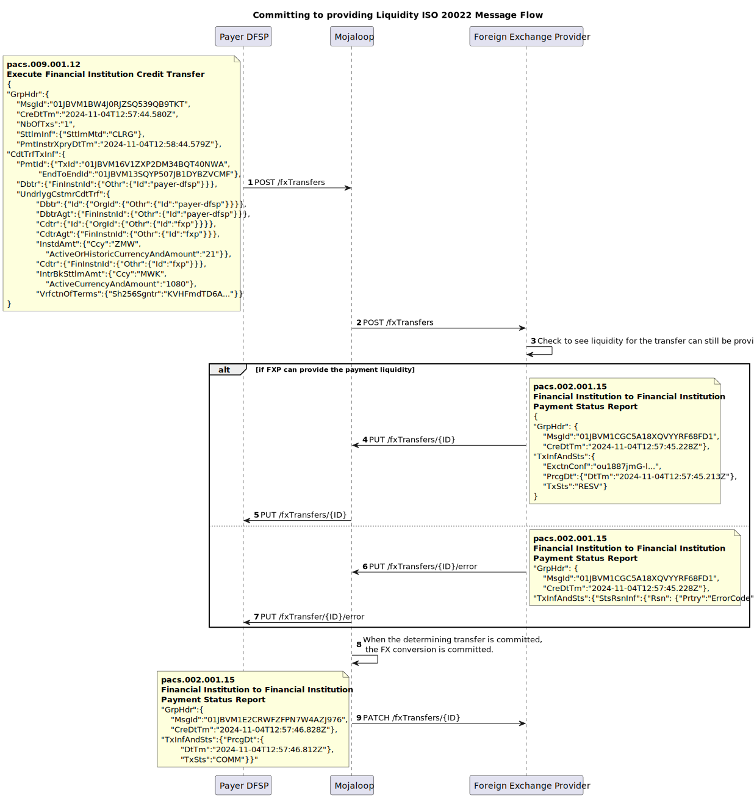
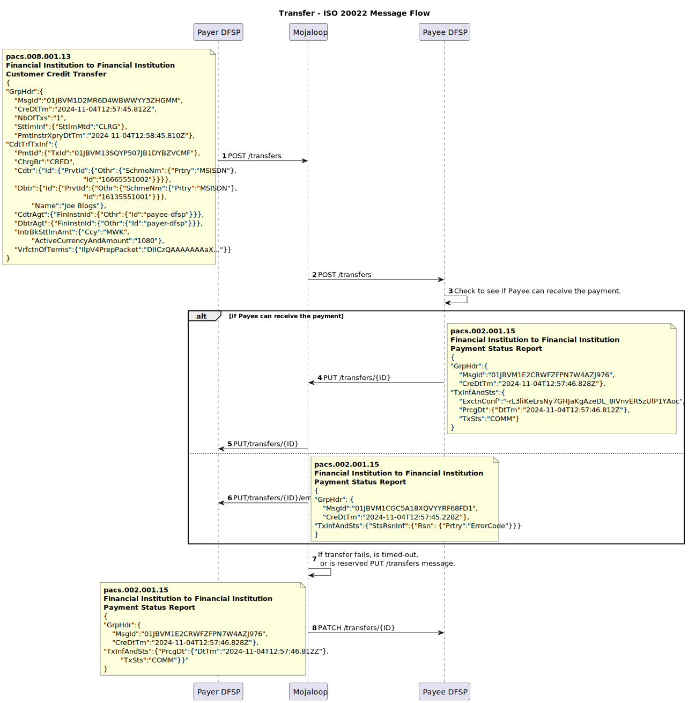

# Mojaloop ISO 20022 Market Practice Document
 
<!-- TOC depthfrom:1 depthto:3 orderedlist:true -->

- [1. Mojaloop ISO 20022 Market Practice Document](#1-mojaloop-iso-20022-market-practice-document)
- [2. Introduction](#2-introduction)
    - [2.1. How to Use This Document?](#21-how-to-use-this-document)
        - [2.1.1. Relationship with Scheme-Specific Rules Documents](#211-relationship-with-scheme-specific-rules-documents)
        - [2.1.2. Distinction Between Generic Practices and Scheme-Specific Requirements](#212-distinction-between-generic-practices-and-scheme-specific-requirements)
- [3. Message Expectations, Obligations, and Rules](#3-message-expectations-obligations-and-rules)
    - [3.1. Currency Conversion](#31-currency-conversion)
    - [3.2. JSON Messages](#32-json-messages)
    - [3.3. APIs](#33-apis)
    - [3.4. ULIDs as Unique Identifiers](#34-ulids-as-unique-identifiers)
    - [3.5. Inter-ledger Protocol v4 to represent the Cryptographic Terms](#35-inter-ledger-protocol-v4-to-represent-the-cryptographic-terms)
    - [3.6. ISO 20022 Supplementary Data Fields](#36-iso-20022-supplementary-data-fields)
- [4. Discovery Phase](#4-discovery-phase)
    - [4.1. Message flow](#41-message-flow)
    - [4.2. Parties Resource](#42-parties-resource)
- [5. Agreement Phase](#5-agreement-phase)
    - [5.1. Currency Conversion Agreement Sub-Phase](#51-currency-conversion-agreement-sub-phase)
        - [5.1.1. Message flow](#511-message-flow)
        - [5.1.2. fxQuotes Resource](#512-fxquotes-resource)
    - [5.2. Transfer Terms Agreement Sub-Phase](#52-transfer-terms-agreement-sub-phase)
        - [5.2.1. Message flow](#521-message-flow)
        - [5.2.2. Quotes Resource](#522-quotes-resource)
- [6. Transfer Phase](#6-transfer-phase)
    - [6.1. Accepting Currency Conversion terms](#61-accepting-currency-conversion-terms)
        - [6.1.1. Message flow](#611-message-flow)
        - [6.1.2. fxTransfers Resource](#612-fxtransfers-resource)
    - [6.2. Transfer Execution and Clearing](#62-transfer-execution-and-clearing)
        - [6.2.1. Message flow](#621-message-flow)
        - [6.2.2. Transfers Resource](#622-transfers-resource)

<!-- /TOC -->
  

# 2. Introduction

By combining the principles of financial inclusion with the robust capabilities of ISO 20022, Mojaloop ensures that DFSPs and other stakeholders can deliver real-time payment solutions that are cost-effective, secure, and scalable to meet the demands of inclusive financial ecosystems.

## 2.1 How to Use This Document?
This document provides a foundational reference for implementing ISO 20022 messaging for IIPS within Mojaloop-based schemes. It outlines general guidelines and practices that apply universally across Mojaloop schemes, focusing on the base-level requirements. However, it is designed to be supplemented by scheme-specific rules documents, which can define additional message fields, validations, and rules necessary to meet the unique regulations and requirements of individual schemes. This layered approach enables each scheme to tailor its implementation details while maintaining consistency with the broader Mojaloop framework.

### 2.1.1 Relationship with Scheme-Specific Rules Documents
This document serves as a foundation for understanding how ISO 20022 is applied in Mojaloop, focusing on core principles and practices. However, it does not prescribe the detailed business requirements, validations, and governance frameworks that are specific to individual schemes. Scheme-specific rules address these details, including mandatory and optional field specifications, tailored compliance protocols, and defined procedures for error handling. They also encompass business rules governing message flows, participant roles, and responsibilities within the scheme. The flexibility of this document allows scheme administrators to adapt and extend its guidance to meet their unique operational needs.

### 2.1.2 Distinction Between Generic Practices and Scheme-Specific Requirements
This document distinctly separates generic practices from scheme-specific requirements to achieve a balance between consistency and adaptability in ISO 20022 implementations within Mojaloop. The generic practices outlined here establish foundational principles, including expectations for message structures, required fields to meet switch requirements, supported fields, and transactional flows. Additionally, they provide a high-level overview of the Mojaloop P2P FX transfer lifecycle.

Scheme-specific requirements, documented separately, delve into additional field mappings, enhanced validations, and precise rules for settlement, reconciliation, and dispute resolution. These requirements also encompass governance policies and compliance obligations tailored to the unique needs of individual schemes.

This distinction enables DFSPs to implement a consistent core messaging framework while granting scheme administrators the flexibility to define operational specifics. The generic practices presented in this document are purposefully designed to be extensible, ensuring seamless integration with scheme-specific rules and supporting adherence to Mojaloop’s ISO 20022 for IIPS standards.

# 3 Message Expectations, Obligations, and Rules
The Mojaloop transfer process is divided into three key phases, each essential to ensuring secure and efficient transactions. These phases use specific resources to enable participant interactions, ensuring clear communication, agreement, and execution. While some phases and resources are optional, the ultimate goal is to ensure every transfer is accurate, secure, and aligns with agreed terms. 
1. [Discovery](#discovery-phase)
2. [Agreement](#agreement-phase)
3. [Transfer](#transfer-phase)

## 3.1 Currency Conversion
Currency conversion is included to support cross-currency transactions. As it is not always required, the associated messages and flows are only used when needed, ensuring flexibility for both single-currency and multi-currency scenarios.

## 3.2 JSON Messages
Mojaloop adopts a JSON variant of ISO 20022 messages, moving away from the traditional XML format to enhance efficiency and compatibility with modern APIs. The ISO 20022 organization is actively developing a canonical JSON representation of its messages, and Mojaloop aims to align with this standard as it evolves.

## 3.3 APIs
ISO 20022 messages are exchanged in Mojaloop via REST-like API calls. This approach enhances interoperability, reduces data overhead through lightweight JSON messages, and supports scalable and modular implementations. By integrating ISO 20022 with REST APIs, Mojaloop delivers a robust, adaptable framework that balances global standards with practical implementation needs. 

## 3.4 ULIDs as Unique Identifiers
Mojaloop employs Universally Unique Lexicographically Sortable Identifiers (ULIDs) as the standard for unique identifiers across its messaging system. ULIDs offer a robust alternative to traditional UUIDs, ensuring globally unique identifiers while also enabling natural ordering by time of creation. This lexicographical sorting simplifies traceability, troubleshooting, and operational analytics.

## 3.5 Inter-ledger Protocol (v4) to represent the Cryptographic Terms
Mojaloop leverages the Inter-ledger Protocol (ILP) version 4 to define and represent cryptographic terms in its transfer processes. ILP v4 provides a standardized framework for secure and interoperable exchange of payment instructions, ensuring integrity and non-repudiation of transactions. By integrating ILP's cryptographic capabilities, Mojaloop supports precise and tamper-proof agreements between participants, enabling secure end-to-end transfer execution while maintaining compatibility with global payment ecosystems.

## 3.6 ISO 20022 Supplementary Data Fields

It is not expected that ISO 20022 supplementary data fields will be required for any of the messages used. If supplementary data is provided, the switch will not reject the message; however, it will ignore its contents and behave as if the supplementary data was not present.

<div style="page-break-before:always"></div>

# 4. Discovery Phase
The Discovery Phase is an optional step in the transfer process, necessary only when the payee (end party) must be identified and confirmed before initiating an agreement. This phase utilizes the parties resource, which facilitates the retrieval and validation of the payee’s information to ensure they are eligible to receive the transfer. Key checks performed during this phase include verifying that the payee's account is active, identifying the currencies that can be transferred into the account, and confirming the account owner’s details. This information allows the payer to verify the payee's details accurately, reducing the risk of errors and ensuring a secure foundation for the subsequent phases of the transfer process.

## 4.1 Message flow

The sequence diagram shows the discovery example messages in a Payer initiated P2P transfer.


## 4.2 Parties Resource
The Parties resource provides all the necessary functionality in the discovery phase of a transfer. The functionality is always initiated with a GET /parties call, and responses to this are returned to the originator through a PUT /parties callback. Error messages are returned through the PUT /parties/.../error callback. These endpoints support an optional sub id type.


| Endpoint | Message |
|--- | --- |
|[GET /parties/{type}/{partyIdentifier}[/{subId}]](./script/parties_GET.md) |  |
|[PUT /parties/{type}/{partyIdentifier}[/{subId}]](./script/parties_PUT.md) | acmt.024.001.04 |
|[PUT /parties/{type}/{partyIdentifier}[/{subId}]/error](./script/parties_error_PUT.md) | acmt.024.001.04 |

<div style="page-break-before:always"></div>

# 5. Agreement Phase
The **Agreement Phase** is a critical step in the Mojaloop transfer process, ensuring that all parties involved have a shared understanding of the transfer terms before any funds are committed. This phase serves several essential purposes:
1. **Calculation and Agreement of Fees**<br>
The Agreement Phase provides an opportunity for the calculation and mutual agreement on any applicable fees. This ensures transparency and prevents disputes related to charges after the transfer is initiated.
1. **Pre-Commitment Validation**<br>
It allows each participating organization to verify whether the transfer can proceed. This step helps identify and address potential issues early, reducing errors during the transfer and minimizing reconciliation discrepancies.
1. **Cryptographic Signing of Terms**<br>
The terms of the transfer are cryptographically signed during this phase. This mechanism ensures non-repudiation, meaning that parties cannot deny their involvement in or agreement to the transaction.
1. **Promoting Financial Inclusion**<br>
By presenting all parties with the complete terms of the transfer upfront, the Agreement Phase ensures that participants are fully informed before making any commitments. This transparency supports financial inclusively by enabling fair and informed decision-making for all stakeholders.

The Agreement Phase not only improves the reliability and efficiency of Mojaloop transfers but also aligns with its broader goal of fostering trust and inclusively in digital financial ecosystems.

The agreement phase is further divided into two phases. 

## 5.1 Currency Conversion Agreement Sub-Phase
The Currency Conversion Agreement Sub-Phase is an optional step within the Agreement Phase, activated only when the transfer involves a currency conversion. During this sub-phase, the payer DFSP (Digital Financial Services Provider) coordinates with a foreign exchange (FX) provider to secure cross-currency liquidity required to complete the transaction. This step establishes the FX rates and associated fees, ensuring that both the DFSP and the FXP can rely on transparent and agreed-upon conversion terms. By addressing currency conversion needs before committing to the transfer, this sub-phase helps prevent delays and discrepancies, supporting a seamless cross-border transaction experience.

### 5.1.1 Message flow


The sequence diagram shows the discovery example messages in a Payer initiated P2P transfer.


### 5.1.2 fxQuotes Resource

| Endpoint | Message |
|--- | --- |
|[POST /fxQuotes/{ID}](./script/fxquotes_POST.md) | **pacs.091.001** |
|[PUT /fxQuotes/{ID}](./script/fxquotes_PUT.md) | **pacs.092.001** |
|[PUT /fxQuotes/{ID}/error](./script/fxquotes_error_PUT.md) | **pacs.002.001.15** |

## 5.2 Transfer Terms Agreement Sub-Phase
The End-to-End Terms Agreement Sub-Phase involves the collaborative establishment of the transfer terms between the payer DFSP and the payee DFSP. This process ensures both parties are aligned on critical details such as the amount to be transferred, fees, and timing requirements. This sub-phase also facilitates the cryptographic signing of these terms, providing a robust framework for non-repudiation and accountability. By finalizing the transfer terms in a transparent manner, this sub-phase minimizes the risk of errors or disputes, enhancing the efficiency and trustworthiness of the overall Mojaloop transfer process.

### 5.2.1 Message flow

The sequence diagram shows the discovery example messages in a Payer initiated P2P transfer.


### 5.2.2 Quotes Resource

| Endpoint | Message |
|--- | --- |
|[POST /quotes/{ID}](./script/quotes_POST.md) | **pacs.081.001** |
|[PUT /quotes/{ID}](./script/quotes_PUT.md) | **pacs.082.001** |
|[PUT /quotes/{ID}/error](./script/quotes_error_PUT.md) | **pacs.002.001.15** |

<div style="page-break-before:always"></div>

# 6. Transfer Phase
Once the agreements have been successfully established during the Agreement Phase, accepting these terms triggers the Transfer Phase, where the actual movement of funds occurs. This phase is executed with precision to ensure that the agreed terms are honored, and all participants fulfill their commitments. The Transfer Phase is divided into two sub-phases: the Currency Conversion Execution Sub-Phase and the Transfer Clearing Sub-Phase, each corresponding to its respective sub-phase in the Agreement Phase.

## 6.1 Accepting Currency Conversion terms
The Currency Conversion Execution Sub-Phase occurs if the transfer involves a currency exchange. In this step, the foreign exchange provider, as agreed during the Agreement Phase, executes the currency conversion. The liquidity required for the cross-currency transfer is provided, and the converted funds are prepared for onward movement to the payee DFSP. This sub-phase is an opportunity for the FXP to ensure that the FX rates and fees agreed upon earlier are adhered to, safeguarding the transaction's financial integrity and transparency.

### 6.1.1 Message flow


The sequence diagram shows the transfer example messages in a Payer initiated P2P transfer.


### 6.1.2 fxTransfers Resource

| Endpoint | Message |
|--- | --- |
|[POST /fxTransfers/{ID}](./script/fxtransfers_POST.md) | **pacs.009.001** |
|[PUT /fxTransfers/{ID}](./script/fxtransfers_PUT.md) | **pacs.002.001.15** |
|[PUT /fxTransfers/{ID}/error](./script/fxtransfers_error_PUT.md) | **pacs.002.001.15** |
|[PATCH /fxTransfers/{ID}/error](./script/fxtransfers_PATCH.md) | **pacs.002.001.15** |

## 6.2 Transfer Execution and Clearing 
The Funds Settlement Sub-Phase involves the actual transfer of funds between the payer DFSP and the payee DFSP. This step ensures that the amount agreed upon, including any associated fees, is accurately cleared in the appropriate accounts. This sub-phase completes the financial transaction, fulfilling the commitments made during the Agreement Phase. Through secure and efficient fund movement mechanisms, this sub-phase ensures that the transfer is completed smoothly and in compliance with the agreed terms.

### 6.2.1 Message flow


The sequence diagram shows the discovery example messages in a Payer initiated P2P transfer.


### 6.2.2 Transfers Resource

| Endpoint | Message |
|--- | --- |
|[POST /transfers/{ID}](./script/transfers_POST.md) | **pacs.008.001** |
|[PUT /transfers/{ID}](./script/quotes_PUT.md) | **pacs.002.001.15** |
|[PUT /transfers/{ID}/error](./script/quotes_error_PUT.md) | **pacs.002.001.15** |
|[PATCH /transfers/{ID}/error](./script/transfers_PATCH.md) | **pacs.002.001.15** |


# 7. API Message Details

## 7.1 GET /parties/{type}/{partyIdentifier}[/{subId}]
The GET /parties endpoint does not support or require a payload, and can be seen as an instruction to trigger an Account identification Verification report.
- **{type}** - Party identifier types<br>
The **{type}** refers to the classification of the party Identifier type. Each scheme only supports a limited number of these codes. The codes supported by the scheme may be derived from the ISO 20022 external organisation or personal identification codes, or they could be FSPIOP supported codes. The full list of supported codes is available in the [**Appendix A**](#appendix_A).
 - **partyIdentifier** <br>
 This is the party identifier of the party being represented and of the type specified by the {type} above.
 - **{subId}** <br>
 This represent a sub-identifier or sub-type for the party that some implementations require in order to ensure uniqueness of the identifier. 

 #### Supported HTTP Responses

| **HTTP Error Code** | **Description and Common Causes** |
|---|----|
|**400 Bad Request** | **Description**: The server could not understand the request due to invalid syntax. This response indicates that the request was malformed or contained invalid parameters.<br>**Common Causes**: Missing required fields, invalid field values, or incorrect request format. |
|**401 Unauthorized** | **Description**: The client must authenticate itself to get the requested response. This response indicates that the request lacks valid authentication credentials.<br>**Common Causes**: Missing or invalid authentication token. |
|**403 Forbidden** | **Description**: The client does not have access rights to the content. This response indicates that the server understood the request but refuses to authorize it.<br>**Common Causes**: Insufficient permissions to access the resource. |
|**404 Not Found** | **Description**: The server can not find the requested resource. This response indicates that the specified resource does not exist.<br>**Common Causes**: Incorrect resource identifier or the resource has been deleted. |
|**405 Method Not Allowed** | **Description**: The request method is known by the server but is not supported by the target resource. This response indicates that the HTTP method used is not allowed for the endpoint.<br>**Common Causes**: Using an unsupported HTTP method (e.g., POST instead of PUT). |
|**406 Not Acceptable** | **Description**: The server cannot produce a response matching the list of acceptable values defined in the request's proactive content negotiation headers. This response indicates that the server cannot generate a response that is acceptable according to the Accept headers sent in the request.<br>**Common Causes**: Unsupported media type or format specified in the Accept header. |
|**501 Not Implemented** | **Description**: The server does not support the functionality required to fulfill the request. This response indicates that the server does not recognize the request method or lacks the ability to fulfill the request.<br>**Common Causes**: The requested functionality is not implemented on the server. |
|**503 Service Unavailable** | **Description**: The server is not ready to handle the request. This response indicates that the server is temporarily unable to handle the request due to maintenance or overload.<br>**Common Causes**: Server maintenance, temporary overload, or server downtime. |

#### Common Error Payload

All error responses return a common payload structure that includes a specific message. The payload typically contains the following fields:

- **errorCode**: A code representing the specific error.
- **errorDescription**: A description of the error.
- **extensionList**: An optional list of key-value pairs providing additional information about the error.

This common error payload helps clients understand the nature of the error and take appropriate actions.

## 7.2 PUT /Parties/{type}/{partyIdentifier}[/{subId}]
|**Account Identification Verification Report - acmt.024.001.04**|
|--|

#### Context
*(DFSP -> DFSP)*

This is triggers as a callback response to the GET /parties call. The message is between DFSPs connected in the scheme and is a check that validates that the account represented is active.

Here is an example of the message:
``` json
{
"Assgnmt": {
    "MsgId": "01JBVM14S6SC453EY9XB9GXQB5",
    "CreDtTm": "2024-11-04T12:57:37.318Z",
    "Assgnr": { "Agt": { "FinInstnId": { "Othr": { "Id": "payee-dfps" }}}},
    "Assgne": { "Agt": { "FinInstnId": { "Othr": { "Id": "payer-dfsp" }}}}},
"Rpt": {
    "Vrfctn": true,
    "OrgnlId": "MSISDN/16665551002",
    "UpdtdPtyAndAcctId": {
        "Pty": {
            "Id": {"PrvtId": {"Othr": {"SchmeNm": {"Prtry": "MSISDN"},
                                               "Id": "16665551002"}}},
            "Nm": "Chikondi Banda"},
        "Agt": { "FinInstnId": { "Othr": { "Id": "payee-dfsp" }}},
        "Acct": { "Ccy": "MWK" }}}
}
```
#### Message Details
The details on how to compose and make this API are covered in the following sections:
1. [Core Data Elements](#header-details)<br>This section specifies which fields are required, which fields are optional, and which fields are unsupported in order to meet the message validating requirements.
2. [Header Details](#header-details)<br> This section specifies the header requirements for the API are specified.

#### Core Data Elements
Here are the core data elements that are needed to meet this market practice requirement.

**key**
| **key** | **Description** |
| --- | --- |
| <font color='black'>**required**<font> | These fields are required |
| <font color='darkgrey'>**optional**<font> | These fields are optional, and may be included if desired. |
| <font color='red'>**unsupported**<font> | These fields are not supported and must not be provided. |


| **ISO 20022 Field** | Data Model | **Description** |
| --- |--- | --- |
| <font color=black>  **Assgnmt** - IdentificationAssignment4</font> | <font color=black>[1..1]</font> | <font color=black></font> |
| <font color=black>&nbsp;&nbsp;&nbsp;&nbsp;  **MsgId** - MaxText</font> | <font color=black>[1..1]</font> | <font color=black>Specifies a character string with a maximum length of 35 characters.</font> |
| <font color=black>&nbsp;&nbsp;&nbsp;&nbsp;  **CreDtTm** - A particular point in the progression of time defined by a mandatory</font> | <font color=black>[1..1]</font> | <font color=black>date and a mandatory time component, expressed in either UTC time<br>format (YYYY-MM-DDThh:mm:ss.sssZ), local time with UTC offset format<br>(YYYY-MM-DDThh:mm:ss.sss+/-hh:mm), or local time format<br>(YYYY-MM-DDThh:mm:ss.sss). These representations are defined in<br>"XML Schema Part 2: Datatypes Second Edition -<br>W3C Recommendation 28 October 2004" which is aligned with ISO 8601.<br><br>Note on the time format:<br>1) beginning / end of calendar day<br>00:00:00 = the beginning of a calendar day<br>24:00:00 = the end of a calendar day<br><br>2) fractions of second in time format<br>Decimal fractions of seconds may be included. In this case, the<br>involved parties shall agree on the maximum number of digits that are allowed.<br></font> |
| <font color=red>&nbsp;&nbsp;&nbsp;&nbsp;  **Cretr** - Party50Choice</font> | <font color=red>[0..0]</font> | <font color=red></font> |
| <font color=red>&nbsp;&nbsp;&nbsp;&nbsp;  **FrstAgt** - BranchAndFinancialInstitutionIdentification</font> | <font color=red>[0..0]</font> | <font color=red>Unique and unambiguous identification of a financial institution or a branch of a financial institution.</font> |
| <font color=black>&nbsp;&nbsp;&nbsp;&nbsp;  **Assgnr** - Party50Choice</font> | <font color=black>[1..1]</font> | <font color=black></font> |
| <font color=black>&nbsp;&nbsp;&nbsp;&nbsp;  **Assgne** - Party50Choice</font> | <font color=black>[1..1]</font> | <font color=black></font> |
| <font color=red>  **OrgnlAssgnmt** - MessageIdentification8</font> | <font color=red>[0..0]</font> | <font color=red></font> |
| <font color=black>  **Rpt** - VerificationReport5</font> | <font color=black>[1..1]</font> | <font color=black></font> |
| <font color=black>&nbsp;&nbsp;&nbsp;&nbsp;  **OrgnlId** - MaxText</font> | <font color=black>[1..1]</font> | <font color=black>Specifies a character string with a maximum length of 35 characters.</font> |
| <font color=black>&nbsp;&nbsp;&nbsp;&nbsp;  **Vrfctn** - Definition: Identifies whether the party and/or account information received is correct.</font> | <font color=black>[1..1]</font> | <font color=black><br>• Meaning When True: Indicates that the identification information received is correct.<br>• Meaning When False: Indicates that the identification information received is incorrect<br></font> |
| <font color=darkgrey>&nbsp;&nbsp;&nbsp;&nbsp;  **Rsn** - Choice of format for the verification reason.</font> | <font color=darkgrey>[0..1]</font> | <font color=darkgrey>Only one, between the coded and the proprietary, can be chosen.<br></font> |
| <font color=darkgrey>&nbsp;&nbsp;&nbsp;&nbsp;  **OrgnlPtyAndAcctId** - IdentificationInformation5</font> | <font color=darkgrey>[0..1]</font> | <font color=darkgrey></font> |
| <font color=darkgrey>&nbsp;&nbsp;&nbsp;&nbsp;&nbsp;&nbsp;&nbsp;&nbsp;  **Pty** - PartyIdentification</font> | <font color=darkgrey>[0..1]</font> | <font color=darkgrey>Specifies the identification of a person or an organisation.</font> |
| <font color=darkgrey>&nbsp;&nbsp;&nbsp;&nbsp;&nbsp;&nbsp;&nbsp;&nbsp;&nbsp;&nbsp;&nbsp;&nbsp;  **Nm** - MaxText</font> | <font color=darkgrey>[0..1]</font> | <font color=darkgrey>Specifies a character string with a maximum length of 140 characters.</font> |
| <font color=darkgrey>&nbsp;&nbsp;&nbsp;&nbsp;&nbsp;&nbsp;&nbsp;&nbsp;&nbsp;&nbsp;&nbsp;&nbsp;  **PstlAdr** - PostalAddress</font> | <font color=darkgrey>[0..1]</font> | <font color=darkgrey>Information that locates and identifies a specific address, as defined by postal services.</font> |
| <font color=darkgrey>&nbsp;&nbsp;&nbsp;&nbsp;&nbsp;&nbsp;&nbsp;&nbsp;&nbsp;&nbsp;&nbsp;&nbsp;&nbsp;&nbsp;&nbsp;&nbsp;  **AdrTp** - AddressTypeChoice</font> | <font color=darkgrey>[0..1]</font> | <font color=darkgrey>Choice of formats for the type of address.</font> |
| <font color=red>&nbsp;&nbsp;&nbsp;&nbsp;&nbsp;&nbsp;&nbsp;&nbsp;&nbsp;&nbsp;&nbsp;&nbsp;&nbsp;&nbsp;&nbsp;&nbsp;  **CareOf** - MaxText</font> | <font color=red>[0..0]</font> | <font color=red>Specifies a character string with a maximum length of 140 characters.</font> |
| <font color=darkgrey>&nbsp;&nbsp;&nbsp;&nbsp;&nbsp;&nbsp;&nbsp;&nbsp;&nbsp;&nbsp;&nbsp;&nbsp;&nbsp;&nbsp;&nbsp;&nbsp;  **Dept** - MaxText</font> | <font color=darkgrey>[0..1]</font> | <font color=darkgrey>Specifies a character string with a maximum length of 70 characters.</font> |
| <font color=darkgrey>&nbsp;&nbsp;&nbsp;&nbsp;&nbsp;&nbsp;&nbsp;&nbsp;&nbsp;&nbsp;&nbsp;&nbsp;&nbsp;&nbsp;&nbsp;&nbsp;  **SubDept** - MaxText</font> | <font color=darkgrey>[0..1]</font> | <font color=darkgrey>Specifies a character string with a maximum length of 70 characters.</font> |
| <font color=darkgrey>&nbsp;&nbsp;&nbsp;&nbsp;&nbsp;&nbsp;&nbsp;&nbsp;&nbsp;&nbsp;&nbsp;&nbsp;&nbsp;&nbsp;&nbsp;&nbsp;  **StrtNm** - MaxText</font> | <font color=darkgrey>[0..1]</font> | <font color=darkgrey>Specifies a character string with a maximum length of 140 characters.</font> |
| <font color=darkgrey>&nbsp;&nbsp;&nbsp;&nbsp;&nbsp;&nbsp;&nbsp;&nbsp;&nbsp;&nbsp;&nbsp;&nbsp;&nbsp;&nbsp;&nbsp;&nbsp;  **BldgNb** - MaxText</font> | <font color=darkgrey>[0..1]</font> | <font color=darkgrey>Specifies a character string with a maximum length of 16 characters.</font> |
| <font color=darkgrey>&nbsp;&nbsp;&nbsp;&nbsp;&nbsp;&nbsp;&nbsp;&nbsp;&nbsp;&nbsp;&nbsp;&nbsp;&nbsp;&nbsp;&nbsp;&nbsp;  **BldgNm** - MaxText</font> | <font color=darkgrey>[0..1]</font> | <font color=darkgrey>Specifies a character string with a maximum length of 140 characters.</font> |
| <font color=darkgrey>&nbsp;&nbsp;&nbsp;&nbsp;&nbsp;&nbsp;&nbsp;&nbsp;&nbsp;&nbsp;&nbsp;&nbsp;&nbsp;&nbsp;&nbsp;&nbsp;  **Flr** - MaxText</font> | <font color=darkgrey>[0..1]</font> | <font color=darkgrey>Specifies a character string with a maximum length of 70 characters.</font> |
| <font color=red>&nbsp;&nbsp;&nbsp;&nbsp;&nbsp;&nbsp;&nbsp;&nbsp;&nbsp;&nbsp;&nbsp;&nbsp;&nbsp;&nbsp;&nbsp;&nbsp;  **UnitNb** - MaxText</font> | <font color=red>[0..0]</font> | <font color=red>Specifies a character string with a maximum length of 16 characters.</font> |
| <font color=darkgrey>&nbsp;&nbsp;&nbsp;&nbsp;&nbsp;&nbsp;&nbsp;&nbsp;&nbsp;&nbsp;&nbsp;&nbsp;&nbsp;&nbsp;&nbsp;&nbsp;  **PstBx** - MaxText</font> | <font color=darkgrey>[0..1]</font> | <font color=darkgrey>Specifies a character string with a maximum length of 16 characters.</font> |
| <font color=darkgrey>&nbsp;&nbsp;&nbsp;&nbsp;&nbsp;&nbsp;&nbsp;&nbsp;&nbsp;&nbsp;&nbsp;&nbsp;&nbsp;&nbsp;&nbsp;&nbsp;  **Room** - MaxText</font> | <font color=darkgrey>[0..1]</font> | <font color=darkgrey>Specifies a character string with a maximum length of 70 characters.</font> |
| <font color=darkgrey>&nbsp;&nbsp;&nbsp;&nbsp;&nbsp;&nbsp;&nbsp;&nbsp;&nbsp;&nbsp;&nbsp;&nbsp;&nbsp;&nbsp;&nbsp;&nbsp;  **PstCd** - MaxText</font> | <font color=darkgrey>[0..1]</font> | <font color=darkgrey>Specifies a character string with a maximum length of 16 characters.</font> |
| <font color=darkgrey>&nbsp;&nbsp;&nbsp;&nbsp;&nbsp;&nbsp;&nbsp;&nbsp;&nbsp;&nbsp;&nbsp;&nbsp;&nbsp;&nbsp;&nbsp;&nbsp;  **TwnNm** - MaxText</font> | <font color=darkgrey>[0..1]</font> | <font color=darkgrey>Specifies a character string with a maximum length of 140 characters.</font> |
| <font color=darkgrey>&nbsp;&nbsp;&nbsp;&nbsp;&nbsp;&nbsp;&nbsp;&nbsp;&nbsp;&nbsp;&nbsp;&nbsp;&nbsp;&nbsp;&nbsp;&nbsp;  **TwnLctnNm** - MaxText</font> | <font color=darkgrey>[0..1]</font> | <font color=darkgrey>Specifies a character string with a maximum length of 140 characters.</font> |
| <font color=darkgrey>&nbsp;&nbsp;&nbsp;&nbsp;&nbsp;&nbsp;&nbsp;&nbsp;&nbsp;&nbsp;&nbsp;&nbsp;&nbsp;&nbsp;&nbsp;&nbsp;  **DstrctNm** - MaxText</font> | <font color=darkgrey>[0..1]</font> | <font color=darkgrey>Specifies a character string with a maximum length of 140 characters.</font> |
| <font color=darkgrey>&nbsp;&nbsp;&nbsp;&nbsp;&nbsp;&nbsp;&nbsp;&nbsp;&nbsp;&nbsp;&nbsp;&nbsp;&nbsp;&nbsp;&nbsp;&nbsp;  **CtrySubDvsn** - MaxText</font> | <font color=darkgrey>[0..1]</font> | <font color=darkgrey>Specifies a character string with a maximum length of 35 characters.</font> |
| <font color=darkgrey>&nbsp;&nbsp;&nbsp;&nbsp;&nbsp;&nbsp;&nbsp;&nbsp;&nbsp;&nbsp;&nbsp;&nbsp;&nbsp;&nbsp;&nbsp;&nbsp;  **Ctry** - CountryCode</font> | <font color=darkgrey>[0..1]</font> | <font color=darkgrey>Code to identify a country, a dependency, or another area of particular geopolitical interest, on the basis of country names obtained from the United Nations (ISO 3166, Alpha-2 code).</font> |
| <font color=darkgrey>&nbsp;&nbsp;&nbsp;&nbsp;&nbsp;&nbsp;&nbsp;&nbsp;&nbsp;&nbsp;&nbsp;&nbsp;&nbsp;&nbsp;&nbsp;&nbsp;  **AdrLine** - MaxText</font> | <font color=darkgrey>[0..1]</font> | <font color=darkgrey>Specifies a character string with a maximum length of 70 characters.</font> |
| <font color=darkgrey>&nbsp;&nbsp;&nbsp;&nbsp;&nbsp;&nbsp;&nbsp;&nbsp;&nbsp;&nbsp;&nbsp;&nbsp;  **Id** - PartyChoice</font> | <font color=darkgrey>[0..1]</font> | <font color=darkgrey>NOTE: Unsure on the description.</font> |
| <font color=darkgrey>&nbsp;&nbsp;&nbsp;&nbsp;&nbsp;&nbsp;&nbsp;&nbsp;&nbsp;&nbsp;&nbsp;&nbsp;  **CtryOfRes** - CountryCode</font> | <font color=darkgrey>[0..1]</font> | <font color=darkgrey>Code to identify a country, a dependency, or another area of particular geopolitical interest, on the basis of country names obtained from the United Nations (ISO 3166, Alpha-2 code).</font> |
| <font color=darkgrey>&nbsp;&nbsp;&nbsp;&nbsp;&nbsp;&nbsp;&nbsp;&nbsp;&nbsp;&nbsp;&nbsp;&nbsp;  **CtctDtls** - Contact</font> | <font color=darkgrey>[0..1]</font> | <font color=darkgrey>Specifies the details of the contact person.</font> |
| <font color=darkgrey>&nbsp;&nbsp;&nbsp;&nbsp;&nbsp;&nbsp;&nbsp;&nbsp;&nbsp;&nbsp;&nbsp;&nbsp;&nbsp;&nbsp;&nbsp;&nbsp;  **NmPrfx** - Specifies the terms used to formally address a person.</font> | <font color=darkgrey>[0..1]</font> | <font color=darkgrey><br>DOCT: Doctor or Dr<br>MADM: Madam<br>MISS: Miss<br>MIST: Mistress<br>MIKS: Mx<br></font> |
| <font color=darkgrey>&nbsp;&nbsp;&nbsp;&nbsp;&nbsp;&nbsp;&nbsp;&nbsp;&nbsp;&nbsp;&nbsp;&nbsp;&nbsp;&nbsp;&nbsp;&nbsp;  **Nm** - MaxText</font> | <font color=darkgrey>[0..1]</font> | <font color=darkgrey>Specifies a character string with a maximum length of 140 characters.</font> |
| <font color=darkgrey>&nbsp;&nbsp;&nbsp;&nbsp;&nbsp;&nbsp;&nbsp;&nbsp;&nbsp;&nbsp;&nbsp;&nbsp;&nbsp;&nbsp;&nbsp;&nbsp;  **PhneNb** - PhoneNumber</font> | <font color=darkgrey>[0..1]</font> | <font color=darkgrey>Double check this regex.</font> |
| <font color=darkgrey>&nbsp;&nbsp;&nbsp;&nbsp;&nbsp;&nbsp;&nbsp;&nbsp;&nbsp;&nbsp;&nbsp;&nbsp;&nbsp;&nbsp;&nbsp;&nbsp;  **MobNb** - PhoneNumber</font> | <font color=darkgrey>[0..1]</font> | <font color=darkgrey>Double check this regex.</font> |
| <font color=darkgrey>&nbsp;&nbsp;&nbsp;&nbsp;&nbsp;&nbsp;&nbsp;&nbsp;&nbsp;&nbsp;&nbsp;&nbsp;&nbsp;&nbsp;&nbsp;&nbsp;  **FaxNb** - PhoneNumber</font> | <font color=darkgrey>[0..1]</font> | <font color=darkgrey>Double check this regex.</font> |
| <font color=red>&nbsp;&nbsp;&nbsp;&nbsp;&nbsp;&nbsp;&nbsp;&nbsp;&nbsp;&nbsp;&nbsp;&nbsp;&nbsp;&nbsp;&nbsp;&nbsp;  **URLAdr** - MaxText</font> | <font color=red>[0..0]</font> | <font color=red>Specifies a character string with a maximum length of 2048 characters.</font> |
| <font color=darkgrey>&nbsp;&nbsp;&nbsp;&nbsp;&nbsp;&nbsp;&nbsp;&nbsp;&nbsp;&nbsp;&nbsp;&nbsp;&nbsp;&nbsp;&nbsp;&nbsp;  **EmailAdr** - MaxText</font> | <font color=darkgrey>[0..1]</font> | <font color=darkgrey>Specifies a character string with a maximum length of 256 characters.</font> |
| <font color=darkgrey>&nbsp;&nbsp;&nbsp;&nbsp;&nbsp;&nbsp;&nbsp;&nbsp;&nbsp;&nbsp;&nbsp;&nbsp;&nbsp;&nbsp;&nbsp;&nbsp;  **EmailPurp** - MaxText</font> | <font color=darkgrey>[0..1]</font> | <font color=darkgrey>Specifies a character string with a maximum length of 35 characters.</font> |
| <font color=darkgrey>&nbsp;&nbsp;&nbsp;&nbsp;&nbsp;&nbsp;&nbsp;&nbsp;&nbsp;&nbsp;&nbsp;&nbsp;&nbsp;&nbsp;&nbsp;&nbsp;  **JobTitl** - MaxText</font> | <font color=darkgrey>[0..1]</font> | <font color=darkgrey>Specifies a character string with a maximum length of 35 characters.</font> |
| <font color=darkgrey>&nbsp;&nbsp;&nbsp;&nbsp;&nbsp;&nbsp;&nbsp;&nbsp;&nbsp;&nbsp;&nbsp;&nbsp;&nbsp;&nbsp;&nbsp;&nbsp;  **Rspnsblty** - MaxText</font> | <font color=darkgrey>[0..1]</font> | <font color=darkgrey>Specifies a character string with a maximum length of 35 characters.</font> |
| <font color=darkgrey>&nbsp;&nbsp;&nbsp;&nbsp;&nbsp;&nbsp;&nbsp;&nbsp;&nbsp;&nbsp;&nbsp;&nbsp;&nbsp;&nbsp;&nbsp;&nbsp;  **Dept** - MaxText</font> | <font color=darkgrey>[0..1]</font> | <font color=darkgrey>Specifies a character string with a maximum length of 70 characters.</font> |
| <font color=darkgrey>&nbsp;&nbsp;&nbsp;&nbsp;&nbsp;&nbsp;&nbsp;&nbsp;&nbsp;&nbsp;&nbsp;&nbsp;&nbsp;&nbsp;&nbsp;&nbsp;  **Othr** - OtherContact</font> | <font color=darkgrey>[0..1]</font> | <font color=darkgrey>Communication device number or electronic address used for communication.</font> |
| <font color=darkgrey>&nbsp;&nbsp;&nbsp;&nbsp;&nbsp;&nbsp;&nbsp;&nbsp;&nbsp;&nbsp;&nbsp;&nbsp;&nbsp;&nbsp;&nbsp;&nbsp;&nbsp;&nbsp;&nbsp;&nbsp;  **ChanlTp** - MaxText</font> | <font color=darkgrey>[0..1]</font> | <font color=darkgrey>Specifies a character string with a maximum length of 4 characters.</font> |
| <font color=darkgrey>&nbsp;&nbsp;&nbsp;&nbsp;&nbsp;&nbsp;&nbsp;&nbsp;&nbsp;&nbsp;&nbsp;&nbsp;&nbsp;&nbsp;&nbsp;&nbsp;&nbsp;&nbsp;&nbsp;&nbsp;  **Id** - MaxText</font> | <font color=darkgrey>[0..1]</font> | <font color=darkgrey>Specifies a character string with a maximum length of 128 characters.</font> |
| <font color=darkgrey>&nbsp;&nbsp;&nbsp;&nbsp;&nbsp;&nbsp;&nbsp;&nbsp;&nbsp;&nbsp;&nbsp;&nbsp;&nbsp;&nbsp;&nbsp;&nbsp;  **PrefrdMtd** - Preferred method used to reach the individual contact within an organisation.</font> | <font color=darkgrey>[0..1]</font> | <font color=darkgrey>LETT: Letter<br>MAIL: Email<br>PHON: Phone<br>FAXX: Fax<br>CELL: Mobile phone<br></font> |
| <font color=darkgrey>&nbsp;&nbsp;&nbsp;&nbsp;&nbsp;&nbsp;&nbsp;&nbsp;  **Acct** - CashAccount</font> | <font color=darkgrey>[0..1]</font> | <font color=darkgrey>Provides the details to identify an account.</font> |
| <font color=darkgrey>&nbsp;&nbsp;&nbsp;&nbsp;&nbsp;&nbsp;&nbsp;&nbsp;&nbsp;&nbsp;&nbsp;&nbsp;  **Id** - AccountIdentificationChoice</font> | <font color=darkgrey>[0..1]</font> | <font color=darkgrey>Specifies the unique identification of an account as assigned by the account servicer.</font> |
| <font color=darkgrey>&nbsp;&nbsp;&nbsp;&nbsp;&nbsp;&nbsp;&nbsp;&nbsp;&nbsp;&nbsp;&nbsp;&nbsp;  **Tp** - CashAccountTypeChoice</font> | <font color=darkgrey>[0..1]</font> | <font color=darkgrey>Specifies the nature, or use of the account.</font> |
| <font color=darkgrey>&nbsp;&nbsp;&nbsp;&nbsp;&nbsp;&nbsp;&nbsp;&nbsp;&nbsp;&nbsp;&nbsp;&nbsp;  **Ccy** - A code allocated to a currency by a Maintenance Agency under an international identification scheme, as described in the latest edition of the international standard ISO 4217 "Codes for the representation of currencies and funds".</font> | <font color=darkgrey>[0..1]</font> | <font color=darkgrey>NOTE: This has been modified away from the original ISO20022 pattern to enums.<br></font> |
| <font color=darkgrey>&nbsp;&nbsp;&nbsp;&nbsp;&nbsp;&nbsp;&nbsp;&nbsp;&nbsp;&nbsp;&nbsp;&nbsp;  **Nm** - MaxText</font> | <font color=darkgrey>[0..1]</font> | <font color=darkgrey>Specifies a character string with a maximum length of 70 characters.</font> |
| <font color=darkgrey>&nbsp;&nbsp;&nbsp;&nbsp;&nbsp;&nbsp;&nbsp;&nbsp;&nbsp;&nbsp;&nbsp;&nbsp;  **Prxy** - ProxyAccountIdentification</font> | <font color=darkgrey>[0..1]</font> | <font color=darkgrey>Information related to a proxy identification of the account.</font> |
| <font color=darkgrey>&nbsp;&nbsp;&nbsp;&nbsp;&nbsp;&nbsp;&nbsp;&nbsp;&nbsp;&nbsp;&nbsp;&nbsp;&nbsp;&nbsp;&nbsp;&nbsp;  **Tp** - ProxyAccountTypeChoice</font> | <font color=darkgrey>[0..1]</font> | <font color=darkgrey>Specifies the type of the proxy account.</font> |
| <font color=darkgrey>&nbsp;&nbsp;&nbsp;&nbsp;&nbsp;&nbsp;&nbsp;&nbsp;&nbsp;&nbsp;&nbsp;&nbsp;&nbsp;&nbsp;&nbsp;&nbsp;  **Id** - MaxText</font> | <font color=darkgrey>[0..1]</font> | <font color=darkgrey>Specifies a character string with a maximum length of 2048 characters.</font> |
| <font color=darkgrey>&nbsp;&nbsp;&nbsp;&nbsp;&nbsp;&nbsp;&nbsp;&nbsp;  **Agt** - BranchAndFinancialInstitutionIdentification</font> | <font color=darkgrey>[0..1]</font> | <font color=darkgrey>Unique and unambiguous identification of a financial institution or a branch of a financial institution.</font> |
| <font color=darkgrey>&nbsp;&nbsp;&nbsp;&nbsp;&nbsp;&nbsp;&nbsp;&nbsp;&nbsp;&nbsp;&nbsp;&nbsp;  **FinInstnId** - FinancialInstitutionIdentification</font> | <font color=darkgrey>[0..1]</font> | <font color=darkgrey>Information used to identify a financial institution.</font> |
| <font color=darkgrey>&nbsp;&nbsp;&nbsp;&nbsp;&nbsp;&nbsp;&nbsp;&nbsp;&nbsp;&nbsp;&nbsp;&nbsp;&nbsp;&nbsp;&nbsp;&nbsp;  **BICFI** - Code allocated to a financial institution by the ISO 9362 Registration</font> | <font color=darkgrey>[0..1]</font> | <font color=darkgrey><br>Authority as described in ISO 9362: 2014<br><br>- "Banking - Banking telecommunication messages - Business identifier code (BIC)".<br></font> |
| <font color=darkgrey>&nbsp;&nbsp;&nbsp;&nbsp;&nbsp;&nbsp;&nbsp;&nbsp;&nbsp;&nbsp;&nbsp;&nbsp;&nbsp;&nbsp;&nbsp;&nbsp;  **ClrSysMmbId** - ClearingSystemMemberIdentification</font> | <font color=darkgrey>[0..1]</font> | <font color=darkgrey>Unique identification, as assigned by a clearing system, to unambiguously identify a member of the clearing system.</font> |
| <font color=darkgrey>&nbsp;&nbsp;&nbsp;&nbsp;&nbsp;&nbsp;&nbsp;&nbsp;&nbsp;&nbsp;&nbsp;&nbsp;&nbsp;&nbsp;&nbsp;&nbsp;&nbsp;&nbsp;&nbsp;&nbsp;  **ClrSysId** - ClearingSystemIdentificationChoice</font> | <font color=darkgrey>[0..1]</font> | <font color=darkgrey>Specifies the clearing system identification.</font> |
| <font color=darkgrey>&nbsp;&nbsp;&nbsp;&nbsp;&nbsp;&nbsp;&nbsp;&nbsp;&nbsp;&nbsp;&nbsp;&nbsp;&nbsp;&nbsp;&nbsp;&nbsp;&nbsp;&nbsp;&nbsp;&nbsp;  **MmbId** - MaxText</font> | <font color=darkgrey>[0..1]</font> | <font color=darkgrey>Specifies a character string with a maximum length of 35 characters.</font> |
| <font color=darkgrey>&nbsp;&nbsp;&nbsp;&nbsp;&nbsp;&nbsp;&nbsp;&nbsp;&nbsp;&nbsp;&nbsp;&nbsp;&nbsp;&nbsp;&nbsp;&nbsp;  **LEI** - LEIIdentifier</font> | <font color=darkgrey>[0..1]</font> | <font color=darkgrey>Legal Entity Identifier is a code allocated to a party as described in ISO 17442 "Financial Services - Legal Entity Identifier (LEI)". ^([0-9A-Z]{18,18}[0-9]{2,2})$</font> |
| <font color=darkgrey>&nbsp;&nbsp;&nbsp;&nbsp;&nbsp;&nbsp;&nbsp;&nbsp;&nbsp;&nbsp;&nbsp;&nbsp;&nbsp;&nbsp;&nbsp;&nbsp;  **Nm** - MaxText</font> | <font color=darkgrey>[0..1]</font> | <font color=darkgrey>Specifies a character string with a maximum length of 140 characters.</font> |
| <font color=darkgrey>&nbsp;&nbsp;&nbsp;&nbsp;&nbsp;&nbsp;&nbsp;&nbsp;&nbsp;&nbsp;&nbsp;&nbsp;&nbsp;&nbsp;&nbsp;&nbsp;  **PstlAdr** - PostalAddress</font> | <font color=darkgrey>[0..1]</font> | <font color=darkgrey>Information that locates and identifies a specific address, as defined by postal services.</font> |
| <font color=darkgrey>&nbsp;&nbsp;&nbsp;&nbsp;&nbsp;&nbsp;&nbsp;&nbsp;&nbsp;&nbsp;&nbsp;&nbsp;&nbsp;&nbsp;&nbsp;&nbsp;&nbsp;&nbsp;&nbsp;&nbsp;  **AdrTp** - AddressTypeChoice</font> | <font color=darkgrey>[0..1]</font> | <font color=darkgrey>Choice of formats for the type of address.</font> |
| <font color=red>&nbsp;&nbsp;&nbsp;&nbsp;&nbsp;&nbsp;&nbsp;&nbsp;&nbsp;&nbsp;&nbsp;&nbsp;&nbsp;&nbsp;&nbsp;&nbsp;&nbsp;&nbsp;&nbsp;&nbsp;  **CareOf** - MaxText</font> | <font color=red>[0..0]</font> | <font color=red>Specifies a character string with a maximum length of 140 characters.</font> |
| <font color=darkgrey>&nbsp;&nbsp;&nbsp;&nbsp;&nbsp;&nbsp;&nbsp;&nbsp;&nbsp;&nbsp;&nbsp;&nbsp;&nbsp;&nbsp;&nbsp;&nbsp;&nbsp;&nbsp;&nbsp;&nbsp;  **Dept** - MaxText</font> | <font color=darkgrey>[0..1]</font> | <font color=darkgrey>Specifies a character string with a maximum length of 70 characters.</font> |
| <font color=darkgrey>&nbsp;&nbsp;&nbsp;&nbsp;&nbsp;&nbsp;&nbsp;&nbsp;&nbsp;&nbsp;&nbsp;&nbsp;&nbsp;&nbsp;&nbsp;&nbsp;&nbsp;&nbsp;&nbsp;&nbsp;  **SubDept** - MaxText</font> | <font color=darkgrey>[0..1]</font> | <font color=darkgrey>Specifies a character string with a maximum length of 70 characters.</font> |
| <font color=darkgrey>&nbsp;&nbsp;&nbsp;&nbsp;&nbsp;&nbsp;&nbsp;&nbsp;&nbsp;&nbsp;&nbsp;&nbsp;&nbsp;&nbsp;&nbsp;&nbsp;&nbsp;&nbsp;&nbsp;&nbsp;  **StrtNm** - MaxText</font> | <font color=darkgrey>[0..1]</font> | <font color=darkgrey>Specifies a character string with a maximum length of 140 characters.</font> |
| <font color=darkgrey>&nbsp;&nbsp;&nbsp;&nbsp;&nbsp;&nbsp;&nbsp;&nbsp;&nbsp;&nbsp;&nbsp;&nbsp;&nbsp;&nbsp;&nbsp;&nbsp;&nbsp;&nbsp;&nbsp;&nbsp;  **BldgNb** - MaxText</font> | <font color=darkgrey>[0..1]</font> | <font color=darkgrey>Specifies a character string with a maximum length of 16 characters.</font> |
| <font color=darkgrey>&nbsp;&nbsp;&nbsp;&nbsp;&nbsp;&nbsp;&nbsp;&nbsp;&nbsp;&nbsp;&nbsp;&nbsp;&nbsp;&nbsp;&nbsp;&nbsp;&nbsp;&nbsp;&nbsp;&nbsp;  **BldgNm** - MaxText</font> | <font color=darkgrey>[0..1]</font> | <font color=darkgrey>Specifies a character string with a maximum length of 140 characters.</font> |
| <font color=darkgrey>&nbsp;&nbsp;&nbsp;&nbsp;&nbsp;&nbsp;&nbsp;&nbsp;&nbsp;&nbsp;&nbsp;&nbsp;&nbsp;&nbsp;&nbsp;&nbsp;&nbsp;&nbsp;&nbsp;&nbsp;  **Flr** - MaxText</font> | <font color=darkgrey>[0..1]</font> | <font color=darkgrey>Specifies a character string with a maximum length of 70 characters.</font> |
| <font color=red>&nbsp;&nbsp;&nbsp;&nbsp;&nbsp;&nbsp;&nbsp;&nbsp;&nbsp;&nbsp;&nbsp;&nbsp;&nbsp;&nbsp;&nbsp;&nbsp;&nbsp;&nbsp;&nbsp;&nbsp;  **UnitNb** - MaxText</font> | <font color=red>[0..0]</font> | <font color=red>Specifies a character string with a maximum length of 16 characters.</font> |
| <font color=darkgrey>&nbsp;&nbsp;&nbsp;&nbsp;&nbsp;&nbsp;&nbsp;&nbsp;&nbsp;&nbsp;&nbsp;&nbsp;&nbsp;&nbsp;&nbsp;&nbsp;&nbsp;&nbsp;&nbsp;&nbsp;  **PstBx** - MaxText</font> | <font color=darkgrey>[0..1]</font> | <font color=darkgrey>Specifies a character string with a maximum length of 16 characters.</font> |
| <font color=darkgrey>&nbsp;&nbsp;&nbsp;&nbsp;&nbsp;&nbsp;&nbsp;&nbsp;&nbsp;&nbsp;&nbsp;&nbsp;&nbsp;&nbsp;&nbsp;&nbsp;&nbsp;&nbsp;&nbsp;&nbsp;  **Room** - MaxText</font> | <font color=darkgrey>[0..1]</font> | <font color=darkgrey>Specifies a character string with a maximum length of 70 characters.</font> |
| <font color=darkgrey>&nbsp;&nbsp;&nbsp;&nbsp;&nbsp;&nbsp;&nbsp;&nbsp;&nbsp;&nbsp;&nbsp;&nbsp;&nbsp;&nbsp;&nbsp;&nbsp;&nbsp;&nbsp;&nbsp;&nbsp;  **PstCd** - MaxText</font> | <font color=darkgrey>[0..1]</font> | <font color=darkgrey>Specifies a character string with a maximum length of 16 characters.</font> |
| <font color=darkgrey>&nbsp;&nbsp;&nbsp;&nbsp;&nbsp;&nbsp;&nbsp;&nbsp;&nbsp;&nbsp;&nbsp;&nbsp;&nbsp;&nbsp;&nbsp;&nbsp;&nbsp;&nbsp;&nbsp;&nbsp;  **TwnNm** - MaxText</font> | <font color=darkgrey>[0..1]</font> | <font color=darkgrey>Specifies a character string with a maximum length of 140 characters.</font> |
| <font color=darkgrey>&nbsp;&nbsp;&nbsp;&nbsp;&nbsp;&nbsp;&nbsp;&nbsp;&nbsp;&nbsp;&nbsp;&nbsp;&nbsp;&nbsp;&nbsp;&nbsp;&nbsp;&nbsp;&nbsp;&nbsp;  **TwnLctnNm** - MaxText</font> | <font color=darkgrey>[0..1]</font> | <font color=darkgrey>Specifies a character string with a maximum length of 140 characters.</font> |
| <font color=darkgrey>&nbsp;&nbsp;&nbsp;&nbsp;&nbsp;&nbsp;&nbsp;&nbsp;&nbsp;&nbsp;&nbsp;&nbsp;&nbsp;&nbsp;&nbsp;&nbsp;&nbsp;&nbsp;&nbsp;&nbsp;  **DstrctNm** - MaxText</font> | <font color=darkgrey>[0..1]</font> | <font color=darkgrey>Specifies a character string with a maximum length of 140 characters.</font> |
| <font color=darkgrey>&nbsp;&nbsp;&nbsp;&nbsp;&nbsp;&nbsp;&nbsp;&nbsp;&nbsp;&nbsp;&nbsp;&nbsp;&nbsp;&nbsp;&nbsp;&nbsp;&nbsp;&nbsp;&nbsp;&nbsp;  **CtrySubDvsn** - MaxText</font> | <font color=darkgrey>[0..1]</font> | <font color=darkgrey>Specifies a character string with a maximum length of 35 characters.</font> |
| <font color=darkgrey>&nbsp;&nbsp;&nbsp;&nbsp;&nbsp;&nbsp;&nbsp;&nbsp;&nbsp;&nbsp;&nbsp;&nbsp;&nbsp;&nbsp;&nbsp;&nbsp;&nbsp;&nbsp;&nbsp;&nbsp;  **Ctry** - CountryCode</font> | <font color=darkgrey>[0..1]</font> | <font color=darkgrey>Code to identify a country, a dependency, or another area of particular geopolitical interest, on the basis of country names obtained from the United Nations (ISO 3166, Alpha-2 code).</font> |
| <font color=darkgrey>&nbsp;&nbsp;&nbsp;&nbsp;&nbsp;&nbsp;&nbsp;&nbsp;&nbsp;&nbsp;&nbsp;&nbsp;&nbsp;&nbsp;&nbsp;&nbsp;&nbsp;&nbsp;&nbsp;&nbsp;  **AdrLine** - MaxText</font> | <font color=darkgrey>[0..1]</font> | <font color=darkgrey>Specifies a character string with a maximum length of 70 characters.</font> |
| <font color=darkgrey>&nbsp;&nbsp;&nbsp;&nbsp;&nbsp;&nbsp;&nbsp;&nbsp;&nbsp;&nbsp;&nbsp;&nbsp;&nbsp;&nbsp;&nbsp;&nbsp;  **Othr** - GenericFinancialIdentification</font> | <font color=darkgrey>[0..1]</font> | <font color=darkgrey>Unique and unambiguous identification of a person, which is used to refer to a person in a financial context.<br></font> |
| <font color=darkgrey>&nbsp;&nbsp;&nbsp;&nbsp;&nbsp;&nbsp;&nbsp;&nbsp;&nbsp;&nbsp;&nbsp;&nbsp;&nbsp;&nbsp;&nbsp;&nbsp;&nbsp;&nbsp;&nbsp;&nbsp;  **Id** - MaxText</font> | <font color=darkgrey>[0..1]</font> | <font color=darkgrey>Specifies a character string with a maximum length of 35 characters.</font> |
| <font color=darkgrey>&nbsp;&nbsp;&nbsp;&nbsp;&nbsp;&nbsp;&nbsp;&nbsp;&nbsp;&nbsp;&nbsp;&nbsp;&nbsp;&nbsp;&nbsp;&nbsp;&nbsp;&nbsp;&nbsp;&nbsp;  **SchmeNm** - FinancialIdentificationSchemeNameChoice</font> | <font color=darkgrey>[0..1]</font> | <font color=darkgrey>Specifies the name of the identification scheme.</font> |
| <font color=darkgrey>&nbsp;&nbsp;&nbsp;&nbsp;&nbsp;&nbsp;&nbsp;&nbsp;&nbsp;&nbsp;&nbsp;&nbsp;&nbsp;&nbsp;&nbsp;&nbsp;&nbsp;&nbsp;&nbsp;&nbsp;  **Issr** - MaxText</font> | <font color=darkgrey>[0..1]</font> | <font color=darkgrey>Specifies a character string with a maximum length of 35 characters.</font> |
| <font color=darkgrey>&nbsp;&nbsp;&nbsp;&nbsp;&nbsp;&nbsp;&nbsp;&nbsp;&nbsp;&nbsp;&nbsp;&nbsp;  **BrnchId** - BranchData</font> | <font color=darkgrey>[0..1]</font> | <font color=darkgrey>Information that locates and identifies a specific branch of a financial institution.</font> |
| <font color=darkgrey>&nbsp;&nbsp;&nbsp;&nbsp;&nbsp;&nbsp;&nbsp;&nbsp;&nbsp;&nbsp;&nbsp;&nbsp;&nbsp;&nbsp;&nbsp;&nbsp;  **Id** - MaxText</font> | <font color=darkgrey>[0..1]</font> | <font color=darkgrey>Specifies a character string with a maximum length of 35 characters.</font> |
| <font color=darkgrey>&nbsp;&nbsp;&nbsp;&nbsp;&nbsp;&nbsp;&nbsp;&nbsp;&nbsp;&nbsp;&nbsp;&nbsp;&nbsp;&nbsp;&nbsp;&nbsp;  **LEI** - LEIIdentifier</font> | <font color=darkgrey>[0..1]</font> | <font color=darkgrey>Legal Entity Identifier is a code allocated to a party as described in ISO 17442 "Financial Services - Legal Entity Identifier (LEI)". ^([0-9A-Z]{18,18}[0-9]{2,2})$</font> |
| <font color=darkgrey>&nbsp;&nbsp;&nbsp;&nbsp;&nbsp;&nbsp;&nbsp;&nbsp;&nbsp;&nbsp;&nbsp;&nbsp;&nbsp;&nbsp;&nbsp;&nbsp;  **Nm** - MaxText</font> | <font color=darkgrey>[0..1]</font> | <font color=darkgrey>Specifies a character string with a maximum length of 140 characters.</font> |
| <font color=darkgrey>&nbsp;&nbsp;&nbsp;&nbsp;&nbsp;&nbsp;&nbsp;&nbsp;&nbsp;&nbsp;&nbsp;&nbsp;&nbsp;&nbsp;&nbsp;&nbsp;  **PstlAdr** - PostalAddress</font> | <font color=darkgrey>[0..1]</font> | <font color=darkgrey>Information that locates and identifies a specific address, as defined by postal services.</font> |
| <font color=darkgrey>&nbsp;&nbsp;&nbsp;&nbsp;&nbsp;&nbsp;&nbsp;&nbsp;&nbsp;&nbsp;&nbsp;&nbsp;&nbsp;&nbsp;&nbsp;&nbsp;&nbsp;&nbsp;&nbsp;&nbsp;  **AdrTp** - AddressTypeChoice</font> | <font color=darkgrey>[0..1]</font> | <font color=darkgrey>Choice of formats for the type of address.</font> |
| <font color=red>&nbsp;&nbsp;&nbsp;&nbsp;&nbsp;&nbsp;&nbsp;&nbsp;&nbsp;&nbsp;&nbsp;&nbsp;&nbsp;&nbsp;&nbsp;&nbsp;&nbsp;&nbsp;&nbsp;&nbsp;  **CareOf** - MaxText</font> | <font color=red>[0..0]</font> | <font color=red>Specifies a character string with a maximum length of 140 characters.</font> |
| <font color=darkgrey>&nbsp;&nbsp;&nbsp;&nbsp;&nbsp;&nbsp;&nbsp;&nbsp;&nbsp;&nbsp;&nbsp;&nbsp;&nbsp;&nbsp;&nbsp;&nbsp;&nbsp;&nbsp;&nbsp;&nbsp;  **Dept** - MaxText</font> | <font color=darkgrey>[0..1]</font> | <font color=darkgrey>Specifies a character string with a maximum length of 70 characters.</font> |
| <font color=darkgrey>&nbsp;&nbsp;&nbsp;&nbsp;&nbsp;&nbsp;&nbsp;&nbsp;&nbsp;&nbsp;&nbsp;&nbsp;&nbsp;&nbsp;&nbsp;&nbsp;&nbsp;&nbsp;&nbsp;&nbsp;  **SubDept** - MaxText</font> | <font color=darkgrey>[0..1]</font> | <font color=darkgrey>Specifies a character string with a maximum length of 70 characters.</font> |
| <font color=darkgrey>&nbsp;&nbsp;&nbsp;&nbsp;&nbsp;&nbsp;&nbsp;&nbsp;&nbsp;&nbsp;&nbsp;&nbsp;&nbsp;&nbsp;&nbsp;&nbsp;&nbsp;&nbsp;&nbsp;&nbsp;  **StrtNm** - MaxText</font> | <font color=darkgrey>[0..1]</font> | <font color=darkgrey>Specifies a character string with a maximum length of 140 characters.</font> |
| <font color=darkgrey>&nbsp;&nbsp;&nbsp;&nbsp;&nbsp;&nbsp;&nbsp;&nbsp;&nbsp;&nbsp;&nbsp;&nbsp;&nbsp;&nbsp;&nbsp;&nbsp;&nbsp;&nbsp;&nbsp;&nbsp;  **BldgNb** - MaxText</font> | <font color=darkgrey>[0..1]</font> | <font color=darkgrey>Specifies a character string with a maximum length of 16 characters.</font> |
| <font color=darkgrey>&nbsp;&nbsp;&nbsp;&nbsp;&nbsp;&nbsp;&nbsp;&nbsp;&nbsp;&nbsp;&nbsp;&nbsp;&nbsp;&nbsp;&nbsp;&nbsp;&nbsp;&nbsp;&nbsp;&nbsp;  **BldgNm** - MaxText</font> | <font color=darkgrey>[0..1]</font> | <font color=darkgrey>Specifies a character string with a maximum length of 140 characters.</font> |
| <font color=darkgrey>&nbsp;&nbsp;&nbsp;&nbsp;&nbsp;&nbsp;&nbsp;&nbsp;&nbsp;&nbsp;&nbsp;&nbsp;&nbsp;&nbsp;&nbsp;&nbsp;&nbsp;&nbsp;&nbsp;&nbsp;  **Flr** - MaxText</font> | <font color=darkgrey>[0..1]</font> | <font color=darkgrey>Specifies a character string with a maximum length of 70 characters.</font> |
| <font color=red>&nbsp;&nbsp;&nbsp;&nbsp;&nbsp;&nbsp;&nbsp;&nbsp;&nbsp;&nbsp;&nbsp;&nbsp;&nbsp;&nbsp;&nbsp;&nbsp;&nbsp;&nbsp;&nbsp;&nbsp;  **UnitNb** - MaxText</font> | <font color=red>[0..0]</font> | <font color=red>Specifies a character string with a maximum length of 16 characters.</font> |
| <font color=darkgrey>&nbsp;&nbsp;&nbsp;&nbsp;&nbsp;&nbsp;&nbsp;&nbsp;&nbsp;&nbsp;&nbsp;&nbsp;&nbsp;&nbsp;&nbsp;&nbsp;&nbsp;&nbsp;&nbsp;&nbsp;  **PstBx** - MaxText</font> | <font color=darkgrey>[0..1]</font> | <font color=darkgrey>Specifies a character string with a maximum length of 16 characters.</font> |
| <font color=darkgrey>&nbsp;&nbsp;&nbsp;&nbsp;&nbsp;&nbsp;&nbsp;&nbsp;&nbsp;&nbsp;&nbsp;&nbsp;&nbsp;&nbsp;&nbsp;&nbsp;&nbsp;&nbsp;&nbsp;&nbsp;  **Room** - MaxText</font> | <font color=darkgrey>[0..1]</font> | <font color=darkgrey>Specifies a character string with a maximum length of 70 characters.</font> |
| <font color=darkgrey>&nbsp;&nbsp;&nbsp;&nbsp;&nbsp;&nbsp;&nbsp;&nbsp;&nbsp;&nbsp;&nbsp;&nbsp;&nbsp;&nbsp;&nbsp;&nbsp;&nbsp;&nbsp;&nbsp;&nbsp;  **PstCd** - MaxText</font> | <font color=darkgrey>[0..1]</font> | <font color=darkgrey>Specifies a character string with a maximum length of 16 characters.</font> |
| <font color=darkgrey>&nbsp;&nbsp;&nbsp;&nbsp;&nbsp;&nbsp;&nbsp;&nbsp;&nbsp;&nbsp;&nbsp;&nbsp;&nbsp;&nbsp;&nbsp;&nbsp;&nbsp;&nbsp;&nbsp;&nbsp;  **TwnNm** - MaxText</font> | <font color=darkgrey>[0..1]</font> | <font color=darkgrey>Specifies a character string with a maximum length of 140 characters.</font> |
| <font color=darkgrey>&nbsp;&nbsp;&nbsp;&nbsp;&nbsp;&nbsp;&nbsp;&nbsp;&nbsp;&nbsp;&nbsp;&nbsp;&nbsp;&nbsp;&nbsp;&nbsp;&nbsp;&nbsp;&nbsp;&nbsp;  **TwnLctnNm** - MaxText</font> | <font color=darkgrey>[0..1]</font> | <font color=darkgrey>Specifies a character string with a maximum length of 140 characters.</font> |
| <font color=darkgrey>&nbsp;&nbsp;&nbsp;&nbsp;&nbsp;&nbsp;&nbsp;&nbsp;&nbsp;&nbsp;&nbsp;&nbsp;&nbsp;&nbsp;&nbsp;&nbsp;&nbsp;&nbsp;&nbsp;&nbsp;  **DstrctNm** - MaxText</font> | <font color=darkgrey>[0..1]</font> | <font color=darkgrey>Specifies a character string with a maximum length of 140 characters.</font> |
| <font color=darkgrey>&nbsp;&nbsp;&nbsp;&nbsp;&nbsp;&nbsp;&nbsp;&nbsp;&nbsp;&nbsp;&nbsp;&nbsp;&nbsp;&nbsp;&nbsp;&nbsp;&nbsp;&nbsp;&nbsp;&nbsp;  **CtrySubDvsn** - MaxText</font> | <font color=darkgrey>[0..1]</font> | <font color=darkgrey>Specifies a character string with a maximum length of 35 characters.</font> |
| <font color=darkgrey>&nbsp;&nbsp;&nbsp;&nbsp;&nbsp;&nbsp;&nbsp;&nbsp;&nbsp;&nbsp;&nbsp;&nbsp;&nbsp;&nbsp;&nbsp;&nbsp;&nbsp;&nbsp;&nbsp;&nbsp;  **Ctry** - CountryCode</font> | <font color=darkgrey>[0..1]</font> | <font color=darkgrey>Code to identify a country, a dependency, or another area of particular geopolitical interest, on the basis of country names obtained from the United Nations (ISO 3166, Alpha-2 code).</font> |
| <font color=darkgrey>&nbsp;&nbsp;&nbsp;&nbsp;&nbsp;&nbsp;&nbsp;&nbsp;&nbsp;&nbsp;&nbsp;&nbsp;&nbsp;&nbsp;&nbsp;&nbsp;&nbsp;&nbsp;&nbsp;&nbsp;  **AdrLine** - MaxText</font> | <font color=darkgrey>[0..1]</font> | <font color=darkgrey>Specifies a character string with a maximum length of 70 characters.</font> |
| <font color=black>&nbsp;&nbsp;&nbsp;&nbsp;  **UpdtdPtyAndAcctId** - IdentificationInformation5</font> | <font color=black>[1..1]</font> | <font color=black></font> |
| <font color=black>&nbsp;&nbsp;&nbsp;&nbsp;&nbsp;&nbsp;&nbsp;&nbsp;  **Pty** - PartyIdentification</font> | <font color=black>[1..1]</font> | <font color=black>Specifies the identification of a person or an organisation.</font> |
| <font color=darkgrey>&nbsp;&nbsp;&nbsp;&nbsp;&nbsp;&nbsp;&nbsp;&nbsp;&nbsp;&nbsp;&nbsp;&nbsp;  **Nm** - MaxText</font> | <font color=darkgrey>[0..1]</font> | <font color=darkgrey>Specifies a character string with a maximum length of 140 characters.</font> |
| <font color=darkgrey>&nbsp;&nbsp;&nbsp;&nbsp;&nbsp;&nbsp;&nbsp;&nbsp;&nbsp;&nbsp;&nbsp;&nbsp;  **PstlAdr** - PostalAddress</font> | <font color=darkgrey>[0..1]</font> | <font color=darkgrey>Information that locates and identifies a specific address, as defined by postal services.</font> |
| <font color=darkgrey>&nbsp;&nbsp;&nbsp;&nbsp;&nbsp;&nbsp;&nbsp;&nbsp;&nbsp;&nbsp;&nbsp;&nbsp;&nbsp;&nbsp;&nbsp;&nbsp;  **AdrTp** - AddressTypeChoice</font> | <font color=darkgrey>[0..1]</font> | <font color=darkgrey>Choice of formats for the type of address.</font> |
| <font color=red>&nbsp;&nbsp;&nbsp;&nbsp;&nbsp;&nbsp;&nbsp;&nbsp;&nbsp;&nbsp;&nbsp;&nbsp;&nbsp;&nbsp;&nbsp;&nbsp;  **CareOf** - MaxText</font> | <font color=red>[0..0]</font> | <font color=red>Specifies a character string with a maximum length of 140 characters.</font> |
| <font color=darkgrey>&nbsp;&nbsp;&nbsp;&nbsp;&nbsp;&nbsp;&nbsp;&nbsp;&nbsp;&nbsp;&nbsp;&nbsp;&nbsp;&nbsp;&nbsp;&nbsp;  **Dept** - MaxText</font> | <font color=darkgrey>[0..1]</font> | <font color=darkgrey>Specifies a character string with a maximum length of 70 characters.</font> |
| <font color=darkgrey>&nbsp;&nbsp;&nbsp;&nbsp;&nbsp;&nbsp;&nbsp;&nbsp;&nbsp;&nbsp;&nbsp;&nbsp;&nbsp;&nbsp;&nbsp;&nbsp;  **SubDept** - MaxText</font> | <font color=darkgrey>[0..1]</font> | <font color=darkgrey>Specifies a character string with a maximum length of 70 characters.</font> |
| <font color=darkgrey>&nbsp;&nbsp;&nbsp;&nbsp;&nbsp;&nbsp;&nbsp;&nbsp;&nbsp;&nbsp;&nbsp;&nbsp;&nbsp;&nbsp;&nbsp;&nbsp;  **StrtNm** - MaxText</font> | <font color=darkgrey>[0..1]</font> | <font color=darkgrey>Specifies a character string with a maximum length of 140 characters.</font> |
| <font color=darkgrey>&nbsp;&nbsp;&nbsp;&nbsp;&nbsp;&nbsp;&nbsp;&nbsp;&nbsp;&nbsp;&nbsp;&nbsp;&nbsp;&nbsp;&nbsp;&nbsp;  **BldgNb** - MaxText</font> | <font color=darkgrey>[0..1]</font> | <font color=darkgrey>Specifies a character string with a maximum length of 16 characters.</font> |
| <font color=darkgrey>&nbsp;&nbsp;&nbsp;&nbsp;&nbsp;&nbsp;&nbsp;&nbsp;&nbsp;&nbsp;&nbsp;&nbsp;&nbsp;&nbsp;&nbsp;&nbsp;  **BldgNm** - MaxText</font> | <font color=darkgrey>[0..1]</font> | <font color=darkgrey>Specifies a character string with a maximum length of 140 characters.</font> |
| <font color=darkgrey>&nbsp;&nbsp;&nbsp;&nbsp;&nbsp;&nbsp;&nbsp;&nbsp;&nbsp;&nbsp;&nbsp;&nbsp;&nbsp;&nbsp;&nbsp;&nbsp;  **Flr** - MaxText</font> | <font color=darkgrey>[0..1]</font> | <font color=darkgrey>Specifies a character string with a maximum length of 70 characters.</font> |
| <font color=red>&nbsp;&nbsp;&nbsp;&nbsp;&nbsp;&nbsp;&nbsp;&nbsp;&nbsp;&nbsp;&nbsp;&nbsp;&nbsp;&nbsp;&nbsp;&nbsp;  **UnitNb** - MaxText</font> | <font color=red>[0..0]</font> | <font color=red>Specifies a character string with a maximum length of 16 characters.</font> |
| <font color=darkgrey>&nbsp;&nbsp;&nbsp;&nbsp;&nbsp;&nbsp;&nbsp;&nbsp;&nbsp;&nbsp;&nbsp;&nbsp;&nbsp;&nbsp;&nbsp;&nbsp;  **PstBx** - MaxText</font> | <font color=darkgrey>[0..1]</font> | <font color=darkgrey>Specifies a character string with a maximum length of 16 characters.</font> |
| <font color=darkgrey>&nbsp;&nbsp;&nbsp;&nbsp;&nbsp;&nbsp;&nbsp;&nbsp;&nbsp;&nbsp;&nbsp;&nbsp;&nbsp;&nbsp;&nbsp;&nbsp;  **Room** - MaxText</font> | <font color=darkgrey>[0..1]</font> | <font color=darkgrey>Specifies a character string with a maximum length of 70 characters.</font> |
| <font color=darkgrey>&nbsp;&nbsp;&nbsp;&nbsp;&nbsp;&nbsp;&nbsp;&nbsp;&nbsp;&nbsp;&nbsp;&nbsp;&nbsp;&nbsp;&nbsp;&nbsp;  **PstCd** - MaxText</font> | <font color=darkgrey>[0..1]</font> | <font color=darkgrey>Specifies a character string with a maximum length of 16 characters.</font> |
| <font color=darkgrey>&nbsp;&nbsp;&nbsp;&nbsp;&nbsp;&nbsp;&nbsp;&nbsp;&nbsp;&nbsp;&nbsp;&nbsp;&nbsp;&nbsp;&nbsp;&nbsp;  **TwnNm** - MaxText</font> | <font color=darkgrey>[0..1]</font> | <font color=darkgrey>Specifies a character string with a maximum length of 140 characters.</font> |
| <font color=darkgrey>&nbsp;&nbsp;&nbsp;&nbsp;&nbsp;&nbsp;&nbsp;&nbsp;&nbsp;&nbsp;&nbsp;&nbsp;&nbsp;&nbsp;&nbsp;&nbsp;  **TwnLctnNm** - MaxText</font> | <font color=darkgrey>[0..1]</font> | <font color=darkgrey>Specifies a character string with a maximum length of 140 characters.</font> |
| <font color=darkgrey>&nbsp;&nbsp;&nbsp;&nbsp;&nbsp;&nbsp;&nbsp;&nbsp;&nbsp;&nbsp;&nbsp;&nbsp;&nbsp;&nbsp;&nbsp;&nbsp;  **DstrctNm** - MaxText</font> | <font color=darkgrey>[0..1]</font> | <font color=darkgrey>Specifies a character string with a maximum length of 140 characters.</font> |
| <font color=darkgrey>&nbsp;&nbsp;&nbsp;&nbsp;&nbsp;&nbsp;&nbsp;&nbsp;&nbsp;&nbsp;&nbsp;&nbsp;&nbsp;&nbsp;&nbsp;&nbsp;  **CtrySubDvsn** - MaxText</font> | <font color=darkgrey>[0..1]</font> | <font color=darkgrey>Specifies a character string with a maximum length of 35 characters.</font> |
| <font color=darkgrey>&nbsp;&nbsp;&nbsp;&nbsp;&nbsp;&nbsp;&nbsp;&nbsp;&nbsp;&nbsp;&nbsp;&nbsp;&nbsp;&nbsp;&nbsp;&nbsp;  **Ctry** - CountryCode</font> | <font color=darkgrey>[0..1]</font> | <font color=darkgrey>Code to identify a country, a dependency, or another area of particular geopolitical interest, on the basis of country names obtained from the United Nations (ISO 3166, Alpha-2 code).</font> |
| <font color=darkgrey>&nbsp;&nbsp;&nbsp;&nbsp;&nbsp;&nbsp;&nbsp;&nbsp;&nbsp;&nbsp;&nbsp;&nbsp;&nbsp;&nbsp;&nbsp;&nbsp;  **AdrLine** - MaxText</font> | <font color=darkgrey>[0..1]</font> | <font color=darkgrey>Specifies a character string with a maximum length of 70 characters.</font> |
| <font color=black>&nbsp;&nbsp;&nbsp;&nbsp;&nbsp;&nbsp;&nbsp;&nbsp;&nbsp;&nbsp;&nbsp;&nbsp;  **Id** - PartyChoice</font> | <font color=black>[1..1]</font> | <font color=black>NOTE: Unsure on the description.</font> |
| <font color=darkgrey>&nbsp;&nbsp;&nbsp;&nbsp;&nbsp;&nbsp;&nbsp;&nbsp;&nbsp;&nbsp;&nbsp;&nbsp;  **CtryOfRes** - CountryCode</font> | <font color=darkgrey>[0..1]</font> | <font color=darkgrey>Code to identify a country, a dependency, or another area of particular geopolitical interest, on the basis of country names obtained from the United Nations (ISO 3166, Alpha-2 code).</font> |
| <font color=darkgrey>&nbsp;&nbsp;&nbsp;&nbsp;&nbsp;&nbsp;&nbsp;&nbsp;&nbsp;&nbsp;&nbsp;&nbsp;  **CtctDtls** - Contact</font> | <font color=darkgrey>[0..1]</font> | <font color=darkgrey>Specifies the details of the contact person.</font> |
| <font color=darkgrey>&nbsp;&nbsp;&nbsp;&nbsp;&nbsp;&nbsp;&nbsp;&nbsp;&nbsp;&nbsp;&nbsp;&nbsp;&nbsp;&nbsp;&nbsp;&nbsp;  **NmPrfx** - Specifies the terms used to formally address a person.</font> | <font color=darkgrey>[0..1]</font> | <font color=darkgrey><br>DOCT: Doctor or Dr<br>MADM: Madam<br>MISS: Miss<br>MIST: Mistress<br>MIKS: Mx<br></font> |
| <font color=darkgrey>&nbsp;&nbsp;&nbsp;&nbsp;&nbsp;&nbsp;&nbsp;&nbsp;&nbsp;&nbsp;&nbsp;&nbsp;&nbsp;&nbsp;&nbsp;&nbsp;  **Nm** - MaxText</font> | <font color=darkgrey>[0..1]</font> | <font color=darkgrey>Specifies a character string with a maximum length of 140 characters.</font> |
| <font color=darkgrey>&nbsp;&nbsp;&nbsp;&nbsp;&nbsp;&nbsp;&nbsp;&nbsp;&nbsp;&nbsp;&nbsp;&nbsp;&nbsp;&nbsp;&nbsp;&nbsp;  **PhneNb** - PhoneNumber</font> | <font color=darkgrey>[0..1]</font> | <font color=darkgrey>Double check this regex.</font> |
| <font color=darkgrey>&nbsp;&nbsp;&nbsp;&nbsp;&nbsp;&nbsp;&nbsp;&nbsp;&nbsp;&nbsp;&nbsp;&nbsp;&nbsp;&nbsp;&nbsp;&nbsp;  **MobNb** - PhoneNumber</font> | <font color=darkgrey>[0..1]</font> | <font color=darkgrey>Double check this regex.</font> |
| <font color=darkgrey>&nbsp;&nbsp;&nbsp;&nbsp;&nbsp;&nbsp;&nbsp;&nbsp;&nbsp;&nbsp;&nbsp;&nbsp;&nbsp;&nbsp;&nbsp;&nbsp;  **FaxNb** - PhoneNumber</font> | <font color=darkgrey>[0..1]</font> | <font color=darkgrey>Double check this regex.</font> |
| <font color=red>&nbsp;&nbsp;&nbsp;&nbsp;&nbsp;&nbsp;&nbsp;&nbsp;&nbsp;&nbsp;&nbsp;&nbsp;&nbsp;&nbsp;&nbsp;&nbsp;  **URLAdr** - MaxText</font> | <font color=red>[0..0]</font> | <font color=red>Specifies a character string with a maximum length of 2048 characters.</font> |
| <font color=darkgrey>&nbsp;&nbsp;&nbsp;&nbsp;&nbsp;&nbsp;&nbsp;&nbsp;&nbsp;&nbsp;&nbsp;&nbsp;&nbsp;&nbsp;&nbsp;&nbsp;  **EmailAdr** - MaxText</font> | <font color=darkgrey>[0..1]</font> | <font color=darkgrey>Specifies a character string with a maximum length of 256 characters.</font> |
| <font color=darkgrey>&nbsp;&nbsp;&nbsp;&nbsp;&nbsp;&nbsp;&nbsp;&nbsp;&nbsp;&nbsp;&nbsp;&nbsp;&nbsp;&nbsp;&nbsp;&nbsp;  **EmailPurp** - MaxText</font> | <font color=darkgrey>[0..1]</font> | <font color=darkgrey>Specifies a character string with a maximum length of 35 characters.</font> |
| <font color=darkgrey>&nbsp;&nbsp;&nbsp;&nbsp;&nbsp;&nbsp;&nbsp;&nbsp;&nbsp;&nbsp;&nbsp;&nbsp;&nbsp;&nbsp;&nbsp;&nbsp;  **JobTitl** - MaxText</font> | <font color=darkgrey>[0..1]</font> | <font color=darkgrey>Specifies a character string with a maximum length of 35 characters.</font> |
| <font color=darkgrey>&nbsp;&nbsp;&nbsp;&nbsp;&nbsp;&nbsp;&nbsp;&nbsp;&nbsp;&nbsp;&nbsp;&nbsp;&nbsp;&nbsp;&nbsp;&nbsp;  **Rspnsblty** - MaxText</font> | <font color=darkgrey>[0..1]</font> | <font color=darkgrey>Specifies a character string with a maximum length of 35 characters.</font> |
| <font color=darkgrey>&nbsp;&nbsp;&nbsp;&nbsp;&nbsp;&nbsp;&nbsp;&nbsp;&nbsp;&nbsp;&nbsp;&nbsp;&nbsp;&nbsp;&nbsp;&nbsp;  **Dept** - MaxText</font> | <font color=darkgrey>[0..1]</font> | <font color=darkgrey>Specifies a character string with a maximum length of 70 characters.</font> |
| <font color=darkgrey>&nbsp;&nbsp;&nbsp;&nbsp;&nbsp;&nbsp;&nbsp;&nbsp;&nbsp;&nbsp;&nbsp;&nbsp;&nbsp;&nbsp;&nbsp;&nbsp;  **Othr** - OtherContact</font> | <font color=darkgrey>[0..1]</font> | <font color=darkgrey>Communication device number or electronic address used for communication.</font> |
| <font color=darkgrey>&nbsp;&nbsp;&nbsp;&nbsp;&nbsp;&nbsp;&nbsp;&nbsp;&nbsp;&nbsp;&nbsp;&nbsp;&nbsp;&nbsp;&nbsp;&nbsp;&nbsp;&nbsp;&nbsp;&nbsp;  **ChanlTp** - MaxText</font> | <font color=darkgrey>[0..1]</font> | <font color=darkgrey>Specifies a character string with a maximum length of 4 characters.</font> |
| <font color=darkgrey>&nbsp;&nbsp;&nbsp;&nbsp;&nbsp;&nbsp;&nbsp;&nbsp;&nbsp;&nbsp;&nbsp;&nbsp;&nbsp;&nbsp;&nbsp;&nbsp;&nbsp;&nbsp;&nbsp;&nbsp;  **Id** - MaxText</font> | <font color=darkgrey>[0..1]</font> | <font color=darkgrey>Specifies a character string with a maximum length of 128 characters.</font> |
| <font color=darkgrey>&nbsp;&nbsp;&nbsp;&nbsp;&nbsp;&nbsp;&nbsp;&nbsp;&nbsp;&nbsp;&nbsp;&nbsp;&nbsp;&nbsp;&nbsp;&nbsp;  **PrefrdMtd** - Preferred method used to reach the individual contact within an organisation.</font> | <font color=darkgrey>[0..1]</font> | <font color=darkgrey>LETT: Letter<br>MAIL: Email<br>PHON: Phone<br>FAXX: Fax<br>CELL: Mobile phone<br></font> |
| <font color=darkgrey>&nbsp;&nbsp;&nbsp;&nbsp;&nbsp;&nbsp;&nbsp;&nbsp;  **Acct** - CashAccount</font> | <font color=darkgrey>[0..1]</font> | <font color=darkgrey>Provides the details to identify an account.</font> |
| <font color=darkgrey>&nbsp;&nbsp;&nbsp;&nbsp;&nbsp;&nbsp;&nbsp;&nbsp;&nbsp;&nbsp;&nbsp;&nbsp;  **Id** - AccountIdentificationChoice</font> | <font color=darkgrey>[0..1]</font> | <font color=darkgrey>Specifies the unique identification of an account as assigned by the account servicer.</font> |
| <font color=darkgrey>&nbsp;&nbsp;&nbsp;&nbsp;&nbsp;&nbsp;&nbsp;&nbsp;&nbsp;&nbsp;&nbsp;&nbsp;  **Tp** - CashAccountTypeChoice</font> | <font color=darkgrey>[0..1]</font> | <font color=darkgrey>Specifies the nature, or use of the account.</font> |
| <font color=darkgrey>&nbsp;&nbsp;&nbsp;&nbsp;&nbsp;&nbsp;&nbsp;&nbsp;&nbsp;&nbsp;&nbsp;&nbsp;  **Ccy** - A code allocated to a currency by a Maintenance Agency under an international identification scheme, as described in the latest edition of the international standard ISO 4217 "Codes for the representation of currencies and funds".</font> | <font color=darkgrey>[0..1]</font> | <font color=darkgrey>NOTE: This has been modified away from the original ISO20022 pattern to enums.<br></font> |
| <font color=darkgrey>&nbsp;&nbsp;&nbsp;&nbsp;&nbsp;&nbsp;&nbsp;&nbsp;&nbsp;&nbsp;&nbsp;&nbsp;  **Nm** - MaxText</font> | <font color=darkgrey>[0..1]</font> | <font color=darkgrey>Specifies a character string with a maximum length of 70 characters.</font> |
| <font color=darkgrey>&nbsp;&nbsp;&nbsp;&nbsp;&nbsp;&nbsp;&nbsp;&nbsp;&nbsp;&nbsp;&nbsp;&nbsp;  **Prxy** - ProxyAccountIdentification</font> | <font color=darkgrey>[0..1]</font> | <font color=darkgrey>Information related to a proxy identification of the account.</font> |
| <font color=darkgrey>&nbsp;&nbsp;&nbsp;&nbsp;&nbsp;&nbsp;&nbsp;&nbsp;&nbsp;&nbsp;&nbsp;&nbsp;&nbsp;&nbsp;&nbsp;&nbsp;  **Tp** - ProxyAccountTypeChoice</font> | <font color=darkgrey>[0..1]</font> | <font color=darkgrey>Specifies the type of the proxy account.</font> |
| <font color=darkgrey>&nbsp;&nbsp;&nbsp;&nbsp;&nbsp;&nbsp;&nbsp;&nbsp;&nbsp;&nbsp;&nbsp;&nbsp;&nbsp;&nbsp;&nbsp;&nbsp;  **Id** - MaxText</font> | <font color=darkgrey>[0..1]</font> | <font color=darkgrey>Specifies a character string with a maximum length of 2048 characters.</font> |
| <font color=darkgrey>&nbsp;&nbsp;&nbsp;&nbsp;&nbsp;&nbsp;&nbsp;&nbsp;  **Agt** - BranchAndFinancialInstitutionIdentification</font> | <font color=darkgrey>[0..1]</font> | <font color=darkgrey>Unique and unambiguous identification of a financial institution or a branch of a financial institution.</font> |
| <font color=darkgrey>&nbsp;&nbsp;&nbsp;&nbsp;&nbsp;&nbsp;&nbsp;&nbsp;&nbsp;&nbsp;&nbsp;&nbsp;  **FinInstnId** - FinancialInstitutionIdentification</font> | <font color=darkgrey>[0..1]</font> | <font color=darkgrey>Information used to identify a financial institution.</font> |
| <font color=darkgrey>&nbsp;&nbsp;&nbsp;&nbsp;&nbsp;&nbsp;&nbsp;&nbsp;&nbsp;&nbsp;&nbsp;&nbsp;&nbsp;&nbsp;&nbsp;&nbsp;  **BICFI** - Code allocated to a financial institution by the ISO 9362 Registration</font> | <font color=darkgrey>[0..1]</font> | <font color=darkgrey><br>Authority as described in ISO 9362: 2014<br><br>- "Banking - Banking telecommunication messages - Business identifier code (BIC)".<br></font> |
| <font color=darkgrey>&nbsp;&nbsp;&nbsp;&nbsp;&nbsp;&nbsp;&nbsp;&nbsp;&nbsp;&nbsp;&nbsp;&nbsp;&nbsp;&nbsp;&nbsp;&nbsp;  **ClrSysMmbId** - ClearingSystemMemberIdentification</font> | <font color=darkgrey>[0..1]</font> | <font color=darkgrey>Unique identification, as assigned by a clearing system, to unambiguously identify a member of the clearing system.</font> |
| <font color=darkgrey>&nbsp;&nbsp;&nbsp;&nbsp;&nbsp;&nbsp;&nbsp;&nbsp;&nbsp;&nbsp;&nbsp;&nbsp;&nbsp;&nbsp;&nbsp;&nbsp;&nbsp;&nbsp;&nbsp;&nbsp;  **ClrSysId** - ClearingSystemIdentificationChoice</font> | <font color=darkgrey>[0..1]</font> | <font color=darkgrey>Specifies the clearing system identification.</font> |
| <font color=darkgrey>&nbsp;&nbsp;&nbsp;&nbsp;&nbsp;&nbsp;&nbsp;&nbsp;&nbsp;&nbsp;&nbsp;&nbsp;&nbsp;&nbsp;&nbsp;&nbsp;&nbsp;&nbsp;&nbsp;&nbsp;  **MmbId** - MaxText</font> | <font color=darkgrey>[0..1]</font> | <font color=darkgrey>Specifies a character string with a maximum length of 35 characters.</font> |
| <font color=darkgrey>&nbsp;&nbsp;&nbsp;&nbsp;&nbsp;&nbsp;&nbsp;&nbsp;&nbsp;&nbsp;&nbsp;&nbsp;&nbsp;&nbsp;&nbsp;&nbsp;  **LEI** - LEIIdentifier</font> | <font color=darkgrey>[0..1]</font> | <font color=darkgrey>Legal Entity Identifier is a code allocated to a party as described in ISO 17442 "Financial Services - Legal Entity Identifier (LEI)". ^([0-9A-Z]{18,18}[0-9]{2,2})$</font> |
| <font color=darkgrey>&nbsp;&nbsp;&nbsp;&nbsp;&nbsp;&nbsp;&nbsp;&nbsp;&nbsp;&nbsp;&nbsp;&nbsp;&nbsp;&nbsp;&nbsp;&nbsp;  **Nm** - MaxText</font> | <font color=darkgrey>[0..1]</font> | <font color=darkgrey>Specifies a character string with a maximum length of 140 characters.</font> |
| <font color=darkgrey>&nbsp;&nbsp;&nbsp;&nbsp;&nbsp;&nbsp;&nbsp;&nbsp;&nbsp;&nbsp;&nbsp;&nbsp;&nbsp;&nbsp;&nbsp;&nbsp;  **PstlAdr** - PostalAddress</font> | <font color=darkgrey>[0..1]</font> | <font color=darkgrey>Information that locates and identifies a specific address, as defined by postal services.</font> |
| <font color=darkgrey>&nbsp;&nbsp;&nbsp;&nbsp;&nbsp;&nbsp;&nbsp;&nbsp;&nbsp;&nbsp;&nbsp;&nbsp;&nbsp;&nbsp;&nbsp;&nbsp;&nbsp;&nbsp;&nbsp;&nbsp;  **AdrTp** - AddressTypeChoice</font> | <font color=darkgrey>[0..1]</font> | <font color=darkgrey>Choice of formats for the type of address.</font> |
| <font color=red>&nbsp;&nbsp;&nbsp;&nbsp;&nbsp;&nbsp;&nbsp;&nbsp;&nbsp;&nbsp;&nbsp;&nbsp;&nbsp;&nbsp;&nbsp;&nbsp;&nbsp;&nbsp;&nbsp;&nbsp;  **CareOf** - MaxText</font> | <font color=red>[0..0]</font> | <font color=red>Specifies a character string with a maximum length of 140 characters.</font> |
| <font color=darkgrey>&nbsp;&nbsp;&nbsp;&nbsp;&nbsp;&nbsp;&nbsp;&nbsp;&nbsp;&nbsp;&nbsp;&nbsp;&nbsp;&nbsp;&nbsp;&nbsp;&nbsp;&nbsp;&nbsp;&nbsp;  **Dept** - MaxText</font> | <font color=darkgrey>[0..1]</font> | <font color=darkgrey>Specifies a character string with a maximum length of 70 characters.</font> |
| <font color=darkgrey>&nbsp;&nbsp;&nbsp;&nbsp;&nbsp;&nbsp;&nbsp;&nbsp;&nbsp;&nbsp;&nbsp;&nbsp;&nbsp;&nbsp;&nbsp;&nbsp;&nbsp;&nbsp;&nbsp;&nbsp;  **SubDept** - MaxText</font> | <font color=darkgrey>[0..1]</font> | <font color=darkgrey>Specifies a character string with a maximum length of 70 characters.</font> |
| <font color=darkgrey>&nbsp;&nbsp;&nbsp;&nbsp;&nbsp;&nbsp;&nbsp;&nbsp;&nbsp;&nbsp;&nbsp;&nbsp;&nbsp;&nbsp;&nbsp;&nbsp;&nbsp;&nbsp;&nbsp;&nbsp;  **StrtNm** - MaxText</font> | <font color=darkgrey>[0..1]</font> | <font color=darkgrey>Specifies a character string with a maximum length of 140 characters.</font> |
| <font color=darkgrey>&nbsp;&nbsp;&nbsp;&nbsp;&nbsp;&nbsp;&nbsp;&nbsp;&nbsp;&nbsp;&nbsp;&nbsp;&nbsp;&nbsp;&nbsp;&nbsp;&nbsp;&nbsp;&nbsp;&nbsp;  **BldgNb** - MaxText</font> | <font color=darkgrey>[0..1]</font> | <font color=darkgrey>Specifies a character string with a maximum length of 16 characters.</font> |
| <font color=darkgrey>&nbsp;&nbsp;&nbsp;&nbsp;&nbsp;&nbsp;&nbsp;&nbsp;&nbsp;&nbsp;&nbsp;&nbsp;&nbsp;&nbsp;&nbsp;&nbsp;&nbsp;&nbsp;&nbsp;&nbsp;  **BldgNm** - MaxText</font> | <font color=darkgrey>[0..1]</font> | <font color=darkgrey>Specifies a character string with a maximum length of 140 characters.</font> |
| <font color=darkgrey>&nbsp;&nbsp;&nbsp;&nbsp;&nbsp;&nbsp;&nbsp;&nbsp;&nbsp;&nbsp;&nbsp;&nbsp;&nbsp;&nbsp;&nbsp;&nbsp;&nbsp;&nbsp;&nbsp;&nbsp;  **Flr** - MaxText</font> | <font color=darkgrey>[0..1]</font> | <font color=darkgrey>Specifies a character string with a maximum length of 70 characters.</font> |
| <font color=red>&nbsp;&nbsp;&nbsp;&nbsp;&nbsp;&nbsp;&nbsp;&nbsp;&nbsp;&nbsp;&nbsp;&nbsp;&nbsp;&nbsp;&nbsp;&nbsp;&nbsp;&nbsp;&nbsp;&nbsp;  **UnitNb** - MaxText</font> | <font color=red>[0..0]</font> | <font color=red>Specifies a character string with a maximum length of 16 characters.</font> |
| <font color=darkgrey>&nbsp;&nbsp;&nbsp;&nbsp;&nbsp;&nbsp;&nbsp;&nbsp;&nbsp;&nbsp;&nbsp;&nbsp;&nbsp;&nbsp;&nbsp;&nbsp;&nbsp;&nbsp;&nbsp;&nbsp;  **PstBx** - MaxText</font> | <font color=darkgrey>[0..1]</font> | <font color=darkgrey>Specifies a character string with a maximum length of 16 characters.</font> |
| <font color=darkgrey>&nbsp;&nbsp;&nbsp;&nbsp;&nbsp;&nbsp;&nbsp;&nbsp;&nbsp;&nbsp;&nbsp;&nbsp;&nbsp;&nbsp;&nbsp;&nbsp;&nbsp;&nbsp;&nbsp;&nbsp;  **Room** - MaxText</font> | <font color=darkgrey>[0..1]</font> | <font color=darkgrey>Specifies a character string with a maximum length of 70 characters.</font> |
| <font color=darkgrey>&nbsp;&nbsp;&nbsp;&nbsp;&nbsp;&nbsp;&nbsp;&nbsp;&nbsp;&nbsp;&nbsp;&nbsp;&nbsp;&nbsp;&nbsp;&nbsp;&nbsp;&nbsp;&nbsp;&nbsp;  **PstCd** - MaxText</font> | <font color=darkgrey>[0..1]</font> | <font color=darkgrey>Specifies a character string with a maximum length of 16 characters.</font> |
| <font color=darkgrey>&nbsp;&nbsp;&nbsp;&nbsp;&nbsp;&nbsp;&nbsp;&nbsp;&nbsp;&nbsp;&nbsp;&nbsp;&nbsp;&nbsp;&nbsp;&nbsp;&nbsp;&nbsp;&nbsp;&nbsp;  **TwnNm** - MaxText</font> | <font color=darkgrey>[0..1]</font> | <font color=darkgrey>Specifies a character string with a maximum length of 140 characters.</font> |
| <font color=darkgrey>&nbsp;&nbsp;&nbsp;&nbsp;&nbsp;&nbsp;&nbsp;&nbsp;&nbsp;&nbsp;&nbsp;&nbsp;&nbsp;&nbsp;&nbsp;&nbsp;&nbsp;&nbsp;&nbsp;&nbsp;  **TwnLctnNm** - MaxText</font> | <font color=darkgrey>[0..1]</font> | <font color=darkgrey>Specifies a character string with a maximum length of 140 characters.</font> |
| <font color=darkgrey>&nbsp;&nbsp;&nbsp;&nbsp;&nbsp;&nbsp;&nbsp;&nbsp;&nbsp;&nbsp;&nbsp;&nbsp;&nbsp;&nbsp;&nbsp;&nbsp;&nbsp;&nbsp;&nbsp;&nbsp;  **DstrctNm** - MaxText</font> | <font color=darkgrey>[0..1]</font> | <font color=darkgrey>Specifies a character string with a maximum length of 140 characters.</font> |
| <font color=darkgrey>&nbsp;&nbsp;&nbsp;&nbsp;&nbsp;&nbsp;&nbsp;&nbsp;&nbsp;&nbsp;&nbsp;&nbsp;&nbsp;&nbsp;&nbsp;&nbsp;&nbsp;&nbsp;&nbsp;&nbsp;  **CtrySubDvsn** - MaxText</font> | <font color=darkgrey>[0..1]</font> | <font color=darkgrey>Specifies a character string with a maximum length of 35 characters.</font> |
| <font color=darkgrey>&nbsp;&nbsp;&nbsp;&nbsp;&nbsp;&nbsp;&nbsp;&nbsp;&nbsp;&nbsp;&nbsp;&nbsp;&nbsp;&nbsp;&nbsp;&nbsp;&nbsp;&nbsp;&nbsp;&nbsp;  **Ctry** - CountryCode</font> | <font color=darkgrey>[0..1]</font> | <font color=darkgrey>Code to identify a country, a dependency, or another area of particular geopolitical interest, on the basis of country names obtained from the United Nations (ISO 3166, Alpha-2 code).</font> |
| <font color=darkgrey>&nbsp;&nbsp;&nbsp;&nbsp;&nbsp;&nbsp;&nbsp;&nbsp;&nbsp;&nbsp;&nbsp;&nbsp;&nbsp;&nbsp;&nbsp;&nbsp;&nbsp;&nbsp;&nbsp;&nbsp;  **AdrLine** - MaxText</font> | <font color=darkgrey>[0..1]</font> | <font color=darkgrey>Specifies a character string with a maximum length of 70 characters.</font> |
| <font color=darkgrey>&nbsp;&nbsp;&nbsp;&nbsp;&nbsp;&nbsp;&nbsp;&nbsp;&nbsp;&nbsp;&nbsp;&nbsp;&nbsp;&nbsp;&nbsp;&nbsp;  **Othr** - GenericFinancialIdentification</font> | <font color=darkgrey>[0..1]</font> | <font color=darkgrey>Unique and unambiguous identification of a person, which is used to refer to a person in a financial context.<br></font> |
| <font color=darkgrey>&nbsp;&nbsp;&nbsp;&nbsp;&nbsp;&nbsp;&nbsp;&nbsp;&nbsp;&nbsp;&nbsp;&nbsp;&nbsp;&nbsp;&nbsp;&nbsp;&nbsp;&nbsp;&nbsp;&nbsp;  **Id** - MaxText</font> | <font color=darkgrey>[0..1]</font> | <font color=darkgrey>Specifies a character string with a maximum length of 35 characters.</font> |
| <font color=darkgrey>&nbsp;&nbsp;&nbsp;&nbsp;&nbsp;&nbsp;&nbsp;&nbsp;&nbsp;&nbsp;&nbsp;&nbsp;&nbsp;&nbsp;&nbsp;&nbsp;&nbsp;&nbsp;&nbsp;&nbsp;  **SchmeNm** - FinancialIdentificationSchemeNameChoice</font> | <font color=darkgrey>[0..1]</font> | <font color=darkgrey>Specifies the name of the identification scheme.</font> |
| <font color=darkgrey>&nbsp;&nbsp;&nbsp;&nbsp;&nbsp;&nbsp;&nbsp;&nbsp;&nbsp;&nbsp;&nbsp;&nbsp;&nbsp;&nbsp;&nbsp;&nbsp;&nbsp;&nbsp;&nbsp;&nbsp;  **Issr** - MaxText</font> | <font color=darkgrey>[0..1]</font> | <font color=darkgrey>Specifies a character string with a maximum length of 35 characters.</font> |
| <font color=darkgrey>&nbsp;&nbsp;&nbsp;&nbsp;&nbsp;&nbsp;&nbsp;&nbsp;&nbsp;&nbsp;&nbsp;&nbsp;  **BrnchId** - BranchData</font> | <font color=darkgrey>[0..1]</font> | <font color=darkgrey>Information that locates and identifies a specific branch of a financial institution.</font> |
| <font color=darkgrey>&nbsp;&nbsp;&nbsp;&nbsp;&nbsp;&nbsp;&nbsp;&nbsp;&nbsp;&nbsp;&nbsp;&nbsp;&nbsp;&nbsp;&nbsp;&nbsp;  **Id** - MaxText</font> | <font color=darkgrey>[0..1]</font> | <font color=darkgrey>Specifies a character string with a maximum length of 35 characters.</font> |
| <font color=darkgrey>&nbsp;&nbsp;&nbsp;&nbsp;&nbsp;&nbsp;&nbsp;&nbsp;&nbsp;&nbsp;&nbsp;&nbsp;&nbsp;&nbsp;&nbsp;&nbsp;  **LEI** - LEIIdentifier</font> | <font color=darkgrey>[0..1]</font> | <font color=darkgrey>Legal Entity Identifier is a code allocated to a party as described in ISO 17442 "Financial Services - Legal Entity Identifier (LEI)". ^([0-9A-Z]{18,18}[0-9]{2,2})$</font> |
| <font color=darkgrey>&nbsp;&nbsp;&nbsp;&nbsp;&nbsp;&nbsp;&nbsp;&nbsp;&nbsp;&nbsp;&nbsp;&nbsp;&nbsp;&nbsp;&nbsp;&nbsp;  **Nm** - MaxText</font> | <font color=darkgrey>[0..1]</font> | <font color=darkgrey>Specifies a character string with a maximum length of 140 characters.</font> |
| <font color=darkgrey>&nbsp;&nbsp;&nbsp;&nbsp;&nbsp;&nbsp;&nbsp;&nbsp;&nbsp;&nbsp;&nbsp;&nbsp;&nbsp;&nbsp;&nbsp;&nbsp;  **PstlAdr** - PostalAddress</font> | <font color=darkgrey>[0..1]</font> | <font color=darkgrey>Information that locates and identifies a specific address, as defined by postal services.</font> |
| <font color=darkgrey>&nbsp;&nbsp;&nbsp;&nbsp;&nbsp;&nbsp;&nbsp;&nbsp;&nbsp;&nbsp;&nbsp;&nbsp;&nbsp;&nbsp;&nbsp;&nbsp;&nbsp;&nbsp;&nbsp;&nbsp;  **AdrTp** - AddressTypeChoice</font> | <font color=darkgrey>[0..1]</font> | <font color=darkgrey>Choice of formats for the type of address.</font> |
| <font color=red>&nbsp;&nbsp;&nbsp;&nbsp;&nbsp;&nbsp;&nbsp;&nbsp;&nbsp;&nbsp;&nbsp;&nbsp;&nbsp;&nbsp;&nbsp;&nbsp;&nbsp;&nbsp;&nbsp;&nbsp;  **CareOf** - MaxText</font> | <font color=red>[0..0]</font> | <font color=red>Specifies a character string with a maximum length of 140 characters.</font> |
| <font color=darkgrey>&nbsp;&nbsp;&nbsp;&nbsp;&nbsp;&nbsp;&nbsp;&nbsp;&nbsp;&nbsp;&nbsp;&nbsp;&nbsp;&nbsp;&nbsp;&nbsp;&nbsp;&nbsp;&nbsp;&nbsp;  **Dept** - MaxText</font> | <font color=darkgrey>[0..1]</font> | <font color=darkgrey>Specifies a character string with a maximum length of 70 characters.</font> |
| <font color=darkgrey>&nbsp;&nbsp;&nbsp;&nbsp;&nbsp;&nbsp;&nbsp;&nbsp;&nbsp;&nbsp;&nbsp;&nbsp;&nbsp;&nbsp;&nbsp;&nbsp;&nbsp;&nbsp;&nbsp;&nbsp;  **SubDept** - MaxText</font> | <font color=darkgrey>[0..1]</font> | <font color=darkgrey>Specifies a character string with a maximum length of 70 characters.</font> |
| <font color=darkgrey>&nbsp;&nbsp;&nbsp;&nbsp;&nbsp;&nbsp;&nbsp;&nbsp;&nbsp;&nbsp;&nbsp;&nbsp;&nbsp;&nbsp;&nbsp;&nbsp;&nbsp;&nbsp;&nbsp;&nbsp;  **StrtNm** - MaxText</font> | <font color=darkgrey>[0..1]</font> | <font color=darkgrey>Specifies a character string with a maximum length of 140 characters.</font> |
| <font color=darkgrey>&nbsp;&nbsp;&nbsp;&nbsp;&nbsp;&nbsp;&nbsp;&nbsp;&nbsp;&nbsp;&nbsp;&nbsp;&nbsp;&nbsp;&nbsp;&nbsp;&nbsp;&nbsp;&nbsp;&nbsp;  **BldgNb** - MaxText</font> | <font color=darkgrey>[0..1]</font> | <font color=darkgrey>Specifies a character string with a maximum length of 16 characters.</font> |
| <font color=darkgrey>&nbsp;&nbsp;&nbsp;&nbsp;&nbsp;&nbsp;&nbsp;&nbsp;&nbsp;&nbsp;&nbsp;&nbsp;&nbsp;&nbsp;&nbsp;&nbsp;&nbsp;&nbsp;&nbsp;&nbsp;  **BldgNm** - MaxText</font> | <font color=darkgrey>[0..1]</font> | <font color=darkgrey>Specifies a character string with a maximum length of 140 characters.</font> |
| <font color=darkgrey>&nbsp;&nbsp;&nbsp;&nbsp;&nbsp;&nbsp;&nbsp;&nbsp;&nbsp;&nbsp;&nbsp;&nbsp;&nbsp;&nbsp;&nbsp;&nbsp;&nbsp;&nbsp;&nbsp;&nbsp;  **Flr** - MaxText</font> | <font color=darkgrey>[0..1]</font> | <font color=darkgrey>Specifies a character string with a maximum length of 70 characters.</font> |
| <font color=red>&nbsp;&nbsp;&nbsp;&nbsp;&nbsp;&nbsp;&nbsp;&nbsp;&nbsp;&nbsp;&nbsp;&nbsp;&nbsp;&nbsp;&nbsp;&nbsp;&nbsp;&nbsp;&nbsp;&nbsp;  **UnitNb** - MaxText</font> | <font color=red>[0..0]</font> | <font color=red>Specifies a character string with a maximum length of 16 characters.</font> |
| <font color=darkgrey>&nbsp;&nbsp;&nbsp;&nbsp;&nbsp;&nbsp;&nbsp;&nbsp;&nbsp;&nbsp;&nbsp;&nbsp;&nbsp;&nbsp;&nbsp;&nbsp;&nbsp;&nbsp;&nbsp;&nbsp;  **PstBx** - MaxText</font> | <font color=darkgrey>[0..1]</font> | <font color=darkgrey>Specifies a character string with a maximum length of 16 characters.</font> |
| <font color=darkgrey>&nbsp;&nbsp;&nbsp;&nbsp;&nbsp;&nbsp;&nbsp;&nbsp;&nbsp;&nbsp;&nbsp;&nbsp;&nbsp;&nbsp;&nbsp;&nbsp;&nbsp;&nbsp;&nbsp;&nbsp;  **Room** - MaxText</font> | <font color=darkgrey>[0..1]</font> | <font color=darkgrey>Specifies a character string with a maximum length of 70 characters.</font> |
| <font color=darkgrey>&nbsp;&nbsp;&nbsp;&nbsp;&nbsp;&nbsp;&nbsp;&nbsp;&nbsp;&nbsp;&nbsp;&nbsp;&nbsp;&nbsp;&nbsp;&nbsp;&nbsp;&nbsp;&nbsp;&nbsp;  **PstCd** - MaxText</font> | <font color=darkgrey>[0..1]</font> | <font color=darkgrey>Specifies a character string with a maximum length of 16 characters.</font> |
| <font color=darkgrey>&nbsp;&nbsp;&nbsp;&nbsp;&nbsp;&nbsp;&nbsp;&nbsp;&nbsp;&nbsp;&nbsp;&nbsp;&nbsp;&nbsp;&nbsp;&nbsp;&nbsp;&nbsp;&nbsp;&nbsp;  **TwnNm** - MaxText</font> | <font color=darkgrey>[0..1]</font> | <font color=darkgrey>Specifies a character string with a maximum length of 140 characters.</font> |
| <font color=darkgrey>&nbsp;&nbsp;&nbsp;&nbsp;&nbsp;&nbsp;&nbsp;&nbsp;&nbsp;&nbsp;&nbsp;&nbsp;&nbsp;&nbsp;&nbsp;&nbsp;&nbsp;&nbsp;&nbsp;&nbsp;  **TwnLctnNm** - MaxText</font> | <font color=darkgrey>[0..1]</font> | <font color=darkgrey>Specifies a character string with a maximum length of 140 characters.</font> |
| <font color=darkgrey>&nbsp;&nbsp;&nbsp;&nbsp;&nbsp;&nbsp;&nbsp;&nbsp;&nbsp;&nbsp;&nbsp;&nbsp;&nbsp;&nbsp;&nbsp;&nbsp;&nbsp;&nbsp;&nbsp;&nbsp;  **DstrctNm** - MaxText</font> | <font color=darkgrey>[0..1]</font> | <font color=darkgrey>Specifies a character string with a maximum length of 140 characters.</font> |
| <font color=darkgrey>&nbsp;&nbsp;&nbsp;&nbsp;&nbsp;&nbsp;&nbsp;&nbsp;&nbsp;&nbsp;&nbsp;&nbsp;&nbsp;&nbsp;&nbsp;&nbsp;&nbsp;&nbsp;&nbsp;&nbsp;  **CtrySubDvsn** - MaxText</font> | <font color=darkgrey>[0..1]</font> | <font color=darkgrey>Specifies a character string with a maximum length of 35 characters.</font> |
| <font color=darkgrey>&nbsp;&nbsp;&nbsp;&nbsp;&nbsp;&nbsp;&nbsp;&nbsp;&nbsp;&nbsp;&nbsp;&nbsp;&nbsp;&nbsp;&nbsp;&nbsp;&nbsp;&nbsp;&nbsp;&nbsp;  **Ctry** - CountryCode</font> | <font color=darkgrey>[0..1]</font> | <font color=darkgrey>Code to identify a country, a dependency, or another area of particular geopolitical interest, on the basis of country names obtained from the United Nations (ISO 3166, Alpha-2 code).</font> |
| <font color=darkgrey>&nbsp;&nbsp;&nbsp;&nbsp;&nbsp;&nbsp;&nbsp;&nbsp;&nbsp;&nbsp;&nbsp;&nbsp;&nbsp;&nbsp;&nbsp;&nbsp;&nbsp;&nbsp;&nbsp;&nbsp;  **AdrLine** - MaxText</font> | <font color=darkgrey>[0..1]</font> | <font color=darkgrey>Specifies a character string with a maximum length of 70 characters.</font> |
| <font color=darkgrey>  **SplmtryData** - SupplementaryData</font> | <font color=darkgrey>[0..1]</font> | <font color=darkgrey>Additional information that cannot be captured in the structured fields and/or any other specific block.</font> |
| <font color=darkgrey>&nbsp;&nbsp;&nbsp;&nbsp;  **PlcAndNm** - MaxText</font> | <font color=darkgrey>[0..1]</font> | <font color=darkgrey>Specifies a character string with a maximum length of 350 characters.</font> |
| <font color=darkgrey>&nbsp;&nbsp;&nbsp;&nbsp;  **Envlp** - SupplementaryDataEnvelope1</font> | <font color=darkgrey>[0..1]</font> | <font color=darkgrey>Technical component that contains the validated supplementary data information. This technical envelope allows to segregate the supplementary data information from any other information.<br></font> |


#### Header Details 
The API message header should contain the following details. Required headers are specified with an `*` asterisks.

| Name&nbsp;&nbsp;&nbsp;&nbsp;&nbsp;&nbsp;&nbsp;&nbsp;&nbsp;&nbsp;&nbsp;&nbsp;&nbsp;&nbsp;&nbsp;&nbsp;&nbsp;&nbsp;&nbsp;&nbsp;&nbsp;&nbsp;&nbsp;&nbsp;&nbsp;&nbsp;&nbsp;&nbsp;&nbsp;&nbsp;&nbsp;&nbsp;| Description |
|--|--|
|**Content-Length**<br>*integer*<br>(header)|The `Content-Length` header field indicates the anticipated size of the payload body. Only sent if there is a body.**Note:** The API supports a maximum size of 5242880 bytes (5 Megabytes).|
| * **Type**<br>*string*<br>(path)|The type of the party identifier. For example, `MSISDN`, `PERSONAL_ID`.|
| * **ID**<br>*string*<br>(path)| The identifier value.|
| * **Content-Type** <br>*string*<br>(header)|The `Content-Type` header indicates the specific version of the API used to send the payload body.|
| * **Date**<br>*string*<br>(header)|The `Date` header field indicates the date when the request was sent.|
| **X-Forwarded-For** <br> *string*<br>(header)|The `X-Forwarded-For` header field is an unofficially accepted standard used for informational purposes of the originating client IP address, as a request might pass multiple proxies, firewalls, and so on. Multiple `X-Forwarded-For` values should be expected and supported by implementers of the API.**Note:** An alternative to `X-Forwarded-For` is defined in [RFC 7239](https://tools.ietf.org/html/rfc7239). However, to this point RFC 7239 is less-used and supported than `X-Forwarded-For`.|
| * **FSPIOP-Source** <br> *string*<br>(header)|The `FSPIOP-Source` header field is a non-HTTP standard field used by the API for identifying the sender of the HTTP request. The field should be set by the original sender of the request. Required for routing and signature verification (see header field `FSPIOP-Signature`).|
| **FSPIOP-Destination** <br> *string*<br>(header)|The `FSPIOP-Destination` header field is a non-HTTP standard field used by the API for HTTP header based routing of requests and responses to the destination. The field must be set by the original sender of the request if the destination is known (valid for all services except GET /parties) so that any entities between the client and the server do not need to parse the payload for routing purposes. If the destination is not known (valid for service GET /parties), the field should be left empty.|
| **FSPIOP-Encryption** <br> *string*<br>(header) | The `FSPIOP-Encryption` header field is a non-HTTP standard field used by the API for applying end-to-end encryption of the request.|
| **FSPIOP-Signature** <br> *string* <br> (header)| The `FSPIOP-Signature` header field is a non-HTTP standard field used by the API for applying an end-to-end request signature.|
| **FSPIOP-URI** <br> *string* <br> (header) | The `FSPIOP-URI` header field is a non-HTTP standard field used by the API for signature verification, should contain the service URI. Required if signature verification is used, for more information, see [the API Signature document](https://github.com/mojaloop/docs/tree/main/Specification%20Document%20Set).|
| **FSPIOP-HTTP-Method** <br> *string* <br> (header) | The `FSPIOP-HTTP-Method` header field is a non-HTTP standard field used by the API for signature verification, should contain the service HTTP method. Required if signature verification is used, for more information, see [the API Signature document](https://github.com/mojaloop/docs/tree/main/Specification%20Document%20Set).|

#### Supported HTTP Responses

| **HTTP Error Code** | **Description and Common Causes** |
|---|----|
|**400 Bad Request** | **Description**: The server could not understand the request due to invalid syntax. This response indicates that the request was malformed or contained invalid parameters.<br>**Common Causes**: Missing required fields, invalid field values, or incorrect request format. |
|**401 Unauthorized** | **Description**: The client must authenticate itself to get the requested response. This response indicates that the request lacks valid authentication credentials.<br>**Common Causes**: Missing or invalid authentication token. |
|**403 Forbidden** | **Description**: The client does not have access rights to the content. This response indicates that the server understood the request but refuses to authorize it.<br>**Common Causes**: Insufficient permissions to access the resource. |
|**404 Not Found** | **Description**: The server can not find the requested resource. This response indicates that the specified resource does not exist.<br>**Common Causes**: Incorrect resource identifier or the resource has been deleted. |
|**405 Method Not Allowed** | **Description**: The request method is known by the server but is not supported by the target resource. This response indicates that the HTTP method used is not allowed for the endpoint.<br>**Common Causes**: Using an unsupported HTTP method (e.g., POST instead of PUT). |
|**406 Not Acceptable** | **Description**: The server cannot produce a response matching the list of acceptable values defined in the request's proactive content negotiation headers. This response indicates that the server cannot generate a response that is acceptable according to the Accept headers sent in the request.<br>**Common Causes**: Unsupported media type or format specified in the Accept header. |
|**501 Not Implemented** | **Description**: The server does not support the functionality required to fulfill the request. This response indicates that the server does not recognize the request method or lacks the ability to fulfill the request.<br>**Common Causes**: The requested functionality is not implemented on the server. |
|**503 Service Unavailable** | **Description**: The server is not ready to handle the request. This response indicates that the server is temporarily unable to handle the request due to maintenance or overload.<br>**Common Causes**: Server maintenance, temporary overload, or server downtime. |

#### Common Error Payload

All error responses return a common payload structure that includes a specific message. The payload typically contains the following fields:

- **errorCode**: A code representing the specific error.
- **errorDescription**: A description of the error.
- **extensionList**: An optional list of key-value pairs providing additional information about the error.

This common error payload helps clients understand the nature of the error and take appropriate actions.


## 7.3 PUT /parties/{type}/{partyIdentifier}[/{subId}]/error
|**Account Identification Verification Report - acmt.024.001.04**|
|--|

#### Context
*(DFSP -> DFSP)*

This is triggered as a callback response to the GET /parties call when an error occurs. The message is between DFSPs connected in the scheme and indicates an error in the account verification process. All DFSP participating the the scheme are expected to respond with this message.

Here is an example of the message:
```json
{
  "Assgnmt": {
    "MsgId": "01JBVM14S6SC453EY9XB9GXQBW",
    "CreDtTm": "2013-03-07T16:30:00",
    "Assgnr": { "Agt": { "FinInstnId": { "Othr": { "Id": "payee-dfsp" } } } },
    "Assgne": { "Agt": { "FinInstnId": { "Othr": { "Id": "payer-dfsp" } } } }
  },
  "Rpt": {
    "Vrfctn": false,
    "OrgnlId": "MSISDN/16665551002",
    "CreDtTm": "2013-03-07T16:30:00",
    "Rsn": { "Cd": 3204 }
  }
}
```
#### Message Details
The details on how to compose and make this API are covered in the following sections:
1. [Core Data Elements](#header-details)<br>This section specifies which fields are required, which fields are optional, and which fields are unsupported in order to meet the message validating requirements.
2. [Header Details](#header-details)<br> This section specifies the header requirements for the API are specified.

#### Core Data Elements
Here are the core data elements that are needed to meet this market practice requirement.

**key**
| **key** | **Description** |
| --- | --- |
| <font color='black'>**required**<font> | These fields are required |
| <font color='darkgrey'>**optional**<font> | These fields are optional, and may be included if desired. |
| <font color='red'>**unsupported**<font> | These fields are not supported and must not be provided. |


| **ISO 20022 Field** | Data Model | **Description** |
| --- |--- | --- |
| <font color=black>  **Assgnmt** - IdentificationAssignment4</font> | <font color=black>[1..1]</font> | <font color=black></font> |
| <font color=black>&nbsp;&nbsp;&nbsp;&nbsp;  **MsgId** - MaxText</font> | <font color=black>[1..1]</font> | <font color=black>Specifies a character string with a maximum length of 35 characters.</font> |
| <font color=black>&nbsp;&nbsp;&nbsp;&nbsp;  **CreDtTm** - A particular point in the progression of time defined by a mandatory</font> | <font color=black>[1..1]</font> | <font color=black>date and a mandatory time component, expressed in either UTC time<br>format (YYYY-MM-DDThh:mm:ss.sssZ), local time with UTC offset format<br>(YYYY-MM-DDThh:mm:ss.sss+/-hh:mm), or local time format<br>(YYYY-MM-DDThh:mm:ss.sss). These representations are defined in<br>"XML Schema Part 2: Datatypes Second Edition -<br>W3C Recommendation 28 October 2004" which is aligned with ISO 8601.<br><br>Note on the time format:<br>1) beginning / end of calendar day<br>00:00:00 = the beginning of a calendar day<br>24:00:00 = the end of a calendar day<br><br>2) fractions of second in time format<br>Decimal fractions of seconds may be included. In this case, the<br>involved parties shall agree on the maximum number of digits that are allowed.<br></font> |
| <font color=red>&nbsp;&nbsp;&nbsp;&nbsp;  **Cretr** - Party50Choice</font> | <font color=red>[0..0]</font> | <font color=red></font> |
| <font color=red>&nbsp;&nbsp;&nbsp;&nbsp;  **FrstAgt** - BranchAndFinancialInstitutionIdentification</font> | <font color=red>[0..0]</font> | <font color=red>Unique and unambiguous identification of a financial institution or a branch of a financial institution.</font> |
| <font color=black>&nbsp;&nbsp;&nbsp;&nbsp;  **Assgnr** - Party50Choice</font> | <font color=black>[1..1]</font> | <font color=black></font> |
| <font color=black>&nbsp;&nbsp;&nbsp;&nbsp;  **Assgne** - Party50Choice</font> | <font color=black>[1..1]</font> | <font color=black></font> |
| <font color=red>  **OrgnlAssgnmt** - MessageIdentification8</font> | <font color=red>[0..0]</font> | <font color=red></font> |
| <font color=black>  **Rpt** - VerificationReport5</font> | <font color=black>[1..1]</font> | <font color=black></font> |
| <font color=black>&nbsp;&nbsp;&nbsp;&nbsp;  **OrgnlId** - MaxText</font> | <font color=black>[1..1]</font> | <font color=black>Specifies a character string with a maximum length of 35 characters.</font> |
| <font color=black>&nbsp;&nbsp;&nbsp;&nbsp;  **Vrfctn** - Definition: Identifies whether the party and/or account information received is correct.</font> | <font color=black>[1..1]</font> | <font color=black><br>• Meaning When True: Indicates that the identification information received is correct.<br>• Meaning When False: Indicates that the identification information received is incorrect<br></font> |
| <font color=black>&nbsp;&nbsp;&nbsp;&nbsp;  **Rsn** - Choice of format for the verification reason.</font> | <font color=black>[1..1]</font> | <font color=black>Only one, between the coded and the proprietary, can be chosen.<br></font> |
| <font color=darkgrey>&nbsp;&nbsp;&nbsp;&nbsp;  **OrgnlPtyAndAcctId** - IdentificationInformation5</font> | <font color=darkgrey>[0..1]</font> | <font color=darkgrey></font> |
| <font color=darkgrey>&nbsp;&nbsp;&nbsp;&nbsp;&nbsp;&nbsp;&nbsp;&nbsp;  **Pty** - PartyIdentification</font> | <font color=darkgrey>[0..1]</font> | <font color=darkgrey>Specifies the identification of a person or an organisation.</font> |
| <font color=darkgrey>&nbsp;&nbsp;&nbsp;&nbsp;&nbsp;&nbsp;&nbsp;&nbsp;&nbsp;&nbsp;&nbsp;&nbsp;  **Nm** - MaxText</font> | <font color=darkgrey>[0..1]</font> | <font color=darkgrey>Specifies a character string with a maximum length of 140 characters.</font> |
| <font color=darkgrey>&nbsp;&nbsp;&nbsp;&nbsp;&nbsp;&nbsp;&nbsp;&nbsp;&nbsp;&nbsp;&nbsp;&nbsp;  **PstlAdr** - PostalAddress</font> | <font color=darkgrey>[0..1]</font> | <font color=darkgrey>Information that locates and identifies a specific address, as defined by postal services.</font> |
| <font color=darkgrey>&nbsp;&nbsp;&nbsp;&nbsp;&nbsp;&nbsp;&nbsp;&nbsp;&nbsp;&nbsp;&nbsp;&nbsp;&nbsp;&nbsp;&nbsp;&nbsp;  **AdrTp** - AddressTypeChoice</font> | <font color=darkgrey>[0..1]</font> | <font color=darkgrey>Choice of formats for the type of address.</font> |
| <font color=red>&nbsp;&nbsp;&nbsp;&nbsp;&nbsp;&nbsp;&nbsp;&nbsp;&nbsp;&nbsp;&nbsp;&nbsp;&nbsp;&nbsp;&nbsp;&nbsp;  **CareOf** - MaxText</font> | <font color=red>[0..0]</font> | <font color=red>Specifies a character string with a maximum length of 140 characters.</font> |
| <font color=darkgrey>&nbsp;&nbsp;&nbsp;&nbsp;&nbsp;&nbsp;&nbsp;&nbsp;&nbsp;&nbsp;&nbsp;&nbsp;&nbsp;&nbsp;&nbsp;&nbsp;  **Dept** - MaxText</font> | <font color=darkgrey>[0..1]</font> | <font color=darkgrey>Specifies a character string with a maximum length of 70 characters.</font> |
| <font color=darkgrey>&nbsp;&nbsp;&nbsp;&nbsp;&nbsp;&nbsp;&nbsp;&nbsp;&nbsp;&nbsp;&nbsp;&nbsp;&nbsp;&nbsp;&nbsp;&nbsp;  **SubDept** - MaxText</font> | <font color=darkgrey>[0..1]</font> | <font color=darkgrey>Specifies a character string with a maximum length of 70 characters.</font> |
| <font color=darkgrey>&nbsp;&nbsp;&nbsp;&nbsp;&nbsp;&nbsp;&nbsp;&nbsp;&nbsp;&nbsp;&nbsp;&nbsp;&nbsp;&nbsp;&nbsp;&nbsp;  **StrtNm** - MaxText</font> | <font color=darkgrey>[0..1]</font> | <font color=darkgrey>Specifies a character string with a maximum length of 140 characters.</font> |
| <font color=darkgrey>&nbsp;&nbsp;&nbsp;&nbsp;&nbsp;&nbsp;&nbsp;&nbsp;&nbsp;&nbsp;&nbsp;&nbsp;&nbsp;&nbsp;&nbsp;&nbsp;  **BldgNb** - MaxText</font> | <font color=darkgrey>[0..1]</font> | <font color=darkgrey>Specifies a character string with a maximum length of 16 characters.</font> |
| <font color=darkgrey>&nbsp;&nbsp;&nbsp;&nbsp;&nbsp;&nbsp;&nbsp;&nbsp;&nbsp;&nbsp;&nbsp;&nbsp;&nbsp;&nbsp;&nbsp;&nbsp;  **BldgNm** - MaxText</font> | <font color=darkgrey>[0..1]</font> | <font color=darkgrey>Specifies a character string with a maximum length of 140 characters.</font> |
| <font color=darkgrey>&nbsp;&nbsp;&nbsp;&nbsp;&nbsp;&nbsp;&nbsp;&nbsp;&nbsp;&nbsp;&nbsp;&nbsp;&nbsp;&nbsp;&nbsp;&nbsp;  **Flr** - MaxText</font> | <font color=darkgrey>[0..1]</font> | <font color=darkgrey>Specifies a character string with a maximum length of 70 characters.</font> |
| <font color=red>&nbsp;&nbsp;&nbsp;&nbsp;&nbsp;&nbsp;&nbsp;&nbsp;&nbsp;&nbsp;&nbsp;&nbsp;&nbsp;&nbsp;&nbsp;&nbsp;  **UnitNb** - MaxText</font> | <font color=red>[0..0]</font> | <font color=red>Specifies a character string with a maximum length of 16 characters.</font> |
| <font color=darkgrey>&nbsp;&nbsp;&nbsp;&nbsp;&nbsp;&nbsp;&nbsp;&nbsp;&nbsp;&nbsp;&nbsp;&nbsp;&nbsp;&nbsp;&nbsp;&nbsp;  **PstBx** - MaxText</font> | <font color=darkgrey>[0..1]</font> | <font color=darkgrey>Specifies a character string with a maximum length of 16 characters.</font> |
| <font color=darkgrey>&nbsp;&nbsp;&nbsp;&nbsp;&nbsp;&nbsp;&nbsp;&nbsp;&nbsp;&nbsp;&nbsp;&nbsp;&nbsp;&nbsp;&nbsp;&nbsp;  **Room** - MaxText</font> | <font color=darkgrey>[0..1]</font> | <font color=darkgrey>Specifies a character string with a maximum length of 70 characters.</font> |
| <font color=darkgrey>&nbsp;&nbsp;&nbsp;&nbsp;&nbsp;&nbsp;&nbsp;&nbsp;&nbsp;&nbsp;&nbsp;&nbsp;&nbsp;&nbsp;&nbsp;&nbsp;  **PstCd** - MaxText</font> | <font color=darkgrey>[0..1]</font> | <font color=darkgrey>Specifies a character string with a maximum length of 16 characters.</font> |
| <font color=darkgrey>&nbsp;&nbsp;&nbsp;&nbsp;&nbsp;&nbsp;&nbsp;&nbsp;&nbsp;&nbsp;&nbsp;&nbsp;&nbsp;&nbsp;&nbsp;&nbsp;  **TwnNm** - MaxText</font> | <font color=darkgrey>[0..1]</font> | <font color=darkgrey>Specifies a character string with a maximum length of 140 characters.</font> |
| <font color=darkgrey>&nbsp;&nbsp;&nbsp;&nbsp;&nbsp;&nbsp;&nbsp;&nbsp;&nbsp;&nbsp;&nbsp;&nbsp;&nbsp;&nbsp;&nbsp;&nbsp;  **TwnLctnNm** - MaxText</font> | <font color=darkgrey>[0..1]</font> | <font color=darkgrey>Specifies a character string with a maximum length of 140 characters.</font> |
| <font color=darkgrey>&nbsp;&nbsp;&nbsp;&nbsp;&nbsp;&nbsp;&nbsp;&nbsp;&nbsp;&nbsp;&nbsp;&nbsp;&nbsp;&nbsp;&nbsp;&nbsp;  **DstrctNm** - MaxText</font> | <font color=darkgrey>[0..1]</font> | <font color=darkgrey>Specifies a character string with a maximum length of 140 characters.</font> |
| <font color=darkgrey>&nbsp;&nbsp;&nbsp;&nbsp;&nbsp;&nbsp;&nbsp;&nbsp;&nbsp;&nbsp;&nbsp;&nbsp;&nbsp;&nbsp;&nbsp;&nbsp;  **CtrySubDvsn** - MaxText</font> | <font color=darkgrey>[0..1]</font> | <font color=darkgrey>Specifies a character string with a maximum length of 35 characters.</font> |
| <font color=darkgrey>&nbsp;&nbsp;&nbsp;&nbsp;&nbsp;&nbsp;&nbsp;&nbsp;&nbsp;&nbsp;&nbsp;&nbsp;&nbsp;&nbsp;&nbsp;&nbsp;  **Ctry** - CountryCode</font> | <font color=darkgrey>[0..1]</font> | <font color=darkgrey>Code to identify a country, a dependency, or another area of particular geopolitical interest, on the basis of country names obtained from the United Nations (ISO 3166, Alpha-2 code).</font> |
| <font color=darkgrey>&nbsp;&nbsp;&nbsp;&nbsp;&nbsp;&nbsp;&nbsp;&nbsp;&nbsp;&nbsp;&nbsp;&nbsp;&nbsp;&nbsp;&nbsp;&nbsp;  **AdrLine** - MaxText</font> | <font color=darkgrey>[0..1]</font> | <font color=darkgrey>Specifies a character string with a maximum length of 70 characters.</font> |
| <font color=darkgrey>&nbsp;&nbsp;&nbsp;&nbsp;&nbsp;&nbsp;&nbsp;&nbsp;&nbsp;&nbsp;&nbsp;&nbsp;  **Id** - PartyChoice</font> | <font color=darkgrey>[0..1]</font> | <font color=darkgrey>NOTE: Unsure on the description.</font> |
| <font color=darkgrey>&nbsp;&nbsp;&nbsp;&nbsp;&nbsp;&nbsp;&nbsp;&nbsp;&nbsp;&nbsp;&nbsp;&nbsp;  **CtryOfRes** - CountryCode</font> | <font color=darkgrey>[0..1]</font> | <font color=darkgrey>Code to identify a country, a dependency, or another area of particular geopolitical interest, on the basis of country names obtained from the United Nations (ISO 3166, Alpha-2 code).</font> |
| <font color=darkgrey>&nbsp;&nbsp;&nbsp;&nbsp;&nbsp;&nbsp;&nbsp;&nbsp;&nbsp;&nbsp;&nbsp;&nbsp;  **CtctDtls** - Contact</font> | <font color=darkgrey>[0..1]</font> | <font color=darkgrey>Specifies the details of the contact person.</font> |
| <font color=darkgrey>&nbsp;&nbsp;&nbsp;&nbsp;&nbsp;&nbsp;&nbsp;&nbsp;&nbsp;&nbsp;&nbsp;&nbsp;&nbsp;&nbsp;&nbsp;&nbsp;  **NmPrfx** - Specifies the terms used to formally address a person.</font> | <font color=darkgrey>[0..1]</font> | <font color=darkgrey><br>DOCT: Doctor or Dr<br>MADM: Madam<br>MISS: Miss<br>MIST: Mistress<br>MIKS: Mx<br></font> |
| <font color=darkgrey>&nbsp;&nbsp;&nbsp;&nbsp;&nbsp;&nbsp;&nbsp;&nbsp;&nbsp;&nbsp;&nbsp;&nbsp;&nbsp;&nbsp;&nbsp;&nbsp;  **Nm** - MaxText</font> | <font color=darkgrey>[0..1]</font> | <font color=darkgrey>Specifies a character string with a maximum length of 140 characters.</font> |
| <font color=darkgrey>&nbsp;&nbsp;&nbsp;&nbsp;&nbsp;&nbsp;&nbsp;&nbsp;&nbsp;&nbsp;&nbsp;&nbsp;&nbsp;&nbsp;&nbsp;&nbsp;  **PhneNb** - PhoneNumber</font> | <font color=darkgrey>[0..1]</font> | <font color=darkgrey>Double check this regex.</font> |
| <font color=darkgrey>&nbsp;&nbsp;&nbsp;&nbsp;&nbsp;&nbsp;&nbsp;&nbsp;&nbsp;&nbsp;&nbsp;&nbsp;&nbsp;&nbsp;&nbsp;&nbsp;  **MobNb** - PhoneNumber</font> | <font color=darkgrey>[0..1]</font> | <font color=darkgrey>Double check this regex.</font> |
| <font color=darkgrey>&nbsp;&nbsp;&nbsp;&nbsp;&nbsp;&nbsp;&nbsp;&nbsp;&nbsp;&nbsp;&nbsp;&nbsp;&nbsp;&nbsp;&nbsp;&nbsp;  **FaxNb** - PhoneNumber</font> | <font color=darkgrey>[0..1]</font> | <font color=darkgrey>Double check this regex.</font> |
| <font color=red>&nbsp;&nbsp;&nbsp;&nbsp;&nbsp;&nbsp;&nbsp;&nbsp;&nbsp;&nbsp;&nbsp;&nbsp;&nbsp;&nbsp;&nbsp;&nbsp;  **URLAdr** - MaxText</font> | <font color=red>[0..0]</font> | <font color=red>Specifies a character string with a maximum length of 2048 characters.</font> |
| <font color=darkgrey>&nbsp;&nbsp;&nbsp;&nbsp;&nbsp;&nbsp;&nbsp;&nbsp;&nbsp;&nbsp;&nbsp;&nbsp;&nbsp;&nbsp;&nbsp;&nbsp;  **EmailAdr** - MaxText</font> | <font color=darkgrey>[0..1]</font> | <font color=darkgrey>Specifies a character string with a maximum length of 256 characters.</font> |
| <font color=darkgrey>&nbsp;&nbsp;&nbsp;&nbsp;&nbsp;&nbsp;&nbsp;&nbsp;&nbsp;&nbsp;&nbsp;&nbsp;&nbsp;&nbsp;&nbsp;&nbsp;  **EmailPurp** - MaxText</font> | <font color=darkgrey>[0..1]</font> | <font color=darkgrey>Specifies a character string with a maximum length of 35 characters.</font> |
| <font color=darkgrey>&nbsp;&nbsp;&nbsp;&nbsp;&nbsp;&nbsp;&nbsp;&nbsp;&nbsp;&nbsp;&nbsp;&nbsp;&nbsp;&nbsp;&nbsp;&nbsp;  **JobTitl** - MaxText</font> | <font color=darkgrey>[0..1]</font> | <font color=darkgrey>Specifies a character string with a maximum length of 35 characters.</font> |
| <font color=darkgrey>&nbsp;&nbsp;&nbsp;&nbsp;&nbsp;&nbsp;&nbsp;&nbsp;&nbsp;&nbsp;&nbsp;&nbsp;&nbsp;&nbsp;&nbsp;&nbsp;  **Rspnsblty** - MaxText</font> | <font color=darkgrey>[0..1]</font> | <font color=darkgrey>Specifies a character string with a maximum length of 35 characters.</font> |
| <font color=darkgrey>&nbsp;&nbsp;&nbsp;&nbsp;&nbsp;&nbsp;&nbsp;&nbsp;&nbsp;&nbsp;&nbsp;&nbsp;&nbsp;&nbsp;&nbsp;&nbsp;  **Dept** - MaxText</font> | <font color=darkgrey>[0..1]</font> | <font color=darkgrey>Specifies a character string with a maximum length of 70 characters.</font> |
| <font color=darkgrey>&nbsp;&nbsp;&nbsp;&nbsp;&nbsp;&nbsp;&nbsp;&nbsp;&nbsp;&nbsp;&nbsp;&nbsp;&nbsp;&nbsp;&nbsp;&nbsp;  **Othr** - OtherContact</font> | <font color=darkgrey>[0..1]</font> | <font color=darkgrey>Communication device number or electronic address used for communication.</font> |
| <font color=darkgrey>&nbsp;&nbsp;&nbsp;&nbsp;&nbsp;&nbsp;&nbsp;&nbsp;&nbsp;&nbsp;&nbsp;&nbsp;&nbsp;&nbsp;&nbsp;&nbsp;&nbsp;&nbsp;&nbsp;&nbsp;  **ChanlTp** - MaxText</font> | <font color=darkgrey>[0..1]</font> | <font color=darkgrey>Specifies a character string with a maximum length of 4 characters.</font> |
| <font color=darkgrey>&nbsp;&nbsp;&nbsp;&nbsp;&nbsp;&nbsp;&nbsp;&nbsp;&nbsp;&nbsp;&nbsp;&nbsp;&nbsp;&nbsp;&nbsp;&nbsp;&nbsp;&nbsp;&nbsp;&nbsp;  **Id** - MaxText</font> | <font color=darkgrey>[0..1]</font> | <font color=darkgrey>Specifies a character string with a maximum length of 128 characters.</font> |
| <font color=darkgrey>&nbsp;&nbsp;&nbsp;&nbsp;&nbsp;&nbsp;&nbsp;&nbsp;&nbsp;&nbsp;&nbsp;&nbsp;&nbsp;&nbsp;&nbsp;&nbsp;  **PrefrdMtd** - Preferred method used to reach the individual contact within an organisation.</font> | <font color=darkgrey>[0..1]</font> | <font color=darkgrey>LETT: Letter<br>MAIL: Email<br>PHON: Phone<br>FAXX: Fax<br>CELL: Mobile phone<br></font> |
| <font color=darkgrey>&nbsp;&nbsp;&nbsp;&nbsp;&nbsp;&nbsp;&nbsp;&nbsp;  **Acct** - CashAccount</font> | <font color=darkgrey>[0..1]</font> | <font color=darkgrey>Provides the details to identify an account.</font> |
| <font color=darkgrey>&nbsp;&nbsp;&nbsp;&nbsp;&nbsp;&nbsp;&nbsp;&nbsp;&nbsp;&nbsp;&nbsp;&nbsp;  **Id** - AccountIdentificationChoice</font> | <font color=darkgrey>[0..1]</font> | <font color=darkgrey>Specifies the unique identification of an account as assigned by the account servicer.</font> |
| <font color=darkgrey>&nbsp;&nbsp;&nbsp;&nbsp;&nbsp;&nbsp;&nbsp;&nbsp;&nbsp;&nbsp;&nbsp;&nbsp;  **Tp** - CashAccountTypeChoice</font> | <font color=darkgrey>[0..1]</font> | <font color=darkgrey>Specifies the nature, or use of the account.</font> |
| <font color=darkgrey>&nbsp;&nbsp;&nbsp;&nbsp;&nbsp;&nbsp;&nbsp;&nbsp;&nbsp;&nbsp;&nbsp;&nbsp;  **Ccy** - A code allocated to a currency by a Maintenance Agency under an international identification scheme, as described in the latest edition of the international standard ISO 4217 "Codes for the representation of currencies and funds".</font> | <font color=darkgrey>[0..1]</font> | <font color=darkgrey>NOTE: This has been modified away from the original ISO20022 pattern to enums.<br></font> |
| <font color=darkgrey>&nbsp;&nbsp;&nbsp;&nbsp;&nbsp;&nbsp;&nbsp;&nbsp;&nbsp;&nbsp;&nbsp;&nbsp;  **Nm** - MaxText</font> | <font color=darkgrey>[0..1]</font> | <font color=darkgrey>Specifies a character string with a maximum length of 70 characters.</font> |
| <font color=darkgrey>&nbsp;&nbsp;&nbsp;&nbsp;&nbsp;&nbsp;&nbsp;&nbsp;&nbsp;&nbsp;&nbsp;&nbsp;  **Prxy** - ProxyAccountIdentification</font> | <font color=darkgrey>[0..1]</font> | <font color=darkgrey>Information related to a proxy identification of the account.</font> |
| <font color=darkgrey>&nbsp;&nbsp;&nbsp;&nbsp;&nbsp;&nbsp;&nbsp;&nbsp;&nbsp;&nbsp;&nbsp;&nbsp;&nbsp;&nbsp;&nbsp;&nbsp;  **Tp** - ProxyAccountTypeChoice</font> | <font color=darkgrey>[0..1]</font> | <font color=darkgrey>Specifies the type of the proxy account.</font> |
| <font color=darkgrey>&nbsp;&nbsp;&nbsp;&nbsp;&nbsp;&nbsp;&nbsp;&nbsp;&nbsp;&nbsp;&nbsp;&nbsp;&nbsp;&nbsp;&nbsp;&nbsp;  **Id** - MaxText</font> | <font color=darkgrey>[0..1]</font> | <font color=darkgrey>Specifies a character string with a maximum length of 2048 characters.</font> |
| <font color=darkgrey>&nbsp;&nbsp;&nbsp;&nbsp;&nbsp;&nbsp;&nbsp;&nbsp;  **Agt** - BranchAndFinancialInstitutionIdentification</font> | <font color=darkgrey>[0..1]</font> | <font color=darkgrey>Unique and unambiguous identification of a financial institution or a branch of a financial institution.</font> |
| <font color=darkgrey>&nbsp;&nbsp;&nbsp;&nbsp;&nbsp;&nbsp;&nbsp;&nbsp;&nbsp;&nbsp;&nbsp;&nbsp;  **FinInstnId** - FinancialInstitutionIdentification</font> | <font color=darkgrey>[0..1]</font> | <font color=darkgrey>Information used to identify a financial institution.</font> |
| <font color=darkgrey>&nbsp;&nbsp;&nbsp;&nbsp;&nbsp;&nbsp;&nbsp;&nbsp;&nbsp;&nbsp;&nbsp;&nbsp;&nbsp;&nbsp;&nbsp;&nbsp;  **BICFI** - Code allocated to a financial institution by the ISO 9362 Registration</font> | <font color=darkgrey>[0..1]</font> | <font color=darkgrey><br>Authority as described in ISO 9362: 2014<br><br>- "Banking - Banking telecommunication messages - Business identifier code (BIC)".<br></font> |
| <font color=darkgrey>&nbsp;&nbsp;&nbsp;&nbsp;&nbsp;&nbsp;&nbsp;&nbsp;&nbsp;&nbsp;&nbsp;&nbsp;&nbsp;&nbsp;&nbsp;&nbsp;  **ClrSysMmbId** - ClearingSystemMemberIdentification</font> | <font color=darkgrey>[0..1]</font> | <font color=darkgrey>Unique identification, as assigned by a clearing system, to unambiguously identify a member of the clearing system.</font> |
| <font color=darkgrey>&nbsp;&nbsp;&nbsp;&nbsp;&nbsp;&nbsp;&nbsp;&nbsp;&nbsp;&nbsp;&nbsp;&nbsp;&nbsp;&nbsp;&nbsp;&nbsp;&nbsp;&nbsp;&nbsp;&nbsp;  **ClrSysId** - ClearingSystemIdentificationChoice</font> | <font color=darkgrey>[0..1]</font> | <font color=darkgrey>Specifies the clearing system identification.</font> |
| <font color=darkgrey>&nbsp;&nbsp;&nbsp;&nbsp;&nbsp;&nbsp;&nbsp;&nbsp;&nbsp;&nbsp;&nbsp;&nbsp;&nbsp;&nbsp;&nbsp;&nbsp;&nbsp;&nbsp;&nbsp;&nbsp;  **MmbId** - MaxText</font> | <font color=darkgrey>[0..1]</font> | <font color=darkgrey>Specifies a character string with a maximum length of 35 characters.</font> |
| <font color=darkgrey>&nbsp;&nbsp;&nbsp;&nbsp;&nbsp;&nbsp;&nbsp;&nbsp;&nbsp;&nbsp;&nbsp;&nbsp;&nbsp;&nbsp;&nbsp;&nbsp;  **LEI** - LEIIdentifier</font> | <font color=darkgrey>[0..1]</font> | <font color=darkgrey>Legal Entity Identifier is a code allocated to a party as described in ISO 17442 "Financial Services - Legal Entity Identifier (LEI)". ^([0-9A-Z]{18,18}[0-9]{2,2})$</font> |
| <font color=darkgrey>&nbsp;&nbsp;&nbsp;&nbsp;&nbsp;&nbsp;&nbsp;&nbsp;&nbsp;&nbsp;&nbsp;&nbsp;&nbsp;&nbsp;&nbsp;&nbsp;  **Nm** - MaxText</font> | <font color=darkgrey>[0..1]</font> | <font color=darkgrey>Specifies a character string with a maximum length of 140 characters.</font> |
| <font color=darkgrey>&nbsp;&nbsp;&nbsp;&nbsp;&nbsp;&nbsp;&nbsp;&nbsp;&nbsp;&nbsp;&nbsp;&nbsp;&nbsp;&nbsp;&nbsp;&nbsp;  **PstlAdr** - PostalAddress</font> | <font color=darkgrey>[0..1]</font> | <font color=darkgrey>Information that locates and identifies a specific address, as defined by postal services.</font> |
| <font color=darkgrey>&nbsp;&nbsp;&nbsp;&nbsp;&nbsp;&nbsp;&nbsp;&nbsp;&nbsp;&nbsp;&nbsp;&nbsp;&nbsp;&nbsp;&nbsp;&nbsp;&nbsp;&nbsp;&nbsp;&nbsp;  **AdrTp** - AddressTypeChoice</font> | <font color=darkgrey>[0..1]</font> | <font color=darkgrey>Choice of formats for the type of address.</font> |
| <font color=red>&nbsp;&nbsp;&nbsp;&nbsp;&nbsp;&nbsp;&nbsp;&nbsp;&nbsp;&nbsp;&nbsp;&nbsp;&nbsp;&nbsp;&nbsp;&nbsp;&nbsp;&nbsp;&nbsp;&nbsp;  **CareOf** - MaxText</font> | <font color=red>[0..0]</font> | <font color=red>Specifies a character string with a maximum length of 140 characters.</font> |
| <font color=darkgrey>&nbsp;&nbsp;&nbsp;&nbsp;&nbsp;&nbsp;&nbsp;&nbsp;&nbsp;&nbsp;&nbsp;&nbsp;&nbsp;&nbsp;&nbsp;&nbsp;&nbsp;&nbsp;&nbsp;&nbsp;  **Dept** - MaxText</font> | <font color=darkgrey>[0..1]</font> | <font color=darkgrey>Specifies a character string with a maximum length of 70 characters.</font> |
| <font color=darkgrey>&nbsp;&nbsp;&nbsp;&nbsp;&nbsp;&nbsp;&nbsp;&nbsp;&nbsp;&nbsp;&nbsp;&nbsp;&nbsp;&nbsp;&nbsp;&nbsp;&nbsp;&nbsp;&nbsp;&nbsp;  **SubDept** - MaxText</font> | <font color=darkgrey>[0..1]</font> | <font color=darkgrey>Specifies a character string with a maximum length of 70 characters.</font> |
| <font color=darkgrey>&nbsp;&nbsp;&nbsp;&nbsp;&nbsp;&nbsp;&nbsp;&nbsp;&nbsp;&nbsp;&nbsp;&nbsp;&nbsp;&nbsp;&nbsp;&nbsp;&nbsp;&nbsp;&nbsp;&nbsp;  **StrtNm** - MaxText</font> | <font color=darkgrey>[0..1]</font> | <font color=darkgrey>Specifies a character string with a maximum length of 140 characters.</font> |
| <font color=darkgrey>&nbsp;&nbsp;&nbsp;&nbsp;&nbsp;&nbsp;&nbsp;&nbsp;&nbsp;&nbsp;&nbsp;&nbsp;&nbsp;&nbsp;&nbsp;&nbsp;&nbsp;&nbsp;&nbsp;&nbsp;  **BldgNb** - MaxText</font> | <font color=darkgrey>[0..1]</font> | <font color=darkgrey>Specifies a character string with a maximum length of 16 characters.</font> |
| <font color=darkgrey>&nbsp;&nbsp;&nbsp;&nbsp;&nbsp;&nbsp;&nbsp;&nbsp;&nbsp;&nbsp;&nbsp;&nbsp;&nbsp;&nbsp;&nbsp;&nbsp;&nbsp;&nbsp;&nbsp;&nbsp;  **BldgNm** - MaxText</font> | <font color=darkgrey>[0..1]</font> | <font color=darkgrey>Specifies a character string with a maximum length of 140 characters.</font> |
| <font color=darkgrey>&nbsp;&nbsp;&nbsp;&nbsp;&nbsp;&nbsp;&nbsp;&nbsp;&nbsp;&nbsp;&nbsp;&nbsp;&nbsp;&nbsp;&nbsp;&nbsp;&nbsp;&nbsp;&nbsp;&nbsp;  **Flr** - MaxText</font> | <font color=darkgrey>[0..1]</font> | <font color=darkgrey>Specifies a character string with a maximum length of 70 characters.</font> |
| <font color=red>&nbsp;&nbsp;&nbsp;&nbsp;&nbsp;&nbsp;&nbsp;&nbsp;&nbsp;&nbsp;&nbsp;&nbsp;&nbsp;&nbsp;&nbsp;&nbsp;&nbsp;&nbsp;&nbsp;&nbsp;  **UnitNb** - MaxText</font> | <font color=red>[0..0]</font> | <font color=red>Specifies a character string with a maximum length of 16 characters.</font> |
| <font color=darkgrey>&nbsp;&nbsp;&nbsp;&nbsp;&nbsp;&nbsp;&nbsp;&nbsp;&nbsp;&nbsp;&nbsp;&nbsp;&nbsp;&nbsp;&nbsp;&nbsp;&nbsp;&nbsp;&nbsp;&nbsp;  **PstBx** - MaxText</font> | <font color=darkgrey>[0..1]</font> | <font color=darkgrey>Specifies a character string with a maximum length of 16 characters.</font> |
| <font color=darkgrey>&nbsp;&nbsp;&nbsp;&nbsp;&nbsp;&nbsp;&nbsp;&nbsp;&nbsp;&nbsp;&nbsp;&nbsp;&nbsp;&nbsp;&nbsp;&nbsp;&nbsp;&nbsp;&nbsp;&nbsp;  **Room** - MaxText</font> | <font color=darkgrey>[0..1]</font> | <font color=darkgrey>Specifies a character string with a maximum length of 70 characters.</font> |
| <font color=darkgrey>&nbsp;&nbsp;&nbsp;&nbsp;&nbsp;&nbsp;&nbsp;&nbsp;&nbsp;&nbsp;&nbsp;&nbsp;&nbsp;&nbsp;&nbsp;&nbsp;&nbsp;&nbsp;&nbsp;&nbsp;  **PstCd** - MaxText</font> | <font color=darkgrey>[0..1]</font> | <font color=darkgrey>Specifies a character string with a maximum length of 16 characters.</font> |
| <font color=darkgrey>&nbsp;&nbsp;&nbsp;&nbsp;&nbsp;&nbsp;&nbsp;&nbsp;&nbsp;&nbsp;&nbsp;&nbsp;&nbsp;&nbsp;&nbsp;&nbsp;&nbsp;&nbsp;&nbsp;&nbsp;  **TwnNm** - MaxText</font> | <font color=darkgrey>[0..1]</font> | <font color=darkgrey>Specifies a character string with a maximum length of 140 characters.</font> |
| <font color=darkgrey>&nbsp;&nbsp;&nbsp;&nbsp;&nbsp;&nbsp;&nbsp;&nbsp;&nbsp;&nbsp;&nbsp;&nbsp;&nbsp;&nbsp;&nbsp;&nbsp;&nbsp;&nbsp;&nbsp;&nbsp;  **TwnLctnNm** - MaxText</font> | <font color=darkgrey>[0..1]</font> | <font color=darkgrey>Specifies a character string with a maximum length of 140 characters.</font> |
| <font color=darkgrey>&nbsp;&nbsp;&nbsp;&nbsp;&nbsp;&nbsp;&nbsp;&nbsp;&nbsp;&nbsp;&nbsp;&nbsp;&nbsp;&nbsp;&nbsp;&nbsp;&nbsp;&nbsp;&nbsp;&nbsp;  **DstrctNm** - MaxText</font> | <font color=darkgrey>[0..1]</font> | <font color=darkgrey>Specifies a character string with a maximum length of 140 characters.</font> |
| <font color=darkgrey>&nbsp;&nbsp;&nbsp;&nbsp;&nbsp;&nbsp;&nbsp;&nbsp;&nbsp;&nbsp;&nbsp;&nbsp;&nbsp;&nbsp;&nbsp;&nbsp;&nbsp;&nbsp;&nbsp;&nbsp;  **CtrySubDvsn** - MaxText</font> | <font color=darkgrey>[0..1]</font> | <font color=darkgrey>Specifies a character string with a maximum length of 35 characters.</font> |
| <font color=darkgrey>&nbsp;&nbsp;&nbsp;&nbsp;&nbsp;&nbsp;&nbsp;&nbsp;&nbsp;&nbsp;&nbsp;&nbsp;&nbsp;&nbsp;&nbsp;&nbsp;&nbsp;&nbsp;&nbsp;&nbsp;  **Ctry** - CountryCode</font> | <font color=darkgrey>[0..1]</font> | <font color=darkgrey>Code to identify a country, a dependency, or another area of particular geopolitical interest, on the basis of country names obtained from the United Nations (ISO 3166, Alpha-2 code).</font> |
| <font color=darkgrey>&nbsp;&nbsp;&nbsp;&nbsp;&nbsp;&nbsp;&nbsp;&nbsp;&nbsp;&nbsp;&nbsp;&nbsp;&nbsp;&nbsp;&nbsp;&nbsp;&nbsp;&nbsp;&nbsp;&nbsp;  **AdrLine** - MaxText</font> | <font color=darkgrey>[0..1]</font> | <font color=darkgrey>Specifies a character string with a maximum length of 70 characters.</font> |
| <font color=darkgrey>&nbsp;&nbsp;&nbsp;&nbsp;&nbsp;&nbsp;&nbsp;&nbsp;&nbsp;&nbsp;&nbsp;&nbsp;&nbsp;&nbsp;&nbsp;&nbsp;  **Othr** - GenericFinancialIdentification</font> | <font color=darkgrey>[0..1]</font> | <font color=darkgrey>Unique and unambiguous identification of a person, which is used to refer to a person in a financial context.<br></font> |
| <font color=darkgrey>&nbsp;&nbsp;&nbsp;&nbsp;&nbsp;&nbsp;&nbsp;&nbsp;&nbsp;&nbsp;&nbsp;&nbsp;&nbsp;&nbsp;&nbsp;&nbsp;&nbsp;&nbsp;&nbsp;&nbsp;  **Id** - MaxText</font> | <font color=darkgrey>[0..1]</font> | <font color=darkgrey>Specifies a character string with a maximum length of 35 characters.</font> |
| <font color=darkgrey>&nbsp;&nbsp;&nbsp;&nbsp;&nbsp;&nbsp;&nbsp;&nbsp;&nbsp;&nbsp;&nbsp;&nbsp;&nbsp;&nbsp;&nbsp;&nbsp;&nbsp;&nbsp;&nbsp;&nbsp;  **SchmeNm** - FinancialIdentificationSchemeNameChoice</font> | <font color=darkgrey>[0..1]</font> | <font color=darkgrey>Specifies the name of the identification scheme.</font> |
| <font color=darkgrey>&nbsp;&nbsp;&nbsp;&nbsp;&nbsp;&nbsp;&nbsp;&nbsp;&nbsp;&nbsp;&nbsp;&nbsp;&nbsp;&nbsp;&nbsp;&nbsp;&nbsp;&nbsp;&nbsp;&nbsp;  **Issr** - MaxText</font> | <font color=darkgrey>[0..1]</font> | <font color=darkgrey>Specifies a character string with a maximum length of 35 characters.</font> |
| <font color=darkgrey>&nbsp;&nbsp;&nbsp;&nbsp;&nbsp;&nbsp;&nbsp;&nbsp;&nbsp;&nbsp;&nbsp;&nbsp;  **BrnchId** - BranchData</font> | <font color=darkgrey>[0..1]</font> | <font color=darkgrey>Information that locates and identifies a specific branch of a financial institution.</font> |
| <font color=darkgrey>&nbsp;&nbsp;&nbsp;&nbsp;&nbsp;&nbsp;&nbsp;&nbsp;&nbsp;&nbsp;&nbsp;&nbsp;&nbsp;&nbsp;&nbsp;&nbsp;  **Id** - MaxText</font> | <font color=darkgrey>[0..1]</font> | <font color=darkgrey>Specifies a character string with a maximum length of 35 characters.</font> |
| <font color=darkgrey>&nbsp;&nbsp;&nbsp;&nbsp;&nbsp;&nbsp;&nbsp;&nbsp;&nbsp;&nbsp;&nbsp;&nbsp;&nbsp;&nbsp;&nbsp;&nbsp;  **LEI** - LEIIdentifier</font> | <font color=darkgrey>[0..1]</font> | <font color=darkgrey>Legal Entity Identifier is a code allocated to a party as described in ISO 17442 "Financial Services - Legal Entity Identifier (LEI)". ^([0-9A-Z]{18,18}[0-9]{2,2})$</font> |
| <font color=darkgrey>&nbsp;&nbsp;&nbsp;&nbsp;&nbsp;&nbsp;&nbsp;&nbsp;&nbsp;&nbsp;&nbsp;&nbsp;&nbsp;&nbsp;&nbsp;&nbsp;  **Nm** - MaxText</font> | <font color=darkgrey>[0..1]</font> | <font color=darkgrey>Specifies a character string with a maximum length of 140 characters.</font> |
| <font color=darkgrey>&nbsp;&nbsp;&nbsp;&nbsp;&nbsp;&nbsp;&nbsp;&nbsp;&nbsp;&nbsp;&nbsp;&nbsp;&nbsp;&nbsp;&nbsp;&nbsp;  **PstlAdr** - PostalAddress</font> | <font color=darkgrey>[0..1]</font> | <font color=darkgrey>Information that locates and identifies a specific address, as defined by postal services.</font> |
| <font color=darkgrey>&nbsp;&nbsp;&nbsp;&nbsp;&nbsp;&nbsp;&nbsp;&nbsp;&nbsp;&nbsp;&nbsp;&nbsp;&nbsp;&nbsp;&nbsp;&nbsp;&nbsp;&nbsp;&nbsp;&nbsp;  **AdrTp** - AddressTypeChoice</font> | <font color=darkgrey>[0..1]</font> | <font color=darkgrey>Choice of formats for the type of address.</font> |
| <font color=red>&nbsp;&nbsp;&nbsp;&nbsp;&nbsp;&nbsp;&nbsp;&nbsp;&nbsp;&nbsp;&nbsp;&nbsp;&nbsp;&nbsp;&nbsp;&nbsp;&nbsp;&nbsp;&nbsp;&nbsp;  **CareOf** - MaxText</font> | <font color=red>[0..0]</font> | <font color=red>Specifies a character string with a maximum length of 140 characters.</font> |
| <font color=darkgrey>&nbsp;&nbsp;&nbsp;&nbsp;&nbsp;&nbsp;&nbsp;&nbsp;&nbsp;&nbsp;&nbsp;&nbsp;&nbsp;&nbsp;&nbsp;&nbsp;&nbsp;&nbsp;&nbsp;&nbsp;  **Dept** - MaxText</font> | <font color=darkgrey>[0..1]</font> | <font color=darkgrey>Specifies a character string with a maximum length of 70 characters.</font> |
| <font color=darkgrey>&nbsp;&nbsp;&nbsp;&nbsp;&nbsp;&nbsp;&nbsp;&nbsp;&nbsp;&nbsp;&nbsp;&nbsp;&nbsp;&nbsp;&nbsp;&nbsp;&nbsp;&nbsp;&nbsp;&nbsp;  **SubDept** - MaxText</font> | <font color=darkgrey>[0..1]</font> | <font color=darkgrey>Specifies a character string with a maximum length of 70 characters.</font> |
| <font color=darkgrey>&nbsp;&nbsp;&nbsp;&nbsp;&nbsp;&nbsp;&nbsp;&nbsp;&nbsp;&nbsp;&nbsp;&nbsp;&nbsp;&nbsp;&nbsp;&nbsp;&nbsp;&nbsp;&nbsp;&nbsp;  **StrtNm** - MaxText</font> | <font color=darkgrey>[0..1]</font> | <font color=darkgrey>Specifies a character string with a maximum length of 140 characters.</font> |
| <font color=darkgrey>&nbsp;&nbsp;&nbsp;&nbsp;&nbsp;&nbsp;&nbsp;&nbsp;&nbsp;&nbsp;&nbsp;&nbsp;&nbsp;&nbsp;&nbsp;&nbsp;&nbsp;&nbsp;&nbsp;&nbsp;  **BldgNb** - MaxText</font> | <font color=darkgrey>[0..1]</font> | <font color=darkgrey>Specifies a character string with a maximum length of 16 characters.</font> |
| <font color=darkgrey>&nbsp;&nbsp;&nbsp;&nbsp;&nbsp;&nbsp;&nbsp;&nbsp;&nbsp;&nbsp;&nbsp;&nbsp;&nbsp;&nbsp;&nbsp;&nbsp;&nbsp;&nbsp;&nbsp;&nbsp;  **BldgNm** - MaxText</font> | <font color=darkgrey>[0..1]</font> | <font color=darkgrey>Specifies a character string with a maximum length of 140 characters.</font> |
| <font color=darkgrey>&nbsp;&nbsp;&nbsp;&nbsp;&nbsp;&nbsp;&nbsp;&nbsp;&nbsp;&nbsp;&nbsp;&nbsp;&nbsp;&nbsp;&nbsp;&nbsp;&nbsp;&nbsp;&nbsp;&nbsp;  **Flr** - MaxText</font> | <font color=darkgrey>[0..1]</font> | <font color=darkgrey>Specifies a character string with a maximum length of 70 characters.</font> |
| <font color=red>&nbsp;&nbsp;&nbsp;&nbsp;&nbsp;&nbsp;&nbsp;&nbsp;&nbsp;&nbsp;&nbsp;&nbsp;&nbsp;&nbsp;&nbsp;&nbsp;&nbsp;&nbsp;&nbsp;&nbsp;  **UnitNb** - MaxText</font> | <font color=red>[0..0]</font> | <font color=red>Specifies a character string with a maximum length of 16 characters.</font> |
| <font color=darkgrey>&nbsp;&nbsp;&nbsp;&nbsp;&nbsp;&nbsp;&nbsp;&nbsp;&nbsp;&nbsp;&nbsp;&nbsp;&nbsp;&nbsp;&nbsp;&nbsp;&nbsp;&nbsp;&nbsp;&nbsp;  **PstBx** - MaxText</font> | <font color=darkgrey>[0..1]</font> | <font color=darkgrey>Specifies a character string with a maximum length of 16 characters.</font> |
| <font color=darkgrey>&nbsp;&nbsp;&nbsp;&nbsp;&nbsp;&nbsp;&nbsp;&nbsp;&nbsp;&nbsp;&nbsp;&nbsp;&nbsp;&nbsp;&nbsp;&nbsp;&nbsp;&nbsp;&nbsp;&nbsp;  **Room** - MaxText</font> | <font color=darkgrey>[0..1]</font> | <font color=darkgrey>Specifies a character string with a maximum length of 70 characters.</font> |
| <font color=darkgrey>&nbsp;&nbsp;&nbsp;&nbsp;&nbsp;&nbsp;&nbsp;&nbsp;&nbsp;&nbsp;&nbsp;&nbsp;&nbsp;&nbsp;&nbsp;&nbsp;&nbsp;&nbsp;&nbsp;&nbsp;  **PstCd** - MaxText</font> | <font color=darkgrey>[0..1]</font> | <font color=darkgrey>Specifies a character string with a maximum length of 16 characters.</font> |
| <font color=darkgrey>&nbsp;&nbsp;&nbsp;&nbsp;&nbsp;&nbsp;&nbsp;&nbsp;&nbsp;&nbsp;&nbsp;&nbsp;&nbsp;&nbsp;&nbsp;&nbsp;&nbsp;&nbsp;&nbsp;&nbsp;  **TwnNm** - MaxText</font> | <font color=darkgrey>[0..1]</font> | <font color=darkgrey>Specifies a character string with a maximum length of 140 characters.</font> |
| <font color=darkgrey>&nbsp;&nbsp;&nbsp;&nbsp;&nbsp;&nbsp;&nbsp;&nbsp;&nbsp;&nbsp;&nbsp;&nbsp;&nbsp;&nbsp;&nbsp;&nbsp;&nbsp;&nbsp;&nbsp;&nbsp;  **TwnLctnNm** - MaxText</font> | <font color=darkgrey>[0..1]</font> | <font color=darkgrey>Specifies a character string with a maximum length of 140 characters.</font> |
| <font color=darkgrey>&nbsp;&nbsp;&nbsp;&nbsp;&nbsp;&nbsp;&nbsp;&nbsp;&nbsp;&nbsp;&nbsp;&nbsp;&nbsp;&nbsp;&nbsp;&nbsp;&nbsp;&nbsp;&nbsp;&nbsp;  **DstrctNm** - MaxText</font> | <font color=darkgrey>[0..1]</font> | <font color=darkgrey>Specifies a character string with a maximum length of 140 characters.</font> |
| <font color=darkgrey>&nbsp;&nbsp;&nbsp;&nbsp;&nbsp;&nbsp;&nbsp;&nbsp;&nbsp;&nbsp;&nbsp;&nbsp;&nbsp;&nbsp;&nbsp;&nbsp;&nbsp;&nbsp;&nbsp;&nbsp;  **CtrySubDvsn** - MaxText</font> | <font color=darkgrey>[0..1]</font> | <font color=darkgrey>Specifies a character string with a maximum length of 35 characters.</font> |
| <font color=darkgrey>&nbsp;&nbsp;&nbsp;&nbsp;&nbsp;&nbsp;&nbsp;&nbsp;&nbsp;&nbsp;&nbsp;&nbsp;&nbsp;&nbsp;&nbsp;&nbsp;&nbsp;&nbsp;&nbsp;&nbsp;  **Ctry** - CountryCode</font> | <font color=darkgrey>[0..1]</font> | <font color=darkgrey>Code to identify a country, a dependency, or another area of particular geopolitical interest, on the basis of country names obtained from the United Nations (ISO 3166, Alpha-2 code).</font> |
| <font color=darkgrey>&nbsp;&nbsp;&nbsp;&nbsp;&nbsp;&nbsp;&nbsp;&nbsp;&nbsp;&nbsp;&nbsp;&nbsp;&nbsp;&nbsp;&nbsp;&nbsp;&nbsp;&nbsp;&nbsp;&nbsp;  **AdrLine** - MaxText</font> | <font color=darkgrey>[0..1]</font> | <font color=darkgrey>Specifies a character string with a maximum length of 70 characters.</font> |
| <font color=darkgrey>&nbsp;&nbsp;&nbsp;&nbsp;  **UpdtdPtyAndAcctId** - IdentificationInformation5</font> | <font color=darkgrey>[0..1]</font> | <font color=darkgrey></font> |
| <font color=darkgrey>&nbsp;&nbsp;&nbsp;&nbsp;&nbsp;&nbsp;&nbsp;&nbsp;  **Pty** - PartyIdentification</font> | <font color=darkgrey>[0..1]</font> | <font color=darkgrey>Specifies the identification of a person or an organisation.</font> |
| <font color=darkgrey>&nbsp;&nbsp;&nbsp;&nbsp;&nbsp;&nbsp;&nbsp;&nbsp;&nbsp;&nbsp;&nbsp;&nbsp;  **Nm** - MaxText</font> | <font color=darkgrey>[0..1]</font> | <font color=darkgrey>Specifies a character string with a maximum length of 140 characters.</font> |
| <font color=darkgrey>&nbsp;&nbsp;&nbsp;&nbsp;&nbsp;&nbsp;&nbsp;&nbsp;&nbsp;&nbsp;&nbsp;&nbsp;  **PstlAdr** - PostalAddress</font> | <font color=darkgrey>[0..1]</font> | <font color=darkgrey>Information that locates and identifies a specific address, as defined by postal services.</font> |
| <font color=darkgrey>&nbsp;&nbsp;&nbsp;&nbsp;&nbsp;&nbsp;&nbsp;&nbsp;&nbsp;&nbsp;&nbsp;&nbsp;&nbsp;&nbsp;&nbsp;&nbsp;  **AdrTp** - AddressTypeChoice</font> | <font color=darkgrey>[0..1]</font> | <font color=darkgrey>Choice of formats for the type of address.</font> |
| <font color=red>&nbsp;&nbsp;&nbsp;&nbsp;&nbsp;&nbsp;&nbsp;&nbsp;&nbsp;&nbsp;&nbsp;&nbsp;&nbsp;&nbsp;&nbsp;&nbsp;  **CareOf** - MaxText</font> | <font color=red>[0..0]</font> | <font color=red>Specifies a character string with a maximum length of 140 characters.</font> |
| <font color=darkgrey>&nbsp;&nbsp;&nbsp;&nbsp;&nbsp;&nbsp;&nbsp;&nbsp;&nbsp;&nbsp;&nbsp;&nbsp;&nbsp;&nbsp;&nbsp;&nbsp;  **Dept** - MaxText</font> | <font color=darkgrey>[0..1]</font> | <font color=darkgrey>Specifies a character string with a maximum length of 70 characters.</font> |
| <font color=darkgrey>&nbsp;&nbsp;&nbsp;&nbsp;&nbsp;&nbsp;&nbsp;&nbsp;&nbsp;&nbsp;&nbsp;&nbsp;&nbsp;&nbsp;&nbsp;&nbsp;  **SubDept** - MaxText</font> | <font color=darkgrey>[0..1]</font> | <font color=darkgrey>Specifies a character string with a maximum length of 70 characters.</font> |
| <font color=darkgrey>&nbsp;&nbsp;&nbsp;&nbsp;&nbsp;&nbsp;&nbsp;&nbsp;&nbsp;&nbsp;&nbsp;&nbsp;&nbsp;&nbsp;&nbsp;&nbsp;  **StrtNm** - MaxText</font> | <font color=darkgrey>[0..1]</font> | <font color=darkgrey>Specifies a character string with a maximum length of 140 characters.</font> |
| <font color=darkgrey>&nbsp;&nbsp;&nbsp;&nbsp;&nbsp;&nbsp;&nbsp;&nbsp;&nbsp;&nbsp;&nbsp;&nbsp;&nbsp;&nbsp;&nbsp;&nbsp;  **BldgNb** - MaxText</font> | <font color=darkgrey>[0..1]</font> | <font color=darkgrey>Specifies a character string with a maximum length of 16 characters.</font> |
| <font color=darkgrey>&nbsp;&nbsp;&nbsp;&nbsp;&nbsp;&nbsp;&nbsp;&nbsp;&nbsp;&nbsp;&nbsp;&nbsp;&nbsp;&nbsp;&nbsp;&nbsp;  **BldgNm** - MaxText</font> | <font color=darkgrey>[0..1]</font> | <font color=darkgrey>Specifies a character string with a maximum length of 140 characters.</font> |
| <font color=darkgrey>&nbsp;&nbsp;&nbsp;&nbsp;&nbsp;&nbsp;&nbsp;&nbsp;&nbsp;&nbsp;&nbsp;&nbsp;&nbsp;&nbsp;&nbsp;&nbsp;  **Flr** - MaxText</font> | <font color=darkgrey>[0..1]</font> | <font color=darkgrey>Specifies a character string with a maximum length of 70 characters.</font> |
| <font color=red>&nbsp;&nbsp;&nbsp;&nbsp;&nbsp;&nbsp;&nbsp;&nbsp;&nbsp;&nbsp;&nbsp;&nbsp;&nbsp;&nbsp;&nbsp;&nbsp;  **UnitNb** - MaxText</font> | <font color=red>[0..0]</font> | <font color=red>Specifies a character string with a maximum length of 16 characters.</font> |
| <font color=darkgrey>&nbsp;&nbsp;&nbsp;&nbsp;&nbsp;&nbsp;&nbsp;&nbsp;&nbsp;&nbsp;&nbsp;&nbsp;&nbsp;&nbsp;&nbsp;&nbsp;  **PstBx** - MaxText</font> | <font color=darkgrey>[0..1]</font> | <font color=darkgrey>Specifies a character string with a maximum length of 16 characters.</font> |
| <font color=darkgrey>&nbsp;&nbsp;&nbsp;&nbsp;&nbsp;&nbsp;&nbsp;&nbsp;&nbsp;&nbsp;&nbsp;&nbsp;&nbsp;&nbsp;&nbsp;&nbsp;  **Room** - MaxText</font> | <font color=darkgrey>[0..1]</font> | <font color=darkgrey>Specifies a character string with a maximum length of 70 characters.</font> |
| <font color=darkgrey>&nbsp;&nbsp;&nbsp;&nbsp;&nbsp;&nbsp;&nbsp;&nbsp;&nbsp;&nbsp;&nbsp;&nbsp;&nbsp;&nbsp;&nbsp;&nbsp;  **PstCd** - MaxText</font> | <font color=darkgrey>[0..1]</font> | <font color=darkgrey>Specifies a character string with a maximum length of 16 characters.</font> |
| <font color=darkgrey>&nbsp;&nbsp;&nbsp;&nbsp;&nbsp;&nbsp;&nbsp;&nbsp;&nbsp;&nbsp;&nbsp;&nbsp;&nbsp;&nbsp;&nbsp;&nbsp;  **TwnNm** - MaxText</font> | <font color=darkgrey>[0..1]</font> | <font color=darkgrey>Specifies a character string with a maximum length of 140 characters.</font> |
| <font color=darkgrey>&nbsp;&nbsp;&nbsp;&nbsp;&nbsp;&nbsp;&nbsp;&nbsp;&nbsp;&nbsp;&nbsp;&nbsp;&nbsp;&nbsp;&nbsp;&nbsp;  **TwnLctnNm** - MaxText</font> | <font color=darkgrey>[0..1]</font> | <font color=darkgrey>Specifies a character string with a maximum length of 140 characters.</font> |
| <font color=darkgrey>&nbsp;&nbsp;&nbsp;&nbsp;&nbsp;&nbsp;&nbsp;&nbsp;&nbsp;&nbsp;&nbsp;&nbsp;&nbsp;&nbsp;&nbsp;&nbsp;  **DstrctNm** - MaxText</font> | <font color=darkgrey>[0..1]</font> | <font color=darkgrey>Specifies a character string with a maximum length of 140 characters.</font> |
| <font color=darkgrey>&nbsp;&nbsp;&nbsp;&nbsp;&nbsp;&nbsp;&nbsp;&nbsp;&nbsp;&nbsp;&nbsp;&nbsp;&nbsp;&nbsp;&nbsp;&nbsp;  **CtrySubDvsn** - MaxText</font> | <font color=darkgrey>[0..1]</font> | <font color=darkgrey>Specifies a character string with a maximum length of 35 characters.</font> |
| <font color=darkgrey>&nbsp;&nbsp;&nbsp;&nbsp;&nbsp;&nbsp;&nbsp;&nbsp;&nbsp;&nbsp;&nbsp;&nbsp;&nbsp;&nbsp;&nbsp;&nbsp;  **Ctry** - CountryCode</font> | <font color=darkgrey>[0..1]</font> | <font color=darkgrey>Code to identify a country, a dependency, or another area of particular geopolitical interest, on the basis of country names obtained from the United Nations (ISO 3166, Alpha-2 code).</font> |
| <font color=darkgrey>&nbsp;&nbsp;&nbsp;&nbsp;&nbsp;&nbsp;&nbsp;&nbsp;&nbsp;&nbsp;&nbsp;&nbsp;&nbsp;&nbsp;&nbsp;&nbsp;  **AdrLine** - MaxText</font> | <font color=darkgrey>[0..1]</font> | <font color=darkgrey>Specifies a character string with a maximum length of 70 characters.</font> |
| <font color=darkgrey>&nbsp;&nbsp;&nbsp;&nbsp;&nbsp;&nbsp;&nbsp;&nbsp;&nbsp;&nbsp;&nbsp;&nbsp;  **Id** - PartyChoice</font> | <font color=darkgrey>[0..1]</font> | <font color=darkgrey>NOTE: Unsure on the description.</font> |
| <font color=darkgrey>&nbsp;&nbsp;&nbsp;&nbsp;&nbsp;&nbsp;&nbsp;&nbsp;&nbsp;&nbsp;&nbsp;&nbsp;  **CtryOfRes** - CountryCode</font> | <font color=darkgrey>[0..1]</font> | <font color=darkgrey>Code to identify a country, a dependency, or another area of particular geopolitical interest, on the basis of country names obtained from the United Nations (ISO 3166, Alpha-2 code).</font> |
| <font color=darkgrey>&nbsp;&nbsp;&nbsp;&nbsp;&nbsp;&nbsp;&nbsp;&nbsp;&nbsp;&nbsp;&nbsp;&nbsp;  **CtctDtls** - Contact</font> | <font color=darkgrey>[0..1]</font> | <font color=darkgrey>Specifies the details of the contact person.</font> |
| <font color=darkgrey>&nbsp;&nbsp;&nbsp;&nbsp;&nbsp;&nbsp;&nbsp;&nbsp;&nbsp;&nbsp;&nbsp;&nbsp;&nbsp;&nbsp;&nbsp;&nbsp;  **NmPrfx** - Specifies the terms used to formally address a person.</font> | <font color=darkgrey>[0..1]</font> | <font color=darkgrey><br>DOCT: Doctor or Dr<br>MADM: Madam<br>MISS: Miss<br>MIST: Mistress<br>MIKS: Mx<br></font> |
| <font color=darkgrey>&nbsp;&nbsp;&nbsp;&nbsp;&nbsp;&nbsp;&nbsp;&nbsp;&nbsp;&nbsp;&nbsp;&nbsp;&nbsp;&nbsp;&nbsp;&nbsp;  **Nm** - MaxText</font> | <font color=darkgrey>[0..1]</font> | <font color=darkgrey>Specifies a character string with a maximum length of 140 characters.</font> |
| <font color=darkgrey>&nbsp;&nbsp;&nbsp;&nbsp;&nbsp;&nbsp;&nbsp;&nbsp;&nbsp;&nbsp;&nbsp;&nbsp;&nbsp;&nbsp;&nbsp;&nbsp;  **PhneNb** - PhoneNumber</font> | <font color=darkgrey>[0..1]</font> | <font color=darkgrey>Double check this regex.</font> |
| <font color=darkgrey>&nbsp;&nbsp;&nbsp;&nbsp;&nbsp;&nbsp;&nbsp;&nbsp;&nbsp;&nbsp;&nbsp;&nbsp;&nbsp;&nbsp;&nbsp;&nbsp;  **MobNb** - PhoneNumber</font> | <font color=darkgrey>[0..1]</font> | <font color=darkgrey>Double check this regex.</font> |
| <font color=darkgrey>&nbsp;&nbsp;&nbsp;&nbsp;&nbsp;&nbsp;&nbsp;&nbsp;&nbsp;&nbsp;&nbsp;&nbsp;&nbsp;&nbsp;&nbsp;&nbsp;  **FaxNb** - PhoneNumber</font> | <font color=darkgrey>[0..1]</font> | <font color=darkgrey>Double check this regex.</font> |
| <font color=red>&nbsp;&nbsp;&nbsp;&nbsp;&nbsp;&nbsp;&nbsp;&nbsp;&nbsp;&nbsp;&nbsp;&nbsp;&nbsp;&nbsp;&nbsp;&nbsp;  **URLAdr** - MaxText</font> | <font color=red>[0..0]</font> | <font color=red>Specifies a character string with a maximum length of 2048 characters.</font> |
| <font color=darkgrey>&nbsp;&nbsp;&nbsp;&nbsp;&nbsp;&nbsp;&nbsp;&nbsp;&nbsp;&nbsp;&nbsp;&nbsp;&nbsp;&nbsp;&nbsp;&nbsp;  **EmailAdr** - MaxText</font> | <font color=darkgrey>[0..1]</font> | <font color=darkgrey>Specifies a character string with a maximum length of 256 characters.</font> |
| <font color=darkgrey>&nbsp;&nbsp;&nbsp;&nbsp;&nbsp;&nbsp;&nbsp;&nbsp;&nbsp;&nbsp;&nbsp;&nbsp;&nbsp;&nbsp;&nbsp;&nbsp;  **EmailPurp** - MaxText</font> | <font color=darkgrey>[0..1]</font> | <font color=darkgrey>Specifies a character string with a maximum length of 35 characters.</font> |
| <font color=darkgrey>&nbsp;&nbsp;&nbsp;&nbsp;&nbsp;&nbsp;&nbsp;&nbsp;&nbsp;&nbsp;&nbsp;&nbsp;&nbsp;&nbsp;&nbsp;&nbsp;  **JobTitl** - MaxText</font> | <font color=darkgrey>[0..1]</font> | <font color=darkgrey>Specifies a character string with a maximum length of 35 characters.</font> |
| <font color=darkgrey>&nbsp;&nbsp;&nbsp;&nbsp;&nbsp;&nbsp;&nbsp;&nbsp;&nbsp;&nbsp;&nbsp;&nbsp;&nbsp;&nbsp;&nbsp;&nbsp;  **Rspnsblty** - MaxText</font> | <font color=darkgrey>[0..1]</font> | <font color=darkgrey>Specifies a character string with a maximum length of 35 characters.</font> |
| <font color=darkgrey>&nbsp;&nbsp;&nbsp;&nbsp;&nbsp;&nbsp;&nbsp;&nbsp;&nbsp;&nbsp;&nbsp;&nbsp;&nbsp;&nbsp;&nbsp;&nbsp;  **Dept** - MaxText</font> | <font color=darkgrey>[0..1]</font> | <font color=darkgrey>Specifies a character string with a maximum length of 70 characters.</font> |
| <font color=darkgrey>&nbsp;&nbsp;&nbsp;&nbsp;&nbsp;&nbsp;&nbsp;&nbsp;&nbsp;&nbsp;&nbsp;&nbsp;&nbsp;&nbsp;&nbsp;&nbsp;  **Othr** - OtherContact</font> | <font color=darkgrey>[0..1]</font> | <font color=darkgrey>Communication device number or electronic address used for communication.</font> |
| <font color=darkgrey>&nbsp;&nbsp;&nbsp;&nbsp;&nbsp;&nbsp;&nbsp;&nbsp;&nbsp;&nbsp;&nbsp;&nbsp;&nbsp;&nbsp;&nbsp;&nbsp;&nbsp;&nbsp;&nbsp;&nbsp;  **ChanlTp** - MaxText</font> | <font color=darkgrey>[0..1]</font> | <font color=darkgrey>Specifies a character string with a maximum length of 4 characters.</font> |
| <font color=darkgrey>&nbsp;&nbsp;&nbsp;&nbsp;&nbsp;&nbsp;&nbsp;&nbsp;&nbsp;&nbsp;&nbsp;&nbsp;&nbsp;&nbsp;&nbsp;&nbsp;&nbsp;&nbsp;&nbsp;&nbsp;  **Id** - MaxText</font> | <font color=darkgrey>[0..1]</font> | <font color=darkgrey>Specifies a character string with a maximum length of 128 characters.</font> |
| <font color=darkgrey>&nbsp;&nbsp;&nbsp;&nbsp;&nbsp;&nbsp;&nbsp;&nbsp;&nbsp;&nbsp;&nbsp;&nbsp;&nbsp;&nbsp;&nbsp;&nbsp;  **PrefrdMtd** - Preferred method used to reach the individual contact within an organisation.</font> | <font color=darkgrey>[0..1]</font> | <font color=darkgrey>LETT: Letter<br>MAIL: Email<br>PHON: Phone<br>FAXX: Fax<br>CELL: Mobile phone<br></font> |
| <font color=darkgrey>&nbsp;&nbsp;&nbsp;&nbsp;&nbsp;&nbsp;&nbsp;&nbsp;  **Acct** - CashAccount</font> | <font color=darkgrey>[0..1]</font> | <font color=darkgrey>Provides the details to identify an account.</font> |
| <font color=darkgrey>&nbsp;&nbsp;&nbsp;&nbsp;&nbsp;&nbsp;&nbsp;&nbsp;&nbsp;&nbsp;&nbsp;&nbsp;  **Id** - AccountIdentificationChoice</font> | <font color=darkgrey>[0..1]</font> | <font color=darkgrey>Specifies the unique identification of an account as assigned by the account servicer.</font> |
| <font color=darkgrey>&nbsp;&nbsp;&nbsp;&nbsp;&nbsp;&nbsp;&nbsp;&nbsp;&nbsp;&nbsp;&nbsp;&nbsp;  **Tp** - CashAccountTypeChoice</font> | <font color=darkgrey>[0..1]</font> | <font color=darkgrey>Specifies the nature, or use of the account.</font> |
| <font color=darkgrey>&nbsp;&nbsp;&nbsp;&nbsp;&nbsp;&nbsp;&nbsp;&nbsp;&nbsp;&nbsp;&nbsp;&nbsp;  **Ccy** - A code allocated to a currency by a Maintenance Agency under an international identification scheme, as described in the latest edition of the international standard ISO 4217 "Codes for the representation of currencies and funds".</font> | <font color=darkgrey>[0..1]</font> | <font color=darkgrey>NOTE: This has been modified away from the original ISO20022 pattern to enums.<br></font> |
| <font color=darkgrey>&nbsp;&nbsp;&nbsp;&nbsp;&nbsp;&nbsp;&nbsp;&nbsp;&nbsp;&nbsp;&nbsp;&nbsp;  **Nm** - MaxText</font> | <font color=darkgrey>[0..1]</font> | <font color=darkgrey>Specifies a character string with a maximum length of 70 characters.</font> |
| <font color=darkgrey>&nbsp;&nbsp;&nbsp;&nbsp;&nbsp;&nbsp;&nbsp;&nbsp;&nbsp;&nbsp;&nbsp;&nbsp;  **Prxy** - ProxyAccountIdentification</font> | <font color=darkgrey>[0..1]</font> | <font color=darkgrey>Information related to a proxy identification of the account.</font> |
| <font color=darkgrey>&nbsp;&nbsp;&nbsp;&nbsp;&nbsp;&nbsp;&nbsp;&nbsp;&nbsp;&nbsp;&nbsp;&nbsp;&nbsp;&nbsp;&nbsp;&nbsp;  **Tp** - ProxyAccountTypeChoice</font> | <font color=darkgrey>[0..1]</font> | <font color=darkgrey>Specifies the type of the proxy account.</font> |
| <font color=darkgrey>&nbsp;&nbsp;&nbsp;&nbsp;&nbsp;&nbsp;&nbsp;&nbsp;&nbsp;&nbsp;&nbsp;&nbsp;&nbsp;&nbsp;&nbsp;&nbsp;  **Id** - MaxText</font> | <font color=darkgrey>[0..1]</font> | <font color=darkgrey>Specifies a character string with a maximum length of 2048 characters.</font> |
| <font color=darkgrey>&nbsp;&nbsp;&nbsp;&nbsp;&nbsp;&nbsp;&nbsp;&nbsp;  **Agt** - BranchAndFinancialInstitutionIdentification</font> | <font color=darkgrey>[0..1]</font> | <font color=darkgrey>Unique and unambiguous identification of a financial institution or a branch of a financial institution.</font> |
| <font color=darkgrey>&nbsp;&nbsp;&nbsp;&nbsp;&nbsp;&nbsp;&nbsp;&nbsp;&nbsp;&nbsp;&nbsp;&nbsp;  **FinInstnId** - FinancialInstitutionIdentification</font> | <font color=darkgrey>[0..1]</font> | <font color=darkgrey>Information used to identify a financial institution.</font> |
| <font color=darkgrey>&nbsp;&nbsp;&nbsp;&nbsp;&nbsp;&nbsp;&nbsp;&nbsp;&nbsp;&nbsp;&nbsp;&nbsp;&nbsp;&nbsp;&nbsp;&nbsp;  **BICFI** - Code allocated to a financial institution by the ISO 9362 Registration</font> | <font color=darkgrey>[0..1]</font> | <font color=darkgrey><br>Authority as described in ISO 9362: 2014<br><br>- "Banking - Banking telecommunication messages - Business identifier code (BIC)".<br></font> |
| <font color=darkgrey>&nbsp;&nbsp;&nbsp;&nbsp;&nbsp;&nbsp;&nbsp;&nbsp;&nbsp;&nbsp;&nbsp;&nbsp;&nbsp;&nbsp;&nbsp;&nbsp;  **ClrSysMmbId** - ClearingSystemMemberIdentification</font> | <font color=darkgrey>[0..1]</font> | <font color=darkgrey>Unique identification, as assigned by a clearing system, to unambiguously identify a member of the clearing system.</font> |
| <font color=darkgrey>&nbsp;&nbsp;&nbsp;&nbsp;&nbsp;&nbsp;&nbsp;&nbsp;&nbsp;&nbsp;&nbsp;&nbsp;&nbsp;&nbsp;&nbsp;&nbsp;&nbsp;&nbsp;&nbsp;&nbsp;  **ClrSysId** - ClearingSystemIdentificationChoice</font> | <font color=darkgrey>[0..1]</font> | <font color=darkgrey>Specifies the clearing system identification.</font> |
| <font color=darkgrey>&nbsp;&nbsp;&nbsp;&nbsp;&nbsp;&nbsp;&nbsp;&nbsp;&nbsp;&nbsp;&nbsp;&nbsp;&nbsp;&nbsp;&nbsp;&nbsp;&nbsp;&nbsp;&nbsp;&nbsp;  **MmbId** - MaxText</font> | <font color=darkgrey>[0..1]</font> | <font color=darkgrey>Specifies a character string with a maximum length of 35 characters.</font> |
| <font color=darkgrey>&nbsp;&nbsp;&nbsp;&nbsp;&nbsp;&nbsp;&nbsp;&nbsp;&nbsp;&nbsp;&nbsp;&nbsp;&nbsp;&nbsp;&nbsp;&nbsp;  **LEI** - LEIIdentifier</font> | <font color=darkgrey>[0..1]</font> | <font color=darkgrey>Legal Entity Identifier is a code allocated to a party as described in ISO 17442 "Financial Services - Legal Entity Identifier (LEI)". ^([0-9A-Z]{18,18}[0-9]{2,2})$</font> |
| <font color=darkgrey>&nbsp;&nbsp;&nbsp;&nbsp;&nbsp;&nbsp;&nbsp;&nbsp;&nbsp;&nbsp;&nbsp;&nbsp;&nbsp;&nbsp;&nbsp;&nbsp;  **Nm** - MaxText</font> | <font color=darkgrey>[0..1]</font> | <font color=darkgrey>Specifies a character string with a maximum length of 140 characters.</font> |
| <font color=darkgrey>&nbsp;&nbsp;&nbsp;&nbsp;&nbsp;&nbsp;&nbsp;&nbsp;&nbsp;&nbsp;&nbsp;&nbsp;&nbsp;&nbsp;&nbsp;&nbsp;  **PstlAdr** - PostalAddress</font> | <font color=darkgrey>[0..1]</font> | <font color=darkgrey>Information that locates and identifies a specific address, as defined by postal services.</font> |
| <font color=darkgrey>&nbsp;&nbsp;&nbsp;&nbsp;&nbsp;&nbsp;&nbsp;&nbsp;&nbsp;&nbsp;&nbsp;&nbsp;&nbsp;&nbsp;&nbsp;&nbsp;&nbsp;&nbsp;&nbsp;&nbsp;  **AdrTp** - AddressTypeChoice</font> | <font color=darkgrey>[0..1]</font> | <font color=darkgrey>Choice of formats for the type of address.</font> |
| <font color=red>&nbsp;&nbsp;&nbsp;&nbsp;&nbsp;&nbsp;&nbsp;&nbsp;&nbsp;&nbsp;&nbsp;&nbsp;&nbsp;&nbsp;&nbsp;&nbsp;&nbsp;&nbsp;&nbsp;&nbsp;  **CareOf** - MaxText</font> | <font color=red>[0..0]</font> | <font color=red>Specifies a character string with a maximum length of 140 characters.</font> |
| <font color=darkgrey>&nbsp;&nbsp;&nbsp;&nbsp;&nbsp;&nbsp;&nbsp;&nbsp;&nbsp;&nbsp;&nbsp;&nbsp;&nbsp;&nbsp;&nbsp;&nbsp;&nbsp;&nbsp;&nbsp;&nbsp;  **Dept** - MaxText</font> | <font color=darkgrey>[0..1]</font> | <font color=darkgrey>Specifies a character string with a maximum length of 70 characters.</font> |
| <font color=darkgrey>&nbsp;&nbsp;&nbsp;&nbsp;&nbsp;&nbsp;&nbsp;&nbsp;&nbsp;&nbsp;&nbsp;&nbsp;&nbsp;&nbsp;&nbsp;&nbsp;&nbsp;&nbsp;&nbsp;&nbsp;  **SubDept** - MaxText</font> | <font color=darkgrey>[0..1]</font> | <font color=darkgrey>Specifies a character string with a maximum length of 70 characters.</font> |
| <font color=darkgrey>&nbsp;&nbsp;&nbsp;&nbsp;&nbsp;&nbsp;&nbsp;&nbsp;&nbsp;&nbsp;&nbsp;&nbsp;&nbsp;&nbsp;&nbsp;&nbsp;&nbsp;&nbsp;&nbsp;&nbsp;  **StrtNm** - MaxText</font> | <font color=darkgrey>[0..1]</font> | <font color=darkgrey>Specifies a character string with a maximum length of 140 characters.</font> |
| <font color=darkgrey>&nbsp;&nbsp;&nbsp;&nbsp;&nbsp;&nbsp;&nbsp;&nbsp;&nbsp;&nbsp;&nbsp;&nbsp;&nbsp;&nbsp;&nbsp;&nbsp;&nbsp;&nbsp;&nbsp;&nbsp;  **BldgNb** - MaxText</font> | <font color=darkgrey>[0..1]</font> | <font color=darkgrey>Specifies a character string with a maximum length of 16 characters.</font> |
| <font color=darkgrey>&nbsp;&nbsp;&nbsp;&nbsp;&nbsp;&nbsp;&nbsp;&nbsp;&nbsp;&nbsp;&nbsp;&nbsp;&nbsp;&nbsp;&nbsp;&nbsp;&nbsp;&nbsp;&nbsp;&nbsp;  **BldgNm** - MaxText</font> | <font color=darkgrey>[0..1]</font> | <font color=darkgrey>Specifies a character string with a maximum length of 140 characters.</font> |
| <font color=darkgrey>&nbsp;&nbsp;&nbsp;&nbsp;&nbsp;&nbsp;&nbsp;&nbsp;&nbsp;&nbsp;&nbsp;&nbsp;&nbsp;&nbsp;&nbsp;&nbsp;&nbsp;&nbsp;&nbsp;&nbsp;  **Flr** - MaxText</font> | <font color=darkgrey>[0..1]</font> | <font color=darkgrey>Specifies a character string with a maximum length of 70 characters.</font> |
| <font color=red>&nbsp;&nbsp;&nbsp;&nbsp;&nbsp;&nbsp;&nbsp;&nbsp;&nbsp;&nbsp;&nbsp;&nbsp;&nbsp;&nbsp;&nbsp;&nbsp;&nbsp;&nbsp;&nbsp;&nbsp;  **UnitNb** - MaxText</font> | <font color=red>[0..0]</font> | <font color=red>Specifies a character string with a maximum length of 16 characters.</font> |
| <font color=darkgrey>&nbsp;&nbsp;&nbsp;&nbsp;&nbsp;&nbsp;&nbsp;&nbsp;&nbsp;&nbsp;&nbsp;&nbsp;&nbsp;&nbsp;&nbsp;&nbsp;&nbsp;&nbsp;&nbsp;&nbsp;  **PstBx** - MaxText</font> | <font color=darkgrey>[0..1]</font> | <font color=darkgrey>Specifies a character string with a maximum length of 16 characters.</font> |
| <font color=darkgrey>&nbsp;&nbsp;&nbsp;&nbsp;&nbsp;&nbsp;&nbsp;&nbsp;&nbsp;&nbsp;&nbsp;&nbsp;&nbsp;&nbsp;&nbsp;&nbsp;&nbsp;&nbsp;&nbsp;&nbsp;  **Room** - MaxText</font> | <font color=darkgrey>[0..1]</font> | <font color=darkgrey>Specifies a character string with a maximum length of 70 characters.</font> |
| <font color=darkgrey>&nbsp;&nbsp;&nbsp;&nbsp;&nbsp;&nbsp;&nbsp;&nbsp;&nbsp;&nbsp;&nbsp;&nbsp;&nbsp;&nbsp;&nbsp;&nbsp;&nbsp;&nbsp;&nbsp;&nbsp;  **PstCd** - MaxText</font> | <font color=darkgrey>[0..1]</font> | <font color=darkgrey>Specifies a character string with a maximum length of 16 characters.</font> |
| <font color=darkgrey>&nbsp;&nbsp;&nbsp;&nbsp;&nbsp;&nbsp;&nbsp;&nbsp;&nbsp;&nbsp;&nbsp;&nbsp;&nbsp;&nbsp;&nbsp;&nbsp;&nbsp;&nbsp;&nbsp;&nbsp;  **TwnNm** - MaxText</font> | <font color=darkgrey>[0..1]</font> | <font color=darkgrey>Specifies a character string with a maximum length of 140 characters.</font> |
| <font color=darkgrey>&nbsp;&nbsp;&nbsp;&nbsp;&nbsp;&nbsp;&nbsp;&nbsp;&nbsp;&nbsp;&nbsp;&nbsp;&nbsp;&nbsp;&nbsp;&nbsp;&nbsp;&nbsp;&nbsp;&nbsp;  **TwnLctnNm** - MaxText</font> | <font color=darkgrey>[0..1]</font> | <font color=darkgrey>Specifies a character string with a maximum length of 140 characters.</font> |
| <font color=darkgrey>&nbsp;&nbsp;&nbsp;&nbsp;&nbsp;&nbsp;&nbsp;&nbsp;&nbsp;&nbsp;&nbsp;&nbsp;&nbsp;&nbsp;&nbsp;&nbsp;&nbsp;&nbsp;&nbsp;&nbsp;  **DstrctNm** - MaxText</font> | <font color=darkgrey>[0..1]</font> | <font color=darkgrey>Specifies a character string with a maximum length of 140 characters.</font> |
| <font color=darkgrey>&nbsp;&nbsp;&nbsp;&nbsp;&nbsp;&nbsp;&nbsp;&nbsp;&nbsp;&nbsp;&nbsp;&nbsp;&nbsp;&nbsp;&nbsp;&nbsp;&nbsp;&nbsp;&nbsp;&nbsp;  **CtrySubDvsn** - MaxText</font> | <font color=darkgrey>[0..1]</font> | <font color=darkgrey>Specifies a character string with a maximum length of 35 characters.</font> |
| <font color=darkgrey>&nbsp;&nbsp;&nbsp;&nbsp;&nbsp;&nbsp;&nbsp;&nbsp;&nbsp;&nbsp;&nbsp;&nbsp;&nbsp;&nbsp;&nbsp;&nbsp;&nbsp;&nbsp;&nbsp;&nbsp;  **Ctry** - CountryCode</font> | <font color=darkgrey>[0..1]</font> | <font color=darkgrey>Code to identify a country, a dependency, or another area of particular geopolitical interest, on the basis of country names obtained from the United Nations (ISO 3166, Alpha-2 code).</font> |
| <font color=darkgrey>&nbsp;&nbsp;&nbsp;&nbsp;&nbsp;&nbsp;&nbsp;&nbsp;&nbsp;&nbsp;&nbsp;&nbsp;&nbsp;&nbsp;&nbsp;&nbsp;&nbsp;&nbsp;&nbsp;&nbsp;  **AdrLine** - MaxText</font> | <font color=darkgrey>[0..1]</font> | <font color=darkgrey>Specifies a character string with a maximum length of 70 characters.</font> |
| <font color=darkgrey>&nbsp;&nbsp;&nbsp;&nbsp;&nbsp;&nbsp;&nbsp;&nbsp;&nbsp;&nbsp;&nbsp;&nbsp;&nbsp;&nbsp;&nbsp;&nbsp;  **Othr** - GenericFinancialIdentification</font> | <font color=darkgrey>[0..1]</font> | <font color=darkgrey>Unique and unambiguous identification of a person, which is used to refer to a person in a financial context.<br></font> |
| <font color=darkgrey>&nbsp;&nbsp;&nbsp;&nbsp;&nbsp;&nbsp;&nbsp;&nbsp;&nbsp;&nbsp;&nbsp;&nbsp;&nbsp;&nbsp;&nbsp;&nbsp;&nbsp;&nbsp;&nbsp;&nbsp;  **Id** - MaxText</font> | <font color=darkgrey>[0..1]</font> | <font color=darkgrey>Specifies a character string with a maximum length of 35 characters.</font> |
| <font color=darkgrey>&nbsp;&nbsp;&nbsp;&nbsp;&nbsp;&nbsp;&nbsp;&nbsp;&nbsp;&nbsp;&nbsp;&nbsp;&nbsp;&nbsp;&nbsp;&nbsp;&nbsp;&nbsp;&nbsp;&nbsp;  **SchmeNm** - FinancialIdentificationSchemeNameChoice</font> | <font color=darkgrey>[0..1]</font> | <font color=darkgrey>Specifies the name of the identification scheme.</font> |
| <font color=darkgrey>&nbsp;&nbsp;&nbsp;&nbsp;&nbsp;&nbsp;&nbsp;&nbsp;&nbsp;&nbsp;&nbsp;&nbsp;&nbsp;&nbsp;&nbsp;&nbsp;&nbsp;&nbsp;&nbsp;&nbsp;  **Issr** - MaxText</font> | <font color=darkgrey>[0..1]</font> | <font color=darkgrey>Specifies a character string with a maximum length of 35 characters.</font> |
| <font color=darkgrey>&nbsp;&nbsp;&nbsp;&nbsp;&nbsp;&nbsp;&nbsp;&nbsp;&nbsp;&nbsp;&nbsp;&nbsp;  **BrnchId** - BranchData</font> | <font color=darkgrey>[0..1]</font> | <font color=darkgrey>Information that locates and identifies a specific branch of a financial institution.</font> |
| <font color=darkgrey>&nbsp;&nbsp;&nbsp;&nbsp;&nbsp;&nbsp;&nbsp;&nbsp;&nbsp;&nbsp;&nbsp;&nbsp;&nbsp;&nbsp;&nbsp;&nbsp;  **Id** - MaxText</font> | <font color=darkgrey>[0..1]</font> | <font color=darkgrey>Specifies a character string with a maximum length of 35 characters.</font> |
| <font color=darkgrey>&nbsp;&nbsp;&nbsp;&nbsp;&nbsp;&nbsp;&nbsp;&nbsp;&nbsp;&nbsp;&nbsp;&nbsp;&nbsp;&nbsp;&nbsp;&nbsp;  **LEI** - LEIIdentifier</font> | <font color=darkgrey>[0..1]</font> | <font color=darkgrey>Legal Entity Identifier is a code allocated to a party as described in ISO 17442 "Financial Services - Legal Entity Identifier (LEI)". ^([0-9A-Z]{18,18}[0-9]{2,2})$</font> |
| <font color=darkgrey>&nbsp;&nbsp;&nbsp;&nbsp;&nbsp;&nbsp;&nbsp;&nbsp;&nbsp;&nbsp;&nbsp;&nbsp;&nbsp;&nbsp;&nbsp;&nbsp;  **Nm** - MaxText</font> | <font color=darkgrey>[0..1]</font> | <font color=darkgrey>Specifies a character string with a maximum length of 140 characters.</font> |
| <font color=darkgrey>&nbsp;&nbsp;&nbsp;&nbsp;&nbsp;&nbsp;&nbsp;&nbsp;&nbsp;&nbsp;&nbsp;&nbsp;&nbsp;&nbsp;&nbsp;&nbsp;  **PstlAdr** - PostalAddress</font> | <font color=darkgrey>[0..1]</font> | <font color=darkgrey>Information that locates and identifies a specific address, as defined by postal services.</font> |
| <font color=darkgrey>&nbsp;&nbsp;&nbsp;&nbsp;&nbsp;&nbsp;&nbsp;&nbsp;&nbsp;&nbsp;&nbsp;&nbsp;&nbsp;&nbsp;&nbsp;&nbsp;&nbsp;&nbsp;&nbsp;&nbsp;  **AdrTp** - AddressTypeChoice</font> | <font color=darkgrey>[0..1]</font> | <font color=darkgrey>Choice of formats for the type of address.</font> |
| <font color=red>&nbsp;&nbsp;&nbsp;&nbsp;&nbsp;&nbsp;&nbsp;&nbsp;&nbsp;&nbsp;&nbsp;&nbsp;&nbsp;&nbsp;&nbsp;&nbsp;&nbsp;&nbsp;&nbsp;&nbsp;  **CareOf** - MaxText</font> | <font color=red>[0..0]</font> | <font color=red>Specifies a character string with a maximum length of 140 characters.</font> |
| <font color=darkgrey>&nbsp;&nbsp;&nbsp;&nbsp;&nbsp;&nbsp;&nbsp;&nbsp;&nbsp;&nbsp;&nbsp;&nbsp;&nbsp;&nbsp;&nbsp;&nbsp;&nbsp;&nbsp;&nbsp;&nbsp;  **Dept** - MaxText</font> | <font color=darkgrey>[0..1]</font> | <font color=darkgrey>Specifies a character string with a maximum length of 70 characters.</font> |
| <font color=darkgrey>&nbsp;&nbsp;&nbsp;&nbsp;&nbsp;&nbsp;&nbsp;&nbsp;&nbsp;&nbsp;&nbsp;&nbsp;&nbsp;&nbsp;&nbsp;&nbsp;&nbsp;&nbsp;&nbsp;&nbsp;  **SubDept** - MaxText</font> | <font color=darkgrey>[0..1]</font> | <font color=darkgrey>Specifies a character string with a maximum length of 70 characters.</font> |
| <font color=darkgrey>&nbsp;&nbsp;&nbsp;&nbsp;&nbsp;&nbsp;&nbsp;&nbsp;&nbsp;&nbsp;&nbsp;&nbsp;&nbsp;&nbsp;&nbsp;&nbsp;&nbsp;&nbsp;&nbsp;&nbsp;  **StrtNm** - MaxText</font> | <font color=darkgrey>[0..1]</font> | <font color=darkgrey>Specifies a character string with a maximum length of 140 characters.</font> |
| <font color=darkgrey>&nbsp;&nbsp;&nbsp;&nbsp;&nbsp;&nbsp;&nbsp;&nbsp;&nbsp;&nbsp;&nbsp;&nbsp;&nbsp;&nbsp;&nbsp;&nbsp;&nbsp;&nbsp;&nbsp;&nbsp;  **BldgNb** - MaxText</font> | <font color=darkgrey>[0..1]</font> | <font color=darkgrey>Specifies a character string with a maximum length of 16 characters.</font> |
| <font color=darkgrey>&nbsp;&nbsp;&nbsp;&nbsp;&nbsp;&nbsp;&nbsp;&nbsp;&nbsp;&nbsp;&nbsp;&nbsp;&nbsp;&nbsp;&nbsp;&nbsp;&nbsp;&nbsp;&nbsp;&nbsp;  **BldgNm** - MaxText</font> | <font color=darkgrey>[0..1]</font> | <font color=darkgrey>Specifies a character string with a maximum length of 140 characters.</font> |
| <font color=darkgrey>&nbsp;&nbsp;&nbsp;&nbsp;&nbsp;&nbsp;&nbsp;&nbsp;&nbsp;&nbsp;&nbsp;&nbsp;&nbsp;&nbsp;&nbsp;&nbsp;&nbsp;&nbsp;&nbsp;&nbsp;  **Flr** - MaxText</font> | <font color=darkgrey>[0..1]</font> | <font color=darkgrey>Specifies a character string with a maximum length of 70 characters.</font> |
| <font color=red>&nbsp;&nbsp;&nbsp;&nbsp;&nbsp;&nbsp;&nbsp;&nbsp;&nbsp;&nbsp;&nbsp;&nbsp;&nbsp;&nbsp;&nbsp;&nbsp;&nbsp;&nbsp;&nbsp;&nbsp;  **UnitNb** - MaxText</font> | <font color=red>[0..0]</font> | <font color=red>Specifies a character string with a maximum length of 16 characters.</font> |
| <font color=darkgrey>&nbsp;&nbsp;&nbsp;&nbsp;&nbsp;&nbsp;&nbsp;&nbsp;&nbsp;&nbsp;&nbsp;&nbsp;&nbsp;&nbsp;&nbsp;&nbsp;&nbsp;&nbsp;&nbsp;&nbsp;  **PstBx** - MaxText</font> | <font color=darkgrey>[0..1]</font> | <font color=darkgrey>Specifies a character string with a maximum length of 16 characters.</font> |
| <font color=darkgrey>&nbsp;&nbsp;&nbsp;&nbsp;&nbsp;&nbsp;&nbsp;&nbsp;&nbsp;&nbsp;&nbsp;&nbsp;&nbsp;&nbsp;&nbsp;&nbsp;&nbsp;&nbsp;&nbsp;&nbsp;  **Room** - MaxText</font> | <font color=darkgrey>[0..1]</font> | <font color=darkgrey>Specifies a character string with a maximum length of 70 characters.</font> |
| <font color=darkgrey>&nbsp;&nbsp;&nbsp;&nbsp;&nbsp;&nbsp;&nbsp;&nbsp;&nbsp;&nbsp;&nbsp;&nbsp;&nbsp;&nbsp;&nbsp;&nbsp;&nbsp;&nbsp;&nbsp;&nbsp;  **PstCd** - MaxText</font> | <font color=darkgrey>[0..1]</font> | <font color=darkgrey>Specifies a character string with a maximum length of 16 characters.</font> |
| <font color=darkgrey>&nbsp;&nbsp;&nbsp;&nbsp;&nbsp;&nbsp;&nbsp;&nbsp;&nbsp;&nbsp;&nbsp;&nbsp;&nbsp;&nbsp;&nbsp;&nbsp;&nbsp;&nbsp;&nbsp;&nbsp;  **TwnNm** - MaxText</font> | <font color=darkgrey>[0..1]</font> | <font color=darkgrey>Specifies a character string with a maximum length of 140 characters.</font> |
| <font color=darkgrey>&nbsp;&nbsp;&nbsp;&nbsp;&nbsp;&nbsp;&nbsp;&nbsp;&nbsp;&nbsp;&nbsp;&nbsp;&nbsp;&nbsp;&nbsp;&nbsp;&nbsp;&nbsp;&nbsp;&nbsp;  **TwnLctnNm** - MaxText</font> | <font color=darkgrey>[0..1]</font> | <font color=darkgrey>Specifies a character string with a maximum length of 140 characters.</font> |
| <font color=darkgrey>&nbsp;&nbsp;&nbsp;&nbsp;&nbsp;&nbsp;&nbsp;&nbsp;&nbsp;&nbsp;&nbsp;&nbsp;&nbsp;&nbsp;&nbsp;&nbsp;&nbsp;&nbsp;&nbsp;&nbsp;  **DstrctNm** - MaxText</font> | <font color=darkgrey>[0..1]</font> | <font color=darkgrey>Specifies a character string with a maximum length of 140 characters.</font> |
| <font color=darkgrey>&nbsp;&nbsp;&nbsp;&nbsp;&nbsp;&nbsp;&nbsp;&nbsp;&nbsp;&nbsp;&nbsp;&nbsp;&nbsp;&nbsp;&nbsp;&nbsp;&nbsp;&nbsp;&nbsp;&nbsp;  **CtrySubDvsn** - MaxText</font> | <font color=darkgrey>[0..1]</font> | <font color=darkgrey>Specifies a character string with a maximum length of 35 characters.</font> |
| <font color=darkgrey>&nbsp;&nbsp;&nbsp;&nbsp;&nbsp;&nbsp;&nbsp;&nbsp;&nbsp;&nbsp;&nbsp;&nbsp;&nbsp;&nbsp;&nbsp;&nbsp;&nbsp;&nbsp;&nbsp;&nbsp;  **Ctry** - CountryCode</font> | <font color=darkgrey>[0..1]</font> | <font color=darkgrey>Code to identify a country, a dependency, or another area of particular geopolitical interest, on the basis of country names obtained from the United Nations (ISO 3166, Alpha-2 code).</font> |
| <font color=darkgrey>&nbsp;&nbsp;&nbsp;&nbsp;&nbsp;&nbsp;&nbsp;&nbsp;&nbsp;&nbsp;&nbsp;&nbsp;&nbsp;&nbsp;&nbsp;&nbsp;&nbsp;&nbsp;&nbsp;&nbsp;  **AdrLine** - MaxText</font> | <font color=darkgrey>[0..1]</font> | <font color=darkgrey>Specifies a character string with a maximum length of 70 characters.</font> |
| <font color=darkgrey>  **SplmtryData** - SupplementaryData</font> | <font color=darkgrey>[0..1]</font> | <font color=darkgrey>Additional information that cannot be captured in the structured fields and/or any other specific block.</font> |
| <font color=darkgrey>&nbsp;&nbsp;&nbsp;&nbsp;  **PlcAndNm** - MaxText</font> | <font color=darkgrey>[0..1]</font> | <font color=darkgrey>Specifies a character string with a maximum length of 350 characters.</font> |
| <font color=darkgrey>&nbsp;&nbsp;&nbsp;&nbsp;  **Envlp** - SupplementaryDataEnvelope1</font> | <font color=darkgrey>[0..1]</font> | <font color=darkgrey>Technical component that contains the validated supplementary data information. This technical envelope allows to segregate the supplementary data information from any other information.<br></font> |


#### Header Details 
The API message header should contain the following details. Required headers are specified with an `*` asterisks.

| Name&nbsp;&nbsp;&nbsp;&nbsp;&nbsp;&nbsp;&nbsp;&nbsp;&nbsp;&nbsp;&nbsp;&nbsp;&nbsp;&nbsp;&nbsp;&nbsp;&nbsp;&nbsp;&nbsp;&nbsp;&nbsp;&nbsp;&nbsp;&nbsp;&nbsp;&nbsp;&nbsp;&nbsp;&nbsp;&nbsp;&nbsp;&nbsp;| Description |
|--|--|
|**Content-Length**<br>*integer*<br>(header)|The `Content-Length` header field indicates the anticipated size of the payload body. Only sent if there is a body.**Note:** The API supports a maximum size of 5242880 bytes (5 Megabytes).|
| * **Type**<br>*string*<br>(path)|The type of the party identifier. For example, `MSISDN`, `PERSONAL_ID`.|
| * **ID**<br>*string*<br>(path)| The identifier value.|
| * **Content-Type** <br>*string*<br>(header)|The `Content-Type` header indicates the specific version of the API used to send the payload body.|
| * **Date**<br>*string*<br>(header)|The `Date` header field indicates the date when the request was sent.|
| **X-Forwarded-For** <br> *string*<br>(header)|The `X-Forwarded-For` header field is an unofficially accepted standard used for informational purposes of the originating client IP address, as a request might pass multiple proxies, firewalls, and so on. Multiple `X-Forwarded-For` values should be expected and supported by implementers of the API.**Note:** An alternative to `X-Forwarded-For` is defined in [RFC 7239](https://tools.ietf.org/html/rfc7239). However, to this point RFC 7239 is less-used and supported than `X-Forwarded-For`.|
| * **FSPIOP-Source** <br> *string*<br>(header)|The `FSPIOP-Source` header field is a non-HTTP standard field used by the API for identifying the sender of the HTTP request. The field should be set by the original sender of the request. Required for routing and signature verification (see header field `FSPIOP-Signature`).|
| **FSPIOP-Destination** <br> *string*<br>(header)|The `FSPIOP-Destination` header field is a non-HTTP standard field used by the API for HTTP header based routing of requests and responses to the destination. The field must be set by the original sender of the request if the destination is known (valid for all services except GET /parties) so that any entities between the client and the server do not need to parse the payload for routing purposes. If the destination is not known (valid for service GET /parties), the field should be left empty.|
| **FSPIOP-Encryption** <br> *string*<br>(header) | The `FSPIOP-Encryption` header field is a non-HTTP standard field used by the API for applying end-to-end encryption of the request.|
| **FSPIOP-Signature** <br> *string* <br> (header)| The `FSPIOP-Signature` header field is a non-HTTP standard field used by the API for applying an end-to-end request signature.|
| **FSPIOP-URI** <br> *string* <br> (header) | The `FSPIOP-URI` header field is a non-HTTP standard field used by the API for signature verification, should contain the service URI. Required if signature verification is used, for more information, see [the API Signature document](https://github.com/mojaloop/docs/tree/main/Specification%20Document%20Set).|
| **FSPIOP-HTTP-Method** <br> *string* <br> (header) | The `FSPIOP-HTTP-Method` header field is a non-HTTP standard field used by the API for signature verification, should contain the service HTTP method. Required if signature verification is used, for more information, see [the API Signature document](https://github.com/mojaloop/docs/tree/main/Specification%20Document%20Set).|


## 7.4 POST /fxQuotes/
| Financial Institution Credit Transfer Quote Request - **pacs.091.001.01**|
|--|

#### Context 
*(DFSP -> FXP)*

This message is initiated by a DFSP who is requesting liquidity cover in another currency to fund a transfer. The message is sent to a foreign exchange provider and is a request for conversion terms. The source currency is specified in `CdtTrfTxInf.UndrlygCstmrCdtTrf.InstdAmt.Ccy` and the target currency is specified in `CdtTrfTxInf.IntrBkSttlmAmt.Ccy`. 

#### Conversion Type `SEND`
If the `CdtTrfTxInf.InstrForCdtrAgt.InstrInf` is defined as `SEND`, then the source currency amount is expected to be defined `CdtTrfTxInf.UndrlygCstmrCdtTrf.InstdAmt.ActiveOrHistoricCurrencyAndAmount`, and the target currency amount  will be calculated based on the source currency amount and fees. (The target amount `CdtTrfTxInf.IntrBkSttlmAmt.ActiveCurrencyAndAmount` should be specified as 0 and will not be used in the calculation.) 

#### Conversion Type `RECEIVE`
If the `CdtTrfTxInf.InstrForCdtrAgt.InstrInf` is defined as `RECEIVE`, then the target currency amount is expected to be defined `CdtTrfTxInf.IntrBkSttlmAmt.ActiveCurrencyAndAmount`, and the source currency amount  will be calculated based on the target currency amount and fees. (The source amount `CdtTrfTxInf.UndrlygCstmrCdtTrf.InstdAmt.ActiveOrHistoricCurrencyAndAmount` should be specified as 0 and will not be used in the calculation.) 

In this phase of the transfer all participants to agree on the terms, and are expected to validate whether the transfer will be able to proceed. The Foreign Exchange provider is expected to respond to this request with a PUT /fxQuotes callback.

Here is an example of the message:
```json
{
"GrpHdr": {
    "MsgId": "01JBVM16V3Q4MSV8KTG0BRJGZ2",
    "CreDtTm": "2024-11-04T12:57:39.427Z",
    "NbOfTxs": "1",
    "SttlmInf": { "SttlmMtd": "CLRG" },
    "PmtInstrXpryDtTm": "2024-11-04T12:58:39.425Z"
},
"CdtTrfTxInf": {
    "PmtId": {
        "TxId": "01JBVM16V1ZXP2DM34BQT40NW9",
        "InstrId": "01JBVM16V1ZXP2DM34BQT40NWA",
        "EndToEndId": "01JBVM13SQYP507JB1DYBZVCMF" },
    "Dbtr": { "FinInstnId": { "Othr": { "Id": "payer-dfsp" } } },
    "UndrlygCstmrCdtTrf": {
        "Dbtr": {"Id": {"OrgId": {"Othr": {"Id": "payer-dfsp"}}}},
        "DbtrAgt": {"FinInstnId": {"Othr": {"Id": "payer-dfsp"}}},
        "Cdtr": {"Id": {"OrgId": {"Othr": {"Id": "fxp"}}}},
        "CdtrAgt": {"FinInstnId": {"Othr": {"Id": "fxp"}}},
        "InstdAmt": {"Ccy": "ZMW",
            "ActiveOrHistoricCurrencyAndAmount": "21"}},
    "Cdtr": {"FinInstnId": {"Othr": {"Id": "fxp"}}},
    "IntrBkSttlmAmt": { "Ccy": "MWK",
        "ActiveCurrencyAndAmount": "0"},
    "InstrForCdtrAgt": {"InstrInf": "SEND"}}
}
```
#### Message Details
The details on how to compose and make this API are covered in the following sections:
1. [Core Data Elements](#header-details)<br>This section specifies which fields are required, which fields are optional, and which fields are unsupported in order to meet the message validating requirements.
2. [Header Details](#header-details)<br> This section specifies the header requirements for the API are specified.

#### Core Data Elements
Here are the core data elements that are needed to meet this market practice requirement.

**key**
| **key** | **Description** |
| --- | --- |
| <font color='black'>**required**<font> | These fields are required |
| <font color='darkgrey'>**optional**<font> | These fields are optional, and may be included if desired. |
| <font color='red'>**unsupported**<font> | These fields are not supported and must not be provided. |


| **ISO 20022 Field** | Data Model | **Description** |
| --- |--- | --- |
| <font color=black>  **GrpHdr** - GroupHeader113</font> | <font color=black>[1..1]</font> | <font color=black></font> |
| <font color=black>&nbsp;&nbsp;&nbsp;&nbsp;  **MsgId** - MaxText</font> | <font color=black>[1..1]</font> | <font color=black>Specifies a character string with a maximum length of 35 characters.</font> |
| <font color=black>&nbsp;&nbsp;&nbsp;&nbsp;  **CreDtTm** - A particular point in the progression of time defined by a mandatory</font> | <font color=black>[1..1]</font> | <font color=black>date and a mandatory time component, expressed in either UTC time<br>format (YYYY-MM-DDThh:mm:ss.sssZ), local time with UTC offset format<br>(YYYY-MM-DDThh:mm:ss.sss+/-hh:mm), or local time format<br>(YYYY-MM-DDThh:mm:ss.sss). These representations are defined in<br>"XML Schema Part 2: Datatypes Second Edition -<br>W3C Recommendation 28 October 2004" which is aligned with ISO 8601.<br><br>Note on the time format:<br>1) beginning / end of calendar day<br>00:00:00 = the beginning of a calendar day<br>24:00:00 = the end of a calendar day<br><br>2) fractions of second in time format<br>Decimal fractions of seconds may be included. In this case, the<br>involved parties shall agree on the maximum number of digits that are allowed.<br></font> |
| <font color=red>&nbsp;&nbsp;&nbsp;&nbsp;  **BtchBookg** - BatchBookingIndicator</font> | <font color=red>[0..0]</font> | <font color=red></font> |
| <font color=black>&nbsp;&nbsp;&nbsp;&nbsp;  **NbOfTxs** - MaxNumericText</font> | <font color=black>[1..1]</font> | <font color=black>Specifies a numeric string with a maximum length of 15 digits.</font> |
| <font color=red>&nbsp;&nbsp;&nbsp;&nbsp;  **CtrlSum** - DecimalNumber</font> | <font color=red>[0..0]</font> | <font color=red></font> |
| <font color=red>&nbsp;&nbsp;&nbsp;&nbsp;  **TtlIntrBkSttlmAmt** - ActiveCurrencyAndAmount</font> | <font color=red>[0..0]</font> | <font color=red>A number of monetary units specified in an active currency where the unit of currency is explicit and compliant with ISO 4217.</font> |
| <font color=red>&nbsp;&nbsp;&nbsp;&nbsp;  **IntrBkSttlmDt** - ISODate</font> | <font color=red>[0..0]</font> | <font color=red>A particular point in the progression of time in a calendar year expressed in the YYYY-MM-DD format. This representation is defined in "XML Schema Part 2: Datatypes Second Edition - W3C Recommendation 28 October 2004" which is aligned with ISO 8601.</font> |
| <font color=black>&nbsp;&nbsp;&nbsp;&nbsp;  **SttlmInf** - Specifies the details on how the settlement of the original transaction(s) between the</font> | <font color=black>[1..1]</font> | <font color=black>instructing agent and the instructed agent was completed.<br></font> |
| <font color=black>&nbsp;&nbsp;&nbsp;&nbsp;&nbsp;&nbsp;&nbsp;&nbsp;  **SttlmMtd** - Specifies the method used to settle the credit transfer instruction.</font> | <font color=black>[1..1]</font> | <font color=black><br>INDA: Indirect Account<br>INGA: Indirect Agent<br>COVE: Cover<br>CLRG: Clearing<br></font> |
| <font color=red>&nbsp;&nbsp;&nbsp;&nbsp;&nbsp;&nbsp;&nbsp;&nbsp;  **SttlmAcct** - CashAccount</font> | <font color=red>[0..0]</font> | <font color=red>Provides the details to identify an account.</font> |
| <font color=red>&nbsp;&nbsp;&nbsp;&nbsp;&nbsp;&nbsp;&nbsp;&nbsp;  **ClrSys** - ClearingSystemIdentification3Choice</font> | <font color=red>[0..0]</font> | <font color=red></font> |
| <font color=red>&nbsp;&nbsp;&nbsp;&nbsp;&nbsp;&nbsp;&nbsp;&nbsp;  **InstgRmbrsmntAgt** - BranchAndFinancialInstitutionIdentification</font> | <font color=red>[0..0]</font> | <font color=red>Unique and unambiguous identification of a financial institution or a branch of a financial institution.</font> |
| <font color=red>&nbsp;&nbsp;&nbsp;&nbsp;&nbsp;&nbsp;&nbsp;&nbsp;  **InstgRmbrsmntAgtAcct** - CashAccount</font> | <font color=red>[0..0]</font> | <font color=red>Provides the details to identify an account.</font> |
| <font color=red>&nbsp;&nbsp;&nbsp;&nbsp;&nbsp;&nbsp;&nbsp;&nbsp;  **InstdRmbrsmntAgt** - BranchAndFinancialInstitutionIdentification</font> | <font color=red>[0..0]</font> | <font color=red>Unique and unambiguous identification of a financial institution or a branch of a financial institution.</font> |
| <font color=red>&nbsp;&nbsp;&nbsp;&nbsp;&nbsp;&nbsp;&nbsp;&nbsp;  **InstdRmbrsmntAgtAcct** - CashAccount</font> | <font color=red>[0..0]</font> | <font color=red>Provides the details to identify an account.</font> |
| <font color=red>&nbsp;&nbsp;&nbsp;&nbsp;&nbsp;&nbsp;&nbsp;&nbsp;  **ThrdRmbrsmntAgt** - BranchAndFinancialInstitutionIdentification</font> | <font color=red>[0..0]</font> | <font color=red>Unique and unambiguous identification of a financial institution or a branch of a financial institution.</font> |
| <font color=red>&nbsp;&nbsp;&nbsp;&nbsp;&nbsp;&nbsp;&nbsp;&nbsp;  **ThrdRmbrsmntAgtAcct** - CashAccount</font> | <font color=red>[0..0]</font> | <font color=red>Provides the details to identify an account.</font> |
| <font color=red>&nbsp;&nbsp;&nbsp;&nbsp;  **PmtTpInf** - PaymentTypeInformation</font> | <font color=red>[0..0]</font> | <font color=red>Provides further details of the type of payment.</font> |
| <font color=red>&nbsp;&nbsp;&nbsp;&nbsp;  **InstgAgt** - BranchAndFinancialInstitutionIdentification</font> | <font color=red>[0..0]</font> | <font color=red>Unique and unambiguous identification of a financial institution or a branch of a financial institution.</font> |
| <font color=red>&nbsp;&nbsp;&nbsp;&nbsp;  **InstdAgt** - BranchAndFinancialInstitutionIdentification</font> | <font color=red>[0..0]</font> | <font color=red>Unique and unambiguous identification of a financial institution or a branch of a financial institution.</font> |
| <font color=black>  **CdtTrfTxInf** - CreditTransferTransaction62</font> | <font color=black>[1..1]</font> | <font color=black></font> |
| <font color=black>&nbsp;&nbsp;&nbsp;&nbsp;  **PmtId** - PaymentIdentification</font> | <font color=black>[1..1]</font> | <font color=black>Provides further means of referencing a payment transaction.</font> |
| <font color=darkgrey>&nbsp;&nbsp;&nbsp;&nbsp;&nbsp;&nbsp;&nbsp;&nbsp;  **InstrId** - MaxText</font> | <font color=darkgrey>[0..1]</font> | <font color=darkgrey>Specifies a character string with a maximum length of 35 characters.</font> |
| <font color=darkgrey>&nbsp;&nbsp;&nbsp;&nbsp;&nbsp;&nbsp;&nbsp;&nbsp;  **EndToEndId** - MaxText</font> | <font color=darkgrey>[0..1]</font> | <font color=darkgrey>Specifies a character string with a maximum length of 35 characters.</font> |
| <font color=black>&nbsp;&nbsp;&nbsp;&nbsp;&nbsp;&nbsp;&nbsp;&nbsp;  **TxId** - MaxText</font> | <font color=black>[1..1]</font> | <font color=black>Specifies a character string with a maximum length of 35 characters.</font> |
| <font color=darkgrey>&nbsp;&nbsp;&nbsp;&nbsp;&nbsp;&nbsp;&nbsp;&nbsp;  **UETR** - UUIDv4Identifier</font> | <font color=darkgrey>[0..1]</font> | <font color=darkgrey></font> |
| <font color=darkgrey>&nbsp;&nbsp;&nbsp;&nbsp;&nbsp;&nbsp;&nbsp;&nbsp;  **ClrSysRef** - MaxText</font> | <font color=darkgrey>[0..1]</font> | <font color=darkgrey>Specifies a character string with a maximum length of 35 characters.</font> |
| <font color=darkgrey>&nbsp;&nbsp;&nbsp;&nbsp;  **PmtTpInf** - PaymentTypeInformation</font> | <font color=darkgrey>[0..1]</font> | <font color=darkgrey>Provides further details of the type of payment.</font> |
| <font color=darkgrey>&nbsp;&nbsp;&nbsp;&nbsp;&nbsp;&nbsp;&nbsp;&nbsp;  **InstrPrty** - Indicator of the urgency or order of importance that the instructing party</font> | <font color=darkgrey>[0..1]</font> | <font color=darkgrey>would like the instructed party to apply to the processing of the instruction.<br><br>HIGH:  High priority<br>NORM:  Normal priority<br></font> |
| <font color=darkgrey>&nbsp;&nbsp;&nbsp;&nbsp;&nbsp;&nbsp;&nbsp;&nbsp;  **ClrChanl** - Specifies the clearing channel for the routing of the transaction, as part of</font> | <font color=darkgrey>[0..1]</font> | <font color=darkgrey>the payment type identification.<br><br>RTGS: RealTimeGrossSettlementSystem Clearing channel is a real-time gross settlement system.<br>RTNS: RealTimeNetSettlementSystem Clearing channel is a real-time net settlement system.<br>MPNS: MassPaymentNetSystem Clearing channel is a mass payment  net settlement system.<br>BOOK: BookTransfer Payment through internal book transfer.<br></font> |
| <font color=darkgrey>&nbsp;&nbsp;&nbsp;&nbsp;&nbsp;&nbsp;&nbsp;&nbsp;  **SvcLvl** - ServiceLevelChoice</font> | <font color=darkgrey>[0..1]</font> | <font color=darkgrey>Details about a service level.</font> |
| <font color=darkgrey>&nbsp;&nbsp;&nbsp;&nbsp;&nbsp;&nbsp;&nbsp;&nbsp;  **LclInstrm** - LocalInstrumentChoice</font> | <font color=darkgrey>[0..1]</font> | <font color=darkgrey>Specifies the local instrument, as published in an external local instrument code list or as a proprietary code.</font> |
| <font color=darkgrey>&nbsp;&nbsp;&nbsp;&nbsp;&nbsp;&nbsp;&nbsp;&nbsp;  **CtgyPurp** - CategoryPurposeChoice</font> | <font color=darkgrey>[0..1]</font> | <font color=darkgrey>Contains details about high level purpose of the mandate based on a set of pre-defined categories.</font> |
| <font color=black>&nbsp;&nbsp;&nbsp;&nbsp;  **IntrBkSttlmAmt** - ActiveCurrencyAndAmount</font> | <font color=black>[1..1]</font> | <font color=black>A number of monetary units specified in an active currency where the unit of currency is explicit and compliant with ISO 4217.</font> |
| <font color=red>&nbsp;&nbsp;&nbsp;&nbsp;  **IntrBkSttlmDt** - ISODate</font> | <font color=red>[0..0]</font> | <font color=red>A particular point in the progression of time in a calendar year expressed in the YYYY-MM-DD format. This representation is defined in "XML Schema Part 2: Datatypes Second Edition - W3C Recommendation 28 October 2004" which is aligned with ISO 8601.</font> |
| <font color=red>&nbsp;&nbsp;&nbsp;&nbsp;  **SttlmPrty** - Priority3Code</font> | <font color=red>[0..0]</font> | <font color=red></font> |
| <font color=red>&nbsp;&nbsp;&nbsp;&nbsp;  **SttlmTmIndctn** - SettlementDateTimeIndication1</font> | <font color=red>[0..0]</font> | <font color=red></font> |
| <font color=red>&nbsp;&nbsp;&nbsp;&nbsp;  **SttlmTmReq** - SettlementTimeRequest2</font> | <font color=red>[0..0]</font> | <font color=red></font> |
| <font color=red>&nbsp;&nbsp;&nbsp;&nbsp;  **PrvsInstgAgt1** - BranchAndFinancialInstitutionIdentification</font> | <font color=red>[0..0]</font> | <font color=red>Unique and unambiguous identification of a financial institution or a branch of a financial institution.</font> |
| <font color=red>&nbsp;&nbsp;&nbsp;&nbsp;  **PrvsInstgAgt1Acct** - CashAccount</font> | <font color=red>[0..0]</font> | <font color=red>Provides the details to identify an account.</font> |
| <font color=red>&nbsp;&nbsp;&nbsp;&nbsp;  **PrvsInstgAgt2** - BranchAndFinancialInstitutionIdentification</font> | <font color=red>[0..0]</font> | <font color=red>Unique and unambiguous identification of a financial institution or a branch of a financial institution.</font> |
| <font color=red>&nbsp;&nbsp;&nbsp;&nbsp;  **PrvsInstgAgt2Acct** - CashAccount</font> | <font color=red>[0..0]</font> | <font color=red>Provides the details to identify an account.</font> |
| <font color=red>&nbsp;&nbsp;&nbsp;&nbsp;  **PrvsInstgAgt3** - BranchAndFinancialInstitutionIdentification</font> | <font color=red>[0..0]</font> | <font color=red>Unique and unambiguous identification of a financial institution or a branch of a financial institution.</font> |
| <font color=red>&nbsp;&nbsp;&nbsp;&nbsp;  **PrvsInstgAgt3Acct** - CashAccount</font> | <font color=red>[0..0]</font> | <font color=red>Provides the details to identify an account.</font> |
| <font color=red>&nbsp;&nbsp;&nbsp;&nbsp;  **InstgAgt** - BranchAndFinancialInstitutionIdentification</font> | <font color=red>[0..0]</font> | <font color=red>Unique and unambiguous identification of a financial institution or a branch of a financial institution.</font> |
| <font color=red>&nbsp;&nbsp;&nbsp;&nbsp;  **InstdAgt** - BranchAndFinancialInstitutionIdentification</font> | <font color=red>[0..0]</font> | <font color=red>Unique and unambiguous identification of a financial institution or a branch of a financial institution.</font> |
| <font color=red>&nbsp;&nbsp;&nbsp;&nbsp;  **IntrmyAgt1** - BranchAndFinancialInstitutionIdentification</font> | <font color=red>[0..0]</font> | <font color=red>Unique and unambiguous identification of a financial institution or a branch of a financial institution.</font> |
| <font color=red>&nbsp;&nbsp;&nbsp;&nbsp;  **IntrmyAgt1Acct** - CashAccount</font> | <font color=red>[0..0]</font> | <font color=red>Provides the details to identify an account.</font> |
| <font color=red>&nbsp;&nbsp;&nbsp;&nbsp;  **IntrmyAgt2** - BranchAndFinancialInstitutionIdentification</font> | <font color=red>[0..0]</font> | <font color=red>Unique and unambiguous identification of a financial institution or a branch of a financial institution.</font> |
| <font color=red>&nbsp;&nbsp;&nbsp;&nbsp;  **IntrmyAgt2Acct** - CashAccount</font> | <font color=red>[0..0]</font> | <font color=red>Provides the details to identify an account.</font> |
| <font color=red>&nbsp;&nbsp;&nbsp;&nbsp;  **IntrmyAgt3** - BranchAndFinancialInstitutionIdentification</font> | <font color=red>[0..0]</font> | <font color=red>Unique and unambiguous identification of a financial institution or a branch of a financial institution.</font> |
| <font color=red>&nbsp;&nbsp;&nbsp;&nbsp;  **IntrmyAgt3Acct** - CashAccount</font> | <font color=red>[0..0]</font> | <font color=red>Provides the details to identify an account.</font> |
| <font color=red>&nbsp;&nbsp;&nbsp;&nbsp;  **UltmtDbtr** - BranchAndFinancialInstitutionIdentification</font> | <font color=red>[0..0]</font> | <font color=red>Unique and unambiguous identification of a financial institution or a branch of a financial institution.</font> |
| <font color=black>&nbsp;&nbsp;&nbsp;&nbsp;  **Dbtr** - BranchAndFinancialInstitutionIdentification</font> | <font color=black>[1..1]</font> | <font color=black>Unique and unambiguous identification of a financial institution or a branch of a financial institution.</font> |
| <font color=black>&nbsp;&nbsp;&nbsp;&nbsp;&nbsp;&nbsp;&nbsp;&nbsp;  **FinInstnId** - FinancialInstitutionIdentification</font> | <font color=black>[1..1]</font> | <font color=black>Information used to identify a financial institution.</font> |
| <font color=darkgrey>&nbsp;&nbsp;&nbsp;&nbsp;&nbsp;&nbsp;&nbsp;&nbsp;&nbsp;&nbsp;&nbsp;&nbsp;  **BICFI** - Code allocated to a financial institution by the ISO 9362 Registration</font> | <font color=darkgrey>[0..1]</font> | <font color=darkgrey><br>Authority as described in ISO 9362: 2014<br><br>- "Banking - Banking telecommunication messages - Business identifier code (BIC)".<br></font> |
| <font color=darkgrey>&nbsp;&nbsp;&nbsp;&nbsp;&nbsp;&nbsp;&nbsp;&nbsp;&nbsp;&nbsp;&nbsp;&nbsp;  **ClrSysMmbId** - ClearingSystemMemberIdentification</font> | <font color=darkgrey>[0..1]</font> | <font color=darkgrey>Unique identification, as assigned by a clearing system, to unambiguously identify a member of the clearing system.</font> |
| <font color=darkgrey>&nbsp;&nbsp;&nbsp;&nbsp;&nbsp;&nbsp;&nbsp;&nbsp;&nbsp;&nbsp;&nbsp;&nbsp;&nbsp;&nbsp;&nbsp;&nbsp;  **ClrSysId** - ClearingSystemIdentificationChoice</font> | <font color=darkgrey>[0..1]</font> | <font color=darkgrey>Specifies the clearing system identification.</font> |
| <font color=darkgrey>&nbsp;&nbsp;&nbsp;&nbsp;&nbsp;&nbsp;&nbsp;&nbsp;&nbsp;&nbsp;&nbsp;&nbsp;&nbsp;&nbsp;&nbsp;&nbsp;  **MmbId** - MaxText</font> | <font color=darkgrey>[0..1]</font> | <font color=darkgrey>Specifies a character string with a maximum length of 35 characters.</font> |
| <font color=darkgrey>&nbsp;&nbsp;&nbsp;&nbsp;&nbsp;&nbsp;&nbsp;&nbsp;&nbsp;&nbsp;&nbsp;&nbsp;  **LEI** - LEIIdentifier</font> | <font color=darkgrey>[0..1]</font> | <font color=darkgrey>Legal Entity Identifier is a code allocated to a party as described in ISO 17442 "Financial Services - Legal Entity Identifier (LEI)". ^([0-9A-Z]{18,18}[0-9]{2,2})$</font> |
| <font color=darkgrey>&nbsp;&nbsp;&nbsp;&nbsp;&nbsp;&nbsp;&nbsp;&nbsp;&nbsp;&nbsp;&nbsp;&nbsp;  **Nm** - MaxText</font> | <font color=darkgrey>[0..1]</font> | <font color=darkgrey>Specifies a character string with a maximum length of 140 characters.</font> |
| <font color=darkgrey>&nbsp;&nbsp;&nbsp;&nbsp;&nbsp;&nbsp;&nbsp;&nbsp;&nbsp;&nbsp;&nbsp;&nbsp;  **PstlAdr** - PostalAddress</font> | <font color=darkgrey>[0..1]</font> | <font color=darkgrey>Information that locates and identifies a specific address, as defined by postal services.</font> |
| <font color=darkgrey>&nbsp;&nbsp;&nbsp;&nbsp;&nbsp;&nbsp;&nbsp;&nbsp;&nbsp;&nbsp;&nbsp;&nbsp;&nbsp;&nbsp;&nbsp;&nbsp;  **AdrTp** - AddressTypeChoice</font> | <font color=darkgrey>[0..1]</font> | <font color=darkgrey>Choice of formats for the type of address.</font> |
| <font color=red>&nbsp;&nbsp;&nbsp;&nbsp;&nbsp;&nbsp;&nbsp;&nbsp;&nbsp;&nbsp;&nbsp;&nbsp;&nbsp;&nbsp;&nbsp;&nbsp;  **CareOf** - MaxText</font> | <font color=red>[0..0]</font> | <font color=red>Specifies a character string with a maximum length of 140 characters.</font> |
| <font color=darkgrey>&nbsp;&nbsp;&nbsp;&nbsp;&nbsp;&nbsp;&nbsp;&nbsp;&nbsp;&nbsp;&nbsp;&nbsp;&nbsp;&nbsp;&nbsp;&nbsp;  **Dept** - MaxText</font> | <font color=darkgrey>[0..1]</font> | <font color=darkgrey>Specifies a character string with a maximum length of 70 characters.</font> |
| <font color=darkgrey>&nbsp;&nbsp;&nbsp;&nbsp;&nbsp;&nbsp;&nbsp;&nbsp;&nbsp;&nbsp;&nbsp;&nbsp;&nbsp;&nbsp;&nbsp;&nbsp;  **SubDept** - MaxText</font> | <font color=darkgrey>[0..1]</font> | <font color=darkgrey>Specifies a character string with a maximum length of 70 characters.</font> |
| <font color=darkgrey>&nbsp;&nbsp;&nbsp;&nbsp;&nbsp;&nbsp;&nbsp;&nbsp;&nbsp;&nbsp;&nbsp;&nbsp;&nbsp;&nbsp;&nbsp;&nbsp;  **StrtNm** - MaxText</font> | <font color=darkgrey>[0..1]</font> | <font color=darkgrey>Specifies a character string with a maximum length of 140 characters.</font> |
| <font color=darkgrey>&nbsp;&nbsp;&nbsp;&nbsp;&nbsp;&nbsp;&nbsp;&nbsp;&nbsp;&nbsp;&nbsp;&nbsp;&nbsp;&nbsp;&nbsp;&nbsp;  **BldgNb** - MaxText</font> | <font color=darkgrey>[0..1]</font> | <font color=darkgrey>Specifies a character string with a maximum length of 16 characters.</font> |
| <font color=darkgrey>&nbsp;&nbsp;&nbsp;&nbsp;&nbsp;&nbsp;&nbsp;&nbsp;&nbsp;&nbsp;&nbsp;&nbsp;&nbsp;&nbsp;&nbsp;&nbsp;  **BldgNm** - MaxText</font> | <font color=darkgrey>[0..1]</font> | <font color=darkgrey>Specifies a character string with a maximum length of 140 characters.</font> |
| <font color=darkgrey>&nbsp;&nbsp;&nbsp;&nbsp;&nbsp;&nbsp;&nbsp;&nbsp;&nbsp;&nbsp;&nbsp;&nbsp;&nbsp;&nbsp;&nbsp;&nbsp;  **Flr** - MaxText</font> | <font color=darkgrey>[0..1]</font> | <font color=darkgrey>Specifies a character string with a maximum length of 70 characters.</font> |
| <font color=red>&nbsp;&nbsp;&nbsp;&nbsp;&nbsp;&nbsp;&nbsp;&nbsp;&nbsp;&nbsp;&nbsp;&nbsp;&nbsp;&nbsp;&nbsp;&nbsp;  **UnitNb** - MaxText</font> | <font color=red>[0..0]</font> | <font color=red>Specifies a character string with a maximum length of 16 characters.</font> |
| <font color=darkgrey>&nbsp;&nbsp;&nbsp;&nbsp;&nbsp;&nbsp;&nbsp;&nbsp;&nbsp;&nbsp;&nbsp;&nbsp;&nbsp;&nbsp;&nbsp;&nbsp;  **PstBx** - MaxText</font> | <font color=darkgrey>[0..1]</font> | <font color=darkgrey>Specifies a character string with a maximum length of 16 characters.</font> |
| <font color=darkgrey>&nbsp;&nbsp;&nbsp;&nbsp;&nbsp;&nbsp;&nbsp;&nbsp;&nbsp;&nbsp;&nbsp;&nbsp;&nbsp;&nbsp;&nbsp;&nbsp;  **Room** - MaxText</font> | <font color=darkgrey>[0..1]</font> | <font color=darkgrey>Specifies a character string with a maximum length of 70 characters.</font> |
| <font color=darkgrey>&nbsp;&nbsp;&nbsp;&nbsp;&nbsp;&nbsp;&nbsp;&nbsp;&nbsp;&nbsp;&nbsp;&nbsp;&nbsp;&nbsp;&nbsp;&nbsp;  **PstCd** - MaxText</font> | <font color=darkgrey>[0..1]</font> | <font color=darkgrey>Specifies a character string with a maximum length of 16 characters.</font> |
| <font color=darkgrey>&nbsp;&nbsp;&nbsp;&nbsp;&nbsp;&nbsp;&nbsp;&nbsp;&nbsp;&nbsp;&nbsp;&nbsp;&nbsp;&nbsp;&nbsp;&nbsp;  **TwnNm** - MaxText</font> | <font color=darkgrey>[0..1]</font> | <font color=darkgrey>Specifies a character string with a maximum length of 140 characters.</font> |
| <font color=darkgrey>&nbsp;&nbsp;&nbsp;&nbsp;&nbsp;&nbsp;&nbsp;&nbsp;&nbsp;&nbsp;&nbsp;&nbsp;&nbsp;&nbsp;&nbsp;&nbsp;  **TwnLctnNm** - MaxText</font> | <font color=darkgrey>[0..1]</font> | <font color=darkgrey>Specifies a character string with a maximum length of 140 characters.</font> |
| <font color=darkgrey>&nbsp;&nbsp;&nbsp;&nbsp;&nbsp;&nbsp;&nbsp;&nbsp;&nbsp;&nbsp;&nbsp;&nbsp;&nbsp;&nbsp;&nbsp;&nbsp;  **DstrctNm** - MaxText</font> | <font color=darkgrey>[0..1]</font> | <font color=darkgrey>Specifies a character string with a maximum length of 140 characters.</font> |
| <font color=darkgrey>&nbsp;&nbsp;&nbsp;&nbsp;&nbsp;&nbsp;&nbsp;&nbsp;&nbsp;&nbsp;&nbsp;&nbsp;&nbsp;&nbsp;&nbsp;&nbsp;  **CtrySubDvsn** - MaxText</font> | <font color=darkgrey>[0..1]</font> | <font color=darkgrey>Specifies a character string with a maximum length of 35 characters.</font> |
| <font color=darkgrey>&nbsp;&nbsp;&nbsp;&nbsp;&nbsp;&nbsp;&nbsp;&nbsp;&nbsp;&nbsp;&nbsp;&nbsp;&nbsp;&nbsp;&nbsp;&nbsp;  **Ctry** - CountryCode</font> | <font color=darkgrey>[0..1]</font> | <font color=darkgrey>Code to identify a country, a dependency, or another area of particular geopolitical interest, on the basis of country names obtained from the United Nations (ISO 3166, Alpha-2 code).</font> |
| <font color=darkgrey>&nbsp;&nbsp;&nbsp;&nbsp;&nbsp;&nbsp;&nbsp;&nbsp;&nbsp;&nbsp;&nbsp;&nbsp;&nbsp;&nbsp;&nbsp;&nbsp;  **AdrLine** - MaxText</font> | <font color=darkgrey>[0..1]</font> | <font color=darkgrey>Specifies a character string with a maximum length of 70 characters.</font> |
| <font color=darkgrey>&nbsp;&nbsp;&nbsp;&nbsp;&nbsp;&nbsp;&nbsp;&nbsp;&nbsp;&nbsp;&nbsp;&nbsp;  **Othr** - GenericFinancialIdentification</font> | <font color=darkgrey>[0..1]</font> | <font color=darkgrey>Unique and unambiguous identification of a person, which is used to refer to a person in a financial context.<br></font> |
| <font color=darkgrey>&nbsp;&nbsp;&nbsp;&nbsp;&nbsp;&nbsp;&nbsp;&nbsp;&nbsp;&nbsp;&nbsp;&nbsp;&nbsp;&nbsp;&nbsp;&nbsp;  **Id** - MaxText</font> | <font color=darkgrey>[0..1]</font> | <font color=darkgrey>Specifies a character string with a maximum length of 35 characters.</font> |
| <font color=darkgrey>&nbsp;&nbsp;&nbsp;&nbsp;&nbsp;&nbsp;&nbsp;&nbsp;&nbsp;&nbsp;&nbsp;&nbsp;&nbsp;&nbsp;&nbsp;&nbsp;  **SchmeNm** - FinancialIdentificationSchemeNameChoice</font> | <font color=darkgrey>[0..1]</font> | <font color=darkgrey>Specifies the name of the identification scheme.</font> |
| <font color=darkgrey>&nbsp;&nbsp;&nbsp;&nbsp;&nbsp;&nbsp;&nbsp;&nbsp;&nbsp;&nbsp;&nbsp;&nbsp;&nbsp;&nbsp;&nbsp;&nbsp;  **Issr** - MaxText</font> | <font color=darkgrey>[0..1]</font> | <font color=darkgrey>Specifies a character string with a maximum length of 35 characters.</font> |
| <font color=darkgrey>&nbsp;&nbsp;&nbsp;&nbsp;&nbsp;&nbsp;&nbsp;&nbsp;  **BrnchId** - BranchData</font> | <font color=darkgrey>[0..1]</font> | <font color=darkgrey>Information that locates and identifies a specific branch of a financial institution.</font> |
| <font color=darkgrey>&nbsp;&nbsp;&nbsp;&nbsp;&nbsp;&nbsp;&nbsp;&nbsp;&nbsp;&nbsp;&nbsp;&nbsp;  **Id** - MaxText</font> | <font color=darkgrey>[0..1]</font> | <font color=darkgrey>Specifies a character string with a maximum length of 35 characters.</font> |
| <font color=darkgrey>&nbsp;&nbsp;&nbsp;&nbsp;&nbsp;&nbsp;&nbsp;&nbsp;&nbsp;&nbsp;&nbsp;&nbsp;  **LEI** - LEIIdentifier</font> | <font color=darkgrey>[0..1]</font> | <font color=darkgrey>Legal Entity Identifier is a code allocated to a party as described in ISO 17442 "Financial Services - Legal Entity Identifier (LEI)". ^([0-9A-Z]{18,18}[0-9]{2,2})$</font> |
| <font color=darkgrey>&nbsp;&nbsp;&nbsp;&nbsp;&nbsp;&nbsp;&nbsp;&nbsp;&nbsp;&nbsp;&nbsp;&nbsp;  **Nm** - MaxText</font> | <font color=darkgrey>[0..1]</font> | <font color=darkgrey>Specifies a character string with a maximum length of 140 characters.</font> |
| <font color=darkgrey>&nbsp;&nbsp;&nbsp;&nbsp;&nbsp;&nbsp;&nbsp;&nbsp;&nbsp;&nbsp;&nbsp;&nbsp;  **PstlAdr** - PostalAddress</font> | <font color=darkgrey>[0..1]</font> | <font color=darkgrey>Information that locates and identifies a specific address, as defined by postal services.</font> |
| <font color=darkgrey>&nbsp;&nbsp;&nbsp;&nbsp;&nbsp;&nbsp;&nbsp;&nbsp;&nbsp;&nbsp;&nbsp;&nbsp;&nbsp;&nbsp;&nbsp;&nbsp;  **AdrTp** - AddressTypeChoice</font> | <font color=darkgrey>[0..1]</font> | <font color=darkgrey>Choice of formats for the type of address.</font> |
| <font color=darkgrey>&nbsp;&nbsp;&nbsp;&nbsp;&nbsp;&nbsp;&nbsp;&nbsp;&nbsp;&nbsp;&nbsp;&nbsp;&nbsp;&nbsp;&nbsp;&nbsp;  **CareOf** - MaxText</font> | <font color=darkgrey>[0..1]</font> | <font color=darkgrey>Specifies a character string with a maximum length of 140 characters.</font> |
| <font color=darkgrey>&nbsp;&nbsp;&nbsp;&nbsp;&nbsp;&nbsp;&nbsp;&nbsp;&nbsp;&nbsp;&nbsp;&nbsp;&nbsp;&nbsp;&nbsp;&nbsp;  **Dept** - MaxText</font> | <font color=darkgrey>[0..1]</font> | <font color=darkgrey>Specifies a character string with a maximum length of 70 characters.</font> |
| <font color=darkgrey>&nbsp;&nbsp;&nbsp;&nbsp;&nbsp;&nbsp;&nbsp;&nbsp;&nbsp;&nbsp;&nbsp;&nbsp;&nbsp;&nbsp;&nbsp;&nbsp;  **SubDept** - MaxText</font> | <font color=darkgrey>[0..1]</font> | <font color=darkgrey>Specifies a character string with a maximum length of 70 characters.</font> |
| <font color=darkgrey>&nbsp;&nbsp;&nbsp;&nbsp;&nbsp;&nbsp;&nbsp;&nbsp;&nbsp;&nbsp;&nbsp;&nbsp;&nbsp;&nbsp;&nbsp;&nbsp;  **StrtNm** - MaxText</font> | <font color=darkgrey>[0..1]</font> | <font color=darkgrey>Specifies a character string with a maximum length of 140 characters.</font> |
| <font color=darkgrey>&nbsp;&nbsp;&nbsp;&nbsp;&nbsp;&nbsp;&nbsp;&nbsp;&nbsp;&nbsp;&nbsp;&nbsp;&nbsp;&nbsp;&nbsp;&nbsp;  **BldgNb** - MaxText</font> | <font color=darkgrey>[0..1]</font> | <font color=darkgrey>Specifies a character string with a maximum length of 16 characters.</font> |
| <font color=darkgrey>&nbsp;&nbsp;&nbsp;&nbsp;&nbsp;&nbsp;&nbsp;&nbsp;&nbsp;&nbsp;&nbsp;&nbsp;&nbsp;&nbsp;&nbsp;&nbsp;  **BldgNm** - MaxText</font> | <font color=darkgrey>[0..1]</font> | <font color=darkgrey>Specifies a character string with a maximum length of 140 characters.</font> |
| <font color=darkgrey>&nbsp;&nbsp;&nbsp;&nbsp;&nbsp;&nbsp;&nbsp;&nbsp;&nbsp;&nbsp;&nbsp;&nbsp;&nbsp;&nbsp;&nbsp;&nbsp;  **Flr** - MaxText</font> | <font color=darkgrey>[0..1]</font> | <font color=darkgrey>Specifies a character string with a maximum length of 70 characters.</font> |
| <font color=darkgrey>&nbsp;&nbsp;&nbsp;&nbsp;&nbsp;&nbsp;&nbsp;&nbsp;&nbsp;&nbsp;&nbsp;&nbsp;&nbsp;&nbsp;&nbsp;&nbsp;  **UnitNb** - MaxText</font> | <font color=darkgrey>[0..1]</font> | <font color=darkgrey>Specifies a character string with a maximum length of 16 characters.</font> |
| <font color=darkgrey>&nbsp;&nbsp;&nbsp;&nbsp;&nbsp;&nbsp;&nbsp;&nbsp;&nbsp;&nbsp;&nbsp;&nbsp;&nbsp;&nbsp;&nbsp;&nbsp;  **PstBx** - MaxText</font> | <font color=darkgrey>[0..1]</font> | <font color=darkgrey>Specifies a character string with a maximum length of 16 characters.</font> |
| <font color=darkgrey>&nbsp;&nbsp;&nbsp;&nbsp;&nbsp;&nbsp;&nbsp;&nbsp;&nbsp;&nbsp;&nbsp;&nbsp;&nbsp;&nbsp;&nbsp;&nbsp;  **Room** - MaxText</font> | <font color=darkgrey>[0..1]</font> | <font color=darkgrey>Specifies a character string with a maximum length of 70 characters.</font> |
| <font color=darkgrey>&nbsp;&nbsp;&nbsp;&nbsp;&nbsp;&nbsp;&nbsp;&nbsp;&nbsp;&nbsp;&nbsp;&nbsp;&nbsp;&nbsp;&nbsp;&nbsp;  **PstCd** - MaxText</font> | <font color=darkgrey>[0..1]</font> | <font color=darkgrey>Specifies a character string with a maximum length of 16 characters.</font> |
| <font color=darkgrey>&nbsp;&nbsp;&nbsp;&nbsp;&nbsp;&nbsp;&nbsp;&nbsp;&nbsp;&nbsp;&nbsp;&nbsp;&nbsp;&nbsp;&nbsp;&nbsp;  **TwnNm** - MaxText</font> | <font color=darkgrey>[0..1]</font> | <font color=darkgrey>Specifies a character string with a maximum length of 140 characters.</font> |
| <font color=darkgrey>&nbsp;&nbsp;&nbsp;&nbsp;&nbsp;&nbsp;&nbsp;&nbsp;&nbsp;&nbsp;&nbsp;&nbsp;&nbsp;&nbsp;&nbsp;&nbsp;  **TwnLctnNm** - MaxText</font> | <font color=darkgrey>[0..1]</font> | <font color=darkgrey>Specifies a character string with a maximum length of 140 characters.</font> |
| <font color=darkgrey>&nbsp;&nbsp;&nbsp;&nbsp;&nbsp;&nbsp;&nbsp;&nbsp;&nbsp;&nbsp;&nbsp;&nbsp;&nbsp;&nbsp;&nbsp;&nbsp;  **DstrctNm** - MaxText</font> | <font color=darkgrey>[0..1]</font> | <font color=darkgrey>Specifies a character string with a maximum length of 140 characters.</font> |
| <font color=darkgrey>&nbsp;&nbsp;&nbsp;&nbsp;&nbsp;&nbsp;&nbsp;&nbsp;&nbsp;&nbsp;&nbsp;&nbsp;&nbsp;&nbsp;&nbsp;&nbsp;  **CtrySubDvsn** - MaxText</font> | <font color=darkgrey>[0..1]</font> | <font color=darkgrey>Specifies a character string with a maximum length of 35 characters.</font> |
| <font color=darkgrey>&nbsp;&nbsp;&nbsp;&nbsp;&nbsp;&nbsp;&nbsp;&nbsp;&nbsp;&nbsp;&nbsp;&nbsp;&nbsp;&nbsp;&nbsp;&nbsp;  **Ctry** - CountryCode</font> | <font color=darkgrey>[0..1]</font> | <font color=darkgrey>Code to identify a country, a dependency, or another area of particular geopolitical interest, on the basis of country names obtained from the United Nations (ISO 3166, Alpha-2 code).</font> |
| <font color=darkgrey>&nbsp;&nbsp;&nbsp;&nbsp;&nbsp;&nbsp;&nbsp;&nbsp;&nbsp;&nbsp;&nbsp;&nbsp;&nbsp;&nbsp;&nbsp;&nbsp;  **AdrLine** - MaxText</font> | <font color=darkgrey>[0..1]</font> | <font color=darkgrey>Specifies a character string with a maximum length of 70 characters.</font> |
| <font color=darkgrey>&nbsp;&nbsp;&nbsp;&nbsp;  **DbtrAcct** - CashAccount</font> | <font color=darkgrey>[0..1]</font> | <font color=darkgrey>Provides the details to identify an account.</font> |
| <font color=darkgrey>&nbsp;&nbsp;&nbsp;&nbsp;&nbsp;&nbsp;&nbsp;&nbsp;  **Id** - AccountIdentificationChoice</font> | <font color=darkgrey>[0..1]</font> | <font color=darkgrey>Specifies the unique identification of an account as assigned by the account servicer.</font> |
| <font color=darkgrey>&nbsp;&nbsp;&nbsp;&nbsp;&nbsp;&nbsp;&nbsp;&nbsp;  **Tp** - CashAccountTypeChoice</font> | <font color=darkgrey>[0..1]</font> | <font color=darkgrey>Specifies the nature, or use of the account.</font> |
| <font color=darkgrey>&nbsp;&nbsp;&nbsp;&nbsp;&nbsp;&nbsp;&nbsp;&nbsp;  **Ccy** - A code allocated to a currency by a Maintenance Agency under an international identification scheme, as described in the latest edition of the international standard ISO 4217 "Codes for the representation of currencies and funds".</font> | <font color=darkgrey>[0..1]</font> | <font color=darkgrey>NOTE: This has been modified away from the original ISO20022 pattern to enums.<br></font> |
| <font color=darkgrey>&nbsp;&nbsp;&nbsp;&nbsp;&nbsp;&nbsp;&nbsp;&nbsp;  **Nm** - MaxText</font> | <font color=darkgrey>[0..1]</font> | <font color=darkgrey>Specifies a character string with a maximum length of 70 characters.</font> |
| <font color=darkgrey>&nbsp;&nbsp;&nbsp;&nbsp;&nbsp;&nbsp;&nbsp;&nbsp;  **Prxy** - ProxyAccountIdentification</font> | <font color=darkgrey>[0..1]</font> | <font color=darkgrey>Information related to a proxy identification of the account.</font> |
| <font color=darkgrey>&nbsp;&nbsp;&nbsp;&nbsp;&nbsp;&nbsp;&nbsp;&nbsp;&nbsp;&nbsp;&nbsp;&nbsp;  **Tp** - ProxyAccountTypeChoice</font> | <font color=darkgrey>[0..1]</font> | <font color=darkgrey>Specifies the type of the proxy account.</font> |
| <font color=darkgrey>&nbsp;&nbsp;&nbsp;&nbsp;&nbsp;&nbsp;&nbsp;&nbsp;&nbsp;&nbsp;&nbsp;&nbsp;  **Id** - MaxText</font> | <font color=darkgrey>[0..1]</font> | <font color=darkgrey>Specifies a character string with a maximum length of 2048 characters.</font> |
| <font color=darkgrey>&nbsp;&nbsp;&nbsp;&nbsp;  **DbtrAgt** - BranchAndFinancialInstitutionIdentification</font> | <font color=darkgrey>[0..1]</font> | <font color=darkgrey>Unique and unambiguous identification of a financial institution or a branch of a financial institution.</font> |
| <font color=darkgrey>&nbsp;&nbsp;&nbsp;&nbsp;&nbsp;&nbsp;&nbsp;&nbsp;  **FinInstnId** - FinancialInstitutionIdentification</font> | <font color=darkgrey>[0..1]</font> | <font color=darkgrey>Information used to identify a financial institution.</font> |
| <font color=darkgrey>&nbsp;&nbsp;&nbsp;&nbsp;&nbsp;&nbsp;&nbsp;&nbsp;&nbsp;&nbsp;&nbsp;&nbsp;  **BICFI** - Code allocated to a financial institution by the ISO 9362 Registration</font> | <font color=darkgrey>[0..1]</font> | <font color=darkgrey><br>Authority as described in ISO 9362: 2014<br><br>- "Banking - Banking telecommunication messages - Business identifier code (BIC)".<br></font> |
| <font color=darkgrey>&nbsp;&nbsp;&nbsp;&nbsp;&nbsp;&nbsp;&nbsp;&nbsp;&nbsp;&nbsp;&nbsp;&nbsp;  **ClrSysMmbId** - ClearingSystemMemberIdentification</font> | <font color=darkgrey>[0..1]</font> | <font color=darkgrey>Unique identification, as assigned by a clearing system, to unambiguously identify a member of the clearing system.</font> |
| <font color=darkgrey>&nbsp;&nbsp;&nbsp;&nbsp;&nbsp;&nbsp;&nbsp;&nbsp;&nbsp;&nbsp;&nbsp;&nbsp;&nbsp;&nbsp;&nbsp;&nbsp;  **ClrSysId** - ClearingSystemIdentificationChoice</font> | <font color=darkgrey>[0..1]</font> | <font color=darkgrey>Specifies the clearing system identification.</font> |
| <font color=darkgrey>&nbsp;&nbsp;&nbsp;&nbsp;&nbsp;&nbsp;&nbsp;&nbsp;&nbsp;&nbsp;&nbsp;&nbsp;&nbsp;&nbsp;&nbsp;&nbsp;  **MmbId** - MaxText</font> | <font color=darkgrey>[0..1]</font> | <font color=darkgrey>Specifies a character string with a maximum length of 35 characters.</font> |
| <font color=darkgrey>&nbsp;&nbsp;&nbsp;&nbsp;&nbsp;&nbsp;&nbsp;&nbsp;&nbsp;&nbsp;&nbsp;&nbsp;  **LEI** - LEIIdentifier</font> | <font color=darkgrey>[0..1]</font> | <font color=darkgrey>Legal Entity Identifier is a code allocated to a party as described in ISO 17442 "Financial Services - Legal Entity Identifier (LEI)". ^([0-9A-Z]{18,18}[0-9]{2,2})$</font> |
| <font color=darkgrey>&nbsp;&nbsp;&nbsp;&nbsp;&nbsp;&nbsp;&nbsp;&nbsp;&nbsp;&nbsp;&nbsp;&nbsp;  **Nm** - MaxText</font> | <font color=darkgrey>[0..1]</font> | <font color=darkgrey>Specifies a character string with a maximum length of 140 characters.</font> |
| <font color=darkgrey>&nbsp;&nbsp;&nbsp;&nbsp;&nbsp;&nbsp;&nbsp;&nbsp;&nbsp;&nbsp;&nbsp;&nbsp;  **PstlAdr** - PostalAddress</font> | <font color=darkgrey>[0..1]</font> | <font color=darkgrey>Information that locates and identifies a specific address, as defined by postal services.</font> |
| <font color=darkgrey>&nbsp;&nbsp;&nbsp;&nbsp;&nbsp;&nbsp;&nbsp;&nbsp;&nbsp;&nbsp;&nbsp;&nbsp;&nbsp;&nbsp;&nbsp;&nbsp;  **AdrTp** - AddressTypeChoice</font> | <font color=darkgrey>[0..1]</font> | <font color=darkgrey>Choice of formats for the type of address.</font> |
| <font color=red>&nbsp;&nbsp;&nbsp;&nbsp;&nbsp;&nbsp;&nbsp;&nbsp;&nbsp;&nbsp;&nbsp;&nbsp;&nbsp;&nbsp;&nbsp;&nbsp;  **CareOf** - MaxText</font> | <font color=red>[0..0]</font> | <font color=red>Specifies a character string with a maximum length of 140 characters.</font> |
| <font color=darkgrey>&nbsp;&nbsp;&nbsp;&nbsp;&nbsp;&nbsp;&nbsp;&nbsp;&nbsp;&nbsp;&nbsp;&nbsp;&nbsp;&nbsp;&nbsp;&nbsp;  **Dept** - MaxText</font> | <font color=darkgrey>[0..1]</font> | <font color=darkgrey>Specifies a character string with a maximum length of 70 characters.</font> |
| <font color=darkgrey>&nbsp;&nbsp;&nbsp;&nbsp;&nbsp;&nbsp;&nbsp;&nbsp;&nbsp;&nbsp;&nbsp;&nbsp;&nbsp;&nbsp;&nbsp;&nbsp;  **SubDept** - MaxText</font> | <font color=darkgrey>[0..1]</font> | <font color=darkgrey>Specifies a character string with a maximum length of 70 characters.</font> |
| <font color=darkgrey>&nbsp;&nbsp;&nbsp;&nbsp;&nbsp;&nbsp;&nbsp;&nbsp;&nbsp;&nbsp;&nbsp;&nbsp;&nbsp;&nbsp;&nbsp;&nbsp;  **StrtNm** - MaxText</font> | <font color=darkgrey>[0..1]</font> | <font color=darkgrey>Specifies a character string with a maximum length of 140 characters.</font> |
| <font color=darkgrey>&nbsp;&nbsp;&nbsp;&nbsp;&nbsp;&nbsp;&nbsp;&nbsp;&nbsp;&nbsp;&nbsp;&nbsp;&nbsp;&nbsp;&nbsp;&nbsp;  **BldgNb** - MaxText</font> | <font color=darkgrey>[0..1]</font> | <font color=darkgrey>Specifies a character string with a maximum length of 16 characters.</font> |
| <font color=darkgrey>&nbsp;&nbsp;&nbsp;&nbsp;&nbsp;&nbsp;&nbsp;&nbsp;&nbsp;&nbsp;&nbsp;&nbsp;&nbsp;&nbsp;&nbsp;&nbsp;  **BldgNm** - MaxText</font> | <font color=darkgrey>[0..1]</font> | <font color=darkgrey>Specifies a character string with a maximum length of 140 characters.</font> |
| <font color=darkgrey>&nbsp;&nbsp;&nbsp;&nbsp;&nbsp;&nbsp;&nbsp;&nbsp;&nbsp;&nbsp;&nbsp;&nbsp;&nbsp;&nbsp;&nbsp;&nbsp;  **Flr** - MaxText</font> | <font color=darkgrey>[0..1]</font> | <font color=darkgrey>Specifies a character string with a maximum length of 70 characters.</font> |
| <font color=red>&nbsp;&nbsp;&nbsp;&nbsp;&nbsp;&nbsp;&nbsp;&nbsp;&nbsp;&nbsp;&nbsp;&nbsp;&nbsp;&nbsp;&nbsp;&nbsp;  **UnitNb** - MaxText</font> | <font color=red>[0..0]</font> | <font color=red>Specifies a character string with a maximum length of 16 characters.</font> |
| <font color=darkgrey>&nbsp;&nbsp;&nbsp;&nbsp;&nbsp;&nbsp;&nbsp;&nbsp;&nbsp;&nbsp;&nbsp;&nbsp;&nbsp;&nbsp;&nbsp;&nbsp;  **PstBx** - MaxText</font> | <font color=darkgrey>[0..1]</font> | <font color=darkgrey>Specifies a character string with a maximum length of 16 characters.</font> |
| <font color=darkgrey>&nbsp;&nbsp;&nbsp;&nbsp;&nbsp;&nbsp;&nbsp;&nbsp;&nbsp;&nbsp;&nbsp;&nbsp;&nbsp;&nbsp;&nbsp;&nbsp;  **Room** - MaxText</font> | <font color=darkgrey>[0..1]</font> | <font color=darkgrey>Specifies a character string with a maximum length of 70 characters.</font> |
| <font color=darkgrey>&nbsp;&nbsp;&nbsp;&nbsp;&nbsp;&nbsp;&nbsp;&nbsp;&nbsp;&nbsp;&nbsp;&nbsp;&nbsp;&nbsp;&nbsp;&nbsp;  **PstCd** - MaxText</font> | <font color=darkgrey>[0..1]</font> | <font color=darkgrey>Specifies a character string with a maximum length of 16 characters.</font> |
| <font color=darkgrey>&nbsp;&nbsp;&nbsp;&nbsp;&nbsp;&nbsp;&nbsp;&nbsp;&nbsp;&nbsp;&nbsp;&nbsp;&nbsp;&nbsp;&nbsp;&nbsp;  **TwnNm** - MaxText</font> | <font color=darkgrey>[0..1]</font> | <font color=darkgrey>Specifies a character string with a maximum length of 140 characters.</font> |
| <font color=darkgrey>&nbsp;&nbsp;&nbsp;&nbsp;&nbsp;&nbsp;&nbsp;&nbsp;&nbsp;&nbsp;&nbsp;&nbsp;&nbsp;&nbsp;&nbsp;&nbsp;  **TwnLctnNm** - MaxText</font> | <font color=darkgrey>[0..1]</font> | <font color=darkgrey>Specifies a character string with a maximum length of 140 characters.</font> |
| <font color=darkgrey>&nbsp;&nbsp;&nbsp;&nbsp;&nbsp;&nbsp;&nbsp;&nbsp;&nbsp;&nbsp;&nbsp;&nbsp;&nbsp;&nbsp;&nbsp;&nbsp;  **DstrctNm** - MaxText</font> | <font color=darkgrey>[0..1]</font> | <font color=darkgrey>Specifies a character string with a maximum length of 140 characters.</font> |
| <font color=darkgrey>&nbsp;&nbsp;&nbsp;&nbsp;&nbsp;&nbsp;&nbsp;&nbsp;&nbsp;&nbsp;&nbsp;&nbsp;&nbsp;&nbsp;&nbsp;&nbsp;  **CtrySubDvsn** - MaxText</font> | <font color=darkgrey>[0..1]</font> | <font color=darkgrey>Specifies a character string with a maximum length of 35 characters.</font> |
| <font color=darkgrey>&nbsp;&nbsp;&nbsp;&nbsp;&nbsp;&nbsp;&nbsp;&nbsp;&nbsp;&nbsp;&nbsp;&nbsp;&nbsp;&nbsp;&nbsp;&nbsp;  **Ctry** - CountryCode</font> | <font color=darkgrey>[0..1]</font> | <font color=darkgrey>Code to identify a country, a dependency, or another area of particular geopolitical interest, on the basis of country names obtained from the United Nations (ISO 3166, Alpha-2 code).</font> |
| <font color=darkgrey>&nbsp;&nbsp;&nbsp;&nbsp;&nbsp;&nbsp;&nbsp;&nbsp;&nbsp;&nbsp;&nbsp;&nbsp;&nbsp;&nbsp;&nbsp;&nbsp;  **AdrLine** - MaxText</font> | <font color=darkgrey>[0..1]</font> | <font color=darkgrey>Specifies a character string with a maximum length of 70 characters.</font> |
| <font color=darkgrey>&nbsp;&nbsp;&nbsp;&nbsp;&nbsp;&nbsp;&nbsp;&nbsp;&nbsp;&nbsp;&nbsp;&nbsp;  **Othr** - GenericFinancialIdentification</font> | <font color=darkgrey>[0..1]</font> | <font color=darkgrey>Unique and unambiguous identification of a person, which is used to refer to a person in a financial context.<br></font> |
| <font color=darkgrey>&nbsp;&nbsp;&nbsp;&nbsp;&nbsp;&nbsp;&nbsp;&nbsp;&nbsp;&nbsp;&nbsp;&nbsp;&nbsp;&nbsp;&nbsp;&nbsp;  **Id** - MaxText</font> | <font color=darkgrey>[0..1]</font> | <font color=darkgrey>Specifies a character string with a maximum length of 35 characters.</font> |
| <font color=darkgrey>&nbsp;&nbsp;&nbsp;&nbsp;&nbsp;&nbsp;&nbsp;&nbsp;&nbsp;&nbsp;&nbsp;&nbsp;&nbsp;&nbsp;&nbsp;&nbsp;  **SchmeNm** - FinancialIdentificationSchemeNameChoice</font> | <font color=darkgrey>[0..1]</font> | <font color=darkgrey>Specifies the name of the identification scheme.</font> |
| <font color=darkgrey>&nbsp;&nbsp;&nbsp;&nbsp;&nbsp;&nbsp;&nbsp;&nbsp;&nbsp;&nbsp;&nbsp;&nbsp;&nbsp;&nbsp;&nbsp;&nbsp;  **Issr** - MaxText</font> | <font color=darkgrey>[0..1]</font> | <font color=darkgrey>Specifies a character string with a maximum length of 35 characters.</font> |
| <font color=darkgrey>&nbsp;&nbsp;&nbsp;&nbsp;&nbsp;&nbsp;&nbsp;&nbsp;  **BrnchId** - BranchData</font> | <font color=darkgrey>[0..1]</font> | <font color=darkgrey>Information that locates and identifies a specific branch of a financial institution.</font> |
| <font color=darkgrey>&nbsp;&nbsp;&nbsp;&nbsp;&nbsp;&nbsp;&nbsp;&nbsp;&nbsp;&nbsp;&nbsp;&nbsp;  **Id** - MaxText</font> | <font color=darkgrey>[0..1]</font> | <font color=darkgrey>Specifies a character string with a maximum length of 35 characters.</font> |
| <font color=darkgrey>&nbsp;&nbsp;&nbsp;&nbsp;&nbsp;&nbsp;&nbsp;&nbsp;&nbsp;&nbsp;&nbsp;&nbsp;  **LEI** - LEIIdentifier</font> | <font color=darkgrey>[0..1]</font> | <font color=darkgrey>Legal Entity Identifier is a code allocated to a party as described in ISO 17442 "Financial Services - Legal Entity Identifier (LEI)". ^([0-9A-Z]{18,18}[0-9]{2,2})$</font> |
| <font color=darkgrey>&nbsp;&nbsp;&nbsp;&nbsp;&nbsp;&nbsp;&nbsp;&nbsp;&nbsp;&nbsp;&nbsp;&nbsp;  **Nm** - MaxText</font> | <font color=darkgrey>[0..1]</font> | <font color=darkgrey>Specifies a character string with a maximum length of 140 characters.</font> |
| <font color=darkgrey>&nbsp;&nbsp;&nbsp;&nbsp;&nbsp;&nbsp;&nbsp;&nbsp;&nbsp;&nbsp;&nbsp;&nbsp;  **PstlAdr** - PostalAddress</font> | <font color=darkgrey>[0..1]</font> | <font color=darkgrey>Information that locates and identifies a specific address, as defined by postal services.</font> |
| <font color=darkgrey>&nbsp;&nbsp;&nbsp;&nbsp;&nbsp;&nbsp;&nbsp;&nbsp;&nbsp;&nbsp;&nbsp;&nbsp;&nbsp;&nbsp;&nbsp;&nbsp;  **AdrTp** - AddressTypeChoice</font> | <font color=darkgrey>[0..1]</font> | <font color=darkgrey>Choice of formats for the type of address.</font> |
| <font color=darkgrey>&nbsp;&nbsp;&nbsp;&nbsp;&nbsp;&nbsp;&nbsp;&nbsp;&nbsp;&nbsp;&nbsp;&nbsp;&nbsp;&nbsp;&nbsp;&nbsp;  **CareOf** - MaxText</font> | <font color=darkgrey>[0..1]</font> | <font color=darkgrey>Specifies a character string with a maximum length of 140 characters.</font> |
| <font color=darkgrey>&nbsp;&nbsp;&nbsp;&nbsp;&nbsp;&nbsp;&nbsp;&nbsp;&nbsp;&nbsp;&nbsp;&nbsp;&nbsp;&nbsp;&nbsp;&nbsp;  **Dept** - MaxText</font> | <font color=darkgrey>[0..1]</font> | <font color=darkgrey>Specifies a character string with a maximum length of 70 characters.</font> |
| <font color=darkgrey>&nbsp;&nbsp;&nbsp;&nbsp;&nbsp;&nbsp;&nbsp;&nbsp;&nbsp;&nbsp;&nbsp;&nbsp;&nbsp;&nbsp;&nbsp;&nbsp;  **SubDept** - MaxText</font> | <font color=darkgrey>[0..1]</font> | <font color=darkgrey>Specifies a character string with a maximum length of 70 characters.</font> |
| <font color=darkgrey>&nbsp;&nbsp;&nbsp;&nbsp;&nbsp;&nbsp;&nbsp;&nbsp;&nbsp;&nbsp;&nbsp;&nbsp;&nbsp;&nbsp;&nbsp;&nbsp;  **StrtNm** - MaxText</font> | <font color=darkgrey>[0..1]</font> | <font color=darkgrey>Specifies a character string with a maximum length of 140 characters.</font> |
| <font color=darkgrey>&nbsp;&nbsp;&nbsp;&nbsp;&nbsp;&nbsp;&nbsp;&nbsp;&nbsp;&nbsp;&nbsp;&nbsp;&nbsp;&nbsp;&nbsp;&nbsp;  **BldgNb** - MaxText</font> | <font color=darkgrey>[0..1]</font> | <font color=darkgrey>Specifies a character string with a maximum length of 16 characters.</font> |
| <font color=darkgrey>&nbsp;&nbsp;&nbsp;&nbsp;&nbsp;&nbsp;&nbsp;&nbsp;&nbsp;&nbsp;&nbsp;&nbsp;&nbsp;&nbsp;&nbsp;&nbsp;  **BldgNm** - MaxText</font> | <font color=darkgrey>[0..1]</font> | <font color=darkgrey>Specifies a character string with a maximum length of 140 characters.</font> |
| <font color=darkgrey>&nbsp;&nbsp;&nbsp;&nbsp;&nbsp;&nbsp;&nbsp;&nbsp;&nbsp;&nbsp;&nbsp;&nbsp;&nbsp;&nbsp;&nbsp;&nbsp;  **Flr** - MaxText</font> | <font color=darkgrey>[0..1]</font> | <font color=darkgrey>Specifies a character string with a maximum length of 70 characters.</font> |
| <font color=darkgrey>&nbsp;&nbsp;&nbsp;&nbsp;&nbsp;&nbsp;&nbsp;&nbsp;&nbsp;&nbsp;&nbsp;&nbsp;&nbsp;&nbsp;&nbsp;&nbsp;  **UnitNb** - MaxText</font> | <font color=darkgrey>[0..1]</font> | <font color=darkgrey>Specifies a character string with a maximum length of 16 characters.</font> |
| <font color=darkgrey>&nbsp;&nbsp;&nbsp;&nbsp;&nbsp;&nbsp;&nbsp;&nbsp;&nbsp;&nbsp;&nbsp;&nbsp;&nbsp;&nbsp;&nbsp;&nbsp;  **PstBx** - MaxText</font> | <font color=darkgrey>[0..1]</font> | <font color=darkgrey>Specifies a character string with a maximum length of 16 characters.</font> |
| <font color=darkgrey>&nbsp;&nbsp;&nbsp;&nbsp;&nbsp;&nbsp;&nbsp;&nbsp;&nbsp;&nbsp;&nbsp;&nbsp;&nbsp;&nbsp;&nbsp;&nbsp;  **Room** - MaxText</font> | <font color=darkgrey>[0..1]</font> | <font color=darkgrey>Specifies a character string with a maximum length of 70 characters.</font> |
| <font color=darkgrey>&nbsp;&nbsp;&nbsp;&nbsp;&nbsp;&nbsp;&nbsp;&nbsp;&nbsp;&nbsp;&nbsp;&nbsp;&nbsp;&nbsp;&nbsp;&nbsp;  **PstCd** - MaxText</font> | <font color=darkgrey>[0..1]</font> | <font color=darkgrey>Specifies a character string with a maximum length of 16 characters.</font> |
| <font color=darkgrey>&nbsp;&nbsp;&nbsp;&nbsp;&nbsp;&nbsp;&nbsp;&nbsp;&nbsp;&nbsp;&nbsp;&nbsp;&nbsp;&nbsp;&nbsp;&nbsp;  **TwnNm** - MaxText</font> | <font color=darkgrey>[0..1]</font> | <font color=darkgrey>Specifies a character string with a maximum length of 140 characters.</font> |
| <font color=darkgrey>&nbsp;&nbsp;&nbsp;&nbsp;&nbsp;&nbsp;&nbsp;&nbsp;&nbsp;&nbsp;&nbsp;&nbsp;&nbsp;&nbsp;&nbsp;&nbsp;  **TwnLctnNm** - MaxText</font> | <font color=darkgrey>[0..1]</font> | <font color=darkgrey>Specifies a character string with a maximum length of 140 characters.</font> |
| <font color=darkgrey>&nbsp;&nbsp;&nbsp;&nbsp;&nbsp;&nbsp;&nbsp;&nbsp;&nbsp;&nbsp;&nbsp;&nbsp;&nbsp;&nbsp;&nbsp;&nbsp;  **DstrctNm** - MaxText</font> | <font color=darkgrey>[0..1]</font> | <font color=darkgrey>Specifies a character string with a maximum length of 140 characters.</font> |
| <font color=darkgrey>&nbsp;&nbsp;&nbsp;&nbsp;&nbsp;&nbsp;&nbsp;&nbsp;&nbsp;&nbsp;&nbsp;&nbsp;&nbsp;&nbsp;&nbsp;&nbsp;  **CtrySubDvsn** - MaxText</font> | <font color=darkgrey>[0..1]</font> | <font color=darkgrey>Specifies a character string with a maximum length of 35 characters.</font> |
| <font color=darkgrey>&nbsp;&nbsp;&nbsp;&nbsp;&nbsp;&nbsp;&nbsp;&nbsp;&nbsp;&nbsp;&nbsp;&nbsp;&nbsp;&nbsp;&nbsp;&nbsp;  **Ctry** - CountryCode</font> | <font color=darkgrey>[0..1]</font> | <font color=darkgrey>Code to identify a country, a dependency, or another area of particular geopolitical interest, on the basis of country names obtained from the United Nations (ISO 3166, Alpha-2 code).</font> |
| <font color=darkgrey>&nbsp;&nbsp;&nbsp;&nbsp;&nbsp;&nbsp;&nbsp;&nbsp;&nbsp;&nbsp;&nbsp;&nbsp;&nbsp;&nbsp;&nbsp;&nbsp;  **AdrLine** - MaxText</font> | <font color=darkgrey>[0..1]</font> | <font color=darkgrey>Specifies a character string with a maximum length of 70 characters.</font> |
| <font color=red>&nbsp;&nbsp;&nbsp;&nbsp;  **DbtrAgtAcct** - CashAccount</font> | <font color=red>[0..0]</font> | <font color=red>Provides the details to identify an account.</font> |
| <font color=darkgrey>&nbsp;&nbsp;&nbsp;&nbsp;  **CdtrAgt** - BranchAndFinancialInstitutionIdentification</font> | <font color=darkgrey>[0..1]</font> | <font color=darkgrey>Unique and unambiguous identification of a financial institution or a branch of a financial institution.</font> |
| <font color=darkgrey>&nbsp;&nbsp;&nbsp;&nbsp;&nbsp;&nbsp;&nbsp;&nbsp;  **FinInstnId** - FinancialInstitutionIdentification</font> | <font color=darkgrey>[0..1]</font> | <font color=darkgrey>Information used to identify a financial institution.</font> |
| <font color=darkgrey>&nbsp;&nbsp;&nbsp;&nbsp;&nbsp;&nbsp;&nbsp;&nbsp;&nbsp;&nbsp;&nbsp;&nbsp;  **BICFI** - Code allocated to a financial institution by the ISO 9362 Registration</font> | <font color=darkgrey>[0..1]</font> | <font color=darkgrey><br>Authority as described in ISO 9362: 2014<br><br>- "Banking - Banking telecommunication messages - Business identifier code (BIC)".<br></font> |
| <font color=darkgrey>&nbsp;&nbsp;&nbsp;&nbsp;&nbsp;&nbsp;&nbsp;&nbsp;&nbsp;&nbsp;&nbsp;&nbsp;  **ClrSysMmbId** - ClearingSystemMemberIdentification</font> | <font color=darkgrey>[0..1]</font> | <font color=darkgrey>Unique identification, as assigned by a clearing system, to unambiguously identify a member of the clearing system.</font> |
| <font color=darkgrey>&nbsp;&nbsp;&nbsp;&nbsp;&nbsp;&nbsp;&nbsp;&nbsp;&nbsp;&nbsp;&nbsp;&nbsp;&nbsp;&nbsp;&nbsp;&nbsp;  **ClrSysId** - ClearingSystemIdentificationChoice</font> | <font color=darkgrey>[0..1]</font> | <font color=darkgrey>Specifies the clearing system identification.</font> |
| <font color=darkgrey>&nbsp;&nbsp;&nbsp;&nbsp;&nbsp;&nbsp;&nbsp;&nbsp;&nbsp;&nbsp;&nbsp;&nbsp;&nbsp;&nbsp;&nbsp;&nbsp;  **MmbId** - MaxText</font> | <font color=darkgrey>[0..1]</font> | <font color=darkgrey>Specifies a character string with a maximum length of 35 characters.</font> |
| <font color=darkgrey>&nbsp;&nbsp;&nbsp;&nbsp;&nbsp;&nbsp;&nbsp;&nbsp;&nbsp;&nbsp;&nbsp;&nbsp;  **LEI** - LEIIdentifier</font> | <font color=darkgrey>[0..1]</font> | <font color=darkgrey>Legal Entity Identifier is a code allocated to a party as described in ISO 17442 "Financial Services - Legal Entity Identifier (LEI)". ^([0-9A-Z]{18,18}[0-9]{2,2})$</font> |
| <font color=darkgrey>&nbsp;&nbsp;&nbsp;&nbsp;&nbsp;&nbsp;&nbsp;&nbsp;&nbsp;&nbsp;&nbsp;&nbsp;  **Nm** - MaxText</font> | <font color=darkgrey>[0..1]</font> | <font color=darkgrey>Specifies a character string with a maximum length of 140 characters.</font> |
| <font color=darkgrey>&nbsp;&nbsp;&nbsp;&nbsp;&nbsp;&nbsp;&nbsp;&nbsp;&nbsp;&nbsp;&nbsp;&nbsp;  **PstlAdr** - PostalAddress</font> | <font color=darkgrey>[0..1]</font> | <font color=darkgrey>Information that locates and identifies a specific address, as defined by postal services.</font> |
| <font color=darkgrey>&nbsp;&nbsp;&nbsp;&nbsp;&nbsp;&nbsp;&nbsp;&nbsp;&nbsp;&nbsp;&nbsp;&nbsp;&nbsp;&nbsp;&nbsp;&nbsp;  **AdrTp** - AddressTypeChoice</font> | <font color=darkgrey>[0..1]</font> | <font color=darkgrey>Choice of formats for the type of address.</font> |
| <font color=red>&nbsp;&nbsp;&nbsp;&nbsp;&nbsp;&nbsp;&nbsp;&nbsp;&nbsp;&nbsp;&nbsp;&nbsp;&nbsp;&nbsp;&nbsp;&nbsp;  **CareOf** - MaxText</font> | <font color=red>[0..0]</font> | <font color=red>Specifies a character string with a maximum length of 140 characters.</font> |
| <font color=darkgrey>&nbsp;&nbsp;&nbsp;&nbsp;&nbsp;&nbsp;&nbsp;&nbsp;&nbsp;&nbsp;&nbsp;&nbsp;&nbsp;&nbsp;&nbsp;&nbsp;  **Dept** - MaxText</font> | <font color=darkgrey>[0..1]</font> | <font color=darkgrey>Specifies a character string with a maximum length of 70 characters.</font> |
| <font color=darkgrey>&nbsp;&nbsp;&nbsp;&nbsp;&nbsp;&nbsp;&nbsp;&nbsp;&nbsp;&nbsp;&nbsp;&nbsp;&nbsp;&nbsp;&nbsp;&nbsp;  **SubDept** - MaxText</font> | <font color=darkgrey>[0..1]</font> | <font color=darkgrey>Specifies a character string with a maximum length of 70 characters.</font> |
| <font color=darkgrey>&nbsp;&nbsp;&nbsp;&nbsp;&nbsp;&nbsp;&nbsp;&nbsp;&nbsp;&nbsp;&nbsp;&nbsp;&nbsp;&nbsp;&nbsp;&nbsp;  **StrtNm** - MaxText</font> | <font color=darkgrey>[0..1]</font> | <font color=darkgrey>Specifies a character string with a maximum length of 140 characters.</font> |
| <font color=darkgrey>&nbsp;&nbsp;&nbsp;&nbsp;&nbsp;&nbsp;&nbsp;&nbsp;&nbsp;&nbsp;&nbsp;&nbsp;&nbsp;&nbsp;&nbsp;&nbsp;  **BldgNb** - MaxText</font> | <font color=darkgrey>[0..1]</font> | <font color=darkgrey>Specifies a character string with a maximum length of 16 characters.</font> |
| <font color=darkgrey>&nbsp;&nbsp;&nbsp;&nbsp;&nbsp;&nbsp;&nbsp;&nbsp;&nbsp;&nbsp;&nbsp;&nbsp;&nbsp;&nbsp;&nbsp;&nbsp;  **BldgNm** - MaxText</font> | <font color=darkgrey>[0..1]</font> | <font color=darkgrey>Specifies a character string with a maximum length of 140 characters.</font> |
| <font color=darkgrey>&nbsp;&nbsp;&nbsp;&nbsp;&nbsp;&nbsp;&nbsp;&nbsp;&nbsp;&nbsp;&nbsp;&nbsp;&nbsp;&nbsp;&nbsp;&nbsp;  **Flr** - MaxText</font> | <font color=darkgrey>[0..1]</font> | <font color=darkgrey>Specifies a character string with a maximum length of 70 characters.</font> |
| <font color=red>&nbsp;&nbsp;&nbsp;&nbsp;&nbsp;&nbsp;&nbsp;&nbsp;&nbsp;&nbsp;&nbsp;&nbsp;&nbsp;&nbsp;&nbsp;&nbsp;  **UnitNb** - MaxText</font> | <font color=red>[0..0]</font> | <font color=red>Specifies a character string with a maximum length of 16 characters.</font> |
| <font color=darkgrey>&nbsp;&nbsp;&nbsp;&nbsp;&nbsp;&nbsp;&nbsp;&nbsp;&nbsp;&nbsp;&nbsp;&nbsp;&nbsp;&nbsp;&nbsp;&nbsp;  **PstBx** - MaxText</font> | <font color=darkgrey>[0..1]</font> | <font color=darkgrey>Specifies a character string with a maximum length of 16 characters.</font> |
| <font color=darkgrey>&nbsp;&nbsp;&nbsp;&nbsp;&nbsp;&nbsp;&nbsp;&nbsp;&nbsp;&nbsp;&nbsp;&nbsp;&nbsp;&nbsp;&nbsp;&nbsp;  **Room** - MaxText</font> | <font color=darkgrey>[0..1]</font> | <font color=darkgrey>Specifies a character string with a maximum length of 70 characters.</font> |
| <font color=darkgrey>&nbsp;&nbsp;&nbsp;&nbsp;&nbsp;&nbsp;&nbsp;&nbsp;&nbsp;&nbsp;&nbsp;&nbsp;&nbsp;&nbsp;&nbsp;&nbsp;  **PstCd** - MaxText</font> | <font color=darkgrey>[0..1]</font> | <font color=darkgrey>Specifies a character string with a maximum length of 16 characters.</font> |
| <font color=darkgrey>&nbsp;&nbsp;&nbsp;&nbsp;&nbsp;&nbsp;&nbsp;&nbsp;&nbsp;&nbsp;&nbsp;&nbsp;&nbsp;&nbsp;&nbsp;&nbsp;  **TwnNm** - MaxText</font> | <font color=darkgrey>[0..1]</font> | <font color=darkgrey>Specifies a character string with a maximum length of 140 characters.</font> |
| <font color=darkgrey>&nbsp;&nbsp;&nbsp;&nbsp;&nbsp;&nbsp;&nbsp;&nbsp;&nbsp;&nbsp;&nbsp;&nbsp;&nbsp;&nbsp;&nbsp;&nbsp;  **TwnLctnNm** - MaxText</font> | <font color=darkgrey>[0..1]</font> | <font color=darkgrey>Specifies a character string with a maximum length of 140 characters.</font> |
| <font color=darkgrey>&nbsp;&nbsp;&nbsp;&nbsp;&nbsp;&nbsp;&nbsp;&nbsp;&nbsp;&nbsp;&nbsp;&nbsp;&nbsp;&nbsp;&nbsp;&nbsp;  **DstrctNm** - MaxText</font> | <font color=darkgrey>[0..1]</font> | <font color=darkgrey>Specifies a character string with a maximum length of 140 characters.</font> |
| <font color=darkgrey>&nbsp;&nbsp;&nbsp;&nbsp;&nbsp;&nbsp;&nbsp;&nbsp;&nbsp;&nbsp;&nbsp;&nbsp;&nbsp;&nbsp;&nbsp;&nbsp;  **CtrySubDvsn** - MaxText</font> | <font color=darkgrey>[0..1]</font> | <font color=darkgrey>Specifies a character string with a maximum length of 35 characters.</font> |
| <font color=darkgrey>&nbsp;&nbsp;&nbsp;&nbsp;&nbsp;&nbsp;&nbsp;&nbsp;&nbsp;&nbsp;&nbsp;&nbsp;&nbsp;&nbsp;&nbsp;&nbsp;  **Ctry** - CountryCode</font> | <font color=darkgrey>[0..1]</font> | <font color=darkgrey>Code to identify a country, a dependency, or another area of particular geopolitical interest, on the basis of country names obtained from the United Nations (ISO 3166, Alpha-2 code).</font> |
| <font color=darkgrey>&nbsp;&nbsp;&nbsp;&nbsp;&nbsp;&nbsp;&nbsp;&nbsp;&nbsp;&nbsp;&nbsp;&nbsp;&nbsp;&nbsp;&nbsp;&nbsp;  **AdrLine** - MaxText</font> | <font color=darkgrey>[0..1]</font> | <font color=darkgrey>Specifies a character string with a maximum length of 70 characters.</font> |
| <font color=darkgrey>&nbsp;&nbsp;&nbsp;&nbsp;&nbsp;&nbsp;&nbsp;&nbsp;&nbsp;&nbsp;&nbsp;&nbsp;  **Othr** - GenericFinancialIdentification</font> | <font color=darkgrey>[0..1]</font> | <font color=darkgrey>Unique and unambiguous identification of a person, which is used to refer to a person in a financial context.<br></font> |
| <font color=darkgrey>&nbsp;&nbsp;&nbsp;&nbsp;&nbsp;&nbsp;&nbsp;&nbsp;&nbsp;&nbsp;&nbsp;&nbsp;&nbsp;&nbsp;&nbsp;&nbsp;  **Id** - MaxText</font> | <font color=darkgrey>[0..1]</font> | <font color=darkgrey>Specifies a character string with a maximum length of 35 characters.</font> |
| <font color=darkgrey>&nbsp;&nbsp;&nbsp;&nbsp;&nbsp;&nbsp;&nbsp;&nbsp;&nbsp;&nbsp;&nbsp;&nbsp;&nbsp;&nbsp;&nbsp;&nbsp;  **SchmeNm** - FinancialIdentificationSchemeNameChoice</font> | <font color=darkgrey>[0..1]</font> | <font color=darkgrey>Specifies the name of the identification scheme.</font> |
| <font color=darkgrey>&nbsp;&nbsp;&nbsp;&nbsp;&nbsp;&nbsp;&nbsp;&nbsp;&nbsp;&nbsp;&nbsp;&nbsp;&nbsp;&nbsp;&nbsp;&nbsp;  **Issr** - MaxText</font> | <font color=darkgrey>[0..1]</font> | <font color=darkgrey>Specifies a character string with a maximum length of 35 characters.</font> |
| <font color=darkgrey>&nbsp;&nbsp;&nbsp;&nbsp;&nbsp;&nbsp;&nbsp;&nbsp;  **BrnchId** - BranchData</font> | <font color=darkgrey>[0..1]</font> | <font color=darkgrey>Information that locates and identifies a specific branch of a financial institution.</font> |
| <font color=darkgrey>&nbsp;&nbsp;&nbsp;&nbsp;&nbsp;&nbsp;&nbsp;&nbsp;&nbsp;&nbsp;&nbsp;&nbsp;  **Id** - MaxText</font> | <font color=darkgrey>[0..1]</font> | <font color=darkgrey>Specifies a character string with a maximum length of 35 characters.</font> |
| <font color=darkgrey>&nbsp;&nbsp;&nbsp;&nbsp;&nbsp;&nbsp;&nbsp;&nbsp;&nbsp;&nbsp;&nbsp;&nbsp;  **LEI** - LEIIdentifier</font> | <font color=darkgrey>[0..1]</font> | <font color=darkgrey>Legal Entity Identifier is a code allocated to a party as described in ISO 17442 "Financial Services - Legal Entity Identifier (LEI)". ^([0-9A-Z]{18,18}[0-9]{2,2})$</font> |
| <font color=darkgrey>&nbsp;&nbsp;&nbsp;&nbsp;&nbsp;&nbsp;&nbsp;&nbsp;&nbsp;&nbsp;&nbsp;&nbsp;  **Nm** - MaxText</font> | <font color=darkgrey>[0..1]</font> | <font color=darkgrey>Specifies a character string with a maximum length of 140 characters.</font> |
| <font color=darkgrey>&nbsp;&nbsp;&nbsp;&nbsp;&nbsp;&nbsp;&nbsp;&nbsp;&nbsp;&nbsp;&nbsp;&nbsp;  **PstlAdr** - PostalAddress</font> | <font color=darkgrey>[0..1]</font> | <font color=darkgrey>Information that locates and identifies a specific address, as defined by postal services.</font> |
| <font color=darkgrey>&nbsp;&nbsp;&nbsp;&nbsp;&nbsp;&nbsp;&nbsp;&nbsp;&nbsp;&nbsp;&nbsp;&nbsp;&nbsp;&nbsp;&nbsp;&nbsp;  **AdrTp** - AddressTypeChoice</font> | <font color=darkgrey>[0..1]</font> | <font color=darkgrey>Choice of formats for the type of address.</font> |
| <font color=darkgrey>&nbsp;&nbsp;&nbsp;&nbsp;&nbsp;&nbsp;&nbsp;&nbsp;&nbsp;&nbsp;&nbsp;&nbsp;&nbsp;&nbsp;&nbsp;&nbsp;  **CareOf** - MaxText</font> | <font color=darkgrey>[0..1]</font> | <font color=darkgrey>Specifies a character string with a maximum length of 140 characters.</font> |
| <font color=darkgrey>&nbsp;&nbsp;&nbsp;&nbsp;&nbsp;&nbsp;&nbsp;&nbsp;&nbsp;&nbsp;&nbsp;&nbsp;&nbsp;&nbsp;&nbsp;&nbsp;  **Dept** - MaxText</font> | <font color=darkgrey>[0..1]</font> | <font color=darkgrey>Specifies a character string with a maximum length of 70 characters.</font> |
| <font color=darkgrey>&nbsp;&nbsp;&nbsp;&nbsp;&nbsp;&nbsp;&nbsp;&nbsp;&nbsp;&nbsp;&nbsp;&nbsp;&nbsp;&nbsp;&nbsp;&nbsp;  **SubDept** - MaxText</font> | <font color=darkgrey>[0..1]</font> | <font color=darkgrey>Specifies a character string with a maximum length of 70 characters.</font> |
| <font color=darkgrey>&nbsp;&nbsp;&nbsp;&nbsp;&nbsp;&nbsp;&nbsp;&nbsp;&nbsp;&nbsp;&nbsp;&nbsp;&nbsp;&nbsp;&nbsp;&nbsp;  **StrtNm** - MaxText</font> | <font color=darkgrey>[0..1]</font> | <font color=darkgrey>Specifies a character string with a maximum length of 140 characters.</font> |
| <font color=darkgrey>&nbsp;&nbsp;&nbsp;&nbsp;&nbsp;&nbsp;&nbsp;&nbsp;&nbsp;&nbsp;&nbsp;&nbsp;&nbsp;&nbsp;&nbsp;&nbsp;  **BldgNb** - MaxText</font> | <font color=darkgrey>[0..1]</font> | <font color=darkgrey>Specifies a character string with a maximum length of 16 characters.</font> |
| <font color=darkgrey>&nbsp;&nbsp;&nbsp;&nbsp;&nbsp;&nbsp;&nbsp;&nbsp;&nbsp;&nbsp;&nbsp;&nbsp;&nbsp;&nbsp;&nbsp;&nbsp;  **BldgNm** - MaxText</font> | <font color=darkgrey>[0..1]</font> | <font color=darkgrey>Specifies a character string with a maximum length of 140 characters.</font> |
| <font color=darkgrey>&nbsp;&nbsp;&nbsp;&nbsp;&nbsp;&nbsp;&nbsp;&nbsp;&nbsp;&nbsp;&nbsp;&nbsp;&nbsp;&nbsp;&nbsp;&nbsp;  **Flr** - MaxText</font> | <font color=darkgrey>[0..1]</font> | <font color=darkgrey>Specifies a character string with a maximum length of 70 characters.</font> |
| <font color=darkgrey>&nbsp;&nbsp;&nbsp;&nbsp;&nbsp;&nbsp;&nbsp;&nbsp;&nbsp;&nbsp;&nbsp;&nbsp;&nbsp;&nbsp;&nbsp;&nbsp;  **UnitNb** - MaxText</font> | <font color=darkgrey>[0..1]</font> | <font color=darkgrey>Specifies a character string with a maximum length of 16 characters.</font> |
| <font color=darkgrey>&nbsp;&nbsp;&nbsp;&nbsp;&nbsp;&nbsp;&nbsp;&nbsp;&nbsp;&nbsp;&nbsp;&nbsp;&nbsp;&nbsp;&nbsp;&nbsp;  **PstBx** - MaxText</font> | <font color=darkgrey>[0..1]</font> | <font color=darkgrey>Specifies a character string with a maximum length of 16 characters.</font> |
| <font color=darkgrey>&nbsp;&nbsp;&nbsp;&nbsp;&nbsp;&nbsp;&nbsp;&nbsp;&nbsp;&nbsp;&nbsp;&nbsp;&nbsp;&nbsp;&nbsp;&nbsp;  **Room** - MaxText</font> | <font color=darkgrey>[0..1]</font> | <font color=darkgrey>Specifies a character string with a maximum length of 70 characters.</font> |
| <font color=darkgrey>&nbsp;&nbsp;&nbsp;&nbsp;&nbsp;&nbsp;&nbsp;&nbsp;&nbsp;&nbsp;&nbsp;&nbsp;&nbsp;&nbsp;&nbsp;&nbsp;  **PstCd** - MaxText</font> | <font color=darkgrey>[0..1]</font> | <font color=darkgrey>Specifies a character string with a maximum length of 16 characters.</font> |
| <font color=darkgrey>&nbsp;&nbsp;&nbsp;&nbsp;&nbsp;&nbsp;&nbsp;&nbsp;&nbsp;&nbsp;&nbsp;&nbsp;&nbsp;&nbsp;&nbsp;&nbsp;  **TwnNm** - MaxText</font> | <font color=darkgrey>[0..1]</font> | <font color=darkgrey>Specifies a character string with a maximum length of 140 characters.</font> |
| <font color=darkgrey>&nbsp;&nbsp;&nbsp;&nbsp;&nbsp;&nbsp;&nbsp;&nbsp;&nbsp;&nbsp;&nbsp;&nbsp;&nbsp;&nbsp;&nbsp;&nbsp;  **TwnLctnNm** - MaxText</font> | <font color=darkgrey>[0..1]</font> | <font color=darkgrey>Specifies a character string with a maximum length of 140 characters.</font> |
| <font color=darkgrey>&nbsp;&nbsp;&nbsp;&nbsp;&nbsp;&nbsp;&nbsp;&nbsp;&nbsp;&nbsp;&nbsp;&nbsp;&nbsp;&nbsp;&nbsp;&nbsp;  **DstrctNm** - MaxText</font> | <font color=darkgrey>[0..1]</font> | <font color=darkgrey>Specifies a character string with a maximum length of 140 characters.</font> |
| <font color=darkgrey>&nbsp;&nbsp;&nbsp;&nbsp;&nbsp;&nbsp;&nbsp;&nbsp;&nbsp;&nbsp;&nbsp;&nbsp;&nbsp;&nbsp;&nbsp;&nbsp;  **CtrySubDvsn** - MaxText</font> | <font color=darkgrey>[0..1]</font> | <font color=darkgrey>Specifies a character string with a maximum length of 35 characters.</font> |
| <font color=darkgrey>&nbsp;&nbsp;&nbsp;&nbsp;&nbsp;&nbsp;&nbsp;&nbsp;&nbsp;&nbsp;&nbsp;&nbsp;&nbsp;&nbsp;&nbsp;&nbsp;  **Ctry** - CountryCode</font> | <font color=darkgrey>[0..1]</font> | <font color=darkgrey>Code to identify a country, a dependency, or another area of particular geopolitical interest, on the basis of country names obtained from the United Nations (ISO 3166, Alpha-2 code).</font> |
| <font color=darkgrey>&nbsp;&nbsp;&nbsp;&nbsp;&nbsp;&nbsp;&nbsp;&nbsp;&nbsp;&nbsp;&nbsp;&nbsp;&nbsp;&nbsp;&nbsp;&nbsp;  **AdrLine** - MaxText</font> | <font color=darkgrey>[0..1]</font> | <font color=darkgrey>Specifies a character string with a maximum length of 70 characters.</font> |
| <font color=red>&nbsp;&nbsp;&nbsp;&nbsp;  **CdtrAgtAcct** - CashAccount</font> | <font color=red>[0..0]</font> | <font color=red>Provides the details to identify an account.</font> |
| <font color=black>&nbsp;&nbsp;&nbsp;&nbsp;  **Cdtr** - BranchAndFinancialInstitutionIdentification</font> | <font color=black>[1..1]</font> | <font color=black>Unique and unambiguous identification of a financial institution or a branch of a financial institution.</font> |
| <font color=black>&nbsp;&nbsp;&nbsp;&nbsp;&nbsp;&nbsp;&nbsp;&nbsp;  **FinInstnId** - FinancialInstitutionIdentification</font> | <font color=black>[1..1]</font> | <font color=black>Information used to identify a financial institution.</font> |
| <font color=darkgrey>&nbsp;&nbsp;&nbsp;&nbsp;&nbsp;&nbsp;&nbsp;&nbsp;&nbsp;&nbsp;&nbsp;&nbsp;  **BICFI** - Code allocated to a financial institution by the ISO 9362 Registration</font> | <font color=darkgrey>[0..1]</font> | <font color=darkgrey><br>Authority as described in ISO 9362: 2014<br><br>- "Banking - Banking telecommunication messages - Business identifier code (BIC)".<br></font> |
| <font color=darkgrey>&nbsp;&nbsp;&nbsp;&nbsp;&nbsp;&nbsp;&nbsp;&nbsp;&nbsp;&nbsp;&nbsp;&nbsp;  **ClrSysMmbId** - ClearingSystemMemberIdentification</font> | <font color=darkgrey>[0..1]</font> | <font color=darkgrey>Unique identification, as assigned by a clearing system, to unambiguously identify a member of the clearing system.</font> |
| <font color=darkgrey>&nbsp;&nbsp;&nbsp;&nbsp;&nbsp;&nbsp;&nbsp;&nbsp;&nbsp;&nbsp;&nbsp;&nbsp;&nbsp;&nbsp;&nbsp;&nbsp;  **ClrSysId** - ClearingSystemIdentificationChoice</font> | <font color=darkgrey>[0..1]</font> | <font color=darkgrey>Specifies the clearing system identification.</font> |
| <font color=darkgrey>&nbsp;&nbsp;&nbsp;&nbsp;&nbsp;&nbsp;&nbsp;&nbsp;&nbsp;&nbsp;&nbsp;&nbsp;&nbsp;&nbsp;&nbsp;&nbsp;  **MmbId** - MaxText</font> | <font color=darkgrey>[0..1]</font> | <font color=darkgrey>Specifies a character string with a maximum length of 35 characters.</font> |
| <font color=darkgrey>&nbsp;&nbsp;&nbsp;&nbsp;&nbsp;&nbsp;&nbsp;&nbsp;&nbsp;&nbsp;&nbsp;&nbsp;  **LEI** - LEIIdentifier</font> | <font color=darkgrey>[0..1]</font> | <font color=darkgrey>Legal Entity Identifier is a code allocated to a party as described in ISO 17442 "Financial Services - Legal Entity Identifier (LEI)". ^([0-9A-Z]{18,18}[0-9]{2,2})$</font> |
| <font color=darkgrey>&nbsp;&nbsp;&nbsp;&nbsp;&nbsp;&nbsp;&nbsp;&nbsp;&nbsp;&nbsp;&nbsp;&nbsp;  **Nm** - MaxText</font> | <font color=darkgrey>[0..1]</font> | <font color=darkgrey>Specifies a character string with a maximum length of 140 characters.</font> |
| <font color=darkgrey>&nbsp;&nbsp;&nbsp;&nbsp;&nbsp;&nbsp;&nbsp;&nbsp;&nbsp;&nbsp;&nbsp;&nbsp;  **PstlAdr** - PostalAddress</font> | <font color=darkgrey>[0..1]</font> | <font color=darkgrey>Information that locates and identifies a specific address, as defined by postal services.</font> |
| <font color=darkgrey>&nbsp;&nbsp;&nbsp;&nbsp;&nbsp;&nbsp;&nbsp;&nbsp;&nbsp;&nbsp;&nbsp;&nbsp;&nbsp;&nbsp;&nbsp;&nbsp;  **AdrTp** - AddressTypeChoice</font> | <font color=darkgrey>[0..1]</font> | <font color=darkgrey>Choice of formats for the type of address.</font> |
| <font color=red>&nbsp;&nbsp;&nbsp;&nbsp;&nbsp;&nbsp;&nbsp;&nbsp;&nbsp;&nbsp;&nbsp;&nbsp;&nbsp;&nbsp;&nbsp;&nbsp;  **CareOf** - MaxText</font> | <font color=red>[0..0]</font> | <font color=red>Specifies a character string with a maximum length of 140 characters.</font> |
| <font color=darkgrey>&nbsp;&nbsp;&nbsp;&nbsp;&nbsp;&nbsp;&nbsp;&nbsp;&nbsp;&nbsp;&nbsp;&nbsp;&nbsp;&nbsp;&nbsp;&nbsp;  **Dept** - MaxText</font> | <font color=darkgrey>[0..1]</font> | <font color=darkgrey>Specifies a character string with a maximum length of 70 characters.</font> |
| <font color=darkgrey>&nbsp;&nbsp;&nbsp;&nbsp;&nbsp;&nbsp;&nbsp;&nbsp;&nbsp;&nbsp;&nbsp;&nbsp;&nbsp;&nbsp;&nbsp;&nbsp;  **SubDept** - MaxText</font> | <font color=darkgrey>[0..1]</font> | <font color=darkgrey>Specifies a character string with a maximum length of 70 characters.</font> |
| <font color=darkgrey>&nbsp;&nbsp;&nbsp;&nbsp;&nbsp;&nbsp;&nbsp;&nbsp;&nbsp;&nbsp;&nbsp;&nbsp;&nbsp;&nbsp;&nbsp;&nbsp;  **StrtNm** - MaxText</font> | <font color=darkgrey>[0..1]</font> | <font color=darkgrey>Specifies a character string with a maximum length of 140 characters.</font> |
| <font color=darkgrey>&nbsp;&nbsp;&nbsp;&nbsp;&nbsp;&nbsp;&nbsp;&nbsp;&nbsp;&nbsp;&nbsp;&nbsp;&nbsp;&nbsp;&nbsp;&nbsp;  **BldgNb** - MaxText</font> | <font color=darkgrey>[0..1]</font> | <font color=darkgrey>Specifies a character string with a maximum length of 16 characters.</font> |
| <font color=darkgrey>&nbsp;&nbsp;&nbsp;&nbsp;&nbsp;&nbsp;&nbsp;&nbsp;&nbsp;&nbsp;&nbsp;&nbsp;&nbsp;&nbsp;&nbsp;&nbsp;  **BldgNm** - MaxText</font> | <font color=darkgrey>[0..1]</font> | <font color=darkgrey>Specifies a character string with a maximum length of 140 characters.</font> |
| <font color=darkgrey>&nbsp;&nbsp;&nbsp;&nbsp;&nbsp;&nbsp;&nbsp;&nbsp;&nbsp;&nbsp;&nbsp;&nbsp;&nbsp;&nbsp;&nbsp;&nbsp;  **Flr** - MaxText</font> | <font color=darkgrey>[0..1]</font> | <font color=darkgrey>Specifies a character string with a maximum length of 70 characters.</font> |
| <font color=red>&nbsp;&nbsp;&nbsp;&nbsp;&nbsp;&nbsp;&nbsp;&nbsp;&nbsp;&nbsp;&nbsp;&nbsp;&nbsp;&nbsp;&nbsp;&nbsp;  **UnitNb** - MaxText</font> | <font color=red>[0..0]</font> | <font color=red>Specifies a character string with a maximum length of 16 characters.</font> |
| <font color=darkgrey>&nbsp;&nbsp;&nbsp;&nbsp;&nbsp;&nbsp;&nbsp;&nbsp;&nbsp;&nbsp;&nbsp;&nbsp;&nbsp;&nbsp;&nbsp;&nbsp;  **PstBx** - MaxText</font> | <font color=darkgrey>[0..1]</font> | <font color=darkgrey>Specifies a character string with a maximum length of 16 characters.</font> |
| <font color=darkgrey>&nbsp;&nbsp;&nbsp;&nbsp;&nbsp;&nbsp;&nbsp;&nbsp;&nbsp;&nbsp;&nbsp;&nbsp;&nbsp;&nbsp;&nbsp;&nbsp;  **Room** - MaxText</font> | <font color=darkgrey>[0..1]</font> | <font color=darkgrey>Specifies a character string with a maximum length of 70 characters.</font> |
| <font color=darkgrey>&nbsp;&nbsp;&nbsp;&nbsp;&nbsp;&nbsp;&nbsp;&nbsp;&nbsp;&nbsp;&nbsp;&nbsp;&nbsp;&nbsp;&nbsp;&nbsp;  **PstCd** - MaxText</font> | <font color=darkgrey>[0..1]</font> | <font color=darkgrey>Specifies a character string with a maximum length of 16 characters.</font> |
| <font color=darkgrey>&nbsp;&nbsp;&nbsp;&nbsp;&nbsp;&nbsp;&nbsp;&nbsp;&nbsp;&nbsp;&nbsp;&nbsp;&nbsp;&nbsp;&nbsp;&nbsp;  **TwnNm** - MaxText</font> | <font color=darkgrey>[0..1]</font> | <font color=darkgrey>Specifies a character string with a maximum length of 140 characters.</font> |
| <font color=darkgrey>&nbsp;&nbsp;&nbsp;&nbsp;&nbsp;&nbsp;&nbsp;&nbsp;&nbsp;&nbsp;&nbsp;&nbsp;&nbsp;&nbsp;&nbsp;&nbsp;  **TwnLctnNm** - MaxText</font> | <font color=darkgrey>[0..1]</font> | <font color=darkgrey>Specifies a character string with a maximum length of 140 characters.</font> |
| <font color=darkgrey>&nbsp;&nbsp;&nbsp;&nbsp;&nbsp;&nbsp;&nbsp;&nbsp;&nbsp;&nbsp;&nbsp;&nbsp;&nbsp;&nbsp;&nbsp;&nbsp;  **DstrctNm** - MaxText</font> | <font color=darkgrey>[0..1]</font> | <font color=darkgrey>Specifies a character string with a maximum length of 140 characters.</font> |
| <font color=darkgrey>&nbsp;&nbsp;&nbsp;&nbsp;&nbsp;&nbsp;&nbsp;&nbsp;&nbsp;&nbsp;&nbsp;&nbsp;&nbsp;&nbsp;&nbsp;&nbsp;  **CtrySubDvsn** - MaxText</font> | <font color=darkgrey>[0..1]</font> | <font color=darkgrey>Specifies a character string with a maximum length of 35 characters.</font> |
| <font color=darkgrey>&nbsp;&nbsp;&nbsp;&nbsp;&nbsp;&nbsp;&nbsp;&nbsp;&nbsp;&nbsp;&nbsp;&nbsp;&nbsp;&nbsp;&nbsp;&nbsp;  **Ctry** - CountryCode</font> | <font color=darkgrey>[0..1]</font> | <font color=darkgrey>Code to identify a country, a dependency, or another area of particular geopolitical interest, on the basis of country names obtained from the United Nations (ISO 3166, Alpha-2 code).</font> |
| <font color=darkgrey>&nbsp;&nbsp;&nbsp;&nbsp;&nbsp;&nbsp;&nbsp;&nbsp;&nbsp;&nbsp;&nbsp;&nbsp;&nbsp;&nbsp;&nbsp;&nbsp;  **AdrLine** - MaxText</font> | <font color=darkgrey>[0..1]</font> | <font color=darkgrey>Specifies a character string with a maximum length of 70 characters.</font> |
| <font color=darkgrey>&nbsp;&nbsp;&nbsp;&nbsp;&nbsp;&nbsp;&nbsp;&nbsp;&nbsp;&nbsp;&nbsp;&nbsp;  **Othr** - GenericFinancialIdentification</font> | <font color=darkgrey>[0..1]</font> | <font color=darkgrey>Unique and unambiguous identification of a person, which is used to refer to a person in a financial context.<br></font> |
| <font color=darkgrey>&nbsp;&nbsp;&nbsp;&nbsp;&nbsp;&nbsp;&nbsp;&nbsp;&nbsp;&nbsp;&nbsp;&nbsp;&nbsp;&nbsp;&nbsp;&nbsp;  **Id** - MaxText</font> | <font color=darkgrey>[0..1]</font> | <font color=darkgrey>Specifies a character string with a maximum length of 35 characters.</font> |
| <font color=darkgrey>&nbsp;&nbsp;&nbsp;&nbsp;&nbsp;&nbsp;&nbsp;&nbsp;&nbsp;&nbsp;&nbsp;&nbsp;&nbsp;&nbsp;&nbsp;&nbsp;  **SchmeNm** - FinancialIdentificationSchemeNameChoice</font> | <font color=darkgrey>[0..1]</font> | <font color=darkgrey>Specifies the name of the identification scheme.</font> |
| <font color=darkgrey>&nbsp;&nbsp;&nbsp;&nbsp;&nbsp;&nbsp;&nbsp;&nbsp;&nbsp;&nbsp;&nbsp;&nbsp;&nbsp;&nbsp;&nbsp;&nbsp;  **Issr** - MaxText</font> | <font color=darkgrey>[0..1]</font> | <font color=darkgrey>Specifies a character string with a maximum length of 35 characters.</font> |
| <font color=darkgrey>&nbsp;&nbsp;&nbsp;&nbsp;&nbsp;&nbsp;&nbsp;&nbsp;  **BrnchId** - BranchData</font> | <font color=darkgrey>[0..1]</font> | <font color=darkgrey>Information that locates and identifies a specific branch of a financial institution.</font> |
| <font color=darkgrey>&nbsp;&nbsp;&nbsp;&nbsp;&nbsp;&nbsp;&nbsp;&nbsp;&nbsp;&nbsp;&nbsp;&nbsp;  **Id** - MaxText</font> | <font color=darkgrey>[0..1]</font> | <font color=darkgrey>Specifies a character string with a maximum length of 35 characters.</font> |
| <font color=darkgrey>&nbsp;&nbsp;&nbsp;&nbsp;&nbsp;&nbsp;&nbsp;&nbsp;&nbsp;&nbsp;&nbsp;&nbsp;  **LEI** - LEIIdentifier</font> | <font color=darkgrey>[0..1]</font> | <font color=darkgrey>Legal Entity Identifier is a code allocated to a party as described in ISO 17442 "Financial Services - Legal Entity Identifier (LEI)". ^([0-9A-Z]{18,18}[0-9]{2,2})$</font> |
| <font color=darkgrey>&nbsp;&nbsp;&nbsp;&nbsp;&nbsp;&nbsp;&nbsp;&nbsp;&nbsp;&nbsp;&nbsp;&nbsp;  **Nm** - MaxText</font> | <font color=darkgrey>[0..1]</font> | <font color=darkgrey>Specifies a character string with a maximum length of 140 characters.</font> |
| <font color=darkgrey>&nbsp;&nbsp;&nbsp;&nbsp;&nbsp;&nbsp;&nbsp;&nbsp;&nbsp;&nbsp;&nbsp;&nbsp;  **PstlAdr** - PostalAddress</font> | <font color=darkgrey>[0..1]</font> | <font color=darkgrey>Information that locates and identifies a specific address, as defined by postal services.</font> |
| <font color=darkgrey>&nbsp;&nbsp;&nbsp;&nbsp;&nbsp;&nbsp;&nbsp;&nbsp;&nbsp;&nbsp;&nbsp;&nbsp;&nbsp;&nbsp;&nbsp;&nbsp;  **AdrTp** - AddressTypeChoice</font> | <font color=darkgrey>[0..1]</font> | <font color=darkgrey>Choice of formats for the type of address.</font> |
| <font color=darkgrey>&nbsp;&nbsp;&nbsp;&nbsp;&nbsp;&nbsp;&nbsp;&nbsp;&nbsp;&nbsp;&nbsp;&nbsp;&nbsp;&nbsp;&nbsp;&nbsp;  **CareOf** - MaxText</font> | <font color=darkgrey>[0..1]</font> | <font color=darkgrey>Specifies a character string with a maximum length of 140 characters.</font> |
| <font color=darkgrey>&nbsp;&nbsp;&nbsp;&nbsp;&nbsp;&nbsp;&nbsp;&nbsp;&nbsp;&nbsp;&nbsp;&nbsp;&nbsp;&nbsp;&nbsp;&nbsp;  **Dept** - MaxText</font> | <font color=darkgrey>[0..1]</font> | <font color=darkgrey>Specifies a character string with a maximum length of 70 characters.</font> |
| <font color=darkgrey>&nbsp;&nbsp;&nbsp;&nbsp;&nbsp;&nbsp;&nbsp;&nbsp;&nbsp;&nbsp;&nbsp;&nbsp;&nbsp;&nbsp;&nbsp;&nbsp;  **SubDept** - MaxText</font> | <font color=darkgrey>[0..1]</font> | <font color=darkgrey>Specifies a character string with a maximum length of 70 characters.</font> |
| <font color=darkgrey>&nbsp;&nbsp;&nbsp;&nbsp;&nbsp;&nbsp;&nbsp;&nbsp;&nbsp;&nbsp;&nbsp;&nbsp;&nbsp;&nbsp;&nbsp;&nbsp;  **StrtNm** - MaxText</font> | <font color=darkgrey>[0..1]</font> | <font color=darkgrey>Specifies a character string with a maximum length of 140 characters.</font> |
| <font color=darkgrey>&nbsp;&nbsp;&nbsp;&nbsp;&nbsp;&nbsp;&nbsp;&nbsp;&nbsp;&nbsp;&nbsp;&nbsp;&nbsp;&nbsp;&nbsp;&nbsp;  **BldgNb** - MaxText</font> | <font color=darkgrey>[0..1]</font> | <font color=darkgrey>Specifies a character string with a maximum length of 16 characters.</font> |
| <font color=darkgrey>&nbsp;&nbsp;&nbsp;&nbsp;&nbsp;&nbsp;&nbsp;&nbsp;&nbsp;&nbsp;&nbsp;&nbsp;&nbsp;&nbsp;&nbsp;&nbsp;  **BldgNm** - MaxText</font> | <font color=darkgrey>[0..1]</font> | <font color=darkgrey>Specifies a character string with a maximum length of 140 characters.</font> |
| <font color=darkgrey>&nbsp;&nbsp;&nbsp;&nbsp;&nbsp;&nbsp;&nbsp;&nbsp;&nbsp;&nbsp;&nbsp;&nbsp;&nbsp;&nbsp;&nbsp;&nbsp;  **Flr** - MaxText</font> | <font color=darkgrey>[0..1]</font> | <font color=darkgrey>Specifies a character string with a maximum length of 70 characters.</font> |
| <font color=darkgrey>&nbsp;&nbsp;&nbsp;&nbsp;&nbsp;&nbsp;&nbsp;&nbsp;&nbsp;&nbsp;&nbsp;&nbsp;&nbsp;&nbsp;&nbsp;&nbsp;  **UnitNb** - MaxText</font> | <font color=darkgrey>[0..1]</font> | <font color=darkgrey>Specifies a character string with a maximum length of 16 characters.</font> |
| <font color=darkgrey>&nbsp;&nbsp;&nbsp;&nbsp;&nbsp;&nbsp;&nbsp;&nbsp;&nbsp;&nbsp;&nbsp;&nbsp;&nbsp;&nbsp;&nbsp;&nbsp;  **PstBx** - MaxText</font> | <font color=darkgrey>[0..1]</font> | <font color=darkgrey>Specifies a character string with a maximum length of 16 characters.</font> |
| <font color=darkgrey>&nbsp;&nbsp;&nbsp;&nbsp;&nbsp;&nbsp;&nbsp;&nbsp;&nbsp;&nbsp;&nbsp;&nbsp;&nbsp;&nbsp;&nbsp;&nbsp;  **Room** - MaxText</font> | <font color=darkgrey>[0..1]</font> | <font color=darkgrey>Specifies a character string with a maximum length of 70 characters.</font> |
| <font color=darkgrey>&nbsp;&nbsp;&nbsp;&nbsp;&nbsp;&nbsp;&nbsp;&nbsp;&nbsp;&nbsp;&nbsp;&nbsp;&nbsp;&nbsp;&nbsp;&nbsp;  **PstCd** - MaxText</font> | <font color=darkgrey>[0..1]</font> | <font color=darkgrey>Specifies a character string with a maximum length of 16 characters.</font> |
| <font color=darkgrey>&nbsp;&nbsp;&nbsp;&nbsp;&nbsp;&nbsp;&nbsp;&nbsp;&nbsp;&nbsp;&nbsp;&nbsp;&nbsp;&nbsp;&nbsp;&nbsp;  **TwnNm** - MaxText</font> | <font color=darkgrey>[0..1]</font> | <font color=darkgrey>Specifies a character string with a maximum length of 140 characters.</font> |
| <font color=darkgrey>&nbsp;&nbsp;&nbsp;&nbsp;&nbsp;&nbsp;&nbsp;&nbsp;&nbsp;&nbsp;&nbsp;&nbsp;&nbsp;&nbsp;&nbsp;&nbsp;  **TwnLctnNm** - MaxText</font> | <font color=darkgrey>[0..1]</font> | <font color=darkgrey>Specifies a character string with a maximum length of 140 characters.</font> |
| <font color=darkgrey>&nbsp;&nbsp;&nbsp;&nbsp;&nbsp;&nbsp;&nbsp;&nbsp;&nbsp;&nbsp;&nbsp;&nbsp;&nbsp;&nbsp;&nbsp;&nbsp;  **DstrctNm** - MaxText</font> | <font color=darkgrey>[0..1]</font> | <font color=darkgrey>Specifies a character string with a maximum length of 140 characters.</font> |
| <font color=darkgrey>&nbsp;&nbsp;&nbsp;&nbsp;&nbsp;&nbsp;&nbsp;&nbsp;&nbsp;&nbsp;&nbsp;&nbsp;&nbsp;&nbsp;&nbsp;&nbsp;  **CtrySubDvsn** - MaxText</font> | <font color=darkgrey>[0..1]</font> | <font color=darkgrey>Specifies a character string with a maximum length of 35 characters.</font> |
| <font color=darkgrey>&nbsp;&nbsp;&nbsp;&nbsp;&nbsp;&nbsp;&nbsp;&nbsp;&nbsp;&nbsp;&nbsp;&nbsp;&nbsp;&nbsp;&nbsp;&nbsp;  **Ctry** - CountryCode</font> | <font color=darkgrey>[0..1]</font> | <font color=darkgrey>Code to identify a country, a dependency, or another area of particular geopolitical interest, on the basis of country names obtained from the United Nations (ISO 3166, Alpha-2 code).</font> |
| <font color=darkgrey>&nbsp;&nbsp;&nbsp;&nbsp;&nbsp;&nbsp;&nbsp;&nbsp;&nbsp;&nbsp;&nbsp;&nbsp;&nbsp;&nbsp;&nbsp;&nbsp;  **AdrLine** - MaxText</font> | <font color=darkgrey>[0..1]</font> | <font color=darkgrey>Specifies a character string with a maximum length of 70 characters.</font> |
| <font color=darkgrey>&nbsp;&nbsp;&nbsp;&nbsp;  **CdtrAcct** - CashAccount</font> | <font color=darkgrey>[0..1]</font> | <font color=darkgrey>Provides the details to identify an account.</font> |
| <font color=darkgrey>&nbsp;&nbsp;&nbsp;&nbsp;&nbsp;&nbsp;&nbsp;&nbsp;  **Id** - AccountIdentificationChoice</font> | <font color=darkgrey>[0..1]</font> | <font color=darkgrey>Specifies the unique identification of an account as assigned by the account servicer.</font> |
| <font color=darkgrey>&nbsp;&nbsp;&nbsp;&nbsp;&nbsp;&nbsp;&nbsp;&nbsp;  **Tp** - CashAccountTypeChoice</font> | <font color=darkgrey>[0..1]</font> | <font color=darkgrey>Specifies the nature, or use of the account.</font> |
| <font color=darkgrey>&nbsp;&nbsp;&nbsp;&nbsp;&nbsp;&nbsp;&nbsp;&nbsp;  **Ccy** - A code allocated to a currency by a Maintenance Agency under an international identification scheme, as described in the latest edition of the international standard ISO 4217 "Codes for the representation of currencies and funds".</font> | <font color=darkgrey>[0..1]</font> | <font color=darkgrey>NOTE: This has been modified away from the original ISO20022 pattern to enums.<br></font> |
| <font color=darkgrey>&nbsp;&nbsp;&nbsp;&nbsp;&nbsp;&nbsp;&nbsp;&nbsp;  **Nm** - MaxText</font> | <font color=darkgrey>[0..1]</font> | <font color=darkgrey>Specifies a character string with a maximum length of 70 characters.</font> |
| <font color=darkgrey>&nbsp;&nbsp;&nbsp;&nbsp;&nbsp;&nbsp;&nbsp;&nbsp;  **Prxy** - ProxyAccountIdentification</font> | <font color=darkgrey>[0..1]</font> | <font color=darkgrey>Information related to a proxy identification of the account.</font> |
| <font color=darkgrey>&nbsp;&nbsp;&nbsp;&nbsp;&nbsp;&nbsp;&nbsp;&nbsp;&nbsp;&nbsp;&nbsp;&nbsp;  **Tp** - ProxyAccountTypeChoice</font> | <font color=darkgrey>[0..1]</font> | <font color=darkgrey>Specifies the type of the proxy account.</font> |
| <font color=darkgrey>&nbsp;&nbsp;&nbsp;&nbsp;&nbsp;&nbsp;&nbsp;&nbsp;&nbsp;&nbsp;&nbsp;&nbsp;  **Id** - MaxText</font> | <font color=darkgrey>[0..1]</font> | <font color=darkgrey>Specifies a character string with a maximum length of 2048 characters.</font> |
| <font color=red>&nbsp;&nbsp;&nbsp;&nbsp;  **UltmtCdtr** - BranchAndFinancialInstitutionIdentification</font> | <font color=red>[0..0]</font> | <font color=red>Unique and unambiguous identification of a financial institution or a branch of a financial institution.</font> |
| <font color=black>&nbsp;&nbsp;&nbsp;&nbsp;  **InstrForCdtrAgt** - InstructionForCreditorAgent</font> | <font color=black>[1..1]</font> | <font color=black>Further information related to the processing of the payment instruction, provided by the initiating party, and intended for the creditor agent.</font> |
| <font color=darkgrey>&nbsp;&nbsp;&nbsp;&nbsp;&nbsp;&nbsp;&nbsp;&nbsp;  **Cd** - ExternalCreditorAgentInstructionCode</font> | <font color=darkgrey>[0..1]</font> | <font color=darkgrey>Specifies the instruction given by the creditor to the creditor agent.</font> |
| <font color=darkgrey>&nbsp;&nbsp;&nbsp;&nbsp;&nbsp;&nbsp;&nbsp;&nbsp;  **InstrInf** - MaxText</font> | <font color=darkgrey>[0..1]</font> | <font color=darkgrey>Specifies a character string with a maximum length of 140 characters.</font> |
| <font color=red>&nbsp;&nbsp;&nbsp;&nbsp;  **InstrForNxtAgt** - InstructionForNextAgent</font> | <font color=red>[0..0]</font> | <font color=red>Further information related to the processing of the payment instruction, provided by the initiating party, and intended for the next agent in the payment chain.</font> |
| <font color=darkgrey>&nbsp;&nbsp;&nbsp;&nbsp;  **Purp** - Specifies the underlying reason for the payment transaction.</font> | <font color=darkgrey>[0..1]</font> | <font color=darkgrey><br>Usage: Purpose is used by the end-customers, that is initiating party,<br>(ultimate) debtor, (ultimate) creditor to provide information concerning the nature of the payment. Purpose<br>is a content element, which is not used for processing by any of the agents involved in the payment<br>chain.<br></font> |
| <font color=red>&nbsp;&nbsp;&nbsp;&nbsp;  **RmtInf** - RemittanceInformation2</font> | <font color=red>[0..0]</font> | <font color=red></font> |
| <font color=red>&nbsp;&nbsp;&nbsp;&nbsp;  **UndrlygAllcn** - TransactionAllocation1</font> | <font color=red>[0..0]</font> | <font color=red></font> |
| <font color=black>&nbsp;&nbsp;&nbsp;&nbsp;  **UndrlygCstmrCdtTrf** - CreditTransferTransaction63</font> | <font color=black>[1..1]</font> | <font color=black></font> |
| <font color=red>&nbsp;&nbsp;&nbsp;&nbsp;&nbsp;&nbsp;&nbsp;&nbsp;  **UltmtDbtr** - PartyIdentification</font> | <font color=red>[0..0]</font> | <font color=red>Specifies the identification of a person or an organisation.</font> |
| <font color=red>&nbsp;&nbsp;&nbsp;&nbsp;&nbsp;&nbsp;&nbsp;&nbsp;  **InitgPty** - PartyIdentification</font> | <font color=red>[0..0]</font> | <font color=red>Specifies the identification of a person or an organisation.</font> |
| <font color=black>&nbsp;&nbsp;&nbsp;&nbsp;&nbsp;&nbsp;&nbsp;&nbsp;  **Dbtr** - PartyIdentification</font> | <font color=black>[1..1]</font> | <font color=black>Specifies the identification of a person or an organisation.</font> |
| <font color=darkgrey>&nbsp;&nbsp;&nbsp;&nbsp;&nbsp;&nbsp;&nbsp;&nbsp;&nbsp;&nbsp;&nbsp;&nbsp;  **Nm** - MaxText</font> | <font color=darkgrey>[0..1]</font> | <font color=darkgrey>Specifies a character string with a maximum length of 140 characters.</font> |
| <font color=darkgrey>&nbsp;&nbsp;&nbsp;&nbsp;&nbsp;&nbsp;&nbsp;&nbsp;&nbsp;&nbsp;&nbsp;&nbsp;  **PstlAdr** - PostalAddress</font> | <font color=darkgrey>[0..1]</font> | <font color=darkgrey>Information that locates and identifies a specific address, as defined by postal services.</font> |
| <font color=darkgrey>&nbsp;&nbsp;&nbsp;&nbsp;&nbsp;&nbsp;&nbsp;&nbsp;&nbsp;&nbsp;&nbsp;&nbsp;&nbsp;&nbsp;&nbsp;&nbsp;  **AdrTp** - AddressTypeChoice</font> | <font color=darkgrey>[0..1]</font> | <font color=darkgrey>Choice of formats for the type of address.</font> |
| <font color=darkgrey>&nbsp;&nbsp;&nbsp;&nbsp;&nbsp;&nbsp;&nbsp;&nbsp;&nbsp;&nbsp;&nbsp;&nbsp;&nbsp;&nbsp;&nbsp;&nbsp;  **CareOf** - MaxText</font> | <font color=darkgrey>[0..1]</font> | <font color=darkgrey>Specifies a character string with a maximum length of 140 characters.</font> |
| <font color=darkgrey>&nbsp;&nbsp;&nbsp;&nbsp;&nbsp;&nbsp;&nbsp;&nbsp;&nbsp;&nbsp;&nbsp;&nbsp;&nbsp;&nbsp;&nbsp;&nbsp;  **Dept** - MaxText</font> | <font color=darkgrey>[0..1]</font> | <font color=darkgrey>Specifies a character string with a maximum length of 70 characters.</font> |
| <font color=darkgrey>&nbsp;&nbsp;&nbsp;&nbsp;&nbsp;&nbsp;&nbsp;&nbsp;&nbsp;&nbsp;&nbsp;&nbsp;&nbsp;&nbsp;&nbsp;&nbsp;  **SubDept** - MaxText</font> | <font color=darkgrey>[0..1]</font> | <font color=darkgrey>Specifies a character string with a maximum length of 70 characters.</font> |
| <font color=darkgrey>&nbsp;&nbsp;&nbsp;&nbsp;&nbsp;&nbsp;&nbsp;&nbsp;&nbsp;&nbsp;&nbsp;&nbsp;&nbsp;&nbsp;&nbsp;&nbsp;  **StrtNm** - MaxText</font> | <font color=darkgrey>[0..1]</font> | <font color=darkgrey>Specifies a character string with a maximum length of 140 characters.</font> |
| <font color=darkgrey>&nbsp;&nbsp;&nbsp;&nbsp;&nbsp;&nbsp;&nbsp;&nbsp;&nbsp;&nbsp;&nbsp;&nbsp;&nbsp;&nbsp;&nbsp;&nbsp;  **BldgNb** - MaxText</font> | <font color=darkgrey>[0..1]</font> | <font color=darkgrey>Specifies a character string with a maximum length of 16 characters.</font> |
| <font color=darkgrey>&nbsp;&nbsp;&nbsp;&nbsp;&nbsp;&nbsp;&nbsp;&nbsp;&nbsp;&nbsp;&nbsp;&nbsp;&nbsp;&nbsp;&nbsp;&nbsp;  **BldgNm** - MaxText</font> | <font color=darkgrey>[0..1]</font> | <font color=darkgrey>Specifies a character string with a maximum length of 140 characters.</font> |
| <font color=darkgrey>&nbsp;&nbsp;&nbsp;&nbsp;&nbsp;&nbsp;&nbsp;&nbsp;&nbsp;&nbsp;&nbsp;&nbsp;&nbsp;&nbsp;&nbsp;&nbsp;  **Flr** - MaxText</font> | <font color=darkgrey>[0..1]</font> | <font color=darkgrey>Specifies a character string with a maximum length of 70 characters.</font> |
| <font color=darkgrey>&nbsp;&nbsp;&nbsp;&nbsp;&nbsp;&nbsp;&nbsp;&nbsp;&nbsp;&nbsp;&nbsp;&nbsp;&nbsp;&nbsp;&nbsp;&nbsp;  **UnitNb** - MaxText</font> | <font color=darkgrey>[0..1]</font> | <font color=darkgrey>Specifies a character string with a maximum length of 16 characters.</font> |
| <font color=darkgrey>&nbsp;&nbsp;&nbsp;&nbsp;&nbsp;&nbsp;&nbsp;&nbsp;&nbsp;&nbsp;&nbsp;&nbsp;&nbsp;&nbsp;&nbsp;&nbsp;  **PstBx** - MaxText</font> | <font color=darkgrey>[0..1]</font> | <font color=darkgrey>Specifies a character string with a maximum length of 16 characters.</font> |
| <font color=darkgrey>&nbsp;&nbsp;&nbsp;&nbsp;&nbsp;&nbsp;&nbsp;&nbsp;&nbsp;&nbsp;&nbsp;&nbsp;&nbsp;&nbsp;&nbsp;&nbsp;  **Room** - MaxText</font> | <font color=darkgrey>[0..1]</font> | <font color=darkgrey>Specifies a character string with a maximum length of 70 characters.</font> |
| <font color=darkgrey>&nbsp;&nbsp;&nbsp;&nbsp;&nbsp;&nbsp;&nbsp;&nbsp;&nbsp;&nbsp;&nbsp;&nbsp;&nbsp;&nbsp;&nbsp;&nbsp;  **PstCd** - MaxText</font> | <font color=darkgrey>[0..1]</font> | <font color=darkgrey>Specifies a character string with a maximum length of 16 characters.</font> |
| <font color=darkgrey>&nbsp;&nbsp;&nbsp;&nbsp;&nbsp;&nbsp;&nbsp;&nbsp;&nbsp;&nbsp;&nbsp;&nbsp;&nbsp;&nbsp;&nbsp;&nbsp;  **TwnNm** - MaxText</font> | <font color=darkgrey>[0..1]</font> | <font color=darkgrey>Specifies a character string with a maximum length of 140 characters.</font> |
| <font color=darkgrey>&nbsp;&nbsp;&nbsp;&nbsp;&nbsp;&nbsp;&nbsp;&nbsp;&nbsp;&nbsp;&nbsp;&nbsp;&nbsp;&nbsp;&nbsp;&nbsp;  **TwnLctnNm** - MaxText</font> | <font color=darkgrey>[0..1]</font> | <font color=darkgrey>Specifies a character string with a maximum length of 140 characters.</font> |
| <font color=darkgrey>&nbsp;&nbsp;&nbsp;&nbsp;&nbsp;&nbsp;&nbsp;&nbsp;&nbsp;&nbsp;&nbsp;&nbsp;&nbsp;&nbsp;&nbsp;&nbsp;  **DstrctNm** - MaxText</font> | <font color=darkgrey>[0..1]</font> | <font color=darkgrey>Specifies a character string with a maximum length of 140 characters.</font> |
| <font color=darkgrey>&nbsp;&nbsp;&nbsp;&nbsp;&nbsp;&nbsp;&nbsp;&nbsp;&nbsp;&nbsp;&nbsp;&nbsp;&nbsp;&nbsp;&nbsp;&nbsp;  **CtrySubDvsn** - MaxText</font> | <font color=darkgrey>[0..1]</font> | <font color=darkgrey>Specifies a character string with a maximum length of 35 characters.</font> |
| <font color=darkgrey>&nbsp;&nbsp;&nbsp;&nbsp;&nbsp;&nbsp;&nbsp;&nbsp;&nbsp;&nbsp;&nbsp;&nbsp;&nbsp;&nbsp;&nbsp;&nbsp;  **Ctry** - CountryCode</font> | <font color=darkgrey>[0..1]</font> | <font color=darkgrey>Code to identify a country, a dependency, or another area of particular geopolitical interest, on the basis of country names obtained from the United Nations (ISO 3166, Alpha-2 code).</font> |
| <font color=darkgrey>&nbsp;&nbsp;&nbsp;&nbsp;&nbsp;&nbsp;&nbsp;&nbsp;&nbsp;&nbsp;&nbsp;&nbsp;&nbsp;&nbsp;&nbsp;&nbsp;  **AdrLine** - MaxText</font> | <font color=darkgrey>[0..1]</font> | <font color=darkgrey>Specifies a character string with a maximum length of 70 characters.</font> |
| <font color=black>&nbsp;&nbsp;&nbsp;&nbsp;&nbsp;&nbsp;&nbsp;&nbsp;&nbsp;&nbsp;&nbsp;&nbsp;  **Id** - PartyChoice</font> | <font color=black>[1..1]</font> | <font color=black>NOTE: Unsure on the description.</font> |
| <font color=darkgrey>&nbsp;&nbsp;&nbsp;&nbsp;&nbsp;&nbsp;&nbsp;&nbsp;&nbsp;&nbsp;&nbsp;&nbsp;  **CtryOfRes** - CountryCode</font> | <font color=darkgrey>[0..1]</font> | <font color=darkgrey>Code to identify a country, a dependency, or another area of particular geopolitical interest, on the basis of country names obtained from the United Nations (ISO 3166, Alpha-2 code).</font> |
| <font color=darkgrey>&nbsp;&nbsp;&nbsp;&nbsp;&nbsp;&nbsp;&nbsp;&nbsp;&nbsp;&nbsp;&nbsp;&nbsp;  **CtctDtls** - Contact</font> | <font color=darkgrey>[0..1]</font> | <font color=darkgrey>Specifies the details of the contact person.</font> |
| <font color=darkgrey>&nbsp;&nbsp;&nbsp;&nbsp;&nbsp;&nbsp;&nbsp;&nbsp;&nbsp;&nbsp;&nbsp;&nbsp;&nbsp;&nbsp;&nbsp;&nbsp;  **NmPrfx** - Specifies the terms used to formally address a person.</font> | <font color=darkgrey>[0..1]</font> | <font color=darkgrey><br>DOCT: Doctor or Dr<br>MADM: Madam<br>MISS: Miss<br>MIST: Mistress<br>MIKS: Mx<br></font> |
| <font color=darkgrey>&nbsp;&nbsp;&nbsp;&nbsp;&nbsp;&nbsp;&nbsp;&nbsp;&nbsp;&nbsp;&nbsp;&nbsp;&nbsp;&nbsp;&nbsp;&nbsp;  **Nm** - MaxText</font> | <font color=darkgrey>[0..1]</font> | <font color=darkgrey>Specifies a character string with a maximum length of 140 characters.</font> |
| <font color=darkgrey>&nbsp;&nbsp;&nbsp;&nbsp;&nbsp;&nbsp;&nbsp;&nbsp;&nbsp;&nbsp;&nbsp;&nbsp;&nbsp;&nbsp;&nbsp;&nbsp;  **PhneNb** - PhoneNumber</font> | <font color=darkgrey>[0..1]</font> | <font color=darkgrey>Double check this regex.</font> |
| <font color=darkgrey>&nbsp;&nbsp;&nbsp;&nbsp;&nbsp;&nbsp;&nbsp;&nbsp;&nbsp;&nbsp;&nbsp;&nbsp;&nbsp;&nbsp;&nbsp;&nbsp;  **MobNb** - PhoneNumber</font> | <font color=darkgrey>[0..1]</font> | <font color=darkgrey>Double check this regex.</font> |
| <font color=darkgrey>&nbsp;&nbsp;&nbsp;&nbsp;&nbsp;&nbsp;&nbsp;&nbsp;&nbsp;&nbsp;&nbsp;&nbsp;&nbsp;&nbsp;&nbsp;&nbsp;  **FaxNb** - PhoneNumber</font> | <font color=darkgrey>[0..1]</font> | <font color=darkgrey>Double check this regex.</font> |
| <font color=darkgrey>&nbsp;&nbsp;&nbsp;&nbsp;&nbsp;&nbsp;&nbsp;&nbsp;&nbsp;&nbsp;&nbsp;&nbsp;&nbsp;&nbsp;&nbsp;&nbsp;  **URLAdr** - MaxText</font> | <font color=darkgrey>[0..1]</font> | <font color=darkgrey>Specifies a character string with a maximum length of 2048 characters.</font> |
| <font color=darkgrey>&nbsp;&nbsp;&nbsp;&nbsp;&nbsp;&nbsp;&nbsp;&nbsp;&nbsp;&nbsp;&nbsp;&nbsp;&nbsp;&nbsp;&nbsp;&nbsp;  **EmailAdr** - MaxText</font> | <font color=darkgrey>[0..1]</font> | <font color=darkgrey>Specifies a character string with a maximum length of 256 characters.</font> |
| <font color=darkgrey>&nbsp;&nbsp;&nbsp;&nbsp;&nbsp;&nbsp;&nbsp;&nbsp;&nbsp;&nbsp;&nbsp;&nbsp;&nbsp;&nbsp;&nbsp;&nbsp;  **EmailPurp** - MaxText</font> | <font color=darkgrey>[0..1]</font> | <font color=darkgrey>Specifies a character string with a maximum length of 35 characters.</font> |
| <font color=darkgrey>&nbsp;&nbsp;&nbsp;&nbsp;&nbsp;&nbsp;&nbsp;&nbsp;&nbsp;&nbsp;&nbsp;&nbsp;&nbsp;&nbsp;&nbsp;&nbsp;  **JobTitl** - MaxText</font> | <font color=darkgrey>[0..1]</font> | <font color=darkgrey>Specifies a character string with a maximum length of 35 characters.</font> |
| <font color=darkgrey>&nbsp;&nbsp;&nbsp;&nbsp;&nbsp;&nbsp;&nbsp;&nbsp;&nbsp;&nbsp;&nbsp;&nbsp;&nbsp;&nbsp;&nbsp;&nbsp;  **Rspnsblty** - MaxText</font> | <font color=darkgrey>[0..1]</font> | <font color=darkgrey>Specifies a character string with a maximum length of 35 characters.</font> |
| <font color=darkgrey>&nbsp;&nbsp;&nbsp;&nbsp;&nbsp;&nbsp;&nbsp;&nbsp;&nbsp;&nbsp;&nbsp;&nbsp;&nbsp;&nbsp;&nbsp;&nbsp;  **Dept** - MaxText</font> | <font color=darkgrey>[0..1]</font> | <font color=darkgrey>Specifies a character string with a maximum length of 70 characters.</font> |
| <font color=darkgrey>&nbsp;&nbsp;&nbsp;&nbsp;&nbsp;&nbsp;&nbsp;&nbsp;&nbsp;&nbsp;&nbsp;&nbsp;&nbsp;&nbsp;&nbsp;&nbsp;  **Othr** - OtherContact</font> | <font color=darkgrey>[0..1]</font> | <font color=darkgrey>Communication device number or electronic address used for communication.</font> |
| <font color=darkgrey>&nbsp;&nbsp;&nbsp;&nbsp;&nbsp;&nbsp;&nbsp;&nbsp;&nbsp;&nbsp;&nbsp;&nbsp;&nbsp;&nbsp;&nbsp;&nbsp;&nbsp;&nbsp;&nbsp;&nbsp;  **ChanlTp** - MaxText</font> | <font color=darkgrey>[0..1]</font> | <font color=darkgrey>Specifies a character string with a maximum length of 4 characters.</font> |
| <font color=darkgrey>&nbsp;&nbsp;&nbsp;&nbsp;&nbsp;&nbsp;&nbsp;&nbsp;&nbsp;&nbsp;&nbsp;&nbsp;&nbsp;&nbsp;&nbsp;&nbsp;&nbsp;&nbsp;&nbsp;&nbsp;  **Id** - MaxText</font> | <font color=darkgrey>[0..1]</font> | <font color=darkgrey>Specifies a character string with a maximum length of 128 characters.</font> |
| <font color=darkgrey>&nbsp;&nbsp;&nbsp;&nbsp;&nbsp;&nbsp;&nbsp;&nbsp;&nbsp;&nbsp;&nbsp;&nbsp;&nbsp;&nbsp;&nbsp;&nbsp;  **PrefrdMtd** - Preferred method used to reach the individual contact within an organisation.</font> | <font color=darkgrey>[0..1]</font> | <font color=darkgrey>LETT: Letter<br>MAIL: Email<br>PHON: Phone<br>FAXX: Fax<br>CELL: Mobile phone<br></font> |
| <font color=red>&nbsp;&nbsp;&nbsp;&nbsp;&nbsp;&nbsp;&nbsp;&nbsp;  **DbtrAcct** - CashAccount</font> | <font color=red>[0..0]</font> | <font color=red>Provides the details to identify an account.</font> |
| <font color=black>&nbsp;&nbsp;&nbsp;&nbsp;&nbsp;&nbsp;&nbsp;&nbsp;  **DbtrAgt** - BranchAndFinancialInstitutionIdentification</font> | <font color=black>[1..1]</font> | <font color=black>Unique and unambiguous identification of a financial institution or a branch of a financial institution.</font> |
| <font color=black>&nbsp;&nbsp;&nbsp;&nbsp;&nbsp;&nbsp;&nbsp;&nbsp;&nbsp;&nbsp;&nbsp;&nbsp;  **FinInstnId** - FinancialInstitutionIdentification</font> | <font color=black>[1..1]</font> | <font color=black>Information used to identify a financial institution.</font> |
| <font color=darkgrey>&nbsp;&nbsp;&nbsp;&nbsp;&nbsp;&nbsp;&nbsp;&nbsp;&nbsp;&nbsp;&nbsp;&nbsp;&nbsp;&nbsp;&nbsp;&nbsp;  **BICFI** - Code allocated to a financial institution by the ISO 9362 Registration</font> | <font color=darkgrey>[0..1]</font> | <font color=darkgrey><br>Authority as described in ISO 9362: 2014<br><br>- "Banking - Banking telecommunication messages - Business identifier code (BIC)".<br></font> |
| <font color=darkgrey>&nbsp;&nbsp;&nbsp;&nbsp;&nbsp;&nbsp;&nbsp;&nbsp;&nbsp;&nbsp;&nbsp;&nbsp;&nbsp;&nbsp;&nbsp;&nbsp;  **ClrSysMmbId** - ClearingSystemMemberIdentification</font> | <font color=darkgrey>[0..1]</font> | <font color=darkgrey>Unique identification, as assigned by a clearing system, to unambiguously identify a member of the clearing system.</font> |
| <font color=darkgrey>&nbsp;&nbsp;&nbsp;&nbsp;&nbsp;&nbsp;&nbsp;&nbsp;&nbsp;&nbsp;&nbsp;&nbsp;&nbsp;&nbsp;&nbsp;&nbsp;&nbsp;&nbsp;&nbsp;&nbsp;  **ClrSysId** - ClearingSystemIdentificationChoice</font> | <font color=darkgrey>[0..1]</font> | <font color=darkgrey>Specifies the clearing system identification.</font> |
| <font color=darkgrey>&nbsp;&nbsp;&nbsp;&nbsp;&nbsp;&nbsp;&nbsp;&nbsp;&nbsp;&nbsp;&nbsp;&nbsp;&nbsp;&nbsp;&nbsp;&nbsp;&nbsp;&nbsp;&nbsp;&nbsp;  **MmbId** - MaxText</font> | <font color=darkgrey>[0..1]</font> | <font color=darkgrey>Specifies a character string with a maximum length of 35 characters.</font> |
| <font color=darkgrey>&nbsp;&nbsp;&nbsp;&nbsp;&nbsp;&nbsp;&nbsp;&nbsp;&nbsp;&nbsp;&nbsp;&nbsp;&nbsp;&nbsp;&nbsp;&nbsp;  **LEI** - LEIIdentifier</font> | <font color=darkgrey>[0..1]</font> | <font color=darkgrey>Legal Entity Identifier is a code allocated to a party as described in ISO 17442 "Financial Services - Legal Entity Identifier (LEI)". ^([0-9A-Z]{18,18}[0-9]{2,2})$</font> |
| <font color=darkgrey>&nbsp;&nbsp;&nbsp;&nbsp;&nbsp;&nbsp;&nbsp;&nbsp;&nbsp;&nbsp;&nbsp;&nbsp;&nbsp;&nbsp;&nbsp;&nbsp;  **Nm** - MaxText</font> | <font color=darkgrey>[0..1]</font> | <font color=darkgrey>Specifies a character string with a maximum length of 140 characters.</font> |
| <font color=darkgrey>&nbsp;&nbsp;&nbsp;&nbsp;&nbsp;&nbsp;&nbsp;&nbsp;&nbsp;&nbsp;&nbsp;&nbsp;&nbsp;&nbsp;&nbsp;&nbsp;  **PstlAdr** - PostalAddress</font> | <font color=darkgrey>[0..1]</font> | <font color=darkgrey>Information that locates and identifies a specific address, as defined by postal services.</font> |
| <font color=darkgrey>&nbsp;&nbsp;&nbsp;&nbsp;&nbsp;&nbsp;&nbsp;&nbsp;&nbsp;&nbsp;&nbsp;&nbsp;&nbsp;&nbsp;&nbsp;&nbsp;&nbsp;&nbsp;&nbsp;&nbsp;  **AdrTp** - AddressTypeChoice</font> | <font color=darkgrey>[0..1]</font> | <font color=darkgrey>Choice of formats for the type of address.</font> |
| <font color=red>&nbsp;&nbsp;&nbsp;&nbsp;&nbsp;&nbsp;&nbsp;&nbsp;&nbsp;&nbsp;&nbsp;&nbsp;&nbsp;&nbsp;&nbsp;&nbsp;&nbsp;&nbsp;&nbsp;&nbsp;  **CareOf** - MaxText</font> | <font color=red>[0..0]</font> | <font color=red>Specifies a character string with a maximum length of 140 characters.</font> |
| <font color=darkgrey>&nbsp;&nbsp;&nbsp;&nbsp;&nbsp;&nbsp;&nbsp;&nbsp;&nbsp;&nbsp;&nbsp;&nbsp;&nbsp;&nbsp;&nbsp;&nbsp;&nbsp;&nbsp;&nbsp;&nbsp;  **Dept** - MaxText</font> | <font color=darkgrey>[0..1]</font> | <font color=darkgrey>Specifies a character string with a maximum length of 70 characters.</font> |
| <font color=darkgrey>&nbsp;&nbsp;&nbsp;&nbsp;&nbsp;&nbsp;&nbsp;&nbsp;&nbsp;&nbsp;&nbsp;&nbsp;&nbsp;&nbsp;&nbsp;&nbsp;&nbsp;&nbsp;&nbsp;&nbsp;  **SubDept** - MaxText</font> | <font color=darkgrey>[0..1]</font> | <font color=darkgrey>Specifies a character string with a maximum length of 70 characters.</font> |
| <font color=darkgrey>&nbsp;&nbsp;&nbsp;&nbsp;&nbsp;&nbsp;&nbsp;&nbsp;&nbsp;&nbsp;&nbsp;&nbsp;&nbsp;&nbsp;&nbsp;&nbsp;&nbsp;&nbsp;&nbsp;&nbsp;  **StrtNm** - MaxText</font> | <font color=darkgrey>[0..1]</font> | <font color=darkgrey>Specifies a character string with a maximum length of 140 characters.</font> |
| <font color=darkgrey>&nbsp;&nbsp;&nbsp;&nbsp;&nbsp;&nbsp;&nbsp;&nbsp;&nbsp;&nbsp;&nbsp;&nbsp;&nbsp;&nbsp;&nbsp;&nbsp;&nbsp;&nbsp;&nbsp;&nbsp;  **BldgNb** - MaxText</font> | <font color=darkgrey>[0..1]</font> | <font color=darkgrey>Specifies a character string with a maximum length of 16 characters.</font> |
| <font color=darkgrey>&nbsp;&nbsp;&nbsp;&nbsp;&nbsp;&nbsp;&nbsp;&nbsp;&nbsp;&nbsp;&nbsp;&nbsp;&nbsp;&nbsp;&nbsp;&nbsp;&nbsp;&nbsp;&nbsp;&nbsp;  **BldgNm** - MaxText</font> | <font color=darkgrey>[0..1]</font> | <font color=darkgrey>Specifies a character string with a maximum length of 140 characters.</font> |
| <font color=darkgrey>&nbsp;&nbsp;&nbsp;&nbsp;&nbsp;&nbsp;&nbsp;&nbsp;&nbsp;&nbsp;&nbsp;&nbsp;&nbsp;&nbsp;&nbsp;&nbsp;&nbsp;&nbsp;&nbsp;&nbsp;  **Flr** - MaxText</font> | <font color=darkgrey>[0..1]</font> | <font color=darkgrey>Specifies a character string with a maximum length of 70 characters.</font> |
| <font color=red>&nbsp;&nbsp;&nbsp;&nbsp;&nbsp;&nbsp;&nbsp;&nbsp;&nbsp;&nbsp;&nbsp;&nbsp;&nbsp;&nbsp;&nbsp;&nbsp;&nbsp;&nbsp;&nbsp;&nbsp;  **UnitNb** - MaxText</font> | <font color=red>[0..0]</font> | <font color=red>Specifies a character string with a maximum length of 16 characters.</font> |
| <font color=darkgrey>&nbsp;&nbsp;&nbsp;&nbsp;&nbsp;&nbsp;&nbsp;&nbsp;&nbsp;&nbsp;&nbsp;&nbsp;&nbsp;&nbsp;&nbsp;&nbsp;&nbsp;&nbsp;&nbsp;&nbsp;  **PstBx** - MaxText</font> | <font color=darkgrey>[0..1]</font> | <font color=darkgrey>Specifies a character string with a maximum length of 16 characters.</font> |
| <font color=darkgrey>&nbsp;&nbsp;&nbsp;&nbsp;&nbsp;&nbsp;&nbsp;&nbsp;&nbsp;&nbsp;&nbsp;&nbsp;&nbsp;&nbsp;&nbsp;&nbsp;&nbsp;&nbsp;&nbsp;&nbsp;  **Room** - MaxText</font> | <font color=darkgrey>[0..1]</font> | <font color=darkgrey>Specifies a character string with a maximum length of 70 characters.</font> |
| <font color=darkgrey>&nbsp;&nbsp;&nbsp;&nbsp;&nbsp;&nbsp;&nbsp;&nbsp;&nbsp;&nbsp;&nbsp;&nbsp;&nbsp;&nbsp;&nbsp;&nbsp;&nbsp;&nbsp;&nbsp;&nbsp;  **PstCd** - MaxText</font> | <font color=darkgrey>[0..1]</font> | <font color=darkgrey>Specifies a character string with a maximum length of 16 characters.</font> |
| <font color=darkgrey>&nbsp;&nbsp;&nbsp;&nbsp;&nbsp;&nbsp;&nbsp;&nbsp;&nbsp;&nbsp;&nbsp;&nbsp;&nbsp;&nbsp;&nbsp;&nbsp;&nbsp;&nbsp;&nbsp;&nbsp;  **TwnNm** - MaxText</font> | <font color=darkgrey>[0..1]</font> | <font color=darkgrey>Specifies a character string with a maximum length of 140 characters.</font> |
| <font color=darkgrey>&nbsp;&nbsp;&nbsp;&nbsp;&nbsp;&nbsp;&nbsp;&nbsp;&nbsp;&nbsp;&nbsp;&nbsp;&nbsp;&nbsp;&nbsp;&nbsp;&nbsp;&nbsp;&nbsp;&nbsp;  **TwnLctnNm** - MaxText</font> | <font color=darkgrey>[0..1]</font> | <font color=darkgrey>Specifies a character string with a maximum length of 140 characters.</font> |
| <font color=darkgrey>&nbsp;&nbsp;&nbsp;&nbsp;&nbsp;&nbsp;&nbsp;&nbsp;&nbsp;&nbsp;&nbsp;&nbsp;&nbsp;&nbsp;&nbsp;&nbsp;&nbsp;&nbsp;&nbsp;&nbsp;  **DstrctNm** - MaxText</font> | <font color=darkgrey>[0..1]</font> | <font color=darkgrey>Specifies a character string with a maximum length of 140 characters.</font> |
| <font color=darkgrey>&nbsp;&nbsp;&nbsp;&nbsp;&nbsp;&nbsp;&nbsp;&nbsp;&nbsp;&nbsp;&nbsp;&nbsp;&nbsp;&nbsp;&nbsp;&nbsp;&nbsp;&nbsp;&nbsp;&nbsp;  **CtrySubDvsn** - MaxText</font> | <font color=darkgrey>[0..1]</font> | <font color=darkgrey>Specifies a character string with a maximum length of 35 characters.</font> |
| <font color=darkgrey>&nbsp;&nbsp;&nbsp;&nbsp;&nbsp;&nbsp;&nbsp;&nbsp;&nbsp;&nbsp;&nbsp;&nbsp;&nbsp;&nbsp;&nbsp;&nbsp;&nbsp;&nbsp;&nbsp;&nbsp;  **Ctry** - CountryCode</font> | <font color=darkgrey>[0..1]</font> | <font color=darkgrey>Code to identify a country, a dependency, or another area of particular geopolitical interest, on the basis of country names obtained from the United Nations (ISO 3166, Alpha-2 code).</font> |
| <font color=darkgrey>&nbsp;&nbsp;&nbsp;&nbsp;&nbsp;&nbsp;&nbsp;&nbsp;&nbsp;&nbsp;&nbsp;&nbsp;&nbsp;&nbsp;&nbsp;&nbsp;&nbsp;&nbsp;&nbsp;&nbsp;  **AdrLine** - MaxText</font> | <font color=darkgrey>[0..1]</font> | <font color=darkgrey>Specifies a character string with a maximum length of 70 characters.</font> |
| <font color=darkgrey>&nbsp;&nbsp;&nbsp;&nbsp;&nbsp;&nbsp;&nbsp;&nbsp;&nbsp;&nbsp;&nbsp;&nbsp;&nbsp;&nbsp;&nbsp;&nbsp;  **Othr** - GenericFinancialIdentification</font> | <font color=darkgrey>[0..1]</font> | <font color=darkgrey>Unique and unambiguous identification of a person, which is used to refer to a person in a financial context.<br></font> |
| <font color=darkgrey>&nbsp;&nbsp;&nbsp;&nbsp;&nbsp;&nbsp;&nbsp;&nbsp;&nbsp;&nbsp;&nbsp;&nbsp;&nbsp;&nbsp;&nbsp;&nbsp;&nbsp;&nbsp;&nbsp;&nbsp;  **Id** - MaxText</font> | <font color=darkgrey>[0..1]</font> | <font color=darkgrey>Specifies a character string with a maximum length of 35 characters.</font> |
| <font color=darkgrey>&nbsp;&nbsp;&nbsp;&nbsp;&nbsp;&nbsp;&nbsp;&nbsp;&nbsp;&nbsp;&nbsp;&nbsp;&nbsp;&nbsp;&nbsp;&nbsp;&nbsp;&nbsp;&nbsp;&nbsp;  **SchmeNm** - FinancialIdentificationSchemeNameChoice</font> | <font color=darkgrey>[0..1]</font> | <font color=darkgrey>Specifies the name of the identification scheme.</font> |
| <font color=darkgrey>&nbsp;&nbsp;&nbsp;&nbsp;&nbsp;&nbsp;&nbsp;&nbsp;&nbsp;&nbsp;&nbsp;&nbsp;&nbsp;&nbsp;&nbsp;&nbsp;&nbsp;&nbsp;&nbsp;&nbsp;  **Issr** - MaxText</font> | <font color=darkgrey>[0..1]</font> | <font color=darkgrey>Specifies a character string with a maximum length of 35 characters.</font> |
| <font color=darkgrey>&nbsp;&nbsp;&nbsp;&nbsp;&nbsp;&nbsp;&nbsp;&nbsp;&nbsp;&nbsp;&nbsp;&nbsp;  **BrnchId** - BranchData</font> | <font color=darkgrey>[0..1]</font> | <font color=darkgrey>Information that locates and identifies a specific branch of a financial institution.</font> |
| <font color=darkgrey>&nbsp;&nbsp;&nbsp;&nbsp;&nbsp;&nbsp;&nbsp;&nbsp;&nbsp;&nbsp;&nbsp;&nbsp;&nbsp;&nbsp;&nbsp;&nbsp;  **Id** - MaxText</font> | <font color=darkgrey>[0..1]</font> | <font color=darkgrey>Specifies a character string with a maximum length of 35 characters.</font> |
| <font color=darkgrey>&nbsp;&nbsp;&nbsp;&nbsp;&nbsp;&nbsp;&nbsp;&nbsp;&nbsp;&nbsp;&nbsp;&nbsp;&nbsp;&nbsp;&nbsp;&nbsp;  **LEI** - LEIIdentifier</font> | <font color=darkgrey>[0..1]</font> | <font color=darkgrey>Legal Entity Identifier is a code allocated to a party as described in ISO 17442 "Financial Services - Legal Entity Identifier (LEI)". ^([0-9A-Z]{18,18}[0-9]{2,2})$</font> |
| <font color=darkgrey>&nbsp;&nbsp;&nbsp;&nbsp;&nbsp;&nbsp;&nbsp;&nbsp;&nbsp;&nbsp;&nbsp;&nbsp;&nbsp;&nbsp;&nbsp;&nbsp;  **Nm** - MaxText</font> | <font color=darkgrey>[0..1]</font> | <font color=darkgrey>Specifies a character string with a maximum length of 140 characters.</font> |
| <font color=darkgrey>&nbsp;&nbsp;&nbsp;&nbsp;&nbsp;&nbsp;&nbsp;&nbsp;&nbsp;&nbsp;&nbsp;&nbsp;&nbsp;&nbsp;&nbsp;&nbsp;  **PstlAdr** - PostalAddress</font> | <font color=darkgrey>[0..1]</font> | <font color=darkgrey>Information that locates and identifies a specific address, as defined by postal services.</font> |
| <font color=darkgrey>&nbsp;&nbsp;&nbsp;&nbsp;&nbsp;&nbsp;&nbsp;&nbsp;&nbsp;&nbsp;&nbsp;&nbsp;&nbsp;&nbsp;&nbsp;&nbsp;&nbsp;&nbsp;&nbsp;&nbsp;  **AdrTp** - AddressTypeChoice</font> | <font color=darkgrey>[0..1]</font> | <font color=darkgrey>Choice of formats for the type of address.</font> |
| <font color=darkgrey>&nbsp;&nbsp;&nbsp;&nbsp;&nbsp;&nbsp;&nbsp;&nbsp;&nbsp;&nbsp;&nbsp;&nbsp;&nbsp;&nbsp;&nbsp;&nbsp;&nbsp;&nbsp;&nbsp;&nbsp;  **CareOf** - MaxText</font> | <font color=darkgrey>[0..1]</font> | <font color=darkgrey>Specifies a character string with a maximum length of 140 characters.</font> |
| <font color=darkgrey>&nbsp;&nbsp;&nbsp;&nbsp;&nbsp;&nbsp;&nbsp;&nbsp;&nbsp;&nbsp;&nbsp;&nbsp;&nbsp;&nbsp;&nbsp;&nbsp;&nbsp;&nbsp;&nbsp;&nbsp;  **Dept** - MaxText</font> | <font color=darkgrey>[0..1]</font> | <font color=darkgrey>Specifies a character string with a maximum length of 70 characters.</font> |
| <font color=darkgrey>&nbsp;&nbsp;&nbsp;&nbsp;&nbsp;&nbsp;&nbsp;&nbsp;&nbsp;&nbsp;&nbsp;&nbsp;&nbsp;&nbsp;&nbsp;&nbsp;&nbsp;&nbsp;&nbsp;&nbsp;  **SubDept** - MaxText</font> | <font color=darkgrey>[0..1]</font> | <font color=darkgrey>Specifies a character string with a maximum length of 70 characters.</font> |
| <font color=darkgrey>&nbsp;&nbsp;&nbsp;&nbsp;&nbsp;&nbsp;&nbsp;&nbsp;&nbsp;&nbsp;&nbsp;&nbsp;&nbsp;&nbsp;&nbsp;&nbsp;&nbsp;&nbsp;&nbsp;&nbsp;  **StrtNm** - MaxText</font> | <font color=darkgrey>[0..1]</font> | <font color=darkgrey>Specifies a character string with a maximum length of 140 characters.</font> |
| <font color=darkgrey>&nbsp;&nbsp;&nbsp;&nbsp;&nbsp;&nbsp;&nbsp;&nbsp;&nbsp;&nbsp;&nbsp;&nbsp;&nbsp;&nbsp;&nbsp;&nbsp;&nbsp;&nbsp;&nbsp;&nbsp;  **BldgNb** - MaxText</font> | <font color=darkgrey>[0..1]</font> | <font color=darkgrey>Specifies a character string with a maximum length of 16 characters.</font> |
| <font color=darkgrey>&nbsp;&nbsp;&nbsp;&nbsp;&nbsp;&nbsp;&nbsp;&nbsp;&nbsp;&nbsp;&nbsp;&nbsp;&nbsp;&nbsp;&nbsp;&nbsp;&nbsp;&nbsp;&nbsp;&nbsp;  **BldgNm** - MaxText</font> | <font color=darkgrey>[0..1]</font> | <font color=darkgrey>Specifies a character string with a maximum length of 140 characters.</font> |
| <font color=darkgrey>&nbsp;&nbsp;&nbsp;&nbsp;&nbsp;&nbsp;&nbsp;&nbsp;&nbsp;&nbsp;&nbsp;&nbsp;&nbsp;&nbsp;&nbsp;&nbsp;&nbsp;&nbsp;&nbsp;&nbsp;  **Flr** - MaxText</font> | <font color=darkgrey>[0..1]</font> | <font color=darkgrey>Specifies a character string with a maximum length of 70 characters.</font> |
| <font color=darkgrey>&nbsp;&nbsp;&nbsp;&nbsp;&nbsp;&nbsp;&nbsp;&nbsp;&nbsp;&nbsp;&nbsp;&nbsp;&nbsp;&nbsp;&nbsp;&nbsp;&nbsp;&nbsp;&nbsp;&nbsp;  **UnitNb** - MaxText</font> | <font color=darkgrey>[0..1]</font> | <font color=darkgrey>Specifies a character string with a maximum length of 16 characters.</font> |
| <font color=darkgrey>&nbsp;&nbsp;&nbsp;&nbsp;&nbsp;&nbsp;&nbsp;&nbsp;&nbsp;&nbsp;&nbsp;&nbsp;&nbsp;&nbsp;&nbsp;&nbsp;&nbsp;&nbsp;&nbsp;&nbsp;  **PstBx** - MaxText</font> | <font color=darkgrey>[0..1]</font> | <font color=darkgrey>Specifies a character string with a maximum length of 16 characters.</font> |
| <font color=darkgrey>&nbsp;&nbsp;&nbsp;&nbsp;&nbsp;&nbsp;&nbsp;&nbsp;&nbsp;&nbsp;&nbsp;&nbsp;&nbsp;&nbsp;&nbsp;&nbsp;&nbsp;&nbsp;&nbsp;&nbsp;  **Room** - MaxText</font> | <font color=darkgrey>[0..1]</font> | <font color=darkgrey>Specifies a character string with a maximum length of 70 characters.</font> |
| <font color=darkgrey>&nbsp;&nbsp;&nbsp;&nbsp;&nbsp;&nbsp;&nbsp;&nbsp;&nbsp;&nbsp;&nbsp;&nbsp;&nbsp;&nbsp;&nbsp;&nbsp;&nbsp;&nbsp;&nbsp;&nbsp;  **PstCd** - MaxText</font> | <font color=darkgrey>[0..1]</font> | <font color=darkgrey>Specifies a character string with a maximum length of 16 characters.</font> |
| <font color=darkgrey>&nbsp;&nbsp;&nbsp;&nbsp;&nbsp;&nbsp;&nbsp;&nbsp;&nbsp;&nbsp;&nbsp;&nbsp;&nbsp;&nbsp;&nbsp;&nbsp;&nbsp;&nbsp;&nbsp;&nbsp;  **TwnNm** - MaxText</font> | <font color=darkgrey>[0..1]</font> | <font color=darkgrey>Specifies a character string with a maximum length of 140 characters.</font> |
| <font color=darkgrey>&nbsp;&nbsp;&nbsp;&nbsp;&nbsp;&nbsp;&nbsp;&nbsp;&nbsp;&nbsp;&nbsp;&nbsp;&nbsp;&nbsp;&nbsp;&nbsp;&nbsp;&nbsp;&nbsp;&nbsp;  **TwnLctnNm** - MaxText</font> | <font color=darkgrey>[0..1]</font> | <font color=darkgrey>Specifies a character string with a maximum length of 140 characters.</font> |
| <font color=darkgrey>&nbsp;&nbsp;&nbsp;&nbsp;&nbsp;&nbsp;&nbsp;&nbsp;&nbsp;&nbsp;&nbsp;&nbsp;&nbsp;&nbsp;&nbsp;&nbsp;&nbsp;&nbsp;&nbsp;&nbsp;  **DstrctNm** - MaxText</font> | <font color=darkgrey>[0..1]</font> | <font color=darkgrey>Specifies a character string with a maximum length of 140 characters.</font> |
| <font color=darkgrey>&nbsp;&nbsp;&nbsp;&nbsp;&nbsp;&nbsp;&nbsp;&nbsp;&nbsp;&nbsp;&nbsp;&nbsp;&nbsp;&nbsp;&nbsp;&nbsp;&nbsp;&nbsp;&nbsp;&nbsp;  **CtrySubDvsn** - MaxText</font> | <font color=darkgrey>[0..1]</font> | <font color=darkgrey>Specifies a character string with a maximum length of 35 characters.</font> |
| <font color=darkgrey>&nbsp;&nbsp;&nbsp;&nbsp;&nbsp;&nbsp;&nbsp;&nbsp;&nbsp;&nbsp;&nbsp;&nbsp;&nbsp;&nbsp;&nbsp;&nbsp;&nbsp;&nbsp;&nbsp;&nbsp;  **Ctry** - CountryCode</font> | <font color=darkgrey>[0..1]</font> | <font color=darkgrey>Code to identify a country, a dependency, or another area of particular geopolitical interest, on the basis of country names obtained from the United Nations (ISO 3166, Alpha-2 code).</font> |
| <font color=darkgrey>&nbsp;&nbsp;&nbsp;&nbsp;&nbsp;&nbsp;&nbsp;&nbsp;&nbsp;&nbsp;&nbsp;&nbsp;&nbsp;&nbsp;&nbsp;&nbsp;&nbsp;&nbsp;&nbsp;&nbsp;  **AdrLine** - MaxText</font> | <font color=darkgrey>[0..1]</font> | <font color=darkgrey>Specifies a character string with a maximum length of 70 characters.</font> |
| <font color=red>&nbsp;&nbsp;&nbsp;&nbsp;&nbsp;&nbsp;&nbsp;&nbsp;  **DbtrAgtAcct** - CashAccount</font> | <font color=red>[0..0]</font> | <font color=red>Provides the details to identify an account.</font> |
| <font color=red>&nbsp;&nbsp;&nbsp;&nbsp;&nbsp;&nbsp;&nbsp;&nbsp;  **PrvsInstgAgt1** - BranchAndFinancialInstitutionIdentification</font> | <font color=red>[0..0]</font> | <font color=red>Unique and unambiguous identification of a financial institution or a branch of a financial institution.</font> |
| <font color=red>&nbsp;&nbsp;&nbsp;&nbsp;&nbsp;&nbsp;&nbsp;&nbsp;  **PrvsInstgAgt1Acct** - CashAccount</font> | <font color=red>[0..0]</font> | <font color=red>Provides the details to identify an account.</font> |
| <font color=red>&nbsp;&nbsp;&nbsp;&nbsp;&nbsp;&nbsp;&nbsp;&nbsp;  **PrvsInstgAgt2** - BranchAndFinancialInstitutionIdentification</font> | <font color=red>[0..0]</font> | <font color=red>Unique and unambiguous identification of a financial institution or a branch of a financial institution.</font> |
| <font color=red>&nbsp;&nbsp;&nbsp;&nbsp;&nbsp;&nbsp;&nbsp;&nbsp;  **PrvsInstgAgt2Acct** - CashAccount</font> | <font color=red>[0..0]</font> | <font color=red>Provides the details to identify an account.</font> |
| <font color=red>&nbsp;&nbsp;&nbsp;&nbsp;&nbsp;&nbsp;&nbsp;&nbsp;  **PrvsInstgAgt3** - BranchAndFinancialInstitutionIdentification</font> | <font color=red>[0..0]</font> | <font color=red>Unique and unambiguous identification of a financial institution or a branch of a financial institution.</font> |
| <font color=red>&nbsp;&nbsp;&nbsp;&nbsp;&nbsp;&nbsp;&nbsp;&nbsp;  **PrvsInstgAgt3Acct** - CashAccount</font> | <font color=red>[0..0]</font> | <font color=red>Provides the details to identify an account.</font> |
| <font color=red>&nbsp;&nbsp;&nbsp;&nbsp;&nbsp;&nbsp;&nbsp;&nbsp;  **IntrmyAgt1** - BranchAndFinancialInstitutionIdentification</font> | <font color=red>[0..0]</font> | <font color=red>Unique and unambiguous identification of a financial institution or a branch of a financial institution.</font> |
| <font color=red>&nbsp;&nbsp;&nbsp;&nbsp;&nbsp;&nbsp;&nbsp;&nbsp;  **IntrmyAgt1Acct** - CashAccount</font> | <font color=red>[0..0]</font> | <font color=red>Provides the details to identify an account.</font> |
| <font color=red>&nbsp;&nbsp;&nbsp;&nbsp;&nbsp;&nbsp;&nbsp;&nbsp;  **IntrmyAgt2** - BranchAndFinancialInstitutionIdentification</font> | <font color=red>[0..0]</font> | <font color=red>Unique and unambiguous identification of a financial institution or a branch of a financial institution.</font> |
| <font color=red>&nbsp;&nbsp;&nbsp;&nbsp;&nbsp;&nbsp;&nbsp;&nbsp;  **IntrmyAgt2Acct** - CashAccount</font> | <font color=red>[0..0]</font> | <font color=red>Provides the details to identify an account.</font> |
| <font color=red>&nbsp;&nbsp;&nbsp;&nbsp;&nbsp;&nbsp;&nbsp;&nbsp;  **IntrmyAgt3** - BranchAndFinancialInstitutionIdentification</font> | <font color=red>[0..0]</font> | <font color=red>Unique and unambiguous identification of a financial institution or a branch of a financial institution.</font> |
| <font color=red>&nbsp;&nbsp;&nbsp;&nbsp;&nbsp;&nbsp;&nbsp;&nbsp;  **IntrmyAgt3Acct** - CashAccount</font> | <font color=red>[0..0]</font> | <font color=red>Provides the details to identify an account.</font> |
| <font color=black>&nbsp;&nbsp;&nbsp;&nbsp;&nbsp;&nbsp;&nbsp;&nbsp;  **CdtrAgt** - BranchAndFinancialInstitutionIdentification</font> | <font color=black>[1..1]</font> | <font color=black>Unique and unambiguous identification of a financial institution or a branch of a financial institution.</font> |
| <font color=black>&nbsp;&nbsp;&nbsp;&nbsp;&nbsp;&nbsp;&nbsp;&nbsp;&nbsp;&nbsp;&nbsp;&nbsp;  **FinInstnId** - FinancialInstitutionIdentification</font> | <font color=black>[1..1]</font> | <font color=black>Information used to identify a financial institution.</font> |
| <font color=darkgrey>&nbsp;&nbsp;&nbsp;&nbsp;&nbsp;&nbsp;&nbsp;&nbsp;&nbsp;&nbsp;&nbsp;&nbsp;&nbsp;&nbsp;&nbsp;&nbsp;  **BICFI** - Code allocated to a financial institution by the ISO 9362 Registration</font> | <font color=darkgrey>[0..1]</font> | <font color=darkgrey><br>Authority as described in ISO 9362: 2014<br><br>- "Banking - Banking telecommunication messages - Business identifier code (BIC)".<br></font> |
| <font color=darkgrey>&nbsp;&nbsp;&nbsp;&nbsp;&nbsp;&nbsp;&nbsp;&nbsp;&nbsp;&nbsp;&nbsp;&nbsp;&nbsp;&nbsp;&nbsp;&nbsp;  **ClrSysMmbId** - ClearingSystemMemberIdentification</font> | <font color=darkgrey>[0..1]</font> | <font color=darkgrey>Unique identification, as assigned by a clearing system, to unambiguously identify a member of the clearing system.</font> |
| <font color=darkgrey>&nbsp;&nbsp;&nbsp;&nbsp;&nbsp;&nbsp;&nbsp;&nbsp;&nbsp;&nbsp;&nbsp;&nbsp;&nbsp;&nbsp;&nbsp;&nbsp;&nbsp;&nbsp;&nbsp;&nbsp;  **ClrSysId** - ClearingSystemIdentificationChoice</font> | <font color=darkgrey>[0..1]</font> | <font color=darkgrey>Specifies the clearing system identification.</font> |
| <font color=darkgrey>&nbsp;&nbsp;&nbsp;&nbsp;&nbsp;&nbsp;&nbsp;&nbsp;&nbsp;&nbsp;&nbsp;&nbsp;&nbsp;&nbsp;&nbsp;&nbsp;&nbsp;&nbsp;&nbsp;&nbsp;  **MmbId** - MaxText</font> | <font color=darkgrey>[0..1]</font> | <font color=darkgrey>Specifies a character string with a maximum length of 35 characters.</font> |
| <font color=darkgrey>&nbsp;&nbsp;&nbsp;&nbsp;&nbsp;&nbsp;&nbsp;&nbsp;&nbsp;&nbsp;&nbsp;&nbsp;&nbsp;&nbsp;&nbsp;&nbsp;  **LEI** - LEIIdentifier</font> | <font color=darkgrey>[0..1]</font> | <font color=darkgrey>Legal Entity Identifier is a code allocated to a party as described in ISO 17442 "Financial Services - Legal Entity Identifier (LEI)". ^([0-9A-Z]{18,18}[0-9]{2,2})$</font> |
| <font color=darkgrey>&nbsp;&nbsp;&nbsp;&nbsp;&nbsp;&nbsp;&nbsp;&nbsp;&nbsp;&nbsp;&nbsp;&nbsp;&nbsp;&nbsp;&nbsp;&nbsp;  **Nm** - MaxText</font> | <font color=darkgrey>[0..1]</font> | <font color=darkgrey>Specifies a character string with a maximum length of 140 characters.</font> |
| <font color=darkgrey>&nbsp;&nbsp;&nbsp;&nbsp;&nbsp;&nbsp;&nbsp;&nbsp;&nbsp;&nbsp;&nbsp;&nbsp;&nbsp;&nbsp;&nbsp;&nbsp;  **PstlAdr** - PostalAddress</font> | <font color=darkgrey>[0..1]</font> | <font color=darkgrey>Information that locates and identifies a specific address, as defined by postal services.</font> |
| <font color=darkgrey>&nbsp;&nbsp;&nbsp;&nbsp;&nbsp;&nbsp;&nbsp;&nbsp;&nbsp;&nbsp;&nbsp;&nbsp;&nbsp;&nbsp;&nbsp;&nbsp;&nbsp;&nbsp;&nbsp;&nbsp;  **AdrTp** - AddressTypeChoice</font> | <font color=darkgrey>[0..1]</font> | <font color=darkgrey>Choice of formats for the type of address.</font> |
| <font color=red>&nbsp;&nbsp;&nbsp;&nbsp;&nbsp;&nbsp;&nbsp;&nbsp;&nbsp;&nbsp;&nbsp;&nbsp;&nbsp;&nbsp;&nbsp;&nbsp;&nbsp;&nbsp;&nbsp;&nbsp;  **CareOf** - MaxText</font> | <font color=red>[0..0]</font> | <font color=red>Specifies a character string with a maximum length of 140 characters.</font> |
| <font color=darkgrey>&nbsp;&nbsp;&nbsp;&nbsp;&nbsp;&nbsp;&nbsp;&nbsp;&nbsp;&nbsp;&nbsp;&nbsp;&nbsp;&nbsp;&nbsp;&nbsp;&nbsp;&nbsp;&nbsp;&nbsp;  **Dept** - MaxText</font> | <font color=darkgrey>[0..1]</font> | <font color=darkgrey>Specifies a character string with a maximum length of 70 characters.</font> |
| <font color=darkgrey>&nbsp;&nbsp;&nbsp;&nbsp;&nbsp;&nbsp;&nbsp;&nbsp;&nbsp;&nbsp;&nbsp;&nbsp;&nbsp;&nbsp;&nbsp;&nbsp;&nbsp;&nbsp;&nbsp;&nbsp;  **SubDept** - MaxText</font> | <font color=darkgrey>[0..1]</font> | <font color=darkgrey>Specifies a character string with a maximum length of 70 characters.</font> |
| <font color=darkgrey>&nbsp;&nbsp;&nbsp;&nbsp;&nbsp;&nbsp;&nbsp;&nbsp;&nbsp;&nbsp;&nbsp;&nbsp;&nbsp;&nbsp;&nbsp;&nbsp;&nbsp;&nbsp;&nbsp;&nbsp;  **StrtNm** - MaxText</font> | <font color=darkgrey>[0..1]</font> | <font color=darkgrey>Specifies a character string with a maximum length of 140 characters.</font> |
| <font color=darkgrey>&nbsp;&nbsp;&nbsp;&nbsp;&nbsp;&nbsp;&nbsp;&nbsp;&nbsp;&nbsp;&nbsp;&nbsp;&nbsp;&nbsp;&nbsp;&nbsp;&nbsp;&nbsp;&nbsp;&nbsp;  **BldgNb** - MaxText</font> | <font color=darkgrey>[0..1]</font> | <font color=darkgrey>Specifies a character string with a maximum length of 16 characters.</font> |
| <font color=darkgrey>&nbsp;&nbsp;&nbsp;&nbsp;&nbsp;&nbsp;&nbsp;&nbsp;&nbsp;&nbsp;&nbsp;&nbsp;&nbsp;&nbsp;&nbsp;&nbsp;&nbsp;&nbsp;&nbsp;&nbsp;  **BldgNm** - MaxText</font> | <font color=darkgrey>[0..1]</font> | <font color=darkgrey>Specifies a character string with a maximum length of 140 characters.</font> |
| <font color=darkgrey>&nbsp;&nbsp;&nbsp;&nbsp;&nbsp;&nbsp;&nbsp;&nbsp;&nbsp;&nbsp;&nbsp;&nbsp;&nbsp;&nbsp;&nbsp;&nbsp;&nbsp;&nbsp;&nbsp;&nbsp;  **Flr** - MaxText</font> | <font color=darkgrey>[0..1]</font> | <font color=darkgrey>Specifies a character string with a maximum length of 70 characters.</font> |
| <font color=red>&nbsp;&nbsp;&nbsp;&nbsp;&nbsp;&nbsp;&nbsp;&nbsp;&nbsp;&nbsp;&nbsp;&nbsp;&nbsp;&nbsp;&nbsp;&nbsp;&nbsp;&nbsp;&nbsp;&nbsp;  **UnitNb** - MaxText</font> | <font color=red>[0..0]</font> | <font color=red>Specifies a character string with a maximum length of 16 characters.</font> |
| <font color=darkgrey>&nbsp;&nbsp;&nbsp;&nbsp;&nbsp;&nbsp;&nbsp;&nbsp;&nbsp;&nbsp;&nbsp;&nbsp;&nbsp;&nbsp;&nbsp;&nbsp;&nbsp;&nbsp;&nbsp;&nbsp;  **PstBx** - MaxText</font> | <font color=darkgrey>[0..1]</font> | <font color=darkgrey>Specifies a character string with a maximum length of 16 characters.</font> |
| <font color=darkgrey>&nbsp;&nbsp;&nbsp;&nbsp;&nbsp;&nbsp;&nbsp;&nbsp;&nbsp;&nbsp;&nbsp;&nbsp;&nbsp;&nbsp;&nbsp;&nbsp;&nbsp;&nbsp;&nbsp;&nbsp;  **Room** - MaxText</font> | <font color=darkgrey>[0..1]</font> | <font color=darkgrey>Specifies a character string with a maximum length of 70 characters.</font> |
| <font color=darkgrey>&nbsp;&nbsp;&nbsp;&nbsp;&nbsp;&nbsp;&nbsp;&nbsp;&nbsp;&nbsp;&nbsp;&nbsp;&nbsp;&nbsp;&nbsp;&nbsp;&nbsp;&nbsp;&nbsp;&nbsp;  **PstCd** - MaxText</font> | <font color=darkgrey>[0..1]</font> | <font color=darkgrey>Specifies a character string with a maximum length of 16 characters.</font> |
| <font color=darkgrey>&nbsp;&nbsp;&nbsp;&nbsp;&nbsp;&nbsp;&nbsp;&nbsp;&nbsp;&nbsp;&nbsp;&nbsp;&nbsp;&nbsp;&nbsp;&nbsp;&nbsp;&nbsp;&nbsp;&nbsp;  **TwnNm** - MaxText</font> | <font color=darkgrey>[0..1]</font> | <font color=darkgrey>Specifies a character string with a maximum length of 140 characters.</font> |
| <font color=darkgrey>&nbsp;&nbsp;&nbsp;&nbsp;&nbsp;&nbsp;&nbsp;&nbsp;&nbsp;&nbsp;&nbsp;&nbsp;&nbsp;&nbsp;&nbsp;&nbsp;&nbsp;&nbsp;&nbsp;&nbsp;  **TwnLctnNm** - MaxText</font> | <font color=darkgrey>[0..1]</font> | <font color=darkgrey>Specifies a character string with a maximum length of 140 characters.</font> |
| <font color=darkgrey>&nbsp;&nbsp;&nbsp;&nbsp;&nbsp;&nbsp;&nbsp;&nbsp;&nbsp;&nbsp;&nbsp;&nbsp;&nbsp;&nbsp;&nbsp;&nbsp;&nbsp;&nbsp;&nbsp;&nbsp;  **DstrctNm** - MaxText</font> | <font color=darkgrey>[0..1]</font> | <font color=darkgrey>Specifies a character string with a maximum length of 140 characters.</font> |
| <font color=darkgrey>&nbsp;&nbsp;&nbsp;&nbsp;&nbsp;&nbsp;&nbsp;&nbsp;&nbsp;&nbsp;&nbsp;&nbsp;&nbsp;&nbsp;&nbsp;&nbsp;&nbsp;&nbsp;&nbsp;&nbsp;  **CtrySubDvsn** - MaxText</font> | <font color=darkgrey>[0..1]</font> | <font color=darkgrey>Specifies a character string with a maximum length of 35 characters.</font> |
| <font color=darkgrey>&nbsp;&nbsp;&nbsp;&nbsp;&nbsp;&nbsp;&nbsp;&nbsp;&nbsp;&nbsp;&nbsp;&nbsp;&nbsp;&nbsp;&nbsp;&nbsp;&nbsp;&nbsp;&nbsp;&nbsp;  **Ctry** - CountryCode</font> | <font color=darkgrey>[0..1]</font> | <font color=darkgrey>Code to identify a country, a dependency, or another area of particular geopolitical interest, on the basis of country names obtained from the United Nations (ISO 3166, Alpha-2 code).</font> |
| <font color=darkgrey>&nbsp;&nbsp;&nbsp;&nbsp;&nbsp;&nbsp;&nbsp;&nbsp;&nbsp;&nbsp;&nbsp;&nbsp;&nbsp;&nbsp;&nbsp;&nbsp;&nbsp;&nbsp;&nbsp;&nbsp;  **AdrLine** - MaxText</font> | <font color=darkgrey>[0..1]</font> | <font color=darkgrey>Specifies a character string with a maximum length of 70 characters.</font> |
| <font color=darkgrey>&nbsp;&nbsp;&nbsp;&nbsp;&nbsp;&nbsp;&nbsp;&nbsp;&nbsp;&nbsp;&nbsp;&nbsp;&nbsp;&nbsp;&nbsp;&nbsp;  **Othr** - GenericFinancialIdentification</font> | <font color=darkgrey>[0..1]</font> | <font color=darkgrey>Unique and unambiguous identification of a person, which is used to refer to a person in a financial context.<br></font> |
| <font color=darkgrey>&nbsp;&nbsp;&nbsp;&nbsp;&nbsp;&nbsp;&nbsp;&nbsp;&nbsp;&nbsp;&nbsp;&nbsp;&nbsp;&nbsp;&nbsp;&nbsp;&nbsp;&nbsp;&nbsp;&nbsp;  **Id** - MaxText</font> | <font color=darkgrey>[0..1]</font> | <font color=darkgrey>Specifies a character string with a maximum length of 35 characters.</font> |
| <font color=darkgrey>&nbsp;&nbsp;&nbsp;&nbsp;&nbsp;&nbsp;&nbsp;&nbsp;&nbsp;&nbsp;&nbsp;&nbsp;&nbsp;&nbsp;&nbsp;&nbsp;&nbsp;&nbsp;&nbsp;&nbsp;  **SchmeNm** - FinancialIdentificationSchemeNameChoice</font> | <font color=darkgrey>[0..1]</font> | <font color=darkgrey>Specifies the name of the identification scheme.</font> |
| <font color=darkgrey>&nbsp;&nbsp;&nbsp;&nbsp;&nbsp;&nbsp;&nbsp;&nbsp;&nbsp;&nbsp;&nbsp;&nbsp;&nbsp;&nbsp;&nbsp;&nbsp;&nbsp;&nbsp;&nbsp;&nbsp;  **Issr** - MaxText</font> | <font color=darkgrey>[0..1]</font> | <font color=darkgrey>Specifies a character string with a maximum length of 35 characters.</font> |
| <font color=darkgrey>&nbsp;&nbsp;&nbsp;&nbsp;&nbsp;&nbsp;&nbsp;&nbsp;&nbsp;&nbsp;&nbsp;&nbsp;  **BrnchId** - BranchData</font> | <font color=darkgrey>[0..1]</font> | <font color=darkgrey>Information that locates and identifies a specific branch of a financial institution.</font> |
| <font color=darkgrey>&nbsp;&nbsp;&nbsp;&nbsp;&nbsp;&nbsp;&nbsp;&nbsp;&nbsp;&nbsp;&nbsp;&nbsp;&nbsp;&nbsp;&nbsp;&nbsp;  **Id** - MaxText</font> | <font color=darkgrey>[0..1]</font> | <font color=darkgrey>Specifies a character string with a maximum length of 35 characters.</font> |
| <font color=darkgrey>&nbsp;&nbsp;&nbsp;&nbsp;&nbsp;&nbsp;&nbsp;&nbsp;&nbsp;&nbsp;&nbsp;&nbsp;&nbsp;&nbsp;&nbsp;&nbsp;  **LEI** - LEIIdentifier</font> | <font color=darkgrey>[0..1]</font> | <font color=darkgrey>Legal Entity Identifier is a code allocated to a party as described in ISO 17442 "Financial Services - Legal Entity Identifier (LEI)". ^([0-9A-Z]{18,18}[0-9]{2,2})$</font> |
| <font color=darkgrey>&nbsp;&nbsp;&nbsp;&nbsp;&nbsp;&nbsp;&nbsp;&nbsp;&nbsp;&nbsp;&nbsp;&nbsp;&nbsp;&nbsp;&nbsp;&nbsp;  **Nm** - MaxText</font> | <font color=darkgrey>[0..1]</font> | <font color=darkgrey>Specifies a character string with a maximum length of 140 characters.</font> |
| <font color=darkgrey>&nbsp;&nbsp;&nbsp;&nbsp;&nbsp;&nbsp;&nbsp;&nbsp;&nbsp;&nbsp;&nbsp;&nbsp;&nbsp;&nbsp;&nbsp;&nbsp;  **PstlAdr** - PostalAddress</font> | <font color=darkgrey>[0..1]</font> | <font color=darkgrey>Information that locates and identifies a specific address, as defined by postal services.</font> |
| <font color=darkgrey>&nbsp;&nbsp;&nbsp;&nbsp;&nbsp;&nbsp;&nbsp;&nbsp;&nbsp;&nbsp;&nbsp;&nbsp;&nbsp;&nbsp;&nbsp;&nbsp;&nbsp;&nbsp;&nbsp;&nbsp;  **AdrTp** - AddressTypeChoice</font> | <font color=darkgrey>[0..1]</font> | <font color=darkgrey>Choice of formats for the type of address.</font> |
| <font color=darkgrey>&nbsp;&nbsp;&nbsp;&nbsp;&nbsp;&nbsp;&nbsp;&nbsp;&nbsp;&nbsp;&nbsp;&nbsp;&nbsp;&nbsp;&nbsp;&nbsp;&nbsp;&nbsp;&nbsp;&nbsp;  **CareOf** - MaxText</font> | <font color=darkgrey>[0..1]</font> | <font color=darkgrey>Specifies a character string with a maximum length of 140 characters.</font> |
| <font color=darkgrey>&nbsp;&nbsp;&nbsp;&nbsp;&nbsp;&nbsp;&nbsp;&nbsp;&nbsp;&nbsp;&nbsp;&nbsp;&nbsp;&nbsp;&nbsp;&nbsp;&nbsp;&nbsp;&nbsp;&nbsp;  **Dept** - MaxText</font> | <font color=darkgrey>[0..1]</font> | <font color=darkgrey>Specifies a character string with a maximum length of 70 characters.</font> |
| <font color=darkgrey>&nbsp;&nbsp;&nbsp;&nbsp;&nbsp;&nbsp;&nbsp;&nbsp;&nbsp;&nbsp;&nbsp;&nbsp;&nbsp;&nbsp;&nbsp;&nbsp;&nbsp;&nbsp;&nbsp;&nbsp;  **SubDept** - MaxText</font> | <font color=darkgrey>[0..1]</font> | <font color=darkgrey>Specifies a character string with a maximum length of 70 characters.</font> |
| <font color=darkgrey>&nbsp;&nbsp;&nbsp;&nbsp;&nbsp;&nbsp;&nbsp;&nbsp;&nbsp;&nbsp;&nbsp;&nbsp;&nbsp;&nbsp;&nbsp;&nbsp;&nbsp;&nbsp;&nbsp;&nbsp;  **StrtNm** - MaxText</font> | <font color=darkgrey>[0..1]</font> | <font color=darkgrey>Specifies a character string with a maximum length of 140 characters.</font> |
| <font color=darkgrey>&nbsp;&nbsp;&nbsp;&nbsp;&nbsp;&nbsp;&nbsp;&nbsp;&nbsp;&nbsp;&nbsp;&nbsp;&nbsp;&nbsp;&nbsp;&nbsp;&nbsp;&nbsp;&nbsp;&nbsp;  **BldgNb** - MaxText</font> | <font color=darkgrey>[0..1]</font> | <font color=darkgrey>Specifies a character string with a maximum length of 16 characters.</font> |
| <font color=darkgrey>&nbsp;&nbsp;&nbsp;&nbsp;&nbsp;&nbsp;&nbsp;&nbsp;&nbsp;&nbsp;&nbsp;&nbsp;&nbsp;&nbsp;&nbsp;&nbsp;&nbsp;&nbsp;&nbsp;&nbsp;  **BldgNm** - MaxText</font> | <font color=darkgrey>[0..1]</font> | <font color=darkgrey>Specifies a character string with a maximum length of 140 characters.</font> |
| <font color=darkgrey>&nbsp;&nbsp;&nbsp;&nbsp;&nbsp;&nbsp;&nbsp;&nbsp;&nbsp;&nbsp;&nbsp;&nbsp;&nbsp;&nbsp;&nbsp;&nbsp;&nbsp;&nbsp;&nbsp;&nbsp;  **Flr** - MaxText</font> | <font color=darkgrey>[0..1]</font> | <font color=darkgrey>Specifies a character string with a maximum length of 70 characters.</font> |
| <font color=darkgrey>&nbsp;&nbsp;&nbsp;&nbsp;&nbsp;&nbsp;&nbsp;&nbsp;&nbsp;&nbsp;&nbsp;&nbsp;&nbsp;&nbsp;&nbsp;&nbsp;&nbsp;&nbsp;&nbsp;&nbsp;  **UnitNb** - MaxText</font> | <font color=darkgrey>[0..1]</font> | <font color=darkgrey>Specifies a character string with a maximum length of 16 characters.</font> |
| <font color=darkgrey>&nbsp;&nbsp;&nbsp;&nbsp;&nbsp;&nbsp;&nbsp;&nbsp;&nbsp;&nbsp;&nbsp;&nbsp;&nbsp;&nbsp;&nbsp;&nbsp;&nbsp;&nbsp;&nbsp;&nbsp;  **PstBx** - MaxText</font> | <font color=darkgrey>[0..1]</font> | <font color=darkgrey>Specifies a character string with a maximum length of 16 characters.</font> |
| <font color=darkgrey>&nbsp;&nbsp;&nbsp;&nbsp;&nbsp;&nbsp;&nbsp;&nbsp;&nbsp;&nbsp;&nbsp;&nbsp;&nbsp;&nbsp;&nbsp;&nbsp;&nbsp;&nbsp;&nbsp;&nbsp;  **Room** - MaxText</font> | <font color=darkgrey>[0..1]</font> | <font color=darkgrey>Specifies a character string with a maximum length of 70 characters.</font> |
| <font color=darkgrey>&nbsp;&nbsp;&nbsp;&nbsp;&nbsp;&nbsp;&nbsp;&nbsp;&nbsp;&nbsp;&nbsp;&nbsp;&nbsp;&nbsp;&nbsp;&nbsp;&nbsp;&nbsp;&nbsp;&nbsp;  **PstCd** - MaxText</font> | <font color=darkgrey>[0..1]</font> | <font color=darkgrey>Specifies a character string with a maximum length of 16 characters.</font> |
| <font color=darkgrey>&nbsp;&nbsp;&nbsp;&nbsp;&nbsp;&nbsp;&nbsp;&nbsp;&nbsp;&nbsp;&nbsp;&nbsp;&nbsp;&nbsp;&nbsp;&nbsp;&nbsp;&nbsp;&nbsp;&nbsp;  **TwnNm** - MaxText</font> | <font color=darkgrey>[0..1]</font> | <font color=darkgrey>Specifies a character string with a maximum length of 140 characters.</font> |
| <font color=darkgrey>&nbsp;&nbsp;&nbsp;&nbsp;&nbsp;&nbsp;&nbsp;&nbsp;&nbsp;&nbsp;&nbsp;&nbsp;&nbsp;&nbsp;&nbsp;&nbsp;&nbsp;&nbsp;&nbsp;&nbsp;  **TwnLctnNm** - MaxText</font> | <font color=darkgrey>[0..1]</font> | <font color=darkgrey>Specifies a character string with a maximum length of 140 characters.</font> |
| <font color=darkgrey>&nbsp;&nbsp;&nbsp;&nbsp;&nbsp;&nbsp;&nbsp;&nbsp;&nbsp;&nbsp;&nbsp;&nbsp;&nbsp;&nbsp;&nbsp;&nbsp;&nbsp;&nbsp;&nbsp;&nbsp;  **DstrctNm** - MaxText</font> | <font color=darkgrey>[0..1]</font> | <font color=darkgrey>Specifies a character string with a maximum length of 140 characters.</font> |
| <font color=darkgrey>&nbsp;&nbsp;&nbsp;&nbsp;&nbsp;&nbsp;&nbsp;&nbsp;&nbsp;&nbsp;&nbsp;&nbsp;&nbsp;&nbsp;&nbsp;&nbsp;&nbsp;&nbsp;&nbsp;&nbsp;  **CtrySubDvsn** - MaxText</font> | <font color=darkgrey>[0..1]</font> | <font color=darkgrey>Specifies a character string with a maximum length of 35 characters.</font> |
| <font color=darkgrey>&nbsp;&nbsp;&nbsp;&nbsp;&nbsp;&nbsp;&nbsp;&nbsp;&nbsp;&nbsp;&nbsp;&nbsp;&nbsp;&nbsp;&nbsp;&nbsp;&nbsp;&nbsp;&nbsp;&nbsp;  **Ctry** - CountryCode</font> | <font color=darkgrey>[0..1]</font> | <font color=darkgrey>Code to identify a country, a dependency, or another area of particular geopolitical interest, on the basis of country names obtained from the United Nations (ISO 3166, Alpha-2 code).</font> |
| <font color=darkgrey>&nbsp;&nbsp;&nbsp;&nbsp;&nbsp;&nbsp;&nbsp;&nbsp;&nbsp;&nbsp;&nbsp;&nbsp;&nbsp;&nbsp;&nbsp;&nbsp;&nbsp;&nbsp;&nbsp;&nbsp;  **AdrLine** - MaxText</font> | <font color=darkgrey>[0..1]</font> | <font color=darkgrey>Specifies a character string with a maximum length of 70 characters.</font> |
| <font color=red>&nbsp;&nbsp;&nbsp;&nbsp;&nbsp;&nbsp;&nbsp;&nbsp;  **CdtrAgtAcct** - CashAccount</font> | <font color=red>[0..0]</font> | <font color=red>Provides the details to identify an account.</font> |
| <font color=black>&nbsp;&nbsp;&nbsp;&nbsp;&nbsp;&nbsp;&nbsp;&nbsp;  **Cdtr** - PartyIdentification</font> | <font color=black>[1..1]</font> | <font color=black>Specifies the identification of a person or an organisation.</font> |
| <font color=darkgrey>&nbsp;&nbsp;&nbsp;&nbsp;&nbsp;&nbsp;&nbsp;&nbsp;&nbsp;&nbsp;&nbsp;&nbsp;  **Nm** - MaxText</font> | <font color=darkgrey>[0..1]</font> | <font color=darkgrey>Specifies a character string with a maximum length of 140 characters.</font> |
| <font color=darkgrey>&nbsp;&nbsp;&nbsp;&nbsp;&nbsp;&nbsp;&nbsp;&nbsp;&nbsp;&nbsp;&nbsp;&nbsp;  **PstlAdr** - PostalAddress</font> | <font color=darkgrey>[0..1]</font> | <font color=darkgrey>Information that locates and identifies a specific address, as defined by postal services.</font> |
| <font color=darkgrey>&nbsp;&nbsp;&nbsp;&nbsp;&nbsp;&nbsp;&nbsp;&nbsp;&nbsp;&nbsp;&nbsp;&nbsp;&nbsp;&nbsp;&nbsp;&nbsp;  **AdrTp** - AddressTypeChoice</font> | <font color=darkgrey>[0..1]</font> | <font color=darkgrey>Choice of formats for the type of address.</font> |
| <font color=darkgrey>&nbsp;&nbsp;&nbsp;&nbsp;&nbsp;&nbsp;&nbsp;&nbsp;&nbsp;&nbsp;&nbsp;&nbsp;&nbsp;&nbsp;&nbsp;&nbsp;  **CareOf** - MaxText</font> | <font color=darkgrey>[0..1]</font> | <font color=darkgrey>Specifies a character string with a maximum length of 140 characters.</font> |
| <font color=darkgrey>&nbsp;&nbsp;&nbsp;&nbsp;&nbsp;&nbsp;&nbsp;&nbsp;&nbsp;&nbsp;&nbsp;&nbsp;&nbsp;&nbsp;&nbsp;&nbsp;  **Dept** - MaxText</font> | <font color=darkgrey>[0..1]</font> | <font color=darkgrey>Specifies a character string with a maximum length of 70 characters.</font> |
| <font color=darkgrey>&nbsp;&nbsp;&nbsp;&nbsp;&nbsp;&nbsp;&nbsp;&nbsp;&nbsp;&nbsp;&nbsp;&nbsp;&nbsp;&nbsp;&nbsp;&nbsp;  **SubDept** - MaxText</font> | <font color=darkgrey>[0..1]</font> | <font color=darkgrey>Specifies a character string with a maximum length of 70 characters.</font> |
| <font color=darkgrey>&nbsp;&nbsp;&nbsp;&nbsp;&nbsp;&nbsp;&nbsp;&nbsp;&nbsp;&nbsp;&nbsp;&nbsp;&nbsp;&nbsp;&nbsp;&nbsp;  **StrtNm** - MaxText</font> | <font color=darkgrey>[0..1]</font> | <font color=darkgrey>Specifies a character string with a maximum length of 140 characters.</font> |
| <font color=darkgrey>&nbsp;&nbsp;&nbsp;&nbsp;&nbsp;&nbsp;&nbsp;&nbsp;&nbsp;&nbsp;&nbsp;&nbsp;&nbsp;&nbsp;&nbsp;&nbsp;  **BldgNb** - MaxText</font> | <font color=darkgrey>[0..1]</font> | <font color=darkgrey>Specifies a character string with a maximum length of 16 characters.</font> |
| <font color=darkgrey>&nbsp;&nbsp;&nbsp;&nbsp;&nbsp;&nbsp;&nbsp;&nbsp;&nbsp;&nbsp;&nbsp;&nbsp;&nbsp;&nbsp;&nbsp;&nbsp;  **BldgNm** - MaxText</font> | <font color=darkgrey>[0..1]</font> | <font color=darkgrey>Specifies a character string with a maximum length of 140 characters.</font> |
| <font color=darkgrey>&nbsp;&nbsp;&nbsp;&nbsp;&nbsp;&nbsp;&nbsp;&nbsp;&nbsp;&nbsp;&nbsp;&nbsp;&nbsp;&nbsp;&nbsp;&nbsp;  **Flr** - MaxText</font> | <font color=darkgrey>[0..1]</font> | <font color=darkgrey>Specifies a character string with a maximum length of 70 characters.</font> |
| <font color=darkgrey>&nbsp;&nbsp;&nbsp;&nbsp;&nbsp;&nbsp;&nbsp;&nbsp;&nbsp;&nbsp;&nbsp;&nbsp;&nbsp;&nbsp;&nbsp;&nbsp;  **UnitNb** - MaxText</font> | <font color=darkgrey>[0..1]</font> | <font color=darkgrey>Specifies a character string with a maximum length of 16 characters.</font> |
| <font color=darkgrey>&nbsp;&nbsp;&nbsp;&nbsp;&nbsp;&nbsp;&nbsp;&nbsp;&nbsp;&nbsp;&nbsp;&nbsp;&nbsp;&nbsp;&nbsp;&nbsp;  **PstBx** - MaxText</font> | <font color=darkgrey>[0..1]</font> | <font color=darkgrey>Specifies a character string with a maximum length of 16 characters.</font> |
| <font color=darkgrey>&nbsp;&nbsp;&nbsp;&nbsp;&nbsp;&nbsp;&nbsp;&nbsp;&nbsp;&nbsp;&nbsp;&nbsp;&nbsp;&nbsp;&nbsp;&nbsp;  **Room** - MaxText</font> | <font color=darkgrey>[0..1]</font> | <font color=darkgrey>Specifies a character string with a maximum length of 70 characters.</font> |
| <font color=darkgrey>&nbsp;&nbsp;&nbsp;&nbsp;&nbsp;&nbsp;&nbsp;&nbsp;&nbsp;&nbsp;&nbsp;&nbsp;&nbsp;&nbsp;&nbsp;&nbsp;  **PstCd** - MaxText</font> | <font color=darkgrey>[0..1]</font> | <font color=darkgrey>Specifies a character string with a maximum length of 16 characters.</font> |
| <font color=darkgrey>&nbsp;&nbsp;&nbsp;&nbsp;&nbsp;&nbsp;&nbsp;&nbsp;&nbsp;&nbsp;&nbsp;&nbsp;&nbsp;&nbsp;&nbsp;&nbsp;  **TwnNm** - MaxText</font> | <font color=darkgrey>[0..1]</font> | <font color=darkgrey>Specifies a character string with a maximum length of 140 characters.</font> |
| <font color=darkgrey>&nbsp;&nbsp;&nbsp;&nbsp;&nbsp;&nbsp;&nbsp;&nbsp;&nbsp;&nbsp;&nbsp;&nbsp;&nbsp;&nbsp;&nbsp;&nbsp;  **TwnLctnNm** - MaxText</font> | <font color=darkgrey>[0..1]</font> | <font color=darkgrey>Specifies a character string with a maximum length of 140 characters.</font> |
| <font color=darkgrey>&nbsp;&nbsp;&nbsp;&nbsp;&nbsp;&nbsp;&nbsp;&nbsp;&nbsp;&nbsp;&nbsp;&nbsp;&nbsp;&nbsp;&nbsp;&nbsp;  **DstrctNm** - MaxText</font> | <font color=darkgrey>[0..1]</font> | <font color=darkgrey>Specifies a character string with a maximum length of 140 characters.</font> |
| <font color=darkgrey>&nbsp;&nbsp;&nbsp;&nbsp;&nbsp;&nbsp;&nbsp;&nbsp;&nbsp;&nbsp;&nbsp;&nbsp;&nbsp;&nbsp;&nbsp;&nbsp;  **CtrySubDvsn** - MaxText</font> | <font color=darkgrey>[0..1]</font> | <font color=darkgrey>Specifies a character string with a maximum length of 35 characters.</font> |
| <font color=darkgrey>&nbsp;&nbsp;&nbsp;&nbsp;&nbsp;&nbsp;&nbsp;&nbsp;&nbsp;&nbsp;&nbsp;&nbsp;&nbsp;&nbsp;&nbsp;&nbsp;  **Ctry** - CountryCode</font> | <font color=darkgrey>[0..1]</font> | <font color=darkgrey>Code to identify a country, a dependency, or another area of particular geopolitical interest, on the basis of country names obtained from the United Nations (ISO 3166, Alpha-2 code).</font> |
| <font color=darkgrey>&nbsp;&nbsp;&nbsp;&nbsp;&nbsp;&nbsp;&nbsp;&nbsp;&nbsp;&nbsp;&nbsp;&nbsp;&nbsp;&nbsp;&nbsp;&nbsp;  **AdrLine** - MaxText</font> | <font color=darkgrey>[0..1]</font> | <font color=darkgrey>Specifies a character string with a maximum length of 70 characters.</font> |
| <font color=black>&nbsp;&nbsp;&nbsp;&nbsp;&nbsp;&nbsp;&nbsp;&nbsp;&nbsp;&nbsp;&nbsp;&nbsp;  **Id** - PartyChoice</font> | <font color=black>[1..1]</font> | <font color=black>NOTE: Unsure on the description.</font> |
| <font color=darkgrey>&nbsp;&nbsp;&nbsp;&nbsp;&nbsp;&nbsp;&nbsp;&nbsp;&nbsp;&nbsp;&nbsp;&nbsp;  **CtryOfRes** - CountryCode</font> | <font color=darkgrey>[0..1]</font> | <font color=darkgrey>Code to identify a country, a dependency, or another area of particular geopolitical interest, on the basis of country names obtained from the United Nations (ISO 3166, Alpha-2 code).</font> |
| <font color=darkgrey>&nbsp;&nbsp;&nbsp;&nbsp;&nbsp;&nbsp;&nbsp;&nbsp;&nbsp;&nbsp;&nbsp;&nbsp;  **CtctDtls** - Contact</font> | <font color=darkgrey>[0..1]</font> | <font color=darkgrey>Specifies the details of the contact person.</font> |
| <font color=darkgrey>&nbsp;&nbsp;&nbsp;&nbsp;&nbsp;&nbsp;&nbsp;&nbsp;&nbsp;&nbsp;&nbsp;&nbsp;&nbsp;&nbsp;&nbsp;&nbsp;  **NmPrfx** - Specifies the terms used to formally address a person.</font> | <font color=darkgrey>[0..1]</font> | <font color=darkgrey><br>DOCT: Doctor or Dr<br>MADM: Madam<br>MISS: Miss<br>MIST: Mistress<br>MIKS: Mx<br></font> |
| <font color=darkgrey>&nbsp;&nbsp;&nbsp;&nbsp;&nbsp;&nbsp;&nbsp;&nbsp;&nbsp;&nbsp;&nbsp;&nbsp;&nbsp;&nbsp;&nbsp;&nbsp;  **Nm** - MaxText</font> | <font color=darkgrey>[0..1]</font> | <font color=darkgrey>Specifies a character string with a maximum length of 140 characters.</font> |
| <font color=darkgrey>&nbsp;&nbsp;&nbsp;&nbsp;&nbsp;&nbsp;&nbsp;&nbsp;&nbsp;&nbsp;&nbsp;&nbsp;&nbsp;&nbsp;&nbsp;&nbsp;  **PhneNb** - PhoneNumber</font> | <font color=darkgrey>[0..1]</font> | <font color=darkgrey>Double check this regex.</font> |
| <font color=darkgrey>&nbsp;&nbsp;&nbsp;&nbsp;&nbsp;&nbsp;&nbsp;&nbsp;&nbsp;&nbsp;&nbsp;&nbsp;&nbsp;&nbsp;&nbsp;&nbsp;  **MobNb** - PhoneNumber</font> | <font color=darkgrey>[0..1]</font> | <font color=darkgrey>Double check this regex.</font> |
| <font color=darkgrey>&nbsp;&nbsp;&nbsp;&nbsp;&nbsp;&nbsp;&nbsp;&nbsp;&nbsp;&nbsp;&nbsp;&nbsp;&nbsp;&nbsp;&nbsp;&nbsp;  **FaxNb** - PhoneNumber</font> | <font color=darkgrey>[0..1]</font> | <font color=darkgrey>Double check this regex.</font> |
| <font color=darkgrey>&nbsp;&nbsp;&nbsp;&nbsp;&nbsp;&nbsp;&nbsp;&nbsp;&nbsp;&nbsp;&nbsp;&nbsp;&nbsp;&nbsp;&nbsp;&nbsp;  **URLAdr** - MaxText</font> | <font color=darkgrey>[0..1]</font> | <font color=darkgrey>Specifies a character string with a maximum length of 2048 characters.</font> |
| <font color=darkgrey>&nbsp;&nbsp;&nbsp;&nbsp;&nbsp;&nbsp;&nbsp;&nbsp;&nbsp;&nbsp;&nbsp;&nbsp;&nbsp;&nbsp;&nbsp;&nbsp;  **EmailAdr** - MaxText</font> | <font color=darkgrey>[0..1]</font> | <font color=darkgrey>Specifies a character string with a maximum length of 256 characters.</font> |
| <font color=darkgrey>&nbsp;&nbsp;&nbsp;&nbsp;&nbsp;&nbsp;&nbsp;&nbsp;&nbsp;&nbsp;&nbsp;&nbsp;&nbsp;&nbsp;&nbsp;&nbsp;  **EmailPurp** - MaxText</font> | <font color=darkgrey>[0..1]</font> | <font color=darkgrey>Specifies a character string with a maximum length of 35 characters.</font> |
| <font color=darkgrey>&nbsp;&nbsp;&nbsp;&nbsp;&nbsp;&nbsp;&nbsp;&nbsp;&nbsp;&nbsp;&nbsp;&nbsp;&nbsp;&nbsp;&nbsp;&nbsp;  **JobTitl** - MaxText</font> | <font color=darkgrey>[0..1]</font> | <font color=darkgrey>Specifies a character string with a maximum length of 35 characters.</font> |
| <font color=darkgrey>&nbsp;&nbsp;&nbsp;&nbsp;&nbsp;&nbsp;&nbsp;&nbsp;&nbsp;&nbsp;&nbsp;&nbsp;&nbsp;&nbsp;&nbsp;&nbsp;  **Rspnsblty** - MaxText</font> | <font color=darkgrey>[0..1]</font> | <font color=darkgrey>Specifies a character string with a maximum length of 35 characters.</font> |
| <font color=darkgrey>&nbsp;&nbsp;&nbsp;&nbsp;&nbsp;&nbsp;&nbsp;&nbsp;&nbsp;&nbsp;&nbsp;&nbsp;&nbsp;&nbsp;&nbsp;&nbsp;  **Dept** - MaxText</font> | <font color=darkgrey>[0..1]</font> | <font color=darkgrey>Specifies a character string with a maximum length of 70 characters.</font> |
| <font color=darkgrey>&nbsp;&nbsp;&nbsp;&nbsp;&nbsp;&nbsp;&nbsp;&nbsp;&nbsp;&nbsp;&nbsp;&nbsp;&nbsp;&nbsp;&nbsp;&nbsp;  **Othr** - OtherContact</font> | <font color=darkgrey>[0..1]</font> | <font color=darkgrey>Communication device number or electronic address used for communication.</font> |
| <font color=darkgrey>&nbsp;&nbsp;&nbsp;&nbsp;&nbsp;&nbsp;&nbsp;&nbsp;&nbsp;&nbsp;&nbsp;&nbsp;&nbsp;&nbsp;&nbsp;&nbsp;&nbsp;&nbsp;&nbsp;&nbsp;  **ChanlTp** - MaxText</font> | <font color=darkgrey>[0..1]</font> | <font color=darkgrey>Specifies a character string with a maximum length of 4 characters.</font> |
| <font color=darkgrey>&nbsp;&nbsp;&nbsp;&nbsp;&nbsp;&nbsp;&nbsp;&nbsp;&nbsp;&nbsp;&nbsp;&nbsp;&nbsp;&nbsp;&nbsp;&nbsp;&nbsp;&nbsp;&nbsp;&nbsp;  **Id** - MaxText</font> | <font color=darkgrey>[0..1]</font> | <font color=darkgrey>Specifies a character string with a maximum length of 128 characters.</font> |
| <font color=darkgrey>&nbsp;&nbsp;&nbsp;&nbsp;&nbsp;&nbsp;&nbsp;&nbsp;&nbsp;&nbsp;&nbsp;&nbsp;&nbsp;&nbsp;&nbsp;&nbsp;  **PrefrdMtd** - Preferred method used to reach the individual contact within an organisation.</font> | <font color=darkgrey>[0..1]</font> | <font color=darkgrey>LETT: Letter<br>MAIL: Email<br>PHON: Phone<br>FAXX: Fax<br>CELL: Mobile phone<br></font> |
| <font color=red>&nbsp;&nbsp;&nbsp;&nbsp;&nbsp;&nbsp;&nbsp;&nbsp;  **CdtrAcct** - CashAccount</font> | <font color=red>[0..0]</font> | <font color=red>Provides the details to identify an account.</font> |
| <font color=red>&nbsp;&nbsp;&nbsp;&nbsp;&nbsp;&nbsp;&nbsp;&nbsp;  **UltmtCdtr** - PartyIdentification</font> | <font color=red>[0..0]</font> | <font color=red>Specifies the identification of a person or an organisation.</font> |
| <font color=red>&nbsp;&nbsp;&nbsp;&nbsp;&nbsp;&nbsp;&nbsp;&nbsp;  **InstrForCdtrAgt** - InstructionForCreditorAgent</font> | <font color=red>[0..0]</font> | <font color=red>Further information related to the processing of the payment instruction, provided by the initiating party, and intended for the creditor agent.</font> |
| <font color=red>&nbsp;&nbsp;&nbsp;&nbsp;&nbsp;&nbsp;&nbsp;&nbsp;  **InstrForNxtAgt** - InstructionForNextAgent</font> | <font color=red>[0..0]</font> | <font color=red>Further information related to the processing of the payment instruction, provided by the initiating party, and intended for the next agent in the payment chain.</font> |
| <font color=red>&nbsp;&nbsp;&nbsp;&nbsp;&nbsp;&nbsp;&nbsp;&nbsp;  **Tax** - TaxData</font> | <font color=red>[0..0]</font> | <font color=red>Details about tax paid, or to be paid, to the government in accordance with the law, including pre-defined parameters such as thresholds and type of account.</font> |
| <font color=red>&nbsp;&nbsp;&nbsp;&nbsp;&nbsp;&nbsp;&nbsp;&nbsp;  **RmtInf** - RemittanceInformation22</font> | <font color=red>[0..0]</font> | <font color=red></font> |
| <font color=black>&nbsp;&nbsp;&nbsp;&nbsp;&nbsp;&nbsp;&nbsp;&nbsp;  **InstdAmt** - ActiveOrHistoricCurrencyAndAmount</font> | <font color=black>[1..1]</font> | <font color=black>A number of monetary units specified in an active or a historic currency where the unit of currency is explicit and compliant with ISO 4217.</font> |
| <font color=red>&nbsp;&nbsp;&nbsp;&nbsp;  **SplmtryData** - SupplementaryData</font> | <font color=red>[0..0]</font> | <font color=red>Additional information that cannot be captured in the structured fields and/or any other specific block.</font> |
| <font color=red>  **SplmtryData** - SupplementaryData</font> | <font color=red>[0..0]</font> | <font color=red>Additional information that cannot be captured in the structured fields and/or any other specific block.</font> |


#### Header Details 
The API message header should contain the following details. Required headers are specified with an `*` asterisks.

| Name&nbsp;&nbsp;&nbsp;&nbsp;&nbsp;&nbsp;&nbsp;&nbsp;&nbsp;&nbsp;&nbsp;&nbsp;&nbsp;&nbsp;&nbsp;&nbsp;&nbsp;&nbsp;&nbsp;&nbsp;&nbsp;&nbsp;&nbsp;&nbsp;&nbsp;&nbsp;&nbsp;&nbsp;&nbsp;&nbsp;&nbsp;&nbsp;| Description |
|--|--|
|**Content-Length**<br>*integer*<br>(header)|The `Content-Length` header field indicates the anticipated size of the payload body. Only sent if there is a body.**Note:** The API supports a maximum size of 5242880 bytes (5 Megabytes).|
| * **Type**<br>*string*<br>(path)|The type of the party identifier. For example, `MSISDN`, `PERSONAL_ID`.|
| * **ID**<br>*string*<br>(path)| The identifier value.|
| * **Content-Type** <br>*string*<br>(header)|The `Content-Type` header indicates the specific version of the API used to send the payload body.|
| * **Date**<br>*string*<br>(header)|The `Date` header field indicates the date when the request was sent.|
| **X-Forwarded-For** <br> *string*<br>(header)|The `X-Forwarded-For` header field is an unofficially accepted standard used for informational purposes of the originating client IP address, as a request might pass multiple proxies, firewalls, and so on. Multiple `X-Forwarded-For` values should be expected and supported by implementers of the API.**Note:** An alternative to `X-Forwarded-For` is defined in [RFC 7239](https://tools.ietf.org/html/rfc7239). However, to this point RFC 7239 is less-used and supported than `X-Forwarded-For`.|
| * **FSPIOP-Source** <br> *string*<br>(header)|The `FSPIOP-Source` header field is a non-HTTP standard field used by the API for identifying the sender of the HTTP request. The field should be set by the original sender of the request. Required for routing and signature verification (see header field `FSPIOP-Signature`).|
| **FSPIOP-Destination** <br> *string*<br>(header)|The `FSPIOP-Destination` header field is a non-HTTP standard field used by the API for HTTP header based routing of requests and responses to the destination. The field must be set by the original sender of the request if the destination is known (valid for all services except GET /parties) so that any entities between the client and the server do not need to parse the payload for routing purposes. If the destination is not known (valid for service GET /parties), the field should be left empty.|
| **FSPIOP-Encryption** <br> *string*<br>(header) | The `FSPIOP-Encryption` header field is a non-HTTP standard field used by the API for applying end-to-end encryption of the request.|
| **FSPIOP-Signature** <br> *string* <br> (header)| The `FSPIOP-Signature` header field is a non-HTTP standard field used by the API for applying an end-to-end request signature.|
| **FSPIOP-URI** <br> *string* <br> (header) | The `FSPIOP-URI` header field is a non-HTTP standard field used by the API for signature verification, should contain the service URI. Required if signature verification is used, for more information, see [the API Signature document](https://github.com/mojaloop/docs/tree/main/Specification%20Document%20Set).|
| **FSPIOP-HTTP-Method** <br> *string* <br> (header) | The `FSPIOP-HTTP-Method` header field is a non-HTTP standard field used by the API for signature verification, should contain the service HTTP method. Required if signature verification is used, for more information, see [the API Signature document](https://github.com/mojaloop/docs/tree/main/Specification%20Document%20Set).|

#### Supported HTTP Responses

| **HTTP Error Code** | **Description and Common Causes** |
|---|----|
|**400 Bad Request** | **Description**: The server could not understand the request due to invalid syntax. This response indicates that the request was malformed or contained invalid parameters.<br>**Common Causes**: Missing required fields, invalid field values, or incorrect request format. |
|**401 Unauthorized** | **Description**: The client must authenticate itself to get the requested response. This response indicates that the request lacks valid authentication credentials.<br>**Common Causes**: Missing or invalid authentication token. |
|**403 Forbidden** | **Description**: The client does not have access rights to the content. This response indicates that the server understood the request but refuses to authorize it.<br>**Common Causes**: Insufficient permissions to access the resource. |
|**404 Not Found** | **Description**: The server can not find the requested resource. This response indicates that the specified resource does not exist.<br>**Common Causes**: Incorrect resource identifier or the resource has been deleted. |
|**405 Method Not Allowed** | **Description**: The request method is known by the server but is not supported by the target resource. This response indicates that the HTTP method used is not allowed for the endpoint.<br>**Common Causes**: Using an unsupported HTTP method (e.g., POST instead of PUT). |
|**406 Not Acceptable** | **Description**: The server cannot produce a response matching the list of acceptable values defined in the request's proactive content negotiation headers. This response indicates that the server cannot generate a response that is acceptable according to the Accept headers sent in the request.<br>**Common Causes**: Unsupported media type or format specified in the Accept header. |
|**501 Not Implemented** | **Description**: The server does not support the functionality required to fulfill the request. This response indicates that the server does not recognize the request method or lacks the ability to fulfill the request.<br>**Common Causes**: The requested functionality is not implemented on the server. |
|**503 Service Unavailable** | **Description**: The server is not ready to handle the request. This response indicates that the server is temporarily unable to handle the request due to maintenance or overload.<br>**Common Causes**: Server maintenance, temporary overload, or server downtime. |

#### Common Error Payload

All error responses return a common payload structure that includes a specific message. The payload typically contains the following fields:

- **errorCode**: A code representing the specific error.
- **errorDescription**: A description of the error.
- **extensionList**: An optional list of key-value pairs providing additional information about the error.

This common error payload helps clients understand the nature of the error and take appropriate actions.

## 7.5 PUT /fxQuotes/{ID}
|Financial Institution Credit Transfer Quote Response - **pacs.092.001.01**|
|--|

#### Context
*(FXP -> DFSP)*

This is triggered as a callback response to the POST /fxQuotes call. The message is generated by the foreign exchange provider and is a message response that includes the conversion terms. The FXP is expected to respond with this message if a terms requested are favorable and the FXP would like to participate in the transaction.

The source currency amount is expected to be defined `CdtTrfTxInf.UndrlygCstmrCdtTrf.InstdAmt.ActiveOrHistoricCurrencyAndAmount`, and the target currency amount is provided in the `CdtTrfTxInf.IntrBkSttlmAmt.ActiveCurrencyAndAmount` field. These are clearing amounts and  must have fees already included in their calculation.

The `GrpHdr.PmtInstrXpryDtTm` specifies the expiry of the terms presented. It is the responsibility of the FXP to enforce this expiry in the transfer phase of a transaction.

The `CdtTrfTxInf.VrfctnOfTerms.Sh256Sgntr` must contain the ILPv4 cryptographically signed condition, which is a cryptographic version of the conversion terms.

Here is an example of the message:
```json
{
"GrpHdr": {
    "MsgId": "01JBVM176FTHB9F2ZQJJ7AFCN8",
    "CreDtTm": "2024-11-04T12:57:39.791Z",
    "NbOfTxs": "1",
    "SttlmInf": { "SttlmMtd": "CLRG" },
    "PmtInstrXpryDtTm": "2024-11-04T12:58:39.425Z"
},
"CdtTrfTxInf": {
   "VrfctnOfTerms": {"Sh256Sgntr": "KVHFmdTD6A..."},
    "PmtId": {"InstrId": "01JBVM16V1ZXP2DM34BQT40NWA",
        "TxId": "01JBVM13SQYP507JB1DYBZVCMF"},
    "Dbtr": {"FinInstnId": {"Othr": {"Id": "payer-dfsp"}}},
    "UndrlygCstmrCdtTrf": {
        "Dbtr": {"Id": {"OrgId": {"Othr": {"Id": "payer-dfsp"}}}},
        "DbtrAgt": {"FinInstnId": {"Othr": {"Id": "payer-dfsp"}}},
        "Cdtr": {"Id": {"OrgId": {"Othr": {"Id": "fxp"}}}},
        "CdtrAgt": {"FinInstnId": {"Othr": {"Id": "fxp"}}},
        "InstdAmt": { "Ccy": "ZMW",
            "ActiveOrHistoricCurrencyAndAmount": "21"}},
    "Cdtr": {"FinInstnId": {"Othr": {"Id": "fxp"}}},
    "IntrBkSttlmAmt": {"Ccy": "MWK",
        "ActiveCurrencyAndAmount": "1080"},
    "InstrForCdtrAgt": {"InstrInf": "SEND"}}
}
```
#### Message Details
The details on how to compose and make this API are covered in the following sections:
1. [Core Data Elements](#header-details)<br>This section specifies which fields are required, which fields are optional, and which fields are unsupported in order to meet the message validating requirements.
2. [Header Details](#header-details)<br> This section specifies the header requirements for the API are specified.

#### Core Data Elements
Here are the core data elements that are needed to meet this market practice requirement.

**key**
| **key** | **Description** |
| --- | --- |
| <font color='black'>**required**<font> | These fields are required |
| <font color='darkgrey'>**optional**<font> | These fields are optional, and may be included if desired. |
| <font color='red'>**unsupported**<font> | These fields are not supported and must not be provided. |


| **ISO 20022 Field** | Data Model | **Description** |
| --- |--- | --- |
| <font color=black>  **GrpHdr** - GroupHeader113</font> | <font color=black>[1..1]</font> | <font color=black></font> |
| <font color=black>&nbsp;&nbsp;&nbsp;&nbsp;  **MsgId** - MaxText</font> | <font color=black>[1..1]</font> | <font color=black>Specifies a character string with a maximum length of 35 characters.</font> |
| <font color=black>&nbsp;&nbsp;&nbsp;&nbsp;  **CreDtTm** - A particular point in the progression of time defined by a mandatory</font> | <font color=black>[1..1]</font> | <font color=black>date and a mandatory time component, expressed in either UTC time<br>format (YYYY-MM-DDThh:mm:ss.sssZ), local time with UTC offset format<br>(YYYY-MM-DDThh:mm:ss.sss+/-hh:mm), or local time format<br>(YYYY-MM-DDThh:mm:ss.sss). These representations are defined in<br>"XML Schema Part 2: Datatypes Second Edition -<br>W3C Recommendation 28 October 2004" which is aligned with ISO 8601.<br><br>Note on the time format:<br>1) beginning / end of calendar day<br>00:00:00 = the beginning of a calendar day<br>24:00:00 = the end of a calendar day<br><br>2) fractions of second in time format<br>Decimal fractions of seconds may be included. In this case, the<br>involved parties shall agree on the maximum number of digits that are allowed.<br></font> |
| <font color=red>&nbsp;&nbsp;&nbsp;&nbsp;  **BtchBookg** - BatchBookingIndicator</font> | <font color=red>[0..0]</font> | <font color=red></font> |
| <font color=black>&nbsp;&nbsp;&nbsp;&nbsp;  **NbOfTxs** - MaxNumericText</font> | <font color=black>[1..1]</font> | <font color=black>Specifies a numeric string with a maximum length of 15 digits.</font> |
| <font color=red>&nbsp;&nbsp;&nbsp;&nbsp;  **CtrlSum** - DecimalNumber</font> | <font color=red>[0..0]</font> | <font color=red></font> |
| <font color=red>&nbsp;&nbsp;&nbsp;&nbsp;  **TtlIntrBkSttlmAmt** - ActiveCurrencyAndAmount</font> | <font color=red>[0..0]</font> | <font color=red>A number of monetary units specified in an active currency where the unit of currency is explicit and compliant with ISO 4217.</font> |
| <font color=red>&nbsp;&nbsp;&nbsp;&nbsp;  **IntrBkSttlmDt** - ISODate</font> | <font color=red>[0..0]</font> | <font color=red>A particular point in the progression of time in a calendar year expressed in the YYYY-MM-DD format. This representation is defined in "XML Schema Part 2: Datatypes Second Edition - W3C Recommendation 28 October 2004" which is aligned with ISO 8601.</font> |
| <font color=black>&nbsp;&nbsp;&nbsp;&nbsp;  **SttlmInf** - Specifies the details on how the settlement of the original transaction(s) between the</font> | <font color=black>[1..1]</font> | <font color=black>instructing agent and the instructed agent was completed.<br></font> |
| <font color=black>&nbsp;&nbsp;&nbsp;&nbsp;&nbsp;&nbsp;&nbsp;&nbsp;  **SttlmMtd** - Specifies the method used to settle the credit transfer instruction.</font> | <font color=black>[1..1]</font> | <font color=black><br>INDA: Indirect Account<br>INGA: Indirect Agent<br>COVE: Cover<br>CLRG: Clearing<br></font> |
| <font color=red>&nbsp;&nbsp;&nbsp;&nbsp;&nbsp;&nbsp;&nbsp;&nbsp;  **SttlmAcct** - CashAccount</font> | <font color=red>[0..0]</font> | <font color=red>Provides the details to identify an account.</font> |
| <font color=red>&nbsp;&nbsp;&nbsp;&nbsp;&nbsp;&nbsp;&nbsp;&nbsp;  **ClrSys** - ClearingSystemIdentification3Choice</font> | <font color=red>[0..0]</font> | <font color=red></font> |
| <font color=red>&nbsp;&nbsp;&nbsp;&nbsp;&nbsp;&nbsp;&nbsp;&nbsp;  **InstgRmbrsmntAgt** - BranchAndFinancialInstitutionIdentification</font> | <font color=red>[0..0]</font> | <font color=red>Unique and unambiguous identification of a financial institution or a branch of a financial institution.</font> |
| <font color=red>&nbsp;&nbsp;&nbsp;&nbsp;&nbsp;&nbsp;&nbsp;&nbsp;  **InstgRmbrsmntAgtAcct** - CashAccount</font> | <font color=red>[0..0]</font> | <font color=red>Provides the details to identify an account.</font> |
| <font color=red>&nbsp;&nbsp;&nbsp;&nbsp;&nbsp;&nbsp;&nbsp;&nbsp;  **InstdRmbrsmntAgt** - BranchAndFinancialInstitutionIdentification</font> | <font color=red>[0..0]</font> | <font color=red>Unique and unambiguous identification of a financial institution or a branch of a financial institution.</font> |
| <font color=red>&nbsp;&nbsp;&nbsp;&nbsp;&nbsp;&nbsp;&nbsp;&nbsp;  **InstdRmbrsmntAgtAcct** - CashAccount</font> | <font color=red>[0..0]</font> | <font color=red>Provides the details to identify an account.</font> |
| <font color=red>&nbsp;&nbsp;&nbsp;&nbsp;&nbsp;&nbsp;&nbsp;&nbsp;  **ThrdRmbrsmntAgt** - BranchAndFinancialInstitutionIdentification</font> | <font color=red>[0..0]</font> | <font color=red>Unique and unambiguous identification of a financial institution or a branch of a financial institution.</font> |
| <font color=red>&nbsp;&nbsp;&nbsp;&nbsp;&nbsp;&nbsp;&nbsp;&nbsp;  **ThrdRmbrsmntAgtAcct** - CashAccount</font> | <font color=red>[0..0]</font> | <font color=red>Provides the details to identify an account.</font> |
| <font color=red>&nbsp;&nbsp;&nbsp;&nbsp;  **PmtTpInf** - PaymentTypeInformation</font> | <font color=red>[0..0]</font> | <font color=red>Provides further details of the type of payment.</font> |
| <font color=red>&nbsp;&nbsp;&nbsp;&nbsp;  **InstgAgt** - BranchAndFinancialInstitutionIdentification</font> | <font color=red>[0..0]</font> | <font color=red>Unique and unambiguous identification of a financial institution or a branch of a financial institution.</font> |
| <font color=red>&nbsp;&nbsp;&nbsp;&nbsp;  **InstdAgt** - BranchAndFinancialInstitutionIdentification</font> | <font color=red>[0..0]</font> | <font color=red>Unique and unambiguous identification of a financial institution or a branch of a financial institution.</font> |
| <font color=black>  **CdtTrfTxInf** - CreditTransferTransaction62</font> | <font color=black>[1..1]</font> | <font color=black></font> |
| <font color=black>&nbsp;&nbsp;&nbsp;&nbsp;  **PmtId** - PaymentIdentification</font> | <font color=black>[1..1]</font> | <font color=black>Provides further means of referencing a payment transaction.</font> |
| <font color=darkgrey>&nbsp;&nbsp;&nbsp;&nbsp;&nbsp;&nbsp;&nbsp;&nbsp;  **InstrId** - MaxText</font> | <font color=darkgrey>[0..1]</font> | <font color=darkgrey>Specifies a character string with a maximum length of 35 characters.</font> |
| <font color=darkgrey>&nbsp;&nbsp;&nbsp;&nbsp;&nbsp;&nbsp;&nbsp;&nbsp;  **EndToEndId** - MaxText</font> | <font color=darkgrey>[0..1]</font> | <font color=darkgrey>Specifies a character string with a maximum length of 35 characters.</font> |
| <font color=black>&nbsp;&nbsp;&nbsp;&nbsp;&nbsp;&nbsp;&nbsp;&nbsp;  **TxId** - MaxText</font> | <font color=black>[1..1]</font> | <font color=black>Specifies a character string with a maximum length of 35 characters.</font> |
| <font color=darkgrey>&nbsp;&nbsp;&nbsp;&nbsp;&nbsp;&nbsp;&nbsp;&nbsp;  **UETR** - UUIDv4Identifier</font> | <font color=darkgrey>[0..1]</font> | <font color=darkgrey></font> |
| <font color=darkgrey>&nbsp;&nbsp;&nbsp;&nbsp;&nbsp;&nbsp;&nbsp;&nbsp;  **ClrSysRef** - MaxText</font> | <font color=darkgrey>[0..1]</font> | <font color=darkgrey>Specifies a character string with a maximum length of 35 characters.</font> |
| <font color=darkgrey>&nbsp;&nbsp;&nbsp;&nbsp;  **PmtTpInf** - PaymentTypeInformation</font> | <font color=darkgrey>[0..1]</font> | <font color=darkgrey>Provides further details of the type of payment.</font> |
| <font color=darkgrey>&nbsp;&nbsp;&nbsp;&nbsp;&nbsp;&nbsp;&nbsp;&nbsp;  **InstrPrty** - Indicator of the urgency or order of importance that the instructing party</font> | <font color=darkgrey>[0..1]</font> | <font color=darkgrey>would like the instructed party to apply to the processing of the instruction.<br><br>HIGH:  High priority<br>NORM:  Normal priority<br></font> |
| <font color=darkgrey>&nbsp;&nbsp;&nbsp;&nbsp;&nbsp;&nbsp;&nbsp;&nbsp;  **ClrChanl** - Specifies the clearing channel for the routing of the transaction, as part of</font> | <font color=darkgrey>[0..1]</font> | <font color=darkgrey>the payment type identification.<br><br>RTGS: RealTimeGrossSettlementSystem Clearing channel is a real-time gross settlement system.<br>RTNS: RealTimeNetSettlementSystem Clearing channel is a real-time net settlement system.<br>MPNS: MassPaymentNetSystem Clearing channel is a mass payment  net settlement system.<br>BOOK: BookTransfer Payment through internal book transfer.<br></font> |
| <font color=darkgrey>&nbsp;&nbsp;&nbsp;&nbsp;&nbsp;&nbsp;&nbsp;&nbsp;  **SvcLvl** - ServiceLevelChoice</font> | <font color=darkgrey>[0..1]</font> | <font color=darkgrey>Details about a service level.</font> |
| <font color=darkgrey>&nbsp;&nbsp;&nbsp;&nbsp;&nbsp;&nbsp;&nbsp;&nbsp;  **LclInstrm** - LocalInstrumentChoice</font> | <font color=darkgrey>[0..1]</font> | <font color=darkgrey>Specifies the local instrument, as published in an external local instrument code list or as a proprietary code.</font> |
| <font color=darkgrey>&nbsp;&nbsp;&nbsp;&nbsp;&nbsp;&nbsp;&nbsp;&nbsp;  **CtgyPurp** - CategoryPurposeChoice</font> | <font color=darkgrey>[0..1]</font> | <font color=darkgrey>Contains details about high level purpose of the mandate based on a set of pre-defined categories.</font> |
| <font color=black>&nbsp;&nbsp;&nbsp;&nbsp;  **IntrBkSttlmAmt** - ActiveCurrencyAndAmount</font> | <font color=black>[1..1]</font> | <font color=black>A number of monetary units specified in an active currency where the unit of currency is explicit and compliant with ISO 4217.</font> |
| <font color=red>&nbsp;&nbsp;&nbsp;&nbsp;  **IntrBkSttlmDt** - ISODate</font> | <font color=red>[0..0]</font> | <font color=red>A particular point in the progression of time in a calendar year expressed in the YYYY-MM-DD format. This representation is defined in "XML Schema Part 2: Datatypes Second Edition - W3C Recommendation 28 October 2004" which is aligned with ISO 8601.</font> |
| <font color=red>&nbsp;&nbsp;&nbsp;&nbsp;  **SttlmPrty** - Priority3Code</font> | <font color=red>[0..0]</font> | <font color=red></font> |
| <font color=red>&nbsp;&nbsp;&nbsp;&nbsp;  **SttlmTmIndctn** - SettlementDateTimeIndication1</font> | <font color=red>[0..0]</font> | <font color=red></font> |
| <font color=red>&nbsp;&nbsp;&nbsp;&nbsp;  **SttlmTmReq** - SettlementTimeRequest2</font> | <font color=red>[0..0]</font> | <font color=red></font> |
| <font color=red>&nbsp;&nbsp;&nbsp;&nbsp;  **PrvsInstgAgt1** - BranchAndFinancialInstitutionIdentification</font> | <font color=red>[0..0]</font> | <font color=red>Unique and unambiguous identification of a financial institution or a branch of a financial institution.</font> |
| <font color=red>&nbsp;&nbsp;&nbsp;&nbsp;  **PrvsInstgAgt1Acct** - CashAccount</font> | <font color=red>[0..0]</font> | <font color=red>Provides the details to identify an account.</font> |
| <font color=red>&nbsp;&nbsp;&nbsp;&nbsp;  **PrvsInstgAgt2** - BranchAndFinancialInstitutionIdentification</font> | <font color=red>[0..0]</font> | <font color=red>Unique and unambiguous identification of a financial institution or a branch of a financial institution.</font> |
| <font color=red>&nbsp;&nbsp;&nbsp;&nbsp;  **PrvsInstgAgt2Acct** - CashAccount</font> | <font color=red>[0..0]</font> | <font color=red>Provides the details to identify an account.</font> |
| <font color=red>&nbsp;&nbsp;&nbsp;&nbsp;  **PrvsInstgAgt3** - BranchAndFinancialInstitutionIdentification</font> | <font color=red>[0..0]</font> | <font color=red>Unique and unambiguous identification of a financial institution or a branch of a financial institution.</font> |
| <font color=red>&nbsp;&nbsp;&nbsp;&nbsp;  **PrvsInstgAgt3Acct** - CashAccount</font> | <font color=red>[0..0]</font> | <font color=red>Provides the details to identify an account.</font> |
| <font color=red>&nbsp;&nbsp;&nbsp;&nbsp;  **InstgAgt** - BranchAndFinancialInstitutionIdentification</font> | <font color=red>[0..0]</font> | <font color=red>Unique and unambiguous identification of a financial institution or a branch of a financial institution.</font> |
| <font color=red>&nbsp;&nbsp;&nbsp;&nbsp;  **InstdAgt** - BranchAndFinancialInstitutionIdentification</font> | <font color=red>[0..0]</font> | <font color=red>Unique and unambiguous identification of a financial institution or a branch of a financial institution.</font> |
| <font color=red>&nbsp;&nbsp;&nbsp;&nbsp;  **IntrmyAgt1** - BranchAndFinancialInstitutionIdentification</font> | <font color=red>[0..0]</font> | <font color=red>Unique and unambiguous identification of a financial institution or a branch of a financial institution.</font> |
| <font color=red>&nbsp;&nbsp;&nbsp;&nbsp;  **IntrmyAgt1Acct** - CashAccount</font> | <font color=red>[0..0]</font> | <font color=red>Provides the details to identify an account.</font> |
| <font color=red>&nbsp;&nbsp;&nbsp;&nbsp;  **IntrmyAgt2** - BranchAndFinancialInstitutionIdentification</font> | <font color=red>[0..0]</font> | <font color=red>Unique and unambiguous identification of a financial institution or a branch of a financial institution.</font> |
| <font color=red>&nbsp;&nbsp;&nbsp;&nbsp;  **IntrmyAgt2Acct** - CashAccount</font> | <font color=red>[0..0]</font> | <font color=red>Provides the details to identify an account.</font> |
| <font color=red>&nbsp;&nbsp;&nbsp;&nbsp;  **IntrmyAgt3** - BranchAndFinancialInstitutionIdentification</font> | <font color=red>[0..0]</font> | <font color=red>Unique and unambiguous identification of a financial institution or a branch of a financial institution.</font> |
| <font color=red>&nbsp;&nbsp;&nbsp;&nbsp;  **IntrmyAgt3Acct** - CashAccount</font> | <font color=red>[0..0]</font> | <font color=red>Provides the details to identify an account.</font> |
| <font color=red>&nbsp;&nbsp;&nbsp;&nbsp;  **UltmtDbtr** - BranchAndFinancialInstitutionIdentification</font> | <font color=red>[0..0]</font> | <font color=red>Unique and unambiguous identification of a financial institution or a branch of a financial institution.</font> |
| <font color=black>&nbsp;&nbsp;&nbsp;&nbsp;  **Dbtr** - BranchAndFinancialInstitutionIdentification</font> | <font color=black>[1..1]</font> | <font color=black>Unique and unambiguous identification of a financial institution or a branch of a financial institution.</font> |
| <font color=black>&nbsp;&nbsp;&nbsp;&nbsp;&nbsp;&nbsp;&nbsp;&nbsp;  **FinInstnId** - FinancialInstitutionIdentification</font> | <font color=black>[1..1]</font> | <font color=black>Information used to identify a financial institution.</font> |
| <font color=darkgrey>&nbsp;&nbsp;&nbsp;&nbsp;&nbsp;&nbsp;&nbsp;&nbsp;&nbsp;&nbsp;&nbsp;&nbsp;  **BICFI** - Code allocated to a financial institution by the ISO 9362 Registration</font> | <font color=darkgrey>[0..1]</font> | <font color=darkgrey><br>Authority as described in ISO 9362: 2014<br><br>- "Banking - Banking telecommunication messages - Business identifier code (BIC)".<br></font> |
| <font color=darkgrey>&nbsp;&nbsp;&nbsp;&nbsp;&nbsp;&nbsp;&nbsp;&nbsp;&nbsp;&nbsp;&nbsp;&nbsp;  **ClrSysMmbId** - ClearingSystemMemberIdentification</font> | <font color=darkgrey>[0..1]</font> | <font color=darkgrey>Unique identification, as assigned by a clearing system, to unambiguously identify a member of the clearing system.</font> |
| <font color=darkgrey>&nbsp;&nbsp;&nbsp;&nbsp;&nbsp;&nbsp;&nbsp;&nbsp;&nbsp;&nbsp;&nbsp;&nbsp;&nbsp;&nbsp;&nbsp;&nbsp;  **ClrSysId** - ClearingSystemIdentificationChoice</font> | <font color=darkgrey>[0..1]</font> | <font color=darkgrey>Specifies the clearing system identification.</font> |
| <font color=darkgrey>&nbsp;&nbsp;&nbsp;&nbsp;&nbsp;&nbsp;&nbsp;&nbsp;&nbsp;&nbsp;&nbsp;&nbsp;&nbsp;&nbsp;&nbsp;&nbsp;  **MmbId** - MaxText</font> | <font color=darkgrey>[0..1]</font> | <font color=darkgrey>Specifies a character string with a maximum length of 35 characters.</font> |
| <font color=darkgrey>&nbsp;&nbsp;&nbsp;&nbsp;&nbsp;&nbsp;&nbsp;&nbsp;&nbsp;&nbsp;&nbsp;&nbsp;  **LEI** - LEIIdentifier</font> | <font color=darkgrey>[0..1]</font> | <font color=darkgrey>Legal Entity Identifier is a code allocated to a party as described in ISO 17442 "Financial Services - Legal Entity Identifier (LEI)". ^([0-9A-Z]{18,18}[0-9]{2,2})$</font> |
| <font color=darkgrey>&nbsp;&nbsp;&nbsp;&nbsp;&nbsp;&nbsp;&nbsp;&nbsp;&nbsp;&nbsp;&nbsp;&nbsp;  **Nm** - MaxText</font> | <font color=darkgrey>[0..1]</font> | <font color=darkgrey>Specifies a character string with a maximum length of 140 characters.</font> |
| <font color=darkgrey>&nbsp;&nbsp;&nbsp;&nbsp;&nbsp;&nbsp;&nbsp;&nbsp;&nbsp;&nbsp;&nbsp;&nbsp;  **PstlAdr** - PostalAddress</font> | <font color=darkgrey>[0..1]</font> | <font color=darkgrey>Information that locates and identifies a specific address, as defined by postal services.</font> |
| <font color=darkgrey>&nbsp;&nbsp;&nbsp;&nbsp;&nbsp;&nbsp;&nbsp;&nbsp;&nbsp;&nbsp;&nbsp;&nbsp;&nbsp;&nbsp;&nbsp;&nbsp;  **AdrTp** - AddressTypeChoice</font> | <font color=darkgrey>[0..1]</font> | <font color=darkgrey>Choice of formats for the type of address.</font> |
| <font color=red>&nbsp;&nbsp;&nbsp;&nbsp;&nbsp;&nbsp;&nbsp;&nbsp;&nbsp;&nbsp;&nbsp;&nbsp;&nbsp;&nbsp;&nbsp;&nbsp;  **CareOf** - MaxText</font> | <font color=red>[0..0]</font> | <font color=red>Specifies a character string with a maximum length of 140 characters.</font> |
| <font color=darkgrey>&nbsp;&nbsp;&nbsp;&nbsp;&nbsp;&nbsp;&nbsp;&nbsp;&nbsp;&nbsp;&nbsp;&nbsp;&nbsp;&nbsp;&nbsp;&nbsp;  **Dept** - MaxText</font> | <font color=darkgrey>[0..1]</font> | <font color=darkgrey>Specifies a character string with a maximum length of 70 characters.</font> |
| <font color=darkgrey>&nbsp;&nbsp;&nbsp;&nbsp;&nbsp;&nbsp;&nbsp;&nbsp;&nbsp;&nbsp;&nbsp;&nbsp;&nbsp;&nbsp;&nbsp;&nbsp;  **SubDept** - MaxText</font> | <font color=darkgrey>[0..1]</font> | <font color=darkgrey>Specifies a character string with a maximum length of 70 characters.</font> |
| <font color=darkgrey>&nbsp;&nbsp;&nbsp;&nbsp;&nbsp;&nbsp;&nbsp;&nbsp;&nbsp;&nbsp;&nbsp;&nbsp;&nbsp;&nbsp;&nbsp;&nbsp;  **StrtNm** - MaxText</font> | <font color=darkgrey>[0..1]</font> | <font color=darkgrey>Specifies a character string with a maximum length of 140 characters.</font> |
| <font color=darkgrey>&nbsp;&nbsp;&nbsp;&nbsp;&nbsp;&nbsp;&nbsp;&nbsp;&nbsp;&nbsp;&nbsp;&nbsp;&nbsp;&nbsp;&nbsp;&nbsp;  **BldgNb** - MaxText</font> | <font color=darkgrey>[0..1]</font> | <font color=darkgrey>Specifies a character string with a maximum length of 16 characters.</font> |
| <font color=darkgrey>&nbsp;&nbsp;&nbsp;&nbsp;&nbsp;&nbsp;&nbsp;&nbsp;&nbsp;&nbsp;&nbsp;&nbsp;&nbsp;&nbsp;&nbsp;&nbsp;  **BldgNm** - MaxText</font> | <font color=darkgrey>[0..1]</font> | <font color=darkgrey>Specifies a character string with a maximum length of 140 characters.</font> |
| <font color=darkgrey>&nbsp;&nbsp;&nbsp;&nbsp;&nbsp;&nbsp;&nbsp;&nbsp;&nbsp;&nbsp;&nbsp;&nbsp;&nbsp;&nbsp;&nbsp;&nbsp;  **Flr** - MaxText</font> | <font color=darkgrey>[0..1]</font> | <font color=darkgrey>Specifies a character string with a maximum length of 70 characters.</font> |
| <font color=red>&nbsp;&nbsp;&nbsp;&nbsp;&nbsp;&nbsp;&nbsp;&nbsp;&nbsp;&nbsp;&nbsp;&nbsp;&nbsp;&nbsp;&nbsp;&nbsp;  **UnitNb** - MaxText</font> | <font color=red>[0..0]</font> | <font color=red>Specifies a character string with a maximum length of 16 characters.</font> |
| <font color=darkgrey>&nbsp;&nbsp;&nbsp;&nbsp;&nbsp;&nbsp;&nbsp;&nbsp;&nbsp;&nbsp;&nbsp;&nbsp;&nbsp;&nbsp;&nbsp;&nbsp;  **PstBx** - MaxText</font> | <font color=darkgrey>[0..1]</font> | <font color=darkgrey>Specifies a character string with a maximum length of 16 characters.</font> |
| <font color=darkgrey>&nbsp;&nbsp;&nbsp;&nbsp;&nbsp;&nbsp;&nbsp;&nbsp;&nbsp;&nbsp;&nbsp;&nbsp;&nbsp;&nbsp;&nbsp;&nbsp;  **Room** - MaxText</font> | <font color=darkgrey>[0..1]</font> | <font color=darkgrey>Specifies a character string with a maximum length of 70 characters.</font> |
| <font color=darkgrey>&nbsp;&nbsp;&nbsp;&nbsp;&nbsp;&nbsp;&nbsp;&nbsp;&nbsp;&nbsp;&nbsp;&nbsp;&nbsp;&nbsp;&nbsp;&nbsp;  **PstCd** - MaxText</font> | <font color=darkgrey>[0..1]</font> | <font color=darkgrey>Specifies a character string with a maximum length of 16 characters.</font> |
| <font color=darkgrey>&nbsp;&nbsp;&nbsp;&nbsp;&nbsp;&nbsp;&nbsp;&nbsp;&nbsp;&nbsp;&nbsp;&nbsp;&nbsp;&nbsp;&nbsp;&nbsp;  **TwnNm** - MaxText</font> | <font color=darkgrey>[0..1]</font> | <font color=darkgrey>Specifies a character string with a maximum length of 140 characters.</font> |
| <font color=darkgrey>&nbsp;&nbsp;&nbsp;&nbsp;&nbsp;&nbsp;&nbsp;&nbsp;&nbsp;&nbsp;&nbsp;&nbsp;&nbsp;&nbsp;&nbsp;&nbsp;  **TwnLctnNm** - MaxText</font> | <font color=darkgrey>[0..1]</font> | <font color=darkgrey>Specifies a character string with a maximum length of 140 characters.</font> |
| <font color=darkgrey>&nbsp;&nbsp;&nbsp;&nbsp;&nbsp;&nbsp;&nbsp;&nbsp;&nbsp;&nbsp;&nbsp;&nbsp;&nbsp;&nbsp;&nbsp;&nbsp;  **DstrctNm** - MaxText</font> | <font color=darkgrey>[0..1]</font> | <font color=darkgrey>Specifies a character string with a maximum length of 140 characters.</font> |
| <font color=darkgrey>&nbsp;&nbsp;&nbsp;&nbsp;&nbsp;&nbsp;&nbsp;&nbsp;&nbsp;&nbsp;&nbsp;&nbsp;&nbsp;&nbsp;&nbsp;&nbsp;  **CtrySubDvsn** - MaxText</font> | <font color=darkgrey>[0..1]</font> | <font color=darkgrey>Specifies a character string with a maximum length of 35 characters.</font> |
| <font color=darkgrey>&nbsp;&nbsp;&nbsp;&nbsp;&nbsp;&nbsp;&nbsp;&nbsp;&nbsp;&nbsp;&nbsp;&nbsp;&nbsp;&nbsp;&nbsp;&nbsp;  **Ctry** - CountryCode</font> | <font color=darkgrey>[0..1]</font> | <font color=darkgrey>Code to identify a country, a dependency, or another area of particular geopolitical interest, on the basis of country names obtained from the United Nations (ISO 3166, Alpha-2 code).</font> |
| <font color=darkgrey>&nbsp;&nbsp;&nbsp;&nbsp;&nbsp;&nbsp;&nbsp;&nbsp;&nbsp;&nbsp;&nbsp;&nbsp;&nbsp;&nbsp;&nbsp;&nbsp;  **AdrLine** - MaxText</font> | <font color=darkgrey>[0..1]</font> | <font color=darkgrey>Specifies a character string with a maximum length of 70 characters.</font> |
| <font color=darkgrey>&nbsp;&nbsp;&nbsp;&nbsp;&nbsp;&nbsp;&nbsp;&nbsp;&nbsp;&nbsp;&nbsp;&nbsp;  **Othr** - GenericFinancialIdentification</font> | <font color=darkgrey>[0..1]</font> | <font color=darkgrey>Unique and unambiguous identification of a person, which is used to refer to a person in a financial context.<br></font> |
| <font color=darkgrey>&nbsp;&nbsp;&nbsp;&nbsp;&nbsp;&nbsp;&nbsp;&nbsp;&nbsp;&nbsp;&nbsp;&nbsp;&nbsp;&nbsp;&nbsp;&nbsp;  **Id** - MaxText</font> | <font color=darkgrey>[0..1]</font> | <font color=darkgrey>Specifies a character string with a maximum length of 35 characters.</font> |
| <font color=darkgrey>&nbsp;&nbsp;&nbsp;&nbsp;&nbsp;&nbsp;&nbsp;&nbsp;&nbsp;&nbsp;&nbsp;&nbsp;&nbsp;&nbsp;&nbsp;&nbsp;  **SchmeNm** - FinancialIdentificationSchemeNameChoice</font> | <font color=darkgrey>[0..1]</font> | <font color=darkgrey>Specifies the name of the identification scheme.</font> |
| <font color=darkgrey>&nbsp;&nbsp;&nbsp;&nbsp;&nbsp;&nbsp;&nbsp;&nbsp;&nbsp;&nbsp;&nbsp;&nbsp;&nbsp;&nbsp;&nbsp;&nbsp;  **Issr** - MaxText</font> | <font color=darkgrey>[0..1]</font> | <font color=darkgrey>Specifies a character string with a maximum length of 35 characters.</font> |
| <font color=darkgrey>&nbsp;&nbsp;&nbsp;&nbsp;&nbsp;&nbsp;&nbsp;&nbsp;  **BrnchId** - BranchData</font> | <font color=darkgrey>[0..1]</font> | <font color=darkgrey>Information that locates and identifies a specific branch of a financial institution.</font> |
| <font color=darkgrey>&nbsp;&nbsp;&nbsp;&nbsp;&nbsp;&nbsp;&nbsp;&nbsp;&nbsp;&nbsp;&nbsp;&nbsp;  **Id** - MaxText</font> | <font color=darkgrey>[0..1]</font> | <font color=darkgrey>Specifies a character string with a maximum length of 35 characters.</font> |
| <font color=darkgrey>&nbsp;&nbsp;&nbsp;&nbsp;&nbsp;&nbsp;&nbsp;&nbsp;&nbsp;&nbsp;&nbsp;&nbsp;  **LEI** - LEIIdentifier</font> | <font color=darkgrey>[0..1]</font> | <font color=darkgrey>Legal Entity Identifier is a code allocated to a party as described in ISO 17442 "Financial Services - Legal Entity Identifier (LEI)". ^([0-9A-Z]{18,18}[0-9]{2,2})$</font> |
| <font color=darkgrey>&nbsp;&nbsp;&nbsp;&nbsp;&nbsp;&nbsp;&nbsp;&nbsp;&nbsp;&nbsp;&nbsp;&nbsp;  **Nm** - MaxText</font> | <font color=darkgrey>[0..1]</font> | <font color=darkgrey>Specifies a character string with a maximum length of 140 characters.</font> |
| <font color=darkgrey>&nbsp;&nbsp;&nbsp;&nbsp;&nbsp;&nbsp;&nbsp;&nbsp;&nbsp;&nbsp;&nbsp;&nbsp;  **PstlAdr** - PostalAddress</font> | <font color=darkgrey>[0..1]</font> | <font color=darkgrey>Information that locates and identifies a specific address, as defined by postal services.</font> |
| <font color=darkgrey>&nbsp;&nbsp;&nbsp;&nbsp;&nbsp;&nbsp;&nbsp;&nbsp;&nbsp;&nbsp;&nbsp;&nbsp;&nbsp;&nbsp;&nbsp;&nbsp;  **AdrTp** - AddressTypeChoice</font> | <font color=darkgrey>[0..1]</font> | <font color=darkgrey>Choice of formats for the type of address.</font> |
| <font color=darkgrey>&nbsp;&nbsp;&nbsp;&nbsp;&nbsp;&nbsp;&nbsp;&nbsp;&nbsp;&nbsp;&nbsp;&nbsp;&nbsp;&nbsp;&nbsp;&nbsp;  **CareOf** - MaxText</font> | <font color=darkgrey>[0..1]</font> | <font color=darkgrey>Specifies a character string with a maximum length of 140 characters.</font> |
| <font color=darkgrey>&nbsp;&nbsp;&nbsp;&nbsp;&nbsp;&nbsp;&nbsp;&nbsp;&nbsp;&nbsp;&nbsp;&nbsp;&nbsp;&nbsp;&nbsp;&nbsp;  **Dept** - MaxText</font> | <font color=darkgrey>[0..1]</font> | <font color=darkgrey>Specifies a character string with a maximum length of 70 characters.</font> |
| <font color=darkgrey>&nbsp;&nbsp;&nbsp;&nbsp;&nbsp;&nbsp;&nbsp;&nbsp;&nbsp;&nbsp;&nbsp;&nbsp;&nbsp;&nbsp;&nbsp;&nbsp;  **SubDept** - MaxText</font> | <font color=darkgrey>[0..1]</font> | <font color=darkgrey>Specifies a character string with a maximum length of 70 characters.</font> |
| <font color=darkgrey>&nbsp;&nbsp;&nbsp;&nbsp;&nbsp;&nbsp;&nbsp;&nbsp;&nbsp;&nbsp;&nbsp;&nbsp;&nbsp;&nbsp;&nbsp;&nbsp;  **StrtNm** - MaxText</font> | <font color=darkgrey>[0..1]</font> | <font color=darkgrey>Specifies a character string with a maximum length of 140 characters.</font> |
| <font color=darkgrey>&nbsp;&nbsp;&nbsp;&nbsp;&nbsp;&nbsp;&nbsp;&nbsp;&nbsp;&nbsp;&nbsp;&nbsp;&nbsp;&nbsp;&nbsp;&nbsp;  **BldgNb** - MaxText</font> | <font color=darkgrey>[0..1]</font> | <font color=darkgrey>Specifies a character string with a maximum length of 16 characters.</font> |
| <font color=darkgrey>&nbsp;&nbsp;&nbsp;&nbsp;&nbsp;&nbsp;&nbsp;&nbsp;&nbsp;&nbsp;&nbsp;&nbsp;&nbsp;&nbsp;&nbsp;&nbsp;  **BldgNm** - MaxText</font> | <font color=darkgrey>[0..1]</font> | <font color=darkgrey>Specifies a character string with a maximum length of 140 characters.</font> |
| <font color=darkgrey>&nbsp;&nbsp;&nbsp;&nbsp;&nbsp;&nbsp;&nbsp;&nbsp;&nbsp;&nbsp;&nbsp;&nbsp;&nbsp;&nbsp;&nbsp;&nbsp;  **Flr** - MaxText</font> | <font color=darkgrey>[0..1]</font> | <font color=darkgrey>Specifies a character string with a maximum length of 70 characters.</font> |
| <font color=darkgrey>&nbsp;&nbsp;&nbsp;&nbsp;&nbsp;&nbsp;&nbsp;&nbsp;&nbsp;&nbsp;&nbsp;&nbsp;&nbsp;&nbsp;&nbsp;&nbsp;  **UnitNb** - MaxText</font> | <font color=darkgrey>[0..1]</font> | <font color=darkgrey>Specifies a character string with a maximum length of 16 characters.</font> |
| <font color=darkgrey>&nbsp;&nbsp;&nbsp;&nbsp;&nbsp;&nbsp;&nbsp;&nbsp;&nbsp;&nbsp;&nbsp;&nbsp;&nbsp;&nbsp;&nbsp;&nbsp;  **PstBx** - MaxText</font> | <font color=darkgrey>[0..1]</font> | <font color=darkgrey>Specifies a character string with a maximum length of 16 characters.</font> |
| <font color=darkgrey>&nbsp;&nbsp;&nbsp;&nbsp;&nbsp;&nbsp;&nbsp;&nbsp;&nbsp;&nbsp;&nbsp;&nbsp;&nbsp;&nbsp;&nbsp;&nbsp;  **Room** - MaxText</font> | <font color=darkgrey>[0..1]</font> | <font color=darkgrey>Specifies a character string with a maximum length of 70 characters.</font> |
| <font color=darkgrey>&nbsp;&nbsp;&nbsp;&nbsp;&nbsp;&nbsp;&nbsp;&nbsp;&nbsp;&nbsp;&nbsp;&nbsp;&nbsp;&nbsp;&nbsp;&nbsp;  **PstCd** - MaxText</font> | <font color=darkgrey>[0..1]</font> | <font color=darkgrey>Specifies a character string with a maximum length of 16 characters.</font> |
| <font color=darkgrey>&nbsp;&nbsp;&nbsp;&nbsp;&nbsp;&nbsp;&nbsp;&nbsp;&nbsp;&nbsp;&nbsp;&nbsp;&nbsp;&nbsp;&nbsp;&nbsp;  **TwnNm** - MaxText</font> | <font color=darkgrey>[0..1]</font> | <font color=darkgrey>Specifies a character string with a maximum length of 140 characters.</font> |
| <font color=darkgrey>&nbsp;&nbsp;&nbsp;&nbsp;&nbsp;&nbsp;&nbsp;&nbsp;&nbsp;&nbsp;&nbsp;&nbsp;&nbsp;&nbsp;&nbsp;&nbsp;  **TwnLctnNm** - MaxText</font> | <font color=darkgrey>[0..1]</font> | <font color=darkgrey>Specifies a character string with a maximum length of 140 characters.</font> |
| <font color=darkgrey>&nbsp;&nbsp;&nbsp;&nbsp;&nbsp;&nbsp;&nbsp;&nbsp;&nbsp;&nbsp;&nbsp;&nbsp;&nbsp;&nbsp;&nbsp;&nbsp;  **DstrctNm** - MaxText</font> | <font color=darkgrey>[0..1]</font> | <font color=darkgrey>Specifies a character string with a maximum length of 140 characters.</font> |
| <font color=darkgrey>&nbsp;&nbsp;&nbsp;&nbsp;&nbsp;&nbsp;&nbsp;&nbsp;&nbsp;&nbsp;&nbsp;&nbsp;&nbsp;&nbsp;&nbsp;&nbsp;  **CtrySubDvsn** - MaxText</font> | <font color=darkgrey>[0..1]</font> | <font color=darkgrey>Specifies a character string with a maximum length of 35 characters.</font> |
| <font color=darkgrey>&nbsp;&nbsp;&nbsp;&nbsp;&nbsp;&nbsp;&nbsp;&nbsp;&nbsp;&nbsp;&nbsp;&nbsp;&nbsp;&nbsp;&nbsp;&nbsp;  **Ctry** - CountryCode</font> | <font color=darkgrey>[0..1]</font> | <font color=darkgrey>Code to identify a country, a dependency, or another area of particular geopolitical interest, on the basis of country names obtained from the United Nations (ISO 3166, Alpha-2 code).</font> |
| <font color=darkgrey>&nbsp;&nbsp;&nbsp;&nbsp;&nbsp;&nbsp;&nbsp;&nbsp;&nbsp;&nbsp;&nbsp;&nbsp;&nbsp;&nbsp;&nbsp;&nbsp;  **AdrLine** - MaxText</font> | <font color=darkgrey>[0..1]</font> | <font color=darkgrey>Specifies a character string with a maximum length of 70 characters.</font> |
| <font color=darkgrey>&nbsp;&nbsp;&nbsp;&nbsp;  **DbtrAcct** - CashAccount</font> | <font color=darkgrey>[0..1]</font> | <font color=darkgrey>Provides the details to identify an account.</font> |
| <font color=darkgrey>&nbsp;&nbsp;&nbsp;&nbsp;&nbsp;&nbsp;&nbsp;&nbsp;  **Id** - AccountIdentificationChoice</font> | <font color=darkgrey>[0..1]</font> | <font color=darkgrey>Specifies the unique identification of an account as assigned by the account servicer.</font> |
| <font color=darkgrey>&nbsp;&nbsp;&nbsp;&nbsp;&nbsp;&nbsp;&nbsp;&nbsp;  **Tp** - CashAccountTypeChoice</font> | <font color=darkgrey>[0..1]</font> | <font color=darkgrey>Specifies the nature, or use of the account.</font> |
| <font color=darkgrey>&nbsp;&nbsp;&nbsp;&nbsp;&nbsp;&nbsp;&nbsp;&nbsp;  **Ccy** - A code allocated to a currency by a Maintenance Agency under an international identification scheme, as described in the latest edition of the international standard ISO 4217 "Codes for the representation of currencies and funds".</font> | <font color=darkgrey>[0..1]</font> | <font color=darkgrey>NOTE: This has been modified away from the original ISO20022 pattern to enums.<br></font> |
| <font color=darkgrey>&nbsp;&nbsp;&nbsp;&nbsp;&nbsp;&nbsp;&nbsp;&nbsp;  **Nm** - MaxText</font> | <font color=darkgrey>[0..1]</font> | <font color=darkgrey>Specifies a character string with a maximum length of 70 characters.</font> |
| <font color=darkgrey>&nbsp;&nbsp;&nbsp;&nbsp;&nbsp;&nbsp;&nbsp;&nbsp;  **Prxy** - ProxyAccountIdentification</font> | <font color=darkgrey>[0..1]</font> | <font color=darkgrey>Information related to a proxy identification of the account.</font> |
| <font color=darkgrey>&nbsp;&nbsp;&nbsp;&nbsp;&nbsp;&nbsp;&nbsp;&nbsp;&nbsp;&nbsp;&nbsp;&nbsp;  **Tp** - ProxyAccountTypeChoice</font> | <font color=darkgrey>[0..1]</font> | <font color=darkgrey>Specifies the type of the proxy account.</font> |
| <font color=darkgrey>&nbsp;&nbsp;&nbsp;&nbsp;&nbsp;&nbsp;&nbsp;&nbsp;&nbsp;&nbsp;&nbsp;&nbsp;  **Id** - MaxText</font> | <font color=darkgrey>[0..1]</font> | <font color=darkgrey>Specifies a character string with a maximum length of 2048 characters.</font> |
| <font color=darkgrey>&nbsp;&nbsp;&nbsp;&nbsp;  **DbtrAgt** - BranchAndFinancialInstitutionIdentification</font> | <font color=darkgrey>[0..1]</font> | <font color=darkgrey>Unique and unambiguous identification of a financial institution or a branch of a financial institution.</font> |
| <font color=darkgrey>&nbsp;&nbsp;&nbsp;&nbsp;&nbsp;&nbsp;&nbsp;&nbsp;  **FinInstnId** - FinancialInstitutionIdentification</font> | <font color=darkgrey>[0..1]</font> | <font color=darkgrey>Information used to identify a financial institution.</font> |
| <font color=darkgrey>&nbsp;&nbsp;&nbsp;&nbsp;&nbsp;&nbsp;&nbsp;&nbsp;&nbsp;&nbsp;&nbsp;&nbsp;  **BICFI** - Code allocated to a financial institution by the ISO 9362 Registration</font> | <font color=darkgrey>[0..1]</font> | <font color=darkgrey><br>Authority as described in ISO 9362: 2014<br><br>- "Banking - Banking telecommunication messages - Business identifier code (BIC)".<br></font> |
| <font color=darkgrey>&nbsp;&nbsp;&nbsp;&nbsp;&nbsp;&nbsp;&nbsp;&nbsp;&nbsp;&nbsp;&nbsp;&nbsp;  **ClrSysMmbId** - ClearingSystemMemberIdentification</font> | <font color=darkgrey>[0..1]</font> | <font color=darkgrey>Unique identification, as assigned by a clearing system, to unambiguously identify a member of the clearing system.</font> |
| <font color=darkgrey>&nbsp;&nbsp;&nbsp;&nbsp;&nbsp;&nbsp;&nbsp;&nbsp;&nbsp;&nbsp;&nbsp;&nbsp;&nbsp;&nbsp;&nbsp;&nbsp;  **ClrSysId** - ClearingSystemIdentificationChoice</font> | <font color=darkgrey>[0..1]</font> | <font color=darkgrey>Specifies the clearing system identification.</font> |
| <font color=darkgrey>&nbsp;&nbsp;&nbsp;&nbsp;&nbsp;&nbsp;&nbsp;&nbsp;&nbsp;&nbsp;&nbsp;&nbsp;&nbsp;&nbsp;&nbsp;&nbsp;  **MmbId** - MaxText</font> | <font color=darkgrey>[0..1]</font> | <font color=darkgrey>Specifies a character string with a maximum length of 35 characters.</font> |
| <font color=darkgrey>&nbsp;&nbsp;&nbsp;&nbsp;&nbsp;&nbsp;&nbsp;&nbsp;&nbsp;&nbsp;&nbsp;&nbsp;  **LEI** - LEIIdentifier</font> | <font color=darkgrey>[0..1]</font> | <font color=darkgrey>Legal Entity Identifier is a code allocated to a party as described in ISO 17442 "Financial Services - Legal Entity Identifier (LEI)". ^([0-9A-Z]{18,18}[0-9]{2,2})$</font> |
| <font color=darkgrey>&nbsp;&nbsp;&nbsp;&nbsp;&nbsp;&nbsp;&nbsp;&nbsp;&nbsp;&nbsp;&nbsp;&nbsp;  **Nm** - MaxText</font> | <font color=darkgrey>[0..1]</font> | <font color=darkgrey>Specifies a character string with a maximum length of 140 characters.</font> |
| <font color=darkgrey>&nbsp;&nbsp;&nbsp;&nbsp;&nbsp;&nbsp;&nbsp;&nbsp;&nbsp;&nbsp;&nbsp;&nbsp;  **PstlAdr** - PostalAddress</font> | <font color=darkgrey>[0..1]</font> | <font color=darkgrey>Information that locates and identifies a specific address, as defined by postal services.</font> |
| <font color=darkgrey>&nbsp;&nbsp;&nbsp;&nbsp;&nbsp;&nbsp;&nbsp;&nbsp;&nbsp;&nbsp;&nbsp;&nbsp;&nbsp;&nbsp;&nbsp;&nbsp;  **AdrTp** - AddressTypeChoice</font> | <font color=darkgrey>[0..1]</font> | <font color=darkgrey>Choice of formats for the type of address.</font> |
| <font color=red>&nbsp;&nbsp;&nbsp;&nbsp;&nbsp;&nbsp;&nbsp;&nbsp;&nbsp;&nbsp;&nbsp;&nbsp;&nbsp;&nbsp;&nbsp;&nbsp;  **CareOf** - MaxText</font> | <font color=red>[0..0]</font> | <font color=red>Specifies a character string with a maximum length of 140 characters.</font> |
| <font color=darkgrey>&nbsp;&nbsp;&nbsp;&nbsp;&nbsp;&nbsp;&nbsp;&nbsp;&nbsp;&nbsp;&nbsp;&nbsp;&nbsp;&nbsp;&nbsp;&nbsp;  **Dept** - MaxText</font> | <font color=darkgrey>[0..1]</font> | <font color=darkgrey>Specifies a character string with a maximum length of 70 characters.</font> |
| <font color=darkgrey>&nbsp;&nbsp;&nbsp;&nbsp;&nbsp;&nbsp;&nbsp;&nbsp;&nbsp;&nbsp;&nbsp;&nbsp;&nbsp;&nbsp;&nbsp;&nbsp;  **SubDept** - MaxText</font> | <font color=darkgrey>[0..1]</font> | <font color=darkgrey>Specifies a character string with a maximum length of 70 characters.</font> |
| <font color=darkgrey>&nbsp;&nbsp;&nbsp;&nbsp;&nbsp;&nbsp;&nbsp;&nbsp;&nbsp;&nbsp;&nbsp;&nbsp;&nbsp;&nbsp;&nbsp;&nbsp;  **StrtNm** - MaxText</font> | <font color=darkgrey>[0..1]</font> | <font color=darkgrey>Specifies a character string with a maximum length of 140 characters.</font> |
| <font color=darkgrey>&nbsp;&nbsp;&nbsp;&nbsp;&nbsp;&nbsp;&nbsp;&nbsp;&nbsp;&nbsp;&nbsp;&nbsp;&nbsp;&nbsp;&nbsp;&nbsp;  **BldgNb** - MaxText</font> | <font color=darkgrey>[0..1]</font> | <font color=darkgrey>Specifies a character string with a maximum length of 16 characters.</font> |
| <font color=darkgrey>&nbsp;&nbsp;&nbsp;&nbsp;&nbsp;&nbsp;&nbsp;&nbsp;&nbsp;&nbsp;&nbsp;&nbsp;&nbsp;&nbsp;&nbsp;&nbsp;  **BldgNm** - MaxText</font> | <font color=darkgrey>[0..1]</font> | <font color=darkgrey>Specifies a character string with a maximum length of 140 characters.</font> |
| <font color=darkgrey>&nbsp;&nbsp;&nbsp;&nbsp;&nbsp;&nbsp;&nbsp;&nbsp;&nbsp;&nbsp;&nbsp;&nbsp;&nbsp;&nbsp;&nbsp;&nbsp;  **Flr** - MaxText</font> | <font color=darkgrey>[0..1]</font> | <font color=darkgrey>Specifies a character string with a maximum length of 70 characters.</font> |
| <font color=red>&nbsp;&nbsp;&nbsp;&nbsp;&nbsp;&nbsp;&nbsp;&nbsp;&nbsp;&nbsp;&nbsp;&nbsp;&nbsp;&nbsp;&nbsp;&nbsp;  **UnitNb** - MaxText</font> | <font color=red>[0..0]</font> | <font color=red>Specifies a character string with a maximum length of 16 characters.</font> |
| <font color=darkgrey>&nbsp;&nbsp;&nbsp;&nbsp;&nbsp;&nbsp;&nbsp;&nbsp;&nbsp;&nbsp;&nbsp;&nbsp;&nbsp;&nbsp;&nbsp;&nbsp;  **PstBx** - MaxText</font> | <font color=darkgrey>[0..1]</font> | <font color=darkgrey>Specifies a character string with a maximum length of 16 characters.</font> |
| <font color=darkgrey>&nbsp;&nbsp;&nbsp;&nbsp;&nbsp;&nbsp;&nbsp;&nbsp;&nbsp;&nbsp;&nbsp;&nbsp;&nbsp;&nbsp;&nbsp;&nbsp;  **Room** - MaxText</font> | <font color=darkgrey>[0..1]</font> | <font color=darkgrey>Specifies a character string with a maximum length of 70 characters.</font> |
| <font color=darkgrey>&nbsp;&nbsp;&nbsp;&nbsp;&nbsp;&nbsp;&nbsp;&nbsp;&nbsp;&nbsp;&nbsp;&nbsp;&nbsp;&nbsp;&nbsp;&nbsp;  **PstCd** - MaxText</font> | <font color=darkgrey>[0..1]</font> | <font color=darkgrey>Specifies a character string with a maximum length of 16 characters.</font> |
| <font color=darkgrey>&nbsp;&nbsp;&nbsp;&nbsp;&nbsp;&nbsp;&nbsp;&nbsp;&nbsp;&nbsp;&nbsp;&nbsp;&nbsp;&nbsp;&nbsp;&nbsp;  **TwnNm** - MaxText</font> | <font color=darkgrey>[0..1]</font> | <font color=darkgrey>Specifies a character string with a maximum length of 140 characters.</font> |
| <font color=darkgrey>&nbsp;&nbsp;&nbsp;&nbsp;&nbsp;&nbsp;&nbsp;&nbsp;&nbsp;&nbsp;&nbsp;&nbsp;&nbsp;&nbsp;&nbsp;&nbsp;  **TwnLctnNm** - MaxText</font> | <font color=darkgrey>[0..1]</font> | <font color=darkgrey>Specifies a character string with a maximum length of 140 characters.</font> |
| <font color=darkgrey>&nbsp;&nbsp;&nbsp;&nbsp;&nbsp;&nbsp;&nbsp;&nbsp;&nbsp;&nbsp;&nbsp;&nbsp;&nbsp;&nbsp;&nbsp;&nbsp;  **DstrctNm** - MaxText</font> | <font color=darkgrey>[0..1]</font> | <font color=darkgrey>Specifies a character string with a maximum length of 140 characters.</font> |
| <font color=darkgrey>&nbsp;&nbsp;&nbsp;&nbsp;&nbsp;&nbsp;&nbsp;&nbsp;&nbsp;&nbsp;&nbsp;&nbsp;&nbsp;&nbsp;&nbsp;&nbsp;  **CtrySubDvsn** - MaxText</font> | <font color=darkgrey>[0..1]</font> | <font color=darkgrey>Specifies a character string with a maximum length of 35 characters.</font> |
| <font color=darkgrey>&nbsp;&nbsp;&nbsp;&nbsp;&nbsp;&nbsp;&nbsp;&nbsp;&nbsp;&nbsp;&nbsp;&nbsp;&nbsp;&nbsp;&nbsp;&nbsp;  **Ctry** - CountryCode</font> | <font color=darkgrey>[0..1]</font> | <font color=darkgrey>Code to identify a country, a dependency, or another area of particular geopolitical interest, on the basis of country names obtained from the United Nations (ISO 3166, Alpha-2 code).</font> |
| <font color=darkgrey>&nbsp;&nbsp;&nbsp;&nbsp;&nbsp;&nbsp;&nbsp;&nbsp;&nbsp;&nbsp;&nbsp;&nbsp;&nbsp;&nbsp;&nbsp;&nbsp;  **AdrLine** - MaxText</font> | <font color=darkgrey>[0..1]</font> | <font color=darkgrey>Specifies a character string with a maximum length of 70 characters.</font> |
| <font color=darkgrey>&nbsp;&nbsp;&nbsp;&nbsp;&nbsp;&nbsp;&nbsp;&nbsp;&nbsp;&nbsp;&nbsp;&nbsp;  **Othr** - GenericFinancialIdentification</font> | <font color=darkgrey>[0..1]</font> | <font color=darkgrey>Unique and unambiguous identification of a person, which is used to refer to a person in a financial context.<br></font> |
| <font color=darkgrey>&nbsp;&nbsp;&nbsp;&nbsp;&nbsp;&nbsp;&nbsp;&nbsp;&nbsp;&nbsp;&nbsp;&nbsp;&nbsp;&nbsp;&nbsp;&nbsp;  **Id** - MaxText</font> | <font color=darkgrey>[0..1]</font> | <font color=darkgrey>Specifies a character string with a maximum length of 35 characters.</font> |
| <font color=darkgrey>&nbsp;&nbsp;&nbsp;&nbsp;&nbsp;&nbsp;&nbsp;&nbsp;&nbsp;&nbsp;&nbsp;&nbsp;&nbsp;&nbsp;&nbsp;&nbsp;  **SchmeNm** - FinancialIdentificationSchemeNameChoice</font> | <font color=darkgrey>[0..1]</font> | <font color=darkgrey>Specifies the name of the identification scheme.</font> |
| <font color=darkgrey>&nbsp;&nbsp;&nbsp;&nbsp;&nbsp;&nbsp;&nbsp;&nbsp;&nbsp;&nbsp;&nbsp;&nbsp;&nbsp;&nbsp;&nbsp;&nbsp;  **Issr** - MaxText</font> | <font color=darkgrey>[0..1]</font> | <font color=darkgrey>Specifies a character string with a maximum length of 35 characters.</font> |
| <font color=darkgrey>&nbsp;&nbsp;&nbsp;&nbsp;&nbsp;&nbsp;&nbsp;&nbsp;  **BrnchId** - BranchData</font> | <font color=darkgrey>[0..1]</font> | <font color=darkgrey>Information that locates and identifies a specific branch of a financial institution.</font> |
| <font color=darkgrey>&nbsp;&nbsp;&nbsp;&nbsp;&nbsp;&nbsp;&nbsp;&nbsp;&nbsp;&nbsp;&nbsp;&nbsp;  **Id** - MaxText</font> | <font color=darkgrey>[0..1]</font> | <font color=darkgrey>Specifies a character string with a maximum length of 35 characters.</font> |
| <font color=darkgrey>&nbsp;&nbsp;&nbsp;&nbsp;&nbsp;&nbsp;&nbsp;&nbsp;&nbsp;&nbsp;&nbsp;&nbsp;  **LEI** - LEIIdentifier</font> | <font color=darkgrey>[0..1]</font> | <font color=darkgrey>Legal Entity Identifier is a code allocated to a party as described in ISO 17442 "Financial Services - Legal Entity Identifier (LEI)". ^([0-9A-Z]{18,18}[0-9]{2,2})$</font> |
| <font color=darkgrey>&nbsp;&nbsp;&nbsp;&nbsp;&nbsp;&nbsp;&nbsp;&nbsp;&nbsp;&nbsp;&nbsp;&nbsp;  **Nm** - MaxText</font> | <font color=darkgrey>[0..1]</font> | <font color=darkgrey>Specifies a character string with a maximum length of 140 characters.</font> |
| <font color=darkgrey>&nbsp;&nbsp;&nbsp;&nbsp;&nbsp;&nbsp;&nbsp;&nbsp;&nbsp;&nbsp;&nbsp;&nbsp;  **PstlAdr** - PostalAddress</font> | <font color=darkgrey>[0..1]</font> | <font color=darkgrey>Information that locates and identifies a specific address, as defined by postal services.</font> |
| <font color=darkgrey>&nbsp;&nbsp;&nbsp;&nbsp;&nbsp;&nbsp;&nbsp;&nbsp;&nbsp;&nbsp;&nbsp;&nbsp;&nbsp;&nbsp;&nbsp;&nbsp;  **AdrTp** - AddressTypeChoice</font> | <font color=darkgrey>[0..1]</font> | <font color=darkgrey>Choice of formats for the type of address.</font> |
| <font color=darkgrey>&nbsp;&nbsp;&nbsp;&nbsp;&nbsp;&nbsp;&nbsp;&nbsp;&nbsp;&nbsp;&nbsp;&nbsp;&nbsp;&nbsp;&nbsp;&nbsp;  **CareOf** - MaxText</font> | <font color=darkgrey>[0..1]</font> | <font color=darkgrey>Specifies a character string with a maximum length of 140 characters.</font> |
| <font color=darkgrey>&nbsp;&nbsp;&nbsp;&nbsp;&nbsp;&nbsp;&nbsp;&nbsp;&nbsp;&nbsp;&nbsp;&nbsp;&nbsp;&nbsp;&nbsp;&nbsp;  **Dept** - MaxText</font> | <font color=darkgrey>[0..1]</font> | <font color=darkgrey>Specifies a character string with a maximum length of 70 characters.</font> |
| <font color=darkgrey>&nbsp;&nbsp;&nbsp;&nbsp;&nbsp;&nbsp;&nbsp;&nbsp;&nbsp;&nbsp;&nbsp;&nbsp;&nbsp;&nbsp;&nbsp;&nbsp;  **SubDept** - MaxText</font> | <font color=darkgrey>[0..1]</font> | <font color=darkgrey>Specifies a character string with a maximum length of 70 characters.</font> |
| <font color=darkgrey>&nbsp;&nbsp;&nbsp;&nbsp;&nbsp;&nbsp;&nbsp;&nbsp;&nbsp;&nbsp;&nbsp;&nbsp;&nbsp;&nbsp;&nbsp;&nbsp;  **StrtNm** - MaxText</font> | <font color=darkgrey>[0..1]</font> | <font color=darkgrey>Specifies a character string with a maximum length of 140 characters.</font> |
| <font color=darkgrey>&nbsp;&nbsp;&nbsp;&nbsp;&nbsp;&nbsp;&nbsp;&nbsp;&nbsp;&nbsp;&nbsp;&nbsp;&nbsp;&nbsp;&nbsp;&nbsp;  **BldgNb** - MaxText</font> | <font color=darkgrey>[0..1]</font> | <font color=darkgrey>Specifies a character string with a maximum length of 16 characters.</font> |
| <font color=darkgrey>&nbsp;&nbsp;&nbsp;&nbsp;&nbsp;&nbsp;&nbsp;&nbsp;&nbsp;&nbsp;&nbsp;&nbsp;&nbsp;&nbsp;&nbsp;&nbsp;  **BldgNm** - MaxText</font> | <font color=darkgrey>[0..1]</font> | <font color=darkgrey>Specifies a character string with a maximum length of 140 characters.</font> |
| <font color=darkgrey>&nbsp;&nbsp;&nbsp;&nbsp;&nbsp;&nbsp;&nbsp;&nbsp;&nbsp;&nbsp;&nbsp;&nbsp;&nbsp;&nbsp;&nbsp;&nbsp;  **Flr** - MaxText</font> | <font color=darkgrey>[0..1]</font> | <font color=darkgrey>Specifies a character string with a maximum length of 70 characters.</font> |
| <font color=darkgrey>&nbsp;&nbsp;&nbsp;&nbsp;&nbsp;&nbsp;&nbsp;&nbsp;&nbsp;&nbsp;&nbsp;&nbsp;&nbsp;&nbsp;&nbsp;&nbsp;  **UnitNb** - MaxText</font> | <font color=darkgrey>[0..1]</font> | <font color=darkgrey>Specifies a character string with a maximum length of 16 characters.</font> |
| <font color=darkgrey>&nbsp;&nbsp;&nbsp;&nbsp;&nbsp;&nbsp;&nbsp;&nbsp;&nbsp;&nbsp;&nbsp;&nbsp;&nbsp;&nbsp;&nbsp;&nbsp;  **PstBx** - MaxText</font> | <font color=darkgrey>[0..1]</font> | <font color=darkgrey>Specifies a character string with a maximum length of 16 characters.</font> |
| <font color=darkgrey>&nbsp;&nbsp;&nbsp;&nbsp;&nbsp;&nbsp;&nbsp;&nbsp;&nbsp;&nbsp;&nbsp;&nbsp;&nbsp;&nbsp;&nbsp;&nbsp;  **Room** - MaxText</font> | <font color=darkgrey>[0..1]</font> | <font color=darkgrey>Specifies a character string with a maximum length of 70 characters.</font> |
| <font color=darkgrey>&nbsp;&nbsp;&nbsp;&nbsp;&nbsp;&nbsp;&nbsp;&nbsp;&nbsp;&nbsp;&nbsp;&nbsp;&nbsp;&nbsp;&nbsp;&nbsp;  **PstCd** - MaxText</font> | <font color=darkgrey>[0..1]</font> | <font color=darkgrey>Specifies a character string with a maximum length of 16 characters.</font> |
| <font color=darkgrey>&nbsp;&nbsp;&nbsp;&nbsp;&nbsp;&nbsp;&nbsp;&nbsp;&nbsp;&nbsp;&nbsp;&nbsp;&nbsp;&nbsp;&nbsp;&nbsp;  **TwnNm** - MaxText</font> | <font color=darkgrey>[0..1]</font> | <font color=darkgrey>Specifies a character string with a maximum length of 140 characters.</font> |
| <font color=darkgrey>&nbsp;&nbsp;&nbsp;&nbsp;&nbsp;&nbsp;&nbsp;&nbsp;&nbsp;&nbsp;&nbsp;&nbsp;&nbsp;&nbsp;&nbsp;&nbsp;  **TwnLctnNm** - MaxText</font> | <font color=darkgrey>[0..1]</font> | <font color=darkgrey>Specifies a character string with a maximum length of 140 characters.</font> |
| <font color=darkgrey>&nbsp;&nbsp;&nbsp;&nbsp;&nbsp;&nbsp;&nbsp;&nbsp;&nbsp;&nbsp;&nbsp;&nbsp;&nbsp;&nbsp;&nbsp;&nbsp;  **DstrctNm** - MaxText</font> | <font color=darkgrey>[0..1]</font> | <font color=darkgrey>Specifies a character string with a maximum length of 140 characters.</font> |
| <font color=darkgrey>&nbsp;&nbsp;&nbsp;&nbsp;&nbsp;&nbsp;&nbsp;&nbsp;&nbsp;&nbsp;&nbsp;&nbsp;&nbsp;&nbsp;&nbsp;&nbsp;  **CtrySubDvsn** - MaxText</font> | <font color=darkgrey>[0..1]</font> | <font color=darkgrey>Specifies a character string with a maximum length of 35 characters.</font> |
| <font color=darkgrey>&nbsp;&nbsp;&nbsp;&nbsp;&nbsp;&nbsp;&nbsp;&nbsp;&nbsp;&nbsp;&nbsp;&nbsp;&nbsp;&nbsp;&nbsp;&nbsp;  **Ctry** - CountryCode</font> | <font color=darkgrey>[0..1]</font> | <font color=darkgrey>Code to identify a country, a dependency, or another area of particular geopolitical interest, on the basis of country names obtained from the United Nations (ISO 3166, Alpha-2 code).</font> |
| <font color=darkgrey>&nbsp;&nbsp;&nbsp;&nbsp;&nbsp;&nbsp;&nbsp;&nbsp;&nbsp;&nbsp;&nbsp;&nbsp;&nbsp;&nbsp;&nbsp;&nbsp;  **AdrLine** - MaxText</font> | <font color=darkgrey>[0..1]</font> | <font color=darkgrey>Specifies a character string with a maximum length of 70 characters.</font> |
| <font color=red>&nbsp;&nbsp;&nbsp;&nbsp;  **DbtrAgtAcct** - CashAccount</font> | <font color=red>[0..0]</font> | <font color=red>Provides the details to identify an account.</font> |
| <font color=darkgrey>&nbsp;&nbsp;&nbsp;&nbsp;  **CdtrAgt** - BranchAndFinancialInstitutionIdentification</font> | <font color=darkgrey>[0..1]</font> | <font color=darkgrey>Unique and unambiguous identification of a financial institution or a branch of a financial institution.</font> |
| <font color=darkgrey>&nbsp;&nbsp;&nbsp;&nbsp;&nbsp;&nbsp;&nbsp;&nbsp;  **FinInstnId** - FinancialInstitutionIdentification</font> | <font color=darkgrey>[0..1]</font> | <font color=darkgrey>Information used to identify a financial institution.</font> |
| <font color=darkgrey>&nbsp;&nbsp;&nbsp;&nbsp;&nbsp;&nbsp;&nbsp;&nbsp;&nbsp;&nbsp;&nbsp;&nbsp;  **BICFI** - Code allocated to a financial institution by the ISO 9362 Registration</font> | <font color=darkgrey>[0..1]</font> | <font color=darkgrey><br>Authority as described in ISO 9362: 2014<br><br>- "Banking - Banking telecommunication messages - Business identifier code (BIC)".<br></font> |
| <font color=darkgrey>&nbsp;&nbsp;&nbsp;&nbsp;&nbsp;&nbsp;&nbsp;&nbsp;&nbsp;&nbsp;&nbsp;&nbsp;  **ClrSysMmbId** - ClearingSystemMemberIdentification</font> | <font color=darkgrey>[0..1]</font> | <font color=darkgrey>Unique identification, as assigned by a clearing system, to unambiguously identify a member of the clearing system.</font> |
| <font color=darkgrey>&nbsp;&nbsp;&nbsp;&nbsp;&nbsp;&nbsp;&nbsp;&nbsp;&nbsp;&nbsp;&nbsp;&nbsp;&nbsp;&nbsp;&nbsp;&nbsp;  **ClrSysId** - ClearingSystemIdentificationChoice</font> | <font color=darkgrey>[0..1]</font> | <font color=darkgrey>Specifies the clearing system identification.</font> |
| <font color=darkgrey>&nbsp;&nbsp;&nbsp;&nbsp;&nbsp;&nbsp;&nbsp;&nbsp;&nbsp;&nbsp;&nbsp;&nbsp;&nbsp;&nbsp;&nbsp;&nbsp;  **MmbId** - MaxText</font> | <font color=darkgrey>[0..1]</font> | <font color=darkgrey>Specifies a character string with a maximum length of 35 characters.</font> |
| <font color=darkgrey>&nbsp;&nbsp;&nbsp;&nbsp;&nbsp;&nbsp;&nbsp;&nbsp;&nbsp;&nbsp;&nbsp;&nbsp;  **LEI** - LEIIdentifier</font> | <font color=darkgrey>[0..1]</font> | <font color=darkgrey>Legal Entity Identifier is a code allocated to a party as described in ISO 17442 "Financial Services - Legal Entity Identifier (LEI)". ^([0-9A-Z]{18,18}[0-9]{2,2})$</font> |
| <font color=darkgrey>&nbsp;&nbsp;&nbsp;&nbsp;&nbsp;&nbsp;&nbsp;&nbsp;&nbsp;&nbsp;&nbsp;&nbsp;  **Nm** - MaxText</font> | <font color=darkgrey>[0..1]</font> | <font color=darkgrey>Specifies a character string with a maximum length of 140 characters.</font> |
| <font color=darkgrey>&nbsp;&nbsp;&nbsp;&nbsp;&nbsp;&nbsp;&nbsp;&nbsp;&nbsp;&nbsp;&nbsp;&nbsp;  **PstlAdr** - PostalAddress</font> | <font color=darkgrey>[0..1]</font> | <font color=darkgrey>Information that locates and identifies a specific address, as defined by postal services.</font> |
| <font color=darkgrey>&nbsp;&nbsp;&nbsp;&nbsp;&nbsp;&nbsp;&nbsp;&nbsp;&nbsp;&nbsp;&nbsp;&nbsp;&nbsp;&nbsp;&nbsp;&nbsp;  **AdrTp** - AddressTypeChoice</font> | <font color=darkgrey>[0..1]</font> | <font color=darkgrey>Choice of formats for the type of address.</font> |
| <font color=red>&nbsp;&nbsp;&nbsp;&nbsp;&nbsp;&nbsp;&nbsp;&nbsp;&nbsp;&nbsp;&nbsp;&nbsp;&nbsp;&nbsp;&nbsp;&nbsp;  **CareOf** - MaxText</font> | <font color=red>[0..0]</font> | <font color=red>Specifies a character string with a maximum length of 140 characters.</font> |
| <font color=darkgrey>&nbsp;&nbsp;&nbsp;&nbsp;&nbsp;&nbsp;&nbsp;&nbsp;&nbsp;&nbsp;&nbsp;&nbsp;&nbsp;&nbsp;&nbsp;&nbsp;  **Dept** - MaxText</font> | <font color=darkgrey>[0..1]</font> | <font color=darkgrey>Specifies a character string with a maximum length of 70 characters.</font> |
| <font color=darkgrey>&nbsp;&nbsp;&nbsp;&nbsp;&nbsp;&nbsp;&nbsp;&nbsp;&nbsp;&nbsp;&nbsp;&nbsp;&nbsp;&nbsp;&nbsp;&nbsp;  **SubDept** - MaxText</font> | <font color=darkgrey>[0..1]</font> | <font color=darkgrey>Specifies a character string with a maximum length of 70 characters.</font> |
| <font color=darkgrey>&nbsp;&nbsp;&nbsp;&nbsp;&nbsp;&nbsp;&nbsp;&nbsp;&nbsp;&nbsp;&nbsp;&nbsp;&nbsp;&nbsp;&nbsp;&nbsp;  **StrtNm** - MaxText</font> | <font color=darkgrey>[0..1]</font> | <font color=darkgrey>Specifies a character string with a maximum length of 140 characters.</font> |
| <font color=darkgrey>&nbsp;&nbsp;&nbsp;&nbsp;&nbsp;&nbsp;&nbsp;&nbsp;&nbsp;&nbsp;&nbsp;&nbsp;&nbsp;&nbsp;&nbsp;&nbsp;  **BldgNb** - MaxText</font> | <font color=darkgrey>[0..1]</font> | <font color=darkgrey>Specifies a character string with a maximum length of 16 characters.</font> |
| <font color=darkgrey>&nbsp;&nbsp;&nbsp;&nbsp;&nbsp;&nbsp;&nbsp;&nbsp;&nbsp;&nbsp;&nbsp;&nbsp;&nbsp;&nbsp;&nbsp;&nbsp;  **BldgNm** - MaxText</font> | <font color=darkgrey>[0..1]</font> | <font color=darkgrey>Specifies a character string with a maximum length of 140 characters.</font> |
| <font color=darkgrey>&nbsp;&nbsp;&nbsp;&nbsp;&nbsp;&nbsp;&nbsp;&nbsp;&nbsp;&nbsp;&nbsp;&nbsp;&nbsp;&nbsp;&nbsp;&nbsp;  **Flr** - MaxText</font> | <font color=darkgrey>[0..1]</font> | <font color=darkgrey>Specifies a character string with a maximum length of 70 characters.</font> |
| <font color=red>&nbsp;&nbsp;&nbsp;&nbsp;&nbsp;&nbsp;&nbsp;&nbsp;&nbsp;&nbsp;&nbsp;&nbsp;&nbsp;&nbsp;&nbsp;&nbsp;  **UnitNb** - MaxText</font> | <font color=red>[0..0]</font> | <font color=red>Specifies a character string with a maximum length of 16 characters.</font> |
| <font color=darkgrey>&nbsp;&nbsp;&nbsp;&nbsp;&nbsp;&nbsp;&nbsp;&nbsp;&nbsp;&nbsp;&nbsp;&nbsp;&nbsp;&nbsp;&nbsp;&nbsp;  **PstBx** - MaxText</font> | <font color=darkgrey>[0..1]</font> | <font color=darkgrey>Specifies a character string with a maximum length of 16 characters.</font> |
| <font color=darkgrey>&nbsp;&nbsp;&nbsp;&nbsp;&nbsp;&nbsp;&nbsp;&nbsp;&nbsp;&nbsp;&nbsp;&nbsp;&nbsp;&nbsp;&nbsp;&nbsp;  **Room** - MaxText</font> | <font color=darkgrey>[0..1]</font> | <font color=darkgrey>Specifies a character string with a maximum length of 70 characters.</font> |
| <font color=darkgrey>&nbsp;&nbsp;&nbsp;&nbsp;&nbsp;&nbsp;&nbsp;&nbsp;&nbsp;&nbsp;&nbsp;&nbsp;&nbsp;&nbsp;&nbsp;&nbsp;  **PstCd** - MaxText</font> | <font color=darkgrey>[0..1]</font> | <font color=darkgrey>Specifies a character string with a maximum length of 16 characters.</font> |
| <font color=darkgrey>&nbsp;&nbsp;&nbsp;&nbsp;&nbsp;&nbsp;&nbsp;&nbsp;&nbsp;&nbsp;&nbsp;&nbsp;&nbsp;&nbsp;&nbsp;&nbsp;  **TwnNm** - MaxText</font> | <font color=darkgrey>[0..1]</font> | <font color=darkgrey>Specifies a character string with a maximum length of 140 characters.</font> |
| <font color=darkgrey>&nbsp;&nbsp;&nbsp;&nbsp;&nbsp;&nbsp;&nbsp;&nbsp;&nbsp;&nbsp;&nbsp;&nbsp;&nbsp;&nbsp;&nbsp;&nbsp;  **TwnLctnNm** - MaxText</font> | <font color=darkgrey>[0..1]</font> | <font color=darkgrey>Specifies a character string with a maximum length of 140 characters.</font> |
| <font color=darkgrey>&nbsp;&nbsp;&nbsp;&nbsp;&nbsp;&nbsp;&nbsp;&nbsp;&nbsp;&nbsp;&nbsp;&nbsp;&nbsp;&nbsp;&nbsp;&nbsp;  **DstrctNm** - MaxText</font> | <font color=darkgrey>[0..1]</font> | <font color=darkgrey>Specifies a character string with a maximum length of 140 characters.</font> |
| <font color=darkgrey>&nbsp;&nbsp;&nbsp;&nbsp;&nbsp;&nbsp;&nbsp;&nbsp;&nbsp;&nbsp;&nbsp;&nbsp;&nbsp;&nbsp;&nbsp;&nbsp;  **CtrySubDvsn** - MaxText</font> | <font color=darkgrey>[0..1]</font> | <font color=darkgrey>Specifies a character string with a maximum length of 35 characters.</font> |
| <font color=darkgrey>&nbsp;&nbsp;&nbsp;&nbsp;&nbsp;&nbsp;&nbsp;&nbsp;&nbsp;&nbsp;&nbsp;&nbsp;&nbsp;&nbsp;&nbsp;&nbsp;  **Ctry** - CountryCode</font> | <font color=darkgrey>[0..1]</font> | <font color=darkgrey>Code to identify a country, a dependency, or another area of particular geopolitical interest, on the basis of country names obtained from the United Nations (ISO 3166, Alpha-2 code).</font> |
| <font color=darkgrey>&nbsp;&nbsp;&nbsp;&nbsp;&nbsp;&nbsp;&nbsp;&nbsp;&nbsp;&nbsp;&nbsp;&nbsp;&nbsp;&nbsp;&nbsp;&nbsp;  **AdrLine** - MaxText</font> | <font color=darkgrey>[0..1]</font> | <font color=darkgrey>Specifies a character string with a maximum length of 70 characters.</font> |
| <font color=darkgrey>&nbsp;&nbsp;&nbsp;&nbsp;&nbsp;&nbsp;&nbsp;&nbsp;&nbsp;&nbsp;&nbsp;&nbsp;  **Othr** - GenericFinancialIdentification</font> | <font color=darkgrey>[0..1]</font> | <font color=darkgrey>Unique and unambiguous identification of a person, which is used to refer to a person in a financial context.<br></font> |
| <font color=darkgrey>&nbsp;&nbsp;&nbsp;&nbsp;&nbsp;&nbsp;&nbsp;&nbsp;&nbsp;&nbsp;&nbsp;&nbsp;&nbsp;&nbsp;&nbsp;&nbsp;  **Id** - MaxText</font> | <font color=darkgrey>[0..1]</font> | <font color=darkgrey>Specifies a character string with a maximum length of 35 characters.</font> |
| <font color=darkgrey>&nbsp;&nbsp;&nbsp;&nbsp;&nbsp;&nbsp;&nbsp;&nbsp;&nbsp;&nbsp;&nbsp;&nbsp;&nbsp;&nbsp;&nbsp;&nbsp;  **SchmeNm** - FinancialIdentificationSchemeNameChoice</font> | <font color=darkgrey>[0..1]</font> | <font color=darkgrey>Specifies the name of the identification scheme.</font> |
| <font color=darkgrey>&nbsp;&nbsp;&nbsp;&nbsp;&nbsp;&nbsp;&nbsp;&nbsp;&nbsp;&nbsp;&nbsp;&nbsp;&nbsp;&nbsp;&nbsp;&nbsp;  **Issr** - MaxText</font> | <font color=darkgrey>[0..1]</font> | <font color=darkgrey>Specifies a character string with a maximum length of 35 characters.</font> |
| <font color=darkgrey>&nbsp;&nbsp;&nbsp;&nbsp;&nbsp;&nbsp;&nbsp;&nbsp;  **BrnchId** - BranchData</font> | <font color=darkgrey>[0..1]</font> | <font color=darkgrey>Information that locates and identifies a specific branch of a financial institution.</font> |
| <font color=darkgrey>&nbsp;&nbsp;&nbsp;&nbsp;&nbsp;&nbsp;&nbsp;&nbsp;&nbsp;&nbsp;&nbsp;&nbsp;  **Id** - MaxText</font> | <font color=darkgrey>[0..1]</font> | <font color=darkgrey>Specifies a character string with a maximum length of 35 characters.</font> |
| <font color=darkgrey>&nbsp;&nbsp;&nbsp;&nbsp;&nbsp;&nbsp;&nbsp;&nbsp;&nbsp;&nbsp;&nbsp;&nbsp;  **LEI** - LEIIdentifier</font> | <font color=darkgrey>[0..1]</font> | <font color=darkgrey>Legal Entity Identifier is a code allocated to a party as described in ISO 17442 "Financial Services - Legal Entity Identifier (LEI)". ^([0-9A-Z]{18,18}[0-9]{2,2})$</font> |
| <font color=darkgrey>&nbsp;&nbsp;&nbsp;&nbsp;&nbsp;&nbsp;&nbsp;&nbsp;&nbsp;&nbsp;&nbsp;&nbsp;  **Nm** - MaxText</font> | <font color=darkgrey>[0..1]</font> | <font color=darkgrey>Specifies a character string with a maximum length of 140 characters.</font> |
| <font color=darkgrey>&nbsp;&nbsp;&nbsp;&nbsp;&nbsp;&nbsp;&nbsp;&nbsp;&nbsp;&nbsp;&nbsp;&nbsp;  **PstlAdr** - PostalAddress</font> | <font color=darkgrey>[0..1]</font> | <font color=darkgrey>Information that locates and identifies a specific address, as defined by postal services.</font> |
| <font color=darkgrey>&nbsp;&nbsp;&nbsp;&nbsp;&nbsp;&nbsp;&nbsp;&nbsp;&nbsp;&nbsp;&nbsp;&nbsp;&nbsp;&nbsp;&nbsp;&nbsp;  **AdrTp** - AddressTypeChoice</font> | <font color=darkgrey>[0..1]</font> | <font color=darkgrey>Choice of formats for the type of address.</font> |
| <font color=darkgrey>&nbsp;&nbsp;&nbsp;&nbsp;&nbsp;&nbsp;&nbsp;&nbsp;&nbsp;&nbsp;&nbsp;&nbsp;&nbsp;&nbsp;&nbsp;&nbsp;  **CareOf** - MaxText</font> | <font color=darkgrey>[0..1]</font> | <font color=darkgrey>Specifies a character string with a maximum length of 140 characters.</font> |
| <font color=darkgrey>&nbsp;&nbsp;&nbsp;&nbsp;&nbsp;&nbsp;&nbsp;&nbsp;&nbsp;&nbsp;&nbsp;&nbsp;&nbsp;&nbsp;&nbsp;&nbsp;  **Dept** - MaxText</font> | <font color=darkgrey>[0..1]</font> | <font color=darkgrey>Specifies a character string with a maximum length of 70 characters.</font> |
| <font color=darkgrey>&nbsp;&nbsp;&nbsp;&nbsp;&nbsp;&nbsp;&nbsp;&nbsp;&nbsp;&nbsp;&nbsp;&nbsp;&nbsp;&nbsp;&nbsp;&nbsp;  **SubDept** - MaxText</font> | <font color=darkgrey>[0..1]</font> | <font color=darkgrey>Specifies a character string with a maximum length of 70 characters.</font> |
| <font color=darkgrey>&nbsp;&nbsp;&nbsp;&nbsp;&nbsp;&nbsp;&nbsp;&nbsp;&nbsp;&nbsp;&nbsp;&nbsp;&nbsp;&nbsp;&nbsp;&nbsp;  **StrtNm** - MaxText</font> | <font color=darkgrey>[0..1]</font> | <font color=darkgrey>Specifies a character string with a maximum length of 140 characters.</font> |
| <font color=darkgrey>&nbsp;&nbsp;&nbsp;&nbsp;&nbsp;&nbsp;&nbsp;&nbsp;&nbsp;&nbsp;&nbsp;&nbsp;&nbsp;&nbsp;&nbsp;&nbsp;  **BldgNb** - MaxText</font> | <font color=darkgrey>[0..1]</font> | <font color=darkgrey>Specifies a character string with a maximum length of 16 characters.</font> |
| <font color=darkgrey>&nbsp;&nbsp;&nbsp;&nbsp;&nbsp;&nbsp;&nbsp;&nbsp;&nbsp;&nbsp;&nbsp;&nbsp;&nbsp;&nbsp;&nbsp;&nbsp;  **BldgNm** - MaxText</font> | <font color=darkgrey>[0..1]</font> | <font color=darkgrey>Specifies a character string with a maximum length of 140 characters.</font> |
| <font color=darkgrey>&nbsp;&nbsp;&nbsp;&nbsp;&nbsp;&nbsp;&nbsp;&nbsp;&nbsp;&nbsp;&nbsp;&nbsp;&nbsp;&nbsp;&nbsp;&nbsp;  **Flr** - MaxText</font> | <font color=darkgrey>[0..1]</font> | <font color=darkgrey>Specifies a character string with a maximum length of 70 characters.</font> |
| <font color=darkgrey>&nbsp;&nbsp;&nbsp;&nbsp;&nbsp;&nbsp;&nbsp;&nbsp;&nbsp;&nbsp;&nbsp;&nbsp;&nbsp;&nbsp;&nbsp;&nbsp;  **UnitNb** - MaxText</font> | <font color=darkgrey>[0..1]</font> | <font color=darkgrey>Specifies a character string with a maximum length of 16 characters.</font> |
| <font color=darkgrey>&nbsp;&nbsp;&nbsp;&nbsp;&nbsp;&nbsp;&nbsp;&nbsp;&nbsp;&nbsp;&nbsp;&nbsp;&nbsp;&nbsp;&nbsp;&nbsp;  **PstBx** - MaxText</font> | <font color=darkgrey>[0..1]</font> | <font color=darkgrey>Specifies a character string with a maximum length of 16 characters.</font> |
| <font color=darkgrey>&nbsp;&nbsp;&nbsp;&nbsp;&nbsp;&nbsp;&nbsp;&nbsp;&nbsp;&nbsp;&nbsp;&nbsp;&nbsp;&nbsp;&nbsp;&nbsp;  **Room** - MaxText</font> | <font color=darkgrey>[0..1]</font> | <font color=darkgrey>Specifies a character string with a maximum length of 70 characters.</font> |
| <font color=darkgrey>&nbsp;&nbsp;&nbsp;&nbsp;&nbsp;&nbsp;&nbsp;&nbsp;&nbsp;&nbsp;&nbsp;&nbsp;&nbsp;&nbsp;&nbsp;&nbsp;  **PstCd** - MaxText</font> | <font color=darkgrey>[0..1]</font> | <font color=darkgrey>Specifies a character string with a maximum length of 16 characters.</font> |
| <font color=darkgrey>&nbsp;&nbsp;&nbsp;&nbsp;&nbsp;&nbsp;&nbsp;&nbsp;&nbsp;&nbsp;&nbsp;&nbsp;&nbsp;&nbsp;&nbsp;&nbsp;  **TwnNm** - MaxText</font> | <font color=darkgrey>[0..1]</font> | <font color=darkgrey>Specifies a character string with a maximum length of 140 characters.</font> |
| <font color=darkgrey>&nbsp;&nbsp;&nbsp;&nbsp;&nbsp;&nbsp;&nbsp;&nbsp;&nbsp;&nbsp;&nbsp;&nbsp;&nbsp;&nbsp;&nbsp;&nbsp;  **TwnLctnNm** - MaxText</font> | <font color=darkgrey>[0..1]</font> | <font color=darkgrey>Specifies a character string with a maximum length of 140 characters.</font> |
| <font color=darkgrey>&nbsp;&nbsp;&nbsp;&nbsp;&nbsp;&nbsp;&nbsp;&nbsp;&nbsp;&nbsp;&nbsp;&nbsp;&nbsp;&nbsp;&nbsp;&nbsp;  **DstrctNm** - MaxText</font> | <font color=darkgrey>[0..1]</font> | <font color=darkgrey>Specifies a character string with a maximum length of 140 characters.</font> |
| <font color=darkgrey>&nbsp;&nbsp;&nbsp;&nbsp;&nbsp;&nbsp;&nbsp;&nbsp;&nbsp;&nbsp;&nbsp;&nbsp;&nbsp;&nbsp;&nbsp;&nbsp;  **CtrySubDvsn** - MaxText</font> | <font color=darkgrey>[0..1]</font> | <font color=darkgrey>Specifies a character string with a maximum length of 35 characters.</font> |
| <font color=darkgrey>&nbsp;&nbsp;&nbsp;&nbsp;&nbsp;&nbsp;&nbsp;&nbsp;&nbsp;&nbsp;&nbsp;&nbsp;&nbsp;&nbsp;&nbsp;&nbsp;  **Ctry** - CountryCode</font> | <font color=darkgrey>[0..1]</font> | <font color=darkgrey>Code to identify a country, a dependency, or another area of particular geopolitical interest, on the basis of country names obtained from the United Nations (ISO 3166, Alpha-2 code).</font> |
| <font color=darkgrey>&nbsp;&nbsp;&nbsp;&nbsp;&nbsp;&nbsp;&nbsp;&nbsp;&nbsp;&nbsp;&nbsp;&nbsp;&nbsp;&nbsp;&nbsp;&nbsp;  **AdrLine** - MaxText</font> | <font color=darkgrey>[0..1]</font> | <font color=darkgrey>Specifies a character string with a maximum length of 70 characters.</font> |
| <font color=red>&nbsp;&nbsp;&nbsp;&nbsp;  **CdtrAgtAcct** - CashAccount</font> | <font color=red>[0..0]</font> | <font color=red>Provides the details to identify an account.</font> |
| <font color=black>&nbsp;&nbsp;&nbsp;&nbsp;  **Cdtr** - BranchAndFinancialInstitutionIdentification</font> | <font color=black>[1..1]</font> | <font color=black>Unique and unambiguous identification of a financial institution or a branch of a financial institution.</font> |
| <font color=black>&nbsp;&nbsp;&nbsp;&nbsp;&nbsp;&nbsp;&nbsp;&nbsp;  **FinInstnId** - FinancialInstitutionIdentification</font> | <font color=black>[1..1]</font> | <font color=black>Information used to identify a financial institution.</font> |
| <font color=darkgrey>&nbsp;&nbsp;&nbsp;&nbsp;&nbsp;&nbsp;&nbsp;&nbsp;&nbsp;&nbsp;&nbsp;&nbsp;  **BICFI** - Code allocated to a financial institution by the ISO 9362 Registration</font> | <font color=darkgrey>[0..1]</font> | <font color=darkgrey><br>Authority as described in ISO 9362: 2014<br><br>- "Banking - Banking telecommunication messages - Business identifier code (BIC)".<br></font> |
| <font color=darkgrey>&nbsp;&nbsp;&nbsp;&nbsp;&nbsp;&nbsp;&nbsp;&nbsp;&nbsp;&nbsp;&nbsp;&nbsp;  **ClrSysMmbId** - ClearingSystemMemberIdentification</font> | <font color=darkgrey>[0..1]</font> | <font color=darkgrey>Unique identification, as assigned by a clearing system, to unambiguously identify a member of the clearing system.</font> |
| <font color=darkgrey>&nbsp;&nbsp;&nbsp;&nbsp;&nbsp;&nbsp;&nbsp;&nbsp;&nbsp;&nbsp;&nbsp;&nbsp;&nbsp;&nbsp;&nbsp;&nbsp;  **ClrSysId** - ClearingSystemIdentificationChoice</font> | <font color=darkgrey>[0..1]</font> | <font color=darkgrey>Specifies the clearing system identification.</font> |
| <font color=darkgrey>&nbsp;&nbsp;&nbsp;&nbsp;&nbsp;&nbsp;&nbsp;&nbsp;&nbsp;&nbsp;&nbsp;&nbsp;&nbsp;&nbsp;&nbsp;&nbsp;  **MmbId** - MaxText</font> | <font color=darkgrey>[0..1]</font> | <font color=darkgrey>Specifies a character string with a maximum length of 35 characters.</font> |
| <font color=darkgrey>&nbsp;&nbsp;&nbsp;&nbsp;&nbsp;&nbsp;&nbsp;&nbsp;&nbsp;&nbsp;&nbsp;&nbsp;  **LEI** - LEIIdentifier</font> | <font color=darkgrey>[0..1]</font> | <font color=darkgrey>Legal Entity Identifier is a code allocated to a party as described in ISO 17442 "Financial Services - Legal Entity Identifier (LEI)". ^([0-9A-Z]{18,18}[0-9]{2,2})$</font> |
| <font color=darkgrey>&nbsp;&nbsp;&nbsp;&nbsp;&nbsp;&nbsp;&nbsp;&nbsp;&nbsp;&nbsp;&nbsp;&nbsp;  **Nm** - MaxText</font> | <font color=darkgrey>[0..1]</font> | <font color=darkgrey>Specifies a character string with a maximum length of 140 characters.</font> |
| <font color=darkgrey>&nbsp;&nbsp;&nbsp;&nbsp;&nbsp;&nbsp;&nbsp;&nbsp;&nbsp;&nbsp;&nbsp;&nbsp;  **PstlAdr** - PostalAddress</font> | <font color=darkgrey>[0..1]</font> | <font color=darkgrey>Information that locates and identifies a specific address, as defined by postal services.</font> |
| <font color=darkgrey>&nbsp;&nbsp;&nbsp;&nbsp;&nbsp;&nbsp;&nbsp;&nbsp;&nbsp;&nbsp;&nbsp;&nbsp;&nbsp;&nbsp;&nbsp;&nbsp;  **AdrTp** - AddressTypeChoice</font> | <font color=darkgrey>[0..1]</font> | <font color=darkgrey>Choice of formats for the type of address.</font> |
| <font color=red>&nbsp;&nbsp;&nbsp;&nbsp;&nbsp;&nbsp;&nbsp;&nbsp;&nbsp;&nbsp;&nbsp;&nbsp;&nbsp;&nbsp;&nbsp;&nbsp;  **CareOf** - MaxText</font> | <font color=red>[0..0]</font> | <font color=red>Specifies a character string with a maximum length of 140 characters.</font> |
| <font color=darkgrey>&nbsp;&nbsp;&nbsp;&nbsp;&nbsp;&nbsp;&nbsp;&nbsp;&nbsp;&nbsp;&nbsp;&nbsp;&nbsp;&nbsp;&nbsp;&nbsp;  **Dept** - MaxText</font> | <font color=darkgrey>[0..1]</font> | <font color=darkgrey>Specifies a character string with a maximum length of 70 characters.</font> |
| <font color=darkgrey>&nbsp;&nbsp;&nbsp;&nbsp;&nbsp;&nbsp;&nbsp;&nbsp;&nbsp;&nbsp;&nbsp;&nbsp;&nbsp;&nbsp;&nbsp;&nbsp;  **SubDept** - MaxText</font> | <font color=darkgrey>[0..1]</font> | <font color=darkgrey>Specifies a character string with a maximum length of 70 characters.</font> |
| <font color=darkgrey>&nbsp;&nbsp;&nbsp;&nbsp;&nbsp;&nbsp;&nbsp;&nbsp;&nbsp;&nbsp;&nbsp;&nbsp;&nbsp;&nbsp;&nbsp;&nbsp;  **StrtNm** - MaxText</font> | <font color=darkgrey>[0..1]</font> | <font color=darkgrey>Specifies a character string with a maximum length of 140 characters.</font> |
| <font color=darkgrey>&nbsp;&nbsp;&nbsp;&nbsp;&nbsp;&nbsp;&nbsp;&nbsp;&nbsp;&nbsp;&nbsp;&nbsp;&nbsp;&nbsp;&nbsp;&nbsp;  **BldgNb** - MaxText</font> | <font color=darkgrey>[0..1]</font> | <font color=darkgrey>Specifies a character string with a maximum length of 16 characters.</font> |
| <font color=darkgrey>&nbsp;&nbsp;&nbsp;&nbsp;&nbsp;&nbsp;&nbsp;&nbsp;&nbsp;&nbsp;&nbsp;&nbsp;&nbsp;&nbsp;&nbsp;&nbsp;  **BldgNm** - MaxText</font> | <font color=darkgrey>[0..1]</font> | <font color=darkgrey>Specifies a character string with a maximum length of 140 characters.</font> |
| <font color=darkgrey>&nbsp;&nbsp;&nbsp;&nbsp;&nbsp;&nbsp;&nbsp;&nbsp;&nbsp;&nbsp;&nbsp;&nbsp;&nbsp;&nbsp;&nbsp;&nbsp;  **Flr** - MaxText</font> | <font color=darkgrey>[0..1]</font> | <font color=darkgrey>Specifies a character string with a maximum length of 70 characters.</font> |
| <font color=red>&nbsp;&nbsp;&nbsp;&nbsp;&nbsp;&nbsp;&nbsp;&nbsp;&nbsp;&nbsp;&nbsp;&nbsp;&nbsp;&nbsp;&nbsp;&nbsp;  **UnitNb** - MaxText</font> | <font color=red>[0..0]</font> | <font color=red>Specifies a character string with a maximum length of 16 characters.</font> |
| <font color=darkgrey>&nbsp;&nbsp;&nbsp;&nbsp;&nbsp;&nbsp;&nbsp;&nbsp;&nbsp;&nbsp;&nbsp;&nbsp;&nbsp;&nbsp;&nbsp;&nbsp;  **PstBx** - MaxText</font> | <font color=darkgrey>[0..1]</font> | <font color=darkgrey>Specifies a character string with a maximum length of 16 characters.</font> |
| <font color=darkgrey>&nbsp;&nbsp;&nbsp;&nbsp;&nbsp;&nbsp;&nbsp;&nbsp;&nbsp;&nbsp;&nbsp;&nbsp;&nbsp;&nbsp;&nbsp;&nbsp;  **Room** - MaxText</font> | <font color=darkgrey>[0..1]</font> | <font color=darkgrey>Specifies a character string with a maximum length of 70 characters.</font> |
| <font color=darkgrey>&nbsp;&nbsp;&nbsp;&nbsp;&nbsp;&nbsp;&nbsp;&nbsp;&nbsp;&nbsp;&nbsp;&nbsp;&nbsp;&nbsp;&nbsp;&nbsp;  **PstCd** - MaxText</font> | <font color=darkgrey>[0..1]</font> | <font color=darkgrey>Specifies a character string with a maximum length of 16 characters.</font> |
| <font color=darkgrey>&nbsp;&nbsp;&nbsp;&nbsp;&nbsp;&nbsp;&nbsp;&nbsp;&nbsp;&nbsp;&nbsp;&nbsp;&nbsp;&nbsp;&nbsp;&nbsp;  **TwnNm** - MaxText</font> | <font color=darkgrey>[0..1]</font> | <font color=darkgrey>Specifies a character string with a maximum length of 140 characters.</font> |
| <font color=darkgrey>&nbsp;&nbsp;&nbsp;&nbsp;&nbsp;&nbsp;&nbsp;&nbsp;&nbsp;&nbsp;&nbsp;&nbsp;&nbsp;&nbsp;&nbsp;&nbsp;  **TwnLctnNm** - MaxText</font> | <font color=darkgrey>[0..1]</font> | <font color=darkgrey>Specifies a character string with a maximum length of 140 characters.</font> |
| <font color=darkgrey>&nbsp;&nbsp;&nbsp;&nbsp;&nbsp;&nbsp;&nbsp;&nbsp;&nbsp;&nbsp;&nbsp;&nbsp;&nbsp;&nbsp;&nbsp;&nbsp;  **DstrctNm** - MaxText</font> | <font color=darkgrey>[0..1]</font> | <font color=darkgrey>Specifies a character string with a maximum length of 140 characters.</font> |
| <font color=darkgrey>&nbsp;&nbsp;&nbsp;&nbsp;&nbsp;&nbsp;&nbsp;&nbsp;&nbsp;&nbsp;&nbsp;&nbsp;&nbsp;&nbsp;&nbsp;&nbsp;  **CtrySubDvsn** - MaxText</font> | <font color=darkgrey>[0..1]</font> | <font color=darkgrey>Specifies a character string with a maximum length of 35 characters.</font> |
| <font color=darkgrey>&nbsp;&nbsp;&nbsp;&nbsp;&nbsp;&nbsp;&nbsp;&nbsp;&nbsp;&nbsp;&nbsp;&nbsp;&nbsp;&nbsp;&nbsp;&nbsp;  **Ctry** - CountryCode</font> | <font color=darkgrey>[0..1]</font> | <font color=darkgrey>Code to identify a country, a dependency, or another area of particular geopolitical interest, on the basis of country names obtained from the United Nations (ISO 3166, Alpha-2 code).</font> |
| <font color=darkgrey>&nbsp;&nbsp;&nbsp;&nbsp;&nbsp;&nbsp;&nbsp;&nbsp;&nbsp;&nbsp;&nbsp;&nbsp;&nbsp;&nbsp;&nbsp;&nbsp;  **AdrLine** - MaxText</font> | <font color=darkgrey>[0..1]</font> | <font color=darkgrey>Specifies a character string with a maximum length of 70 characters.</font> |
| <font color=darkgrey>&nbsp;&nbsp;&nbsp;&nbsp;&nbsp;&nbsp;&nbsp;&nbsp;&nbsp;&nbsp;&nbsp;&nbsp;  **Othr** - GenericFinancialIdentification</font> | <font color=darkgrey>[0..1]</font> | <font color=darkgrey>Unique and unambiguous identification of a person, which is used to refer to a person in a financial context.<br></font> |
| <font color=darkgrey>&nbsp;&nbsp;&nbsp;&nbsp;&nbsp;&nbsp;&nbsp;&nbsp;&nbsp;&nbsp;&nbsp;&nbsp;&nbsp;&nbsp;&nbsp;&nbsp;  **Id** - MaxText</font> | <font color=darkgrey>[0..1]</font> | <font color=darkgrey>Specifies a character string with a maximum length of 35 characters.</font> |
| <font color=darkgrey>&nbsp;&nbsp;&nbsp;&nbsp;&nbsp;&nbsp;&nbsp;&nbsp;&nbsp;&nbsp;&nbsp;&nbsp;&nbsp;&nbsp;&nbsp;&nbsp;  **SchmeNm** - FinancialIdentificationSchemeNameChoice</font> | <font color=darkgrey>[0..1]</font> | <font color=darkgrey>Specifies the name of the identification scheme.</font> |
| <font color=darkgrey>&nbsp;&nbsp;&nbsp;&nbsp;&nbsp;&nbsp;&nbsp;&nbsp;&nbsp;&nbsp;&nbsp;&nbsp;&nbsp;&nbsp;&nbsp;&nbsp;  **Issr** - MaxText</font> | <font color=darkgrey>[0..1]</font> | <font color=darkgrey>Specifies a character string with a maximum length of 35 characters.</font> |
| <font color=darkgrey>&nbsp;&nbsp;&nbsp;&nbsp;&nbsp;&nbsp;&nbsp;&nbsp;  **BrnchId** - BranchData</font> | <font color=darkgrey>[0..1]</font> | <font color=darkgrey>Information that locates and identifies a specific branch of a financial institution.</font> |
| <font color=darkgrey>&nbsp;&nbsp;&nbsp;&nbsp;&nbsp;&nbsp;&nbsp;&nbsp;&nbsp;&nbsp;&nbsp;&nbsp;  **Id** - MaxText</font> | <font color=darkgrey>[0..1]</font> | <font color=darkgrey>Specifies a character string with a maximum length of 35 characters.</font> |
| <font color=darkgrey>&nbsp;&nbsp;&nbsp;&nbsp;&nbsp;&nbsp;&nbsp;&nbsp;&nbsp;&nbsp;&nbsp;&nbsp;  **LEI** - LEIIdentifier</font> | <font color=darkgrey>[0..1]</font> | <font color=darkgrey>Legal Entity Identifier is a code allocated to a party as described in ISO 17442 "Financial Services - Legal Entity Identifier (LEI)". ^([0-9A-Z]{18,18}[0-9]{2,2})$</font> |
| <font color=darkgrey>&nbsp;&nbsp;&nbsp;&nbsp;&nbsp;&nbsp;&nbsp;&nbsp;&nbsp;&nbsp;&nbsp;&nbsp;  **Nm** - MaxText</font> | <font color=darkgrey>[0..1]</font> | <font color=darkgrey>Specifies a character string with a maximum length of 140 characters.</font> |
| <font color=darkgrey>&nbsp;&nbsp;&nbsp;&nbsp;&nbsp;&nbsp;&nbsp;&nbsp;&nbsp;&nbsp;&nbsp;&nbsp;  **PstlAdr** - PostalAddress</font> | <font color=darkgrey>[0..1]</font> | <font color=darkgrey>Information that locates and identifies a specific address, as defined by postal services.</font> |
| <font color=darkgrey>&nbsp;&nbsp;&nbsp;&nbsp;&nbsp;&nbsp;&nbsp;&nbsp;&nbsp;&nbsp;&nbsp;&nbsp;&nbsp;&nbsp;&nbsp;&nbsp;  **AdrTp** - AddressTypeChoice</font> | <font color=darkgrey>[0..1]</font> | <font color=darkgrey>Choice of formats for the type of address.</font> |
| <font color=darkgrey>&nbsp;&nbsp;&nbsp;&nbsp;&nbsp;&nbsp;&nbsp;&nbsp;&nbsp;&nbsp;&nbsp;&nbsp;&nbsp;&nbsp;&nbsp;&nbsp;  **CareOf** - MaxText</font> | <font color=darkgrey>[0..1]</font> | <font color=darkgrey>Specifies a character string with a maximum length of 140 characters.</font> |
| <font color=darkgrey>&nbsp;&nbsp;&nbsp;&nbsp;&nbsp;&nbsp;&nbsp;&nbsp;&nbsp;&nbsp;&nbsp;&nbsp;&nbsp;&nbsp;&nbsp;&nbsp;  **Dept** - MaxText</font> | <font color=darkgrey>[0..1]</font> | <font color=darkgrey>Specifies a character string with a maximum length of 70 characters.</font> |
| <font color=darkgrey>&nbsp;&nbsp;&nbsp;&nbsp;&nbsp;&nbsp;&nbsp;&nbsp;&nbsp;&nbsp;&nbsp;&nbsp;&nbsp;&nbsp;&nbsp;&nbsp;  **SubDept** - MaxText</font> | <font color=darkgrey>[0..1]</font> | <font color=darkgrey>Specifies a character string with a maximum length of 70 characters.</font> |
| <font color=darkgrey>&nbsp;&nbsp;&nbsp;&nbsp;&nbsp;&nbsp;&nbsp;&nbsp;&nbsp;&nbsp;&nbsp;&nbsp;&nbsp;&nbsp;&nbsp;&nbsp;  **StrtNm** - MaxText</font> | <font color=darkgrey>[0..1]</font> | <font color=darkgrey>Specifies a character string with a maximum length of 140 characters.</font> |
| <font color=darkgrey>&nbsp;&nbsp;&nbsp;&nbsp;&nbsp;&nbsp;&nbsp;&nbsp;&nbsp;&nbsp;&nbsp;&nbsp;&nbsp;&nbsp;&nbsp;&nbsp;  **BldgNb** - MaxText</font> | <font color=darkgrey>[0..1]</font> | <font color=darkgrey>Specifies a character string with a maximum length of 16 characters.</font> |
| <font color=darkgrey>&nbsp;&nbsp;&nbsp;&nbsp;&nbsp;&nbsp;&nbsp;&nbsp;&nbsp;&nbsp;&nbsp;&nbsp;&nbsp;&nbsp;&nbsp;&nbsp;  **BldgNm** - MaxText</font> | <font color=darkgrey>[0..1]</font> | <font color=darkgrey>Specifies a character string with a maximum length of 140 characters.</font> |
| <font color=darkgrey>&nbsp;&nbsp;&nbsp;&nbsp;&nbsp;&nbsp;&nbsp;&nbsp;&nbsp;&nbsp;&nbsp;&nbsp;&nbsp;&nbsp;&nbsp;&nbsp;  **Flr** - MaxText</font> | <font color=darkgrey>[0..1]</font> | <font color=darkgrey>Specifies a character string with a maximum length of 70 characters.</font> |
| <font color=darkgrey>&nbsp;&nbsp;&nbsp;&nbsp;&nbsp;&nbsp;&nbsp;&nbsp;&nbsp;&nbsp;&nbsp;&nbsp;&nbsp;&nbsp;&nbsp;&nbsp;  **UnitNb** - MaxText</font> | <font color=darkgrey>[0..1]</font> | <font color=darkgrey>Specifies a character string with a maximum length of 16 characters.</font> |
| <font color=darkgrey>&nbsp;&nbsp;&nbsp;&nbsp;&nbsp;&nbsp;&nbsp;&nbsp;&nbsp;&nbsp;&nbsp;&nbsp;&nbsp;&nbsp;&nbsp;&nbsp;  **PstBx** - MaxText</font> | <font color=darkgrey>[0..1]</font> | <font color=darkgrey>Specifies a character string with a maximum length of 16 characters.</font> |
| <font color=darkgrey>&nbsp;&nbsp;&nbsp;&nbsp;&nbsp;&nbsp;&nbsp;&nbsp;&nbsp;&nbsp;&nbsp;&nbsp;&nbsp;&nbsp;&nbsp;&nbsp;  **Room** - MaxText</font> | <font color=darkgrey>[0..1]</font> | <font color=darkgrey>Specifies a character string with a maximum length of 70 characters.</font> |
| <font color=darkgrey>&nbsp;&nbsp;&nbsp;&nbsp;&nbsp;&nbsp;&nbsp;&nbsp;&nbsp;&nbsp;&nbsp;&nbsp;&nbsp;&nbsp;&nbsp;&nbsp;  **PstCd** - MaxText</font> | <font color=darkgrey>[0..1]</font> | <font color=darkgrey>Specifies a character string with a maximum length of 16 characters.</font> |
| <font color=darkgrey>&nbsp;&nbsp;&nbsp;&nbsp;&nbsp;&nbsp;&nbsp;&nbsp;&nbsp;&nbsp;&nbsp;&nbsp;&nbsp;&nbsp;&nbsp;&nbsp;  **TwnNm** - MaxText</font> | <font color=darkgrey>[0..1]</font> | <font color=darkgrey>Specifies a character string with a maximum length of 140 characters.</font> |
| <font color=darkgrey>&nbsp;&nbsp;&nbsp;&nbsp;&nbsp;&nbsp;&nbsp;&nbsp;&nbsp;&nbsp;&nbsp;&nbsp;&nbsp;&nbsp;&nbsp;&nbsp;  **TwnLctnNm** - MaxText</font> | <font color=darkgrey>[0..1]</font> | <font color=darkgrey>Specifies a character string with a maximum length of 140 characters.</font> |
| <font color=darkgrey>&nbsp;&nbsp;&nbsp;&nbsp;&nbsp;&nbsp;&nbsp;&nbsp;&nbsp;&nbsp;&nbsp;&nbsp;&nbsp;&nbsp;&nbsp;&nbsp;  **DstrctNm** - MaxText</font> | <font color=darkgrey>[0..1]</font> | <font color=darkgrey>Specifies a character string with a maximum length of 140 characters.</font> |
| <font color=darkgrey>&nbsp;&nbsp;&nbsp;&nbsp;&nbsp;&nbsp;&nbsp;&nbsp;&nbsp;&nbsp;&nbsp;&nbsp;&nbsp;&nbsp;&nbsp;&nbsp;  **CtrySubDvsn** - MaxText</font> | <font color=darkgrey>[0..1]</font> | <font color=darkgrey>Specifies a character string with a maximum length of 35 characters.</font> |
| <font color=darkgrey>&nbsp;&nbsp;&nbsp;&nbsp;&nbsp;&nbsp;&nbsp;&nbsp;&nbsp;&nbsp;&nbsp;&nbsp;&nbsp;&nbsp;&nbsp;&nbsp;  **Ctry** - CountryCode</font> | <font color=darkgrey>[0..1]</font> | <font color=darkgrey>Code to identify a country, a dependency, or another area of particular geopolitical interest, on the basis of country names obtained from the United Nations (ISO 3166, Alpha-2 code).</font> |
| <font color=darkgrey>&nbsp;&nbsp;&nbsp;&nbsp;&nbsp;&nbsp;&nbsp;&nbsp;&nbsp;&nbsp;&nbsp;&nbsp;&nbsp;&nbsp;&nbsp;&nbsp;  **AdrLine** - MaxText</font> | <font color=darkgrey>[0..1]</font> | <font color=darkgrey>Specifies a character string with a maximum length of 70 characters.</font> |
| <font color=darkgrey>&nbsp;&nbsp;&nbsp;&nbsp;  **CdtrAcct** - CashAccount</font> | <font color=darkgrey>[0..1]</font> | <font color=darkgrey>Provides the details to identify an account.</font> |
| <font color=darkgrey>&nbsp;&nbsp;&nbsp;&nbsp;&nbsp;&nbsp;&nbsp;&nbsp;  **Id** - AccountIdentificationChoice</font> | <font color=darkgrey>[0..1]</font> | <font color=darkgrey>Specifies the unique identification of an account as assigned by the account servicer.</font> |
| <font color=darkgrey>&nbsp;&nbsp;&nbsp;&nbsp;&nbsp;&nbsp;&nbsp;&nbsp;  **Tp** - CashAccountTypeChoice</font> | <font color=darkgrey>[0..1]</font> | <font color=darkgrey>Specifies the nature, or use of the account.</font> |
| <font color=darkgrey>&nbsp;&nbsp;&nbsp;&nbsp;&nbsp;&nbsp;&nbsp;&nbsp;  **Ccy** - A code allocated to a currency by a Maintenance Agency under an international identification scheme, as described in the latest edition of the international standard ISO 4217 "Codes for the representation of currencies and funds".</font> | <font color=darkgrey>[0..1]</font> | <font color=darkgrey>NOTE: This has been modified away from the original ISO20022 pattern to enums.<br></font> |
| <font color=darkgrey>&nbsp;&nbsp;&nbsp;&nbsp;&nbsp;&nbsp;&nbsp;&nbsp;  **Nm** - MaxText</font> | <font color=darkgrey>[0..1]</font> | <font color=darkgrey>Specifies a character string with a maximum length of 70 characters.</font> |
| <font color=darkgrey>&nbsp;&nbsp;&nbsp;&nbsp;&nbsp;&nbsp;&nbsp;&nbsp;  **Prxy** - ProxyAccountIdentification</font> | <font color=darkgrey>[0..1]</font> | <font color=darkgrey>Information related to a proxy identification of the account.</font> |
| <font color=darkgrey>&nbsp;&nbsp;&nbsp;&nbsp;&nbsp;&nbsp;&nbsp;&nbsp;&nbsp;&nbsp;&nbsp;&nbsp;  **Tp** - ProxyAccountTypeChoice</font> | <font color=darkgrey>[0..1]</font> | <font color=darkgrey>Specifies the type of the proxy account.</font> |
| <font color=darkgrey>&nbsp;&nbsp;&nbsp;&nbsp;&nbsp;&nbsp;&nbsp;&nbsp;&nbsp;&nbsp;&nbsp;&nbsp;  **Id** - MaxText</font> | <font color=darkgrey>[0..1]</font> | <font color=darkgrey>Specifies a character string with a maximum length of 2048 characters.</font> |
| <font color=red>&nbsp;&nbsp;&nbsp;&nbsp;  **UltmtCdtr** - BranchAndFinancialInstitutionIdentification</font> | <font color=red>[0..0]</font> | <font color=red>Unique and unambiguous identification of a financial institution or a branch of a financial institution.</font> |
| <font color=black>&nbsp;&nbsp;&nbsp;&nbsp;  **InstrForCdtrAgt** - InstructionForCreditorAgent</font> | <font color=black>[1..1]</font> | <font color=black>Further information related to the processing of the payment instruction, provided by the initiating party, and intended for the creditor agent.</font> |
| <font color=darkgrey>&nbsp;&nbsp;&nbsp;&nbsp;&nbsp;&nbsp;&nbsp;&nbsp;  **Cd** - ExternalCreditorAgentInstructionCode</font> | <font color=darkgrey>[0..1]</font> | <font color=darkgrey>Specifies the instruction given by the creditor to the creditor agent.</font> |
| <font color=darkgrey>&nbsp;&nbsp;&nbsp;&nbsp;&nbsp;&nbsp;&nbsp;&nbsp;  **InstrInf** - MaxText</font> | <font color=darkgrey>[0..1]</font> | <font color=darkgrey>Specifies a character string with a maximum length of 140 characters.</font> |
| <font color=red>&nbsp;&nbsp;&nbsp;&nbsp;  **InstrForNxtAgt** - InstructionForNextAgent</font> | <font color=red>[0..0]</font> | <font color=red>Further information related to the processing of the payment instruction, provided by the initiating party, and intended for the next agent in the payment chain.</font> |
| <font color=darkgrey>&nbsp;&nbsp;&nbsp;&nbsp;  **Purp** - Specifies the underlying reason for the payment transaction.</font> | <font color=darkgrey>[0..1]</font> | <font color=darkgrey><br>Usage: Purpose is used by the end-customers, that is initiating party,<br>(ultimate) debtor, (ultimate) creditor to provide information concerning the nature of the payment. Purpose<br>is a content element, which is not used for processing by any of the agents involved in the payment<br>chain.<br></font> |
| <font color=red>&nbsp;&nbsp;&nbsp;&nbsp;  **RmtInf** - RemittanceInformation2</font> | <font color=red>[0..0]</font> | <font color=red></font> |
| <font color=red>&nbsp;&nbsp;&nbsp;&nbsp;  **UndrlygAllcn** - TransactionAllocation1</font> | <font color=red>[0..0]</font> | <font color=red></font> |
| <font color=black>&nbsp;&nbsp;&nbsp;&nbsp;  **UndrlygCstmrCdtTrf** - CreditTransferTransaction63</font> | <font color=black>[1..1]</font> | <font color=black></font> |
| <font color=red>&nbsp;&nbsp;&nbsp;&nbsp;&nbsp;&nbsp;&nbsp;&nbsp;  **UltmtDbtr** - PartyIdentification</font> | <font color=red>[0..0]</font> | <font color=red>Specifies the identification of a person or an organisation.</font> |
| <font color=red>&nbsp;&nbsp;&nbsp;&nbsp;&nbsp;&nbsp;&nbsp;&nbsp;  **InitgPty** - PartyIdentification</font> | <font color=red>[0..0]</font> | <font color=red>Specifies the identification of a person or an organisation.</font> |
| <font color=black>&nbsp;&nbsp;&nbsp;&nbsp;&nbsp;&nbsp;&nbsp;&nbsp;  **Dbtr** - PartyIdentification</font> | <font color=black>[1..1]</font> | <font color=black>Specifies the identification of a person or an organisation.</font> |
| <font color=darkgrey>&nbsp;&nbsp;&nbsp;&nbsp;&nbsp;&nbsp;&nbsp;&nbsp;&nbsp;&nbsp;&nbsp;&nbsp;  **Nm** - MaxText</font> | <font color=darkgrey>[0..1]</font> | <font color=darkgrey>Specifies a character string with a maximum length of 140 characters.</font> |
| <font color=darkgrey>&nbsp;&nbsp;&nbsp;&nbsp;&nbsp;&nbsp;&nbsp;&nbsp;&nbsp;&nbsp;&nbsp;&nbsp;  **PstlAdr** - PostalAddress</font> | <font color=darkgrey>[0..1]</font> | <font color=darkgrey>Information that locates and identifies a specific address, as defined by postal services.</font> |
| <font color=darkgrey>&nbsp;&nbsp;&nbsp;&nbsp;&nbsp;&nbsp;&nbsp;&nbsp;&nbsp;&nbsp;&nbsp;&nbsp;&nbsp;&nbsp;&nbsp;&nbsp;  **AdrTp** - AddressTypeChoice</font> | <font color=darkgrey>[0..1]</font> | <font color=darkgrey>Choice of formats for the type of address.</font> |
| <font color=darkgrey>&nbsp;&nbsp;&nbsp;&nbsp;&nbsp;&nbsp;&nbsp;&nbsp;&nbsp;&nbsp;&nbsp;&nbsp;&nbsp;&nbsp;&nbsp;&nbsp;  **CareOf** - MaxText</font> | <font color=darkgrey>[0..1]</font> | <font color=darkgrey>Specifies a character string with a maximum length of 140 characters.</font> |
| <font color=darkgrey>&nbsp;&nbsp;&nbsp;&nbsp;&nbsp;&nbsp;&nbsp;&nbsp;&nbsp;&nbsp;&nbsp;&nbsp;&nbsp;&nbsp;&nbsp;&nbsp;  **Dept** - MaxText</font> | <font color=darkgrey>[0..1]</font> | <font color=darkgrey>Specifies a character string with a maximum length of 70 characters.</font> |
| <font color=darkgrey>&nbsp;&nbsp;&nbsp;&nbsp;&nbsp;&nbsp;&nbsp;&nbsp;&nbsp;&nbsp;&nbsp;&nbsp;&nbsp;&nbsp;&nbsp;&nbsp;  **SubDept** - MaxText</font> | <font color=darkgrey>[0..1]</font> | <font color=darkgrey>Specifies a character string with a maximum length of 70 characters.</font> |
| <font color=darkgrey>&nbsp;&nbsp;&nbsp;&nbsp;&nbsp;&nbsp;&nbsp;&nbsp;&nbsp;&nbsp;&nbsp;&nbsp;&nbsp;&nbsp;&nbsp;&nbsp;  **StrtNm** - MaxText</font> | <font color=darkgrey>[0..1]</font> | <font color=darkgrey>Specifies a character string with a maximum length of 140 characters.</font> |
| <font color=darkgrey>&nbsp;&nbsp;&nbsp;&nbsp;&nbsp;&nbsp;&nbsp;&nbsp;&nbsp;&nbsp;&nbsp;&nbsp;&nbsp;&nbsp;&nbsp;&nbsp;  **BldgNb** - MaxText</font> | <font color=darkgrey>[0..1]</font> | <font color=darkgrey>Specifies a character string with a maximum length of 16 characters.</font> |
| <font color=darkgrey>&nbsp;&nbsp;&nbsp;&nbsp;&nbsp;&nbsp;&nbsp;&nbsp;&nbsp;&nbsp;&nbsp;&nbsp;&nbsp;&nbsp;&nbsp;&nbsp;  **BldgNm** - MaxText</font> | <font color=darkgrey>[0..1]</font> | <font color=darkgrey>Specifies a character string with a maximum length of 140 characters.</font> |
| <font color=darkgrey>&nbsp;&nbsp;&nbsp;&nbsp;&nbsp;&nbsp;&nbsp;&nbsp;&nbsp;&nbsp;&nbsp;&nbsp;&nbsp;&nbsp;&nbsp;&nbsp;  **Flr** - MaxText</font> | <font color=darkgrey>[0..1]</font> | <font color=darkgrey>Specifies a character string with a maximum length of 70 characters.</font> |
| <font color=darkgrey>&nbsp;&nbsp;&nbsp;&nbsp;&nbsp;&nbsp;&nbsp;&nbsp;&nbsp;&nbsp;&nbsp;&nbsp;&nbsp;&nbsp;&nbsp;&nbsp;  **UnitNb** - MaxText</font> | <font color=darkgrey>[0..1]</font> | <font color=darkgrey>Specifies a character string with a maximum length of 16 characters.</font> |
| <font color=darkgrey>&nbsp;&nbsp;&nbsp;&nbsp;&nbsp;&nbsp;&nbsp;&nbsp;&nbsp;&nbsp;&nbsp;&nbsp;&nbsp;&nbsp;&nbsp;&nbsp;  **PstBx** - MaxText</font> | <font color=darkgrey>[0..1]</font> | <font color=darkgrey>Specifies a character string with a maximum length of 16 characters.</font> |
| <font color=darkgrey>&nbsp;&nbsp;&nbsp;&nbsp;&nbsp;&nbsp;&nbsp;&nbsp;&nbsp;&nbsp;&nbsp;&nbsp;&nbsp;&nbsp;&nbsp;&nbsp;  **Room** - MaxText</font> | <font color=darkgrey>[0..1]</font> | <font color=darkgrey>Specifies a character string with a maximum length of 70 characters.</font> |
| <font color=darkgrey>&nbsp;&nbsp;&nbsp;&nbsp;&nbsp;&nbsp;&nbsp;&nbsp;&nbsp;&nbsp;&nbsp;&nbsp;&nbsp;&nbsp;&nbsp;&nbsp;  **PstCd** - MaxText</font> | <font color=darkgrey>[0..1]</font> | <font color=darkgrey>Specifies a character string with a maximum length of 16 characters.</font> |
| <font color=darkgrey>&nbsp;&nbsp;&nbsp;&nbsp;&nbsp;&nbsp;&nbsp;&nbsp;&nbsp;&nbsp;&nbsp;&nbsp;&nbsp;&nbsp;&nbsp;&nbsp;  **TwnNm** - MaxText</font> | <font color=darkgrey>[0..1]</font> | <font color=darkgrey>Specifies a character string with a maximum length of 140 characters.</font> |
| <font color=darkgrey>&nbsp;&nbsp;&nbsp;&nbsp;&nbsp;&nbsp;&nbsp;&nbsp;&nbsp;&nbsp;&nbsp;&nbsp;&nbsp;&nbsp;&nbsp;&nbsp;  **TwnLctnNm** - MaxText</font> | <font color=darkgrey>[0..1]</font> | <font color=darkgrey>Specifies a character string with a maximum length of 140 characters.</font> |
| <font color=darkgrey>&nbsp;&nbsp;&nbsp;&nbsp;&nbsp;&nbsp;&nbsp;&nbsp;&nbsp;&nbsp;&nbsp;&nbsp;&nbsp;&nbsp;&nbsp;&nbsp;  **DstrctNm** - MaxText</font> | <font color=darkgrey>[0..1]</font> | <font color=darkgrey>Specifies a character string with a maximum length of 140 characters.</font> |
| <font color=darkgrey>&nbsp;&nbsp;&nbsp;&nbsp;&nbsp;&nbsp;&nbsp;&nbsp;&nbsp;&nbsp;&nbsp;&nbsp;&nbsp;&nbsp;&nbsp;&nbsp;  **CtrySubDvsn** - MaxText</font> | <font color=darkgrey>[0..1]</font> | <font color=darkgrey>Specifies a character string with a maximum length of 35 characters.</font> |
| <font color=darkgrey>&nbsp;&nbsp;&nbsp;&nbsp;&nbsp;&nbsp;&nbsp;&nbsp;&nbsp;&nbsp;&nbsp;&nbsp;&nbsp;&nbsp;&nbsp;&nbsp;  **Ctry** - CountryCode</font> | <font color=darkgrey>[0..1]</font> | <font color=darkgrey>Code to identify a country, a dependency, or another area of particular geopolitical interest, on the basis of country names obtained from the United Nations (ISO 3166, Alpha-2 code).</font> |
| <font color=darkgrey>&nbsp;&nbsp;&nbsp;&nbsp;&nbsp;&nbsp;&nbsp;&nbsp;&nbsp;&nbsp;&nbsp;&nbsp;&nbsp;&nbsp;&nbsp;&nbsp;  **AdrLine** - MaxText</font> | <font color=darkgrey>[0..1]</font> | <font color=darkgrey>Specifies a character string with a maximum length of 70 characters.</font> |
| <font color=black>&nbsp;&nbsp;&nbsp;&nbsp;&nbsp;&nbsp;&nbsp;&nbsp;&nbsp;&nbsp;&nbsp;&nbsp;  **Id** - PartyChoice</font> | <font color=black>[1..1]</font> | <font color=black>NOTE: Unsure on the description.</font> |
| <font color=darkgrey>&nbsp;&nbsp;&nbsp;&nbsp;&nbsp;&nbsp;&nbsp;&nbsp;&nbsp;&nbsp;&nbsp;&nbsp;  **CtryOfRes** - CountryCode</font> | <font color=darkgrey>[0..1]</font> | <font color=darkgrey>Code to identify a country, a dependency, or another area of particular geopolitical interest, on the basis of country names obtained from the United Nations (ISO 3166, Alpha-2 code).</font> |
| <font color=darkgrey>&nbsp;&nbsp;&nbsp;&nbsp;&nbsp;&nbsp;&nbsp;&nbsp;&nbsp;&nbsp;&nbsp;&nbsp;  **CtctDtls** - Contact</font> | <font color=darkgrey>[0..1]</font> | <font color=darkgrey>Specifies the details of the contact person.</font> |
| <font color=darkgrey>&nbsp;&nbsp;&nbsp;&nbsp;&nbsp;&nbsp;&nbsp;&nbsp;&nbsp;&nbsp;&nbsp;&nbsp;&nbsp;&nbsp;&nbsp;&nbsp;  **NmPrfx** - Specifies the terms used to formally address a person.</font> | <font color=darkgrey>[0..1]</font> | <font color=darkgrey><br>DOCT: Doctor or Dr<br>MADM: Madam<br>MISS: Miss<br>MIST: Mistress<br>MIKS: Mx<br></font> |
| <font color=darkgrey>&nbsp;&nbsp;&nbsp;&nbsp;&nbsp;&nbsp;&nbsp;&nbsp;&nbsp;&nbsp;&nbsp;&nbsp;&nbsp;&nbsp;&nbsp;&nbsp;  **Nm** - MaxText</font> | <font color=darkgrey>[0..1]</font> | <font color=darkgrey>Specifies a character string with a maximum length of 140 characters.</font> |
| <font color=darkgrey>&nbsp;&nbsp;&nbsp;&nbsp;&nbsp;&nbsp;&nbsp;&nbsp;&nbsp;&nbsp;&nbsp;&nbsp;&nbsp;&nbsp;&nbsp;&nbsp;  **PhneNb** - PhoneNumber</font> | <font color=darkgrey>[0..1]</font> | <font color=darkgrey>Double check this regex.</font> |
| <font color=darkgrey>&nbsp;&nbsp;&nbsp;&nbsp;&nbsp;&nbsp;&nbsp;&nbsp;&nbsp;&nbsp;&nbsp;&nbsp;&nbsp;&nbsp;&nbsp;&nbsp;  **MobNb** - PhoneNumber</font> | <font color=darkgrey>[0..1]</font> | <font color=darkgrey>Double check this regex.</font> |
| <font color=darkgrey>&nbsp;&nbsp;&nbsp;&nbsp;&nbsp;&nbsp;&nbsp;&nbsp;&nbsp;&nbsp;&nbsp;&nbsp;&nbsp;&nbsp;&nbsp;&nbsp;  **FaxNb** - PhoneNumber</font> | <font color=darkgrey>[0..1]</font> | <font color=darkgrey>Double check this regex.</font> |
| <font color=darkgrey>&nbsp;&nbsp;&nbsp;&nbsp;&nbsp;&nbsp;&nbsp;&nbsp;&nbsp;&nbsp;&nbsp;&nbsp;&nbsp;&nbsp;&nbsp;&nbsp;  **URLAdr** - MaxText</font> | <font color=darkgrey>[0..1]</font> | <font color=darkgrey>Specifies a character string with a maximum length of 2048 characters.</font> |
| <font color=darkgrey>&nbsp;&nbsp;&nbsp;&nbsp;&nbsp;&nbsp;&nbsp;&nbsp;&nbsp;&nbsp;&nbsp;&nbsp;&nbsp;&nbsp;&nbsp;&nbsp;  **EmailAdr** - MaxText</font> | <font color=darkgrey>[0..1]</font> | <font color=darkgrey>Specifies a character string with a maximum length of 256 characters.</font> |
| <font color=darkgrey>&nbsp;&nbsp;&nbsp;&nbsp;&nbsp;&nbsp;&nbsp;&nbsp;&nbsp;&nbsp;&nbsp;&nbsp;&nbsp;&nbsp;&nbsp;&nbsp;  **EmailPurp** - MaxText</font> | <font color=darkgrey>[0..1]</font> | <font color=darkgrey>Specifies a character string with a maximum length of 35 characters.</font> |
| <font color=darkgrey>&nbsp;&nbsp;&nbsp;&nbsp;&nbsp;&nbsp;&nbsp;&nbsp;&nbsp;&nbsp;&nbsp;&nbsp;&nbsp;&nbsp;&nbsp;&nbsp;  **JobTitl** - MaxText</font> | <font color=darkgrey>[0..1]</font> | <font color=darkgrey>Specifies a character string with a maximum length of 35 characters.</font> |
| <font color=darkgrey>&nbsp;&nbsp;&nbsp;&nbsp;&nbsp;&nbsp;&nbsp;&nbsp;&nbsp;&nbsp;&nbsp;&nbsp;&nbsp;&nbsp;&nbsp;&nbsp;  **Rspnsblty** - MaxText</font> | <font color=darkgrey>[0..1]</font> | <font color=darkgrey>Specifies a character string with a maximum length of 35 characters.</font> |
| <font color=darkgrey>&nbsp;&nbsp;&nbsp;&nbsp;&nbsp;&nbsp;&nbsp;&nbsp;&nbsp;&nbsp;&nbsp;&nbsp;&nbsp;&nbsp;&nbsp;&nbsp;  **Dept** - MaxText</font> | <font color=darkgrey>[0..1]</font> | <font color=darkgrey>Specifies a character string with a maximum length of 70 characters.</font> |
| <font color=darkgrey>&nbsp;&nbsp;&nbsp;&nbsp;&nbsp;&nbsp;&nbsp;&nbsp;&nbsp;&nbsp;&nbsp;&nbsp;&nbsp;&nbsp;&nbsp;&nbsp;  **Othr** - OtherContact</font> | <font color=darkgrey>[0..1]</font> | <font color=darkgrey>Communication device number or electronic address used for communication.</font> |
| <font color=darkgrey>&nbsp;&nbsp;&nbsp;&nbsp;&nbsp;&nbsp;&nbsp;&nbsp;&nbsp;&nbsp;&nbsp;&nbsp;&nbsp;&nbsp;&nbsp;&nbsp;&nbsp;&nbsp;&nbsp;&nbsp;  **ChanlTp** - MaxText</font> | <font color=darkgrey>[0..1]</font> | <font color=darkgrey>Specifies a character string with a maximum length of 4 characters.</font> |
| <font color=darkgrey>&nbsp;&nbsp;&nbsp;&nbsp;&nbsp;&nbsp;&nbsp;&nbsp;&nbsp;&nbsp;&nbsp;&nbsp;&nbsp;&nbsp;&nbsp;&nbsp;&nbsp;&nbsp;&nbsp;&nbsp;  **Id** - MaxText</font> | <font color=darkgrey>[0..1]</font> | <font color=darkgrey>Specifies a character string with a maximum length of 128 characters.</font> |
| <font color=darkgrey>&nbsp;&nbsp;&nbsp;&nbsp;&nbsp;&nbsp;&nbsp;&nbsp;&nbsp;&nbsp;&nbsp;&nbsp;&nbsp;&nbsp;&nbsp;&nbsp;  **PrefrdMtd** - Preferred method used to reach the individual contact within an organisation.</font> | <font color=darkgrey>[0..1]</font> | <font color=darkgrey>LETT: Letter<br>MAIL: Email<br>PHON: Phone<br>FAXX: Fax<br>CELL: Mobile phone<br></font> |
| <font color=red>&nbsp;&nbsp;&nbsp;&nbsp;&nbsp;&nbsp;&nbsp;&nbsp;  **DbtrAcct** - CashAccount</font> | <font color=red>[0..0]</font> | <font color=red>Provides the details to identify an account.</font> |
| <font color=black>&nbsp;&nbsp;&nbsp;&nbsp;&nbsp;&nbsp;&nbsp;&nbsp;  **DbtrAgt** - BranchAndFinancialInstitutionIdentification</font> | <font color=black>[1..1]</font> | <font color=black>Unique and unambiguous identification of a financial institution or a branch of a financial institution.</font> |
| <font color=black>&nbsp;&nbsp;&nbsp;&nbsp;&nbsp;&nbsp;&nbsp;&nbsp;&nbsp;&nbsp;&nbsp;&nbsp;  **FinInstnId** - FinancialInstitutionIdentification</font> | <font color=black>[1..1]</font> | <font color=black>Information used to identify a financial institution.</font> |
| <font color=darkgrey>&nbsp;&nbsp;&nbsp;&nbsp;&nbsp;&nbsp;&nbsp;&nbsp;&nbsp;&nbsp;&nbsp;&nbsp;&nbsp;&nbsp;&nbsp;&nbsp;  **BICFI** - Code allocated to a financial institution by the ISO 9362 Registration</font> | <font color=darkgrey>[0..1]</font> | <font color=darkgrey><br>Authority as described in ISO 9362: 2014<br><br>- "Banking - Banking telecommunication messages - Business identifier code (BIC)".<br></font> |
| <font color=darkgrey>&nbsp;&nbsp;&nbsp;&nbsp;&nbsp;&nbsp;&nbsp;&nbsp;&nbsp;&nbsp;&nbsp;&nbsp;&nbsp;&nbsp;&nbsp;&nbsp;  **ClrSysMmbId** - ClearingSystemMemberIdentification</font> | <font color=darkgrey>[0..1]</font> | <font color=darkgrey>Unique identification, as assigned by a clearing system, to unambiguously identify a member of the clearing system.</font> |
| <font color=darkgrey>&nbsp;&nbsp;&nbsp;&nbsp;&nbsp;&nbsp;&nbsp;&nbsp;&nbsp;&nbsp;&nbsp;&nbsp;&nbsp;&nbsp;&nbsp;&nbsp;&nbsp;&nbsp;&nbsp;&nbsp;  **ClrSysId** - ClearingSystemIdentificationChoice</font> | <font color=darkgrey>[0..1]</font> | <font color=darkgrey>Specifies the clearing system identification.</font> |
| <font color=darkgrey>&nbsp;&nbsp;&nbsp;&nbsp;&nbsp;&nbsp;&nbsp;&nbsp;&nbsp;&nbsp;&nbsp;&nbsp;&nbsp;&nbsp;&nbsp;&nbsp;&nbsp;&nbsp;&nbsp;&nbsp;  **MmbId** - MaxText</font> | <font color=darkgrey>[0..1]</font> | <font color=darkgrey>Specifies a character string with a maximum length of 35 characters.</font> |
| <font color=darkgrey>&nbsp;&nbsp;&nbsp;&nbsp;&nbsp;&nbsp;&nbsp;&nbsp;&nbsp;&nbsp;&nbsp;&nbsp;&nbsp;&nbsp;&nbsp;&nbsp;  **LEI** - LEIIdentifier</font> | <font color=darkgrey>[0..1]</font> | <font color=darkgrey>Legal Entity Identifier is a code allocated to a party as described in ISO 17442 "Financial Services - Legal Entity Identifier (LEI)". ^([0-9A-Z]{18,18}[0-9]{2,2})$</font> |
| <font color=darkgrey>&nbsp;&nbsp;&nbsp;&nbsp;&nbsp;&nbsp;&nbsp;&nbsp;&nbsp;&nbsp;&nbsp;&nbsp;&nbsp;&nbsp;&nbsp;&nbsp;  **Nm** - MaxText</font> | <font color=darkgrey>[0..1]</font> | <font color=darkgrey>Specifies a character string with a maximum length of 140 characters.</font> |
| <font color=darkgrey>&nbsp;&nbsp;&nbsp;&nbsp;&nbsp;&nbsp;&nbsp;&nbsp;&nbsp;&nbsp;&nbsp;&nbsp;&nbsp;&nbsp;&nbsp;&nbsp;  **PstlAdr** - PostalAddress</font> | <font color=darkgrey>[0..1]</font> | <font color=darkgrey>Information that locates and identifies a specific address, as defined by postal services.</font> |
| <font color=darkgrey>&nbsp;&nbsp;&nbsp;&nbsp;&nbsp;&nbsp;&nbsp;&nbsp;&nbsp;&nbsp;&nbsp;&nbsp;&nbsp;&nbsp;&nbsp;&nbsp;&nbsp;&nbsp;&nbsp;&nbsp;  **AdrTp** - AddressTypeChoice</font> | <font color=darkgrey>[0..1]</font> | <font color=darkgrey>Choice of formats for the type of address.</font> |
| <font color=red>&nbsp;&nbsp;&nbsp;&nbsp;&nbsp;&nbsp;&nbsp;&nbsp;&nbsp;&nbsp;&nbsp;&nbsp;&nbsp;&nbsp;&nbsp;&nbsp;&nbsp;&nbsp;&nbsp;&nbsp;  **CareOf** - MaxText</font> | <font color=red>[0..0]</font> | <font color=red>Specifies a character string with a maximum length of 140 characters.</font> |
| <font color=darkgrey>&nbsp;&nbsp;&nbsp;&nbsp;&nbsp;&nbsp;&nbsp;&nbsp;&nbsp;&nbsp;&nbsp;&nbsp;&nbsp;&nbsp;&nbsp;&nbsp;&nbsp;&nbsp;&nbsp;&nbsp;  **Dept** - MaxText</font> | <font color=darkgrey>[0..1]</font> | <font color=darkgrey>Specifies a character string with a maximum length of 70 characters.</font> |
| <font color=darkgrey>&nbsp;&nbsp;&nbsp;&nbsp;&nbsp;&nbsp;&nbsp;&nbsp;&nbsp;&nbsp;&nbsp;&nbsp;&nbsp;&nbsp;&nbsp;&nbsp;&nbsp;&nbsp;&nbsp;&nbsp;  **SubDept** - MaxText</font> | <font color=darkgrey>[0..1]</font> | <font color=darkgrey>Specifies a character string with a maximum length of 70 characters.</font> |
| <font color=darkgrey>&nbsp;&nbsp;&nbsp;&nbsp;&nbsp;&nbsp;&nbsp;&nbsp;&nbsp;&nbsp;&nbsp;&nbsp;&nbsp;&nbsp;&nbsp;&nbsp;&nbsp;&nbsp;&nbsp;&nbsp;  **StrtNm** - MaxText</font> | <font color=darkgrey>[0..1]</font> | <font color=darkgrey>Specifies a character string with a maximum length of 140 characters.</font> |
| <font color=darkgrey>&nbsp;&nbsp;&nbsp;&nbsp;&nbsp;&nbsp;&nbsp;&nbsp;&nbsp;&nbsp;&nbsp;&nbsp;&nbsp;&nbsp;&nbsp;&nbsp;&nbsp;&nbsp;&nbsp;&nbsp;  **BldgNb** - MaxText</font> | <font color=darkgrey>[0..1]</font> | <font color=darkgrey>Specifies a character string with a maximum length of 16 characters.</font> |
| <font color=darkgrey>&nbsp;&nbsp;&nbsp;&nbsp;&nbsp;&nbsp;&nbsp;&nbsp;&nbsp;&nbsp;&nbsp;&nbsp;&nbsp;&nbsp;&nbsp;&nbsp;&nbsp;&nbsp;&nbsp;&nbsp;  **BldgNm** - MaxText</font> | <font color=darkgrey>[0..1]</font> | <font color=darkgrey>Specifies a character string with a maximum length of 140 characters.</font> |
| <font color=darkgrey>&nbsp;&nbsp;&nbsp;&nbsp;&nbsp;&nbsp;&nbsp;&nbsp;&nbsp;&nbsp;&nbsp;&nbsp;&nbsp;&nbsp;&nbsp;&nbsp;&nbsp;&nbsp;&nbsp;&nbsp;  **Flr** - MaxText</font> | <font color=darkgrey>[0..1]</font> | <font color=darkgrey>Specifies a character string with a maximum length of 70 characters.</font> |
| <font color=red>&nbsp;&nbsp;&nbsp;&nbsp;&nbsp;&nbsp;&nbsp;&nbsp;&nbsp;&nbsp;&nbsp;&nbsp;&nbsp;&nbsp;&nbsp;&nbsp;&nbsp;&nbsp;&nbsp;&nbsp;  **UnitNb** - MaxText</font> | <font color=red>[0..0]</font> | <font color=red>Specifies a character string with a maximum length of 16 characters.</font> |
| <font color=darkgrey>&nbsp;&nbsp;&nbsp;&nbsp;&nbsp;&nbsp;&nbsp;&nbsp;&nbsp;&nbsp;&nbsp;&nbsp;&nbsp;&nbsp;&nbsp;&nbsp;&nbsp;&nbsp;&nbsp;&nbsp;  **PstBx** - MaxText</font> | <font color=darkgrey>[0..1]</font> | <font color=darkgrey>Specifies a character string with a maximum length of 16 characters.</font> |
| <font color=darkgrey>&nbsp;&nbsp;&nbsp;&nbsp;&nbsp;&nbsp;&nbsp;&nbsp;&nbsp;&nbsp;&nbsp;&nbsp;&nbsp;&nbsp;&nbsp;&nbsp;&nbsp;&nbsp;&nbsp;&nbsp;  **Room** - MaxText</font> | <font color=darkgrey>[0..1]</font> | <font color=darkgrey>Specifies a character string with a maximum length of 70 characters.</font> |
| <font color=darkgrey>&nbsp;&nbsp;&nbsp;&nbsp;&nbsp;&nbsp;&nbsp;&nbsp;&nbsp;&nbsp;&nbsp;&nbsp;&nbsp;&nbsp;&nbsp;&nbsp;&nbsp;&nbsp;&nbsp;&nbsp;  **PstCd** - MaxText</font> | <font color=darkgrey>[0..1]</font> | <font color=darkgrey>Specifies a character string with a maximum length of 16 characters.</font> |
| <font color=darkgrey>&nbsp;&nbsp;&nbsp;&nbsp;&nbsp;&nbsp;&nbsp;&nbsp;&nbsp;&nbsp;&nbsp;&nbsp;&nbsp;&nbsp;&nbsp;&nbsp;&nbsp;&nbsp;&nbsp;&nbsp;  **TwnNm** - MaxText</font> | <font color=darkgrey>[0..1]</font> | <font color=darkgrey>Specifies a character string with a maximum length of 140 characters.</font> |
| <font color=darkgrey>&nbsp;&nbsp;&nbsp;&nbsp;&nbsp;&nbsp;&nbsp;&nbsp;&nbsp;&nbsp;&nbsp;&nbsp;&nbsp;&nbsp;&nbsp;&nbsp;&nbsp;&nbsp;&nbsp;&nbsp;  **TwnLctnNm** - MaxText</font> | <font color=darkgrey>[0..1]</font> | <font color=darkgrey>Specifies a character string with a maximum length of 140 characters.</font> |
| <font color=darkgrey>&nbsp;&nbsp;&nbsp;&nbsp;&nbsp;&nbsp;&nbsp;&nbsp;&nbsp;&nbsp;&nbsp;&nbsp;&nbsp;&nbsp;&nbsp;&nbsp;&nbsp;&nbsp;&nbsp;&nbsp;  **DstrctNm** - MaxText</font> | <font color=darkgrey>[0..1]</font> | <font color=darkgrey>Specifies a character string with a maximum length of 140 characters.</font> |
| <font color=darkgrey>&nbsp;&nbsp;&nbsp;&nbsp;&nbsp;&nbsp;&nbsp;&nbsp;&nbsp;&nbsp;&nbsp;&nbsp;&nbsp;&nbsp;&nbsp;&nbsp;&nbsp;&nbsp;&nbsp;&nbsp;  **CtrySubDvsn** - MaxText</font> | <font color=darkgrey>[0..1]</font> | <font color=darkgrey>Specifies a character string with a maximum length of 35 characters.</font> |
| <font color=darkgrey>&nbsp;&nbsp;&nbsp;&nbsp;&nbsp;&nbsp;&nbsp;&nbsp;&nbsp;&nbsp;&nbsp;&nbsp;&nbsp;&nbsp;&nbsp;&nbsp;&nbsp;&nbsp;&nbsp;&nbsp;  **Ctry** - CountryCode</font> | <font color=darkgrey>[0..1]</font> | <font color=darkgrey>Code to identify a country, a dependency, or another area of particular geopolitical interest, on the basis of country names obtained from the United Nations (ISO 3166, Alpha-2 code).</font> |
| <font color=darkgrey>&nbsp;&nbsp;&nbsp;&nbsp;&nbsp;&nbsp;&nbsp;&nbsp;&nbsp;&nbsp;&nbsp;&nbsp;&nbsp;&nbsp;&nbsp;&nbsp;&nbsp;&nbsp;&nbsp;&nbsp;  **AdrLine** - MaxText</font> | <font color=darkgrey>[0..1]</font> | <font color=darkgrey>Specifies a character string with a maximum length of 70 characters.</font> |
| <font color=darkgrey>&nbsp;&nbsp;&nbsp;&nbsp;&nbsp;&nbsp;&nbsp;&nbsp;&nbsp;&nbsp;&nbsp;&nbsp;&nbsp;&nbsp;&nbsp;&nbsp;  **Othr** - GenericFinancialIdentification</font> | <font color=darkgrey>[0..1]</font> | <font color=darkgrey>Unique and unambiguous identification of a person, which is used to refer to a person in a financial context.<br></font> |
| <font color=darkgrey>&nbsp;&nbsp;&nbsp;&nbsp;&nbsp;&nbsp;&nbsp;&nbsp;&nbsp;&nbsp;&nbsp;&nbsp;&nbsp;&nbsp;&nbsp;&nbsp;&nbsp;&nbsp;&nbsp;&nbsp;  **Id** - MaxText</font> | <font color=darkgrey>[0..1]</font> | <font color=darkgrey>Specifies a character string with a maximum length of 35 characters.</font> |
| <font color=darkgrey>&nbsp;&nbsp;&nbsp;&nbsp;&nbsp;&nbsp;&nbsp;&nbsp;&nbsp;&nbsp;&nbsp;&nbsp;&nbsp;&nbsp;&nbsp;&nbsp;&nbsp;&nbsp;&nbsp;&nbsp;  **SchmeNm** - FinancialIdentificationSchemeNameChoice</font> | <font color=darkgrey>[0..1]</font> | <font color=darkgrey>Specifies the name of the identification scheme.</font> |
| <font color=darkgrey>&nbsp;&nbsp;&nbsp;&nbsp;&nbsp;&nbsp;&nbsp;&nbsp;&nbsp;&nbsp;&nbsp;&nbsp;&nbsp;&nbsp;&nbsp;&nbsp;&nbsp;&nbsp;&nbsp;&nbsp;  **Issr** - MaxText</font> | <font color=darkgrey>[0..1]</font> | <font color=darkgrey>Specifies a character string with a maximum length of 35 characters.</font> |
| <font color=darkgrey>&nbsp;&nbsp;&nbsp;&nbsp;&nbsp;&nbsp;&nbsp;&nbsp;&nbsp;&nbsp;&nbsp;&nbsp;  **BrnchId** - BranchData</font> | <font color=darkgrey>[0..1]</font> | <font color=darkgrey>Information that locates and identifies a specific branch of a financial institution.</font> |
| <font color=darkgrey>&nbsp;&nbsp;&nbsp;&nbsp;&nbsp;&nbsp;&nbsp;&nbsp;&nbsp;&nbsp;&nbsp;&nbsp;&nbsp;&nbsp;&nbsp;&nbsp;  **Id** - MaxText</font> | <font color=darkgrey>[0..1]</font> | <font color=darkgrey>Specifies a character string with a maximum length of 35 characters.</font> |
| <font color=darkgrey>&nbsp;&nbsp;&nbsp;&nbsp;&nbsp;&nbsp;&nbsp;&nbsp;&nbsp;&nbsp;&nbsp;&nbsp;&nbsp;&nbsp;&nbsp;&nbsp;  **LEI** - LEIIdentifier</font> | <font color=darkgrey>[0..1]</font> | <font color=darkgrey>Legal Entity Identifier is a code allocated to a party as described in ISO 17442 "Financial Services - Legal Entity Identifier (LEI)". ^([0-9A-Z]{18,18}[0-9]{2,2})$</font> |
| <font color=darkgrey>&nbsp;&nbsp;&nbsp;&nbsp;&nbsp;&nbsp;&nbsp;&nbsp;&nbsp;&nbsp;&nbsp;&nbsp;&nbsp;&nbsp;&nbsp;&nbsp;  **Nm** - MaxText</font> | <font color=darkgrey>[0..1]</font> | <font color=darkgrey>Specifies a character string with a maximum length of 140 characters.</font> |
| <font color=darkgrey>&nbsp;&nbsp;&nbsp;&nbsp;&nbsp;&nbsp;&nbsp;&nbsp;&nbsp;&nbsp;&nbsp;&nbsp;&nbsp;&nbsp;&nbsp;&nbsp;  **PstlAdr** - PostalAddress</font> | <font color=darkgrey>[0..1]</font> | <font color=darkgrey>Information that locates and identifies a specific address, as defined by postal services.</font> |
| <font color=darkgrey>&nbsp;&nbsp;&nbsp;&nbsp;&nbsp;&nbsp;&nbsp;&nbsp;&nbsp;&nbsp;&nbsp;&nbsp;&nbsp;&nbsp;&nbsp;&nbsp;&nbsp;&nbsp;&nbsp;&nbsp;  **AdrTp** - AddressTypeChoice</font> | <font color=darkgrey>[0..1]</font> | <font color=darkgrey>Choice of formats for the type of address.</font> |
| <font color=darkgrey>&nbsp;&nbsp;&nbsp;&nbsp;&nbsp;&nbsp;&nbsp;&nbsp;&nbsp;&nbsp;&nbsp;&nbsp;&nbsp;&nbsp;&nbsp;&nbsp;&nbsp;&nbsp;&nbsp;&nbsp;  **CareOf** - MaxText</font> | <font color=darkgrey>[0..1]</font> | <font color=darkgrey>Specifies a character string with a maximum length of 140 characters.</font> |
| <font color=darkgrey>&nbsp;&nbsp;&nbsp;&nbsp;&nbsp;&nbsp;&nbsp;&nbsp;&nbsp;&nbsp;&nbsp;&nbsp;&nbsp;&nbsp;&nbsp;&nbsp;&nbsp;&nbsp;&nbsp;&nbsp;  **Dept** - MaxText</font> | <font color=darkgrey>[0..1]</font> | <font color=darkgrey>Specifies a character string with a maximum length of 70 characters.</font> |
| <font color=darkgrey>&nbsp;&nbsp;&nbsp;&nbsp;&nbsp;&nbsp;&nbsp;&nbsp;&nbsp;&nbsp;&nbsp;&nbsp;&nbsp;&nbsp;&nbsp;&nbsp;&nbsp;&nbsp;&nbsp;&nbsp;  **SubDept** - MaxText</font> | <font color=darkgrey>[0..1]</font> | <font color=darkgrey>Specifies a character string with a maximum length of 70 characters.</font> |
| <font color=darkgrey>&nbsp;&nbsp;&nbsp;&nbsp;&nbsp;&nbsp;&nbsp;&nbsp;&nbsp;&nbsp;&nbsp;&nbsp;&nbsp;&nbsp;&nbsp;&nbsp;&nbsp;&nbsp;&nbsp;&nbsp;  **StrtNm** - MaxText</font> | <font color=darkgrey>[0..1]</font> | <font color=darkgrey>Specifies a character string with a maximum length of 140 characters.</font> |
| <font color=darkgrey>&nbsp;&nbsp;&nbsp;&nbsp;&nbsp;&nbsp;&nbsp;&nbsp;&nbsp;&nbsp;&nbsp;&nbsp;&nbsp;&nbsp;&nbsp;&nbsp;&nbsp;&nbsp;&nbsp;&nbsp;  **BldgNb** - MaxText</font> | <font color=darkgrey>[0..1]</font> | <font color=darkgrey>Specifies a character string with a maximum length of 16 characters.</font> |
| <font color=darkgrey>&nbsp;&nbsp;&nbsp;&nbsp;&nbsp;&nbsp;&nbsp;&nbsp;&nbsp;&nbsp;&nbsp;&nbsp;&nbsp;&nbsp;&nbsp;&nbsp;&nbsp;&nbsp;&nbsp;&nbsp;  **BldgNm** - MaxText</font> | <font color=darkgrey>[0..1]</font> | <font color=darkgrey>Specifies a character string with a maximum length of 140 characters.</font> |
| <font color=darkgrey>&nbsp;&nbsp;&nbsp;&nbsp;&nbsp;&nbsp;&nbsp;&nbsp;&nbsp;&nbsp;&nbsp;&nbsp;&nbsp;&nbsp;&nbsp;&nbsp;&nbsp;&nbsp;&nbsp;&nbsp;  **Flr** - MaxText</font> | <font color=darkgrey>[0..1]</font> | <font color=darkgrey>Specifies a character string with a maximum length of 70 characters.</font> |
| <font color=darkgrey>&nbsp;&nbsp;&nbsp;&nbsp;&nbsp;&nbsp;&nbsp;&nbsp;&nbsp;&nbsp;&nbsp;&nbsp;&nbsp;&nbsp;&nbsp;&nbsp;&nbsp;&nbsp;&nbsp;&nbsp;  **UnitNb** - MaxText</font> | <font color=darkgrey>[0..1]</font> | <font color=darkgrey>Specifies a character string with a maximum length of 16 characters.</font> |
| <font color=darkgrey>&nbsp;&nbsp;&nbsp;&nbsp;&nbsp;&nbsp;&nbsp;&nbsp;&nbsp;&nbsp;&nbsp;&nbsp;&nbsp;&nbsp;&nbsp;&nbsp;&nbsp;&nbsp;&nbsp;&nbsp;  **PstBx** - MaxText</font> | <font color=darkgrey>[0..1]</font> | <font color=darkgrey>Specifies a character string with a maximum length of 16 characters.</font> |
| <font color=darkgrey>&nbsp;&nbsp;&nbsp;&nbsp;&nbsp;&nbsp;&nbsp;&nbsp;&nbsp;&nbsp;&nbsp;&nbsp;&nbsp;&nbsp;&nbsp;&nbsp;&nbsp;&nbsp;&nbsp;&nbsp;  **Room** - MaxText</font> | <font color=darkgrey>[0..1]</font> | <font color=darkgrey>Specifies a character string with a maximum length of 70 characters.</font> |
| <font color=darkgrey>&nbsp;&nbsp;&nbsp;&nbsp;&nbsp;&nbsp;&nbsp;&nbsp;&nbsp;&nbsp;&nbsp;&nbsp;&nbsp;&nbsp;&nbsp;&nbsp;&nbsp;&nbsp;&nbsp;&nbsp;  **PstCd** - MaxText</font> | <font color=darkgrey>[0..1]</font> | <font color=darkgrey>Specifies a character string with a maximum length of 16 characters.</font> |
| <font color=darkgrey>&nbsp;&nbsp;&nbsp;&nbsp;&nbsp;&nbsp;&nbsp;&nbsp;&nbsp;&nbsp;&nbsp;&nbsp;&nbsp;&nbsp;&nbsp;&nbsp;&nbsp;&nbsp;&nbsp;&nbsp;  **TwnNm** - MaxText</font> | <font color=darkgrey>[0..1]</font> | <font color=darkgrey>Specifies a character string with a maximum length of 140 characters.</font> |
| <font color=darkgrey>&nbsp;&nbsp;&nbsp;&nbsp;&nbsp;&nbsp;&nbsp;&nbsp;&nbsp;&nbsp;&nbsp;&nbsp;&nbsp;&nbsp;&nbsp;&nbsp;&nbsp;&nbsp;&nbsp;&nbsp;  **TwnLctnNm** - MaxText</font> | <font color=darkgrey>[0..1]</font> | <font color=darkgrey>Specifies a character string with a maximum length of 140 characters.</font> |
| <font color=darkgrey>&nbsp;&nbsp;&nbsp;&nbsp;&nbsp;&nbsp;&nbsp;&nbsp;&nbsp;&nbsp;&nbsp;&nbsp;&nbsp;&nbsp;&nbsp;&nbsp;&nbsp;&nbsp;&nbsp;&nbsp;  **DstrctNm** - MaxText</font> | <font color=darkgrey>[0..1]</font> | <font color=darkgrey>Specifies a character string with a maximum length of 140 characters.</font> |
| <font color=darkgrey>&nbsp;&nbsp;&nbsp;&nbsp;&nbsp;&nbsp;&nbsp;&nbsp;&nbsp;&nbsp;&nbsp;&nbsp;&nbsp;&nbsp;&nbsp;&nbsp;&nbsp;&nbsp;&nbsp;&nbsp;  **CtrySubDvsn** - MaxText</font> | <font color=darkgrey>[0..1]</font> | <font color=darkgrey>Specifies a character string with a maximum length of 35 characters.</font> |
| <font color=darkgrey>&nbsp;&nbsp;&nbsp;&nbsp;&nbsp;&nbsp;&nbsp;&nbsp;&nbsp;&nbsp;&nbsp;&nbsp;&nbsp;&nbsp;&nbsp;&nbsp;&nbsp;&nbsp;&nbsp;&nbsp;  **Ctry** - CountryCode</font> | <font color=darkgrey>[0..1]</font> | <font color=darkgrey>Code to identify a country, a dependency, or another area of particular geopolitical interest, on the basis of country names obtained from the United Nations (ISO 3166, Alpha-2 code).</font> |
| <font color=darkgrey>&nbsp;&nbsp;&nbsp;&nbsp;&nbsp;&nbsp;&nbsp;&nbsp;&nbsp;&nbsp;&nbsp;&nbsp;&nbsp;&nbsp;&nbsp;&nbsp;&nbsp;&nbsp;&nbsp;&nbsp;  **AdrLine** - MaxText</font> | <font color=darkgrey>[0..1]</font> | <font color=darkgrey>Specifies a character string with a maximum length of 70 characters.</font> |
| <font color=red>&nbsp;&nbsp;&nbsp;&nbsp;&nbsp;&nbsp;&nbsp;&nbsp;  **DbtrAgtAcct** - CashAccount</font> | <font color=red>[0..0]</font> | <font color=red>Provides the details to identify an account.</font> |
| <font color=red>&nbsp;&nbsp;&nbsp;&nbsp;&nbsp;&nbsp;&nbsp;&nbsp;  **PrvsInstgAgt1** - BranchAndFinancialInstitutionIdentification</font> | <font color=red>[0..0]</font> | <font color=red>Unique and unambiguous identification of a financial institution or a branch of a financial institution.</font> |
| <font color=red>&nbsp;&nbsp;&nbsp;&nbsp;&nbsp;&nbsp;&nbsp;&nbsp;  **PrvsInstgAgt1Acct** - CashAccount</font> | <font color=red>[0..0]</font> | <font color=red>Provides the details to identify an account.</font> |
| <font color=red>&nbsp;&nbsp;&nbsp;&nbsp;&nbsp;&nbsp;&nbsp;&nbsp;  **PrvsInstgAgt2** - BranchAndFinancialInstitutionIdentification</font> | <font color=red>[0..0]</font> | <font color=red>Unique and unambiguous identification of a financial institution or a branch of a financial institution.</font> |
| <font color=red>&nbsp;&nbsp;&nbsp;&nbsp;&nbsp;&nbsp;&nbsp;&nbsp;  **PrvsInstgAgt2Acct** - CashAccount</font> | <font color=red>[0..0]</font> | <font color=red>Provides the details to identify an account.</font> |
| <font color=red>&nbsp;&nbsp;&nbsp;&nbsp;&nbsp;&nbsp;&nbsp;&nbsp;  **PrvsInstgAgt3** - BranchAndFinancialInstitutionIdentification</font> | <font color=red>[0..0]</font> | <font color=red>Unique and unambiguous identification of a financial institution or a branch of a financial institution.</font> |
| <font color=red>&nbsp;&nbsp;&nbsp;&nbsp;&nbsp;&nbsp;&nbsp;&nbsp;  **PrvsInstgAgt3Acct** - CashAccount</font> | <font color=red>[0..0]</font> | <font color=red>Provides the details to identify an account.</font> |
| <font color=red>&nbsp;&nbsp;&nbsp;&nbsp;&nbsp;&nbsp;&nbsp;&nbsp;  **IntrmyAgt1** - BranchAndFinancialInstitutionIdentification</font> | <font color=red>[0..0]</font> | <font color=red>Unique and unambiguous identification of a financial institution or a branch of a financial institution.</font> |
| <font color=red>&nbsp;&nbsp;&nbsp;&nbsp;&nbsp;&nbsp;&nbsp;&nbsp;  **IntrmyAgt1Acct** - CashAccount</font> | <font color=red>[0..0]</font> | <font color=red>Provides the details to identify an account.</font> |
| <font color=red>&nbsp;&nbsp;&nbsp;&nbsp;&nbsp;&nbsp;&nbsp;&nbsp;  **IntrmyAgt2** - BranchAndFinancialInstitutionIdentification</font> | <font color=red>[0..0]</font> | <font color=red>Unique and unambiguous identification of a financial institution or a branch of a financial institution.</font> |
| <font color=red>&nbsp;&nbsp;&nbsp;&nbsp;&nbsp;&nbsp;&nbsp;&nbsp;  **IntrmyAgt2Acct** - CashAccount</font> | <font color=red>[0..0]</font> | <font color=red>Provides the details to identify an account.</font> |
| <font color=red>&nbsp;&nbsp;&nbsp;&nbsp;&nbsp;&nbsp;&nbsp;&nbsp;  **IntrmyAgt3** - BranchAndFinancialInstitutionIdentification</font> | <font color=red>[0..0]</font> | <font color=red>Unique and unambiguous identification of a financial institution or a branch of a financial institution.</font> |
| <font color=red>&nbsp;&nbsp;&nbsp;&nbsp;&nbsp;&nbsp;&nbsp;&nbsp;  **IntrmyAgt3Acct** - CashAccount</font> | <font color=red>[0..0]</font> | <font color=red>Provides the details to identify an account.</font> |
| <font color=black>&nbsp;&nbsp;&nbsp;&nbsp;&nbsp;&nbsp;&nbsp;&nbsp;  **CdtrAgt** - BranchAndFinancialInstitutionIdentification</font> | <font color=black>[1..1]</font> | <font color=black>Unique and unambiguous identification of a financial institution or a branch of a financial institution.</font> |
| <font color=black>&nbsp;&nbsp;&nbsp;&nbsp;&nbsp;&nbsp;&nbsp;&nbsp;&nbsp;&nbsp;&nbsp;&nbsp;  **FinInstnId** - FinancialInstitutionIdentification</font> | <font color=black>[1..1]</font> | <font color=black>Information used to identify a financial institution.</font> |
| <font color=darkgrey>&nbsp;&nbsp;&nbsp;&nbsp;&nbsp;&nbsp;&nbsp;&nbsp;&nbsp;&nbsp;&nbsp;&nbsp;&nbsp;&nbsp;&nbsp;&nbsp;  **BICFI** - Code allocated to a financial institution by the ISO 9362 Registration</font> | <font color=darkgrey>[0..1]</font> | <font color=darkgrey><br>Authority as described in ISO 9362: 2014<br><br>- "Banking - Banking telecommunication messages - Business identifier code (BIC)".<br></font> |
| <font color=darkgrey>&nbsp;&nbsp;&nbsp;&nbsp;&nbsp;&nbsp;&nbsp;&nbsp;&nbsp;&nbsp;&nbsp;&nbsp;&nbsp;&nbsp;&nbsp;&nbsp;  **ClrSysMmbId** - ClearingSystemMemberIdentification</font> | <font color=darkgrey>[0..1]</font> | <font color=darkgrey>Unique identification, as assigned by a clearing system, to unambiguously identify a member of the clearing system.</font> |
| <font color=darkgrey>&nbsp;&nbsp;&nbsp;&nbsp;&nbsp;&nbsp;&nbsp;&nbsp;&nbsp;&nbsp;&nbsp;&nbsp;&nbsp;&nbsp;&nbsp;&nbsp;&nbsp;&nbsp;&nbsp;&nbsp;  **ClrSysId** - ClearingSystemIdentificationChoice</font> | <font color=darkgrey>[0..1]</font> | <font color=darkgrey>Specifies the clearing system identification.</font> |
| <font color=darkgrey>&nbsp;&nbsp;&nbsp;&nbsp;&nbsp;&nbsp;&nbsp;&nbsp;&nbsp;&nbsp;&nbsp;&nbsp;&nbsp;&nbsp;&nbsp;&nbsp;&nbsp;&nbsp;&nbsp;&nbsp;  **MmbId** - MaxText</font> | <font color=darkgrey>[0..1]</font> | <font color=darkgrey>Specifies a character string with a maximum length of 35 characters.</font> |
| <font color=darkgrey>&nbsp;&nbsp;&nbsp;&nbsp;&nbsp;&nbsp;&nbsp;&nbsp;&nbsp;&nbsp;&nbsp;&nbsp;&nbsp;&nbsp;&nbsp;&nbsp;  **LEI** - LEIIdentifier</font> | <font color=darkgrey>[0..1]</font> | <font color=darkgrey>Legal Entity Identifier is a code allocated to a party as described in ISO 17442 "Financial Services - Legal Entity Identifier (LEI)". ^([0-9A-Z]{18,18}[0-9]{2,2})$</font> |
| <font color=darkgrey>&nbsp;&nbsp;&nbsp;&nbsp;&nbsp;&nbsp;&nbsp;&nbsp;&nbsp;&nbsp;&nbsp;&nbsp;&nbsp;&nbsp;&nbsp;&nbsp;  **Nm** - MaxText</font> | <font color=darkgrey>[0..1]</font> | <font color=darkgrey>Specifies a character string with a maximum length of 140 characters.</font> |
| <font color=darkgrey>&nbsp;&nbsp;&nbsp;&nbsp;&nbsp;&nbsp;&nbsp;&nbsp;&nbsp;&nbsp;&nbsp;&nbsp;&nbsp;&nbsp;&nbsp;&nbsp;  **PstlAdr** - PostalAddress</font> | <font color=darkgrey>[0..1]</font> | <font color=darkgrey>Information that locates and identifies a specific address, as defined by postal services.</font> |
| <font color=darkgrey>&nbsp;&nbsp;&nbsp;&nbsp;&nbsp;&nbsp;&nbsp;&nbsp;&nbsp;&nbsp;&nbsp;&nbsp;&nbsp;&nbsp;&nbsp;&nbsp;&nbsp;&nbsp;&nbsp;&nbsp;  **AdrTp** - AddressTypeChoice</font> | <font color=darkgrey>[0..1]</font> | <font color=darkgrey>Choice of formats for the type of address.</font> |
| <font color=red>&nbsp;&nbsp;&nbsp;&nbsp;&nbsp;&nbsp;&nbsp;&nbsp;&nbsp;&nbsp;&nbsp;&nbsp;&nbsp;&nbsp;&nbsp;&nbsp;&nbsp;&nbsp;&nbsp;&nbsp;  **CareOf** - MaxText</font> | <font color=red>[0..0]</font> | <font color=red>Specifies a character string with a maximum length of 140 characters.</font> |
| <font color=darkgrey>&nbsp;&nbsp;&nbsp;&nbsp;&nbsp;&nbsp;&nbsp;&nbsp;&nbsp;&nbsp;&nbsp;&nbsp;&nbsp;&nbsp;&nbsp;&nbsp;&nbsp;&nbsp;&nbsp;&nbsp;  **Dept** - MaxText</font> | <font color=darkgrey>[0..1]</font> | <font color=darkgrey>Specifies a character string with a maximum length of 70 characters.</font> |
| <font color=darkgrey>&nbsp;&nbsp;&nbsp;&nbsp;&nbsp;&nbsp;&nbsp;&nbsp;&nbsp;&nbsp;&nbsp;&nbsp;&nbsp;&nbsp;&nbsp;&nbsp;&nbsp;&nbsp;&nbsp;&nbsp;  **SubDept** - MaxText</font> | <font color=darkgrey>[0..1]</font> | <font color=darkgrey>Specifies a character string with a maximum length of 70 characters.</font> |
| <font color=darkgrey>&nbsp;&nbsp;&nbsp;&nbsp;&nbsp;&nbsp;&nbsp;&nbsp;&nbsp;&nbsp;&nbsp;&nbsp;&nbsp;&nbsp;&nbsp;&nbsp;&nbsp;&nbsp;&nbsp;&nbsp;  **StrtNm** - MaxText</font> | <font color=darkgrey>[0..1]</font> | <font color=darkgrey>Specifies a character string with a maximum length of 140 characters.</font> |
| <font color=darkgrey>&nbsp;&nbsp;&nbsp;&nbsp;&nbsp;&nbsp;&nbsp;&nbsp;&nbsp;&nbsp;&nbsp;&nbsp;&nbsp;&nbsp;&nbsp;&nbsp;&nbsp;&nbsp;&nbsp;&nbsp;  **BldgNb** - MaxText</font> | <font color=darkgrey>[0..1]</font> | <font color=darkgrey>Specifies a character string with a maximum length of 16 characters.</font> |
| <font color=darkgrey>&nbsp;&nbsp;&nbsp;&nbsp;&nbsp;&nbsp;&nbsp;&nbsp;&nbsp;&nbsp;&nbsp;&nbsp;&nbsp;&nbsp;&nbsp;&nbsp;&nbsp;&nbsp;&nbsp;&nbsp;  **BldgNm** - MaxText</font> | <font color=darkgrey>[0..1]</font> | <font color=darkgrey>Specifies a character string with a maximum length of 140 characters.</font> |
| <font color=darkgrey>&nbsp;&nbsp;&nbsp;&nbsp;&nbsp;&nbsp;&nbsp;&nbsp;&nbsp;&nbsp;&nbsp;&nbsp;&nbsp;&nbsp;&nbsp;&nbsp;&nbsp;&nbsp;&nbsp;&nbsp;  **Flr** - MaxText</font> | <font color=darkgrey>[0..1]</font> | <font color=darkgrey>Specifies a character string with a maximum length of 70 characters.</font> |
| <font color=red>&nbsp;&nbsp;&nbsp;&nbsp;&nbsp;&nbsp;&nbsp;&nbsp;&nbsp;&nbsp;&nbsp;&nbsp;&nbsp;&nbsp;&nbsp;&nbsp;&nbsp;&nbsp;&nbsp;&nbsp;  **UnitNb** - MaxText</font> | <font color=red>[0..0]</font> | <font color=red>Specifies a character string with a maximum length of 16 characters.</font> |
| <font color=darkgrey>&nbsp;&nbsp;&nbsp;&nbsp;&nbsp;&nbsp;&nbsp;&nbsp;&nbsp;&nbsp;&nbsp;&nbsp;&nbsp;&nbsp;&nbsp;&nbsp;&nbsp;&nbsp;&nbsp;&nbsp;  **PstBx** - MaxText</font> | <font color=darkgrey>[0..1]</font> | <font color=darkgrey>Specifies a character string with a maximum length of 16 characters.</font> |
| <font color=darkgrey>&nbsp;&nbsp;&nbsp;&nbsp;&nbsp;&nbsp;&nbsp;&nbsp;&nbsp;&nbsp;&nbsp;&nbsp;&nbsp;&nbsp;&nbsp;&nbsp;&nbsp;&nbsp;&nbsp;&nbsp;  **Room** - MaxText</font> | <font color=darkgrey>[0..1]</font> | <font color=darkgrey>Specifies a character string with a maximum length of 70 characters.</font> |
| <font color=darkgrey>&nbsp;&nbsp;&nbsp;&nbsp;&nbsp;&nbsp;&nbsp;&nbsp;&nbsp;&nbsp;&nbsp;&nbsp;&nbsp;&nbsp;&nbsp;&nbsp;&nbsp;&nbsp;&nbsp;&nbsp;  **PstCd** - MaxText</font> | <font color=darkgrey>[0..1]</font> | <font color=darkgrey>Specifies a character string with a maximum length of 16 characters.</font> |
| <font color=darkgrey>&nbsp;&nbsp;&nbsp;&nbsp;&nbsp;&nbsp;&nbsp;&nbsp;&nbsp;&nbsp;&nbsp;&nbsp;&nbsp;&nbsp;&nbsp;&nbsp;&nbsp;&nbsp;&nbsp;&nbsp;  **TwnNm** - MaxText</font> | <font color=darkgrey>[0..1]</font> | <font color=darkgrey>Specifies a character string with a maximum length of 140 characters.</font> |
| <font color=darkgrey>&nbsp;&nbsp;&nbsp;&nbsp;&nbsp;&nbsp;&nbsp;&nbsp;&nbsp;&nbsp;&nbsp;&nbsp;&nbsp;&nbsp;&nbsp;&nbsp;&nbsp;&nbsp;&nbsp;&nbsp;  **TwnLctnNm** - MaxText</font> | <font color=darkgrey>[0..1]</font> | <font color=darkgrey>Specifies a character string with a maximum length of 140 characters.</font> |
| <font color=darkgrey>&nbsp;&nbsp;&nbsp;&nbsp;&nbsp;&nbsp;&nbsp;&nbsp;&nbsp;&nbsp;&nbsp;&nbsp;&nbsp;&nbsp;&nbsp;&nbsp;&nbsp;&nbsp;&nbsp;&nbsp;  **DstrctNm** - MaxText</font> | <font color=darkgrey>[0..1]</font> | <font color=darkgrey>Specifies a character string with a maximum length of 140 characters.</font> |
| <font color=darkgrey>&nbsp;&nbsp;&nbsp;&nbsp;&nbsp;&nbsp;&nbsp;&nbsp;&nbsp;&nbsp;&nbsp;&nbsp;&nbsp;&nbsp;&nbsp;&nbsp;&nbsp;&nbsp;&nbsp;&nbsp;  **CtrySubDvsn** - MaxText</font> | <font color=darkgrey>[0..1]</font> | <font color=darkgrey>Specifies a character string with a maximum length of 35 characters.</font> |
| <font color=darkgrey>&nbsp;&nbsp;&nbsp;&nbsp;&nbsp;&nbsp;&nbsp;&nbsp;&nbsp;&nbsp;&nbsp;&nbsp;&nbsp;&nbsp;&nbsp;&nbsp;&nbsp;&nbsp;&nbsp;&nbsp;  **Ctry** - CountryCode</font> | <font color=darkgrey>[0..1]</font> | <font color=darkgrey>Code to identify a country, a dependency, or another area of particular geopolitical interest, on the basis of country names obtained from the United Nations (ISO 3166, Alpha-2 code).</font> |
| <font color=darkgrey>&nbsp;&nbsp;&nbsp;&nbsp;&nbsp;&nbsp;&nbsp;&nbsp;&nbsp;&nbsp;&nbsp;&nbsp;&nbsp;&nbsp;&nbsp;&nbsp;&nbsp;&nbsp;&nbsp;&nbsp;  **AdrLine** - MaxText</font> | <font color=darkgrey>[0..1]</font> | <font color=darkgrey>Specifies a character string with a maximum length of 70 characters.</font> |
| <font color=darkgrey>&nbsp;&nbsp;&nbsp;&nbsp;&nbsp;&nbsp;&nbsp;&nbsp;&nbsp;&nbsp;&nbsp;&nbsp;&nbsp;&nbsp;&nbsp;&nbsp;  **Othr** - GenericFinancialIdentification</font> | <font color=darkgrey>[0..1]</font> | <font color=darkgrey>Unique and unambiguous identification of a person, which is used to refer to a person in a financial context.<br></font> |
| <font color=darkgrey>&nbsp;&nbsp;&nbsp;&nbsp;&nbsp;&nbsp;&nbsp;&nbsp;&nbsp;&nbsp;&nbsp;&nbsp;&nbsp;&nbsp;&nbsp;&nbsp;&nbsp;&nbsp;&nbsp;&nbsp;  **Id** - MaxText</font> | <font color=darkgrey>[0..1]</font> | <font color=darkgrey>Specifies a character string with a maximum length of 35 characters.</font> |
| <font color=darkgrey>&nbsp;&nbsp;&nbsp;&nbsp;&nbsp;&nbsp;&nbsp;&nbsp;&nbsp;&nbsp;&nbsp;&nbsp;&nbsp;&nbsp;&nbsp;&nbsp;&nbsp;&nbsp;&nbsp;&nbsp;  **SchmeNm** - FinancialIdentificationSchemeNameChoice</font> | <font color=darkgrey>[0..1]</font> | <font color=darkgrey>Specifies the name of the identification scheme.</font> |
| <font color=darkgrey>&nbsp;&nbsp;&nbsp;&nbsp;&nbsp;&nbsp;&nbsp;&nbsp;&nbsp;&nbsp;&nbsp;&nbsp;&nbsp;&nbsp;&nbsp;&nbsp;&nbsp;&nbsp;&nbsp;&nbsp;  **Issr** - MaxText</font> | <font color=darkgrey>[0..1]</font> | <font color=darkgrey>Specifies a character string with a maximum length of 35 characters.</font> |
| <font color=darkgrey>&nbsp;&nbsp;&nbsp;&nbsp;&nbsp;&nbsp;&nbsp;&nbsp;&nbsp;&nbsp;&nbsp;&nbsp;  **BrnchId** - BranchData</font> | <font color=darkgrey>[0..1]</font> | <font color=darkgrey>Information that locates and identifies a specific branch of a financial institution.</font> |
| <font color=darkgrey>&nbsp;&nbsp;&nbsp;&nbsp;&nbsp;&nbsp;&nbsp;&nbsp;&nbsp;&nbsp;&nbsp;&nbsp;&nbsp;&nbsp;&nbsp;&nbsp;  **Id** - MaxText</font> | <font color=darkgrey>[0..1]</font> | <font color=darkgrey>Specifies a character string with a maximum length of 35 characters.</font> |
| <font color=darkgrey>&nbsp;&nbsp;&nbsp;&nbsp;&nbsp;&nbsp;&nbsp;&nbsp;&nbsp;&nbsp;&nbsp;&nbsp;&nbsp;&nbsp;&nbsp;&nbsp;  **LEI** - LEIIdentifier</font> | <font color=darkgrey>[0..1]</font> | <font color=darkgrey>Legal Entity Identifier is a code allocated to a party as described in ISO 17442 "Financial Services - Legal Entity Identifier (LEI)". ^([0-9A-Z]{18,18}[0-9]{2,2})$</font> |
| <font color=darkgrey>&nbsp;&nbsp;&nbsp;&nbsp;&nbsp;&nbsp;&nbsp;&nbsp;&nbsp;&nbsp;&nbsp;&nbsp;&nbsp;&nbsp;&nbsp;&nbsp;  **Nm** - MaxText</font> | <font color=darkgrey>[0..1]</font> | <font color=darkgrey>Specifies a character string with a maximum length of 140 characters.</font> |
| <font color=darkgrey>&nbsp;&nbsp;&nbsp;&nbsp;&nbsp;&nbsp;&nbsp;&nbsp;&nbsp;&nbsp;&nbsp;&nbsp;&nbsp;&nbsp;&nbsp;&nbsp;  **PstlAdr** - PostalAddress</font> | <font color=darkgrey>[0..1]</font> | <font color=darkgrey>Information that locates and identifies a specific address, as defined by postal services.</font> |
| <font color=darkgrey>&nbsp;&nbsp;&nbsp;&nbsp;&nbsp;&nbsp;&nbsp;&nbsp;&nbsp;&nbsp;&nbsp;&nbsp;&nbsp;&nbsp;&nbsp;&nbsp;&nbsp;&nbsp;&nbsp;&nbsp;  **AdrTp** - AddressTypeChoice</font> | <font color=darkgrey>[0..1]</font> | <font color=darkgrey>Choice of formats for the type of address.</font> |
| <font color=darkgrey>&nbsp;&nbsp;&nbsp;&nbsp;&nbsp;&nbsp;&nbsp;&nbsp;&nbsp;&nbsp;&nbsp;&nbsp;&nbsp;&nbsp;&nbsp;&nbsp;&nbsp;&nbsp;&nbsp;&nbsp;  **CareOf** - MaxText</font> | <font color=darkgrey>[0..1]</font> | <font color=darkgrey>Specifies a character string with a maximum length of 140 characters.</font> |
| <font color=darkgrey>&nbsp;&nbsp;&nbsp;&nbsp;&nbsp;&nbsp;&nbsp;&nbsp;&nbsp;&nbsp;&nbsp;&nbsp;&nbsp;&nbsp;&nbsp;&nbsp;&nbsp;&nbsp;&nbsp;&nbsp;  **Dept** - MaxText</font> | <font color=darkgrey>[0..1]</font> | <font color=darkgrey>Specifies a character string with a maximum length of 70 characters.</font> |
| <font color=darkgrey>&nbsp;&nbsp;&nbsp;&nbsp;&nbsp;&nbsp;&nbsp;&nbsp;&nbsp;&nbsp;&nbsp;&nbsp;&nbsp;&nbsp;&nbsp;&nbsp;&nbsp;&nbsp;&nbsp;&nbsp;  **SubDept** - MaxText</font> | <font color=darkgrey>[0..1]</font> | <font color=darkgrey>Specifies a character string with a maximum length of 70 characters.</font> |
| <font color=darkgrey>&nbsp;&nbsp;&nbsp;&nbsp;&nbsp;&nbsp;&nbsp;&nbsp;&nbsp;&nbsp;&nbsp;&nbsp;&nbsp;&nbsp;&nbsp;&nbsp;&nbsp;&nbsp;&nbsp;&nbsp;  **StrtNm** - MaxText</font> | <font color=darkgrey>[0..1]</font> | <font color=darkgrey>Specifies a character string with a maximum length of 140 characters.</font> |
| <font color=darkgrey>&nbsp;&nbsp;&nbsp;&nbsp;&nbsp;&nbsp;&nbsp;&nbsp;&nbsp;&nbsp;&nbsp;&nbsp;&nbsp;&nbsp;&nbsp;&nbsp;&nbsp;&nbsp;&nbsp;&nbsp;  **BldgNb** - MaxText</font> | <font color=darkgrey>[0..1]</font> | <font color=darkgrey>Specifies a character string with a maximum length of 16 characters.</font> |
| <font color=darkgrey>&nbsp;&nbsp;&nbsp;&nbsp;&nbsp;&nbsp;&nbsp;&nbsp;&nbsp;&nbsp;&nbsp;&nbsp;&nbsp;&nbsp;&nbsp;&nbsp;&nbsp;&nbsp;&nbsp;&nbsp;  **BldgNm** - MaxText</font> | <font color=darkgrey>[0..1]</font> | <font color=darkgrey>Specifies a character string with a maximum length of 140 characters.</font> |
| <font color=darkgrey>&nbsp;&nbsp;&nbsp;&nbsp;&nbsp;&nbsp;&nbsp;&nbsp;&nbsp;&nbsp;&nbsp;&nbsp;&nbsp;&nbsp;&nbsp;&nbsp;&nbsp;&nbsp;&nbsp;&nbsp;  **Flr** - MaxText</font> | <font color=darkgrey>[0..1]</font> | <font color=darkgrey>Specifies a character string with a maximum length of 70 characters.</font> |
| <font color=darkgrey>&nbsp;&nbsp;&nbsp;&nbsp;&nbsp;&nbsp;&nbsp;&nbsp;&nbsp;&nbsp;&nbsp;&nbsp;&nbsp;&nbsp;&nbsp;&nbsp;&nbsp;&nbsp;&nbsp;&nbsp;  **UnitNb** - MaxText</font> | <font color=darkgrey>[0..1]</font> | <font color=darkgrey>Specifies a character string with a maximum length of 16 characters.</font> |
| <font color=darkgrey>&nbsp;&nbsp;&nbsp;&nbsp;&nbsp;&nbsp;&nbsp;&nbsp;&nbsp;&nbsp;&nbsp;&nbsp;&nbsp;&nbsp;&nbsp;&nbsp;&nbsp;&nbsp;&nbsp;&nbsp;  **PstBx** - MaxText</font> | <font color=darkgrey>[0..1]</font> | <font color=darkgrey>Specifies a character string with a maximum length of 16 characters.</font> |
| <font color=darkgrey>&nbsp;&nbsp;&nbsp;&nbsp;&nbsp;&nbsp;&nbsp;&nbsp;&nbsp;&nbsp;&nbsp;&nbsp;&nbsp;&nbsp;&nbsp;&nbsp;&nbsp;&nbsp;&nbsp;&nbsp;  **Room** - MaxText</font> | <font color=darkgrey>[0..1]</font> | <font color=darkgrey>Specifies a character string with a maximum length of 70 characters.</font> |
| <font color=darkgrey>&nbsp;&nbsp;&nbsp;&nbsp;&nbsp;&nbsp;&nbsp;&nbsp;&nbsp;&nbsp;&nbsp;&nbsp;&nbsp;&nbsp;&nbsp;&nbsp;&nbsp;&nbsp;&nbsp;&nbsp;  **PstCd** - MaxText</font> | <font color=darkgrey>[0..1]</font> | <font color=darkgrey>Specifies a character string with a maximum length of 16 characters.</font> |
| <font color=darkgrey>&nbsp;&nbsp;&nbsp;&nbsp;&nbsp;&nbsp;&nbsp;&nbsp;&nbsp;&nbsp;&nbsp;&nbsp;&nbsp;&nbsp;&nbsp;&nbsp;&nbsp;&nbsp;&nbsp;&nbsp;  **TwnNm** - MaxText</font> | <font color=darkgrey>[0..1]</font> | <font color=darkgrey>Specifies a character string with a maximum length of 140 characters.</font> |
| <font color=darkgrey>&nbsp;&nbsp;&nbsp;&nbsp;&nbsp;&nbsp;&nbsp;&nbsp;&nbsp;&nbsp;&nbsp;&nbsp;&nbsp;&nbsp;&nbsp;&nbsp;&nbsp;&nbsp;&nbsp;&nbsp;  **TwnLctnNm** - MaxText</font> | <font color=darkgrey>[0..1]</font> | <font color=darkgrey>Specifies a character string with a maximum length of 140 characters.</font> |
| <font color=darkgrey>&nbsp;&nbsp;&nbsp;&nbsp;&nbsp;&nbsp;&nbsp;&nbsp;&nbsp;&nbsp;&nbsp;&nbsp;&nbsp;&nbsp;&nbsp;&nbsp;&nbsp;&nbsp;&nbsp;&nbsp;  **DstrctNm** - MaxText</font> | <font color=darkgrey>[0..1]</font> | <font color=darkgrey>Specifies a character string with a maximum length of 140 characters.</font> |
| <font color=darkgrey>&nbsp;&nbsp;&nbsp;&nbsp;&nbsp;&nbsp;&nbsp;&nbsp;&nbsp;&nbsp;&nbsp;&nbsp;&nbsp;&nbsp;&nbsp;&nbsp;&nbsp;&nbsp;&nbsp;&nbsp;  **CtrySubDvsn** - MaxText</font> | <font color=darkgrey>[0..1]</font> | <font color=darkgrey>Specifies a character string with a maximum length of 35 characters.</font> |
| <font color=darkgrey>&nbsp;&nbsp;&nbsp;&nbsp;&nbsp;&nbsp;&nbsp;&nbsp;&nbsp;&nbsp;&nbsp;&nbsp;&nbsp;&nbsp;&nbsp;&nbsp;&nbsp;&nbsp;&nbsp;&nbsp;  **Ctry** - CountryCode</font> | <font color=darkgrey>[0..1]</font> | <font color=darkgrey>Code to identify a country, a dependency, or another area of particular geopolitical interest, on the basis of country names obtained from the United Nations (ISO 3166, Alpha-2 code).</font> |
| <font color=darkgrey>&nbsp;&nbsp;&nbsp;&nbsp;&nbsp;&nbsp;&nbsp;&nbsp;&nbsp;&nbsp;&nbsp;&nbsp;&nbsp;&nbsp;&nbsp;&nbsp;&nbsp;&nbsp;&nbsp;&nbsp;  **AdrLine** - MaxText</font> | <font color=darkgrey>[0..1]</font> | <font color=darkgrey>Specifies a character string with a maximum length of 70 characters.</font> |
| <font color=red>&nbsp;&nbsp;&nbsp;&nbsp;&nbsp;&nbsp;&nbsp;&nbsp;  **CdtrAgtAcct** - CashAccount</font> | <font color=red>[0..0]</font> | <font color=red>Provides the details to identify an account.</font> |
| <font color=black>&nbsp;&nbsp;&nbsp;&nbsp;&nbsp;&nbsp;&nbsp;&nbsp;  **Cdtr** - PartyIdentification</font> | <font color=black>[1..1]</font> | <font color=black>Specifies the identification of a person or an organisation.</font> |
| <font color=darkgrey>&nbsp;&nbsp;&nbsp;&nbsp;&nbsp;&nbsp;&nbsp;&nbsp;&nbsp;&nbsp;&nbsp;&nbsp;  **Nm** - MaxText</font> | <font color=darkgrey>[0..1]</font> | <font color=darkgrey>Specifies a character string with a maximum length of 140 characters.</font> |
| <font color=darkgrey>&nbsp;&nbsp;&nbsp;&nbsp;&nbsp;&nbsp;&nbsp;&nbsp;&nbsp;&nbsp;&nbsp;&nbsp;  **PstlAdr** - PostalAddress</font> | <font color=darkgrey>[0..1]</font> | <font color=darkgrey>Information that locates and identifies a specific address, as defined by postal services.</font> |
| <font color=darkgrey>&nbsp;&nbsp;&nbsp;&nbsp;&nbsp;&nbsp;&nbsp;&nbsp;&nbsp;&nbsp;&nbsp;&nbsp;&nbsp;&nbsp;&nbsp;&nbsp;  **AdrTp** - AddressTypeChoice</font> | <font color=darkgrey>[0..1]</font> | <font color=darkgrey>Choice of formats for the type of address.</font> |
| <font color=darkgrey>&nbsp;&nbsp;&nbsp;&nbsp;&nbsp;&nbsp;&nbsp;&nbsp;&nbsp;&nbsp;&nbsp;&nbsp;&nbsp;&nbsp;&nbsp;&nbsp;  **CareOf** - MaxText</font> | <font color=darkgrey>[0..1]</font> | <font color=darkgrey>Specifies a character string with a maximum length of 140 characters.</font> |
| <font color=darkgrey>&nbsp;&nbsp;&nbsp;&nbsp;&nbsp;&nbsp;&nbsp;&nbsp;&nbsp;&nbsp;&nbsp;&nbsp;&nbsp;&nbsp;&nbsp;&nbsp;  **Dept** - MaxText</font> | <font color=darkgrey>[0..1]</font> | <font color=darkgrey>Specifies a character string with a maximum length of 70 characters.</font> |
| <font color=darkgrey>&nbsp;&nbsp;&nbsp;&nbsp;&nbsp;&nbsp;&nbsp;&nbsp;&nbsp;&nbsp;&nbsp;&nbsp;&nbsp;&nbsp;&nbsp;&nbsp;  **SubDept** - MaxText</font> | <font color=darkgrey>[0..1]</font> | <font color=darkgrey>Specifies a character string with a maximum length of 70 characters.</font> |
| <font color=darkgrey>&nbsp;&nbsp;&nbsp;&nbsp;&nbsp;&nbsp;&nbsp;&nbsp;&nbsp;&nbsp;&nbsp;&nbsp;&nbsp;&nbsp;&nbsp;&nbsp;  **StrtNm** - MaxText</font> | <font color=darkgrey>[0..1]</font> | <font color=darkgrey>Specifies a character string with a maximum length of 140 characters.</font> |
| <font color=darkgrey>&nbsp;&nbsp;&nbsp;&nbsp;&nbsp;&nbsp;&nbsp;&nbsp;&nbsp;&nbsp;&nbsp;&nbsp;&nbsp;&nbsp;&nbsp;&nbsp;  **BldgNb** - MaxText</font> | <font color=darkgrey>[0..1]</font> | <font color=darkgrey>Specifies a character string with a maximum length of 16 characters.</font> |
| <font color=darkgrey>&nbsp;&nbsp;&nbsp;&nbsp;&nbsp;&nbsp;&nbsp;&nbsp;&nbsp;&nbsp;&nbsp;&nbsp;&nbsp;&nbsp;&nbsp;&nbsp;  **BldgNm** - MaxText</font> | <font color=darkgrey>[0..1]</font> | <font color=darkgrey>Specifies a character string with a maximum length of 140 characters.</font> |
| <font color=darkgrey>&nbsp;&nbsp;&nbsp;&nbsp;&nbsp;&nbsp;&nbsp;&nbsp;&nbsp;&nbsp;&nbsp;&nbsp;&nbsp;&nbsp;&nbsp;&nbsp;  **Flr** - MaxText</font> | <font color=darkgrey>[0..1]</font> | <font color=darkgrey>Specifies a character string with a maximum length of 70 characters.</font> |
| <font color=darkgrey>&nbsp;&nbsp;&nbsp;&nbsp;&nbsp;&nbsp;&nbsp;&nbsp;&nbsp;&nbsp;&nbsp;&nbsp;&nbsp;&nbsp;&nbsp;&nbsp;  **UnitNb** - MaxText</font> | <font color=darkgrey>[0..1]</font> | <font color=darkgrey>Specifies a character string with a maximum length of 16 characters.</font> |
| <font color=darkgrey>&nbsp;&nbsp;&nbsp;&nbsp;&nbsp;&nbsp;&nbsp;&nbsp;&nbsp;&nbsp;&nbsp;&nbsp;&nbsp;&nbsp;&nbsp;&nbsp;  **PstBx** - MaxText</font> | <font color=darkgrey>[0..1]</font> | <font color=darkgrey>Specifies a character string with a maximum length of 16 characters.</font> |
| <font color=darkgrey>&nbsp;&nbsp;&nbsp;&nbsp;&nbsp;&nbsp;&nbsp;&nbsp;&nbsp;&nbsp;&nbsp;&nbsp;&nbsp;&nbsp;&nbsp;&nbsp;  **Room** - MaxText</font> | <font color=darkgrey>[0..1]</font> | <font color=darkgrey>Specifies a character string with a maximum length of 70 characters.</font> |
| <font color=darkgrey>&nbsp;&nbsp;&nbsp;&nbsp;&nbsp;&nbsp;&nbsp;&nbsp;&nbsp;&nbsp;&nbsp;&nbsp;&nbsp;&nbsp;&nbsp;&nbsp;  **PstCd** - MaxText</font> | <font color=darkgrey>[0..1]</font> | <font color=darkgrey>Specifies a character string with a maximum length of 16 characters.</font> |
| <font color=darkgrey>&nbsp;&nbsp;&nbsp;&nbsp;&nbsp;&nbsp;&nbsp;&nbsp;&nbsp;&nbsp;&nbsp;&nbsp;&nbsp;&nbsp;&nbsp;&nbsp;  **TwnNm** - MaxText</font> | <font color=darkgrey>[0..1]</font> | <font color=darkgrey>Specifies a character string with a maximum length of 140 characters.</font> |
| <font color=darkgrey>&nbsp;&nbsp;&nbsp;&nbsp;&nbsp;&nbsp;&nbsp;&nbsp;&nbsp;&nbsp;&nbsp;&nbsp;&nbsp;&nbsp;&nbsp;&nbsp;  **TwnLctnNm** - MaxText</font> | <font color=darkgrey>[0..1]</font> | <font color=darkgrey>Specifies a character string with a maximum length of 140 characters.</font> |
| <font color=darkgrey>&nbsp;&nbsp;&nbsp;&nbsp;&nbsp;&nbsp;&nbsp;&nbsp;&nbsp;&nbsp;&nbsp;&nbsp;&nbsp;&nbsp;&nbsp;&nbsp;  **DstrctNm** - MaxText</font> | <font color=darkgrey>[0..1]</font> | <font color=darkgrey>Specifies a character string with a maximum length of 140 characters.</font> |
| <font color=darkgrey>&nbsp;&nbsp;&nbsp;&nbsp;&nbsp;&nbsp;&nbsp;&nbsp;&nbsp;&nbsp;&nbsp;&nbsp;&nbsp;&nbsp;&nbsp;&nbsp;  **CtrySubDvsn** - MaxText</font> | <font color=darkgrey>[0..1]</font> | <font color=darkgrey>Specifies a character string with a maximum length of 35 characters.</font> |
| <font color=darkgrey>&nbsp;&nbsp;&nbsp;&nbsp;&nbsp;&nbsp;&nbsp;&nbsp;&nbsp;&nbsp;&nbsp;&nbsp;&nbsp;&nbsp;&nbsp;&nbsp;  **Ctry** - CountryCode</font> | <font color=darkgrey>[0..1]</font> | <font color=darkgrey>Code to identify a country, a dependency, or another area of particular geopolitical interest, on the basis of country names obtained from the United Nations (ISO 3166, Alpha-2 code).</font> |
| <font color=darkgrey>&nbsp;&nbsp;&nbsp;&nbsp;&nbsp;&nbsp;&nbsp;&nbsp;&nbsp;&nbsp;&nbsp;&nbsp;&nbsp;&nbsp;&nbsp;&nbsp;  **AdrLine** - MaxText</font> | <font color=darkgrey>[0..1]</font> | <font color=darkgrey>Specifies a character string with a maximum length of 70 characters.</font> |
| <font color=black>&nbsp;&nbsp;&nbsp;&nbsp;&nbsp;&nbsp;&nbsp;&nbsp;&nbsp;&nbsp;&nbsp;&nbsp;  **Id** - PartyChoice</font> | <font color=black>[1..1]</font> | <font color=black>NOTE: Unsure on the description.</font> |
| <font color=darkgrey>&nbsp;&nbsp;&nbsp;&nbsp;&nbsp;&nbsp;&nbsp;&nbsp;&nbsp;&nbsp;&nbsp;&nbsp;  **CtryOfRes** - CountryCode</font> | <font color=darkgrey>[0..1]</font> | <font color=darkgrey>Code to identify a country, a dependency, or another area of particular geopolitical interest, on the basis of country names obtained from the United Nations (ISO 3166, Alpha-2 code).</font> |
| <font color=darkgrey>&nbsp;&nbsp;&nbsp;&nbsp;&nbsp;&nbsp;&nbsp;&nbsp;&nbsp;&nbsp;&nbsp;&nbsp;  **CtctDtls** - Contact</font> | <font color=darkgrey>[0..1]</font> | <font color=darkgrey>Specifies the details of the contact person.</font> |
| <font color=darkgrey>&nbsp;&nbsp;&nbsp;&nbsp;&nbsp;&nbsp;&nbsp;&nbsp;&nbsp;&nbsp;&nbsp;&nbsp;&nbsp;&nbsp;&nbsp;&nbsp;  **NmPrfx** - Specifies the terms used to formally address a person.</font> | <font color=darkgrey>[0..1]</font> | <font color=darkgrey><br>DOCT: Doctor or Dr<br>MADM: Madam<br>MISS: Miss<br>MIST: Mistress<br>MIKS: Mx<br></font> |
| <font color=darkgrey>&nbsp;&nbsp;&nbsp;&nbsp;&nbsp;&nbsp;&nbsp;&nbsp;&nbsp;&nbsp;&nbsp;&nbsp;&nbsp;&nbsp;&nbsp;&nbsp;  **Nm** - MaxText</font> | <font color=darkgrey>[0..1]</font> | <font color=darkgrey>Specifies a character string with a maximum length of 140 characters.</font> |
| <font color=darkgrey>&nbsp;&nbsp;&nbsp;&nbsp;&nbsp;&nbsp;&nbsp;&nbsp;&nbsp;&nbsp;&nbsp;&nbsp;&nbsp;&nbsp;&nbsp;&nbsp;  **PhneNb** - PhoneNumber</font> | <font color=darkgrey>[0..1]</font> | <font color=darkgrey>Double check this regex.</font> |
| <font color=darkgrey>&nbsp;&nbsp;&nbsp;&nbsp;&nbsp;&nbsp;&nbsp;&nbsp;&nbsp;&nbsp;&nbsp;&nbsp;&nbsp;&nbsp;&nbsp;&nbsp;  **MobNb** - PhoneNumber</font> | <font color=darkgrey>[0..1]</font> | <font color=darkgrey>Double check this regex.</font> |
| <font color=darkgrey>&nbsp;&nbsp;&nbsp;&nbsp;&nbsp;&nbsp;&nbsp;&nbsp;&nbsp;&nbsp;&nbsp;&nbsp;&nbsp;&nbsp;&nbsp;&nbsp;  **FaxNb** - PhoneNumber</font> | <font color=darkgrey>[0..1]</font> | <font color=darkgrey>Double check this regex.</font> |
| <font color=darkgrey>&nbsp;&nbsp;&nbsp;&nbsp;&nbsp;&nbsp;&nbsp;&nbsp;&nbsp;&nbsp;&nbsp;&nbsp;&nbsp;&nbsp;&nbsp;&nbsp;  **URLAdr** - MaxText</font> | <font color=darkgrey>[0..1]</font> | <font color=darkgrey>Specifies a character string with a maximum length of 2048 characters.</font> |
| <font color=darkgrey>&nbsp;&nbsp;&nbsp;&nbsp;&nbsp;&nbsp;&nbsp;&nbsp;&nbsp;&nbsp;&nbsp;&nbsp;&nbsp;&nbsp;&nbsp;&nbsp;  **EmailAdr** - MaxText</font> | <font color=darkgrey>[0..1]</font> | <font color=darkgrey>Specifies a character string with a maximum length of 256 characters.</font> |
| <font color=darkgrey>&nbsp;&nbsp;&nbsp;&nbsp;&nbsp;&nbsp;&nbsp;&nbsp;&nbsp;&nbsp;&nbsp;&nbsp;&nbsp;&nbsp;&nbsp;&nbsp;  **EmailPurp** - MaxText</font> | <font color=darkgrey>[0..1]</font> | <font color=darkgrey>Specifies a character string with a maximum length of 35 characters.</font> |
| <font color=darkgrey>&nbsp;&nbsp;&nbsp;&nbsp;&nbsp;&nbsp;&nbsp;&nbsp;&nbsp;&nbsp;&nbsp;&nbsp;&nbsp;&nbsp;&nbsp;&nbsp;  **JobTitl** - MaxText</font> | <font color=darkgrey>[0..1]</font> | <font color=darkgrey>Specifies a character string with a maximum length of 35 characters.</font> |
| <font color=darkgrey>&nbsp;&nbsp;&nbsp;&nbsp;&nbsp;&nbsp;&nbsp;&nbsp;&nbsp;&nbsp;&nbsp;&nbsp;&nbsp;&nbsp;&nbsp;&nbsp;  **Rspnsblty** - MaxText</font> | <font color=darkgrey>[0..1]</font> | <font color=darkgrey>Specifies a character string with a maximum length of 35 characters.</font> |
| <font color=darkgrey>&nbsp;&nbsp;&nbsp;&nbsp;&nbsp;&nbsp;&nbsp;&nbsp;&nbsp;&nbsp;&nbsp;&nbsp;&nbsp;&nbsp;&nbsp;&nbsp;  **Dept** - MaxText</font> | <font color=darkgrey>[0..1]</font> | <font color=darkgrey>Specifies a character string with a maximum length of 70 characters.</font> |
| <font color=darkgrey>&nbsp;&nbsp;&nbsp;&nbsp;&nbsp;&nbsp;&nbsp;&nbsp;&nbsp;&nbsp;&nbsp;&nbsp;&nbsp;&nbsp;&nbsp;&nbsp;  **Othr** - OtherContact</font> | <font color=darkgrey>[0..1]</font> | <font color=darkgrey>Communication device number or electronic address used for communication.</font> |
| <font color=darkgrey>&nbsp;&nbsp;&nbsp;&nbsp;&nbsp;&nbsp;&nbsp;&nbsp;&nbsp;&nbsp;&nbsp;&nbsp;&nbsp;&nbsp;&nbsp;&nbsp;&nbsp;&nbsp;&nbsp;&nbsp;  **ChanlTp** - MaxText</font> | <font color=darkgrey>[0..1]</font> | <font color=darkgrey>Specifies a character string with a maximum length of 4 characters.</font> |
| <font color=darkgrey>&nbsp;&nbsp;&nbsp;&nbsp;&nbsp;&nbsp;&nbsp;&nbsp;&nbsp;&nbsp;&nbsp;&nbsp;&nbsp;&nbsp;&nbsp;&nbsp;&nbsp;&nbsp;&nbsp;&nbsp;  **Id** - MaxText</font> | <font color=darkgrey>[0..1]</font> | <font color=darkgrey>Specifies a character string with a maximum length of 128 characters.</font> |
| <font color=darkgrey>&nbsp;&nbsp;&nbsp;&nbsp;&nbsp;&nbsp;&nbsp;&nbsp;&nbsp;&nbsp;&nbsp;&nbsp;&nbsp;&nbsp;&nbsp;&nbsp;  **PrefrdMtd** - Preferred method used to reach the individual contact within an organisation.</font> | <font color=darkgrey>[0..1]</font> | <font color=darkgrey>LETT: Letter<br>MAIL: Email<br>PHON: Phone<br>FAXX: Fax<br>CELL: Mobile phone<br></font> |
| <font color=red>&nbsp;&nbsp;&nbsp;&nbsp;&nbsp;&nbsp;&nbsp;&nbsp;  **CdtrAcct** - CashAccount</font> | <font color=red>[0..0]</font> | <font color=red>Provides the details to identify an account.</font> |
| <font color=red>&nbsp;&nbsp;&nbsp;&nbsp;&nbsp;&nbsp;&nbsp;&nbsp;  **UltmtCdtr** - PartyIdentification</font> | <font color=red>[0..0]</font> | <font color=red>Specifies the identification of a person or an organisation.</font> |
| <font color=red>&nbsp;&nbsp;&nbsp;&nbsp;&nbsp;&nbsp;&nbsp;&nbsp;  **InstrForCdtrAgt** - InstructionForCreditorAgent</font> | <font color=red>[0..0]</font> | <font color=red>Further information related to the processing of the payment instruction, provided by the initiating party, and intended for the creditor agent.</font> |
| <font color=red>&nbsp;&nbsp;&nbsp;&nbsp;&nbsp;&nbsp;&nbsp;&nbsp;  **InstrForNxtAgt** - InstructionForNextAgent</font> | <font color=red>[0..0]</font> | <font color=red>Further information related to the processing of the payment instruction, provided by the initiating party, and intended for the next agent in the payment chain.</font> |
| <font color=red>&nbsp;&nbsp;&nbsp;&nbsp;&nbsp;&nbsp;&nbsp;&nbsp;  **Tax** - TaxData</font> | <font color=red>[0..0]</font> | <font color=red>Details about tax paid, or to be paid, to the government in accordance with the law, including pre-defined parameters such as thresholds and type of account.</font> |
| <font color=red>&nbsp;&nbsp;&nbsp;&nbsp;&nbsp;&nbsp;&nbsp;&nbsp;  **RmtInf** - RemittanceInformation22</font> | <font color=red>[0..0]</font> | <font color=red></font> |
| <font color=black>&nbsp;&nbsp;&nbsp;&nbsp;&nbsp;&nbsp;&nbsp;&nbsp;  **InstdAmt** - ActiveOrHistoricCurrencyAndAmount</font> | <font color=black>[1..1]</font> | <font color=black>A number of monetary units specified in an active or a historic currency where the unit of currency is explicit and compliant with ISO 4217.</font> |
| <font color=red>&nbsp;&nbsp;&nbsp;&nbsp;  **SplmtryData** - SupplementaryData</font> | <font color=red>[0..0]</font> | <font color=red>Additional information that cannot be captured in the structured fields and/or any other specific block.</font> |
| <font color=red>  **SplmtryData** - SupplementaryData</font> | <font color=red>[0..0]</font> | <font color=red>Additional information that cannot be captured in the structured fields and/or any other specific block.</font> |


#### Header Details 
The API message header should contain the following details. Required headers are specified with an `*` asterisks.

| Name&nbsp;&nbsp;&nbsp;&nbsp;&nbsp;&nbsp;&nbsp;&nbsp;&nbsp;&nbsp;&nbsp;&nbsp;&nbsp;&nbsp;&nbsp;&nbsp;&nbsp;&nbsp;&nbsp;&nbsp;&nbsp;&nbsp;&nbsp;&nbsp;&nbsp;&nbsp;&nbsp;&nbsp;&nbsp;&nbsp;&nbsp;&nbsp;| Description |
|--|--|
|**Content-Length**<br>*integer*<br>(header)|The `Content-Length` header field indicates the anticipated size of the payload body. Only sent if there is a body.**Note:** The API supports a maximum size of 5242880 bytes (5 Megabytes).|
| * **Type**<br>*string*<br>(path)|The type of the party identifier. For example, `MSISDN`, `PERSONAL_ID`.|
| * **ID**<br>*string*<br>(path)| The identifier value.|
| * **Content-Type** <br>*string*<br>(header)|The `Content-Type` header indicates the specific version of the API used to send the payload body.|
| * **Date**<br>*string*<br>(header)|The `Date` header field indicates the date when the request was sent.|
| **X-Forwarded-For** <br> *string*<br>(header)|The `X-Forwarded-For` header field is an unofficially accepted standard used for informational purposes of the originating client IP address, as a request might pass multiple proxies, firewalls, and so on. Multiple `X-Forwarded-For` values should be expected and supported by implementers of the API.**Note:** An alternative to `X-Forwarded-For` is defined in [RFC 7239](https://tools.ietf.org/html/rfc7239). However, to this point RFC 7239 is less-used and supported than `X-Forwarded-For`.|
| * **FSPIOP-Source** <br> *string*<br>(header)|The `FSPIOP-Source` header field is a non-HTTP standard field used by the API for identifying the sender of the HTTP request. The field should be set by the original sender of the request. Required for routing and signature verification (see header field `FSPIOP-Signature`).|
| **FSPIOP-Destination** <br> *string*<br>(header)|The `FSPIOP-Destination` header field is a non-HTTP standard field used by the API for HTTP header based routing of requests and responses to the destination. The field must be set by the original sender of the request if the destination is known (valid for all services except GET /parties) so that any entities between the client and the server do not need to parse the payload for routing purposes. If the destination is not known (valid for service GET /parties), the field should be left empty.|
| **FSPIOP-Encryption** <br> *string*<br>(header) | The `FSPIOP-Encryption` header field is a non-HTTP standard field used by the API for applying end-to-end encryption of the request.|
| **FSPIOP-Signature** <br> *string* <br> (header)| The `FSPIOP-Signature` header field is a non-HTTP standard field used by the API for applying an end-to-end request signature.|
| **FSPIOP-URI** <br> *string* <br> (header) | The `FSPIOP-URI` header field is a non-HTTP standard field used by the API for signature verification, should contain the service URI. Required if signature verification is used, for more information, see [the API Signature document](https://github.com/mojaloop/docs/tree/main/Specification%20Document%20Set).|
| **FSPIOP-HTTP-Method** <br> *string* <br> (header) | The `FSPIOP-HTTP-Method` header field is a non-HTTP standard field used by the API for signature verification, should contain the service HTTP method. Required if signature verification is used, for more information, see [the API Signature document](https://github.com/mojaloop/docs/tree/main/Specification%20Document%20Set).|

#### Supported HTTP Responses

| **HTTP Error Code** | **Description and Common Causes** |
|---|----|
|**400 Bad Request** | **Description**: The server could not understand the request due to invalid syntax. This response indicates that the request was malformed or contained invalid parameters.<br>**Common Causes**: Missing required fields, invalid field values, or incorrect request format. |
|**401 Unauthorized** | **Description**: The client must authenticate itself to get the requested response. This response indicates that the request lacks valid authentication credentials.<br>**Common Causes**: Missing or invalid authentication token. |
|**403 Forbidden** | **Description**: The client does not have access rights to the content. This response indicates that the server understood the request but refuses to authorize it.<br>**Common Causes**: Insufficient permissions to access the resource. |
|**404 Not Found** | **Description**: The server can not find the requested resource. This response indicates that the specified resource does not exist.<br>**Common Causes**: Incorrect resource identifier or the resource has been deleted. |
|**405 Method Not Allowed** | **Description**: The request method is known by the server but is not supported by the target resource. This response indicates that the HTTP method used is not allowed for the endpoint.<br>**Common Causes**: Using an unsupported HTTP method (e.g., POST instead of PUT). |
|**406 Not Acceptable** | **Description**: The server cannot produce a response matching the list of acceptable values defined in the request's proactive content negotiation headers. This response indicates that the server cannot generate a response that is acceptable according to the Accept headers sent in the request.<br>**Common Causes**: Unsupported media type or format specified in the Accept header. |
|**501 Not Implemented** | **Description**: The server does not support the functionality required to fulfill the request. This response indicates that the server does not recognize the request method or lacks the ability to fulfill the request.<br>**Common Causes**: The requested functionality is not implemented on the server. |
|**503 Service Unavailable** | **Description**: The server is not ready to handle the request. This response indicates that the server is temporarily unable to handle the request due to maintenance or overload.<br>**Common Causes**: Server maintenance, temporary overload, or server downtime. |

#### Common Error Payload

All error responses return a common payload structure that includes a specific message. The payload typically contains the following fields:

- **errorCode**: A code representing the specific error.
- **errorDescription**: A description of the error.
- **extensionList**: An optional list of key-value pairs providing additional information about the error.

This common error payload helps clients understand the nature of the error and take appropriate actions.


## 7.6 PUT /fxQuotes/{ID}/error

|Financial Institution to Financial Institution Payment Status Report - **pacs.002.001.15** |
|--|

#### Context
*(DFSP -> FXP, FXP -> DFSP, HUB -> DFSP, HUB -> FXP)*

This is triggered as a callback response to the POST /fxQuotes call when an error occurs. The message is generated by the entity who first encounter the error which can either be the DFSP, the HUB, or the FPX. All other participants involved are informed by this message. The `TxInfAndSts.StsRsnInf.Rsn.Cd` contains the Mojaloop error code, which specified the source and cause of the error.

Here is an example of the message:
```json
{
"GrpHdr": {
    "MsgId":"01JBVM1CGC5A18XQVYYRF68FD1",
    "CreDtTm":"2024-11-04T12:57:45.228Z"},
"TxInfAndSts":{"StsRsnInf":{"Rsn": {"Cd":"ErrorCode"}}}
}
```
#### Message Details
The details on how to compose and make this API are covered in the following sections:
1. [Core Data Elements](#header-details)<br>This section specifies which fields are required, which fields are optional, and which fields are unsupported in order to meet the message validating requirements.
2. [Header Details](#header-details)<br> This section specifies the header requirements for the API are specified.

#### Core Data Elements
Here are the core data elements that are needed to meet this market practice requirement.

**key**
| **key** | **Description** |
| --- | --- |
| <font color='black'>**required**<font> | These fields are required |
| <font color='darkgrey'>**optional**<font> | These fields are optional, and may be included if desired. |
| <font color='red'>**unsupported**<font> | These fields are not supported and must not be provided. |


| **ISO 20022 Field** | Data Model | **Description** |
| --- |--- | --- |
| <font color=black>  **GrpHdr** - GroupHeader</font> | <font color=black>[1..1]</font> | <font color=black>Set of characteristics shared by all individual transactions included in the message.</font> |
| <font color=black>&nbsp;&nbsp;&nbsp;&nbsp;  **MsgId** - MaxText</font> | <font color=black>[1..1]</font> | <font color=black>Specifies a character string with a maximum length of 35 characters.</font> |
| <font color=black>&nbsp;&nbsp;&nbsp;&nbsp;  **CreDtTm** - A particular point in the progression of time defined by a mandatory</font> | <font color=black>[1..1]</font> | <font color=black>date and a mandatory time component, expressed in either UTC time<br>format (YYYY-MM-DDThh:mm:ss.sssZ), local time with UTC offset format<br>(YYYY-MM-DDThh:mm:ss.sss+/-hh:mm), or local time format<br>(YYYY-MM-DDThh:mm:ss.sss). These representations are defined in<br>"XML Schema Part 2: Datatypes Second Edition -<br>W3C Recommendation 28 October 2004" which is aligned with ISO 8601.<br><br>Note on the time format:<br>1) beginning / end of calendar day<br>00:00:00 = the beginning of a calendar day<br>24:00:00 = the end of a calendar day<br><br>2) fractions of second in time format<br>Decimal fractions of seconds may be included. In this case, the<br>involved parties shall agree on the maximum number of digits that are allowed.<br></font> |
| <font color=red>&nbsp;&nbsp;&nbsp;&nbsp;  **InstgAgt** - BranchAndFinancialInstitutionIdentification</font> | <font color=red>[0..0]</font> | <font color=red>Unique and unambiguous identification of a financial institution or a branch of a financial institution.</font> |
| <font color=red>&nbsp;&nbsp;&nbsp;&nbsp;  **InstdAgt** - BranchAndFinancialInstitutionIdentification</font> | <font color=red>[0..0]</font> | <font color=red>Unique and unambiguous identification of a financial institution or a branch of a financial institution.</font> |
| <font color=red>&nbsp;&nbsp;&nbsp;&nbsp;  **OrgnlBizQry** - OriginalBusinessQuery1</font> | <font color=red>[0..0]</font> | <font color=red></font> |
| <font color=red>  **OrgnlGrpInfAndSts** - OriginalGroupHeader22</font> | <font color=red>[0..0]</font> | <font color=red></font> |
| <font color=black>  **TxInfAndSts** - PaymentTransaction161</font> | <font color=black>[1..1]</font> | <font color=black></font> |
| <font color=darkgrey>&nbsp;&nbsp;&nbsp;&nbsp;  **StsId** - MaxText</font> | <font color=darkgrey>[0..1]</font> | <font color=darkgrey>Specifies a character string with a maximum length of 35 characters.</font> |
| <font color=red>&nbsp;&nbsp;&nbsp;&nbsp;  **OrgnlGrpInf** - OriginalGroupInformation29</font> | <font color=red>[0..0]</font> | <font color=red></font> |
| <font color=darkgrey>&nbsp;&nbsp;&nbsp;&nbsp;  **OrgnlInstrId** - MaxText</font> | <font color=darkgrey>[0..1]</font> | <font color=darkgrey>Specifies a character string with a maximum length of 35 characters.</font> |
| <font color=darkgrey>&nbsp;&nbsp;&nbsp;&nbsp;  **OrgnlEndToEndId** - MaxText</font> | <font color=darkgrey>[0..1]</font> | <font color=darkgrey>Specifies a character string with a maximum length of 35 characters.</font> |
| <font color=darkgrey>&nbsp;&nbsp;&nbsp;&nbsp;  **OrgnlTxId** - MaxText</font> | <font color=darkgrey>[0..1]</font> | <font color=darkgrey>Specifies a character string with a maximum length of 35 characters.</font> |
| <font color=darkgrey>&nbsp;&nbsp;&nbsp;&nbsp;  **OrgnlUETR** - UUIDv4Identifier</font> | <font color=darkgrey>[0..1]</font> | <font color=darkgrey></font> |
| <font color=darkgrey>&nbsp;&nbsp;&nbsp;&nbsp;  **TxSts** - Specifies the external payment transaction status code.</font> | <font color=darkgrey>[0..1]</font> | <font color=darkgrey><br>For FSPIOP transfer state enumeration mappings:<br>{<br>  "COMM": "COMMITED",<br>  "RESV": "RESERVED",<br>  "RECV": "RECEIVED",<br>  "ABOR": "ABORTED"<br>}<br><br>NOTE: enum enforcement is not apart of the ISO20022 specification, but is added here for FSPIOP mappings.<br></font> |
| <font color=black>&nbsp;&nbsp;&nbsp;&nbsp;  **StsRsnInf** - StatusReasonInformation</font> | <font color=black>[1..1]</font> | <font color=black>Unsure on description.</font> |
| <font color=darkgrey>&nbsp;&nbsp;&nbsp;&nbsp;&nbsp;&nbsp;&nbsp;&nbsp;  **Orgtr** - PartyIdentification</font> | <font color=darkgrey>[0..1]</font> | <font color=darkgrey>Specifies the identification of a person or an organisation.</font> |
| <font color=darkgrey>&nbsp;&nbsp;&nbsp;&nbsp;&nbsp;&nbsp;&nbsp;&nbsp;&nbsp;&nbsp;&nbsp;&nbsp;  **Nm** - MaxText</font> | <font color=darkgrey>[0..1]</font> | <font color=darkgrey>Specifies a character string with a maximum length of 140 characters.</font> |
| <font color=darkgrey>&nbsp;&nbsp;&nbsp;&nbsp;&nbsp;&nbsp;&nbsp;&nbsp;&nbsp;&nbsp;&nbsp;&nbsp;  **PstlAdr** - PostalAddress</font> | <font color=darkgrey>[0..1]</font> | <font color=darkgrey>Information that locates and identifies a specific address, as defined by postal services.</font> |
| <font color=darkgrey>&nbsp;&nbsp;&nbsp;&nbsp;&nbsp;&nbsp;&nbsp;&nbsp;&nbsp;&nbsp;&nbsp;&nbsp;&nbsp;&nbsp;&nbsp;&nbsp;  **AdrTp** - AddressTypeChoice</font> | <font color=darkgrey>[0..1]</font> | <font color=darkgrey>Choice of formats for the type of address.</font> |
| <font color=darkgrey>&nbsp;&nbsp;&nbsp;&nbsp;&nbsp;&nbsp;&nbsp;&nbsp;&nbsp;&nbsp;&nbsp;&nbsp;&nbsp;&nbsp;&nbsp;&nbsp;  **CareOf** - MaxText</font> | <font color=darkgrey>[0..1]</font> | <font color=darkgrey>Specifies a character string with a maximum length of 140 characters.</font> |
| <font color=darkgrey>&nbsp;&nbsp;&nbsp;&nbsp;&nbsp;&nbsp;&nbsp;&nbsp;&nbsp;&nbsp;&nbsp;&nbsp;&nbsp;&nbsp;&nbsp;&nbsp;  **Dept** - MaxText</font> | <font color=darkgrey>[0..1]</font> | <font color=darkgrey>Specifies a character string with a maximum length of 70 characters.</font> |
| <font color=darkgrey>&nbsp;&nbsp;&nbsp;&nbsp;&nbsp;&nbsp;&nbsp;&nbsp;&nbsp;&nbsp;&nbsp;&nbsp;&nbsp;&nbsp;&nbsp;&nbsp;  **SubDept** - MaxText</font> | <font color=darkgrey>[0..1]</font> | <font color=darkgrey>Specifies a character string with a maximum length of 70 characters.</font> |
| <font color=darkgrey>&nbsp;&nbsp;&nbsp;&nbsp;&nbsp;&nbsp;&nbsp;&nbsp;&nbsp;&nbsp;&nbsp;&nbsp;&nbsp;&nbsp;&nbsp;&nbsp;  **StrtNm** - MaxText</font> | <font color=darkgrey>[0..1]</font> | <font color=darkgrey>Specifies a character string with a maximum length of 140 characters.</font> |
| <font color=darkgrey>&nbsp;&nbsp;&nbsp;&nbsp;&nbsp;&nbsp;&nbsp;&nbsp;&nbsp;&nbsp;&nbsp;&nbsp;&nbsp;&nbsp;&nbsp;&nbsp;  **BldgNb** - MaxText</font> | <font color=darkgrey>[0..1]</font> | <font color=darkgrey>Specifies a character string with a maximum length of 16 characters.</font> |
| <font color=darkgrey>&nbsp;&nbsp;&nbsp;&nbsp;&nbsp;&nbsp;&nbsp;&nbsp;&nbsp;&nbsp;&nbsp;&nbsp;&nbsp;&nbsp;&nbsp;&nbsp;  **BldgNm** - MaxText</font> | <font color=darkgrey>[0..1]</font> | <font color=darkgrey>Specifies a character string with a maximum length of 140 characters.</font> |
| <font color=darkgrey>&nbsp;&nbsp;&nbsp;&nbsp;&nbsp;&nbsp;&nbsp;&nbsp;&nbsp;&nbsp;&nbsp;&nbsp;&nbsp;&nbsp;&nbsp;&nbsp;  **Flr** - MaxText</font> | <font color=darkgrey>[0..1]</font> | <font color=darkgrey>Specifies a character string with a maximum length of 70 characters.</font> |
| <font color=darkgrey>&nbsp;&nbsp;&nbsp;&nbsp;&nbsp;&nbsp;&nbsp;&nbsp;&nbsp;&nbsp;&nbsp;&nbsp;&nbsp;&nbsp;&nbsp;&nbsp;  **UnitNb** - MaxText</font> | <font color=darkgrey>[0..1]</font> | <font color=darkgrey>Specifies a character string with a maximum length of 16 characters.</font> |
| <font color=darkgrey>&nbsp;&nbsp;&nbsp;&nbsp;&nbsp;&nbsp;&nbsp;&nbsp;&nbsp;&nbsp;&nbsp;&nbsp;&nbsp;&nbsp;&nbsp;&nbsp;  **PstBx** - MaxText</font> | <font color=darkgrey>[0..1]</font> | <font color=darkgrey>Specifies a character string with a maximum length of 16 characters.</font> |
| <font color=darkgrey>&nbsp;&nbsp;&nbsp;&nbsp;&nbsp;&nbsp;&nbsp;&nbsp;&nbsp;&nbsp;&nbsp;&nbsp;&nbsp;&nbsp;&nbsp;&nbsp;  **Room** - MaxText</font> | <font color=darkgrey>[0..1]</font> | <font color=darkgrey>Specifies a character string with a maximum length of 70 characters.</font> |
| <font color=darkgrey>&nbsp;&nbsp;&nbsp;&nbsp;&nbsp;&nbsp;&nbsp;&nbsp;&nbsp;&nbsp;&nbsp;&nbsp;&nbsp;&nbsp;&nbsp;&nbsp;  **PstCd** - MaxText</font> | <font color=darkgrey>[0..1]</font> | <font color=darkgrey>Specifies a character string with a maximum length of 16 characters.</font> |
| <font color=darkgrey>&nbsp;&nbsp;&nbsp;&nbsp;&nbsp;&nbsp;&nbsp;&nbsp;&nbsp;&nbsp;&nbsp;&nbsp;&nbsp;&nbsp;&nbsp;&nbsp;  **TwnNm** - MaxText</font> | <font color=darkgrey>[0..1]</font> | <font color=darkgrey>Specifies a character string with a maximum length of 140 characters.</font> |
| <font color=darkgrey>&nbsp;&nbsp;&nbsp;&nbsp;&nbsp;&nbsp;&nbsp;&nbsp;&nbsp;&nbsp;&nbsp;&nbsp;&nbsp;&nbsp;&nbsp;&nbsp;  **TwnLctnNm** - MaxText</font> | <font color=darkgrey>[0..1]</font> | <font color=darkgrey>Specifies a character string with a maximum length of 140 characters.</font> |
| <font color=darkgrey>&nbsp;&nbsp;&nbsp;&nbsp;&nbsp;&nbsp;&nbsp;&nbsp;&nbsp;&nbsp;&nbsp;&nbsp;&nbsp;&nbsp;&nbsp;&nbsp;  **DstrctNm** - MaxText</font> | <font color=darkgrey>[0..1]</font> | <font color=darkgrey>Specifies a character string with a maximum length of 140 characters.</font> |
| <font color=darkgrey>&nbsp;&nbsp;&nbsp;&nbsp;&nbsp;&nbsp;&nbsp;&nbsp;&nbsp;&nbsp;&nbsp;&nbsp;&nbsp;&nbsp;&nbsp;&nbsp;  **CtrySubDvsn** - MaxText</font> | <font color=darkgrey>[0..1]</font> | <font color=darkgrey>Specifies a character string with a maximum length of 35 characters.</font> |
| <font color=darkgrey>&nbsp;&nbsp;&nbsp;&nbsp;&nbsp;&nbsp;&nbsp;&nbsp;&nbsp;&nbsp;&nbsp;&nbsp;&nbsp;&nbsp;&nbsp;&nbsp;  **Ctry** - CountryCode</font> | <font color=darkgrey>[0..1]</font> | <font color=darkgrey>Code to identify a country, a dependency, or another area of particular geopolitical interest, on the basis of country names obtained from the United Nations (ISO 3166, Alpha-2 code).</font> |
| <font color=darkgrey>&nbsp;&nbsp;&nbsp;&nbsp;&nbsp;&nbsp;&nbsp;&nbsp;&nbsp;&nbsp;&nbsp;&nbsp;&nbsp;&nbsp;&nbsp;&nbsp;  **AdrLine** - MaxText</font> | <font color=darkgrey>[0..1]</font> | <font color=darkgrey>Specifies a character string with a maximum length of 70 characters.</font> |
| <font color=darkgrey>&nbsp;&nbsp;&nbsp;&nbsp;&nbsp;&nbsp;&nbsp;&nbsp;&nbsp;&nbsp;&nbsp;&nbsp;  **Id** - PartyChoice</font> | <font color=darkgrey>[0..1]</font> | <font color=darkgrey>NOTE: Unsure on the description.</font> |
| <font color=darkgrey>&nbsp;&nbsp;&nbsp;&nbsp;&nbsp;&nbsp;&nbsp;&nbsp;&nbsp;&nbsp;&nbsp;&nbsp;  **CtryOfRes** - CountryCode</font> | <font color=darkgrey>[0..1]</font> | <font color=darkgrey>Code to identify a country, a dependency, or another area of particular geopolitical interest, on the basis of country names obtained from the United Nations (ISO 3166, Alpha-2 code).</font> |
| <font color=darkgrey>&nbsp;&nbsp;&nbsp;&nbsp;&nbsp;&nbsp;&nbsp;&nbsp;&nbsp;&nbsp;&nbsp;&nbsp;  **CtctDtls** - Contact</font> | <font color=darkgrey>[0..1]</font> | <font color=darkgrey>Specifies the details of the contact person.</font> |
| <font color=darkgrey>&nbsp;&nbsp;&nbsp;&nbsp;&nbsp;&nbsp;&nbsp;&nbsp;&nbsp;&nbsp;&nbsp;&nbsp;&nbsp;&nbsp;&nbsp;&nbsp;  **NmPrfx** - Specifies the terms used to formally address a person.</font> | <font color=darkgrey>[0..1]</font> | <font color=darkgrey><br>DOCT: Doctor or Dr<br>MADM: Madam<br>MISS: Miss<br>MIST: Mistress<br>MIKS: Mx<br></font> |
| <font color=darkgrey>&nbsp;&nbsp;&nbsp;&nbsp;&nbsp;&nbsp;&nbsp;&nbsp;&nbsp;&nbsp;&nbsp;&nbsp;&nbsp;&nbsp;&nbsp;&nbsp;  **Nm** - MaxText</font> | <font color=darkgrey>[0..1]</font> | <font color=darkgrey>Specifies a character string with a maximum length of 140 characters.</font> |
| <font color=darkgrey>&nbsp;&nbsp;&nbsp;&nbsp;&nbsp;&nbsp;&nbsp;&nbsp;&nbsp;&nbsp;&nbsp;&nbsp;&nbsp;&nbsp;&nbsp;&nbsp;  **PhneNb** - PhoneNumber</font> | <font color=darkgrey>[0..1]</font> | <font color=darkgrey>Double check this regex.</font> |
| <font color=darkgrey>&nbsp;&nbsp;&nbsp;&nbsp;&nbsp;&nbsp;&nbsp;&nbsp;&nbsp;&nbsp;&nbsp;&nbsp;&nbsp;&nbsp;&nbsp;&nbsp;  **MobNb** - PhoneNumber</font> | <font color=darkgrey>[0..1]</font> | <font color=darkgrey>Double check this regex.</font> |
| <font color=darkgrey>&nbsp;&nbsp;&nbsp;&nbsp;&nbsp;&nbsp;&nbsp;&nbsp;&nbsp;&nbsp;&nbsp;&nbsp;&nbsp;&nbsp;&nbsp;&nbsp;  **FaxNb** - PhoneNumber</font> | <font color=darkgrey>[0..1]</font> | <font color=darkgrey>Double check this regex.</font> |
| <font color=darkgrey>&nbsp;&nbsp;&nbsp;&nbsp;&nbsp;&nbsp;&nbsp;&nbsp;&nbsp;&nbsp;&nbsp;&nbsp;&nbsp;&nbsp;&nbsp;&nbsp;  **URLAdr** - MaxText</font> | <font color=darkgrey>[0..1]</font> | <font color=darkgrey>Specifies a character string with a maximum length of 2048 characters.</font> |
| <font color=darkgrey>&nbsp;&nbsp;&nbsp;&nbsp;&nbsp;&nbsp;&nbsp;&nbsp;&nbsp;&nbsp;&nbsp;&nbsp;&nbsp;&nbsp;&nbsp;&nbsp;  **EmailAdr** - MaxText</font> | <font color=darkgrey>[0..1]</font> | <font color=darkgrey>Specifies a character string with a maximum length of 256 characters.</font> |
| <font color=darkgrey>&nbsp;&nbsp;&nbsp;&nbsp;&nbsp;&nbsp;&nbsp;&nbsp;&nbsp;&nbsp;&nbsp;&nbsp;&nbsp;&nbsp;&nbsp;&nbsp;  **EmailPurp** - MaxText</font> | <font color=darkgrey>[0..1]</font> | <font color=darkgrey>Specifies a character string with a maximum length of 35 characters.</font> |
| <font color=darkgrey>&nbsp;&nbsp;&nbsp;&nbsp;&nbsp;&nbsp;&nbsp;&nbsp;&nbsp;&nbsp;&nbsp;&nbsp;&nbsp;&nbsp;&nbsp;&nbsp;  **JobTitl** - MaxText</font> | <font color=darkgrey>[0..1]</font> | <font color=darkgrey>Specifies a character string with a maximum length of 35 characters.</font> |
| <font color=darkgrey>&nbsp;&nbsp;&nbsp;&nbsp;&nbsp;&nbsp;&nbsp;&nbsp;&nbsp;&nbsp;&nbsp;&nbsp;&nbsp;&nbsp;&nbsp;&nbsp;  **Rspnsblty** - MaxText</font> | <font color=darkgrey>[0..1]</font> | <font color=darkgrey>Specifies a character string with a maximum length of 35 characters.</font> |
| <font color=darkgrey>&nbsp;&nbsp;&nbsp;&nbsp;&nbsp;&nbsp;&nbsp;&nbsp;&nbsp;&nbsp;&nbsp;&nbsp;&nbsp;&nbsp;&nbsp;&nbsp;  **Dept** - MaxText</font> | <font color=darkgrey>[0..1]</font> | <font color=darkgrey>Specifies a character string with a maximum length of 70 characters.</font> |
| <font color=darkgrey>&nbsp;&nbsp;&nbsp;&nbsp;&nbsp;&nbsp;&nbsp;&nbsp;&nbsp;&nbsp;&nbsp;&nbsp;&nbsp;&nbsp;&nbsp;&nbsp;  **Othr** - OtherContact</font> | <font color=darkgrey>[0..1]</font> | <font color=darkgrey>Communication device number or electronic address used for communication.</font> |
| <font color=darkgrey>&nbsp;&nbsp;&nbsp;&nbsp;&nbsp;&nbsp;&nbsp;&nbsp;&nbsp;&nbsp;&nbsp;&nbsp;&nbsp;&nbsp;&nbsp;&nbsp;&nbsp;&nbsp;&nbsp;&nbsp;  **ChanlTp** - MaxText</font> | <font color=darkgrey>[0..1]</font> | <font color=darkgrey>Specifies a character string with a maximum length of 4 characters.</font> |
| <font color=darkgrey>&nbsp;&nbsp;&nbsp;&nbsp;&nbsp;&nbsp;&nbsp;&nbsp;&nbsp;&nbsp;&nbsp;&nbsp;&nbsp;&nbsp;&nbsp;&nbsp;&nbsp;&nbsp;&nbsp;&nbsp;  **Id** - MaxText</font> | <font color=darkgrey>[0..1]</font> | <font color=darkgrey>Specifies a character string with a maximum length of 128 characters.</font> |
| <font color=darkgrey>&nbsp;&nbsp;&nbsp;&nbsp;&nbsp;&nbsp;&nbsp;&nbsp;&nbsp;&nbsp;&nbsp;&nbsp;&nbsp;&nbsp;&nbsp;&nbsp;  **PrefrdMtd** - Preferred method used to reach the individual contact within an organisation.</font> | <font color=darkgrey>[0..1]</font> | <font color=darkgrey>LETT: Letter<br>MAIL: Email<br>PHON: Phone<br>FAXX: Fax<br>CELL: Mobile phone<br></font> |
| <font color=black>&nbsp;&nbsp;&nbsp;&nbsp;&nbsp;&nbsp;&nbsp;&nbsp;  **Rsn** - StatusReasonChoice</font> | <font color=black>[1..1]</font> | <font color=black>Specifies the reason for the status.</font> |
| <font color=darkgrey>&nbsp;&nbsp;&nbsp;&nbsp;&nbsp;&nbsp;&nbsp;&nbsp;  **AddtlInf** - MaxText</font> | <font color=darkgrey>[0..1]</font> | <font color=darkgrey>Specifies a character string with a maximum length of 105 characters.</font> |
| <font color=red>&nbsp;&nbsp;&nbsp;&nbsp;  **ChrgsInf** - NOTE: Unsure on description.</font> | <font color=red>[0..0]</font> | <font color=red><br>Seemingly a generic schema for charges, with an amount, agent, and type.<br></font> |
| <font color=darkgrey>&nbsp;&nbsp;&nbsp;&nbsp;  **AccptncDtTm** - A particular point in the progression of time defined by a mandatory</font> | <font color=darkgrey>[0..1]</font> | <font color=darkgrey>date and a mandatory time component, expressed in either UTC time<br>format (YYYY-MM-DDThh:mm:ss.sssZ), local time with UTC offset format<br>(YYYY-MM-DDThh:mm:ss.sss+/-hh:mm), or local time format<br>(YYYY-MM-DDThh:mm:ss.sss). These representations are defined in<br>"XML Schema Part 2: Datatypes Second Edition -<br>W3C Recommendation 28 October 2004" which is aligned with ISO 8601.<br><br>Note on the time format:<br>1) beginning / end of calendar day<br>00:00:00 = the beginning of a calendar day<br>24:00:00 = the end of a calendar day<br><br>2) fractions of second in time format<br>Decimal fractions of seconds may be included. In this case, the<br>involved parties shall agree on the maximum number of digits that are allowed.<br></font> |
| <font color=darkgrey>&nbsp;&nbsp;&nbsp;&nbsp;  **PrcgDt** - StatusReasonChoice</font> | <font color=darkgrey>[0..1]</font> | <font color=darkgrey>Specifies the reason for the status.</font> |
| <font color=red>&nbsp;&nbsp;&nbsp;&nbsp;  **FctvIntrBkSttlmDt** - StatusReasonChoice</font> | <font color=red>[0..0]</font> | <font color=red>Specifies the reason for the status.</font> |
| <font color=darkgrey>&nbsp;&nbsp;&nbsp;&nbsp;  **AcctSvcrRef** - MaxText</font> | <font color=darkgrey>[0..1]</font> | <font color=darkgrey>Specifies a character string with a maximum length of 35 characters.</font> |
| <font color=darkgrey>&nbsp;&nbsp;&nbsp;&nbsp;  **ClrSysRef** - MaxText</font> | <font color=darkgrey>[0..1]</font> | <font color=darkgrey>Specifies a character string with a maximum length of 35 characters.</font> |
| <font color=red>&nbsp;&nbsp;&nbsp;&nbsp;  **InstgAgt** - BranchAndFinancialInstitutionIdentification</font> | <font color=red>[0..0]</font> | <font color=red>Unique and unambiguous identification of a financial institution or a branch of a financial institution.</font> |
| <font color=red>&nbsp;&nbsp;&nbsp;&nbsp;  **InstdAgt** - BranchAndFinancialInstitutionIdentification</font> | <font color=red>[0..0]</font> | <font color=red>Unique and unambiguous identification of a financial institution or a branch of a financial institution.</font> |
| <font color=red>&nbsp;&nbsp;&nbsp;&nbsp;  **OrgnlTxRef** - OriginalTransactionReference42</font> | <font color=red>[0..0]</font> | <font color=red></font> |
| <font color=darkgrey>&nbsp;&nbsp;&nbsp;&nbsp;  **SplmtryData** - SupplementaryData</font> | <font color=darkgrey>[0..1]</font> | <font color=darkgrey>Additional information that cannot be captured in the structured fields and/or any other specific block.</font> |
| <font color=darkgrey>&nbsp;&nbsp;&nbsp;&nbsp;&nbsp;&nbsp;&nbsp;&nbsp;  **PlcAndNm** - MaxText</font> | <font color=darkgrey>[0..1]</font> | <font color=darkgrey>Specifies a character string with a maximum length of 350 characters.</font> |
| <font color=darkgrey>&nbsp;&nbsp;&nbsp;&nbsp;&nbsp;&nbsp;&nbsp;&nbsp;  **Envlp** - SupplementaryDataEnvelope1</font> | <font color=darkgrey>[0..1]</font> | <font color=darkgrey>Technical component that contains the validated supplementary data information. This technical envelope allows to segregate the supplementary data information from any other information.<br></font> |
| <font color=darkgrey>  **SplmtryData** - SupplementaryData</font> | <font color=darkgrey>[0..1]</font> | <font color=darkgrey>Additional information that cannot be captured in the structured fields and/or any other specific block.</font> |
| <font color=darkgrey>&nbsp;&nbsp;&nbsp;&nbsp;  **PlcAndNm** - MaxText</font> | <font color=darkgrey>[0..1]</font> | <font color=darkgrey>Specifies a character string with a maximum length of 350 characters.</font> |
| <font color=darkgrey>&nbsp;&nbsp;&nbsp;&nbsp;  **Envlp** - SupplementaryDataEnvelope1</font> | <font color=darkgrey>[0..1]</font> | <font color=darkgrey>Technical component that contains the validated supplementary data information. This technical envelope allows to segregate the supplementary data information from any other information.<br></font> |


#### Header Details 
The API message header should contain the following details. Required headers are specified with an `*` asterisks.

| Name&nbsp;&nbsp;&nbsp;&nbsp;&nbsp;&nbsp;&nbsp;&nbsp;&nbsp;&nbsp;&nbsp;&nbsp;&nbsp;&nbsp;&nbsp;&nbsp;&nbsp;&nbsp;&nbsp;&nbsp;&nbsp;&nbsp;&nbsp;&nbsp;&nbsp;&nbsp;&nbsp;&nbsp;&nbsp;&nbsp;&nbsp;&nbsp;| Description |
|--|--|
|**Content-Length**<br>*integer*<br>(header)|The `Content-Length` header field indicates the anticipated size of the payload body. Only sent if there is a body.**Note:** The API supports a maximum size of 5242880 bytes (5 Megabytes).|
| * **Type**<br>*string*<br>(path)|The type of the party identifier. For example, `MSISDN`, `PERSONAL_ID`.|
| * **ID**<br>*string*<br>(path)| The identifier value.|
| * **Content-Type** <br>*string*<br>(header)|The `Content-Type` header indicates the specific version of the API used to send the payload body.|
| * **Date**<br>*string*<br>(header)|The `Date` header field indicates the date when the request was sent.|
| **X-Forwarded-For** <br> *string*<br>(header)|The `X-Forwarded-For` header field is an unofficially accepted standard used for informational purposes of the originating client IP address, as a request might pass multiple proxies, firewalls, and so on. Multiple `X-Forwarded-For` values should be expected and supported by implementers of the API.**Note:** An alternative to `X-Forwarded-For` is defined in [RFC 7239](https://tools.ietf.org/html/rfc7239). However, to this point RFC 7239 is less-used and supported than `X-Forwarded-For`.|
| * **FSPIOP-Source** <br> *string*<br>(header)|The `FSPIOP-Source` header field is a non-HTTP standard field used by the API for identifying the sender of the HTTP request. The field should be set by the original sender of the request. Required for routing and signature verification (see header field `FSPIOP-Signature`).|
| **FSPIOP-Destination** <br> *string*<br>(header)|The `FSPIOP-Destination` header field is a non-HTTP standard field used by the API for HTTP header based routing of requests and responses to the destination. The field must be set by the original sender of the request if the destination is known (valid for all services except GET /parties) so that any entities between the client and the server do not need to parse the payload for routing purposes. If the destination is not known (valid for service GET /parties), the field should be left empty.|
| **FSPIOP-Encryption** <br> *string*<br>(header) | The `FSPIOP-Encryption` header field is a non-HTTP standard field used by the API for applying end-to-end encryption of the request.|
| **FSPIOP-Signature** <br> *string* <br> (header)| The `FSPIOP-Signature` header field is a non-HTTP standard field used by the API for applying an end-to-end request signature.|
| **FSPIOP-URI** <br> *string* <br> (header) | The `FSPIOP-URI` header field is a non-HTTP standard field used by the API for signature verification, should contain the service URI. Required if signature verification is used, for more information, see [the API Signature document](https://github.com/mojaloop/docs/tree/main/Specification%20Document%20Set).|
| **FSPIOP-HTTP-Method** <br> *string* <br> (header) | The `FSPIOP-HTTP-Method` header field is a non-HTTP standard field used by the API for signature verification, should contain the service HTTP method. Required if signature verification is used, for more information, see [the API Signature document](https://github.com/mojaloop/docs/tree/main/Specification%20Document%20Set).|

#### Supported HTTP Responses

| **HTTP Error Code** | **Description and Common Causes** |
|---|----|
|**400 Bad Request** | **Description**: The server could not understand the request due to invalid syntax. This response indicates that the request was malformed or contained invalid parameters.<br>**Common Causes**: Missing required fields, invalid field values, or incorrect request format. |
|**401 Unauthorized** | **Description**: The client must authenticate itself to get the requested response. This response indicates that the request lacks valid authentication credentials.<br>**Common Causes**: Missing or invalid authentication token. |
|**403 Forbidden** | **Description**: The client does not have access rights to the content. This response indicates that the server understood the request but refuses to authorize it.<br>**Common Causes**: Insufficient permissions to access the resource. |
|**404 Not Found** | **Description**: The server can not find the requested resource. This response indicates that the specified resource does not exist.<br>**Common Causes**: Incorrect resource identifier or the resource has been deleted. |
|**405 Method Not Allowed** | **Description**: The request method is known by the server but is not supported by the target resource. This response indicates that the HTTP method used is not allowed for the endpoint.<br>**Common Causes**: Using an unsupported HTTP method (e.g., POST instead of PUT). |
|**406 Not Acceptable** | **Description**: The server cannot produce a response matching the list of acceptable values defined in the request's proactive content negotiation headers. This response indicates that the server cannot generate a response that is acceptable according to the Accept headers sent in the request.<br>**Common Causes**: Unsupported media type or format specified in the Accept header. |
|**501 Not Implemented** | **Description**: The server does not support the functionality required to fulfill the request. This response indicates that the server does not recognize the request method or lacks the ability to fulfill the request.<br>**Common Causes**: The requested functionality is not implemented on the server. |
|**503 Service Unavailable** | **Description**: The server is not ready to handle the request. This response indicates that the server is temporarily unable to handle the request due to maintenance or overload.<br>**Common Causes**: Server maintenance, temporary overload, or server downtime. |

#### Common Error Payload

All error responses return a common payload structure that includes a specific message. The payload typically contains the following fields:

- **errorCode**: A code representing the specific error.
- **errorDescription**: A description of the error.
- **extensionList**: An optional list of key-value pairs providing additional information about the error.

This common error payload helps clients understand the nature of the error and take appropriate actions.

## 7.7 POST /quotes
|**Financial Institution to Financial Institution Customer Credit Transfer Quote Request - pacs.081.001.01**|
|--|

#### Context
*(DFSP -> DFSP)*

This request for quote message that is initiated by the payer DFSP who is requesting the payee DFSP to provide the terms of the transfer. The reply to this request is a callback made on the PUT /quotes endpoint. In this phase of the transfer all participants present and agree on the terms of the transfer, and are expected to validate whether the transfer will be able to proceed. 

If this transaction includes currency conversion, then the transfer amount and currency specified must be in target currency. The transfer amounts is specified in the `CdtTrfTxInf.IntrBkSttlmAmt.ActiveCurrencyAndAmount` and the `CdtTrfTxInf.IntrBkSttlmAmt.Ccy` fields.
Both the `ChrgBr` type `CRED` and `DEBT` are supported.
#### Charge Type `CRED`
If the `CdtTrfTxInf.ChrgBr` is defined as `CRED`, then the transfer amount is expected to remain the same in the returned transfer terms and the payee party receive amount is adjusted to account for any fees. 

#### Charge Type `DEBT`
If the `CdtTrfTxInf.ChrgBr` is defined as `DEBT`, then the amount the payee party receives must equal the transfer amount specified. The transfer amount in returned transfer terms is adjusted to account for any fees. 

The Identifier for this request must be a ULID generated identifier and is specified in the `CdtTrfTxInf.PmtId.TxId` field. If this transfer is part of a wider transaction, then that too is represented by a ULID specified in the `CdtTrfTxInf.PmtId.EndToEndId` field.

Here is an example of the message:
```json
{
"GrpHdr": {
        "MsgId": "01JBVM19DJQ96BS9X6VA5AMW2Y",
        "CreDtTm": "2024-11-04T12:57:42.066Z",
        "NbOfTxs": "1",
        "PmtInstrXpryDtTm": "2024-11-04T12:58:42.063Z",
        "SttlmInf": { "SttlmMtd": "CLRG" }
    },
"CdtTrfTxInf": {
        "PmtId": {
            "TxId": "01JBVM19DFKNRWC21FGJNTHRAT",
            "EndToEndId": "01JBVM13SQYP507JB1DYBZVCMF"},
        "Cdtr": { "Id": { "PrvtId": { "Othr": { "SchmeNm": { "Prtry": "MSISDN" },
                                                "Id": "16665551002" }}}},
        "CdtrAgt": { "FinInstnId": { "Othr": { "Id": "test-mwk-dfsp" }}},
        "Dbtr": { "Id": { "PrvtId": { "Othr": { "SchmeNm": { "Prtry": "MSISDN" },
                                                "Id": "16135551001" }}},
            "Name": "Joe Blogs"},
        "DbtrAgt": { "FinInstnId": { "Othr": { "Id": "payer-dfsp" }}},
        "IntrBkSttlmAmt": {
            "Ccy": "MWK",
            "ActiveCurrencyAndAmount": "1080"},
        "Purp": { "Prtry": "TRANSFER"},
        "ChrgBr": "CRED"}
}        
```
#### Message Details
The details on how to compose and make this API are covered in the following sections:
1. [Core Data Elements](#header-details)<br>This section specifies which fields are required, which fields are optional, and which fields are unsupported in order to meet the message validating requirements.
2. [Header Details](#header-details)<br> This section specifies the header requirements for the API are specified.

#### Core Data Elements
Here are the core data elements that are needed to meet this market practice requirement.

**key**
| **key** | **Description** |
| --- | --- |
| <font color='black'>**required**<font> | These fields are required |
| <font color='darkgrey'>**optional**<font> | These fields are optional, and may be included if desired. |
| <font color='red'>**unsupported**<font> | These fields are not supported and must not be provided. |


| **ISO 20022 Field** | Data Model | **Description** |
| --- |--- | --- |
| <font color=black>  **GrpHdr** - GroupHeader113</font> | <font color=black>[1..1]</font> | <font color=black></font> |
| <font color=black>&nbsp;&nbsp;&nbsp;&nbsp;  **MsgId** - MaxText</font> | <font color=black>[1..1]</font> | <font color=black>Specifies a character string with a maximum length of 35 characters.</font> |
| <font color=black>&nbsp;&nbsp;&nbsp;&nbsp;  **CreDtTm** - A particular point in the progression of time defined by a mandatory</font> | <font color=black>[1..1]</font> | <font color=black>date and a mandatory time component, expressed in either UTC time<br>format (YYYY-MM-DDThh:mm:ss.sssZ), local time with UTC offset format<br>(YYYY-MM-DDThh:mm:ss.sss+/-hh:mm), or local time format<br>(YYYY-MM-DDThh:mm:ss.sss). These representations are defined in<br>"XML Schema Part 2: Datatypes Second Edition -<br>W3C Recommendation 28 October 2004" which is aligned with ISO 8601.<br><br>Note on the time format:<br>1) beginning / end of calendar day<br>00:00:00 = the beginning of a calendar day<br>24:00:00 = the end of a calendar day<br><br>2) fractions of second in time format<br>Decimal fractions of seconds may be included. In this case, the<br>involved parties shall agree on the maximum number of digits that are allowed.<br></font> |
| <font color=red>&nbsp;&nbsp;&nbsp;&nbsp;  **BtchBookg** - BatchBookingIndicator</font> | <font color=red>[0..0]</font> | <font color=red></font> |
| <font color=black>&nbsp;&nbsp;&nbsp;&nbsp;  **NbOfTxs** - MaxNumericText</font> | <font color=black>[1..1]</font> | <font color=black>Specifies a numeric string with a maximum length of 15 digits.</font> |
| <font color=red>&nbsp;&nbsp;&nbsp;&nbsp;  **CtrlSum** - DecimalNumber</font> | <font color=red>[0..0]</font> | <font color=red></font> |
| <font color=red>&nbsp;&nbsp;&nbsp;&nbsp;  **TtlIntrBkSttlmAmt** - ActiveCurrencyAndAmount</font> | <font color=red>[0..0]</font> | <font color=red>A number of monetary units specified in an active currency where the unit of currency is explicit and compliant with ISO 4217.</font> |
| <font color=red>&nbsp;&nbsp;&nbsp;&nbsp;  **IntrBkSttlmDt** - ISODate</font> | <font color=red>[0..0]</font> | <font color=red>A particular point in the progression of time in a calendar year expressed in the YYYY-MM-DD format. This representation is defined in "XML Schema Part 2: Datatypes Second Edition - W3C Recommendation 28 October 2004" which is aligned with ISO 8601.</font> |
| <font color=black>&nbsp;&nbsp;&nbsp;&nbsp;  **SttlmInf** - Specifies the details on how the settlement of the original transaction(s) between the</font> | <font color=black>[1..1]</font> | <font color=black>instructing agent and the instructed agent was completed.<br></font> |
| <font color=black>&nbsp;&nbsp;&nbsp;&nbsp;&nbsp;&nbsp;&nbsp;&nbsp;  **SttlmMtd** - Specifies the method used to settle the credit transfer instruction.</font> | <font color=black>[1..1]</font> | <font color=black><br>INDA: Indirect Account<br>INGA: Indirect Agent<br>COVE: Cover<br>CLRG: Clearing<br></font> |
| <font color=red>&nbsp;&nbsp;&nbsp;&nbsp;&nbsp;&nbsp;&nbsp;&nbsp;  **SttlmAcct** - CashAccount</font> | <font color=red>[0..0]</font> | <font color=red>Provides the details to identify an account.</font> |
| <font color=red>&nbsp;&nbsp;&nbsp;&nbsp;&nbsp;&nbsp;&nbsp;&nbsp;  **ClrSys** - ClearingSystemIdentification3Choice</font> | <font color=red>[0..0]</font> | <font color=red></font> |
| <font color=red>&nbsp;&nbsp;&nbsp;&nbsp;&nbsp;&nbsp;&nbsp;&nbsp;  **InstgRmbrsmntAgt** - BranchAndFinancialInstitutionIdentification</font> | <font color=red>[0..0]</font> | <font color=red>Unique and unambiguous identification of a financial institution or a branch of a financial institution.</font> |
| <font color=red>&nbsp;&nbsp;&nbsp;&nbsp;&nbsp;&nbsp;&nbsp;&nbsp;  **InstgRmbrsmntAgtAcct** - CashAccount</font> | <font color=red>[0..0]</font> | <font color=red>Provides the details to identify an account.</font> |
| <font color=red>&nbsp;&nbsp;&nbsp;&nbsp;&nbsp;&nbsp;&nbsp;&nbsp;  **InstdRmbrsmntAgt** - BranchAndFinancialInstitutionIdentification</font> | <font color=red>[0..0]</font> | <font color=red>Unique and unambiguous identification of a financial institution or a branch of a financial institution.</font> |
| <font color=red>&nbsp;&nbsp;&nbsp;&nbsp;&nbsp;&nbsp;&nbsp;&nbsp;  **InstdRmbrsmntAgtAcct** - CashAccount</font> | <font color=red>[0..0]</font> | <font color=red>Provides the details to identify an account.</font> |
| <font color=red>&nbsp;&nbsp;&nbsp;&nbsp;&nbsp;&nbsp;&nbsp;&nbsp;  **ThrdRmbrsmntAgt** - BranchAndFinancialInstitutionIdentification</font> | <font color=red>[0..0]</font> | <font color=red>Unique and unambiguous identification of a financial institution or a branch of a financial institution.</font> |
| <font color=red>&nbsp;&nbsp;&nbsp;&nbsp;&nbsp;&nbsp;&nbsp;&nbsp;  **ThrdRmbrsmntAgtAcct** - CashAccount</font> | <font color=red>[0..0]</font> | <font color=red>Provides the details to identify an account.</font> |
| <font color=red>&nbsp;&nbsp;&nbsp;&nbsp;  **PmtTpInf** - PaymentTypeInformation</font> | <font color=red>[0..0]</font> | <font color=red>Provides further details of the type of payment.</font> |
| <font color=red>&nbsp;&nbsp;&nbsp;&nbsp;  **InstgAgt** - BranchAndFinancialInstitutionIdentification</font> | <font color=red>[0..0]</font> | <font color=red>Unique and unambiguous identification of a financial institution or a branch of a financial institution.</font> |
| <font color=red>&nbsp;&nbsp;&nbsp;&nbsp;  **InstdAgt** - BranchAndFinancialInstitutionIdentification</font> | <font color=red>[0..0]</font> | <font color=red>Unique and unambiguous identification of a financial institution or a branch of a financial institution.</font> |
| <font color=black>  **CdtTrfTxInf** - CreditTransferTransaction64</font> | <font color=black>[1..1]</font> | <font color=black></font> |
| <font color=black>&nbsp;&nbsp;&nbsp;&nbsp;  **PmtId** - PaymentIdentification</font> | <font color=black>[1..1]</font> | <font color=black>Provides further means of referencing a payment transaction.</font> |
| <font color=darkgrey>&nbsp;&nbsp;&nbsp;&nbsp;&nbsp;&nbsp;&nbsp;&nbsp;  **InstrId** - MaxText</font> | <font color=darkgrey>[0..1]</font> | <font color=darkgrey>Specifies a character string with a maximum length of 35 characters.</font> |
| <font color=darkgrey>&nbsp;&nbsp;&nbsp;&nbsp;&nbsp;&nbsp;&nbsp;&nbsp;  **EndToEndId** - MaxText</font> | <font color=darkgrey>[0..1]</font> | <font color=darkgrey>Specifies a character string with a maximum length of 35 characters.</font> |
| <font color=black>&nbsp;&nbsp;&nbsp;&nbsp;&nbsp;&nbsp;&nbsp;&nbsp;  **TxId** - MaxText</font> | <font color=black>[1..1]</font> | <font color=black>Specifies a character string with a maximum length of 35 characters.</font> |
| <font color=darkgrey>&nbsp;&nbsp;&nbsp;&nbsp;&nbsp;&nbsp;&nbsp;&nbsp;  **UETR** - UUIDv4Identifier</font> | <font color=darkgrey>[0..1]</font> | <font color=darkgrey></font> |
| <font color=darkgrey>&nbsp;&nbsp;&nbsp;&nbsp;&nbsp;&nbsp;&nbsp;&nbsp;  **ClrSysRef** - MaxText</font> | <font color=darkgrey>[0..1]</font> | <font color=darkgrey>Specifies a character string with a maximum length of 35 characters.</font> |
| <font color=darkgrey>&nbsp;&nbsp;&nbsp;&nbsp;  **PmtTpInf** - PaymentTypeInformation</font> | <font color=darkgrey>[0..1]</font> | <font color=darkgrey>Provides further details of the type of payment.</font> |
| <font color=darkgrey>&nbsp;&nbsp;&nbsp;&nbsp;&nbsp;&nbsp;&nbsp;&nbsp;  **InstrPrty** - Indicator of the urgency or order of importance that the instructing party</font> | <font color=darkgrey>[0..1]</font> | <font color=darkgrey>would like the instructed party to apply to the processing of the instruction.<br><br>HIGH:  High priority<br>NORM:  Normal priority<br></font> |
| <font color=darkgrey>&nbsp;&nbsp;&nbsp;&nbsp;&nbsp;&nbsp;&nbsp;&nbsp;  **ClrChanl** - Specifies the clearing channel for the routing of the transaction, as part of</font> | <font color=darkgrey>[0..1]</font> | <font color=darkgrey>the payment type identification.<br><br>RTGS: RealTimeGrossSettlementSystem Clearing channel is a real-time gross settlement system.<br>RTNS: RealTimeNetSettlementSystem Clearing channel is a real-time net settlement system.<br>MPNS: MassPaymentNetSystem Clearing channel is a mass payment  net settlement system.<br>BOOK: BookTransfer Payment through internal book transfer.<br></font> |
| <font color=darkgrey>&nbsp;&nbsp;&nbsp;&nbsp;&nbsp;&nbsp;&nbsp;&nbsp;  **SvcLvl** - ServiceLevelChoice</font> | <font color=darkgrey>[0..1]</font> | <font color=darkgrey>Details about a service level.</font> |
| <font color=darkgrey>&nbsp;&nbsp;&nbsp;&nbsp;&nbsp;&nbsp;&nbsp;&nbsp;  **LclInstrm** - LocalInstrumentChoice</font> | <font color=darkgrey>[0..1]</font> | <font color=darkgrey>Specifies the local instrument, as published in an external local instrument code list or as a proprietary code.</font> |
| <font color=darkgrey>&nbsp;&nbsp;&nbsp;&nbsp;&nbsp;&nbsp;&nbsp;&nbsp;  **CtgyPurp** - CategoryPurposeChoice</font> | <font color=darkgrey>[0..1]</font> | <font color=darkgrey>Contains details about high level purpose of the mandate based on a set of pre-defined categories.</font> |
| <font color=black>&nbsp;&nbsp;&nbsp;&nbsp;  **IntrBkSttlmAmt** - ActiveCurrencyAndAmount</font> | <font color=black>[1..1]</font> | <font color=black>A number of monetary units specified in an active currency where the unit of currency is explicit and compliant with ISO 4217.</font> |
| <font color=red>&nbsp;&nbsp;&nbsp;&nbsp;  **IntrBkSttlmDt** - ISODate</font> | <font color=red>[0..0]</font> | <font color=red>A particular point in the progression of time in a calendar year expressed in the YYYY-MM-DD format. This representation is defined in "XML Schema Part 2: Datatypes Second Edition - W3C Recommendation 28 October 2004" which is aligned with ISO 8601.</font> |
| <font color=red>&nbsp;&nbsp;&nbsp;&nbsp;  **SttlmPrty** - Priority3Code</font> | <font color=red>[0..0]</font> | <font color=red></font> |
| <font color=red>&nbsp;&nbsp;&nbsp;&nbsp;  **SttlmTmIndctn** - SettlementDateTimeIndication1</font> | <font color=red>[0..0]</font> | <font color=red></font> |
| <font color=red>&nbsp;&nbsp;&nbsp;&nbsp;  **SttlmTmReq** - SettlementTimeRequest2</font> | <font color=red>[0..0]</font> | <font color=red></font> |
| <font color=red>&nbsp;&nbsp;&nbsp;&nbsp;  **AccptncDtTm** - A particular point in the progression of time defined by a mandatory</font> | <font color=red>[0..0]</font> | <font color=red>date and a mandatory time component, expressed in either UTC time<br>format (YYYY-MM-DDThh:mm:ss.sssZ), local time with UTC offset format<br>(YYYY-MM-DDThh:mm:ss.sss+/-hh:mm), or local time format<br>(YYYY-MM-DDThh:mm:ss.sss). These representations are defined in<br>"XML Schema Part 2: Datatypes Second Edition -<br>W3C Recommendation 28 October 2004" which is aligned with ISO 8601.<br><br>Note on the time format:<br>1) beginning / end of calendar day<br>00:00:00 = the beginning of a calendar day<br>24:00:00 = the end of a calendar day<br><br>2) fractions of second in time format<br>Decimal fractions of seconds may be included. In this case, the<br>involved parties shall agree on the maximum number of digits that are allowed.<br></font> |
| <font color=red>&nbsp;&nbsp;&nbsp;&nbsp;  **PoolgAdjstmntDt** - ISODate</font> | <font color=red>[0..0]</font> | <font color=red>A particular point in the progression of time in a calendar year expressed in the YYYY-MM-DD format. This representation is defined in "XML Schema Part 2: Datatypes Second Edition - W3C Recommendation 28 October 2004" which is aligned with ISO 8601.</font> |
| <font color=darkgrey>&nbsp;&nbsp;&nbsp;&nbsp;  **InstdAmt** - ActiveOrHistoricCurrencyAndAmount</font> | <font color=darkgrey>[0..1]</font> | <font color=darkgrey>A number of monetary units specified in an active or a historic currency where the unit of currency is explicit and compliant with ISO 4217.</font> |
| <font color=darkgrey>&nbsp;&nbsp;&nbsp;&nbsp;  **XchgRate** - BaseOneRate</font> | <font color=darkgrey>[0..1]</font> | <font color=darkgrey>Rate expressed as a decimal, for example, 0.7 is 7/10 and 70%.</font> |
| <font color=black>&nbsp;&nbsp;&nbsp;&nbsp;  **ChrgBr** - Specifies which party(ies) will pay charges due for processing of the</font> | <font color=black>[1..1]</font> | <font color=black>instruction.<br><br>DEBT: BorneByDebtor All transaction charges are to be borne by the debtor.<br>CRED: BorneByCreditor All transaction charges are to be borne by the creditor.<br>SHAR: Shared In a credit transfer context, means that transaction charges on<br>      the sender side are to be borne by the debtor, transaction charges on the receiver side are to<br>      be borne by the creditor. In a direct debit context, means that transaction charges on the sender side<br>      are to be borne by the creditor, transaction charges on the receiver<br></font> |
| <font color=darkgrey>&nbsp;&nbsp;&nbsp;&nbsp;  **ChrgsInf** - NOTE: Unsure on description.</font> | <font color=darkgrey>[0..1]</font> | <font color=darkgrey><br>Seemingly a generic schema for charges, with an amount, agent, and type.<br></font> |
| <font color=darkgrey>&nbsp;&nbsp;&nbsp;&nbsp;&nbsp;&nbsp;&nbsp;&nbsp;  **Amt** - ActiveOrHistoricCurrencyAndAmount</font> | <font color=darkgrey>[0..1]</font> | <font color=darkgrey>A number of monetary units specified in an active or a historic currency where the unit of currency is explicit and compliant with ISO 4217.</font> |
| <font color=darkgrey>&nbsp;&nbsp;&nbsp;&nbsp;&nbsp;&nbsp;&nbsp;&nbsp;  **Agt** - BranchAndFinancialInstitutionIdentification</font> | <font color=darkgrey>[0..1]</font> | <font color=darkgrey>Unique and unambiguous identification of a financial institution or a branch of a financial institution.</font> |
| <font color=darkgrey>&nbsp;&nbsp;&nbsp;&nbsp;&nbsp;&nbsp;&nbsp;&nbsp;&nbsp;&nbsp;&nbsp;&nbsp;  **FinInstnId** - FinancialInstitutionIdentification</font> | <font color=darkgrey>[0..1]</font> | <font color=darkgrey>Information used to identify a financial institution.</font> |
| <font color=darkgrey>&nbsp;&nbsp;&nbsp;&nbsp;&nbsp;&nbsp;&nbsp;&nbsp;&nbsp;&nbsp;&nbsp;&nbsp;&nbsp;&nbsp;&nbsp;&nbsp;  **BICFI** - Code allocated to a financial institution by the ISO 9362 Registration</font> | <font color=darkgrey>[0..1]</font> | <font color=darkgrey><br>Authority as described in ISO 9362: 2014<br><br>- "Banking - Banking telecommunication messages - Business identifier code (BIC)".<br></font> |
| <font color=darkgrey>&nbsp;&nbsp;&nbsp;&nbsp;&nbsp;&nbsp;&nbsp;&nbsp;&nbsp;&nbsp;&nbsp;&nbsp;&nbsp;&nbsp;&nbsp;&nbsp;  **ClrSysMmbId** - ClearingSystemMemberIdentification</font> | <font color=darkgrey>[0..1]</font> | <font color=darkgrey>Unique identification, as assigned by a clearing system, to unambiguously identify a member of the clearing system.</font> |
| <font color=darkgrey>&nbsp;&nbsp;&nbsp;&nbsp;&nbsp;&nbsp;&nbsp;&nbsp;&nbsp;&nbsp;&nbsp;&nbsp;&nbsp;&nbsp;&nbsp;&nbsp;&nbsp;&nbsp;&nbsp;&nbsp;  **ClrSysId** - ClearingSystemIdentificationChoice</font> | <font color=darkgrey>[0..1]</font> | <font color=darkgrey>Specifies the clearing system identification.</font> |
| <font color=darkgrey>&nbsp;&nbsp;&nbsp;&nbsp;&nbsp;&nbsp;&nbsp;&nbsp;&nbsp;&nbsp;&nbsp;&nbsp;&nbsp;&nbsp;&nbsp;&nbsp;&nbsp;&nbsp;&nbsp;&nbsp;  **MmbId** - MaxText</font> | <font color=darkgrey>[0..1]</font> | <font color=darkgrey>Specifies a character string with a maximum length of 35 characters.</font> |
| <font color=darkgrey>&nbsp;&nbsp;&nbsp;&nbsp;&nbsp;&nbsp;&nbsp;&nbsp;&nbsp;&nbsp;&nbsp;&nbsp;&nbsp;&nbsp;&nbsp;&nbsp;  **LEI** - LEIIdentifier</font> | <font color=darkgrey>[0..1]</font> | <font color=darkgrey>Legal Entity Identifier is a code allocated to a party as described in ISO 17442 "Financial Services - Legal Entity Identifier (LEI)". ^([0-9A-Z]{18,18}[0-9]{2,2})$</font> |
| <font color=darkgrey>&nbsp;&nbsp;&nbsp;&nbsp;&nbsp;&nbsp;&nbsp;&nbsp;&nbsp;&nbsp;&nbsp;&nbsp;&nbsp;&nbsp;&nbsp;&nbsp;  **Nm** - MaxText</font> | <font color=darkgrey>[0..1]</font> | <font color=darkgrey>Specifies a character string with a maximum length of 140 characters.</font> |
| <font color=darkgrey>&nbsp;&nbsp;&nbsp;&nbsp;&nbsp;&nbsp;&nbsp;&nbsp;&nbsp;&nbsp;&nbsp;&nbsp;&nbsp;&nbsp;&nbsp;&nbsp;  **PstlAdr** - PostalAddress</font> | <font color=darkgrey>[0..1]</font> | <font color=darkgrey>Information that locates and identifies a specific address, as defined by postal services.</font> |
| <font color=darkgrey>&nbsp;&nbsp;&nbsp;&nbsp;&nbsp;&nbsp;&nbsp;&nbsp;&nbsp;&nbsp;&nbsp;&nbsp;&nbsp;&nbsp;&nbsp;&nbsp;&nbsp;&nbsp;&nbsp;&nbsp;  **AdrTp** - AddressTypeChoice</font> | <font color=darkgrey>[0..1]</font> | <font color=darkgrey>Choice of formats for the type of address.</font> |
| <font color=red>&nbsp;&nbsp;&nbsp;&nbsp;&nbsp;&nbsp;&nbsp;&nbsp;&nbsp;&nbsp;&nbsp;&nbsp;&nbsp;&nbsp;&nbsp;&nbsp;&nbsp;&nbsp;&nbsp;&nbsp;  **CareOf** - MaxText</font> | <font color=red>[0..0]</font> | <font color=red>Specifies a character string with a maximum length of 140 characters.</font> |
| <font color=darkgrey>&nbsp;&nbsp;&nbsp;&nbsp;&nbsp;&nbsp;&nbsp;&nbsp;&nbsp;&nbsp;&nbsp;&nbsp;&nbsp;&nbsp;&nbsp;&nbsp;&nbsp;&nbsp;&nbsp;&nbsp;  **Dept** - MaxText</font> | <font color=darkgrey>[0..1]</font> | <font color=darkgrey>Specifies a character string with a maximum length of 70 characters.</font> |
| <font color=darkgrey>&nbsp;&nbsp;&nbsp;&nbsp;&nbsp;&nbsp;&nbsp;&nbsp;&nbsp;&nbsp;&nbsp;&nbsp;&nbsp;&nbsp;&nbsp;&nbsp;&nbsp;&nbsp;&nbsp;&nbsp;  **SubDept** - MaxText</font> | <font color=darkgrey>[0..1]</font> | <font color=darkgrey>Specifies a character string with a maximum length of 70 characters.</font> |
| <font color=darkgrey>&nbsp;&nbsp;&nbsp;&nbsp;&nbsp;&nbsp;&nbsp;&nbsp;&nbsp;&nbsp;&nbsp;&nbsp;&nbsp;&nbsp;&nbsp;&nbsp;&nbsp;&nbsp;&nbsp;&nbsp;  **StrtNm** - MaxText</font> | <font color=darkgrey>[0..1]</font> | <font color=darkgrey>Specifies a character string with a maximum length of 140 characters.</font> |
| <font color=darkgrey>&nbsp;&nbsp;&nbsp;&nbsp;&nbsp;&nbsp;&nbsp;&nbsp;&nbsp;&nbsp;&nbsp;&nbsp;&nbsp;&nbsp;&nbsp;&nbsp;&nbsp;&nbsp;&nbsp;&nbsp;  **BldgNb** - MaxText</font> | <font color=darkgrey>[0..1]</font> | <font color=darkgrey>Specifies a character string with a maximum length of 16 characters.</font> |
| <font color=darkgrey>&nbsp;&nbsp;&nbsp;&nbsp;&nbsp;&nbsp;&nbsp;&nbsp;&nbsp;&nbsp;&nbsp;&nbsp;&nbsp;&nbsp;&nbsp;&nbsp;&nbsp;&nbsp;&nbsp;&nbsp;  **BldgNm** - MaxText</font> | <font color=darkgrey>[0..1]</font> | <font color=darkgrey>Specifies a character string with a maximum length of 140 characters.</font> |
| <font color=darkgrey>&nbsp;&nbsp;&nbsp;&nbsp;&nbsp;&nbsp;&nbsp;&nbsp;&nbsp;&nbsp;&nbsp;&nbsp;&nbsp;&nbsp;&nbsp;&nbsp;&nbsp;&nbsp;&nbsp;&nbsp;  **Flr** - MaxText</font> | <font color=darkgrey>[0..1]</font> | <font color=darkgrey>Specifies a character string with a maximum length of 70 characters.</font> |
| <font color=red>&nbsp;&nbsp;&nbsp;&nbsp;&nbsp;&nbsp;&nbsp;&nbsp;&nbsp;&nbsp;&nbsp;&nbsp;&nbsp;&nbsp;&nbsp;&nbsp;&nbsp;&nbsp;&nbsp;&nbsp;  **UnitNb** - MaxText</font> | <font color=red>[0..0]</font> | <font color=red>Specifies a character string with a maximum length of 16 characters.</font> |
| <font color=darkgrey>&nbsp;&nbsp;&nbsp;&nbsp;&nbsp;&nbsp;&nbsp;&nbsp;&nbsp;&nbsp;&nbsp;&nbsp;&nbsp;&nbsp;&nbsp;&nbsp;&nbsp;&nbsp;&nbsp;&nbsp;  **PstBx** - MaxText</font> | <font color=darkgrey>[0..1]</font> | <font color=darkgrey>Specifies a character string with a maximum length of 16 characters.</font> |
| <font color=darkgrey>&nbsp;&nbsp;&nbsp;&nbsp;&nbsp;&nbsp;&nbsp;&nbsp;&nbsp;&nbsp;&nbsp;&nbsp;&nbsp;&nbsp;&nbsp;&nbsp;&nbsp;&nbsp;&nbsp;&nbsp;  **Room** - MaxText</font> | <font color=darkgrey>[0..1]</font> | <font color=darkgrey>Specifies a character string with a maximum length of 70 characters.</font> |
| <font color=darkgrey>&nbsp;&nbsp;&nbsp;&nbsp;&nbsp;&nbsp;&nbsp;&nbsp;&nbsp;&nbsp;&nbsp;&nbsp;&nbsp;&nbsp;&nbsp;&nbsp;&nbsp;&nbsp;&nbsp;&nbsp;  **PstCd** - MaxText</font> | <font color=darkgrey>[0..1]</font> | <font color=darkgrey>Specifies a character string with a maximum length of 16 characters.</font> |
| <font color=darkgrey>&nbsp;&nbsp;&nbsp;&nbsp;&nbsp;&nbsp;&nbsp;&nbsp;&nbsp;&nbsp;&nbsp;&nbsp;&nbsp;&nbsp;&nbsp;&nbsp;&nbsp;&nbsp;&nbsp;&nbsp;  **TwnNm** - MaxText</font> | <font color=darkgrey>[0..1]</font> | <font color=darkgrey>Specifies a character string with a maximum length of 140 characters.</font> |
| <font color=darkgrey>&nbsp;&nbsp;&nbsp;&nbsp;&nbsp;&nbsp;&nbsp;&nbsp;&nbsp;&nbsp;&nbsp;&nbsp;&nbsp;&nbsp;&nbsp;&nbsp;&nbsp;&nbsp;&nbsp;&nbsp;  **TwnLctnNm** - MaxText</font> | <font color=darkgrey>[0..1]</font> | <font color=darkgrey>Specifies a character string with a maximum length of 140 characters.</font> |
| <font color=darkgrey>&nbsp;&nbsp;&nbsp;&nbsp;&nbsp;&nbsp;&nbsp;&nbsp;&nbsp;&nbsp;&nbsp;&nbsp;&nbsp;&nbsp;&nbsp;&nbsp;&nbsp;&nbsp;&nbsp;&nbsp;  **DstrctNm** - MaxText</font> | <font color=darkgrey>[0..1]</font> | <font color=darkgrey>Specifies a character string with a maximum length of 140 characters.</font> |
| <font color=darkgrey>&nbsp;&nbsp;&nbsp;&nbsp;&nbsp;&nbsp;&nbsp;&nbsp;&nbsp;&nbsp;&nbsp;&nbsp;&nbsp;&nbsp;&nbsp;&nbsp;&nbsp;&nbsp;&nbsp;&nbsp;  **CtrySubDvsn** - MaxText</font> | <font color=darkgrey>[0..1]</font> | <font color=darkgrey>Specifies a character string with a maximum length of 35 characters.</font> |
| <font color=darkgrey>&nbsp;&nbsp;&nbsp;&nbsp;&nbsp;&nbsp;&nbsp;&nbsp;&nbsp;&nbsp;&nbsp;&nbsp;&nbsp;&nbsp;&nbsp;&nbsp;&nbsp;&nbsp;&nbsp;&nbsp;  **Ctry** - CountryCode</font> | <font color=darkgrey>[0..1]</font> | <font color=darkgrey>Code to identify a country, a dependency, or another area of particular geopolitical interest, on the basis of country names obtained from the United Nations (ISO 3166, Alpha-2 code).</font> |
| <font color=darkgrey>&nbsp;&nbsp;&nbsp;&nbsp;&nbsp;&nbsp;&nbsp;&nbsp;&nbsp;&nbsp;&nbsp;&nbsp;&nbsp;&nbsp;&nbsp;&nbsp;&nbsp;&nbsp;&nbsp;&nbsp;  **AdrLine** - MaxText</font> | <font color=darkgrey>[0..1]</font> | <font color=darkgrey>Specifies a character string with a maximum length of 70 characters.</font> |
| <font color=darkgrey>&nbsp;&nbsp;&nbsp;&nbsp;&nbsp;&nbsp;&nbsp;&nbsp;&nbsp;&nbsp;&nbsp;&nbsp;&nbsp;&nbsp;&nbsp;&nbsp;  **Othr** - GenericFinancialIdentification</font> | <font color=darkgrey>[0..1]</font> | <font color=darkgrey>Unique and unambiguous identification of a person, which is used to refer to a person in a financial context.<br></font> |
| <font color=darkgrey>&nbsp;&nbsp;&nbsp;&nbsp;&nbsp;&nbsp;&nbsp;&nbsp;&nbsp;&nbsp;&nbsp;&nbsp;&nbsp;&nbsp;&nbsp;&nbsp;&nbsp;&nbsp;&nbsp;&nbsp;  **Id** - MaxText</font> | <font color=darkgrey>[0..1]</font> | <font color=darkgrey>Specifies a character string with a maximum length of 35 characters.</font> |
| <font color=darkgrey>&nbsp;&nbsp;&nbsp;&nbsp;&nbsp;&nbsp;&nbsp;&nbsp;&nbsp;&nbsp;&nbsp;&nbsp;&nbsp;&nbsp;&nbsp;&nbsp;&nbsp;&nbsp;&nbsp;&nbsp;  **SchmeNm** - FinancialIdentificationSchemeNameChoice</font> | <font color=darkgrey>[0..1]</font> | <font color=darkgrey>Specifies the name of the identification scheme.</font> |
| <font color=darkgrey>&nbsp;&nbsp;&nbsp;&nbsp;&nbsp;&nbsp;&nbsp;&nbsp;&nbsp;&nbsp;&nbsp;&nbsp;&nbsp;&nbsp;&nbsp;&nbsp;&nbsp;&nbsp;&nbsp;&nbsp;  **Issr** - MaxText</font> | <font color=darkgrey>[0..1]</font> | <font color=darkgrey>Specifies a character string with a maximum length of 35 characters.</font> |
| <font color=darkgrey>&nbsp;&nbsp;&nbsp;&nbsp;&nbsp;&nbsp;&nbsp;&nbsp;&nbsp;&nbsp;&nbsp;&nbsp;  **BrnchId** - BranchData</font> | <font color=darkgrey>[0..1]</font> | <font color=darkgrey>Information that locates and identifies a specific branch of a financial institution.</font> |
| <font color=darkgrey>&nbsp;&nbsp;&nbsp;&nbsp;&nbsp;&nbsp;&nbsp;&nbsp;&nbsp;&nbsp;&nbsp;&nbsp;&nbsp;&nbsp;&nbsp;&nbsp;  **Id** - MaxText</font> | <font color=darkgrey>[0..1]</font> | <font color=darkgrey>Specifies a character string with a maximum length of 35 characters.</font> |
| <font color=darkgrey>&nbsp;&nbsp;&nbsp;&nbsp;&nbsp;&nbsp;&nbsp;&nbsp;&nbsp;&nbsp;&nbsp;&nbsp;&nbsp;&nbsp;&nbsp;&nbsp;  **LEI** - LEIIdentifier</font> | <font color=darkgrey>[0..1]</font> | <font color=darkgrey>Legal Entity Identifier is a code allocated to a party as described in ISO 17442 "Financial Services - Legal Entity Identifier (LEI)". ^([0-9A-Z]{18,18}[0-9]{2,2})$</font> |
| <font color=darkgrey>&nbsp;&nbsp;&nbsp;&nbsp;&nbsp;&nbsp;&nbsp;&nbsp;&nbsp;&nbsp;&nbsp;&nbsp;&nbsp;&nbsp;&nbsp;&nbsp;  **Nm** - MaxText</font> | <font color=darkgrey>[0..1]</font> | <font color=darkgrey>Specifies a character string with a maximum length of 140 characters.</font> |
| <font color=darkgrey>&nbsp;&nbsp;&nbsp;&nbsp;&nbsp;&nbsp;&nbsp;&nbsp;&nbsp;&nbsp;&nbsp;&nbsp;&nbsp;&nbsp;&nbsp;&nbsp;  **PstlAdr** - PostalAddress</font> | <font color=darkgrey>[0..1]</font> | <font color=darkgrey>Information that locates and identifies a specific address, as defined by postal services.</font> |
| <font color=darkgrey>&nbsp;&nbsp;&nbsp;&nbsp;&nbsp;&nbsp;&nbsp;&nbsp;&nbsp;&nbsp;&nbsp;&nbsp;&nbsp;&nbsp;&nbsp;&nbsp;&nbsp;&nbsp;&nbsp;&nbsp;  **AdrTp** - AddressTypeChoice</font> | <font color=darkgrey>[0..1]</font> | <font color=darkgrey>Choice of formats for the type of address.</font> |
| <font color=darkgrey>&nbsp;&nbsp;&nbsp;&nbsp;&nbsp;&nbsp;&nbsp;&nbsp;&nbsp;&nbsp;&nbsp;&nbsp;&nbsp;&nbsp;&nbsp;&nbsp;&nbsp;&nbsp;&nbsp;&nbsp;  **CareOf** - MaxText</font> | <font color=darkgrey>[0..1]</font> | <font color=darkgrey>Specifies a character string with a maximum length of 140 characters.</font> |
| <font color=darkgrey>&nbsp;&nbsp;&nbsp;&nbsp;&nbsp;&nbsp;&nbsp;&nbsp;&nbsp;&nbsp;&nbsp;&nbsp;&nbsp;&nbsp;&nbsp;&nbsp;&nbsp;&nbsp;&nbsp;&nbsp;  **Dept** - MaxText</font> | <font color=darkgrey>[0..1]</font> | <font color=darkgrey>Specifies a character string with a maximum length of 70 characters.</font> |
| <font color=darkgrey>&nbsp;&nbsp;&nbsp;&nbsp;&nbsp;&nbsp;&nbsp;&nbsp;&nbsp;&nbsp;&nbsp;&nbsp;&nbsp;&nbsp;&nbsp;&nbsp;&nbsp;&nbsp;&nbsp;&nbsp;  **SubDept** - MaxText</font> | <font color=darkgrey>[0..1]</font> | <font color=darkgrey>Specifies a character string with a maximum length of 70 characters.</font> |
| <font color=darkgrey>&nbsp;&nbsp;&nbsp;&nbsp;&nbsp;&nbsp;&nbsp;&nbsp;&nbsp;&nbsp;&nbsp;&nbsp;&nbsp;&nbsp;&nbsp;&nbsp;&nbsp;&nbsp;&nbsp;&nbsp;  **StrtNm** - MaxText</font> | <font color=darkgrey>[0..1]</font> | <font color=darkgrey>Specifies a character string with a maximum length of 140 characters.</font> |
| <font color=darkgrey>&nbsp;&nbsp;&nbsp;&nbsp;&nbsp;&nbsp;&nbsp;&nbsp;&nbsp;&nbsp;&nbsp;&nbsp;&nbsp;&nbsp;&nbsp;&nbsp;&nbsp;&nbsp;&nbsp;&nbsp;  **BldgNb** - MaxText</font> | <font color=darkgrey>[0..1]</font> | <font color=darkgrey>Specifies a character string with a maximum length of 16 characters.</font> |
| <font color=darkgrey>&nbsp;&nbsp;&nbsp;&nbsp;&nbsp;&nbsp;&nbsp;&nbsp;&nbsp;&nbsp;&nbsp;&nbsp;&nbsp;&nbsp;&nbsp;&nbsp;&nbsp;&nbsp;&nbsp;&nbsp;  **BldgNm** - MaxText</font> | <font color=darkgrey>[0..1]</font> | <font color=darkgrey>Specifies a character string with a maximum length of 140 characters.</font> |
| <font color=darkgrey>&nbsp;&nbsp;&nbsp;&nbsp;&nbsp;&nbsp;&nbsp;&nbsp;&nbsp;&nbsp;&nbsp;&nbsp;&nbsp;&nbsp;&nbsp;&nbsp;&nbsp;&nbsp;&nbsp;&nbsp;  **Flr** - MaxText</font> | <font color=darkgrey>[0..1]</font> | <font color=darkgrey>Specifies a character string with a maximum length of 70 characters.</font> |
| <font color=darkgrey>&nbsp;&nbsp;&nbsp;&nbsp;&nbsp;&nbsp;&nbsp;&nbsp;&nbsp;&nbsp;&nbsp;&nbsp;&nbsp;&nbsp;&nbsp;&nbsp;&nbsp;&nbsp;&nbsp;&nbsp;  **UnitNb** - MaxText</font> | <font color=darkgrey>[0..1]</font> | <font color=darkgrey>Specifies a character string with a maximum length of 16 characters.</font> |
| <font color=darkgrey>&nbsp;&nbsp;&nbsp;&nbsp;&nbsp;&nbsp;&nbsp;&nbsp;&nbsp;&nbsp;&nbsp;&nbsp;&nbsp;&nbsp;&nbsp;&nbsp;&nbsp;&nbsp;&nbsp;&nbsp;  **PstBx** - MaxText</font> | <font color=darkgrey>[0..1]</font> | <font color=darkgrey>Specifies a character string with a maximum length of 16 characters.</font> |
| <font color=darkgrey>&nbsp;&nbsp;&nbsp;&nbsp;&nbsp;&nbsp;&nbsp;&nbsp;&nbsp;&nbsp;&nbsp;&nbsp;&nbsp;&nbsp;&nbsp;&nbsp;&nbsp;&nbsp;&nbsp;&nbsp;  **Room** - MaxText</font> | <font color=darkgrey>[0..1]</font> | <font color=darkgrey>Specifies a character string with a maximum length of 70 characters.</font> |
| <font color=darkgrey>&nbsp;&nbsp;&nbsp;&nbsp;&nbsp;&nbsp;&nbsp;&nbsp;&nbsp;&nbsp;&nbsp;&nbsp;&nbsp;&nbsp;&nbsp;&nbsp;&nbsp;&nbsp;&nbsp;&nbsp;  **PstCd** - MaxText</font> | <font color=darkgrey>[0..1]</font> | <font color=darkgrey>Specifies a character string with a maximum length of 16 characters.</font> |
| <font color=darkgrey>&nbsp;&nbsp;&nbsp;&nbsp;&nbsp;&nbsp;&nbsp;&nbsp;&nbsp;&nbsp;&nbsp;&nbsp;&nbsp;&nbsp;&nbsp;&nbsp;&nbsp;&nbsp;&nbsp;&nbsp;  **TwnNm** - MaxText</font> | <font color=darkgrey>[0..1]</font> | <font color=darkgrey>Specifies a character string with a maximum length of 140 characters.</font> |
| <font color=darkgrey>&nbsp;&nbsp;&nbsp;&nbsp;&nbsp;&nbsp;&nbsp;&nbsp;&nbsp;&nbsp;&nbsp;&nbsp;&nbsp;&nbsp;&nbsp;&nbsp;&nbsp;&nbsp;&nbsp;&nbsp;  **TwnLctnNm** - MaxText</font> | <font color=darkgrey>[0..1]</font> | <font color=darkgrey>Specifies a character string with a maximum length of 140 characters.</font> |
| <font color=darkgrey>&nbsp;&nbsp;&nbsp;&nbsp;&nbsp;&nbsp;&nbsp;&nbsp;&nbsp;&nbsp;&nbsp;&nbsp;&nbsp;&nbsp;&nbsp;&nbsp;&nbsp;&nbsp;&nbsp;&nbsp;  **DstrctNm** - MaxText</font> | <font color=darkgrey>[0..1]</font> | <font color=darkgrey>Specifies a character string with a maximum length of 140 characters.</font> |
| <font color=darkgrey>&nbsp;&nbsp;&nbsp;&nbsp;&nbsp;&nbsp;&nbsp;&nbsp;&nbsp;&nbsp;&nbsp;&nbsp;&nbsp;&nbsp;&nbsp;&nbsp;&nbsp;&nbsp;&nbsp;&nbsp;  **CtrySubDvsn** - MaxText</font> | <font color=darkgrey>[0..1]</font> | <font color=darkgrey>Specifies a character string with a maximum length of 35 characters.</font> |
| <font color=darkgrey>&nbsp;&nbsp;&nbsp;&nbsp;&nbsp;&nbsp;&nbsp;&nbsp;&nbsp;&nbsp;&nbsp;&nbsp;&nbsp;&nbsp;&nbsp;&nbsp;&nbsp;&nbsp;&nbsp;&nbsp;  **Ctry** - CountryCode</font> | <font color=darkgrey>[0..1]</font> | <font color=darkgrey>Code to identify a country, a dependency, or another area of particular geopolitical interest, on the basis of country names obtained from the United Nations (ISO 3166, Alpha-2 code).</font> |
| <font color=darkgrey>&nbsp;&nbsp;&nbsp;&nbsp;&nbsp;&nbsp;&nbsp;&nbsp;&nbsp;&nbsp;&nbsp;&nbsp;&nbsp;&nbsp;&nbsp;&nbsp;&nbsp;&nbsp;&nbsp;&nbsp;  **AdrLine** - MaxText</font> | <font color=darkgrey>[0..1]</font> | <font color=darkgrey>Specifies a character string with a maximum length of 70 characters.</font> |
| <font color=darkgrey>&nbsp;&nbsp;&nbsp;&nbsp;&nbsp;&nbsp;&nbsp;&nbsp;  **Tp** - ChargeType3Choice</font> | <font color=darkgrey>[0..1]</font> | <font color=darkgrey>Specifies the type of charge.<br></font> |
| <font color=red>&nbsp;&nbsp;&nbsp;&nbsp;  **MndtRltdInf** - CreditTransferMandateData1</font> | <font color=red>[0..0]</font> | <font color=red></font> |
| <font color=red>&nbsp;&nbsp;&nbsp;&nbsp;  **PrvsInstgAgt1** - BranchAndFinancialInstitutionIdentification</font> | <font color=red>[0..0]</font> | <font color=red>Unique and unambiguous identification of a financial institution or a branch of a financial institution.</font> |
| <font color=red>&nbsp;&nbsp;&nbsp;&nbsp;  **PrvsInstgAgt1Acct** - CashAccount</font> | <font color=red>[0..0]</font> | <font color=red>Provides the details to identify an account.</font> |
| <font color=red>&nbsp;&nbsp;&nbsp;&nbsp;  **PrvsInstgAgt2** - BranchAndFinancialInstitutionIdentification</font> | <font color=red>[0..0]</font> | <font color=red>Unique and unambiguous identification of a financial institution or a branch of a financial institution.</font> |
| <font color=red>&nbsp;&nbsp;&nbsp;&nbsp;  **PrvsInstgAgt2Acct** - CashAccount</font> | <font color=red>[0..0]</font> | <font color=red>Provides the details to identify an account.</font> |
| <font color=red>&nbsp;&nbsp;&nbsp;&nbsp;  **PrvsInstgAgt3** - BranchAndFinancialInstitutionIdentification</font> | <font color=red>[0..0]</font> | <font color=red>Unique and unambiguous identification of a financial institution or a branch of a financial institution.</font> |
| <font color=red>&nbsp;&nbsp;&nbsp;&nbsp;  **PrvsInstgAgt3Acct** - CashAccount</font> | <font color=red>[0..0]</font> | <font color=red>Provides the details to identify an account.</font> |
| <font color=red>&nbsp;&nbsp;&nbsp;&nbsp;  **InstgAgt** - BranchAndFinancialInstitutionIdentification</font> | <font color=red>[0..0]</font> | <font color=red>Unique and unambiguous identification of a financial institution or a branch of a financial institution.</font> |
| <font color=red>&nbsp;&nbsp;&nbsp;&nbsp;  **InstdAgt** - BranchAndFinancialInstitutionIdentification</font> | <font color=red>[0..0]</font> | <font color=red>Unique and unambiguous identification of a financial institution or a branch of a financial institution.</font> |
| <font color=red>&nbsp;&nbsp;&nbsp;&nbsp;  **IntrmyAgt1** - BranchAndFinancialInstitutionIdentification</font> | <font color=red>[0..0]</font> | <font color=red>Unique and unambiguous identification of a financial institution or a branch of a financial institution.</font> |
| <font color=red>&nbsp;&nbsp;&nbsp;&nbsp;  **IntrmyAgt1Acct** - CashAccount</font> | <font color=red>[0..0]</font> | <font color=red>Provides the details to identify an account.</font> |
| <font color=red>&nbsp;&nbsp;&nbsp;&nbsp;  **IntrmyAgt2** - BranchAndFinancialInstitutionIdentification</font> | <font color=red>[0..0]</font> | <font color=red>Unique and unambiguous identification of a financial institution or a branch of a financial institution.</font> |
| <font color=red>&nbsp;&nbsp;&nbsp;&nbsp;  **IntrmyAgt2Acct** - CashAccount</font> | <font color=red>[0..0]</font> | <font color=red>Provides the details to identify an account.</font> |
| <font color=red>&nbsp;&nbsp;&nbsp;&nbsp;  **IntrmyAgt3** - BranchAndFinancialInstitutionIdentification</font> | <font color=red>[0..0]</font> | <font color=red>Unique and unambiguous identification of a financial institution or a branch of a financial institution.</font> |
| <font color=red>&nbsp;&nbsp;&nbsp;&nbsp;  **IntrmyAgt3Acct** - CashAccount</font> | <font color=red>[0..0]</font> | <font color=red>Provides the details to identify an account.</font> |
| <font color=red>&nbsp;&nbsp;&nbsp;&nbsp;  **UltmtDbtr** - PartyIdentification</font> | <font color=red>[0..0]</font> | <font color=red>Specifies the identification of a person or an organisation.</font> |
| <font color=red>&nbsp;&nbsp;&nbsp;&nbsp;  **InitgPty** - PartyIdentification</font> | <font color=red>[0..0]</font> | <font color=red>Specifies the identification of a person or an organisation.</font> |
| <font color=black>&nbsp;&nbsp;&nbsp;&nbsp;  **Dbtr** - PartyIdentification</font> | <font color=black>[1..1]</font> | <font color=black>Specifies the identification of a person or an organisation.</font> |
| <font color=darkgrey>&nbsp;&nbsp;&nbsp;&nbsp;&nbsp;&nbsp;&nbsp;&nbsp;  **Nm** - MaxText</font> | <font color=darkgrey>[0..1]</font> | <font color=darkgrey>Specifies a character string with a maximum length of 140 characters.</font> |
| <font color=darkgrey>&nbsp;&nbsp;&nbsp;&nbsp;&nbsp;&nbsp;&nbsp;&nbsp;  **PstlAdr** - PostalAddress</font> | <font color=darkgrey>[0..1]</font> | <font color=darkgrey>Information that locates and identifies a specific address, as defined by postal services.</font> |
| <font color=darkgrey>&nbsp;&nbsp;&nbsp;&nbsp;&nbsp;&nbsp;&nbsp;&nbsp;&nbsp;&nbsp;&nbsp;&nbsp;  **AdrTp** - AddressTypeChoice</font> | <font color=darkgrey>[0..1]</font> | <font color=darkgrey>Choice of formats for the type of address.</font> |
| <font color=darkgrey>&nbsp;&nbsp;&nbsp;&nbsp;&nbsp;&nbsp;&nbsp;&nbsp;&nbsp;&nbsp;&nbsp;&nbsp;  **CareOf** - MaxText</font> | <font color=darkgrey>[0..1]</font> | <font color=darkgrey>Specifies a character string with a maximum length of 140 characters.</font> |
| <font color=darkgrey>&nbsp;&nbsp;&nbsp;&nbsp;&nbsp;&nbsp;&nbsp;&nbsp;&nbsp;&nbsp;&nbsp;&nbsp;  **Dept** - MaxText</font> | <font color=darkgrey>[0..1]</font> | <font color=darkgrey>Specifies a character string with a maximum length of 70 characters.</font> |
| <font color=darkgrey>&nbsp;&nbsp;&nbsp;&nbsp;&nbsp;&nbsp;&nbsp;&nbsp;&nbsp;&nbsp;&nbsp;&nbsp;  **SubDept** - MaxText</font> | <font color=darkgrey>[0..1]</font> | <font color=darkgrey>Specifies a character string with a maximum length of 70 characters.</font> |
| <font color=darkgrey>&nbsp;&nbsp;&nbsp;&nbsp;&nbsp;&nbsp;&nbsp;&nbsp;&nbsp;&nbsp;&nbsp;&nbsp;  **StrtNm** - MaxText</font> | <font color=darkgrey>[0..1]</font> | <font color=darkgrey>Specifies a character string with a maximum length of 140 characters.</font> |
| <font color=darkgrey>&nbsp;&nbsp;&nbsp;&nbsp;&nbsp;&nbsp;&nbsp;&nbsp;&nbsp;&nbsp;&nbsp;&nbsp;  **BldgNb** - MaxText</font> | <font color=darkgrey>[0..1]</font> | <font color=darkgrey>Specifies a character string with a maximum length of 16 characters.</font> |
| <font color=darkgrey>&nbsp;&nbsp;&nbsp;&nbsp;&nbsp;&nbsp;&nbsp;&nbsp;&nbsp;&nbsp;&nbsp;&nbsp;  **BldgNm** - MaxText</font> | <font color=darkgrey>[0..1]</font> | <font color=darkgrey>Specifies a character string with a maximum length of 140 characters.</font> |
| <font color=darkgrey>&nbsp;&nbsp;&nbsp;&nbsp;&nbsp;&nbsp;&nbsp;&nbsp;&nbsp;&nbsp;&nbsp;&nbsp;  **Flr** - MaxText</font> | <font color=darkgrey>[0..1]</font> | <font color=darkgrey>Specifies a character string with a maximum length of 70 characters.</font> |
| <font color=darkgrey>&nbsp;&nbsp;&nbsp;&nbsp;&nbsp;&nbsp;&nbsp;&nbsp;&nbsp;&nbsp;&nbsp;&nbsp;  **UnitNb** - MaxText</font> | <font color=darkgrey>[0..1]</font> | <font color=darkgrey>Specifies a character string with a maximum length of 16 characters.</font> |
| <font color=darkgrey>&nbsp;&nbsp;&nbsp;&nbsp;&nbsp;&nbsp;&nbsp;&nbsp;&nbsp;&nbsp;&nbsp;&nbsp;  **PstBx** - MaxText</font> | <font color=darkgrey>[0..1]</font> | <font color=darkgrey>Specifies a character string with a maximum length of 16 characters.</font> |
| <font color=darkgrey>&nbsp;&nbsp;&nbsp;&nbsp;&nbsp;&nbsp;&nbsp;&nbsp;&nbsp;&nbsp;&nbsp;&nbsp;  **Room** - MaxText</font> | <font color=darkgrey>[0..1]</font> | <font color=darkgrey>Specifies a character string with a maximum length of 70 characters.</font> |
| <font color=darkgrey>&nbsp;&nbsp;&nbsp;&nbsp;&nbsp;&nbsp;&nbsp;&nbsp;&nbsp;&nbsp;&nbsp;&nbsp;  **PstCd** - MaxText</font> | <font color=darkgrey>[0..1]</font> | <font color=darkgrey>Specifies a character string with a maximum length of 16 characters.</font> |
| <font color=darkgrey>&nbsp;&nbsp;&nbsp;&nbsp;&nbsp;&nbsp;&nbsp;&nbsp;&nbsp;&nbsp;&nbsp;&nbsp;  **TwnNm** - MaxText</font> | <font color=darkgrey>[0..1]</font> | <font color=darkgrey>Specifies a character string with a maximum length of 140 characters.</font> |
| <font color=darkgrey>&nbsp;&nbsp;&nbsp;&nbsp;&nbsp;&nbsp;&nbsp;&nbsp;&nbsp;&nbsp;&nbsp;&nbsp;  **TwnLctnNm** - MaxText</font> | <font color=darkgrey>[0..1]</font> | <font color=darkgrey>Specifies a character string with a maximum length of 140 characters.</font> |
| <font color=darkgrey>&nbsp;&nbsp;&nbsp;&nbsp;&nbsp;&nbsp;&nbsp;&nbsp;&nbsp;&nbsp;&nbsp;&nbsp;  **DstrctNm** - MaxText</font> | <font color=darkgrey>[0..1]</font> | <font color=darkgrey>Specifies a character string with a maximum length of 140 characters.</font> |
| <font color=darkgrey>&nbsp;&nbsp;&nbsp;&nbsp;&nbsp;&nbsp;&nbsp;&nbsp;&nbsp;&nbsp;&nbsp;&nbsp;  **CtrySubDvsn** - MaxText</font> | <font color=darkgrey>[0..1]</font> | <font color=darkgrey>Specifies a character string with a maximum length of 35 characters.</font> |
| <font color=darkgrey>&nbsp;&nbsp;&nbsp;&nbsp;&nbsp;&nbsp;&nbsp;&nbsp;&nbsp;&nbsp;&nbsp;&nbsp;  **Ctry** - CountryCode</font> | <font color=darkgrey>[0..1]</font> | <font color=darkgrey>Code to identify a country, a dependency, or another area of particular geopolitical interest, on the basis of country names obtained from the United Nations (ISO 3166, Alpha-2 code).</font> |
| <font color=darkgrey>&nbsp;&nbsp;&nbsp;&nbsp;&nbsp;&nbsp;&nbsp;&nbsp;&nbsp;&nbsp;&nbsp;&nbsp;  **AdrLine** - MaxText</font> | <font color=darkgrey>[0..1]</font> | <font color=darkgrey>Specifies a character string with a maximum length of 70 characters.</font> |
| <font color=black>&nbsp;&nbsp;&nbsp;&nbsp;&nbsp;&nbsp;&nbsp;&nbsp;  **Id** - PartyChoice</font> | <font color=black>[1..1]</font> | <font color=black>NOTE: Unsure on the description.</font> |
| <font color=darkgrey>&nbsp;&nbsp;&nbsp;&nbsp;&nbsp;&nbsp;&nbsp;&nbsp;  **CtryOfRes** - CountryCode</font> | <font color=darkgrey>[0..1]</font> | <font color=darkgrey>Code to identify a country, a dependency, or another area of particular geopolitical interest, on the basis of country names obtained from the United Nations (ISO 3166, Alpha-2 code).</font> |
| <font color=darkgrey>&nbsp;&nbsp;&nbsp;&nbsp;&nbsp;&nbsp;&nbsp;&nbsp;  **CtctDtls** - Contact</font> | <font color=darkgrey>[0..1]</font> | <font color=darkgrey>Specifies the details of the contact person.</font> |
| <font color=darkgrey>&nbsp;&nbsp;&nbsp;&nbsp;&nbsp;&nbsp;&nbsp;&nbsp;&nbsp;&nbsp;&nbsp;&nbsp;  **NmPrfx** - Specifies the terms used to formally address a person.</font> | <font color=darkgrey>[0..1]</font> | <font color=darkgrey><br>DOCT: Doctor or Dr<br>MADM: Madam<br>MISS: Miss<br>MIST: Mistress<br>MIKS: Mx<br></font> |
| <font color=darkgrey>&nbsp;&nbsp;&nbsp;&nbsp;&nbsp;&nbsp;&nbsp;&nbsp;&nbsp;&nbsp;&nbsp;&nbsp;  **Nm** - MaxText</font> | <font color=darkgrey>[0..1]</font> | <font color=darkgrey>Specifies a character string with a maximum length of 140 characters.</font> |
| <font color=darkgrey>&nbsp;&nbsp;&nbsp;&nbsp;&nbsp;&nbsp;&nbsp;&nbsp;&nbsp;&nbsp;&nbsp;&nbsp;  **PhneNb** - PhoneNumber</font> | <font color=darkgrey>[0..1]</font> | <font color=darkgrey>Double check this regex.</font> |
| <font color=darkgrey>&nbsp;&nbsp;&nbsp;&nbsp;&nbsp;&nbsp;&nbsp;&nbsp;&nbsp;&nbsp;&nbsp;&nbsp;  **MobNb** - PhoneNumber</font> | <font color=darkgrey>[0..1]</font> | <font color=darkgrey>Double check this regex.</font> |
| <font color=darkgrey>&nbsp;&nbsp;&nbsp;&nbsp;&nbsp;&nbsp;&nbsp;&nbsp;&nbsp;&nbsp;&nbsp;&nbsp;  **FaxNb** - PhoneNumber</font> | <font color=darkgrey>[0..1]</font> | <font color=darkgrey>Double check this regex.</font> |
| <font color=darkgrey>&nbsp;&nbsp;&nbsp;&nbsp;&nbsp;&nbsp;&nbsp;&nbsp;&nbsp;&nbsp;&nbsp;&nbsp;  **URLAdr** - MaxText</font> | <font color=darkgrey>[0..1]</font> | <font color=darkgrey>Specifies a character string with a maximum length of 2048 characters.</font> |
| <font color=darkgrey>&nbsp;&nbsp;&nbsp;&nbsp;&nbsp;&nbsp;&nbsp;&nbsp;&nbsp;&nbsp;&nbsp;&nbsp;  **EmailAdr** - MaxText</font> | <font color=darkgrey>[0..1]</font> | <font color=darkgrey>Specifies a character string with a maximum length of 256 characters.</font> |
| <font color=darkgrey>&nbsp;&nbsp;&nbsp;&nbsp;&nbsp;&nbsp;&nbsp;&nbsp;&nbsp;&nbsp;&nbsp;&nbsp;  **EmailPurp** - MaxText</font> | <font color=darkgrey>[0..1]</font> | <font color=darkgrey>Specifies a character string with a maximum length of 35 characters.</font> |
| <font color=darkgrey>&nbsp;&nbsp;&nbsp;&nbsp;&nbsp;&nbsp;&nbsp;&nbsp;&nbsp;&nbsp;&nbsp;&nbsp;  **JobTitl** - MaxText</font> | <font color=darkgrey>[0..1]</font> | <font color=darkgrey>Specifies a character string with a maximum length of 35 characters.</font> |
| <font color=darkgrey>&nbsp;&nbsp;&nbsp;&nbsp;&nbsp;&nbsp;&nbsp;&nbsp;&nbsp;&nbsp;&nbsp;&nbsp;  **Rspnsblty** - MaxText</font> | <font color=darkgrey>[0..1]</font> | <font color=darkgrey>Specifies a character string with a maximum length of 35 characters.</font> |
| <font color=darkgrey>&nbsp;&nbsp;&nbsp;&nbsp;&nbsp;&nbsp;&nbsp;&nbsp;&nbsp;&nbsp;&nbsp;&nbsp;  **Dept** - MaxText</font> | <font color=darkgrey>[0..1]</font> | <font color=darkgrey>Specifies a character string with a maximum length of 70 characters.</font> |
| <font color=darkgrey>&nbsp;&nbsp;&nbsp;&nbsp;&nbsp;&nbsp;&nbsp;&nbsp;&nbsp;&nbsp;&nbsp;&nbsp;  **Othr** - OtherContact</font> | <font color=darkgrey>[0..1]</font> | <font color=darkgrey>Communication device number or electronic address used for communication.</font> |
| <font color=darkgrey>&nbsp;&nbsp;&nbsp;&nbsp;&nbsp;&nbsp;&nbsp;&nbsp;&nbsp;&nbsp;&nbsp;&nbsp;&nbsp;&nbsp;&nbsp;&nbsp;  **ChanlTp** - MaxText</font> | <font color=darkgrey>[0..1]</font> | <font color=darkgrey>Specifies a character string with a maximum length of 4 characters.</font> |
| <font color=darkgrey>&nbsp;&nbsp;&nbsp;&nbsp;&nbsp;&nbsp;&nbsp;&nbsp;&nbsp;&nbsp;&nbsp;&nbsp;&nbsp;&nbsp;&nbsp;&nbsp;  **Id** - MaxText</font> | <font color=darkgrey>[0..1]</font> | <font color=darkgrey>Specifies a character string with a maximum length of 128 characters.</font> |
| <font color=darkgrey>&nbsp;&nbsp;&nbsp;&nbsp;&nbsp;&nbsp;&nbsp;&nbsp;&nbsp;&nbsp;&nbsp;&nbsp;  **PrefrdMtd** - Preferred method used to reach the individual contact within an organisation.</font> | <font color=darkgrey>[0..1]</font> | <font color=darkgrey>LETT: Letter<br>MAIL: Email<br>PHON: Phone<br>FAXX: Fax<br>CELL: Mobile phone<br></font> |
| <font color=darkgrey>&nbsp;&nbsp;&nbsp;&nbsp;  **DbtrAcct** - CashAccount</font> | <font color=darkgrey>[0..1]</font> | <font color=darkgrey>Provides the details to identify an account.</font> |
| <font color=darkgrey>&nbsp;&nbsp;&nbsp;&nbsp;&nbsp;&nbsp;&nbsp;&nbsp;  **Id** - AccountIdentificationChoice</font> | <font color=darkgrey>[0..1]</font> | <font color=darkgrey>Specifies the unique identification of an account as assigned by the account servicer.</font> |
| <font color=darkgrey>&nbsp;&nbsp;&nbsp;&nbsp;&nbsp;&nbsp;&nbsp;&nbsp;  **Tp** - CashAccountTypeChoice</font> | <font color=darkgrey>[0..1]</font> | <font color=darkgrey>Specifies the nature, or use of the account.</font> |
| <font color=darkgrey>&nbsp;&nbsp;&nbsp;&nbsp;&nbsp;&nbsp;&nbsp;&nbsp;  **Ccy** - A code allocated to a currency by a Maintenance Agency under an international identification scheme, as described in the latest edition of the international standard ISO 4217 "Codes for the representation of currencies and funds".</font> | <font color=darkgrey>[0..1]</font> | <font color=darkgrey>NOTE: This has been modified away from the original ISO20022 pattern to enums.<br></font> |
| <font color=darkgrey>&nbsp;&nbsp;&nbsp;&nbsp;&nbsp;&nbsp;&nbsp;&nbsp;  **Nm** - MaxText</font> | <font color=darkgrey>[0..1]</font> | <font color=darkgrey>Specifies a character string with a maximum length of 70 characters.</font> |
| <font color=darkgrey>&nbsp;&nbsp;&nbsp;&nbsp;&nbsp;&nbsp;&nbsp;&nbsp;  **Prxy** - ProxyAccountIdentification</font> | <font color=darkgrey>[0..1]</font> | <font color=darkgrey>Information related to a proxy identification of the account.</font> |
| <font color=darkgrey>&nbsp;&nbsp;&nbsp;&nbsp;&nbsp;&nbsp;&nbsp;&nbsp;&nbsp;&nbsp;&nbsp;&nbsp;  **Tp** - ProxyAccountTypeChoice</font> | <font color=darkgrey>[0..1]</font> | <font color=darkgrey>Specifies the type of the proxy account.</font> |
| <font color=darkgrey>&nbsp;&nbsp;&nbsp;&nbsp;&nbsp;&nbsp;&nbsp;&nbsp;&nbsp;&nbsp;&nbsp;&nbsp;  **Id** - MaxText</font> | <font color=darkgrey>[0..1]</font> | <font color=darkgrey>Specifies a character string with a maximum length of 2048 characters.</font> |
| <font color=black>&nbsp;&nbsp;&nbsp;&nbsp;  **DbtrAgt** - BranchAndFinancialInstitutionIdentification</font> | <font color=black>[1..1]</font> | <font color=black>Unique and unambiguous identification of a financial institution or a branch of a financial institution.</font> |
| <font color=black>&nbsp;&nbsp;&nbsp;&nbsp;&nbsp;&nbsp;&nbsp;&nbsp;  **FinInstnId** - FinancialInstitutionIdentification</font> | <font color=black>[1..1]</font> | <font color=black>Information used to identify a financial institution.</font> |
| <font color=darkgrey>&nbsp;&nbsp;&nbsp;&nbsp;&nbsp;&nbsp;&nbsp;&nbsp;&nbsp;&nbsp;&nbsp;&nbsp;  **BICFI** - Code allocated to a financial institution by the ISO 9362 Registration</font> | <font color=darkgrey>[0..1]</font> | <font color=darkgrey><br>Authority as described in ISO 9362: 2014<br><br>- "Banking - Banking telecommunication messages - Business identifier code (BIC)".<br></font> |
| <font color=darkgrey>&nbsp;&nbsp;&nbsp;&nbsp;&nbsp;&nbsp;&nbsp;&nbsp;&nbsp;&nbsp;&nbsp;&nbsp;  **ClrSysMmbId** - ClearingSystemMemberIdentification</font> | <font color=darkgrey>[0..1]</font> | <font color=darkgrey>Unique identification, as assigned by a clearing system, to unambiguously identify a member of the clearing system.</font> |
| <font color=darkgrey>&nbsp;&nbsp;&nbsp;&nbsp;&nbsp;&nbsp;&nbsp;&nbsp;&nbsp;&nbsp;&nbsp;&nbsp;&nbsp;&nbsp;&nbsp;&nbsp;  **ClrSysId** - ClearingSystemIdentificationChoice</font> | <font color=darkgrey>[0..1]</font> | <font color=darkgrey>Specifies the clearing system identification.</font> |
| <font color=darkgrey>&nbsp;&nbsp;&nbsp;&nbsp;&nbsp;&nbsp;&nbsp;&nbsp;&nbsp;&nbsp;&nbsp;&nbsp;&nbsp;&nbsp;&nbsp;&nbsp;  **MmbId** - MaxText</font> | <font color=darkgrey>[0..1]</font> | <font color=darkgrey>Specifies a character string with a maximum length of 35 characters.</font> |
| <font color=darkgrey>&nbsp;&nbsp;&nbsp;&nbsp;&nbsp;&nbsp;&nbsp;&nbsp;&nbsp;&nbsp;&nbsp;&nbsp;  **LEI** - LEIIdentifier</font> | <font color=darkgrey>[0..1]</font> | <font color=darkgrey>Legal Entity Identifier is a code allocated to a party as described in ISO 17442 "Financial Services - Legal Entity Identifier (LEI)". ^([0-9A-Z]{18,18}[0-9]{2,2})$</font> |
| <font color=darkgrey>&nbsp;&nbsp;&nbsp;&nbsp;&nbsp;&nbsp;&nbsp;&nbsp;&nbsp;&nbsp;&nbsp;&nbsp;  **Nm** - MaxText</font> | <font color=darkgrey>[0..1]</font> | <font color=darkgrey>Specifies a character string with a maximum length of 140 characters.</font> |
| <font color=darkgrey>&nbsp;&nbsp;&nbsp;&nbsp;&nbsp;&nbsp;&nbsp;&nbsp;&nbsp;&nbsp;&nbsp;&nbsp;  **PstlAdr** - PostalAddress</font> | <font color=darkgrey>[0..1]</font> | <font color=darkgrey>Information that locates and identifies a specific address, as defined by postal services.</font> |
| <font color=darkgrey>&nbsp;&nbsp;&nbsp;&nbsp;&nbsp;&nbsp;&nbsp;&nbsp;&nbsp;&nbsp;&nbsp;&nbsp;&nbsp;&nbsp;&nbsp;&nbsp;  **AdrTp** - AddressTypeChoice</font> | <font color=darkgrey>[0..1]</font> | <font color=darkgrey>Choice of formats for the type of address.</font> |
| <font color=red>&nbsp;&nbsp;&nbsp;&nbsp;&nbsp;&nbsp;&nbsp;&nbsp;&nbsp;&nbsp;&nbsp;&nbsp;&nbsp;&nbsp;&nbsp;&nbsp;  **CareOf** - MaxText</font> | <font color=red>[0..0]</font> | <font color=red>Specifies a character string with a maximum length of 140 characters.</font> |
| <font color=darkgrey>&nbsp;&nbsp;&nbsp;&nbsp;&nbsp;&nbsp;&nbsp;&nbsp;&nbsp;&nbsp;&nbsp;&nbsp;&nbsp;&nbsp;&nbsp;&nbsp;  **Dept** - MaxText</font> | <font color=darkgrey>[0..1]</font> | <font color=darkgrey>Specifies a character string with a maximum length of 70 characters.</font> |
| <font color=darkgrey>&nbsp;&nbsp;&nbsp;&nbsp;&nbsp;&nbsp;&nbsp;&nbsp;&nbsp;&nbsp;&nbsp;&nbsp;&nbsp;&nbsp;&nbsp;&nbsp;  **SubDept** - MaxText</font> | <font color=darkgrey>[0..1]</font> | <font color=darkgrey>Specifies a character string with a maximum length of 70 characters.</font> |
| <font color=darkgrey>&nbsp;&nbsp;&nbsp;&nbsp;&nbsp;&nbsp;&nbsp;&nbsp;&nbsp;&nbsp;&nbsp;&nbsp;&nbsp;&nbsp;&nbsp;&nbsp;  **StrtNm** - MaxText</font> | <font color=darkgrey>[0..1]</font> | <font color=darkgrey>Specifies a character string with a maximum length of 140 characters.</font> |
| <font color=darkgrey>&nbsp;&nbsp;&nbsp;&nbsp;&nbsp;&nbsp;&nbsp;&nbsp;&nbsp;&nbsp;&nbsp;&nbsp;&nbsp;&nbsp;&nbsp;&nbsp;  **BldgNb** - MaxText</font> | <font color=darkgrey>[0..1]</font> | <font color=darkgrey>Specifies a character string with a maximum length of 16 characters.</font> |
| <font color=darkgrey>&nbsp;&nbsp;&nbsp;&nbsp;&nbsp;&nbsp;&nbsp;&nbsp;&nbsp;&nbsp;&nbsp;&nbsp;&nbsp;&nbsp;&nbsp;&nbsp;  **BldgNm** - MaxText</font> | <font color=darkgrey>[0..1]</font> | <font color=darkgrey>Specifies a character string with a maximum length of 140 characters.</font> |
| <font color=darkgrey>&nbsp;&nbsp;&nbsp;&nbsp;&nbsp;&nbsp;&nbsp;&nbsp;&nbsp;&nbsp;&nbsp;&nbsp;&nbsp;&nbsp;&nbsp;&nbsp;  **Flr** - MaxText</font> | <font color=darkgrey>[0..1]</font> | <font color=darkgrey>Specifies a character string with a maximum length of 70 characters.</font> |
| <font color=red>&nbsp;&nbsp;&nbsp;&nbsp;&nbsp;&nbsp;&nbsp;&nbsp;&nbsp;&nbsp;&nbsp;&nbsp;&nbsp;&nbsp;&nbsp;&nbsp;  **UnitNb** - MaxText</font> | <font color=red>[0..0]</font> | <font color=red>Specifies a character string with a maximum length of 16 characters.</font> |
| <font color=darkgrey>&nbsp;&nbsp;&nbsp;&nbsp;&nbsp;&nbsp;&nbsp;&nbsp;&nbsp;&nbsp;&nbsp;&nbsp;&nbsp;&nbsp;&nbsp;&nbsp;  **PstBx** - MaxText</font> | <font color=darkgrey>[0..1]</font> | <font color=darkgrey>Specifies a character string with a maximum length of 16 characters.</font> |
| <font color=darkgrey>&nbsp;&nbsp;&nbsp;&nbsp;&nbsp;&nbsp;&nbsp;&nbsp;&nbsp;&nbsp;&nbsp;&nbsp;&nbsp;&nbsp;&nbsp;&nbsp;  **Room** - MaxText</font> | <font color=darkgrey>[0..1]</font> | <font color=darkgrey>Specifies a character string with a maximum length of 70 characters.</font> |
| <font color=darkgrey>&nbsp;&nbsp;&nbsp;&nbsp;&nbsp;&nbsp;&nbsp;&nbsp;&nbsp;&nbsp;&nbsp;&nbsp;&nbsp;&nbsp;&nbsp;&nbsp;  **PstCd** - MaxText</font> | <font color=darkgrey>[0..1]</font> | <font color=darkgrey>Specifies a character string with a maximum length of 16 characters.</font> |
| <font color=darkgrey>&nbsp;&nbsp;&nbsp;&nbsp;&nbsp;&nbsp;&nbsp;&nbsp;&nbsp;&nbsp;&nbsp;&nbsp;&nbsp;&nbsp;&nbsp;&nbsp;  **TwnNm** - MaxText</font> | <font color=darkgrey>[0..1]</font> | <font color=darkgrey>Specifies a character string with a maximum length of 140 characters.</font> |
| <font color=darkgrey>&nbsp;&nbsp;&nbsp;&nbsp;&nbsp;&nbsp;&nbsp;&nbsp;&nbsp;&nbsp;&nbsp;&nbsp;&nbsp;&nbsp;&nbsp;&nbsp;  **TwnLctnNm** - MaxText</font> | <font color=darkgrey>[0..1]</font> | <font color=darkgrey>Specifies a character string with a maximum length of 140 characters.</font> |
| <font color=darkgrey>&nbsp;&nbsp;&nbsp;&nbsp;&nbsp;&nbsp;&nbsp;&nbsp;&nbsp;&nbsp;&nbsp;&nbsp;&nbsp;&nbsp;&nbsp;&nbsp;  **DstrctNm** - MaxText</font> | <font color=darkgrey>[0..1]</font> | <font color=darkgrey>Specifies a character string with a maximum length of 140 characters.</font> |
| <font color=darkgrey>&nbsp;&nbsp;&nbsp;&nbsp;&nbsp;&nbsp;&nbsp;&nbsp;&nbsp;&nbsp;&nbsp;&nbsp;&nbsp;&nbsp;&nbsp;&nbsp;  **CtrySubDvsn** - MaxText</font> | <font color=darkgrey>[0..1]</font> | <font color=darkgrey>Specifies a character string with a maximum length of 35 characters.</font> |
| <font color=darkgrey>&nbsp;&nbsp;&nbsp;&nbsp;&nbsp;&nbsp;&nbsp;&nbsp;&nbsp;&nbsp;&nbsp;&nbsp;&nbsp;&nbsp;&nbsp;&nbsp;  **Ctry** - CountryCode</font> | <font color=darkgrey>[0..1]</font> | <font color=darkgrey>Code to identify a country, a dependency, or another area of particular geopolitical interest, on the basis of country names obtained from the United Nations (ISO 3166, Alpha-2 code).</font> |
| <font color=darkgrey>&nbsp;&nbsp;&nbsp;&nbsp;&nbsp;&nbsp;&nbsp;&nbsp;&nbsp;&nbsp;&nbsp;&nbsp;&nbsp;&nbsp;&nbsp;&nbsp;  **AdrLine** - MaxText</font> | <font color=darkgrey>[0..1]</font> | <font color=darkgrey>Specifies a character string with a maximum length of 70 characters.</font> |
| <font color=darkgrey>&nbsp;&nbsp;&nbsp;&nbsp;&nbsp;&nbsp;&nbsp;&nbsp;&nbsp;&nbsp;&nbsp;&nbsp;  **Othr** - GenericFinancialIdentification</font> | <font color=darkgrey>[0..1]</font> | <font color=darkgrey>Unique and unambiguous identification of a person, which is used to refer to a person in a financial context.<br></font> |
| <font color=darkgrey>&nbsp;&nbsp;&nbsp;&nbsp;&nbsp;&nbsp;&nbsp;&nbsp;&nbsp;&nbsp;&nbsp;&nbsp;&nbsp;&nbsp;&nbsp;&nbsp;  **Id** - MaxText</font> | <font color=darkgrey>[0..1]</font> | <font color=darkgrey>Specifies a character string with a maximum length of 35 characters.</font> |
| <font color=darkgrey>&nbsp;&nbsp;&nbsp;&nbsp;&nbsp;&nbsp;&nbsp;&nbsp;&nbsp;&nbsp;&nbsp;&nbsp;&nbsp;&nbsp;&nbsp;&nbsp;  **SchmeNm** - FinancialIdentificationSchemeNameChoice</font> | <font color=darkgrey>[0..1]</font> | <font color=darkgrey>Specifies the name of the identification scheme.</font> |
| <font color=darkgrey>&nbsp;&nbsp;&nbsp;&nbsp;&nbsp;&nbsp;&nbsp;&nbsp;&nbsp;&nbsp;&nbsp;&nbsp;&nbsp;&nbsp;&nbsp;&nbsp;  **Issr** - MaxText</font> | <font color=darkgrey>[0..1]</font> | <font color=darkgrey>Specifies a character string with a maximum length of 35 characters.</font> |
| <font color=darkgrey>&nbsp;&nbsp;&nbsp;&nbsp;&nbsp;&nbsp;&nbsp;&nbsp;  **BrnchId** - BranchData</font> | <font color=darkgrey>[0..1]</font> | <font color=darkgrey>Information that locates and identifies a specific branch of a financial institution.</font> |
| <font color=darkgrey>&nbsp;&nbsp;&nbsp;&nbsp;&nbsp;&nbsp;&nbsp;&nbsp;&nbsp;&nbsp;&nbsp;&nbsp;  **Id** - MaxText</font> | <font color=darkgrey>[0..1]</font> | <font color=darkgrey>Specifies a character string with a maximum length of 35 characters.</font> |
| <font color=darkgrey>&nbsp;&nbsp;&nbsp;&nbsp;&nbsp;&nbsp;&nbsp;&nbsp;&nbsp;&nbsp;&nbsp;&nbsp;  **LEI** - LEIIdentifier</font> | <font color=darkgrey>[0..1]</font> | <font color=darkgrey>Legal Entity Identifier is a code allocated to a party as described in ISO 17442 "Financial Services - Legal Entity Identifier (LEI)". ^([0-9A-Z]{18,18}[0-9]{2,2})$</font> |
| <font color=darkgrey>&nbsp;&nbsp;&nbsp;&nbsp;&nbsp;&nbsp;&nbsp;&nbsp;&nbsp;&nbsp;&nbsp;&nbsp;  **Nm** - MaxText</font> | <font color=darkgrey>[0..1]</font> | <font color=darkgrey>Specifies a character string with a maximum length of 140 characters.</font> |
| <font color=darkgrey>&nbsp;&nbsp;&nbsp;&nbsp;&nbsp;&nbsp;&nbsp;&nbsp;&nbsp;&nbsp;&nbsp;&nbsp;  **PstlAdr** - PostalAddress</font> | <font color=darkgrey>[0..1]</font> | <font color=darkgrey>Information that locates and identifies a specific address, as defined by postal services.</font> |
| <font color=darkgrey>&nbsp;&nbsp;&nbsp;&nbsp;&nbsp;&nbsp;&nbsp;&nbsp;&nbsp;&nbsp;&nbsp;&nbsp;&nbsp;&nbsp;&nbsp;&nbsp;  **AdrTp** - AddressTypeChoice</font> | <font color=darkgrey>[0..1]</font> | <font color=darkgrey>Choice of formats for the type of address.</font> |
| <font color=darkgrey>&nbsp;&nbsp;&nbsp;&nbsp;&nbsp;&nbsp;&nbsp;&nbsp;&nbsp;&nbsp;&nbsp;&nbsp;&nbsp;&nbsp;&nbsp;&nbsp;  **CareOf** - MaxText</font> | <font color=darkgrey>[0..1]</font> | <font color=darkgrey>Specifies a character string with a maximum length of 140 characters.</font> |
| <font color=darkgrey>&nbsp;&nbsp;&nbsp;&nbsp;&nbsp;&nbsp;&nbsp;&nbsp;&nbsp;&nbsp;&nbsp;&nbsp;&nbsp;&nbsp;&nbsp;&nbsp;  **Dept** - MaxText</font> | <font color=darkgrey>[0..1]</font> | <font color=darkgrey>Specifies a character string with a maximum length of 70 characters.</font> |
| <font color=darkgrey>&nbsp;&nbsp;&nbsp;&nbsp;&nbsp;&nbsp;&nbsp;&nbsp;&nbsp;&nbsp;&nbsp;&nbsp;&nbsp;&nbsp;&nbsp;&nbsp;  **SubDept** - MaxText</font> | <font color=darkgrey>[0..1]</font> | <font color=darkgrey>Specifies a character string with a maximum length of 70 characters.</font> |
| <font color=darkgrey>&nbsp;&nbsp;&nbsp;&nbsp;&nbsp;&nbsp;&nbsp;&nbsp;&nbsp;&nbsp;&nbsp;&nbsp;&nbsp;&nbsp;&nbsp;&nbsp;  **StrtNm** - MaxText</font> | <font color=darkgrey>[0..1]</font> | <font color=darkgrey>Specifies a character string with a maximum length of 140 characters.</font> |
| <font color=darkgrey>&nbsp;&nbsp;&nbsp;&nbsp;&nbsp;&nbsp;&nbsp;&nbsp;&nbsp;&nbsp;&nbsp;&nbsp;&nbsp;&nbsp;&nbsp;&nbsp;  **BldgNb** - MaxText</font> | <font color=darkgrey>[0..1]</font> | <font color=darkgrey>Specifies a character string with a maximum length of 16 characters.</font> |
| <font color=darkgrey>&nbsp;&nbsp;&nbsp;&nbsp;&nbsp;&nbsp;&nbsp;&nbsp;&nbsp;&nbsp;&nbsp;&nbsp;&nbsp;&nbsp;&nbsp;&nbsp;  **BldgNm** - MaxText</font> | <font color=darkgrey>[0..1]</font> | <font color=darkgrey>Specifies a character string with a maximum length of 140 characters.</font> |
| <font color=darkgrey>&nbsp;&nbsp;&nbsp;&nbsp;&nbsp;&nbsp;&nbsp;&nbsp;&nbsp;&nbsp;&nbsp;&nbsp;&nbsp;&nbsp;&nbsp;&nbsp;  **Flr** - MaxText</font> | <font color=darkgrey>[0..1]</font> | <font color=darkgrey>Specifies a character string with a maximum length of 70 characters.</font> |
| <font color=darkgrey>&nbsp;&nbsp;&nbsp;&nbsp;&nbsp;&nbsp;&nbsp;&nbsp;&nbsp;&nbsp;&nbsp;&nbsp;&nbsp;&nbsp;&nbsp;&nbsp;  **UnitNb** - MaxText</font> | <font color=darkgrey>[0..1]</font> | <font color=darkgrey>Specifies a character string with a maximum length of 16 characters.</font> |
| <font color=darkgrey>&nbsp;&nbsp;&nbsp;&nbsp;&nbsp;&nbsp;&nbsp;&nbsp;&nbsp;&nbsp;&nbsp;&nbsp;&nbsp;&nbsp;&nbsp;&nbsp;  **PstBx** - MaxText</font> | <font color=darkgrey>[0..1]</font> | <font color=darkgrey>Specifies a character string with a maximum length of 16 characters.</font> |
| <font color=darkgrey>&nbsp;&nbsp;&nbsp;&nbsp;&nbsp;&nbsp;&nbsp;&nbsp;&nbsp;&nbsp;&nbsp;&nbsp;&nbsp;&nbsp;&nbsp;&nbsp;  **Room** - MaxText</font> | <font color=darkgrey>[0..1]</font> | <font color=darkgrey>Specifies a character string with a maximum length of 70 characters.</font> |
| <font color=darkgrey>&nbsp;&nbsp;&nbsp;&nbsp;&nbsp;&nbsp;&nbsp;&nbsp;&nbsp;&nbsp;&nbsp;&nbsp;&nbsp;&nbsp;&nbsp;&nbsp;  **PstCd** - MaxText</font> | <font color=darkgrey>[0..1]</font> | <font color=darkgrey>Specifies a character string with a maximum length of 16 characters.</font> |
| <font color=darkgrey>&nbsp;&nbsp;&nbsp;&nbsp;&nbsp;&nbsp;&nbsp;&nbsp;&nbsp;&nbsp;&nbsp;&nbsp;&nbsp;&nbsp;&nbsp;&nbsp;  **TwnNm** - MaxText</font> | <font color=darkgrey>[0..1]</font> | <font color=darkgrey>Specifies a character string with a maximum length of 140 characters.</font> |
| <font color=darkgrey>&nbsp;&nbsp;&nbsp;&nbsp;&nbsp;&nbsp;&nbsp;&nbsp;&nbsp;&nbsp;&nbsp;&nbsp;&nbsp;&nbsp;&nbsp;&nbsp;  **TwnLctnNm** - MaxText</font> | <font color=darkgrey>[0..1]</font> | <font color=darkgrey>Specifies a character string with a maximum length of 140 characters.</font> |
| <font color=darkgrey>&nbsp;&nbsp;&nbsp;&nbsp;&nbsp;&nbsp;&nbsp;&nbsp;&nbsp;&nbsp;&nbsp;&nbsp;&nbsp;&nbsp;&nbsp;&nbsp;  **DstrctNm** - MaxText</font> | <font color=darkgrey>[0..1]</font> | <font color=darkgrey>Specifies a character string with a maximum length of 140 characters.</font> |
| <font color=darkgrey>&nbsp;&nbsp;&nbsp;&nbsp;&nbsp;&nbsp;&nbsp;&nbsp;&nbsp;&nbsp;&nbsp;&nbsp;&nbsp;&nbsp;&nbsp;&nbsp;  **CtrySubDvsn** - MaxText</font> | <font color=darkgrey>[0..1]</font> | <font color=darkgrey>Specifies a character string with a maximum length of 35 characters.</font> |
| <font color=darkgrey>&nbsp;&nbsp;&nbsp;&nbsp;&nbsp;&nbsp;&nbsp;&nbsp;&nbsp;&nbsp;&nbsp;&nbsp;&nbsp;&nbsp;&nbsp;&nbsp;  **Ctry** - CountryCode</font> | <font color=darkgrey>[0..1]</font> | <font color=darkgrey>Code to identify a country, a dependency, or another area of particular geopolitical interest, on the basis of country names obtained from the United Nations (ISO 3166, Alpha-2 code).</font> |
| <font color=darkgrey>&nbsp;&nbsp;&nbsp;&nbsp;&nbsp;&nbsp;&nbsp;&nbsp;&nbsp;&nbsp;&nbsp;&nbsp;&nbsp;&nbsp;&nbsp;&nbsp;  **AdrLine** - MaxText</font> | <font color=darkgrey>[0..1]</font> | <font color=darkgrey>Specifies a character string with a maximum length of 70 characters.</font> |
| <font color=red>&nbsp;&nbsp;&nbsp;&nbsp;  **DbtrAgtAcct** - CashAccount</font> | <font color=red>[0..0]</font> | <font color=red>Provides the details to identify an account.</font> |
| <font color=black>&nbsp;&nbsp;&nbsp;&nbsp;  **CdtrAgt** - BranchAndFinancialInstitutionIdentification</font> | <font color=black>[1..1]</font> | <font color=black>Unique and unambiguous identification of a financial institution or a branch of a financial institution.</font> |
| <font color=black>&nbsp;&nbsp;&nbsp;&nbsp;&nbsp;&nbsp;&nbsp;&nbsp;  **FinInstnId** - FinancialInstitutionIdentification</font> | <font color=black>[1..1]</font> | <font color=black>Information used to identify a financial institution.</font> |
| <font color=darkgrey>&nbsp;&nbsp;&nbsp;&nbsp;&nbsp;&nbsp;&nbsp;&nbsp;&nbsp;&nbsp;&nbsp;&nbsp;  **BICFI** - Code allocated to a financial institution by the ISO 9362 Registration</font> | <font color=darkgrey>[0..1]</font> | <font color=darkgrey><br>Authority as described in ISO 9362: 2014<br><br>- "Banking - Banking telecommunication messages - Business identifier code (BIC)".<br></font> |
| <font color=darkgrey>&nbsp;&nbsp;&nbsp;&nbsp;&nbsp;&nbsp;&nbsp;&nbsp;&nbsp;&nbsp;&nbsp;&nbsp;  **ClrSysMmbId** - ClearingSystemMemberIdentification</font> | <font color=darkgrey>[0..1]</font> | <font color=darkgrey>Unique identification, as assigned by a clearing system, to unambiguously identify a member of the clearing system.</font> |
| <font color=darkgrey>&nbsp;&nbsp;&nbsp;&nbsp;&nbsp;&nbsp;&nbsp;&nbsp;&nbsp;&nbsp;&nbsp;&nbsp;&nbsp;&nbsp;&nbsp;&nbsp;  **ClrSysId** - ClearingSystemIdentificationChoice</font> | <font color=darkgrey>[0..1]</font> | <font color=darkgrey>Specifies the clearing system identification.</font> |
| <font color=darkgrey>&nbsp;&nbsp;&nbsp;&nbsp;&nbsp;&nbsp;&nbsp;&nbsp;&nbsp;&nbsp;&nbsp;&nbsp;&nbsp;&nbsp;&nbsp;&nbsp;  **MmbId** - MaxText</font> | <font color=darkgrey>[0..1]</font> | <font color=darkgrey>Specifies a character string with a maximum length of 35 characters.</font> |
| <font color=darkgrey>&nbsp;&nbsp;&nbsp;&nbsp;&nbsp;&nbsp;&nbsp;&nbsp;&nbsp;&nbsp;&nbsp;&nbsp;  **LEI** - LEIIdentifier</font> | <font color=darkgrey>[0..1]</font> | <font color=darkgrey>Legal Entity Identifier is a code allocated to a party as described in ISO 17442 "Financial Services - Legal Entity Identifier (LEI)". ^([0-9A-Z]{18,18}[0-9]{2,2})$</font> |
| <font color=darkgrey>&nbsp;&nbsp;&nbsp;&nbsp;&nbsp;&nbsp;&nbsp;&nbsp;&nbsp;&nbsp;&nbsp;&nbsp;  **Nm** - MaxText</font> | <font color=darkgrey>[0..1]</font> | <font color=darkgrey>Specifies a character string with a maximum length of 140 characters.</font> |
| <font color=darkgrey>&nbsp;&nbsp;&nbsp;&nbsp;&nbsp;&nbsp;&nbsp;&nbsp;&nbsp;&nbsp;&nbsp;&nbsp;  **PstlAdr** - PostalAddress</font> | <font color=darkgrey>[0..1]</font> | <font color=darkgrey>Information that locates and identifies a specific address, as defined by postal services.</font> |
| <font color=darkgrey>&nbsp;&nbsp;&nbsp;&nbsp;&nbsp;&nbsp;&nbsp;&nbsp;&nbsp;&nbsp;&nbsp;&nbsp;&nbsp;&nbsp;&nbsp;&nbsp;  **AdrTp** - AddressTypeChoice</font> | <font color=darkgrey>[0..1]</font> | <font color=darkgrey>Choice of formats for the type of address.</font> |
| <font color=red>&nbsp;&nbsp;&nbsp;&nbsp;&nbsp;&nbsp;&nbsp;&nbsp;&nbsp;&nbsp;&nbsp;&nbsp;&nbsp;&nbsp;&nbsp;&nbsp;  **CareOf** - MaxText</font> | <font color=red>[0..0]</font> | <font color=red>Specifies a character string with a maximum length of 140 characters.</font> |
| <font color=darkgrey>&nbsp;&nbsp;&nbsp;&nbsp;&nbsp;&nbsp;&nbsp;&nbsp;&nbsp;&nbsp;&nbsp;&nbsp;&nbsp;&nbsp;&nbsp;&nbsp;  **Dept** - MaxText</font> | <font color=darkgrey>[0..1]</font> | <font color=darkgrey>Specifies a character string with a maximum length of 70 characters.</font> |
| <font color=darkgrey>&nbsp;&nbsp;&nbsp;&nbsp;&nbsp;&nbsp;&nbsp;&nbsp;&nbsp;&nbsp;&nbsp;&nbsp;&nbsp;&nbsp;&nbsp;&nbsp;  **SubDept** - MaxText</font> | <font color=darkgrey>[0..1]</font> | <font color=darkgrey>Specifies a character string with a maximum length of 70 characters.</font> |
| <font color=darkgrey>&nbsp;&nbsp;&nbsp;&nbsp;&nbsp;&nbsp;&nbsp;&nbsp;&nbsp;&nbsp;&nbsp;&nbsp;&nbsp;&nbsp;&nbsp;&nbsp;  **StrtNm** - MaxText</font> | <font color=darkgrey>[0..1]</font> | <font color=darkgrey>Specifies a character string with a maximum length of 140 characters.</font> |
| <font color=darkgrey>&nbsp;&nbsp;&nbsp;&nbsp;&nbsp;&nbsp;&nbsp;&nbsp;&nbsp;&nbsp;&nbsp;&nbsp;&nbsp;&nbsp;&nbsp;&nbsp;  **BldgNb** - MaxText</font> | <font color=darkgrey>[0..1]</font> | <font color=darkgrey>Specifies a character string with a maximum length of 16 characters.</font> |
| <font color=darkgrey>&nbsp;&nbsp;&nbsp;&nbsp;&nbsp;&nbsp;&nbsp;&nbsp;&nbsp;&nbsp;&nbsp;&nbsp;&nbsp;&nbsp;&nbsp;&nbsp;  **BldgNm** - MaxText</font> | <font color=darkgrey>[0..1]</font> | <font color=darkgrey>Specifies a character string with a maximum length of 140 characters.</font> |
| <font color=darkgrey>&nbsp;&nbsp;&nbsp;&nbsp;&nbsp;&nbsp;&nbsp;&nbsp;&nbsp;&nbsp;&nbsp;&nbsp;&nbsp;&nbsp;&nbsp;&nbsp;  **Flr** - MaxText</font> | <font color=darkgrey>[0..1]</font> | <font color=darkgrey>Specifies a character string with a maximum length of 70 characters.</font> |
| <font color=red>&nbsp;&nbsp;&nbsp;&nbsp;&nbsp;&nbsp;&nbsp;&nbsp;&nbsp;&nbsp;&nbsp;&nbsp;&nbsp;&nbsp;&nbsp;&nbsp;  **UnitNb** - MaxText</font> | <font color=red>[0..0]</font> | <font color=red>Specifies a character string with a maximum length of 16 characters.</font> |
| <font color=darkgrey>&nbsp;&nbsp;&nbsp;&nbsp;&nbsp;&nbsp;&nbsp;&nbsp;&nbsp;&nbsp;&nbsp;&nbsp;&nbsp;&nbsp;&nbsp;&nbsp;  **PstBx** - MaxText</font> | <font color=darkgrey>[0..1]</font> | <font color=darkgrey>Specifies a character string with a maximum length of 16 characters.</font> |
| <font color=darkgrey>&nbsp;&nbsp;&nbsp;&nbsp;&nbsp;&nbsp;&nbsp;&nbsp;&nbsp;&nbsp;&nbsp;&nbsp;&nbsp;&nbsp;&nbsp;&nbsp;  **Room** - MaxText</font> | <font color=darkgrey>[0..1]</font> | <font color=darkgrey>Specifies a character string with a maximum length of 70 characters.</font> |
| <font color=darkgrey>&nbsp;&nbsp;&nbsp;&nbsp;&nbsp;&nbsp;&nbsp;&nbsp;&nbsp;&nbsp;&nbsp;&nbsp;&nbsp;&nbsp;&nbsp;&nbsp;  **PstCd** - MaxText</font> | <font color=darkgrey>[0..1]</font> | <font color=darkgrey>Specifies a character string with a maximum length of 16 characters.</font> |
| <font color=darkgrey>&nbsp;&nbsp;&nbsp;&nbsp;&nbsp;&nbsp;&nbsp;&nbsp;&nbsp;&nbsp;&nbsp;&nbsp;&nbsp;&nbsp;&nbsp;&nbsp;  **TwnNm** - MaxText</font> | <font color=darkgrey>[0..1]</font> | <font color=darkgrey>Specifies a character string with a maximum length of 140 characters.</font> |
| <font color=darkgrey>&nbsp;&nbsp;&nbsp;&nbsp;&nbsp;&nbsp;&nbsp;&nbsp;&nbsp;&nbsp;&nbsp;&nbsp;&nbsp;&nbsp;&nbsp;&nbsp;  **TwnLctnNm** - MaxText</font> | <font color=darkgrey>[0..1]</font> | <font color=darkgrey>Specifies a character string with a maximum length of 140 characters.</font> |
| <font color=darkgrey>&nbsp;&nbsp;&nbsp;&nbsp;&nbsp;&nbsp;&nbsp;&nbsp;&nbsp;&nbsp;&nbsp;&nbsp;&nbsp;&nbsp;&nbsp;&nbsp;  **DstrctNm** - MaxText</font> | <font color=darkgrey>[0..1]</font> | <font color=darkgrey>Specifies a character string with a maximum length of 140 characters.</font> |
| <font color=darkgrey>&nbsp;&nbsp;&nbsp;&nbsp;&nbsp;&nbsp;&nbsp;&nbsp;&nbsp;&nbsp;&nbsp;&nbsp;&nbsp;&nbsp;&nbsp;&nbsp;  **CtrySubDvsn** - MaxText</font> | <font color=darkgrey>[0..1]</font> | <font color=darkgrey>Specifies a character string with a maximum length of 35 characters.</font> |
| <font color=darkgrey>&nbsp;&nbsp;&nbsp;&nbsp;&nbsp;&nbsp;&nbsp;&nbsp;&nbsp;&nbsp;&nbsp;&nbsp;&nbsp;&nbsp;&nbsp;&nbsp;  **Ctry** - CountryCode</font> | <font color=darkgrey>[0..1]</font> | <font color=darkgrey>Code to identify a country, a dependency, or another area of particular geopolitical interest, on the basis of country names obtained from the United Nations (ISO 3166, Alpha-2 code).</font> |
| <font color=darkgrey>&nbsp;&nbsp;&nbsp;&nbsp;&nbsp;&nbsp;&nbsp;&nbsp;&nbsp;&nbsp;&nbsp;&nbsp;&nbsp;&nbsp;&nbsp;&nbsp;  **AdrLine** - MaxText</font> | <font color=darkgrey>[0..1]</font> | <font color=darkgrey>Specifies a character string with a maximum length of 70 characters.</font> |
| <font color=darkgrey>&nbsp;&nbsp;&nbsp;&nbsp;&nbsp;&nbsp;&nbsp;&nbsp;&nbsp;&nbsp;&nbsp;&nbsp;  **Othr** - GenericFinancialIdentification</font> | <font color=darkgrey>[0..1]</font> | <font color=darkgrey>Unique and unambiguous identification of a person, which is used to refer to a person in a financial context.<br></font> |
| <font color=darkgrey>&nbsp;&nbsp;&nbsp;&nbsp;&nbsp;&nbsp;&nbsp;&nbsp;&nbsp;&nbsp;&nbsp;&nbsp;&nbsp;&nbsp;&nbsp;&nbsp;  **Id** - MaxText</font> | <font color=darkgrey>[0..1]</font> | <font color=darkgrey>Specifies a character string with a maximum length of 35 characters.</font> |
| <font color=darkgrey>&nbsp;&nbsp;&nbsp;&nbsp;&nbsp;&nbsp;&nbsp;&nbsp;&nbsp;&nbsp;&nbsp;&nbsp;&nbsp;&nbsp;&nbsp;&nbsp;  **SchmeNm** - FinancialIdentificationSchemeNameChoice</font> | <font color=darkgrey>[0..1]</font> | <font color=darkgrey>Specifies the name of the identification scheme.</font> |
| <font color=darkgrey>&nbsp;&nbsp;&nbsp;&nbsp;&nbsp;&nbsp;&nbsp;&nbsp;&nbsp;&nbsp;&nbsp;&nbsp;&nbsp;&nbsp;&nbsp;&nbsp;  **Issr** - MaxText</font> | <font color=darkgrey>[0..1]</font> | <font color=darkgrey>Specifies a character string with a maximum length of 35 characters.</font> |
| <font color=darkgrey>&nbsp;&nbsp;&nbsp;&nbsp;&nbsp;&nbsp;&nbsp;&nbsp;  **BrnchId** - BranchData</font> | <font color=darkgrey>[0..1]</font> | <font color=darkgrey>Information that locates and identifies a specific branch of a financial institution.</font> |
| <font color=darkgrey>&nbsp;&nbsp;&nbsp;&nbsp;&nbsp;&nbsp;&nbsp;&nbsp;&nbsp;&nbsp;&nbsp;&nbsp;  **Id** - MaxText</font> | <font color=darkgrey>[0..1]</font> | <font color=darkgrey>Specifies a character string with a maximum length of 35 characters.</font> |
| <font color=darkgrey>&nbsp;&nbsp;&nbsp;&nbsp;&nbsp;&nbsp;&nbsp;&nbsp;&nbsp;&nbsp;&nbsp;&nbsp;  **LEI** - LEIIdentifier</font> | <font color=darkgrey>[0..1]</font> | <font color=darkgrey>Legal Entity Identifier is a code allocated to a party as described in ISO 17442 "Financial Services - Legal Entity Identifier (LEI)". ^([0-9A-Z]{18,18}[0-9]{2,2})$</font> |
| <font color=darkgrey>&nbsp;&nbsp;&nbsp;&nbsp;&nbsp;&nbsp;&nbsp;&nbsp;&nbsp;&nbsp;&nbsp;&nbsp;  **Nm** - MaxText</font> | <font color=darkgrey>[0..1]</font> | <font color=darkgrey>Specifies a character string with a maximum length of 140 characters.</font> |
| <font color=darkgrey>&nbsp;&nbsp;&nbsp;&nbsp;&nbsp;&nbsp;&nbsp;&nbsp;&nbsp;&nbsp;&nbsp;&nbsp;  **PstlAdr** - PostalAddress</font> | <font color=darkgrey>[0..1]</font> | <font color=darkgrey>Information that locates and identifies a specific address, as defined by postal services.</font> |
| <font color=darkgrey>&nbsp;&nbsp;&nbsp;&nbsp;&nbsp;&nbsp;&nbsp;&nbsp;&nbsp;&nbsp;&nbsp;&nbsp;&nbsp;&nbsp;&nbsp;&nbsp;  **AdrTp** - AddressTypeChoice</font> | <font color=darkgrey>[0..1]</font> | <font color=darkgrey>Choice of formats for the type of address.</font> |
| <font color=darkgrey>&nbsp;&nbsp;&nbsp;&nbsp;&nbsp;&nbsp;&nbsp;&nbsp;&nbsp;&nbsp;&nbsp;&nbsp;&nbsp;&nbsp;&nbsp;&nbsp;  **CareOf** - MaxText</font> | <font color=darkgrey>[0..1]</font> | <font color=darkgrey>Specifies a character string with a maximum length of 140 characters.</font> |
| <font color=darkgrey>&nbsp;&nbsp;&nbsp;&nbsp;&nbsp;&nbsp;&nbsp;&nbsp;&nbsp;&nbsp;&nbsp;&nbsp;&nbsp;&nbsp;&nbsp;&nbsp;  **Dept** - MaxText</font> | <font color=darkgrey>[0..1]</font> | <font color=darkgrey>Specifies a character string with a maximum length of 70 characters.</font> |
| <font color=darkgrey>&nbsp;&nbsp;&nbsp;&nbsp;&nbsp;&nbsp;&nbsp;&nbsp;&nbsp;&nbsp;&nbsp;&nbsp;&nbsp;&nbsp;&nbsp;&nbsp;  **SubDept** - MaxText</font> | <font color=darkgrey>[0..1]</font> | <font color=darkgrey>Specifies a character string with a maximum length of 70 characters.</font> |
| <font color=darkgrey>&nbsp;&nbsp;&nbsp;&nbsp;&nbsp;&nbsp;&nbsp;&nbsp;&nbsp;&nbsp;&nbsp;&nbsp;&nbsp;&nbsp;&nbsp;&nbsp;  **StrtNm** - MaxText</font> | <font color=darkgrey>[0..1]</font> | <font color=darkgrey>Specifies a character string with a maximum length of 140 characters.</font> |
| <font color=darkgrey>&nbsp;&nbsp;&nbsp;&nbsp;&nbsp;&nbsp;&nbsp;&nbsp;&nbsp;&nbsp;&nbsp;&nbsp;&nbsp;&nbsp;&nbsp;&nbsp;  **BldgNb** - MaxText</font> | <font color=darkgrey>[0..1]</font> | <font color=darkgrey>Specifies a character string with a maximum length of 16 characters.</font> |
| <font color=darkgrey>&nbsp;&nbsp;&nbsp;&nbsp;&nbsp;&nbsp;&nbsp;&nbsp;&nbsp;&nbsp;&nbsp;&nbsp;&nbsp;&nbsp;&nbsp;&nbsp;  **BldgNm** - MaxText</font> | <font color=darkgrey>[0..1]</font> | <font color=darkgrey>Specifies a character string with a maximum length of 140 characters.</font> |
| <font color=darkgrey>&nbsp;&nbsp;&nbsp;&nbsp;&nbsp;&nbsp;&nbsp;&nbsp;&nbsp;&nbsp;&nbsp;&nbsp;&nbsp;&nbsp;&nbsp;&nbsp;  **Flr** - MaxText</font> | <font color=darkgrey>[0..1]</font> | <font color=darkgrey>Specifies a character string with a maximum length of 70 characters.</font> |
| <font color=darkgrey>&nbsp;&nbsp;&nbsp;&nbsp;&nbsp;&nbsp;&nbsp;&nbsp;&nbsp;&nbsp;&nbsp;&nbsp;&nbsp;&nbsp;&nbsp;&nbsp;  **UnitNb** - MaxText</font> | <font color=darkgrey>[0..1]</font> | <font color=darkgrey>Specifies a character string with a maximum length of 16 characters.</font> |
| <font color=darkgrey>&nbsp;&nbsp;&nbsp;&nbsp;&nbsp;&nbsp;&nbsp;&nbsp;&nbsp;&nbsp;&nbsp;&nbsp;&nbsp;&nbsp;&nbsp;&nbsp;  **PstBx** - MaxText</font> | <font color=darkgrey>[0..1]</font> | <font color=darkgrey>Specifies a character string with a maximum length of 16 characters.</font> |
| <font color=darkgrey>&nbsp;&nbsp;&nbsp;&nbsp;&nbsp;&nbsp;&nbsp;&nbsp;&nbsp;&nbsp;&nbsp;&nbsp;&nbsp;&nbsp;&nbsp;&nbsp;  **Room** - MaxText</font> | <font color=darkgrey>[0..1]</font> | <font color=darkgrey>Specifies a character string with a maximum length of 70 characters.</font> |
| <font color=darkgrey>&nbsp;&nbsp;&nbsp;&nbsp;&nbsp;&nbsp;&nbsp;&nbsp;&nbsp;&nbsp;&nbsp;&nbsp;&nbsp;&nbsp;&nbsp;&nbsp;  **PstCd** - MaxText</font> | <font color=darkgrey>[0..1]</font> | <font color=darkgrey>Specifies a character string with a maximum length of 16 characters.</font> |
| <font color=darkgrey>&nbsp;&nbsp;&nbsp;&nbsp;&nbsp;&nbsp;&nbsp;&nbsp;&nbsp;&nbsp;&nbsp;&nbsp;&nbsp;&nbsp;&nbsp;&nbsp;  **TwnNm** - MaxText</font> | <font color=darkgrey>[0..1]</font> | <font color=darkgrey>Specifies a character string with a maximum length of 140 characters.</font> |
| <font color=darkgrey>&nbsp;&nbsp;&nbsp;&nbsp;&nbsp;&nbsp;&nbsp;&nbsp;&nbsp;&nbsp;&nbsp;&nbsp;&nbsp;&nbsp;&nbsp;&nbsp;  **TwnLctnNm** - MaxText</font> | <font color=darkgrey>[0..1]</font> | <font color=darkgrey>Specifies a character string with a maximum length of 140 characters.</font> |
| <font color=darkgrey>&nbsp;&nbsp;&nbsp;&nbsp;&nbsp;&nbsp;&nbsp;&nbsp;&nbsp;&nbsp;&nbsp;&nbsp;&nbsp;&nbsp;&nbsp;&nbsp;  **DstrctNm** - MaxText</font> | <font color=darkgrey>[0..1]</font> | <font color=darkgrey>Specifies a character string with a maximum length of 140 characters.</font> |
| <font color=darkgrey>&nbsp;&nbsp;&nbsp;&nbsp;&nbsp;&nbsp;&nbsp;&nbsp;&nbsp;&nbsp;&nbsp;&nbsp;&nbsp;&nbsp;&nbsp;&nbsp;  **CtrySubDvsn** - MaxText</font> | <font color=darkgrey>[0..1]</font> | <font color=darkgrey>Specifies a character string with a maximum length of 35 characters.</font> |
| <font color=darkgrey>&nbsp;&nbsp;&nbsp;&nbsp;&nbsp;&nbsp;&nbsp;&nbsp;&nbsp;&nbsp;&nbsp;&nbsp;&nbsp;&nbsp;&nbsp;&nbsp;  **Ctry** - CountryCode</font> | <font color=darkgrey>[0..1]</font> | <font color=darkgrey>Code to identify a country, a dependency, or another area of particular geopolitical interest, on the basis of country names obtained from the United Nations (ISO 3166, Alpha-2 code).</font> |
| <font color=darkgrey>&nbsp;&nbsp;&nbsp;&nbsp;&nbsp;&nbsp;&nbsp;&nbsp;&nbsp;&nbsp;&nbsp;&nbsp;&nbsp;&nbsp;&nbsp;&nbsp;  **AdrLine** - MaxText</font> | <font color=darkgrey>[0..1]</font> | <font color=darkgrey>Specifies a character string with a maximum length of 70 characters.</font> |
| <font color=red>&nbsp;&nbsp;&nbsp;&nbsp;  **CdtrAgtAcct** - CashAccount</font> | <font color=red>[0..0]</font> | <font color=red>Provides the details to identify an account.</font> |
| <font color=black>&nbsp;&nbsp;&nbsp;&nbsp;  **Cdtr** - PartyIdentification</font> | <font color=black>[1..1]</font> | <font color=black>Specifies the identification of a person or an organisation.</font> |
| <font color=darkgrey>&nbsp;&nbsp;&nbsp;&nbsp;&nbsp;&nbsp;&nbsp;&nbsp;  **Nm** - MaxText</font> | <font color=darkgrey>[0..1]</font> | <font color=darkgrey>Specifies a character string with a maximum length of 140 characters.</font> |
| <font color=darkgrey>&nbsp;&nbsp;&nbsp;&nbsp;&nbsp;&nbsp;&nbsp;&nbsp;  **PstlAdr** - PostalAddress</font> | <font color=darkgrey>[0..1]</font> | <font color=darkgrey>Information that locates and identifies a specific address, as defined by postal services.</font> |
| <font color=darkgrey>&nbsp;&nbsp;&nbsp;&nbsp;&nbsp;&nbsp;&nbsp;&nbsp;&nbsp;&nbsp;&nbsp;&nbsp;  **AdrTp** - AddressTypeChoice</font> | <font color=darkgrey>[0..1]</font> | <font color=darkgrey>Choice of formats for the type of address.</font> |
| <font color=darkgrey>&nbsp;&nbsp;&nbsp;&nbsp;&nbsp;&nbsp;&nbsp;&nbsp;&nbsp;&nbsp;&nbsp;&nbsp;  **CareOf** - MaxText</font> | <font color=darkgrey>[0..1]</font> | <font color=darkgrey>Specifies a character string with a maximum length of 140 characters.</font> |
| <font color=darkgrey>&nbsp;&nbsp;&nbsp;&nbsp;&nbsp;&nbsp;&nbsp;&nbsp;&nbsp;&nbsp;&nbsp;&nbsp;  **Dept** - MaxText</font> | <font color=darkgrey>[0..1]</font> | <font color=darkgrey>Specifies a character string with a maximum length of 70 characters.</font> |
| <font color=darkgrey>&nbsp;&nbsp;&nbsp;&nbsp;&nbsp;&nbsp;&nbsp;&nbsp;&nbsp;&nbsp;&nbsp;&nbsp;  **SubDept** - MaxText</font> | <font color=darkgrey>[0..1]</font> | <font color=darkgrey>Specifies a character string with a maximum length of 70 characters.</font> |
| <font color=darkgrey>&nbsp;&nbsp;&nbsp;&nbsp;&nbsp;&nbsp;&nbsp;&nbsp;&nbsp;&nbsp;&nbsp;&nbsp;  **StrtNm** - MaxText</font> | <font color=darkgrey>[0..1]</font> | <font color=darkgrey>Specifies a character string with a maximum length of 140 characters.</font> |
| <font color=darkgrey>&nbsp;&nbsp;&nbsp;&nbsp;&nbsp;&nbsp;&nbsp;&nbsp;&nbsp;&nbsp;&nbsp;&nbsp;  **BldgNb** - MaxText</font> | <font color=darkgrey>[0..1]</font> | <font color=darkgrey>Specifies a character string with a maximum length of 16 characters.</font> |
| <font color=darkgrey>&nbsp;&nbsp;&nbsp;&nbsp;&nbsp;&nbsp;&nbsp;&nbsp;&nbsp;&nbsp;&nbsp;&nbsp;  **BldgNm** - MaxText</font> | <font color=darkgrey>[0..1]</font> | <font color=darkgrey>Specifies a character string with a maximum length of 140 characters.</font> |
| <font color=darkgrey>&nbsp;&nbsp;&nbsp;&nbsp;&nbsp;&nbsp;&nbsp;&nbsp;&nbsp;&nbsp;&nbsp;&nbsp;  **Flr** - MaxText</font> | <font color=darkgrey>[0..1]</font> | <font color=darkgrey>Specifies a character string with a maximum length of 70 characters.</font> |
| <font color=darkgrey>&nbsp;&nbsp;&nbsp;&nbsp;&nbsp;&nbsp;&nbsp;&nbsp;&nbsp;&nbsp;&nbsp;&nbsp;  **UnitNb** - MaxText</font> | <font color=darkgrey>[0..1]</font> | <font color=darkgrey>Specifies a character string with a maximum length of 16 characters.</font> |
| <font color=darkgrey>&nbsp;&nbsp;&nbsp;&nbsp;&nbsp;&nbsp;&nbsp;&nbsp;&nbsp;&nbsp;&nbsp;&nbsp;  **PstBx** - MaxText</font> | <font color=darkgrey>[0..1]</font> | <font color=darkgrey>Specifies a character string with a maximum length of 16 characters.</font> |
| <font color=darkgrey>&nbsp;&nbsp;&nbsp;&nbsp;&nbsp;&nbsp;&nbsp;&nbsp;&nbsp;&nbsp;&nbsp;&nbsp;  **Room** - MaxText</font> | <font color=darkgrey>[0..1]</font> | <font color=darkgrey>Specifies a character string with a maximum length of 70 characters.</font> |
| <font color=darkgrey>&nbsp;&nbsp;&nbsp;&nbsp;&nbsp;&nbsp;&nbsp;&nbsp;&nbsp;&nbsp;&nbsp;&nbsp;  **PstCd** - MaxText</font> | <font color=darkgrey>[0..1]</font> | <font color=darkgrey>Specifies a character string with a maximum length of 16 characters.</font> |
| <font color=darkgrey>&nbsp;&nbsp;&nbsp;&nbsp;&nbsp;&nbsp;&nbsp;&nbsp;&nbsp;&nbsp;&nbsp;&nbsp;  **TwnNm** - MaxText</font> | <font color=darkgrey>[0..1]</font> | <font color=darkgrey>Specifies a character string with a maximum length of 140 characters.</font> |
| <font color=darkgrey>&nbsp;&nbsp;&nbsp;&nbsp;&nbsp;&nbsp;&nbsp;&nbsp;&nbsp;&nbsp;&nbsp;&nbsp;  **TwnLctnNm** - MaxText</font> | <font color=darkgrey>[0..1]</font> | <font color=darkgrey>Specifies a character string with a maximum length of 140 characters.</font> |
| <font color=darkgrey>&nbsp;&nbsp;&nbsp;&nbsp;&nbsp;&nbsp;&nbsp;&nbsp;&nbsp;&nbsp;&nbsp;&nbsp;  **DstrctNm** - MaxText</font> | <font color=darkgrey>[0..1]</font> | <font color=darkgrey>Specifies a character string with a maximum length of 140 characters.</font> |
| <font color=darkgrey>&nbsp;&nbsp;&nbsp;&nbsp;&nbsp;&nbsp;&nbsp;&nbsp;&nbsp;&nbsp;&nbsp;&nbsp;  **CtrySubDvsn** - MaxText</font> | <font color=darkgrey>[0..1]</font> | <font color=darkgrey>Specifies a character string with a maximum length of 35 characters.</font> |
| <font color=darkgrey>&nbsp;&nbsp;&nbsp;&nbsp;&nbsp;&nbsp;&nbsp;&nbsp;&nbsp;&nbsp;&nbsp;&nbsp;  **Ctry** - CountryCode</font> | <font color=darkgrey>[0..1]</font> | <font color=darkgrey>Code to identify a country, a dependency, or another area of particular geopolitical interest, on the basis of country names obtained from the United Nations (ISO 3166, Alpha-2 code).</font> |
| <font color=darkgrey>&nbsp;&nbsp;&nbsp;&nbsp;&nbsp;&nbsp;&nbsp;&nbsp;&nbsp;&nbsp;&nbsp;&nbsp;  **AdrLine** - MaxText</font> | <font color=darkgrey>[0..1]</font> | <font color=darkgrey>Specifies a character string with a maximum length of 70 characters.</font> |
| <font color=black>&nbsp;&nbsp;&nbsp;&nbsp;&nbsp;&nbsp;&nbsp;&nbsp;  **Id** - PartyChoice</font> | <font color=black>[1..1]</font> | <font color=black>NOTE: Unsure on the description.</font> |
| <font color=darkgrey>&nbsp;&nbsp;&nbsp;&nbsp;&nbsp;&nbsp;&nbsp;&nbsp;  **CtryOfRes** - CountryCode</font> | <font color=darkgrey>[0..1]</font> | <font color=darkgrey>Code to identify a country, a dependency, or another area of particular geopolitical interest, on the basis of country names obtained from the United Nations (ISO 3166, Alpha-2 code).</font> |
| <font color=darkgrey>&nbsp;&nbsp;&nbsp;&nbsp;&nbsp;&nbsp;&nbsp;&nbsp;  **CtctDtls** - Contact</font> | <font color=darkgrey>[0..1]</font> | <font color=darkgrey>Specifies the details of the contact person.</font> |
| <font color=darkgrey>&nbsp;&nbsp;&nbsp;&nbsp;&nbsp;&nbsp;&nbsp;&nbsp;&nbsp;&nbsp;&nbsp;&nbsp;  **NmPrfx** - Specifies the terms used to formally address a person.</font> | <font color=darkgrey>[0..1]</font> | <font color=darkgrey><br>DOCT: Doctor or Dr<br>MADM: Madam<br>MISS: Miss<br>MIST: Mistress<br>MIKS: Mx<br></font> |
| <font color=darkgrey>&nbsp;&nbsp;&nbsp;&nbsp;&nbsp;&nbsp;&nbsp;&nbsp;&nbsp;&nbsp;&nbsp;&nbsp;  **Nm** - MaxText</font> | <font color=darkgrey>[0..1]</font> | <font color=darkgrey>Specifies a character string with a maximum length of 140 characters.</font> |
| <font color=darkgrey>&nbsp;&nbsp;&nbsp;&nbsp;&nbsp;&nbsp;&nbsp;&nbsp;&nbsp;&nbsp;&nbsp;&nbsp;  **PhneNb** - PhoneNumber</font> | <font color=darkgrey>[0..1]</font> | <font color=darkgrey>Double check this regex.</font> |
| <font color=darkgrey>&nbsp;&nbsp;&nbsp;&nbsp;&nbsp;&nbsp;&nbsp;&nbsp;&nbsp;&nbsp;&nbsp;&nbsp;  **MobNb** - PhoneNumber</font> | <font color=darkgrey>[0..1]</font> | <font color=darkgrey>Double check this regex.</font> |
| <font color=darkgrey>&nbsp;&nbsp;&nbsp;&nbsp;&nbsp;&nbsp;&nbsp;&nbsp;&nbsp;&nbsp;&nbsp;&nbsp;  **FaxNb** - PhoneNumber</font> | <font color=darkgrey>[0..1]</font> | <font color=darkgrey>Double check this regex.</font> |
| <font color=darkgrey>&nbsp;&nbsp;&nbsp;&nbsp;&nbsp;&nbsp;&nbsp;&nbsp;&nbsp;&nbsp;&nbsp;&nbsp;  **URLAdr** - MaxText</font> | <font color=darkgrey>[0..1]</font> | <font color=darkgrey>Specifies a character string with a maximum length of 2048 characters.</font> |
| <font color=darkgrey>&nbsp;&nbsp;&nbsp;&nbsp;&nbsp;&nbsp;&nbsp;&nbsp;&nbsp;&nbsp;&nbsp;&nbsp;  **EmailAdr** - MaxText</font> | <font color=darkgrey>[0..1]</font> | <font color=darkgrey>Specifies a character string with a maximum length of 256 characters.</font> |
| <font color=darkgrey>&nbsp;&nbsp;&nbsp;&nbsp;&nbsp;&nbsp;&nbsp;&nbsp;&nbsp;&nbsp;&nbsp;&nbsp;  **EmailPurp** - MaxText</font> | <font color=darkgrey>[0..1]</font> | <font color=darkgrey>Specifies a character string with a maximum length of 35 characters.</font> |
| <font color=darkgrey>&nbsp;&nbsp;&nbsp;&nbsp;&nbsp;&nbsp;&nbsp;&nbsp;&nbsp;&nbsp;&nbsp;&nbsp;  **JobTitl** - MaxText</font> | <font color=darkgrey>[0..1]</font> | <font color=darkgrey>Specifies a character string with a maximum length of 35 characters.</font> |
| <font color=darkgrey>&nbsp;&nbsp;&nbsp;&nbsp;&nbsp;&nbsp;&nbsp;&nbsp;&nbsp;&nbsp;&nbsp;&nbsp;  **Rspnsblty** - MaxText</font> | <font color=darkgrey>[0..1]</font> | <font color=darkgrey>Specifies a character string with a maximum length of 35 characters.</font> |
| <font color=darkgrey>&nbsp;&nbsp;&nbsp;&nbsp;&nbsp;&nbsp;&nbsp;&nbsp;&nbsp;&nbsp;&nbsp;&nbsp;  **Dept** - MaxText</font> | <font color=darkgrey>[0..1]</font> | <font color=darkgrey>Specifies a character string with a maximum length of 70 characters.</font> |
| <font color=darkgrey>&nbsp;&nbsp;&nbsp;&nbsp;&nbsp;&nbsp;&nbsp;&nbsp;&nbsp;&nbsp;&nbsp;&nbsp;  **Othr** - OtherContact</font> | <font color=darkgrey>[0..1]</font> | <font color=darkgrey>Communication device number or electronic address used for communication.</font> |
| <font color=darkgrey>&nbsp;&nbsp;&nbsp;&nbsp;&nbsp;&nbsp;&nbsp;&nbsp;&nbsp;&nbsp;&nbsp;&nbsp;&nbsp;&nbsp;&nbsp;&nbsp;  **ChanlTp** - MaxText</font> | <font color=darkgrey>[0..1]</font> | <font color=darkgrey>Specifies a character string with a maximum length of 4 characters.</font> |
| <font color=darkgrey>&nbsp;&nbsp;&nbsp;&nbsp;&nbsp;&nbsp;&nbsp;&nbsp;&nbsp;&nbsp;&nbsp;&nbsp;&nbsp;&nbsp;&nbsp;&nbsp;  **Id** - MaxText</font> | <font color=darkgrey>[0..1]</font> | <font color=darkgrey>Specifies a character string with a maximum length of 128 characters.</font> |
| <font color=darkgrey>&nbsp;&nbsp;&nbsp;&nbsp;&nbsp;&nbsp;&nbsp;&nbsp;&nbsp;&nbsp;&nbsp;&nbsp;  **PrefrdMtd** - Preferred method used to reach the individual contact within an organisation.</font> | <font color=darkgrey>[0..1]</font> | <font color=darkgrey>LETT: Letter<br>MAIL: Email<br>PHON: Phone<br>FAXX: Fax<br>CELL: Mobile phone<br></font> |
| <font color=darkgrey>&nbsp;&nbsp;&nbsp;&nbsp;  **CdtrAcct** - CashAccount</font> | <font color=darkgrey>[0..1]</font> | <font color=darkgrey>Provides the details to identify an account.</font> |
| <font color=darkgrey>&nbsp;&nbsp;&nbsp;&nbsp;&nbsp;&nbsp;&nbsp;&nbsp;  **Id** - AccountIdentificationChoice</font> | <font color=darkgrey>[0..1]</font> | <font color=darkgrey>Specifies the unique identification of an account as assigned by the account servicer.</font> |
| <font color=darkgrey>&nbsp;&nbsp;&nbsp;&nbsp;&nbsp;&nbsp;&nbsp;&nbsp;  **Tp** - CashAccountTypeChoice</font> | <font color=darkgrey>[0..1]</font> | <font color=darkgrey>Specifies the nature, or use of the account.</font> |
| <font color=darkgrey>&nbsp;&nbsp;&nbsp;&nbsp;&nbsp;&nbsp;&nbsp;&nbsp;  **Ccy** - A code allocated to a currency by a Maintenance Agency under an international identification scheme, as described in the latest edition of the international standard ISO 4217 "Codes for the representation of currencies and funds".</font> | <font color=darkgrey>[0..1]</font> | <font color=darkgrey>NOTE: This has been modified away from the original ISO20022 pattern to enums.<br></font> |
| <font color=darkgrey>&nbsp;&nbsp;&nbsp;&nbsp;&nbsp;&nbsp;&nbsp;&nbsp;  **Nm** - MaxText</font> | <font color=darkgrey>[0..1]</font> | <font color=darkgrey>Specifies a character string with a maximum length of 70 characters.</font> |
| <font color=darkgrey>&nbsp;&nbsp;&nbsp;&nbsp;&nbsp;&nbsp;&nbsp;&nbsp;  **Prxy** - ProxyAccountIdentification</font> | <font color=darkgrey>[0..1]</font> | <font color=darkgrey>Information related to a proxy identification of the account.</font> |
| <font color=darkgrey>&nbsp;&nbsp;&nbsp;&nbsp;&nbsp;&nbsp;&nbsp;&nbsp;&nbsp;&nbsp;&nbsp;&nbsp;  **Tp** - ProxyAccountTypeChoice</font> | <font color=darkgrey>[0..1]</font> | <font color=darkgrey>Specifies the type of the proxy account.</font> |
| <font color=darkgrey>&nbsp;&nbsp;&nbsp;&nbsp;&nbsp;&nbsp;&nbsp;&nbsp;&nbsp;&nbsp;&nbsp;&nbsp;  **Id** - MaxText</font> | <font color=darkgrey>[0..1]</font> | <font color=darkgrey>Specifies a character string with a maximum length of 2048 characters.</font> |
| <font color=red>&nbsp;&nbsp;&nbsp;&nbsp;  **UltmtCdtr** - PartyIdentification</font> | <font color=red>[0..0]</font> | <font color=red>Specifies the identification of a person or an organisation.</font> |
| <font color=darkgrey>&nbsp;&nbsp;&nbsp;&nbsp;  **InstrForCdtrAgt** - InstructionForCreditorAgent</font> | <font color=darkgrey>[0..1]</font> | <font color=darkgrey>Further information related to the processing of the payment instruction, provided by the initiating party, and intended for the creditor agent.</font> |
| <font color=darkgrey>&nbsp;&nbsp;&nbsp;&nbsp;&nbsp;&nbsp;&nbsp;&nbsp;  **Cd** - ExternalCreditorAgentInstructionCode</font> | <font color=darkgrey>[0..1]</font> | <font color=darkgrey>Specifies the instruction given by the creditor to the creditor agent.</font> |
| <font color=darkgrey>&nbsp;&nbsp;&nbsp;&nbsp;&nbsp;&nbsp;&nbsp;&nbsp;  **InstrInf** - MaxText</font> | <font color=darkgrey>[0..1]</font> | <font color=darkgrey>Specifies a character string with a maximum length of 140 characters.</font> |
| <font color=darkgrey>&nbsp;&nbsp;&nbsp;&nbsp;  **InstrForNxtAgt** - InstructionForNextAgent</font> | <font color=darkgrey>[0..1]</font> | <font color=darkgrey>Further information related to the processing of the payment instruction, provided by the initiating party, and intended for the next agent in the payment chain.</font> |
| <font color=darkgrey>&nbsp;&nbsp;&nbsp;&nbsp;&nbsp;&nbsp;&nbsp;&nbsp;  **Cd** - Specifies further instructions concerning the processing of a payment</font> | <font color=darkgrey>[0..1]</font> | <font color=darkgrey>instruction, provided by the sending clearing agent to the next agent(s).<br><br>PHOA: PhoneNextAgent Please advise/contact next agent by phone.<br>TELA: TelecomNextAgent Please advise/contact next agent by the most efficient means of telecommunication.<br></font> |
| <font color=darkgrey>&nbsp;&nbsp;&nbsp;&nbsp;&nbsp;&nbsp;&nbsp;&nbsp;  **InstrInf** - MaxText</font> | <font color=darkgrey>[0..1]</font> | <font color=darkgrey>Specifies a character string with a maximum length of 140 characters.</font> |
| <font color=black>&nbsp;&nbsp;&nbsp;&nbsp;  **Purp** - Specifies the underlying reason for the payment transaction.</font> | <font color=black>[1..1]</font> | <font color=black><br>Usage: Purpose is used by the end-customers, that is initiating party,<br>(ultimate) debtor, (ultimate) creditor to provide information concerning the nature of the payment. Purpose<br>is a content element, which is not used for processing by any of the agents involved in the payment<br>chain.<br></font> |
| <font color=darkgrey>&nbsp;&nbsp;&nbsp;&nbsp;  **RgltryRptg** - RegulatoryReporting</font> | <font color=darkgrey>[0..1]</font> | <font color=darkgrey>Information needed due to regulatory and/or statutory requirements.</font> |
| <font color=darkgrey>&nbsp;&nbsp;&nbsp;&nbsp;&nbsp;&nbsp;&nbsp;&nbsp;  **DbtCdtRptgInd** - Identifies whether the regulatory reporting information applies to the debit</font> | <font color=darkgrey>[0..1]</font> | <font color=darkgrey>side, to the credit side or to both debit and credit sides of the transaction.<br><br>CRED: Regulatory reporting applies to the credit side of the transaction.<br>DEBT: Regulatory reporting applies to the debit side of the transaction.<br>BOTH: Regulatory reporting applies to both debit and credit sides of the transaction.<br></font> |
| <font color=darkgrey>&nbsp;&nbsp;&nbsp;&nbsp;&nbsp;&nbsp;&nbsp;&nbsp;  **Authrty** - RegulatoryAuthority</font> | <font color=darkgrey>[0..1]</font> | <font color=darkgrey>Information about an entity requiring the regulatory reporting information.</font> |
| <font color=darkgrey>&nbsp;&nbsp;&nbsp;&nbsp;&nbsp;&nbsp;&nbsp;&nbsp;&nbsp;&nbsp;&nbsp;&nbsp;  **Nm** - MaxText</font> | <font color=darkgrey>[0..1]</font> | <font color=darkgrey>Specifies a character string with a maximum length of 140 characters.</font> |
| <font color=darkgrey>&nbsp;&nbsp;&nbsp;&nbsp;&nbsp;&nbsp;&nbsp;&nbsp;&nbsp;&nbsp;&nbsp;&nbsp;  **Ctry** - CountryCode</font> | <font color=darkgrey>[0..1]</font> | <font color=darkgrey>Code to identify a country, a dependency, or another area of particular geopolitical interest, on the basis of country names obtained from the United Nations (ISO 3166, Alpha-2 code).</font> |
| <font color=darkgrey>&nbsp;&nbsp;&nbsp;&nbsp;&nbsp;&nbsp;&nbsp;&nbsp;  **Dtls** - StructuredRegulatoryReporting3</font> | <font color=darkgrey>[0..1]</font> | <font color=darkgrey><br>Information needed due to regulatory and statutory requirements.<br></font> |
| <font color=darkgrey>&nbsp;&nbsp;&nbsp;&nbsp;&nbsp;&nbsp;&nbsp;&nbsp;&nbsp;&nbsp;&nbsp;&nbsp;  **Tp** - MaxText</font> | <font color=darkgrey>[0..1]</font> | <font color=darkgrey>Specifies a character string with a maximum length of 35 characters.</font> |
| <font color=darkgrey>&nbsp;&nbsp;&nbsp;&nbsp;&nbsp;&nbsp;&nbsp;&nbsp;&nbsp;&nbsp;&nbsp;&nbsp;  **Dt** - ISODate</font> | <font color=darkgrey>[0..1]</font> | <font color=darkgrey>A particular point in the progression of time in a calendar year expressed in the YYYY-MM-DD format. This representation is defined in "XML Schema Part 2: Datatypes Second Edition - W3C Recommendation 28 October 2004" which is aligned with ISO 8601.</font> |
| <font color=darkgrey>&nbsp;&nbsp;&nbsp;&nbsp;&nbsp;&nbsp;&nbsp;&nbsp;&nbsp;&nbsp;&nbsp;&nbsp;  **Ctry** - CountryCode</font> | <font color=darkgrey>[0..1]</font> | <font color=darkgrey>Code to identify a country, a dependency, or another area of particular geopolitical interest, on the basis of country names obtained from the United Nations (ISO 3166, Alpha-2 code).</font> |
| <font color=darkgrey>&nbsp;&nbsp;&nbsp;&nbsp;&nbsp;&nbsp;&nbsp;&nbsp;&nbsp;&nbsp;&nbsp;&nbsp;  **Cd** - MaxText</font> | <font color=darkgrey>[0..1]</font> | <font color=darkgrey>Specifies a character string with a maximum length of 10 characters.</font> |
| <font color=darkgrey>&nbsp;&nbsp;&nbsp;&nbsp;&nbsp;&nbsp;&nbsp;&nbsp;&nbsp;&nbsp;&nbsp;&nbsp;  **Amt** - ActiveOrHistoricCurrencyAndAmount</font> | <font color=darkgrey>[0..1]</font> | <font color=darkgrey>A number of monetary units specified in an active or a historic currency where the unit of currency is explicit and compliant with ISO 4217.</font> |
| <font color=darkgrey>&nbsp;&nbsp;&nbsp;&nbsp;&nbsp;&nbsp;&nbsp;&nbsp;&nbsp;&nbsp;&nbsp;&nbsp;  **Inf** - MaxText</font> | <font color=darkgrey>[0..1]</font> | <font color=darkgrey>Specifies a character string with a maximum length of 35 characters.</font> |
| <font color=darkgrey>&nbsp;&nbsp;&nbsp;&nbsp;  **Tax** - TaxData</font> | <font color=darkgrey>[0..1]</font> | <font color=darkgrey>Details about tax paid, or to be paid, to the government in accordance with the law, including pre-defined parameters such as thresholds and type of account.</font> |
| <font color=darkgrey>&nbsp;&nbsp;&nbsp;&nbsp;&nbsp;&nbsp;&nbsp;&nbsp;  **Cdtr** - TaxParty</font> | <font color=darkgrey>[0..1]</font> | <font color=darkgrey>Details about the entity involved in the tax paid or to be paid.</font> |
| <font color=darkgrey>&nbsp;&nbsp;&nbsp;&nbsp;&nbsp;&nbsp;&nbsp;&nbsp;&nbsp;&nbsp;&nbsp;&nbsp;  **TaxId** - MaxText</font> | <font color=darkgrey>[0..1]</font> | <font color=darkgrey>Specifies a character string with a maximum length of 35 characters.</font> |
| <font color=darkgrey>&nbsp;&nbsp;&nbsp;&nbsp;&nbsp;&nbsp;&nbsp;&nbsp;&nbsp;&nbsp;&nbsp;&nbsp;  **RegnId** - MaxText</font> | <font color=darkgrey>[0..1]</font> | <font color=darkgrey>Specifies a character string with a maximum length of 35 characters.</font> |
| <font color=darkgrey>&nbsp;&nbsp;&nbsp;&nbsp;&nbsp;&nbsp;&nbsp;&nbsp;&nbsp;&nbsp;&nbsp;&nbsp;  **TaxTp** - MaxText</font> | <font color=darkgrey>[0..1]</font> | <font color=darkgrey>Specifies a character string with a maximum length of 35 characters.</font> |
| <font color=darkgrey>&nbsp;&nbsp;&nbsp;&nbsp;&nbsp;&nbsp;&nbsp;&nbsp;  **Dbtr** - TaxParty</font> | <font color=darkgrey>[0..1]</font> | <font color=darkgrey>Details about the entity involved in the tax paid or to be paid.</font> |
| <font color=darkgrey>&nbsp;&nbsp;&nbsp;&nbsp;&nbsp;&nbsp;&nbsp;&nbsp;&nbsp;&nbsp;&nbsp;&nbsp;  **TaxId** - MaxText</font> | <font color=darkgrey>[0..1]</font> | <font color=darkgrey>Specifies a character string with a maximum length of 35 characters.</font> |
| <font color=darkgrey>&nbsp;&nbsp;&nbsp;&nbsp;&nbsp;&nbsp;&nbsp;&nbsp;&nbsp;&nbsp;&nbsp;&nbsp;  **RegnId** - MaxText</font> | <font color=darkgrey>[0..1]</font> | <font color=darkgrey>Specifies a character string with a maximum length of 35 characters.</font> |
| <font color=darkgrey>&nbsp;&nbsp;&nbsp;&nbsp;&nbsp;&nbsp;&nbsp;&nbsp;&nbsp;&nbsp;&nbsp;&nbsp;  **TaxTp** - MaxText</font> | <font color=darkgrey>[0..1]</font> | <font color=darkgrey>Specifies a character string with a maximum length of 35 characters.</font> |
| <font color=darkgrey>&nbsp;&nbsp;&nbsp;&nbsp;&nbsp;&nbsp;&nbsp;&nbsp;&nbsp;&nbsp;&nbsp;&nbsp;  **Authstn** - TaxAuthorisation</font> | <font color=darkgrey>[0..1]</font> | <font color=darkgrey>Details of an authorised tax paying party.</font> |
| <font color=darkgrey>&nbsp;&nbsp;&nbsp;&nbsp;&nbsp;&nbsp;&nbsp;&nbsp;&nbsp;&nbsp;&nbsp;&nbsp;&nbsp;&nbsp;&nbsp;&nbsp;  **Titl** - MaxText</font> | <font color=darkgrey>[0..1]</font> | <font color=darkgrey>Specifies a character string with a maximum length of 35 characters.</font> |
| <font color=darkgrey>&nbsp;&nbsp;&nbsp;&nbsp;&nbsp;&nbsp;&nbsp;&nbsp;&nbsp;&nbsp;&nbsp;&nbsp;&nbsp;&nbsp;&nbsp;&nbsp;  **Nm** - MaxText</font> | <font color=darkgrey>[0..1]</font> | <font color=darkgrey>Specifies a character string with a maximum length of 140 characters.</font> |
| <font color=darkgrey>&nbsp;&nbsp;&nbsp;&nbsp;&nbsp;&nbsp;&nbsp;&nbsp;  **UltmtDbtr** - TaxParty</font> | <font color=darkgrey>[0..1]</font> | <font color=darkgrey>Details about the entity involved in the tax paid or to be paid.</font> |
| <font color=darkgrey>&nbsp;&nbsp;&nbsp;&nbsp;&nbsp;&nbsp;&nbsp;&nbsp;&nbsp;&nbsp;&nbsp;&nbsp;  **TaxId** - MaxText</font> | <font color=darkgrey>[0..1]</font> | <font color=darkgrey>Specifies a character string with a maximum length of 35 characters.</font> |
| <font color=darkgrey>&nbsp;&nbsp;&nbsp;&nbsp;&nbsp;&nbsp;&nbsp;&nbsp;&nbsp;&nbsp;&nbsp;&nbsp;  **RegnId** - MaxText</font> | <font color=darkgrey>[0..1]</font> | <font color=darkgrey>Specifies a character string with a maximum length of 35 characters.</font> |
| <font color=darkgrey>&nbsp;&nbsp;&nbsp;&nbsp;&nbsp;&nbsp;&nbsp;&nbsp;&nbsp;&nbsp;&nbsp;&nbsp;  **TaxTp** - MaxText</font> | <font color=darkgrey>[0..1]</font> | <font color=darkgrey>Specifies a character string with a maximum length of 35 characters.</font> |
| <font color=darkgrey>&nbsp;&nbsp;&nbsp;&nbsp;&nbsp;&nbsp;&nbsp;&nbsp;&nbsp;&nbsp;&nbsp;&nbsp;  **Authstn** - TaxAuthorisation</font> | <font color=darkgrey>[0..1]</font> | <font color=darkgrey>Details of an authorised tax paying party.</font> |
| <font color=darkgrey>&nbsp;&nbsp;&nbsp;&nbsp;&nbsp;&nbsp;&nbsp;&nbsp;&nbsp;&nbsp;&nbsp;&nbsp;&nbsp;&nbsp;&nbsp;&nbsp;  **Titl** - MaxText</font> | <font color=darkgrey>[0..1]</font> | <font color=darkgrey>Specifies a character string with a maximum length of 35 characters.</font> |
| <font color=darkgrey>&nbsp;&nbsp;&nbsp;&nbsp;&nbsp;&nbsp;&nbsp;&nbsp;&nbsp;&nbsp;&nbsp;&nbsp;&nbsp;&nbsp;&nbsp;&nbsp;  **Nm** - MaxText</font> | <font color=darkgrey>[0..1]</font> | <font color=darkgrey>Specifies a character string with a maximum length of 140 characters.</font> |
| <font color=darkgrey>&nbsp;&nbsp;&nbsp;&nbsp;&nbsp;&nbsp;&nbsp;&nbsp;  **AdmstnZone** - MaxText</font> | <font color=darkgrey>[0..1]</font> | <font color=darkgrey>Specifies a character string with a maximum length of 35 characters.</font> |
| <font color=darkgrey>&nbsp;&nbsp;&nbsp;&nbsp;&nbsp;&nbsp;&nbsp;&nbsp;  **RefNb** - MaxText</font> | <font color=darkgrey>[0..1]</font> | <font color=darkgrey>Specifies a character string with a maximum length of 140 characters.</font> |
| <font color=darkgrey>&nbsp;&nbsp;&nbsp;&nbsp;&nbsp;&nbsp;&nbsp;&nbsp;  **Mtd** - MaxText</font> | <font color=darkgrey>[0..1]</font> | <font color=darkgrey>Specifies a character string with a maximum length of 35 characters.</font> |
| <font color=darkgrey>&nbsp;&nbsp;&nbsp;&nbsp;&nbsp;&nbsp;&nbsp;&nbsp;  **TtlTaxblBaseAmt** - ActiveOrHistoricCurrencyAndAmount</font> | <font color=darkgrey>[0..1]</font> | <font color=darkgrey>A number of monetary units specified in an active or a historic currency where the unit of currency is explicit and compliant with ISO 4217.</font> |
| <font color=darkgrey>&nbsp;&nbsp;&nbsp;&nbsp;&nbsp;&nbsp;&nbsp;&nbsp;  **TtlTaxAmt** - ActiveOrHistoricCurrencyAndAmount</font> | <font color=darkgrey>[0..1]</font> | <font color=darkgrey>A number of monetary units specified in an active or a historic currency where the unit of currency is explicit and compliant with ISO 4217.</font> |
| <font color=darkgrey>&nbsp;&nbsp;&nbsp;&nbsp;&nbsp;&nbsp;&nbsp;&nbsp;  **Dt** - ISODate</font> | <font color=darkgrey>[0..1]</font> | <font color=darkgrey>A particular point in the progression of time in a calendar year expressed in the YYYY-MM-DD format. This representation is defined in "XML Schema Part 2: Datatypes Second Edition - W3C Recommendation 28 October 2004" which is aligned with ISO 8601.</font> |
| <font color=darkgrey>&nbsp;&nbsp;&nbsp;&nbsp;&nbsp;&nbsp;&nbsp;&nbsp;  **SeqNb** - Number</font> | <font color=darkgrey>[0..1]</font> | <font color=darkgrey></font> |
| <font color=darkgrey>&nbsp;&nbsp;&nbsp;&nbsp;&nbsp;&nbsp;&nbsp;&nbsp;  **Rcrd** - TaxRecord</font> | <font color=darkgrey>[0..1]</font> | <font color=darkgrey>Set of elements used to define the tax record.</font> |
| <font color=darkgrey>&nbsp;&nbsp;&nbsp;&nbsp;&nbsp;&nbsp;&nbsp;&nbsp;&nbsp;&nbsp;&nbsp;&nbsp;  **Tp** - MaxText</font> | <font color=darkgrey>[0..1]</font> | <font color=darkgrey>Specifies a character string with a maximum length of 35 characters.</font> |
| <font color=darkgrey>&nbsp;&nbsp;&nbsp;&nbsp;&nbsp;&nbsp;&nbsp;&nbsp;&nbsp;&nbsp;&nbsp;&nbsp;  **Ctgy** - MaxText</font> | <font color=darkgrey>[0..1]</font> | <font color=darkgrey>Specifies a character string with a maximum length of 35 characters.</font> |
| <font color=darkgrey>&nbsp;&nbsp;&nbsp;&nbsp;&nbsp;&nbsp;&nbsp;&nbsp;&nbsp;&nbsp;&nbsp;&nbsp;  **CtgyDtls** - MaxText</font> | <font color=darkgrey>[0..1]</font> | <font color=darkgrey>Specifies a character string with a maximum length of 35 characters.</font> |
| <font color=darkgrey>&nbsp;&nbsp;&nbsp;&nbsp;&nbsp;&nbsp;&nbsp;&nbsp;&nbsp;&nbsp;&nbsp;&nbsp;  **DbtrSts** - MaxText</font> | <font color=darkgrey>[0..1]</font> | <font color=darkgrey>Specifies a character string with a maximum length of 35 characters.</font> |
| <font color=darkgrey>&nbsp;&nbsp;&nbsp;&nbsp;&nbsp;&nbsp;&nbsp;&nbsp;&nbsp;&nbsp;&nbsp;&nbsp;  **CertId** - MaxText</font> | <font color=darkgrey>[0..1]</font> | <font color=darkgrey>Specifies a character string with a maximum length of 35 characters.</font> |
| <font color=darkgrey>&nbsp;&nbsp;&nbsp;&nbsp;&nbsp;&nbsp;&nbsp;&nbsp;&nbsp;&nbsp;&nbsp;&nbsp;  **FrmsCd** - MaxText</font> | <font color=darkgrey>[0..1]</font> | <font color=darkgrey>Specifies a character string with a maximum length of 35 characters.</font> |
| <font color=darkgrey>&nbsp;&nbsp;&nbsp;&nbsp;&nbsp;&nbsp;&nbsp;&nbsp;&nbsp;&nbsp;&nbsp;&nbsp;  **Prd** - TaxPeriod</font> | <font color=darkgrey>[0..1]</font> | <font color=darkgrey>Period of time details related to the tax payment.</font> |
| <font color=darkgrey>&nbsp;&nbsp;&nbsp;&nbsp;&nbsp;&nbsp;&nbsp;&nbsp;&nbsp;&nbsp;&nbsp;&nbsp;&nbsp;&nbsp;&nbsp;&nbsp;  **Yr** - ISOYear</font> | <font color=darkgrey>[0..1]</font> | <font color=darkgrey>Year represented by YYYY (ISO 8601).</font> |
| <font color=darkgrey>&nbsp;&nbsp;&nbsp;&nbsp;&nbsp;&nbsp;&nbsp;&nbsp;&nbsp;&nbsp;&nbsp;&nbsp;&nbsp;&nbsp;&nbsp;&nbsp;  **Tp** - Specifies the period related to the tax payment</font> | <font color=darkgrey>[0..1]</font> | <font color=darkgrey><br>MM01 FirstMonth Tax is related to the second month of the period.<br>MM02 SecondMonth Tax is related to the first month of the period.<br>MM03 ThirdMonth Tax is related to the third month of the period.<br>MM04 FourthMonth Tax is related to the fourth month of the period.<br>MM05 FifthMonth Tax is related to the fifth month of the period.<br>MM06 SixthMonth Tax is related to the sixth month of the period.<br>MM07 SeventhMonth Tax is related to the seventh month of the period.<br>MM08 EighthMonth Tax is related to the eighth month of the period.<br>MM09 NinthMonth Tax is related to the ninth month of the period.<br>MM10 TenthMonth Tax is related to the tenth month of the period.<br>MM11 EleventhMonth Tax is related to the eleventh month of the period.<br>MM12 TwelfthMonth Tax is related to the twelfth month of the period.<br>QTR1 FirstQuarter Tax is related to the first quarter of the period.<br>QTR2 SecondQuarter Tax is related to the second quarter of the period.<br>QTR3 ThirdQuarter Tax is related to the third quarter of the period.<br>QTR4 FourthQuarter Tax is related to the forth quarter of the period.<br>HLF1 FirstHalf Tax is related to the first half of the period.<br>HLF2 SecondHalf Tax is related to the second half of the period.<br></font> |
| <font color=darkgrey>&nbsp;&nbsp;&nbsp;&nbsp;&nbsp;&nbsp;&nbsp;&nbsp;&nbsp;&nbsp;&nbsp;&nbsp;&nbsp;&nbsp;&nbsp;&nbsp;  **FrToDt** - DatePeriod</font> | <font color=darkgrey>[0..1]</font> | <font color=darkgrey>Range of time defined by a start date and an end date.</font> |
| <font color=darkgrey>&nbsp;&nbsp;&nbsp;&nbsp;&nbsp;&nbsp;&nbsp;&nbsp;&nbsp;&nbsp;&nbsp;&nbsp;&nbsp;&nbsp;&nbsp;&nbsp;&nbsp;&nbsp;&nbsp;&nbsp;  **FrDt** - ISODate</font> | <font color=darkgrey>[0..1]</font> | <font color=darkgrey>A particular point in the progression of time in a calendar year expressed in the YYYY-MM-DD format. This representation is defined in "XML Schema Part 2: Datatypes Second Edition - W3C Recommendation 28 October 2004" which is aligned with ISO 8601.</font> |
| <font color=darkgrey>&nbsp;&nbsp;&nbsp;&nbsp;&nbsp;&nbsp;&nbsp;&nbsp;&nbsp;&nbsp;&nbsp;&nbsp;&nbsp;&nbsp;&nbsp;&nbsp;&nbsp;&nbsp;&nbsp;&nbsp;  **ToDt** - ISODate</font> | <font color=darkgrey>[0..1]</font> | <font color=darkgrey>A particular point in the progression of time in a calendar year expressed in the YYYY-MM-DD format. This representation is defined in "XML Schema Part 2: Datatypes Second Edition - W3C Recommendation 28 October 2004" which is aligned with ISO 8601.</font> |
| <font color=darkgrey>&nbsp;&nbsp;&nbsp;&nbsp;&nbsp;&nbsp;&nbsp;&nbsp;&nbsp;&nbsp;&nbsp;&nbsp;  **TaxAmt** - TaxAmount</font> | <font color=darkgrey>[0..1]</font> | <font color=darkgrey>Information on the amount of the tax record.</font> |
| <font color=darkgrey>&nbsp;&nbsp;&nbsp;&nbsp;&nbsp;&nbsp;&nbsp;&nbsp;&nbsp;&nbsp;&nbsp;&nbsp;&nbsp;&nbsp;&nbsp;&nbsp;  **Rate** - PercentageRate</font> | <font color=darkgrey>[0..1]</font> | <font color=darkgrey></font> |
| <font color=darkgrey>&nbsp;&nbsp;&nbsp;&nbsp;&nbsp;&nbsp;&nbsp;&nbsp;&nbsp;&nbsp;&nbsp;&nbsp;&nbsp;&nbsp;&nbsp;&nbsp;  **TaxblBaseAmt** - ActiveOrHistoricCurrencyAndAmount</font> | <font color=darkgrey>[0..1]</font> | <font color=darkgrey>A number of monetary units specified in an active or a historic currency where the unit of currency is explicit and compliant with ISO 4217.</font> |
| <font color=darkgrey>&nbsp;&nbsp;&nbsp;&nbsp;&nbsp;&nbsp;&nbsp;&nbsp;&nbsp;&nbsp;&nbsp;&nbsp;&nbsp;&nbsp;&nbsp;&nbsp;  **TtlAmt** - ActiveOrHistoricCurrencyAndAmount</font> | <font color=darkgrey>[0..1]</font> | <font color=darkgrey>A number of monetary units specified in an active or a historic currency where the unit of currency is explicit and compliant with ISO 4217.</font> |
| <font color=darkgrey>&nbsp;&nbsp;&nbsp;&nbsp;&nbsp;&nbsp;&nbsp;&nbsp;&nbsp;&nbsp;&nbsp;&nbsp;&nbsp;&nbsp;&nbsp;&nbsp;  **Dtls** - TaxRecordDetails</font> | <font color=darkgrey>[0..1]</font> | <font color=darkgrey>Details on the tax period and amount.</font> |
| <font color=darkgrey>&nbsp;&nbsp;&nbsp;&nbsp;&nbsp;&nbsp;&nbsp;&nbsp;&nbsp;&nbsp;&nbsp;&nbsp;&nbsp;&nbsp;&nbsp;&nbsp;&nbsp;&nbsp;&nbsp;&nbsp;  **Prd** - TaxPeriod</font> | <font color=darkgrey>[0..1]</font> | <font color=darkgrey>Period of time details related to the tax payment.</font> |
| <font color=darkgrey>&nbsp;&nbsp;&nbsp;&nbsp;&nbsp;&nbsp;&nbsp;&nbsp;&nbsp;&nbsp;&nbsp;&nbsp;&nbsp;&nbsp;&nbsp;&nbsp;&nbsp;&nbsp;&nbsp;&nbsp;&nbsp;&nbsp;&nbsp;&nbsp;  **Yr** - ISOYear</font> | <font color=darkgrey>[0..1]</font> | <font color=darkgrey>Year represented by YYYY (ISO 8601).</font> |
| <font color=darkgrey>&nbsp;&nbsp;&nbsp;&nbsp;&nbsp;&nbsp;&nbsp;&nbsp;&nbsp;&nbsp;&nbsp;&nbsp;&nbsp;&nbsp;&nbsp;&nbsp;&nbsp;&nbsp;&nbsp;&nbsp;&nbsp;&nbsp;&nbsp;&nbsp;  **Tp** - Specifies the period related to the tax payment</font> | <font color=darkgrey>[0..1]</font> | <font color=darkgrey><br>MM01 FirstMonth Tax is related to the second month of the period.<br>MM02 SecondMonth Tax is related to the first month of the period.<br>MM03 ThirdMonth Tax is related to the third month of the period.<br>MM04 FourthMonth Tax is related to the fourth month of the period.<br>MM05 FifthMonth Tax is related to the fifth month of the period.<br>MM06 SixthMonth Tax is related to the sixth month of the period.<br>MM07 SeventhMonth Tax is related to the seventh month of the period.<br>MM08 EighthMonth Tax is related to the eighth month of the period.<br>MM09 NinthMonth Tax is related to the ninth month of the period.<br>MM10 TenthMonth Tax is related to the tenth month of the period.<br>MM11 EleventhMonth Tax is related to the eleventh month of the period.<br>MM12 TwelfthMonth Tax is related to the twelfth month of the period.<br>QTR1 FirstQuarter Tax is related to the first quarter of the period.<br>QTR2 SecondQuarter Tax is related to the second quarter of the period.<br>QTR3 ThirdQuarter Tax is related to the third quarter of the period.<br>QTR4 FourthQuarter Tax is related to the forth quarter of the period.<br>HLF1 FirstHalf Tax is related to the first half of the period.<br>HLF2 SecondHalf Tax is related to the second half of the period.<br></font> |
| <font color=darkgrey>&nbsp;&nbsp;&nbsp;&nbsp;&nbsp;&nbsp;&nbsp;&nbsp;&nbsp;&nbsp;&nbsp;&nbsp;&nbsp;&nbsp;&nbsp;&nbsp;&nbsp;&nbsp;&nbsp;&nbsp;&nbsp;&nbsp;&nbsp;&nbsp;  **FrToDt** - DatePeriod</font> | <font color=darkgrey>[0..1]</font> | <font color=darkgrey>Range of time defined by a start date and an end date.</font> |
| <font color=darkgrey>&nbsp;&nbsp;&nbsp;&nbsp;&nbsp;&nbsp;&nbsp;&nbsp;&nbsp;&nbsp;&nbsp;&nbsp;&nbsp;&nbsp;&nbsp;&nbsp;&nbsp;&nbsp;&nbsp;&nbsp;&nbsp;&nbsp;&nbsp;&nbsp;&nbsp;&nbsp;&nbsp;&nbsp;  **FrDt** - ISODate</font> | <font color=darkgrey>[0..1]</font> | <font color=darkgrey>A particular point in the progression of time in a calendar year expressed in the YYYY-MM-DD format. This representation is defined in "XML Schema Part 2: Datatypes Second Edition - W3C Recommendation 28 October 2004" which is aligned with ISO 8601.</font> |
| <font color=darkgrey>&nbsp;&nbsp;&nbsp;&nbsp;&nbsp;&nbsp;&nbsp;&nbsp;&nbsp;&nbsp;&nbsp;&nbsp;&nbsp;&nbsp;&nbsp;&nbsp;&nbsp;&nbsp;&nbsp;&nbsp;&nbsp;&nbsp;&nbsp;&nbsp;&nbsp;&nbsp;&nbsp;&nbsp;  **ToDt** - ISODate</font> | <font color=darkgrey>[0..1]</font> | <font color=darkgrey>A particular point in the progression of time in a calendar year expressed in the YYYY-MM-DD format. This representation is defined in "XML Schema Part 2: Datatypes Second Edition - W3C Recommendation 28 October 2004" which is aligned with ISO 8601.</font> |
| <font color=darkgrey>&nbsp;&nbsp;&nbsp;&nbsp;&nbsp;&nbsp;&nbsp;&nbsp;&nbsp;&nbsp;&nbsp;&nbsp;&nbsp;&nbsp;&nbsp;&nbsp;&nbsp;&nbsp;&nbsp;&nbsp;  **Amt** - ActiveOrHistoricCurrencyAndAmount</font> | <font color=darkgrey>[0..1]</font> | <font color=darkgrey>A number of monetary units specified in an active or a historic currency where the unit of currency is explicit and compliant with ISO 4217.</font> |
| <font color=darkgrey>&nbsp;&nbsp;&nbsp;&nbsp;&nbsp;&nbsp;&nbsp;&nbsp;&nbsp;&nbsp;&nbsp;&nbsp;  **AddtlInf** - MaxText</font> | <font color=darkgrey>[0..1]</font> | <font color=darkgrey>Specifies a character string with a maximum length of 140 characters.</font> |
| <font color=red>&nbsp;&nbsp;&nbsp;&nbsp;  **RltdRmtInf** - RemittanceLocation8</font> | <font color=red>[0..0]</font> | <font color=red></font> |
| <font color=red>&nbsp;&nbsp;&nbsp;&nbsp;  **RmtInf** - RemittanceInformation22</font> | <font color=red>[0..0]</font> | <font color=red></font> |
| <font color=red>&nbsp;&nbsp;&nbsp;&nbsp;  **SplmtryData** - SupplementaryData</font> | <font color=red>[0..0]</font> | <font color=red>Additional information that cannot be captured in the structured fields and/or any other specific block.</font> |
| <font color=red>  **SplmtryData** - SupplementaryData</font> | <font color=red>[0..0]</font> | <font color=red>Additional information that cannot be captured in the structured fields and/or any other specific block.</font> |


#### Header Details 
The API message header should contain the following details. Required headers are specified with an `*` asterisks.

| Name&nbsp;&nbsp;&nbsp;&nbsp;&nbsp;&nbsp;&nbsp;&nbsp;&nbsp;&nbsp;&nbsp;&nbsp;&nbsp;&nbsp;&nbsp;&nbsp;&nbsp;&nbsp;&nbsp;&nbsp;&nbsp;&nbsp;&nbsp;&nbsp;&nbsp;&nbsp;&nbsp;&nbsp;&nbsp;&nbsp;&nbsp;&nbsp;| Description |
|--|--|
|**Content-Length**<br>*integer*<br>(header)|The `Content-Length` header field indicates the anticipated size of the payload body. Only sent if there is a body.**Note:** The API supports a maximum size of 5242880 bytes (5 Megabytes).|
| * **Type**<br>*string*<br>(path)|The type of the party identifier. For example, `MSISDN`, `PERSONAL_ID`.|
| * **ID**<br>*string*<br>(path)| The identifier value.|
| * **Content-Type** <br>*string*<br>(header)|The `Content-Type` header indicates the specific version of the API used to send the payload body.|
| * **Date**<br>*string*<br>(header)|The `Date` header field indicates the date when the request was sent.|
| **X-Forwarded-For** <br> *string*<br>(header)|The `X-Forwarded-For` header field is an unofficially accepted standard used for informational purposes of the originating client IP address, as a request might pass multiple proxies, firewalls, and so on. Multiple `X-Forwarded-For` values should be expected and supported by implementers of the API.**Note:** An alternative to `X-Forwarded-For` is defined in [RFC 7239](https://tools.ietf.org/html/rfc7239). However, to this point RFC 7239 is less-used and supported than `X-Forwarded-For`.|
| * **FSPIOP-Source** <br> *string*<br>(header)|The `FSPIOP-Source` header field is a non-HTTP standard field used by the API for identifying the sender of the HTTP request. The field should be set by the original sender of the request. Required for routing and signature verification (see header field `FSPIOP-Signature`).|
| **FSPIOP-Destination** <br> *string*<br>(header)|The `FSPIOP-Destination` header field is a non-HTTP standard field used by the API for HTTP header based routing of requests and responses to the destination. The field must be set by the original sender of the request if the destination is known (valid for all services except GET /parties) so that any entities between the client and the server do not need to parse the payload for routing purposes. If the destination is not known (valid for service GET /parties), the field should be left empty.|
| **FSPIOP-Encryption** <br> *string*<br>(header) | The `FSPIOP-Encryption` header field is a non-HTTP standard field used by the API for applying end-to-end encryption of the request.|
| **FSPIOP-Signature** <br> *string* <br> (header)| The `FSPIOP-Signature` header field is a non-HTTP standard field used by the API for applying an end-to-end request signature.|
| **FSPIOP-URI** <br> *string* <br> (header) | The `FSPIOP-URI` header field is a non-HTTP standard field used by the API for signature verification, should contain the service URI. Required if signature verification is used, for more information, see [the API Signature document](https://github.com/mojaloop/docs/tree/main/Specification%20Document%20Set).|
| **FSPIOP-HTTP-Method** <br> *string* <br> (header) | The `FSPIOP-HTTP-Method` header field is a non-HTTP standard field used by the API for signature verification, should contain the service HTTP method. Required if signature verification is used, for more information, see [the API Signature document](https://github.com/mojaloop/docs/tree/main/Specification%20Document%20Set).|

#### Supported HTTP Responses

| **HTTP Error Code** | **Description and Common Causes** |
|---|----|
|**400 Bad Request** | **Description**: The server could not understand the request due to invalid syntax. This response indicates that the request was malformed or contained invalid parameters.<br>**Common Causes**: Missing required fields, invalid field values, or incorrect request format. |
|**401 Unauthorized** | **Description**: The client must authenticate itself to get the requested response. This response indicates that the request lacks valid authentication credentials.<br>**Common Causes**: Missing or invalid authentication token. |
|**403 Forbidden** | **Description**: The client does not have access rights to the content. This response indicates that the server understood the request but refuses to authorize it.<br>**Common Causes**: Insufficient permissions to access the resource. |
|**404 Not Found** | **Description**: The server can not find the requested resource. This response indicates that the specified resource does not exist.<br>**Common Causes**: Incorrect resource identifier or the resource has been deleted. |
|**405 Method Not Allowed** | **Description**: The request method is known by the server but is not supported by the target resource. This response indicates that the HTTP method used is not allowed for the endpoint.<br>**Common Causes**: Using an unsupported HTTP method (e.g., POST instead of PUT). |
|**406 Not Acceptable** | **Description**: The server cannot produce a response matching the list of acceptable values defined in the request's proactive content negotiation headers. This response indicates that the server cannot generate a response that is acceptable according to the Accept headers sent in the request.<br>**Common Causes**: Unsupported media type or format specified in the Accept header. |
|**501 Not Implemented** | **Description**: The server does not support the functionality required to fulfill the request. This response indicates that the server does not recognize the request method or lacks the ability to fulfill the request.<br>**Common Causes**: The requested functionality is not implemented on the server. |
|**503 Service Unavailable** | **Description**: The server is not ready to handle the request. This response indicates that the server is temporarily unable to handle the request due to maintenance or overload.<br>**Common Causes**: Server maintenance, temporary overload, or server downtime. |

#### Common Error Payload

All error responses return a common payload structure that includes a specific message. The payload typically contains the following fields:

- **errorCode**: A code representing the specific error.
- **errorDescription**: A description of the error.
- **extensionList**: An optional list of key-value pairs providing additional information about the error.

This common error payload helps clients understand the nature of the error and take appropriate actions.

## 7.8 PUT /quotes/{ID}
|Financial Institution to Financial Institution Customer Credit Transfer Quote Response - **pacs.082.001.01**|
|--|

#### Context
*(DFSP -> DFSP)*

This is triggered as a callback response to the POST /quotes call. The message is generated by the payee DFSP and is a message response that includes the transfer terms. The payee DFSP is expected to respond with this message if a terms requested are favorable and the payee DFSP would like to participate in the transaction.

The transfer amounts is specified in the `CdtTrfTxInf.IntrBkSttlmAmt.ActiveCurrencyAndAmount` and the `CdtTrfTxInf.IntrBkSttlmAmt.Ccy` fields. These are clearing amounts and must have fees already included in their calculation.

The `GrpHdr.PmtInstrXpryDtTm` specifies the expiry of the terms presented. It is the responsibility of the payee DFSP to enforce this expiry in the transfer phase of a transaction.

The `CdtTrfTxInf.PmtId.TxId` must reference the message that this is a response to and is the same as what is included in the path as `{ID}`. 

The `CdtTrfTxInf.VrfctnOfTerms.IlpV4PrepPacket` must contain the ILPv4 cryptographically signed packet, which is a cryptographic version of the transfers terms. These are the terms against with the payer DFSP agrees, and against which the non-repudiation of the transfer is base. It is thus important that the payer DFSP inspects these terms.

Here is an example of the message:
```json
{
"GrpHdr": {
    "MsgId": "01JBVM19SPQAQV9EEP0QC1RNAD",
    "CreDtTm": "2024-11-04T12:57:42.455Z",
    "NbOfTxs": "1",
    "SttlmInf": { "SttlmMtd": "CLRG" },
    "PmtInstrXpryDtTm": "2024-11-04T12:58:42.450Z"
},
"CdtTrfTxInf": { 
    "PmtId": { "TxId": "01JBVM19DFKNRWC21FGJNTHRAT" },
    "Dbtr": { "Id": { "PrvtId": { "Othr": { "SchmeNm": { "Prtry": "MSISDN" },
                                            "Id": "16135551001"}}},
        "Name": "Payer Joe" },
    "DbtrAgt": { "FinInstnId": { "Othr": { "Id": "payer-dfsp"}}},
    "Cdtr": { "Id": { "PrvtId": { "Othr": { "SchmeNm": { "Prtry": "MSISDN" },
                                            "Id": "16665551002"}}},
    "CdtrAgt": { "FinInstnId": { "Othr": { "Id": "payee-dfsp"}}},
    "ChrgBr": "CRED",
    "IntrBkSttlmAmt": {
        "Ccy": "MWK",
        "ActiveCurrencyAndAmount": "1080" },
    "InstdAmt": {
        "Ccy": "MWK",
        "ActiveOrHistoricCurrencyAndAmount": "1080" },
    "ChrgsInf": {
        "Amt": { "Ccy": "MWK",
                 "ActiveOrHistoricCurrencyAndAmount": "0" },
        "Agt": { "FinInstnId": { "Othr": { "Id": "payee-dfsp"}}}},
    "VrfctnOfTerms": { "IlpV4PrepPacket": "DIICzQAAAA..." }}}
}
```
#### Message Details
The details on how to compose and make this API are covered in the following sections:
1. [Core Data Elements](#header-details)<br>This section specifies which fields are required, which fields are optional, and which fields are unsupported in order to meet the message validating requirements.
2. [Header Details](#header-details)<br> This section specifies the header requirements for the API are specified.

#### Core Data Elements
Here are the core data elements that are needed to meet this market practice requirement.

**key**
| **key** | **Description** |
| --- | --- |
| <font color='black'>**required**<font> | These fields are required |
| <font color='darkgrey'>**optional**<font> | These fields are optional, and may be included if desired. |
| <font color='red'>**unsupported**<font> | These fields are not supported and must not be provided. |


| **ISO 20022 Field** | Data Model | **Description** |
| --- |--- | --- |
| <font color=black>  **GrpHdr** - GroupHeader113</font> | <font color=black>[1..1]</font> | <font color=black></font> |
| <font color=black>&nbsp;&nbsp;&nbsp;&nbsp;  **MsgId** - MaxText</font> | <font color=black>[1..1]</font> | <font color=black>Specifies a character string with a maximum length of 35 characters.</font> |
| <font color=black>&nbsp;&nbsp;&nbsp;&nbsp;  **CreDtTm** - A particular point in the progression of time defined by a mandatory</font> | <font color=black>[1..1]</font> | <font color=black>date and a mandatory time component, expressed in either UTC time<br>format (YYYY-MM-DDThh:mm:ss.sssZ), local time with UTC offset format<br>(YYYY-MM-DDThh:mm:ss.sss+/-hh:mm), or local time format<br>(YYYY-MM-DDThh:mm:ss.sss). These representations are defined in<br>"XML Schema Part 2: Datatypes Second Edition -<br>W3C Recommendation 28 October 2004" which is aligned with ISO 8601.<br><br>Note on the time format:<br>1) beginning / end of calendar day<br>00:00:00 = the beginning of a calendar day<br>24:00:00 = the end of a calendar day<br><br>2) fractions of second in time format<br>Decimal fractions of seconds may be included. In this case, the<br>involved parties shall agree on the maximum number of digits that are allowed.<br></font> |
| <font color=red>&nbsp;&nbsp;&nbsp;&nbsp;  **BtchBookg** - BatchBookingIndicator</font> | <font color=red>[0..0]</font> | <font color=red></font> |
| <font color=black>&nbsp;&nbsp;&nbsp;&nbsp;  **NbOfTxs** - MaxNumericText</font> | <font color=black>[1..1]</font> | <font color=black>Specifies a numeric string with a maximum length of 15 digits.</font> |
| <font color=red>&nbsp;&nbsp;&nbsp;&nbsp;  **CtrlSum** - DecimalNumber</font> | <font color=red>[0..0]</font> | <font color=red></font> |
| <font color=red>&nbsp;&nbsp;&nbsp;&nbsp;  **TtlIntrBkSttlmAmt** - ActiveCurrencyAndAmount</font> | <font color=red>[0..0]</font> | <font color=red>A number of monetary units specified in an active currency where the unit of currency is explicit and compliant with ISO 4217.</font> |
| <font color=red>&nbsp;&nbsp;&nbsp;&nbsp;  **IntrBkSttlmDt** - ISODate</font> | <font color=red>[0..0]</font> | <font color=red>A particular point in the progression of time in a calendar year expressed in the YYYY-MM-DD format. This representation is defined in "XML Schema Part 2: Datatypes Second Edition - W3C Recommendation 28 October 2004" which is aligned with ISO 8601.</font> |
| <font color=black>&nbsp;&nbsp;&nbsp;&nbsp;  **SttlmInf** - Specifies the details on how the settlement of the original transaction(s) between the</font> | <font color=black>[1..1]</font> | <font color=black>instructing agent and the instructed agent was completed.<br></font> |
| <font color=black>&nbsp;&nbsp;&nbsp;&nbsp;&nbsp;&nbsp;&nbsp;&nbsp;  **SttlmMtd** - Specifies the method used to settle the credit transfer instruction.</font> | <font color=black>[1..1]</font> | <font color=black><br>INDA: Indirect Account<br>INGA: Indirect Agent<br>COVE: Cover<br>CLRG: Clearing<br></font> |
| <font color=red>&nbsp;&nbsp;&nbsp;&nbsp;&nbsp;&nbsp;&nbsp;&nbsp;  **SttlmAcct** - CashAccount</font> | <font color=red>[0..0]</font> | <font color=red>Provides the details to identify an account.</font> |
| <font color=red>&nbsp;&nbsp;&nbsp;&nbsp;&nbsp;&nbsp;&nbsp;&nbsp;  **ClrSys** - ClearingSystemIdentification3Choice</font> | <font color=red>[0..0]</font> | <font color=red></font> |
| <font color=red>&nbsp;&nbsp;&nbsp;&nbsp;&nbsp;&nbsp;&nbsp;&nbsp;  **InstgRmbrsmntAgt** - BranchAndFinancialInstitutionIdentification</font> | <font color=red>[0..0]</font> | <font color=red>Unique and unambiguous identification of a financial institution or a branch of a financial institution.</font> |
| <font color=red>&nbsp;&nbsp;&nbsp;&nbsp;&nbsp;&nbsp;&nbsp;&nbsp;  **InstgRmbrsmntAgtAcct** - CashAccount</font> | <font color=red>[0..0]</font> | <font color=red>Provides the details to identify an account.</font> |
| <font color=red>&nbsp;&nbsp;&nbsp;&nbsp;&nbsp;&nbsp;&nbsp;&nbsp;  **InstdRmbrsmntAgt** - BranchAndFinancialInstitutionIdentification</font> | <font color=red>[0..0]</font> | <font color=red>Unique and unambiguous identification of a financial institution or a branch of a financial institution.</font> |
| <font color=red>&nbsp;&nbsp;&nbsp;&nbsp;&nbsp;&nbsp;&nbsp;&nbsp;  **InstdRmbrsmntAgtAcct** - CashAccount</font> | <font color=red>[0..0]</font> | <font color=red>Provides the details to identify an account.</font> |
| <font color=red>&nbsp;&nbsp;&nbsp;&nbsp;&nbsp;&nbsp;&nbsp;&nbsp;  **ThrdRmbrsmntAgt** - BranchAndFinancialInstitutionIdentification</font> | <font color=red>[0..0]</font> | <font color=red>Unique and unambiguous identification of a financial institution or a branch of a financial institution.</font> |
| <font color=red>&nbsp;&nbsp;&nbsp;&nbsp;&nbsp;&nbsp;&nbsp;&nbsp;  **ThrdRmbrsmntAgtAcct** - CashAccount</font> | <font color=red>[0..0]</font> | <font color=red>Provides the details to identify an account.</font> |
| <font color=red>&nbsp;&nbsp;&nbsp;&nbsp;  **PmtTpInf** - PaymentTypeInformation</font> | <font color=red>[0..0]</font> | <font color=red>Provides further details of the type of payment.</font> |
| <font color=red>&nbsp;&nbsp;&nbsp;&nbsp;  **InstgAgt** - BranchAndFinancialInstitutionIdentification</font> | <font color=red>[0..0]</font> | <font color=red>Unique and unambiguous identification of a financial institution or a branch of a financial institution.</font> |
| <font color=red>&nbsp;&nbsp;&nbsp;&nbsp;  **InstdAgt** - BranchAndFinancialInstitutionIdentification</font> | <font color=red>[0..0]</font> | <font color=red>Unique and unambiguous identification of a financial institution or a branch of a financial institution.</font> |
| <font color=black>  **CdtTrfTxInf** - CreditTransferTransaction64</font> | <font color=black>[1..1]</font> | <font color=black></font> |
| <font color=black>&nbsp;&nbsp;&nbsp;&nbsp;  **PmtId** - PaymentIdentification</font> | <font color=black>[1..1]</font> | <font color=black>Provides further means of referencing a payment transaction.</font> |
| <font color=darkgrey>&nbsp;&nbsp;&nbsp;&nbsp;&nbsp;&nbsp;&nbsp;&nbsp;  **InstrId** - MaxText</font> | <font color=darkgrey>[0..1]</font> | <font color=darkgrey>Specifies a character string with a maximum length of 35 characters.</font> |
| <font color=darkgrey>&nbsp;&nbsp;&nbsp;&nbsp;&nbsp;&nbsp;&nbsp;&nbsp;  **EndToEndId** - MaxText</font> | <font color=darkgrey>[0..1]</font> | <font color=darkgrey>Specifies a character string with a maximum length of 35 characters.</font> |
| <font color=black>&nbsp;&nbsp;&nbsp;&nbsp;&nbsp;&nbsp;&nbsp;&nbsp;  **TxId** - MaxText</font> | <font color=black>[1..1]</font> | <font color=black>Specifies a character string with a maximum length of 35 characters.</font> |
| <font color=darkgrey>&nbsp;&nbsp;&nbsp;&nbsp;&nbsp;&nbsp;&nbsp;&nbsp;  **UETR** - UUIDv4Identifier</font> | <font color=darkgrey>[0..1]</font> | <font color=darkgrey></font> |
| <font color=darkgrey>&nbsp;&nbsp;&nbsp;&nbsp;&nbsp;&nbsp;&nbsp;&nbsp;  **ClrSysRef** - MaxText</font> | <font color=darkgrey>[0..1]</font> | <font color=darkgrey>Specifies a character string with a maximum length of 35 characters.</font> |
| <font color=darkgrey>&nbsp;&nbsp;&nbsp;&nbsp;  **PmtTpInf** - PaymentTypeInformation</font> | <font color=darkgrey>[0..1]</font> | <font color=darkgrey>Provides further details of the type of payment.</font> |
| <font color=darkgrey>&nbsp;&nbsp;&nbsp;&nbsp;&nbsp;&nbsp;&nbsp;&nbsp;  **InstrPrty** - Indicator of the urgency or order of importance that the instructing party</font> | <font color=darkgrey>[0..1]</font> | <font color=darkgrey>would like the instructed party to apply to the processing of the instruction.<br><br>HIGH:  High priority<br>NORM:  Normal priority<br></font> |
| <font color=darkgrey>&nbsp;&nbsp;&nbsp;&nbsp;&nbsp;&nbsp;&nbsp;&nbsp;  **ClrChanl** - Specifies the clearing channel for the routing of the transaction, as part of</font> | <font color=darkgrey>[0..1]</font> | <font color=darkgrey>the payment type identification.<br><br>RTGS: RealTimeGrossSettlementSystem Clearing channel is a real-time gross settlement system.<br>RTNS: RealTimeNetSettlementSystem Clearing channel is a real-time net settlement system.<br>MPNS: MassPaymentNetSystem Clearing channel is a mass payment  net settlement system.<br>BOOK: BookTransfer Payment through internal book transfer.<br></font> |
| <font color=darkgrey>&nbsp;&nbsp;&nbsp;&nbsp;&nbsp;&nbsp;&nbsp;&nbsp;  **SvcLvl** - ServiceLevelChoice</font> | <font color=darkgrey>[0..1]</font> | <font color=darkgrey>Details about a service level.</font> |
| <font color=darkgrey>&nbsp;&nbsp;&nbsp;&nbsp;&nbsp;&nbsp;&nbsp;&nbsp;  **LclInstrm** - LocalInstrumentChoice</font> | <font color=darkgrey>[0..1]</font> | <font color=darkgrey>Specifies the local instrument, as published in an external local instrument code list or as a proprietary code.</font> |
| <font color=darkgrey>&nbsp;&nbsp;&nbsp;&nbsp;&nbsp;&nbsp;&nbsp;&nbsp;  **CtgyPurp** - CategoryPurposeChoice</font> | <font color=darkgrey>[0..1]</font> | <font color=darkgrey>Contains details about high level purpose of the mandate based on a set of pre-defined categories.</font> |
| <font color=black>&nbsp;&nbsp;&nbsp;&nbsp;  **IntrBkSttlmAmt** - ActiveCurrencyAndAmount</font> | <font color=black>[1..1]</font> | <font color=black>A number of monetary units specified in an active currency where the unit of currency is explicit and compliant with ISO 4217.</font> |
| <font color=red>&nbsp;&nbsp;&nbsp;&nbsp;  **IntrBkSttlmDt** - ISODate</font> | <font color=red>[0..0]</font> | <font color=red>A particular point in the progression of time in a calendar year expressed in the YYYY-MM-DD format. This representation is defined in "XML Schema Part 2: Datatypes Second Edition - W3C Recommendation 28 October 2004" which is aligned with ISO 8601.</font> |
| <font color=red>&nbsp;&nbsp;&nbsp;&nbsp;  **SttlmPrty** - Priority3Code</font> | <font color=red>[0..0]</font> | <font color=red></font> |
| <font color=red>&nbsp;&nbsp;&nbsp;&nbsp;  **SttlmTmIndctn** - SettlementDateTimeIndication1</font> | <font color=red>[0..0]</font> | <font color=red></font> |
| <font color=red>&nbsp;&nbsp;&nbsp;&nbsp;  **SttlmTmReq** - SettlementTimeRequest2</font> | <font color=red>[0..0]</font> | <font color=red></font> |
| <font color=red>&nbsp;&nbsp;&nbsp;&nbsp;  **AccptncDtTm** - A particular point in the progression of time defined by a mandatory</font> | <font color=red>[0..0]</font> | <font color=red>date and a mandatory time component, expressed in either UTC time<br>format (YYYY-MM-DDThh:mm:ss.sssZ), local time with UTC offset format<br>(YYYY-MM-DDThh:mm:ss.sss+/-hh:mm), or local time format<br>(YYYY-MM-DDThh:mm:ss.sss). These representations are defined in<br>"XML Schema Part 2: Datatypes Second Edition -<br>W3C Recommendation 28 October 2004" which is aligned with ISO 8601.<br><br>Note on the time format:<br>1) beginning / end of calendar day<br>00:00:00 = the beginning of a calendar day<br>24:00:00 = the end of a calendar day<br><br>2) fractions of second in time format<br>Decimal fractions of seconds may be included. In this case, the<br>involved parties shall agree on the maximum number of digits that are allowed.<br></font> |
| <font color=red>&nbsp;&nbsp;&nbsp;&nbsp;  **PoolgAdjstmntDt** - ISODate</font> | <font color=red>[0..0]</font> | <font color=red>A particular point in the progression of time in a calendar year expressed in the YYYY-MM-DD format. This representation is defined in "XML Schema Part 2: Datatypes Second Edition - W3C Recommendation 28 October 2004" which is aligned with ISO 8601.</font> |
| <font color=darkgrey>&nbsp;&nbsp;&nbsp;&nbsp;  **InstdAmt** - ActiveOrHistoricCurrencyAndAmount</font> | <font color=darkgrey>[0..1]</font> | <font color=darkgrey>A number of monetary units specified in an active or a historic currency where the unit of currency is explicit and compliant with ISO 4217.</font> |
| <font color=darkgrey>&nbsp;&nbsp;&nbsp;&nbsp;  **XchgRate** - BaseOneRate</font> | <font color=darkgrey>[0..1]</font> | <font color=darkgrey>Rate expressed as a decimal, for example, 0.7 is 7/10 and 70%.</font> |
| <font color=black>&nbsp;&nbsp;&nbsp;&nbsp;  **ChrgBr** - Specifies which party(ies) will pay charges due for processing of the</font> | <font color=black>[1..1]</font> | <font color=black>instruction.<br><br>DEBT: BorneByDebtor All transaction charges are to be borne by the debtor.<br>CRED: BorneByCreditor All transaction charges are to be borne by the creditor.<br>SHAR: Shared In a credit transfer context, means that transaction charges on<br>      the sender side are to be borne by the debtor, transaction charges on the receiver side are to<br>      be borne by the creditor. In a direct debit context, means that transaction charges on the sender side<br>      are to be borne by the creditor, transaction charges on the receiver<br></font> |
| <font color=darkgrey>&nbsp;&nbsp;&nbsp;&nbsp;  **ChrgsInf** - NOTE: Unsure on description.</font> | <font color=darkgrey>[0..1]</font> | <font color=darkgrey><br>Seemingly a generic schema for charges, with an amount, agent, and type.<br></font> |
| <font color=darkgrey>&nbsp;&nbsp;&nbsp;&nbsp;&nbsp;&nbsp;&nbsp;&nbsp;  **Amt** - ActiveOrHistoricCurrencyAndAmount</font> | <font color=darkgrey>[0..1]</font> | <font color=darkgrey>A number of monetary units specified in an active or a historic currency where the unit of currency is explicit and compliant with ISO 4217.</font> |
| <font color=darkgrey>&nbsp;&nbsp;&nbsp;&nbsp;&nbsp;&nbsp;&nbsp;&nbsp;  **Agt** - BranchAndFinancialInstitutionIdentification</font> | <font color=darkgrey>[0..1]</font> | <font color=darkgrey>Unique and unambiguous identification of a financial institution or a branch of a financial institution.</font> |
| <font color=darkgrey>&nbsp;&nbsp;&nbsp;&nbsp;&nbsp;&nbsp;&nbsp;&nbsp;&nbsp;&nbsp;&nbsp;&nbsp;  **FinInstnId** - FinancialInstitutionIdentification</font> | <font color=darkgrey>[0..1]</font> | <font color=darkgrey>Information used to identify a financial institution.</font> |
| <font color=darkgrey>&nbsp;&nbsp;&nbsp;&nbsp;&nbsp;&nbsp;&nbsp;&nbsp;&nbsp;&nbsp;&nbsp;&nbsp;&nbsp;&nbsp;&nbsp;&nbsp;  **BICFI** - Code allocated to a financial institution by the ISO 9362 Registration</font> | <font color=darkgrey>[0..1]</font> | <font color=darkgrey><br>Authority as described in ISO 9362: 2014<br><br>- "Banking - Banking telecommunication messages - Business identifier code (BIC)".<br></font> |
| <font color=darkgrey>&nbsp;&nbsp;&nbsp;&nbsp;&nbsp;&nbsp;&nbsp;&nbsp;&nbsp;&nbsp;&nbsp;&nbsp;&nbsp;&nbsp;&nbsp;&nbsp;  **ClrSysMmbId** - ClearingSystemMemberIdentification</font> | <font color=darkgrey>[0..1]</font> | <font color=darkgrey>Unique identification, as assigned by a clearing system, to unambiguously identify a member of the clearing system.</font> |
| <font color=darkgrey>&nbsp;&nbsp;&nbsp;&nbsp;&nbsp;&nbsp;&nbsp;&nbsp;&nbsp;&nbsp;&nbsp;&nbsp;&nbsp;&nbsp;&nbsp;&nbsp;&nbsp;&nbsp;&nbsp;&nbsp;  **ClrSysId** - ClearingSystemIdentificationChoice</font> | <font color=darkgrey>[0..1]</font> | <font color=darkgrey>Specifies the clearing system identification.</font> |
| <font color=darkgrey>&nbsp;&nbsp;&nbsp;&nbsp;&nbsp;&nbsp;&nbsp;&nbsp;&nbsp;&nbsp;&nbsp;&nbsp;&nbsp;&nbsp;&nbsp;&nbsp;&nbsp;&nbsp;&nbsp;&nbsp;  **MmbId** - MaxText</font> | <font color=darkgrey>[0..1]</font> | <font color=darkgrey>Specifies a character string with a maximum length of 35 characters.</font> |
| <font color=darkgrey>&nbsp;&nbsp;&nbsp;&nbsp;&nbsp;&nbsp;&nbsp;&nbsp;&nbsp;&nbsp;&nbsp;&nbsp;&nbsp;&nbsp;&nbsp;&nbsp;  **LEI** - LEIIdentifier</font> | <font color=darkgrey>[0..1]</font> | <font color=darkgrey>Legal Entity Identifier is a code allocated to a party as described in ISO 17442 "Financial Services - Legal Entity Identifier (LEI)". ^([0-9A-Z]{18,18}[0-9]{2,2})$</font> |
| <font color=darkgrey>&nbsp;&nbsp;&nbsp;&nbsp;&nbsp;&nbsp;&nbsp;&nbsp;&nbsp;&nbsp;&nbsp;&nbsp;&nbsp;&nbsp;&nbsp;&nbsp;  **Nm** - MaxText</font> | <font color=darkgrey>[0..1]</font> | <font color=darkgrey>Specifies a character string with a maximum length of 140 characters.</font> |
| <font color=darkgrey>&nbsp;&nbsp;&nbsp;&nbsp;&nbsp;&nbsp;&nbsp;&nbsp;&nbsp;&nbsp;&nbsp;&nbsp;&nbsp;&nbsp;&nbsp;&nbsp;  **PstlAdr** - PostalAddress</font> | <font color=darkgrey>[0..1]</font> | <font color=darkgrey>Information that locates and identifies a specific address, as defined by postal services.</font> |
| <font color=darkgrey>&nbsp;&nbsp;&nbsp;&nbsp;&nbsp;&nbsp;&nbsp;&nbsp;&nbsp;&nbsp;&nbsp;&nbsp;&nbsp;&nbsp;&nbsp;&nbsp;&nbsp;&nbsp;&nbsp;&nbsp;  **AdrTp** - AddressTypeChoice</font> | <font color=darkgrey>[0..1]</font> | <font color=darkgrey>Choice of formats for the type of address.</font> |
| <font color=red>&nbsp;&nbsp;&nbsp;&nbsp;&nbsp;&nbsp;&nbsp;&nbsp;&nbsp;&nbsp;&nbsp;&nbsp;&nbsp;&nbsp;&nbsp;&nbsp;&nbsp;&nbsp;&nbsp;&nbsp;  **CareOf** - MaxText</font> | <font color=red>[0..0]</font> | <font color=red>Specifies a character string with a maximum length of 140 characters.</font> |
| <font color=darkgrey>&nbsp;&nbsp;&nbsp;&nbsp;&nbsp;&nbsp;&nbsp;&nbsp;&nbsp;&nbsp;&nbsp;&nbsp;&nbsp;&nbsp;&nbsp;&nbsp;&nbsp;&nbsp;&nbsp;&nbsp;  **Dept** - MaxText</font> | <font color=darkgrey>[0..1]</font> | <font color=darkgrey>Specifies a character string with a maximum length of 70 characters.</font> |
| <font color=darkgrey>&nbsp;&nbsp;&nbsp;&nbsp;&nbsp;&nbsp;&nbsp;&nbsp;&nbsp;&nbsp;&nbsp;&nbsp;&nbsp;&nbsp;&nbsp;&nbsp;&nbsp;&nbsp;&nbsp;&nbsp;  **SubDept** - MaxText</font> | <font color=darkgrey>[0..1]</font> | <font color=darkgrey>Specifies a character string with a maximum length of 70 characters.</font> |
| <font color=darkgrey>&nbsp;&nbsp;&nbsp;&nbsp;&nbsp;&nbsp;&nbsp;&nbsp;&nbsp;&nbsp;&nbsp;&nbsp;&nbsp;&nbsp;&nbsp;&nbsp;&nbsp;&nbsp;&nbsp;&nbsp;  **StrtNm** - MaxText</font> | <font color=darkgrey>[0..1]</font> | <font color=darkgrey>Specifies a character string with a maximum length of 140 characters.</font> |
| <font color=darkgrey>&nbsp;&nbsp;&nbsp;&nbsp;&nbsp;&nbsp;&nbsp;&nbsp;&nbsp;&nbsp;&nbsp;&nbsp;&nbsp;&nbsp;&nbsp;&nbsp;&nbsp;&nbsp;&nbsp;&nbsp;  **BldgNb** - MaxText</font> | <font color=darkgrey>[0..1]</font> | <font color=darkgrey>Specifies a character string with a maximum length of 16 characters.</font> |
| <font color=darkgrey>&nbsp;&nbsp;&nbsp;&nbsp;&nbsp;&nbsp;&nbsp;&nbsp;&nbsp;&nbsp;&nbsp;&nbsp;&nbsp;&nbsp;&nbsp;&nbsp;&nbsp;&nbsp;&nbsp;&nbsp;  **BldgNm** - MaxText</font> | <font color=darkgrey>[0..1]</font> | <font color=darkgrey>Specifies a character string with a maximum length of 140 characters.</font> |
| <font color=darkgrey>&nbsp;&nbsp;&nbsp;&nbsp;&nbsp;&nbsp;&nbsp;&nbsp;&nbsp;&nbsp;&nbsp;&nbsp;&nbsp;&nbsp;&nbsp;&nbsp;&nbsp;&nbsp;&nbsp;&nbsp;  **Flr** - MaxText</font> | <font color=darkgrey>[0..1]</font> | <font color=darkgrey>Specifies a character string with a maximum length of 70 characters.</font> |
| <font color=red>&nbsp;&nbsp;&nbsp;&nbsp;&nbsp;&nbsp;&nbsp;&nbsp;&nbsp;&nbsp;&nbsp;&nbsp;&nbsp;&nbsp;&nbsp;&nbsp;&nbsp;&nbsp;&nbsp;&nbsp;  **UnitNb** - MaxText</font> | <font color=red>[0..0]</font> | <font color=red>Specifies a character string with a maximum length of 16 characters.</font> |
| <font color=darkgrey>&nbsp;&nbsp;&nbsp;&nbsp;&nbsp;&nbsp;&nbsp;&nbsp;&nbsp;&nbsp;&nbsp;&nbsp;&nbsp;&nbsp;&nbsp;&nbsp;&nbsp;&nbsp;&nbsp;&nbsp;  **PstBx** - MaxText</font> | <font color=darkgrey>[0..1]</font> | <font color=darkgrey>Specifies a character string with a maximum length of 16 characters.</font> |
| <font color=darkgrey>&nbsp;&nbsp;&nbsp;&nbsp;&nbsp;&nbsp;&nbsp;&nbsp;&nbsp;&nbsp;&nbsp;&nbsp;&nbsp;&nbsp;&nbsp;&nbsp;&nbsp;&nbsp;&nbsp;&nbsp;  **Room** - MaxText</font> | <font color=darkgrey>[0..1]</font> | <font color=darkgrey>Specifies a character string with a maximum length of 70 characters.</font> |
| <font color=darkgrey>&nbsp;&nbsp;&nbsp;&nbsp;&nbsp;&nbsp;&nbsp;&nbsp;&nbsp;&nbsp;&nbsp;&nbsp;&nbsp;&nbsp;&nbsp;&nbsp;&nbsp;&nbsp;&nbsp;&nbsp;  **PstCd** - MaxText</font> | <font color=darkgrey>[0..1]</font> | <font color=darkgrey>Specifies a character string with a maximum length of 16 characters.</font> |
| <font color=darkgrey>&nbsp;&nbsp;&nbsp;&nbsp;&nbsp;&nbsp;&nbsp;&nbsp;&nbsp;&nbsp;&nbsp;&nbsp;&nbsp;&nbsp;&nbsp;&nbsp;&nbsp;&nbsp;&nbsp;&nbsp;  **TwnNm** - MaxText</font> | <font color=darkgrey>[0..1]</font> | <font color=darkgrey>Specifies a character string with a maximum length of 140 characters.</font> |
| <font color=darkgrey>&nbsp;&nbsp;&nbsp;&nbsp;&nbsp;&nbsp;&nbsp;&nbsp;&nbsp;&nbsp;&nbsp;&nbsp;&nbsp;&nbsp;&nbsp;&nbsp;&nbsp;&nbsp;&nbsp;&nbsp;  **TwnLctnNm** - MaxText</font> | <font color=darkgrey>[0..1]</font> | <font color=darkgrey>Specifies a character string with a maximum length of 140 characters.</font> |
| <font color=darkgrey>&nbsp;&nbsp;&nbsp;&nbsp;&nbsp;&nbsp;&nbsp;&nbsp;&nbsp;&nbsp;&nbsp;&nbsp;&nbsp;&nbsp;&nbsp;&nbsp;&nbsp;&nbsp;&nbsp;&nbsp;  **DstrctNm** - MaxText</font> | <font color=darkgrey>[0..1]</font> | <font color=darkgrey>Specifies a character string with a maximum length of 140 characters.</font> |
| <font color=darkgrey>&nbsp;&nbsp;&nbsp;&nbsp;&nbsp;&nbsp;&nbsp;&nbsp;&nbsp;&nbsp;&nbsp;&nbsp;&nbsp;&nbsp;&nbsp;&nbsp;&nbsp;&nbsp;&nbsp;&nbsp;  **CtrySubDvsn** - MaxText</font> | <font color=darkgrey>[0..1]</font> | <font color=darkgrey>Specifies a character string with a maximum length of 35 characters.</font> |
| <font color=darkgrey>&nbsp;&nbsp;&nbsp;&nbsp;&nbsp;&nbsp;&nbsp;&nbsp;&nbsp;&nbsp;&nbsp;&nbsp;&nbsp;&nbsp;&nbsp;&nbsp;&nbsp;&nbsp;&nbsp;&nbsp;  **Ctry** - CountryCode</font> | <font color=darkgrey>[0..1]</font> | <font color=darkgrey>Code to identify a country, a dependency, or another area of particular geopolitical interest, on the basis of country names obtained from the United Nations (ISO 3166, Alpha-2 code).</font> |
| <font color=darkgrey>&nbsp;&nbsp;&nbsp;&nbsp;&nbsp;&nbsp;&nbsp;&nbsp;&nbsp;&nbsp;&nbsp;&nbsp;&nbsp;&nbsp;&nbsp;&nbsp;&nbsp;&nbsp;&nbsp;&nbsp;  **AdrLine** - MaxText</font> | <font color=darkgrey>[0..1]</font> | <font color=darkgrey>Specifies a character string with a maximum length of 70 characters.</font> |
| <font color=darkgrey>&nbsp;&nbsp;&nbsp;&nbsp;&nbsp;&nbsp;&nbsp;&nbsp;&nbsp;&nbsp;&nbsp;&nbsp;&nbsp;&nbsp;&nbsp;&nbsp;  **Othr** - GenericFinancialIdentification</font> | <font color=darkgrey>[0..1]</font> | <font color=darkgrey>Unique and unambiguous identification of a person, which is used to refer to a person in a financial context.<br></font> |
| <font color=darkgrey>&nbsp;&nbsp;&nbsp;&nbsp;&nbsp;&nbsp;&nbsp;&nbsp;&nbsp;&nbsp;&nbsp;&nbsp;&nbsp;&nbsp;&nbsp;&nbsp;&nbsp;&nbsp;&nbsp;&nbsp;  **Id** - MaxText</font> | <font color=darkgrey>[0..1]</font> | <font color=darkgrey>Specifies a character string with a maximum length of 35 characters.</font> |
| <font color=darkgrey>&nbsp;&nbsp;&nbsp;&nbsp;&nbsp;&nbsp;&nbsp;&nbsp;&nbsp;&nbsp;&nbsp;&nbsp;&nbsp;&nbsp;&nbsp;&nbsp;&nbsp;&nbsp;&nbsp;&nbsp;  **SchmeNm** - FinancialIdentificationSchemeNameChoice</font> | <font color=darkgrey>[0..1]</font> | <font color=darkgrey>Specifies the name of the identification scheme.</font> |
| <font color=darkgrey>&nbsp;&nbsp;&nbsp;&nbsp;&nbsp;&nbsp;&nbsp;&nbsp;&nbsp;&nbsp;&nbsp;&nbsp;&nbsp;&nbsp;&nbsp;&nbsp;&nbsp;&nbsp;&nbsp;&nbsp;  **Issr** - MaxText</font> | <font color=darkgrey>[0..1]</font> | <font color=darkgrey>Specifies a character string with a maximum length of 35 characters.</font> |
| <font color=darkgrey>&nbsp;&nbsp;&nbsp;&nbsp;&nbsp;&nbsp;&nbsp;&nbsp;&nbsp;&nbsp;&nbsp;&nbsp;  **BrnchId** - BranchData</font> | <font color=darkgrey>[0..1]</font> | <font color=darkgrey>Information that locates and identifies a specific branch of a financial institution.</font> |
| <font color=darkgrey>&nbsp;&nbsp;&nbsp;&nbsp;&nbsp;&nbsp;&nbsp;&nbsp;&nbsp;&nbsp;&nbsp;&nbsp;&nbsp;&nbsp;&nbsp;&nbsp;  **Id** - MaxText</font> | <font color=darkgrey>[0..1]</font> | <font color=darkgrey>Specifies a character string with a maximum length of 35 characters.</font> |
| <font color=darkgrey>&nbsp;&nbsp;&nbsp;&nbsp;&nbsp;&nbsp;&nbsp;&nbsp;&nbsp;&nbsp;&nbsp;&nbsp;&nbsp;&nbsp;&nbsp;&nbsp;  **LEI** - LEIIdentifier</font> | <font color=darkgrey>[0..1]</font> | <font color=darkgrey>Legal Entity Identifier is a code allocated to a party as described in ISO 17442 "Financial Services - Legal Entity Identifier (LEI)". ^([0-9A-Z]{18,18}[0-9]{2,2})$</font> |
| <font color=darkgrey>&nbsp;&nbsp;&nbsp;&nbsp;&nbsp;&nbsp;&nbsp;&nbsp;&nbsp;&nbsp;&nbsp;&nbsp;&nbsp;&nbsp;&nbsp;&nbsp;  **Nm** - MaxText</font> | <font color=darkgrey>[0..1]</font> | <font color=darkgrey>Specifies a character string with a maximum length of 140 characters.</font> |
| <font color=darkgrey>&nbsp;&nbsp;&nbsp;&nbsp;&nbsp;&nbsp;&nbsp;&nbsp;&nbsp;&nbsp;&nbsp;&nbsp;&nbsp;&nbsp;&nbsp;&nbsp;  **PstlAdr** - PostalAddress</font> | <font color=darkgrey>[0..1]</font> | <font color=darkgrey>Information that locates and identifies a specific address, as defined by postal services.</font> |
| <font color=darkgrey>&nbsp;&nbsp;&nbsp;&nbsp;&nbsp;&nbsp;&nbsp;&nbsp;&nbsp;&nbsp;&nbsp;&nbsp;&nbsp;&nbsp;&nbsp;&nbsp;&nbsp;&nbsp;&nbsp;&nbsp;  **AdrTp** - AddressTypeChoice</font> | <font color=darkgrey>[0..1]</font> | <font color=darkgrey>Choice of formats for the type of address.</font> |
| <font color=darkgrey>&nbsp;&nbsp;&nbsp;&nbsp;&nbsp;&nbsp;&nbsp;&nbsp;&nbsp;&nbsp;&nbsp;&nbsp;&nbsp;&nbsp;&nbsp;&nbsp;&nbsp;&nbsp;&nbsp;&nbsp;  **CareOf** - MaxText</font> | <font color=darkgrey>[0..1]</font> | <font color=darkgrey>Specifies a character string with a maximum length of 140 characters.</font> |
| <font color=darkgrey>&nbsp;&nbsp;&nbsp;&nbsp;&nbsp;&nbsp;&nbsp;&nbsp;&nbsp;&nbsp;&nbsp;&nbsp;&nbsp;&nbsp;&nbsp;&nbsp;&nbsp;&nbsp;&nbsp;&nbsp;  **Dept** - MaxText</font> | <font color=darkgrey>[0..1]</font> | <font color=darkgrey>Specifies a character string with a maximum length of 70 characters.</font> |
| <font color=darkgrey>&nbsp;&nbsp;&nbsp;&nbsp;&nbsp;&nbsp;&nbsp;&nbsp;&nbsp;&nbsp;&nbsp;&nbsp;&nbsp;&nbsp;&nbsp;&nbsp;&nbsp;&nbsp;&nbsp;&nbsp;  **SubDept** - MaxText</font> | <font color=darkgrey>[0..1]</font> | <font color=darkgrey>Specifies a character string with a maximum length of 70 characters.</font> |
| <font color=darkgrey>&nbsp;&nbsp;&nbsp;&nbsp;&nbsp;&nbsp;&nbsp;&nbsp;&nbsp;&nbsp;&nbsp;&nbsp;&nbsp;&nbsp;&nbsp;&nbsp;&nbsp;&nbsp;&nbsp;&nbsp;  **StrtNm** - MaxText</font> | <font color=darkgrey>[0..1]</font> | <font color=darkgrey>Specifies a character string with a maximum length of 140 characters.</font> |
| <font color=darkgrey>&nbsp;&nbsp;&nbsp;&nbsp;&nbsp;&nbsp;&nbsp;&nbsp;&nbsp;&nbsp;&nbsp;&nbsp;&nbsp;&nbsp;&nbsp;&nbsp;&nbsp;&nbsp;&nbsp;&nbsp;  **BldgNb** - MaxText</font> | <font color=darkgrey>[0..1]</font> | <font color=darkgrey>Specifies a character string with a maximum length of 16 characters.</font> |
| <font color=darkgrey>&nbsp;&nbsp;&nbsp;&nbsp;&nbsp;&nbsp;&nbsp;&nbsp;&nbsp;&nbsp;&nbsp;&nbsp;&nbsp;&nbsp;&nbsp;&nbsp;&nbsp;&nbsp;&nbsp;&nbsp;  **BldgNm** - MaxText</font> | <font color=darkgrey>[0..1]</font> | <font color=darkgrey>Specifies a character string with a maximum length of 140 characters.</font> |
| <font color=darkgrey>&nbsp;&nbsp;&nbsp;&nbsp;&nbsp;&nbsp;&nbsp;&nbsp;&nbsp;&nbsp;&nbsp;&nbsp;&nbsp;&nbsp;&nbsp;&nbsp;&nbsp;&nbsp;&nbsp;&nbsp;  **Flr** - MaxText</font> | <font color=darkgrey>[0..1]</font> | <font color=darkgrey>Specifies a character string with a maximum length of 70 characters.</font> |
| <font color=darkgrey>&nbsp;&nbsp;&nbsp;&nbsp;&nbsp;&nbsp;&nbsp;&nbsp;&nbsp;&nbsp;&nbsp;&nbsp;&nbsp;&nbsp;&nbsp;&nbsp;&nbsp;&nbsp;&nbsp;&nbsp;  **UnitNb** - MaxText</font> | <font color=darkgrey>[0..1]</font> | <font color=darkgrey>Specifies a character string with a maximum length of 16 characters.</font> |
| <font color=darkgrey>&nbsp;&nbsp;&nbsp;&nbsp;&nbsp;&nbsp;&nbsp;&nbsp;&nbsp;&nbsp;&nbsp;&nbsp;&nbsp;&nbsp;&nbsp;&nbsp;&nbsp;&nbsp;&nbsp;&nbsp;  **PstBx** - MaxText</font> | <font color=darkgrey>[0..1]</font> | <font color=darkgrey>Specifies a character string with a maximum length of 16 characters.</font> |
| <font color=darkgrey>&nbsp;&nbsp;&nbsp;&nbsp;&nbsp;&nbsp;&nbsp;&nbsp;&nbsp;&nbsp;&nbsp;&nbsp;&nbsp;&nbsp;&nbsp;&nbsp;&nbsp;&nbsp;&nbsp;&nbsp;  **Room** - MaxText</font> | <font color=darkgrey>[0..1]</font> | <font color=darkgrey>Specifies a character string with a maximum length of 70 characters.</font> |
| <font color=darkgrey>&nbsp;&nbsp;&nbsp;&nbsp;&nbsp;&nbsp;&nbsp;&nbsp;&nbsp;&nbsp;&nbsp;&nbsp;&nbsp;&nbsp;&nbsp;&nbsp;&nbsp;&nbsp;&nbsp;&nbsp;  **PstCd** - MaxText</font> | <font color=darkgrey>[0..1]</font> | <font color=darkgrey>Specifies a character string with a maximum length of 16 characters.</font> |
| <font color=darkgrey>&nbsp;&nbsp;&nbsp;&nbsp;&nbsp;&nbsp;&nbsp;&nbsp;&nbsp;&nbsp;&nbsp;&nbsp;&nbsp;&nbsp;&nbsp;&nbsp;&nbsp;&nbsp;&nbsp;&nbsp;  **TwnNm** - MaxText</font> | <font color=darkgrey>[0..1]</font> | <font color=darkgrey>Specifies a character string with a maximum length of 140 characters.</font> |
| <font color=darkgrey>&nbsp;&nbsp;&nbsp;&nbsp;&nbsp;&nbsp;&nbsp;&nbsp;&nbsp;&nbsp;&nbsp;&nbsp;&nbsp;&nbsp;&nbsp;&nbsp;&nbsp;&nbsp;&nbsp;&nbsp;  **TwnLctnNm** - MaxText</font> | <font color=darkgrey>[0..1]</font> | <font color=darkgrey>Specifies a character string with a maximum length of 140 characters.</font> |
| <font color=darkgrey>&nbsp;&nbsp;&nbsp;&nbsp;&nbsp;&nbsp;&nbsp;&nbsp;&nbsp;&nbsp;&nbsp;&nbsp;&nbsp;&nbsp;&nbsp;&nbsp;&nbsp;&nbsp;&nbsp;&nbsp;  **DstrctNm** - MaxText</font> | <font color=darkgrey>[0..1]</font> | <font color=darkgrey>Specifies a character string with a maximum length of 140 characters.</font> |
| <font color=darkgrey>&nbsp;&nbsp;&nbsp;&nbsp;&nbsp;&nbsp;&nbsp;&nbsp;&nbsp;&nbsp;&nbsp;&nbsp;&nbsp;&nbsp;&nbsp;&nbsp;&nbsp;&nbsp;&nbsp;&nbsp;  **CtrySubDvsn** - MaxText</font> | <font color=darkgrey>[0..1]</font> | <font color=darkgrey>Specifies a character string with a maximum length of 35 characters.</font> |
| <font color=darkgrey>&nbsp;&nbsp;&nbsp;&nbsp;&nbsp;&nbsp;&nbsp;&nbsp;&nbsp;&nbsp;&nbsp;&nbsp;&nbsp;&nbsp;&nbsp;&nbsp;&nbsp;&nbsp;&nbsp;&nbsp;  **Ctry** - CountryCode</font> | <font color=darkgrey>[0..1]</font> | <font color=darkgrey>Code to identify a country, a dependency, or another area of particular geopolitical interest, on the basis of country names obtained from the United Nations (ISO 3166, Alpha-2 code).</font> |
| <font color=darkgrey>&nbsp;&nbsp;&nbsp;&nbsp;&nbsp;&nbsp;&nbsp;&nbsp;&nbsp;&nbsp;&nbsp;&nbsp;&nbsp;&nbsp;&nbsp;&nbsp;&nbsp;&nbsp;&nbsp;&nbsp;  **AdrLine** - MaxText</font> | <font color=darkgrey>[0..1]</font> | <font color=darkgrey>Specifies a character string with a maximum length of 70 characters.</font> |
| <font color=darkgrey>&nbsp;&nbsp;&nbsp;&nbsp;&nbsp;&nbsp;&nbsp;&nbsp;  **Tp** - ChargeType3Choice</font> | <font color=darkgrey>[0..1]</font> | <font color=darkgrey>Specifies the type of charge.<br></font> |
| <font color=red>&nbsp;&nbsp;&nbsp;&nbsp;  **MndtRltdInf** - CreditTransferMandateData1</font> | <font color=red>[0..0]</font> | <font color=red></font> |
| <font color=red>&nbsp;&nbsp;&nbsp;&nbsp;  **PrvsInstgAgt1** - BranchAndFinancialInstitutionIdentification</font> | <font color=red>[0..0]</font> | <font color=red>Unique and unambiguous identification of a financial institution or a branch of a financial institution.</font> |
| <font color=red>&nbsp;&nbsp;&nbsp;&nbsp;  **PrvsInstgAgt1Acct** - CashAccount</font> | <font color=red>[0..0]</font> | <font color=red>Provides the details to identify an account.</font> |
| <font color=red>&nbsp;&nbsp;&nbsp;&nbsp;  **PrvsInstgAgt2** - BranchAndFinancialInstitutionIdentification</font> | <font color=red>[0..0]</font> | <font color=red>Unique and unambiguous identification of a financial institution or a branch of a financial institution.</font> |
| <font color=red>&nbsp;&nbsp;&nbsp;&nbsp;  **PrvsInstgAgt2Acct** - CashAccount</font> | <font color=red>[0..0]</font> | <font color=red>Provides the details to identify an account.</font> |
| <font color=red>&nbsp;&nbsp;&nbsp;&nbsp;  **PrvsInstgAgt3** - BranchAndFinancialInstitutionIdentification</font> | <font color=red>[0..0]</font> | <font color=red>Unique and unambiguous identification of a financial institution or a branch of a financial institution.</font> |
| <font color=red>&nbsp;&nbsp;&nbsp;&nbsp;  **PrvsInstgAgt3Acct** - CashAccount</font> | <font color=red>[0..0]</font> | <font color=red>Provides the details to identify an account.</font> |
| <font color=red>&nbsp;&nbsp;&nbsp;&nbsp;  **InstgAgt** - BranchAndFinancialInstitutionIdentification</font> | <font color=red>[0..0]</font> | <font color=red>Unique and unambiguous identification of a financial institution or a branch of a financial institution.</font> |
| <font color=red>&nbsp;&nbsp;&nbsp;&nbsp;  **InstdAgt** - BranchAndFinancialInstitutionIdentification</font> | <font color=red>[0..0]</font> | <font color=red>Unique and unambiguous identification of a financial institution or a branch of a financial institution.</font> |
| <font color=red>&nbsp;&nbsp;&nbsp;&nbsp;  **IntrmyAgt1** - BranchAndFinancialInstitutionIdentification</font> | <font color=red>[0..0]</font> | <font color=red>Unique and unambiguous identification of a financial institution or a branch of a financial institution.</font> |
| <font color=red>&nbsp;&nbsp;&nbsp;&nbsp;  **IntrmyAgt1Acct** - CashAccount</font> | <font color=red>[0..0]</font> | <font color=red>Provides the details to identify an account.</font> |
| <font color=red>&nbsp;&nbsp;&nbsp;&nbsp;  **IntrmyAgt2** - BranchAndFinancialInstitutionIdentification</font> | <font color=red>[0..0]</font> | <font color=red>Unique and unambiguous identification of a financial institution or a branch of a financial institution.</font> |
| <font color=red>&nbsp;&nbsp;&nbsp;&nbsp;  **IntrmyAgt2Acct** - CashAccount</font> | <font color=red>[0..0]</font> | <font color=red>Provides the details to identify an account.</font> |
| <font color=red>&nbsp;&nbsp;&nbsp;&nbsp;  **IntrmyAgt3** - BranchAndFinancialInstitutionIdentification</font> | <font color=red>[0..0]</font> | <font color=red>Unique and unambiguous identification of a financial institution or a branch of a financial institution.</font> |
| <font color=red>&nbsp;&nbsp;&nbsp;&nbsp;  **IntrmyAgt3Acct** - CashAccount</font> | <font color=red>[0..0]</font> | <font color=red>Provides the details to identify an account.</font> |
| <font color=red>&nbsp;&nbsp;&nbsp;&nbsp;  **UltmtDbtr** - PartyIdentification</font> | <font color=red>[0..0]</font> | <font color=red>Specifies the identification of a person or an organisation.</font> |
| <font color=red>&nbsp;&nbsp;&nbsp;&nbsp;  **InitgPty** - PartyIdentification</font> | <font color=red>[0..0]</font> | <font color=red>Specifies the identification of a person or an organisation.</font> |
| <font color=black>&nbsp;&nbsp;&nbsp;&nbsp;  **Dbtr** - PartyIdentification</font> | <font color=black>[1..1]</font> | <font color=black>Specifies the identification of a person or an organisation.</font> |
| <font color=darkgrey>&nbsp;&nbsp;&nbsp;&nbsp;&nbsp;&nbsp;&nbsp;&nbsp;  **Nm** - MaxText</font> | <font color=darkgrey>[0..1]</font> | <font color=darkgrey>Specifies a character string with a maximum length of 140 characters.</font> |
| <font color=darkgrey>&nbsp;&nbsp;&nbsp;&nbsp;&nbsp;&nbsp;&nbsp;&nbsp;  **PstlAdr** - PostalAddress</font> | <font color=darkgrey>[0..1]</font> | <font color=darkgrey>Information that locates and identifies a specific address, as defined by postal services.</font> |
| <font color=darkgrey>&nbsp;&nbsp;&nbsp;&nbsp;&nbsp;&nbsp;&nbsp;&nbsp;&nbsp;&nbsp;&nbsp;&nbsp;  **AdrTp** - AddressTypeChoice</font> | <font color=darkgrey>[0..1]</font> | <font color=darkgrey>Choice of formats for the type of address.</font> |
| <font color=darkgrey>&nbsp;&nbsp;&nbsp;&nbsp;&nbsp;&nbsp;&nbsp;&nbsp;&nbsp;&nbsp;&nbsp;&nbsp;  **CareOf** - MaxText</font> | <font color=darkgrey>[0..1]</font> | <font color=darkgrey>Specifies a character string with a maximum length of 140 characters.</font> |
| <font color=darkgrey>&nbsp;&nbsp;&nbsp;&nbsp;&nbsp;&nbsp;&nbsp;&nbsp;&nbsp;&nbsp;&nbsp;&nbsp;  **Dept** - MaxText</font> | <font color=darkgrey>[0..1]</font> | <font color=darkgrey>Specifies a character string with a maximum length of 70 characters.</font> |
| <font color=darkgrey>&nbsp;&nbsp;&nbsp;&nbsp;&nbsp;&nbsp;&nbsp;&nbsp;&nbsp;&nbsp;&nbsp;&nbsp;  **SubDept** - MaxText</font> | <font color=darkgrey>[0..1]</font> | <font color=darkgrey>Specifies a character string with a maximum length of 70 characters.</font> |
| <font color=darkgrey>&nbsp;&nbsp;&nbsp;&nbsp;&nbsp;&nbsp;&nbsp;&nbsp;&nbsp;&nbsp;&nbsp;&nbsp;  **StrtNm** - MaxText</font> | <font color=darkgrey>[0..1]</font> | <font color=darkgrey>Specifies a character string with a maximum length of 140 characters.</font> |
| <font color=darkgrey>&nbsp;&nbsp;&nbsp;&nbsp;&nbsp;&nbsp;&nbsp;&nbsp;&nbsp;&nbsp;&nbsp;&nbsp;  **BldgNb** - MaxText</font> | <font color=darkgrey>[0..1]</font> | <font color=darkgrey>Specifies a character string with a maximum length of 16 characters.</font> |
| <font color=darkgrey>&nbsp;&nbsp;&nbsp;&nbsp;&nbsp;&nbsp;&nbsp;&nbsp;&nbsp;&nbsp;&nbsp;&nbsp;  **BldgNm** - MaxText</font> | <font color=darkgrey>[0..1]</font> | <font color=darkgrey>Specifies a character string with a maximum length of 140 characters.</font> |
| <font color=darkgrey>&nbsp;&nbsp;&nbsp;&nbsp;&nbsp;&nbsp;&nbsp;&nbsp;&nbsp;&nbsp;&nbsp;&nbsp;  **Flr** - MaxText</font> | <font color=darkgrey>[0..1]</font> | <font color=darkgrey>Specifies a character string with a maximum length of 70 characters.</font> |
| <font color=darkgrey>&nbsp;&nbsp;&nbsp;&nbsp;&nbsp;&nbsp;&nbsp;&nbsp;&nbsp;&nbsp;&nbsp;&nbsp;  **UnitNb** - MaxText</font> | <font color=darkgrey>[0..1]</font> | <font color=darkgrey>Specifies a character string with a maximum length of 16 characters.</font> |
| <font color=darkgrey>&nbsp;&nbsp;&nbsp;&nbsp;&nbsp;&nbsp;&nbsp;&nbsp;&nbsp;&nbsp;&nbsp;&nbsp;  **PstBx** - MaxText</font> | <font color=darkgrey>[0..1]</font> | <font color=darkgrey>Specifies a character string with a maximum length of 16 characters.</font> |
| <font color=darkgrey>&nbsp;&nbsp;&nbsp;&nbsp;&nbsp;&nbsp;&nbsp;&nbsp;&nbsp;&nbsp;&nbsp;&nbsp;  **Room** - MaxText</font> | <font color=darkgrey>[0..1]</font> | <font color=darkgrey>Specifies a character string with a maximum length of 70 characters.</font> |
| <font color=darkgrey>&nbsp;&nbsp;&nbsp;&nbsp;&nbsp;&nbsp;&nbsp;&nbsp;&nbsp;&nbsp;&nbsp;&nbsp;  **PstCd** - MaxText</font> | <font color=darkgrey>[0..1]</font> | <font color=darkgrey>Specifies a character string with a maximum length of 16 characters.</font> |
| <font color=darkgrey>&nbsp;&nbsp;&nbsp;&nbsp;&nbsp;&nbsp;&nbsp;&nbsp;&nbsp;&nbsp;&nbsp;&nbsp;  **TwnNm** - MaxText</font> | <font color=darkgrey>[0..1]</font> | <font color=darkgrey>Specifies a character string with a maximum length of 140 characters.</font> |
| <font color=darkgrey>&nbsp;&nbsp;&nbsp;&nbsp;&nbsp;&nbsp;&nbsp;&nbsp;&nbsp;&nbsp;&nbsp;&nbsp;  **TwnLctnNm** - MaxText</font> | <font color=darkgrey>[0..1]</font> | <font color=darkgrey>Specifies a character string with a maximum length of 140 characters.</font> |
| <font color=darkgrey>&nbsp;&nbsp;&nbsp;&nbsp;&nbsp;&nbsp;&nbsp;&nbsp;&nbsp;&nbsp;&nbsp;&nbsp;  **DstrctNm** - MaxText</font> | <font color=darkgrey>[0..1]</font> | <font color=darkgrey>Specifies a character string with a maximum length of 140 characters.</font> |
| <font color=darkgrey>&nbsp;&nbsp;&nbsp;&nbsp;&nbsp;&nbsp;&nbsp;&nbsp;&nbsp;&nbsp;&nbsp;&nbsp;  **CtrySubDvsn** - MaxText</font> | <font color=darkgrey>[0..1]</font> | <font color=darkgrey>Specifies a character string with a maximum length of 35 characters.</font> |
| <font color=darkgrey>&nbsp;&nbsp;&nbsp;&nbsp;&nbsp;&nbsp;&nbsp;&nbsp;&nbsp;&nbsp;&nbsp;&nbsp;  **Ctry** - CountryCode</font> | <font color=darkgrey>[0..1]</font> | <font color=darkgrey>Code to identify a country, a dependency, or another area of particular geopolitical interest, on the basis of country names obtained from the United Nations (ISO 3166, Alpha-2 code).</font> |
| <font color=darkgrey>&nbsp;&nbsp;&nbsp;&nbsp;&nbsp;&nbsp;&nbsp;&nbsp;&nbsp;&nbsp;&nbsp;&nbsp;  **AdrLine** - MaxText</font> | <font color=darkgrey>[0..1]</font> | <font color=darkgrey>Specifies a character string with a maximum length of 70 characters.</font> |
| <font color=black>&nbsp;&nbsp;&nbsp;&nbsp;&nbsp;&nbsp;&nbsp;&nbsp;  **Id** - PartyChoice</font> | <font color=black>[1..1]</font> | <font color=black>NOTE: Unsure on the description.</font> |
| <font color=darkgrey>&nbsp;&nbsp;&nbsp;&nbsp;&nbsp;&nbsp;&nbsp;&nbsp;  **CtryOfRes** - CountryCode</font> | <font color=darkgrey>[0..1]</font> | <font color=darkgrey>Code to identify a country, a dependency, or another area of particular geopolitical interest, on the basis of country names obtained from the United Nations (ISO 3166, Alpha-2 code).</font> |
| <font color=darkgrey>&nbsp;&nbsp;&nbsp;&nbsp;&nbsp;&nbsp;&nbsp;&nbsp;  **CtctDtls** - Contact</font> | <font color=darkgrey>[0..1]</font> | <font color=darkgrey>Specifies the details of the contact person.</font> |
| <font color=darkgrey>&nbsp;&nbsp;&nbsp;&nbsp;&nbsp;&nbsp;&nbsp;&nbsp;&nbsp;&nbsp;&nbsp;&nbsp;  **NmPrfx** - Specifies the terms used to formally address a person.</font> | <font color=darkgrey>[0..1]</font> | <font color=darkgrey><br>DOCT: Doctor or Dr<br>MADM: Madam<br>MISS: Miss<br>MIST: Mistress<br>MIKS: Mx<br></font> |
| <font color=darkgrey>&nbsp;&nbsp;&nbsp;&nbsp;&nbsp;&nbsp;&nbsp;&nbsp;&nbsp;&nbsp;&nbsp;&nbsp;  **Nm** - MaxText</font> | <font color=darkgrey>[0..1]</font> | <font color=darkgrey>Specifies a character string with a maximum length of 140 characters.</font> |
| <font color=darkgrey>&nbsp;&nbsp;&nbsp;&nbsp;&nbsp;&nbsp;&nbsp;&nbsp;&nbsp;&nbsp;&nbsp;&nbsp;  **PhneNb** - PhoneNumber</font> | <font color=darkgrey>[0..1]</font> | <font color=darkgrey>Double check this regex.</font> |
| <font color=darkgrey>&nbsp;&nbsp;&nbsp;&nbsp;&nbsp;&nbsp;&nbsp;&nbsp;&nbsp;&nbsp;&nbsp;&nbsp;  **MobNb** - PhoneNumber</font> | <font color=darkgrey>[0..1]</font> | <font color=darkgrey>Double check this regex.</font> |
| <font color=darkgrey>&nbsp;&nbsp;&nbsp;&nbsp;&nbsp;&nbsp;&nbsp;&nbsp;&nbsp;&nbsp;&nbsp;&nbsp;  **FaxNb** - PhoneNumber</font> | <font color=darkgrey>[0..1]</font> | <font color=darkgrey>Double check this regex.</font> |
| <font color=darkgrey>&nbsp;&nbsp;&nbsp;&nbsp;&nbsp;&nbsp;&nbsp;&nbsp;&nbsp;&nbsp;&nbsp;&nbsp;  **URLAdr** - MaxText</font> | <font color=darkgrey>[0..1]</font> | <font color=darkgrey>Specifies a character string with a maximum length of 2048 characters.</font> |
| <font color=darkgrey>&nbsp;&nbsp;&nbsp;&nbsp;&nbsp;&nbsp;&nbsp;&nbsp;&nbsp;&nbsp;&nbsp;&nbsp;  **EmailAdr** - MaxText</font> | <font color=darkgrey>[0..1]</font> | <font color=darkgrey>Specifies a character string with a maximum length of 256 characters.</font> |
| <font color=darkgrey>&nbsp;&nbsp;&nbsp;&nbsp;&nbsp;&nbsp;&nbsp;&nbsp;&nbsp;&nbsp;&nbsp;&nbsp;  **EmailPurp** - MaxText</font> | <font color=darkgrey>[0..1]</font> | <font color=darkgrey>Specifies a character string with a maximum length of 35 characters.</font> |
| <font color=darkgrey>&nbsp;&nbsp;&nbsp;&nbsp;&nbsp;&nbsp;&nbsp;&nbsp;&nbsp;&nbsp;&nbsp;&nbsp;  **JobTitl** - MaxText</font> | <font color=darkgrey>[0..1]</font> | <font color=darkgrey>Specifies a character string with a maximum length of 35 characters.</font> |
| <font color=darkgrey>&nbsp;&nbsp;&nbsp;&nbsp;&nbsp;&nbsp;&nbsp;&nbsp;&nbsp;&nbsp;&nbsp;&nbsp;  **Rspnsblty** - MaxText</font> | <font color=darkgrey>[0..1]</font> | <font color=darkgrey>Specifies a character string with a maximum length of 35 characters.</font> |
| <font color=darkgrey>&nbsp;&nbsp;&nbsp;&nbsp;&nbsp;&nbsp;&nbsp;&nbsp;&nbsp;&nbsp;&nbsp;&nbsp;  **Dept** - MaxText</font> | <font color=darkgrey>[0..1]</font> | <font color=darkgrey>Specifies a character string with a maximum length of 70 characters.</font> |
| <font color=darkgrey>&nbsp;&nbsp;&nbsp;&nbsp;&nbsp;&nbsp;&nbsp;&nbsp;&nbsp;&nbsp;&nbsp;&nbsp;  **Othr** - OtherContact</font> | <font color=darkgrey>[0..1]</font> | <font color=darkgrey>Communication device number or electronic address used for communication.</font> |
| <font color=darkgrey>&nbsp;&nbsp;&nbsp;&nbsp;&nbsp;&nbsp;&nbsp;&nbsp;&nbsp;&nbsp;&nbsp;&nbsp;&nbsp;&nbsp;&nbsp;&nbsp;  **ChanlTp** - MaxText</font> | <font color=darkgrey>[0..1]</font> | <font color=darkgrey>Specifies a character string with a maximum length of 4 characters.</font> |
| <font color=darkgrey>&nbsp;&nbsp;&nbsp;&nbsp;&nbsp;&nbsp;&nbsp;&nbsp;&nbsp;&nbsp;&nbsp;&nbsp;&nbsp;&nbsp;&nbsp;&nbsp;  **Id** - MaxText</font> | <font color=darkgrey>[0..1]</font> | <font color=darkgrey>Specifies a character string with a maximum length of 128 characters.</font> |
| <font color=darkgrey>&nbsp;&nbsp;&nbsp;&nbsp;&nbsp;&nbsp;&nbsp;&nbsp;&nbsp;&nbsp;&nbsp;&nbsp;  **PrefrdMtd** - Preferred method used to reach the individual contact within an organisation.</font> | <font color=darkgrey>[0..1]</font> | <font color=darkgrey>LETT: Letter<br>MAIL: Email<br>PHON: Phone<br>FAXX: Fax<br>CELL: Mobile phone<br></font> |
| <font color=darkgrey>&nbsp;&nbsp;&nbsp;&nbsp;  **DbtrAcct** - CashAccount</font> | <font color=darkgrey>[0..1]</font> | <font color=darkgrey>Provides the details to identify an account.</font> |
| <font color=darkgrey>&nbsp;&nbsp;&nbsp;&nbsp;&nbsp;&nbsp;&nbsp;&nbsp;  **Id** - AccountIdentificationChoice</font> | <font color=darkgrey>[0..1]</font> | <font color=darkgrey>Specifies the unique identification of an account as assigned by the account servicer.</font> |
| <font color=darkgrey>&nbsp;&nbsp;&nbsp;&nbsp;&nbsp;&nbsp;&nbsp;&nbsp;  **Tp** - CashAccountTypeChoice</font> | <font color=darkgrey>[0..1]</font> | <font color=darkgrey>Specifies the nature, or use of the account.</font> |
| <font color=darkgrey>&nbsp;&nbsp;&nbsp;&nbsp;&nbsp;&nbsp;&nbsp;&nbsp;  **Ccy** - A code allocated to a currency by a Maintenance Agency under an international identification scheme, as described in the latest edition of the international standard ISO 4217 "Codes for the representation of currencies and funds".</font> | <font color=darkgrey>[0..1]</font> | <font color=darkgrey>NOTE: This has been modified away from the original ISO20022 pattern to enums.<br></font> |
| <font color=darkgrey>&nbsp;&nbsp;&nbsp;&nbsp;&nbsp;&nbsp;&nbsp;&nbsp;  **Nm** - MaxText</font> | <font color=darkgrey>[0..1]</font> | <font color=darkgrey>Specifies a character string with a maximum length of 70 characters.</font> |
| <font color=darkgrey>&nbsp;&nbsp;&nbsp;&nbsp;&nbsp;&nbsp;&nbsp;&nbsp;  **Prxy** - ProxyAccountIdentification</font> | <font color=darkgrey>[0..1]</font> | <font color=darkgrey>Information related to a proxy identification of the account.</font> |
| <font color=darkgrey>&nbsp;&nbsp;&nbsp;&nbsp;&nbsp;&nbsp;&nbsp;&nbsp;&nbsp;&nbsp;&nbsp;&nbsp;  **Tp** - ProxyAccountTypeChoice</font> | <font color=darkgrey>[0..1]</font> | <font color=darkgrey>Specifies the type of the proxy account.</font> |
| <font color=darkgrey>&nbsp;&nbsp;&nbsp;&nbsp;&nbsp;&nbsp;&nbsp;&nbsp;&nbsp;&nbsp;&nbsp;&nbsp;  **Id** - MaxText</font> | <font color=darkgrey>[0..1]</font> | <font color=darkgrey>Specifies a character string with a maximum length of 2048 characters.</font> |
| <font color=black>&nbsp;&nbsp;&nbsp;&nbsp;  **DbtrAgt** - BranchAndFinancialInstitutionIdentification</font> | <font color=black>[1..1]</font> | <font color=black>Unique and unambiguous identification of a financial institution or a branch of a financial institution.</font> |
| <font color=black>&nbsp;&nbsp;&nbsp;&nbsp;&nbsp;&nbsp;&nbsp;&nbsp;  **FinInstnId** - FinancialInstitutionIdentification</font> | <font color=black>[1..1]</font> | <font color=black>Information used to identify a financial institution.</font> |
| <font color=darkgrey>&nbsp;&nbsp;&nbsp;&nbsp;&nbsp;&nbsp;&nbsp;&nbsp;&nbsp;&nbsp;&nbsp;&nbsp;  **BICFI** - Code allocated to a financial institution by the ISO 9362 Registration</font> | <font color=darkgrey>[0..1]</font> | <font color=darkgrey><br>Authority as described in ISO 9362: 2014<br><br>- "Banking - Banking telecommunication messages - Business identifier code (BIC)".<br></font> |
| <font color=darkgrey>&nbsp;&nbsp;&nbsp;&nbsp;&nbsp;&nbsp;&nbsp;&nbsp;&nbsp;&nbsp;&nbsp;&nbsp;  **ClrSysMmbId** - ClearingSystemMemberIdentification</font> | <font color=darkgrey>[0..1]</font> | <font color=darkgrey>Unique identification, as assigned by a clearing system, to unambiguously identify a member of the clearing system.</font> |
| <font color=darkgrey>&nbsp;&nbsp;&nbsp;&nbsp;&nbsp;&nbsp;&nbsp;&nbsp;&nbsp;&nbsp;&nbsp;&nbsp;&nbsp;&nbsp;&nbsp;&nbsp;  **ClrSysId** - ClearingSystemIdentificationChoice</font> | <font color=darkgrey>[0..1]</font> | <font color=darkgrey>Specifies the clearing system identification.</font> |
| <font color=darkgrey>&nbsp;&nbsp;&nbsp;&nbsp;&nbsp;&nbsp;&nbsp;&nbsp;&nbsp;&nbsp;&nbsp;&nbsp;&nbsp;&nbsp;&nbsp;&nbsp;  **MmbId** - MaxText</font> | <font color=darkgrey>[0..1]</font> | <font color=darkgrey>Specifies a character string with a maximum length of 35 characters.</font> |
| <font color=darkgrey>&nbsp;&nbsp;&nbsp;&nbsp;&nbsp;&nbsp;&nbsp;&nbsp;&nbsp;&nbsp;&nbsp;&nbsp;  **LEI** - LEIIdentifier</font> | <font color=darkgrey>[0..1]</font> | <font color=darkgrey>Legal Entity Identifier is a code allocated to a party as described in ISO 17442 "Financial Services - Legal Entity Identifier (LEI)". ^([0-9A-Z]{18,18}[0-9]{2,2})$</font> |
| <font color=darkgrey>&nbsp;&nbsp;&nbsp;&nbsp;&nbsp;&nbsp;&nbsp;&nbsp;&nbsp;&nbsp;&nbsp;&nbsp;  **Nm** - MaxText</font> | <font color=darkgrey>[0..1]</font> | <font color=darkgrey>Specifies a character string with a maximum length of 140 characters.</font> |
| <font color=darkgrey>&nbsp;&nbsp;&nbsp;&nbsp;&nbsp;&nbsp;&nbsp;&nbsp;&nbsp;&nbsp;&nbsp;&nbsp;  **PstlAdr** - PostalAddress</font> | <font color=darkgrey>[0..1]</font> | <font color=darkgrey>Information that locates and identifies a specific address, as defined by postal services.</font> |
| <font color=darkgrey>&nbsp;&nbsp;&nbsp;&nbsp;&nbsp;&nbsp;&nbsp;&nbsp;&nbsp;&nbsp;&nbsp;&nbsp;&nbsp;&nbsp;&nbsp;&nbsp;  **AdrTp** - AddressTypeChoice</font> | <font color=darkgrey>[0..1]</font> | <font color=darkgrey>Choice of formats for the type of address.</font> |
| <font color=red>&nbsp;&nbsp;&nbsp;&nbsp;&nbsp;&nbsp;&nbsp;&nbsp;&nbsp;&nbsp;&nbsp;&nbsp;&nbsp;&nbsp;&nbsp;&nbsp;  **CareOf** - MaxText</font> | <font color=red>[0..0]</font> | <font color=red>Specifies a character string with a maximum length of 140 characters.</font> |
| <font color=darkgrey>&nbsp;&nbsp;&nbsp;&nbsp;&nbsp;&nbsp;&nbsp;&nbsp;&nbsp;&nbsp;&nbsp;&nbsp;&nbsp;&nbsp;&nbsp;&nbsp;  **Dept** - MaxText</font> | <font color=darkgrey>[0..1]</font> | <font color=darkgrey>Specifies a character string with a maximum length of 70 characters.</font> |
| <font color=darkgrey>&nbsp;&nbsp;&nbsp;&nbsp;&nbsp;&nbsp;&nbsp;&nbsp;&nbsp;&nbsp;&nbsp;&nbsp;&nbsp;&nbsp;&nbsp;&nbsp;  **SubDept** - MaxText</font> | <font color=darkgrey>[0..1]</font> | <font color=darkgrey>Specifies a character string with a maximum length of 70 characters.</font> |
| <font color=darkgrey>&nbsp;&nbsp;&nbsp;&nbsp;&nbsp;&nbsp;&nbsp;&nbsp;&nbsp;&nbsp;&nbsp;&nbsp;&nbsp;&nbsp;&nbsp;&nbsp;  **StrtNm** - MaxText</font> | <font color=darkgrey>[0..1]</font> | <font color=darkgrey>Specifies a character string with a maximum length of 140 characters.</font> |
| <font color=darkgrey>&nbsp;&nbsp;&nbsp;&nbsp;&nbsp;&nbsp;&nbsp;&nbsp;&nbsp;&nbsp;&nbsp;&nbsp;&nbsp;&nbsp;&nbsp;&nbsp;  **BldgNb** - MaxText</font> | <font color=darkgrey>[0..1]</font> | <font color=darkgrey>Specifies a character string with a maximum length of 16 characters.</font> |
| <font color=darkgrey>&nbsp;&nbsp;&nbsp;&nbsp;&nbsp;&nbsp;&nbsp;&nbsp;&nbsp;&nbsp;&nbsp;&nbsp;&nbsp;&nbsp;&nbsp;&nbsp;  **BldgNm** - MaxText</font> | <font color=darkgrey>[0..1]</font> | <font color=darkgrey>Specifies a character string with a maximum length of 140 characters.</font> |
| <font color=darkgrey>&nbsp;&nbsp;&nbsp;&nbsp;&nbsp;&nbsp;&nbsp;&nbsp;&nbsp;&nbsp;&nbsp;&nbsp;&nbsp;&nbsp;&nbsp;&nbsp;  **Flr** - MaxText</font> | <font color=darkgrey>[0..1]</font> | <font color=darkgrey>Specifies a character string with a maximum length of 70 characters.</font> |
| <font color=red>&nbsp;&nbsp;&nbsp;&nbsp;&nbsp;&nbsp;&nbsp;&nbsp;&nbsp;&nbsp;&nbsp;&nbsp;&nbsp;&nbsp;&nbsp;&nbsp;  **UnitNb** - MaxText</font> | <font color=red>[0..0]</font> | <font color=red>Specifies a character string with a maximum length of 16 characters.</font> |
| <font color=darkgrey>&nbsp;&nbsp;&nbsp;&nbsp;&nbsp;&nbsp;&nbsp;&nbsp;&nbsp;&nbsp;&nbsp;&nbsp;&nbsp;&nbsp;&nbsp;&nbsp;  **PstBx** - MaxText</font> | <font color=darkgrey>[0..1]</font> | <font color=darkgrey>Specifies a character string with a maximum length of 16 characters.</font> |
| <font color=darkgrey>&nbsp;&nbsp;&nbsp;&nbsp;&nbsp;&nbsp;&nbsp;&nbsp;&nbsp;&nbsp;&nbsp;&nbsp;&nbsp;&nbsp;&nbsp;&nbsp;  **Room** - MaxText</font> | <font color=darkgrey>[0..1]</font> | <font color=darkgrey>Specifies a character string with a maximum length of 70 characters.</font> |
| <font color=darkgrey>&nbsp;&nbsp;&nbsp;&nbsp;&nbsp;&nbsp;&nbsp;&nbsp;&nbsp;&nbsp;&nbsp;&nbsp;&nbsp;&nbsp;&nbsp;&nbsp;  **PstCd** - MaxText</font> | <font color=darkgrey>[0..1]</font> | <font color=darkgrey>Specifies a character string with a maximum length of 16 characters.</font> |
| <font color=darkgrey>&nbsp;&nbsp;&nbsp;&nbsp;&nbsp;&nbsp;&nbsp;&nbsp;&nbsp;&nbsp;&nbsp;&nbsp;&nbsp;&nbsp;&nbsp;&nbsp;  **TwnNm** - MaxText</font> | <font color=darkgrey>[0..1]</font> | <font color=darkgrey>Specifies a character string with a maximum length of 140 characters.</font> |
| <font color=darkgrey>&nbsp;&nbsp;&nbsp;&nbsp;&nbsp;&nbsp;&nbsp;&nbsp;&nbsp;&nbsp;&nbsp;&nbsp;&nbsp;&nbsp;&nbsp;&nbsp;  **TwnLctnNm** - MaxText</font> | <font color=darkgrey>[0..1]</font> | <font color=darkgrey>Specifies a character string with a maximum length of 140 characters.</font> |
| <font color=darkgrey>&nbsp;&nbsp;&nbsp;&nbsp;&nbsp;&nbsp;&nbsp;&nbsp;&nbsp;&nbsp;&nbsp;&nbsp;&nbsp;&nbsp;&nbsp;&nbsp;  **DstrctNm** - MaxText</font> | <font color=darkgrey>[0..1]</font> | <font color=darkgrey>Specifies a character string with a maximum length of 140 characters.</font> |
| <font color=darkgrey>&nbsp;&nbsp;&nbsp;&nbsp;&nbsp;&nbsp;&nbsp;&nbsp;&nbsp;&nbsp;&nbsp;&nbsp;&nbsp;&nbsp;&nbsp;&nbsp;  **CtrySubDvsn** - MaxText</font> | <font color=darkgrey>[0..1]</font> | <font color=darkgrey>Specifies a character string with a maximum length of 35 characters.</font> |
| <font color=darkgrey>&nbsp;&nbsp;&nbsp;&nbsp;&nbsp;&nbsp;&nbsp;&nbsp;&nbsp;&nbsp;&nbsp;&nbsp;&nbsp;&nbsp;&nbsp;&nbsp;  **Ctry** - CountryCode</font> | <font color=darkgrey>[0..1]</font> | <font color=darkgrey>Code to identify a country, a dependency, or another area of particular geopolitical interest, on the basis of country names obtained from the United Nations (ISO 3166, Alpha-2 code).</font> |
| <font color=darkgrey>&nbsp;&nbsp;&nbsp;&nbsp;&nbsp;&nbsp;&nbsp;&nbsp;&nbsp;&nbsp;&nbsp;&nbsp;&nbsp;&nbsp;&nbsp;&nbsp;  **AdrLine** - MaxText</font> | <font color=darkgrey>[0..1]</font> | <font color=darkgrey>Specifies a character string with a maximum length of 70 characters.</font> |
| <font color=darkgrey>&nbsp;&nbsp;&nbsp;&nbsp;&nbsp;&nbsp;&nbsp;&nbsp;&nbsp;&nbsp;&nbsp;&nbsp;  **Othr** - GenericFinancialIdentification</font> | <font color=darkgrey>[0..1]</font> | <font color=darkgrey>Unique and unambiguous identification of a person, which is used to refer to a person in a financial context.<br></font> |
| <font color=darkgrey>&nbsp;&nbsp;&nbsp;&nbsp;&nbsp;&nbsp;&nbsp;&nbsp;&nbsp;&nbsp;&nbsp;&nbsp;&nbsp;&nbsp;&nbsp;&nbsp;  **Id** - MaxText</font> | <font color=darkgrey>[0..1]</font> | <font color=darkgrey>Specifies a character string with a maximum length of 35 characters.</font> |
| <font color=darkgrey>&nbsp;&nbsp;&nbsp;&nbsp;&nbsp;&nbsp;&nbsp;&nbsp;&nbsp;&nbsp;&nbsp;&nbsp;&nbsp;&nbsp;&nbsp;&nbsp;  **SchmeNm** - FinancialIdentificationSchemeNameChoice</font> | <font color=darkgrey>[0..1]</font> | <font color=darkgrey>Specifies the name of the identification scheme.</font> |
| <font color=darkgrey>&nbsp;&nbsp;&nbsp;&nbsp;&nbsp;&nbsp;&nbsp;&nbsp;&nbsp;&nbsp;&nbsp;&nbsp;&nbsp;&nbsp;&nbsp;&nbsp;  **Issr** - MaxText</font> | <font color=darkgrey>[0..1]</font> | <font color=darkgrey>Specifies a character string with a maximum length of 35 characters.</font> |
| <font color=darkgrey>&nbsp;&nbsp;&nbsp;&nbsp;&nbsp;&nbsp;&nbsp;&nbsp;  **BrnchId** - BranchData</font> | <font color=darkgrey>[0..1]</font> | <font color=darkgrey>Information that locates and identifies a specific branch of a financial institution.</font> |
| <font color=darkgrey>&nbsp;&nbsp;&nbsp;&nbsp;&nbsp;&nbsp;&nbsp;&nbsp;&nbsp;&nbsp;&nbsp;&nbsp;  **Id** - MaxText</font> | <font color=darkgrey>[0..1]</font> | <font color=darkgrey>Specifies a character string with a maximum length of 35 characters.</font> |
| <font color=darkgrey>&nbsp;&nbsp;&nbsp;&nbsp;&nbsp;&nbsp;&nbsp;&nbsp;&nbsp;&nbsp;&nbsp;&nbsp;  **LEI** - LEIIdentifier</font> | <font color=darkgrey>[0..1]</font> | <font color=darkgrey>Legal Entity Identifier is a code allocated to a party as described in ISO 17442 "Financial Services - Legal Entity Identifier (LEI)". ^([0-9A-Z]{18,18}[0-9]{2,2})$</font> |
| <font color=darkgrey>&nbsp;&nbsp;&nbsp;&nbsp;&nbsp;&nbsp;&nbsp;&nbsp;&nbsp;&nbsp;&nbsp;&nbsp;  **Nm** - MaxText</font> | <font color=darkgrey>[0..1]</font> | <font color=darkgrey>Specifies a character string with a maximum length of 140 characters.</font> |
| <font color=darkgrey>&nbsp;&nbsp;&nbsp;&nbsp;&nbsp;&nbsp;&nbsp;&nbsp;&nbsp;&nbsp;&nbsp;&nbsp;  **PstlAdr** - PostalAddress</font> | <font color=darkgrey>[0..1]</font> | <font color=darkgrey>Information that locates and identifies a specific address, as defined by postal services.</font> |
| <font color=darkgrey>&nbsp;&nbsp;&nbsp;&nbsp;&nbsp;&nbsp;&nbsp;&nbsp;&nbsp;&nbsp;&nbsp;&nbsp;&nbsp;&nbsp;&nbsp;&nbsp;  **AdrTp** - AddressTypeChoice</font> | <font color=darkgrey>[0..1]</font> | <font color=darkgrey>Choice of formats for the type of address.</font> |
| <font color=darkgrey>&nbsp;&nbsp;&nbsp;&nbsp;&nbsp;&nbsp;&nbsp;&nbsp;&nbsp;&nbsp;&nbsp;&nbsp;&nbsp;&nbsp;&nbsp;&nbsp;  **CareOf** - MaxText</font> | <font color=darkgrey>[0..1]</font> | <font color=darkgrey>Specifies a character string with a maximum length of 140 characters.</font> |
| <font color=darkgrey>&nbsp;&nbsp;&nbsp;&nbsp;&nbsp;&nbsp;&nbsp;&nbsp;&nbsp;&nbsp;&nbsp;&nbsp;&nbsp;&nbsp;&nbsp;&nbsp;  **Dept** - MaxText</font> | <font color=darkgrey>[0..1]</font> | <font color=darkgrey>Specifies a character string with a maximum length of 70 characters.</font> |
| <font color=darkgrey>&nbsp;&nbsp;&nbsp;&nbsp;&nbsp;&nbsp;&nbsp;&nbsp;&nbsp;&nbsp;&nbsp;&nbsp;&nbsp;&nbsp;&nbsp;&nbsp;  **SubDept** - MaxText</font> | <font color=darkgrey>[0..1]</font> | <font color=darkgrey>Specifies a character string with a maximum length of 70 characters.</font> |
| <font color=darkgrey>&nbsp;&nbsp;&nbsp;&nbsp;&nbsp;&nbsp;&nbsp;&nbsp;&nbsp;&nbsp;&nbsp;&nbsp;&nbsp;&nbsp;&nbsp;&nbsp;  **StrtNm** - MaxText</font> | <font color=darkgrey>[0..1]</font> | <font color=darkgrey>Specifies a character string with a maximum length of 140 characters.</font> |
| <font color=darkgrey>&nbsp;&nbsp;&nbsp;&nbsp;&nbsp;&nbsp;&nbsp;&nbsp;&nbsp;&nbsp;&nbsp;&nbsp;&nbsp;&nbsp;&nbsp;&nbsp;  **BldgNb** - MaxText</font> | <font color=darkgrey>[0..1]</font> | <font color=darkgrey>Specifies a character string with a maximum length of 16 characters.</font> |
| <font color=darkgrey>&nbsp;&nbsp;&nbsp;&nbsp;&nbsp;&nbsp;&nbsp;&nbsp;&nbsp;&nbsp;&nbsp;&nbsp;&nbsp;&nbsp;&nbsp;&nbsp;  **BldgNm** - MaxText</font> | <font color=darkgrey>[0..1]</font> | <font color=darkgrey>Specifies a character string with a maximum length of 140 characters.</font> |
| <font color=darkgrey>&nbsp;&nbsp;&nbsp;&nbsp;&nbsp;&nbsp;&nbsp;&nbsp;&nbsp;&nbsp;&nbsp;&nbsp;&nbsp;&nbsp;&nbsp;&nbsp;  **Flr** - MaxText</font> | <font color=darkgrey>[0..1]</font> | <font color=darkgrey>Specifies a character string with a maximum length of 70 characters.</font> |
| <font color=darkgrey>&nbsp;&nbsp;&nbsp;&nbsp;&nbsp;&nbsp;&nbsp;&nbsp;&nbsp;&nbsp;&nbsp;&nbsp;&nbsp;&nbsp;&nbsp;&nbsp;  **UnitNb** - MaxText</font> | <font color=darkgrey>[0..1]</font> | <font color=darkgrey>Specifies a character string with a maximum length of 16 characters.</font> |
| <font color=darkgrey>&nbsp;&nbsp;&nbsp;&nbsp;&nbsp;&nbsp;&nbsp;&nbsp;&nbsp;&nbsp;&nbsp;&nbsp;&nbsp;&nbsp;&nbsp;&nbsp;  **PstBx** - MaxText</font> | <font color=darkgrey>[0..1]</font> | <font color=darkgrey>Specifies a character string with a maximum length of 16 characters.</font> |
| <font color=darkgrey>&nbsp;&nbsp;&nbsp;&nbsp;&nbsp;&nbsp;&nbsp;&nbsp;&nbsp;&nbsp;&nbsp;&nbsp;&nbsp;&nbsp;&nbsp;&nbsp;  **Room** - MaxText</font> | <font color=darkgrey>[0..1]</font> | <font color=darkgrey>Specifies a character string with a maximum length of 70 characters.</font> |
| <font color=darkgrey>&nbsp;&nbsp;&nbsp;&nbsp;&nbsp;&nbsp;&nbsp;&nbsp;&nbsp;&nbsp;&nbsp;&nbsp;&nbsp;&nbsp;&nbsp;&nbsp;  **PstCd** - MaxText</font> | <font color=darkgrey>[0..1]</font> | <font color=darkgrey>Specifies a character string with a maximum length of 16 characters.</font> |
| <font color=darkgrey>&nbsp;&nbsp;&nbsp;&nbsp;&nbsp;&nbsp;&nbsp;&nbsp;&nbsp;&nbsp;&nbsp;&nbsp;&nbsp;&nbsp;&nbsp;&nbsp;  **TwnNm** - MaxText</font> | <font color=darkgrey>[0..1]</font> | <font color=darkgrey>Specifies a character string with a maximum length of 140 characters.</font> |
| <font color=darkgrey>&nbsp;&nbsp;&nbsp;&nbsp;&nbsp;&nbsp;&nbsp;&nbsp;&nbsp;&nbsp;&nbsp;&nbsp;&nbsp;&nbsp;&nbsp;&nbsp;  **TwnLctnNm** - MaxText</font> | <font color=darkgrey>[0..1]</font> | <font color=darkgrey>Specifies a character string with a maximum length of 140 characters.</font> |
| <font color=darkgrey>&nbsp;&nbsp;&nbsp;&nbsp;&nbsp;&nbsp;&nbsp;&nbsp;&nbsp;&nbsp;&nbsp;&nbsp;&nbsp;&nbsp;&nbsp;&nbsp;  **DstrctNm** - MaxText</font> | <font color=darkgrey>[0..1]</font> | <font color=darkgrey>Specifies a character string with a maximum length of 140 characters.</font> |
| <font color=darkgrey>&nbsp;&nbsp;&nbsp;&nbsp;&nbsp;&nbsp;&nbsp;&nbsp;&nbsp;&nbsp;&nbsp;&nbsp;&nbsp;&nbsp;&nbsp;&nbsp;  **CtrySubDvsn** - MaxText</font> | <font color=darkgrey>[0..1]</font> | <font color=darkgrey>Specifies a character string with a maximum length of 35 characters.</font> |
| <font color=darkgrey>&nbsp;&nbsp;&nbsp;&nbsp;&nbsp;&nbsp;&nbsp;&nbsp;&nbsp;&nbsp;&nbsp;&nbsp;&nbsp;&nbsp;&nbsp;&nbsp;  **Ctry** - CountryCode</font> | <font color=darkgrey>[0..1]</font> | <font color=darkgrey>Code to identify a country, a dependency, or another area of particular geopolitical interest, on the basis of country names obtained from the United Nations (ISO 3166, Alpha-2 code).</font> |
| <font color=darkgrey>&nbsp;&nbsp;&nbsp;&nbsp;&nbsp;&nbsp;&nbsp;&nbsp;&nbsp;&nbsp;&nbsp;&nbsp;&nbsp;&nbsp;&nbsp;&nbsp;  **AdrLine** - MaxText</font> | <font color=darkgrey>[0..1]</font> | <font color=darkgrey>Specifies a character string with a maximum length of 70 characters.</font> |
| <font color=red>&nbsp;&nbsp;&nbsp;&nbsp;  **DbtrAgtAcct** - CashAccount</font> | <font color=red>[0..0]</font> | <font color=red>Provides the details to identify an account.</font> |
| <font color=black>&nbsp;&nbsp;&nbsp;&nbsp;  **CdtrAgt** - BranchAndFinancialInstitutionIdentification</font> | <font color=black>[1..1]</font> | <font color=black>Unique and unambiguous identification of a financial institution or a branch of a financial institution.</font> |
| <font color=black>&nbsp;&nbsp;&nbsp;&nbsp;&nbsp;&nbsp;&nbsp;&nbsp;  **FinInstnId** - FinancialInstitutionIdentification</font> | <font color=black>[1..1]</font> | <font color=black>Information used to identify a financial institution.</font> |
| <font color=darkgrey>&nbsp;&nbsp;&nbsp;&nbsp;&nbsp;&nbsp;&nbsp;&nbsp;&nbsp;&nbsp;&nbsp;&nbsp;  **BICFI** - Code allocated to a financial institution by the ISO 9362 Registration</font> | <font color=darkgrey>[0..1]</font> | <font color=darkgrey><br>Authority as described in ISO 9362: 2014<br><br>- "Banking - Banking telecommunication messages - Business identifier code (BIC)".<br></font> |
| <font color=darkgrey>&nbsp;&nbsp;&nbsp;&nbsp;&nbsp;&nbsp;&nbsp;&nbsp;&nbsp;&nbsp;&nbsp;&nbsp;  **ClrSysMmbId** - ClearingSystemMemberIdentification</font> | <font color=darkgrey>[0..1]</font> | <font color=darkgrey>Unique identification, as assigned by a clearing system, to unambiguously identify a member of the clearing system.</font> |
| <font color=darkgrey>&nbsp;&nbsp;&nbsp;&nbsp;&nbsp;&nbsp;&nbsp;&nbsp;&nbsp;&nbsp;&nbsp;&nbsp;&nbsp;&nbsp;&nbsp;&nbsp;  **ClrSysId** - ClearingSystemIdentificationChoice</font> | <font color=darkgrey>[0..1]</font> | <font color=darkgrey>Specifies the clearing system identification.</font> |
| <font color=darkgrey>&nbsp;&nbsp;&nbsp;&nbsp;&nbsp;&nbsp;&nbsp;&nbsp;&nbsp;&nbsp;&nbsp;&nbsp;&nbsp;&nbsp;&nbsp;&nbsp;  **MmbId** - MaxText</font> | <font color=darkgrey>[0..1]</font> | <font color=darkgrey>Specifies a character string with a maximum length of 35 characters.</font> |
| <font color=darkgrey>&nbsp;&nbsp;&nbsp;&nbsp;&nbsp;&nbsp;&nbsp;&nbsp;&nbsp;&nbsp;&nbsp;&nbsp;  **LEI** - LEIIdentifier</font> | <font color=darkgrey>[0..1]</font> | <font color=darkgrey>Legal Entity Identifier is a code allocated to a party as described in ISO 17442 "Financial Services - Legal Entity Identifier (LEI)". ^([0-9A-Z]{18,18}[0-9]{2,2})$</font> |
| <font color=darkgrey>&nbsp;&nbsp;&nbsp;&nbsp;&nbsp;&nbsp;&nbsp;&nbsp;&nbsp;&nbsp;&nbsp;&nbsp;  **Nm** - MaxText</font> | <font color=darkgrey>[0..1]</font> | <font color=darkgrey>Specifies a character string with a maximum length of 140 characters.</font> |
| <font color=darkgrey>&nbsp;&nbsp;&nbsp;&nbsp;&nbsp;&nbsp;&nbsp;&nbsp;&nbsp;&nbsp;&nbsp;&nbsp;  **PstlAdr** - PostalAddress</font> | <font color=darkgrey>[0..1]</font> | <font color=darkgrey>Information that locates and identifies a specific address, as defined by postal services.</font> |
| <font color=darkgrey>&nbsp;&nbsp;&nbsp;&nbsp;&nbsp;&nbsp;&nbsp;&nbsp;&nbsp;&nbsp;&nbsp;&nbsp;&nbsp;&nbsp;&nbsp;&nbsp;  **AdrTp** - AddressTypeChoice</font> | <font color=darkgrey>[0..1]</font> | <font color=darkgrey>Choice of formats for the type of address.</font> |
| <font color=red>&nbsp;&nbsp;&nbsp;&nbsp;&nbsp;&nbsp;&nbsp;&nbsp;&nbsp;&nbsp;&nbsp;&nbsp;&nbsp;&nbsp;&nbsp;&nbsp;  **CareOf** - MaxText</font> | <font color=red>[0..0]</font> | <font color=red>Specifies a character string with a maximum length of 140 characters.</font> |
| <font color=darkgrey>&nbsp;&nbsp;&nbsp;&nbsp;&nbsp;&nbsp;&nbsp;&nbsp;&nbsp;&nbsp;&nbsp;&nbsp;&nbsp;&nbsp;&nbsp;&nbsp;  **Dept** - MaxText</font> | <font color=darkgrey>[0..1]</font> | <font color=darkgrey>Specifies a character string with a maximum length of 70 characters.</font> |
| <font color=darkgrey>&nbsp;&nbsp;&nbsp;&nbsp;&nbsp;&nbsp;&nbsp;&nbsp;&nbsp;&nbsp;&nbsp;&nbsp;&nbsp;&nbsp;&nbsp;&nbsp;  **SubDept** - MaxText</font> | <font color=darkgrey>[0..1]</font> | <font color=darkgrey>Specifies a character string with a maximum length of 70 characters.</font> |
| <font color=darkgrey>&nbsp;&nbsp;&nbsp;&nbsp;&nbsp;&nbsp;&nbsp;&nbsp;&nbsp;&nbsp;&nbsp;&nbsp;&nbsp;&nbsp;&nbsp;&nbsp;  **StrtNm** - MaxText</font> | <font color=darkgrey>[0..1]</font> | <font color=darkgrey>Specifies a character string with a maximum length of 140 characters.</font> |
| <font color=darkgrey>&nbsp;&nbsp;&nbsp;&nbsp;&nbsp;&nbsp;&nbsp;&nbsp;&nbsp;&nbsp;&nbsp;&nbsp;&nbsp;&nbsp;&nbsp;&nbsp;  **BldgNb** - MaxText</font> | <font color=darkgrey>[0..1]</font> | <font color=darkgrey>Specifies a character string with a maximum length of 16 characters.</font> |
| <font color=darkgrey>&nbsp;&nbsp;&nbsp;&nbsp;&nbsp;&nbsp;&nbsp;&nbsp;&nbsp;&nbsp;&nbsp;&nbsp;&nbsp;&nbsp;&nbsp;&nbsp;  **BldgNm** - MaxText</font> | <font color=darkgrey>[0..1]</font> | <font color=darkgrey>Specifies a character string with a maximum length of 140 characters.</font> |
| <font color=darkgrey>&nbsp;&nbsp;&nbsp;&nbsp;&nbsp;&nbsp;&nbsp;&nbsp;&nbsp;&nbsp;&nbsp;&nbsp;&nbsp;&nbsp;&nbsp;&nbsp;  **Flr** - MaxText</font> | <font color=darkgrey>[0..1]</font> | <font color=darkgrey>Specifies a character string with a maximum length of 70 characters.</font> |
| <font color=red>&nbsp;&nbsp;&nbsp;&nbsp;&nbsp;&nbsp;&nbsp;&nbsp;&nbsp;&nbsp;&nbsp;&nbsp;&nbsp;&nbsp;&nbsp;&nbsp;  **UnitNb** - MaxText</font> | <font color=red>[0..0]</font> | <font color=red>Specifies a character string with a maximum length of 16 characters.</font> |
| <font color=darkgrey>&nbsp;&nbsp;&nbsp;&nbsp;&nbsp;&nbsp;&nbsp;&nbsp;&nbsp;&nbsp;&nbsp;&nbsp;&nbsp;&nbsp;&nbsp;&nbsp;  **PstBx** - MaxText</font> | <font color=darkgrey>[0..1]</font> | <font color=darkgrey>Specifies a character string with a maximum length of 16 characters.</font> |
| <font color=darkgrey>&nbsp;&nbsp;&nbsp;&nbsp;&nbsp;&nbsp;&nbsp;&nbsp;&nbsp;&nbsp;&nbsp;&nbsp;&nbsp;&nbsp;&nbsp;&nbsp;  **Room** - MaxText</font> | <font color=darkgrey>[0..1]</font> | <font color=darkgrey>Specifies a character string with a maximum length of 70 characters.</font> |
| <font color=darkgrey>&nbsp;&nbsp;&nbsp;&nbsp;&nbsp;&nbsp;&nbsp;&nbsp;&nbsp;&nbsp;&nbsp;&nbsp;&nbsp;&nbsp;&nbsp;&nbsp;  **PstCd** - MaxText</font> | <font color=darkgrey>[0..1]</font> | <font color=darkgrey>Specifies a character string with a maximum length of 16 characters.</font> |
| <font color=darkgrey>&nbsp;&nbsp;&nbsp;&nbsp;&nbsp;&nbsp;&nbsp;&nbsp;&nbsp;&nbsp;&nbsp;&nbsp;&nbsp;&nbsp;&nbsp;&nbsp;  **TwnNm** - MaxText</font> | <font color=darkgrey>[0..1]</font> | <font color=darkgrey>Specifies a character string with a maximum length of 140 characters.</font> |
| <font color=darkgrey>&nbsp;&nbsp;&nbsp;&nbsp;&nbsp;&nbsp;&nbsp;&nbsp;&nbsp;&nbsp;&nbsp;&nbsp;&nbsp;&nbsp;&nbsp;&nbsp;  **TwnLctnNm** - MaxText</font> | <font color=darkgrey>[0..1]</font> | <font color=darkgrey>Specifies a character string with a maximum length of 140 characters.</font> |
| <font color=darkgrey>&nbsp;&nbsp;&nbsp;&nbsp;&nbsp;&nbsp;&nbsp;&nbsp;&nbsp;&nbsp;&nbsp;&nbsp;&nbsp;&nbsp;&nbsp;&nbsp;  **DstrctNm** - MaxText</font> | <font color=darkgrey>[0..1]</font> | <font color=darkgrey>Specifies a character string with a maximum length of 140 characters.</font> |
| <font color=darkgrey>&nbsp;&nbsp;&nbsp;&nbsp;&nbsp;&nbsp;&nbsp;&nbsp;&nbsp;&nbsp;&nbsp;&nbsp;&nbsp;&nbsp;&nbsp;&nbsp;  **CtrySubDvsn** - MaxText</font> | <font color=darkgrey>[0..1]</font> | <font color=darkgrey>Specifies a character string with a maximum length of 35 characters.</font> |
| <font color=darkgrey>&nbsp;&nbsp;&nbsp;&nbsp;&nbsp;&nbsp;&nbsp;&nbsp;&nbsp;&nbsp;&nbsp;&nbsp;&nbsp;&nbsp;&nbsp;&nbsp;  **Ctry** - CountryCode</font> | <font color=darkgrey>[0..1]</font> | <font color=darkgrey>Code to identify a country, a dependency, or another area of particular geopolitical interest, on the basis of country names obtained from the United Nations (ISO 3166, Alpha-2 code).</font> |
| <font color=darkgrey>&nbsp;&nbsp;&nbsp;&nbsp;&nbsp;&nbsp;&nbsp;&nbsp;&nbsp;&nbsp;&nbsp;&nbsp;&nbsp;&nbsp;&nbsp;&nbsp;  **AdrLine** - MaxText</font> | <font color=darkgrey>[0..1]</font> | <font color=darkgrey>Specifies a character string with a maximum length of 70 characters.</font> |
| <font color=darkgrey>&nbsp;&nbsp;&nbsp;&nbsp;&nbsp;&nbsp;&nbsp;&nbsp;&nbsp;&nbsp;&nbsp;&nbsp;  **Othr** - GenericFinancialIdentification</font> | <font color=darkgrey>[0..1]</font> | <font color=darkgrey>Unique and unambiguous identification of a person, which is used to refer to a person in a financial context.<br></font> |
| <font color=darkgrey>&nbsp;&nbsp;&nbsp;&nbsp;&nbsp;&nbsp;&nbsp;&nbsp;&nbsp;&nbsp;&nbsp;&nbsp;&nbsp;&nbsp;&nbsp;&nbsp;  **Id** - MaxText</font> | <font color=darkgrey>[0..1]</font> | <font color=darkgrey>Specifies a character string with a maximum length of 35 characters.</font> |
| <font color=darkgrey>&nbsp;&nbsp;&nbsp;&nbsp;&nbsp;&nbsp;&nbsp;&nbsp;&nbsp;&nbsp;&nbsp;&nbsp;&nbsp;&nbsp;&nbsp;&nbsp;  **SchmeNm** - FinancialIdentificationSchemeNameChoice</font> | <font color=darkgrey>[0..1]</font> | <font color=darkgrey>Specifies the name of the identification scheme.</font> |
| <font color=darkgrey>&nbsp;&nbsp;&nbsp;&nbsp;&nbsp;&nbsp;&nbsp;&nbsp;&nbsp;&nbsp;&nbsp;&nbsp;&nbsp;&nbsp;&nbsp;&nbsp;  **Issr** - MaxText</font> | <font color=darkgrey>[0..1]</font> | <font color=darkgrey>Specifies a character string with a maximum length of 35 characters.</font> |
| <font color=darkgrey>&nbsp;&nbsp;&nbsp;&nbsp;&nbsp;&nbsp;&nbsp;&nbsp;  **BrnchId** - BranchData</font> | <font color=darkgrey>[0..1]</font> | <font color=darkgrey>Information that locates and identifies a specific branch of a financial institution.</font> |
| <font color=darkgrey>&nbsp;&nbsp;&nbsp;&nbsp;&nbsp;&nbsp;&nbsp;&nbsp;&nbsp;&nbsp;&nbsp;&nbsp;  **Id** - MaxText</font> | <font color=darkgrey>[0..1]</font> | <font color=darkgrey>Specifies a character string with a maximum length of 35 characters.</font> |
| <font color=darkgrey>&nbsp;&nbsp;&nbsp;&nbsp;&nbsp;&nbsp;&nbsp;&nbsp;&nbsp;&nbsp;&nbsp;&nbsp;  **LEI** - LEIIdentifier</font> | <font color=darkgrey>[0..1]</font> | <font color=darkgrey>Legal Entity Identifier is a code allocated to a party as described in ISO 17442 "Financial Services - Legal Entity Identifier (LEI)". ^([0-9A-Z]{18,18}[0-9]{2,2})$</font> |
| <font color=darkgrey>&nbsp;&nbsp;&nbsp;&nbsp;&nbsp;&nbsp;&nbsp;&nbsp;&nbsp;&nbsp;&nbsp;&nbsp;  **Nm** - MaxText</font> | <font color=darkgrey>[0..1]</font> | <font color=darkgrey>Specifies a character string with a maximum length of 140 characters.</font> |
| <font color=darkgrey>&nbsp;&nbsp;&nbsp;&nbsp;&nbsp;&nbsp;&nbsp;&nbsp;&nbsp;&nbsp;&nbsp;&nbsp;  **PstlAdr** - PostalAddress</font> | <font color=darkgrey>[0..1]</font> | <font color=darkgrey>Information that locates and identifies a specific address, as defined by postal services.</font> |
| <font color=darkgrey>&nbsp;&nbsp;&nbsp;&nbsp;&nbsp;&nbsp;&nbsp;&nbsp;&nbsp;&nbsp;&nbsp;&nbsp;&nbsp;&nbsp;&nbsp;&nbsp;  **AdrTp** - AddressTypeChoice</font> | <font color=darkgrey>[0..1]</font> | <font color=darkgrey>Choice of formats for the type of address.</font> |
| <font color=darkgrey>&nbsp;&nbsp;&nbsp;&nbsp;&nbsp;&nbsp;&nbsp;&nbsp;&nbsp;&nbsp;&nbsp;&nbsp;&nbsp;&nbsp;&nbsp;&nbsp;  **CareOf** - MaxText</font> | <font color=darkgrey>[0..1]</font> | <font color=darkgrey>Specifies a character string with a maximum length of 140 characters.</font> |
| <font color=darkgrey>&nbsp;&nbsp;&nbsp;&nbsp;&nbsp;&nbsp;&nbsp;&nbsp;&nbsp;&nbsp;&nbsp;&nbsp;&nbsp;&nbsp;&nbsp;&nbsp;  **Dept** - MaxText</font> | <font color=darkgrey>[0..1]</font> | <font color=darkgrey>Specifies a character string with a maximum length of 70 characters.</font> |
| <font color=darkgrey>&nbsp;&nbsp;&nbsp;&nbsp;&nbsp;&nbsp;&nbsp;&nbsp;&nbsp;&nbsp;&nbsp;&nbsp;&nbsp;&nbsp;&nbsp;&nbsp;  **SubDept** - MaxText</font> | <font color=darkgrey>[0..1]</font> | <font color=darkgrey>Specifies a character string with a maximum length of 70 characters.</font> |
| <font color=darkgrey>&nbsp;&nbsp;&nbsp;&nbsp;&nbsp;&nbsp;&nbsp;&nbsp;&nbsp;&nbsp;&nbsp;&nbsp;&nbsp;&nbsp;&nbsp;&nbsp;  **StrtNm** - MaxText</font> | <font color=darkgrey>[0..1]</font> | <font color=darkgrey>Specifies a character string with a maximum length of 140 characters.</font> |
| <font color=darkgrey>&nbsp;&nbsp;&nbsp;&nbsp;&nbsp;&nbsp;&nbsp;&nbsp;&nbsp;&nbsp;&nbsp;&nbsp;&nbsp;&nbsp;&nbsp;&nbsp;  **BldgNb** - MaxText</font> | <font color=darkgrey>[0..1]</font> | <font color=darkgrey>Specifies a character string with a maximum length of 16 characters.</font> |
| <font color=darkgrey>&nbsp;&nbsp;&nbsp;&nbsp;&nbsp;&nbsp;&nbsp;&nbsp;&nbsp;&nbsp;&nbsp;&nbsp;&nbsp;&nbsp;&nbsp;&nbsp;  **BldgNm** - MaxText</font> | <font color=darkgrey>[0..1]</font> | <font color=darkgrey>Specifies a character string with a maximum length of 140 characters.</font> |
| <font color=darkgrey>&nbsp;&nbsp;&nbsp;&nbsp;&nbsp;&nbsp;&nbsp;&nbsp;&nbsp;&nbsp;&nbsp;&nbsp;&nbsp;&nbsp;&nbsp;&nbsp;  **Flr** - MaxText</font> | <font color=darkgrey>[0..1]</font> | <font color=darkgrey>Specifies a character string with a maximum length of 70 characters.</font> |
| <font color=darkgrey>&nbsp;&nbsp;&nbsp;&nbsp;&nbsp;&nbsp;&nbsp;&nbsp;&nbsp;&nbsp;&nbsp;&nbsp;&nbsp;&nbsp;&nbsp;&nbsp;  **UnitNb** - MaxText</font> | <font color=darkgrey>[0..1]</font> | <font color=darkgrey>Specifies a character string with a maximum length of 16 characters.</font> |
| <font color=darkgrey>&nbsp;&nbsp;&nbsp;&nbsp;&nbsp;&nbsp;&nbsp;&nbsp;&nbsp;&nbsp;&nbsp;&nbsp;&nbsp;&nbsp;&nbsp;&nbsp;  **PstBx** - MaxText</font> | <font color=darkgrey>[0..1]</font> | <font color=darkgrey>Specifies a character string with a maximum length of 16 characters.</font> |
| <font color=darkgrey>&nbsp;&nbsp;&nbsp;&nbsp;&nbsp;&nbsp;&nbsp;&nbsp;&nbsp;&nbsp;&nbsp;&nbsp;&nbsp;&nbsp;&nbsp;&nbsp;  **Room** - MaxText</font> | <font color=darkgrey>[0..1]</font> | <font color=darkgrey>Specifies a character string with a maximum length of 70 characters.</font> |
| <font color=darkgrey>&nbsp;&nbsp;&nbsp;&nbsp;&nbsp;&nbsp;&nbsp;&nbsp;&nbsp;&nbsp;&nbsp;&nbsp;&nbsp;&nbsp;&nbsp;&nbsp;  **PstCd** - MaxText</font> | <font color=darkgrey>[0..1]</font> | <font color=darkgrey>Specifies a character string with a maximum length of 16 characters.</font> |
| <font color=darkgrey>&nbsp;&nbsp;&nbsp;&nbsp;&nbsp;&nbsp;&nbsp;&nbsp;&nbsp;&nbsp;&nbsp;&nbsp;&nbsp;&nbsp;&nbsp;&nbsp;  **TwnNm** - MaxText</font> | <font color=darkgrey>[0..1]</font> | <font color=darkgrey>Specifies a character string with a maximum length of 140 characters.</font> |
| <font color=darkgrey>&nbsp;&nbsp;&nbsp;&nbsp;&nbsp;&nbsp;&nbsp;&nbsp;&nbsp;&nbsp;&nbsp;&nbsp;&nbsp;&nbsp;&nbsp;&nbsp;  **TwnLctnNm** - MaxText</font> | <font color=darkgrey>[0..1]</font> | <font color=darkgrey>Specifies a character string with a maximum length of 140 characters.</font> |
| <font color=darkgrey>&nbsp;&nbsp;&nbsp;&nbsp;&nbsp;&nbsp;&nbsp;&nbsp;&nbsp;&nbsp;&nbsp;&nbsp;&nbsp;&nbsp;&nbsp;&nbsp;  **DstrctNm** - MaxText</font> | <font color=darkgrey>[0..1]</font> | <font color=darkgrey>Specifies a character string with a maximum length of 140 characters.</font> |
| <font color=darkgrey>&nbsp;&nbsp;&nbsp;&nbsp;&nbsp;&nbsp;&nbsp;&nbsp;&nbsp;&nbsp;&nbsp;&nbsp;&nbsp;&nbsp;&nbsp;&nbsp;  **CtrySubDvsn** - MaxText</font> | <font color=darkgrey>[0..1]</font> | <font color=darkgrey>Specifies a character string with a maximum length of 35 characters.</font> |
| <font color=darkgrey>&nbsp;&nbsp;&nbsp;&nbsp;&nbsp;&nbsp;&nbsp;&nbsp;&nbsp;&nbsp;&nbsp;&nbsp;&nbsp;&nbsp;&nbsp;&nbsp;  **Ctry** - CountryCode</font> | <font color=darkgrey>[0..1]</font> | <font color=darkgrey>Code to identify a country, a dependency, or another area of particular geopolitical interest, on the basis of country names obtained from the United Nations (ISO 3166, Alpha-2 code).</font> |
| <font color=darkgrey>&nbsp;&nbsp;&nbsp;&nbsp;&nbsp;&nbsp;&nbsp;&nbsp;&nbsp;&nbsp;&nbsp;&nbsp;&nbsp;&nbsp;&nbsp;&nbsp;  **AdrLine** - MaxText</font> | <font color=darkgrey>[0..1]</font> | <font color=darkgrey>Specifies a character string with a maximum length of 70 characters.</font> |
| <font color=red>&nbsp;&nbsp;&nbsp;&nbsp;  **CdtrAgtAcct** - CashAccount</font> | <font color=red>[0..0]</font> | <font color=red>Provides the details to identify an account.</font> |
| <font color=black>&nbsp;&nbsp;&nbsp;&nbsp;  **Cdtr** - PartyIdentification</font> | <font color=black>[1..1]</font> | <font color=black>Specifies the identification of a person or an organisation.</font> |
| <font color=darkgrey>&nbsp;&nbsp;&nbsp;&nbsp;&nbsp;&nbsp;&nbsp;&nbsp;  **Nm** - MaxText</font> | <font color=darkgrey>[0..1]</font> | <font color=darkgrey>Specifies a character string with a maximum length of 140 characters.</font> |
| <font color=darkgrey>&nbsp;&nbsp;&nbsp;&nbsp;&nbsp;&nbsp;&nbsp;&nbsp;  **PstlAdr** - PostalAddress</font> | <font color=darkgrey>[0..1]</font> | <font color=darkgrey>Information that locates and identifies a specific address, as defined by postal services.</font> |
| <font color=darkgrey>&nbsp;&nbsp;&nbsp;&nbsp;&nbsp;&nbsp;&nbsp;&nbsp;&nbsp;&nbsp;&nbsp;&nbsp;  **AdrTp** - AddressTypeChoice</font> | <font color=darkgrey>[0..1]</font> | <font color=darkgrey>Choice of formats for the type of address.</font> |
| <font color=darkgrey>&nbsp;&nbsp;&nbsp;&nbsp;&nbsp;&nbsp;&nbsp;&nbsp;&nbsp;&nbsp;&nbsp;&nbsp;  **CareOf** - MaxText</font> | <font color=darkgrey>[0..1]</font> | <font color=darkgrey>Specifies a character string with a maximum length of 140 characters.</font> |
| <font color=darkgrey>&nbsp;&nbsp;&nbsp;&nbsp;&nbsp;&nbsp;&nbsp;&nbsp;&nbsp;&nbsp;&nbsp;&nbsp;  **Dept** - MaxText</font> | <font color=darkgrey>[0..1]</font> | <font color=darkgrey>Specifies a character string with a maximum length of 70 characters.</font> |
| <font color=darkgrey>&nbsp;&nbsp;&nbsp;&nbsp;&nbsp;&nbsp;&nbsp;&nbsp;&nbsp;&nbsp;&nbsp;&nbsp;  **SubDept** - MaxText</font> | <font color=darkgrey>[0..1]</font> | <font color=darkgrey>Specifies a character string with a maximum length of 70 characters.</font> |
| <font color=darkgrey>&nbsp;&nbsp;&nbsp;&nbsp;&nbsp;&nbsp;&nbsp;&nbsp;&nbsp;&nbsp;&nbsp;&nbsp;  **StrtNm** - MaxText</font> | <font color=darkgrey>[0..1]</font> | <font color=darkgrey>Specifies a character string with a maximum length of 140 characters.</font> |
| <font color=darkgrey>&nbsp;&nbsp;&nbsp;&nbsp;&nbsp;&nbsp;&nbsp;&nbsp;&nbsp;&nbsp;&nbsp;&nbsp;  **BldgNb** - MaxText</font> | <font color=darkgrey>[0..1]</font> | <font color=darkgrey>Specifies a character string with a maximum length of 16 characters.</font> |
| <font color=darkgrey>&nbsp;&nbsp;&nbsp;&nbsp;&nbsp;&nbsp;&nbsp;&nbsp;&nbsp;&nbsp;&nbsp;&nbsp;  **BldgNm** - MaxText</font> | <font color=darkgrey>[0..1]</font> | <font color=darkgrey>Specifies a character string with a maximum length of 140 characters.</font> |
| <font color=darkgrey>&nbsp;&nbsp;&nbsp;&nbsp;&nbsp;&nbsp;&nbsp;&nbsp;&nbsp;&nbsp;&nbsp;&nbsp;  **Flr** - MaxText</font> | <font color=darkgrey>[0..1]</font> | <font color=darkgrey>Specifies a character string with a maximum length of 70 characters.</font> |
| <font color=darkgrey>&nbsp;&nbsp;&nbsp;&nbsp;&nbsp;&nbsp;&nbsp;&nbsp;&nbsp;&nbsp;&nbsp;&nbsp;  **UnitNb** - MaxText</font> | <font color=darkgrey>[0..1]</font> | <font color=darkgrey>Specifies a character string with a maximum length of 16 characters.</font> |
| <font color=darkgrey>&nbsp;&nbsp;&nbsp;&nbsp;&nbsp;&nbsp;&nbsp;&nbsp;&nbsp;&nbsp;&nbsp;&nbsp;  **PstBx** - MaxText</font> | <font color=darkgrey>[0..1]</font> | <font color=darkgrey>Specifies a character string with a maximum length of 16 characters.</font> |
| <font color=darkgrey>&nbsp;&nbsp;&nbsp;&nbsp;&nbsp;&nbsp;&nbsp;&nbsp;&nbsp;&nbsp;&nbsp;&nbsp;  **Room** - MaxText</font> | <font color=darkgrey>[0..1]</font> | <font color=darkgrey>Specifies a character string with a maximum length of 70 characters.</font> |
| <font color=darkgrey>&nbsp;&nbsp;&nbsp;&nbsp;&nbsp;&nbsp;&nbsp;&nbsp;&nbsp;&nbsp;&nbsp;&nbsp;  **PstCd** - MaxText</font> | <font color=darkgrey>[0..1]</font> | <font color=darkgrey>Specifies a character string with a maximum length of 16 characters.</font> |
| <font color=darkgrey>&nbsp;&nbsp;&nbsp;&nbsp;&nbsp;&nbsp;&nbsp;&nbsp;&nbsp;&nbsp;&nbsp;&nbsp;  **TwnNm** - MaxText</font> | <font color=darkgrey>[0..1]</font> | <font color=darkgrey>Specifies a character string with a maximum length of 140 characters.</font> |
| <font color=darkgrey>&nbsp;&nbsp;&nbsp;&nbsp;&nbsp;&nbsp;&nbsp;&nbsp;&nbsp;&nbsp;&nbsp;&nbsp;  **TwnLctnNm** - MaxText</font> | <font color=darkgrey>[0..1]</font> | <font color=darkgrey>Specifies a character string with a maximum length of 140 characters.</font> |
| <font color=darkgrey>&nbsp;&nbsp;&nbsp;&nbsp;&nbsp;&nbsp;&nbsp;&nbsp;&nbsp;&nbsp;&nbsp;&nbsp;  **DstrctNm** - MaxText</font> | <font color=darkgrey>[0..1]</font> | <font color=darkgrey>Specifies a character string with a maximum length of 140 characters.</font> |
| <font color=darkgrey>&nbsp;&nbsp;&nbsp;&nbsp;&nbsp;&nbsp;&nbsp;&nbsp;&nbsp;&nbsp;&nbsp;&nbsp;  **CtrySubDvsn** - MaxText</font> | <font color=darkgrey>[0..1]</font> | <font color=darkgrey>Specifies a character string with a maximum length of 35 characters.</font> |
| <font color=darkgrey>&nbsp;&nbsp;&nbsp;&nbsp;&nbsp;&nbsp;&nbsp;&nbsp;&nbsp;&nbsp;&nbsp;&nbsp;  **Ctry** - CountryCode</font> | <font color=darkgrey>[0..1]</font> | <font color=darkgrey>Code to identify a country, a dependency, or another area of particular geopolitical interest, on the basis of country names obtained from the United Nations (ISO 3166, Alpha-2 code).</font> |
| <font color=darkgrey>&nbsp;&nbsp;&nbsp;&nbsp;&nbsp;&nbsp;&nbsp;&nbsp;&nbsp;&nbsp;&nbsp;&nbsp;  **AdrLine** - MaxText</font> | <font color=darkgrey>[0..1]</font> | <font color=darkgrey>Specifies a character string with a maximum length of 70 characters.</font> |
| <font color=black>&nbsp;&nbsp;&nbsp;&nbsp;&nbsp;&nbsp;&nbsp;&nbsp;  **Id** - PartyChoice</font> | <font color=black>[1..1]</font> | <font color=black>NOTE: Unsure on the description.</font> |
| <font color=darkgrey>&nbsp;&nbsp;&nbsp;&nbsp;&nbsp;&nbsp;&nbsp;&nbsp;  **CtryOfRes** - CountryCode</font> | <font color=darkgrey>[0..1]</font> | <font color=darkgrey>Code to identify a country, a dependency, or another area of particular geopolitical interest, on the basis of country names obtained from the United Nations (ISO 3166, Alpha-2 code).</font> |
| <font color=darkgrey>&nbsp;&nbsp;&nbsp;&nbsp;&nbsp;&nbsp;&nbsp;&nbsp;  **CtctDtls** - Contact</font> | <font color=darkgrey>[0..1]</font> | <font color=darkgrey>Specifies the details of the contact person.</font> |
| <font color=darkgrey>&nbsp;&nbsp;&nbsp;&nbsp;&nbsp;&nbsp;&nbsp;&nbsp;&nbsp;&nbsp;&nbsp;&nbsp;  **NmPrfx** - Specifies the terms used to formally address a person.</font> | <font color=darkgrey>[0..1]</font> | <font color=darkgrey><br>DOCT: Doctor or Dr<br>MADM: Madam<br>MISS: Miss<br>MIST: Mistress<br>MIKS: Mx<br></font> |
| <font color=darkgrey>&nbsp;&nbsp;&nbsp;&nbsp;&nbsp;&nbsp;&nbsp;&nbsp;&nbsp;&nbsp;&nbsp;&nbsp;  **Nm** - MaxText</font> | <font color=darkgrey>[0..1]</font> | <font color=darkgrey>Specifies a character string with a maximum length of 140 characters.</font> |
| <font color=darkgrey>&nbsp;&nbsp;&nbsp;&nbsp;&nbsp;&nbsp;&nbsp;&nbsp;&nbsp;&nbsp;&nbsp;&nbsp;  **PhneNb** - PhoneNumber</font> | <font color=darkgrey>[0..1]</font> | <font color=darkgrey>Double check this regex.</font> |
| <font color=darkgrey>&nbsp;&nbsp;&nbsp;&nbsp;&nbsp;&nbsp;&nbsp;&nbsp;&nbsp;&nbsp;&nbsp;&nbsp;  **MobNb** - PhoneNumber</font> | <font color=darkgrey>[0..1]</font> | <font color=darkgrey>Double check this regex.</font> |
| <font color=darkgrey>&nbsp;&nbsp;&nbsp;&nbsp;&nbsp;&nbsp;&nbsp;&nbsp;&nbsp;&nbsp;&nbsp;&nbsp;  **FaxNb** - PhoneNumber</font> | <font color=darkgrey>[0..1]</font> | <font color=darkgrey>Double check this regex.</font> |
| <font color=darkgrey>&nbsp;&nbsp;&nbsp;&nbsp;&nbsp;&nbsp;&nbsp;&nbsp;&nbsp;&nbsp;&nbsp;&nbsp;  **URLAdr** - MaxText</font> | <font color=darkgrey>[0..1]</font> | <font color=darkgrey>Specifies a character string with a maximum length of 2048 characters.</font> |
| <font color=darkgrey>&nbsp;&nbsp;&nbsp;&nbsp;&nbsp;&nbsp;&nbsp;&nbsp;&nbsp;&nbsp;&nbsp;&nbsp;  **EmailAdr** - MaxText</font> | <font color=darkgrey>[0..1]</font> | <font color=darkgrey>Specifies a character string with a maximum length of 256 characters.</font> |
| <font color=darkgrey>&nbsp;&nbsp;&nbsp;&nbsp;&nbsp;&nbsp;&nbsp;&nbsp;&nbsp;&nbsp;&nbsp;&nbsp;  **EmailPurp** - MaxText</font> | <font color=darkgrey>[0..1]</font> | <font color=darkgrey>Specifies a character string with a maximum length of 35 characters.</font> |
| <font color=darkgrey>&nbsp;&nbsp;&nbsp;&nbsp;&nbsp;&nbsp;&nbsp;&nbsp;&nbsp;&nbsp;&nbsp;&nbsp;  **JobTitl** - MaxText</font> | <font color=darkgrey>[0..1]</font> | <font color=darkgrey>Specifies a character string with a maximum length of 35 characters.</font> |
| <font color=darkgrey>&nbsp;&nbsp;&nbsp;&nbsp;&nbsp;&nbsp;&nbsp;&nbsp;&nbsp;&nbsp;&nbsp;&nbsp;  **Rspnsblty** - MaxText</font> | <font color=darkgrey>[0..1]</font> | <font color=darkgrey>Specifies a character string with a maximum length of 35 characters.</font> |
| <font color=darkgrey>&nbsp;&nbsp;&nbsp;&nbsp;&nbsp;&nbsp;&nbsp;&nbsp;&nbsp;&nbsp;&nbsp;&nbsp;  **Dept** - MaxText</font> | <font color=darkgrey>[0..1]</font> | <font color=darkgrey>Specifies a character string with a maximum length of 70 characters.</font> |
| <font color=darkgrey>&nbsp;&nbsp;&nbsp;&nbsp;&nbsp;&nbsp;&nbsp;&nbsp;&nbsp;&nbsp;&nbsp;&nbsp;  **Othr** - OtherContact</font> | <font color=darkgrey>[0..1]</font> | <font color=darkgrey>Communication device number or electronic address used for communication.</font> |
| <font color=darkgrey>&nbsp;&nbsp;&nbsp;&nbsp;&nbsp;&nbsp;&nbsp;&nbsp;&nbsp;&nbsp;&nbsp;&nbsp;&nbsp;&nbsp;&nbsp;&nbsp;  **ChanlTp** - MaxText</font> | <font color=darkgrey>[0..1]</font> | <font color=darkgrey>Specifies a character string with a maximum length of 4 characters.</font> |
| <font color=darkgrey>&nbsp;&nbsp;&nbsp;&nbsp;&nbsp;&nbsp;&nbsp;&nbsp;&nbsp;&nbsp;&nbsp;&nbsp;&nbsp;&nbsp;&nbsp;&nbsp;  **Id** - MaxText</font> | <font color=darkgrey>[0..1]</font> | <font color=darkgrey>Specifies a character string with a maximum length of 128 characters.</font> |
| <font color=darkgrey>&nbsp;&nbsp;&nbsp;&nbsp;&nbsp;&nbsp;&nbsp;&nbsp;&nbsp;&nbsp;&nbsp;&nbsp;  **PrefrdMtd** - Preferred method used to reach the individual contact within an organisation.</font> | <font color=darkgrey>[0..1]</font> | <font color=darkgrey>LETT: Letter<br>MAIL: Email<br>PHON: Phone<br>FAXX: Fax<br>CELL: Mobile phone<br></font> |
| <font color=darkgrey>&nbsp;&nbsp;&nbsp;&nbsp;  **CdtrAcct** - CashAccount</font> | <font color=darkgrey>[0..1]</font> | <font color=darkgrey>Provides the details to identify an account.</font> |
| <font color=darkgrey>&nbsp;&nbsp;&nbsp;&nbsp;&nbsp;&nbsp;&nbsp;&nbsp;  **Id** - AccountIdentificationChoice</font> | <font color=darkgrey>[0..1]</font> | <font color=darkgrey>Specifies the unique identification of an account as assigned by the account servicer.</font> |
| <font color=darkgrey>&nbsp;&nbsp;&nbsp;&nbsp;&nbsp;&nbsp;&nbsp;&nbsp;  **Tp** - CashAccountTypeChoice</font> | <font color=darkgrey>[0..1]</font> | <font color=darkgrey>Specifies the nature, or use of the account.</font> |
| <font color=darkgrey>&nbsp;&nbsp;&nbsp;&nbsp;&nbsp;&nbsp;&nbsp;&nbsp;  **Ccy** - A code allocated to a currency by a Maintenance Agency under an international identification scheme, as described in the latest edition of the international standard ISO 4217 "Codes for the representation of currencies and funds".</font> | <font color=darkgrey>[0..1]</font> | <font color=darkgrey>NOTE: This has been modified away from the original ISO20022 pattern to enums.<br></font> |
| <font color=darkgrey>&nbsp;&nbsp;&nbsp;&nbsp;&nbsp;&nbsp;&nbsp;&nbsp;  **Nm** - MaxText</font> | <font color=darkgrey>[0..1]</font> | <font color=darkgrey>Specifies a character string with a maximum length of 70 characters.</font> |
| <font color=darkgrey>&nbsp;&nbsp;&nbsp;&nbsp;&nbsp;&nbsp;&nbsp;&nbsp;  **Prxy** - ProxyAccountIdentification</font> | <font color=darkgrey>[0..1]</font> | <font color=darkgrey>Information related to a proxy identification of the account.</font> |
| <font color=darkgrey>&nbsp;&nbsp;&nbsp;&nbsp;&nbsp;&nbsp;&nbsp;&nbsp;&nbsp;&nbsp;&nbsp;&nbsp;  **Tp** - ProxyAccountTypeChoice</font> | <font color=darkgrey>[0..1]</font> | <font color=darkgrey>Specifies the type of the proxy account.</font> |
| <font color=darkgrey>&nbsp;&nbsp;&nbsp;&nbsp;&nbsp;&nbsp;&nbsp;&nbsp;&nbsp;&nbsp;&nbsp;&nbsp;  **Id** - MaxText</font> | <font color=darkgrey>[0..1]</font> | <font color=darkgrey>Specifies a character string with a maximum length of 2048 characters.</font> |
| <font color=red>&nbsp;&nbsp;&nbsp;&nbsp;  **UltmtCdtr** - PartyIdentification</font> | <font color=red>[0..0]</font> | <font color=red>Specifies the identification of a person or an organisation.</font> |
| <font color=darkgrey>&nbsp;&nbsp;&nbsp;&nbsp;  **InstrForCdtrAgt** - InstructionForCreditorAgent</font> | <font color=darkgrey>[0..1]</font> | <font color=darkgrey>Further information related to the processing of the payment instruction, provided by the initiating party, and intended for the creditor agent.</font> |
| <font color=darkgrey>&nbsp;&nbsp;&nbsp;&nbsp;&nbsp;&nbsp;&nbsp;&nbsp;  **Cd** - ExternalCreditorAgentInstructionCode</font> | <font color=darkgrey>[0..1]</font> | <font color=darkgrey>Specifies the instruction given by the creditor to the creditor agent.</font> |
| <font color=darkgrey>&nbsp;&nbsp;&nbsp;&nbsp;&nbsp;&nbsp;&nbsp;&nbsp;  **InstrInf** - MaxText</font> | <font color=darkgrey>[0..1]</font> | <font color=darkgrey>Specifies a character string with a maximum length of 140 characters.</font> |
| <font color=darkgrey>&nbsp;&nbsp;&nbsp;&nbsp;  **InstrForNxtAgt** - InstructionForNextAgent</font> | <font color=darkgrey>[0..1]</font> | <font color=darkgrey>Further information related to the processing of the payment instruction, provided by the initiating party, and intended for the next agent in the payment chain.</font> |
| <font color=darkgrey>&nbsp;&nbsp;&nbsp;&nbsp;&nbsp;&nbsp;&nbsp;&nbsp;  **Cd** - Specifies further instructions concerning the processing of a payment</font> | <font color=darkgrey>[0..1]</font> | <font color=darkgrey>instruction, provided by the sending clearing agent to the next agent(s).<br><br>PHOA: PhoneNextAgent Please advise/contact next agent by phone.<br>TELA: TelecomNextAgent Please advise/contact next agent by the most efficient means of telecommunication.<br></font> |
| <font color=darkgrey>&nbsp;&nbsp;&nbsp;&nbsp;&nbsp;&nbsp;&nbsp;&nbsp;  **InstrInf** - MaxText</font> | <font color=darkgrey>[0..1]</font> | <font color=darkgrey>Specifies a character string with a maximum length of 140 characters.</font> |
| <font color=darkgrey>&nbsp;&nbsp;&nbsp;&nbsp;  **Purp** - Specifies the underlying reason for the payment transaction.</font> | <font color=darkgrey>[0..1]</font> | <font color=darkgrey><br>Usage: Purpose is used by the end-customers, that is initiating party,<br>(ultimate) debtor, (ultimate) creditor to provide information concerning the nature of the payment. Purpose<br>is a content element, which is not used for processing by any of the agents involved in the payment<br>chain.<br></font> |
| <font color=darkgrey>&nbsp;&nbsp;&nbsp;&nbsp;  **RgltryRptg** - RegulatoryReporting</font> | <font color=darkgrey>[0..1]</font> | <font color=darkgrey>Information needed due to regulatory and/or statutory requirements.</font> |
| <font color=darkgrey>&nbsp;&nbsp;&nbsp;&nbsp;&nbsp;&nbsp;&nbsp;&nbsp;  **DbtCdtRptgInd** - Identifies whether the regulatory reporting information applies to the debit</font> | <font color=darkgrey>[0..1]</font> | <font color=darkgrey>side, to the credit side or to both debit and credit sides of the transaction.<br><br>CRED: Regulatory reporting applies to the credit side of the transaction.<br>DEBT: Regulatory reporting applies to the debit side of the transaction.<br>BOTH: Regulatory reporting applies to both debit and credit sides of the transaction.<br></font> |
| <font color=darkgrey>&nbsp;&nbsp;&nbsp;&nbsp;&nbsp;&nbsp;&nbsp;&nbsp;  **Authrty** - RegulatoryAuthority</font> | <font color=darkgrey>[0..1]</font> | <font color=darkgrey>Information about an entity requiring the regulatory reporting information.</font> |
| <font color=darkgrey>&nbsp;&nbsp;&nbsp;&nbsp;&nbsp;&nbsp;&nbsp;&nbsp;&nbsp;&nbsp;&nbsp;&nbsp;  **Nm** - MaxText</font> | <font color=darkgrey>[0..1]</font> | <font color=darkgrey>Specifies a character string with a maximum length of 140 characters.</font> |
| <font color=darkgrey>&nbsp;&nbsp;&nbsp;&nbsp;&nbsp;&nbsp;&nbsp;&nbsp;&nbsp;&nbsp;&nbsp;&nbsp;  **Ctry** - CountryCode</font> | <font color=darkgrey>[0..1]</font> | <font color=darkgrey>Code to identify a country, a dependency, or another area of particular geopolitical interest, on the basis of country names obtained from the United Nations (ISO 3166, Alpha-2 code).</font> |
| <font color=darkgrey>&nbsp;&nbsp;&nbsp;&nbsp;&nbsp;&nbsp;&nbsp;&nbsp;  **Dtls** - StructuredRegulatoryReporting3</font> | <font color=darkgrey>[0..1]</font> | <font color=darkgrey><br>Information needed due to regulatory and statutory requirements.<br></font> |
| <font color=darkgrey>&nbsp;&nbsp;&nbsp;&nbsp;&nbsp;&nbsp;&nbsp;&nbsp;&nbsp;&nbsp;&nbsp;&nbsp;  **Tp** - MaxText</font> | <font color=darkgrey>[0..1]</font> | <font color=darkgrey>Specifies a character string with a maximum length of 35 characters.</font> |
| <font color=darkgrey>&nbsp;&nbsp;&nbsp;&nbsp;&nbsp;&nbsp;&nbsp;&nbsp;&nbsp;&nbsp;&nbsp;&nbsp;  **Dt** - ISODate</font> | <font color=darkgrey>[0..1]</font> | <font color=darkgrey>A particular point in the progression of time in a calendar year expressed in the YYYY-MM-DD format. This representation is defined in "XML Schema Part 2: Datatypes Second Edition - W3C Recommendation 28 October 2004" which is aligned with ISO 8601.</font> |
| <font color=darkgrey>&nbsp;&nbsp;&nbsp;&nbsp;&nbsp;&nbsp;&nbsp;&nbsp;&nbsp;&nbsp;&nbsp;&nbsp;  **Ctry** - CountryCode</font> | <font color=darkgrey>[0..1]</font> | <font color=darkgrey>Code to identify a country, a dependency, or another area of particular geopolitical interest, on the basis of country names obtained from the United Nations (ISO 3166, Alpha-2 code).</font> |
| <font color=darkgrey>&nbsp;&nbsp;&nbsp;&nbsp;&nbsp;&nbsp;&nbsp;&nbsp;&nbsp;&nbsp;&nbsp;&nbsp;  **Cd** - MaxText</font> | <font color=darkgrey>[0..1]</font> | <font color=darkgrey>Specifies a character string with a maximum length of 10 characters.</font> |
| <font color=darkgrey>&nbsp;&nbsp;&nbsp;&nbsp;&nbsp;&nbsp;&nbsp;&nbsp;&nbsp;&nbsp;&nbsp;&nbsp;  **Amt** - ActiveOrHistoricCurrencyAndAmount</font> | <font color=darkgrey>[0..1]</font> | <font color=darkgrey>A number of monetary units specified in an active or a historic currency where the unit of currency is explicit and compliant with ISO 4217.</font> |
| <font color=darkgrey>&nbsp;&nbsp;&nbsp;&nbsp;&nbsp;&nbsp;&nbsp;&nbsp;&nbsp;&nbsp;&nbsp;&nbsp;  **Inf** - MaxText</font> | <font color=darkgrey>[0..1]</font> | <font color=darkgrey>Specifies a character string with a maximum length of 35 characters.</font> |
| <font color=darkgrey>&nbsp;&nbsp;&nbsp;&nbsp;  **Tax** - TaxData</font> | <font color=darkgrey>[0..1]</font> | <font color=darkgrey>Details about tax paid, or to be paid, to the government in accordance with the law, including pre-defined parameters such as thresholds and type of account.</font> |
| <font color=darkgrey>&nbsp;&nbsp;&nbsp;&nbsp;&nbsp;&nbsp;&nbsp;&nbsp;  **Cdtr** - TaxParty</font> | <font color=darkgrey>[0..1]</font> | <font color=darkgrey>Details about the entity involved in the tax paid or to be paid.</font> |
| <font color=darkgrey>&nbsp;&nbsp;&nbsp;&nbsp;&nbsp;&nbsp;&nbsp;&nbsp;&nbsp;&nbsp;&nbsp;&nbsp;  **TaxId** - MaxText</font> | <font color=darkgrey>[0..1]</font> | <font color=darkgrey>Specifies a character string with a maximum length of 35 characters.</font> |
| <font color=darkgrey>&nbsp;&nbsp;&nbsp;&nbsp;&nbsp;&nbsp;&nbsp;&nbsp;&nbsp;&nbsp;&nbsp;&nbsp;  **RegnId** - MaxText</font> | <font color=darkgrey>[0..1]</font> | <font color=darkgrey>Specifies a character string with a maximum length of 35 characters.</font> |
| <font color=darkgrey>&nbsp;&nbsp;&nbsp;&nbsp;&nbsp;&nbsp;&nbsp;&nbsp;&nbsp;&nbsp;&nbsp;&nbsp;  **TaxTp** - MaxText</font> | <font color=darkgrey>[0..1]</font> | <font color=darkgrey>Specifies a character string with a maximum length of 35 characters.</font> |
| <font color=darkgrey>&nbsp;&nbsp;&nbsp;&nbsp;&nbsp;&nbsp;&nbsp;&nbsp;  **Dbtr** - TaxParty</font> | <font color=darkgrey>[0..1]</font> | <font color=darkgrey>Details about the entity involved in the tax paid or to be paid.</font> |
| <font color=darkgrey>&nbsp;&nbsp;&nbsp;&nbsp;&nbsp;&nbsp;&nbsp;&nbsp;&nbsp;&nbsp;&nbsp;&nbsp;  **TaxId** - MaxText</font> | <font color=darkgrey>[0..1]</font> | <font color=darkgrey>Specifies a character string with a maximum length of 35 characters.</font> |
| <font color=darkgrey>&nbsp;&nbsp;&nbsp;&nbsp;&nbsp;&nbsp;&nbsp;&nbsp;&nbsp;&nbsp;&nbsp;&nbsp;  **RegnId** - MaxText</font> | <font color=darkgrey>[0..1]</font> | <font color=darkgrey>Specifies a character string with a maximum length of 35 characters.</font> |
| <font color=darkgrey>&nbsp;&nbsp;&nbsp;&nbsp;&nbsp;&nbsp;&nbsp;&nbsp;&nbsp;&nbsp;&nbsp;&nbsp;  **TaxTp** - MaxText</font> | <font color=darkgrey>[0..1]</font> | <font color=darkgrey>Specifies a character string with a maximum length of 35 characters.</font> |
| <font color=darkgrey>&nbsp;&nbsp;&nbsp;&nbsp;&nbsp;&nbsp;&nbsp;&nbsp;&nbsp;&nbsp;&nbsp;&nbsp;  **Authstn** - TaxAuthorisation</font> | <font color=darkgrey>[0..1]</font> | <font color=darkgrey>Details of an authorised tax paying party.</font> |
| <font color=darkgrey>&nbsp;&nbsp;&nbsp;&nbsp;&nbsp;&nbsp;&nbsp;&nbsp;&nbsp;&nbsp;&nbsp;&nbsp;&nbsp;&nbsp;&nbsp;&nbsp;  **Titl** - MaxText</font> | <font color=darkgrey>[0..1]</font> | <font color=darkgrey>Specifies a character string with a maximum length of 35 characters.</font> |
| <font color=darkgrey>&nbsp;&nbsp;&nbsp;&nbsp;&nbsp;&nbsp;&nbsp;&nbsp;&nbsp;&nbsp;&nbsp;&nbsp;&nbsp;&nbsp;&nbsp;&nbsp;  **Nm** - MaxText</font> | <font color=darkgrey>[0..1]</font> | <font color=darkgrey>Specifies a character string with a maximum length of 140 characters.</font> |
| <font color=darkgrey>&nbsp;&nbsp;&nbsp;&nbsp;&nbsp;&nbsp;&nbsp;&nbsp;  **UltmtDbtr** - TaxParty</font> | <font color=darkgrey>[0..1]</font> | <font color=darkgrey>Details about the entity involved in the tax paid or to be paid.</font> |
| <font color=darkgrey>&nbsp;&nbsp;&nbsp;&nbsp;&nbsp;&nbsp;&nbsp;&nbsp;&nbsp;&nbsp;&nbsp;&nbsp;  **TaxId** - MaxText</font> | <font color=darkgrey>[0..1]</font> | <font color=darkgrey>Specifies a character string with a maximum length of 35 characters.</font> |
| <font color=darkgrey>&nbsp;&nbsp;&nbsp;&nbsp;&nbsp;&nbsp;&nbsp;&nbsp;&nbsp;&nbsp;&nbsp;&nbsp;  **RegnId** - MaxText</font> | <font color=darkgrey>[0..1]</font> | <font color=darkgrey>Specifies a character string with a maximum length of 35 characters.</font> |
| <font color=darkgrey>&nbsp;&nbsp;&nbsp;&nbsp;&nbsp;&nbsp;&nbsp;&nbsp;&nbsp;&nbsp;&nbsp;&nbsp;  **TaxTp** - MaxText</font> | <font color=darkgrey>[0..1]</font> | <font color=darkgrey>Specifies a character string with a maximum length of 35 characters.</font> |
| <font color=darkgrey>&nbsp;&nbsp;&nbsp;&nbsp;&nbsp;&nbsp;&nbsp;&nbsp;&nbsp;&nbsp;&nbsp;&nbsp;  **Authstn** - TaxAuthorisation</font> | <font color=darkgrey>[0..1]</font> | <font color=darkgrey>Details of an authorised tax paying party.</font> |
| <font color=darkgrey>&nbsp;&nbsp;&nbsp;&nbsp;&nbsp;&nbsp;&nbsp;&nbsp;&nbsp;&nbsp;&nbsp;&nbsp;&nbsp;&nbsp;&nbsp;&nbsp;  **Titl** - MaxText</font> | <font color=darkgrey>[0..1]</font> | <font color=darkgrey>Specifies a character string with a maximum length of 35 characters.</font> |
| <font color=darkgrey>&nbsp;&nbsp;&nbsp;&nbsp;&nbsp;&nbsp;&nbsp;&nbsp;&nbsp;&nbsp;&nbsp;&nbsp;&nbsp;&nbsp;&nbsp;&nbsp;  **Nm** - MaxText</font> | <font color=darkgrey>[0..1]</font> | <font color=darkgrey>Specifies a character string with a maximum length of 140 characters.</font> |
| <font color=darkgrey>&nbsp;&nbsp;&nbsp;&nbsp;&nbsp;&nbsp;&nbsp;&nbsp;  **AdmstnZone** - MaxText</font> | <font color=darkgrey>[0..1]</font> | <font color=darkgrey>Specifies a character string with a maximum length of 35 characters.</font> |
| <font color=darkgrey>&nbsp;&nbsp;&nbsp;&nbsp;&nbsp;&nbsp;&nbsp;&nbsp;  **RefNb** - MaxText</font> | <font color=darkgrey>[0..1]</font> | <font color=darkgrey>Specifies a character string with a maximum length of 140 characters.</font> |
| <font color=darkgrey>&nbsp;&nbsp;&nbsp;&nbsp;&nbsp;&nbsp;&nbsp;&nbsp;  **Mtd** - MaxText</font> | <font color=darkgrey>[0..1]</font> | <font color=darkgrey>Specifies a character string with a maximum length of 35 characters.</font> |
| <font color=darkgrey>&nbsp;&nbsp;&nbsp;&nbsp;&nbsp;&nbsp;&nbsp;&nbsp;  **TtlTaxblBaseAmt** - ActiveOrHistoricCurrencyAndAmount</font> | <font color=darkgrey>[0..1]</font> | <font color=darkgrey>A number of monetary units specified in an active or a historic currency where the unit of currency is explicit and compliant with ISO 4217.</font> |
| <font color=darkgrey>&nbsp;&nbsp;&nbsp;&nbsp;&nbsp;&nbsp;&nbsp;&nbsp;  **TtlTaxAmt** - ActiveOrHistoricCurrencyAndAmount</font> | <font color=darkgrey>[0..1]</font> | <font color=darkgrey>A number of monetary units specified in an active or a historic currency where the unit of currency is explicit and compliant with ISO 4217.</font> |
| <font color=darkgrey>&nbsp;&nbsp;&nbsp;&nbsp;&nbsp;&nbsp;&nbsp;&nbsp;  **Dt** - ISODate</font> | <font color=darkgrey>[0..1]</font> | <font color=darkgrey>A particular point in the progression of time in a calendar year expressed in the YYYY-MM-DD format. This representation is defined in "XML Schema Part 2: Datatypes Second Edition - W3C Recommendation 28 October 2004" which is aligned with ISO 8601.</font> |
| <font color=darkgrey>&nbsp;&nbsp;&nbsp;&nbsp;&nbsp;&nbsp;&nbsp;&nbsp;  **SeqNb** - Number</font> | <font color=darkgrey>[0..1]</font> | <font color=darkgrey></font> |
| <font color=darkgrey>&nbsp;&nbsp;&nbsp;&nbsp;&nbsp;&nbsp;&nbsp;&nbsp;  **Rcrd** - TaxRecord</font> | <font color=darkgrey>[0..1]</font> | <font color=darkgrey>Set of elements used to define the tax record.</font> |
| <font color=darkgrey>&nbsp;&nbsp;&nbsp;&nbsp;&nbsp;&nbsp;&nbsp;&nbsp;&nbsp;&nbsp;&nbsp;&nbsp;  **Tp** - MaxText</font> | <font color=darkgrey>[0..1]</font> | <font color=darkgrey>Specifies a character string with a maximum length of 35 characters.</font> |
| <font color=darkgrey>&nbsp;&nbsp;&nbsp;&nbsp;&nbsp;&nbsp;&nbsp;&nbsp;&nbsp;&nbsp;&nbsp;&nbsp;  **Ctgy** - MaxText</font> | <font color=darkgrey>[0..1]</font> | <font color=darkgrey>Specifies a character string with a maximum length of 35 characters.</font> |
| <font color=darkgrey>&nbsp;&nbsp;&nbsp;&nbsp;&nbsp;&nbsp;&nbsp;&nbsp;&nbsp;&nbsp;&nbsp;&nbsp;  **CtgyDtls** - MaxText</font> | <font color=darkgrey>[0..1]</font> | <font color=darkgrey>Specifies a character string with a maximum length of 35 characters.</font> |
| <font color=darkgrey>&nbsp;&nbsp;&nbsp;&nbsp;&nbsp;&nbsp;&nbsp;&nbsp;&nbsp;&nbsp;&nbsp;&nbsp;  **DbtrSts** - MaxText</font> | <font color=darkgrey>[0..1]</font> | <font color=darkgrey>Specifies a character string with a maximum length of 35 characters.</font> |
| <font color=darkgrey>&nbsp;&nbsp;&nbsp;&nbsp;&nbsp;&nbsp;&nbsp;&nbsp;&nbsp;&nbsp;&nbsp;&nbsp;  **CertId** - MaxText</font> | <font color=darkgrey>[0..1]</font> | <font color=darkgrey>Specifies a character string with a maximum length of 35 characters.</font> |
| <font color=darkgrey>&nbsp;&nbsp;&nbsp;&nbsp;&nbsp;&nbsp;&nbsp;&nbsp;&nbsp;&nbsp;&nbsp;&nbsp;  **FrmsCd** - MaxText</font> | <font color=darkgrey>[0..1]</font> | <font color=darkgrey>Specifies a character string with a maximum length of 35 characters.</font> |
| <font color=darkgrey>&nbsp;&nbsp;&nbsp;&nbsp;&nbsp;&nbsp;&nbsp;&nbsp;&nbsp;&nbsp;&nbsp;&nbsp;  **Prd** - TaxPeriod</font> | <font color=darkgrey>[0..1]</font> | <font color=darkgrey>Period of time details related to the tax payment.</font> |
| <font color=darkgrey>&nbsp;&nbsp;&nbsp;&nbsp;&nbsp;&nbsp;&nbsp;&nbsp;&nbsp;&nbsp;&nbsp;&nbsp;&nbsp;&nbsp;&nbsp;&nbsp;  **Yr** - ISOYear</font> | <font color=darkgrey>[0..1]</font> | <font color=darkgrey>Year represented by YYYY (ISO 8601).</font> |
| <font color=darkgrey>&nbsp;&nbsp;&nbsp;&nbsp;&nbsp;&nbsp;&nbsp;&nbsp;&nbsp;&nbsp;&nbsp;&nbsp;&nbsp;&nbsp;&nbsp;&nbsp;  **Tp** - Specifies the period related to the tax payment</font> | <font color=darkgrey>[0..1]</font> | <font color=darkgrey><br>MM01 FirstMonth Tax is related to the second month of the period.<br>MM02 SecondMonth Tax is related to the first month of the period.<br>MM03 ThirdMonth Tax is related to the third month of the period.<br>MM04 FourthMonth Tax is related to the fourth month of the period.<br>MM05 FifthMonth Tax is related to the fifth month of the period.<br>MM06 SixthMonth Tax is related to the sixth month of the period.<br>MM07 SeventhMonth Tax is related to the seventh month of the period.<br>MM08 EighthMonth Tax is related to the eighth month of the period.<br>MM09 NinthMonth Tax is related to the ninth month of the period.<br>MM10 TenthMonth Tax is related to the tenth month of the period.<br>MM11 EleventhMonth Tax is related to the eleventh month of the period.<br>MM12 TwelfthMonth Tax is related to the twelfth month of the period.<br>QTR1 FirstQuarter Tax is related to the first quarter of the period.<br>QTR2 SecondQuarter Tax is related to the second quarter of the period.<br>QTR3 ThirdQuarter Tax is related to the third quarter of the period.<br>QTR4 FourthQuarter Tax is related to the forth quarter of the period.<br>HLF1 FirstHalf Tax is related to the first half of the period.<br>HLF2 SecondHalf Tax is related to the second half of the period.<br></font> |
| <font color=darkgrey>&nbsp;&nbsp;&nbsp;&nbsp;&nbsp;&nbsp;&nbsp;&nbsp;&nbsp;&nbsp;&nbsp;&nbsp;&nbsp;&nbsp;&nbsp;&nbsp;  **FrToDt** - DatePeriod</font> | <font color=darkgrey>[0..1]</font> | <font color=darkgrey>Range of time defined by a start date and an end date.</font> |
| <font color=darkgrey>&nbsp;&nbsp;&nbsp;&nbsp;&nbsp;&nbsp;&nbsp;&nbsp;&nbsp;&nbsp;&nbsp;&nbsp;&nbsp;&nbsp;&nbsp;&nbsp;&nbsp;&nbsp;&nbsp;&nbsp;  **FrDt** - ISODate</font> | <font color=darkgrey>[0..1]</font> | <font color=darkgrey>A particular point in the progression of time in a calendar year expressed in the YYYY-MM-DD format. This representation is defined in "XML Schema Part 2: Datatypes Second Edition - W3C Recommendation 28 October 2004" which is aligned with ISO 8601.</font> |
| <font color=darkgrey>&nbsp;&nbsp;&nbsp;&nbsp;&nbsp;&nbsp;&nbsp;&nbsp;&nbsp;&nbsp;&nbsp;&nbsp;&nbsp;&nbsp;&nbsp;&nbsp;&nbsp;&nbsp;&nbsp;&nbsp;  **ToDt** - ISODate</font> | <font color=darkgrey>[0..1]</font> | <font color=darkgrey>A particular point in the progression of time in a calendar year expressed in the YYYY-MM-DD format. This representation is defined in "XML Schema Part 2: Datatypes Second Edition - W3C Recommendation 28 October 2004" which is aligned with ISO 8601.</font> |
| <font color=darkgrey>&nbsp;&nbsp;&nbsp;&nbsp;&nbsp;&nbsp;&nbsp;&nbsp;&nbsp;&nbsp;&nbsp;&nbsp;  **TaxAmt** - TaxAmount</font> | <font color=darkgrey>[0..1]</font> | <font color=darkgrey>Information on the amount of the tax record.</font> |
| <font color=darkgrey>&nbsp;&nbsp;&nbsp;&nbsp;&nbsp;&nbsp;&nbsp;&nbsp;&nbsp;&nbsp;&nbsp;&nbsp;&nbsp;&nbsp;&nbsp;&nbsp;  **Rate** - PercentageRate</font> | <font color=darkgrey>[0..1]</font> | <font color=darkgrey></font> |
| <font color=darkgrey>&nbsp;&nbsp;&nbsp;&nbsp;&nbsp;&nbsp;&nbsp;&nbsp;&nbsp;&nbsp;&nbsp;&nbsp;&nbsp;&nbsp;&nbsp;&nbsp;  **TaxblBaseAmt** - ActiveOrHistoricCurrencyAndAmount</font> | <font color=darkgrey>[0..1]</font> | <font color=darkgrey>A number of monetary units specified in an active or a historic currency where the unit of currency is explicit and compliant with ISO 4217.</font> |
| <font color=darkgrey>&nbsp;&nbsp;&nbsp;&nbsp;&nbsp;&nbsp;&nbsp;&nbsp;&nbsp;&nbsp;&nbsp;&nbsp;&nbsp;&nbsp;&nbsp;&nbsp;  **TtlAmt** - ActiveOrHistoricCurrencyAndAmount</font> | <font color=darkgrey>[0..1]</font> | <font color=darkgrey>A number of monetary units specified in an active or a historic currency where the unit of currency is explicit and compliant with ISO 4217.</font> |
| <font color=darkgrey>&nbsp;&nbsp;&nbsp;&nbsp;&nbsp;&nbsp;&nbsp;&nbsp;&nbsp;&nbsp;&nbsp;&nbsp;&nbsp;&nbsp;&nbsp;&nbsp;  **Dtls** - TaxRecordDetails</font> | <font color=darkgrey>[0..1]</font> | <font color=darkgrey>Details on the tax period and amount.</font> |
| <font color=darkgrey>&nbsp;&nbsp;&nbsp;&nbsp;&nbsp;&nbsp;&nbsp;&nbsp;&nbsp;&nbsp;&nbsp;&nbsp;&nbsp;&nbsp;&nbsp;&nbsp;&nbsp;&nbsp;&nbsp;&nbsp;  **Prd** - TaxPeriod</font> | <font color=darkgrey>[0..1]</font> | <font color=darkgrey>Period of time details related to the tax payment.</font> |
| <font color=darkgrey>&nbsp;&nbsp;&nbsp;&nbsp;&nbsp;&nbsp;&nbsp;&nbsp;&nbsp;&nbsp;&nbsp;&nbsp;&nbsp;&nbsp;&nbsp;&nbsp;&nbsp;&nbsp;&nbsp;&nbsp;&nbsp;&nbsp;&nbsp;&nbsp;  **Yr** - ISOYear</font> | <font color=darkgrey>[0..1]</font> | <font color=darkgrey>Year represented by YYYY (ISO 8601).</font> |
| <font color=darkgrey>&nbsp;&nbsp;&nbsp;&nbsp;&nbsp;&nbsp;&nbsp;&nbsp;&nbsp;&nbsp;&nbsp;&nbsp;&nbsp;&nbsp;&nbsp;&nbsp;&nbsp;&nbsp;&nbsp;&nbsp;&nbsp;&nbsp;&nbsp;&nbsp;  **Tp** - Specifies the period related to the tax payment</font> | <font color=darkgrey>[0..1]</font> | <font color=darkgrey><br>MM01 FirstMonth Tax is related to the second month of the period.<br>MM02 SecondMonth Tax is related to the first month of the period.<br>MM03 ThirdMonth Tax is related to the third month of the period.<br>MM04 FourthMonth Tax is related to the fourth month of the period.<br>MM05 FifthMonth Tax is related to the fifth month of the period.<br>MM06 SixthMonth Tax is related to the sixth month of the period.<br>MM07 SeventhMonth Tax is related to the seventh month of the period.<br>MM08 EighthMonth Tax is related to the eighth month of the period.<br>MM09 NinthMonth Tax is related to the ninth month of the period.<br>MM10 TenthMonth Tax is related to the tenth month of the period.<br>MM11 EleventhMonth Tax is related to the eleventh month of the period.<br>MM12 TwelfthMonth Tax is related to the twelfth month of the period.<br>QTR1 FirstQuarter Tax is related to the first quarter of the period.<br>QTR2 SecondQuarter Tax is related to the second quarter of the period.<br>QTR3 ThirdQuarter Tax is related to the third quarter of the period.<br>QTR4 FourthQuarter Tax is related to the forth quarter of the period.<br>HLF1 FirstHalf Tax is related to the first half of the period.<br>HLF2 SecondHalf Tax is related to the second half of the period.<br></font> |
| <font color=darkgrey>&nbsp;&nbsp;&nbsp;&nbsp;&nbsp;&nbsp;&nbsp;&nbsp;&nbsp;&nbsp;&nbsp;&nbsp;&nbsp;&nbsp;&nbsp;&nbsp;&nbsp;&nbsp;&nbsp;&nbsp;&nbsp;&nbsp;&nbsp;&nbsp;  **FrToDt** - DatePeriod</font> | <font color=darkgrey>[0..1]</font> | <font color=darkgrey>Range of time defined by a start date and an end date.</font> |
| <font color=darkgrey>&nbsp;&nbsp;&nbsp;&nbsp;&nbsp;&nbsp;&nbsp;&nbsp;&nbsp;&nbsp;&nbsp;&nbsp;&nbsp;&nbsp;&nbsp;&nbsp;&nbsp;&nbsp;&nbsp;&nbsp;&nbsp;&nbsp;&nbsp;&nbsp;&nbsp;&nbsp;&nbsp;&nbsp;  **FrDt** - ISODate</font> | <font color=darkgrey>[0..1]</font> | <font color=darkgrey>A particular point in the progression of time in a calendar year expressed in the YYYY-MM-DD format. This representation is defined in "XML Schema Part 2: Datatypes Second Edition - W3C Recommendation 28 October 2004" which is aligned with ISO 8601.</font> |
| <font color=darkgrey>&nbsp;&nbsp;&nbsp;&nbsp;&nbsp;&nbsp;&nbsp;&nbsp;&nbsp;&nbsp;&nbsp;&nbsp;&nbsp;&nbsp;&nbsp;&nbsp;&nbsp;&nbsp;&nbsp;&nbsp;&nbsp;&nbsp;&nbsp;&nbsp;&nbsp;&nbsp;&nbsp;&nbsp;  **ToDt** - ISODate</font> | <font color=darkgrey>[0..1]</font> | <font color=darkgrey>A particular point in the progression of time in a calendar year expressed in the YYYY-MM-DD format. This representation is defined in "XML Schema Part 2: Datatypes Second Edition - W3C Recommendation 28 October 2004" which is aligned with ISO 8601.</font> |
| <font color=darkgrey>&nbsp;&nbsp;&nbsp;&nbsp;&nbsp;&nbsp;&nbsp;&nbsp;&nbsp;&nbsp;&nbsp;&nbsp;&nbsp;&nbsp;&nbsp;&nbsp;&nbsp;&nbsp;&nbsp;&nbsp;  **Amt** - ActiveOrHistoricCurrencyAndAmount</font> | <font color=darkgrey>[0..1]</font> | <font color=darkgrey>A number of monetary units specified in an active or a historic currency where the unit of currency is explicit and compliant with ISO 4217.</font> |
| <font color=darkgrey>&nbsp;&nbsp;&nbsp;&nbsp;&nbsp;&nbsp;&nbsp;&nbsp;&nbsp;&nbsp;&nbsp;&nbsp;  **AddtlInf** - MaxText</font> | <font color=darkgrey>[0..1]</font> | <font color=darkgrey>Specifies a character string with a maximum length of 140 characters.</font> |
| <font color=red>&nbsp;&nbsp;&nbsp;&nbsp;  **RltdRmtInf** - RemittanceLocation8</font> | <font color=red>[0..0]</font> | <font color=red></font> |
| <font color=red>&nbsp;&nbsp;&nbsp;&nbsp;  **RmtInf** - RemittanceInformation22</font> | <font color=red>[0..0]</font> | <font color=red></font> |
| <font color=red>&nbsp;&nbsp;&nbsp;&nbsp;  **SplmtryData** - SupplementaryData</font> | <font color=red>[0..0]</font> | <font color=red>Additional information that cannot be captured in the structured fields and/or any other specific block.</font> |
| <font color=red>  **SplmtryData** - SupplementaryData</font> | <font color=red>[0..0]</font> | <font color=red>Additional information that cannot be captured in the structured fields and/or any other specific block.</font> |


#### Header Details 
The API message header should contain the following details. Required headers are specified with an `*` asterisks.

| Name&nbsp;&nbsp;&nbsp;&nbsp;&nbsp;&nbsp;&nbsp;&nbsp;&nbsp;&nbsp;&nbsp;&nbsp;&nbsp;&nbsp;&nbsp;&nbsp;&nbsp;&nbsp;&nbsp;&nbsp;&nbsp;&nbsp;&nbsp;&nbsp;&nbsp;&nbsp;&nbsp;&nbsp;&nbsp;&nbsp;&nbsp;&nbsp;| Description |
|--|--|
|**Content-Length**<br>*integer*<br>(header)|The `Content-Length` header field indicates the anticipated size of the payload body. Only sent if there is a body.**Note:** The API supports a maximum size of 5242880 bytes (5 Megabytes).|
| * **Type**<br>*string*<br>(path)|The type of the party identifier. For example, `MSISDN`, `PERSONAL_ID`.|
| * **ID**<br>*string*<br>(path)| The identifier value.|
| * **Content-Type** <br>*string*<br>(header)|The `Content-Type` header indicates the specific version of the API used to send the payload body.|
| * **Date**<br>*string*<br>(header)|The `Date` header field indicates the date when the request was sent.|
| **X-Forwarded-For** <br> *string*<br>(header)|The `X-Forwarded-For` header field is an unofficially accepted standard used for informational purposes of the originating client IP address, as a request might pass multiple proxies, firewalls, and so on. Multiple `X-Forwarded-For` values should be expected and supported by implementers of the API.**Note:** An alternative to `X-Forwarded-For` is defined in [RFC 7239](https://tools.ietf.org/html/rfc7239). However, to this point RFC 7239 is less-used and supported than `X-Forwarded-For`.|
| * **FSPIOP-Source** <br> *string*<br>(header)|The `FSPIOP-Source` header field is a non-HTTP standard field used by the API for identifying the sender of the HTTP request. The field should be set by the original sender of the request. Required for routing and signature verification (see header field `FSPIOP-Signature`).|
| **FSPIOP-Destination** <br> *string*<br>(header)|The `FSPIOP-Destination` header field is a non-HTTP standard field used by the API for HTTP header based routing of requests and responses to the destination. The field must be set by the original sender of the request if the destination is known (valid for all services except GET /parties) so that any entities between the client and the server do not need to parse the payload for routing purposes. If the destination is not known (valid for service GET /parties), the field should be left empty.|
| **FSPIOP-Encryption** <br> *string*<br>(header) | The `FSPIOP-Encryption` header field is a non-HTTP standard field used by the API for applying end-to-end encryption of the request.|
| **FSPIOP-Signature** <br> *string* <br> (header)| The `FSPIOP-Signature` header field is a non-HTTP standard field used by the API for applying an end-to-end request signature.|
| **FSPIOP-URI** <br> *string* <br> (header) | The `FSPIOP-URI` header field is a non-HTTP standard field used by the API for signature verification, should contain the service URI. Required if signature verification is used, for more information, see [the API Signature document](https://github.com/mojaloop/docs/tree/main/Specification%20Document%20Set).|
| **FSPIOP-HTTP-Method** <br> *string* <br> (header) | The `FSPIOP-HTTP-Method` header field is a non-HTTP standard field used by the API for signature verification, should contain the service HTTP method. Required if signature verification is used, for more information, see [the API Signature document](https://github.com/mojaloop/docs/tree/main/Specification%20Document%20Set).|

#### Supported HTTP Responses

| **HTTP Error Code** | **Description and Common Causes** |
|---|----|
|**400 Bad Request** | **Description**: The server could not understand the request due to invalid syntax. This response indicates that the request was malformed or contained invalid parameters.<br>**Common Causes**: Missing required fields, invalid field values, or incorrect request format. |
|**401 Unauthorized** | **Description**: The client must authenticate itself to get the requested response. This response indicates that the request lacks valid authentication credentials.<br>**Common Causes**: Missing or invalid authentication token. |
|**403 Forbidden** | **Description**: The client does not have access rights to the content. This response indicates that the server understood the request but refuses to authorize it.<br>**Common Causes**: Insufficient permissions to access the resource. |
|**404 Not Found** | **Description**: The server can not find the requested resource. This response indicates that the specified resource does not exist.<br>**Common Causes**: Incorrect resource identifier or the resource has been deleted. |
|**405 Method Not Allowed** | **Description**: The request method is known by the server but is not supported by the target resource. This response indicates that the HTTP method used is not allowed for the endpoint.<br>**Common Causes**: Using an unsupported HTTP method (e.g., POST instead of PUT). |
|**406 Not Acceptable** | **Description**: The server cannot produce a response matching the list of acceptable values defined in the request's proactive content negotiation headers. This response indicates that the server cannot generate a response that is acceptable according to the Accept headers sent in the request.<br>**Common Causes**: Unsupported media type or format specified in the Accept header. |
|**501 Not Implemented** | **Description**: The server does not support the functionality required to fulfill the request. This response indicates that the server does not recognize the request method or lacks the ability to fulfill the request.<br>**Common Causes**: The requested functionality is not implemented on the server. |
|**503 Service Unavailable** | **Description**: The server is not ready to handle the request. This response indicates that the server is temporarily unable to handle the request due to maintenance or overload.<br>**Common Causes**: Server maintenance, temporary overload, or server downtime. |

#### Common Error Payload

All error responses return a common payload structure that includes a specific message. The payload typically contains the following fields:

- **errorCode**: A code representing the specific error.
- **errorDescription**: A description of the error.
- **extensionList**: An optional list of key-value pairs providing additional information about the error.

This common error payload helps clients understand the nature of the error and take appropriate actions.


## 7.9 PUT /quotes/{ID}/error
| Financial Institution to Financial Institution Payment Status Report - **pacs.002.001.15**|
|--|

#### Context
*(DFSP -> DFSP, HUB -> DFSP)*

This is triggered as a callback response to the POST /quotes call when an error occurs. The message is generated by the entity who first encounter the error which can either be the DFSP, or the HUB. All other participants involved are informed by this message. The `TxInfAndSts.StsRsnInf.Rsn.Cd` contains the Mojaloop error code, which specified the source and cause of the error.

Here is an example of the message:
```json
{
"GrpHdr": {
    "MsgId":"01JBVM1CGC5A18XQVYYRF68FD1",
    "CreDtTm":"2024-11-04T12:57:45.228Z"},
"TxInfAndSts":{"StsRsnInf":{"Rsn": {"Cd":"ErrorCode"}}}
}
```

#### Message Details
The details on how to compose and make this API are covered in the following sections:
1. [Header Details](#header-details)<br> This section specifies the header requirements for the API are specified.
2. [Required Fields](#required-fields) <br> This section specifies which fields are required in order to meet the message validating requirements.
3. [Optional Fields](#optional-fields) <br> This section specifies which fields can optionally be included in the message. (Some of these fields may be required for a specific scheme as defined in the Scheme Rules for that scheme.)
4. [Unsupported Fields](#unsupported-fields) <br> This section specified which fields are actively not supported. The functionality specifying data in these fields are not compatible with a Mojaloop scheme, and will fail message validation if provided.
5. [Supported HTTP Responses](#supported-http-responses) <br> This section details which http responses can re returned and are required to be supported.


#### Header Details 
The API message header should contain the following details. Required headers are specified with an `*` asterisks.

| Name&nbsp;&nbsp;&nbsp;&nbsp;&nbsp;&nbsp;&nbsp;&nbsp;&nbsp;&nbsp;&nbsp;&nbsp;&nbsp;&nbsp;&nbsp;&nbsp;&nbsp;&nbsp;&nbsp;&nbsp;&nbsp;&nbsp;&nbsp;&nbsp;&nbsp;&nbsp;&nbsp;&nbsp;&nbsp;&nbsp;&nbsp;&nbsp;| Description |
|--|--|
|**Content-Length**<br>*integer*<br>(header)|The `Content-Length` header field indicates the anticipated size of the payload body. Only sent if there is a body.**Note:** The API supports a maximum size of 5242880 bytes (5 Megabytes).|
| * **Type**<br>*string*<br>(path)|The type of the party identifier. For example, `MSISDN`, `PERSONAL_ID`.|
| * **ID**<br>*string*<br>(path)| The identifier value.|
| * **Content-Type** <br>*string*<br>(header)|The `Content-Type` header indicates the specific version of the API used to send the payload body.|
| * **Date**<br>*string*<br>(header)|The `Date` header field indicates the date when the request was sent.|
| **X-Forwarded-For** <br> *string*<br>(header)|The `X-Forwarded-For` header field is an unofficially accepted standard used for informational purposes of the originating client IP address, as a request might pass multiple proxies, firewalls, and so on. Multiple `X-Forwarded-For` values should be expected and supported by implementers of the API.**Note:** An alternative to `X-Forwarded-For` is defined in [RFC 7239](https://tools.ietf.org/html/rfc7239). However, to this point RFC 7239 is less-used and supported than `X-Forwarded-For`.|
| * **FSPIOP-Source** <br> *string*<br>(header)|The `FSPIOP-Source` header field is a non-HTTP standard field used by the API for identifying the sender of the HTTP request. The field should be set by the original sender of the request. Required for routing and signature verification (see header field `FSPIOP-Signature`).|
| **FSPIOP-Destination** <br> *string*<br>(header)|The `FSPIOP-Destination` header field is a non-HTTP standard field used by the API for HTTP header based routing of requests and responses to the destination. The field must be set by the original sender of the request if the destination is known (valid for all services except GET /parties) so that any entities between the client and the server do not need to parse the payload for routing purposes. If the destination is not known (valid for service GET /parties), the field should be left empty.|
| **FSPIOP-Encryption** <br> *string*<br>(header) | The `FSPIOP-Encryption` header field is a non-HTTP standard field used by the API for applying end-to-end encryption of the request.|
| **FSPIOP-Signature** <br> *string* <br> (header)| The `FSPIOP-Signature` header field is a non-HTTP standard field used by the API for applying an end-to-end request signature.|
| **FSPIOP-URI** <br> *string* <br> (header) | The `FSPIOP-URI` header field is a non-HTTP standard field used by the API for signature verification, should contain the service URI. Required if signature verification is used, for more information, see [the API Signature document](https://github.com/mojaloop/docs/tree/main/Specification%20Document%20Set).|
| **FSPIOP-HTTP-Method** <br> *string* <br> (header) | The `FSPIOP-HTTP-Method` header field is a non-HTTP standard field used by the API for signature verification, should contain the service HTTP method. Required if signature verification is used, for more information, see [the API Signature document](https://github.com/mojaloop/docs/tree/main/Specification%20Document%20Set).|


#### Required Fields
Here are the required fields that are needed by the switch to operate.

{{requiredTable}}

#### Optional Fields
Here is a list of all the optional fields. Some of these fields when specified require other fields to be defined and cannot be specified in isolation. For more information please refer to the ISO 20022 specification.

{{optionalTable}}

#### Unsupported Fields

Mojaloop is an end-to-end messaging system where messages are signed at each end by the participating organisation. This is imperative to maintain non-repudiation. The following field therefore are unsupported and if provided will reject the message, as these violate this end-to-end message support.

{{unsupportedTable}}

#### Supported HTTP Responses

| **HTTP Error Code** | **Description and Common Causes** |
|---|----|
|**400 Bad Request** | **Description**: The server could not understand the request due to invalid syntax. This response indicates that the request was malformed or contained invalid parameters.<br>**Common Causes**: Missing required fields, invalid field values, or incorrect request format. |
|**401 Unauthorized** | **Description**: The client must authenticate itself to get the requested response. This response indicates that the request lacks valid authentication credentials.<br>**Common Causes**: Missing or invalid authentication token. |
|**403 Forbidden** | **Description**: The client does not have access rights to the content. This response indicates that the server understood the request but refuses to authorize it.<br>**Common Causes**: Insufficient permissions to access the resource. |
|**404 Not Found** | **Description**: The server can not find the requested resource. This response indicates that the specified resource does not exist.<br>**Common Causes**: Incorrect resource identifier or the resource has been deleted. |
|**405 Method Not Allowed** | **Description**: The request method is known by the server but is not supported by the target resource. This response indicates that the HTTP method used is not allowed for the endpoint.<br>**Common Causes**: Using an unsupported HTTP method (e.g., POST instead of PUT). |
|**406 Not Acceptable** | **Description**: The server cannot produce a response matching the list of acceptable values defined in the request's proactive content negotiation headers. This response indicates that the server cannot generate a response that is acceptable according to the Accept headers sent in the request.<br>**Common Causes**: Unsupported media type or format specified in the Accept header. |
|**501 Not Implemented** | **Description**: The server does not support the functionality required to fulfill the request. This response indicates that the server does not recognize the request method or lacks the ability to fulfill the request.<br>**Common Causes**: The requested functionality is not implemented on the server. |
|**503 Service Unavailable** | **Description**: The server is not ready to handle the request. This response indicates that the server is temporarily unable to handle the request due to maintenance or overload.<br>**Common Causes**: Server maintenance, temporary overload, or server downtime. |

#### Common Error Payload

All error responses return a common payload structure that includes a specific message. The payload typically contains the following fields:

- **errorCode**: A code representing the specific error.
- **errorDescription**: A description of the error.
- **extensionList**: An optional list of key-value pairs providing additional information about the error.

This common error payload helps clients understand the nature of the error and take appropriate actions.

## 7.10 POST /fxTransfers
| Execute Financial Institution Credit Transfer - **pacs.009.001.12**|
|--|

#### Context 
*(DFSP -> FXP)*

This message is initiated by a DFSP who is requesting to transfer funds in another currency. The message is sent to the foreign exchange provider who provided the conversion terms. This message is an acknowledgement that the terms of the conversion are accepted, and is thus an instruction to proceed with the conversion.

The source amount and currency are defined here `CdtTrfTxInf.UndrlygCstmrCdtTrf.InstdAmt.ActiveOrHistoricCurrencyAndAmount` and here `CdtTrfTxInf.UndrlygCstmrCdtTrf.InstdAmt.Ccy`, and the target amount and currency are defined `CdtTrfTxInf.IntrBkSttlmAmt.ActiveCurrencyAndAmount` and here `CdtTrfTxInf.IntrBkSttlmAmt.Ccy`.

This message includes can be seen as an agreement to the terms that have previously been set up and established in the fxQuotes resource. The `CdtTrfTxInf.UndrlygCstmrCdtTrf.VrfctnOfTerms.Sh256Sgntr` field is a reference to the ILPv4 cryptographic condition of those terms.

The `GrpHdr.PmtInstrXpryDtTm` specifies the expiry of the this transfer message. It is the responsibility of the HUB to enforce this expiry. The status of which a DFSP can query by making a `GET /fxTransfers/{ID}` request.

The currency conversion is dependent on a transfer (the determiningTransferId) and is specified in the `CdtTrfTxInf.PmtId.EndToEndId` field.

Here is an example of the message:
```json
{
"GrpHdr":{
    "MsgId":"01JBVM1BW4J0RJZSQ539QB9TKT",
    "CreDtTm":"2024-11-04T12:57:44.580Z",
    "NbOfTxs":"1",
    "SttlmInf":{"SttlmMtd":"CLRG"},
    "PmtInstrXpryDtTm":"2024-11-04T12:58:44.579Z"},
"CdtTrfTxInf":{
    "PmtId":{"TxId":"01JBVM16V1ZXP2DM34BQT40NWA",
             "EndToEndId":"01JBVM13SQYP507JB1DYBZVCMF"},
    "Dbtr":{"FinInstnId":{"Othr":{"Id":"payer-dfsp"}}},
    "UndrlygCstmrCdtTrf":{
            "Dbtr":{"Id":{"OrgId":{"Othr":{"Id":"payer-dfsp"}}}},
            "DbtrAgt":{"FinInstnId":{"Othr":{"Id":"payer-dfsp"}}},
            "Cdtr":{"Id":{"OrgId":{"Othr":{"Id":"fxp"}}}},
            "CdtrAgt":{"FinInstnId":{"Othr":{"Id":"fxp"}}},
            "InstdAmt":{"Ccy":"ZMW",
                "ActiveOrHistoricCurrencyAndAmount":"21"}},
    "Cdtr":{"FinInstnId":{"Othr":{"Id":"fxp"}}},
    "IntrBkSttlmAmt":{"Ccy":"MWK",
                "ActiveCurrencyAndAmount":"1080"},
    "VrfctnOfTerms":{"Sh256Sgntr":"KVHFmdTD6A..."}}
}
```
#### Message Details
The details on how to compose and make this API are covered in the following sections:
1. [Core Data Elements](#header-details)<br>This section specifies which fields are required, which fields are optional, and which fields are unsupported in order to meet the message validating requirements.
2. [Header Details](#header-details)<br> This section specifies the header requirements for the API are specified.

#### Core Data Elements
Here are the core data elements that are needed to meet this market practice requirement.

**key**
| **key** | **Description** |
| --- | --- |
| <font color='black'>**required**<font> | These fields are required |
| <font color='darkgrey'>**optional**<font> | These fields are optional, and may be included if desired. |
| <font color='red'>**unsupported**<font> | These fields are not supported and must not be provided. |


| **ISO 20022 Field** | Data Model | **Description** |
| --- |--- | --- |
| <font color=black>  **GrpHdr** - GroupHeader113</font> | <font color=black>[1..1]</font> | <font color=black></font> |
| <font color=black>&nbsp;&nbsp;&nbsp;&nbsp;  **MsgId** - MaxText</font> | <font color=black>[1..1]</font> | <font color=black>Specifies a character string with a maximum length of 35 characters.</font> |
| <font color=black>&nbsp;&nbsp;&nbsp;&nbsp;  **CreDtTm** - A particular point in the progression of time defined by a mandatory</font> | <font color=black>[1..1]</font> | <font color=black>date and a mandatory time component, expressed in either UTC time<br>format (YYYY-MM-DDThh:mm:ss.sssZ), local time with UTC offset format<br>(YYYY-MM-DDThh:mm:ss.sss+/-hh:mm), or local time format<br>(YYYY-MM-DDThh:mm:ss.sss). These representations are defined in<br>"XML Schema Part 2: Datatypes Second Edition -<br>W3C Recommendation 28 October 2004" which is aligned with ISO 8601.<br><br>Note on the time format:<br>1) beginning / end of calendar day<br>00:00:00 = the beginning of a calendar day<br>24:00:00 = the end of a calendar day<br><br>2) fractions of second in time format<br>Decimal fractions of seconds may be included. In this case, the<br>involved parties shall agree on the maximum number of digits that are allowed.<br></font> |
| <font color=red>&nbsp;&nbsp;&nbsp;&nbsp;  **BtchBookg** - BatchBookingIndicator</font> | <font color=red>[0..0]</font> | <font color=red></font> |
| <font color=black>&nbsp;&nbsp;&nbsp;&nbsp;  **NbOfTxs** - MaxNumericText</font> | <font color=black>[1..1]</font> | <font color=black>Specifies a numeric string with a maximum length of 15 digits.</font> |
| <font color=red>&nbsp;&nbsp;&nbsp;&nbsp;  **CtrlSum** - DecimalNumber</font> | <font color=red>[0..0]</font> | <font color=red></font> |
| <font color=red>&nbsp;&nbsp;&nbsp;&nbsp;  **TtlIntrBkSttlmAmt** - ActiveCurrencyAndAmount</font> | <font color=red>[0..0]</font> | <font color=red>A number of monetary units specified in an active currency where the unit of currency is explicit and compliant with ISO 4217.</font> |
| <font color=red>&nbsp;&nbsp;&nbsp;&nbsp;  **IntrBkSttlmDt** - ISODate</font> | <font color=red>[0..0]</font> | <font color=red>A particular point in the progression of time in a calendar year expressed in the YYYY-MM-DD format. This representation is defined in "XML Schema Part 2: Datatypes Second Edition - W3C Recommendation 28 October 2004" which is aligned with ISO 8601.</font> |
| <font color=black>&nbsp;&nbsp;&nbsp;&nbsp;  **SttlmInf** - Specifies the details on how the settlement of the original transaction(s) between the</font> | <font color=black>[1..1]</font> | <font color=black>instructing agent and the instructed agent was completed.<br></font> |
| <font color=black>&nbsp;&nbsp;&nbsp;&nbsp;&nbsp;&nbsp;&nbsp;&nbsp;  **SttlmMtd** - Specifies the method used to settle the credit transfer instruction.</font> | <font color=black>[1..1]</font> | <font color=black><br>INDA: Indirect Account<br>INGA: Indirect Agent<br>COVE: Cover<br>CLRG: Clearing<br></font> |
| <font color=red>&nbsp;&nbsp;&nbsp;&nbsp;&nbsp;&nbsp;&nbsp;&nbsp;  **SttlmAcct** - CashAccount</font> | <font color=red>[0..0]</font> | <font color=red>Provides the details to identify an account.</font> |
| <font color=red>&nbsp;&nbsp;&nbsp;&nbsp;&nbsp;&nbsp;&nbsp;&nbsp;  **ClrSys** - ClearingSystemIdentification3Choice</font> | <font color=red>[0..0]</font> | <font color=red></font> |
| <font color=red>&nbsp;&nbsp;&nbsp;&nbsp;&nbsp;&nbsp;&nbsp;&nbsp;  **InstgRmbrsmntAgt** - BranchAndFinancialInstitutionIdentification</font> | <font color=red>[0..0]</font> | <font color=red>Unique and unambiguous identification of a financial institution or a branch of a financial institution.</font> |
| <font color=red>&nbsp;&nbsp;&nbsp;&nbsp;&nbsp;&nbsp;&nbsp;&nbsp;  **InstgRmbrsmntAgtAcct** - CashAccount</font> | <font color=red>[0..0]</font> | <font color=red>Provides the details to identify an account.</font> |
| <font color=red>&nbsp;&nbsp;&nbsp;&nbsp;&nbsp;&nbsp;&nbsp;&nbsp;  **InstdRmbrsmntAgt** - BranchAndFinancialInstitutionIdentification</font> | <font color=red>[0..0]</font> | <font color=red>Unique and unambiguous identification of a financial institution or a branch of a financial institution.</font> |
| <font color=red>&nbsp;&nbsp;&nbsp;&nbsp;&nbsp;&nbsp;&nbsp;&nbsp;  **InstdRmbrsmntAgtAcct** - CashAccount</font> | <font color=red>[0..0]</font> | <font color=red>Provides the details to identify an account.</font> |
| <font color=red>&nbsp;&nbsp;&nbsp;&nbsp;&nbsp;&nbsp;&nbsp;&nbsp;  **ThrdRmbrsmntAgt** - BranchAndFinancialInstitutionIdentification</font> | <font color=red>[0..0]</font> | <font color=red>Unique and unambiguous identification of a financial institution or a branch of a financial institution.</font> |
| <font color=red>&nbsp;&nbsp;&nbsp;&nbsp;&nbsp;&nbsp;&nbsp;&nbsp;  **ThrdRmbrsmntAgtAcct** - CashAccount</font> | <font color=red>[0..0]</font> | <font color=red>Provides the details to identify an account.</font> |
| <font color=red>&nbsp;&nbsp;&nbsp;&nbsp;  **PmtTpInf** - PaymentTypeInformation</font> | <font color=red>[0..0]</font> | <font color=red>Provides further details of the type of payment.</font> |
| <font color=red>&nbsp;&nbsp;&nbsp;&nbsp;  **InstgAgt** - BranchAndFinancialInstitutionIdentification</font> | <font color=red>[0..0]</font> | <font color=red>Unique and unambiguous identification of a financial institution or a branch of a financial institution.</font> |
| <font color=red>&nbsp;&nbsp;&nbsp;&nbsp;  **InstdAgt** - BranchAndFinancialInstitutionIdentification</font> | <font color=red>[0..0]</font> | <font color=red>Unique and unambiguous identification of a financial institution or a branch of a financial institution.</font> |
| <font color=black>  **CdtTrfTxInf** - CreditTransferTransaction62</font> | <font color=black>[1..1]</font> | <font color=black></font> |
| <font color=black>&nbsp;&nbsp;&nbsp;&nbsp;  **PmtId** - PaymentIdentification</font> | <font color=black>[1..1]</font> | <font color=black>Provides further means of referencing a payment transaction.</font> |
| <font color=darkgrey>&nbsp;&nbsp;&nbsp;&nbsp;&nbsp;&nbsp;&nbsp;&nbsp;  **InstrId** - MaxText</font> | <font color=darkgrey>[0..1]</font> | <font color=darkgrey>Specifies a character string with a maximum length of 35 characters.</font> |
| <font color=darkgrey>&nbsp;&nbsp;&nbsp;&nbsp;&nbsp;&nbsp;&nbsp;&nbsp;  **EndToEndId** - MaxText</font> | <font color=darkgrey>[0..1]</font> | <font color=darkgrey>Specifies a character string with a maximum length of 35 characters.</font> |
| <font color=black>&nbsp;&nbsp;&nbsp;&nbsp;&nbsp;&nbsp;&nbsp;&nbsp;  **TxId** - MaxText</font> | <font color=black>[1..1]</font> | <font color=black>Specifies a character string with a maximum length of 35 characters.</font> |
| <font color=darkgrey>&nbsp;&nbsp;&nbsp;&nbsp;&nbsp;&nbsp;&nbsp;&nbsp;  **UETR** - UUIDv4Identifier</font> | <font color=darkgrey>[0..1]</font> | <font color=darkgrey></font> |
| <font color=darkgrey>&nbsp;&nbsp;&nbsp;&nbsp;&nbsp;&nbsp;&nbsp;&nbsp;  **ClrSysRef** - MaxText</font> | <font color=darkgrey>[0..1]</font> | <font color=darkgrey>Specifies a character string with a maximum length of 35 characters.</font> |
| <font color=darkgrey>&nbsp;&nbsp;&nbsp;&nbsp;  **PmtTpInf** - PaymentTypeInformation</font> | <font color=darkgrey>[0..1]</font> | <font color=darkgrey>Provides further details of the type of payment.</font> |
| <font color=darkgrey>&nbsp;&nbsp;&nbsp;&nbsp;&nbsp;&nbsp;&nbsp;&nbsp;  **InstrPrty** - Indicator of the urgency or order of importance that the instructing party</font> | <font color=darkgrey>[0..1]</font> | <font color=darkgrey>would like the instructed party to apply to the processing of the instruction.<br><br>HIGH:  High priority<br>NORM:  Normal priority<br></font> |
| <font color=darkgrey>&nbsp;&nbsp;&nbsp;&nbsp;&nbsp;&nbsp;&nbsp;&nbsp;  **ClrChanl** - Specifies the clearing channel for the routing of the transaction, as part of</font> | <font color=darkgrey>[0..1]</font> | <font color=darkgrey>the payment type identification.<br><br>RTGS: RealTimeGrossSettlementSystem Clearing channel is a real-time gross settlement system.<br>RTNS: RealTimeNetSettlementSystem Clearing channel is a real-time net settlement system.<br>MPNS: MassPaymentNetSystem Clearing channel is a mass payment  net settlement system.<br>BOOK: BookTransfer Payment through internal book transfer.<br></font> |
| <font color=darkgrey>&nbsp;&nbsp;&nbsp;&nbsp;&nbsp;&nbsp;&nbsp;&nbsp;  **SvcLvl** - ServiceLevelChoice</font> | <font color=darkgrey>[0..1]</font> | <font color=darkgrey>Details about a service level.</font> |
| <font color=darkgrey>&nbsp;&nbsp;&nbsp;&nbsp;&nbsp;&nbsp;&nbsp;&nbsp;  **LclInstrm** - LocalInstrumentChoice</font> | <font color=darkgrey>[0..1]</font> | <font color=darkgrey>Specifies the local instrument, as published in an external local instrument code list or as a proprietary code.</font> |
| <font color=darkgrey>&nbsp;&nbsp;&nbsp;&nbsp;&nbsp;&nbsp;&nbsp;&nbsp;  **CtgyPurp** - CategoryPurposeChoice</font> | <font color=darkgrey>[0..1]</font> | <font color=darkgrey>Contains details about high level purpose of the mandate based on a set of pre-defined categories.</font> |
| <font color=black>&nbsp;&nbsp;&nbsp;&nbsp;  **IntrBkSttlmAmt** - ActiveCurrencyAndAmount</font> | <font color=black>[1..1]</font> | <font color=black>A number of monetary units specified in an active currency where the unit of currency is explicit and compliant with ISO 4217.</font> |
| <font color=red>&nbsp;&nbsp;&nbsp;&nbsp;  **IntrBkSttlmDt** - ISODate</font> | <font color=red>[0..0]</font> | <font color=red>A particular point in the progression of time in a calendar year expressed in the YYYY-MM-DD format. This representation is defined in "XML Schema Part 2: Datatypes Second Edition - W3C Recommendation 28 October 2004" which is aligned with ISO 8601.</font> |
| <font color=red>&nbsp;&nbsp;&nbsp;&nbsp;  **SttlmPrty** - Priority3Code</font> | <font color=red>[0..0]</font> | <font color=red></font> |
| <font color=red>&nbsp;&nbsp;&nbsp;&nbsp;  **SttlmTmIndctn** - SettlementDateTimeIndication1</font> | <font color=red>[0..0]</font> | <font color=red></font> |
| <font color=red>&nbsp;&nbsp;&nbsp;&nbsp;  **SttlmTmReq** - SettlementTimeRequest2</font> | <font color=red>[0..0]</font> | <font color=red></font> |
| <font color=red>&nbsp;&nbsp;&nbsp;&nbsp;  **PrvsInstgAgt1** - BranchAndFinancialInstitutionIdentification</font> | <font color=red>[0..0]</font> | <font color=red>Unique and unambiguous identification of a financial institution or a branch of a financial institution.</font> |
| <font color=red>&nbsp;&nbsp;&nbsp;&nbsp;  **PrvsInstgAgt1Acct** - CashAccount</font> | <font color=red>[0..0]</font> | <font color=red>Provides the details to identify an account.</font> |
| <font color=red>&nbsp;&nbsp;&nbsp;&nbsp;  **PrvsInstgAgt2** - BranchAndFinancialInstitutionIdentification</font> | <font color=red>[0..0]</font> | <font color=red>Unique and unambiguous identification of a financial institution or a branch of a financial institution.</font> |
| <font color=red>&nbsp;&nbsp;&nbsp;&nbsp;  **PrvsInstgAgt2Acct** - CashAccount</font> | <font color=red>[0..0]</font> | <font color=red>Provides the details to identify an account.</font> |
| <font color=red>&nbsp;&nbsp;&nbsp;&nbsp;  **PrvsInstgAgt3** - BranchAndFinancialInstitutionIdentification</font> | <font color=red>[0..0]</font> | <font color=red>Unique and unambiguous identification of a financial institution or a branch of a financial institution.</font> |
| <font color=red>&nbsp;&nbsp;&nbsp;&nbsp;  **PrvsInstgAgt3Acct** - CashAccount</font> | <font color=red>[0..0]</font> | <font color=red>Provides the details to identify an account.</font> |
| <font color=red>&nbsp;&nbsp;&nbsp;&nbsp;  **InstgAgt** - BranchAndFinancialInstitutionIdentification</font> | <font color=red>[0..0]</font> | <font color=red>Unique and unambiguous identification of a financial institution or a branch of a financial institution.</font> |
| <font color=red>&nbsp;&nbsp;&nbsp;&nbsp;  **InstdAgt** - BranchAndFinancialInstitutionIdentification</font> | <font color=red>[0..0]</font> | <font color=red>Unique and unambiguous identification of a financial institution or a branch of a financial institution.</font> |
| <font color=red>&nbsp;&nbsp;&nbsp;&nbsp;  **IntrmyAgt1** - BranchAndFinancialInstitutionIdentification</font> | <font color=red>[0..0]</font> | <font color=red>Unique and unambiguous identification of a financial institution or a branch of a financial institution.</font> |
| <font color=red>&nbsp;&nbsp;&nbsp;&nbsp;  **IntrmyAgt1Acct** - CashAccount</font> | <font color=red>[0..0]</font> | <font color=red>Provides the details to identify an account.</font> |
| <font color=red>&nbsp;&nbsp;&nbsp;&nbsp;  **IntrmyAgt2** - BranchAndFinancialInstitutionIdentification</font> | <font color=red>[0..0]</font> | <font color=red>Unique and unambiguous identification of a financial institution or a branch of a financial institution.</font> |
| <font color=red>&nbsp;&nbsp;&nbsp;&nbsp;  **IntrmyAgt2Acct** - CashAccount</font> | <font color=red>[0..0]</font> | <font color=red>Provides the details to identify an account.</font> |
| <font color=red>&nbsp;&nbsp;&nbsp;&nbsp;  **IntrmyAgt3** - BranchAndFinancialInstitutionIdentification</font> | <font color=red>[0..0]</font> | <font color=red>Unique and unambiguous identification of a financial institution or a branch of a financial institution.</font> |
| <font color=red>&nbsp;&nbsp;&nbsp;&nbsp;  **IntrmyAgt3Acct** - CashAccount</font> | <font color=red>[0..0]</font> | <font color=red>Provides the details to identify an account.</font> |
| <font color=red>&nbsp;&nbsp;&nbsp;&nbsp;  **UltmtDbtr** - BranchAndFinancialInstitutionIdentification</font> | <font color=red>[0..0]</font> | <font color=red>Unique and unambiguous identification of a financial institution or a branch of a financial institution.</font> |
| <font color=black>&nbsp;&nbsp;&nbsp;&nbsp;  **Dbtr** - BranchAndFinancialInstitutionIdentification</font> | <font color=black>[1..1]</font> | <font color=black>Unique and unambiguous identification of a financial institution or a branch of a financial institution.</font> |
| <font color=black>&nbsp;&nbsp;&nbsp;&nbsp;&nbsp;&nbsp;&nbsp;&nbsp;  **FinInstnId** - FinancialInstitutionIdentification</font> | <font color=black>[1..1]</font> | <font color=black>Information used to identify a financial institution.</font> |
| <font color=darkgrey>&nbsp;&nbsp;&nbsp;&nbsp;&nbsp;&nbsp;&nbsp;&nbsp;&nbsp;&nbsp;&nbsp;&nbsp;  **BICFI** - Code allocated to a financial institution by the ISO 9362 Registration</font> | <font color=darkgrey>[0..1]</font> | <font color=darkgrey><br>Authority as described in ISO 9362: 2014<br><br>- "Banking - Banking telecommunication messages - Business identifier code (BIC)".<br></font> |
| <font color=darkgrey>&nbsp;&nbsp;&nbsp;&nbsp;&nbsp;&nbsp;&nbsp;&nbsp;&nbsp;&nbsp;&nbsp;&nbsp;  **ClrSysMmbId** - ClearingSystemMemberIdentification</font> | <font color=darkgrey>[0..1]</font> | <font color=darkgrey>Unique identification, as assigned by a clearing system, to unambiguously identify a member of the clearing system.</font> |
| <font color=darkgrey>&nbsp;&nbsp;&nbsp;&nbsp;&nbsp;&nbsp;&nbsp;&nbsp;&nbsp;&nbsp;&nbsp;&nbsp;&nbsp;&nbsp;&nbsp;&nbsp;  **ClrSysId** - ClearingSystemIdentificationChoice</font> | <font color=darkgrey>[0..1]</font> | <font color=darkgrey>Specifies the clearing system identification.</font> |
| <font color=darkgrey>&nbsp;&nbsp;&nbsp;&nbsp;&nbsp;&nbsp;&nbsp;&nbsp;&nbsp;&nbsp;&nbsp;&nbsp;&nbsp;&nbsp;&nbsp;&nbsp;  **MmbId** - MaxText</font> | <font color=darkgrey>[0..1]</font> | <font color=darkgrey>Specifies a character string with a maximum length of 35 characters.</font> |
| <font color=darkgrey>&nbsp;&nbsp;&nbsp;&nbsp;&nbsp;&nbsp;&nbsp;&nbsp;&nbsp;&nbsp;&nbsp;&nbsp;  **LEI** - LEIIdentifier</font> | <font color=darkgrey>[0..1]</font> | <font color=darkgrey>Legal Entity Identifier is a code allocated to a party as described in ISO 17442 "Financial Services - Legal Entity Identifier (LEI)". ^([0-9A-Z]{18,18}[0-9]{2,2})$</font> |
| <font color=darkgrey>&nbsp;&nbsp;&nbsp;&nbsp;&nbsp;&nbsp;&nbsp;&nbsp;&nbsp;&nbsp;&nbsp;&nbsp;  **Nm** - MaxText</font> | <font color=darkgrey>[0..1]</font> | <font color=darkgrey>Specifies a character string with a maximum length of 140 characters.</font> |
| <font color=darkgrey>&nbsp;&nbsp;&nbsp;&nbsp;&nbsp;&nbsp;&nbsp;&nbsp;&nbsp;&nbsp;&nbsp;&nbsp;  **PstlAdr** - PostalAddress</font> | <font color=darkgrey>[0..1]</font> | <font color=darkgrey>Information that locates and identifies a specific address, as defined by postal services.</font> |
| <font color=darkgrey>&nbsp;&nbsp;&nbsp;&nbsp;&nbsp;&nbsp;&nbsp;&nbsp;&nbsp;&nbsp;&nbsp;&nbsp;&nbsp;&nbsp;&nbsp;&nbsp;  **AdrTp** - AddressTypeChoice</font> | <font color=darkgrey>[0..1]</font> | <font color=darkgrey>Choice of formats for the type of address.</font> |
| <font color=red>&nbsp;&nbsp;&nbsp;&nbsp;&nbsp;&nbsp;&nbsp;&nbsp;&nbsp;&nbsp;&nbsp;&nbsp;&nbsp;&nbsp;&nbsp;&nbsp;  **CareOf** - MaxText</font> | <font color=red>[0..0]</font> | <font color=red>Specifies a character string with a maximum length of 140 characters.</font> |
| <font color=darkgrey>&nbsp;&nbsp;&nbsp;&nbsp;&nbsp;&nbsp;&nbsp;&nbsp;&nbsp;&nbsp;&nbsp;&nbsp;&nbsp;&nbsp;&nbsp;&nbsp;  **Dept** - MaxText</font> | <font color=darkgrey>[0..1]</font> | <font color=darkgrey>Specifies a character string with a maximum length of 70 characters.</font> |
| <font color=darkgrey>&nbsp;&nbsp;&nbsp;&nbsp;&nbsp;&nbsp;&nbsp;&nbsp;&nbsp;&nbsp;&nbsp;&nbsp;&nbsp;&nbsp;&nbsp;&nbsp;  **SubDept** - MaxText</font> | <font color=darkgrey>[0..1]</font> | <font color=darkgrey>Specifies a character string with a maximum length of 70 characters.</font> |
| <font color=darkgrey>&nbsp;&nbsp;&nbsp;&nbsp;&nbsp;&nbsp;&nbsp;&nbsp;&nbsp;&nbsp;&nbsp;&nbsp;&nbsp;&nbsp;&nbsp;&nbsp;  **StrtNm** - MaxText</font> | <font color=darkgrey>[0..1]</font> | <font color=darkgrey>Specifies a character string with a maximum length of 140 characters.</font> |
| <font color=darkgrey>&nbsp;&nbsp;&nbsp;&nbsp;&nbsp;&nbsp;&nbsp;&nbsp;&nbsp;&nbsp;&nbsp;&nbsp;&nbsp;&nbsp;&nbsp;&nbsp;  **BldgNb** - MaxText</font> | <font color=darkgrey>[0..1]</font> | <font color=darkgrey>Specifies a character string with a maximum length of 16 characters.</font> |
| <font color=darkgrey>&nbsp;&nbsp;&nbsp;&nbsp;&nbsp;&nbsp;&nbsp;&nbsp;&nbsp;&nbsp;&nbsp;&nbsp;&nbsp;&nbsp;&nbsp;&nbsp;  **BldgNm** - MaxText</font> | <font color=darkgrey>[0..1]</font> | <font color=darkgrey>Specifies a character string with a maximum length of 140 characters.</font> |
| <font color=darkgrey>&nbsp;&nbsp;&nbsp;&nbsp;&nbsp;&nbsp;&nbsp;&nbsp;&nbsp;&nbsp;&nbsp;&nbsp;&nbsp;&nbsp;&nbsp;&nbsp;  **Flr** - MaxText</font> | <font color=darkgrey>[0..1]</font> | <font color=darkgrey>Specifies a character string with a maximum length of 70 characters.</font> |
| <font color=red>&nbsp;&nbsp;&nbsp;&nbsp;&nbsp;&nbsp;&nbsp;&nbsp;&nbsp;&nbsp;&nbsp;&nbsp;&nbsp;&nbsp;&nbsp;&nbsp;  **UnitNb** - MaxText</font> | <font color=red>[0..0]</font> | <font color=red>Specifies a character string with a maximum length of 16 characters.</font> |
| <font color=darkgrey>&nbsp;&nbsp;&nbsp;&nbsp;&nbsp;&nbsp;&nbsp;&nbsp;&nbsp;&nbsp;&nbsp;&nbsp;&nbsp;&nbsp;&nbsp;&nbsp;  **PstBx** - MaxText</font> | <font color=darkgrey>[0..1]</font> | <font color=darkgrey>Specifies a character string with a maximum length of 16 characters.</font> |
| <font color=darkgrey>&nbsp;&nbsp;&nbsp;&nbsp;&nbsp;&nbsp;&nbsp;&nbsp;&nbsp;&nbsp;&nbsp;&nbsp;&nbsp;&nbsp;&nbsp;&nbsp;  **Room** - MaxText</font> | <font color=darkgrey>[0..1]</font> | <font color=darkgrey>Specifies a character string with a maximum length of 70 characters.</font> |
| <font color=darkgrey>&nbsp;&nbsp;&nbsp;&nbsp;&nbsp;&nbsp;&nbsp;&nbsp;&nbsp;&nbsp;&nbsp;&nbsp;&nbsp;&nbsp;&nbsp;&nbsp;  **PstCd** - MaxText</font> | <font color=darkgrey>[0..1]</font> | <font color=darkgrey>Specifies a character string with a maximum length of 16 characters.</font> |
| <font color=darkgrey>&nbsp;&nbsp;&nbsp;&nbsp;&nbsp;&nbsp;&nbsp;&nbsp;&nbsp;&nbsp;&nbsp;&nbsp;&nbsp;&nbsp;&nbsp;&nbsp;  **TwnNm** - MaxText</font> | <font color=darkgrey>[0..1]</font> | <font color=darkgrey>Specifies a character string with a maximum length of 140 characters.</font> |
| <font color=darkgrey>&nbsp;&nbsp;&nbsp;&nbsp;&nbsp;&nbsp;&nbsp;&nbsp;&nbsp;&nbsp;&nbsp;&nbsp;&nbsp;&nbsp;&nbsp;&nbsp;  **TwnLctnNm** - MaxText</font> | <font color=darkgrey>[0..1]</font> | <font color=darkgrey>Specifies a character string with a maximum length of 140 characters.</font> |
| <font color=darkgrey>&nbsp;&nbsp;&nbsp;&nbsp;&nbsp;&nbsp;&nbsp;&nbsp;&nbsp;&nbsp;&nbsp;&nbsp;&nbsp;&nbsp;&nbsp;&nbsp;  **DstrctNm** - MaxText</font> | <font color=darkgrey>[0..1]</font> | <font color=darkgrey>Specifies a character string with a maximum length of 140 characters.</font> |
| <font color=darkgrey>&nbsp;&nbsp;&nbsp;&nbsp;&nbsp;&nbsp;&nbsp;&nbsp;&nbsp;&nbsp;&nbsp;&nbsp;&nbsp;&nbsp;&nbsp;&nbsp;  **CtrySubDvsn** - MaxText</font> | <font color=darkgrey>[0..1]</font> | <font color=darkgrey>Specifies a character string with a maximum length of 35 characters.</font> |
| <font color=darkgrey>&nbsp;&nbsp;&nbsp;&nbsp;&nbsp;&nbsp;&nbsp;&nbsp;&nbsp;&nbsp;&nbsp;&nbsp;&nbsp;&nbsp;&nbsp;&nbsp;  **Ctry** - CountryCode</font> | <font color=darkgrey>[0..1]</font> | <font color=darkgrey>Code to identify a country, a dependency, or another area of particular geopolitical interest, on the basis of country names obtained from the United Nations (ISO 3166, Alpha-2 code).</font> |
| <font color=darkgrey>&nbsp;&nbsp;&nbsp;&nbsp;&nbsp;&nbsp;&nbsp;&nbsp;&nbsp;&nbsp;&nbsp;&nbsp;&nbsp;&nbsp;&nbsp;&nbsp;  **AdrLine** - MaxText</font> | <font color=darkgrey>[0..1]</font> | <font color=darkgrey>Specifies a character string with a maximum length of 70 characters.</font> |
| <font color=darkgrey>&nbsp;&nbsp;&nbsp;&nbsp;&nbsp;&nbsp;&nbsp;&nbsp;&nbsp;&nbsp;&nbsp;&nbsp;  **Othr** - GenericFinancialIdentification</font> | <font color=darkgrey>[0..1]</font> | <font color=darkgrey>Unique and unambiguous identification of a person, which is used to refer to a person in a financial context.<br></font> |
| <font color=darkgrey>&nbsp;&nbsp;&nbsp;&nbsp;&nbsp;&nbsp;&nbsp;&nbsp;&nbsp;&nbsp;&nbsp;&nbsp;&nbsp;&nbsp;&nbsp;&nbsp;  **Id** - MaxText</font> | <font color=darkgrey>[0..1]</font> | <font color=darkgrey>Specifies a character string with a maximum length of 35 characters.</font> |
| <font color=darkgrey>&nbsp;&nbsp;&nbsp;&nbsp;&nbsp;&nbsp;&nbsp;&nbsp;&nbsp;&nbsp;&nbsp;&nbsp;&nbsp;&nbsp;&nbsp;&nbsp;  **SchmeNm** - FinancialIdentificationSchemeNameChoice</font> | <font color=darkgrey>[0..1]</font> | <font color=darkgrey>Specifies the name of the identification scheme.</font> |
| <font color=darkgrey>&nbsp;&nbsp;&nbsp;&nbsp;&nbsp;&nbsp;&nbsp;&nbsp;&nbsp;&nbsp;&nbsp;&nbsp;&nbsp;&nbsp;&nbsp;&nbsp;  **Issr** - MaxText</font> | <font color=darkgrey>[0..1]</font> | <font color=darkgrey>Specifies a character string with a maximum length of 35 characters.</font> |
| <font color=darkgrey>&nbsp;&nbsp;&nbsp;&nbsp;&nbsp;&nbsp;&nbsp;&nbsp;  **BrnchId** - BranchData</font> | <font color=darkgrey>[0..1]</font> | <font color=darkgrey>Information that locates and identifies a specific branch of a financial institution.</font> |
| <font color=darkgrey>&nbsp;&nbsp;&nbsp;&nbsp;&nbsp;&nbsp;&nbsp;&nbsp;&nbsp;&nbsp;&nbsp;&nbsp;  **Id** - MaxText</font> | <font color=darkgrey>[0..1]</font> | <font color=darkgrey>Specifies a character string with a maximum length of 35 characters.</font> |
| <font color=darkgrey>&nbsp;&nbsp;&nbsp;&nbsp;&nbsp;&nbsp;&nbsp;&nbsp;&nbsp;&nbsp;&nbsp;&nbsp;  **LEI** - LEIIdentifier</font> | <font color=darkgrey>[0..1]</font> | <font color=darkgrey>Legal Entity Identifier is a code allocated to a party as described in ISO 17442 "Financial Services - Legal Entity Identifier (LEI)". ^([0-9A-Z]{18,18}[0-9]{2,2})$</font> |
| <font color=darkgrey>&nbsp;&nbsp;&nbsp;&nbsp;&nbsp;&nbsp;&nbsp;&nbsp;&nbsp;&nbsp;&nbsp;&nbsp;  **Nm** - MaxText</font> | <font color=darkgrey>[0..1]</font> | <font color=darkgrey>Specifies a character string with a maximum length of 140 characters.</font> |
| <font color=darkgrey>&nbsp;&nbsp;&nbsp;&nbsp;&nbsp;&nbsp;&nbsp;&nbsp;&nbsp;&nbsp;&nbsp;&nbsp;  **PstlAdr** - PostalAddress</font> | <font color=darkgrey>[0..1]</font> | <font color=darkgrey>Information that locates and identifies a specific address, as defined by postal services.</font> |
| <font color=darkgrey>&nbsp;&nbsp;&nbsp;&nbsp;&nbsp;&nbsp;&nbsp;&nbsp;&nbsp;&nbsp;&nbsp;&nbsp;&nbsp;&nbsp;&nbsp;&nbsp;  **AdrTp** - AddressTypeChoice</font> | <font color=darkgrey>[0..1]</font> | <font color=darkgrey>Choice of formats for the type of address.</font> |
| <font color=darkgrey>&nbsp;&nbsp;&nbsp;&nbsp;&nbsp;&nbsp;&nbsp;&nbsp;&nbsp;&nbsp;&nbsp;&nbsp;&nbsp;&nbsp;&nbsp;&nbsp;  **CareOf** - MaxText</font> | <font color=darkgrey>[0..1]</font> | <font color=darkgrey>Specifies a character string with a maximum length of 140 characters.</font> |
| <font color=darkgrey>&nbsp;&nbsp;&nbsp;&nbsp;&nbsp;&nbsp;&nbsp;&nbsp;&nbsp;&nbsp;&nbsp;&nbsp;&nbsp;&nbsp;&nbsp;&nbsp;  **Dept** - MaxText</font> | <font color=darkgrey>[0..1]</font> | <font color=darkgrey>Specifies a character string with a maximum length of 70 characters.</font> |
| <font color=darkgrey>&nbsp;&nbsp;&nbsp;&nbsp;&nbsp;&nbsp;&nbsp;&nbsp;&nbsp;&nbsp;&nbsp;&nbsp;&nbsp;&nbsp;&nbsp;&nbsp;  **SubDept** - MaxText</font> | <font color=darkgrey>[0..1]</font> | <font color=darkgrey>Specifies a character string with a maximum length of 70 characters.</font> |
| <font color=darkgrey>&nbsp;&nbsp;&nbsp;&nbsp;&nbsp;&nbsp;&nbsp;&nbsp;&nbsp;&nbsp;&nbsp;&nbsp;&nbsp;&nbsp;&nbsp;&nbsp;  **StrtNm** - MaxText</font> | <font color=darkgrey>[0..1]</font> | <font color=darkgrey>Specifies a character string with a maximum length of 140 characters.</font> |
| <font color=darkgrey>&nbsp;&nbsp;&nbsp;&nbsp;&nbsp;&nbsp;&nbsp;&nbsp;&nbsp;&nbsp;&nbsp;&nbsp;&nbsp;&nbsp;&nbsp;&nbsp;  **BldgNb** - MaxText</font> | <font color=darkgrey>[0..1]</font> | <font color=darkgrey>Specifies a character string with a maximum length of 16 characters.</font> |
| <font color=darkgrey>&nbsp;&nbsp;&nbsp;&nbsp;&nbsp;&nbsp;&nbsp;&nbsp;&nbsp;&nbsp;&nbsp;&nbsp;&nbsp;&nbsp;&nbsp;&nbsp;  **BldgNm** - MaxText</font> | <font color=darkgrey>[0..1]</font> | <font color=darkgrey>Specifies a character string with a maximum length of 140 characters.</font> |
| <font color=darkgrey>&nbsp;&nbsp;&nbsp;&nbsp;&nbsp;&nbsp;&nbsp;&nbsp;&nbsp;&nbsp;&nbsp;&nbsp;&nbsp;&nbsp;&nbsp;&nbsp;  **Flr** - MaxText</font> | <font color=darkgrey>[0..1]</font> | <font color=darkgrey>Specifies a character string with a maximum length of 70 characters.</font> |
| <font color=darkgrey>&nbsp;&nbsp;&nbsp;&nbsp;&nbsp;&nbsp;&nbsp;&nbsp;&nbsp;&nbsp;&nbsp;&nbsp;&nbsp;&nbsp;&nbsp;&nbsp;  **UnitNb** - MaxText</font> | <font color=darkgrey>[0..1]</font> | <font color=darkgrey>Specifies a character string with a maximum length of 16 characters.</font> |
| <font color=darkgrey>&nbsp;&nbsp;&nbsp;&nbsp;&nbsp;&nbsp;&nbsp;&nbsp;&nbsp;&nbsp;&nbsp;&nbsp;&nbsp;&nbsp;&nbsp;&nbsp;  **PstBx** - MaxText</font> | <font color=darkgrey>[0..1]</font> | <font color=darkgrey>Specifies a character string with a maximum length of 16 characters.</font> |
| <font color=darkgrey>&nbsp;&nbsp;&nbsp;&nbsp;&nbsp;&nbsp;&nbsp;&nbsp;&nbsp;&nbsp;&nbsp;&nbsp;&nbsp;&nbsp;&nbsp;&nbsp;  **Room** - MaxText</font> | <font color=darkgrey>[0..1]</font> | <font color=darkgrey>Specifies a character string with a maximum length of 70 characters.</font> |
| <font color=darkgrey>&nbsp;&nbsp;&nbsp;&nbsp;&nbsp;&nbsp;&nbsp;&nbsp;&nbsp;&nbsp;&nbsp;&nbsp;&nbsp;&nbsp;&nbsp;&nbsp;  **PstCd** - MaxText</font> | <font color=darkgrey>[0..1]</font> | <font color=darkgrey>Specifies a character string with a maximum length of 16 characters.</font> |
| <font color=darkgrey>&nbsp;&nbsp;&nbsp;&nbsp;&nbsp;&nbsp;&nbsp;&nbsp;&nbsp;&nbsp;&nbsp;&nbsp;&nbsp;&nbsp;&nbsp;&nbsp;  **TwnNm** - MaxText</font> | <font color=darkgrey>[0..1]</font> | <font color=darkgrey>Specifies a character string with a maximum length of 140 characters.</font> |
| <font color=darkgrey>&nbsp;&nbsp;&nbsp;&nbsp;&nbsp;&nbsp;&nbsp;&nbsp;&nbsp;&nbsp;&nbsp;&nbsp;&nbsp;&nbsp;&nbsp;&nbsp;  **TwnLctnNm** - MaxText</font> | <font color=darkgrey>[0..1]</font> | <font color=darkgrey>Specifies a character string with a maximum length of 140 characters.</font> |
| <font color=darkgrey>&nbsp;&nbsp;&nbsp;&nbsp;&nbsp;&nbsp;&nbsp;&nbsp;&nbsp;&nbsp;&nbsp;&nbsp;&nbsp;&nbsp;&nbsp;&nbsp;  **DstrctNm** - MaxText</font> | <font color=darkgrey>[0..1]</font> | <font color=darkgrey>Specifies a character string with a maximum length of 140 characters.</font> |
| <font color=darkgrey>&nbsp;&nbsp;&nbsp;&nbsp;&nbsp;&nbsp;&nbsp;&nbsp;&nbsp;&nbsp;&nbsp;&nbsp;&nbsp;&nbsp;&nbsp;&nbsp;  **CtrySubDvsn** - MaxText</font> | <font color=darkgrey>[0..1]</font> | <font color=darkgrey>Specifies a character string with a maximum length of 35 characters.</font> |
| <font color=darkgrey>&nbsp;&nbsp;&nbsp;&nbsp;&nbsp;&nbsp;&nbsp;&nbsp;&nbsp;&nbsp;&nbsp;&nbsp;&nbsp;&nbsp;&nbsp;&nbsp;  **Ctry** - CountryCode</font> | <font color=darkgrey>[0..1]</font> | <font color=darkgrey>Code to identify a country, a dependency, or another area of particular geopolitical interest, on the basis of country names obtained from the United Nations (ISO 3166, Alpha-2 code).</font> |
| <font color=darkgrey>&nbsp;&nbsp;&nbsp;&nbsp;&nbsp;&nbsp;&nbsp;&nbsp;&nbsp;&nbsp;&nbsp;&nbsp;&nbsp;&nbsp;&nbsp;&nbsp;  **AdrLine** - MaxText</font> | <font color=darkgrey>[0..1]</font> | <font color=darkgrey>Specifies a character string with a maximum length of 70 characters.</font> |
| <font color=darkgrey>&nbsp;&nbsp;&nbsp;&nbsp;  **DbtrAcct** - CashAccount</font> | <font color=darkgrey>[0..1]</font> | <font color=darkgrey>Provides the details to identify an account.</font> |
| <font color=darkgrey>&nbsp;&nbsp;&nbsp;&nbsp;&nbsp;&nbsp;&nbsp;&nbsp;  **Id** - AccountIdentificationChoice</font> | <font color=darkgrey>[0..1]</font> | <font color=darkgrey>Specifies the unique identification of an account as assigned by the account servicer.</font> |
| <font color=darkgrey>&nbsp;&nbsp;&nbsp;&nbsp;&nbsp;&nbsp;&nbsp;&nbsp;  **Tp** - CashAccountTypeChoice</font> | <font color=darkgrey>[0..1]</font> | <font color=darkgrey>Specifies the nature, or use of the account.</font> |
| <font color=darkgrey>&nbsp;&nbsp;&nbsp;&nbsp;&nbsp;&nbsp;&nbsp;&nbsp;  **Ccy** - A code allocated to a currency by a Maintenance Agency under an international identification scheme, as described in the latest edition of the international standard ISO 4217 "Codes for the representation of currencies and funds".</font> | <font color=darkgrey>[0..1]</font> | <font color=darkgrey>NOTE: This has been modified away from the original ISO20022 pattern to enums.<br></font> |
| <font color=darkgrey>&nbsp;&nbsp;&nbsp;&nbsp;&nbsp;&nbsp;&nbsp;&nbsp;  **Nm** - MaxText</font> | <font color=darkgrey>[0..1]</font> | <font color=darkgrey>Specifies a character string with a maximum length of 70 characters.</font> |
| <font color=darkgrey>&nbsp;&nbsp;&nbsp;&nbsp;&nbsp;&nbsp;&nbsp;&nbsp;  **Prxy** - ProxyAccountIdentification</font> | <font color=darkgrey>[0..1]</font> | <font color=darkgrey>Information related to a proxy identification of the account.</font> |
| <font color=darkgrey>&nbsp;&nbsp;&nbsp;&nbsp;&nbsp;&nbsp;&nbsp;&nbsp;&nbsp;&nbsp;&nbsp;&nbsp;  **Tp** - ProxyAccountTypeChoice</font> | <font color=darkgrey>[0..1]</font> | <font color=darkgrey>Specifies the type of the proxy account.</font> |
| <font color=darkgrey>&nbsp;&nbsp;&nbsp;&nbsp;&nbsp;&nbsp;&nbsp;&nbsp;&nbsp;&nbsp;&nbsp;&nbsp;  **Id** - MaxText</font> | <font color=darkgrey>[0..1]</font> | <font color=darkgrey>Specifies a character string with a maximum length of 2048 characters.</font> |
| <font color=darkgrey>&nbsp;&nbsp;&nbsp;&nbsp;  **DbtrAgt** - BranchAndFinancialInstitutionIdentification</font> | <font color=darkgrey>[0..1]</font> | <font color=darkgrey>Unique and unambiguous identification of a financial institution or a branch of a financial institution.</font> |
| <font color=darkgrey>&nbsp;&nbsp;&nbsp;&nbsp;&nbsp;&nbsp;&nbsp;&nbsp;  **FinInstnId** - FinancialInstitutionIdentification</font> | <font color=darkgrey>[0..1]</font> | <font color=darkgrey>Information used to identify a financial institution.</font> |
| <font color=darkgrey>&nbsp;&nbsp;&nbsp;&nbsp;&nbsp;&nbsp;&nbsp;&nbsp;&nbsp;&nbsp;&nbsp;&nbsp;  **BICFI** - Code allocated to a financial institution by the ISO 9362 Registration</font> | <font color=darkgrey>[0..1]</font> | <font color=darkgrey><br>Authority as described in ISO 9362: 2014<br><br>- "Banking - Banking telecommunication messages - Business identifier code (BIC)".<br></font> |
| <font color=darkgrey>&nbsp;&nbsp;&nbsp;&nbsp;&nbsp;&nbsp;&nbsp;&nbsp;&nbsp;&nbsp;&nbsp;&nbsp;  **ClrSysMmbId** - ClearingSystemMemberIdentification</font> | <font color=darkgrey>[0..1]</font> | <font color=darkgrey>Unique identification, as assigned by a clearing system, to unambiguously identify a member of the clearing system.</font> |
| <font color=darkgrey>&nbsp;&nbsp;&nbsp;&nbsp;&nbsp;&nbsp;&nbsp;&nbsp;&nbsp;&nbsp;&nbsp;&nbsp;&nbsp;&nbsp;&nbsp;&nbsp;  **ClrSysId** - ClearingSystemIdentificationChoice</font> | <font color=darkgrey>[0..1]</font> | <font color=darkgrey>Specifies the clearing system identification.</font> |
| <font color=darkgrey>&nbsp;&nbsp;&nbsp;&nbsp;&nbsp;&nbsp;&nbsp;&nbsp;&nbsp;&nbsp;&nbsp;&nbsp;&nbsp;&nbsp;&nbsp;&nbsp;  **MmbId** - MaxText</font> | <font color=darkgrey>[0..1]</font> | <font color=darkgrey>Specifies a character string with a maximum length of 35 characters.</font> |
| <font color=darkgrey>&nbsp;&nbsp;&nbsp;&nbsp;&nbsp;&nbsp;&nbsp;&nbsp;&nbsp;&nbsp;&nbsp;&nbsp;  **LEI** - LEIIdentifier</font> | <font color=darkgrey>[0..1]</font> | <font color=darkgrey>Legal Entity Identifier is a code allocated to a party as described in ISO 17442 "Financial Services - Legal Entity Identifier (LEI)". ^([0-9A-Z]{18,18}[0-9]{2,2})$</font> |
| <font color=darkgrey>&nbsp;&nbsp;&nbsp;&nbsp;&nbsp;&nbsp;&nbsp;&nbsp;&nbsp;&nbsp;&nbsp;&nbsp;  **Nm** - MaxText</font> | <font color=darkgrey>[0..1]</font> | <font color=darkgrey>Specifies a character string with a maximum length of 140 characters.</font> |
| <font color=darkgrey>&nbsp;&nbsp;&nbsp;&nbsp;&nbsp;&nbsp;&nbsp;&nbsp;&nbsp;&nbsp;&nbsp;&nbsp;  **PstlAdr** - PostalAddress</font> | <font color=darkgrey>[0..1]</font> | <font color=darkgrey>Information that locates and identifies a specific address, as defined by postal services.</font> |
| <font color=darkgrey>&nbsp;&nbsp;&nbsp;&nbsp;&nbsp;&nbsp;&nbsp;&nbsp;&nbsp;&nbsp;&nbsp;&nbsp;&nbsp;&nbsp;&nbsp;&nbsp;  **AdrTp** - AddressTypeChoice</font> | <font color=darkgrey>[0..1]</font> | <font color=darkgrey>Choice of formats for the type of address.</font> |
| <font color=red>&nbsp;&nbsp;&nbsp;&nbsp;&nbsp;&nbsp;&nbsp;&nbsp;&nbsp;&nbsp;&nbsp;&nbsp;&nbsp;&nbsp;&nbsp;&nbsp;  **CareOf** - MaxText</font> | <font color=red>[0..0]</font> | <font color=red>Specifies a character string with a maximum length of 140 characters.</font> |
| <font color=darkgrey>&nbsp;&nbsp;&nbsp;&nbsp;&nbsp;&nbsp;&nbsp;&nbsp;&nbsp;&nbsp;&nbsp;&nbsp;&nbsp;&nbsp;&nbsp;&nbsp;  **Dept** - MaxText</font> | <font color=darkgrey>[0..1]</font> | <font color=darkgrey>Specifies a character string with a maximum length of 70 characters.</font> |
| <font color=darkgrey>&nbsp;&nbsp;&nbsp;&nbsp;&nbsp;&nbsp;&nbsp;&nbsp;&nbsp;&nbsp;&nbsp;&nbsp;&nbsp;&nbsp;&nbsp;&nbsp;  **SubDept** - MaxText</font> | <font color=darkgrey>[0..1]</font> | <font color=darkgrey>Specifies a character string with a maximum length of 70 characters.</font> |
| <font color=darkgrey>&nbsp;&nbsp;&nbsp;&nbsp;&nbsp;&nbsp;&nbsp;&nbsp;&nbsp;&nbsp;&nbsp;&nbsp;&nbsp;&nbsp;&nbsp;&nbsp;  **StrtNm** - MaxText</font> | <font color=darkgrey>[0..1]</font> | <font color=darkgrey>Specifies a character string with a maximum length of 140 characters.</font> |
| <font color=darkgrey>&nbsp;&nbsp;&nbsp;&nbsp;&nbsp;&nbsp;&nbsp;&nbsp;&nbsp;&nbsp;&nbsp;&nbsp;&nbsp;&nbsp;&nbsp;&nbsp;  **BldgNb** - MaxText</font> | <font color=darkgrey>[0..1]</font> | <font color=darkgrey>Specifies a character string with a maximum length of 16 characters.</font> |
| <font color=darkgrey>&nbsp;&nbsp;&nbsp;&nbsp;&nbsp;&nbsp;&nbsp;&nbsp;&nbsp;&nbsp;&nbsp;&nbsp;&nbsp;&nbsp;&nbsp;&nbsp;  **BldgNm** - MaxText</font> | <font color=darkgrey>[0..1]</font> | <font color=darkgrey>Specifies a character string with a maximum length of 140 characters.</font> |
| <font color=darkgrey>&nbsp;&nbsp;&nbsp;&nbsp;&nbsp;&nbsp;&nbsp;&nbsp;&nbsp;&nbsp;&nbsp;&nbsp;&nbsp;&nbsp;&nbsp;&nbsp;  **Flr** - MaxText</font> | <font color=darkgrey>[0..1]</font> | <font color=darkgrey>Specifies a character string with a maximum length of 70 characters.</font> |
| <font color=red>&nbsp;&nbsp;&nbsp;&nbsp;&nbsp;&nbsp;&nbsp;&nbsp;&nbsp;&nbsp;&nbsp;&nbsp;&nbsp;&nbsp;&nbsp;&nbsp;  **UnitNb** - MaxText</font> | <font color=red>[0..0]</font> | <font color=red>Specifies a character string with a maximum length of 16 characters.</font> |
| <font color=darkgrey>&nbsp;&nbsp;&nbsp;&nbsp;&nbsp;&nbsp;&nbsp;&nbsp;&nbsp;&nbsp;&nbsp;&nbsp;&nbsp;&nbsp;&nbsp;&nbsp;  **PstBx** - MaxText</font> | <font color=darkgrey>[0..1]</font> | <font color=darkgrey>Specifies a character string with a maximum length of 16 characters.</font> |
| <font color=darkgrey>&nbsp;&nbsp;&nbsp;&nbsp;&nbsp;&nbsp;&nbsp;&nbsp;&nbsp;&nbsp;&nbsp;&nbsp;&nbsp;&nbsp;&nbsp;&nbsp;  **Room** - MaxText</font> | <font color=darkgrey>[0..1]</font> | <font color=darkgrey>Specifies a character string with a maximum length of 70 characters.</font> |
| <font color=darkgrey>&nbsp;&nbsp;&nbsp;&nbsp;&nbsp;&nbsp;&nbsp;&nbsp;&nbsp;&nbsp;&nbsp;&nbsp;&nbsp;&nbsp;&nbsp;&nbsp;  **PstCd** - MaxText</font> | <font color=darkgrey>[0..1]</font> | <font color=darkgrey>Specifies a character string with a maximum length of 16 characters.</font> |
| <font color=darkgrey>&nbsp;&nbsp;&nbsp;&nbsp;&nbsp;&nbsp;&nbsp;&nbsp;&nbsp;&nbsp;&nbsp;&nbsp;&nbsp;&nbsp;&nbsp;&nbsp;  **TwnNm** - MaxText</font> | <font color=darkgrey>[0..1]</font> | <font color=darkgrey>Specifies a character string with a maximum length of 140 characters.</font> |
| <font color=darkgrey>&nbsp;&nbsp;&nbsp;&nbsp;&nbsp;&nbsp;&nbsp;&nbsp;&nbsp;&nbsp;&nbsp;&nbsp;&nbsp;&nbsp;&nbsp;&nbsp;  **TwnLctnNm** - MaxText</font> | <font color=darkgrey>[0..1]</font> | <font color=darkgrey>Specifies a character string with a maximum length of 140 characters.</font> |
| <font color=darkgrey>&nbsp;&nbsp;&nbsp;&nbsp;&nbsp;&nbsp;&nbsp;&nbsp;&nbsp;&nbsp;&nbsp;&nbsp;&nbsp;&nbsp;&nbsp;&nbsp;  **DstrctNm** - MaxText</font> | <font color=darkgrey>[0..1]</font> | <font color=darkgrey>Specifies a character string with a maximum length of 140 characters.</font> |
| <font color=darkgrey>&nbsp;&nbsp;&nbsp;&nbsp;&nbsp;&nbsp;&nbsp;&nbsp;&nbsp;&nbsp;&nbsp;&nbsp;&nbsp;&nbsp;&nbsp;&nbsp;  **CtrySubDvsn** - MaxText</font> | <font color=darkgrey>[0..1]</font> | <font color=darkgrey>Specifies a character string with a maximum length of 35 characters.</font> |
| <font color=darkgrey>&nbsp;&nbsp;&nbsp;&nbsp;&nbsp;&nbsp;&nbsp;&nbsp;&nbsp;&nbsp;&nbsp;&nbsp;&nbsp;&nbsp;&nbsp;&nbsp;  **Ctry** - CountryCode</font> | <font color=darkgrey>[0..1]</font> | <font color=darkgrey>Code to identify a country, a dependency, or another area of particular geopolitical interest, on the basis of country names obtained from the United Nations (ISO 3166, Alpha-2 code).</font> |
| <font color=darkgrey>&nbsp;&nbsp;&nbsp;&nbsp;&nbsp;&nbsp;&nbsp;&nbsp;&nbsp;&nbsp;&nbsp;&nbsp;&nbsp;&nbsp;&nbsp;&nbsp;  **AdrLine** - MaxText</font> | <font color=darkgrey>[0..1]</font> | <font color=darkgrey>Specifies a character string with a maximum length of 70 characters.</font> |
| <font color=darkgrey>&nbsp;&nbsp;&nbsp;&nbsp;&nbsp;&nbsp;&nbsp;&nbsp;&nbsp;&nbsp;&nbsp;&nbsp;  **Othr** - GenericFinancialIdentification</font> | <font color=darkgrey>[0..1]</font> | <font color=darkgrey>Unique and unambiguous identification of a person, which is used to refer to a person in a financial context.<br></font> |
| <font color=darkgrey>&nbsp;&nbsp;&nbsp;&nbsp;&nbsp;&nbsp;&nbsp;&nbsp;&nbsp;&nbsp;&nbsp;&nbsp;&nbsp;&nbsp;&nbsp;&nbsp;  **Id** - MaxText</font> | <font color=darkgrey>[0..1]</font> | <font color=darkgrey>Specifies a character string with a maximum length of 35 characters.</font> |
| <font color=darkgrey>&nbsp;&nbsp;&nbsp;&nbsp;&nbsp;&nbsp;&nbsp;&nbsp;&nbsp;&nbsp;&nbsp;&nbsp;&nbsp;&nbsp;&nbsp;&nbsp;  **SchmeNm** - FinancialIdentificationSchemeNameChoice</font> | <font color=darkgrey>[0..1]</font> | <font color=darkgrey>Specifies the name of the identification scheme.</font> |
| <font color=darkgrey>&nbsp;&nbsp;&nbsp;&nbsp;&nbsp;&nbsp;&nbsp;&nbsp;&nbsp;&nbsp;&nbsp;&nbsp;&nbsp;&nbsp;&nbsp;&nbsp;  **Issr** - MaxText</font> | <font color=darkgrey>[0..1]</font> | <font color=darkgrey>Specifies a character string with a maximum length of 35 characters.</font> |
| <font color=darkgrey>&nbsp;&nbsp;&nbsp;&nbsp;&nbsp;&nbsp;&nbsp;&nbsp;  **BrnchId** - BranchData</font> | <font color=darkgrey>[0..1]</font> | <font color=darkgrey>Information that locates and identifies a specific branch of a financial institution.</font> |
| <font color=darkgrey>&nbsp;&nbsp;&nbsp;&nbsp;&nbsp;&nbsp;&nbsp;&nbsp;&nbsp;&nbsp;&nbsp;&nbsp;  **Id** - MaxText</font> | <font color=darkgrey>[0..1]</font> | <font color=darkgrey>Specifies a character string with a maximum length of 35 characters.</font> |
| <font color=darkgrey>&nbsp;&nbsp;&nbsp;&nbsp;&nbsp;&nbsp;&nbsp;&nbsp;&nbsp;&nbsp;&nbsp;&nbsp;  **LEI** - LEIIdentifier</font> | <font color=darkgrey>[0..1]</font> | <font color=darkgrey>Legal Entity Identifier is a code allocated to a party as described in ISO 17442 "Financial Services - Legal Entity Identifier (LEI)". ^([0-9A-Z]{18,18}[0-9]{2,2})$</font> |
| <font color=darkgrey>&nbsp;&nbsp;&nbsp;&nbsp;&nbsp;&nbsp;&nbsp;&nbsp;&nbsp;&nbsp;&nbsp;&nbsp;  **Nm** - MaxText</font> | <font color=darkgrey>[0..1]</font> | <font color=darkgrey>Specifies a character string with a maximum length of 140 characters.</font> |
| <font color=darkgrey>&nbsp;&nbsp;&nbsp;&nbsp;&nbsp;&nbsp;&nbsp;&nbsp;&nbsp;&nbsp;&nbsp;&nbsp;  **PstlAdr** - PostalAddress</font> | <font color=darkgrey>[0..1]</font> | <font color=darkgrey>Information that locates and identifies a specific address, as defined by postal services.</font> |
| <font color=darkgrey>&nbsp;&nbsp;&nbsp;&nbsp;&nbsp;&nbsp;&nbsp;&nbsp;&nbsp;&nbsp;&nbsp;&nbsp;&nbsp;&nbsp;&nbsp;&nbsp;  **AdrTp** - AddressTypeChoice</font> | <font color=darkgrey>[0..1]</font> | <font color=darkgrey>Choice of formats for the type of address.</font> |
| <font color=darkgrey>&nbsp;&nbsp;&nbsp;&nbsp;&nbsp;&nbsp;&nbsp;&nbsp;&nbsp;&nbsp;&nbsp;&nbsp;&nbsp;&nbsp;&nbsp;&nbsp;  **CareOf** - MaxText</font> | <font color=darkgrey>[0..1]</font> | <font color=darkgrey>Specifies a character string with a maximum length of 140 characters.</font> |
| <font color=darkgrey>&nbsp;&nbsp;&nbsp;&nbsp;&nbsp;&nbsp;&nbsp;&nbsp;&nbsp;&nbsp;&nbsp;&nbsp;&nbsp;&nbsp;&nbsp;&nbsp;  **Dept** - MaxText</font> | <font color=darkgrey>[0..1]</font> | <font color=darkgrey>Specifies a character string with a maximum length of 70 characters.</font> |
| <font color=darkgrey>&nbsp;&nbsp;&nbsp;&nbsp;&nbsp;&nbsp;&nbsp;&nbsp;&nbsp;&nbsp;&nbsp;&nbsp;&nbsp;&nbsp;&nbsp;&nbsp;  **SubDept** - MaxText</font> | <font color=darkgrey>[0..1]</font> | <font color=darkgrey>Specifies a character string with a maximum length of 70 characters.</font> |
| <font color=darkgrey>&nbsp;&nbsp;&nbsp;&nbsp;&nbsp;&nbsp;&nbsp;&nbsp;&nbsp;&nbsp;&nbsp;&nbsp;&nbsp;&nbsp;&nbsp;&nbsp;  **StrtNm** - MaxText</font> | <font color=darkgrey>[0..1]</font> | <font color=darkgrey>Specifies a character string with a maximum length of 140 characters.</font> |
| <font color=darkgrey>&nbsp;&nbsp;&nbsp;&nbsp;&nbsp;&nbsp;&nbsp;&nbsp;&nbsp;&nbsp;&nbsp;&nbsp;&nbsp;&nbsp;&nbsp;&nbsp;  **BldgNb** - MaxText</font> | <font color=darkgrey>[0..1]</font> | <font color=darkgrey>Specifies a character string with a maximum length of 16 characters.</font> |
| <font color=darkgrey>&nbsp;&nbsp;&nbsp;&nbsp;&nbsp;&nbsp;&nbsp;&nbsp;&nbsp;&nbsp;&nbsp;&nbsp;&nbsp;&nbsp;&nbsp;&nbsp;  **BldgNm** - MaxText</font> | <font color=darkgrey>[0..1]</font> | <font color=darkgrey>Specifies a character string with a maximum length of 140 characters.</font> |
| <font color=darkgrey>&nbsp;&nbsp;&nbsp;&nbsp;&nbsp;&nbsp;&nbsp;&nbsp;&nbsp;&nbsp;&nbsp;&nbsp;&nbsp;&nbsp;&nbsp;&nbsp;  **Flr** - MaxText</font> | <font color=darkgrey>[0..1]</font> | <font color=darkgrey>Specifies a character string with a maximum length of 70 characters.</font> |
| <font color=darkgrey>&nbsp;&nbsp;&nbsp;&nbsp;&nbsp;&nbsp;&nbsp;&nbsp;&nbsp;&nbsp;&nbsp;&nbsp;&nbsp;&nbsp;&nbsp;&nbsp;  **UnitNb** - MaxText</font> | <font color=darkgrey>[0..1]</font> | <font color=darkgrey>Specifies a character string with a maximum length of 16 characters.</font> |
| <font color=darkgrey>&nbsp;&nbsp;&nbsp;&nbsp;&nbsp;&nbsp;&nbsp;&nbsp;&nbsp;&nbsp;&nbsp;&nbsp;&nbsp;&nbsp;&nbsp;&nbsp;  **PstBx** - MaxText</font> | <font color=darkgrey>[0..1]</font> | <font color=darkgrey>Specifies a character string with a maximum length of 16 characters.</font> |
| <font color=darkgrey>&nbsp;&nbsp;&nbsp;&nbsp;&nbsp;&nbsp;&nbsp;&nbsp;&nbsp;&nbsp;&nbsp;&nbsp;&nbsp;&nbsp;&nbsp;&nbsp;  **Room** - MaxText</font> | <font color=darkgrey>[0..1]</font> | <font color=darkgrey>Specifies a character string with a maximum length of 70 characters.</font> |
| <font color=darkgrey>&nbsp;&nbsp;&nbsp;&nbsp;&nbsp;&nbsp;&nbsp;&nbsp;&nbsp;&nbsp;&nbsp;&nbsp;&nbsp;&nbsp;&nbsp;&nbsp;  **PstCd** - MaxText</font> | <font color=darkgrey>[0..1]</font> | <font color=darkgrey>Specifies a character string with a maximum length of 16 characters.</font> |
| <font color=darkgrey>&nbsp;&nbsp;&nbsp;&nbsp;&nbsp;&nbsp;&nbsp;&nbsp;&nbsp;&nbsp;&nbsp;&nbsp;&nbsp;&nbsp;&nbsp;&nbsp;  **TwnNm** - MaxText</font> | <font color=darkgrey>[0..1]</font> | <font color=darkgrey>Specifies a character string with a maximum length of 140 characters.</font> |
| <font color=darkgrey>&nbsp;&nbsp;&nbsp;&nbsp;&nbsp;&nbsp;&nbsp;&nbsp;&nbsp;&nbsp;&nbsp;&nbsp;&nbsp;&nbsp;&nbsp;&nbsp;  **TwnLctnNm** - MaxText</font> | <font color=darkgrey>[0..1]</font> | <font color=darkgrey>Specifies a character string with a maximum length of 140 characters.</font> |
| <font color=darkgrey>&nbsp;&nbsp;&nbsp;&nbsp;&nbsp;&nbsp;&nbsp;&nbsp;&nbsp;&nbsp;&nbsp;&nbsp;&nbsp;&nbsp;&nbsp;&nbsp;  **DstrctNm** - MaxText</font> | <font color=darkgrey>[0..1]</font> | <font color=darkgrey>Specifies a character string with a maximum length of 140 characters.</font> |
| <font color=darkgrey>&nbsp;&nbsp;&nbsp;&nbsp;&nbsp;&nbsp;&nbsp;&nbsp;&nbsp;&nbsp;&nbsp;&nbsp;&nbsp;&nbsp;&nbsp;&nbsp;  **CtrySubDvsn** - MaxText</font> | <font color=darkgrey>[0..1]</font> | <font color=darkgrey>Specifies a character string with a maximum length of 35 characters.</font> |
| <font color=darkgrey>&nbsp;&nbsp;&nbsp;&nbsp;&nbsp;&nbsp;&nbsp;&nbsp;&nbsp;&nbsp;&nbsp;&nbsp;&nbsp;&nbsp;&nbsp;&nbsp;  **Ctry** - CountryCode</font> | <font color=darkgrey>[0..1]</font> | <font color=darkgrey>Code to identify a country, a dependency, or another area of particular geopolitical interest, on the basis of country names obtained from the United Nations (ISO 3166, Alpha-2 code).</font> |
| <font color=darkgrey>&nbsp;&nbsp;&nbsp;&nbsp;&nbsp;&nbsp;&nbsp;&nbsp;&nbsp;&nbsp;&nbsp;&nbsp;&nbsp;&nbsp;&nbsp;&nbsp;  **AdrLine** - MaxText</font> | <font color=darkgrey>[0..1]</font> | <font color=darkgrey>Specifies a character string with a maximum length of 70 characters.</font> |
| <font color=red>&nbsp;&nbsp;&nbsp;&nbsp;  **DbtrAgtAcct** - CashAccount</font> | <font color=red>[0..0]</font> | <font color=red>Provides the details to identify an account.</font> |
| <font color=darkgrey>&nbsp;&nbsp;&nbsp;&nbsp;  **CdtrAgt** - BranchAndFinancialInstitutionIdentification</font> | <font color=darkgrey>[0..1]</font> | <font color=darkgrey>Unique and unambiguous identification of a financial institution or a branch of a financial institution.</font> |
| <font color=darkgrey>&nbsp;&nbsp;&nbsp;&nbsp;&nbsp;&nbsp;&nbsp;&nbsp;  **FinInstnId** - FinancialInstitutionIdentification</font> | <font color=darkgrey>[0..1]</font> | <font color=darkgrey>Information used to identify a financial institution.</font> |
| <font color=darkgrey>&nbsp;&nbsp;&nbsp;&nbsp;&nbsp;&nbsp;&nbsp;&nbsp;&nbsp;&nbsp;&nbsp;&nbsp;  **BICFI** - Code allocated to a financial institution by the ISO 9362 Registration</font> | <font color=darkgrey>[0..1]</font> | <font color=darkgrey><br>Authority as described in ISO 9362: 2014<br><br>- "Banking - Banking telecommunication messages - Business identifier code (BIC)".<br></font> |
| <font color=darkgrey>&nbsp;&nbsp;&nbsp;&nbsp;&nbsp;&nbsp;&nbsp;&nbsp;&nbsp;&nbsp;&nbsp;&nbsp;  **ClrSysMmbId** - ClearingSystemMemberIdentification</font> | <font color=darkgrey>[0..1]</font> | <font color=darkgrey>Unique identification, as assigned by a clearing system, to unambiguously identify a member of the clearing system.</font> |
| <font color=darkgrey>&nbsp;&nbsp;&nbsp;&nbsp;&nbsp;&nbsp;&nbsp;&nbsp;&nbsp;&nbsp;&nbsp;&nbsp;&nbsp;&nbsp;&nbsp;&nbsp;  **ClrSysId** - ClearingSystemIdentificationChoice</font> | <font color=darkgrey>[0..1]</font> | <font color=darkgrey>Specifies the clearing system identification.</font> |
| <font color=darkgrey>&nbsp;&nbsp;&nbsp;&nbsp;&nbsp;&nbsp;&nbsp;&nbsp;&nbsp;&nbsp;&nbsp;&nbsp;&nbsp;&nbsp;&nbsp;&nbsp;  **MmbId** - MaxText</font> | <font color=darkgrey>[0..1]</font> | <font color=darkgrey>Specifies a character string with a maximum length of 35 characters.</font> |
| <font color=darkgrey>&nbsp;&nbsp;&nbsp;&nbsp;&nbsp;&nbsp;&nbsp;&nbsp;&nbsp;&nbsp;&nbsp;&nbsp;  **LEI** - LEIIdentifier</font> | <font color=darkgrey>[0..1]</font> | <font color=darkgrey>Legal Entity Identifier is a code allocated to a party as described in ISO 17442 "Financial Services - Legal Entity Identifier (LEI)". ^([0-9A-Z]{18,18}[0-9]{2,2})$</font> |
| <font color=darkgrey>&nbsp;&nbsp;&nbsp;&nbsp;&nbsp;&nbsp;&nbsp;&nbsp;&nbsp;&nbsp;&nbsp;&nbsp;  **Nm** - MaxText</font> | <font color=darkgrey>[0..1]</font> | <font color=darkgrey>Specifies a character string with a maximum length of 140 characters.</font> |
| <font color=darkgrey>&nbsp;&nbsp;&nbsp;&nbsp;&nbsp;&nbsp;&nbsp;&nbsp;&nbsp;&nbsp;&nbsp;&nbsp;  **PstlAdr** - PostalAddress</font> | <font color=darkgrey>[0..1]</font> | <font color=darkgrey>Information that locates and identifies a specific address, as defined by postal services.</font> |
| <font color=darkgrey>&nbsp;&nbsp;&nbsp;&nbsp;&nbsp;&nbsp;&nbsp;&nbsp;&nbsp;&nbsp;&nbsp;&nbsp;&nbsp;&nbsp;&nbsp;&nbsp;  **AdrTp** - AddressTypeChoice</font> | <font color=darkgrey>[0..1]</font> | <font color=darkgrey>Choice of formats for the type of address.</font> |
| <font color=red>&nbsp;&nbsp;&nbsp;&nbsp;&nbsp;&nbsp;&nbsp;&nbsp;&nbsp;&nbsp;&nbsp;&nbsp;&nbsp;&nbsp;&nbsp;&nbsp;  **CareOf** - MaxText</font> | <font color=red>[0..0]</font> | <font color=red>Specifies a character string with a maximum length of 140 characters.</font> |
| <font color=darkgrey>&nbsp;&nbsp;&nbsp;&nbsp;&nbsp;&nbsp;&nbsp;&nbsp;&nbsp;&nbsp;&nbsp;&nbsp;&nbsp;&nbsp;&nbsp;&nbsp;  **Dept** - MaxText</font> | <font color=darkgrey>[0..1]</font> | <font color=darkgrey>Specifies a character string with a maximum length of 70 characters.</font> |
| <font color=darkgrey>&nbsp;&nbsp;&nbsp;&nbsp;&nbsp;&nbsp;&nbsp;&nbsp;&nbsp;&nbsp;&nbsp;&nbsp;&nbsp;&nbsp;&nbsp;&nbsp;  **SubDept** - MaxText</font> | <font color=darkgrey>[0..1]</font> | <font color=darkgrey>Specifies a character string with a maximum length of 70 characters.</font> |
| <font color=darkgrey>&nbsp;&nbsp;&nbsp;&nbsp;&nbsp;&nbsp;&nbsp;&nbsp;&nbsp;&nbsp;&nbsp;&nbsp;&nbsp;&nbsp;&nbsp;&nbsp;  **StrtNm** - MaxText</font> | <font color=darkgrey>[0..1]</font> | <font color=darkgrey>Specifies a character string with a maximum length of 140 characters.</font> |
| <font color=darkgrey>&nbsp;&nbsp;&nbsp;&nbsp;&nbsp;&nbsp;&nbsp;&nbsp;&nbsp;&nbsp;&nbsp;&nbsp;&nbsp;&nbsp;&nbsp;&nbsp;  **BldgNb** - MaxText</font> | <font color=darkgrey>[0..1]</font> | <font color=darkgrey>Specifies a character string with a maximum length of 16 characters.</font> |
| <font color=darkgrey>&nbsp;&nbsp;&nbsp;&nbsp;&nbsp;&nbsp;&nbsp;&nbsp;&nbsp;&nbsp;&nbsp;&nbsp;&nbsp;&nbsp;&nbsp;&nbsp;  **BldgNm** - MaxText</font> | <font color=darkgrey>[0..1]</font> | <font color=darkgrey>Specifies a character string with a maximum length of 140 characters.</font> |
| <font color=darkgrey>&nbsp;&nbsp;&nbsp;&nbsp;&nbsp;&nbsp;&nbsp;&nbsp;&nbsp;&nbsp;&nbsp;&nbsp;&nbsp;&nbsp;&nbsp;&nbsp;  **Flr** - MaxText</font> | <font color=darkgrey>[0..1]</font> | <font color=darkgrey>Specifies a character string with a maximum length of 70 characters.</font> |
| <font color=red>&nbsp;&nbsp;&nbsp;&nbsp;&nbsp;&nbsp;&nbsp;&nbsp;&nbsp;&nbsp;&nbsp;&nbsp;&nbsp;&nbsp;&nbsp;&nbsp;  **UnitNb** - MaxText</font> | <font color=red>[0..0]</font> | <font color=red>Specifies a character string with a maximum length of 16 characters.</font> |
| <font color=darkgrey>&nbsp;&nbsp;&nbsp;&nbsp;&nbsp;&nbsp;&nbsp;&nbsp;&nbsp;&nbsp;&nbsp;&nbsp;&nbsp;&nbsp;&nbsp;&nbsp;  **PstBx** - MaxText</font> | <font color=darkgrey>[0..1]</font> | <font color=darkgrey>Specifies a character string with a maximum length of 16 characters.</font> |
| <font color=darkgrey>&nbsp;&nbsp;&nbsp;&nbsp;&nbsp;&nbsp;&nbsp;&nbsp;&nbsp;&nbsp;&nbsp;&nbsp;&nbsp;&nbsp;&nbsp;&nbsp;  **Room** - MaxText</font> | <font color=darkgrey>[0..1]</font> | <font color=darkgrey>Specifies a character string with a maximum length of 70 characters.</font> |
| <font color=darkgrey>&nbsp;&nbsp;&nbsp;&nbsp;&nbsp;&nbsp;&nbsp;&nbsp;&nbsp;&nbsp;&nbsp;&nbsp;&nbsp;&nbsp;&nbsp;&nbsp;  **PstCd** - MaxText</font> | <font color=darkgrey>[0..1]</font> | <font color=darkgrey>Specifies a character string with a maximum length of 16 characters.</font> |
| <font color=darkgrey>&nbsp;&nbsp;&nbsp;&nbsp;&nbsp;&nbsp;&nbsp;&nbsp;&nbsp;&nbsp;&nbsp;&nbsp;&nbsp;&nbsp;&nbsp;&nbsp;  **TwnNm** - MaxText</font> | <font color=darkgrey>[0..1]</font> | <font color=darkgrey>Specifies a character string with a maximum length of 140 characters.</font> |
| <font color=darkgrey>&nbsp;&nbsp;&nbsp;&nbsp;&nbsp;&nbsp;&nbsp;&nbsp;&nbsp;&nbsp;&nbsp;&nbsp;&nbsp;&nbsp;&nbsp;&nbsp;  **TwnLctnNm** - MaxText</font> | <font color=darkgrey>[0..1]</font> | <font color=darkgrey>Specifies a character string with a maximum length of 140 characters.</font> |
| <font color=darkgrey>&nbsp;&nbsp;&nbsp;&nbsp;&nbsp;&nbsp;&nbsp;&nbsp;&nbsp;&nbsp;&nbsp;&nbsp;&nbsp;&nbsp;&nbsp;&nbsp;  **DstrctNm** - MaxText</font> | <font color=darkgrey>[0..1]</font> | <font color=darkgrey>Specifies a character string with a maximum length of 140 characters.</font> |
| <font color=darkgrey>&nbsp;&nbsp;&nbsp;&nbsp;&nbsp;&nbsp;&nbsp;&nbsp;&nbsp;&nbsp;&nbsp;&nbsp;&nbsp;&nbsp;&nbsp;&nbsp;  **CtrySubDvsn** - MaxText</font> | <font color=darkgrey>[0..1]</font> | <font color=darkgrey>Specifies a character string with a maximum length of 35 characters.</font> |
| <font color=darkgrey>&nbsp;&nbsp;&nbsp;&nbsp;&nbsp;&nbsp;&nbsp;&nbsp;&nbsp;&nbsp;&nbsp;&nbsp;&nbsp;&nbsp;&nbsp;&nbsp;  **Ctry** - CountryCode</font> | <font color=darkgrey>[0..1]</font> | <font color=darkgrey>Code to identify a country, a dependency, or another area of particular geopolitical interest, on the basis of country names obtained from the United Nations (ISO 3166, Alpha-2 code).</font> |
| <font color=darkgrey>&nbsp;&nbsp;&nbsp;&nbsp;&nbsp;&nbsp;&nbsp;&nbsp;&nbsp;&nbsp;&nbsp;&nbsp;&nbsp;&nbsp;&nbsp;&nbsp;  **AdrLine** - MaxText</font> | <font color=darkgrey>[0..1]</font> | <font color=darkgrey>Specifies a character string with a maximum length of 70 characters.</font> |
| <font color=darkgrey>&nbsp;&nbsp;&nbsp;&nbsp;&nbsp;&nbsp;&nbsp;&nbsp;&nbsp;&nbsp;&nbsp;&nbsp;  **Othr** - GenericFinancialIdentification</font> | <font color=darkgrey>[0..1]</font> | <font color=darkgrey>Unique and unambiguous identification of a person, which is used to refer to a person in a financial context.<br></font> |
| <font color=darkgrey>&nbsp;&nbsp;&nbsp;&nbsp;&nbsp;&nbsp;&nbsp;&nbsp;&nbsp;&nbsp;&nbsp;&nbsp;&nbsp;&nbsp;&nbsp;&nbsp;  **Id** - MaxText</font> | <font color=darkgrey>[0..1]</font> | <font color=darkgrey>Specifies a character string with a maximum length of 35 characters.</font> |
| <font color=darkgrey>&nbsp;&nbsp;&nbsp;&nbsp;&nbsp;&nbsp;&nbsp;&nbsp;&nbsp;&nbsp;&nbsp;&nbsp;&nbsp;&nbsp;&nbsp;&nbsp;  **SchmeNm** - FinancialIdentificationSchemeNameChoice</font> | <font color=darkgrey>[0..1]</font> | <font color=darkgrey>Specifies the name of the identification scheme.</font> |
| <font color=darkgrey>&nbsp;&nbsp;&nbsp;&nbsp;&nbsp;&nbsp;&nbsp;&nbsp;&nbsp;&nbsp;&nbsp;&nbsp;&nbsp;&nbsp;&nbsp;&nbsp;  **Issr** - MaxText</font> | <font color=darkgrey>[0..1]</font> | <font color=darkgrey>Specifies a character string with a maximum length of 35 characters.</font> |
| <font color=darkgrey>&nbsp;&nbsp;&nbsp;&nbsp;&nbsp;&nbsp;&nbsp;&nbsp;  **BrnchId** - BranchData</font> | <font color=darkgrey>[0..1]</font> | <font color=darkgrey>Information that locates and identifies a specific branch of a financial institution.</font> |
| <font color=darkgrey>&nbsp;&nbsp;&nbsp;&nbsp;&nbsp;&nbsp;&nbsp;&nbsp;&nbsp;&nbsp;&nbsp;&nbsp;  **Id** - MaxText</font> | <font color=darkgrey>[0..1]</font> | <font color=darkgrey>Specifies a character string with a maximum length of 35 characters.</font> |
| <font color=darkgrey>&nbsp;&nbsp;&nbsp;&nbsp;&nbsp;&nbsp;&nbsp;&nbsp;&nbsp;&nbsp;&nbsp;&nbsp;  **LEI** - LEIIdentifier</font> | <font color=darkgrey>[0..1]</font> | <font color=darkgrey>Legal Entity Identifier is a code allocated to a party as described in ISO 17442 "Financial Services - Legal Entity Identifier (LEI)". ^([0-9A-Z]{18,18}[0-9]{2,2})$</font> |
| <font color=darkgrey>&nbsp;&nbsp;&nbsp;&nbsp;&nbsp;&nbsp;&nbsp;&nbsp;&nbsp;&nbsp;&nbsp;&nbsp;  **Nm** - MaxText</font> | <font color=darkgrey>[0..1]</font> | <font color=darkgrey>Specifies a character string with a maximum length of 140 characters.</font> |
| <font color=darkgrey>&nbsp;&nbsp;&nbsp;&nbsp;&nbsp;&nbsp;&nbsp;&nbsp;&nbsp;&nbsp;&nbsp;&nbsp;  **PstlAdr** - PostalAddress</font> | <font color=darkgrey>[0..1]</font> | <font color=darkgrey>Information that locates and identifies a specific address, as defined by postal services.</font> |
| <font color=darkgrey>&nbsp;&nbsp;&nbsp;&nbsp;&nbsp;&nbsp;&nbsp;&nbsp;&nbsp;&nbsp;&nbsp;&nbsp;&nbsp;&nbsp;&nbsp;&nbsp;  **AdrTp** - AddressTypeChoice</font> | <font color=darkgrey>[0..1]</font> | <font color=darkgrey>Choice of formats for the type of address.</font> |
| <font color=darkgrey>&nbsp;&nbsp;&nbsp;&nbsp;&nbsp;&nbsp;&nbsp;&nbsp;&nbsp;&nbsp;&nbsp;&nbsp;&nbsp;&nbsp;&nbsp;&nbsp;  **CareOf** - MaxText</font> | <font color=darkgrey>[0..1]</font> | <font color=darkgrey>Specifies a character string with a maximum length of 140 characters.</font> |
| <font color=darkgrey>&nbsp;&nbsp;&nbsp;&nbsp;&nbsp;&nbsp;&nbsp;&nbsp;&nbsp;&nbsp;&nbsp;&nbsp;&nbsp;&nbsp;&nbsp;&nbsp;  **Dept** - MaxText</font> | <font color=darkgrey>[0..1]</font> | <font color=darkgrey>Specifies a character string with a maximum length of 70 characters.</font> |
| <font color=darkgrey>&nbsp;&nbsp;&nbsp;&nbsp;&nbsp;&nbsp;&nbsp;&nbsp;&nbsp;&nbsp;&nbsp;&nbsp;&nbsp;&nbsp;&nbsp;&nbsp;  **SubDept** - MaxText</font> | <font color=darkgrey>[0..1]</font> | <font color=darkgrey>Specifies a character string with a maximum length of 70 characters.</font> |
| <font color=darkgrey>&nbsp;&nbsp;&nbsp;&nbsp;&nbsp;&nbsp;&nbsp;&nbsp;&nbsp;&nbsp;&nbsp;&nbsp;&nbsp;&nbsp;&nbsp;&nbsp;  **StrtNm** - MaxText</font> | <font color=darkgrey>[0..1]</font> | <font color=darkgrey>Specifies a character string with a maximum length of 140 characters.</font> |
| <font color=darkgrey>&nbsp;&nbsp;&nbsp;&nbsp;&nbsp;&nbsp;&nbsp;&nbsp;&nbsp;&nbsp;&nbsp;&nbsp;&nbsp;&nbsp;&nbsp;&nbsp;  **BldgNb** - MaxText</font> | <font color=darkgrey>[0..1]</font> | <font color=darkgrey>Specifies a character string with a maximum length of 16 characters.</font> |
| <font color=darkgrey>&nbsp;&nbsp;&nbsp;&nbsp;&nbsp;&nbsp;&nbsp;&nbsp;&nbsp;&nbsp;&nbsp;&nbsp;&nbsp;&nbsp;&nbsp;&nbsp;  **BldgNm** - MaxText</font> | <font color=darkgrey>[0..1]</font> | <font color=darkgrey>Specifies a character string with a maximum length of 140 characters.</font> |
| <font color=darkgrey>&nbsp;&nbsp;&nbsp;&nbsp;&nbsp;&nbsp;&nbsp;&nbsp;&nbsp;&nbsp;&nbsp;&nbsp;&nbsp;&nbsp;&nbsp;&nbsp;  **Flr** - MaxText</font> | <font color=darkgrey>[0..1]</font> | <font color=darkgrey>Specifies a character string with a maximum length of 70 characters.</font> |
| <font color=darkgrey>&nbsp;&nbsp;&nbsp;&nbsp;&nbsp;&nbsp;&nbsp;&nbsp;&nbsp;&nbsp;&nbsp;&nbsp;&nbsp;&nbsp;&nbsp;&nbsp;  **UnitNb** - MaxText</font> | <font color=darkgrey>[0..1]</font> | <font color=darkgrey>Specifies a character string with a maximum length of 16 characters.</font> |
| <font color=darkgrey>&nbsp;&nbsp;&nbsp;&nbsp;&nbsp;&nbsp;&nbsp;&nbsp;&nbsp;&nbsp;&nbsp;&nbsp;&nbsp;&nbsp;&nbsp;&nbsp;  **PstBx** - MaxText</font> | <font color=darkgrey>[0..1]</font> | <font color=darkgrey>Specifies a character string with a maximum length of 16 characters.</font> |
| <font color=darkgrey>&nbsp;&nbsp;&nbsp;&nbsp;&nbsp;&nbsp;&nbsp;&nbsp;&nbsp;&nbsp;&nbsp;&nbsp;&nbsp;&nbsp;&nbsp;&nbsp;  **Room** - MaxText</font> | <font color=darkgrey>[0..1]</font> | <font color=darkgrey>Specifies a character string with a maximum length of 70 characters.</font> |
| <font color=darkgrey>&nbsp;&nbsp;&nbsp;&nbsp;&nbsp;&nbsp;&nbsp;&nbsp;&nbsp;&nbsp;&nbsp;&nbsp;&nbsp;&nbsp;&nbsp;&nbsp;  **PstCd** - MaxText</font> | <font color=darkgrey>[0..1]</font> | <font color=darkgrey>Specifies a character string with a maximum length of 16 characters.</font> |
| <font color=darkgrey>&nbsp;&nbsp;&nbsp;&nbsp;&nbsp;&nbsp;&nbsp;&nbsp;&nbsp;&nbsp;&nbsp;&nbsp;&nbsp;&nbsp;&nbsp;&nbsp;  **TwnNm** - MaxText</font> | <font color=darkgrey>[0..1]</font> | <font color=darkgrey>Specifies a character string with a maximum length of 140 characters.</font> |
| <font color=darkgrey>&nbsp;&nbsp;&nbsp;&nbsp;&nbsp;&nbsp;&nbsp;&nbsp;&nbsp;&nbsp;&nbsp;&nbsp;&nbsp;&nbsp;&nbsp;&nbsp;  **TwnLctnNm** - MaxText</font> | <font color=darkgrey>[0..1]</font> | <font color=darkgrey>Specifies a character string with a maximum length of 140 characters.</font> |
| <font color=darkgrey>&nbsp;&nbsp;&nbsp;&nbsp;&nbsp;&nbsp;&nbsp;&nbsp;&nbsp;&nbsp;&nbsp;&nbsp;&nbsp;&nbsp;&nbsp;&nbsp;  **DstrctNm** - MaxText</font> | <font color=darkgrey>[0..1]</font> | <font color=darkgrey>Specifies a character string with a maximum length of 140 characters.</font> |
| <font color=darkgrey>&nbsp;&nbsp;&nbsp;&nbsp;&nbsp;&nbsp;&nbsp;&nbsp;&nbsp;&nbsp;&nbsp;&nbsp;&nbsp;&nbsp;&nbsp;&nbsp;  **CtrySubDvsn** - MaxText</font> | <font color=darkgrey>[0..1]</font> | <font color=darkgrey>Specifies a character string with a maximum length of 35 characters.</font> |
| <font color=darkgrey>&nbsp;&nbsp;&nbsp;&nbsp;&nbsp;&nbsp;&nbsp;&nbsp;&nbsp;&nbsp;&nbsp;&nbsp;&nbsp;&nbsp;&nbsp;&nbsp;  **Ctry** - CountryCode</font> | <font color=darkgrey>[0..1]</font> | <font color=darkgrey>Code to identify a country, a dependency, or another area of particular geopolitical interest, on the basis of country names obtained from the United Nations (ISO 3166, Alpha-2 code).</font> |
| <font color=darkgrey>&nbsp;&nbsp;&nbsp;&nbsp;&nbsp;&nbsp;&nbsp;&nbsp;&nbsp;&nbsp;&nbsp;&nbsp;&nbsp;&nbsp;&nbsp;&nbsp;  **AdrLine** - MaxText</font> | <font color=darkgrey>[0..1]</font> | <font color=darkgrey>Specifies a character string with a maximum length of 70 characters.</font> |
| <font color=red>&nbsp;&nbsp;&nbsp;&nbsp;  **CdtrAgtAcct** - CashAccount</font> | <font color=red>[0..0]</font> | <font color=red>Provides the details to identify an account.</font> |
| <font color=black>&nbsp;&nbsp;&nbsp;&nbsp;  **Cdtr** - BranchAndFinancialInstitutionIdentification</font> | <font color=black>[1..1]</font> | <font color=black>Unique and unambiguous identification of a financial institution or a branch of a financial institution.</font> |
| <font color=black>&nbsp;&nbsp;&nbsp;&nbsp;&nbsp;&nbsp;&nbsp;&nbsp;  **FinInstnId** - FinancialInstitutionIdentification</font> | <font color=black>[1..1]</font> | <font color=black>Information used to identify a financial institution.</font> |
| <font color=darkgrey>&nbsp;&nbsp;&nbsp;&nbsp;&nbsp;&nbsp;&nbsp;&nbsp;&nbsp;&nbsp;&nbsp;&nbsp;  **BICFI** - Code allocated to a financial institution by the ISO 9362 Registration</font> | <font color=darkgrey>[0..1]</font> | <font color=darkgrey><br>Authority as described in ISO 9362: 2014<br><br>- "Banking - Banking telecommunication messages - Business identifier code (BIC)".<br></font> |
| <font color=darkgrey>&nbsp;&nbsp;&nbsp;&nbsp;&nbsp;&nbsp;&nbsp;&nbsp;&nbsp;&nbsp;&nbsp;&nbsp;  **ClrSysMmbId** - ClearingSystemMemberIdentification</font> | <font color=darkgrey>[0..1]</font> | <font color=darkgrey>Unique identification, as assigned by a clearing system, to unambiguously identify a member of the clearing system.</font> |
| <font color=darkgrey>&nbsp;&nbsp;&nbsp;&nbsp;&nbsp;&nbsp;&nbsp;&nbsp;&nbsp;&nbsp;&nbsp;&nbsp;&nbsp;&nbsp;&nbsp;&nbsp;  **ClrSysId** - ClearingSystemIdentificationChoice</font> | <font color=darkgrey>[0..1]</font> | <font color=darkgrey>Specifies the clearing system identification.</font> |
| <font color=darkgrey>&nbsp;&nbsp;&nbsp;&nbsp;&nbsp;&nbsp;&nbsp;&nbsp;&nbsp;&nbsp;&nbsp;&nbsp;&nbsp;&nbsp;&nbsp;&nbsp;  **MmbId** - MaxText</font> | <font color=darkgrey>[0..1]</font> | <font color=darkgrey>Specifies a character string with a maximum length of 35 characters.</font> |
| <font color=darkgrey>&nbsp;&nbsp;&nbsp;&nbsp;&nbsp;&nbsp;&nbsp;&nbsp;&nbsp;&nbsp;&nbsp;&nbsp;  **LEI** - LEIIdentifier</font> | <font color=darkgrey>[0..1]</font> | <font color=darkgrey>Legal Entity Identifier is a code allocated to a party as described in ISO 17442 "Financial Services - Legal Entity Identifier (LEI)". ^([0-9A-Z]{18,18}[0-9]{2,2})$</font> |
| <font color=darkgrey>&nbsp;&nbsp;&nbsp;&nbsp;&nbsp;&nbsp;&nbsp;&nbsp;&nbsp;&nbsp;&nbsp;&nbsp;  **Nm** - MaxText</font> | <font color=darkgrey>[0..1]</font> | <font color=darkgrey>Specifies a character string with a maximum length of 140 characters.</font> |
| <font color=darkgrey>&nbsp;&nbsp;&nbsp;&nbsp;&nbsp;&nbsp;&nbsp;&nbsp;&nbsp;&nbsp;&nbsp;&nbsp;  **PstlAdr** - PostalAddress</font> | <font color=darkgrey>[0..1]</font> | <font color=darkgrey>Information that locates and identifies a specific address, as defined by postal services.</font> |
| <font color=darkgrey>&nbsp;&nbsp;&nbsp;&nbsp;&nbsp;&nbsp;&nbsp;&nbsp;&nbsp;&nbsp;&nbsp;&nbsp;&nbsp;&nbsp;&nbsp;&nbsp;  **AdrTp** - AddressTypeChoice</font> | <font color=darkgrey>[0..1]</font> | <font color=darkgrey>Choice of formats for the type of address.</font> |
| <font color=red>&nbsp;&nbsp;&nbsp;&nbsp;&nbsp;&nbsp;&nbsp;&nbsp;&nbsp;&nbsp;&nbsp;&nbsp;&nbsp;&nbsp;&nbsp;&nbsp;  **CareOf** - MaxText</font> | <font color=red>[0..0]</font> | <font color=red>Specifies a character string with a maximum length of 140 characters.</font> |
| <font color=darkgrey>&nbsp;&nbsp;&nbsp;&nbsp;&nbsp;&nbsp;&nbsp;&nbsp;&nbsp;&nbsp;&nbsp;&nbsp;&nbsp;&nbsp;&nbsp;&nbsp;  **Dept** - MaxText</font> | <font color=darkgrey>[0..1]</font> | <font color=darkgrey>Specifies a character string with a maximum length of 70 characters.</font> |
| <font color=darkgrey>&nbsp;&nbsp;&nbsp;&nbsp;&nbsp;&nbsp;&nbsp;&nbsp;&nbsp;&nbsp;&nbsp;&nbsp;&nbsp;&nbsp;&nbsp;&nbsp;  **SubDept** - MaxText</font> | <font color=darkgrey>[0..1]</font> | <font color=darkgrey>Specifies a character string with a maximum length of 70 characters.</font> |
| <font color=darkgrey>&nbsp;&nbsp;&nbsp;&nbsp;&nbsp;&nbsp;&nbsp;&nbsp;&nbsp;&nbsp;&nbsp;&nbsp;&nbsp;&nbsp;&nbsp;&nbsp;  **StrtNm** - MaxText</font> | <font color=darkgrey>[0..1]</font> | <font color=darkgrey>Specifies a character string with a maximum length of 140 characters.</font> |
| <font color=darkgrey>&nbsp;&nbsp;&nbsp;&nbsp;&nbsp;&nbsp;&nbsp;&nbsp;&nbsp;&nbsp;&nbsp;&nbsp;&nbsp;&nbsp;&nbsp;&nbsp;  **BldgNb** - MaxText</font> | <font color=darkgrey>[0..1]</font> | <font color=darkgrey>Specifies a character string with a maximum length of 16 characters.</font> |
| <font color=darkgrey>&nbsp;&nbsp;&nbsp;&nbsp;&nbsp;&nbsp;&nbsp;&nbsp;&nbsp;&nbsp;&nbsp;&nbsp;&nbsp;&nbsp;&nbsp;&nbsp;  **BldgNm** - MaxText</font> | <font color=darkgrey>[0..1]</font> | <font color=darkgrey>Specifies a character string with a maximum length of 140 characters.</font> |
| <font color=darkgrey>&nbsp;&nbsp;&nbsp;&nbsp;&nbsp;&nbsp;&nbsp;&nbsp;&nbsp;&nbsp;&nbsp;&nbsp;&nbsp;&nbsp;&nbsp;&nbsp;  **Flr** - MaxText</font> | <font color=darkgrey>[0..1]</font> | <font color=darkgrey>Specifies a character string with a maximum length of 70 characters.</font> |
| <font color=red>&nbsp;&nbsp;&nbsp;&nbsp;&nbsp;&nbsp;&nbsp;&nbsp;&nbsp;&nbsp;&nbsp;&nbsp;&nbsp;&nbsp;&nbsp;&nbsp;  **UnitNb** - MaxText</font> | <font color=red>[0..0]</font> | <font color=red>Specifies a character string with a maximum length of 16 characters.</font> |
| <font color=darkgrey>&nbsp;&nbsp;&nbsp;&nbsp;&nbsp;&nbsp;&nbsp;&nbsp;&nbsp;&nbsp;&nbsp;&nbsp;&nbsp;&nbsp;&nbsp;&nbsp;  **PstBx** - MaxText</font> | <font color=darkgrey>[0..1]</font> | <font color=darkgrey>Specifies a character string with a maximum length of 16 characters.</font> |
| <font color=darkgrey>&nbsp;&nbsp;&nbsp;&nbsp;&nbsp;&nbsp;&nbsp;&nbsp;&nbsp;&nbsp;&nbsp;&nbsp;&nbsp;&nbsp;&nbsp;&nbsp;  **Room** - MaxText</font> | <font color=darkgrey>[0..1]</font> | <font color=darkgrey>Specifies a character string with a maximum length of 70 characters.</font> |
| <font color=darkgrey>&nbsp;&nbsp;&nbsp;&nbsp;&nbsp;&nbsp;&nbsp;&nbsp;&nbsp;&nbsp;&nbsp;&nbsp;&nbsp;&nbsp;&nbsp;&nbsp;  **PstCd** - MaxText</font> | <font color=darkgrey>[0..1]</font> | <font color=darkgrey>Specifies a character string with a maximum length of 16 characters.</font> |
| <font color=darkgrey>&nbsp;&nbsp;&nbsp;&nbsp;&nbsp;&nbsp;&nbsp;&nbsp;&nbsp;&nbsp;&nbsp;&nbsp;&nbsp;&nbsp;&nbsp;&nbsp;  **TwnNm** - MaxText</font> | <font color=darkgrey>[0..1]</font> | <font color=darkgrey>Specifies a character string with a maximum length of 140 characters.</font> |
| <font color=darkgrey>&nbsp;&nbsp;&nbsp;&nbsp;&nbsp;&nbsp;&nbsp;&nbsp;&nbsp;&nbsp;&nbsp;&nbsp;&nbsp;&nbsp;&nbsp;&nbsp;  **TwnLctnNm** - MaxText</font> | <font color=darkgrey>[0..1]</font> | <font color=darkgrey>Specifies a character string with a maximum length of 140 characters.</font> |
| <font color=darkgrey>&nbsp;&nbsp;&nbsp;&nbsp;&nbsp;&nbsp;&nbsp;&nbsp;&nbsp;&nbsp;&nbsp;&nbsp;&nbsp;&nbsp;&nbsp;&nbsp;  **DstrctNm** - MaxText</font> | <font color=darkgrey>[0..1]</font> | <font color=darkgrey>Specifies a character string with a maximum length of 140 characters.</font> |
| <font color=darkgrey>&nbsp;&nbsp;&nbsp;&nbsp;&nbsp;&nbsp;&nbsp;&nbsp;&nbsp;&nbsp;&nbsp;&nbsp;&nbsp;&nbsp;&nbsp;&nbsp;  **CtrySubDvsn** - MaxText</font> | <font color=darkgrey>[0..1]</font> | <font color=darkgrey>Specifies a character string with a maximum length of 35 characters.</font> |
| <font color=darkgrey>&nbsp;&nbsp;&nbsp;&nbsp;&nbsp;&nbsp;&nbsp;&nbsp;&nbsp;&nbsp;&nbsp;&nbsp;&nbsp;&nbsp;&nbsp;&nbsp;  **Ctry** - CountryCode</font> | <font color=darkgrey>[0..1]</font> | <font color=darkgrey>Code to identify a country, a dependency, or another area of particular geopolitical interest, on the basis of country names obtained from the United Nations (ISO 3166, Alpha-2 code).</font> |
| <font color=darkgrey>&nbsp;&nbsp;&nbsp;&nbsp;&nbsp;&nbsp;&nbsp;&nbsp;&nbsp;&nbsp;&nbsp;&nbsp;&nbsp;&nbsp;&nbsp;&nbsp;  **AdrLine** - MaxText</font> | <font color=darkgrey>[0..1]</font> | <font color=darkgrey>Specifies a character string with a maximum length of 70 characters.</font> |
| <font color=darkgrey>&nbsp;&nbsp;&nbsp;&nbsp;&nbsp;&nbsp;&nbsp;&nbsp;&nbsp;&nbsp;&nbsp;&nbsp;  **Othr** - GenericFinancialIdentification</font> | <font color=darkgrey>[0..1]</font> | <font color=darkgrey>Unique and unambiguous identification of a person, which is used to refer to a person in a financial context.<br></font> |
| <font color=darkgrey>&nbsp;&nbsp;&nbsp;&nbsp;&nbsp;&nbsp;&nbsp;&nbsp;&nbsp;&nbsp;&nbsp;&nbsp;&nbsp;&nbsp;&nbsp;&nbsp;  **Id** - MaxText</font> | <font color=darkgrey>[0..1]</font> | <font color=darkgrey>Specifies a character string with a maximum length of 35 characters.</font> |
| <font color=darkgrey>&nbsp;&nbsp;&nbsp;&nbsp;&nbsp;&nbsp;&nbsp;&nbsp;&nbsp;&nbsp;&nbsp;&nbsp;&nbsp;&nbsp;&nbsp;&nbsp;  **SchmeNm** - FinancialIdentificationSchemeNameChoice</font> | <font color=darkgrey>[0..1]</font> | <font color=darkgrey>Specifies the name of the identification scheme.</font> |
| <font color=darkgrey>&nbsp;&nbsp;&nbsp;&nbsp;&nbsp;&nbsp;&nbsp;&nbsp;&nbsp;&nbsp;&nbsp;&nbsp;&nbsp;&nbsp;&nbsp;&nbsp;  **Issr** - MaxText</font> | <font color=darkgrey>[0..1]</font> | <font color=darkgrey>Specifies a character string with a maximum length of 35 characters.</font> |
| <font color=darkgrey>&nbsp;&nbsp;&nbsp;&nbsp;&nbsp;&nbsp;&nbsp;&nbsp;  **BrnchId** - BranchData</font> | <font color=darkgrey>[0..1]</font> | <font color=darkgrey>Information that locates and identifies a specific branch of a financial institution.</font> |
| <font color=darkgrey>&nbsp;&nbsp;&nbsp;&nbsp;&nbsp;&nbsp;&nbsp;&nbsp;&nbsp;&nbsp;&nbsp;&nbsp;  **Id** - MaxText</font> | <font color=darkgrey>[0..1]</font> | <font color=darkgrey>Specifies a character string with a maximum length of 35 characters.</font> |
| <font color=darkgrey>&nbsp;&nbsp;&nbsp;&nbsp;&nbsp;&nbsp;&nbsp;&nbsp;&nbsp;&nbsp;&nbsp;&nbsp;  **LEI** - LEIIdentifier</font> | <font color=darkgrey>[0..1]</font> | <font color=darkgrey>Legal Entity Identifier is a code allocated to a party as described in ISO 17442 "Financial Services - Legal Entity Identifier (LEI)". ^([0-9A-Z]{18,18}[0-9]{2,2})$</font> |
| <font color=darkgrey>&nbsp;&nbsp;&nbsp;&nbsp;&nbsp;&nbsp;&nbsp;&nbsp;&nbsp;&nbsp;&nbsp;&nbsp;  **Nm** - MaxText</font> | <font color=darkgrey>[0..1]</font> | <font color=darkgrey>Specifies a character string with a maximum length of 140 characters.</font> |
| <font color=darkgrey>&nbsp;&nbsp;&nbsp;&nbsp;&nbsp;&nbsp;&nbsp;&nbsp;&nbsp;&nbsp;&nbsp;&nbsp;  **PstlAdr** - PostalAddress</font> | <font color=darkgrey>[0..1]</font> | <font color=darkgrey>Information that locates and identifies a specific address, as defined by postal services.</font> |
| <font color=darkgrey>&nbsp;&nbsp;&nbsp;&nbsp;&nbsp;&nbsp;&nbsp;&nbsp;&nbsp;&nbsp;&nbsp;&nbsp;&nbsp;&nbsp;&nbsp;&nbsp;  **AdrTp** - AddressTypeChoice</font> | <font color=darkgrey>[0..1]</font> | <font color=darkgrey>Choice of formats for the type of address.</font> |
| <font color=darkgrey>&nbsp;&nbsp;&nbsp;&nbsp;&nbsp;&nbsp;&nbsp;&nbsp;&nbsp;&nbsp;&nbsp;&nbsp;&nbsp;&nbsp;&nbsp;&nbsp;  **CareOf** - MaxText</font> | <font color=darkgrey>[0..1]</font> | <font color=darkgrey>Specifies a character string with a maximum length of 140 characters.</font> |
| <font color=darkgrey>&nbsp;&nbsp;&nbsp;&nbsp;&nbsp;&nbsp;&nbsp;&nbsp;&nbsp;&nbsp;&nbsp;&nbsp;&nbsp;&nbsp;&nbsp;&nbsp;  **Dept** - MaxText</font> | <font color=darkgrey>[0..1]</font> | <font color=darkgrey>Specifies a character string with a maximum length of 70 characters.</font> |
| <font color=darkgrey>&nbsp;&nbsp;&nbsp;&nbsp;&nbsp;&nbsp;&nbsp;&nbsp;&nbsp;&nbsp;&nbsp;&nbsp;&nbsp;&nbsp;&nbsp;&nbsp;  **SubDept** - MaxText</font> | <font color=darkgrey>[0..1]</font> | <font color=darkgrey>Specifies a character string with a maximum length of 70 characters.</font> |
| <font color=darkgrey>&nbsp;&nbsp;&nbsp;&nbsp;&nbsp;&nbsp;&nbsp;&nbsp;&nbsp;&nbsp;&nbsp;&nbsp;&nbsp;&nbsp;&nbsp;&nbsp;  **StrtNm** - MaxText</font> | <font color=darkgrey>[0..1]</font> | <font color=darkgrey>Specifies a character string with a maximum length of 140 characters.</font> |
| <font color=darkgrey>&nbsp;&nbsp;&nbsp;&nbsp;&nbsp;&nbsp;&nbsp;&nbsp;&nbsp;&nbsp;&nbsp;&nbsp;&nbsp;&nbsp;&nbsp;&nbsp;  **BldgNb** - MaxText</font> | <font color=darkgrey>[0..1]</font> | <font color=darkgrey>Specifies a character string with a maximum length of 16 characters.</font> |
| <font color=darkgrey>&nbsp;&nbsp;&nbsp;&nbsp;&nbsp;&nbsp;&nbsp;&nbsp;&nbsp;&nbsp;&nbsp;&nbsp;&nbsp;&nbsp;&nbsp;&nbsp;  **BldgNm** - MaxText</font> | <font color=darkgrey>[0..1]</font> | <font color=darkgrey>Specifies a character string with a maximum length of 140 characters.</font> |
| <font color=darkgrey>&nbsp;&nbsp;&nbsp;&nbsp;&nbsp;&nbsp;&nbsp;&nbsp;&nbsp;&nbsp;&nbsp;&nbsp;&nbsp;&nbsp;&nbsp;&nbsp;  **Flr** - MaxText</font> | <font color=darkgrey>[0..1]</font> | <font color=darkgrey>Specifies a character string with a maximum length of 70 characters.</font> |
| <font color=darkgrey>&nbsp;&nbsp;&nbsp;&nbsp;&nbsp;&nbsp;&nbsp;&nbsp;&nbsp;&nbsp;&nbsp;&nbsp;&nbsp;&nbsp;&nbsp;&nbsp;  **UnitNb** - MaxText</font> | <font color=darkgrey>[0..1]</font> | <font color=darkgrey>Specifies a character string with a maximum length of 16 characters.</font> |
| <font color=darkgrey>&nbsp;&nbsp;&nbsp;&nbsp;&nbsp;&nbsp;&nbsp;&nbsp;&nbsp;&nbsp;&nbsp;&nbsp;&nbsp;&nbsp;&nbsp;&nbsp;  **PstBx** - MaxText</font> | <font color=darkgrey>[0..1]</font> | <font color=darkgrey>Specifies a character string with a maximum length of 16 characters.</font> |
| <font color=darkgrey>&nbsp;&nbsp;&nbsp;&nbsp;&nbsp;&nbsp;&nbsp;&nbsp;&nbsp;&nbsp;&nbsp;&nbsp;&nbsp;&nbsp;&nbsp;&nbsp;  **Room** - MaxText</font> | <font color=darkgrey>[0..1]</font> | <font color=darkgrey>Specifies a character string with a maximum length of 70 characters.</font> |
| <font color=darkgrey>&nbsp;&nbsp;&nbsp;&nbsp;&nbsp;&nbsp;&nbsp;&nbsp;&nbsp;&nbsp;&nbsp;&nbsp;&nbsp;&nbsp;&nbsp;&nbsp;  **PstCd** - MaxText</font> | <font color=darkgrey>[0..1]</font> | <font color=darkgrey>Specifies a character string with a maximum length of 16 characters.</font> |
| <font color=darkgrey>&nbsp;&nbsp;&nbsp;&nbsp;&nbsp;&nbsp;&nbsp;&nbsp;&nbsp;&nbsp;&nbsp;&nbsp;&nbsp;&nbsp;&nbsp;&nbsp;  **TwnNm** - MaxText</font> | <font color=darkgrey>[0..1]</font> | <font color=darkgrey>Specifies a character string with a maximum length of 140 characters.</font> |
| <font color=darkgrey>&nbsp;&nbsp;&nbsp;&nbsp;&nbsp;&nbsp;&nbsp;&nbsp;&nbsp;&nbsp;&nbsp;&nbsp;&nbsp;&nbsp;&nbsp;&nbsp;  **TwnLctnNm** - MaxText</font> | <font color=darkgrey>[0..1]</font> | <font color=darkgrey>Specifies a character string with a maximum length of 140 characters.</font> |
| <font color=darkgrey>&nbsp;&nbsp;&nbsp;&nbsp;&nbsp;&nbsp;&nbsp;&nbsp;&nbsp;&nbsp;&nbsp;&nbsp;&nbsp;&nbsp;&nbsp;&nbsp;  **DstrctNm** - MaxText</font> | <font color=darkgrey>[0..1]</font> | <font color=darkgrey>Specifies a character string with a maximum length of 140 characters.</font> |
| <font color=darkgrey>&nbsp;&nbsp;&nbsp;&nbsp;&nbsp;&nbsp;&nbsp;&nbsp;&nbsp;&nbsp;&nbsp;&nbsp;&nbsp;&nbsp;&nbsp;&nbsp;  **CtrySubDvsn** - MaxText</font> | <font color=darkgrey>[0..1]</font> | <font color=darkgrey>Specifies a character string with a maximum length of 35 characters.</font> |
| <font color=darkgrey>&nbsp;&nbsp;&nbsp;&nbsp;&nbsp;&nbsp;&nbsp;&nbsp;&nbsp;&nbsp;&nbsp;&nbsp;&nbsp;&nbsp;&nbsp;&nbsp;  **Ctry** - CountryCode</font> | <font color=darkgrey>[0..1]</font> | <font color=darkgrey>Code to identify a country, a dependency, or another area of particular geopolitical interest, on the basis of country names obtained from the United Nations (ISO 3166, Alpha-2 code).</font> |
| <font color=darkgrey>&nbsp;&nbsp;&nbsp;&nbsp;&nbsp;&nbsp;&nbsp;&nbsp;&nbsp;&nbsp;&nbsp;&nbsp;&nbsp;&nbsp;&nbsp;&nbsp;  **AdrLine** - MaxText</font> | <font color=darkgrey>[0..1]</font> | <font color=darkgrey>Specifies a character string with a maximum length of 70 characters.</font> |
| <font color=darkgrey>&nbsp;&nbsp;&nbsp;&nbsp;  **CdtrAcct** - CashAccount</font> | <font color=darkgrey>[0..1]</font> | <font color=darkgrey>Provides the details to identify an account.</font> |
| <font color=darkgrey>&nbsp;&nbsp;&nbsp;&nbsp;&nbsp;&nbsp;&nbsp;&nbsp;  **Id** - AccountIdentificationChoice</font> | <font color=darkgrey>[0..1]</font> | <font color=darkgrey>Specifies the unique identification of an account as assigned by the account servicer.</font> |
| <font color=darkgrey>&nbsp;&nbsp;&nbsp;&nbsp;&nbsp;&nbsp;&nbsp;&nbsp;  **Tp** - CashAccountTypeChoice</font> | <font color=darkgrey>[0..1]</font> | <font color=darkgrey>Specifies the nature, or use of the account.</font> |
| <font color=darkgrey>&nbsp;&nbsp;&nbsp;&nbsp;&nbsp;&nbsp;&nbsp;&nbsp;  **Ccy** - A code allocated to a currency by a Maintenance Agency under an international identification scheme, as described in the latest edition of the international standard ISO 4217 "Codes for the representation of currencies and funds".</font> | <font color=darkgrey>[0..1]</font> | <font color=darkgrey>NOTE: This has been modified away from the original ISO20022 pattern to enums.<br></font> |
| <font color=darkgrey>&nbsp;&nbsp;&nbsp;&nbsp;&nbsp;&nbsp;&nbsp;&nbsp;  **Nm** - MaxText</font> | <font color=darkgrey>[0..1]</font> | <font color=darkgrey>Specifies a character string with a maximum length of 70 characters.</font> |
| <font color=darkgrey>&nbsp;&nbsp;&nbsp;&nbsp;&nbsp;&nbsp;&nbsp;&nbsp;  **Prxy** - ProxyAccountIdentification</font> | <font color=darkgrey>[0..1]</font> | <font color=darkgrey>Information related to a proxy identification of the account.</font> |
| <font color=darkgrey>&nbsp;&nbsp;&nbsp;&nbsp;&nbsp;&nbsp;&nbsp;&nbsp;&nbsp;&nbsp;&nbsp;&nbsp;  **Tp** - ProxyAccountTypeChoice</font> | <font color=darkgrey>[0..1]</font> | <font color=darkgrey>Specifies the type of the proxy account.</font> |
| <font color=darkgrey>&nbsp;&nbsp;&nbsp;&nbsp;&nbsp;&nbsp;&nbsp;&nbsp;&nbsp;&nbsp;&nbsp;&nbsp;  **Id** - MaxText</font> | <font color=darkgrey>[0..1]</font> | <font color=darkgrey>Specifies a character string with a maximum length of 2048 characters.</font> |
| <font color=red>&nbsp;&nbsp;&nbsp;&nbsp;  **UltmtCdtr** - BranchAndFinancialInstitutionIdentification</font> | <font color=red>[0..0]</font> | <font color=red>Unique and unambiguous identification of a financial institution or a branch of a financial institution.</font> |
| <font color=darkgrey>&nbsp;&nbsp;&nbsp;&nbsp;  **InstrForCdtrAgt** - InstructionForCreditorAgent</font> | <font color=darkgrey>[0..1]</font> | <font color=darkgrey>Further information related to the processing of the payment instruction, provided by the initiating party, and intended for the creditor agent.</font> |
| <font color=darkgrey>&nbsp;&nbsp;&nbsp;&nbsp;&nbsp;&nbsp;&nbsp;&nbsp;  **Cd** - ExternalCreditorAgentInstructionCode</font> | <font color=darkgrey>[0..1]</font> | <font color=darkgrey>Specifies the instruction given by the creditor to the creditor agent.</font> |
| <font color=darkgrey>&nbsp;&nbsp;&nbsp;&nbsp;&nbsp;&nbsp;&nbsp;&nbsp;  **InstrInf** - MaxText</font> | <font color=darkgrey>[0..1]</font> | <font color=darkgrey>Specifies a character string with a maximum length of 140 characters.</font> |
| <font color=red>&nbsp;&nbsp;&nbsp;&nbsp;  **InstrForNxtAgt** - InstructionForNextAgent</font> | <font color=red>[0..0]</font> | <font color=red>Further information related to the processing of the payment instruction, provided by the initiating party, and intended for the next agent in the payment chain.</font> |
| <font color=darkgrey>&nbsp;&nbsp;&nbsp;&nbsp;  **Purp** - Specifies the underlying reason for the payment transaction.</font> | <font color=darkgrey>[0..1]</font> | <font color=darkgrey><br>Usage: Purpose is used by the end-customers, that is initiating party,<br>(ultimate) debtor, (ultimate) creditor to provide information concerning the nature of the payment. Purpose<br>is a content element, which is not used for processing by any of the agents involved in the payment<br>chain.<br></font> |
| <font color=red>&nbsp;&nbsp;&nbsp;&nbsp;  **RmtInf** - RemittanceInformation2</font> | <font color=red>[0..0]</font> | <font color=red></font> |
| <font color=red>&nbsp;&nbsp;&nbsp;&nbsp;  **UndrlygAllcn** - TransactionAllocation1</font> | <font color=red>[0..0]</font> | <font color=red></font> |
| <font color=black>&nbsp;&nbsp;&nbsp;&nbsp;  **UndrlygCstmrCdtTrf** - CreditTransferTransaction63</font> | <font color=black>[1..1]</font> | <font color=black></font> |
| <font color=red>&nbsp;&nbsp;&nbsp;&nbsp;&nbsp;&nbsp;&nbsp;&nbsp;  **UltmtDbtr** - PartyIdentification</font> | <font color=red>[0..0]</font> | <font color=red>Specifies the identification of a person or an organisation.</font> |
| <font color=red>&nbsp;&nbsp;&nbsp;&nbsp;&nbsp;&nbsp;&nbsp;&nbsp;  **InitgPty** - PartyIdentification</font> | <font color=red>[0..0]</font> | <font color=red>Specifies the identification of a person or an organisation.</font> |
| <font color=black>&nbsp;&nbsp;&nbsp;&nbsp;&nbsp;&nbsp;&nbsp;&nbsp;  **Dbtr** - PartyIdentification</font> | <font color=black>[1..1]</font> | <font color=black>Specifies the identification of a person or an organisation.</font> |
| <font color=darkgrey>&nbsp;&nbsp;&nbsp;&nbsp;&nbsp;&nbsp;&nbsp;&nbsp;&nbsp;&nbsp;&nbsp;&nbsp;  **Nm** - MaxText</font> | <font color=darkgrey>[0..1]</font> | <font color=darkgrey>Specifies a character string with a maximum length of 140 characters.</font> |
| <font color=darkgrey>&nbsp;&nbsp;&nbsp;&nbsp;&nbsp;&nbsp;&nbsp;&nbsp;&nbsp;&nbsp;&nbsp;&nbsp;  **PstlAdr** - PostalAddress</font> | <font color=darkgrey>[0..1]</font> | <font color=darkgrey>Information that locates and identifies a specific address, as defined by postal services.</font> |
| <font color=darkgrey>&nbsp;&nbsp;&nbsp;&nbsp;&nbsp;&nbsp;&nbsp;&nbsp;&nbsp;&nbsp;&nbsp;&nbsp;&nbsp;&nbsp;&nbsp;&nbsp;  **AdrTp** - AddressTypeChoice</font> | <font color=darkgrey>[0..1]</font> | <font color=darkgrey>Choice of formats for the type of address.</font> |
| <font color=darkgrey>&nbsp;&nbsp;&nbsp;&nbsp;&nbsp;&nbsp;&nbsp;&nbsp;&nbsp;&nbsp;&nbsp;&nbsp;&nbsp;&nbsp;&nbsp;&nbsp;  **CareOf** - MaxText</font> | <font color=darkgrey>[0..1]</font> | <font color=darkgrey>Specifies a character string with a maximum length of 140 characters.</font> |
| <font color=darkgrey>&nbsp;&nbsp;&nbsp;&nbsp;&nbsp;&nbsp;&nbsp;&nbsp;&nbsp;&nbsp;&nbsp;&nbsp;&nbsp;&nbsp;&nbsp;&nbsp;  **Dept** - MaxText</font> | <font color=darkgrey>[0..1]</font> | <font color=darkgrey>Specifies a character string with a maximum length of 70 characters.</font> |
| <font color=darkgrey>&nbsp;&nbsp;&nbsp;&nbsp;&nbsp;&nbsp;&nbsp;&nbsp;&nbsp;&nbsp;&nbsp;&nbsp;&nbsp;&nbsp;&nbsp;&nbsp;  **SubDept** - MaxText</font> | <font color=darkgrey>[0..1]</font> | <font color=darkgrey>Specifies a character string with a maximum length of 70 characters.</font> |
| <font color=darkgrey>&nbsp;&nbsp;&nbsp;&nbsp;&nbsp;&nbsp;&nbsp;&nbsp;&nbsp;&nbsp;&nbsp;&nbsp;&nbsp;&nbsp;&nbsp;&nbsp;  **StrtNm** - MaxText</font> | <font color=darkgrey>[0..1]</font> | <font color=darkgrey>Specifies a character string with a maximum length of 140 characters.</font> |
| <font color=darkgrey>&nbsp;&nbsp;&nbsp;&nbsp;&nbsp;&nbsp;&nbsp;&nbsp;&nbsp;&nbsp;&nbsp;&nbsp;&nbsp;&nbsp;&nbsp;&nbsp;  **BldgNb** - MaxText</font> | <font color=darkgrey>[0..1]</font> | <font color=darkgrey>Specifies a character string with a maximum length of 16 characters.</font> |
| <font color=darkgrey>&nbsp;&nbsp;&nbsp;&nbsp;&nbsp;&nbsp;&nbsp;&nbsp;&nbsp;&nbsp;&nbsp;&nbsp;&nbsp;&nbsp;&nbsp;&nbsp;  **BldgNm** - MaxText</font> | <font color=darkgrey>[0..1]</font> | <font color=darkgrey>Specifies a character string with a maximum length of 140 characters.</font> |
| <font color=darkgrey>&nbsp;&nbsp;&nbsp;&nbsp;&nbsp;&nbsp;&nbsp;&nbsp;&nbsp;&nbsp;&nbsp;&nbsp;&nbsp;&nbsp;&nbsp;&nbsp;  **Flr** - MaxText</font> | <font color=darkgrey>[0..1]</font> | <font color=darkgrey>Specifies a character string with a maximum length of 70 characters.</font> |
| <font color=darkgrey>&nbsp;&nbsp;&nbsp;&nbsp;&nbsp;&nbsp;&nbsp;&nbsp;&nbsp;&nbsp;&nbsp;&nbsp;&nbsp;&nbsp;&nbsp;&nbsp;  **UnitNb** - MaxText</font> | <font color=darkgrey>[0..1]</font> | <font color=darkgrey>Specifies a character string with a maximum length of 16 characters.</font> |
| <font color=darkgrey>&nbsp;&nbsp;&nbsp;&nbsp;&nbsp;&nbsp;&nbsp;&nbsp;&nbsp;&nbsp;&nbsp;&nbsp;&nbsp;&nbsp;&nbsp;&nbsp;  **PstBx** - MaxText</font> | <font color=darkgrey>[0..1]</font> | <font color=darkgrey>Specifies a character string with a maximum length of 16 characters.</font> |
| <font color=darkgrey>&nbsp;&nbsp;&nbsp;&nbsp;&nbsp;&nbsp;&nbsp;&nbsp;&nbsp;&nbsp;&nbsp;&nbsp;&nbsp;&nbsp;&nbsp;&nbsp;  **Room** - MaxText</font> | <font color=darkgrey>[0..1]</font> | <font color=darkgrey>Specifies a character string with a maximum length of 70 characters.</font> |
| <font color=darkgrey>&nbsp;&nbsp;&nbsp;&nbsp;&nbsp;&nbsp;&nbsp;&nbsp;&nbsp;&nbsp;&nbsp;&nbsp;&nbsp;&nbsp;&nbsp;&nbsp;  **PstCd** - MaxText</font> | <font color=darkgrey>[0..1]</font> | <font color=darkgrey>Specifies a character string with a maximum length of 16 characters.</font> |
| <font color=darkgrey>&nbsp;&nbsp;&nbsp;&nbsp;&nbsp;&nbsp;&nbsp;&nbsp;&nbsp;&nbsp;&nbsp;&nbsp;&nbsp;&nbsp;&nbsp;&nbsp;  **TwnNm** - MaxText</font> | <font color=darkgrey>[0..1]</font> | <font color=darkgrey>Specifies a character string with a maximum length of 140 characters.</font> |
| <font color=darkgrey>&nbsp;&nbsp;&nbsp;&nbsp;&nbsp;&nbsp;&nbsp;&nbsp;&nbsp;&nbsp;&nbsp;&nbsp;&nbsp;&nbsp;&nbsp;&nbsp;  **TwnLctnNm** - MaxText</font> | <font color=darkgrey>[0..1]</font> | <font color=darkgrey>Specifies a character string with a maximum length of 140 characters.</font> |
| <font color=darkgrey>&nbsp;&nbsp;&nbsp;&nbsp;&nbsp;&nbsp;&nbsp;&nbsp;&nbsp;&nbsp;&nbsp;&nbsp;&nbsp;&nbsp;&nbsp;&nbsp;  **DstrctNm** - MaxText</font> | <font color=darkgrey>[0..1]</font> | <font color=darkgrey>Specifies a character string with a maximum length of 140 characters.</font> |
| <font color=darkgrey>&nbsp;&nbsp;&nbsp;&nbsp;&nbsp;&nbsp;&nbsp;&nbsp;&nbsp;&nbsp;&nbsp;&nbsp;&nbsp;&nbsp;&nbsp;&nbsp;  **CtrySubDvsn** - MaxText</font> | <font color=darkgrey>[0..1]</font> | <font color=darkgrey>Specifies a character string with a maximum length of 35 characters.</font> |
| <font color=darkgrey>&nbsp;&nbsp;&nbsp;&nbsp;&nbsp;&nbsp;&nbsp;&nbsp;&nbsp;&nbsp;&nbsp;&nbsp;&nbsp;&nbsp;&nbsp;&nbsp;  **Ctry** - CountryCode</font> | <font color=darkgrey>[0..1]</font> | <font color=darkgrey>Code to identify a country, a dependency, or another area of particular geopolitical interest, on the basis of country names obtained from the United Nations (ISO 3166, Alpha-2 code).</font> |
| <font color=darkgrey>&nbsp;&nbsp;&nbsp;&nbsp;&nbsp;&nbsp;&nbsp;&nbsp;&nbsp;&nbsp;&nbsp;&nbsp;&nbsp;&nbsp;&nbsp;&nbsp;  **AdrLine** - MaxText</font> | <font color=darkgrey>[0..1]</font> | <font color=darkgrey>Specifies a character string with a maximum length of 70 characters.</font> |
| <font color=black>&nbsp;&nbsp;&nbsp;&nbsp;&nbsp;&nbsp;&nbsp;&nbsp;&nbsp;&nbsp;&nbsp;&nbsp;  **Id** - PartyChoice</font> | <font color=black>[1..1]</font> | <font color=black>NOTE: Unsure on the description.</font> |
| <font color=darkgrey>&nbsp;&nbsp;&nbsp;&nbsp;&nbsp;&nbsp;&nbsp;&nbsp;&nbsp;&nbsp;&nbsp;&nbsp;  **CtryOfRes** - CountryCode</font> | <font color=darkgrey>[0..1]</font> | <font color=darkgrey>Code to identify a country, a dependency, or another area of particular geopolitical interest, on the basis of country names obtained from the United Nations (ISO 3166, Alpha-2 code).</font> |
| <font color=darkgrey>&nbsp;&nbsp;&nbsp;&nbsp;&nbsp;&nbsp;&nbsp;&nbsp;&nbsp;&nbsp;&nbsp;&nbsp;  **CtctDtls** - Contact</font> | <font color=darkgrey>[0..1]</font> | <font color=darkgrey>Specifies the details of the contact person.</font> |
| <font color=darkgrey>&nbsp;&nbsp;&nbsp;&nbsp;&nbsp;&nbsp;&nbsp;&nbsp;&nbsp;&nbsp;&nbsp;&nbsp;&nbsp;&nbsp;&nbsp;&nbsp;  **NmPrfx** - Specifies the terms used to formally address a person.</font> | <font color=darkgrey>[0..1]</font> | <font color=darkgrey><br>DOCT: Doctor or Dr<br>MADM: Madam<br>MISS: Miss<br>MIST: Mistress<br>MIKS: Mx<br></font> |
| <font color=darkgrey>&nbsp;&nbsp;&nbsp;&nbsp;&nbsp;&nbsp;&nbsp;&nbsp;&nbsp;&nbsp;&nbsp;&nbsp;&nbsp;&nbsp;&nbsp;&nbsp;  **Nm** - MaxText</font> | <font color=darkgrey>[0..1]</font> | <font color=darkgrey>Specifies a character string with a maximum length of 140 characters.</font> |
| <font color=darkgrey>&nbsp;&nbsp;&nbsp;&nbsp;&nbsp;&nbsp;&nbsp;&nbsp;&nbsp;&nbsp;&nbsp;&nbsp;&nbsp;&nbsp;&nbsp;&nbsp;  **PhneNb** - PhoneNumber</font> | <font color=darkgrey>[0..1]</font> | <font color=darkgrey>Double check this regex.</font> |
| <font color=darkgrey>&nbsp;&nbsp;&nbsp;&nbsp;&nbsp;&nbsp;&nbsp;&nbsp;&nbsp;&nbsp;&nbsp;&nbsp;&nbsp;&nbsp;&nbsp;&nbsp;  **MobNb** - PhoneNumber</font> | <font color=darkgrey>[0..1]</font> | <font color=darkgrey>Double check this regex.</font> |
| <font color=darkgrey>&nbsp;&nbsp;&nbsp;&nbsp;&nbsp;&nbsp;&nbsp;&nbsp;&nbsp;&nbsp;&nbsp;&nbsp;&nbsp;&nbsp;&nbsp;&nbsp;  **FaxNb** - PhoneNumber</font> | <font color=darkgrey>[0..1]</font> | <font color=darkgrey>Double check this regex.</font> |
| <font color=darkgrey>&nbsp;&nbsp;&nbsp;&nbsp;&nbsp;&nbsp;&nbsp;&nbsp;&nbsp;&nbsp;&nbsp;&nbsp;&nbsp;&nbsp;&nbsp;&nbsp;  **URLAdr** - MaxText</font> | <font color=darkgrey>[0..1]</font> | <font color=darkgrey>Specifies a character string with a maximum length of 2048 characters.</font> |
| <font color=darkgrey>&nbsp;&nbsp;&nbsp;&nbsp;&nbsp;&nbsp;&nbsp;&nbsp;&nbsp;&nbsp;&nbsp;&nbsp;&nbsp;&nbsp;&nbsp;&nbsp;  **EmailAdr** - MaxText</font> | <font color=darkgrey>[0..1]</font> | <font color=darkgrey>Specifies a character string with a maximum length of 256 characters.</font> |
| <font color=darkgrey>&nbsp;&nbsp;&nbsp;&nbsp;&nbsp;&nbsp;&nbsp;&nbsp;&nbsp;&nbsp;&nbsp;&nbsp;&nbsp;&nbsp;&nbsp;&nbsp;  **EmailPurp** - MaxText</font> | <font color=darkgrey>[0..1]</font> | <font color=darkgrey>Specifies a character string with a maximum length of 35 characters.</font> |
| <font color=darkgrey>&nbsp;&nbsp;&nbsp;&nbsp;&nbsp;&nbsp;&nbsp;&nbsp;&nbsp;&nbsp;&nbsp;&nbsp;&nbsp;&nbsp;&nbsp;&nbsp;  **JobTitl** - MaxText</font> | <font color=darkgrey>[0..1]</font> | <font color=darkgrey>Specifies a character string with a maximum length of 35 characters.</font> |
| <font color=darkgrey>&nbsp;&nbsp;&nbsp;&nbsp;&nbsp;&nbsp;&nbsp;&nbsp;&nbsp;&nbsp;&nbsp;&nbsp;&nbsp;&nbsp;&nbsp;&nbsp;  **Rspnsblty** - MaxText</font> | <font color=darkgrey>[0..1]</font> | <font color=darkgrey>Specifies a character string with a maximum length of 35 characters.</font> |
| <font color=darkgrey>&nbsp;&nbsp;&nbsp;&nbsp;&nbsp;&nbsp;&nbsp;&nbsp;&nbsp;&nbsp;&nbsp;&nbsp;&nbsp;&nbsp;&nbsp;&nbsp;  **Dept** - MaxText</font> | <font color=darkgrey>[0..1]</font> | <font color=darkgrey>Specifies a character string with a maximum length of 70 characters.</font> |
| <font color=darkgrey>&nbsp;&nbsp;&nbsp;&nbsp;&nbsp;&nbsp;&nbsp;&nbsp;&nbsp;&nbsp;&nbsp;&nbsp;&nbsp;&nbsp;&nbsp;&nbsp;  **Othr** - OtherContact</font> | <font color=darkgrey>[0..1]</font> | <font color=darkgrey>Communication device number or electronic address used for communication.</font> |
| <font color=darkgrey>&nbsp;&nbsp;&nbsp;&nbsp;&nbsp;&nbsp;&nbsp;&nbsp;&nbsp;&nbsp;&nbsp;&nbsp;&nbsp;&nbsp;&nbsp;&nbsp;&nbsp;&nbsp;&nbsp;&nbsp;  **ChanlTp** - MaxText</font> | <font color=darkgrey>[0..1]</font> | <font color=darkgrey>Specifies a character string with a maximum length of 4 characters.</font> |
| <font color=darkgrey>&nbsp;&nbsp;&nbsp;&nbsp;&nbsp;&nbsp;&nbsp;&nbsp;&nbsp;&nbsp;&nbsp;&nbsp;&nbsp;&nbsp;&nbsp;&nbsp;&nbsp;&nbsp;&nbsp;&nbsp;  **Id** - MaxText</font> | <font color=darkgrey>[0..1]</font> | <font color=darkgrey>Specifies a character string with a maximum length of 128 characters.</font> |
| <font color=darkgrey>&nbsp;&nbsp;&nbsp;&nbsp;&nbsp;&nbsp;&nbsp;&nbsp;&nbsp;&nbsp;&nbsp;&nbsp;&nbsp;&nbsp;&nbsp;&nbsp;  **PrefrdMtd** - Preferred method used to reach the individual contact within an organisation.</font> | <font color=darkgrey>[0..1]</font> | <font color=darkgrey>LETT: Letter<br>MAIL: Email<br>PHON: Phone<br>FAXX: Fax<br>CELL: Mobile phone<br></font> |
| <font color=red>&nbsp;&nbsp;&nbsp;&nbsp;&nbsp;&nbsp;&nbsp;&nbsp;  **DbtrAcct** - CashAccount</font> | <font color=red>[0..0]</font> | <font color=red>Provides the details to identify an account.</font> |
| <font color=black>&nbsp;&nbsp;&nbsp;&nbsp;&nbsp;&nbsp;&nbsp;&nbsp;  **DbtrAgt** - BranchAndFinancialInstitutionIdentification</font> | <font color=black>[1..1]</font> | <font color=black>Unique and unambiguous identification of a financial institution or a branch of a financial institution.</font> |
| <font color=black>&nbsp;&nbsp;&nbsp;&nbsp;&nbsp;&nbsp;&nbsp;&nbsp;&nbsp;&nbsp;&nbsp;&nbsp;  **FinInstnId** - FinancialInstitutionIdentification</font> | <font color=black>[1..1]</font> | <font color=black>Information used to identify a financial institution.</font> |
| <font color=darkgrey>&nbsp;&nbsp;&nbsp;&nbsp;&nbsp;&nbsp;&nbsp;&nbsp;&nbsp;&nbsp;&nbsp;&nbsp;&nbsp;&nbsp;&nbsp;&nbsp;  **BICFI** - Code allocated to a financial institution by the ISO 9362 Registration</font> | <font color=darkgrey>[0..1]</font> | <font color=darkgrey><br>Authority as described in ISO 9362: 2014<br><br>- "Banking - Banking telecommunication messages - Business identifier code (BIC)".<br></font> |
| <font color=darkgrey>&nbsp;&nbsp;&nbsp;&nbsp;&nbsp;&nbsp;&nbsp;&nbsp;&nbsp;&nbsp;&nbsp;&nbsp;&nbsp;&nbsp;&nbsp;&nbsp;  **ClrSysMmbId** - ClearingSystemMemberIdentification</font> | <font color=darkgrey>[0..1]</font> | <font color=darkgrey>Unique identification, as assigned by a clearing system, to unambiguously identify a member of the clearing system.</font> |
| <font color=darkgrey>&nbsp;&nbsp;&nbsp;&nbsp;&nbsp;&nbsp;&nbsp;&nbsp;&nbsp;&nbsp;&nbsp;&nbsp;&nbsp;&nbsp;&nbsp;&nbsp;&nbsp;&nbsp;&nbsp;&nbsp;  **ClrSysId** - ClearingSystemIdentificationChoice</font> | <font color=darkgrey>[0..1]</font> | <font color=darkgrey>Specifies the clearing system identification.</font> |
| <font color=darkgrey>&nbsp;&nbsp;&nbsp;&nbsp;&nbsp;&nbsp;&nbsp;&nbsp;&nbsp;&nbsp;&nbsp;&nbsp;&nbsp;&nbsp;&nbsp;&nbsp;&nbsp;&nbsp;&nbsp;&nbsp;  **MmbId** - MaxText</font> | <font color=darkgrey>[0..1]</font> | <font color=darkgrey>Specifies a character string with a maximum length of 35 characters.</font> |
| <font color=darkgrey>&nbsp;&nbsp;&nbsp;&nbsp;&nbsp;&nbsp;&nbsp;&nbsp;&nbsp;&nbsp;&nbsp;&nbsp;&nbsp;&nbsp;&nbsp;&nbsp;  **LEI** - LEIIdentifier</font> | <font color=darkgrey>[0..1]</font> | <font color=darkgrey>Legal Entity Identifier is a code allocated to a party as described in ISO 17442 "Financial Services - Legal Entity Identifier (LEI)". ^([0-9A-Z]{18,18}[0-9]{2,2})$</font> |
| <font color=darkgrey>&nbsp;&nbsp;&nbsp;&nbsp;&nbsp;&nbsp;&nbsp;&nbsp;&nbsp;&nbsp;&nbsp;&nbsp;&nbsp;&nbsp;&nbsp;&nbsp;  **Nm** - MaxText</font> | <font color=darkgrey>[0..1]</font> | <font color=darkgrey>Specifies a character string with a maximum length of 140 characters.</font> |
| <font color=darkgrey>&nbsp;&nbsp;&nbsp;&nbsp;&nbsp;&nbsp;&nbsp;&nbsp;&nbsp;&nbsp;&nbsp;&nbsp;&nbsp;&nbsp;&nbsp;&nbsp;  **PstlAdr** - PostalAddress</font> | <font color=darkgrey>[0..1]</font> | <font color=darkgrey>Information that locates and identifies a specific address, as defined by postal services.</font> |
| <font color=darkgrey>&nbsp;&nbsp;&nbsp;&nbsp;&nbsp;&nbsp;&nbsp;&nbsp;&nbsp;&nbsp;&nbsp;&nbsp;&nbsp;&nbsp;&nbsp;&nbsp;&nbsp;&nbsp;&nbsp;&nbsp;  **AdrTp** - AddressTypeChoice</font> | <font color=darkgrey>[0..1]</font> | <font color=darkgrey>Choice of formats for the type of address.</font> |
| <font color=red>&nbsp;&nbsp;&nbsp;&nbsp;&nbsp;&nbsp;&nbsp;&nbsp;&nbsp;&nbsp;&nbsp;&nbsp;&nbsp;&nbsp;&nbsp;&nbsp;&nbsp;&nbsp;&nbsp;&nbsp;  **CareOf** - MaxText</font> | <font color=red>[0..0]</font> | <font color=red>Specifies a character string with a maximum length of 140 characters.</font> |
| <font color=darkgrey>&nbsp;&nbsp;&nbsp;&nbsp;&nbsp;&nbsp;&nbsp;&nbsp;&nbsp;&nbsp;&nbsp;&nbsp;&nbsp;&nbsp;&nbsp;&nbsp;&nbsp;&nbsp;&nbsp;&nbsp;  **Dept** - MaxText</font> | <font color=darkgrey>[0..1]</font> | <font color=darkgrey>Specifies a character string with a maximum length of 70 characters.</font> |
| <font color=darkgrey>&nbsp;&nbsp;&nbsp;&nbsp;&nbsp;&nbsp;&nbsp;&nbsp;&nbsp;&nbsp;&nbsp;&nbsp;&nbsp;&nbsp;&nbsp;&nbsp;&nbsp;&nbsp;&nbsp;&nbsp;  **SubDept** - MaxText</font> | <font color=darkgrey>[0..1]</font> | <font color=darkgrey>Specifies a character string with a maximum length of 70 characters.</font> |
| <font color=darkgrey>&nbsp;&nbsp;&nbsp;&nbsp;&nbsp;&nbsp;&nbsp;&nbsp;&nbsp;&nbsp;&nbsp;&nbsp;&nbsp;&nbsp;&nbsp;&nbsp;&nbsp;&nbsp;&nbsp;&nbsp;  **StrtNm** - MaxText</font> | <font color=darkgrey>[0..1]</font> | <font color=darkgrey>Specifies a character string with a maximum length of 140 characters.</font> |
| <font color=darkgrey>&nbsp;&nbsp;&nbsp;&nbsp;&nbsp;&nbsp;&nbsp;&nbsp;&nbsp;&nbsp;&nbsp;&nbsp;&nbsp;&nbsp;&nbsp;&nbsp;&nbsp;&nbsp;&nbsp;&nbsp;  **BldgNb** - MaxText</font> | <font color=darkgrey>[0..1]</font> | <font color=darkgrey>Specifies a character string with a maximum length of 16 characters.</font> |
| <font color=darkgrey>&nbsp;&nbsp;&nbsp;&nbsp;&nbsp;&nbsp;&nbsp;&nbsp;&nbsp;&nbsp;&nbsp;&nbsp;&nbsp;&nbsp;&nbsp;&nbsp;&nbsp;&nbsp;&nbsp;&nbsp;  **BldgNm** - MaxText</font> | <font color=darkgrey>[0..1]</font> | <font color=darkgrey>Specifies a character string with a maximum length of 140 characters.</font> |
| <font color=darkgrey>&nbsp;&nbsp;&nbsp;&nbsp;&nbsp;&nbsp;&nbsp;&nbsp;&nbsp;&nbsp;&nbsp;&nbsp;&nbsp;&nbsp;&nbsp;&nbsp;&nbsp;&nbsp;&nbsp;&nbsp;  **Flr** - MaxText</font> | <font color=darkgrey>[0..1]</font> | <font color=darkgrey>Specifies a character string with a maximum length of 70 characters.</font> |
| <font color=red>&nbsp;&nbsp;&nbsp;&nbsp;&nbsp;&nbsp;&nbsp;&nbsp;&nbsp;&nbsp;&nbsp;&nbsp;&nbsp;&nbsp;&nbsp;&nbsp;&nbsp;&nbsp;&nbsp;&nbsp;  **UnitNb** - MaxText</font> | <font color=red>[0..0]</font> | <font color=red>Specifies a character string with a maximum length of 16 characters.</font> |
| <font color=darkgrey>&nbsp;&nbsp;&nbsp;&nbsp;&nbsp;&nbsp;&nbsp;&nbsp;&nbsp;&nbsp;&nbsp;&nbsp;&nbsp;&nbsp;&nbsp;&nbsp;&nbsp;&nbsp;&nbsp;&nbsp;  **PstBx** - MaxText</font> | <font color=darkgrey>[0..1]</font> | <font color=darkgrey>Specifies a character string with a maximum length of 16 characters.</font> |
| <font color=darkgrey>&nbsp;&nbsp;&nbsp;&nbsp;&nbsp;&nbsp;&nbsp;&nbsp;&nbsp;&nbsp;&nbsp;&nbsp;&nbsp;&nbsp;&nbsp;&nbsp;&nbsp;&nbsp;&nbsp;&nbsp;  **Room** - MaxText</font> | <font color=darkgrey>[0..1]</font> | <font color=darkgrey>Specifies a character string with a maximum length of 70 characters.</font> |
| <font color=darkgrey>&nbsp;&nbsp;&nbsp;&nbsp;&nbsp;&nbsp;&nbsp;&nbsp;&nbsp;&nbsp;&nbsp;&nbsp;&nbsp;&nbsp;&nbsp;&nbsp;&nbsp;&nbsp;&nbsp;&nbsp;  **PstCd** - MaxText</font> | <font color=darkgrey>[0..1]</font> | <font color=darkgrey>Specifies a character string with a maximum length of 16 characters.</font> |
| <font color=darkgrey>&nbsp;&nbsp;&nbsp;&nbsp;&nbsp;&nbsp;&nbsp;&nbsp;&nbsp;&nbsp;&nbsp;&nbsp;&nbsp;&nbsp;&nbsp;&nbsp;&nbsp;&nbsp;&nbsp;&nbsp;  **TwnNm** - MaxText</font> | <font color=darkgrey>[0..1]</font> | <font color=darkgrey>Specifies a character string with a maximum length of 140 characters.</font> |
| <font color=darkgrey>&nbsp;&nbsp;&nbsp;&nbsp;&nbsp;&nbsp;&nbsp;&nbsp;&nbsp;&nbsp;&nbsp;&nbsp;&nbsp;&nbsp;&nbsp;&nbsp;&nbsp;&nbsp;&nbsp;&nbsp;  **TwnLctnNm** - MaxText</font> | <font color=darkgrey>[0..1]</font> | <font color=darkgrey>Specifies a character string with a maximum length of 140 characters.</font> |
| <font color=darkgrey>&nbsp;&nbsp;&nbsp;&nbsp;&nbsp;&nbsp;&nbsp;&nbsp;&nbsp;&nbsp;&nbsp;&nbsp;&nbsp;&nbsp;&nbsp;&nbsp;&nbsp;&nbsp;&nbsp;&nbsp;  **DstrctNm** - MaxText</font> | <font color=darkgrey>[0..1]</font> | <font color=darkgrey>Specifies a character string with a maximum length of 140 characters.</font> |
| <font color=darkgrey>&nbsp;&nbsp;&nbsp;&nbsp;&nbsp;&nbsp;&nbsp;&nbsp;&nbsp;&nbsp;&nbsp;&nbsp;&nbsp;&nbsp;&nbsp;&nbsp;&nbsp;&nbsp;&nbsp;&nbsp;  **CtrySubDvsn** - MaxText</font> | <font color=darkgrey>[0..1]</font> | <font color=darkgrey>Specifies a character string with a maximum length of 35 characters.</font> |
| <font color=darkgrey>&nbsp;&nbsp;&nbsp;&nbsp;&nbsp;&nbsp;&nbsp;&nbsp;&nbsp;&nbsp;&nbsp;&nbsp;&nbsp;&nbsp;&nbsp;&nbsp;&nbsp;&nbsp;&nbsp;&nbsp;  **Ctry** - CountryCode</font> | <font color=darkgrey>[0..1]</font> | <font color=darkgrey>Code to identify a country, a dependency, or another area of particular geopolitical interest, on the basis of country names obtained from the United Nations (ISO 3166, Alpha-2 code).</font> |
| <font color=darkgrey>&nbsp;&nbsp;&nbsp;&nbsp;&nbsp;&nbsp;&nbsp;&nbsp;&nbsp;&nbsp;&nbsp;&nbsp;&nbsp;&nbsp;&nbsp;&nbsp;&nbsp;&nbsp;&nbsp;&nbsp;  **AdrLine** - MaxText</font> | <font color=darkgrey>[0..1]</font> | <font color=darkgrey>Specifies a character string with a maximum length of 70 characters.</font> |
| <font color=darkgrey>&nbsp;&nbsp;&nbsp;&nbsp;&nbsp;&nbsp;&nbsp;&nbsp;&nbsp;&nbsp;&nbsp;&nbsp;&nbsp;&nbsp;&nbsp;&nbsp;  **Othr** - GenericFinancialIdentification</font> | <font color=darkgrey>[0..1]</font> | <font color=darkgrey>Unique and unambiguous identification of a person, which is used to refer to a person in a financial context.<br></font> |
| <font color=darkgrey>&nbsp;&nbsp;&nbsp;&nbsp;&nbsp;&nbsp;&nbsp;&nbsp;&nbsp;&nbsp;&nbsp;&nbsp;&nbsp;&nbsp;&nbsp;&nbsp;&nbsp;&nbsp;&nbsp;&nbsp;  **Id** - MaxText</font> | <font color=darkgrey>[0..1]</font> | <font color=darkgrey>Specifies a character string with a maximum length of 35 characters.</font> |
| <font color=darkgrey>&nbsp;&nbsp;&nbsp;&nbsp;&nbsp;&nbsp;&nbsp;&nbsp;&nbsp;&nbsp;&nbsp;&nbsp;&nbsp;&nbsp;&nbsp;&nbsp;&nbsp;&nbsp;&nbsp;&nbsp;  **SchmeNm** - FinancialIdentificationSchemeNameChoice</font> | <font color=darkgrey>[0..1]</font> | <font color=darkgrey>Specifies the name of the identification scheme.</font> |
| <font color=darkgrey>&nbsp;&nbsp;&nbsp;&nbsp;&nbsp;&nbsp;&nbsp;&nbsp;&nbsp;&nbsp;&nbsp;&nbsp;&nbsp;&nbsp;&nbsp;&nbsp;&nbsp;&nbsp;&nbsp;&nbsp;  **Issr** - MaxText</font> | <font color=darkgrey>[0..1]</font> | <font color=darkgrey>Specifies a character string with a maximum length of 35 characters.</font> |
| <font color=darkgrey>&nbsp;&nbsp;&nbsp;&nbsp;&nbsp;&nbsp;&nbsp;&nbsp;&nbsp;&nbsp;&nbsp;&nbsp;  **BrnchId** - BranchData</font> | <font color=darkgrey>[0..1]</font> | <font color=darkgrey>Information that locates and identifies a specific branch of a financial institution.</font> |
| <font color=darkgrey>&nbsp;&nbsp;&nbsp;&nbsp;&nbsp;&nbsp;&nbsp;&nbsp;&nbsp;&nbsp;&nbsp;&nbsp;&nbsp;&nbsp;&nbsp;&nbsp;  **Id** - MaxText</font> | <font color=darkgrey>[0..1]</font> | <font color=darkgrey>Specifies a character string with a maximum length of 35 characters.</font> |
| <font color=darkgrey>&nbsp;&nbsp;&nbsp;&nbsp;&nbsp;&nbsp;&nbsp;&nbsp;&nbsp;&nbsp;&nbsp;&nbsp;&nbsp;&nbsp;&nbsp;&nbsp;  **LEI** - LEIIdentifier</font> | <font color=darkgrey>[0..1]</font> | <font color=darkgrey>Legal Entity Identifier is a code allocated to a party as described in ISO 17442 "Financial Services - Legal Entity Identifier (LEI)". ^([0-9A-Z]{18,18}[0-9]{2,2})$</font> |
| <font color=darkgrey>&nbsp;&nbsp;&nbsp;&nbsp;&nbsp;&nbsp;&nbsp;&nbsp;&nbsp;&nbsp;&nbsp;&nbsp;&nbsp;&nbsp;&nbsp;&nbsp;  **Nm** - MaxText</font> | <font color=darkgrey>[0..1]</font> | <font color=darkgrey>Specifies a character string with a maximum length of 140 characters.</font> |
| <font color=darkgrey>&nbsp;&nbsp;&nbsp;&nbsp;&nbsp;&nbsp;&nbsp;&nbsp;&nbsp;&nbsp;&nbsp;&nbsp;&nbsp;&nbsp;&nbsp;&nbsp;  **PstlAdr** - PostalAddress</font> | <font color=darkgrey>[0..1]</font> | <font color=darkgrey>Information that locates and identifies a specific address, as defined by postal services.</font> |
| <font color=darkgrey>&nbsp;&nbsp;&nbsp;&nbsp;&nbsp;&nbsp;&nbsp;&nbsp;&nbsp;&nbsp;&nbsp;&nbsp;&nbsp;&nbsp;&nbsp;&nbsp;&nbsp;&nbsp;&nbsp;&nbsp;  **AdrTp** - AddressTypeChoice</font> | <font color=darkgrey>[0..1]</font> | <font color=darkgrey>Choice of formats for the type of address.</font> |
| <font color=darkgrey>&nbsp;&nbsp;&nbsp;&nbsp;&nbsp;&nbsp;&nbsp;&nbsp;&nbsp;&nbsp;&nbsp;&nbsp;&nbsp;&nbsp;&nbsp;&nbsp;&nbsp;&nbsp;&nbsp;&nbsp;  **CareOf** - MaxText</font> | <font color=darkgrey>[0..1]</font> | <font color=darkgrey>Specifies a character string with a maximum length of 140 characters.</font> |
| <font color=darkgrey>&nbsp;&nbsp;&nbsp;&nbsp;&nbsp;&nbsp;&nbsp;&nbsp;&nbsp;&nbsp;&nbsp;&nbsp;&nbsp;&nbsp;&nbsp;&nbsp;&nbsp;&nbsp;&nbsp;&nbsp;  **Dept** - MaxText</font> | <font color=darkgrey>[0..1]</font> | <font color=darkgrey>Specifies a character string with a maximum length of 70 characters.</font> |
| <font color=darkgrey>&nbsp;&nbsp;&nbsp;&nbsp;&nbsp;&nbsp;&nbsp;&nbsp;&nbsp;&nbsp;&nbsp;&nbsp;&nbsp;&nbsp;&nbsp;&nbsp;&nbsp;&nbsp;&nbsp;&nbsp;  **SubDept** - MaxText</font> | <font color=darkgrey>[0..1]</font> | <font color=darkgrey>Specifies a character string with a maximum length of 70 characters.</font> |
| <font color=darkgrey>&nbsp;&nbsp;&nbsp;&nbsp;&nbsp;&nbsp;&nbsp;&nbsp;&nbsp;&nbsp;&nbsp;&nbsp;&nbsp;&nbsp;&nbsp;&nbsp;&nbsp;&nbsp;&nbsp;&nbsp;  **StrtNm** - MaxText</font> | <font color=darkgrey>[0..1]</font> | <font color=darkgrey>Specifies a character string with a maximum length of 140 characters.</font> |
| <font color=darkgrey>&nbsp;&nbsp;&nbsp;&nbsp;&nbsp;&nbsp;&nbsp;&nbsp;&nbsp;&nbsp;&nbsp;&nbsp;&nbsp;&nbsp;&nbsp;&nbsp;&nbsp;&nbsp;&nbsp;&nbsp;  **BldgNb** - MaxText</font> | <font color=darkgrey>[0..1]</font> | <font color=darkgrey>Specifies a character string with a maximum length of 16 characters.</font> |
| <font color=darkgrey>&nbsp;&nbsp;&nbsp;&nbsp;&nbsp;&nbsp;&nbsp;&nbsp;&nbsp;&nbsp;&nbsp;&nbsp;&nbsp;&nbsp;&nbsp;&nbsp;&nbsp;&nbsp;&nbsp;&nbsp;  **BldgNm** - MaxText</font> | <font color=darkgrey>[0..1]</font> | <font color=darkgrey>Specifies a character string with a maximum length of 140 characters.</font> |
| <font color=darkgrey>&nbsp;&nbsp;&nbsp;&nbsp;&nbsp;&nbsp;&nbsp;&nbsp;&nbsp;&nbsp;&nbsp;&nbsp;&nbsp;&nbsp;&nbsp;&nbsp;&nbsp;&nbsp;&nbsp;&nbsp;  **Flr** - MaxText</font> | <font color=darkgrey>[0..1]</font> | <font color=darkgrey>Specifies a character string with a maximum length of 70 characters.</font> |
| <font color=darkgrey>&nbsp;&nbsp;&nbsp;&nbsp;&nbsp;&nbsp;&nbsp;&nbsp;&nbsp;&nbsp;&nbsp;&nbsp;&nbsp;&nbsp;&nbsp;&nbsp;&nbsp;&nbsp;&nbsp;&nbsp;  **UnitNb** - MaxText</font> | <font color=darkgrey>[0..1]</font> | <font color=darkgrey>Specifies a character string with a maximum length of 16 characters.</font> |
| <font color=darkgrey>&nbsp;&nbsp;&nbsp;&nbsp;&nbsp;&nbsp;&nbsp;&nbsp;&nbsp;&nbsp;&nbsp;&nbsp;&nbsp;&nbsp;&nbsp;&nbsp;&nbsp;&nbsp;&nbsp;&nbsp;  **PstBx** - MaxText</font> | <font color=darkgrey>[0..1]</font> | <font color=darkgrey>Specifies a character string with a maximum length of 16 characters.</font> |
| <font color=darkgrey>&nbsp;&nbsp;&nbsp;&nbsp;&nbsp;&nbsp;&nbsp;&nbsp;&nbsp;&nbsp;&nbsp;&nbsp;&nbsp;&nbsp;&nbsp;&nbsp;&nbsp;&nbsp;&nbsp;&nbsp;  **Room** - MaxText</font> | <font color=darkgrey>[0..1]</font> | <font color=darkgrey>Specifies a character string with a maximum length of 70 characters.</font> |
| <font color=darkgrey>&nbsp;&nbsp;&nbsp;&nbsp;&nbsp;&nbsp;&nbsp;&nbsp;&nbsp;&nbsp;&nbsp;&nbsp;&nbsp;&nbsp;&nbsp;&nbsp;&nbsp;&nbsp;&nbsp;&nbsp;  **PstCd** - MaxText</font> | <font color=darkgrey>[0..1]</font> | <font color=darkgrey>Specifies a character string with a maximum length of 16 characters.</font> |
| <font color=darkgrey>&nbsp;&nbsp;&nbsp;&nbsp;&nbsp;&nbsp;&nbsp;&nbsp;&nbsp;&nbsp;&nbsp;&nbsp;&nbsp;&nbsp;&nbsp;&nbsp;&nbsp;&nbsp;&nbsp;&nbsp;  **TwnNm** - MaxText</font> | <font color=darkgrey>[0..1]</font> | <font color=darkgrey>Specifies a character string with a maximum length of 140 characters.</font> |
| <font color=darkgrey>&nbsp;&nbsp;&nbsp;&nbsp;&nbsp;&nbsp;&nbsp;&nbsp;&nbsp;&nbsp;&nbsp;&nbsp;&nbsp;&nbsp;&nbsp;&nbsp;&nbsp;&nbsp;&nbsp;&nbsp;  **TwnLctnNm** - MaxText</font> | <font color=darkgrey>[0..1]</font> | <font color=darkgrey>Specifies a character string with a maximum length of 140 characters.</font> |
| <font color=darkgrey>&nbsp;&nbsp;&nbsp;&nbsp;&nbsp;&nbsp;&nbsp;&nbsp;&nbsp;&nbsp;&nbsp;&nbsp;&nbsp;&nbsp;&nbsp;&nbsp;&nbsp;&nbsp;&nbsp;&nbsp;  **DstrctNm** - MaxText</font> | <font color=darkgrey>[0..1]</font> | <font color=darkgrey>Specifies a character string with a maximum length of 140 characters.</font> |
| <font color=darkgrey>&nbsp;&nbsp;&nbsp;&nbsp;&nbsp;&nbsp;&nbsp;&nbsp;&nbsp;&nbsp;&nbsp;&nbsp;&nbsp;&nbsp;&nbsp;&nbsp;&nbsp;&nbsp;&nbsp;&nbsp;  **CtrySubDvsn** - MaxText</font> | <font color=darkgrey>[0..1]</font> | <font color=darkgrey>Specifies a character string with a maximum length of 35 characters.</font> |
| <font color=darkgrey>&nbsp;&nbsp;&nbsp;&nbsp;&nbsp;&nbsp;&nbsp;&nbsp;&nbsp;&nbsp;&nbsp;&nbsp;&nbsp;&nbsp;&nbsp;&nbsp;&nbsp;&nbsp;&nbsp;&nbsp;  **Ctry** - CountryCode</font> | <font color=darkgrey>[0..1]</font> | <font color=darkgrey>Code to identify a country, a dependency, or another area of particular geopolitical interest, on the basis of country names obtained from the United Nations (ISO 3166, Alpha-2 code).</font> |
| <font color=darkgrey>&nbsp;&nbsp;&nbsp;&nbsp;&nbsp;&nbsp;&nbsp;&nbsp;&nbsp;&nbsp;&nbsp;&nbsp;&nbsp;&nbsp;&nbsp;&nbsp;&nbsp;&nbsp;&nbsp;&nbsp;  **AdrLine** - MaxText</font> | <font color=darkgrey>[0..1]</font> | <font color=darkgrey>Specifies a character string with a maximum length of 70 characters.</font> |
| <font color=red>&nbsp;&nbsp;&nbsp;&nbsp;&nbsp;&nbsp;&nbsp;&nbsp;  **DbtrAgtAcct** - CashAccount</font> | <font color=red>[0..0]</font> | <font color=red>Provides the details to identify an account.</font> |
| <font color=red>&nbsp;&nbsp;&nbsp;&nbsp;&nbsp;&nbsp;&nbsp;&nbsp;  **PrvsInstgAgt1** - BranchAndFinancialInstitutionIdentification</font> | <font color=red>[0..0]</font> | <font color=red>Unique and unambiguous identification of a financial institution or a branch of a financial institution.</font> |
| <font color=red>&nbsp;&nbsp;&nbsp;&nbsp;&nbsp;&nbsp;&nbsp;&nbsp;  **PrvsInstgAgt1Acct** - CashAccount</font> | <font color=red>[0..0]</font> | <font color=red>Provides the details to identify an account.</font> |
| <font color=red>&nbsp;&nbsp;&nbsp;&nbsp;&nbsp;&nbsp;&nbsp;&nbsp;  **PrvsInstgAgt2** - BranchAndFinancialInstitutionIdentification</font> | <font color=red>[0..0]</font> | <font color=red>Unique and unambiguous identification of a financial institution or a branch of a financial institution.</font> |
| <font color=red>&nbsp;&nbsp;&nbsp;&nbsp;&nbsp;&nbsp;&nbsp;&nbsp;  **PrvsInstgAgt2Acct** - CashAccount</font> | <font color=red>[0..0]</font> | <font color=red>Provides the details to identify an account.</font> |
| <font color=red>&nbsp;&nbsp;&nbsp;&nbsp;&nbsp;&nbsp;&nbsp;&nbsp;  **PrvsInstgAgt3** - BranchAndFinancialInstitutionIdentification</font> | <font color=red>[0..0]</font> | <font color=red>Unique and unambiguous identification of a financial institution or a branch of a financial institution.</font> |
| <font color=red>&nbsp;&nbsp;&nbsp;&nbsp;&nbsp;&nbsp;&nbsp;&nbsp;  **PrvsInstgAgt3Acct** - CashAccount</font> | <font color=red>[0..0]</font> | <font color=red>Provides the details to identify an account.</font> |
| <font color=red>&nbsp;&nbsp;&nbsp;&nbsp;&nbsp;&nbsp;&nbsp;&nbsp;  **IntrmyAgt1** - BranchAndFinancialInstitutionIdentification</font> | <font color=red>[0..0]</font> | <font color=red>Unique and unambiguous identification of a financial institution or a branch of a financial institution.</font> |
| <font color=red>&nbsp;&nbsp;&nbsp;&nbsp;&nbsp;&nbsp;&nbsp;&nbsp;  **IntrmyAgt1Acct** - CashAccount</font> | <font color=red>[0..0]</font> | <font color=red>Provides the details to identify an account.</font> |
| <font color=red>&nbsp;&nbsp;&nbsp;&nbsp;&nbsp;&nbsp;&nbsp;&nbsp;  **IntrmyAgt2** - BranchAndFinancialInstitutionIdentification</font> | <font color=red>[0..0]</font> | <font color=red>Unique and unambiguous identification of a financial institution or a branch of a financial institution.</font> |
| <font color=red>&nbsp;&nbsp;&nbsp;&nbsp;&nbsp;&nbsp;&nbsp;&nbsp;  **IntrmyAgt2Acct** - CashAccount</font> | <font color=red>[0..0]</font> | <font color=red>Provides the details to identify an account.</font> |
| <font color=red>&nbsp;&nbsp;&nbsp;&nbsp;&nbsp;&nbsp;&nbsp;&nbsp;  **IntrmyAgt3** - BranchAndFinancialInstitutionIdentification</font> | <font color=red>[0..0]</font> | <font color=red>Unique and unambiguous identification of a financial institution or a branch of a financial institution.</font> |
| <font color=red>&nbsp;&nbsp;&nbsp;&nbsp;&nbsp;&nbsp;&nbsp;&nbsp;  **IntrmyAgt3Acct** - CashAccount</font> | <font color=red>[0..0]</font> | <font color=red>Provides the details to identify an account.</font> |
| <font color=black>&nbsp;&nbsp;&nbsp;&nbsp;&nbsp;&nbsp;&nbsp;&nbsp;  **CdtrAgt** - BranchAndFinancialInstitutionIdentification</font> | <font color=black>[1..1]</font> | <font color=black>Unique and unambiguous identification of a financial institution or a branch of a financial institution.</font> |
| <font color=black>&nbsp;&nbsp;&nbsp;&nbsp;&nbsp;&nbsp;&nbsp;&nbsp;&nbsp;&nbsp;&nbsp;&nbsp;  **FinInstnId** - FinancialInstitutionIdentification</font> | <font color=black>[1..1]</font> | <font color=black>Information used to identify a financial institution.</font> |
| <font color=darkgrey>&nbsp;&nbsp;&nbsp;&nbsp;&nbsp;&nbsp;&nbsp;&nbsp;&nbsp;&nbsp;&nbsp;&nbsp;&nbsp;&nbsp;&nbsp;&nbsp;  **BICFI** - Code allocated to a financial institution by the ISO 9362 Registration</font> | <font color=darkgrey>[0..1]</font> | <font color=darkgrey><br>Authority as described in ISO 9362: 2014<br><br>- "Banking - Banking telecommunication messages - Business identifier code (BIC)".<br></font> |
| <font color=darkgrey>&nbsp;&nbsp;&nbsp;&nbsp;&nbsp;&nbsp;&nbsp;&nbsp;&nbsp;&nbsp;&nbsp;&nbsp;&nbsp;&nbsp;&nbsp;&nbsp;  **ClrSysMmbId** - ClearingSystemMemberIdentification</font> | <font color=darkgrey>[0..1]</font> | <font color=darkgrey>Unique identification, as assigned by a clearing system, to unambiguously identify a member of the clearing system.</font> |
| <font color=darkgrey>&nbsp;&nbsp;&nbsp;&nbsp;&nbsp;&nbsp;&nbsp;&nbsp;&nbsp;&nbsp;&nbsp;&nbsp;&nbsp;&nbsp;&nbsp;&nbsp;&nbsp;&nbsp;&nbsp;&nbsp;  **ClrSysId** - ClearingSystemIdentificationChoice</font> | <font color=darkgrey>[0..1]</font> | <font color=darkgrey>Specifies the clearing system identification.</font> |
| <font color=darkgrey>&nbsp;&nbsp;&nbsp;&nbsp;&nbsp;&nbsp;&nbsp;&nbsp;&nbsp;&nbsp;&nbsp;&nbsp;&nbsp;&nbsp;&nbsp;&nbsp;&nbsp;&nbsp;&nbsp;&nbsp;  **MmbId** - MaxText</font> | <font color=darkgrey>[0..1]</font> | <font color=darkgrey>Specifies a character string with a maximum length of 35 characters.</font> |
| <font color=darkgrey>&nbsp;&nbsp;&nbsp;&nbsp;&nbsp;&nbsp;&nbsp;&nbsp;&nbsp;&nbsp;&nbsp;&nbsp;&nbsp;&nbsp;&nbsp;&nbsp;  **LEI** - LEIIdentifier</font> | <font color=darkgrey>[0..1]</font> | <font color=darkgrey>Legal Entity Identifier is a code allocated to a party as described in ISO 17442 "Financial Services - Legal Entity Identifier (LEI)". ^([0-9A-Z]{18,18}[0-9]{2,2})$</font> |
| <font color=darkgrey>&nbsp;&nbsp;&nbsp;&nbsp;&nbsp;&nbsp;&nbsp;&nbsp;&nbsp;&nbsp;&nbsp;&nbsp;&nbsp;&nbsp;&nbsp;&nbsp;  **Nm** - MaxText</font> | <font color=darkgrey>[0..1]</font> | <font color=darkgrey>Specifies a character string with a maximum length of 140 characters.</font> |
| <font color=darkgrey>&nbsp;&nbsp;&nbsp;&nbsp;&nbsp;&nbsp;&nbsp;&nbsp;&nbsp;&nbsp;&nbsp;&nbsp;&nbsp;&nbsp;&nbsp;&nbsp;  **PstlAdr** - PostalAddress</font> | <font color=darkgrey>[0..1]</font> | <font color=darkgrey>Information that locates and identifies a specific address, as defined by postal services.</font> |
| <font color=darkgrey>&nbsp;&nbsp;&nbsp;&nbsp;&nbsp;&nbsp;&nbsp;&nbsp;&nbsp;&nbsp;&nbsp;&nbsp;&nbsp;&nbsp;&nbsp;&nbsp;&nbsp;&nbsp;&nbsp;&nbsp;  **AdrTp** - AddressTypeChoice</font> | <font color=darkgrey>[0..1]</font> | <font color=darkgrey>Choice of formats for the type of address.</font> |
| <font color=red>&nbsp;&nbsp;&nbsp;&nbsp;&nbsp;&nbsp;&nbsp;&nbsp;&nbsp;&nbsp;&nbsp;&nbsp;&nbsp;&nbsp;&nbsp;&nbsp;&nbsp;&nbsp;&nbsp;&nbsp;  **CareOf** - MaxText</font> | <font color=red>[0..0]</font> | <font color=red>Specifies a character string with a maximum length of 140 characters.</font> |
| <font color=darkgrey>&nbsp;&nbsp;&nbsp;&nbsp;&nbsp;&nbsp;&nbsp;&nbsp;&nbsp;&nbsp;&nbsp;&nbsp;&nbsp;&nbsp;&nbsp;&nbsp;&nbsp;&nbsp;&nbsp;&nbsp;  **Dept** - MaxText</font> | <font color=darkgrey>[0..1]</font> | <font color=darkgrey>Specifies a character string with a maximum length of 70 characters.</font> |
| <font color=darkgrey>&nbsp;&nbsp;&nbsp;&nbsp;&nbsp;&nbsp;&nbsp;&nbsp;&nbsp;&nbsp;&nbsp;&nbsp;&nbsp;&nbsp;&nbsp;&nbsp;&nbsp;&nbsp;&nbsp;&nbsp;  **SubDept** - MaxText</font> | <font color=darkgrey>[0..1]</font> | <font color=darkgrey>Specifies a character string with a maximum length of 70 characters.</font> |
| <font color=darkgrey>&nbsp;&nbsp;&nbsp;&nbsp;&nbsp;&nbsp;&nbsp;&nbsp;&nbsp;&nbsp;&nbsp;&nbsp;&nbsp;&nbsp;&nbsp;&nbsp;&nbsp;&nbsp;&nbsp;&nbsp;  **StrtNm** - MaxText</font> | <font color=darkgrey>[0..1]</font> | <font color=darkgrey>Specifies a character string with a maximum length of 140 characters.</font> |
| <font color=darkgrey>&nbsp;&nbsp;&nbsp;&nbsp;&nbsp;&nbsp;&nbsp;&nbsp;&nbsp;&nbsp;&nbsp;&nbsp;&nbsp;&nbsp;&nbsp;&nbsp;&nbsp;&nbsp;&nbsp;&nbsp;  **BldgNb** - MaxText</font> | <font color=darkgrey>[0..1]</font> | <font color=darkgrey>Specifies a character string with a maximum length of 16 characters.</font> |
| <font color=darkgrey>&nbsp;&nbsp;&nbsp;&nbsp;&nbsp;&nbsp;&nbsp;&nbsp;&nbsp;&nbsp;&nbsp;&nbsp;&nbsp;&nbsp;&nbsp;&nbsp;&nbsp;&nbsp;&nbsp;&nbsp;  **BldgNm** - MaxText</font> | <font color=darkgrey>[0..1]</font> | <font color=darkgrey>Specifies a character string with a maximum length of 140 characters.</font> |
| <font color=darkgrey>&nbsp;&nbsp;&nbsp;&nbsp;&nbsp;&nbsp;&nbsp;&nbsp;&nbsp;&nbsp;&nbsp;&nbsp;&nbsp;&nbsp;&nbsp;&nbsp;&nbsp;&nbsp;&nbsp;&nbsp;  **Flr** - MaxText</font> | <font color=darkgrey>[0..1]</font> | <font color=darkgrey>Specifies a character string with a maximum length of 70 characters.</font> |
| <font color=red>&nbsp;&nbsp;&nbsp;&nbsp;&nbsp;&nbsp;&nbsp;&nbsp;&nbsp;&nbsp;&nbsp;&nbsp;&nbsp;&nbsp;&nbsp;&nbsp;&nbsp;&nbsp;&nbsp;&nbsp;  **UnitNb** - MaxText</font> | <font color=red>[0..0]</font> | <font color=red>Specifies a character string with a maximum length of 16 characters.</font> |
| <font color=darkgrey>&nbsp;&nbsp;&nbsp;&nbsp;&nbsp;&nbsp;&nbsp;&nbsp;&nbsp;&nbsp;&nbsp;&nbsp;&nbsp;&nbsp;&nbsp;&nbsp;&nbsp;&nbsp;&nbsp;&nbsp;  **PstBx** - MaxText</font> | <font color=darkgrey>[0..1]</font> | <font color=darkgrey>Specifies a character string with a maximum length of 16 characters.</font> |
| <font color=darkgrey>&nbsp;&nbsp;&nbsp;&nbsp;&nbsp;&nbsp;&nbsp;&nbsp;&nbsp;&nbsp;&nbsp;&nbsp;&nbsp;&nbsp;&nbsp;&nbsp;&nbsp;&nbsp;&nbsp;&nbsp;  **Room** - MaxText</font> | <font color=darkgrey>[0..1]</font> | <font color=darkgrey>Specifies a character string with a maximum length of 70 characters.</font> |
| <font color=darkgrey>&nbsp;&nbsp;&nbsp;&nbsp;&nbsp;&nbsp;&nbsp;&nbsp;&nbsp;&nbsp;&nbsp;&nbsp;&nbsp;&nbsp;&nbsp;&nbsp;&nbsp;&nbsp;&nbsp;&nbsp;  **PstCd** - MaxText</font> | <font color=darkgrey>[0..1]</font> | <font color=darkgrey>Specifies a character string with a maximum length of 16 characters.</font> |
| <font color=darkgrey>&nbsp;&nbsp;&nbsp;&nbsp;&nbsp;&nbsp;&nbsp;&nbsp;&nbsp;&nbsp;&nbsp;&nbsp;&nbsp;&nbsp;&nbsp;&nbsp;&nbsp;&nbsp;&nbsp;&nbsp;  **TwnNm** - MaxText</font> | <font color=darkgrey>[0..1]</font> | <font color=darkgrey>Specifies a character string with a maximum length of 140 characters.</font> |
| <font color=darkgrey>&nbsp;&nbsp;&nbsp;&nbsp;&nbsp;&nbsp;&nbsp;&nbsp;&nbsp;&nbsp;&nbsp;&nbsp;&nbsp;&nbsp;&nbsp;&nbsp;&nbsp;&nbsp;&nbsp;&nbsp;  **TwnLctnNm** - MaxText</font> | <font color=darkgrey>[0..1]</font> | <font color=darkgrey>Specifies a character string with a maximum length of 140 characters.</font> |
| <font color=darkgrey>&nbsp;&nbsp;&nbsp;&nbsp;&nbsp;&nbsp;&nbsp;&nbsp;&nbsp;&nbsp;&nbsp;&nbsp;&nbsp;&nbsp;&nbsp;&nbsp;&nbsp;&nbsp;&nbsp;&nbsp;  **DstrctNm** - MaxText</font> | <font color=darkgrey>[0..1]</font> | <font color=darkgrey>Specifies a character string with a maximum length of 140 characters.</font> |
| <font color=darkgrey>&nbsp;&nbsp;&nbsp;&nbsp;&nbsp;&nbsp;&nbsp;&nbsp;&nbsp;&nbsp;&nbsp;&nbsp;&nbsp;&nbsp;&nbsp;&nbsp;&nbsp;&nbsp;&nbsp;&nbsp;  **CtrySubDvsn** - MaxText</font> | <font color=darkgrey>[0..1]</font> | <font color=darkgrey>Specifies a character string with a maximum length of 35 characters.</font> |
| <font color=darkgrey>&nbsp;&nbsp;&nbsp;&nbsp;&nbsp;&nbsp;&nbsp;&nbsp;&nbsp;&nbsp;&nbsp;&nbsp;&nbsp;&nbsp;&nbsp;&nbsp;&nbsp;&nbsp;&nbsp;&nbsp;  **Ctry** - CountryCode</font> | <font color=darkgrey>[0..1]</font> | <font color=darkgrey>Code to identify a country, a dependency, or another area of particular geopolitical interest, on the basis of country names obtained from the United Nations (ISO 3166, Alpha-2 code).</font> |
| <font color=darkgrey>&nbsp;&nbsp;&nbsp;&nbsp;&nbsp;&nbsp;&nbsp;&nbsp;&nbsp;&nbsp;&nbsp;&nbsp;&nbsp;&nbsp;&nbsp;&nbsp;&nbsp;&nbsp;&nbsp;&nbsp;  **AdrLine** - MaxText</font> | <font color=darkgrey>[0..1]</font> | <font color=darkgrey>Specifies a character string with a maximum length of 70 characters.</font> |
| <font color=darkgrey>&nbsp;&nbsp;&nbsp;&nbsp;&nbsp;&nbsp;&nbsp;&nbsp;&nbsp;&nbsp;&nbsp;&nbsp;&nbsp;&nbsp;&nbsp;&nbsp;  **Othr** - GenericFinancialIdentification</font> | <font color=darkgrey>[0..1]</font> | <font color=darkgrey>Unique and unambiguous identification of a person, which is used to refer to a person in a financial context.<br></font> |
| <font color=darkgrey>&nbsp;&nbsp;&nbsp;&nbsp;&nbsp;&nbsp;&nbsp;&nbsp;&nbsp;&nbsp;&nbsp;&nbsp;&nbsp;&nbsp;&nbsp;&nbsp;&nbsp;&nbsp;&nbsp;&nbsp;  **Id** - MaxText</font> | <font color=darkgrey>[0..1]</font> | <font color=darkgrey>Specifies a character string with a maximum length of 35 characters.</font> |
| <font color=darkgrey>&nbsp;&nbsp;&nbsp;&nbsp;&nbsp;&nbsp;&nbsp;&nbsp;&nbsp;&nbsp;&nbsp;&nbsp;&nbsp;&nbsp;&nbsp;&nbsp;&nbsp;&nbsp;&nbsp;&nbsp;  **SchmeNm** - FinancialIdentificationSchemeNameChoice</font> | <font color=darkgrey>[0..1]</font> | <font color=darkgrey>Specifies the name of the identification scheme.</font> |
| <font color=darkgrey>&nbsp;&nbsp;&nbsp;&nbsp;&nbsp;&nbsp;&nbsp;&nbsp;&nbsp;&nbsp;&nbsp;&nbsp;&nbsp;&nbsp;&nbsp;&nbsp;&nbsp;&nbsp;&nbsp;&nbsp;  **Issr** - MaxText</font> | <font color=darkgrey>[0..1]</font> | <font color=darkgrey>Specifies a character string with a maximum length of 35 characters.</font> |
| <font color=darkgrey>&nbsp;&nbsp;&nbsp;&nbsp;&nbsp;&nbsp;&nbsp;&nbsp;&nbsp;&nbsp;&nbsp;&nbsp;  **BrnchId** - BranchData</font> | <font color=darkgrey>[0..1]</font> | <font color=darkgrey>Information that locates and identifies a specific branch of a financial institution.</font> |
| <font color=darkgrey>&nbsp;&nbsp;&nbsp;&nbsp;&nbsp;&nbsp;&nbsp;&nbsp;&nbsp;&nbsp;&nbsp;&nbsp;&nbsp;&nbsp;&nbsp;&nbsp;  **Id** - MaxText</font> | <font color=darkgrey>[0..1]</font> | <font color=darkgrey>Specifies a character string with a maximum length of 35 characters.</font> |
| <font color=darkgrey>&nbsp;&nbsp;&nbsp;&nbsp;&nbsp;&nbsp;&nbsp;&nbsp;&nbsp;&nbsp;&nbsp;&nbsp;&nbsp;&nbsp;&nbsp;&nbsp;  **LEI** - LEIIdentifier</font> | <font color=darkgrey>[0..1]</font> | <font color=darkgrey>Legal Entity Identifier is a code allocated to a party as described in ISO 17442 "Financial Services - Legal Entity Identifier (LEI)". ^([0-9A-Z]{18,18}[0-9]{2,2})$</font> |
| <font color=darkgrey>&nbsp;&nbsp;&nbsp;&nbsp;&nbsp;&nbsp;&nbsp;&nbsp;&nbsp;&nbsp;&nbsp;&nbsp;&nbsp;&nbsp;&nbsp;&nbsp;  **Nm** - MaxText</font> | <font color=darkgrey>[0..1]</font> | <font color=darkgrey>Specifies a character string with a maximum length of 140 characters.</font> |
| <font color=darkgrey>&nbsp;&nbsp;&nbsp;&nbsp;&nbsp;&nbsp;&nbsp;&nbsp;&nbsp;&nbsp;&nbsp;&nbsp;&nbsp;&nbsp;&nbsp;&nbsp;  **PstlAdr** - PostalAddress</font> | <font color=darkgrey>[0..1]</font> | <font color=darkgrey>Information that locates and identifies a specific address, as defined by postal services.</font> |
| <font color=darkgrey>&nbsp;&nbsp;&nbsp;&nbsp;&nbsp;&nbsp;&nbsp;&nbsp;&nbsp;&nbsp;&nbsp;&nbsp;&nbsp;&nbsp;&nbsp;&nbsp;&nbsp;&nbsp;&nbsp;&nbsp;  **AdrTp** - AddressTypeChoice</font> | <font color=darkgrey>[0..1]</font> | <font color=darkgrey>Choice of formats for the type of address.</font> |
| <font color=darkgrey>&nbsp;&nbsp;&nbsp;&nbsp;&nbsp;&nbsp;&nbsp;&nbsp;&nbsp;&nbsp;&nbsp;&nbsp;&nbsp;&nbsp;&nbsp;&nbsp;&nbsp;&nbsp;&nbsp;&nbsp;  **CareOf** - MaxText</font> | <font color=darkgrey>[0..1]</font> | <font color=darkgrey>Specifies a character string with a maximum length of 140 characters.</font> |
| <font color=darkgrey>&nbsp;&nbsp;&nbsp;&nbsp;&nbsp;&nbsp;&nbsp;&nbsp;&nbsp;&nbsp;&nbsp;&nbsp;&nbsp;&nbsp;&nbsp;&nbsp;&nbsp;&nbsp;&nbsp;&nbsp;  **Dept** - MaxText</font> | <font color=darkgrey>[0..1]</font> | <font color=darkgrey>Specifies a character string with a maximum length of 70 characters.</font> |
| <font color=darkgrey>&nbsp;&nbsp;&nbsp;&nbsp;&nbsp;&nbsp;&nbsp;&nbsp;&nbsp;&nbsp;&nbsp;&nbsp;&nbsp;&nbsp;&nbsp;&nbsp;&nbsp;&nbsp;&nbsp;&nbsp;  **SubDept** - MaxText</font> | <font color=darkgrey>[0..1]</font> | <font color=darkgrey>Specifies a character string with a maximum length of 70 characters.</font> |
| <font color=darkgrey>&nbsp;&nbsp;&nbsp;&nbsp;&nbsp;&nbsp;&nbsp;&nbsp;&nbsp;&nbsp;&nbsp;&nbsp;&nbsp;&nbsp;&nbsp;&nbsp;&nbsp;&nbsp;&nbsp;&nbsp;  **StrtNm** - MaxText</font> | <font color=darkgrey>[0..1]</font> | <font color=darkgrey>Specifies a character string with a maximum length of 140 characters.</font> |
| <font color=darkgrey>&nbsp;&nbsp;&nbsp;&nbsp;&nbsp;&nbsp;&nbsp;&nbsp;&nbsp;&nbsp;&nbsp;&nbsp;&nbsp;&nbsp;&nbsp;&nbsp;&nbsp;&nbsp;&nbsp;&nbsp;  **BldgNb** - MaxText</font> | <font color=darkgrey>[0..1]</font> | <font color=darkgrey>Specifies a character string with a maximum length of 16 characters.</font> |
| <font color=darkgrey>&nbsp;&nbsp;&nbsp;&nbsp;&nbsp;&nbsp;&nbsp;&nbsp;&nbsp;&nbsp;&nbsp;&nbsp;&nbsp;&nbsp;&nbsp;&nbsp;&nbsp;&nbsp;&nbsp;&nbsp;  **BldgNm** - MaxText</font> | <font color=darkgrey>[0..1]</font> | <font color=darkgrey>Specifies a character string with a maximum length of 140 characters.</font> |
| <font color=darkgrey>&nbsp;&nbsp;&nbsp;&nbsp;&nbsp;&nbsp;&nbsp;&nbsp;&nbsp;&nbsp;&nbsp;&nbsp;&nbsp;&nbsp;&nbsp;&nbsp;&nbsp;&nbsp;&nbsp;&nbsp;  **Flr** - MaxText</font> | <font color=darkgrey>[0..1]</font> | <font color=darkgrey>Specifies a character string with a maximum length of 70 characters.</font> |
| <font color=darkgrey>&nbsp;&nbsp;&nbsp;&nbsp;&nbsp;&nbsp;&nbsp;&nbsp;&nbsp;&nbsp;&nbsp;&nbsp;&nbsp;&nbsp;&nbsp;&nbsp;&nbsp;&nbsp;&nbsp;&nbsp;  **UnitNb** - MaxText</font> | <font color=darkgrey>[0..1]</font> | <font color=darkgrey>Specifies a character string with a maximum length of 16 characters.</font> |
| <font color=darkgrey>&nbsp;&nbsp;&nbsp;&nbsp;&nbsp;&nbsp;&nbsp;&nbsp;&nbsp;&nbsp;&nbsp;&nbsp;&nbsp;&nbsp;&nbsp;&nbsp;&nbsp;&nbsp;&nbsp;&nbsp;  **PstBx** - MaxText</font> | <font color=darkgrey>[0..1]</font> | <font color=darkgrey>Specifies a character string with a maximum length of 16 characters.</font> |
| <font color=darkgrey>&nbsp;&nbsp;&nbsp;&nbsp;&nbsp;&nbsp;&nbsp;&nbsp;&nbsp;&nbsp;&nbsp;&nbsp;&nbsp;&nbsp;&nbsp;&nbsp;&nbsp;&nbsp;&nbsp;&nbsp;  **Room** - MaxText</font> | <font color=darkgrey>[0..1]</font> | <font color=darkgrey>Specifies a character string with a maximum length of 70 characters.</font> |
| <font color=darkgrey>&nbsp;&nbsp;&nbsp;&nbsp;&nbsp;&nbsp;&nbsp;&nbsp;&nbsp;&nbsp;&nbsp;&nbsp;&nbsp;&nbsp;&nbsp;&nbsp;&nbsp;&nbsp;&nbsp;&nbsp;  **PstCd** - MaxText</font> | <font color=darkgrey>[0..1]</font> | <font color=darkgrey>Specifies a character string with a maximum length of 16 characters.</font> |
| <font color=darkgrey>&nbsp;&nbsp;&nbsp;&nbsp;&nbsp;&nbsp;&nbsp;&nbsp;&nbsp;&nbsp;&nbsp;&nbsp;&nbsp;&nbsp;&nbsp;&nbsp;&nbsp;&nbsp;&nbsp;&nbsp;  **TwnNm** - MaxText</font> | <font color=darkgrey>[0..1]</font> | <font color=darkgrey>Specifies a character string with a maximum length of 140 characters.</font> |
| <font color=darkgrey>&nbsp;&nbsp;&nbsp;&nbsp;&nbsp;&nbsp;&nbsp;&nbsp;&nbsp;&nbsp;&nbsp;&nbsp;&nbsp;&nbsp;&nbsp;&nbsp;&nbsp;&nbsp;&nbsp;&nbsp;  **TwnLctnNm** - MaxText</font> | <font color=darkgrey>[0..1]</font> | <font color=darkgrey>Specifies a character string with a maximum length of 140 characters.</font> |
| <font color=darkgrey>&nbsp;&nbsp;&nbsp;&nbsp;&nbsp;&nbsp;&nbsp;&nbsp;&nbsp;&nbsp;&nbsp;&nbsp;&nbsp;&nbsp;&nbsp;&nbsp;&nbsp;&nbsp;&nbsp;&nbsp;  **DstrctNm** - MaxText</font> | <font color=darkgrey>[0..1]</font> | <font color=darkgrey>Specifies a character string with a maximum length of 140 characters.</font> |
| <font color=darkgrey>&nbsp;&nbsp;&nbsp;&nbsp;&nbsp;&nbsp;&nbsp;&nbsp;&nbsp;&nbsp;&nbsp;&nbsp;&nbsp;&nbsp;&nbsp;&nbsp;&nbsp;&nbsp;&nbsp;&nbsp;  **CtrySubDvsn** - MaxText</font> | <font color=darkgrey>[0..1]</font> | <font color=darkgrey>Specifies a character string with a maximum length of 35 characters.</font> |
| <font color=darkgrey>&nbsp;&nbsp;&nbsp;&nbsp;&nbsp;&nbsp;&nbsp;&nbsp;&nbsp;&nbsp;&nbsp;&nbsp;&nbsp;&nbsp;&nbsp;&nbsp;&nbsp;&nbsp;&nbsp;&nbsp;  **Ctry** - CountryCode</font> | <font color=darkgrey>[0..1]</font> | <font color=darkgrey>Code to identify a country, a dependency, or another area of particular geopolitical interest, on the basis of country names obtained from the United Nations (ISO 3166, Alpha-2 code).</font> |
| <font color=darkgrey>&nbsp;&nbsp;&nbsp;&nbsp;&nbsp;&nbsp;&nbsp;&nbsp;&nbsp;&nbsp;&nbsp;&nbsp;&nbsp;&nbsp;&nbsp;&nbsp;&nbsp;&nbsp;&nbsp;&nbsp;  **AdrLine** - MaxText</font> | <font color=darkgrey>[0..1]</font> | <font color=darkgrey>Specifies a character string with a maximum length of 70 characters.</font> |
| <font color=red>&nbsp;&nbsp;&nbsp;&nbsp;&nbsp;&nbsp;&nbsp;&nbsp;  **CdtrAgtAcct** - CashAccount</font> | <font color=red>[0..0]</font> | <font color=red>Provides the details to identify an account.</font> |
| <font color=black>&nbsp;&nbsp;&nbsp;&nbsp;&nbsp;&nbsp;&nbsp;&nbsp;  **Cdtr** - PartyIdentification</font> | <font color=black>[1..1]</font> | <font color=black>Specifies the identification of a person or an organisation.</font> |
| <font color=darkgrey>&nbsp;&nbsp;&nbsp;&nbsp;&nbsp;&nbsp;&nbsp;&nbsp;&nbsp;&nbsp;&nbsp;&nbsp;  **Nm** - MaxText</font> | <font color=darkgrey>[0..1]</font> | <font color=darkgrey>Specifies a character string with a maximum length of 140 characters.</font> |
| <font color=darkgrey>&nbsp;&nbsp;&nbsp;&nbsp;&nbsp;&nbsp;&nbsp;&nbsp;&nbsp;&nbsp;&nbsp;&nbsp;  **PstlAdr** - PostalAddress</font> | <font color=darkgrey>[0..1]</font> | <font color=darkgrey>Information that locates and identifies a specific address, as defined by postal services.</font> |
| <font color=darkgrey>&nbsp;&nbsp;&nbsp;&nbsp;&nbsp;&nbsp;&nbsp;&nbsp;&nbsp;&nbsp;&nbsp;&nbsp;&nbsp;&nbsp;&nbsp;&nbsp;  **AdrTp** - AddressTypeChoice</font> | <font color=darkgrey>[0..1]</font> | <font color=darkgrey>Choice of formats for the type of address.</font> |
| <font color=darkgrey>&nbsp;&nbsp;&nbsp;&nbsp;&nbsp;&nbsp;&nbsp;&nbsp;&nbsp;&nbsp;&nbsp;&nbsp;&nbsp;&nbsp;&nbsp;&nbsp;  **CareOf** - MaxText</font> | <font color=darkgrey>[0..1]</font> | <font color=darkgrey>Specifies a character string with a maximum length of 140 characters.</font> |
| <font color=darkgrey>&nbsp;&nbsp;&nbsp;&nbsp;&nbsp;&nbsp;&nbsp;&nbsp;&nbsp;&nbsp;&nbsp;&nbsp;&nbsp;&nbsp;&nbsp;&nbsp;  **Dept** - MaxText</font> | <font color=darkgrey>[0..1]</font> | <font color=darkgrey>Specifies a character string with a maximum length of 70 characters.</font> |
| <font color=darkgrey>&nbsp;&nbsp;&nbsp;&nbsp;&nbsp;&nbsp;&nbsp;&nbsp;&nbsp;&nbsp;&nbsp;&nbsp;&nbsp;&nbsp;&nbsp;&nbsp;  **SubDept** - MaxText</font> | <font color=darkgrey>[0..1]</font> | <font color=darkgrey>Specifies a character string with a maximum length of 70 characters.</font> |
| <font color=darkgrey>&nbsp;&nbsp;&nbsp;&nbsp;&nbsp;&nbsp;&nbsp;&nbsp;&nbsp;&nbsp;&nbsp;&nbsp;&nbsp;&nbsp;&nbsp;&nbsp;  **StrtNm** - MaxText</font> | <font color=darkgrey>[0..1]</font> | <font color=darkgrey>Specifies a character string with a maximum length of 140 characters.</font> |
| <font color=darkgrey>&nbsp;&nbsp;&nbsp;&nbsp;&nbsp;&nbsp;&nbsp;&nbsp;&nbsp;&nbsp;&nbsp;&nbsp;&nbsp;&nbsp;&nbsp;&nbsp;  **BldgNb** - MaxText</font> | <font color=darkgrey>[0..1]</font> | <font color=darkgrey>Specifies a character string with a maximum length of 16 characters.</font> |
| <font color=darkgrey>&nbsp;&nbsp;&nbsp;&nbsp;&nbsp;&nbsp;&nbsp;&nbsp;&nbsp;&nbsp;&nbsp;&nbsp;&nbsp;&nbsp;&nbsp;&nbsp;  **BldgNm** - MaxText</font> | <font color=darkgrey>[0..1]</font> | <font color=darkgrey>Specifies a character string with a maximum length of 140 characters.</font> |
| <font color=darkgrey>&nbsp;&nbsp;&nbsp;&nbsp;&nbsp;&nbsp;&nbsp;&nbsp;&nbsp;&nbsp;&nbsp;&nbsp;&nbsp;&nbsp;&nbsp;&nbsp;  **Flr** - MaxText</font> | <font color=darkgrey>[0..1]</font> | <font color=darkgrey>Specifies a character string with a maximum length of 70 characters.</font> |
| <font color=darkgrey>&nbsp;&nbsp;&nbsp;&nbsp;&nbsp;&nbsp;&nbsp;&nbsp;&nbsp;&nbsp;&nbsp;&nbsp;&nbsp;&nbsp;&nbsp;&nbsp;  **UnitNb** - MaxText</font> | <font color=darkgrey>[0..1]</font> | <font color=darkgrey>Specifies a character string with a maximum length of 16 characters.</font> |
| <font color=darkgrey>&nbsp;&nbsp;&nbsp;&nbsp;&nbsp;&nbsp;&nbsp;&nbsp;&nbsp;&nbsp;&nbsp;&nbsp;&nbsp;&nbsp;&nbsp;&nbsp;  **PstBx** - MaxText</font> | <font color=darkgrey>[0..1]</font> | <font color=darkgrey>Specifies a character string with a maximum length of 16 characters.</font> |
| <font color=darkgrey>&nbsp;&nbsp;&nbsp;&nbsp;&nbsp;&nbsp;&nbsp;&nbsp;&nbsp;&nbsp;&nbsp;&nbsp;&nbsp;&nbsp;&nbsp;&nbsp;  **Room** - MaxText</font> | <font color=darkgrey>[0..1]</font> | <font color=darkgrey>Specifies a character string with a maximum length of 70 characters.</font> |
| <font color=darkgrey>&nbsp;&nbsp;&nbsp;&nbsp;&nbsp;&nbsp;&nbsp;&nbsp;&nbsp;&nbsp;&nbsp;&nbsp;&nbsp;&nbsp;&nbsp;&nbsp;  **PstCd** - MaxText</font> | <font color=darkgrey>[0..1]</font> | <font color=darkgrey>Specifies a character string with a maximum length of 16 characters.</font> |
| <font color=darkgrey>&nbsp;&nbsp;&nbsp;&nbsp;&nbsp;&nbsp;&nbsp;&nbsp;&nbsp;&nbsp;&nbsp;&nbsp;&nbsp;&nbsp;&nbsp;&nbsp;  **TwnNm** - MaxText</font> | <font color=darkgrey>[0..1]</font> | <font color=darkgrey>Specifies a character string with a maximum length of 140 characters.</font> |
| <font color=darkgrey>&nbsp;&nbsp;&nbsp;&nbsp;&nbsp;&nbsp;&nbsp;&nbsp;&nbsp;&nbsp;&nbsp;&nbsp;&nbsp;&nbsp;&nbsp;&nbsp;  **TwnLctnNm** - MaxText</font> | <font color=darkgrey>[0..1]</font> | <font color=darkgrey>Specifies a character string with a maximum length of 140 characters.</font> |
| <font color=darkgrey>&nbsp;&nbsp;&nbsp;&nbsp;&nbsp;&nbsp;&nbsp;&nbsp;&nbsp;&nbsp;&nbsp;&nbsp;&nbsp;&nbsp;&nbsp;&nbsp;  **DstrctNm** - MaxText</font> | <font color=darkgrey>[0..1]</font> | <font color=darkgrey>Specifies a character string with a maximum length of 140 characters.</font> |
| <font color=darkgrey>&nbsp;&nbsp;&nbsp;&nbsp;&nbsp;&nbsp;&nbsp;&nbsp;&nbsp;&nbsp;&nbsp;&nbsp;&nbsp;&nbsp;&nbsp;&nbsp;  **CtrySubDvsn** - MaxText</font> | <font color=darkgrey>[0..1]</font> | <font color=darkgrey>Specifies a character string with a maximum length of 35 characters.</font> |
| <font color=darkgrey>&nbsp;&nbsp;&nbsp;&nbsp;&nbsp;&nbsp;&nbsp;&nbsp;&nbsp;&nbsp;&nbsp;&nbsp;&nbsp;&nbsp;&nbsp;&nbsp;  **Ctry** - CountryCode</font> | <font color=darkgrey>[0..1]</font> | <font color=darkgrey>Code to identify a country, a dependency, or another area of particular geopolitical interest, on the basis of country names obtained from the United Nations (ISO 3166, Alpha-2 code).</font> |
| <font color=darkgrey>&nbsp;&nbsp;&nbsp;&nbsp;&nbsp;&nbsp;&nbsp;&nbsp;&nbsp;&nbsp;&nbsp;&nbsp;&nbsp;&nbsp;&nbsp;&nbsp;  **AdrLine** - MaxText</font> | <font color=darkgrey>[0..1]</font> | <font color=darkgrey>Specifies a character string with a maximum length of 70 characters.</font> |
| <font color=black>&nbsp;&nbsp;&nbsp;&nbsp;&nbsp;&nbsp;&nbsp;&nbsp;&nbsp;&nbsp;&nbsp;&nbsp;  **Id** - PartyChoice</font> | <font color=black>[1..1]</font> | <font color=black>NOTE: Unsure on the description.</font> |
| <font color=darkgrey>&nbsp;&nbsp;&nbsp;&nbsp;&nbsp;&nbsp;&nbsp;&nbsp;&nbsp;&nbsp;&nbsp;&nbsp;  **CtryOfRes** - CountryCode</font> | <font color=darkgrey>[0..1]</font> | <font color=darkgrey>Code to identify a country, a dependency, or another area of particular geopolitical interest, on the basis of country names obtained from the United Nations (ISO 3166, Alpha-2 code).</font> |
| <font color=darkgrey>&nbsp;&nbsp;&nbsp;&nbsp;&nbsp;&nbsp;&nbsp;&nbsp;&nbsp;&nbsp;&nbsp;&nbsp;  **CtctDtls** - Contact</font> | <font color=darkgrey>[0..1]</font> | <font color=darkgrey>Specifies the details of the contact person.</font> |
| <font color=darkgrey>&nbsp;&nbsp;&nbsp;&nbsp;&nbsp;&nbsp;&nbsp;&nbsp;&nbsp;&nbsp;&nbsp;&nbsp;&nbsp;&nbsp;&nbsp;&nbsp;  **NmPrfx** - Specifies the terms used to formally address a person.</font> | <font color=darkgrey>[0..1]</font> | <font color=darkgrey><br>DOCT: Doctor or Dr<br>MADM: Madam<br>MISS: Miss<br>MIST: Mistress<br>MIKS: Mx<br></font> |
| <font color=darkgrey>&nbsp;&nbsp;&nbsp;&nbsp;&nbsp;&nbsp;&nbsp;&nbsp;&nbsp;&nbsp;&nbsp;&nbsp;&nbsp;&nbsp;&nbsp;&nbsp;  **Nm** - MaxText</font> | <font color=darkgrey>[0..1]</font> | <font color=darkgrey>Specifies a character string with a maximum length of 140 characters.</font> |
| <font color=darkgrey>&nbsp;&nbsp;&nbsp;&nbsp;&nbsp;&nbsp;&nbsp;&nbsp;&nbsp;&nbsp;&nbsp;&nbsp;&nbsp;&nbsp;&nbsp;&nbsp;  **PhneNb** - PhoneNumber</font> | <font color=darkgrey>[0..1]</font> | <font color=darkgrey>Double check this regex.</font> |
| <font color=darkgrey>&nbsp;&nbsp;&nbsp;&nbsp;&nbsp;&nbsp;&nbsp;&nbsp;&nbsp;&nbsp;&nbsp;&nbsp;&nbsp;&nbsp;&nbsp;&nbsp;  **MobNb** - PhoneNumber</font> | <font color=darkgrey>[0..1]</font> | <font color=darkgrey>Double check this regex.</font> |
| <font color=darkgrey>&nbsp;&nbsp;&nbsp;&nbsp;&nbsp;&nbsp;&nbsp;&nbsp;&nbsp;&nbsp;&nbsp;&nbsp;&nbsp;&nbsp;&nbsp;&nbsp;  **FaxNb** - PhoneNumber</font> | <font color=darkgrey>[0..1]</font> | <font color=darkgrey>Double check this regex.</font> |
| <font color=darkgrey>&nbsp;&nbsp;&nbsp;&nbsp;&nbsp;&nbsp;&nbsp;&nbsp;&nbsp;&nbsp;&nbsp;&nbsp;&nbsp;&nbsp;&nbsp;&nbsp;  **URLAdr** - MaxText</font> | <font color=darkgrey>[0..1]</font> | <font color=darkgrey>Specifies a character string with a maximum length of 2048 characters.</font> |
| <font color=darkgrey>&nbsp;&nbsp;&nbsp;&nbsp;&nbsp;&nbsp;&nbsp;&nbsp;&nbsp;&nbsp;&nbsp;&nbsp;&nbsp;&nbsp;&nbsp;&nbsp;  **EmailAdr** - MaxText</font> | <font color=darkgrey>[0..1]</font> | <font color=darkgrey>Specifies a character string with a maximum length of 256 characters.</font> |
| <font color=darkgrey>&nbsp;&nbsp;&nbsp;&nbsp;&nbsp;&nbsp;&nbsp;&nbsp;&nbsp;&nbsp;&nbsp;&nbsp;&nbsp;&nbsp;&nbsp;&nbsp;  **EmailPurp** - MaxText</font> | <font color=darkgrey>[0..1]</font> | <font color=darkgrey>Specifies a character string with a maximum length of 35 characters.</font> |
| <font color=darkgrey>&nbsp;&nbsp;&nbsp;&nbsp;&nbsp;&nbsp;&nbsp;&nbsp;&nbsp;&nbsp;&nbsp;&nbsp;&nbsp;&nbsp;&nbsp;&nbsp;  **JobTitl** - MaxText</font> | <font color=darkgrey>[0..1]</font> | <font color=darkgrey>Specifies a character string with a maximum length of 35 characters.</font> |
| <font color=darkgrey>&nbsp;&nbsp;&nbsp;&nbsp;&nbsp;&nbsp;&nbsp;&nbsp;&nbsp;&nbsp;&nbsp;&nbsp;&nbsp;&nbsp;&nbsp;&nbsp;  **Rspnsblty** - MaxText</font> | <font color=darkgrey>[0..1]</font> | <font color=darkgrey>Specifies a character string with a maximum length of 35 characters.</font> |
| <font color=darkgrey>&nbsp;&nbsp;&nbsp;&nbsp;&nbsp;&nbsp;&nbsp;&nbsp;&nbsp;&nbsp;&nbsp;&nbsp;&nbsp;&nbsp;&nbsp;&nbsp;  **Dept** - MaxText</font> | <font color=darkgrey>[0..1]</font> | <font color=darkgrey>Specifies a character string with a maximum length of 70 characters.</font> |
| <font color=darkgrey>&nbsp;&nbsp;&nbsp;&nbsp;&nbsp;&nbsp;&nbsp;&nbsp;&nbsp;&nbsp;&nbsp;&nbsp;&nbsp;&nbsp;&nbsp;&nbsp;  **Othr** - OtherContact</font> | <font color=darkgrey>[0..1]</font> | <font color=darkgrey>Communication device number or electronic address used for communication.</font> |
| <font color=darkgrey>&nbsp;&nbsp;&nbsp;&nbsp;&nbsp;&nbsp;&nbsp;&nbsp;&nbsp;&nbsp;&nbsp;&nbsp;&nbsp;&nbsp;&nbsp;&nbsp;&nbsp;&nbsp;&nbsp;&nbsp;  **ChanlTp** - MaxText</font> | <font color=darkgrey>[0..1]</font> | <font color=darkgrey>Specifies a character string with a maximum length of 4 characters.</font> |
| <font color=darkgrey>&nbsp;&nbsp;&nbsp;&nbsp;&nbsp;&nbsp;&nbsp;&nbsp;&nbsp;&nbsp;&nbsp;&nbsp;&nbsp;&nbsp;&nbsp;&nbsp;&nbsp;&nbsp;&nbsp;&nbsp;  **Id** - MaxText</font> | <font color=darkgrey>[0..1]</font> | <font color=darkgrey>Specifies a character string with a maximum length of 128 characters.</font> |
| <font color=darkgrey>&nbsp;&nbsp;&nbsp;&nbsp;&nbsp;&nbsp;&nbsp;&nbsp;&nbsp;&nbsp;&nbsp;&nbsp;&nbsp;&nbsp;&nbsp;&nbsp;  **PrefrdMtd** - Preferred method used to reach the individual contact within an organisation.</font> | <font color=darkgrey>[0..1]</font> | <font color=darkgrey>LETT: Letter<br>MAIL: Email<br>PHON: Phone<br>FAXX: Fax<br>CELL: Mobile phone<br></font> |
| <font color=red>&nbsp;&nbsp;&nbsp;&nbsp;&nbsp;&nbsp;&nbsp;&nbsp;  **CdtrAcct** - CashAccount</font> | <font color=red>[0..0]</font> | <font color=red>Provides the details to identify an account.</font> |
| <font color=red>&nbsp;&nbsp;&nbsp;&nbsp;&nbsp;&nbsp;&nbsp;&nbsp;  **UltmtCdtr** - PartyIdentification</font> | <font color=red>[0..0]</font> | <font color=red>Specifies the identification of a person or an organisation.</font> |
| <font color=red>&nbsp;&nbsp;&nbsp;&nbsp;&nbsp;&nbsp;&nbsp;&nbsp;  **InstrForCdtrAgt** - InstructionForCreditorAgent</font> | <font color=red>[0..0]</font> | <font color=red>Further information related to the processing of the payment instruction, provided by the initiating party, and intended for the creditor agent.</font> |
| <font color=red>&nbsp;&nbsp;&nbsp;&nbsp;&nbsp;&nbsp;&nbsp;&nbsp;  **InstrForNxtAgt** - InstructionForNextAgent</font> | <font color=red>[0..0]</font> | <font color=red>Further information related to the processing of the payment instruction, provided by the initiating party, and intended for the next agent in the payment chain.</font> |
| <font color=red>&nbsp;&nbsp;&nbsp;&nbsp;&nbsp;&nbsp;&nbsp;&nbsp;  **Tax** - TaxData</font> | <font color=red>[0..0]</font> | <font color=red>Details about tax paid, or to be paid, to the government in accordance with the law, including pre-defined parameters such as thresholds and type of account.</font> |
| <font color=red>&nbsp;&nbsp;&nbsp;&nbsp;&nbsp;&nbsp;&nbsp;&nbsp;  **RmtInf** - RemittanceInformation22</font> | <font color=red>[0..0]</font> | <font color=red></font> |
| <font color=black>&nbsp;&nbsp;&nbsp;&nbsp;&nbsp;&nbsp;&nbsp;&nbsp;  **InstdAmt** - ActiveOrHistoricCurrencyAndAmount</font> | <font color=black>[1..1]</font> | <font color=black>A number of monetary units specified in an active or a historic currency where the unit of currency is explicit and compliant with ISO 4217.</font> |
| <font color=red>&nbsp;&nbsp;&nbsp;&nbsp;  **SplmtryData** - SupplementaryData</font> | <font color=red>[0..0]</font> | <font color=red>Additional information that cannot be captured in the structured fields and/or any other specific block.</font> |
| <font color=red>  **SplmtryData** - SupplementaryData</font> | <font color=red>[0..0]</font> | <font color=red>Additional information that cannot be captured in the structured fields and/or any other specific block.</font> |


#### Header Details 
The API message header should contain the following details. Required headers are specified with an `*` asterisks.

| Name&nbsp;&nbsp;&nbsp;&nbsp;&nbsp;&nbsp;&nbsp;&nbsp;&nbsp;&nbsp;&nbsp;&nbsp;&nbsp;&nbsp;&nbsp;&nbsp;&nbsp;&nbsp;&nbsp;&nbsp;&nbsp;&nbsp;&nbsp;&nbsp;&nbsp;&nbsp;&nbsp;&nbsp;&nbsp;&nbsp;&nbsp;&nbsp;| Description |
|--|--|
|**Content-Length**<br>*integer*<br>(header)|The `Content-Length` header field indicates the anticipated size of the payload body. Only sent if there is a body.**Note:** The API supports a maximum size of 5242880 bytes (5 Megabytes).|
| * **Type**<br>*string*<br>(path)|The type of the party identifier. For example, `MSISDN`, `PERSONAL_ID`.|
| * **ID**<br>*string*<br>(path)| The identifier value.|
| * **Content-Type** <br>*string*<br>(header)|The `Content-Type` header indicates the specific version of the API used to send the payload body.|
| * **Date**<br>*string*<br>(header)|The `Date` header field indicates the date when the request was sent.|
| **X-Forwarded-For** <br> *string*<br>(header)|The `X-Forwarded-For` header field is an unofficially accepted standard used for informational purposes of the originating client IP address, as a request might pass multiple proxies, firewalls, and so on. Multiple `X-Forwarded-For` values should be expected and supported by implementers of the API.**Note:** An alternative to `X-Forwarded-For` is defined in [RFC 7239](https://tools.ietf.org/html/rfc7239). However, to this point RFC 7239 is less-used and supported than `X-Forwarded-For`.|
| * **FSPIOP-Source** <br> *string*<br>(header)|The `FSPIOP-Source` header field is a non-HTTP standard field used by the API for identifying the sender of the HTTP request. The field should be set by the original sender of the request. Required for routing and signature verification (see header field `FSPIOP-Signature`).|
| **FSPIOP-Destination** <br> *string*<br>(header)|The `FSPIOP-Destination` header field is a non-HTTP standard field used by the API for HTTP header based routing of requests and responses to the destination. The field must be set by the original sender of the request if the destination is known (valid for all services except GET /parties) so that any entities between the client and the server do not need to parse the payload for routing purposes. If the destination is not known (valid for service GET /parties), the field should be left empty.|
| **FSPIOP-Encryption** <br> *string*<br>(header) | The `FSPIOP-Encryption` header field is a non-HTTP standard field used by the API for applying end-to-end encryption of the request.|
| **FSPIOP-Signature** <br> *string* <br> (header)| The `FSPIOP-Signature` header field is a non-HTTP standard field used by the API for applying an end-to-end request signature.|
| **FSPIOP-URI** <br> *string* <br> (header) | The `FSPIOP-URI` header field is a non-HTTP standard field used by the API for signature verification, should contain the service URI. Required if signature verification is used, for more information, see [the API Signature document](https://github.com/mojaloop/docs/tree/main/Specification%20Document%20Set).|
| **FSPIOP-HTTP-Method** <br> *string* <br> (header) | The `FSPIOP-HTTP-Method` header field is a non-HTTP standard field used by the API for signature verification, should contain the service HTTP method. Required if signature verification is used, for more information, see [the API Signature document](https://github.com/mojaloop/docs/tree/main/Specification%20Document%20Set).|

#### Supported HTTP Responses

| **HTTP Error Code** | **Description and Common Causes** |
|---|----|
|**400 Bad Request** | **Description**: The server could not understand the request due to invalid syntax. This response indicates that the request was malformed or contained invalid parameters.<br>**Common Causes**: Missing required fields, invalid field values, or incorrect request format. |
|**401 Unauthorized** | **Description**: The client must authenticate itself to get the requested response. This response indicates that the request lacks valid authentication credentials.<br>**Common Causes**: Missing or invalid authentication token. |
|**403 Forbidden** | **Description**: The client does not have access rights to the content. This response indicates that the server understood the request but refuses to authorize it.<br>**Common Causes**: Insufficient permissions to access the resource. |
|**404 Not Found** | **Description**: The server can not find the requested resource. This response indicates that the specified resource does not exist.<br>**Common Causes**: Incorrect resource identifier or the resource has been deleted. |
|**405 Method Not Allowed** | **Description**: The request method is known by the server but is not supported by the target resource. This response indicates that the HTTP method used is not allowed for the endpoint.<br>**Common Causes**: Using an unsupported HTTP method (e.g., POST instead of PUT). |
|**406 Not Acceptable** | **Description**: The server cannot produce a response matching the list of acceptable values defined in the request's proactive content negotiation headers. This response indicates that the server cannot generate a response that is acceptable according to the Accept headers sent in the request.<br>**Common Causes**: Unsupported media type or format specified in the Accept header. |
|**501 Not Implemented** | **Description**: The server does not support the functionality required to fulfill the request. This response indicates that the server does not recognize the request method or lacks the ability to fulfill the request.<br>**Common Causes**: The requested functionality is not implemented on the server. |
|**503 Service Unavailable** | **Description**: The server is not ready to handle the request. This response indicates that the server is temporarily unable to handle the request due to maintenance or overload.<br>**Common Causes**: Server maintenance, temporary overload, or server downtime. |

#### Common Error Payload

All error responses return a common payload structure that includes a specific message. The payload typically contains the following fields:

- **errorCode**: A code representing the specific error.
- **errorDescription**: A description of the error.
- **extensionList**: An optional list of key-value pairs providing additional information about the error.

This common error payload helps clients understand the nature of the error and take appropriate actions.

## 7.11 PUT /fxTransfers/{ID}

| Financial Institution to Financial Institution Payment Status Report - **pacs.002.001.15**|
|--|

#### Context 
*(FXP -> DFSP)*

This message is a response to the `POST \fxTransfers` call initiated by the DFSP who is requesting to proceed with the conversion terms presented in the `PUT \fxquotes`. It is the FXP's responsibility to check that the clearing amounts align with the agreed conversion terms, and if all requirements are met, use this message to lock-in the agreed terms. Once the hub receives this acceptance message, the conversion can no-longer timeout. Final completion of the conversion will only occur once the dependent transfer is committed. 

The cryptographic ILP fulfillment provided in the `TxInfAndSts.ExctnConf` field, is released by the FXP as an indication to the HUB that the terms have been met. 

Here is an example of the message:
```json
{
"GrpHdr": {
    "MsgId":"01JBVM1CGC5A18XQVYYRF68FD1",
    "CreDtTm":"2024-11-04T12:57:45.228Z"},
"TxInfAndSts":{
    "ExctnConf":"ou1887jmG-l...",
    "PrcgDt":{"DtTm":"2024-11-04T12:57:45.213Z"},
    "TxSts":"RESV"}
}
```
#### Message Details
The details on how to compose and make this API are covered in the following sections:
1. [Core Data Elements](#header-details)<br>This section specifies which fields are required, which fields are optional, and which fields are unsupported in order to meet the message validating requirements.
2. [Header Details](#header-details)<br> This section specifies the header requirements for the API are specified.

#### Core Data Elements
Here are the core data elements that are needed to meet this market practice requirement.

**key**
| **key** | **Description** |
| --- | --- |
| <font color='black'>**required**<font> | These fields are required |
| <font color='darkgrey'>**optional**<font> | These fields are optional, and may be included if desired. |
| <font color='red'>**unsupported**<font> | These fields are not supported and must not be provided. |


| **ISO 20022 Field** | Data Model | **Description** |
| --- |--- | --- |
| <font color=black>  **GrpHdr** - GroupHeader113</font> | <font color=black>[1..1]</font> | <font color=black></font> |
| <font color=black>&nbsp;&nbsp;&nbsp;&nbsp;  **MsgId** - MaxText</font> | <font color=black>[1..1]</font> | <font color=black>Specifies a character string with a maximum length of 35 characters.</font> |
| <font color=black>&nbsp;&nbsp;&nbsp;&nbsp;  **CreDtTm** - A particular point in the progression of time defined by a mandatory</font> | <font color=black>[1..1]</font> | <font color=black>date and a mandatory time component, expressed in either UTC time<br>format (YYYY-MM-DDThh:mm:ss.sssZ), local time with UTC offset format<br>(YYYY-MM-DDThh:mm:ss.sss+/-hh:mm), or local time format<br>(YYYY-MM-DDThh:mm:ss.sss). These representations are defined in<br>"XML Schema Part 2: Datatypes Second Edition -<br>W3C Recommendation 28 October 2004" which is aligned with ISO 8601.<br><br>Note on the time format:<br>1) beginning / end of calendar day<br>00:00:00 = the beginning of a calendar day<br>24:00:00 = the end of a calendar day<br><br>2) fractions of second in time format<br>Decimal fractions of seconds may be included. In this case, the<br>involved parties shall agree on the maximum number of digits that are allowed.<br></font> |
| <font color=red>&nbsp;&nbsp;&nbsp;&nbsp;  **BtchBookg** - BatchBookingIndicator</font> | <font color=red>[0..0]</font> | <font color=red></font> |
| <font color=red>&nbsp;&nbsp;&nbsp;&nbsp;  **NbOfTxs** - MaxNumericText</font> | <font color=red>[0..0]</font> | <font color=red>Specifies a numeric string with a maximum length of 15 digits.</font> |
| <font color=red>&nbsp;&nbsp;&nbsp;&nbsp;  **CtrlSum** - DecimalNumber</font> | <font color=red>[0..0]</font> | <font color=red></font> |
| <font color=red>&nbsp;&nbsp;&nbsp;&nbsp;  **TtlIntrBkSttlmAmt** - ActiveCurrencyAndAmount</font> | <font color=red>[0..0]</font> | <font color=red>A number of monetary units specified in an active currency where the unit of currency is explicit and compliant with ISO 4217.</font> |
| <font color=red>&nbsp;&nbsp;&nbsp;&nbsp;  **IntrBkSttlmDt** - ISODate</font> | <font color=red>[0..0]</font> | <font color=red>A particular point in the progression of time in a calendar year expressed in the YYYY-MM-DD format. This representation is defined in "XML Schema Part 2: Datatypes Second Edition - W3C Recommendation 28 October 2004" which is aligned with ISO 8601.</font> |
| <font color=red>&nbsp;&nbsp;&nbsp;&nbsp;  **SttlmInf** - Specifies the details on how the settlement of the original transaction(s) between the</font> | <font color=red>[0..0]</font> | <font color=red>instructing agent and the instructed agent was completed.<br></font> |
| <font color=red>&nbsp;&nbsp;&nbsp;&nbsp;  **PmtTpInf** - PaymentTypeInformation</font> | <font color=red>[0..0]</font> | <font color=red>Provides further details of the type of payment.</font> |
| <font color=red>&nbsp;&nbsp;&nbsp;&nbsp;  **InstgAgt** - BranchAndFinancialInstitutionIdentification</font> | <font color=red>[0..0]</font> | <font color=red>Unique and unambiguous identification of a financial institution or a branch of a financial institution.</font> |
| <font color=red>&nbsp;&nbsp;&nbsp;&nbsp;  **InstdAgt** - BranchAndFinancialInstitutionIdentification</font> | <font color=red>[0..0]</font> | <font color=red>Unique and unambiguous identification of a financial institution or a branch of a financial institution.</font> |
| <font color=red>  **CdtTrfTxInf** - CreditTransferTransaction62</font> | <font color=red>[0..0]</font> | <font color=red></font> |
| <font color=darkgrey>  **SplmtryData** - SupplementaryData</font> | <font color=darkgrey>[0..1]</font> | <font color=darkgrey>Additional information that cannot be captured in the structured fields and/or any other specific block.</font> |
| <font color=darkgrey>&nbsp;&nbsp;&nbsp;&nbsp;  **PlcAndNm** - MaxText</font> | <font color=darkgrey>[0..1]</font> | <font color=darkgrey>Specifies a character string with a maximum length of 350 characters.</font> |
| <font color=darkgrey>&nbsp;&nbsp;&nbsp;&nbsp;  **Envlp** - SupplementaryDataEnvelope1</font> | <font color=darkgrey>[0..1]</font> | <font color=darkgrey>Technical component that contains the validated supplementary data information. This technical envelope allows to segregate the supplementary data information from any other information.<br></font> |


#### Header Details 
The API message header should contain the following details. Required headers are specified with an `*` asterisks.

| Name&nbsp;&nbsp;&nbsp;&nbsp;&nbsp;&nbsp;&nbsp;&nbsp;&nbsp;&nbsp;&nbsp;&nbsp;&nbsp;&nbsp;&nbsp;&nbsp;&nbsp;&nbsp;&nbsp;&nbsp;&nbsp;&nbsp;&nbsp;&nbsp;&nbsp;&nbsp;&nbsp;&nbsp;&nbsp;&nbsp;&nbsp;&nbsp;| Description |
|--|--|
|**Content-Length**<br>*integer*<br>(header)|The `Content-Length` header field indicates the anticipated size of the payload body. Only sent if there is a body.**Note:** The API supports a maximum size of 5242880 bytes (5 Megabytes).|
| * **Type**<br>*string*<br>(path)|The type of the party identifier. For example, `MSISDN`, `PERSONAL_ID`.|
| * **ID**<br>*string*<br>(path)| The identifier value.|
| * **Content-Type** <br>*string*<br>(header)|The `Content-Type` header indicates the specific version of the API used to send the payload body.|
| * **Date**<br>*string*<br>(header)|The `Date` header field indicates the date when the request was sent.|
| **X-Forwarded-For** <br> *string*<br>(header)|The `X-Forwarded-For` header field is an unofficially accepted standard used for informational purposes of the originating client IP address, as a request might pass multiple proxies, firewalls, and so on. Multiple `X-Forwarded-For` values should be expected and supported by implementers of the API.**Note:** An alternative to `X-Forwarded-For` is defined in [RFC 7239](https://tools.ietf.org/html/rfc7239). However, to this point RFC 7239 is less-used and supported than `X-Forwarded-For`.|
| * **FSPIOP-Source** <br> *string*<br>(header)|The `FSPIOP-Source` header field is a non-HTTP standard field used by the API for identifying the sender of the HTTP request. The field should be set by the original sender of the request. Required for routing and signature verification (see header field `FSPIOP-Signature`).|
| **FSPIOP-Destination** <br> *string*<br>(header)|The `FSPIOP-Destination` header field is a non-HTTP standard field used by the API for HTTP header based routing of requests and responses to the destination. The field must be set by the original sender of the request if the destination is known (valid for all services except GET /parties) so that any entities between the client and the server do not need to parse the payload for routing purposes. If the destination is not known (valid for service GET /parties), the field should be left empty.|
| **FSPIOP-Encryption** <br> *string*<br>(header) | The `FSPIOP-Encryption` header field is a non-HTTP standard field used by the API for applying end-to-end encryption of the request.|
| **FSPIOP-Signature** <br> *string* <br> (header)| The `FSPIOP-Signature` header field is a non-HTTP standard field used by the API for applying an end-to-end request signature.|
| **FSPIOP-URI** <br> *string* <br> (header) | The `FSPIOP-URI` header field is a non-HTTP standard field used by the API for signature verification, should contain the service URI. Required if signature verification is used, for more information, see [the API Signature document](https://github.com/mojaloop/docs/tree/main/Specification%20Document%20Set).|
| **FSPIOP-HTTP-Method** <br> *string* <br> (header) | The `FSPIOP-HTTP-Method` header field is a non-HTTP standard field used by the API for signature verification, should contain the service HTTP method. Required if signature verification is used, for more information, see [the API Signature document](https://github.com/mojaloop/docs/tree/main/Specification%20Document%20Set).|

#### Supported HTTP Responses

| **HTTP Error Code** | **Description and Common Causes** |
|---|----|
|**400 Bad Request** | **Description**: The server could not understand the request due to invalid syntax. This response indicates that the request was malformed or contained invalid parameters.<br>**Common Causes**: Missing required fields, invalid field values, or incorrect request format. |
|**401 Unauthorized** | **Description**: The client must authenticate itself to get the requested response. This response indicates that the request lacks valid authentication credentials.<br>**Common Causes**: Missing or invalid authentication token. |
|**403 Forbidden** | **Description**: The client does not have access rights to the content. This response indicates that the server understood the request but refuses to authorize it.<br>**Common Causes**: Insufficient permissions to access the resource. |
|**404 Not Found** | **Description**: The server can not find the requested resource. This response indicates that the specified resource does not exist.<br>**Common Causes**: Incorrect resource identifier or the resource has been deleted. |
|**405 Method Not Allowed** | **Description**: The request method is known by the server but is not supported by the target resource. This response indicates that the HTTP method used is not allowed for the endpoint.<br>**Common Causes**: Using an unsupported HTTP method (e.g., POST instead of PUT). |
|**406 Not Acceptable** | **Description**: The server cannot produce a response matching the list of acceptable values defined in the request's proactive content negotiation headers. This response indicates that the server cannot generate a response that is acceptable according to the Accept headers sent in the request.<br>**Common Causes**: Unsupported media type or format specified in the Accept header. |
|**501 Not Implemented** | **Description**: The server does not support the functionality required to fulfill the request. This response indicates that the server does not recognize the request method or lacks the ability to fulfill the request.<br>**Common Causes**: The requested functionality is not implemented on the server. |
|**503 Service Unavailable** | **Description**: The server is not ready to handle the request. This response indicates that the server is temporarily unable to handle the request due to maintenance or overload.<br>**Common Causes**: Server maintenance, temporary overload, or server downtime. |

#### Common Error Payload

All error responses return a common payload structure that includes a specific message. The payload typically contains the following fields:

- **errorCode**: A code representing the specific error.
- **errorDescription**: A description of the error.
- **extensionList**: An optional list of key-value pairs providing additional information about the error.

This common error payload helps clients understand the nature of the error and take appropriate actions.

## 7.12 PUT /fxTransfers/{ID}/error

| Financial Institution to Financial Institution Payment Status Report - **pacs.002.001.15**|
|--|

#### Context 
*(FXP -> DFSP, FXP -> HUB, DFSP -> HUB, DFSP -> FXP, HUB -> DFSP)*

This is triggered as a callback response to the POST /fxTransfers call when an error occurs. The message is generated by the entity who first encounter the error which can either be the DFSP, or the HUB. All other participants involved are informed by this message. The `TxInfAndSts.StsRsnInf.Rsn.Cd` contains the Mojaloop error code, which specified the source and cause of the error.

Here is an example of the message:
```json
{
"GrpHdr": {
    "MsgId":"01JBVM1CGC5A18XQVYYRF68FD1",
    "CreDtTm":"2024-11-04T12:57:45.228Z"},
"TxInfAndSts":{"StsRsnInf":{"Rsn": {"Cd":"ErrorCode"}}}
}
```
#### Message Details
The details on how to compose and make this API are covered in the following sections:
1. [Core Data Elements](#header-details)<br>This section specifies which fields are required, which fields are optional, and which fields are unsupported in order to meet the message validating requirements.
2. [Header Details](#header-details)<br> This section specifies the header requirements for the API are specified.

#### Core Data Elements
Here are the core data elements that are needed to meet this market practice requirement.

**key**
| **key** | **Description** |
| --- | --- |
| <font color='black'>**required**<font> | These fields are required |
| <font color='darkgrey'>**optional**<font> | These fields are optional, and may be included if desired. |
| <font color='red'>**unsupported**<font> | These fields are not supported and must not be provided. |


| **ISO 20022 Field** | Data Model | **Description** |
| --- |--- | --- |
| <font color=black>  **GrpHdr** - GroupHeader</font> | <font color=black>[1..1]</font> | <font color=black>Set of characteristics shared by all individual transactions included in the message.</font> |
| <font color=black>&nbsp;&nbsp;&nbsp;&nbsp;  **MsgId** - MaxText</font> | <font color=black>[1..1]</font> | <font color=black>Specifies a character string with a maximum length of 35 characters.</font> |
| <font color=black>&nbsp;&nbsp;&nbsp;&nbsp;  **CreDtTm** - A particular point in the progression of time defined by a mandatory</font> | <font color=black>[1..1]</font> | <font color=black>date and a mandatory time component, expressed in either UTC time<br>format (YYYY-MM-DDThh:mm:ss.sssZ), local time with UTC offset format<br>(YYYY-MM-DDThh:mm:ss.sss+/-hh:mm), or local time format<br>(YYYY-MM-DDThh:mm:ss.sss). These representations are defined in<br>"XML Schema Part 2: Datatypes Second Edition -<br>W3C Recommendation 28 October 2004" which is aligned with ISO 8601.<br><br>Note on the time format:<br>1) beginning / end of calendar day<br>00:00:00 = the beginning of a calendar day<br>24:00:00 = the end of a calendar day<br><br>2) fractions of second in time format<br>Decimal fractions of seconds may be included. In this case, the<br>involved parties shall agree on the maximum number of digits that are allowed.<br></font> |
| <font color=red>&nbsp;&nbsp;&nbsp;&nbsp;  **InstgAgt** - BranchAndFinancialInstitutionIdentification</font> | <font color=red>[0..0]</font> | <font color=red>Unique and unambiguous identification of a financial institution or a branch of a financial institution.</font> |
| <font color=red>&nbsp;&nbsp;&nbsp;&nbsp;  **InstdAgt** - BranchAndFinancialInstitutionIdentification</font> | <font color=red>[0..0]</font> | <font color=red>Unique and unambiguous identification of a financial institution or a branch of a financial institution.</font> |
| <font color=red>&nbsp;&nbsp;&nbsp;&nbsp;  **OrgnlBizQry** - OriginalBusinessQuery1</font> | <font color=red>[0..0]</font> | <font color=red></font> |
| <font color=red>  **OrgnlGrpInfAndSts** - OriginalGroupHeader22</font> | <font color=red>[0..0]</font> | <font color=red></font> |
| <font color=black>  **TxInfAndSts** - PaymentTransaction161</font> | <font color=black>[1..1]</font> | <font color=black></font> |
| <font color=darkgrey>&nbsp;&nbsp;&nbsp;&nbsp;  **StsId** - MaxText</font> | <font color=darkgrey>[0..1]</font> | <font color=darkgrey>Specifies a character string with a maximum length of 35 characters.</font> |
| <font color=red>&nbsp;&nbsp;&nbsp;&nbsp;  **OrgnlGrpInf** - OriginalGroupInformation29</font> | <font color=red>[0..0]</font> | <font color=red></font> |
| <font color=darkgrey>&nbsp;&nbsp;&nbsp;&nbsp;  **OrgnlInstrId** - MaxText</font> | <font color=darkgrey>[0..1]</font> | <font color=darkgrey>Specifies a character string with a maximum length of 35 characters.</font> |
| <font color=darkgrey>&nbsp;&nbsp;&nbsp;&nbsp;  **OrgnlEndToEndId** - MaxText</font> | <font color=darkgrey>[0..1]</font> | <font color=darkgrey>Specifies a character string with a maximum length of 35 characters.</font> |
| <font color=darkgrey>&nbsp;&nbsp;&nbsp;&nbsp;  **OrgnlTxId** - MaxText</font> | <font color=darkgrey>[0..1]</font> | <font color=darkgrey>Specifies a character string with a maximum length of 35 characters.</font> |
| <font color=darkgrey>&nbsp;&nbsp;&nbsp;&nbsp;  **OrgnlUETR** - UUIDv4Identifier</font> | <font color=darkgrey>[0..1]</font> | <font color=darkgrey></font> |
| <font color=darkgrey>&nbsp;&nbsp;&nbsp;&nbsp;  **TxSts** - Specifies the external payment transaction status code.</font> | <font color=darkgrey>[0..1]</font> | <font color=darkgrey><br>For FSPIOP transfer state enumeration mappings:<br>{<br>  "COMM": "COMMITED",<br>  "RESV": "RESERVED",<br>  "RECV": "RECEIVED",<br>  "ABOR": "ABORTED"<br>}<br><br>NOTE: enum enforcement is not apart of the ISO20022 specification, but is added here for FSPIOP mappings.<br></font> |
| <font color=black>&nbsp;&nbsp;&nbsp;&nbsp;  **StsRsnInf** - StatusReasonInformation</font> | <font color=black>[1..1]</font> | <font color=black>Unsure on description.</font> |
| <font color=darkgrey>&nbsp;&nbsp;&nbsp;&nbsp;&nbsp;&nbsp;&nbsp;&nbsp;  **Orgtr** - PartyIdentification</font> | <font color=darkgrey>[0..1]</font> | <font color=darkgrey>Specifies the identification of a person or an organisation.</font> |
| <font color=darkgrey>&nbsp;&nbsp;&nbsp;&nbsp;&nbsp;&nbsp;&nbsp;&nbsp;&nbsp;&nbsp;&nbsp;&nbsp;  **Nm** - MaxText</font> | <font color=darkgrey>[0..1]</font> | <font color=darkgrey>Specifies a character string with a maximum length of 140 characters.</font> |
| <font color=darkgrey>&nbsp;&nbsp;&nbsp;&nbsp;&nbsp;&nbsp;&nbsp;&nbsp;&nbsp;&nbsp;&nbsp;&nbsp;  **PstlAdr** - PostalAddress</font> | <font color=darkgrey>[0..1]</font> | <font color=darkgrey>Information that locates and identifies a specific address, as defined by postal services.</font> |
| <font color=darkgrey>&nbsp;&nbsp;&nbsp;&nbsp;&nbsp;&nbsp;&nbsp;&nbsp;&nbsp;&nbsp;&nbsp;&nbsp;&nbsp;&nbsp;&nbsp;&nbsp;  **AdrTp** - AddressTypeChoice</font> | <font color=darkgrey>[0..1]</font> | <font color=darkgrey>Choice of formats for the type of address.</font> |
| <font color=darkgrey>&nbsp;&nbsp;&nbsp;&nbsp;&nbsp;&nbsp;&nbsp;&nbsp;&nbsp;&nbsp;&nbsp;&nbsp;&nbsp;&nbsp;&nbsp;&nbsp;  **CareOf** - MaxText</font> | <font color=darkgrey>[0..1]</font> | <font color=darkgrey>Specifies a character string with a maximum length of 140 characters.</font> |
| <font color=darkgrey>&nbsp;&nbsp;&nbsp;&nbsp;&nbsp;&nbsp;&nbsp;&nbsp;&nbsp;&nbsp;&nbsp;&nbsp;&nbsp;&nbsp;&nbsp;&nbsp;  **Dept** - MaxText</font> | <font color=darkgrey>[0..1]</font> | <font color=darkgrey>Specifies a character string with a maximum length of 70 characters.</font> |
| <font color=darkgrey>&nbsp;&nbsp;&nbsp;&nbsp;&nbsp;&nbsp;&nbsp;&nbsp;&nbsp;&nbsp;&nbsp;&nbsp;&nbsp;&nbsp;&nbsp;&nbsp;  **SubDept** - MaxText</font> | <font color=darkgrey>[0..1]</font> | <font color=darkgrey>Specifies a character string with a maximum length of 70 characters.</font> |
| <font color=darkgrey>&nbsp;&nbsp;&nbsp;&nbsp;&nbsp;&nbsp;&nbsp;&nbsp;&nbsp;&nbsp;&nbsp;&nbsp;&nbsp;&nbsp;&nbsp;&nbsp;  **StrtNm** - MaxText</font> | <font color=darkgrey>[0..1]</font> | <font color=darkgrey>Specifies a character string with a maximum length of 140 characters.</font> |
| <font color=darkgrey>&nbsp;&nbsp;&nbsp;&nbsp;&nbsp;&nbsp;&nbsp;&nbsp;&nbsp;&nbsp;&nbsp;&nbsp;&nbsp;&nbsp;&nbsp;&nbsp;  **BldgNb** - MaxText</font> | <font color=darkgrey>[0..1]</font> | <font color=darkgrey>Specifies a character string with a maximum length of 16 characters.</font> |
| <font color=darkgrey>&nbsp;&nbsp;&nbsp;&nbsp;&nbsp;&nbsp;&nbsp;&nbsp;&nbsp;&nbsp;&nbsp;&nbsp;&nbsp;&nbsp;&nbsp;&nbsp;  **BldgNm** - MaxText</font> | <font color=darkgrey>[0..1]</font> | <font color=darkgrey>Specifies a character string with a maximum length of 140 characters.</font> |
| <font color=darkgrey>&nbsp;&nbsp;&nbsp;&nbsp;&nbsp;&nbsp;&nbsp;&nbsp;&nbsp;&nbsp;&nbsp;&nbsp;&nbsp;&nbsp;&nbsp;&nbsp;  **Flr** - MaxText</font> | <font color=darkgrey>[0..1]</font> | <font color=darkgrey>Specifies a character string with a maximum length of 70 characters.</font> |
| <font color=darkgrey>&nbsp;&nbsp;&nbsp;&nbsp;&nbsp;&nbsp;&nbsp;&nbsp;&nbsp;&nbsp;&nbsp;&nbsp;&nbsp;&nbsp;&nbsp;&nbsp;  **UnitNb** - MaxText</font> | <font color=darkgrey>[0..1]</font> | <font color=darkgrey>Specifies a character string with a maximum length of 16 characters.</font> |
| <font color=darkgrey>&nbsp;&nbsp;&nbsp;&nbsp;&nbsp;&nbsp;&nbsp;&nbsp;&nbsp;&nbsp;&nbsp;&nbsp;&nbsp;&nbsp;&nbsp;&nbsp;  **PstBx** - MaxText</font> | <font color=darkgrey>[0..1]</font> | <font color=darkgrey>Specifies a character string with a maximum length of 16 characters.</font> |
| <font color=darkgrey>&nbsp;&nbsp;&nbsp;&nbsp;&nbsp;&nbsp;&nbsp;&nbsp;&nbsp;&nbsp;&nbsp;&nbsp;&nbsp;&nbsp;&nbsp;&nbsp;  **Room** - MaxText</font> | <font color=darkgrey>[0..1]</font> | <font color=darkgrey>Specifies a character string with a maximum length of 70 characters.</font> |
| <font color=darkgrey>&nbsp;&nbsp;&nbsp;&nbsp;&nbsp;&nbsp;&nbsp;&nbsp;&nbsp;&nbsp;&nbsp;&nbsp;&nbsp;&nbsp;&nbsp;&nbsp;  **PstCd** - MaxText</font> | <font color=darkgrey>[0..1]</font> | <font color=darkgrey>Specifies a character string with a maximum length of 16 characters.</font> |
| <font color=darkgrey>&nbsp;&nbsp;&nbsp;&nbsp;&nbsp;&nbsp;&nbsp;&nbsp;&nbsp;&nbsp;&nbsp;&nbsp;&nbsp;&nbsp;&nbsp;&nbsp;  **TwnNm** - MaxText</font> | <font color=darkgrey>[0..1]</font> | <font color=darkgrey>Specifies a character string with a maximum length of 140 characters.</font> |
| <font color=darkgrey>&nbsp;&nbsp;&nbsp;&nbsp;&nbsp;&nbsp;&nbsp;&nbsp;&nbsp;&nbsp;&nbsp;&nbsp;&nbsp;&nbsp;&nbsp;&nbsp;  **TwnLctnNm** - MaxText</font> | <font color=darkgrey>[0..1]</font> | <font color=darkgrey>Specifies a character string with a maximum length of 140 characters.</font> |
| <font color=darkgrey>&nbsp;&nbsp;&nbsp;&nbsp;&nbsp;&nbsp;&nbsp;&nbsp;&nbsp;&nbsp;&nbsp;&nbsp;&nbsp;&nbsp;&nbsp;&nbsp;  **DstrctNm** - MaxText</font> | <font color=darkgrey>[0..1]</font> | <font color=darkgrey>Specifies a character string with a maximum length of 140 characters.</font> |
| <font color=darkgrey>&nbsp;&nbsp;&nbsp;&nbsp;&nbsp;&nbsp;&nbsp;&nbsp;&nbsp;&nbsp;&nbsp;&nbsp;&nbsp;&nbsp;&nbsp;&nbsp;  **CtrySubDvsn** - MaxText</font> | <font color=darkgrey>[0..1]</font> | <font color=darkgrey>Specifies a character string with a maximum length of 35 characters.</font> |
| <font color=darkgrey>&nbsp;&nbsp;&nbsp;&nbsp;&nbsp;&nbsp;&nbsp;&nbsp;&nbsp;&nbsp;&nbsp;&nbsp;&nbsp;&nbsp;&nbsp;&nbsp;  **Ctry** - CountryCode</font> | <font color=darkgrey>[0..1]</font> | <font color=darkgrey>Code to identify a country, a dependency, or another area of particular geopolitical interest, on the basis of country names obtained from the United Nations (ISO 3166, Alpha-2 code).</font> |
| <font color=darkgrey>&nbsp;&nbsp;&nbsp;&nbsp;&nbsp;&nbsp;&nbsp;&nbsp;&nbsp;&nbsp;&nbsp;&nbsp;&nbsp;&nbsp;&nbsp;&nbsp;  **AdrLine** - MaxText</font> | <font color=darkgrey>[0..1]</font> | <font color=darkgrey>Specifies a character string with a maximum length of 70 characters.</font> |
| <font color=darkgrey>&nbsp;&nbsp;&nbsp;&nbsp;&nbsp;&nbsp;&nbsp;&nbsp;&nbsp;&nbsp;&nbsp;&nbsp;  **Id** - PartyChoice</font> | <font color=darkgrey>[0..1]</font> | <font color=darkgrey>NOTE: Unsure on the description.</font> |
| <font color=darkgrey>&nbsp;&nbsp;&nbsp;&nbsp;&nbsp;&nbsp;&nbsp;&nbsp;&nbsp;&nbsp;&nbsp;&nbsp;  **CtryOfRes** - CountryCode</font> | <font color=darkgrey>[0..1]</font> | <font color=darkgrey>Code to identify a country, a dependency, or another area of particular geopolitical interest, on the basis of country names obtained from the United Nations (ISO 3166, Alpha-2 code).</font> |
| <font color=darkgrey>&nbsp;&nbsp;&nbsp;&nbsp;&nbsp;&nbsp;&nbsp;&nbsp;&nbsp;&nbsp;&nbsp;&nbsp;  **CtctDtls** - Contact</font> | <font color=darkgrey>[0..1]</font> | <font color=darkgrey>Specifies the details of the contact person.</font> |
| <font color=darkgrey>&nbsp;&nbsp;&nbsp;&nbsp;&nbsp;&nbsp;&nbsp;&nbsp;&nbsp;&nbsp;&nbsp;&nbsp;&nbsp;&nbsp;&nbsp;&nbsp;  **NmPrfx** - Specifies the terms used to formally address a person.</font> | <font color=darkgrey>[0..1]</font> | <font color=darkgrey><br>DOCT: Doctor or Dr<br>MADM: Madam<br>MISS: Miss<br>MIST: Mistress<br>MIKS: Mx<br></font> |
| <font color=darkgrey>&nbsp;&nbsp;&nbsp;&nbsp;&nbsp;&nbsp;&nbsp;&nbsp;&nbsp;&nbsp;&nbsp;&nbsp;&nbsp;&nbsp;&nbsp;&nbsp;  **Nm** - MaxText</font> | <font color=darkgrey>[0..1]</font> | <font color=darkgrey>Specifies a character string with a maximum length of 140 characters.</font> |
| <font color=darkgrey>&nbsp;&nbsp;&nbsp;&nbsp;&nbsp;&nbsp;&nbsp;&nbsp;&nbsp;&nbsp;&nbsp;&nbsp;&nbsp;&nbsp;&nbsp;&nbsp;  **PhneNb** - PhoneNumber</font> | <font color=darkgrey>[0..1]</font> | <font color=darkgrey>Double check this regex.</font> |
| <font color=darkgrey>&nbsp;&nbsp;&nbsp;&nbsp;&nbsp;&nbsp;&nbsp;&nbsp;&nbsp;&nbsp;&nbsp;&nbsp;&nbsp;&nbsp;&nbsp;&nbsp;  **MobNb** - PhoneNumber</font> | <font color=darkgrey>[0..1]</font> | <font color=darkgrey>Double check this regex.</font> |
| <font color=darkgrey>&nbsp;&nbsp;&nbsp;&nbsp;&nbsp;&nbsp;&nbsp;&nbsp;&nbsp;&nbsp;&nbsp;&nbsp;&nbsp;&nbsp;&nbsp;&nbsp;  **FaxNb** - PhoneNumber</font> | <font color=darkgrey>[0..1]</font> | <font color=darkgrey>Double check this regex.</font> |
| <font color=darkgrey>&nbsp;&nbsp;&nbsp;&nbsp;&nbsp;&nbsp;&nbsp;&nbsp;&nbsp;&nbsp;&nbsp;&nbsp;&nbsp;&nbsp;&nbsp;&nbsp;  **URLAdr** - MaxText</font> | <font color=darkgrey>[0..1]</font> | <font color=darkgrey>Specifies a character string with a maximum length of 2048 characters.</font> |
| <font color=darkgrey>&nbsp;&nbsp;&nbsp;&nbsp;&nbsp;&nbsp;&nbsp;&nbsp;&nbsp;&nbsp;&nbsp;&nbsp;&nbsp;&nbsp;&nbsp;&nbsp;  **EmailAdr** - MaxText</font> | <font color=darkgrey>[0..1]</font> | <font color=darkgrey>Specifies a character string with a maximum length of 256 characters.</font> |
| <font color=darkgrey>&nbsp;&nbsp;&nbsp;&nbsp;&nbsp;&nbsp;&nbsp;&nbsp;&nbsp;&nbsp;&nbsp;&nbsp;&nbsp;&nbsp;&nbsp;&nbsp;  **EmailPurp** - MaxText</font> | <font color=darkgrey>[0..1]</font> | <font color=darkgrey>Specifies a character string with a maximum length of 35 characters.</font> |
| <font color=darkgrey>&nbsp;&nbsp;&nbsp;&nbsp;&nbsp;&nbsp;&nbsp;&nbsp;&nbsp;&nbsp;&nbsp;&nbsp;&nbsp;&nbsp;&nbsp;&nbsp;  **JobTitl** - MaxText</font> | <font color=darkgrey>[0..1]</font> | <font color=darkgrey>Specifies a character string with a maximum length of 35 characters.</font> |
| <font color=darkgrey>&nbsp;&nbsp;&nbsp;&nbsp;&nbsp;&nbsp;&nbsp;&nbsp;&nbsp;&nbsp;&nbsp;&nbsp;&nbsp;&nbsp;&nbsp;&nbsp;  **Rspnsblty** - MaxText</font> | <font color=darkgrey>[0..1]</font> | <font color=darkgrey>Specifies a character string with a maximum length of 35 characters.</font> |
| <font color=darkgrey>&nbsp;&nbsp;&nbsp;&nbsp;&nbsp;&nbsp;&nbsp;&nbsp;&nbsp;&nbsp;&nbsp;&nbsp;&nbsp;&nbsp;&nbsp;&nbsp;  **Dept** - MaxText</font> | <font color=darkgrey>[0..1]</font> | <font color=darkgrey>Specifies a character string with a maximum length of 70 characters.</font> |
| <font color=darkgrey>&nbsp;&nbsp;&nbsp;&nbsp;&nbsp;&nbsp;&nbsp;&nbsp;&nbsp;&nbsp;&nbsp;&nbsp;&nbsp;&nbsp;&nbsp;&nbsp;  **Othr** - OtherContact</font> | <font color=darkgrey>[0..1]</font> | <font color=darkgrey>Communication device number or electronic address used for communication.</font> |
| <font color=darkgrey>&nbsp;&nbsp;&nbsp;&nbsp;&nbsp;&nbsp;&nbsp;&nbsp;&nbsp;&nbsp;&nbsp;&nbsp;&nbsp;&nbsp;&nbsp;&nbsp;&nbsp;&nbsp;&nbsp;&nbsp;  **ChanlTp** - MaxText</font> | <font color=darkgrey>[0..1]</font> | <font color=darkgrey>Specifies a character string with a maximum length of 4 characters.</font> |
| <font color=darkgrey>&nbsp;&nbsp;&nbsp;&nbsp;&nbsp;&nbsp;&nbsp;&nbsp;&nbsp;&nbsp;&nbsp;&nbsp;&nbsp;&nbsp;&nbsp;&nbsp;&nbsp;&nbsp;&nbsp;&nbsp;  **Id** - MaxText</font> | <font color=darkgrey>[0..1]</font> | <font color=darkgrey>Specifies a character string with a maximum length of 128 characters.</font> |
| <font color=darkgrey>&nbsp;&nbsp;&nbsp;&nbsp;&nbsp;&nbsp;&nbsp;&nbsp;&nbsp;&nbsp;&nbsp;&nbsp;&nbsp;&nbsp;&nbsp;&nbsp;  **PrefrdMtd** - Preferred method used to reach the individual contact within an organisation.</font> | <font color=darkgrey>[0..1]</font> | <font color=darkgrey>LETT: Letter<br>MAIL: Email<br>PHON: Phone<br>FAXX: Fax<br>CELL: Mobile phone<br></font> |
| <font color=black>&nbsp;&nbsp;&nbsp;&nbsp;&nbsp;&nbsp;&nbsp;&nbsp;  **Rsn** - StatusReasonChoice</font> | <font color=black>[1..1]</font> | <font color=black>Specifies the reason for the status.</font> |
| <font color=darkgrey>&nbsp;&nbsp;&nbsp;&nbsp;&nbsp;&nbsp;&nbsp;&nbsp;  **AddtlInf** - MaxText</font> | <font color=darkgrey>[0..1]</font> | <font color=darkgrey>Specifies a character string with a maximum length of 105 characters.</font> |
| <font color=red>&nbsp;&nbsp;&nbsp;&nbsp;  **ChrgsInf** - NOTE: Unsure on description.</font> | <font color=red>[0..0]</font> | <font color=red><br>Seemingly a generic schema for charges, with an amount, agent, and type.<br></font> |
| <font color=darkgrey>&nbsp;&nbsp;&nbsp;&nbsp;  **AccptncDtTm** - A particular point in the progression of time defined by a mandatory</font> | <font color=darkgrey>[0..1]</font> | <font color=darkgrey>date and a mandatory time component, expressed in either UTC time<br>format (YYYY-MM-DDThh:mm:ss.sssZ), local time with UTC offset format<br>(YYYY-MM-DDThh:mm:ss.sss+/-hh:mm), or local time format<br>(YYYY-MM-DDThh:mm:ss.sss). These representations are defined in<br>"XML Schema Part 2: Datatypes Second Edition -<br>W3C Recommendation 28 October 2004" which is aligned with ISO 8601.<br><br>Note on the time format:<br>1) beginning / end of calendar day<br>00:00:00 = the beginning of a calendar day<br>24:00:00 = the end of a calendar day<br><br>2) fractions of second in time format<br>Decimal fractions of seconds may be included. In this case, the<br>involved parties shall agree on the maximum number of digits that are allowed.<br></font> |
| <font color=darkgrey>&nbsp;&nbsp;&nbsp;&nbsp;  **PrcgDt** - StatusReasonChoice</font> | <font color=darkgrey>[0..1]</font> | <font color=darkgrey>Specifies the reason for the status.</font> |
| <font color=red>&nbsp;&nbsp;&nbsp;&nbsp;  **FctvIntrBkSttlmDt** - StatusReasonChoice</font> | <font color=red>[0..0]</font> | <font color=red>Specifies the reason for the status.</font> |
| <font color=darkgrey>&nbsp;&nbsp;&nbsp;&nbsp;  **AcctSvcrRef** - MaxText</font> | <font color=darkgrey>[0..1]</font> | <font color=darkgrey>Specifies a character string with a maximum length of 35 characters.</font> |
| <font color=darkgrey>&nbsp;&nbsp;&nbsp;&nbsp;  **ClrSysRef** - MaxText</font> | <font color=darkgrey>[0..1]</font> | <font color=darkgrey>Specifies a character string with a maximum length of 35 characters.</font> |
| <font color=red>&nbsp;&nbsp;&nbsp;&nbsp;  **InstgAgt** - BranchAndFinancialInstitutionIdentification</font> | <font color=red>[0..0]</font> | <font color=red>Unique and unambiguous identification of a financial institution or a branch of a financial institution.</font> |
| <font color=red>&nbsp;&nbsp;&nbsp;&nbsp;  **InstdAgt** - BranchAndFinancialInstitutionIdentification</font> | <font color=red>[0..0]</font> | <font color=red>Unique and unambiguous identification of a financial institution or a branch of a financial institution.</font> |
| <font color=red>&nbsp;&nbsp;&nbsp;&nbsp;  **OrgnlTxRef** - OriginalTransactionReference42</font> | <font color=red>[0..0]</font> | <font color=red></font> |
| <font color=darkgrey>&nbsp;&nbsp;&nbsp;&nbsp;  **SplmtryData** - SupplementaryData</font> | <font color=darkgrey>[0..1]</font> | <font color=darkgrey>Additional information that cannot be captured in the structured fields and/or any other specific block.</font> |
| <font color=darkgrey>&nbsp;&nbsp;&nbsp;&nbsp;&nbsp;&nbsp;&nbsp;&nbsp;  **PlcAndNm** - MaxText</font> | <font color=darkgrey>[0..1]</font> | <font color=darkgrey>Specifies a character string with a maximum length of 350 characters.</font> |
| <font color=darkgrey>&nbsp;&nbsp;&nbsp;&nbsp;&nbsp;&nbsp;&nbsp;&nbsp;  **Envlp** - SupplementaryDataEnvelope1</font> | <font color=darkgrey>[0..1]</font> | <font color=darkgrey>Technical component that contains the validated supplementary data information. This technical envelope allows to segregate the supplementary data information from any other information.<br></font> |
| <font color=darkgrey>  **SplmtryData** - SupplementaryData</font> | <font color=darkgrey>[0..1]</font> | <font color=darkgrey>Additional information that cannot be captured in the structured fields and/or any other specific block.</font> |
| <font color=darkgrey>&nbsp;&nbsp;&nbsp;&nbsp;  **PlcAndNm** - MaxText</font> | <font color=darkgrey>[0..1]</font> | <font color=darkgrey>Specifies a character string with a maximum length of 350 characters.</font> |
| <font color=darkgrey>&nbsp;&nbsp;&nbsp;&nbsp;  **Envlp** - SupplementaryDataEnvelope1</font> | <font color=darkgrey>[0..1]</font> | <font color=darkgrey>Technical component that contains the validated supplementary data information. This technical envelope allows to segregate the supplementary data information from any other information.<br></font> |


#### Header Details 
The API message header should contain the following details. Required headers are specified with an `*` asterisks.

| Name&nbsp;&nbsp;&nbsp;&nbsp;&nbsp;&nbsp;&nbsp;&nbsp;&nbsp;&nbsp;&nbsp;&nbsp;&nbsp;&nbsp;&nbsp;&nbsp;&nbsp;&nbsp;&nbsp;&nbsp;&nbsp;&nbsp;&nbsp;&nbsp;&nbsp;&nbsp;&nbsp;&nbsp;&nbsp;&nbsp;&nbsp;&nbsp;| Description |
|--|--|
|**Content-Length**<br>*integer*<br>(header)|The `Content-Length` header field indicates the anticipated size of the payload body. Only sent if there is a body.**Note:** The API supports a maximum size of 5242880 bytes (5 Megabytes).|
| * **Type**<br>*string*<br>(path)|The type of the party identifier. For example, `MSISDN`, `PERSONAL_ID`.|
| * **ID**<br>*string*<br>(path)| The identifier value.|
| * **Content-Type** <br>*string*<br>(header)|The `Content-Type` header indicates the specific version of the API used to send the payload body.|
| * **Date**<br>*string*<br>(header)|The `Date` header field indicates the date when the request was sent.|
| **X-Forwarded-For** <br> *string*<br>(header)|The `X-Forwarded-For` header field is an unofficially accepted standard used for informational purposes of the originating client IP address, as a request might pass multiple proxies, firewalls, and so on. Multiple `X-Forwarded-For` values should be expected and supported by implementers of the API.**Note:** An alternative to `X-Forwarded-For` is defined in [RFC 7239](https://tools.ietf.org/html/rfc7239). However, to this point RFC 7239 is less-used and supported than `X-Forwarded-For`.|
| * **FSPIOP-Source** <br> *string*<br>(header)|The `FSPIOP-Source` header field is a non-HTTP standard field used by the API for identifying the sender of the HTTP request. The field should be set by the original sender of the request. Required for routing and signature verification (see header field `FSPIOP-Signature`).|
| **FSPIOP-Destination** <br> *string*<br>(header)|The `FSPIOP-Destination` header field is a non-HTTP standard field used by the API for HTTP header based routing of requests and responses to the destination. The field must be set by the original sender of the request if the destination is known (valid for all services except GET /parties) so that any entities between the client and the server do not need to parse the payload for routing purposes. If the destination is not known (valid for service GET /parties), the field should be left empty.|
| **FSPIOP-Encryption** <br> *string*<br>(header) | The `FSPIOP-Encryption` header field is a non-HTTP standard field used by the API for applying end-to-end encryption of the request.|
| **FSPIOP-Signature** <br> *string* <br> (header)| The `FSPIOP-Signature` header field is a non-HTTP standard field used by the API for applying an end-to-end request signature.|
| **FSPIOP-URI** <br> *string* <br> (header) | The `FSPIOP-URI` header field is a non-HTTP standard field used by the API for signature verification, should contain the service URI. Required if signature verification is used, for more information, see [the API Signature document](https://github.com/mojaloop/docs/tree/main/Specification%20Document%20Set).|
| **FSPIOP-HTTP-Method** <br> *string* <br> (header) | The `FSPIOP-HTTP-Method` header field is a non-HTTP standard field used by the API for signature verification, should contain the service HTTP method. Required if signature verification is used, for more information, see [the API Signature document](https://github.com/mojaloop/docs/tree/main/Specification%20Document%20Set).|

#### Supported HTTP Responses

| **HTTP Error Code** | **Description and Common Causes** |
|---|----|
|**400 Bad Request** | **Description**: The server could not understand the request due to invalid syntax. This response indicates that the request was malformed or contained invalid parameters.<br>**Common Causes**: Missing required fields, invalid field values, or incorrect request format. |
|**401 Unauthorized** | **Description**: The client must authenticate itself to get the requested response. This response indicates that the request lacks valid authentication credentials.<br>**Common Causes**: Missing or invalid authentication token. |
|**403 Forbidden** | **Description**: The client does not have access rights to the content. This response indicates that the server understood the request but refuses to authorize it.<br>**Common Causes**: Insufficient permissions to access the resource. |
|**404 Not Found** | **Description**: The server can not find the requested resource. This response indicates that the specified resource does not exist.<br>**Common Causes**: Incorrect resource identifier or the resource has been deleted. |
|**405 Method Not Allowed** | **Description**: The request method is known by the server but is not supported by the target resource. This response indicates that the HTTP method used is not allowed for the endpoint.<br>**Common Causes**: Using an unsupported HTTP method (e.g., POST instead of PUT). |
|**406 Not Acceptable** | **Description**: The server cannot produce a response matching the list of acceptable values defined in the request's proactive content negotiation headers. This response indicates that the server cannot generate a response that is acceptable according to the Accept headers sent in the request.<br>**Common Causes**: Unsupported media type or format specified in the Accept header. |
|**501 Not Implemented** | **Description**: The server does not support the functionality required to fulfill the request. This response indicates that the server does not recognize the request method or lacks the ability to fulfill the request.<br>**Common Causes**: The requested functionality is not implemented on the server. |
|**503 Service Unavailable** | **Description**: The server is not ready to handle the request. This response indicates that the server is temporarily unable to handle the request due to maintenance or overload.<br>**Common Causes**: Server maintenance, temporary overload, or server downtime. |

#### Common Error Payload

All error responses return a common payload structure that includes a specific message. The payload typically contains the following fields:

- **errorCode**: A code representing the specific error.
- **errorDescription**: A description of the error.
- **extensionList**: An optional list of key-value pairs providing additional information about the error.

This common error payload helps clients understand the nature of the error and take appropriate actions.

## 7.13 PATCH /fxTransfers/{ID}
| Financial Institution to Financial Institution Payment Status Report - **pacs.002.001.15**|
|--|

#### Context 
*(HUB -> FXP)*

This message use by the HUB to inform the foreign exchange provider participant in a cross currency transfer of the successful conclusion of the conversion. This message is only generated if the dependent transfer is committed in the hub.

Here is an example of the message:
```json
{
"GrpHdr": {
    "MsgId":"01JBVM1CGC5A18XQVYYRF68FD1",
    "CreDtTm":"2024-11-04T12:57:45.228Z"},
"TxInfAndSts":{
    "PrcgDt":{
        "DtTm":"2024-11-04T12:57:45.213Z"},
    "TxSts":"COMM"}
}
```

#### Message Details
The details on how to compose and make this API are covered in the following sections:
1. [Core Data Elements](#header-details)<br>This section specifies which fields are required, which fields are optional, and which fields are unsupported in order to meet the message validating requirements.
2. [Header Details](#header-details)<br> This section specifies the header requirements for the API are specified.

#### Core Data Elements
Here are the core data elements that are needed to meet this market practice requirement.

**key**
| **key** | **Description** |
| --- | --- |
| <font color='black'>**required**<font> | These fields are required |
| <font color='darkgrey'>**optional**<font> | These fields are optional, and may be included if desired. |
| <font color='red'>**unsupported**<font> | These fields are not supported and must not be provided. |


| **ISO 20022 Field** | Data Model | **Description** |
| --- |--- | --- |
| <font color=black>  **GrpHdr** - GroupHeader</font> | <font color=black>[1..1]</font> | <font color=black>Set of characteristics shared by all individual transactions included in the message.</font> |
| <font color=black>&nbsp;&nbsp;&nbsp;&nbsp;  **MsgId** - MaxText</font> | <font color=black>[1..1]</font> | <font color=black>Specifies a character string with a maximum length of 35 characters.</font> |
| <font color=black>&nbsp;&nbsp;&nbsp;&nbsp;  **CreDtTm** - A particular point in the progression of time defined by a mandatory</font> | <font color=black>[1..1]</font> | <font color=black>date and a mandatory time component, expressed in either UTC time<br>format (YYYY-MM-DDThh:mm:ss.sssZ), local time with UTC offset format<br>(YYYY-MM-DDThh:mm:ss.sss+/-hh:mm), or local time format<br>(YYYY-MM-DDThh:mm:ss.sss). These representations are defined in<br>"XML Schema Part 2: Datatypes Second Edition -<br>W3C Recommendation 28 October 2004" which is aligned with ISO 8601.<br><br>Note on the time format:<br>1) beginning / end of calendar day<br>00:00:00 = the beginning of a calendar day<br>24:00:00 = the end of a calendar day<br><br>2) fractions of second in time format<br>Decimal fractions of seconds may be included. In this case, the<br>involved parties shall agree on the maximum number of digits that are allowed.<br></font> |
| <font color=red>&nbsp;&nbsp;&nbsp;&nbsp;  **InstgAgt** - BranchAndFinancialInstitutionIdentification</font> | <font color=red>[0..0]</font> | <font color=red>Unique and unambiguous identification of a financial institution or a branch of a financial institution.</font> |
| <font color=red>&nbsp;&nbsp;&nbsp;&nbsp;  **InstdAgt** - BranchAndFinancialInstitutionIdentification</font> | <font color=red>[0..0]</font> | <font color=red>Unique and unambiguous identification of a financial institution or a branch of a financial institution.</font> |
| <font color=red>&nbsp;&nbsp;&nbsp;&nbsp;  **OrgnlBizQry** - OriginalBusinessQuery1</font> | <font color=red>[0..0]</font> | <font color=red></font> |
| <font color=red>  **OrgnlGrpInfAndSts** - OriginalGroupHeader22</font> | <font color=red>[0..0]</font> | <font color=red></font> |
| <font color=black>  **TxInfAndSts** - PaymentTransaction161</font> | <font color=black>[1..1]</font> | <font color=black></font> |
| <font color=darkgrey>&nbsp;&nbsp;&nbsp;&nbsp;  **StsId** - MaxText</font> | <font color=darkgrey>[0..1]</font> | <font color=darkgrey>Specifies a character string with a maximum length of 35 characters.</font> |
| <font color=red>&nbsp;&nbsp;&nbsp;&nbsp;  **OrgnlGrpInf** - OriginalGroupInformation29</font> | <font color=red>[0..0]</font> | <font color=red></font> |
| <font color=darkgrey>&nbsp;&nbsp;&nbsp;&nbsp;  **OrgnlInstrId** - MaxText</font> | <font color=darkgrey>[0..1]</font> | <font color=darkgrey>Specifies a character string with a maximum length of 35 characters.</font> |
| <font color=darkgrey>&nbsp;&nbsp;&nbsp;&nbsp;  **OrgnlEndToEndId** - MaxText</font> | <font color=darkgrey>[0..1]</font> | <font color=darkgrey>Specifies a character string with a maximum length of 35 characters.</font> |
| <font color=darkgrey>&nbsp;&nbsp;&nbsp;&nbsp;  **OrgnlTxId** - MaxText</font> | <font color=darkgrey>[0..1]</font> | <font color=darkgrey>Specifies a character string with a maximum length of 35 characters.</font> |
| <font color=darkgrey>&nbsp;&nbsp;&nbsp;&nbsp;  **OrgnlUETR** - UUIDv4Identifier</font> | <font color=darkgrey>[0..1]</font> | <font color=darkgrey></font> |
| <font color=black>&nbsp;&nbsp;&nbsp;&nbsp;  **TxSts** - Specifies the external payment transaction status code.</font> | <font color=black>[1..1]</font> | <font color=black><br>For FSPIOP transfer state enumeration mappings:<br>{<br>  "COMM": "COMMITED",<br>  "RESV": "RESERVED",<br>  "RECV": "RECEIVED",<br>  "ABOR": "ABORTED"<br>}<br><br>NOTE: enum enforcement is not apart of the ISO20022 specification, but is added here for FSPIOP mappings.<br></font> |
| <font color=darkgrey>&nbsp;&nbsp;&nbsp;&nbsp;  **StsRsnInf** - StatusReasonInformation</font> | <font color=darkgrey>[0..1]</font> | <font color=darkgrey>Unsure on description.</font> |
| <font color=darkgrey>&nbsp;&nbsp;&nbsp;&nbsp;&nbsp;&nbsp;&nbsp;&nbsp;  **Orgtr** - PartyIdentification</font> | <font color=darkgrey>[0..1]</font> | <font color=darkgrey>Specifies the identification of a person or an organisation.</font> |
| <font color=darkgrey>&nbsp;&nbsp;&nbsp;&nbsp;&nbsp;&nbsp;&nbsp;&nbsp;&nbsp;&nbsp;&nbsp;&nbsp;  **Nm** - MaxText</font> | <font color=darkgrey>[0..1]</font> | <font color=darkgrey>Specifies a character string with a maximum length of 140 characters.</font> |
| <font color=darkgrey>&nbsp;&nbsp;&nbsp;&nbsp;&nbsp;&nbsp;&nbsp;&nbsp;&nbsp;&nbsp;&nbsp;&nbsp;  **PstlAdr** - PostalAddress</font> | <font color=darkgrey>[0..1]</font> | <font color=darkgrey>Information that locates and identifies a specific address, as defined by postal services.</font> |
| <font color=darkgrey>&nbsp;&nbsp;&nbsp;&nbsp;&nbsp;&nbsp;&nbsp;&nbsp;&nbsp;&nbsp;&nbsp;&nbsp;&nbsp;&nbsp;&nbsp;&nbsp;  **AdrTp** - AddressTypeChoice</font> | <font color=darkgrey>[0..1]</font> | <font color=darkgrey>Choice of formats for the type of address.</font> |
| <font color=darkgrey>&nbsp;&nbsp;&nbsp;&nbsp;&nbsp;&nbsp;&nbsp;&nbsp;&nbsp;&nbsp;&nbsp;&nbsp;&nbsp;&nbsp;&nbsp;&nbsp;  **CareOf** - MaxText</font> | <font color=darkgrey>[0..1]</font> | <font color=darkgrey>Specifies a character string with a maximum length of 140 characters.</font> |
| <font color=darkgrey>&nbsp;&nbsp;&nbsp;&nbsp;&nbsp;&nbsp;&nbsp;&nbsp;&nbsp;&nbsp;&nbsp;&nbsp;&nbsp;&nbsp;&nbsp;&nbsp;  **Dept** - MaxText</font> | <font color=darkgrey>[0..1]</font> | <font color=darkgrey>Specifies a character string with a maximum length of 70 characters.</font> |
| <font color=darkgrey>&nbsp;&nbsp;&nbsp;&nbsp;&nbsp;&nbsp;&nbsp;&nbsp;&nbsp;&nbsp;&nbsp;&nbsp;&nbsp;&nbsp;&nbsp;&nbsp;  **SubDept** - MaxText</font> | <font color=darkgrey>[0..1]</font> | <font color=darkgrey>Specifies a character string with a maximum length of 70 characters.</font> |
| <font color=darkgrey>&nbsp;&nbsp;&nbsp;&nbsp;&nbsp;&nbsp;&nbsp;&nbsp;&nbsp;&nbsp;&nbsp;&nbsp;&nbsp;&nbsp;&nbsp;&nbsp;  **StrtNm** - MaxText</font> | <font color=darkgrey>[0..1]</font> | <font color=darkgrey>Specifies a character string with a maximum length of 140 characters.</font> |
| <font color=darkgrey>&nbsp;&nbsp;&nbsp;&nbsp;&nbsp;&nbsp;&nbsp;&nbsp;&nbsp;&nbsp;&nbsp;&nbsp;&nbsp;&nbsp;&nbsp;&nbsp;  **BldgNb** - MaxText</font> | <font color=darkgrey>[0..1]</font> | <font color=darkgrey>Specifies a character string with a maximum length of 16 characters.</font> |
| <font color=darkgrey>&nbsp;&nbsp;&nbsp;&nbsp;&nbsp;&nbsp;&nbsp;&nbsp;&nbsp;&nbsp;&nbsp;&nbsp;&nbsp;&nbsp;&nbsp;&nbsp;  **BldgNm** - MaxText</font> | <font color=darkgrey>[0..1]</font> | <font color=darkgrey>Specifies a character string with a maximum length of 140 characters.</font> |
| <font color=darkgrey>&nbsp;&nbsp;&nbsp;&nbsp;&nbsp;&nbsp;&nbsp;&nbsp;&nbsp;&nbsp;&nbsp;&nbsp;&nbsp;&nbsp;&nbsp;&nbsp;  **Flr** - MaxText</font> | <font color=darkgrey>[0..1]</font> | <font color=darkgrey>Specifies a character string with a maximum length of 70 characters.</font> |
| <font color=darkgrey>&nbsp;&nbsp;&nbsp;&nbsp;&nbsp;&nbsp;&nbsp;&nbsp;&nbsp;&nbsp;&nbsp;&nbsp;&nbsp;&nbsp;&nbsp;&nbsp;  **UnitNb** - MaxText</font> | <font color=darkgrey>[0..1]</font> | <font color=darkgrey>Specifies a character string with a maximum length of 16 characters.</font> |
| <font color=darkgrey>&nbsp;&nbsp;&nbsp;&nbsp;&nbsp;&nbsp;&nbsp;&nbsp;&nbsp;&nbsp;&nbsp;&nbsp;&nbsp;&nbsp;&nbsp;&nbsp;  **PstBx** - MaxText</font> | <font color=darkgrey>[0..1]</font> | <font color=darkgrey>Specifies a character string with a maximum length of 16 characters.</font> |
| <font color=darkgrey>&nbsp;&nbsp;&nbsp;&nbsp;&nbsp;&nbsp;&nbsp;&nbsp;&nbsp;&nbsp;&nbsp;&nbsp;&nbsp;&nbsp;&nbsp;&nbsp;  **Room** - MaxText</font> | <font color=darkgrey>[0..1]</font> | <font color=darkgrey>Specifies a character string with a maximum length of 70 characters.</font> |
| <font color=darkgrey>&nbsp;&nbsp;&nbsp;&nbsp;&nbsp;&nbsp;&nbsp;&nbsp;&nbsp;&nbsp;&nbsp;&nbsp;&nbsp;&nbsp;&nbsp;&nbsp;  **PstCd** - MaxText</font> | <font color=darkgrey>[0..1]</font> | <font color=darkgrey>Specifies a character string with a maximum length of 16 characters.</font> |
| <font color=darkgrey>&nbsp;&nbsp;&nbsp;&nbsp;&nbsp;&nbsp;&nbsp;&nbsp;&nbsp;&nbsp;&nbsp;&nbsp;&nbsp;&nbsp;&nbsp;&nbsp;  **TwnNm** - MaxText</font> | <font color=darkgrey>[0..1]</font> | <font color=darkgrey>Specifies a character string with a maximum length of 140 characters.</font> |
| <font color=darkgrey>&nbsp;&nbsp;&nbsp;&nbsp;&nbsp;&nbsp;&nbsp;&nbsp;&nbsp;&nbsp;&nbsp;&nbsp;&nbsp;&nbsp;&nbsp;&nbsp;  **TwnLctnNm** - MaxText</font> | <font color=darkgrey>[0..1]</font> | <font color=darkgrey>Specifies a character string with a maximum length of 140 characters.</font> |
| <font color=darkgrey>&nbsp;&nbsp;&nbsp;&nbsp;&nbsp;&nbsp;&nbsp;&nbsp;&nbsp;&nbsp;&nbsp;&nbsp;&nbsp;&nbsp;&nbsp;&nbsp;  **DstrctNm** - MaxText</font> | <font color=darkgrey>[0..1]</font> | <font color=darkgrey>Specifies a character string with a maximum length of 140 characters.</font> |
| <font color=darkgrey>&nbsp;&nbsp;&nbsp;&nbsp;&nbsp;&nbsp;&nbsp;&nbsp;&nbsp;&nbsp;&nbsp;&nbsp;&nbsp;&nbsp;&nbsp;&nbsp;  **CtrySubDvsn** - MaxText</font> | <font color=darkgrey>[0..1]</font> | <font color=darkgrey>Specifies a character string with a maximum length of 35 characters.</font> |
| <font color=darkgrey>&nbsp;&nbsp;&nbsp;&nbsp;&nbsp;&nbsp;&nbsp;&nbsp;&nbsp;&nbsp;&nbsp;&nbsp;&nbsp;&nbsp;&nbsp;&nbsp;  **Ctry** - CountryCode</font> | <font color=darkgrey>[0..1]</font> | <font color=darkgrey>Code to identify a country, a dependency, or another area of particular geopolitical interest, on the basis of country names obtained from the United Nations (ISO 3166, Alpha-2 code).</font> |
| <font color=darkgrey>&nbsp;&nbsp;&nbsp;&nbsp;&nbsp;&nbsp;&nbsp;&nbsp;&nbsp;&nbsp;&nbsp;&nbsp;&nbsp;&nbsp;&nbsp;&nbsp;  **AdrLine** - MaxText</font> | <font color=darkgrey>[0..1]</font> | <font color=darkgrey>Specifies a character string with a maximum length of 70 characters.</font> |
| <font color=darkgrey>&nbsp;&nbsp;&nbsp;&nbsp;&nbsp;&nbsp;&nbsp;&nbsp;&nbsp;&nbsp;&nbsp;&nbsp;  **Id** - PartyChoice</font> | <font color=darkgrey>[0..1]</font> | <font color=darkgrey>NOTE: Unsure on the description.</font> |
| <font color=darkgrey>&nbsp;&nbsp;&nbsp;&nbsp;&nbsp;&nbsp;&nbsp;&nbsp;&nbsp;&nbsp;&nbsp;&nbsp;  **CtryOfRes** - CountryCode</font> | <font color=darkgrey>[0..1]</font> | <font color=darkgrey>Code to identify a country, a dependency, or another area of particular geopolitical interest, on the basis of country names obtained from the United Nations (ISO 3166, Alpha-2 code).</font> |
| <font color=darkgrey>&nbsp;&nbsp;&nbsp;&nbsp;&nbsp;&nbsp;&nbsp;&nbsp;&nbsp;&nbsp;&nbsp;&nbsp;  **CtctDtls** - Contact</font> | <font color=darkgrey>[0..1]</font> | <font color=darkgrey>Specifies the details of the contact person.</font> |
| <font color=darkgrey>&nbsp;&nbsp;&nbsp;&nbsp;&nbsp;&nbsp;&nbsp;&nbsp;&nbsp;&nbsp;&nbsp;&nbsp;&nbsp;&nbsp;&nbsp;&nbsp;  **NmPrfx** - Specifies the terms used to formally address a person.</font> | <font color=darkgrey>[0..1]</font> | <font color=darkgrey><br>DOCT: Doctor or Dr<br>MADM: Madam<br>MISS: Miss<br>MIST: Mistress<br>MIKS: Mx<br></font> |
| <font color=darkgrey>&nbsp;&nbsp;&nbsp;&nbsp;&nbsp;&nbsp;&nbsp;&nbsp;&nbsp;&nbsp;&nbsp;&nbsp;&nbsp;&nbsp;&nbsp;&nbsp;  **Nm** - MaxText</font> | <font color=darkgrey>[0..1]</font> | <font color=darkgrey>Specifies a character string with a maximum length of 140 characters.</font> |
| <font color=darkgrey>&nbsp;&nbsp;&nbsp;&nbsp;&nbsp;&nbsp;&nbsp;&nbsp;&nbsp;&nbsp;&nbsp;&nbsp;&nbsp;&nbsp;&nbsp;&nbsp;  **PhneNb** - PhoneNumber</font> | <font color=darkgrey>[0..1]</font> | <font color=darkgrey>Double check this regex.</font> |
| <font color=darkgrey>&nbsp;&nbsp;&nbsp;&nbsp;&nbsp;&nbsp;&nbsp;&nbsp;&nbsp;&nbsp;&nbsp;&nbsp;&nbsp;&nbsp;&nbsp;&nbsp;  **MobNb** - PhoneNumber</font> | <font color=darkgrey>[0..1]</font> | <font color=darkgrey>Double check this regex.</font> |
| <font color=darkgrey>&nbsp;&nbsp;&nbsp;&nbsp;&nbsp;&nbsp;&nbsp;&nbsp;&nbsp;&nbsp;&nbsp;&nbsp;&nbsp;&nbsp;&nbsp;&nbsp;  **FaxNb** - PhoneNumber</font> | <font color=darkgrey>[0..1]</font> | <font color=darkgrey>Double check this regex.</font> |
| <font color=darkgrey>&nbsp;&nbsp;&nbsp;&nbsp;&nbsp;&nbsp;&nbsp;&nbsp;&nbsp;&nbsp;&nbsp;&nbsp;&nbsp;&nbsp;&nbsp;&nbsp;  **URLAdr** - MaxText</font> | <font color=darkgrey>[0..1]</font> | <font color=darkgrey>Specifies a character string with a maximum length of 2048 characters.</font> |
| <font color=darkgrey>&nbsp;&nbsp;&nbsp;&nbsp;&nbsp;&nbsp;&nbsp;&nbsp;&nbsp;&nbsp;&nbsp;&nbsp;&nbsp;&nbsp;&nbsp;&nbsp;  **EmailAdr** - MaxText</font> | <font color=darkgrey>[0..1]</font> | <font color=darkgrey>Specifies a character string with a maximum length of 256 characters.</font> |
| <font color=darkgrey>&nbsp;&nbsp;&nbsp;&nbsp;&nbsp;&nbsp;&nbsp;&nbsp;&nbsp;&nbsp;&nbsp;&nbsp;&nbsp;&nbsp;&nbsp;&nbsp;  **EmailPurp** - MaxText</font> | <font color=darkgrey>[0..1]</font> | <font color=darkgrey>Specifies a character string with a maximum length of 35 characters.</font> |
| <font color=darkgrey>&nbsp;&nbsp;&nbsp;&nbsp;&nbsp;&nbsp;&nbsp;&nbsp;&nbsp;&nbsp;&nbsp;&nbsp;&nbsp;&nbsp;&nbsp;&nbsp;  **JobTitl** - MaxText</font> | <font color=darkgrey>[0..1]</font> | <font color=darkgrey>Specifies a character string with a maximum length of 35 characters.</font> |
| <font color=darkgrey>&nbsp;&nbsp;&nbsp;&nbsp;&nbsp;&nbsp;&nbsp;&nbsp;&nbsp;&nbsp;&nbsp;&nbsp;&nbsp;&nbsp;&nbsp;&nbsp;  **Rspnsblty** - MaxText</font> | <font color=darkgrey>[0..1]</font> | <font color=darkgrey>Specifies a character string with a maximum length of 35 characters.</font> |
| <font color=darkgrey>&nbsp;&nbsp;&nbsp;&nbsp;&nbsp;&nbsp;&nbsp;&nbsp;&nbsp;&nbsp;&nbsp;&nbsp;&nbsp;&nbsp;&nbsp;&nbsp;  **Dept** - MaxText</font> | <font color=darkgrey>[0..1]</font> | <font color=darkgrey>Specifies a character string with a maximum length of 70 characters.</font> |
| <font color=darkgrey>&nbsp;&nbsp;&nbsp;&nbsp;&nbsp;&nbsp;&nbsp;&nbsp;&nbsp;&nbsp;&nbsp;&nbsp;&nbsp;&nbsp;&nbsp;&nbsp;  **Othr** - OtherContact</font> | <font color=darkgrey>[0..1]</font> | <font color=darkgrey>Communication device number or electronic address used for communication.</font> |
| <font color=darkgrey>&nbsp;&nbsp;&nbsp;&nbsp;&nbsp;&nbsp;&nbsp;&nbsp;&nbsp;&nbsp;&nbsp;&nbsp;&nbsp;&nbsp;&nbsp;&nbsp;&nbsp;&nbsp;&nbsp;&nbsp;  **ChanlTp** - MaxText</font> | <font color=darkgrey>[0..1]</font> | <font color=darkgrey>Specifies a character string with a maximum length of 4 characters.</font> |
| <font color=darkgrey>&nbsp;&nbsp;&nbsp;&nbsp;&nbsp;&nbsp;&nbsp;&nbsp;&nbsp;&nbsp;&nbsp;&nbsp;&nbsp;&nbsp;&nbsp;&nbsp;&nbsp;&nbsp;&nbsp;&nbsp;  **Id** - MaxText</font> | <font color=darkgrey>[0..1]</font> | <font color=darkgrey>Specifies a character string with a maximum length of 128 characters.</font> |
| <font color=darkgrey>&nbsp;&nbsp;&nbsp;&nbsp;&nbsp;&nbsp;&nbsp;&nbsp;&nbsp;&nbsp;&nbsp;&nbsp;&nbsp;&nbsp;&nbsp;&nbsp;  **PrefrdMtd** - Preferred method used to reach the individual contact within an organisation.</font> | <font color=darkgrey>[0..1]</font> | <font color=darkgrey>LETT: Letter<br>MAIL: Email<br>PHON: Phone<br>FAXX: Fax<br>CELL: Mobile phone<br></font> |
| <font color=darkgrey>&nbsp;&nbsp;&nbsp;&nbsp;&nbsp;&nbsp;&nbsp;&nbsp;  **Rsn** - StatusReasonChoice</font> | <font color=darkgrey>[0..1]</font> | <font color=darkgrey>Specifies the reason for the status.</font> |
| <font color=darkgrey>&nbsp;&nbsp;&nbsp;&nbsp;&nbsp;&nbsp;&nbsp;&nbsp;  **AddtlInf** - MaxText</font> | <font color=darkgrey>[0..1]</font> | <font color=darkgrey>Specifies a character string with a maximum length of 105 characters.</font> |
| <font color=red>&nbsp;&nbsp;&nbsp;&nbsp;  **ChrgsInf** - NOTE: Unsure on description.</font> | <font color=red>[0..0]</font> | <font color=red><br>Seemingly a generic schema for charges, with an amount, agent, and type.<br></font> |
| <font color=darkgrey>&nbsp;&nbsp;&nbsp;&nbsp;  **AccptncDtTm** - A particular point in the progression of time defined by a mandatory</font> | <font color=darkgrey>[0..1]</font> | <font color=darkgrey>date and a mandatory time component, expressed in either UTC time<br>format (YYYY-MM-DDThh:mm:ss.sssZ), local time with UTC offset format<br>(YYYY-MM-DDThh:mm:ss.sss+/-hh:mm), or local time format<br>(YYYY-MM-DDThh:mm:ss.sss). These representations are defined in<br>"XML Schema Part 2: Datatypes Second Edition -<br>W3C Recommendation 28 October 2004" which is aligned with ISO 8601.<br><br>Note on the time format:<br>1) beginning / end of calendar day<br>00:00:00 = the beginning of a calendar day<br>24:00:00 = the end of a calendar day<br><br>2) fractions of second in time format<br>Decimal fractions of seconds may be included. In this case, the<br>involved parties shall agree on the maximum number of digits that are allowed.<br></font> |
| <font color=black>&nbsp;&nbsp;&nbsp;&nbsp;  **PrcgDt** - StatusReasonChoice</font> | <font color=black>[1..1]</font> | <font color=black>Specifies the reason for the status.</font> |
| <font color=red>&nbsp;&nbsp;&nbsp;&nbsp;  **FctvIntrBkSttlmDt** - StatusReasonChoice</font> | <font color=red>[0..0]</font> | <font color=red>Specifies the reason for the status.</font> |
| <font color=darkgrey>&nbsp;&nbsp;&nbsp;&nbsp;  **AcctSvcrRef** - MaxText</font> | <font color=darkgrey>[0..1]</font> | <font color=darkgrey>Specifies a character string with a maximum length of 35 characters.</font> |
| <font color=darkgrey>&nbsp;&nbsp;&nbsp;&nbsp;  **ClrSysRef** - MaxText</font> | <font color=darkgrey>[0..1]</font> | <font color=darkgrey>Specifies a character string with a maximum length of 35 characters.</font> |
| <font color=red>&nbsp;&nbsp;&nbsp;&nbsp;  **InstgAgt** - BranchAndFinancialInstitutionIdentification</font> | <font color=red>[0..0]</font> | <font color=red>Unique and unambiguous identification of a financial institution or a branch of a financial institution.</font> |
| <font color=red>&nbsp;&nbsp;&nbsp;&nbsp;  **InstdAgt** - BranchAndFinancialInstitutionIdentification</font> | <font color=red>[0..0]</font> | <font color=red>Unique and unambiguous identification of a financial institution or a branch of a financial institution.</font> |
| <font color=red>&nbsp;&nbsp;&nbsp;&nbsp;  **OrgnlTxRef** - OriginalTransactionReference42</font> | <font color=red>[0..0]</font> | <font color=red></font> |
| <font color=darkgrey>&nbsp;&nbsp;&nbsp;&nbsp;  **SplmtryData** - SupplementaryData</font> | <font color=darkgrey>[0..1]</font> | <font color=darkgrey>Additional information that cannot be captured in the structured fields and/or any other specific block.</font> |
| <font color=darkgrey>&nbsp;&nbsp;&nbsp;&nbsp;&nbsp;&nbsp;&nbsp;&nbsp;  **PlcAndNm** - MaxText</font> | <font color=darkgrey>[0..1]</font> | <font color=darkgrey>Specifies a character string with a maximum length of 350 characters.</font> |
| <font color=darkgrey>&nbsp;&nbsp;&nbsp;&nbsp;&nbsp;&nbsp;&nbsp;&nbsp;  **Envlp** - SupplementaryDataEnvelope1</font> | <font color=darkgrey>[0..1]</font> | <font color=darkgrey>Technical component that contains the validated supplementary data information. This technical envelope allows to segregate the supplementary data information from any other information.<br></font> |
| <font color=darkgrey>  **SplmtryData** - SupplementaryData</font> | <font color=darkgrey>[0..1]</font> | <font color=darkgrey>Additional information that cannot be captured in the structured fields and/or any other specific block.</font> |
| <font color=darkgrey>&nbsp;&nbsp;&nbsp;&nbsp;  **PlcAndNm** - MaxText</font> | <font color=darkgrey>[0..1]</font> | <font color=darkgrey>Specifies a character string with a maximum length of 350 characters.</font> |
| <font color=darkgrey>&nbsp;&nbsp;&nbsp;&nbsp;  **Envlp** - SupplementaryDataEnvelope1</font> | <font color=darkgrey>[0..1]</font> | <font color=darkgrey>Technical component that contains the validated supplementary data information. This technical envelope allows to segregate the supplementary data information from any other information.<br></font> |


#### Header Details 
The API message header should contain the following details. Required headers are specified with an `*` asterisks.

| Name&nbsp;&nbsp;&nbsp;&nbsp;&nbsp;&nbsp;&nbsp;&nbsp;&nbsp;&nbsp;&nbsp;&nbsp;&nbsp;&nbsp;&nbsp;&nbsp;&nbsp;&nbsp;&nbsp;&nbsp;&nbsp;&nbsp;&nbsp;&nbsp;&nbsp;&nbsp;&nbsp;&nbsp;&nbsp;&nbsp;&nbsp;&nbsp;| Description |
|--|--|
|**Content-Length**<br>*integer*<br>(header)|The `Content-Length` header field indicates the anticipated size of the payload body. Only sent if there is a body.**Note:** The API supports a maximum size of 5242880 bytes (5 Megabytes).|
| * **Type**<br>*string*<br>(path)|The type of the party identifier. For example, `MSISDN`, `PERSONAL_ID`.|
| * **ID**<br>*string*<br>(path)| The identifier value.|
| * **Content-Type** <br>*string*<br>(header)|The `Content-Type` header indicates the specific version of the API used to send the payload body.|
| * **Date**<br>*string*<br>(header)|The `Date` header field indicates the date when the request was sent.|
| **X-Forwarded-For** <br> *string*<br>(header)|The `X-Forwarded-For` header field is an unofficially accepted standard used for informational purposes of the originating client IP address, as a request might pass multiple proxies, firewalls, and so on. Multiple `X-Forwarded-For` values should be expected and supported by implementers of the API.**Note:** An alternative to `X-Forwarded-For` is defined in [RFC 7239](https://tools.ietf.org/html/rfc7239). However, to this point RFC 7239 is less-used and supported than `X-Forwarded-For`.|
| * **FSPIOP-Source** <br> *string*<br>(header)|The `FSPIOP-Source` header field is a non-HTTP standard field used by the API for identifying the sender of the HTTP request. The field should be set by the original sender of the request. Required for routing and signature verification (see header field `FSPIOP-Signature`).|
| **FSPIOP-Destination** <br> *string*<br>(header)|The `FSPIOP-Destination` header field is a non-HTTP standard field used by the API for HTTP header based routing of requests and responses to the destination. The field must be set by the original sender of the request if the destination is known (valid for all services except GET /parties) so that any entities between the client and the server do not need to parse the payload for routing purposes. If the destination is not known (valid for service GET /parties), the field should be left empty.|
| **FSPIOP-Encryption** <br> *string*<br>(header) | The `FSPIOP-Encryption` header field is a non-HTTP standard field used by the API for applying end-to-end encryption of the request.|
| **FSPIOP-Signature** <br> *string* <br> (header)| The `FSPIOP-Signature` header field is a non-HTTP standard field used by the API for applying an end-to-end request signature.|
| **FSPIOP-URI** <br> *string* <br> (header) | The `FSPIOP-URI` header field is a non-HTTP standard field used by the API for signature verification, should contain the service URI. Required if signature verification is used, for more information, see [the API Signature document](https://github.com/mojaloop/docs/tree/main/Specification%20Document%20Set).|
| **FSPIOP-HTTP-Method** <br> *string* <br> (header) | The `FSPIOP-HTTP-Method` header field is a non-HTTP standard field used by the API for signature verification, should contain the service HTTP method. Required if signature verification is used, for more information, see [the API Signature document](https://github.com/mojaloop/docs/tree/main/Specification%20Document%20Set).|

#### Supported HTTP Responses

| **HTTP Error Code** | **Description and Common Causes** |
|---|----|
|**400 Bad Request** | **Description**: The server could not understand the request due to invalid syntax. This response indicates that the request was malformed or contained invalid parameters.<br>**Common Causes**: Missing required fields, invalid field values, or incorrect request format. |
|**401 Unauthorized** | **Description**: The client must authenticate itself to get the requested response. This response indicates that the request lacks valid authentication credentials.<br>**Common Causes**: Missing or invalid authentication token. |
|**403 Forbidden** | **Description**: The client does not have access rights to the content. This response indicates that the server understood the request but refuses to authorize it.<br>**Common Causes**: Insufficient permissions to access the resource. |
|**404 Not Found** | **Description**: The server can not find the requested resource. This response indicates that the specified resource does not exist.<br>**Common Causes**: Incorrect resource identifier or the resource has been deleted. |
|**405 Method Not Allowed** | **Description**: The request method is known by the server but is not supported by the target resource. This response indicates that the HTTP method used is not allowed for the endpoint.<br>**Common Causes**: Using an unsupported HTTP method (e.g., POST instead of PUT). |
|**406 Not Acceptable** | **Description**: The server cannot produce a response matching the list of acceptable values defined in the request's proactive content negotiation headers. This response indicates that the server cannot generate a response that is acceptable according to the Accept headers sent in the request.<br>**Common Causes**: Unsupported media type or format specified in the Accept header. |
|**501 Not Implemented** | **Description**: The server does not support the functionality required to fulfill the request. This response indicates that the server does not recognize the request method or lacks the ability to fulfill the request.<br>**Common Causes**: The requested functionality is not implemented on the server. |
|**503 Service Unavailable** | **Description**: The server is not ready to handle the request. This response indicates that the server is temporarily unable to handle the request due to maintenance or overload.<br>**Common Causes**: Server maintenance, temporary overload, or server downtime. |

#### Common Error Payload

All error responses return a common payload structure that includes a specific message. The payload typically contains the following fields:

- **errorCode**: A code representing the specific error.
- **errorDescription**: A description of the error.
- **extensionList**: An optional list of key-value pairs providing additional information about the error.

This common error payload helps clients understand the nature of the error and take appropriate actions.

## 7.14 POST /transfers
| Financial Institution to Financial Institution Customer Credit Transfer - **pacs.008.001.13**|
|--|

#### Context 
*(DFSP -> DFSP)*

This message is initiated by a payer DFSP who is requesting to transfer funds. The message is sent to the payee DFSP who provided the transfer terms in the `PUT /quotes` message. This message is an acknowledgement that the terms of the transfer are accepted, and is thus an instruction to proceed with the transfer.

The transfer amount which is the clearing amount that the payee DFSP receives is defined in the `CdtTrfTxInf.IntrBkSttlmAmt.Ccy` and `CdtTrfTxInf.IntrBkSttlmAmt.ActiveCurrencyAndAmount` fields. If this transfer includes currency conversion, then this amount an currency must correspond with the target amount and currency.

This message can be seen as an agreement to the terms that have previously been set up and established in the `PUT \quotes` message. The `CdtTrfTxInf.VrfctnOfTerms.IlpV4PrepPacket` field is the ILP packet containing the terms that have been agreed to.

The `GrpHdr.PmtInstrXpryDtTm` specifies the expiry of the this transfer message. It is the responsibility of the HUB to enforce this expiry. The status of which a DFSP can query by making a `GET /transfers/{ID}` request.

Here is an example of the message:
```json
{
"GrpHdr":{
    "MsgId":"01JBVM1D2MR6D4WBWWYY3ZHGMM",
    "CreDtTm":"2024-11-04T12:57:45.812Z",
    "NbOfTxs":"1",
    "SttlmInf":{"SttlmMtd":"CLRG"},
    "PmtInstrXpryDtTm":"2024-11-04T12:58:45.810Z"},
"CdtTrfTxInf":{
    "PmtId":{"TxId":"01JBVM13SQYP507JB1DYBZVCMF"},
    "ChrgBr":"CRED",
    "Cdtr":{"Id":{"PrvtId":{"Othr":{"SchmeNm":{"Prtry":"MSISDN"},
                                    "Id":"16665551002"}}}},
    "Dbtr":{"Id":{"PrvtId":{"Othr":{"SchmeNm":{"Prtry":"MSISDN"},
                                    "Id":"16135551001"}}},
            "Name":"Joe Blogs"},
    "CdtrAgt":{"FinInstnId":{"Othr":{"Id":"payee-dfsp"}}},
    "DbtrAgt":{"FinInstnId":{"Othr":{"Id":"payer-dfsp"}}},
    "IntrBkSttlmAmt":{"Ccy":"MWK",
            "ActiveCurrencyAndAmount":"1080"},
    "VrfctnOfTerms":{"IlpV4PrepPacket":"DIICzQAAAAAAAaX..."}}
}    
```
#### Message Details
The details on how to compose and make this API are covered in the following sections:
1. [Core Data Elements](#header-details)<br>This section specifies which fields are required, which fields are optional, and which fields are unsupported in order to meet the message validating requirements.
2. [Header Details](#header-details)<br> This section specifies the header requirements for the API are specified.

#### Core Data Elements
Here are the core data elements that are needed to meet this market practice requirement.

**key**
| **key** | **Description** |
| --- | --- |
| <font color='black'>**required**<font> | These fields are required |
| <font color='darkgrey'>**optional**<font> | These fields are optional, and may be included if desired. |
| <font color='red'>**unsupported**<font> | These fields are not supported and must not be provided. |


| **ISO 20022 Field** | Data Model | **Description** |
| --- |--- | --- |
| <font color=black>  **GrpHdr** - GroupHeader113</font> | <font color=black>[1..1]</font> | <font color=black></font> |
| <font color=black>&nbsp;&nbsp;&nbsp;&nbsp;  **MsgId** - MaxText</font> | <font color=black>[1..1]</font> | <font color=black>Specifies a character string with a maximum length of 35 characters.</font> |
| <font color=black>&nbsp;&nbsp;&nbsp;&nbsp;  **CreDtTm** - A particular point in the progression of time defined by a mandatory</font> | <font color=black>[1..1]</font> | <font color=black>date and a mandatory time component, expressed in either UTC time<br>format (YYYY-MM-DDThh:mm:ss.sssZ), local time with UTC offset format<br>(YYYY-MM-DDThh:mm:ss.sss+/-hh:mm), or local time format<br>(YYYY-MM-DDThh:mm:ss.sss). These representations are defined in<br>"XML Schema Part 2: Datatypes Second Edition -<br>W3C Recommendation 28 October 2004" which is aligned with ISO 8601.<br><br>Note on the time format:<br>1) beginning / end of calendar day<br>00:00:00 = the beginning of a calendar day<br>24:00:00 = the end of a calendar day<br><br>2) fractions of second in time format<br>Decimal fractions of seconds may be included. In this case, the<br>involved parties shall agree on the maximum number of digits that are allowed.<br></font> |
| <font color=red>&nbsp;&nbsp;&nbsp;&nbsp;  **BtchBookg** - BatchBookingIndicator</font> | <font color=red>[0..0]</font> | <font color=red></font> |
| <font color=black>&nbsp;&nbsp;&nbsp;&nbsp;  **NbOfTxs** - MaxNumericText</font> | <font color=black>[1..1]</font> | <font color=black>Specifies a numeric string with a maximum length of 15 digits.</font> |
| <font color=red>&nbsp;&nbsp;&nbsp;&nbsp;  **CtrlSum** - DecimalNumber</font> | <font color=red>[0..0]</font> | <font color=red></font> |
| <font color=red>&nbsp;&nbsp;&nbsp;&nbsp;  **TtlIntrBkSttlmAmt** - ActiveCurrencyAndAmount</font> | <font color=red>[0..0]</font> | <font color=red>A number of monetary units specified in an active currency where the unit of currency is explicit and compliant with ISO 4217.</font> |
| <font color=red>&nbsp;&nbsp;&nbsp;&nbsp;  **IntrBkSttlmDt** - ISODate</font> | <font color=red>[0..0]</font> | <font color=red>A particular point in the progression of time in a calendar year expressed in the YYYY-MM-DD format. This representation is defined in "XML Schema Part 2: Datatypes Second Edition - W3C Recommendation 28 October 2004" which is aligned with ISO 8601.</font> |
| <font color=black>&nbsp;&nbsp;&nbsp;&nbsp;  **SttlmInf** - Specifies the details on how the settlement of the original transaction(s) between the</font> | <font color=black>[1..1]</font> | <font color=black>instructing agent and the instructed agent was completed.<br></font> |
| <font color=black>&nbsp;&nbsp;&nbsp;&nbsp;&nbsp;&nbsp;&nbsp;&nbsp;  **SttlmMtd** - Specifies the method used to settle the credit transfer instruction.</font> | <font color=black>[1..1]</font> | <font color=black><br>INDA: Indirect Account<br>INGA: Indirect Agent<br>COVE: Cover<br>CLRG: Clearing<br></font> |
| <font color=red>&nbsp;&nbsp;&nbsp;&nbsp;&nbsp;&nbsp;&nbsp;&nbsp;  **SttlmAcct** - CashAccount</font> | <font color=red>[0..0]</font> | <font color=red>Provides the details to identify an account.</font> |
| <font color=red>&nbsp;&nbsp;&nbsp;&nbsp;&nbsp;&nbsp;&nbsp;&nbsp;  **ClrSys** - ClearingSystemIdentification3Choice</font> | <font color=red>[0..0]</font> | <font color=red></font> |
| <font color=red>&nbsp;&nbsp;&nbsp;&nbsp;&nbsp;&nbsp;&nbsp;&nbsp;  **InstgRmbrsmntAgt** - BranchAndFinancialInstitutionIdentification</font> | <font color=red>[0..0]</font> | <font color=red>Unique and unambiguous identification of a financial institution or a branch of a financial institution.</font> |
| <font color=red>&nbsp;&nbsp;&nbsp;&nbsp;&nbsp;&nbsp;&nbsp;&nbsp;  **InstgRmbrsmntAgtAcct** - CashAccount</font> | <font color=red>[0..0]</font> | <font color=red>Provides the details to identify an account.</font> |
| <font color=red>&nbsp;&nbsp;&nbsp;&nbsp;&nbsp;&nbsp;&nbsp;&nbsp;  **InstdRmbrsmntAgt** - BranchAndFinancialInstitutionIdentification</font> | <font color=red>[0..0]</font> | <font color=red>Unique and unambiguous identification of a financial institution or a branch of a financial institution.</font> |
| <font color=red>&nbsp;&nbsp;&nbsp;&nbsp;&nbsp;&nbsp;&nbsp;&nbsp;  **InstdRmbrsmntAgtAcct** - CashAccount</font> | <font color=red>[0..0]</font> | <font color=red>Provides the details to identify an account.</font> |
| <font color=red>&nbsp;&nbsp;&nbsp;&nbsp;&nbsp;&nbsp;&nbsp;&nbsp;  **ThrdRmbrsmntAgt** - BranchAndFinancialInstitutionIdentification</font> | <font color=red>[0..0]</font> | <font color=red>Unique and unambiguous identification of a financial institution or a branch of a financial institution.</font> |
| <font color=red>&nbsp;&nbsp;&nbsp;&nbsp;&nbsp;&nbsp;&nbsp;&nbsp;  **ThrdRmbrsmntAgtAcct** - CashAccount</font> | <font color=red>[0..0]</font> | <font color=red>Provides the details to identify an account.</font> |
| <font color=red>&nbsp;&nbsp;&nbsp;&nbsp;  **PmtTpInf** - PaymentTypeInformation</font> | <font color=red>[0..0]</font> | <font color=red>Provides further details of the type of payment.</font> |
| <font color=red>&nbsp;&nbsp;&nbsp;&nbsp;  **InstgAgt** - BranchAndFinancialInstitutionIdentification</font> | <font color=red>[0..0]</font> | <font color=red>Unique and unambiguous identification of a financial institution or a branch of a financial institution.</font> |
| <font color=red>&nbsp;&nbsp;&nbsp;&nbsp;  **InstdAgt** - BranchAndFinancialInstitutionIdentification</font> | <font color=red>[0..0]</font> | <font color=red>Unique and unambiguous identification of a financial institution or a branch of a financial institution.</font> |
| <font color=black>  **CdtTrfTxInf** - CreditTransferTransaction64</font> | <font color=black>[1..1]</font> | <font color=black></font> |
| <font color=black>&nbsp;&nbsp;&nbsp;&nbsp;  **PmtId** - PaymentIdentification</font> | <font color=black>[1..1]</font> | <font color=black>Provides further means of referencing a payment transaction.</font> |
| <font color=darkgrey>&nbsp;&nbsp;&nbsp;&nbsp;&nbsp;&nbsp;&nbsp;&nbsp;  **InstrId** - MaxText</font> | <font color=darkgrey>[0..1]</font> | <font color=darkgrey>Specifies a character string with a maximum length of 35 characters.</font> |
| <font color=darkgrey>&nbsp;&nbsp;&nbsp;&nbsp;&nbsp;&nbsp;&nbsp;&nbsp;  **EndToEndId** - MaxText</font> | <font color=darkgrey>[0..1]</font> | <font color=darkgrey>Specifies a character string with a maximum length of 35 characters.</font> |
| <font color=black>&nbsp;&nbsp;&nbsp;&nbsp;&nbsp;&nbsp;&nbsp;&nbsp;  **TxId** - MaxText</font> | <font color=black>[1..1]</font> | <font color=black>Specifies a character string with a maximum length of 35 characters.</font> |
| <font color=darkgrey>&nbsp;&nbsp;&nbsp;&nbsp;&nbsp;&nbsp;&nbsp;&nbsp;  **UETR** - UUIDv4Identifier</font> | <font color=darkgrey>[0..1]</font> | <font color=darkgrey></font> |
| <font color=darkgrey>&nbsp;&nbsp;&nbsp;&nbsp;&nbsp;&nbsp;&nbsp;&nbsp;  **ClrSysRef** - MaxText</font> | <font color=darkgrey>[0..1]</font> | <font color=darkgrey>Specifies a character string with a maximum length of 35 characters.</font> |
| <font color=darkgrey>&nbsp;&nbsp;&nbsp;&nbsp;  **PmtTpInf** - PaymentTypeInformation</font> | <font color=darkgrey>[0..1]</font> | <font color=darkgrey>Provides further details of the type of payment.</font> |
| <font color=darkgrey>&nbsp;&nbsp;&nbsp;&nbsp;&nbsp;&nbsp;&nbsp;&nbsp;  **InstrPrty** - Indicator of the urgency or order of importance that the instructing party</font> | <font color=darkgrey>[0..1]</font> | <font color=darkgrey>would like the instructed party to apply to the processing of the instruction.<br><br>HIGH:  High priority<br>NORM:  Normal priority<br></font> |
| <font color=darkgrey>&nbsp;&nbsp;&nbsp;&nbsp;&nbsp;&nbsp;&nbsp;&nbsp;  **ClrChanl** - Specifies the clearing channel for the routing of the transaction, as part of</font> | <font color=darkgrey>[0..1]</font> | <font color=darkgrey>the payment type identification.<br><br>RTGS: RealTimeGrossSettlementSystem Clearing channel is a real-time gross settlement system.<br>RTNS: RealTimeNetSettlementSystem Clearing channel is a real-time net settlement system.<br>MPNS: MassPaymentNetSystem Clearing channel is a mass payment  net settlement system.<br>BOOK: BookTransfer Payment through internal book transfer.<br></font> |
| <font color=darkgrey>&nbsp;&nbsp;&nbsp;&nbsp;&nbsp;&nbsp;&nbsp;&nbsp;  **SvcLvl** - ServiceLevelChoice</font> | <font color=darkgrey>[0..1]</font> | <font color=darkgrey>Details about a service level.</font> |
| <font color=darkgrey>&nbsp;&nbsp;&nbsp;&nbsp;&nbsp;&nbsp;&nbsp;&nbsp;  **LclInstrm** - LocalInstrumentChoice</font> | <font color=darkgrey>[0..1]</font> | <font color=darkgrey>Specifies the local instrument, as published in an external local instrument code list or as a proprietary code.</font> |
| <font color=darkgrey>&nbsp;&nbsp;&nbsp;&nbsp;&nbsp;&nbsp;&nbsp;&nbsp;  **CtgyPurp** - CategoryPurposeChoice</font> | <font color=darkgrey>[0..1]</font> | <font color=darkgrey>Contains details about high level purpose of the mandate based on a set of pre-defined categories.</font> |
| <font color=black>&nbsp;&nbsp;&nbsp;&nbsp;  **IntrBkSttlmAmt** - ActiveCurrencyAndAmount</font> | <font color=black>[1..1]</font> | <font color=black>A number of monetary units specified in an active currency where the unit of currency is explicit and compliant with ISO 4217.</font> |
| <font color=red>&nbsp;&nbsp;&nbsp;&nbsp;  **IntrBkSttlmDt** - ISODate</font> | <font color=red>[0..0]</font> | <font color=red>A particular point in the progression of time in a calendar year expressed in the YYYY-MM-DD format. This representation is defined in "XML Schema Part 2: Datatypes Second Edition - W3C Recommendation 28 October 2004" which is aligned with ISO 8601.</font> |
| <font color=red>&nbsp;&nbsp;&nbsp;&nbsp;  **SttlmPrty** - Priority3Code</font> | <font color=red>[0..0]</font> | <font color=red></font> |
| <font color=red>&nbsp;&nbsp;&nbsp;&nbsp;  **SttlmTmIndctn** - SettlementDateTimeIndication1</font> | <font color=red>[0..0]</font> | <font color=red></font> |
| <font color=red>&nbsp;&nbsp;&nbsp;&nbsp;  **SttlmTmReq** - SettlementTimeRequest2</font> | <font color=red>[0..0]</font> | <font color=red></font> |
| <font color=red>&nbsp;&nbsp;&nbsp;&nbsp;  **AccptncDtTm** - A particular point in the progression of time defined by a mandatory</font> | <font color=red>[0..0]</font> | <font color=red>date and a mandatory time component, expressed in either UTC time<br>format (YYYY-MM-DDThh:mm:ss.sssZ), local time with UTC offset format<br>(YYYY-MM-DDThh:mm:ss.sss+/-hh:mm), or local time format<br>(YYYY-MM-DDThh:mm:ss.sss). These representations are defined in<br>"XML Schema Part 2: Datatypes Second Edition -<br>W3C Recommendation 28 October 2004" which is aligned with ISO 8601.<br><br>Note on the time format:<br>1) beginning / end of calendar day<br>00:00:00 = the beginning of a calendar day<br>24:00:00 = the end of a calendar day<br><br>2) fractions of second in time format<br>Decimal fractions of seconds may be included. In this case, the<br>involved parties shall agree on the maximum number of digits that are allowed.<br></font> |
| <font color=red>&nbsp;&nbsp;&nbsp;&nbsp;  **PoolgAdjstmntDt** - ISODate</font> | <font color=red>[0..0]</font> | <font color=red>A particular point in the progression of time in a calendar year expressed in the YYYY-MM-DD format. This representation is defined in "XML Schema Part 2: Datatypes Second Edition - W3C Recommendation 28 October 2004" which is aligned with ISO 8601.</font> |
| <font color=darkgrey>&nbsp;&nbsp;&nbsp;&nbsp;  **InstdAmt** - ActiveOrHistoricCurrencyAndAmount</font> | <font color=darkgrey>[0..1]</font> | <font color=darkgrey>A number of monetary units specified in an active or a historic currency where the unit of currency is explicit and compliant with ISO 4217.</font> |
| <font color=darkgrey>&nbsp;&nbsp;&nbsp;&nbsp;  **XchgRate** - BaseOneRate</font> | <font color=darkgrey>[0..1]</font> | <font color=darkgrey>Rate expressed as a decimal, for example, 0.7 is 7/10 and 70%.</font> |
| <font color=black>&nbsp;&nbsp;&nbsp;&nbsp;  **ChrgBr** - Specifies which party(ies) will pay charges due for processing of the</font> | <font color=black>[1..1]</font> | <font color=black>instruction.<br><br>DEBT: BorneByDebtor All transaction charges are to be borne by the debtor.<br>CRED: BorneByCreditor All transaction charges are to be borne by the creditor.<br>SHAR: Shared In a credit transfer context, means that transaction charges on<br>      the sender side are to be borne by the debtor, transaction charges on the receiver side are to<br>      be borne by the creditor. In a direct debit context, means that transaction charges on the sender side<br>      are to be borne by the creditor, transaction charges on the receiver<br></font> |
| <font color=darkgrey>&nbsp;&nbsp;&nbsp;&nbsp;  **ChrgsInf** - NOTE: Unsure on description.</font> | <font color=darkgrey>[0..1]</font> | <font color=darkgrey><br>Seemingly a generic schema for charges, with an amount, agent, and type.<br></font> |
| <font color=darkgrey>&nbsp;&nbsp;&nbsp;&nbsp;&nbsp;&nbsp;&nbsp;&nbsp;  **Amt** - ActiveOrHistoricCurrencyAndAmount</font> | <font color=darkgrey>[0..1]</font> | <font color=darkgrey>A number of monetary units specified in an active or a historic currency where the unit of currency is explicit and compliant with ISO 4217.</font> |
| <font color=darkgrey>&nbsp;&nbsp;&nbsp;&nbsp;&nbsp;&nbsp;&nbsp;&nbsp;  **Agt** - BranchAndFinancialInstitutionIdentification</font> | <font color=darkgrey>[0..1]</font> | <font color=darkgrey>Unique and unambiguous identification of a financial institution or a branch of a financial institution.</font> |
| <font color=darkgrey>&nbsp;&nbsp;&nbsp;&nbsp;&nbsp;&nbsp;&nbsp;&nbsp;&nbsp;&nbsp;&nbsp;&nbsp;  **FinInstnId** - FinancialInstitutionIdentification</font> | <font color=darkgrey>[0..1]</font> | <font color=darkgrey>Information used to identify a financial institution.</font> |
| <font color=darkgrey>&nbsp;&nbsp;&nbsp;&nbsp;&nbsp;&nbsp;&nbsp;&nbsp;&nbsp;&nbsp;&nbsp;&nbsp;&nbsp;&nbsp;&nbsp;&nbsp;  **BICFI** - Code allocated to a financial institution by the ISO 9362 Registration</font> | <font color=darkgrey>[0..1]</font> | <font color=darkgrey><br>Authority as described in ISO 9362: 2014<br><br>- "Banking - Banking telecommunication messages - Business identifier code (BIC)".<br></font> |
| <font color=darkgrey>&nbsp;&nbsp;&nbsp;&nbsp;&nbsp;&nbsp;&nbsp;&nbsp;&nbsp;&nbsp;&nbsp;&nbsp;&nbsp;&nbsp;&nbsp;&nbsp;  **ClrSysMmbId** - ClearingSystemMemberIdentification</font> | <font color=darkgrey>[0..1]</font> | <font color=darkgrey>Unique identification, as assigned by a clearing system, to unambiguously identify a member of the clearing system.</font> |
| <font color=darkgrey>&nbsp;&nbsp;&nbsp;&nbsp;&nbsp;&nbsp;&nbsp;&nbsp;&nbsp;&nbsp;&nbsp;&nbsp;&nbsp;&nbsp;&nbsp;&nbsp;&nbsp;&nbsp;&nbsp;&nbsp;  **ClrSysId** - ClearingSystemIdentificationChoice</font> | <font color=darkgrey>[0..1]</font> | <font color=darkgrey>Specifies the clearing system identification.</font> |
| <font color=darkgrey>&nbsp;&nbsp;&nbsp;&nbsp;&nbsp;&nbsp;&nbsp;&nbsp;&nbsp;&nbsp;&nbsp;&nbsp;&nbsp;&nbsp;&nbsp;&nbsp;&nbsp;&nbsp;&nbsp;&nbsp;  **MmbId** - MaxText</font> | <font color=darkgrey>[0..1]</font> | <font color=darkgrey>Specifies a character string with a maximum length of 35 characters.</font> |
| <font color=darkgrey>&nbsp;&nbsp;&nbsp;&nbsp;&nbsp;&nbsp;&nbsp;&nbsp;&nbsp;&nbsp;&nbsp;&nbsp;&nbsp;&nbsp;&nbsp;&nbsp;  **LEI** - LEIIdentifier</font> | <font color=darkgrey>[0..1]</font> | <font color=darkgrey>Legal Entity Identifier is a code allocated to a party as described in ISO 17442 "Financial Services - Legal Entity Identifier (LEI)". ^([0-9A-Z]{18,18}[0-9]{2,2})$</font> |
| <font color=darkgrey>&nbsp;&nbsp;&nbsp;&nbsp;&nbsp;&nbsp;&nbsp;&nbsp;&nbsp;&nbsp;&nbsp;&nbsp;&nbsp;&nbsp;&nbsp;&nbsp;  **Nm** - MaxText</font> | <font color=darkgrey>[0..1]</font> | <font color=darkgrey>Specifies a character string with a maximum length of 140 characters.</font> |
| <font color=darkgrey>&nbsp;&nbsp;&nbsp;&nbsp;&nbsp;&nbsp;&nbsp;&nbsp;&nbsp;&nbsp;&nbsp;&nbsp;&nbsp;&nbsp;&nbsp;&nbsp;  **PstlAdr** - PostalAddress</font> | <font color=darkgrey>[0..1]</font> | <font color=darkgrey>Information that locates and identifies a specific address, as defined by postal services.</font> |
| <font color=darkgrey>&nbsp;&nbsp;&nbsp;&nbsp;&nbsp;&nbsp;&nbsp;&nbsp;&nbsp;&nbsp;&nbsp;&nbsp;&nbsp;&nbsp;&nbsp;&nbsp;&nbsp;&nbsp;&nbsp;&nbsp;  **AdrTp** - AddressTypeChoice</font> | <font color=darkgrey>[0..1]</font> | <font color=darkgrey>Choice of formats for the type of address.</font> |
| <font color=red>&nbsp;&nbsp;&nbsp;&nbsp;&nbsp;&nbsp;&nbsp;&nbsp;&nbsp;&nbsp;&nbsp;&nbsp;&nbsp;&nbsp;&nbsp;&nbsp;&nbsp;&nbsp;&nbsp;&nbsp;  **CareOf** - MaxText</font> | <font color=red>[0..0]</font> | <font color=red>Specifies a character string with a maximum length of 140 characters.</font> |
| <font color=darkgrey>&nbsp;&nbsp;&nbsp;&nbsp;&nbsp;&nbsp;&nbsp;&nbsp;&nbsp;&nbsp;&nbsp;&nbsp;&nbsp;&nbsp;&nbsp;&nbsp;&nbsp;&nbsp;&nbsp;&nbsp;  **Dept** - MaxText</font> | <font color=darkgrey>[0..1]</font> | <font color=darkgrey>Specifies a character string with a maximum length of 70 characters.</font> |
| <font color=darkgrey>&nbsp;&nbsp;&nbsp;&nbsp;&nbsp;&nbsp;&nbsp;&nbsp;&nbsp;&nbsp;&nbsp;&nbsp;&nbsp;&nbsp;&nbsp;&nbsp;&nbsp;&nbsp;&nbsp;&nbsp;  **SubDept** - MaxText</font> | <font color=darkgrey>[0..1]</font> | <font color=darkgrey>Specifies a character string with a maximum length of 70 characters.</font> |
| <font color=darkgrey>&nbsp;&nbsp;&nbsp;&nbsp;&nbsp;&nbsp;&nbsp;&nbsp;&nbsp;&nbsp;&nbsp;&nbsp;&nbsp;&nbsp;&nbsp;&nbsp;&nbsp;&nbsp;&nbsp;&nbsp;  **StrtNm** - MaxText</font> | <font color=darkgrey>[0..1]</font> | <font color=darkgrey>Specifies a character string with a maximum length of 140 characters.</font> |
| <font color=darkgrey>&nbsp;&nbsp;&nbsp;&nbsp;&nbsp;&nbsp;&nbsp;&nbsp;&nbsp;&nbsp;&nbsp;&nbsp;&nbsp;&nbsp;&nbsp;&nbsp;&nbsp;&nbsp;&nbsp;&nbsp;  **BldgNb** - MaxText</font> | <font color=darkgrey>[0..1]</font> | <font color=darkgrey>Specifies a character string with a maximum length of 16 characters.</font> |
| <font color=darkgrey>&nbsp;&nbsp;&nbsp;&nbsp;&nbsp;&nbsp;&nbsp;&nbsp;&nbsp;&nbsp;&nbsp;&nbsp;&nbsp;&nbsp;&nbsp;&nbsp;&nbsp;&nbsp;&nbsp;&nbsp;  **BldgNm** - MaxText</font> | <font color=darkgrey>[0..1]</font> | <font color=darkgrey>Specifies a character string with a maximum length of 140 characters.</font> |
| <font color=darkgrey>&nbsp;&nbsp;&nbsp;&nbsp;&nbsp;&nbsp;&nbsp;&nbsp;&nbsp;&nbsp;&nbsp;&nbsp;&nbsp;&nbsp;&nbsp;&nbsp;&nbsp;&nbsp;&nbsp;&nbsp;  **Flr** - MaxText</font> | <font color=darkgrey>[0..1]</font> | <font color=darkgrey>Specifies a character string with a maximum length of 70 characters.</font> |
| <font color=red>&nbsp;&nbsp;&nbsp;&nbsp;&nbsp;&nbsp;&nbsp;&nbsp;&nbsp;&nbsp;&nbsp;&nbsp;&nbsp;&nbsp;&nbsp;&nbsp;&nbsp;&nbsp;&nbsp;&nbsp;  **UnitNb** - MaxText</font> | <font color=red>[0..0]</font> | <font color=red>Specifies a character string with a maximum length of 16 characters.</font> |
| <font color=darkgrey>&nbsp;&nbsp;&nbsp;&nbsp;&nbsp;&nbsp;&nbsp;&nbsp;&nbsp;&nbsp;&nbsp;&nbsp;&nbsp;&nbsp;&nbsp;&nbsp;&nbsp;&nbsp;&nbsp;&nbsp;  **PstBx** - MaxText</font> | <font color=darkgrey>[0..1]</font> | <font color=darkgrey>Specifies a character string with a maximum length of 16 characters.</font> |
| <font color=darkgrey>&nbsp;&nbsp;&nbsp;&nbsp;&nbsp;&nbsp;&nbsp;&nbsp;&nbsp;&nbsp;&nbsp;&nbsp;&nbsp;&nbsp;&nbsp;&nbsp;&nbsp;&nbsp;&nbsp;&nbsp;  **Room** - MaxText</font> | <font color=darkgrey>[0..1]</font> | <font color=darkgrey>Specifies a character string with a maximum length of 70 characters.</font> |
| <font color=darkgrey>&nbsp;&nbsp;&nbsp;&nbsp;&nbsp;&nbsp;&nbsp;&nbsp;&nbsp;&nbsp;&nbsp;&nbsp;&nbsp;&nbsp;&nbsp;&nbsp;&nbsp;&nbsp;&nbsp;&nbsp;  **PstCd** - MaxText</font> | <font color=darkgrey>[0..1]</font> | <font color=darkgrey>Specifies a character string with a maximum length of 16 characters.</font> |
| <font color=darkgrey>&nbsp;&nbsp;&nbsp;&nbsp;&nbsp;&nbsp;&nbsp;&nbsp;&nbsp;&nbsp;&nbsp;&nbsp;&nbsp;&nbsp;&nbsp;&nbsp;&nbsp;&nbsp;&nbsp;&nbsp;  **TwnNm** - MaxText</font> | <font color=darkgrey>[0..1]</font> | <font color=darkgrey>Specifies a character string with a maximum length of 140 characters.</font> |
| <font color=darkgrey>&nbsp;&nbsp;&nbsp;&nbsp;&nbsp;&nbsp;&nbsp;&nbsp;&nbsp;&nbsp;&nbsp;&nbsp;&nbsp;&nbsp;&nbsp;&nbsp;&nbsp;&nbsp;&nbsp;&nbsp;  **TwnLctnNm** - MaxText</font> | <font color=darkgrey>[0..1]</font> | <font color=darkgrey>Specifies a character string with a maximum length of 140 characters.</font> |
| <font color=darkgrey>&nbsp;&nbsp;&nbsp;&nbsp;&nbsp;&nbsp;&nbsp;&nbsp;&nbsp;&nbsp;&nbsp;&nbsp;&nbsp;&nbsp;&nbsp;&nbsp;&nbsp;&nbsp;&nbsp;&nbsp;  **DstrctNm** - MaxText</font> | <font color=darkgrey>[0..1]</font> | <font color=darkgrey>Specifies a character string with a maximum length of 140 characters.</font> |
| <font color=darkgrey>&nbsp;&nbsp;&nbsp;&nbsp;&nbsp;&nbsp;&nbsp;&nbsp;&nbsp;&nbsp;&nbsp;&nbsp;&nbsp;&nbsp;&nbsp;&nbsp;&nbsp;&nbsp;&nbsp;&nbsp;  **CtrySubDvsn** - MaxText</font> | <font color=darkgrey>[0..1]</font> | <font color=darkgrey>Specifies a character string with a maximum length of 35 characters.</font> |
| <font color=darkgrey>&nbsp;&nbsp;&nbsp;&nbsp;&nbsp;&nbsp;&nbsp;&nbsp;&nbsp;&nbsp;&nbsp;&nbsp;&nbsp;&nbsp;&nbsp;&nbsp;&nbsp;&nbsp;&nbsp;&nbsp;  **Ctry** - CountryCode</font> | <font color=darkgrey>[0..1]</font> | <font color=darkgrey>Code to identify a country, a dependency, or another area of particular geopolitical interest, on the basis of country names obtained from the United Nations (ISO 3166, Alpha-2 code).</font> |
| <font color=darkgrey>&nbsp;&nbsp;&nbsp;&nbsp;&nbsp;&nbsp;&nbsp;&nbsp;&nbsp;&nbsp;&nbsp;&nbsp;&nbsp;&nbsp;&nbsp;&nbsp;&nbsp;&nbsp;&nbsp;&nbsp;  **AdrLine** - MaxText</font> | <font color=darkgrey>[0..1]</font> | <font color=darkgrey>Specifies a character string with a maximum length of 70 characters.</font> |
| <font color=darkgrey>&nbsp;&nbsp;&nbsp;&nbsp;&nbsp;&nbsp;&nbsp;&nbsp;&nbsp;&nbsp;&nbsp;&nbsp;&nbsp;&nbsp;&nbsp;&nbsp;  **Othr** - GenericFinancialIdentification</font> | <font color=darkgrey>[0..1]</font> | <font color=darkgrey>Unique and unambiguous identification of a person, which is used to refer to a person in a financial context.<br></font> |
| <font color=darkgrey>&nbsp;&nbsp;&nbsp;&nbsp;&nbsp;&nbsp;&nbsp;&nbsp;&nbsp;&nbsp;&nbsp;&nbsp;&nbsp;&nbsp;&nbsp;&nbsp;&nbsp;&nbsp;&nbsp;&nbsp;  **Id** - MaxText</font> | <font color=darkgrey>[0..1]</font> | <font color=darkgrey>Specifies a character string with a maximum length of 35 characters.</font> |
| <font color=darkgrey>&nbsp;&nbsp;&nbsp;&nbsp;&nbsp;&nbsp;&nbsp;&nbsp;&nbsp;&nbsp;&nbsp;&nbsp;&nbsp;&nbsp;&nbsp;&nbsp;&nbsp;&nbsp;&nbsp;&nbsp;  **SchmeNm** - FinancialIdentificationSchemeNameChoice</font> | <font color=darkgrey>[0..1]</font> | <font color=darkgrey>Specifies the name of the identification scheme.</font> |
| <font color=darkgrey>&nbsp;&nbsp;&nbsp;&nbsp;&nbsp;&nbsp;&nbsp;&nbsp;&nbsp;&nbsp;&nbsp;&nbsp;&nbsp;&nbsp;&nbsp;&nbsp;&nbsp;&nbsp;&nbsp;&nbsp;  **Issr** - MaxText</font> | <font color=darkgrey>[0..1]</font> | <font color=darkgrey>Specifies a character string with a maximum length of 35 characters.</font> |
| <font color=darkgrey>&nbsp;&nbsp;&nbsp;&nbsp;&nbsp;&nbsp;&nbsp;&nbsp;&nbsp;&nbsp;&nbsp;&nbsp;  **BrnchId** - BranchData</font> | <font color=darkgrey>[0..1]</font> | <font color=darkgrey>Information that locates and identifies a specific branch of a financial institution.</font> |
| <font color=darkgrey>&nbsp;&nbsp;&nbsp;&nbsp;&nbsp;&nbsp;&nbsp;&nbsp;&nbsp;&nbsp;&nbsp;&nbsp;&nbsp;&nbsp;&nbsp;&nbsp;  **Id** - MaxText</font> | <font color=darkgrey>[0..1]</font> | <font color=darkgrey>Specifies a character string with a maximum length of 35 characters.</font> |
| <font color=darkgrey>&nbsp;&nbsp;&nbsp;&nbsp;&nbsp;&nbsp;&nbsp;&nbsp;&nbsp;&nbsp;&nbsp;&nbsp;&nbsp;&nbsp;&nbsp;&nbsp;  **LEI** - LEIIdentifier</font> | <font color=darkgrey>[0..1]</font> | <font color=darkgrey>Legal Entity Identifier is a code allocated to a party as described in ISO 17442 "Financial Services - Legal Entity Identifier (LEI)". ^([0-9A-Z]{18,18}[0-9]{2,2})$</font> |
| <font color=darkgrey>&nbsp;&nbsp;&nbsp;&nbsp;&nbsp;&nbsp;&nbsp;&nbsp;&nbsp;&nbsp;&nbsp;&nbsp;&nbsp;&nbsp;&nbsp;&nbsp;  **Nm** - MaxText</font> | <font color=darkgrey>[0..1]</font> | <font color=darkgrey>Specifies a character string with a maximum length of 140 characters.</font> |
| <font color=darkgrey>&nbsp;&nbsp;&nbsp;&nbsp;&nbsp;&nbsp;&nbsp;&nbsp;&nbsp;&nbsp;&nbsp;&nbsp;&nbsp;&nbsp;&nbsp;&nbsp;  **PstlAdr** - PostalAddress</font> | <font color=darkgrey>[0..1]</font> | <font color=darkgrey>Information that locates and identifies a specific address, as defined by postal services.</font> |
| <font color=darkgrey>&nbsp;&nbsp;&nbsp;&nbsp;&nbsp;&nbsp;&nbsp;&nbsp;&nbsp;&nbsp;&nbsp;&nbsp;&nbsp;&nbsp;&nbsp;&nbsp;&nbsp;&nbsp;&nbsp;&nbsp;  **AdrTp** - AddressTypeChoice</font> | <font color=darkgrey>[0..1]</font> | <font color=darkgrey>Choice of formats for the type of address.</font> |
| <font color=darkgrey>&nbsp;&nbsp;&nbsp;&nbsp;&nbsp;&nbsp;&nbsp;&nbsp;&nbsp;&nbsp;&nbsp;&nbsp;&nbsp;&nbsp;&nbsp;&nbsp;&nbsp;&nbsp;&nbsp;&nbsp;  **CareOf** - MaxText</font> | <font color=darkgrey>[0..1]</font> | <font color=darkgrey>Specifies a character string with a maximum length of 140 characters.</font> |
| <font color=darkgrey>&nbsp;&nbsp;&nbsp;&nbsp;&nbsp;&nbsp;&nbsp;&nbsp;&nbsp;&nbsp;&nbsp;&nbsp;&nbsp;&nbsp;&nbsp;&nbsp;&nbsp;&nbsp;&nbsp;&nbsp;  **Dept** - MaxText</font> | <font color=darkgrey>[0..1]</font> | <font color=darkgrey>Specifies a character string with a maximum length of 70 characters.</font> |
| <font color=darkgrey>&nbsp;&nbsp;&nbsp;&nbsp;&nbsp;&nbsp;&nbsp;&nbsp;&nbsp;&nbsp;&nbsp;&nbsp;&nbsp;&nbsp;&nbsp;&nbsp;&nbsp;&nbsp;&nbsp;&nbsp;  **SubDept** - MaxText</font> | <font color=darkgrey>[0..1]</font> | <font color=darkgrey>Specifies a character string with a maximum length of 70 characters.</font> |
| <font color=darkgrey>&nbsp;&nbsp;&nbsp;&nbsp;&nbsp;&nbsp;&nbsp;&nbsp;&nbsp;&nbsp;&nbsp;&nbsp;&nbsp;&nbsp;&nbsp;&nbsp;&nbsp;&nbsp;&nbsp;&nbsp;  **StrtNm** - MaxText</font> | <font color=darkgrey>[0..1]</font> | <font color=darkgrey>Specifies a character string with a maximum length of 140 characters.</font> |
| <font color=darkgrey>&nbsp;&nbsp;&nbsp;&nbsp;&nbsp;&nbsp;&nbsp;&nbsp;&nbsp;&nbsp;&nbsp;&nbsp;&nbsp;&nbsp;&nbsp;&nbsp;&nbsp;&nbsp;&nbsp;&nbsp;  **BldgNb** - MaxText</font> | <font color=darkgrey>[0..1]</font> | <font color=darkgrey>Specifies a character string with a maximum length of 16 characters.</font> |
| <font color=darkgrey>&nbsp;&nbsp;&nbsp;&nbsp;&nbsp;&nbsp;&nbsp;&nbsp;&nbsp;&nbsp;&nbsp;&nbsp;&nbsp;&nbsp;&nbsp;&nbsp;&nbsp;&nbsp;&nbsp;&nbsp;  **BldgNm** - MaxText</font> | <font color=darkgrey>[0..1]</font> | <font color=darkgrey>Specifies a character string with a maximum length of 140 characters.</font> |
| <font color=darkgrey>&nbsp;&nbsp;&nbsp;&nbsp;&nbsp;&nbsp;&nbsp;&nbsp;&nbsp;&nbsp;&nbsp;&nbsp;&nbsp;&nbsp;&nbsp;&nbsp;&nbsp;&nbsp;&nbsp;&nbsp;  **Flr** - MaxText</font> | <font color=darkgrey>[0..1]</font> | <font color=darkgrey>Specifies a character string with a maximum length of 70 characters.</font> |
| <font color=darkgrey>&nbsp;&nbsp;&nbsp;&nbsp;&nbsp;&nbsp;&nbsp;&nbsp;&nbsp;&nbsp;&nbsp;&nbsp;&nbsp;&nbsp;&nbsp;&nbsp;&nbsp;&nbsp;&nbsp;&nbsp;  **UnitNb** - MaxText</font> | <font color=darkgrey>[0..1]</font> | <font color=darkgrey>Specifies a character string with a maximum length of 16 characters.</font> |
| <font color=darkgrey>&nbsp;&nbsp;&nbsp;&nbsp;&nbsp;&nbsp;&nbsp;&nbsp;&nbsp;&nbsp;&nbsp;&nbsp;&nbsp;&nbsp;&nbsp;&nbsp;&nbsp;&nbsp;&nbsp;&nbsp;  **PstBx** - MaxText</font> | <font color=darkgrey>[0..1]</font> | <font color=darkgrey>Specifies a character string with a maximum length of 16 characters.</font> |
| <font color=darkgrey>&nbsp;&nbsp;&nbsp;&nbsp;&nbsp;&nbsp;&nbsp;&nbsp;&nbsp;&nbsp;&nbsp;&nbsp;&nbsp;&nbsp;&nbsp;&nbsp;&nbsp;&nbsp;&nbsp;&nbsp;  **Room** - MaxText</font> | <font color=darkgrey>[0..1]</font> | <font color=darkgrey>Specifies a character string with a maximum length of 70 characters.</font> |
| <font color=darkgrey>&nbsp;&nbsp;&nbsp;&nbsp;&nbsp;&nbsp;&nbsp;&nbsp;&nbsp;&nbsp;&nbsp;&nbsp;&nbsp;&nbsp;&nbsp;&nbsp;&nbsp;&nbsp;&nbsp;&nbsp;  **PstCd** - MaxText</font> | <font color=darkgrey>[0..1]</font> | <font color=darkgrey>Specifies a character string with a maximum length of 16 characters.</font> |
| <font color=darkgrey>&nbsp;&nbsp;&nbsp;&nbsp;&nbsp;&nbsp;&nbsp;&nbsp;&nbsp;&nbsp;&nbsp;&nbsp;&nbsp;&nbsp;&nbsp;&nbsp;&nbsp;&nbsp;&nbsp;&nbsp;  **TwnNm** - MaxText</font> | <font color=darkgrey>[0..1]</font> | <font color=darkgrey>Specifies a character string with a maximum length of 140 characters.</font> |
| <font color=darkgrey>&nbsp;&nbsp;&nbsp;&nbsp;&nbsp;&nbsp;&nbsp;&nbsp;&nbsp;&nbsp;&nbsp;&nbsp;&nbsp;&nbsp;&nbsp;&nbsp;&nbsp;&nbsp;&nbsp;&nbsp;  **TwnLctnNm** - MaxText</font> | <font color=darkgrey>[0..1]</font> | <font color=darkgrey>Specifies a character string with a maximum length of 140 characters.</font> |
| <font color=darkgrey>&nbsp;&nbsp;&nbsp;&nbsp;&nbsp;&nbsp;&nbsp;&nbsp;&nbsp;&nbsp;&nbsp;&nbsp;&nbsp;&nbsp;&nbsp;&nbsp;&nbsp;&nbsp;&nbsp;&nbsp;  **DstrctNm** - MaxText</font> | <font color=darkgrey>[0..1]</font> | <font color=darkgrey>Specifies a character string with a maximum length of 140 characters.</font> |
| <font color=darkgrey>&nbsp;&nbsp;&nbsp;&nbsp;&nbsp;&nbsp;&nbsp;&nbsp;&nbsp;&nbsp;&nbsp;&nbsp;&nbsp;&nbsp;&nbsp;&nbsp;&nbsp;&nbsp;&nbsp;&nbsp;  **CtrySubDvsn** - MaxText</font> | <font color=darkgrey>[0..1]</font> | <font color=darkgrey>Specifies a character string with a maximum length of 35 characters.</font> |
| <font color=darkgrey>&nbsp;&nbsp;&nbsp;&nbsp;&nbsp;&nbsp;&nbsp;&nbsp;&nbsp;&nbsp;&nbsp;&nbsp;&nbsp;&nbsp;&nbsp;&nbsp;&nbsp;&nbsp;&nbsp;&nbsp;  **Ctry** - CountryCode</font> | <font color=darkgrey>[0..1]</font> | <font color=darkgrey>Code to identify a country, a dependency, or another area of particular geopolitical interest, on the basis of country names obtained from the United Nations (ISO 3166, Alpha-2 code).</font> |
| <font color=darkgrey>&nbsp;&nbsp;&nbsp;&nbsp;&nbsp;&nbsp;&nbsp;&nbsp;&nbsp;&nbsp;&nbsp;&nbsp;&nbsp;&nbsp;&nbsp;&nbsp;&nbsp;&nbsp;&nbsp;&nbsp;  **AdrLine** - MaxText</font> | <font color=darkgrey>[0..1]</font> | <font color=darkgrey>Specifies a character string with a maximum length of 70 characters.</font> |
| <font color=darkgrey>&nbsp;&nbsp;&nbsp;&nbsp;&nbsp;&nbsp;&nbsp;&nbsp;  **Tp** - ChargeType3Choice</font> | <font color=darkgrey>[0..1]</font> | <font color=darkgrey>Specifies the type of charge.<br></font> |
| <font color=red>&nbsp;&nbsp;&nbsp;&nbsp;  **MndtRltdInf** - CreditTransferMandateData1</font> | <font color=red>[0..0]</font> | <font color=red></font> |
| <font color=red>&nbsp;&nbsp;&nbsp;&nbsp;  **PrvsInstgAgt1** - BranchAndFinancialInstitutionIdentification</font> | <font color=red>[0..0]</font> | <font color=red>Unique and unambiguous identification of a financial institution or a branch of a financial institution.</font> |
| <font color=red>&nbsp;&nbsp;&nbsp;&nbsp;  **PrvsInstgAgt1Acct** - CashAccount</font> | <font color=red>[0..0]</font> | <font color=red>Provides the details to identify an account.</font> |
| <font color=red>&nbsp;&nbsp;&nbsp;&nbsp;  **PrvsInstgAgt2** - BranchAndFinancialInstitutionIdentification</font> | <font color=red>[0..0]</font> | <font color=red>Unique and unambiguous identification of a financial institution or a branch of a financial institution.</font> |
| <font color=red>&nbsp;&nbsp;&nbsp;&nbsp;  **PrvsInstgAgt2Acct** - CashAccount</font> | <font color=red>[0..0]</font> | <font color=red>Provides the details to identify an account.</font> |
| <font color=red>&nbsp;&nbsp;&nbsp;&nbsp;  **PrvsInstgAgt3** - BranchAndFinancialInstitutionIdentification</font> | <font color=red>[0..0]</font> | <font color=red>Unique and unambiguous identification of a financial institution or a branch of a financial institution.</font> |
| <font color=red>&nbsp;&nbsp;&nbsp;&nbsp;  **PrvsInstgAgt3Acct** - CashAccount</font> | <font color=red>[0..0]</font> | <font color=red>Provides the details to identify an account.</font> |
| <font color=red>&nbsp;&nbsp;&nbsp;&nbsp;  **InstgAgt** - BranchAndFinancialInstitutionIdentification</font> | <font color=red>[0..0]</font> | <font color=red>Unique and unambiguous identification of a financial institution or a branch of a financial institution.</font> |
| <font color=red>&nbsp;&nbsp;&nbsp;&nbsp;  **InstdAgt** - BranchAndFinancialInstitutionIdentification</font> | <font color=red>[0..0]</font> | <font color=red>Unique and unambiguous identification of a financial institution or a branch of a financial institution.</font> |
| <font color=red>&nbsp;&nbsp;&nbsp;&nbsp;  **IntrmyAgt1** - BranchAndFinancialInstitutionIdentification</font> | <font color=red>[0..0]</font> | <font color=red>Unique and unambiguous identification of a financial institution or a branch of a financial institution.</font> |
| <font color=red>&nbsp;&nbsp;&nbsp;&nbsp;  **IntrmyAgt1Acct** - CashAccount</font> | <font color=red>[0..0]</font> | <font color=red>Provides the details to identify an account.</font> |
| <font color=red>&nbsp;&nbsp;&nbsp;&nbsp;  **IntrmyAgt2** - BranchAndFinancialInstitutionIdentification</font> | <font color=red>[0..0]</font> | <font color=red>Unique and unambiguous identification of a financial institution or a branch of a financial institution.</font> |
| <font color=red>&nbsp;&nbsp;&nbsp;&nbsp;  **IntrmyAgt2Acct** - CashAccount</font> | <font color=red>[0..0]</font> | <font color=red>Provides the details to identify an account.</font> |
| <font color=red>&nbsp;&nbsp;&nbsp;&nbsp;  **IntrmyAgt3** - BranchAndFinancialInstitutionIdentification</font> | <font color=red>[0..0]</font> | <font color=red>Unique and unambiguous identification of a financial institution or a branch of a financial institution.</font> |
| <font color=red>&nbsp;&nbsp;&nbsp;&nbsp;  **IntrmyAgt3Acct** - CashAccount</font> | <font color=red>[0..0]</font> | <font color=red>Provides the details to identify an account.</font> |
| <font color=red>&nbsp;&nbsp;&nbsp;&nbsp;  **UltmtDbtr** - PartyIdentification</font> | <font color=red>[0..0]</font> | <font color=red>Specifies the identification of a person or an organisation.</font> |
| <font color=red>&nbsp;&nbsp;&nbsp;&nbsp;  **InitgPty** - PartyIdentification</font> | <font color=red>[0..0]</font> | <font color=red>Specifies the identification of a person or an organisation.</font> |
| <font color=black>&nbsp;&nbsp;&nbsp;&nbsp;  **Dbtr** - PartyIdentification</font> | <font color=black>[1..1]</font> | <font color=black>Specifies the identification of a person or an organisation.</font> |
| <font color=darkgrey>&nbsp;&nbsp;&nbsp;&nbsp;&nbsp;&nbsp;&nbsp;&nbsp;  **Nm** - MaxText</font> | <font color=darkgrey>[0..1]</font> | <font color=darkgrey>Specifies a character string with a maximum length of 140 characters.</font> |
| <font color=darkgrey>&nbsp;&nbsp;&nbsp;&nbsp;&nbsp;&nbsp;&nbsp;&nbsp;  **PstlAdr** - PostalAddress</font> | <font color=darkgrey>[0..1]</font> | <font color=darkgrey>Information that locates and identifies a specific address, as defined by postal services.</font> |
| <font color=darkgrey>&nbsp;&nbsp;&nbsp;&nbsp;&nbsp;&nbsp;&nbsp;&nbsp;&nbsp;&nbsp;&nbsp;&nbsp;  **AdrTp** - AddressTypeChoice</font> | <font color=darkgrey>[0..1]</font> | <font color=darkgrey>Choice of formats for the type of address.</font> |
| <font color=darkgrey>&nbsp;&nbsp;&nbsp;&nbsp;&nbsp;&nbsp;&nbsp;&nbsp;&nbsp;&nbsp;&nbsp;&nbsp;  **CareOf** - MaxText</font> | <font color=darkgrey>[0..1]</font> | <font color=darkgrey>Specifies a character string with a maximum length of 140 characters.</font> |
| <font color=darkgrey>&nbsp;&nbsp;&nbsp;&nbsp;&nbsp;&nbsp;&nbsp;&nbsp;&nbsp;&nbsp;&nbsp;&nbsp;  **Dept** - MaxText</font> | <font color=darkgrey>[0..1]</font> | <font color=darkgrey>Specifies a character string with a maximum length of 70 characters.</font> |
| <font color=darkgrey>&nbsp;&nbsp;&nbsp;&nbsp;&nbsp;&nbsp;&nbsp;&nbsp;&nbsp;&nbsp;&nbsp;&nbsp;  **SubDept** - MaxText</font> | <font color=darkgrey>[0..1]</font> | <font color=darkgrey>Specifies a character string with a maximum length of 70 characters.</font> |
| <font color=darkgrey>&nbsp;&nbsp;&nbsp;&nbsp;&nbsp;&nbsp;&nbsp;&nbsp;&nbsp;&nbsp;&nbsp;&nbsp;  **StrtNm** - MaxText</font> | <font color=darkgrey>[0..1]</font> | <font color=darkgrey>Specifies a character string with a maximum length of 140 characters.</font> |
| <font color=darkgrey>&nbsp;&nbsp;&nbsp;&nbsp;&nbsp;&nbsp;&nbsp;&nbsp;&nbsp;&nbsp;&nbsp;&nbsp;  **BldgNb** - MaxText</font> | <font color=darkgrey>[0..1]</font> | <font color=darkgrey>Specifies a character string with a maximum length of 16 characters.</font> |
| <font color=darkgrey>&nbsp;&nbsp;&nbsp;&nbsp;&nbsp;&nbsp;&nbsp;&nbsp;&nbsp;&nbsp;&nbsp;&nbsp;  **BldgNm** - MaxText</font> | <font color=darkgrey>[0..1]</font> | <font color=darkgrey>Specifies a character string with a maximum length of 140 characters.</font> |
| <font color=darkgrey>&nbsp;&nbsp;&nbsp;&nbsp;&nbsp;&nbsp;&nbsp;&nbsp;&nbsp;&nbsp;&nbsp;&nbsp;  **Flr** - MaxText</font> | <font color=darkgrey>[0..1]</font> | <font color=darkgrey>Specifies a character string with a maximum length of 70 characters.</font> |
| <font color=darkgrey>&nbsp;&nbsp;&nbsp;&nbsp;&nbsp;&nbsp;&nbsp;&nbsp;&nbsp;&nbsp;&nbsp;&nbsp;  **UnitNb** - MaxText</font> | <font color=darkgrey>[0..1]</font> | <font color=darkgrey>Specifies a character string with a maximum length of 16 characters.</font> |
| <font color=darkgrey>&nbsp;&nbsp;&nbsp;&nbsp;&nbsp;&nbsp;&nbsp;&nbsp;&nbsp;&nbsp;&nbsp;&nbsp;  **PstBx** - MaxText</font> | <font color=darkgrey>[0..1]</font> | <font color=darkgrey>Specifies a character string with a maximum length of 16 characters.</font> |
| <font color=darkgrey>&nbsp;&nbsp;&nbsp;&nbsp;&nbsp;&nbsp;&nbsp;&nbsp;&nbsp;&nbsp;&nbsp;&nbsp;  **Room** - MaxText</font> | <font color=darkgrey>[0..1]</font> | <font color=darkgrey>Specifies a character string with a maximum length of 70 characters.</font> |
| <font color=darkgrey>&nbsp;&nbsp;&nbsp;&nbsp;&nbsp;&nbsp;&nbsp;&nbsp;&nbsp;&nbsp;&nbsp;&nbsp;  **PstCd** - MaxText</font> | <font color=darkgrey>[0..1]</font> | <font color=darkgrey>Specifies a character string with a maximum length of 16 characters.</font> |
| <font color=darkgrey>&nbsp;&nbsp;&nbsp;&nbsp;&nbsp;&nbsp;&nbsp;&nbsp;&nbsp;&nbsp;&nbsp;&nbsp;  **TwnNm** - MaxText</font> | <font color=darkgrey>[0..1]</font> | <font color=darkgrey>Specifies a character string with a maximum length of 140 characters.</font> |
| <font color=darkgrey>&nbsp;&nbsp;&nbsp;&nbsp;&nbsp;&nbsp;&nbsp;&nbsp;&nbsp;&nbsp;&nbsp;&nbsp;  **TwnLctnNm** - MaxText</font> | <font color=darkgrey>[0..1]</font> | <font color=darkgrey>Specifies a character string with a maximum length of 140 characters.</font> |
| <font color=darkgrey>&nbsp;&nbsp;&nbsp;&nbsp;&nbsp;&nbsp;&nbsp;&nbsp;&nbsp;&nbsp;&nbsp;&nbsp;  **DstrctNm** - MaxText</font> | <font color=darkgrey>[0..1]</font> | <font color=darkgrey>Specifies a character string with a maximum length of 140 characters.</font> |
| <font color=darkgrey>&nbsp;&nbsp;&nbsp;&nbsp;&nbsp;&nbsp;&nbsp;&nbsp;&nbsp;&nbsp;&nbsp;&nbsp;  **CtrySubDvsn** - MaxText</font> | <font color=darkgrey>[0..1]</font> | <font color=darkgrey>Specifies a character string with a maximum length of 35 characters.</font> |
| <font color=darkgrey>&nbsp;&nbsp;&nbsp;&nbsp;&nbsp;&nbsp;&nbsp;&nbsp;&nbsp;&nbsp;&nbsp;&nbsp;  **Ctry** - CountryCode</font> | <font color=darkgrey>[0..1]</font> | <font color=darkgrey>Code to identify a country, a dependency, or another area of particular geopolitical interest, on the basis of country names obtained from the United Nations (ISO 3166, Alpha-2 code).</font> |
| <font color=darkgrey>&nbsp;&nbsp;&nbsp;&nbsp;&nbsp;&nbsp;&nbsp;&nbsp;&nbsp;&nbsp;&nbsp;&nbsp;  **AdrLine** - MaxText</font> | <font color=darkgrey>[0..1]</font> | <font color=darkgrey>Specifies a character string with a maximum length of 70 characters.</font> |
| <font color=black>&nbsp;&nbsp;&nbsp;&nbsp;&nbsp;&nbsp;&nbsp;&nbsp;  **Id** - PartyChoice</font> | <font color=black>[1..1]</font> | <font color=black>NOTE: Unsure on the description.</font> |
| <font color=darkgrey>&nbsp;&nbsp;&nbsp;&nbsp;&nbsp;&nbsp;&nbsp;&nbsp;  **CtryOfRes** - CountryCode</font> | <font color=darkgrey>[0..1]</font> | <font color=darkgrey>Code to identify a country, a dependency, or another area of particular geopolitical interest, on the basis of country names obtained from the United Nations (ISO 3166, Alpha-2 code).</font> |
| <font color=darkgrey>&nbsp;&nbsp;&nbsp;&nbsp;&nbsp;&nbsp;&nbsp;&nbsp;  **CtctDtls** - Contact</font> | <font color=darkgrey>[0..1]</font> | <font color=darkgrey>Specifies the details of the contact person.</font> |
| <font color=darkgrey>&nbsp;&nbsp;&nbsp;&nbsp;&nbsp;&nbsp;&nbsp;&nbsp;&nbsp;&nbsp;&nbsp;&nbsp;  **NmPrfx** - Specifies the terms used to formally address a person.</font> | <font color=darkgrey>[0..1]</font> | <font color=darkgrey><br>DOCT: Doctor or Dr<br>MADM: Madam<br>MISS: Miss<br>MIST: Mistress<br>MIKS: Mx<br></font> |
| <font color=darkgrey>&nbsp;&nbsp;&nbsp;&nbsp;&nbsp;&nbsp;&nbsp;&nbsp;&nbsp;&nbsp;&nbsp;&nbsp;  **Nm** - MaxText</font> | <font color=darkgrey>[0..1]</font> | <font color=darkgrey>Specifies a character string with a maximum length of 140 characters.</font> |
| <font color=darkgrey>&nbsp;&nbsp;&nbsp;&nbsp;&nbsp;&nbsp;&nbsp;&nbsp;&nbsp;&nbsp;&nbsp;&nbsp;  **PhneNb** - PhoneNumber</font> | <font color=darkgrey>[0..1]</font> | <font color=darkgrey>Double check this regex.</font> |
| <font color=darkgrey>&nbsp;&nbsp;&nbsp;&nbsp;&nbsp;&nbsp;&nbsp;&nbsp;&nbsp;&nbsp;&nbsp;&nbsp;  **MobNb** - PhoneNumber</font> | <font color=darkgrey>[0..1]</font> | <font color=darkgrey>Double check this regex.</font> |
| <font color=darkgrey>&nbsp;&nbsp;&nbsp;&nbsp;&nbsp;&nbsp;&nbsp;&nbsp;&nbsp;&nbsp;&nbsp;&nbsp;  **FaxNb** - PhoneNumber</font> | <font color=darkgrey>[0..1]</font> | <font color=darkgrey>Double check this regex.</font> |
| <font color=darkgrey>&nbsp;&nbsp;&nbsp;&nbsp;&nbsp;&nbsp;&nbsp;&nbsp;&nbsp;&nbsp;&nbsp;&nbsp;  **URLAdr** - MaxText</font> | <font color=darkgrey>[0..1]</font> | <font color=darkgrey>Specifies a character string with a maximum length of 2048 characters.</font> |
| <font color=darkgrey>&nbsp;&nbsp;&nbsp;&nbsp;&nbsp;&nbsp;&nbsp;&nbsp;&nbsp;&nbsp;&nbsp;&nbsp;  **EmailAdr** - MaxText</font> | <font color=darkgrey>[0..1]</font> | <font color=darkgrey>Specifies a character string with a maximum length of 256 characters.</font> |
| <font color=darkgrey>&nbsp;&nbsp;&nbsp;&nbsp;&nbsp;&nbsp;&nbsp;&nbsp;&nbsp;&nbsp;&nbsp;&nbsp;  **EmailPurp** - MaxText</font> | <font color=darkgrey>[0..1]</font> | <font color=darkgrey>Specifies a character string with a maximum length of 35 characters.</font> |
| <font color=darkgrey>&nbsp;&nbsp;&nbsp;&nbsp;&nbsp;&nbsp;&nbsp;&nbsp;&nbsp;&nbsp;&nbsp;&nbsp;  **JobTitl** - MaxText</font> | <font color=darkgrey>[0..1]</font> | <font color=darkgrey>Specifies a character string with a maximum length of 35 characters.</font> |
| <font color=darkgrey>&nbsp;&nbsp;&nbsp;&nbsp;&nbsp;&nbsp;&nbsp;&nbsp;&nbsp;&nbsp;&nbsp;&nbsp;  **Rspnsblty** - MaxText</font> | <font color=darkgrey>[0..1]</font> | <font color=darkgrey>Specifies a character string with a maximum length of 35 characters.</font> |
| <font color=darkgrey>&nbsp;&nbsp;&nbsp;&nbsp;&nbsp;&nbsp;&nbsp;&nbsp;&nbsp;&nbsp;&nbsp;&nbsp;  **Dept** - MaxText</font> | <font color=darkgrey>[0..1]</font> | <font color=darkgrey>Specifies a character string with a maximum length of 70 characters.</font> |
| <font color=darkgrey>&nbsp;&nbsp;&nbsp;&nbsp;&nbsp;&nbsp;&nbsp;&nbsp;&nbsp;&nbsp;&nbsp;&nbsp;  **Othr** - OtherContact</font> | <font color=darkgrey>[0..1]</font> | <font color=darkgrey>Communication device number or electronic address used for communication.</font> |
| <font color=darkgrey>&nbsp;&nbsp;&nbsp;&nbsp;&nbsp;&nbsp;&nbsp;&nbsp;&nbsp;&nbsp;&nbsp;&nbsp;&nbsp;&nbsp;&nbsp;&nbsp;  **ChanlTp** - MaxText</font> | <font color=darkgrey>[0..1]</font> | <font color=darkgrey>Specifies a character string with a maximum length of 4 characters.</font> |
| <font color=darkgrey>&nbsp;&nbsp;&nbsp;&nbsp;&nbsp;&nbsp;&nbsp;&nbsp;&nbsp;&nbsp;&nbsp;&nbsp;&nbsp;&nbsp;&nbsp;&nbsp;  **Id** - MaxText</font> | <font color=darkgrey>[0..1]</font> | <font color=darkgrey>Specifies a character string with a maximum length of 128 characters.</font> |
| <font color=darkgrey>&nbsp;&nbsp;&nbsp;&nbsp;&nbsp;&nbsp;&nbsp;&nbsp;&nbsp;&nbsp;&nbsp;&nbsp;  **PrefrdMtd** - Preferred method used to reach the individual contact within an organisation.</font> | <font color=darkgrey>[0..1]</font> | <font color=darkgrey>LETT: Letter<br>MAIL: Email<br>PHON: Phone<br>FAXX: Fax<br>CELL: Mobile phone<br></font> |
| <font color=darkgrey>&nbsp;&nbsp;&nbsp;&nbsp;  **DbtrAcct** - CashAccount</font> | <font color=darkgrey>[0..1]</font> | <font color=darkgrey>Provides the details to identify an account.</font> |
| <font color=darkgrey>&nbsp;&nbsp;&nbsp;&nbsp;&nbsp;&nbsp;&nbsp;&nbsp;  **Id** - AccountIdentificationChoice</font> | <font color=darkgrey>[0..1]</font> | <font color=darkgrey>Specifies the unique identification of an account as assigned by the account servicer.</font> |
| <font color=darkgrey>&nbsp;&nbsp;&nbsp;&nbsp;&nbsp;&nbsp;&nbsp;&nbsp;  **Tp** - CashAccountTypeChoice</font> | <font color=darkgrey>[0..1]</font> | <font color=darkgrey>Specifies the nature, or use of the account.</font> |
| <font color=darkgrey>&nbsp;&nbsp;&nbsp;&nbsp;&nbsp;&nbsp;&nbsp;&nbsp;  **Ccy** - A code allocated to a currency by a Maintenance Agency under an international identification scheme, as described in the latest edition of the international standard ISO 4217 "Codes for the representation of currencies and funds".</font> | <font color=darkgrey>[0..1]</font> | <font color=darkgrey>NOTE: This has been modified away from the original ISO20022 pattern to enums.<br></font> |
| <font color=darkgrey>&nbsp;&nbsp;&nbsp;&nbsp;&nbsp;&nbsp;&nbsp;&nbsp;  **Nm** - MaxText</font> | <font color=darkgrey>[0..1]</font> | <font color=darkgrey>Specifies a character string with a maximum length of 70 characters.</font> |
| <font color=darkgrey>&nbsp;&nbsp;&nbsp;&nbsp;&nbsp;&nbsp;&nbsp;&nbsp;  **Prxy** - ProxyAccountIdentification</font> | <font color=darkgrey>[0..1]</font> | <font color=darkgrey>Information related to a proxy identification of the account.</font> |
| <font color=darkgrey>&nbsp;&nbsp;&nbsp;&nbsp;&nbsp;&nbsp;&nbsp;&nbsp;&nbsp;&nbsp;&nbsp;&nbsp;  **Tp** - ProxyAccountTypeChoice</font> | <font color=darkgrey>[0..1]</font> | <font color=darkgrey>Specifies the type of the proxy account.</font> |
| <font color=darkgrey>&nbsp;&nbsp;&nbsp;&nbsp;&nbsp;&nbsp;&nbsp;&nbsp;&nbsp;&nbsp;&nbsp;&nbsp;  **Id** - MaxText</font> | <font color=darkgrey>[0..1]</font> | <font color=darkgrey>Specifies a character string with a maximum length of 2048 characters.</font> |
| <font color=black>&nbsp;&nbsp;&nbsp;&nbsp;  **DbtrAgt** - BranchAndFinancialInstitutionIdentification</font> | <font color=black>[1..1]</font> | <font color=black>Unique and unambiguous identification of a financial institution or a branch of a financial institution.</font> |
| <font color=black>&nbsp;&nbsp;&nbsp;&nbsp;&nbsp;&nbsp;&nbsp;&nbsp;  **FinInstnId** - FinancialInstitutionIdentification</font> | <font color=black>[1..1]</font> | <font color=black>Information used to identify a financial institution.</font> |
| <font color=darkgrey>&nbsp;&nbsp;&nbsp;&nbsp;&nbsp;&nbsp;&nbsp;&nbsp;&nbsp;&nbsp;&nbsp;&nbsp;  **BICFI** - Code allocated to a financial institution by the ISO 9362 Registration</font> | <font color=darkgrey>[0..1]</font> | <font color=darkgrey><br>Authority as described in ISO 9362: 2014<br><br>- "Banking - Banking telecommunication messages - Business identifier code (BIC)".<br></font> |
| <font color=darkgrey>&nbsp;&nbsp;&nbsp;&nbsp;&nbsp;&nbsp;&nbsp;&nbsp;&nbsp;&nbsp;&nbsp;&nbsp;  **ClrSysMmbId** - ClearingSystemMemberIdentification</font> | <font color=darkgrey>[0..1]</font> | <font color=darkgrey>Unique identification, as assigned by a clearing system, to unambiguously identify a member of the clearing system.</font> |
| <font color=darkgrey>&nbsp;&nbsp;&nbsp;&nbsp;&nbsp;&nbsp;&nbsp;&nbsp;&nbsp;&nbsp;&nbsp;&nbsp;&nbsp;&nbsp;&nbsp;&nbsp;  **ClrSysId** - ClearingSystemIdentificationChoice</font> | <font color=darkgrey>[0..1]</font> | <font color=darkgrey>Specifies the clearing system identification.</font> |
| <font color=darkgrey>&nbsp;&nbsp;&nbsp;&nbsp;&nbsp;&nbsp;&nbsp;&nbsp;&nbsp;&nbsp;&nbsp;&nbsp;&nbsp;&nbsp;&nbsp;&nbsp;  **MmbId** - MaxText</font> | <font color=darkgrey>[0..1]</font> | <font color=darkgrey>Specifies a character string with a maximum length of 35 characters.</font> |
| <font color=darkgrey>&nbsp;&nbsp;&nbsp;&nbsp;&nbsp;&nbsp;&nbsp;&nbsp;&nbsp;&nbsp;&nbsp;&nbsp;  **LEI** - LEIIdentifier</font> | <font color=darkgrey>[0..1]</font> | <font color=darkgrey>Legal Entity Identifier is a code allocated to a party as described in ISO 17442 "Financial Services - Legal Entity Identifier (LEI)". ^([0-9A-Z]{18,18}[0-9]{2,2})$</font> |
| <font color=darkgrey>&nbsp;&nbsp;&nbsp;&nbsp;&nbsp;&nbsp;&nbsp;&nbsp;&nbsp;&nbsp;&nbsp;&nbsp;  **Nm** - MaxText</font> | <font color=darkgrey>[0..1]</font> | <font color=darkgrey>Specifies a character string with a maximum length of 140 characters.</font> |
| <font color=darkgrey>&nbsp;&nbsp;&nbsp;&nbsp;&nbsp;&nbsp;&nbsp;&nbsp;&nbsp;&nbsp;&nbsp;&nbsp;  **PstlAdr** - PostalAddress</font> | <font color=darkgrey>[0..1]</font> | <font color=darkgrey>Information that locates and identifies a specific address, as defined by postal services.</font> |
| <font color=darkgrey>&nbsp;&nbsp;&nbsp;&nbsp;&nbsp;&nbsp;&nbsp;&nbsp;&nbsp;&nbsp;&nbsp;&nbsp;&nbsp;&nbsp;&nbsp;&nbsp;  **AdrTp** - AddressTypeChoice</font> | <font color=darkgrey>[0..1]</font> | <font color=darkgrey>Choice of formats for the type of address.</font> |
| <font color=red>&nbsp;&nbsp;&nbsp;&nbsp;&nbsp;&nbsp;&nbsp;&nbsp;&nbsp;&nbsp;&nbsp;&nbsp;&nbsp;&nbsp;&nbsp;&nbsp;  **CareOf** - MaxText</font> | <font color=red>[0..0]</font> | <font color=red>Specifies a character string with a maximum length of 140 characters.</font> |
| <font color=darkgrey>&nbsp;&nbsp;&nbsp;&nbsp;&nbsp;&nbsp;&nbsp;&nbsp;&nbsp;&nbsp;&nbsp;&nbsp;&nbsp;&nbsp;&nbsp;&nbsp;  **Dept** - MaxText</font> | <font color=darkgrey>[0..1]</font> | <font color=darkgrey>Specifies a character string with a maximum length of 70 characters.</font> |
| <font color=darkgrey>&nbsp;&nbsp;&nbsp;&nbsp;&nbsp;&nbsp;&nbsp;&nbsp;&nbsp;&nbsp;&nbsp;&nbsp;&nbsp;&nbsp;&nbsp;&nbsp;  **SubDept** - MaxText</font> | <font color=darkgrey>[0..1]</font> | <font color=darkgrey>Specifies a character string with a maximum length of 70 characters.</font> |
| <font color=darkgrey>&nbsp;&nbsp;&nbsp;&nbsp;&nbsp;&nbsp;&nbsp;&nbsp;&nbsp;&nbsp;&nbsp;&nbsp;&nbsp;&nbsp;&nbsp;&nbsp;  **StrtNm** - MaxText</font> | <font color=darkgrey>[0..1]</font> | <font color=darkgrey>Specifies a character string with a maximum length of 140 characters.</font> |
| <font color=darkgrey>&nbsp;&nbsp;&nbsp;&nbsp;&nbsp;&nbsp;&nbsp;&nbsp;&nbsp;&nbsp;&nbsp;&nbsp;&nbsp;&nbsp;&nbsp;&nbsp;  **BldgNb** - MaxText</font> | <font color=darkgrey>[0..1]</font> | <font color=darkgrey>Specifies a character string with a maximum length of 16 characters.</font> |
| <font color=darkgrey>&nbsp;&nbsp;&nbsp;&nbsp;&nbsp;&nbsp;&nbsp;&nbsp;&nbsp;&nbsp;&nbsp;&nbsp;&nbsp;&nbsp;&nbsp;&nbsp;  **BldgNm** - MaxText</font> | <font color=darkgrey>[0..1]</font> | <font color=darkgrey>Specifies a character string with a maximum length of 140 characters.</font> |
| <font color=darkgrey>&nbsp;&nbsp;&nbsp;&nbsp;&nbsp;&nbsp;&nbsp;&nbsp;&nbsp;&nbsp;&nbsp;&nbsp;&nbsp;&nbsp;&nbsp;&nbsp;  **Flr** - MaxText</font> | <font color=darkgrey>[0..1]</font> | <font color=darkgrey>Specifies a character string with a maximum length of 70 characters.</font> |
| <font color=red>&nbsp;&nbsp;&nbsp;&nbsp;&nbsp;&nbsp;&nbsp;&nbsp;&nbsp;&nbsp;&nbsp;&nbsp;&nbsp;&nbsp;&nbsp;&nbsp;  **UnitNb** - MaxText</font> | <font color=red>[0..0]</font> | <font color=red>Specifies a character string with a maximum length of 16 characters.</font> |
| <font color=darkgrey>&nbsp;&nbsp;&nbsp;&nbsp;&nbsp;&nbsp;&nbsp;&nbsp;&nbsp;&nbsp;&nbsp;&nbsp;&nbsp;&nbsp;&nbsp;&nbsp;  **PstBx** - MaxText</font> | <font color=darkgrey>[0..1]</font> | <font color=darkgrey>Specifies a character string with a maximum length of 16 characters.</font> |
| <font color=darkgrey>&nbsp;&nbsp;&nbsp;&nbsp;&nbsp;&nbsp;&nbsp;&nbsp;&nbsp;&nbsp;&nbsp;&nbsp;&nbsp;&nbsp;&nbsp;&nbsp;  **Room** - MaxText</font> | <font color=darkgrey>[0..1]</font> | <font color=darkgrey>Specifies a character string with a maximum length of 70 characters.</font> |
| <font color=darkgrey>&nbsp;&nbsp;&nbsp;&nbsp;&nbsp;&nbsp;&nbsp;&nbsp;&nbsp;&nbsp;&nbsp;&nbsp;&nbsp;&nbsp;&nbsp;&nbsp;  **PstCd** - MaxText</font> | <font color=darkgrey>[0..1]</font> | <font color=darkgrey>Specifies a character string with a maximum length of 16 characters.</font> |
| <font color=darkgrey>&nbsp;&nbsp;&nbsp;&nbsp;&nbsp;&nbsp;&nbsp;&nbsp;&nbsp;&nbsp;&nbsp;&nbsp;&nbsp;&nbsp;&nbsp;&nbsp;  **TwnNm** - MaxText</font> | <font color=darkgrey>[0..1]</font> | <font color=darkgrey>Specifies a character string with a maximum length of 140 characters.</font> |
| <font color=darkgrey>&nbsp;&nbsp;&nbsp;&nbsp;&nbsp;&nbsp;&nbsp;&nbsp;&nbsp;&nbsp;&nbsp;&nbsp;&nbsp;&nbsp;&nbsp;&nbsp;  **TwnLctnNm** - MaxText</font> | <font color=darkgrey>[0..1]</font> | <font color=darkgrey>Specifies a character string with a maximum length of 140 characters.</font> |
| <font color=darkgrey>&nbsp;&nbsp;&nbsp;&nbsp;&nbsp;&nbsp;&nbsp;&nbsp;&nbsp;&nbsp;&nbsp;&nbsp;&nbsp;&nbsp;&nbsp;&nbsp;  **DstrctNm** - MaxText</font> | <font color=darkgrey>[0..1]</font> | <font color=darkgrey>Specifies a character string with a maximum length of 140 characters.</font> |
| <font color=darkgrey>&nbsp;&nbsp;&nbsp;&nbsp;&nbsp;&nbsp;&nbsp;&nbsp;&nbsp;&nbsp;&nbsp;&nbsp;&nbsp;&nbsp;&nbsp;&nbsp;  **CtrySubDvsn** - MaxText</font> | <font color=darkgrey>[0..1]</font> | <font color=darkgrey>Specifies a character string with a maximum length of 35 characters.</font> |
| <font color=darkgrey>&nbsp;&nbsp;&nbsp;&nbsp;&nbsp;&nbsp;&nbsp;&nbsp;&nbsp;&nbsp;&nbsp;&nbsp;&nbsp;&nbsp;&nbsp;&nbsp;  **Ctry** - CountryCode</font> | <font color=darkgrey>[0..1]</font> | <font color=darkgrey>Code to identify a country, a dependency, or another area of particular geopolitical interest, on the basis of country names obtained from the United Nations (ISO 3166, Alpha-2 code).</font> |
| <font color=darkgrey>&nbsp;&nbsp;&nbsp;&nbsp;&nbsp;&nbsp;&nbsp;&nbsp;&nbsp;&nbsp;&nbsp;&nbsp;&nbsp;&nbsp;&nbsp;&nbsp;  **AdrLine** - MaxText</font> | <font color=darkgrey>[0..1]</font> | <font color=darkgrey>Specifies a character string with a maximum length of 70 characters.</font> |
| <font color=darkgrey>&nbsp;&nbsp;&nbsp;&nbsp;&nbsp;&nbsp;&nbsp;&nbsp;&nbsp;&nbsp;&nbsp;&nbsp;  **Othr** - GenericFinancialIdentification</font> | <font color=darkgrey>[0..1]</font> | <font color=darkgrey>Unique and unambiguous identification of a person, which is used to refer to a person in a financial context.<br></font> |
| <font color=darkgrey>&nbsp;&nbsp;&nbsp;&nbsp;&nbsp;&nbsp;&nbsp;&nbsp;&nbsp;&nbsp;&nbsp;&nbsp;&nbsp;&nbsp;&nbsp;&nbsp;  **Id** - MaxText</font> | <font color=darkgrey>[0..1]</font> | <font color=darkgrey>Specifies a character string with a maximum length of 35 characters.</font> |
| <font color=darkgrey>&nbsp;&nbsp;&nbsp;&nbsp;&nbsp;&nbsp;&nbsp;&nbsp;&nbsp;&nbsp;&nbsp;&nbsp;&nbsp;&nbsp;&nbsp;&nbsp;  **SchmeNm** - FinancialIdentificationSchemeNameChoice</font> | <font color=darkgrey>[0..1]</font> | <font color=darkgrey>Specifies the name of the identification scheme.</font> |
| <font color=darkgrey>&nbsp;&nbsp;&nbsp;&nbsp;&nbsp;&nbsp;&nbsp;&nbsp;&nbsp;&nbsp;&nbsp;&nbsp;&nbsp;&nbsp;&nbsp;&nbsp;  **Issr** - MaxText</font> | <font color=darkgrey>[0..1]</font> | <font color=darkgrey>Specifies a character string with a maximum length of 35 characters.</font> |
| <font color=darkgrey>&nbsp;&nbsp;&nbsp;&nbsp;&nbsp;&nbsp;&nbsp;&nbsp;  **BrnchId** - BranchData</font> | <font color=darkgrey>[0..1]</font> | <font color=darkgrey>Information that locates and identifies a specific branch of a financial institution.</font> |
| <font color=darkgrey>&nbsp;&nbsp;&nbsp;&nbsp;&nbsp;&nbsp;&nbsp;&nbsp;&nbsp;&nbsp;&nbsp;&nbsp;  **Id** - MaxText</font> | <font color=darkgrey>[0..1]</font> | <font color=darkgrey>Specifies a character string with a maximum length of 35 characters.</font> |
| <font color=darkgrey>&nbsp;&nbsp;&nbsp;&nbsp;&nbsp;&nbsp;&nbsp;&nbsp;&nbsp;&nbsp;&nbsp;&nbsp;  **LEI** - LEIIdentifier</font> | <font color=darkgrey>[0..1]</font> | <font color=darkgrey>Legal Entity Identifier is a code allocated to a party as described in ISO 17442 "Financial Services - Legal Entity Identifier (LEI)". ^([0-9A-Z]{18,18}[0-9]{2,2})$</font> |
| <font color=darkgrey>&nbsp;&nbsp;&nbsp;&nbsp;&nbsp;&nbsp;&nbsp;&nbsp;&nbsp;&nbsp;&nbsp;&nbsp;  **Nm** - MaxText</font> | <font color=darkgrey>[0..1]</font> | <font color=darkgrey>Specifies a character string with a maximum length of 140 characters.</font> |
| <font color=darkgrey>&nbsp;&nbsp;&nbsp;&nbsp;&nbsp;&nbsp;&nbsp;&nbsp;&nbsp;&nbsp;&nbsp;&nbsp;  **PstlAdr** - PostalAddress</font> | <font color=darkgrey>[0..1]</font> | <font color=darkgrey>Information that locates and identifies a specific address, as defined by postal services.</font> |
| <font color=darkgrey>&nbsp;&nbsp;&nbsp;&nbsp;&nbsp;&nbsp;&nbsp;&nbsp;&nbsp;&nbsp;&nbsp;&nbsp;&nbsp;&nbsp;&nbsp;&nbsp;  **AdrTp** - AddressTypeChoice</font> | <font color=darkgrey>[0..1]</font> | <font color=darkgrey>Choice of formats for the type of address.</font> |
| <font color=darkgrey>&nbsp;&nbsp;&nbsp;&nbsp;&nbsp;&nbsp;&nbsp;&nbsp;&nbsp;&nbsp;&nbsp;&nbsp;&nbsp;&nbsp;&nbsp;&nbsp;  **CareOf** - MaxText</font> | <font color=darkgrey>[0..1]</font> | <font color=darkgrey>Specifies a character string with a maximum length of 140 characters.</font> |
| <font color=darkgrey>&nbsp;&nbsp;&nbsp;&nbsp;&nbsp;&nbsp;&nbsp;&nbsp;&nbsp;&nbsp;&nbsp;&nbsp;&nbsp;&nbsp;&nbsp;&nbsp;  **Dept** - MaxText</font> | <font color=darkgrey>[0..1]</font> | <font color=darkgrey>Specifies a character string with a maximum length of 70 characters.</font> |
| <font color=darkgrey>&nbsp;&nbsp;&nbsp;&nbsp;&nbsp;&nbsp;&nbsp;&nbsp;&nbsp;&nbsp;&nbsp;&nbsp;&nbsp;&nbsp;&nbsp;&nbsp;  **SubDept** - MaxText</font> | <font color=darkgrey>[0..1]</font> | <font color=darkgrey>Specifies a character string with a maximum length of 70 characters.</font> |
| <font color=darkgrey>&nbsp;&nbsp;&nbsp;&nbsp;&nbsp;&nbsp;&nbsp;&nbsp;&nbsp;&nbsp;&nbsp;&nbsp;&nbsp;&nbsp;&nbsp;&nbsp;  **StrtNm** - MaxText</font> | <font color=darkgrey>[0..1]</font> | <font color=darkgrey>Specifies a character string with a maximum length of 140 characters.</font> |
| <font color=darkgrey>&nbsp;&nbsp;&nbsp;&nbsp;&nbsp;&nbsp;&nbsp;&nbsp;&nbsp;&nbsp;&nbsp;&nbsp;&nbsp;&nbsp;&nbsp;&nbsp;  **BldgNb** - MaxText</font> | <font color=darkgrey>[0..1]</font> | <font color=darkgrey>Specifies a character string with a maximum length of 16 characters.</font> |
| <font color=darkgrey>&nbsp;&nbsp;&nbsp;&nbsp;&nbsp;&nbsp;&nbsp;&nbsp;&nbsp;&nbsp;&nbsp;&nbsp;&nbsp;&nbsp;&nbsp;&nbsp;  **BldgNm** - MaxText</font> | <font color=darkgrey>[0..1]</font> | <font color=darkgrey>Specifies a character string with a maximum length of 140 characters.</font> |
| <font color=darkgrey>&nbsp;&nbsp;&nbsp;&nbsp;&nbsp;&nbsp;&nbsp;&nbsp;&nbsp;&nbsp;&nbsp;&nbsp;&nbsp;&nbsp;&nbsp;&nbsp;  **Flr** - MaxText</font> | <font color=darkgrey>[0..1]</font> | <font color=darkgrey>Specifies a character string with a maximum length of 70 characters.</font> |
| <font color=darkgrey>&nbsp;&nbsp;&nbsp;&nbsp;&nbsp;&nbsp;&nbsp;&nbsp;&nbsp;&nbsp;&nbsp;&nbsp;&nbsp;&nbsp;&nbsp;&nbsp;  **UnitNb** - MaxText</font> | <font color=darkgrey>[0..1]</font> | <font color=darkgrey>Specifies a character string with a maximum length of 16 characters.</font> |
| <font color=darkgrey>&nbsp;&nbsp;&nbsp;&nbsp;&nbsp;&nbsp;&nbsp;&nbsp;&nbsp;&nbsp;&nbsp;&nbsp;&nbsp;&nbsp;&nbsp;&nbsp;  **PstBx** - MaxText</font> | <font color=darkgrey>[0..1]</font> | <font color=darkgrey>Specifies a character string with a maximum length of 16 characters.</font> |
| <font color=darkgrey>&nbsp;&nbsp;&nbsp;&nbsp;&nbsp;&nbsp;&nbsp;&nbsp;&nbsp;&nbsp;&nbsp;&nbsp;&nbsp;&nbsp;&nbsp;&nbsp;  **Room** - MaxText</font> | <font color=darkgrey>[0..1]</font> | <font color=darkgrey>Specifies a character string with a maximum length of 70 characters.</font> |
| <font color=darkgrey>&nbsp;&nbsp;&nbsp;&nbsp;&nbsp;&nbsp;&nbsp;&nbsp;&nbsp;&nbsp;&nbsp;&nbsp;&nbsp;&nbsp;&nbsp;&nbsp;  **PstCd** - MaxText</font> | <font color=darkgrey>[0..1]</font> | <font color=darkgrey>Specifies a character string with a maximum length of 16 characters.</font> |
| <font color=darkgrey>&nbsp;&nbsp;&nbsp;&nbsp;&nbsp;&nbsp;&nbsp;&nbsp;&nbsp;&nbsp;&nbsp;&nbsp;&nbsp;&nbsp;&nbsp;&nbsp;  **TwnNm** - MaxText</font> | <font color=darkgrey>[0..1]</font> | <font color=darkgrey>Specifies a character string with a maximum length of 140 characters.</font> |
| <font color=darkgrey>&nbsp;&nbsp;&nbsp;&nbsp;&nbsp;&nbsp;&nbsp;&nbsp;&nbsp;&nbsp;&nbsp;&nbsp;&nbsp;&nbsp;&nbsp;&nbsp;  **TwnLctnNm** - MaxText</font> | <font color=darkgrey>[0..1]</font> | <font color=darkgrey>Specifies a character string with a maximum length of 140 characters.</font> |
| <font color=darkgrey>&nbsp;&nbsp;&nbsp;&nbsp;&nbsp;&nbsp;&nbsp;&nbsp;&nbsp;&nbsp;&nbsp;&nbsp;&nbsp;&nbsp;&nbsp;&nbsp;  **DstrctNm** - MaxText</font> | <font color=darkgrey>[0..1]</font> | <font color=darkgrey>Specifies a character string with a maximum length of 140 characters.</font> |
| <font color=darkgrey>&nbsp;&nbsp;&nbsp;&nbsp;&nbsp;&nbsp;&nbsp;&nbsp;&nbsp;&nbsp;&nbsp;&nbsp;&nbsp;&nbsp;&nbsp;&nbsp;  **CtrySubDvsn** - MaxText</font> | <font color=darkgrey>[0..1]</font> | <font color=darkgrey>Specifies a character string with a maximum length of 35 characters.</font> |
| <font color=darkgrey>&nbsp;&nbsp;&nbsp;&nbsp;&nbsp;&nbsp;&nbsp;&nbsp;&nbsp;&nbsp;&nbsp;&nbsp;&nbsp;&nbsp;&nbsp;&nbsp;  **Ctry** - CountryCode</font> | <font color=darkgrey>[0..1]</font> | <font color=darkgrey>Code to identify a country, a dependency, or another area of particular geopolitical interest, on the basis of country names obtained from the United Nations (ISO 3166, Alpha-2 code).</font> |
| <font color=darkgrey>&nbsp;&nbsp;&nbsp;&nbsp;&nbsp;&nbsp;&nbsp;&nbsp;&nbsp;&nbsp;&nbsp;&nbsp;&nbsp;&nbsp;&nbsp;&nbsp;  **AdrLine** - MaxText</font> | <font color=darkgrey>[0..1]</font> | <font color=darkgrey>Specifies a character string with a maximum length of 70 characters.</font> |
| <font color=red>&nbsp;&nbsp;&nbsp;&nbsp;  **DbtrAgtAcct** - CashAccount</font> | <font color=red>[0..0]</font> | <font color=red>Provides the details to identify an account.</font> |
| <font color=black>&nbsp;&nbsp;&nbsp;&nbsp;  **CdtrAgt** - BranchAndFinancialInstitutionIdentification</font> | <font color=black>[1..1]</font> | <font color=black>Unique and unambiguous identification of a financial institution or a branch of a financial institution.</font> |
| <font color=black>&nbsp;&nbsp;&nbsp;&nbsp;&nbsp;&nbsp;&nbsp;&nbsp;  **FinInstnId** - FinancialInstitutionIdentification</font> | <font color=black>[1..1]</font> | <font color=black>Information used to identify a financial institution.</font> |
| <font color=darkgrey>&nbsp;&nbsp;&nbsp;&nbsp;&nbsp;&nbsp;&nbsp;&nbsp;&nbsp;&nbsp;&nbsp;&nbsp;  **BICFI** - Code allocated to a financial institution by the ISO 9362 Registration</font> | <font color=darkgrey>[0..1]</font> | <font color=darkgrey><br>Authority as described in ISO 9362: 2014<br><br>- "Banking - Banking telecommunication messages - Business identifier code (BIC)".<br></font> |
| <font color=darkgrey>&nbsp;&nbsp;&nbsp;&nbsp;&nbsp;&nbsp;&nbsp;&nbsp;&nbsp;&nbsp;&nbsp;&nbsp;  **ClrSysMmbId** - ClearingSystemMemberIdentification</font> | <font color=darkgrey>[0..1]</font> | <font color=darkgrey>Unique identification, as assigned by a clearing system, to unambiguously identify a member of the clearing system.</font> |
| <font color=darkgrey>&nbsp;&nbsp;&nbsp;&nbsp;&nbsp;&nbsp;&nbsp;&nbsp;&nbsp;&nbsp;&nbsp;&nbsp;&nbsp;&nbsp;&nbsp;&nbsp;  **ClrSysId** - ClearingSystemIdentificationChoice</font> | <font color=darkgrey>[0..1]</font> | <font color=darkgrey>Specifies the clearing system identification.</font> |
| <font color=darkgrey>&nbsp;&nbsp;&nbsp;&nbsp;&nbsp;&nbsp;&nbsp;&nbsp;&nbsp;&nbsp;&nbsp;&nbsp;&nbsp;&nbsp;&nbsp;&nbsp;  **MmbId** - MaxText</font> | <font color=darkgrey>[0..1]</font> | <font color=darkgrey>Specifies a character string with a maximum length of 35 characters.</font> |
| <font color=darkgrey>&nbsp;&nbsp;&nbsp;&nbsp;&nbsp;&nbsp;&nbsp;&nbsp;&nbsp;&nbsp;&nbsp;&nbsp;  **LEI** - LEIIdentifier</font> | <font color=darkgrey>[0..1]</font> | <font color=darkgrey>Legal Entity Identifier is a code allocated to a party as described in ISO 17442 "Financial Services - Legal Entity Identifier (LEI)". ^([0-9A-Z]{18,18}[0-9]{2,2})$</font> |
| <font color=darkgrey>&nbsp;&nbsp;&nbsp;&nbsp;&nbsp;&nbsp;&nbsp;&nbsp;&nbsp;&nbsp;&nbsp;&nbsp;  **Nm** - MaxText</font> | <font color=darkgrey>[0..1]</font> | <font color=darkgrey>Specifies a character string with a maximum length of 140 characters.</font> |
| <font color=darkgrey>&nbsp;&nbsp;&nbsp;&nbsp;&nbsp;&nbsp;&nbsp;&nbsp;&nbsp;&nbsp;&nbsp;&nbsp;  **PstlAdr** - PostalAddress</font> | <font color=darkgrey>[0..1]</font> | <font color=darkgrey>Information that locates and identifies a specific address, as defined by postal services.</font> |
| <font color=darkgrey>&nbsp;&nbsp;&nbsp;&nbsp;&nbsp;&nbsp;&nbsp;&nbsp;&nbsp;&nbsp;&nbsp;&nbsp;&nbsp;&nbsp;&nbsp;&nbsp;  **AdrTp** - AddressTypeChoice</font> | <font color=darkgrey>[0..1]</font> | <font color=darkgrey>Choice of formats for the type of address.</font> |
| <font color=red>&nbsp;&nbsp;&nbsp;&nbsp;&nbsp;&nbsp;&nbsp;&nbsp;&nbsp;&nbsp;&nbsp;&nbsp;&nbsp;&nbsp;&nbsp;&nbsp;  **CareOf** - MaxText</font> | <font color=red>[0..0]</font> | <font color=red>Specifies a character string with a maximum length of 140 characters.</font> |
| <font color=darkgrey>&nbsp;&nbsp;&nbsp;&nbsp;&nbsp;&nbsp;&nbsp;&nbsp;&nbsp;&nbsp;&nbsp;&nbsp;&nbsp;&nbsp;&nbsp;&nbsp;  **Dept** - MaxText</font> | <font color=darkgrey>[0..1]</font> | <font color=darkgrey>Specifies a character string with a maximum length of 70 characters.</font> |
| <font color=darkgrey>&nbsp;&nbsp;&nbsp;&nbsp;&nbsp;&nbsp;&nbsp;&nbsp;&nbsp;&nbsp;&nbsp;&nbsp;&nbsp;&nbsp;&nbsp;&nbsp;  **SubDept** - MaxText</font> | <font color=darkgrey>[0..1]</font> | <font color=darkgrey>Specifies a character string with a maximum length of 70 characters.</font> |
| <font color=darkgrey>&nbsp;&nbsp;&nbsp;&nbsp;&nbsp;&nbsp;&nbsp;&nbsp;&nbsp;&nbsp;&nbsp;&nbsp;&nbsp;&nbsp;&nbsp;&nbsp;  **StrtNm** - MaxText</font> | <font color=darkgrey>[0..1]</font> | <font color=darkgrey>Specifies a character string with a maximum length of 140 characters.</font> |
| <font color=darkgrey>&nbsp;&nbsp;&nbsp;&nbsp;&nbsp;&nbsp;&nbsp;&nbsp;&nbsp;&nbsp;&nbsp;&nbsp;&nbsp;&nbsp;&nbsp;&nbsp;  **BldgNb** - MaxText</font> | <font color=darkgrey>[0..1]</font> | <font color=darkgrey>Specifies a character string with a maximum length of 16 characters.</font> |
| <font color=darkgrey>&nbsp;&nbsp;&nbsp;&nbsp;&nbsp;&nbsp;&nbsp;&nbsp;&nbsp;&nbsp;&nbsp;&nbsp;&nbsp;&nbsp;&nbsp;&nbsp;  **BldgNm** - MaxText</font> | <font color=darkgrey>[0..1]</font> | <font color=darkgrey>Specifies a character string with a maximum length of 140 characters.</font> |
| <font color=darkgrey>&nbsp;&nbsp;&nbsp;&nbsp;&nbsp;&nbsp;&nbsp;&nbsp;&nbsp;&nbsp;&nbsp;&nbsp;&nbsp;&nbsp;&nbsp;&nbsp;  **Flr** - MaxText</font> | <font color=darkgrey>[0..1]</font> | <font color=darkgrey>Specifies a character string with a maximum length of 70 characters.</font> |
| <font color=red>&nbsp;&nbsp;&nbsp;&nbsp;&nbsp;&nbsp;&nbsp;&nbsp;&nbsp;&nbsp;&nbsp;&nbsp;&nbsp;&nbsp;&nbsp;&nbsp;  **UnitNb** - MaxText</font> | <font color=red>[0..0]</font> | <font color=red>Specifies a character string with a maximum length of 16 characters.</font> |
| <font color=darkgrey>&nbsp;&nbsp;&nbsp;&nbsp;&nbsp;&nbsp;&nbsp;&nbsp;&nbsp;&nbsp;&nbsp;&nbsp;&nbsp;&nbsp;&nbsp;&nbsp;  **PstBx** - MaxText</font> | <font color=darkgrey>[0..1]</font> | <font color=darkgrey>Specifies a character string with a maximum length of 16 characters.</font> |
| <font color=darkgrey>&nbsp;&nbsp;&nbsp;&nbsp;&nbsp;&nbsp;&nbsp;&nbsp;&nbsp;&nbsp;&nbsp;&nbsp;&nbsp;&nbsp;&nbsp;&nbsp;  **Room** - MaxText</font> | <font color=darkgrey>[0..1]</font> | <font color=darkgrey>Specifies a character string with a maximum length of 70 characters.</font> |
| <font color=darkgrey>&nbsp;&nbsp;&nbsp;&nbsp;&nbsp;&nbsp;&nbsp;&nbsp;&nbsp;&nbsp;&nbsp;&nbsp;&nbsp;&nbsp;&nbsp;&nbsp;  **PstCd** - MaxText</font> | <font color=darkgrey>[0..1]</font> | <font color=darkgrey>Specifies a character string with a maximum length of 16 characters.</font> |
| <font color=darkgrey>&nbsp;&nbsp;&nbsp;&nbsp;&nbsp;&nbsp;&nbsp;&nbsp;&nbsp;&nbsp;&nbsp;&nbsp;&nbsp;&nbsp;&nbsp;&nbsp;  **TwnNm** - MaxText</font> | <font color=darkgrey>[0..1]</font> | <font color=darkgrey>Specifies a character string with a maximum length of 140 characters.</font> |
| <font color=darkgrey>&nbsp;&nbsp;&nbsp;&nbsp;&nbsp;&nbsp;&nbsp;&nbsp;&nbsp;&nbsp;&nbsp;&nbsp;&nbsp;&nbsp;&nbsp;&nbsp;  **TwnLctnNm** - MaxText</font> | <font color=darkgrey>[0..1]</font> | <font color=darkgrey>Specifies a character string with a maximum length of 140 characters.</font> |
| <font color=darkgrey>&nbsp;&nbsp;&nbsp;&nbsp;&nbsp;&nbsp;&nbsp;&nbsp;&nbsp;&nbsp;&nbsp;&nbsp;&nbsp;&nbsp;&nbsp;&nbsp;  **DstrctNm** - MaxText</font> | <font color=darkgrey>[0..1]</font> | <font color=darkgrey>Specifies a character string with a maximum length of 140 characters.</font> |
| <font color=darkgrey>&nbsp;&nbsp;&nbsp;&nbsp;&nbsp;&nbsp;&nbsp;&nbsp;&nbsp;&nbsp;&nbsp;&nbsp;&nbsp;&nbsp;&nbsp;&nbsp;  **CtrySubDvsn** - MaxText</font> | <font color=darkgrey>[0..1]</font> | <font color=darkgrey>Specifies a character string with a maximum length of 35 characters.</font> |
| <font color=darkgrey>&nbsp;&nbsp;&nbsp;&nbsp;&nbsp;&nbsp;&nbsp;&nbsp;&nbsp;&nbsp;&nbsp;&nbsp;&nbsp;&nbsp;&nbsp;&nbsp;  **Ctry** - CountryCode</font> | <font color=darkgrey>[0..1]</font> | <font color=darkgrey>Code to identify a country, a dependency, or another area of particular geopolitical interest, on the basis of country names obtained from the United Nations (ISO 3166, Alpha-2 code).</font> |
| <font color=darkgrey>&nbsp;&nbsp;&nbsp;&nbsp;&nbsp;&nbsp;&nbsp;&nbsp;&nbsp;&nbsp;&nbsp;&nbsp;&nbsp;&nbsp;&nbsp;&nbsp;  **AdrLine** - MaxText</font> | <font color=darkgrey>[0..1]</font> | <font color=darkgrey>Specifies a character string with a maximum length of 70 characters.</font> |
| <font color=darkgrey>&nbsp;&nbsp;&nbsp;&nbsp;&nbsp;&nbsp;&nbsp;&nbsp;&nbsp;&nbsp;&nbsp;&nbsp;  **Othr** - GenericFinancialIdentification</font> | <font color=darkgrey>[0..1]</font> | <font color=darkgrey>Unique and unambiguous identification of a person, which is used to refer to a person in a financial context.<br></font> |
| <font color=darkgrey>&nbsp;&nbsp;&nbsp;&nbsp;&nbsp;&nbsp;&nbsp;&nbsp;&nbsp;&nbsp;&nbsp;&nbsp;&nbsp;&nbsp;&nbsp;&nbsp;  **Id** - MaxText</font> | <font color=darkgrey>[0..1]</font> | <font color=darkgrey>Specifies a character string with a maximum length of 35 characters.</font> |
| <font color=darkgrey>&nbsp;&nbsp;&nbsp;&nbsp;&nbsp;&nbsp;&nbsp;&nbsp;&nbsp;&nbsp;&nbsp;&nbsp;&nbsp;&nbsp;&nbsp;&nbsp;  **SchmeNm** - FinancialIdentificationSchemeNameChoice</font> | <font color=darkgrey>[0..1]</font> | <font color=darkgrey>Specifies the name of the identification scheme.</font> |
| <font color=darkgrey>&nbsp;&nbsp;&nbsp;&nbsp;&nbsp;&nbsp;&nbsp;&nbsp;&nbsp;&nbsp;&nbsp;&nbsp;&nbsp;&nbsp;&nbsp;&nbsp;  **Issr** - MaxText</font> | <font color=darkgrey>[0..1]</font> | <font color=darkgrey>Specifies a character string with a maximum length of 35 characters.</font> |
| <font color=darkgrey>&nbsp;&nbsp;&nbsp;&nbsp;&nbsp;&nbsp;&nbsp;&nbsp;  **BrnchId** - BranchData</font> | <font color=darkgrey>[0..1]</font> | <font color=darkgrey>Information that locates and identifies a specific branch of a financial institution.</font> |
| <font color=darkgrey>&nbsp;&nbsp;&nbsp;&nbsp;&nbsp;&nbsp;&nbsp;&nbsp;&nbsp;&nbsp;&nbsp;&nbsp;  **Id** - MaxText</font> | <font color=darkgrey>[0..1]</font> | <font color=darkgrey>Specifies a character string with a maximum length of 35 characters.</font> |
| <font color=darkgrey>&nbsp;&nbsp;&nbsp;&nbsp;&nbsp;&nbsp;&nbsp;&nbsp;&nbsp;&nbsp;&nbsp;&nbsp;  **LEI** - LEIIdentifier</font> | <font color=darkgrey>[0..1]</font> | <font color=darkgrey>Legal Entity Identifier is a code allocated to a party as described in ISO 17442 "Financial Services - Legal Entity Identifier (LEI)". ^([0-9A-Z]{18,18}[0-9]{2,2})$</font> |
| <font color=darkgrey>&nbsp;&nbsp;&nbsp;&nbsp;&nbsp;&nbsp;&nbsp;&nbsp;&nbsp;&nbsp;&nbsp;&nbsp;  **Nm** - MaxText</font> | <font color=darkgrey>[0..1]</font> | <font color=darkgrey>Specifies a character string with a maximum length of 140 characters.</font> |
| <font color=darkgrey>&nbsp;&nbsp;&nbsp;&nbsp;&nbsp;&nbsp;&nbsp;&nbsp;&nbsp;&nbsp;&nbsp;&nbsp;  **PstlAdr** - PostalAddress</font> | <font color=darkgrey>[0..1]</font> | <font color=darkgrey>Information that locates and identifies a specific address, as defined by postal services.</font> |
| <font color=darkgrey>&nbsp;&nbsp;&nbsp;&nbsp;&nbsp;&nbsp;&nbsp;&nbsp;&nbsp;&nbsp;&nbsp;&nbsp;&nbsp;&nbsp;&nbsp;&nbsp;  **AdrTp** - AddressTypeChoice</font> | <font color=darkgrey>[0..1]</font> | <font color=darkgrey>Choice of formats for the type of address.</font> |
| <font color=darkgrey>&nbsp;&nbsp;&nbsp;&nbsp;&nbsp;&nbsp;&nbsp;&nbsp;&nbsp;&nbsp;&nbsp;&nbsp;&nbsp;&nbsp;&nbsp;&nbsp;  **CareOf** - MaxText</font> | <font color=darkgrey>[0..1]</font> | <font color=darkgrey>Specifies a character string with a maximum length of 140 characters.</font> |
| <font color=darkgrey>&nbsp;&nbsp;&nbsp;&nbsp;&nbsp;&nbsp;&nbsp;&nbsp;&nbsp;&nbsp;&nbsp;&nbsp;&nbsp;&nbsp;&nbsp;&nbsp;  **Dept** - MaxText</font> | <font color=darkgrey>[0..1]</font> | <font color=darkgrey>Specifies a character string with a maximum length of 70 characters.</font> |
| <font color=darkgrey>&nbsp;&nbsp;&nbsp;&nbsp;&nbsp;&nbsp;&nbsp;&nbsp;&nbsp;&nbsp;&nbsp;&nbsp;&nbsp;&nbsp;&nbsp;&nbsp;  **SubDept** - MaxText</font> | <font color=darkgrey>[0..1]</font> | <font color=darkgrey>Specifies a character string with a maximum length of 70 characters.</font> |
| <font color=darkgrey>&nbsp;&nbsp;&nbsp;&nbsp;&nbsp;&nbsp;&nbsp;&nbsp;&nbsp;&nbsp;&nbsp;&nbsp;&nbsp;&nbsp;&nbsp;&nbsp;  **StrtNm** - MaxText</font> | <font color=darkgrey>[0..1]</font> | <font color=darkgrey>Specifies a character string with a maximum length of 140 characters.</font> |
| <font color=darkgrey>&nbsp;&nbsp;&nbsp;&nbsp;&nbsp;&nbsp;&nbsp;&nbsp;&nbsp;&nbsp;&nbsp;&nbsp;&nbsp;&nbsp;&nbsp;&nbsp;  **BldgNb** - MaxText</font> | <font color=darkgrey>[0..1]</font> | <font color=darkgrey>Specifies a character string with a maximum length of 16 characters.</font> |
| <font color=darkgrey>&nbsp;&nbsp;&nbsp;&nbsp;&nbsp;&nbsp;&nbsp;&nbsp;&nbsp;&nbsp;&nbsp;&nbsp;&nbsp;&nbsp;&nbsp;&nbsp;  **BldgNm** - MaxText</font> | <font color=darkgrey>[0..1]</font> | <font color=darkgrey>Specifies a character string with a maximum length of 140 characters.</font> |
| <font color=darkgrey>&nbsp;&nbsp;&nbsp;&nbsp;&nbsp;&nbsp;&nbsp;&nbsp;&nbsp;&nbsp;&nbsp;&nbsp;&nbsp;&nbsp;&nbsp;&nbsp;  **Flr** - MaxText</font> | <font color=darkgrey>[0..1]</font> | <font color=darkgrey>Specifies a character string with a maximum length of 70 characters.</font> |
| <font color=darkgrey>&nbsp;&nbsp;&nbsp;&nbsp;&nbsp;&nbsp;&nbsp;&nbsp;&nbsp;&nbsp;&nbsp;&nbsp;&nbsp;&nbsp;&nbsp;&nbsp;  **UnitNb** - MaxText</font> | <font color=darkgrey>[0..1]</font> | <font color=darkgrey>Specifies a character string with a maximum length of 16 characters.</font> |
| <font color=darkgrey>&nbsp;&nbsp;&nbsp;&nbsp;&nbsp;&nbsp;&nbsp;&nbsp;&nbsp;&nbsp;&nbsp;&nbsp;&nbsp;&nbsp;&nbsp;&nbsp;  **PstBx** - MaxText</font> | <font color=darkgrey>[0..1]</font> | <font color=darkgrey>Specifies a character string with a maximum length of 16 characters.</font> |
| <font color=darkgrey>&nbsp;&nbsp;&nbsp;&nbsp;&nbsp;&nbsp;&nbsp;&nbsp;&nbsp;&nbsp;&nbsp;&nbsp;&nbsp;&nbsp;&nbsp;&nbsp;  **Room** - MaxText</font> | <font color=darkgrey>[0..1]</font> | <font color=darkgrey>Specifies a character string with a maximum length of 70 characters.</font> |
| <font color=darkgrey>&nbsp;&nbsp;&nbsp;&nbsp;&nbsp;&nbsp;&nbsp;&nbsp;&nbsp;&nbsp;&nbsp;&nbsp;&nbsp;&nbsp;&nbsp;&nbsp;  **PstCd** - MaxText</font> | <font color=darkgrey>[0..1]</font> | <font color=darkgrey>Specifies a character string with a maximum length of 16 characters.</font> |
| <font color=darkgrey>&nbsp;&nbsp;&nbsp;&nbsp;&nbsp;&nbsp;&nbsp;&nbsp;&nbsp;&nbsp;&nbsp;&nbsp;&nbsp;&nbsp;&nbsp;&nbsp;  **TwnNm** - MaxText</font> | <font color=darkgrey>[0..1]</font> | <font color=darkgrey>Specifies a character string with a maximum length of 140 characters.</font> |
| <font color=darkgrey>&nbsp;&nbsp;&nbsp;&nbsp;&nbsp;&nbsp;&nbsp;&nbsp;&nbsp;&nbsp;&nbsp;&nbsp;&nbsp;&nbsp;&nbsp;&nbsp;  **TwnLctnNm** - MaxText</font> | <font color=darkgrey>[0..1]</font> | <font color=darkgrey>Specifies a character string with a maximum length of 140 characters.</font> |
| <font color=darkgrey>&nbsp;&nbsp;&nbsp;&nbsp;&nbsp;&nbsp;&nbsp;&nbsp;&nbsp;&nbsp;&nbsp;&nbsp;&nbsp;&nbsp;&nbsp;&nbsp;  **DstrctNm** - MaxText</font> | <font color=darkgrey>[0..1]</font> | <font color=darkgrey>Specifies a character string with a maximum length of 140 characters.</font> |
| <font color=darkgrey>&nbsp;&nbsp;&nbsp;&nbsp;&nbsp;&nbsp;&nbsp;&nbsp;&nbsp;&nbsp;&nbsp;&nbsp;&nbsp;&nbsp;&nbsp;&nbsp;  **CtrySubDvsn** - MaxText</font> | <font color=darkgrey>[0..1]</font> | <font color=darkgrey>Specifies a character string with a maximum length of 35 characters.</font> |
| <font color=darkgrey>&nbsp;&nbsp;&nbsp;&nbsp;&nbsp;&nbsp;&nbsp;&nbsp;&nbsp;&nbsp;&nbsp;&nbsp;&nbsp;&nbsp;&nbsp;&nbsp;  **Ctry** - CountryCode</font> | <font color=darkgrey>[0..1]</font> | <font color=darkgrey>Code to identify a country, a dependency, or another area of particular geopolitical interest, on the basis of country names obtained from the United Nations (ISO 3166, Alpha-2 code).</font> |
| <font color=darkgrey>&nbsp;&nbsp;&nbsp;&nbsp;&nbsp;&nbsp;&nbsp;&nbsp;&nbsp;&nbsp;&nbsp;&nbsp;&nbsp;&nbsp;&nbsp;&nbsp;  **AdrLine** - MaxText</font> | <font color=darkgrey>[0..1]</font> | <font color=darkgrey>Specifies a character string with a maximum length of 70 characters.</font> |
| <font color=red>&nbsp;&nbsp;&nbsp;&nbsp;  **CdtrAgtAcct** - CashAccount</font> | <font color=red>[0..0]</font> | <font color=red>Provides the details to identify an account.</font> |
| <font color=black>&nbsp;&nbsp;&nbsp;&nbsp;  **Cdtr** - PartyIdentification</font> | <font color=black>[1..1]</font> | <font color=black>Specifies the identification of a person or an organisation.</font> |
| <font color=darkgrey>&nbsp;&nbsp;&nbsp;&nbsp;&nbsp;&nbsp;&nbsp;&nbsp;  **Nm** - MaxText</font> | <font color=darkgrey>[0..1]</font> | <font color=darkgrey>Specifies a character string with a maximum length of 140 characters.</font> |
| <font color=darkgrey>&nbsp;&nbsp;&nbsp;&nbsp;&nbsp;&nbsp;&nbsp;&nbsp;  **PstlAdr** - PostalAddress</font> | <font color=darkgrey>[0..1]</font> | <font color=darkgrey>Information that locates and identifies a specific address, as defined by postal services.</font> |
| <font color=darkgrey>&nbsp;&nbsp;&nbsp;&nbsp;&nbsp;&nbsp;&nbsp;&nbsp;&nbsp;&nbsp;&nbsp;&nbsp;  **AdrTp** - AddressTypeChoice</font> | <font color=darkgrey>[0..1]</font> | <font color=darkgrey>Choice of formats for the type of address.</font> |
| <font color=darkgrey>&nbsp;&nbsp;&nbsp;&nbsp;&nbsp;&nbsp;&nbsp;&nbsp;&nbsp;&nbsp;&nbsp;&nbsp;  **CareOf** - MaxText</font> | <font color=darkgrey>[0..1]</font> | <font color=darkgrey>Specifies a character string with a maximum length of 140 characters.</font> |
| <font color=darkgrey>&nbsp;&nbsp;&nbsp;&nbsp;&nbsp;&nbsp;&nbsp;&nbsp;&nbsp;&nbsp;&nbsp;&nbsp;  **Dept** - MaxText</font> | <font color=darkgrey>[0..1]</font> | <font color=darkgrey>Specifies a character string with a maximum length of 70 characters.</font> |
| <font color=darkgrey>&nbsp;&nbsp;&nbsp;&nbsp;&nbsp;&nbsp;&nbsp;&nbsp;&nbsp;&nbsp;&nbsp;&nbsp;  **SubDept** - MaxText</font> | <font color=darkgrey>[0..1]</font> | <font color=darkgrey>Specifies a character string with a maximum length of 70 characters.</font> |
| <font color=darkgrey>&nbsp;&nbsp;&nbsp;&nbsp;&nbsp;&nbsp;&nbsp;&nbsp;&nbsp;&nbsp;&nbsp;&nbsp;  **StrtNm** - MaxText</font> | <font color=darkgrey>[0..1]</font> | <font color=darkgrey>Specifies a character string with a maximum length of 140 characters.</font> |
| <font color=darkgrey>&nbsp;&nbsp;&nbsp;&nbsp;&nbsp;&nbsp;&nbsp;&nbsp;&nbsp;&nbsp;&nbsp;&nbsp;  **BldgNb** - MaxText</font> | <font color=darkgrey>[0..1]</font> | <font color=darkgrey>Specifies a character string with a maximum length of 16 characters.</font> |
| <font color=darkgrey>&nbsp;&nbsp;&nbsp;&nbsp;&nbsp;&nbsp;&nbsp;&nbsp;&nbsp;&nbsp;&nbsp;&nbsp;  **BldgNm** - MaxText</font> | <font color=darkgrey>[0..1]</font> | <font color=darkgrey>Specifies a character string with a maximum length of 140 characters.</font> |
| <font color=darkgrey>&nbsp;&nbsp;&nbsp;&nbsp;&nbsp;&nbsp;&nbsp;&nbsp;&nbsp;&nbsp;&nbsp;&nbsp;  **Flr** - MaxText</font> | <font color=darkgrey>[0..1]</font> | <font color=darkgrey>Specifies a character string with a maximum length of 70 characters.</font> |
| <font color=darkgrey>&nbsp;&nbsp;&nbsp;&nbsp;&nbsp;&nbsp;&nbsp;&nbsp;&nbsp;&nbsp;&nbsp;&nbsp;  **UnitNb** - MaxText</font> | <font color=darkgrey>[0..1]</font> | <font color=darkgrey>Specifies a character string with a maximum length of 16 characters.</font> |
| <font color=darkgrey>&nbsp;&nbsp;&nbsp;&nbsp;&nbsp;&nbsp;&nbsp;&nbsp;&nbsp;&nbsp;&nbsp;&nbsp;  **PstBx** - MaxText</font> | <font color=darkgrey>[0..1]</font> | <font color=darkgrey>Specifies a character string with a maximum length of 16 characters.</font> |
| <font color=darkgrey>&nbsp;&nbsp;&nbsp;&nbsp;&nbsp;&nbsp;&nbsp;&nbsp;&nbsp;&nbsp;&nbsp;&nbsp;  **Room** - MaxText</font> | <font color=darkgrey>[0..1]</font> | <font color=darkgrey>Specifies a character string with a maximum length of 70 characters.</font> |
| <font color=darkgrey>&nbsp;&nbsp;&nbsp;&nbsp;&nbsp;&nbsp;&nbsp;&nbsp;&nbsp;&nbsp;&nbsp;&nbsp;  **PstCd** - MaxText</font> | <font color=darkgrey>[0..1]</font> | <font color=darkgrey>Specifies a character string with a maximum length of 16 characters.</font> |
| <font color=darkgrey>&nbsp;&nbsp;&nbsp;&nbsp;&nbsp;&nbsp;&nbsp;&nbsp;&nbsp;&nbsp;&nbsp;&nbsp;  **TwnNm** - MaxText</font> | <font color=darkgrey>[0..1]</font> | <font color=darkgrey>Specifies a character string with a maximum length of 140 characters.</font> |
| <font color=darkgrey>&nbsp;&nbsp;&nbsp;&nbsp;&nbsp;&nbsp;&nbsp;&nbsp;&nbsp;&nbsp;&nbsp;&nbsp;  **TwnLctnNm** - MaxText</font> | <font color=darkgrey>[0..1]</font> | <font color=darkgrey>Specifies a character string with a maximum length of 140 characters.</font> |
| <font color=darkgrey>&nbsp;&nbsp;&nbsp;&nbsp;&nbsp;&nbsp;&nbsp;&nbsp;&nbsp;&nbsp;&nbsp;&nbsp;  **DstrctNm** - MaxText</font> | <font color=darkgrey>[0..1]</font> | <font color=darkgrey>Specifies a character string with a maximum length of 140 characters.</font> |
| <font color=darkgrey>&nbsp;&nbsp;&nbsp;&nbsp;&nbsp;&nbsp;&nbsp;&nbsp;&nbsp;&nbsp;&nbsp;&nbsp;  **CtrySubDvsn** - MaxText</font> | <font color=darkgrey>[0..1]</font> | <font color=darkgrey>Specifies a character string with a maximum length of 35 characters.</font> |
| <font color=darkgrey>&nbsp;&nbsp;&nbsp;&nbsp;&nbsp;&nbsp;&nbsp;&nbsp;&nbsp;&nbsp;&nbsp;&nbsp;  **Ctry** - CountryCode</font> | <font color=darkgrey>[0..1]</font> | <font color=darkgrey>Code to identify a country, a dependency, or another area of particular geopolitical interest, on the basis of country names obtained from the United Nations (ISO 3166, Alpha-2 code).</font> |
| <font color=darkgrey>&nbsp;&nbsp;&nbsp;&nbsp;&nbsp;&nbsp;&nbsp;&nbsp;&nbsp;&nbsp;&nbsp;&nbsp;  **AdrLine** - MaxText</font> | <font color=darkgrey>[0..1]</font> | <font color=darkgrey>Specifies a character string with a maximum length of 70 characters.</font> |
| <font color=black>&nbsp;&nbsp;&nbsp;&nbsp;&nbsp;&nbsp;&nbsp;&nbsp;  **Id** - PartyChoice</font> | <font color=black>[1..1]</font> | <font color=black>NOTE: Unsure on the description.</font> |
| <font color=darkgrey>&nbsp;&nbsp;&nbsp;&nbsp;&nbsp;&nbsp;&nbsp;&nbsp;  **CtryOfRes** - CountryCode</font> | <font color=darkgrey>[0..1]</font> | <font color=darkgrey>Code to identify a country, a dependency, or another area of particular geopolitical interest, on the basis of country names obtained from the United Nations (ISO 3166, Alpha-2 code).</font> |
| <font color=darkgrey>&nbsp;&nbsp;&nbsp;&nbsp;&nbsp;&nbsp;&nbsp;&nbsp;  **CtctDtls** - Contact</font> | <font color=darkgrey>[0..1]</font> | <font color=darkgrey>Specifies the details of the contact person.</font> |
| <font color=darkgrey>&nbsp;&nbsp;&nbsp;&nbsp;&nbsp;&nbsp;&nbsp;&nbsp;&nbsp;&nbsp;&nbsp;&nbsp;  **NmPrfx** - Specifies the terms used to formally address a person.</font> | <font color=darkgrey>[0..1]</font> | <font color=darkgrey><br>DOCT: Doctor or Dr<br>MADM: Madam<br>MISS: Miss<br>MIST: Mistress<br>MIKS: Mx<br></font> |
| <font color=darkgrey>&nbsp;&nbsp;&nbsp;&nbsp;&nbsp;&nbsp;&nbsp;&nbsp;&nbsp;&nbsp;&nbsp;&nbsp;  **Nm** - MaxText</font> | <font color=darkgrey>[0..1]</font> | <font color=darkgrey>Specifies a character string with a maximum length of 140 characters.</font> |
| <font color=darkgrey>&nbsp;&nbsp;&nbsp;&nbsp;&nbsp;&nbsp;&nbsp;&nbsp;&nbsp;&nbsp;&nbsp;&nbsp;  **PhneNb** - PhoneNumber</font> | <font color=darkgrey>[0..1]</font> | <font color=darkgrey>Double check this regex.</font> |
| <font color=darkgrey>&nbsp;&nbsp;&nbsp;&nbsp;&nbsp;&nbsp;&nbsp;&nbsp;&nbsp;&nbsp;&nbsp;&nbsp;  **MobNb** - PhoneNumber</font> | <font color=darkgrey>[0..1]</font> | <font color=darkgrey>Double check this regex.</font> |
| <font color=darkgrey>&nbsp;&nbsp;&nbsp;&nbsp;&nbsp;&nbsp;&nbsp;&nbsp;&nbsp;&nbsp;&nbsp;&nbsp;  **FaxNb** - PhoneNumber</font> | <font color=darkgrey>[0..1]</font> | <font color=darkgrey>Double check this regex.</font> |
| <font color=darkgrey>&nbsp;&nbsp;&nbsp;&nbsp;&nbsp;&nbsp;&nbsp;&nbsp;&nbsp;&nbsp;&nbsp;&nbsp;  **URLAdr** - MaxText</font> | <font color=darkgrey>[0..1]</font> | <font color=darkgrey>Specifies a character string with a maximum length of 2048 characters.</font> |
| <font color=darkgrey>&nbsp;&nbsp;&nbsp;&nbsp;&nbsp;&nbsp;&nbsp;&nbsp;&nbsp;&nbsp;&nbsp;&nbsp;  **EmailAdr** - MaxText</font> | <font color=darkgrey>[0..1]</font> | <font color=darkgrey>Specifies a character string with a maximum length of 256 characters.</font> |
| <font color=darkgrey>&nbsp;&nbsp;&nbsp;&nbsp;&nbsp;&nbsp;&nbsp;&nbsp;&nbsp;&nbsp;&nbsp;&nbsp;  **EmailPurp** - MaxText</font> | <font color=darkgrey>[0..1]</font> | <font color=darkgrey>Specifies a character string with a maximum length of 35 characters.</font> |
| <font color=darkgrey>&nbsp;&nbsp;&nbsp;&nbsp;&nbsp;&nbsp;&nbsp;&nbsp;&nbsp;&nbsp;&nbsp;&nbsp;  **JobTitl** - MaxText</font> | <font color=darkgrey>[0..1]</font> | <font color=darkgrey>Specifies a character string with a maximum length of 35 characters.</font> |
| <font color=darkgrey>&nbsp;&nbsp;&nbsp;&nbsp;&nbsp;&nbsp;&nbsp;&nbsp;&nbsp;&nbsp;&nbsp;&nbsp;  **Rspnsblty** - MaxText</font> | <font color=darkgrey>[0..1]</font> | <font color=darkgrey>Specifies a character string with a maximum length of 35 characters.</font> |
| <font color=darkgrey>&nbsp;&nbsp;&nbsp;&nbsp;&nbsp;&nbsp;&nbsp;&nbsp;&nbsp;&nbsp;&nbsp;&nbsp;  **Dept** - MaxText</font> | <font color=darkgrey>[0..1]</font> | <font color=darkgrey>Specifies a character string with a maximum length of 70 characters.</font> |
| <font color=darkgrey>&nbsp;&nbsp;&nbsp;&nbsp;&nbsp;&nbsp;&nbsp;&nbsp;&nbsp;&nbsp;&nbsp;&nbsp;  **Othr** - OtherContact</font> | <font color=darkgrey>[0..1]</font> | <font color=darkgrey>Communication device number or electronic address used for communication.</font> |
| <font color=darkgrey>&nbsp;&nbsp;&nbsp;&nbsp;&nbsp;&nbsp;&nbsp;&nbsp;&nbsp;&nbsp;&nbsp;&nbsp;&nbsp;&nbsp;&nbsp;&nbsp;  **ChanlTp** - MaxText</font> | <font color=darkgrey>[0..1]</font> | <font color=darkgrey>Specifies a character string with a maximum length of 4 characters.</font> |
| <font color=darkgrey>&nbsp;&nbsp;&nbsp;&nbsp;&nbsp;&nbsp;&nbsp;&nbsp;&nbsp;&nbsp;&nbsp;&nbsp;&nbsp;&nbsp;&nbsp;&nbsp;  **Id** - MaxText</font> | <font color=darkgrey>[0..1]</font> | <font color=darkgrey>Specifies a character string with a maximum length of 128 characters.</font> |
| <font color=darkgrey>&nbsp;&nbsp;&nbsp;&nbsp;&nbsp;&nbsp;&nbsp;&nbsp;&nbsp;&nbsp;&nbsp;&nbsp;  **PrefrdMtd** - Preferred method used to reach the individual contact within an organisation.</font> | <font color=darkgrey>[0..1]</font> | <font color=darkgrey>LETT: Letter<br>MAIL: Email<br>PHON: Phone<br>FAXX: Fax<br>CELL: Mobile phone<br></font> |
| <font color=darkgrey>&nbsp;&nbsp;&nbsp;&nbsp;  **CdtrAcct** - CashAccount</font> | <font color=darkgrey>[0..1]</font> | <font color=darkgrey>Provides the details to identify an account.</font> |
| <font color=darkgrey>&nbsp;&nbsp;&nbsp;&nbsp;&nbsp;&nbsp;&nbsp;&nbsp;  **Id** - AccountIdentificationChoice</font> | <font color=darkgrey>[0..1]</font> | <font color=darkgrey>Specifies the unique identification of an account as assigned by the account servicer.</font> |
| <font color=darkgrey>&nbsp;&nbsp;&nbsp;&nbsp;&nbsp;&nbsp;&nbsp;&nbsp;  **Tp** - CashAccountTypeChoice</font> | <font color=darkgrey>[0..1]</font> | <font color=darkgrey>Specifies the nature, or use of the account.</font> |
| <font color=darkgrey>&nbsp;&nbsp;&nbsp;&nbsp;&nbsp;&nbsp;&nbsp;&nbsp;  **Ccy** - A code allocated to a currency by a Maintenance Agency under an international identification scheme, as described in the latest edition of the international standard ISO 4217 "Codes for the representation of currencies and funds".</font> | <font color=darkgrey>[0..1]</font> | <font color=darkgrey>NOTE: This has been modified away from the original ISO20022 pattern to enums.<br></font> |
| <font color=darkgrey>&nbsp;&nbsp;&nbsp;&nbsp;&nbsp;&nbsp;&nbsp;&nbsp;  **Nm** - MaxText</font> | <font color=darkgrey>[0..1]</font> | <font color=darkgrey>Specifies a character string with a maximum length of 70 characters.</font> |
| <font color=darkgrey>&nbsp;&nbsp;&nbsp;&nbsp;&nbsp;&nbsp;&nbsp;&nbsp;  **Prxy** - ProxyAccountIdentification</font> | <font color=darkgrey>[0..1]</font> | <font color=darkgrey>Information related to a proxy identification of the account.</font> |
| <font color=darkgrey>&nbsp;&nbsp;&nbsp;&nbsp;&nbsp;&nbsp;&nbsp;&nbsp;&nbsp;&nbsp;&nbsp;&nbsp;  **Tp** - ProxyAccountTypeChoice</font> | <font color=darkgrey>[0..1]</font> | <font color=darkgrey>Specifies the type of the proxy account.</font> |
| <font color=darkgrey>&nbsp;&nbsp;&nbsp;&nbsp;&nbsp;&nbsp;&nbsp;&nbsp;&nbsp;&nbsp;&nbsp;&nbsp;  **Id** - MaxText</font> | <font color=darkgrey>[0..1]</font> | <font color=darkgrey>Specifies a character string with a maximum length of 2048 characters.</font> |
| <font color=red>&nbsp;&nbsp;&nbsp;&nbsp;  **UltmtCdtr** - PartyIdentification</font> | <font color=red>[0..0]</font> | <font color=red>Specifies the identification of a person or an organisation.</font> |
| <font color=darkgrey>&nbsp;&nbsp;&nbsp;&nbsp;  **InstrForCdtrAgt** - InstructionForCreditorAgent</font> | <font color=darkgrey>[0..1]</font> | <font color=darkgrey>Further information related to the processing of the payment instruction, provided by the initiating party, and intended for the creditor agent.</font> |
| <font color=darkgrey>&nbsp;&nbsp;&nbsp;&nbsp;&nbsp;&nbsp;&nbsp;&nbsp;  **Cd** - ExternalCreditorAgentInstructionCode</font> | <font color=darkgrey>[0..1]</font> | <font color=darkgrey>Specifies the instruction given by the creditor to the creditor agent.</font> |
| <font color=darkgrey>&nbsp;&nbsp;&nbsp;&nbsp;&nbsp;&nbsp;&nbsp;&nbsp;  **InstrInf** - MaxText</font> | <font color=darkgrey>[0..1]</font> | <font color=darkgrey>Specifies a character string with a maximum length of 140 characters.</font> |
| <font color=darkgrey>&nbsp;&nbsp;&nbsp;&nbsp;  **InstrForNxtAgt** - InstructionForNextAgent</font> | <font color=darkgrey>[0..1]</font> | <font color=darkgrey>Further information related to the processing of the payment instruction, provided by the initiating party, and intended for the next agent in the payment chain.</font> |
| <font color=darkgrey>&nbsp;&nbsp;&nbsp;&nbsp;&nbsp;&nbsp;&nbsp;&nbsp;  **Cd** - Specifies further instructions concerning the processing of a payment</font> | <font color=darkgrey>[0..1]</font> | <font color=darkgrey>instruction, provided by the sending clearing agent to the next agent(s).<br><br>PHOA: PhoneNextAgent Please advise/contact next agent by phone.<br>TELA: TelecomNextAgent Please advise/contact next agent by the most efficient means of telecommunication.<br></font> |
| <font color=darkgrey>&nbsp;&nbsp;&nbsp;&nbsp;&nbsp;&nbsp;&nbsp;&nbsp;  **InstrInf** - MaxText</font> | <font color=darkgrey>[0..1]</font> | <font color=darkgrey>Specifies a character string with a maximum length of 140 characters.</font> |
| <font color=darkgrey>&nbsp;&nbsp;&nbsp;&nbsp;  **Purp** - Specifies the underlying reason for the payment transaction.</font> | <font color=darkgrey>[0..1]</font> | <font color=darkgrey><br>Usage: Purpose is used by the end-customers, that is initiating party,<br>(ultimate) debtor, (ultimate) creditor to provide information concerning the nature of the payment. Purpose<br>is a content element, which is not used for processing by any of the agents involved in the payment<br>chain.<br></font> |
| <font color=darkgrey>&nbsp;&nbsp;&nbsp;&nbsp;  **RgltryRptg** - RegulatoryReporting</font> | <font color=darkgrey>[0..1]</font> | <font color=darkgrey>Information needed due to regulatory and/or statutory requirements.</font> |
| <font color=darkgrey>&nbsp;&nbsp;&nbsp;&nbsp;&nbsp;&nbsp;&nbsp;&nbsp;  **DbtCdtRptgInd** - Identifies whether the regulatory reporting information applies to the debit</font> | <font color=darkgrey>[0..1]</font> | <font color=darkgrey>side, to the credit side or to both debit and credit sides of the transaction.<br><br>CRED: Regulatory reporting applies to the credit side of the transaction.<br>DEBT: Regulatory reporting applies to the debit side of the transaction.<br>BOTH: Regulatory reporting applies to both debit and credit sides of the transaction.<br></font> |
| <font color=darkgrey>&nbsp;&nbsp;&nbsp;&nbsp;&nbsp;&nbsp;&nbsp;&nbsp;  **Authrty** - RegulatoryAuthority</font> | <font color=darkgrey>[0..1]</font> | <font color=darkgrey>Information about an entity requiring the regulatory reporting information.</font> |
| <font color=darkgrey>&nbsp;&nbsp;&nbsp;&nbsp;&nbsp;&nbsp;&nbsp;&nbsp;&nbsp;&nbsp;&nbsp;&nbsp;  **Nm** - MaxText</font> | <font color=darkgrey>[0..1]</font> | <font color=darkgrey>Specifies a character string with a maximum length of 140 characters.</font> |
| <font color=darkgrey>&nbsp;&nbsp;&nbsp;&nbsp;&nbsp;&nbsp;&nbsp;&nbsp;&nbsp;&nbsp;&nbsp;&nbsp;  **Ctry** - CountryCode</font> | <font color=darkgrey>[0..1]</font> | <font color=darkgrey>Code to identify a country, a dependency, or another area of particular geopolitical interest, on the basis of country names obtained from the United Nations (ISO 3166, Alpha-2 code).</font> |
| <font color=darkgrey>&nbsp;&nbsp;&nbsp;&nbsp;&nbsp;&nbsp;&nbsp;&nbsp;  **Dtls** - StructuredRegulatoryReporting3</font> | <font color=darkgrey>[0..1]</font> | <font color=darkgrey><br>Information needed due to regulatory and statutory requirements.<br></font> |
| <font color=darkgrey>&nbsp;&nbsp;&nbsp;&nbsp;&nbsp;&nbsp;&nbsp;&nbsp;&nbsp;&nbsp;&nbsp;&nbsp;  **Tp** - MaxText</font> | <font color=darkgrey>[0..1]</font> | <font color=darkgrey>Specifies a character string with a maximum length of 35 characters.</font> |
| <font color=darkgrey>&nbsp;&nbsp;&nbsp;&nbsp;&nbsp;&nbsp;&nbsp;&nbsp;&nbsp;&nbsp;&nbsp;&nbsp;  **Dt** - ISODate</font> | <font color=darkgrey>[0..1]</font> | <font color=darkgrey>A particular point in the progression of time in a calendar year expressed in the YYYY-MM-DD format. This representation is defined in "XML Schema Part 2: Datatypes Second Edition - W3C Recommendation 28 October 2004" which is aligned with ISO 8601.</font> |
| <font color=darkgrey>&nbsp;&nbsp;&nbsp;&nbsp;&nbsp;&nbsp;&nbsp;&nbsp;&nbsp;&nbsp;&nbsp;&nbsp;  **Ctry** - CountryCode</font> | <font color=darkgrey>[0..1]</font> | <font color=darkgrey>Code to identify a country, a dependency, or another area of particular geopolitical interest, on the basis of country names obtained from the United Nations (ISO 3166, Alpha-2 code).</font> |
| <font color=darkgrey>&nbsp;&nbsp;&nbsp;&nbsp;&nbsp;&nbsp;&nbsp;&nbsp;&nbsp;&nbsp;&nbsp;&nbsp;  **Cd** - MaxText</font> | <font color=darkgrey>[0..1]</font> | <font color=darkgrey>Specifies a character string with a maximum length of 10 characters.</font> |
| <font color=darkgrey>&nbsp;&nbsp;&nbsp;&nbsp;&nbsp;&nbsp;&nbsp;&nbsp;&nbsp;&nbsp;&nbsp;&nbsp;  **Amt** - ActiveOrHistoricCurrencyAndAmount</font> | <font color=darkgrey>[0..1]</font> | <font color=darkgrey>A number of monetary units specified in an active or a historic currency where the unit of currency is explicit and compliant with ISO 4217.</font> |
| <font color=darkgrey>&nbsp;&nbsp;&nbsp;&nbsp;&nbsp;&nbsp;&nbsp;&nbsp;&nbsp;&nbsp;&nbsp;&nbsp;  **Inf** - MaxText</font> | <font color=darkgrey>[0..1]</font> | <font color=darkgrey>Specifies a character string with a maximum length of 35 characters.</font> |
| <font color=darkgrey>&nbsp;&nbsp;&nbsp;&nbsp;  **Tax** - TaxData</font> | <font color=darkgrey>[0..1]</font> | <font color=darkgrey>Details about tax paid, or to be paid, to the government in accordance with the law, including pre-defined parameters such as thresholds and type of account.</font> |
| <font color=darkgrey>&nbsp;&nbsp;&nbsp;&nbsp;&nbsp;&nbsp;&nbsp;&nbsp;  **Cdtr** - TaxParty</font> | <font color=darkgrey>[0..1]</font> | <font color=darkgrey>Details about the entity involved in the tax paid or to be paid.</font> |
| <font color=darkgrey>&nbsp;&nbsp;&nbsp;&nbsp;&nbsp;&nbsp;&nbsp;&nbsp;&nbsp;&nbsp;&nbsp;&nbsp;  **TaxId** - MaxText</font> | <font color=darkgrey>[0..1]</font> | <font color=darkgrey>Specifies a character string with a maximum length of 35 characters.</font> |
| <font color=darkgrey>&nbsp;&nbsp;&nbsp;&nbsp;&nbsp;&nbsp;&nbsp;&nbsp;&nbsp;&nbsp;&nbsp;&nbsp;  **RegnId** - MaxText</font> | <font color=darkgrey>[0..1]</font> | <font color=darkgrey>Specifies a character string with a maximum length of 35 characters.</font> |
| <font color=darkgrey>&nbsp;&nbsp;&nbsp;&nbsp;&nbsp;&nbsp;&nbsp;&nbsp;&nbsp;&nbsp;&nbsp;&nbsp;  **TaxTp** - MaxText</font> | <font color=darkgrey>[0..1]</font> | <font color=darkgrey>Specifies a character string with a maximum length of 35 characters.</font> |
| <font color=darkgrey>&nbsp;&nbsp;&nbsp;&nbsp;&nbsp;&nbsp;&nbsp;&nbsp;  **Dbtr** - TaxParty</font> | <font color=darkgrey>[0..1]</font> | <font color=darkgrey>Details about the entity involved in the tax paid or to be paid.</font> |
| <font color=darkgrey>&nbsp;&nbsp;&nbsp;&nbsp;&nbsp;&nbsp;&nbsp;&nbsp;&nbsp;&nbsp;&nbsp;&nbsp;  **TaxId** - MaxText</font> | <font color=darkgrey>[0..1]</font> | <font color=darkgrey>Specifies a character string with a maximum length of 35 characters.</font> |
| <font color=darkgrey>&nbsp;&nbsp;&nbsp;&nbsp;&nbsp;&nbsp;&nbsp;&nbsp;&nbsp;&nbsp;&nbsp;&nbsp;  **RegnId** - MaxText</font> | <font color=darkgrey>[0..1]</font> | <font color=darkgrey>Specifies a character string with a maximum length of 35 characters.</font> |
| <font color=darkgrey>&nbsp;&nbsp;&nbsp;&nbsp;&nbsp;&nbsp;&nbsp;&nbsp;&nbsp;&nbsp;&nbsp;&nbsp;  **TaxTp** - MaxText</font> | <font color=darkgrey>[0..1]</font> | <font color=darkgrey>Specifies a character string with a maximum length of 35 characters.</font> |
| <font color=darkgrey>&nbsp;&nbsp;&nbsp;&nbsp;&nbsp;&nbsp;&nbsp;&nbsp;&nbsp;&nbsp;&nbsp;&nbsp;  **Authstn** - TaxAuthorisation</font> | <font color=darkgrey>[0..1]</font> | <font color=darkgrey>Details of an authorised tax paying party.</font> |
| <font color=darkgrey>&nbsp;&nbsp;&nbsp;&nbsp;&nbsp;&nbsp;&nbsp;&nbsp;&nbsp;&nbsp;&nbsp;&nbsp;&nbsp;&nbsp;&nbsp;&nbsp;  **Titl** - MaxText</font> | <font color=darkgrey>[0..1]</font> | <font color=darkgrey>Specifies a character string with a maximum length of 35 characters.</font> |
| <font color=darkgrey>&nbsp;&nbsp;&nbsp;&nbsp;&nbsp;&nbsp;&nbsp;&nbsp;&nbsp;&nbsp;&nbsp;&nbsp;&nbsp;&nbsp;&nbsp;&nbsp;  **Nm** - MaxText</font> | <font color=darkgrey>[0..1]</font> | <font color=darkgrey>Specifies a character string with a maximum length of 140 characters.</font> |
| <font color=darkgrey>&nbsp;&nbsp;&nbsp;&nbsp;&nbsp;&nbsp;&nbsp;&nbsp;  **UltmtDbtr** - TaxParty</font> | <font color=darkgrey>[0..1]</font> | <font color=darkgrey>Details about the entity involved in the tax paid or to be paid.</font> |
| <font color=darkgrey>&nbsp;&nbsp;&nbsp;&nbsp;&nbsp;&nbsp;&nbsp;&nbsp;&nbsp;&nbsp;&nbsp;&nbsp;  **TaxId** - MaxText</font> | <font color=darkgrey>[0..1]</font> | <font color=darkgrey>Specifies a character string with a maximum length of 35 characters.</font> |
| <font color=darkgrey>&nbsp;&nbsp;&nbsp;&nbsp;&nbsp;&nbsp;&nbsp;&nbsp;&nbsp;&nbsp;&nbsp;&nbsp;  **RegnId** - MaxText</font> | <font color=darkgrey>[0..1]</font> | <font color=darkgrey>Specifies a character string with a maximum length of 35 characters.</font> |
| <font color=darkgrey>&nbsp;&nbsp;&nbsp;&nbsp;&nbsp;&nbsp;&nbsp;&nbsp;&nbsp;&nbsp;&nbsp;&nbsp;  **TaxTp** - MaxText</font> | <font color=darkgrey>[0..1]</font> | <font color=darkgrey>Specifies a character string with a maximum length of 35 characters.</font> |
| <font color=darkgrey>&nbsp;&nbsp;&nbsp;&nbsp;&nbsp;&nbsp;&nbsp;&nbsp;&nbsp;&nbsp;&nbsp;&nbsp;  **Authstn** - TaxAuthorisation</font> | <font color=darkgrey>[0..1]</font> | <font color=darkgrey>Details of an authorised tax paying party.</font> |
| <font color=darkgrey>&nbsp;&nbsp;&nbsp;&nbsp;&nbsp;&nbsp;&nbsp;&nbsp;&nbsp;&nbsp;&nbsp;&nbsp;&nbsp;&nbsp;&nbsp;&nbsp;  **Titl** - MaxText</font> | <font color=darkgrey>[0..1]</font> | <font color=darkgrey>Specifies a character string with a maximum length of 35 characters.</font> |
| <font color=darkgrey>&nbsp;&nbsp;&nbsp;&nbsp;&nbsp;&nbsp;&nbsp;&nbsp;&nbsp;&nbsp;&nbsp;&nbsp;&nbsp;&nbsp;&nbsp;&nbsp;  **Nm** - MaxText</font> | <font color=darkgrey>[0..1]</font> | <font color=darkgrey>Specifies a character string with a maximum length of 140 characters.</font> |
| <font color=darkgrey>&nbsp;&nbsp;&nbsp;&nbsp;&nbsp;&nbsp;&nbsp;&nbsp;  **AdmstnZone** - MaxText</font> | <font color=darkgrey>[0..1]</font> | <font color=darkgrey>Specifies a character string with a maximum length of 35 characters.</font> |
| <font color=darkgrey>&nbsp;&nbsp;&nbsp;&nbsp;&nbsp;&nbsp;&nbsp;&nbsp;  **RefNb** - MaxText</font> | <font color=darkgrey>[0..1]</font> | <font color=darkgrey>Specifies a character string with a maximum length of 140 characters.</font> |
| <font color=darkgrey>&nbsp;&nbsp;&nbsp;&nbsp;&nbsp;&nbsp;&nbsp;&nbsp;  **Mtd** - MaxText</font> | <font color=darkgrey>[0..1]</font> | <font color=darkgrey>Specifies a character string with a maximum length of 35 characters.</font> |
| <font color=darkgrey>&nbsp;&nbsp;&nbsp;&nbsp;&nbsp;&nbsp;&nbsp;&nbsp;  **TtlTaxblBaseAmt** - ActiveOrHistoricCurrencyAndAmount</font> | <font color=darkgrey>[0..1]</font> | <font color=darkgrey>A number of monetary units specified in an active or a historic currency where the unit of currency is explicit and compliant with ISO 4217.</font> |
| <font color=darkgrey>&nbsp;&nbsp;&nbsp;&nbsp;&nbsp;&nbsp;&nbsp;&nbsp;  **TtlTaxAmt** - ActiveOrHistoricCurrencyAndAmount</font> | <font color=darkgrey>[0..1]</font> | <font color=darkgrey>A number of monetary units specified in an active or a historic currency where the unit of currency is explicit and compliant with ISO 4217.</font> |
| <font color=darkgrey>&nbsp;&nbsp;&nbsp;&nbsp;&nbsp;&nbsp;&nbsp;&nbsp;  **Dt** - ISODate</font> | <font color=darkgrey>[0..1]</font> | <font color=darkgrey>A particular point in the progression of time in a calendar year expressed in the YYYY-MM-DD format. This representation is defined in "XML Schema Part 2: Datatypes Second Edition - W3C Recommendation 28 October 2004" which is aligned with ISO 8601.</font> |
| <font color=darkgrey>&nbsp;&nbsp;&nbsp;&nbsp;&nbsp;&nbsp;&nbsp;&nbsp;  **SeqNb** - Number</font> | <font color=darkgrey>[0..1]</font> | <font color=darkgrey></font> |
| <font color=darkgrey>&nbsp;&nbsp;&nbsp;&nbsp;&nbsp;&nbsp;&nbsp;&nbsp;  **Rcrd** - TaxRecord</font> | <font color=darkgrey>[0..1]</font> | <font color=darkgrey>Set of elements used to define the tax record.</font> |
| <font color=darkgrey>&nbsp;&nbsp;&nbsp;&nbsp;&nbsp;&nbsp;&nbsp;&nbsp;&nbsp;&nbsp;&nbsp;&nbsp;  **Tp** - MaxText</font> | <font color=darkgrey>[0..1]</font> | <font color=darkgrey>Specifies a character string with a maximum length of 35 characters.</font> |
| <font color=darkgrey>&nbsp;&nbsp;&nbsp;&nbsp;&nbsp;&nbsp;&nbsp;&nbsp;&nbsp;&nbsp;&nbsp;&nbsp;  **Ctgy** - MaxText</font> | <font color=darkgrey>[0..1]</font> | <font color=darkgrey>Specifies a character string with a maximum length of 35 characters.</font> |
| <font color=darkgrey>&nbsp;&nbsp;&nbsp;&nbsp;&nbsp;&nbsp;&nbsp;&nbsp;&nbsp;&nbsp;&nbsp;&nbsp;  **CtgyDtls** - MaxText</font> | <font color=darkgrey>[0..1]</font> | <font color=darkgrey>Specifies a character string with a maximum length of 35 characters.</font> |
| <font color=darkgrey>&nbsp;&nbsp;&nbsp;&nbsp;&nbsp;&nbsp;&nbsp;&nbsp;&nbsp;&nbsp;&nbsp;&nbsp;  **DbtrSts** - MaxText</font> | <font color=darkgrey>[0..1]</font> | <font color=darkgrey>Specifies a character string with a maximum length of 35 characters.</font> |
| <font color=darkgrey>&nbsp;&nbsp;&nbsp;&nbsp;&nbsp;&nbsp;&nbsp;&nbsp;&nbsp;&nbsp;&nbsp;&nbsp;  **CertId** - MaxText</font> | <font color=darkgrey>[0..1]</font> | <font color=darkgrey>Specifies a character string with a maximum length of 35 characters.</font> |
| <font color=darkgrey>&nbsp;&nbsp;&nbsp;&nbsp;&nbsp;&nbsp;&nbsp;&nbsp;&nbsp;&nbsp;&nbsp;&nbsp;  **FrmsCd** - MaxText</font> | <font color=darkgrey>[0..1]</font> | <font color=darkgrey>Specifies a character string with a maximum length of 35 characters.</font> |
| <font color=darkgrey>&nbsp;&nbsp;&nbsp;&nbsp;&nbsp;&nbsp;&nbsp;&nbsp;&nbsp;&nbsp;&nbsp;&nbsp;  **Prd** - TaxPeriod</font> | <font color=darkgrey>[0..1]</font> | <font color=darkgrey>Period of time details related to the tax payment.</font> |
| <font color=darkgrey>&nbsp;&nbsp;&nbsp;&nbsp;&nbsp;&nbsp;&nbsp;&nbsp;&nbsp;&nbsp;&nbsp;&nbsp;&nbsp;&nbsp;&nbsp;&nbsp;  **Yr** - ISOYear</font> | <font color=darkgrey>[0..1]</font> | <font color=darkgrey>Year represented by YYYY (ISO 8601).</font> |
| <font color=darkgrey>&nbsp;&nbsp;&nbsp;&nbsp;&nbsp;&nbsp;&nbsp;&nbsp;&nbsp;&nbsp;&nbsp;&nbsp;&nbsp;&nbsp;&nbsp;&nbsp;  **Tp** - Specifies the period related to the tax payment</font> | <font color=darkgrey>[0..1]</font> | <font color=darkgrey><br>MM01 FirstMonth Tax is related to the second month of the period.<br>MM02 SecondMonth Tax is related to the first month of the period.<br>MM03 ThirdMonth Tax is related to the third month of the period.<br>MM04 FourthMonth Tax is related to the fourth month of the period.<br>MM05 FifthMonth Tax is related to the fifth month of the period.<br>MM06 SixthMonth Tax is related to the sixth month of the period.<br>MM07 SeventhMonth Tax is related to the seventh month of the period.<br>MM08 EighthMonth Tax is related to the eighth month of the period.<br>MM09 NinthMonth Tax is related to the ninth month of the period.<br>MM10 TenthMonth Tax is related to the tenth month of the period.<br>MM11 EleventhMonth Tax is related to the eleventh month of the period.<br>MM12 TwelfthMonth Tax is related to the twelfth month of the period.<br>QTR1 FirstQuarter Tax is related to the first quarter of the period.<br>QTR2 SecondQuarter Tax is related to the second quarter of the period.<br>QTR3 ThirdQuarter Tax is related to the third quarter of the period.<br>QTR4 FourthQuarter Tax is related to the forth quarter of the period.<br>HLF1 FirstHalf Tax is related to the first half of the period.<br>HLF2 SecondHalf Tax is related to the second half of the period.<br></font> |
| <font color=darkgrey>&nbsp;&nbsp;&nbsp;&nbsp;&nbsp;&nbsp;&nbsp;&nbsp;&nbsp;&nbsp;&nbsp;&nbsp;&nbsp;&nbsp;&nbsp;&nbsp;  **FrToDt** - DatePeriod</font> | <font color=darkgrey>[0..1]</font> | <font color=darkgrey>Range of time defined by a start date and an end date.</font> |
| <font color=darkgrey>&nbsp;&nbsp;&nbsp;&nbsp;&nbsp;&nbsp;&nbsp;&nbsp;&nbsp;&nbsp;&nbsp;&nbsp;&nbsp;&nbsp;&nbsp;&nbsp;&nbsp;&nbsp;&nbsp;&nbsp;  **FrDt** - ISODate</font> | <font color=darkgrey>[0..1]</font> | <font color=darkgrey>A particular point in the progression of time in a calendar year expressed in the YYYY-MM-DD format. This representation is defined in "XML Schema Part 2: Datatypes Second Edition - W3C Recommendation 28 October 2004" which is aligned with ISO 8601.</font> |
| <font color=darkgrey>&nbsp;&nbsp;&nbsp;&nbsp;&nbsp;&nbsp;&nbsp;&nbsp;&nbsp;&nbsp;&nbsp;&nbsp;&nbsp;&nbsp;&nbsp;&nbsp;&nbsp;&nbsp;&nbsp;&nbsp;  **ToDt** - ISODate</font> | <font color=darkgrey>[0..1]</font> | <font color=darkgrey>A particular point in the progression of time in a calendar year expressed in the YYYY-MM-DD format. This representation is defined in "XML Schema Part 2: Datatypes Second Edition - W3C Recommendation 28 October 2004" which is aligned with ISO 8601.</font> |
| <font color=darkgrey>&nbsp;&nbsp;&nbsp;&nbsp;&nbsp;&nbsp;&nbsp;&nbsp;&nbsp;&nbsp;&nbsp;&nbsp;  **TaxAmt** - TaxAmount</font> | <font color=darkgrey>[0..1]</font> | <font color=darkgrey>Information on the amount of the tax record.</font> |
| <font color=darkgrey>&nbsp;&nbsp;&nbsp;&nbsp;&nbsp;&nbsp;&nbsp;&nbsp;&nbsp;&nbsp;&nbsp;&nbsp;&nbsp;&nbsp;&nbsp;&nbsp;  **Rate** - PercentageRate</font> | <font color=darkgrey>[0..1]</font> | <font color=darkgrey></font> |
| <font color=darkgrey>&nbsp;&nbsp;&nbsp;&nbsp;&nbsp;&nbsp;&nbsp;&nbsp;&nbsp;&nbsp;&nbsp;&nbsp;&nbsp;&nbsp;&nbsp;&nbsp;  **TaxblBaseAmt** - ActiveOrHistoricCurrencyAndAmount</font> | <font color=darkgrey>[0..1]</font> | <font color=darkgrey>A number of monetary units specified in an active or a historic currency where the unit of currency is explicit and compliant with ISO 4217.</font> |
| <font color=darkgrey>&nbsp;&nbsp;&nbsp;&nbsp;&nbsp;&nbsp;&nbsp;&nbsp;&nbsp;&nbsp;&nbsp;&nbsp;&nbsp;&nbsp;&nbsp;&nbsp;  **TtlAmt** - ActiveOrHistoricCurrencyAndAmount</font> | <font color=darkgrey>[0..1]</font> | <font color=darkgrey>A number of monetary units specified in an active or a historic currency where the unit of currency is explicit and compliant with ISO 4217.</font> |
| <font color=darkgrey>&nbsp;&nbsp;&nbsp;&nbsp;&nbsp;&nbsp;&nbsp;&nbsp;&nbsp;&nbsp;&nbsp;&nbsp;&nbsp;&nbsp;&nbsp;&nbsp;  **Dtls** - TaxRecordDetails</font> | <font color=darkgrey>[0..1]</font> | <font color=darkgrey>Details on the tax period and amount.</font> |
| <font color=darkgrey>&nbsp;&nbsp;&nbsp;&nbsp;&nbsp;&nbsp;&nbsp;&nbsp;&nbsp;&nbsp;&nbsp;&nbsp;&nbsp;&nbsp;&nbsp;&nbsp;&nbsp;&nbsp;&nbsp;&nbsp;  **Prd** - TaxPeriod</font> | <font color=darkgrey>[0..1]</font> | <font color=darkgrey>Period of time details related to the tax payment.</font> |
| <font color=darkgrey>&nbsp;&nbsp;&nbsp;&nbsp;&nbsp;&nbsp;&nbsp;&nbsp;&nbsp;&nbsp;&nbsp;&nbsp;&nbsp;&nbsp;&nbsp;&nbsp;&nbsp;&nbsp;&nbsp;&nbsp;&nbsp;&nbsp;&nbsp;&nbsp;  **Yr** - ISOYear</font> | <font color=darkgrey>[0..1]</font> | <font color=darkgrey>Year represented by YYYY (ISO 8601).</font> |
| <font color=darkgrey>&nbsp;&nbsp;&nbsp;&nbsp;&nbsp;&nbsp;&nbsp;&nbsp;&nbsp;&nbsp;&nbsp;&nbsp;&nbsp;&nbsp;&nbsp;&nbsp;&nbsp;&nbsp;&nbsp;&nbsp;&nbsp;&nbsp;&nbsp;&nbsp;  **Tp** - Specifies the period related to the tax payment</font> | <font color=darkgrey>[0..1]</font> | <font color=darkgrey><br>MM01 FirstMonth Tax is related to the second month of the period.<br>MM02 SecondMonth Tax is related to the first month of the period.<br>MM03 ThirdMonth Tax is related to the third month of the period.<br>MM04 FourthMonth Tax is related to the fourth month of the period.<br>MM05 FifthMonth Tax is related to the fifth month of the period.<br>MM06 SixthMonth Tax is related to the sixth month of the period.<br>MM07 SeventhMonth Tax is related to the seventh month of the period.<br>MM08 EighthMonth Tax is related to the eighth month of the period.<br>MM09 NinthMonth Tax is related to the ninth month of the period.<br>MM10 TenthMonth Tax is related to the tenth month of the period.<br>MM11 EleventhMonth Tax is related to the eleventh month of the period.<br>MM12 TwelfthMonth Tax is related to the twelfth month of the period.<br>QTR1 FirstQuarter Tax is related to the first quarter of the period.<br>QTR2 SecondQuarter Tax is related to the second quarter of the period.<br>QTR3 ThirdQuarter Tax is related to the third quarter of the period.<br>QTR4 FourthQuarter Tax is related to the forth quarter of the period.<br>HLF1 FirstHalf Tax is related to the first half of the period.<br>HLF2 SecondHalf Tax is related to the second half of the period.<br></font> |
| <font color=darkgrey>&nbsp;&nbsp;&nbsp;&nbsp;&nbsp;&nbsp;&nbsp;&nbsp;&nbsp;&nbsp;&nbsp;&nbsp;&nbsp;&nbsp;&nbsp;&nbsp;&nbsp;&nbsp;&nbsp;&nbsp;&nbsp;&nbsp;&nbsp;&nbsp;  **FrToDt** - DatePeriod</font> | <font color=darkgrey>[0..1]</font> | <font color=darkgrey>Range of time defined by a start date and an end date.</font> |
| <font color=darkgrey>&nbsp;&nbsp;&nbsp;&nbsp;&nbsp;&nbsp;&nbsp;&nbsp;&nbsp;&nbsp;&nbsp;&nbsp;&nbsp;&nbsp;&nbsp;&nbsp;&nbsp;&nbsp;&nbsp;&nbsp;&nbsp;&nbsp;&nbsp;&nbsp;&nbsp;&nbsp;&nbsp;&nbsp;  **FrDt** - ISODate</font> | <font color=darkgrey>[0..1]</font> | <font color=darkgrey>A particular point in the progression of time in a calendar year expressed in the YYYY-MM-DD format. This representation is defined in "XML Schema Part 2: Datatypes Second Edition - W3C Recommendation 28 October 2004" which is aligned with ISO 8601.</font> |
| <font color=darkgrey>&nbsp;&nbsp;&nbsp;&nbsp;&nbsp;&nbsp;&nbsp;&nbsp;&nbsp;&nbsp;&nbsp;&nbsp;&nbsp;&nbsp;&nbsp;&nbsp;&nbsp;&nbsp;&nbsp;&nbsp;&nbsp;&nbsp;&nbsp;&nbsp;&nbsp;&nbsp;&nbsp;&nbsp;  **ToDt** - ISODate</font> | <font color=darkgrey>[0..1]</font> | <font color=darkgrey>A particular point in the progression of time in a calendar year expressed in the YYYY-MM-DD format. This representation is defined in "XML Schema Part 2: Datatypes Second Edition - W3C Recommendation 28 October 2004" which is aligned with ISO 8601.</font> |
| <font color=darkgrey>&nbsp;&nbsp;&nbsp;&nbsp;&nbsp;&nbsp;&nbsp;&nbsp;&nbsp;&nbsp;&nbsp;&nbsp;&nbsp;&nbsp;&nbsp;&nbsp;&nbsp;&nbsp;&nbsp;&nbsp;  **Amt** - ActiveOrHistoricCurrencyAndAmount</font> | <font color=darkgrey>[0..1]</font> | <font color=darkgrey>A number of monetary units specified in an active or a historic currency where the unit of currency is explicit and compliant with ISO 4217.</font> |
| <font color=darkgrey>&nbsp;&nbsp;&nbsp;&nbsp;&nbsp;&nbsp;&nbsp;&nbsp;&nbsp;&nbsp;&nbsp;&nbsp;  **AddtlInf** - MaxText</font> | <font color=darkgrey>[0..1]</font> | <font color=darkgrey>Specifies a character string with a maximum length of 140 characters.</font> |
| <font color=red>&nbsp;&nbsp;&nbsp;&nbsp;  **RltdRmtInf** - RemittanceLocation8</font> | <font color=red>[0..0]</font> | <font color=red></font> |
| <font color=red>&nbsp;&nbsp;&nbsp;&nbsp;  **RmtInf** - RemittanceInformation22</font> | <font color=red>[0..0]</font> | <font color=red></font> |
| <font color=red>&nbsp;&nbsp;&nbsp;&nbsp;  **SplmtryData** - SupplementaryData</font> | <font color=red>[0..0]</font> | <font color=red>Additional information that cannot be captured in the structured fields and/or any other specific block.</font> |
| <font color=red>  **SplmtryData** - SupplementaryData</font> | <font color=red>[0..0]</font> | <font color=red>Additional information that cannot be captured in the structured fields and/or any other specific block.</font> |


#### Header Details 
The API message header should contain the following details. Required headers are specified with an `*` asterisks.

| Name&nbsp;&nbsp;&nbsp;&nbsp;&nbsp;&nbsp;&nbsp;&nbsp;&nbsp;&nbsp;&nbsp;&nbsp;&nbsp;&nbsp;&nbsp;&nbsp;&nbsp;&nbsp;&nbsp;&nbsp;&nbsp;&nbsp;&nbsp;&nbsp;&nbsp;&nbsp;&nbsp;&nbsp;&nbsp;&nbsp;&nbsp;&nbsp;| Description |
|--|--|
|**Content-Length**<br>*integer*<br>(header)|The `Content-Length` header field indicates the anticipated size of the payload body. Only sent if there is a body.**Note:** The API supports a maximum size of 5242880 bytes (5 Megabytes).|
| * **Type**<br>*string*<br>(path)|The type of the party identifier. For example, `MSISDN`, `PERSONAL_ID`.|
| * **ID**<br>*string*<br>(path)| The identifier value.|
| * **Content-Type** <br>*string*<br>(header)|The `Content-Type` header indicates the specific version of the API used to send the payload body.|
| * **Date**<br>*string*<br>(header)|The `Date` header field indicates the date when the request was sent.|
| **X-Forwarded-For** <br> *string*<br>(header)|The `X-Forwarded-For` header field is an unofficially accepted standard used for informational purposes of the originating client IP address, as a request might pass multiple proxies, firewalls, and so on. Multiple `X-Forwarded-For` values should be expected and supported by implementers of the API.**Note:** An alternative to `X-Forwarded-For` is defined in [RFC 7239](https://tools.ietf.org/html/rfc7239). However, to this point RFC 7239 is less-used and supported than `X-Forwarded-For`.|
| * **FSPIOP-Source** <br> *string*<br>(header)|The `FSPIOP-Source` header field is a non-HTTP standard field used by the API for identifying the sender of the HTTP request. The field should be set by the original sender of the request. Required for routing and signature verification (see header field `FSPIOP-Signature`).|
| **FSPIOP-Destination** <br> *string*<br>(header)|The `FSPIOP-Destination` header field is a non-HTTP standard field used by the API for HTTP header based routing of requests and responses to the destination. The field must be set by the original sender of the request if the destination is known (valid for all services except GET /parties) so that any entities between the client and the server do not need to parse the payload for routing purposes. If the destination is not known (valid for service GET /parties), the field should be left empty.|
| **FSPIOP-Encryption** <br> *string*<br>(header) | The `FSPIOP-Encryption` header field is a non-HTTP standard field used by the API for applying end-to-end encryption of the request.|
| **FSPIOP-Signature** <br> *string* <br> (header)| The `FSPIOP-Signature` header field is a non-HTTP standard field used by the API for applying an end-to-end request signature.|
| **FSPIOP-URI** <br> *string* <br> (header) | The `FSPIOP-URI` header field is a non-HTTP standard field used by the API for signature verification, should contain the service URI. Required if signature verification is used, for more information, see [the API Signature document](https://github.com/mojaloop/docs/tree/main/Specification%20Document%20Set).|
| **FSPIOP-HTTP-Method** <br> *string* <br> (header) | The `FSPIOP-HTTP-Method` header field is a non-HTTP standard field used by the API for signature verification, should contain the service HTTP method. Required if signature verification is used, for more information, see [the API Signature document](https://github.com/mojaloop/docs/tree/main/Specification%20Document%20Set).|

#### Supported HTTP Responses

| **HTTP Error Code** | **Description and Common Causes** |
|---|----|
|**400 Bad Request** | **Description**: The server could not understand the request due to invalid syntax. This response indicates that the request was malformed or contained invalid parameters.<br>**Common Causes**: Missing required fields, invalid field values, or incorrect request format. |
|**401 Unauthorized** | **Description**: The client must authenticate itself to get the requested response. This response indicates that the request lacks valid authentication credentials.<br>**Common Causes**: Missing or invalid authentication token. |
|**403 Forbidden** | **Description**: The client does not have access rights to the content. This response indicates that the server understood the request but refuses to authorize it.<br>**Common Causes**: Insufficient permissions to access the resource. |
|**404 Not Found** | **Description**: The server can not find the requested resource. This response indicates that the specified resource does not exist.<br>**Common Causes**: Incorrect resource identifier or the resource has been deleted. |
|**405 Method Not Allowed** | **Description**: The request method is known by the server but is not supported by the target resource. This response indicates that the HTTP method used is not allowed for the endpoint.<br>**Common Causes**: Using an unsupported HTTP method (e.g., POST instead of PUT). |
|**406 Not Acceptable** | **Description**: The server cannot produce a response matching the list of acceptable values defined in the request's proactive content negotiation headers. This response indicates that the server cannot generate a response that is acceptable according to the Accept headers sent in the request.<br>**Common Causes**: Unsupported media type or format specified in the Accept header. |
|**501 Not Implemented** | **Description**: The server does not support the functionality required to fulfill the request. This response indicates that the server does not recognize the request method or lacks the ability to fulfill the request.<br>**Common Causes**: The requested functionality is not implemented on the server. |
|**503 Service Unavailable** | **Description**: The server is not ready to handle the request. This response indicates that the server is temporarily unable to handle the request due to maintenance or overload.<br>**Common Causes**: Server maintenance, temporary overload, or server downtime. |

#### Common Error Payload

All error responses return a common payload structure that includes a specific message. The payload typically contains the following fields:

- **errorCode**: A code representing the specific error.
- **errorDescription**: A description of the error.
- **extensionList**: An optional list of key-value pairs providing additional information about the error.

This common error payload helps clients understand the nature of the error and take appropriate actions.

## 7.15 PUT /transfers/{ID}
| Financial Institution to Financial Institution Payment Status Report - **pacs.002.001.15**|
|--|

#### Context 
*(DFSP -> DFSP, DFSP -> HUB, HUB -> DFSP)*

This message is a response to the `POST \transfers` call initiated by the DFSP who is requesting to proceed with the transfer terms presented in the `PUT \quotes`. It is the payee DFSPs responsibility to check that the clearing amounts align with the agreed transfer terms, and if all requirements are met, this message is used to lock-in the agreed terms. Once the hub receives this acceptance message, the transfer can no-longer timeout and will be committed. If this transfer is a dependent transfer in a currency conversion, then that currency conversion will be committed at the same time as this transfer.

The cryptographic ILP fulfillment provided in the `TxInfAndSts.ExctnConf` field, is released by the payee DFSP as an indication to the HUB that the terms have been met. 

Here is an example of the message:
```json
{
"GrpHdr": {
    "MsgId":"01JBVM1CGC5A18XQVYYRF68FD1",
    "CreDtTm":"2024-11-04T12:57:45.228Z"},
"TxInfAndSts":{
    "ExctnConf":"ou1887jmG-l...",
    "PrcgDt":{
        "DtTm":"2024-11-04T12:57:45.213Z"},
    "TxSts":"RESV"}
}
```

#### Message Details
The details on how to compose and make this API are covered in the following sections:
1. [Core Data Elements](#header-details)<br>This section specifies which fields are required, which fields are optional, and which fields are unsupported in order to meet the message validating requirements.
2. [Header Details](#header-details)<br> This section specifies the header requirements for the API are specified.

#### Core Data Elements
Here are the core data elements that are needed to meet this market practice requirement.

**key**
| **key** | **Description** |
| --- | --- |
| <font color='black'>**required**<font> | These fields are required |
| <font color='darkgrey'>**optional**<font> | These fields are optional, and may be included if desired. |
| <font color='red'>**unsupported**<font> | These fields are not supported and must not be provided. |


| **ISO 20022 Field** | Data Model | **Description** |
| --- |--- | --- |
| <font color=black>  **GrpHdr** - GroupHeader113</font> | <font color=black>[1..1]</font> | <font color=black></font> |
| <font color=black>&nbsp;&nbsp;&nbsp;&nbsp;  **MsgId** - MaxText</font> | <font color=black>[1..1]</font> | <font color=black>Specifies a character string with a maximum length of 35 characters.</font> |
| <font color=black>&nbsp;&nbsp;&nbsp;&nbsp;  **CreDtTm** - A particular point in the progression of time defined by a mandatory</font> | <font color=black>[1..1]</font> | <font color=black>date and a mandatory time component, expressed in either UTC time<br>format (YYYY-MM-DDThh:mm:ss.sssZ), local time with UTC offset format<br>(YYYY-MM-DDThh:mm:ss.sss+/-hh:mm), or local time format<br>(YYYY-MM-DDThh:mm:ss.sss). These representations are defined in<br>"XML Schema Part 2: Datatypes Second Edition -<br>W3C Recommendation 28 October 2004" which is aligned with ISO 8601.<br><br>Note on the time format:<br>1) beginning / end of calendar day<br>00:00:00 = the beginning of a calendar day<br>24:00:00 = the end of a calendar day<br><br>2) fractions of second in time format<br>Decimal fractions of seconds may be included. In this case, the<br>involved parties shall agree on the maximum number of digits that are allowed.<br></font> |
| <font color=red>&nbsp;&nbsp;&nbsp;&nbsp;  **BtchBookg** - BatchBookingIndicator</font> | <font color=red>[0..0]</font> | <font color=red></font> |
| <font color=red>&nbsp;&nbsp;&nbsp;&nbsp;  **NbOfTxs** - MaxNumericText</font> | <font color=red>[0..0]</font> | <font color=red>Specifies a numeric string with a maximum length of 15 digits.</font> |
| <font color=red>&nbsp;&nbsp;&nbsp;&nbsp;  **CtrlSum** - DecimalNumber</font> | <font color=red>[0..0]</font> | <font color=red></font> |
| <font color=red>&nbsp;&nbsp;&nbsp;&nbsp;  **TtlIntrBkSttlmAmt** - ActiveCurrencyAndAmount</font> | <font color=red>[0..0]</font> | <font color=red>A number of monetary units specified in an active currency where the unit of currency is explicit and compliant with ISO 4217.</font> |
| <font color=red>&nbsp;&nbsp;&nbsp;&nbsp;  **IntrBkSttlmDt** - ISODate</font> | <font color=red>[0..0]</font> | <font color=red>A particular point in the progression of time in a calendar year expressed in the YYYY-MM-DD format. This representation is defined in "XML Schema Part 2: Datatypes Second Edition - W3C Recommendation 28 October 2004" which is aligned with ISO 8601.</font> |
| <font color=red>&nbsp;&nbsp;&nbsp;&nbsp;  **SttlmInf** - Specifies the details on how the settlement of the original transaction(s) between the</font> | <font color=red>[0..0]</font> | <font color=red>instructing agent and the instructed agent was completed.<br></font> |
| <font color=red>&nbsp;&nbsp;&nbsp;&nbsp;  **PmtTpInf** - PaymentTypeInformation</font> | <font color=red>[0..0]</font> | <font color=red>Provides further details of the type of payment.</font> |
| <font color=red>&nbsp;&nbsp;&nbsp;&nbsp;  **InstgAgt** - BranchAndFinancialInstitutionIdentification</font> | <font color=red>[0..0]</font> | <font color=red>Unique and unambiguous identification of a financial institution or a branch of a financial institution.</font> |
| <font color=red>&nbsp;&nbsp;&nbsp;&nbsp;  **InstdAgt** - BranchAndFinancialInstitutionIdentification</font> | <font color=red>[0..0]</font> | <font color=red>Unique and unambiguous identification of a financial institution or a branch of a financial institution.</font> |
| <font color=red>  **CdtTrfTxInf** - CreditTransferTransaction64</font> | <font color=red>[0..0]</font> | <font color=red></font> |
| <font color=darkgrey>  **SplmtryData** - SupplementaryData</font> | <font color=darkgrey>[0..1]</font> | <font color=darkgrey>Additional information that cannot be captured in the structured fields and/or any other specific block.</font> |
| <font color=darkgrey>&nbsp;&nbsp;&nbsp;&nbsp;  **PlcAndNm** - MaxText</font> | <font color=darkgrey>[0..1]</font> | <font color=darkgrey>Specifies a character string with a maximum length of 350 characters.</font> |
| <font color=darkgrey>&nbsp;&nbsp;&nbsp;&nbsp;  **Envlp** - SupplementaryDataEnvelope1</font> | <font color=darkgrey>[0..1]</font> | <font color=darkgrey>Technical component that contains the validated supplementary data information. This technical envelope allows to segregate the supplementary data information from any other information.<br></font> |


#### Header Details 
The API message header should contain the following details. Required headers are specified with an `*` asterisks.

| Name&nbsp;&nbsp;&nbsp;&nbsp;&nbsp;&nbsp;&nbsp;&nbsp;&nbsp;&nbsp;&nbsp;&nbsp;&nbsp;&nbsp;&nbsp;&nbsp;&nbsp;&nbsp;&nbsp;&nbsp;&nbsp;&nbsp;&nbsp;&nbsp;&nbsp;&nbsp;&nbsp;&nbsp;&nbsp;&nbsp;&nbsp;&nbsp;| Description |
|--|--|
|**Content-Length**<br>*integer*<br>(header)|The `Content-Length` header field indicates the anticipated size of the payload body. Only sent if there is a body.**Note:** The API supports a maximum size of 5242880 bytes (5 Megabytes).|
| * **Type**<br>*string*<br>(path)|The type of the party identifier. For example, `MSISDN`, `PERSONAL_ID`.|
| * **ID**<br>*string*<br>(path)| The identifier value.|
| * **Content-Type** <br>*string*<br>(header)|The `Content-Type` header indicates the specific version of the API used to send the payload body.|
| * **Date**<br>*string*<br>(header)|The `Date` header field indicates the date when the request was sent.|
| **X-Forwarded-For** <br> *string*<br>(header)|The `X-Forwarded-For` header field is an unofficially accepted standard used for informational purposes of the originating client IP address, as a request might pass multiple proxies, firewalls, and so on. Multiple `X-Forwarded-For` values should be expected and supported by implementers of the API.**Note:** An alternative to `X-Forwarded-For` is defined in [RFC 7239](https://tools.ietf.org/html/rfc7239). However, to this point RFC 7239 is less-used and supported than `X-Forwarded-For`.|
| * **FSPIOP-Source** <br> *string*<br>(header)|The `FSPIOP-Source` header field is a non-HTTP standard field used by the API for identifying the sender of the HTTP request. The field should be set by the original sender of the request. Required for routing and signature verification (see header field `FSPIOP-Signature`).|
| **FSPIOP-Destination** <br> *string*<br>(header)|The `FSPIOP-Destination` header field is a non-HTTP standard field used by the API for HTTP header based routing of requests and responses to the destination. The field must be set by the original sender of the request if the destination is known (valid for all services except GET /parties) so that any entities between the client and the server do not need to parse the payload for routing purposes. If the destination is not known (valid for service GET /parties), the field should be left empty.|
| **FSPIOP-Encryption** <br> *string*<br>(header) | The `FSPIOP-Encryption` header field is a non-HTTP standard field used by the API for applying end-to-end encryption of the request.|
| **FSPIOP-Signature** <br> *string* <br> (header)| The `FSPIOP-Signature` header field is a non-HTTP standard field used by the API for applying an end-to-end request signature.|
| **FSPIOP-URI** <br> *string* <br> (header) | The `FSPIOP-URI` header field is a non-HTTP standard field used by the API for signature verification, should contain the service URI. Required if signature verification is used, for more information, see [the API Signature document](https://github.com/mojaloop/docs/tree/main/Specification%20Document%20Set).|
| **FSPIOP-HTTP-Method** <br> *string* <br> (header) | The `FSPIOP-HTTP-Method` header field is a non-HTTP standard field used by the API for signature verification, should contain the service HTTP method. Required if signature verification is used, for more information, see [the API Signature document](https://github.com/mojaloop/docs/tree/main/Specification%20Document%20Set).|

#### Supported HTTP Responses

| **HTTP Error Code** | **Description and Common Causes** |
|---|----|
|**400 Bad Request** | **Description**: The server could not understand the request due to invalid syntax. This response indicates that the request was malformed or contained invalid parameters.<br>**Common Causes**: Missing required fields, invalid field values, or incorrect request format. |
|**401 Unauthorized** | **Description**: The client must authenticate itself to get the requested response. This response indicates that the request lacks valid authentication credentials.<br>**Common Causes**: Missing or invalid authentication token. |
|**403 Forbidden** | **Description**: The client does not have access rights to the content. This response indicates that the server understood the request but refuses to authorize it.<br>**Common Causes**: Insufficient permissions to access the resource. |
|**404 Not Found** | **Description**: The server can not find the requested resource. This response indicates that the specified resource does not exist.<br>**Common Causes**: Incorrect resource identifier or the resource has been deleted. |
|**405 Method Not Allowed** | **Description**: The request method is known by the server but is not supported by the target resource. This response indicates that the HTTP method used is not allowed for the endpoint.<br>**Common Causes**: Using an unsupported HTTP method (e.g., POST instead of PUT). |
|**406 Not Acceptable** | **Description**: The server cannot produce a response matching the list of acceptable values defined in the request's proactive content negotiation headers. This response indicates that the server cannot generate a response that is acceptable according to the Accept headers sent in the request.<br>**Common Causes**: Unsupported media type or format specified in the Accept header. |
|**501 Not Implemented** | **Description**: The server does not support the functionality required to fulfill the request. This response indicates that the server does not recognize the request method or lacks the ability to fulfill the request.<br>**Common Causes**: The requested functionality is not implemented on the server. |
|**503 Service Unavailable** | **Description**: The server is not ready to handle the request. This response indicates that the server is temporarily unable to handle the request due to maintenance or overload.<br>**Common Causes**: Server maintenance, temporary overload, or server downtime. |

#### Common Error Payload

All error responses return a common payload structure that includes a specific message. The payload typically contains the following fields:

- **errorCode**: A code representing the specific error.
- **errorDescription**: A description of the error.
- **extensionList**: An optional list of key-value pairs providing additional information about the error.

This common error payload helps clients understand the nature of the error and take appropriate actions.

## 7.16 PUT /transfers/{ID}/error

| Financial Institution to Financial Institution Payment Status Report - **pacs.002.001.15**|
|--|

#### Context 
*(DFSP -> DFSP, DFSP -> HUB, HUB -> DFSP)*

This is triggered as a callback response to the POST /transfers call when an error occurs. The message is generated by the entity who first encounter the error which can either be the DFSP, or the HUB. All other participants involved are informed by this message. The `TxInfAndSts.StsRsnInf.Rsn.Cd` contains the Mojaloop error code, which specified the source and cause of the error.

Here is an example of the message:
```json
{
"GrpHdr": {
    "MsgId":"01JBVM1CGC5A18XQVYYRF68FD1",
    "CreDtTm":"2024-11-04T12:57:45.228Z"},
"TxInfAndSts":{"StsRsnInf":{"Rsn": {"Cd":"ErrorCode"}}}
}
```
#### Message Details
The details on how to compose and make this API are covered in the following sections:
1. [Core Data Elements](#header-details)<br>This section specifies which fields are required, which fields are optional, and which fields are unsupported in order to meet the message validating requirements.
2. [Header Details](#header-details)<br> This section specifies the header requirements for the API are specified.

#### Core Data Elements
Here are the core data elements that are needed to meet this market practice requirement.

**key**
| **key** | **Description** |
| --- | --- |
| <font color='black'>**required**<font> | These fields are required |
| <font color='darkgrey'>**optional**<font> | These fields are optional, and may be included if desired. |
| <font color='red'>**unsupported**<font> | These fields are not supported and must not be provided. |


| **ISO 20022 Field** | Data Model | **Description** |
| --- |--- | --- |
| <font color=black>  **GrpHdr** - GroupHeader</font> | <font color=black>[1..1]</font> | <font color=black>Set of characteristics shared by all individual transactions included in the message.</font> |
| <font color=black>&nbsp;&nbsp;&nbsp;&nbsp;  **MsgId** - MaxText</font> | <font color=black>[1..1]</font> | <font color=black>Specifies a character string with a maximum length of 35 characters.</font> |
| <font color=black>&nbsp;&nbsp;&nbsp;&nbsp;  **CreDtTm** - A particular point in the progression of time defined by a mandatory</font> | <font color=black>[1..1]</font> | <font color=black>date and a mandatory time component, expressed in either UTC time<br>format (YYYY-MM-DDThh:mm:ss.sssZ), local time with UTC offset format<br>(YYYY-MM-DDThh:mm:ss.sss+/-hh:mm), or local time format<br>(YYYY-MM-DDThh:mm:ss.sss). These representations are defined in<br>"XML Schema Part 2: Datatypes Second Edition -<br>W3C Recommendation 28 October 2004" which is aligned with ISO 8601.<br><br>Note on the time format:<br>1) beginning / end of calendar day<br>00:00:00 = the beginning of a calendar day<br>24:00:00 = the end of a calendar day<br><br>2) fractions of second in time format<br>Decimal fractions of seconds may be included. In this case, the<br>involved parties shall agree on the maximum number of digits that are allowed.<br></font> |
| <font color=red>&nbsp;&nbsp;&nbsp;&nbsp;  **InstgAgt** - BranchAndFinancialInstitutionIdentification</font> | <font color=red>[0..0]</font> | <font color=red>Unique and unambiguous identification of a financial institution or a branch of a financial institution.</font> |
| <font color=red>&nbsp;&nbsp;&nbsp;&nbsp;  **InstdAgt** - BranchAndFinancialInstitutionIdentification</font> | <font color=red>[0..0]</font> | <font color=red>Unique and unambiguous identification of a financial institution or a branch of a financial institution.</font> |
| <font color=red>&nbsp;&nbsp;&nbsp;&nbsp;  **OrgnlBizQry** - OriginalBusinessQuery1</font> | <font color=red>[0..0]</font> | <font color=red></font> |
| <font color=red>  **OrgnlGrpInfAndSts** - OriginalGroupHeader22</font> | <font color=red>[0..0]</font> | <font color=red></font> |
| <font color=black>  **TxInfAndSts** - PaymentTransaction161</font> | <font color=black>[1..1]</font> | <font color=black></font> |
| <font color=darkgrey>&nbsp;&nbsp;&nbsp;&nbsp;  **StsId** - MaxText</font> | <font color=darkgrey>[0..1]</font> | <font color=darkgrey>Specifies a character string with a maximum length of 35 characters.</font> |
| <font color=red>&nbsp;&nbsp;&nbsp;&nbsp;  **OrgnlGrpInf** - OriginalGroupInformation29</font> | <font color=red>[0..0]</font> | <font color=red></font> |
| <font color=darkgrey>&nbsp;&nbsp;&nbsp;&nbsp;  **OrgnlInstrId** - MaxText</font> | <font color=darkgrey>[0..1]</font> | <font color=darkgrey>Specifies a character string with a maximum length of 35 characters.</font> |
| <font color=darkgrey>&nbsp;&nbsp;&nbsp;&nbsp;  **OrgnlEndToEndId** - MaxText</font> | <font color=darkgrey>[0..1]</font> | <font color=darkgrey>Specifies a character string with a maximum length of 35 characters.</font> |
| <font color=darkgrey>&nbsp;&nbsp;&nbsp;&nbsp;  **OrgnlTxId** - MaxText</font> | <font color=darkgrey>[0..1]</font> | <font color=darkgrey>Specifies a character string with a maximum length of 35 characters.</font> |
| <font color=darkgrey>&nbsp;&nbsp;&nbsp;&nbsp;  **OrgnlUETR** - UUIDv4Identifier</font> | <font color=darkgrey>[0..1]</font> | <font color=darkgrey></font> |
| <font color=darkgrey>&nbsp;&nbsp;&nbsp;&nbsp;  **TxSts** - Specifies the external payment transaction status code.</font> | <font color=darkgrey>[0..1]</font> | <font color=darkgrey><br>For FSPIOP transfer state enumeration mappings:<br>{<br>  "COMM": "COMMITED",<br>  "RESV": "RESERVED",<br>  "RECV": "RECEIVED",<br>  "ABOR": "ABORTED"<br>}<br><br>NOTE: enum enforcement is not apart of the ISO20022 specification, but is added here for FSPIOP mappings.<br></font> |
| <font color=black>&nbsp;&nbsp;&nbsp;&nbsp;  **StsRsnInf** - StatusReasonInformation</font> | <font color=black>[1..1]</font> | <font color=black>Unsure on description.</font> |
| <font color=darkgrey>&nbsp;&nbsp;&nbsp;&nbsp;&nbsp;&nbsp;&nbsp;&nbsp;  **Orgtr** - PartyIdentification</font> | <font color=darkgrey>[0..1]</font> | <font color=darkgrey>Specifies the identification of a person or an organisation.</font> |
| <font color=darkgrey>&nbsp;&nbsp;&nbsp;&nbsp;&nbsp;&nbsp;&nbsp;&nbsp;&nbsp;&nbsp;&nbsp;&nbsp;  **Nm** - MaxText</font> | <font color=darkgrey>[0..1]</font> | <font color=darkgrey>Specifies a character string with a maximum length of 140 characters.</font> |
| <font color=darkgrey>&nbsp;&nbsp;&nbsp;&nbsp;&nbsp;&nbsp;&nbsp;&nbsp;&nbsp;&nbsp;&nbsp;&nbsp;  **PstlAdr** - PostalAddress</font> | <font color=darkgrey>[0..1]</font> | <font color=darkgrey>Information that locates and identifies a specific address, as defined by postal services.</font> |
| <font color=darkgrey>&nbsp;&nbsp;&nbsp;&nbsp;&nbsp;&nbsp;&nbsp;&nbsp;&nbsp;&nbsp;&nbsp;&nbsp;&nbsp;&nbsp;&nbsp;&nbsp;  **AdrTp** - AddressTypeChoice</font> | <font color=darkgrey>[0..1]</font> | <font color=darkgrey>Choice of formats for the type of address.</font> |
| <font color=darkgrey>&nbsp;&nbsp;&nbsp;&nbsp;&nbsp;&nbsp;&nbsp;&nbsp;&nbsp;&nbsp;&nbsp;&nbsp;&nbsp;&nbsp;&nbsp;&nbsp;  **CareOf** - MaxText</font> | <font color=darkgrey>[0..1]</font> | <font color=darkgrey>Specifies a character string with a maximum length of 140 characters.</font> |
| <font color=darkgrey>&nbsp;&nbsp;&nbsp;&nbsp;&nbsp;&nbsp;&nbsp;&nbsp;&nbsp;&nbsp;&nbsp;&nbsp;&nbsp;&nbsp;&nbsp;&nbsp;  **Dept** - MaxText</font> | <font color=darkgrey>[0..1]</font> | <font color=darkgrey>Specifies a character string with a maximum length of 70 characters.</font> |
| <font color=darkgrey>&nbsp;&nbsp;&nbsp;&nbsp;&nbsp;&nbsp;&nbsp;&nbsp;&nbsp;&nbsp;&nbsp;&nbsp;&nbsp;&nbsp;&nbsp;&nbsp;  **SubDept** - MaxText</font> | <font color=darkgrey>[0..1]</font> | <font color=darkgrey>Specifies a character string with a maximum length of 70 characters.</font> |
| <font color=darkgrey>&nbsp;&nbsp;&nbsp;&nbsp;&nbsp;&nbsp;&nbsp;&nbsp;&nbsp;&nbsp;&nbsp;&nbsp;&nbsp;&nbsp;&nbsp;&nbsp;  **StrtNm** - MaxText</font> | <font color=darkgrey>[0..1]</font> | <font color=darkgrey>Specifies a character string with a maximum length of 140 characters.</font> |
| <font color=darkgrey>&nbsp;&nbsp;&nbsp;&nbsp;&nbsp;&nbsp;&nbsp;&nbsp;&nbsp;&nbsp;&nbsp;&nbsp;&nbsp;&nbsp;&nbsp;&nbsp;  **BldgNb** - MaxText</font> | <font color=darkgrey>[0..1]</font> | <font color=darkgrey>Specifies a character string with a maximum length of 16 characters.</font> |
| <font color=darkgrey>&nbsp;&nbsp;&nbsp;&nbsp;&nbsp;&nbsp;&nbsp;&nbsp;&nbsp;&nbsp;&nbsp;&nbsp;&nbsp;&nbsp;&nbsp;&nbsp;  **BldgNm** - MaxText</font> | <font color=darkgrey>[0..1]</font> | <font color=darkgrey>Specifies a character string with a maximum length of 140 characters.</font> |
| <font color=darkgrey>&nbsp;&nbsp;&nbsp;&nbsp;&nbsp;&nbsp;&nbsp;&nbsp;&nbsp;&nbsp;&nbsp;&nbsp;&nbsp;&nbsp;&nbsp;&nbsp;  **Flr** - MaxText</font> | <font color=darkgrey>[0..1]</font> | <font color=darkgrey>Specifies a character string with a maximum length of 70 characters.</font> |
| <font color=darkgrey>&nbsp;&nbsp;&nbsp;&nbsp;&nbsp;&nbsp;&nbsp;&nbsp;&nbsp;&nbsp;&nbsp;&nbsp;&nbsp;&nbsp;&nbsp;&nbsp;  **UnitNb** - MaxText</font> | <font color=darkgrey>[0..1]</font> | <font color=darkgrey>Specifies a character string with a maximum length of 16 characters.</font> |
| <font color=darkgrey>&nbsp;&nbsp;&nbsp;&nbsp;&nbsp;&nbsp;&nbsp;&nbsp;&nbsp;&nbsp;&nbsp;&nbsp;&nbsp;&nbsp;&nbsp;&nbsp;  **PstBx** - MaxText</font> | <font color=darkgrey>[0..1]</font> | <font color=darkgrey>Specifies a character string with a maximum length of 16 characters.</font> |
| <font color=darkgrey>&nbsp;&nbsp;&nbsp;&nbsp;&nbsp;&nbsp;&nbsp;&nbsp;&nbsp;&nbsp;&nbsp;&nbsp;&nbsp;&nbsp;&nbsp;&nbsp;  **Room** - MaxText</font> | <font color=darkgrey>[0..1]</font> | <font color=darkgrey>Specifies a character string with a maximum length of 70 characters.</font> |
| <font color=darkgrey>&nbsp;&nbsp;&nbsp;&nbsp;&nbsp;&nbsp;&nbsp;&nbsp;&nbsp;&nbsp;&nbsp;&nbsp;&nbsp;&nbsp;&nbsp;&nbsp;  **PstCd** - MaxText</font> | <font color=darkgrey>[0..1]</font> | <font color=darkgrey>Specifies a character string with a maximum length of 16 characters.</font> |
| <font color=darkgrey>&nbsp;&nbsp;&nbsp;&nbsp;&nbsp;&nbsp;&nbsp;&nbsp;&nbsp;&nbsp;&nbsp;&nbsp;&nbsp;&nbsp;&nbsp;&nbsp;  **TwnNm** - MaxText</font> | <font color=darkgrey>[0..1]</font> | <font color=darkgrey>Specifies a character string with a maximum length of 140 characters.</font> |
| <font color=darkgrey>&nbsp;&nbsp;&nbsp;&nbsp;&nbsp;&nbsp;&nbsp;&nbsp;&nbsp;&nbsp;&nbsp;&nbsp;&nbsp;&nbsp;&nbsp;&nbsp;  **TwnLctnNm** - MaxText</font> | <font color=darkgrey>[0..1]</font> | <font color=darkgrey>Specifies a character string with a maximum length of 140 characters.</font> |
| <font color=darkgrey>&nbsp;&nbsp;&nbsp;&nbsp;&nbsp;&nbsp;&nbsp;&nbsp;&nbsp;&nbsp;&nbsp;&nbsp;&nbsp;&nbsp;&nbsp;&nbsp;  **DstrctNm** - MaxText</font> | <font color=darkgrey>[0..1]</font> | <font color=darkgrey>Specifies a character string with a maximum length of 140 characters.</font> |
| <font color=darkgrey>&nbsp;&nbsp;&nbsp;&nbsp;&nbsp;&nbsp;&nbsp;&nbsp;&nbsp;&nbsp;&nbsp;&nbsp;&nbsp;&nbsp;&nbsp;&nbsp;  **CtrySubDvsn** - MaxText</font> | <font color=darkgrey>[0..1]</font> | <font color=darkgrey>Specifies a character string with a maximum length of 35 characters.</font> |
| <font color=darkgrey>&nbsp;&nbsp;&nbsp;&nbsp;&nbsp;&nbsp;&nbsp;&nbsp;&nbsp;&nbsp;&nbsp;&nbsp;&nbsp;&nbsp;&nbsp;&nbsp;  **Ctry** - CountryCode</font> | <font color=darkgrey>[0..1]</font> | <font color=darkgrey>Code to identify a country, a dependency, or another area of particular geopolitical interest, on the basis of country names obtained from the United Nations (ISO 3166, Alpha-2 code).</font> |
| <font color=darkgrey>&nbsp;&nbsp;&nbsp;&nbsp;&nbsp;&nbsp;&nbsp;&nbsp;&nbsp;&nbsp;&nbsp;&nbsp;&nbsp;&nbsp;&nbsp;&nbsp;  **AdrLine** - MaxText</font> | <font color=darkgrey>[0..1]</font> | <font color=darkgrey>Specifies a character string with a maximum length of 70 characters.</font> |
| <font color=darkgrey>&nbsp;&nbsp;&nbsp;&nbsp;&nbsp;&nbsp;&nbsp;&nbsp;&nbsp;&nbsp;&nbsp;&nbsp;  **Id** - PartyChoice</font> | <font color=darkgrey>[0..1]</font> | <font color=darkgrey>NOTE: Unsure on the description.</font> |
| <font color=darkgrey>&nbsp;&nbsp;&nbsp;&nbsp;&nbsp;&nbsp;&nbsp;&nbsp;&nbsp;&nbsp;&nbsp;&nbsp;  **CtryOfRes** - CountryCode</font> | <font color=darkgrey>[0..1]</font> | <font color=darkgrey>Code to identify a country, a dependency, or another area of particular geopolitical interest, on the basis of country names obtained from the United Nations (ISO 3166, Alpha-2 code).</font> |
| <font color=darkgrey>&nbsp;&nbsp;&nbsp;&nbsp;&nbsp;&nbsp;&nbsp;&nbsp;&nbsp;&nbsp;&nbsp;&nbsp;  **CtctDtls** - Contact</font> | <font color=darkgrey>[0..1]</font> | <font color=darkgrey>Specifies the details of the contact person.</font> |
| <font color=darkgrey>&nbsp;&nbsp;&nbsp;&nbsp;&nbsp;&nbsp;&nbsp;&nbsp;&nbsp;&nbsp;&nbsp;&nbsp;&nbsp;&nbsp;&nbsp;&nbsp;  **NmPrfx** - Specifies the terms used to formally address a person.</font> | <font color=darkgrey>[0..1]</font> | <font color=darkgrey><br>DOCT: Doctor or Dr<br>MADM: Madam<br>MISS: Miss<br>MIST: Mistress<br>MIKS: Mx<br></font> |
| <font color=darkgrey>&nbsp;&nbsp;&nbsp;&nbsp;&nbsp;&nbsp;&nbsp;&nbsp;&nbsp;&nbsp;&nbsp;&nbsp;&nbsp;&nbsp;&nbsp;&nbsp;  **Nm** - MaxText</font> | <font color=darkgrey>[0..1]</font> | <font color=darkgrey>Specifies a character string with a maximum length of 140 characters.</font> |
| <font color=darkgrey>&nbsp;&nbsp;&nbsp;&nbsp;&nbsp;&nbsp;&nbsp;&nbsp;&nbsp;&nbsp;&nbsp;&nbsp;&nbsp;&nbsp;&nbsp;&nbsp;  **PhneNb** - PhoneNumber</font> | <font color=darkgrey>[0..1]</font> | <font color=darkgrey>Double check this regex.</font> |
| <font color=darkgrey>&nbsp;&nbsp;&nbsp;&nbsp;&nbsp;&nbsp;&nbsp;&nbsp;&nbsp;&nbsp;&nbsp;&nbsp;&nbsp;&nbsp;&nbsp;&nbsp;  **MobNb** - PhoneNumber</font> | <font color=darkgrey>[0..1]</font> | <font color=darkgrey>Double check this regex.</font> |
| <font color=darkgrey>&nbsp;&nbsp;&nbsp;&nbsp;&nbsp;&nbsp;&nbsp;&nbsp;&nbsp;&nbsp;&nbsp;&nbsp;&nbsp;&nbsp;&nbsp;&nbsp;  **FaxNb** - PhoneNumber</font> | <font color=darkgrey>[0..1]</font> | <font color=darkgrey>Double check this regex.</font> |
| <font color=darkgrey>&nbsp;&nbsp;&nbsp;&nbsp;&nbsp;&nbsp;&nbsp;&nbsp;&nbsp;&nbsp;&nbsp;&nbsp;&nbsp;&nbsp;&nbsp;&nbsp;  **URLAdr** - MaxText</font> | <font color=darkgrey>[0..1]</font> | <font color=darkgrey>Specifies a character string with a maximum length of 2048 characters.</font> |
| <font color=darkgrey>&nbsp;&nbsp;&nbsp;&nbsp;&nbsp;&nbsp;&nbsp;&nbsp;&nbsp;&nbsp;&nbsp;&nbsp;&nbsp;&nbsp;&nbsp;&nbsp;  **EmailAdr** - MaxText</font> | <font color=darkgrey>[0..1]</font> | <font color=darkgrey>Specifies a character string with a maximum length of 256 characters.</font> |
| <font color=darkgrey>&nbsp;&nbsp;&nbsp;&nbsp;&nbsp;&nbsp;&nbsp;&nbsp;&nbsp;&nbsp;&nbsp;&nbsp;&nbsp;&nbsp;&nbsp;&nbsp;  **EmailPurp** - MaxText</font> | <font color=darkgrey>[0..1]</font> | <font color=darkgrey>Specifies a character string with a maximum length of 35 characters.</font> |
| <font color=darkgrey>&nbsp;&nbsp;&nbsp;&nbsp;&nbsp;&nbsp;&nbsp;&nbsp;&nbsp;&nbsp;&nbsp;&nbsp;&nbsp;&nbsp;&nbsp;&nbsp;  **JobTitl** - MaxText</font> | <font color=darkgrey>[0..1]</font> | <font color=darkgrey>Specifies a character string with a maximum length of 35 characters.</font> |
| <font color=darkgrey>&nbsp;&nbsp;&nbsp;&nbsp;&nbsp;&nbsp;&nbsp;&nbsp;&nbsp;&nbsp;&nbsp;&nbsp;&nbsp;&nbsp;&nbsp;&nbsp;  **Rspnsblty** - MaxText</font> | <font color=darkgrey>[0..1]</font> | <font color=darkgrey>Specifies a character string with a maximum length of 35 characters.</font> |
| <font color=darkgrey>&nbsp;&nbsp;&nbsp;&nbsp;&nbsp;&nbsp;&nbsp;&nbsp;&nbsp;&nbsp;&nbsp;&nbsp;&nbsp;&nbsp;&nbsp;&nbsp;  **Dept** - MaxText</font> | <font color=darkgrey>[0..1]</font> | <font color=darkgrey>Specifies a character string with a maximum length of 70 characters.</font> |
| <font color=darkgrey>&nbsp;&nbsp;&nbsp;&nbsp;&nbsp;&nbsp;&nbsp;&nbsp;&nbsp;&nbsp;&nbsp;&nbsp;&nbsp;&nbsp;&nbsp;&nbsp;  **Othr** - OtherContact</font> | <font color=darkgrey>[0..1]</font> | <font color=darkgrey>Communication device number or electronic address used for communication.</font> |
| <font color=darkgrey>&nbsp;&nbsp;&nbsp;&nbsp;&nbsp;&nbsp;&nbsp;&nbsp;&nbsp;&nbsp;&nbsp;&nbsp;&nbsp;&nbsp;&nbsp;&nbsp;&nbsp;&nbsp;&nbsp;&nbsp;  **ChanlTp** - MaxText</font> | <font color=darkgrey>[0..1]</font> | <font color=darkgrey>Specifies a character string with a maximum length of 4 characters.</font> |
| <font color=darkgrey>&nbsp;&nbsp;&nbsp;&nbsp;&nbsp;&nbsp;&nbsp;&nbsp;&nbsp;&nbsp;&nbsp;&nbsp;&nbsp;&nbsp;&nbsp;&nbsp;&nbsp;&nbsp;&nbsp;&nbsp;  **Id** - MaxText</font> | <font color=darkgrey>[0..1]</font> | <font color=darkgrey>Specifies a character string with a maximum length of 128 characters.</font> |
| <font color=darkgrey>&nbsp;&nbsp;&nbsp;&nbsp;&nbsp;&nbsp;&nbsp;&nbsp;&nbsp;&nbsp;&nbsp;&nbsp;&nbsp;&nbsp;&nbsp;&nbsp;  **PrefrdMtd** - Preferred method used to reach the individual contact within an organisation.</font> | <font color=darkgrey>[0..1]</font> | <font color=darkgrey>LETT: Letter<br>MAIL: Email<br>PHON: Phone<br>FAXX: Fax<br>CELL: Mobile phone<br></font> |
| <font color=black>&nbsp;&nbsp;&nbsp;&nbsp;&nbsp;&nbsp;&nbsp;&nbsp;  **Rsn** - StatusReasonChoice</font> | <font color=black>[1..1]</font> | <font color=black>Specifies the reason for the status.</font> |
| <font color=darkgrey>&nbsp;&nbsp;&nbsp;&nbsp;&nbsp;&nbsp;&nbsp;&nbsp;  **AddtlInf** - MaxText</font> | <font color=darkgrey>[0..1]</font> | <font color=darkgrey>Specifies a character string with a maximum length of 105 characters.</font> |
| <font color=red>&nbsp;&nbsp;&nbsp;&nbsp;  **ChrgsInf** - NOTE: Unsure on description.</font> | <font color=red>[0..0]</font> | <font color=red><br>Seemingly a generic schema for charges, with an amount, agent, and type.<br></font> |
| <font color=darkgrey>&nbsp;&nbsp;&nbsp;&nbsp;  **AccptncDtTm** - A particular point in the progression of time defined by a mandatory</font> | <font color=darkgrey>[0..1]</font> | <font color=darkgrey>date and a mandatory time component, expressed in either UTC time<br>format (YYYY-MM-DDThh:mm:ss.sssZ), local time with UTC offset format<br>(YYYY-MM-DDThh:mm:ss.sss+/-hh:mm), or local time format<br>(YYYY-MM-DDThh:mm:ss.sss). These representations are defined in<br>"XML Schema Part 2: Datatypes Second Edition -<br>W3C Recommendation 28 October 2004" which is aligned with ISO 8601.<br><br>Note on the time format:<br>1) beginning / end of calendar day<br>00:00:00 = the beginning of a calendar day<br>24:00:00 = the end of a calendar day<br><br>2) fractions of second in time format<br>Decimal fractions of seconds may be included. In this case, the<br>involved parties shall agree on the maximum number of digits that are allowed.<br></font> |
| <font color=darkgrey>&nbsp;&nbsp;&nbsp;&nbsp;  **PrcgDt** - StatusReasonChoice</font> | <font color=darkgrey>[0..1]</font> | <font color=darkgrey>Specifies the reason for the status.</font> |
| <font color=red>&nbsp;&nbsp;&nbsp;&nbsp;  **FctvIntrBkSttlmDt** - StatusReasonChoice</font> | <font color=red>[0..0]</font> | <font color=red>Specifies the reason for the status.</font> |
| <font color=darkgrey>&nbsp;&nbsp;&nbsp;&nbsp;  **AcctSvcrRef** - MaxText</font> | <font color=darkgrey>[0..1]</font> | <font color=darkgrey>Specifies a character string with a maximum length of 35 characters.</font> |
| <font color=darkgrey>&nbsp;&nbsp;&nbsp;&nbsp;  **ClrSysRef** - MaxText</font> | <font color=darkgrey>[0..1]</font> | <font color=darkgrey>Specifies a character string with a maximum length of 35 characters.</font> |
| <font color=red>&nbsp;&nbsp;&nbsp;&nbsp;  **InstgAgt** - BranchAndFinancialInstitutionIdentification</font> | <font color=red>[0..0]</font> | <font color=red>Unique and unambiguous identification of a financial institution or a branch of a financial institution.</font> |
| <font color=red>&nbsp;&nbsp;&nbsp;&nbsp;  **InstdAgt** - BranchAndFinancialInstitutionIdentification</font> | <font color=red>[0..0]</font> | <font color=red>Unique and unambiguous identification of a financial institution or a branch of a financial institution.</font> |
| <font color=red>&nbsp;&nbsp;&nbsp;&nbsp;  **OrgnlTxRef** - OriginalTransactionReference42</font> | <font color=red>[0..0]</font> | <font color=red></font> |
| <font color=darkgrey>&nbsp;&nbsp;&nbsp;&nbsp;  **SplmtryData** - SupplementaryData</font> | <font color=darkgrey>[0..1]</font> | <font color=darkgrey>Additional information that cannot be captured in the structured fields and/or any other specific block.</font> |
| <font color=darkgrey>&nbsp;&nbsp;&nbsp;&nbsp;&nbsp;&nbsp;&nbsp;&nbsp;  **PlcAndNm** - MaxText</font> | <font color=darkgrey>[0..1]</font> | <font color=darkgrey>Specifies a character string with a maximum length of 350 characters.</font> |
| <font color=darkgrey>&nbsp;&nbsp;&nbsp;&nbsp;&nbsp;&nbsp;&nbsp;&nbsp;  **Envlp** - SupplementaryDataEnvelope1</font> | <font color=darkgrey>[0..1]</font> | <font color=darkgrey>Technical component that contains the validated supplementary data information. This technical envelope allows to segregate the supplementary data information from any other information.<br></font> |
| <font color=darkgrey>  **SplmtryData** - SupplementaryData</font> | <font color=darkgrey>[0..1]</font> | <font color=darkgrey>Additional information that cannot be captured in the structured fields and/or any other specific block.</font> |
| <font color=darkgrey>&nbsp;&nbsp;&nbsp;&nbsp;  **PlcAndNm** - MaxText</font> | <font color=darkgrey>[0..1]</font> | <font color=darkgrey>Specifies a character string with a maximum length of 350 characters.</font> |
| <font color=darkgrey>&nbsp;&nbsp;&nbsp;&nbsp;  **Envlp** - SupplementaryDataEnvelope1</font> | <font color=darkgrey>[0..1]</font> | <font color=darkgrey>Technical component that contains the validated supplementary data information. This technical envelope allows to segregate the supplementary data information from any other information.<br></font> |


#### Header Details 
The API message header should contain the following details. Required headers are specified with an `*` asterisks.

| Name&nbsp;&nbsp;&nbsp;&nbsp;&nbsp;&nbsp;&nbsp;&nbsp;&nbsp;&nbsp;&nbsp;&nbsp;&nbsp;&nbsp;&nbsp;&nbsp;&nbsp;&nbsp;&nbsp;&nbsp;&nbsp;&nbsp;&nbsp;&nbsp;&nbsp;&nbsp;&nbsp;&nbsp;&nbsp;&nbsp;&nbsp;&nbsp;| Description |
|--|--|
|**Content-Length**<br>*integer*<br>(header)|The `Content-Length` header field indicates the anticipated size of the payload body. Only sent if there is a body.**Note:** The API supports a maximum size of 5242880 bytes (5 Megabytes).|
| * **Type**<br>*string*<br>(path)|The type of the party identifier. For example, `MSISDN`, `PERSONAL_ID`.|
| * **ID**<br>*string*<br>(path)| The identifier value.|
| * **Content-Type** <br>*string*<br>(header)|The `Content-Type` header indicates the specific version of the API used to send the payload body.|
| * **Date**<br>*string*<br>(header)|The `Date` header field indicates the date when the request was sent.|
| **X-Forwarded-For** <br> *string*<br>(header)|The `X-Forwarded-For` header field is an unofficially accepted standard used for informational purposes of the originating client IP address, as a request might pass multiple proxies, firewalls, and so on. Multiple `X-Forwarded-For` values should be expected and supported by implementers of the API.**Note:** An alternative to `X-Forwarded-For` is defined in [RFC 7239](https://tools.ietf.org/html/rfc7239). However, to this point RFC 7239 is less-used and supported than `X-Forwarded-For`.|
| * **FSPIOP-Source** <br> *string*<br>(header)|The `FSPIOP-Source` header field is a non-HTTP standard field used by the API for identifying the sender of the HTTP request. The field should be set by the original sender of the request. Required for routing and signature verification (see header field `FSPIOP-Signature`).|
| **FSPIOP-Destination** <br> *string*<br>(header)|The `FSPIOP-Destination` header field is a non-HTTP standard field used by the API for HTTP header based routing of requests and responses to the destination. The field must be set by the original sender of the request if the destination is known (valid for all services except GET /parties) so that any entities between the client and the server do not need to parse the payload for routing purposes. If the destination is not known (valid for service GET /parties), the field should be left empty.|
| **FSPIOP-Encryption** <br> *string*<br>(header) | The `FSPIOP-Encryption` header field is a non-HTTP standard field used by the API for applying end-to-end encryption of the request.|
| **FSPIOP-Signature** <br> *string* <br> (header)| The `FSPIOP-Signature` header field is a non-HTTP standard field used by the API for applying an end-to-end request signature.|
| **FSPIOP-URI** <br> *string* <br> (header) | The `FSPIOP-URI` header field is a non-HTTP standard field used by the API for signature verification, should contain the service URI. Required if signature verification is used, for more information, see [the API Signature document](https://github.com/mojaloop/docs/tree/main/Specification%20Document%20Set).|
| **FSPIOP-HTTP-Method** <br> *string* <br> (header) | The `FSPIOP-HTTP-Method` header field is a non-HTTP standard field used by the API for signature verification, should contain the service HTTP method. Required if signature verification is used, for more information, see [the API Signature document](https://github.com/mojaloop/docs/tree/main/Specification%20Document%20Set).|

#### Supported HTTP Responses

| **HTTP Error Code** | **Description and Common Causes** |
|---|----|
|**400 Bad Request** | **Description**: The server could not understand the request due to invalid syntax. This response indicates that the request was malformed or contained invalid parameters.<br>**Common Causes**: Missing required fields, invalid field values, or incorrect request format. |
|**401 Unauthorized** | **Description**: The client must authenticate itself to get the requested response. This response indicates that the request lacks valid authentication credentials.<br>**Common Causes**: Missing or invalid authentication token. |
|**403 Forbidden** | **Description**: The client does not have access rights to the content. This response indicates that the server understood the request but refuses to authorize it.<br>**Common Causes**: Insufficient permissions to access the resource. |
|**404 Not Found** | **Description**: The server can not find the requested resource. This response indicates that the specified resource does not exist.<br>**Common Causes**: Incorrect resource identifier or the resource has been deleted. |
|**405 Method Not Allowed** | **Description**: The request method is known by the server but is not supported by the target resource. This response indicates that the HTTP method used is not allowed for the endpoint.<br>**Common Causes**: Using an unsupported HTTP method (e.g., POST instead of PUT). |
|**406 Not Acceptable** | **Description**: The server cannot produce a response matching the list of acceptable values defined in the request's proactive content negotiation headers. This response indicates that the server cannot generate a response that is acceptable according to the Accept headers sent in the request.<br>**Common Causes**: Unsupported media type or format specified in the Accept header. |
|**501 Not Implemented** | **Description**: The server does not support the functionality required to fulfill the request. This response indicates that the server does not recognize the request method or lacks the ability to fulfill the request.<br>**Common Causes**: The requested functionality is not implemented on the server. |
|**503 Service Unavailable** | **Description**: The server is not ready to handle the request. This response indicates that the server is temporarily unable to handle the request due to maintenance or overload.<br>**Common Causes**: Server maintenance, temporary overload, or server downtime. |

#### Common Error Payload

All error responses return a common payload structure that includes a specific message. The payload typically contains the following fields:

- **errorCode**: A code representing the specific error.
- **errorDescription**: A description of the error.
- **extensionList**: An optional list of key-value pairs providing additional information about the error.

This common error payload helps clients understand the nature of the error and take appropriate actions.

## 7.17 PATCH /transfers/{ID}
| Financial Institution to Financial Institution Payment Status Report - **pacs.002.001.15**|
|--|

#### Context 
*(HUB -> DFSP)*

This message use by the HUB to inform a payee DFSP participant of the successful conclusion of a transfer. This message is only generated if the payee DFSP response with a Reserved status when providing the fulfillment in the `PUT \transfers` message.

Here is an example of the message:
```json
{
"GrpHdr": {
    "MsgId":"01JBVM1CGC5A18XQVYYRF68FD1",
    "CreDtTm":"2024-11-04T12:57:45.228Z"},
"TxInfAndSts":{
    "PrcgDt":{"DtTm":"2024-11-04T12:57:45.213Z"},
    "TxSts":"COMM"}
}        
```
#### Message Details
The details on how to compose and make this API are covered in the following sections:
1. [Core Data Elements](#header-details)<br>This section specifies which fields are required, which fields are optional, and which fields are unsupported in order to meet the message validating requirements.
2. [Header Details](#header-details)<br> This section specifies the header requirements for the API are specified.

#### Core Data Elements
Here are the core data elements that are needed to meet this market practice requirement.

**key**
| **key** | **Description** |
| --- | --- |
| <font color='black'>**required**<font> | These fields are required |
| <font color='darkgrey'>**optional**<font> | These fields are optional, and may be included if desired. |
| <font color='red'>**unsupported**<font> | These fields are not supported and must not be provided. |


| **ISO 20022 Field** | Data Model | **Description** |
| --- |--- | --- |
| <font color=black>  **GrpHdr** - GroupHeader</font> | <font color=black>[1..1]</font> | <font color=black>Set of characteristics shared by all individual transactions included in the message.</font> |
| <font color=black>&nbsp;&nbsp;&nbsp;&nbsp;  **MsgId** - MaxText</font> | <font color=black>[1..1]</font> | <font color=black>Specifies a character string with a maximum length of 35 characters.</font> |
| <font color=black>&nbsp;&nbsp;&nbsp;&nbsp;  **CreDtTm** - A particular point in the progression of time defined by a mandatory</font> | <font color=black>[1..1]</font> | <font color=black>date and a mandatory time component, expressed in either UTC time<br>format (YYYY-MM-DDThh:mm:ss.sssZ), local time with UTC offset format<br>(YYYY-MM-DDThh:mm:ss.sss+/-hh:mm), or local time format<br>(YYYY-MM-DDThh:mm:ss.sss). These representations are defined in<br>"XML Schema Part 2: Datatypes Second Edition -<br>W3C Recommendation 28 October 2004" which is aligned with ISO 8601.<br><br>Note on the time format:<br>1) beginning / end of calendar day<br>00:00:00 = the beginning of a calendar day<br>24:00:00 = the end of a calendar day<br><br>2) fractions of second in time format<br>Decimal fractions of seconds may be included. In this case, the<br>involved parties shall agree on the maximum number of digits that are allowed.<br></font> |
| <font color=red>&nbsp;&nbsp;&nbsp;&nbsp;  **InstgAgt** - BranchAndFinancialInstitutionIdentification</font> | <font color=red>[0..0]</font> | <font color=red>Unique and unambiguous identification of a financial institution or a branch of a financial institution.</font> |
| <font color=red>&nbsp;&nbsp;&nbsp;&nbsp;  **InstdAgt** - BranchAndFinancialInstitutionIdentification</font> | <font color=red>[0..0]</font> | <font color=red>Unique and unambiguous identification of a financial institution or a branch of a financial institution.</font> |
| <font color=red>&nbsp;&nbsp;&nbsp;&nbsp;  **OrgnlBizQry** - OriginalBusinessQuery1</font> | <font color=red>[0..0]</font> | <font color=red></font> |
| <font color=red>  **OrgnlGrpInfAndSts** - OriginalGroupHeader22</font> | <font color=red>[0..0]</font> | <font color=red></font> |
| <font color=black>  **TxInfAndSts** - PaymentTransaction161</font> | <font color=black>[1..1]</font> | <font color=black></font> |
| <font color=darkgrey>&nbsp;&nbsp;&nbsp;&nbsp;  **StsId** - MaxText</font> | <font color=darkgrey>[0..1]</font> | <font color=darkgrey>Specifies a character string with a maximum length of 35 characters.</font> |
| <font color=red>&nbsp;&nbsp;&nbsp;&nbsp;  **OrgnlGrpInf** - OriginalGroupInformation29</font> | <font color=red>[0..0]</font> | <font color=red></font> |
| <font color=darkgrey>&nbsp;&nbsp;&nbsp;&nbsp;  **OrgnlInstrId** - MaxText</font> | <font color=darkgrey>[0..1]</font> | <font color=darkgrey>Specifies a character string with a maximum length of 35 characters.</font> |
| <font color=darkgrey>&nbsp;&nbsp;&nbsp;&nbsp;  **OrgnlEndToEndId** - MaxText</font> | <font color=darkgrey>[0..1]</font> | <font color=darkgrey>Specifies a character string with a maximum length of 35 characters.</font> |
| <font color=darkgrey>&nbsp;&nbsp;&nbsp;&nbsp;  **OrgnlTxId** - MaxText</font> | <font color=darkgrey>[0..1]</font> | <font color=darkgrey>Specifies a character string with a maximum length of 35 characters.</font> |
| <font color=darkgrey>&nbsp;&nbsp;&nbsp;&nbsp;  **OrgnlUETR** - UUIDv4Identifier</font> | <font color=darkgrey>[0..1]</font> | <font color=darkgrey></font> |
| <font color=black>&nbsp;&nbsp;&nbsp;&nbsp;  **TxSts** - Specifies the external payment transaction status code.</font> | <font color=black>[1..1]</font> | <font color=black><br>For FSPIOP transfer state enumeration mappings:<br>{<br>  "COMM": "COMMITED",<br>  "RESV": "RESERVED",<br>  "RECV": "RECEIVED",<br>  "ABOR": "ABORTED"<br>}<br><br>NOTE: enum enforcement is not apart of the ISO20022 specification, but is added here for FSPIOP mappings.<br></font> |
| <font color=darkgrey>&nbsp;&nbsp;&nbsp;&nbsp;  **StsRsnInf** - StatusReasonInformation</font> | <font color=darkgrey>[0..1]</font> | <font color=darkgrey>Unsure on description.</font> |
| <font color=darkgrey>&nbsp;&nbsp;&nbsp;&nbsp;&nbsp;&nbsp;&nbsp;&nbsp;  **Orgtr** - PartyIdentification</font> | <font color=darkgrey>[0..1]</font> | <font color=darkgrey>Specifies the identification of a person or an organisation.</font> |
| <font color=darkgrey>&nbsp;&nbsp;&nbsp;&nbsp;&nbsp;&nbsp;&nbsp;&nbsp;&nbsp;&nbsp;&nbsp;&nbsp;  **Nm** - MaxText</font> | <font color=darkgrey>[0..1]</font> | <font color=darkgrey>Specifies a character string with a maximum length of 140 characters.</font> |
| <font color=darkgrey>&nbsp;&nbsp;&nbsp;&nbsp;&nbsp;&nbsp;&nbsp;&nbsp;&nbsp;&nbsp;&nbsp;&nbsp;  **PstlAdr** - PostalAddress</font> | <font color=darkgrey>[0..1]</font> | <font color=darkgrey>Information that locates and identifies a specific address, as defined by postal services.</font> |
| <font color=darkgrey>&nbsp;&nbsp;&nbsp;&nbsp;&nbsp;&nbsp;&nbsp;&nbsp;&nbsp;&nbsp;&nbsp;&nbsp;&nbsp;&nbsp;&nbsp;&nbsp;  **AdrTp** - AddressTypeChoice</font> | <font color=darkgrey>[0..1]</font> | <font color=darkgrey>Choice of formats for the type of address.</font> |
| <font color=darkgrey>&nbsp;&nbsp;&nbsp;&nbsp;&nbsp;&nbsp;&nbsp;&nbsp;&nbsp;&nbsp;&nbsp;&nbsp;&nbsp;&nbsp;&nbsp;&nbsp;  **CareOf** - MaxText</font> | <font color=darkgrey>[0..1]</font> | <font color=darkgrey>Specifies a character string with a maximum length of 140 characters.</font> |
| <font color=darkgrey>&nbsp;&nbsp;&nbsp;&nbsp;&nbsp;&nbsp;&nbsp;&nbsp;&nbsp;&nbsp;&nbsp;&nbsp;&nbsp;&nbsp;&nbsp;&nbsp;  **Dept** - MaxText</font> | <font color=darkgrey>[0..1]</font> | <font color=darkgrey>Specifies a character string with a maximum length of 70 characters.</font> |
| <font color=darkgrey>&nbsp;&nbsp;&nbsp;&nbsp;&nbsp;&nbsp;&nbsp;&nbsp;&nbsp;&nbsp;&nbsp;&nbsp;&nbsp;&nbsp;&nbsp;&nbsp;  **SubDept** - MaxText</font> | <font color=darkgrey>[0..1]</font> | <font color=darkgrey>Specifies a character string with a maximum length of 70 characters.</font> |
| <font color=darkgrey>&nbsp;&nbsp;&nbsp;&nbsp;&nbsp;&nbsp;&nbsp;&nbsp;&nbsp;&nbsp;&nbsp;&nbsp;&nbsp;&nbsp;&nbsp;&nbsp;  **StrtNm** - MaxText</font> | <font color=darkgrey>[0..1]</font> | <font color=darkgrey>Specifies a character string with a maximum length of 140 characters.</font> |
| <font color=darkgrey>&nbsp;&nbsp;&nbsp;&nbsp;&nbsp;&nbsp;&nbsp;&nbsp;&nbsp;&nbsp;&nbsp;&nbsp;&nbsp;&nbsp;&nbsp;&nbsp;  **BldgNb** - MaxText</font> | <font color=darkgrey>[0..1]</font> | <font color=darkgrey>Specifies a character string with a maximum length of 16 characters.</font> |
| <font color=darkgrey>&nbsp;&nbsp;&nbsp;&nbsp;&nbsp;&nbsp;&nbsp;&nbsp;&nbsp;&nbsp;&nbsp;&nbsp;&nbsp;&nbsp;&nbsp;&nbsp;  **BldgNm** - MaxText</font> | <font color=darkgrey>[0..1]</font> | <font color=darkgrey>Specifies a character string with a maximum length of 140 characters.</font> |
| <font color=darkgrey>&nbsp;&nbsp;&nbsp;&nbsp;&nbsp;&nbsp;&nbsp;&nbsp;&nbsp;&nbsp;&nbsp;&nbsp;&nbsp;&nbsp;&nbsp;&nbsp;  **Flr** - MaxText</font> | <font color=darkgrey>[0..1]</font> | <font color=darkgrey>Specifies a character string with a maximum length of 70 characters.</font> |
| <font color=darkgrey>&nbsp;&nbsp;&nbsp;&nbsp;&nbsp;&nbsp;&nbsp;&nbsp;&nbsp;&nbsp;&nbsp;&nbsp;&nbsp;&nbsp;&nbsp;&nbsp;  **UnitNb** - MaxText</font> | <font color=darkgrey>[0..1]</font> | <font color=darkgrey>Specifies a character string with a maximum length of 16 characters.</font> |
| <font color=darkgrey>&nbsp;&nbsp;&nbsp;&nbsp;&nbsp;&nbsp;&nbsp;&nbsp;&nbsp;&nbsp;&nbsp;&nbsp;&nbsp;&nbsp;&nbsp;&nbsp;  **PstBx** - MaxText</font> | <font color=darkgrey>[0..1]</font> | <font color=darkgrey>Specifies a character string with a maximum length of 16 characters.</font> |
| <font color=darkgrey>&nbsp;&nbsp;&nbsp;&nbsp;&nbsp;&nbsp;&nbsp;&nbsp;&nbsp;&nbsp;&nbsp;&nbsp;&nbsp;&nbsp;&nbsp;&nbsp;  **Room** - MaxText</font> | <font color=darkgrey>[0..1]</font> | <font color=darkgrey>Specifies a character string with a maximum length of 70 characters.</font> |
| <font color=darkgrey>&nbsp;&nbsp;&nbsp;&nbsp;&nbsp;&nbsp;&nbsp;&nbsp;&nbsp;&nbsp;&nbsp;&nbsp;&nbsp;&nbsp;&nbsp;&nbsp;  **PstCd** - MaxText</font> | <font color=darkgrey>[0..1]</font> | <font color=darkgrey>Specifies a character string with a maximum length of 16 characters.</font> |
| <font color=darkgrey>&nbsp;&nbsp;&nbsp;&nbsp;&nbsp;&nbsp;&nbsp;&nbsp;&nbsp;&nbsp;&nbsp;&nbsp;&nbsp;&nbsp;&nbsp;&nbsp;  **TwnNm** - MaxText</font> | <font color=darkgrey>[0..1]</font> | <font color=darkgrey>Specifies a character string with a maximum length of 140 characters.</font> |
| <font color=darkgrey>&nbsp;&nbsp;&nbsp;&nbsp;&nbsp;&nbsp;&nbsp;&nbsp;&nbsp;&nbsp;&nbsp;&nbsp;&nbsp;&nbsp;&nbsp;&nbsp;  **TwnLctnNm** - MaxText</font> | <font color=darkgrey>[0..1]</font> | <font color=darkgrey>Specifies a character string with a maximum length of 140 characters.</font> |
| <font color=darkgrey>&nbsp;&nbsp;&nbsp;&nbsp;&nbsp;&nbsp;&nbsp;&nbsp;&nbsp;&nbsp;&nbsp;&nbsp;&nbsp;&nbsp;&nbsp;&nbsp;  **DstrctNm** - MaxText</font> | <font color=darkgrey>[0..1]</font> | <font color=darkgrey>Specifies a character string with a maximum length of 140 characters.</font> |
| <font color=darkgrey>&nbsp;&nbsp;&nbsp;&nbsp;&nbsp;&nbsp;&nbsp;&nbsp;&nbsp;&nbsp;&nbsp;&nbsp;&nbsp;&nbsp;&nbsp;&nbsp;  **CtrySubDvsn** - MaxText</font> | <font color=darkgrey>[0..1]</font> | <font color=darkgrey>Specifies a character string with a maximum length of 35 characters.</font> |
| <font color=darkgrey>&nbsp;&nbsp;&nbsp;&nbsp;&nbsp;&nbsp;&nbsp;&nbsp;&nbsp;&nbsp;&nbsp;&nbsp;&nbsp;&nbsp;&nbsp;&nbsp;  **Ctry** - CountryCode</font> | <font color=darkgrey>[0..1]</font> | <font color=darkgrey>Code to identify a country, a dependency, or another area of particular geopolitical interest, on the basis of country names obtained from the United Nations (ISO 3166, Alpha-2 code).</font> |
| <font color=darkgrey>&nbsp;&nbsp;&nbsp;&nbsp;&nbsp;&nbsp;&nbsp;&nbsp;&nbsp;&nbsp;&nbsp;&nbsp;&nbsp;&nbsp;&nbsp;&nbsp;  **AdrLine** - MaxText</font> | <font color=darkgrey>[0..1]</font> | <font color=darkgrey>Specifies a character string with a maximum length of 70 characters.</font> |
| <font color=darkgrey>&nbsp;&nbsp;&nbsp;&nbsp;&nbsp;&nbsp;&nbsp;&nbsp;&nbsp;&nbsp;&nbsp;&nbsp;  **Id** - PartyChoice</font> | <font color=darkgrey>[0..1]</font> | <font color=darkgrey>NOTE: Unsure on the description.</font> |
| <font color=darkgrey>&nbsp;&nbsp;&nbsp;&nbsp;&nbsp;&nbsp;&nbsp;&nbsp;&nbsp;&nbsp;&nbsp;&nbsp;  **CtryOfRes** - CountryCode</font> | <font color=darkgrey>[0..1]</font> | <font color=darkgrey>Code to identify a country, a dependency, or another area of particular geopolitical interest, on the basis of country names obtained from the United Nations (ISO 3166, Alpha-2 code).</font> |
| <font color=darkgrey>&nbsp;&nbsp;&nbsp;&nbsp;&nbsp;&nbsp;&nbsp;&nbsp;&nbsp;&nbsp;&nbsp;&nbsp;  **CtctDtls** - Contact</font> | <font color=darkgrey>[0..1]</font> | <font color=darkgrey>Specifies the details of the contact person.</font> |
| <font color=darkgrey>&nbsp;&nbsp;&nbsp;&nbsp;&nbsp;&nbsp;&nbsp;&nbsp;&nbsp;&nbsp;&nbsp;&nbsp;&nbsp;&nbsp;&nbsp;&nbsp;  **NmPrfx** - Specifies the terms used to formally address a person.</font> | <font color=darkgrey>[0..1]</font> | <font color=darkgrey><br>DOCT: Doctor or Dr<br>MADM: Madam<br>MISS: Miss<br>MIST: Mistress<br>MIKS: Mx<br></font> |
| <font color=darkgrey>&nbsp;&nbsp;&nbsp;&nbsp;&nbsp;&nbsp;&nbsp;&nbsp;&nbsp;&nbsp;&nbsp;&nbsp;&nbsp;&nbsp;&nbsp;&nbsp;  **Nm** - MaxText</font> | <font color=darkgrey>[0..1]</font> | <font color=darkgrey>Specifies a character string with a maximum length of 140 characters.</font> |
| <font color=darkgrey>&nbsp;&nbsp;&nbsp;&nbsp;&nbsp;&nbsp;&nbsp;&nbsp;&nbsp;&nbsp;&nbsp;&nbsp;&nbsp;&nbsp;&nbsp;&nbsp;  **PhneNb** - PhoneNumber</font> | <font color=darkgrey>[0..1]</font> | <font color=darkgrey>Double check this regex.</font> |
| <font color=darkgrey>&nbsp;&nbsp;&nbsp;&nbsp;&nbsp;&nbsp;&nbsp;&nbsp;&nbsp;&nbsp;&nbsp;&nbsp;&nbsp;&nbsp;&nbsp;&nbsp;  **MobNb** - PhoneNumber</font> | <font color=darkgrey>[0..1]</font> | <font color=darkgrey>Double check this regex.</font> |
| <font color=darkgrey>&nbsp;&nbsp;&nbsp;&nbsp;&nbsp;&nbsp;&nbsp;&nbsp;&nbsp;&nbsp;&nbsp;&nbsp;&nbsp;&nbsp;&nbsp;&nbsp;  **FaxNb** - PhoneNumber</font> | <font color=darkgrey>[0..1]</font> | <font color=darkgrey>Double check this regex.</font> |
| <font color=darkgrey>&nbsp;&nbsp;&nbsp;&nbsp;&nbsp;&nbsp;&nbsp;&nbsp;&nbsp;&nbsp;&nbsp;&nbsp;&nbsp;&nbsp;&nbsp;&nbsp;  **URLAdr** - MaxText</font> | <font color=darkgrey>[0..1]</font> | <font color=darkgrey>Specifies a character string with a maximum length of 2048 characters.</font> |
| <font color=darkgrey>&nbsp;&nbsp;&nbsp;&nbsp;&nbsp;&nbsp;&nbsp;&nbsp;&nbsp;&nbsp;&nbsp;&nbsp;&nbsp;&nbsp;&nbsp;&nbsp;  **EmailAdr** - MaxText</font> | <font color=darkgrey>[0..1]</font> | <font color=darkgrey>Specifies a character string with a maximum length of 256 characters.</font> |
| <font color=darkgrey>&nbsp;&nbsp;&nbsp;&nbsp;&nbsp;&nbsp;&nbsp;&nbsp;&nbsp;&nbsp;&nbsp;&nbsp;&nbsp;&nbsp;&nbsp;&nbsp;  **EmailPurp** - MaxText</font> | <font color=darkgrey>[0..1]</font> | <font color=darkgrey>Specifies a character string with a maximum length of 35 characters.</font> |
| <font color=darkgrey>&nbsp;&nbsp;&nbsp;&nbsp;&nbsp;&nbsp;&nbsp;&nbsp;&nbsp;&nbsp;&nbsp;&nbsp;&nbsp;&nbsp;&nbsp;&nbsp;  **JobTitl** - MaxText</font> | <font color=darkgrey>[0..1]</font> | <font color=darkgrey>Specifies a character string with a maximum length of 35 characters.</font> |
| <font color=darkgrey>&nbsp;&nbsp;&nbsp;&nbsp;&nbsp;&nbsp;&nbsp;&nbsp;&nbsp;&nbsp;&nbsp;&nbsp;&nbsp;&nbsp;&nbsp;&nbsp;  **Rspnsblty** - MaxText</font> | <font color=darkgrey>[0..1]</font> | <font color=darkgrey>Specifies a character string with a maximum length of 35 characters.</font> |
| <font color=darkgrey>&nbsp;&nbsp;&nbsp;&nbsp;&nbsp;&nbsp;&nbsp;&nbsp;&nbsp;&nbsp;&nbsp;&nbsp;&nbsp;&nbsp;&nbsp;&nbsp;  **Dept** - MaxText</font> | <font color=darkgrey>[0..1]</font> | <font color=darkgrey>Specifies a character string with a maximum length of 70 characters.</font> |
| <font color=darkgrey>&nbsp;&nbsp;&nbsp;&nbsp;&nbsp;&nbsp;&nbsp;&nbsp;&nbsp;&nbsp;&nbsp;&nbsp;&nbsp;&nbsp;&nbsp;&nbsp;  **Othr** - OtherContact</font> | <font color=darkgrey>[0..1]</font> | <font color=darkgrey>Communication device number or electronic address used for communication.</font> |
| <font color=darkgrey>&nbsp;&nbsp;&nbsp;&nbsp;&nbsp;&nbsp;&nbsp;&nbsp;&nbsp;&nbsp;&nbsp;&nbsp;&nbsp;&nbsp;&nbsp;&nbsp;&nbsp;&nbsp;&nbsp;&nbsp;  **ChanlTp** - MaxText</font> | <font color=darkgrey>[0..1]</font> | <font color=darkgrey>Specifies a character string with a maximum length of 4 characters.</font> |
| <font color=darkgrey>&nbsp;&nbsp;&nbsp;&nbsp;&nbsp;&nbsp;&nbsp;&nbsp;&nbsp;&nbsp;&nbsp;&nbsp;&nbsp;&nbsp;&nbsp;&nbsp;&nbsp;&nbsp;&nbsp;&nbsp;  **Id** - MaxText</font> | <font color=darkgrey>[0..1]</font> | <font color=darkgrey>Specifies a character string with a maximum length of 128 characters.</font> |
| <font color=darkgrey>&nbsp;&nbsp;&nbsp;&nbsp;&nbsp;&nbsp;&nbsp;&nbsp;&nbsp;&nbsp;&nbsp;&nbsp;&nbsp;&nbsp;&nbsp;&nbsp;  **PrefrdMtd** - Preferred method used to reach the individual contact within an organisation.</font> | <font color=darkgrey>[0..1]</font> | <font color=darkgrey>LETT: Letter<br>MAIL: Email<br>PHON: Phone<br>FAXX: Fax<br>CELL: Mobile phone<br></font> |
| <font color=darkgrey>&nbsp;&nbsp;&nbsp;&nbsp;&nbsp;&nbsp;&nbsp;&nbsp;  **Rsn** - StatusReasonChoice</font> | <font color=darkgrey>[0..1]</font> | <font color=darkgrey>Specifies the reason for the status.</font> |
| <font color=darkgrey>&nbsp;&nbsp;&nbsp;&nbsp;&nbsp;&nbsp;&nbsp;&nbsp;  **AddtlInf** - MaxText</font> | <font color=darkgrey>[0..1]</font> | <font color=darkgrey>Specifies a character string with a maximum length of 105 characters.</font> |
| <font color=red>&nbsp;&nbsp;&nbsp;&nbsp;  **ChrgsInf** - NOTE: Unsure on description.</font> | <font color=red>[0..0]</font> | <font color=red><br>Seemingly a generic schema for charges, with an amount, agent, and type.<br></font> |
| <font color=darkgrey>&nbsp;&nbsp;&nbsp;&nbsp;  **AccptncDtTm** - A particular point in the progression of time defined by a mandatory</font> | <font color=darkgrey>[0..1]</font> | <font color=darkgrey>date and a mandatory time component, expressed in either UTC time<br>format (YYYY-MM-DDThh:mm:ss.sssZ), local time with UTC offset format<br>(YYYY-MM-DDThh:mm:ss.sss+/-hh:mm), or local time format<br>(YYYY-MM-DDThh:mm:ss.sss). These representations are defined in<br>"XML Schema Part 2: Datatypes Second Edition -<br>W3C Recommendation 28 October 2004" which is aligned with ISO 8601.<br><br>Note on the time format:<br>1) beginning / end of calendar day<br>00:00:00 = the beginning of a calendar day<br>24:00:00 = the end of a calendar day<br><br>2) fractions of second in time format<br>Decimal fractions of seconds may be included. In this case, the<br>involved parties shall agree on the maximum number of digits that are allowed.<br></font> |
| <font color=black>&nbsp;&nbsp;&nbsp;&nbsp;  **PrcgDt** - StatusReasonChoice</font> | <font color=black>[1..1]</font> | <font color=black>Specifies the reason for the status.</font> |
| <font color=red>&nbsp;&nbsp;&nbsp;&nbsp;  **FctvIntrBkSttlmDt** - StatusReasonChoice</font> | <font color=red>[0..0]</font> | <font color=red>Specifies the reason for the status.</font> |
| <font color=darkgrey>&nbsp;&nbsp;&nbsp;&nbsp;  **AcctSvcrRef** - MaxText</font> | <font color=darkgrey>[0..1]</font> | <font color=darkgrey>Specifies a character string with a maximum length of 35 characters.</font> |
| <font color=darkgrey>&nbsp;&nbsp;&nbsp;&nbsp;  **ClrSysRef** - MaxText</font> | <font color=darkgrey>[0..1]</font> | <font color=darkgrey>Specifies a character string with a maximum length of 35 characters.</font> |
| <font color=red>&nbsp;&nbsp;&nbsp;&nbsp;  **InstgAgt** - BranchAndFinancialInstitutionIdentification</font> | <font color=red>[0..0]</font> | <font color=red>Unique and unambiguous identification of a financial institution or a branch of a financial institution.</font> |
| <font color=red>&nbsp;&nbsp;&nbsp;&nbsp;  **InstdAgt** - BranchAndFinancialInstitutionIdentification</font> | <font color=red>[0..0]</font> | <font color=red>Unique and unambiguous identification of a financial institution or a branch of a financial institution.</font> |
| <font color=red>&nbsp;&nbsp;&nbsp;&nbsp;  **OrgnlTxRef** - OriginalTransactionReference42</font> | <font color=red>[0..0]</font> | <font color=red></font> |
| <font color=darkgrey>&nbsp;&nbsp;&nbsp;&nbsp;  **SplmtryData** - SupplementaryData</font> | <font color=darkgrey>[0..1]</font> | <font color=darkgrey>Additional information that cannot be captured in the structured fields and/or any other specific block.</font> |
| <font color=darkgrey>&nbsp;&nbsp;&nbsp;&nbsp;&nbsp;&nbsp;&nbsp;&nbsp;  **PlcAndNm** - MaxText</font> | <font color=darkgrey>[0..1]</font> | <font color=darkgrey>Specifies a character string with a maximum length of 350 characters.</font> |
| <font color=darkgrey>&nbsp;&nbsp;&nbsp;&nbsp;&nbsp;&nbsp;&nbsp;&nbsp;  **Envlp** - SupplementaryDataEnvelope1</font> | <font color=darkgrey>[0..1]</font> | <font color=darkgrey>Technical component that contains the validated supplementary data information. This technical envelope allows to segregate the supplementary data information from any other information.<br></font> |
| <font color=darkgrey>  **SplmtryData** - SupplementaryData</font> | <font color=darkgrey>[0..1]</font> | <font color=darkgrey>Additional information that cannot be captured in the structured fields and/or any other specific block.</font> |
| <font color=darkgrey>&nbsp;&nbsp;&nbsp;&nbsp;  **PlcAndNm** - MaxText</font> | <font color=darkgrey>[0..1]</font> | <font color=darkgrey>Specifies a character string with a maximum length of 350 characters.</font> |
| <font color=darkgrey>&nbsp;&nbsp;&nbsp;&nbsp;  **Envlp** - SupplementaryDataEnvelope1</font> | <font color=darkgrey>[0..1]</font> | <font color=darkgrey>Technical component that contains the validated supplementary data information. This technical envelope allows to segregate the supplementary data information from any other information.<br></font> |


#### Header Details 
The API message header should contain the following details. Required headers are specified with an `*` asterisks.

| Name&nbsp;&nbsp;&nbsp;&nbsp;&nbsp;&nbsp;&nbsp;&nbsp;&nbsp;&nbsp;&nbsp;&nbsp;&nbsp;&nbsp;&nbsp;&nbsp;&nbsp;&nbsp;&nbsp;&nbsp;&nbsp;&nbsp;&nbsp;&nbsp;&nbsp;&nbsp;&nbsp;&nbsp;&nbsp;&nbsp;&nbsp;&nbsp;| Description |
|--|--|
|**Content-Length**<br>*integer*<br>(header)|The `Content-Length` header field indicates the anticipated size of the payload body. Only sent if there is a body.**Note:** The API supports a maximum size of 5242880 bytes (5 Megabytes).|
| * **Type**<br>*string*<br>(path)|The type of the party identifier. For example, `MSISDN`, `PERSONAL_ID`.|
| * **ID**<br>*string*<br>(path)| The identifier value.|
| * **Content-Type** <br>*string*<br>(header)|The `Content-Type` header indicates the specific version of the API used to send the payload body.|
| * **Date**<br>*string*<br>(header)|The `Date` header field indicates the date when the request was sent.|
| **X-Forwarded-For** <br> *string*<br>(header)|The `X-Forwarded-For` header field is an unofficially accepted standard used for informational purposes of the originating client IP address, as a request might pass multiple proxies, firewalls, and so on. Multiple `X-Forwarded-For` values should be expected and supported by implementers of the API.**Note:** An alternative to `X-Forwarded-For` is defined in [RFC 7239](https://tools.ietf.org/html/rfc7239). However, to this point RFC 7239 is less-used and supported than `X-Forwarded-For`.|
| * **FSPIOP-Source** <br> *string*<br>(header)|The `FSPIOP-Source` header field is a non-HTTP standard field used by the API for identifying the sender of the HTTP request. The field should be set by the original sender of the request. Required for routing and signature verification (see header field `FSPIOP-Signature`).|
| **FSPIOP-Destination** <br> *string*<br>(header)|The `FSPIOP-Destination` header field is a non-HTTP standard field used by the API for HTTP header based routing of requests and responses to the destination. The field must be set by the original sender of the request if the destination is known (valid for all services except GET /parties) so that any entities between the client and the server do not need to parse the payload for routing purposes. If the destination is not known (valid for service GET /parties), the field should be left empty.|
| **FSPIOP-Encryption** <br> *string*<br>(header) | The `FSPIOP-Encryption` header field is a non-HTTP standard field used by the API for applying end-to-end encryption of the request.|
| **FSPIOP-Signature** <br> *string* <br> (header)| The `FSPIOP-Signature` header field is a non-HTTP standard field used by the API for applying an end-to-end request signature.|
| **FSPIOP-URI** <br> *string* <br> (header) | The `FSPIOP-URI` header field is a non-HTTP standard field used by the API for signature verification, should contain the service URI. Required if signature verification is used, for more information, see [the API Signature document](https://github.com/mojaloop/docs/tree/main/Specification%20Document%20Set).|
| **FSPIOP-HTTP-Method** <br> *string* <br> (header) | The `FSPIOP-HTTP-Method` header field is a non-HTTP standard field used by the API for signature verification, should contain the service HTTP method. Required if signature verification is used, for more information, see [the API Signature document](https://github.com/mojaloop/docs/tree/main/Specification%20Document%20Set).|

#### Supported HTTP Responses

| **HTTP Error Code** | **Description and Common Causes** |
|---|----|
|**400 Bad Request** | **Description**: The server could not understand the request due to invalid syntax. This response indicates that the request was malformed or contained invalid parameters.<br>**Common Causes**: Missing required fields, invalid field values, or incorrect request format. |
|**401 Unauthorized** | **Description**: The client must authenticate itself to get the requested response. This response indicates that the request lacks valid authentication credentials.<br>**Common Causes**: Missing or invalid authentication token. |
|**403 Forbidden** | **Description**: The client does not have access rights to the content. This response indicates that the server understood the request but refuses to authorize it.<br>**Common Causes**: Insufficient permissions to access the resource. |
|**404 Not Found** | **Description**: The server can not find the requested resource. This response indicates that the specified resource does not exist.<br>**Common Causes**: Incorrect resource identifier or the resource has been deleted. |
|**405 Method Not Allowed** | **Description**: The request method is known by the server but is not supported by the target resource. This response indicates that the HTTP method used is not allowed for the endpoint.<br>**Common Causes**: Using an unsupported HTTP method (e.g., POST instead of PUT). |
|**406 Not Acceptable** | **Description**: The server cannot produce a response matching the list of acceptable values defined in the request's proactive content negotiation headers. This response indicates that the server cannot generate a response that is acceptable according to the Accept headers sent in the request.<br>**Common Causes**: Unsupported media type or format specified in the Accept header. |
|**501 Not Implemented** | **Description**: The server does not support the functionality required to fulfill the request. This response indicates that the server does not recognize the request method or lacks the ability to fulfill the request.<br>**Common Causes**: The requested functionality is not implemented on the server. |
|**503 Service Unavailable** | **Description**: The server is not ready to handle the request. This response indicates that the server is temporarily unable to handle the request due to maintenance or overload.<br>**Common Causes**: Server maintenance, temporary overload, or server downtime. |

#### Common Error Payload

All error responses return a common payload structure that includes a specific message. The payload typically contains the following fields:

- **errorCode**: A code representing the specific error.
- **errorDescription**: A description of the error.
- **extensionList**: An optional list of key-value pairs providing additional information about the error.

This common error payload helps clients understand the nature of the error and take appropriate actions.

# 8. Appendix A: Payment Identifier Type Codes
## 8.1 FSPIOP Identifier types
|Code|Description|
| -- | -- |
|MSISDN|An MSISDN (Mobile Station International Subscriber Directory Number, that is, the phone number) is used as reference to a participant. The MSISDN identifier should be in international format according to the ITU-T E.164 standard. Optionally, the MSISDN may be prefixed by a single plus sign, indicating the international prefix.|
|EMAIL|An email is used as reference to a participant. The format of the email should be according to the informational RFC 3696.|
|PERSONAL_ID|A personal identifier is used as reference to a participant. Examples of personal identification are passport number, birth certificate number, and national registration number. The identifier number is added in the PartyIdentifier element. The personal identifier type is added in the PartySubIdOrType element.|
|BUSINESS|A specific Business (for example, an organization or a company) is used as reference to a participant. The BUSINESS identifier can be in any format. To make a transaction connected to a specific username or bill number in a Business, the PartySubIdOrType element should be used.|
|DEVICE|A specific device (for example, a POS or ATM) ID connected to a specific business or organization is used as reference to a Party. For referencing a specific device under a specific business or organization, use the PartySubIdOrType element.|
|ACCOUNT_ID|A bank account number or FSP account ID should be used as reference to a participant. The ACCOUNT_ID identifier can be in any format, as formats can greatly differ depending on country and FSP.|
|IBAN|A bank account number or FSP account ID is used as reference to a participant. The IBAN identifier can consist of up to 34 alphanumeric characters and should be entered without whitespace.|
|ALIAS| alias is used as reference to a participant. The alias should be created in the FSP as an alternative reference to an account owner. Another example of an alias is a username in the FSP system. The ALIAS identifier can be in any format. It is also possible to use the PartySubIdOrType element for identifying an account under an Alias defined by the PartyIdentifier.|


## 8.2 Personal Identifier Code Table
These type are not yet supported.

|Code|Description|
| -- | -- |
|ARNU|AlienRegistrationNumber|
|CCPT|PassportNumber|
|CUST|CustomerIdentificationNumber|
|DRLC|DriversLicenseNumber|
|EMPL|EmployeeIdentificationNumber|
|NIDN|NationalIdentityNumber|
|SOSE|SocialSecurityNumber|
|TELE|TelephoneNumber|
|TXID|TaxIdentificationNumber|
|POID|PersonCommercialIdentification|


## 8.3 Organisation Identifier Code Table
These type are not yet supported.

|Code|Description
| -- | -- |
|BANK|BankPartyIdentification|
|CBID|CentralBankIdentificationNumber|
|CHID|ClearingIdentificationNumber|
|CINC|CertificateOfIncorporationNumber|
|COID|CountryIdentificationCode|
|CUST|CustomerNumber|
|DUNS|DataUniversalNumberingSystem|
|EMPL|EmployerIdentificationNumber|
|GS1G|GS1GLNIdentifier|
|SREN|SIREN|
|SRET|SIRET|
|TXID|TaxIdentificationNumber|
|BDID|BusinessDomainIdentifier|
|BOID|BusinessOtherIdentification|
