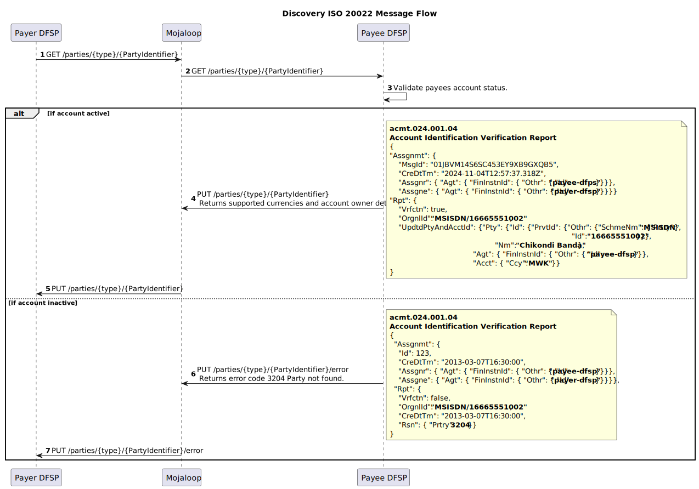
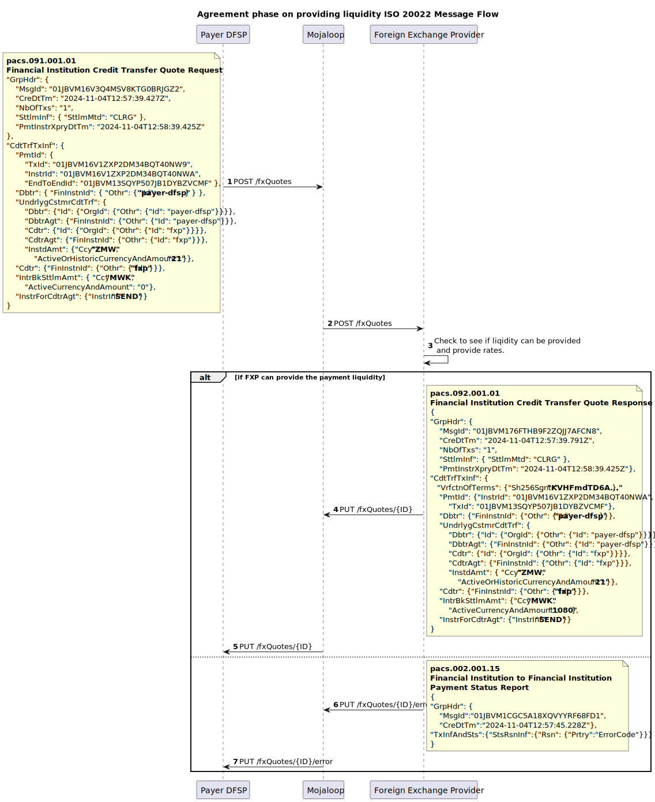

# Mojaloop ISO 20022 Market Practice Document
 
<!-- TOC depthfrom:1 depthto:3 orderedlist:true -->

- [1. Mojaloop ISO 20022 Market Practice Document](#1-mojaloop-iso-20022-market-practice-document)
- [2. Introduction](#2-introduction)
    - [2.1. How to Use This Document?](#21-how-to-use-this-document)
        - [2.1.1. Relationship with Scheme-Specific Rules Documents](#211-relationship-with-scheme-specific-rules-documents)
        - [2.1.2. Distinction Between Generic Practices and Scheme-Specific Requirements](#212-distinction-between-generic-practices-and-scheme-specific-requirements)
- [3. Message Expectations, Obligations, and Rules](#3-message-expectations-obligations-and-rules)
    - [3.1. Currency Conversion](#31-currency-conversion)
    - [3.2. JSON Messages](#32-json-messages)
    - [3.3. APIs](#33-apis)
        - [3.3.1. Header Details](#331-header-details)
        - [3.3.2. Supported HTTP Responses](#332-supported-http-responses)
        - [3.3.3. Common Error Payload](#333-common-error-payload)
    - [3.4. ULIDs as Unique Identifiers](#34-ulids-as-unique-identifiers)
    - [3.5. Inter-ledger Protocol v4 to represent the Cryptographic Terms](#35-inter-ledger-protocol-v4-to-represent-the-cryptographic-terms)
    - [3.6. ISO 20022 Supplementary Data Fields](#36-iso-20022-supplementary-data-fields)
- [4. Discovery Phase](#4-discovery-phase)
    - [4.1. Message flow](#41-message-flow)
    - [4.2. Parties Resource](#42-parties-resource)
- [5. Agreement Phase](#5-agreement-phase)
    - [5.1. Currency Conversion Agreement Sub-Phase](#51-currency-conversion-agreement-sub-phase)
        - [5.1.1. Message flow](#511-message-flow)
        - [5.1.2. fxQuotes Resource](#512-fxquotes-resource)
    - [5.2. Transfer Terms Agreement Sub-Phase](#52-transfer-terms-agreement-sub-phase)
        - [5.2.1. Message flow](#521-message-flow)
        - [5.2.2. Quotes Resource](#522-quotes-resource)
- [6. Transfer Phase](#6-transfer-phase)
    - [6.1. Accepting Currency Conversion terms](#61-accepting-currency-conversion-terms)
        - [6.1.1. Message flow](#611-message-flow)
        - [6.1.2. fxTransfers Resource](#612-fxtransfers-resource)
    - [6.2. Transfer Execution and Clearing](#62-transfer-execution-and-clearing)
        - [6.2.1. Message flow](#621-message-flow)
        - [6.2.2. Transfers Resource](#622-transfers-resource)

<!-- /TOC -->
# 2. Introduction

By combining the principles of financial inclusion with the robust capabilities of ISO 20022, Mojaloop ensures that DFSPs and other stakeholders can deliver real-time payment solutions that are cost-effective, secure, and scalable to meet the demands of inclusive financial ecosystems.

## 2.1 How to Use This Document?
This document provides a foundational reference for implementing ISO 20022 messaging for IIPS within Mojaloop-based schemes. It outlines general guidelines and practices that apply universally across Mojaloop schemes, focusing on the base-level requirements. However, it is designed to be supplemented by scheme-specific rules documents, which can define additional message fields, validations, and rules necessary to meet the unique regulations and requirements of individual schemes. This layered approach enables each scheme to tailor its implementation details while maintaining consistency with the broader Mojaloop framework.

### 2.1.1 Relationship with Scheme-Specific Rules Documents
This document serves as a foundation for understanding how ISO 20022 is applied in Mojaloop, focusing on core principles and practices. However, it does not prescribe the detailed business requirements, validations, and governance frameworks that are specific to individual schemes. Scheme-specific rules address these details, including mandatory and optional field specifications, tailored compliance protocols, and defined procedures for error handling. They also encompass business rules governing message flows, participant roles, and responsibilities within the scheme. The flexibility of this document allows scheme administrators to adapt and extend its guidance to meet their unique operational needs.

### 2.1.2 Distinction Between Generic Practices and Scheme-Specific Requirements
This document distinctly separates generic practices from scheme-specific requirements to achieve a balance between consistency and adaptability in ISO 20022 implementations within Mojaloop. The generic practices outlined here establish foundational principles, including expectations for message structures, required fields to meet switch requirements, supported fields, and transactional flows. Additionally, they provide a high-level overview of the Mojaloop P2P FX transfer lifecycle.

Scheme-specific requirements, documented separately, delve into additional field mappings, enhanced validations, and precise rules for settlement, reconciliation, and dispute resolution. These requirements also encompass governance policies and compliance obligations tailored to the unique needs of individual schemes.

This distinction enables DFSPs to implement a consistent core messaging framework while granting scheme administrators the flexibility to define operational specifics. The generic practices presented in this document are purposefully designed to be extensible, ensuring seamless integration with scheme-specific rules and supporting adherence to Mojaloop’s ISO 20022 for IIPS standards.

# 3 Message Expectations, Obligations, and Rules
The Mojaloop transfer process is divided into three key phases, each essential to ensuring secure and efficient transactions. These phases use specific resources to enable participant interactions, ensuring clear communication, agreement, and execution. While some phases and resources are optional, the ultimate goal is to ensure every transfer is accurate, secure, and aligns with agreed terms. 
1. [Discovery](#4-discovery-phase)
2. [Agreement](#5-agreement-phase)
3. [Transfer](#6-transfer-phase)

## 3.1 Currency Conversion
Currency conversion is included to support cross-currency transactions. As it is not always required, the associated messages and flows are only used when needed, ensuring flexibility for both single-currency and multi-currency scenarios.

## 3.2 JSON Messages
Mojaloop adopts a JSON variant of ISO 20022 messages, moving away from the traditional XML format to enhance efficiency and compatibility with modern APIs. The ISO 20022 organization is actively developing a canonical JSON representation of its messages, and Mojaloop aims to align with this standard as it evolves.

## 3.3 APIs
ISO 20022 messages are exchanged in Mojaloop via REST-like API calls. This approach enhances interoperability, reduces data overhead through lightweight JSON messages, and supports scalable and modular implementations. By integrating ISO 20022 with REST APIs, Mojaloop delivers a robust, adaptable framework that balances global standards with practical implementation needs. 

### 3.3.1 Header Details 
The API message header should contain the following details. Required headers are specified with an `*` asterisks.

| Name&nbsp;&nbsp;&nbsp;&nbsp;&nbsp;&nbsp;&nbsp;&nbsp;&nbsp;&nbsp;&nbsp;&nbsp;&nbsp;&nbsp;&nbsp;&nbsp;&nbsp;&nbsp;&nbsp;&nbsp;&nbsp;&nbsp;&nbsp;&nbsp;&nbsp;&nbsp;&nbsp;&nbsp;&nbsp;&nbsp;&nbsp;&nbsp;| Description |
|--|--|
|**Content-Length**<br>*integer*<br>(header)|The `Content-Length` header field indicates the anticipated size of the payload body. Only sent if there is a body.**Note:** The API supports a maximum size of 5242880 bytes (5 Megabytes).|
| * **Type**<br>*string*<br>(path)|The type of the party identifier. For example, `MSISDN`, `PERSONAL_ID`.|
| * **ID**<br>*string*<br>(path)| The identifier value.|
| * **Content-Type** <br>*string*<br>(header)|The `Content-Type` header indicates the specific version of the API used to send the payload body.|
| * **Date**<br>*string*<br>(header)|The `Date` header field indicates the date when the request was sent.|
| **X-Forwarded-For** <br> *string*<br>(header)|The `X-Forwarded-For` header field is an unofficially accepted standard used for informational purposes of the originating client IP address, as a request might pass multiple proxies, firewalls, and so on. Multiple `X-Forwarded-For` values should be expected and supported by implementers of the API.**Note:** An alternative to `X-Forwarded-For` is defined in [RFC 7239](https://tools.ietf.org/html/rfc7239). However, to this point RFC 7239 is less-used and supported than `X-Forwarded-For`.|
| * **FSPIOP-Source** <br> *string*<br>(header)|The `FSPIOP-Source` header field is a non-HTTP standard field used by the API for identifying the sender of the HTTP request. The field should be set by the original sender of the request. Required for routing and signature verification (see header field `FSPIOP-Signature`).|
| **FSPIOP-Destination** <br> *string*<br>(header)|The `FSPIOP-Destination` header field is a non-HTTP standard field used by the API for HTTP header based routing of requests and responses to the destination. The field must be set by the original sender of the request if the destination is known (valid for all services except GET /parties) so that any entities between the client and the server do not need to parse the payload for routing purposes. If the destination is not known (valid for service GET /parties), the field should be left empty.|
| **FSPIOP-Encryption** <br> *string*<br>(header) | The `FSPIOP-Encryption` header field is a non-HTTP standard field used by the API for applying end-to-end encryption of the request.|
| **FSPIOP-Signature** <br> *string* <br> (header)| The `FSPIOP-Signature` header field is a non-HTTP standard field used by the API for applying an end-to-end request signature.|
| **FSPIOP-URI** <br> *string* <br> (header) | The `FSPIOP-URI` header field is a non-HTTP standard field used by the API for signature verification, should contain the service URI. Required if signature verification is used, for more information, see [the API Signature document](https://github.com/mojaloop/docs/tree/main/Specification%20Document%20Set).|
| **FSPIOP-HTTP-Method** <br> *string* <br> (header) | The `FSPIOP-HTTP-Method` header field is a non-HTTP standard field used by the API for signature verification, should contain the service HTTP method. Required if signature verification is used, for more information, see [the API Signature document](https://github.com/mojaloop/docs/tree/main/Specification%20Document%20Set).|

### 3.3.2 Supported HTTP Responses

| **HTTP Error Code** | **Description and Common Causes** |
|---|----|
|**400 Bad Request** | **Description**: The server could not understand the request due to invalid syntax. This response indicates that the request was malformed or contained invalid parameters.<br>**Common Causes**: Missing required fields, invalid field values, or incorrect request format. |
|**401 Unauthorized** | **Description**: The client must authenticate itself to get the requested response. This response indicates that the request lacks valid authentication credentials.<br>**Common Causes**: Missing or invalid authentication token. |
|**403 Forbidden** | **Description**: The client does not have access rights to the content. This response indicates that the server understood the request but refuses to authorize it.<br>**Common Causes**: Insufficient permissions to access the resource. |
|**404 Not Found** | **Description**: The server can not find the requested resource. This response indicates that the specified resource does not exist.<br>**Common Causes**: Incorrect resource identifier or the resource has been deleted. |
|**405 Method Not Allowed** | **Description**: The request method is known by the server but is not supported by the target resource. This response indicates that the HTTP method used is not allowed for the endpoint.<br>**Common Causes**: Using an unsupported HTTP method (e.g., POST instead of PUT). |
|**406 Not Acceptable** | **Description**: The server cannot produce a response matching the list of acceptable values defined in the request's proactive content negotiation headers. This response indicates that the server cannot generate a response that is acceptable according to the Accept headers sent in the request.<br>**Common Causes**: Unsupported media type or format specified in the Accept header. |
|**501 Not Implemented** | **Description**: The server does not support the functionality required to fulfill the request. This response indicates that the server does not recognize the request method or lacks the ability to fulfill the request.<br>**Common Causes**: The requested functionality is not implemented on the server. |
|**503 Service Unavailable** | **Description**: The server is not ready to handle the request. This response indicates that the server is temporarily unable to handle the request due to maintenance or overload.<br>**Common Causes**: Server maintenance, temporary overload, or server downtime. |

### 3.3.3 Common Error Payload

All error responses return a common payload structure that includes a specific message. The payload typically contains the following fields:

- **errorCode**: A code representing the specific error.
- **errorDescription**: A description of the error.
- **extensionList**: An optional list of key-value pairs providing additional information about the error.

This common error payload helps clients understand the nature of the error and take appropriate actions.


## 3.4 ULIDs as Unique Identifiers
Mojaloop employs Universally Unique Lexicographically Sortable Identifiers (ULIDs) as the standard for unique identifiers across its messaging system. ULIDs offer a robust alternative to traditional UUIDs, ensuring globally unique identifiers while also enabling natural ordering by time of creation. This lexicographical sorting simplifies traceability, troubleshooting, and operational analytics.

## 3.5 Inter-ledger Protocol (v4) to represent the Cryptographic Terms
Mojaloop leverages the Inter-ledger Protocol (ILP) version 4 to define and represent cryptographic terms in its transfer processes. ILP v4 provides a standardized framework for secure and interoperable exchange of payment instructions, ensuring integrity and non-repudiation of transactions. By integrating ILP's cryptographic capabilities, Mojaloop supports precise and tamper-proof agreements between participants, enabling secure end-to-end transfer execution while maintaining compatibility with global payment ecosystems.

## 3.6 ISO 20022 Supplementary Data Fields

It is not expected that ISO 20022 supplementary data fields will be required for any of the messages used. If supplementary data is provided, the switch will not reject the message; however, it will ignore its contents and behave as if the supplementary data was not present.

<div style="page-break-before:always"></div>

# 4. Discovery Phase
The Discovery Phase is an optional step in the transfer process, necessary only when the payee (end party) must be identified and confirmed before initiating an agreement. This phase utilizes the parties resource, which facilitates the retrieval and validation of the payee’s information to ensure they are eligible to receive the transfer. Key checks performed during this phase include verifying that the payee's account is active, identifying the currencies that can be transferred into the account, and confirming the account owner’s details. This information allows the payer to verify the payee's details accurately, reducing the risk of errors and ensuring a secure foundation for the subsequent phases of the transfer process.

## 4.1 Message flow

The sequence diagram shows the discovery example messages in a Payer initiated P2P transfer.


## 4.2 Parties Resource
The Parties resource provides all the necessary functionality in the discovery phase of a transfer. The functionality is always initiated with a GET /parties call, and responses to this are returned to the originator through a PUT /parties callback. Error messages are returned through the PUT /parties/.../error callback. These endpoints support an optional sub id type.


| Endpoint | Message |
|--- | --- |
|[GET /parties/{type}/{partyIdentifier}[/{subId}]](./script/parties_GET.md) |  |
|[PUT /parties/{type}/{partyIdentifier}[/{subId}]](./script/parties_PUT.md) | acmt.024.001.04 |
|[PUT /parties/{type}/{partyIdentifier}[/{subId}]/error](./script/parties_error_PUT.md) | acmt.024.001.04 |

<div style="page-break-before:always"></div>

# 5. Agreement Phase
The **Agreement Phase** is a critical step in the Mojaloop transfer process, ensuring that all parties involved have a shared understanding of the transfer terms before any funds are committed. This phase serves several essential purposes:
1. **Calculation and Agreement of Fees**<br>
The Agreement Phase provides an opportunity for the calculation and mutual agreement on any applicable fees. This ensures transparency and prevents disputes related to charges after the transfer is initiated.
1. **Pre-Commitment Validation**<br>
It allows each participating organization to verify whether the transfer can proceed. This step helps identify and address potential issues early, reducing errors during the transfer and minimizing reconciliation discrepancies.
1. **Cryptographic Signing of Terms**<br>
The terms of the transfer are cryptographically signed during this phase. This mechanism ensures non-repudiation, meaning that parties cannot deny their involvement in or agreement to the transaction. The Interledger Protocol is used to perform this cryptographic signing. Details on how to produce an ILP packet are defined here: [Mojaloop FSPIOP API Documentation](https://docs.mojaloop.io/technical/api/fspiop/).
1. **Promoting Financial Inclusion**<br>
By presenting all parties with the complete terms of the transfer upfront, the Agreement Phase ensures that participants are fully informed before making any commitments. This transparency supports financial inclusively by enabling fair and informed decision-making for all stakeholders.

The Agreement Phase not only improves the reliability and efficiency of Mojaloop transfers but also aligns with its broader goal of fostering trust and inclusively in digital financial ecosystems.

The agreement phase is further divided into two phases. 

## 5.1 Currency Conversion Agreement Sub-Phase
The Currency Conversion Agreement Sub-Phase is an optional step within the Agreement Phase, activated only when the transfer involves a currency conversion. During this sub-phase, the payer DFSP (Digital Financial Services Provider) coordinates with a foreign exchange (FX) provider to secure cross-currency liquidity required to complete the transaction. This step establishes the FX rates and associated fees, ensuring that both the DFSP and the FXP can rely on transparent and agreed-upon conversion terms. By addressing currency conversion needs before committing to the transfer, this sub-phase helps prevent delays and discrepancies, supporting a seamless cross-border transaction experience.

### 5.1.1 Message flow


The sequence diagram shows the discovery example messages in a Payer initiated P2P transfer.


### 5.1.2 fxQuotes Resource

| Endpoint | Message |
|--- | --- |
|[POST /fxQuotes/{ID}](./script/fxquotes_POST.md) | **pacs.091.001** |
|[PUT /fxQuotes/{ID}](./script/fxquotes_PUT.md) | **pacs.092.001** |
|[PUT /fxQuotes/{ID}/error](./script/fxquotes_error_PUT.md) | **pacs.002.001.15** |

## 5.2 Transfer Terms Agreement Sub-Phase
The End-to-End Terms Agreement Sub-Phase involves the collaborative establishment of the transfer terms between the payer DFSP and the payee DFSP. This process ensures both parties are aligned on critical details such as the amount to be transferred, fees, and timing requirements. This sub-phase also facilitates the cryptographic signing of these terms, providing a robust framework for non-repudiation and accountability. By finalizing the transfer terms in a transparent manner, this sub-phase minimizes the risk of errors or disputes, enhancing the efficiency and trustworthiness of the overall Mojaloop transfer process.

### 5.2.1 Message flow

The sequence diagram shows the discovery example messages in a Payer initiated P2P transfer.


### 5.2.2 Quotes Resource

| Endpoint | Message |
| ------------- | --- |
|[POST /quotes/{ID}](./script/quotes_POST.md) | **pacs.081.001** |
|[PUT /quotes/{ID}](./script/quotes_PUT.md) | **pacs.082.001** |
|[PUT /quotes/{ID}/error](./script/quotes_error_PUT.md) | **pacs.002.001.15** |

<div style="page-break-before:always"></div>

# 6. Transfer Phase
Once the agreements have been successfully established during the Agreement Phase, accepting these terms triggers the Transfer Phase, where the actual movement of funds occurs. This phase is executed with precision to ensure that the agreed terms are honored, and all participants fulfill their commitments. The Transfer Phase is divided into two sub-phases: the Currency Conversion Execution Sub-Phase and the Transfer Clearing Sub-Phase, each corresponding to its respective sub-phase in the Agreement Phase.

## 6.1 Accepting Currency Conversion terms
The Currency Conversion Execution Sub-Phase occurs if the transfer involves a currency exchange. In this step, the foreign exchange provider, as agreed during the Agreement Phase, executes the currency conversion. The liquidity required for the cross-currency transfer is provided, and the converted funds are prepared for onward movement to the payee DFSP. This sub-phase is an opportunity for the FXP to ensure that the FX rates and fees agreed upon earlier are adhered to, safeguarding the transaction's financial integrity and transparency.

### 6.1.1 Message flow


The sequence diagram shows the transfer example messages in a Payer initiated P2P transfer.


### 6.1.2 fxTransfers Resource

| Endpoint | Message |
| -------- | --- |
|[POST /fxTransfers/{ID}](./script/fxtransfers_POST.md) | **pacs.009.001** |
|[PUT /fxTransfers/{ID}](./script/fxtransfers_PUT.md) | **pacs.002.001.15** |
|[PUT /fxTransfers/{ID}/error](./script/fxtransfers_error_PUT.md) | **pacs.002.001.15** |
|[PATCH /fxTransfers/{ID}/error](./script/fxtransfers_PATCH.md) | **pacs.002.001.15** |

## 6.2 Transfer Execution and Clearing 
The Funds Settlement Sub-Phase involves the actual transfer of funds between the payer DFSP and the payee DFSP. This step ensures that the amount agreed upon, including any associated fees, is accurately cleared in the appropriate accounts. This sub-phase completes the financial transaction, fulfilling the commitments made during the Agreement Phase. Through secure and efficient fund movement mechanisms, this sub-phase ensures that the transfer is completed smoothly and in compliance with the agreed terms.

### 6.2.1 Message flow


The sequence diagram shows the discovery example messages in a Payer initiated P2P transfer.


### 6.2.2 Transfers Resource

| Endpoint | Message |
| --------- | --- |
|[POST /transfers/{ID}](./script/transfers_POST.md) | **pacs.008.001** |
|[PUT /transfers/{ID}](./script/quotes_PUT.md) | **pacs.002.001.15** |
|[PUT /transfers/{ID}/error](./script/quotes_error_PUT.md) | **pacs.002.001.15** |
|[PATCH /transfers/{ID}/error](./script/transfers_PATCH.md) | **pacs.002.001.15** |


# 7. API Message Details

## 7.1 GET /parties/{type}/{partyIdentifier}[/{subId}]
The GET /parties endpoint does not support or require a payload, and can be seen as an instruction to trigger an Account identification Verification report.
- **{type}** - Party identifier types<br>
The **{type}** refers to the classification of the party Identifier type. Each scheme only supports a limited number of these codes. The codes supported by the scheme may be derived from the ISO 20022 external organisation or personal identification codes, or they could be FSPIOP supported codes. The full list of supported codes is available in the [**Appendix A**](#appendix_A).
 - **partyIdentifier** <br>
 This is the party identifier of the party being represented and of the type specified by the {type} above.
 - **{subId}** <br>
 This represent a sub-identifier or sub-type for the party that some implementations require in order to ensure uniqueness of the identifier. 

## 7.2 PUT /Parties/{type}/{partyIdentifier}[/{subId}]
|**Account Identification Verification Report - acmt.024.001.04**|
|--|

#### Context
*(DFSP -> DFSP)*

This is triggers as a callback response to the GET /parties call. The message is between DFSPs connected in the scheme and is a check that validates that the account represented is active.

Here is an example of the message:
``` json
{
"Assgnmt": {
    "MsgId": "01JBVM14S6SC453EY9XB9GXQB5",
    "CreDtTm": "2024-11-04T12:57:37.318Z",
    "Assgnr": { "Agt": { "FinInstnId": { "Othr": { "Id": "payee-dfps" }}}},
    "Assgne": { "Agt": { "FinInstnId": { "Othr": { "Id": "payer-dfsp" }}}}},
"Rpt": {
    "Vrfctn": true,
    "OrgnlId": "MSISDN/16665551002",
    "UpdtdPtyAndAcctId": {
        "Pty": {
            "Id": {"PrvtId": {"Othr": {"SchmeNm": {"Prtry": "MSISDN"},
                                               "Id": "16665551002"}}},
            "Nm": "Chikondi Banda"},
        "Agt": { "FinInstnId": { "Othr": { "Id": "payee-dfsp" }}},
        "Acct": { "Ccy": "MWK" }}}
}
```
#### Message Details
The details on how to compose and make this API are covered in the following sections:
1. [Core Data Elements](#core-data-elements)<br>This section specifies which fields are required, which fields are optional, and which fields are unsupported in order to meet the message validating requirements.
2. [Header Details](#331-header-details)<br> This general section specifies the header requirements for the API are specified.
3. [Supported HTTP Responses](#332-supported-http-responses)<br> This general section specifies the http responses that must be supported.
4. [Common Error Payload](#333-common-error-payload)<br> This general section specifies the common error payload that is provided in synchronous http error response.

#### Core Data Elements
Here are the core data elements that are needed to meet this market practice requirement.

The background colours indicate the classification of the data element.

   <style>
    td:nth-child(1) {
        width: 25%;
    }
    tr.unsupported {  
    color: black;
    background-color:rgb(241, 188, 188);
    font-size:0.8em;
    line-height: 1; /* Adjust the line height as needed */
    }
    tr.required {  
    color: black;
    background-color: white;
    font-size:0.8em;
    line-height: 1; /* Adjust the line height as needed */
    }
    tr.optional {  
    color: black;
    background-color:rgb(207, 206, 206);
    font-size:0.8em;
    line-height: 1; /* Adjust the line height as needed */
    }
    td, th {
        padding: 1px;
        margin: 1px; 
    }  
  </style>

  <table> <tr> <th>Data Model Type Key</th> <th>Description</th> </tr>
   <tr class="required"> <td><b>required</b></td><td>These fields are required in order to meet the message validating requirements.</td></tr>
   <tr class="optional"> <td><b>optional</b></td><td>These fields can be optionally included in the message. (Some of these fields may be required for a specific scheme as defined in the Scheme Rules for that scheme.)</td></tr>
   <tr class="unsupported"> <td><b>unsupported</b></td><td>These fields are actively not supported. The functionality specifying data in these fields are not compatible with a Mojaloop scheme, and will fail message validation if provided.</td></tr>
  </table>
   <br><br>
    

Here is the defined core data element table.

<table>
  <tr>
    <th>ISO 20022 Field</th>
    <th>Data Model</th>
    <th>Description</th>
  </tr>
      <tr class=required><td>  <b>Assgnmt</b> - Assignment</td><td>[1..1]</td><td>Identifies the identification assignment.<br></td></tr>
<tr class=required><td>&nbsp;&nbsp;&nbsp;&nbsp;  <b>MsgId</b> - MessageIdentification</td><td>[1..1]</td><td>Unique identification, as assigned by the assigner, to unambiguously identify the message.<br></td></tr>
<tr class=required><td>&nbsp;&nbsp;&nbsp;&nbsp;  <b>CreDtTm</b> - CreationDateTime</td><td>[1..1]</td><td>Date and time at which the identification assignment was created.<br></td></tr>
<tr class=unsupported><td>&nbsp;&nbsp;&nbsp;&nbsp;  <b>Cretr</b> - Party50Choice</td><td>[0..0]</td><td></td></tr>
<tr class=unsupported><td>&nbsp;&nbsp;&nbsp;&nbsp;  <b>FrstAgt</b> - BranchAndFinancialInstitutionIdentification8</td><td>[0..0]</td><td>Unique and unambiguous identification of a financial institution or a branch of a financial institution.<br></td></tr>
<tr class=required><td>&nbsp;&nbsp;&nbsp;&nbsp;  <b>Assgnr</b> - Assignor</td><td>[1..1]</td><td>Party that assigns the identification assignment to another party. This is also the sender of the message.<br></td></tr>
<tr class=required><td>&nbsp;&nbsp;&nbsp;&nbsp;&nbsp;&nbsp;&nbsp;&nbsp;  <b>Pty</b> - Party</td><td>[1..1]</td><td>Identification of a person or an organisation.<br></td></tr>
<tr class=optional><td>&nbsp;&nbsp;&nbsp;&nbsp;&nbsp;&nbsp;&nbsp;&nbsp;&nbsp;&nbsp;&nbsp;&nbsp;  <b>Nm</b> - Name</td><td>[0..1]</td><td>Name by which a party is known and which is usually used to identify that party.<br></td></tr>
<tr class=optional><td>&nbsp;&nbsp;&nbsp;&nbsp;&nbsp;&nbsp;&nbsp;&nbsp;&nbsp;&nbsp;&nbsp;&nbsp;  <b>PstlAdr</b> - PostalAddress</td><td>[0..1]</td><td>Information that locates and identifies a specific address, as defined by postal services.<br></td></tr>
<tr class=optional><td>&nbsp;&nbsp;&nbsp;&nbsp;&nbsp;&nbsp;&nbsp;&nbsp;&nbsp;&nbsp;&nbsp;&nbsp;&nbsp;&nbsp;&nbsp;&nbsp;  <b>AdrTp</b> - AddressType3Choice</td><td>[0..1]</td><td>Type of address, as defined by the postal services.</td></tr>
<tr class=optional><td>&nbsp;&nbsp;&nbsp;&nbsp;&nbsp;&nbsp;&nbsp;&nbsp;&nbsp;&nbsp;&nbsp;&nbsp;&nbsp;&nbsp;&nbsp;&nbsp;&nbsp;&nbsp;&nbsp;&nbsp;  <b>Cd</b> - Code</td><td>[0..1]</td><td>Type of address expressed as a code.<br></td></tr>
<tr class=optional><td>&nbsp;&nbsp;&nbsp;&nbsp;&nbsp;&nbsp;&nbsp;&nbsp;&nbsp;&nbsp;&nbsp;&nbsp;&nbsp;&nbsp;&nbsp;&nbsp;&nbsp;&nbsp;&nbsp;&nbsp;  <b>Prtry</b> - Proprietary</td><td>[0..1]</td><td>Type of address expressed as a proprietary code.<br></td></tr>
<tr class=optional><td>&nbsp;&nbsp;&nbsp;&nbsp;&nbsp;&nbsp;&nbsp;&nbsp;&nbsp;&nbsp;&nbsp;&nbsp;&nbsp;&nbsp;&nbsp;&nbsp;&nbsp;&nbsp;&nbsp;&nbsp;&nbsp;&nbsp;&nbsp;&nbsp;  <b>Id</b> - Identification</td><td>[0..1]</td><td>Proprietary information, often a code, issued by the data source scheme issuer.<br></td></tr>
<tr class=optional><td>&nbsp;&nbsp;&nbsp;&nbsp;&nbsp;&nbsp;&nbsp;&nbsp;&nbsp;&nbsp;&nbsp;&nbsp;&nbsp;&nbsp;&nbsp;&nbsp;&nbsp;&nbsp;&nbsp;&nbsp;&nbsp;&nbsp;&nbsp;&nbsp;  <b>Issr</b> - Issuer</td><td>[0..1]</td><td>Entity that assigns the identification.<br></td></tr>
<tr class=optional><td>&nbsp;&nbsp;&nbsp;&nbsp;&nbsp;&nbsp;&nbsp;&nbsp;&nbsp;&nbsp;&nbsp;&nbsp;&nbsp;&nbsp;&nbsp;&nbsp;&nbsp;&nbsp;&nbsp;&nbsp;&nbsp;&nbsp;&nbsp;&nbsp;  <b>SchmeNm</b> - SchemeName</td><td>[0..1]</td><td>Short textual description of the scheme.<br></td></tr>
<tr class=unsupported><td>&nbsp;&nbsp;&nbsp;&nbsp;&nbsp;&nbsp;&nbsp;&nbsp;&nbsp;&nbsp;&nbsp;&nbsp;&nbsp;&nbsp;&nbsp;&nbsp;  <b>CareOf</b> - Max140Text</td><td>[0..0]</td><td>Specifies a character string with a maximum length of 140 characters.<br></td></tr>
<tr class=optional><td>&nbsp;&nbsp;&nbsp;&nbsp;&nbsp;&nbsp;&nbsp;&nbsp;&nbsp;&nbsp;&nbsp;&nbsp;&nbsp;&nbsp;&nbsp;&nbsp;  <b>Dept</b> - Max70Text</td><td>[0..1]</td><td>Name of a department within an organization.</td></tr>
<tr class=optional><td>&nbsp;&nbsp;&nbsp;&nbsp;&nbsp;&nbsp;&nbsp;&nbsp;&nbsp;&nbsp;&nbsp;&nbsp;&nbsp;&nbsp;&nbsp;&nbsp;  <b>SubDept</b> - Max70Text</td><td>[0..1]</td><td>Name of a sub-department within a department.</td></tr>
<tr class=optional><td>&nbsp;&nbsp;&nbsp;&nbsp;&nbsp;&nbsp;&nbsp;&nbsp;&nbsp;&nbsp;&nbsp;&nbsp;&nbsp;&nbsp;&nbsp;&nbsp;  <b>StrtNm</b> - Max140Text</td><td>[0..1]</td><td>Name of the street or thoroughfare.</td></tr>
<tr class=optional><td>&nbsp;&nbsp;&nbsp;&nbsp;&nbsp;&nbsp;&nbsp;&nbsp;&nbsp;&nbsp;&nbsp;&nbsp;&nbsp;&nbsp;&nbsp;&nbsp;  <b>BldgNb</b> - Max16Text</td><td>[0..1]</td><td>Number that identifies a building on the street.</td></tr>
<tr class=optional><td>&nbsp;&nbsp;&nbsp;&nbsp;&nbsp;&nbsp;&nbsp;&nbsp;&nbsp;&nbsp;&nbsp;&nbsp;&nbsp;&nbsp;&nbsp;&nbsp;  <b>BldgNm</b> - Max140Text</td><td>[0..1]</td><td>Name of the building, if applicable.</td></tr>
<tr class=optional><td>&nbsp;&nbsp;&nbsp;&nbsp;&nbsp;&nbsp;&nbsp;&nbsp;&nbsp;&nbsp;&nbsp;&nbsp;&nbsp;&nbsp;&nbsp;&nbsp;  <b>Flr</b> - Max70Text</td><td>[0..1]</td><td>Floor number or identifier within a building.</td></tr>
<tr class=unsupported><td>&nbsp;&nbsp;&nbsp;&nbsp;&nbsp;&nbsp;&nbsp;&nbsp;&nbsp;&nbsp;&nbsp;&nbsp;&nbsp;&nbsp;&nbsp;&nbsp;  <b>UnitNb</b> - Max16Text</td><td>[0..0]</td><td>Specifies a character string with a maximum length of 16 characters.<br></td></tr>
<tr class=optional><td>&nbsp;&nbsp;&nbsp;&nbsp;&nbsp;&nbsp;&nbsp;&nbsp;&nbsp;&nbsp;&nbsp;&nbsp;&nbsp;&nbsp;&nbsp;&nbsp;  <b>PstBx</b> - Max16Text</td><td>[0..1]</td><td>Post office box number.</td></tr>
<tr class=optional><td>&nbsp;&nbsp;&nbsp;&nbsp;&nbsp;&nbsp;&nbsp;&nbsp;&nbsp;&nbsp;&nbsp;&nbsp;&nbsp;&nbsp;&nbsp;&nbsp;  <b>Room</b> - Max70Text</td><td>[0..1]</td><td>Room number or identifier within a building.</td></tr>
<tr class=optional><td>&nbsp;&nbsp;&nbsp;&nbsp;&nbsp;&nbsp;&nbsp;&nbsp;&nbsp;&nbsp;&nbsp;&nbsp;&nbsp;&nbsp;&nbsp;&nbsp;  <b>PstCd</b> - Max16Text</td><td>[0..1]</td><td>Postal code or ZIP code.</td></tr>
<tr class=optional><td>&nbsp;&nbsp;&nbsp;&nbsp;&nbsp;&nbsp;&nbsp;&nbsp;&nbsp;&nbsp;&nbsp;&nbsp;&nbsp;&nbsp;&nbsp;&nbsp;  <b>TwnNm</b> - Max140Text</td><td>[0..1]</td><td>Name of the town or city.</td></tr>
<tr class=optional><td>&nbsp;&nbsp;&nbsp;&nbsp;&nbsp;&nbsp;&nbsp;&nbsp;&nbsp;&nbsp;&nbsp;&nbsp;&nbsp;&nbsp;&nbsp;&nbsp;  <b>TwnLctnNm</b> - Max140Text</td><td>[0..1]</td><td>Name of the location within a town or city.</td></tr>
<tr class=optional><td>&nbsp;&nbsp;&nbsp;&nbsp;&nbsp;&nbsp;&nbsp;&nbsp;&nbsp;&nbsp;&nbsp;&nbsp;&nbsp;&nbsp;&nbsp;&nbsp;  <b>DstrctNm</b> - Max140Text</td><td>[0..1]</td><td>Name of the district or region.</td></tr>
<tr class=optional><td>&nbsp;&nbsp;&nbsp;&nbsp;&nbsp;&nbsp;&nbsp;&nbsp;&nbsp;&nbsp;&nbsp;&nbsp;&nbsp;&nbsp;&nbsp;&nbsp;  <b>CtrySubDvsn</b> - Max35Text</td><td>[0..1]</td><td>Name of the country subdivision, such as a state or province.</td></tr>
<tr class=optional><td>&nbsp;&nbsp;&nbsp;&nbsp;&nbsp;&nbsp;&nbsp;&nbsp;&nbsp;&nbsp;&nbsp;&nbsp;&nbsp;&nbsp;&nbsp;&nbsp;  <b>Ctry</b> - CountryCode</td><td>[0..1]</td><td>Country code, as defined by ISO 3166-1 alpha-2.</td></tr>
<tr class=optional><td>&nbsp;&nbsp;&nbsp;&nbsp;&nbsp;&nbsp;&nbsp;&nbsp;&nbsp;&nbsp;&nbsp;&nbsp;&nbsp;&nbsp;&nbsp;&nbsp;  <b>AdrLine</b> - Max70Text</td><td>[0..1]</td><td>Free-form text line for the address.</td></tr>
<tr class=required><td>&nbsp;&nbsp;&nbsp;&nbsp;&nbsp;&nbsp;&nbsp;&nbsp;&nbsp;&nbsp;&nbsp;&nbsp;  <b>Id</b> - Identification</td><td>[1..1]</td><td>Unique and unambiguous way to identify an organisation.<br></td></tr>
<tr class=required><td>&nbsp;&nbsp;&nbsp;&nbsp;&nbsp;&nbsp;&nbsp;&nbsp;&nbsp;&nbsp;&nbsp;&nbsp;&nbsp;&nbsp;&nbsp;&nbsp;  <b>OrgId</b> - Organisation</td><td>[1..1]</td><td>Unique and unambiguous way to identify an organisation.<br></td></tr>
<tr class=optional><td>&nbsp;&nbsp;&nbsp;&nbsp;&nbsp;&nbsp;&nbsp;&nbsp;&nbsp;&nbsp;&nbsp;&nbsp;&nbsp;&nbsp;&nbsp;&nbsp;&nbsp;&nbsp;&nbsp;&nbsp;  <b>AnyBIC</b> - AnyBIC</td><td>[0..1]</td><td>Business identification code of the organisation.<br></td></tr>
<tr class=optional><td>&nbsp;&nbsp;&nbsp;&nbsp;&nbsp;&nbsp;&nbsp;&nbsp;&nbsp;&nbsp;&nbsp;&nbsp;&nbsp;&nbsp;&nbsp;&nbsp;&nbsp;&nbsp;&nbsp;&nbsp;  <b>LEI</b> - LEI</td><td>[0..1]</td><td>Legal entity identification as an alternate identification for a party.<br></td></tr>
<tr class=optional><td>&nbsp;&nbsp;&nbsp;&nbsp;&nbsp;&nbsp;&nbsp;&nbsp;&nbsp;&nbsp;&nbsp;&nbsp;&nbsp;&nbsp;&nbsp;&nbsp;&nbsp;&nbsp;&nbsp;&nbsp;  <b>Othr</b> - Other</td><td>[0..1]</td><td>Unique identification of an organisation, as assigned by an institution, using an identification scheme.<br></td></tr>
<tr class=optional><td>&nbsp;&nbsp;&nbsp;&nbsp;&nbsp;&nbsp;&nbsp;&nbsp;&nbsp;&nbsp;&nbsp;&nbsp;&nbsp;&nbsp;&nbsp;&nbsp;&nbsp;&nbsp;&nbsp;&nbsp;&nbsp;&nbsp;&nbsp;&nbsp;  <b>Id</b> - Max256Text</td><td>[0..1]</td><td>Identification for an organisation. FSPIOP equivalent to Party Identifier for an organisation in ISO 20022. Identification assigned by an institution.<br></td></tr>
<tr class=optional><td>&nbsp;&nbsp;&nbsp;&nbsp;&nbsp;&nbsp;&nbsp;&nbsp;&nbsp;&nbsp;&nbsp;&nbsp;&nbsp;&nbsp;&nbsp;&nbsp;&nbsp;&nbsp;&nbsp;&nbsp;&nbsp;&nbsp;&nbsp;&nbsp;  <b>SchmeNm</b> - SchemeName</td><td>[0..1]</td><td>Name of the identification scheme.<br></td></tr>
<tr class=optional><td>&nbsp;&nbsp;&nbsp;&nbsp;&nbsp;&nbsp;&nbsp;&nbsp;&nbsp;&nbsp;&nbsp;&nbsp;&nbsp;&nbsp;&nbsp;&nbsp;&nbsp;&nbsp;&nbsp;&nbsp;&nbsp;&nbsp;&nbsp;&nbsp;&nbsp;&nbsp;&nbsp;&nbsp;  <b>Cd</b> - Code</td><td>[0..1]</td><td>Name of the identification scheme, in a coded form as published in an external list.<br></td></tr>
<tr class=optional><td>&nbsp;&nbsp;&nbsp;&nbsp;&nbsp;&nbsp;&nbsp;&nbsp;&nbsp;&nbsp;&nbsp;&nbsp;&nbsp;&nbsp;&nbsp;&nbsp;&nbsp;&nbsp;&nbsp;&nbsp;&nbsp;&nbsp;&nbsp;&nbsp;&nbsp;&nbsp;&nbsp;&nbsp;  <b>Prtry</b> - Proprietary</td><td>[0..1]</td><td>Name of the identification scheme, in a free text form.<br></td></tr>
<tr class=optional><td>&nbsp;&nbsp;&nbsp;&nbsp;&nbsp;&nbsp;&nbsp;&nbsp;&nbsp;&nbsp;&nbsp;&nbsp;&nbsp;&nbsp;&nbsp;&nbsp;&nbsp;&nbsp;&nbsp;&nbsp;&nbsp;&nbsp;&nbsp;&nbsp;  <b>Issr</b> - Issuer</td><td>[0..1]</td><td>Entity that assigns the identification.<br></td></tr>
<tr class=required><td>&nbsp;&nbsp;&nbsp;&nbsp;&nbsp;&nbsp;&nbsp;&nbsp;&nbsp;&nbsp;&nbsp;&nbsp;&nbsp;&nbsp;&nbsp;&nbsp;  <b>PrvtId</b> - PrivateIdentification</td><td>[1..1]</td><td>Unique and unambiguous identification of a person, for example a passport.<br></td></tr>
<tr class=optional><td>&nbsp;&nbsp;&nbsp;&nbsp;&nbsp;&nbsp;&nbsp;&nbsp;&nbsp;&nbsp;&nbsp;&nbsp;&nbsp;&nbsp;&nbsp;&nbsp;&nbsp;&nbsp;&nbsp;&nbsp;  <b>DtAndPlcOfBirth</b> - DateAndPlaceOfBirth</td><td>[0..1]</td><td>Date and place of birth of a person.<br></td></tr>
<tr class=optional><td>&nbsp;&nbsp;&nbsp;&nbsp;&nbsp;&nbsp;&nbsp;&nbsp;&nbsp;&nbsp;&nbsp;&nbsp;&nbsp;&nbsp;&nbsp;&nbsp;&nbsp;&nbsp;&nbsp;&nbsp;&nbsp;&nbsp;&nbsp;&nbsp;  <b>BirthDt</b> - BirthDate</td><td>[0..1]</td><td>Date on which a person was born.<br></td></tr>
<tr class=optional><td>&nbsp;&nbsp;&nbsp;&nbsp;&nbsp;&nbsp;&nbsp;&nbsp;&nbsp;&nbsp;&nbsp;&nbsp;&nbsp;&nbsp;&nbsp;&nbsp;&nbsp;&nbsp;&nbsp;&nbsp;&nbsp;&nbsp;&nbsp;&nbsp;  <b>PrvcOfBirth</b> - ProvinceOfBirth</td><td>[0..1]</td><td>Province where a person was born.<br></td></tr>
<tr class=optional><td>&nbsp;&nbsp;&nbsp;&nbsp;&nbsp;&nbsp;&nbsp;&nbsp;&nbsp;&nbsp;&nbsp;&nbsp;&nbsp;&nbsp;&nbsp;&nbsp;&nbsp;&nbsp;&nbsp;&nbsp;&nbsp;&nbsp;&nbsp;&nbsp;  <b>CityOfBirth</b> - CityOfBirth</td><td>[0..1]</td><td>City where a person was born.<br></td></tr>
<tr class=optional><td>&nbsp;&nbsp;&nbsp;&nbsp;&nbsp;&nbsp;&nbsp;&nbsp;&nbsp;&nbsp;&nbsp;&nbsp;&nbsp;&nbsp;&nbsp;&nbsp;&nbsp;&nbsp;&nbsp;&nbsp;&nbsp;&nbsp;&nbsp;&nbsp;  <b>CtryOfBirth</b> - CountryOfBirth</td><td>[0..1]</td><td>Country where a person was born.<br></td></tr>
<tr class=optional><td>&nbsp;&nbsp;&nbsp;&nbsp;&nbsp;&nbsp;&nbsp;&nbsp;&nbsp;&nbsp;&nbsp;&nbsp;&nbsp;&nbsp;&nbsp;&nbsp;&nbsp;&nbsp;&nbsp;&nbsp;  <b>Othr</b> - Other</td><td>[0..1]</td><td>Unique identification of a person, as assigned by an institution, using an identification scheme.<br></td></tr>
<tr class=optional><td>&nbsp;&nbsp;&nbsp;&nbsp;&nbsp;&nbsp;&nbsp;&nbsp;&nbsp;&nbsp;&nbsp;&nbsp;&nbsp;&nbsp;&nbsp;&nbsp;&nbsp;&nbsp;&nbsp;&nbsp;&nbsp;&nbsp;&nbsp;&nbsp;  <b>Id</b> - Identification</td><td>[0..1]</td><td>Unique and unambiguous identification of a person.<br></td></tr>
<tr class=optional><td>&nbsp;&nbsp;&nbsp;&nbsp;&nbsp;&nbsp;&nbsp;&nbsp;&nbsp;&nbsp;&nbsp;&nbsp;&nbsp;&nbsp;&nbsp;&nbsp;&nbsp;&nbsp;&nbsp;&nbsp;&nbsp;&nbsp;&nbsp;&nbsp;  <b>SchmeNm</b> - SchemeName</td><td>[0..1]</td><td>Name of the identification scheme.<br></td></tr>
<tr class=optional><td>&nbsp;&nbsp;&nbsp;&nbsp;&nbsp;&nbsp;&nbsp;&nbsp;&nbsp;&nbsp;&nbsp;&nbsp;&nbsp;&nbsp;&nbsp;&nbsp;&nbsp;&nbsp;&nbsp;&nbsp;&nbsp;&nbsp;&nbsp;&nbsp;&nbsp;&nbsp;&nbsp;&nbsp;  <b>Cd</b> - Code</td><td>[0..1]</td><td>Name of the identification scheme, in a coded form as published in an external list.<br></td></tr>
<tr class=optional><td>&nbsp;&nbsp;&nbsp;&nbsp;&nbsp;&nbsp;&nbsp;&nbsp;&nbsp;&nbsp;&nbsp;&nbsp;&nbsp;&nbsp;&nbsp;&nbsp;&nbsp;&nbsp;&nbsp;&nbsp;&nbsp;&nbsp;&nbsp;&nbsp;&nbsp;&nbsp;&nbsp;&nbsp;  <b>Prtry</b> - Proprietary</td><td>[0..1]</td><td>Name of the identification scheme, in a free text form.<br></td></tr>
<tr class=optional><td>&nbsp;&nbsp;&nbsp;&nbsp;&nbsp;&nbsp;&nbsp;&nbsp;&nbsp;&nbsp;&nbsp;&nbsp;&nbsp;&nbsp;&nbsp;&nbsp;&nbsp;&nbsp;&nbsp;&nbsp;&nbsp;&nbsp;&nbsp;&nbsp;  <b>Issr</b> - Issuer</td><td>[0..1]</td><td>Entity that assigns the identification.<br></td></tr>
<tr class=optional><td>&nbsp;&nbsp;&nbsp;&nbsp;&nbsp;&nbsp;&nbsp;&nbsp;&nbsp;&nbsp;&nbsp;&nbsp;  <b>CtryOfRes</b> - CountryOfResidence</td><td>[0..1]</td><td>Country in which a person resides (the place of a person's home). In the case of a company, it is the country from which the affairs of that company are directed.<br></td></tr>
<tr class=optional><td>&nbsp;&nbsp;&nbsp;&nbsp;&nbsp;&nbsp;&nbsp;&nbsp;&nbsp;&nbsp;&nbsp;&nbsp;  <b>CtctDtls</b> - ContactDetails</td><td>[0..1]</td><td>Set of elements used to indicate how to contact the party.<br></td></tr>
<tr class=optional><td>&nbsp;&nbsp;&nbsp;&nbsp;&nbsp;&nbsp;&nbsp;&nbsp;&nbsp;&nbsp;&nbsp;&nbsp;&nbsp;&nbsp;&nbsp;&nbsp;  <b>NmPrfx</b> - NamePrefix</td><td>[0..1]</td><td>Name prefix to be used before the name of the person.<br></td></tr>
<tr class=optional><td>&nbsp;&nbsp;&nbsp;&nbsp;&nbsp;&nbsp;&nbsp;&nbsp;&nbsp;&nbsp;&nbsp;&nbsp;&nbsp;&nbsp;&nbsp;&nbsp;  <b>Nm</b> - Name</td><td>[0..1]</td><td>Name by which a party is known and which is usually used to identify that party.<br></td></tr>
<tr class=optional><td>&nbsp;&nbsp;&nbsp;&nbsp;&nbsp;&nbsp;&nbsp;&nbsp;&nbsp;&nbsp;&nbsp;&nbsp;&nbsp;&nbsp;&nbsp;&nbsp;  <b>PhneNb</b> - PhoneNumber</td><td>[0..1]</td><td>Collection of information that identifies a phone number, as defined by telecom services.<br></td></tr>
<tr class=optional><td>&nbsp;&nbsp;&nbsp;&nbsp;&nbsp;&nbsp;&nbsp;&nbsp;&nbsp;&nbsp;&nbsp;&nbsp;&nbsp;&nbsp;&nbsp;&nbsp;  <b>MobNb</b> - MobilePhoneNumber</td><td>[0..1]</td><td>Collection of information that identifies a mobile phone number, as defined by telecom services.<br></td></tr>
<tr class=optional><td>&nbsp;&nbsp;&nbsp;&nbsp;&nbsp;&nbsp;&nbsp;&nbsp;&nbsp;&nbsp;&nbsp;&nbsp;&nbsp;&nbsp;&nbsp;&nbsp;  <b>FaxNb</b> - FaxNumber</td><td>[0..1]</td><td>Collection of information that identifies a fax number, as defined by telecom services.<br></td></tr>
<tr class=unsupported><td>&nbsp;&nbsp;&nbsp;&nbsp;&nbsp;&nbsp;&nbsp;&nbsp;&nbsp;&nbsp;&nbsp;&nbsp;&nbsp;&nbsp;&nbsp;&nbsp;  <b>URLAdr</b> - Max2048Text</td><td>[0..0]</td><td>Specifies a character string with a maximum length of 2048 characters.<br></td></tr>
<tr class=optional><td>&nbsp;&nbsp;&nbsp;&nbsp;&nbsp;&nbsp;&nbsp;&nbsp;&nbsp;&nbsp;&nbsp;&nbsp;&nbsp;&nbsp;&nbsp;&nbsp;  <b>EmailAdr</b> - EmailAddress</td><td>[0..1]</td><td>Address for electronic mail (e-mail).<br></td></tr>
<tr class=optional><td>&nbsp;&nbsp;&nbsp;&nbsp;&nbsp;&nbsp;&nbsp;&nbsp;&nbsp;&nbsp;&nbsp;&nbsp;&nbsp;&nbsp;&nbsp;&nbsp;  <b>EmailPurp</b> - EmailPurpose</td><td>[0..1]</td><td>Purpose for which an email address may be used.<br></td></tr>
<tr class=optional><td>&nbsp;&nbsp;&nbsp;&nbsp;&nbsp;&nbsp;&nbsp;&nbsp;&nbsp;&nbsp;&nbsp;&nbsp;&nbsp;&nbsp;&nbsp;&nbsp;  <b>JobTitl</b> - JobTitle</td><td>[0..1]</td><td>Title of the function.<br></td></tr>
<tr class=optional><td>&nbsp;&nbsp;&nbsp;&nbsp;&nbsp;&nbsp;&nbsp;&nbsp;&nbsp;&nbsp;&nbsp;&nbsp;&nbsp;&nbsp;&nbsp;&nbsp;  <b>Rspnsblty</b> - Responsibility</td><td>[0..1]</td><td>Role of a person in an organisation.<br></td></tr>
<tr class=optional><td>&nbsp;&nbsp;&nbsp;&nbsp;&nbsp;&nbsp;&nbsp;&nbsp;&nbsp;&nbsp;&nbsp;&nbsp;&nbsp;&nbsp;&nbsp;&nbsp;  <b>Dept</b> - Department</td><td>[0..1]</td><td>Identification of a division of a large organisation or building.<br></td></tr>
<tr class=optional><td>&nbsp;&nbsp;&nbsp;&nbsp;&nbsp;&nbsp;&nbsp;&nbsp;&nbsp;&nbsp;&nbsp;&nbsp;&nbsp;&nbsp;&nbsp;&nbsp;  <b>Othr</b> - Other</td><td>[0..1]</td><td>Contact details in another form.<br></td></tr>
<tr class=optional><td>&nbsp;&nbsp;&nbsp;&nbsp;&nbsp;&nbsp;&nbsp;&nbsp;&nbsp;&nbsp;&nbsp;&nbsp;&nbsp;&nbsp;&nbsp;&nbsp;&nbsp;&nbsp;&nbsp;&nbsp;  <b>ChanlTp</b> - ChannelType</td><td>[0..1]</td><td>Method used to contact the financial institution's contact for the specific tax region.<br></td></tr>
<tr class=optional><td>&nbsp;&nbsp;&nbsp;&nbsp;&nbsp;&nbsp;&nbsp;&nbsp;&nbsp;&nbsp;&nbsp;&nbsp;&nbsp;&nbsp;&nbsp;&nbsp;&nbsp;&nbsp;&nbsp;&nbsp;  <b>Id</b> - Identifier</td><td>[0..1]</td><td>Communication value such as phone number or email address.<br></td></tr>
<tr class=optional><td>&nbsp;&nbsp;&nbsp;&nbsp;&nbsp;&nbsp;&nbsp;&nbsp;&nbsp;&nbsp;&nbsp;&nbsp;&nbsp;&nbsp;&nbsp;&nbsp;  <b>PrefrdMtd</b> - PreferredMethod</td><td>[0..1]</td><td>Preferred method used to reach the contact.<br></td></tr>
<tr class=required><td>&nbsp;&nbsp;&nbsp;&nbsp;&nbsp;&nbsp;&nbsp;&nbsp;  <b>Agt</b> - Agent</td><td>[1..1]</td><td>Identification of a financial institution.<br></td></tr>
<tr class=required><td>&nbsp;&nbsp;&nbsp;&nbsp;&nbsp;&nbsp;&nbsp;&nbsp;&nbsp;&nbsp;&nbsp;&nbsp;  <b>FinInstnId</b> - FinancialInstitutionIdentification</td><td>[1..1]</td><td>Unique and unambiguous identification of a financial institution, as assigned under an internationally recognised or proprietary identification scheme.<br></td></tr>
<tr class=optional><td>&nbsp;&nbsp;&nbsp;&nbsp;&nbsp;&nbsp;&nbsp;&nbsp;&nbsp;&nbsp;&nbsp;&nbsp;&nbsp;&nbsp;&nbsp;&nbsp;  <b>BICFI</b> - BICFI</td><td>[0..1]</td><td>Code allocated to a financial institution by the ISO 9362 Registration Authority as described in ISO 9362 "Banking - Banking telecommunication messages - Business identifier code (BIC)"<br></td></tr>
<tr class=optional><td>&nbsp;&nbsp;&nbsp;&nbsp;&nbsp;&nbsp;&nbsp;&nbsp;&nbsp;&nbsp;&nbsp;&nbsp;&nbsp;&nbsp;&nbsp;&nbsp;  <b>ClrSysMmbId</b> - ClearingSystemMemberIdentification</td><td>[0..1]</td><td>Information used to identify a member within a clearing system<br></td></tr>
<tr class=optional><td>&nbsp;&nbsp;&nbsp;&nbsp;&nbsp;&nbsp;&nbsp;&nbsp;&nbsp;&nbsp;&nbsp;&nbsp;&nbsp;&nbsp;&nbsp;&nbsp;&nbsp;&nbsp;&nbsp;&nbsp;  <b>ClrSysId</b> - ClearingSystemIdentification</td><td>[0..1]</td><td>Specification of a pre-agreed offering between clearing agents or the channel through which the payment instruction is processed.<br></td></tr>
<tr class=optional><td>&nbsp;&nbsp;&nbsp;&nbsp;&nbsp;&nbsp;&nbsp;&nbsp;&nbsp;&nbsp;&nbsp;&nbsp;&nbsp;&nbsp;&nbsp;&nbsp;&nbsp;&nbsp;&nbsp;&nbsp;&nbsp;&nbsp;&nbsp;&nbsp;  <b>Cd</b> - Code</td><td>[0..1]</td><td>Clearing system identification code, as published in an external list.<br></td></tr>
<tr class=optional><td>&nbsp;&nbsp;&nbsp;&nbsp;&nbsp;&nbsp;&nbsp;&nbsp;&nbsp;&nbsp;&nbsp;&nbsp;&nbsp;&nbsp;&nbsp;&nbsp;&nbsp;&nbsp;&nbsp;&nbsp;&nbsp;&nbsp;&nbsp;&nbsp;  <b>Prtry</b> - Proprietary</td><td>[0..1]</td><td>Proprietary identification of the clearing system.<br></td></tr>
<tr class=optional><td>&nbsp;&nbsp;&nbsp;&nbsp;&nbsp;&nbsp;&nbsp;&nbsp;&nbsp;&nbsp;&nbsp;&nbsp;&nbsp;&nbsp;&nbsp;&nbsp;&nbsp;&nbsp;&nbsp;&nbsp;  <b>MmbId</b> - MemberIdentification</td><td>[0..1]</td><td>Identification of a member of a clearing system.<br></td></tr>
<tr class=optional><td>&nbsp;&nbsp;&nbsp;&nbsp;&nbsp;&nbsp;&nbsp;&nbsp;&nbsp;&nbsp;&nbsp;&nbsp;&nbsp;&nbsp;&nbsp;&nbsp;  <b>LEI</b> - LEI</td><td>[0..1]</td><td>Legal entity identifier of the financial institution.<br></td></tr>
<tr class=optional><td>&nbsp;&nbsp;&nbsp;&nbsp;&nbsp;&nbsp;&nbsp;&nbsp;&nbsp;&nbsp;&nbsp;&nbsp;&nbsp;&nbsp;&nbsp;&nbsp;  <b>Nm</b> - Name</td><td>[0..1]</td><td>Name by which an agent is known and which is usually used to identify that agent<br></td></tr>
<tr class=optional><td>&nbsp;&nbsp;&nbsp;&nbsp;&nbsp;&nbsp;&nbsp;&nbsp;&nbsp;&nbsp;&nbsp;&nbsp;&nbsp;&nbsp;&nbsp;&nbsp;  <b>PstlAdr</b> - PostalAddress</td><td>[0..1]</td><td>Information that locates and identifies a specific address, as defined by postal services.<br></td></tr>
<tr class=optional><td>&nbsp;&nbsp;&nbsp;&nbsp;&nbsp;&nbsp;&nbsp;&nbsp;&nbsp;&nbsp;&nbsp;&nbsp;&nbsp;&nbsp;&nbsp;&nbsp;&nbsp;&nbsp;&nbsp;&nbsp;  <b>AdrTp</b> - AddressType3Choice</td><td>[0..1]</td><td>Type of address, as defined by the postal services.</td></tr>
<tr class=optional><td>&nbsp;&nbsp;&nbsp;&nbsp;&nbsp;&nbsp;&nbsp;&nbsp;&nbsp;&nbsp;&nbsp;&nbsp;&nbsp;&nbsp;&nbsp;&nbsp;&nbsp;&nbsp;&nbsp;&nbsp;&nbsp;&nbsp;&nbsp;&nbsp;  <b>Cd</b> - Code</td><td>[0..1]</td><td>Type of address expressed as a code.<br></td></tr>
<tr class=optional><td>&nbsp;&nbsp;&nbsp;&nbsp;&nbsp;&nbsp;&nbsp;&nbsp;&nbsp;&nbsp;&nbsp;&nbsp;&nbsp;&nbsp;&nbsp;&nbsp;&nbsp;&nbsp;&nbsp;&nbsp;&nbsp;&nbsp;&nbsp;&nbsp;  <b>Prtry</b> - Proprietary</td><td>[0..1]</td><td>Type of address expressed as a proprietary code.<br></td></tr>
<tr class=optional><td>&nbsp;&nbsp;&nbsp;&nbsp;&nbsp;&nbsp;&nbsp;&nbsp;&nbsp;&nbsp;&nbsp;&nbsp;&nbsp;&nbsp;&nbsp;&nbsp;&nbsp;&nbsp;&nbsp;&nbsp;&nbsp;&nbsp;&nbsp;&nbsp;&nbsp;&nbsp;&nbsp;&nbsp;  <b>Id</b> - Identification</td><td>[0..1]</td><td>Proprietary information, often a code, issued by the data source scheme issuer.<br></td></tr>
<tr class=optional><td>&nbsp;&nbsp;&nbsp;&nbsp;&nbsp;&nbsp;&nbsp;&nbsp;&nbsp;&nbsp;&nbsp;&nbsp;&nbsp;&nbsp;&nbsp;&nbsp;&nbsp;&nbsp;&nbsp;&nbsp;&nbsp;&nbsp;&nbsp;&nbsp;&nbsp;&nbsp;&nbsp;&nbsp;  <b>Issr</b> - Issuer</td><td>[0..1]</td><td>Entity that assigns the identification.<br></td></tr>
<tr class=optional><td>&nbsp;&nbsp;&nbsp;&nbsp;&nbsp;&nbsp;&nbsp;&nbsp;&nbsp;&nbsp;&nbsp;&nbsp;&nbsp;&nbsp;&nbsp;&nbsp;&nbsp;&nbsp;&nbsp;&nbsp;&nbsp;&nbsp;&nbsp;&nbsp;&nbsp;&nbsp;&nbsp;&nbsp;  <b>SchmeNm</b> - SchemeName</td><td>[0..1]</td><td>Short textual description of the scheme.<br></td></tr>
<tr class=unsupported><td>&nbsp;&nbsp;&nbsp;&nbsp;&nbsp;&nbsp;&nbsp;&nbsp;&nbsp;&nbsp;&nbsp;&nbsp;&nbsp;&nbsp;&nbsp;&nbsp;&nbsp;&nbsp;&nbsp;&nbsp;  <b>CareOf</b> - Max140Text</td><td>[0..0]</td><td>Specifies a character string with a maximum length of 140 characters.<br></td></tr>
<tr class=optional><td>&nbsp;&nbsp;&nbsp;&nbsp;&nbsp;&nbsp;&nbsp;&nbsp;&nbsp;&nbsp;&nbsp;&nbsp;&nbsp;&nbsp;&nbsp;&nbsp;&nbsp;&nbsp;&nbsp;&nbsp;  <b>Dept</b> - Max70Text</td><td>[0..1]</td><td>Name of a department within an organization.</td></tr>
<tr class=optional><td>&nbsp;&nbsp;&nbsp;&nbsp;&nbsp;&nbsp;&nbsp;&nbsp;&nbsp;&nbsp;&nbsp;&nbsp;&nbsp;&nbsp;&nbsp;&nbsp;&nbsp;&nbsp;&nbsp;&nbsp;  <b>SubDept</b> - Max70Text</td><td>[0..1]</td><td>Name of a sub-department within a department.</td></tr>
<tr class=optional><td>&nbsp;&nbsp;&nbsp;&nbsp;&nbsp;&nbsp;&nbsp;&nbsp;&nbsp;&nbsp;&nbsp;&nbsp;&nbsp;&nbsp;&nbsp;&nbsp;&nbsp;&nbsp;&nbsp;&nbsp;  <b>StrtNm</b> - Max140Text</td><td>[0..1]</td><td>Name of the street or thoroughfare.</td></tr>
<tr class=optional><td>&nbsp;&nbsp;&nbsp;&nbsp;&nbsp;&nbsp;&nbsp;&nbsp;&nbsp;&nbsp;&nbsp;&nbsp;&nbsp;&nbsp;&nbsp;&nbsp;&nbsp;&nbsp;&nbsp;&nbsp;  <b>BldgNb</b> - Max16Text</td><td>[0..1]</td><td>Number that identifies a building on the street.</td></tr>
<tr class=optional><td>&nbsp;&nbsp;&nbsp;&nbsp;&nbsp;&nbsp;&nbsp;&nbsp;&nbsp;&nbsp;&nbsp;&nbsp;&nbsp;&nbsp;&nbsp;&nbsp;&nbsp;&nbsp;&nbsp;&nbsp;  <b>BldgNm</b> - Max140Text</td><td>[0..1]</td><td>Name of the building, if applicable.</td></tr>
<tr class=optional><td>&nbsp;&nbsp;&nbsp;&nbsp;&nbsp;&nbsp;&nbsp;&nbsp;&nbsp;&nbsp;&nbsp;&nbsp;&nbsp;&nbsp;&nbsp;&nbsp;&nbsp;&nbsp;&nbsp;&nbsp;  <b>Flr</b> - Max70Text</td><td>[0..1]</td><td>Floor number or identifier within a building.</td></tr>
<tr class=unsupported><td>&nbsp;&nbsp;&nbsp;&nbsp;&nbsp;&nbsp;&nbsp;&nbsp;&nbsp;&nbsp;&nbsp;&nbsp;&nbsp;&nbsp;&nbsp;&nbsp;&nbsp;&nbsp;&nbsp;&nbsp;  <b>UnitNb</b> - Max16Text</td><td>[0..0]</td><td>Specifies a character string with a maximum length of 16 characters.<br></td></tr>
<tr class=optional><td>&nbsp;&nbsp;&nbsp;&nbsp;&nbsp;&nbsp;&nbsp;&nbsp;&nbsp;&nbsp;&nbsp;&nbsp;&nbsp;&nbsp;&nbsp;&nbsp;&nbsp;&nbsp;&nbsp;&nbsp;  <b>PstBx</b> - Max16Text</td><td>[0..1]</td><td>Post office box number.</td></tr>
<tr class=optional><td>&nbsp;&nbsp;&nbsp;&nbsp;&nbsp;&nbsp;&nbsp;&nbsp;&nbsp;&nbsp;&nbsp;&nbsp;&nbsp;&nbsp;&nbsp;&nbsp;&nbsp;&nbsp;&nbsp;&nbsp;  <b>Room</b> - Max70Text</td><td>[0..1]</td><td>Room number or identifier within a building.</td></tr>
<tr class=optional><td>&nbsp;&nbsp;&nbsp;&nbsp;&nbsp;&nbsp;&nbsp;&nbsp;&nbsp;&nbsp;&nbsp;&nbsp;&nbsp;&nbsp;&nbsp;&nbsp;&nbsp;&nbsp;&nbsp;&nbsp;  <b>PstCd</b> - Max16Text</td><td>[0..1]</td><td>Postal code or ZIP code.</td></tr>
<tr class=optional><td>&nbsp;&nbsp;&nbsp;&nbsp;&nbsp;&nbsp;&nbsp;&nbsp;&nbsp;&nbsp;&nbsp;&nbsp;&nbsp;&nbsp;&nbsp;&nbsp;&nbsp;&nbsp;&nbsp;&nbsp;  <b>TwnNm</b> - Max140Text</td><td>[0..1]</td><td>Name of the town or city.</td></tr>
<tr class=optional><td>&nbsp;&nbsp;&nbsp;&nbsp;&nbsp;&nbsp;&nbsp;&nbsp;&nbsp;&nbsp;&nbsp;&nbsp;&nbsp;&nbsp;&nbsp;&nbsp;&nbsp;&nbsp;&nbsp;&nbsp;  <b>TwnLctnNm</b> - Max140Text</td><td>[0..1]</td><td>Name of the location within a town or city.</td></tr>
<tr class=optional><td>&nbsp;&nbsp;&nbsp;&nbsp;&nbsp;&nbsp;&nbsp;&nbsp;&nbsp;&nbsp;&nbsp;&nbsp;&nbsp;&nbsp;&nbsp;&nbsp;&nbsp;&nbsp;&nbsp;&nbsp;  <b>DstrctNm</b> - Max140Text</td><td>[0..1]</td><td>Name of the district or region.</td></tr>
<tr class=optional><td>&nbsp;&nbsp;&nbsp;&nbsp;&nbsp;&nbsp;&nbsp;&nbsp;&nbsp;&nbsp;&nbsp;&nbsp;&nbsp;&nbsp;&nbsp;&nbsp;&nbsp;&nbsp;&nbsp;&nbsp;  <b>CtrySubDvsn</b> - Max35Text</td><td>[0..1]</td><td>Name of the country subdivision, such as a state or province.</td></tr>
<tr class=optional><td>&nbsp;&nbsp;&nbsp;&nbsp;&nbsp;&nbsp;&nbsp;&nbsp;&nbsp;&nbsp;&nbsp;&nbsp;&nbsp;&nbsp;&nbsp;&nbsp;&nbsp;&nbsp;&nbsp;&nbsp;  <b>Ctry</b> - CountryCode</td><td>[0..1]</td><td>Country code, as defined by ISO 3166-1 alpha-2.</td></tr>
<tr class=optional><td>&nbsp;&nbsp;&nbsp;&nbsp;&nbsp;&nbsp;&nbsp;&nbsp;&nbsp;&nbsp;&nbsp;&nbsp;&nbsp;&nbsp;&nbsp;&nbsp;&nbsp;&nbsp;&nbsp;&nbsp;  <b>AdrLine</b> - Max70Text</td><td>[0..1]</td><td>Free-form text line for the address.</td></tr>
<tr class=required><td>&nbsp;&nbsp;&nbsp;&nbsp;&nbsp;&nbsp;&nbsp;&nbsp;&nbsp;&nbsp;&nbsp;&nbsp;&nbsp;&nbsp;&nbsp;&nbsp;  <b>Othr</b> - Other</td><td>[1..1]</td><td>Unique identification of an agent, as assigned by an institution, using an identification scheme.<br></td></tr>
<tr class=required><td>&nbsp;&nbsp;&nbsp;&nbsp;&nbsp;&nbsp;&nbsp;&nbsp;&nbsp;&nbsp;&nbsp;&nbsp;&nbsp;&nbsp;&nbsp;&nbsp;&nbsp;&nbsp;&nbsp;&nbsp;  <b>Id</b> - Identification</td><td>[1..1]</td><td>Unique and unambiguous identification of a person.<br></td></tr>
<tr class=optional><td>&nbsp;&nbsp;&nbsp;&nbsp;&nbsp;&nbsp;&nbsp;&nbsp;&nbsp;&nbsp;&nbsp;&nbsp;&nbsp;&nbsp;&nbsp;&nbsp;&nbsp;&nbsp;&nbsp;&nbsp;  <b>SchmeNm</b> - SchemeName</td><td>[0..1]</td><td>Name of the identification scheme.<br></td></tr>
<tr class=optional><td>&nbsp;&nbsp;&nbsp;&nbsp;&nbsp;&nbsp;&nbsp;&nbsp;&nbsp;&nbsp;&nbsp;&nbsp;&nbsp;&nbsp;&nbsp;&nbsp;&nbsp;&nbsp;&nbsp;&nbsp;&nbsp;&nbsp;&nbsp;&nbsp;  <b>Cd</b> - Code</td><td>[0..1]</td><td>Name of the identification scheme, in a coded form as published in an external list.<br></td></tr>
<tr class=optional><td>&nbsp;&nbsp;&nbsp;&nbsp;&nbsp;&nbsp;&nbsp;&nbsp;&nbsp;&nbsp;&nbsp;&nbsp;&nbsp;&nbsp;&nbsp;&nbsp;&nbsp;&nbsp;&nbsp;&nbsp;&nbsp;&nbsp;&nbsp;&nbsp;  <b>Prtry</b> - Proprietary</td><td>[0..1]</td><td>Name of the identification scheme, in a free text form.<br></td></tr>
<tr class=optional><td>&nbsp;&nbsp;&nbsp;&nbsp;&nbsp;&nbsp;&nbsp;&nbsp;&nbsp;&nbsp;&nbsp;&nbsp;&nbsp;&nbsp;&nbsp;&nbsp;&nbsp;&nbsp;&nbsp;&nbsp;  <b>Issr</b> - Issuer</td><td>[0..1]</td><td>Entity that assigns the identification.<br></td></tr>
<tr class=optional><td>&nbsp;&nbsp;&nbsp;&nbsp;&nbsp;&nbsp;&nbsp;&nbsp;&nbsp;&nbsp;&nbsp;&nbsp;  <b>BrnchId</b> - BranchIdentification</td><td>[0..1]</td><td>Definition: Identifies a specific branch of a financial institution.<br>Usage: This component should be used in case the identification information in the financial institution component does not provide identification up to branch level.<br></td></tr>
<tr class=optional><td>&nbsp;&nbsp;&nbsp;&nbsp;&nbsp;&nbsp;&nbsp;&nbsp;&nbsp;&nbsp;&nbsp;&nbsp;&nbsp;&nbsp;&nbsp;&nbsp;  <b>Id</b> - Identification</td><td>[0..1]</td><td>Unique and unambiguous identification of a branch of a financial institution.<br></td></tr>
<tr class=optional><td>&nbsp;&nbsp;&nbsp;&nbsp;&nbsp;&nbsp;&nbsp;&nbsp;&nbsp;&nbsp;&nbsp;&nbsp;&nbsp;&nbsp;&nbsp;&nbsp;  <b>LEI</b> - LEIIdentifier</td><td>[0..1]</td><td>Legal Entity Identifier<br>Legal entity identification for the branch of the financial institution.<br></td></tr>
<tr class=optional><td>&nbsp;&nbsp;&nbsp;&nbsp;&nbsp;&nbsp;&nbsp;&nbsp;&nbsp;&nbsp;&nbsp;&nbsp;&nbsp;&nbsp;&nbsp;&nbsp;  <b>Nm</b> - Name</td><td>[0..1]</td><td>Name by which an agent is known and which is usually used to identify that agent.<br></td></tr>
<tr class=optional><td>&nbsp;&nbsp;&nbsp;&nbsp;&nbsp;&nbsp;&nbsp;&nbsp;&nbsp;&nbsp;&nbsp;&nbsp;&nbsp;&nbsp;&nbsp;&nbsp;  <b>PstlAdr</b> - Postal Address</td><td>[0..1]</td><td>Information that locates and identifies a specific address, as defined by postal services.<br></td></tr>
<tr class=optional><td>&nbsp;&nbsp;&nbsp;&nbsp;&nbsp;&nbsp;&nbsp;&nbsp;&nbsp;&nbsp;&nbsp;&nbsp;&nbsp;&nbsp;&nbsp;&nbsp;&nbsp;&nbsp;&nbsp;&nbsp;  <b>AdrTp</b> - AddressType3Choice</td><td>[0..1]</td><td>Type of address, as defined by the postal services.</td></tr>
<tr class=optional><td>&nbsp;&nbsp;&nbsp;&nbsp;&nbsp;&nbsp;&nbsp;&nbsp;&nbsp;&nbsp;&nbsp;&nbsp;&nbsp;&nbsp;&nbsp;&nbsp;&nbsp;&nbsp;&nbsp;&nbsp;&nbsp;&nbsp;&nbsp;&nbsp;  <b>Cd</b> - Code</td><td>[0..1]</td><td>Type of address expressed as a code.<br></td></tr>
<tr class=optional><td>&nbsp;&nbsp;&nbsp;&nbsp;&nbsp;&nbsp;&nbsp;&nbsp;&nbsp;&nbsp;&nbsp;&nbsp;&nbsp;&nbsp;&nbsp;&nbsp;&nbsp;&nbsp;&nbsp;&nbsp;&nbsp;&nbsp;&nbsp;&nbsp;  <b>Prtry</b> - Proprietary</td><td>[0..1]</td><td>Type of address expressed as a proprietary code.<br></td></tr>
<tr class=optional><td>&nbsp;&nbsp;&nbsp;&nbsp;&nbsp;&nbsp;&nbsp;&nbsp;&nbsp;&nbsp;&nbsp;&nbsp;&nbsp;&nbsp;&nbsp;&nbsp;&nbsp;&nbsp;&nbsp;&nbsp;&nbsp;&nbsp;&nbsp;&nbsp;&nbsp;&nbsp;&nbsp;&nbsp;  <b>Id</b> - Identification</td><td>[0..1]</td><td>Proprietary information, often a code, issued by the data source scheme issuer.<br></td></tr>
<tr class=optional><td>&nbsp;&nbsp;&nbsp;&nbsp;&nbsp;&nbsp;&nbsp;&nbsp;&nbsp;&nbsp;&nbsp;&nbsp;&nbsp;&nbsp;&nbsp;&nbsp;&nbsp;&nbsp;&nbsp;&nbsp;&nbsp;&nbsp;&nbsp;&nbsp;&nbsp;&nbsp;&nbsp;&nbsp;  <b>Issr</b> - Issuer</td><td>[0..1]</td><td>Entity that assigns the identification.<br></td></tr>
<tr class=optional><td>&nbsp;&nbsp;&nbsp;&nbsp;&nbsp;&nbsp;&nbsp;&nbsp;&nbsp;&nbsp;&nbsp;&nbsp;&nbsp;&nbsp;&nbsp;&nbsp;&nbsp;&nbsp;&nbsp;&nbsp;&nbsp;&nbsp;&nbsp;&nbsp;&nbsp;&nbsp;&nbsp;&nbsp;  <b>SchmeNm</b> - SchemeName</td><td>[0..1]</td><td>Short textual description of the scheme.<br></td></tr>
<tr class=unsupported><td>&nbsp;&nbsp;&nbsp;&nbsp;&nbsp;&nbsp;&nbsp;&nbsp;&nbsp;&nbsp;&nbsp;&nbsp;&nbsp;&nbsp;&nbsp;&nbsp;&nbsp;&nbsp;&nbsp;&nbsp;  <b>CareOf</b> - Max140Text</td><td>[0..0]</td><td>Specifies a character string with a maximum length of 140 characters.<br></td></tr>
<tr class=optional><td>&nbsp;&nbsp;&nbsp;&nbsp;&nbsp;&nbsp;&nbsp;&nbsp;&nbsp;&nbsp;&nbsp;&nbsp;&nbsp;&nbsp;&nbsp;&nbsp;&nbsp;&nbsp;&nbsp;&nbsp;  <b>Dept</b> - Max70Text</td><td>[0..1]</td><td>Name of a department within an organization.</td></tr>
<tr class=optional><td>&nbsp;&nbsp;&nbsp;&nbsp;&nbsp;&nbsp;&nbsp;&nbsp;&nbsp;&nbsp;&nbsp;&nbsp;&nbsp;&nbsp;&nbsp;&nbsp;&nbsp;&nbsp;&nbsp;&nbsp;  <b>SubDept</b> - Max70Text</td><td>[0..1]</td><td>Name of a sub-department within a department.</td></tr>
<tr class=optional><td>&nbsp;&nbsp;&nbsp;&nbsp;&nbsp;&nbsp;&nbsp;&nbsp;&nbsp;&nbsp;&nbsp;&nbsp;&nbsp;&nbsp;&nbsp;&nbsp;&nbsp;&nbsp;&nbsp;&nbsp;  <b>StrtNm</b> - Max140Text</td><td>[0..1]</td><td>Name of the street or thoroughfare.</td></tr>
<tr class=optional><td>&nbsp;&nbsp;&nbsp;&nbsp;&nbsp;&nbsp;&nbsp;&nbsp;&nbsp;&nbsp;&nbsp;&nbsp;&nbsp;&nbsp;&nbsp;&nbsp;&nbsp;&nbsp;&nbsp;&nbsp;  <b>BldgNb</b> - Max16Text</td><td>[0..1]</td><td>Number that identifies a building on the street.</td></tr>
<tr class=optional><td>&nbsp;&nbsp;&nbsp;&nbsp;&nbsp;&nbsp;&nbsp;&nbsp;&nbsp;&nbsp;&nbsp;&nbsp;&nbsp;&nbsp;&nbsp;&nbsp;&nbsp;&nbsp;&nbsp;&nbsp;  <b>BldgNm</b> - Max140Text</td><td>[0..1]</td><td>Name of the building, if applicable.</td></tr>
<tr class=optional><td>&nbsp;&nbsp;&nbsp;&nbsp;&nbsp;&nbsp;&nbsp;&nbsp;&nbsp;&nbsp;&nbsp;&nbsp;&nbsp;&nbsp;&nbsp;&nbsp;&nbsp;&nbsp;&nbsp;&nbsp;  <b>Flr</b> - Max70Text</td><td>[0..1]</td><td>Floor number or identifier within a building.</td></tr>
<tr class=unsupported><td>&nbsp;&nbsp;&nbsp;&nbsp;&nbsp;&nbsp;&nbsp;&nbsp;&nbsp;&nbsp;&nbsp;&nbsp;&nbsp;&nbsp;&nbsp;&nbsp;&nbsp;&nbsp;&nbsp;&nbsp;  <b>UnitNb</b> - Max16Text</td><td>[0..0]</td><td>Specifies a character string with a maximum length of 16 characters.<br></td></tr>
<tr class=optional><td>&nbsp;&nbsp;&nbsp;&nbsp;&nbsp;&nbsp;&nbsp;&nbsp;&nbsp;&nbsp;&nbsp;&nbsp;&nbsp;&nbsp;&nbsp;&nbsp;&nbsp;&nbsp;&nbsp;&nbsp;  <b>PstBx</b> - Max16Text</td><td>[0..1]</td><td>Post office box number.</td></tr>
<tr class=optional><td>&nbsp;&nbsp;&nbsp;&nbsp;&nbsp;&nbsp;&nbsp;&nbsp;&nbsp;&nbsp;&nbsp;&nbsp;&nbsp;&nbsp;&nbsp;&nbsp;&nbsp;&nbsp;&nbsp;&nbsp;  <b>Room</b> - Max70Text</td><td>[0..1]</td><td>Room number or identifier within a building.</td></tr>
<tr class=optional><td>&nbsp;&nbsp;&nbsp;&nbsp;&nbsp;&nbsp;&nbsp;&nbsp;&nbsp;&nbsp;&nbsp;&nbsp;&nbsp;&nbsp;&nbsp;&nbsp;&nbsp;&nbsp;&nbsp;&nbsp;  <b>PstCd</b> - Max16Text</td><td>[0..1]</td><td>Postal code or ZIP code.</td></tr>
<tr class=optional><td>&nbsp;&nbsp;&nbsp;&nbsp;&nbsp;&nbsp;&nbsp;&nbsp;&nbsp;&nbsp;&nbsp;&nbsp;&nbsp;&nbsp;&nbsp;&nbsp;&nbsp;&nbsp;&nbsp;&nbsp;  <b>TwnNm</b> - Max140Text</td><td>[0..1]</td><td>Name of the town or city.</td></tr>
<tr class=optional><td>&nbsp;&nbsp;&nbsp;&nbsp;&nbsp;&nbsp;&nbsp;&nbsp;&nbsp;&nbsp;&nbsp;&nbsp;&nbsp;&nbsp;&nbsp;&nbsp;&nbsp;&nbsp;&nbsp;&nbsp;  <b>TwnLctnNm</b> - Max140Text</td><td>[0..1]</td><td>Name of the location within a town or city.</td></tr>
<tr class=optional><td>&nbsp;&nbsp;&nbsp;&nbsp;&nbsp;&nbsp;&nbsp;&nbsp;&nbsp;&nbsp;&nbsp;&nbsp;&nbsp;&nbsp;&nbsp;&nbsp;&nbsp;&nbsp;&nbsp;&nbsp;  <b>DstrctNm</b> - Max140Text</td><td>[0..1]</td><td>Name of the district or region.</td></tr>
<tr class=optional><td>&nbsp;&nbsp;&nbsp;&nbsp;&nbsp;&nbsp;&nbsp;&nbsp;&nbsp;&nbsp;&nbsp;&nbsp;&nbsp;&nbsp;&nbsp;&nbsp;&nbsp;&nbsp;&nbsp;&nbsp;  <b>CtrySubDvsn</b> - Max35Text</td><td>[0..1]</td><td>Name of the country subdivision, such as a state or province.</td></tr>
<tr class=optional><td>&nbsp;&nbsp;&nbsp;&nbsp;&nbsp;&nbsp;&nbsp;&nbsp;&nbsp;&nbsp;&nbsp;&nbsp;&nbsp;&nbsp;&nbsp;&nbsp;&nbsp;&nbsp;&nbsp;&nbsp;  <b>Ctry</b> - CountryCode</td><td>[0..1]</td><td>Country code, as defined by ISO 3166-1 alpha-2.</td></tr>
<tr class=optional><td>&nbsp;&nbsp;&nbsp;&nbsp;&nbsp;&nbsp;&nbsp;&nbsp;&nbsp;&nbsp;&nbsp;&nbsp;&nbsp;&nbsp;&nbsp;&nbsp;&nbsp;&nbsp;&nbsp;&nbsp;  <b>AdrLine</b> - Max70Text</td><td>[0..1]</td><td>Free-form text line for the address.</td></tr>
<tr class=required><td>&nbsp;&nbsp;&nbsp;&nbsp;  <b>Assgne</b> - Assignee</td><td>[1..1]</td><td>Party that the identification assignment is assigned to. This is also the receiver of the message.<br></td></tr>
<tr class=required><td>&nbsp;&nbsp;&nbsp;&nbsp;&nbsp;&nbsp;&nbsp;&nbsp;  <b>Pty</b> - Party</td><td>[1..1]</td><td>Identification of a person or an organisation.<br></td></tr>
<tr class=optional><td>&nbsp;&nbsp;&nbsp;&nbsp;&nbsp;&nbsp;&nbsp;&nbsp;&nbsp;&nbsp;&nbsp;&nbsp;  <b>Nm</b> - Name</td><td>[0..1]</td><td>Name by which a party is known and which is usually used to identify that party.<br></td></tr>
<tr class=optional><td>&nbsp;&nbsp;&nbsp;&nbsp;&nbsp;&nbsp;&nbsp;&nbsp;&nbsp;&nbsp;&nbsp;&nbsp;  <b>PstlAdr</b> - PostalAddress</td><td>[0..1]</td><td>Information that locates and identifies a specific address, as defined by postal services.<br></td></tr>
<tr class=optional><td>&nbsp;&nbsp;&nbsp;&nbsp;&nbsp;&nbsp;&nbsp;&nbsp;&nbsp;&nbsp;&nbsp;&nbsp;&nbsp;&nbsp;&nbsp;&nbsp;  <b>AdrTp</b> - AddressType3Choice</td><td>[0..1]</td><td>Type of address, as defined by the postal services.</td></tr>
<tr class=optional><td>&nbsp;&nbsp;&nbsp;&nbsp;&nbsp;&nbsp;&nbsp;&nbsp;&nbsp;&nbsp;&nbsp;&nbsp;&nbsp;&nbsp;&nbsp;&nbsp;&nbsp;&nbsp;&nbsp;&nbsp;  <b>Cd</b> - Code</td><td>[0..1]</td><td>Type of address expressed as a code.<br></td></tr>
<tr class=optional><td>&nbsp;&nbsp;&nbsp;&nbsp;&nbsp;&nbsp;&nbsp;&nbsp;&nbsp;&nbsp;&nbsp;&nbsp;&nbsp;&nbsp;&nbsp;&nbsp;&nbsp;&nbsp;&nbsp;&nbsp;  <b>Prtry</b> - Proprietary</td><td>[0..1]</td><td>Type of address expressed as a proprietary code.<br></td></tr>
<tr class=optional><td>&nbsp;&nbsp;&nbsp;&nbsp;&nbsp;&nbsp;&nbsp;&nbsp;&nbsp;&nbsp;&nbsp;&nbsp;&nbsp;&nbsp;&nbsp;&nbsp;&nbsp;&nbsp;&nbsp;&nbsp;&nbsp;&nbsp;&nbsp;&nbsp;  <b>Id</b> - Identification</td><td>[0..1]</td><td>Proprietary information, often a code, issued by the data source scheme issuer.<br></td></tr>
<tr class=optional><td>&nbsp;&nbsp;&nbsp;&nbsp;&nbsp;&nbsp;&nbsp;&nbsp;&nbsp;&nbsp;&nbsp;&nbsp;&nbsp;&nbsp;&nbsp;&nbsp;&nbsp;&nbsp;&nbsp;&nbsp;&nbsp;&nbsp;&nbsp;&nbsp;  <b>Issr</b> - Issuer</td><td>[0..1]</td><td>Entity that assigns the identification.<br></td></tr>
<tr class=optional><td>&nbsp;&nbsp;&nbsp;&nbsp;&nbsp;&nbsp;&nbsp;&nbsp;&nbsp;&nbsp;&nbsp;&nbsp;&nbsp;&nbsp;&nbsp;&nbsp;&nbsp;&nbsp;&nbsp;&nbsp;&nbsp;&nbsp;&nbsp;&nbsp;  <b>SchmeNm</b> - SchemeName</td><td>[0..1]</td><td>Short textual description of the scheme.<br></td></tr>
<tr class=unsupported><td>&nbsp;&nbsp;&nbsp;&nbsp;&nbsp;&nbsp;&nbsp;&nbsp;&nbsp;&nbsp;&nbsp;&nbsp;&nbsp;&nbsp;&nbsp;&nbsp;  <b>CareOf</b> - Max140Text</td><td>[0..0]</td><td>Specifies a character string with a maximum length of 140 characters.<br></td></tr>
<tr class=optional><td>&nbsp;&nbsp;&nbsp;&nbsp;&nbsp;&nbsp;&nbsp;&nbsp;&nbsp;&nbsp;&nbsp;&nbsp;&nbsp;&nbsp;&nbsp;&nbsp;  <b>Dept</b> - Max70Text</td><td>[0..1]</td><td>Name of a department within an organization.</td></tr>
<tr class=optional><td>&nbsp;&nbsp;&nbsp;&nbsp;&nbsp;&nbsp;&nbsp;&nbsp;&nbsp;&nbsp;&nbsp;&nbsp;&nbsp;&nbsp;&nbsp;&nbsp;  <b>SubDept</b> - Max70Text</td><td>[0..1]</td><td>Name of a sub-department within a department.</td></tr>
<tr class=optional><td>&nbsp;&nbsp;&nbsp;&nbsp;&nbsp;&nbsp;&nbsp;&nbsp;&nbsp;&nbsp;&nbsp;&nbsp;&nbsp;&nbsp;&nbsp;&nbsp;  <b>StrtNm</b> - Max140Text</td><td>[0..1]</td><td>Name of the street or thoroughfare.</td></tr>
<tr class=optional><td>&nbsp;&nbsp;&nbsp;&nbsp;&nbsp;&nbsp;&nbsp;&nbsp;&nbsp;&nbsp;&nbsp;&nbsp;&nbsp;&nbsp;&nbsp;&nbsp;  <b>BldgNb</b> - Max16Text</td><td>[0..1]</td><td>Number that identifies a building on the street.</td></tr>
<tr class=optional><td>&nbsp;&nbsp;&nbsp;&nbsp;&nbsp;&nbsp;&nbsp;&nbsp;&nbsp;&nbsp;&nbsp;&nbsp;&nbsp;&nbsp;&nbsp;&nbsp;  <b>BldgNm</b> - Max140Text</td><td>[0..1]</td><td>Name of the building, if applicable.</td></tr>
<tr class=optional><td>&nbsp;&nbsp;&nbsp;&nbsp;&nbsp;&nbsp;&nbsp;&nbsp;&nbsp;&nbsp;&nbsp;&nbsp;&nbsp;&nbsp;&nbsp;&nbsp;  <b>Flr</b> - Max70Text</td><td>[0..1]</td><td>Floor number or identifier within a building.</td></tr>
<tr class=unsupported><td>&nbsp;&nbsp;&nbsp;&nbsp;&nbsp;&nbsp;&nbsp;&nbsp;&nbsp;&nbsp;&nbsp;&nbsp;&nbsp;&nbsp;&nbsp;&nbsp;  <b>UnitNb</b> - Max16Text</td><td>[0..0]</td><td>Specifies a character string with a maximum length of 16 characters.<br></td></tr>
<tr class=optional><td>&nbsp;&nbsp;&nbsp;&nbsp;&nbsp;&nbsp;&nbsp;&nbsp;&nbsp;&nbsp;&nbsp;&nbsp;&nbsp;&nbsp;&nbsp;&nbsp;  <b>PstBx</b> - Max16Text</td><td>[0..1]</td><td>Post office box number.</td></tr>
<tr class=optional><td>&nbsp;&nbsp;&nbsp;&nbsp;&nbsp;&nbsp;&nbsp;&nbsp;&nbsp;&nbsp;&nbsp;&nbsp;&nbsp;&nbsp;&nbsp;&nbsp;  <b>Room</b> - Max70Text</td><td>[0..1]</td><td>Room number or identifier within a building.</td></tr>
<tr class=optional><td>&nbsp;&nbsp;&nbsp;&nbsp;&nbsp;&nbsp;&nbsp;&nbsp;&nbsp;&nbsp;&nbsp;&nbsp;&nbsp;&nbsp;&nbsp;&nbsp;  <b>PstCd</b> - Max16Text</td><td>[0..1]</td><td>Postal code or ZIP code.</td></tr>
<tr class=optional><td>&nbsp;&nbsp;&nbsp;&nbsp;&nbsp;&nbsp;&nbsp;&nbsp;&nbsp;&nbsp;&nbsp;&nbsp;&nbsp;&nbsp;&nbsp;&nbsp;  <b>TwnNm</b> - Max140Text</td><td>[0..1]</td><td>Name of the town or city.</td></tr>
<tr class=optional><td>&nbsp;&nbsp;&nbsp;&nbsp;&nbsp;&nbsp;&nbsp;&nbsp;&nbsp;&nbsp;&nbsp;&nbsp;&nbsp;&nbsp;&nbsp;&nbsp;  <b>TwnLctnNm</b> - Max140Text</td><td>[0..1]</td><td>Name of the location within a town or city.</td></tr>
<tr class=optional><td>&nbsp;&nbsp;&nbsp;&nbsp;&nbsp;&nbsp;&nbsp;&nbsp;&nbsp;&nbsp;&nbsp;&nbsp;&nbsp;&nbsp;&nbsp;&nbsp;  <b>DstrctNm</b> - Max140Text</td><td>[0..1]</td><td>Name of the district or region.</td></tr>
<tr class=optional><td>&nbsp;&nbsp;&nbsp;&nbsp;&nbsp;&nbsp;&nbsp;&nbsp;&nbsp;&nbsp;&nbsp;&nbsp;&nbsp;&nbsp;&nbsp;&nbsp;  <b>CtrySubDvsn</b> - Max35Text</td><td>[0..1]</td><td>Name of the country subdivision, such as a state or province.</td></tr>
<tr class=optional><td>&nbsp;&nbsp;&nbsp;&nbsp;&nbsp;&nbsp;&nbsp;&nbsp;&nbsp;&nbsp;&nbsp;&nbsp;&nbsp;&nbsp;&nbsp;&nbsp;  <b>Ctry</b> - CountryCode</td><td>[0..1]</td><td>Country code, as defined by ISO 3166-1 alpha-2.</td></tr>
<tr class=optional><td>&nbsp;&nbsp;&nbsp;&nbsp;&nbsp;&nbsp;&nbsp;&nbsp;&nbsp;&nbsp;&nbsp;&nbsp;&nbsp;&nbsp;&nbsp;&nbsp;  <b>AdrLine</b> - Max70Text</td><td>[0..1]</td><td>Free-form text line for the address.</td></tr>
<tr class=required><td>&nbsp;&nbsp;&nbsp;&nbsp;&nbsp;&nbsp;&nbsp;&nbsp;&nbsp;&nbsp;&nbsp;&nbsp;  <b>Id</b> - Identification</td><td>[1..1]</td><td>Unique and unambiguous way to identify an organisation.<br></td></tr>
<tr class=required><td>&nbsp;&nbsp;&nbsp;&nbsp;&nbsp;&nbsp;&nbsp;&nbsp;&nbsp;&nbsp;&nbsp;&nbsp;&nbsp;&nbsp;&nbsp;&nbsp;  <b>OrgId</b> - Organisation</td><td>[1..1]</td><td>Unique and unambiguous way to identify an organisation.<br></td></tr>
<tr class=optional><td>&nbsp;&nbsp;&nbsp;&nbsp;&nbsp;&nbsp;&nbsp;&nbsp;&nbsp;&nbsp;&nbsp;&nbsp;&nbsp;&nbsp;&nbsp;&nbsp;&nbsp;&nbsp;&nbsp;&nbsp;  <b>AnyBIC</b> - AnyBIC</td><td>[0..1]</td><td>Business identification code of the organisation.<br></td></tr>
<tr class=optional><td>&nbsp;&nbsp;&nbsp;&nbsp;&nbsp;&nbsp;&nbsp;&nbsp;&nbsp;&nbsp;&nbsp;&nbsp;&nbsp;&nbsp;&nbsp;&nbsp;&nbsp;&nbsp;&nbsp;&nbsp;  <b>LEI</b> - LEI</td><td>[0..1]</td><td>Legal entity identification as an alternate identification for a party.<br></td></tr>
<tr class=optional><td>&nbsp;&nbsp;&nbsp;&nbsp;&nbsp;&nbsp;&nbsp;&nbsp;&nbsp;&nbsp;&nbsp;&nbsp;&nbsp;&nbsp;&nbsp;&nbsp;&nbsp;&nbsp;&nbsp;&nbsp;  <b>Othr</b> - Other</td><td>[0..1]</td><td>Unique identification of an organisation, as assigned by an institution, using an identification scheme.<br></td></tr>
<tr class=optional><td>&nbsp;&nbsp;&nbsp;&nbsp;&nbsp;&nbsp;&nbsp;&nbsp;&nbsp;&nbsp;&nbsp;&nbsp;&nbsp;&nbsp;&nbsp;&nbsp;&nbsp;&nbsp;&nbsp;&nbsp;&nbsp;&nbsp;&nbsp;&nbsp;  <b>Id</b> - Max256Text</td><td>[0..1]</td><td>Identification for an organisation. FSPIOP equivalent to Party Identifier for an organisation in ISO 20022. Identification assigned by an institution.<br></td></tr>
<tr class=optional><td>&nbsp;&nbsp;&nbsp;&nbsp;&nbsp;&nbsp;&nbsp;&nbsp;&nbsp;&nbsp;&nbsp;&nbsp;&nbsp;&nbsp;&nbsp;&nbsp;&nbsp;&nbsp;&nbsp;&nbsp;&nbsp;&nbsp;&nbsp;&nbsp;  <b>SchmeNm</b> - SchemeName</td><td>[0..1]</td><td>Name of the identification scheme.<br></td></tr>
<tr class=optional><td>&nbsp;&nbsp;&nbsp;&nbsp;&nbsp;&nbsp;&nbsp;&nbsp;&nbsp;&nbsp;&nbsp;&nbsp;&nbsp;&nbsp;&nbsp;&nbsp;&nbsp;&nbsp;&nbsp;&nbsp;&nbsp;&nbsp;&nbsp;&nbsp;&nbsp;&nbsp;&nbsp;&nbsp;  <b>Cd</b> - Code</td><td>[0..1]</td><td>Name of the identification scheme, in a coded form as published in an external list.<br></td></tr>
<tr class=optional><td>&nbsp;&nbsp;&nbsp;&nbsp;&nbsp;&nbsp;&nbsp;&nbsp;&nbsp;&nbsp;&nbsp;&nbsp;&nbsp;&nbsp;&nbsp;&nbsp;&nbsp;&nbsp;&nbsp;&nbsp;&nbsp;&nbsp;&nbsp;&nbsp;&nbsp;&nbsp;&nbsp;&nbsp;  <b>Prtry</b> - Proprietary</td><td>[0..1]</td><td>Name of the identification scheme, in a free text form.<br></td></tr>
<tr class=optional><td>&nbsp;&nbsp;&nbsp;&nbsp;&nbsp;&nbsp;&nbsp;&nbsp;&nbsp;&nbsp;&nbsp;&nbsp;&nbsp;&nbsp;&nbsp;&nbsp;&nbsp;&nbsp;&nbsp;&nbsp;&nbsp;&nbsp;&nbsp;&nbsp;  <b>Issr</b> - Issuer</td><td>[0..1]</td><td>Entity that assigns the identification.<br></td></tr>
<tr class=required><td>&nbsp;&nbsp;&nbsp;&nbsp;&nbsp;&nbsp;&nbsp;&nbsp;&nbsp;&nbsp;&nbsp;&nbsp;&nbsp;&nbsp;&nbsp;&nbsp;  <b>PrvtId</b> - PrivateIdentification</td><td>[1..1]</td><td>Unique and unambiguous identification of a person, for example a passport.<br></td></tr>
<tr class=optional><td>&nbsp;&nbsp;&nbsp;&nbsp;&nbsp;&nbsp;&nbsp;&nbsp;&nbsp;&nbsp;&nbsp;&nbsp;&nbsp;&nbsp;&nbsp;&nbsp;&nbsp;&nbsp;&nbsp;&nbsp;  <b>DtAndPlcOfBirth</b> - DateAndPlaceOfBirth</td><td>[0..1]</td><td>Date and place of birth of a person.<br></td></tr>
<tr class=optional><td>&nbsp;&nbsp;&nbsp;&nbsp;&nbsp;&nbsp;&nbsp;&nbsp;&nbsp;&nbsp;&nbsp;&nbsp;&nbsp;&nbsp;&nbsp;&nbsp;&nbsp;&nbsp;&nbsp;&nbsp;&nbsp;&nbsp;&nbsp;&nbsp;  <b>BirthDt</b> - BirthDate</td><td>[0..1]</td><td>Date on which a person was born.<br></td></tr>
<tr class=optional><td>&nbsp;&nbsp;&nbsp;&nbsp;&nbsp;&nbsp;&nbsp;&nbsp;&nbsp;&nbsp;&nbsp;&nbsp;&nbsp;&nbsp;&nbsp;&nbsp;&nbsp;&nbsp;&nbsp;&nbsp;&nbsp;&nbsp;&nbsp;&nbsp;  <b>PrvcOfBirth</b> - ProvinceOfBirth</td><td>[0..1]</td><td>Province where a person was born.<br></td></tr>
<tr class=optional><td>&nbsp;&nbsp;&nbsp;&nbsp;&nbsp;&nbsp;&nbsp;&nbsp;&nbsp;&nbsp;&nbsp;&nbsp;&nbsp;&nbsp;&nbsp;&nbsp;&nbsp;&nbsp;&nbsp;&nbsp;&nbsp;&nbsp;&nbsp;&nbsp;  <b>CityOfBirth</b> - CityOfBirth</td><td>[0..1]</td><td>City where a person was born.<br></td></tr>
<tr class=optional><td>&nbsp;&nbsp;&nbsp;&nbsp;&nbsp;&nbsp;&nbsp;&nbsp;&nbsp;&nbsp;&nbsp;&nbsp;&nbsp;&nbsp;&nbsp;&nbsp;&nbsp;&nbsp;&nbsp;&nbsp;&nbsp;&nbsp;&nbsp;&nbsp;  <b>CtryOfBirth</b> - CountryOfBirth</td><td>[0..1]</td><td>Country where a person was born.<br></td></tr>
<tr class=optional><td>&nbsp;&nbsp;&nbsp;&nbsp;&nbsp;&nbsp;&nbsp;&nbsp;&nbsp;&nbsp;&nbsp;&nbsp;&nbsp;&nbsp;&nbsp;&nbsp;&nbsp;&nbsp;&nbsp;&nbsp;  <b>Othr</b> - Other</td><td>[0..1]</td><td>Unique identification of a person, as assigned by an institution, using an identification scheme.<br></td></tr>
<tr class=optional><td>&nbsp;&nbsp;&nbsp;&nbsp;&nbsp;&nbsp;&nbsp;&nbsp;&nbsp;&nbsp;&nbsp;&nbsp;&nbsp;&nbsp;&nbsp;&nbsp;&nbsp;&nbsp;&nbsp;&nbsp;&nbsp;&nbsp;&nbsp;&nbsp;  <b>Id</b> - Identification</td><td>[0..1]</td><td>Unique and unambiguous identification of a person.<br></td></tr>
<tr class=optional><td>&nbsp;&nbsp;&nbsp;&nbsp;&nbsp;&nbsp;&nbsp;&nbsp;&nbsp;&nbsp;&nbsp;&nbsp;&nbsp;&nbsp;&nbsp;&nbsp;&nbsp;&nbsp;&nbsp;&nbsp;&nbsp;&nbsp;&nbsp;&nbsp;  <b>SchmeNm</b> - SchemeName</td><td>[0..1]</td><td>Name of the identification scheme.<br></td></tr>
<tr class=optional><td>&nbsp;&nbsp;&nbsp;&nbsp;&nbsp;&nbsp;&nbsp;&nbsp;&nbsp;&nbsp;&nbsp;&nbsp;&nbsp;&nbsp;&nbsp;&nbsp;&nbsp;&nbsp;&nbsp;&nbsp;&nbsp;&nbsp;&nbsp;&nbsp;&nbsp;&nbsp;&nbsp;&nbsp;  <b>Cd</b> - Code</td><td>[0..1]</td><td>Name of the identification scheme, in a coded form as published in an external list.<br></td></tr>
<tr class=optional><td>&nbsp;&nbsp;&nbsp;&nbsp;&nbsp;&nbsp;&nbsp;&nbsp;&nbsp;&nbsp;&nbsp;&nbsp;&nbsp;&nbsp;&nbsp;&nbsp;&nbsp;&nbsp;&nbsp;&nbsp;&nbsp;&nbsp;&nbsp;&nbsp;&nbsp;&nbsp;&nbsp;&nbsp;  <b>Prtry</b> - Proprietary</td><td>[0..1]</td><td>Name of the identification scheme, in a free text form.<br></td></tr>
<tr class=optional><td>&nbsp;&nbsp;&nbsp;&nbsp;&nbsp;&nbsp;&nbsp;&nbsp;&nbsp;&nbsp;&nbsp;&nbsp;&nbsp;&nbsp;&nbsp;&nbsp;&nbsp;&nbsp;&nbsp;&nbsp;&nbsp;&nbsp;&nbsp;&nbsp;  <b>Issr</b> - Issuer</td><td>[0..1]</td><td>Entity that assigns the identification.<br></td></tr>
<tr class=optional><td>&nbsp;&nbsp;&nbsp;&nbsp;&nbsp;&nbsp;&nbsp;&nbsp;&nbsp;&nbsp;&nbsp;&nbsp;  <b>CtryOfRes</b> - CountryOfResidence</td><td>[0..1]</td><td>Country in which a person resides (the place of a person's home). In the case of a company, it is the country from which the affairs of that company are directed.<br></td></tr>
<tr class=optional><td>&nbsp;&nbsp;&nbsp;&nbsp;&nbsp;&nbsp;&nbsp;&nbsp;&nbsp;&nbsp;&nbsp;&nbsp;  <b>CtctDtls</b> - ContactDetails</td><td>[0..1]</td><td>Set of elements used to indicate how to contact the party.<br></td></tr>
<tr class=optional><td>&nbsp;&nbsp;&nbsp;&nbsp;&nbsp;&nbsp;&nbsp;&nbsp;&nbsp;&nbsp;&nbsp;&nbsp;&nbsp;&nbsp;&nbsp;&nbsp;  <b>NmPrfx</b> - NamePrefix</td><td>[0..1]</td><td>Name prefix to be used before the name of the person.<br></td></tr>
<tr class=optional><td>&nbsp;&nbsp;&nbsp;&nbsp;&nbsp;&nbsp;&nbsp;&nbsp;&nbsp;&nbsp;&nbsp;&nbsp;&nbsp;&nbsp;&nbsp;&nbsp;  <b>Nm</b> - Name</td><td>[0..1]</td><td>Name by which a party is known and which is usually used to identify that party.<br></td></tr>
<tr class=optional><td>&nbsp;&nbsp;&nbsp;&nbsp;&nbsp;&nbsp;&nbsp;&nbsp;&nbsp;&nbsp;&nbsp;&nbsp;&nbsp;&nbsp;&nbsp;&nbsp;  <b>PhneNb</b> - PhoneNumber</td><td>[0..1]</td><td>Collection of information that identifies a phone number, as defined by telecom services.<br></td></tr>
<tr class=optional><td>&nbsp;&nbsp;&nbsp;&nbsp;&nbsp;&nbsp;&nbsp;&nbsp;&nbsp;&nbsp;&nbsp;&nbsp;&nbsp;&nbsp;&nbsp;&nbsp;  <b>MobNb</b> - MobilePhoneNumber</td><td>[0..1]</td><td>Collection of information that identifies a mobile phone number, as defined by telecom services.<br></td></tr>
<tr class=optional><td>&nbsp;&nbsp;&nbsp;&nbsp;&nbsp;&nbsp;&nbsp;&nbsp;&nbsp;&nbsp;&nbsp;&nbsp;&nbsp;&nbsp;&nbsp;&nbsp;  <b>FaxNb</b> - FaxNumber</td><td>[0..1]</td><td>Collection of information that identifies a fax number, as defined by telecom services.<br></td></tr>
<tr class=unsupported><td>&nbsp;&nbsp;&nbsp;&nbsp;&nbsp;&nbsp;&nbsp;&nbsp;&nbsp;&nbsp;&nbsp;&nbsp;&nbsp;&nbsp;&nbsp;&nbsp;  <b>URLAdr</b> - Max2048Text</td><td>[0..0]</td><td>Specifies a character string with a maximum length of 2048 characters.<br></td></tr>
<tr class=optional><td>&nbsp;&nbsp;&nbsp;&nbsp;&nbsp;&nbsp;&nbsp;&nbsp;&nbsp;&nbsp;&nbsp;&nbsp;&nbsp;&nbsp;&nbsp;&nbsp;  <b>EmailAdr</b> - EmailAddress</td><td>[0..1]</td><td>Address for electronic mail (e-mail).<br></td></tr>
<tr class=optional><td>&nbsp;&nbsp;&nbsp;&nbsp;&nbsp;&nbsp;&nbsp;&nbsp;&nbsp;&nbsp;&nbsp;&nbsp;&nbsp;&nbsp;&nbsp;&nbsp;  <b>EmailPurp</b> - EmailPurpose</td><td>[0..1]</td><td>Purpose for which an email address may be used.<br></td></tr>
<tr class=optional><td>&nbsp;&nbsp;&nbsp;&nbsp;&nbsp;&nbsp;&nbsp;&nbsp;&nbsp;&nbsp;&nbsp;&nbsp;&nbsp;&nbsp;&nbsp;&nbsp;  <b>JobTitl</b> - JobTitle</td><td>[0..1]</td><td>Title of the function.<br></td></tr>
<tr class=optional><td>&nbsp;&nbsp;&nbsp;&nbsp;&nbsp;&nbsp;&nbsp;&nbsp;&nbsp;&nbsp;&nbsp;&nbsp;&nbsp;&nbsp;&nbsp;&nbsp;  <b>Rspnsblty</b> - Responsibility</td><td>[0..1]</td><td>Role of a person in an organisation.<br></td></tr>
<tr class=optional><td>&nbsp;&nbsp;&nbsp;&nbsp;&nbsp;&nbsp;&nbsp;&nbsp;&nbsp;&nbsp;&nbsp;&nbsp;&nbsp;&nbsp;&nbsp;&nbsp;  <b>Dept</b> - Department</td><td>[0..1]</td><td>Identification of a division of a large organisation or building.<br></td></tr>
<tr class=optional><td>&nbsp;&nbsp;&nbsp;&nbsp;&nbsp;&nbsp;&nbsp;&nbsp;&nbsp;&nbsp;&nbsp;&nbsp;&nbsp;&nbsp;&nbsp;&nbsp;  <b>Othr</b> - Other</td><td>[0..1]</td><td>Contact details in another form.<br></td></tr>
<tr class=optional><td>&nbsp;&nbsp;&nbsp;&nbsp;&nbsp;&nbsp;&nbsp;&nbsp;&nbsp;&nbsp;&nbsp;&nbsp;&nbsp;&nbsp;&nbsp;&nbsp;&nbsp;&nbsp;&nbsp;&nbsp;  <b>ChanlTp</b> - ChannelType</td><td>[0..1]</td><td>Method used to contact the financial institution's contact for the specific tax region.<br></td></tr>
<tr class=optional><td>&nbsp;&nbsp;&nbsp;&nbsp;&nbsp;&nbsp;&nbsp;&nbsp;&nbsp;&nbsp;&nbsp;&nbsp;&nbsp;&nbsp;&nbsp;&nbsp;&nbsp;&nbsp;&nbsp;&nbsp;  <b>Id</b> - Identifier</td><td>[0..1]</td><td>Communication value such as phone number or email address.<br></td></tr>
<tr class=optional><td>&nbsp;&nbsp;&nbsp;&nbsp;&nbsp;&nbsp;&nbsp;&nbsp;&nbsp;&nbsp;&nbsp;&nbsp;&nbsp;&nbsp;&nbsp;&nbsp;  <b>PrefrdMtd</b> - PreferredMethod</td><td>[0..1]</td><td>Preferred method used to reach the contact.<br></td></tr>
<tr class=required><td>&nbsp;&nbsp;&nbsp;&nbsp;&nbsp;&nbsp;&nbsp;&nbsp;  <b>Agt</b> - Agent</td><td>[1..1]</td><td>Identification of a financial institution.<br></td></tr>
<tr class=required><td>&nbsp;&nbsp;&nbsp;&nbsp;&nbsp;&nbsp;&nbsp;&nbsp;&nbsp;&nbsp;&nbsp;&nbsp;  <b>FinInstnId</b> - FinancialInstitutionIdentification</td><td>[1..1]</td><td>Unique and unambiguous identification of a financial institution, as assigned under an internationally recognised or proprietary identification scheme.<br></td></tr>
<tr class=optional><td>&nbsp;&nbsp;&nbsp;&nbsp;&nbsp;&nbsp;&nbsp;&nbsp;&nbsp;&nbsp;&nbsp;&nbsp;&nbsp;&nbsp;&nbsp;&nbsp;  <b>BICFI</b> - BICFI</td><td>[0..1]</td><td>Code allocated to a financial institution by the ISO 9362 Registration Authority as described in ISO 9362 "Banking - Banking telecommunication messages - Business identifier code (BIC)"<br></td></tr>
<tr class=optional><td>&nbsp;&nbsp;&nbsp;&nbsp;&nbsp;&nbsp;&nbsp;&nbsp;&nbsp;&nbsp;&nbsp;&nbsp;&nbsp;&nbsp;&nbsp;&nbsp;  <b>ClrSysMmbId</b> - ClearingSystemMemberIdentification</td><td>[0..1]</td><td>Information used to identify a member within a clearing system<br></td></tr>
<tr class=optional><td>&nbsp;&nbsp;&nbsp;&nbsp;&nbsp;&nbsp;&nbsp;&nbsp;&nbsp;&nbsp;&nbsp;&nbsp;&nbsp;&nbsp;&nbsp;&nbsp;&nbsp;&nbsp;&nbsp;&nbsp;  <b>ClrSysId</b> - ClearingSystemIdentification</td><td>[0..1]</td><td>Specification of a pre-agreed offering between clearing agents or the channel through which the payment instruction is processed.<br></td></tr>
<tr class=optional><td>&nbsp;&nbsp;&nbsp;&nbsp;&nbsp;&nbsp;&nbsp;&nbsp;&nbsp;&nbsp;&nbsp;&nbsp;&nbsp;&nbsp;&nbsp;&nbsp;&nbsp;&nbsp;&nbsp;&nbsp;&nbsp;&nbsp;&nbsp;&nbsp;  <b>Cd</b> - Code</td><td>[0..1]</td><td>Clearing system identification code, as published in an external list.<br></td></tr>
<tr class=optional><td>&nbsp;&nbsp;&nbsp;&nbsp;&nbsp;&nbsp;&nbsp;&nbsp;&nbsp;&nbsp;&nbsp;&nbsp;&nbsp;&nbsp;&nbsp;&nbsp;&nbsp;&nbsp;&nbsp;&nbsp;&nbsp;&nbsp;&nbsp;&nbsp;  <b>Prtry</b> - Proprietary</td><td>[0..1]</td><td>Proprietary identification of the clearing system.<br></td></tr>
<tr class=optional><td>&nbsp;&nbsp;&nbsp;&nbsp;&nbsp;&nbsp;&nbsp;&nbsp;&nbsp;&nbsp;&nbsp;&nbsp;&nbsp;&nbsp;&nbsp;&nbsp;&nbsp;&nbsp;&nbsp;&nbsp;  <b>MmbId</b> - MemberIdentification</td><td>[0..1]</td><td>Identification of a member of a clearing system.<br></td></tr>
<tr class=optional><td>&nbsp;&nbsp;&nbsp;&nbsp;&nbsp;&nbsp;&nbsp;&nbsp;&nbsp;&nbsp;&nbsp;&nbsp;&nbsp;&nbsp;&nbsp;&nbsp;  <b>LEI</b> - LEI</td><td>[0..1]</td><td>Legal entity identifier of the financial institution.<br></td></tr>
<tr class=optional><td>&nbsp;&nbsp;&nbsp;&nbsp;&nbsp;&nbsp;&nbsp;&nbsp;&nbsp;&nbsp;&nbsp;&nbsp;&nbsp;&nbsp;&nbsp;&nbsp;  <b>Nm</b> - Name</td><td>[0..1]</td><td>Name by which an agent is known and which is usually used to identify that agent<br></td></tr>
<tr class=optional><td>&nbsp;&nbsp;&nbsp;&nbsp;&nbsp;&nbsp;&nbsp;&nbsp;&nbsp;&nbsp;&nbsp;&nbsp;&nbsp;&nbsp;&nbsp;&nbsp;  <b>PstlAdr</b> - PostalAddress</td><td>[0..1]</td><td>Information that locates and identifies a specific address, as defined by postal services.<br></td></tr>
<tr class=optional><td>&nbsp;&nbsp;&nbsp;&nbsp;&nbsp;&nbsp;&nbsp;&nbsp;&nbsp;&nbsp;&nbsp;&nbsp;&nbsp;&nbsp;&nbsp;&nbsp;&nbsp;&nbsp;&nbsp;&nbsp;  <b>AdrTp</b> - AddressType3Choice</td><td>[0..1]</td><td>Type of address, as defined by the postal services.</td></tr>
<tr class=optional><td>&nbsp;&nbsp;&nbsp;&nbsp;&nbsp;&nbsp;&nbsp;&nbsp;&nbsp;&nbsp;&nbsp;&nbsp;&nbsp;&nbsp;&nbsp;&nbsp;&nbsp;&nbsp;&nbsp;&nbsp;&nbsp;&nbsp;&nbsp;&nbsp;  <b>Cd</b> - Code</td><td>[0..1]</td><td>Type of address expressed as a code.<br></td></tr>
<tr class=optional><td>&nbsp;&nbsp;&nbsp;&nbsp;&nbsp;&nbsp;&nbsp;&nbsp;&nbsp;&nbsp;&nbsp;&nbsp;&nbsp;&nbsp;&nbsp;&nbsp;&nbsp;&nbsp;&nbsp;&nbsp;&nbsp;&nbsp;&nbsp;&nbsp;  <b>Prtry</b> - Proprietary</td><td>[0..1]</td><td>Type of address expressed as a proprietary code.<br></td></tr>
<tr class=optional><td>&nbsp;&nbsp;&nbsp;&nbsp;&nbsp;&nbsp;&nbsp;&nbsp;&nbsp;&nbsp;&nbsp;&nbsp;&nbsp;&nbsp;&nbsp;&nbsp;&nbsp;&nbsp;&nbsp;&nbsp;&nbsp;&nbsp;&nbsp;&nbsp;&nbsp;&nbsp;&nbsp;&nbsp;  <b>Id</b> - Identification</td><td>[0..1]</td><td>Proprietary information, often a code, issued by the data source scheme issuer.<br></td></tr>
<tr class=optional><td>&nbsp;&nbsp;&nbsp;&nbsp;&nbsp;&nbsp;&nbsp;&nbsp;&nbsp;&nbsp;&nbsp;&nbsp;&nbsp;&nbsp;&nbsp;&nbsp;&nbsp;&nbsp;&nbsp;&nbsp;&nbsp;&nbsp;&nbsp;&nbsp;&nbsp;&nbsp;&nbsp;&nbsp;  <b>Issr</b> - Issuer</td><td>[0..1]</td><td>Entity that assigns the identification.<br></td></tr>
<tr class=optional><td>&nbsp;&nbsp;&nbsp;&nbsp;&nbsp;&nbsp;&nbsp;&nbsp;&nbsp;&nbsp;&nbsp;&nbsp;&nbsp;&nbsp;&nbsp;&nbsp;&nbsp;&nbsp;&nbsp;&nbsp;&nbsp;&nbsp;&nbsp;&nbsp;&nbsp;&nbsp;&nbsp;&nbsp;  <b>SchmeNm</b> - SchemeName</td><td>[0..1]</td><td>Short textual description of the scheme.<br></td></tr>
<tr class=unsupported><td>&nbsp;&nbsp;&nbsp;&nbsp;&nbsp;&nbsp;&nbsp;&nbsp;&nbsp;&nbsp;&nbsp;&nbsp;&nbsp;&nbsp;&nbsp;&nbsp;&nbsp;&nbsp;&nbsp;&nbsp;  <b>CareOf</b> - Max140Text</td><td>[0..0]</td><td>Specifies a character string with a maximum length of 140 characters.<br></td></tr>
<tr class=optional><td>&nbsp;&nbsp;&nbsp;&nbsp;&nbsp;&nbsp;&nbsp;&nbsp;&nbsp;&nbsp;&nbsp;&nbsp;&nbsp;&nbsp;&nbsp;&nbsp;&nbsp;&nbsp;&nbsp;&nbsp;  <b>Dept</b> - Max70Text</td><td>[0..1]</td><td>Name of a department within an organization.</td></tr>
<tr class=optional><td>&nbsp;&nbsp;&nbsp;&nbsp;&nbsp;&nbsp;&nbsp;&nbsp;&nbsp;&nbsp;&nbsp;&nbsp;&nbsp;&nbsp;&nbsp;&nbsp;&nbsp;&nbsp;&nbsp;&nbsp;  <b>SubDept</b> - Max70Text</td><td>[0..1]</td><td>Name of a sub-department within a department.</td></tr>
<tr class=optional><td>&nbsp;&nbsp;&nbsp;&nbsp;&nbsp;&nbsp;&nbsp;&nbsp;&nbsp;&nbsp;&nbsp;&nbsp;&nbsp;&nbsp;&nbsp;&nbsp;&nbsp;&nbsp;&nbsp;&nbsp;  <b>StrtNm</b> - Max140Text</td><td>[0..1]</td><td>Name of the street or thoroughfare.</td></tr>
<tr class=optional><td>&nbsp;&nbsp;&nbsp;&nbsp;&nbsp;&nbsp;&nbsp;&nbsp;&nbsp;&nbsp;&nbsp;&nbsp;&nbsp;&nbsp;&nbsp;&nbsp;&nbsp;&nbsp;&nbsp;&nbsp;  <b>BldgNb</b> - Max16Text</td><td>[0..1]</td><td>Number that identifies a building on the street.</td></tr>
<tr class=optional><td>&nbsp;&nbsp;&nbsp;&nbsp;&nbsp;&nbsp;&nbsp;&nbsp;&nbsp;&nbsp;&nbsp;&nbsp;&nbsp;&nbsp;&nbsp;&nbsp;&nbsp;&nbsp;&nbsp;&nbsp;  <b>BldgNm</b> - Max140Text</td><td>[0..1]</td><td>Name of the building, if applicable.</td></tr>
<tr class=optional><td>&nbsp;&nbsp;&nbsp;&nbsp;&nbsp;&nbsp;&nbsp;&nbsp;&nbsp;&nbsp;&nbsp;&nbsp;&nbsp;&nbsp;&nbsp;&nbsp;&nbsp;&nbsp;&nbsp;&nbsp;  <b>Flr</b> - Max70Text</td><td>[0..1]</td><td>Floor number or identifier within a building.</td></tr>
<tr class=unsupported><td>&nbsp;&nbsp;&nbsp;&nbsp;&nbsp;&nbsp;&nbsp;&nbsp;&nbsp;&nbsp;&nbsp;&nbsp;&nbsp;&nbsp;&nbsp;&nbsp;&nbsp;&nbsp;&nbsp;&nbsp;  <b>UnitNb</b> - Max16Text</td><td>[0..0]</td><td>Specifies a character string with a maximum length of 16 characters.<br></td></tr>
<tr class=optional><td>&nbsp;&nbsp;&nbsp;&nbsp;&nbsp;&nbsp;&nbsp;&nbsp;&nbsp;&nbsp;&nbsp;&nbsp;&nbsp;&nbsp;&nbsp;&nbsp;&nbsp;&nbsp;&nbsp;&nbsp;  <b>PstBx</b> - Max16Text</td><td>[0..1]</td><td>Post office box number.</td></tr>
<tr class=optional><td>&nbsp;&nbsp;&nbsp;&nbsp;&nbsp;&nbsp;&nbsp;&nbsp;&nbsp;&nbsp;&nbsp;&nbsp;&nbsp;&nbsp;&nbsp;&nbsp;&nbsp;&nbsp;&nbsp;&nbsp;  <b>Room</b> - Max70Text</td><td>[0..1]</td><td>Room number or identifier within a building.</td></tr>
<tr class=optional><td>&nbsp;&nbsp;&nbsp;&nbsp;&nbsp;&nbsp;&nbsp;&nbsp;&nbsp;&nbsp;&nbsp;&nbsp;&nbsp;&nbsp;&nbsp;&nbsp;&nbsp;&nbsp;&nbsp;&nbsp;  <b>PstCd</b> - Max16Text</td><td>[0..1]</td><td>Postal code or ZIP code.</td></tr>
<tr class=optional><td>&nbsp;&nbsp;&nbsp;&nbsp;&nbsp;&nbsp;&nbsp;&nbsp;&nbsp;&nbsp;&nbsp;&nbsp;&nbsp;&nbsp;&nbsp;&nbsp;&nbsp;&nbsp;&nbsp;&nbsp;  <b>TwnNm</b> - Max140Text</td><td>[0..1]</td><td>Name of the town or city.</td></tr>
<tr class=optional><td>&nbsp;&nbsp;&nbsp;&nbsp;&nbsp;&nbsp;&nbsp;&nbsp;&nbsp;&nbsp;&nbsp;&nbsp;&nbsp;&nbsp;&nbsp;&nbsp;&nbsp;&nbsp;&nbsp;&nbsp;  <b>TwnLctnNm</b> - Max140Text</td><td>[0..1]</td><td>Name of the location within a town or city.</td></tr>
<tr class=optional><td>&nbsp;&nbsp;&nbsp;&nbsp;&nbsp;&nbsp;&nbsp;&nbsp;&nbsp;&nbsp;&nbsp;&nbsp;&nbsp;&nbsp;&nbsp;&nbsp;&nbsp;&nbsp;&nbsp;&nbsp;  <b>DstrctNm</b> - Max140Text</td><td>[0..1]</td><td>Name of the district or region.</td></tr>
<tr class=optional><td>&nbsp;&nbsp;&nbsp;&nbsp;&nbsp;&nbsp;&nbsp;&nbsp;&nbsp;&nbsp;&nbsp;&nbsp;&nbsp;&nbsp;&nbsp;&nbsp;&nbsp;&nbsp;&nbsp;&nbsp;  <b>CtrySubDvsn</b> - Max35Text</td><td>[0..1]</td><td>Name of the country subdivision, such as a state or province.</td></tr>
<tr class=optional><td>&nbsp;&nbsp;&nbsp;&nbsp;&nbsp;&nbsp;&nbsp;&nbsp;&nbsp;&nbsp;&nbsp;&nbsp;&nbsp;&nbsp;&nbsp;&nbsp;&nbsp;&nbsp;&nbsp;&nbsp;  <b>Ctry</b> - CountryCode</td><td>[0..1]</td><td>Country code, as defined by ISO 3166-1 alpha-2.</td></tr>
<tr class=optional><td>&nbsp;&nbsp;&nbsp;&nbsp;&nbsp;&nbsp;&nbsp;&nbsp;&nbsp;&nbsp;&nbsp;&nbsp;&nbsp;&nbsp;&nbsp;&nbsp;&nbsp;&nbsp;&nbsp;&nbsp;  <b>AdrLine</b> - Max70Text</td><td>[0..1]</td><td>Free-form text line for the address.</td></tr>
<tr class=required><td>&nbsp;&nbsp;&nbsp;&nbsp;&nbsp;&nbsp;&nbsp;&nbsp;&nbsp;&nbsp;&nbsp;&nbsp;&nbsp;&nbsp;&nbsp;&nbsp;  <b>Othr</b> - Other</td><td>[1..1]</td><td>Unique identification of an agent, as assigned by an institution, using an identification scheme.<br></td></tr>
<tr class=required><td>&nbsp;&nbsp;&nbsp;&nbsp;&nbsp;&nbsp;&nbsp;&nbsp;&nbsp;&nbsp;&nbsp;&nbsp;&nbsp;&nbsp;&nbsp;&nbsp;&nbsp;&nbsp;&nbsp;&nbsp;  <b>Id</b> - Identification</td><td>[1..1]</td><td>Unique and unambiguous identification of a person.<br></td></tr>
<tr class=optional><td>&nbsp;&nbsp;&nbsp;&nbsp;&nbsp;&nbsp;&nbsp;&nbsp;&nbsp;&nbsp;&nbsp;&nbsp;&nbsp;&nbsp;&nbsp;&nbsp;&nbsp;&nbsp;&nbsp;&nbsp;  <b>SchmeNm</b> - SchemeName</td><td>[0..1]</td><td>Name of the identification scheme.<br></td></tr>
<tr class=optional><td>&nbsp;&nbsp;&nbsp;&nbsp;&nbsp;&nbsp;&nbsp;&nbsp;&nbsp;&nbsp;&nbsp;&nbsp;&nbsp;&nbsp;&nbsp;&nbsp;&nbsp;&nbsp;&nbsp;&nbsp;&nbsp;&nbsp;&nbsp;&nbsp;  <b>Cd</b> - Code</td><td>[0..1]</td><td>Name of the identification scheme, in a coded form as published in an external list.<br></td></tr>
<tr class=optional><td>&nbsp;&nbsp;&nbsp;&nbsp;&nbsp;&nbsp;&nbsp;&nbsp;&nbsp;&nbsp;&nbsp;&nbsp;&nbsp;&nbsp;&nbsp;&nbsp;&nbsp;&nbsp;&nbsp;&nbsp;&nbsp;&nbsp;&nbsp;&nbsp;  <b>Prtry</b> - Proprietary</td><td>[0..1]</td><td>Name of the identification scheme, in a free text form.<br></td></tr>
<tr class=optional><td>&nbsp;&nbsp;&nbsp;&nbsp;&nbsp;&nbsp;&nbsp;&nbsp;&nbsp;&nbsp;&nbsp;&nbsp;&nbsp;&nbsp;&nbsp;&nbsp;&nbsp;&nbsp;&nbsp;&nbsp;  <b>Issr</b> - Issuer</td><td>[0..1]</td><td>Entity that assigns the identification.<br></td></tr>
<tr class=optional><td>&nbsp;&nbsp;&nbsp;&nbsp;&nbsp;&nbsp;&nbsp;&nbsp;&nbsp;&nbsp;&nbsp;&nbsp;  <b>BrnchId</b> - BranchIdentification</td><td>[0..1]</td><td>Definition: Identifies a specific branch of a financial institution.<br>Usage: This component should be used in case the identification information in the financial institution component does not provide identification up to branch level.<br></td></tr>
<tr class=optional><td>&nbsp;&nbsp;&nbsp;&nbsp;&nbsp;&nbsp;&nbsp;&nbsp;&nbsp;&nbsp;&nbsp;&nbsp;&nbsp;&nbsp;&nbsp;&nbsp;  <b>Id</b> - Identification</td><td>[0..1]</td><td>Unique and unambiguous identification of a branch of a financial institution.<br></td></tr>
<tr class=optional><td>&nbsp;&nbsp;&nbsp;&nbsp;&nbsp;&nbsp;&nbsp;&nbsp;&nbsp;&nbsp;&nbsp;&nbsp;&nbsp;&nbsp;&nbsp;&nbsp;  <b>LEI</b> - LEIIdentifier</td><td>[0..1]</td><td>Legal Entity Identifier<br>Legal entity identification for the branch of the financial institution.<br></td></tr>
<tr class=optional><td>&nbsp;&nbsp;&nbsp;&nbsp;&nbsp;&nbsp;&nbsp;&nbsp;&nbsp;&nbsp;&nbsp;&nbsp;&nbsp;&nbsp;&nbsp;&nbsp;  <b>Nm</b> - Name</td><td>[0..1]</td><td>Name by which an agent is known and which is usually used to identify that agent.<br></td></tr>
<tr class=optional><td>&nbsp;&nbsp;&nbsp;&nbsp;&nbsp;&nbsp;&nbsp;&nbsp;&nbsp;&nbsp;&nbsp;&nbsp;&nbsp;&nbsp;&nbsp;&nbsp;  <b>PstlAdr</b> - Postal Address</td><td>[0..1]</td><td>Information that locates and identifies a specific address, as defined by postal services.<br></td></tr>
<tr class=optional><td>&nbsp;&nbsp;&nbsp;&nbsp;&nbsp;&nbsp;&nbsp;&nbsp;&nbsp;&nbsp;&nbsp;&nbsp;&nbsp;&nbsp;&nbsp;&nbsp;&nbsp;&nbsp;&nbsp;&nbsp;  <b>AdrTp</b> - AddressType3Choice</td><td>[0..1]</td><td>Type of address, as defined by the postal services.</td></tr>
<tr class=optional><td>&nbsp;&nbsp;&nbsp;&nbsp;&nbsp;&nbsp;&nbsp;&nbsp;&nbsp;&nbsp;&nbsp;&nbsp;&nbsp;&nbsp;&nbsp;&nbsp;&nbsp;&nbsp;&nbsp;&nbsp;&nbsp;&nbsp;&nbsp;&nbsp;  <b>Cd</b> - Code</td><td>[0..1]</td><td>Type of address expressed as a code.<br></td></tr>
<tr class=optional><td>&nbsp;&nbsp;&nbsp;&nbsp;&nbsp;&nbsp;&nbsp;&nbsp;&nbsp;&nbsp;&nbsp;&nbsp;&nbsp;&nbsp;&nbsp;&nbsp;&nbsp;&nbsp;&nbsp;&nbsp;&nbsp;&nbsp;&nbsp;&nbsp;  <b>Prtry</b> - Proprietary</td><td>[0..1]</td><td>Type of address expressed as a proprietary code.<br></td></tr>
<tr class=optional><td>&nbsp;&nbsp;&nbsp;&nbsp;&nbsp;&nbsp;&nbsp;&nbsp;&nbsp;&nbsp;&nbsp;&nbsp;&nbsp;&nbsp;&nbsp;&nbsp;&nbsp;&nbsp;&nbsp;&nbsp;&nbsp;&nbsp;&nbsp;&nbsp;&nbsp;&nbsp;&nbsp;&nbsp;  <b>Id</b> - Identification</td><td>[0..1]</td><td>Proprietary information, often a code, issued by the data source scheme issuer.<br></td></tr>
<tr class=optional><td>&nbsp;&nbsp;&nbsp;&nbsp;&nbsp;&nbsp;&nbsp;&nbsp;&nbsp;&nbsp;&nbsp;&nbsp;&nbsp;&nbsp;&nbsp;&nbsp;&nbsp;&nbsp;&nbsp;&nbsp;&nbsp;&nbsp;&nbsp;&nbsp;&nbsp;&nbsp;&nbsp;&nbsp;  <b>Issr</b> - Issuer</td><td>[0..1]</td><td>Entity that assigns the identification.<br></td></tr>
<tr class=optional><td>&nbsp;&nbsp;&nbsp;&nbsp;&nbsp;&nbsp;&nbsp;&nbsp;&nbsp;&nbsp;&nbsp;&nbsp;&nbsp;&nbsp;&nbsp;&nbsp;&nbsp;&nbsp;&nbsp;&nbsp;&nbsp;&nbsp;&nbsp;&nbsp;&nbsp;&nbsp;&nbsp;&nbsp;  <b>SchmeNm</b> - SchemeName</td><td>[0..1]</td><td>Short textual description of the scheme.<br></td></tr>
<tr class=unsupported><td>&nbsp;&nbsp;&nbsp;&nbsp;&nbsp;&nbsp;&nbsp;&nbsp;&nbsp;&nbsp;&nbsp;&nbsp;&nbsp;&nbsp;&nbsp;&nbsp;&nbsp;&nbsp;&nbsp;&nbsp;  <b>CareOf</b> - Max140Text</td><td>[0..0]</td><td>Specifies a character string with a maximum length of 140 characters.<br></td></tr>
<tr class=optional><td>&nbsp;&nbsp;&nbsp;&nbsp;&nbsp;&nbsp;&nbsp;&nbsp;&nbsp;&nbsp;&nbsp;&nbsp;&nbsp;&nbsp;&nbsp;&nbsp;&nbsp;&nbsp;&nbsp;&nbsp;  <b>Dept</b> - Max70Text</td><td>[0..1]</td><td>Name of a department within an organization.</td></tr>
<tr class=optional><td>&nbsp;&nbsp;&nbsp;&nbsp;&nbsp;&nbsp;&nbsp;&nbsp;&nbsp;&nbsp;&nbsp;&nbsp;&nbsp;&nbsp;&nbsp;&nbsp;&nbsp;&nbsp;&nbsp;&nbsp;  <b>SubDept</b> - Max70Text</td><td>[0..1]</td><td>Name of a sub-department within a department.</td></tr>
<tr class=optional><td>&nbsp;&nbsp;&nbsp;&nbsp;&nbsp;&nbsp;&nbsp;&nbsp;&nbsp;&nbsp;&nbsp;&nbsp;&nbsp;&nbsp;&nbsp;&nbsp;&nbsp;&nbsp;&nbsp;&nbsp;  <b>StrtNm</b> - Max140Text</td><td>[0..1]</td><td>Name of the street or thoroughfare.</td></tr>
<tr class=optional><td>&nbsp;&nbsp;&nbsp;&nbsp;&nbsp;&nbsp;&nbsp;&nbsp;&nbsp;&nbsp;&nbsp;&nbsp;&nbsp;&nbsp;&nbsp;&nbsp;&nbsp;&nbsp;&nbsp;&nbsp;  <b>BldgNb</b> - Max16Text</td><td>[0..1]</td><td>Number that identifies a building on the street.</td></tr>
<tr class=optional><td>&nbsp;&nbsp;&nbsp;&nbsp;&nbsp;&nbsp;&nbsp;&nbsp;&nbsp;&nbsp;&nbsp;&nbsp;&nbsp;&nbsp;&nbsp;&nbsp;&nbsp;&nbsp;&nbsp;&nbsp;  <b>BldgNm</b> - Max140Text</td><td>[0..1]</td><td>Name of the building, if applicable.</td></tr>
<tr class=optional><td>&nbsp;&nbsp;&nbsp;&nbsp;&nbsp;&nbsp;&nbsp;&nbsp;&nbsp;&nbsp;&nbsp;&nbsp;&nbsp;&nbsp;&nbsp;&nbsp;&nbsp;&nbsp;&nbsp;&nbsp;  <b>Flr</b> - Max70Text</td><td>[0..1]</td><td>Floor number or identifier within a building.</td></tr>
<tr class=unsupported><td>&nbsp;&nbsp;&nbsp;&nbsp;&nbsp;&nbsp;&nbsp;&nbsp;&nbsp;&nbsp;&nbsp;&nbsp;&nbsp;&nbsp;&nbsp;&nbsp;&nbsp;&nbsp;&nbsp;&nbsp;  <b>UnitNb</b> - Max16Text</td><td>[0..0]</td><td>Specifies a character string with a maximum length of 16 characters.<br></td></tr>
<tr class=optional><td>&nbsp;&nbsp;&nbsp;&nbsp;&nbsp;&nbsp;&nbsp;&nbsp;&nbsp;&nbsp;&nbsp;&nbsp;&nbsp;&nbsp;&nbsp;&nbsp;&nbsp;&nbsp;&nbsp;&nbsp;  <b>PstBx</b> - Max16Text</td><td>[0..1]</td><td>Post office box number.</td></tr>
<tr class=optional><td>&nbsp;&nbsp;&nbsp;&nbsp;&nbsp;&nbsp;&nbsp;&nbsp;&nbsp;&nbsp;&nbsp;&nbsp;&nbsp;&nbsp;&nbsp;&nbsp;&nbsp;&nbsp;&nbsp;&nbsp;  <b>Room</b> - Max70Text</td><td>[0..1]</td><td>Room number or identifier within a building.</td></tr>
<tr class=optional><td>&nbsp;&nbsp;&nbsp;&nbsp;&nbsp;&nbsp;&nbsp;&nbsp;&nbsp;&nbsp;&nbsp;&nbsp;&nbsp;&nbsp;&nbsp;&nbsp;&nbsp;&nbsp;&nbsp;&nbsp;  <b>PstCd</b> - Max16Text</td><td>[0..1]</td><td>Postal code or ZIP code.</td></tr>
<tr class=optional><td>&nbsp;&nbsp;&nbsp;&nbsp;&nbsp;&nbsp;&nbsp;&nbsp;&nbsp;&nbsp;&nbsp;&nbsp;&nbsp;&nbsp;&nbsp;&nbsp;&nbsp;&nbsp;&nbsp;&nbsp;  <b>TwnNm</b> - Max140Text</td><td>[0..1]</td><td>Name of the town or city.</td></tr>
<tr class=optional><td>&nbsp;&nbsp;&nbsp;&nbsp;&nbsp;&nbsp;&nbsp;&nbsp;&nbsp;&nbsp;&nbsp;&nbsp;&nbsp;&nbsp;&nbsp;&nbsp;&nbsp;&nbsp;&nbsp;&nbsp;  <b>TwnLctnNm</b> - Max140Text</td><td>[0..1]</td><td>Name of the location within a town or city.</td></tr>
<tr class=optional><td>&nbsp;&nbsp;&nbsp;&nbsp;&nbsp;&nbsp;&nbsp;&nbsp;&nbsp;&nbsp;&nbsp;&nbsp;&nbsp;&nbsp;&nbsp;&nbsp;&nbsp;&nbsp;&nbsp;&nbsp;  <b>DstrctNm</b> - Max140Text</td><td>[0..1]</td><td>Name of the district or region.</td></tr>
<tr class=optional><td>&nbsp;&nbsp;&nbsp;&nbsp;&nbsp;&nbsp;&nbsp;&nbsp;&nbsp;&nbsp;&nbsp;&nbsp;&nbsp;&nbsp;&nbsp;&nbsp;&nbsp;&nbsp;&nbsp;&nbsp;  <b>CtrySubDvsn</b> - Max35Text</td><td>[0..1]</td><td>Name of the country subdivision, such as a state or province.</td></tr>
<tr class=optional><td>&nbsp;&nbsp;&nbsp;&nbsp;&nbsp;&nbsp;&nbsp;&nbsp;&nbsp;&nbsp;&nbsp;&nbsp;&nbsp;&nbsp;&nbsp;&nbsp;&nbsp;&nbsp;&nbsp;&nbsp;  <b>Ctry</b> - CountryCode</td><td>[0..1]</td><td>Country code, as defined by ISO 3166-1 alpha-2.</td></tr>
<tr class=optional><td>&nbsp;&nbsp;&nbsp;&nbsp;&nbsp;&nbsp;&nbsp;&nbsp;&nbsp;&nbsp;&nbsp;&nbsp;&nbsp;&nbsp;&nbsp;&nbsp;&nbsp;&nbsp;&nbsp;&nbsp;  <b>AdrLine</b> - Max70Text</td><td>[0..1]</td><td>Free-form text line for the address.</td></tr>
<tr class=unsupported><td>  <b>OrgnlAssgnmt</b> - MessageIdentification8</td><td>[0..0]</td><td></td></tr>
<tr class=required><td>  <b>Rpt</b> - Report</td><td>[1..1]</td><td>Information concerning the verification of the identification data for which verification was requested.<br></td></tr>
<tr class=required><td>&nbsp;&nbsp;&nbsp;&nbsp;  <b>OrgnlId</b> - OriginalIdentification</td><td>[1..1]</td><td>Unique identification, as assigned by a sending party, to unambiguously identify the party and account identification information group within the original message.<br></td></tr>
<tr class=required><td>&nbsp;&nbsp;&nbsp;&nbsp;  <b>Vrfctn</b> - Verification</td><td>[1..1]</td><td>Identifies whether the party and/or account information received is correct. Boolean value.<br></td></tr>
<tr class=optional><td>&nbsp;&nbsp;&nbsp;&nbsp;  <b>Rsn</b> - Reason</td><td>[0..1]</td><td>Specifies the reason why the verified identification information is incorrect.<br></td></tr>
<tr class=optional><td>&nbsp;&nbsp;&nbsp;&nbsp;&nbsp;&nbsp;&nbsp;&nbsp;  <b>Cd</b> - Code</td><td>[0..1]</td><td>Reason why the verified identification information is incorrect, as published in an external reason code list.<br></td></tr>
<tr class=optional><td>&nbsp;&nbsp;&nbsp;&nbsp;&nbsp;&nbsp;&nbsp;&nbsp;  <b>Prtry</b> - Proprietary</td><td>[0..1]</td><td>Reason why the verified identification information is incorrect, in a free text form.<br></td></tr>
<tr class=optional><td>&nbsp;&nbsp;&nbsp;&nbsp;  <b>OrgnlPtyAndAcctId</b> - OriginalPartyAndAccountIdentification</td><td>[0..1]</td><td>Provides party and/or account identification information as given in the original message.<br></td></tr>
<tr class=optional><td>&nbsp;&nbsp;&nbsp;&nbsp;&nbsp;&nbsp;&nbsp;&nbsp;  <b>Pty</b> - Party</td><td>[0..1]</td><td>Account owner that owes an amount of money or to whom an amount of money is due.<br></td></tr>
<tr class=optional><td>&nbsp;&nbsp;&nbsp;&nbsp;&nbsp;&nbsp;&nbsp;&nbsp;&nbsp;&nbsp;&nbsp;&nbsp;  <b>Nm</b> - Name</td><td>[0..1]</td><td>Name by which a party is known and which is usually used to identify that party.<br></td></tr>
<tr class=optional><td>&nbsp;&nbsp;&nbsp;&nbsp;&nbsp;&nbsp;&nbsp;&nbsp;&nbsp;&nbsp;&nbsp;&nbsp;  <b>PstlAdr</b> - PostalAddress</td><td>[0..1]</td><td>Information that locates and identifies a specific address, as defined by postal services.<br></td></tr>
<tr class=optional><td>&nbsp;&nbsp;&nbsp;&nbsp;&nbsp;&nbsp;&nbsp;&nbsp;&nbsp;&nbsp;&nbsp;&nbsp;&nbsp;&nbsp;&nbsp;&nbsp;  <b>AdrTp</b> - AddressType3Choice</td><td>[0..1]</td><td>Type of address, as defined by the postal services.</td></tr>
<tr class=optional><td>&nbsp;&nbsp;&nbsp;&nbsp;&nbsp;&nbsp;&nbsp;&nbsp;&nbsp;&nbsp;&nbsp;&nbsp;&nbsp;&nbsp;&nbsp;&nbsp;&nbsp;&nbsp;&nbsp;&nbsp;  <b>Cd</b> - Code</td><td>[0..1]</td><td>Type of address expressed as a code.<br></td></tr>
<tr class=optional><td>&nbsp;&nbsp;&nbsp;&nbsp;&nbsp;&nbsp;&nbsp;&nbsp;&nbsp;&nbsp;&nbsp;&nbsp;&nbsp;&nbsp;&nbsp;&nbsp;&nbsp;&nbsp;&nbsp;&nbsp;  <b>Prtry</b> - Proprietary</td><td>[0..1]</td><td>Type of address expressed as a proprietary code.<br></td></tr>
<tr class=optional><td>&nbsp;&nbsp;&nbsp;&nbsp;&nbsp;&nbsp;&nbsp;&nbsp;&nbsp;&nbsp;&nbsp;&nbsp;&nbsp;&nbsp;&nbsp;&nbsp;&nbsp;&nbsp;&nbsp;&nbsp;&nbsp;&nbsp;&nbsp;&nbsp;  <b>Id</b> - Identification</td><td>[0..1]</td><td>Proprietary information, often a code, issued by the data source scheme issuer.<br></td></tr>
<tr class=optional><td>&nbsp;&nbsp;&nbsp;&nbsp;&nbsp;&nbsp;&nbsp;&nbsp;&nbsp;&nbsp;&nbsp;&nbsp;&nbsp;&nbsp;&nbsp;&nbsp;&nbsp;&nbsp;&nbsp;&nbsp;&nbsp;&nbsp;&nbsp;&nbsp;  <b>Issr</b> - Issuer</td><td>[0..1]</td><td>Entity that assigns the identification.<br></td></tr>
<tr class=optional><td>&nbsp;&nbsp;&nbsp;&nbsp;&nbsp;&nbsp;&nbsp;&nbsp;&nbsp;&nbsp;&nbsp;&nbsp;&nbsp;&nbsp;&nbsp;&nbsp;&nbsp;&nbsp;&nbsp;&nbsp;&nbsp;&nbsp;&nbsp;&nbsp;  <b>SchmeNm</b> - SchemeName</td><td>[0..1]</td><td>Short textual description of the scheme.<br></td></tr>
<tr class=unsupported><td>&nbsp;&nbsp;&nbsp;&nbsp;&nbsp;&nbsp;&nbsp;&nbsp;&nbsp;&nbsp;&nbsp;&nbsp;&nbsp;&nbsp;&nbsp;&nbsp;  <b>CareOf</b> - Max140Text</td><td>[0..0]</td><td>Specifies a character string with a maximum length of 140 characters.<br></td></tr>
<tr class=optional><td>&nbsp;&nbsp;&nbsp;&nbsp;&nbsp;&nbsp;&nbsp;&nbsp;&nbsp;&nbsp;&nbsp;&nbsp;&nbsp;&nbsp;&nbsp;&nbsp;  <b>Dept</b> - Max70Text</td><td>[0..1]</td><td>Name of a department within an organization.</td></tr>
<tr class=optional><td>&nbsp;&nbsp;&nbsp;&nbsp;&nbsp;&nbsp;&nbsp;&nbsp;&nbsp;&nbsp;&nbsp;&nbsp;&nbsp;&nbsp;&nbsp;&nbsp;  <b>SubDept</b> - Max70Text</td><td>[0..1]</td><td>Name of a sub-department within a department.</td></tr>
<tr class=optional><td>&nbsp;&nbsp;&nbsp;&nbsp;&nbsp;&nbsp;&nbsp;&nbsp;&nbsp;&nbsp;&nbsp;&nbsp;&nbsp;&nbsp;&nbsp;&nbsp;  <b>StrtNm</b> - Max140Text</td><td>[0..1]</td><td>Name of the street or thoroughfare.</td></tr>
<tr class=optional><td>&nbsp;&nbsp;&nbsp;&nbsp;&nbsp;&nbsp;&nbsp;&nbsp;&nbsp;&nbsp;&nbsp;&nbsp;&nbsp;&nbsp;&nbsp;&nbsp;  <b>BldgNb</b> - Max16Text</td><td>[0..1]</td><td>Number that identifies a building on the street.</td></tr>
<tr class=optional><td>&nbsp;&nbsp;&nbsp;&nbsp;&nbsp;&nbsp;&nbsp;&nbsp;&nbsp;&nbsp;&nbsp;&nbsp;&nbsp;&nbsp;&nbsp;&nbsp;  <b>BldgNm</b> - Max140Text</td><td>[0..1]</td><td>Name of the building, if applicable.</td></tr>
<tr class=optional><td>&nbsp;&nbsp;&nbsp;&nbsp;&nbsp;&nbsp;&nbsp;&nbsp;&nbsp;&nbsp;&nbsp;&nbsp;&nbsp;&nbsp;&nbsp;&nbsp;  <b>Flr</b> - Max70Text</td><td>[0..1]</td><td>Floor number or identifier within a building.</td></tr>
<tr class=unsupported><td>&nbsp;&nbsp;&nbsp;&nbsp;&nbsp;&nbsp;&nbsp;&nbsp;&nbsp;&nbsp;&nbsp;&nbsp;&nbsp;&nbsp;&nbsp;&nbsp;  <b>UnitNb</b> - Max16Text</td><td>[0..0]</td><td>Specifies a character string with a maximum length of 16 characters.<br></td></tr>
<tr class=optional><td>&nbsp;&nbsp;&nbsp;&nbsp;&nbsp;&nbsp;&nbsp;&nbsp;&nbsp;&nbsp;&nbsp;&nbsp;&nbsp;&nbsp;&nbsp;&nbsp;  <b>PstBx</b> - Max16Text</td><td>[0..1]</td><td>Post office box number.</td></tr>
<tr class=optional><td>&nbsp;&nbsp;&nbsp;&nbsp;&nbsp;&nbsp;&nbsp;&nbsp;&nbsp;&nbsp;&nbsp;&nbsp;&nbsp;&nbsp;&nbsp;&nbsp;  <b>Room</b> - Max70Text</td><td>[0..1]</td><td>Room number or identifier within a building.</td></tr>
<tr class=optional><td>&nbsp;&nbsp;&nbsp;&nbsp;&nbsp;&nbsp;&nbsp;&nbsp;&nbsp;&nbsp;&nbsp;&nbsp;&nbsp;&nbsp;&nbsp;&nbsp;  <b>PstCd</b> - Max16Text</td><td>[0..1]</td><td>Postal code or ZIP code.</td></tr>
<tr class=optional><td>&nbsp;&nbsp;&nbsp;&nbsp;&nbsp;&nbsp;&nbsp;&nbsp;&nbsp;&nbsp;&nbsp;&nbsp;&nbsp;&nbsp;&nbsp;&nbsp;  <b>TwnNm</b> - Max140Text</td><td>[0..1]</td><td>Name of the town or city.</td></tr>
<tr class=optional><td>&nbsp;&nbsp;&nbsp;&nbsp;&nbsp;&nbsp;&nbsp;&nbsp;&nbsp;&nbsp;&nbsp;&nbsp;&nbsp;&nbsp;&nbsp;&nbsp;  <b>TwnLctnNm</b> - Max140Text</td><td>[0..1]</td><td>Name of the location within a town or city.</td></tr>
<tr class=optional><td>&nbsp;&nbsp;&nbsp;&nbsp;&nbsp;&nbsp;&nbsp;&nbsp;&nbsp;&nbsp;&nbsp;&nbsp;&nbsp;&nbsp;&nbsp;&nbsp;  <b>DstrctNm</b> - Max140Text</td><td>[0..1]</td><td>Name of the district or region.</td></tr>
<tr class=optional><td>&nbsp;&nbsp;&nbsp;&nbsp;&nbsp;&nbsp;&nbsp;&nbsp;&nbsp;&nbsp;&nbsp;&nbsp;&nbsp;&nbsp;&nbsp;&nbsp;  <b>CtrySubDvsn</b> - Max35Text</td><td>[0..1]</td><td>Name of the country subdivision, such as a state or province.</td></tr>
<tr class=optional><td>&nbsp;&nbsp;&nbsp;&nbsp;&nbsp;&nbsp;&nbsp;&nbsp;&nbsp;&nbsp;&nbsp;&nbsp;&nbsp;&nbsp;&nbsp;&nbsp;  <b>Ctry</b> - CountryCode</td><td>[0..1]</td><td>Country code, as defined by ISO 3166-1 alpha-2.</td></tr>
<tr class=optional><td>&nbsp;&nbsp;&nbsp;&nbsp;&nbsp;&nbsp;&nbsp;&nbsp;&nbsp;&nbsp;&nbsp;&nbsp;&nbsp;&nbsp;&nbsp;&nbsp;  <b>AdrLine</b> - Max70Text</td><td>[0..1]</td><td>Free-form text line for the address.</td></tr>
<tr class=optional><td>&nbsp;&nbsp;&nbsp;&nbsp;&nbsp;&nbsp;&nbsp;&nbsp;&nbsp;&nbsp;&nbsp;&nbsp;  <b>Id</b> - Identification</td><td>[0..1]</td><td>Unique and unambiguous way to identify an organisation.<br></td></tr>
<tr class=optional><td>&nbsp;&nbsp;&nbsp;&nbsp;&nbsp;&nbsp;&nbsp;&nbsp;&nbsp;&nbsp;&nbsp;&nbsp;&nbsp;&nbsp;&nbsp;&nbsp;  <b>OrgId</b> - Organisation</td><td>[0..1]</td><td>Unique and unambiguous way to identify an organisation.<br></td></tr>
<tr class=optional><td>&nbsp;&nbsp;&nbsp;&nbsp;&nbsp;&nbsp;&nbsp;&nbsp;&nbsp;&nbsp;&nbsp;&nbsp;&nbsp;&nbsp;&nbsp;&nbsp;&nbsp;&nbsp;&nbsp;&nbsp;  <b>AnyBIC</b> - AnyBIC</td><td>[0..1]</td><td>Business identification code of the organisation.<br></td></tr>
<tr class=optional><td>&nbsp;&nbsp;&nbsp;&nbsp;&nbsp;&nbsp;&nbsp;&nbsp;&nbsp;&nbsp;&nbsp;&nbsp;&nbsp;&nbsp;&nbsp;&nbsp;&nbsp;&nbsp;&nbsp;&nbsp;  <b>LEI</b> - LEI</td><td>[0..1]</td><td>Legal entity identification as an alternate identification for a party.<br></td></tr>
<tr class=optional><td>&nbsp;&nbsp;&nbsp;&nbsp;&nbsp;&nbsp;&nbsp;&nbsp;&nbsp;&nbsp;&nbsp;&nbsp;&nbsp;&nbsp;&nbsp;&nbsp;&nbsp;&nbsp;&nbsp;&nbsp;  <b>Othr</b> - Other</td><td>[0..1]</td><td>Unique identification of an organisation, as assigned by an institution, using an identification scheme.<br></td></tr>
<tr class=optional><td>&nbsp;&nbsp;&nbsp;&nbsp;&nbsp;&nbsp;&nbsp;&nbsp;&nbsp;&nbsp;&nbsp;&nbsp;&nbsp;&nbsp;&nbsp;&nbsp;&nbsp;&nbsp;&nbsp;&nbsp;&nbsp;&nbsp;&nbsp;&nbsp;  <b>Id</b> - Max256Text</td><td>[0..1]</td><td>Identification for an organisation. FSPIOP equivalent to Party Identifier for an organisation in ISO 20022. Identification assigned by an institution.<br></td></tr>
<tr class=optional><td>&nbsp;&nbsp;&nbsp;&nbsp;&nbsp;&nbsp;&nbsp;&nbsp;&nbsp;&nbsp;&nbsp;&nbsp;&nbsp;&nbsp;&nbsp;&nbsp;&nbsp;&nbsp;&nbsp;&nbsp;&nbsp;&nbsp;&nbsp;&nbsp;  <b>SchmeNm</b> - SchemeName</td><td>[0..1]</td><td>Name of the identification scheme.<br></td></tr>
<tr class=optional><td>&nbsp;&nbsp;&nbsp;&nbsp;&nbsp;&nbsp;&nbsp;&nbsp;&nbsp;&nbsp;&nbsp;&nbsp;&nbsp;&nbsp;&nbsp;&nbsp;&nbsp;&nbsp;&nbsp;&nbsp;&nbsp;&nbsp;&nbsp;&nbsp;&nbsp;&nbsp;&nbsp;&nbsp;  <b>Cd</b> - Code</td><td>[0..1]</td><td>Name of the identification scheme, in a coded form as published in an external list.<br></td></tr>
<tr class=optional><td>&nbsp;&nbsp;&nbsp;&nbsp;&nbsp;&nbsp;&nbsp;&nbsp;&nbsp;&nbsp;&nbsp;&nbsp;&nbsp;&nbsp;&nbsp;&nbsp;&nbsp;&nbsp;&nbsp;&nbsp;&nbsp;&nbsp;&nbsp;&nbsp;&nbsp;&nbsp;&nbsp;&nbsp;  <b>Prtry</b> - Proprietary</td><td>[0..1]</td><td>Name of the identification scheme, in a free text form.<br></td></tr>
<tr class=optional><td>&nbsp;&nbsp;&nbsp;&nbsp;&nbsp;&nbsp;&nbsp;&nbsp;&nbsp;&nbsp;&nbsp;&nbsp;&nbsp;&nbsp;&nbsp;&nbsp;&nbsp;&nbsp;&nbsp;&nbsp;&nbsp;&nbsp;&nbsp;&nbsp;  <b>Issr</b> - Issuer</td><td>[0..1]</td><td>Entity that assigns the identification.<br></td></tr>
<tr class=optional><td>&nbsp;&nbsp;&nbsp;&nbsp;&nbsp;&nbsp;&nbsp;&nbsp;&nbsp;&nbsp;&nbsp;&nbsp;&nbsp;&nbsp;&nbsp;&nbsp;  <b>PrvtId</b> - PrivateIdentification</td><td>[0..1]</td><td>Unique and unambiguous identification of a person, for example a passport.<br></td></tr>
<tr class=optional><td>&nbsp;&nbsp;&nbsp;&nbsp;&nbsp;&nbsp;&nbsp;&nbsp;&nbsp;&nbsp;&nbsp;&nbsp;&nbsp;&nbsp;&nbsp;&nbsp;&nbsp;&nbsp;&nbsp;&nbsp;  <b>DtAndPlcOfBirth</b> - DateAndPlaceOfBirth</td><td>[0..1]</td><td>Date and place of birth of a person.<br></td></tr>
<tr class=optional><td>&nbsp;&nbsp;&nbsp;&nbsp;&nbsp;&nbsp;&nbsp;&nbsp;&nbsp;&nbsp;&nbsp;&nbsp;&nbsp;&nbsp;&nbsp;&nbsp;&nbsp;&nbsp;&nbsp;&nbsp;&nbsp;&nbsp;&nbsp;&nbsp;  <b>BirthDt</b> - BirthDate</td><td>[0..1]</td><td>Date on which a person was born.<br></td></tr>
<tr class=optional><td>&nbsp;&nbsp;&nbsp;&nbsp;&nbsp;&nbsp;&nbsp;&nbsp;&nbsp;&nbsp;&nbsp;&nbsp;&nbsp;&nbsp;&nbsp;&nbsp;&nbsp;&nbsp;&nbsp;&nbsp;&nbsp;&nbsp;&nbsp;&nbsp;  <b>PrvcOfBirth</b> - ProvinceOfBirth</td><td>[0..1]</td><td>Province where a person was born.<br></td></tr>
<tr class=optional><td>&nbsp;&nbsp;&nbsp;&nbsp;&nbsp;&nbsp;&nbsp;&nbsp;&nbsp;&nbsp;&nbsp;&nbsp;&nbsp;&nbsp;&nbsp;&nbsp;&nbsp;&nbsp;&nbsp;&nbsp;&nbsp;&nbsp;&nbsp;&nbsp;  <b>CityOfBirth</b> - CityOfBirth</td><td>[0..1]</td><td>City where a person was born.<br></td></tr>
<tr class=optional><td>&nbsp;&nbsp;&nbsp;&nbsp;&nbsp;&nbsp;&nbsp;&nbsp;&nbsp;&nbsp;&nbsp;&nbsp;&nbsp;&nbsp;&nbsp;&nbsp;&nbsp;&nbsp;&nbsp;&nbsp;&nbsp;&nbsp;&nbsp;&nbsp;  <b>CtryOfBirth</b> - CountryOfBirth</td><td>[0..1]</td><td>Country where a person was born.<br></td></tr>
<tr class=optional><td>&nbsp;&nbsp;&nbsp;&nbsp;&nbsp;&nbsp;&nbsp;&nbsp;&nbsp;&nbsp;&nbsp;&nbsp;&nbsp;&nbsp;&nbsp;&nbsp;&nbsp;&nbsp;&nbsp;&nbsp;  <b>Othr</b> - Other</td><td>[0..1]</td><td>Unique identification of a person, as assigned by an institution, using an identification scheme.<br></td></tr>
<tr class=optional><td>&nbsp;&nbsp;&nbsp;&nbsp;&nbsp;&nbsp;&nbsp;&nbsp;&nbsp;&nbsp;&nbsp;&nbsp;&nbsp;&nbsp;&nbsp;&nbsp;&nbsp;&nbsp;&nbsp;&nbsp;&nbsp;&nbsp;&nbsp;&nbsp;  <b>Id</b> - Identification</td><td>[0..1]</td><td>Unique and unambiguous identification of a person.<br></td></tr>
<tr class=optional><td>&nbsp;&nbsp;&nbsp;&nbsp;&nbsp;&nbsp;&nbsp;&nbsp;&nbsp;&nbsp;&nbsp;&nbsp;&nbsp;&nbsp;&nbsp;&nbsp;&nbsp;&nbsp;&nbsp;&nbsp;&nbsp;&nbsp;&nbsp;&nbsp;  <b>SchmeNm</b> - SchemeName</td><td>[0..1]</td><td>Name of the identification scheme.<br></td></tr>
<tr class=optional><td>&nbsp;&nbsp;&nbsp;&nbsp;&nbsp;&nbsp;&nbsp;&nbsp;&nbsp;&nbsp;&nbsp;&nbsp;&nbsp;&nbsp;&nbsp;&nbsp;&nbsp;&nbsp;&nbsp;&nbsp;&nbsp;&nbsp;&nbsp;&nbsp;&nbsp;&nbsp;&nbsp;&nbsp;  <b>Cd</b> - Code</td><td>[0..1]</td><td>Name of the identification scheme, in a coded form as published in an external list.<br></td></tr>
<tr class=optional><td>&nbsp;&nbsp;&nbsp;&nbsp;&nbsp;&nbsp;&nbsp;&nbsp;&nbsp;&nbsp;&nbsp;&nbsp;&nbsp;&nbsp;&nbsp;&nbsp;&nbsp;&nbsp;&nbsp;&nbsp;&nbsp;&nbsp;&nbsp;&nbsp;&nbsp;&nbsp;&nbsp;&nbsp;  <b>Prtry</b> - Proprietary</td><td>[0..1]</td><td>Name of the identification scheme, in a free text form.<br></td></tr>
<tr class=optional><td>&nbsp;&nbsp;&nbsp;&nbsp;&nbsp;&nbsp;&nbsp;&nbsp;&nbsp;&nbsp;&nbsp;&nbsp;&nbsp;&nbsp;&nbsp;&nbsp;&nbsp;&nbsp;&nbsp;&nbsp;&nbsp;&nbsp;&nbsp;&nbsp;  <b>Issr</b> - Issuer</td><td>[0..1]</td><td>Entity that assigns the identification.<br></td></tr>
<tr class=optional><td>&nbsp;&nbsp;&nbsp;&nbsp;&nbsp;&nbsp;&nbsp;&nbsp;&nbsp;&nbsp;&nbsp;&nbsp;  <b>CtryOfRes</b> - CountryOfResidence</td><td>[0..1]</td><td>Country in which a person resides (the place of a person's home). In the case of a company, it is the country from which the affairs of that company are directed.<br></td></tr>
<tr class=optional><td>&nbsp;&nbsp;&nbsp;&nbsp;&nbsp;&nbsp;&nbsp;&nbsp;&nbsp;&nbsp;&nbsp;&nbsp;  <b>CtctDtls</b> - ContactDetails</td><td>[0..1]</td><td>Set of elements used to indicate how to contact the party.<br></td></tr>
<tr class=optional><td>&nbsp;&nbsp;&nbsp;&nbsp;&nbsp;&nbsp;&nbsp;&nbsp;&nbsp;&nbsp;&nbsp;&nbsp;&nbsp;&nbsp;&nbsp;&nbsp;  <b>NmPrfx</b> - NamePrefix</td><td>[0..1]</td><td>Name prefix to be used before the name of the person.<br></td></tr>
<tr class=optional><td>&nbsp;&nbsp;&nbsp;&nbsp;&nbsp;&nbsp;&nbsp;&nbsp;&nbsp;&nbsp;&nbsp;&nbsp;&nbsp;&nbsp;&nbsp;&nbsp;  <b>Nm</b> - Name</td><td>[0..1]</td><td>Name by which a party is known and which is usually used to identify that party.<br></td></tr>
<tr class=optional><td>&nbsp;&nbsp;&nbsp;&nbsp;&nbsp;&nbsp;&nbsp;&nbsp;&nbsp;&nbsp;&nbsp;&nbsp;&nbsp;&nbsp;&nbsp;&nbsp;  <b>PhneNb</b> - PhoneNumber</td><td>[0..1]</td><td>Collection of information that identifies a phone number, as defined by telecom services.<br></td></tr>
<tr class=optional><td>&nbsp;&nbsp;&nbsp;&nbsp;&nbsp;&nbsp;&nbsp;&nbsp;&nbsp;&nbsp;&nbsp;&nbsp;&nbsp;&nbsp;&nbsp;&nbsp;  <b>MobNb</b> - MobilePhoneNumber</td><td>[0..1]</td><td>Collection of information that identifies a mobile phone number, as defined by telecom services.<br></td></tr>
<tr class=optional><td>&nbsp;&nbsp;&nbsp;&nbsp;&nbsp;&nbsp;&nbsp;&nbsp;&nbsp;&nbsp;&nbsp;&nbsp;&nbsp;&nbsp;&nbsp;&nbsp;  <b>FaxNb</b> - FaxNumber</td><td>[0..1]</td><td>Collection of information that identifies a fax number, as defined by telecom services.<br></td></tr>
<tr class=unsupported><td>&nbsp;&nbsp;&nbsp;&nbsp;&nbsp;&nbsp;&nbsp;&nbsp;&nbsp;&nbsp;&nbsp;&nbsp;&nbsp;&nbsp;&nbsp;&nbsp;  <b>URLAdr</b> - Max2048Text</td><td>[0..0]</td><td>Specifies a character string with a maximum length of 2048 characters.<br></td></tr>
<tr class=optional><td>&nbsp;&nbsp;&nbsp;&nbsp;&nbsp;&nbsp;&nbsp;&nbsp;&nbsp;&nbsp;&nbsp;&nbsp;&nbsp;&nbsp;&nbsp;&nbsp;  <b>EmailAdr</b> - EmailAddress</td><td>[0..1]</td><td>Address for electronic mail (e-mail).<br></td></tr>
<tr class=optional><td>&nbsp;&nbsp;&nbsp;&nbsp;&nbsp;&nbsp;&nbsp;&nbsp;&nbsp;&nbsp;&nbsp;&nbsp;&nbsp;&nbsp;&nbsp;&nbsp;  <b>EmailPurp</b> - EmailPurpose</td><td>[0..1]</td><td>Purpose for which an email address may be used.<br></td></tr>
<tr class=optional><td>&nbsp;&nbsp;&nbsp;&nbsp;&nbsp;&nbsp;&nbsp;&nbsp;&nbsp;&nbsp;&nbsp;&nbsp;&nbsp;&nbsp;&nbsp;&nbsp;  <b>JobTitl</b> - JobTitle</td><td>[0..1]</td><td>Title of the function.<br></td></tr>
<tr class=optional><td>&nbsp;&nbsp;&nbsp;&nbsp;&nbsp;&nbsp;&nbsp;&nbsp;&nbsp;&nbsp;&nbsp;&nbsp;&nbsp;&nbsp;&nbsp;&nbsp;  <b>Rspnsblty</b> - Responsibility</td><td>[0..1]</td><td>Role of a person in an organisation.<br></td></tr>
<tr class=optional><td>&nbsp;&nbsp;&nbsp;&nbsp;&nbsp;&nbsp;&nbsp;&nbsp;&nbsp;&nbsp;&nbsp;&nbsp;&nbsp;&nbsp;&nbsp;&nbsp;  <b>Dept</b> - Department</td><td>[0..1]</td><td>Identification of a division of a large organisation or building.<br></td></tr>
<tr class=optional><td>&nbsp;&nbsp;&nbsp;&nbsp;&nbsp;&nbsp;&nbsp;&nbsp;&nbsp;&nbsp;&nbsp;&nbsp;&nbsp;&nbsp;&nbsp;&nbsp;  <b>Othr</b> - Other</td><td>[0..1]</td><td>Contact details in another form.<br></td></tr>
<tr class=optional><td>&nbsp;&nbsp;&nbsp;&nbsp;&nbsp;&nbsp;&nbsp;&nbsp;&nbsp;&nbsp;&nbsp;&nbsp;&nbsp;&nbsp;&nbsp;&nbsp;&nbsp;&nbsp;&nbsp;&nbsp;  <b>ChanlTp</b> - ChannelType</td><td>[0..1]</td><td>Method used to contact the financial institution's contact for the specific tax region.<br></td></tr>
<tr class=optional><td>&nbsp;&nbsp;&nbsp;&nbsp;&nbsp;&nbsp;&nbsp;&nbsp;&nbsp;&nbsp;&nbsp;&nbsp;&nbsp;&nbsp;&nbsp;&nbsp;&nbsp;&nbsp;&nbsp;&nbsp;  <b>Id</b> - Identifier</td><td>[0..1]</td><td>Communication value such as phone number or email address.<br></td></tr>
<tr class=optional><td>&nbsp;&nbsp;&nbsp;&nbsp;&nbsp;&nbsp;&nbsp;&nbsp;&nbsp;&nbsp;&nbsp;&nbsp;&nbsp;&nbsp;&nbsp;&nbsp;  <b>PrefrdMtd</b> - PreferredMethod</td><td>[0..1]</td><td>Preferred method used to reach the contact.<br></td></tr>
<tr class=optional><td>&nbsp;&nbsp;&nbsp;&nbsp;&nbsp;&nbsp;&nbsp;&nbsp;  <b>Acct</b> - Account</td><td>[0..1]</td><td>Unambiguous identification of the account of a party.<br></td></tr>
<tr class=optional><td>&nbsp;&nbsp;&nbsp;&nbsp;&nbsp;&nbsp;&nbsp;&nbsp;&nbsp;&nbsp;&nbsp;&nbsp;  <b>Id</b> - Identification</td><td>[0..1]</td><td>Unique and unambiguous identification for the account between the account owner and the account servicer.<br></td></tr>
<tr class=optional><td>&nbsp;&nbsp;&nbsp;&nbsp;&nbsp;&nbsp;&nbsp;&nbsp;&nbsp;&nbsp;&nbsp;&nbsp;&nbsp;&nbsp;&nbsp;&nbsp;  <b>IBAN</b> - IBAN</td><td>[0..1]</td><td>International Bank Account Number (IBAN) - identifier used internationally by financial institutions to uniquely identify the account of a customer. Further specifications of the format and content of the IBAN can be found in the standard ISO 13616 "Banking and related financial services - International Bank Account Number (IBAN)" version 1997-10-01, or later revisions.<br></td></tr>
<tr class=optional><td>&nbsp;&nbsp;&nbsp;&nbsp;&nbsp;&nbsp;&nbsp;&nbsp;&nbsp;&nbsp;&nbsp;&nbsp;&nbsp;&nbsp;&nbsp;&nbsp;  <b>Othr</b> - Other</td><td>[0..1]</td><td>Unique identification of an account, as assigned by the account servicer, using an identification scheme.<br></td></tr>
<tr class=optional><td>&nbsp;&nbsp;&nbsp;&nbsp;&nbsp;&nbsp;&nbsp;&nbsp;&nbsp;&nbsp;&nbsp;&nbsp;&nbsp;&nbsp;&nbsp;&nbsp;&nbsp;&nbsp;&nbsp;&nbsp;  <b>Id</b> - Identification</td><td>[0..1]</td><td>Identification assigned by an institution.<br></td></tr>
<tr class=optional><td>&nbsp;&nbsp;&nbsp;&nbsp;&nbsp;&nbsp;&nbsp;&nbsp;&nbsp;&nbsp;&nbsp;&nbsp;&nbsp;&nbsp;&nbsp;&nbsp;&nbsp;&nbsp;&nbsp;&nbsp;  <b>SchmeNm</b> - SchemeName</td><td>[0..1]</td><td>Name of the identification scheme.<br></td></tr>
<tr class=optional><td>&nbsp;&nbsp;&nbsp;&nbsp;&nbsp;&nbsp;&nbsp;&nbsp;&nbsp;&nbsp;&nbsp;&nbsp;&nbsp;&nbsp;&nbsp;&nbsp;&nbsp;&nbsp;&nbsp;&nbsp;&nbsp;&nbsp;&nbsp;&nbsp;  <b>Cd</b> - Code</td><td>[0..1]</td><td>Name of the identification scheme, in a coded form as published in an external list.<br></td></tr>
<tr class=optional><td>&nbsp;&nbsp;&nbsp;&nbsp;&nbsp;&nbsp;&nbsp;&nbsp;&nbsp;&nbsp;&nbsp;&nbsp;&nbsp;&nbsp;&nbsp;&nbsp;&nbsp;&nbsp;&nbsp;&nbsp;&nbsp;&nbsp;&nbsp;&nbsp;  <b>Prtry</b> - Proprietary</td><td>[0..1]</td><td>Name of the identification scheme, in a free text form.<br></td></tr>
<tr class=optional><td>&nbsp;&nbsp;&nbsp;&nbsp;&nbsp;&nbsp;&nbsp;&nbsp;&nbsp;&nbsp;&nbsp;&nbsp;&nbsp;&nbsp;&nbsp;&nbsp;&nbsp;&nbsp;&nbsp;&nbsp;  <b>Issr</b> - Issuer</td><td>[0..1]</td><td>Entity that assigns the identification.<br></td></tr>
<tr class=optional><td>&nbsp;&nbsp;&nbsp;&nbsp;&nbsp;&nbsp;&nbsp;&nbsp;&nbsp;&nbsp;&nbsp;&nbsp;  <b>Tp</b> - Type</td><td>[0..1]</td><td>Specifies the nature, or use of the account.<br></td></tr>
<tr class=optional><td>&nbsp;&nbsp;&nbsp;&nbsp;&nbsp;&nbsp;&nbsp;&nbsp;&nbsp;&nbsp;&nbsp;&nbsp;&nbsp;&nbsp;&nbsp;&nbsp;  <b>Cd</b> - Code</td><td>[0..1]</td><td>Account type, in a coded form.<br></td></tr>
<tr class=optional><td>&nbsp;&nbsp;&nbsp;&nbsp;&nbsp;&nbsp;&nbsp;&nbsp;&nbsp;&nbsp;&nbsp;&nbsp;&nbsp;&nbsp;&nbsp;&nbsp;  <b>Prtry</b> - Proprietary</td><td>[0..1]</td><td>Nature or use of the account in a proprietary form.<br></td></tr>
<tr class=optional><td>&nbsp;&nbsp;&nbsp;&nbsp;&nbsp;&nbsp;&nbsp;&nbsp;&nbsp;&nbsp;&nbsp;&nbsp;  <b>Ccy</b> - Currency</td><td>[0..1]</td><td>Identification of the currency in which the account is held.<br>Usage: Currency should only be used in case one and the same account number covers several currencies and the initiating party needs to identify which currency needs to be used for settlement on the account.<br></td></tr>
<tr class=optional><td>&nbsp;&nbsp;&nbsp;&nbsp;&nbsp;&nbsp;&nbsp;&nbsp;&nbsp;&nbsp;&nbsp;&nbsp;  <b>Nm</b> - Name</td><td>[0..1]</td><td>Name of the account, as assigned by the account servicing institution, in agreement with the account owner in order to provide an additional means of identification of the account.<br>Usage: The account name is different from the account owner name. The account name is used in certain user communities to provide a means of identifying the account, in addition to the account owner's identity and the account number.<br></td></tr>
<tr class=optional><td>&nbsp;&nbsp;&nbsp;&nbsp;&nbsp;&nbsp;&nbsp;&nbsp;&nbsp;&nbsp;&nbsp;&nbsp;  <b>Prxy</b> - Proxy</td><td>[0..1]</td><td>Specifies an alternate assumed name for the identification of the account.<br></td></tr>
<tr class=optional><td>&nbsp;&nbsp;&nbsp;&nbsp;&nbsp;&nbsp;&nbsp;&nbsp;&nbsp;&nbsp;&nbsp;&nbsp;&nbsp;&nbsp;&nbsp;&nbsp;  <b>Tp</b> - Type</td><td>[0..1]</td><td>Type of the proxy identification.<br></td></tr>
<tr class=optional><td>&nbsp;&nbsp;&nbsp;&nbsp;&nbsp;&nbsp;&nbsp;&nbsp;&nbsp;&nbsp;&nbsp;&nbsp;&nbsp;&nbsp;&nbsp;&nbsp;&nbsp;&nbsp;&nbsp;&nbsp;  <b>Cd</b> - Code</td><td>[0..1]</td><td>Proxy account type, in a coded form as published in an external list.<br></td></tr>
<tr class=optional><td>&nbsp;&nbsp;&nbsp;&nbsp;&nbsp;&nbsp;&nbsp;&nbsp;&nbsp;&nbsp;&nbsp;&nbsp;&nbsp;&nbsp;&nbsp;&nbsp;&nbsp;&nbsp;&nbsp;&nbsp;  <b>Prtry</b> - Proprietary</td><td>[0..1]</td><td>Proxy account type, in a proprietary form.<br></td></tr>
<tr class=optional><td>&nbsp;&nbsp;&nbsp;&nbsp;&nbsp;&nbsp;&nbsp;&nbsp;&nbsp;&nbsp;&nbsp;&nbsp;&nbsp;&nbsp;&nbsp;&nbsp;  <b>Id</b> - Identification</td><td>[0..1]</td><td>Identification used to indicate the account identification under another specified name.<br></td></tr>
<tr class=optional><td>&nbsp;&nbsp;&nbsp;&nbsp;&nbsp;&nbsp;&nbsp;&nbsp;  <b>Agt</b> - Agent</td><td>[0..1]</td><td>Financial institution servicing an account for a party.<br></td></tr>
<tr class=optional><td>&nbsp;&nbsp;&nbsp;&nbsp;&nbsp;&nbsp;&nbsp;&nbsp;&nbsp;&nbsp;&nbsp;&nbsp;  <b>FinInstnId</b> - FinancialInstitutionIdentification</td><td>[0..1]</td><td>Unique and unambiguous identification of a financial institution, as assigned under an internationally recognised or proprietary identification scheme.<br></td></tr>
<tr class=optional><td>&nbsp;&nbsp;&nbsp;&nbsp;&nbsp;&nbsp;&nbsp;&nbsp;&nbsp;&nbsp;&nbsp;&nbsp;&nbsp;&nbsp;&nbsp;&nbsp;  <b>BICFI</b> - BICFI</td><td>[0..1]</td><td>Code allocated to a financial institution by the ISO 9362 Registration Authority as described in ISO 9362 "Banking - Banking telecommunication messages - Business identifier code (BIC)"<br></td></tr>
<tr class=optional><td>&nbsp;&nbsp;&nbsp;&nbsp;&nbsp;&nbsp;&nbsp;&nbsp;&nbsp;&nbsp;&nbsp;&nbsp;&nbsp;&nbsp;&nbsp;&nbsp;  <b>ClrSysMmbId</b> - ClearingSystemMemberIdentification</td><td>[0..1]</td><td>Information used to identify a member within a clearing system<br></td></tr>
<tr class=optional><td>&nbsp;&nbsp;&nbsp;&nbsp;&nbsp;&nbsp;&nbsp;&nbsp;&nbsp;&nbsp;&nbsp;&nbsp;&nbsp;&nbsp;&nbsp;&nbsp;&nbsp;&nbsp;&nbsp;&nbsp;  <b>ClrSysId</b> - ClearingSystemIdentification</td><td>[0..1]</td><td>Specification of a pre-agreed offering between clearing agents or the channel through which the payment instruction is processed.<br></td></tr>
<tr class=optional><td>&nbsp;&nbsp;&nbsp;&nbsp;&nbsp;&nbsp;&nbsp;&nbsp;&nbsp;&nbsp;&nbsp;&nbsp;&nbsp;&nbsp;&nbsp;&nbsp;&nbsp;&nbsp;&nbsp;&nbsp;&nbsp;&nbsp;&nbsp;&nbsp;  <b>Cd</b> - Code</td><td>[0..1]</td><td>Clearing system identification code, as published in an external list.<br></td></tr>
<tr class=optional><td>&nbsp;&nbsp;&nbsp;&nbsp;&nbsp;&nbsp;&nbsp;&nbsp;&nbsp;&nbsp;&nbsp;&nbsp;&nbsp;&nbsp;&nbsp;&nbsp;&nbsp;&nbsp;&nbsp;&nbsp;&nbsp;&nbsp;&nbsp;&nbsp;  <b>Prtry</b> - Proprietary</td><td>[0..1]</td><td>Proprietary identification of the clearing system.<br></td></tr>
<tr class=optional><td>&nbsp;&nbsp;&nbsp;&nbsp;&nbsp;&nbsp;&nbsp;&nbsp;&nbsp;&nbsp;&nbsp;&nbsp;&nbsp;&nbsp;&nbsp;&nbsp;&nbsp;&nbsp;&nbsp;&nbsp;  <b>MmbId</b> - MemberIdentification</td><td>[0..1]</td><td>Identification of a member of a clearing system.<br></td></tr>
<tr class=optional><td>&nbsp;&nbsp;&nbsp;&nbsp;&nbsp;&nbsp;&nbsp;&nbsp;&nbsp;&nbsp;&nbsp;&nbsp;&nbsp;&nbsp;&nbsp;&nbsp;  <b>LEI</b> - LEI</td><td>[0..1]</td><td>Legal entity identifier of the financial institution.<br></td></tr>
<tr class=optional><td>&nbsp;&nbsp;&nbsp;&nbsp;&nbsp;&nbsp;&nbsp;&nbsp;&nbsp;&nbsp;&nbsp;&nbsp;&nbsp;&nbsp;&nbsp;&nbsp;  <b>Nm</b> - Name</td><td>[0..1]</td><td>Name by which an agent is known and which is usually used to identify that agent<br></td></tr>
<tr class=optional><td>&nbsp;&nbsp;&nbsp;&nbsp;&nbsp;&nbsp;&nbsp;&nbsp;&nbsp;&nbsp;&nbsp;&nbsp;&nbsp;&nbsp;&nbsp;&nbsp;  <b>PstlAdr</b> - PostalAddress</td><td>[0..1]</td><td>Information that locates and identifies a specific address, as defined by postal services.<br></td></tr>
<tr class=optional><td>&nbsp;&nbsp;&nbsp;&nbsp;&nbsp;&nbsp;&nbsp;&nbsp;&nbsp;&nbsp;&nbsp;&nbsp;&nbsp;&nbsp;&nbsp;&nbsp;&nbsp;&nbsp;&nbsp;&nbsp;  <b>AdrTp</b> - AddressType3Choice</td><td>[0..1]</td><td>Type of address, as defined by the postal services.</td></tr>
<tr class=optional><td>&nbsp;&nbsp;&nbsp;&nbsp;&nbsp;&nbsp;&nbsp;&nbsp;&nbsp;&nbsp;&nbsp;&nbsp;&nbsp;&nbsp;&nbsp;&nbsp;&nbsp;&nbsp;&nbsp;&nbsp;&nbsp;&nbsp;&nbsp;&nbsp;  <b>Cd</b> - Code</td><td>[0..1]</td><td>Type of address expressed as a code.<br></td></tr>
<tr class=optional><td>&nbsp;&nbsp;&nbsp;&nbsp;&nbsp;&nbsp;&nbsp;&nbsp;&nbsp;&nbsp;&nbsp;&nbsp;&nbsp;&nbsp;&nbsp;&nbsp;&nbsp;&nbsp;&nbsp;&nbsp;&nbsp;&nbsp;&nbsp;&nbsp;  <b>Prtry</b> - Proprietary</td><td>[0..1]</td><td>Type of address expressed as a proprietary code.<br></td></tr>
<tr class=optional><td>&nbsp;&nbsp;&nbsp;&nbsp;&nbsp;&nbsp;&nbsp;&nbsp;&nbsp;&nbsp;&nbsp;&nbsp;&nbsp;&nbsp;&nbsp;&nbsp;&nbsp;&nbsp;&nbsp;&nbsp;&nbsp;&nbsp;&nbsp;&nbsp;&nbsp;&nbsp;&nbsp;&nbsp;  <b>Id</b> - Identification</td><td>[0..1]</td><td>Proprietary information, often a code, issued by the data source scheme issuer.<br></td></tr>
<tr class=optional><td>&nbsp;&nbsp;&nbsp;&nbsp;&nbsp;&nbsp;&nbsp;&nbsp;&nbsp;&nbsp;&nbsp;&nbsp;&nbsp;&nbsp;&nbsp;&nbsp;&nbsp;&nbsp;&nbsp;&nbsp;&nbsp;&nbsp;&nbsp;&nbsp;&nbsp;&nbsp;&nbsp;&nbsp;  <b>Issr</b> - Issuer</td><td>[0..1]</td><td>Entity that assigns the identification.<br></td></tr>
<tr class=optional><td>&nbsp;&nbsp;&nbsp;&nbsp;&nbsp;&nbsp;&nbsp;&nbsp;&nbsp;&nbsp;&nbsp;&nbsp;&nbsp;&nbsp;&nbsp;&nbsp;&nbsp;&nbsp;&nbsp;&nbsp;&nbsp;&nbsp;&nbsp;&nbsp;&nbsp;&nbsp;&nbsp;&nbsp;  <b>SchmeNm</b> - SchemeName</td><td>[0..1]</td><td>Short textual description of the scheme.<br></td></tr>
<tr class=unsupported><td>&nbsp;&nbsp;&nbsp;&nbsp;&nbsp;&nbsp;&nbsp;&nbsp;&nbsp;&nbsp;&nbsp;&nbsp;&nbsp;&nbsp;&nbsp;&nbsp;&nbsp;&nbsp;&nbsp;&nbsp;  <b>CareOf</b> - Max140Text</td><td>[0..0]</td><td>Specifies a character string with a maximum length of 140 characters.<br></td></tr>
<tr class=optional><td>&nbsp;&nbsp;&nbsp;&nbsp;&nbsp;&nbsp;&nbsp;&nbsp;&nbsp;&nbsp;&nbsp;&nbsp;&nbsp;&nbsp;&nbsp;&nbsp;&nbsp;&nbsp;&nbsp;&nbsp;  <b>Dept</b> - Max70Text</td><td>[0..1]</td><td>Name of a department within an organization.</td></tr>
<tr class=optional><td>&nbsp;&nbsp;&nbsp;&nbsp;&nbsp;&nbsp;&nbsp;&nbsp;&nbsp;&nbsp;&nbsp;&nbsp;&nbsp;&nbsp;&nbsp;&nbsp;&nbsp;&nbsp;&nbsp;&nbsp;  <b>SubDept</b> - Max70Text</td><td>[0..1]</td><td>Name of a sub-department within a department.</td></tr>
<tr class=optional><td>&nbsp;&nbsp;&nbsp;&nbsp;&nbsp;&nbsp;&nbsp;&nbsp;&nbsp;&nbsp;&nbsp;&nbsp;&nbsp;&nbsp;&nbsp;&nbsp;&nbsp;&nbsp;&nbsp;&nbsp;  <b>StrtNm</b> - Max140Text</td><td>[0..1]</td><td>Name of the street or thoroughfare.</td></tr>
<tr class=optional><td>&nbsp;&nbsp;&nbsp;&nbsp;&nbsp;&nbsp;&nbsp;&nbsp;&nbsp;&nbsp;&nbsp;&nbsp;&nbsp;&nbsp;&nbsp;&nbsp;&nbsp;&nbsp;&nbsp;&nbsp;  <b>BldgNb</b> - Max16Text</td><td>[0..1]</td><td>Number that identifies a building on the street.</td></tr>
<tr class=optional><td>&nbsp;&nbsp;&nbsp;&nbsp;&nbsp;&nbsp;&nbsp;&nbsp;&nbsp;&nbsp;&nbsp;&nbsp;&nbsp;&nbsp;&nbsp;&nbsp;&nbsp;&nbsp;&nbsp;&nbsp;  <b>BldgNm</b> - Max140Text</td><td>[0..1]</td><td>Name of the building, if applicable.</td></tr>
<tr class=optional><td>&nbsp;&nbsp;&nbsp;&nbsp;&nbsp;&nbsp;&nbsp;&nbsp;&nbsp;&nbsp;&nbsp;&nbsp;&nbsp;&nbsp;&nbsp;&nbsp;&nbsp;&nbsp;&nbsp;&nbsp;  <b>Flr</b> - Max70Text</td><td>[0..1]</td><td>Floor number or identifier within a building.</td></tr>
<tr class=unsupported><td>&nbsp;&nbsp;&nbsp;&nbsp;&nbsp;&nbsp;&nbsp;&nbsp;&nbsp;&nbsp;&nbsp;&nbsp;&nbsp;&nbsp;&nbsp;&nbsp;&nbsp;&nbsp;&nbsp;&nbsp;  <b>UnitNb</b> - Max16Text</td><td>[0..0]</td><td>Specifies a character string with a maximum length of 16 characters.<br></td></tr>
<tr class=optional><td>&nbsp;&nbsp;&nbsp;&nbsp;&nbsp;&nbsp;&nbsp;&nbsp;&nbsp;&nbsp;&nbsp;&nbsp;&nbsp;&nbsp;&nbsp;&nbsp;&nbsp;&nbsp;&nbsp;&nbsp;  <b>PstBx</b> - Max16Text</td><td>[0..1]</td><td>Post office box number.</td></tr>
<tr class=optional><td>&nbsp;&nbsp;&nbsp;&nbsp;&nbsp;&nbsp;&nbsp;&nbsp;&nbsp;&nbsp;&nbsp;&nbsp;&nbsp;&nbsp;&nbsp;&nbsp;&nbsp;&nbsp;&nbsp;&nbsp;  <b>Room</b> - Max70Text</td><td>[0..1]</td><td>Room number or identifier within a building.</td></tr>
<tr class=optional><td>&nbsp;&nbsp;&nbsp;&nbsp;&nbsp;&nbsp;&nbsp;&nbsp;&nbsp;&nbsp;&nbsp;&nbsp;&nbsp;&nbsp;&nbsp;&nbsp;&nbsp;&nbsp;&nbsp;&nbsp;  <b>PstCd</b> - Max16Text</td><td>[0..1]</td><td>Postal code or ZIP code.</td></tr>
<tr class=optional><td>&nbsp;&nbsp;&nbsp;&nbsp;&nbsp;&nbsp;&nbsp;&nbsp;&nbsp;&nbsp;&nbsp;&nbsp;&nbsp;&nbsp;&nbsp;&nbsp;&nbsp;&nbsp;&nbsp;&nbsp;  <b>TwnNm</b> - Max140Text</td><td>[0..1]</td><td>Name of the town or city.</td></tr>
<tr class=optional><td>&nbsp;&nbsp;&nbsp;&nbsp;&nbsp;&nbsp;&nbsp;&nbsp;&nbsp;&nbsp;&nbsp;&nbsp;&nbsp;&nbsp;&nbsp;&nbsp;&nbsp;&nbsp;&nbsp;&nbsp;  <b>TwnLctnNm</b> - Max140Text</td><td>[0..1]</td><td>Name of the location within a town or city.</td></tr>
<tr class=optional><td>&nbsp;&nbsp;&nbsp;&nbsp;&nbsp;&nbsp;&nbsp;&nbsp;&nbsp;&nbsp;&nbsp;&nbsp;&nbsp;&nbsp;&nbsp;&nbsp;&nbsp;&nbsp;&nbsp;&nbsp;  <b>DstrctNm</b> - Max140Text</td><td>[0..1]</td><td>Name of the district or region.</td></tr>
<tr class=optional><td>&nbsp;&nbsp;&nbsp;&nbsp;&nbsp;&nbsp;&nbsp;&nbsp;&nbsp;&nbsp;&nbsp;&nbsp;&nbsp;&nbsp;&nbsp;&nbsp;&nbsp;&nbsp;&nbsp;&nbsp;  <b>CtrySubDvsn</b> - Max35Text</td><td>[0..1]</td><td>Name of the country subdivision, such as a state or province.</td></tr>
<tr class=optional><td>&nbsp;&nbsp;&nbsp;&nbsp;&nbsp;&nbsp;&nbsp;&nbsp;&nbsp;&nbsp;&nbsp;&nbsp;&nbsp;&nbsp;&nbsp;&nbsp;&nbsp;&nbsp;&nbsp;&nbsp;  <b>Ctry</b> - CountryCode</td><td>[0..1]</td><td>Country code, as defined by ISO 3166-1 alpha-2.</td></tr>
<tr class=optional><td>&nbsp;&nbsp;&nbsp;&nbsp;&nbsp;&nbsp;&nbsp;&nbsp;&nbsp;&nbsp;&nbsp;&nbsp;&nbsp;&nbsp;&nbsp;&nbsp;&nbsp;&nbsp;&nbsp;&nbsp;  <b>AdrLine</b> - Max70Text</td><td>[0..1]</td><td>Free-form text line for the address.</td></tr>
<tr class=optional><td>&nbsp;&nbsp;&nbsp;&nbsp;&nbsp;&nbsp;&nbsp;&nbsp;&nbsp;&nbsp;&nbsp;&nbsp;&nbsp;&nbsp;&nbsp;&nbsp;  <b>Othr</b> - Other</td><td>[0..1]</td><td>Unique identification of an agent, as assigned by an institution, using an identification scheme.<br></td></tr>
<tr class=optional><td>&nbsp;&nbsp;&nbsp;&nbsp;&nbsp;&nbsp;&nbsp;&nbsp;&nbsp;&nbsp;&nbsp;&nbsp;&nbsp;&nbsp;&nbsp;&nbsp;&nbsp;&nbsp;&nbsp;&nbsp;  <b>Id</b> - Identification</td><td>[0..1]</td><td>Unique and unambiguous identification of a person.<br></td></tr>
<tr class=optional><td>&nbsp;&nbsp;&nbsp;&nbsp;&nbsp;&nbsp;&nbsp;&nbsp;&nbsp;&nbsp;&nbsp;&nbsp;&nbsp;&nbsp;&nbsp;&nbsp;&nbsp;&nbsp;&nbsp;&nbsp;  <b>SchmeNm</b> - SchemeName</td><td>[0..1]</td><td>Name of the identification scheme.<br></td></tr>
<tr class=optional><td>&nbsp;&nbsp;&nbsp;&nbsp;&nbsp;&nbsp;&nbsp;&nbsp;&nbsp;&nbsp;&nbsp;&nbsp;&nbsp;&nbsp;&nbsp;&nbsp;&nbsp;&nbsp;&nbsp;&nbsp;&nbsp;&nbsp;&nbsp;&nbsp;  <b>Cd</b> - Code</td><td>[0..1]</td><td>Name of the identification scheme, in a coded form as published in an external list.<br></td></tr>
<tr class=optional><td>&nbsp;&nbsp;&nbsp;&nbsp;&nbsp;&nbsp;&nbsp;&nbsp;&nbsp;&nbsp;&nbsp;&nbsp;&nbsp;&nbsp;&nbsp;&nbsp;&nbsp;&nbsp;&nbsp;&nbsp;&nbsp;&nbsp;&nbsp;&nbsp;  <b>Prtry</b> - Proprietary</td><td>[0..1]</td><td>Name of the identification scheme, in a free text form.<br></td></tr>
<tr class=optional><td>&nbsp;&nbsp;&nbsp;&nbsp;&nbsp;&nbsp;&nbsp;&nbsp;&nbsp;&nbsp;&nbsp;&nbsp;&nbsp;&nbsp;&nbsp;&nbsp;&nbsp;&nbsp;&nbsp;&nbsp;  <b>Issr</b> - Issuer</td><td>[0..1]</td><td>Entity that assigns the identification.<br></td></tr>
<tr class=optional><td>&nbsp;&nbsp;&nbsp;&nbsp;&nbsp;&nbsp;&nbsp;&nbsp;&nbsp;&nbsp;&nbsp;&nbsp;  <b>BrnchId</b> - BranchIdentification</td><td>[0..1]</td><td>Definition: Identifies a specific branch of a financial institution.<br>Usage: This component should be used in case the identification information in the financial institution component does not provide identification up to branch level.<br></td></tr>
<tr class=optional><td>&nbsp;&nbsp;&nbsp;&nbsp;&nbsp;&nbsp;&nbsp;&nbsp;&nbsp;&nbsp;&nbsp;&nbsp;&nbsp;&nbsp;&nbsp;&nbsp;  <b>Id</b> - Identification</td><td>[0..1]</td><td>Unique and unambiguous identification of a branch of a financial institution.<br></td></tr>
<tr class=optional><td>&nbsp;&nbsp;&nbsp;&nbsp;&nbsp;&nbsp;&nbsp;&nbsp;&nbsp;&nbsp;&nbsp;&nbsp;&nbsp;&nbsp;&nbsp;&nbsp;  <b>LEI</b> - LEIIdentifier</td><td>[0..1]</td><td>Legal Entity Identifier<br>Legal entity identification for the branch of the financial institution.<br></td></tr>
<tr class=optional><td>&nbsp;&nbsp;&nbsp;&nbsp;&nbsp;&nbsp;&nbsp;&nbsp;&nbsp;&nbsp;&nbsp;&nbsp;&nbsp;&nbsp;&nbsp;&nbsp;  <b>Nm</b> - Name</td><td>[0..1]</td><td>Name by which an agent is known and which is usually used to identify that agent.<br></td></tr>
<tr class=optional><td>&nbsp;&nbsp;&nbsp;&nbsp;&nbsp;&nbsp;&nbsp;&nbsp;&nbsp;&nbsp;&nbsp;&nbsp;&nbsp;&nbsp;&nbsp;&nbsp;  <b>PstlAdr</b> - Postal Address</td><td>[0..1]</td><td>Information that locates and identifies a specific address, as defined by postal services.<br></td></tr>
<tr class=optional><td>&nbsp;&nbsp;&nbsp;&nbsp;&nbsp;&nbsp;&nbsp;&nbsp;&nbsp;&nbsp;&nbsp;&nbsp;&nbsp;&nbsp;&nbsp;&nbsp;&nbsp;&nbsp;&nbsp;&nbsp;  <b>AdrTp</b> - AddressType3Choice</td><td>[0..1]</td><td>Type of address, as defined by the postal services.</td></tr>
<tr class=optional><td>&nbsp;&nbsp;&nbsp;&nbsp;&nbsp;&nbsp;&nbsp;&nbsp;&nbsp;&nbsp;&nbsp;&nbsp;&nbsp;&nbsp;&nbsp;&nbsp;&nbsp;&nbsp;&nbsp;&nbsp;&nbsp;&nbsp;&nbsp;&nbsp;  <b>Cd</b> - Code</td><td>[0..1]</td><td>Type of address expressed as a code.<br></td></tr>
<tr class=optional><td>&nbsp;&nbsp;&nbsp;&nbsp;&nbsp;&nbsp;&nbsp;&nbsp;&nbsp;&nbsp;&nbsp;&nbsp;&nbsp;&nbsp;&nbsp;&nbsp;&nbsp;&nbsp;&nbsp;&nbsp;&nbsp;&nbsp;&nbsp;&nbsp;  <b>Prtry</b> - Proprietary</td><td>[0..1]</td><td>Type of address expressed as a proprietary code.<br></td></tr>
<tr class=optional><td>&nbsp;&nbsp;&nbsp;&nbsp;&nbsp;&nbsp;&nbsp;&nbsp;&nbsp;&nbsp;&nbsp;&nbsp;&nbsp;&nbsp;&nbsp;&nbsp;&nbsp;&nbsp;&nbsp;&nbsp;&nbsp;&nbsp;&nbsp;&nbsp;&nbsp;&nbsp;&nbsp;&nbsp;  <b>Id</b> - Identification</td><td>[0..1]</td><td>Proprietary information, often a code, issued by the data source scheme issuer.<br></td></tr>
<tr class=optional><td>&nbsp;&nbsp;&nbsp;&nbsp;&nbsp;&nbsp;&nbsp;&nbsp;&nbsp;&nbsp;&nbsp;&nbsp;&nbsp;&nbsp;&nbsp;&nbsp;&nbsp;&nbsp;&nbsp;&nbsp;&nbsp;&nbsp;&nbsp;&nbsp;&nbsp;&nbsp;&nbsp;&nbsp;  <b>Issr</b> - Issuer</td><td>[0..1]</td><td>Entity that assigns the identification.<br></td></tr>
<tr class=optional><td>&nbsp;&nbsp;&nbsp;&nbsp;&nbsp;&nbsp;&nbsp;&nbsp;&nbsp;&nbsp;&nbsp;&nbsp;&nbsp;&nbsp;&nbsp;&nbsp;&nbsp;&nbsp;&nbsp;&nbsp;&nbsp;&nbsp;&nbsp;&nbsp;&nbsp;&nbsp;&nbsp;&nbsp;  <b>SchmeNm</b> - SchemeName</td><td>[0..1]</td><td>Short textual description of the scheme.<br></td></tr>
<tr class=unsupported><td>&nbsp;&nbsp;&nbsp;&nbsp;&nbsp;&nbsp;&nbsp;&nbsp;&nbsp;&nbsp;&nbsp;&nbsp;&nbsp;&nbsp;&nbsp;&nbsp;&nbsp;&nbsp;&nbsp;&nbsp;  <b>CareOf</b> - Max140Text</td><td>[0..0]</td><td>Specifies a character string with a maximum length of 140 characters.<br></td></tr>
<tr class=optional><td>&nbsp;&nbsp;&nbsp;&nbsp;&nbsp;&nbsp;&nbsp;&nbsp;&nbsp;&nbsp;&nbsp;&nbsp;&nbsp;&nbsp;&nbsp;&nbsp;&nbsp;&nbsp;&nbsp;&nbsp;  <b>Dept</b> - Max70Text</td><td>[0..1]</td><td>Name of a department within an organization.</td></tr>
<tr class=optional><td>&nbsp;&nbsp;&nbsp;&nbsp;&nbsp;&nbsp;&nbsp;&nbsp;&nbsp;&nbsp;&nbsp;&nbsp;&nbsp;&nbsp;&nbsp;&nbsp;&nbsp;&nbsp;&nbsp;&nbsp;  <b>SubDept</b> - Max70Text</td><td>[0..1]</td><td>Name of a sub-department within a department.</td></tr>
<tr class=optional><td>&nbsp;&nbsp;&nbsp;&nbsp;&nbsp;&nbsp;&nbsp;&nbsp;&nbsp;&nbsp;&nbsp;&nbsp;&nbsp;&nbsp;&nbsp;&nbsp;&nbsp;&nbsp;&nbsp;&nbsp;  <b>StrtNm</b> - Max140Text</td><td>[0..1]</td><td>Name of the street or thoroughfare.</td></tr>
<tr class=optional><td>&nbsp;&nbsp;&nbsp;&nbsp;&nbsp;&nbsp;&nbsp;&nbsp;&nbsp;&nbsp;&nbsp;&nbsp;&nbsp;&nbsp;&nbsp;&nbsp;&nbsp;&nbsp;&nbsp;&nbsp;  <b>BldgNb</b> - Max16Text</td><td>[0..1]</td><td>Number that identifies a building on the street.</td></tr>
<tr class=optional><td>&nbsp;&nbsp;&nbsp;&nbsp;&nbsp;&nbsp;&nbsp;&nbsp;&nbsp;&nbsp;&nbsp;&nbsp;&nbsp;&nbsp;&nbsp;&nbsp;&nbsp;&nbsp;&nbsp;&nbsp;  <b>BldgNm</b> - Max140Text</td><td>[0..1]</td><td>Name of the building, if applicable.</td></tr>
<tr class=optional><td>&nbsp;&nbsp;&nbsp;&nbsp;&nbsp;&nbsp;&nbsp;&nbsp;&nbsp;&nbsp;&nbsp;&nbsp;&nbsp;&nbsp;&nbsp;&nbsp;&nbsp;&nbsp;&nbsp;&nbsp;  <b>Flr</b> - Max70Text</td><td>[0..1]</td><td>Floor number or identifier within a building.</td></tr>
<tr class=unsupported><td>&nbsp;&nbsp;&nbsp;&nbsp;&nbsp;&nbsp;&nbsp;&nbsp;&nbsp;&nbsp;&nbsp;&nbsp;&nbsp;&nbsp;&nbsp;&nbsp;&nbsp;&nbsp;&nbsp;&nbsp;  <b>UnitNb</b> - Max16Text</td><td>[0..0]</td><td>Specifies a character string with a maximum length of 16 characters.<br></td></tr>
<tr class=optional><td>&nbsp;&nbsp;&nbsp;&nbsp;&nbsp;&nbsp;&nbsp;&nbsp;&nbsp;&nbsp;&nbsp;&nbsp;&nbsp;&nbsp;&nbsp;&nbsp;&nbsp;&nbsp;&nbsp;&nbsp;  <b>PstBx</b> - Max16Text</td><td>[0..1]</td><td>Post office box number.</td></tr>
<tr class=optional><td>&nbsp;&nbsp;&nbsp;&nbsp;&nbsp;&nbsp;&nbsp;&nbsp;&nbsp;&nbsp;&nbsp;&nbsp;&nbsp;&nbsp;&nbsp;&nbsp;&nbsp;&nbsp;&nbsp;&nbsp;  <b>Room</b> - Max70Text</td><td>[0..1]</td><td>Room number or identifier within a building.</td></tr>
<tr class=optional><td>&nbsp;&nbsp;&nbsp;&nbsp;&nbsp;&nbsp;&nbsp;&nbsp;&nbsp;&nbsp;&nbsp;&nbsp;&nbsp;&nbsp;&nbsp;&nbsp;&nbsp;&nbsp;&nbsp;&nbsp;  <b>PstCd</b> - Max16Text</td><td>[0..1]</td><td>Postal code or ZIP code.</td></tr>
<tr class=optional><td>&nbsp;&nbsp;&nbsp;&nbsp;&nbsp;&nbsp;&nbsp;&nbsp;&nbsp;&nbsp;&nbsp;&nbsp;&nbsp;&nbsp;&nbsp;&nbsp;&nbsp;&nbsp;&nbsp;&nbsp;  <b>TwnNm</b> - Max140Text</td><td>[0..1]</td><td>Name of the town or city.</td></tr>
<tr class=optional><td>&nbsp;&nbsp;&nbsp;&nbsp;&nbsp;&nbsp;&nbsp;&nbsp;&nbsp;&nbsp;&nbsp;&nbsp;&nbsp;&nbsp;&nbsp;&nbsp;&nbsp;&nbsp;&nbsp;&nbsp;  <b>TwnLctnNm</b> - Max140Text</td><td>[0..1]</td><td>Name of the location within a town or city.</td></tr>
<tr class=optional><td>&nbsp;&nbsp;&nbsp;&nbsp;&nbsp;&nbsp;&nbsp;&nbsp;&nbsp;&nbsp;&nbsp;&nbsp;&nbsp;&nbsp;&nbsp;&nbsp;&nbsp;&nbsp;&nbsp;&nbsp;  <b>DstrctNm</b> - Max140Text</td><td>[0..1]</td><td>Name of the district or region.</td></tr>
<tr class=optional><td>&nbsp;&nbsp;&nbsp;&nbsp;&nbsp;&nbsp;&nbsp;&nbsp;&nbsp;&nbsp;&nbsp;&nbsp;&nbsp;&nbsp;&nbsp;&nbsp;&nbsp;&nbsp;&nbsp;&nbsp;  <b>CtrySubDvsn</b> - Max35Text</td><td>[0..1]</td><td>Name of the country subdivision, such as a state or province.</td></tr>
<tr class=optional><td>&nbsp;&nbsp;&nbsp;&nbsp;&nbsp;&nbsp;&nbsp;&nbsp;&nbsp;&nbsp;&nbsp;&nbsp;&nbsp;&nbsp;&nbsp;&nbsp;&nbsp;&nbsp;&nbsp;&nbsp;  <b>Ctry</b> - CountryCode</td><td>[0..1]</td><td>Country code, as defined by ISO 3166-1 alpha-2.</td></tr>
<tr class=optional><td>&nbsp;&nbsp;&nbsp;&nbsp;&nbsp;&nbsp;&nbsp;&nbsp;&nbsp;&nbsp;&nbsp;&nbsp;&nbsp;&nbsp;&nbsp;&nbsp;&nbsp;&nbsp;&nbsp;&nbsp;  <b>AdrLine</b> - Max70Text</td><td>[0..1]</td><td>Free-form text line for the address.</td></tr>
<tr class=required><td>&nbsp;&nbsp;&nbsp;&nbsp;  <b>UpdtdPtyAndAcctId</b> - UpdatedPartyAndAccountIdentification</td><td>[1..1]</td><td>Provides party and/or account identification information.<br></td></tr>
<tr class=required><td>&nbsp;&nbsp;&nbsp;&nbsp;&nbsp;&nbsp;&nbsp;&nbsp;  <b>Pty</b> - Party</td><td>[1..1]</td><td>Account owner that owes an amount of money or to whom an amount of money is due.<br></td></tr>
<tr class=optional><td>&nbsp;&nbsp;&nbsp;&nbsp;&nbsp;&nbsp;&nbsp;&nbsp;&nbsp;&nbsp;&nbsp;&nbsp;  <b>Nm</b> - Name</td><td>[0..1]</td><td>Name by which a party is known and which is usually used to identify that party.<br></td></tr>
<tr class=optional><td>&nbsp;&nbsp;&nbsp;&nbsp;&nbsp;&nbsp;&nbsp;&nbsp;&nbsp;&nbsp;&nbsp;&nbsp;  <b>PstlAdr</b> - PostalAddress</td><td>[0..1]</td><td>Information that locates and identifies a specific address, as defined by postal services.<br></td></tr>
<tr class=optional><td>&nbsp;&nbsp;&nbsp;&nbsp;&nbsp;&nbsp;&nbsp;&nbsp;&nbsp;&nbsp;&nbsp;&nbsp;&nbsp;&nbsp;&nbsp;&nbsp;  <b>AdrTp</b> - AddressType3Choice</td><td>[0..1]</td><td>Type of address, as defined by the postal services.</td></tr>
<tr class=optional><td>&nbsp;&nbsp;&nbsp;&nbsp;&nbsp;&nbsp;&nbsp;&nbsp;&nbsp;&nbsp;&nbsp;&nbsp;&nbsp;&nbsp;&nbsp;&nbsp;&nbsp;&nbsp;&nbsp;&nbsp;  <b>Cd</b> - Code</td><td>[0..1]</td><td>Type of address expressed as a code.<br></td></tr>
<tr class=optional><td>&nbsp;&nbsp;&nbsp;&nbsp;&nbsp;&nbsp;&nbsp;&nbsp;&nbsp;&nbsp;&nbsp;&nbsp;&nbsp;&nbsp;&nbsp;&nbsp;&nbsp;&nbsp;&nbsp;&nbsp;  <b>Prtry</b> - Proprietary</td><td>[0..1]</td><td>Type of address expressed as a proprietary code.<br></td></tr>
<tr class=optional><td>&nbsp;&nbsp;&nbsp;&nbsp;&nbsp;&nbsp;&nbsp;&nbsp;&nbsp;&nbsp;&nbsp;&nbsp;&nbsp;&nbsp;&nbsp;&nbsp;&nbsp;&nbsp;&nbsp;&nbsp;&nbsp;&nbsp;&nbsp;&nbsp;  <b>Id</b> - Identification</td><td>[0..1]</td><td>Proprietary information, often a code, issued by the data source scheme issuer.<br></td></tr>
<tr class=optional><td>&nbsp;&nbsp;&nbsp;&nbsp;&nbsp;&nbsp;&nbsp;&nbsp;&nbsp;&nbsp;&nbsp;&nbsp;&nbsp;&nbsp;&nbsp;&nbsp;&nbsp;&nbsp;&nbsp;&nbsp;&nbsp;&nbsp;&nbsp;&nbsp;  <b>Issr</b> - Issuer</td><td>[0..1]</td><td>Entity that assigns the identification.<br></td></tr>
<tr class=optional><td>&nbsp;&nbsp;&nbsp;&nbsp;&nbsp;&nbsp;&nbsp;&nbsp;&nbsp;&nbsp;&nbsp;&nbsp;&nbsp;&nbsp;&nbsp;&nbsp;&nbsp;&nbsp;&nbsp;&nbsp;&nbsp;&nbsp;&nbsp;&nbsp;  <b>SchmeNm</b> - SchemeName</td><td>[0..1]</td><td>Short textual description of the scheme.<br></td></tr>
<tr class=unsupported><td>&nbsp;&nbsp;&nbsp;&nbsp;&nbsp;&nbsp;&nbsp;&nbsp;&nbsp;&nbsp;&nbsp;&nbsp;&nbsp;&nbsp;&nbsp;&nbsp;  <b>CareOf</b> - Max140Text</td><td>[0..0]</td><td>Specifies a character string with a maximum length of 140 characters.<br></td></tr>
<tr class=optional><td>&nbsp;&nbsp;&nbsp;&nbsp;&nbsp;&nbsp;&nbsp;&nbsp;&nbsp;&nbsp;&nbsp;&nbsp;&nbsp;&nbsp;&nbsp;&nbsp;  <b>Dept</b> - Max70Text</td><td>[0..1]</td><td>Name of a department within an organization.</td></tr>
<tr class=optional><td>&nbsp;&nbsp;&nbsp;&nbsp;&nbsp;&nbsp;&nbsp;&nbsp;&nbsp;&nbsp;&nbsp;&nbsp;&nbsp;&nbsp;&nbsp;&nbsp;  <b>SubDept</b> - Max70Text</td><td>[0..1]</td><td>Name of a sub-department within a department.</td></tr>
<tr class=optional><td>&nbsp;&nbsp;&nbsp;&nbsp;&nbsp;&nbsp;&nbsp;&nbsp;&nbsp;&nbsp;&nbsp;&nbsp;&nbsp;&nbsp;&nbsp;&nbsp;  <b>StrtNm</b> - Max140Text</td><td>[0..1]</td><td>Name of the street or thoroughfare.</td></tr>
<tr class=optional><td>&nbsp;&nbsp;&nbsp;&nbsp;&nbsp;&nbsp;&nbsp;&nbsp;&nbsp;&nbsp;&nbsp;&nbsp;&nbsp;&nbsp;&nbsp;&nbsp;  <b>BldgNb</b> - Max16Text</td><td>[0..1]</td><td>Number that identifies a building on the street.</td></tr>
<tr class=optional><td>&nbsp;&nbsp;&nbsp;&nbsp;&nbsp;&nbsp;&nbsp;&nbsp;&nbsp;&nbsp;&nbsp;&nbsp;&nbsp;&nbsp;&nbsp;&nbsp;  <b>BldgNm</b> - Max140Text</td><td>[0..1]</td><td>Name of the building, if applicable.</td></tr>
<tr class=optional><td>&nbsp;&nbsp;&nbsp;&nbsp;&nbsp;&nbsp;&nbsp;&nbsp;&nbsp;&nbsp;&nbsp;&nbsp;&nbsp;&nbsp;&nbsp;&nbsp;  <b>Flr</b> - Max70Text</td><td>[0..1]</td><td>Floor number or identifier within a building.</td></tr>
<tr class=unsupported><td>&nbsp;&nbsp;&nbsp;&nbsp;&nbsp;&nbsp;&nbsp;&nbsp;&nbsp;&nbsp;&nbsp;&nbsp;&nbsp;&nbsp;&nbsp;&nbsp;  <b>UnitNb</b> - Max16Text</td><td>[0..0]</td><td>Specifies a character string with a maximum length of 16 characters.<br></td></tr>
<tr class=optional><td>&nbsp;&nbsp;&nbsp;&nbsp;&nbsp;&nbsp;&nbsp;&nbsp;&nbsp;&nbsp;&nbsp;&nbsp;&nbsp;&nbsp;&nbsp;&nbsp;  <b>PstBx</b> - Max16Text</td><td>[0..1]</td><td>Post office box number.</td></tr>
<tr class=optional><td>&nbsp;&nbsp;&nbsp;&nbsp;&nbsp;&nbsp;&nbsp;&nbsp;&nbsp;&nbsp;&nbsp;&nbsp;&nbsp;&nbsp;&nbsp;&nbsp;  <b>Room</b> - Max70Text</td><td>[0..1]</td><td>Room number or identifier within a building.</td></tr>
<tr class=optional><td>&nbsp;&nbsp;&nbsp;&nbsp;&nbsp;&nbsp;&nbsp;&nbsp;&nbsp;&nbsp;&nbsp;&nbsp;&nbsp;&nbsp;&nbsp;&nbsp;  <b>PstCd</b> - Max16Text</td><td>[0..1]</td><td>Postal code or ZIP code.</td></tr>
<tr class=optional><td>&nbsp;&nbsp;&nbsp;&nbsp;&nbsp;&nbsp;&nbsp;&nbsp;&nbsp;&nbsp;&nbsp;&nbsp;&nbsp;&nbsp;&nbsp;&nbsp;  <b>TwnNm</b> - Max140Text</td><td>[0..1]</td><td>Name of the town or city.</td></tr>
<tr class=optional><td>&nbsp;&nbsp;&nbsp;&nbsp;&nbsp;&nbsp;&nbsp;&nbsp;&nbsp;&nbsp;&nbsp;&nbsp;&nbsp;&nbsp;&nbsp;&nbsp;  <b>TwnLctnNm</b> - Max140Text</td><td>[0..1]</td><td>Name of the location within a town or city.</td></tr>
<tr class=optional><td>&nbsp;&nbsp;&nbsp;&nbsp;&nbsp;&nbsp;&nbsp;&nbsp;&nbsp;&nbsp;&nbsp;&nbsp;&nbsp;&nbsp;&nbsp;&nbsp;  <b>DstrctNm</b> - Max140Text</td><td>[0..1]</td><td>Name of the district or region.</td></tr>
<tr class=optional><td>&nbsp;&nbsp;&nbsp;&nbsp;&nbsp;&nbsp;&nbsp;&nbsp;&nbsp;&nbsp;&nbsp;&nbsp;&nbsp;&nbsp;&nbsp;&nbsp;  <b>CtrySubDvsn</b> - Max35Text</td><td>[0..1]</td><td>Name of the country subdivision, such as a state or province.</td></tr>
<tr class=optional><td>&nbsp;&nbsp;&nbsp;&nbsp;&nbsp;&nbsp;&nbsp;&nbsp;&nbsp;&nbsp;&nbsp;&nbsp;&nbsp;&nbsp;&nbsp;&nbsp;  <b>Ctry</b> - CountryCode</td><td>[0..1]</td><td>Country code, as defined by ISO 3166-1 alpha-2.</td></tr>
<tr class=optional><td>&nbsp;&nbsp;&nbsp;&nbsp;&nbsp;&nbsp;&nbsp;&nbsp;&nbsp;&nbsp;&nbsp;&nbsp;&nbsp;&nbsp;&nbsp;&nbsp;  <b>AdrLine</b> - Max70Text</td><td>[0..1]</td><td>Free-form text line for the address.</td></tr>
<tr class=required><td>&nbsp;&nbsp;&nbsp;&nbsp;&nbsp;&nbsp;&nbsp;&nbsp;&nbsp;&nbsp;&nbsp;&nbsp;  <b>Id</b> - Identification</td><td>[1..1]</td><td>Unique and unambiguous way to identify an organisation.<br></td></tr>
<tr class=required><td>&nbsp;&nbsp;&nbsp;&nbsp;&nbsp;&nbsp;&nbsp;&nbsp;&nbsp;&nbsp;&nbsp;&nbsp;&nbsp;&nbsp;&nbsp;&nbsp;  <b>OrgId</b> - Organisation</td><td>[1..1]</td><td>Unique and unambiguous way to identify an organisation.<br></td></tr>
<tr class=optional><td>&nbsp;&nbsp;&nbsp;&nbsp;&nbsp;&nbsp;&nbsp;&nbsp;&nbsp;&nbsp;&nbsp;&nbsp;&nbsp;&nbsp;&nbsp;&nbsp;&nbsp;&nbsp;&nbsp;&nbsp;  <b>AnyBIC</b> - AnyBIC</td><td>[0..1]</td><td>Business identification code of the organisation.<br></td></tr>
<tr class=optional><td>&nbsp;&nbsp;&nbsp;&nbsp;&nbsp;&nbsp;&nbsp;&nbsp;&nbsp;&nbsp;&nbsp;&nbsp;&nbsp;&nbsp;&nbsp;&nbsp;&nbsp;&nbsp;&nbsp;&nbsp;  <b>LEI</b> - LEI</td><td>[0..1]</td><td>Legal entity identification as an alternate identification for a party.<br></td></tr>
<tr class=optional><td>&nbsp;&nbsp;&nbsp;&nbsp;&nbsp;&nbsp;&nbsp;&nbsp;&nbsp;&nbsp;&nbsp;&nbsp;&nbsp;&nbsp;&nbsp;&nbsp;&nbsp;&nbsp;&nbsp;&nbsp;  <b>Othr</b> - Other</td><td>[0..1]</td><td>Unique identification of an organisation, as assigned by an institution, using an identification scheme.<br></td></tr>
<tr class=optional><td>&nbsp;&nbsp;&nbsp;&nbsp;&nbsp;&nbsp;&nbsp;&nbsp;&nbsp;&nbsp;&nbsp;&nbsp;&nbsp;&nbsp;&nbsp;&nbsp;&nbsp;&nbsp;&nbsp;&nbsp;&nbsp;&nbsp;&nbsp;&nbsp;  <b>Id</b> - Max256Text</td><td>[0..1]</td><td>Identification for an organisation. FSPIOP equivalent to Party Identifier for an organisation in ISO 20022. Identification assigned by an institution.<br></td></tr>
<tr class=optional><td>&nbsp;&nbsp;&nbsp;&nbsp;&nbsp;&nbsp;&nbsp;&nbsp;&nbsp;&nbsp;&nbsp;&nbsp;&nbsp;&nbsp;&nbsp;&nbsp;&nbsp;&nbsp;&nbsp;&nbsp;&nbsp;&nbsp;&nbsp;&nbsp;  <b>SchmeNm</b> - SchemeName</td><td>[0..1]</td><td>Name of the identification scheme.<br></td></tr>
<tr class=optional><td>&nbsp;&nbsp;&nbsp;&nbsp;&nbsp;&nbsp;&nbsp;&nbsp;&nbsp;&nbsp;&nbsp;&nbsp;&nbsp;&nbsp;&nbsp;&nbsp;&nbsp;&nbsp;&nbsp;&nbsp;&nbsp;&nbsp;&nbsp;&nbsp;&nbsp;&nbsp;&nbsp;&nbsp;  <b>Cd</b> - Code</td><td>[0..1]</td><td>Name of the identification scheme, in a coded form as published in an external list.<br></td></tr>
<tr class=optional><td>&nbsp;&nbsp;&nbsp;&nbsp;&nbsp;&nbsp;&nbsp;&nbsp;&nbsp;&nbsp;&nbsp;&nbsp;&nbsp;&nbsp;&nbsp;&nbsp;&nbsp;&nbsp;&nbsp;&nbsp;&nbsp;&nbsp;&nbsp;&nbsp;&nbsp;&nbsp;&nbsp;&nbsp;  <b>Prtry</b> - Proprietary</td><td>[0..1]</td><td>Name of the identification scheme, in a free text form.<br></td></tr>
<tr class=optional><td>&nbsp;&nbsp;&nbsp;&nbsp;&nbsp;&nbsp;&nbsp;&nbsp;&nbsp;&nbsp;&nbsp;&nbsp;&nbsp;&nbsp;&nbsp;&nbsp;&nbsp;&nbsp;&nbsp;&nbsp;&nbsp;&nbsp;&nbsp;&nbsp;  <b>Issr</b> - Issuer</td><td>[0..1]</td><td>Entity that assigns the identification.<br></td></tr>
<tr class=required><td>&nbsp;&nbsp;&nbsp;&nbsp;&nbsp;&nbsp;&nbsp;&nbsp;&nbsp;&nbsp;&nbsp;&nbsp;&nbsp;&nbsp;&nbsp;&nbsp;  <b>PrvtId</b> - PrivateIdentification</td><td>[1..1]</td><td>Unique and unambiguous identification of a person, for example a passport.<br></td></tr>
<tr class=optional><td>&nbsp;&nbsp;&nbsp;&nbsp;&nbsp;&nbsp;&nbsp;&nbsp;&nbsp;&nbsp;&nbsp;&nbsp;&nbsp;&nbsp;&nbsp;&nbsp;&nbsp;&nbsp;&nbsp;&nbsp;  <b>DtAndPlcOfBirth</b> - DateAndPlaceOfBirth</td><td>[0..1]</td><td>Date and place of birth of a person.<br></td></tr>
<tr class=optional><td>&nbsp;&nbsp;&nbsp;&nbsp;&nbsp;&nbsp;&nbsp;&nbsp;&nbsp;&nbsp;&nbsp;&nbsp;&nbsp;&nbsp;&nbsp;&nbsp;&nbsp;&nbsp;&nbsp;&nbsp;&nbsp;&nbsp;&nbsp;&nbsp;  <b>BirthDt</b> - BirthDate</td><td>[0..1]</td><td>Date on which a person was born.<br></td></tr>
<tr class=optional><td>&nbsp;&nbsp;&nbsp;&nbsp;&nbsp;&nbsp;&nbsp;&nbsp;&nbsp;&nbsp;&nbsp;&nbsp;&nbsp;&nbsp;&nbsp;&nbsp;&nbsp;&nbsp;&nbsp;&nbsp;&nbsp;&nbsp;&nbsp;&nbsp;  <b>PrvcOfBirth</b> - ProvinceOfBirth</td><td>[0..1]</td><td>Province where a person was born.<br></td></tr>
<tr class=optional><td>&nbsp;&nbsp;&nbsp;&nbsp;&nbsp;&nbsp;&nbsp;&nbsp;&nbsp;&nbsp;&nbsp;&nbsp;&nbsp;&nbsp;&nbsp;&nbsp;&nbsp;&nbsp;&nbsp;&nbsp;&nbsp;&nbsp;&nbsp;&nbsp;  <b>CityOfBirth</b> - CityOfBirth</td><td>[0..1]</td><td>City where a person was born.<br></td></tr>
<tr class=optional><td>&nbsp;&nbsp;&nbsp;&nbsp;&nbsp;&nbsp;&nbsp;&nbsp;&nbsp;&nbsp;&nbsp;&nbsp;&nbsp;&nbsp;&nbsp;&nbsp;&nbsp;&nbsp;&nbsp;&nbsp;&nbsp;&nbsp;&nbsp;&nbsp;  <b>CtryOfBirth</b> - CountryOfBirth</td><td>[0..1]</td><td>Country where a person was born.<br></td></tr>
<tr class=optional><td>&nbsp;&nbsp;&nbsp;&nbsp;&nbsp;&nbsp;&nbsp;&nbsp;&nbsp;&nbsp;&nbsp;&nbsp;&nbsp;&nbsp;&nbsp;&nbsp;&nbsp;&nbsp;&nbsp;&nbsp;  <b>Othr</b> - Other</td><td>[0..1]</td><td>Unique identification of a person, as assigned by an institution, using an identification scheme.<br></td></tr>
<tr class=optional><td>&nbsp;&nbsp;&nbsp;&nbsp;&nbsp;&nbsp;&nbsp;&nbsp;&nbsp;&nbsp;&nbsp;&nbsp;&nbsp;&nbsp;&nbsp;&nbsp;&nbsp;&nbsp;&nbsp;&nbsp;&nbsp;&nbsp;&nbsp;&nbsp;  <b>Id</b> - Identification</td><td>[0..1]</td><td>Unique and unambiguous identification of a person.<br></td></tr>
<tr class=optional><td>&nbsp;&nbsp;&nbsp;&nbsp;&nbsp;&nbsp;&nbsp;&nbsp;&nbsp;&nbsp;&nbsp;&nbsp;&nbsp;&nbsp;&nbsp;&nbsp;&nbsp;&nbsp;&nbsp;&nbsp;&nbsp;&nbsp;&nbsp;&nbsp;  <b>SchmeNm</b> - SchemeName</td><td>[0..1]</td><td>Name of the identification scheme.<br></td></tr>
<tr class=optional><td>&nbsp;&nbsp;&nbsp;&nbsp;&nbsp;&nbsp;&nbsp;&nbsp;&nbsp;&nbsp;&nbsp;&nbsp;&nbsp;&nbsp;&nbsp;&nbsp;&nbsp;&nbsp;&nbsp;&nbsp;&nbsp;&nbsp;&nbsp;&nbsp;&nbsp;&nbsp;&nbsp;&nbsp;  <b>Cd</b> - Code</td><td>[0..1]</td><td>Name of the identification scheme, in a coded form as published in an external list.<br></td></tr>
<tr class=optional><td>&nbsp;&nbsp;&nbsp;&nbsp;&nbsp;&nbsp;&nbsp;&nbsp;&nbsp;&nbsp;&nbsp;&nbsp;&nbsp;&nbsp;&nbsp;&nbsp;&nbsp;&nbsp;&nbsp;&nbsp;&nbsp;&nbsp;&nbsp;&nbsp;&nbsp;&nbsp;&nbsp;&nbsp;  <b>Prtry</b> - Proprietary</td><td>[0..1]</td><td>Name of the identification scheme, in a free text form.<br></td></tr>
<tr class=optional><td>&nbsp;&nbsp;&nbsp;&nbsp;&nbsp;&nbsp;&nbsp;&nbsp;&nbsp;&nbsp;&nbsp;&nbsp;&nbsp;&nbsp;&nbsp;&nbsp;&nbsp;&nbsp;&nbsp;&nbsp;&nbsp;&nbsp;&nbsp;&nbsp;  <b>Issr</b> - Issuer</td><td>[0..1]</td><td>Entity that assigns the identification.<br></td></tr>
<tr class=optional><td>&nbsp;&nbsp;&nbsp;&nbsp;&nbsp;&nbsp;&nbsp;&nbsp;&nbsp;&nbsp;&nbsp;&nbsp;  <b>CtryOfRes</b> - CountryOfResidence</td><td>[0..1]</td><td>Country in which a person resides (the place of a person's home). In the case of a company, it is the country from which the affairs of that company are directed.<br></td></tr>
<tr class=optional><td>&nbsp;&nbsp;&nbsp;&nbsp;&nbsp;&nbsp;&nbsp;&nbsp;&nbsp;&nbsp;&nbsp;&nbsp;  <b>CtctDtls</b> - ContactDetails</td><td>[0..1]</td><td>Set of elements used to indicate how to contact the party.<br></td></tr>
<tr class=optional><td>&nbsp;&nbsp;&nbsp;&nbsp;&nbsp;&nbsp;&nbsp;&nbsp;&nbsp;&nbsp;&nbsp;&nbsp;&nbsp;&nbsp;&nbsp;&nbsp;  <b>NmPrfx</b> - NamePrefix</td><td>[0..1]</td><td>Name prefix to be used before the name of the person.<br></td></tr>
<tr class=optional><td>&nbsp;&nbsp;&nbsp;&nbsp;&nbsp;&nbsp;&nbsp;&nbsp;&nbsp;&nbsp;&nbsp;&nbsp;&nbsp;&nbsp;&nbsp;&nbsp;  <b>Nm</b> - Name</td><td>[0..1]</td><td>Name by which a party is known and which is usually used to identify that party.<br></td></tr>
<tr class=optional><td>&nbsp;&nbsp;&nbsp;&nbsp;&nbsp;&nbsp;&nbsp;&nbsp;&nbsp;&nbsp;&nbsp;&nbsp;&nbsp;&nbsp;&nbsp;&nbsp;  <b>PhneNb</b> - PhoneNumber</td><td>[0..1]</td><td>Collection of information that identifies a phone number, as defined by telecom services.<br></td></tr>
<tr class=optional><td>&nbsp;&nbsp;&nbsp;&nbsp;&nbsp;&nbsp;&nbsp;&nbsp;&nbsp;&nbsp;&nbsp;&nbsp;&nbsp;&nbsp;&nbsp;&nbsp;  <b>MobNb</b> - MobilePhoneNumber</td><td>[0..1]</td><td>Collection of information that identifies a mobile phone number, as defined by telecom services.<br></td></tr>
<tr class=optional><td>&nbsp;&nbsp;&nbsp;&nbsp;&nbsp;&nbsp;&nbsp;&nbsp;&nbsp;&nbsp;&nbsp;&nbsp;&nbsp;&nbsp;&nbsp;&nbsp;  <b>FaxNb</b> - FaxNumber</td><td>[0..1]</td><td>Collection of information that identifies a fax number, as defined by telecom services.<br></td></tr>
<tr class=unsupported><td>&nbsp;&nbsp;&nbsp;&nbsp;&nbsp;&nbsp;&nbsp;&nbsp;&nbsp;&nbsp;&nbsp;&nbsp;&nbsp;&nbsp;&nbsp;&nbsp;  <b>URLAdr</b> - Max2048Text</td><td>[0..0]</td><td>Specifies a character string with a maximum length of 2048 characters.<br></td></tr>
<tr class=optional><td>&nbsp;&nbsp;&nbsp;&nbsp;&nbsp;&nbsp;&nbsp;&nbsp;&nbsp;&nbsp;&nbsp;&nbsp;&nbsp;&nbsp;&nbsp;&nbsp;  <b>EmailAdr</b> - EmailAddress</td><td>[0..1]</td><td>Address for electronic mail (e-mail).<br></td></tr>
<tr class=optional><td>&nbsp;&nbsp;&nbsp;&nbsp;&nbsp;&nbsp;&nbsp;&nbsp;&nbsp;&nbsp;&nbsp;&nbsp;&nbsp;&nbsp;&nbsp;&nbsp;  <b>EmailPurp</b> - EmailPurpose</td><td>[0..1]</td><td>Purpose for which an email address may be used.<br></td></tr>
<tr class=optional><td>&nbsp;&nbsp;&nbsp;&nbsp;&nbsp;&nbsp;&nbsp;&nbsp;&nbsp;&nbsp;&nbsp;&nbsp;&nbsp;&nbsp;&nbsp;&nbsp;  <b>JobTitl</b> - JobTitle</td><td>[0..1]</td><td>Title of the function.<br></td></tr>
<tr class=optional><td>&nbsp;&nbsp;&nbsp;&nbsp;&nbsp;&nbsp;&nbsp;&nbsp;&nbsp;&nbsp;&nbsp;&nbsp;&nbsp;&nbsp;&nbsp;&nbsp;  <b>Rspnsblty</b> - Responsibility</td><td>[0..1]</td><td>Role of a person in an organisation.<br></td></tr>
<tr class=optional><td>&nbsp;&nbsp;&nbsp;&nbsp;&nbsp;&nbsp;&nbsp;&nbsp;&nbsp;&nbsp;&nbsp;&nbsp;&nbsp;&nbsp;&nbsp;&nbsp;  <b>Dept</b> - Department</td><td>[0..1]</td><td>Identification of a division of a large organisation or building.<br></td></tr>
<tr class=optional><td>&nbsp;&nbsp;&nbsp;&nbsp;&nbsp;&nbsp;&nbsp;&nbsp;&nbsp;&nbsp;&nbsp;&nbsp;&nbsp;&nbsp;&nbsp;&nbsp;  <b>Othr</b> - Other</td><td>[0..1]</td><td>Contact details in another form.<br></td></tr>
<tr class=optional><td>&nbsp;&nbsp;&nbsp;&nbsp;&nbsp;&nbsp;&nbsp;&nbsp;&nbsp;&nbsp;&nbsp;&nbsp;&nbsp;&nbsp;&nbsp;&nbsp;&nbsp;&nbsp;&nbsp;&nbsp;  <b>ChanlTp</b> - ChannelType</td><td>[0..1]</td><td>Method used to contact the financial institution's contact for the specific tax region.<br></td></tr>
<tr class=optional><td>&nbsp;&nbsp;&nbsp;&nbsp;&nbsp;&nbsp;&nbsp;&nbsp;&nbsp;&nbsp;&nbsp;&nbsp;&nbsp;&nbsp;&nbsp;&nbsp;&nbsp;&nbsp;&nbsp;&nbsp;  <b>Id</b> - Identifier</td><td>[0..1]</td><td>Communication value such as phone number or email address.<br></td></tr>
<tr class=optional><td>&nbsp;&nbsp;&nbsp;&nbsp;&nbsp;&nbsp;&nbsp;&nbsp;&nbsp;&nbsp;&nbsp;&nbsp;&nbsp;&nbsp;&nbsp;&nbsp;  <b>PrefrdMtd</b> - PreferredMethod</td><td>[0..1]</td><td>Preferred method used to reach the contact.<br></td></tr>
<tr class=optional><td>&nbsp;&nbsp;&nbsp;&nbsp;&nbsp;&nbsp;&nbsp;&nbsp;  <b>Acct</b> - Account</td><td>[0..1]</td><td>Unambiguous identification of the account of a party.<br></td></tr>
<tr class=optional><td>&nbsp;&nbsp;&nbsp;&nbsp;&nbsp;&nbsp;&nbsp;&nbsp;&nbsp;&nbsp;&nbsp;&nbsp;  <b>Id</b> - Identification</td><td>[0..1]</td><td>Unique and unambiguous identification for the account between the account owner and the account servicer.<br></td></tr>
<tr class=optional><td>&nbsp;&nbsp;&nbsp;&nbsp;&nbsp;&nbsp;&nbsp;&nbsp;&nbsp;&nbsp;&nbsp;&nbsp;&nbsp;&nbsp;&nbsp;&nbsp;  <b>IBAN</b> - IBAN</td><td>[0..1]</td><td>International Bank Account Number (IBAN) - identifier used internationally by financial institutions to uniquely identify the account of a customer. Further specifications of the format and content of the IBAN can be found in the standard ISO 13616 "Banking and related financial services - International Bank Account Number (IBAN)" version 1997-10-01, or later revisions.<br></td></tr>
<tr class=optional><td>&nbsp;&nbsp;&nbsp;&nbsp;&nbsp;&nbsp;&nbsp;&nbsp;&nbsp;&nbsp;&nbsp;&nbsp;&nbsp;&nbsp;&nbsp;&nbsp;  <b>Othr</b> - Other</td><td>[0..1]</td><td>Unique identification of an account, as assigned by the account servicer, using an identification scheme.<br></td></tr>
<tr class=optional><td>&nbsp;&nbsp;&nbsp;&nbsp;&nbsp;&nbsp;&nbsp;&nbsp;&nbsp;&nbsp;&nbsp;&nbsp;&nbsp;&nbsp;&nbsp;&nbsp;&nbsp;&nbsp;&nbsp;&nbsp;  <b>Id</b> - Identification</td><td>[0..1]</td><td>Identification assigned by an institution.<br></td></tr>
<tr class=optional><td>&nbsp;&nbsp;&nbsp;&nbsp;&nbsp;&nbsp;&nbsp;&nbsp;&nbsp;&nbsp;&nbsp;&nbsp;&nbsp;&nbsp;&nbsp;&nbsp;&nbsp;&nbsp;&nbsp;&nbsp;  <b>SchmeNm</b> - SchemeName</td><td>[0..1]</td><td>Name of the identification scheme.<br></td></tr>
<tr class=optional><td>&nbsp;&nbsp;&nbsp;&nbsp;&nbsp;&nbsp;&nbsp;&nbsp;&nbsp;&nbsp;&nbsp;&nbsp;&nbsp;&nbsp;&nbsp;&nbsp;&nbsp;&nbsp;&nbsp;&nbsp;&nbsp;&nbsp;&nbsp;&nbsp;  <b>Cd</b> - Code</td><td>[0..1]</td><td>Name of the identification scheme, in a coded form as published in an external list.<br></td></tr>
<tr class=optional><td>&nbsp;&nbsp;&nbsp;&nbsp;&nbsp;&nbsp;&nbsp;&nbsp;&nbsp;&nbsp;&nbsp;&nbsp;&nbsp;&nbsp;&nbsp;&nbsp;&nbsp;&nbsp;&nbsp;&nbsp;&nbsp;&nbsp;&nbsp;&nbsp;  <b>Prtry</b> - Proprietary</td><td>[0..1]</td><td>Name of the identification scheme, in a free text form.<br></td></tr>
<tr class=optional><td>&nbsp;&nbsp;&nbsp;&nbsp;&nbsp;&nbsp;&nbsp;&nbsp;&nbsp;&nbsp;&nbsp;&nbsp;&nbsp;&nbsp;&nbsp;&nbsp;&nbsp;&nbsp;&nbsp;&nbsp;  <b>Issr</b> - Issuer</td><td>[0..1]</td><td>Entity that assigns the identification.<br></td></tr>
<tr class=optional><td>&nbsp;&nbsp;&nbsp;&nbsp;&nbsp;&nbsp;&nbsp;&nbsp;&nbsp;&nbsp;&nbsp;&nbsp;  <b>Tp</b> - Type</td><td>[0..1]</td><td>Specifies the nature, or use of the account.<br></td></tr>
<tr class=optional><td>&nbsp;&nbsp;&nbsp;&nbsp;&nbsp;&nbsp;&nbsp;&nbsp;&nbsp;&nbsp;&nbsp;&nbsp;&nbsp;&nbsp;&nbsp;&nbsp;  <b>Cd</b> - Code</td><td>[0..1]</td><td>Account type, in a coded form.<br></td></tr>
<tr class=optional><td>&nbsp;&nbsp;&nbsp;&nbsp;&nbsp;&nbsp;&nbsp;&nbsp;&nbsp;&nbsp;&nbsp;&nbsp;&nbsp;&nbsp;&nbsp;&nbsp;  <b>Prtry</b> - Proprietary</td><td>[0..1]</td><td>Nature or use of the account in a proprietary form.<br></td></tr>
<tr class=optional><td>&nbsp;&nbsp;&nbsp;&nbsp;&nbsp;&nbsp;&nbsp;&nbsp;&nbsp;&nbsp;&nbsp;&nbsp;  <b>Ccy</b> - Currency</td><td>[0..1]</td><td>Identification of the currency in which the account is held.<br>Usage: Currency should only be used in case one and the same account number covers several currencies and the initiating party needs to identify which currency needs to be used for settlement on the account.<br></td></tr>
<tr class=optional><td>&nbsp;&nbsp;&nbsp;&nbsp;&nbsp;&nbsp;&nbsp;&nbsp;&nbsp;&nbsp;&nbsp;&nbsp;  <b>Nm</b> - Name</td><td>[0..1]</td><td>Name of the account, as assigned by the account servicing institution, in agreement with the account owner in order to provide an additional means of identification of the account.<br>Usage: The account name is different from the account owner name. The account name is used in certain user communities to provide a means of identifying the account, in addition to the account owner's identity and the account number.<br></td></tr>
<tr class=optional><td>&nbsp;&nbsp;&nbsp;&nbsp;&nbsp;&nbsp;&nbsp;&nbsp;&nbsp;&nbsp;&nbsp;&nbsp;  <b>Prxy</b> - Proxy</td><td>[0..1]</td><td>Specifies an alternate assumed name for the identification of the account.<br></td></tr>
<tr class=optional><td>&nbsp;&nbsp;&nbsp;&nbsp;&nbsp;&nbsp;&nbsp;&nbsp;&nbsp;&nbsp;&nbsp;&nbsp;&nbsp;&nbsp;&nbsp;&nbsp;  <b>Tp</b> - Type</td><td>[0..1]</td><td>Type of the proxy identification.<br></td></tr>
<tr class=optional><td>&nbsp;&nbsp;&nbsp;&nbsp;&nbsp;&nbsp;&nbsp;&nbsp;&nbsp;&nbsp;&nbsp;&nbsp;&nbsp;&nbsp;&nbsp;&nbsp;&nbsp;&nbsp;&nbsp;&nbsp;  <b>Cd</b> - Code</td><td>[0..1]</td><td>Proxy account type, in a coded form as published in an external list.<br></td></tr>
<tr class=optional><td>&nbsp;&nbsp;&nbsp;&nbsp;&nbsp;&nbsp;&nbsp;&nbsp;&nbsp;&nbsp;&nbsp;&nbsp;&nbsp;&nbsp;&nbsp;&nbsp;&nbsp;&nbsp;&nbsp;&nbsp;  <b>Prtry</b> - Proprietary</td><td>[0..1]</td><td>Proxy account type, in a proprietary form.<br></td></tr>
<tr class=optional><td>&nbsp;&nbsp;&nbsp;&nbsp;&nbsp;&nbsp;&nbsp;&nbsp;&nbsp;&nbsp;&nbsp;&nbsp;&nbsp;&nbsp;&nbsp;&nbsp;  <b>Id</b> - Identification</td><td>[0..1]</td><td>Identification used to indicate the account identification under another specified name.<br></td></tr>
<tr class=optional><td>&nbsp;&nbsp;&nbsp;&nbsp;&nbsp;&nbsp;&nbsp;&nbsp;  <b>Agt</b> - Agent</td><td>[0..1]</td><td>Financial institution servicing an account for a party.<br></td></tr>
<tr class=optional><td>&nbsp;&nbsp;&nbsp;&nbsp;&nbsp;&nbsp;&nbsp;&nbsp;&nbsp;&nbsp;&nbsp;&nbsp;  <b>FinInstnId</b> - FinancialInstitutionIdentification</td><td>[0..1]</td><td>Unique and unambiguous identification of a financial institution, as assigned under an internationally recognised or proprietary identification scheme.<br></td></tr>
<tr class=optional><td>&nbsp;&nbsp;&nbsp;&nbsp;&nbsp;&nbsp;&nbsp;&nbsp;&nbsp;&nbsp;&nbsp;&nbsp;&nbsp;&nbsp;&nbsp;&nbsp;  <b>BICFI</b> - BICFI</td><td>[0..1]</td><td>Code allocated to a financial institution by the ISO 9362 Registration Authority as described in ISO 9362 "Banking - Banking telecommunication messages - Business identifier code (BIC)"<br></td></tr>
<tr class=optional><td>&nbsp;&nbsp;&nbsp;&nbsp;&nbsp;&nbsp;&nbsp;&nbsp;&nbsp;&nbsp;&nbsp;&nbsp;&nbsp;&nbsp;&nbsp;&nbsp;  <b>ClrSysMmbId</b> - ClearingSystemMemberIdentification</td><td>[0..1]</td><td>Information used to identify a member within a clearing system<br></td></tr>
<tr class=optional><td>&nbsp;&nbsp;&nbsp;&nbsp;&nbsp;&nbsp;&nbsp;&nbsp;&nbsp;&nbsp;&nbsp;&nbsp;&nbsp;&nbsp;&nbsp;&nbsp;&nbsp;&nbsp;&nbsp;&nbsp;  <b>ClrSysId</b> - ClearingSystemIdentification</td><td>[0..1]</td><td>Specification of a pre-agreed offering between clearing agents or the channel through which the payment instruction is processed.<br></td></tr>
<tr class=optional><td>&nbsp;&nbsp;&nbsp;&nbsp;&nbsp;&nbsp;&nbsp;&nbsp;&nbsp;&nbsp;&nbsp;&nbsp;&nbsp;&nbsp;&nbsp;&nbsp;&nbsp;&nbsp;&nbsp;&nbsp;&nbsp;&nbsp;&nbsp;&nbsp;  <b>Cd</b> - Code</td><td>[0..1]</td><td>Clearing system identification code, as published in an external list.<br></td></tr>
<tr class=optional><td>&nbsp;&nbsp;&nbsp;&nbsp;&nbsp;&nbsp;&nbsp;&nbsp;&nbsp;&nbsp;&nbsp;&nbsp;&nbsp;&nbsp;&nbsp;&nbsp;&nbsp;&nbsp;&nbsp;&nbsp;&nbsp;&nbsp;&nbsp;&nbsp;  <b>Prtry</b> - Proprietary</td><td>[0..1]</td><td>Proprietary identification of the clearing system.<br></td></tr>
<tr class=optional><td>&nbsp;&nbsp;&nbsp;&nbsp;&nbsp;&nbsp;&nbsp;&nbsp;&nbsp;&nbsp;&nbsp;&nbsp;&nbsp;&nbsp;&nbsp;&nbsp;&nbsp;&nbsp;&nbsp;&nbsp;  <b>MmbId</b> - MemberIdentification</td><td>[0..1]</td><td>Identification of a member of a clearing system.<br></td></tr>
<tr class=optional><td>&nbsp;&nbsp;&nbsp;&nbsp;&nbsp;&nbsp;&nbsp;&nbsp;&nbsp;&nbsp;&nbsp;&nbsp;&nbsp;&nbsp;&nbsp;&nbsp;  <b>LEI</b> - LEI</td><td>[0..1]</td><td>Legal entity identifier of the financial institution.<br></td></tr>
<tr class=optional><td>&nbsp;&nbsp;&nbsp;&nbsp;&nbsp;&nbsp;&nbsp;&nbsp;&nbsp;&nbsp;&nbsp;&nbsp;&nbsp;&nbsp;&nbsp;&nbsp;  <b>Nm</b> - Name</td><td>[0..1]</td><td>Name by which an agent is known and which is usually used to identify that agent<br></td></tr>
<tr class=optional><td>&nbsp;&nbsp;&nbsp;&nbsp;&nbsp;&nbsp;&nbsp;&nbsp;&nbsp;&nbsp;&nbsp;&nbsp;&nbsp;&nbsp;&nbsp;&nbsp;  <b>PstlAdr</b> - PostalAddress</td><td>[0..1]</td><td>Information that locates and identifies a specific address, as defined by postal services.<br></td></tr>
<tr class=optional><td>&nbsp;&nbsp;&nbsp;&nbsp;&nbsp;&nbsp;&nbsp;&nbsp;&nbsp;&nbsp;&nbsp;&nbsp;&nbsp;&nbsp;&nbsp;&nbsp;&nbsp;&nbsp;&nbsp;&nbsp;  <b>AdrTp</b> - AddressType3Choice</td><td>[0..1]</td><td>Type of address, as defined by the postal services.</td></tr>
<tr class=optional><td>&nbsp;&nbsp;&nbsp;&nbsp;&nbsp;&nbsp;&nbsp;&nbsp;&nbsp;&nbsp;&nbsp;&nbsp;&nbsp;&nbsp;&nbsp;&nbsp;&nbsp;&nbsp;&nbsp;&nbsp;&nbsp;&nbsp;&nbsp;&nbsp;  <b>Cd</b> - Code</td><td>[0..1]</td><td>Type of address expressed as a code.<br></td></tr>
<tr class=optional><td>&nbsp;&nbsp;&nbsp;&nbsp;&nbsp;&nbsp;&nbsp;&nbsp;&nbsp;&nbsp;&nbsp;&nbsp;&nbsp;&nbsp;&nbsp;&nbsp;&nbsp;&nbsp;&nbsp;&nbsp;&nbsp;&nbsp;&nbsp;&nbsp;  <b>Prtry</b> - Proprietary</td><td>[0..1]</td><td>Type of address expressed as a proprietary code.<br></td></tr>
<tr class=optional><td>&nbsp;&nbsp;&nbsp;&nbsp;&nbsp;&nbsp;&nbsp;&nbsp;&nbsp;&nbsp;&nbsp;&nbsp;&nbsp;&nbsp;&nbsp;&nbsp;&nbsp;&nbsp;&nbsp;&nbsp;&nbsp;&nbsp;&nbsp;&nbsp;&nbsp;&nbsp;&nbsp;&nbsp;  <b>Id</b> - Identification</td><td>[0..1]</td><td>Proprietary information, often a code, issued by the data source scheme issuer.<br></td></tr>
<tr class=optional><td>&nbsp;&nbsp;&nbsp;&nbsp;&nbsp;&nbsp;&nbsp;&nbsp;&nbsp;&nbsp;&nbsp;&nbsp;&nbsp;&nbsp;&nbsp;&nbsp;&nbsp;&nbsp;&nbsp;&nbsp;&nbsp;&nbsp;&nbsp;&nbsp;&nbsp;&nbsp;&nbsp;&nbsp;  <b>Issr</b> - Issuer</td><td>[0..1]</td><td>Entity that assigns the identification.<br></td></tr>
<tr class=optional><td>&nbsp;&nbsp;&nbsp;&nbsp;&nbsp;&nbsp;&nbsp;&nbsp;&nbsp;&nbsp;&nbsp;&nbsp;&nbsp;&nbsp;&nbsp;&nbsp;&nbsp;&nbsp;&nbsp;&nbsp;&nbsp;&nbsp;&nbsp;&nbsp;&nbsp;&nbsp;&nbsp;&nbsp;  <b>SchmeNm</b> - SchemeName</td><td>[0..1]</td><td>Short textual description of the scheme.<br></td></tr>
<tr class=unsupported><td>&nbsp;&nbsp;&nbsp;&nbsp;&nbsp;&nbsp;&nbsp;&nbsp;&nbsp;&nbsp;&nbsp;&nbsp;&nbsp;&nbsp;&nbsp;&nbsp;&nbsp;&nbsp;&nbsp;&nbsp;  <b>CareOf</b> - Max140Text</td><td>[0..0]</td><td>Specifies a character string with a maximum length of 140 characters.<br></td></tr>
<tr class=optional><td>&nbsp;&nbsp;&nbsp;&nbsp;&nbsp;&nbsp;&nbsp;&nbsp;&nbsp;&nbsp;&nbsp;&nbsp;&nbsp;&nbsp;&nbsp;&nbsp;&nbsp;&nbsp;&nbsp;&nbsp;  <b>Dept</b> - Max70Text</td><td>[0..1]</td><td>Name of a department within an organization.</td></tr>
<tr class=optional><td>&nbsp;&nbsp;&nbsp;&nbsp;&nbsp;&nbsp;&nbsp;&nbsp;&nbsp;&nbsp;&nbsp;&nbsp;&nbsp;&nbsp;&nbsp;&nbsp;&nbsp;&nbsp;&nbsp;&nbsp;  <b>SubDept</b> - Max70Text</td><td>[0..1]</td><td>Name of a sub-department within a department.</td></tr>
<tr class=optional><td>&nbsp;&nbsp;&nbsp;&nbsp;&nbsp;&nbsp;&nbsp;&nbsp;&nbsp;&nbsp;&nbsp;&nbsp;&nbsp;&nbsp;&nbsp;&nbsp;&nbsp;&nbsp;&nbsp;&nbsp;  <b>StrtNm</b> - Max140Text</td><td>[0..1]</td><td>Name of the street or thoroughfare.</td></tr>
<tr class=optional><td>&nbsp;&nbsp;&nbsp;&nbsp;&nbsp;&nbsp;&nbsp;&nbsp;&nbsp;&nbsp;&nbsp;&nbsp;&nbsp;&nbsp;&nbsp;&nbsp;&nbsp;&nbsp;&nbsp;&nbsp;  <b>BldgNb</b> - Max16Text</td><td>[0..1]</td><td>Number that identifies a building on the street.</td></tr>
<tr class=optional><td>&nbsp;&nbsp;&nbsp;&nbsp;&nbsp;&nbsp;&nbsp;&nbsp;&nbsp;&nbsp;&nbsp;&nbsp;&nbsp;&nbsp;&nbsp;&nbsp;&nbsp;&nbsp;&nbsp;&nbsp;  <b>BldgNm</b> - Max140Text</td><td>[0..1]</td><td>Name of the building, if applicable.</td></tr>
<tr class=optional><td>&nbsp;&nbsp;&nbsp;&nbsp;&nbsp;&nbsp;&nbsp;&nbsp;&nbsp;&nbsp;&nbsp;&nbsp;&nbsp;&nbsp;&nbsp;&nbsp;&nbsp;&nbsp;&nbsp;&nbsp;  <b>Flr</b> - Max70Text</td><td>[0..1]</td><td>Floor number or identifier within a building.</td></tr>
<tr class=unsupported><td>&nbsp;&nbsp;&nbsp;&nbsp;&nbsp;&nbsp;&nbsp;&nbsp;&nbsp;&nbsp;&nbsp;&nbsp;&nbsp;&nbsp;&nbsp;&nbsp;&nbsp;&nbsp;&nbsp;&nbsp;  <b>UnitNb</b> - Max16Text</td><td>[0..0]</td><td>Specifies a character string with a maximum length of 16 characters.<br></td></tr>
<tr class=optional><td>&nbsp;&nbsp;&nbsp;&nbsp;&nbsp;&nbsp;&nbsp;&nbsp;&nbsp;&nbsp;&nbsp;&nbsp;&nbsp;&nbsp;&nbsp;&nbsp;&nbsp;&nbsp;&nbsp;&nbsp;  <b>PstBx</b> - Max16Text</td><td>[0..1]</td><td>Post office box number.</td></tr>
<tr class=optional><td>&nbsp;&nbsp;&nbsp;&nbsp;&nbsp;&nbsp;&nbsp;&nbsp;&nbsp;&nbsp;&nbsp;&nbsp;&nbsp;&nbsp;&nbsp;&nbsp;&nbsp;&nbsp;&nbsp;&nbsp;  <b>Room</b> - Max70Text</td><td>[0..1]</td><td>Room number or identifier within a building.</td></tr>
<tr class=optional><td>&nbsp;&nbsp;&nbsp;&nbsp;&nbsp;&nbsp;&nbsp;&nbsp;&nbsp;&nbsp;&nbsp;&nbsp;&nbsp;&nbsp;&nbsp;&nbsp;&nbsp;&nbsp;&nbsp;&nbsp;  <b>PstCd</b> - Max16Text</td><td>[0..1]</td><td>Postal code or ZIP code.</td></tr>
<tr class=optional><td>&nbsp;&nbsp;&nbsp;&nbsp;&nbsp;&nbsp;&nbsp;&nbsp;&nbsp;&nbsp;&nbsp;&nbsp;&nbsp;&nbsp;&nbsp;&nbsp;&nbsp;&nbsp;&nbsp;&nbsp;  <b>TwnNm</b> - Max140Text</td><td>[0..1]</td><td>Name of the town or city.</td></tr>
<tr class=optional><td>&nbsp;&nbsp;&nbsp;&nbsp;&nbsp;&nbsp;&nbsp;&nbsp;&nbsp;&nbsp;&nbsp;&nbsp;&nbsp;&nbsp;&nbsp;&nbsp;&nbsp;&nbsp;&nbsp;&nbsp;  <b>TwnLctnNm</b> - Max140Text</td><td>[0..1]</td><td>Name of the location within a town or city.</td></tr>
<tr class=optional><td>&nbsp;&nbsp;&nbsp;&nbsp;&nbsp;&nbsp;&nbsp;&nbsp;&nbsp;&nbsp;&nbsp;&nbsp;&nbsp;&nbsp;&nbsp;&nbsp;&nbsp;&nbsp;&nbsp;&nbsp;  <b>DstrctNm</b> - Max140Text</td><td>[0..1]</td><td>Name of the district or region.</td></tr>
<tr class=optional><td>&nbsp;&nbsp;&nbsp;&nbsp;&nbsp;&nbsp;&nbsp;&nbsp;&nbsp;&nbsp;&nbsp;&nbsp;&nbsp;&nbsp;&nbsp;&nbsp;&nbsp;&nbsp;&nbsp;&nbsp;  <b>CtrySubDvsn</b> - Max35Text</td><td>[0..1]</td><td>Name of the country subdivision, such as a state or province.</td></tr>
<tr class=optional><td>&nbsp;&nbsp;&nbsp;&nbsp;&nbsp;&nbsp;&nbsp;&nbsp;&nbsp;&nbsp;&nbsp;&nbsp;&nbsp;&nbsp;&nbsp;&nbsp;&nbsp;&nbsp;&nbsp;&nbsp;  <b>Ctry</b> - CountryCode</td><td>[0..1]</td><td>Country code, as defined by ISO 3166-1 alpha-2.</td></tr>
<tr class=optional><td>&nbsp;&nbsp;&nbsp;&nbsp;&nbsp;&nbsp;&nbsp;&nbsp;&nbsp;&nbsp;&nbsp;&nbsp;&nbsp;&nbsp;&nbsp;&nbsp;&nbsp;&nbsp;&nbsp;&nbsp;  <b>AdrLine</b> - Max70Text</td><td>[0..1]</td><td>Free-form text line for the address.</td></tr>
<tr class=optional><td>&nbsp;&nbsp;&nbsp;&nbsp;&nbsp;&nbsp;&nbsp;&nbsp;&nbsp;&nbsp;&nbsp;&nbsp;&nbsp;&nbsp;&nbsp;&nbsp;  <b>Othr</b> - Other</td><td>[0..1]</td><td>Unique identification of an agent, as assigned by an institution, using an identification scheme.<br></td></tr>
<tr class=optional><td>&nbsp;&nbsp;&nbsp;&nbsp;&nbsp;&nbsp;&nbsp;&nbsp;&nbsp;&nbsp;&nbsp;&nbsp;&nbsp;&nbsp;&nbsp;&nbsp;&nbsp;&nbsp;&nbsp;&nbsp;  <b>Id</b> - Identification</td><td>[0..1]</td><td>Unique and unambiguous identification of a person.<br></td></tr>
<tr class=optional><td>&nbsp;&nbsp;&nbsp;&nbsp;&nbsp;&nbsp;&nbsp;&nbsp;&nbsp;&nbsp;&nbsp;&nbsp;&nbsp;&nbsp;&nbsp;&nbsp;&nbsp;&nbsp;&nbsp;&nbsp;  <b>SchmeNm</b> - SchemeName</td><td>[0..1]</td><td>Name of the identification scheme.<br></td></tr>
<tr class=optional><td>&nbsp;&nbsp;&nbsp;&nbsp;&nbsp;&nbsp;&nbsp;&nbsp;&nbsp;&nbsp;&nbsp;&nbsp;&nbsp;&nbsp;&nbsp;&nbsp;&nbsp;&nbsp;&nbsp;&nbsp;&nbsp;&nbsp;&nbsp;&nbsp;  <b>Cd</b> - Code</td><td>[0..1]</td><td>Name of the identification scheme, in a coded form as published in an external list.<br></td></tr>
<tr class=optional><td>&nbsp;&nbsp;&nbsp;&nbsp;&nbsp;&nbsp;&nbsp;&nbsp;&nbsp;&nbsp;&nbsp;&nbsp;&nbsp;&nbsp;&nbsp;&nbsp;&nbsp;&nbsp;&nbsp;&nbsp;&nbsp;&nbsp;&nbsp;&nbsp;  <b>Prtry</b> - Proprietary</td><td>[0..1]</td><td>Name of the identification scheme, in a free text form.<br></td></tr>
<tr class=optional><td>&nbsp;&nbsp;&nbsp;&nbsp;&nbsp;&nbsp;&nbsp;&nbsp;&nbsp;&nbsp;&nbsp;&nbsp;&nbsp;&nbsp;&nbsp;&nbsp;&nbsp;&nbsp;&nbsp;&nbsp;  <b>Issr</b> - Issuer</td><td>[0..1]</td><td>Entity that assigns the identification.<br></td></tr>
<tr class=optional><td>&nbsp;&nbsp;&nbsp;&nbsp;&nbsp;&nbsp;&nbsp;&nbsp;&nbsp;&nbsp;&nbsp;&nbsp;  <b>BrnchId</b> - BranchIdentification</td><td>[0..1]</td><td>Definition: Identifies a specific branch of a financial institution.<br>Usage: This component should be used in case the identification information in the financial institution component does not provide identification up to branch level.<br></td></tr>
<tr class=optional><td>&nbsp;&nbsp;&nbsp;&nbsp;&nbsp;&nbsp;&nbsp;&nbsp;&nbsp;&nbsp;&nbsp;&nbsp;&nbsp;&nbsp;&nbsp;&nbsp;  <b>Id</b> - Identification</td><td>[0..1]</td><td>Unique and unambiguous identification of a branch of a financial institution.<br></td></tr>
<tr class=optional><td>&nbsp;&nbsp;&nbsp;&nbsp;&nbsp;&nbsp;&nbsp;&nbsp;&nbsp;&nbsp;&nbsp;&nbsp;&nbsp;&nbsp;&nbsp;&nbsp;  <b>LEI</b> - LEIIdentifier</td><td>[0..1]</td><td>Legal Entity Identifier<br>Legal entity identification for the branch of the financial institution.<br></td></tr>
<tr class=optional><td>&nbsp;&nbsp;&nbsp;&nbsp;&nbsp;&nbsp;&nbsp;&nbsp;&nbsp;&nbsp;&nbsp;&nbsp;&nbsp;&nbsp;&nbsp;&nbsp;  <b>Nm</b> - Name</td><td>[0..1]</td><td>Name by which an agent is known and which is usually used to identify that agent.<br></td></tr>
<tr class=optional><td>&nbsp;&nbsp;&nbsp;&nbsp;&nbsp;&nbsp;&nbsp;&nbsp;&nbsp;&nbsp;&nbsp;&nbsp;&nbsp;&nbsp;&nbsp;&nbsp;  <b>PstlAdr</b> - Postal Address</td><td>[0..1]</td><td>Information that locates and identifies a specific address, as defined by postal services.<br></td></tr>
<tr class=optional><td>&nbsp;&nbsp;&nbsp;&nbsp;&nbsp;&nbsp;&nbsp;&nbsp;&nbsp;&nbsp;&nbsp;&nbsp;&nbsp;&nbsp;&nbsp;&nbsp;&nbsp;&nbsp;&nbsp;&nbsp;  <b>AdrTp</b> - AddressType3Choice</td><td>[0..1]</td><td>Type of address, as defined by the postal services.</td></tr>
<tr class=optional><td>&nbsp;&nbsp;&nbsp;&nbsp;&nbsp;&nbsp;&nbsp;&nbsp;&nbsp;&nbsp;&nbsp;&nbsp;&nbsp;&nbsp;&nbsp;&nbsp;&nbsp;&nbsp;&nbsp;&nbsp;&nbsp;&nbsp;&nbsp;&nbsp;  <b>Cd</b> - Code</td><td>[0..1]</td><td>Type of address expressed as a code.<br></td></tr>
<tr class=optional><td>&nbsp;&nbsp;&nbsp;&nbsp;&nbsp;&nbsp;&nbsp;&nbsp;&nbsp;&nbsp;&nbsp;&nbsp;&nbsp;&nbsp;&nbsp;&nbsp;&nbsp;&nbsp;&nbsp;&nbsp;&nbsp;&nbsp;&nbsp;&nbsp;  <b>Prtry</b> - Proprietary</td><td>[0..1]</td><td>Type of address expressed as a proprietary code.<br></td></tr>
<tr class=optional><td>&nbsp;&nbsp;&nbsp;&nbsp;&nbsp;&nbsp;&nbsp;&nbsp;&nbsp;&nbsp;&nbsp;&nbsp;&nbsp;&nbsp;&nbsp;&nbsp;&nbsp;&nbsp;&nbsp;&nbsp;&nbsp;&nbsp;&nbsp;&nbsp;&nbsp;&nbsp;&nbsp;&nbsp;  <b>Id</b> - Identification</td><td>[0..1]</td><td>Proprietary information, often a code, issued by the data source scheme issuer.<br></td></tr>
<tr class=optional><td>&nbsp;&nbsp;&nbsp;&nbsp;&nbsp;&nbsp;&nbsp;&nbsp;&nbsp;&nbsp;&nbsp;&nbsp;&nbsp;&nbsp;&nbsp;&nbsp;&nbsp;&nbsp;&nbsp;&nbsp;&nbsp;&nbsp;&nbsp;&nbsp;&nbsp;&nbsp;&nbsp;&nbsp;  <b>Issr</b> - Issuer</td><td>[0..1]</td><td>Entity that assigns the identification.<br></td></tr>
<tr class=optional><td>&nbsp;&nbsp;&nbsp;&nbsp;&nbsp;&nbsp;&nbsp;&nbsp;&nbsp;&nbsp;&nbsp;&nbsp;&nbsp;&nbsp;&nbsp;&nbsp;&nbsp;&nbsp;&nbsp;&nbsp;&nbsp;&nbsp;&nbsp;&nbsp;&nbsp;&nbsp;&nbsp;&nbsp;  <b>SchmeNm</b> - SchemeName</td><td>[0..1]</td><td>Short textual description of the scheme.<br></td></tr>
<tr class=unsupported><td>&nbsp;&nbsp;&nbsp;&nbsp;&nbsp;&nbsp;&nbsp;&nbsp;&nbsp;&nbsp;&nbsp;&nbsp;&nbsp;&nbsp;&nbsp;&nbsp;&nbsp;&nbsp;&nbsp;&nbsp;  <b>CareOf</b> - Max140Text</td><td>[0..0]</td><td>Specifies a character string with a maximum length of 140 characters.<br></td></tr>
<tr class=optional><td>&nbsp;&nbsp;&nbsp;&nbsp;&nbsp;&nbsp;&nbsp;&nbsp;&nbsp;&nbsp;&nbsp;&nbsp;&nbsp;&nbsp;&nbsp;&nbsp;&nbsp;&nbsp;&nbsp;&nbsp;  <b>Dept</b> - Max70Text</td><td>[0..1]</td><td>Name of a department within an organization.</td></tr>
<tr class=optional><td>&nbsp;&nbsp;&nbsp;&nbsp;&nbsp;&nbsp;&nbsp;&nbsp;&nbsp;&nbsp;&nbsp;&nbsp;&nbsp;&nbsp;&nbsp;&nbsp;&nbsp;&nbsp;&nbsp;&nbsp;  <b>SubDept</b> - Max70Text</td><td>[0..1]</td><td>Name of a sub-department within a department.</td></tr>
<tr class=optional><td>&nbsp;&nbsp;&nbsp;&nbsp;&nbsp;&nbsp;&nbsp;&nbsp;&nbsp;&nbsp;&nbsp;&nbsp;&nbsp;&nbsp;&nbsp;&nbsp;&nbsp;&nbsp;&nbsp;&nbsp;  <b>StrtNm</b> - Max140Text</td><td>[0..1]</td><td>Name of the street or thoroughfare.</td></tr>
<tr class=optional><td>&nbsp;&nbsp;&nbsp;&nbsp;&nbsp;&nbsp;&nbsp;&nbsp;&nbsp;&nbsp;&nbsp;&nbsp;&nbsp;&nbsp;&nbsp;&nbsp;&nbsp;&nbsp;&nbsp;&nbsp;  <b>BldgNb</b> - Max16Text</td><td>[0..1]</td><td>Number that identifies a building on the street.</td></tr>
<tr class=optional><td>&nbsp;&nbsp;&nbsp;&nbsp;&nbsp;&nbsp;&nbsp;&nbsp;&nbsp;&nbsp;&nbsp;&nbsp;&nbsp;&nbsp;&nbsp;&nbsp;&nbsp;&nbsp;&nbsp;&nbsp;  <b>BldgNm</b> - Max140Text</td><td>[0..1]</td><td>Name of the building, if applicable.</td></tr>
<tr class=optional><td>&nbsp;&nbsp;&nbsp;&nbsp;&nbsp;&nbsp;&nbsp;&nbsp;&nbsp;&nbsp;&nbsp;&nbsp;&nbsp;&nbsp;&nbsp;&nbsp;&nbsp;&nbsp;&nbsp;&nbsp;  <b>Flr</b> - Max70Text</td><td>[0..1]</td><td>Floor number or identifier within a building.</td></tr>
<tr class=unsupported><td>&nbsp;&nbsp;&nbsp;&nbsp;&nbsp;&nbsp;&nbsp;&nbsp;&nbsp;&nbsp;&nbsp;&nbsp;&nbsp;&nbsp;&nbsp;&nbsp;&nbsp;&nbsp;&nbsp;&nbsp;  <b>UnitNb</b> - Max16Text</td><td>[0..0]</td><td>Specifies a character string with a maximum length of 16 characters.<br></td></tr>
<tr class=optional><td>&nbsp;&nbsp;&nbsp;&nbsp;&nbsp;&nbsp;&nbsp;&nbsp;&nbsp;&nbsp;&nbsp;&nbsp;&nbsp;&nbsp;&nbsp;&nbsp;&nbsp;&nbsp;&nbsp;&nbsp;  <b>PstBx</b> - Max16Text</td><td>[0..1]</td><td>Post office box number.</td></tr>
<tr class=optional><td>&nbsp;&nbsp;&nbsp;&nbsp;&nbsp;&nbsp;&nbsp;&nbsp;&nbsp;&nbsp;&nbsp;&nbsp;&nbsp;&nbsp;&nbsp;&nbsp;&nbsp;&nbsp;&nbsp;&nbsp;  <b>Room</b> - Max70Text</td><td>[0..1]</td><td>Room number or identifier within a building.</td></tr>
<tr class=optional><td>&nbsp;&nbsp;&nbsp;&nbsp;&nbsp;&nbsp;&nbsp;&nbsp;&nbsp;&nbsp;&nbsp;&nbsp;&nbsp;&nbsp;&nbsp;&nbsp;&nbsp;&nbsp;&nbsp;&nbsp;  <b>PstCd</b> - Max16Text</td><td>[0..1]</td><td>Postal code or ZIP code.</td></tr>
<tr class=optional><td>&nbsp;&nbsp;&nbsp;&nbsp;&nbsp;&nbsp;&nbsp;&nbsp;&nbsp;&nbsp;&nbsp;&nbsp;&nbsp;&nbsp;&nbsp;&nbsp;&nbsp;&nbsp;&nbsp;&nbsp;  <b>TwnNm</b> - Max140Text</td><td>[0..1]</td><td>Name of the town or city.</td></tr>
<tr class=optional><td>&nbsp;&nbsp;&nbsp;&nbsp;&nbsp;&nbsp;&nbsp;&nbsp;&nbsp;&nbsp;&nbsp;&nbsp;&nbsp;&nbsp;&nbsp;&nbsp;&nbsp;&nbsp;&nbsp;&nbsp;  <b>TwnLctnNm</b> - Max140Text</td><td>[0..1]</td><td>Name of the location within a town or city.</td></tr>
<tr class=optional><td>&nbsp;&nbsp;&nbsp;&nbsp;&nbsp;&nbsp;&nbsp;&nbsp;&nbsp;&nbsp;&nbsp;&nbsp;&nbsp;&nbsp;&nbsp;&nbsp;&nbsp;&nbsp;&nbsp;&nbsp;  <b>DstrctNm</b> - Max140Text</td><td>[0..1]</td><td>Name of the district or region.</td></tr>
<tr class=optional><td>&nbsp;&nbsp;&nbsp;&nbsp;&nbsp;&nbsp;&nbsp;&nbsp;&nbsp;&nbsp;&nbsp;&nbsp;&nbsp;&nbsp;&nbsp;&nbsp;&nbsp;&nbsp;&nbsp;&nbsp;  <b>CtrySubDvsn</b> - Max35Text</td><td>[0..1]</td><td>Name of the country subdivision, such as a state or province.</td></tr>
<tr class=optional><td>&nbsp;&nbsp;&nbsp;&nbsp;&nbsp;&nbsp;&nbsp;&nbsp;&nbsp;&nbsp;&nbsp;&nbsp;&nbsp;&nbsp;&nbsp;&nbsp;&nbsp;&nbsp;&nbsp;&nbsp;  <b>Ctry</b> - CountryCode</td><td>[0..1]</td><td>Country code, as defined by ISO 3166-1 alpha-2.</td></tr>
<tr class=optional><td>&nbsp;&nbsp;&nbsp;&nbsp;&nbsp;&nbsp;&nbsp;&nbsp;&nbsp;&nbsp;&nbsp;&nbsp;&nbsp;&nbsp;&nbsp;&nbsp;&nbsp;&nbsp;&nbsp;&nbsp;  <b>AdrLine</b> - Max70Text</td><td>[0..1]</td><td>Free-form text line for the address.</td></tr>
<tr class=optional><td>  <b>SplmtryData</b> - SupplementaryData</td><td>[0..1]</td><td>Additional information that cannot be captured in the structured elements and/or any other specific block.<br></td></tr>
<tr class=optional><td>&nbsp;&nbsp;&nbsp;&nbsp;  <b>PlcAndNm</b> - PlaceAndName</td><td>[0..1]</td><td>Unambiguous reference to the location where the supplementary data must be inserted in the message instance.<br></td></tr>
<tr class=optional><td>&nbsp;&nbsp;&nbsp;&nbsp;  <b>Envlp</b> - Envelope</td><td>[0..1]</td><td>Technical element wrapping the supplementary data.<br>Technical component that contains the validated supplementary data information. This technical envelope allows to segregate the supplementary data information from any other information.<br></td></tr>
</table>


## 7.3 PUT /parties/{type}/{partyIdentifier}[/{subId}]/error
|**Account Identification Verification Report - acmt.024.001.04**|
|--|

#### Context
*(DFSP -> DFSP)*

This is triggered as a callback response to the GET /parties call when an error occurs. The message is between DFSPs connected in the scheme and indicates an error in the account verification process. All DFSP participating the the scheme are expected to respond with this message.

Here is an example of the message:
```json
{
  "Assgnmt": {
    "MsgId": "01JBVM14S6SC453EY9XB9GXQBW",
    "CreDtTm": "2013-03-07T16:30:00",
    "Assgnr": { "Agt": { "FinInstnId": { "Othr": { "Id": "payee-dfsp" } } } },
    "Assgne": { "Agt": { "FinInstnId": { "Othr": { "Id": "payer-dfsp" } } } }
  },
  "Rpt": {
    "Vrfctn": false,
    "OrgnlId": "MSISDN/16665551002",
    "CreDtTm": "2013-03-07T16:30:00",
    "Rsn": { "Prtry": 3204 }
  }
}
```
#### Message Details
The details on how to compose and make this API are covered in the following sections:
1. [Core Data Elements](#core-data-elements)<br>This section specifies which fields are required, which fields are optional, and which fields are unsupported in order to meet the message validating requirements.
2. [Header Details](#331-header-details)<br> This general section specifies the header requirements for the API are specified.
3. [Supported HTTP Responses](#332-supported-http-responses)<br> This general section specifies the http responses that must be supported.
4. [Common Error Payload](#333-common-error-payload)<br> This general section specifies the common error payload that is provided in synchronous http error response.

#### Core Data Elements
Here are the core data elements that are needed to meet this market practice requirement.

The background colours indicate the classification of the data element.

   <style>
    td:nth-child(1) {
        width: 25%;
    }
    tr.unsupported {  
    color: black;
    background-color:rgb(241, 188, 188);
    font-size:0.8em;
    line-height: 1; /* Adjust the line height as needed */
    }
    tr.required {  
    color: black;
    background-color: white;
    font-size:0.8em;
    line-height: 1; /* Adjust the line height as needed */
    }
    tr.optional {  
    color: black;
    background-color:rgb(207, 206, 206);
    font-size:0.8em;
    line-height: 1; /* Adjust the line height as needed */
    }
    td, th {
        padding: 1px;
        margin: 1px; 
    }  
  </style>

  <table> <tr> <th>Data Model Type Key</th> <th>Description</th> </tr>
   <tr class="required"> <td><b>required</b></td><td>These fields are required in order to meet the message validating requirements.</td></tr>
   <tr class="optional"> <td><b>optional</b></td><td>These fields can be optionally included in the message. (Some of these fields may be required for a specific scheme as defined in the Scheme Rules for that scheme.)</td></tr>
   <tr class="unsupported"> <td><b>unsupported</b></td><td>These fields are actively not supported. The functionality specifying data in these fields are not compatible with a Mojaloop scheme, and will fail message validation if provided.</td></tr>
  </table>
   <br><br>
    

Here is the defined core data element table.

<table>
  <tr>
    <th>ISO 20022 Field</th>
    <th>Data Model</th>
    <th>Description</th>
  </tr>
      <tr class=required><td>  <b>Assgnmt</b> - Assignment</td><td>[1..1]</td><td>Information related to the identification assignment.<br></td></tr>
<tr class=required><td>&nbsp;&nbsp;&nbsp;&nbsp;  <b>MsgId</b> - MessageIdentification</td><td>[1..1]</td><td>Unique identification, as assigned by the assigner, to unambiguously identify the message.<br></td></tr>
<tr class=required><td>&nbsp;&nbsp;&nbsp;&nbsp;  <b>CreDtTm</b> - CreationDateTime</td><td>[1..1]</td><td>Date and time at which the identification assignment was created.<br></td></tr>
<tr class=unsupported><td>&nbsp;&nbsp;&nbsp;&nbsp;  <b>Cretr</b> - Party50Choice</td><td>[0..0]</td><td></td></tr>
<tr class=unsupported><td>&nbsp;&nbsp;&nbsp;&nbsp;  <b>FrstAgt</b> - BranchAndFinancialInstitutionIdentification8</td><td>[0..0]</td><td>Unique and unambiguous identification of a financial institution or a branch of a financial institution.<br></td></tr>
<tr class=required><td>&nbsp;&nbsp;&nbsp;&nbsp;  <b>Assgnr</b> - Assignor</td><td>[1..1]</td><td>Party that assigns the identification assignment to another party. This is also the sender of the message.<br></td></tr>
<tr class=required><td>&nbsp;&nbsp;&nbsp;&nbsp;&nbsp;&nbsp;&nbsp;&nbsp;  <b>Pty</b> - Party</td><td>[1..1]</td><td>Identification of a person or an organisation.<br></td></tr>
<tr class=optional><td>&nbsp;&nbsp;&nbsp;&nbsp;&nbsp;&nbsp;&nbsp;&nbsp;&nbsp;&nbsp;&nbsp;&nbsp;  <b>Nm</b> - Name</td><td>[0..1]</td><td>Name by which a party is known and which is usually used to identify that party.<br></td></tr>
<tr class=optional><td>&nbsp;&nbsp;&nbsp;&nbsp;&nbsp;&nbsp;&nbsp;&nbsp;&nbsp;&nbsp;&nbsp;&nbsp;  <b>PstlAdr</b> - PostalAddress</td><td>[0..1]</td><td>Information that locates and identifies a specific address, as defined by postal services.<br></td></tr>
<tr class=optional><td>&nbsp;&nbsp;&nbsp;&nbsp;&nbsp;&nbsp;&nbsp;&nbsp;&nbsp;&nbsp;&nbsp;&nbsp;&nbsp;&nbsp;&nbsp;&nbsp;  <b>AdrTp</b> - AddressType3Choice</td><td>[0..1]</td><td>Type of address, as defined by the postal services.</td></tr>
<tr class=optional><td>&nbsp;&nbsp;&nbsp;&nbsp;&nbsp;&nbsp;&nbsp;&nbsp;&nbsp;&nbsp;&nbsp;&nbsp;&nbsp;&nbsp;&nbsp;&nbsp;&nbsp;&nbsp;&nbsp;&nbsp;  <b>Cd</b> - Code</td><td>[0..1]</td><td>Type of address expressed as a code.<br></td></tr>
<tr class=optional><td>&nbsp;&nbsp;&nbsp;&nbsp;&nbsp;&nbsp;&nbsp;&nbsp;&nbsp;&nbsp;&nbsp;&nbsp;&nbsp;&nbsp;&nbsp;&nbsp;&nbsp;&nbsp;&nbsp;&nbsp;  <b>Prtry</b> - Proprietary</td><td>[0..1]</td><td>Type of address expressed as a proprietary code.<br></td></tr>
<tr class=optional><td>&nbsp;&nbsp;&nbsp;&nbsp;&nbsp;&nbsp;&nbsp;&nbsp;&nbsp;&nbsp;&nbsp;&nbsp;&nbsp;&nbsp;&nbsp;&nbsp;&nbsp;&nbsp;&nbsp;&nbsp;&nbsp;&nbsp;&nbsp;&nbsp;  <b>Id</b> - Identification</td><td>[0..1]</td><td>Proprietary information, often a code, issued by the data source scheme issuer.<br></td></tr>
<tr class=optional><td>&nbsp;&nbsp;&nbsp;&nbsp;&nbsp;&nbsp;&nbsp;&nbsp;&nbsp;&nbsp;&nbsp;&nbsp;&nbsp;&nbsp;&nbsp;&nbsp;&nbsp;&nbsp;&nbsp;&nbsp;&nbsp;&nbsp;&nbsp;&nbsp;  <b>Issr</b> - Issuer</td><td>[0..1]</td><td>Entity that assigns the identification.<br></td></tr>
<tr class=optional><td>&nbsp;&nbsp;&nbsp;&nbsp;&nbsp;&nbsp;&nbsp;&nbsp;&nbsp;&nbsp;&nbsp;&nbsp;&nbsp;&nbsp;&nbsp;&nbsp;&nbsp;&nbsp;&nbsp;&nbsp;&nbsp;&nbsp;&nbsp;&nbsp;  <b>SchmeNm</b> - SchemeName</td><td>[0..1]</td><td>Short textual description of the scheme.<br></td></tr>
<tr class=unsupported><td>&nbsp;&nbsp;&nbsp;&nbsp;&nbsp;&nbsp;&nbsp;&nbsp;&nbsp;&nbsp;&nbsp;&nbsp;&nbsp;&nbsp;&nbsp;&nbsp;  <b>CareOf</b> - Max140Text</td><td>[0..0]</td><td>Specifies a character string with a maximum length of 140 characters.<br></td></tr>
<tr class=optional><td>&nbsp;&nbsp;&nbsp;&nbsp;&nbsp;&nbsp;&nbsp;&nbsp;&nbsp;&nbsp;&nbsp;&nbsp;&nbsp;&nbsp;&nbsp;&nbsp;  <b>Dept</b> - Max70Text</td><td>[0..1]</td><td>Name of a department within an organization.</td></tr>
<tr class=optional><td>&nbsp;&nbsp;&nbsp;&nbsp;&nbsp;&nbsp;&nbsp;&nbsp;&nbsp;&nbsp;&nbsp;&nbsp;&nbsp;&nbsp;&nbsp;&nbsp;  <b>SubDept</b> - Max70Text</td><td>[0..1]</td><td>Name of a sub-department within a department.</td></tr>
<tr class=optional><td>&nbsp;&nbsp;&nbsp;&nbsp;&nbsp;&nbsp;&nbsp;&nbsp;&nbsp;&nbsp;&nbsp;&nbsp;&nbsp;&nbsp;&nbsp;&nbsp;  <b>StrtNm</b> - Max140Text</td><td>[0..1]</td><td>Name of the street or thoroughfare.</td></tr>
<tr class=optional><td>&nbsp;&nbsp;&nbsp;&nbsp;&nbsp;&nbsp;&nbsp;&nbsp;&nbsp;&nbsp;&nbsp;&nbsp;&nbsp;&nbsp;&nbsp;&nbsp;  <b>BldgNb</b> - Max16Text</td><td>[0..1]</td><td>Number that identifies a building on the street.</td></tr>
<tr class=optional><td>&nbsp;&nbsp;&nbsp;&nbsp;&nbsp;&nbsp;&nbsp;&nbsp;&nbsp;&nbsp;&nbsp;&nbsp;&nbsp;&nbsp;&nbsp;&nbsp;  <b>BldgNm</b> - Max140Text</td><td>[0..1]</td><td>Name of the building, if applicable.</td></tr>
<tr class=optional><td>&nbsp;&nbsp;&nbsp;&nbsp;&nbsp;&nbsp;&nbsp;&nbsp;&nbsp;&nbsp;&nbsp;&nbsp;&nbsp;&nbsp;&nbsp;&nbsp;  <b>Flr</b> - Max70Text</td><td>[0..1]</td><td>Floor number or identifier within a building.</td></tr>
<tr class=unsupported><td>&nbsp;&nbsp;&nbsp;&nbsp;&nbsp;&nbsp;&nbsp;&nbsp;&nbsp;&nbsp;&nbsp;&nbsp;&nbsp;&nbsp;&nbsp;&nbsp;  <b>UnitNb</b> - Max16Text</td><td>[0..0]</td><td>Specifies a character string with a maximum length of 16 characters.<br></td></tr>
<tr class=optional><td>&nbsp;&nbsp;&nbsp;&nbsp;&nbsp;&nbsp;&nbsp;&nbsp;&nbsp;&nbsp;&nbsp;&nbsp;&nbsp;&nbsp;&nbsp;&nbsp;  <b>PstBx</b> - Max16Text</td><td>[0..1]</td><td>Post office box number.</td></tr>
<tr class=optional><td>&nbsp;&nbsp;&nbsp;&nbsp;&nbsp;&nbsp;&nbsp;&nbsp;&nbsp;&nbsp;&nbsp;&nbsp;&nbsp;&nbsp;&nbsp;&nbsp;  <b>Room</b> - Max70Text</td><td>[0..1]</td><td>Room number or identifier within a building.</td></tr>
<tr class=optional><td>&nbsp;&nbsp;&nbsp;&nbsp;&nbsp;&nbsp;&nbsp;&nbsp;&nbsp;&nbsp;&nbsp;&nbsp;&nbsp;&nbsp;&nbsp;&nbsp;  <b>PstCd</b> - Max16Text</td><td>[0..1]</td><td>Postal code or ZIP code.</td></tr>
<tr class=optional><td>&nbsp;&nbsp;&nbsp;&nbsp;&nbsp;&nbsp;&nbsp;&nbsp;&nbsp;&nbsp;&nbsp;&nbsp;&nbsp;&nbsp;&nbsp;&nbsp;  <b>TwnNm</b> - Max140Text</td><td>[0..1]</td><td>Name of the town or city.</td></tr>
<tr class=optional><td>&nbsp;&nbsp;&nbsp;&nbsp;&nbsp;&nbsp;&nbsp;&nbsp;&nbsp;&nbsp;&nbsp;&nbsp;&nbsp;&nbsp;&nbsp;&nbsp;  <b>TwnLctnNm</b> - Max140Text</td><td>[0..1]</td><td>Name of the location within a town or city.</td></tr>
<tr class=optional><td>&nbsp;&nbsp;&nbsp;&nbsp;&nbsp;&nbsp;&nbsp;&nbsp;&nbsp;&nbsp;&nbsp;&nbsp;&nbsp;&nbsp;&nbsp;&nbsp;  <b>DstrctNm</b> - Max140Text</td><td>[0..1]</td><td>Name of the district or region.</td></tr>
<tr class=optional><td>&nbsp;&nbsp;&nbsp;&nbsp;&nbsp;&nbsp;&nbsp;&nbsp;&nbsp;&nbsp;&nbsp;&nbsp;&nbsp;&nbsp;&nbsp;&nbsp;  <b>CtrySubDvsn</b> - Max35Text</td><td>[0..1]</td><td>Name of the country subdivision, such as a state or province.</td></tr>
<tr class=optional><td>&nbsp;&nbsp;&nbsp;&nbsp;&nbsp;&nbsp;&nbsp;&nbsp;&nbsp;&nbsp;&nbsp;&nbsp;&nbsp;&nbsp;&nbsp;&nbsp;  <b>Ctry</b> - CountryCode</td><td>[0..1]</td><td>Country code, as defined by ISO 3166-1 alpha-2.</td></tr>
<tr class=optional><td>&nbsp;&nbsp;&nbsp;&nbsp;&nbsp;&nbsp;&nbsp;&nbsp;&nbsp;&nbsp;&nbsp;&nbsp;&nbsp;&nbsp;&nbsp;&nbsp;  <b>AdrLine</b> - Max70Text</td><td>[0..1]</td><td>Free-form text line for the address.</td></tr>
<tr class=required><td>&nbsp;&nbsp;&nbsp;&nbsp;&nbsp;&nbsp;&nbsp;&nbsp;&nbsp;&nbsp;&nbsp;&nbsp;  <b>Id</b> - Identification</td><td>[1..1]</td><td>Unique and unambiguous way to identify an organisation.<br></td></tr>
<tr class=required><td>&nbsp;&nbsp;&nbsp;&nbsp;&nbsp;&nbsp;&nbsp;&nbsp;&nbsp;&nbsp;&nbsp;&nbsp;&nbsp;&nbsp;&nbsp;&nbsp;  <b>OrgId</b> - Organisation</td><td>[1..1]</td><td>Unique and unambiguous way to identify an organisation.<br></td></tr>
<tr class=optional><td>&nbsp;&nbsp;&nbsp;&nbsp;&nbsp;&nbsp;&nbsp;&nbsp;&nbsp;&nbsp;&nbsp;&nbsp;&nbsp;&nbsp;&nbsp;&nbsp;&nbsp;&nbsp;&nbsp;&nbsp;  <b>AnyBIC</b> - AnyBIC</td><td>[0..1]</td><td>Business identification code of the organisation.<br></td></tr>
<tr class=optional><td>&nbsp;&nbsp;&nbsp;&nbsp;&nbsp;&nbsp;&nbsp;&nbsp;&nbsp;&nbsp;&nbsp;&nbsp;&nbsp;&nbsp;&nbsp;&nbsp;&nbsp;&nbsp;&nbsp;&nbsp;  <b>LEI</b> - LEI</td><td>[0..1]</td><td>Legal entity identification as an alternate identification for a party.<br></td></tr>
<tr class=optional><td>&nbsp;&nbsp;&nbsp;&nbsp;&nbsp;&nbsp;&nbsp;&nbsp;&nbsp;&nbsp;&nbsp;&nbsp;&nbsp;&nbsp;&nbsp;&nbsp;&nbsp;&nbsp;&nbsp;&nbsp;  <b>Othr</b> - Other</td><td>[0..1]</td><td>Unique identification of an organisation, as assigned by an institution, using an identification scheme.<br></td></tr>
<tr class=optional><td>&nbsp;&nbsp;&nbsp;&nbsp;&nbsp;&nbsp;&nbsp;&nbsp;&nbsp;&nbsp;&nbsp;&nbsp;&nbsp;&nbsp;&nbsp;&nbsp;&nbsp;&nbsp;&nbsp;&nbsp;&nbsp;&nbsp;&nbsp;&nbsp;  <b>Id</b> - Max256Text</td><td>[0..1]</td><td>Identification for an organisation. FSPIOP equivalent to Party Identifier for an organisation in ISO 20022. Identification assigned by an institution.<br></td></tr>
<tr class=optional><td>&nbsp;&nbsp;&nbsp;&nbsp;&nbsp;&nbsp;&nbsp;&nbsp;&nbsp;&nbsp;&nbsp;&nbsp;&nbsp;&nbsp;&nbsp;&nbsp;&nbsp;&nbsp;&nbsp;&nbsp;&nbsp;&nbsp;&nbsp;&nbsp;  <b>SchmeNm</b> - SchemeName</td><td>[0..1]</td><td>Name of the identification scheme.<br></td></tr>
<tr class=optional><td>&nbsp;&nbsp;&nbsp;&nbsp;&nbsp;&nbsp;&nbsp;&nbsp;&nbsp;&nbsp;&nbsp;&nbsp;&nbsp;&nbsp;&nbsp;&nbsp;&nbsp;&nbsp;&nbsp;&nbsp;&nbsp;&nbsp;&nbsp;&nbsp;&nbsp;&nbsp;&nbsp;&nbsp;  <b>Cd</b> - Code</td><td>[0..1]</td><td>Name of the identification scheme, in a coded form as published in an external list.<br></td></tr>
<tr class=optional><td>&nbsp;&nbsp;&nbsp;&nbsp;&nbsp;&nbsp;&nbsp;&nbsp;&nbsp;&nbsp;&nbsp;&nbsp;&nbsp;&nbsp;&nbsp;&nbsp;&nbsp;&nbsp;&nbsp;&nbsp;&nbsp;&nbsp;&nbsp;&nbsp;&nbsp;&nbsp;&nbsp;&nbsp;  <b>Prtry</b> - Proprietary</td><td>[0..1]</td><td>Name of the identification scheme, in a free text form.<br></td></tr>
<tr class=optional><td>&nbsp;&nbsp;&nbsp;&nbsp;&nbsp;&nbsp;&nbsp;&nbsp;&nbsp;&nbsp;&nbsp;&nbsp;&nbsp;&nbsp;&nbsp;&nbsp;&nbsp;&nbsp;&nbsp;&nbsp;&nbsp;&nbsp;&nbsp;&nbsp;  <b>Issr</b> - Issuer</td><td>[0..1]</td><td>Entity that assigns the identification.<br></td></tr>
<tr class=required><td>&nbsp;&nbsp;&nbsp;&nbsp;&nbsp;&nbsp;&nbsp;&nbsp;&nbsp;&nbsp;&nbsp;&nbsp;&nbsp;&nbsp;&nbsp;&nbsp;  <b>PrvtId</b> - PrivateIdentification</td><td>[1..1]</td><td>Unique and unambiguous identification of a person, for example a passport.<br></td></tr>
<tr class=optional><td>&nbsp;&nbsp;&nbsp;&nbsp;&nbsp;&nbsp;&nbsp;&nbsp;&nbsp;&nbsp;&nbsp;&nbsp;&nbsp;&nbsp;&nbsp;&nbsp;&nbsp;&nbsp;&nbsp;&nbsp;  <b>DtAndPlcOfBirth</b> - DateAndPlaceOfBirth</td><td>[0..1]</td><td>Date and place of birth of a person.<br></td></tr>
<tr class=optional><td>&nbsp;&nbsp;&nbsp;&nbsp;&nbsp;&nbsp;&nbsp;&nbsp;&nbsp;&nbsp;&nbsp;&nbsp;&nbsp;&nbsp;&nbsp;&nbsp;&nbsp;&nbsp;&nbsp;&nbsp;&nbsp;&nbsp;&nbsp;&nbsp;  <b>BirthDt</b> - BirthDate</td><td>[0..1]</td><td>Date on which a person was born.<br></td></tr>
<tr class=optional><td>&nbsp;&nbsp;&nbsp;&nbsp;&nbsp;&nbsp;&nbsp;&nbsp;&nbsp;&nbsp;&nbsp;&nbsp;&nbsp;&nbsp;&nbsp;&nbsp;&nbsp;&nbsp;&nbsp;&nbsp;&nbsp;&nbsp;&nbsp;&nbsp;  <b>PrvcOfBirth</b> - ProvinceOfBirth</td><td>[0..1]</td><td>Province where a person was born.<br></td></tr>
<tr class=optional><td>&nbsp;&nbsp;&nbsp;&nbsp;&nbsp;&nbsp;&nbsp;&nbsp;&nbsp;&nbsp;&nbsp;&nbsp;&nbsp;&nbsp;&nbsp;&nbsp;&nbsp;&nbsp;&nbsp;&nbsp;&nbsp;&nbsp;&nbsp;&nbsp;  <b>CityOfBirth</b> - CityOfBirth</td><td>[0..1]</td><td>City where a person was born.<br></td></tr>
<tr class=optional><td>&nbsp;&nbsp;&nbsp;&nbsp;&nbsp;&nbsp;&nbsp;&nbsp;&nbsp;&nbsp;&nbsp;&nbsp;&nbsp;&nbsp;&nbsp;&nbsp;&nbsp;&nbsp;&nbsp;&nbsp;&nbsp;&nbsp;&nbsp;&nbsp;  <b>CtryOfBirth</b> - CountryOfBirth</td><td>[0..1]</td><td>Country where a person was born.<br></td></tr>
<tr class=optional><td>&nbsp;&nbsp;&nbsp;&nbsp;&nbsp;&nbsp;&nbsp;&nbsp;&nbsp;&nbsp;&nbsp;&nbsp;&nbsp;&nbsp;&nbsp;&nbsp;&nbsp;&nbsp;&nbsp;&nbsp;  <b>Othr</b> - Other</td><td>[0..1]</td><td>Unique identification of a person, as assigned by an institution, using an identification scheme.<br></td></tr>
<tr class=optional><td>&nbsp;&nbsp;&nbsp;&nbsp;&nbsp;&nbsp;&nbsp;&nbsp;&nbsp;&nbsp;&nbsp;&nbsp;&nbsp;&nbsp;&nbsp;&nbsp;&nbsp;&nbsp;&nbsp;&nbsp;&nbsp;&nbsp;&nbsp;&nbsp;  <b>Id</b> - Identification</td><td>[0..1]</td><td>Unique and unambiguous identification of a person.<br></td></tr>
<tr class=optional><td>&nbsp;&nbsp;&nbsp;&nbsp;&nbsp;&nbsp;&nbsp;&nbsp;&nbsp;&nbsp;&nbsp;&nbsp;&nbsp;&nbsp;&nbsp;&nbsp;&nbsp;&nbsp;&nbsp;&nbsp;&nbsp;&nbsp;&nbsp;&nbsp;  <b>SchmeNm</b> - SchemeName</td><td>[0..1]</td><td>Name of the identification scheme.<br></td></tr>
<tr class=optional><td>&nbsp;&nbsp;&nbsp;&nbsp;&nbsp;&nbsp;&nbsp;&nbsp;&nbsp;&nbsp;&nbsp;&nbsp;&nbsp;&nbsp;&nbsp;&nbsp;&nbsp;&nbsp;&nbsp;&nbsp;&nbsp;&nbsp;&nbsp;&nbsp;&nbsp;&nbsp;&nbsp;&nbsp;  <b>Cd</b> - Code</td><td>[0..1]</td><td>Name of the identification scheme, in a coded form as published in an external list.<br></td></tr>
<tr class=optional><td>&nbsp;&nbsp;&nbsp;&nbsp;&nbsp;&nbsp;&nbsp;&nbsp;&nbsp;&nbsp;&nbsp;&nbsp;&nbsp;&nbsp;&nbsp;&nbsp;&nbsp;&nbsp;&nbsp;&nbsp;&nbsp;&nbsp;&nbsp;&nbsp;&nbsp;&nbsp;&nbsp;&nbsp;  <b>Prtry</b> - Proprietary</td><td>[0..1]</td><td>Name of the identification scheme, in a free text form.<br></td></tr>
<tr class=optional><td>&nbsp;&nbsp;&nbsp;&nbsp;&nbsp;&nbsp;&nbsp;&nbsp;&nbsp;&nbsp;&nbsp;&nbsp;&nbsp;&nbsp;&nbsp;&nbsp;&nbsp;&nbsp;&nbsp;&nbsp;&nbsp;&nbsp;&nbsp;&nbsp;  <b>Issr</b> - Issuer</td><td>[0..1]</td><td>Entity that assigns the identification.<br></td></tr>
<tr class=optional><td>&nbsp;&nbsp;&nbsp;&nbsp;&nbsp;&nbsp;&nbsp;&nbsp;&nbsp;&nbsp;&nbsp;&nbsp;  <b>CtryOfRes</b> - CountryOfResidence</td><td>[0..1]</td><td>Country in which a person resides (the place of a person's home). In the case of a company, it is the country from which the affairs of that company are directed.<br></td></tr>
<tr class=optional><td>&nbsp;&nbsp;&nbsp;&nbsp;&nbsp;&nbsp;&nbsp;&nbsp;&nbsp;&nbsp;&nbsp;&nbsp;  <b>CtctDtls</b> - ContactDetails</td><td>[0..1]</td><td>Set of elements used to indicate how to contact the party.<br></td></tr>
<tr class=optional><td>&nbsp;&nbsp;&nbsp;&nbsp;&nbsp;&nbsp;&nbsp;&nbsp;&nbsp;&nbsp;&nbsp;&nbsp;&nbsp;&nbsp;&nbsp;&nbsp;  <b>NmPrfx</b> - NamePrefix</td><td>[0..1]</td><td>Name prefix to be used before the name of the person.<br></td></tr>
<tr class=optional><td>&nbsp;&nbsp;&nbsp;&nbsp;&nbsp;&nbsp;&nbsp;&nbsp;&nbsp;&nbsp;&nbsp;&nbsp;&nbsp;&nbsp;&nbsp;&nbsp;  <b>Nm</b> - Name</td><td>[0..1]</td><td>Name by which a party is known and which is usually used to identify that party.<br></td></tr>
<tr class=optional><td>&nbsp;&nbsp;&nbsp;&nbsp;&nbsp;&nbsp;&nbsp;&nbsp;&nbsp;&nbsp;&nbsp;&nbsp;&nbsp;&nbsp;&nbsp;&nbsp;  <b>PhneNb</b> - PhoneNumber</td><td>[0..1]</td><td>Collection of information that identifies a phone number, as defined by telecom services.<br></td></tr>
<tr class=optional><td>&nbsp;&nbsp;&nbsp;&nbsp;&nbsp;&nbsp;&nbsp;&nbsp;&nbsp;&nbsp;&nbsp;&nbsp;&nbsp;&nbsp;&nbsp;&nbsp;  <b>MobNb</b> - MobilePhoneNumber</td><td>[0..1]</td><td>Collection of information that identifies a mobile phone number, as defined by telecom services.<br></td></tr>
<tr class=optional><td>&nbsp;&nbsp;&nbsp;&nbsp;&nbsp;&nbsp;&nbsp;&nbsp;&nbsp;&nbsp;&nbsp;&nbsp;&nbsp;&nbsp;&nbsp;&nbsp;  <b>FaxNb</b> - FaxNumber</td><td>[0..1]</td><td>Collection of information that identifies a fax number, as defined by telecom services.<br></td></tr>
<tr class=unsupported><td>&nbsp;&nbsp;&nbsp;&nbsp;&nbsp;&nbsp;&nbsp;&nbsp;&nbsp;&nbsp;&nbsp;&nbsp;&nbsp;&nbsp;&nbsp;&nbsp;  <b>URLAdr</b> - Max2048Text</td><td>[0..0]</td><td>Specifies a character string with a maximum length of 2048 characters.<br></td></tr>
<tr class=optional><td>&nbsp;&nbsp;&nbsp;&nbsp;&nbsp;&nbsp;&nbsp;&nbsp;&nbsp;&nbsp;&nbsp;&nbsp;&nbsp;&nbsp;&nbsp;&nbsp;  <b>EmailAdr</b> - EmailAddress</td><td>[0..1]</td><td>Address for electronic mail (e-mail).<br></td></tr>
<tr class=optional><td>&nbsp;&nbsp;&nbsp;&nbsp;&nbsp;&nbsp;&nbsp;&nbsp;&nbsp;&nbsp;&nbsp;&nbsp;&nbsp;&nbsp;&nbsp;&nbsp;  <b>EmailPurp</b> - EmailPurpose</td><td>[0..1]</td><td>Purpose for which an email address may be used.<br></td></tr>
<tr class=optional><td>&nbsp;&nbsp;&nbsp;&nbsp;&nbsp;&nbsp;&nbsp;&nbsp;&nbsp;&nbsp;&nbsp;&nbsp;&nbsp;&nbsp;&nbsp;&nbsp;  <b>JobTitl</b> - JobTitle</td><td>[0..1]</td><td>Title of the function.<br></td></tr>
<tr class=optional><td>&nbsp;&nbsp;&nbsp;&nbsp;&nbsp;&nbsp;&nbsp;&nbsp;&nbsp;&nbsp;&nbsp;&nbsp;&nbsp;&nbsp;&nbsp;&nbsp;  <b>Rspnsblty</b> - Responsibility</td><td>[0..1]</td><td>Role of a person in an organisation.<br></td></tr>
<tr class=optional><td>&nbsp;&nbsp;&nbsp;&nbsp;&nbsp;&nbsp;&nbsp;&nbsp;&nbsp;&nbsp;&nbsp;&nbsp;&nbsp;&nbsp;&nbsp;&nbsp;  <b>Dept</b> - Department</td><td>[0..1]</td><td>Identification of a division of a large organisation or building.<br></td></tr>
<tr class=optional><td>&nbsp;&nbsp;&nbsp;&nbsp;&nbsp;&nbsp;&nbsp;&nbsp;&nbsp;&nbsp;&nbsp;&nbsp;&nbsp;&nbsp;&nbsp;&nbsp;  <b>Othr</b> - Other</td><td>[0..1]</td><td>Contact details in another form.<br></td></tr>
<tr class=optional><td>&nbsp;&nbsp;&nbsp;&nbsp;&nbsp;&nbsp;&nbsp;&nbsp;&nbsp;&nbsp;&nbsp;&nbsp;&nbsp;&nbsp;&nbsp;&nbsp;&nbsp;&nbsp;&nbsp;&nbsp;  <b>ChanlTp</b> - ChannelType</td><td>[0..1]</td><td>Method used to contact the financial institution's contact for the specific tax region.<br></td></tr>
<tr class=optional><td>&nbsp;&nbsp;&nbsp;&nbsp;&nbsp;&nbsp;&nbsp;&nbsp;&nbsp;&nbsp;&nbsp;&nbsp;&nbsp;&nbsp;&nbsp;&nbsp;&nbsp;&nbsp;&nbsp;&nbsp;  <b>Id</b> - Identifier</td><td>[0..1]</td><td>Communication value such as phone number or email address.<br></td></tr>
<tr class=optional><td>&nbsp;&nbsp;&nbsp;&nbsp;&nbsp;&nbsp;&nbsp;&nbsp;&nbsp;&nbsp;&nbsp;&nbsp;&nbsp;&nbsp;&nbsp;&nbsp;  <b>PrefrdMtd</b> - PreferredMethod</td><td>[0..1]</td><td>Preferred method used to reach the contact.<br></td></tr>
<tr class=required><td>&nbsp;&nbsp;&nbsp;&nbsp;&nbsp;&nbsp;&nbsp;&nbsp;  <b>Agt</b> - Agent</td><td>[1..1]</td><td>Identification of a financial institution.<br></td></tr>
<tr class=required><td>&nbsp;&nbsp;&nbsp;&nbsp;&nbsp;&nbsp;&nbsp;&nbsp;&nbsp;&nbsp;&nbsp;&nbsp;  <b>FinInstnId</b> - FinancialInstitutionIdentification</td><td>[1..1]</td><td>Unique and unambiguous identification of a financial institution, as assigned under an internationally recognised or proprietary identification scheme.<br></td></tr>
<tr class=optional><td>&nbsp;&nbsp;&nbsp;&nbsp;&nbsp;&nbsp;&nbsp;&nbsp;&nbsp;&nbsp;&nbsp;&nbsp;&nbsp;&nbsp;&nbsp;&nbsp;  <b>BICFI</b> - BICFI</td><td>[0..1]</td><td>Code allocated to a financial institution by the ISO 9362 Registration Authority as described in ISO 9362 "Banking - Banking telecommunication messages - Business identifier code (BIC)"<br></td></tr>
<tr class=optional><td>&nbsp;&nbsp;&nbsp;&nbsp;&nbsp;&nbsp;&nbsp;&nbsp;&nbsp;&nbsp;&nbsp;&nbsp;&nbsp;&nbsp;&nbsp;&nbsp;  <b>ClrSysMmbId</b> - ClearingSystemMemberIdentification</td><td>[0..1]</td><td>Information used to identify a member within a clearing system<br></td></tr>
<tr class=optional><td>&nbsp;&nbsp;&nbsp;&nbsp;&nbsp;&nbsp;&nbsp;&nbsp;&nbsp;&nbsp;&nbsp;&nbsp;&nbsp;&nbsp;&nbsp;&nbsp;&nbsp;&nbsp;&nbsp;&nbsp;  <b>ClrSysId</b> - ClearingSystemIdentification</td><td>[0..1]</td><td>Specification of a pre-agreed offering between clearing agents or the channel through which the payment instruction is processed.<br></td></tr>
<tr class=optional><td>&nbsp;&nbsp;&nbsp;&nbsp;&nbsp;&nbsp;&nbsp;&nbsp;&nbsp;&nbsp;&nbsp;&nbsp;&nbsp;&nbsp;&nbsp;&nbsp;&nbsp;&nbsp;&nbsp;&nbsp;&nbsp;&nbsp;&nbsp;&nbsp;  <b>Cd</b> - Code</td><td>[0..1]</td><td>Clearing system identification code, as published in an external list.<br></td></tr>
<tr class=optional><td>&nbsp;&nbsp;&nbsp;&nbsp;&nbsp;&nbsp;&nbsp;&nbsp;&nbsp;&nbsp;&nbsp;&nbsp;&nbsp;&nbsp;&nbsp;&nbsp;&nbsp;&nbsp;&nbsp;&nbsp;&nbsp;&nbsp;&nbsp;&nbsp;  <b>Prtry</b> - Proprietary</td><td>[0..1]</td><td>Proprietary identification of the clearing system.<br></td></tr>
<tr class=optional><td>&nbsp;&nbsp;&nbsp;&nbsp;&nbsp;&nbsp;&nbsp;&nbsp;&nbsp;&nbsp;&nbsp;&nbsp;&nbsp;&nbsp;&nbsp;&nbsp;&nbsp;&nbsp;&nbsp;&nbsp;  <b>MmbId</b> - MemberIdentification</td><td>[0..1]</td><td>Identification of a member of a clearing system.<br></td></tr>
<tr class=optional><td>&nbsp;&nbsp;&nbsp;&nbsp;&nbsp;&nbsp;&nbsp;&nbsp;&nbsp;&nbsp;&nbsp;&nbsp;&nbsp;&nbsp;&nbsp;&nbsp;  <b>LEI</b> - LEI</td><td>[0..1]</td><td>Legal entity identifier of the financial institution.<br></td></tr>
<tr class=optional><td>&nbsp;&nbsp;&nbsp;&nbsp;&nbsp;&nbsp;&nbsp;&nbsp;&nbsp;&nbsp;&nbsp;&nbsp;&nbsp;&nbsp;&nbsp;&nbsp;  <b>Nm</b> - Name</td><td>[0..1]</td><td>Name by which an agent is known and which is usually used to identify that agent<br></td></tr>
<tr class=optional><td>&nbsp;&nbsp;&nbsp;&nbsp;&nbsp;&nbsp;&nbsp;&nbsp;&nbsp;&nbsp;&nbsp;&nbsp;&nbsp;&nbsp;&nbsp;&nbsp;  <b>PstlAdr</b> - PostalAddress</td><td>[0..1]</td><td>Information that locates and identifies a specific address, as defined by postal services.<br></td></tr>
<tr class=optional><td>&nbsp;&nbsp;&nbsp;&nbsp;&nbsp;&nbsp;&nbsp;&nbsp;&nbsp;&nbsp;&nbsp;&nbsp;&nbsp;&nbsp;&nbsp;&nbsp;&nbsp;&nbsp;&nbsp;&nbsp;  <b>AdrTp</b> - AddressType3Choice</td><td>[0..1]</td><td>Type of address, as defined by the postal services.</td></tr>
<tr class=optional><td>&nbsp;&nbsp;&nbsp;&nbsp;&nbsp;&nbsp;&nbsp;&nbsp;&nbsp;&nbsp;&nbsp;&nbsp;&nbsp;&nbsp;&nbsp;&nbsp;&nbsp;&nbsp;&nbsp;&nbsp;&nbsp;&nbsp;&nbsp;&nbsp;  <b>Cd</b> - Code</td><td>[0..1]</td><td>Type of address expressed as a code.<br></td></tr>
<tr class=optional><td>&nbsp;&nbsp;&nbsp;&nbsp;&nbsp;&nbsp;&nbsp;&nbsp;&nbsp;&nbsp;&nbsp;&nbsp;&nbsp;&nbsp;&nbsp;&nbsp;&nbsp;&nbsp;&nbsp;&nbsp;&nbsp;&nbsp;&nbsp;&nbsp;  <b>Prtry</b> - Proprietary</td><td>[0..1]</td><td>Type of address expressed as a proprietary code.<br></td></tr>
<tr class=optional><td>&nbsp;&nbsp;&nbsp;&nbsp;&nbsp;&nbsp;&nbsp;&nbsp;&nbsp;&nbsp;&nbsp;&nbsp;&nbsp;&nbsp;&nbsp;&nbsp;&nbsp;&nbsp;&nbsp;&nbsp;&nbsp;&nbsp;&nbsp;&nbsp;&nbsp;&nbsp;&nbsp;&nbsp;  <b>Id</b> - Identification</td><td>[0..1]</td><td>Proprietary information, often a code, issued by the data source scheme issuer.<br></td></tr>
<tr class=optional><td>&nbsp;&nbsp;&nbsp;&nbsp;&nbsp;&nbsp;&nbsp;&nbsp;&nbsp;&nbsp;&nbsp;&nbsp;&nbsp;&nbsp;&nbsp;&nbsp;&nbsp;&nbsp;&nbsp;&nbsp;&nbsp;&nbsp;&nbsp;&nbsp;&nbsp;&nbsp;&nbsp;&nbsp;  <b>Issr</b> - Issuer</td><td>[0..1]</td><td>Entity that assigns the identification.<br></td></tr>
<tr class=optional><td>&nbsp;&nbsp;&nbsp;&nbsp;&nbsp;&nbsp;&nbsp;&nbsp;&nbsp;&nbsp;&nbsp;&nbsp;&nbsp;&nbsp;&nbsp;&nbsp;&nbsp;&nbsp;&nbsp;&nbsp;&nbsp;&nbsp;&nbsp;&nbsp;&nbsp;&nbsp;&nbsp;&nbsp;  <b>SchmeNm</b> - SchemeName</td><td>[0..1]</td><td>Short textual description of the scheme.<br></td></tr>
<tr class=unsupported><td>&nbsp;&nbsp;&nbsp;&nbsp;&nbsp;&nbsp;&nbsp;&nbsp;&nbsp;&nbsp;&nbsp;&nbsp;&nbsp;&nbsp;&nbsp;&nbsp;&nbsp;&nbsp;&nbsp;&nbsp;  <b>CareOf</b> - Max140Text</td><td>[0..0]</td><td>Specifies a character string with a maximum length of 140 characters.<br></td></tr>
<tr class=optional><td>&nbsp;&nbsp;&nbsp;&nbsp;&nbsp;&nbsp;&nbsp;&nbsp;&nbsp;&nbsp;&nbsp;&nbsp;&nbsp;&nbsp;&nbsp;&nbsp;&nbsp;&nbsp;&nbsp;&nbsp;  <b>Dept</b> - Max70Text</td><td>[0..1]</td><td>Name of a department within an organization.</td></tr>
<tr class=optional><td>&nbsp;&nbsp;&nbsp;&nbsp;&nbsp;&nbsp;&nbsp;&nbsp;&nbsp;&nbsp;&nbsp;&nbsp;&nbsp;&nbsp;&nbsp;&nbsp;&nbsp;&nbsp;&nbsp;&nbsp;  <b>SubDept</b> - Max70Text</td><td>[0..1]</td><td>Name of a sub-department within a department.</td></tr>
<tr class=optional><td>&nbsp;&nbsp;&nbsp;&nbsp;&nbsp;&nbsp;&nbsp;&nbsp;&nbsp;&nbsp;&nbsp;&nbsp;&nbsp;&nbsp;&nbsp;&nbsp;&nbsp;&nbsp;&nbsp;&nbsp;  <b>StrtNm</b> - Max140Text</td><td>[0..1]</td><td>Name of the street or thoroughfare.</td></tr>
<tr class=optional><td>&nbsp;&nbsp;&nbsp;&nbsp;&nbsp;&nbsp;&nbsp;&nbsp;&nbsp;&nbsp;&nbsp;&nbsp;&nbsp;&nbsp;&nbsp;&nbsp;&nbsp;&nbsp;&nbsp;&nbsp;  <b>BldgNb</b> - Max16Text</td><td>[0..1]</td><td>Number that identifies a building on the street.</td></tr>
<tr class=optional><td>&nbsp;&nbsp;&nbsp;&nbsp;&nbsp;&nbsp;&nbsp;&nbsp;&nbsp;&nbsp;&nbsp;&nbsp;&nbsp;&nbsp;&nbsp;&nbsp;&nbsp;&nbsp;&nbsp;&nbsp;  <b>BldgNm</b> - Max140Text</td><td>[0..1]</td><td>Name of the building, if applicable.</td></tr>
<tr class=optional><td>&nbsp;&nbsp;&nbsp;&nbsp;&nbsp;&nbsp;&nbsp;&nbsp;&nbsp;&nbsp;&nbsp;&nbsp;&nbsp;&nbsp;&nbsp;&nbsp;&nbsp;&nbsp;&nbsp;&nbsp;  <b>Flr</b> - Max70Text</td><td>[0..1]</td><td>Floor number or identifier within a building.</td></tr>
<tr class=unsupported><td>&nbsp;&nbsp;&nbsp;&nbsp;&nbsp;&nbsp;&nbsp;&nbsp;&nbsp;&nbsp;&nbsp;&nbsp;&nbsp;&nbsp;&nbsp;&nbsp;&nbsp;&nbsp;&nbsp;&nbsp;  <b>UnitNb</b> - Max16Text</td><td>[0..0]</td><td>Specifies a character string with a maximum length of 16 characters.<br></td></tr>
<tr class=optional><td>&nbsp;&nbsp;&nbsp;&nbsp;&nbsp;&nbsp;&nbsp;&nbsp;&nbsp;&nbsp;&nbsp;&nbsp;&nbsp;&nbsp;&nbsp;&nbsp;&nbsp;&nbsp;&nbsp;&nbsp;  <b>PstBx</b> - Max16Text</td><td>[0..1]</td><td>Post office box number.</td></tr>
<tr class=optional><td>&nbsp;&nbsp;&nbsp;&nbsp;&nbsp;&nbsp;&nbsp;&nbsp;&nbsp;&nbsp;&nbsp;&nbsp;&nbsp;&nbsp;&nbsp;&nbsp;&nbsp;&nbsp;&nbsp;&nbsp;  <b>Room</b> - Max70Text</td><td>[0..1]</td><td>Room number or identifier within a building.</td></tr>
<tr class=optional><td>&nbsp;&nbsp;&nbsp;&nbsp;&nbsp;&nbsp;&nbsp;&nbsp;&nbsp;&nbsp;&nbsp;&nbsp;&nbsp;&nbsp;&nbsp;&nbsp;&nbsp;&nbsp;&nbsp;&nbsp;  <b>PstCd</b> - Max16Text</td><td>[0..1]</td><td>Postal code or ZIP code.</td></tr>
<tr class=optional><td>&nbsp;&nbsp;&nbsp;&nbsp;&nbsp;&nbsp;&nbsp;&nbsp;&nbsp;&nbsp;&nbsp;&nbsp;&nbsp;&nbsp;&nbsp;&nbsp;&nbsp;&nbsp;&nbsp;&nbsp;  <b>TwnNm</b> - Max140Text</td><td>[0..1]</td><td>Name of the town or city.</td></tr>
<tr class=optional><td>&nbsp;&nbsp;&nbsp;&nbsp;&nbsp;&nbsp;&nbsp;&nbsp;&nbsp;&nbsp;&nbsp;&nbsp;&nbsp;&nbsp;&nbsp;&nbsp;&nbsp;&nbsp;&nbsp;&nbsp;  <b>TwnLctnNm</b> - Max140Text</td><td>[0..1]</td><td>Name of the location within a town or city.</td></tr>
<tr class=optional><td>&nbsp;&nbsp;&nbsp;&nbsp;&nbsp;&nbsp;&nbsp;&nbsp;&nbsp;&nbsp;&nbsp;&nbsp;&nbsp;&nbsp;&nbsp;&nbsp;&nbsp;&nbsp;&nbsp;&nbsp;  <b>DstrctNm</b> - Max140Text</td><td>[0..1]</td><td>Name of the district or region.</td></tr>
<tr class=optional><td>&nbsp;&nbsp;&nbsp;&nbsp;&nbsp;&nbsp;&nbsp;&nbsp;&nbsp;&nbsp;&nbsp;&nbsp;&nbsp;&nbsp;&nbsp;&nbsp;&nbsp;&nbsp;&nbsp;&nbsp;  <b>CtrySubDvsn</b> - Max35Text</td><td>[0..1]</td><td>Name of the country subdivision, such as a state or province.</td></tr>
<tr class=optional><td>&nbsp;&nbsp;&nbsp;&nbsp;&nbsp;&nbsp;&nbsp;&nbsp;&nbsp;&nbsp;&nbsp;&nbsp;&nbsp;&nbsp;&nbsp;&nbsp;&nbsp;&nbsp;&nbsp;&nbsp;  <b>Ctry</b> - CountryCode</td><td>[0..1]</td><td>Country code, as defined by ISO 3166-1 alpha-2.</td></tr>
<tr class=optional><td>&nbsp;&nbsp;&nbsp;&nbsp;&nbsp;&nbsp;&nbsp;&nbsp;&nbsp;&nbsp;&nbsp;&nbsp;&nbsp;&nbsp;&nbsp;&nbsp;&nbsp;&nbsp;&nbsp;&nbsp;  <b>AdrLine</b> - Max70Text</td><td>[0..1]</td><td>Free-form text line for the address.</td></tr>
<tr class=required><td>&nbsp;&nbsp;&nbsp;&nbsp;&nbsp;&nbsp;&nbsp;&nbsp;&nbsp;&nbsp;&nbsp;&nbsp;&nbsp;&nbsp;&nbsp;&nbsp;  <b>Othr</b> - Other</td><td>[1..1]</td><td>Unique identification of an agent, as assigned by an institution, using an identification scheme.<br></td></tr>
<tr class=required><td>&nbsp;&nbsp;&nbsp;&nbsp;&nbsp;&nbsp;&nbsp;&nbsp;&nbsp;&nbsp;&nbsp;&nbsp;&nbsp;&nbsp;&nbsp;&nbsp;&nbsp;&nbsp;&nbsp;&nbsp;  <b>Id</b> - Identification</td><td>[1..1]</td><td>Unique and unambiguous identification of a person.<br></td></tr>
<tr class=optional><td>&nbsp;&nbsp;&nbsp;&nbsp;&nbsp;&nbsp;&nbsp;&nbsp;&nbsp;&nbsp;&nbsp;&nbsp;&nbsp;&nbsp;&nbsp;&nbsp;&nbsp;&nbsp;&nbsp;&nbsp;  <b>SchmeNm</b> - SchemeName</td><td>[0..1]</td><td>Name of the identification scheme.<br></td></tr>
<tr class=optional><td>&nbsp;&nbsp;&nbsp;&nbsp;&nbsp;&nbsp;&nbsp;&nbsp;&nbsp;&nbsp;&nbsp;&nbsp;&nbsp;&nbsp;&nbsp;&nbsp;&nbsp;&nbsp;&nbsp;&nbsp;&nbsp;&nbsp;&nbsp;&nbsp;  <b>Cd</b> - Code</td><td>[0..1]</td><td>Name of the identification scheme, in a coded form as published in an external list.<br></td></tr>
<tr class=optional><td>&nbsp;&nbsp;&nbsp;&nbsp;&nbsp;&nbsp;&nbsp;&nbsp;&nbsp;&nbsp;&nbsp;&nbsp;&nbsp;&nbsp;&nbsp;&nbsp;&nbsp;&nbsp;&nbsp;&nbsp;&nbsp;&nbsp;&nbsp;&nbsp;  <b>Prtry</b> - Proprietary</td><td>[0..1]</td><td>Name of the identification scheme, in a free text form.<br></td></tr>
<tr class=optional><td>&nbsp;&nbsp;&nbsp;&nbsp;&nbsp;&nbsp;&nbsp;&nbsp;&nbsp;&nbsp;&nbsp;&nbsp;&nbsp;&nbsp;&nbsp;&nbsp;&nbsp;&nbsp;&nbsp;&nbsp;  <b>Issr</b> - Issuer</td><td>[0..1]</td><td>Entity that assigns the identification.<br></td></tr>
<tr class=optional><td>&nbsp;&nbsp;&nbsp;&nbsp;&nbsp;&nbsp;&nbsp;&nbsp;&nbsp;&nbsp;&nbsp;&nbsp;  <b>BrnchId</b> - BranchIdentification</td><td>[0..1]</td><td>Definition: Identifies a specific branch of a financial institution.<br>Usage: This component should be used in case the identification information in the financial institution component does not provide identification up to branch level.<br></td></tr>
<tr class=optional><td>&nbsp;&nbsp;&nbsp;&nbsp;&nbsp;&nbsp;&nbsp;&nbsp;&nbsp;&nbsp;&nbsp;&nbsp;&nbsp;&nbsp;&nbsp;&nbsp;  <b>Id</b> - Identification</td><td>[0..1]</td><td>Unique and unambiguous identification of a branch of a financial institution.<br></td></tr>
<tr class=optional><td>&nbsp;&nbsp;&nbsp;&nbsp;&nbsp;&nbsp;&nbsp;&nbsp;&nbsp;&nbsp;&nbsp;&nbsp;&nbsp;&nbsp;&nbsp;&nbsp;  <b>LEI</b> - LEIIdentifier</td><td>[0..1]</td><td>Legal Entity Identifier<br>Legal entity identification for the branch of the financial institution.<br></td></tr>
<tr class=optional><td>&nbsp;&nbsp;&nbsp;&nbsp;&nbsp;&nbsp;&nbsp;&nbsp;&nbsp;&nbsp;&nbsp;&nbsp;&nbsp;&nbsp;&nbsp;&nbsp;  <b>Nm</b> - Name</td><td>[0..1]</td><td>Name by which an agent is known and which is usually used to identify that agent.<br></td></tr>
<tr class=optional><td>&nbsp;&nbsp;&nbsp;&nbsp;&nbsp;&nbsp;&nbsp;&nbsp;&nbsp;&nbsp;&nbsp;&nbsp;&nbsp;&nbsp;&nbsp;&nbsp;  <b>PstlAdr</b> - Postal Address</td><td>[0..1]</td><td>Information that locates and identifies a specific address, as defined by postal services.<br></td></tr>
<tr class=optional><td>&nbsp;&nbsp;&nbsp;&nbsp;&nbsp;&nbsp;&nbsp;&nbsp;&nbsp;&nbsp;&nbsp;&nbsp;&nbsp;&nbsp;&nbsp;&nbsp;&nbsp;&nbsp;&nbsp;&nbsp;  <b>AdrTp</b> - AddressType3Choice</td><td>[0..1]</td><td>Type of address, as defined by the postal services.</td></tr>
<tr class=optional><td>&nbsp;&nbsp;&nbsp;&nbsp;&nbsp;&nbsp;&nbsp;&nbsp;&nbsp;&nbsp;&nbsp;&nbsp;&nbsp;&nbsp;&nbsp;&nbsp;&nbsp;&nbsp;&nbsp;&nbsp;&nbsp;&nbsp;&nbsp;&nbsp;  <b>Cd</b> - Code</td><td>[0..1]</td><td>Type of address expressed as a code.<br></td></tr>
<tr class=optional><td>&nbsp;&nbsp;&nbsp;&nbsp;&nbsp;&nbsp;&nbsp;&nbsp;&nbsp;&nbsp;&nbsp;&nbsp;&nbsp;&nbsp;&nbsp;&nbsp;&nbsp;&nbsp;&nbsp;&nbsp;&nbsp;&nbsp;&nbsp;&nbsp;  <b>Prtry</b> - Proprietary</td><td>[0..1]</td><td>Type of address expressed as a proprietary code.<br></td></tr>
<tr class=optional><td>&nbsp;&nbsp;&nbsp;&nbsp;&nbsp;&nbsp;&nbsp;&nbsp;&nbsp;&nbsp;&nbsp;&nbsp;&nbsp;&nbsp;&nbsp;&nbsp;&nbsp;&nbsp;&nbsp;&nbsp;&nbsp;&nbsp;&nbsp;&nbsp;&nbsp;&nbsp;&nbsp;&nbsp;  <b>Id</b> - Identification</td><td>[0..1]</td><td>Proprietary information, often a code, issued by the data source scheme issuer.<br></td></tr>
<tr class=optional><td>&nbsp;&nbsp;&nbsp;&nbsp;&nbsp;&nbsp;&nbsp;&nbsp;&nbsp;&nbsp;&nbsp;&nbsp;&nbsp;&nbsp;&nbsp;&nbsp;&nbsp;&nbsp;&nbsp;&nbsp;&nbsp;&nbsp;&nbsp;&nbsp;&nbsp;&nbsp;&nbsp;&nbsp;  <b>Issr</b> - Issuer</td><td>[0..1]</td><td>Entity that assigns the identification.<br></td></tr>
<tr class=optional><td>&nbsp;&nbsp;&nbsp;&nbsp;&nbsp;&nbsp;&nbsp;&nbsp;&nbsp;&nbsp;&nbsp;&nbsp;&nbsp;&nbsp;&nbsp;&nbsp;&nbsp;&nbsp;&nbsp;&nbsp;&nbsp;&nbsp;&nbsp;&nbsp;&nbsp;&nbsp;&nbsp;&nbsp;  <b>SchmeNm</b> - SchemeName</td><td>[0..1]</td><td>Short textual description of the scheme.<br></td></tr>
<tr class=unsupported><td>&nbsp;&nbsp;&nbsp;&nbsp;&nbsp;&nbsp;&nbsp;&nbsp;&nbsp;&nbsp;&nbsp;&nbsp;&nbsp;&nbsp;&nbsp;&nbsp;&nbsp;&nbsp;&nbsp;&nbsp;  <b>CareOf</b> - Max140Text</td><td>[0..0]</td><td>Specifies a character string with a maximum length of 140 characters.<br></td></tr>
<tr class=optional><td>&nbsp;&nbsp;&nbsp;&nbsp;&nbsp;&nbsp;&nbsp;&nbsp;&nbsp;&nbsp;&nbsp;&nbsp;&nbsp;&nbsp;&nbsp;&nbsp;&nbsp;&nbsp;&nbsp;&nbsp;  <b>Dept</b> - Max70Text</td><td>[0..1]</td><td>Name of a department within an organization.</td></tr>
<tr class=optional><td>&nbsp;&nbsp;&nbsp;&nbsp;&nbsp;&nbsp;&nbsp;&nbsp;&nbsp;&nbsp;&nbsp;&nbsp;&nbsp;&nbsp;&nbsp;&nbsp;&nbsp;&nbsp;&nbsp;&nbsp;  <b>SubDept</b> - Max70Text</td><td>[0..1]</td><td>Name of a sub-department within a department.</td></tr>
<tr class=optional><td>&nbsp;&nbsp;&nbsp;&nbsp;&nbsp;&nbsp;&nbsp;&nbsp;&nbsp;&nbsp;&nbsp;&nbsp;&nbsp;&nbsp;&nbsp;&nbsp;&nbsp;&nbsp;&nbsp;&nbsp;  <b>StrtNm</b> - Max140Text</td><td>[0..1]</td><td>Name of the street or thoroughfare.</td></tr>
<tr class=optional><td>&nbsp;&nbsp;&nbsp;&nbsp;&nbsp;&nbsp;&nbsp;&nbsp;&nbsp;&nbsp;&nbsp;&nbsp;&nbsp;&nbsp;&nbsp;&nbsp;&nbsp;&nbsp;&nbsp;&nbsp;  <b>BldgNb</b> - Max16Text</td><td>[0..1]</td><td>Number that identifies a building on the street.</td></tr>
<tr class=optional><td>&nbsp;&nbsp;&nbsp;&nbsp;&nbsp;&nbsp;&nbsp;&nbsp;&nbsp;&nbsp;&nbsp;&nbsp;&nbsp;&nbsp;&nbsp;&nbsp;&nbsp;&nbsp;&nbsp;&nbsp;  <b>BldgNm</b> - Max140Text</td><td>[0..1]</td><td>Name of the building, if applicable.</td></tr>
<tr class=optional><td>&nbsp;&nbsp;&nbsp;&nbsp;&nbsp;&nbsp;&nbsp;&nbsp;&nbsp;&nbsp;&nbsp;&nbsp;&nbsp;&nbsp;&nbsp;&nbsp;&nbsp;&nbsp;&nbsp;&nbsp;  <b>Flr</b> - Max70Text</td><td>[0..1]</td><td>Floor number or identifier within a building.</td></tr>
<tr class=unsupported><td>&nbsp;&nbsp;&nbsp;&nbsp;&nbsp;&nbsp;&nbsp;&nbsp;&nbsp;&nbsp;&nbsp;&nbsp;&nbsp;&nbsp;&nbsp;&nbsp;&nbsp;&nbsp;&nbsp;&nbsp;  <b>UnitNb</b> - Max16Text</td><td>[0..0]</td><td>Specifies a character string with a maximum length of 16 characters.<br></td></tr>
<tr class=optional><td>&nbsp;&nbsp;&nbsp;&nbsp;&nbsp;&nbsp;&nbsp;&nbsp;&nbsp;&nbsp;&nbsp;&nbsp;&nbsp;&nbsp;&nbsp;&nbsp;&nbsp;&nbsp;&nbsp;&nbsp;  <b>PstBx</b> - Max16Text</td><td>[0..1]</td><td>Post office box number.</td></tr>
<tr class=optional><td>&nbsp;&nbsp;&nbsp;&nbsp;&nbsp;&nbsp;&nbsp;&nbsp;&nbsp;&nbsp;&nbsp;&nbsp;&nbsp;&nbsp;&nbsp;&nbsp;&nbsp;&nbsp;&nbsp;&nbsp;  <b>Room</b> - Max70Text</td><td>[0..1]</td><td>Room number or identifier within a building.</td></tr>
<tr class=optional><td>&nbsp;&nbsp;&nbsp;&nbsp;&nbsp;&nbsp;&nbsp;&nbsp;&nbsp;&nbsp;&nbsp;&nbsp;&nbsp;&nbsp;&nbsp;&nbsp;&nbsp;&nbsp;&nbsp;&nbsp;  <b>PstCd</b> - Max16Text</td><td>[0..1]</td><td>Postal code or ZIP code.</td></tr>
<tr class=optional><td>&nbsp;&nbsp;&nbsp;&nbsp;&nbsp;&nbsp;&nbsp;&nbsp;&nbsp;&nbsp;&nbsp;&nbsp;&nbsp;&nbsp;&nbsp;&nbsp;&nbsp;&nbsp;&nbsp;&nbsp;  <b>TwnNm</b> - Max140Text</td><td>[0..1]</td><td>Name of the town or city.</td></tr>
<tr class=optional><td>&nbsp;&nbsp;&nbsp;&nbsp;&nbsp;&nbsp;&nbsp;&nbsp;&nbsp;&nbsp;&nbsp;&nbsp;&nbsp;&nbsp;&nbsp;&nbsp;&nbsp;&nbsp;&nbsp;&nbsp;  <b>TwnLctnNm</b> - Max140Text</td><td>[0..1]</td><td>Name of the location within a town or city.</td></tr>
<tr class=optional><td>&nbsp;&nbsp;&nbsp;&nbsp;&nbsp;&nbsp;&nbsp;&nbsp;&nbsp;&nbsp;&nbsp;&nbsp;&nbsp;&nbsp;&nbsp;&nbsp;&nbsp;&nbsp;&nbsp;&nbsp;  <b>DstrctNm</b> - Max140Text</td><td>[0..1]</td><td>Name of the district or region.</td></tr>
<tr class=optional><td>&nbsp;&nbsp;&nbsp;&nbsp;&nbsp;&nbsp;&nbsp;&nbsp;&nbsp;&nbsp;&nbsp;&nbsp;&nbsp;&nbsp;&nbsp;&nbsp;&nbsp;&nbsp;&nbsp;&nbsp;  <b>CtrySubDvsn</b> - Max35Text</td><td>[0..1]</td><td>Name of the country subdivision, such as a state or province.</td></tr>
<tr class=optional><td>&nbsp;&nbsp;&nbsp;&nbsp;&nbsp;&nbsp;&nbsp;&nbsp;&nbsp;&nbsp;&nbsp;&nbsp;&nbsp;&nbsp;&nbsp;&nbsp;&nbsp;&nbsp;&nbsp;&nbsp;  <b>Ctry</b> - CountryCode</td><td>[0..1]</td><td>Country code, as defined by ISO 3166-1 alpha-2.</td></tr>
<tr class=optional><td>&nbsp;&nbsp;&nbsp;&nbsp;&nbsp;&nbsp;&nbsp;&nbsp;&nbsp;&nbsp;&nbsp;&nbsp;&nbsp;&nbsp;&nbsp;&nbsp;&nbsp;&nbsp;&nbsp;&nbsp;  <b>AdrLine</b> - Max70Text</td><td>[0..1]</td><td>Free-form text line for the address.</td></tr>
<tr class=required><td>&nbsp;&nbsp;&nbsp;&nbsp;  <b>Assgne</b> - Assignee</td><td>[1..1]</td><td>Party that the identification assignment is assigned to. This is also the receiver of the message.<br></td></tr>
<tr class=required><td>&nbsp;&nbsp;&nbsp;&nbsp;&nbsp;&nbsp;&nbsp;&nbsp;  <b>Pty</b> - Party</td><td>[1..1]</td><td>Identification of a person or an organisation.<br></td></tr>
<tr class=optional><td>&nbsp;&nbsp;&nbsp;&nbsp;&nbsp;&nbsp;&nbsp;&nbsp;&nbsp;&nbsp;&nbsp;&nbsp;  <b>Nm</b> - Name</td><td>[0..1]</td><td>Name by which a party is known and which is usually used to identify that party.<br></td></tr>
<tr class=optional><td>&nbsp;&nbsp;&nbsp;&nbsp;&nbsp;&nbsp;&nbsp;&nbsp;&nbsp;&nbsp;&nbsp;&nbsp;  <b>PstlAdr</b> - PostalAddress</td><td>[0..1]</td><td>Information that locates and identifies a specific address, as defined by postal services.<br></td></tr>
<tr class=optional><td>&nbsp;&nbsp;&nbsp;&nbsp;&nbsp;&nbsp;&nbsp;&nbsp;&nbsp;&nbsp;&nbsp;&nbsp;&nbsp;&nbsp;&nbsp;&nbsp;  <b>AdrTp</b> - AddressType3Choice</td><td>[0..1]</td><td>Type of address, as defined by the postal services.</td></tr>
<tr class=optional><td>&nbsp;&nbsp;&nbsp;&nbsp;&nbsp;&nbsp;&nbsp;&nbsp;&nbsp;&nbsp;&nbsp;&nbsp;&nbsp;&nbsp;&nbsp;&nbsp;&nbsp;&nbsp;&nbsp;&nbsp;  <b>Cd</b> - Code</td><td>[0..1]</td><td>Type of address expressed as a code.<br></td></tr>
<tr class=optional><td>&nbsp;&nbsp;&nbsp;&nbsp;&nbsp;&nbsp;&nbsp;&nbsp;&nbsp;&nbsp;&nbsp;&nbsp;&nbsp;&nbsp;&nbsp;&nbsp;&nbsp;&nbsp;&nbsp;&nbsp;  <b>Prtry</b> - Proprietary</td><td>[0..1]</td><td>Type of address expressed as a proprietary code.<br></td></tr>
<tr class=optional><td>&nbsp;&nbsp;&nbsp;&nbsp;&nbsp;&nbsp;&nbsp;&nbsp;&nbsp;&nbsp;&nbsp;&nbsp;&nbsp;&nbsp;&nbsp;&nbsp;&nbsp;&nbsp;&nbsp;&nbsp;&nbsp;&nbsp;&nbsp;&nbsp;  <b>Id</b> - Identification</td><td>[0..1]</td><td>Proprietary information, often a code, issued by the data source scheme issuer.<br></td></tr>
<tr class=optional><td>&nbsp;&nbsp;&nbsp;&nbsp;&nbsp;&nbsp;&nbsp;&nbsp;&nbsp;&nbsp;&nbsp;&nbsp;&nbsp;&nbsp;&nbsp;&nbsp;&nbsp;&nbsp;&nbsp;&nbsp;&nbsp;&nbsp;&nbsp;&nbsp;  <b>Issr</b> - Issuer</td><td>[0..1]</td><td>Entity that assigns the identification.<br></td></tr>
<tr class=optional><td>&nbsp;&nbsp;&nbsp;&nbsp;&nbsp;&nbsp;&nbsp;&nbsp;&nbsp;&nbsp;&nbsp;&nbsp;&nbsp;&nbsp;&nbsp;&nbsp;&nbsp;&nbsp;&nbsp;&nbsp;&nbsp;&nbsp;&nbsp;&nbsp;  <b>SchmeNm</b> - SchemeName</td><td>[0..1]</td><td>Short textual description of the scheme.<br></td></tr>
<tr class=unsupported><td>&nbsp;&nbsp;&nbsp;&nbsp;&nbsp;&nbsp;&nbsp;&nbsp;&nbsp;&nbsp;&nbsp;&nbsp;&nbsp;&nbsp;&nbsp;&nbsp;  <b>CareOf</b> - Max140Text</td><td>[0..0]</td><td>Specifies a character string with a maximum length of 140 characters.<br></td></tr>
<tr class=optional><td>&nbsp;&nbsp;&nbsp;&nbsp;&nbsp;&nbsp;&nbsp;&nbsp;&nbsp;&nbsp;&nbsp;&nbsp;&nbsp;&nbsp;&nbsp;&nbsp;  <b>Dept</b> - Max70Text</td><td>[0..1]</td><td>Name of a department within an organization.</td></tr>
<tr class=optional><td>&nbsp;&nbsp;&nbsp;&nbsp;&nbsp;&nbsp;&nbsp;&nbsp;&nbsp;&nbsp;&nbsp;&nbsp;&nbsp;&nbsp;&nbsp;&nbsp;  <b>SubDept</b> - Max70Text</td><td>[0..1]</td><td>Name of a sub-department within a department.</td></tr>
<tr class=optional><td>&nbsp;&nbsp;&nbsp;&nbsp;&nbsp;&nbsp;&nbsp;&nbsp;&nbsp;&nbsp;&nbsp;&nbsp;&nbsp;&nbsp;&nbsp;&nbsp;  <b>StrtNm</b> - Max140Text</td><td>[0..1]</td><td>Name of the street or thoroughfare.</td></tr>
<tr class=optional><td>&nbsp;&nbsp;&nbsp;&nbsp;&nbsp;&nbsp;&nbsp;&nbsp;&nbsp;&nbsp;&nbsp;&nbsp;&nbsp;&nbsp;&nbsp;&nbsp;  <b>BldgNb</b> - Max16Text</td><td>[0..1]</td><td>Number that identifies a building on the street.</td></tr>
<tr class=optional><td>&nbsp;&nbsp;&nbsp;&nbsp;&nbsp;&nbsp;&nbsp;&nbsp;&nbsp;&nbsp;&nbsp;&nbsp;&nbsp;&nbsp;&nbsp;&nbsp;  <b>BldgNm</b> - Max140Text</td><td>[0..1]</td><td>Name of the building, if applicable.</td></tr>
<tr class=optional><td>&nbsp;&nbsp;&nbsp;&nbsp;&nbsp;&nbsp;&nbsp;&nbsp;&nbsp;&nbsp;&nbsp;&nbsp;&nbsp;&nbsp;&nbsp;&nbsp;  <b>Flr</b> - Max70Text</td><td>[0..1]</td><td>Floor number or identifier within a building.</td></tr>
<tr class=unsupported><td>&nbsp;&nbsp;&nbsp;&nbsp;&nbsp;&nbsp;&nbsp;&nbsp;&nbsp;&nbsp;&nbsp;&nbsp;&nbsp;&nbsp;&nbsp;&nbsp;  <b>UnitNb</b> - Max16Text</td><td>[0..0]</td><td>Specifies a character string with a maximum length of 16 characters.<br></td></tr>
<tr class=optional><td>&nbsp;&nbsp;&nbsp;&nbsp;&nbsp;&nbsp;&nbsp;&nbsp;&nbsp;&nbsp;&nbsp;&nbsp;&nbsp;&nbsp;&nbsp;&nbsp;  <b>PstBx</b> - Max16Text</td><td>[0..1]</td><td>Post office box number.</td></tr>
<tr class=optional><td>&nbsp;&nbsp;&nbsp;&nbsp;&nbsp;&nbsp;&nbsp;&nbsp;&nbsp;&nbsp;&nbsp;&nbsp;&nbsp;&nbsp;&nbsp;&nbsp;  <b>Room</b> - Max70Text</td><td>[0..1]</td><td>Room number or identifier within a building.</td></tr>
<tr class=optional><td>&nbsp;&nbsp;&nbsp;&nbsp;&nbsp;&nbsp;&nbsp;&nbsp;&nbsp;&nbsp;&nbsp;&nbsp;&nbsp;&nbsp;&nbsp;&nbsp;  <b>PstCd</b> - Max16Text</td><td>[0..1]</td><td>Postal code or ZIP code.</td></tr>
<tr class=optional><td>&nbsp;&nbsp;&nbsp;&nbsp;&nbsp;&nbsp;&nbsp;&nbsp;&nbsp;&nbsp;&nbsp;&nbsp;&nbsp;&nbsp;&nbsp;&nbsp;  <b>TwnNm</b> - Max140Text</td><td>[0..1]</td><td>Name of the town or city.</td></tr>
<tr class=optional><td>&nbsp;&nbsp;&nbsp;&nbsp;&nbsp;&nbsp;&nbsp;&nbsp;&nbsp;&nbsp;&nbsp;&nbsp;&nbsp;&nbsp;&nbsp;&nbsp;  <b>TwnLctnNm</b> - Max140Text</td><td>[0..1]</td><td>Name of the location within a town or city.</td></tr>
<tr class=optional><td>&nbsp;&nbsp;&nbsp;&nbsp;&nbsp;&nbsp;&nbsp;&nbsp;&nbsp;&nbsp;&nbsp;&nbsp;&nbsp;&nbsp;&nbsp;&nbsp;  <b>DstrctNm</b> - Max140Text</td><td>[0..1]</td><td>Name of the district or region.</td></tr>
<tr class=optional><td>&nbsp;&nbsp;&nbsp;&nbsp;&nbsp;&nbsp;&nbsp;&nbsp;&nbsp;&nbsp;&nbsp;&nbsp;&nbsp;&nbsp;&nbsp;&nbsp;  <b>CtrySubDvsn</b> - Max35Text</td><td>[0..1]</td><td>Name of the country subdivision, such as a state or province.</td></tr>
<tr class=optional><td>&nbsp;&nbsp;&nbsp;&nbsp;&nbsp;&nbsp;&nbsp;&nbsp;&nbsp;&nbsp;&nbsp;&nbsp;&nbsp;&nbsp;&nbsp;&nbsp;  <b>Ctry</b> - CountryCode</td><td>[0..1]</td><td>Country code, as defined by ISO 3166-1 alpha-2.</td></tr>
<tr class=optional><td>&nbsp;&nbsp;&nbsp;&nbsp;&nbsp;&nbsp;&nbsp;&nbsp;&nbsp;&nbsp;&nbsp;&nbsp;&nbsp;&nbsp;&nbsp;&nbsp;  <b>AdrLine</b> - Max70Text</td><td>[0..1]</td><td>Free-form text line for the address.</td></tr>
<tr class=required><td>&nbsp;&nbsp;&nbsp;&nbsp;&nbsp;&nbsp;&nbsp;&nbsp;&nbsp;&nbsp;&nbsp;&nbsp;  <b>Id</b> - Identification</td><td>[1..1]</td><td>Unique and unambiguous way to identify an organisation.<br></td></tr>
<tr class=required><td>&nbsp;&nbsp;&nbsp;&nbsp;&nbsp;&nbsp;&nbsp;&nbsp;&nbsp;&nbsp;&nbsp;&nbsp;&nbsp;&nbsp;&nbsp;&nbsp;  <b>OrgId</b> - Organisation</td><td>[1..1]</td><td>Unique and unambiguous way to identify an organisation.<br></td></tr>
<tr class=optional><td>&nbsp;&nbsp;&nbsp;&nbsp;&nbsp;&nbsp;&nbsp;&nbsp;&nbsp;&nbsp;&nbsp;&nbsp;&nbsp;&nbsp;&nbsp;&nbsp;&nbsp;&nbsp;&nbsp;&nbsp;  <b>AnyBIC</b> - AnyBIC</td><td>[0..1]</td><td>Business identification code of the organisation.<br></td></tr>
<tr class=optional><td>&nbsp;&nbsp;&nbsp;&nbsp;&nbsp;&nbsp;&nbsp;&nbsp;&nbsp;&nbsp;&nbsp;&nbsp;&nbsp;&nbsp;&nbsp;&nbsp;&nbsp;&nbsp;&nbsp;&nbsp;  <b>LEI</b> - LEI</td><td>[0..1]</td><td>Legal entity identification as an alternate identification for a party.<br></td></tr>
<tr class=optional><td>&nbsp;&nbsp;&nbsp;&nbsp;&nbsp;&nbsp;&nbsp;&nbsp;&nbsp;&nbsp;&nbsp;&nbsp;&nbsp;&nbsp;&nbsp;&nbsp;&nbsp;&nbsp;&nbsp;&nbsp;  <b>Othr</b> - Other</td><td>[0..1]</td><td>Unique identification of an organisation, as assigned by an institution, using an identification scheme.<br></td></tr>
<tr class=optional><td>&nbsp;&nbsp;&nbsp;&nbsp;&nbsp;&nbsp;&nbsp;&nbsp;&nbsp;&nbsp;&nbsp;&nbsp;&nbsp;&nbsp;&nbsp;&nbsp;&nbsp;&nbsp;&nbsp;&nbsp;&nbsp;&nbsp;&nbsp;&nbsp;  <b>Id</b> - Max256Text</td><td>[0..1]</td><td>Identification for an organisation. FSPIOP equivalent to Party Identifier for an organisation in ISO 20022. Identification assigned by an institution.<br></td></tr>
<tr class=optional><td>&nbsp;&nbsp;&nbsp;&nbsp;&nbsp;&nbsp;&nbsp;&nbsp;&nbsp;&nbsp;&nbsp;&nbsp;&nbsp;&nbsp;&nbsp;&nbsp;&nbsp;&nbsp;&nbsp;&nbsp;&nbsp;&nbsp;&nbsp;&nbsp;  <b>SchmeNm</b> - SchemeName</td><td>[0..1]</td><td>Name of the identification scheme.<br></td></tr>
<tr class=optional><td>&nbsp;&nbsp;&nbsp;&nbsp;&nbsp;&nbsp;&nbsp;&nbsp;&nbsp;&nbsp;&nbsp;&nbsp;&nbsp;&nbsp;&nbsp;&nbsp;&nbsp;&nbsp;&nbsp;&nbsp;&nbsp;&nbsp;&nbsp;&nbsp;&nbsp;&nbsp;&nbsp;&nbsp;  <b>Cd</b> - Code</td><td>[0..1]</td><td>Name of the identification scheme, in a coded form as published in an external list.<br></td></tr>
<tr class=optional><td>&nbsp;&nbsp;&nbsp;&nbsp;&nbsp;&nbsp;&nbsp;&nbsp;&nbsp;&nbsp;&nbsp;&nbsp;&nbsp;&nbsp;&nbsp;&nbsp;&nbsp;&nbsp;&nbsp;&nbsp;&nbsp;&nbsp;&nbsp;&nbsp;&nbsp;&nbsp;&nbsp;&nbsp;  <b>Prtry</b> - Proprietary</td><td>[0..1]</td><td>Name of the identification scheme, in a free text form.<br></td></tr>
<tr class=optional><td>&nbsp;&nbsp;&nbsp;&nbsp;&nbsp;&nbsp;&nbsp;&nbsp;&nbsp;&nbsp;&nbsp;&nbsp;&nbsp;&nbsp;&nbsp;&nbsp;&nbsp;&nbsp;&nbsp;&nbsp;&nbsp;&nbsp;&nbsp;&nbsp;  <b>Issr</b> - Issuer</td><td>[0..1]</td><td>Entity that assigns the identification.<br></td></tr>
<tr class=required><td>&nbsp;&nbsp;&nbsp;&nbsp;&nbsp;&nbsp;&nbsp;&nbsp;&nbsp;&nbsp;&nbsp;&nbsp;&nbsp;&nbsp;&nbsp;&nbsp;  <b>PrvtId</b> - PrivateIdentification</td><td>[1..1]</td><td>Unique and unambiguous identification of a person, for example a passport.<br></td></tr>
<tr class=optional><td>&nbsp;&nbsp;&nbsp;&nbsp;&nbsp;&nbsp;&nbsp;&nbsp;&nbsp;&nbsp;&nbsp;&nbsp;&nbsp;&nbsp;&nbsp;&nbsp;&nbsp;&nbsp;&nbsp;&nbsp;  <b>DtAndPlcOfBirth</b> - DateAndPlaceOfBirth</td><td>[0..1]</td><td>Date and place of birth of a person.<br></td></tr>
<tr class=optional><td>&nbsp;&nbsp;&nbsp;&nbsp;&nbsp;&nbsp;&nbsp;&nbsp;&nbsp;&nbsp;&nbsp;&nbsp;&nbsp;&nbsp;&nbsp;&nbsp;&nbsp;&nbsp;&nbsp;&nbsp;&nbsp;&nbsp;&nbsp;&nbsp;  <b>BirthDt</b> - BirthDate</td><td>[0..1]</td><td>Date on which a person was born.<br></td></tr>
<tr class=optional><td>&nbsp;&nbsp;&nbsp;&nbsp;&nbsp;&nbsp;&nbsp;&nbsp;&nbsp;&nbsp;&nbsp;&nbsp;&nbsp;&nbsp;&nbsp;&nbsp;&nbsp;&nbsp;&nbsp;&nbsp;&nbsp;&nbsp;&nbsp;&nbsp;  <b>PrvcOfBirth</b> - ProvinceOfBirth</td><td>[0..1]</td><td>Province where a person was born.<br></td></tr>
<tr class=optional><td>&nbsp;&nbsp;&nbsp;&nbsp;&nbsp;&nbsp;&nbsp;&nbsp;&nbsp;&nbsp;&nbsp;&nbsp;&nbsp;&nbsp;&nbsp;&nbsp;&nbsp;&nbsp;&nbsp;&nbsp;&nbsp;&nbsp;&nbsp;&nbsp;  <b>CityOfBirth</b> - CityOfBirth</td><td>[0..1]</td><td>City where a person was born.<br></td></tr>
<tr class=optional><td>&nbsp;&nbsp;&nbsp;&nbsp;&nbsp;&nbsp;&nbsp;&nbsp;&nbsp;&nbsp;&nbsp;&nbsp;&nbsp;&nbsp;&nbsp;&nbsp;&nbsp;&nbsp;&nbsp;&nbsp;&nbsp;&nbsp;&nbsp;&nbsp;  <b>CtryOfBirth</b> - CountryOfBirth</td><td>[0..1]</td><td>Country where a person was born.<br></td></tr>
<tr class=optional><td>&nbsp;&nbsp;&nbsp;&nbsp;&nbsp;&nbsp;&nbsp;&nbsp;&nbsp;&nbsp;&nbsp;&nbsp;&nbsp;&nbsp;&nbsp;&nbsp;&nbsp;&nbsp;&nbsp;&nbsp;  <b>Othr</b> - Other</td><td>[0..1]</td><td>Unique identification of a person, as assigned by an institution, using an identification scheme.<br></td></tr>
<tr class=optional><td>&nbsp;&nbsp;&nbsp;&nbsp;&nbsp;&nbsp;&nbsp;&nbsp;&nbsp;&nbsp;&nbsp;&nbsp;&nbsp;&nbsp;&nbsp;&nbsp;&nbsp;&nbsp;&nbsp;&nbsp;&nbsp;&nbsp;&nbsp;&nbsp;  <b>Id</b> - Identification</td><td>[0..1]</td><td>Unique and unambiguous identification of a person.<br></td></tr>
<tr class=optional><td>&nbsp;&nbsp;&nbsp;&nbsp;&nbsp;&nbsp;&nbsp;&nbsp;&nbsp;&nbsp;&nbsp;&nbsp;&nbsp;&nbsp;&nbsp;&nbsp;&nbsp;&nbsp;&nbsp;&nbsp;&nbsp;&nbsp;&nbsp;&nbsp;  <b>SchmeNm</b> - SchemeName</td><td>[0..1]</td><td>Name of the identification scheme.<br></td></tr>
<tr class=optional><td>&nbsp;&nbsp;&nbsp;&nbsp;&nbsp;&nbsp;&nbsp;&nbsp;&nbsp;&nbsp;&nbsp;&nbsp;&nbsp;&nbsp;&nbsp;&nbsp;&nbsp;&nbsp;&nbsp;&nbsp;&nbsp;&nbsp;&nbsp;&nbsp;&nbsp;&nbsp;&nbsp;&nbsp;  <b>Cd</b> - Code</td><td>[0..1]</td><td>Name of the identification scheme, in a coded form as published in an external list.<br></td></tr>
<tr class=optional><td>&nbsp;&nbsp;&nbsp;&nbsp;&nbsp;&nbsp;&nbsp;&nbsp;&nbsp;&nbsp;&nbsp;&nbsp;&nbsp;&nbsp;&nbsp;&nbsp;&nbsp;&nbsp;&nbsp;&nbsp;&nbsp;&nbsp;&nbsp;&nbsp;&nbsp;&nbsp;&nbsp;&nbsp;  <b>Prtry</b> - Proprietary</td><td>[0..1]</td><td>Name of the identification scheme, in a free text form.<br></td></tr>
<tr class=optional><td>&nbsp;&nbsp;&nbsp;&nbsp;&nbsp;&nbsp;&nbsp;&nbsp;&nbsp;&nbsp;&nbsp;&nbsp;&nbsp;&nbsp;&nbsp;&nbsp;&nbsp;&nbsp;&nbsp;&nbsp;&nbsp;&nbsp;&nbsp;&nbsp;  <b>Issr</b> - Issuer</td><td>[0..1]</td><td>Entity that assigns the identification.<br></td></tr>
<tr class=optional><td>&nbsp;&nbsp;&nbsp;&nbsp;&nbsp;&nbsp;&nbsp;&nbsp;&nbsp;&nbsp;&nbsp;&nbsp;  <b>CtryOfRes</b> - CountryOfResidence</td><td>[0..1]</td><td>Country in which a person resides (the place of a person's home). In the case of a company, it is the country from which the affairs of that company are directed.<br></td></tr>
<tr class=optional><td>&nbsp;&nbsp;&nbsp;&nbsp;&nbsp;&nbsp;&nbsp;&nbsp;&nbsp;&nbsp;&nbsp;&nbsp;  <b>CtctDtls</b> - ContactDetails</td><td>[0..1]</td><td>Set of elements used to indicate how to contact the party.<br></td></tr>
<tr class=optional><td>&nbsp;&nbsp;&nbsp;&nbsp;&nbsp;&nbsp;&nbsp;&nbsp;&nbsp;&nbsp;&nbsp;&nbsp;&nbsp;&nbsp;&nbsp;&nbsp;  <b>NmPrfx</b> - NamePrefix</td><td>[0..1]</td><td>Name prefix to be used before the name of the person.<br></td></tr>
<tr class=optional><td>&nbsp;&nbsp;&nbsp;&nbsp;&nbsp;&nbsp;&nbsp;&nbsp;&nbsp;&nbsp;&nbsp;&nbsp;&nbsp;&nbsp;&nbsp;&nbsp;  <b>Nm</b> - Name</td><td>[0..1]</td><td>Name by which a party is known and which is usually used to identify that party.<br></td></tr>
<tr class=optional><td>&nbsp;&nbsp;&nbsp;&nbsp;&nbsp;&nbsp;&nbsp;&nbsp;&nbsp;&nbsp;&nbsp;&nbsp;&nbsp;&nbsp;&nbsp;&nbsp;  <b>PhneNb</b> - PhoneNumber</td><td>[0..1]</td><td>Collection of information that identifies a phone number, as defined by telecom services.<br></td></tr>
<tr class=optional><td>&nbsp;&nbsp;&nbsp;&nbsp;&nbsp;&nbsp;&nbsp;&nbsp;&nbsp;&nbsp;&nbsp;&nbsp;&nbsp;&nbsp;&nbsp;&nbsp;  <b>MobNb</b> - MobilePhoneNumber</td><td>[0..1]</td><td>Collection of information that identifies a mobile phone number, as defined by telecom services.<br></td></tr>
<tr class=optional><td>&nbsp;&nbsp;&nbsp;&nbsp;&nbsp;&nbsp;&nbsp;&nbsp;&nbsp;&nbsp;&nbsp;&nbsp;&nbsp;&nbsp;&nbsp;&nbsp;  <b>FaxNb</b> - FaxNumber</td><td>[0..1]</td><td>Collection of information that identifies a fax number, as defined by telecom services.<br></td></tr>
<tr class=unsupported><td>&nbsp;&nbsp;&nbsp;&nbsp;&nbsp;&nbsp;&nbsp;&nbsp;&nbsp;&nbsp;&nbsp;&nbsp;&nbsp;&nbsp;&nbsp;&nbsp;  <b>URLAdr</b> - Max2048Text</td><td>[0..0]</td><td>Specifies a character string with a maximum length of 2048 characters.<br></td></tr>
<tr class=optional><td>&nbsp;&nbsp;&nbsp;&nbsp;&nbsp;&nbsp;&nbsp;&nbsp;&nbsp;&nbsp;&nbsp;&nbsp;&nbsp;&nbsp;&nbsp;&nbsp;  <b>EmailAdr</b> - EmailAddress</td><td>[0..1]</td><td>Address for electronic mail (e-mail).<br></td></tr>
<tr class=optional><td>&nbsp;&nbsp;&nbsp;&nbsp;&nbsp;&nbsp;&nbsp;&nbsp;&nbsp;&nbsp;&nbsp;&nbsp;&nbsp;&nbsp;&nbsp;&nbsp;  <b>EmailPurp</b> - EmailPurpose</td><td>[0..1]</td><td>Purpose for which an email address may be used.<br></td></tr>
<tr class=optional><td>&nbsp;&nbsp;&nbsp;&nbsp;&nbsp;&nbsp;&nbsp;&nbsp;&nbsp;&nbsp;&nbsp;&nbsp;&nbsp;&nbsp;&nbsp;&nbsp;  <b>JobTitl</b> - JobTitle</td><td>[0..1]</td><td>Title of the function.<br></td></tr>
<tr class=optional><td>&nbsp;&nbsp;&nbsp;&nbsp;&nbsp;&nbsp;&nbsp;&nbsp;&nbsp;&nbsp;&nbsp;&nbsp;&nbsp;&nbsp;&nbsp;&nbsp;  <b>Rspnsblty</b> - Responsibility</td><td>[0..1]</td><td>Role of a person in an organisation.<br></td></tr>
<tr class=optional><td>&nbsp;&nbsp;&nbsp;&nbsp;&nbsp;&nbsp;&nbsp;&nbsp;&nbsp;&nbsp;&nbsp;&nbsp;&nbsp;&nbsp;&nbsp;&nbsp;  <b>Dept</b> - Department</td><td>[0..1]</td><td>Identification of a division of a large organisation or building.<br></td></tr>
<tr class=optional><td>&nbsp;&nbsp;&nbsp;&nbsp;&nbsp;&nbsp;&nbsp;&nbsp;&nbsp;&nbsp;&nbsp;&nbsp;&nbsp;&nbsp;&nbsp;&nbsp;  <b>Othr</b> - Other</td><td>[0..1]</td><td>Contact details in another form.<br></td></tr>
<tr class=optional><td>&nbsp;&nbsp;&nbsp;&nbsp;&nbsp;&nbsp;&nbsp;&nbsp;&nbsp;&nbsp;&nbsp;&nbsp;&nbsp;&nbsp;&nbsp;&nbsp;&nbsp;&nbsp;&nbsp;&nbsp;  <b>ChanlTp</b> - ChannelType</td><td>[0..1]</td><td>Method used to contact the financial institution's contact for the specific tax region.<br></td></tr>
<tr class=optional><td>&nbsp;&nbsp;&nbsp;&nbsp;&nbsp;&nbsp;&nbsp;&nbsp;&nbsp;&nbsp;&nbsp;&nbsp;&nbsp;&nbsp;&nbsp;&nbsp;&nbsp;&nbsp;&nbsp;&nbsp;  <b>Id</b> - Identifier</td><td>[0..1]</td><td>Communication value such as phone number or email address.<br></td></tr>
<tr class=optional><td>&nbsp;&nbsp;&nbsp;&nbsp;&nbsp;&nbsp;&nbsp;&nbsp;&nbsp;&nbsp;&nbsp;&nbsp;&nbsp;&nbsp;&nbsp;&nbsp;  <b>PrefrdMtd</b> - PreferredMethod</td><td>[0..1]</td><td>Preferred method used to reach the contact.<br></td></tr>
<tr class=required><td>&nbsp;&nbsp;&nbsp;&nbsp;&nbsp;&nbsp;&nbsp;&nbsp;  <b>Agt</b> - Agent</td><td>[1..1]</td><td>Identification of a financial institution.<br></td></tr>
<tr class=required><td>&nbsp;&nbsp;&nbsp;&nbsp;&nbsp;&nbsp;&nbsp;&nbsp;&nbsp;&nbsp;&nbsp;&nbsp;  <b>FinInstnId</b> - FinancialInstitutionIdentification</td><td>[1..1]</td><td>Unique and unambiguous identification of a financial institution, as assigned under an internationally recognised or proprietary identification scheme.<br></td></tr>
<tr class=optional><td>&nbsp;&nbsp;&nbsp;&nbsp;&nbsp;&nbsp;&nbsp;&nbsp;&nbsp;&nbsp;&nbsp;&nbsp;&nbsp;&nbsp;&nbsp;&nbsp;  <b>BICFI</b> - BICFI</td><td>[0..1]</td><td>Code allocated to a financial institution by the ISO 9362 Registration Authority as described in ISO 9362 "Banking - Banking telecommunication messages - Business identifier code (BIC)"<br></td></tr>
<tr class=optional><td>&nbsp;&nbsp;&nbsp;&nbsp;&nbsp;&nbsp;&nbsp;&nbsp;&nbsp;&nbsp;&nbsp;&nbsp;&nbsp;&nbsp;&nbsp;&nbsp;  <b>ClrSysMmbId</b> - ClearingSystemMemberIdentification</td><td>[0..1]</td><td>Information used to identify a member within a clearing system<br></td></tr>
<tr class=optional><td>&nbsp;&nbsp;&nbsp;&nbsp;&nbsp;&nbsp;&nbsp;&nbsp;&nbsp;&nbsp;&nbsp;&nbsp;&nbsp;&nbsp;&nbsp;&nbsp;&nbsp;&nbsp;&nbsp;&nbsp;  <b>ClrSysId</b> - ClearingSystemIdentification</td><td>[0..1]</td><td>Specification of a pre-agreed offering between clearing agents or the channel through which the payment instruction is processed.<br></td></tr>
<tr class=optional><td>&nbsp;&nbsp;&nbsp;&nbsp;&nbsp;&nbsp;&nbsp;&nbsp;&nbsp;&nbsp;&nbsp;&nbsp;&nbsp;&nbsp;&nbsp;&nbsp;&nbsp;&nbsp;&nbsp;&nbsp;&nbsp;&nbsp;&nbsp;&nbsp;  <b>Cd</b> - Code</td><td>[0..1]</td><td>Clearing system identification code, as published in an external list.<br></td></tr>
<tr class=optional><td>&nbsp;&nbsp;&nbsp;&nbsp;&nbsp;&nbsp;&nbsp;&nbsp;&nbsp;&nbsp;&nbsp;&nbsp;&nbsp;&nbsp;&nbsp;&nbsp;&nbsp;&nbsp;&nbsp;&nbsp;&nbsp;&nbsp;&nbsp;&nbsp;  <b>Prtry</b> - Proprietary</td><td>[0..1]</td><td>Proprietary identification of the clearing system.<br></td></tr>
<tr class=optional><td>&nbsp;&nbsp;&nbsp;&nbsp;&nbsp;&nbsp;&nbsp;&nbsp;&nbsp;&nbsp;&nbsp;&nbsp;&nbsp;&nbsp;&nbsp;&nbsp;&nbsp;&nbsp;&nbsp;&nbsp;  <b>MmbId</b> - MemberIdentification</td><td>[0..1]</td><td>Identification of a member of a clearing system.<br></td></tr>
<tr class=optional><td>&nbsp;&nbsp;&nbsp;&nbsp;&nbsp;&nbsp;&nbsp;&nbsp;&nbsp;&nbsp;&nbsp;&nbsp;&nbsp;&nbsp;&nbsp;&nbsp;  <b>LEI</b> - LEI</td><td>[0..1]</td><td>Legal entity identifier of the financial institution.<br></td></tr>
<tr class=optional><td>&nbsp;&nbsp;&nbsp;&nbsp;&nbsp;&nbsp;&nbsp;&nbsp;&nbsp;&nbsp;&nbsp;&nbsp;&nbsp;&nbsp;&nbsp;&nbsp;  <b>Nm</b> - Name</td><td>[0..1]</td><td>Name by which an agent is known and which is usually used to identify that agent<br></td></tr>
<tr class=optional><td>&nbsp;&nbsp;&nbsp;&nbsp;&nbsp;&nbsp;&nbsp;&nbsp;&nbsp;&nbsp;&nbsp;&nbsp;&nbsp;&nbsp;&nbsp;&nbsp;  <b>PstlAdr</b> - PostalAddress</td><td>[0..1]</td><td>Information that locates and identifies a specific address, as defined by postal services.<br></td></tr>
<tr class=optional><td>&nbsp;&nbsp;&nbsp;&nbsp;&nbsp;&nbsp;&nbsp;&nbsp;&nbsp;&nbsp;&nbsp;&nbsp;&nbsp;&nbsp;&nbsp;&nbsp;&nbsp;&nbsp;&nbsp;&nbsp;  <b>AdrTp</b> - AddressType3Choice</td><td>[0..1]</td><td>Type of address, as defined by the postal services.</td></tr>
<tr class=optional><td>&nbsp;&nbsp;&nbsp;&nbsp;&nbsp;&nbsp;&nbsp;&nbsp;&nbsp;&nbsp;&nbsp;&nbsp;&nbsp;&nbsp;&nbsp;&nbsp;&nbsp;&nbsp;&nbsp;&nbsp;&nbsp;&nbsp;&nbsp;&nbsp;  <b>Cd</b> - Code</td><td>[0..1]</td><td>Type of address expressed as a code.<br></td></tr>
<tr class=optional><td>&nbsp;&nbsp;&nbsp;&nbsp;&nbsp;&nbsp;&nbsp;&nbsp;&nbsp;&nbsp;&nbsp;&nbsp;&nbsp;&nbsp;&nbsp;&nbsp;&nbsp;&nbsp;&nbsp;&nbsp;&nbsp;&nbsp;&nbsp;&nbsp;  <b>Prtry</b> - Proprietary</td><td>[0..1]</td><td>Type of address expressed as a proprietary code.<br></td></tr>
<tr class=optional><td>&nbsp;&nbsp;&nbsp;&nbsp;&nbsp;&nbsp;&nbsp;&nbsp;&nbsp;&nbsp;&nbsp;&nbsp;&nbsp;&nbsp;&nbsp;&nbsp;&nbsp;&nbsp;&nbsp;&nbsp;&nbsp;&nbsp;&nbsp;&nbsp;&nbsp;&nbsp;&nbsp;&nbsp;  <b>Id</b> - Identification</td><td>[0..1]</td><td>Proprietary information, often a code, issued by the data source scheme issuer.<br></td></tr>
<tr class=optional><td>&nbsp;&nbsp;&nbsp;&nbsp;&nbsp;&nbsp;&nbsp;&nbsp;&nbsp;&nbsp;&nbsp;&nbsp;&nbsp;&nbsp;&nbsp;&nbsp;&nbsp;&nbsp;&nbsp;&nbsp;&nbsp;&nbsp;&nbsp;&nbsp;&nbsp;&nbsp;&nbsp;&nbsp;  <b>Issr</b> - Issuer</td><td>[0..1]</td><td>Entity that assigns the identification.<br></td></tr>
<tr class=optional><td>&nbsp;&nbsp;&nbsp;&nbsp;&nbsp;&nbsp;&nbsp;&nbsp;&nbsp;&nbsp;&nbsp;&nbsp;&nbsp;&nbsp;&nbsp;&nbsp;&nbsp;&nbsp;&nbsp;&nbsp;&nbsp;&nbsp;&nbsp;&nbsp;&nbsp;&nbsp;&nbsp;&nbsp;  <b>SchmeNm</b> - SchemeName</td><td>[0..1]</td><td>Short textual description of the scheme.<br></td></tr>
<tr class=unsupported><td>&nbsp;&nbsp;&nbsp;&nbsp;&nbsp;&nbsp;&nbsp;&nbsp;&nbsp;&nbsp;&nbsp;&nbsp;&nbsp;&nbsp;&nbsp;&nbsp;&nbsp;&nbsp;&nbsp;&nbsp;  <b>CareOf</b> - Max140Text</td><td>[0..0]</td><td>Specifies a character string with a maximum length of 140 characters.<br></td></tr>
<tr class=optional><td>&nbsp;&nbsp;&nbsp;&nbsp;&nbsp;&nbsp;&nbsp;&nbsp;&nbsp;&nbsp;&nbsp;&nbsp;&nbsp;&nbsp;&nbsp;&nbsp;&nbsp;&nbsp;&nbsp;&nbsp;  <b>Dept</b> - Max70Text</td><td>[0..1]</td><td>Name of a department within an organization.</td></tr>
<tr class=optional><td>&nbsp;&nbsp;&nbsp;&nbsp;&nbsp;&nbsp;&nbsp;&nbsp;&nbsp;&nbsp;&nbsp;&nbsp;&nbsp;&nbsp;&nbsp;&nbsp;&nbsp;&nbsp;&nbsp;&nbsp;  <b>SubDept</b> - Max70Text</td><td>[0..1]</td><td>Name of a sub-department within a department.</td></tr>
<tr class=optional><td>&nbsp;&nbsp;&nbsp;&nbsp;&nbsp;&nbsp;&nbsp;&nbsp;&nbsp;&nbsp;&nbsp;&nbsp;&nbsp;&nbsp;&nbsp;&nbsp;&nbsp;&nbsp;&nbsp;&nbsp;  <b>StrtNm</b> - Max140Text</td><td>[0..1]</td><td>Name of the street or thoroughfare.</td></tr>
<tr class=optional><td>&nbsp;&nbsp;&nbsp;&nbsp;&nbsp;&nbsp;&nbsp;&nbsp;&nbsp;&nbsp;&nbsp;&nbsp;&nbsp;&nbsp;&nbsp;&nbsp;&nbsp;&nbsp;&nbsp;&nbsp;  <b>BldgNb</b> - Max16Text</td><td>[0..1]</td><td>Number that identifies a building on the street.</td></tr>
<tr class=optional><td>&nbsp;&nbsp;&nbsp;&nbsp;&nbsp;&nbsp;&nbsp;&nbsp;&nbsp;&nbsp;&nbsp;&nbsp;&nbsp;&nbsp;&nbsp;&nbsp;&nbsp;&nbsp;&nbsp;&nbsp;  <b>BldgNm</b> - Max140Text</td><td>[0..1]</td><td>Name of the building, if applicable.</td></tr>
<tr class=optional><td>&nbsp;&nbsp;&nbsp;&nbsp;&nbsp;&nbsp;&nbsp;&nbsp;&nbsp;&nbsp;&nbsp;&nbsp;&nbsp;&nbsp;&nbsp;&nbsp;&nbsp;&nbsp;&nbsp;&nbsp;  <b>Flr</b> - Max70Text</td><td>[0..1]</td><td>Floor number or identifier within a building.</td></tr>
<tr class=unsupported><td>&nbsp;&nbsp;&nbsp;&nbsp;&nbsp;&nbsp;&nbsp;&nbsp;&nbsp;&nbsp;&nbsp;&nbsp;&nbsp;&nbsp;&nbsp;&nbsp;&nbsp;&nbsp;&nbsp;&nbsp;  <b>UnitNb</b> - Max16Text</td><td>[0..0]</td><td>Specifies a character string with a maximum length of 16 characters.<br></td></tr>
<tr class=optional><td>&nbsp;&nbsp;&nbsp;&nbsp;&nbsp;&nbsp;&nbsp;&nbsp;&nbsp;&nbsp;&nbsp;&nbsp;&nbsp;&nbsp;&nbsp;&nbsp;&nbsp;&nbsp;&nbsp;&nbsp;  <b>PstBx</b> - Max16Text</td><td>[0..1]</td><td>Post office box number.</td></tr>
<tr class=optional><td>&nbsp;&nbsp;&nbsp;&nbsp;&nbsp;&nbsp;&nbsp;&nbsp;&nbsp;&nbsp;&nbsp;&nbsp;&nbsp;&nbsp;&nbsp;&nbsp;&nbsp;&nbsp;&nbsp;&nbsp;  <b>Room</b> - Max70Text</td><td>[0..1]</td><td>Room number or identifier within a building.</td></tr>
<tr class=optional><td>&nbsp;&nbsp;&nbsp;&nbsp;&nbsp;&nbsp;&nbsp;&nbsp;&nbsp;&nbsp;&nbsp;&nbsp;&nbsp;&nbsp;&nbsp;&nbsp;&nbsp;&nbsp;&nbsp;&nbsp;  <b>PstCd</b> - Max16Text</td><td>[0..1]</td><td>Postal code or ZIP code.</td></tr>
<tr class=optional><td>&nbsp;&nbsp;&nbsp;&nbsp;&nbsp;&nbsp;&nbsp;&nbsp;&nbsp;&nbsp;&nbsp;&nbsp;&nbsp;&nbsp;&nbsp;&nbsp;&nbsp;&nbsp;&nbsp;&nbsp;  <b>TwnNm</b> - Max140Text</td><td>[0..1]</td><td>Name of the town or city.</td></tr>
<tr class=optional><td>&nbsp;&nbsp;&nbsp;&nbsp;&nbsp;&nbsp;&nbsp;&nbsp;&nbsp;&nbsp;&nbsp;&nbsp;&nbsp;&nbsp;&nbsp;&nbsp;&nbsp;&nbsp;&nbsp;&nbsp;  <b>TwnLctnNm</b> - Max140Text</td><td>[0..1]</td><td>Name of the location within a town or city.</td></tr>
<tr class=optional><td>&nbsp;&nbsp;&nbsp;&nbsp;&nbsp;&nbsp;&nbsp;&nbsp;&nbsp;&nbsp;&nbsp;&nbsp;&nbsp;&nbsp;&nbsp;&nbsp;&nbsp;&nbsp;&nbsp;&nbsp;  <b>DstrctNm</b> - Max140Text</td><td>[0..1]</td><td>Name of the district or region.</td></tr>
<tr class=optional><td>&nbsp;&nbsp;&nbsp;&nbsp;&nbsp;&nbsp;&nbsp;&nbsp;&nbsp;&nbsp;&nbsp;&nbsp;&nbsp;&nbsp;&nbsp;&nbsp;&nbsp;&nbsp;&nbsp;&nbsp;  <b>CtrySubDvsn</b> - Max35Text</td><td>[0..1]</td><td>Name of the country subdivision, such as a state or province.</td></tr>
<tr class=optional><td>&nbsp;&nbsp;&nbsp;&nbsp;&nbsp;&nbsp;&nbsp;&nbsp;&nbsp;&nbsp;&nbsp;&nbsp;&nbsp;&nbsp;&nbsp;&nbsp;&nbsp;&nbsp;&nbsp;&nbsp;  <b>Ctry</b> - CountryCode</td><td>[0..1]</td><td>Country code, as defined by ISO 3166-1 alpha-2.</td></tr>
<tr class=optional><td>&nbsp;&nbsp;&nbsp;&nbsp;&nbsp;&nbsp;&nbsp;&nbsp;&nbsp;&nbsp;&nbsp;&nbsp;&nbsp;&nbsp;&nbsp;&nbsp;&nbsp;&nbsp;&nbsp;&nbsp;  <b>AdrLine</b> - Max70Text</td><td>[0..1]</td><td>Free-form text line for the address.</td></tr>
<tr class=required><td>&nbsp;&nbsp;&nbsp;&nbsp;&nbsp;&nbsp;&nbsp;&nbsp;&nbsp;&nbsp;&nbsp;&nbsp;&nbsp;&nbsp;&nbsp;&nbsp;  <b>Othr</b> - Other</td><td>[1..1]</td><td>Unique identification of an agent, as assigned by an institution, using an identification scheme.<br></td></tr>
<tr class=required><td>&nbsp;&nbsp;&nbsp;&nbsp;&nbsp;&nbsp;&nbsp;&nbsp;&nbsp;&nbsp;&nbsp;&nbsp;&nbsp;&nbsp;&nbsp;&nbsp;&nbsp;&nbsp;&nbsp;&nbsp;  <b>Id</b> - Identification</td><td>[1..1]</td><td>Unique and unambiguous identification of a person.<br></td></tr>
<tr class=optional><td>&nbsp;&nbsp;&nbsp;&nbsp;&nbsp;&nbsp;&nbsp;&nbsp;&nbsp;&nbsp;&nbsp;&nbsp;&nbsp;&nbsp;&nbsp;&nbsp;&nbsp;&nbsp;&nbsp;&nbsp;  <b>SchmeNm</b> - SchemeName</td><td>[0..1]</td><td>Name of the identification scheme.<br></td></tr>
<tr class=optional><td>&nbsp;&nbsp;&nbsp;&nbsp;&nbsp;&nbsp;&nbsp;&nbsp;&nbsp;&nbsp;&nbsp;&nbsp;&nbsp;&nbsp;&nbsp;&nbsp;&nbsp;&nbsp;&nbsp;&nbsp;&nbsp;&nbsp;&nbsp;&nbsp;  <b>Cd</b> - Code</td><td>[0..1]</td><td>Name of the identification scheme, in a coded form as published in an external list.<br></td></tr>
<tr class=optional><td>&nbsp;&nbsp;&nbsp;&nbsp;&nbsp;&nbsp;&nbsp;&nbsp;&nbsp;&nbsp;&nbsp;&nbsp;&nbsp;&nbsp;&nbsp;&nbsp;&nbsp;&nbsp;&nbsp;&nbsp;&nbsp;&nbsp;&nbsp;&nbsp;  <b>Prtry</b> - Proprietary</td><td>[0..1]</td><td>Name of the identification scheme, in a free text form.<br></td></tr>
<tr class=optional><td>&nbsp;&nbsp;&nbsp;&nbsp;&nbsp;&nbsp;&nbsp;&nbsp;&nbsp;&nbsp;&nbsp;&nbsp;&nbsp;&nbsp;&nbsp;&nbsp;&nbsp;&nbsp;&nbsp;&nbsp;  <b>Issr</b> - Issuer</td><td>[0..1]</td><td>Entity that assigns the identification.<br></td></tr>
<tr class=optional><td>&nbsp;&nbsp;&nbsp;&nbsp;&nbsp;&nbsp;&nbsp;&nbsp;&nbsp;&nbsp;&nbsp;&nbsp;  <b>BrnchId</b> - BranchIdentification</td><td>[0..1]</td><td>Definition: Identifies a specific branch of a financial institution.<br>Usage: This component should be used in case the identification information in the financial institution component does not provide identification up to branch level.<br></td></tr>
<tr class=optional><td>&nbsp;&nbsp;&nbsp;&nbsp;&nbsp;&nbsp;&nbsp;&nbsp;&nbsp;&nbsp;&nbsp;&nbsp;&nbsp;&nbsp;&nbsp;&nbsp;  <b>Id</b> - Identification</td><td>[0..1]</td><td>Unique and unambiguous identification of a branch of a financial institution.<br></td></tr>
<tr class=optional><td>&nbsp;&nbsp;&nbsp;&nbsp;&nbsp;&nbsp;&nbsp;&nbsp;&nbsp;&nbsp;&nbsp;&nbsp;&nbsp;&nbsp;&nbsp;&nbsp;  <b>LEI</b> - LEIIdentifier</td><td>[0..1]</td><td>Legal Entity Identifier<br>Legal entity identification for the branch of the financial institution.<br></td></tr>
<tr class=optional><td>&nbsp;&nbsp;&nbsp;&nbsp;&nbsp;&nbsp;&nbsp;&nbsp;&nbsp;&nbsp;&nbsp;&nbsp;&nbsp;&nbsp;&nbsp;&nbsp;  <b>Nm</b> - Name</td><td>[0..1]</td><td>Name by which an agent is known and which is usually used to identify that agent.<br></td></tr>
<tr class=optional><td>&nbsp;&nbsp;&nbsp;&nbsp;&nbsp;&nbsp;&nbsp;&nbsp;&nbsp;&nbsp;&nbsp;&nbsp;&nbsp;&nbsp;&nbsp;&nbsp;  <b>PstlAdr</b> - Postal Address</td><td>[0..1]</td><td>Information that locates and identifies a specific address, as defined by postal services.<br></td></tr>
<tr class=optional><td>&nbsp;&nbsp;&nbsp;&nbsp;&nbsp;&nbsp;&nbsp;&nbsp;&nbsp;&nbsp;&nbsp;&nbsp;&nbsp;&nbsp;&nbsp;&nbsp;&nbsp;&nbsp;&nbsp;&nbsp;  <b>AdrTp</b> - AddressType3Choice</td><td>[0..1]</td><td>Type of address, as defined by the postal services.</td></tr>
<tr class=optional><td>&nbsp;&nbsp;&nbsp;&nbsp;&nbsp;&nbsp;&nbsp;&nbsp;&nbsp;&nbsp;&nbsp;&nbsp;&nbsp;&nbsp;&nbsp;&nbsp;&nbsp;&nbsp;&nbsp;&nbsp;&nbsp;&nbsp;&nbsp;&nbsp;  <b>Cd</b> - Code</td><td>[0..1]</td><td>Type of address expressed as a code.<br></td></tr>
<tr class=optional><td>&nbsp;&nbsp;&nbsp;&nbsp;&nbsp;&nbsp;&nbsp;&nbsp;&nbsp;&nbsp;&nbsp;&nbsp;&nbsp;&nbsp;&nbsp;&nbsp;&nbsp;&nbsp;&nbsp;&nbsp;&nbsp;&nbsp;&nbsp;&nbsp;  <b>Prtry</b> - Proprietary</td><td>[0..1]</td><td>Type of address expressed as a proprietary code.<br></td></tr>
<tr class=optional><td>&nbsp;&nbsp;&nbsp;&nbsp;&nbsp;&nbsp;&nbsp;&nbsp;&nbsp;&nbsp;&nbsp;&nbsp;&nbsp;&nbsp;&nbsp;&nbsp;&nbsp;&nbsp;&nbsp;&nbsp;&nbsp;&nbsp;&nbsp;&nbsp;&nbsp;&nbsp;&nbsp;&nbsp;  <b>Id</b> - Identification</td><td>[0..1]</td><td>Proprietary information, often a code, issued by the data source scheme issuer.<br></td></tr>
<tr class=optional><td>&nbsp;&nbsp;&nbsp;&nbsp;&nbsp;&nbsp;&nbsp;&nbsp;&nbsp;&nbsp;&nbsp;&nbsp;&nbsp;&nbsp;&nbsp;&nbsp;&nbsp;&nbsp;&nbsp;&nbsp;&nbsp;&nbsp;&nbsp;&nbsp;&nbsp;&nbsp;&nbsp;&nbsp;  <b>Issr</b> - Issuer</td><td>[0..1]</td><td>Entity that assigns the identification.<br></td></tr>
<tr class=optional><td>&nbsp;&nbsp;&nbsp;&nbsp;&nbsp;&nbsp;&nbsp;&nbsp;&nbsp;&nbsp;&nbsp;&nbsp;&nbsp;&nbsp;&nbsp;&nbsp;&nbsp;&nbsp;&nbsp;&nbsp;&nbsp;&nbsp;&nbsp;&nbsp;&nbsp;&nbsp;&nbsp;&nbsp;  <b>SchmeNm</b> - SchemeName</td><td>[0..1]</td><td>Short textual description of the scheme.<br></td></tr>
<tr class=unsupported><td>&nbsp;&nbsp;&nbsp;&nbsp;&nbsp;&nbsp;&nbsp;&nbsp;&nbsp;&nbsp;&nbsp;&nbsp;&nbsp;&nbsp;&nbsp;&nbsp;&nbsp;&nbsp;&nbsp;&nbsp;  <b>CareOf</b> - Max140Text</td><td>[0..0]</td><td>Specifies a character string with a maximum length of 140 characters.<br></td></tr>
<tr class=optional><td>&nbsp;&nbsp;&nbsp;&nbsp;&nbsp;&nbsp;&nbsp;&nbsp;&nbsp;&nbsp;&nbsp;&nbsp;&nbsp;&nbsp;&nbsp;&nbsp;&nbsp;&nbsp;&nbsp;&nbsp;  <b>Dept</b> - Max70Text</td><td>[0..1]</td><td>Name of a department within an organization.</td></tr>
<tr class=optional><td>&nbsp;&nbsp;&nbsp;&nbsp;&nbsp;&nbsp;&nbsp;&nbsp;&nbsp;&nbsp;&nbsp;&nbsp;&nbsp;&nbsp;&nbsp;&nbsp;&nbsp;&nbsp;&nbsp;&nbsp;  <b>SubDept</b> - Max70Text</td><td>[0..1]</td><td>Name of a sub-department within a department.</td></tr>
<tr class=optional><td>&nbsp;&nbsp;&nbsp;&nbsp;&nbsp;&nbsp;&nbsp;&nbsp;&nbsp;&nbsp;&nbsp;&nbsp;&nbsp;&nbsp;&nbsp;&nbsp;&nbsp;&nbsp;&nbsp;&nbsp;  <b>StrtNm</b> - Max140Text</td><td>[0..1]</td><td>Name of the street or thoroughfare.</td></tr>
<tr class=optional><td>&nbsp;&nbsp;&nbsp;&nbsp;&nbsp;&nbsp;&nbsp;&nbsp;&nbsp;&nbsp;&nbsp;&nbsp;&nbsp;&nbsp;&nbsp;&nbsp;&nbsp;&nbsp;&nbsp;&nbsp;  <b>BldgNb</b> - Max16Text</td><td>[0..1]</td><td>Number that identifies a building on the street.</td></tr>
<tr class=optional><td>&nbsp;&nbsp;&nbsp;&nbsp;&nbsp;&nbsp;&nbsp;&nbsp;&nbsp;&nbsp;&nbsp;&nbsp;&nbsp;&nbsp;&nbsp;&nbsp;&nbsp;&nbsp;&nbsp;&nbsp;  <b>BldgNm</b> - Max140Text</td><td>[0..1]</td><td>Name of the building, if applicable.</td></tr>
<tr class=optional><td>&nbsp;&nbsp;&nbsp;&nbsp;&nbsp;&nbsp;&nbsp;&nbsp;&nbsp;&nbsp;&nbsp;&nbsp;&nbsp;&nbsp;&nbsp;&nbsp;&nbsp;&nbsp;&nbsp;&nbsp;  <b>Flr</b> - Max70Text</td><td>[0..1]</td><td>Floor number or identifier within a building.</td></tr>
<tr class=unsupported><td>&nbsp;&nbsp;&nbsp;&nbsp;&nbsp;&nbsp;&nbsp;&nbsp;&nbsp;&nbsp;&nbsp;&nbsp;&nbsp;&nbsp;&nbsp;&nbsp;&nbsp;&nbsp;&nbsp;&nbsp;  <b>UnitNb</b> - Max16Text</td><td>[0..0]</td><td>Specifies a character string with a maximum length of 16 characters.<br></td></tr>
<tr class=optional><td>&nbsp;&nbsp;&nbsp;&nbsp;&nbsp;&nbsp;&nbsp;&nbsp;&nbsp;&nbsp;&nbsp;&nbsp;&nbsp;&nbsp;&nbsp;&nbsp;&nbsp;&nbsp;&nbsp;&nbsp;  <b>PstBx</b> - Max16Text</td><td>[0..1]</td><td>Post office box number.</td></tr>
<tr class=optional><td>&nbsp;&nbsp;&nbsp;&nbsp;&nbsp;&nbsp;&nbsp;&nbsp;&nbsp;&nbsp;&nbsp;&nbsp;&nbsp;&nbsp;&nbsp;&nbsp;&nbsp;&nbsp;&nbsp;&nbsp;  <b>Room</b> - Max70Text</td><td>[0..1]</td><td>Room number or identifier within a building.</td></tr>
<tr class=optional><td>&nbsp;&nbsp;&nbsp;&nbsp;&nbsp;&nbsp;&nbsp;&nbsp;&nbsp;&nbsp;&nbsp;&nbsp;&nbsp;&nbsp;&nbsp;&nbsp;&nbsp;&nbsp;&nbsp;&nbsp;  <b>PstCd</b> - Max16Text</td><td>[0..1]</td><td>Postal code or ZIP code.</td></tr>
<tr class=optional><td>&nbsp;&nbsp;&nbsp;&nbsp;&nbsp;&nbsp;&nbsp;&nbsp;&nbsp;&nbsp;&nbsp;&nbsp;&nbsp;&nbsp;&nbsp;&nbsp;&nbsp;&nbsp;&nbsp;&nbsp;  <b>TwnNm</b> - Max140Text</td><td>[0..1]</td><td>Name of the town or city.</td></tr>
<tr class=optional><td>&nbsp;&nbsp;&nbsp;&nbsp;&nbsp;&nbsp;&nbsp;&nbsp;&nbsp;&nbsp;&nbsp;&nbsp;&nbsp;&nbsp;&nbsp;&nbsp;&nbsp;&nbsp;&nbsp;&nbsp;  <b>TwnLctnNm</b> - Max140Text</td><td>[0..1]</td><td>Name of the location within a town or city.</td></tr>
<tr class=optional><td>&nbsp;&nbsp;&nbsp;&nbsp;&nbsp;&nbsp;&nbsp;&nbsp;&nbsp;&nbsp;&nbsp;&nbsp;&nbsp;&nbsp;&nbsp;&nbsp;&nbsp;&nbsp;&nbsp;&nbsp;  <b>DstrctNm</b> - Max140Text</td><td>[0..1]</td><td>Name of the district or region.</td></tr>
<tr class=optional><td>&nbsp;&nbsp;&nbsp;&nbsp;&nbsp;&nbsp;&nbsp;&nbsp;&nbsp;&nbsp;&nbsp;&nbsp;&nbsp;&nbsp;&nbsp;&nbsp;&nbsp;&nbsp;&nbsp;&nbsp;  <b>CtrySubDvsn</b> - Max35Text</td><td>[0..1]</td><td>Name of the country subdivision, such as a state or province.</td></tr>
<tr class=optional><td>&nbsp;&nbsp;&nbsp;&nbsp;&nbsp;&nbsp;&nbsp;&nbsp;&nbsp;&nbsp;&nbsp;&nbsp;&nbsp;&nbsp;&nbsp;&nbsp;&nbsp;&nbsp;&nbsp;&nbsp;  <b>Ctry</b> - CountryCode</td><td>[0..1]</td><td>Country code, as defined by ISO 3166-1 alpha-2.</td></tr>
<tr class=optional><td>&nbsp;&nbsp;&nbsp;&nbsp;&nbsp;&nbsp;&nbsp;&nbsp;&nbsp;&nbsp;&nbsp;&nbsp;&nbsp;&nbsp;&nbsp;&nbsp;&nbsp;&nbsp;&nbsp;&nbsp;  <b>AdrLine</b> - Max70Text</td><td>[0..1]</td><td>Free-form text line for the address.</td></tr>
<tr class=unsupported><td>  <b>OrgnlAssgnmt</b> - MessageIdentification8</td><td>[0..0]</td><td></td></tr>
<tr class=required><td>  <b>Rpt</b> - Report</td><td>[1..1]</td><td>Information concerning the verification of the identification data for which verification was requested.<br></td></tr>
<tr class=required><td>&nbsp;&nbsp;&nbsp;&nbsp;  <b>OrgnlId</b> - OriginalIdentification</td><td>[1..1]</td><td>Unique identification, as assigned by a sending party, to unambiguously identify the party and account identification information group within the original message.<br></td></tr>
<tr class=required><td>&nbsp;&nbsp;&nbsp;&nbsp;  <b>Vrfctn</b> - Verification</td><td>[1..1]</td><td>Identifies whether the party and/or account information received is correct. Boolean value.<br></td></tr>
<tr class=required><td>&nbsp;&nbsp;&nbsp;&nbsp;  <b>Rsn</b> - Reason</td><td>[1..1]</td><td>Specifies the reason why the verified identification information is incorrect.<br></td></tr>
<tr class=required><td>&nbsp;&nbsp;&nbsp;&nbsp;&nbsp;&nbsp;&nbsp;&nbsp;  <b>Cd</b> - Code</td><td>[1..1]</td><td>Reason why the verified identification information is incorrect, as published in an external reason code list.<br></td></tr>
<tr class=required><td>&nbsp;&nbsp;&nbsp;&nbsp;&nbsp;&nbsp;&nbsp;&nbsp;  <b>Prtry</b> - Proprietary</td><td>[1..1]</td><td>Reason why the verified identification information is incorrect, in a free text form.<br></td></tr>
<tr class=optional><td>&nbsp;&nbsp;&nbsp;&nbsp;  <b>OrgnlPtyAndAcctId</b> - OriginalPartyAndAccountIdentification</td><td>[0..1]</td><td>Provides party and/or account identification information as given in the original message.<br></td></tr>
<tr class=optional><td>&nbsp;&nbsp;&nbsp;&nbsp;&nbsp;&nbsp;&nbsp;&nbsp;  <b>Pty</b> - Party</td><td>[0..1]</td><td>Account owner that owes an amount of money or to whom an amount of money is due.<br></td></tr>
<tr class=optional><td>&nbsp;&nbsp;&nbsp;&nbsp;&nbsp;&nbsp;&nbsp;&nbsp;&nbsp;&nbsp;&nbsp;&nbsp;  <b>Nm</b> - Name</td><td>[0..1]</td><td>Name by which a party is known and which is usually used to identify that party.<br></td></tr>
<tr class=optional><td>&nbsp;&nbsp;&nbsp;&nbsp;&nbsp;&nbsp;&nbsp;&nbsp;&nbsp;&nbsp;&nbsp;&nbsp;  <b>PstlAdr</b> - PostalAddress</td><td>[0..1]</td><td>Information that locates and identifies a specific address, as defined by postal services.<br></td></tr>
<tr class=optional><td>&nbsp;&nbsp;&nbsp;&nbsp;&nbsp;&nbsp;&nbsp;&nbsp;&nbsp;&nbsp;&nbsp;&nbsp;&nbsp;&nbsp;&nbsp;&nbsp;  <b>AdrTp</b> - AddressType3Choice</td><td>[0..1]</td><td>Type of address, as defined by the postal services.</td></tr>
<tr class=optional><td>&nbsp;&nbsp;&nbsp;&nbsp;&nbsp;&nbsp;&nbsp;&nbsp;&nbsp;&nbsp;&nbsp;&nbsp;&nbsp;&nbsp;&nbsp;&nbsp;&nbsp;&nbsp;&nbsp;&nbsp;  <b>Cd</b> - Code</td><td>[0..1]</td><td>Type of address expressed as a code.<br></td></tr>
<tr class=optional><td>&nbsp;&nbsp;&nbsp;&nbsp;&nbsp;&nbsp;&nbsp;&nbsp;&nbsp;&nbsp;&nbsp;&nbsp;&nbsp;&nbsp;&nbsp;&nbsp;&nbsp;&nbsp;&nbsp;&nbsp;  <b>Prtry</b> - Proprietary</td><td>[0..1]</td><td>Type of address expressed as a proprietary code.<br></td></tr>
<tr class=optional><td>&nbsp;&nbsp;&nbsp;&nbsp;&nbsp;&nbsp;&nbsp;&nbsp;&nbsp;&nbsp;&nbsp;&nbsp;&nbsp;&nbsp;&nbsp;&nbsp;&nbsp;&nbsp;&nbsp;&nbsp;&nbsp;&nbsp;&nbsp;&nbsp;  <b>Id</b> - Identification</td><td>[0..1]</td><td>Proprietary information, often a code, issued by the data source scheme issuer.<br></td></tr>
<tr class=optional><td>&nbsp;&nbsp;&nbsp;&nbsp;&nbsp;&nbsp;&nbsp;&nbsp;&nbsp;&nbsp;&nbsp;&nbsp;&nbsp;&nbsp;&nbsp;&nbsp;&nbsp;&nbsp;&nbsp;&nbsp;&nbsp;&nbsp;&nbsp;&nbsp;  <b>Issr</b> - Issuer</td><td>[0..1]</td><td>Entity that assigns the identification.<br></td></tr>
<tr class=optional><td>&nbsp;&nbsp;&nbsp;&nbsp;&nbsp;&nbsp;&nbsp;&nbsp;&nbsp;&nbsp;&nbsp;&nbsp;&nbsp;&nbsp;&nbsp;&nbsp;&nbsp;&nbsp;&nbsp;&nbsp;&nbsp;&nbsp;&nbsp;&nbsp;  <b>SchmeNm</b> - SchemeName</td><td>[0..1]</td><td>Short textual description of the scheme.<br></td></tr>
<tr class=unsupported><td>&nbsp;&nbsp;&nbsp;&nbsp;&nbsp;&nbsp;&nbsp;&nbsp;&nbsp;&nbsp;&nbsp;&nbsp;&nbsp;&nbsp;&nbsp;&nbsp;  <b>CareOf</b> - Max140Text</td><td>[0..0]</td><td>Specifies a character string with a maximum length of 140 characters.<br></td></tr>
<tr class=optional><td>&nbsp;&nbsp;&nbsp;&nbsp;&nbsp;&nbsp;&nbsp;&nbsp;&nbsp;&nbsp;&nbsp;&nbsp;&nbsp;&nbsp;&nbsp;&nbsp;  <b>Dept</b> - Max70Text</td><td>[0..1]</td><td>Name of a department within an organization.</td></tr>
<tr class=optional><td>&nbsp;&nbsp;&nbsp;&nbsp;&nbsp;&nbsp;&nbsp;&nbsp;&nbsp;&nbsp;&nbsp;&nbsp;&nbsp;&nbsp;&nbsp;&nbsp;  <b>SubDept</b> - Max70Text</td><td>[0..1]</td><td>Name of a sub-department within a department.</td></tr>
<tr class=optional><td>&nbsp;&nbsp;&nbsp;&nbsp;&nbsp;&nbsp;&nbsp;&nbsp;&nbsp;&nbsp;&nbsp;&nbsp;&nbsp;&nbsp;&nbsp;&nbsp;  <b>StrtNm</b> - Max140Text</td><td>[0..1]</td><td>Name of the street or thoroughfare.</td></tr>
<tr class=optional><td>&nbsp;&nbsp;&nbsp;&nbsp;&nbsp;&nbsp;&nbsp;&nbsp;&nbsp;&nbsp;&nbsp;&nbsp;&nbsp;&nbsp;&nbsp;&nbsp;  <b>BldgNb</b> - Max16Text</td><td>[0..1]</td><td>Number that identifies a building on the street.</td></tr>
<tr class=optional><td>&nbsp;&nbsp;&nbsp;&nbsp;&nbsp;&nbsp;&nbsp;&nbsp;&nbsp;&nbsp;&nbsp;&nbsp;&nbsp;&nbsp;&nbsp;&nbsp;  <b>BldgNm</b> - Max140Text</td><td>[0..1]</td><td>Name of the building, if applicable.</td></tr>
<tr class=optional><td>&nbsp;&nbsp;&nbsp;&nbsp;&nbsp;&nbsp;&nbsp;&nbsp;&nbsp;&nbsp;&nbsp;&nbsp;&nbsp;&nbsp;&nbsp;&nbsp;  <b>Flr</b> - Max70Text</td><td>[0..1]</td><td>Floor number or identifier within a building.</td></tr>
<tr class=unsupported><td>&nbsp;&nbsp;&nbsp;&nbsp;&nbsp;&nbsp;&nbsp;&nbsp;&nbsp;&nbsp;&nbsp;&nbsp;&nbsp;&nbsp;&nbsp;&nbsp;  <b>UnitNb</b> - Max16Text</td><td>[0..0]</td><td>Specifies a character string with a maximum length of 16 characters.<br></td></tr>
<tr class=optional><td>&nbsp;&nbsp;&nbsp;&nbsp;&nbsp;&nbsp;&nbsp;&nbsp;&nbsp;&nbsp;&nbsp;&nbsp;&nbsp;&nbsp;&nbsp;&nbsp;  <b>PstBx</b> - Max16Text</td><td>[0..1]</td><td>Post office box number.</td></tr>
<tr class=optional><td>&nbsp;&nbsp;&nbsp;&nbsp;&nbsp;&nbsp;&nbsp;&nbsp;&nbsp;&nbsp;&nbsp;&nbsp;&nbsp;&nbsp;&nbsp;&nbsp;  <b>Room</b> - Max70Text</td><td>[0..1]</td><td>Room number or identifier within a building.</td></tr>
<tr class=optional><td>&nbsp;&nbsp;&nbsp;&nbsp;&nbsp;&nbsp;&nbsp;&nbsp;&nbsp;&nbsp;&nbsp;&nbsp;&nbsp;&nbsp;&nbsp;&nbsp;  <b>PstCd</b> - Max16Text</td><td>[0..1]</td><td>Postal code or ZIP code.</td></tr>
<tr class=optional><td>&nbsp;&nbsp;&nbsp;&nbsp;&nbsp;&nbsp;&nbsp;&nbsp;&nbsp;&nbsp;&nbsp;&nbsp;&nbsp;&nbsp;&nbsp;&nbsp;  <b>TwnNm</b> - Max140Text</td><td>[0..1]</td><td>Name of the town or city.</td></tr>
<tr class=optional><td>&nbsp;&nbsp;&nbsp;&nbsp;&nbsp;&nbsp;&nbsp;&nbsp;&nbsp;&nbsp;&nbsp;&nbsp;&nbsp;&nbsp;&nbsp;&nbsp;  <b>TwnLctnNm</b> - Max140Text</td><td>[0..1]</td><td>Name of the location within a town or city.</td></tr>
<tr class=optional><td>&nbsp;&nbsp;&nbsp;&nbsp;&nbsp;&nbsp;&nbsp;&nbsp;&nbsp;&nbsp;&nbsp;&nbsp;&nbsp;&nbsp;&nbsp;&nbsp;  <b>DstrctNm</b> - Max140Text</td><td>[0..1]</td><td>Name of the district or region.</td></tr>
<tr class=optional><td>&nbsp;&nbsp;&nbsp;&nbsp;&nbsp;&nbsp;&nbsp;&nbsp;&nbsp;&nbsp;&nbsp;&nbsp;&nbsp;&nbsp;&nbsp;&nbsp;  <b>CtrySubDvsn</b> - Max35Text</td><td>[0..1]</td><td>Name of the country subdivision, such as a state or province.</td></tr>
<tr class=optional><td>&nbsp;&nbsp;&nbsp;&nbsp;&nbsp;&nbsp;&nbsp;&nbsp;&nbsp;&nbsp;&nbsp;&nbsp;&nbsp;&nbsp;&nbsp;&nbsp;  <b>Ctry</b> - CountryCode</td><td>[0..1]</td><td>Country code, as defined by ISO 3166-1 alpha-2.</td></tr>
<tr class=optional><td>&nbsp;&nbsp;&nbsp;&nbsp;&nbsp;&nbsp;&nbsp;&nbsp;&nbsp;&nbsp;&nbsp;&nbsp;&nbsp;&nbsp;&nbsp;&nbsp;  <b>AdrLine</b> - Max70Text</td><td>[0..1]</td><td>Free-form text line for the address.</td></tr>
<tr class=optional><td>&nbsp;&nbsp;&nbsp;&nbsp;&nbsp;&nbsp;&nbsp;&nbsp;&nbsp;&nbsp;&nbsp;&nbsp;  <b>Id</b> - Identification</td><td>[0..1]</td><td>Unique and unambiguous way to identify an organisation.<br></td></tr>
<tr class=optional><td>&nbsp;&nbsp;&nbsp;&nbsp;&nbsp;&nbsp;&nbsp;&nbsp;&nbsp;&nbsp;&nbsp;&nbsp;&nbsp;&nbsp;&nbsp;&nbsp;  <b>OrgId</b> - Organisation</td><td>[0..1]</td><td>Unique and unambiguous way to identify an organisation.<br></td></tr>
<tr class=optional><td>&nbsp;&nbsp;&nbsp;&nbsp;&nbsp;&nbsp;&nbsp;&nbsp;&nbsp;&nbsp;&nbsp;&nbsp;&nbsp;&nbsp;&nbsp;&nbsp;&nbsp;&nbsp;&nbsp;&nbsp;  <b>AnyBIC</b> - AnyBIC</td><td>[0..1]</td><td>Business identification code of the organisation.<br></td></tr>
<tr class=optional><td>&nbsp;&nbsp;&nbsp;&nbsp;&nbsp;&nbsp;&nbsp;&nbsp;&nbsp;&nbsp;&nbsp;&nbsp;&nbsp;&nbsp;&nbsp;&nbsp;&nbsp;&nbsp;&nbsp;&nbsp;  <b>LEI</b> - LEI</td><td>[0..1]</td><td>Legal entity identification as an alternate identification for a party.<br></td></tr>
<tr class=optional><td>&nbsp;&nbsp;&nbsp;&nbsp;&nbsp;&nbsp;&nbsp;&nbsp;&nbsp;&nbsp;&nbsp;&nbsp;&nbsp;&nbsp;&nbsp;&nbsp;&nbsp;&nbsp;&nbsp;&nbsp;  <b>Othr</b> - Other</td><td>[0..1]</td><td>Unique identification of an organisation, as assigned by an institution, using an identification scheme.<br></td></tr>
<tr class=optional><td>&nbsp;&nbsp;&nbsp;&nbsp;&nbsp;&nbsp;&nbsp;&nbsp;&nbsp;&nbsp;&nbsp;&nbsp;&nbsp;&nbsp;&nbsp;&nbsp;&nbsp;&nbsp;&nbsp;&nbsp;&nbsp;&nbsp;&nbsp;&nbsp;  <b>Id</b> - Max256Text</td><td>[0..1]</td><td>Identification for an organisation. FSPIOP equivalent to Party Identifier for an organisation in ISO 20022. Identification assigned by an institution.<br></td></tr>
<tr class=optional><td>&nbsp;&nbsp;&nbsp;&nbsp;&nbsp;&nbsp;&nbsp;&nbsp;&nbsp;&nbsp;&nbsp;&nbsp;&nbsp;&nbsp;&nbsp;&nbsp;&nbsp;&nbsp;&nbsp;&nbsp;&nbsp;&nbsp;&nbsp;&nbsp;  <b>SchmeNm</b> - SchemeName</td><td>[0..1]</td><td>Name of the identification scheme.<br></td></tr>
<tr class=optional><td>&nbsp;&nbsp;&nbsp;&nbsp;&nbsp;&nbsp;&nbsp;&nbsp;&nbsp;&nbsp;&nbsp;&nbsp;&nbsp;&nbsp;&nbsp;&nbsp;&nbsp;&nbsp;&nbsp;&nbsp;&nbsp;&nbsp;&nbsp;&nbsp;&nbsp;&nbsp;&nbsp;&nbsp;  <b>Cd</b> - Code</td><td>[0..1]</td><td>Name of the identification scheme, in a coded form as published in an external list.<br></td></tr>
<tr class=optional><td>&nbsp;&nbsp;&nbsp;&nbsp;&nbsp;&nbsp;&nbsp;&nbsp;&nbsp;&nbsp;&nbsp;&nbsp;&nbsp;&nbsp;&nbsp;&nbsp;&nbsp;&nbsp;&nbsp;&nbsp;&nbsp;&nbsp;&nbsp;&nbsp;&nbsp;&nbsp;&nbsp;&nbsp;  <b>Prtry</b> - Proprietary</td><td>[0..1]</td><td>Name of the identification scheme, in a free text form.<br></td></tr>
<tr class=optional><td>&nbsp;&nbsp;&nbsp;&nbsp;&nbsp;&nbsp;&nbsp;&nbsp;&nbsp;&nbsp;&nbsp;&nbsp;&nbsp;&nbsp;&nbsp;&nbsp;&nbsp;&nbsp;&nbsp;&nbsp;&nbsp;&nbsp;&nbsp;&nbsp;  <b>Issr</b> - Issuer</td><td>[0..1]</td><td>Entity that assigns the identification.<br></td></tr>
<tr class=optional><td>&nbsp;&nbsp;&nbsp;&nbsp;&nbsp;&nbsp;&nbsp;&nbsp;&nbsp;&nbsp;&nbsp;&nbsp;&nbsp;&nbsp;&nbsp;&nbsp;  <b>PrvtId</b> - PrivateIdentification</td><td>[0..1]</td><td>Unique and unambiguous identification of a person, for example a passport.<br></td></tr>
<tr class=optional><td>&nbsp;&nbsp;&nbsp;&nbsp;&nbsp;&nbsp;&nbsp;&nbsp;&nbsp;&nbsp;&nbsp;&nbsp;&nbsp;&nbsp;&nbsp;&nbsp;&nbsp;&nbsp;&nbsp;&nbsp;  <b>DtAndPlcOfBirth</b> - DateAndPlaceOfBirth</td><td>[0..1]</td><td>Date and place of birth of a person.<br></td></tr>
<tr class=optional><td>&nbsp;&nbsp;&nbsp;&nbsp;&nbsp;&nbsp;&nbsp;&nbsp;&nbsp;&nbsp;&nbsp;&nbsp;&nbsp;&nbsp;&nbsp;&nbsp;&nbsp;&nbsp;&nbsp;&nbsp;&nbsp;&nbsp;&nbsp;&nbsp;  <b>BirthDt</b> - BirthDate</td><td>[0..1]</td><td>Date on which a person was born.<br></td></tr>
<tr class=optional><td>&nbsp;&nbsp;&nbsp;&nbsp;&nbsp;&nbsp;&nbsp;&nbsp;&nbsp;&nbsp;&nbsp;&nbsp;&nbsp;&nbsp;&nbsp;&nbsp;&nbsp;&nbsp;&nbsp;&nbsp;&nbsp;&nbsp;&nbsp;&nbsp;  <b>PrvcOfBirth</b> - ProvinceOfBirth</td><td>[0..1]</td><td>Province where a person was born.<br></td></tr>
<tr class=optional><td>&nbsp;&nbsp;&nbsp;&nbsp;&nbsp;&nbsp;&nbsp;&nbsp;&nbsp;&nbsp;&nbsp;&nbsp;&nbsp;&nbsp;&nbsp;&nbsp;&nbsp;&nbsp;&nbsp;&nbsp;&nbsp;&nbsp;&nbsp;&nbsp;  <b>CityOfBirth</b> - CityOfBirth</td><td>[0..1]</td><td>City where a person was born.<br></td></tr>
<tr class=optional><td>&nbsp;&nbsp;&nbsp;&nbsp;&nbsp;&nbsp;&nbsp;&nbsp;&nbsp;&nbsp;&nbsp;&nbsp;&nbsp;&nbsp;&nbsp;&nbsp;&nbsp;&nbsp;&nbsp;&nbsp;&nbsp;&nbsp;&nbsp;&nbsp;  <b>CtryOfBirth</b> - CountryOfBirth</td><td>[0..1]</td><td>Country where a person was born.<br></td></tr>
<tr class=optional><td>&nbsp;&nbsp;&nbsp;&nbsp;&nbsp;&nbsp;&nbsp;&nbsp;&nbsp;&nbsp;&nbsp;&nbsp;&nbsp;&nbsp;&nbsp;&nbsp;&nbsp;&nbsp;&nbsp;&nbsp;  <b>Othr</b> - Other</td><td>[0..1]</td><td>Unique identification of a person, as assigned by an institution, using an identification scheme.<br></td></tr>
<tr class=optional><td>&nbsp;&nbsp;&nbsp;&nbsp;&nbsp;&nbsp;&nbsp;&nbsp;&nbsp;&nbsp;&nbsp;&nbsp;&nbsp;&nbsp;&nbsp;&nbsp;&nbsp;&nbsp;&nbsp;&nbsp;&nbsp;&nbsp;&nbsp;&nbsp;  <b>Id</b> - Identification</td><td>[0..1]</td><td>Unique and unambiguous identification of a person.<br></td></tr>
<tr class=optional><td>&nbsp;&nbsp;&nbsp;&nbsp;&nbsp;&nbsp;&nbsp;&nbsp;&nbsp;&nbsp;&nbsp;&nbsp;&nbsp;&nbsp;&nbsp;&nbsp;&nbsp;&nbsp;&nbsp;&nbsp;&nbsp;&nbsp;&nbsp;&nbsp;  <b>SchmeNm</b> - SchemeName</td><td>[0..1]</td><td>Name of the identification scheme.<br></td></tr>
<tr class=optional><td>&nbsp;&nbsp;&nbsp;&nbsp;&nbsp;&nbsp;&nbsp;&nbsp;&nbsp;&nbsp;&nbsp;&nbsp;&nbsp;&nbsp;&nbsp;&nbsp;&nbsp;&nbsp;&nbsp;&nbsp;&nbsp;&nbsp;&nbsp;&nbsp;&nbsp;&nbsp;&nbsp;&nbsp;  <b>Cd</b> - Code</td><td>[0..1]</td><td>Name of the identification scheme, in a coded form as published in an external list.<br></td></tr>
<tr class=optional><td>&nbsp;&nbsp;&nbsp;&nbsp;&nbsp;&nbsp;&nbsp;&nbsp;&nbsp;&nbsp;&nbsp;&nbsp;&nbsp;&nbsp;&nbsp;&nbsp;&nbsp;&nbsp;&nbsp;&nbsp;&nbsp;&nbsp;&nbsp;&nbsp;&nbsp;&nbsp;&nbsp;&nbsp;  <b>Prtry</b> - Proprietary</td><td>[0..1]</td><td>Name of the identification scheme, in a free text form.<br></td></tr>
<tr class=optional><td>&nbsp;&nbsp;&nbsp;&nbsp;&nbsp;&nbsp;&nbsp;&nbsp;&nbsp;&nbsp;&nbsp;&nbsp;&nbsp;&nbsp;&nbsp;&nbsp;&nbsp;&nbsp;&nbsp;&nbsp;&nbsp;&nbsp;&nbsp;&nbsp;  <b>Issr</b> - Issuer</td><td>[0..1]</td><td>Entity that assigns the identification.<br></td></tr>
<tr class=optional><td>&nbsp;&nbsp;&nbsp;&nbsp;&nbsp;&nbsp;&nbsp;&nbsp;&nbsp;&nbsp;&nbsp;&nbsp;  <b>CtryOfRes</b> - CountryOfResidence</td><td>[0..1]</td><td>Country in which a person resides (the place of a person's home). In the case of a company, it is the country from which the affairs of that company are directed.<br></td></tr>
<tr class=optional><td>&nbsp;&nbsp;&nbsp;&nbsp;&nbsp;&nbsp;&nbsp;&nbsp;&nbsp;&nbsp;&nbsp;&nbsp;  <b>CtctDtls</b> - ContactDetails</td><td>[0..1]</td><td>Set of elements used to indicate how to contact the party.<br></td></tr>
<tr class=optional><td>&nbsp;&nbsp;&nbsp;&nbsp;&nbsp;&nbsp;&nbsp;&nbsp;&nbsp;&nbsp;&nbsp;&nbsp;&nbsp;&nbsp;&nbsp;&nbsp;  <b>NmPrfx</b> - NamePrefix</td><td>[0..1]</td><td>Name prefix to be used before the name of the person.<br></td></tr>
<tr class=optional><td>&nbsp;&nbsp;&nbsp;&nbsp;&nbsp;&nbsp;&nbsp;&nbsp;&nbsp;&nbsp;&nbsp;&nbsp;&nbsp;&nbsp;&nbsp;&nbsp;  <b>Nm</b> - Name</td><td>[0..1]</td><td>Name by which a party is known and which is usually used to identify that party.<br></td></tr>
<tr class=optional><td>&nbsp;&nbsp;&nbsp;&nbsp;&nbsp;&nbsp;&nbsp;&nbsp;&nbsp;&nbsp;&nbsp;&nbsp;&nbsp;&nbsp;&nbsp;&nbsp;  <b>PhneNb</b> - PhoneNumber</td><td>[0..1]</td><td>Collection of information that identifies a phone number, as defined by telecom services.<br></td></tr>
<tr class=optional><td>&nbsp;&nbsp;&nbsp;&nbsp;&nbsp;&nbsp;&nbsp;&nbsp;&nbsp;&nbsp;&nbsp;&nbsp;&nbsp;&nbsp;&nbsp;&nbsp;  <b>MobNb</b> - MobilePhoneNumber</td><td>[0..1]</td><td>Collection of information that identifies a mobile phone number, as defined by telecom services.<br></td></tr>
<tr class=optional><td>&nbsp;&nbsp;&nbsp;&nbsp;&nbsp;&nbsp;&nbsp;&nbsp;&nbsp;&nbsp;&nbsp;&nbsp;&nbsp;&nbsp;&nbsp;&nbsp;  <b>FaxNb</b> - FaxNumber</td><td>[0..1]</td><td>Collection of information that identifies a fax number, as defined by telecom services.<br></td></tr>
<tr class=unsupported><td>&nbsp;&nbsp;&nbsp;&nbsp;&nbsp;&nbsp;&nbsp;&nbsp;&nbsp;&nbsp;&nbsp;&nbsp;&nbsp;&nbsp;&nbsp;&nbsp;  <b>URLAdr</b> - Max2048Text</td><td>[0..0]</td><td>Specifies a character string with a maximum length of 2048 characters.<br></td></tr>
<tr class=optional><td>&nbsp;&nbsp;&nbsp;&nbsp;&nbsp;&nbsp;&nbsp;&nbsp;&nbsp;&nbsp;&nbsp;&nbsp;&nbsp;&nbsp;&nbsp;&nbsp;  <b>EmailAdr</b> - EmailAddress</td><td>[0..1]</td><td>Address for electronic mail (e-mail).<br></td></tr>
<tr class=optional><td>&nbsp;&nbsp;&nbsp;&nbsp;&nbsp;&nbsp;&nbsp;&nbsp;&nbsp;&nbsp;&nbsp;&nbsp;&nbsp;&nbsp;&nbsp;&nbsp;  <b>EmailPurp</b> - EmailPurpose</td><td>[0..1]</td><td>Purpose for which an email address may be used.<br></td></tr>
<tr class=optional><td>&nbsp;&nbsp;&nbsp;&nbsp;&nbsp;&nbsp;&nbsp;&nbsp;&nbsp;&nbsp;&nbsp;&nbsp;&nbsp;&nbsp;&nbsp;&nbsp;  <b>JobTitl</b> - JobTitle</td><td>[0..1]</td><td>Title of the function.<br></td></tr>
<tr class=optional><td>&nbsp;&nbsp;&nbsp;&nbsp;&nbsp;&nbsp;&nbsp;&nbsp;&nbsp;&nbsp;&nbsp;&nbsp;&nbsp;&nbsp;&nbsp;&nbsp;  <b>Rspnsblty</b> - Responsibility</td><td>[0..1]</td><td>Role of a person in an organisation.<br></td></tr>
<tr class=optional><td>&nbsp;&nbsp;&nbsp;&nbsp;&nbsp;&nbsp;&nbsp;&nbsp;&nbsp;&nbsp;&nbsp;&nbsp;&nbsp;&nbsp;&nbsp;&nbsp;  <b>Dept</b> - Department</td><td>[0..1]</td><td>Identification of a division of a large organisation or building.<br></td></tr>
<tr class=optional><td>&nbsp;&nbsp;&nbsp;&nbsp;&nbsp;&nbsp;&nbsp;&nbsp;&nbsp;&nbsp;&nbsp;&nbsp;&nbsp;&nbsp;&nbsp;&nbsp;  <b>Othr</b> - Other</td><td>[0..1]</td><td>Contact details in another form.<br></td></tr>
<tr class=optional><td>&nbsp;&nbsp;&nbsp;&nbsp;&nbsp;&nbsp;&nbsp;&nbsp;&nbsp;&nbsp;&nbsp;&nbsp;&nbsp;&nbsp;&nbsp;&nbsp;&nbsp;&nbsp;&nbsp;&nbsp;  <b>ChanlTp</b> - ChannelType</td><td>[0..1]</td><td>Method used to contact the financial institution's contact for the specific tax region.<br></td></tr>
<tr class=optional><td>&nbsp;&nbsp;&nbsp;&nbsp;&nbsp;&nbsp;&nbsp;&nbsp;&nbsp;&nbsp;&nbsp;&nbsp;&nbsp;&nbsp;&nbsp;&nbsp;&nbsp;&nbsp;&nbsp;&nbsp;  <b>Id</b> - Identifier</td><td>[0..1]</td><td>Communication value such as phone number or email address.<br></td></tr>
<tr class=optional><td>&nbsp;&nbsp;&nbsp;&nbsp;&nbsp;&nbsp;&nbsp;&nbsp;&nbsp;&nbsp;&nbsp;&nbsp;&nbsp;&nbsp;&nbsp;&nbsp;  <b>PrefrdMtd</b> - PreferredMethod</td><td>[0..1]</td><td>Preferred method used to reach the contact.<br></td></tr>
<tr class=optional><td>&nbsp;&nbsp;&nbsp;&nbsp;&nbsp;&nbsp;&nbsp;&nbsp;  <b>Acct</b> - Account</td><td>[0..1]</td><td>Unambiguous identification of the account of a party.<br></td></tr>
<tr class=optional><td>&nbsp;&nbsp;&nbsp;&nbsp;&nbsp;&nbsp;&nbsp;&nbsp;&nbsp;&nbsp;&nbsp;&nbsp;  <b>Id</b> - Identification</td><td>[0..1]</td><td>Unique and unambiguous identification for the account between the account owner and the account servicer.<br></td></tr>
<tr class=optional><td>&nbsp;&nbsp;&nbsp;&nbsp;&nbsp;&nbsp;&nbsp;&nbsp;&nbsp;&nbsp;&nbsp;&nbsp;&nbsp;&nbsp;&nbsp;&nbsp;  <b>IBAN</b> - IBAN</td><td>[0..1]</td><td>International Bank Account Number (IBAN) - identifier used internationally by financial institutions to uniquely identify the account of a customer. Further specifications of the format and content of the IBAN can be found in the standard ISO 13616 "Banking and related financial services - International Bank Account Number (IBAN)" version 1997-10-01, or later revisions.<br></td></tr>
<tr class=optional><td>&nbsp;&nbsp;&nbsp;&nbsp;&nbsp;&nbsp;&nbsp;&nbsp;&nbsp;&nbsp;&nbsp;&nbsp;&nbsp;&nbsp;&nbsp;&nbsp;  <b>Othr</b> - Other</td><td>[0..1]</td><td>Unique identification of an account, as assigned by the account servicer, using an identification scheme.<br></td></tr>
<tr class=optional><td>&nbsp;&nbsp;&nbsp;&nbsp;&nbsp;&nbsp;&nbsp;&nbsp;&nbsp;&nbsp;&nbsp;&nbsp;&nbsp;&nbsp;&nbsp;&nbsp;&nbsp;&nbsp;&nbsp;&nbsp;  <b>Id</b> - Identification</td><td>[0..1]</td><td>Identification assigned by an institution.<br></td></tr>
<tr class=optional><td>&nbsp;&nbsp;&nbsp;&nbsp;&nbsp;&nbsp;&nbsp;&nbsp;&nbsp;&nbsp;&nbsp;&nbsp;&nbsp;&nbsp;&nbsp;&nbsp;&nbsp;&nbsp;&nbsp;&nbsp;  <b>SchmeNm</b> - SchemeName</td><td>[0..1]</td><td>Name of the identification scheme.<br></td></tr>
<tr class=optional><td>&nbsp;&nbsp;&nbsp;&nbsp;&nbsp;&nbsp;&nbsp;&nbsp;&nbsp;&nbsp;&nbsp;&nbsp;&nbsp;&nbsp;&nbsp;&nbsp;&nbsp;&nbsp;&nbsp;&nbsp;&nbsp;&nbsp;&nbsp;&nbsp;  <b>Cd</b> - Code</td><td>[0..1]</td><td>Name of the identification scheme, in a coded form as published in an external list.<br></td></tr>
<tr class=optional><td>&nbsp;&nbsp;&nbsp;&nbsp;&nbsp;&nbsp;&nbsp;&nbsp;&nbsp;&nbsp;&nbsp;&nbsp;&nbsp;&nbsp;&nbsp;&nbsp;&nbsp;&nbsp;&nbsp;&nbsp;&nbsp;&nbsp;&nbsp;&nbsp;  <b>Prtry</b> - Proprietary</td><td>[0..1]</td><td>Name of the identification scheme, in a free text form.<br></td></tr>
<tr class=optional><td>&nbsp;&nbsp;&nbsp;&nbsp;&nbsp;&nbsp;&nbsp;&nbsp;&nbsp;&nbsp;&nbsp;&nbsp;&nbsp;&nbsp;&nbsp;&nbsp;&nbsp;&nbsp;&nbsp;&nbsp;  <b>Issr</b> - Issuer</td><td>[0..1]</td><td>Entity that assigns the identification.<br></td></tr>
<tr class=optional><td>&nbsp;&nbsp;&nbsp;&nbsp;&nbsp;&nbsp;&nbsp;&nbsp;&nbsp;&nbsp;&nbsp;&nbsp;  <b>Tp</b> - Type</td><td>[0..1]</td><td>Specifies the nature, or use of the account.<br></td></tr>
<tr class=optional><td>&nbsp;&nbsp;&nbsp;&nbsp;&nbsp;&nbsp;&nbsp;&nbsp;&nbsp;&nbsp;&nbsp;&nbsp;&nbsp;&nbsp;&nbsp;&nbsp;  <b>Cd</b> - Code</td><td>[0..1]</td><td>Account type, in a coded form.<br></td></tr>
<tr class=optional><td>&nbsp;&nbsp;&nbsp;&nbsp;&nbsp;&nbsp;&nbsp;&nbsp;&nbsp;&nbsp;&nbsp;&nbsp;&nbsp;&nbsp;&nbsp;&nbsp;  <b>Prtry</b> - Proprietary</td><td>[0..1]</td><td>Nature or use of the account in a proprietary form.<br></td></tr>
<tr class=optional><td>&nbsp;&nbsp;&nbsp;&nbsp;&nbsp;&nbsp;&nbsp;&nbsp;&nbsp;&nbsp;&nbsp;&nbsp;  <b>Ccy</b> - Currency</td><td>[0..1]</td><td>Identification of the currency in which the account is held.<br>Usage: Currency should only be used in case one and the same account number covers several currencies and the initiating party needs to identify which currency needs to be used for settlement on the account.<br></td></tr>
<tr class=optional><td>&nbsp;&nbsp;&nbsp;&nbsp;&nbsp;&nbsp;&nbsp;&nbsp;&nbsp;&nbsp;&nbsp;&nbsp;  <b>Nm</b> - Name</td><td>[0..1]</td><td>Name of the account, as assigned by the account servicing institution, in agreement with the account owner in order to provide an additional means of identification of the account.<br>Usage: The account name is different from the account owner name. The account name is used in certain user communities to provide a means of identifying the account, in addition to the account owner's identity and the account number.<br></td></tr>
<tr class=optional><td>&nbsp;&nbsp;&nbsp;&nbsp;&nbsp;&nbsp;&nbsp;&nbsp;&nbsp;&nbsp;&nbsp;&nbsp;  <b>Prxy</b> - Proxy</td><td>[0..1]</td><td>Specifies an alternate assumed name for the identification of the account.<br></td></tr>
<tr class=optional><td>&nbsp;&nbsp;&nbsp;&nbsp;&nbsp;&nbsp;&nbsp;&nbsp;&nbsp;&nbsp;&nbsp;&nbsp;&nbsp;&nbsp;&nbsp;&nbsp;  <b>Tp</b> - Type</td><td>[0..1]</td><td>Type of the proxy identification.<br></td></tr>
<tr class=optional><td>&nbsp;&nbsp;&nbsp;&nbsp;&nbsp;&nbsp;&nbsp;&nbsp;&nbsp;&nbsp;&nbsp;&nbsp;&nbsp;&nbsp;&nbsp;&nbsp;&nbsp;&nbsp;&nbsp;&nbsp;  <b>Cd</b> - Code</td><td>[0..1]</td><td>Proxy account type, in a coded form as published in an external list.<br></td></tr>
<tr class=optional><td>&nbsp;&nbsp;&nbsp;&nbsp;&nbsp;&nbsp;&nbsp;&nbsp;&nbsp;&nbsp;&nbsp;&nbsp;&nbsp;&nbsp;&nbsp;&nbsp;&nbsp;&nbsp;&nbsp;&nbsp;  <b>Prtry</b> - Proprietary</td><td>[0..1]</td><td>Proxy account type, in a proprietary form.<br></td></tr>
<tr class=optional><td>&nbsp;&nbsp;&nbsp;&nbsp;&nbsp;&nbsp;&nbsp;&nbsp;&nbsp;&nbsp;&nbsp;&nbsp;&nbsp;&nbsp;&nbsp;&nbsp;  <b>Id</b> - Identification</td><td>[0..1]</td><td>Identification used to indicate the account identification under another specified name.<br></td></tr>
<tr class=optional><td>&nbsp;&nbsp;&nbsp;&nbsp;&nbsp;&nbsp;&nbsp;&nbsp;  <b>Agt</b> - Agent</td><td>[0..1]</td><td>Financial institution servicing an account for a party.<br></td></tr>
<tr class=optional><td>&nbsp;&nbsp;&nbsp;&nbsp;&nbsp;&nbsp;&nbsp;&nbsp;&nbsp;&nbsp;&nbsp;&nbsp;  <b>FinInstnId</b> - FinancialInstitutionIdentification</td><td>[0..1]</td><td>Unique and unambiguous identification of a financial institution, as assigned under an internationally recognised or proprietary identification scheme.<br></td></tr>
<tr class=optional><td>&nbsp;&nbsp;&nbsp;&nbsp;&nbsp;&nbsp;&nbsp;&nbsp;&nbsp;&nbsp;&nbsp;&nbsp;&nbsp;&nbsp;&nbsp;&nbsp;  <b>BICFI</b> - BICFI</td><td>[0..1]</td><td>Code allocated to a financial institution by the ISO 9362 Registration Authority as described in ISO 9362 "Banking - Banking telecommunication messages - Business identifier code (BIC)"<br></td></tr>
<tr class=optional><td>&nbsp;&nbsp;&nbsp;&nbsp;&nbsp;&nbsp;&nbsp;&nbsp;&nbsp;&nbsp;&nbsp;&nbsp;&nbsp;&nbsp;&nbsp;&nbsp;  <b>ClrSysMmbId</b> - ClearingSystemMemberIdentification</td><td>[0..1]</td><td>Information used to identify a member within a clearing system<br></td></tr>
<tr class=optional><td>&nbsp;&nbsp;&nbsp;&nbsp;&nbsp;&nbsp;&nbsp;&nbsp;&nbsp;&nbsp;&nbsp;&nbsp;&nbsp;&nbsp;&nbsp;&nbsp;&nbsp;&nbsp;&nbsp;&nbsp;  <b>ClrSysId</b> - ClearingSystemIdentification</td><td>[0..1]</td><td>Specification of a pre-agreed offering between clearing agents or the channel through which the payment instruction is processed.<br></td></tr>
<tr class=optional><td>&nbsp;&nbsp;&nbsp;&nbsp;&nbsp;&nbsp;&nbsp;&nbsp;&nbsp;&nbsp;&nbsp;&nbsp;&nbsp;&nbsp;&nbsp;&nbsp;&nbsp;&nbsp;&nbsp;&nbsp;&nbsp;&nbsp;&nbsp;&nbsp;  <b>Cd</b> - Code</td><td>[0..1]</td><td>Clearing system identification code, as published in an external list.<br></td></tr>
<tr class=optional><td>&nbsp;&nbsp;&nbsp;&nbsp;&nbsp;&nbsp;&nbsp;&nbsp;&nbsp;&nbsp;&nbsp;&nbsp;&nbsp;&nbsp;&nbsp;&nbsp;&nbsp;&nbsp;&nbsp;&nbsp;&nbsp;&nbsp;&nbsp;&nbsp;  <b>Prtry</b> - Proprietary</td><td>[0..1]</td><td>Proprietary identification of the clearing system.<br></td></tr>
<tr class=optional><td>&nbsp;&nbsp;&nbsp;&nbsp;&nbsp;&nbsp;&nbsp;&nbsp;&nbsp;&nbsp;&nbsp;&nbsp;&nbsp;&nbsp;&nbsp;&nbsp;&nbsp;&nbsp;&nbsp;&nbsp;  <b>MmbId</b> - MemberIdentification</td><td>[0..1]</td><td>Identification of a member of a clearing system.<br></td></tr>
<tr class=optional><td>&nbsp;&nbsp;&nbsp;&nbsp;&nbsp;&nbsp;&nbsp;&nbsp;&nbsp;&nbsp;&nbsp;&nbsp;&nbsp;&nbsp;&nbsp;&nbsp;  <b>LEI</b> - LEI</td><td>[0..1]</td><td>Legal entity identifier of the financial institution.<br></td></tr>
<tr class=optional><td>&nbsp;&nbsp;&nbsp;&nbsp;&nbsp;&nbsp;&nbsp;&nbsp;&nbsp;&nbsp;&nbsp;&nbsp;&nbsp;&nbsp;&nbsp;&nbsp;  <b>Nm</b> - Name</td><td>[0..1]</td><td>Name by which an agent is known and which is usually used to identify that agent<br></td></tr>
<tr class=optional><td>&nbsp;&nbsp;&nbsp;&nbsp;&nbsp;&nbsp;&nbsp;&nbsp;&nbsp;&nbsp;&nbsp;&nbsp;&nbsp;&nbsp;&nbsp;&nbsp;  <b>PstlAdr</b> - PostalAddress</td><td>[0..1]</td><td>Information that locates and identifies a specific address, as defined by postal services.<br></td></tr>
<tr class=optional><td>&nbsp;&nbsp;&nbsp;&nbsp;&nbsp;&nbsp;&nbsp;&nbsp;&nbsp;&nbsp;&nbsp;&nbsp;&nbsp;&nbsp;&nbsp;&nbsp;&nbsp;&nbsp;&nbsp;&nbsp;  <b>AdrTp</b> - AddressType3Choice</td><td>[0..1]</td><td>Type of address, as defined by the postal services.</td></tr>
<tr class=optional><td>&nbsp;&nbsp;&nbsp;&nbsp;&nbsp;&nbsp;&nbsp;&nbsp;&nbsp;&nbsp;&nbsp;&nbsp;&nbsp;&nbsp;&nbsp;&nbsp;&nbsp;&nbsp;&nbsp;&nbsp;&nbsp;&nbsp;&nbsp;&nbsp;  <b>Cd</b> - Code</td><td>[0..1]</td><td>Type of address expressed as a code.<br></td></tr>
<tr class=optional><td>&nbsp;&nbsp;&nbsp;&nbsp;&nbsp;&nbsp;&nbsp;&nbsp;&nbsp;&nbsp;&nbsp;&nbsp;&nbsp;&nbsp;&nbsp;&nbsp;&nbsp;&nbsp;&nbsp;&nbsp;&nbsp;&nbsp;&nbsp;&nbsp;  <b>Prtry</b> - Proprietary</td><td>[0..1]</td><td>Type of address expressed as a proprietary code.<br></td></tr>
<tr class=optional><td>&nbsp;&nbsp;&nbsp;&nbsp;&nbsp;&nbsp;&nbsp;&nbsp;&nbsp;&nbsp;&nbsp;&nbsp;&nbsp;&nbsp;&nbsp;&nbsp;&nbsp;&nbsp;&nbsp;&nbsp;&nbsp;&nbsp;&nbsp;&nbsp;&nbsp;&nbsp;&nbsp;&nbsp;  <b>Id</b> - Identification</td><td>[0..1]</td><td>Proprietary information, often a code, issued by the data source scheme issuer.<br></td></tr>
<tr class=optional><td>&nbsp;&nbsp;&nbsp;&nbsp;&nbsp;&nbsp;&nbsp;&nbsp;&nbsp;&nbsp;&nbsp;&nbsp;&nbsp;&nbsp;&nbsp;&nbsp;&nbsp;&nbsp;&nbsp;&nbsp;&nbsp;&nbsp;&nbsp;&nbsp;&nbsp;&nbsp;&nbsp;&nbsp;  <b>Issr</b> - Issuer</td><td>[0..1]</td><td>Entity that assigns the identification.<br></td></tr>
<tr class=optional><td>&nbsp;&nbsp;&nbsp;&nbsp;&nbsp;&nbsp;&nbsp;&nbsp;&nbsp;&nbsp;&nbsp;&nbsp;&nbsp;&nbsp;&nbsp;&nbsp;&nbsp;&nbsp;&nbsp;&nbsp;&nbsp;&nbsp;&nbsp;&nbsp;&nbsp;&nbsp;&nbsp;&nbsp;  <b>SchmeNm</b> - SchemeName</td><td>[0..1]</td><td>Short textual description of the scheme.<br></td></tr>
<tr class=unsupported><td>&nbsp;&nbsp;&nbsp;&nbsp;&nbsp;&nbsp;&nbsp;&nbsp;&nbsp;&nbsp;&nbsp;&nbsp;&nbsp;&nbsp;&nbsp;&nbsp;&nbsp;&nbsp;&nbsp;&nbsp;  <b>CareOf</b> - Max140Text</td><td>[0..0]</td><td>Specifies a character string with a maximum length of 140 characters.<br></td></tr>
<tr class=optional><td>&nbsp;&nbsp;&nbsp;&nbsp;&nbsp;&nbsp;&nbsp;&nbsp;&nbsp;&nbsp;&nbsp;&nbsp;&nbsp;&nbsp;&nbsp;&nbsp;&nbsp;&nbsp;&nbsp;&nbsp;  <b>Dept</b> - Max70Text</td><td>[0..1]</td><td>Name of a department within an organization.</td></tr>
<tr class=optional><td>&nbsp;&nbsp;&nbsp;&nbsp;&nbsp;&nbsp;&nbsp;&nbsp;&nbsp;&nbsp;&nbsp;&nbsp;&nbsp;&nbsp;&nbsp;&nbsp;&nbsp;&nbsp;&nbsp;&nbsp;  <b>SubDept</b> - Max70Text</td><td>[0..1]</td><td>Name of a sub-department within a department.</td></tr>
<tr class=optional><td>&nbsp;&nbsp;&nbsp;&nbsp;&nbsp;&nbsp;&nbsp;&nbsp;&nbsp;&nbsp;&nbsp;&nbsp;&nbsp;&nbsp;&nbsp;&nbsp;&nbsp;&nbsp;&nbsp;&nbsp;  <b>StrtNm</b> - Max140Text</td><td>[0..1]</td><td>Name of the street or thoroughfare.</td></tr>
<tr class=optional><td>&nbsp;&nbsp;&nbsp;&nbsp;&nbsp;&nbsp;&nbsp;&nbsp;&nbsp;&nbsp;&nbsp;&nbsp;&nbsp;&nbsp;&nbsp;&nbsp;&nbsp;&nbsp;&nbsp;&nbsp;  <b>BldgNb</b> - Max16Text</td><td>[0..1]</td><td>Number that identifies a building on the street.</td></tr>
<tr class=optional><td>&nbsp;&nbsp;&nbsp;&nbsp;&nbsp;&nbsp;&nbsp;&nbsp;&nbsp;&nbsp;&nbsp;&nbsp;&nbsp;&nbsp;&nbsp;&nbsp;&nbsp;&nbsp;&nbsp;&nbsp;  <b>BldgNm</b> - Max140Text</td><td>[0..1]</td><td>Name of the building, if applicable.</td></tr>
<tr class=optional><td>&nbsp;&nbsp;&nbsp;&nbsp;&nbsp;&nbsp;&nbsp;&nbsp;&nbsp;&nbsp;&nbsp;&nbsp;&nbsp;&nbsp;&nbsp;&nbsp;&nbsp;&nbsp;&nbsp;&nbsp;  <b>Flr</b> - Max70Text</td><td>[0..1]</td><td>Floor number or identifier within a building.</td></tr>
<tr class=unsupported><td>&nbsp;&nbsp;&nbsp;&nbsp;&nbsp;&nbsp;&nbsp;&nbsp;&nbsp;&nbsp;&nbsp;&nbsp;&nbsp;&nbsp;&nbsp;&nbsp;&nbsp;&nbsp;&nbsp;&nbsp;  <b>UnitNb</b> - Max16Text</td><td>[0..0]</td><td>Specifies a character string with a maximum length of 16 characters.<br></td></tr>
<tr class=optional><td>&nbsp;&nbsp;&nbsp;&nbsp;&nbsp;&nbsp;&nbsp;&nbsp;&nbsp;&nbsp;&nbsp;&nbsp;&nbsp;&nbsp;&nbsp;&nbsp;&nbsp;&nbsp;&nbsp;&nbsp;  <b>PstBx</b> - Max16Text</td><td>[0..1]</td><td>Post office box number.</td></tr>
<tr class=optional><td>&nbsp;&nbsp;&nbsp;&nbsp;&nbsp;&nbsp;&nbsp;&nbsp;&nbsp;&nbsp;&nbsp;&nbsp;&nbsp;&nbsp;&nbsp;&nbsp;&nbsp;&nbsp;&nbsp;&nbsp;  <b>Room</b> - Max70Text</td><td>[0..1]</td><td>Room number or identifier within a building.</td></tr>
<tr class=optional><td>&nbsp;&nbsp;&nbsp;&nbsp;&nbsp;&nbsp;&nbsp;&nbsp;&nbsp;&nbsp;&nbsp;&nbsp;&nbsp;&nbsp;&nbsp;&nbsp;&nbsp;&nbsp;&nbsp;&nbsp;  <b>PstCd</b> - Max16Text</td><td>[0..1]</td><td>Postal code or ZIP code.</td></tr>
<tr class=optional><td>&nbsp;&nbsp;&nbsp;&nbsp;&nbsp;&nbsp;&nbsp;&nbsp;&nbsp;&nbsp;&nbsp;&nbsp;&nbsp;&nbsp;&nbsp;&nbsp;&nbsp;&nbsp;&nbsp;&nbsp;  <b>TwnNm</b> - Max140Text</td><td>[0..1]</td><td>Name of the town or city.</td></tr>
<tr class=optional><td>&nbsp;&nbsp;&nbsp;&nbsp;&nbsp;&nbsp;&nbsp;&nbsp;&nbsp;&nbsp;&nbsp;&nbsp;&nbsp;&nbsp;&nbsp;&nbsp;&nbsp;&nbsp;&nbsp;&nbsp;  <b>TwnLctnNm</b> - Max140Text</td><td>[0..1]</td><td>Name of the location within a town or city.</td></tr>
<tr class=optional><td>&nbsp;&nbsp;&nbsp;&nbsp;&nbsp;&nbsp;&nbsp;&nbsp;&nbsp;&nbsp;&nbsp;&nbsp;&nbsp;&nbsp;&nbsp;&nbsp;&nbsp;&nbsp;&nbsp;&nbsp;  <b>DstrctNm</b> - Max140Text</td><td>[0..1]</td><td>Name of the district or region.</td></tr>
<tr class=optional><td>&nbsp;&nbsp;&nbsp;&nbsp;&nbsp;&nbsp;&nbsp;&nbsp;&nbsp;&nbsp;&nbsp;&nbsp;&nbsp;&nbsp;&nbsp;&nbsp;&nbsp;&nbsp;&nbsp;&nbsp;  <b>CtrySubDvsn</b> - Max35Text</td><td>[0..1]</td><td>Name of the country subdivision, such as a state or province.</td></tr>
<tr class=optional><td>&nbsp;&nbsp;&nbsp;&nbsp;&nbsp;&nbsp;&nbsp;&nbsp;&nbsp;&nbsp;&nbsp;&nbsp;&nbsp;&nbsp;&nbsp;&nbsp;&nbsp;&nbsp;&nbsp;&nbsp;  <b>Ctry</b> - CountryCode</td><td>[0..1]</td><td>Country code, as defined by ISO 3166-1 alpha-2.</td></tr>
<tr class=optional><td>&nbsp;&nbsp;&nbsp;&nbsp;&nbsp;&nbsp;&nbsp;&nbsp;&nbsp;&nbsp;&nbsp;&nbsp;&nbsp;&nbsp;&nbsp;&nbsp;&nbsp;&nbsp;&nbsp;&nbsp;  <b>AdrLine</b> - Max70Text</td><td>[0..1]</td><td>Free-form text line for the address.</td></tr>
<tr class=optional><td>&nbsp;&nbsp;&nbsp;&nbsp;&nbsp;&nbsp;&nbsp;&nbsp;&nbsp;&nbsp;&nbsp;&nbsp;&nbsp;&nbsp;&nbsp;&nbsp;  <b>Othr</b> - Other</td><td>[0..1]</td><td>Unique identification of an agent, as assigned by an institution, using an identification scheme.<br></td></tr>
<tr class=optional><td>&nbsp;&nbsp;&nbsp;&nbsp;&nbsp;&nbsp;&nbsp;&nbsp;&nbsp;&nbsp;&nbsp;&nbsp;&nbsp;&nbsp;&nbsp;&nbsp;&nbsp;&nbsp;&nbsp;&nbsp;  <b>Id</b> - Identification</td><td>[0..1]</td><td>Unique and unambiguous identification of a person.<br></td></tr>
<tr class=optional><td>&nbsp;&nbsp;&nbsp;&nbsp;&nbsp;&nbsp;&nbsp;&nbsp;&nbsp;&nbsp;&nbsp;&nbsp;&nbsp;&nbsp;&nbsp;&nbsp;&nbsp;&nbsp;&nbsp;&nbsp;  <b>SchmeNm</b> - SchemeName</td><td>[0..1]</td><td>Name of the identification scheme.<br></td></tr>
<tr class=optional><td>&nbsp;&nbsp;&nbsp;&nbsp;&nbsp;&nbsp;&nbsp;&nbsp;&nbsp;&nbsp;&nbsp;&nbsp;&nbsp;&nbsp;&nbsp;&nbsp;&nbsp;&nbsp;&nbsp;&nbsp;&nbsp;&nbsp;&nbsp;&nbsp;  <b>Cd</b> - Code</td><td>[0..1]</td><td>Name of the identification scheme, in a coded form as published in an external list.<br></td></tr>
<tr class=optional><td>&nbsp;&nbsp;&nbsp;&nbsp;&nbsp;&nbsp;&nbsp;&nbsp;&nbsp;&nbsp;&nbsp;&nbsp;&nbsp;&nbsp;&nbsp;&nbsp;&nbsp;&nbsp;&nbsp;&nbsp;&nbsp;&nbsp;&nbsp;&nbsp;  <b>Prtry</b> - Proprietary</td><td>[0..1]</td><td>Name of the identification scheme, in a free text form.<br></td></tr>
<tr class=optional><td>&nbsp;&nbsp;&nbsp;&nbsp;&nbsp;&nbsp;&nbsp;&nbsp;&nbsp;&nbsp;&nbsp;&nbsp;&nbsp;&nbsp;&nbsp;&nbsp;&nbsp;&nbsp;&nbsp;&nbsp;  <b>Issr</b> - Issuer</td><td>[0..1]</td><td>Entity that assigns the identification.<br></td></tr>
<tr class=optional><td>&nbsp;&nbsp;&nbsp;&nbsp;&nbsp;&nbsp;&nbsp;&nbsp;&nbsp;&nbsp;&nbsp;&nbsp;  <b>BrnchId</b> - BranchIdentification</td><td>[0..1]</td><td>Definition: Identifies a specific branch of a financial institution.<br>Usage: This component should be used in case the identification information in the financial institution component does not provide identification up to branch level.<br></td></tr>
<tr class=optional><td>&nbsp;&nbsp;&nbsp;&nbsp;&nbsp;&nbsp;&nbsp;&nbsp;&nbsp;&nbsp;&nbsp;&nbsp;&nbsp;&nbsp;&nbsp;&nbsp;  <b>Id</b> - Identification</td><td>[0..1]</td><td>Unique and unambiguous identification of a branch of a financial institution.<br></td></tr>
<tr class=optional><td>&nbsp;&nbsp;&nbsp;&nbsp;&nbsp;&nbsp;&nbsp;&nbsp;&nbsp;&nbsp;&nbsp;&nbsp;&nbsp;&nbsp;&nbsp;&nbsp;  <b>LEI</b> - LEIIdentifier</td><td>[0..1]</td><td>Legal Entity Identifier<br>Legal entity identification for the branch of the financial institution.<br></td></tr>
<tr class=optional><td>&nbsp;&nbsp;&nbsp;&nbsp;&nbsp;&nbsp;&nbsp;&nbsp;&nbsp;&nbsp;&nbsp;&nbsp;&nbsp;&nbsp;&nbsp;&nbsp;  <b>Nm</b> - Name</td><td>[0..1]</td><td>Name by which an agent is known and which is usually used to identify that agent.<br></td></tr>
<tr class=optional><td>&nbsp;&nbsp;&nbsp;&nbsp;&nbsp;&nbsp;&nbsp;&nbsp;&nbsp;&nbsp;&nbsp;&nbsp;&nbsp;&nbsp;&nbsp;&nbsp;  <b>PstlAdr</b> - Postal Address</td><td>[0..1]</td><td>Information that locates and identifies a specific address, as defined by postal services.<br></td></tr>
<tr class=optional><td>&nbsp;&nbsp;&nbsp;&nbsp;&nbsp;&nbsp;&nbsp;&nbsp;&nbsp;&nbsp;&nbsp;&nbsp;&nbsp;&nbsp;&nbsp;&nbsp;&nbsp;&nbsp;&nbsp;&nbsp;  <b>AdrTp</b> - AddressType3Choice</td><td>[0..1]</td><td>Type of address, as defined by the postal services.</td></tr>
<tr class=optional><td>&nbsp;&nbsp;&nbsp;&nbsp;&nbsp;&nbsp;&nbsp;&nbsp;&nbsp;&nbsp;&nbsp;&nbsp;&nbsp;&nbsp;&nbsp;&nbsp;&nbsp;&nbsp;&nbsp;&nbsp;&nbsp;&nbsp;&nbsp;&nbsp;  <b>Cd</b> - Code</td><td>[0..1]</td><td>Type of address expressed as a code.<br></td></tr>
<tr class=optional><td>&nbsp;&nbsp;&nbsp;&nbsp;&nbsp;&nbsp;&nbsp;&nbsp;&nbsp;&nbsp;&nbsp;&nbsp;&nbsp;&nbsp;&nbsp;&nbsp;&nbsp;&nbsp;&nbsp;&nbsp;&nbsp;&nbsp;&nbsp;&nbsp;  <b>Prtry</b> - Proprietary</td><td>[0..1]</td><td>Type of address expressed as a proprietary code.<br></td></tr>
<tr class=optional><td>&nbsp;&nbsp;&nbsp;&nbsp;&nbsp;&nbsp;&nbsp;&nbsp;&nbsp;&nbsp;&nbsp;&nbsp;&nbsp;&nbsp;&nbsp;&nbsp;&nbsp;&nbsp;&nbsp;&nbsp;&nbsp;&nbsp;&nbsp;&nbsp;&nbsp;&nbsp;&nbsp;&nbsp;  <b>Id</b> - Identification</td><td>[0..1]</td><td>Proprietary information, often a code, issued by the data source scheme issuer.<br></td></tr>
<tr class=optional><td>&nbsp;&nbsp;&nbsp;&nbsp;&nbsp;&nbsp;&nbsp;&nbsp;&nbsp;&nbsp;&nbsp;&nbsp;&nbsp;&nbsp;&nbsp;&nbsp;&nbsp;&nbsp;&nbsp;&nbsp;&nbsp;&nbsp;&nbsp;&nbsp;&nbsp;&nbsp;&nbsp;&nbsp;  <b>Issr</b> - Issuer</td><td>[0..1]</td><td>Entity that assigns the identification.<br></td></tr>
<tr class=optional><td>&nbsp;&nbsp;&nbsp;&nbsp;&nbsp;&nbsp;&nbsp;&nbsp;&nbsp;&nbsp;&nbsp;&nbsp;&nbsp;&nbsp;&nbsp;&nbsp;&nbsp;&nbsp;&nbsp;&nbsp;&nbsp;&nbsp;&nbsp;&nbsp;&nbsp;&nbsp;&nbsp;&nbsp;  <b>SchmeNm</b> - SchemeName</td><td>[0..1]</td><td>Short textual description of the scheme.<br></td></tr>
<tr class=unsupported><td>&nbsp;&nbsp;&nbsp;&nbsp;&nbsp;&nbsp;&nbsp;&nbsp;&nbsp;&nbsp;&nbsp;&nbsp;&nbsp;&nbsp;&nbsp;&nbsp;&nbsp;&nbsp;&nbsp;&nbsp;  <b>CareOf</b> - Max140Text</td><td>[0..0]</td><td>Specifies a character string with a maximum length of 140 characters.<br></td></tr>
<tr class=optional><td>&nbsp;&nbsp;&nbsp;&nbsp;&nbsp;&nbsp;&nbsp;&nbsp;&nbsp;&nbsp;&nbsp;&nbsp;&nbsp;&nbsp;&nbsp;&nbsp;&nbsp;&nbsp;&nbsp;&nbsp;  <b>Dept</b> - Max70Text</td><td>[0..1]</td><td>Name of a department within an organization.</td></tr>
<tr class=optional><td>&nbsp;&nbsp;&nbsp;&nbsp;&nbsp;&nbsp;&nbsp;&nbsp;&nbsp;&nbsp;&nbsp;&nbsp;&nbsp;&nbsp;&nbsp;&nbsp;&nbsp;&nbsp;&nbsp;&nbsp;  <b>SubDept</b> - Max70Text</td><td>[0..1]</td><td>Name of a sub-department within a department.</td></tr>
<tr class=optional><td>&nbsp;&nbsp;&nbsp;&nbsp;&nbsp;&nbsp;&nbsp;&nbsp;&nbsp;&nbsp;&nbsp;&nbsp;&nbsp;&nbsp;&nbsp;&nbsp;&nbsp;&nbsp;&nbsp;&nbsp;  <b>StrtNm</b> - Max140Text</td><td>[0..1]</td><td>Name of the street or thoroughfare.</td></tr>
<tr class=optional><td>&nbsp;&nbsp;&nbsp;&nbsp;&nbsp;&nbsp;&nbsp;&nbsp;&nbsp;&nbsp;&nbsp;&nbsp;&nbsp;&nbsp;&nbsp;&nbsp;&nbsp;&nbsp;&nbsp;&nbsp;  <b>BldgNb</b> - Max16Text</td><td>[0..1]</td><td>Number that identifies a building on the street.</td></tr>
<tr class=optional><td>&nbsp;&nbsp;&nbsp;&nbsp;&nbsp;&nbsp;&nbsp;&nbsp;&nbsp;&nbsp;&nbsp;&nbsp;&nbsp;&nbsp;&nbsp;&nbsp;&nbsp;&nbsp;&nbsp;&nbsp;  <b>BldgNm</b> - Max140Text</td><td>[0..1]</td><td>Name of the building, if applicable.</td></tr>
<tr class=optional><td>&nbsp;&nbsp;&nbsp;&nbsp;&nbsp;&nbsp;&nbsp;&nbsp;&nbsp;&nbsp;&nbsp;&nbsp;&nbsp;&nbsp;&nbsp;&nbsp;&nbsp;&nbsp;&nbsp;&nbsp;  <b>Flr</b> - Max70Text</td><td>[0..1]</td><td>Floor number or identifier within a building.</td></tr>
<tr class=unsupported><td>&nbsp;&nbsp;&nbsp;&nbsp;&nbsp;&nbsp;&nbsp;&nbsp;&nbsp;&nbsp;&nbsp;&nbsp;&nbsp;&nbsp;&nbsp;&nbsp;&nbsp;&nbsp;&nbsp;&nbsp;  <b>UnitNb</b> - Max16Text</td><td>[0..0]</td><td>Specifies a character string with a maximum length of 16 characters.<br></td></tr>
<tr class=optional><td>&nbsp;&nbsp;&nbsp;&nbsp;&nbsp;&nbsp;&nbsp;&nbsp;&nbsp;&nbsp;&nbsp;&nbsp;&nbsp;&nbsp;&nbsp;&nbsp;&nbsp;&nbsp;&nbsp;&nbsp;  <b>PstBx</b> - Max16Text</td><td>[0..1]</td><td>Post office box number.</td></tr>
<tr class=optional><td>&nbsp;&nbsp;&nbsp;&nbsp;&nbsp;&nbsp;&nbsp;&nbsp;&nbsp;&nbsp;&nbsp;&nbsp;&nbsp;&nbsp;&nbsp;&nbsp;&nbsp;&nbsp;&nbsp;&nbsp;  <b>Room</b> - Max70Text</td><td>[0..1]</td><td>Room number or identifier within a building.</td></tr>
<tr class=optional><td>&nbsp;&nbsp;&nbsp;&nbsp;&nbsp;&nbsp;&nbsp;&nbsp;&nbsp;&nbsp;&nbsp;&nbsp;&nbsp;&nbsp;&nbsp;&nbsp;&nbsp;&nbsp;&nbsp;&nbsp;  <b>PstCd</b> - Max16Text</td><td>[0..1]</td><td>Postal code or ZIP code.</td></tr>
<tr class=optional><td>&nbsp;&nbsp;&nbsp;&nbsp;&nbsp;&nbsp;&nbsp;&nbsp;&nbsp;&nbsp;&nbsp;&nbsp;&nbsp;&nbsp;&nbsp;&nbsp;&nbsp;&nbsp;&nbsp;&nbsp;  <b>TwnNm</b> - Max140Text</td><td>[0..1]</td><td>Name of the town or city.</td></tr>
<tr class=optional><td>&nbsp;&nbsp;&nbsp;&nbsp;&nbsp;&nbsp;&nbsp;&nbsp;&nbsp;&nbsp;&nbsp;&nbsp;&nbsp;&nbsp;&nbsp;&nbsp;&nbsp;&nbsp;&nbsp;&nbsp;  <b>TwnLctnNm</b> - Max140Text</td><td>[0..1]</td><td>Name of the location within a town or city.</td></tr>
<tr class=optional><td>&nbsp;&nbsp;&nbsp;&nbsp;&nbsp;&nbsp;&nbsp;&nbsp;&nbsp;&nbsp;&nbsp;&nbsp;&nbsp;&nbsp;&nbsp;&nbsp;&nbsp;&nbsp;&nbsp;&nbsp;  <b>DstrctNm</b> - Max140Text</td><td>[0..1]</td><td>Name of the district or region.</td></tr>
<tr class=optional><td>&nbsp;&nbsp;&nbsp;&nbsp;&nbsp;&nbsp;&nbsp;&nbsp;&nbsp;&nbsp;&nbsp;&nbsp;&nbsp;&nbsp;&nbsp;&nbsp;&nbsp;&nbsp;&nbsp;&nbsp;  <b>CtrySubDvsn</b> - Max35Text</td><td>[0..1]</td><td>Name of the country subdivision, such as a state or province.</td></tr>
<tr class=optional><td>&nbsp;&nbsp;&nbsp;&nbsp;&nbsp;&nbsp;&nbsp;&nbsp;&nbsp;&nbsp;&nbsp;&nbsp;&nbsp;&nbsp;&nbsp;&nbsp;&nbsp;&nbsp;&nbsp;&nbsp;  <b>Ctry</b> - CountryCode</td><td>[0..1]</td><td>Country code, as defined by ISO 3166-1 alpha-2.</td></tr>
<tr class=optional><td>&nbsp;&nbsp;&nbsp;&nbsp;&nbsp;&nbsp;&nbsp;&nbsp;&nbsp;&nbsp;&nbsp;&nbsp;&nbsp;&nbsp;&nbsp;&nbsp;&nbsp;&nbsp;&nbsp;&nbsp;  <b>AdrLine</b> - Max70Text</td><td>[0..1]</td><td>Free-form text line for the address.</td></tr>
<tr class=optional><td>&nbsp;&nbsp;&nbsp;&nbsp;  <b>UpdtdPtyAndAcctId</b> - UpdatedPartyAndAccountIdentification</td><td>[0..1]</td><td>Provides party and/or account identification information.<br></td></tr>
<tr class=optional><td>&nbsp;&nbsp;&nbsp;&nbsp;&nbsp;&nbsp;&nbsp;&nbsp;  <b>Pty</b> - Party</td><td>[0..1]</td><td>Account owner that owes an amount of money or to whom an amount of money is due.<br></td></tr>
<tr class=optional><td>&nbsp;&nbsp;&nbsp;&nbsp;&nbsp;&nbsp;&nbsp;&nbsp;&nbsp;&nbsp;&nbsp;&nbsp;  <b>Nm</b> - Name</td><td>[0..1]</td><td>Name by which a party is known and which is usually used to identify that party.<br></td></tr>
<tr class=optional><td>&nbsp;&nbsp;&nbsp;&nbsp;&nbsp;&nbsp;&nbsp;&nbsp;&nbsp;&nbsp;&nbsp;&nbsp;  <b>PstlAdr</b> - PostalAddress</td><td>[0..1]</td><td>Information that locates and identifies a specific address, as defined by postal services.<br></td></tr>
<tr class=optional><td>&nbsp;&nbsp;&nbsp;&nbsp;&nbsp;&nbsp;&nbsp;&nbsp;&nbsp;&nbsp;&nbsp;&nbsp;&nbsp;&nbsp;&nbsp;&nbsp;  <b>AdrTp</b> - AddressType3Choice</td><td>[0..1]</td><td>Type of address, as defined by the postal services.</td></tr>
<tr class=optional><td>&nbsp;&nbsp;&nbsp;&nbsp;&nbsp;&nbsp;&nbsp;&nbsp;&nbsp;&nbsp;&nbsp;&nbsp;&nbsp;&nbsp;&nbsp;&nbsp;&nbsp;&nbsp;&nbsp;&nbsp;  <b>Cd</b> - Code</td><td>[0..1]</td><td>Type of address expressed as a code.<br></td></tr>
<tr class=optional><td>&nbsp;&nbsp;&nbsp;&nbsp;&nbsp;&nbsp;&nbsp;&nbsp;&nbsp;&nbsp;&nbsp;&nbsp;&nbsp;&nbsp;&nbsp;&nbsp;&nbsp;&nbsp;&nbsp;&nbsp;  <b>Prtry</b> - Proprietary</td><td>[0..1]</td><td>Type of address expressed as a proprietary code.<br></td></tr>
<tr class=optional><td>&nbsp;&nbsp;&nbsp;&nbsp;&nbsp;&nbsp;&nbsp;&nbsp;&nbsp;&nbsp;&nbsp;&nbsp;&nbsp;&nbsp;&nbsp;&nbsp;&nbsp;&nbsp;&nbsp;&nbsp;&nbsp;&nbsp;&nbsp;&nbsp;  <b>Id</b> - Identification</td><td>[0..1]</td><td>Proprietary information, often a code, issued by the data source scheme issuer.<br></td></tr>
<tr class=optional><td>&nbsp;&nbsp;&nbsp;&nbsp;&nbsp;&nbsp;&nbsp;&nbsp;&nbsp;&nbsp;&nbsp;&nbsp;&nbsp;&nbsp;&nbsp;&nbsp;&nbsp;&nbsp;&nbsp;&nbsp;&nbsp;&nbsp;&nbsp;&nbsp;  <b>Issr</b> - Issuer</td><td>[0..1]</td><td>Entity that assigns the identification.<br></td></tr>
<tr class=optional><td>&nbsp;&nbsp;&nbsp;&nbsp;&nbsp;&nbsp;&nbsp;&nbsp;&nbsp;&nbsp;&nbsp;&nbsp;&nbsp;&nbsp;&nbsp;&nbsp;&nbsp;&nbsp;&nbsp;&nbsp;&nbsp;&nbsp;&nbsp;&nbsp;  <b>SchmeNm</b> - SchemeName</td><td>[0..1]</td><td>Short textual description of the scheme.<br></td></tr>
<tr class=unsupported><td>&nbsp;&nbsp;&nbsp;&nbsp;&nbsp;&nbsp;&nbsp;&nbsp;&nbsp;&nbsp;&nbsp;&nbsp;&nbsp;&nbsp;&nbsp;&nbsp;  <b>CareOf</b> - Max140Text</td><td>[0..0]</td><td>Specifies a character string with a maximum length of 140 characters.<br></td></tr>
<tr class=optional><td>&nbsp;&nbsp;&nbsp;&nbsp;&nbsp;&nbsp;&nbsp;&nbsp;&nbsp;&nbsp;&nbsp;&nbsp;&nbsp;&nbsp;&nbsp;&nbsp;  <b>Dept</b> - Max70Text</td><td>[0..1]</td><td>Name of a department within an organization.</td></tr>
<tr class=optional><td>&nbsp;&nbsp;&nbsp;&nbsp;&nbsp;&nbsp;&nbsp;&nbsp;&nbsp;&nbsp;&nbsp;&nbsp;&nbsp;&nbsp;&nbsp;&nbsp;  <b>SubDept</b> - Max70Text</td><td>[0..1]</td><td>Name of a sub-department within a department.</td></tr>
<tr class=optional><td>&nbsp;&nbsp;&nbsp;&nbsp;&nbsp;&nbsp;&nbsp;&nbsp;&nbsp;&nbsp;&nbsp;&nbsp;&nbsp;&nbsp;&nbsp;&nbsp;  <b>StrtNm</b> - Max140Text</td><td>[0..1]</td><td>Name of the street or thoroughfare.</td></tr>
<tr class=optional><td>&nbsp;&nbsp;&nbsp;&nbsp;&nbsp;&nbsp;&nbsp;&nbsp;&nbsp;&nbsp;&nbsp;&nbsp;&nbsp;&nbsp;&nbsp;&nbsp;  <b>BldgNb</b> - Max16Text</td><td>[0..1]</td><td>Number that identifies a building on the street.</td></tr>
<tr class=optional><td>&nbsp;&nbsp;&nbsp;&nbsp;&nbsp;&nbsp;&nbsp;&nbsp;&nbsp;&nbsp;&nbsp;&nbsp;&nbsp;&nbsp;&nbsp;&nbsp;  <b>BldgNm</b> - Max140Text</td><td>[0..1]</td><td>Name of the building, if applicable.</td></tr>
<tr class=optional><td>&nbsp;&nbsp;&nbsp;&nbsp;&nbsp;&nbsp;&nbsp;&nbsp;&nbsp;&nbsp;&nbsp;&nbsp;&nbsp;&nbsp;&nbsp;&nbsp;  <b>Flr</b> - Max70Text</td><td>[0..1]</td><td>Floor number or identifier within a building.</td></tr>
<tr class=unsupported><td>&nbsp;&nbsp;&nbsp;&nbsp;&nbsp;&nbsp;&nbsp;&nbsp;&nbsp;&nbsp;&nbsp;&nbsp;&nbsp;&nbsp;&nbsp;&nbsp;  <b>UnitNb</b> - Max16Text</td><td>[0..0]</td><td>Specifies a character string with a maximum length of 16 characters.<br></td></tr>
<tr class=optional><td>&nbsp;&nbsp;&nbsp;&nbsp;&nbsp;&nbsp;&nbsp;&nbsp;&nbsp;&nbsp;&nbsp;&nbsp;&nbsp;&nbsp;&nbsp;&nbsp;  <b>PstBx</b> - Max16Text</td><td>[0..1]</td><td>Post office box number.</td></tr>
<tr class=optional><td>&nbsp;&nbsp;&nbsp;&nbsp;&nbsp;&nbsp;&nbsp;&nbsp;&nbsp;&nbsp;&nbsp;&nbsp;&nbsp;&nbsp;&nbsp;&nbsp;  <b>Room</b> - Max70Text</td><td>[0..1]</td><td>Room number or identifier within a building.</td></tr>
<tr class=optional><td>&nbsp;&nbsp;&nbsp;&nbsp;&nbsp;&nbsp;&nbsp;&nbsp;&nbsp;&nbsp;&nbsp;&nbsp;&nbsp;&nbsp;&nbsp;&nbsp;  <b>PstCd</b> - Max16Text</td><td>[0..1]</td><td>Postal code or ZIP code.</td></tr>
<tr class=optional><td>&nbsp;&nbsp;&nbsp;&nbsp;&nbsp;&nbsp;&nbsp;&nbsp;&nbsp;&nbsp;&nbsp;&nbsp;&nbsp;&nbsp;&nbsp;&nbsp;  <b>TwnNm</b> - Max140Text</td><td>[0..1]</td><td>Name of the town or city.</td></tr>
<tr class=optional><td>&nbsp;&nbsp;&nbsp;&nbsp;&nbsp;&nbsp;&nbsp;&nbsp;&nbsp;&nbsp;&nbsp;&nbsp;&nbsp;&nbsp;&nbsp;&nbsp;  <b>TwnLctnNm</b> - Max140Text</td><td>[0..1]</td><td>Name of the location within a town or city.</td></tr>
<tr class=optional><td>&nbsp;&nbsp;&nbsp;&nbsp;&nbsp;&nbsp;&nbsp;&nbsp;&nbsp;&nbsp;&nbsp;&nbsp;&nbsp;&nbsp;&nbsp;&nbsp;  <b>DstrctNm</b> - Max140Text</td><td>[0..1]</td><td>Name of the district or region.</td></tr>
<tr class=optional><td>&nbsp;&nbsp;&nbsp;&nbsp;&nbsp;&nbsp;&nbsp;&nbsp;&nbsp;&nbsp;&nbsp;&nbsp;&nbsp;&nbsp;&nbsp;&nbsp;  <b>CtrySubDvsn</b> - Max35Text</td><td>[0..1]</td><td>Name of the country subdivision, such as a state or province.</td></tr>
<tr class=optional><td>&nbsp;&nbsp;&nbsp;&nbsp;&nbsp;&nbsp;&nbsp;&nbsp;&nbsp;&nbsp;&nbsp;&nbsp;&nbsp;&nbsp;&nbsp;&nbsp;  <b>Ctry</b> - CountryCode</td><td>[0..1]</td><td>Country code, as defined by ISO 3166-1 alpha-2.</td></tr>
<tr class=optional><td>&nbsp;&nbsp;&nbsp;&nbsp;&nbsp;&nbsp;&nbsp;&nbsp;&nbsp;&nbsp;&nbsp;&nbsp;&nbsp;&nbsp;&nbsp;&nbsp;  <b>AdrLine</b> - Max70Text</td><td>[0..1]</td><td>Free-form text line for the address.</td></tr>
<tr class=optional><td>&nbsp;&nbsp;&nbsp;&nbsp;&nbsp;&nbsp;&nbsp;&nbsp;&nbsp;&nbsp;&nbsp;&nbsp;  <b>Id</b> - Identification</td><td>[0..1]</td><td>Unique and unambiguous way to identify an organisation.<br></td></tr>
<tr class=optional><td>&nbsp;&nbsp;&nbsp;&nbsp;&nbsp;&nbsp;&nbsp;&nbsp;&nbsp;&nbsp;&nbsp;&nbsp;&nbsp;&nbsp;&nbsp;&nbsp;  <b>OrgId</b> - Organisation</td><td>[0..1]</td><td>Unique and unambiguous way to identify an organisation.<br></td></tr>
<tr class=optional><td>&nbsp;&nbsp;&nbsp;&nbsp;&nbsp;&nbsp;&nbsp;&nbsp;&nbsp;&nbsp;&nbsp;&nbsp;&nbsp;&nbsp;&nbsp;&nbsp;&nbsp;&nbsp;&nbsp;&nbsp;  <b>AnyBIC</b> - AnyBIC</td><td>[0..1]</td><td>Business identification code of the organisation.<br></td></tr>
<tr class=optional><td>&nbsp;&nbsp;&nbsp;&nbsp;&nbsp;&nbsp;&nbsp;&nbsp;&nbsp;&nbsp;&nbsp;&nbsp;&nbsp;&nbsp;&nbsp;&nbsp;&nbsp;&nbsp;&nbsp;&nbsp;  <b>LEI</b> - LEI</td><td>[0..1]</td><td>Legal entity identification as an alternate identification for a party.<br></td></tr>
<tr class=optional><td>&nbsp;&nbsp;&nbsp;&nbsp;&nbsp;&nbsp;&nbsp;&nbsp;&nbsp;&nbsp;&nbsp;&nbsp;&nbsp;&nbsp;&nbsp;&nbsp;&nbsp;&nbsp;&nbsp;&nbsp;  <b>Othr</b> - Other</td><td>[0..1]</td><td>Unique identification of an organisation, as assigned by an institution, using an identification scheme.<br></td></tr>
<tr class=optional><td>&nbsp;&nbsp;&nbsp;&nbsp;&nbsp;&nbsp;&nbsp;&nbsp;&nbsp;&nbsp;&nbsp;&nbsp;&nbsp;&nbsp;&nbsp;&nbsp;&nbsp;&nbsp;&nbsp;&nbsp;&nbsp;&nbsp;&nbsp;&nbsp;  <b>Id</b> - Max256Text</td><td>[0..1]</td><td>Identification for an organisation. FSPIOP equivalent to Party Identifier for an organisation in ISO 20022. Identification assigned by an institution.<br></td></tr>
<tr class=optional><td>&nbsp;&nbsp;&nbsp;&nbsp;&nbsp;&nbsp;&nbsp;&nbsp;&nbsp;&nbsp;&nbsp;&nbsp;&nbsp;&nbsp;&nbsp;&nbsp;&nbsp;&nbsp;&nbsp;&nbsp;&nbsp;&nbsp;&nbsp;&nbsp;  <b>SchmeNm</b> - SchemeName</td><td>[0..1]</td><td>Name of the identification scheme.<br></td></tr>
<tr class=optional><td>&nbsp;&nbsp;&nbsp;&nbsp;&nbsp;&nbsp;&nbsp;&nbsp;&nbsp;&nbsp;&nbsp;&nbsp;&nbsp;&nbsp;&nbsp;&nbsp;&nbsp;&nbsp;&nbsp;&nbsp;&nbsp;&nbsp;&nbsp;&nbsp;&nbsp;&nbsp;&nbsp;&nbsp;  <b>Cd</b> - Code</td><td>[0..1]</td><td>Name of the identification scheme, in a coded form as published in an external list.<br></td></tr>
<tr class=optional><td>&nbsp;&nbsp;&nbsp;&nbsp;&nbsp;&nbsp;&nbsp;&nbsp;&nbsp;&nbsp;&nbsp;&nbsp;&nbsp;&nbsp;&nbsp;&nbsp;&nbsp;&nbsp;&nbsp;&nbsp;&nbsp;&nbsp;&nbsp;&nbsp;&nbsp;&nbsp;&nbsp;&nbsp;  <b>Prtry</b> - Proprietary</td><td>[0..1]</td><td>Name of the identification scheme, in a free text form.<br></td></tr>
<tr class=optional><td>&nbsp;&nbsp;&nbsp;&nbsp;&nbsp;&nbsp;&nbsp;&nbsp;&nbsp;&nbsp;&nbsp;&nbsp;&nbsp;&nbsp;&nbsp;&nbsp;&nbsp;&nbsp;&nbsp;&nbsp;&nbsp;&nbsp;&nbsp;&nbsp;  <b>Issr</b> - Issuer</td><td>[0..1]</td><td>Entity that assigns the identification.<br></td></tr>
<tr class=optional><td>&nbsp;&nbsp;&nbsp;&nbsp;&nbsp;&nbsp;&nbsp;&nbsp;&nbsp;&nbsp;&nbsp;&nbsp;&nbsp;&nbsp;&nbsp;&nbsp;  <b>PrvtId</b> - PrivateIdentification</td><td>[0..1]</td><td>Unique and unambiguous identification of a person, for example a passport.<br></td></tr>
<tr class=optional><td>&nbsp;&nbsp;&nbsp;&nbsp;&nbsp;&nbsp;&nbsp;&nbsp;&nbsp;&nbsp;&nbsp;&nbsp;&nbsp;&nbsp;&nbsp;&nbsp;&nbsp;&nbsp;&nbsp;&nbsp;  <b>DtAndPlcOfBirth</b> - DateAndPlaceOfBirth</td><td>[0..1]</td><td>Date and place of birth of a person.<br></td></tr>
<tr class=optional><td>&nbsp;&nbsp;&nbsp;&nbsp;&nbsp;&nbsp;&nbsp;&nbsp;&nbsp;&nbsp;&nbsp;&nbsp;&nbsp;&nbsp;&nbsp;&nbsp;&nbsp;&nbsp;&nbsp;&nbsp;&nbsp;&nbsp;&nbsp;&nbsp;  <b>BirthDt</b> - BirthDate</td><td>[0..1]</td><td>Date on which a person was born.<br></td></tr>
<tr class=optional><td>&nbsp;&nbsp;&nbsp;&nbsp;&nbsp;&nbsp;&nbsp;&nbsp;&nbsp;&nbsp;&nbsp;&nbsp;&nbsp;&nbsp;&nbsp;&nbsp;&nbsp;&nbsp;&nbsp;&nbsp;&nbsp;&nbsp;&nbsp;&nbsp;  <b>PrvcOfBirth</b> - ProvinceOfBirth</td><td>[0..1]</td><td>Province where a person was born.<br></td></tr>
<tr class=optional><td>&nbsp;&nbsp;&nbsp;&nbsp;&nbsp;&nbsp;&nbsp;&nbsp;&nbsp;&nbsp;&nbsp;&nbsp;&nbsp;&nbsp;&nbsp;&nbsp;&nbsp;&nbsp;&nbsp;&nbsp;&nbsp;&nbsp;&nbsp;&nbsp;  <b>CityOfBirth</b> - CityOfBirth</td><td>[0..1]</td><td>City where a person was born.<br></td></tr>
<tr class=optional><td>&nbsp;&nbsp;&nbsp;&nbsp;&nbsp;&nbsp;&nbsp;&nbsp;&nbsp;&nbsp;&nbsp;&nbsp;&nbsp;&nbsp;&nbsp;&nbsp;&nbsp;&nbsp;&nbsp;&nbsp;&nbsp;&nbsp;&nbsp;&nbsp;  <b>CtryOfBirth</b> - CountryOfBirth</td><td>[0..1]</td><td>Country where a person was born.<br></td></tr>
<tr class=optional><td>&nbsp;&nbsp;&nbsp;&nbsp;&nbsp;&nbsp;&nbsp;&nbsp;&nbsp;&nbsp;&nbsp;&nbsp;&nbsp;&nbsp;&nbsp;&nbsp;&nbsp;&nbsp;&nbsp;&nbsp;  <b>Othr</b> - Other</td><td>[0..1]</td><td>Unique identification of a person, as assigned by an institution, using an identification scheme.<br></td></tr>
<tr class=optional><td>&nbsp;&nbsp;&nbsp;&nbsp;&nbsp;&nbsp;&nbsp;&nbsp;&nbsp;&nbsp;&nbsp;&nbsp;&nbsp;&nbsp;&nbsp;&nbsp;&nbsp;&nbsp;&nbsp;&nbsp;&nbsp;&nbsp;&nbsp;&nbsp;  <b>Id</b> - Identification</td><td>[0..1]</td><td>Unique and unambiguous identification of a person.<br></td></tr>
<tr class=optional><td>&nbsp;&nbsp;&nbsp;&nbsp;&nbsp;&nbsp;&nbsp;&nbsp;&nbsp;&nbsp;&nbsp;&nbsp;&nbsp;&nbsp;&nbsp;&nbsp;&nbsp;&nbsp;&nbsp;&nbsp;&nbsp;&nbsp;&nbsp;&nbsp;  <b>SchmeNm</b> - SchemeName</td><td>[0..1]</td><td>Name of the identification scheme.<br></td></tr>
<tr class=optional><td>&nbsp;&nbsp;&nbsp;&nbsp;&nbsp;&nbsp;&nbsp;&nbsp;&nbsp;&nbsp;&nbsp;&nbsp;&nbsp;&nbsp;&nbsp;&nbsp;&nbsp;&nbsp;&nbsp;&nbsp;&nbsp;&nbsp;&nbsp;&nbsp;&nbsp;&nbsp;&nbsp;&nbsp;  <b>Cd</b> - Code</td><td>[0..1]</td><td>Name of the identification scheme, in a coded form as published in an external list.<br></td></tr>
<tr class=optional><td>&nbsp;&nbsp;&nbsp;&nbsp;&nbsp;&nbsp;&nbsp;&nbsp;&nbsp;&nbsp;&nbsp;&nbsp;&nbsp;&nbsp;&nbsp;&nbsp;&nbsp;&nbsp;&nbsp;&nbsp;&nbsp;&nbsp;&nbsp;&nbsp;&nbsp;&nbsp;&nbsp;&nbsp;  <b>Prtry</b> - Proprietary</td><td>[0..1]</td><td>Name of the identification scheme, in a free text form.<br></td></tr>
<tr class=optional><td>&nbsp;&nbsp;&nbsp;&nbsp;&nbsp;&nbsp;&nbsp;&nbsp;&nbsp;&nbsp;&nbsp;&nbsp;&nbsp;&nbsp;&nbsp;&nbsp;&nbsp;&nbsp;&nbsp;&nbsp;&nbsp;&nbsp;&nbsp;&nbsp;  <b>Issr</b> - Issuer</td><td>[0..1]</td><td>Entity that assigns the identification.<br></td></tr>
<tr class=optional><td>&nbsp;&nbsp;&nbsp;&nbsp;&nbsp;&nbsp;&nbsp;&nbsp;&nbsp;&nbsp;&nbsp;&nbsp;  <b>CtryOfRes</b> - CountryOfResidence</td><td>[0..1]</td><td>Country in which a person resides (the place of a person's home). In the case of a company, it is the country from which the affairs of that company are directed.<br></td></tr>
<tr class=optional><td>&nbsp;&nbsp;&nbsp;&nbsp;&nbsp;&nbsp;&nbsp;&nbsp;&nbsp;&nbsp;&nbsp;&nbsp;  <b>CtctDtls</b> - ContactDetails</td><td>[0..1]</td><td>Set of elements used to indicate how to contact the party.<br></td></tr>
<tr class=optional><td>&nbsp;&nbsp;&nbsp;&nbsp;&nbsp;&nbsp;&nbsp;&nbsp;&nbsp;&nbsp;&nbsp;&nbsp;&nbsp;&nbsp;&nbsp;&nbsp;  <b>NmPrfx</b> - NamePrefix</td><td>[0..1]</td><td>Name prefix to be used before the name of the person.<br></td></tr>
<tr class=optional><td>&nbsp;&nbsp;&nbsp;&nbsp;&nbsp;&nbsp;&nbsp;&nbsp;&nbsp;&nbsp;&nbsp;&nbsp;&nbsp;&nbsp;&nbsp;&nbsp;  <b>Nm</b> - Name</td><td>[0..1]</td><td>Name by which a party is known and which is usually used to identify that party.<br></td></tr>
<tr class=optional><td>&nbsp;&nbsp;&nbsp;&nbsp;&nbsp;&nbsp;&nbsp;&nbsp;&nbsp;&nbsp;&nbsp;&nbsp;&nbsp;&nbsp;&nbsp;&nbsp;  <b>PhneNb</b> - PhoneNumber</td><td>[0..1]</td><td>Collection of information that identifies a phone number, as defined by telecom services.<br></td></tr>
<tr class=optional><td>&nbsp;&nbsp;&nbsp;&nbsp;&nbsp;&nbsp;&nbsp;&nbsp;&nbsp;&nbsp;&nbsp;&nbsp;&nbsp;&nbsp;&nbsp;&nbsp;  <b>MobNb</b> - MobilePhoneNumber</td><td>[0..1]</td><td>Collection of information that identifies a mobile phone number, as defined by telecom services.<br></td></tr>
<tr class=optional><td>&nbsp;&nbsp;&nbsp;&nbsp;&nbsp;&nbsp;&nbsp;&nbsp;&nbsp;&nbsp;&nbsp;&nbsp;&nbsp;&nbsp;&nbsp;&nbsp;  <b>FaxNb</b> - FaxNumber</td><td>[0..1]</td><td>Collection of information that identifies a fax number, as defined by telecom services.<br></td></tr>
<tr class=unsupported><td>&nbsp;&nbsp;&nbsp;&nbsp;&nbsp;&nbsp;&nbsp;&nbsp;&nbsp;&nbsp;&nbsp;&nbsp;&nbsp;&nbsp;&nbsp;&nbsp;  <b>URLAdr</b> - Max2048Text</td><td>[0..0]</td><td>Specifies a character string with a maximum length of 2048 characters.<br></td></tr>
<tr class=optional><td>&nbsp;&nbsp;&nbsp;&nbsp;&nbsp;&nbsp;&nbsp;&nbsp;&nbsp;&nbsp;&nbsp;&nbsp;&nbsp;&nbsp;&nbsp;&nbsp;  <b>EmailAdr</b> - EmailAddress</td><td>[0..1]</td><td>Address for electronic mail (e-mail).<br></td></tr>
<tr class=optional><td>&nbsp;&nbsp;&nbsp;&nbsp;&nbsp;&nbsp;&nbsp;&nbsp;&nbsp;&nbsp;&nbsp;&nbsp;&nbsp;&nbsp;&nbsp;&nbsp;  <b>EmailPurp</b> - EmailPurpose</td><td>[0..1]</td><td>Purpose for which an email address may be used.<br></td></tr>
<tr class=optional><td>&nbsp;&nbsp;&nbsp;&nbsp;&nbsp;&nbsp;&nbsp;&nbsp;&nbsp;&nbsp;&nbsp;&nbsp;&nbsp;&nbsp;&nbsp;&nbsp;  <b>JobTitl</b> - JobTitle</td><td>[0..1]</td><td>Title of the function.<br></td></tr>
<tr class=optional><td>&nbsp;&nbsp;&nbsp;&nbsp;&nbsp;&nbsp;&nbsp;&nbsp;&nbsp;&nbsp;&nbsp;&nbsp;&nbsp;&nbsp;&nbsp;&nbsp;  <b>Rspnsblty</b> - Responsibility</td><td>[0..1]</td><td>Role of a person in an organisation.<br></td></tr>
<tr class=optional><td>&nbsp;&nbsp;&nbsp;&nbsp;&nbsp;&nbsp;&nbsp;&nbsp;&nbsp;&nbsp;&nbsp;&nbsp;&nbsp;&nbsp;&nbsp;&nbsp;  <b>Dept</b> - Department</td><td>[0..1]</td><td>Identification of a division of a large organisation or building.<br></td></tr>
<tr class=optional><td>&nbsp;&nbsp;&nbsp;&nbsp;&nbsp;&nbsp;&nbsp;&nbsp;&nbsp;&nbsp;&nbsp;&nbsp;&nbsp;&nbsp;&nbsp;&nbsp;  <b>Othr</b> - Other</td><td>[0..1]</td><td>Contact details in another form.<br></td></tr>
<tr class=optional><td>&nbsp;&nbsp;&nbsp;&nbsp;&nbsp;&nbsp;&nbsp;&nbsp;&nbsp;&nbsp;&nbsp;&nbsp;&nbsp;&nbsp;&nbsp;&nbsp;&nbsp;&nbsp;&nbsp;&nbsp;  <b>ChanlTp</b> - ChannelType</td><td>[0..1]</td><td>Method used to contact the financial institution's contact for the specific tax region.<br></td></tr>
<tr class=optional><td>&nbsp;&nbsp;&nbsp;&nbsp;&nbsp;&nbsp;&nbsp;&nbsp;&nbsp;&nbsp;&nbsp;&nbsp;&nbsp;&nbsp;&nbsp;&nbsp;&nbsp;&nbsp;&nbsp;&nbsp;  <b>Id</b> - Identifier</td><td>[0..1]</td><td>Communication value such as phone number or email address.<br></td></tr>
<tr class=optional><td>&nbsp;&nbsp;&nbsp;&nbsp;&nbsp;&nbsp;&nbsp;&nbsp;&nbsp;&nbsp;&nbsp;&nbsp;&nbsp;&nbsp;&nbsp;&nbsp;  <b>PrefrdMtd</b> - PreferredMethod</td><td>[0..1]</td><td>Preferred method used to reach the contact.<br></td></tr>
<tr class=optional><td>&nbsp;&nbsp;&nbsp;&nbsp;&nbsp;&nbsp;&nbsp;&nbsp;  <b>Acct</b> - Account</td><td>[0..1]</td><td>Unambiguous identification of the account of a party.<br></td></tr>
<tr class=optional><td>&nbsp;&nbsp;&nbsp;&nbsp;&nbsp;&nbsp;&nbsp;&nbsp;&nbsp;&nbsp;&nbsp;&nbsp;  <b>Id</b> - Identification</td><td>[0..1]</td><td>Unique and unambiguous identification for the account between the account owner and the account servicer.<br></td></tr>
<tr class=optional><td>&nbsp;&nbsp;&nbsp;&nbsp;&nbsp;&nbsp;&nbsp;&nbsp;&nbsp;&nbsp;&nbsp;&nbsp;&nbsp;&nbsp;&nbsp;&nbsp;  <b>IBAN</b> - IBAN</td><td>[0..1]</td><td>International Bank Account Number (IBAN) - identifier used internationally by financial institutions to uniquely identify the account of a customer. Further specifications of the format and content of the IBAN can be found in the standard ISO 13616 "Banking and related financial services - International Bank Account Number (IBAN)" version 1997-10-01, or later revisions.<br></td></tr>
<tr class=optional><td>&nbsp;&nbsp;&nbsp;&nbsp;&nbsp;&nbsp;&nbsp;&nbsp;&nbsp;&nbsp;&nbsp;&nbsp;&nbsp;&nbsp;&nbsp;&nbsp;  <b>Othr</b> - Other</td><td>[0..1]</td><td>Unique identification of an account, as assigned by the account servicer, using an identification scheme.<br></td></tr>
<tr class=optional><td>&nbsp;&nbsp;&nbsp;&nbsp;&nbsp;&nbsp;&nbsp;&nbsp;&nbsp;&nbsp;&nbsp;&nbsp;&nbsp;&nbsp;&nbsp;&nbsp;&nbsp;&nbsp;&nbsp;&nbsp;  <b>Id</b> - Identification</td><td>[0..1]</td><td>Identification assigned by an institution.<br></td></tr>
<tr class=optional><td>&nbsp;&nbsp;&nbsp;&nbsp;&nbsp;&nbsp;&nbsp;&nbsp;&nbsp;&nbsp;&nbsp;&nbsp;&nbsp;&nbsp;&nbsp;&nbsp;&nbsp;&nbsp;&nbsp;&nbsp;  <b>SchmeNm</b> - SchemeName</td><td>[0..1]</td><td>Name of the identification scheme.<br></td></tr>
<tr class=optional><td>&nbsp;&nbsp;&nbsp;&nbsp;&nbsp;&nbsp;&nbsp;&nbsp;&nbsp;&nbsp;&nbsp;&nbsp;&nbsp;&nbsp;&nbsp;&nbsp;&nbsp;&nbsp;&nbsp;&nbsp;&nbsp;&nbsp;&nbsp;&nbsp;  <b>Cd</b> - Code</td><td>[0..1]</td><td>Name of the identification scheme, in a coded form as published in an external list.<br></td></tr>
<tr class=optional><td>&nbsp;&nbsp;&nbsp;&nbsp;&nbsp;&nbsp;&nbsp;&nbsp;&nbsp;&nbsp;&nbsp;&nbsp;&nbsp;&nbsp;&nbsp;&nbsp;&nbsp;&nbsp;&nbsp;&nbsp;&nbsp;&nbsp;&nbsp;&nbsp;  <b>Prtry</b> - Proprietary</td><td>[0..1]</td><td>Name of the identification scheme, in a free text form.<br></td></tr>
<tr class=optional><td>&nbsp;&nbsp;&nbsp;&nbsp;&nbsp;&nbsp;&nbsp;&nbsp;&nbsp;&nbsp;&nbsp;&nbsp;&nbsp;&nbsp;&nbsp;&nbsp;&nbsp;&nbsp;&nbsp;&nbsp;  <b>Issr</b> - Issuer</td><td>[0..1]</td><td>Entity that assigns the identification.<br></td></tr>
<tr class=optional><td>&nbsp;&nbsp;&nbsp;&nbsp;&nbsp;&nbsp;&nbsp;&nbsp;&nbsp;&nbsp;&nbsp;&nbsp;  <b>Tp</b> - Type</td><td>[0..1]</td><td>Specifies the nature, or use of the account.<br></td></tr>
<tr class=optional><td>&nbsp;&nbsp;&nbsp;&nbsp;&nbsp;&nbsp;&nbsp;&nbsp;&nbsp;&nbsp;&nbsp;&nbsp;&nbsp;&nbsp;&nbsp;&nbsp;  <b>Cd</b> - Code</td><td>[0..1]</td><td>Account type, in a coded form.<br></td></tr>
<tr class=optional><td>&nbsp;&nbsp;&nbsp;&nbsp;&nbsp;&nbsp;&nbsp;&nbsp;&nbsp;&nbsp;&nbsp;&nbsp;&nbsp;&nbsp;&nbsp;&nbsp;  <b>Prtry</b> - Proprietary</td><td>[0..1]</td><td>Nature or use of the account in a proprietary form.<br></td></tr>
<tr class=optional><td>&nbsp;&nbsp;&nbsp;&nbsp;&nbsp;&nbsp;&nbsp;&nbsp;&nbsp;&nbsp;&nbsp;&nbsp;  <b>Ccy</b> - Currency</td><td>[0..1]</td><td>Identification of the currency in which the account is held.<br>Usage: Currency should only be used in case one and the same account number covers several currencies and the initiating party needs to identify which currency needs to be used for settlement on the account.<br></td></tr>
<tr class=optional><td>&nbsp;&nbsp;&nbsp;&nbsp;&nbsp;&nbsp;&nbsp;&nbsp;&nbsp;&nbsp;&nbsp;&nbsp;  <b>Nm</b> - Name</td><td>[0..1]</td><td>Name of the account, as assigned by the account servicing institution, in agreement with the account owner in order to provide an additional means of identification of the account.<br>Usage: The account name is different from the account owner name. The account name is used in certain user communities to provide a means of identifying the account, in addition to the account owner's identity and the account number.<br></td></tr>
<tr class=optional><td>&nbsp;&nbsp;&nbsp;&nbsp;&nbsp;&nbsp;&nbsp;&nbsp;&nbsp;&nbsp;&nbsp;&nbsp;  <b>Prxy</b> - Proxy</td><td>[0..1]</td><td>Specifies an alternate assumed name for the identification of the account.<br></td></tr>
<tr class=optional><td>&nbsp;&nbsp;&nbsp;&nbsp;&nbsp;&nbsp;&nbsp;&nbsp;&nbsp;&nbsp;&nbsp;&nbsp;&nbsp;&nbsp;&nbsp;&nbsp;  <b>Tp</b> - Type</td><td>[0..1]</td><td>Type of the proxy identification.<br></td></tr>
<tr class=optional><td>&nbsp;&nbsp;&nbsp;&nbsp;&nbsp;&nbsp;&nbsp;&nbsp;&nbsp;&nbsp;&nbsp;&nbsp;&nbsp;&nbsp;&nbsp;&nbsp;&nbsp;&nbsp;&nbsp;&nbsp;  <b>Cd</b> - Code</td><td>[0..1]</td><td>Proxy account type, in a coded form as published in an external list.<br></td></tr>
<tr class=optional><td>&nbsp;&nbsp;&nbsp;&nbsp;&nbsp;&nbsp;&nbsp;&nbsp;&nbsp;&nbsp;&nbsp;&nbsp;&nbsp;&nbsp;&nbsp;&nbsp;&nbsp;&nbsp;&nbsp;&nbsp;  <b>Prtry</b> - Proprietary</td><td>[0..1]</td><td>Proxy account type, in a proprietary form.<br></td></tr>
<tr class=optional><td>&nbsp;&nbsp;&nbsp;&nbsp;&nbsp;&nbsp;&nbsp;&nbsp;&nbsp;&nbsp;&nbsp;&nbsp;&nbsp;&nbsp;&nbsp;&nbsp;  <b>Id</b> - Identification</td><td>[0..1]</td><td>Identification used to indicate the account identification under another specified name.<br></td></tr>
<tr class=optional><td>&nbsp;&nbsp;&nbsp;&nbsp;&nbsp;&nbsp;&nbsp;&nbsp;  <b>Agt</b> - Agent</td><td>[0..1]</td><td>Financial institution servicing an account for a party.<br></td></tr>
<tr class=optional><td>&nbsp;&nbsp;&nbsp;&nbsp;&nbsp;&nbsp;&nbsp;&nbsp;&nbsp;&nbsp;&nbsp;&nbsp;  <b>FinInstnId</b> - FinancialInstitutionIdentification</td><td>[0..1]</td><td>Unique and unambiguous identification of a financial institution, as assigned under an internationally recognised or proprietary identification scheme.<br></td></tr>
<tr class=optional><td>&nbsp;&nbsp;&nbsp;&nbsp;&nbsp;&nbsp;&nbsp;&nbsp;&nbsp;&nbsp;&nbsp;&nbsp;&nbsp;&nbsp;&nbsp;&nbsp;  <b>BICFI</b> - BICFI</td><td>[0..1]</td><td>Code allocated to a financial institution by the ISO 9362 Registration Authority as described in ISO 9362 "Banking - Banking telecommunication messages - Business identifier code (BIC)"<br></td></tr>
<tr class=optional><td>&nbsp;&nbsp;&nbsp;&nbsp;&nbsp;&nbsp;&nbsp;&nbsp;&nbsp;&nbsp;&nbsp;&nbsp;&nbsp;&nbsp;&nbsp;&nbsp;  <b>ClrSysMmbId</b> - ClearingSystemMemberIdentification</td><td>[0..1]</td><td>Information used to identify a member within a clearing system<br></td></tr>
<tr class=optional><td>&nbsp;&nbsp;&nbsp;&nbsp;&nbsp;&nbsp;&nbsp;&nbsp;&nbsp;&nbsp;&nbsp;&nbsp;&nbsp;&nbsp;&nbsp;&nbsp;&nbsp;&nbsp;&nbsp;&nbsp;  <b>ClrSysId</b> - ClearingSystemIdentification</td><td>[0..1]</td><td>Specification of a pre-agreed offering between clearing agents or the channel through which the payment instruction is processed.<br></td></tr>
<tr class=optional><td>&nbsp;&nbsp;&nbsp;&nbsp;&nbsp;&nbsp;&nbsp;&nbsp;&nbsp;&nbsp;&nbsp;&nbsp;&nbsp;&nbsp;&nbsp;&nbsp;&nbsp;&nbsp;&nbsp;&nbsp;&nbsp;&nbsp;&nbsp;&nbsp;  <b>Cd</b> - Code</td><td>[0..1]</td><td>Clearing system identification code, as published in an external list.<br></td></tr>
<tr class=optional><td>&nbsp;&nbsp;&nbsp;&nbsp;&nbsp;&nbsp;&nbsp;&nbsp;&nbsp;&nbsp;&nbsp;&nbsp;&nbsp;&nbsp;&nbsp;&nbsp;&nbsp;&nbsp;&nbsp;&nbsp;&nbsp;&nbsp;&nbsp;&nbsp;  <b>Prtry</b> - Proprietary</td><td>[0..1]</td><td>Proprietary identification of the clearing system.<br></td></tr>
<tr class=optional><td>&nbsp;&nbsp;&nbsp;&nbsp;&nbsp;&nbsp;&nbsp;&nbsp;&nbsp;&nbsp;&nbsp;&nbsp;&nbsp;&nbsp;&nbsp;&nbsp;&nbsp;&nbsp;&nbsp;&nbsp;  <b>MmbId</b> - MemberIdentification</td><td>[0..1]</td><td>Identification of a member of a clearing system.<br></td></tr>
<tr class=optional><td>&nbsp;&nbsp;&nbsp;&nbsp;&nbsp;&nbsp;&nbsp;&nbsp;&nbsp;&nbsp;&nbsp;&nbsp;&nbsp;&nbsp;&nbsp;&nbsp;  <b>LEI</b> - LEI</td><td>[0..1]</td><td>Legal entity identifier of the financial institution.<br></td></tr>
<tr class=optional><td>&nbsp;&nbsp;&nbsp;&nbsp;&nbsp;&nbsp;&nbsp;&nbsp;&nbsp;&nbsp;&nbsp;&nbsp;&nbsp;&nbsp;&nbsp;&nbsp;  <b>Nm</b> - Name</td><td>[0..1]</td><td>Name by which an agent is known and which is usually used to identify that agent<br></td></tr>
<tr class=optional><td>&nbsp;&nbsp;&nbsp;&nbsp;&nbsp;&nbsp;&nbsp;&nbsp;&nbsp;&nbsp;&nbsp;&nbsp;&nbsp;&nbsp;&nbsp;&nbsp;  <b>PstlAdr</b> - PostalAddress</td><td>[0..1]</td><td>Information that locates and identifies a specific address, as defined by postal services.<br></td></tr>
<tr class=optional><td>&nbsp;&nbsp;&nbsp;&nbsp;&nbsp;&nbsp;&nbsp;&nbsp;&nbsp;&nbsp;&nbsp;&nbsp;&nbsp;&nbsp;&nbsp;&nbsp;&nbsp;&nbsp;&nbsp;&nbsp;  <b>AdrTp</b> - AddressType3Choice</td><td>[0..1]</td><td>Type of address, as defined by the postal services.</td></tr>
<tr class=optional><td>&nbsp;&nbsp;&nbsp;&nbsp;&nbsp;&nbsp;&nbsp;&nbsp;&nbsp;&nbsp;&nbsp;&nbsp;&nbsp;&nbsp;&nbsp;&nbsp;&nbsp;&nbsp;&nbsp;&nbsp;&nbsp;&nbsp;&nbsp;&nbsp;  <b>Cd</b> - Code</td><td>[0..1]</td><td>Type of address expressed as a code.<br></td></tr>
<tr class=optional><td>&nbsp;&nbsp;&nbsp;&nbsp;&nbsp;&nbsp;&nbsp;&nbsp;&nbsp;&nbsp;&nbsp;&nbsp;&nbsp;&nbsp;&nbsp;&nbsp;&nbsp;&nbsp;&nbsp;&nbsp;&nbsp;&nbsp;&nbsp;&nbsp;  <b>Prtry</b> - Proprietary</td><td>[0..1]</td><td>Type of address expressed as a proprietary code.<br></td></tr>
<tr class=optional><td>&nbsp;&nbsp;&nbsp;&nbsp;&nbsp;&nbsp;&nbsp;&nbsp;&nbsp;&nbsp;&nbsp;&nbsp;&nbsp;&nbsp;&nbsp;&nbsp;&nbsp;&nbsp;&nbsp;&nbsp;&nbsp;&nbsp;&nbsp;&nbsp;&nbsp;&nbsp;&nbsp;&nbsp;  <b>Id</b> - Identification</td><td>[0..1]</td><td>Proprietary information, often a code, issued by the data source scheme issuer.<br></td></tr>
<tr class=optional><td>&nbsp;&nbsp;&nbsp;&nbsp;&nbsp;&nbsp;&nbsp;&nbsp;&nbsp;&nbsp;&nbsp;&nbsp;&nbsp;&nbsp;&nbsp;&nbsp;&nbsp;&nbsp;&nbsp;&nbsp;&nbsp;&nbsp;&nbsp;&nbsp;&nbsp;&nbsp;&nbsp;&nbsp;  <b>Issr</b> - Issuer</td><td>[0..1]</td><td>Entity that assigns the identification.<br></td></tr>
<tr class=optional><td>&nbsp;&nbsp;&nbsp;&nbsp;&nbsp;&nbsp;&nbsp;&nbsp;&nbsp;&nbsp;&nbsp;&nbsp;&nbsp;&nbsp;&nbsp;&nbsp;&nbsp;&nbsp;&nbsp;&nbsp;&nbsp;&nbsp;&nbsp;&nbsp;&nbsp;&nbsp;&nbsp;&nbsp;  <b>SchmeNm</b> - SchemeName</td><td>[0..1]</td><td>Short textual description of the scheme.<br></td></tr>
<tr class=unsupported><td>&nbsp;&nbsp;&nbsp;&nbsp;&nbsp;&nbsp;&nbsp;&nbsp;&nbsp;&nbsp;&nbsp;&nbsp;&nbsp;&nbsp;&nbsp;&nbsp;&nbsp;&nbsp;&nbsp;&nbsp;  <b>CareOf</b> - Max140Text</td><td>[0..0]</td><td>Specifies a character string with a maximum length of 140 characters.<br></td></tr>
<tr class=optional><td>&nbsp;&nbsp;&nbsp;&nbsp;&nbsp;&nbsp;&nbsp;&nbsp;&nbsp;&nbsp;&nbsp;&nbsp;&nbsp;&nbsp;&nbsp;&nbsp;&nbsp;&nbsp;&nbsp;&nbsp;  <b>Dept</b> - Max70Text</td><td>[0..1]</td><td>Name of a department within an organization.</td></tr>
<tr class=optional><td>&nbsp;&nbsp;&nbsp;&nbsp;&nbsp;&nbsp;&nbsp;&nbsp;&nbsp;&nbsp;&nbsp;&nbsp;&nbsp;&nbsp;&nbsp;&nbsp;&nbsp;&nbsp;&nbsp;&nbsp;  <b>SubDept</b> - Max70Text</td><td>[0..1]</td><td>Name of a sub-department within a department.</td></tr>
<tr class=optional><td>&nbsp;&nbsp;&nbsp;&nbsp;&nbsp;&nbsp;&nbsp;&nbsp;&nbsp;&nbsp;&nbsp;&nbsp;&nbsp;&nbsp;&nbsp;&nbsp;&nbsp;&nbsp;&nbsp;&nbsp;  <b>StrtNm</b> - Max140Text</td><td>[0..1]</td><td>Name of the street or thoroughfare.</td></tr>
<tr class=optional><td>&nbsp;&nbsp;&nbsp;&nbsp;&nbsp;&nbsp;&nbsp;&nbsp;&nbsp;&nbsp;&nbsp;&nbsp;&nbsp;&nbsp;&nbsp;&nbsp;&nbsp;&nbsp;&nbsp;&nbsp;  <b>BldgNb</b> - Max16Text</td><td>[0..1]</td><td>Number that identifies a building on the street.</td></tr>
<tr class=optional><td>&nbsp;&nbsp;&nbsp;&nbsp;&nbsp;&nbsp;&nbsp;&nbsp;&nbsp;&nbsp;&nbsp;&nbsp;&nbsp;&nbsp;&nbsp;&nbsp;&nbsp;&nbsp;&nbsp;&nbsp;  <b>BldgNm</b> - Max140Text</td><td>[0..1]</td><td>Name of the building, if applicable.</td></tr>
<tr class=optional><td>&nbsp;&nbsp;&nbsp;&nbsp;&nbsp;&nbsp;&nbsp;&nbsp;&nbsp;&nbsp;&nbsp;&nbsp;&nbsp;&nbsp;&nbsp;&nbsp;&nbsp;&nbsp;&nbsp;&nbsp;  <b>Flr</b> - Max70Text</td><td>[0..1]</td><td>Floor number or identifier within a building.</td></tr>
<tr class=unsupported><td>&nbsp;&nbsp;&nbsp;&nbsp;&nbsp;&nbsp;&nbsp;&nbsp;&nbsp;&nbsp;&nbsp;&nbsp;&nbsp;&nbsp;&nbsp;&nbsp;&nbsp;&nbsp;&nbsp;&nbsp;  <b>UnitNb</b> - Max16Text</td><td>[0..0]</td><td>Specifies a character string with a maximum length of 16 characters.<br></td></tr>
<tr class=optional><td>&nbsp;&nbsp;&nbsp;&nbsp;&nbsp;&nbsp;&nbsp;&nbsp;&nbsp;&nbsp;&nbsp;&nbsp;&nbsp;&nbsp;&nbsp;&nbsp;&nbsp;&nbsp;&nbsp;&nbsp;  <b>PstBx</b> - Max16Text</td><td>[0..1]</td><td>Post office box number.</td></tr>
<tr class=optional><td>&nbsp;&nbsp;&nbsp;&nbsp;&nbsp;&nbsp;&nbsp;&nbsp;&nbsp;&nbsp;&nbsp;&nbsp;&nbsp;&nbsp;&nbsp;&nbsp;&nbsp;&nbsp;&nbsp;&nbsp;  <b>Room</b> - Max70Text</td><td>[0..1]</td><td>Room number or identifier within a building.</td></tr>
<tr class=optional><td>&nbsp;&nbsp;&nbsp;&nbsp;&nbsp;&nbsp;&nbsp;&nbsp;&nbsp;&nbsp;&nbsp;&nbsp;&nbsp;&nbsp;&nbsp;&nbsp;&nbsp;&nbsp;&nbsp;&nbsp;  <b>PstCd</b> - Max16Text</td><td>[0..1]</td><td>Postal code or ZIP code.</td></tr>
<tr class=optional><td>&nbsp;&nbsp;&nbsp;&nbsp;&nbsp;&nbsp;&nbsp;&nbsp;&nbsp;&nbsp;&nbsp;&nbsp;&nbsp;&nbsp;&nbsp;&nbsp;&nbsp;&nbsp;&nbsp;&nbsp;  <b>TwnNm</b> - Max140Text</td><td>[0..1]</td><td>Name of the town or city.</td></tr>
<tr class=optional><td>&nbsp;&nbsp;&nbsp;&nbsp;&nbsp;&nbsp;&nbsp;&nbsp;&nbsp;&nbsp;&nbsp;&nbsp;&nbsp;&nbsp;&nbsp;&nbsp;&nbsp;&nbsp;&nbsp;&nbsp;  <b>TwnLctnNm</b> - Max140Text</td><td>[0..1]</td><td>Name of the location within a town or city.</td></tr>
<tr class=optional><td>&nbsp;&nbsp;&nbsp;&nbsp;&nbsp;&nbsp;&nbsp;&nbsp;&nbsp;&nbsp;&nbsp;&nbsp;&nbsp;&nbsp;&nbsp;&nbsp;&nbsp;&nbsp;&nbsp;&nbsp;  <b>DstrctNm</b> - Max140Text</td><td>[0..1]</td><td>Name of the district or region.</td></tr>
<tr class=optional><td>&nbsp;&nbsp;&nbsp;&nbsp;&nbsp;&nbsp;&nbsp;&nbsp;&nbsp;&nbsp;&nbsp;&nbsp;&nbsp;&nbsp;&nbsp;&nbsp;&nbsp;&nbsp;&nbsp;&nbsp;  <b>CtrySubDvsn</b> - Max35Text</td><td>[0..1]</td><td>Name of the country subdivision, such as a state or province.</td></tr>
<tr class=optional><td>&nbsp;&nbsp;&nbsp;&nbsp;&nbsp;&nbsp;&nbsp;&nbsp;&nbsp;&nbsp;&nbsp;&nbsp;&nbsp;&nbsp;&nbsp;&nbsp;&nbsp;&nbsp;&nbsp;&nbsp;  <b>Ctry</b> - CountryCode</td><td>[0..1]</td><td>Country code, as defined by ISO 3166-1 alpha-2.</td></tr>
<tr class=optional><td>&nbsp;&nbsp;&nbsp;&nbsp;&nbsp;&nbsp;&nbsp;&nbsp;&nbsp;&nbsp;&nbsp;&nbsp;&nbsp;&nbsp;&nbsp;&nbsp;&nbsp;&nbsp;&nbsp;&nbsp;  <b>AdrLine</b> - Max70Text</td><td>[0..1]</td><td>Free-form text line for the address.</td></tr>
<tr class=optional><td>&nbsp;&nbsp;&nbsp;&nbsp;&nbsp;&nbsp;&nbsp;&nbsp;&nbsp;&nbsp;&nbsp;&nbsp;&nbsp;&nbsp;&nbsp;&nbsp;  <b>Othr</b> - Other</td><td>[0..1]</td><td>Unique identification of an agent, as assigned by an institution, using an identification scheme.<br></td></tr>
<tr class=optional><td>&nbsp;&nbsp;&nbsp;&nbsp;&nbsp;&nbsp;&nbsp;&nbsp;&nbsp;&nbsp;&nbsp;&nbsp;&nbsp;&nbsp;&nbsp;&nbsp;&nbsp;&nbsp;&nbsp;&nbsp;  <b>Id</b> - Identification</td><td>[0..1]</td><td>Unique and unambiguous identification of a person.<br></td></tr>
<tr class=optional><td>&nbsp;&nbsp;&nbsp;&nbsp;&nbsp;&nbsp;&nbsp;&nbsp;&nbsp;&nbsp;&nbsp;&nbsp;&nbsp;&nbsp;&nbsp;&nbsp;&nbsp;&nbsp;&nbsp;&nbsp;  <b>SchmeNm</b> - SchemeName</td><td>[0..1]</td><td>Name of the identification scheme.<br></td></tr>
<tr class=optional><td>&nbsp;&nbsp;&nbsp;&nbsp;&nbsp;&nbsp;&nbsp;&nbsp;&nbsp;&nbsp;&nbsp;&nbsp;&nbsp;&nbsp;&nbsp;&nbsp;&nbsp;&nbsp;&nbsp;&nbsp;&nbsp;&nbsp;&nbsp;&nbsp;  <b>Cd</b> - Code</td><td>[0..1]</td><td>Name of the identification scheme, in a coded form as published in an external list.<br></td></tr>
<tr class=optional><td>&nbsp;&nbsp;&nbsp;&nbsp;&nbsp;&nbsp;&nbsp;&nbsp;&nbsp;&nbsp;&nbsp;&nbsp;&nbsp;&nbsp;&nbsp;&nbsp;&nbsp;&nbsp;&nbsp;&nbsp;&nbsp;&nbsp;&nbsp;&nbsp;  <b>Prtry</b> - Proprietary</td><td>[0..1]</td><td>Name of the identification scheme, in a free text form.<br></td></tr>
<tr class=optional><td>&nbsp;&nbsp;&nbsp;&nbsp;&nbsp;&nbsp;&nbsp;&nbsp;&nbsp;&nbsp;&nbsp;&nbsp;&nbsp;&nbsp;&nbsp;&nbsp;&nbsp;&nbsp;&nbsp;&nbsp;  <b>Issr</b> - Issuer</td><td>[0..1]</td><td>Entity that assigns the identification.<br></td></tr>
<tr class=optional><td>&nbsp;&nbsp;&nbsp;&nbsp;&nbsp;&nbsp;&nbsp;&nbsp;&nbsp;&nbsp;&nbsp;&nbsp;  <b>BrnchId</b> - BranchIdentification</td><td>[0..1]</td><td>Definition: Identifies a specific branch of a financial institution.<br>Usage: This component should be used in case the identification information in the financial institution component does not provide identification up to branch level.<br></td></tr>
<tr class=optional><td>&nbsp;&nbsp;&nbsp;&nbsp;&nbsp;&nbsp;&nbsp;&nbsp;&nbsp;&nbsp;&nbsp;&nbsp;&nbsp;&nbsp;&nbsp;&nbsp;  <b>Id</b> - Identification</td><td>[0..1]</td><td>Unique and unambiguous identification of a branch of a financial institution.<br></td></tr>
<tr class=optional><td>&nbsp;&nbsp;&nbsp;&nbsp;&nbsp;&nbsp;&nbsp;&nbsp;&nbsp;&nbsp;&nbsp;&nbsp;&nbsp;&nbsp;&nbsp;&nbsp;  <b>LEI</b> - LEIIdentifier</td><td>[0..1]</td><td>Legal Entity Identifier<br>Legal entity identification for the branch of the financial institution.<br></td></tr>
<tr class=optional><td>&nbsp;&nbsp;&nbsp;&nbsp;&nbsp;&nbsp;&nbsp;&nbsp;&nbsp;&nbsp;&nbsp;&nbsp;&nbsp;&nbsp;&nbsp;&nbsp;  <b>Nm</b> - Name</td><td>[0..1]</td><td>Name by which an agent is known and which is usually used to identify that agent.<br></td></tr>
<tr class=optional><td>&nbsp;&nbsp;&nbsp;&nbsp;&nbsp;&nbsp;&nbsp;&nbsp;&nbsp;&nbsp;&nbsp;&nbsp;&nbsp;&nbsp;&nbsp;&nbsp;  <b>PstlAdr</b> - Postal Address</td><td>[0..1]</td><td>Information that locates and identifies a specific address, as defined by postal services.<br></td></tr>
<tr class=optional><td>&nbsp;&nbsp;&nbsp;&nbsp;&nbsp;&nbsp;&nbsp;&nbsp;&nbsp;&nbsp;&nbsp;&nbsp;&nbsp;&nbsp;&nbsp;&nbsp;&nbsp;&nbsp;&nbsp;&nbsp;  <b>AdrTp</b> - AddressType3Choice</td><td>[0..1]</td><td>Type of address, as defined by the postal services.</td></tr>
<tr class=optional><td>&nbsp;&nbsp;&nbsp;&nbsp;&nbsp;&nbsp;&nbsp;&nbsp;&nbsp;&nbsp;&nbsp;&nbsp;&nbsp;&nbsp;&nbsp;&nbsp;&nbsp;&nbsp;&nbsp;&nbsp;&nbsp;&nbsp;&nbsp;&nbsp;  <b>Cd</b> - Code</td><td>[0..1]</td><td>Type of address expressed as a code.<br></td></tr>
<tr class=optional><td>&nbsp;&nbsp;&nbsp;&nbsp;&nbsp;&nbsp;&nbsp;&nbsp;&nbsp;&nbsp;&nbsp;&nbsp;&nbsp;&nbsp;&nbsp;&nbsp;&nbsp;&nbsp;&nbsp;&nbsp;&nbsp;&nbsp;&nbsp;&nbsp;  <b>Prtry</b> - Proprietary</td><td>[0..1]</td><td>Type of address expressed as a proprietary code.<br></td></tr>
<tr class=optional><td>&nbsp;&nbsp;&nbsp;&nbsp;&nbsp;&nbsp;&nbsp;&nbsp;&nbsp;&nbsp;&nbsp;&nbsp;&nbsp;&nbsp;&nbsp;&nbsp;&nbsp;&nbsp;&nbsp;&nbsp;&nbsp;&nbsp;&nbsp;&nbsp;&nbsp;&nbsp;&nbsp;&nbsp;  <b>Id</b> - Identification</td><td>[0..1]</td><td>Proprietary information, often a code, issued by the data source scheme issuer.<br></td></tr>
<tr class=optional><td>&nbsp;&nbsp;&nbsp;&nbsp;&nbsp;&nbsp;&nbsp;&nbsp;&nbsp;&nbsp;&nbsp;&nbsp;&nbsp;&nbsp;&nbsp;&nbsp;&nbsp;&nbsp;&nbsp;&nbsp;&nbsp;&nbsp;&nbsp;&nbsp;&nbsp;&nbsp;&nbsp;&nbsp;  <b>Issr</b> - Issuer</td><td>[0..1]</td><td>Entity that assigns the identification.<br></td></tr>
<tr class=optional><td>&nbsp;&nbsp;&nbsp;&nbsp;&nbsp;&nbsp;&nbsp;&nbsp;&nbsp;&nbsp;&nbsp;&nbsp;&nbsp;&nbsp;&nbsp;&nbsp;&nbsp;&nbsp;&nbsp;&nbsp;&nbsp;&nbsp;&nbsp;&nbsp;&nbsp;&nbsp;&nbsp;&nbsp;  <b>SchmeNm</b> - SchemeName</td><td>[0..1]</td><td>Short textual description of the scheme.<br></td></tr>
<tr class=unsupported><td>&nbsp;&nbsp;&nbsp;&nbsp;&nbsp;&nbsp;&nbsp;&nbsp;&nbsp;&nbsp;&nbsp;&nbsp;&nbsp;&nbsp;&nbsp;&nbsp;&nbsp;&nbsp;&nbsp;&nbsp;  <b>CareOf</b> - Max140Text</td><td>[0..0]</td><td>Specifies a character string with a maximum length of 140 characters.<br></td></tr>
<tr class=optional><td>&nbsp;&nbsp;&nbsp;&nbsp;&nbsp;&nbsp;&nbsp;&nbsp;&nbsp;&nbsp;&nbsp;&nbsp;&nbsp;&nbsp;&nbsp;&nbsp;&nbsp;&nbsp;&nbsp;&nbsp;  <b>Dept</b> - Max70Text</td><td>[0..1]</td><td>Name of a department within an organization.</td></tr>
<tr class=optional><td>&nbsp;&nbsp;&nbsp;&nbsp;&nbsp;&nbsp;&nbsp;&nbsp;&nbsp;&nbsp;&nbsp;&nbsp;&nbsp;&nbsp;&nbsp;&nbsp;&nbsp;&nbsp;&nbsp;&nbsp;  <b>SubDept</b> - Max70Text</td><td>[0..1]</td><td>Name of a sub-department within a department.</td></tr>
<tr class=optional><td>&nbsp;&nbsp;&nbsp;&nbsp;&nbsp;&nbsp;&nbsp;&nbsp;&nbsp;&nbsp;&nbsp;&nbsp;&nbsp;&nbsp;&nbsp;&nbsp;&nbsp;&nbsp;&nbsp;&nbsp;  <b>StrtNm</b> - Max140Text</td><td>[0..1]</td><td>Name of the street or thoroughfare.</td></tr>
<tr class=optional><td>&nbsp;&nbsp;&nbsp;&nbsp;&nbsp;&nbsp;&nbsp;&nbsp;&nbsp;&nbsp;&nbsp;&nbsp;&nbsp;&nbsp;&nbsp;&nbsp;&nbsp;&nbsp;&nbsp;&nbsp;  <b>BldgNb</b> - Max16Text</td><td>[0..1]</td><td>Number that identifies a building on the street.</td></tr>
<tr class=optional><td>&nbsp;&nbsp;&nbsp;&nbsp;&nbsp;&nbsp;&nbsp;&nbsp;&nbsp;&nbsp;&nbsp;&nbsp;&nbsp;&nbsp;&nbsp;&nbsp;&nbsp;&nbsp;&nbsp;&nbsp;  <b>BldgNm</b> - Max140Text</td><td>[0..1]</td><td>Name of the building, if applicable.</td></tr>
<tr class=optional><td>&nbsp;&nbsp;&nbsp;&nbsp;&nbsp;&nbsp;&nbsp;&nbsp;&nbsp;&nbsp;&nbsp;&nbsp;&nbsp;&nbsp;&nbsp;&nbsp;&nbsp;&nbsp;&nbsp;&nbsp;  <b>Flr</b> - Max70Text</td><td>[0..1]</td><td>Floor number or identifier within a building.</td></tr>
<tr class=unsupported><td>&nbsp;&nbsp;&nbsp;&nbsp;&nbsp;&nbsp;&nbsp;&nbsp;&nbsp;&nbsp;&nbsp;&nbsp;&nbsp;&nbsp;&nbsp;&nbsp;&nbsp;&nbsp;&nbsp;&nbsp;  <b>UnitNb</b> - Max16Text</td><td>[0..0]</td><td>Specifies a character string with a maximum length of 16 characters.<br></td></tr>
<tr class=optional><td>&nbsp;&nbsp;&nbsp;&nbsp;&nbsp;&nbsp;&nbsp;&nbsp;&nbsp;&nbsp;&nbsp;&nbsp;&nbsp;&nbsp;&nbsp;&nbsp;&nbsp;&nbsp;&nbsp;&nbsp;  <b>PstBx</b> - Max16Text</td><td>[0..1]</td><td>Post office box number.</td></tr>
<tr class=optional><td>&nbsp;&nbsp;&nbsp;&nbsp;&nbsp;&nbsp;&nbsp;&nbsp;&nbsp;&nbsp;&nbsp;&nbsp;&nbsp;&nbsp;&nbsp;&nbsp;&nbsp;&nbsp;&nbsp;&nbsp;  <b>Room</b> - Max70Text</td><td>[0..1]</td><td>Room number or identifier within a building.</td></tr>
<tr class=optional><td>&nbsp;&nbsp;&nbsp;&nbsp;&nbsp;&nbsp;&nbsp;&nbsp;&nbsp;&nbsp;&nbsp;&nbsp;&nbsp;&nbsp;&nbsp;&nbsp;&nbsp;&nbsp;&nbsp;&nbsp;  <b>PstCd</b> - Max16Text</td><td>[0..1]</td><td>Postal code or ZIP code.</td></tr>
<tr class=optional><td>&nbsp;&nbsp;&nbsp;&nbsp;&nbsp;&nbsp;&nbsp;&nbsp;&nbsp;&nbsp;&nbsp;&nbsp;&nbsp;&nbsp;&nbsp;&nbsp;&nbsp;&nbsp;&nbsp;&nbsp;  <b>TwnNm</b> - Max140Text</td><td>[0..1]</td><td>Name of the town or city.</td></tr>
<tr class=optional><td>&nbsp;&nbsp;&nbsp;&nbsp;&nbsp;&nbsp;&nbsp;&nbsp;&nbsp;&nbsp;&nbsp;&nbsp;&nbsp;&nbsp;&nbsp;&nbsp;&nbsp;&nbsp;&nbsp;&nbsp;  <b>TwnLctnNm</b> - Max140Text</td><td>[0..1]</td><td>Name of the location within a town or city.</td></tr>
<tr class=optional><td>&nbsp;&nbsp;&nbsp;&nbsp;&nbsp;&nbsp;&nbsp;&nbsp;&nbsp;&nbsp;&nbsp;&nbsp;&nbsp;&nbsp;&nbsp;&nbsp;&nbsp;&nbsp;&nbsp;&nbsp;  <b>DstrctNm</b> - Max140Text</td><td>[0..1]</td><td>Name of the district or region.</td></tr>
<tr class=optional><td>&nbsp;&nbsp;&nbsp;&nbsp;&nbsp;&nbsp;&nbsp;&nbsp;&nbsp;&nbsp;&nbsp;&nbsp;&nbsp;&nbsp;&nbsp;&nbsp;&nbsp;&nbsp;&nbsp;&nbsp;  <b>CtrySubDvsn</b> - Max35Text</td><td>[0..1]</td><td>Name of the country subdivision, such as a state or province.</td></tr>
<tr class=optional><td>&nbsp;&nbsp;&nbsp;&nbsp;&nbsp;&nbsp;&nbsp;&nbsp;&nbsp;&nbsp;&nbsp;&nbsp;&nbsp;&nbsp;&nbsp;&nbsp;&nbsp;&nbsp;&nbsp;&nbsp;  <b>Ctry</b> - CountryCode</td><td>[0..1]</td><td>Country code, as defined by ISO 3166-1 alpha-2.</td></tr>
<tr class=optional><td>&nbsp;&nbsp;&nbsp;&nbsp;&nbsp;&nbsp;&nbsp;&nbsp;&nbsp;&nbsp;&nbsp;&nbsp;&nbsp;&nbsp;&nbsp;&nbsp;&nbsp;&nbsp;&nbsp;&nbsp;  <b>AdrLine</b> - Max70Text</td><td>[0..1]</td><td>Free-form text line for the address.</td></tr>
<tr class=optional><td>  <b>SplmtryData</b> - SupplementaryData</td><td>[0..1]</td><td>Additional information that cannot be captured in the structured elements and/or any other specific block.<br></td></tr>
<tr class=optional><td>&nbsp;&nbsp;&nbsp;&nbsp;  <b>PlcAndNm</b> - PlaceAndName</td><td>[0..1]</td><td>Unambiguous reference to the location where the supplementary data must be inserted in the message instance.<br></td></tr>
<tr class=optional><td>&nbsp;&nbsp;&nbsp;&nbsp;  <b>Envlp</b> - Envelope</td><td>[0..1]</td><td>Technical element wrapping the supplementary data.<br>Technical component that contains the validated supplementary data information. This technical envelope allows to segregate the supplementary data information from any other information.<br></td></tr>
</table>


## 7.4 POST /fxQuotes/
| Financial Institution Credit Transfer Quote Request - **pacs.091.001.01**|
|--|

#### Context 
*(DFSP -> FXP)*

This message is initiated by a DFSP who is requesting liquidity cover in another currency to fund a transfer. The message is sent to a foreign exchange provider and is a request for conversion terms. The source currency is specified in `CdtTrfTxInf.UndrlygCstmrCdtTrf.InstdAmt.Ccy` and the target currency is specified in `CdtTrfTxInf.IntrBkSttlmAmt.Ccy`. 

#### Conversion Type `SEND`
If the `CdtTrfTxInf.InstrForCdtrAgt.InstrInf` is defined as `SEND`, then the source currency amount is expected to be defined `CdtTrfTxInf.UndrlygCstmrCdtTrf.InstdAmt.ActiveOrHistoricCurrencyAndAmount`, and the target currency amount  will be calculated based on the source currency amount and fees. (The target amount `CdtTrfTxInf.IntrBkSttlmAmt.ActiveCurrencyAndAmount` should be specified as 0 and will not be used in the calculation.) 

#### Conversion Type `RECEIVE`
If the `CdtTrfTxInf.InstrForCdtrAgt.InstrInf` is defined as `RECEIVE`, then the target currency amount is expected to be defined `CdtTrfTxInf.IntrBkSttlmAmt.ActiveCurrencyAndAmount`, and the source currency amount  will be calculated based on the target currency amount and fees. (The source amount `CdtTrfTxInf.UndrlygCstmrCdtTrf.InstdAmt.ActiveOrHistoricCurrencyAndAmount` should be specified as 0 and will not be used in the calculation.) 

In this phase of the transfer all participants to agree on the terms, and are expected to validate whether the transfer will be able to proceed. The Foreign Exchange provider is expected to respond to this request with a PUT /fxQuotes callback.

Here is an example of the message:
```json
{
"GrpHdr": {
    "MsgId": "01JBVM16V3Q4MSV8KTG0BRJGZ2",
    "CreDtTm": "2024-11-04T12:57:39.427Z",
    "NbOfTxs": "1",
    "SttlmInf": { "SttlmMtd": "CLRG" },
    "PmtInstrXpryDtTm": "2024-11-04T12:58:39.425Z"
},
"CdtTrfTxInf": {
    "PmtId": {
        "TxId": "01JBVM16V1ZXP2DM34BQT40NW9",
        "InstrId": "01JBVM16V1ZXP2DM34BQT40NWA",
        "EndToEndId": "01JBVM13SQYP507JB1DYBZVCMF" },
    "Dbtr": { "FinInstnId": { "Othr": { "Id": "payer-dfsp" } } },
    "UndrlygCstmrCdtTrf": {
        "Dbtr": {"Id": {"OrgId": {"Othr": {"Id": "payer-dfsp"}}}},
        "DbtrAgt": {"FinInstnId": {"Othr": {"Id": "payer-dfsp"}}},
        "Cdtr": {"Id": {"OrgId": {"Othr": {"Id": "fxp"}}}},
        "CdtrAgt": {"FinInstnId": {"Othr": {"Id": "fxp"}}},
        "InstdAmt": {"Ccy": "ZMW",
            "ActiveOrHistoricCurrencyAndAmount": "21"}},
    "Cdtr": {"FinInstnId": {"Othr": {"Id": "fxp"}}},
    "IntrBkSttlmAmt": { "Ccy": "MWK",
        "ActiveCurrencyAndAmount": "0"},
    "InstrForCdtrAgt": {"InstrInf": "SEND"}}
}
```
#### Message Details
The details on how to compose and make this API are covered in the following sections:
1. [Core Data Elements](#core-data-elements)<br>This section specifies which fields are required, which fields are optional, and which fields are unsupported in order to meet the message validating requirements.
2. [Header Details](#331-header-details)<br> This general section specifies the header requirements for the API are specified.
3. [Supported HTTP Responses](#332-supported-http-responses)<br> This general section specifies the http responses that must be supported.
4. [Common Error Payload](#333-common-error-payload)<br> This general section specifies the common error payload that is provided in synchronous http error response.

#### Core Data Elements
Here are the core data elements that are needed to meet this market practice requirement.

The background colours indicate the classification of the data element.

   <style>
    td:nth-child(1) {
        width: 25%;
    }
    tr.unsupported {  
    color: black;
    background-color:rgb(241, 188, 188);
    font-size:0.8em;
    line-height: 1; /* Adjust the line height as needed */
    }
    tr.required {  
    color: black;
    background-color: white;
    font-size:0.8em;
    line-height: 1; /* Adjust the line height as needed */
    }
    tr.optional {  
    color: black;
    background-color:rgb(207, 206, 206);
    font-size:0.8em;
    line-height: 1; /* Adjust the line height as needed */
    }
    td, th {
        padding: 1px;
        margin: 1px; 
    }  
  </style>

  <table> <tr> <th>Data Model Type Key</th> <th>Description</th> </tr>
   <tr class="required"> <td><b>required</b></td><td>These fields are required in order to meet the message validating requirements.</td></tr>
   <tr class="optional"> <td><b>optional</b></td><td>These fields can be optionally included in the message. (Some of these fields may be required for a specific scheme as defined in the Scheme Rules for that scheme.)</td></tr>
   <tr class="unsupported"> <td><b>unsupported</b></td><td>These fields are actively not supported. The functionality specifying data in these fields are not compatible with a Mojaloop scheme, and will fail message validation if provided.</td></tr>
  </table>
   <br><br>
    

Here is the defined core data element table.

<table>
  <tr>
    <th>ISO 20022 Field</th>
    <th>Data Model</th>
    <th>Description</th>
  </tr>
      <tr class=required><td>  <b>GrpHdr</b> - GroupHeader</td><td>[1..1]</td><td>Set of characteristics shared by all individual transactions included in the message.<br></td></tr>
<tr class=required><td>&nbsp;&nbsp;&nbsp;&nbsp;  <b>MsgId</b> - Message Identification</td><td>[1..1]</td><td>Group Header Set of characteristics shared by all individual transactions included in the message.<br></td></tr>
<tr class=required><td>&nbsp;&nbsp;&nbsp;&nbsp;  <b>CreDtTm</b> - ISODateTime</td><td>[1..1]</td><td>Creation Date and Time<br></td></tr>
<tr class=unsupported><td>&nbsp;&nbsp;&nbsp;&nbsp;  <b>BtchBookg</b> - BatchBookingIndicator</td><td>[0..0]</td><td></td></tr>
<tr class=required><td>&nbsp;&nbsp;&nbsp;&nbsp;  <b>NbOfTxs</b> - Max15NumericText</td><td>[1..1]</td><td>Number of Transactions<br></td></tr>
<tr class=unsupported><td>&nbsp;&nbsp;&nbsp;&nbsp;  <b>CtrlSum</b> - DecimalNumber</td><td>[0..0]</td><td></td></tr>
<tr class=unsupported><td>&nbsp;&nbsp;&nbsp;&nbsp;  <b>TtlIntrBkSttlmAmt</b> - ActiveCurrencyAndAmount</td><td>[0..0]</td><td>A number of monetary units specified in an active currency where the unit of currency is explicit and compliant with ISO 4217.<br></td></tr>
<tr class=unsupported><td>&nbsp;&nbsp;&nbsp;&nbsp;  <b>IntrBkSttlmDt</b> - ISODate</td><td>[0..0]</td><td>A particular point in the progression of time in a calendar year expressed in the YYYY-MM-DD format. This representation is defined in "XML Schema Part 2: Datatypes Second Edition - W3C Recommendation 28 October 2004" which is aligned with ISO 8601.<br></td></tr>
<tr class=required><td>&nbsp;&nbsp;&nbsp;&nbsp;  <b>SttlmInf</b> - Settlement Information</td><td>[1..1]</td><td>Group Header Set of characteristics shared by all individual transactions included in the message.<br></td></tr>
<tr class=required><td>&nbsp;&nbsp;&nbsp;&nbsp;&nbsp;&nbsp;&nbsp;&nbsp;  <b>SttlmMtd</b> - SettlementMethod1Code</td><td>[1..1]</td><td>Only the CLRG: Clearing option is supported.<br>Specifies the details on how the settlement of the original transaction(s) between the<br>instructing agent and the instructed agent was completed.<br></td></tr>
<tr class=unsupported><td>&nbsp;&nbsp;&nbsp;&nbsp;&nbsp;&nbsp;&nbsp;&nbsp;  <b>SttlmAcct</b> - CashAccount40</td><td>[0..0]</td><td>Provides the details to identify an account.<br></td></tr>
<tr class=unsupported><td>&nbsp;&nbsp;&nbsp;&nbsp;&nbsp;&nbsp;&nbsp;&nbsp;  <b>ClrSys</b> - ClearingSystemIdentification3Choice</td><td>[0..0]</td><td></td></tr>
<tr class=unsupported><td>&nbsp;&nbsp;&nbsp;&nbsp;&nbsp;&nbsp;&nbsp;&nbsp;  <b>InstgRmbrsmntAgt</b> - BranchAndFinancialInstitutionIdentification8</td><td>[0..0]</td><td>Unique and unambiguous identification of a financial institution or a branch of a financial institution.<br></td></tr>
<tr class=unsupported><td>&nbsp;&nbsp;&nbsp;&nbsp;&nbsp;&nbsp;&nbsp;&nbsp;  <b>InstgRmbrsmntAgtAcct</b> - CashAccount40</td><td>[0..0]</td><td>Provides the details to identify an account.<br></td></tr>
<tr class=unsupported><td>&nbsp;&nbsp;&nbsp;&nbsp;&nbsp;&nbsp;&nbsp;&nbsp;  <b>InstdRmbrsmntAgt</b> - BranchAndFinancialInstitutionIdentification8</td><td>[0..0]</td><td>Unique and unambiguous identification of a financial institution or a branch of a financial institution.<br></td></tr>
<tr class=unsupported><td>&nbsp;&nbsp;&nbsp;&nbsp;&nbsp;&nbsp;&nbsp;&nbsp;  <b>InstdRmbrsmntAgtAcct</b> - CashAccount40</td><td>[0..0]</td><td>Provides the details to identify an account.<br></td></tr>
<tr class=unsupported><td>&nbsp;&nbsp;&nbsp;&nbsp;&nbsp;&nbsp;&nbsp;&nbsp;  <b>ThrdRmbrsmntAgt</b> - BranchAndFinancialInstitutionIdentification8</td><td>[0..0]</td><td>Unique and unambiguous identification of a financial institution or a branch of a financial institution.<br></td></tr>
<tr class=unsupported><td>&nbsp;&nbsp;&nbsp;&nbsp;&nbsp;&nbsp;&nbsp;&nbsp;  <b>ThrdRmbrsmntAgtAcct</b> - CashAccount40</td><td>[0..0]</td><td>Provides the details to identify an account.<br></td></tr>
<tr class=unsupported><td>&nbsp;&nbsp;&nbsp;&nbsp;  <b>PmtTpInf</b> - PaymentTypeInformation28</td><td>[0..0]</td><td>Provides further details of the type of payment.<br></td></tr>
<tr class=unsupported><td>&nbsp;&nbsp;&nbsp;&nbsp;  <b>InstgAgt</b> - BranchAndFinancialInstitutionIdentification8</td><td>[0..0]</td><td>Unique and unambiguous identification of a financial institution or a branch of a financial institution.<br></td></tr>
<tr class=unsupported><td>&nbsp;&nbsp;&nbsp;&nbsp;  <b>InstdAgt</b> - BranchAndFinancialInstitutionIdentification8</td><td>[0..0]</td><td>Unique and unambiguous identification of a financial institution or a branch of a financial institution.<br></td></tr>
<tr class=required><td>  <b>CdtTrfTxInf</b> - FxRequest_FICreditTransferProposal</td><td>[1..1]</td><td>Credit Transfer Transaction Information<br></td></tr>
<tr class=required><td>&nbsp;&nbsp;&nbsp;&nbsp;  <b>PmtId</b> - PaymentIdentification</td><td>[1..1]</td><td>Set of elements used to reference a payment instruction.<br></td></tr>
<tr class=optional><td>&nbsp;&nbsp;&nbsp;&nbsp;&nbsp;&nbsp;&nbsp;&nbsp;  <b>InstrId</b> - Max35Text</td><td>[0..1]</td><td>InstructionIdentification (FSPIOP equivalent: transactionRequestId)<br><br>Definition: Unique identification, as assigned by an instructing party for an instructed party, to<br>unambiguously identify the instruction.<br><br>Usage: The instruction identification is a point to point reference that can be used between the<br>instructing party and the instructed party to refer to the individual instruction. It can be included in<br>several messages related to the instruction.<br><br>This field has been changed from the original ISO20022 `Max35Text`` schema to a ULIDIdentifier schema.<br></td></tr>
<tr class=optional><td>&nbsp;&nbsp;&nbsp;&nbsp;&nbsp;&nbsp;&nbsp;&nbsp;  <b>EndToEndId</b> - Max35Text</td><td>[0..1]</td><td>EndToEndIdentification (FSPIOP equivalent: transactionId)<br><br>Definition: Unique identification, as assigned by the initiating party, to unambiguously identify the<br>transaction. This identification is passed on, unchanged, throughout the entire end-to-end chain.<br><br>Usage: The end-to-end identification can be used for reconciliation or to link tasks relating to the<br>transaction. It can be included in several messages related to the transaction.<br><br>Usage: In case there are technical limitations to pass on multiple references, the end-to-end<br>identification must be passed on throughout the entire end-to-end chain.<br><br>This field has been changed from the original ISO20022 `Max35Text`` schema to a ULIDIdentifier schema.<br></td></tr>
<tr class=required><td>&nbsp;&nbsp;&nbsp;&nbsp;&nbsp;&nbsp;&nbsp;&nbsp;  <b>TxId</b> - Max35Text</td><td>[1..1]</td><td>TransactionIdentification (FSPIOP equivalent: quoteId in quote request, transferId in transfer request)<br><br>Definition: Unique identification, as assigned by the first instructing agent, to unambiguously identify the<br>transaction that is passed on, unchanged, throughout the entire interbank chain.<br><br>Usage: The transaction identification can be used for reconciliation, tracking or to link tasks relating to<br>the transaction on the interbank level.<br><br>Usage: The instructing agent has to make sure that the transaction identification is unique for a preagreed period.<br><br>This field has been changed from the original ISO20022 `Max35Text`` schema to a ULIDIdentifier schema.<br></td></tr>
<tr class=optional><td>&nbsp;&nbsp;&nbsp;&nbsp;&nbsp;&nbsp;&nbsp;&nbsp;  <b>UETR</b> - UETR</td><td>[0..1]</td><td>Universally unique identifier to provide an end-to-end reference of a payment transaction.<br></td></tr>
<tr class=optional><td>&nbsp;&nbsp;&nbsp;&nbsp;&nbsp;&nbsp;&nbsp;&nbsp;  <b>ClrSysRef</b> - ClearingSystemReference</td><td>[0..1]</td><td>Unique reference, as assigned by a clearing system, to unambiguously identify the instruction.<br></td></tr>
<tr class=optional><td>&nbsp;&nbsp;&nbsp;&nbsp;  <b>PmtTpInf</b> - PaymentTypeInformation</td><td>[0..1]</td><td>Set of elements used to further specify the type of transaction.<br></td></tr>
<tr class=optional><td>&nbsp;&nbsp;&nbsp;&nbsp;&nbsp;&nbsp;&nbsp;&nbsp;  <b>InstrPrty</b> - Priority2Code</td><td>[0..1]</td><td>Indicator of the urgency or order of importance that the instructing party<br>would like the instructed party to apply to the processing of the instruction.<br><br>HIGH:  High priority<br>NORM:  Normal priority<br></td></tr>
<tr class=optional><td>&nbsp;&nbsp;&nbsp;&nbsp;&nbsp;&nbsp;&nbsp;&nbsp;  <b>ClrChanl</b> - ClearingChannel2Code</td><td>[0..1]</td><td>Specifies the clearing channel for the routing of the transaction, as part of<br>the payment type identification.<br><br>RTGS: RealTimeGrossSettlementSystem Clearing channel is a real-time gross settlement system.<br>RTNS: RealTimeNetSettlementSystem Clearing channel is a real-time net settlement system.<br>MPNS: MassPaymentNetSystem Clearing channel is a mass payment  net settlement system.<br>BOOK: BookTransfer Payment through internal book transfer.<br></td></tr>
<tr class=optional><td>&nbsp;&nbsp;&nbsp;&nbsp;&nbsp;&nbsp;&nbsp;&nbsp;  <b>SvcLvl</b> - ServiceLevel</td><td>[0..1]</td><td>Agreement under which or rules under which the transaction should be processed.<br></td></tr>
<tr class=optional><td>&nbsp;&nbsp;&nbsp;&nbsp;&nbsp;&nbsp;&nbsp;&nbsp;&nbsp;&nbsp;&nbsp;&nbsp;  <b>Cd</b> - Code</td><td>[0..1]</td><td>Specifies a pre-agreed service or level of service between the parties, as published in an external service level code list.<br></td></tr>
<tr class=optional><td>&nbsp;&nbsp;&nbsp;&nbsp;&nbsp;&nbsp;&nbsp;&nbsp;&nbsp;&nbsp;&nbsp;&nbsp;  <b>Prtry</b> - Proprietary</td><td>[0..1]</td><td>Specifies a pre-agreed service or level of service between the parties, as a proprietary code.<br></td></tr>
<tr class=optional><td>&nbsp;&nbsp;&nbsp;&nbsp;&nbsp;&nbsp;&nbsp;&nbsp;  <b>LclInstrm</b> - LocalInstrument</td><td>[0..1]</td><td>Definition: User community specific instrument.<br>Usage: This element is used to specify a local instrument, local clearing option and/or further qualify the service or service level.<br></td></tr>
<tr class=optional><td>&nbsp;&nbsp;&nbsp;&nbsp;&nbsp;&nbsp;&nbsp;&nbsp;&nbsp;&nbsp;&nbsp;&nbsp;  <b>Cd</b> - Code</td><td>[0..1]</td><td>Specifies the local instrument, as published in an external local instrument code list.<br></td></tr>
<tr class=optional><td>&nbsp;&nbsp;&nbsp;&nbsp;&nbsp;&nbsp;&nbsp;&nbsp;&nbsp;&nbsp;&nbsp;&nbsp;  <b>Prtry</b> - Proprietary</td><td>[0..1]</td><td>Specifies the local instrument, as a proprietary code.<br></td></tr>
<tr class=optional><td>&nbsp;&nbsp;&nbsp;&nbsp;&nbsp;&nbsp;&nbsp;&nbsp;  <b>CtgyPurp</b> - CategoryPurpose</td><td>[0..1]</td><td>Specifies the high level purpose of the instruction based on a set of pre-defined categories.<br></td></tr>
<tr class=optional><td>&nbsp;&nbsp;&nbsp;&nbsp;&nbsp;&nbsp;&nbsp;&nbsp;&nbsp;&nbsp;&nbsp;&nbsp;  <b>Cd</b> - Code</td><td>[0..1]</td><td>Category purpose, as published in an external category purpose code list.<br></td></tr>
<tr class=optional><td>&nbsp;&nbsp;&nbsp;&nbsp;&nbsp;&nbsp;&nbsp;&nbsp;&nbsp;&nbsp;&nbsp;&nbsp;  <b>Prtry</b> - Proprietary</td><td>[0..1]</td><td>Category purpose, in a proprietary form.<br></td></tr>
<tr class=required><td>&nbsp;&nbsp;&nbsp;&nbsp;  <b>IntrBkSttlmAmt</b> - InterbankSettlementAmount</td><td>[1..1]</td><td>Amount of money moved between the instructing agent and the instructed agent.<br></td></tr>
<tr class=unsupported><td>&nbsp;&nbsp;&nbsp;&nbsp;  <b>IntrBkSttlmDt</b> - ISODate</td><td>[0..0]</td><td>A particular point in the progression of time in a calendar year expressed in the YYYY-MM-DD format. This representation is defined in "XML Schema Part 2: Datatypes Second Edition - W3C Recommendation 28 October 2004" which is aligned with ISO 8601.<br></td></tr>
<tr class=unsupported><td>&nbsp;&nbsp;&nbsp;&nbsp;  <b>SttlmPrty</b> - Priority3Code</td><td>[0..0]</td><td></td></tr>
<tr class=unsupported><td>&nbsp;&nbsp;&nbsp;&nbsp;  <b>SttlmTmIndctn</b> - SettlementDateTimeIndication1</td><td>[0..0]</td><td></td></tr>
<tr class=unsupported><td>&nbsp;&nbsp;&nbsp;&nbsp;  <b>SttlmTmReq</b> - SettlementTimeRequest2</td><td>[0..0]</td><td></td></tr>
<tr class=unsupported><td>&nbsp;&nbsp;&nbsp;&nbsp;  <b>PrvsInstgAgt1</b> - BranchAndFinancialInstitutionIdentification8</td><td>[0..0]</td><td>Unique and unambiguous identification of a financial institution or a branch of a financial institution.<br></td></tr>
<tr class=unsupported><td>&nbsp;&nbsp;&nbsp;&nbsp;  <b>PrvsInstgAgt1Acct</b> - CashAccount40</td><td>[0..0]</td><td>Provides the details to identify an account.<br></td></tr>
<tr class=unsupported><td>&nbsp;&nbsp;&nbsp;&nbsp;  <b>PrvsInstgAgt2</b> - BranchAndFinancialInstitutionIdentification8</td><td>[0..0]</td><td>Unique and unambiguous identification of a financial institution or a branch of a financial institution.<br></td></tr>
<tr class=unsupported><td>&nbsp;&nbsp;&nbsp;&nbsp;  <b>PrvsInstgAgt2Acct</b> - CashAccount40</td><td>[0..0]</td><td>Provides the details to identify an account.<br></td></tr>
<tr class=unsupported><td>&nbsp;&nbsp;&nbsp;&nbsp;  <b>PrvsInstgAgt3</b> - BranchAndFinancialInstitutionIdentification8</td><td>[0..0]</td><td>Unique and unambiguous identification of a financial institution or a branch of a financial institution.<br></td></tr>
<tr class=unsupported><td>&nbsp;&nbsp;&nbsp;&nbsp;  <b>PrvsInstgAgt3Acct</b> - CashAccount40</td><td>[0..0]</td><td>Provides the details to identify an account.<br></td></tr>
<tr class=unsupported><td>&nbsp;&nbsp;&nbsp;&nbsp;  <b>InstgAgt</b> - BranchAndFinancialInstitutionIdentification8</td><td>[0..0]</td><td>Unique and unambiguous identification of a financial institution or a branch of a financial institution.<br></td></tr>
<tr class=unsupported><td>&nbsp;&nbsp;&nbsp;&nbsp;  <b>InstdAgt</b> - BranchAndFinancialInstitutionIdentification8</td><td>[0..0]</td><td>Unique and unambiguous identification of a financial institution or a branch of a financial institution.<br></td></tr>
<tr class=unsupported><td>&nbsp;&nbsp;&nbsp;&nbsp;  <b>IntrmyAgt1</b> - BranchAndFinancialInstitutionIdentification8</td><td>[0..0]</td><td>Unique and unambiguous identification of a financial institution or a branch of a financial institution.<br></td></tr>
<tr class=unsupported><td>&nbsp;&nbsp;&nbsp;&nbsp;  <b>IntrmyAgt1Acct</b> - CashAccount40</td><td>[0..0]</td><td>Provides the details to identify an account.<br></td></tr>
<tr class=unsupported><td>&nbsp;&nbsp;&nbsp;&nbsp;  <b>IntrmyAgt2</b> - BranchAndFinancialInstitutionIdentification8</td><td>[0..0]</td><td>Unique and unambiguous identification of a financial institution or a branch of a financial institution.<br></td></tr>
<tr class=unsupported><td>&nbsp;&nbsp;&nbsp;&nbsp;  <b>IntrmyAgt2Acct</b> - CashAccount40</td><td>[0..0]</td><td>Provides the details to identify an account.<br></td></tr>
<tr class=unsupported><td>&nbsp;&nbsp;&nbsp;&nbsp;  <b>IntrmyAgt3</b> - BranchAndFinancialInstitutionIdentification8</td><td>[0..0]</td><td>Unique and unambiguous identification of a financial institution or a branch of a financial institution.<br></td></tr>
<tr class=unsupported><td>&nbsp;&nbsp;&nbsp;&nbsp;  <b>IntrmyAgt3Acct</b> - CashAccount40</td><td>[0..0]</td><td>Provides the details to identify an account.<br></td></tr>
<tr class=unsupported><td>&nbsp;&nbsp;&nbsp;&nbsp;  <b>UltmtDbtr</b> - BranchAndFinancialInstitutionIdentification8</td><td>[0..0]</td><td>Unique and unambiguous identification of a financial institution or a branch of a financial institution.<br></td></tr>
<tr class=required><td>&nbsp;&nbsp;&nbsp;&nbsp;  <b>Dbtr</b> - Debtor</td><td>[1..1]</td><td>Party that owes an amount of money to the (ultimate) creditor.<br></td></tr>
<tr class=required><td>&nbsp;&nbsp;&nbsp;&nbsp;&nbsp;&nbsp;&nbsp;&nbsp;  <b>FinInstnId</b> - FinancialInstitutionIdentification</td><td>[1..1]</td><td>Unique and unambiguous identification of a financial institution or a branch of a financial institution.<br></td></tr>
<tr class=optional><td>&nbsp;&nbsp;&nbsp;&nbsp;&nbsp;&nbsp;&nbsp;&nbsp;&nbsp;&nbsp;&nbsp;&nbsp;  <b>BICFI</b> - BICFI</td><td>[0..1]</td><td>Code allocated to a financial institution by the ISO 9362 Registration Authority as described in ISO 9362 "Banking - Banking telecommunication messages - Business identifier code (BIC)"<br></td></tr>
<tr class=optional><td>&nbsp;&nbsp;&nbsp;&nbsp;&nbsp;&nbsp;&nbsp;&nbsp;&nbsp;&nbsp;&nbsp;&nbsp;  <b>ClrSysMmbId</b> - ClearingSystemMemberIdentification</td><td>[0..1]</td><td>Information used to identify a member within a clearing system<br></td></tr>
<tr class=optional><td>&nbsp;&nbsp;&nbsp;&nbsp;&nbsp;&nbsp;&nbsp;&nbsp;&nbsp;&nbsp;&nbsp;&nbsp;&nbsp;&nbsp;&nbsp;&nbsp;  <b>ClrSysId</b> - ClearingSystemIdentification</td><td>[0..1]</td><td>Specification of a pre-agreed offering between clearing agents or the channel through which the payment instruction is processed.<br></td></tr>
<tr class=optional><td>&nbsp;&nbsp;&nbsp;&nbsp;&nbsp;&nbsp;&nbsp;&nbsp;&nbsp;&nbsp;&nbsp;&nbsp;&nbsp;&nbsp;&nbsp;&nbsp;&nbsp;&nbsp;&nbsp;&nbsp;  <b>Cd</b> - Code</td><td>[0..1]</td><td>Clearing system identification code, as published in an external list.<br></td></tr>
<tr class=optional><td>&nbsp;&nbsp;&nbsp;&nbsp;&nbsp;&nbsp;&nbsp;&nbsp;&nbsp;&nbsp;&nbsp;&nbsp;&nbsp;&nbsp;&nbsp;&nbsp;&nbsp;&nbsp;&nbsp;&nbsp;  <b>Prtry</b> - Proprietary</td><td>[0..1]</td><td>Proprietary identification of the clearing system.<br></td></tr>
<tr class=optional><td>&nbsp;&nbsp;&nbsp;&nbsp;&nbsp;&nbsp;&nbsp;&nbsp;&nbsp;&nbsp;&nbsp;&nbsp;&nbsp;&nbsp;&nbsp;&nbsp;  <b>MmbId</b> - MemberIdentification</td><td>[0..1]</td><td>Identification of a member of a clearing system.<br></td></tr>
<tr class=optional><td>&nbsp;&nbsp;&nbsp;&nbsp;&nbsp;&nbsp;&nbsp;&nbsp;&nbsp;&nbsp;&nbsp;&nbsp;  <b>LEI</b> - LEI</td><td>[0..1]</td><td>Legal entity identifier of the financial institution.<br></td></tr>
<tr class=optional><td>&nbsp;&nbsp;&nbsp;&nbsp;&nbsp;&nbsp;&nbsp;&nbsp;&nbsp;&nbsp;&nbsp;&nbsp;  <b>Nm</b> - Name</td><td>[0..1]</td><td>Name by which an agent is known and which is usually used to identify that agent<br></td></tr>
<tr class=optional><td>&nbsp;&nbsp;&nbsp;&nbsp;&nbsp;&nbsp;&nbsp;&nbsp;&nbsp;&nbsp;&nbsp;&nbsp;  <b>PstlAdr</b> - PostalAddress</td><td>[0..1]</td><td>Information that locates and identifies a specific address, as defined by postal services.<br></td></tr>
<tr class=optional><td>&nbsp;&nbsp;&nbsp;&nbsp;&nbsp;&nbsp;&nbsp;&nbsp;&nbsp;&nbsp;&nbsp;&nbsp;&nbsp;&nbsp;&nbsp;&nbsp;  <b>AdrTp</b> - AddressType3Choice</td><td>[0..1]</td><td>Type of address, as defined by the postal services.</td></tr>
<tr class=optional><td>&nbsp;&nbsp;&nbsp;&nbsp;&nbsp;&nbsp;&nbsp;&nbsp;&nbsp;&nbsp;&nbsp;&nbsp;&nbsp;&nbsp;&nbsp;&nbsp;&nbsp;&nbsp;&nbsp;&nbsp;  <b>Cd</b> - Code</td><td>[0..1]</td><td>Type of address expressed as a code.<br></td></tr>
<tr class=optional><td>&nbsp;&nbsp;&nbsp;&nbsp;&nbsp;&nbsp;&nbsp;&nbsp;&nbsp;&nbsp;&nbsp;&nbsp;&nbsp;&nbsp;&nbsp;&nbsp;&nbsp;&nbsp;&nbsp;&nbsp;  <b>Prtry</b> - Proprietary</td><td>[0..1]</td><td>Type of address expressed as a proprietary code.<br></td></tr>
<tr class=optional><td>&nbsp;&nbsp;&nbsp;&nbsp;&nbsp;&nbsp;&nbsp;&nbsp;&nbsp;&nbsp;&nbsp;&nbsp;&nbsp;&nbsp;&nbsp;&nbsp;&nbsp;&nbsp;&nbsp;&nbsp;&nbsp;&nbsp;&nbsp;&nbsp;  <b>Id</b> - Identification</td><td>[0..1]</td><td>Proprietary information, often a code, issued by the data source scheme issuer.<br></td></tr>
<tr class=optional><td>&nbsp;&nbsp;&nbsp;&nbsp;&nbsp;&nbsp;&nbsp;&nbsp;&nbsp;&nbsp;&nbsp;&nbsp;&nbsp;&nbsp;&nbsp;&nbsp;&nbsp;&nbsp;&nbsp;&nbsp;&nbsp;&nbsp;&nbsp;&nbsp;  <b>Issr</b> - Issuer</td><td>[0..1]</td><td>Entity that assigns the identification.<br></td></tr>
<tr class=optional><td>&nbsp;&nbsp;&nbsp;&nbsp;&nbsp;&nbsp;&nbsp;&nbsp;&nbsp;&nbsp;&nbsp;&nbsp;&nbsp;&nbsp;&nbsp;&nbsp;&nbsp;&nbsp;&nbsp;&nbsp;&nbsp;&nbsp;&nbsp;&nbsp;  <b>SchmeNm</b> - SchemeName</td><td>[0..1]</td><td>Short textual description of the scheme.<br></td></tr>
<tr class=unsupported><td>&nbsp;&nbsp;&nbsp;&nbsp;&nbsp;&nbsp;&nbsp;&nbsp;&nbsp;&nbsp;&nbsp;&nbsp;&nbsp;&nbsp;&nbsp;&nbsp;  <b>CareOf</b> - Max140Text</td><td>[0..0]</td><td>Specifies a character string with a maximum length of 140 characters.<br></td></tr>
<tr class=optional><td>&nbsp;&nbsp;&nbsp;&nbsp;&nbsp;&nbsp;&nbsp;&nbsp;&nbsp;&nbsp;&nbsp;&nbsp;&nbsp;&nbsp;&nbsp;&nbsp;  <b>Dept</b> - Max70Text</td><td>[0..1]</td><td>Name of a department within an organization.</td></tr>
<tr class=optional><td>&nbsp;&nbsp;&nbsp;&nbsp;&nbsp;&nbsp;&nbsp;&nbsp;&nbsp;&nbsp;&nbsp;&nbsp;&nbsp;&nbsp;&nbsp;&nbsp;  <b>SubDept</b> - Max70Text</td><td>[0..1]</td><td>Name of a sub-department within a department.</td></tr>
<tr class=optional><td>&nbsp;&nbsp;&nbsp;&nbsp;&nbsp;&nbsp;&nbsp;&nbsp;&nbsp;&nbsp;&nbsp;&nbsp;&nbsp;&nbsp;&nbsp;&nbsp;  <b>StrtNm</b> - Max140Text</td><td>[0..1]</td><td>Name of the street or thoroughfare.</td></tr>
<tr class=optional><td>&nbsp;&nbsp;&nbsp;&nbsp;&nbsp;&nbsp;&nbsp;&nbsp;&nbsp;&nbsp;&nbsp;&nbsp;&nbsp;&nbsp;&nbsp;&nbsp;  <b>BldgNb</b> - Max16Text</td><td>[0..1]</td><td>Number that identifies a building on the street.</td></tr>
<tr class=optional><td>&nbsp;&nbsp;&nbsp;&nbsp;&nbsp;&nbsp;&nbsp;&nbsp;&nbsp;&nbsp;&nbsp;&nbsp;&nbsp;&nbsp;&nbsp;&nbsp;  <b>BldgNm</b> - Max140Text</td><td>[0..1]</td><td>Name of the building, if applicable.</td></tr>
<tr class=optional><td>&nbsp;&nbsp;&nbsp;&nbsp;&nbsp;&nbsp;&nbsp;&nbsp;&nbsp;&nbsp;&nbsp;&nbsp;&nbsp;&nbsp;&nbsp;&nbsp;  <b>Flr</b> - Max70Text</td><td>[0..1]</td><td>Floor number or identifier within a building.</td></tr>
<tr class=unsupported><td>&nbsp;&nbsp;&nbsp;&nbsp;&nbsp;&nbsp;&nbsp;&nbsp;&nbsp;&nbsp;&nbsp;&nbsp;&nbsp;&nbsp;&nbsp;&nbsp;  <b>UnitNb</b> - Max16Text</td><td>[0..0]</td><td>Specifies a character string with a maximum length of 16 characters.<br></td></tr>
<tr class=optional><td>&nbsp;&nbsp;&nbsp;&nbsp;&nbsp;&nbsp;&nbsp;&nbsp;&nbsp;&nbsp;&nbsp;&nbsp;&nbsp;&nbsp;&nbsp;&nbsp;  <b>PstBx</b> - Max16Text</td><td>[0..1]</td><td>Post office box number.</td></tr>
<tr class=optional><td>&nbsp;&nbsp;&nbsp;&nbsp;&nbsp;&nbsp;&nbsp;&nbsp;&nbsp;&nbsp;&nbsp;&nbsp;&nbsp;&nbsp;&nbsp;&nbsp;  <b>Room</b> - Max70Text</td><td>[0..1]</td><td>Room number or identifier within a building.</td></tr>
<tr class=optional><td>&nbsp;&nbsp;&nbsp;&nbsp;&nbsp;&nbsp;&nbsp;&nbsp;&nbsp;&nbsp;&nbsp;&nbsp;&nbsp;&nbsp;&nbsp;&nbsp;  <b>PstCd</b> - Max16Text</td><td>[0..1]</td><td>Postal code or ZIP code.</td></tr>
<tr class=optional><td>&nbsp;&nbsp;&nbsp;&nbsp;&nbsp;&nbsp;&nbsp;&nbsp;&nbsp;&nbsp;&nbsp;&nbsp;&nbsp;&nbsp;&nbsp;&nbsp;  <b>TwnNm</b> - Max140Text</td><td>[0..1]</td><td>Name of the town or city.</td></tr>
<tr class=optional><td>&nbsp;&nbsp;&nbsp;&nbsp;&nbsp;&nbsp;&nbsp;&nbsp;&nbsp;&nbsp;&nbsp;&nbsp;&nbsp;&nbsp;&nbsp;&nbsp;  <b>TwnLctnNm</b> - Max140Text</td><td>[0..1]</td><td>Name of the location within a town or city.</td></tr>
<tr class=optional><td>&nbsp;&nbsp;&nbsp;&nbsp;&nbsp;&nbsp;&nbsp;&nbsp;&nbsp;&nbsp;&nbsp;&nbsp;&nbsp;&nbsp;&nbsp;&nbsp;  <b>DstrctNm</b> - Max140Text</td><td>[0..1]</td><td>Name of the district or region.</td></tr>
<tr class=optional><td>&nbsp;&nbsp;&nbsp;&nbsp;&nbsp;&nbsp;&nbsp;&nbsp;&nbsp;&nbsp;&nbsp;&nbsp;&nbsp;&nbsp;&nbsp;&nbsp;  <b>CtrySubDvsn</b> - Max35Text</td><td>[0..1]</td><td>Name of the country subdivision, such as a state or province.</td></tr>
<tr class=optional><td>&nbsp;&nbsp;&nbsp;&nbsp;&nbsp;&nbsp;&nbsp;&nbsp;&nbsp;&nbsp;&nbsp;&nbsp;&nbsp;&nbsp;&nbsp;&nbsp;  <b>Ctry</b> - CountryCode</td><td>[0..1]</td><td>Country code, as defined by ISO 3166-1 alpha-2.</td></tr>
<tr class=optional><td>&nbsp;&nbsp;&nbsp;&nbsp;&nbsp;&nbsp;&nbsp;&nbsp;&nbsp;&nbsp;&nbsp;&nbsp;&nbsp;&nbsp;&nbsp;&nbsp;  <b>AdrLine</b> - Max70Text</td><td>[0..1]</td><td>Free-form text line for the address.</td></tr>
<tr class=required><td>&nbsp;&nbsp;&nbsp;&nbsp;&nbsp;&nbsp;&nbsp;&nbsp;&nbsp;&nbsp;&nbsp;&nbsp;  <b>Othr</b> - Other</td><td>[1..1]</td><td>Unique identification of an agent, as assigned by an institution, using an identification scheme.<br></td></tr>
<tr class=required><td>&nbsp;&nbsp;&nbsp;&nbsp;&nbsp;&nbsp;&nbsp;&nbsp;&nbsp;&nbsp;&nbsp;&nbsp;&nbsp;&nbsp;&nbsp;&nbsp;  <b>Id</b> - Identification</td><td>[1..1]</td><td>Unique and unambiguous identification of a person.<br></td></tr>
<tr class=optional><td>&nbsp;&nbsp;&nbsp;&nbsp;&nbsp;&nbsp;&nbsp;&nbsp;&nbsp;&nbsp;&nbsp;&nbsp;&nbsp;&nbsp;&nbsp;&nbsp;  <b>SchmeNm</b> - SchemeName</td><td>[0..1]</td><td>Name of the identification scheme.<br></td></tr>
<tr class=optional><td>&nbsp;&nbsp;&nbsp;&nbsp;&nbsp;&nbsp;&nbsp;&nbsp;&nbsp;&nbsp;&nbsp;&nbsp;&nbsp;&nbsp;&nbsp;&nbsp;&nbsp;&nbsp;&nbsp;&nbsp;  <b>Cd</b> - Code</td><td>[0..1]</td><td>Name of the identification scheme, in a coded form as published in an external list.<br></td></tr>
<tr class=optional><td>&nbsp;&nbsp;&nbsp;&nbsp;&nbsp;&nbsp;&nbsp;&nbsp;&nbsp;&nbsp;&nbsp;&nbsp;&nbsp;&nbsp;&nbsp;&nbsp;&nbsp;&nbsp;&nbsp;&nbsp;  <b>Prtry</b> - Proprietary</td><td>[0..1]</td><td>Name of the identification scheme, in a free text form.<br></td></tr>
<tr class=optional><td>&nbsp;&nbsp;&nbsp;&nbsp;&nbsp;&nbsp;&nbsp;&nbsp;&nbsp;&nbsp;&nbsp;&nbsp;&nbsp;&nbsp;&nbsp;&nbsp;  <b>Issr</b> - Issuer</td><td>[0..1]</td><td>Entity that assigns the identification.<br></td></tr>
<tr class=optional><td>&nbsp;&nbsp;&nbsp;&nbsp;&nbsp;&nbsp;&nbsp;&nbsp;  <b>BrnchId</b> - BranchIdentification</td><td>[0..1]</td><td>Identifies a specific branch of a financial institution.<br></td></tr>
<tr class=optional><td>&nbsp;&nbsp;&nbsp;&nbsp;&nbsp;&nbsp;&nbsp;&nbsp;&nbsp;&nbsp;&nbsp;&nbsp;  <b>Id</b> - Identification</td><td>[0..1]</td><td>Unique and unambiguous identification of a branch of a financial institution.<br></td></tr>
<tr class=optional><td>&nbsp;&nbsp;&nbsp;&nbsp;&nbsp;&nbsp;&nbsp;&nbsp;&nbsp;&nbsp;&nbsp;&nbsp;  <b>LEI</b> - LEI</td><td>[0..1]</td><td>Legal entity identification for the branch of the financial institution.<br></td></tr>
<tr class=optional><td>&nbsp;&nbsp;&nbsp;&nbsp;&nbsp;&nbsp;&nbsp;&nbsp;&nbsp;&nbsp;&nbsp;&nbsp;  <b>Nm</b> - Name</td><td>[0..1]</td><td>Name by which an agent is known and which is usually used to identify that agent.<br></td></tr>
<tr class=optional><td>&nbsp;&nbsp;&nbsp;&nbsp;&nbsp;&nbsp;&nbsp;&nbsp;&nbsp;&nbsp;&nbsp;&nbsp;  <b>PstlAdr</b> - PostalAddress</td><td>[0..1]</td><td>Information that locates and identifies a specific address, as defined by postal services.<br></td></tr>
<tr class=optional><td>&nbsp;&nbsp;&nbsp;&nbsp;&nbsp;&nbsp;&nbsp;&nbsp;&nbsp;&nbsp;&nbsp;&nbsp;&nbsp;&nbsp;&nbsp;&nbsp;  <b>AdrTp</b> - AddressType3Choice</td><td>[0..1]</td><td>Type of address, as defined by the postal services.</td></tr>
<tr class=optional><td>&nbsp;&nbsp;&nbsp;&nbsp;&nbsp;&nbsp;&nbsp;&nbsp;&nbsp;&nbsp;&nbsp;&nbsp;&nbsp;&nbsp;&nbsp;&nbsp;&nbsp;&nbsp;&nbsp;&nbsp;  <b>Cd</b> - Code</td><td>[0..1]</td><td>Type of address expressed as a code.<br></td></tr>
<tr class=optional><td>&nbsp;&nbsp;&nbsp;&nbsp;&nbsp;&nbsp;&nbsp;&nbsp;&nbsp;&nbsp;&nbsp;&nbsp;&nbsp;&nbsp;&nbsp;&nbsp;&nbsp;&nbsp;&nbsp;&nbsp;  <b>Prtry</b> - Proprietary</td><td>[0..1]</td><td>Type of address expressed as a proprietary code.<br></td></tr>
<tr class=optional><td>&nbsp;&nbsp;&nbsp;&nbsp;&nbsp;&nbsp;&nbsp;&nbsp;&nbsp;&nbsp;&nbsp;&nbsp;&nbsp;&nbsp;&nbsp;&nbsp;&nbsp;&nbsp;&nbsp;&nbsp;&nbsp;&nbsp;&nbsp;&nbsp;  <b>Id</b> - Identification</td><td>[0..1]</td><td>Proprietary information, often a code, issued by the data source scheme issuer.<br></td></tr>
<tr class=optional><td>&nbsp;&nbsp;&nbsp;&nbsp;&nbsp;&nbsp;&nbsp;&nbsp;&nbsp;&nbsp;&nbsp;&nbsp;&nbsp;&nbsp;&nbsp;&nbsp;&nbsp;&nbsp;&nbsp;&nbsp;&nbsp;&nbsp;&nbsp;&nbsp;  <b>Issr</b> - Issuer</td><td>[0..1]</td><td>Entity that assigns the identification.<br></td></tr>
<tr class=optional><td>&nbsp;&nbsp;&nbsp;&nbsp;&nbsp;&nbsp;&nbsp;&nbsp;&nbsp;&nbsp;&nbsp;&nbsp;&nbsp;&nbsp;&nbsp;&nbsp;&nbsp;&nbsp;&nbsp;&nbsp;&nbsp;&nbsp;&nbsp;&nbsp;  <b>SchmeNm</b> - SchemeName</td><td>[0..1]</td><td>Short textual description of the scheme.<br></td></tr>
<tr class=optional><td>&nbsp;&nbsp;&nbsp;&nbsp;&nbsp;&nbsp;&nbsp;&nbsp;&nbsp;&nbsp;&nbsp;&nbsp;&nbsp;&nbsp;&nbsp;&nbsp;  <b>CareOf</b> - Max140Text</td><td>[0..1]</td><td>Name of the person or entity the mail is directed to, if different from the recipient.</td></tr>
<tr class=optional><td>&nbsp;&nbsp;&nbsp;&nbsp;&nbsp;&nbsp;&nbsp;&nbsp;&nbsp;&nbsp;&nbsp;&nbsp;&nbsp;&nbsp;&nbsp;&nbsp;  <b>Dept</b> - Max70Text</td><td>[0..1]</td><td>Name of a department within an organization.</td></tr>
<tr class=optional><td>&nbsp;&nbsp;&nbsp;&nbsp;&nbsp;&nbsp;&nbsp;&nbsp;&nbsp;&nbsp;&nbsp;&nbsp;&nbsp;&nbsp;&nbsp;&nbsp;  <b>SubDept</b> - Max70Text</td><td>[0..1]</td><td>Name of a sub-department within a department.</td></tr>
<tr class=optional><td>&nbsp;&nbsp;&nbsp;&nbsp;&nbsp;&nbsp;&nbsp;&nbsp;&nbsp;&nbsp;&nbsp;&nbsp;&nbsp;&nbsp;&nbsp;&nbsp;  <b>StrtNm</b> - Max140Text</td><td>[0..1]</td><td>Name of the street or thoroughfare.</td></tr>
<tr class=optional><td>&nbsp;&nbsp;&nbsp;&nbsp;&nbsp;&nbsp;&nbsp;&nbsp;&nbsp;&nbsp;&nbsp;&nbsp;&nbsp;&nbsp;&nbsp;&nbsp;  <b>BldgNb</b> - Max16Text</td><td>[0..1]</td><td>Number that identifies a building on the street.</td></tr>
<tr class=optional><td>&nbsp;&nbsp;&nbsp;&nbsp;&nbsp;&nbsp;&nbsp;&nbsp;&nbsp;&nbsp;&nbsp;&nbsp;&nbsp;&nbsp;&nbsp;&nbsp;  <b>BldgNm</b> - Max140Text</td><td>[0..1]</td><td>Name of the building, if applicable.</td></tr>
<tr class=optional><td>&nbsp;&nbsp;&nbsp;&nbsp;&nbsp;&nbsp;&nbsp;&nbsp;&nbsp;&nbsp;&nbsp;&nbsp;&nbsp;&nbsp;&nbsp;&nbsp;  <b>Flr</b> - Max70Text</td><td>[0..1]</td><td>Floor number or identifier within a building.</td></tr>
<tr class=optional><td>&nbsp;&nbsp;&nbsp;&nbsp;&nbsp;&nbsp;&nbsp;&nbsp;&nbsp;&nbsp;&nbsp;&nbsp;&nbsp;&nbsp;&nbsp;&nbsp;  <b>UnitNb</b> - Max16Text</td><td>[0..1]</td><td>Unit or apartment number within a building.</td></tr>
<tr class=optional><td>&nbsp;&nbsp;&nbsp;&nbsp;&nbsp;&nbsp;&nbsp;&nbsp;&nbsp;&nbsp;&nbsp;&nbsp;&nbsp;&nbsp;&nbsp;&nbsp;  <b>PstBx</b> - Max16Text</td><td>[0..1]</td><td>Post office box number.</td></tr>
<tr class=optional><td>&nbsp;&nbsp;&nbsp;&nbsp;&nbsp;&nbsp;&nbsp;&nbsp;&nbsp;&nbsp;&nbsp;&nbsp;&nbsp;&nbsp;&nbsp;&nbsp;  <b>Room</b> - Max70Text</td><td>[0..1]</td><td>Room number or identifier within a building.</td></tr>
<tr class=optional><td>&nbsp;&nbsp;&nbsp;&nbsp;&nbsp;&nbsp;&nbsp;&nbsp;&nbsp;&nbsp;&nbsp;&nbsp;&nbsp;&nbsp;&nbsp;&nbsp;  <b>PstCd</b> - Max16Text</td><td>[0..1]</td><td>Postal code or ZIP code.</td></tr>
<tr class=optional><td>&nbsp;&nbsp;&nbsp;&nbsp;&nbsp;&nbsp;&nbsp;&nbsp;&nbsp;&nbsp;&nbsp;&nbsp;&nbsp;&nbsp;&nbsp;&nbsp;  <b>TwnNm</b> - Max140Text</td><td>[0..1]</td><td>Name of the town or city.</td></tr>
<tr class=optional><td>&nbsp;&nbsp;&nbsp;&nbsp;&nbsp;&nbsp;&nbsp;&nbsp;&nbsp;&nbsp;&nbsp;&nbsp;&nbsp;&nbsp;&nbsp;&nbsp;  <b>TwnLctnNm</b> - Max140Text</td><td>[0..1]</td><td>Name of the location within a town or city.</td></tr>
<tr class=optional><td>&nbsp;&nbsp;&nbsp;&nbsp;&nbsp;&nbsp;&nbsp;&nbsp;&nbsp;&nbsp;&nbsp;&nbsp;&nbsp;&nbsp;&nbsp;&nbsp;  <b>DstrctNm</b> - Max140Text</td><td>[0..1]</td><td>Name of the district or region.</td></tr>
<tr class=optional><td>&nbsp;&nbsp;&nbsp;&nbsp;&nbsp;&nbsp;&nbsp;&nbsp;&nbsp;&nbsp;&nbsp;&nbsp;&nbsp;&nbsp;&nbsp;&nbsp;  <b>CtrySubDvsn</b> - Max35Text</td><td>[0..1]</td><td>Name of the country subdivision, such as a state or province.</td></tr>
<tr class=optional><td>&nbsp;&nbsp;&nbsp;&nbsp;&nbsp;&nbsp;&nbsp;&nbsp;&nbsp;&nbsp;&nbsp;&nbsp;&nbsp;&nbsp;&nbsp;&nbsp;  <b>Ctry</b> - CountryCode</td><td>[0..1]</td><td>Country code, as defined by ISO 3166-1 alpha-2.</td></tr>
<tr class=optional><td>&nbsp;&nbsp;&nbsp;&nbsp;&nbsp;&nbsp;&nbsp;&nbsp;&nbsp;&nbsp;&nbsp;&nbsp;&nbsp;&nbsp;&nbsp;&nbsp;  <b>AdrLine</b> - Max70Text</td><td>[0..1]</td><td>Free-form text line for the address.</td></tr>
<tr class=optional><td>&nbsp;&nbsp;&nbsp;&nbsp;  <b>DbtrAcct</b> - DebtorAccount</td><td>[0..1]</td><td>Account used to process a payment.<br></td></tr>
<tr class=optional><td>&nbsp;&nbsp;&nbsp;&nbsp;&nbsp;&nbsp;&nbsp;&nbsp;  <b>Id</b> - Identification</td><td>[0..1]</td><td>Unique and unambiguous identification for the account between the account owner and the account servicer.<br></td></tr>
<tr class=optional><td>&nbsp;&nbsp;&nbsp;&nbsp;&nbsp;&nbsp;&nbsp;&nbsp;&nbsp;&nbsp;&nbsp;&nbsp;  <b>IBAN</b> - IBAN</td><td>[0..1]</td><td>International Bank Account Number (IBAN) - identifier used internationally by financial institutions to uniquely identify the account of a customer. Further specifications of the format and content of the IBAN can be found in the standard ISO 13616 "Banking and related financial services - International Bank Account Number (IBAN)" version 1997-10-01, or later revisions.<br></td></tr>
<tr class=optional><td>&nbsp;&nbsp;&nbsp;&nbsp;&nbsp;&nbsp;&nbsp;&nbsp;&nbsp;&nbsp;&nbsp;&nbsp;  <b>Othr</b> - Other</td><td>[0..1]</td><td>Unique identification of an account, as assigned by the account servicer, using an identification scheme.<br></td></tr>
<tr class=optional><td>&nbsp;&nbsp;&nbsp;&nbsp;&nbsp;&nbsp;&nbsp;&nbsp;&nbsp;&nbsp;&nbsp;&nbsp;&nbsp;&nbsp;&nbsp;&nbsp;  <b>Id</b> - Identification</td><td>[0..1]</td><td>Identification assigned by an institution.<br></td></tr>
<tr class=optional><td>&nbsp;&nbsp;&nbsp;&nbsp;&nbsp;&nbsp;&nbsp;&nbsp;&nbsp;&nbsp;&nbsp;&nbsp;&nbsp;&nbsp;&nbsp;&nbsp;  <b>SchmeNm</b> - SchemeName</td><td>[0..1]</td><td>Name of the identification scheme.<br></td></tr>
<tr class=optional><td>&nbsp;&nbsp;&nbsp;&nbsp;&nbsp;&nbsp;&nbsp;&nbsp;&nbsp;&nbsp;&nbsp;&nbsp;&nbsp;&nbsp;&nbsp;&nbsp;&nbsp;&nbsp;&nbsp;&nbsp;  <b>Cd</b> - Code</td><td>[0..1]</td><td>Name of the identification scheme, in a coded form as published in an external list.<br></td></tr>
<tr class=optional><td>&nbsp;&nbsp;&nbsp;&nbsp;&nbsp;&nbsp;&nbsp;&nbsp;&nbsp;&nbsp;&nbsp;&nbsp;&nbsp;&nbsp;&nbsp;&nbsp;&nbsp;&nbsp;&nbsp;&nbsp;  <b>Prtry</b> - Proprietary</td><td>[0..1]</td><td>Name of the identification scheme, in a free text form.<br></td></tr>
<tr class=optional><td>&nbsp;&nbsp;&nbsp;&nbsp;&nbsp;&nbsp;&nbsp;&nbsp;&nbsp;&nbsp;&nbsp;&nbsp;&nbsp;&nbsp;&nbsp;&nbsp;  <b>Issr</b> - Issuer</td><td>[0..1]</td><td>Entity that assigns the identification.<br></td></tr>
<tr class=optional><td>&nbsp;&nbsp;&nbsp;&nbsp;&nbsp;&nbsp;&nbsp;&nbsp;  <b>Tp</b> - Type</td><td>[0..1]</td><td>Specifies the nature, or use of the account.<br></td></tr>
<tr class=optional><td>&nbsp;&nbsp;&nbsp;&nbsp;&nbsp;&nbsp;&nbsp;&nbsp;&nbsp;&nbsp;&nbsp;&nbsp;  <b>Cd</b> - Code</td><td>[0..1]</td><td>Account type, in a coded form.<br></td></tr>
<tr class=optional><td>&nbsp;&nbsp;&nbsp;&nbsp;&nbsp;&nbsp;&nbsp;&nbsp;&nbsp;&nbsp;&nbsp;&nbsp;  <b>Prtry</b> - Proprietary</td><td>[0..1]</td><td>Nature or use of the account in a proprietary form.<br></td></tr>
<tr class=optional><td>&nbsp;&nbsp;&nbsp;&nbsp;&nbsp;&nbsp;&nbsp;&nbsp;  <b>Ccy</b> - Currency</td><td>[0..1]</td><td>Identification of the currency in which the account is held.<br>Usage: Currency should only be used in case one and the same account number covers several currencies and the initiating party needs to identify which currency needs to be used for settlement on the account.<br></td></tr>
<tr class=optional><td>&nbsp;&nbsp;&nbsp;&nbsp;&nbsp;&nbsp;&nbsp;&nbsp;  <b>Nm</b> - Name</td><td>[0..1]</td><td>Name of the account, as assigned by the account servicing institution, in agreement with the account owner in order to provide an additional means of identification of the account.<br>Usage: The account name is different from the account owner name. The account name is used in certain user communities to provide a means of identifying the account, in addition to the account owner's identity and the account number.<br></td></tr>
<tr class=optional><td>&nbsp;&nbsp;&nbsp;&nbsp;&nbsp;&nbsp;&nbsp;&nbsp;  <b>Prxy</b> - Proxy</td><td>[0..1]</td><td>Specifies an alternate assumed name for the identification of the account.<br></td></tr>
<tr class=optional><td>&nbsp;&nbsp;&nbsp;&nbsp;&nbsp;&nbsp;&nbsp;&nbsp;&nbsp;&nbsp;&nbsp;&nbsp;  <b>Tp</b> - Type</td><td>[0..1]</td><td>Type of the proxy identification.<br></td></tr>
<tr class=optional><td>&nbsp;&nbsp;&nbsp;&nbsp;&nbsp;&nbsp;&nbsp;&nbsp;&nbsp;&nbsp;&nbsp;&nbsp;&nbsp;&nbsp;&nbsp;&nbsp;  <b>Cd</b> - Code</td><td>[0..1]</td><td>Proxy account type, in a coded form as published in an external list.<br></td></tr>
<tr class=optional><td>&nbsp;&nbsp;&nbsp;&nbsp;&nbsp;&nbsp;&nbsp;&nbsp;&nbsp;&nbsp;&nbsp;&nbsp;&nbsp;&nbsp;&nbsp;&nbsp;  <b>Prtry</b> - Proprietary</td><td>[0..1]</td><td>Proxy account type, in a proprietary form.<br></td></tr>
<tr class=optional><td>&nbsp;&nbsp;&nbsp;&nbsp;&nbsp;&nbsp;&nbsp;&nbsp;&nbsp;&nbsp;&nbsp;&nbsp;  <b>Id</b> - Identification</td><td>[0..1]</td><td>Identification used to indicate the account identification under another specified name.<br></td></tr>
<tr class=optional><td>&nbsp;&nbsp;&nbsp;&nbsp;  <b>DbtrAgt</b> - DebtorAgent</td><td>[0..1]</td><td>Financial institution servicing an account for the debtor.<br></td></tr>
<tr class=optional><td>&nbsp;&nbsp;&nbsp;&nbsp;&nbsp;&nbsp;&nbsp;&nbsp;  <b>FinInstnId</b> - FinancialInstitutionIdentification</td><td>[0..1]</td><td>Unique and unambiguous identification of a financial institution or a branch of a financial institution.<br></td></tr>
<tr class=optional><td>&nbsp;&nbsp;&nbsp;&nbsp;&nbsp;&nbsp;&nbsp;&nbsp;&nbsp;&nbsp;&nbsp;&nbsp;  <b>BICFI</b> - BICFI</td><td>[0..1]</td><td>Code allocated to a financial institution by the ISO 9362 Registration Authority as described in ISO 9362 "Banking - Banking telecommunication messages - Business identifier code (BIC)"<br></td></tr>
<tr class=optional><td>&nbsp;&nbsp;&nbsp;&nbsp;&nbsp;&nbsp;&nbsp;&nbsp;&nbsp;&nbsp;&nbsp;&nbsp;  <b>ClrSysMmbId</b> - ClearingSystemMemberIdentification</td><td>[0..1]</td><td>Information used to identify a member within a clearing system<br></td></tr>
<tr class=optional><td>&nbsp;&nbsp;&nbsp;&nbsp;&nbsp;&nbsp;&nbsp;&nbsp;&nbsp;&nbsp;&nbsp;&nbsp;&nbsp;&nbsp;&nbsp;&nbsp;  <b>ClrSysId</b> - ClearingSystemIdentification</td><td>[0..1]</td><td>Specification of a pre-agreed offering between clearing agents or the channel through which the payment instruction is processed.<br></td></tr>
<tr class=optional><td>&nbsp;&nbsp;&nbsp;&nbsp;&nbsp;&nbsp;&nbsp;&nbsp;&nbsp;&nbsp;&nbsp;&nbsp;&nbsp;&nbsp;&nbsp;&nbsp;&nbsp;&nbsp;&nbsp;&nbsp;  <b>Cd</b> - Code</td><td>[0..1]</td><td>Clearing system identification code, as published in an external list.<br></td></tr>
<tr class=optional><td>&nbsp;&nbsp;&nbsp;&nbsp;&nbsp;&nbsp;&nbsp;&nbsp;&nbsp;&nbsp;&nbsp;&nbsp;&nbsp;&nbsp;&nbsp;&nbsp;&nbsp;&nbsp;&nbsp;&nbsp;  <b>Prtry</b> - Proprietary</td><td>[0..1]</td><td>Proprietary identification of the clearing system.<br></td></tr>
<tr class=optional><td>&nbsp;&nbsp;&nbsp;&nbsp;&nbsp;&nbsp;&nbsp;&nbsp;&nbsp;&nbsp;&nbsp;&nbsp;&nbsp;&nbsp;&nbsp;&nbsp;  <b>MmbId</b> - MemberIdentification</td><td>[0..1]</td><td>Identification of a member of a clearing system.<br></td></tr>
<tr class=optional><td>&nbsp;&nbsp;&nbsp;&nbsp;&nbsp;&nbsp;&nbsp;&nbsp;&nbsp;&nbsp;&nbsp;&nbsp;  <b>LEI</b> - LEI</td><td>[0..1]</td><td>Legal entity identifier of the financial institution.<br></td></tr>
<tr class=optional><td>&nbsp;&nbsp;&nbsp;&nbsp;&nbsp;&nbsp;&nbsp;&nbsp;&nbsp;&nbsp;&nbsp;&nbsp;  <b>Nm</b> - Name</td><td>[0..1]</td><td>Name by which an agent is known and which is usually used to identify that agent<br></td></tr>
<tr class=optional><td>&nbsp;&nbsp;&nbsp;&nbsp;&nbsp;&nbsp;&nbsp;&nbsp;&nbsp;&nbsp;&nbsp;&nbsp;  <b>PstlAdr</b> - PostalAddress</td><td>[0..1]</td><td>Information that locates and identifies a specific address, as defined by postal services.<br></td></tr>
<tr class=optional><td>&nbsp;&nbsp;&nbsp;&nbsp;&nbsp;&nbsp;&nbsp;&nbsp;&nbsp;&nbsp;&nbsp;&nbsp;&nbsp;&nbsp;&nbsp;&nbsp;  <b>AdrTp</b> - AddressType3Choice</td><td>[0..1]</td><td>Type of address, as defined by the postal services.</td></tr>
<tr class=optional><td>&nbsp;&nbsp;&nbsp;&nbsp;&nbsp;&nbsp;&nbsp;&nbsp;&nbsp;&nbsp;&nbsp;&nbsp;&nbsp;&nbsp;&nbsp;&nbsp;&nbsp;&nbsp;&nbsp;&nbsp;  <b>Cd</b> - Code</td><td>[0..1]</td><td>Type of address expressed as a code.<br></td></tr>
<tr class=optional><td>&nbsp;&nbsp;&nbsp;&nbsp;&nbsp;&nbsp;&nbsp;&nbsp;&nbsp;&nbsp;&nbsp;&nbsp;&nbsp;&nbsp;&nbsp;&nbsp;&nbsp;&nbsp;&nbsp;&nbsp;  <b>Prtry</b> - Proprietary</td><td>[0..1]</td><td>Type of address expressed as a proprietary code.<br></td></tr>
<tr class=optional><td>&nbsp;&nbsp;&nbsp;&nbsp;&nbsp;&nbsp;&nbsp;&nbsp;&nbsp;&nbsp;&nbsp;&nbsp;&nbsp;&nbsp;&nbsp;&nbsp;&nbsp;&nbsp;&nbsp;&nbsp;&nbsp;&nbsp;&nbsp;&nbsp;  <b>Id</b> - Identification</td><td>[0..1]</td><td>Proprietary information, often a code, issued by the data source scheme issuer.<br></td></tr>
<tr class=optional><td>&nbsp;&nbsp;&nbsp;&nbsp;&nbsp;&nbsp;&nbsp;&nbsp;&nbsp;&nbsp;&nbsp;&nbsp;&nbsp;&nbsp;&nbsp;&nbsp;&nbsp;&nbsp;&nbsp;&nbsp;&nbsp;&nbsp;&nbsp;&nbsp;  <b>Issr</b> - Issuer</td><td>[0..1]</td><td>Entity that assigns the identification.<br></td></tr>
<tr class=optional><td>&nbsp;&nbsp;&nbsp;&nbsp;&nbsp;&nbsp;&nbsp;&nbsp;&nbsp;&nbsp;&nbsp;&nbsp;&nbsp;&nbsp;&nbsp;&nbsp;&nbsp;&nbsp;&nbsp;&nbsp;&nbsp;&nbsp;&nbsp;&nbsp;  <b>SchmeNm</b> - SchemeName</td><td>[0..1]</td><td>Short textual description of the scheme.<br></td></tr>
<tr class=unsupported><td>&nbsp;&nbsp;&nbsp;&nbsp;&nbsp;&nbsp;&nbsp;&nbsp;&nbsp;&nbsp;&nbsp;&nbsp;&nbsp;&nbsp;&nbsp;&nbsp;  <b>CareOf</b> - Max140Text</td><td>[0..0]</td><td>Specifies a character string with a maximum length of 140 characters.<br></td></tr>
<tr class=optional><td>&nbsp;&nbsp;&nbsp;&nbsp;&nbsp;&nbsp;&nbsp;&nbsp;&nbsp;&nbsp;&nbsp;&nbsp;&nbsp;&nbsp;&nbsp;&nbsp;  <b>Dept</b> - Max70Text</td><td>[0..1]</td><td>Name of a department within an organization.</td></tr>
<tr class=optional><td>&nbsp;&nbsp;&nbsp;&nbsp;&nbsp;&nbsp;&nbsp;&nbsp;&nbsp;&nbsp;&nbsp;&nbsp;&nbsp;&nbsp;&nbsp;&nbsp;  <b>SubDept</b> - Max70Text</td><td>[0..1]</td><td>Name of a sub-department within a department.</td></tr>
<tr class=optional><td>&nbsp;&nbsp;&nbsp;&nbsp;&nbsp;&nbsp;&nbsp;&nbsp;&nbsp;&nbsp;&nbsp;&nbsp;&nbsp;&nbsp;&nbsp;&nbsp;  <b>StrtNm</b> - Max140Text</td><td>[0..1]</td><td>Name of the street or thoroughfare.</td></tr>
<tr class=optional><td>&nbsp;&nbsp;&nbsp;&nbsp;&nbsp;&nbsp;&nbsp;&nbsp;&nbsp;&nbsp;&nbsp;&nbsp;&nbsp;&nbsp;&nbsp;&nbsp;  <b>BldgNb</b> - Max16Text</td><td>[0..1]</td><td>Number that identifies a building on the street.</td></tr>
<tr class=optional><td>&nbsp;&nbsp;&nbsp;&nbsp;&nbsp;&nbsp;&nbsp;&nbsp;&nbsp;&nbsp;&nbsp;&nbsp;&nbsp;&nbsp;&nbsp;&nbsp;  <b>BldgNm</b> - Max140Text</td><td>[0..1]</td><td>Name of the building, if applicable.</td></tr>
<tr class=optional><td>&nbsp;&nbsp;&nbsp;&nbsp;&nbsp;&nbsp;&nbsp;&nbsp;&nbsp;&nbsp;&nbsp;&nbsp;&nbsp;&nbsp;&nbsp;&nbsp;  <b>Flr</b> - Max70Text</td><td>[0..1]</td><td>Floor number or identifier within a building.</td></tr>
<tr class=unsupported><td>&nbsp;&nbsp;&nbsp;&nbsp;&nbsp;&nbsp;&nbsp;&nbsp;&nbsp;&nbsp;&nbsp;&nbsp;&nbsp;&nbsp;&nbsp;&nbsp;  <b>UnitNb</b> - Max16Text</td><td>[0..0]</td><td>Specifies a character string with a maximum length of 16 characters.<br></td></tr>
<tr class=optional><td>&nbsp;&nbsp;&nbsp;&nbsp;&nbsp;&nbsp;&nbsp;&nbsp;&nbsp;&nbsp;&nbsp;&nbsp;&nbsp;&nbsp;&nbsp;&nbsp;  <b>PstBx</b> - Max16Text</td><td>[0..1]</td><td>Post office box number.</td></tr>
<tr class=optional><td>&nbsp;&nbsp;&nbsp;&nbsp;&nbsp;&nbsp;&nbsp;&nbsp;&nbsp;&nbsp;&nbsp;&nbsp;&nbsp;&nbsp;&nbsp;&nbsp;  <b>Room</b> - Max70Text</td><td>[0..1]</td><td>Room number or identifier within a building.</td></tr>
<tr class=optional><td>&nbsp;&nbsp;&nbsp;&nbsp;&nbsp;&nbsp;&nbsp;&nbsp;&nbsp;&nbsp;&nbsp;&nbsp;&nbsp;&nbsp;&nbsp;&nbsp;  <b>PstCd</b> - Max16Text</td><td>[0..1]</td><td>Postal code or ZIP code.</td></tr>
<tr class=optional><td>&nbsp;&nbsp;&nbsp;&nbsp;&nbsp;&nbsp;&nbsp;&nbsp;&nbsp;&nbsp;&nbsp;&nbsp;&nbsp;&nbsp;&nbsp;&nbsp;  <b>TwnNm</b> - Max140Text</td><td>[0..1]</td><td>Name of the town or city.</td></tr>
<tr class=optional><td>&nbsp;&nbsp;&nbsp;&nbsp;&nbsp;&nbsp;&nbsp;&nbsp;&nbsp;&nbsp;&nbsp;&nbsp;&nbsp;&nbsp;&nbsp;&nbsp;  <b>TwnLctnNm</b> - Max140Text</td><td>[0..1]</td><td>Name of the location within a town or city.</td></tr>
<tr class=optional><td>&nbsp;&nbsp;&nbsp;&nbsp;&nbsp;&nbsp;&nbsp;&nbsp;&nbsp;&nbsp;&nbsp;&nbsp;&nbsp;&nbsp;&nbsp;&nbsp;  <b>DstrctNm</b> - Max140Text</td><td>[0..1]</td><td>Name of the district or region.</td></tr>
<tr class=optional><td>&nbsp;&nbsp;&nbsp;&nbsp;&nbsp;&nbsp;&nbsp;&nbsp;&nbsp;&nbsp;&nbsp;&nbsp;&nbsp;&nbsp;&nbsp;&nbsp;  <b>CtrySubDvsn</b> - Max35Text</td><td>[0..1]</td><td>Name of the country subdivision, such as a state or province.</td></tr>
<tr class=optional><td>&nbsp;&nbsp;&nbsp;&nbsp;&nbsp;&nbsp;&nbsp;&nbsp;&nbsp;&nbsp;&nbsp;&nbsp;&nbsp;&nbsp;&nbsp;&nbsp;  <b>Ctry</b> - CountryCode</td><td>[0..1]</td><td>Country code, as defined by ISO 3166-1 alpha-2.</td></tr>
<tr class=optional><td>&nbsp;&nbsp;&nbsp;&nbsp;&nbsp;&nbsp;&nbsp;&nbsp;&nbsp;&nbsp;&nbsp;&nbsp;&nbsp;&nbsp;&nbsp;&nbsp;  <b>AdrLine</b> - Max70Text</td><td>[0..1]</td><td>Free-form text line for the address.</td></tr>
<tr class=optional><td>&nbsp;&nbsp;&nbsp;&nbsp;&nbsp;&nbsp;&nbsp;&nbsp;&nbsp;&nbsp;&nbsp;&nbsp;  <b>Othr</b> - Other</td><td>[0..1]</td><td>Unique identification of an agent, as assigned by an institution, using an identification scheme.<br></td></tr>
<tr class=optional><td>&nbsp;&nbsp;&nbsp;&nbsp;&nbsp;&nbsp;&nbsp;&nbsp;&nbsp;&nbsp;&nbsp;&nbsp;&nbsp;&nbsp;&nbsp;&nbsp;  <b>Id</b> - Identification</td><td>[0..1]</td><td>Unique and unambiguous identification of a person.<br></td></tr>
<tr class=optional><td>&nbsp;&nbsp;&nbsp;&nbsp;&nbsp;&nbsp;&nbsp;&nbsp;&nbsp;&nbsp;&nbsp;&nbsp;&nbsp;&nbsp;&nbsp;&nbsp;  <b>SchmeNm</b> - SchemeName</td><td>[0..1]</td><td>Name of the identification scheme.<br></td></tr>
<tr class=optional><td>&nbsp;&nbsp;&nbsp;&nbsp;&nbsp;&nbsp;&nbsp;&nbsp;&nbsp;&nbsp;&nbsp;&nbsp;&nbsp;&nbsp;&nbsp;&nbsp;&nbsp;&nbsp;&nbsp;&nbsp;  <b>Cd</b> - Code</td><td>[0..1]</td><td>Name of the identification scheme, in a coded form as published in an external list.<br></td></tr>
<tr class=optional><td>&nbsp;&nbsp;&nbsp;&nbsp;&nbsp;&nbsp;&nbsp;&nbsp;&nbsp;&nbsp;&nbsp;&nbsp;&nbsp;&nbsp;&nbsp;&nbsp;&nbsp;&nbsp;&nbsp;&nbsp;  <b>Prtry</b> - Proprietary</td><td>[0..1]</td><td>Name of the identification scheme, in a free text form.<br></td></tr>
<tr class=optional><td>&nbsp;&nbsp;&nbsp;&nbsp;&nbsp;&nbsp;&nbsp;&nbsp;&nbsp;&nbsp;&nbsp;&nbsp;&nbsp;&nbsp;&nbsp;&nbsp;  <b>Issr</b> - Issuer</td><td>[0..1]</td><td>Entity that assigns the identification.<br></td></tr>
<tr class=optional><td>&nbsp;&nbsp;&nbsp;&nbsp;&nbsp;&nbsp;&nbsp;&nbsp;  <b>BrnchId</b> - BranchIdentification</td><td>[0..1]</td><td>Identifies a specific branch of a financial institution.<br></td></tr>
<tr class=optional><td>&nbsp;&nbsp;&nbsp;&nbsp;&nbsp;&nbsp;&nbsp;&nbsp;&nbsp;&nbsp;&nbsp;&nbsp;  <b>Id</b> - Identification</td><td>[0..1]</td><td>Unique and unambiguous identification of a branch of a financial institution.<br></td></tr>
<tr class=optional><td>&nbsp;&nbsp;&nbsp;&nbsp;&nbsp;&nbsp;&nbsp;&nbsp;&nbsp;&nbsp;&nbsp;&nbsp;  <b>LEI</b> - LEI</td><td>[0..1]</td><td>Legal entity identification for the branch of the financial institution.<br></td></tr>
<tr class=optional><td>&nbsp;&nbsp;&nbsp;&nbsp;&nbsp;&nbsp;&nbsp;&nbsp;&nbsp;&nbsp;&nbsp;&nbsp;  <b>Nm</b> - Name</td><td>[0..1]</td><td>Name by which an agent is known and which is usually used to identify that agent.<br></td></tr>
<tr class=optional><td>&nbsp;&nbsp;&nbsp;&nbsp;&nbsp;&nbsp;&nbsp;&nbsp;&nbsp;&nbsp;&nbsp;&nbsp;  <b>PstlAdr</b> - PostalAddress</td><td>[0..1]</td><td>Information that locates and identifies a specific address, as defined by postal services.<br></td></tr>
<tr class=optional><td>&nbsp;&nbsp;&nbsp;&nbsp;&nbsp;&nbsp;&nbsp;&nbsp;&nbsp;&nbsp;&nbsp;&nbsp;&nbsp;&nbsp;&nbsp;&nbsp;  <b>AdrTp</b> - AddressType3Choice</td><td>[0..1]</td><td>Type of address, as defined by the postal services.</td></tr>
<tr class=optional><td>&nbsp;&nbsp;&nbsp;&nbsp;&nbsp;&nbsp;&nbsp;&nbsp;&nbsp;&nbsp;&nbsp;&nbsp;&nbsp;&nbsp;&nbsp;&nbsp;&nbsp;&nbsp;&nbsp;&nbsp;  <b>Cd</b> - Code</td><td>[0..1]</td><td>Type of address expressed as a code.<br></td></tr>
<tr class=optional><td>&nbsp;&nbsp;&nbsp;&nbsp;&nbsp;&nbsp;&nbsp;&nbsp;&nbsp;&nbsp;&nbsp;&nbsp;&nbsp;&nbsp;&nbsp;&nbsp;&nbsp;&nbsp;&nbsp;&nbsp;  <b>Prtry</b> - Proprietary</td><td>[0..1]</td><td>Type of address expressed as a proprietary code.<br></td></tr>
<tr class=optional><td>&nbsp;&nbsp;&nbsp;&nbsp;&nbsp;&nbsp;&nbsp;&nbsp;&nbsp;&nbsp;&nbsp;&nbsp;&nbsp;&nbsp;&nbsp;&nbsp;&nbsp;&nbsp;&nbsp;&nbsp;&nbsp;&nbsp;&nbsp;&nbsp;  <b>Id</b> - Identification</td><td>[0..1]</td><td>Proprietary information, often a code, issued by the data source scheme issuer.<br></td></tr>
<tr class=optional><td>&nbsp;&nbsp;&nbsp;&nbsp;&nbsp;&nbsp;&nbsp;&nbsp;&nbsp;&nbsp;&nbsp;&nbsp;&nbsp;&nbsp;&nbsp;&nbsp;&nbsp;&nbsp;&nbsp;&nbsp;&nbsp;&nbsp;&nbsp;&nbsp;  <b>Issr</b> - Issuer</td><td>[0..1]</td><td>Entity that assigns the identification.<br></td></tr>
<tr class=optional><td>&nbsp;&nbsp;&nbsp;&nbsp;&nbsp;&nbsp;&nbsp;&nbsp;&nbsp;&nbsp;&nbsp;&nbsp;&nbsp;&nbsp;&nbsp;&nbsp;&nbsp;&nbsp;&nbsp;&nbsp;&nbsp;&nbsp;&nbsp;&nbsp;  <b>SchmeNm</b> - SchemeName</td><td>[0..1]</td><td>Short textual description of the scheme.<br></td></tr>
<tr class=optional><td>&nbsp;&nbsp;&nbsp;&nbsp;&nbsp;&nbsp;&nbsp;&nbsp;&nbsp;&nbsp;&nbsp;&nbsp;&nbsp;&nbsp;&nbsp;&nbsp;  <b>CareOf</b> - Max140Text</td><td>[0..1]</td><td>Name of the person or entity the mail is directed to, if different from the recipient.</td></tr>
<tr class=optional><td>&nbsp;&nbsp;&nbsp;&nbsp;&nbsp;&nbsp;&nbsp;&nbsp;&nbsp;&nbsp;&nbsp;&nbsp;&nbsp;&nbsp;&nbsp;&nbsp;  <b>Dept</b> - Max70Text</td><td>[0..1]</td><td>Name of a department within an organization.</td></tr>
<tr class=optional><td>&nbsp;&nbsp;&nbsp;&nbsp;&nbsp;&nbsp;&nbsp;&nbsp;&nbsp;&nbsp;&nbsp;&nbsp;&nbsp;&nbsp;&nbsp;&nbsp;  <b>SubDept</b> - Max70Text</td><td>[0..1]</td><td>Name of a sub-department within a department.</td></tr>
<tr class=optional><td>&nbsp;&nbsp;&nbsp;&nbsp;&nbsp;&nbsp;&nbsp;&nbsp;&nbsp;&nbsp;&nbsp;&nbsp;&nbsp;&nbsp;&nbsp;&nbsp;  <b>StrtNm</b> - Max140Text</td><td>[0..1]</td><td>Name of the street or thoroughfare.</td></tr>
<tr class=optional><td>&nbsp;&nbsp;&nbsp;&nbsp;&nbsp;&nbsp;&nbsp;&nbsp;&nbsp;&nbsp;&nbsp;&nbsp;&nbsp;&nbsp;&nbsp;&nbsp;  <b>BldgNb</b> - Max16Text</td><td>[0..1]</td><td>Number that identifies a building on the street.</td></tr>
<tr class=optional><td>&nbsp;&nbsp;&nbsp;&nbsp;&nbsp;&nbsp;&nbsp;&nbsp;&nbsp;&nbsp;&nbsp;&nbsp;&nbsp;&nbsp;&nbsp;&nbsp;  <b>BldgNm</b> - Max140Text</td><td>[0..1]</td><td>Name of the building, if applicable.</td></tr>
<tr class=optional><td>&nbsp;&nbsp;&nbsp;&nbsp;&nbsp;&nbsp;&nbsp;&nbsp;&nbsp;&nbsp;&nbsp;&nbsp;&nbsp;&nbsp;&nbsp;&nbsp;  <b>Flr</b> - Max70Text</td><td>[0..1]</td><td>Floor number or identifier within a building.</td></tr>
<tr class=optional><td>&nbsp;&nbsp;&nbsp;&nbsp;&nbsp;&nbsp;&nbsp;&nbsp;&nbsp;&nbsp;&nbsp;&nbsp;&nbsp;&nbsp;&nbsp;&nbsp;  <b>UnitNb</b> - Max16Text</td><td>[0..1]</td><td>Unit or apartment number within a building.</td></tr>
<tr class=optional><td>&nbsp;&nbsp;&nbsp;&nbsp;&nbsp;&nbsp;&nbsp;&nbsp;&nbsp;&nbsp;&nbsp;&nbsp;&nbsp;&nbsp;&nbsp;&nbsp;  <b>PstBx</b> - Max16Text</td><td>[0..1]</td><td>Post office box number.</td></tr>
<tr class=optional><td>&nbsp;&nbsp;&nbsp;&nbsp;&nbsp;&nbsp;&nbsp;&nbsp;&nbsp;&nbsp;&nbsp;&nbsp;&nbsp;&nbsp;&nbsp;&nbsp;  <b>Room</b> - Max70Text</td><td>[0..1]</td><td>Room number or identifier within a building.</td></tr>
<tr class=optional><td>&nbsp;&nbsp;&nbsp;&nbsp;&nbsp;&nbsp;&nbsp;&nbsp;&nbsp;&nbsp;&nbsp;&nbsp;&nbsp;&nbsp;&nbsp;&nbsp;  <b>PstCd</b> - Max16Text</td><td>[0..1]</td><td>Postal code or ZIP code.</td></tr>
<tr class=optional><td>&nbsp;&nbsp;&nbsp;&nbsp;&nbsp;&nbsp;&nbsp;&nbsp;&nbsp;&nbsp;&nbsp;&nbsp;&nbsp;&nbsp;&nbsp;&nbsp;  <b>TwnNm</b> - Max140Text</td><td>[0..1]</td><td>Name of the town or city.</td></tr>
<tr class=optional><td>&nbsp;&nbsp;&nbsp;&nbsp;&nbsp;&nbsp;&nbsp;&nbsp;&nbsp;&nbsp;&nbsp;&nbsp;&nbsp;&nbsp;&nbsp;&nbsp;  <b>TwnLctnNm</b> - Max140Text</td><td>[0..1]</td><td>Name of the location within a town or city.</td></tr>
<tr class=optional><td>&nbsp;&nbsp;&nbsp;&nbsp;&nbsp;&nbsp;&nbsp;&nbsp;&nbsp;&nbsp;&nbsp;&nbsp;&nbsp;&nbsp;&nbsp;&nbsp;  <b>DstrctNm</b> - Max140Text</td><td>[0..1]</td><td>Name of the district or region.</td></tr>
<tr class=optional><td>&nbsp;&nbsp;&nbsp;&nbsp;&nbsp;&nbsp;&nbsp;&nbsp;&nbsp;&nbsp;&nbsp;&nbsp;&nbsp;&nbsp;&nbsp;&nbsp;  <b>CtrySubDvsn</b> - Max35Text</td><td>[0..1]</td><td>Name of the country subdivision, such as a state or province.</td></tr>
<tr class=optional><td>&nbsp;&nbsp;&nbsp;&nbsp;&nbsp;&nbsp;&nbsp;&nbsp;&nbsp;&nbsp;&nbsp;&nbsp;&nbsp;&nbsp;&nbsp;&nbsp;  <b>Ctry</b> - CountryCode</td><td>[0..1]</td><td>Country code, as defined by ISO 3166-1 alpha-2.</td></tr>
<tr class=optional><td>&nbsp;&nbsp;&nbsp;&nbsp;&nbsp;&nbsp;&nbsp;&nbsp;&nbsp;&nbsp;&nbsp;&nbsp;&nbsp;&nbsp;&nbsp;&nbsp;  <b>AdrLine</b> - Max70Text</td><td>[0..1]</td><td>Free-form text line for the address.</td></tr>
<tr class=unsupported><td>&nbsp;&nbsp;&nbsp;&nbsp;  <b>DbtrAgtAcct</b> - CashAccount40</td><td>[0..0]</td><td>Provides the details to identify an account.<br></td></tr>
<tr class=optional><td>&nbsp;&nbsp;&nbsp;&nbsp;  <b>CdtrAgt</b> - CreditorAgent</td><td>[0..1]</td><td>Financial institution servicing an account for the creditor.<br></td></tr>
<tr class=optional><td>&nbsp;&nbsp;&nbsp;&nbsp;&nbsp;&nbsp;&nbsp;&nbsp;  <b>FinInstnId</b> - FinancialInstitutionIdentification</td><td>[0..1]</td><td>Unique and unambiguous identification of a financial institution or a branch of a financial institution.<br></td></tr>
<tr class=optional><td>&nbsp;&nbsp;&nbsp;&nbsp;&nbsp;&nbsp;&nbsp;&nbsp;&nbsp;&nbsp;&nbsp;&nbsp;  <b>BICFI</b> - BICFI</td><td>[0..1]</td><td>Code allocated to a financial institution by the ISO 9362 Registration Authority as described in ISO 9362 "Banking - Banking telecommunication messages - Business identifier code (BIC)"<br></td></tr>
<tr class=optional><td>&nbsp;&nbsp;&nbsp;&nbsp;&nbsp;&nbsp;&nbsp;&nbsp;&nbsp;&nbsp;&nbsp;&nbsp;  <b>ClrSysMmbId</b> - ClearingSystemMemberIdentification</td><td>[0..1]</td><td>Information used to identify a member within a clearing system<br></td></tr>
<tr class=optional><td>&nbsp;&nbsp;&nbsp;&nbsp;&nbsp;&nbsp;&nbsp;&nbsp;&nbsp;&nbsp;&nbsp;&nbsp;&nbsp;&nbsp;&nbsp;&nbsp;  <b>ClrSysId</b> - ClearingSystemIdentification</td><td>[0..1]</td><td>Specification of a pre-agreed offering between clearing agents or the channel through which the payment instruction is processed.<br></td></tr>
<tr class=optional><td>&nbsp;&nbsp;&nbsp;&nbsp;&nbsp;&nbsp;&nbsp;&nbsp;&nbsp;&nbsp;&nbsp;&nbsp;&nbsp;&nbsp;&nbsp;&nbsp;&nbsp;&nbsp;&nbsp;&nbsp;  <b>Cd</b> - Code</td><td>[0..1]</td><td>Clearing system identification code, as published in an external list.<br></td></tr>
<tr class=optional><td>&nbsp;&nbsp;&nbsp;&nbsp;&nbsp;&nbsp;&nbsp;&nbsp;&nbsp;&nbsp;&nbsp;&nbsp;&nbsp;&nbsp;&nbsp;&nbsp;&nbsp;&nbsp;&nbsp;&nbsp;  <b>Prtry</b> - Proprietary</td><td>[0..1]</td><td>Proprietary identification of the clearing system.<br></td></tr>
<tr class=optional><td>&nbsp;&nbsp;&nbsp;&nbsp;&nbsp;&nbsp;&nbsp;&nbsp;&nbsp;&nbsp;&nbsp;&nbsp;&nbsp;&nbsp;&nbsp;&nbsp;  <b>MmbId</b> - MemberIdentification</td><td>[0..1]</td><td>Identification of a member of a clearing system.<br></td></tr>
<tr class=optional><td>&nbsp;&nbsp;&nbsp;&nbsp;&nbsp;&nbsp;&nbsp;&nbsp;&nbsp;&nbsp;&nbsp;&nbsp;  <b>LEI</b> - LEI</td><td>[0..1]</td><td>Legal entity identifier of the financial institution.<br></td></tr>
<tr class=optional><td>&nbsp;&nbsp;&nbsp;&nbsp;&nbsp;&nbsp;&nbsp;&nbsp;&nbsp;&nbsp;&nbsp;&nbsp;  <b>Nm</b> - Name</td><td>[0..1]</td><td>Name by which an agent is known and which is usually used to identify that agent<br></td></tr>
<tr class=optional><td>&nbsp;&nbsp;&nbsp;&nbsp;&nbsp;&nbsp;&nbsp;&nbsp;&nbsp;&nbsp;&nbsp;&nbsp;  <b>PstlAdr</b> - PostalAddress</td><td>[0..1]</td><td>Information that locates and identifies a specific address, as defined by postal services.<br></td></tr>
<tr class=optional><td>&nbsp;&nbsp;&nbsp;&nbsp;&nbsp;&nbsp;&nbsp;&nbsp;&nbsp;&nbsp;&nbsp;&nbsp;&nbsp;&nbsp;&nbsp;&nbsp;  <b>AdrTp</b> - AddressType3Choice</td><td>[0..1]</td><td>Type of address, as defined by the postal services.</td></tr>
<tr class=optional><td>&nbsp;&nbsp;&nbsp;&nbsp;&nbsp;&nbsp;&nbsp;&nbsp;&nbsp;&nbsp;&nbsp;&nbsp;&nbsp;&nbsp;&nbsp;&nbsp;&nbsp;&nbsp;&nbsp;&nbsp;  <b>Cd</b> - Code</td><td>[0..1]</td><td>Type of address expressed as a code.<br></td></tr>
<tr class=optional><td>&nbsp;&nbsp;&nbsp;&nbsp;&nbsp;&nbsp;&nbsp;&nbsp;&nbsp;&nbsp;&nbsp;&nbsp;&nbsp;&nbsp;&nbsp;&nbsp;&nbsp;&nbsp;&nbsp;&nbsp;  <b>Prtry</b> - Proprietary</td><td>[0..1]</td><td>Type of address expressed as a proprietary code.<br></td></tr>
<tr class=optional><td>&nbsp;&nbsp;&nbsp;&nbsp;&nbsp;&nbsp;&nbsp;&nbsp;&nbsp;&nbsp;&nbsp;&nbsp;&nbsp;&nbsp;&nbsp;&nbsp;&nbsp;&nbsp;&nbsp;&nbsp;&nbsp;&nbsp;&nbsp;&nbsp;  <b>Id</b> - Identification</td><td>[0..1]</td><td>Proprietary information, often a code, issued by the data source scheme issuer.<br></td></tr>
<tr class=optional><td>&nbsp;&nbsp;&nbsp;&nbsp;&nbsp;&nbsp;&nbsp;&nbsp;&nbsp;&nbsp;&nbsp;&nbsp;&nbsp;&nbsp;&nbsp;&nbsp;&nbsp;&nbsp;&nbsp;&nbsp;&nbsp;&nbsp;&nbsp;&nbsp;  <b>Issr</b> - Issuer</td><td>[0..1]</td><td>Entity that assigns the identification.<br></td></tr>
<tr class=optional><td>&nbsp;&nbsp;&nbsp;&nbsp;&nbsp;&nbsp;&nbsp;&nbsp;&nbsp;&nbsp;&nbsp;&nbsp;&nbsp;&nbsp;&nbsp;&nbsp;&nbsp;&nbsp;&nbsp;&nbsp;&nbsp;&nbsp;&nbsp;&nbsp;  <b>SchmeNm</b> - SchemeName</td><td>[0..1]</td><td>Short textual description of the scheme.<br></td></tr>
<tr class=unsupported><td>&nbsp;&nbsp;&nbsp;&nbsp;&nbsp;&nbsp;&nbsp;&nbsp;&nbsp;&nbsp;&nbsp;&nbsp;&nbsp;&nbsp;&nbsp;&nbsp;  <b>CareOf</b> - Max140Text</td><td>[0..0]</td><td>Specifies a character string with a maximum length of 140 characters.<br></td></tr>
<tr class=optional><td>&nbsp;&nbsp;&nbsp;&nbsp;&nbsp;&nbsp;&nbsp;&nbsp;&nbsp;&nbsp;&nbsp;&nbsp;&nbsp;&nbsp;&nbsp;&nbsp;  <b>Dept</b> - Max70Text</td><td>[0..1]</td><td>Name of a department within an organization.</td></tr>
<tr class=optional><td>&nbsp;&nbsp;&nbsp;&nbsp;&nbsp;&nbsp;&nbsp;&nbsp;&nbsp;&nbsp;&nbsp;&nbsp;&nbsp;&nbsp;&nbsp;&nbsp;  <b>SubDept</b> - Max70Text</td><td>[0..1]</td><td>Name of a sub-department within a department.</td></tr>
<tr class=optional><td>&nbsp;&nbsp;&nbsp;&nbsp;&nbsp;&nbsp;&nbsp;&nbsp;&nbsp;&nbsp;&nbsp;&nbsp;&nbsp;&nbsp;&nbsp;&nbsp;  <b>StrtNm</b> - Max140Text</td><td>[0..1]</td><td>Name of the street or thoroughfare.</td></tr>
<tr class=optional><td>&nbsp;&nbsp;&nbsp;&nbsp;&nbsp;&nbsp;&nbsp;&nbsp;&nbsp;&nbsp;&nbsp;&nbsp;&nbsp;&nbsp;&nbsp;&nbsp;  <b>BldgNb</b> - Max16Text</td><td>[0..1]</td><td>Number that identifies a building on the street.</td></tr>
<tr class=optional><td>&nbsp;&nbsp;&nbsp;&nbsp;&nbsp;&nbsp;&nbsp;&nbsp;&nbsp;&nbsp;&nbsp;&nbsp;&nbsp;&nbsp;&nbsp;&nbsp;  <b>BldgNm</b> - Max140Text</td><td>[0..1]</td><td>Name of the building, if applicable.</td></tr>
<tr class=optional><td>&nbsp;&nbsp;&nbsp;&nbsp;&nbsp;&nbsp;&nbsp;&nbsp;&nbsp;&nbsp;&nbsp;&nbsp;&nbsp;&nbsp;&nbsp;&nbsp;  <b>Flr</b> - Max70Text</td><td>[0..1]</td><td>Floor number or identifier within a building.</td></tr>
<tr class=unsupported><td>&nbsp;&nbsp;&nbsp;&nbsp;&nbsp;&nbsp;&nbsp;&nbsp;&nbsp;&nbsp;&nbsp;&nbsp;&nbsp;&nbsp;&nbsp;&nbsp;  <b>UnitNb</b> - Max16Text</td><td>[0..0]</td><td>Specifies a character string with a maximum length of 16 characters.<br></td></tr>
<tr class=optional><td>&nbsp;&nbsp;&nbsp;&nbsp;&nbsp;&nbsp;&nbsp;&nbsp;&nbsp;&nbsp;&nbsp;&nbsp;&nbsp;&nbsp;&nbsp;&nbsp;  <b>PstBx</b> - Max16Text</td><td>[0..1]</td><td>Post office box number.</td></tr>
<tr class=optional><td>&nbsp;&nbsp;&nbsp;&nbsp;&nbsp;&nbsp;&nbsp;&nbsp;&nbsp;&nbsp;&nbsp;&nbsp;&nbsp;&nbsp;&nbsp;&nbsp;  <b>Room</b> - Max70Text</td><td>[0..1]</td><td>Room number or identifier within a building.</td></tr>
<tr class=optional><td>&nbsp;&nbsp;&nbsp;&nbsp;&nbsp;&nbsp;&nbsp;&nbsp;&nbsp;&nbsp;&nbsp;&nbsp;&nbsp;&nbsp;&nbsp;&nbsp;  <b>PstCd</b> - Max16Text</td><td>[0..1]</td><td>Postal code or ZIP code.</td></tr>
<tr class=optional><td>&nbsp;&nbsp;&nbsp;&nbsp;&nbsp;&nbsp;&nbsp;&nbsp;&nbsp;&nbsp;&nbsp;&nbsp;&nbsp;&nbsp;&nbsp;&nbsp;  <b>TwnNm</b> - Max140Text</td><td>[0..1]</td><td>Name of the town or city.</td></tr>
<tr class=optional><td>&nbsp;&nbsp;&nbsp;&nbsp;&nbsp;&nbsp;&nbsp;&nbsp;&nbsp;&nbsp;&nbsp;&nbsp;&nbsp;&nbsp;&nbsp;&nbsp;  <b>TwnLctnNm</b> - Max140Text</td><td>[0..1]</td><td>Name of the location within a town or city.</td></tr>
<tr class=optional><td>&nbsp;&nbsp;&nbsp;&nbsp;&nbsp;&nbsp;&nbsp;&nbsp;&nbsp;&nbsp;&nbsp;&nbsp;&nbsp;&nbsp;&nbsp;&nbsp;  <b>DstrctNm</b> - Max140Text</td><td>[0..1]</td><td>Name of the district or region.</td></tr>
<tr class=optional><td>&nbsp;&nbsp;&nbsp;&nbsp;&nbsp;&nbsp;&nbsp;&nbsp;&nbsp;&nbsp;&nbsp;&nbsp;&nbsp;&nbsp;&nbsp;&nbsp;  <b>CtrySubDvsn</b> - Max35Text</td><td>[0..1]</td><td>Name of the country subdivision, such as a state or province.</td></tr>
<tr class=optional><td>&nbsp;&nbsp;&nbsp;&nbsp;&nbsp;&nbsp;&nbsp;&nbsp;&nbsp;&nbsp;&nbsp;&nbsp;&nbsp;&nbsp;&nbsp;&nbsp;  <b>Ctry</b> - CountryCode</td><td>[0..1]</td><td>Country code, as defined by ISO 3166-1 alpha-2.</td></tr>
<tr class=optional><td>&nbsp;&nbsp;&nbsp;&nbsp;&nbsp;&nbsp;&nbsp;&nbsp;&nbsp;&nbsp;&nbsp;&nbsp;&nbsp;&nbsp;&nbsp;&nbsp;  <b>AdrLine</b> - Max70Text</td><td>[0..1]</td><td>Free-form text line for the address.</td></tr>
<tr class=optional><td>&nbsp;&nbsp;&nbsp;&nbsp;&nbsp;&nbsp;&nbsp;&nbsp;&nbsp;&nbsp;&nbsp;&nbsp;  <b>Othr</b> - Other</td><td>[0..1]</td><td>Unique identification of an agent, as assigned by an institution, using an identification scheme.<br></td></tr>
<tr class=optional><td>&nbsp;&nbsp;&nbsp;&nbsp;&nbsp;&nbsp;&nbsp;&nbsp;&nbsp;&nbsp;&nbsp;&nbsp;&nbsp;&nbsp;&nbsp;&nbsp;  <b>Id</b> - Identification</td><td>[0..1]</td><td>Unique and unambiguous identification of a person.<br></td></tr>
<tr class=optional><td>&nbsp;&nbsp;&nbsp;&nbsp;&nbsp;&nbsp;&nbsp;&nbsp;&nbsp;&nbsp;&nbsp;&nbsp;&nbsp;&nbsp;&nbsp;&nbsp;  <b>SchmeNm</b> - SchemeName</td><td>[0..1]</td><td>Name of the identification scheme.<br></td></tr>
<tr class=optional><td>&nbsp;&nbsp;&nbsp;&nbsp;&nbsp;&nbsp;&nbsp;&nbsp;&nbsp;&nbsp;&nbsp;&nbsp;&nbsp;&nbsp;&nbsp;&nbsp;&nbsp;&nbsp;&nbsp;&nbsp;  <b>Cd</b> - Code</td><td>[0..1]</td><td>Name of the identification scheme, in a coded form as published in an external list.<br></td></tr>
<tr class=optional><td>&nbsp;&nbsp;&nbsp;&nbsp;&nbsp;&nbsp;&nbsp;&nbsp;&nbsp;&nbsp;&nbsp;&nbsp;&nbsp;&nbsp;&nbsp;&nbsp;&nbsp;&nbsp;&nbsp;&nbsp;  <b>Prtry</b> - Proprietary</td><td>[0..1]</td><td>Name of the identification scheme, in a free text form.<br></td></tr>
<tr class=optional><td>&nbsp;&nbsp;&nbsp;&nbsp;&nbsp;&nbsp;&nbsp;&nbsp;&nbsp;&nbsp;&nbsp;&nbsp;&nbsp;&nbsp;&nbsp;&nbsp;  <b>Issr</b> - Issuer</td><td>[0..1]</td><td>Entity that assigns the identification.<br></td></tr>
<tr class=optional><td>&nbsp;&nbsp;&nbsp;&nbsp;&nbsp;&nbsp;&nbsp;&nbsp;  <b>BrnchId</b> - BranchIdentification</td><td>[0..1]</td><td>Identifies a specific branch of a financial institution.<br></td></tr>
<tr class=optional><td>&nbsp;&nbsp;&nbsp;&nbsp;&nbsp;&nbsp;&nbsp;&nbsp;&nbsp;&nbsp;&nbsp;&nbsp;  <b>Id</b> - Identification</td><td>[0..1]</td><td>Unique and unambiguous identification of a branch of a financial institution.<br></td></tr>
<tr class=optional><td>&nbsp;&nbsp;&nbsp;&nbsp;&nbsp;&nbsp;&nbsp;&nbsp;&nbsp;&nbsp;&nbsp;&nbsp;  <b>LEI</b> - LEI</td><td>[0..1]</td><td>Legal entity identification for the branch of the financial institution.<br></td></tr>
<tr class=optional><td>&nbsp;&nbsp;&nbsp;&nbsp;&nbsp;&nbsp;&nbsp;&nbsp;&nbsp;&nbsp;&nbsp;&nbsp;  <b>Nm</b> - Name</td><td>[0..1]</td><td>Name by which an agent is known and which is usually used to identify that agent.<br></td></tr>
<tr class=optional><td>&nbsp;&nbsp;&nbsp;&nbsp;&nbsp;&nbsp;&nbsp;&nbsp;&nbsp;&nbsp;&nbsp;&nbsp;  <b>PstlAdr</b> - PostalAddress</td><td>[0..1]</td><td>Information that locates and identifies a specific address, as defined by postal services.<br></td></tr>
<tr class=optional><td>&nbsp;&nbsp;&nbsp;&nbsp;&nbsp;&nbsp;&nbsp;&nbsp;&nbsp;&nbsp;&nbsp;&nbsp;&nbsp;&nbsp;&nbsp;&nbsp;  <b>AdrTp</b> - AddressType3Choice</td><td>[0..1]</td><td>Type of address, as defined by the postal services.</td></tr>
<tr class=optional><td>&nbsp;&nbsp;&nbsp;&nbsp;&nbsp;&nbsp;&nbsp;&nbsp;&nbsp;&nbsp;&nbsp;&nbsp;&nbsp;&nbsp;&nbsp;&nbsp;&nbsp;&nbsp;&nbsp;&nbsp;  <b>Cd</b> - Code</td><td>[0..1]</td><td>Type of address expressed as a code.<br></td></tr>
<tr class=optional><td>&nbsp;&nbsp;&nbsp;&nbsp;&nbsp;&nbsp;&nbsp;&nbsp;&nbsp;&nbsp;&nbsp;&nbsp;&nbsp;&nbsp;&nbsp;&nbsp;&nbsp;&nbsp;&nbsp;&nbsp;  <b>Prtry</b> - Proprietary</td><td>[0..1]</td><td>Type of address expressed as a proprietary code.<br></td></tr>
<tr class=optional><td>&nbsp;&nbsp;&nbsp;&nbsp;&nbsp;&nbsp;&nbsp;&nbsp;&nbsp;&nbsp;&nbsp;&nbsp;&nbsp;&nbsp;&nbsp;&nbsp;&nbsp;&nbsp;&nbsp;&nbsp;&nbsp;&nbsp;&nbsp;&nbsp;  <b>Id</b> - Identification</td><td>[0..1]</td><td>Proprietary information, often a code, issued by the data source scheme issuer.<br></td></tr>
<tr class=optional><td>&nbsp;&nbsp;&nbsp;&nbsp;&nbsp;&nbsp;&nbsp;&nbsp;&nbsp;&nbsp;&nbsp;&nbsp;&nbsp;&nbsp;&nbsp;&nbsp;&nbsp;&nbsp;&nbsp;&nbsp;&nbsp;&nbsp;&nbsp;&nbsp;  <b>Issr</b> - Issuer</td><td>[0..1]</td><td>Entity that assigns the identification.<br></td></tr>
<tr class=optional><td>&nbsp;&nbsp;&nbsp;&nbsp;&nbsp;&nbsp;&nbsp;&nbsp;&nbsp;&nbsp;&nbsp;&nbsp;&nbsp;&nbsp;&nbsp;&nbsp;&nbsp;&nbsp;&nbsp;&nbsp;&nbsp;&nbsp;&nbsp;&nbsp;  <b>SchmeNm</b> - SchemeName</td><td>[0..1]</td><td>Short textual description of the scheme.<br></td></tr>
<tr class=optional><td>&nbsp;&nbsp;&nbsp;&nbsp;&nbsp;&nbsp;&nbsp;&nbsp;&nbsp;&nbsp;&nbsp;&nbsp;&nbsp;&nbsp;&nbsp;&nbsp;  <b>CareOf</b> - Max140Text</td><td>[0..1]</td><td>Name of the person or entity the mail is directed to, if different from the recipient.</td></tr>
<tr class=optional><td>&nbsp;&nbsp;&nbsp;&nbsp;&nbsp;&nbsp;&nbsp;&nbsp;&nbsp;&nbsp;&nbsp;&nbsp;&nbsp;&nbsp;&nbsp;&nbsp;  <b>Dept</b> - Max70Text</td><td>[0..1]</td><td>Name of a department within an organization.</td></tr>
<tr class=optional><td>&nbsp;&nbsp;&nbsp;&nbsp;&nbsp;&nbsp;&nbsp;&nbsp;&nbsp;&nbsp;&nbsp;&nbsp;&nbsp;&nbsp;&nbsp;&nbsp;  <b>SubDept</b> - Max70Text</td><td>[0..1]</td><td>Name of a sub-department within a department.</td></tr>
<tr class=optional><td>&nbsp;&nbsp;&nbsp;&nbsp;&nbsp;&nbsp;&nbsp;&nbsp;&nbsp;&nbsp;&nbsp;&nbsp;&nbsp;&nbsp;&nbsp;&nbsp;  <b>StrtNm</b> - Max140Text</td><td>[0..1]</td><td>Name of the street or thoroughfare.</td></tr>
<tr class=optional><td>&nbsp;&nbsp;&nbsp;&nbsp;&nbsp;&nbsp;&nbsp;&nbsp;&nbsp;&nbsp;&nbsp;&nbsp;&nbsp;&nbsp;&nbsp;&nbsp;  <b>BldgNb</b> - Max16Text</td><td>[0..1]</td><td>Number that identifies a building on the street.</td></tr>
<tr class=optional><td>&nbsp;&nbsp;&nbsp;&nbsp;&nbsp;&nbsp;&nbsp;&nbsp;&nbsp;&nbsp;&nbsp;&nbsp;&nbsp;&nbsp;&nbsp;&nbsp;  <b>BldgNm</b> - Max140Text</td><td>[0..1]</td><td>Name of the building, if applicable.</td></tr>
<tr class=optional><td>&nbsp;&nbsp;&nbsp;&nbsp;&nbsp;&nbsp;&nbsp;&nbsp;&nbsp;&nbsp;&nbsp;&nbsp;&nbsp;&nbsp;&nbsp;&nbsp;  <b>Flr</b> - Max70Text</td><td>[0..1]</td><td>Floor number or identifier within a building.</td></tr>
<tr class=optional><td>&nbsp;&nbsp;&nbsp;&nbsp;&nbsp;&nbsp;&nbsp;&nbsp;&nbsp;&nbsp;&nbsp;&nbsp;&nbsp;&nbsp;&nbsp;&nbsp;  <b>UnitNb</b> - Max16Text</td><td>[0..1]</td><td>Unit or apartment number within a building.</td></tr>
<tr class=optional><td>&nbsp;&nbsp;&nbsp;&nbsp;&nbsp;&nbsp;&nbsp;&nbsp;&nbsp;&nbsp;&nbsp;&nbsp;&nbsp;&nbsp;&nbsp;&nbsp;  <b>PstBx</b> - Max16Text</td><td>[0..1]</td><td>Post office box number.</td></tr>
<tr class=optional><td>&nbsp;&nbsp;&nbsp;&nbsp;&nbsp;&nbsp;&nbsp;&nbsp;&nbsp;&nbsp;&nbsp;&nbsp;&nbsp;&nbsp;&nbsp;&nbsp;  <b>Room</b> - Max70Text</td><td>[0..1]</td><td>Room number or identifier within a building.</td></tr>
<tr class=optional><td>&nbsp;&nbsp;&nbsp;&nbsp;&nbsp;&nbsp;&nbsp;&nbsp;&nbsp;&nbsp;&nbsp;&nbsp;&nbsp;&nbsp;&nbsp;&nbsp;  <b>PstCd</b> - Max16Text</td><td>[0..1]</td><td>Postal code or ZIP code.</td></tr>
<tr class=optional><td>&nbsp;&nbsp;&nbsp;&nbsp;&nbsp;&nbsp;&nbsp;&nbsp;&nbsp;&nbsp;&nbsp;&nbsp;&nbsp;&nbsp;&nbsp;&nbsp;  <b>TwnNm</b> - Max140Text</td><td>[0..1]</td><td>Name of the town or city.</td></tr>
<tr class=optional><td>&nbsp;&nbsp;&nbsp;&nbsp;&nbsp;&nbsp;&nbsp;&nbsp;&nbsp;&nbsp;&nbsp;&nbsp;&nbsp;&nbsp;&nbsp;&nbsp;  <b>TwnLctnNm</b> - Max140Text</td><td>[0..1]</td><td>Name of the location within a town or city.</td></tr>
<tr class=optional><td>&nbsp;&nbsp;&nbsp;&nbsp;&nbsp;&nbsp;&nbsp;&nbsp;&nbsp;&nbsp;&nbsp;&nbsp;&nbsp;&nbsp;&nbsp;&nbsp;  <b>DstrctNm</b> - Max140Text</td><td>[0..1]</td><td>Name of the district or region.</td></tr>
<tr class=optional><td>&nbsp;&nbsp;&nbsp;&nbsp;&nbsp;&nbsp;&nbsp;&nbsp;&nbsp;&nbsp;&nbsp;&nbsp;&nbsp;&nbsp;&nbsp;&nbsp;  <b>CtrySubDvsn</b> - Max35Text</td><td>[0..1]</td><td>Name of the country subdivision, such as a state or province.</td></tr>
<tr class=optional><td>&nbsp;&nbsp;&nbsp;&nbsp;&nbsp;&nbsp;&nbsp;&nbsp;&nbsp;&nbsp;&nbsp;&nbsp;&nbsp;&nbsp;&nbsp;&nbsp;  <b>Ctry</b> - CountryCode</td><td>[0..1]</td><td>Country code, as defined by ISO 3166-1 alpha-2.</td></tr>
<tr class=optional><td>&nbsp;&nbsp;&nbsp;&nbsp;&nbsp;&nbsp;&nbsp;&nbsp;&nbsp;&nbsp;&nbsp;&nbsp;&nbsp;&nbsp;&nbsp;&nbsp;  <b>AdrLine</b> - Max70Text</td><td>[0..1]</td><td>Free-form text line for the address.</td></tr>
<tr class=unsupported><td>&nbsp;&nbsp;&nbsp;&nbsp;  <b>CdtrAgtAcct</b> - CashAccount40</td><td>[0..0]</td><td>Provides the details to identify an account.<br></td></tr>
<tr class=required><td>&nbsp;&nbsp;&nbsp;&nbsp;  <b>Cdtr</b> - Creditor</td><td>[1..1]</td><td>Party to which an amount of money is due.<br></td></tr>
<tr class=required><td>&nbsp;&nbsp;&nbsp;&nbsp;&nbsp;&nbsp;&nbsp;&nbsp;  <b>FinInstnId</b> - FinancialInstitutionIdentification</td><td>[1..1]</td><td>Unique and unambiguous identification of a financial institution or a branch of a financial institution.<br></td></tr>
<tr class=optional><td>&nbsp;&nbsp;&nbsp;&nbsp;&nbsp;&nbsp;&nbsp;&nbsp;&nbsp;&nbsp;&nbsp;&nbsp;  <b>BICFI</b> - BICFI</td><td>[0..1]</td><td>Code allocated to a financial institution by the ISO 9362 Registration Authority as described in ISO 9362 "Banking - Banking telecommunication messages - Business identifier code (BIC)"<br></td></tr>
<tr class=optional><td>&nbsp;&nbsp;&nbsp;&nbsp;&nbsp;&nbsp;&nbsp;&nbsp;&nbsp;&nbsp;&nbsp;&nbsp;  <b>ClrSysMmbId</b> - ClearingSystemMemberIdentification</td><td>[0..1]</td><td>Information used to identify a member within a clearing system<br></td></tr>
<tr class=optional><td>&nbsp;&nbsp;&nbsp;&nbsp;&nbsp;&nbsp;&nbsp;&nbsp;&nbsp;&nbsp;&nbsp;&nbsp;&nbsp;&nbsp;&nbsp;&nbsp;  <b>ClrSysId</b> - ClearingSystemIdentification</td><td>[0..1]</td><td>Specification of a pre-agreed offering between clearing agents or the channel through which the payment instruction is processed.<br></td></tr>
<tr class=optional><td>&nbsp;&nbsp;&nbsp;&nbsp;&nbsp;&nbsp;&nbsp;&nbsp;&nbsp;&nbsp;&nbsp;&nbsp;&nbsp;&nbsp;&nbsp;&nbsp;&nbsp;&nbsp;&nbsp;&nbsp;  <b>Cd</b> - Code</td><td>[0..1]</td><td>Clearing system identification code, as published in an external list.<br></td></tr>
<tr class=optional><td>&nbsp;&nbsp;&nbsp;&nbsp;&nbsp;&nbsp;&nbsp;&nbsp;&nbsp;&nbsp;&nbsp;&nbsp;&nbsp;&nbsp;&nbsp;&nbsp;&nbsp;&nbsp;&nbsp;&nbsp;  <b>Prtry</b> - Proprietary</td><td>[0..1]</td><td>Proprietary identification of the clearing system.<br></td></tr>
<tr class=optional><td>&nbsp;&nbsp;&nbsp;&nbsp;&nbsp;&nbsp;&nbsp;&nbsp;&nbsp;&nbsp;&nbsp;&nbsp;&nbsp;&nbsp;&nbsp;&nbsp;  <b>MmbId</b> - MemberIdentification</td><td>[0..1]</td><td>Identification of a member of a clearing system.<br></td></tr>
<tr class=optional><td>&nbsp;&nbsp;&nbsp;&nbsp;&nbsp;&nbsp;&nbsp;&nbsp;&nbsp;&nbsp;&nbsp;&nbsp;  <b>LEI</b> - LEI</td><td>[0..1]</td><td>Legal entity identifier of the financial institution.<br></td></tr>
<tr class=optional><td>&nbsp;&nbsp;&nbsp;&nbsp;&nbsp;&nbsp;&nbsp;&nbsp;&nbsp;&nbsp;&nbsp;&nbsp;  <b>Nm</b> - Name</td><td>[0..1]</td><td>Name by which an agent is known and which is usually used to identify that agent<br></td></tr>
<tr class=optional><td>&nbsp;&nbsp;&nbsp;&nbsp;&nbsp;&nbsp;&nbsp;&nbsp;&nbsp;&nbsp;&nbsp;&nbsp;  <b>PstlAdr</b> - PostalAddress</td><td>[0..1]</td><td>Information that locates and identifies a specific address, as defined by postal services.<br></td></tr>
<tr class=optional><td>&nbsp;&nbsp;&nbsp;&nbsp;&nbsp;&nbsp;&nbsp;&nbsp;&nbsp;&nbsp;&nbsp;&nbsp;&nbsp;&nbsp;&nbsp;&nbsp;  <b>AdrTp</b> - AddressType3Choice</td><td>[0..1]</td><td>Type of address, as defined by the postal services.</td></tr>
<tr class=optional><td>&nbsp;&nbsp;&nbsp;&nbsp;&nbsp;&nbsp;&nbsp;&nbsp;&nbsp;&nbsp;&nbsp;&nbsp;&nbsp;&nbsp;&nbsp;&nbsp;&nbsp;&nbsp;&nbsp;&nbsp;  <b>Cd</b> - Code</td><td>[0..1]</td><td>Type of address expressed as a code.<br></td></tr>
<tr class=optional><td>&nbsp;&nbsp;&nbsp;&nbsp;&nbsp;&nbsp;&nbsp;&nbsp;&nbsp;&nbsp;&nbsp;&nbsp;&nbsp;&nbsp;&nbsp;&nbsp;&nbsp;&nbsp;&nbsp;&nbsp;  <b>Prtry</b> - Proprietary</td><td>[0..1]</td><td>Type of address expressed as a proprietary code.<br></td></tr>
<tr class=optional><td>&nbsp;&nbsp;&nbsp;&nbsp;&nbsp;&nbsp;&nbsp;&nbsp;&nbsp;&nbsp;&nbsp;&nbsp;&nbsp;&nbsp;&nbsp;&nbsp;&nbsp;&nbsp;&nbsp;&nbsp;&nbsp;&nbsp;&nbsp;&nbsp;  <b>Id</b> - Identification</td><td>[0..1]</td><td>Proprietary information, often a code, issued by the data source scheme issuer.<br></td></tr>
<tr class=optional><td>&nbsp;&nbsp;&nbsp;&nbsp;&nbsp;&nbsp;&nbsp;&nbsp;&nbsp;&nbsp;&nbsp;&nbsp;&nbsp;&nbsp;&nbsp;&nbsp;&nbsp;&nbsp;&nbsp;&nbsp;&nbsp;&nbsp;&nbsp;&nbsp;  <b>Issr</b> - Issuer</td><td>[0..1]</td><td>Entity that assigns the identification.<br></td></tr>
<tr class=optional><td>&nbsp;&nbsp;&nbsp;&nbsp;&nbsp;&nbsp;&nbsp;&nbsp;&nbsp;&nbsp;&nbsp;&nbsp;&nbsp;&nbsp;&nbsp;&nbsp;&nbsp;&nbsp;&nbsp;&nbsp;&nbsp;&nbsp;&nbsp;&nbsp;  <b>SchmeNm</b> - SchemeName</td><td>[0..1]</td><td>Short textual description of the scheme.<br></td></tr>
<tr class=unsupported><td>&nbsp;&nbsp;&nbsp;&nbsp;&nbsp;&nbsp;&nbsp;&nbsp;&nbsp;&nbsp;&nbsp;&nbsp;&nbsp;&nbsp;&nbsp;&nbsp;  <b>CareOf</b> - Max140Text</td><td>[0..0]</td><td>Specifies a character string with a maximum length of 140 characters.<br></td></tr>
<tr class=optional><td>&nbsp;&nbsp;&nbsp;&nbsp;&nbsp;&nbsp;&nbsp;&nbsp;&nbsp;&nbsp;&nbsp;&nbsp;&nbsp;&nbsp;&nbsp;&nbsp;  <b>Dept</b> - Max70Text</td><td>[0..1]</td><td>Name of a department within an organization.</td></tr>
<tr class=optional><td>&nbsp;&nbsp;&nbsp;&nbsp;&nbsp;&nbsp;&nbsp;&nbsp;&nbsp;&nbsp;&nbsp;&nbsp;&nbsp;&nbsp;&nbsp;&nbsp;  <b>SubDept</b> - Max70Text</td><td>[0..1]</td><td>Name of a sub-department within a department.</td></tr>
<tr class=optional><td>&nbsp;&nbsp;&nbsp;&nbsp;&nbsp;&nbsp;&nbsp;&nbsp;&nbsp;&nbsp;&nbsp;&nbsp;&nbsp;&nbsp;&nbsp;&nbsp;  <b>StrtNm</b> - Max140Text</td><td>[0..1]</td><td>Name of the street or thoroughfare.</td></tr>
<tr class=optional><td>&nbsp;&nbsp;&nbsp;&nbsp;&nbsp;&nbsp;&nbsp;&nbsp;&nbsp;&nbsp;&nbsp;&nbsp;&nbsp;&nbsp;&nbsp;&nbsp;  <b>BldgNb</b> - Max16Text</td><td>[0..1]</td><td>Number that identifies a building on the street.</td></tr>
<tr class=optional><td>&nbsp;&nbsp;&nbsp;&nbsp;&nbsp;&nbsp;&nbsp;&nbsp;&nbsp;&nbsp;&nbsp;&nbsp;&nbsp;&nbsp;&nbsp;&nbsp;  <b>BldgNm</b> - Max140Text</td><td>[0..1]</td><td>Name of the building, if applicable.</td></tr>
<tr class=optional><td>&nbsp;&nbsp;&nbsp;&nbsp;&nbsp;&nbsp;&nbsp;&nbsp;&nbsp;&nbsp;&nbsp;&nbsp;&nbsp;&nbsp;&nbsp;&nbsp;  <b>Flr</b> - Max70Text</td><td>[0..1]</td><td>Floor number or identifier within a building.</td></tr>
<tr class=unsupported><td>&nbsp;&nbsp;&nbsp;&nbsp;&nbsp;&nbsp;&nbsp;&nbsp;&nbsp;&nbsp;&nbsp;&nbsp;&nbsp;&nbsp;&nbsp;&nbsp;  <b>UnitNb</b> - Max16Text</td><td>[0..0]</td><td>Specifies a character string with a maximum length of 16 characters.<br></td></tr>
<tr class=optional><td>&nbsp;&nbsp;&nbsp;&nbsp;&nbsp;&nbsp;&nbsp;&nbsp;&nbsp;&nbsp;&nbsp;&nbsp;&nbsp;&nbsp;&nbsp;&nbsp;  <b>PstBx</b> - Max16Text</td><td>[0..1]</td><td>Post office box number.</td></tr>
<tr class=optional><td>&nbsp;&nbsp;&nbsp;&nbsp;&nbsp;&nbsp;&nbsp;&nbsp;&nbsp;&nbsp;&nbsp;&nbsp;&nbsp;&nbsp;&nbsp;&nbsp;  <b>Room</b> - Max70Text</td><td>[0..1]</td><td>Room number or identifier within a building.</td></tr>
<tr class=optional><td>&nbsp;&nbsp;&nbsp;&nbsp;&nbsp;&nbsp;&nbsp;&nbsp;&nbsp;&nbsp;&nbsp;&nbsp;&nbsp;&nbsp;&nbsp;&nbsp;  <b>PstCd</b> - Max16Text</td><td>[0..1]</td><td>Postal code or ZIP code.</td></tr>
<tr class=optional><td>&nbsp;&nbsp;&nbsp;&nbsp;&nbsp;&nbsp;&nbsp;&nbsp;&nbsp;&nbsp;&nbsp;&nbsp;&nbsp;&nbsp;&nbsp;&nbsp;  <b>TwnNm</b> - Max140Text</td><td>[0..1]</td><td>Name of the town or city.</td></tr>
<tr class=optional><td>&nbsp;&nbsp;&nbsp;&nbsp;&nbsp;&nbsp;&nbsp;&nbsp;&nbsp;&nbsp;&nbsp;&nbsp;&nbsp;&nbsp;&nbsp;&nbsp;  <b>TwnLctnNm</b> - Max140Text</td><td>[0..1]</td><td>Name of the location within a town or city.</td></tr>
<tr class=optional><td>&nbsp;&nbsp;&nbsp;&nbsp;&nbsp;&nbsp;&nbsp;&nbsp;&nbsp;&nbsp;&nbsp;&nbsp;&nbsp;&nbsp;&nbsp;&nbsp;  <b>DstrctNm</b> - Max140Text</td><td>[0..1]</td><td>Name of the district or region.</td></tr>
<tr class=optional><td>&nbsp;&nbsp;&nbsp;&nbsp;&nbsp;&nbsp;&nbsp;&nbsp;&nbsp;&nbsp;&nbsp;&nbsp;&nbsp;&nbsp;&nbsp;&nbsp;  <b>CtrySubDvsn</b> - Max35Text</td><td>[0..1]</td><td>Name of the country subdivision, such as a state or province.</td></tr>
<tr class=optional><td>&nbsp;&nbsp;&nbsp;&nbsp;&nbsp;&nbsp;&nbsp;&nbsp;&nbsp;&nbsp;&nbsp;&nbsp;&nbsp;&nbsp;&nbsp;&nbsp;  <b>Ctry</b> - CountryCode</td><td>[0..1]</td><td>Country code, as defined by ISO 3166-1 alpha-2.</td></tr>
<tr class=optional><td>&nbsp;&nbsp;&nbsp;&nbsp;&nbsp;&nbsp;&nbsp;&nbsp;&nbsp;&nbsp;&nbsp;&nbsp;&nbsp;&nbsp;&nbsp;&nbsp;  <b>AdrLine</b> - Max70Text</td><td>[0..1]</td><td>Free-form text line for the address.</td></tr>
<tr class=required><td>&nbsp;&nbsp;&nbsp;&nbsp;&nbsp;&nbsp;&nbsp;&nbsp;&nbsp;&nbsp;&nbsp;&nbsp;  <b>Othr</b> - Other</td><td>[1..1]</td><td>Unique identification of an agent, as assigned by an institution, using an identification scheme.<br></td></tr>
<tr class=required><td>&nbsp;&nbsp;&nbsp;&nbsp;&nbsp;&nbsp;&nbsp;&nbsp;&nbsp;&nbsp;&nbsp;&nbsp;&nbsp;&nbsp;&nbsp;&nbsp;  <b>Id</b> - Identification</td><td>[1..1]</td><td>Unique and unambiguous identification of a person.<br></td></tr>
<tr class=optional><td>&nbsp;&nbsp;&nbsp;&nbsp;&nbsp;&nbsp;&nbsp;&nbsp;&nbsp;&nbsp;&nbsp;&nbsp;&nbsp;&nbsp;&nbsp;&nbsp;  <b>SchmeNm</b> - SchemeName</td><td>[0..1]</td><td>Name of the identification scheme.<br></td></tr>
<tr class=optional><td>&nbsp;&nbsp;&nbsp;&nbsp;&nbsp;&nbsp;&nbsp;&nbsp;&nbsp;&nbsp;&nbsp;&nbsp;&nbsp;&nbsp;&nbsp;&nbsp;&nbsp;&nbsp;&nbsp;&nbsp;  <b>Cd</b> - Code</td><td>[0..1]</td><td>Name of the identification scheme, in a coded form as published in an external list.<br></td></tr>
<tr class=optional><td>&nbsp;&nbsp;&nbsp;&nbsp;&nbsp;&nbsp;&nbsp;&nbsp;&nbsp;&nbsp;&nbsp;&nbsp;&nbsp;&nbsp;&nbsp;&nbsp;&nbsp;&nbsp;&nbsp;&nbsp;  <b>Prtry</b> - Proprietary</td><td>[0..1]</td><td>Name of the identification scheme, in a free text form.<br></td></tr>
<tr class=optional><td>&nbsp;&nbsp;&nbsp;&nbsp;&nbsp;&nbsp;&nbsp;&nbsp;&nbsp;&nbsp;&nbsp;&nbsp;&nbsp;&nbsp;&nbsp;&nbsp;  <b>Issr</b> - Issuer</td><td>[0..1]</td><td>Entity that assigns the identification.<br></td></tr>
<tr class=optional><td>&nbsp;&nbsp;&nbsp;&nbsp;&nbsp;&nbsp;&nbsp;&nbsp;  <b>BrnchId</b> - BranchIdentification</td><td>[0..1]</td><td>Identifies a specific branch of a financial institution.<br></td></tr>
<tr class=optional><td>&nbsp;&nbsp;&nbsp;&nbsp;&nbsp;&nbsp;&nbsp;&nbsp;&nbsp;&nbsp;&nbsp;&nbsp;  <b>Id</b> - Identification</td><td>[0..1]</td><td>Unique and unambiguous identification of a branch of a financial institution.<br></td></tr>
<tr class=optional><td>&nbsp;&nbsp;&nbsp;&nbsp;&nbsp;&nbsp;&nbsp;&nbsp;&nbsp;&nbsp;&nbsp;&nbsp;  <b>LEI</b> - LEI</td><td>[0..1]</td><td>Legal entity identification for the branch of the financial institution.<br></td></tr>
<tr class=optional><td>&nbsp;&nbsp;&nbsp;&nbsp;&nbsp;&nbsp;&nbsp;&nbsp;&nbsp;&nbsp;&nbsp;&nbsp;  <b>Nm</b> - Name</td><td>[0..1]</td><td>Name by which an agent is known and which is usually used to identify that agent.<br></td></tr>
<tr class=optional><td>&nbsp;&nbsp;&nbsp;&nbsp;&nbsp;&nbsp;&nbsp;&nbsp;&nbsp;&nbsp;&nbsp;&nbsp;  <b>PstlAdr</b> - PostalAddress</td><td>[0..1]</td><td>Information that locates and identifies a specific address, as defined by postal services.<br></td></tr>
<tr class=optional><td>&nbsp;&nbsp;&nbsp;&nbsp;&nbsp;&nbsp;&nbsp;&nbsp;&nbsp;&nbsp;&nbsp;&nbsp;&nbsp;&nbsp;&nbsp;&nbsp;  <b>AdrTp</b> - AddressType3Choice</td><td>[0..1]</td><td>Type of address, as defined by the postal services.</td></tr>
<tr class=optional><td>&nbsp;&nbsp;&nbsp;&nbsp;&nbsp;&nbsp;&nbsp;&nbsp;&nbsp;&nbsp;&nbsp;&nbsp;&nbsp;&nbsp;&nbsp;&nbsp;&nbsp;&nbsp;&nbsp;&nbsp;  <b>Cd</b> - Code</td><td>[0..1]</td><td>Type of address expressed as a code.<br></td></tr>
<tr class=optional><td>&nbsp;&nbsp;&nbsp;&nbsp;&nbsp;&nbsp;&nbsp;&nbsp;&nbsp;&nbsp;&nbsp;&nbsp;&nbsp;&nbsp;&nbsp;&nbsp;&nbsp;&nbsp;&nbsp;&nbsp;  <b>Prtry</b> - Proprietary</td><td>[0..1]</td><td>Type of address expressed as a proprietary code.<br></td></tr>
<tr class=optional><td>&nbsp;&nbsp;&nbsp;&nbsp;&nbsp;&nbsp;&nbsp;&nbsp;&nbsp;&nbsp;&nbsp;&nbsp;&nbsp;&nbsp;&nbsp;&nbsp;&nbsp;&nbsp;&nbsp;&nbsp;&nbsp;&nbsp;&nbsp;&nbsp;  <b>Id</b> - Identification</td><td>[0..1]</td><td>Proprietary information, often a code, issued by the data source scheme issuer.<br></td></tr>
<tr class=optional><td>&nbsp;&nbsp;&nbsp;&nbsp;&nbsp;&nbsp;&nbsp;&nbsp;&nbsp;&nbsp;&nbsp;&nbsp;&nbsp;&nbsp;&nbsp;&nbsp;&nbsp;&nbsp;&nbsp;&nbsp;&nbsp;&nbsp;&nbsp;&nbsp;  <b>Issr</b> - Issuer</td><td>[0..1]</td><td>Entity that assigns the identification.<br></td></tr>
<tr class=optional><td>&nbsp;&nbsp;&nbsp;&nbsp;&nbsp;&nbsp;&nbsp;&nbsp;&nbsp;&nbsp;&nbsp;&nbsp;&nbsp;&nbsp;&nbsp;&nbsp;&nbsp;&nbsp;&nbsp;&nbsp;&nbsp;&nbsp;&nbsp;&nbsp;  <b>SchmeNm</b> - SchemeName</td><td>[0..1]</td><td>Short textual description of the scheme.<br></td></tr>
<tr class=optional><td>&nbsp;&nbsp;&nbsp;&nbsp;&nbsp;&nbsp;&nbsp;&nbsp;&nbsp;&nbsp;&nbsp;&nbsp;&nbsp;&nbsp;&nbsp;&nbsp;  <b>CareOf</b> - Max140Text</td><td>[0..1]</td><td>Name of the person or entity the mail is directed to, if different from the recipient.</td></tr>
<tr class=optional><td>&nbsp;&nbsp;&nbsp;&nbsp;&nbsp;&nbsp;&nbsp;&nbsp;&nbsp;&nbsp;&nbsp;&nbsp;&nbsp;&nbsp;&nbsp;&nbsp;  <b>Dept</b> - Max70Text</td><td>[0..1]</td><td>Name of a department within an organization.</td></tr>
<tr class=optional><td>&nbsp;&nbsp;&nbsp;&nbsp;&nbsp;&nbsp;&nbsp;&nbsp;&nbsp;&nbsp;&nbsp;&nbsp;&nbsp;&nbsp;&nbsp;&nbsp;  <b>SubDept</b> - Max70Text</td><td>[0..1]</td><td>Name of a sub-department within a department.</td></tr>
<tr class=optional><td>&nbsp;&nbsp;&nbsp;&nbsp;&nbsp;&nbsp;&nbsp;&nbsp;&nbsp;&nbsp;&nbsp;&nbsp;&nbsp;&nbsp;&nbsp;&nbsp;  <b>StrtNm</b> - Max140Text</td><td>[0..1]</td><td>Name of the street or thoroughfare.</td></tr>
<tr class=optional><td>&nbsp;&nbsp;&nbsp;&nbsp;&nbsp;&nbsp;&nbsp;&nbsp;&nbsp;&nbsp;&nbsp;&nbsp;&nbsp;&nbsp;&nbsp;&nbsp;  <b>BldgNb</b> - Max16Text</td><td>[0..1]</td><td>Number that identifies a building on the street.</td></tr>
<tr class=optional><td>&nbsp;&nbsp;&nbsp;&nbsp;&nbsp;&nbsp;&nbsp;&nbsp;&nbsp;&nbsp;&nbsp;&nbsp;&nbsp;&nbsp;&nbsp;&nbsp;  <b>BldgNm</b> - Max140Text</td><td>[0..1]</td><td>Name of the building, if applicable.</td></tr>
<tr class=optional><td>&nbsp;&nbsp;&nbsp;&nbsp;&nbsp;&nbsp;&nbsp;&nbsp;&nbsp;&nbsp;&nbsp;&nbsp;&nbsp;&nbsp;&nbsp;&nbsp;  <b>Flr</b> - Max70Text</td><td>[0..1]</td><td>Floor number or identifier within a building.</td></tr>
<tr class=optional><td>&nbsp;&nbsp;&nbsp;&nbsp;&nbsp;&nbsp;&nbsp;&nbsp;&nbsp;&nbsp;&nbsp;&nbsp;&nbsp;&nbsp;&nbsp;&nbsp;  <b>UnitNb</b> - Max16Text</td><td>[0..1]</td><td>Unit or apartment number within a building.</td></tr>
<tr class=optional><td>&nbsp;&nbsp;&nbsp;&nbsp;&nbsp;&nbsp;&nbsp;&nbsp;&nbsp;&nbsp;&nbsp;&nbsp;&nbsp;&nbsp;&nbsp;&nbsp;  <b>PstBx</b> - Max16Text</td><td>[0..1]</td><td>Post office box number.</td></tr>
<tr class=optional><td>&nbsp;&nbsp;&nbsp;&nbsp;&nbsp;&nbsp;&nbsp;&nbsp;&nbsp;&nbsp;&nbsp;&nbsp;&nbsp;&nbsp;&nbsp;&nbsp;  <b>Room</b> - Max70Text</td><td>[0..1]</td><td>Room number or identifier within a building.</td></tr>
<tr class=optional><td>&nbsp;&nbsp;&nbsp;&nbsp;&nbsp;&nbsp;&nbsp;&nbsp;&nbsp;&nbsp;&nbsp;&nbsp;&nbsp;&nbsp;&nbsp;&nbsp;  <b>PstCd</b> - Max16Text</td><td>[0..1]</td><td>Postal code or ZIP code.</td></tr>
<tr class=optional><td>&nbsp;&nbsp;&nbsp;&nbsp;&nbsp;&nbsp;&nbsp;&nbsp;&nbsp;&nbsp;&nbsp;&nbsp;&nbsp;&nbsp;&nbsp;&nbsp;  <b>TwnNm</b> - Max140Text</td><td>[0..1]</td><td>Name of the town or city.</td></tr>
<tr class=optional><td>&nbsp;&nbsp;&nbsp;&nbsp;&nbsp;&nbsp;&nbsp;&nbsp;&nbsp;&nbsp;&nbsp;&nbsp;&nbsp;&nbsp;&nbsp;&nbsp;  <b>TwnLctnNm</b> - Max140Text</td><td>[0..1]</td><td>Name of the location within a town or city.</td></tr>
<tr class=optional><td>&nbsp;&nbsp;&nbsp;&nbsp;&nbsp;&nbsp;&nbsp;&nbsp;&nbsp;&nbsp;&nbsp;&nbsp;&nbsp;&nbsp;&nbsp;&nbsp;  <b>DstrctNm</b> - Max140Text</td><td>[0..1]</td><td>Name of the district or region.</td></tr>
<tr class=optional><td>&nbsp;&nbsp;&nbsp;&nbsp;&nbsp;&nbsp;&nbsp;&nbsp;&nbsp;&nbsp;&nbsp;&nbsp;&nbsp;&nbsp;&nbsp;&nbsp;  <b>CtrySubDvsn</b> - Max35Text</td><td>[0..1]</td><td>Name of the country subdivision, such as a state or province.</td></tr>
<tr class=optional><td>&nbsp;&nbsp;&nbsp;&nbsp;&nbsp;&nbsp;&nbsp;&nbsp;&nbsp;&nbsp;&nbsp;&nbsp;&nbsp;&nbsp;&nbsp;&nbsp;  <b>Ctry</b> - CountryCode</td><td>[0..1]</td><td>Country code, as defined by ISO 3166-1 alpha-2.</td></tr>
<tr class=optional><td>&nbsp;&nbsp;&nbsp;&nbsp;&nbsp;&nbsp;&nbsp;&nbsp;&nbsp;&nbsp;&nbsp;&nbsp;&nbsp;&nbsp;&nbsp;&nbsp;  <b>AdrLine</b> - Max70Text</td><td>[0..1]</td><td>Free-form text line for the address.</td></tr>
<tr class=optional><td>&nbsp;&nbsp;&nbsp;&nbsp;  <b>CdtrAcct</b> - CreditorAccount</td><td>[0..1]</td><td>Account to which a credit entry is made.<br></td></tr>
<tr class=optional><td>&nbsp;&nbsp;&nbsp;&nbsp;&nbsp;&nbsp;&nbsp;&nbsp;  <b>Id</b> - Identification</td><td>[0..1]</td><td>Unique and unambiguous identification for the account between the account owner and the account servicer.<br></td></tr>
<tr class=optional><td>&nbsp;&nbsp;&nbsp;&nbsp;&nbsp;&nbsp;&nbsp;&nbsp;&nbsp;&nbsp;&nbsp;&nbsp;  <b>IBAN</b> - IBAN</td><td>[0..1]</td><td>International Bank Account Number (IBAN) - identifier used internationally by financial institutions to uniquely identify the account of a customer. Further specifications of the format and content of the IBAN can be found in the standard ISO 13616 "Banking and related financial services - International Bank Account Number (IBAN)" version 1997-10-01, or later revisions.<br></td></tr>
<tr class=optional><td>&nbsp;&nbsp;&nbsp;&nbsp;&nbsp;&nbsp;&nbsp;&nbsp;&nbsp;&nbsp;&nbsp;&nbsp;  <b>Othr</b> - Other</td><td>[0..1]</td><td>Unique identification of an account, as assigned by the account servicer, using an identification scheme.<br></td></tr>
<tr class=optional><td>&nbsp;&nbsp;&nbsp;&nbsp;&nbsp;&nbsp;&nbsp;&nbsp;&nbsp;&nbsp;&nbsp;&nbsp;&nbsp;&nbsp;&nbsp;&nbsp;  <b>Id</b> - Identification</td><td>[0..1]</td><td>Identification assigned by an institution.<br></td></tr>
<tr class=optional><td>&nbsp;&nbsp;&nbsp;&nbsp;&nbsp;&nbsp;&nbsp;&nbsp;&nbsp;&nbsp;&nbsp;&nbsp;&nbsp;&nbsp;&nbsp;&nbsp;  <b>SchmeNm</b> - SchemeName</td><td>[0..1]</td><td>Name of the identification scheme.<br></td></tr>
<tr class=optional><td>&nbsp;&nbsp;&nbsp;&nbsp;&nbsp;&nbsp;&nbsp;&nbsp;&nbsp;&nbsp;&nbsp;&nbsp;&nbsp;&nbsp;&nbsp;&nbsp;&nbsp;&nbsp;&nbsp;&nbsp;  <b>Cd</b> - Code</td><td>[0..1]</td><td>Name of the identification scheme, in a coded form as published in an external list.<br></td></tr>
<tr class=optional><td>&nbsp;&nbsp;&nbsp;&nbsp;&nbsp;&nbsp;&nbsp;&nbsp;&nbsp;&nbsp;&nbsp;&nbsp;&nbsp;&nbsp;&nbsp;&nbsp;&nbsp;&nbsp;&nbsp;&nbsp;  <b>Prtry</b> - Proprietary</td><td>[0..1]</td><td>Name of the identification scheme, in a free text form.<br></td></tr>
<tr class=optional><td>&nbsp;&nbsp;&nbsp;&nbsp;&nbsp;&nbsp;&nbsp;&nbsp;&nbsp;&nbsp;&nbsp;&nbsp;&nbsp;&nbsp;&nbsp;&nbsp;  <b>Issr</b> - Issuer</td><td>[0..1]</td><td>Entity that assigns the identification.<br></td></tr>
<tr class=optional><td>&nbsp;&nbsp;&nbsp;&nbsp;&nbsp;&nbsp;&nbsp;&nbsp;  <b>Tp</b> - Type</td><td>[0..1]</td><td>Specifies the nature, or use of the account.<br></td></tr>
<tr class=optional><td>&nbsp;&nbsp;&nbsp;&nbsp;&nbsp;&nbsp;&nbsp;&nbsp;&nbsp;&nbsp;&nbsp;&nbsp;  <b>Cd</b> - Code</td><td>[0..1]</td><td>Account type, in a coded form.<br></td></tr>
<tr class=optional><td>&nbsp;&nbsp;&nbsp;&nbsp;&nbsp;&nbsp;&nbsp;&nbsp;&nbsp;&nbsp;&nbsp;&nbsp;  <b>Prtry</b> - Proprietary</td><td>[0..1]</td><td>Nature or use of the account in a proprietary form.<br></td></tr>
<tr class=optional><td>&nbsp;&nbsp;&nbsp;&nbsp;&nbsp;&nbsp;&nbsp;&nbsp;  <b>Ccy</b> - Currency</td><td>[0..1]</td><td>Identification of the currency in which the account is held.<br>Usage: Currency should only be used in case one and the same account number covers several currencies and the initiating party needs to identify which currency needs to be used for settlement on the account.<br></td></tr>
<tr class=optional><td>&nbsp;&nbsp;&nbsp;&nbsp;&nbsp;&nbsp;&nbsp;&nbsp;  <b>Nm</b> - Name</td><td>[0..1]</td><td>Name of the account, as assigned by the account servicing institution, in agreement with the account owner in order to provide an additional means of identification of the account.<br>Usage: The account name is different from the account owner name. The account name is used in certain user communities to provide a means of identifying the account, in addition to the account owner's identity and the account number.<br></td></tr>
<tr class=optional><td>&nbsp;&nbsp;&nbsp;&nbsp;&nbsp;&nbsp;&nbsp;&nbsp;  <b>Prxy</b> - Proxy</td><td>[0..1]</td><td>Specifies an alternate assumed name for the identification of the account.<br></td></tr>
<tr class=optional><td>&nbsp;&nbsp;&nbsp;&nbsp;&nbsp;&nbsp;&nbsp;&nbsp;&nbsp;&nbsp;&nbsp;&nbsp;  <b>Tp</b> - Type</td><td>[0..1]</td><td>Type of the proxy identification.<br></td></tr>
<tr class=optional><td>&nbsp;&nbsp;&nbsp;&nbsp;&nbsp;&nbsp;&nbsp;&nbsp;&nbsp;&nbsp;&nbsp;&nbsp;&nbsp;&nbsp;&nbsp;&nbsp;  <b>Cd</b> - Code</td><td>[0..1]</td><td>Proxy account type, in a coded form as published in an external list.<br></td></tr>
<tr class=optional><td>&nbsp;&nbsp;&nbsp;&nbsp;&nbsp;&nbsp;&nbsp;&nbsp;&nbsp;&nbsp;&nbsp;&nbsp;&nbsp;&nbsp;&nbsp;&nbsp;  <b>Prtry</b> - Proprietary</td><td>[0..1]</td><td>Proxy account type, in a proprietary form.<br></td></tr>
<tr class=optional><td>&nbsp;&nbsp;&nbsp;&nbsp;&nbsp;&nbsp;&nbsp;&nbsp;&nbsp;&nbsp;&nbsp;&nbsp;  <b>Id</b> - Identification</td><td>[0..1]</td><td>Identification used to indicate the account identification under another specified name.<br></td></tr>
<tr class=unsupported><td>&nbsp;&nbsp;&nbsp;&nbsp;  <b>UltmtCdtr</b> - BranchAndFinancialInstitutionIdentification8</td><td>[0..0]</td><td>Unique and unambiguous identification of a financial institution or a branch of a financial institution.<br></td></tr>
<tr class=required><td>&nbsp;&nbsp;&nbsp;&nbsp;  <b>InstrForCdtrAgt</b> - InstructionForCreditorAgent</td><td>[1..1]</td><td>Set of elements used to provide information on the remittance advice.<br></td></tr>
<tr class=optional><td>&nbsp;&nbsp;&nbsp;&nbsp;&nbsp;&nbsp;&nbsp;&nbsp;  <b>Cd</b> - Code</td><td>[0..1]</td><td>Coded information related to the processing of the payment instruction, provided by the initiating party, and intended for the creditor's agent.<br></td></tr>
<tr class=optional><td>&nbsp;&nbsp;&nbsp;&nbsp;&nbsp;&nbsp;&nbsp;&nbsp;  <b>InstrInf</b> - InstructionInformation</td><td>[0..1]</td><td>Further information complementing the coded instruction or instruction to the creditor's agent that is bilaterally agreed or specific to a user community.<br></td></tr>
<tr class=unsupported><td>&nbsp;&nbsp;&nbsp;&nbsp;  <b>InstrForNxtAgt</b> - InstructionForNextAgent1</td><td>[0..0]</td><td>Further information related to the processing of the payment instruction, provided by the initiating party, and intended for the next agent in the payment chain.<br></td></tr>
<tr class=optional><td>&nbsp;&nbsp;&nbsp;&nbsp;  <b>Purp</b> - Purpose</td><td>[0..1]</td><td>Underlying reason for the payment transaction.<br></td></tr>
<tr class=optional><td>&nbsp;&nbsp;&nbsp;&nbsp;&nbsp;&nbsp;&nbsp;&nbsp;  <b>Cd</b> - Code</td><td>[0..1]</td><td><br>Underlying reason for the payment transaction, as published in an external purpose code list.<br></td></tr>
<tr class=optional><td>&nbsp;&nbsp;&nbsp;&nbsp;&nbsp;&nbsp;&nbsp;&nbsp;  <b>Prtry</b> - Proprietary</td><td>[0..1]</td><td><br>Purpose, in a proprietary form.<br></td></tr>
<tr class=unsupported><td>&nbsp;&nbsp;&nbsp;&nbsp;  <b>RmtInf</b> - RemittanceInformation2</td><td>[0..0]</td><td></td></tr>
<tr class=unsupported><td>&nbsp;&nbsp;&nbsp;&nbsp;  <b>UndrlygAllcn</b> - TransactionAllocation1</td><td>[0..0]</td><td></td></tr>
<tr class=required><td>&nbsp;&nbsp;&nbsp;&nbsp;  <b>UndrlygCstmrCdtTrf</b> - CreditTransferTransaction63</td><td>[1..1]</td><td>Underlying Customer Credit Transfer<br>TBD<br></td></tr>
<tr class=unsupported><td>&nbsp;&nbsp;&nbsp;&nbsp;&nbsp;&nbsp;&nbsp;&nbsp;  <b>UltmtDbtr</b> - PartyIdentification272</td><td>[0..0]</td><td>Specifies the identification of a person or an organisation.<br></td></tr>
<tr class=unsupported><td>&nbsp;&nbsp;&nbsp;&nbsp;&nbsp;&nbsp;&nbsp;&nbsp;  <b>InitgPty</b> - PartyIdentification272</td><td>[0..0]</td><td>Specifies the identification of a person or an organisation.<br></td></tr>
<tr class=required><td>&nbsp;&nbsp;&nbsp;&nbsp;&nbsp;&nbsp;&nbsp;&nbsp;  <b>Dbtr</b> - PartyIdentification272</td><td>[1..1]</td><td>Party that owes an amount of money to the (ultimate) creditor.<br></td></tr>
<tr class=optional><td>&nbsp;&nbsp;&nbsp;&nbsp;&nbsp;&nbsp;&nbsp;&nbsp;&nbsp;&nbsp;&nbsp;&nbsp;  <b>Nm</b> - Name</td><td>[0..1]</td><td>Name by which a party is known and which is usually used to identify that party.<br></td></tr>
<tr class=optional><td>&nbsp;&nbsp;&nbsp;&nbsp;&nbsp;&nbsp;&nbsp;&nbsp;&nbsp;&nbsp;&nbsp;&nbsp;  <b>PstlAdr</b> - Postal Address</td><td>[0..1]</td><td>Information that locates and identifies a specific address, as defined by postal services.<br></td></tr>
<tr class=optional><td>&nbsp;&nbsp;&nbsp;&nbsp;&nbsp;&nbsp;&nbsp;&nbsp;&nbsp;&nbsp;&nbsp;&nbsp;&nbsp;&nbsp;&nbsp;&nbsp;  <b>AdrTp</b> - AddressType3Choice</td><td>[0..1]</td><td>Type of address, as defined by the postal services.</td></tr>
<tr class=optional><td>&nbsp;&nbsp;&nbsp;&nbsp;&nbsp;&nbsp;&nbsp;&nbsp;&nbsp;&nbsp;&nbsp;&nbsp;&nbsp;&nbsp;&nbsp;&nbsp;&nbsp;&nbsp;&nbsp;&nbsp;  <b>Cd</b> - Code</td><td>[0..1]</td><td>Type of address expressed as a code.<br></td></tr>
<tr class=optional><td>&nbsp;&nbsp;&nbsp;&nbsp;&nbsp;&nbsp;&nbsp;&nbsp;&nbsp;&nbsp;&nbsp;&nbsp;&nbsp;&nbsp;&nbsp;&nbsp;&nbsp;&nbsp;&nbsp;&nbsp;  <b>Prtry</b> - Proprietary</td><td>[0..1]</td><td>Type of address expressed as a proprietary code.<br></td></tr>
<tr class=optional><td>&nbsp;&nbsp;&nbsp;&nbsp;&nbsp;&nbsp;&nbsp;&nbsp;&nbsp;&nbsp;&nbsp;&nbsp;&nbsp;&nbsp;&nbsp;&nbsp;&nbsp;&nbsp;&nbsp;&nbsp;&nbsp;&nbsp;&nbsp;&nbsp;  <b>Id</b> - Identification</td><td>[0..1]</td><td>Proprietary information, often a code, issued by the data source scheme issuer.<br></td></tr>
<tr class=optional><td>&nbsp;&nbsp;&nbsp;&nbsp;&nbsp;&nbsp;&nbsp;&nbsp;&nbsp;&nbsp;&nbsp;&nbsp;&nbsp;&nbsp;&nbsp;&nbsp;&nbsp;&nbsp;&nbsp;&nbsp;&nbsp;&nbsp;&nbsp;&nbsp;  <b>Issr</b> - Issuer</td><td>[0..1]</td><td>Entity that assigns the identification.<br></td></tr>
<tr class=optional><td>&nbsp;&nbsp;&nbsp;&nbsp;&nbsp;&nbsp;&nbsp;&nbsp;&nbsp;&nbsp;&nbsp;&nbsp;&nbsp;&nbsp;&nbsp;&nbsp;&nbsp;&nbsp;&nbsp;&nbsp;&nbsp;&nbsp;&nbsp;&nbsp;  <b>SchmeNm</b> - SchemeName</td><td>[0..1]</td><td>Short textual description of the scheme.<br></td></tr>
<tr class=optional><td>&nbsp;&nbsp;&nbsp;&nbsp;&nbsp;&nbsp;&nbsp;&nbsp;&nbsp;&nbsp;&nbsp;&nbsp;&nbsp;&nbsp;&nbsp;&nbsp;  <b>CareOf</b> - Max140Text</td><td>[0..1]</td><td>Name of the person or entity the mail is directed to, if different from the recipient.</td></tr>
<tr class=optional><td>&nbsp;&nbsp;&nbsp;&nbsp;&nbsp;&nbsp;&nbsp;&nbsp;&nbsp;&nbsp;&nbsp;&nbsp;&nbsp;&nbsp;&nbsp;&nbsp;  <b>Dept</b> - Max70Text</td><td>[0..1]</td><td>Name of a department within an organization.</td></tr>
<tr class=optional><td>&nbsp;&nbsp;&nbsp;&nbsp;&nbsp;&nbsp;&nbsp;&nbsp;&nbsp;&nbsp;&nbsp;&nbsp;&nbsp;&nbsp;&nbsp;&nbsp;  <b>SubDept</b> - Max70Text</td><td>[0..1]</td><td>Name of a sub-department within a department.</td></tr>
<tr class=optional><td>&nbsp;&nbsp;&nbsp;&nbsp;&nbsp;&nbsp;&nbsp;&nbsp;&nbsp;&nbsp;&nbsp;&nbsp;&nbsp;&nbsp;&nbsp;&nbsp;  <b>StrtNm</b> - Max140Text</td><td>[0..1]</td><td>Name of the street or thoroughfare.</td></tr>
<tr class=optional><td>&nbsp;&nbsp;&nbsp;&nbsp;&nbsp;&nbsp;&nbsp;&nbsp;&nbsp;&nbsp;&nbsp;&nbsp;&nbsp;&nbsp;&nbsp;&nbsp;  <b>BldgNb</b> - Max16Text</td><td>[0..1]</td><td>Number that identifies a building on the street.</td></tr>
<tr class=optional><td>&nbsp;&nbsp;&nbsp;&nbsp;&nbsp;&nbsp;&nbsp;&nbsp;&nbsp;&nbsp;&nbsp;&nbsp;&nbsp;&nbsp;&nbsp;&nbsp;  <b>BldgNm</b> - Max140Text</td><td>[0..1]</td><td>Name of the building, if applicable.</td></tr>
<tr class=optional><td>&nbsp;&nbsp;&nbsp;&nbsp;&nbsp;&nbsp;&nbsp;&nbsp;&nbsp;&nbsp;&nbsp;&nbsp;&nbsp;&nbsp;&nbsp;&nbsp;  <b>Flr</b> - Max70Text</td><td>[0..1]</td><td>Floor number or identifier within a building.</td></tr>
<tr class=optional><td>&nbsp;&nbsp;&nbsp;&nbsp;&nbsp;&nbsp;&nbsp;&nbsp;&nbsp;&nbsp;&nbsp;&nbsp;&nbsp;&nbsp;&nbsp;&nbsp;  <b>UnitNb</b> - Max16Text</td><td>[0..1]</td><td>Unit or apartment number within a building.</td></tr>
<tr class=optional><td>&nbsp;&nbsp;&nbsp;&nbsp;&nbsp;&nbsp;&nbsp;&nbsp;&nbsp;&nbsp;&nbsp;&nbsp;&nbsp;&nbsp;&nbsp;&nbsp;  <b>PstBx</b> - Max16Text</td><td>[0..1]</td><td>Post office box number.</td></tr>
<tr class=optional><td>&nbsp;&nbsp;&nbsp;&nbsp;&nbsp;&nbsp;&nbsp;&nbsp;&nbsp;&nbsp;&nbsp;&nbsp;&nbsp;&nbsp;&nbsp;&nbsp;  <b>Room</b> - Max70Text</td><td>[0..1]</td><td>Room number or identifier within a building.</td></tr>
<tr class=optional><td>&nbsp;&nbsp;&nbsp;&nbsp;&nbsp;&nbsp;&nbsp;&nbsp;&nbsp;&nbsp;&nbsp;&nbsp;&nbsp;&nbsp;&nbsp;&nbsp;  <b>PstCd</b> - Max16Text</td><td>[0..1]</td><td>Postal code or ZIP code.</td></tr>
<tr class=optional><td>&nbsp;&nbsp;&nbsp;&nbsp;&nbsp;&nbsp;&nbsp;&nbsp;&nbsp;&nbsp;&nbsp;&nbsp;&nbsp;&nbsp;&nbsp;&nbsp;  <b>TwnNm</b> - Max140Text</td><td>[0..1]</td><td>Name of the town or city.</td></tr>
<tr class=optional><td>&nbsp;&nbsp;&nbsp;&nbsp;&nbsp;&nbsp;&nbsp;&nbsp;&nbsp;&nbsp;&nbsp;&nbsp;&nbsp;&nbsp;&nbsp;&nbsp;  <b>TwnLctnNm</b> - Max140Text</td><td>[0..1]</td><td>Name of the location within a town or city.</td></tr>
<tr class=optional><td>&nbsp;&nbsp;&nbsp;&nbsp;&nbsp;&nbsp;&nbsp;&nbsp;&nbsp;&nbsp;&nbsp;&nbsp;&nbsp;&nbsp;&nbsp;&nbsp;  <b>DstrctNm</b> - Max140Text</td><td>[0..1]</td><td>Name of the district or region.</td></tr>
<tr class=optional><td>&nbsp;&nbsp;&nbsp;&nbsp;&nbsp;&nbsp;&nbsp;&nbsp;&nbsp;&nbsp;&nbsp;&nbsp;&nbsp;&nbsp;&nbsp;&nbsp;  <b>CtrySubDvsn</b> - Max35Text</td><td>[0..1]</td><td>Name of the country subdivision, such as a state or province.</td></tr>
<tr class=optional><td>&nbsp;&nbsp;&nbsp;&nbsp;&nbsp;&nbsp;&nbsp;&nbsp;&nbsp;&nbsp;&nbsp;&nbsp;&nbsp;&nbsp;&nbsp;&nbsp;  <b>Ctry</b> - CountryCode</td><td>[0..1]</td><td>Country code, as defined by ISO 3166-1 alpha-2.</td></tr>
<tr class=optional><td>&nbsp;&nbsp;&nbsp;&nbsp;&nbsp;&nbsp;&nbsp;&nbsp;&nbsp;&nbsp;&nbsp;&nbsp;&nbsp;&nbsp;&nbsp;&nbsp;  <b>AdrLine</b> - Max70Text</td><td>[0..1]</td><td>Free-form text line for the address.</td></tr>
<tr class=required><td>&nbsp;&nbsp;&nbsp;&nbsp;&nbsp;&nbsp;&nbsp;&nbsp;&nbsp;&nbsp;&nbsp;&nbsp;  <b>Id</b> - Identification</td><td>[1..1]</td><td>Unique and unambiguous identification of a party.<br></td></tr>
<tr class=required><td>&nbsp;&nbsp;&nbsp;&nbsp;&nbsp;&nbsp;&nbsp;&nbsp;&nbsp;&nbsp;&nbsp;&nbsp;&nbsp;&nbsp;&nbsp;&nbsp;  <b>OrgId</b> - Organisation</td><td>[1..1]</td><td>Unique and unambiguous way to identify an organisation.<br></td></tr>
<tr class=optional><td>&nbsp;&nbsp;&nbsp;&nbsp;&nbsp;&nbsp;&nbsp;&nbsp;&nbsp;&nbsp;&nbsp;&nbsp;&nbsp;&nbsp;&nbsp;&nbsp;&nbsp;&nbsp;&nbsp;&nbsp;  <b>AnyBIC</b> - AnyBIC</td><td>[0..1]</td><td>Business identification code of the organisation.<br></td></tr>
<tr class=optional><td>&nbsp;&nbsp;&nbsp;&nbsp;&nbsp;&nbsp;&nbsp;&nbsp;&nbsp;&nbsp;&nbsp;&nbsp;&nbsp;&nbsp;&nbsp;&nbsp;&nbsp;&nbsp;&nbsp;&nbsp;  <b>LEI</b> - LEI</td><td>[0..1]</td><td>Legal entity identification as an alternate identification for a party.<br></td></tr>
<tr class=optional><td>&nbsp;&nbsp;&nbsp;&nbsp;&nbsp;&nbsp;&nbsp;&nbsp;&nbsp;&nbsp;&nbsp;&nbsp;&nbsp;&nbsp;&nbsp;&nbsp;&nbsp;&nbsp;&nbsp;&nbsp;  <b>Othr</b> - Other</td><td>[0..1]</td><td>Unique identification of an organisation, as assigned by an institution, using an identification scheme.<br></td></tr>
<tr class=optional><td>&nbsp;&nbsp;&nbsp;&nbsp;&nbsp;&nbsp;&nbsp;&nbsp;&nbsp;&nbsp;&nbsp;&nbsp;&nbsp;&nbsp;&nbsp;&nbsp;&nbsp;&nbsp;&nbsp;&nbsp;&nbsp;&nbsp;&nbsp;&nbsp;  <b>Id</b> - Identification</td><td>[0..1]</td><td>Identification assigned by an institution.<br></td></tr>
<tr class=optional><td>&nbsp;&nbsp;&nbsp;&nbsp;&nbsp;&nbsp;&nbsp;&nbsp;&nbsp;&nbsp;&nbsp;&nbsp;&nbsp;&nbsp;&nbsp;&nbsp;&nbsp;&nbsp;&nbsp;&nbsp;&nbsp;&nbsp;&nbsp;&nbsp;  <b>SchmeNm</b> - SchemeName</td><td>[0..1]</td><td>Name of the identification scheme.<br></td></tr>
<tr class=optional><td>&nbsp;&nbsp;&nbsp;&nbsp;&nbsp;&nbsp;&nbsp;&nbsp;&nbsp;&nbsp;&nbsp;&nbsp;&nbsp;&nbsp;&nbsp;&nbsp;&nbsp;&nbsp;&nbsp;&nbsp;&nbsp;&nbsp;&nbsp;&nbsp;&nbsp;&nbsp;&nbsp;&nbsp;  <b>Cd</b> - Code</td><td>[0..1]</td><td>Name of the identification scheme, in a coded form as published in an external list.<br></td></tr>
<tr class=optional><td>&nbsp;&nbsp;&nbsp;&nbsp;&nbsp;&nbsp;&nbsp;&nbsp;&nbsp;&nbsp;&nbsp;&nbsp;&nbsp;&nbsp;&nbsp;&nbsp;&nbsp;&nbsp;&nbsp;&nbsp;&nbsp;&nbsp;&nbsp;&nbsp;&nbsp;&nbsp;&nbsp;&nbsp;  <b>Prtry</b> - Proprietary</td><td>[0..1]</td><td>Name of the identification scheme, in a free text form.<br></td></tr>
<tr class=optional><td>&nbsp;&nbsp;&nbsp;&nbsp;&nbsp;&nbsp;&nbsp;&nbsp;&nbsp;&nbsp;&nbsp;&nbsp;&nbsp;&nbsp;&nbsp;&nbsp;&nbsp;&nbsp;&nbsp;&nbsp;&nbsp;&nbsp;&nbsp;&nbsp;  <b>Issr</b> - Issuer</td><td>[0..1]</td><td>Entity that assigns the identification.<br></td></tr>
<tr class=required><td>&nbsp;&nbsp;&nbsp;&nbsp;&nbsp;&nbsp;&nbsp;&nbsp;&nbsp;&nbsp;&nbsp;&nbsp;&nbsp;&nbsp;&nbsp;&nbsp;  <b>PrvtId</b> - Person</td><td>[1..1]</td><td>Unique and unambiguous identification of a person, for example a passport.<br></td></tr>
<tr class=optional><td>&nbsp;&nbsp;&nbsp;&nbsp;&nbsp;&nbsp;&nbsp;&nbsp;&nbsp;&nbsp;&nbsp;&nbsp;&nbsp;&nbsp;&nbsp;&nbsp;&nbsp;&nbsp;&nbsp;&nbsp;  <b>DtAndPlcOfBirth</b> - DateAndPlaceOfBirth</td><td>[0..1]</td><td>Date and place of birth of a person.<br></td></tr>
<tr class=optional><td>&nbsp;&nbsp;&nbsp;&nbsp;&nbsp;&nbsp;&nbsp;&nbsp;&nbsp;&nbsp;&nbsp;&nbsp;&nbsp;&nbsp;&nbsp;&nbsp;&nbsp;&nbsp;&nbsp;&nbsp;&nbsp;&nbsp;&nbsp;&nbsp;  <b>BirthDt</b> - BirthDate</td><td>[0..1]</td><td>Date on which a person was born.<br></td></tr>
<tr class=optional><td>&nbsp;&nbsp;&nbsp;&nbsp;&nbsp;&nbsp;&nbsp;&nbsp;&nbsp;&nbsp;&nbsp;&nbsp;&nbsp;&nbsp;&nbsp;&nbsp;&nbsp;&nbsp;&nbsp;&nbsp;&nbsp;&nbsp;&nbsp;&nbsp;  <b>PrvcOfBirth</b> - ProvinceOfBirth</td><td>[0..1]</td><td>Province where a person was born.<br></td></tr>
<tr class=optional><td>&nbsp;&nbsp;&nbsp;&nbsp;&nbsp;&nbsp;&nbsp;&nbsp;&nbsp;&nbsp;&nbsp;&nbsp;&nbsp;&nbsp;&nbsp;&nbsp;&nbsp;&nbsp;&nbsp;&nbsp;&nbsp;&nbsp;&nbsp;&nbsp;  <b>CityOfBirth</b> - CityOfBirth</td><td>[0..1]</td><td>City where a person was born.<br></td></tr>
<tr class=optional><td>&nbsp;&nbsp;&nbsp;&nbsp;&nbsp;&nbsp;&nbsp;&nbsp;&nbsp;&nbsp;&nbsp;&nbsp;&nbsp;&nbsp;&nbsp;&nbsp;&nbsp;&nbsp;&nbsp;&nbsp;&nbsp;&nbsp;&nbsp;&nbsp;  <b>CtryOfBirth</b> - CountryOfBirth</td><td>[0..1]</td><td>Country where a person was born.<br></td></tr>
<tr class=optional><td>&nbsp;&nbsp;&nbsp;&nbsp;&nbsp;&nbsp;&nbsp;&nbsp;&nbsp;&nbsp;&nbsp;&nbsp;&nbsp;&nbsp;&nbsp;&nbsp;&nbsp;&nbsp;&nbsp;&nbsp;  <b>Othr</b> - Other</td><td>[0..1]</td><td>Unique identification of a person, as assigned by an institution, using an identification scheme.<br></td></tr>
<tr class=optional><td>&nbsp;&nbsp;&nbsp;&nbsp;&nbsp;&nbsp;&nbsp;&nbsp;&nbsp;&nbsp;&nbsp;&nbsp;&nbsp;&nbsp;&nbsp;&nbsp;&nbsp;&nbsp;&nbsp;&nbsp;&nbsp;&nbsp;&nbsp;&nbsp;  <b>Id</b> - Identification</td><td>[0..1]</td><td>Unique and unambiguous identification of a person.<br></td></tr>
<tr class=optional><td>&nbsp;&nbsp;&nbsp;&nbsp;&nbsp;&nbsp;&nbsp;&nbsp;&nbsp;&nbsp;&nbsp;&nbsp;&nbsp;&nbsp;&nbsp;&nbsp;&nbsp;&nbsp;&nbsp;&nbsp;&nbsp;&nbsp;&nbsp;&nbsp;  <b>SchmeNm</b> - SchemeName</td><td>[0..1]</td><td>Name of the identification scheme.<br></td></tr>
<tr class=optional><td>&nbsp;&nbsp;&nbsp;&nbsp;&nbsp;&nbsp;&nbsp;&nbsp;&nbsp;&nbsp;&nbsp;&nbsp;&nbsp;&nbsp;&nbsp;&nbsp;&nbsp;&nbsp;&nbsp;&nbsp;&nbsp;&nbsp;&nbsp;&nbsp;&nbsp;&nbsp;&nbsp;&nbsp;  <b>Cd</b> - Code</td><td>[0..1]</td><td>Name of the identification scheme, in a coded form as published in an external list.<br></td></tr>
<tr class=optional><td>&nbsp;&nbsp;&nbsp;&nbsp;&nbsp;&nbsp;&nbsp;&nbsp;&nbsp;&nbsp;&nbsp;&nbsp;&nbsp;&nbsp;&nbsp;&nbsp;&nbsp;&nbsp;&nbsp;&nbsp;&nbsp;&nbsp;&nbsp;&nbsp;&nbsp;&nbsp;&nbsp;&nbsp;  <b>Prtry</b> - Proprietary</td><td>[0..1]</td><td>Name of the identification scheme, in a free text form.<br></td></tr>
<tr class=optional><td>&nbsp;&nbsp;&nbsp;&nbsp;&nbsp;&nbsp;&nbsp;&nbsp;&nbsp;&nbsp;&nbsp;&nbsp;&nbsp;&nbsp;&nbsp;&nbsp;&nbsp;&nbsp;&nbsp;&nbsp;&nbsp;&nbsp;&nbsp;&nbsp;  <b>Issr</b> - Issuer</td><td>[0..1]</td><td>Entity that assigns the identification.<br></td></tr>
<tr class=optional><td>&nbsp;&nbsp;&nbsp;&nbsp;&nbsp;&nbsp;&nbsp;&nbsp;&nbsp;&nbsp;&nbsp;&nbsp;  <b>CtryOfRes</b> - CountryCode</td><td>[0..1]</td><td>Country of Residence<br>Country in which a person resides (the place of a person's home). In the case of a company, it is the country from which the affairs of that company are directed.<br></td></tr>
<tr class=optional><td>&nbsp;&nbsp;&nbsp;&nbsp;&nbsp;&nbsp;&nbsp;&nbsp;&nbsp;&nbsp;&nbsp;&nbsp;  <b>CtctDtls</b> - Contact Details</td><td>[0..1]</td><td>Set of elements used to indicate how to contact the party.<br></td></tr>
<tr class=optional><td>&nbsp;&nbsp;&nbsp;&nbsp;&nbsp;&nbsp;&nbsp;&nbsp;&nbsp;&nbsp;&nbsp;&nbsp;&nbsp;&nbsp;&nbsp;&nbsp;  <b>NmPrfx</b> - NamePrefix</td><td>[0..1]</td><td>Specifies the terms used to formally address a person.<br></td></tr>
<tr class=optional><td>&nbsp;&nbsp;&nbsp;&nbsp;&nbsp;&nbsp;&nbsp;&nbsp;&nbsp;&nbsp;&nbsp;&nbsp;&nbsp;&nbsp;&nbsp;&nbsp;  <b>Nm</b> - Name</td><td>[0..1]</td><td>Name by which a party is known and which is usually used to identify that party.<br></td></tr>
<tr class=optional><td>&nbsp;&nbsp;&nbsp;&nbsp;&nbsp;&nbsp;&nbsp;&nbsp;&nbsp;&nbsp;&nbsp;&nbsp;&nbsp;&nbsp;&nbsp;&nbsp;  <b>PhneNb</b> - PhoneNumber</td><td>[0..1]</td><td>Collection of information that identifies a phone number, as defined by telecom services.<br></td></tr>
<tr class=optional><td>&nbsp;&nbsp;&nbsp;&nbsp;&nbsp;&nbsp;&nbsp;&nbsp;&nbsp;&nbsp;&nbsp;&nbsp;&nbsp;&nbsp;&nbsp;&nbsp;  <b>MobNb</b> - MobilePhoneNumber</td><td>[0..1]</td><td>Collection of information that identifies a mobile phone number, as defined by telecom services.<br></td></tr>
<tr class=optional><td>&nbsp;&nbsp;&nbsp;&nbsp;&nbsp;&nbsp;&nbsp;&nbsp;&nbsp;&nbsp;&nbsp;&nbsp;&nbsp;&nbsp;&nbsp;&nbsp;  <b>FaxNb</b> - FaxNumber</td><td>[0..1]</td><td>Collection of information that identifies a fax number, as defined by telecom services.<br></td></tr>
<tr class=optional><td>&nbsp;&nbsp;&nbsp;&nbsp;&nbsp;&nbsp;&nbsp;&nbsp;&nbsp;&nbsp;&nbsp;&nbsp;&nbsp;&nbsp;&nbsp;&nbsp;  <b>URLAdr</b> - URLAddress</td><td>[0..1]</td><td>Address for the Universal Resource Locator (URL), for example an address used over the www (HTTP) service.<br></td></tr>
<tr class=optional><td>&nbsp;&nbsp;&nbsp;&nbsp;&nbsp;&nbsp;&nbsp;&nbsp;&nbsp;&nbsp;&nbsp;&nbsp;&nbsp;&nbsp;&nbsp;&nbsp;  <b>EmailAdr</b> - EmailAddress</td><td>[0..1]</td><td>Address for electronic mail (e-mail).<br></td></tr>
<tr class=optional><td>&nbsp;&nbsp;&nbsp;&nbsp;&nbsp;&nbsp;&nbsp;&nbsp;&nbsp;&nbsp;&nbsp;&nbsp;&nbsp;&nbsp;&nbsp;&nbsp;  <b>EmailPurp</b> - EmailPurpose</td><td>[0..1]</td><td>Purpose for which an email address may be used.<br></td></tr>
<tr class=optional><td>&nbsp;&nbsp;&nbsp;&nbsp;&nbsp;&nbsp;&nbsp;&nbsp;&nbsp;&nbsp;&nbsp;&nbsp;&nbsp;&nbsp;&nbsp;&nbsp;  <b>JobTitl</b> - JobTitle</td><td>[0..1]</td><td>Title of the function.<br></td></tr>
<tr class=optional><td>&nbsp;&nbsp;&nbsp;&nbsp;&nbsp;&nbsp;&nbsp;&nbsp;&nbsp;&nbsp;&nbsp;&nbsp;&nbsp;&nbsp;&nbsp;&nbsp;  <b>Rspnsblty</b> - Responsibility</td><td>[0..1]</td><td>Role of a person in an organisation.<br></td></tr>
<tr class=optional><td>&nbsp;&nbsp;&nbsp;&nbsp;&nbsp;&nbsp;&nbsp;&nbsp;&nbsp;&nbsp;&nbsp;&nbsp;&nbsp;&nbsp;&nbsp;&nbsp;  <b>Dept</b> - Department</td><td>[0..1]</td><td>Identification of a division of a large organisation or building.<br></td></tr>
<tr class=optional><td>&nbsp;&nbsp;&nbsp;&nbsp;&nbsp;&nbsp;&nbsp;&nbsp;&nbsp;&nbsp;&nbsp;&nbsp;&nbsp;&nbsp;&nbsp;&nbsp;  <b>Othr</b> - OtherContact</td><td>[0..1]</td><td>Contact details in another form.<br></td></tr>
<tr class=optional><td>&nbsp;&nbsp;&nbsp;&nbsp;&nbsp;&nbsp;&nbsp;&nbsp;&nbsp;&nbsp;&nbsp;&nbsp;&nbsp;&nbsp;&nbsp;&nbsp;&nbsp;&nbsp;&nbsp;&nbsp;  <b>ChanlTp</b> - ChannelType</td><td>[0..1]</td><td>Method used to contact the financial institution's contact for the specific tax region.<br></td></tr>
<tr class=optional><td>&nbsp;&nbsp;&nbsp;&nbsp;&nbsp;&nbsp;&nbsp;&nbsp;&nbsp;&nbsp;&nbsp;&nbsp;&nbsp;&nbsp;&nbsp;&nbsp;&nbsp;&nbsp;&nbsp;&nbsp;  <b>Id</b> - Identifier</td><td>[0..1]</td><td>Communication value such as phone number or email address.<br></td></tr>
<tr class=optional><td>&nbsp;&nbsp;&nbsp;&nbsp;&nbsp;&nbsp;&nbsp;&nbsp;&nbsp;&nbsp;&nbsp;&nbsp;&nbsp;&nbsp;&nbsp;&nbsp;  <b>PrefrdMtd</b> - PreferredContactMethod</td><td>[0..1]</td><td>Preferred method used to reach the contact.<br></td></tr>
<tr class=unsupported><td>&nbsp;&nbsp;&nbsp;&nbsp;&nbsp;&nbsp;&nbsp;&nbsp;  <b>DbtrAcct</b> - CashAccount40</td><td>[0..0]</td><td>Provides the details to identify an account.<br></td></tr>
<tr class=required><td>&nbsp;&nbsp;&nbsp;&nbsp;&nbsp;&nbsp;&nbsp;&nbsp;  <b>DbtrAgt</b> - BranchAndFinancialInstitutionIdentification8</td><td>[1..1]</td><td>Financial institution servicing an account for the debtor.<br></td></tr>
<tr class=required><td>&nbsp;&nbsp;&nbsp;&nbsp;&nbsp;&nbsp;&nbsp;&nbsp;&nbsp;&nbsp;&nbsp;&nbsp;  <b>FinInstnId</b> - FinancialInstitutionIdentification</td><td>[1..1]</td><td>Unique and unambiguous identification of a financial institution or a branch of a financial institution.<br></td></tr>
<tr class=optional><td>&nbsp;&nbsp;&nbsp;&nbsp;&nbsp;&nbsp;&nbsp;&nbsp;&nbsp;&nbsp;&nbsp;&nbsp;&nbsp;&nbsp;&nbsp;&nbsp;  <b>BICFI</b> - BICFI</td><td>[0..1]</td><td>Code allocated to a financial institution by the ISO 9362 Registration Authority as described in ISO 9362 "Banking - Banking telecommunication messages - Business identifier code (BIC)"<br></td></tr>
<tr class=optional><td>&nbsp;&nbsp;&nbsp;&nbsp;&nbsp;&nbsp;&nbsp;&nbsp;&nbsp;&nbsp;&nbsp;&nbsp;&nbsp;&nbsp;&nbsp;&nbsp;  <b>ClrSysMmbId</b> - ClearingSystemMemberIdentification</td><td>[0..1]</td><td>Information used to identify a member within a clearing system<br></td></tr>
<tr class=optional><td>&nbsp;&nbsp;&nbsp;&nbsp;&nbsp;&nbsp;&nbsp;&nbsp;&nbsp;&nbsp;&nbsp;&nbsp;&nbsp;&nbsp;&nbsp;&nbsp;&nbsp;&nbsp;&nbsp;&nbsp;  <b>ClrSysId</b> - ClearingSystemIdentification</td><td>[0..1]</td><td>Specification of a pre-agreed offering between clearing agents or the channel through which the payment instruction is processed.<br></td></tr>
<tr class=optional><td>&nbsp;&nbsp;&nbsp;&nbsp;&nbsp;&nbsp;&nbsp;&nbsp;&nbsp;&nbsp;&nbsp;&nbsp;&nbsp;&nbsp;&nbsp;&nbsp;&nbsp;&nbsp;&nbsp;&nbsp;&nbsp;&nbsp;&nbsp;&nbsp;  <b>Cd</b> - Code</td><td>[0..1]</td><td>Clearing system identification code, as published in an external list.<br></td></tr>
<tr class=optional><td>&nbsp;&nbsp;&nbsp;&nbsp;&nbsp;&nbsp;&nbsp;&nbsp;&nbsp;&nbsp;&nbsp;&nbsp;&nbsp;&nbsp;&nbsp;&nbsp;&nbsp;&nbsp;&nbsp;&nbsp;&nbsp;&nbsp;&nbsp;&nbsp;  <b>Prtry</b> - Proprietary</td><td>[0..1]</td><td>Proprietary identification of the clearing system.<br></td></tr>
<tr class=optional><td>&nbsp;&nbsp;&nbsp;&nbsp;&nbsp;&nbsp;&nbsp;&nbsp;&nbsp;&nbsp;&nbsp;&nbsp;&nbsp;&nbsp;&nbsp;&nbsp;&nbsp;&nbsp;&nbsp;&nbsp;  <b>MmbId</b> - MemberIdentification</td><td>[0..1]</td><td>Identification of a member of a clearing system.<br></td></tr>
<tr class=optional><td>&nbsp;&nbsp;&nbsp;&nbsp;&nbsp;&nbsp;&nbsp;&nbsp;&nbsp;&nbsp;&nbsp;&nbsp;&nbsp;&nbsp;&nbsp;&nbsp;  <b>LEI</b> - LEI</td><td>[0..1]</td><td>Legal entity identifier of the financial institution.<br></td></tr>
<tr class=optional><td>&nbsp;&nbsp;&nbsp;&nbsp;&nbsp;&nbsp;&nbsp;&nbsp;&nbsp;&nbsp;&nbsp;&nbsp;&nbsp;&nbsp;&nbsp;&nbsp;  <b>Nm</b> - Name</td><td>[0..1]</td><td>Name by which an agent is known and which is usually used to identify that agent<br></td></tr>
<tr class=optional><td>&nbsp;&nbsp;&nbsp;&nbsp;&nbsp;&nbsp;&nbsp;&nbsp;&nbsp;&nbsp;&nbsp;&nbsp;&nbsp;&nbsp;&nbsp;&nbsp;  <b>PstlAdr</b> - PostalAddress</td><td>[0..1]</td><td>Information that locates and identifies a specific address, as defined by postal services.<br></td></tr>
<tr class=optional><td>&nbsp;&nbsp;&nbsp;&nbsp;&nbsp;&nbsp;&nbsp;&nbsp;&nbsp;&nbsp;&nbsp;&nbsp;&nbsp;&nbsp;&nbsp;&nbsp;&nbsp;&nbsp;&nbsp;&nbsp;  <b>AdrTp</b> - AddressType3Choice</td><td>[0..1]</td><td>Type of address, as defined by the postal services.</td></tr>
<tr class=optional><td>&nbsp;&nbsp;&nbsp;&nbsp;&nbsp;&nbsp;&nbsp;&nbsp;&nbsp;&nbsp;&nbsp;&nbsp;&nbsp;&nbsp;&nbsp;&nbsp;&nbsp;&nbsp;&nbsp;&nbsp;&nbsp;&nbsp;&nbsp;&nbsp;  <b>Cd</b> - Code</td><td>[0..1]</td><td>Type of address expressed as a code.<br></td></tr>
<tr class=optional><td>&nbsp;&nbsp;&nbsp;&nbsp;&nbsp;&nbsp;&nbsp;&nbsp;&nbsp;&nbsp;&nbsp;&nbsp;&nbsp;&nbsp;&nbsp;&nbsp;&nbsp;&nbsp;&nbsp;&nbsp;&nbsp;&nbsp;&nbsp;&nbsp;  <b>Prtry</b> - Proprietary</td><td>[0..1]</td><td>Type of address expressed as a proprietary code.<br></td></tr>
<tr class=optional><td>&nbsp;&nbsp;&nbsp;&nbsp;&nbsp;&nbsp;&nbsp;&nbsp;&nbsp;&nbsp;&nbsp;&nbsp;&nbsp;&nbsp;&nbsp;&nbsp;&nbsp;&nbsp;&nbsp;&nbsp;&nbsp;&nbsp;&nbsp;&nbsp;&nbsp;&nbsp;&nbsp;&nbsp;  <b>Id</b> - Identification</td><td>[0..1]</td><td>Proprietary information, often a code, issued by the data source scheme issuer.<br></td></tr>
<tr class=optional><td>&nbsp;&nbsp;&nbsp;&nbsp;&nbsp;&nbsp;&nbsp;&nbsp;&nbsp;&nbsp;&nbsp;&nbsp;&nbsp;&nbsp;&nbsp;&nbsp;&nbsp;&nbsp;&nbsp;&nbsp;&nbsp;&nbsp;&nbsp;&nbsp;&nbsp;&nbsp;&nbsp;&nbsp;  <b>Issr</b> - Issuer</td><td>[0..1]</td><td>Entity that assigns the identification.<br></td></tr>
<tr class=optional><td>&nbsp;&nbsp;&nbsp;&nbsp;&nbsp;&nbsp;&nbsp;&nbsp;&nbsp;&nbsp;&nbsp;&nbsp;&nbsp;&nbsp;&nbsp;&nbsp;&nbsp;&nbsp;&nbsp;&nbsp;&nbsp;&nbsp;&nbsp;&nbsp;&nbsp;&nbsp;&nbsp;&nbsp;  <b>SchmeNm</b> - SchemeName</td><td>[0..1]</td><td>Short textual description of the scheme.<br></td></tr>
<tr class=unsupported><td>&nbsp;&nbsp;&nbsp;&nbsp;&nbsp;&nbsp;&nbsp;&nbsp;&nbsp;&nbsp;&nbsp;&nbsp;&nbsp;&nbsp;&nbsp;&nbsp;&nbsp;&nbsp;&nbsp;&nbsp;  <b>CareOf</b> - Max140Text</td><td>[0..0]</td><td>Specifies a character string with a maximum length of 140 characters.<br></td></tr>
<tr class=optional><td>&nbsp;&nbsp;&nbsp;&nbsp;&nbsp;&nbsp;&nbsp;&nbsp;&nbsp;&nbsp;&nbsp;&nbsp;&nbsp;&nbsp;&nbsp;&nbsp;&nbsp;&nbsp;&nbsp;&nbsp;  <b>Dept</b> - Max70Text</td><td>[0..1]</td><td>Name of a department within an organization.</td></tr>
<tr class=optional><td>&nbsp;&nbsp;&nbsp;&nbsp;&nbsp;&nbsp;&nbsp;&nbsp;&nbsp;&nbsp;&nbsp;&nbsp;&nbsp;&nbsp;&nbsp;&nbsp;&nbsp;&nbsp;&nbsp;&nbsp;  <b>SubDept</b> - Max70Text</td><td>[0..1]</td><td>Name of a sub-department within a department.</td></tr>
<tr class=optional><td>&nbsp;&nbsp;&nbsp;&nbsp;&nbsp;&nbsp;&nbsp;&nbsp;&nbsp;&nbsp;&nbsp;&nbsp;&nbsp;&nbsp;&nbsp;&nbsp;&nbsp;&nbsp;&nbsp;&nbsp;  <b>StrtNm</b> - Max140Text</td><td>[0..1]</td><td>Name of the street or thoroughfare.</td></tr>
<tr class=optional><td>&nbsp;&nbsp;&nbsp;&nbsp;&nbsp;&nbsp;&nbsp;&nbsp;&nbsp;&nbsp;&nbsp;&nbsp;&nbsp;&nbsp;&nbsp;&nbsp;&nbsp;&nbsp;&nbsp;&nbsp;  <b>BldgNb</b> - Max16Text</td><td>[0..1]</td><td>Number that identifies a building on the street.</td></tr>
<tr class=optional><td>&nbsp;&nbsp;&nbsp;&nbsp;&nbsp;&nbsp;&nbsp;&nbsp;&nbsp;&nbsp;&nbsp;&nbsp;&nbsp;&nbsp;&nbsp;&nbsp;&nbsp;&nbsp;&nbsp;&nbsp;  <b>BldgNm</b> - Max140Text</td><td>[0..1]</td><td>Name of the building, if applicable.</td></tr>
<tr class=optional><td>&nbsp;&nbsp;&nbsp;&nbsp;&nbsp;&nbsp;&nbsp;&nbsp;&nbsp;&nbsp;&nbsp;&nbsp;&nbsp;&nbsp;&nbsp;&nbsp;&nbsp;&nbsp;&nbsp;&nbsp;  <b>Flr</b> - Max70Text</td><td>[0..1]</td><td>Floor number or identifier within a building.</td></tr>
<tr class=unsupported><td>&nbsp;&nbsp;&nbsp;&nbsp;&nbsp;&nbsp;&nbsp;&nbsp;&nbsp;&nbsp;&nbsp;&nbsp;&nbsp;&nbsp;&nbsp;&nbsp;&nbsp;&nbsp;&nbsp;&nbsp;  <b>UnitNb</b> - Max16Text</td><td>[0..0]</td><td>Specifies a character string with a maximum length of 16 characters.<br></td></tr>
<tr class=optional><td>&nbsp;&nbsp;&nbsp;&nbsp;&nbsp;&nbsp;&nbsp;&nbsp;&nbsp;&nbsp;&nbsp;&nbsp;&nbsp;&nbsp;&nbsp;&nbsp;&nbsp;&nbsp;&nbsp;&nbsp;  <b>PstBx</b> - Max16Text</td><td>[0..1]</td><td>Post office box number.</td></tr>
<tr class=optional><td>&nbsp;&nbsp;&nbsp;&nbsp;&nbsp;&nbsp;&nbsp;&nbsp;&nbsp;&nbsp;&nbsp;&nbsp;&nbsp;&nbsp;&nbsp;&nbsp;&nbsp;&nbsp;&nbsp;&nbsp;  <b>Room</b> - Max70Text</td><td>[0..1]</td><td>Room number or identifier within a building.</td></tr>
<tr class=optional><td>&nbsp;&nbsp;&nbsp;&nbsp;&nbsp;&nbsp;&nbsp;&nbsp;&nbsp;&nbsp;&nbsp;&nbsp;&nbsp;&nbsp;&nbsp;&nbsp;&nbsp;&nbsp;&nbsp;&nbsp;  <b>PstCd</b> - Max16Text</td><td>[0..1]</td><td>Postal code or ZIP code.</td></tr>
<tr class=optional><td>&nbsp;&nbsp;&nbsp;&nbsp;&nbsp;&nbsp;&nbsp;&nbsp;&nbsp;&nbsp;&nbsp;&nbsp;&nbsp;&nbsp;&nbsp;&nbsp;&nbsp;&nbsp;&nbsp;&nbsp;  <b>TwnNm</b> - Max140Text</td><td>[0..1]</td><td>Name of the town or city.</td></tr>
<tr class=optional><td>&nbsp;&nbsp;&nbsp;&nbsp;&nbsp;&nbsp;&nbsp;&nbsp;&nbsp;&nbsp;&nbsp;&nbsp;&nbsp;&nbsp;&nbsp;&nbsp;&nbsp;&nbsp;&nbsp;&nbsp;  <b>TwnLctnNm</b> - Max140Text</td><td>[0..1]</td><td>Name of the location within a town or city.</td></tr>
<tr class=optional><td>&nbsp;&nbsp;&nbsp;&nbsp;&nbsp;&nbsp;&nbsp;&nbsp;&nbsp;&nbsp;&nbsp;&nbsp;&nbsp;&nbsp;&nbsp;&nbsp;&nbsp;&nbsp;&nbsp;&nbsp;  <b>DstrctNm</b> - Max140Text</td><td>[0..1]</td><td>Name of the district or region.</td></tr>
<tr class=optional><td>&nbsp;&nbsp;&nbsp;&nbsp;&nbsp;&nbsp;&nbsp;&nbsp;&nbsp;&nbsp;&nbsp;&nbsp;&nbsp;&nbsp;&nbsp;&nbsp;&nbsp;&nbsp;&nbsp;&nbsp;  <b>CtrySubDvsn</b> - Max35Text</td><td>[0..1]</td><td>Name of the country subdivision, such as a state or province.</td></tr>
<tr class=optional><td>&nbsp;&nbsp;&nbsp;&nbsp;&nbsp;&nbsp;&nbsp;&nbsp;&nbsp;&nbsp;&nbsp;&nbsp;&nbsp;&nbsp;&nbsp;&nbsp;&nbsp;&nbsp;&nbsp;&nbsp;  <b>Ctry</b> - CountryCode</td><td>[0..1]</td><td>Country code, as defined by ISO 3166-1 alpha-2.</td></tr>
<tr class=optional><td>&nbsp;&nbsp;&nbsp;&nbsp;&nbsp;&nbsp;&nbsp;&nbsp;&nbsp;&nbsp;&nbsp;&nbsp;&nbsp;&nbsp;&nbsp;&nbsp;&nbsp;&nbsp;&nbsp;&nbsp;  <b>AdrLine</b> - Max70Text</td><td>[0..1]</td><td>Free-form text line for the address.</td></tr>
<tr class=required><td>&nbsp;&nbsp;&nbsp;&nbsp;&nbsp;&nbsp;&nbsp;&nbsp;&nbsp;&nbsp;&nbsp;&nbsp;&nbsp;&nbsp;&nbsp;&nbsp;  <b>Othr</b> - Other</td><td>[1..1]</td><td>Unique identification of an agent, as assigned by an institution, using an identification scheme.<br></td></tr>
<tr class=required><td>&nbsp;&nbsp;&nbsp;&nbsp;&nbsp;&nbsp;&nbsp;&nbsp;&nbsp;&nbsp;&nbsp;&nbsp;&nbsp;&nbsp;&nbsp;&nbsp;&nbsp;&nbsp;&nbsp;&nbsp;  <b>Id</b> - Identification</td><td>[1..1]</td><td>Unique and unambiguous identification of a person.<br></td></tr>
<tr class=optional><td>&nbsp;&nbsp;&nbsp;&nbsp;&nbsp;&nbsp;&nbsp;&nbsp;&nbsp;&nbsp;&nbsp;&nbsp;&nbsp;&nbsp;&nbsp;&nbsp;&nbsp;&nbsp;&nbsp;&nbsp;  <b>SchmeNm</b> - SchemeName</td><td>[0..1]</td><td>Name of the identification scheme.<br></td></tr>
<tr class=optional><td>&nbsp;&nbsp;&nbsp;&nbsp;&nbsp;&nbsp;&nbsp;&nbsp;&nbsp;&nbsp;&nbsp;&nbsp;&nbsp;&nbsp;&nbsp;&nbsp;&nbsp;&nbsp;&nbsp;&nbsp;&nbsp;&nbsp;&nbsp;&nbsp;  <b>Cd</b> - Code</td><td>[0..1]</td><td>Name of the identification scheme, in a coded form as published in an external list.<br></td></tr>
<tr class=optional><td>&nbsp;&nbsp;&nbsp;&nbsp;&nbsp;&nbsp;&nbsp;&nbsp;&nbsp;&nbsp;&nbsp;&nbsp;&nbsp;&nbsp;&nbsp;&nbsp;&nbsp;&nbsp;&nbsp;&nbsp;&nbsp;&nbsp;&nbsp;&nbsp;  <b>Prtry</b> - Proprietary</td><td>[0..1]</td><td>Name of the identification scheme, in a free text form.<br></td></tr>
<tr class=optional><td>&nbsp;&nbsp;&nbsp;&nbsp;&nbsp;&nbsp;&nbsp;&nbsp;&nbsp;&nbsp;&nbsp;&nbsp;&nbsp;&nbsp;&nbsp;&nbsp;&nbsp;&nbsp;&nbsp;&nbsp;  <b>Issr</b> - Issuer</td><td>[0..1]</td><td>Entity that assigns the identification.<br></td></tr>
<tr class=optional><td>&nbsp;&nbsp;&nbsp;&nbsp;&nbsp;&nbsp;&nbsp;&nbsp;&nbsp;&nbsp;&nbsp;&nbsp;  <b>BrnchId</b> - BranchIdentification</td><td>[0..1]</td><td>Identifies a specific branch of a financial institution.<br></td></tr>
<tr class=optional><td>&nbsp;&nbsp;&nbsp;&nbsp;&nbsp;&nbsp;&nbsp;&nbsp;&nbsp;&nbsp;&nbsp;&nbsp;&nbsp;&nbsp;&nbsp;&nbsp;  <b>Id</b> - Identification</td><td>[0..1]</td><td>Unique and unambiguous identification of a branch of a financial institution.<br></td></tr>
<tr class=optional><td>&nbsp;&nbsp;&nbsp;&nbsp;&nbsp;&nbsp;&nbsp;&nbsp;&nbsp;&nbsp;&nbsp;&nbsp;&nbsp;&nbsp;&nbsp;&nbsp;  <b>LEI</b> - LEI</td><td>[0..1]</td><td>Legal entity identification for the branch of the financial institution.<br></td></tr>
<tr class=optional><td>&nbsp;&nbsp;&nbsp;&nbsp;&nbsp;&nbsp;&nbsp;&nbsp;&nbsp;&nbsp;&nbsp;&nbsp;&nbsp;&nbsp;&nbsp;&nbsp;  <b>Nm</b> - Name</td><td>[0..1]</td><td>Name by which an agent is known and which is usually used to identify that agent.<br></td></tr>
<tr class=optional><td>&nbsp;&nbsp;&nbsp;&nbsp;&nbsp;&nbsp;&nbsp;&nbsp;&nbsp;&nbsp;&nbsp;&nbsp;&nbsp;&nbsp;&nbsp;&nbsp;  <b>PstlAdr</b> - PostalAddress</td><td>[0..1]</td><td>Information that locates and identifies a specific address, as defined by postal services.<br></td></tr>
<tr class=optional><td>&nbsp;&nbsp;&nbsp;&nbsp;&nbsp;&nbsp;&nbsp;&nbsp;&nbsp;&nbsp;&nbsp;&nbsp;&nbsp;&nbsp;&nbsp;&nbsp;&nbsp;&nbsp;&nbsp;&nbsp;  <b>AdrTp</b> - AddressType3Choice</td><td>[0..1]</td><td>Type of address, as defined by the postal services.</td></tr>
<tr class=optional><td>&nbsp;&nbsp;&nbsp;&nbsp;&nbsp;&nbsp;&nbsp;&nbsp;&nbsp;&nbsp;&nbsp;&nbsp;&nbsp;&nbsp;&nbsp;&nbsp;&nbsp;&nbsp;&nbsp;&nbsp;&nbsp;&nbsp;&nbsp;&nbsp;  <b>Cd</b> - Code</td><td>[0..1]</td><td>Type of address expressed as a code.<br></td></tr>
<tr class=optional><td>&nbsp;&nbsp;&nbsp;&nbsp;&nbsp;&nbsp;&nbsp;&nbsp;&nbsp;&nbsp;&nbsp;&nbsp;&nbsp;&nbsp;&nbsp;&nbsp;&nbsp;&nbsp;&nbsp;&nbsp;&nbsp;&nbsp;&nbsp;&nbsp;  <b>Prtry</b> - Proprietary</td><td>[0..1]</td><td>Type of address expressed as a proprietary code.<br></td></tr>
<tr class=optional><td>&nbsp;&nbsp;&nbsp;&nbsp;&nbsp;&nbsp;&nbsp;&nbsp;&nbsp;&nbsp;&nbsp;&nbsp;&nbsp;&nbsp;&nbsp;&nbsp;&nbsp;&nbsp;&nbsp;&nbsp;&nbsp;&nbsp;&nbsp;&nbsp;&nbsp;&nbsp;&nbsp;&nbsp;  <b>Id</b> - Identification</td><td>[0..1]</td><td>Proprietary information, often a code, issued by the data source scheme issuer.<br></td></tr>
<tr class=optional><td>&nbsp;&nbsp;&nbsp;&nbsp;&nbsp;&nbsp;&nbsp;&nbsp;&nbsp;&nbsp;&nbsp;&nbsp;&nbsp;&nbsp;&nbsp;&nbsp;&nbsp;&nbsp;&nbsp;&nbsp;&nbsp;&nbsp;&nbsp;&nbsp;&nbsp;&nbsp;&nbsp;&nbsp;  <b>Issr</b> - Issuer</td><td>[0..1]</td><td>Entity that assigns the identification.<br></td></tr>
<tr class=optional><td>&nbsp;&nbsp;&nbsp;&nbsp;&nbsp;&nbsp;&nbsp;&nbsp;&nbsp;&nbsp;&nbsp;&nbsp;&nbsp;&nbsp;&nbsp;&nbsp;&nbsp;&nbsp;&nbsp;&nbsp;&nbsp;&nbsp;&nbsp;&nbsp;&nbsp;&nbsp;&nbsp;&nbsp;  <b>SchmeNm</b> - SchemeName</td><td>[0..1]</td><td>Short textual description of the scheme.<br></td></tr>
<tr class=optional><td>&nbsp;&nbsp;&nbsp;&nbsp;&nbsp;&nbsp;&nbsp;&nbsp;&nbsp;&nbsp;&nbsp;&nbsp;&nbsp;&nbsp;&nbsp;&nbsp;&nbsp;&nbsp;&nbsp;&nbsp;  <b>CareOf</b> - Max140Text</td><td>[0..1]</td><td>Name of the person or entity the mail is directed to, if different from the recipient.</td></tr>
<tr class=optional><td>&nbsp;&nbsp;&nbsp;&nbsp;&nbsp;&nbsp;&nbsp;&nbsp;&nbsp;&nbsp;&nbsp;&nbsp;&nbsp;&nbsp;&nbsp;&nbsp;&nbsp;&nbsp;&nbsp;&nbsp;  <b>Dept</b> - Max70Text</td><td>[0..1]</td><td>Name of a department within an organization.</td></tr>
<tr class=optional><td>&nbsp;&nbsp;&nbsp;&nbsp;&nbsp;&nbsp;&nbsp;&nbsp;&nbsp;&nbsp;&nbsp;&nbsp;&nbsp;&nbsp;&nbsp;&nbsp;&nbsp;&nbsp;&nbsp;&nbsp;  <b>SubDept</b> - Max70Text</td><td>[0..1]</td><td>Name of a sub-department within a department.</td></tr>
<tr class=optional><td>&nbsp;&nbsp;&nbsp;&nbsp;&nbsp;&nbsp;&nbsp;&nbsp;&nbsp;&nbsp;&nbsp;&nbsp;&nbsp;&nbsp;&nbsp;&nbsp;&nbsp;&nbsp;&nbsp;&nbsp;  <b>StrtNm</b> - Max140Text</td><td>[0..1]</td><td>Name of the street or thoroughfare.</td></tr>
<tr class=optional><td>&nbsp;&nbsp;&nbsp;&nbsp;&nbsp;&nbsp;&nbsp;&nbsp;&nbsp;&nbsp;&nbsp;&nbsp;&nbsp;&nbsp;&nbsp;&nbsp;&nbsp;&nbsp;&nbsp;&nbsp;  <b>BldgNb</b> - Max16Text</td><td>[0..1]</td><td>Number that identifies a building on the street.</td></tr>
<tr class=optional><td>&nbsp;&nbsp;&nbsp;&nbsp;&nbsp;&nbsp;&nbsp;&nbsp;&nbsp;&nbsp;&nbsp;&nbsp;&nbsp;&nbsp;&nbsp;&nbsp;&nbsp;&nbsp;&nbsp;&nbsp;  <b>BldgNm</b> - Max140Text</td><td>[0..1]</td><td>Name of the building, if applicable.</td></tr>
<tr class=optional><td>&nbsp;&nbsp;&nbsp;&nbsp;&nbsp;&nbsp;&nbsp;&nbsp;&nbsp;&nbsp;&nbsp;&nbsp;&nbsp;&nbsp;&nbsp;&nbsp;&nbsp;&nbsp;&nbsp;&nbsp;  <b>Flr</b> - Max70Text</td><td>[0..1]</td><td>Floor number or identifier within a building.</td></tr>
<tr class=optional><td>&nbsp;&nbsp;&nbsp;&nbsp;&nbsp;&nbsp;&nbsp;&nbsp;&nbsp;&nbsp;&nbsp;&nbsp;&nbsp;&nbsp;&nbsp;&nbsp;&nbsp;&nbsp;&nbsp;&nbsp;  <b>UnitNb</b> - Max16Text</td><td>[0..1]</td><td>Unit or apartment number within a building.</td></tr>
<tr class=optional><td>&nbsp;&nbsp;&nbsp;&nbsp;&nbsp;&nbsp;&nbsp;&nbsp;&nbsp;&nbsp;&nbsp;&nbsp;&nbsp;&nbsp;&nbsp;&nbsp;&nbsp;&nbsp;&nbsp;&nbsp;  <b>PstBx</b> - Max16Text</td><td>[0..1]</td><td>Post office box number.</td></tr>
<tr class=optional><td>&nbsp;&nbsp;&nbsp;&nbsp;&nbsp;&nbsp;&nbsp;&nbsp;&nbsp;&nbsp;&nbsp;&nbsp;&nbsp;&nbsp;&nbsp;&nbsp;&nbsp;&nbsp;&nbsp;&nbsp;  <b>Room</b> - Max70Text</td><td>[0..1]</td><td>Room number or identifier within a building.</td></tr>
<tr class=optional><td>&nbsp;&nbsp;&nbsp;&nbsp;&nbsp;&nbsp;&nbsp;&nbsp;&nbsp;&nbsp;&nbsp;&nbsp;&nbsp;&nbsp;&nbsp;&nbsp;&nbsp;&nbsp;&nbsp;&nbsp;  <b>PstCd</b> - Max16Text</td><td>[0..1]</td><td>Postal code or ZIP code.</td></tr>
<tr class=optional><td>&nbsp;&nbsp;&nbsp;&nbsp;&nbsp;&nbsp;&nbsp;&nbsp;&nbsp;&nbsp;&nbsp;&nbsp;&nbsp;&nbsp;&nbsp;&nbsp;&nbsp;&nbsp;&nbsp;&nbsp;  <b>TwnNm</b> - Max140Text</td><td>[0..1]</td><td>Name of the town or city.</td></tr>
<tr class=optional><td>&nbsp;&nbsp;&nbsp;&nbsp;&nbsp;&nbsp;&nbsp;&nbsp;&nbsp;&nbsp;&nbsp;&nbsp;&nbsp;&nbsp;&nbsp;&nbsp;&nbsp;&nbsp;&nbsp;&nbsp;  <b>TwnLctnNm</b> - Max140Text</td><td>[0..1]</td><td>Name of the location within a town or city.</td></tr>
<tr class=optional><td>&nbsp;&nbsp;&nbsp;&nbsp;&nbsp;&nbsp;&nbsp;&nbsp;&nbsp;&nbsp;&nbsp;&nbsp;&nbsp;&nbsp;&nbsp;&nbsp;&nbsp;&nbsp;&nbsp;&nbsp;  <b>DstrctNm</b> - Max140Text</td><td>[0..1]</td><td>Name of the district or region.</td></tr>
<tr class=optional><td>&nbsp;&nbsp;&nbsp;&nbsp;&nbsp;&nbsp;&nbsp;&nbsp;&nbsp;&nbsp;&nbsp;&nbsp;&nbsp;&nbsp;&nbsp;&nbsp;&nbsp;&nbsp;&nbsp;&nbsp;  <b>CtrySubDvsn</b> - Max35Text</td><td>[0..1]</td><td>Name of the country subdivision, such as a state or province.</td></tr>
<tr class=optional><td>&nbsp;&nbsp;&nbsp;&nbsp;&nbsp;&nbsp;&nbsp;&nbsp;&nbsp;&nbsp;&nbsp;&nbsp;&nbsp;&nbsp;&nbsp;&nbsp;&nbsp;&nbsp;&nbsp;&nbsp;  <b>Ctry</b> - CountryCode</td><td>[0..1]</td><td>Country code, as defined by ISO 3166-1 alpha-2.</td></tr>
<tr class=optional><td>&nbsp;&nbsp;&nbsp;&nbsp;&nbsp;&nbsp;&nbsp;&nbsp;&nbsp;&nbsp;&nbsp;&nbsp;&nbsp;&nbsp;&nbsp;&nbsp;&nbsp;&nbsp;&nbsp;&nbsp;  <b>AdrLine</b> - Max70Text</td><td>[0..1]</td><td>Free-form text line for the address.</td></tr>
<tr class=unsupported><td>&nbsp;&nbsp;&nbsp;&nbsp;&nbsp;&nbsp;&nbsp;&nbsp;  <b>DbtrAgtAcct</b> - CashAccount40</td><td>[0..0]</td><td>Provides the details to identify an account.<br></td></tr>
<tr class=unsupported><td>&nbsp;&nbsp;&nbsp;&nbsp;&nbsp;&nbsp;&nbsp;&nbsp;  <b>PrvsInstgAgt1</b> - BranchAndFinancialInstitutionIdentification8</td><td>[0..0]</td><td>Unique and unambiguous identification of a financial institution or a branch of a financial institution.<br></td></tr>
<tr class=unsupported><td>&nbsp;&nbsp;&nbsp;&nbsp;&nbsp;&nbsp;&nbsp;&nbsp;  <b>PrvsInstgAgt1Acct</b> - CashAccount40</td><td>[0..0]</td><td>Provides the details to identify an account.<br></td></tr>
<tr class=unsupported><td>&nbsp;&nbsp;&nbsp;&nbsp;&nbsp;&nbsp;&nbsp;&nbsp;  <b>PrvsInstgAgt2</b> - BranchAndFinancialInstitutionIdentification8</td><td>[0..0]</td><td>Unique and unambiguous identification of a financial institution or a branch of a financial institution.<br></td></tr>
<tr class=unsupported><td>&nbsp;&nbsp;&nbsp;&nbsp;&nbsp;&nbsp;&nbsp;&nbsp;  <b>PrvsInstgAgt2Acct</b> - CashAccount40</td><td>[0..0]</td><td>Provides the details to identify an account.<br></td></tr>
<tr class=unsupported><td>&nbsp;&nbsp;&nbsp;&nbsp;&nbsp;&nbsp;&nbsp;&nbsp;  <b>PrvsInstgAgt3</b> - BranchAndFinancialInstitutionIdentification8</td><td>[0..0]</td><td>Unique and unambiguous identification of a financial institution or a branch of a financial institution.<br></td></tr>
<tr class=unsupported><td>&nbsp;&nbsp;&nbsp;&nbsp;&nbsp;&nbsp;&nbsp;&nbsp;  <b>PrvsInstgAgt3Acct</b> - CashAccount40</td><td>[0..0]</td><td>Provides the details to identify an account.<br></td></tr>
<tr class=unsupported><td>&nbsp;&nbsp;&nbsp;&nbsp;&nbsp;&nbsp;&nbsp;&nbsp;  <b>IntrmyAgt1</b> - BranchAndFinancialInstitutionIdentification8</td><td>[0..0]</td><td>Unique and unambiguous identification of a financial institution or a branch of a financial institution.<br></td></tr>
<tr class=unsupported><td>&nbsp;&nbsp;&nbsp;&nbsp;&nbsp;&nbsp;&nbsp;&nbsp;  <b>IntrmyAgt1Acct</b> - CashAccount40</td><td>[0..0]</td><td>Provides the details to identify an account.<br></td></tr>
<tr class=unsupported><td>&nbsp;&nbsp;&nbsp;&nbsp;&nbsp;&nbsp;&nbsp;&nbsp;  <b>IntrmyAgt2</b> - BranchAndFinancialInstitutionIdentification8</td><td>[0..0]</td><td>Unique and unambiguous identification of a financial institution or a branch of a financial institution.<br></td></tr>
<tr class=unsupported><td>&nbsp;&nbsp;&nbsp;&nbsp;&nbsp;&nbsp;&nbsp;&nbsp;  <b>IntrmyAgt2Acct</b> - CashAccount40</td><td>[0..0]</td><td>Provides the details to identify an account.<br></td></tr>
<tr class=unsupported><td>&nbsp;&nbsp;&nbsp;&nbsp;&nbsp;&nbsp;&nbsp;&nbsp;  <b>IntrmyAgt3</b> - BranchAndFinancialInstitutionIdentification8</td><td>[0..0]</td><td>Unique and unambiguous identification of a financial institution or a branch of a financial institution.<br></td></tr>
<tr class=unsupported><td>&nbsp;&nbsp;&nbsp;&nbsp;&nbsp;&nbsp;&nbsp;&nbsp;  <b>IntrmyAgt3Acct</b> - CashAccount40</td><td>[0..0]</td><td>Provides the details to identify an account.<br></td></tr>
<tr class=required><td>&nbsp;&nbsp;&nbsp;&nbsp;&nbsp;&nbsp;&nbsp;&nbsp;  <b>CdtrAgt</b> - BranchAndFinancialInstitutionIdentification8</td><td>[1..1]</td><td>Financial institution servicing an account for the creditor.<br></td></tr>
<tr class=required><td>&nbsp;&nbsp;&nbsp;&nbsp;&nbsp;&nbsp;&nbsp;&nbsp;&nbsp;&nbsp;&nbsp;&nbsp;  <b>FinInstnId</b> - FinancialInstitutionIdentification</td><td>[1..1]</td><td>Unique and unambiguous identification of a financial institution or a branch of a financial institution.<br></td></tr>
<tr class=optional><td>&nbsp;&nbsp;&nbsp;&nbsp;&nbsp;&nbsp;&nbsp;&nbsp;&nbsp;&nbsp;&nbsp;&nbsp;&nbsp;&nbsp;&nbsp;&nbsp;  <b>BICFI</b> - BICFI</td><td>[0..1]</td><td>Code allocated to a financial institution by the ISO 9362 Registration Authority as described in ISO 9362 "Banking - Banking telecommunication messages - Business identifier code (BIC)"<br></td></tr>
<tr class=optional><td>&nbsp;&nbsp;&nbsp;&nbsp;&nbsp;&nbsp;&nbsp;&nbsp;&nbsp;&nbsp;&nbsp;&nbsp;&nbsp;&nbsp;&nbsp;&nbsp;  <b>ClrSysMmbId</b> - ClearingSystemMemberIdentification</td><td>[0..1]</td><td>Information used to identify a member within a clearing system<br></td></tr>
<tr class=optional><td>&nbsp;&nbsp;&nbsp;&nbsp;&nbsp;&nbsp;&nbsp;&nbsp;&nbsp;&nbsp;&nbsp;&nbsp;&nbsp;&nbsp;&nbsp;&nbsp;&nbsp;&nbsp;&nbsp;&nbsp;  <b>ClrSysId</b> - ClearingSystemIdentification</td><td>[0..1]</td><td>Specification of a pre-agreed offering between clearing agents or the channel through which the payment instruction is processed.<br></td></tr>
<tr class=optional><td>&nbsp;&nbsp;&nbsp;&nbsp;&nbsp;&nbsp;&nbsp;&nbsp;&nbsp;&nbsp;&nbsp;&nbsp;&nbsp;&nbsp;&nbsp;&nbsp;&nbsp;&nbsp;&nbsp;&nbsp;&nbsp;&nbsp;&nbsp;&nbsp;  <b>Cd</b> - Code</td><td>[0..1]</td><td>Clearing system identification code, as published in an external list.<br></td></tr>
<tr class=optional><td>&nbsp;&nbsp;&nbsp;&nbsp;&nbsp;&nbsp;&nbsp;&nbsp;&nbsp;&nbsp;&nbsp;&nbsp;&nbsp;&nbsp;&nbsp;&nbsp;&nbsp;&nbsp;&nbsp;&nbsp;&nbsp;&nbsp;&nbsp;&nbsp;  <b>Prtry</b> - Proprietary</td><td>[0..1]</td><td>Proprietary identification of the clearing system.<br></td></tr>
<tr class=optional><td>&nbsp;&nbsp;&nbsp;&nbsp;&nbsp;&nbsp;&nbsp;&nbsp;&nbsp;&nbsp;&nbsp;&nbsp;&nbsp;&nbsp;&nbsp;&nbsp;&nbsp;&nbsp;&nbsp;&nbsp;  <b>MmbId</b> - MemberIdentification</td><td>[0..1]</td><td>Identification of a member of a clearing system.<br></td></tr>
<tr class=optional><td>&nbsp;&nbsp;&nbsp;&nbsp;&nbsp;&nbsp;&nbsp;&nbsp;&nbsp;&nbsp;&nbsp;&nbsp;&nbsp;&nbsp;&nbsp;&nbsp;  <b>LEI</b> - LEI</td><td>[0..1]</td><td>Legal entity identifier of the financial institution.<br></td></tr>
<tr class=optional><td>&nbsp;&nbsp;&nbsp;&nbsp;&nbsp;&nbsp;&nbsp;&nbsp;&nbsp;&nbsp;&nbsp;&nbsp;&nbsp;&nbsp;&nbsp;&nbsp;  <b>Nm</b> - Name</td><td>[0..1]</td><td>Name by which an agent is known and which is usually used to identify that agent<br></td></tr>
<tr class=optional><td>&nbsp;&nbsp;&nbsp;&nbsp;&nbsp;&nbsp;&nbsp;&nbsp;&nbsp;&nbsp;&nbsp;&nbsp;&nbsp;&nbsp;&nbsp;&nbsp;  <b>PstlAdr</b> - PostalAddress</td><td>[0..1]</td><td>Information that locates and identifies a specific address, as defined by postal services.<br></td></tr>
<tr class=optional><td>&nbsp;&nbsp;&nbsp;&nbsp;&nbsp;&nbsp;&nbsp;&nbsp;&nbsp;&nbsp;&nbsp;&nbsp;&nbsp;&nbsp;&nbsp;&nbsp;&nbsp;&nbsp;&nbsp;&nbsp;  <b>AdrTp</b> - AddressType3Choice</td><td>[0..1]</td><td>Type of address, as defined by the postal services.</td></tr>
<tr class=optional><td>&nbsp;&nbsp;&nbsp;&nbsp;&nbsp;&nbsp;&nbsp;&nbsp;&nbsp;&nbsp;&nbsp;&nbsp;&nbsp;&nbsp;&nbsp;&nbsp;&nbsp;&nbsp;&nbsp;&nbsp;&nbsp;&nbsp;&nbsp;&nbsp;  <b>Cd</b> - Code</td><td>[0..1]</td><td>Type of address expressed as a code.<br></td></tr>
<tr class=optional><td>&nbsp;&nbsp;&nbsp;&nbsp;&nbsp;&nbsp;&nbsp;&nbsp;&nbsp;&nbsp;&nbsp;&nbsp;&nbsp;&nbsp;&nbsp;&nbsp;&nbsp;&nbsp;&nbsp;&nbsp;&nbsp;&nbsp;&nbsp;&nbsp;  <b>Prtry</b> - Proprietary</td><td>[0..1]</td><td>Type of address expressed as a proprietary code.<br></td></tr>
<tr class=optional><td>&nbsp;&nbsp;&nbsp;&nbsp;&nbsp;&nbsp;&nbsp;&nbsp;&nbsp;&nbsp;&nbsp;&nbsp;&nbsp;&nbsp;&nbsp;&nbsp;&nbsp;&nbsp;&nbsp;&nbsp;&nbsp;&nbsp;&nbsp;&nbsp;&nbsp;&nbsp;&nbsp;&nbsp;  <b>Id</b> - Identification</td><td>[0..1]</td><td>Proprietary information, often a code, issued by the data source scheme issuer.<br></td></tr>
<tr class=optional><td>&nbsp;&nbsp;&nbsp;&nbsp;&nbsp;&nbsp;&nbsp;&nbsp;&nbsp;&nbsp;&nbsp;&nbsp;&nbsp;&nbsp;&nbsp;&nbsp;&nbsp;&nbsp;&nbsp;&nbsp;&nbsp;&nbsp;&nbsp;&nbsp;&nbsp;&nbsp;&nbsp;&nbsp;  <b>Issr</b> - Issuer</td><td>[0..1]</td><td>Entity that assigns the identification.<br></td></tr>
<tr class=optional><td>&nbsp;&nbsp;&nbsp;&nbsp;&nbsp;&nbsp;&nbsp;&nbsp;&nbsp;&nbsp;&nbsp;&nbsp;&nbsp;&nbsp;&nbsp;&nbsp;&nbsp;&nbsp;&nbsp;&nbsp;&nbsp;&nbsp;&nbsp;&nbsp;&nbsp;&nbsp;&nbsp;&nbsp;  <b>SchmeNm</b> - SchemeName</td><td>[0..1]</td><td>Short textual description of the scheme.<br></td></tr>
<tr class=unsupported><td>&nbsp;&nbsp;&nbsp;&nbsp;&nbsp;&nbsp;&nbsp;&nbsp;&nbsp;&nbsp;&nbsp;&nbsp;&nbsp;&nbsp;&nbsp;&nbsp;&nbsp;&nbsp;&nbsp;&nbsp;  <b>CareOf</b> - Max140Text</td><td>[0..0]</td><td>Specifies a character string with a maximum length of 140 characters.<br></td></tr>
<tr class=optional><td>&nbsp;&nbsp;&nbsp;&nbsp;&nbsp;&nbsp;&nbsp;&nbsp;&nbsp;&nbsp;&nbsp;&nbsp;&nbsp;&nbsp;&nbsp;&nbsp;&nbsp;&nbsp;&nbsp;&nbsp;  <b>Dept</b> - Max70Text</td><td>[0..1]</td><td>Name of a department within an organization.</td></tr>
<tr class=optional><td>&nbsp;&nbsp;&nbsp;&nbsp;&nbsp;&nbsp;&nbsp;&nbsp;&nbsp;&nbsp;&nbsp;&nbsp;&nbsp;&nbsp;&nbsp;&nbsp;&nbsp;&nbsp;&nbsp;&nbsp;  <b>SubDept</b> - Max70Text</td><td>[0..1]</td><td>Name of a sub-department within a department.</td></tr>
<tr class=optional><td>&nbsp;&nbsp;&nbsp;&nbsp;&nbsp;&nbsp;&nbsp;&nbsp;&nbsp;&nbsp;&nbsp;&nbsp;&nbsp;&nbsp;&nbsp;&nbsp;&nbsp;&nbsp;&nbsp;&nbsp;  <b>StrtNm</b> - Max140Text</td><td>[0..1]</td><td>Name of the street or thoroughfare.</td></tr>
<tr class=optional><td>&nbsp;&nbsp;&nbsp;&nbsp;&nbsp;&nbsp;&nbsp;&nbsp;&nbsp;&nbsp;&nbsp;&nbsp;&nbsp;&nbsp;&nbsp;&nbsp;&nbsp;&nbsp;&nbsp;&nbsp;  <b>BldgNb</b> - Max16Text</td><td>[0..1]</td><td>Number that identifies a building on the street.</td></tr>
<tr class=optional><td>&nbsp;&nbsp;&nbsp;&nbsp;&nbsp;&nbsp;&nbsp;&nbsp;&nbsp;&nbsp;&nbsp;&nbsp;&nbsp;&nbsp;&nbsp;&nbsp;&nbsp;&nbsp;&nbsp;&nbsp;  <b>BldgNm</b> - Max140Text</td><td>[0..1]</td><td>Name of the building, if applicable.</td></tr>
<tr class=optional><td>&nbsp;&nbsp;&nbsp;&nbsp;&nbsp;&nbsp;&nbsp;&nbsp;&nbsp;&nbsp;&nbsp;&nbsp;&nbsp;&nbsp;&nbsp;&nbsp;&nbsp;&nbsp;&nbsp;&nbsp;  <b>Flr</b> - Max70Text</td><td>[0..1]</td><td>Floor number or identifier within a building.</td></tr>
<tr class=unsupported><td>&nbsp;&nbsp;&nbsp;&nbsp;&nbsp;&nbsp;&nbsp;&nbsp;&nbsp;&nbsp;&nbsp;&nbsp;&nbsp;&nbsp;&nbsp;&nbsp;&nbsp;&nbsp;&nbsp;&nbsp;  <b>UnitNb</b> - Max16Text</td><td>[0..0]</td><td>Specifies a character string with a maximum length of 16 characters.<br></td></tr>
<tr class=optional><td>&nbsp;&nbsp;&nbsp;&nbsp;&nbsp;&nbsp;&nbsp;&nbsp;&nbsp;&nbsp;&nbsp;&nbsp;&nbsp;&nbsp;&nbsp;&nbsp;&nbsp;&nbsp;&nbsp;&nbsp;  <b>PstBx</b> - Max16Text</td><td>[0..1]</td><td>Post office box number.</td></tr>
<tr class=optional><td>&nbsp;&nbsp;&nbsp;&nbsp;&nbsp;&nbsp;&nbsp;&nbsp;&nbsp;&nbsp;&nbsp;&nbsp;&nbsp;&nbsp;&nbsp;&nbsp;&nbsp;&nbsp;&nbsp;&nbsp;  <b>Room</b> - Max70Text</td><td>[0..1]</td><td>Room number or identifier within a building.</td></tr>
<tr class=optional><td>&nbsp;&nbsp;&nbsp;&nbsp;&nbsp;&nbsp;&nbsp;&nbsp;&nbsp;&nbsp;&nbsp;&nbsp;&nbsp;&nbsp;&nbsp;&nbsp;&nbsp;&nbsp;&nbsp;&nbsp;  <b>PstCd</b> - Max16Text</td><td>[0..1]</td><td>Postal code or ZIP code.</td></tr>
<tr class=optional><td>&nbsp;&nbsp;&nbsp;&nbsp;&nbsp;&nbsp;&nbsp;&nbsp;&nbsp;&nbsp;&nbsp;&nbsp;&nbsp;&nbsp;&nbsp;&nbsp;&nbsp;&nbsp;&nbsp;&nbsp;  <b>TwnNm</b> - Max140Text</td><td>[0..1]</td><td>Name of the town or city.</td></tr>
<tr class=optional><td>&nbsp;&nbsp;&nbsp;&nbsp;&nbsp;&nbsp;&nbsp;&nbsp;&nbsp;&nbsp;&nbsp;&nbsp;&nbsp;&nbsp;&nbsp;&nbsp;&nbsp;&nbsp;&nbsp;&nbsp;  <b>TwnLctnNm</b> - Max140Text</td><td>[0..1]</td><td>Name of the location within a town or city.</td></tr>
<tr class=optional><td>&nbsp;&nbsp;&nbsp;&nbsp;&nbsp;&nbsp;&nbsp;&nbsp;&nbsp;&nbsp;&nbsp;&nbsp;&nbsp;&nbsp;&nbsp;&nbsp;&nbsp;&nbsp;&nbsp;&nbsp;  <b>DstrctNm</b> - Max140Text</td><td>[0..1]</td><td>Name of the district or region.</td></tr>
<tr class=optional><td>&nbsp;&nbsp;&nbsp;&nbsp;&nbsp;&nbsp;&nbsp;&nbsp;&nbsp;&nbsp;&nbsp;&nbsp;&nbsp;&nbsp;&nbsp;&nbsp;&nbsp;&nbsp;&nbsp;&nbsp;  <b>CtrySubDvsn</b> - Max35Text</td><td>[0..1]</td><td>Name of the country subdivision, such as a state or province.</td></tr>
<tr class=optional><td>&nbsp;&nbsp;&nbsp;&nbsp;&nbsp;&nbsp;&nbsp;&nbsp;&nbsp;&nbsp;&nbsp;&nbsp;&nbsp;&nbsp;&nbsp;&nbsp;&nbsp;&nbsp;&nbsp;&nbsp;  <b>Ctry</b> - CountryCode</td><td>[0..1]</td><td>Country code, as defined by ISO 3166-1 alpha-2.</td></tr>
<tr class=optional><td>&nbsp;&nbsp;&nbsp;&nbsp;&nbsp;&nbsp;&nbsp;&nbsp;&nbsp;&nbsp;&nbsp;&nbsp;&nbsp;&nbsp;&nbsp;&nbsp;&nbsp;&nbsp;&nbsp;&nbsp;  <b>AdrLine</b> - Max70Text</td><td>[0..1]</td><td>Free-form text line for the address.</td></tr>
<tr class=required><td>&nbsp;&nbsp;&nbsp;&nbsp;&nbsp;&nbsp;&nbsp;&nbsp;&nbsp;&nbsp;&nbsp;&nbsp;&nbsp;&nbsp;&nbsp;&nbsp;  <b>Othr</b> - Other</td><td>[1..1]</td><td>Unique identification of an agent, as assigned by an institution, using an identification scheme.<br></td></tr>
<tr class=required><td>&nbsp;&nbsp;&nbsp;&nbsp;&nbsp;&nbsp;&nbsp;&nbsp;&nbsp;&nbsp;&nbsp;&nbsp;&nbsp;&nbsp;&nbsp;&nbsp;&nbsp;&nbsp;&nbsp;&nbsp;  <b>Id</b> - Identification</td><td>[1..1]</td><td>Unique and unambiguous identification of a person.<br></td></tr>
<tr class=optional><td>&nbsp;&nbsp;&nbsp;&nbsp;&nbsp;&nbsp;&nbsp;&nbsp;&nbsp;&nbsp;&nbsp;&nbsp;&nbsp;&nbsp;&nbsp;&nbsp;&nbsp;&nbsp;&nbsp;&nbsp;  <b>SchmeNm</b> - SchemeName</td><td>[0..1]</td><td>Name of the identification scheme.<br></td></tr>
<tr class=optional><td>&nbsp;&nbsp;&nbsp;&nbsp;&nbsp;&nbsp;&nbsp;&nbsp;&nbsp;&nbsp;&nbsp;&nbsp;&nbsp;&nbsp;&nbsp;&nbsp;&nbsp;&nbsp;&nbsp;&nbsp;&nbsp;&nbsp;&nbsp;&nbsp;  <b>Cd</b> - Code</td><td>[0..1]</td><td>Name of the identification scheme, in a coded form as published in an external list.<br></td></tr>
<tr class=optional><td>&nbsp;&nbsp;&nbsp;&nbsp;&nbsp;&nbsp;&nbsp;&nbsp;&nbsp;&nbsp;&nbsp;&nbsp;&nbsp;&nbsp;&nbsp;&nbsp;&nbsp;&nbsp;&nbsp;&nbsp;&nbsp;&nbsp;&nbsp;&nbsp;  <b>Prtry</b> - Proprietary</td><td>[0..1]</td><td>Name of the identification scheme, in a free text form.<br></td></tr>
<tr class=optional><td>&nbsp;&nbsp;&nbsp;&nbsp;&nbsp;&nbsp;&nbsp;&nbsp;&nbsp;&nbsp;&nbsp;&nbsp;&nbsp;&nbsp;&nbsp;&nbsp;&nbsp;&nbsp;&nbsp;&nbsp;  <b>Issr</b> - Issuer</td><td>[0..1]</td><td>Entity that assigns the identification.<br></td></tr>
<tr class=optional><td>&nbsp;&nbsp;&nbsp;&nbsp;&nbsp;&nbsp;&nbsp;&nbsp;&nbsp;&nbsp;&nbsp;&nbsp;  <b>BrnchId</b> - BranchIdentification</td><td>[0..1]</td><td>Identifies a specific branch of a financial institution.<br></td></tr>
<tr class=optional><td>&nbsp;&nbsp;&nbsp;&nbsp;&nbsp;&nbsp;&nbsp;&nbsp;&nbsp;&nbsp;&nbsp;&nbsp;&nbsp;&nbsp;&nbsp;&nbsp;  <b>Id</b> - Identification</td><td>[0..1]</td><td>Unique and unambiguous identification of a branch of a financial institution.<br></td></tr>
<tr class=optional><td>&nbsp;&nbsp;&nbsp;&nbsp;&nbsp;&nbsp;&nbsp;&nbsp;&nbsp;&nbsp;&nbsp;&nbsp;&nbsp;&nbsp;&nbsp;&nbsp;  <b>LEI</b> - LEI</td><td>[0..1]</td><td>Legal entity identification for the branch of the financial institution.<br></td></tr>
<tr class=optional><td>&nbsp;&nbsp;&nbsp;&nbsp;&nbsp;&nbsp;&nbsp;&nbsp;&nbsp;&nbsp;&nbsp;&nbsp;&nbsp;&nbsp;&nbsp;&nbsp;  <b>Nm</b> - Name</td><td>[0..1]</td><td>Name by which an agent is known and which is usually used to identify that agent.<br></td></tr>
<tr class=optional><td>&nbsp;&nbsp;&nbsp;&nbsp;&nbsp;&nbsp;&nbsp;&nbsp;&nbsp;&nbsp;&nbsp;&nbsp;&nbsp;&nbsp;&nbsp;&nbsp;  <b>PstlAdr</b> - PostalAddress</td><td>[0..1]</td><td>Information that locates and identifies a specific address, as defined by postal services.<br></td></tr>
<tr class=optional><td>&nbsp;&nbsp;&nbsp;&nbsp;&nbsp;&nbsp;&nbsp;&nbsp;&nbsp;&nbsp;&nbsp;&nbsp;&nbsp;&nbsp;&nbsp;&nbsp;&nbsp;&nbsp;&nbsp;&nbsp;  <b>AdrTp</b> - AddressType3Choice</td><td>[0..1]</td><td>Type of address, as defined by the postal services.</td></tr>
<tr class=optional><td>&nbsp;&nbsp;&nbsp;&nbsp;&nbsp;&nbsp;&nbsp;&nbsp;&nbsp;&nbsp;&nbsp;&nbsp;&nbsp;&nbsp;&nbsp;&nbsp;&nbsp;&nbsp;&nbsp;&nbsp;&nbsp;&nbsp;&nbsp;&nbsp;  <b>Cd</b> - Code</td><td>[0..1]</td><td>Type of address expressed as a code.<br></td></tr>
<tr class=optional><td>&nbsp;&nbsp;&nbsp;&nbsp;&nbsp;&nbsp;&nbsp;&nbsp;&nbsp;&nbsp;&nbsp;&nbsp;&nbsp;&nbsp;&nbsp;&nbsp;&nbsp;&nbsp;&nbsp;&nbsp;&nbsp;&nbsp;&nbsp;&nbsp;  <b>Prtry</b> - Proprietary</td><td>[0..1]</td><td>Type of address expressed as a proprietary code.<br></td></tr>
<tr class=optional><td>&nbsp;&nbsp;&nbsp;&nbsp;&nbsp;&nbsp;&nbsp;&nbsp;&nbsp;&nbsp;&nbsp;&nbsp;&nbsp;&nbsp;&nbsp;&nbsp;&nbsp;&nbsp;&nbsp;&nbsp;&nbsp;&nbsp;&nbsp;&nbsp;&nbsp;&nbsp;&nbsp;&nbsp;  <b>Id</b> - Identification</td><td>[0..1]</td><td>Proprietary information, often a code, issued by the data source scheme issuer.<br></td></tr>
<tr class=optional><td>&nbsp;&nbsp;&nbsp;&nbsp;&nbsp;&nbsp;&nbsp;&nbsp;&nbsp;&nbsp;&nbsp;&nbsp;&nbsp;&nbsp;&nbsp;&nbsp;&nbsp;&nbsp;&nbsp;&nbsp;&nbsp;&nbsp;&nbsp;&nbsp;&nbsp;&nbsp;&nbsp;&nbsp;  <b>Issr</b> - Issuer</td><td>[0..1]</td><td>Entity that assigns the identification.<br></td></tr>
<tr class=optional><td>&nbsp;&nbsp;&nbsp;&nbsp;&nbsp;&nbsp;&nbsp;&nbsp;&nbsp;&nbsp;&nbsp;&nbsp;&nbsp;&nbsp;&nbsp;&nbsp;&nbsp;&nbsp;&nbsp;&nbsp;&nbsp;&nbsp;&nbsp;&nbsp;&nbsp;&nbsp;&nbsp;&nbsp;  <b>SchmeNm</b> - SchemeName</td><td>[0..1]</td><td>Short textual description of the scheme.<br></td></tr>
<tr class=optional><td>&nbsp;&nbsp;&nbsp;&nbsp;&nbsp;&nbsp;&nbsp;&nbsp;&nbsp;&nbsp;&nbsp;&nbsp;&nbsp;&nbsp;&nbsp;&nbsp;&nbsp;&nbsp;&nbsp;&nbsp;  <b>CareOf</b> - Max140Text</td><td>[0..1]</td><td>Name of the person or entity the mail is directed to, if different from the recipient.</td></tr>
<tr class=optional><td>&nbsp;&nbsp;&nbsp;&nbsp;&nbsp;&nbsp;&nbsp;&nbsp;&nbsp;&nbsp;&nbsp;&nbsp;&nbsp;&nbsp;&nbsp;&nbsp;&nbsp;&nbsp;&nbsp;&nbsp;  <b>Dept</b> - Max70Text</td><td>[0..1]</td><td>Name of a department within an organization.</td></tr>
<tr class=optional><td>&nbsp;&nbsp;&nbsp;&nbsp;&nbsp;&nbsp;&nbsp;&nbsp;&nbsp;&nbsp;&nbsp;&nbsp;&nbsp;&nbsp;&nbsp;&nbsp;&nbsp;&nbsp;&nbsp;&nbsp;  <b>SubDept</b> - Max70Text</td><td>[0..1]</td><td>Name of a sub-department within a department.</td></tr>
<tr class=optional><td>&nbsp;&nbsp;&nbsp;&nbsp;&nbsp;&nbsp;&nbsp;&nbsp;&nbsp;&nbsp;&nbsp;&nbsp;&nbsp;&nbsp;&nbsp;&nbsp;&nbsp;&nbsp;&nbsp;&nbsp;  <b>StrtNm</b> - Max140Text</td><td>[0..1]</td><td>Name of the street or thoroughfare.</td></tr>
<tr class=optional><td>&nbsp;&nbsp;&nbsp;&nbsp;&nbsp;&nbsp;&nbsp;&nbsp;&nbsp;&nbsp;&nbsp;&nbsp;&nbsp;&nbsp;&nbsp;&nbsp;&nbsp;&nbsp;&nbsp;&nbsp;  <b>BldgNb</b> - Max16Text</td><td>[0..1]</td><td>Number that identifies a building on the street.</td></tr>
<tr class=optional><td>&nbsp;&nbsp;&nbsp;&nbsp;&nbsp;&nbsp;&nbsp;&nbsp;&nbsp;&nbsp;&nbsp;&nbsp;&nbsp;&nbsp;&nbsp;&nbsp;&nbsp;&nbsp;&nbsp;&nbsp;  <b>BldgNm</b> - Max140Text</td><td>[0..1]</td><td>Name of the building, if applicable.</td></tr>
<tr class=optional><td>&nbsp;&nbsp;&nbsp;&nbsp;&nbsp;&nbsp;&nbsp;&nbsp;&nbsp;&nbsp;&nbsp;&nbsp;&nbsp;&nbsp;&nbsp;&nbsp;&nbsp;&nbsp;&nbsp;&nbsp;  <b>Flr</b> - Max70Text</td><td>[0..1]</td><td>Floor number or identifier within a building.</td></tr>
<tr class=optional><td>&nbsp;&nbsp;&nbsp;&nbsp;&nbsp;&nbsp;&nbsp;&nbsp;&nbsp;&nbsp;&nbsp;&nbsp;&nbsp;&nbsp;&nbsp;&nbsp;&nbsp;&nbsp;&nbsp;&nbsp;  <b>UnitNb</b> - Max16Text</td><td>[0..1]</td><td>Unit or apartment number within a building.</td></tr>
<tr class=optional><td>&nbsp;&nbsp;&nbsp;&nbsp;&nbsp;&nbsp;&nbsp;&nbsp;&nbsp;&nbsp;&nbsp;&nbsp;&nbsp;&nbsp;&nbsp;&nbsp;&nbsp;&nbsp;&nbsp;&nbsp;  <b>PstBx</b> - Max16Text</td><td>[0..1]</td><td>Post office box number.</td></tr>
<tr class=optional><td>&nbsp;&nbsp;&nbsp;&nbsp;&nbsp;&nbsp;&nbsp;&nbsp;&nbsp;&nbsp;&nbsp;&nbsp;&nbsp;&nbsp;&nbsp;&nbsp;&nbsp;&nbsp;&nbsp;&nbsp;  <b>Room</b> - Max70Text</td><td>[0..1]</td><td>Room number or identifier within a building.</td></tr>
<tr class=optional><td>&nbsp;&nbsp;&nbsp;&nbsp;&nbsp;&nbsp;&nbsp;&nbsp;&nbsp;&nbsp;&nbsp;&nbsp;&nbsp;&nbsp;&nbsp;&nbsp;&nbsp;&nbsp;&nbsp;&nbsp;  <b>PstCd</b> - Max16Text</td><td>[0..1]</td><td>Postal code or ZIP code.</td></tr>
<tr class=optional><td>&nbsp;&nbsp;&nbsp;&nbsp;&nbsp;&nbsp;&nbsp;&nbsp;&nbsp;&nbsp;&nbsp;&nbsp;&nbsp;&nbsp;&nbsp;&nbsp;&nbsp;&nbsp;&nbsp;&nbsp;  <b>TwnNm</b> - Max140Text</td><td>[0..1]</td><td>Name of the town or city.</td></tr>
<tr class=optional><td>&nbsp;&nbsp;&nbsp;&nbsp;&nbsp;&nbsp;&nbsp;&nbsp;&nbsp;&nbsp;&nbsp;&nbsp;&nbsp;&nbsp;&nbsp;&nbsp;&nbsp;&nbsp;&nbsp;&nbsp;  <b>TwnLctnNm</b> - Max140Text</td><td>[0..1]</td><td>Name of the location within a town or city.</td></tr>
<tr class=optional><td>&nbsp;&nbsp;&nbsp;&nbsp;&nbsp;&nbsp;&nbsp;&nbsp;&nbsp;&nbsp;&nbsp;&nbsp;&nbsp;&nbsp;&nbsp;&nbsp;&nbsp;&nbsp;&nbsp;&nbsp;  <b>DstrctNm</b> - Max140Text</td><td>[0..1]</td><td>Name of the district or region.</td></tr>
<tr class=optional><td>&nbsp;&nbsp;&nbsp;&nbsp;&nbsp;&nbsp;&nbsp;&nbsp;&nbsp;&nbsp;&nbsp;&nbsp;&nbsp;&nbsp;&nbsp;&nbsp;&nbsp;&nbsp;&nbsp;&nbsp;  <b>CtrySubDvsn</b> - Max35Text</td><td>[0..1]</td><td>Name of the country subdivision, such as a state or province.</td></tr>
<tr class=optional><td>&nbsp;&nbsp;&nbsp;&nbsp;&nbsp;&nbsp;&nbsp;&nbsp;&nbsp;&nbsp;&nbsp;&nbsp;&nbsp;&nbsp;&nbsp;&nbsp;&nbsp;&nbsp;&nbsp;&nbsp;  <b>Ctry</b> - CountryCode</td><td>[0..1]</td><td>Country code, as defined by ISO 3166-1 alpha-2.</td></tr>
<tr class=optional><td>&nbsp;&nbsp;&nbsp;&nbsp;&nbsp;&nbsp;&nbsp;&nbsp;&nbsp;&nbsp;&nbsp;&nbsp;&nbsp;&nbsp;&nbsp;&nbsp;&nbsp;&nbsp;&nbsp;&nbsp;  <b>AdrLine</b> - Max70Text</td><td>[0..1]</td><td>Free-form text line for the address.</td></tr>
<tr class=unsupported><td>&nbsp;&nbsp;&nbsp;&nbsp;&nbsp;&nbsp;&nbsp;&nbsp;  <b>CdtrAgtAcct</b> - CashAccount40</td><td>[0..0]</td><td>Provides the details to identify an account.<br></td></tr>
<tr class=required><td>&nbsp;&nbsp;&nbsp;&nbsp;&nbsp;&nbsp;&nbsp;&nbsp;  <b>Cdtr</b> - PartyIdentification272</td><td>[1..1]</td><td>Party to which an amount of money is due.<br></td></tr>
<tr class=optional><td>&nbsp;&nbsp;&nbsp;&nbsp;&nbsp;&nbsp;&nbsp;&nbsp;&nbsp;&nbsp;&nbsp;&nbsp;  <b>Nm</b> - Name</td><td>[0..1]</td><td>Name by which a party is known and which is usually used to identify that party.<br></td></tr>
<tr class=optional><td>&nbsp;&nbsp;&nbsp;&nbsp;&nbsp;&nbsp;&nbsp;&nbsp;&nbsp;&nbsp;&nbsp;&nbsp;  <b>PstlAdr</b> - Postal Address</td><td>[0..1]</td><td>Information that locates and identifies a specific address, as defined by postal services.<br></td></tr>
<tr class=optional><td>&nbsp;&nbsp;&nbsp;&nbsp;&nbsp;&nbsp;&nbsp;&nbsp;&nbsp;&nbsp;&nbsp;&nbsp;&nbsp;&nbsp;&nbsp;&nbsp;  <b>AdrTp</b> - AddressType3Choice</td><td>[0..1]</td><td>Type of address, as defined by the postal services.</td></tr>
<tr class=optional><td>&nbsp;&nbsp;&nbsp;&nbsp;&nbsp;&nbsp;&nbsp;&nbsp;&nbsp;&nbsp;&nbsp;&nbsp;&nbsp;&nbsp;&nbsp;&nbsp;&nbsp;&nbsp;&nbsp;&nbsp;  <b>Cd</b> - Code</td><td>[0..1]</td><td>Type of address expressed as a code.<br></td></tr>
<tr class=optional><td>&nbsp;&nbsp;&nbsp;&nbsp;&nbsp;&nbsp;&nbsp;&nbsp;&nbsp;&nbsp;&nbsp;&nbsp;&nbsp;&nbsp;&nbsp;&nbsp;&nbsp;&nbsp;&nbsp;&nbsp;  <b>Prtry</b> - Proprietary</td><td>[0..1]</td><td>Type of address expressed as a proprietary code.<br></td></tr>
<tr class=optional><td>&nbsp;&nbsp;&nbsp;&nbsp;&nbsp;&nbsp;&nbsp;&nbsp;&nbsp;&nbsp;&nbsp;&nbsp;&nbsp;&nbsp;&nbsp;&nbsp;&nbsp;&nbsp;&nbsp;&nbsp;&nbsp;&nbsp;&nbsp;&nbsp;  <b>Id</b> - Identification</td><td>[0..1]</td><td>Proprietary information, often a code, issued by the data source scheme issuer.<br></td></tr>
<tr class=optional><td>&nbsp;&nbsp;&nbsp;&nbsp;&nbsp;&nbsp;&nbsp;&nbsp;&nbsp;&nbsp;&nbsp;&nbsp;&nbsp;&nbsp;&nbsp;&nbsp;&nbsp;&nbsp;&nbsp;&nbsp;&nbsp;&nbsp;&nbsp;&nbsp;  <b>Issr</b> - Issuer</td><td>[0..1]</td><td>Entity that assigns the identification.<br></td></tr>
<tr class=optional><td>&nbsp;&nbsp;&nbsp;&nbsp;&nbsp;&nbsp;&nbsp;&nbsp;&nbsp;&nbsp;&nbsp;&nbsp;&nbsp;&nbsp;&nbsp;&nbsp;&nbsp;&nbsp;&nbsp;&nbsp;&nbsp;&nbsp;&nbsp;&nbsp;  <b>SchmeNm</b> - SchemeName</td><td>[0..1]</td><td>Short textual description of the scheme.<br></td></tr>
<tr class=optional><td>&nbsp;&nbsp;&nbsp;&nbsp;&nbsp;&nbsp;&nbsp;&nbsp;&nbsp;&nbsp;&nbsp;&nbsp;&nbsp;&nbsp;&nbsp;&nbsp;  <b>CareOf</b> - Max140Text</td><td>[0..1]</td><td>Name of the person or entity the mail is directed to, if different from the recipient.</td></tr>
<tr class=optional><td>&nbsp;&nbsp;&nbsp;&nbsp;&nbsp;&nbsp;&nbsp;&nbsp;&nbsp;&nbsp;&nbsp;&nbsp;&nbsp;&nbsp;&nbsp;&nbsp;  <b>Dept</b> - Max70Text</td><td>[0..1]</td><td>Name of a department within an organization.</td></tr>
<tr class=optional><td>&nbsp;&nbsp;&nbsp;&nbsp;&nbsp;&nbsp;&nbsp;&nbsp;&nbsp;&nbsp;&nbsp;&nbsp;&nbsp;&nbsp;&nbsp;&nbsp;  <b>SubDept</b> - Max70Text</td><td>[0..1]</td><td>Name of a sub-department within a department.</td></tr>
<tr class=optional><td>&nbsp;&nbsp;&nbsp;&nbsp;&nbsp;&nbsp;&nbsp;&nbsp;&nbsp;&nbsp;&nbsp;&nbsp;&nbsp;&nbsp;&nbsp;&nbsp;  <b>StrtNm</b> - Max140Text</td><td>[0..1]</td><td>Name of the street or thoroughfare.</td></tr>
<tr class=optional><td>&nbsp;&nbsp;&nbsp;&nbsp;&nbsp;&nbsp;&nbsp;&nbsp;&nbsp;&nbsp;&nbsp;&nbsp;&nbsp;&nbsp;&nbsp;&nbsp;  <b>BldgNb</b> - Max16Text</td><td>[0..1]</td><td>Number that identifies a building on the street.</td></tr>
<tr class=optional><td>&nbsp;&nbsp;&nbsp;&nbsp;&nbsp;&nbsp;&nbsp;&nbsp;&nbsp;&nbsp;&nbsp;&nbsp;&nbsp;&nbsp;&nbsp;&nbsp;  <b>BldgNm</b> - Max140Text</td><td>[0..1]</td><td>Name of the building, if applicable.</td></tr>
<tr class=optional><td>&nbsp;&nbsp;&nbsp;&nbsp;&nbsp;&nbsp;&nbsp;&nbsp;&nbsp;&nbsp;&nbsp;&nbsp;&nbsp;&nbsp;&nbsp;&nbsp;  <b>Flr</b> - Max70Text</td><td>[0..1]</td><td>Floor number or identifier within a building.</td></tr>
<tr class=optional><td>&nbsp;&nbsp;&nbsp;&nbsp;&nbsp;&nbsp;&nbsp;&nbsp;&nbsp;&nbsp;&nbsp;&nbsp;&nbsp;&nbsp;&nbsp;&nbsp;  <b>UnitNb</b> - Max16Text</td><td>[0..1]</td><td>Unit or apartment number within a building.</td></tr>
<tr class=optional><td>&nbsp;&nbsp;&nbsp;&nbsp;&nbsp;&nbsp;&nbsp;&nbsp;&nbsp;&nbsp;&nbsp;&nbsp;&nbsp;&nbsp;&nbsp;&nbsp;  <b>PstBx</b> - Max16Text</td><td>[0..1]</td><td>Post office box number.</td></tr>
<tr class=optional><td>&nbsp;&nbsp;&nbsp;&nbsp;&nbsp;&nbsp;&nbsp;&nbsp;&nbsp;&nbsp;&nbsp;&nbsp;&nbsp;&nbsp;&nbsp;&nbsp;  <b>Room</b> - Max70Text</td><td>[0..1]</td><td>Room number or identifier within a building.</td></tr>
<tr class=optional><td>&nbsp;&nbsp;&nbsp;&nbsp;&nbsp;&nbsp;&nbsp;&nbsp;&nbsp;&nbsp;&nbsp;&nbsp;&nbsp;&nbsp;&nbsp;&nbsp;  <b>PstCd</b> - Max16Text</td><td>[0..1]</td><td>Postal code or ZIP code.</td></tr>
<tr class=optional><td>&nbsp;&nbsp;&nbsp;&nbsp;&nbsp;&nbsp;&nbsp;&nbsp;&nbsp;&nbsp;&nbsp;&nbsp;&nbsp;&nbsp;&nbsp;&nbsp;  <b>TwnNm</b> - Max140Text</td><td>[0..1]</td><td>Name of the town or city.</td></tr>
<tr class=optional><td>&nbsp;&nbsp;&nbsp;&nbsp;&nbsp;&nbsp;&nbsp;&nbsp;&nbsp;&nbsp;&nbsp;&nbsp;&nbsp;&nbsp;&nbsp;&nbsp;  <b>TwnLctnNm</b> - Max140Text</td><td>[0..1]</td><td>Name of the location within a town or city.</td></tr>
<tr class=optional><td>&nbsp;&nbsp;&nbsp;&nbsp;&nbsp;&nbsp;&nbsp;&nbsp;&nbsp;&nbsp;&nbsp;&nbsp;&nbsp;&nbsp;&nbsp;&nbsp;  <b>DstrctNm</b> - Max140Text</td><td>[0..1]</td><td>Name of the district or region.</td></tr>
<tr class=optional><td>&nbsp;&nbsp;&nbsp;&nbsp;&nbsp;&nbsp;&nbsp;&nbsp;&nbsp;&nbsp;&nbsp;&nbsp;&nbsp;&nbsp;&nbsp;&nbsp;  <b>CtrySubDvsn</b> - Max35Text</td><td>[0..1]</td><td>Name of the country subdivision, such as a state or province.</td></tr>
<tr class=optional><td>&nbsp;&nbsp;&nbsp;&nbsp;&nbsp;&nbsp;&nbsp;&nbsp;&nbsp;&nbsp;&nbsp;&nbsp;&nbsp;&nbsp;&nbsp;&nbsp;  <b>Ctry</b> - CountryCode</td><td>[0..1]</td><td>Country code, as defined by ISO 3166-1 alpha-2.</td></tr>
<tr class=optional><td>&nbsp;&nbsp;&nbsp;&nbsp;&nbsp;&nbsp;&nbsp;&nbsp;&nbsp;&nbsp;&nbsp;&nbsp;&nbsp;&nbsp;&nbsp;&nbsp;  <b>AdrLine</b> - Max70Text</td><td>[0..1]</td><td>Free-form text line for the address.</td></tr>
<tr class=required><td>&nbsp;&nbsp;&nbsp;&nbsp;&nbsp;&nbsp;&nbsp;&nbsp;&nbsp;&nbsp;&nbsp;&nbsp;  <b>Id</b> - Identification</td><td>[1..1]</td><td>Unique and unambiguous identification of a party.<br></td></tr>
<tr class=required><td>&nbsp;&nbsp;&nbsp;&nbsp;&nbsp;&nbsp;&nbsp;&nbsp;&nbsp;&nbsp;&nbsp;&nbsp;&nbsp;&nbsp;&nbsp;&nbsp;  <b>OrgId</b> - Organisation</td><td>[1..1]</td><td>Unique and unambiguous way to identify an organisation.<br></td></tr>
<tr class=optional><td>&nbsp;&nbsp;&nbsp;&nbsp;&nbsp;&nbsp;&nbsp;&nbsp;&nbsp;&nbsp;&nbsp;&nbsp;&nbsp;&nbsp;&nbsp;&nbsp;&nbsp;&nbsp;&nbsp;&nbsp;  <b>AnyBIC</b> - AnyBIC</td><td>[0..1]</td><td>Business identification code of the organisation.<br></td></tr>
<tr class=optional><td>&nbsp;&nbsp;&nbsp;&nbsp;&nbsp;&nbsp;&nbsp;&nbsp;&nbsp;&nbsp;&nbsp;&nbsp;&nbsp;&nbsp;&nbsp;&nbsp;&nbsp;&nbsp;&nbsp;&nbsp;  <b>LEI</b> - LEI</td><td>[0..1]</td><td>Legal entity identification as an alternate identification for a party.<br></td></tr>
<tr class=optional><td>&nbsp;&nbsp;&nbsp;&nbsp;&nbsp;&nbsp;&nbsp;&nbsp;&nbsp;&nbsp;&nbsp;&nbsp;&nbsp;&nbsp;&nbsp;&nbsp;&nbsp;&nbsp;&nbsp;&nbsp;  <b>Othr</b> - Other</td><td>[0..1]</td><td>Unique identification of an organisation, as assigned by an institution, using an identification scheme.<br></td></tr>
<tr class=optional><td>&nbsp;&nbsp;&nbsp;&nbsp;&nbsp;&nbsp;&nbsp;&nbsp;&nbsp;&nbsp;&nbsp;&nbsp;&nbsp;&nbsp;&nbsp;&nbsp;&nbsp;&nbsp;&nbsp;&nbsp;&nbsp;&nbsp;&nbsp;&nbsp;  <b>Id</b> - Identification</td><td>[0..1]</td><td>Identification assigned by an institution.<br></td></tr>
<tr class=optional><td>&nbsp;&nbsp;&nbsp;&nbsp;&nbsp;&nbsp;&nbsp;&nbsp;&nbsp;&nbsp;&nbsp;&nbsp;&nbsp;&nbsp;&nbsp;&nbsp;&nbsp;&nbsp;&nbsp;&nbsp;&nbsp;&nbsp;&nbsp;&nbsp;  <b>SchmeNm</b> - SchemeName</td><td>[0..1]</td><td>Name of the identification scheme.<br></td></tr>
<tr class=optional><td>&nbsp;&nbsp;&nbsp;&nbsp;&nbsp;&nbsp;&nbsp;&nbsp;&nbsp;&nbsp;&nbsp;&nbsp;&nbsp;&nbsp;&nbsp;&nbsp;&nbsp;&nbsp;&nbsp;&nbsp;&nbsp;&nbsp;&nbsp;&nbsp;&nbsp;&nbsp;&nbsp;&nbsp;  <b>Cd</b> - Code</td><td>[0..1]</td><td>Name of the identification scheme, in a coded form as published in an external list.<br></td></tr>
<tr class=optional><td>&nbsp;&nbsp;&nbsp;&nbsp;&nbsp;&nbsp;&nbsp;&nbsp;&nbsp;&nbsp;&nbsp;&nbsp;&nbsp;&nbsp;&nbsp;&nbsp;&nbsp;&nbsp;&nbsp;&nbsp;&nbsp;&nbsp;&nbsp;&nbsp;&nbsp;&nbsp;&nbsp;&nbsp;  <b>Prtry</b> - Proprietary</td><td>[0..1]</td><td>Name of the identification scheme, in a free text form.<br></td></tr>
<tr class=optional><td>&nbsp;&nbsp;&nbsp;&nbsp;&nbsp;&nbsp;&nbsp;&nbsp;&nbsp;&nbsp;&nbsp;&nbsp;&nbsp;&nbsp;&nbsp;&nbsp;&nbsp;&nbsp;&nbsp;&nbsp;&nbsp;&nbsp;&nbsp;&nbsp;  <b>Issr</b> - Issuer</td><td>[0..1]</td><td>Entity that assigns the identification.<br></td></tr>
<tr class=required><td>&nbsp;&nbsp;&nbsp;&nbsp;&nbsp;&nbsp;&nbsp;&nbsp;&nbsp;&nbsp;&nbsp;&nbsp;&nbsp;&nbsp;&nbsp;&nbsp;  <b>PrvtId</b> - Person</td><td>[1..1]</td><td>Unique and unambiguous identification of a person, for example a passport.<br></td></tr>
<tr class=optional><td>&nbsp;&nbsp;&nbsp;&nbsp;&nbsp;&nbsp;&nbsp;&nbsp;&nbsp;&nbsp;&nbsp;&nbsp;&nbsp;&nbsp;&nbsp;&nbsp;&nbsp;&nbsp;&nbsp;&nbsp;  <b>DtAndPlcOfBirth</b> - DateAndPlaceOfBirth</td><td>[0..1]</td><td>Date and place of birth of a person.<br></td></tr>
<tr class=optional><td>&nbsp;&nbsp;&nbsp;&nbsp;&nbsp;&nbsp;&nbsp;&nbsp;&nbsp;&nbsp;&nbsp;&nbsp;&nbsp;&nbsp;&nbsp;&nbsp;&nbsp;&nbsp;&nbsp;&nbsp;&nbsp;&nbsp;&nbsp;&nbsp;  <b>BirthDt</b> - BirthDate</td><td>[0..1]</td><td>Date on which a person was born.<br></td></tr>
<tr class=optional><td>&nbsp;&nbsp;&nbsp;&nbsp;&nbsp;&nbsp;&nbsp;&nbsp;&nbsp;&nbsp;&nbsp;&nbsp;&nbsp;&nbsp;&nbsp;&nbsp;&nbsp;&nbsp;&nbsp;&nbsp;&nbsp;&nbsp;&nbsp;&nbsp;  <b>PrvcOfBirth</b> - ProvinceOfBirth</td><td>[0..1]</td><td>Province where a person was born.<br></td></tr>
<tr class=optional><td>&nbsp;&nbsp;&nbsp;&nbsp;&nbsp;&nbsp;&nbsp;&nbsp;&nbsp;&nbsp;&nbsp;&nbsp;&nbsp;&nbsp;&nbsp;&nbsp;&nbsp;&nbsp;&nbsp;&nbsp;&nbsp;&nbsp;&nbsp;&nbsp;  <b>CityOfBirth</b> - CityOfBirth</td><td>[0..1]</td><td>City where a person was born.<br></td></tr>
<tr class=optional><td>&nbsp;&nbsp;&nbsp;&nbsp;&nbsp;&nbsp;&nbsp;&nbsp;&nbsp;&nbsp;&nbsp;&nbsp;&nbsp;&nbsp;&nbsp;&nbsp;&nbsp;&nbsp;&nbsp;&nbsp;&nbsp;&nbsp;&nbsp;&nbsp;  <b>CtryOfBirth</b> - CountryOfBirth</td><td>[0..1]</td><td>Country where a person was born.<br></td></tr>
<tr class=optional><td>&nbsp;&nbsp;&nbsp;&nbsp;&nbsp;&nbsp;&nbsp;&nbsp;&nbsp;&nbsp;&nbsp;&nbsp;&nbsp;&nbsp;&nbsp;&nbsp;&nbsp;&nbsp;&nbsp;&nbsp;  <b>Othr</b> - Other</td><td>[0..1]</td><td>Unique identification of a person, as assigned by an institution, using an identification scheme.<br></td></tr>
<tr class=optional><td>&nbsp;&nbsp;&nbsp;&nbsp;&nbsp;&nbsp;&nbsp;&nbsp;&nbsp;&nbsp;&nbsp;&nbsp;&nbsp;&nbsp;&nbsp;&nbsp;&nbsp;&nbsp;&nbsp;&nbsp;&nbsp;&nbsp;&nbsp;&nbsp;  <b>Id</b> - Identification</td><td>[0..1]</td><td>Unique and unambiguous identification of a person.<br></td></tr>
<tr class=optional><td>&nbsp;&nbsp;&nbsp;&nbsp;&nbsp;&nbsp;&nbsp;&nbsp;&nbsp;&nbsp;&nbsp;&nbsp;&nbsp;&nbsp;&nbsp;&nbsp;&nbsp;&nbsp;&nbsp;&nbsp;&nbsp;&nbsp;&nbsp;&nbsp;  <b>SchmeNm</b> - SchemeName</td><td>[0..1]</td><td>Name of the identification scheme.<br></td></tr>
<tr class=optional><td>&nbsp;&nbsp;&nbsp;&nbsp;&nbsp;&nbsp;&nbsp;&nbsp;&nbsp;&nbsp;&nbsp;&nbsp;&nbsp;&nbsp;&nbsp;&nbsp;&nbsp;&nbsp;&nbsp;&nbsp;&nbsp;&nbsp;&nbsp;&nbsp;&nbsp;&nbsp;&nbsp;&nbsp;  <b>Cd</b> - Code</td><td>[0..1]</td><td>Name of the identification scheme, in a coded form as published in an external list.<br></td></tr>
<tr class=optional><td>&nbsp;&nbsp;&nbsp;&nbsp;&nbsp;&nbsp;&nbsp;&nbsp;&nbsp;&nbsp;&nbsp;&nbsp;&nbsp;&nbsp;&nbsp;&nbsp;&nbsp;&nbsp;&nbsp;&nbsp;&nbsp;&nbsp;&nbsp;&nbsp;&nbsp;&nbsp;&nbsp;&nbsp;  <b>Prtry</b> - Proprietary</td><td>[0..1]</td><td>Name of the identification scheme, in a free text form.<br></td></tr>
<tr class=optional><td>&nbsp;&nbsp;&nbsp;&nbsp;&nbsp;&nbsp;&nbsp;&nbsp;&nbsp;&nbsp;&nbsp;&nbsp;&nbsp;&nbsp;&nbsp;&nbsp;&nbsp;&nbsp;&nbsp;&nbsp;&nbsp;&nbsp;&nbsp;&nbsp;  <b>Issr</b> - Issuer</td><td>[0..1]</td><td>Entity that assigns the identification.<br></td></tr>
<tr class=optional><td>&nbsp;&nbsp;&nbsp;&nbsp;&nbsp;&nbsp;&nbsp;&nbsp;&nbsp;&nbsp;&nbsp;&nbsp;  <b>CtryOfRes</b> - CountryCode</td><td>[0..1]</td><td>Country of Residence<br>Country in which a person resides (the place of a person's home). In the case of a company, it is the country from which the affairs of that company are directed.<br></td></tr>
<tr class=optional><td>&nbsp;&nbsp;&nbsp;&nbsp;&nbsp;&nbsp;&nbsp;&nbsp;&nbsp;&nbsp;&nbsp;&nbsp;  <b>CtctDtls</b> - Contact Details</td><td>[0..1]</td><td>Set of elements used to indicate how to contact the party.<br></td></tr>
<tr class=optional><td>&nbsp;&nbsp;&nbsp;&nbsp;&nbsp;&nbsp;&nbsp;&nbsp;&nbsp;&nbsp;&nbsp;&nbsp;&nbsp;&nbsp;&nbsp;&nbsp;  <b>NmPrfx</b> - NamePrefix</td><td>[0..1]</td><td>Specifies the terms used to formally address a person.<br></td></tr>
<tr class=optional><td>&nbsp;&nbsp;&nbsp;&nbsp;&nbsp;&nbsp;&nbsp;&nbsp;&nbsp;&nbsp;&nbsp;&nbsp;&nbsp;&nbsp;&nbsp;&nbsp;  <b>Nm</b> - Name</td><td>[0..1]</td><td>Name by which a party is known and which is usually used to identify that party.<br></td></tr>
<tr class=optional><td>&nbsp;&nbsp;&nbsp;&nbsp;&nbsp;&nbsp;&nbsp;&nbsp;&nbsp;&nbsp;&nbsp;&nbsp;&nbsp;&nbsp;&nbsp;&nbsp;  <b>PhneNb</b> - PhoneNumber</td><td>[0..1]</td><td>Collection of information that identifies a phone number, as defined by telecom services.<br></td></tr>
<tr class=optional><td>&nbsp;&nbsp;&nbsp;&nbsp;&nbsp;&nbsp;&nbsp;&nbsp;&nbsp;&nbsp;&nbsp;&nbsp;&nbsp;&nbsp;&nbsp;&nbsp;  <b>MobNb</b> - MobilePhoneNumber</td><td>[0..1]</td><td>Collection of information that identifies a mobile phone number, as defined by telecom services.<br></td></tr>
<tr class=optional><td>&nbsp;&nbsp;&nbsp;&nbsp;&nbsp;&nbsp;&nbsp;&nbsp;&nbsp;&nbsp;&nbsp;&nbsp;&nbsp;&nbsp;&nbsp;&nbsp;  <b>FaxNb</b> - FaxNumber</td><td>[0..1]</td><td>Collection of information that identifies a fax number, as defined by telecom services.<br></td></tr>
<tr class=optional><td>&nbsp;&nbsp;&nbsp;&nbsp;&nbsp;&nbsp;&nbsp;&nbsp;&nbsp;&nbsp;&nbsp;&nbsp;&nbsp;&nbsp;&nbsp;&nbsp;  <b>URLAdr</b> - URLAddress</td><td>[0..1]</td><td>Address for the Universal Resource Locator (URL), for example an address used over the www (HTTP) service.<br></td></tr>
<tr class=optional><td>&nbsp;&nbsp;&nbsp;&nbsp;&nbsp;&nbsp;&nbsp;&nbsp;&nbsp;&nbsp;&nbsp;&nbsp;&nbsp;&nbsp;&nbsp;&nbsp;  <b>EmailAdr</b> - EmailAddress</td><td>[0..1]</td><td>Address for electronic mail (e-mail).<br></td></tr>
<tr class=optional><td>&nbsp;&nbsp;&nbsp;&nbsp;&nbsp;&nbsp;&nbsp;&nbsp;&nbsp;&nbsp;&nbsp;&nbsp;&nbsp;&nbsp;&nbsp;&nbsp;  <b>EmailPurp</b> - EmailPurpose</td><td>[0..1]</td><td>Purpose for which an email address may be used.<br></td></tr>
<tr class=optional><td>&nbsp;&nbsp;&nbsp;&nbsp;&nbsp;&nbsp;&nbsp;&nbsp;&nbsp;&nbsp;&nbsp;&nbsp;&nbsp;&nbsp;&nbsp;&nbsp;  <b>JobTitl</b> - JobTitle</td><td>[0..1]</td><td>Title of the function.<br></td></tr>
<tr class=optional><td>&nbsp;&nbsp;&nbsp;&nbsp;&nbsp;&nbsp;&nbsp;&nbsp;&nbsp;&nbsp;&nbsp;&nbsp;&nbsp;&nbsp;&nbsp;&nbsp;  <b>Rspnsblty</b> - Responsibility</td><td>[0..1]</td><td>Role of a person in an organisation.<br></td></tr>
<tr class=optional><td>&nbsp;&nbsp;&nbsp;&nbsp;&nbsp;&nbsp;&nbsp;&nbsp;&nbsp;&nbsp;&nbsp;&nbsp;&nbsp;&nbsp;&nbsp;&nbsp;  <b>Dept</b> - Department</td><td>[0..1]</td><td>Identification of a division of a large organisation or building.<br></td></tr>
<tr class=optional><td>&nbsp;&nbsp;&nbsp;&nbsp;&nbsp;&nbsp;&nbsp;&nbsp;&nbsp;&nbsp;&nbsp;&nbsp;&nbsp;&nbsp;&nbsp;&nbsp;  <b>Othr</b> - OtherContact</td><td>[0..1]</td><td>Contact details in another form.<br></td></tr>
<tr class=optional><td>&nbsp;&nbsp;&nbsp;&nbsp;&nbsp;&nbsp;&nbsp;&nbsp;&nbsp;&nbsp;&nbsp;&nbsp;&nbsp;&nbsp;&nbsp;&nbsp;&nbsp;&nbsp;&nbsp;&nbsp;  <b>ChanlTp</b> - ChannelType</td><td>[0..1]</td><td>Method used to contact the financial institution's contact for the specific tax region.<br></td></tr>
<tr class=optional><td>&nbsp;&nbsp;&nbsp;&nbsp;&nbsp;&nbsp;&nbsp;&nbsp;&nbsp;&nbsp;&nbsp;&nbsp;&nbsp;&nbsp;&nbsp;&nbsp;&nbsp;&nbsp;&nbsp;&nbsp;  <b>Id</b> - Identifier</td><td>[0..1]</td><td>Communication value such as phone number or email address.<br></td></tr>
<tr class=optional><td>&nbsp;&nbsp;&nbsp;&nbsp;&nbsp;&nbsp;&nbsp;&nbsp;&nbsp;&nbsp;&nbsp;&nbsp;&nbsp;&nbsp;&nbsp;&nbsp;  <b>PrefrdMtd</b> - PreferredContactMethod</td><td>[0..1]</td><td>Preferred method used to reach the contact.<br></td></tr>
<tr class=unsupported><td>&nbsp;&nbsp;&nbsp;&nbsp;&nbsp;&nbsp;&nbsp;&nbsp;  <b>CdtrAcct</b> - CashAccount40</td><td>[0..0]</td><td>Provides the details to identify an account.<br></td></tr>
<tr class=unsupported><td>&nbsp;&nbsp;&nbsp;&nbsp;&nbsp;&nbsp;&nbsp;&nbsp;  <b>UltmtCdtr</b> - PartyIdentification272</td><td>[0..0]</td><td>Specifies the identification of a person or an organisation.<br></td></tr>
<tr class=unsupported><td>&nbsp;&nbsp;&nbsp;&nbsp;&nbsp;&nbsp;&nbsp;&nbsp;  <b>InstrForCdtrAgt</b> - InstructionForCreditorAgent3</td><td>[0..0]</td><td>Further information related to the processing of the payment instruction, provided by the initiating party, and intended for the creditor agent.<br></td></tr>
<tr class=unsupported><td>&nbsp;&nbsp;&nbsp;&nbsp;&nbsp;&nbsp;&nbsp;&nbsp;  <b>InstrForNxtAgt</b> - InstructionForNextAgent1</td><td>[0..0]</td><td>Further information related to the processing of the payment instruction, provided by the initiating party, and intended for the next agent in the payment chain.<br></td></tr>
<tr class=unsupported><td>&nbsp;&nbsp;&nbsp;&nbsp;&nbsp;&nbsp;&nbsp;&nbsp;  <b>Tax</b> - TaxData1</td><td>[0..0]</td><td>Details about tax paid, or to be paid, to the government in accordance with the law, including pre-defined parameters such as thresholds and type of account.<br></td></tr>
<tr class=unsupported><td>&nbsp;&nbsp;&nbsp;&nbsp;&nbsp;&nbsp;&nbsp;&nbsp;  <b>RmtInf</b> - RemittanceInformation22</td><td>[0..0]</td><td></td></tr>
<tr class=required><td>&nbsp;&nbsp;&nbsp;&nbsp;&nbsp;&nbsp;&nbsp;&nbsp;  <b>InstdAmt</b> - InstructedAmount</td><td>[1..1]</td><td>Amount of money to be moved between the debtor and creditor, before deduction of charges, expressed in the currency as ordered by the initiating party.<br></td></tr>
<tr class=unsupported><td>&nbsp;&nbsp;&nbsp;&nbsp;  <b>SplmtryData</b> - SupplementaryData1</td><td>[0..0]</td><td>Additional information that cannot be captured in the structured fields and/or any other specific block.<br></td></tr>
<tr class=unsupported><td>  <b>SplmtryData</b> - SupplementaryData1</td><td>[0..0]</td><td>Additional information that cannot be captured in the structured fields and/or any other specific block.<br></td></tr>
</table>

## 7.5 PUT /fxQuotes/{ID}
|Financial Institution Credit Transfer Quote Response - **pacs.092.001.01**|
|--|

#### Context
*(FXP -> DFSP)*

This is triggered as a callback response to the POST /fxQuotes call. The message is generated by the foreign exchange provider and is a message response that includes the conversion terms. The FXP is expected to respond with this message if a terms requested are favorable and the FXP would like to participate in the transaction.

The source currency amount is expected to be defined `CdtTrfTxInf.UndrlygCstmrCdtTrf.InstdAmt.ActiveOrHistoricCurrencyAndAmount`, and the target currency amount is provided in the `CdtTrfTxInf.IntrBkSttlmAmt.ActiveCurrencyAndAmount` field. These are clearing amounts and  must have fees already included in their calculation.

The `GrpHdr.PmtInstrXpryDtTm` specifies the expiry of the terms presented. It is the responsibility of the FXP to enforce this expiry in the transfer phase of a transaction.

The `CdtTrfTxInf.VrfctnOfTerms.Sh256Sgntr` must contain the ILPv4 cryptographically signed condition, which is a cryptographic version of the conversion terms.

Here is an example of the message:
```json
{
"GrpHdr": {
    "MsgId": "01JBVM176FTHB9F2ZQJJ7AFCN8",
    "CreDtTm": "2024-11-04T12:57:39.791Z",
    "NbOfTxs": "1",
    "SttlmInf": { "SttlmMtd": "CLRG" },
    "PmtInstrXpryDtTm": "2024-11-04T12:58:39.425Z"
},
"CdtTrfTxInf": {
   "VrfctnOfTerms": {"Sh256Sgntr": "KVHFmdTD6A..."},
    "PmtId": {"InstrId": "01JBVM16V1ZXP2DM34BQT40NWA",
        "TxId": "01JBVM13SQYP507JB1DYBZVCMF"},
    "Dbtr": {"FinInstnId": {"Othr": {"Id": "payer-dfsp"}}},
    "UndrlygCstmrCdtTrf": {
        "Dbtr": {"Id": {"OrgId": {"Othr": {"Id": "payer-dfsp"}}}},
        "DbtrAgt": {"FinInstnId": {"Othr": {"Id": "payer-dfsp"}}},
        "Cdtr": {"Id": {"OrgId": {"Othr": {"Id": "fxp"}}}},
        "CdtrAgt": {"FinInstnId": {"Othr": {"Id": "fxp"}}},
        "InstdAmt": { "Ccy": "ZMW",
            "ActiveOrHistoricCurrencyAndAmount": "21"}},
    "Cdtr": {"FinInstnId": {"Othr": {"Id": "fxp"}}},
    "IntrBkSttlmAmt": {"Ccy": "MWK",
        "ActiveCurrencyAndAmount": "1080"},
    "InstrForCdtrAgt": {"InstrInf": "SEND"}}
}
```
#### Message Details
The details on how to compose and make this API are covered in the following sections:
1. [Core Data Elements](#core-data-elements)<br>This section specifies which fields are required, which fields are optional, and which fields are unsupported in order to meet the message validating requirements.
2. [Header Details](#331-header-details)<br> This general section specifies the header requirements for the API are specified.
3. [Supported HTTP Responses](#332-supported-http-responses)<br> This general section specifies the http responses that must be supported.
4. [Common Error Payload](#333-common-error-payload)<br> This general section specifies the common error payload that is provided in synchronous http error response.

#### Core Data Elements
Here are the core data elements that are needed to meet this market practice requirement.

The background colours indicate the classification of the data element.

   <style>
    td:nth-child(1) {
        width: 25%;
    }
    tr.unsupported {  
    color: black;
    background-color:rgb(241, 188, 188);
    font-size:0.8em;
    line-height: 1; /* Adjust the line height as needed */
    }
    tr.required {  
    color: black;
    background-color: white;
    font-size:0.8em;
    line-height: 1; /* Adjust the line height as needed */
    }
    tr.optional {  
    color: black;
    background-color:rgb(207, 206, 206);
    font-size:0.8em;
    line-height: 1; /* Adjust the line height as needed */
    }
    td, th {
        padding: 1px;
        margin: 1px; 
    }  
  </style>

  <table> <tr> <th>Data Model Type Key</th> <th>Description</th> </tr>
   <tr class="required"> <td><b>required</b></td><td>These fields are required in order to meet the message validating requirements.</td></tr>
   <tr class="optional"> <td><b>optional</b></td><td>These fields can be optionally included in the message. (Some of these fields may be required for a specific scheme as defined in the Scheme Rules for that scheme.)</td></tr>
   <tr class="unsupported"> <td><b>unsupported</b></td><td>These fields are actively not supported. The functionality specifying data in these fields are not compatible with a Mojaloop scheme, and will fail message validation if provided.</td></tr>
  </table>
   <br><br>
    

Here is the defined core data element table.

<table>
  <tr>
    <th>ISO 20022 Field</th>
    <th>Data Model</th>
    <th>Description</th>
  </tr>
      <tr class=required><td>  <b>GrpHdr</b> - GroupHeader</td><td>[1..1]</td><td>Set of characteristics shared by all individual transactions included in the message.<br></td></tr>
<tr class=required><td>&nbsp;&nbsp;&nbsp;&nbsp;  <b>MsgId</b> - Message Identification</td><td>[1..1]</td><td>Group Header Set of characteristics shared by all individual transactions included in the message.<br></td></tr>
<tr class=required><td>&nbsp;&nbsp;&nbsp;&nbsp;  <b>CreDtTm</b> - ISODateTime</td><td>[1..1]</td><td>Creation Date and Time<br></td></tr>
<tr class=unsupported><td>&nbsp;&nbsp;&nbsp;&nbsp;  <b>BtchBookg</b> - BatchBookingIndicator</td><td>[0..0]</td><td></td></tr>
<tr class=required><td>&nbsp;&nbsp;&nbsp;&nbsp;  <b>NbOfTxs</b> - Max15NumericText</td><td>[1..1]</td><td>Number of Transactions<br></td></tr>
<tr class=unsupported><td>&nbsp;&nbsp;&nbsp;&nbsp;  <b>CtrlSum</b> - DecimalNumber</td><td>[0..0]</td><td></td></tr>
<tr class=unsupported><td>&nbsp;&nbsp;&nbsp;&nbsp;  <b>TtlIntrBkSttlmAmt</b> - ActiveCurrencyAndAmount</td><td>[0..0]</td><td>A number of monetary units specified in an active currency where the unit of currency is explicit and compliant with ISO 4217.<br></td></tr>
<tr class=unsupported><td>&nbsp;&nbsp;&nbsp;&nbsp;  <b>IntrBkSttlmDt</b> - ISODate</td><td>[0..0]</td><td>A particular point in the progression of time in a calendar year expressed in the YYYY-MM-DD format. This representation is defined in "XML Schema Part 2: Datatypes Second Edition - W3C Recommendation 28 October 2004" which is aligned with ISO 8601.<br></td></tr>
<tr class=required><td>&nbsp;&nbsp;&nbsp;&nbsp;  <b>SttlmInf</b> - Settlement Information</td><td>[1..1]</td><td>Group Header Set of characteristics shared by all individual transactions included in the message.<br></td></tr>
<tr class=required><td>&nbsp;&nbsp;&nbsp;&nbsp;&nbsp;&nbsp;&nbsp;&nbsp;  <b>SttlmMtd</b> - SettlementMethod1Code</td><td>[1..1]</td><td>Only the CLRG: Clearing option is supported.<br>Specifies the details on how the settlement of the original transaction(s) between the<br>instructing agent and the instructed agent was completed.<br></td></tr>
<tr class=unsupported><td>&nbsp;&nbsp;&nbsp;&nbsp;&nbsp;&nbsp;&nbsp;&nbsp;  <b>SttlmAcct</b> - CashAccount40</td><td>[0..0]</td><td>Provides the details to identify an account.<br></td></tr>
<tr class=unsupported><td>&nbsp;&nbsp;&nbsp;&nbsp;&nbsp;&nbsp;&nbsp;&nbsp;  <b>ClrSys</b> - ClearingSystemIdentification3Choice</td><td>[0..0]</td><td></td></tr>
<tr class=unsupported><td>&nbsp;&nbsp;&nbsp;&nbsp;&nbsp;&nbsp;&nbsp;&nbsp;  <b>InstgRmbrsmntAgt</b> - BranchAndFinancialInstitutionIdentification8</td><td>[0..0]</td><td>Unique and unambiguous identification of a financial institution or a branch of a financial institution.<br></td></tr>
<tr class=unsupported><td>&nbsp;&nbsp;&nbsp;&nbsp;&nbsp;&nbsp;&nbsp;&nbsp;  <b>InstgRmbrsmntAgtAcct</b> - CashAccount40</td><td>[0..0]</td><td>Provides the details to identify an account.<br></td></tr>
<tr class=unsupported><td>&nbsp;&nbsp;&nbsp;&nbsp;&nbsp;&nbsp;&nbsp;&nbsp;  <b>InstdRmbrsmntAgt</b> - BranchAndFinancialInstitutionIdentification8</td><td>[0..0]</td><td>Unique and unambiguous identification of a financial institution or a branch of a financial institution.<br></td></tr>
<tr class=unsupported><td>&nbsp;&nbsp;&nbsp;&nbsp;&nbsp;&nbsp;&nbsp;&nbsp;  <b>InstdRmbrsmntAgtAcct</b> - CashAccount40</td><td>[0..0]</td><td>Provides the details to identify an account.<br></td></tr>
<tr class=unsupported><td>&nbsp;&nbsp;&nbsp;&nbsp;&nbsp;&nbsp;&nbsp;&nbsp;  <b>ThrdRmbrsmntAgt</b> - BranchAndFinancialInstitutionIdentification8</td><td>[0..0]</td><td>Unique and unambiguous identification of a financial institution or a branch of a financial institution.<br></td></tr>
<tr class=unsupported><td>&nbsp;&nbsp;&nbsp;&nbsp;&nbsp;&nbsp;&nbsp;&nbsp;  <b>ThrdRmbrsmntAgtAcct</b> - CashAccount40</td><td>[0..0]</td><td>Provides the details to identify an account.<br></td></tr>
<tr class=unsupported><td>&nbsp;&nbsp;&nbsp;&nbsp;  <b>PmtTpInf</b> - PaymentTypeInformation28</td><td>[0..0]</td><td>Provides further details of the type of payment.<br></td></tr>
<tr class=unsupported><td>&nbsp;&nbsp;&nbsp;&nbsp;  <b>InstgAgt</b> - BranchAndFinancialInstitutionIdentification8</td><td>[0..0]</td><td>Unique and unambiguous identification of a financial institution or a branch of a financial institution.<br></td></tr>
<tr class=unsupported><td>&nbsp;&nbsp;&nbsp;&nbsp;  <b>InstdAgt</b> - BranchAndFinancialInstitutionIdentification8</td><td>[0..0]</td><td>Unique and unambiguous identification of a financial institution or a branch of a financial institution.<br></td></tr>
<tr class=required><td>  <b>CdtTrfTxInf</b> - CreditTransferTransaction68_FX_Quotes</td><td>[1..1]</td><td>Set of elements providing information specific to the individual credit transfer(s).<br></td></tr>
<tr class=required><td>&nbsp;&nbsp;&nbsp;&nbsp;  <b>PmtId</b> - PaymentIdentification</td><td>[1..1]</td><td>Set of elements used to reference a payment instruction.<br></td></tr>
<tr class=optional><td>&nbsp;&nbsp;&nbsp;&nbsp;&nbsp;&nbsp;&nbsp;&nbsp;  <b>InstrId</b> - Max35Text</td><td>[0..1]</td><td>InstructionIdentification (FSPIOP equivalent: transactionRequestId)<br><br>Definition: Unique identification, as assigned by an instructing party for an instructed party, to<br>unambiguously identify the instruction.<br><br>Usage: The instruction identification is a point to point reference that can be used between the<br>instructing party and the instructed party to refer to the individual instruction. It can be included in<br>several messages related to the instruction.<br><br>This field has been changed from the original ISO20022 `Max35Text`` schema to a ULIDIdentifier schema.<br></td></tr>
<tr class=optional><td>&nbsp;&nbsp;&nbsp;&nbsp;&nbsp;&nbsp;&nbsp;&nbsp;  <b>EndToEndId</b> - Max35Text</td><td>[0..1]</td><td>EndToEndIdentification (FSPIOP equivalent: transactionId)<br><br>Definition: Unique identification, as assigned by the initiating party, to unambiguously identify the<br>transaction. This identification is passed on, unchanged, throughout the entire end-to-end chain.<br><br>Usage: The end-to-end identification can be used for reconciliation or to link tasks relating to the<br>transaction. It can be included in several messages related to the transaction.<br><br>Usage: In case there are technical limitations to pass on multiple references, the end-to-end<br>identification must be passed on throughout the entire end-to-end chain.<br><br>This field has been changed from the original ISO20022 `Max35Text`` schema to a ULIDIdentifier schema.<br></td></tr>
<tr class=required><td>&nbsp;&nbsp;&nbsp;&nbsp;&nbsp;&nbsp;&nbsp;&nbsp;  <b>TxId</b> - Max35Text</td><td>[1..1]</td><td>TransactionIdentification (FSPIOP equivalent: quoteId in quote request, transferId in transfer request)<br><br>Definition: Unique identification, as assigned by the first instructing agent, to unambiguously identify the<br>transaction that is passed on, unchanged, throughout the entire interbank chain.<br><br>Usage: The transaction identification can be used for reconciliation, tracking or to link tasks relating to<br>the transaction on the interbank level.<br><br>Usage: The instructing agent has to make sure that the transaction identification is unique for a preagreed period.<br><br>This field has been changed from the original ISO20022 `Max35Text`` schema to a ULIDIdentifier schema.<br></td></tr>
<tr class=optional><td>&nbsp;&nbsp;&nbsp;&nbsp;&nbsp;&nbsp;&nbsp;&nbsp;  <b>UETR</b> - UETR</td><td>[0..1]</td><td>Universally unique identifier to provide an end-to-end reference of a payment transaction.<br></td></tr>
<tr class=optional><td>&nbsp;&nbsp;&nbsp;&nbsp;&nbsp;&nbsp;&nbsp;&nbsp;  <b>ClrSysRef</b> - ClearingSystemReference</td><td>[0..1]</td><td>Unique reference, as assigned by a clearing system, to unambiguously identify the instruction.<br></td></tr>
<tr class=optional><td>&nbsp;&nbsp;&nbsp;&nbsp;  <b>PmtTpInf</b> - PaymentTypeInformation</td><td>[0..1]</td><td>Set of elements used to further specify the type of transaction.<br></td></tr>
<tr class=optional><td>&nbsp;&nbsp;&nbsp;&nbsp;&nbsp;&nbsp;&nbsp;&nbsp;  <b>InstrPrty</b> - Priority2Code</td><td>[0..1]</td><td>Indicator of the urgency or order of importance that the instructing party<br>would like the instructed party to apply to the processing of the instruction.<br><br>HIGH:  High priority<br>NORM:  Normal priority<br></td></tr>
<tr class=optional><td>&nbsp;&nbsp;&nbsp;&nbsp;&nbsp;&nbsp;&nbsp;&nbsp;  <b>ClrChanl</b> - ClearingChannel2Code</td><td>[0..1]</td><td>Specifies the clearing channel for the routing of the transaction, as part of<br>the payment type identification.<br><br>RTGS: RealTimeGrossSettlementSystem Clearing channel is a real-time gross settlement system.<br>RTNS: RealTimeNetSettlementSystem Clearing channel is a real-time net settlement system.<br>MPNS: MassPaymentNetSystem Clearing channel is a mass payment  net settlement system.<br>BOOK: BookTransfer Payment through internal book transfer.<br></td></tr>
<tr class=optional><td>&nbsp;&nbsp;&nbsp;&nbsp;&nbsp;&nbsp;&nbsp;&nbsp;  <b>SvcLvl</b> - ServiceLevel</td><td>[0..1]</td><td>Agreement under which or rules under which the transaction should be processed.<br></td></tr>
<tr class=optional><td>&nbsp;&nbsp;&nbsp;&nbsp;&nbsp;&nbsp;&nbsp;&nbsp;&nbsp;&nbsp;&nbsp;&nbsp;  <b>Cd</b> - Code</td><td>[0..1]</td><td>Specifies a pre-agreed service or level of service between the parties, as published in an external service level code list.<br></td></tr>
<tr class=optional><td>&nbsp;&nbsp;&nbsp;&nbsp;&nbsp;&nbsp;&nbsp;&nbsp;&nbsp;&nbsp;&nbsp;&nbsp;  <b>Prtry</b> - Proprietary</td><td>[0..1]</td><td>Specifies a pre-agreed service or level of service between the parties, as a proprietary code.<br></td></tr>
<tr class=optional><td>&nbsp;&nbsp;&nbsp;&nbsp;&nbsp;&nbsp;&nbsp;&nbsp;  <b>LclInstrm</b> - LocalInstrument</td><td>[0..1]</td><td>Definition: User community specific instrument.<br>Usage: This element is used to specify a local instrument, local clearing option and/or further qualify the service or service level.<br></td></tr>
<tr class=optional><td>&nbsp;&nbsp;&nbsp;&nbsp;&nbsp;&nbsp;&nbsp;&nbsp;&nbsp;&nbsp;&nbsp;&nbsp;  <b>Cd</b> - Code</td><td>[0..1]</td><td>Specifies the local instrument, as published in an external local instrument code list.<br></td></tr>
<tr class=optional><td>&nbsp;&nbsp;&nbsp;&nbsp;&nbsp;&nbsp;&nbsp;&nbsp;&nbsp;&nbsp;&nbsp;&nbsp;  <b>Prtry</b> - Proprietary</td><td>[0..1]</td><td>Specifies the local instrument, as a proprietary code.<br></td></tr>
<tr class=optional><td>&nbsp;&nbsp;&nbsp;&nbsp;&nbsp;&nbsp;&nbsp;&nbsp;  <b>CtgyPurp</b> - CategoryPurpose</td><td>[0..1]</td><td>Specifies the high level purpose of the instruction based on a set of pre-defined categories.<br></td></tr>
<tr class=optional><td>&nbsp;&nbsp;&nbsp;&nbsp;&nbsp;&nbsp;&nbsp;&nbsp;&nbsp;&nbsp;&nbsp;&nbsp;  <b>Cd</b> - Code</td><td>[0..1]</td><td>Category purpose, as published in an external category purpose code list.<br></td></tr>
<tr class=optional><td>&nbsp;&nbsp;&nbsp;&nbsp;&nbsp;&nbsp;&nbsp;&nbsp;&nbsp;&nbsp;&nbsp;&nbsp;  <b>Prtry</b> - Proprietary</td><td>[0..1]</td><td>Category purpose, in a proprietary form.<br></td></tr>
<tr class=required><td>&nbsp;&nbsp;&nbsp;&nbsp;  <b>IntrBkSttlmAmt</b> - InterbankSettlementAmount</td><td>[1..1]</td><td>Amount of money moved between the instructing agent and the instructed agent.<br></td></tr>
<tr class=unsupported><td>&nbsp;&nbsp;&nbsp;&nbsp;  <b>IntrBkSttlmDt</b> - ISODate</td><td>[0..0]</td><td>A particular point in the progression of time in a calendar year expressed in the YYYY-MM-DD format. This representation is defined in "XML Schema Part 2: Datatypes Second Edition - W3C Recommendation 28 October 2004" which is aligned with ISO 8601.<br></td></tr>
<tr class=unsupported><td>&nbsp;&nbsp;&nbsp;&nbsp;  <b>SttlmPrty</b> - Priority3Code</td><td>[0..0]</td><td></td></tr>
<tr class=unsupported><td>&nbsp;&nbsp;&nbsp;&nbsp;  <b>SttlmTmIndctn</b> - SettlementDateTimeIndication1</td><td>[0..0]</td><td></td></tr>
<tr class=unsupported><td>&nbsp;&nbsp;&nbsp;&nbsp;  <b>SttlmTmReq</b> - SettlementTimeRequest2</td><td>[0..0]</td><td></td></tr>
<tr class=unsupported><td>&nbsp;&nbsp;&nbsp;&nbsp;  <b>PrvsInstgAgt1</b> - BranchAndFinancialInstitutionIdentification8</td><td>[0..0]</td><td>Unique and unambiguous identification of a financial institution or a branch of a financial institution.<br></td></tr>
<tr class=unsupported><td>&nbsp;&nbsp;&nbsp;&nbsp;  <b>PrvsInstgAgt1Acct</b> - CashAccount40</td><td>[0..0]</td><td>Provides the details to identify an account.<br></td></tr>
<tr class=unsupported><td>&nbsp;&nbsp;&nbsp;&nbsp;  <b>PrvsInstgAgt2</b> - BranchAndFinancialInstitutionIdentification8</td><td>[0..0]</td><td>Unique and unambiguous identification of a financial institution or a branch of a financial institution.<br></td></tr>
<tr class=unsupported><td>&nbsp;&nbsp;&nbsp;&nbsp;  <b>PrvsInstgAgt2Acct</b> - CashAccount40</td><td>[0..0]</td><td>Provides the details to identify an account.<br></td></tr>
<tr class=unsupported><td>&nbsp;&nbsp;&nbsp;&nbsp;  <b>PrvsInstgAgt3</b> - BranchAndFinancialInstitutionIdentification8</td><td>[0..0]</td><td>Unique and unambiguous identification of a financial institution or a branch of a financial institution.<br></td></tr>
<tr class=unsupported><td>&nbsp;&nbsp;&nbsp;&nbsp;  <b>PrvsInstgAgt3Acct</b> - CashAccount40</td><td>[0..0]</td><td>Provides the details to identify an account.<br></td></tr>
<tr class=unsupported><td>&nbsp;&nbsp;&nbsp;&nbsp;  <b>InstgAgt</b> - BranchAndFinancialInstitutionIdentification8</td><td>[0..0]</td><td>Unique and unambiguous identification of a financial institution or a branch of a financial institution.<br></td></tr>
<tr class=unsupported><td>&nbsp;&nbsp;&nbsp;&nbsp;  <b>InstdAgt</b> - BranchAndFinancialInstitutionIdentification8</td><td>[0..0]</td><td>Unique and unambiguous identification of a financial institution or a branch of a financial institution.<br></td></tr>
<tr class=unsupported><td>&nbsp;&nbsp;&nbsp;&nbsp;  <b>IntrmyAgt1</b> - BranchAndFinancialInstitutionIdentification8</td><td>[0..0]</td><td>Unique and unambiguous identification of a financial institution or a branch of a financial institution.<br></td></tr>
<tr class=unsupported><td>&nbsp;&nbsp;&nbsp;&nbsp;  <b>IntrmyAgt1Acct</b> - CashAccount40</td><td>[0..0]</td><td>Provides the details to identify an account.<br></td></tr>
<tr class=unsupported><td>&nbsp;&nbsp;&nbsp;&nbsp;  <b>IntrmyAgt2</b> - BranchAndFinancialInstitutionIdentification8</td><td>[0..0]</td><td>Unique and unambiguous identification of a financial institution or a branch of a financial institution.<br></td></tr>
<tr class=unsupported><td>&nbsp;&nbsp;&nbsp;&nbsp;  <b>IntrmyAgt2Acct</b> - CashAccount40</td><td>[0..0]</td><td>Provides the details to identify an account.<br></td></tr>
<tr class=unsupported><td>&nbsp;&nbsp;&nbsp;&nbsp;  <b>IntrmyAgt3</b> - BranchAndFinancialInstitutionIdentification8</td><td>[0..0]</td><td>Unique and unambiguous identification of a financial institution or a branch of a financial institution.<br></td></tr>
<tr class=unsupported><td>&nbsp;&nbsp;&nbsp;&nbsp;  <b>IntrmyAgt3Acct</b> - CashAccount40</td><td>[0..0]</td><td>Provides the details to identify an account.<br></td></tr>
<tr class=unsupported><td>&nbsp;&nbsp;&nbsp;&nbsp;  <b>UltmtDbtr</b> - BranchAndFinancialInstitutionIdentification8</td><td>[0..0]</td><td>Unique and unambiguous identification of a financial institution or a branch of a financial institution.<br></td></tr>
<tr class=required><td>&nbsp;&nbsp;&nbsp;&nbsp;  <b>Dbtr</b> - Debtor</td><td>[1..1]</td><td>Party that owes an amount of money to the (ultimate) creditor.<br></td></tr>
<tr class=required><td>&nbsp;&nbsp;&nbsp;&nbsp;&nbsp;&nbsp;&nbsp;&nbsp;  <b>FinInstnId</b> - FinancialInstitutionIdentification</td><td>[1..1]</td><td>Unique and unambiguous identification of a financial institution or a branch of a financial institution.<br></td></tr>
<tr class=optional><td>&nbsp;&nbsp;&nbsp;&nbsp;&nbsp;&nbsp;&nbsp;&nbsp;&nbsp;&nbsp;&nbsp;&nbsp;  <b>BICFI</b> - BICFI</td><td>[0..1]</td><td>Code allocated to a financial institution by the ISO 9362 Registration Authority as described in ISO 9362 "Banking - Banking telecommunication messages - Business identifier code (BIC)"<br></td></tr>
<tr class=optional><td>&nbsp;&nbsp;&nbsp;&nbsp;&nbsp;&nbsp;&nbsp;&nbsp;&nbsp;&nbsp;&nbsp;&nbsp;  <b>ClrSysMmbId</b> - ClearingSystemMemberIdentification</td><td>[0..1]</td><td>Information used to identify a member within a clearing system<br></td></tr>
<tr class=optional><td>&nbsp;&nbsp;&nbsp;&nbsp;&nbsp;&nbsp;&nbsp;&nbsp;&nbsp;&nbsp;&nbsp;&nbsp;&nbsp;&nbsp;&nbsp;&nbsp;  <b>ClrSysId</b> - ClearingSystemIdentification</td><td>[0..1]</td><td>Specification of a pre-agreed offering between clearing agents or the channel through which the payment instruction is processed.<br></td></tr>
<tr class=optional><td>&nbsp;&nbsp;&nbsp;&nbsp;&nbsp;&nbsp;&nbsp;&nbsp;&nbsp;&nbsp;&nbsp;&nbsp;&nbsp;&nbsp;&nbsp;&nbsp;&nbsp;&nbsp;&nbsp;&nbsp;  <b>Cd</b> - Code</td><td>[0..1]</td><td>Clearing system identification code, as published in an external list.<br></td></tr>
<tr class=optional><td>&nbsp;&nbsp;&nbsp;&nbsp;&nbsp;&nbsp;&nbsp;&nbsp;&nbsp;&nbsp;&nbsp;&nbsp;&nbsp;&nbsp;&nbsp;&nbsp;&nbsp;&nbsp;&nbsp;&nbsp;  <b>Prtry</b> - Proprietary</td><td>[0..1]</td><td>Proprietary identification of the clearing system.<br></td></tr>
<tr class=optional><td>&nbsp;&nbsp;&nbsp;&nbsp;&nbsp;&nbsp;&nbsp;&nbsp;&nbsp;&nbsp;&nbsp;&nbsp;&nbsp;&nbsp;&nbsp;&nbsp;  <b>MmbId</b> - MemberIdentification</td><td>[0..1]</td><td>Identification of a member of a clearing system.<br></td></tr>
<tr class=optional><td>&nbsp;&nbsp;&nbsp;&nbsp;&nbsp;&nbsp;&nbsp;&nbsp;&nbsp;&nbsp;&nbsp;&nbsp;  <b>LEI</b> - LEI</td><td>[0..1]</td><td>Legal entity identifier of the financial institution.<br></td></tr>
<tr class=optional><td>&nbsp;&nbsp;&nbsp;&nbsp;&nbsp;&nbsp;&nbsp;&nbsp;&nbsp;&nbsp;&nbsp;&nbsp;  <b>Nm</b> - Name</td><td>[0..1]</td><td>Name by which an agent is known and which is usually used to identify that agent<br></td></tr>
<tr class=optional><td>&nbsp;&nbsp;&nbsp;&nbsp;&nbsp;&nbsp;&nbsp;&nbsp;&nbsp;&nbsp;&nbsp;&nbsp;  <b>PstlAdr</b> - PostalAddress</td><td>[0..1]</td><td>Information that locates and identifies a specific address, as defined by postal services.<br></td></tr>
<tr class=optional><td>&nbsp;&nbsp;&nbsp;&nbsp;&nbsp;&nbsp;&nbsp;&nbsp;&nbsp;&nbsp;&nbsp;&nbsp;&nbsp;&nbsp;&nbsp;&nbsp;  <b>AdrTp</b> - AddressType3Choice</td><td>[0..1]</td><td>Type of address, as defined by the postal services.</td></tr>
<tr class=optional><td>&nbsp;&nbsp;&nbsp;&nbsp;&nbsp;&nbsp;&nbsp;&nbsp;&nbsp;&nbsp;&nbsp;&nbsp;&nbsp;&nbsp;&nbsp;&nbsp;&nbsp;&nbsp;&nbsp;&nbsp;  <b>Cd</b> - Code</td><td>[0..1]</td><td>Type of address expressed as a code.<br></td></tr>
<tr class=optional><td>&nbsp;&nbsp;&nbsp;&nbsp;&nbsp;&nbsp;&nbsp;&nbsp;&nbsp;&nbsp;&nbsp;&nbsp;&nbsp;&nbsp;&nbsp;&nbsp;&nbsp;&nbsp;&nbsp;&nbsp;  <b>Prtry</b> - Proprietary</td><td>[0..1]</td><td>Type of address expressed as a proprietary code.<br></td></tr>
<tr class=optional><td>&nbsp;&nbsp;&nbsp;&nbsp;&nbsp;&nbsp;&nbsp;&nbsp;&nbsp;&nbsp;&nbsp;&nbsp;&nbsp;&nbsp;&nbsp;&nbsp;&nbsp;&nbsp;&nbsp;&nbsp;&nbsp;&nbsp;&nbsp;&nbsp;  <b>Id</b> - Identification</td><td>[0..1]</td><td>Proprietary information, often a code, issued by the data source scheme issuer.<br></td></tr>
<tr class=optional><td>&nbsp;&nbsp;&nbsp;&nbsp;&nbsp;&nbsp;&nbsp;&nbsp;&nbsp;&nbsp;&nbsp;&nbsp;&nbsp;&nbsp;&nbsp;&nbsp;&nbsp;&nbsp;&nbsp;&nbsp;&nbsp;&nbsp;&nbsp;&nbsp;  <b>Issr</b> - Issuer</td><td>[0..1]</td><td>Entity that assigns the identification.<br></td></tr>
<tr class=optional><td>&nbsp;&nbsp;&nbsp;&nbsp;&nbsp;&nbsp;&nbsp;&nbsp;&nbsp;&nbsp;&nbsp;&nbsp;&nbsp;&nbsp;&nbsp;&nbsp;&nbsp;&nbsp;&nbsp;&nbsp;&nbsp;&nbsp;&nbsp;&nbsp;  <b>SchmeNm</b> - SchemeName</td><td>[0..1]</td><td>Short textual description of the scheme.<br></td></tr>
<tr class=unsupported><td>&nbsp;&nbsp;&nbsp;&nbsp;&nbsp;&nbsp;&nbsp;&nbsp;&nbsp;&nbsp;&nbsp;&nbsp;&nbsp;&nbsp;&nbsp;&nbsp;  <b>CareOf</b> - Max140Text</td><td>[0..0]</td><td>Specifies a character string with a maximum length of 140 characters.<br></td></tr>
<tr class=optional><td>&nbsp;&nbsp;&nbsp;&nbsp;&nbsp;&nbsp;&nbsp;&nbsp;&nbsp;&nbsp;&nbsp;&nbsp;&nbsp;&nbsp;&nbsp;&nbsp;  <b>Dept</b> - Max70Text</td><td>[0..1]</td><td>Name of a department within an organization.</td></tr>
<tr class=optional><td>&nbsp;&nbsp;&nbsp;&nbsp;&nbsp;&nbsp;&nbsp;&nbsp;&nbsp;&nbsp;&nbsp;&nbsp;&nbsp;&nbsp;&nbsp;&nbsp;  <b>SubDept</b> - Max70Text</td><td>[0..1]</td><td>Name of a sub-department within a department.</td></tr>
<tr class=optional><td>&nbsp;&nbsp;&nbsp;&nbsp;&nbsp;&nbsp;&nbsp;&nbsp;&nbsp;&nbsp;&nbsp;&nbsp;&nbsp;&nbsp;&nbsp;&nbsp;  <b>StrtNm</b> - Max140Text</td><td>[0..1]</td><td>Name of the street or thoroughfare.</td></tr>
<tr class=optional><td>&nbsp;&nbsp;&nbsp;&nbsp;&nbsp;&nbsp;&nbsp;&nbsp;&nbsp;&nbsp;&nbsp;&nbsp;&nbsp;&nbsp;&nbsp;&nbsp;  <b>BldgNb</b> - Max16Text</td><td>[0..1]</td><td>Number that identifies a building on the street.</td></tr>
<tr class=optional><td>&nbsp;&nbsp;&nbsp;&nbsp;&nbsp;&nbsp;&nbsp;&nbsp;&nbsp;&nbsp;&nbsp;&nbsp;&nbsp;&nbsp;&nbsp;&nbsp;  <b>BldgNm</b> - Max140Text</td><td>[0..1]</td><td>Name of the building, if applicable.</td></tr>
<tr class=optional><td>&nbsp;&nbsp;&nbsp;&nbsp;&nbsp;&nbsp;&nbsp;&nbsp;&nbsp;&nbsp;&nbsp;&nbsp;&nbsp;&nbsp;&nbsp;&nbsp;  <b>Flr</b> - Max70Text</td><td>[0..1]</td><td>Floor number or identifier within a building.</td></tr>
<tr class=unsupported><td>&nbsp;&nbsp;&nbsp;&nbsp;&nbsp;&nbsp;&nbsp;&nbsp;&nbsp;&nbsp;&nbsp;&nbsp;&nbsp;&nbsp;&nbsp;&nbsp;  <b>UnitNb</b> - Max16Text</td><td>[0..0]</td><td>Specifies a character string with a maximum length of 16 characters.<br></td></tr>
<tr class=optional><td>&nbsp;&nbsp;&nbsp;&nbsp;&nbsp;&nbsp;&nbsp;&nbsp;&nbsp;&nbsp;&nbsp;&nbsp;&nbsp;&nbsp;&nbsp;&nbsp;  <b>PstBx</b> - Max16Text</td><td>[0..1]</td><td>Post office box number.</td></tr>
<tr class=optional><td>&nbsp;&nbsp;&nbsp;&nbsp;&nbsp;&nbsp;&nbsp;&nbsp;&nbsp;&nbsp;&nbsp;&nbsp;&nbsp;&nbsp;&nbsp;&nbsp;  <b>Room</b> - Max70Text</td><td>[0..1]</td><td>Room number or identifier within a building.</td></tr>
<tr class=optional><td>&nbsp;&nbsp;&nbsp;&nbsp;&nbsp;&nbsp;&nbsp;&nbsp;&nbsp;&nbsp;&nbsp;&nbsp;&nbsp;&nbsp;&nbsp;&nbsp;  <b>PstCd</b> - Max16Text</td><td>[0..1]</td><td>Postal code or ZIP code.</td></tr>
<tr class=optional><td>&nbsp;&nbsp;&nbsp;&nbsp;&nbsp;&nbsp;&nbsp;&nbsp;&nbsp;&nbsp;&nbsp;&nbsp;&nbsp;&nbsp;&nbsp;&nbsp;  <b>TwnNm</b> - Max140Text</td><td>[0..1]</td><td>Name of the town or city.</td></tr>
<tr class=optional><td>&nbsp;&nbsp;&nbsp;&nbsp;&nbsp;&nbsp;&nbsp;&nbsp;&nbsp;&nbsp;&nbsp;&nbsp;&nbsp;&nbsp;&nbsp;&nbsp;  <b>TwnLctnNm</b> - Max140Text</td><td>[0..1]</td><td>Name of the location within a town or city.</td></tr>
<tr class=optional><td>&nbsp;&nbsp;&nbsp;&nbsp;&nbsp;&nbsp;&nbsp;&nbsp;&nbsp;&nbsp;&nbsp;&nbsp;&nbsp;&nbsp;&nbsp;&nbsp;  <b>DstrctNm</b> - Max140Text</td><td>[0..1]</td><td>Name of the district or region.</td></tr>
<tr class=optional><td>&nbsp;&nbsp;&nbsp;&nbsp;&nbsp;&nbsp;&nbsp;&nbsp;&nbsp;&nbsp;&nbsp;&nbsp;&nbsp;&nbsp;&nbsp;&nbsp;  <b>CtrySubDvsn</b> - Max35Text</td><td>[0..1]</td><td>Name of the country subdivision, such as a state or province.</td></tr>
<tr class=optional><td>&nbsp;&nbsp;&nbsp;&nbsp;&nbsp;&nbsp;&nbsp;&nbsp;&nbsp;&nbsp;&nbsp;&nbsp;&nbsp;&nbsp;&nbsp;&nbsp;  <b>Ctry</b> - CountryCode</td><td>[0..1]</td><td>Country code, as defined by ISO 3166-1 alpha-2.</td></tr>
<tr class=optional><td>&nbsp;&nbsp;&nbsp;&nbsp;&nbsp;&nbsp;&nbsp;&nbsp;&nbsp;&nbsp;&nbsp;&nbsp;&nbsp;&nbsp;&nbsp;&nbsp;  <b>AdrLine</b> - Max70Text</td><td>[0..1]</td><td>Free-form text line for the address.</td></tr>
<tr class=required><td>&nbsp;&nbsp;&nbsp;&nbsp;&nbsp;&nbsp;&nbsp;&nbsp;&nbsp;&nbsp;&nbsp;&nbsp;  <b>Othr</b> - Other</td><td>[1..1]</td><td>Unique identification of an agent, as assigned by an institution, using an identification scheme.<br></td></tr>
<tr class=required><td>&nbsp;&nbsp;&nbsp;&nbsp;&nbsp;&nbsp;&nbsp;&nbsp;&nbsp;&nbsp;&nbsp;&nbsp;&nbsp;&nbsp;&nbsp;&nbsp;  <b>Id</b> - Identification</td><td>[1..1]</td><td>Unique and unambiguous identification of a person.<br></td></tr>
<tr class=optional><td>&nbsp;&nbsp;&nbsp;&nbsp;&nbsp;&nbsp;&nbsp;&nbsp;&nbsp;&nbsp;&nbsp;&nbsp;&nbsp;&nbsp;&nbsp;&nbsp;  <b>SchmeNm</b> - SchemeName</td><td>[0..1]</td><td>Name of the identification scheme.<br></td></tr>
<tr class=optional><td>&nbsp;&nbsp;&nbsp;&nbsp;&nbsp;&nbsp;&nbsp;&nbsp;&nbsp;&nbsp;&nbsp;&nbsp;&nbsp;&nbsp;&nbsp;&nbsp;&nbsp;&nbsp;&nbsp;&nbsp;  <b>Cd</b> - Code</td><td>[0..1]</td><td>Name of the identification scheme, in a coded form as published in an external list.<br></td></tr>
<tr class=optional><td>&nbsp;&nbsp;&nbsp;&nbsp;&nbsp;&nbsp;&nbsp;&nbsp;&nbsp;&nbsp;&nbsp;&nbsp;&nbsp;&nbsp;&nbsp;&nbsp;&nbsp;&nbsp;&nbsp;&nbsp;  <b>Prtry</b> - Proprietary</td><td>[0..1]</td><td>Name of the identification scheme, in a free text form.<br></td></tr>
<tr class=optional><td>&nbsp;&nbsp;&nbsp;&nbsp;&nbsp;&nbsp;&nbsp;&nbsp;&nbsp;&nbsp;&nbsp;&nbsp;&nbsp;&nbsp;&nbsp;&nbsp;  <b>Issr</b> - Issuer</td><td>[0..1]</td><td>Entity that assigns the identification.<br></td></tr>
<tr class=optional><td>&nbsp;&nbsp;&nbsp;&nbsp;&nbsp;&nbsp;&nbsp;&nbsp;  <b>BrnchId</b> - BranchIdentification</td><td>[0..1]</td><td>Identifies a specific branch of a financial institution.<br></td></tr>
<tr class=optional><td>&nbsp;&nbsp;&nbsp;&nbsp;&nbsp;&nbsp;&nbsp;&nbsp;&nbsp;&nbsp;&nbsp;&nbsp;  <b>Id</b> - Identification</td><td>[0..1]</td><td>Unique and unambiguous identification of a branch of a financial institution.<br></td></tr>
<tr class=optional><td>&nbsp;&nbsp;&nbsp;&nbsp;&nbsp;&nbsp;&nbsp;&nbsp;&nbsp;&nbsp;&nbsp;&nbsp;  <b>LEI</b> - LEI</td><td>[0..1]</td><td>Legal entity identification for the branch of the financial institution.<br></td></tr>
<tr class=optional><td>&nbsp;&nbsp;&nbsp;&nbsp;&nbsp;&nbsp;&nbsp;&nbsp;&nbsp;&nbsp;&nbsp;&nbsp;  <b>Nm</b> - Name</td><td>[0..1]</td><td>Name by which an agent is known and which is usually used to identify that agent.<br></td></tr>
<tr class=optional><td>&nbsp;&nbsp;&nbsp;&nbsp;&nbsp;&nbsp;&nbsp;&nbsp;&nbsp;&nbsp;&nbsp;&nbsp;  <b>PstlAdr</b> - PostalAddress</td><td>[0..1]</td><td>Information that locates and identifies a specific address, as defined by postal services.<br></td></tr>
<tr class=optional><td>&nbsp;&nbsp;&nbsp;&nbsp;&nbsp;&nbsp;&nbsp;&nbsp;&nbsp;&nbsp;&nbsp;&nbsp;&nbsp;&nbsp;&nbsp;&nbsp;  <b>AdrTp</b> - AddressType3Choice</td><td>[0..1]</td><td>Type of address, as defined by the postal services.</td></tr>
<tr class=optional><td>&nbsp;&nbsp;&nbsp;&nbsp;&nbsp;&nbsp;&nbsp;&nbsp;&nbsp;&nbsp;&nbsp;&nbsp;&nbsp;&nbsp;&nbsp;&nbsp;&nbsp;&nbsp;&nbsp;&nbsp;  <b>Cd</b> - Code</td><td>[0..1]</td><td>Type of address expressed as a code.<br></td></tr>
<tr class=optional><td>&nbsp;&nbsp;&nbsp;&nbsp;&nbsp;&nbsp;&nbsp;&nbsp;&nbsp;&nbsp;&nbsp;&nbsp;&nbsp;&nbsp;&nbsp;&nbsp;&nbsp;&nbsp;&nbsp;&nbsp;  <b>Prtry</b> - Proprietary</td><td>[0..1]</td><td>Type of address expressed as a proprietary code.<br></td></tr>
<tr class=optional><td>&nbsp;&nbsp;&nbsp;&nbsp;&nbsp;&nbsp;&nbsp;&nbsp;&nbsp;&nbsp;&nbsp;&nbsp;&nbsp;&nbsp;&nbsp;&nbsp;&nbsp;&nbsp;&nbsp;&nbsp;&nbsp;&nbsp;&nbsp;&nbsp;  <b>Id</b> - Identification</td><td>[0..1]</td><td>Proprietary information, often a code, issued by the data source scheme issuer.<br></td></tr>
<tr class=optional><td>&nbsp;&nbsp;&nbsp;&nbsp;&nbsp;&nbsp;&nbsp;&nbsp;&nbsp;&nbsp;&nbsp;&nbsp;&nbsp;&nbsp;&nbsp;&nbsp;&nbsp;&nbsp;&nbsp;&nbsp;&nbsp;&nbsp;&nbsp;&nbsp;  <b>Issr</b> - Issuer</td><td>[0..1]</td><td>Entity that assigns the identification.<br></td></tr>
<tr class=optional><td>&nbsp;&nbsp;&nbsp;&nbsp;&nbsp;&nbsp;&nbsp;&nbsp;&nbsp;&nbsp;&nbsp;&nbsp;&nbsp;&nbsp;&nbsp;&nbsp;&nbsp;&nbsp;&nbsp;&nbsp;&nbsp;&nbsp;&nbsp;&nbsp;  <b>SchmeNm</b> - SchemeName</td><td>[0..1]</td><td>Short textual description of the scheme.<br></td></tr>
<tr class=optional><td>&nbsp;&nbsp;&nbsp;&nbsp;&nbsp;&nbsp;&nbsp;&nbsp;&nbsp;&nbsp;&nbsp;&nbsp;&nbsp;&nbsp;&nbsp;&nbsp;  <b>CareOf</b> - Max140Text</td><td>[0..1]</td><td>Name of the person or entity the mail is directed to, if different from the recipient.</td></tr>
<tr class=optional><td>&nbsp;&nbsp;&nbsp;&nbsp;&nbsp;&nbsp;&nbsp;&nbsp;&nbsp;&nbsp;&nbsp;&nbsp;&nbsp;&nbsp;&nbsp;&nbsp;  <b>Dept</b> - Max70Text</td><td>[0..1]</td><td>Name of a department within an organization.</td></tr>
<tr class=optional><td>&nbsp;&nbsp;&nbsp;&nbsp;&nbsp;&nbsp;&nbsp;&nbsp;&nbsp;&nbsp;&nbsp;&nbsp;&nbsp;&nbsp;&nbsp;&nbsp;  <b>SubDept</b> - Max70Text</td><td>[0..1]</td><td>Name of a sub-department within a department.</td></tr>
<tr class=optional><td>&nbsp;&nbsp;&nbsp;&nbsp;&nbsp;&nbsp;&nbsp;&nbsp;&nbsp;&nbsp;&nbsp;&nbsp;&nbsp;&nbsp;&nbsp;&nbsp;  <b>StrtNm</b> - Max140Text</td><td>[0..1]</td><td>Name of the street or thoroughfare.</td></tr>
<tr class=optional><td>&nbsp;&nbsp;&nbsp;&nbsp;&nbsp;&nbsp;&nbsp;&nbsp;&nbsp;&nbsp;&nbsp;&nbsp;&nbsp;&nbsp;&nbsp;&nbsp;  <b>BldgNb</b> - Max16Text</td><td>[0..1]</td><td>Number that identifies a building on the street.</td></tr>
<tr class=optional><td>&nbsp;&nbsp;&nbsp;&nbsp;&nbsp;&nbsp;&nbsp;&nbsp;&nbsp;&nbsp;&nbsp;&nbsp;&nbsp;&nbsp;&nbsp;&nbsp;  <b>BldgNm</b> - Max140Text</td><td>[0..1]</td><td>Name of the building, if applicable.</td></tr>
<tr class=optional><td>&nbsp;&nbsp;&nbsp;&nbsp;&nbsp;&nbsp;&nbsp;&nbsp;&nbsp;&nbsp;&nbsp;&nbsp;&nbsp;&nbsp;&nbsp;&nbsp;  <b>Flr</b> - Max70Text</td><td>[0..1]</td><td>Floor number or identifier within a building.</td></tr>
<tr class=optional><td>&nbsp;&nbsp;&nbsp;&nbsp;&nbsp;&nbsp;&nbsp;&nbsp;&nbsp;&nbsp;&nbsp;&nbsp;&nbsp;&nbsp;&nbsp;&nbsp;  <b>UnitNb</b> - Max16Text</td><td>[0..1]</td><td>Unit or apartment number within a building.</td></tr>
<tr class=optional><td>&nbsp;&nbsp;&nbsp;&nbsp;&nbsp;&nbsp;&nbsp;&nbsp;&nbsp;&nbsp;&nbsp;&nbsp;&nbsp;&nbsp;&nbsp;&nbsp;  <b>PstBx</b> - Max16Text</td><td>[0..1]</td><td>Post office box number.</td></tr>
<tr class=optional><td>&nbsp;&nbsp;&nbsp;&nbsp;&nbsp;&nbsp;&nbsp;&nbsp;&nbsp;&nbsp;&nbsp;&nbsp;&nbsp;&nbsp;&nbsp;&nbsp;  <b>Room</b> - Max70Text</td><td>[0..1]</td><td>Room number or identifier within a building.</td></tr>
<tr class=optional><td>&nbsp;&nbsp;&nbsp;&nbsp;&nbsp;&nbsp;&nbsp;&nbsp;&nbsp;&nbsp;&nbsp;&nbsp;&nbsp;&nbsp;&nbsp;&nbsp;  <b>PstCd</b> - Max16Text</td><td>[0..1]</td><td>Postal code or ZIP code.</td></tr>
<tr class=optional><td>&nbsp;&nbsp;&nbsp;&nbsp;&nbsp;&nbsp;&nbsp;&nbsp;&nbsp;&nbsp;&nbsp;&nbsp;&nbsp;&nbsp;&nbsp;&nbsp;  <b>TwnNm</b> - Max140Text</td><td>[0..1]</td><td>Name of the town or city.</td></tr>
<tr class=optional><td>&nbsp;&nbsp;&nbsp;&nbsp;&nbsp;&nbsp;&nbsp;&nbsp;&nbsp;&nbsp;&nbsp;&nbsp;&nbsp;&nbsp;&nbsp;&nbsp;  <b>TwnLctnNm</b> - Max140Text</td><td>[0..1]</td><td>Name of the location within a town or city.</td></tr>
<tr class=optional><td>&nbsp;&nbsp;&nbsp;&nbsp;&nbsp;&nbsp;&nbsp;&nbsp;&nbsp;&nbsp;&nbsp;&nbsp;&nbsp;&nbsp;&nbsp;&nbsp;  <b>DstrctNm</b> - Max140Text</td><td>[0..1]</td><td>Name of the district or region.</td></tr>
<tr class=optional><td>&nbsp;&nbsp;&nbsp;&nbsp;&nbsp;&nbsp;&nbsp;&nbsp;&nbsp;&nbsp;&nbsp;&nbsp;&nbsp;&nbsp;&nbsp;&nbsp;  <b>CtrySubDvsn</b> - Max35Text</td><td>[0..1]</td><td>Name of the country subdivision, such as a state or province.</td></tr>
<tr class=optional><td>&nbsp;&nbsp;&nbsp;&nbsp;&nbsp;&nbsp;&nbsp;&nbsp;&nbsp;&nbsp;&nbsp;&nbsp;&nbsp;&nbsp;&nbsp;&nbsp;  <b>Ctry</b> - CountryCode</td><td>[0..1]</td><td>Country code, as defined by ISO 3166-1 alpha-2.</td></tr>
<tr class=optional><td>&nbsp;&nbsp;&nbsp;&nbsp;&nbsp;&nbsp;&nbsp;&nbsp;&nbsp;&nbsp;&nbsp;&nbsp;&nbsp;&nbsp;&nbsp;&nbsp;  <b>AdrLine</b> - Max70Text</td><td>[0..1]</td><td>Free-form text line for the address.</td></tr>
<tr class=optional><td>&nbsp;&nbsp;&nbsp;&nbsp;  <b>DbtrAcct</b> - DebtorAccount</td><td>[0..1]</td><td>Account used to process a payment.<br></td></tr>
<tr class=optional><td>&nbsp;&nbsp;&nbsp;&nbsp;&nbsp;&nbsp;&nbsp;&nbsp;  <b>Id</b> - Identification</td><td>[0..1]</td><td>Unique and unambiguous identification for the account between the account owner and the account servicer.<br></td></tr>
<tr class=optional><td>&nbsp;&nbsp;&nbsp;&nbsp;&nbsp;&nbsp;&nbsp;&nbsp;&nbsp;&nbsp;&nbsp;&nbsp;  <b>IBAN</b> - IBAN</td><td>[0..1]</td><td>International Bank Account Number (IBAN) - identifier used internationally by financial institutions to uniquely identify the account of a customer. Further specifications of the format and content of the IBAN can be found in the standard ISO 13616 "Banking and related financial services - International Bank Account Number (IBAN)" version 1997-10-01, or later revisions.<br></td></tr>
<tr class=optional><td>&nbsp;&nbsp;&nbsp;&nbsp;&nbsp;&nbsp;&nbsp;&nbsp;&nbsp;&nbsp;&nbsp;&nbsp;  <b>Othr</b> - Other</td><td>[0..1]</td><td>Unique identification of an account, as assigned by the account servicer, using an identification scheme.<br></td></tr>
<tr class=optional><td>&nbsp;&nbsp;&nbsp;&nbsp;&nbsp;&nbsp;&nbsp;&nbsp;&nbsp;&nbsp;&nbsp;&nbsp;&nbsp;&nbsp;&nbsp;&nbsp;  <b>Id</b> - Identification</td><td>[0..1]</td><td>Identification assigned by an institution.<br></td></tr>
<tr class=optional><td>&nbsp;&nbsp;&nbsp;&nbsp;&nbsp;&nbsp;&nbsp;&nbsp;&nbsp;&nbsp;&nbsp;&nbsp;&nbsp;&nbsp;&nbsp;&nbsp;  <b>SchmeNm</b> - SchemeName</td><td>[0..1]</td><td>Name of the identification scheme.<br></td></tr>
<tr class=optional><td>&nbsp;&nbsp;&nbsp;&nbsp;&nbsp;&nbsp;&nbsp;&nbsp;&nbsp;&nbsp;&nbsp;&nbsp;&nbsp;&nbsp;&nbsp;&nbsp;&nbsp;&nbsp;&nbsp;&nbsp;  <b>Cd</b> - Code</td><td>[0..1]</td><td>Name of the identification scheme, in a coded form as published in an external list.<br></td></tr>
<tr class=optional><td>&nbsp;&nbsp;&nbsp;&nbsp;&nbsp;&nbsp;&nbsp;&nbsp;&nbsp;&nbsp;&nbsp;&nbsp;&nbsp;&nbsp;&nbsp;&nbsp;&nbsp;&nbsp;&nbsp;&nbsp;  <b>Prtry</b> - Proprietary</td><td>[0..1]</td><td>Name of the identification scheme, in a free text form.<br></td></tr>
<tr class=optional><td>&nbsp;&nbsp;&nbsp;&nbsp;&nbsp;&nbsp;&nbsp;&nbsp;&nbsp;&nbsp;&nbsp;&nbsp;&nbsp;&nbsp;&nbsp;&nbsp;  <b>Issr</b> - Issuer</td><td>[0..1]</td><td>Entity that assigns the identification.<br></td></tr>
<tr class=optional><td>&nbsp;&nbsp;&nbsp;&nbsp;&nbsp;&nbsp;&nbsp;&nbsp;  <b>Tp</b> - Type</td><td>[0..1]</td><td>Specifies the nature, or use of the account.<br></td></tr>
<tr class=optional><td>&nbsp;&nbsp;&nbsp;&nbsp;&nbsp;&nbsp;&nbsp;&nbsp;&nbsp;&nbsp;&nbsp;&nbsp;  <b>Cd</b> - Code</td><td>[0..1]</td><td>Account type, in a coded form.<br></td></tr>
<tr class=optional><td>&nbsp;&nbsp;&nbsp;&nbsp;&nbsp;&nbsp;&nbsp;&nbsp;&nbsp;&nbsp;&nbsp;&nbsp;  <b>Prtry</b> - Proprietary</td><td>[0..1]</td><td>Nature or use of the account in a proprietary form.<br></td></tr>
<tr class=optional><td>&nbsp;&nbsp;&nbsp;&nbsp;&nbsp;&nbsp;&nbsp;&nbsp;  <b>Ccy</b> - Currency</td><td>[0..1]</td><td>Identification of the currency in which the account is held.<br>Usage: Currency should only be used in case one and the same account number covers several currencies and the initiating party needs to identify which currency needs to be used for settlement on the account.<br></td></tr>
<tr class=optional><td>&nbsp;&nbsp;&nbsp;&nbsp;&nbsp;&nbsp;&nbsp;&nbsp;  <b>Nm</b> - Name</td><td>[0..1]</td><td>Name of the account, as assigned by the account servicing institution, in agreement with the account owner in order to provide an additional means of identification of the account.<br>Usage: The account name is different from the account owner name. The account name is used in certain user communities to provide a means of identifying the account, in addition to the account owner's identity and the account number.<br></td></tr>
<tr class=optional><td>&nbsp;&nbsp;&nbsp;&nbsp;&nbsp;&nbsp;&nbsp;&nbsp;  <b>Prxy</b> - Proxy</td><td>[0..1]</td><td>Specifies an alternate assumed name for the identification of the account.<br></td></tr>
<tr class=optional><td>&nbsp;&nbsp;&nbsp;&nbsp;&nbsp;&nbsp;&nbsp;&nbsp;&nbsp;&nbsp;&nbsp;&nbsp;  <b>Tp</b> - Type</td><td>[0..1]</td><td>Type of the proxy identification.<br></td></tr>
<tr class=optional><td>&nbsp;&nbsp;&nbsp;&nbsp;&nbsp;&nbsp;&nbsp;&nbsp;&nbsp;&nbsp;&nbsp;&nbsp;&nbsp;&nbsp;&nbsp;&nbsp;  <b>Cd</b> - Code</td><td>[0..1]</td><td>Proxy account type, in a coded form as published in an external list.<br></td></tr>
<tr class=optional><td>&nbsp;&nbsp;&nbsp;&nbsp;&nbsp;&nbsp;&nbsp;&nbsp;&nbsp;&nbsp;&nbsp;&nbsp;&nbsp;&nbsp;&nbsp;&nbsp;  <b>Prtry</b> - Proprietary</td><td>[0..1]</td><td>Proxy account type, in a proprietary form.<br></td></tr>
<tr class=optional><td>&nbsp;&nbsp;&nbsp;&nbsp;&nbsp;&nbsp;&nbsp;&nbsp;&nbsp;&nbsp;&nbsp;&nbsp;  <b>Id</b> - Identification</td><td>[0..1]</td><td>Identification used to indicate the account identification under another specified name.<br></td></tr>
<tr class=optional><td>&nbsp;&nbsp;&nbsp;&nbsp;  <b>DbtrAgt</b> - DebtorAgent</td><td>[0..1]</td><td>Financial institution servicing an account for the debtor.<br></td></tr>
<tr class=optional><td>&nbsp;&nbsp;&nbsp;&nbsp;&nbsp;&nbsp;&nbsp;&nbsp;  <b>FinInstnId</b> - FinancialInstitutionIdentification</td><td>[0..1]</td><td>Unique and unambiguous identification of a financial institution or a branch of a financial institution.<br></td></tr>
<tr class=optional><td>&nbsp;&nbsp;&nbsp;&nbsp;&nbsp;&nbsp;&nbsp;&nbsp;&nbsp;&nbsp;&nbsp;&nbsp;  <b>BICFI</b> - BICFI</td><td>[0..1]</td><td>Code allocated to a financial institution by the ISO 9362 Registration Authority as described in ISO 9362 "Banking - Banking telecommunication messages - Business identifier code (BIC)"<br></td></tr>
<tr class=optional><td>&nbsp;&nbsp;&nbsp;&nbsp;&nbsp;&nbsp;&nbsp;&nbsp;&nbsp;&nbsp;&nbsp;&nbsp;  <b>ClrSysMmbId</b> - ClearingSystemMemberIdentification</td><td>[0..1]</td><td>Information used to identify a member within a clearing system<br></td></tr>
<tr class=optional><td>&nbsp;&nbsp;&nbsp;&nbsp;&nbsp;&nbsp;&nbsp;&nbsp;&nbsp;&nbsp;&nbsp;&nbsp;&nbsp;&nbsp;&nbsp;&nbsp;  <b>ClrSysId</b> - ClearingSystemIdentification</td><td>[0..1]</td><td>Specification of a pre-agreed offering between clearing agents or the channel through which the payment instruction is processed.<br></td></tr>
<tr class=optional><td>&nbsp;&nbsp;&nbsp;&nbsp;&nbsp;&nbsp;&nbsp;&nbsp;&nbsp;&nbsp;&nbsp;&nbsp;&nbsp;&nbsp;&nbsp;&nbsp;&nbsp;&nbsp;&nbsp;&nbsp;  <b>Cd</b> - Code</td><td>[0..1]</td><td>Clearing system identification code, as published in an external list.<br></td></tr>
<tr class=optional><td>&nbsp;&nbsp;&nbsp;&nbsp;&nbsp;&nbsp;&nbsp;&nbsp;&nbsp;&nbsp;&nbsp;&nbsp;&nbsp;&nbsp;&nbsp;&nbsp;&nbsp;&nbsp;&nbsp;&nbsp;  <b>Prtry</b> - Proprietary</td><td>[0..1]</td><td>Proprietary identification of the clearing system.<br></td></tr>
<tr class=optional><td>&nbsp;&nbsp;&nbsp;&nbsp;&nbsp;&nbsp;&nbsp;&nbsp;&nbsp;&nbsp;&nbsp;&nbsp;&nbsp;&nbsp;&nbsp;&nbsp;  <b>MmbId</b> - MemberIdentification</td><td>[0..1]</td><td>Identification of a member of a clearing system.<br></td></tr>
<tr class=optional><td>&nbsp;&nbsp;&nbsp;&nbsp;&nbsp;&nbsp;&nbsp;&nbsp;&nbsp;&nbsp;&nbsp;&nbsp;  <b>LEI</b> - LEI</td><td>[0..1]</td><td>Legal entity identifier of the financial institution.<br></td></tr>
<tr class=optional><td>&nbsp;&nbsp;&nbsp;&nbsp;&nbsp;&nbsp;&nbsp;&nbsp;&nbsp;&nbsp;&nbsp;&nbsp;  <b>Nm</b> - Name</td><td>[0..1]</td><td>Name by which an agent is known and which is usually used to identify that agent<br></td></tr>
<tr class=optional><td>&nbsp;&nbsp;&nbsp;&nbsp;&nbsp;&nbsp;&nbsp;&nbsp;&nbsp;&nbsp;&nbsp;&nbsp;  <b>PstlAdr</b> - PostalAddress</td><td>[0..1]</td><td>Information that locates and identifies a specific address, as defined by postal services.<br></td></tr>
<tr class=optional><td>&nbsp;&nbsp;&nbsp;&nbsp;&nbsp;&nbsp;&nbsp;&nbsp;&nbsp;&nbsp;&nbsp;&nbsp;&nbsp;&nbsp;&nbsp;&nbsp;  <b>AdrTp</b> - AddressType3Choice</td><td>[0..1]</td><td>Type of address, as defined by the postal services.</td></tr>
<tr class=optional><td>&nbsp;&nbsp;&nbsp;&nbsp;&nbsp;&nbsp;&nbsp;&nbsp;&nbsp;&nbsp;&nbsp;&nbsp;&nbsp;&nbsp;&nbsp;&nbsp;&nbsp;&nbsp;&nbsp;&nbsp;  <b>Cd</b> - Code</td><td>[0..1]</td><td>Type of address expressed as a code.<br></td></tr>
<tr class=optional><td>&nbsp;&nbsp;&nbsp;&nbsp;&nbsp;&nbsp;&nbsp;&nbsp;&nbsp;&nbsp;&nbsp;&nbsp;&nbsp;&nbsp;&nbsp;&nbsp;&nbsp;&nbsp;&nbsp;&nbsp;  <b>Prtry</b> - Proprietary</td><td>[0..1]</td><td>Type of address expressed as a proprietary code.<br></td></tr>
<tr class=optional><td>&nbsp;&nbsp;&nbsp;&nbsp;&nbsp;&nbsp;&nbsp;&nbsp;&nbsp;&nbsp;&nbsp;&nbsp;&nbsp;&nbsp;&nbsp;&nbsp;&nbsp;&nbsp;&nbsp;&nbsp;&nbsp;&nbsp;&nbsp;&nbsp;  <b>Id</b> - Identification</td><td>[0..1]</td><td>Proprietary information, often a code, issued by the data source scheme issuer.<br></td></tr>
<tr class=optional><td>&nbsp;&nbsp;&nbsp;&nbsp;&nbsp;&nbsp;&nbsp;&nbsp;&nbsp;&nbsp;&nbsp;&nbsp;&nbsp;&nbsp;&nbsp;&nbsp;&nbsp;&nbsp;&nbsp;&nbsp;&nbsp;&nbsp;&nbsp;&nbsp;  <b>Issr</b> - Issuer</td><td>[0..1]</td><td>Entity that assigns the identification.<br></td></tr>
<tr class=optional><td>&nbsp;&nbsp;&nbsp;&nbsp;&nbsp;&nbsp;&nbsp;&nbsp;&nbsp;&nbsp;&nbsp;&nbsp;&nbsp;&nbsp;&nbsp;&nbsp;&nbsp;&nbsp;&nbsp;&nbsp;&nbsp;&nbsp;&nbsp;&nbsp;  <b>SchmeNm</b> - SchemeName</td><td>[0..1]</td><td>Short textual description of the scheme.<br></td></tr>
<tr class=unsupported><td>&nbsp;&nbsp;&nbsp;&nbsp;&nbsp;&nbsp;&nbsp;&nbsp;&nbsp;&nbsp;&nbsp;&nbsp;&nbsp;&nbsp;&nbsp;&nbsp;  <b>CareOf</b> - Max140Text</td><td>[0..0]</td><td>Specifies a character string with a maximum length of 140 characters.<br></td></tr>
<tr class=optional><td>&nbsp;&nbsp;&nbsp;&nbsp;&nbsp;&nbsp;&nbsp;&nbsp;&nbsp;&nbsp;&nbsp;&nbsp;&nbsp;&nbsp;&nbsp;&nbsp;  <b>Dept</b> - Max70Text</td><td>[0..1]</td><td>Name of a department within an organization.</td></tr>
<tr class=optional><td>&nbsp;&nbsp;&nbsp;&nbsp;&nbsp;&nbsp;&nbsp;&nbsp;&nbsp;&nbsp;&nbsp;&nbsp;&nbsp;&nbsp;&nbsp;&nbsp;  <b>SubDept</b> - Max70Text</td><td>[0..1]</td><td>Name of a sub-department within a department.</td></tr>
<tr class=optional><td>&nbsp;&nbsp;&nbsp;&nbsp;&nbsp;&nbsp;&nbsp;&nbsp;&nbsp;&nbsp;&nbsp;&nbsp;&nbsp;&nbsp;&nbsp;&nbsp;  <b>StrtNm</b> - Max140Text</td><td>[0..1]</td><td>Name of the street or thoroughfare.</td></tr>
<tr class=optional><td>&nbsp;&nbsp;&nbsp;&nbsp;&nbsp;&nbsp;&nbsp;&nbsp;&nbsp;&nbsp;&nbsp;&nbsp;&nbsp;&nbsp;&nbsp;&nbsp;  <b>BldgNb</b> - Max16Text</td><td>[0..1]</td><td>Number that identifies a building on the street.</td></tr>
<tr class=optional><td>&nbsp;&nbsp;&nbsp;&nbsp;&nbsp;&nbsp;&nbsp;&nbsp;&nbsp;&nbsp;&nbsp;&nbsp;&nbsp;&nbsp;&nbsp;&nbsp;  <b>BldgNm</b> - Max140Text</td><td>[0..1]</td><td>Name of the building, if applicable.</td></tr>
<tr class=optional><td>&nbsp;&nbsp;&nbsp;&nbsp;&nbsp;&nbsp;&nbsp;&nbsp;&nbsp;&nbsp;&nbsp;&nbsp;&nbsp;&nbsp;&nbsp;&nbsp;  <b>Flr</b> - Max70Text</td><td>[0..1]</td><td>Floor number or identifier within a building.</td></tr>
<tr class=unsupported><td>&nbsp;&nbsp;&nbsp;&nbsp;&nbsp;&nbsp;&nbsp;&nbsp;&nbsp;&nbsp;&nbsp;&nbsp;&nbsp;&nbsp;&nbsp;&nbsp;  <b>UnitNb</b> - Max16Text</td><td>[0..0]</td><td>Specifies a character string with a maximum length of 16 characters.<br></td></tr>
<tr class=optional><td>&nbsp;&nbsp;&nbsp;&nbsp;&nbsp;&nbsp;&nbsp;&nbsp;&nbsp;&nbsp;&nbsp;&nbsp;&nbsp;&nbsp;&nbsp;&nbsp;  <b>PstBx</b> - Max16Text</td><td>[0..1]</td><td>Post office box number.</td></tr>
<tr class=optional><td>&nbsp;&nbsp;&nbsp;&nbsp;&nbsp;&nbsp;&nbsp;&nbsp;&nbsp;&nbsp;&nbsp;&nbsp;&nbsp;&nbsp;&nbsp;&nbsp;  <b>Room</b> - Max70Text</td><td>[0..1]</td><td>Room number or identifier within a building.</td></tr>
<tr class=optional><td>&nbsp;&nbsp;&nbsp;&nbsp;&nbsp;&nbsp;&nbsp;&nbsp;&nbsp;&nbsp;&nbsp;&nbsp;&nbsp;&nbsp;&nbsp;&nbsp;  <b>PstCd</b> - Max16Text</td><td>[0..1]</td><td>Postal code or ZIP code.</td></tr>
<tr class=optional><td>&nbsp;&nbsp;&nbsp;&nbsp;&nbsp;&nbsp;&nbsp;&nbsp;&nbsp;&nbsp;&nbsp;&nbsp;&nbsp;&nbsp;&nbsp;&nbsp;  <b>TwnNm</b> - Max140Text</td><td>[0..1]</td><td>Name of the town or city.</td></tr>
<tr class=optional><td>&nbsp;&nbsp;&nbsp;&nbsp;&nbsp;&nbsp;&nbsp;&nbsp;&nbsp;&nbsp;&nbsp;&nbsp;&nbsp;&nbsp;&nbsp;&nbsp;  <b>TwnLctnNm</b> - Max140Text</td><td>[0..1]</td><td>Name of the location within a town or city.</td></tr>
<tr class=optional><td>&nbsp;&nbsp;&nbsp;&nbsp;&nbsp;&nbsp;&nbsp;&nbsp;&nbsp;&nbsp;&nbsp;&nbsp;&nbsp;&nbsp;&nbsp;&nbsp;  <b>DstrctNm</b> - Max140Text</td><td>[0..1]</td><td>Name of the district or region.</td></tr>
<tr class=optional><td>&nbsp;&nbsp;&nbsp;&nbsp;&nbsp;&nbsp;&nbsp;&nbsp;&nbsp;&nbsp;&nbsp;&nbsp;&nbsp;&nbsp;&nbsp;&nbsp;  <b>CtrySubDvsn</b> - Max35Text</td><td>[0..1]</td><td>Name of the country subdivision, such as a state or province.</td></tr>
<tr class=optional><td>&nbsp;&nbsp;&nbsp;&nbsp;&nbsp;&nbsp;&nbsp;&nbsp;&nbsp;&nbsp;&nbsp;&nbsp;&nbsp;&nbsp;&nbsp;&nbsp;  <b>Ctry</b> - CountryCode</td><td>[0..1]</td><td>Country code, as defined by ISO 3166-1 alpha-2.</td></tr>
<tr class=optional><td>&nbsp;&nbsp;&nbsp;&nbsp;&nbsp;&nbsp;&nbsp;&nbsp;&nbsp;&nbsp;&nbsp;&nbsp;&nbsp;&nbsp;&nbsp;&nbsp;  <b>AdrLine</b> - Max70Text</td><td>[0..1]</td><td>Free-form text line for the address.</td></tr>
<tr class=optional><td>&nbsp;&nbsp;&nbsp;&nbsp;&nbsp;&nbsp;&nbsp;&nbsp;&nbsp;&nbsp;&nbsp;&nbsp;  <b>Othr</b> - Other</td><td>[0..1]</td><td>Unique identification of an agent, as assigned by an institution, using an identification scheme.<br></td></tr>
<tr class=optional><td>&nbsp;&nbsp;&nbsp;&nbsp;&nbsp;&nbsp;&nbsp;&nbsp;&nbsp;&nbsp;&nbsp;&nbsp;&nbsp;&nbsp;&nbsp;&nbsp;  <b>Id</b> - Identification</td><td>[0..1]</td><td>Unique and unambiguous identification of a person.<br></td></tr>
<tr class=optional><td>&nbsp;&nbsp;&nbsp;&nbsp;&nbsp;&nbsp;&nbsp;&nbsp;&nbsp;&nbsp;&nbsp;&nbsp;&nbsp;&nbsp;&nbsp;&nbsp;  <b>SchmeNm</b> - SchemeName</td><td>[0..1]</td><td>Name of the identification scheme.<br></td></tr>
<tr class=optional><td>&nbsp;&nbsp;&nbsp;&nbsp;&nbsp;&nbsp;&nbsp;&nbsp;&nbsp;&nbsp;&nbsp;&nbsp;&nbsp;&nbsp;&nbsp;&nbsp;&nbsp;&nbsp;&nbsp;&nbsp;  <b>Cd</b> - Code</td><td>[0..1]</td><td>Name of the identification scheme, in a coded form as published in an external list.<br></td></tr>
<tr class=optional><td>&nbsp;&nbsp;&nbsp;&nbsp;&nbsp;&nbsp;&nbsp;&nbsp;&nbsp;&nbsp;&nbsp;&nbsp;&nbsp;&nbsp;&nbsp;&nbsp;&nbsp;&nbsp;&nbsp;&nbsp;  <b>Prtry</b> - Proprietary</td><td>[0..1]</td><td>Name of the identification scheme, in a free text form.<br></td></tr>
<tr class=optional><td>&nbsp;&nbsp;&nbsp;&nbsp;&nbsp;&nbsp;&nbsp;&nbsp;&nbsp;&nbsp;&nbsp;&nbsp;&nbsp;&nbsp;&nbsp;&nbsp;  <b>Issr</b> - Issuer</td><td>[0..1]</td><td>Entity that assigns the identification.<br></td></tr>
<tr class=optional><td>&nbsp;&nbsp;&nbsp;&nbsp;&nbsp;&nbsp;&nbsp;&nbsp;  <b>BrnchId</b> - BranchIdentification</td><td>[0..1]</td><td>Identifies a specific branch of a financial institution.<br></td></tr>
<tr class=optional><td>&nbsp;&nbsp;&nbsp;&nbsp;&nbsp;&nbsp;&nbsp;&nbsp;&nbsp;&nbsp;&nbsp;&nbsp;  <b>Id</b> - Identification</td><td>[0..1]</td><td>Unique and unambiguous identification of a branch of a financial institution.<br></td></tr>
<tr class=optional><td>&nbsp;&nbsp;&nbsp;&nbsp;&nbsp;&nbsp;&nbsp;&nbsp;&nbsp;&nbsp;&nbsp;&nbsp;  <b>LEI</b> - LEI</td><td>[0..1]</td><td>Legal entity identification for the branch of the financial institution.<br></td></tr>
<tr class=optional><td>&nbsp;&nbsp;&nbsp;&nbsp;&nbsp;&nbsp;&nbsp;&nbsp;&nbsp;&nbsp;&nbsp;&nbsp;  <b>Nm</b> - Name</td><td>[0..1]</td><td>Name by which an agent is known and which is usually used to identify that agent.<br></td></tr>
<tr class=optional><td>&nbsp;&nbsp;&nbsp;&nbsp;&nbsp;&nbsp;&nbsp;&nbsp;&nbsp;&nbsp;&nbsp;&nbsp;  <b>PstlAdr</b> - PostalAddress</td><td>[0..1]</td><td>Information that locates and identifies a specific address, as defined by postal services.<br></td></tr>
<tr class=optional><td>&nbsp;&nbsp;&nbsp;&nbsp;&nbsp;&nbsp;&nbsp;&nbsp;&nbsp;&nbsp;&nbsp;&nbsp;&nbsp;&nbsp;&nbsp;&nbsp;  <b>AdrTp</b> - AddressType3Choice</td><td>[0..1]</td><td>Type of address, as defined by the postal services.</td></tr>
<tr class=optional><td>&nbsp;&nbsp;&nbsp;&nbsp;&nbsp;&nbsp;&nbsp;&nbsp;&nbsp;&nbsp;&nbsp;&nbsp;&nbsp;&nbsp;&nbsp;&nbsp;&nbsp;&nbsp;&nbsp;&nbsp;  <b>Cd</b> - Code</td><td>[0..1]</td><td>Type of address expressed as a code.<br></td></tr>
<tr class=optional><td>&nbsp;&nbsp;&nbsp;&nbsp;&nbsp;&nbsp;&nbsp;&nbsp;&nbsp;&nbsp;&nbsp;&nbsp;&nbsp;&nbsp;&nbsp;&nbsp;&nbsp;&nbsp;&nbsp;&nbsp;  <b>Prtry</b> - Proprietary</td><td>[0..1]</td><td>Type of address expressed as a proprietary code.<br></td></tr>
<tr class=optional><td>&nbsp;&nbsp;&nbsp;&nbsp;&nbsp;&nbsp;&nbsp;&nbsp;&nbsp;&nbsp;&nbsp;&nbsp;&nbsp;&nbsp;&nbsp;&nbsp;&nbsp;&nbsp;&nbsp;&nbsp;&nbsp;&nbsp;&nbsp;&nbsp;  <b>Id</b> - Identification</td><td>[0..1]</td><td>Proprietary information, often a code, issued by the data source scheme issuer.<br></td></tr>
<tr class=optional><td>&nbsp;&nbsp;&nbsp;&nbsp;&nbsp;&nbsp;&nbsp;&nbsp;&nbsp;&nbsp;&nbsp;&nbsp;&nbsp;&nbsp;&nbsp;&nbsp;&nbsp;&nbsp;&nbsp;&nbsp;&nbsp;&nbsp;&nbsp;&nbsp;  <b>Issr</b> - Issuer</td><td>[0..1]</td><td>Entity that assigns the identification.<br></td></tr>
<tr class=optional><td>&nbsp;&nbsp;&nbsp;&nbsp;&nbsp;&nbsp;&nbsp;&nbsp;&nbsp;&nbsp;&nbsp;&nbsp;&nbsp;&nbsp;&nbsp;&nbsp;&nbsp;&nbsp;&nbsp;&nbsp;&nbsp;&nbsp;&nbsp;&nbsp;  <b>SchmeNm</b> - SchemeName</td><td>[0..1]</td><td>Short textual description of the scheme.<br></td></tr>
<tr class=optional><td>&nbsp;&nbsp;&nbsp;&nbsp;&nbsp;&nbsp;&nbsp;&nbsp;&nbsp;&nbsp;&nbsp;&nbsp;&nbsp;&nbsp;&nbsp;&nbsp;  <b>CareOf</b> - Max140Text</td><td>[0..1]</td><td>Name of the person or entity the mail is directed to, if different from the recipient.</td></tr>
<tr class=optional><td>&nbsp;&nbsp;&nbsp;&nbsp;&nbsp;&nbsp;&nbsp;&nbsp;&nbsp;&nbsp;&nbsp;&nbsp;&nbsp;&nbsp;&nbsp;&nbsp;  <b>Dept</b> - Max70Text</td><td>[0..1]</td><td>Name of a department within an organization.</td></tr>
<tr class=optional><td>&nbsp;&nbsp;&nbsp;&nbsp;&nbsp;&nbsp;&nbsp;&nbsp;&nbsp;&nbsp;&nbsp;&nbsp;&nbsp;&nbsp;&nbsp;&nbsp;  <b>SubDept</b> - Max70Text</td><td>[0..1]</td><td>Name of a sub-department within a department.</td></tr>
<tr class=optional><td>&nbsp;&nbsp;&nbsp;&nbsp;&nbsp;&nbsp;&nbsp;&nbsp;&nbsp;&nbsp;&nbsp;&nbsp;&nbsp;&nbsp;&nbsp;&nbsp;  <b>StrtNm</b> - Max140Text</td><td>[0..1]</td><td>Name of the street or thoroughfare.</td></tr>
<tr class=optional><td>&nbsp;&nbsp;&nbsp;&nbsp;&nbsp;&nbsp;&nbsp;&nbsp;&nbsp;&nbsp;&nbsp;&nbsp;&nbsp;&nbsp;&nbsp;&nbsp;  <b>BldgNb</b> - Max16Text</td><td>[0..1]</td><td>Number that identifies a building on the street.</td></tr>
<tr class=optional><td>&nbsp;&nbsp;&nbsp;&nbsp;&nbsp;&nbsp;&nbsp;&nbsp;&nbsp;&nbsp;&nbsp;&nbsp;&nbsp;&nbsp;&nbsp;&nbsp;  <b>BldgNm</b> - Max140Text</td><td>[0..1]</td><td>Name of the building, if applicable.</td></tr>
<tr class=optional><td>&nbsp;&nbsp;&nbsp;&nbsp;&nbsp;&nbsp;&nbsp;&nbsp;&nbsp;&nbsp;&nbsp;&nbsp;&nbsp;&nbsp;&nbsp;&nbsp;  <b>Flr</b> - Max70Text</td><td>[0..1]</td><td>Floor number or identifier within a building.</td></tr>
<tr class=optional><td>&nbsp;&nbsp;&nbsp;&nbsp;&nbsp;&nbsp;&nbsp;&nbsp;&nbsp;&nbsp;&nbsp;&nbsp;&nbsp;&nbsp;&nbsp;&nbsp;  <b>UnitNb</b> - Max16Text</td><td>[0..1]</td><td>Unit or apartment number within a building.</td></tr>
<tr class=optional><td>&nbsp;&nbsp;&nbsp;&nbsp;&nbsp;&nbsp;&nbsp;&nbsp;&nbsp;&nbsp;&nbsp;&nbsp;&nbsp;&nbsp;&nbsp;&nbsp;  <b>PstBx</b> - Max16Text</td><td>[0..1]</td><td>Post office box number.</td></tr>
<tr class=optional><td>&nbsp;&nbsp;&nbsp;&nbsp;&nbsp;&nbsp;&nbsp;&nbsp;&nbsp;&nbsp;&nbsp;&nbsp;&nbsp;&nbsp;&nbsp;&nbsp;  <b>Room</b> - Max70Text</td><td>[0..1]</td><td>Room number or identifier within a building.</td></tr>
<tr class=optional><td>&nbsp;&nbsp;&nbsp;&nbsp;&nbsp;&nbsp;&nbsp;&nbsp;&nbsp;&nbsp;&nbsp;&nbsp;&nbsp;&nbsp;&nbsp;&nbsp;  <b>PstCd</b> - Max16Text</td><td>[0..1]</td><td>Postal code or ZIP code.</td></tr>
<tr class=optional><td>&nbsp;&nbsp;&nbsp;&nbsp;&nbsp;&nbsp;&nbsp;&nbsp;&nbsp;&nbsp;&nbsp;&nbsp;&nbsp;&nbsp;&nbsp;&nbsp;  <b>TwnNm</b> - Max140Text</td><td>[0..1]</td><td>Name of the town or city.</td></tr>
<tr class=optional><td>&nbsp;&nbsp;&nbsp;&nbsp;&nbsp;&nbsp;&nbsp;&nbsp;&nbsp;&nbsp;&nbsp;&nbsp;&nbsp;&nbsp;&nbsp;&nbsp;  <b>TwnLctnNm</b> - Max140Text</td><td>[0..1]</td><td>Name of the location within a town or city.</td></tr>
<tr class=optional><td>&nbsp;&nbsp;&nbsp;&nbsp;&nbsp;&nbsp;&nbsp;&nbsp;&nbsp;&nbsp;&nbsp;&nbsp;&nbsp;&nbsp;&nbsp;&nbsp;  <b>DstrctNm</b> - Max140Text</td><td>[0..1]</td><td>Name of the district or region.</td></tr>
<tr class=optional><td>&nbsp;&nbsp;&nbsp;&nbsp;&nbsp;&nbsp;&nbsp;&nbsp;&nbsp;&nbsp;&nbsp;&nbsp;&nbsp;&nbsp;&nbsp;&nbsp;  <b>CtrySubDvsn</b> - Max35Text</td><td>[0..1]</td><td>Name of the country subdivision, such as a state or province.</td></tr>
<tr class=optional><td>&nbsp;&nbsp;&nbsp;&nbsp;&nbsp;&nbsp;&nbsp;&nbsp;&nbsp;&nbsp;&nbsp;&nbsp;&nbsp;&nbsp;&nbsp;&nbsp;  <b>Ctry</b> - CountryCode</td><td>[0..1]</td><td>Country code, as defined by ISO 3166-1 alpha-2.</td></tr>
<tr class=optional><td>&nbsp;&nbsp;&nbsp;&nbsp;&nbsp;&nbsp;&nbsp;&nbsp;&nbsp;&nbsp;&nbsp;&nbsp;&nbsp;&nbsp;&nbsp;&nbsp;  <b>AdrLine</b> - Max70Text</td><td>[0..1]</td><td>Free-form text line for the address.</td></tr>
<tr class=unsupported><td>&nbsp;&nbsp;&nbsp;&nbsp;  <b>DbtrAgtAcct</b> - CashAccount40</td><td>[0..0]</td><td>Provides the details to identify an account.<br></td></tr>
<tr class=optional><td>&nbsp;&nbsp;&nbsp;&nbsp;  <b>CdtrAgt</b> - CreditorAgent</td><td>[0..1]</td><td>Financial institution servicing an account for the creditor.<br></td></tr>
<tr class=optional><td>&nbsp;&nbsp;&nbsp;&nbsp;&nbsp;&nbsp;&nbsp;&nbsp;  <b>FinInstnId</b> - FinancialInstitutionIdentification</td><td>[0..1]</td><td>Unique and unambiguous identification of a financial institution or a branch of a financial institution.<br></td></tr>
<tr class=optional><td>&nbsp;&nbsp;&nbsp;&nbsp;&nbsp;&nbsp;&nbsp;&nbsp;&nbsp;&nbsp;&nbsp;&nbsp;  <b>BICFI</b> - BICFI</td><td>[0..1]</td><td>Code allocated to a financial institution by the ISO 9362 Registration Authority as described in ISO 9362 "Banking - Banking telecommunication messages - Business identifier code (BIC)"<br></td></tr>
<tr class=optional><td>&nbsp;&nbsp;&nbsp;&nbsp;&nbsp;&nbsp;&nbsp;&nbsp;&nbsp;&nbsp;&nbsp;&nbsp;  <b>ClrSysMmbId</b> - ClearingSystemMemberIdentification</td><td>[0..1]</td><td>Information used to identify a member within a clearing system<br></td></tr>
<tr class=optional><td>&nbsp;&nbsp;&nbsp;&nbsp;&nbsp;&nbsp;&nbsp;&nbsp;&nbsp;&nbsp;&nbsp;&nbsp;&nbsp;&nbsp;&nbsp;&nbsp;  <b>ClrSysId</b> - ClearingSystemIdentification</td><td>[0..1]</td><td>Specification of a pre-agreed offering between clearing agents or the channel through which the payment instruction is processed.<br></td></tr>
<tr class=optional><td>&nbsp;&nbsp;&nbsp;&nbsp;&nbsp;&nbsp;&nbsp;&nbsp;&nbsp;&nbsp;&nbsp;&nbsp;&nbsp;&nbsp;&nbsp;&nbsp;&nbsp;&nbsp;&nbsp;&nbsp;  <b>Cd</b> - Code</td><td>[0..1]</td><td>Clearing system identification code, as published in an external list.<br></td></tr>
<tr class=optional><td>&nbsp;&nbsp;&nbsp;&nbsp;&nbsp;&nbsp;&nbsp;&nbsp;&nbsp;&nbsp;&nbsp;&nbsp;&nbsp;&nbsp;&nbsp;&nbsp;&nbsp;&nbsp;&nbsp;&nbsp;  <b>Prtry</b> - Proprietary</td><td>[0..1]</td><td>Proprietary identification of the clearing system.<br></td></tr>
<tr class=optional><td>&nbsp;&nbsp;&nbsp;&nbsp;&nbsp;&nbsp;&nbsp;&nbsp;&nbsp;&nbsp;&nbsp;&nbsp;&nbsp;&nbsp;&nbsp;&nbsp;  <b>MmbId</b> - MemberIdentification</td><td>[0..1]</td><td>Identification of a member of a clearing system.<br></td></tr>
<tr class=optional><td>&nbsp;&nbsp;&nbsp;&nbsp;&nbsp;&nbsp;&nbsp;&nbsp;&nbsp;&nbsp;&nbsp;&nbsp;  <b>LEI</b> - LEI</td><td>[0..1]</td><td>Legal entity identifier of the financial institution.<br></td></tr>
<tr class=optional><td>&nbsp;&nbsp;&nbsp;&nbsp;&nbsp;&nbsp;&nbsp;&nbsp;&nbsp;&nbsp;&nbsp;&nbsp;  <b>Nm</b> - Name</td><td>[0..1]</td><td>Name by which an agent is known and which is usually used to identify that agent<br></td></tr>
<tr class=optional><td>&nbsp;&nbsp;&nbsp;&nbsp;&nbsp;&nbsp;&nbsp;&nbsp;&nbsp;&nbsp;&nbsp;&nbsp;  <b>PstlAdr</b> - PostalAddress</td><td>[0..1]</td><td>Information that locates and identifies a specific address, as defined by postal services.<br></td></tr>
<tr class=optional><td>&nbsp;&nbsp;&nbsp;&nbsp;&nbsp;&nbsp;&nbsp;&nbsp;&nbsp;&nbsp;&nbsp;&nbsp;&nbsp;&nbsp;&nbsp;&nbsp;  <b>AdrTp</b> - AddressType3Choice</td><td>[0..1]</td><td>Type of address, as defined by the postal services.</td></tr>
<tr class=optional><td>&nbsp;&nbsp;&nbsp;&nbsp;&nbsp;&nbsp;&nbsp;&nbsp;&nbsp;&nbsp;&nbsp;&nbsp;&nbsp;&nbsp;&nbsp;&nbsp;&nbsp;&nbsp;&nbsp;&nbsp;  <b>Cd</b> - Code</td><td>[0..1]</td><td>Type of address expressed as a code.<br></td></tr>
<tr class=optional><td>&nbsp;&nbsp;&nbsp;&nbsp;&nbsp;&nbsp;&nbsp;&nbsp;&nbsp;&nbsp;&nbsp;&nbsp;&nbsp;&nbsp;&nbsp;&nbsp;&nbsp;&nbsp;&nbsp;&nbsp;  <b>Prtry</b> - Proprietary</td><td>[0..1]</td><td>Type of address expressed as a proprietary code.<br></td></tr>
<tr class=optional><td>&nbsp;&nbsp;&nbsp;&nbsp;&nbsp;&nbsp;&nbsp;&nbsp;&nbsp;&nbsp;&nbsp;&nbsp;&nbsp;&nbsp;&nbsp;&nbsp;&nbsp;&nbsp;&nbsp;&nbsp;&nbsp;&nbsp;&nbsp;&nbsp;  <b>Id</b> - Identification</td><td>[0..1]</td><td>Proprietary information, often a code, issued by the data source scheme issuer.<br></td></tr>
<tr class=optional><td>&nbsp;&nbsp;&nbsp;&nbsp;&nbsp;&nbsp;&nbsp;&nbsp;&nbsp;&nbsp;&nbsp;&nbsp;&nbsp;&nbsp;&nbsp;&nbsp;&nbsp;&nbsp;&nbsp;&nbsp;&nbsp;&nbsp;&nbsp;&nbsp;  <b>Issr</b> - Issuer</td><td>[0..1]</td><td>Entity that assigns the identification.<br></td></tr>
<tr class=optional><td>&nbsp;&nbsp;&nbsp;&nbsp;&nbsp;&nbsp;&nbsp;&nbsp;&nbsp;&nbsp;&nbsp;&nbsp;&nbsp;&nbsp;&nbsp;&nbsp;&nbsp;&nbsp;&nbsp;&nbsp;&nbsp;&nbsp;&nbsp;&nbsp;  <b>SchmeNm</b> - SchemeName</td><td>[0..1]</td><td>Short textual description of the scheme.<br></td></tr>
<tr class=unsupported><td>&nbsp;&nbsp;&nbsp;&nbsp;&nbsp;&nbsp;&nbsp;&nbsp;&nbsp;&nbsp;&nbsp;&nbsp;&nbsp;&nbsp;&nbsp;&nbsp;  <b>CareOf</b> - Max140Text</td><td>[0..0]</td><td>Specifies a character string with a maximum length of 140 characters.<br></td></tr>
<tr class=optional><td>&nbsp;&nbsp;&nbsp;&nbsp;&nbsp;&nbsp;&nbsp;&nbsp;&nbsp;&nbsp;&nbsp;&nbsp;&nbsp;&nbsp;&nbsp;&nbsp;  <b>Dept</b> - Max70Text</td><td>[0..1]</td><td>Name of a department within an organization.</td></tr>
<tr class=optional><td>&nbsp;&nbsp;&nbsp;&nbsp;&nbsp;&nbsp;&nbsp;&nbsp;&nbsp;&nbsp;&nbsp;&nbsp;&nbsp;&nbsp;&nbsp;&nbsp;  <b>SubDept</b> - Max70Text</td><td>[0..1]</td><td>Name of a sub-department within a department.</td></tr>
<tr class=optional><td>&nbsp;&nbsp;&nbsp;&nbsp;&nbsp;&nbsp;&nbsp;&nbsp;&nbsp;&nbsp;&nbsp;&nbsp;&nbsp;&nbsp;&nbsp;&nbsp;  <b>StrtNm</b> - Max140Text</td><td>[0..1]</td><td>Name of the street or thoroughfare.</td></tr>
<tr class=optional><td>&nbsp;&nbsp;&nbsp;&nbsp;&nbsp;&nbsp;&nbsp;&nbsp;&nbsp;&nbsp;&nbsp;&nbsp;&nbsp;&nbsp;&nbsp;&nbsp;  <b>BldgNb</b> - Max16Text</td><td>[0..1]</td><td>Number that identifies a building on the street.</td></tr>
<tr class=optional><td>&nbsp;&nbsp;&nbsp;&nbsp;&nbsp;&nbsp;&nbsp;&nbsp;&nbsp;&nbsp;&nbsp;&nbsp;&nbsp;&nbsp;&nbsp;&nbsp;  <b>BldgNm</b> - Max140Text</td><td>[0..1]</td><td>Name of the building, if applicable.</td></tr>
<tr class=optional><td>&nbsp;&nbsp;&nbsp;&nbsp;&nbsp;&nbsp;&nbsp;&nbsp;&nbsp;&nbsp;&nbsp;&nbsp;&nbsp;&nbsp;&nbsp;&nbsp;  <b>Flr</b> - Max70Text</td><td>[0..1]</td><td>Floor number or identifier within a building.</td></tr>
<tr class=unsupported><td>&nbsp;&nbsp;&nbsp;&nbsp;&nbsp;&nbsp;&nbsp;&nbsp;&nbsp;&nbsp;&nbsp;&nbsp;&nbsp;&nbsp;&nbsp;&nbsp;  <b>UnitNb</b> - Max16Text</td><td>[0..0]</td><td>Specifies a character string with a maximum length of 16 characters.<br></td></tr>
<tr class=optional><td>&nbsp;&nbsp;&nbsp;&nbsp;&nbsp;&nbsp;&nbsp;&nbsp;&nbsp;&nbsp;&nbsp;&nbsp;&nbsp;&nbsp;&nbsp;&nbsp;  <b>PstBx</b> - Max16Text</td><td>[0..1]</td><td>Post office box number.</td></tr>
<tr class=optional><td>&nbsp;&nbsp;&nbsp;&nbsp;&nbsp;&nbsp;&nbsp;&nbsp;&nbsp;&nbsp;&nbsp;&nbsp;&nbsp;&nbsp;&nbsp;&nbsp;  <b>Room</b> - Max70Text</td><td>[0..1]</td><td>Room number or identifier within a building.</td></tr>
<tr class=optional><td>&nbsp;&nbsp;&nbsp;&nbsp;&nbsp;&nbsp;&nbsp;&nbsp;&nbsp;&nbsp;&nbsp;&nbsp;&nbsp;&nbsp;&nbsp;&nbsp;  <b>PstCd</b> - Max16Text</td><td>[0..1]</td><td>Postal code or ZIP code.</td></tr>
<tr class=optional><td>&nbsp;&nbsp;&nbsp;&nbsp;&nbsp;&nbsp;&nbsp;&nbsp;&nbsp;&nbsp;&nbsp;&nbsp;&nbsp;&nbsp;&nbsp;&nbsp;  <b>TwnNm</b> - Max140Text</td><td>[0..1]</td><td>Name of the town or city.</td></tr>
<tr class=optional><td>&nbsp;&nbsp;&nbsp;&nbsp;&nbsp;&nbsp;&nbsp;&nbsp;&nbsp;&nbsp;&nbsp;&nbsp;&nbsp;&nbsp;&nbsp;&nbsp;  <b>TwnLctnNm</b> - Max140Text</td><td>[0..1]</td><td>Name of the location within a town or city.</td></tr>
<tr class=optional><td>&nbsp;&nbsp;&nbsp;&nbsp;&nbsp;&nbsp;&nbsp;&nbsp;&nbsp;&nbsp;&nbsp;&nbsp;&nbsp;&nbsp;&nbsp;&nbsp;  <b>DstrctNm</b> - Max140Text</td><td>[0..1]</td><td>Name of the district or region.</td></tr>
<tr class=optional><td>&nbsp;&nbsp;&nbsp;&nbsp;&nbsp;&nbsp;&nbsp;&nbsp;&nbsp;&nbsp;&nbsp;&nbsp;&nbsp;&nbsp;&nbsp;&nbsp;  <b>CtrySubDvsn</b> - Max35Text</td><td>[0..1]</td><td>Name of the country subdivision, such as a state or province.</td></tr>
<tr class=optional><td>&nbsp;&nbsp;&nbsp;&nbsp;&nbsp;&nbsp;&nbsp;&nbsp;&nbsp;&nbsp;&nbsp;&nbsp;&nbsp;&nbsp;&nbsp;&nbsp;  <b>Ctry</b> - CountryCode</td><td>[0..1]</td><td>Country code, as defined by ISO 3166-1 alpha-2.</td></tr>
<tr class=optional><td>&nbsp;&nbsp;&nbsp;&nbsp;&nbsp;&nbsp;&nbsp;&nbsp;&nbsp;&nbsp;&nbsp;&nbsp;&nbsp;&nbsp;&nbsp;&nbsp;  <b>AdrLine</b> - Max70Text</td><td>[0..1]</td><td>Free-form text line for the address.</td></tr>
<tr class=optional><td>&nbsp;&nbsp;&nbsp;&nbsp;&nbsp;&nbsp;&nbsp;&nbsp;&nbsp;&nbsp;&nbsp;&nbsp;  <b>Othr</b> - Other</td><td>[0..1]</td><td>Unique identification of an agent, as assigned by an institution, using an identification scheme.<br></td></tr>
<tr class=optional><td>&nbsp;&nbsp;&nbsp;&nbsp;&nbsp;&nbsp;&nbsp;&nbsp;&nbsp;&nbsp;&nbsp;&nbsp;&nbsp;&nbsp;&nbsp;&nbsp;  <b>Id</b> - Identification</td><td>[0..1]</td><td>Unique and unambiguous identification of a person.<br></td></tr>
<tr class=optional><td>&nbsp;&nbsp;&nbsp;&nbsp;&nbsp;&nbsp;&nbsp;&nbsp;&nbsp;&nbsp;&nbsp;&nbsp;&nbsp;&nbsp;&nbsp;&nbsp;  <b>SchmeNm</b> - SchemeName</td><td>[0..1]</td><td>Name of the identification scheme.<br></td></tr>
<tr class=optional><td>&nbsp;&nbsp;&nbsp;&nbsp;&nbsp;&nbsp;&nbsp;&nbsp;&nbsp;&nbsp;&nbsp;&nbsp;&nbsp;&nbsp;&nbsp;&nbsp;&nbsp;&nbsp;&nbsp;&nbsp;  <b>Cd</b> - Code</td><td>[0..1]</td><td>Name of the identification scheme, in a coded form as published in an external list.<br></td></tr>
<tr class=optional><td>&nbsp;&nbsp;&nbsp;&nbsp;&nbsp;&nbsp;&nbsp;&nbsp;&nbsp;&nbsp;&nbsp;&nbsp;&nbsp;&nbsp;&nbsp;&nbsp;&nbsp;&nbsp;&nbsp;&nbsp;  <b>Prtry</b> - Proprietary</td><td>[0..1]</td><td>Name of the identification scheme, in a free text form.<br></td></tr>
<tr class=optional><td>&nbsp;&nbsp;&nbsp;&nbsp;&nbsp;&nbsp;&nbsp;&nbsp;&nbsp;&nbsp;&nbsp;&nbsp;&nbsp;&nbsp;&nbsp;&nbsp;  <b>Issr</b> - Issuer</td><td>[0..1]</td><td>Entity that assigns the identification.<br></td></tr>
<tr class=optional><td>&nbsp;&nbsp;&nbsp;&nbsp;&nbsp;&nbsp;&nbsp;&nbsp;  <b>BrnchId</b> - BranchIdentification</td><td>[0..1]</td><td>Identifies a specific branch of a financial institution.<br></td></tr>
<tr class=optional><td>&nbsp;&nbsp;&nbsp;&nbsp;&nbsp;&nbsp;&nbsp;&nbsp;&nbsp;&nbsp;&nbsp;&nbsp;  <b>Id</b> - Identification</td><td>[0..1]</td><td>Unique and unambiguous identification of a branch of a financial institution.<br></td></tr>
<tr class=optional><td>&nbsp;&nbsp;&nbsp;&nbsp;&nbsp;&nbsp;&nbsp;&nbsp;&nbsp;&nbsp;&nbsp;&nbsp;  <b>LEI</b> - LEI</td><td>[0..1]</td><td>Legal entity identification for the branch of the financial institution.<br></td></tr>
<tr class=optional><td>&nbsp;&nbsp;&nbsp;&nbsp;&nbsp;&nbsp;&nbsp;&nbsp;&nbsp;&nbsp;&nbsp;&nbsp;  <b>Nm</b> - Name</td><td>[0..1]</td><td>Name by which an agent is known and which is usually used to identify that agent.<br></td></tr>
<tr class=optional><td>&nbsp;&nbsp;&nbsp;&nbsp;&nbsp;&nbsp;&nbsp;&nbsp;&nbsp;&nbsp;&nbsp;&nbsp;  <b>PstlAdr</b> - PostalAddress</td><td>[0..1]</td><td>Information that locates and identifies a specific address, as defined by postal services.<br></td></tr>
<tr class=optional><td>&nbsp;&nbsp;&nbsp;&nbsp;&nbsp;&nbsp;&nbsp;&nbsp;&nbsp;&nbsp;&nbsp;&nbsp;&nbsp;&nbsp;&nbsp;&nbsp;  <b>AdrTp</b> - AddressType3Choice</td><td>[0..1]</td><td>Type of address, as defined by the postal services.</td></tr>
<tr class=optional><td>&nbsp;&nbsp;&nbsp;&nbsp;&nbsp;&nbsp;&nbsp;&nbsp;&nbsp;&nbsp;&nbsp;&nbsp;&nbsp;&nbsp;&nbsp;&nbsp;&nbsp;&nbsp;&nbsp;&nbsp;  <b>Cd</b> - Code</td><td>[0..1]</td><td>Type of address expressed as a code.<br></td></tr>
<tr class=optional><td>&nbsp;&nbsp;&nbsp;&nbsp;&nbsp;&nbsp;&nbsp;&nbsp;&nbsp;&nbsp;&nbsp;&nbsp;&nbsp;&nbsp;&nbsp;&nbsp;&nbsp;&nbsp;&nbsp;&nbsp;  <b>Prtry</b> - Proprietary</td><td>[0..1]</td><td>Type of address expressed as a proprietary code.<br></td></tr>
<tr class=optional><td>&nbsp;&nbsp;&nbsp;&nbsp;&nbsp;&nbsp;&nbsp;&nbsp;&nbsp;&nbsp;&nbsp;&nbsp;&nbsp;&nbsp;&nbsp;&nbsp;&nbsp;&nbsp;&nbsp;&nbsp;&nbsp;&nbsp;&nbsp;&nbsp;  <b>Id</b> - Identification</td><td>[0..1]</td><td>Proprietary information, often a code, issued by the data source scheme issuer.<br></td></tr>
<tr class=optional><td>&nbsp;&nbsp;&nbsp;&nbsp;&nbsp;&nbsp;&nbsp;&nbsp;&nbsp;&nbsp;&nbsp;&nbsp;&nbsp;&nbsp;&nbsp;&nbsp;&nbsp;&nbsp;&nbsp;&nbsp;&nbsp;&nbsp;&nbsp;&nbsp;  <b>Issr</b> - Issuer</td><td>[0..1]</td><td>Entity that assigns the identification.<br></td></tr>
<tr class=optional><td>&nbsp;&nbsp;&nbsp;&nbsp;&nbsp;&nbsp;&nbsp;&nbsp;&nbsp;&nbsp;&nbsp;&nbsp;&nbsp;&nbsp;&nbsp;&nbsp;&nbsp;&nbsp;&nbsp;&nbsp;&nbsp;&nbsp;&nbsp;&nbsp;  <b>SchmeNm</b> - SchemeName</td><td>[0..1]</td><td>Short textual description of the scheme.<br></td></tr>
<tr class=optional><td>&nbsp;&nbsp;&nbsp;&nbsp;&nbsp;&nbsp;&nbsp;&nbsp;&nbsp;&nbsp;&nbsp;&nbsp;&nbsp;&nbsp;&nbsp;&nbsp;  <b>CareOf</b> - Max140Text</td><td>[0..1]</td><td>Name of the person or entity the mail is directed to, if different from the recipient.</td></tr>
<tr class=optional><td>&nbsp;&nbsp;&nbsp;&nbsp;&nbsp;&nbsp;&nbsp;&nbsp;&nbsp;&nbsp;&nbsp;&nbsp;&nbsp;&nbsp;&nbsp;&nbsp;  <b>Dept</b> - Max70Text</td><td>[0..1]</td><td>Name of a department within an organization.</td></tr>
<tr class=optional><td>&nbsp;&nbsp;&nbsp;&nbsp;&nbsp;&nbsp;&nbsp;&nbsp;&nbsp;&nbsp;&nbsp;&nbsp;&nbsp;&nbsp;&nbsp;&nbsp;  <b>SubDept</b> - Max70Text</td><td>[0..1]</td><td>Name of a sub-department within a department.</td></tr>
<tr class=optional><td>&nbsp;&nbsp;&nbsp;&nbsp;&nbsp;&nbsp;&nbsp;&nbsp;&nbsp;&nbsp;&nbsp;&nbsp;&nbsp;&nbsp;&nbsp;&nbsp;  <b>StrtNm</b> - Max140Text</td><td>[0..1]</td><td>Name of the street or thoroughfare.</td></tr>
<tr class=optional><td>&nbsp;&nbsp;&nbsp;&nbsp;&nbsp;&nbsp;&nbsp;&nbsp;&nbsp;&nbsp;&nbsp;&nbsp;&nbsp;&nbsp;&nbsp;&nbsp;  <b>BldgNb</b> - Max16Text</td><td>[0..1]</td><td>Number that identifies a building on the street.</td></tr>
<tr class=optional><td>&nbsp;&nbsp;&nbsp;&nbsp;&nbsp;&nbsp;&nbsp;&nbsp;&nbsp;&nbsp;&nbsp;&nbsp;&nbsp;&nbsp;&nbsp;&nbsp;  <b>BldgNm</b> - Max140Text</td><td>[0..1]</td><td>Name of the building, if applicable.</td></tr>
<tr class=optional><td>&nbsp;&nbsp;&nbsp;&nbsp;&nbsp;&nbsp;&nbsp;&nbsp;&nbsp;&nbsp;&nbsp;&nbsp;&nbsp;&nbsp;&nbsp;&nbsp;  <b>Flr</b> - Max70Text</td><td>[0..1]</td><td>Floor number or identifier within a building.</td></tr>
<tr class=optional><td>&nbsp;&nbsp;&nbsp;&nbsp;&nbsp;&nbsp;&nbsp;&nbsp;&nbsp;&nbsp;&nbsp;&nbsp;&nbsp;&nbsp;&nbsp;&nbsp;  <b>UnitNb</b> - Max16Text</td><td>[0..1]</td><td>Unit or apartment number within a building.</td></tr>
<tr class=optional><td>&nbsp;&nbsp;&nbsp;&nbsp;&nbsp;&nbsp;&nbsp;&nbsp;&nbsp;&nbsp;&nbsp;&nbsp;&nbsp;&nbsp;&nbsp;&nbsp;  <b>PstBx</b> - Max16Text</td><td>[0..1]</td><td>Post office box number.</td></tr>
<tr class=optional><td>&nbsp;&nbsp;&nbsp;&nbsp;&nbsp;&nbsp;&nbsp;&nbsp;&nbsp;&nbsp;&nbsp;&nbsp;&nbsp;&nbsp;&nbsp;&nbsp;  <b>Room</b> - Max70Text</td><td>[0..1]</td><td>Room number or identifier within a building.</td></tr>
<tr class=optional><td>&nbsp;&nbsp;&nbsp;&nbsp;&nbsp;&nbsp;&nbsp;&nbsp;&nbsp;&nbsp;&nbsp;&nbsp;&nbsp;&nbsp;&nbsp;&nbsp;  <b>PstCd</b> - Max16Text</td><td>[0..1]</td><td>Postal code or ZIP code.</td></tr>
<tr class=optional><td>&nbsp;&nbsp;&nbsp;&nbsp;&nbsp;&nbsp;&nbsp;&nbsp;&nbsp;&nbsp;&nbsp;&nbsp;&nbsp;&nbsp;&nbsp;&nbsp;  <b>TwnNm</b> - Max140Text</td><td>[0..1]</td><td>Name of the town or city.</td></tr>
<tr class=optional><td>&nbsp;&nbsp;&nbsp;&nbsp;&nbsp;&nbsp;&nbsp;&nbsp;&nbsp;&nbsp;&nbsp;&nbsp;&nbsp;&nbsp;&nbsp;&nbsp;  <b>TwnLctnNm</b> - Max140Text</td><td>[0..1]</td><td>Name of the location within a town or city.</td></tr>
<tr class=optional><td>&nbsp;&nbsp;&nbsp;&nbsp;&nbsp;&nbsp;&nbsp;&nbsp;&nbsp;&nbsp;&nbsp;&nbsp;&nbsp;&nbsp;&nbsp;&nbsp;  <b>DstrctNm</b> - Max140Text</td><td>[0..1]</td><td>Name of the district or region.</td></tr>
<tr class=optional><td>&nbsp;&nbsp;&nbsp;&nbsp;&nbsp;&nbsp;&nbsp;&nbsp;&nbsp;&nbsp;&nbsp;&nbsp;&nbsp;&nbsp;&nbsp;&nbsp;  <b>CtrySubDvsn</b> - Max35Text</td><td>[0..1]</td><td>Name of the country subdivision, such as a state or province.</td></tr>
<tr class=optional><td>&nbsp;&nbsp;&nbsp;&nbsp;&nbsp;&nbsp;&nbsp;&nbsp;&nbsp;&nbsp;&nbsp;&nbsp;&nbsp;&nbsp;&nbsp;&nbsp;  <b>Ctry</b> - CountryCode</td><td>[0..1]</td><td>Country code, as defined by ISO 3166-1 alpha-2.</td></tr>
<tr class=optional><td>&nbsp;&nbsp;&nbsp;&nbsp;&nbsp;&nbsp;&nbsp;&nbsp;&nbsp;&nbsp;&nbsp;&nbsp;&nbsp;&nbsp;&nbsp;&nbsp;  <b>AdrLine</b> - Max70Text</td><td>[0..1]</td><td>Free-form text line for the address.</td></tr>
<tr class=unsupported><td>&nbsp;&nbsp;&nbsp;&nbsp;  <b>CdtrAgtAcct</b> - CashAccount40</td><td>[0..0]</td><td>Provides the details to identify an account.<br></td></tr>
<tr class=required><td>&nbsp;&nbsp;&nbsp;&nbsp;  <b>Cdtr</b> - Creditor</td><td>[1..1]</td><td>Party to which an amount of money is due.<br></td></tr>
<tr class=required><td>&nbsp;&nbsp;&nbsp;&nbsp;&nbsp;&nbsp;&nbsp;&nbsp;  <b>FinInstnId</b> - FinancialInstitutionIdentification</td><td>[1..1]</td><td>Unique and unambiguous identification of a financial institution or a branch of a financial institution.<br></td></tr>
<tr class=optional><td>&nbsp;&nbsp;&nbsp;&nbsp;&nbsp;&nbsp;&nbsp;&nbsp;&nbsp;&nbsp;&nbsp;&nbsp;  <b>BICFI</b> - BICFI</td><td>[0..1]</td><td>Code allocated to a financial institution by the ISO 9362 Registration Authority as described in ISO 9362 "Banking - Banking telecommunication messages - Business identifier code (BIC)"<br></td></tr>
<tr class=optional><td>&nbsp;&nbsp;&nbsp;&nbsp;&nbsp;&nbsp;&nbsp;&nbsp;&nbsp;&nbsp;&nbsp;&nbsp;  <b>ClrSysMmbId</b> - ClearingSystemMemberIdentification</td><td>[0..1]</td><td>Information used to identify a member within a clearing system<br></td></tr>
<tr class=optional><td>&nbsp;&nbsp;&nbsp;&nbsp;&nbsp;&nbsp;&nbsp;&nbsp;&nbsp;&nbsp;&nbsp;&nbsp;&nbsp;&nbsp;&nbsp;&nbsp;  <b>ClrSysId</b> - ClearingSystemIdentification</td><td>[0..1]</td><td>Specification of a pre-agreed offering between clearing agents or the channel through which the payment instruction is processed.<br></td></tr>
<tr class=optional><td>&nbsp;&nbsp;&nbsp;&nbsp;&nbsp;&nbsp;&nbsp;&nbsp;&nbsp;&nbsp;&nbsp;&nbsp;&nbsp;&nbsp;&nbsp;&nbsp;&nbsp;&nbsp;&nbsp;&nbsp;  <b>Cd</b> - Code</td><td>[0..1]</td><td>Clearing system identification code, as published in an external list.<br></td></tr>
<tr class=optional><td>&nbsp;&nbsp;&nbsp;&nbsp;&nbsp;&nbsp;&nbsp;&nbsp;&nbsp;&nbsp;&nbsp;&nbsp;&nbsp;&nbsp;&nbsp;&nbsp;&nbsp;&nbsp;&nbsp;&nbsp;  <b>Prtry</b> - Proprietary</td><td>[0..1]</td><td>Proprietary identification of the clearing system.<br></td></tr>
<tr class=optional><td>&nbsp;&nbsp;&nbsp;&nbsp;&nbsp;&nbsp;&nbsp;&nbsp;&nbsp;&nbsp;&nbsp;&nbsp;&nbsp;&nbsp;&nbsp;&nbsp;  <b>MmbId</b> - MemberIdentification</td><td>[0..1]</td><td>Identification of a member of a clearing system.<br></td></tr>
<tr class=optional><td>&nbsp;&nbsp;&nbsp;&nbsp;&nbsp;&nbsp;&nbsp;&nbsp;&nbsp;&nbsp;&nbsp;&nbsp;  <b>LEI</b> - LEI</td><td>[0..1]</td><td>Legal entity identifier of the financial institution.<br></td></tr>
<tr class=optional><td>&nbsp;&nbsp;&nbsp;&nbsp;&nbsp;&nbsp;&nbsp;&nbsp;&nbsp;&nbsp;&nbsp;&nbsp;  <b>Nm</b> - Name</td><td>[0..1]</td><td>Name by which an agent is known and which is usually used to identify that agent<br></td></tr>
<tr class=optional><td>&nbsp;&nbsp;&nbsp;&nbsp;&nbsp;&nbsp;&nbsp;&nbsp;&nbsp;&nbsp;&nbsp;&nbsp;  <b>PstlAdr</b> - PostalAddress</td><td>[0..1]</td><td>Information that locates and identifies a specific address, as defined by postal services.<br></td></tr>
<tr class=optional><td>&nbsp;&nbsp;&nbsp;&nbsp;&nbsp;&nbsp;&nbsp;&nbsp;&nbsp;&nbsp;&nbsp;&nbsp;&nbsp;&nbsp;&nbsp;&nbsp;  <b>AdrTp</b> - AddressType3Choice</td><td>[0..1]</td><td>Type of address, as defined by the postal services.</td></tr>
<tr class=optional><td>&nbsp;&nbsp;&nbsp;&nbsp;&nbsp;&nbsp;&nbsp;&nbsp;&nbsp;&nbsp;&nbsp;&nbsp;&nbsp;&nbsp;&nbsp;&nbsp;&nbsp;&nbsp;&nbsp;&nbsp;  <b>Cd</b> - Code</td><td>[0..1]</td><td>Type of address expressed as a code.<br></td></tr>
<tr class=optional><td>&nbsp;&nbsp;&nbsp;&nbsp;&nbsp;&nbsp;&nbsp;&nbsp;&nbsp;&nbsp;&nbsp;&nbsp;&nbsp;&nbsp;&nbsp;&nbsp;&nbsp;&nbsp;&nbsp;&nbsp;  <b>Prtry</b> - Proprietary</td><td>[0..1]</td><td>Type of address expressed as a proprietary code.<br></td></tr>
<tr class=optional><td>&nbsp;&nbsp;&nbsp;&nbsp;&nbsp;&nbsp;&nbsp;&nbsp;&nbsp;&nbsp;&nbsp;&nbsp;&nbsp;&nbsp;&nbsp;&nbsp;&nbsp;&nbsp;&nbsp;&nbsp;&nbsp;&nbsp;&nbsp;&nbsp;  <b>Id</b> - Identification</td><td>[0..1]</td><td>Proprietary information, often a code, issued by the data source scheme issuer.<br></td></tr>
<tr class=optional><td>&nbsp;&nbsp;&nbsp;&nbsp;&nbsp;&nbsp;&nbsp;&nbsp;&nbsp;&nbsp;&nbsp;&nbsp;&nbsp;&nbsp;&nbsp;&nbsp;&nbsp;&nbsp;&nbsp;&nbsp;&nbsp;&nbsp;&nbsp;&nbsp;  <b>Issr</b> - Issuer</td><td>[0..1]</td><td>Entity that assigns the identification.<br></td></tr>
<tr class=optional><td>&nbsp;&nbsp;&nbsp;&nbsp;&nbsp;&nbsp;&nbsp;&nbsp;&nbsp;&nbsp;&nbsp;&nbsp;&nbsp;&nbsp;&nbsp;&nbsp;&nbsp;&nbsp;&nbsp;&nbsp;&nbsp;&nbsp;&nbsp;&nbsp;  <b>SchmeNm</b> - SchemeName</td><td>[0..1]</td><td>Short textual description of the scheme.<br></td></tr>
<tr class=unsupported><td>&nbsp;&nbsp;&nbsp;&nbsp;&nbsp;&nbsp;&nbsp;&nbsp;&nbsp;&nbsp;&nbsp;&nbsp;&nbsp;&nbsp;&nbsp;&nbsp;  <b>CareOf</b> - Max140Text</td><td>[0..0]</td><td>Specifies a character string with a maximum length of 140 characters.<br></td></tr>
<tr class=optional><td>&nbsp;&nbsp;&nbsp;&nbsp;&nbsp;&nbsp;&nbsp;&nbsp;&nbsp;&nbsp;&nbsp;&nbsp;&nbsp;&nbsp;&nbsp;&nbsp;  <b>Dept</b> - Max70Text</td><td>[0..1]</td><td>Name of a department within an organization.</td></tr>
<tr class=optional><td>&nbsp;&nbsp;&nbsp;&nbsp;&nbsp;&nbsp;&nbsp;&nbsp;&nbsp;&nbsp;&nbsp;&nbsp;&nbsp;&nbsp;&nbsp;&nbsp;  <b>SubDept</b> - Max70Text</td><td>[0..1]</td><td>Name of a sub-department within a department.</td></tr>
<tr class=optional><td>&nbsp;&nbsp;&nbsp;&nbsp;&nbsp;&nbsp;&nbsp;&nbsp;&nbsp;&nbsp;&nbsp;&nbsp;&nbsp;&nbsp;&nbsp;&nbsp;  <b>StrtNm</b> - Max140Text</td><td>[0..1]</td><td>Name of the street or thoroughfare.</td></tr>
<tr class=optional><td>&nbsp;&nbsp;&nbsp;&nbsp;&nbsp;&nbsp;&nbsp;&nbsp;&nbsp;&nbsp;&nbsp;&nbsp;&nbsp;&nbsp;&nbsp;&nbsp;  <b>BldgNb</b> - Max16Text</td><td>[0..1]</td><td>Number that identifies a building on the street.</td></tr>
<tr class=optional><td>&nbsp;&nbsp;&nbsp;&nbsp;&nbsp;&nbsp;&nbsp;&nbsp;&nbsp;&nbsp;&nbsp;&nbsp;&nbsp;&nbsp;&nbsp;&nbsp;  <b>BldgNm</b> - Max140Text</td><td>[0..1]</td><td>Name of the building, if applicable.</td></tr>
<tr class=optional><td>&nbsp;&nbsp;&nbsp;&nbsp;&nbsp;&nbsp;&nbsp;&nbsp;&nbsp;&nbsp;&nbsp;&nbsp;&nbsp;&nbsp;&nbsp;&nbsp;  <b>Flr</b> - Max70Text</td><td>[0..1]</td><td>Floor number or identifier within a building.</td></tr>
<tr class=unsupported><td>&nbsp;&nbsp;&nbsp;&nbsp;&nbsp;&nbsp;&nbsp;&nbsp;&nbsp;&nbsp;&nbsp;&nbsp;&nbsp;&nbsp;&nbsp;&nbsp;  <b>UnitNb</b> - Max16Text</td><td>[0..0]</td><td>Specifies a character string with a maximum length of 16 characters.<br></td></tr>
<tr class=optional><td>&nbsp;&nbsp;&nbsp;&nbsp;&nbsp;&nbsp;&nbsp;&nbsp;&nbsp;&nbsp;&nbsp;&nbsp;&nbsp;&nbsp;&nbsp;&nbsp;  <b>PstBx</b> - Max16Text</td><td>[0..1]</td><td>Post office box number.</td></tr>
<tr class=optional><td>&nbsp;&nbsp;&nbsp;&nbsp;&nbsp;&nbsp;&nbsp;&nbsp;&nbsp;&nbsp;&nbsp;&nbsp;&nbsp;&nbsp;&nbsp;&nbsp;  <b>Room</b> - Max70Text</td><td>[0..1]</td><td>Room number or identifier within a building.</td></tr>
<tr class=optional><td>&nbsp;&nbsp;&nbsp;&nbsp;&nbsp;&nbsp;&nbsp;&nbsp;&nbsp;&nbsp;&nbsp;&nbsp;&nbsp;&nbsp;&nbsp;&nbsp;  <b>PstCd</b> - Max16Text</td><td>[0..1]</td><td>Postal code or ZIP code.</td></tr>
<tr class=optional><td>&nbsp;&nbsp;&nbsp;&nbsp;&nbsp;&nbsp;&nbsp;&nbsp;&nbsp;&nbsp;&nbsp;&nbsp;&nbsp;&nbsp;&nbsp;&nbsp;  <b>TwnNm</b> - Max140Text</td><td>[0..1]</td><td>Name of the town or city.</td></tr>
<tr class=optional><td>&nbsp;&nbsp;&nbsp;&nbsp;&nbsp;&nbsp;&nbsp;&nbsp;&nbsp;&nbsp;&nbsp;&nbsp;&nbsp;&nbsp;&nbsp;&nbsp;  <b>TwnLctnNm</b> - Max140Text</td><td>[0..1]</td><td>Name of the location within a town or city.</td></tr>
<tr class=optional><td>&nbsp;&nbsp;&nbsp;&nbsp;&nbsp;&nbsp;&nbsp;&nbsp;&nbsp;&nbsp;&nbsp;&nbsp;&nbsp;&nbsp;&nbsp;&nbsp;  <b>DstrctNm</b> - Max140Text</td><td>[0..1]</td><td>Name of the district or region.</td></tr>
<tr class=optional><td>&nbsp;&nbsp;&nbsp;&nbsp;&nbsp;&nbsp;&nbsp;&nbsp;&nbsp;&nbsp;&nbsp;&nbsp;&nbsp;&nbsp;&nbsp;&nbsp;  <b>CtrySubDvsn</b> - Max35Text</td><td>[0..1]</td><td>Name of the country subdivision, such as a state or province.</td></tr>
<tr class=optional><td>&nbsp;&nbsp;&nbsp;&nbsp;&nbsp;&nbsp;&nbsp;&nbsp;&nbsp;&nbsp;&nbsp;&nbsp;&nbsp;&nbsp;&nbsp;&nbsp;  <b>Ctry</b> - CountryCode</td><td>[0..1]</td><td>Country code, as defined by ISO 3166-1 alpha-2.</td></tr>
<tr class=optional><td>&nbsp;&nbsp;&nbsp;&nbsp;&nbsp;&nbsp;&nbsp;&nbsp;&nbsp;&nbsp;&nbsp;&nbsp;&nbsp;&nbsp;&nbsp;&nbsp;  <b>AdrLine</b> - Max70Text</td><td>[0..1]</td><td>Free-form text line for the address.</td></tr>
<tr class=required><td>&nbsp;&nbsp;&nbsp;&nbsp;&nbsp;&nbsp;&nbsp;&nbsp;&nbsp;&nbsp;&nbsp;&nbsp;  <b>Othr</b> - Other</td><td>[1..1]</td><td>Unique identification of an agent, as assigned by an institution, using an identification scheme.<br></td></tr>
<tr class=required><td>&nbsp;&nbsp;&nbsp;&nbsp;&nbsp;&nbsp;&nbsp;&nbsp;&nbsp;&nbsp;&nbsp;&nbsp;&nbsp;&nbsp;&nbsp;&nbsp;  <b>Id</b> - Identification</td><td>[1..1]</td><td>Unique and unambiguous identification of a person.<br></td></tr>
<tr class=optional><td>&nbsp;&nbsp;&nbsp;&nbsp;&nbsp;&nbsp;&nbsp;&nbsp;&nbsp;&nbsp;&nbsp;&nbsp;&nbsp;&nbsp;&nbsp;&nbsp;  <b>SchmeNm</b> - SchemeName</td><td>[0..1]</td><td>Name of the identification scheme.<br></td></tr>
<tr class=optional><td>&nbsp;&nbsp;&nbsp;&nbsp;&nbsp;&nbsp;&nbsp;&nbsp;&nbsp;&nbsp;&nbsp;&nbsp;&nbsp;&nbsp;&nbsp;&nbsp;&nbsp;&nbsp;&nbsp;&nbsp;  <b>Cd</b> - Code</td><td>[0..1]</td><td>Name of the identification scheme, in a coded form as published in an external list.<br></td></tr>
<tr class=optional><td>&nbsp;&nbsp;&nbsp;&nbsp;&nbsp;&nbsp;&nbsp;&nbsp;&nbsp;&nbsp;&nbsp;&nbsp;&nbsp;&nbsp;&nbsp;&nbsp;&nbsp;&nbsp;&nbsp;&nbsp;  <b>Prtry</b> - Proprietary</td><td>[0..1]</td><td>Name of the identification scheme, in a free text form.<br></td></tr>
<tr class=optional><td>&nbsp;&nbsp;&nbsp;&nbsp;&nbsp;&nbsp;&nbsp;&nbsp;&nbsp;&nbsp;&nbsp;&nbsp;&nbsp;&nbsp;&nbsp;&nbsp;  <b>Issr</b> - Issuer</td><td>[0..1]</td><td>Entity that assigns the identification.<br></td></tr>
<tr class=optional><td>&nbsp;&nbsp;&nbsp;&nbsp;&nbsp;&nbsp;&nbsp;&nbsp;  <b>BrnchId</b> - BranchIdentification</td><td>[0..1]</td><td>Identifies a specific branch of a financial institution.<br></td></tr>
<tr class=optional><td>&nbsp;&nbsp;&nbsp;&nbsp;&nbsp;&nbsp;&nbsp;&nbsp;&nbsp;&nbsp;&nbsp;&nbsp;  <b>Id</b> - Identification</td><td>[0..1]</td><td>Unique and unambiguous identification of a branch of a financial institution.<br></td></tr>
<tr class=optional><td>&nbsp;&nbsp;&nbsp;&nbsp;&nbsp;&nbsp;&nbsp;&nbsp;&nbsp;&nbsp;&nbsp;&nbsp;  <b>LEI</b> - LEI</td><td>[0..1]</td><td>Legal entity identification for the branch of the financial institution.<br></td></tr>
<tr class=optional><td>&nbsp;&nbsp;&nbsp;&nbsp;&nbsp;&nbsp;&nbsp;&nbsp;&nbsp;&nbsp;&nbsp;&nbsp;  <b>Nm</b> - Name</td><td>[0..1]</td><td>Name by which an agent is known and which is usually used to identify that agent.<br></td></tr>
<tr class=optional><td>&nbsp;&nbsp;&nbsp;&nbsp;&nbsp;&nbsp;&nbsp;&nbsp;&nbsp;&nbsp;&nbsp;&nbsp;  <b>PstlAdr</b> - PostalAddress</td><td>[0..1]</td><td>Information that locates and identifies a specific address, as defined by postal services.<br></td></tr>
<tr class=optional><td>&nbsp;&nbsp;&nbsp;&nbsp;&nbsp;&nbsp;&nbsp;&nbsp;&nbsp;&nbsp;&nbsp;&nbsp;&nbsp;&nbsp;&nbsp;&nbsp;  <b>AdrTp</b> - AddressType3Choice</td><td>[0..1]</td><td>Type of address, as defined by the postal services.</td></tr>
<tr class=optional><td>&nbsp;&nbsp;&nbsp;&nbsp;&nbsp;&nbsp;&nbsp;&nbsp;&nbsp;&nbsp;&nbsp;&nbsp;&nbsp;&nbsp;&nbsp;&nbsp;&nbsp;&nbsp;&nbsp;&nbsp;  <b>Cd</b> - Code</td><td>[0..1]</td><td>Type of address expressed as a code.<br></td></tr>
<tr class=optional><td>&nbsp;&nbsp;&nbsp;&nbsp;&nbsp;&nbsp;&nbsp;&nbsp;&nbsp;&nbsp;&nbsp;&nbsp;&nbsp;&nbsp;&nbsp;&nbsp;&nbsp;&nbsp;&nbsp;&nbsp;  <b>Prtry</b> - Proprietary</td><td>[0..1]</td><td>Type of address expressed as a proprietary code.<br></td></tr>
<tr class=optional><td>&nbsp;&nbsp;&nbsp;&nbsp;&nbsp;&nbsp;&nbsp;&nbsp;&nbsp;&nbsp;&nbsp;&nbsp;&nbsp;&nbsp;&nbsp;&nbsp;&nbsp;&nbsp;&nbsp;&nbsp;&nbsp;&nbsp;&nbsp;&nbsp;  <b>Id</b> - Identification</td><td>[0..1]</td><td>Proprietary information, often a code, issued by the data source scheme issuer.<br></td></tr>
<tr class=optional><td>&nbsp;&nbsp;&nbsp;&nbsp;&nbsp;&nbsp;&nbsp;&nbsp;&nbsp;&nbsp;&nbsp;&nbsp;&nbsp;&nbsp;&nbsp;&nbsp;&nbsp;&nbsp;&nbsp;&nbsp;&nbsp;&nbsp;&nbsp;&nbsp;  <b>Issr</b> - Issuer</td><td>[0..1]</td><td>Entity that assigns the identification.<br></td></tr>
<tr class=optional><td>&nbsp;&nbsp;&nbsp;&nbsp;&nbsp;&nbsp;&nbsp;&nbsp;&nbsp;&nbsp;&nbsp;&nbsp;&nbsp;&nbsp;&nbsp;&nbsp;&nbsp;&nbsp;&nbsp;&nbsp;&nbsp;&nbsp;&nbsp;&nbsp;  <b>SchmeNm</b> - SchemeName</td><td>[0..1]</td><td>Short textual description of the scheme.<br></td></tr>
<tr class=optional><td>&nbsp;&nbsp;&nbsp;&nbsp;&nbsp;&nbsp;&nbsp;&nbsp;&nbsp;&nbsp;&nbsp;&nbsp;&nbsp;&nbsp;&nbsp;&nbsp;  <b>CareOf</b> - Max140Text</td><td>[0..1]</td><td>Name of the person or entity the mail is directed to, if different from the recipient.</td></tr>
<tr class=optional><td>&nbsp;&nbsp;&nbsp;&nbsp;&nbsp;&nbsp;&nbsp;&nbsp;&nbsp;&nbsp;&nbsp;&nbsp;&nbsp;&nbsp;&nbsp;&nbsp;  <b>Dept</b> - Max70Text</td><td>[0..1]</td><td>Name of a department within an organization.</td></tr>
<tr class=optional><td>&nbsp;&nbsp;&nbsp;&nbsp;&nbsp;&nbsp;&nbsp;&nbsp;&nbsp;&nbsp;&nbsp;&nbsp;&nbsp;&nbsp;&nbsp;&nbsp;  <b>SubDept</b> - Max70Text</td><td>[0..1]</td><td>Name of a sub-department within a department.</td></tr>
<tr class=optional><td>&nbsp;&nbsp;&nbsp;&nbsp;&nbsp;&nbsp;&nbsp;&nbsp;&nbsp;&nbsp;&nbsp;&nbsp;&nbsp;&nbsp;&nbsp;&nbsp;  <b>StrtNm</b> - Max140Text</td><td>[0..1]</td><td>Name of the street or thoroughfare.</td></tr>
<tr class=optional><td>&nbsp;&nbsp;&nbsp;&nbsp;&nbsp;&nbsp;&nbsp;&nbsp;&nbsp;&nbsp;&nbsp;&nbsp;&nbsp;&nbsp;&nbsp;&nbsp;  <b>BldgNb</b> - Max16Text</td><td>[0..1]</td><td>Number that identifies a building on the street.</td></tr>
<tr class=optional><td>&nbsp;&nbsp;&nbsp;&nbsp;&nbsp;&nbsp;&nbsp;&nbsp;&nbsp;&nbsp;&nbsp;&nbsp;&nbsp;&nbsp;&nbsp;&nbsp;  <b>BldgNm</b> - Max140Text</td><td>[0..1]</td><td>Name of the building, if applicable.</td></tr>
<tr class=optional><td>&nbsp;&nbsp;&nbsp;&nbsp;&nbsp;&nbsp;&nbsp;&nbsp;&nbsp;&nbsp;&nbsp;&nbsp;&nbsp;&nbsp;&nbsp;&nbsp;  <b>Flr</b> - Max70Text</td><td>[0..1]</td><td>Floor number or identifier within a building.</td></tr>
<tr class=optional><td>&nbsp;&nbsp;&nbsp;&nbsp;&nbsp;&nbsp;&nbsp;&nbsp;&nbsp;&nbsp;&nbsp;&nbsp;&nbsp;&nbsp;&nbsp;&nbsp;  <b>UnitNb</b> - Max16Text</td><td>[0..1]</td><td>Unit or apartment number within a building.</td></tr>
<tr class=optional><td>&nbsp;&nbsp;&nbsp;&nbsp;&nbsp;&nbsp;&nbsp;&nbsp;&nbsp;&nbsp;&nbsp;&nbsp;&nbsp;&nbsp;&nbsp;&nbsp;  <b>PstBx</b> - Max16Text</td><td>[0..1]</td><td>Post office box number.</td></tr>
<tr class=optional><td>&nbsp;&nbsp;&nbsp;&nbsp;&nbsp;&nbsp;&nbsp;&nbsp;&nbsp;&nbsp;&nbsp;&nbsp;&nbsp;&nbsp;&nbsp;&nbsp;  <b>Room</b> - Max70Text</td><td>[0..1]</td><td>Room number or identifier within a building.</td></tr>
<tr class=optional><td>&nbsp;&nbsp;&nbsp;&nbsp;&nbsp;&nbsp;&nbsp;&nbsp;&nbsp;&nbsp;&nbsp;&nbsp;&nbsp;&nbsp;&nbsp;&nbsp;  <b>PstCd</b> - Max16Text</td><td>[0..1]</td><td>Postal code or ZIP code.</td></tr>
<tr class=optional><td>&nbsp;&nbsp;&nbsp;&nbsp;&nbsp;&nbsp;&nbsp;&nbsp;&nbsp;&nbsp;&nbsp;&nbsp;&nbsp;&nbsp;&nbsp;&nbsp;  <b>TwnNm</b> - Max140Text</td><td>[0..1]</td><td>Name of the town or city.</td></tr>
<tr class=optional><td>&nbsp;&nbsp;&nbsp;&nbsp;&nbsp;&nbsp;&nbsp;&nbsp;&nbsp;&nbsp;&nbsp;&nbsp;&nbsp;&nbsp;&nbsp;&nbsp;  <b>TwnLctnNm</b> - Max140Text</td><td>[0..1]</td><td>Name of the location within a town or city.</td></tr>
<tr class=optional><td>&nbsp;&nbsp;&nbsp;&nbsp;&nbsp;&nbsp;&nbsp;&nbsp;&nbsp;&nbsp;&nbsp;&nbsp;&nbsp;&nbsp;&nbsp;&nbsp;  <b>DstrctNm</b> - Max140Text</td><td>[0..1]</td><td>Name of the district or region.</td></tr>
<tr class=optional><td>&nbsp;&nbsp;&nbsp;&nbsp;&nbsp;&nbsp;&nbsp;&nbsp;&nbsp;&nbsp;&nbsp;&nbsp;&nbsp;&nbsp;&nbsp;&nbsp;  <b>CtrySubDvsn</b> - Max35Text</td><td>[0..1]</td><td>Name of the country subdivision, such as a state or province.</td></tr>
<tr class=optional><td>&nbsp;&nbsp;&nbsp;&nbsp;&nbsp;&nbsp;&nbsp;&nbsp;&nbsp;&nbsp;&nbsp;&nbsp;&nbsp;&nbsp;&nbsp;&nbsp;  <b>Ctry</b> - CountryCode</td><td>[0..1]</td><td>Country code, as defined by ISO 3166-1 alpha-2.</td></tr>
<tr class=optional><td>&nbsp;&nbsp;&nbsp;&nbsp;&nbsp;&nbsp;&nbsp;&nbsp;&nbsp;&nbsp;&nbsp;&nbsp;&nbsp;&nbsp;&nbsp;&nbsp;  <b>AdrLine</b> - Max70Text</td><td>[0..1]</td><td>Free-form text line for the address.</td></tr>
<tr class=optional><td>&nbsp;&nbsp;&nbsp;&nbsp;  <b>CdtrAcct</b> - CreditorAccount</td><td>[0..1]</td><td>Account to which a credit entry is made.<br></td></tr>
<tr class=optional><td>&nbsp;&nbsp;&nbsp;&nbsp;&nbsp;&nbsp;&nbsp;&nbsp;  <b>Id</b> - Identification</td><td>[0..1]</td><td>Unique and unambiguous identification for the account between the account owner and the account servicer.<br></td></tr>
<tr class=optional><td>&nbsp;&nbsp;&nbsp;&nbsp;&nbsp;&nbsp;&nbsp;&nbsp;&nbsp;&nbsp;&nbsp;&nbsp;  <b>IBAN</b> - IBAN</td><td>[0..1]</td><td>International Bank Account Number (IBAN) - identifier used internationally by financial institutions to uniquely identify the account of a customer. Further specifications of the format and content of the IBAN can be found in the standard ISO 13616 "Banking and related financial services - International Bank Account Number (IBAN)" version 1997-10-01, or later revisions.<br></td></tr>
<tr class=optional><td>&nbsp;&nbsp;&nbsp;&nbsp;&nbsp;&nbsp;&nbsp;&nbsp;&nbsp;&nbsp;&nbsp;&nbsp;  <b>Othr</b> - Other</td><td>[0..1]</td><td>Unique identification of an account, as assigned by the account servicer, using an identification scheme.<br></td></tr>
<tr class=optional><td>&nbsp;&nbsp;&nbsp;&nbsp;&nbsp;&nbsp;&nbsp;&nbsp;&nbsp;&nbsp;&nbsp;&nbsp;&nbsp;&nbsp;&nbsp;&nbsp;  <b>Id</b> - Identification</td><td>[0..1]</td><td>Identification assigned by an institution.<br></td></tr>
<tr class=optional><td>&nbsp;&nbsp;&nbsp;&nbsp;&nbsp;&nbsp;&nbsp;&nbsp;&nbsp;&nbsp;&nbsp;&nbsp;&nbsp;&nbsp;&nbsp;&nbsp;  <b>SchmeNm</b> - SchemeName</td><td>[0..1]</td><td>Name of the identification scheme.<br></td></tr>
<tr class=optional><td>&nbsp;&nbsp;&nbsp;&nbsp;&nbsp;&nbsp;&nbsp;&nbsp;&nbsp;&nbsp;&nbsp;&nbsp;&nbsp;&nbsp;&nbsp;&nbsp;&nbsp;&nbsp;&nbsp;&nbsp;  <b>Cd</b> - Code</td><td>[0..1]</td><td>Name of the identification scheme, in a coded form as published in an external list.<br></td></tr>
<tr class=optional><td>&nbsp;&nbsp;&nbsp;&nbsp;&nbsp;&nbsp;&nbsp;&nbsp;&nbsp;&nbsp;&nbsp;&nbsp;&nbsp;&nbsp;&nbsp;&nbsp;&nbsp;&nbsp;&nbsp;&nbsp;  <b>Prtry</b> - Proprietary</td><td>[0..1]</td><td>Name of the identification scheme, in a free text form.<br></td></tr>
<tr class=optional><td>&nbsp;&nbsp;&nbsp;&nbsp;&nbsp;&nbsp;&nbsp;&nbsp;&nbsp;&nbsp;&nbsp;&nbsp;&nbsp;&nbsp;&nbsp;&nbsp;  <b>Issr</b> - Issuer</td><td>[0..1]</td><td>Entity that assigns the identification.<br></td></tr>
<tr class=optional><td>&nbsp;&nbsp;&nbsp;&nbsp;&nbsp;&nbsp;&nbsp;&nbsp;  <b>Tp</b> - Type</td><td>[0..1]</td><td>Specifies the nature, or use of the account.<br></td></tr>
<tr class=optional><td>&nbsp;&nbsp;&nbsp;&nbsp;&nbsp;&nbsp;&nbsp;&nbsp;&nbsp;&nbsp;&nbsp;&nbsp;  <b>Cd</b> - Code</td><td>[0..1]</td><td>Account type, in a coded form.<br></td></tr>
<tr class=optional><td>&nbsp;&nbsp;&nbsp;&nbsp;&nbsp;&nbsp;&nbsp;&nbsp;&nbsp;&nbsp;&nbsp;&nbsp;  <b>Prtry</b> - Proprietary</td><td>[0..1]</td><td>Nature or use of the account in a proprietary form.<br></td></tr>
<tr class=optional><td>&nbsp;&nbsp;&nbsp;&nbsp;&nbsp;&nbsp;&nbsp;&nbsp;  <b>Ccy</b> - Currency</td><td>[0..1]</td><td>Identification of the currency in which the account is held.<br>Usage: Currency should only be used in case one and the same account number covers several currencies and the initiating party needs to identify which currency needs to be used for settlement on the account.<br></td></tr>
<tr class=optional><td>&nbsp;&nbsp;&nbsp;&nbsp;&nbsp;&nbsp;&nbsp;&nbsp;  <b>Nm</b> - Name</td><td>[0..1]</td><td>Name of the account, as assigned by the account servicing institution, in agreement with the account owner in order to provide an additional means of identification of the account.<br>Usage: The account name is different from the account owner name. The account name is used in certain user communities to provide a means of identifying the account, in addition to the account owner's identity and the account number.<br></td></tr>
<tr class=optional><td>&nbsp;&nbsp;&nbsp;&nbsp;&nbsp;&nbsp;&nbsp;&nbsp;  <b>Prxy</b> - Proxy</td><td>[0..1]</td><td>Specifies an alternate assumed name for the identification of the account.<br></td></tr>
<tr class=optional><td>&nbsp;&nbsp;&nbsp;&nbsp;&nbsp;&nbsp;&nbsp;&nbsp;&nbsp;&nbsp;&nbsp;&nbsp;  <b>Tp</b> - Type</td><td>[0..1]</td><td>Type of the proxy identification.<br></td></tr>
<tr class=optional><td>&nbsp;&nbsp;&nbsp;&nbsp;&nbsp;&nbsp;&nbsp;&nbsp;&nbsp;&nbsp;&nbsp;&nbsp;&nbsp;&nbsp;&nbsp;&nbsp;  <b>Cd</b> - Code</td><td>[0..1]</td><td>Proxy account type, in a coded form as published in an external list.<br></td></tr>
<tr class=optional><td>&nbsp;&nbsp;&nbsp;&nbsp;&nbsp;&nbsp;&nbsp;&nbsp;&nbsp;&nbsp;&nbsp;&nbsp;&nbsp;&nbsp;&nbsp;&nbsp;  <b>Prtry</b> - Proprietary</td><td>[0..1]</td><td>Proxy account type, in a proprietary form.<br></td></tr>
<tr class=optional><td>&nbsp;&nbsp;&nbsp;&nbsp;&nbsp;&nbsp;&nbsp;&nbsp;&nbsp;&nbsp;&nbsp;&nbsp;  <b>Id</b> - Identification</td><td>[0..1]</td><td>Identification used to indicate the account identification under another specified name.<br></td></tr>
<tr class=unsupported><td>&nbsp;&nbsp;&nbsp;&nbsp;  <b>UltmtCdtr</b> - BranchAndFinancialInstitutionIdentification8</td><td>[0..0]</td><td>Unique and unambiguous identification of a financial institution or a branch of a financial institution.<br></td></tr>
<tr class=required><td>&nbsp;&nbsp;&nbsp;&nbsp;  <b>InstrForCdtrAgt</b> - InstructionForCreditorAgent</td><td>[1..1]</td><td>Set of elements used to provide information on the remittance advice.<br></td></tr>
<tr class=optional><td>&nbsp;&nbsp;&nbsp;&nbsp;&nbsp;&nbsp;&nbsp;&nbsp;  <b>Cd</b> - Code</td><td>[0..1]</td><td>Coded information related to the processing of the payment instruction, provided by the initiating party, and intended for the creditor's agent.<br></td></tr>
<tr class=optional><td>&nbsp;&nbsp;&nbsp;&nbsp;&nbsp;&nbsp;&nbsp;&nbsp;  <b>InstrInf</b> - InstructionInformation</td><td>[0..1]</td><td>Further information complementing the coded instruction or instruction to the creditor's agent that is bilaterally agreed or specific to a user community.<br></td></tr>
<tr class=unsupported><td>&nbsp;&nbsp;&nbsp;&nbsp;  <b>InstrForNxtAgt</b> - InstructionForNextAgent1</td><td>[0..0]</td><td>Further information related to the processing of the payment instruction, provided by the initiating party, and intended for the next agent in the payment chain.<br></td></tr>
<tr class=optional><td>&nbsp;&nbsp;&nbsp;&nbsp;  <b>Purp</b> - Purpose</td><td>[0..1]</td><td>Underlying reason for the payment transaction.<br></td></tr>
<tr class=optional><td>&nbsp;&nbsp;&nbsp;&nbsp;&nbsp;&nbsp;&nbsp;&nbsp;  <b>Cd</b> - Code</td><td>[0..1]</td><td><br>Underlying reason for the payment transaction, as published in an external purpose code list.<br></td></tr>
<tr class=optional><td>&nbsp;&nbsp;&nbsp;&nbsp;&nbsp;&nbsp;&nbsp;&nbsp;  <b>Prtry</b> - Proprietary</td><td>[0..1]</td><td><br>Purpose, in a proprietary form.<br></td></tr>
<tr class=unsupported><td>&nbsp;&nbsp;&nbsp;&nbsp;  <b>RmtInf</b> - RemittanceInformation2</td><td>[0..0]</td><td></td></tr>
<tr class=unsupported><td>&nbsp;&nbsp;&nbsp;&nbsp;  <b>UndrlygAllcn</b> - TransactionAllocation1</td><td>[0..0]</td><td></td></tr>
<tr class=required><td>&nbsp;&nbsp;&nbsp;&nbsp;  <b>UndrlygCstmrCdtTrf</b> - CreditTransferTransaction63</td><td>[1..1]</td><td>Underlying Customer Credit Transfer<br>TBD<br></td></tr>
<tr class=unsupported><td>&nbsp;&nbsp;&nbsp;&nbsp;&nbsp;&nbsp;&nbsp;&nbsp;  <b>UltmtDbtr</b> - PartyIdentification272</td><td>[0..0]</td><td>Specifies the identification of a person or an organisation.<br></td></tr>
<tr class=unsupported><td>&nbsp;&nbsp;&nbsp;&nbsp;&nbsp;&nbsp;&nbsp;&nbsp;  <b>InitgPty</b> - PartyIdentification272</td><td>[0..0]</td><td>Specifies the identification of a person or an organisation.<br></td></tr>
<tr class=required><td>&nbsp;&nbsp;&nbsp;&nbsp;&nbsp;&nbsp;&nbsp;&nbsp;  <b>Dbtr</b> - PartyIdentification272</td><td>[1..1]</td><td>Party that owes an amount of money to the (ultimate) creditor.<br></td></tr>
<tr class=optional><td>&nbsp;&nbsp;&nbsp;&nbsp;&nbsp;&nbsp;&nbsp;&nbsp;&nbsp;&nbsp;&nbsp;&nbsp;  <b>Nm</b> - Name</td><td>[0..1]</td><td>Name by which a party is known and which is usually used to identify that party.<br></td></tr>
<tr class=optional><td>&nbsp;&nbsp;&nbsp;&nbsp;&nbsp;&nbsp;&nbsp;&nbsp;&nbsp;&nbsp;&nbsp;&nbsp;  <b>PstlAdr</b> - Postal Address</td><td>[0..1]</td><td>Information that locates and identifies a specific address, as defined by postal services.<br></td></tr>
<tr class=optional><td>&nbsp;&nbsp;&nbsp;&nbsp;&nbsp;&nbsp;&nbsp;&nbsp;&nbsp;&nbsp;&nbsp;&nbsp;&nbsp;&nbsp;&nbsp;&nbsp;  <b>AdrTp</b> - AddressType3Choice</td><td>[0..1]</td><td>Type of address, as defined by the postal services.</td></tr>
<tr class=optional><td>&nbsp;&nbsp;&nbsp;&nbsp;&nbsp;&nbsp;&nbsp;&nbsp;&nbsp;&nbsp;&nbsp;&nbsp;&nbsp;&nbsp;&nbsp;&nbsp;&nbsp;&nbsp;&nbsp;&nbsp;  <b>Cd</b> - Code</td><td>[0..1]</td><td>Type of address expressed as a code.<br></td></tr>
<tr class=optional><td>&nbsp;&nbsp;&nbsp;&nbsp;&nbsp;&nbsp;&nbsp;&nbsp;&nbsp;&nbsp;&nbsp;&nbsp;&nbsp;&nbsp;&nbsp;&nbsp;&nbsp;&nbsp;&nbsp;&nbsp;  <b>Prtry</b> - Proprietary</td><td>[0..1]</td><td>Type of address expressed as a proprietary code.<br></td></tr>
<tr class=optional><td>&nbsp;&nbsp;&nbsp;&nbsp;&nbsp;&nbsp;&nbsp;&nbsp;&nbsp;&nbsp;&nbsp;&nbsp;&nbsp;&nbsp;&nbsp;&nbsp;&nbsp;&nbsp;&nbsp;&nbsp;&nbsp;&nbsp;&nbsp;&nbsp;  <b>Id</b> - Identification</td><td>[0..1]</td><td>Proprietary information, often a code, issued by the data source scheme issuer.<br></td></tr>
<tr class=optional><td>&nbsp;&nbsp;&nbsp;&nbsp;&nbsp;&nbsp;&nbsp;&nbsp;&nbsp;&nbsp;&nbsp;&nbsp;&nbsp;&nbsp;&nbsp;&nbsp;&nbsp;&nbsp;&nbsp;&nbsp;&nbsp;&nbsp;&nbsp;&nbsp;  <b>Issr</b> - Issuer</td><td>[0..1]</td><td>Entity that assigns the identification.<br></td></tr>
<tr class=optional><td>&nbsp;&nbsp;&nbsp;&nbsp;&nbsp;&nbsp;&nbsp;&nbsp;&nbsp;&nbsp;&nbsp;&nbsp;&nbsp;&nbsp;&nbsp;&nbsp;&nbsp;&nbsp;&nbsp;&nbsp;&nbsp;&nbsp;&nbsp;&nbsp;  <b>SchmeNm</b> - SchemeName</td><td>[0..1]</td><td>Short textual description of the scheme.<br></td></tr>
<tr class=optional><td>&nbsp;&nbsp;&nbsp;&nbsp;&nbsp;&nbsp;&nbsp;&nbsp;&nbsp;&nbsp;&nbsp;&nbsp;&nbsp;&nbsp;&nbsp;&nbsp;  <b>CareOf</b> - Max140Text</td><td>[0..1]</td><td>Name of the person or entity the mail is directed to, if different from the recipient.</td></tr>
<tr class=optional><td>&nbsp;&nbsp;&nbsp;&nbsp;&nbsp;&nbsp;&nbsp;&nbsp;&nbsp;&nbsp;&nbsp;&nbsp;&nbsp;&nbsp;&nbsp;&nbsp;  <b>Dept</b> - Max70Text</td><td>[0..1]</td><td>Name of a department within an organization.</td></tr>
<tr class=optional><td>&nbsp;&nbsp;&nbsp;&nbsp;&nbsp;&nbsp;&nbsp;&nbsp;&nbsp;&nbsp;&nbsp;&nbsp;&nbsp;&nbsp;&nbsp;&nbsp;  <b>SubDept</b> - Max70Text</td><td>[0..1]</td><td>Name of a sub-department within a department.</td></tr>
<tr class=optional><td>&nbsp;&nbsp;&nbsp;&nbsp;&nbsp;&nbsp;&nbsp;&nbsp;&nbsp;&nbsp;&nbsp;&nbsp;&nbsp;&nbsp;&nbsp;&nbsp;  <b>StrtNm</b> - Max140Text</td><td>[0..1]</td><td>Name of the street or thoroughfare.</td></tr>
<tr class=optional><td>&nbsp;&nbsp;&nbsp;&nbsp;&nbsp;&nbsp;&nbsp;&nbsp;&nbsp;&nbsp;&nbsp;&nbsp;&nbsp;&nbsp;&nbsp;&nbsp;  <b>BldgNb</b> - Max16Text</td><td>[0..1]</td><td>Number that identifies a building on the street.</td></tr>
<tr class=optional><td>&nbsp;&nbsp;&nbsp;&nbsp;&nbsp;&nbsp;&nbsp;&nbsp;&nbsp;&nbsp;&nbsp;&nbsp;&nbsp;&nbsp;&nbsp;&nbsp;  <b>BldgNm</b> - Max140Text</td><td>[0..1]</td><td>Name of the building, if applicable.</td></tr>
<tr class=optional><td>&nbsp;&nbsp;&nbsp;&nbsp;&nbsp;&nbsp;&nbsp;&nbsp;&nbsp;&nbsp;&nbsp;&nbsp;&nbsp;&nbsp;&nbsp;&nbsp;  <b>Flr</b> - Max70Text</td><td>[0..1]</td><td>Floor number or identifier within a building.</td></tr>
<tr class=optional><td>&nbsp;&nbsp;&nbsp;&nbsp;&nbsp;&nbsp;&nbsp;&nbsp;&nbsp;&nbsp;&nbsp;&nbsp;&nbsp;&nbsp;&nbsp;&nbsp;  <b>UnitNb</b> - Max16Text</td><td>[0..1]</td><td>Unit or apartment number within a building.</td></tr>
<tr class=optional><td>&nbsp;&nbsp;&nbsp;&nbsp;&nbsp;&nbsp;&nbsp;&nbsp;&nbsp;&nbsp;&nbsp;&nbsp;&nbsp;&nbsp;&nbsp;&nbsp;  <b>PstBx</b> - Max16Text</td><td>[0..1]</td><td>Post office box number.</td></tr>
<tr class=optional><td>&nbsp;&nbsp;&nbsp;&nbsp;&nbsp;&nbsp;&nbsp;&nbsp;&nbsp;&nbsp;&nbsp;&nbsp;&nbsp;&nbsp;&nbsp;&nbsp;  <b>Room</b> - Max70Text</td><td>[0..1]</td><td>Room number or identifier within a building.</td></tr>
<tr class=optional><td>&nbsp;&nbsp;&nbsp;&nbsp;&nbsp;&nbsp;&nbsp;&nbsp;&nbsp;&nbsp;&nbsp;&nbsp;&nbsp;&nbsp;&nbsp;&nbsp;  <b>PstCd</b> - Max16Text</td><td>[0..1]</td><td>Postal code or ZIP code.</td></tr>
<tr class=optional><td>&nbsp;&nbsp;&nbsp;&nbsp;&nbsp;&nbsp;&nbsp;&nbsp;&nbsp;&nbsp;&nbsp;&nbsp;&nbsp;&nbsp;&nbsp;&nbsp;  <b>TwnNm</b> - Max140Text</td><td>[0..1]</td><td>Name of the town or city.</td></tr>
<tr class=optional><td>&nbsp;&nbsp;&nbsp;&nbsp;&nbsp;&nbsp;&nbsp;&nbsp;&nbsp;&nbsp;&nbsp;&nbsp;&nbsp;&nbsp;&nbsp;&nbsp;  <b>TwnLctnNm</b> - Max140Text</td><td>[0..1]</td><td>Name of the location within a town or city.</td></tr>
<tr class=optional><td>&nbsp;&nbsp;&nbsp;&nbsp;&nbsp;&nbsp;&nbsp;&nbsp;&nbsp;&nbsp;&nbsp;&nbsp;&nbsp;&nbsp;&nbsp;&nbsp;  <b>DstrctNm</b> - Max140Text</td><td>[0..1]</td><td>Name of the district or region.</td></tr>
<tr class=optional><td>&nbsp;&nbsp;&nbsp;&nbsp;&nbsp;&nbsp;&nbsp;&nbsp;&nbsp;&nbsp;&nbsp;&nbsp;&nbsp;&nbsp;&nbsp;&nbsp;  <b>CtrySubDvsn</b> - Max35Text</td><td>[0..1]</td><td>Name of the country subdivision, such as a state or province.</td></tr>
<tr class=optional><td>&nbsp;&nbsp;&nbsp;&nbsp;&nbsp;&nbsp;&nbsp;&nbsp;&nbsp;&nbsp;&nbsp;&nbsp;&nbsp;&nbsp;&nbsp;&nbsp;  <b>Ctry</b> - CountryCode</td><td>[0..1]</td><td>Country code, as defined by ISO 3166-1 alpha-2.</td></tr>
<tr class=optional><td>&nbsp;&nbsp;&nbsp;&nbsp;&nbsp;&nbsp;&nbsp;&nbsp;&nbsp;&nbsp;&nbsp;&nbsp;&nbsp;&nbsp;&nbsp;&nbsp;  <b>AdrLine</b> - Max70Text</td><td>[0..1]</td><td>Free-form text line for the address.</td></tr>
<tr class=required><td>&nbsp;&nbsp;&nbsp;&nbsp;&nbsp;&nbsp;&nbsp;&nbsp;&nbsp;&nbsp;&nbsp;&nbsp;  <b>Id</b> - Identification</td><td>[1..1]</td><td>Unique and unambiguous identification of a party.<br></td></tr>
<tr class=required><td>&nbsp;&nbsp;&nbsp;&nbsp;&nbsp;&nbsp;&nbsp;&nbsp;&nbsp;&nbsp;&nbsp;&nbsp;&nbsp;&nbsp;&nbsp;&nbsp;  <b>OrgId</b> - Organisation</td><td>[1..1]</td><td>Unique and unambiguous way to identify an organisation.<br></td></tr>
<tr class=optional><td>&nbsp;&nbsp;&nbsp;&nbsp;&nbsp;&nbsp;&nbsp;&nbsp;&nbsp;&nbsp;&nbsp;&nbsp;&nbsp;&nbsp;&nbsp;&nbsp;&nbsp;&nbsp;&nbsp;&nbsp;  <b>AnyBIC</b> - AnyBIC</td><td>[0..1]</td><td>Business identification code of the organisation.<br></td></tr>
<tr class=optional><td>&nbsp;&nbsp;&nbsp;&nbsp;&nbsp;&nbsp;&nbsp;&nbsp;&nbsp;&nbsp;&nbsp;&nbsp;&nbsp;&nbsp;&nbsp;&nbsp;&nbsp;&nbsp;&nbsp;&nbsp;  <b>LEI</b> - LEI</td><td>[0..1]</td><td>Legal entity identification as an alternate identification for a party.<br></td></tr>
<tr class=optional><td>&nbsp;&nbsp;&nbsp;&nbsp;&nbsp;&nbsp;&nbsp;&nbsp;&nbsp;&nbsp;&nbsp;&nbsp;&nbsp;&nbsp;&nbsp;&nbsp;&nbsp;&nbsp;&nbsp;&nbsp;  <b>Othr</b> - Other</td><td>[0..1]</td><td>Unique identification of an organisation, as assigned by an institution, using an identification scheme.<br></td></tr>
<tr class=optional><td>&nbsp;&nbsp;&nbsp;&nbsp;&nbsp;&nbsp;&nbsp;&nbsp;&nbsp;&nbsp;&nbsp;&nbsp;&nbsp;&nbsp;&nbsp;&nbsp;&nbsp;&nbsp;&nbsp;&nbsp;&nbsp;&nbsp;&nbsp;&nbsp;  <b>Id</b> - Identification</td><td>[0..1]</td><td>Identification assigned by an institution.<br></td></tr>
<tr class=optional><td>&nbsp;&nbsp;&nbsp;&nbsp;&nbsp;&nbsp;&nbsp;&nbsp;&nbsp;&nbsp;&nbsp;&nbsp;&nbsp;&nbsp;&nbsp;&nbsp;&nbsp;&nbsp;&nbsp;&nbsp;&nbsp;&nbsp;&nbsp;&nbsp;  <b>SchmeNm</b> - SchemeName</td><td>[0..1]</td><td>Name of the identification scheme.<br></td></tr>
<tr class=optional><td>&nbsp;&nbsp;&nbsp;&nbsp;&nbsp;&nbsp;&nbsp;&nbsp;&nbsp;&nbsp;&nbsp;&nbsp;&nbsp;&nbsp;&nbsp;&nbsp;&nbsp;&nbsp;&nbsp;&nbsp;&nbsp;&nbsp;&nbsp;&nbsp;&nbsp;&nbsp;&nbsp;&nbsp;  <b>Cd</b> - Code</td><td>[0..1]</td><td>Name of the identification scheme, in a coded form as published in an external list.<br></td></tr>
<tr class=optional><td>&nbsp;&nbsp;&nbsp;&nbsp;&nbsp;&nbsp;&nbsp;&nbsp;&nbsp;&nbsp;&nbsp;&nbsp;&nbsp;&nbsp;&nbsp;&nbsp;&nbsp;&nbsp;&nbsp;&nbsp;&nbsp;&nbsp;&nbsp;&nbsp;&nbsp;&nbsp;&nbsp;&nbsp;  <b>Prtry</b> - Proprietary</td><td>[0..1]</td><td>Name of the identification scheme, in a free text form.<br></td></tr>
<tr class=optional><td>&nbsp;&nbsp;&nbsp;&nbsp;&nbsp;&nbsp;&nbsp;&nbsp;&nbsp;&nbsp;&nbsp;&nbsp;&nbsp;&nbsp;&nbsp;&nbsp;&nbsp;&nbsp;&nbsp;&nbsp;&nbsp;&nbsp;&nbsp;&nbsp;  <b>Issr</b> - Issuer</td><td>[0..1]</td><td>Entity that assigns the identification.<br></td></tr>
<tr class=required><td>&nbsp;&nbsp;&nbsp;&nbsp;&nbsp;&nbsp;&nbsp;&nbsp;&nbsp;&nbsp;&nbsp;&nbsp;&nbsp;&nbsp;&nbsp;&nbsp;  <b>PrvtId</b> - Person</td><td>[1..1]</td><td>Unique and unambiguous identification of a person, for example a passport.<br></td></tr>
<tr class=optional><td>&nbsp;&nbsp;&nbsp;&nbsp;&nbsp;&nbsp;&nbsp;&nbsp;&nbsp;&nbsp;&nbsp;&nbsp;&nbsp;&nbsp;&nbsp;&nbsp;&nbsp;&nbsp;&nbsp;&nbsp;  <b>DtAndPlcOfBirth</b> - DateAndPlaceOfBirth</td><td>[0..1]</td><td>Date and place of birth of a person.<br></td></tr>
<tr class=optional><td>&nbsp;&nbsp;&nbsp;&nbsp;&nbsp;&nbsp;&nbsp;&nbsp;&nbsp;&nbsp;&nbsp;&nbsp;&nbsp;&nbsp;&nbsp;&nbsp;&nbsp;&nbsp;&nbsp;&nbsp;&nbsp;&nbsp;&nbsp;&nbsp;  <b>BirthDt</b> - BirthDate</td><td>[0..1]</td><td>Date on which a person was born.<br></td></tr>
<tr class=optional><td>&nbsp;&nbsp;&nbsp;&nbsp;&nbsp;&nbsp;&nbsp;&nbsp;&nbsp;&nbsp;&nbsp;&nbsp;&nbsp;&nbsp;&nbsp;&nbsp;&nbsp;&nbsp;&nbsp;&nbsp;&nbsp;&nbsp;&nbsp;&nbsp;  <b>PrvcOfBirth</b> - ProvinceOfBirth</td><td>[0..1]</td><td>Province where a person was born.<br></td></tr>
<tr class=optional><td>&nbsp;&nbsp;&nbsp;&nbsp;&nbsp;&nbsp;&nbsp;&nbsp;&nbsp;&nbsp;&nbsp;&nbsp;&nbsp;&nbsp;&nbsp;&nbsp;&nbsp;&nbsp;&nbsp;&nbsp;&nbsp;&nbsp;&nbsp;&nbsp;  <b>CityOfBirth</b> - CityOfBirth</td><td>[0..1]</td><td>City where a person was born.<br></td></tr>
<tr class=optional><td>&nbsp;&nbsp;&nbsp;&nbsp;&nbsp;&nbsp;&nbsp;&nbsp;&nbsp;&nbsp;&nbsp;&nbsp;&nbsp;&nbsp;&nbsp;&nbsp;&nbsp;&nbsp;&nbsp;&nbsp;&nbsp;&nbsp;&nbsp;&nbsp;  <b>CtryOfBirth</b> - CountryOfBirth</td><td>[0..1]</td><td>Country where a person was born.<br></td></tr>
<tr class=optional><td>&nbsp;&nbsp;&nbsp;&nbsp;&nbsp;&nbsp;&nbsp;&nbsp;&nbsp;&nbsp;&nbsp;&nbsp;&nbsp;&nbsp;&nbsp;&nbsp;&nbsp;&nbsp;&nbsp;&nbsp;  <b>Othr</b> - Other</td><td>[0..1]</td><td>Unique identification of a person, as assigned by an institution, using an identification scheme.<br></td></tr>
<tr class=optional><td>&nbsp;&nbsp;&nbsp;&nbsp;&nbsp;&nbsp;&nbsp;&nbsp;&nbsp;&nbsp;&nbsp;&nbsp;&nbsp;&nbsp;&nbsp;&nbsp;&nbsp;&nbsp;&nbsp;&nbsp;&nbsp;&nbsp;&nbsp;&nbsp;  <b>Id</b> - Identification</td><td>[0..1]</td><td>Unique and unambiguous identification of a person.<br></td></tr>
<tr class=optional><td>&nbsp;&nbsp;&nbsp;&nbsp;&nbsp;&nbsp;&nbsp;&nbsp;&nbsp;&nbsp;&nbsp;&nbsp;&nbsp;&nbsp;&nbsp;&nbsp;&nbsp;&nbsp;&nbsp;&nbsp;&nbsp;&nbsp;&nbsp;&nbsp;  <b>SchmeNm</b> - SchemeName</td><td>[0..1]</td><td>Name of the identification scheme.<br></td></tr>
<tr class=optional><td>&nbsp;&nbsp;&nbsp;&nbsp;&nbsp;&nbsp;&nbsp;&nbsp;&nbsp;&nbsp;&nbsp;&nbsp;&nbsp;&nbsp;&nbsp;&nbsp;&nbsp;&nbsp;&nbsp;&nbsp;&nbsp;&nbsp;&nbsp;&nbsp;&nbsp;&nbsp;&nbsp;&nbsp;  <b>Cd</b> - Code</td><td>[0..1]</td><td>Name of the identification scheme, in a coded form as published in an external list.<br></td></tr>
<tr class=optional><td>&nbsp;&nbsp;&nbsp;&nbsp;&nbsp;&nbsp;&nbsp;&nbsp;&nbsp;&nbsp;&nbsp;&nbsp;&nbsp;&nbsp;&nbsp;&nbsp;&nbsp;&nbsp;&nbsp;&nbsp;&nbsp;&nbsp;&nbsp;&nbsp;&nbsp;&nbsp;&nbsp;&nbsp;  <b>Prtry</b> - Proprietary</td><td>[0..1]</td><td>Name of the identification scheme, in a free text form.<br></td></tr>
<tr class=optional><td>&nbsp;&nbsp;&nbsp;&nbsp;&nbsp;&nbsp;&nbsp;&nbsp;&nbsp;&nbsp;&nbsp;&nbsp;&nbsp;&nbsp;&nbsp;&nbsp;&nbsp;&nbsp;&nbsp;&nbsp;&nbsp;&nbsp;&nbsp;&nbsp;  <b>Issr</b> - Issuer</td><td>[0..1]</td><td>Entity that assigns the identification.<br></td></tr>
<tr class=optional><td>&nbsp;&nbsp;&nbsp;&nbsp;&nbsp;&nbsp;&nbsp;&nbsp;&nbsp;&nbsp;&nbsp;&nbsp;  <b>CtryOfRes</b> - CountryCode</td><td>[0..1]</td><td>Country of Residence<br>Country in which a person resides (the place of a person's home). In the case of a company, it is the country from which the affairs of that company are directed.<br></td></tr>
<tr class=optional><td>&nbsp;&nbsp;&nbsp;&nbsp;&nbsp;&nbsp;&nbsp;&nbsp;&nbsp;&nbsp;&nbsp;&nbsp;  <b>CtctDtls</b> - Contact Details</td><td>[0..1]</td><td>Set of elements used to indicate how to contact the party.<br></td></tr>
<tr class=optional><td>&nbsp;&nbsp;&nbsp;&nbsp;&nbsp;&nbsp;&nbsp;&nbsp;&nbsp;&nbsp;&nbsp;&nbsp;&nbsp;&nbsp;&nbsp;&nbsp;  <b>NmPrfx</b> - NamePrefix</td><td>[0..1]</td><td>Specifies the terms used to formally address a person.<br></td></tr>
<tr class=optional><td>&nbsp;&nbsp;&nbsp;&nbsp;&nbsp;&nbsp;&nbsp;&nbsp;&nbsp;&nbsp;&nbsp;&nbsp;&nbsp;&nbsp;&nbsp;&nbsp;  <b>Nm</b> - Name</td><td>[0..1]</td><td>Name by which a party is known and which is usually used to identify that party.<br></td></tr>
<tr class=optional><td>&nbsp;&nbsp;&nbsp;&nbsp;&nbsp;&nbsp;&nbsp;&nbsp;&nbsp;&nbsp;&nbsp;&nbsp;&nbsp;&nbsp;&nbsp;&nbsp;  <b>PhneNb</b> - PhoneNumber</td><td>[0..1]</td><td>Collection of information that identifies a phone number, as defined by telecom services.<br></td></tr>
<tr class=optional><td>&nbsp;&nbsp;&nbsp;&nbsp;&nbsp;&nbsp;&nbsp;&nbsp;&nbsp;&nbsp;&nbsp;&nbsp;&nbsp;&nbsp;&nbsp;&nbsp;  <b>MobNb</b> - MobilePhoneNumber</td><td>[0..1]</td><td>Collection of information that identifies a mobile phone number, as defined by telecom services.<br></td></tr>
<tr class=optional><td>&nbsp;&nbsp;&nbsp;&nbsp;&nbsp;&nbsp;&nbsp;&nbsp;&nbsp;&nbsp;&nbsp;&nbsp;&nbsp;&nbsp;&nbsp;&nbsp;  <b>FaxNb</b> - FaxNumber</td><td>[0..1]</td><td>Collection of information that identifies a fax number, as defined by telecom services.<br></td></tr>
<tr class=optional><td>&nbsp;&nbsp;&nbsp;&nbsp;&nbsp;&nbsp;&nbsp;&nbsp;&nbsp;&nbsp;&nbsp;&nbsp;&nbsp;&nbsp;&nbsp;&nbsp;  <b>URLAdr</b> - URLAddress</td><td>[0..1]</td><td>Address for the Universal Resource Locator (URL), for example an address used over the www (HTTP) service.<br></td></tr>
<tr class=optional><td>&nbsp;&nbsp;&nbsp;&nbsp;&nbsp;&nbsp;&nbsp;&nbsp;&nbsp;&nbsp;&nbsp;&nbsp;&nbsp;&nbsp;&nbsp;&nbsp;  <b>EmailAdr</b> - EmailAddress</td><td>[0..1]</td><td>Address for electronic mail (e-mail).<br></td></tr>
<tr class=optional><td>&nbsp;&nbsp;&nbsp;&nbsp;&nbsp;&nbsp;&nbsp;&nbsp;&nbsp;&nbsp;&nbsp;&nbsp;&nbsp;&nbsp;&nbsp;&nbsp;  <b>EmailPurp</b> - EmailPurpose</td><td>[0..1]</td><td>Purpose for which an email address may be used.<br></td></tr>
<tr class=optional><td>&nbsp;&nbsp;&nbsp;&nbsp;&nbsp;&nbsp;&nbsp;&nbsp;&nbsp;&nbsp;&nbsp;&nbsp;&nbsp;&nbsp;&nbsp;&nbsp;  <b>JobTitl</b> - JobTitle</td><td>[0..1]</td><td>Title of the function.<br></td></tr>
<tr class=optional><td>&nbsp;&nbsp;&nbsp;&nbsp;&nbsp;&nbsp;&nbsp;&nbsp;&nbsp;&nbsp;&nbsp;&nbsp;&nbsp;&nbsp;&nbsp;&nbsp;  <b>Rspnsblty</b> - Responsibility</td><td>[0..1]</td><td>Role of a person in an organisation.<br></td></tr>
<tr class=optional><td>&nbsp;&nbsp;&nbsp;&nbsp;&nbsp;&nbsp;&nbsp;&nbsp;&nbsp;&nbsp;&nbsp;&nbsp;&nbsp;&nbsp;&nbsp;&nbsp;  <b>Dept</b> - Department</td><td>[0..1]</td><td>Identification of a division of a large organisation or building.<br></td></tr>
<tr class=optional><td>&nbsp;&nbsp;&nbsp;&nbsp;&nbsp;&nbsp;&nbsp;&nbsp;&nbsp;&nbsp;&nbsp;&nbsp;&nbsp;&nbsp;&nbsp;&nbsp;  <b>Othr</b> - OtherContact</td><td>[0..1]</td><td>Contact details in another form.<br></td></tr>
<tr class=optional><td>&nbsp;&nbsp;&nbsp;&nbsp;&nbsp;&nbsp;&nbsp;&nbsp;&nbsp;&nbsp;&nbsp;&nbsp;&nbsp;&nbsp;&nbsp;&nbsp;&nbsp;&nbsp;&nbsp;&nbsp;  <b>ChanlTp</b> - ChannelType</td><td>[0..1]</td><td>Method used to contact the financial institution's contact for the specific tax region.<br></td></tr>
<tr class=optional><td>&nbsp;&nbsp;&nbsp;&nbsp;&nbsp;&nbsp;&nbsp;&nbsp;&nbsp;&nbsp;&nbsp;&nbsp;&nbsp;&nbsp;&nbsp;&nbsp;&nbsp;&nbsp;&nbsp;&nbsp;  <b>Id</b> - Identifier</td><td>[0..1]</td><td>Communication value such as phone number or email address.<br></td></tr>
<tr class=optional><td>&nbsp;&nbsp;&nbsp;&nbsp;&nbsp;&nbsp;&nbsp;&nbsp;&nbsp;&nbsp;&nbsp;&nbsp;&nbsp;&nbsp;&nbsp;&nbsp;  <b>PrefrdMtd</b> - PreferredContactMethod</td><td>[0..1]</td><td>Preferred method used to reach the contact.<br></td></tr>
<tr class=unsupported><td>&nbsp;&nbsp;&nbsp;&nbsp;&nbsp;&nbsp;&nbsp;&nbsp;  <b>DbtrAcct</b> - CashAccount40</td><td>[0..0]</td><td>Provides the details to identify an account.<br></td></tr>
<tr class=required><td>&nbsp;&nbsp;&nbsp;&nbsp;&nbsp;&nbsp;&nbsp;&nbsp;  <b>DbtrAgt</b> - BranchAndFinancialInstitutionIdentification8</td><td>[1..1]</td><td>Financial institution servicing an account for the debtor.<br></td></tr>
<tr class=required><td>&nbsp;&nbsp;&nbsp;&nbsp;&nbsp;&nbsp;&nbsp;&nbsp;&nbsp;&nbsp;&nbsp;&nbsp;  <b>FinInstnId</b> - FinancialInstitutionIdentification</td><td>[1..1]</td><td>Unique and unambiguous identification of a financial institution or a branch of a financial institution.<br></td></tr>
<tr class=optional><td>&nbsp;&nbsp;&nbsp;&nbsp;&nbsp;&nbsp;&nbsp;&nbsp;&nbsp;&nbsp;&nbsp;&nbsp;&nbsp;&nbsp;&nbsp;&nbsp;  <b>BICFI</b> - BICFI</td><td>[0..1]</td><td>Code allocated to a financial institution by the ISO 9362 Registration Authority as described in ISO 9362 "Banking - Banking telecommunication messages - Business identifier code (BIC)"<br></td></tr>
<tr class=optional><td>&nbsp;&nbsp;&nbsp;&nbsp;&nbsp;&nbsp;&nbsp;&nbsp;&nbsp;&nbsp;&nbsp;&nbsp;&nbsp;&nbsp;&nbsp;&nbsp;  <b>ClrSysMmbId</b> - ClearingSystemMemberIdentification</td><td>[0..1]</td><td>Information used to identify a member within a clearing system<br></td></tr>
<tr class=optional><td>&nbsp;&nbsp;&nbsp;&nbsp;&nbsp;&nbsp;&nbsp;&nbsp;&nbsp;&nbsp;&nbsp;&nbsp;&nbsp;&nbsp;&nbsp;&nbsp;&nbsp;&nbsp;&nbsp;&nbsp;  <b>ClrSysId</b> - ClearingSystemIdentification</td><td>[0..1]</td><td>Specification of a pre-agreed offering between clearing agents or the channel through which the payment instruction is processed.<br></td></tr>
<tr class=optional><td>&nbsp;&nbsp;&nbsp;&nbsp;&nbsp;&nbsp;&nbsp;&nbsp;&nbsp;&nbsp;&nbsp;&nbsp;&nbsp;&nbsp;&nbsp;&nbsp;&nbsp;&nbsp;&nbsp;&nbsp;&nbsp;&nbsp;&nbsp;&nbsp;  <b>Cd</b> - Code</td><td>[0..1]</td><td>Clearing system identification code, as published in an external list.<br></td></tr>
<tr class=optional><td>&nbsp;&nbsp;&nbsp;&nbsp;&nbsp;&nbsp;&nbsp;&nbsp;&nbsp;&nbsp;&nbsp;&nbsp;&nbsp;&nbsp;&nbsp;&nbsp;&nbsp;&nbsp;&nbsp;&nbsp;&nbsp;&nbsp;&nbsp;&nbsp;  <b>Prtry</b> - Proprietary</td><td>[0..1]</td><td>Proprietary identification of the clearing system.<br></td></tr>
<tr class=optional><td>&nbsp;&nbsp;&nbsp;&nbsp;&nbsp;&nbsp;&nbsp;&nbsp;&nbsp;&nbsp;&nbsp;&nbsp;&nbsp;&nbsp;&nbsp;&nbsp;&nbsp;&nbsp;&nbsp;&nbsp;  <b>MmbId</b> - MemberIdentification</td><td>[0..1]</td><td>Identification of a member of a clearing system.<br></td></tr>
<tr class=optional><td>&nbsp;&nbsp;&nbsp;&nbsp;&nbsp;&nbsp;&nbsp;&nbsp;&nbsp;&nbsp;&nbsp;&nbsp;&nbsp;&nbsp;&nbsp;&nbsp;  <b>LEI</b> - LEI</td><td>[0..1]</td><td>Legal entity identifier of the financial institution.<br></td></tr>
<tr class=optional><td>&nbsp;&nbsp;&nbsp;&nbsp;&nbsp;&nbsp;&nbsp;&nbsp;&nbsp;&nbsp;&nbsp;&nbsp;&nbsp;&nbsp;&nbsp;&nbsp;  <b>Nm</b> - Name</td><td>[0..1]</td><td>Name by which an agent is known and which is usually used to identify that agent<br></td></tr>
<tr class=optional><td>&nbsp;&nbsp;&nbsp;&nbsp;&nbsp;&nbsp;&nbsp;&nbsp;&nbsp;&nbsp;&nbsp;&nbsp;&nbsp;&nbsp;&nbsp;&nbsp;  <b>PstlAdr</b> - PostalAddress</td><td>[0..1]</td><td>Information that locates and identifies a specific address, as defined by postal services.<br></td></tr>
<tr class=optional><td>&nbsp;&nbsp;&nbsp;&nbsp;&nbsp;&nbsp;&nbsp;&nbsp;&nbsp;&nbsp;&nbsp;&nbsp;&nbsp;&nbsp;&nbsp;&nbsp;&nbsp;&nbsp;&nbsp;&nbsp;  <b>AdrTp</b> - AddressType3Choice</td><td>[0..1]</td><td>Type of address, as defined by the postal services.</td></tr>
<tr class=optional><td>&nbsp;&nbsp;&nbsp;&nbsp;&nbsp;&nbsp;&nbsp;&nbsp;&nbsp;&nbsp;&nbsp;&nbsp;&nbsp;&nbsp;&nbsp;&nbsp;&nbsp;&nbsp;&nbsp;&nbsp;&nbsp;&nbsp;&nbsp;&nbsp;  <b>Cd</b> - Code</td><td>[0..1]</td><td>Type of address expressed as a code.<br></td></tr>
<tr class=optional><td>&nbsp;&nbsp;&nbsp;&nbsp;&nbsp;&nbsp;&nbsp;&nbsp;&nbsp;&nbsp;&nbsp;&nbsp;&nbsp;&nbsp;&nbsp;&nbsp;&nbsp;&nbsp;&nbsp;&nbsp;&nbsp;&nbsp;&nbsp;&nbsp;  <b>Prtry</b> - Proprietary</td><td>[0..1]</td><td>Type of address expressed as a proprietary code.<br></td></tr>
<tr class=optional><td>&nbsp;&nbsp;&nbsp;&nbsp;&nbsp;&nbsp;&nbsp;&nbsp;&nbsp;&nbsp;&nbsp;&nbsp;&nbsp;&nbsp;&nbsp;&nbsp;&nbsp;&nbsp;&nbsp;&nbsp;&nbsp;&nbsp;&nbsp;&nbsp;&nbsp;&nbsp;&nbsp;&nbsp;  <b>Id</b> - Identification</td><td>[0..1]</td><td>Proprietary information, often a code, issued by the data source scheme issuer.<br></td></tr>
<tr class=optional><td>&nbsp;&nbsp;&nbsp;&nbsp;&nbsp;&nbsp;&nbsp;&nbsp;&nbsp;&nbsp;&nbsp;&nbsp;&nbsp;&nbsp;&nbsp;&nbsp;&nbsp;&nbsp;&nbsp;&nbsp;&nbsp;&nbsp;&nbsp;&nbsp;&nbsp;&nbsp;&nbsp;&nbsp;  <b>Issr</b> - Issuer</td><td>[0..1]</td><td>Entity that assigns the identification.<br></td></tr>
<tr class=optional><td>&nbsp;&nbsp;&nbsp;&nbsp;&nbsp;&nbsp;&nbsp;&nbsp;&nbsp;&nbsp;&nbsp;&nbsp;&nbsp;&nbsp;&nbsp;&nbsp;&nbsp;&nbsp;&nbsp;&nbsp;&nbsp;&nbsp;&nbsp;&nbsp;&nbsp;&nbsp;&nbsp;&nbsp;  <b>SchmeNm</b> - SchemeName</td><td>[0..1]</td><td>Short textual description of the scheme.<br></td></tr>
<tr class=unsupported><td>&nbsp;&nbsp;&nbsp;&nbsp;&nbsp;&nbsp;&nbsp;&nbsp;&nbsp;&nbsp;&nbsp;&nbsp;&nbsp;&nbsp;&nbsp;&nbsp;&nbsp;&nbsp;&nbsp;&nbsp;  <b>CareOf</b> - Max140Text</td><td>[0..0]</td><td>Specifies a character string with a maximum length of 140 characters.<br></td></tr>
<tr class=optional><td>&nbsp;&nbsp;&nbsp;&nbsp;&nbsp;&nbsp;&nbsp;&nbsp;&nbsp;&nbsp;&nbsp;&nbsp;&nbsp;&nbsp;&nbsp;&nbsp;&nbsp;&nbsp;&nbsp;&nbsp;  <b>Dept</b> - Max70Text</td><td>[0..1]</td><td>Name of a department within an organization.</td></tr>
<tr class=optional><td>&nbsp;&nbsp;&nbsp;&nbsp;&nbsp;&nbsp;&nbsp;&nbsp;&nbsp;&nbsp;&nbsp;&nbsp;&nbsp;&nbsp;&nbsp;&nbsp;&nbsp;&nbsp;&nbsp;&nbsp;  <b>SubDept</b> - Max70Text</td><td>[0..1]</td><td>Name of a sub-department within a department.</td></tr>
<tr class=optional><td>&nbsp;&nbsp;&nbsp;&nbsp;&nbsp;&nbsp;&nbsp;&nbsp;&nbsp;&nbsp;&nbsp;&nbsp;&nbsp;&nbsp;&nbsp;&nbsp;&nbsp;&nbsp;&nbsp;&nbsp;  <b>StrtNm</b> - Max140Text</td><td>[0..1]</td><td>Name of the street or thoroughfare.</td></tr>
<tr class=optional><td>&nbsp;&nbsp;&nbsp;&nbsp;&nbsp;&nbsp;&nbsp;&nbsp;&nbsp;&nbsp;&nbsp;&nbsp;&nbsp;&nbsp;&nbsp;&nbsp;&nbsp;&nbsp;&nbsp;&nbsp;  <b>BldgNb</b> - Max16Text</td><td>[0..1]</td><td>Number that identifies a building on the street.</td></tr>
<tr class=optional><td>&nbsp;&nbsp;&nbsp;&nbsp;&nbsp;&nbsp;&nbsp;&nbsp;&nbsp;&nbsp;&nbsp;&nbsp;&nbsp;&nbsp;&nbsp;&nbsp;&nbsp;&nbsp;&nbsp;&nbsp;  <b>BldgNm</b> - Max140Text</td><td>[0..1]</td><td>Name of the building, if applicable.</td></tr>
<tr class=optional><td>&nbsp;&nbsp;&nbsp;&nbsp;&nbsp;&nbsp;&nbsp;&nbsp;&nbsp;&nbsp;&nbsp;&nbsp;&nbsp;&nbsp;&nbsp;&nbsp;&nbsp;&nbsp;&nbsp;&nbsp;  <b>Flr</b> - Max70Text</td><td>[0..1]</td><td>Floor number or identifier within a building.</td></tr>
<tr class=unsupported><td>&nbsp;&nbsp;&nbsp;&nbsp;&nbsp;&nbsp;&nbsp;&nbsp;&nbsp;&nbsp;&nbsp;&nbsp;&nbsp;&nbsp;&nbsp;&nbsp;&nbsp;&nbsp;&nbsp;&nbsp;  <b>UnitNb</b> - Max16Text</td><td>[0..0]</td><td>Specifies a character string with a maximum length of 16 characters.<br></td></tr>
<tr class=optional><td>&nbsp;&nbsp;&nbsp;&nbsp;&nbsp;&nbsp;&nbsp;&nbsp;&nbsp;&nbsp;&nbsp;&nbsp;&nbsp;&nbsp;&nbsp;&nbsp;&nbsp;&nbsp;&nbsp;&nbsp;  <b>PstBx</b> - Max16Text</td><td>[0..1]</td><td>Post office box number.</td></tr>
<tr class=optional><td>&nbsp;&nbsp;&nbsp;&nbsp;&nbsp;&nbsp;&nbsp;&nbsp;&nbsp;&nbsp;&nbsp;&nbsp;&nbsp;&nbsp;&nbsp;&nbsp;&nbsp;&nbsp;&nbsp;&nbsp;  <b>Room</b> - Max70Text</td><td>[0..1]</td><td>Room number or identifier within a building.</td></tr>
<tr class=optional><td>&nbsp;&nbsp;&nbsp;&nbsp;&nbsp;&nbsp;&nbsp;&nbsp;&nbsp;&nbsp;&nbsp;&nbsp;&nbsp;&nbsp;&nbsp;&nbsp;&nbsp;&nbsp;&nbsp;&nbsp;  <b>PstCd</b> - Max16Text</td><td>[0..1]</td><td>Postal code or ZIP code.</td></tr>
<tr class=optional><td>&nbsp;&nbsp;&nbsp;&nbsp;&nbsp;&nbsp;&nbsp;&nbsp;&nbsp;&nbsp;&nbsp;&nbsp;&nbsp;&nbsp;&nbsp;&nbsp;&nbsp;&nbsp;&nbsp;&nbsp;  <b>TwnNm</b> - Max140Text</td><td>[0..1]</td><td>Name of the town or city.</td></tr>
<tr class=optional><td>&nbsp;&nbsp;&nbsp;&nbsp;&nbsp;&nbsp;&nbsp;&nbsp;&nbsp;&nbsp;&nbsp;&nbsp;&nbsp;&nbsp;&nbsp;&nbsp;&nbsp;&nbsp;&nbsp;&nbsp;  <b>TwnLctnNm</b> - Max140Text</td><td>[0..1]</td><td>Name of the location within a town or city.</td></tr>
<tr class=optional><td>&nbsp;&nbsp;&nbsp;&nbsp;&nbsp;&nbsp;&nbsp;&nbsp;&nbsp;&nbsp;&nbsp;&nbsp;&nbsp;&nbsp;&nbsp;&nbsp;&nbsp;&nbsp;&nbsp;&nbsp;  <b>DstrctNm</b> - Max140Text</td><td>[0..1]</td><td>Name of the district or region.</td></tr>
<tr class=optional><td>&nbsp;&nbsp;&nbsp;&nbsp;&nbsp;&nbsp;&nbsp;&nbsp;&nbsp;&nbsp;&nbsp;&nbsp;&nbsp;&nbsp;&nbsp;&nbsp;&nbsp;&nbsp;&nbsp;&nbsp;  <b>CtrySubDvsn</b> - Max35Text</td><td>[0..1]</td><td>Name of the country subdivision, such as a state or province.</td></tr>
<tr class=optional><td>&nbsp;&nbsp;&nbsp;&nbsp;&nbsp;&nbsp;&nbsp;&nbsp;&nbsp;&nbsp;&nbsp;&nbsp;&nbsp;&nbsp;&nbsp;&nbsp;&nbsp;&nbsp;&nbsp;&nbsp;  <b>Ctry</b> - CountryCode</td><td>[0..1]</td><td>Country code, as defined by ISO 3166-1 alpha-2.</td></tr>
<tr class=optional><td>&nbsp;&nbsp;&nbsp;&nbsp;&nbsp;&nbsp;&nbsp;&nbsp;&nbsp;&nbsp;&nbsp;&nbsp;&nbsp;&nbsp;&nbsp;&nbsp;&nbsp;&nbsp;&nbsp;&nbsp;  <b>AdrLine</b> - Max70Text</td><td>[0..1]</td><td>Free-form text line for the address.</td></tr>
<tr class=required><td>&nbsp;&nbsp;&nbsp;&nbsp;&nbsp;&nbsp;&nbsp;&nbsp;&nbsp;&nbsp;&nbsp;&nbsp;&nbsp;&nbsp;&nbsp;&nbsp;  <b>Othr</b> - Other</td><td>[1..1]</td><td>Unique identification of an agent, as assigned by an institution, using an identification scheme.<br></td></tr>
<tr class=required><td>&nbsp;&nbsp;&nbsp;&nbsp;&nbsp;&nbsp;&nbsp;&nbsp;&nbsp;&nbsp;&nbsp;&nbsp;&nbsp;&nbsp;&nbsp;&nbsp;&nbsp;&nbsp;&nbsp;&nbsp;  <b>Id</b> - Identification</td><td>[1..1]</td><td>Unique and unambiguous identification of a person.<br></td></tr>
<tr class=optional><td>&nbsp;&nbsp;&nbsp;&nbsp;&nbsp;&nbsp;&nbsp;&nbsp;&nbsp;&nbsp;&nbsp;&nbsp;&nbsp;&nbsp;&nbsp;&nbsp;&nbsp;&nbsp;&nbsp;&nbsp;  <b>SchmeNm</b> - SchemeName</td><td>[0..1]</td><td>Name of the identification scheme.<br></td></tr>
<tr class=optional><td>&nbsp;&nbsp;&nbsp;&nbsp;&nbsp;&nbsp;&nbsp;&nbsp;&nbsp;&nbsp;&nbsp;&nbsp;&nbsp;&nbsp;&nbsp;&nbsp;&nbsp;&nbsp;&nbsp;&nbsp;&nbsp;&nbsp;&nbsp;&nbsp;  <b>Cd</b> - Code</td><td>[0..1]</td><td>Name of the identification scheme, in a coded form as published in an external list.<br></td></tr>
<tr class=optional><td>&nbsp;&nbsp;&nbsp;&nbsp;&nbsp;&nbsp;&nbsp;&nbsp;&nbsp;&nbsp;&nbsp;&nbsp;&nbsp;&nbsp;&nbsp;&nbsp;&nbsp;&nbsp;&nbsp;&nbsp;&nbsp;&nbsp;&nbsp;&nbsp;  <b>Prtry</b> - Proprietary</td><td>[0..1]</td><td>Name of the identification scheme, in a free text form.<br></td></tr>
<tr class=optional><td>&nbsp;&nbsp;&nbsp;&nbsp;&nbsp;&nbsp;&nbsp;&nbsp;&nbsp;&nbsp;&nbsp;&nbsp;&nbsp;&nbsp;&nbsp;&nbsp;&nbsp;&nbsp;&nbsp;&nbsp;  <b>Issr</b> - Issuer</td><td>[0..1]</td><td>Entity that assigns the identification.<br></td></tr>
<tr class=optional><td>&nbsp;&nbsp;&nbsp;&nbsp;&nbsp;&nbsp;&nbsp;&nbsp;&nbsp;&nbsp;&nbsp;&nbsp;  <b>BrnchId</b> - BranchIdentification</td><td>[0..1]</td><td>Identifies a specific branch of a financial institution.<br></td></tr>
<tr class=optional><td>&nbsp;&nbsp;&nbsp;&nbsp;&nbsp;&nbsp;&nbsp;&nbsp;&nbsp;&nbsp;&nbsp;&nbsp;&nbsp;&nbsp;&nbsp;&nbsp;  <b>Id</b> - Identification</td><td>[0..1]</td><td>Unique and unambiguous identification of a branch of a financial institution.<br></td></tr>
<tr class=optional><td>&nbsp;&nbsp;&nbsp;&nbsp;&nbsp;&nbsp;&nbsp;&nbsp;&nbsp;&nbsp;&nbsp;&nbsp;&nbsp;&nbsp;&nbsp;&nbsp;  <b>LEI</b> - LEI</td><td>[0..1]</td><td>Legal entity identification for the branch of the financial institution.<br></td></tr>
<tr class=optional><td>&nbsp;&nbsp;&nbsp;&nbsp;&nbsp;&nbsp;&nbsp;&nbsp;&nbsp;&nbsp;&nbsp;&nbsp;&nbsp;&nbsp;&nbsp;&nbsp;  <b>Nm</b> - Name</td><td>[0..1]</td><td>Name by which an agent is known and which is usually used to identify that agent.<br></td></tr>
<tr class=optional><td>&nbsp;&nbsp;&nbsp;&nbsp;&nbsp;&nbsp;&nbsp;&nbsp;&nbsp;&nbsp;&nbsp;&nbsp;&nbsp;&nbsp;&nbsp;&nbsp;  <b>PstlAdr</b> - PostalAddress</td><td>[0..1]</td><td>Information that locates and identifies a specific address, as defined by postal services.<br></td></tr>
<tr class=optional><td>&nbsp;&nbsp;&nbsp;&nbsp;&nbsp;&nbsp;&nbsp;&nbsp;&nbsp;&nbsp;&nbsp;&nbsp;&nbsp;&nbsp;&nbsp;&nbsp;&nbsp;&nbsp;&nbsp;&nbsp;  <b>AdrTp</b> - AddressType3Choice</td><td>[0..1]</td><td>Type of address, as defined by the postal services.</td></tr>
<tr class=optional><td>&nbsp;&nbsp;&nbsp;&nbsp;&nbsp;&nbsp;&nbsp;&nbsp;&nbsp;&nbsp;&nbsp;&nbsp;&nbsp;&nbsp;&nbsp;&nbsp;&nbsp;&nbsp;&nbsp;&nbsp;&nbsp;&nbsp;&nbsp;&nbsp;  <b>Cd</b> - Code</td><td>[0..1]</td><td>Type of address expressed as a code.<br></td></tr>
<tr class=optional><td>&nbsp;&nbsp;&nbsp;&nbsp;&nbsp;&nbsp;&nbsp;&nbsp;&nbsp;&nbsp;&nbsp;&nbsp;&nbsp;&nbsp;&nbsp;&nbsp;&nbsp;&nbsp;&nbsp;&nbsp;&nbsp;&nbsp;&nbsp;&nbsp;  <b>Prtry</b> - Proprietary</td><td>[0..1]</td><td>Type of address expressed as a proprietary code.<br></td></tr>
<tr class=optional><td>&nbsp;&nbsp;&nbsp;&nbsp;&nbsp;&nbsp;&nbsp;&nbsp;&nbsp;&nbsp;&nbsp;&nbsp;&nbsp;&nbsp;&nbsp;&nbsp;&nbsp;&nbsp;&nbsp;&nbsp;&nbsp;&nbsp;&nbsp;&nbsp;&nbsp;&nbsp;&nbsp;&nbsp;  <b>Id</b> - Identification</td><td>[0..1]</td><td>Proprietary information, often a code, issued by the data source scheme issuer.<br></td></tr>
<tr class=optional><td>&nbsp;&nbsp;&nbsp;&nbsp;&nbsp;&nbsp;&nbsp;&nbsp;&nbsp;&nbsp;&nbsp;&nbsp;&nbsp;&nbsp;&nbsp;&nbsp;&nbsp;&nbsp;&nbsp;&nbsp;&nbsp;&nbsp;&nbsp;&nbsp;&nbsp;&nbsp;&nbsp;&nbsp;  <b>Issr</b> - Issuer</td><td>[0..1]</td><td>Entity that assigns the identification.<br></td></tr>
<tr class=optional><td>&nbsp;&nbsp;&nbsp;&nbsp;&nbsp;&nbsp;&nbsp;&nbsp;&nbsp;&nbsp;&nbsp;&nbsp;&nbsp;&nbsp;&nbsp;&nbsp;&nbsp;&nbsp;&nbsp;&nbsp;&nbsp;&nbsp;&nbsp;&nbsp;&nbsp;&nbsp;&nbsp;&nbsp;  <b>SchmeNm</b> - SchemeName</td><td>[0..1]</td><td>Short textual description of the scheme.<br></td></tr>
<tr class=optional><td>&nbsp;&nbsp;&nbsp;&nbsp;&nbsp;&nbsp;&nbsp;&nbsp;&nbsp;&nbsp;&nbsp;&nbsp;&nbsp;&nbsp;&nbsp;&nbsp;&nbsp;&nbsp;&nbsp;&nbsp;  <b>CareOf</b> - Max140Text</td><td>[0..1]</td><td>Name of the person or entity the mail is directed to, if different from the recipient.</td></tr>
<tr class=optional><td>&nbsp;&nbsp;&nbsp;&nbsp;&nbsp;&nbsp;&nbsp;&nbsp;&nbsp;&nbsp;&nbsp;&nbsp;&nbsp;&nbsp;&nbsp;&nbsp;&nbsp;&nbsp;&nbsp;&nbsp;  <b>Dept</b> - Max70Text</td><td>[0..1]</td><td>Name of a department within an organization.</td></tr>
<tr class=optional><td>&nbsp;&nbsp;&nbsp;&nbsp;&nbsp;&nbsp;&nbsp;&nbsp;&nbsp;&nbsp;&nbsp;&nbsp;&nbsp;&nbsp;&nbsp;&nbsp;&nbsp;&nbsp;&nbsp;&nbsp;  <b>SubDept</b> - Max70Text</td><td>[0..1]</td><td>Name of a sub-department within a department.</td></tr>
<tr class=optional><td>&nbsp;&nbsp;&nbsp;&nbsp;&nbsp;&nbsp;&nbsp;&nbsp;&nbsp;&nbsp;&nbsp;&nbsp;&nbsp;&nbsp;&nbsp;&nbsp;&nbsp;&nbsp;&nbsp;&nbsp;  <b>StrtNm</b> - Max140Text</td><td>[0..1]</td><td>Name of the street or thoroughfare.</td></tr>
<tr class=optional><td>&nbsp;&nbsp;&nbsp;&nbsp;&nbsp;&nbsp;&nbsp;&nbsp;&nbsp;&nbsp;&nbsp;&nbsp;&nbsp;&nbsp;&nbsp;&nbsp;&nbsp;&nbsp;&nbsp;&nbsp;  <b>BldgNb</b> - Max16Text</td><td>[0..1]</td><td>Number that identifies a building on the street.</td></tr>
<tr class=optional><td>&nbsp;&nbsp;&nbsp;&nbsp;&nbsp;&nbsp;&nbsp;&nbsp;&nbsp;&nbsp;&nbsp;&nbsp;&nbsp;&nbsp;&nbsp;&nbsp;&nbsp;&nbsp;&nbsp;&nbsp;  <b>BldgNm</b> - Max140Text</td><td>[0..1]</td><td>Name of the building, if applicable.</td></tr>
<tr class=optional><td>&nbsp;&nbsp;&nbsp;&nbsp;&nbsp;&nbsp;&nbsp;&nbsp;&nbsp;&nbsp;&nbsp;&nbsp;&nbsp;&nbsp;&nbsp;&nbsp;&nbsp;&nbsp;&nbsp;&nbsp;  <b>Flr</b> - Max70Text</td><td>[0..1]</td><td>Floor number or identifier within a building.</td></tr>
<tr class=optional><td>&nbsp;&nbsp;&nbsp;&nbsp;&nbsp;&nbsp;&nbsp;&nbsp;&nbsp;&nbsp;&nbsp;&nbsp;&nbsp;&nbsp;&nbsp;&nbsp;&nbsp;&nbsp;&nbsp;&nbsp;  <b>UnitNb</b> - Max16Text</td><td>[0..1]</td><td>Unit or apartment number within a building.</td></tr>
<tr class=optional><td>&nbsp;&nbsp;&nbsp;&nbsp;&nbsp;&nbsp;&nbsp;&nbsp;&nbsp;&nbsp;&nbsp;&nbsp;&nbsp;&nbsp;&nbsp;&nbsp;&nbsp;&nbsp;&nbsp;&nbsp;  <b>PstBx</b> - Max16Text</td><td>[0..1]</td><td>Post office box number.</td></tr>
<tr class=optional><td>&nbsp;&nbsp;&nbsp;&nbsp;&nbsp;&nbsp;&nbsp;&nbsp;&nbsp;&nbsp;&nbsp;&nbsp;&nbsp;&nbsp;&nbsp;&nbsp;&nbsp;&nbsp;&nbsp;&nbsp;  <b>Room</b> - Max70Text</td><td>[0..1]</td><td>Room number or identifier within a building.</td></tr>
<tr class=optional><td>&nbsp;&nbsp;&nbsp;&nbsp;&nbsp;&nbsp;&nbsp;&nbsp;&nbsp;&nbsp;&nbsp;&nbsp;&nbsp;&nbsp;&nbsp;&nbsp;&nbsp;&nbsp;&nbsp;&nbsp;  <b>PstCd</b> - Max16Text</td><td>[0..1]</td><td>Postal code or ZIP code.</td></tr>
<tr class=optional><td>&nbsp;&nbsp;&nbsp;&nbsp;&nbsp;&nbsp;&nbsp;&nbsp;&nbsp;&nbsp;&nbsp;&nbsp;&nbsp;&nbsp;&nbsp;&nbsp;&nbsp;&nbsp;&nbsp;&nbsp;  <b>TwnNm</b> - Max140Text</td><td>[0..1]</td><td>Name of the town or city.</td></tr>
<tr class=optional><td>&nbsp;&nbsp;&nbsp;&nbsp;&nbsp;&nbsp;&nbsp;&nbsp;&nbsp;&nbsp;&nbsp;&nbsp;&nbsp;&nbsp;&nbsp;&nbsp;&nbsp;&nbsp;&nbsp;&nbsp;  <b>TwnLctnNm</b> - Max140Text</td><td>[0..1]</td><td>Name of the location within a town or city.</td></tr>
<tr class=optional><td>&nbsp;&nbsp;&nbsp;&nbsp;&nbsp;&nbsp;&nbsp;&nbsp;&nbsp;&nbsp;&nbsp;&nbsp;&nbsp;&nbsp;&nbsp;&nbsp;&nbsp;&nbsp;&nbsp;&nbsp;  <b>DstrctNm</b> - Max140Text</td><td>[0..1]</td><td>Name of the district or region.</td></tr>
<tr class=optional><td>&nbsp;&nbsp;&nbsp;&nbsp;&nbsp;&nbsp;&nbsp;&nbsp;&nbsp;&nbsp;&nbsp;&nbsp;&nbsp;&nbsp;&nbsp;&nbsp;&nbsp;&nbsp;&nbsp;&nbsp;  <b>CtrySubDvsn</b> - Max35Text</td><td>[0..1]</td><td>Name of the country subdivision, such as a state or province.</td></tr>
<tr class=optional><td>&nbsp;&nbsp;&nbsp;&nbsp;&nbsp;&nbsp;&nbsp;&nbsp;&nbsp;&nbsp;&nbsp;&nbsp;&nbsp;&nbsp;&nbsp;&nbsp;&nbsp;&nbsp;&nbsp;&nbsp;  <b>Ctry</b> - CountryCode</td><td>[0..1]</td><td>Country code, as defined by ISO 3166-1 alpha-2.</td></tr>
<tr class=optional><td>&nbsp;&nbsp;&nbsp;&nbsp;&nbsp;&nbsp;&nbsp;&nbsp;&nbsp;&nbsp;&nbsp;&nbsp;&nbsp;&nbsp;&nbsp;&nbsp;&nbsp;&nbsp;&nbsp;&nbsp;  <b>AdrLine</b> - Max70Text</td><td>[0..1]</td><td>Free-form text line for the address.</td></tr>
<tr class=unsupported><td>&nbsp;&nbsp;&nbsp;&nbsp;&nbsp;&nbsp;&nbsp;&nbsp;  <b>DbtrAgtAcct</b> - CashAccount40</td><td>[0..0]</td><td>Provides the details to identify an account.<br></td></tr>
<tr class=unsupported><td>&nbsp;&nbsp;&nbsp;&nbsp;&nbsp;&nbsp;&nbsp;&nbsp;  <b>PrvsInstgAgt1</b> - BranchAndFinancialInstitutionIdentification8</td><td>[0..0]</td><td>Unique and unambiguous identification of a financial institution or a branch of a financial institution.<br></td></tr>
<tr class=unsupported><td>&nbsp;&nbsp;&nbsp;&nbsp;&nbsp;&nbsp;&nbsp;&nbsp;  <b>PrvsInstgAgt1Acct</b> - CashAccount40</td><td>[0..0]</td><td>Provides the details to identify an account.<br></td></tr>
<tr class=unsupported><td>&nbsp;&nbsp;&nbsp;&nbsp;&nbsp;&nbsp;&nbsp;&nbsp;  <b>PrvsInstgAgt2</b> - BranchAndFinancialInstitutionIdentification8</td><td>[0..0]</td><td>Unique and unambiguous identification of a financial institution or a branch of a financial institution.<br></td></tr>
<tr class=unsupported><td>&nbsp;&nbsp;&nbsp;&nbsp;&nbsp;&nbsp;&nbsp;&nbsp;  <b>PrvsInstgAgt2Acct</b> - CashAccount40</td><td>[0..0]</td><td>Provides the details to identify an account.<br></td></tr>
<tr class=unsupported><td>&nbsp;&nbsp;&nbsp;&nbsp;&nbsp;&nbsp;&nbsp;&nbsp;  <b>PrvsInstgAgt3</b> - BranchAndFinancialInstitutionIdentification8</td><td>[0..0]</td><td>Unique and unambiguous identification of a financial institution or a branch of a financial institution.<br></td></tr>
<tr class=unsupported><td>&nbsp;&nbsp;&nbsp;&nbsp;&nbsp;&nbsp;&nbsp;&nbsp;  <b>PrvsInstgAgt3Acct</b> - CashAccount40</td><td>[0..0]</td><td>Provides the details to identify an account.<br></td></tr>
<tr class=unsupported><td>&nbsp;&nbsp;&nbsp;&nbsp;&nbsp;&nbsp;&nbsp;&nbsp;  <b>IntrmyAgt1</b> - BranchAndFinancialInstitutionIdentification8</td><td>[0..0]</td><td>Unique and unambiguous identification of a financial institution or a branch of a financial institution.<br></td></tr>
<tr class=unsupported><td>&nbsp;&nbsp;&nbsp;&nbsp;&nbsp;&nbsp;&nbsp;&nbsp;  <b>IntrmyAgt1Acct</b> - CashAccount40</td><td>[0..0]</td><td>Provides the details to identify an account.<br></td></tr>
<tr class=unsupported><td>&nbsp;&nbsp;&nbsp;&nbsp;&nbsp;&nbsp;&nbsp;&nbsp;  <b>IntrmyAgt2</b> - BranchAndFinancialInstitutionIdentification8</td><td>[0..0]</td><td>Unique and unambiguous identification of a financial institution or a branch of a financial institution.<br></td></tr>
<tr class=unsupported><td>&nbsp;&nbsp;&nbsp;&nbsp;&nbsp;&nbsp;&nbsp;&nbsp;  <b>IntrmyAgt2Acct</b> - CashAccount40</td><td>[0..0]</td><td>Provides the details to identify an account.<br></td></tr>
<tr class=unsupported><td>&nbsp;&nbsp;&nbsp;&nbsp;&nbsp;&nbsp;&nbsp;&nbsp;  <b>IntrmyAgt3</b> - BranchAndFinancialInstitutionIdentification8</td><td>[0..0]</td><td>Unique and unambiguous identification of a financial institution or a branch of a financial institution.<br></td></tr>
<tr class=unsupported><td>&nbsp;&nbsp;&nbsp;&nbsp;&nbsp;&nbsp;&nbsp;&nbsp;  <b>IntrmyAgt3Acct</b> - CashAccount40</td><td>[0..0]</td><td>Provides the details to identify an account.<br></td></tr>
<tr class=required><td>&nbsp;&nbsp;&nbsp;&nbsp;&nbsp;&nbsp;&nbsp;&nbsp;  <b>CdtrAgt</b> - BranchAndFinancialInstitutionIdentification8</td><td>[1..1]</td><td>Financial institution servicing an account for the creditor.<br></td></tr>
<tr class=required><td>&nbsp;&nbsp;&nbsp;&nbsp;&nbsp;&nbsp;&nbsp;&nbsp;&nbsp;&nbsp;&nbsp;&nbsp;  <b>FinInstnId</b> - FinancialInstitutionIdentification</td><td>[1..1]</td><td>Unique and unambiguous identification of a financial institution or a branch of a financial institution.<br></td></tr>
<tr class=optional><td>&nbsp;&nbsp;&nbsp;&nbsp;&nbsp;&nbsp;&nbsp;&nbsp;&nbsp;&nbsp;&nbsp;&nbsp;&nbsp;&nbsp;&nbsp;&nbsp;  <b>BICFI</b> - BICFI</td><td>[0..1]</td><td>Code allocated to a financial institution by the ISO 9362 Registration Authority as described in ISO 9362 "Banking - Banking telecommunication messages - Business identifier code (BIC)"<br></td></tr>
<tr class=optional><td>&nbsp;&nbsp;&nbsp;&nbsp;&nbsp;&nbsp;&nbsp;&nbsp;&nbsp;&nbsp;&nbsp;&nbsp;&nbsp;&nbsp;&nbsp;&nbsp;  <b>ClrSysMmbId</b> - ClearingSystemMemberIdentification</td><td>[0..1]</td><td>Information used to identify a member within a clearing system<br></td></tr>
<tr class=optional><td>&nbsp;&nbsp;&nbsp;&nbsp;&nbsp;&nbsp;&nbsp;&nbsp;&nbsp;&nbsp;&nbsp;&nbsp;&nbsp;&nbsp;&nbsp;&nbsp;&nbsp;&nbsp;&nbsp;&nbsp;  <b>ClrSysId</b> - ClearingSystemIdentification</td><td>[0..1]</td><td>Specification of a pre-agreed offering between clearing agents or the channel through which the payment instruction is processed.<br></td></tr>
<tr class=optional><td>&nbsp;&nbsp;&nbsp;&nbsp;&nbsp;&nbsp;&nbsp;&nbsp;&nbsp;&nbsp;&nbsp;&nbsp;&nbsp;&nbsp;&nbsp;&nbsp;&nbsp;&nbsp;&nbsp;&nbsp;&nbsp;&nbsp;&nbsp;&nbsp;  <b>Cd</b> - Code</td><td>[0..1]</td><td>Clearing system identification code, as published in an external list.<br></td></tr>
<tr class=optional><td>&nbsp;&nbsp;&nbsp;&nbsp;&nbsp;&nbsp;&nbsp;&nbsp;&nbsp;&nbsp;&nbsp;&nbsp;&nbsp;&nbsp;&nbsp;&nbsp;&nbsp;&nbsp;&nbsp;&nbsp;&nbsp;&nbsp;&nbsp;&nbsp;  <b>Prtry</b> - Proprietary</td><td>[0..1]</td><td>Proprietary identification of the clearing system.<br></td></tr>
<tr class=optional><td>&nbsp;&nbsp;&nbsp;&nbsp;&nbsp;&nbsp;&nbsp;&nbsp;&nbsp;&nbsp;&nbsp;&nbsp;&nbsp;&nbsp;&nbsp;&nbsp;&nbsp;&nbsp;&nbsp;&nbsp;  <b>MmbId</b> - MemberIdentification</td><td>[0..1]</td><td>Identification of a member of a clearing system.<br></td></tr>
<tr class=optional><td>&nbsp;&nbsp;&nbsp;&nbsp;&nbsp;&nbsp;&nbsp;&nbsp;&nbsp;&nbsp;&nbsp;&nbsp;&nbsp;&nbsp;&nbsp;&nbsp;  <b>LEI</b> - LEI</td><td>[0..1]</td><td>Legal entity identifier of the financial institution.<br></td></tr>
<tr class=optional><td>&nbsp;&nbsp;&nbsp;&nbsp;&nbsp;&nbsp;&nbsp;&nbsp;&nbsp;&nbsp;&nbsp;&nbsp;&nbsp;&nbsp;&nbsp;&nbsp;  <b>Nm</b> - Name</td><td>[0..1]</td><td>Name by which an agent is known and which is usually used to identify that agent<br></td></tr>
<tr class=optional><td>&nbsp;&nbsp;&nbsp;&nbsp;&nbsp;&nbsp;&nbsp;&nbsp;&nbsp;&nbsp;&nbsp;&nbsp;&nbsp;&nbsp;&nbsp;&nbsp;  <b>PstlAdr</b> - PostalAddress</td><td>[0..1]</td><td>Information that locates and identifies a specific address, as defined by postal services.<br></td></tr>
<tr class=optional><td>&nbsp;&nbsp;&nbsp;&nbsp;&nbsp;&nbsp;&nbsp;&nbsp;&nbsp;&nbsp;&nbsp;&nbsp;&nbsp;&nbsp;&nbsp;&nbsp;&nbsp;&nbsp;&nbsp;&nbsp;  <b>AdrTp</b> - AddressType3Choice</td><td>[0..1]</td><td>Type of address, as defined by the postal services.</td></tr>
<tr class=optional><td>&nbsp;&nbsp;&nbsp;&nbsp;&nbsp;&nbsp;&nbsp;&nbsp;&nbsp;&nbsp;&nbsp;&nbsp;&nbsp;&nbsp;&nbsp;&nbsp;&nbsp;&nbsp;&nbsp;&nbsp;&nbsp;&nbsp;&nbsp;&nbsp;  <b>Cd</b> - Code</td><td>[0..1]</td><td>Type of address expressed as a code.<br></td></tr>
<tr class=optional><td>&nbsp;&nbsp;&nbsp;&nbsp;&nbsp;&nbsp;&nbsp;&nbsp;&nbsp;&nbsp;&nbsp;&nbsp;&nbsp;&nbsp;&nbsp;&nbsp;&nbsp;&nbsp;&nbsp;&nbsp;&nbsp;&nbsp;&nbsp;&nbsp;  <b>Prtry</b> - Proprietary</td><td>[0..1]</td><td>Type of address expressed as a proprietary code.<br></td></tr>
<tr class=optional><td>&nbsp;&nbsp;&nbsp;&nbsp;&nbsp;&nbsp;&nbsp;&nbsp;&nbsp;&nbsp;&nbsp;&nbsp;&nbsp;&nbsp;&nbsp;&nbsp;&nbsp;&nbsp;&nbsp;&nbsp;&nbsp;&nbsp;&nbsp;&nbsp;&nbsp;&nbsp;&nbsp;&nbsp;  <b>Id</b> - Identification</td><td>[0..1]</td><td>Proprietary information, often a code, issued by the data source scheme issuer.<br></td></tr>
<tr class=optional><td>&nbsp;&nbsp;&nbsp;&nbsp;&nbsp;&nbsp;&nbsp;&nbsp;&nbsp;&nbsp;&nbsp;&nbsp;&nbsp;&nbsp;&nbsp;&nbsp;&nbsp;&nbsp;&nbsp;&nbsp;&nbsp;&nbsp;&nbsp;&nbsp;&nbsp;&nbsp;&nbsp;&nbsp;  <b>Issr</b> - Issuer</td><td>[0..1]</td><td>Entity that assigns the identification.<br></td></tr>
<tr class=optional><td>&nbsp;&nbsp;&nbsp;&nbsp;&nbsp;&nbsp;&nbsp;&nbsp;&nbsp;&nbsp;&nbsp;&nbsp;&nbsp;&nbsp;&nbsp;&nbsp;&nbsp;&nbsp;&nbsp;&nbsp;&nbsp;&nbsp;&nbsp;&nbsp;&nbsp;&nbsp;&nbsp;&nbsp;  <b>SchmeNm</b> - SchemeName</td><td>[0..1]</td><td>Short textual description of the scheme.<br></td></tr>
<tr class=unsupported><td>&nbsp;&nbsp;&nbsp;&nbsp;&nbsp;&nbsp;&nbsp;&nbsp;&nbsp;&nbsp;&nbsp;&nbsp;&nbsp;&nbsp;&nbsp;&nbsp;&nbsp;&nbsp;&nbsp;&nbsp;  <b>CareOf</b> - Max140Text</td><td>[0..0]</td><td>Specifies a character string with a maximum length of 140 characters.<br></td></tr>
<tr class=optional><td>&nbsp;&nbsp;&nbsp;&nbsp;&nbsp;&nbsp;&nbsp;&nbsp;&nbsp;&nbsp;&nbsp;&nbsp;&nbsp;&nbsp;&nbsp;&nbsp;&nbsp;&nbsp;&nbsp;&nbsp;  <b>Dept</b> - Max70Text</td><td>[0..1]</td><td>Name of a department within an organization.</td></tr>
<tr class=optional><td>&nbsp;&nbsp;&nbsp;&nbsp;&nbsp;&nbsp;&nbsp;&nbsp;&nbsp;&nbsp;&nbsp;&nbsp;&nbsp;&nbsp;&nbsp;&nbsp;&nbsp;&nbsp;&nbsp;&nbsp;  <b>SubDept</b> - Max70Text</td><td>[0..1]</td><td>Name of a sub-department within a department.</td></tr>
<tr class=optional><td>&nbsp;&nbsp;&nbsp;&nbsp;&nbsp;&nbsp;&nbsp;&nbsp;&nbsp;&nbsp;&nbsp;&nbsp;&nbsp;&nbsp;&nbsp;&nbsp;&nbsp;&nbsp;&nbsp;&nbsp;  <b>StrtNm</b> - Max140Text</td><td>[0..1]</td><td>Name of the street or thoroughfare.</td></tr>
<tr class=optional><td>&nbsp;&nbsp;&nbsp;&nbsp;&nbsp;&nbsp;&nbsp;&nbsp;&nbsp;&nbsp;&nbsp;&nbsp;&nbsp;&nbsp;&nbsp;&nbsp;&nbsp;&nbsp;&nbsp;&nbsp;  <b>BldgNb</b> - Max16Text</td><td>[0..1]</td><td>Number that identifies a building on the street.</td></tr>
<tr class=optional><td>&nbsp;&nbsp;&nbsp;&nbsp;&nbsp;&nbsp;&nbsp;&nbsp;&nbsp;&nbsp;&nbsp;&nbsp;&nbsp;&nbsp;&nbsp;&nbsp;&nbsp;&nbsp;&nbsp;&nbsp;  <b>BldgNm</b> - Max140Text</td><td>[0..1]</td><td>Name of the building, if applicable.</td></tr>
<tr class=optional><td>&nbsp;&nbsp;&nbsp;&nbsp;&nbsp;&nbsp;&nbsp;&nbsp;&nbsp;&nbsp;&nbsp;&nbsp;&nbsp;&nbsp;&nbsp;&nbsp;&nbsp;&nbsp;&nbsp;&nbsp;  <b>Flr</b> - Max70Text</td><td>[0..1]</td><td>Floor number or identifier within a building.</td></tr>
<tr class=unsupported><td>&nbsp;&nbsp;&nbsp;&nbsp;&nbsp;&nbsp;&nbsp;&nbsp;&nbsp;&nbsp;&nbsp;&nbsp;&nbsp;&nbsp;&nbsp;&nbsp;&nbsp;&nbsp;&nbsp;&nbsp;  <b>UnitNb</b> - Max16Text</td><td>[0..0]</td><td>Specifies a character string with a maximum length of 16 characters.<br></td></tr>
<tr class=optional><td>&nbsp;&nbsp;&nbsp;&nbsp;&nbsp;&nbsp;&nbsp;&nbsp;&nbsp;&nbsp;&nbsp;&nbsp;&nbsp;&nbsp;&nbsp;&nbsp;&nbsp;&nbsp;&nbsp;&nbsp;  <b>PstBx</b> - Max16Text</td><td>[0..1]</td><td>Post office box number.</td></tr>
<tr class=optional><td>&nbsp;&nbsp;&nbsp;&nbsp;&nbsp;&nbsp;&nbsp;&nbsp;&nbsp;&nbsp;&nbsp;&nbsp;&nbsp;&nbsp;&nbsp;&nbsp;&nbsp;&nbsp;&nbsp;&nbsp;  <b>Room</b> - Max70Text</td><td>[0..1]</td><td>Room number or identifier within a building.</td></tr>
<tr class=optional><td>&nbsp;&nbsp;&nbsp;&nbsp;&nbsp;&nbsp;&nbsp;&nbsp;&nbsp;&nbsp;&nbsp;&nbsp;&nbsp;&nbsp;&nbsp;&nbsp;&nbsp;&nbsp;&nbsp;&nbsp;  <b>PstCd</b> - Max16Text</td><td>[0..1]</td><td>Postal code or ZIP code.</td></tr>
<tr class=optional><td>&nbsp;&nbsp;&nbsp;&nbsp;&nbsp;&nbsp;&nbsp;&nbsp;&nbsp;&nbsp;&nbsp;&nbsp;&nbsp;&nbsp;&nbsp;&nbsp;&nbsp;&nbsp;&nbsp;&nbsp;  <b>TwnNm</b> - Max140Text</td><td>[0..1]</td><td>Name of the town or city.</td></tr>
<tr class=optional><td>&nbsp;&nbsp;&nbsp;&nbsp;&nbsp;&nbsp;&nbsp;&nbsp;&nbsp;&nbsp;&nbsp;&nbsp;&nbsp;&nbsp;&nbsp;&nbsp;&nbsp;&nbsp;&nbsp;&nbsp;  <b>TwnLctnNm</b> - Max140Text</td><td>[0..1]</td><td>Name of the location within a town or city.</td></tr>
<tr class=optional><td>&nbsp;&nbsp;&nbsp;&nbsp;&nbsp;&nbsp;&nbsp;&nbsp;&nbsp;&nbsp;&nbsp;&nbsp;&nbsp;&nbsp;&nbsp;&nbsp;&nbsp;&nbsp;&nbsp;&nbsp;  <b>DstrctNm</b> - Max140Text</td><td>[0..1]</td><td>Name of the district or region.</td></tr>
<tr class=optional><td>&nbsp;&nbsp;&nbsp;&nbsp;&nbsp;&nbsp;&nbsp;&nbsp;&nbsp;&nbsp;&nbsp;&nbsp;&nbsp;&nbsp;&nbsp;&nbsp;&nbsp;&nbsp;&nbsp;&nbsp;  <b>CtrySubDvsn</b> - Max35Text</td><td>[0..1]</td><td>Name of the country subdivision, such as a state or province.</td></tr>
<tr class=optional><td>&nbsp;&nbsp;&nbsp;&nbsp;&nbsp;&nbsp;&nbsp;&nbsp;&nbsp;&nbsp;&nbsp;&nbsp;&nbsp;&nbsp;&nbsp;&nbsp;&nbsp;&nbsp;&nbsp;&nbsp;  <b>Ctry</b> - CountryCode</td><td>[0..1]</td><td>Country code, as defined by ISO 3166-1 alpha-2.</td></tr>
<tr class=optional><td>&nbsp;&nbsp;&nbsp;&nbsp;&nbsp;&nbsp;&nbsp;&nbsp;&nbsp;&nbsp;&nbsp;&nbsp;&nbsp;&nbsp;&nbsp;&nbsp;&nbsp;&nbsp;&nbsp;&nbsp;  <b>AdrLine</b> - Max70Text</td><td>[0..1]</td><td>Free-form text line for the address.</td></tr>
<tr class=required><td>&nbsp;&nbsp;&nbsp;&nbsp;&nbsp;&nbsp;&nbsp;&nbsp;&nbsp;&nbsp;&nbsp;&nbsp;&nbsp;&nbsp;&nbsp;&nbsp;  <b>Othr</b> - Other</td><td>[1..1]</td><td>Unique identification of an agent, as assigned by an institution, using an identification scheme.<br></td></tr>
<tr class=required><td>&nbsp;&nbsp;&nbsp;&nbsp;&nbsp;&nbsp;&nbsp;&nbsp;&nbsp;&nbsp;&nbsp;&nbsp;&nbsp;&nbsp;&nbsp;&nbsp;&nbsp;&nbsp;&nbsp;&nbsp;  <b>Id</b> - Identification</td><td>[1..1]</td><td>Unique and unambiguous identification of a person.<br></td></tr>
<tr class=optional><td>&nbsp;&nbsp;&nbsp;&nbsp;&nbsp;&nbsp;&nbsp;&nbsp;&nbsp;&nbsp;&nbsp;&nbsp;&nbsp;&nbsp;&nbsp;&nbsp;&nbsp;&nbsp;&nbsp;&nbsp;  <b>SchmeNm</b> - SchemeName</td><td>[0..1]</td><td>Name of the identification scheme.<br></td></tr>
<tr class=optional><td>&nbsp;&nbsp;&nbsp;&nbsp;&nbsp;&nbsp;&nbsp;&nbsp;&nbsp;&nbsp;&nbsp;&nbsp;&nbsp;&nbsp;&nbsp;&nbsp;&nbsp;&nbsp;&nbsp;&nbsp;&nbsp;&nbsp;&nbsp;&nbsp;  <b>Cd</b> - Code</td><td>[0..1]</td><td>Name of the identification scheme, in a coded form as published in an external list.<br></td></tr>
<tr class=optional><td>&nbsp;&nbsp;&nbsp;&nbsp;&nbsp;&nbsp;&nbsp;&nbsp;&nbsp;&nbsp;&nbsp;&nbsp;&nbsp;&nbsp;&nbsp;&nbsp;&nbsp;&nbsp;&nbsp;&nbsp;&nbsp;&nbsp;&nbsp;&nbsp;  <b>Prtry</b> - Proprietary</td><td>[0..1]</td><td>Name of the identification scheme, in a free text form.<br></td></tr>
<tr class=optional><td>&nbsp;&nbsp;&nbsp;&nbsp;&nbsp;&nbsp;&nbsp;&nbsp;&nbsp;&nbsp;&nbsp;&nbsp;&nbsp;&nbsp;&nbsp;&nbsp;&nbsp;&nbsp;&nbsp;&nbsp;  <b>Issr</b> - Issuer</td><td>[0..1]</td><td>Entity that assigns the identification.<br></td></tr>
<tr class=optional><td>&nbsp;&nbsp;&nbsp;&nbsp;&nbsp;&nbsp;&nbsp;&nbsp;&nbsp;&nbsp;&nbsp;&nbsp;  <b>BrnchId</b> - BranchIdentification</td><td>[0..1]</td><td>Identifies a specific branch of a financial institution.<br></td></tr>
<tr class=optional><td>&nbsp;&nbsp;&nbsp;&nbsp;&nbsp;&nbsp;&nbsp;&nbsp;&nbsp;&nbsp;&nbsp;&nbsp;&nbsp;&nbsp;&nbsp;&nbsp;  <b>Id</b> - Identification</td><td>[0..1]</td><td>Unique and unambiguous identification of a branch of a financial institution.<br></td></tr>
<tr class=optional><td>&nbsp;&nbsp;&nbsp;&nbsp;&nbsp;&nbsp;&nbsp;&nbsp;&nbsp;&nbsp;&nbsp;&nbsp;&nbsp;&nbsp;&nbsp;&nbsp;  <b>LEI</b> - LEI</td><td>[0..1]</td><td>Legal entity identification for the branch of the financial institution.<br></td></tr>
<tr class=optional><td>&nbsp;&nbsp;&nbsp;&nbsp;&nbsp;&nbsp;&nbsp;&nbsp;&nbsp;&nbsp;&nbsp;&nbsp;&nbsp;&nbsp;&nbsp;&nbsp;  <b>Nm</b> - Name</td><td>[0..1]</td><td>Name by which an agent is known and which is usually used to identify that agent.<br></td></tr>
<tr class=optional><td>&nbsp;&nbsp;&nbsp;&nbsp;&nbsp;&nbsp;&nbsp;&nbsp;&nbsp;&nbsp;&nbsp;&nbsp;&nbsp;&nbsp;&nbsp;&nbsp;  <b>PstlAdr</b> - PostalAddress</td><td>[0..1]</td><td>Information that locates and identifies a specific address, as defined by postal services.<br></td></tr>
<tr class=optional><td>&nbsp;&nbsp;&nbsp;&nbsp;&nbsp;&nbsp;&nbsp;&nbsp;&nbsp;&nbsp;&nbsp;&nbsp;&nbsp;&nbsp;&nbsp;&nbsp;&nbsp;&nbsp;&nbsp;&nbsp;  <b>AdrTp</b> - AddressType3Choice</td><td>[0..1]</td><td>Type of address, as defined by the postal services.</td></tr>
<tr class=optional><td>&nbsp;&nbsp;&nbsp;&nbsp;&nbsp;&nbsp;&nbsp;&nbsp;&nbsp;&nbsp;&nbsp;&nbsp;&nbsp;&nbsp;&nbsp;&nbsp;&nbsp;&nbsp;&nbsp;&nbsp;&nbsp;&nbsp;&nbsp;&nbsp;  <b>Cd</b> - Code</td><td>[0..1]</td><td>Type of address expressed as a code.<br></td></tr>
<tr class=optional><td>&nbsp;&nbsp;&nbsp;&nbsp;&nbsp;&nbsp;&nbsp;&nbsp;&nbsp;&nbsp;&nbsp;&nbsp;&nbsp;&nbsp;&nbsp;&nbsp;&nbsp;&nbsp;&nbsp;&nbsp;&nbsp;&nbsp;&nbsp;&nbsp;  <b>Prtry</b> - Proprietary</td><td>[0..1]</td><td>Type of address expressed as a proprietary code.<br></td></tr>
<tr class=optional><td>&nbsp;&nbsp;&nbsp;&nbsp;&nbsp;&nbsp;&nbsp;&nbsp;&nbsp;&nbsp;&nbsp;&nbsp;&nbsp;&nbsp;&nbsp;&nbsp;&nbsp;&nbsp;&nbsp;&nbsp;&nbsp;&nbsp;&nbsp;&nbsp;&nbsp;&nbsp;&nbsp;&nbsp;  <b>Id</b> - Identification</td><td>[0..1]</td><td>Proprietary information, often a code, issued by the data source scheme issuer.<br></td></tr>
<tr class=optional><td>&nbsp;&nbsp;&nbsp;&nbsp;&nbsp;&nbsp;&nbsp;&nbsp;&nbsp;&nbsp;&nbsp;&nbsp;&nbsp;&nbsp;&nbsp;&nbsp;&nbsp;&nbsp;&nbsp;&nbsp;&nbsp;&nbsp;&nbsp;&nbsp;&nbsp;&nbsp;&nbsp;&nbsp;  <b>Issr</b> - Issuer</td><td>[0..1]</td><td>Entity that assigns the identification.<br></td></tr>
<tr class=optional><td>&nbsp;&nbsp;&nbsp;&nbsp;&nbsp;&nbsp;&nbsp;&nbsp;&nbsp;&nbsp;&nbsp;&nbsp;&nbsp;&nbsp;&nbsp;&nbsp;&nbsp;&nbsp;&nbsp;&nbsp;&nbsp;&nbsp;&nbsp;&nbsp;&nbsp;&nbsp;&nbsp;&nbsp;  <b>SchmeNm</b> - SchemeName</td><td>[0..1]</td><td>Short textual description of the scheme.<br></td></tr>
<tr class=optional><td>&nbsp;&nbsp;&nbsp;&nbsp;&nbsp;&nbsp;&nbsp;&nbsp;&nbsp;&nbsp;&nbsp;&nbsp;&nbsp;&nbsp;&nbsp;&nbsp;&nbsp;&nbsp;&nbsp;&nbsp;  <b>CareOf</b> - Max140Text</td><td>[0..1]</td><td>Name of the person or entity the mail is directed to, if different from the recipient.</td></tr>
<tr class=optional><td>&nbsp;&nbsp;&nbsp;&nbsp;&nbsp;&nbsp;&nbsp;&nbsp;&nbsp;&nbsp;&nbsp;&nbsp;&nbsp;&nbsp;&nbsp;&nbsp;&nbsp;&nbsp;&nbsp;&nbsp;  <b>Dept</b> - Max70Text</td><td>[0..1]</td><td>Name of a department within an organization.</td></tr>
<tr class=optional><td>&nbsp;&nbsp;&nbsp;&nbsp;&nbsp;&nbsp;&nbsp;&nbsp;&nbsp;&nbsp;&nbsp;&nbsp;&nbsp;&nbsp;&nbsp;&nbsp;&nbsp;&nbsp;&nbsp;&nbsp;  <b>SubDept</b> - Max70Text</td><td>[0..1]</td><td>Name of a sub-department within a department.</td></tr>
<tr class=optional><td>&nbsp;&nbsp;&nbsp;&nbsp;&nbsp;&nbsp;&nbsp;&nbsp;&nbsp;&nbsp;&nbsp;&nbsp;&nbsp;&nbsp;&nbsp;&nbsp;&nbsp;&nbsp;&nbsp;&nbsp;  <b>StrtNm</b> - Max140Text</td><td>[0..1]</td><td>Name of the street or thoroughfare.</td></tr>
<tr class=optional><td>&nbsp;&nbsp;&nbsp;&nbsp;&nbsp;&nbsp;&nbsp;&nbsp;&nbsp;&nbsp;&nbsp;&nbsp;&nbsp;&nbsp;&nbsp;&nbsp;&nbsp;&nbsp;&nbsp;&nbsp;  <b>BldgNb</b> - Max16Text</td><td>[0..1]</td><td>Number that identifies a building on the street.</td></tr>
<tr class=optional><td>&nbsp;&nbsp;&nbsp;&nbsp;&nbsp;&nbsp;&nbsp;&nbsp;&nbsp;&nbsp;&nbsp;&nbsp;&nbsp;&nbsp;&nbsp;&nbsp;&nbsp;&nbsp;&nbsp;&nbsp;  <b>BldgNm</b> - Max140Text</td><td>[0..1]</td><td>Name of the building, if applicable.</td></tr>
<tr class=optional><td>&nbsp;&nbsp;&nbsp;&nbsp;&nbsp;&nbsp;&nbsp;&nbsp;&nbsp;&nbsp;&nbsp;&nbsp;&nbsp;&nbsp;&nbsp;&nbsp;&nbsp;&nbsp;&nbsp;&nbsp;  <b>Flr</b> - Max70Text</td><td>[0..1]</td><td>Floor number or identifier within a building.</td></tr>
<tr class=optional><td>&nbsp;&nbsp;&nbsp;&nbsp;&nbsp;&nbsp;&nbsp;&nbsp;&nbsp;&nbsp;&nbsp;&nbsp;&nbsp;&nbsp;&nbsp;&nbsp;&nbsp;&nbsp;&nbsp;&nbsp;  <b>UnitNb</b> - Max16Text</td><td>[0..1]</td><td>Unit or apartment number within a building.</td></tr>
<tr class=optional><td>&nbsp;&nbsp;&nbsp;&nbsp;&nbsp;&nbsp;&nbsp;&nbsp;&nbsp;&nbsp;&nbsp;&nbsp;&nbsp;&nbsp;&nbsp;&nbsp;&nbsp;&nbsp;&nbsp;&nbsp;  <b>PstBx</b> - Max16Text</td><td>[0..1]</td><td>Post office box number.</td></tr>
<tr class=optional><td>&nbsp;&nbsp;&nbsp;&nbsp;&nbsp;&nbsp;&nbsp;&nbsp;&nbsp;&nbsp;&nbsp;&nbsp;&nbsp;&nbsp;&nbsp;&nbsp;&nbsp;&nbsp;&nbsp;&nbsp;  <b>Room</b> - Max70Text</td><td>[0..1]</td><td>Room number or identifier within a building.</td></tr>
<tr class=optional><td>&nbsp;&nbsp;&nbsp;&nbsp;&nbsp;&nbsp;&nbsp;&nbsp;&nbsp;&nbsp;&nbsp;&nbsp;&nbsp;&nbsp;&nbsp;&nbsp;&nbsp;&nbsp;&nbsp;&nbsp;  <b>PstCd</b> - Max16Text</td><td>[0..1]</td><td>Postal code or ZIP code.</td></tr>
<tr class=optional><td>&nbsp;&nbsp;&nbsp;&nbsp;&nbsp;&nbsp;&nbsp;&nbsp;&nbsp;&nbsp;&nbsp;&nbsp;&nbsp;&nbsp;&nbsp;&nbsp;&nbsp;&nbsp;&nbsp;&nbsp;  <b>TwnNm</b> - Max140Text</td><td>[0..1]</td><td>Name of the town or city.</td></tr>
<tr class=optional><td>&nbsp;&nbsp;&nbsp;&nbsp;&nbsp;&nbsp;&nbsp;&nbsp;&nbsp;&nbsp;&nbsp;&nbsp;&nbsp;&nbsp;&nbsp;&nbsp;&nbsp;&nbsp;&nbsp;&nbsp;  <b>TwnLctnNm</b> - Max140Text</td><td>[0..1]</td><td>Name of the location within a town or city.</td></tr>
<tr class=optional><td>&nbsp;&nbsp;&nbsp;&nbsp;&nbsp;&nbsp;&nbsp;&nbsp;&nbsp;&nbsp;&nbsp;&nbsp;&nbsp;&nbsp;&nbsp;&nbsp;&nbsp;&nbsp;&nbsp;&nbsp;  <b>DstrctNm</b> - Max140Text</td><td>[0..1]</td><td>Name of the district or region.</td></tr>
<tr class=optional><td>&nbsp;&nbsp;&nbsp;&nbsp;&nbsp;&nbsp;&nbsp;&nbsp;&nbsp;&nbsp;&nbsp;&nbsp;&nbsp;&nbsp;&nbsp;&nbsp;&nbsp;&nbsp;&nbsp;&nbsp;  <b>CtrySubDvsn</b> - Max35Text</td><td>[0..1]</td><td>Name of the country subdivision, such as a state or province.</td></tr>
<tr class=optional><td>&nbsp;&nbsp;&nbsp;&nbsp;&nbsp;&nbsp;&nbsp;&nbsp;&nbsp;&nbsp;&nbsp;&nbsp;&nbsp;&nbsp;&nbsp;&nbsp;&nbsp;&nbsp;&nbsp;&nbsp;  <b>Ctry</b> - CountryCode</td><td>[0..1]</td><td>Country code, as defined by ISO 3166-1 alpha-2.</td></tr>
<tr class=optional><td>&nbsp;&nbsp;&nbsp;&nbsp;&nbsp;&nbsp;&nbsp;&nbsp;&nbsp;&nbsp;&nbsp;&nbsp;&nbsp;&nbsp;&nbsp;&nbsp;&nbsp;&nbsp;&nbsp;&nbsp;  <b>AdrLine</b> - Max70Text</td><td>[0..1]</td><td>Free-form text line for the address.</td></tr>
<tr class=unsupported><td>&nbsp;&nbsp;&nbsp;&nbsp;&nbsp;&nbsp;&nbsp;&nbsp;  <b>CdtrAgtAcct</b> - CashAccount40</td><td>[0..0]</td><td>Provides the details to identify an account.<br></td></tr>
<tr class=required><td>&nbsp;&nbsp;&nbsp;&nbsp;&nbsp;&nbsp;&nbsp;&nbsp;  <b>Cdtr</b> - PartyIdentification272</td><td>[1..1]</td><td>Party to which an amount of money is due.<br></td></tr>
<tr class=optional><td>&nbsp;&nbsp;&nbsp;&nbsp;&nbsp;&nbsp;&nbsp;&nbsp;&nbsp;&nbsp;&nbsp;&nbsp;  <b>Nm</b> - Name</td><td>[0..1]</td><td>Name by which a party is known and which is usually used to identify that party.<br></td></tr>
<tr class=optional><td>&nbsp;&nbsp;&nbsp;&nbsp;&nbsp;&nbsp;&nbsp;&nbsp;&nbsp;&nbsp;&nbsp;&nbsp;  <b>PstlAdr</b> - Postal Address</td><td>[0..1]</td><td>Information that locates and identifies a specific address, as defined by postal services.<br></td></tr>
<tr class=optional><td>&nbsp;&nbsp;&nbsp;&nbsp;&nbsp;&nbsp;&nbsp;&nbsp;&nbsp;&nbsp;&nbsp;&nbsp;&nbsp;&nbsp;&nbsp;&nbsp;  <b>AdrTp</b> - AddressType3Choice</td><td>[0..1]</td><td>Type of address, as defined by the postal services.</td></tr>
<tr class=optional><td>&nbsp;&nbsp;&nbsp;&nbsp;&nbsp;&nbsp;&nbsp;&nbsp;&nbsp;&nbsp;&nbsp;&nbsp;&nbsp;&nbsp;&nbsp;&nbsp;&nbsp;&nbsp;&nbsp;&nbsp;  <b>Cd</b> - Code</td><td>[0..1]</td><td>Type of address expressed as a code.<br></td></tr>
<tr class=optional><td>&nbsp;&nbsp;&nbsp;&nbsp;&nbsp;&nbsp;&nbsp;&nbsp;&nbsp;&nbsp;&nbsp;&nbsp;&nbsp;&nbsp;&nbsp;&nbsp;&nbsp;&nbsp;&nbsp;&nbsp;  <b>Prtry</b> - Proprietary</td><td>[0..1]</td><td>Type of address expressed as a proprietary code.<br></td></tr>
<tr class=optional><td>&nbsp;&nbsp;&nbsp;&nbsp;&nbsp;&nbsp;&nbsp;&nbsp;&nbsp;&nbsp;&nbsp;&nbsp;&nbsp;&nbsp;&nbsp;&nbsp;&nbsp;&nbsp;&nbsp;&nbsp;&nbsp;&nbsp;&nbsp;&nbsp;  <b>Id</b> - Identification</td><td>[0..1]</td><td>Proprietary information, often a code, issued by the data source scheme issuer.<br></td></tr>
<tr class=optional><td>&nbsp;&nbsp;&nbsp;&nbsp;&nbsp;&nbsp;&nbsp;&nbsp;&nbsp;&nbsp;&nbsp;&nbsp;&nbsp;&nbsp;&nbsp;&nbsp;&nbsp;&nbsp;&nbsp;&nbsp;&nbsp;&nbsp;&nbsp;&nbsp;  <b>Issr</b> - Issuer</td><td>[0..1]</td><td>Entity that assigns the identification.<br></td></tr>
<tr class=optional><td>&nbsp;&nbsp;&nbsp;&nbsp;&nbsp;&nbsp;&nbsp;&nbsp;&nbsp;&nbsp;&nbsp;&nbsp;&nbsp;&nbsp;&nbsp;&nbsp;&nbsp;&nbsp;&nbsp;&nbsp;&nbsp;&nbsp;&nbsp;&nbsp;  <b>SchmeNm</b> - SchemeName</td><td>[0..1]</td><td>Short textual description of the scheme.<br></td></tr>
<tr class=optional><td>&nbsp;&nbsp;&nbsp;&nbsp;&nbsp;&nbsp;&nbsp;&nbsp;&nbsp;&nbsp;&nbsp;&nbsp;&nbsp;&nbsp;&nbsp;&nbsp;  <b>CareOf</b> - Max140Text</td><td>[0..1]</td><td>Name of the person or entity the mail is directed to, if different from the recipient.</td></tr>
<tr class=optional><td>&nbsp;&nbsp;&nbsp;&nbsp;&nbsp;&nbsp;&nbsp;&nbsp;&nbsp;&nbsp;&nbsp;&nbsp;&nbsp;&nbsp;&nbsp;&nbsp;  <b>Dept</b> - Max70Text</td><td>[0..1]</td><td>Name of a department within an organization.</td></tr>
<tr class=optional><td>&nbsp;&nbsp;&nbsp;&nbsp;&nbsp;&nbsp;&nbsp;&nbsp;&nbsp;&nbsp;&nbsp;&nbsp;&nbsp;&nbsp;&nbsp;&nbsp;  <b>SubDept</b> - Max70Text</td><td>[0..1]</td><td>Name of a sub-department within a department.</td></tr>
<tr class=optional><td>&nbsp;&nbsp;&nbsp;&nbsp;&nbsp;&nbsp;&nbsp;&nbsp;&nbsp;&nbsp;&nbsp;&nbsp;&nbsp;&nbsp;&nbsp;&nbsp;  <b>StrtNm</b> - Max140Text</td><td>[0..1]</td><td>Name of the street or thoroughfare.</td></tr>
<tr class=optional><td>&nbsp;&nbsp;&nbsp;&nbsp;&nbsp;&nbsp;&nbsp;&nbsp;&nbsp;&nbsp;&nbsp;&nbsp;&nbsp;&nbsp;&nbsp;&nbsp;  <b>BldgNb</b> - Max16Text</td><td>[0..1]</td><td>Number that identifies a building on the street.</td></tr>
<tr class=optional><td>&nbsp;&nbsp;&nbsp;&nbsp;&nbsp;&nbsp;&nbsp;&nbsp;&nbsp;&nbsp;&nbsp;&nbsp;&nbsp;&nbsp;&nbsp;&nbsp;  <b>BldgNm</b> - Max140Text</td><td>[0..1]</td><td>Name of the building, if applicable.</td></tr>
<tr class=optional><td>&nbsp;&nbsp;&nbsp;&nbsp;&nbsp;&nbsp;&nbsp;&nbsp;&nbsp;&nbsp;&nbsp;&nbsp;&nbsp;&nbsp;&nbsp;&nbsp;  <b>Flr</b> - Max70Text</td><td>[0..1]</td><td>Floor number or identifier within a building.</td></tr>
<tr class=optional><td>&nbsp;&nbsp;&nbsp;&nbsp;&nbsp;&nbsp;&nbsp;&nbsp;&nbsp;&nbsp;&nbsp;&nbsp;&nbsp;&nbsp;&nbsp;&nbsp;  <b>UnitNb</b> - Max16Text</td><td>[0..1]</td><td>Unit or apartment number within a building.</td></tr>
<tr class=optional><td>&nbsp;&nbsp;&nbsp;&nbsp;&nbsp;&nbsp;&nbsp;&nbsp;&nbsp;&nbsp;&nbsp;&nbsp;&nbsp;&nbsp;&nbsp;&nbsp;  <b>PstBx</b> - Max16Text</td><td>[0..1]</td><td>Post office box number.</td></tr>
<tr class=optional><td>&nbsp;&nbsp;&nbsp;&nbsp;&nbsp;&nbsp;&nbsp;&nbsp;&nbsp;&nbsp;&nbsp;&nbsp;&nbsp;&nbsp;&nbsp;&nbsp;  <b>Room</b> - Max70Text</td><td>[0..1]</td><td>Room number or identifier within a building.</td></tr>
<tr class=optional><td>&nbsp;&nbsp;&nbsp;&nbsp;&nbsp;&nbsp;&nbsp;&nbsp;&nbsp;&nbsp;&nbsp;&nbsp;&nbsp;&nbsp;&nbsp;&nbsp;  <b>PstCd</b> - Max16Text</td><td>[0..1]</td><td>Postal code or ZIP code.</td></tr>
<tr class=optional><td>&nbsp;&nbsp;&nbsp;&nbsp;&nbsp;&nbsp;&nbsp;&nbsp;&nbsp;&nbsp;&nbsp;&nbsp;&nbsp;&nbsp;&nbsp;&nbsp;  <b>TwnNm</b> - Max140Text</td><td>[0..1]</td><td>Name of the town or city.</td></tr>
<tr class=optional><td>&nbsp;&nbsp;&nbsp;&nbsp;&nbsp;&nbsp;&nbsp;&nbsp;&nbsp;&nbsp;&nbsp;&nbsp;&nbsp;&nbsp;&nbsp;&nbsp;  <b>TwnLctnNm</b> - Max140Text</td><td>[0..1]</td><td>Name of the location within a town or city.</td></tr>
<tr class=optional><td>&nbsp;&nbsp;&nbsp;&nbsp;&nbsp;&nbsp;&nbsp;&nbsp;&nbsp;&nbsp;&nbsp;&nbsp;&nbsp;&nbsp;&nbsp;&nbsp;  <b>DstrctNm</b> - Max140Text</td><td>[0..1]</td><td>Name of the district or region.</td></tr>
<tr class=optional><td>&nbsp;&nbsp;&nbsp;&nbsp;&nbsp;&nbsp;&nbsp;&nbsp;&nbsp;&nbsp;&nbsp;&nbsp;&nbsp;&nbsp;&nbsp;&nbsp;  <b>CtrySubDvsn</b> - Max35Text</td><td>[0..1]</td><td>Name of the country subdivision, such as a state or province.</td></tr>
<tr class=optional><td>&nbsp;&nbsp;&nbsp;&nbsp;&nbsp;&nbsp;&nbsp;&nbsp;&nbsp;&nbsp;&nbsp;&nbsp;&nbsp;&nbsp;&nbsp;&nbsp;  <b>Ctry</b> - CountryCode</td><td>[0..1]</td><td>Country code, as defined by ISO 3166-1 alpha-2.</td></tr>
<tr class=optional><td>&nbsp;&nbsp;&nbsp;&nbsp;&nbsp;&nbsp;&nbsp;&nbsp;&nbsp;&nbsp;&nbsp;&nbsp;&nbsp;&nbsp;&nbsp;&nbsp;  <b>AdrLine</b> - Max70Text</td><td>[0..1]</td><td>Free-form text line for the address.</td></tr>
<tr class=required><td>&nbsp;&nbsp;&nbsp;&nbsp;&nbsp;&nbsp;&nbsp;&nbsp;&nbsp;&nbsp;&nbsp;&nbsp;  <b>Id</b> - Identification</td><td>[1..1]</td><td>Unique and unambiguous identification of a party.<br></td></tr>
<tr class=required><td>&nbsp;&nbsp;&nbsp;&nbsp;&nbsp;&nbsp;&nbsp;&nbsp;&nbsp;&nbsp;&nbsp;&nbsp;&nbsp;&nbsp;&nbsp;&nbsp;  <b>OrgId</b> - Organisation</td><td>[1..1]</td><td>Unique and unambiguous way to identify an organisation.<br></td></tr>
<tr class=optional><td>&nbsp;&nbsp;&nbsp;&nbsp;&nbsp;&nbsp;&nbsp;&nbsp;&nbsp;&nbsp;&nbsp;&nbsp;&nbsp;&nbsp;&nbsp;&nbsp;&nbsp;&nbsp;&nbsp;&nbsp;  <b>AnyBIC</b> - AnyBIC</td><td>[0..1]</td><td>Business identification code of the organisation.<br></td></tr>
<tr class=optional><td>&nbsp;&nbsp;&nbsp;&nbsp;&nbsp;&nbsp;&nbsp;&nbsp;&nbsp;&nbsp;&nbsp;&nbsp;&nbsp;&nbsp;&nbsp;&nbsp;&nbsp;&nbsp;&nbsp;&nbsp;  <b>LEI</b> - LEI</td><td>[0..1]</td><td>Legal entity identification as an alternate identification for a party.<br></td></tr>
<tr class=optional><td>&nbsp;&nbsp;&nbsp;&nbsp;&nbsp;&nbsp;&nbsp;&nbsp;&nbsp;&nbsp;&nbsp;&nbsp;&nbsp;&nbsp;&nbsp;&nbsp;&nbsp;&nbsp;&nbsp;&nbsp;  <b>Othr</b> - Other</td><td>[0..1]</td><td>Unique identification of an organisation, as assigned by an institution, using an identification scheme.<br></td></tr>
<tr class=optional><td>&nbsp;&nbsp;&nbsp;&nbsp;&nbsp;&nbsp;&nbsp;&nbsp;&nbsp;&nbsp;&nbsp;&nbsp;&nbsp;&nbsp;&nbsp;&nbsp;&nbsp;&nbsp;&nbsp;&nbsp;&nbsp;&nbsp;&nbsp;&nbsp;  <b>Id</b> - Identification</td><td>[0..1]</td><td>Identification assigned by an institution.<br></td></tr>
<tr class=optional><td>&nbsp;&nbsp;&nbsp;&nbsp;&nbsp;&nbsp;&nbsp;&nbsp;&nbsp;&nbsp;&nbsp;&nbsp;&nbsp;&nbsp;&nbsp;&nbsp;&nbsp;&nbsp;&nbsp;&nbsp;&nbsp;&nbsp;&nbsp;&nbsp;  <b>SchmeNm</b> - SchemeName</td><td>[0..1]</td><td>Name of the identification scheme.<br></td></tr>
<tr class=optional><td>&nbsp;&nbsp;&nbsp;&nbsp;&nbsp;&nbsp;&nbsp;&nbsp;&nbsp;&nbsp;&nbsp;&nbsp;&nbsp;&nbsp;&nbsp;&nbsp;&nbsp;&nbsp;&nbsp;&nbsp;&nbsp;&nbsp;&nbsp;&nbsp;&nbsp;&nbsp;&nbsp;&nbsp;  <b>Cd</b> - Code</td><td>[0..1]</td><td>Name of the identification scheme, in a coded form as published in an external list.<br></td></tr>
<tr class=optional><td>&nbsp;&nbsp;&nbsp;&nbsp;&nbsp;&nbsp;&nbsp;&nbsp;&nbsp;&nbsp;&nbsp;&nbsp;&nbsp;&nbsp;&nbsp;&nbsp;&nbsp;&nbsp;&nbsp;&nbsp;&nbsp;&nbsp;&nbsp;&nbsp;&nbsp;&nbsp;&nbsp;&nbsp;  <b>Prtry</b> - Proprietary</td><td>[0..1]</td><td>Name of the identification scheme, in a free text form.<br></td></tr>
<tr class=optional><td>&nbsp;&nbsp;&nbsp;&nbsp;&nbsp;&nbsp;&nbsp;&nbsp;&nbsp;&nbsp;&nbsp;&nbsp;&nbsp;&nbsp;&nbsp;&nbsp;&nbsp;&nbsp;&nbsp;&nbsp;&nbsp;&nbsp;&nbsp;&nbsp;  <b>Issr</b> - Issuer</td><td>[0..1]</td><td>Entity that assigns the identification.<br></td></tr>
<tr class=required><td>&nbsp;&nbsp;&nbsp;&nbsp;&nbsp;&nbsp;&nbsp;&nbsp;&nbsp;&nbsp;&nbsp;&nbsp;&nbsp;&nbsp;&nbsp;&nbsp;  <b>PrvtId</b> - Person</td><td>[1..1]</td><td>Unique and unambiguous identification of a person, for example a passport.<br></td></tr>
<tr class=optional><td>&nbsp;&nbsp;&nbsp;&nbsp;&nbsp;&nbsp;&nbsp;&nbsp;&nbsp;&nbsp;&nbsp;&nbsp;&nbsp;&nbsp;&nbsp;&nbsp;&nbsp;&nbsp;&nbsp;&nbsp;  <b>DtAndPlcOfBirth</b> - DateAndPlaceOfBirth</td><td>[0..1]</td><td>Date and place of birth of a person.<br></td></tr>
<tr class=optional><td>&nbsp;&nbsp;&nbsp;&nbsp;&nbsp;&nbsp;&nbsp;&nbsp;&nbsp;&nbsp;&nbsp;&nbsp;&nbsp;&nbsp;&nbsp;&nbsp;&nbsp;&nbsp;&nbsp;&nbsp;&nbsp;&nbsp;&nbsp;&nbsp;  <b>BirthDt</b> - BirthDate</td><td>[0..1]</td><td>Date on which a person was born.<br></td></tr>
<tr class=optional><td>&nbsp;&nbsp;&nbsp;&nbsp;&nbsp;&nbsp;&nbsp;&nbsp;&nbsp;&nbsp;&nbsp;&nbsp;&nbsp;&nbsp;&nbsp;&nbsp;&nbsp;&nbsp;&nbsp;&nbsp;&nbsp;&nbsp;&nbsp;&nbsp;  <b>PrvcOfBirth</b> - ProvinceOfBirth</td><td>[0..1]</td><td>Province where a person was born.<br></td></tr>
<tr class=optional><td>&nbsp;&nbsp;&nbsp;&nbsp;&nbsp;&nbsp;&nbsp;&nbsp;&nbsp;&nbsp;&nbsp;&nbsp;&nbsp;&nbsp;&nbsp;&nbsp;&nbsp;&nbsp;&nbsp;&nbsp;&nbsp;&nbsp;&nbsp;&nbsp;  <b>CityOfBirth</b> - CityOfBirth</td><td>[0..1]</td><td>City where a person was born.<br></td></tr>
<tr class=optional><td>&nbsp;&nbsp;&nbsp;&nbsp;&nbsp;&nbsp;&nbsp;&nbsp;&nbsp;&nbsp;&nbsp;&nbsp;&nbsp;&nbsp;&nbsp;&nbsp;&nbsp;&nbsp;&nbsp;&nbsp;&nbsp;&nbsp;&nbsp;&nbsp;  <b>CtryOfBirth</b> - CountryOfBirth</td><td>[0..1]</td><td>Country where a person was born.<br></td></tr>
<tr class=optional><td>&nbsp;&nbsp;&nbsp;&nbsp;&nbsp;&nbsp;&nbsp;&nbsp;&nbsp;&nbsp;&nbsp;&nbsp;&nbsp;&nbsp;&nbsp;&nbsp;&nbsp;&nbsp;&nbsp;&nbsp;  <b>Othr</b> - Other</td><td>[0..1]</td><td>Unique identification of a person, as assigned by an institution, using an identification scheme.<br></td></tr>
<tr class=optional><td>&nbsp;&nbsp;&nbsp;&nbsp;&nbsp;&nbsp;&nbsp;&nbsp;&nbsp;&nbsp;&nbsp;&nbsp;&nbsp;&nbsp;&nbsp;&nbsp;&nbsp;&nbsp;&nbsp;&nbsp;&nbsp;&nbsp;&nbsp;&nbsp;  <b>Id</b> - Identification</td><td>[0..1]</td><td>Unique and unambiguous identification of a person.<br></td></tr>
<tr class=optional><td>&nbsp;&nbsp;&nbsp;&nbsp;&nbsp;&nbsp;&nbsp;&nbsp;&nbsp;&nbsp;&nbsp;&nbsp;&nbsp;&nbsp;&nbsp;&nbsp;&nbsp;&nbsp;&nbsp;&nbsp;&nbsp;&nbsp;&nbsp;&nbsp;  <b>SchmeNm</b> - SchemeName</td><td>[0..1]</td><td>Name of the identification scheme.<br></td></tr>
<tr class=optional><td>&nbsp;&nbsp;&nbsp;&nbsp;&nbsp;&nbsp;&nbsp;&nbsp;&nbsp;&nbsp;&nbsp;&nbsp;&nbsp;&nbsp;&nbsp;&nbsp;&nbsp;&nbsp;&nbsp;&nbsp;&nbsp;&nbsp;&nbsp;&nbsp;&nbsp;&nbsp;&nbsp;&nbsp;  <b>Cd</b> - Code</td><td>[0..1]</td><td>Name of the identification scheme, in a coded form as published in an external list.<br></td></tr>
<tr class=optional><td>&nbsp;&nbsp;&nbsp;&nbsp;&nbsp;&nbsp;&nbsp;&nbsp;&nbsp;&nbsp;&nbsp;&nbsp;&nbsp;&nbsp;&nbsp;&nbsp;&nbsp;&nbsp;&nbsp;&nbsp;&nbsp;&nbsp;&nbsp;&nbsp;&nbsp;&nbsp;&nbsp;&nbsp;  <b>Prtry</b> - Proprietary</td><td>[0..1]</td><td>Name of the identification scheme, in a free text form.<br></td></tr>
<tr class=optional><td>&nbsp;&nbsp;&nbsp;&nbsp;&nbsp;&nbsp;&nbsp;&nbsp;&nbsp;&nbsp;&nbsp;&nbsp;&nbsp;&nbsp;&nbsp;&nbsp;&nbsp;&nbsp;&nbsp;&nbsp;&nbsp;&nbsp;&nbsp;&nbsp;  <b>Issr</b> - Issuer</td><td>[0..1]</td><td>Entity that assigns the identification.<br></td></tr>
<tr class=optional><td>&nbsp;&nbsp;&nbsp;&nbsp;&nbsp;&nbsp;&nbsp;&nbsp;&nbsp;&nbsp;&nbsp;&nbsp;  <b>CtryOfRes</b> - CountryCode</td><td>[0..1]</td><td>Country of Residence<br>Country in which a person resides (the place of a person's home). In the case of a company, it is the country from which the affairs of that company are directed.<br></td></tr>
<tr class=optional><td>&nbsp;&nbsp;&nbsp;&nbsp;&nbsp;&nbsp;&nbsp;&nbsp;&nbsp;&nbsp;&nbsp;&nbsp;  <b>CtctDtls</b> - Contact Details</td><td>[0..1]</td><td>Set of elements used to indicate how to contact the party.<br></td></tr>
<tr class=optional><td>&nbsp;&nbsp;&nbsp;&nbsp;&nbsp;&nbsp;&nbsp;&nbsp;&nbsp;&nbsp;&nbsp;&nbsp;&nbsp;&nbsp;&nbsp;&nbsp;  <b>NmPrfx</b> - NamePrefix</td><td>[0..1]</td><td>Specifies the terms used to formally address a person.<br></td></tr>
<tr class=optional><td>&nbsp;&nbsp;&nbsp;&nbsp;&nbsp;&nbsp;&nbsp;&nbsp;&nbsp;&nbsp;&nbsp;&nbsp;&nbsp;&nbsp;&nbsp;&nbsp;  <b>Nm</b> - Name</td><td>[0..1]</td><td>Name by which a party is known and which is usually used to identify that party.<br></td></tr>
<tr class=optional><td>&nbsp;&nbsp;&nbsp;&nbsp;&nbsp;&nbsp;&nbsp;&nbsp;&nbsp;&nbsp;&nbsp;&nbsp;&nbsp;&nbsp;&nbsp;&nbsp;  <b>PhneNb</b> - PhoneNumber</td><td>[0..1]</td><td>Collection of information that identifies a phone number, as defined by telecom services.<br></td></tr>
<tr class=optional><td>&nbsp;&nbsp;&nbsp;&nbsp;&nbsp;&nbsp;&nbsp;&nbsp;&nbsp;&nbsp;&nbsp;&nbsp;&nbsp;&nbsp;&nbsp;&nbsp;  <b>MobNb</b> - MobilePhoneNumber</td><td>[0..1]</td><td>Collection of information that identifies a mobile phone number, as defined by telecom services.<br></td></tr>
<tr class=optional><td>&nbsp;&nbsp;&nbsp;&nbsp;&nbsp;&nbsp;&nbsp;&nbsp;&nbsp;&nbsp;&nbsp;&nbsp;&nbsp;&nbsp;&nbsp;&nbsp;  <b>FaxNb</b> - FaxNumber</td><td>[0..1]</td><td>Collection of information that identifies a fax number, as defined by telecom services.<br></td></tr>
<tr class=optional><td>&nbsp;&nbsp;&nbsp;&nbsp;&nbsp;&nbsp;&nbsp;&nbsp;&nbsp;&nbsp;&nbsp;&nbsp;&nbsp;&nbsp;&nbsp;&nbsp;  <b>URLAdr</b> - URLAddress</td><td>[0..1]</td><td>Address for the Universal Resource Locator (URL), for example an address used over the www (HTTP) service.<br></td></tr>
<tr class=optional><td>&nbsp;&nbsp;&nbsp;&nbsp;&nbsp;&nbsp;&nbsp;&nbsp;&nbsp;&nbsp;&nbsp;&nbsp;&nbsp;&nbsp;&nbsp;&nbsp;  <b>EmailAdr</b> - EmailAddress</td><td>[0..1]</td><td>Address for electronic mail (e-mail).<br></td></tr>
<tr class=optional><td>&nbsp;&nbsp;&nbsp;&nbsp;&nbsp;&nbsp;&nbsp;&nbsp;&nbsp;&nbsp;&nbsp;&nbsp;&nbsp;&nbsp;&nbsp;&nbsp;  <b>EmailPurp</b> - EmailPurpose</td><td>[0..1]</td><td>Purpose for which an email address may be used.<br></td></tr>
<tr class=optional><td>&nbsp;&nbsp;&nbsp;&nbsp;&nbsp;&nbsp;&nbsp;&nbsp;&nbsp;&nbsp;&nbsp;&nbsp;&nbsp;&nbsp;&nbsp;&nbsp;  <b>JobTitl</b> - JobTitle</td><td>[0..1]</td><td>Title of the function.<br></td></tr>
<tr class=optional><td>&nbsp;&nbsp;&nbsp;&nbsp;&nbsp;&nbsp;&nbsp;&nbsp;&nbsp;&nbsp;&nbsp;&nbsp;&nbsp;&nbsp;&nbsp;&nbsp;  <b>Rspnsblty</b> - Responsibility</td><td>[0..1]</td><td>Role of a person in an organisation.<br></td></tr>
<tr class=optional><td>&nbsp;&nbsp;&nbsp;&nbsp;&nbsp;&nbsp;&nbsp;&nbsp;&nbsp;&nbsp;&nbsp;&nbsp;&nbsp;&nbsp;&nbsp;&nbsp;  <b>Dept</b> - Department</td><td>[0..1]</td><td>Identification of a division of a large organisation or building.<br></td></tr>
<tr class=optional><td>&nbsp;&nbsp;&nbsp;&nbsp;&nbsp;&nbsp;&nbsp;&nbsp;&nbsp;&nbsp;&nbsp;&nbsp;&nbsp;&nbsp;&nbsp;&nbsp;  <b>Othr</b> - OtherContact</td><td>[0..1]</td><td>Contact details in another form.<br></td></tr>
<tr class=optional><td>&nbsp;&nbsp;&nbsp;&nbsp;&nbsp;&nbsp;&nbsp;&nbsp;&nbsp;&nbsp;&nbsp;&nbsp;&nbsp;&nbsp;&nbsp;&nbsp;&nbsp;&nbsp;&nbsp;&nbsp;  <b>ChanlTp</b> - ChannelType</td><td>[0..1]</td><td>Method used to contact the financial institution's contact for the specific tax region.<br></td></tr>
<tr class=optional><td>&nbsp;&nbsp;&nbsp;&nbsp;&nbsp;&nbsp;&nbsp;&nbsp;&nbsp;&nbsp;&nbsp;&nbsp;&nbsp;&nbsp;&nbsp;&nbsp;&nbsp;&nbsp;&nbsp;&nbsp;  <b>Id</b> - Identifier</td><td>[0..1]</td><td>Communication value such as phone number or email address.<br></td></tr>
<tr class=optional><td>&nbsp;&nbsp;&nbsp;&nbsp;&nbsp;&nbsp;&nbsp;&nbsp;&nbsp;&nbsp;&nbsp;&nbsp;&nbsp;&nbsp;&nbsp;&nbsp;  <b>PrefrdMtd</b> - PreferredContactMethod</td><td>[0..1]</td><td>Preferred method used to reach the contact.<br></td></tr>
<tr class=unsupported><td>&nbsp;&nbsp;&nbsp;&nbsp;&nbsp;&nbsp;&nbsp;&nbsp;  <b>CdtrAcct</b> - CashAccount40</td><td>[0..0]</td><td>Provides the details to identify an account.<br></td></tr>
<tr class=unsupported><td>&nbsp;&nbsp;&nbsp;&nbsp;&nbsp;&nbsp;&nbsp;&nbsp;  <b>UltmtCdtr</b> - PartyIdentification272</td><td>[0..0]</td><td>Specifies the identification of a person or an organisation.<br></td></tr>
<tr class=unsupported><td>&nbsp;&nbsp;&nbsp;&nbsp;&nbsp;&nbsp;&nbsp;&nbsp;  <b>InstrForCdtrAgt</b> - InstructionForCreditorAgent3</td><td>[0..0]</td><td>Further information related to the processing of the payment instruction, provided by the initiating party, and intended for the creditor agent.<br></td></tr>
<tr class=unsupported><td>&nbsp;&nbsp;&nbsp;&nbsp;&nbsp;&nbsp;&nbsp;&nbsp;  <b>InstrForNxtAgt</b> - InstructionForNextAgent1</td><td>[0..0]</td><td>Further information related to the processing of the payment instruction, provided by the initiating party, and intended for the next agent in the payment chain.<br></td></tr>
<tr class=unsupported><td>&nbsp;&nbsp;&nbsp;&nbsp;&nbsp;&nbsp;&nbsp;&nbsp;  <b>Tax</b> - TaxData1</td><td>[0..0]</td><td>Details about tax paid, or to be paid, to the government in accordance with the law, including pre-defined parameters such as thresholds and type of account.<br></td></tr>
<tr class=unsupported><td>&nbsp;&nbsp;&nbsp;&nbsp;&nbsp;&nbsp;&nbsp;&nbsp;  <b>RmtInf</b> - RemittanceInformation22</td><td>[0..0]</td><td></td></tr>
<tr class=required><td>&nbsp;&nbsp;&nbsp;&nbsp;&nbsp;&nbsp;&nbsp;&nbsp;  <b>InstdAmt</b> - InstructedAmount</td><td>[1..1]</td><td>Amount of money to be moved between the debtor and creditor, before deduction of charges, expressed in the currency as ordered by the initiating party.<br></td></tr>
<tr class=unsupported><td>&nbsp;&nbsp;&nbsp;&nbsp;  <b>SplmtryData</b> - SupplementaryData1</td><td>[0..0]</td><td>Additional information that cannot be captured in the structured fields and/or any other specific block.<br></td></tr>
<tr class=unsupported><td>  <b>SplmtryData</b> - SupplementaryData1</td><td>[0..0]</td><td>Additional information that cannot be captured in the structured fields and/or any other specific block.<br></td></tr>
</table>


## 7.6 PUT /fxQuotes/{ID}/error

|Financial Institution to Financial Institution Payment Status Report - **pacs.002.001.15** |
|--|

#### Context
*(DFSP -> FXP, FXP -> DFSP, HUB -> DFSP, HUB -> FXP)*

This is triggered as a callback response to the POST /fxQuotes call when an error occurs. The message is generated by the entity who first encounter the error which can either be the DFSP, the HUB, or the FPX. All other participants involved are informed by this message. The `TxInfAndSts.StsRsnInf.Rsn.Cd` contains the Mojaloop error code, which specified the source and cause of the error.

Here is an example of the message:
```json
{
"GrpHdr": {
    "MsgId":"01JBVM1CGC5A18XQVYYRF68FD1",
    "CreDtTm":"2024-11-04T12:57:45.228Z"},
"TxInfAndSts":{"StsRsnInf":{"Rsn": {"Prtry":"ErrorCode"}}}
}
```
#### Message Details
The details on how to compose and make this API are covered in the following sections:
1. [Core Data Elements](#core-data-elements)<br>This section specifies which fields are required, which fields are optional, and which fields are unsupported in order to meet the message validating requirements.
2. [Header Details](#331-header-details)<br> This general section specifies the header requirements for the API are specified.
3. [Supported HTTP Responses](#332-supported-http-responses)<br> This general section specifies the http responses that must be supported.
4. [Common Error Payload](#333-common-error-payload)<br> This general section specifies the common error payload that is provided in synchronous http error response.

#### Core Data Elements
Here are the core data elements that are needed to meet this market practice requirement.

The background colours indicate the classification of the data element.

   <style>
    td:nth-child(1) {
        width: 25%;
    }
    tr.unsupported {  
    color: black;
    background-color:rgb(241, 188, 188);
    font-size:0.8em;
    line-height: 1; /* Adjust the line height as needed */
    }
    tr.required {  
    color: black;
    background-color: white;
    font-size:0.8em;
    line-height: 1; /* Adjust the line height as needed */
    }
    tr.optional {  
    color: black;
    background-color:rgb(207, 206, 206);
    font-size:0.8em;
    line-height: 1; /* Adjust the line height as needed */
    }
    td, th {
        padding: 1px;
        margin: 1px; 
    }  
  </style>

  <table> <tr> <th>Data Model Type Key</th> <th>Description</th> </tr>
   <tr class="required"> <td><b>required</b></td><td>These fields are required in order to meet the message validating requirements.</td></tr>
   <tr class="optional"> <td><b>optional</b></td><td>These fields can be optionally included in the message. (Some of these fields may be required for a specific scheme as defined in the Scheme Rules for that scheme.)</td></tr>
   <tr class="unsupported"> <td><b>unsupported</b></td><td>These fields are actively not supported. The functionality specifying data in these fields are not compatible with a Mojaloop scheme, and will fail message validation if provided.</td></tr>
  </table>
   <br><br>
    

Here is the defined core data element table.

<table>
  <tr>
    <th>ISO 20022 Field</th>
    <th>Data Model</th>
    <th>Description</th>
  </tr>
      <tr class=required><td>  <b>GrpHdr</b> - GroupHeader120</td><td>[1..1]</td><td>Set of characteristics shared by all individual transactions included in the message.<br></td></tr>
<tr class=required><td>&nbsp;&nbsp;&nbsp;&nbsp;  <b>MsgId</b> - MessageIdentification</td><td>[1..1]</td><td>Definition: Point to point reference, as assigned by the instructing party, and sent to the next party in the chain to unambiguously identify the message.<br>Usage: The instructing party has to make sure that MessageIdentification is unique per instructed party for a pre-agreed period.<br></td></tr>
<tr class=required><td>&nbsp;&nbsp;&nbsp;&nbsp;  <b>CreDtTm</b> - CreationDateTime</td><td>[1..1]</td><td>Date and time at which the message was created.<br></td></tr>
<tr class=unsupported><td>&nbsp;&nbsp;&nbsp;&nbsp;  <b>InstgAgt</b> - BranchAndFinancialInstitutionIdentification8</td><td>[0..0]</td><td>Unique and unambiguous identification of a financial institution or a branch of a financial institution.<br></td></tr>
<tr class=unsupported><td>&nbsp;&nbsp;&nbsp;&nbsp;  <b>InstdAgt</b> - BranchAndFinancialInstitutionIdentification8</td><td>[0..0]</td><td>Unique and unambiguous identification of a financial institution or a branch of a financial institution.<br></td></tr>
<tr class=unsupported><td>&nbsp;&nbsp;&nbsp;&nbsp;  <b>OrgnlBizQry</b> - OriginalBusinessQuery1</td><td>[0..0]</td><td></td></tr>
<tr class=unsupported><td>  <b>OrgnlGrpInfAndSts</b> - OriginalGroupHeader22</td><td>[0..0]</td><td></td></tr>
<tr class=required><td>  <b>TxInfAndSts</b> - PaymentTransaction161</td><td>[1..1]</td><td>Information concerning the original transactions, to which the status report message refers.<br></td></tr>
<tr class=optional><td>&nbsp;&nbsp;&nbsp;&nbsp;  <b>StsId</b> - Max35Text</td><td>[0..1]</td><td>Unique identification, as assigned by the original sending party, to unambiguously identify the status report.<br></td></tr>
<tr class=unsupported><td>&nbsp;&nbsp;&nbsp;&nbsp;  <b>OrgnlGrpInf</b> - OriginalGroupInformation29</td><td>[0..0]</td><td></td></tr>
<tr class=optional><td>&nbsp;&nbsp;&nbsp;&nbsp;  <b>OrgnlInstrId</b> - Max35Text</td><td>[0..1]</td><td>Unique identification, as assigned by the original sending party, to<br>unambiguously identify the original instruction.<br><br>(FSPIOP equivalent: transactionRequestId)<br></td></tr>
<tr class=optional><td>&nbsp;&nbsp;&nbsp;&nbsp;  <b>OrgnlEndToEndId</b> - Max35Text</td><td>[0..1]</td><td>Unique identification, as assigned by the original sending party, to<br>unambiguously identify the original end-to-end transaction.<br><br>(FSPIOP equivalent: transactionId)<br></td></tr>
<tr class=optional><td>&nbsp;&nbsp;&nbsp;&nbsp;  <b>OrgnlTxId</b> - Max35Text</td><td>[0..1]</td><td>Unique identification, as assigned by the original sending party, to<br>unambiguously identify the original transaction.<br><br>(FSPIOP equivalent: quoteId)<br></td></tr>
<tr class=optional><td>&nbsp;&nbsp;&nbsp;&nbsp;  <b>OrgnlUETR</b> - UUIDv4Identifier</td><td>[0..1]</td><td>Unique end-to-end transaction reference, as assigned by the original sending party, to unambiguously identify the original transaction.<br></td></tr>
<tr class=optional><td>&nbsp;&nbsp;&nbsp;&nbsp;  <b>TxSts</b> - ExternalPaymentTransactionStatus1Code</td><td>[0..1]</td><td>Specifies the status of the transaction.<br></td></tr>
<tr class=required><td>&nbsp;&nbsp;&nbsp;&nbsp;  <b>StsRsnInf</b> - StatusReasonInformation14</td><td>[1..1]</td><td>Information concerning the reason for the status.<br></td></tr>
<tr class=optional><td>&nbsp;&nbsp;&nbsp;&nbsp;&nbsp;&nbsp;&nbsp;&nbsp;  <b>Orgtr</b> - Originator</td><td>[0..1]</td><td>Party that issues the status.<br></td></tr>
<tr class=optional><td>&nbsp;&nbsp;&nbsp;&nbsp;&nbsp;&nbsp;&nbsp;&nbsp;&nbsp;&nbsp;&nbsp;&nbsp;  <b>Nm</b> - Name</td><td>[0..1]</td><td>Name by which a party is known and which is usually used to identify that party.<br></td></tr>
<tr class=optional><td>&nbsp;&nbsp;&nbsp;&nbsp;&nbsp;&nbsp;&nbsp;&nbsp;&nbsp;&nbsp;&nbsp;&nbsp;  <b>PstlAdr</b> - Postal Address</td><td>[0..1]</td><td>Information that locates and identifies a specific address, as defined by postal services.<br></td></tr>
<tr class=optional><td>&nbsp;&nbsp;&nbsp;&nbsp;&nbsp;&nbsp;&nbsp;&nbsp;&nbsp;&nbsp;&nbsp;&nbsp;&nbsp;&nbsp;&nbsp;&nbsp;  <b>AdrTp</b> - AddressType3Choice</td><td>[0..1]</td><td>Type of address, as defined by the postal services.</td></tr>
<tr class=optional><td>&nbsp;&nbsp;&nbsp;&nbsp;&nbsp;&nbsp;&nbsp;&nbsp;&nbsp;&nbsp;&nbsp;&nbsp;&nbsp;&nbsp;&nbsp;&nbsp;&nbsp;&nbsp;&nbsp;&nbsp;  <b>Cd</b> - Code</td><td>[0..1]</td><td>Type of address expressed as a code.<br></td></tr>
<tr class=optional><td>&nbsp;&nbsp;&nbsp;&nbsp;&nbsp;&nbsp;&nbsp;&nbsp;&nbsp;&nbsp;&nbsp;&nbsp;&nbsp;&nbsp;&nbsp;&nbsp;&nbsp;&nbsp;&nbsp;&nbsp;  <b>Prtry</b> - Proprietary</td><td>[0..1]</td><td>Type of address expressed as a proprietary code.<br></td></tr>
<tr class=optional><td>&nbsp;&nbsp;&nbsp;&nbsp;&nbsp;&nbsp;&nbsp;&nbsp;&nbsp;&nbsp;&nbsp;&nbsp;&nbsp;&nbsp;&nbsp;&nbsp;&nbsp;&nbsp;&nbsp;&nbsp;&nbsp;&nbsp;&nbsp;&nbsp;  <b>Id</b> - Identification</td><td>[0..1]</td><td>Proprietary information, often a code, issued by the data source scheme issuer.<br></td></tr>
<tr class=optional><td>&nbsp;&nbsp;&nbsp;&nbsp;&nbsp;&nbsp;&nbsp;&nbsp;&nbsp;&nbsp;&nbsp;&nbsp;&nbsp;&nbsp;&nbsp;&nbsp;&nbsp;&nbsp;&nbsp;&nbsp;&nbsp;&nbsp;&nbsp;&nbsp;  <b>Issr</b> - Issuer</td><td>[0..1]</td><td>Entity that assigns the identification.<br></td></tr>
<tr class=optional><td>&nbsp;&nbsp;&nbsp;&nbsp;&nbsp;&nbsp;&nbsp;&nbsp;&nbsp;&nbsp;&nbsp;&nbsp;&nbsp;&nbsp;&nbsp;&nbsp;&nbsp;&nbsp;&nbsp;&nbsp;&nbsp;&nbsp;&nbsp;&nbsp;  <b>SchmeNm</b> - SchemeName</td><td>[0..1]</td><td>Short textual description of the scheme.<br></td></tr>
<tr class=optional><td>&nbsp;&nbsp;&nbsp;&nbsp;&nbsp;&nbsp;&nbsp;&nbsp;&nbsp;&nbsp;&nbsp;&nbsp;&nbsp;&nbsp;&nbsp;&nbsp;  <b>CareOf</b> - Max140Text</td><td>[0..1]</td><td>Name of the person or entity the mail is directed to, if different from the recipient.</td></tr>
<tr class=optional><td>&nbsp;&nbsp;&nbsp;&nbsp;&nbsp;&nbsp;&nbsp;&nbsp;&nbsp;&nbsp;&nbsp;&nbsp;&nbsp;&nbsp;&nbsp;&nbsp;  <b>Dept</b> - Max70Text</td><td>[0..1]</td><td>Name of a department within an organization.</td></tr>
<tr class=optional><td>&nbsp;&nbsp;&nbsp;&nbsp;&nbsp;&nbsp;&nbsp;&nbsp;&nbsp;&nbsp;&nbsp;&nbsp;&nbsp;&nbsp;&nbsp;&nbsp;  <b>SubDept</b> - Max70Text</td><td>[0..1]</td><td>Name of a sub-department within a department.</td></tr>
<tr class=optional><td>&nbsp;&nbsp;&nbsp;&nbsp;&nbsp;&nbsp;&nbsp;&nbsp;&nbsp;&nbsp;&nbsp;&nbsp;&nbsp;&nbsp;&nbsp;&nbsp;  <b>StrtNm</b> - Max140Text</td><td>[0..1]</td><td>Name of the street or thoroughfare.</td></tr>
<tr class=optional><td>&nbsp;&nbsp;&nbsp;&nbsp;&nbsp;&nbsp;&nbsp;&nbsp;&nbsp;&nbsp;&nbsp;&nbsp;&nbsp;&nbsp;&nbsp;&nbsp;  <b>BldgNb</b> - Max16Text</td><td>[0..1]</td><td>Number that identifies a building on the street.</td></tr>
<tr class=optional><td>&nbsp;&nbsp;&nbsp;&nbsp;&nbsp;&nbsp;&nbsp;&nbsp;&nbsp;&nbsp;&nbsp;&nbsp;&nbsp;&nbsp;&nbsp;&nbsp;  <b>BldgNm</b> - Max140Text</td><td>[0..1]</td><td>Name of the building, if applicable.</td></tr>
<tr class=optional><td>&nbsp;&nbsp;&nbsp;&nbsp;&nbsp;&nbsp;&nbsp;&nbsp;&nbsp;&nbsp;&nbsp;&nbsp;&nbsp;&nbsp;&nbsp;&nbsp;  <b>Flr</b> - Max70Text</td><td>[0..1]</td><td>Floor number or identifier within a building.</td></tr>
<tr class=optional><td>&nbsp;&nbsp;&nbsp;&nbsp;&nbsp;&nbsp;&nbsp;&nbsp;&nbsp;&nbsp;&nbsp;&nbsp;&nbsp;&nbsp;&nbsp;&nbsp;  <b>UnitNb</b> - Max16Text</td><td>[0..1]</td><td>Unit or apartment number within a building.</td></tr>
<tr class=optional><td>&nbsp;&nbsp;&nbsp;&nbsp;&nbsp;&nbsp;&nbsp;&nbsp;&nbsp;&nbsp;&nbsp;&nbsp;&nbsp;&nbsp;&nbsp;&nbsp;  <b>PstBx</b> - Max16Text</td><td>[0..1]</td><td>Post office box number.</td></tr>
<tr class=optional><td>&nbsp;&nbsp;&nbsp;&nbsp;&nbsp;&nbsp;&nbsp;&nbsp;&nbsp;&nbsp;&nbsp;&nbsp;&nbsp;&nbsp;&nbsp;&nbsp;  <b>Room</b> - Max70Text</td><td>[0..1]</td><td>Room number or identifier within a building.</td></tr>
<tr class=optional><td>&nbsp;&nbsp;&nbsp;&nbsp;&nbsp;&nbsp;&nbsp;&nbsp;&nbsp;&nbsp;&nbsp;&nbsp;&nbsp;&nbsp;&nbsp;&nbsp;  <b>PstCd</b> - Max16Text</td><td>[0..1]</td><td>Postal code or ZIP code.</td></tr>
<tr class=optional><td>&nbsp;&nbsp;&nbsp;&nbsp;&nbsp;&nbsp;&nbsp;&nbsp;&nbsp;&nbsp;&nbsp;&nbsp;&nbsp;&nbsp;&nbsp;&nbsp;  <b>TwnNm</b> - Max140Text</td><td>[0..1]</td><td>Name of the town or city.</td></tr>
<tr class=optional><td>&nbsp;&nbsp;&nbsp;&nbsp;&nbsp;&nbsp;&nbsp;&nbsp;&nbsp;&nbsp;&nbsp;&nbsp;&nbsp;&nbsp;&nbsp;&nbsp;  <b>TwnLctnNm</b> - Max140Text</td><td>[0..1]</td><td>Name of the location within a town or city.</td></tr>
<tr class=optional><td>&nbsp;&nbsp;&nbsp;&nbsp;&nbsp;&nbsp;&nbsp;&nbsp;&nbsp;&nbsp;&nbsp;&nbsp;&nbsp;&nbsp;&nbsp;&nbsp;  <b>DstrctNm</b> - Max140Text</td><td>[0..1]</td><td>Name of the district or region.</td></tr>
<tr class=optional><td>&nbsp;&nbsp;&nbsp;&nbsp;&nbsp;&nbsp;&nbsp;&nbsp;&nbsp;&nbsp;&nbsp;&nbsp;&nbsp;&nbsp;&nbsp;&nbsp;  <b>CtrySubDvsn</b> - Max35Text</td><td>[0..1]</td><td>Name of the country subdivision, such as a state or province.</td></tr>
<tr class=optional><td>&nbsp;&nbsp;&nbsp;&nbsp;&nbsp;&nbsp;&nbsp;&nbsp;&nbsp;&nbsp;&nbsp;&nbsp;&nbsp;&nbsp;&nbsp;&nbsp;  <b>Ctry</b> - CountryCode</td><td>[0..1]</td><td>Country code, as defined by ISO 3166-1 alpha-2.</td></tr>
<tr class=optional><td>&nbsp;&nbsp;&nbsp;&nbsp;&nbsp;&nbsp;&nbsp;&nbsp;&nbsp;&nbsp;&nbsp;&nbsp;&nbsp;&nbsp;&nbsp;&nbsp;  <b>AdrLine</b> - Max70Text</td><td>[0..1]</td><td>Free-form text line for the address.</td></tr>
<tr class=optional><td>&nbsp;&nbsp;&nbsp;&nbsp;&nbsp;&nbsp;&nbsp;&nbsp;&nbsp;&nbsp;&nbsp;&nbsp;  <b>Id</b> - Identification</td><td>[0..1]</td><td>Unique and unambiguous identification of a party.<br></td></tr>
<tr class=optional><td>&nbsp;&nbsp;&nbsp;&nbsp;&nbsp;&nbsp;&nbsp;&nbsp;&nbsp;&nbsp;&nbsp;&nbsp;&nbsp;&nbsp;&nbsp;&nbsp;  <b>OrgId</b> - Organisation</td><td>[0..1]</td><td>Unique and unambiguous way to identify an organisation.<br></td></tr>
<tr class=optional><td>&nbsp;&nbsp;&nbsp;&nbsp;&nbsp;&nbsp;&nbsp;&nbsp;&nbsp;&nbsp;&nbsp;&nbsp;&nbsp;&nbsp;&nbsp;&nbsp;&nbsp;&nbsp;&nbsp;&nbsp;  <b>AnyBIC</b> - AnyBIC</td><td>[0..1]</td><td>Business identification code of the organisation.<br></td></tr>
<tr class=optional><td>&nbsp;&nbsp;&nbsp;&nbsp;&nbsp;&nbsp;&nbsp;&nbsp;&nbsp;&nbsp;&nbsp;&nbsp;&nbsp;&nbsp;&nbsp;&nbsp;&nbsp;&nbsp;&nbsp;&nbsp;  <b>LEI</b> - LEI</td><td>[0..1]</td><td>Legal entity identification as an alternate identification for a party.<br></td></tr>
<tr class=optional><td>&nbsp;&nbsp;&nbsp;&nbsp;&nbsp;&nbsp;&nbsp;&nbsp;&nbsp;&nbsp;&nbsp;&nbsp;&nbsp;&nbsp;&nbsp;&nbsp;&nbsp;&nbsp;&nbsp;&nbsp;  <b>Othr</b> - Other</td><td>[0..1]</td><td>Unique identification of an organisation, as assigned by an institution, using an identification scheme.<br></td></tr>
<tr class=optional><td>&nbsp;&nbsp;&nbsp;&nbsp;&nbsp;&nbsp;&nbsp;&nbsp;&nbsp;&nbsp;&nbsp;&nbsp;&nbsp;&nbsp;&nbsp;&nbsp;&nbsp;&nbsp;&nbsp;&nbsp;&nbsp;&nbsp;&nbsp;&nbsp;  <b>Id</b> - Identification</td><td>[0..1]</td><td>Identification assigned by an institution.<br></td></tr>
<tr class=optional><td>&nbsp;&nbsp;&nbsp;&nbsp;&nbsp;&nbsp;&nbsp;&nbsp;&nbsp;&nbsp;&nbsp;&nbsp;&nbsp;&nbsp;&nbsp;&nbsp;&nbsp;&nbsp;&nbsp;&nbsp;&nbsp;&nbsp;&nbsp;&nbsp;  <b>SchmeNm</b> - SchemeName</td><td>[0..1]</td><td>Name of the identification scheme.<br></td></tr>
<tr class=optional><td>&nbsp;&nbsp;&nbsp;&nbsp;&nbsp;&nbsp;&nbsp;&nbsp;&nbsp;&nbsp;&nbsp;&nbsp;&nbsp;&nbsp;&nbsp;&nbsp;&nbsp;&nbsp;&nbsp;&nbsp;&nbsp;&nbsp;&nbsp;&nbsp;&nbsp;&nbsp;&nbsp;&nbsp;  <b>Cd</b> - Code</td><td>[0..1]</td><td>Name of the identification scheme, in a coded form as published in an external list.<br></td></tr>
<tr class=optional><td>&nbsp;&nbsp;&nbsp;&nbsp;&nbsp;&nbsp;&nbsp;&nbsp;&nbsp;&nbsp;&nbsp;&nbsp;&nbsp;&nbsp;&nbsp;&nbsp;&nbsp;&nbsp;&nbsp;&nbsp;&nbsp;&nbsp;&nbsp;&nbsp;&nbsp;&nbsp;&nbsp;&nbsp;  <b>Prtry</b> - Proprietary</td><td>[0..1]</td><td>Name of the identification scheme, in a free text form.<br></td></tr>
<tr class=optional><td>&nbsp;&nbsp;&nbsp;&nbsp;&nbsp;&nbsp;&nbsp;&nbsp;&nbsp;&nbsp;&nbsp;&nbsp;&nbsp;&nbsp;&nbsp;&nbsp;&nbsp;&nbsp;&nbsp;&nbsp;&nbsp;&nbsp;&nbsp;&nbsp;  <b>Issr</b> - Issuer</td><td>[0..1]</td><td>Entity that assigns the identification.<br></td></tr>
<tr class=optional><td>&nbsp;&nbsp;&nbsp;&nbsp;&nbsp;&nbsp;&nbsp;&nbsp;&nbsp;&nbsp;&nbsp;&nbsp;&nbsp;&nbsp;&nbsp;&nbsp;  <b>PrvtId</b> - Person</td><td>[0..1]</td><td>Unique and unambiguous identification of a person, for example a passport.<br></td></tr>
<tr class=optional><td>&nbsp;&nbsp;&nbsp;&nbsp;&nbsp;&nbsp;&nbsp;&nbsp;&nbsp;&nbsp;&nbsp;&nbsp;&nbsp;&nbsp;&nbsp;&nbsp;&nbsp;&nbsp;&nbsp;&nbsp;  <b>DtAndPlcOfBirth</b> - DateAndPlaceOfBirth</td><td>[0..1]</td><td>Date and place of birth of a person.<br></td></tr>
<tr class=optional><td>&nbsp;&nbsp;&nbsp;&nbsp;&nbsp;&nbsp;&nbsp;&nbsp;&nbsp;&nbsp;&nbsp;&nbsp;&nbsp;&nbsp;&nbsp;&nbsp;&nbsp;&nbsp;&nbsp;&nbsp;&nbsp;&nbsp;&nbsp;&nbsp;  <b>BirthDt</b> - BirthDate</td><td>[0..1]</td><td>Date on which a person was born.<br></td></tr>
<tr class=optional><td>&nbsp;&nbsp;&nbsp;&nbsp;&nbsp;&nbsp;&nbsp;&nbsp;&nbsp;&nbsp;&nbsp;&nbsp;&nbsp;&nbsp;&nbsp;&nbsp;&nbsp;&nbsp;&nbsp;&nbsp;&nbsp;&nbsp;&nbsp;&nbsp;  <b>PrvcOfBirth</b> - ProvinceOfBirth</td><td>[0..1]</td><td>Province where a person was born.<br></td></tr>
<tr class=optional><td>&nbsp;&nbsp;&nbsp;&nbsp;&nbsp;&nbsp;&nbsp;&nbsp;&nbsp;&nbsp;&nbsp;&nbsp;&nbsp;&nbsp;&nbsp;&nbsp;&nbsp;&nbsp;&nbsp;&nbsp;&nbsp;&nbsp;&nbsp;&nbsp;  <b>CityOfBirth</b> - CityOfBirth</td><td>[0..1]</td><td>City where a person was born.<br></td></tr>
<tr class=optional><td>&nbsp;&nbsp;&nbsp;&nbsp;&nbsp;&nbsp;&nbsp;&nbsp;&nbsp;&nbsp;&nbsp;&nbsp;&nbsp;&nbsp;&nbsp;&nbsp;&nbsp;&nbsp;&nbsp;&nbsp;&nbsp;&nbsp;&nbsp;&nbsp;  <b>CtryOfBirth</b> - CountryOfBirth</td><td>[0..1]</td><td>Country where a person was born.<br></td></tr>
<tr class=optional><td>&nbsp;&nbsp;&nbsp;&nbsp;&nbsp;&nbsp;&nbsp;&nbsp;&nbsp;&nbsp;&nbsp;&nbsp;&nbsp;&nbsp;&nbsp;&nbsp;&nbsp;&nbsp;&nbsp;&nbsp;  <b>Othr</b> - Other</td><td>[0..1]</td><td>Unique identification of a person, as assigned by an institution, using an identification scheme.<br></td></tr>
<tr class=optional><td>&nbsp;&nbsp;&nbsp;&nbsp;&nbsp;&nbsp;&nbsp;&nbsp;&nbsp;&nbsp;&nbsp;&nbsp;&nbsp;&nbsp;&nbsp;&nbsp;&nbsp;&nbsp;&nbsp;&nbsp;&nbsp;&nbsp;&nbsp;&nbsp;  <b>Id</b> - Identification</td><td>[0..1]</td><td>Unique and unambiguous identification of a person.<br></td></tr>
<tr class=optional><td>&nbsp;&nbsp;&nbsp;&nbsp;&nbsp;&nbsp;&nbsp;&nbsp;&nbsp;&nbsp;&nbsp;&nbsp;&nbsp;&nbsp;&nbsp;&nbsp;&nbsp;&nbsp;&nbsp;&nbsp;&nbsp;&nbsp;&nbsp;&nbsp;  <b>SchmeNm</b> - SchemeName</td><td>[0..1]</td><td>Name of the identification scheme.<br></td></tr>
<tr class=optional><td>&nbsp;&nbsp;&nbsp;&nbsp;&nbsp;&nbsp;&nbsp;&nbsp;&nbsp;&nbsp;&nbsp;&nbsp;&nbsp;&nbsp;&nbsp;&nbsp;&nbsp;&nbsp;&nbsp;&nbsp;&nbsp;&nbsp;&nbsp;&nbsp;&nbsp;&nbsp;&nbsp;&nbsp;  <b>Cd</b> - Code</td><td>[0..1]</td><td>Name of the identification scheme, in a coded form as published in an external list.<br></td></tr>
<tr class=optional><td>&nbsp;&nbsp;&nbsp;&nbsp;&nbsp;&nbsp;&nbsp;&nbsp;&nbsp;&nbsp;&nbsp;&nbsp;&nbsp;&nbsp;&nbsp;&nbsp;&nbsp;&nbsp;&nbsp;&nbsp;&nbsp;&nbsp;&nbsp;&nbsp;&nbsp;&nbsp;&nbsp;&nbsp;  <b>Prtry</b> - Proprietary</td><td>[0..1]</td><td>Name of the identification scheme, in a free text form.<br></td></tr>
<tr class=optional><td>&nbsp;&nbsp;&nbsp;&nbsp;&nbsp;&nbsp;&nbsp;&nbsp;&nbsp;&nbsp;&nbsp;&nbsp;&nbsp;&nbsp;&nbsp;&nbsp;&nbsp;&nbsp;&nbsp;&nbsp;&nbsp;&nbsp;&nbsp;&nbsp;  <b>Issr</b> - Issuer</td><td>[0..1]</td><td>Entity that assigns the identification.<br></td></tr>
<tr class=optional><td>&nbsp;&nbsp;&nbsp;&nbsp;&nbsp;&nbsp;&nbsp;&nbsp;&nbsp;&nbsp;&nbsp;&nbsp;  <b>CtryOfRes</b> - CountryCode</td><td>[0..1]</td><td>Country of Residence<br>Country in which a person resides (the place of a person's home). In the case of a company, it is the country from which the affairs of that company are directed.<br></td></tr>
<tr class=optional><td>&nbsp;&nbsp;&nbsp;&nbsp;&nbsp;&nbsp;&nbsp;&nbsp;&nbsp;&nbsp;&nbsp;&nbsp;  <b>CtctDtls</b> - Contact Details</td><td>[0..1]</td><td>Set of elements used to indicate how to contact the party.<br></td></tr>
<tr class=optional><td>&nbsp;&nbsp;&nbsp;&nbsp;&nbsp;&nbsp;&nbsp;&nbsp;&nbsp;&nbsp;&nbsp;&nbsp;&nbsp;&nbsp;&nbsp;&nbsp;  <b>NmPrfx</b> - NamePrefix</td><td>[0..1]</td><td>Specifies the terms used to formally address a person.<br></td></tr>
<tr class=optional><td>&nbsp;&nbsp;&nbsp;&nbsp;&nbsp;&nbsp;&nbsp;&nbsp;&nbsp;&nbsp;&nbsp;&nbsp;&nbsp;&nbsp;&nbsp;&nbsp;  <b>Nm</b> - Name</td><td>[0..1]</td><td>Name by which a party is known and which is usually used to identify that party.<br></td></tr>
<tr class=optional><td>&nbsp;&nbsp;&nbsp;&nbsp;&nbsp;&nbsp;&nbsp;&nbsp;&nbsp;&nbsp;&nbsp;&nbsp;&nbsp;&nbsp;&nbsp;&nbsp;  <b>PhneNb</b> - PhoneNumber</td><td>[0..1]</td><td>Collection of information that identifies a phone number, as defined by telecom services.<br></td></tr>
<tr class=optional><td>&nbsp;&nbsp;&nbsp;&nbsp;&nbsp;&nbsp;&nbsp;&nbsp;&nbsp;&nbsp;&nbsp;&nbsp;&nbsp;&nbsp;&nbsp;&nbsp;  <b>MobNb</b> - MobilePhoneNumber</td><td>[0..1]</td><td>Collection of information that identifies a mobile phone number, as defined by telecom services.<br></td></tr>
<tr class=optional><td>&nbsp;&nbsp;&nbsp;&nbsp;&nbsp;&nbsp;&nbsp;&nbsp;&nbsp;&nbsp;&nbsp;&nbsp;&nbsp;&nbsp;&nbsp;&nbsp;  <b>FaxNb</b> - FaxNumber</td><td>[0..1]</td><td>Collection of information that identifies a fax number, as defined by telecom services.<br></td></tr>
<tr class=optional><td>&nbsp;&nbsp;&nbsp;&nbsp;&nbsp;&nbsp;&nbsp;&nbsp;&nbsp;&nbsp;&nbsp;&nbsp;&nbsp;&nbsp;&nbsp;&nbsp;  <b>URLAdr</b> - URLAddress</td><td>[0..1]</td><td>Address for the Universal Resource Locator (URL), for example an address used over the www (HTTP) service.<br></td></tr>
<tr class=optional><td>&nbsp;&nbsp;&nbsp;&nbsp;&nbsp;&nbsp;&nbsp;&nbsp;&nbsp;&nbsp;&nbsp;&nbsp;&nbsp;&nbsp;&nbsp;&nbsp;  <b>EmailAdr</b> - EmailAddress</td><td>[0..1]</td><td>Address for electronic mail (e-mail).<br></td></tr>
<tr class=optional><td>&nbsp;&nbsp;&nbsp;&nbsp;&nbsp;&nbsp;&nbsp;&nbsp;&nbsp;&nbsp;&nbsp;&nbsp;&nbsp;&nbsp;&nbsp;&nbsp;  <b>EmailPurp</b> - EmailPurpose</td><td>[0..1]</td><td>Purpose for which an email address may be used.<br></td></tr>
<tr class=optional><td>&nbsp;&nbsp;&nbsp;&nbsp;&nbsp;&nbsp;&nbsp;&nbsp;&nbsp;&nbsp;&nbsp;&nbsp;&nbsp;&nbsp;&nbsp;&nbsp;  <b>JobTitl</b> - JobTitle</td><td>[0..1]</td><td>Title of the function.<br></td></tr>
<tr class=optional><td>&nbsp;&nbsp;&nbsp;&nbsp;&nbsp;&nbsp;&nbsp;&nbsp;&nbsp;&nbsp;&nbsp;&nbsp;&nbsp;&nbsp;&nbsp;&nbsp;  <b>Rspnsblty</b> - Responsibility</td><td>[0..1]</td><td>Role of a person in an organisation.<br></td></tr>
<tr class=optional><td>&nbsp;&nbsp;&nbsp;&nbsp;&nbsp;&nbsp;&nbsp;&nbsp;&nbsp;&nbsp;&nbsp;&nbsp;&nbsp;&nbsp;&nbsp;&nbsp;  <b>Dept</b> - Department</td><td>[0..1]</td><td>Identification of a division of a large organisation or building.<br></td></tr>
<tr class=optional><td>&nbsp;&nbsp;&nbsp;&nbsp;&nbsp;&nbsp;&nbsp;&nbsp;&nbsp;&nbsp;&nbsp;&nbsp;&nbsp;&nbsp;&nbsp;&nbsp;  <b>Othr</b> - OtherContact</td><td>[0..1]</td><td>Contact details in another form.<br></td></tr>
<tr class=optional><td>&nbsp;&nbsp;&nbsp;&nbsp;&nbsp;&nbsp;&nbsp;&nbsp;&nbsp;&nbsp;&nbsp;&nbsp;&nbsp;&nbsp;&nbsp;&nbsp;&nbsp;&nbsp;&nbsp;&nbsp;  <b>ChanlTp</b> - ChannelType</td><td>[0..1]</td><td>Method used to contact the financial institution's contact for the specific tax region.<br></td></tr>
<tr class=optional><td>&nbsp;&nbsp;&nbsp;&nbsp;&nbsp;&nbsp;&nbsp;&nbsp;&nbsp;&nbsp;&nbsp;&nbsp;&nbsp;&nbsp;&nbsp;&nbsp;&nbsp;&nbsp;&nbsp;&nbsp;  <b>Id</b> - Identifier</td><td>[0..1]</td><td>Communication value such as phone number or email address.<br></td></tr>
<tr class=optional><td>&nbsp;&nbsp;&nbsp;&nbsp;&nbsp;&nbsp;&nbsp;&nbsp;&nbsp;&nbsp;&nbsp;&nbsp;&nbsp;&nbsp;&nbsp;&nbsp;  <b>PrefrdMtd</b> - PreferredContactMethod</td><td>[0..1]</td><td>Preferred method used to reach the contact.<br></td></tr>
<tr class=required><td>&nbsp;&nbsp;&nbsp;&nbsp;&nbsp;&nbsp;&nbsp;&nbsp;  <b>Rsn</b> - Reason</td><td>[1..1]</td><td>Specifies the reason for the status report.<br></td></tr>
<tr class=required><td>&nbsp;&nbsp;&nbsp;&nbsp;&nbsp;&nbsp;&nbsp;&nbsp;&nbsp;&nbsp;&nbsp;&nbsp;  <b>Cd</b> - Code</td><td>[1..1]</td><td>Reason for the status, as published in an external reason code list.<br></td></tr>
<tr class=required><td>&nbsp;&nbsp;&nbsp;&nbsp;&nbsp;&nbsp;&nbsp;&nbsp;&nbsp;&nbsp;&nbsp;&nbsp;  <b>Prtry</b> - Proprietary</td><td>[1..1]</td><td>Reason for the status, in a proprietary form.<br></td></tr>
<tr class=optional><td>&nbsp;&nbsp;&nbsp;&nbsp;&nbsp;&nbsp;&nbsp;&nbsp;  <b>AddtlInf</b> - AdditionalInformation</td><td>[0..1]</td><td>Additional information about the status report.<br></td></tr>
<tr class=unsupported><td>&nbsp;&nbsp;&nbsp;&nbsp;  <b>ChrgsInf</b> - Charges16</td><td>[0..0]</td><td>NOTE: Unsure on description.<br><br>Seemingly a generic schema for charges, with an amount, agent, and type.<br></td></tr>
<tr class=optional><td>&nbsp;&nbsp;&nbsp;&nbsp;  <b>AccptncDtTm</b> - ISODateTime</td><td>[0..1]</td><td>Date and time at which the status was accepted.<br></td></tr>
<tr class=optional><td>&nbsp;&nbsp;&nbsp;&nbsp;  <b>PrcgDt</b> - DateAndDateTime2Choice</td><td>[0..1]</td><td>Date/time at which the instruction was processed by the specified party.<br></td></tr>
<tr class=optional><td>&nbsp;&nbsp;&nbsp;&nbsp;&nbsp;&nbsp;&nbsp;&nbsp;  <b>Dt</b> - Date</td><td>[0..1]</td><td>Specified date.<br></td></tr>
<tr class=optional><td>&nbsp;&nbsp;&nbsp;&nbsp;&nbsp;&nbsp;&nbsp;&nbsp;  <b>DtTm</b> - DateTime</td><td>[0..1]</td><td>Specified date and time.<br></td></tr>
<tr class=unsupported><td>&nbsp;&nbsp;&nbsp;&nbsp;  <b>FctvIntrBkSttlmDt</b> - DateAndDateTime2Choice</td><td>[0..0]</td><td>Specifies the reason for the status.<br></td></tr>
<tr class=optional><td>&nbsp;&nbsp;&nbsp;&nbsp;  <b>AcctSvcrRef</b> - Max35Text</td><td>[0..1]</td><td>Unique reference, as assigned by the account servicing institution, to unambiguously identify the status report.<br></td></tr>
<tr class=optional><td>&nbsp;&nbsp;&nbsp;&nbsp;  <b>ClrSysRef</b> - Max35Text</td><td>[0..1]</td><td>Reference that is assigned by the account servicing institution and sent to the account owner to unambiguously identify the transaction.<br></td></tr>
<tr class=unsupported><td>&nbsp;&nbsp;&nbsp;&nbsp;  <b>InstgAgt</b> - BranchAndFinancialInstitutionIdentification8</td><td>[0..0]</td><td>Unique and unambiguous identification of a financial institution or a branch of a financial institution.<br></td></tr>
<tr class=unsupported><td>&nbsp;&nbsp;&nbsp;&nbsp;  <b>InstdAgt</b> - BranchAndFinancialInstitutionIdentification8</td><td>[0..0]</td><td>Unique and unambiguous identification of a financial institution or a branch of a financial institution.<br></td></tr>
<tr class=unsupported><td>&nbsp;&nbsp;&nbsp;&nbsp;  <b>OrgnlTxRef</b> - OriginalTransactionReference42</td><td>[0..0]</td><td></td></tr>
<tr class=optional><td>&nbsp;&nbsp;&nbsp;&nbsp;  <b>SplmtryData</b> - SupplementaryData1</td><td>[0..1]</td><td>Additional information that cannot be captured in the structured elements and/or any other specific block.<br></td></tr>
<tr class=optional><td>&nbsp;&nbsp;&nbsp;&nbsp;&nbsp;&nbsp;&nbsp;&nbsp;  <b>PlcAndNm</b> - PlaceAndName</td><td>[0..1]</td><td>Unambiguous reference to the location where the supplementary data must be inserted in the message instance.<br></td></tr>
<tr class=optional><td>&nbsp;&nbsp;&nbsp;&nbsp;&nbsp;&nbsp;&nbsp;&nbsp;  <b>Envlp</b> - Envelope</td><td>[0..1]</td><td>Technical element wrapping the supplementary data.<br>Technical component that contains the validated supplementary data information. This technical envelope allows to segregate the supplementary data information from any other information.<br></td></tr>
<tr class=optional><td>  <b>SplmtryData</b> - SupplementaryData1</td><td>[0..1]</td><td>Additional information that cannot be captured in the structured elements and/or any other specific block.<br></td></tr>
<tr class=optional><td>&nbsp;&nbsp;&nbsp;&nbsp;  <b>PlcAndNm</b> - PlaceAndName</td><td>[0..1]</td><td>Unambiguous reference to the location where the supplementary data must be inserted in the message instance.<br></td></tr>
<tr class=optional><td>&nbsp;&nbsp;&nbsp;&nbsp;  <b>Envlp</b> - Envelope</td><td>[0..1]</td><td>Technical element wrapping the supplementary data.<br>Technical component that contains the validated supplementary data information. This technical envelope allows to segregate the supplementary data information from any other information.<br></td></tr>
</table>

## 7.7 POST /quotes
|**Financial Institution to Financial Institution Customer Credit Transfer Quote Request - pacs.081.001.01**|
|--|

#### Context
*(DFSP -> DFSP)*

This request for quote message that is initiated by the payer DFSP who is requesting the payee DFSP to provide the terms of the transfer. The reply to this request is a callback made on the PUT /quotes endpoint. In this phase of the transfer all participants present and agree on the terms of the transfer, and are expected to validate whether the transfer will be able to proceed. 

If this transaction includes currency conversion, then the transfer amount and currency specified must be in target currency. The transfer amounts is specified in the `CdtTrfTxInf.IntrBkSttlmAmt.ActiveCurrencyAndAmount` and the `CdtTrfTxInf.IntrBkSttlmAmt.Ccy` fields.
Both the `ChrgBr` type `CRED` and `DEBT` are supported.
#### Charge Type `CRED`
If the `CdtTrfTxInf.ChrgBr` is defined as `CRED`, then the transfer amount is expected to remain the same in the returned transfer terms and the payee party receive amount is adjusted to account for any fees. 

#### Charge Type `DEBT`
If the `CdtTrfTxInf.ChrgBr` is defined as `DEBT`, then the amount the payee party receives must equal the transfer amount specified. The transfer amount in returned transfer terms is adjusted to account for any fees. 

The Identifier for this request must be a ULID generated identifier and is specified in the `CdtTrfTxInf.PmtId.TxId` field. If this transfer is part of a wider transaction, then that too is represented by a ULID specified in the `CdtTrfTxInf.PmtId.EndToEndId` field.

Here is an example of the message:
```json
{
"GrpHdr": {
        "MsgId": "01JBVM19DJQ96BS9X6VA5AMW2Y",
        "CreDtTm": "2024-11-04T12:57:42.066Z",
        "NbOfTxs": "1",
        "PmtInstrXpryDtTm": "2024-11-04T12:58:42.063Z",
        "SttlmInf": { "SttlmMtd": "CLRG" }
    },
"CdtTrfTxInf": {
        "PmtId": {
            "TxId": "01JBVM19DFKNRWC21FGJNTHRAT",
            "EndToEndId": "01JBVM13SQYP507JB1DYBZVCMF"},
        "Cdtr": { "Id": { "PrvtId": { "Othr": { "SchmeNm": { "Prtry": "MSISDN" },
                                                "Id": "16665551002" }}}},
        "CdtrAgt": { "FinInstnId": { "Othr": { "Id": "test-mwk-dfsp" }}},
        "Dbtr": { "Id": { "PrvtId": { "Othr": { "SchmeNm": { "Prtry": "MSISDN" },
                                                "Id": "16135551001" }}},
            "Name": "Joe Blogs"},
        "DbtrAgt": { "FinInstnId": { "Othr": { "Id": "payer-dfsp" }}},
        "IntrBkSttlmAmt": {
            "Ccy": "MWK",
            "ActiveCurrencyAndAmount": "1080"},
        "Purp": { "Prtry": "TRANSFER"},
        "ChrgBr": "CRED"}
}        
```
#### Message Details
The details on how to compose and make this API are covered in the following sections:
1. [Core Data Elements](#core-data-elements)<br>This section specifies which fields are required, which fields are optional, and which fields are unsupported in order to meet the message validating requirements.
2. [Header Details](#331-header-details)<br> This general section specifies the header requirements for the API are specified.
3. [Supported HTTP Responses](#332-supported-http-responses)<br> This general section specifies the http responses that must be supported.
4. [Common Error Payload](#333-common-error-payload)<br> This general section specifies the common error payload that is provided in synchronous http error response.

#### Core Data Elements
Here are the core data elements that are needed to meet this market practice requirement.

The background colours indicate the classification of the data element.

   <style>
    td:nth-child(1) {
        width: 25%;
    }
    tr.unsupported {  
    color: black;
    background-color:rgb(241, 188, 188);
    font-size:0.8em;
    line-height: 1; /* Adjust the line height as needed */
    }
    tr.required {  
    color: black;
    background-color: white;
    font-size:0.8em;
    line-height: 1; /* Adjust the line height as needed */
    }
    tr.optional {  
    color: black;
    background-color:rgb(207, 206, 206);
    font-size:0.8em;
    line-height: 1; /* Adjust the line height as needed */
    }
    td, th {
        padding: 1px;
        margin: 1px; 
    }  
  </style>

  <table> <tr> <th>Data Model Type Key</th> <th>Description</th> </tr>
   <tr class="required"> <td><b>required</b></td><td>These fields are required in order to meet the message validating requirements.</td></tr>
   <tr class="optional"> <td><b>optional</b></td><td>These fields can be optionally included in the message. (Some of these fields may be required for a specific scheme as defined in the Scheme Rules for that scheme.)</td></tr>
   <tr class="unsupported"> <td><b>unsupported</b></td><td>These fields are actively not supported. The functionality specifying data in these fields are not compatible with a Mojaloop scheme, and will fail message validation if provided.</td></tr>
  </table>
   <br><br>
    

Here is the defined core data element table.

<table>
  <tr>
    <th>ISO 20022 Field</th>
    <th>Data Model</th>
    <th>Description</th>
  </tr>
      <tr class=required><td>  <b>GrpHdr</b> - Group Header</td><td>[1..1]</td><td>Set of characteristics shared by all individual transactions included in the message.<br></td></tr>
<tr class=required><td>&nbsp;&nbsp;&nbsp;&nbsp;  <b>MsgId</b> - Message Identification</td><td>[1..1]</td><td>Group Header Set of characteristics shared by all individual transactions included in the message.<br></td></tr>
<tr class=required><td>&nbsp;&nbsp;&nbsp;&nbsp;  <b>CreDtTm</b> - ISODateTime</td><td>[1..1]</td><td>Creation Date and Time<br></td></tr>
<tr class=unsupported><td>&nbsp;&nbsp;&nbsp;&nbsp;  <b>BtchBookg</b> - BatchBookingIndicator</td><td>[0..0]</td><td></td></tr>
<tr class=required><td>&nbsp;&nbsp;&nbsp;&nbsp;  <b>NbOfTxs</b> - Max15NumericText</td><td>[1..1]</td><td>Number of Transactions<br></td></tr>
<tr class=unsupported><td>&nbsp;&nbsp;&nbsp;&nbsp;  <b>CtrlSum</b> - DecimalNumber</td><td>[0..0]</td><td></td></tr>
<tr class=unsupported><td>&nbsp;&nbsp;&nbsp;&nbsp;  <b>TtlIntrBkSttlmAmt</b> - ActiveCurrencyAndAmount</td><td>[0..0]</td><td>A number of monetary units specified in an active currency where the unit of currency is explicit and compliant with ISO 4217.<br></td></tr>
<tr class=unsupported><td>&nbsp;&nbsp;&nbsp;&nbsp;  <b>IntrBkSttlmDt</b> - ISODate</td><td>[0..0]</td><td>A particular point in the progression of time in a calendar year expressed in the YYYY-MM-DD format. This representation is defined in "XML Schema Part 2: Datatypes Second Edition - W3C Recommendation 28 October 2004" which is aligned with ISO 8601.<br></td></tr>
<tr class=required><td>&nbsp;&nbsp;&nbsp;&nbsp;  <b>SttlmInf</b> - Settlement Information</td><td>[1..1]</td><td>Group Header Set of characteristics shared by all individual transactions included in the message.<br></td></tr>
<tr class=required><td>&nbsp;&nbsp;&nbsp;&nbsp;&nbsp;&nbsp;&nbsp;&nbsp;  <b>SttlmMtd</b> - SettlementMethod1Code</td><td>[1..1]</td><td>Only the CLRG: Clearing option is supported.<br>Specifies the details on how the settlement of the original transaction(s) between the<br>instructing agent and the instructed agent was completed.<br></td></tr>
<tr class=unsupported><td>&nbsp;&nbsp;&nbsp;&nbsp;&nbsp;&nbsp;&nbsp;&nbsp;  <b>SttlmAcct</b> - CashAccount40</td><td>[0..0]</td><td>Provides the details to identify an account.<br></td></tr>
<tr class=unsupported><td>&nbsp;&nbsp;&nbsp;&nbsp;&nbsp;&nbsp;&nbsp;&nbsp;  <b>ClrSys</b> - ClearingSystemIdentification3Choice</td><td>[0..0]</td><td></td></tr>
<tr class=unsupported><td>&nbsp;&nbsp;&nbsp;&nbsp;&nbsp;&nbsp;&nbsp;&nbsp;  <b>InstgRmbrsmntAgt</b> - BranchAndFinancialInstitutionIdentification8</td><td>[0..0]</td><td>Unique and unambiguous identification of a financial institution or a branch of a financial institution.<br></td></tr>
<tr class=unsupported><td>&nbsp;&nbsp;&nbsp;&nbsp;&nbsp;&nbsp;&nbsp;&nbsp;  <b>InstgRmbrsmntAgtAcct</b> - CashAccount40</td><td>[0..0]</td><td>Provides the details to identify an account.<br></td></tr>
<tr class=unsupported><td>&nbsp;&nbsp;&nbsp;&nbsp;&nbsp;&nbsp;&nbsp;&nbsp;  <b>InstdRmbrsmntAgt</b> - BranchAndFinancialInstitutionIdentification8</td><td>[0..0]</td><td>Unique and unambiguous identification of a financial institution or a branch of a financial institution.<br></td></tr>
<tr class=unsupported><td>&nbsp;&nbsp;&nbsp;&nbsp;&nbsp;&nbsp;&nbsp;&nbsp;  <b>InstdRmbrsmntAgtAcct</b> - CashAccount40</td><td>[0..0]</td><td>Provides the details to identify an account.<br></td></tr>
<tr class=unsupported><td>&nbsp;&nbsp;&nbsp;&nbsp;&nbsp;&nbsp;&nbsp;&nbsp;  <b>ThrdRmbrsmntAgt</b> - BranchAndFinancialInstitutionIdentification8</td><td>[0..0]</td><td>Unique and unambiguous identification of a financial institution or a branch of a financial institution.<br></td></tr>
<tr class=unsupported><td>&nbsp;&nbsp;&nbsp;&nbsp;&nbsp;&nbsp;&nbsp;&nbsp;  <b>ThrdRmbrsmntAgtAcct</b> - CashAccount40</td><td>[0..0]</td><td>Provides the details to identify an account.<br></td></tr>
<tr class=unsupported><td>&nbsp;&nbsp;&nbsp;&nbsp;  <b>PmtTpInf</b> - PaymentTypeInformation28</td><td>[0..0]</td><td>Provides further details of the type of payment.<br></td></tr>
<tr class=unsupported><td>&nbsp;&nbsp;&nbsp;&nbsp;  <b>InstgAgt</b> - BranchAndFinancialInstitutionIdentification8</td><td>[0..0]</td><td>Unique and unambiguous identification of a financial institution or a branch of a financial institution.<br></td></tr>
<tr class=unsupported><td>&nbsp;&nbsp;&nbsp;&nbsp;  <b>InstdAgt</b> - BranchAndFinancialInstitutionIdentification8</td><td>[0..0]</td><td>Unique and unambiguous identification of a financial institution or a branch of a financial institution.<br></td></tr>
<tr class=required><td>  <b>CdtTrfTxInf</b> - CreditTransferTransaction64</td><td>[1..1]</td><td>Credit Transfer Transaction Information<br></td></tr>
<tr class=required><td>&nbsp;&nbsp;&nbsp;&nbsp;  <b>PmtId</b> - PaymentIdentification</td><td>[1..1]</td><td>Set of elements used to reference a payment instruction.<br></td></tr>
<tr class=optional><td>&nbsp;&nbsp;&nbsp;&nbsp;&nbsp;&nbsp;&nbsp;&nbsp;  <b>InstrId</b> - Max35Text</td><td>[0..1]</td><td>InstructionIdentification (FSPIOP equivalent: transactionRequestId)<br><br>Definition: Unique identification, as assigned by an instructing party for an instructed party, to<br>unambiguously identify the instruction.<br><br>Usage: The instruction identification is a point to point reference that can be used between the<br>instructing party and the instructed party to refer to the individual instruction. It can be included in<br>several messages related to the instruction.<br><br>This field has been changed from the original ISO20022 `Max35Text`` schema to a ULIDIdentifier schema.<br></td></tr>
<tr class=optional><td>&nbsp;&nbsp;&nbsp;&nbsp;&nbsp;&nbsp;&nbsp;&nbsp;  <b>EndToEndId</b> - Max35Text</td><td>[0..1]</td><td>EndToEndIdentification (FSPIOP equivalent: transactionId)<br><br>Definition: Unique identification, as assigned by the initiating party, to unambiguously identify the<br>transaction. This identification is passed on, unchanged, throughout the entire end-to-end chain.<br><br>Usage: The end-to-end identification can be used for reconciliation or to link tasks relating to the<br>transaction. It can be included in several messages related to the transaction.<br><br>Usage: In case there are technical limitations to pass on multiple references, the end-to-end<br>identification must be passed on throughout the entire end-to-end chain.<br><br>This field has been changed from the original ISO20022 `Max35Text`` schema to a ULIDIdentifier schema.<br></td></tr>
<tr class=required><td>&nbsp;&nbsp;&nbsp;&nbsp;&nbsp;&nbsp;&nbsp;&nbsp;  <b>TxId</b> - Max35Text</td><td>[1..1]</td><td>TransactionIdentification (FSPIOP equivalent: quoteId in quote request, transferId in transfer request)<br><br>Definition: Unique identification, as assigned by the first instructing agent, to unambiguously identify the<br>transaction that is passed on, unchanged, throughout the entire interbank chain.<br><br>Usage: The transaction identification can be used for reconciliation, tracking or to link tasks relating to<br>the transaction on the interbank level.<br><br>Usage: The instructing agent has to make sure that the transaction identification is unique for a preagreed period.<br><br>This field has been changed from the original ISO20022 `Max35Text`` schema to a ULIDIdentifier schema.<br></td></tr>
<tr class=optional><td>&nbsp;&nbsp;&nbsp;&nbsp;&nbsp;&nbsp;&nbsp;&nbsp;  <b>UETR</b> - UETR</td><td>[0..1]</td><td>Universally unique identifier to provide an end-to-end reference of a payment transaction.<br></td></tr>
<tr class=optional><td>&nbsp;&nbsp;&nbsp;&nbsp;&nbsp;&nbsp;&nbsp;&nbsp;  <b>ClrSysRef</b> - ClearingSystemReference</td><td>[0..1]</td><td>Unique reference, as assigned by a clearing system, to unambiguously identify the instruction.<br></td></tr>
<tr class=optional><td>&nbsp;&nbsp;&nbsp;&nbsp;  <b>PmtTpInf</b> - PaymentTypeInformation</td><td>[0..1]</td><td>Set of elements used to further specify the type of transaction.<br></td></tr>
<tr class=optional><td>&nbsp;&nbsp;&nbsp;&nbsp;&nbsp;&nbsp;&nbsp;&nbsp;  <b>InstrPrty</b> - Priority2Code</td><td>[0..1]</td><td>Indicator of the urgency or order of importance that the instructing party<br>would like the instructed party to apply to the processing of the instruction.<br><br>HIGH:  High priority<br>NORM:  Normal priority<br></td></tr>
<tr class=optional><td>&nbsp;&nbsp;&nbsp;&nbsp;&nbsp;&nbsp;&nbsp;&nbsp;  <b>ClrChanl</b> - ClearingChannel2Code</td><td>[0..1]</td><td>Specifies the clearing channel for the routing of the transaction, as part of<br>the payment type identification.<br><br>RTGS: RealTimeGrossSettlementSystem Clearing channel is a real-time gross settlement system.<br>RTNS: RealTimeNetSettlementSystem Clearing channel is a real-time net settlement system.<br>MPNS: MassPaymentNetSystem Clearing channel is a mass payment  net settlement system.<br>BOOK: BookTransfer Payment through internal book transfer.<br></td></tr>
<tr class=optional><td>&nbsp;&nbsp;&nbsp;&nbsp;&nbsp;&nbsp;&nbsp;&nbsp;  <b>SvcLvl</b> - ServiceLevel</td><td>[0..1]</td><td>Agreement under which or rules under which the transaction should be processed.<br></td></tr>
<tr class=optional><td>&nbsp;&nbsp;&nbsp;&nbsp;&nbsp;&nbsp;&nbsp;&nbsp;&nbsp;&nbsp;&nbsp;&nbsp;  <b>Cd</b> - Code</td><td>[0..1]</td><td>Specifies a pre-agreed service or level of service between the parties, as published in an external service level code list.<br></td></tr>
<tr class=optional><td>&nbsp;&nbsp;&nbsp;&nbsp;&nbsp;&nbsp;&nbsp;&nbsp;&nbsp;&nbsp;&nbsp;&nbsp;  <b>Prtry</b> - Proprietary</td><td>[0..1]</td><td>Specifies a pre-agreed service or level of service between the parties, as a proprietary code.<br></td></tr>
<tr class=optional><td>&nbsp;&nbsp;&nbsp;&nbsp;&nbsp;&nbsp;&nbsp;&nbsp;  <b>LclInstrm</b> - LocalInstrument</td><td>[0..1]</td><td>Definition: User community specific instrument.<br>Usage: This element is used to specify a local instrument, local clearing option and/or further qualify the service or service level.<br></td></tr>
<tr class=optional><td>&nbsp;&nbsp;&nbsp;&nbsp;&nbsp;&nbsp;&nbsp;&nbsp;&nbsp;&nbsp;&nbsp;&nbsp;  <b>Cd</b> - Code</td><td>[0..1]</td><td>Specifies the local instrument, as published in an external local instrument code list.<br></td></tr>
<tr class=optional><td>&nbsp;&nbsp;&nbsp;&nbsp;&nbsp;&nbsp;&nbsp;&nbsp;&nbsp;&nbsp;&nbsp;&nbsp;  <b>Prtry</b> - Proprietary</td><td>[0..1]</td><td>Specifies the local instrument, as a proprietary code.<br></td></tr>
<tr class=optional><td>&nbsp;&nbsp;&nbsp;&nbsp;&nbsp;&nbsp;&nbsp;&nbsp;  <b>CtgyPurp</b> - CategoryPurpose</td><td>[0..1]</td><td>Specifies the high level purpose of the instruction based on a set of pre-defined categories.<br></td></tr>
<tr class=optional><td>&nbsp;&nbsp;&nbsp;&nbsp;&nbsp;&nbsp;&nbsp;&nbsp;&nbsp;&nbsp;&nbsp;&nbsp;  <b>Cd</b> - Code</td><td>[0..1]</td><td>Category purpose, as published in an external category purpose code list.<br></td></tr>
<tr class=optional><td>&nbsp;&nbsp;&nbsp;&nbsp;&nbsp;&nbsp;&nbsp;&nbsp;&nbsp;&nbsp;&nbsp;&nbsp;  <b>Prtry</b> - Proprietary</td><td>[0..1]</td><td>Category purpose, in a proprietary form.<br></td></tr>
<tr class=required><td>&nbsp;&nbsp;&nbsp;&nbsp;  <b>IntrBkSttlmAmt</b> - InterbankSettlementAmount</td><td>[1..1]</td><td>Amount of money moved between the instructing agent and the instructed agent.<br></td></tr>
<tr class=unsupported><td>&nbsp;&nbsp;&nbsp;&nbsp;  <b>IntrBkSttlmDt</b> - ISODate</td><td>[0..0]</td><td>A particular point in the progression of time in a calendar year expressed in the YYYY-MM-DD format. This representation is defined in "XML Schema Part 2: Datatypes Second Edition - W3C Recommendation 28 October 2004" which is aligned with ISO 8601.<br></td></tr>
<tr class=unsupported><td>&nbsp;&nbsp;&nbsp;&nbsp;  <b>SttlmPrty</b> - Priority3Code</td><td>[0..0]</td><td></td></tr>
<tr class=unsupported><td>&nbsp;&nbsp;&nbsp;&nbsp;  <b>SttlmTmIndctn</b> - SettlementDateTimeIndication1</td><td>[0..0]</td><td></td></tr>
<tr class=unsupported><td>&nbsp;&nbsp;&nbsp;&nbsp;  <b>SttlmTmReq</b> - SettlementTimeRequest2</td><td>[0..0]</td><td></td></tr>
<tr class=unsupported><td>&nbsp;&nbsp;&nbsp;&nbsp;  <b>AccptncDtTm</b> - ISODateTime</td><td>[0..0]</td><td>A particular point in the progression of time defined by a mandatory<br>date and a mandatory time component, expressed in either UTC time<br>format (YYYY-MM-DDThh:mm:ss.sssZ), local time with UTC offset format<br>(YYYY-MM-DDThh:mm:ss.sss+/-hh:mm), or local time format<br>(YYYY-MM-DDThh:mm:ss.sss). These representations are defined in<br>"XML Schema Part 2: Datatypes Second Edition -<br>W3C Recommendation 28 October 2004" which is aligned with ISO 8601.<br><br>Note on the time format:<br>1) beginning / end of calendar day<br>00:00:00 = the beginning of a calendar day<br>24:00:00 = the end of a calendar day<br><br>2) fractions of second in time format<br>Decimal fractions of seconds may be included. In this case, the<br>involved parties shall agree on the maximum number of digits that are allowed.<br></td></tr>
<tr class=unsupported><td>&nbsp;&nbsp;&nbsp;&nbsp;  <b>PoolgAdjstmntDt</b> - ISODate</td><td>[0..0]</td><td>A particular point in the progression of time in a calendar year expressed in the YYYY-MM-DD format. This representation is defined in "XML Schema Part 2: Datatypes Second Edition - W3C Recommendation 28 October 2004" which is aligned with ISO 8601.<br></td></tr>
<tr class=optional><td>&nbsp;&nbsp;&nbsp;&nbsp;  <b>InstdAmt</b> - InstructedAmount</td><td>[0..1]</td><td>Amount of money to be moved between the debtor and creditor, before deduction of charges, expressed in the currency as ordered by the initiating party.<br></td></tr>
<tr class=optional><td>&nbsp;&nbsp;&nbsp;&nbsp;  <b>XchgRate</b> - ExchangeRate</td><td>[0..1]</td><td>Factor used to convert an amount from one currency into another. This reflects the price at which one currency was bought with another currency.<br></td></tr>
<tr class=required><td>&nbsp;&nbsp;&nbsp;&nbsp;  <b>ChrgBr</b> - ChargeBearerType1Code</td><td>[1..1]</td><td>Provides further details specific to the individual transaction(s) included in the message.<br></td></tr>
<tr class=optional><td>&nbsp;&nbsp;&nbsp;&nbsp;  <b>ChrgsInf</b> - ChargesInformation</td><td>[0..1]</td><td>Provides information on the charges to be paid by the charge bearer(s) related to the payment transaction.<br></td></tr>
<tr class=optional><td>&nbsp;&nbsp;&nbsp;&nbsp;&nbsp;&nbsp;&nbsp;&nbsp;  <b>Amt</b> - Amount</td><td>[0..1]</td><td>Transaction charges to be paid by the charge bearer.<br></td></tr>
<tr class=optional><td>&nbsp;&nbsp;&nbsp;&nbsp;&nbsp;&nbsp;&nbsp;&nbsp;  <b>Agt</b> - Agent</td><td>[0..1]</td><td>Agent that takes the transaction charges or to which the transaction charges are due.<br></td></tr>
<tr class=optional><td>&nbsp;&nbsp;&nbsp;&nbsp;&nbsp;&nbsp;&nbsp;&nbsp;&nbsp;&nbsp;&nbsp;&nbsp;  <b>FinInstnId</b> - FinancialInstitutionIdentification</td><td>[0..1]</td><td>Unique and unambiguous identification of a financial institution or a branch of a financial institution.<br></td></tr>
<tr class=optional><td>&nbsp;&nbsp;&nbsp;&nbsp;&nbsp;&nbsp;&nbsp;&nbsp;&nbsp;&nbsp;&nbsp;&nbsp;&nbsp;&nbsp;&nbsp;&nbsp;  <b>BICFI</b> - BICFI</td><td>[0..1]</td><td>Code allocated to a financial institution by the ISO 9362 Registration Authority as described in ISO 9362 "Banking - Banking telecommunication messages - Business identifier code (BIC)"<br></td></tr>
<tr class=optional><td>&nbsp;&nbsp;&nbsp;&nbsp;&nbsp;&nbsp;&nbsp;&nbsp;&nbsp;&nbsp;&nbsp;&nbsp;&nbsp;&nbsp;&nbsp;&nbsp;  <b>ClrSysMmbId</b> - ClearingSystemMemberIdentification</td><td>[0..1]</td><td>Information used to identify a member within a clearing system<br></td></tr>
<tr class=optional><td>&nbsp;&nbsp;&nbsp;&nbsp;&nbsp;&nbsp;&nbsp;&nbsp;&nbsp;&nbsp;&nbsp;&nbsp;&nbsp;&nbsp;&nbsp;&nbsp;&nbsp;&nbsp;&nbsp;&nbsp;  <b>ClrSysId</b> - ClearingSystemIdentification</td><td>[0..1]</td><td>Specification of a pre-agreed offering between clearing agents or the channel through which the payment instruction is processed.<br></td></tr>
<tr class=optional><td>&nbsp;&nbsp;&nbsp;&nbsp;&nbsp;&nbsp;&nbsp;&nbsp;&nbsp;&nbsp;&nbsp;&nbsp;&nbsp;&nbsp;&nbsp;&nbsp;&nbsp;&nbsp;&nbsp;&nbsp;&nbsp;&nbsp;&nbsp;&nbsp;  <b>Cd</b> - Code</td><td>[0..1]</td><td>Clearing system identification code, as published in an external list.<br></td></tr>
<tr class=optional><td>&nbsp;&nbsp;&nbsp;&nbsp;&nbsp;&nbsp;&nbsp;&nbsp;&nbsp;&nbsp;&nbsp;&nbsp;&nbsp;&nbsp;&nbsp;&nbsp;&nbsp;&nbsp;&nbsp;&nbsp;&nbsp;&nbsp;&nbsp;&nbsp;  <b>Prtry</b> - Proprietary</td><td>[0..1]</td><td>Proprietary identification of the clearing system.<br></td></tr>
<tr class=optional><td>&nbsp;&nbsp;&nbsp;&nbsp;&nbsp;&nbsp;&nbsp;&nbsp;&nbsp;&nbsp;&nbsp;&nbsp;&nbsp;&nbsp;&nbsp;&nbsp;&nbsp;&nbsp;&nbsp;&nbsp;  <b>MmbId</b> - MemberIdentification</td><td>[0..1]</td><td>Identification of a member of a clearing system.<br></td></tr>
<tr class=optional><td>&nbsp;&nbsp;&nbsp;&nbsp;&nbsp;&nbsp;&nbsp;&nbsp;&nbsp;&nbsp;&nbsp;&nbsp;&nbsp;&nbsp;&nbsp;&nbsp;  <b>LEI</b> - LEI</td><td>[0..1]</td><td>Legal entity identifier of the financial institution.<br></td></tr>
<tr class=optional><td>&nbsp;&nbsp;&nbsp;&nbsp;&nbsp;&nbsp;&nbsp;&nbsp;&nbsp;&nbsp;&nbsp;&nbsp;&nbsp;&nbsp;&nbsp;&nbsp;  <b>Nm</b> - Name</td><td>[0..1]</td><td>Name by which an agent is known and which is usually used to identify that agent<br></td></tr>
<tr class=optional><td>&nbsp;&nbsp;&nbsp;&nbsp;&nbsp;&nbsp;&nbsp;&nbsp;&nbsp;&nbsp;&nbsp;&nbsp;&nbsp;&nbsp;&nbsp;&nbsp;  <b>PstlAdr</b> - PostalAddress</td><td>[0..1]</td><td>Information that locates and identifies a specific address, as defined by postal services.<br></td></tr>
<tr class=optional><td>&nbsp;&nbsp;&nbsp;&nbsp;&nbsp;&nbsp;&nbsp;&nbsp;&nbsp;&nbsp;&nbsp;&nbsp;&nbsp;&nbsp;&nbsp;&nbsp;&nbsp;&nbsp;&nbsp;&nbsp;  <b>AdrTp</b> - AddressType3Choice</td><td>[0..1]</td><td>Type of address, as defined by the postal services.</td></tr>
<tr class=optional><td>&nbsp;&nbsp;&nbsp;&nbsp;&nbsp;&nbsp;&nbsp;&nbsp;&nbsp;&nbsp;&nbsp;&nbsp;&nbsp;&nbsp;&nbsp;&nbsp;&nbsp;&nbsp;&nbsp;&nbsp;&nbsp;&nbsp;&nbsp;&nbsp;  <b>Cd</b> - Code</td><td>[0..1]</td><td>Type of address expressed as a code.<br></td></tr>
<tr class=optional><td>&nbsp;&nbsp;&nbsp;&nbsp;&nbsp;&nbsp;&nbsp;&nbsp;&nbsp;&nbsp;&nbsp;&nbsp;&nbsp;&nbsp;&nbsp;&nbsp;&nbsp;&nbsp;&nbsp;&nbsp;&nbsp;&nbsp;&nbsp;&nbsp;  <b>Prtry</b> - Proprietary</td><td>[0..1]</td><td>Type of address expressed as a proprietary code.<br></td></tr>
<tr class=optional><td>&nbsp;&nbsp;&nbsp;&nbsp;&nbsp;&nbsp;&nbsp;&nbsp;&nbsp;&nbsp;&nbsp;&nbsp;&nbsp;&nbsp;&nbsp;&nbsp;&nbsp;&nbsp;&nbsp;&nbsp;&nbsp;&nbsp;&nbsp;&nbsp;&nbsp;&nbsp;&nbsp;&nbsp;  <b>Id</b> - Identification</td><td>[0..1]</td><td>Proprietary information, often a code, issued by the data source scheme issuer.<br></td></tr>
<tr class=optional><td>&nbsp;&nbsp;&nbsp;&nbsp;&nbsp;&nbsp;&nbsp;&nbsp;&nbsp;&nbsp;&nbsp;&nbsp;&nbsp;&nbsp;&nbsp;&nbsp;&nbsp;&nbsp;&nbsp;&nbsp;&nbsp;&nbsp;&nbsp;&nbsp;&nbsp;&nbsp;&nbsp;&nbsp;  <b>Issr</b> - Issuer</td><td>[0..1]</td><td>Entity that assigns the identification.<br></td></tr>
<tr class=optional><td>&nbsp;&nbsp;&nbsp;&nbsp;&nbsp;&nbsp;&nbsp;&nbsp;&nbsp;&nbsp;&nbsp;&nbsp;&nbsp;&nbsp;&nbsp;&nbsp;&nbsp;&nbsp;&nbsp;&nbsp;&nbsp;&nbsp;&nbsp;&nbsp;&nbsp;&nbsp;&nbsp;&nbsp;  <b>SchmeNm</b> - SchemeName</td><td>[0..1]</td><td>Short textual description of the scheme.<br></td></tr>
<tr class=unsupported><td>&nbsp;&nbsp;&nbsp;&nbsp;&nbsp;&nbsp;&nbsp;&nbsp;&nbsp;&nbsp;&nbsp;&nbsp;&nbsp;&nbsp;&nbsp;&nbsp;&nbsp;&nbsp;&nbsp;&nbsp;  <b>CareOf</b> - Max140Text</td><td>[0..0]</td><td>Specifies a character string with a maximum length of 140 characters.<br></td></tr>
<tr class=optional><td>&nbsp;&nbsp;&nbsp;&nbsp;&nbsp;&nbsp;&nbsp;&nbsp;&nbsp;&nbsp;&nbsp;&nbsp;&nbsp;&nbsp;&nbsp;&nbsp;&nbsp;&nbsp;&nbsp;&nbsp;  <b>Dept</b> - Max70Text</td><td>[0..1]</td><td>Name of a department within an organization.</td></tr>
<tr class=optional><td>&nbsp;&nbsp;&nbsp;&nbsp;&nbsp;&nbsp;&nbsp;&nbsp;&nbsp;&nbsp;&nbsp;&nbsp;&nbsp;&nbsp;&nbsp;&nbsp;&nbsp;&nbsp;&nbsp;&nbsp;  <b>SubDept</b> - Max70Text</td><td>[0..1]</td><td>Name of a sub-department within a department.</td></tr>
<tr class=optional><td>&nbsp;&nbsp;&nbsp;&nbsp;&nbsp;&nbsp;&nbsp;&nbsp;&nbsp;&nbsp;&nbsp;&nbsp;&nbsp;&nbsp;&nbsp;&nbsp;&nbsp;&nbsp;&nbsp;&nbsp;  <b>StrtNm</b> - Max140Text</td><td>[0..1]</td><td>Name of the street or thoroughfare.</td></tr>
<tr class=optional><td>&nbsp;&nbsp;&nbsp;&nbsp;&nbsp;&nbsp;&nbsp;&nbsp;&nbsp;&nbsp;&nbsp;&nbsp;&nbsp;&nbsp;&nbsp;&nbsp;&nbsp;&nbsp;&nbsp;&nbsp;  <b>BldgNb</b> - Max16Text</td><td>[0..1]</td><td>Number that identifies a building on the street.</td></tr>
<tr class=optional><td>&nbsp;&nbsp;&nbsp;&nbsp;&nbsp;&nbsp;&nbsp;&nbsp;&nbsp;&nbsp;&nbsp;&nbsp;&nbsp;&nbsp;&nbsp;&nbsp;&nbsp;&nbsp;&nbsp;&nbsp;  <b>BldgNm</b> - Max140Text</td><td>[0..1]</td><td>Name of the building, if applicable.</td></tr>
<tr class=optional><td>&nbsp;&nbsp;&nbsp;&nbsp;&nbsp;&nbsp;&nbsp;&nbsp;&nbsp;&nbsp;&nbsp;&nbsp;&nbsp;&nbsp;&nbsp;&nbsp;&nbsp;&nbsp;&nbsp;&nbsp;  <b>Flr</b> - Max70Text</td><td>[0..1]</td><td>Floor number or identifier within a building.</td></tr>
<tr class=unsupported><td>&nbsp;&nbsp;&nbsp;&nbsp;&nbsp;&nbsp;&nbsp;&nbsp;&nbsp;&nbsp;&nbsp;&nbsp;&nbsp;&nbsp;&nbsp;&nbsp;&nbsp;&nbsp;&nbsp;&nbsp;  <b>UnitNb</b> - Max16Text</td><td>[0..0]</td><td>Specifies a character string with a maximum length of 16 characters.<br></td></tr>
<tr class=optional><td>&nbsp;&nbsp;&nbsp;&nbsp;&nbsp;&nbsp;&nbsp;&nbsp;&nbsp;&nbsp;&nbsp;&nbsp;&nbsp;&nbsp;&nbsp;&nbsp;&nbsp;&nbsp;&nbsp;&nbsp;  <b>PstBx</b> - Max16Text</td><td>[0..1]</td><td>Post office box number.</td></tr>
<tr class=optional><td>&nbsp;&nbsp;&nbsp;&nbsp;&nbsp;&nbsp;&nbsp;&nbsp;&nbsp;&nbsp;&nbsp;&nbsp;&nbsp;&nbsp;&nbsp;&nbsp;&nbsp;&nbsp;&nbsp;&nbsp;  <b>Room</b> - Max70Text</td><td>[0..1]</td><td>Room number or identifier within a building.</td></tr>
<tr class=optional><td>&nbsp;&nbsp;&nbsp;&nbsp;&nbsp;&nbsp;&nbsp;&nbsp;&nbsp;&nbsp;&nbsp;&nbsp;&nbsp;&nbsp;&nbsp;&nbsp;&nbsp;&nbsp;&nbsp;&nbsp;  <b>PstCd</b> - Max16Text</td><td>[0..1]</td><td>Postal code or ZIP code.</td></tr>
<tr class=optional><td>&nbsp;&nbsp;&nbsp;&nbsp;&nbsp;&nbsp;&nbsp;&nbsp;&nbsp;&nbsp;&nbsp;&nbsp;&nbsp;&nbsp;&nbsp;&nbsp;&nbsp;&nbsp;&nbsp;&nbsp;  <b>TwnNm</b> - Max140Text</td><td>[0..1]</td><td>Name of the town or city.</td></tr>
<tr class=optional><td>&nbsp;&nbsp;&nbsp;&nbsp;&nbsp;&nbsp;&nbsp;&nbsp;&nbsp;&nbsp;&nbsp;&nbsp;&nbsp;&nbsp;&nbsp;&nbsp;&nbsp;&nbsp;&nbsp;&nbsp;  <b>TwnLctnNm</b> - Max140Text</td><td>[0..1]</td><td>Name of the location within a town or city.</td></tr>
<tr class=optional><td>&nbsp;&nbsp;&nbsp;&nbsp;&nbsp;&nbsp;&nbsp;&nbsp;&nbsp;&nbsp;&nbsp;&nbsp;&nbsp;&nbsp;&nbsp;&nbsp;&nbsp;&nbsp;&nbsp;&nbsp;  <b>DstrctNm</b> - Max140Text</td><td>[0..1]</td><td>Name of the district or region.</td></tr>
<tr class=optional><td>&nbsp;&nbsp;&nbsp;&nbsp;&nbsp;&nbsp;&nbsp;&nbsp;&nbsp;&nbsp;&nbsp;&nbsp;&nbsp;&nbsp;&nbsp;&nbsp;&nbsp;&nbsp;&nbsp;&nbsp;  <b>CtrySubDvsn</b> - Max35Text</td><td>[0..1]</td><td>Name of the country subdivision, such as a state or province.</td></tr>
<tr class=optional><td>&nbsp;&nbsp;&nbsp;&nbsp;&nbsp;&nbsp;&nbsp;&nbsp;&nbsp;&nbsp;&nbsp;&nbsp;&nbsp;&nbsp;&nbsp;&nbsp;&nbsp;&nbsp;&nbsp;&nbsp;  <b>Ctry</b> - CountryCode</td><td>[0..1]</td><td>Country code, as defined by ISO 3166-1 alpha-2.</td></tr>
<tr class=optional><td>&nbsp;&nbsp;&nbsp;&nbsp;&nbsp;&nbsp;&nbsp;&nbsp;&nbsp;&nbsp;&nbsp;&nbsp;&nbsp;&nbsp;&nbsp;&nbsp;&nbsp;&nbsp;&nbsp;&nbsp;  <b>AdrLine</b> - Max70Text</td><td>[0..1]</td><td>Free-form text line for the address.</td></tr>
<tr class=optional><td>&nbsp;&nbsp;&nbsp;&nbsp;&nbsp;&nbsp;&nbsp;&nbsp;&nbsp;&nbsp;&nbsp;&nbsp;&nbsp;&nbsp;&nbsp;&nbsp;  <b>Othr</b> - Other</td><td>[0..1]</td><td>Unique identification of an agent, as assigned by an institution, using an identification scheme.<br></td></tr>
<tr class=optional><td>&nbsp;&nbsp;&nbsp;&nbsp;&nbsp;&nbsp;&nbsp;&nbsp;&nbsp;&nbsp;&nbsp;&nbsp;&nbsp;&nbsp;&nbsp;&nbsp;&nbsp;&nbsp;&nbsp;&nbsp;  <b>Id</b> - Identification</td><td>[0..1]</td><td>Unique and unambiguous identification of a person.<br></td></tr>
<tr class=optional><td>&nbsp;&nbsp;&nbsp;&nbsp;&nbsp;&nbsp;&nbsp;&nbsp;&nbsp;&nbsp;&nbsp;&nbsp;&nbsp;&nbsp;&nbsp;&nbsp;&nbsp;&nbsp;&nbsp;&nbsp;  <b>SchmeNm</b> - SchemeName</td><td>[0..1]</td><td>Name of the identification scheme.<br></td></tr>
<tr class=optional><td>&nbsp;&nbsp;&nbsp;&nbsp;&nbsp;&nbsp;&nbsp;&nbsp;&nbsp;&nbsp;&nbsp;&nbsp;&nbsp;&nbsp;&nbsp;&nbsp;&nbsp;&nbsp;&nbsp;&nbsp;&nbsp;&nbsp;&nbsp;&nbsp;  <b>Cd</b> - Code</td><td>[0..1]</td><td>Name of the identification scheme, in a coded form as published in an external list.<br></td></tr>
<tr class=optional><td>&nbsp;&nbsp;&nbsp;&nbsp;&nbsp;&nbsp;&nbsp;&nbsp;&nbsp;&nbsp;&nbsp;&nbsp;&nbsp;&nbsp;&nbsp;&nbsp;&nbsp;&nbsp;&nbsp;&nbsp;&nbsp;&nbsp;&nbsp;&nbsp;  <b>Prtry</b> - Proprietary</td><td>[0..1]</td><td>Name of the identification scheme, in a free text form.<br></td></tr>
<tr class=optional><td>&nbsp;&nbsp;&nbsp;&nbsp;&nbsp;&nbsp;&nbsp;&nbsp;&nbsp;&nbsp;&nbsp;&nbsp;&nbsp;&nbsp;&nbsp;&nbsp;&nbsp;&nbsp;&nbsp;&nbsp;  <b>Issr</b> - Issuer</td><td>[0..1]</td><td>Entity that assigns the identification.<br></td></tr>
<tr class=optional><td>&nbsp;&nbsp;&nbsp;&nbsp;&nbsp;&nbsp;&nbsp;&nbsp;&nbsp;&nbsp;&nbsp;&nbsp;  <b>BrnchId</b> - BranchIdentification</td><td>[0..1]</td><td>Identifies a specific branch of a financial institution.<br></td></tr>
<tr class=optional><td>&nbsp;&nbsp;&nbsp;&nbsp;&nbsp;&nbsp;&nbsp;&nbsp;&nbsp;&nbsp;&nbsp;&nbsp;&nbsp;&nbsp;&nbsp;&nbsp;  <b>Id</b> - Identification</td><td>[0..1]</td><td>Unique and unambiguous identification of a branch of a financial institution.<br></td></tr>
<tr class=optional><td>&nbsp;&nbsp;&nbsp;&nbsp;&nbsp;&nbsp;&nbsp;&nbsp;&nbsp;&nbsp;&nbsp;&nbsp;&nbsp;&nbsp;&nbsp;&nbsp;  <b>LEI</b> - LEI</td><td>[0..1]</td><td>Legal entity identification for the branch of the financial institution.<br></td></tr>
<tr class=optional><td>&nbsp;&nbsp;&nbsp;&nbsp;&nbsp;&nbsp;&nbsp;&nbsp;&nbsp;&nbsp;&nbsp;&nbsp;&nbsp;&nbsp;&nbsp;&nbsp;  <b>Nm</b> - Name</td><td>[0..1]</td><td>Name by which an agent is known and which is usually used to identify that agent.<br></td></tr>
<tr class=optional><td>&nbsp;&nbsp;&nbsp;&nbsp;&nbsp;&nbsp;&nbsp;&nbsp;&nbsp;&nbsp;&nbsp;&nbsp;&nbsp;&nbsp;&nbsp;&nbsp;  <b>PstlAdr</b> - PostalAddress</td><td>[0..1]</td><td>Information that locates and identifies a specific address, as defined by postal services.<br></td></tr>
<tr class=optional><td>&nbsp;&nbsp;&nbsp;&nbsp;&nbsp;&nbsp;&nbsp;&nbsp;&nbsp;&nbsp;&nbsp;&nbsp;&nbsp;&nbsp;&nbsp;&nbsp;&nbsp;&nbsp;&nbsp;&nbsp;  <b>AdrTp</b> - AddressType3Choice</td><td>[0..1]</td><td>Type of address, as defined by the postal services.</td></tr>
<tr class=optional><td>&nbsp;&nbsp;&nbsp;&nbsp;&nbsp;&nbsp;&nbsp;&nbsp;&nbsp;&nbsp;&nbsp;&nbsp;&nbsp;&nbsp;&nbsp;&nbsp;&nbsp;&nbsp;&nbsp;&nbsp;&nbsp;&nbsp;&nbsp;&nbsp;  <b>Cd</b> - Code</td><td>[0..1]</td><td>Type of address expressed as a code.<br></td></tr>
<tr class=optional><td>&nbsp;&nbsp;&nbsp;&nbsp;&nbsp;&nbsp;&nbsp;&nbsp;&nbsp;&nbsp;&nbsp;&nbsp;&nbsp;&nbsp;&nbsp;&nbsp;&nbsp;&nbsp;&nbsp;&nbsp;&nbsp;&nbsp;&nbsp;&nbsp;  <b>Prtry</b> - Proprietary</td><td>[0..1]</td><td>Type of address expressed as a proprietary code.<br></td></tr>
<tr class=optional><td>&nbsp;&nbsp;&nbsp;&nbsp;&nbsp;&nbsp;&nbsp;&nbsp;&nbsp;&nbsp;&nbsp;&nbsp;&nbsp;&nbsp;&nbsp;&nbsp;&nbsp;&nbsp;&nbsp;&nbsp;&nbsp;&nbsp;&nbsp;&nbsp;&nbsp;&nbsp;&nbsp;&nbsp;  <b>Id</b> - Identification</td><td>[0..1]</td><td>Proprietary information, often a code, issued by the data source scheme issuer.<br></td></tr>
<tr class=optional><td>&nbsp;&nbsp;&nbsp;&nbsp;&nbsp;&nbsp;&nbsp;&nbsp;&nbsp;&nbsp;&nbsp;&nbsp;&nbsp;&nbsp;&nbsp;&nbsp;&nbsp;&nbsp;&nbsp;&nbsp;&nbsp;&nbsp;&nbsp;&nbsp;&nbsp;&nbsp;&nbsp;&nbsp;  <b>Issr</b> - Issuer</td><td>[0..1]</td><td>Entity that assigns the identification.<br></td></tr>
<tr class=optional><td>&nbsp;&nbsp;&nbsp;&nbsp;&nbsp;&nbsp;&nbsp;&nbsp;&nbsp;&nbsp;&nbsp;&nbsp;&nbsp;&nbsp;&nbsp;&nbsp;&nbsp;&nbsp;&nbsp;&nbsp;&nbsp;&nbsp;&nbsp;&nbsp;&nbsp;&nbsp;&nbsp;&nbsp;  <b>SchmeNm</b> - SchemeName</td><td>[0..1]</td><td>Short textual description of the scheme.<br></td></tr>
<tr class=optional><td>&nbsp;&nbsp;&nbsp;&nbsp;&nbsp;&nbsp;&nbsp;&nbsp;&nbsp;&nbsp;&nbsp;&nbsp;&nbsp;&nbsp;&nbsp;&nbsp;&nbsp;&nbsp;&nbsp;&nbsp;  <b>CareOf</b> - Max140Text</td><td>[0..1]</td><td>Name of the person or entity the mail is directed to, if different from the recipient.</td></tr>
<tr class=optional><td>&nbsp;&nbsp;&nbsp;&nbsp;&nbsp;&nbsp;&nbsp;&nbsp;&nbsp;&nbsp;&nbsp;&nbsp;&nbsp;&nbsp;&nbsp;&nbsp;&nbsp;&nbsp;&nbsp;&nbsp;  <b>Dept</b> - Max70Text</td><td>[0..1]</td><td>Name of a department within an organization.</td></tr>
<tr class=optional><td>&nbsp;&nbsp;&nbsp;&nbsp;&nbsp;&nbsp;&nbsp;&nbsp;&nbsp;&nbsp;&nbsp;&nbsp;&nbsp;&nbsp;&nbsp;&nbsp;&nbsp;&nbsp;&nbsp;&nbsp;  <b>SubDept</b> - Max70Text</td><td>[0..1]</td><td>Name of a sub-department within a department.</td></tr>
<tr class=optional><td>&nbsp;&nbsp;&nbsp;&nbsp;&nbsp;&nbsp;&nbsp;&nbsp;&nbsp;&nbsp;&nbsp;&nbsp;&nbsp;&nbsp;&nbsp;&nbsp;&nbsp;&nbsp;&nbsp;&nbsp;  <b>StrtNm</b> - Max140Text</td><td>[0..1]</td><td>Name of the street or thoroughfare.</td></tr>
<tr class=optional><td>&nbsp;&nbsp;&nbsp;&nbsp;&nbsp;&nbsp;&nbsp;&nbsp;&nbsp;&nbsp;&nbsp;&nbsp;&nbsp;&nbsp;&nbsp;&nbsp;&nbsp;&nbsp;&nbsp;&nbsp;  <b>BldgNb</b> - Max16Text</td><td>[0..1]</td><td>Number that identifies a building on the street.</td></tr>
<tr class=optional><td>&nbsp;&nbsp;&nbsp;&nbsp;&nbsp;&nbsp;&nbsp;&nbsp;&nbsp;&nbsp;&nbsp;&nbsp;&nbsp;&nbsp;&nbsp;&nbsp;&nbsp;&nbsp;&nbsp;&nbsp;  <b>BldgNm</b> - Max140Text</td><td>[0..1]</td><td>Name of the building, if applicable.</td></tr>
<tr class=optional><td>&nbsp;&nbsp;&nbsp;&nbsp;&nbsp;&nbsp;&nbsp;&nbsp;&nbsp;&nbsp;&nbsp;&nbsp;&nbsp;&nbsp;&nbsp;&nbsp;&nbsp;&nbsp;&nbsp;&nbsp;  <b>Flr</b> - Max70Text</td><td>[0..1]</td><td>Floor number or identifier within a building.</td></tr>
<tr class=optional><td>&nbsp;&nbsp;&nbsp;&nbsp;&nbsp;&nbsp;&nbsp;&nbsp;&nbsp;&nbsp;&nbsp;&nbsp;&nbsp;&nbsp;&nbsp;&nbsp;&nbsp;&nbsp;&nbsp;&nbsp;  <b>UnitNb</b> - Max16Text</td><td>[0..1]</td><td>Unit or apartment number within a building.</td></tr>
<tr class=optional><td>&nbsp;&nbsp;&nbsp;&nbsp;&nbsp;&nbsp;&nbsp;&nbsp;&nbsp;&nbsp;&nbsp;&nbsp;&nbsp;&nbsp;&nbsp;&nbsp;&nbsp;&nbsp;&nbsp;&nbsp;  <b>PstBx</b> - Max16Text</td><td>[0..1]</td><td>Post office box number.</td></tr>
<tr class=optional><td>&nbsp;&nbsp;&nbsp;&nbsp;&nbsp;&nbsp;&nbsp;&nbsp;&nbsp;&nbsp;&nbsp;&nbsp;&nbsp;&nbsp;&nbsp;&nbsp;&nbsp;&nbsp;&nbsp;&nbsp;  <b>Room</b> - Max70Text</td><td>[0..1]</td><td>Room number or identifier within a building.</td></tr>
<tr class=optional><td>&nbsp;&nbsp;&nbsp;&nbsp;&nbsp;&nbsp;&nbsp;&nbsp;&nbsp;&nbsp;&nbsp;&nbsp;&nbsp;&nbsp;&nbsp;&nbsp;&nbsp;&nbsp;&nbsp;&nbsp;  <b>PstCd</b> - Max16Text</td><td>[0..1]</td><td>Postal code or ZIP code.</td></tr>
<tr class=optional><td>&nbsp;&nbsp;&nbsp;&nbsp;&nbsp;&nbsp;&nbsp;&nbsp;&nbsp;&nbsp;&nbsp;&nbsp;&nbsp;&nbsp;&nbsp;&nbsp;&nbsp;&nbsp;&nbsp;&nbsp;  <b>TwnNm</b> - Max140Text</td><td>[0..1]</td><td>Name of the town or city.</td></tr>
<tr class=optional><td>&nbsp;&nbsp;&nbsp;&nbsp;&nbsp;&nbsp;&nbsp;&nbsp;&nbsp;&nbsp;&nbsp;&nbsp;&nbsp;&nbsp;&nbsp;&nbsp;&nbsp;&nbsp;&nbsp;&nbsp;  <b>TwnLctnNm</b> - Max140Text</td><td>[0..1]</td><td>Name of the location within a town or city.</td></tr>
<tr class=optional><td>&nbsp;&nbsp;&nbsp;&nbsp;&nbsp;&nbsp;&nbsp;&nbsp;&nbsp;&nbsp;&nbsp;&nbsp;&nbsp;&nbsp;&nbsp;&nbsp;&nbsp;&nbsp;&nbsp;&nbsp;  <b>DstrctNm</b> - Max140Text</td><td>[0..1]</td><td>Name of the district or region.</td></tr>
<tr class=optional><td>&nbsp;&nbsp;&nbsp;&nbsp;&nbsp;&nbsp;&nbsp;&nbsp;&nbsp;&nbsp;&nbsp;&nbsp;&nbsp;&nbsp;&nbsp;&nbsp;&nbsp;&nbsp;&nbsp;&nbsp;  <b>CtrySubDvsn</b> - Max35Text</td><td>[0..1]</td><td>Name of the country subdivision, such as a state or province.</td></tr>
<tr class=optional><td>&nbsp;&nbsp;&nbsp;&nbsp;&nbsp;&nbsp;&nbsp;&nbsp;&nbsp;&nbsp;&nbsp;&nbsp;&nbsp;&nbsp;&nbsp;&nbsp;&nbsp;&nbsp;&nbsp;&nbsp;  <b>Ctry</b> - CountryCode</td><td>[0..1]</td><td>Country code, as defined by ISO 3166-1 alpha-2.</td></tr>
<tr class=optional><td>&nbsp;&nbsp;&nbsp;&nbsp;&nbsp;&nbsp;&nbsp;&nbsp;&nbsp;&nbsp;&nbsp;&nbsp;&nbsp;&nbsp;&nbsp;&nbsp;&nbsp;&nbsp;&nbsp;&nbsp;  <b>AdrLine</b> - Max70Text</td><td>[0..1]</td><td>Free-form text line for the address.</td></tr>
<tr class=optional><td>&nbsp;&nbsp;&nbsp;&nbsp;&nbsp;&nbsp;&nbsp;&nbsp;  <b>Tp</b> - Type</td><td>[0..1]</td><td>Defines the type of charges.<br></td></tr>
<tr class=optional><td>&nbsp;&nbsp;&nbsp;&nbsp;&nbsp;&nbsp;&nbsp;&nbsp;&nbsp;&nbsp;&nbsp;&nbsp;  <b>Cd</b> - Code</td><td>[0..1]</td><td>Charge type, in a coded form.<br></td></tr>
<tr class=optional><td>&nbsp;&nbsp;&nbsp;&nbsp;&nbsp;&nbsp;&nbsp;&nbsp;&nbsp;&nbsp;&nbsp;&nbsp;  <b>Prtry</b> - Proprietary</td><td>[0..1]</td><td>Type of charge in a proprietary form, as defined by the issuer.<br></td></tr>
<tr class=optional><td>&nbsp;&nbsp;&nbsp;&nbsp;&nbsp;&nbsp;&nbsp;&nbsp;&nbsp;&nbsp;&nbsp;&nbsp;&nbsp;&nbsp;&nbsp;&nbsp;  <b>Id</b> - Identification</td><td>[0..1]</td><td>Name or number assigned by an entity to enable recognition of that entity, for example, account identifier.<br></td></tr>
<tr class=optional><td>&nbsp;&nbsp;&nbsp;&nbsp;&nbsp;&nbsp;&nbsp;&nbsp;&nbsp;&nbsp;&nbsp;&nbsp;&nbsp;&nbsp;&nbsp;&nbsp;  <b>Issr</b> - Issuer</td><td>[0..1]</td><td>Entity that assigns the identification.<br></td></tr>
<tr class=unsupported><td>&nbsp;&nbsp;&nbsp;&nbsp;  <b>MndtRltdInf</b> - CreditTransferMandateData1</td><td>[0..0]</td><td></td></tr>
<tr class=unsupported><td>&nbsp;&nbsp;&nbsp;&nbsp;  <b>PrvsInstgAgt1</b> - BranchAndFinancialInstitutionIdentification8</td><td>[0..0]</td><td>Unique and unambiguous identification of a financial institution or a branch of a financial institution.<br></td></tr>
<tr class=unsupported><td>&nbsp;&nbsp;&nbsp;&nbsp;  <b>PrvsInstgAgt1Acct</b> - CashAccount40</td><td>[0..0]</td><td>Provides the details to identify an account.<br></td></tr>
<tr class=unsupported><td>&nbsp;&nbsp;&nbsp;&nbsp;  <b>PrvsInstgAgt2</b> - BranchAndFinancialInstitutionIdentification8</td><td>[0..0]</td><td>Unique and unambiguous identification of a financial institution or a branch of a financial institution.<br></td></tr>
<tr class=unsupported><td>&nbsp;&nbsp;&nbsp;&nbsp;  <b>PrvsInstgAgt2Acct</b> - CashAccount40</td><td>[0..0]</td><td>Provides the details to identify an account.<br></td></tr>
<tr class=unsupported><td>&nbsp;&nbsp;&nbsp;&nbsp;  <b>PrvsInstgAgt3</b> - BranchAndFinancialInstitutionIdentification8</td><td>[0..0]</td><td>Unique and unambiguous identification of a financial institution or a branch of a financial institution.<br></td></tr>
<tr class=unsupported><td>&nbsp;&nbsp;&nbsp;&nbsp;  <b>PrvsInstgAgt3Acct</b> - CashAccount40</td><td>[0..0]</td><td>Provides the details to identify an account.<br></td></tr>
<tr class=unsupported><td>&nbsp;&nbsp;&nbsp;&nbsp;  <b>InstgAgt</b> - BranchAndFinancialInstitutionIdentification8</td><td>[0..0]</td><td>Unique and unambiguous identification of a financial institution or a branch of a financial institution.<br></td></tr>
<tr class=unsupported><td>&nbsp;&nbsp;&nbsp;&nbsp;  <b>InstdAgt</b> - BranchAndFinancialInstitutionIdentification8</td><td>[0..0]</td><td>Unique and unambiguous identification of a financial institution or a branch of a financial institution.<br></td></tr>
<tr class=unsupported><td>&nbsp;&nbsp;&nbsp;&nbsp;  <b>IntrmyAgt1</b> - BranchAndFinancialInstitutionIdentification8</td><td>[0..0]</td><td>Unique and unambiguous identification of a financial institution or a branch of a financial institution.<br></td></tr>
<tr class=unsupported><td>&nbsp;&nbsp;&nbsp;&nbsp;  <b>IntrmyAgt1Acct</b> - CashAccount40</td><td>[0..0]</td><td>Provides the details to identify an account.<br></td></tr>
<tr class=unsupported><td>&nbsp;&nbsp;&nbsp;&nbsp;  <b>IntrmyAgt2</b> - BranchAndFinancialInstitutionIdentification8</td><td>[0..0]</td><td>Unique and unambiguous identification of a financial institution or a branch of a financial institution.<br></td></tr>
<tr class=unsupported><td>&nbsp;&nbsp;&nbsp;&nbsp;  <b>IntrmyAgt2Acct</b> - CashAccount40</td><td>[0..0]</td><td>Provides the details to identify an account.<br></td></tr>
<tr class=unsupported><td>&nbsp;&nbsp;&nbsp;&nbsp;  <b>IntrmyAgt3</b> - BranchAndFinancialInstitutionIdentification8</td><td>[0..0]</td><td>Unique and unambiguous identification of a financial institution or a branch of a financial institution.<br></td></tr>
<tr class=unsupported><td>&nbsp;&nbsp;&nbsp;&nbsp;  <b>IntrmyAgt3Acct</b> - CashAccount40</td><td>[0..0]</td><td>Provides the details to identify an account.<br></td></tr>
<tr class=unsupported><td>&nbsp;&nbsp;&nbsp;&nbsp;  <b>UltmtDbtr</b> - PartyIdentification272</td><td>[0..0]</td><td>Specifies the identification of a person or an organisation.<br></td></tr>
<tr class=unsupported><td>&nbsp;&nbsp;&nbsp;&nbsp;  <b>InitgPty</b> - PartyIdentification272</td><td>[0..0]</td><td>Specifies the identification of a person or an organisation.<br></td></tr>
<tr class=required><td>&nbsp;&nbsp;&nbsp;&nbsp;  <b>Dbtr</b> - Debtor</td><td>[1..1]</td><td>Party that owes an amount of money to the (ultimate) creditor.<br></td></tr>
<tr class=optional><td>&nbsp;&nbsp;&nbsp;&nbsp;&nbsp;&nbsp;&nbsp;&nbsp;  <b>Nm</b> - Name</td><td>[0..1]</td><td>Name by which a party is known and which is usually used to identify that party.<br></td></tr>
<tr class=optional><td>&nbsp;&nbsp;&nbsp;&nbsp;&nbsp;&nbsp;&nbsp;&nbsp;  <b>PstlAdr</b> - Postal Address</td><td>[0..1]</td><td>Information that locates and identifies a specific address, as defined by postal services.<br></td></tr>
<tr class=optional><td>&nbsp;&nbsp;&nbsp;&nbsp;&nbsp;&nbsp;&nbsp;&nbsp;&nbsp;&nbsp;&nbsp;&nbsp;  <b>AdrTp</b> - AddressType3Choice</td><td>[0..1]</td><td>Type of address, as defined by the postal services.</td></tr>
<tr class=optional><td>&nbsp;&nbsp;&nbsp;&nbsp;&nbsp;&nbsp;&nbsp;&nbsp;&nbsp;&nbsp;&nbsp;&nbsp;&nbsp;&nbsp;&nbsp;&nbsp;  <b>Cd</b> - Code</td><td>[0..1]</td><td>Type of address expressed as a code.<br></td></tr>
<tr class=optional><td>&nbsp;&nbsp;&nbsp;&nbsp;&nbsp;&nbsp;&nbsp;&nbsp;&nbsp;&nbsp;&nbsp;&nbsp;&nbsp;&nbsp;&nbsp;&nbsp;  <b>Prtry</b> - Proprietary</td><td>[0..1]</td><td>Type of address expressed as a proprietary code.<br></td></tr>
<tr class=optional><td>&nbsp;&nbsp;&nbsp;&nbsp;&nbsp;&nbsp;&nbsp;&nbsp;&nbsp;&nbsp;&nbsp;&nbsp;&nbsp;&nbsp;&nbsp;&nbsp;&nbsp;&nbsp;&nbsp;&nbsp;  <b>Id</b> - Identification</td><td>[0..1]</td><td>Proprietary information, often a code, issued by the data source scheme issuer.<br></td></tr>
<tr class=optional><td>&nbsp;&nbsp;&nbsp;&nbsp;&nbsp;&nbsp;&nbsp;&nbsp;&nbsp;&nbsp;&nbsp;&nbsp;&nbsp;&nbsp;&nbsp;&nbsp;&nbsp;&nbsp;&nbsp;&nbsp;  <b>Issr</b> - Issuer</td><td>[0..1]</td><td>Entity that assigns the identification.<br></td></tr>
<tr class=optional><td>&nbsp;&nbsp;&nbsp;&nbsp;&nbsp;&nbsp;&nbsp;&nbsp;&nbsp;&nbsp;&nbsp;&nbsp;&nbsp;&nbsp;&nbsp;&nbsp;&nbsp;&nbsp;&nbsp;&nbsp;  <b>SchmeNm</b> - SchemeName</td><td>[0..1]</td><td>Short textual description of the scheme.<br></td></tr>
<tr class=optional><td>&nbsp;&nbsp;&nbsp;&nbsp;&nbsp;&nbsp;&nbsp;&nbsp;&nbsp;&nbsp;&nbsp;&nbsp;  <b>CareOf</b> - Max140Text</td><td>[0..1]</td><td>Name of the person or entity the mail is directed to, if different from the recipient.</td></tr>
<tr class=optional><td>&nbsp;&nbsp;&nbsp;&nbsp;&nbsp;&nbsp;&nbsp;&nbsp;&nbsp;&nbsp;&nbsp;&nbsp;  <b>Dept</b> - Max70Text</td><td>[0..1]</td><td>Name of a department within an organization.</td></tr>
<tr class=optional><td>&nbsp;&nbsp;&nbsp;&nbsp;&nbsp;&nbsp;&nbsp;&nbsp;&nbsp;&nbsp;&nbsp;&nbsp;  <b>SubDept</b> - Max70Text</td><td>[0..1]</td><td>Name of a sub-department within a department.</td></tr>
<tr class=optional><td>&nbsp;&nbsp;&nbsp;&nbsp;&nbsp;&nbsp;&nbsp;&nbsp;&nbsp;&nbsp;&nbsp;&nbsp;  <b>StrtNm</b> - Max140Text</td><td>[0..1]</td><td>Name of the street or thoroughfare.</td></tr>
<tr class=optional><td>&nbsp;&nbsp;&nbsp;&nbsp;&nbsp;&nbsp;&nbsp;&nbsp;&nbsp;&nbsp;&nbsp;&nbsp;  <b>BldgNb</b> - Max16Text</td><td>[0..1]</td><td>Number that identifies a building on the street.</td></tr>
<tr class=optional><td>&nbsp;&nbsp;&nbsp;&nbsp;&nbsp;&nbsp;&nbsp;&nbsp;&nbsp;&nbsp;&nbsp;&nbsp;  <b>BldgNm</b> - Max140Text</td><td>[0..1]</td><td>Name of the building, if applicable.</td></tr>
<tr class=optional><td>&nbsp;&nbsp;&nbsp;&nbsp;&nbsp;&nbsp;&nbsp;&nbsp;&nbsp;&nbsp;&nbsp;&nbsp;  <b>Flr</b> - Max70Text</td><td>[0..1]</td><td>Floor number or identifier within a building.</td></tr>
<tr class=optional><td>&nbsp;&nbsp;&nbsp;&nbsp;&nbsp;&nbsp;&nbsp;&nbsp;&nbsp;&nbsp;&nbsp;&nbsp;  <b>UnitNb</b> - Max16Text</td><td>[0..1]</td><td>Unit or apartment number within a building.</td></tr>
<tr class=optional><td>&nbsp;&nbsp;&nbsp;&nbsp;&nbsp;&nbsp;&nbsp;&nbsp;&nbsp;&nbsp;&nbsp;&nbsp;  <b>PstBx</b> - Max16Text</td><td>[0..1]</td><td>Post office box number.</td></tr>
<tr class=optional><td>&nbsp;&nbsp;&nbsp;&nbsp;&nbsp;&nbsp;&nbsp;&nbsp;&nbsp;&nbsp;&nbsp;&nbsp;  <b>Room</b> - Max70Text</td><td>[0..1]</td><td>Room number or identifier within a building.</td></tr>
<tr class=optional><td>&nbsp;&nbsp;&nbsp;&nbsp;&nbsp;&nbsp;&nbsp;&nbsp;&nbsp;&nbsp;&nbsp;&nbsp;  <b>PstCd</b> - Max16Text</td><td>[0..1]</td><td>Postal code or ZIP code.</td></tr>
<tr class=optional><td>&nbsp;&nbsp;&nbsp;&nbsp;&nbsp;&nbsp;&nbsp;&nbsp;&nbsp;&nbsp;&nbsp;&nbsp;  <b>TwnNm</b> - Max140Text</td><td>[0..1]</td><td>Name of the town or city.</td></tr>
<tr class=optional><td>&nbsp;&nbsp;&nbsp;&nbsp;&nbsp;&nbsp;&nbsp;&nbsp;&nbsp;&nbsp;&nbsp;&nbsp;  <b>TwnLctnNm</b> - Max140Text</td><td>[0..1]</td><td>Name of the location within a town or city.</td></tr>
<tr class=optional><td>&nbsp;&nbsp;&nbsp;&nbsp;&nbsp;&nbsp;&nbsp;&nbsp;&nbsp;&nbsp;&nbsp;&nbsp;  <b>DstrctNm</b> - Max140Text</td><td>[0..1]</td><td>Name of the district or region.</td></tr>
<tr class=optional><td>&nbsp;&nbsp;&nbsp;&nbsp;&nbsp;&nbsp;&nbsp;&nbsp;&nbsp;&nbsp;&nbsp;&nbsp;  <b>CtrySubDvsn</b> - Max35Text</td><td>[0..1]</td><td>Name of the country subdivision, such as a state or province.</td></tr>
<tr class=optional><td>&nbsp;&nbsp;&nbsp;&nbsp;&nbsp;&nbsp;&nbsp;&nbsp;&nbsp;&nbsp;&nbsp;&nbsp;  <b>Ctry</b> - CountryCode</td><td>[0..1]</td><td>Country code, as defined by ISO 3166-1 alpha-2.</td></tr>
<tr class=optional><td>&nbsp;&nbsp;&nbsp;&nbsp;&nbsp;&nbsp;&nbsp;&nbsp;&nbsp;&nbsp;&nbsp;&nbsp;  <b>AdrLine</b> - Max70Text</td><td>[0..1]</td><td>Free-form text line for the address.</td></tr>
<tr class=required><td>&nbsp;&nbsp;&nbsp;&nbsp;&nbsp;&nbsp;&nbsp;&nbsp;  <b>Id</b> - Identification</td><td>[1..1]</td><td>Unique and unambiguous identification of a party.<br></td></tr>
<tr class=required><td>&nbsp;&nbsp;&nbsp;&nbsp;&nbsp;&nbsp;&nbsp;&nbsp;&nbsp;&nbsp;&nbsp;&nbsp;  <b>OrgId</b> - Organisation</td><td>[1..1]</td><td>Unique and unambiguous way to identify an organisation.<br></td></tr>
<tr class=optional><td>&nbsp;&nbsp;&nbsp;&nbsp;&nbsp;&nbsp;&nbsp;&nbsp;&nbsp;&nbsp;&nbsp;&nbsp;&nbsp;&nbsp;&nbsp;&nbsp;  <b>AnyBIC</b> - AnyBIC</td><td>[0..1]</td><td>Business identification code of the organisation.<br></td></tr>
<tr class=optional><td>&nbsp;&nbsp;&nbsp;&nbsp;&nbsp;&nbsp;&nbsp;&nbsp;&nbsp;&nbsp;&nbsp;&nbsp;&nbsp;&nbsp;&nbsp;&nbsp;  <b>LEI</b> - LEI</td><td>[0..1]</td><td>Legal entity identification as an alternate identification for a party.<br></td></tr>
<tr class=optional><td>&nbsp;&nbsp;&nbsp;&nbsp;&nbsp;&nbsp;&nbsp;&nbsp;&nbsp;&nbsp;&nbsp;&nbsp;&nbsp;&nbsp;&nbsp;&nbsp;  <b>Othr</b> - Other</td><td>[0..1]</td><td>Unique identification of an organisation, as assigned by an institution, using an identification scheme.<br></td></tr>
<tr class=optional><td>&nbsp;&nbsp;&nbsp;&nbsp;&nbsp;&nbsp;&nbsp;&nbsp;&nbsp;&nbsp;&nbsp;&nbsp;&nbsp;&nbsp;&nbsp;&nbsp;&nbsp;&nbsp;&nbsp;&nbsp;  <b>Id</b> - Identification</td><td>[0..1]</td><td>Identification assigned by an institution.<br></td></tr>
<tr class=optional><td>&nbsp;&nbsp;&nbsp;&nbsp;&nbsp;&nbsp;&nbsp;&nbsp;&nbsp;&nbsp;&nbsp;&nbsp;&nbsp;&nbsp;&nbsp;&nbsp;&nbsp;&nbsp;&nbsp;&nbsp;  <b>SchmeNm</b> - SchemeName</td><td>[0..1]</td><td>Name of the identification scheme.<br></td></tr>
<tr class=optional><td>&nbsp;&nbsp;&nbsp;&nbsp;&nbsp;&nbsp;&nbsp;&nbsp;&nbsp;&nbsp;&nbsp;&nbsp;&nbsp;&nbsp;&nbsp;&nbsp;&nbsp;&nbsp;&nbsp;&nbsp;&nbsp;&nbsp;&nbsp;&nbsp;  <b>Cd</b> - Code</td><td>[0..1]</td><td>Name of the identification scheme, in a coded form as published in an external list.<br></td></tr>
<tr class=optional><td>&nbsp;&nbsp;&nbsp;&nbsp;&nbsp;&nbsp;&nbsp;&nbsp;&nbsp;&nbsp;&nbsp;&nbsp;&nbsp;&nbsp;&nbsp;&nbsp;&nbsp;&nbsp;&nbsp;&nbsp;&nbsp;&nbsp;&nbsp;&nbsp;  <b>Prtry</b> - Proprietary</td><td>[0..1]</td><td>Name of the identification scheme, in a free text form.<br></td></tr>
<tr class=optional><td>&nbsp;&nbsp;&nbsp;&nbsp;&nbsp;&nbsp;&nbsp;&nbsp;&nbsp;&nbsp;&nbsp;&nbsp;&nbsp;&nbsp;&nbsp;&nbsp;&nbsp;&nbsp;&nbsp;&nbsp;  <b>Issr</b> - Issuer</td><td>[0..1]</td><td>Entity that assigns the identification.<br></td></tr>
<tr class=required><td>&nbsp;&nbsp;&nbsp;&nbsp;&nbsp;&nbsp;&nbsp;&nbsp;&nbsp;&nbsp;&nbsp;&nbsp;  <b>PrvtId</b> - Person</td><td>[1..1]</td><td>Unique and unambiguous identification of a person, for example a passport.<br></td></tr>
<tr class=optional><td>&nbsp;&nbsp;&nbsp;&nbsp;&nbsp;&nbsp;&nbsp;&nbsp;&nbsp;&nbsp;&nbsp;&nbsp;&nbsp;&nbsp;&nbsp;&nbsp;  <b>DtAndPlcOfBirth</b> - DateAndPlaceOfBirth</td><td>[0..1]</td><td>Date and place of birth of a person.<br></td></tr>
<tr class=optional><td>&nbsp;&nbsp;&nbsp;&nbsp;&nbsp;&nbsp;&nbsp;&nbsp;&nbsp;&nbsp;&nbsp;&nbsp;&nbsp;&nbsp;&nbsp;&nbsp;&nbsp;&nbsp;&nbsp;&nbsp;  <b>BirthDt</b> - BirthDate</td><td>[0..1]</td><td>Date on which a person was born.<br></td></tr>
<tr class=optional><td>&nbsp;&nbsp;&nbsp;&nbsp;&nbsp;&nbsp;&nbsp;&nbsp;&nbsp;&nbsp;&nbsp;&nbsp;&nbsp;&nbsp;&nbsp;&nbsp;&nbsp;&nbsp;&nbsp;&nbsp;  <b>PrvcOfBirth</b> - ProvinceOfBirth</td><td>[0..1]</td><td>Province where a person was born.<br></td></tr>
<tr class=optional><td>&nbsp;&nbsp;&nbsp;&nbsp;&nbsp;&nbsp;&nbsp;&nbsp;&nbsp;&nbsp;&nbsp;&nbsp;&nbsp;&nbsp;&nbsp;&nbsp;&nbsp;&nbsp;&nbsp;&nbsp;  <b>CityOfBirth</b> - CityOfBirth</td><td>[0..1]</td><td>City where a person was born.<br></td></tr>
<tr class=optional><td>&nbsp;&nbsp;&nbsp;&nbsp;&nbsp;&nbsp;&nbsp;&nbsp;&nbsp;&nbsp;&nbsp;&nbsp;&nbsp;&nbsp;&nbsp;&nbsp;&nbsp;&nbsp;&nbsp;&nbsp;  <b>CtryOfBirth</b> - CountryOfBirth</td><td>[0..1]</td><td>Country where a person was born.<br></td></tr>
<tr class=optional><td>&nbsp;&nbsp;&nbsp;&nbsp;&nbsp;&nbsp;&nbsp;&nbsp;&nbsp;&nbsp;&nbsp;&nbsp;&nbsp;&nbsp;&nbsp;&nbsp;  <b>Othr</b> - Other</td><td>[0..1]</td><td>Unique identification of a person, as assigned by an institution, using an identification scheme.<br></td></tr>
<tr class=optional><td>&nbsp;&nbsp;&nbsp;&nbsp;&nbsp;&nbsp;&nbsp;&nbsp;&nbsp;&nbsp;&nbsp;&nbsp;&nbsp;&nbsp;&nbsp;&nbsp;&nbsp;&nbsp;&nbsp;&nbsp;  <b>Id</b> - Identification</td><td>[0..1]</td><td>Unique and unambiguous identification of a person.<br></td></tr>
<tr class=optional><td>&nbsp;&nbsp;&nbsp;&nbsp;&nbsp;&nbsp;&nbsp;&nbsp;&nbsp;&nbsp;&nbsp;&nbsp;&nbsp;&nbsp;&nbsp;&nbsp;&nbsp;&nbsp;&nbsp;&nbsp;  <b>SchmeNm</b> - SchemeName</td><td>[0..1]</td><td>Name of the identification scheme.<br></td></tr>
<tr class=optional><td>&nbsp;&nbsp;&nbsp;&nbsp;&nbsp;&nbsp;&nbsp;&nbsp;&nbsp;&nbsp;&nbsp;&nbsp;&nbsp;&nbsp;&nbsp;&nbsp;&nbsp;&nbsp;&nbsp;&nbsp;&nbsp;&nbsp;&nbsp;&nbsp;  <b>Cd</b> - Code</td><td>[0..1]</td><td>Name of the identification scheme, in a coded form as published in an external list.<br></td></tr>
<tr class=optional><td>&nbsp;&nbsp;&nbsp;&nbsp;&nbsp;&nbsp;&nbsp;&nbsp;&nbsp;&nbsp;&nbsp;&nbsp;&nbsp;&nbsp;&nbsp;&nbsp;&nbsp;&nbsp;&nbsp;&nbsp;&nbsp;&nbsp;&nbsp;&nbsp;  <b>Prtry</b> - Proprietary</td><td>[0..1]</td><td>Name of the identification scheme, in a free text form.<br></td></tr>
<tr class=optional><td>&nbsp;&nbsp;&nbsp;&nbsp;&nbsp;&nbsp;&nbsp;&nbsp;&nbsp;&nbsp;&nbsp;&nbsp;&nbsp;&nbsp;&nbsp;&nbsp;&nbsp;&nbsp;&nbsp;&nbsp;  <b>Issr</b> - Issuer</td><td>[0..1]</td><td>Entity that assigns the identification.<br></td></tr>
<tr class=optional><td>&nbsp;&nbsp;&nbsp;&nbsp;&nbsp;&nbsp;&nbsp;&nbsp;  <b>CtryOfRes</b> - CountryCode</td><td>[0..1]</td><td>Country of Residence<br>Country in which a person resides (the place of a person's home). In the case of a company, it is the country from which the affairs of that company are directed.<br></td></tr>
<tr class=optional><td>&nbsp;&nbsp;&nbsp;&nbsp;&nbsp;&nbsp;&nbsp;&nbsp;  <b>CtctDtls</b> - Contact Details</td><td>[0..1]</td><td>Set of elements used to indicate how to contact the party.<br></td></tr>
<tr class=optional><td>&nbsp;&nbsp;&nbsp;&nbsp;&nbsp;&nbsp;&nbsp;&nbsp;&nbsp;&nbsp;&nbsp;&nbsp;  <b>NmPrfx</b> - NamePrefix</td><td>[0..1]</td><td>Specifies the terms used to formally address a person.<br></td></tr>
<tr class=optional><td>&nbsp;&nbsp;&nbsp;&nbsp;&nbsp;&nbsp;&nbsp;&nbsp;&nbsp;&nbsp;&nbsp;&nbsp;  <b>Nm</b> - Name</td><td>[0..1]</td><td>Name by which a party is known and which is usually used to identify that party.<br></td></tr>
<tr class=optional><td>&nbsp;&nbsp;&nbsp;&nbsp;&nbsp;&nbsp;&nbsp;&nbsp;&nbsp;&nbsp;&nbsp;&nbsp;  <b>PhneNb</b> - PhoneNumber</td><td>[0..1]</td><td>Collection of information that identifies a phone number, as defined by telecom services.<br></td></tr>
<tr class=optional><td>&nbsp;&nbsp;&nbsp;&nbsp;&nbsp;&nbsp;&nbsp;&nbsp;&nbsp;&nbsp;&nbsp;&nbsp;  <b>MobNb</b> - MobilePhoneNumber</td><td>[0..1]</td><td>Collection of information that identifies a mobile phone number, as defined by telecom services.<br></td></tr>
<tr class=optional><td>&nbsp;&nbsp;&nbsp;&nbsp;&nbsp;&nbsp;&nbsp;&nbsp;&nbsp;&nbsp;&nbsp;&nbsp;  <b>FaxNb</b> - FaxNumber</td><td>[0..1]</td><td>Collection of information that identifies a fax number, as defined by telecom services.<br></td></tr>
<tr class=optional><td>&nbsp;&nbsp;&nbsp;&nbsp;&nbsp;&nbsp;&nbsp;&nbsp;&nbsp;&nbsp;&nbsp;&nbsp;  <b>URLAdr</b> - URLAddress</td><td>[0..1]</td><td>Address for the Universal Resource Locator (URL), for example an address used over the www (HTTP) service.<br></td></tr>
<tr class=optional><td>&nbsp;&nbsp;&nbsp;&nbsp;&nbsp;&nbsp;&nbsp;&nbsp;&nbsp;&nbsp;&nbsp;&nbsp;  <b>EmailAdr</b> - EmailAddress</td><td>[0..1]</td><td>Address for electronic mail (e-mail).<br></td></tr>
<tr class=optional><td>&nbsp;&nbsp;&nbsp;&nbsp;&nbsp;&nbsp;&nbsp;&nbsp;&nbsp;&nbsp;&nbsp;&nbsp;  <b>EmailPurp</b> - EmailPurpose</td><td>[0..1]</td><td>Purpose for which an email address may be used.<br></td></tr>
<tr class=optional><td>&nbsp;&nbsp;&nbsp;&nbsp;&nbsp;&nbsp;&nbsp;&nbsp;&nbsp;&nbsp;&nbsp;&nbsp;  <b>JobTitl</b> - JobTitle</td><td>[0..1]</td><td>Title of the function.<br></td></tr>
<tr class=optional><td>&nbsp;&nbsp;&nbsp;&nbsp;&nbsp;&nbsp;&nbsp;&nbsp;&nbsp;&nbsp;&nbsp;&nbsp;  <b>Rspnsblty</b> - Responsibility</td><td>[0..1]</td><td>Role of a person in an organisation.<br></td></tr>
<tr class=optional><td>&nbsp;&nbsp;&nbsp;&nbsp;&nbsp;&nbsp;&nbsp;&nbsp;&nbsp;&nbsp;&nbsp;&nbsp;  <b>Dept</b> - Department</td><td>[0..1]</td><td>Identification of a division of a large organisation or building.<br></td></tr>
<tr class=optional><td>&nbsp;&nbsp;&nbsp;&nbsp;&nbsp;&nbsp;&nbsp;&nbsp;&nbsp;&nbsp;&nbsp;&nbsp;  <b>Othr</b> - OtherContact</td><td>[0..1]</td><td>Contact details in another form.<br></td></tr>
<tr class=optional><td>&nbsp;&nbsp;&nbsp;&nbsp;&nbsp;&nbsp;&nbsp;&nbsp;&nbsp;&nbsp;&nbsp;&nbsp;&nbsp;&nbsp;&nbsp;&nbsp;  <b>ChanlTp</b> - ChannelType</td><td>[0..1]</td><td>Method used to contact the financial institution's contact for the specific tax region.<br></td></tr>
<tr class=optional><td>&nbsp;&nbsp;&nbsp;&nbsp;&nbsp;&nbsp;&nbsp;&nbsp;&nbsp;&nbsp;&nbsp;&nbsp;&nbsp;&nbsp;&nbsp;&nbsp;  <b>Id</b> - Identifier</td><td>[0..1]</td><td>Communication value such as phone number or email address.<br></td></tr>
<tr class=optional><td>&nbsp;&nbsp;&nbsp;&nbsp;&nbsp;&nbsp;&nbsp;&nbsp;&nbsp;&nbsp;&nbsp;&nbsp;  <b>PrefrdMtd</b> - PreferredContactMethod</td><td>[0..1]</td><td>Preferred method used to reach the contact.<br></td></tr>
<tr class=optional><td>&nbsp;&nbsp;&nbsp;&nbsp;  <b>DbtrAcct</b> - DebtorAccount</td><td>[0..1]</td><td>Unambiguous identification of the account of the debtor to which a debit entry will be made as a result of the transaction.<br></td></tr>
<tr class=optional><td>&nbsp;&nbsp;&nbsp;&nbsp;&nbsp;&nbsp;&nbsp;&nbsp;  <b>Id</b> - Identification</td><td>[0..1]</td><td>Unique and unambiguous identification for the account between the account owner and the account servicer.<br></td></tr>
<tr class=optional><td>&nbsp;&nbsp;&nbsp;&nbsp;&nbsp;&nbsp;&nbsp;&nbsp;&nbsp;&nbsp;&nbsp;&nbsp;  <b>IBAN</b> - IBAN</td><td>[0..1]</td><td>International Bank Account Number (IBAN) - identifier used internationally by financial institutions to uniquely identify the account of a customer. Further specifications of the format and content of the IBAN can be found in the standard ISO 13616 "Banking and related financial services - International Bank Account Number (IBAN)" version 1997-10-01, or later revisions.<br></td></tr>
<tr class=optional><td>&nbsp;&nbsp;&nbsp;&nbsp;&nbsp;&nbsp;&nbsp;&nbsp;&nbsp;&nbsp;&nbsp;&nbsp;  <b>Othr</b> - Other</td><td>[0..1]</td><td>Unique identification of an account, as assigned by the account servicer, using an identification scheme.<br></td></tr>
<tr class=optional><td>&nbsp;&nbsp;&nbsp;&nbsp;&nbsp;&nbsp;&nbsp;&nbsp;&nbsp;&nbsp;&nbsp;&nbsp;&nbsp;&nbsp;&nbsp;&nbsp;  <b>Id</b> - Identification</td><td>[0..1]</td><td>Identification assigned by an institution.<br></td></tr>
<tr class=optional><td>&nbsp;&nbsp;&nbsp;&nbsp;&nbsp;&nbsp;&nbsp;&nbsp;&nbsp;&nbsp;&nbsp;&nbsp;&nbsp;&nbsp;&nbsp;&nbsp;  <b>SchmeNm</b> - SchemeName</td><td>[0..1]</td><td>Name of the identification scheme.<br></td></tr>
<tr class=optional><td>&nbsp;&nbsp;&nbsp;&nbsp;&nbsp;&nbsp;&nbsp;&nbsp;&nbsp;&nbsp;&nbsp;&nbsp;&nbsp;&nbsp;&nbsp;&nbsp;&nbsp;&nbsp;&nbsp;&nbsp;  <b>Cd</b> - Code</td><td>[0..1]</td><td>Name of the identification scheme, in a coded form as published in an external list.<br></td></tr>
<tr class=optional><td>&nbsp;&nbsp;&nbsp;&nbsp;&nbsp;&nbsp;&nbsp;&nbsp;&nbsp;&nbsp;&nbsp;&nbsp;&nbsp;&nbsp;&nbsp;&nbsp;&nbsp;&nbsp;&nbsp;&nbsp;  <b>Prtry</b> - Proprietary</td><td>[0..1]</td><td>Name of the identification scheme, in a free text form.<br></td></tr>
<tr class=optional><td>&nbsp;&nbsp;&nbsp;&nbsp;&nbsp;&nbsp;&nbsp;&nbsp;&nbsp;&nbsp;&nbsp;&nbsp;&nbsp;&nbsp;&nbsp;&nbsp;  <b>Issr</b> - Issuer</td><td>[0..1]</td><td>Entity that assigns the identification.<br></td></tr>
<tr class=optional><td>&nbsp;&nbsp;&nbsp;&nbsp;&nbsp;&nbsp;&nbsp;&nbsp;  <b>Tp</b> - Type</td><td>[0..1]</td><td>Specifies the nature, or use of the account.<br></td></tr>
<tr class=optional><td>&nbsp;&nbsp;&nbsp;&nbsp;&nbsp;&nbsp;&nbsp;&nbsp;&nbsp;&nbsp;&nbsp;&nbsp;  <b>Cd</b> - Code</td><td>[0..1]</td><td>Account type, in a coded form.<br></td></tr>
<tr class=optional><td>&nbsp;&nbsp;&nbsp;&nbsp;&nbsp;&nbsp;&nbsp;&nbsp;&nbsp;&nbsp;&nbsp;&nbsp;  <b>Prtry</b> - Proprietary</td><td>[0..1]</td><td>Nature or use of the account in a proprietary form.<br></td></tr>
<tr class=optional><td>&nbsp;&nbsp;&nbsp;&nbsp;&nbsp;&nbsp;&nbsp;&nbsp;  <b>Ccy</b> - Currency</td><td>[0..1]</td><td>Identification of the currency in which the account is held.<br>Usage: Currency should only be used in case one and the same account number covers several currencies and the initiating party needs to identify which currency needs to be used for settlement on the account.<br></td></tr>
<tr class=optional><td>&nbsp;&nbsp;&nbsp;&nbsp;&nbsp;&nbsp;&nbsp;&nbsp;  <b>Nm</b> - Name</td><td>[0..1]</td><td>Name of the account, as assigned by the account servicing institution, in agreement with the account owner in order to provide an additional means of identification of the account.<br>Usage: The account name is different from the account owner name. The account name is used in certain user communities to provide a means of identifying the account, in addition to the account owner's identity and the account number.<br></td></tr>
<tr class=optional><td>&nbsp;&nbsp;&nbsp;&nbsp;&nbsp;&nbsp;&nbsp;&nbsp;  <b>Prxy</b> - Proxy</td><td>[0..1]</td><td>Specifies an alternate assumed name for the identification of the account.<br></td></tr>
<tr class=optional><td>&nbsp;&nbsp;&nbsp;&nbsp;&nbsp;&nbsp;&nbsp;&nbsp;&nbsp;&nbsp;&nbsp;&nbsp;  <b>Tp</b> - Type</td><td>[0..1]</td><td>Type of the proxy identification.<br></td></tr>
<tr class=optional><td>&nbsp;&nbsp;&nbsp;&nbsp;&nbsp;&nbsp;&nbsp;&nbsp;&nbsp;&nbsp;&nbsp;&nbsp;&nbsp;&nbsp;&nbsp;&nbsp;  <b>Cd</b> - Code</td><td>[0..1]</td><td>Proxy account type, in a coded form as published in an external list.<br></td></tr>
<tr class=optional><td>&nbsp;&nbsp;&nbsp;&nbsp;&nbsp;&nbsp;&nbsp;&nbsp;&nbsp;&nbsp;&nbsp;&nbsp;&nbsp;&nbsp;&nbsp;&nbsp;  <b>Prtry</b> - Proprietary</td><td>[0..1]</td><td>Proxy account type, in a proprietary form.<br></td></tr>
<tr class=optional><td>&nbsp;&nbsp;&nbsp;&nbsp;&nbsp;&nbsp;&nbsp;&nbsp;&nbsp;&nbsp;&nbsp;&nbsp;  <b>Id</b> - Identification</td><td>[0..1]</td><td>Identification used to indicate the account identification under another specified name.<br></td></tr>
<tr class=required><td>&nbsp;&nbsp;&nbsp;&nbsp;  <b>DbtrAgt</b> - DebtorAgent</td><td>[1..1]</td><td>Financial institution servicing an account for the debtor.<br></td></tr>
<tr class=required><td>&nbsp;&nbsp;&nbsp;&nbsp;&nbsp;&nbsp;&nbsp;&nbsp;  <b>FinInstnId</b> - FinancialInstitutionIdentification</td><td>[1..1]</td><td>Unique and unambiguous identification of a financial institution or a branch of a financial institution.<br></td></tr>
<tr class=optional><td>&nbsp;&nbsp;&nbsp;&nbsp;&nbsp;&nbsp;&nbsp;&nbsp;&nbsp;&nbsp;&nbsp;&nbsp;  <b>BICFI</b> - BICFI</td><td>[0..1]</td><td>Code allocated to a financial institution by the ISO 9362 Registration Authority as described in ISO 9362 "Banking - Banking telecommunication messages - Business identifier code (BIC)"<br></td></tr>
<tr class=optional><td>&nbsp;&nbsp;&nbsp;&nbsp;&nbsp;&nbsp;&nbsp;&nbsp;&nbsp;&nbsp;&nbsp;&nbsp;  <b>ClrSysMmbId</b> - ClearingSystemMemberIdentification</td><td>[0..1]</td><td>Information used to identify a member within a clearing system<br></td></tr>
<tr class=optional><td>&nbsp;&nbsp;&nbsp;&nbsp;&nbsp;&nbsp;&nbsp;&nbsp;&nbsp;&nbsp;&nbsp;&nbsp;&nbsp;&nbsp;&nbsp;&nbsp;  <b>ClrSysId</b> - ClearingSystemIdentification</td><td>[0..1]</td><td>Specification of a pre-agreed offering between clearing agents or the channel through which the payment instruction is processed.<br></td></tr>
<tr class=optional><td>&nbsp;&nbsp;&nbsp;&nbsp;&nbsp;&nbsp;&nbsp;&nbsp;&nbsp;&nbsp;&nbsp;&nbsp;&nbsp;&nbsp;&nbsp;&nbsp;&nbsp;&nbsp;&nbsp;&nbsp;  <b>Cd</b> - Code</td><td>[0..1]</td><td>Clearing system identification code, as published in an external list.<br></td></tr>
<tr class=optional><td>&nbsp;&nbsp;&nbsp;&nbsp;&nbsp;&nbsp;&nbsp;&nbsp;&nbsp;&nbsp;&nbsp;&nbsp;&nbsp;&nbsp;&nbsp;&nbsp;&nbsp;&nbsp;&nbsp;&nbsp;  <b>Prtry</b> - Proprietary</td><td>[0..1]</td><td>Proprietary identification of the clearing system.<br></td></tr>
<tr class=optional><td>&nbsp;&nbsp;&nbsp;&nbsp;&nbsp;&nbsp;&nbsp;&nbsp;&nbsp;&nbsp;&nbsp;&nbsp;&nbsp;&nbsp;&nbsp;&nbsp;  <b>MmbId</b> - MemberIdentification</td><td>[0..1]</td><td>Identification of a member of a clearing system.<br></td></tr>
<tr class=optional><td>&nbsp;&nbsp;&nbsp;&nbsp;&nbsp;&nbsp;&nbsp;&nbsp;&nbsp;&nbsp;&nbsp;&nbsp;  <b>LEI</b> - LEI</td><td>[0..1]</td><td>Legal entity identifier of the financial institution.<br></td></tr>
<tr class=optional><td>&nbsp;&nbsp;&nbsp;&nbsp;&nbsp;&nbsp;&nbsp;&nbsp;&nbsp;&nbsp;&nbsp;&nbsp;  <b>Nm</b> - Name</td><td>[0..1]</td><td>Name by which an agent is known and which is usually used to identify that agent<br></td></tr>
<tr class=optional><td>&nbsp;&nbsp;&nbsp;&nbsp;&nbsp;&nbsp;&nbsp;&nbsp;&nbsp;&nbsp;&nbsp;&nbsp;  <b>PstlAdr</b> - PostalAddress</td><td>[0..1]</td><td>Information that locates and identifies a specific address, as defined by postal services.<br></td></tr>
<tr class=optional><td>&nbsp;&nbsp;&nbsp;&nbsp;&nbsp;&nbsp;&nbsp;&nbsp;&nbsp;&nbsp;&nbsp;&nbsp;&nbsp;&nbsp;&nbsp;&nbsp;  <b>AdrTp</b> - AddressType3Choice</td><td>[0..1]</td><td>Type of address, as defined by the postal services.</td></tr>
<tr class=optional><td>&nbsp;&nbsp;&nbsp;&nbsp;&nbsp;&nbsp;&nbsp;&nbsp;&nbsp;&nbsp;&nbsp;&nbsp;&nbsp;&nbsp;&nbsp;&nbsp;&nbsp;&nbsp;&nbsp;&nbsp;  <b>Cd</b> - Code</td><td>[0..1]</td><td>Type of address expressed as a code.<br></td></tr>
<tr class=optional><td>&nbsp;&nbsp;&nbsp;&nbsp;&nbsp;&nbsp;&nbsp;&nbsp;&nbsp;&nbsp;&nbsp;&nbsp;&nbsp;&nbsp;&nbsp;&nbsp;&nbsp;&nbsp;&nbsp;&nbsp;  <b>Prtry</b> - Proprietary</td><td>[0..1]</td><td>Type of address expressed as a proprietary code.<br></td></tr>
<tr class=optional><td>&nbsp;&nbsp;&nbsp;&nbsp;&nbsp;&nbsp;&nbsp;&nbsp;&nbsp;&nbsp;&nbsp;&nbsp;&nbsp;&nbsp;&nbsp;&nbsp;&nbsp;&nbsp;&nbsp;&nbsp;&nbsp;&nbsp;&nbsp;&nbsp;  <b>Id</b> - Identification</td><td>[0..1]</td><td>Proprietary information, often a code, issued by the data source scheme issuer.<br></td></tr>
<tr class=optional><td>&nbsp;&nbsp;&nbsp;&nbsp;&nbsp;&nbsp;&nbsp;&nbsp;&nbsp;&nbsp;&nbsp;&nbsp;&nbsp;&nbsp;&nbsp;&nbsp;&nbsp;&nbsp;&nbsp;&nbsp;&nbsp;&nbsp;&nbsp;&nbsp;  <b>Issr</b> - Issuer</td><td>[0..1]</td><td>Entity that assigns the identification.<br></td></tr>
<tr class=optional><td>&nbsp;&nbsp;&nbsp;&nbsp;&nbsp;&nbsp;&nbsp;&nbsp;&nbsp;&nbsp;&nbsp;&nbsp;&nbsp;&nbsp;&nbsp;&nbsp;&nbsp;&nbsp;&nbsp;&nbsp;&nbsp;&nbsp;&nbsp;&nbsp;  <b>SchmeNm</b> - SchemeName</td><td>[0..1]</td><td>Short textual description of the scheme.<br></td></tr>
<tr class=unsupported><td>&nbsp;&nbsp;&nbsp;&nbsp;&nbsp;&nbsp;&nbsp;&nbsp;&nbsp;&nbsp;&nbsp;&nbsp;&nbsp;&nbsp;&nbsp;&nbsp;  <b>CareOf</b> - Max140Text</td><td>[0..0]</td><td>Specifies a character string with a maximum length of 140 characters.<br></td></tr>
<tr class=optional><td>&nbsp;&nbsp;&nbsp;&nbsp;&nbsp;&nbsp;&nbsp;&nbsp;&nbsp;&nbsp;&nbsp;&nbsp;&nbsp;&nbsp;&nbsp;&nbsp;  <b>Dept</b> - Max70Text</td><td>[0..1]</td><td>Name of a department within an organization.</td></tr>
<tr class=optional><td>&nbsp;&nbsp;&nbsp;&nbsp;&nbsp;&nbsp;&nbsp;&nbsp;&nbsp;&nbsp;&nbsp;&nbsp;&nbsp;&nbsp;&nbsp;&nbsp;  <b>SubDept</b> - Max70Text</td><td>[0..1]</td><td>Name of a sub-department within a department.</td></tr>
<tr class=optional><td>&nbsp;&nbsp;&nbsp;&nbsp;&nbsp;&nbsp;&nbsp;&nbsp;&nbsp;&nbsp;&nbsp;&nbsp;&nbsp;&nbsp;&nbsp;&nbsp;  <b>StrtNm</b> - Max140Text</td><td>[0..1]</td><td>Name of the street or thoroughfare.</td></tr>
<tr class=optional><td>&nbsp;&nbsp;&nbsp;&nbsp;&nbsp;&nbsp;&nbsp;&nbsp;&nbsp;&nbsp;&nbsp;&nbsp;&nbsp;&nbsp;&nbsp;&nbsp;  <b>BldgNb</b> - Max16Text</td><td>[0..1]</td><td>Number that identifies a building on the street.</td></tr>
<tr class=optional><td>&nbsp;&nbsp;&nbsp;&nbsp;&nbsp;&nbsp;&nbsp;&nbsp;&nbsp;&nbsp;&nbsp;&nbsp;&nbsp;&nbsp;&nbsp;&nbsp;  <b>BldgNm</b> - Max140Text</td><td>[0..1]</td><td>Name of the building, if applicable.</td></tr>
<tr class=optional><td>&nbsp;&nbsp;&nbsp;&nbsp;&nbsp;&nbsp;&nbsp;&nbsp;&nbsp;&nbsp;&nbsp;&nbsp;&nbsp;&nbsp;&nbsp;&nbsp;  <b>Flr</b> - Max70Text</td><td>[0..1]</td><td>Floor number or identifier within a building.</td></tr>
<tr class=unsupported><td>&nbsp;&nbsp;&nbsp;&nbsp;&nbsp;&nbsp;&nbsp;&nbsp;&nbsp;&nbsp;&nbsp;&nbsp;&nbsp;&nbsp;&nbsp;&nbsp;  <b>UnitNb</b> - Max16Text</td><td>[0..0]</td><td>Specifies a character string with a maximum length of 16 characters.<br></td></tr>
<tr class=optional><td>&nbsp;&nbsp;&nbsp;&nbsp;&nbsp;&nbsp;&nbsp;&nbsp;&nbsp;&nbsp;&nbsp;&nbsp;&nbsp;&nbsp;&nbsp;&nbsp;  <b>PstBx</b> - Max16Text</td><td>[0..1]</td><td>Post office box number.</td></tr>
<tr class=optional><td>&nbsp;&nbsp;&nbsp;&nbsp;&nbsp;&nbsp;&nbsp;&nbsp;&nbsp;&nbsp;&nbsp;&nbsp;&nbsp;&nbsp;&nbsp;&nbsp;  <b>Room</b> - Max70Text</td><td>[0..1]</td><td>Room number or identifier within a building.</td></tr>
<tr class=optional><td>&nbsp;&nbsp;&nbsp;&nbsp;&nbsp;&nbsp;&nbsp;&nbsp;&nbsp;&nbsp;&nbsp;&nbsp;&nbsp;&nbsp;&nbsp;&nbsp;  <b>PstCd</b> - Max16Text</td><td>[0..1]</td><td>Postal code or ZIP code.</td></tr>
<tr class=optional><td>&nbsp;&nbsp;&nbsp;&nbsp;&nbsp;&nbsp;&nbsp;&nbsp;&nbsp;&nbsp;&nbsp;&nbsp;&nbsp;&nbsp;&nbsp;&nbsp;  <b>TwnNm</b> - Max140Text</td><td>[0..1]</td><td>Name of the town or city.</td></tr>
<tr class=optional><td>&nbsp;&nbsp;&nbsp;&nbsp;&nbsp;&nbsp;&nbsp;&nbsp;&nbsp;&nbsp;&nbsp;&nbsp;&nbsp;&nbsp;&nbsp;&nbsp;  <b>TwnLctnNm</b> - Max140Text</td><td>[0..1]</td><td>Name of the location within a town or city.</td></tr>
<tr class=optional><td>&nbsp;&nbsp;&nbsp;&nbsp;&nbsp;&nbsp;&nbsp;&nbsp;&nbsp;&nbsp;&nbsp;&nbsp;&nbsp;&nbsp;&nbsp;&nbsp;  <b>DstrctNm</b> - Max140Text</td><td>[0..1]</td><td>Name of the district or region.</td></tr>
<tr class=optional><td>&nbsp;&nbsp;&nbsp;&nbsp;&nbsp;&nbsp;&nbsp;&nbsp;&nbsp;&nbsp;&nbsp;&nbsp;&nbsp;&nbsp;&nbsp;&nbsp;  <b>CtrySubDvsn</b> - Max35Text</td><td>[0..1]</td><td>Name of the country subdivision, such as a state or province.</td></tr>
<tr class=optional><td>&nbsp;&nbsp;&nbsp;&nbsp;&nbsp;&nbsp;&nbsp;&nbsp;&nbsp;&nbsp;&nbsp;&nbsp;&nbsp;&nbsp;&nbsp;&nbsp;  <b>Ctry</b> - CountryCode</td><td>[0..1]</td><td>Country code, as defined by ISO 3166-1 alpha-2.</td></tr>
<tr class=optional><td>&nbsp;&nbsp;&nbsp;&nbsp;&nbsp;&nbsp;&nbsp;&nbsp;&nbsp;&nbsp;&nbsp;&nbsp;&nbsp;&nbsp;&nbsp;&nbsp;  <b>AdrLine</b> - Max70Text</td><td>[0..1]</td><td>Free-form text line for the address.</td></tr>
<tr class=required><td>&nbsp;&nbsp;&nbsp;&nbsp;&nbsp;&nbsp;&nbsp;&nbsp;&nbsp;&nbsp;&nbsp;&nbsp;  <b>Othr</b> - Other</td><td>[1..1]</td><td>Unique identification of an agent, as assigned by an institution, using an identification scheme.<br></td></tr>
<tr class=required><td>&nbsp;&nbsp;&nbsp;&nbsp;&nbsp;&nbsp;&nbsp;&nbsp;&nbsp;&nbsp;&nbsp;&nbsp;&nbsp;&nbsp;&nbsp;&nbsp;  <b>Id</b> - Identification</td><td>[1..1]</td><td>Unique and unambiguous identification of a person.<br></td></tr>
<tr class=optional><td>&nbsp;&nbsp;&nbsp;&nbsp;&nbsp;&nbsp;&nbsp;&nbsp;&nbsp;&nbsp;&nbsp;&nbsp;&nbsp;&nbsp;&nbsp;&nbsp;  <b>SchmeNm</b> - SchemeName</td><td>[0..1]</td><td>Name of the identification scheme.<br></td></tr>
<tr class=optional><td>&nbsp;&nbsp;&nbsp;&nbsp;&nbsp;&nbsp;&nbsp;&nbsp;&nbsp;&nbsp;&nbsp;&nbsp;&nbsp;&nbsp;&nbsp;&nbsp;&nbsp;&nbsp;&nbsp;&nbsp;  <b>Cd</b> - Code</td><td>[0..1]</td><td>Name of the identification scheme, in a coded form as published in an external list.<br></td></tr>
<tr class=optional><td>&nbsp;&nbsp;&nbsp;&nbsp;&nbsp;&nbsp;&nbsp;&nbsp;&nbsp;&nbsp;&nbsp;&nbsp;&nbsp;&nbsp;&nbsp;&nbsp;&nbsp;&nbsp;&nbsp;&nbsp;  <b>Prtry</b> - Proprietary</td><td>[0..1]</td><td>Name of the identification scheme, in a free text form.<br></td></tr>
<tr class=optional><td>&nbsp;&nbsp;&nbsp;&nbsp;&nbsp;&nbsp;&nbsp;&nbsp;&nbsp;&nbsp;&nbsp;&nbsp;&nbsp;&nbsp;&nbsp;&nbsp;  <b>Issr</b> - Issuer</td><td>[0..1]</td><td>Entity that assigns the identification.<br></td></tr>
<tr class=optional><td>&nbsp;&nbsp;&nbsp;&nbsp;&nbsp;&nbsp;&nbsp;&nbsp;  <b>BrnchId</b> - BranchIdentification</td><td>[0..1]</td><td>Identifies a specific branch of a financial institution.<br></td></tr>
<tr class=optional><td>&nbsp;&nbsp;&nbsp;&nbsp;&nbsp;&nbsp;&nbsp;&nbsp;&nbsp;&nbsp;&nbsp;&nbsp;  <b>Id</b> - Identification</td><td>[0..1]</td><td>Unique and unambiguous identification of a branch of a financial institution.<br></td></tr>
<tr class=optional><td>&nbsp;&nbsp;&nbsp;&nbsp;&nbsp;&nbsp;&nbsp;&nbsp;&nbsp;&nbsp;&nbsp;&nbsp;  <b>LEI</b> - LEI</td><td>[0..1]</td><td>Legal entity identification for the branch of the financial institution.<br></td></tr>
<tr class=optional><td>&nbsp;&nbsp;&nbsp;&nbsp;&nbsp;&nbsp;&nbsp;&nbsp;&nbsp;&nbsp;&nbsp;&nbsp;  <b>Nm</b> - Name</td><td>[0..1]</td><td>Name by which an agent is known and which is usually used to identify that agent.<br></td></tr>
<tr class=optional><td>&nbsp;&nbsp;&nbsp;&nbsp;&nbsp;&nbsp;&nbsp;&nbsp;&nbsp;&nbsp;&nbsp;&nbsp;  <b>PstlAdr</b> - PostalAddress</td><td>[0..1]</td><td>Information that locates and identifies a specific address, as defined by postal services.<br></td></tr>
<tr class=optional><td>&nbsp;&nbsp;&nbsp;&nbsp;&nbsp;&nbsp;&nbsp;&nbsp;&nbsp;&nbsp;&nbsp;&nbsp;&nbsp;&nbsp;&nbsp;&nbsp;  <b>AdrTp</b> - AddressType3Choice</td><td>[0..1]</td><td>Type of address, as defined by the postal services.</td></tr>
<tr class=optional><td>&nbsp;&nbsp;&nbsp;&nbsp;&nbsp;&nbsp;&nbsp;&nbsp;&nbsp;&nbsp;&nbsp;&nbsp;&nbsp;&nbsp;&nbsp;&nbsp;&nbsp;&nbsp;&nbsp;&nbsp;  <b>Cd</b> - Code</td><td>[0..1]</td><td>Type of address expressed as a code.<br></td></tr>
<tr class=optional><td>&nbsp;&nbsp;&nbsp;&nbsp;&nbsp;&nbsp;&nbsp;&nbsp;&nbsp;&nbsp;&nbsp;&nbsp;&nbsp;&nbsp;&nbsp;&nbsp;&nbsp;&nbsp;&nbsp;&nbsp;  <b>Prtry</b> - Proprietary</td><td>[0..1]</td><td>Type of address expressed as a proprietary code.<br></td></tr>
<tr class=optional><td>&nbsp;&nbsp;&nbsp;&nbsp;&nbsp;&nbsp;&nbsp;&nbsp;&nbsp;&nbsp;&nbsp;&nbsp;&nbsp;&nbsp;&nbsp;&nbsp;&nbsp;&nbsp;&nbsp;&nbsp;&nbsp;&nbsp;&nbsp;&nbsp;  <b>Id</b> - Identification</td><td>[0..1]</td><td>Proprietary information, often a code, issued by the data source scheme issuer.<br></td></tr>
<tr class=optional><td>&nbsp;&nbsp;&nbsp;&nbsp;&nbsp;&nbsp;&nbsp;&nbsp;&nbsp;&nbsp;&nbsp;&nbsp;&nbsp;&nbsp;&nbsp;&nbsp;&nbsp;&nbsp;&nbsp;&nbsp;&nbsp;&nbsp;&nbsp;&nbsp;  <b>Issr</b> - Issuer</td><td>[0..1]</td><td>Entity that assigns the identification.<br></td></tr>
<tr class=optional><td>&nbsp;&nbsp;&nbsp;&nbsp;&nbsp;&nbsp;&nbsp;&nbsp;&nbsp;&nbsp;&nbsp;&nbsp;&nbsp;&nbsp;&nbsp;&nbsp;&nbsp;&nbsp;&nbsp;&nbsp;&nbsp;&nbsp;&nbsp;&nbsp;  <b>SchmeNm</b> - SchemeName</td><td>[0..1]</td><td>Short textual description of the scheme.<br></td></tr>
<tr class=optional><td>&nbsp;&nbsp;&nbsp;&nbsp;&nbsp;&nbsp;&nbsp;&nbsp;&nbsp;&nbsp;&nbsp;&nbsp;&nbsp;&nbsp;&nbsp;&nbsp;  <b>CareOf</b> - Max140Text</td><td>[0..1]</td><td>Name of the person or entity the mail is directed to, if different from the recipient.</td></tr>
<tr class=optional><td>&nbsp;&nbsp;&nbsp;&nbsp;&nbsp;&nbsp;&nbsp;&nbsp;&nbsp;&nbsp;&nbsp;&nbsp;&nbsp;&nbsp;&nbsp;&nbsp;  <b>Dept</b> - Max70Text</td><td>[0..1]</td><td>Name of a department within an organization.</td></tr>
<tr class=optional><td>&nbsp;&nbsp;&nbsp;&nbsp;&nbsp;&nbsp;&nbsp;&nbsp;&nbsp;&nbsp;&nbsp;&nbsp;&nbsp;&nbsp;&nbsp;&nbsp;  <b>SubDept</b> - Max70Text</td><td>[0..1]</td><td>Name of a sub-department within a department.</td></tr>
<tr class=optional><td>&nbsp;&nbsp;&nbsp;&nbsp;&nbsp;&nbsp;&nbsp;&nbsp;&nbsp;&nbsp;&nbsp;&nbsp;&nbsp;&nbsp;&nbsp;&nbsp;  <b>StrtNm</b> - Max140Text</td><td>[0..1]</td><td>Name of the street or thoroughfare.</td></tr>
<tr class=optional><td>&nbsp;&nbsp;&nbsp;&nbsp;&nbsp;&nbsp;&nbsp;&nbsp;&nbsp;&nbsp;&nbsp;&nbsp;&nbsp;&nbsp;&nbsp;&nbsp;  <b>BldgNb</b> - Max16Text</td><td>[0..1]</td><td>Number that identifies a building on the street.</td></tr>
<tr class=optional><td>&nbsp;&nbsp;&nbsp;&nbsp;&nbsp;&nbsp;&nbsp;&nbsp;&nbsp;&nbsp;&nbsp;&nbsp;&nbsp;&nbsp;&nbsp;&nbsp;  <b>BldgNm</b> - Max140Text</td><td>[0..1]</td><td>Name of the building, if applicable.</td></tr>
<tr class=optional><td>&nbsp;&nbsp;&nbsp;&nbsp;&nbsp;&nbsp;&nbsp;&nbsp;&nbsp;&nbsp;&nbsp;&nbsp;&nbsp;&nbsp;&nbsp;&nbsp;  <b>Flr</b> - Max70Text</td><td>[0..1]</td><td>Floor number or identifier within a building.</td></tr>
<tr class=optional><td>&nbsp;&nbsp;&nbsp;&nbsp;&nbsp;&nbsp;&nbsp;&nbsp;&nbsp;&nbsp;&nbsp;&nbsp;&nbsp;&nbsp;&nbsp;&nbsp;  <b>UnitNb</b> - Max16Text</td><td>[0..1]</td><td>Unit or apartment number within a building.</td></tr>
<tr class=optional><td>&nbsp;&nbsp;&nbsp;&nbsp;&nbsp;&nbsp;&nbsp;&nbsp;&nbsp;&nbsp;&nbsp;&nbsp;&nbsp;&nbsp;&nbsp;&nbsp;  <b>PstBx</b> - Max16Text</td><td>[0..1]</td><td>Post office box number.</td></tr>
<tr class=optional><td>&nbsp;&nbsp;&nbsp;&nbsp;&nbsp;&nbsp;&nbsp;&nbsp;&nbsp;&nbsp;&nbsp;&nbsp;&nbsp;&nbsp;&nbsp;&nbsp;  <b>Room</b> - Max70Text</td><td>[0..1]</td><td>Room number or identifier within a building.</td></tr>
<tr class=optional><td>&nbsp;&nbsp;&nbsp;&nbsp;&nbsp;&nbsp;&nbsp;&nbsp;&nbsp;&nbsp;&nbsp;&nbsp;&nbsp;&nbsp;&nbsp;&nbsp;  <b>PstCd</b> - Max16Text</td><td>[0..1]</td><td>Postal code or ZIP code.</td></tr>
<tr class=optional><td>&nbsp;&nbsp;&nbsp;&nbsp;&nbsp;&nbsp;&nbsp;&nbsp;&nbsp;&nbsp;&nbsp;&nbsp;&nbsp;&nbsp;&nbsp;&nbsp;  <b>TwnNm</b> - Max140Text</td><td>[0..1]</td><td>Name of the town or city.</td></tr>
<tr class=optional><td>&nbsp;&nbsp;&nbsp;&nbsp;&nbsp;&nbsp;&nbsp;&nbsp;&nbsp;&nbsp;&nbsp;&nbsp;&nbsp;&nbsp;&nbsp;&nbsp;  <b>TwnLctnNm</b> - Max140Text</td><td>[0..1]</td><td>Name of the location within a town or city.</td></tr>
<tr class=optional><td>&nbsp;&nbsp;&nbsp;&nbsp;&nbsp;&nbsp;&nbsp;&nbsp;&nbsp;&nbsp;&nbsp;&nbsp;&nbsp;&nbsp;&nbsp;&nbsp;  <b>DstrctNm</b> - Max140Text</td><td>[0..1]</td><td>Name of the district or region.</td></tr>
<tr class=optional><td>&nbsp;&nbsp;&nbsp;&nbsp;&nbsp;&nbsp;&nbsp;&nbsp;&nbsp;&nbsp;&nbsp;&nbsp;&nbsp;&nbsp;&nbsp;&nbsp;  <b>CtrySubDvsn</b> - Max35Text</td><td>[0..1]</td><td>Name of the country subdivision, such as a state or province.</td></tr>
<tr class=optional><td>&nbsp;&nbsp;&nbsp;&nbsp;&nbsp;&nbsp;&nbsp;&nbsp;&nbsp;&nbsp;&nbsp;&nbsp;&nbsp;&nbsp;&nbsp;&nbsp;  <b>Ctry</b> - CountryCode</td><td>[0..1]</td><td>Country code, as defined by ISO 3166-1 alpha-2.</td></tr>
<tr class=optional><td>&nbsp;&nbsp;&nbsp;&nbsp;&nbsp;&nbsp;&nbsp;&nbsp;&nbsp;&nbsp;&nbsp;&nbsp;&nbsp;&nbsp;&nbsp;&nbsp;  <b>AdrLine</b> - Max70Text</td><td>[0..1]</td><td>Free-form text line for the address.</td></tr>
<tr class=unsupported><td>&nbsp;&nbsp;&nbsp;&nbsp;  <b>DbtrAgtAcct</b> - CashAccount40</td><td>[0..0]</td><td>Provides the details to identify an account.<br></td></tr>
<tr class=required><td>&nbsp;&nbsp;&nbsp;&nbsp;  <b>CdtrAgt</b> - CreditorAgent</td><td>[1..1]</td><td>Financial institution servicing an account for the creditor.<br></td></tr>
<tr class=required><td>&nbsp;&nbsp;&nbsp;&nbsp;&nbsp;&nbsp;&nbsp;&nbsp;  <b>FinInstnId</b> - FinancialInstitutionIdentification</td><td>[1..1]</td><td>Unique and unambiguous identification of a financial institution or a branch of a financial institution.<br></td></tr>
<tr class=optional><td>&nbsp;&nbsp;&nbsp;&nbsp;&nbsp;&nbsp;&nbsp;&nbsp;&nbsp;&nbsp;&nbsp;&nbsp;  <b>BICFI</b> - BICFI</td><td>[0..1]</td><td>Code allocated to a financial institution by the ISO 9362 Registration Authority as described in ISO 9362 "Banking - Banking telecommunication messages - Business identifier code (BIC)"<br></td></tr>
<tr class=optional><td>&nbsp;&nbsp;&nbsp;&nbsp;&nbsp;&nbsp;&nbsp;&nbsp;&nbsp;&nbsp;&nbsp;&nbsp;  <b>ClrSysMmbId</b> - ClearingSystemMemberIdentification</td><td>[0..1]</td><td>Information used to identify a member within a clearing system<br></td></tr>
<tr class=optional><td>&nbsp;&nbsp;&nbsp;&nbsp;&nbsp;&nbsp;&nbsp;&nbsp;&nbsp;&nbsp;&nbsp;&nbsp;&nbsp;&nbsp;&nbsp;&nbsp;  <b>ClrSysId</b> - ClearingSystemIdentification</td><td>[0..1]</td><td>Specification of a pre-agreed offering between clearing agents or the channel through which the payment instruction is processed.<br></td></tr>
<tr class=optional><td>&nbsp;&nbsp;&nbsp;&nbsp;&nbsp;&nbsp;&nbsp;&nbsp;&nbsp;&nbsp;&nbsp;&nbsp;&nbsp;&nbsp;&nbsp;&nbsp;&nbsp;&nbsp;&nbsp;&nbsp;  <b>Cd</b> - Code</td><td>[0..1]</td><td>Clearing system identification code, as published in an external list.<br></td></tr>
<tr class=optional><td>&nbsp;&nbsp;&nbsp;&nbsp;&nbsp;&nbsp;&nbsp;&nbsp;&nbsp;&nbsp;&nbsp;&nbsp;&nbsp;&nbsp;&nbsp;&nbsp;&nbsp;&nbsp;&nbsp;&nbsp;  <b>Prtry</b> - Proprietary</td><td>[0..1]</td><td>Proprietary identification of the clearing system.<br></td></tr>
<tr class=optional><td>&nbsp;&nbsp;&nbsp;&nbsp;&nbsp;&nbsp;&nbsp;&nbsp;&nbsp;&nbsp;&nbsp;&nbsp;&nbsp;&nbsp;&nbsp;&nbsp;  <b>MmbId</b> - MemberIdentification</td><td>[0..1]</td><td>Identification of a member of a clearing system.<br></td></tr>
<tr class=optional><td>&nbsp;&nbsp;&nbsp;&nbsp;&nbsp;&nbsp;&nbsp;&nbsp;&nbsp;&nbsp;&nbsp;&nbsp;  <b>LEI</b> - LEI</td><td>[0..1]</td><td>Legal entity identifier of the financial institution.<br></td></tr>
<tr class=optional><td>&nbsp;&nbsp;&nbsp;&nbsp;&nbsp;&nbsp;&nbsp;&nbsp;&nbsp;&nbsp;&nbsp;&nbsp;  <b>Nm</b> - Name</td><td>[0..1]</td><td>Name by which an agent is known and which is usually used to identify that agent<br></td></tr>
<tr class=optional><td>&nbsp;&nbsp;&nbsp;&nbsp;&nbsp;&nbsp;&nbsp;&nbsp;&nbsp;&nbsp;&nbsp;&nbsp;  <b>PstlAdr</b> - PostalAddress</td><td>[0..1]</td><td>Information that locates and identifies a specific address, as defined by postal services.<br></td></tr>
<tr class=optional><td>&nbsp;&nbsp;&nbsp;&nbsp;&nbsp;&nbsp;&nbsp;&nbsp;&nbsp;&nbsp;&nbsp;&nbsp;&nbsp;&nbsp;&nbsp;&nbsp;  <b>AdrTp</b> - AddressType3Choice</td><td>[0..1]</td><td>Type of address, as defined by the postal services.</td></tr>
<tr class=optional><td>&nbsp;&nbsp;&nbsp;&nbsp;&nbsp;&nbsp;&nbsp;&nbsp;&nbsp;&nbsp;&nbsp;&nbsp;&nbsp;&nbsp;&nbsp;&nbsp;&nbsp;&nbsp;&nbsp;&nbsp;  <b>Cd</b> - Code</td><td>[0..1]</td><td>Type of address expressed as a code.<br></td></tr>
<tr class=optional><td>&nbsp;&nbsp;&nbsp;&nbsp;&nbsp;&nbsp;&nbsp;&nbsp;&nbsp;&nbsp;&nbsp;&nbsp;&nbsp;&nbsp;&nbsp;&nbsp;&nbsp;&nbsp;&nbsp;&nbsp;  <b>Prtry</b> - Proprietary</td><td>[0..1]</td><td>Type of address expressed as a proprietary code.<br></td></tr>
<tr class=optional><td>&nbsp;&nbsp;&nbsp;&nbsp;&nbsp;&nbsp;&nbsp;&nbsp;&nbsp;&nbsp;&nbsp;&nbsp;&nbsp;&nbsp;&nbsp;&nbsp;&nbsp;&nbsp;&nbsp;&nbsp;&nbsp;&nbsp;&nbsp;&nbsp;  <b>Id</b> - Identification</td><td>[0..1]</td><td>Proprietary information, often a code, issued by the data source scheme issuer.<br></td></tr>
<tr class=optional><td>&nbsp;&nbsp;&nbsp;&nbsp;&nbsp;&nbsp;&nbsp;&nbsp;&nbsp;&nbsp;&nbsp;&nbsp;&nbsp;&nbsp;&nbsp;&nbsp;&nbsp;&nbsp;&nbsp;&nbsp;&nbsp;&nbsp;&nbsp;&nbsp;  <b>Issr</b> - Issuer</td><td>[0..1]</td><td>Entity that assigns the identification.<br></td></tr>
<tr class=optional><td>&nbsp;&nbsp;&nbsp;&nbsp;&nbsp;&nbsp;&nbsp;&nbsp;&nbsp;&nbsp;&nbsp;&nbsp;&nbsp;&nbsp;&nbsp;&nbsp;&nbsp;&nbsp;&nbsp;&nbsp;&nbsp;&nbsp;&nbsp;&nbsp;  <b>SchmeNm</b> - SchemeName</td><td>[0..1]</td><td>Short textual description of the scheme.<br></td></tr>
<tr class=unsupported><td>&nbsp;&nbsp;&nbsp;&nbsp;&nbsp;&nbsp;&nbsp;&nbsp;&nbsp;&nbsp;&nbsp;&nbsp;&nbsp;&nbsp;&nbsp;&nbsp;  <b>CareOf</b> - Max140Text</td><td>[0..0]</td><td>Specifies a character string with a maximum length of 140 characters.<br></td></tr>
<tr class=optional><td>&nbsp;&nbsp;&nbsp;&nbsp;&nbsp;&nbsp;&nbsp;&nbsp;&nbsp;&nbsp;&nbsp;&nbsp;&nbsp;&nbsp;&nbsp;&nbsp;  <b>Dept</b> - Max70Text</td><td>[0..1]</td><td>Name of a department within an organization.</td></tr>
<tr class=optional><td>&nbsp;&nbsp;&nbsp;&nbsp;&nbsp;&nbsp;&nbsp;&nbsp;&nbsp;&nbsp;&nbsp;&nbsp;&nbsp;&nbsp;&nbsp;&nbsp;  <b>SubDept</b> - Max70Text</td><td>[0..1]</td><td>Name of a sub-department within a department.</td></tr>
<tr class=optional><td>&nbsp;&nbsp;&nbsp;&nbsp;&nbsp;&nbsp;&nbsp;&nbsp;&nbsp;&nbsp;&nbsp;&nbsp;&nbsp;&nbsp;&nbsp;&nbsp;  <b>StrtNm</b> - Max140Text</td><td>[0..1]</td><td>Name of the street or thoroughfare.</td></tr>
<tr class=optional><td>&nbsp;&nbsp;&nbsp;&nbsp;&nbsp;&nbsp;&nbsp;&nbsp;&nbsp;&nbsp;&nbsp;&nbsp;&nbsp;&nbsp;&nbsp;&nbsp;  <b>BldgNb</b> - Max16Text</td><td>[0..1]</td><td>Number that identifies a building on the street.</td></tr>
<tr class=optional><td>&nbsp;&nbsp;&nbsp;&nbsp;&nbsp;&nbsp;&nbsp;&nbsp;&nbsp;&nbsp;&nbsp;&nbsp;&nbsp;&nbsp;&nbsp;&nbsp;  <b>BldgNm</b> - Max140Text</td><td>[0..1]</td><td>Name of the building, if applicable.</td></tr>
<tr class=optional><td>&nbsp;&nbsp;&nbsp;&nbsp;&nbsp;&nbsp;&nbsp;&nbsp;&nbsp;&nbsp;&nbsp;&nbsp;&nbsp;&nbsp;&nbsp;&nbsp;  <b>Flr</b> - Max70Text</td><td>[0..1]</td><td>Floor number or identifier within a building.</td></tr>
<tr class=unsupported><td>&nbsp;&nbsp;&nbsp;&nbsp;&nbsp;&nbsp;&nbsp;&nbsp;&nbsp;&nbsp;&nbsp;&nbsp;&nbsp;&nbsp;&nbsp;&nbsp;  <b>UnitNb</b> - Max16Text</td><td>[0..0]</td><td>Specifies a character string with a maximum length of 16 characters.<br></td></tr>
<tr class=optional><td>&nbsp;&nbsp;&nbsp;&nbsp;&nbsp;&nbsp;&nbsp;&nbsp;&nbsp;&nbsp;&nbsp;&nbsp;&nbsp;&nbsp;&nbsp;&nbsp;  <b>PstBx</b> - Max16Text</td><td>[0..1]</td><td>Post office box number.</td></tr>
<tr class=optional><td>&nbsp;&nbsp;&nbsp;&nbsp;&nbsp;&nbsp;&nbsp;&nbsp;&nbsp;&nbsp;&nbsp;&nbsp;&nbsp;&nbsp;&nbsp;&nbsp;  <b>Room</b> - Max70Text</td><td>[0..1]</td><td>Room number or identifier within a building.</td></tr>
<tr class=optional><td>&nbsp;&nbsp;&nbsp;&nbsp;&nbsp;&nbsp;&nbsp;&nbsp;&nbsp;&nbsp;&nbsp;&nbsp;&nbsp;&nbsp;&nbsp;&nbsp;  <b>PstCd</b> - Max16Text</td><td>[0..1]</td><td>Postal code or ZIP code.</td></tr>
<tr class=optional><td>&nbsp;&nbsp;&nbsp;&nbsp;&nbsp;&nbsp;&nbsp;&nbsp;&nbsp;&nbsp;&nbsp;&nbsp;&nbsp;&nbsp;&nbsp;&nbsp;  <b>TwnNm</b> - Max140Text</td><td>[0..1]</td><td>Name of the town or city.</td></tr>
<tr class=optional><td>&nbsp;&nbsp;&nbsp;&nbsp;&nbsp;&nbsp;&nbsp;&nbsp;&nbsp;&nbsp;&nbsp;&nbsp;&nbsp;&nbsp;&nbsp;&nbsp;  <b>TwnLctnNm</b> - Max140Text</td><td>[0..1]</td><td>Name of the location within a town or city.</td></tr>
<tr class=optional><td>&nbsp;&nbsp;&nbsp;&nbsp;&nbsp;&nbsp;&nbsp;&nbsp;&nbsp;&nbsp;&nbsp;&nbsp;&nbsp;&nbsp;&nbsp;&nbsp;  <b>DstrctNm</b> - Max140Text</td><td>[0..1]</td><td>Name of the district or region.</td></tr>
<tr class=optional><td>&nbsp;&nbsp;&nbsp;&nbsp;&nbsp;&nbsp;&nbsp;&nbsp;&nbsp;&nbsp;&nbsp;&nbsp;&nbsp;&nbsp;&nbsp;&nbsp;  <b>CtrySubDvsn</b> - Max35Text</td><td>[0..1]</td><td>Name of the country subdivision, such as a state or province.</td></tr>
<tr class=optional><td>&nbsp;&nbsp;&nbsp;&nbsp;&nbsp;&nbsp;&nbsp;&nbsp;&nbsp;&nbsp;&nbsp;&nbsp;&nbsp;&nbsp;&nbsp;&nbsp;  <b>Ctry</b> - CountryCode</td><td>[0..1]</td><td>Country code, as defined by ISO 3166-1 alpha-2.</td></tr>
<tr class=optional><td>&nbsp;&nbsp;&nbsp;&nbsp;&nbsp;&nbsp;&nbsp;&nbsp;&nbsp;&nbsp;&nbsp;&nbsp;&nbsp;&nbsp;&nbsp;&nbsp;  <b>AdrLine</b> - Max70Text</td><td>[0..1]</td><td>Free-form text line for the address.</td></tr>
<tr class=required><td>&nbsp;&nbsp;&nbsp;&nbsp;&nbsp;&nbsp;&nbsp;&nbsp;&nbsp;&nbsp;&nbsp;&nbsp;  <b>Othr</b> - Other</td><td>[1..1]</td><td>Unique identification of an agent, as assigned by an institution, using an identification scheme.<br></td></tr>
<tr class=required><td>&nbsp;&nbsp;&nbsp;&nbsp;&nbsp;&nbsp;&nbsp;&nbsp;&nbsp;&nbsp;&nbsp;&nbsp;&nbsp;&nbsp;&nbsp;&nbsp;  <b>Id</b> - Identification</td><td>[1..1]</td><td>Unique and unambiguous identification of a person.<br></td></tr>
<tr class=optional><td>&nbsp;&nbsp;&nbsp;&nbsp;&nbsp;&nbsp;&nbsp;&nbsp;&nbsp;&nbsp;&nbsp;&nbsp;&nbsp;&nbsp;&nbsp;&nbsp;  <b>SchmeNm</b> - SchemeName</td><td>[0..1]</td><td>Name of the identification scheme.<br></td></tr>
<tr class=optional><td>&nbsp;&nbsp;&nbsp;&nbsp;&nbsp;&nbsp;&nbsp;&nbsp;&nbsp;&nbsp;&nbsp;&nbsp;&nbsp;&nbsp;&nbsp;&nbsp;&nbsp;&nbsp;&nbsp;&nbsp;  <b>Cd</b> - Code</td><td>[0..1]</td><td>Name of the identification scheme, in a coded form as published in an external list.<br></td></tr>
<tr class=optional><td>&nbsp;&nbsp;&nbsp;&nbsp;&nbsp;&nbsp;&nbsp;&nbsp;&nbsp;&nbsp;&nbsp;&nbsp;&nbsp;&nbsp;&nbsp;&nbsp;&nbsp;&nbsp;&nbsp;&nbsp;  <b>Prtry</b> - Proprietary</td><td>[0..1]</td><td>Name of the identification scheme, in a free text form.<br></td></tr>
<tr class=optional><td>&nbsp;&nbsp;&nbsp;&nbsp;&nbsp;&nbsp;&nbsp;&nbsp;&nbsp;&nbsp;&nbsp;&nbsp;&nbsp;&nbsp;&nbsp;&nbsp;  <b>Issr</b> - Issuer</td><td>[0..1]</td><td>Entity that assigns the identification.<br></td></tr>
<tr class=optional><td>&nbsp;&nbsp;&nbsp;&nbsp;&nbsp;&nbsp;&nbsp;&nbsp;  <b>BrnchId</b> - BranchIdentification</td><td>[0..1]</td><td>Identifies a specific branch of a financial institution.<br></td></tr>
<tr class=optional><td>&nbsp;&nbsp;&nbsp;&nbsp;&nbsp;&nbsp;&nbsp;&nbsp;&nbsp;&nbsp;&nbsp;&nbsp;  <b>Id</b> - Identification</td><td>[0..1]</td><td>Unique and unambiguous identification of a branch of a financial institution.<br></td></tr>
<tr class=optional><td>&nbsp;&nbsp;&nbsp;&nbsp;&nbsp;&nbsp;&nbsp;&nbsp;&nbsp;&nbsp;&nbsp;&nbsp;  <b>LEI</b> - LEI</td><td>[0..1]</td><td>Legal entity identification for the branch of the financial institution.<br></td></tr>
<tr class=optional><td>&nbsp;&nbsp;&nbsp;&nbsp;&nbsp;&nbsp;&nbsp;&nbsp;&nbsp;&nbsp;&nbsp;&nbsp;  <b>Nm</b> - Name</td><td>[0..1]</td><td>Name by which an agent is known and which is usually used to identify that agent.<br></td></tr>
<tr class=optional><td>&nbsp;&nbsp;&nbsp;&nbsp;&nbsp;&nbsp;&nbsp;&nbsp;&nbsp;&nbsp;&nbsp;&nbsp;  <b>PstlAdr</b> - PostalAddress</td><td>[0..1]</td><td>Information that locates and identifies a specific address, as defined by postal services.<br></td></tr>
<tr class=optional><td>&nbsp;&nbsp;&nbsp;&nbsp;&nbsp;&nbsp;&nbsp;&nbsp;&nbsp;&nbsp;&nbsp;&nbsp;&nbsp;&nbsp;&nbsp;&nbsp;  <b>AdrTp</b> - AddressType3Choice</td><td>[0..1]</td><td>Type of address, as defined by the postal services.</td></tr>
<tr class=optional><td>&nbsp;&nbsp;&nbsp;&nbsp;&nbsp;&nbsp;&nbsp;&nbsp;&nbsp;&nbsp;&nbsp;&nbsp;&nbsp;&nbsp;&nbsp;&nbsp;&nbsp;&nbsp;&nbsp;&nbsp;  <b>Cd</b> - Code</td><td>[0..1]</td><td>Type of address expressed as a code.<br></td></tr>
<tr class=optional><td>&nbsp;&nbsp;&nbsp;&nbsp;&nbsp;&nbsp;&nbsp;&nbsp;&nbsp;&nbsp;&nbsp;&nbsp;&nbsp;&nbsp;&nbsp;&nbsp;&nbsp;&nbsp;&nbsp;&nbsp;  <b>Prtry</b> - Proprietary</td><td>[0..1]</td><td>Type of address expressed as a proprietary code.<br></td></tr>
<tr class=optional><td>&nbsp;&nbsp;&nbsp;&nbsp;&nbsp;&nbsp;&nbsp;&nbsp;&nbsp;&nbsp;&nbsp;&nbsp;&nbsp;&nbsp;&nbsp;&nbsp;&nbsp;&nbsp;&nbsp;&nbsp;&nbsp;&nbsp;&nbsp;&nbsp;  <b>Id</b> - Identification</td><td>[0..1]</td><td>Proprietary information, often a code, issued by the data source scheme issuer.<br></td></tr>
<tr class=optional><td>&nbsp;&nbsp;&nbsp;&nbsp;&nbsp;&nbsp;&nbsp;&nbsp;&nbsp;&nbsp;&nbsp;&nbsp;&nbsp;&nbsp;&nbsp;&nbsp;&nbsp;&nbsp;&nbsp;&nbsp;&nbsp;&nbsp;&nbsp;&nbsp;  <b>Issr</b> - Issuer</td><td>[0..1]</td><td>Entity that assigns the identification.<br></td></tr>
<tr class=optional><td>&nbsp;&nbsp;&nbsp;&nbsp;&nbsp;&nbsp;&nbsp;&nbsp;&nbsp;&nbsp;&nbsp;&nbsp;&nbsp;&nbsp;&nbsp;&nbsp;&nbsp;&nbsp;&nbsp;&nbsp;&nbsp;&nbsp;&nbsp;&nbsp;  <b>SchmeNm</b> - SchemeName</td><td>[0..1]</td><td>Short textual description of the scheme.<br></td></tr>
<tr class=optional><td>&nbsp;&nbsp;&nbsp;&nbsp;&nbsp;&nbsp;&nbsp;&nbsp;&nbsp;&nbsp;&nbsp;&nbsp;&nbsp;&nbsp;&nbsp;&nbsp;  <b>CareOf</b> - Max140Text</td><td>[0..1]</td><td>Name of the person or entity the mail is directed to, if different from the recipient.</td></tr>
<tr class=optional><td>&nbsp;&nbsp;&nbsp;&nbsp;&nbsp;&nbsp;&nbsp;&nbsp;&nbsp;&nbsp;&nbsp;&nbsp;&nbsp;&nbsp;&nbsp;&nbsp;  <b>Dept</b> - Max70Text</td><td>[0..1]</td><td>Name of a department within an organization.</td></tr>
<tr class=optional><td>&nbsp;&nbsp;&nbsp;&nbsp;&nbsp;&nbsp;&nbsp;&nbsp;&nbsp;&nbsp;&nbsp;&nbsp;&nbsp;&nbsp;&nbsp;&nbsp;  <b>SubDept</b> - Max70Text</td><td>[0..1]</td><td>Name of a sub-department within a department.</td></tr>
<tr class=optional><td>&nbsp;&nbsp;&nbsp;&nbsp;&nbsp;&nbsp;&nbsp;&nbsp;&nbsp;&nbsp;&nbsp;&nbsp;&nbsp;&nbsp;&nbsp;&nbsp;  <b>StrtNm</b> - Max140Text</td><td>[0..1]</td><td>Name of the street or thoroughfare.</td></tr>
<tr class=optional><td>&nbsp;&nbsp;&nbsp;&nbsp;&nbsp;&nbsp;&nbsp;&nbsp;&nbsp;&nbsp;&nbsp;&nbsp;&nbsp;&nbsp;&nbsp;&nbsp;  <b>BldgNb</b> - Max16Text</td><td>[0..1]</td><td>Number that identifies a building on the street.</td></tr>
<tr class=optional><td>&nbsp;&nbsp;&nbsp;&nbsp;&nbsp;&nbsp;&nbsp;&nbsp;&nbsp;&nbsp;&nbsp;&nbsp;&nbsp;&nbsp;&nbsp;&nbsp;  <b>BldgNm</b> - Max140Text</td><td>[0..1]</td><td>Name of the building, if applicable.</td></tr>
<tr class=optional><td>&nbsp;&nbsp;&nbsp;&nbsp;&nbsp;&nbsp;&nbsp;&nbsp;&nbsp;&nbsp;&nbsp;&nbsp;&nbsp;&nbsp;&nbsp;&nbsp;  <b>Flr</b> - Max70Text</td><td>[0..1]</td><td>Floor number or identifier within a building.</td></tr>
<tr class=optional><td>&nbsp;&nbsp;&nbsp;&nbsp;&nbsp;&nbsp;&nbsp;&nbsp;&nbsp;&nbsp;&nbsp;&nbsp;&nbsp;&nbsp;&nbsp;&nbsp;  <b>UnitNb</b> - Max16Text</td><td>[0..1]</td><td>Unit or apartment number within a building.</td></tr>
<tr class=optional><td>&nbsp;&nbsp;&nbsp;&nbsp;&nbsp;&nbsp;&nbsp;&nbsp;&nbsp;&nbsp;&nbsp;&nbsp;&nbsp;&nbsp;&nbsp;&nbsp;  <b>PstBx</b> - Max16Text</td><td>[0..1]</td><td>Post office box number.</td></tr>
<tr class=optional><td>&nbsp;&nbsp;&nbsp;&nbsp;&nbsp;&nbsp;&nbsp;&nbsp;&nbsp;&nbsp;&nbsp;&nbsp;&nbsp;&nbsp;&nbsp;&nbsp;  <b>Room</b> - Max70Text</td><td>[0..1]</td><td>Room number or identifier within a building.</td></tr>
<tr class=optional><td>&nbsp;&nbsp;&nbsp;&nbsp;&nbsp;&nbsp;&nbsp;&nbsp;&nbsp;&nbsp;&nbsp;&nbsp;&nbsp;&nbsp;&nbsp;&nbsp;  <b>PstCd</b> - Max16Text</td><td>[0..1]</td><td>Postal code or ZIP code.</td></tr>
<tr class=optional><td>&nbsp;&nbsp;&nbsp;&nbsp;&nbsp;&nbsp;&nbsp;&nbsp;&nbsp;&nbsp;&nbsp;&nbsp;&nbsp;&nbsp;&nbsp;&nbsp;  <b>TwnNm</b> - Max140Text</td><td>[0..1]</td><td>Name of the town or city.</td></tr>
<tr class=optional><td>&nbsp;&nbsp;&nbsp;&nbsp;&nbsp;&nbsp;&nbsp;&nbsp;&nbsp;&nbsp;&nbsp;&nbsp;&nbsp;&nbsp;&nbsp;&nbsp;  <b>TwnLctnNm</b> - Max140Text</td><td>[0..1]</td><td>Name of the location within a town or city.</td></tr>
<tr class=optional><td>&nbsp;&nbsp;&nbsp;&nbsp;&nbsp;&nbsp;&nbsp;&nbsp;&nbsp;&nbsp;&nbsp;&nbsp;&nbsp;&nbsp;&nbsp;&nbsp;  <b>DstrctNm</b> - Max140Text</td><td>[0..1]</td><td>Name of the district or region.</td></tr>
<tr class=optional><td>&nbsp;&nbsp;&nbsp;&nbsp;&nbsp;&nbsp;&nbsp;&nbsp;&nbsp;&nbsp;&nbsp;&nbsp;&nbsp;&nbsp;&nbsp;&nbsp;  <b>CtrySubDvsn</b> - Max35Text</td><td>[0..1]</td><td>Name of the country subdivision, such as a state or province.</td></tr>
<tr class=optional><td>&nbsp;&nbsp;&nbsp;&nbsp;&nbsp;&nbsp;&nbsp;&nbsp;&nbsp;&nbsp;&nbsp;&nbsp;&nbsp;&nbsp;&nbsp;&nbsp;  <b>Ctry</b> - CountryCode</td><td>[0..1]</td><td>Country code, as defined by ISO 3166-1 alpha-2.</td></tr>
<tr class=optional><td>&nbsp;&nbsp;&nbsp;&nbsp;&nbsp;&nbsp;&nbsp;&nbsp;&nbsp;&nbsp;&nbsp;&nbsp;&nbsp;&nbsp;&nbsp;&nbsp;  <b>AdrLine</b> - Max70Text</td><td>[0..1]</td><td>Free-form text line for the address.</td></tr>
<tr class=unsupported><td>&nbsp;&nbsp;&nbsp;&nbsp;  <b>CdtrAgtAcct</b> - CashAccount40</td><td>[0..0]</td><td>Provides the details to identify an account.<br></td></tr>
<tr class=required><td>&nbsp;&nbsp;&nbsp;&nbsp;  <b>Cdtr</b> - Creditor</td><td>[1..1]</td><td>Party to which an amount of money is due.<br></td></tr>
<tr class=optional><td>&nbsp;&nbsp;&nbsp;&nbsp;&nbsp;&nbsp;&nbsp;&nbsp;  <b>Nm</b> - Name</td><td>[0..1]</td><td>Name by which a party is known and which is usually used to identify that party.<br></td></tr>
<tr class=optional><td>&nbsp;&nbsp;&nbsp;&nbsp;&nbsp;&nbsp;&nbsp;&nbsp;  <b>PstlAdr</b> - Postal Address</td><td>[0..1]</td><td>Information that locates and identifies a specific address, as defined by postal services.<br></td></tr>
<tr class=optional><td>&nbsp;&nbsp;&nbsp;&nbsp;&nbsp;&nbsp;&nbsp;&nbsp;&nbsp;&nbsp;&nbsp;&nbsp;  <b>AdrTp</b> - AddressType3Choice</td><td>[0..1]</td><td>Type of address, as defined by the postal services.</td></tr>
<tr class=optional><td>&nbsp;&nbsp;&nbsp;&nbsp;&nbsp;&nbsp;&nbsp;&nbsp;&nbsp;&nbsp;&nbsp;&nbsp;&nbsp;&nbsp;&nbsp;&nbsp;  <b>Cd</b> - Code</td><td>[0..1]</td><td>Type of address expressed as a code.<br></td></tr>
<tr class=optional><td>&nbsp;&nbsp;&nbsp;&nbsp;&nbsp;&nbsp;&nbsp;&nbsp;&nbsp;&nbsp;&nbsp;&nbsp;&nbsp;&nbsp;&nbsp;&nbsp;  <b>Prtry</b> - Proprietary</td><td>[0..1]</td><td>Type of address expressed as a proprietary code.<br></td></tr>
<tr class=optional><td>&nbsp;&nbsp;&nbsp;&nbsp;&nbsp;&nbsp;&nbsp;&nbsp;&nbsp;&nbsp;&nbsp;&nbsp;&nbsp;&nbsp;&nbsp;&nbsp;&nbsp;&nbsp;&nbsp;&nbsp;  <b>Id</b> - Identification</td><td>[0..1]</td><td>Proprietary information, often a code, issued by the data source scheme issuer.<br></td></tr>
<tr class=optional><td>&nbsp;&nbsp;&nbsp;&nbsp;&nbsp;&nbsp;&nbsp;&nbsp;&nbsp;&nbsp;&nbsp;&nbsp;&nbsp;&nbsp;&nbsp;&nbsp;&nbsp;&nbsp;&nbsp;&nbsp;  <b>Issr</b> - Issuer</td><td>[0..1]</td><td>Entity that assigns the identification.<br></td></tr>
<tr class=optional><td>&nbsp;&nbsp;&nbsp;&nbsp;&nbsp;&nbsp;&nbsp;&nbsp;&nbsp;&nbsp;&nbsp;&nbsp;&nbsp;&nbsp;&nbsp;&nbsp;&nbsp;&nbsp;&nbsp;&nbsp;  <b>SchmeNm</b> - SchemeName</td><td>[0..1]</td><td>Short textual description of the scheme.<br></td></tr>
<tr class=optional><td>&nbsp;&nbsp;&nbsp;&nbsp;&nbsp;&nbsp;&nbsp;&nbsp;&nbsp;&nbsp;&nbsp;&nbsp;  <b>CareOf</b> - Max140Text</td><td>[0..1]</td><td>Name of the person or entity the mail is directed to, if different from the recipient.</td></tr>
<tr class=optional><td>&nbsp;&nbsp;&nbsp;&nbsp;&nbsp;&nbsp;&nbsp;&nbsp;&nbsp;&nbsp;&nbsp;&nbsp;  <b>Dept</b> - Max70Text</td><td>[0..1]</td><td>Name of a department within an organization.</td></tr>
<tr class=optional><td>&nbsp;&nbsp;&nbsp;&nbsp;&nbsp;&nbsp;&nbsp;&nbsp;&nbsp;&nbsp;&nbsp;&nbsp;  <b>SubDept</b> - Max70Text</td><td>[0..1]</td><td>Name of a sub-department within a department.</td></tr>
<tr class=optional><td>&nbsp;&nbsp;&nbsp;&nbsp;&nbsp;&nbsp;&nbsp;&nbsp;&nbsp;&nbsp;&nbsp;&nbsp;  <b>StrtNm</b> - Max140Text</td><td>[0..1]</td><td>Name of the street or thoroughfare.</td></tr>
<tr class=optional><td>&nbsp;&nbsp;&nbsp;&nbsp;&nbsp;&nbsp;&nbsp;&nbsp;&nbsp;&nbsp;&nbsp;&nbsp;  <b>BldgNb</b> - Max16Text</td><td>[0..1]</td><td>Number that identifies a building on the street.</td></tr>
<tr class=optional><td>&nbsp;&nbsp;&nbsp;&nbsp;&nbsp;&nbsp;&nbsp;&nbsp;&nbsp;&nbsp;&nbsp;&nbsp;  <b>BldgNm</b> - Max140Text</td><td>[0..1]</td><td>Name of the building, if applicable.</td></tr>
<tr class=optional><td>&nbsp;&nbsp;&nbsp;&nbsp;&nbsp;&nbsp;&nbsp;&nbsp;&nbsp;&nbsp;&nbsp;&nbsp;  <b>Flr</b> - Max70Text</td><td>[0..1]</td><td>Floor number or identifier within a building.</td></tr>
<tr class=optional><td>&nbsp;&nbsp;&nbsp;&nbsp;&nbsp;&nbsp;&nbsp;&nbsp;&nbsp;&nbsp;&nbsp;&nbsp;  <b>UnitNb</b> - Max16Text</td><td>[0..1]</td><td>Unit or apartment number within a building.</td></tr>
<tr class=optional><td>&nbsp;&nbsp;&nbsp;&nbsp;&nbsp;&nbsp;&nbsp;&nbsp;&nbsp;&nbsp;&nbsp;&nbsp;  <b>PstBx</b> - Max16Text</td><td>[0..1]</td><td>Post office box number.</td></tr>
<tr class=optional><td>&nbsp;&nbsp;&nbsp;&nbsp;&nbsp;&nbsp;&nbsp;&nbsp;&nbsp;&nbsp;&nbsp;&nbsp;  <b>Room</b> - Max70Text</td><td>[0..1]</td><td>Room number or identifier within a building.</td></tr>
<tr class=optional><td>&nbsp;&nbsp;&nbsp;&nbsp;&nbsp;&nbsp;&nbsp;&nbsp;&nbsp;&nbsp;&nbsp;&nbsp;  <b>PstCd</b> - Max16Text</td><td>[0..1]</td><td>Postal code or ZIP code.</td></tr>
<tr class=optional><td>&nbsp;&nbsp;&nbsp;&nbsp;&nbsp;&nbsp;&nbsp;&nbsp;&nbsp;&nbsp;&nbsp;&nbsp;  <b>TwnNm</b> - Max140Text</td><td>[0..1]</td><td>Name of the town or city.</td></tr>
<tr class=optional><td>&nbsp;&nbsp;&nbsp;&nbsp;&nbsp;&nbsp;&nbsp;&nbsp;&nbsp;&nbsp;&nbsp;&nbsp;  <b>TwnLctnNm</b> - Max140Text</td><td>[0..1]</td><td>Name of the location within a town or city.</td></tr>
<tr class=optional><td>&nbsp;&nbsp;&nbsp;&nbsp;&nbsp;&nbsp;&nbsp;&nbsp;&nbsp;&nbsp;&nbsp;&nbsp;  <b>DstrctNm</b> - Max140Text</td><td>[0..1]</td><td>Name of the district or region.</td></tr>
<tr class=optional><td>&nbsp;&nbsp;&nbsp;&nbsp;&nbsp;&nbsp;&nbsp;&nbsp;&nbsp;&nbsp;&nbsp;&nbsp;  <b>CtrySubDvsn</b> - Max35Text</td><td>[0..1]</td><td>Name of the country subdivision, such as a state or province.</td></tr>
<tr class=optional><td>&nbsp;&nbsp;&nbsp;&nbsp;&nbsp;&nbsp;&nbsp;&nbsp;&nbsp;&nbsp;&nbsp;&nbsp;  <b>Ctry</b> - CountryCode</td><td>[0..1]</td><td>Country code, as defined by ISO 3166-1 alpha-2.</td></tr>
<tr class=optional><td>&nbsp;&nbsp;&nbsp;&nbsp;&nbsp;&nbsp;&nbsp;&nbsp;&nbsp;&nbsp;&nbsp;&nbsp;  <b>AdrLine</b> - Max70Text</td><td>[0..1]</td><td>Free-form text line for the address.</td></tr>
<tr class=required><td>&nbsp;&nbsp;&nbsp;&nbsp;&nbsp;&nbsp;&nbsp;&nbsp;  <b>Id</b> - Identification</td><td>[1..1]</td><td>Unique and unambiguous identification of a party.<br></td></tr>
<tr class=required><td>&nbsp;&nbsp;&nbsp;&nbsp;&nbsp;&nbsp;&nbsp;&nbsp;&nbsp;&nbsp;&nbsp;&nbsp;  <b>OrgId</b> - Organisation</td><td>[1..1]</td><td>Unique and unambiguous way to identify an organisation.<br></td></tr>
<tr class=optional><td>&nbsp;&nbsp;&nbsp;&nbsp;&nbsp;&nbsp;&nbsp;&nbsp;&nbsp;&nbsp;&nbsp;&nbsp;&nbsp;&nbsp;&nbsp;&nbsp;  <b>AnyBIC</b> - AnyBIC</td><td>[0..1]</td><td>Business identification code of the organisation.<br></td></tr>
<tr class=optional><td>&nbsp;&nbsp;&nbsp;&nbsp;&nbsp;&nbsp;&nbsp;&nbsp;&nbsp;&nbsp;&nbsp;&nbsp;&nbsp;&nbsp;&nbsp;&nbsp;  <b>LEI</b> - LEI</td><td>[0..1]</td><td>Legal entity identification as an alternate identification for a party.<br></td></tr>
<tr class=optional><td>&nbsp;&nbsp;&nbsp;&nbsp;&nbsp;&nbsp;&nbsp;&nbsp;&nbsp;&nbsp;&nbsp;&nbsp;&nbsp;&nbsp;&nbsp;&nbsp;  <b>Othr</b> - Other</td><td>[0..1]</td><td>Unique identification of an organisation, as assigned by an institution, using an identification scheme.<br></td></tr>
<tr class=optional><td>&nbsp;&nbsp;&nbsp;&nbsp;&nbsp;&nbsp;&nbsp;&nbsp;&nbsp;&nbsp;&nbsp;&nbsp;&nbsp;&nbsp;&nbsp;&nbsp;&nbsp;&nbsp;&nbsp;&nbsp;  <b>Id</b> - Identification</td><td>[0..1]</td><td>Identification assigned by an institution.<br></td></tr>
<tr class=optional><td>&nbsp;&nbsp;&nbsp;&nbsp;&nbsp;&nbsp;&nbsp;&nbsp;&nbsp;&nbsp;&nbsp;&nbsp;&nbsp;&nbsp;&nbsp;&nbsp;&nbsp;&nbsp;&nbsp;&nbsp;  <b>SchmeNm</b> - SchemeName</td><td>[0..1]</td><td>Name of the identification scheme.<br></td></tr>
<tr class=optional><td>&nbsp;&nbsp;&nbsp;&nbsp;&nbsp;&nbsp;&nbsp;&nbsp;&nbsp;&nbsp;&nbsp;&nbsp;&nbsp;&nbsp;&nbsp;&nbsp;&nbsp;&nbsp;&nbsp;&nbsp;&nbsp;&nbsp;&nbsp;&nbsp;  <b>Cd</b> - Code</td><td>[0..1]</td><td>Name of the identification scheme, in a coded form as published in an external list.<br></td></tr>
<tr class=optional><td>&nbsp;&nbsp;&nbsp;&nbsp;&nbsp;&nbsp;&nbsp;&nbsp;&nbsp;&nbsp;&nbsp;&nbsp;&nbsp;&nbsp;&nbsp;&nbsp;&nbsp;&nbsp;&nbsp;&nbsp;&nbsp;&nbsp;&nbsp;&nbsp;  <b>Prtry</b> - Proprietary</td><td>[0..1]</td><td>Name of the identification scheme, in a free text form.<br></td></tr>
<tr class=optional><td>&nbsp;&nbsp;&nbsp;&nbsp;&nbsp;&nbsp;&nbsp;&nbsp;&nbsp;&nbsp;&nbsp;&nbsp;&nbsp;&nbsp;&nbsp;&nbsp;&nbsp;&nbsp;&nbsp;&nbsp;  <b>Issr</b> - Issuer</td><td>[0..1]</td><td>Entity that assigns the identification.<br></td></tr>
<tr class=required><td>&nbsp;&nbsp;&nbsp;&nbsp;&nbsp;&nbsp;&nbsp;&nbsp;&nbsp;&nbsp;&nbsp;&nbsp;  <b>PrvtId</b> - Person</td><td>[1..1]</td><td>Unique and unambiguous identification of a person, for example a passport.<br></td></tr>
<tr class=optional><td>&nbsp;&nbsp;&nbsp;&nbsp;&nbsp;&nbsp;&nbsp;&nbsp;&nbsp;&nbsp;&nbsp;&nbsp;&nbsp;&nbsp;&nbsp;&nbsp;  <b>DtAndPlcOfBirth</b> - DateAndPlaceOfBirth</td><td>[0..1]</td><td>Date and place of birth of a person.<br></td></tr>
<tr class=optional><td>&nbsp;&nbsp;&nbsp;&nbsp;&nbsp;&nbsp;&nbsp;&nbsp;&nbsp;&nbsp;&nbsp;&nbsp;&nbsp;&nbsp;&nbsp;&nbsp;&nbsp;&nbsp;&nbsp;&nbsp;  <b>BirthDt</b> - BirthDate</td><td>[0..1]</td><td>Date on which a person was born.<br></td></tr>
<tr class=optional><td>&nbsp;&nbsp;&nbsp;&nbsp;&nbsp;&nbsp;&nbsp;&nbsp;&nbsp;&nbsp;&nbsp;&nbsp;&nbsp;&nbsp;&nbsp;&nbsp;&nbsp;&nbsp;&nbsp;&nbsp;  <b>PrvcOfBirth</b> - ProvinceOfBirth</td><td>[0..1]</td><td>Province where a person was born.<br></td></tr>
<tr class=optional><td>&nbsp;&nbsp;&nbsp;&nbsp;&nbsp;&nbsp;&nbsp;&nbsp;&nbsp;&nbsp;&nbsp;&nbsp;&nbsp;&nbsp;&nbsp;&nbsp;&nbsp;&nbsp;&nbsp;&nbsp;  <b>CityOfBirth</b> - CityOfBirth</td><td>[0..1]</td><td>City where a person was born.<br></td></tr>
<tr class=optional><td>&nbsp;&nbsp;&nbsp;&nbsp;&nbsp;&nbsp;&nbsp;&nbsp;&nbsp;&nbsp;&nbsp;&nbsp;&nbsp;&nbsp;&nbsp;&nbsp;&nbsp;&nbsp;&nbsp;&nbsp;  <b>CtryOfBirth</b> - CountryOfBirth</td><td>[0..1]</td><td>Country where a person was born.<br></td></tr>
<tr class=optional><td>&nbsp;&nbsp;&nbsp;&nbsp;&nbsp;&nbsp;&nbsp;&nbsp;&nbsp;&nbsp;&nbsp;&nbsp;&nbsp;&nbsp;&nbsp;&nbsp;  <b>Othr</b> - Other</td><td>[0..1]</td><td>Unique identification of a person, as assigned by an institution, using an identification scheme.<br></td></tr>
<tr class=optional><td>&nbsp;&nbsp;&nbsp;&nbsp;&nbsp;&nbsp;&nbsp;&nbsp;&nbsp;&nbsp;&nbsp;&nbsp;&nbsp;&nbsp;&nbsp;&nbsp;&nbsp;&nbsp;&nbsp;&nbsp;  <b>Id</b> - Identification</td><td>[0..1]</td><td>Unique and unambiguous identification of a person.<br></td></tr>
<tr class=optional><td>&nbsp;&nbsp;&nbsp;&nbsp;&nbsp;&nbsp;&nbsp;&nbsp;&nbsp;&nbsp;&nbsp;&nbsp;&nbsp;&nbsp;&nbsp;&nbsp;&nbsp;&nbsp;&nbsp;&nbsp;  <b>SchmeNm</b> - SchemeName</td><td>[0..1]</td><td>Name of the identification scheme.<br></td></tr>
<tr class=optional><td>&nbsp;&nbsp;&nbsp;&nbsp;&nbsp;&nbsp;&nbsp;&nbsp;&nbsp;&nbsp;&nbsp;&nbsp;&nbsp;&nbsp;&nbsp;&nbsp;&nbsp;&nbsp;&nbsp;&nbsp;&nbsp;&nbsp;&nbsp;&nbsp;  <b>Cd</b> - Code</td><td>[0..1]</td><td>Name of the identification scheme, in a coded form as published in an external list.<br></td></tr>
<tr class=optional><td>&nbsp;&nbsp;&nbsp;&nbsp;&nbsp;&nbsp;&nbsp;&nbsp;&nbsp;&nbsp;&nbsp;&nbsp;&nbsp;&nbsp;&nbsp;&nbsp;&nbsp;&nbsp;&nbsp;&nbsp;&nbsp;&nbsp;&nbsp;&nbsp;  <b>Prtry</b> - Proprietary</td><td>[0..1]</td><td>Name of the identification scheme, in a free text form.<br></td></tr>
<tr class=optional><td>&nbsp;&nbsp;&nbsp;&nbsp;&nbsp;&nbsp;&nbsp;&nbsp;&nbsp;&nbsp;&nbsp;&nbsp;&nbsp;&nbsp;&nbsp;&nbsp;&nbsp;&nbsp;&nbsp;&nbsp;  <b>Issr</b> - Issuer</td><td>[0..1]</td><td>Entity that assigns the identification.<br></td></tr>
<tr class=optional><td>&nbsp;&nbsp;&nbsp;&nbsp;&nbsp;&nbsp;&nbsp;&nbsp;  <b>CtryOfRes</b> - CountryCode</td><td>[0..1]</td><td>Country of Residence<br>Country in which a person resides (the place of a person's home). In the case of a company, it is the country from which the affairs of that company are directed.<br></td></tr>
<tr class=optional><td>&nbsp;&nbsp;&nbsp;&nbsp;&nbsp;&nbsp;&nbsp;&nbsp;  <b>CtctDtls</b> - Contact Details</td><td>[0..1]</td><td>Set of elements used to indicate how to contact the party.<br></td></tr>
<tr class=optional><td>&nbsp;&nbsp;&nbsp;&nbsp;&nbsp;&nbsp;&nbsp;&nbsp;&nbsp;&nbsp;&nbsp;&nbsp;  <b>NmPrfx</b> - NamePrefix</td><td>[0..1]</td><td>Specifies the terms used to formally address a person.<br></td></tr>
<tr class=optional><td>&nbsp;&nbsp;&nbsp;&nbsp;&nbsp;&nbsp;&nbsp;&nbsp;&nbsp;&nbsp;&nbsp;&nbsp;  <b>Nm</b> - Name</td><td>[0..1]</td><td>Name by which a party is known and which is usually used to identify that party.<br></td></tr>
<tr class=optional><td>&nbsp;&nbsp;&nbsp;&nbsp;&nbsp;&nbsp;&nbsp;&nbsp;&nbsp;&nbsp;&nbsp;&nbsp;  <b>PhneNb</b> - PhoneNumber</td><td>[0..1]</td><td>Collection of information that identifies a phone number, as defined by telecom services.<br></td></tr>
<tr class=optional><td>&nbsp;&nbsp;&nbsp;&nbsp;&nbsp;&nbsp;&nbsp;&nbsp;&nbsp;&nbsp;&nbsp;&nbsp;  <b>MobNb</b> - MobilePhoneNumber</td><td>[0..1]</td><td>Collection of information that identifies a mobile phone number, as defined by telecom services.<br></td></tr>
<tr class=optional><td>&nbsp;&nbsp;&nbsp;&nbsp;&nbsp;&nbsp;&nbsp;&nbsp;&nbsp;&nbsp;&nbsp;&nbsp;  <b>FaxNb</b> - FaxNumber</td><td>[0..1]</td><td>Collection of information that identifies a fax number, as defined by telecom services.<br></td></tr>
<tr class=optional><td>&nbsp;&nbsp;&nbsp;&nbsp;&nbsp;&nbsp;&nbsp;&nbsp;&nbsp;&nbsp;&nbsp;&nbsp;  <b>URLAdr</b> - URLAddress</td><td>[0..1]</td><td>Address for the Universal Resource Locator (URL), for example an address used over the www (HTTP) service.<br></td></tr>
<tr class=optional><td>&nbsp;&nbsp;&nbsp;&nbsp;&nbsp;&nbsp;&nbsp;&nbsp;&nbsp;&nbsp;&nbsp;&nbsp;  <b>EmailAdr</b> - EmailAddress</td><td>[0..1]</td><td>Address for electronic mail (e-mail).<br></td></tr>
<tr class=optional><td>&nbsp;&nbsp;&nbsp;&nbsp;&nbsp;&nbsp;&nbsp;&nbsp;&nbsp;&nbsp;&nbsp;&nbsp;  <b>EmailPurp</b> - EmailPurpose</td><td>[0..1]</td><td>Purpose for which an email address may be used.<br></td></tr>
<tr class=optional><td>&nbsp;&nbsp;&nbsp;&nbsp;&nbsp;&nbsp;&nbsp;&nbsp;&nbsp;&nbsp;&nbsp;&nbsp;  <b>JobTitl</b> - JobTitle</td><td>[0..1]</td><td>Title of the function.<br></td></tr>
<tr class=optional><td>&nbsp;&nbsp;&nbsp;&nbsp;&nbsp;&nbsp;&nbsp;&nbsp;&nbsp;&nbsp;&nbsp;&nbsp;  <b>Rspnsblty</b> - Responsibility</td><td>[0..1]</td><td>Role of a person in an organisation.<br></td></tr>
<tr class=optional><td>&nbsp;&nbsp;&nbsp;&nbsp;&nbsp;&nbsp;&nbsp;&nbsp;&nbsp;&nbsp;&nbsp;&nbsp;  <b>Dept</b> - Department</td><td>[0..1]</td><td>Identification of a division of a large organisation or building.<br></td></tr>
<tr class=optional><td>&nbsp;&nbsp;&nbsp;&nbsp;&nbsp;&nbsp;&nbsp;&nbsp;&nbsp;&nbsp;&nbsp;&nbsp;  <b>Othr</b> - OtherContact</td><td>[0..1]</td><td>Contact details in another form.<br></td></tr>
<tr class=optional><td>&nbsp;&nbsp;&nbsp;&nbsp;&nbsp;&nbsp;&nbsp;&nbsp;&nbsp;&nbsp;&nbsp;&nbsp;&nbsp;&nbsp;&nbsp;&nbsp;  <b>ChanlTp</b> - ChannelType</td><td>[0..1]</td><td>Method used to contact the financial institution's contact for the specific tax region.<br></td></tr>
<tr class=optional><td>&nbsp;&nbsp;&nbsp;&nbsp;&nbsp;&nbsp;&nbsp;&nbsp;&nbsp;&nbsp;&nbsp;&nbsp;&nbsp;&nbsp;&nbsp;&nbsp;  <b>Id</b> - Identifier</td><td>[0..1]</td><td>Communication value such as phone number or email address.<br></td></tr>
<tr class=optional><td>&nbsp;&nbsp;&nbsp;&nbsp;&nbsp;&nbsp;&nbsp;&nbsp;&nbsp;&nbsp;&nbsp;&nbsp;  <b>PrefrdMtd</b> - PreferredContactMethod</td><td>[0..1]</td><td>Preferred method used to reach the contact.<br></td></tr>
<tr class=optional><td>&nbsp;&nbsp;&nbsp;&nbsp;  <b>CdtrAcct</b> - CreditorAccount</td><td>[0..1]</td><td>Unambiguous identification of the account of the creditor to which a credit entry will be posted as a result of the payment transaction.<br></td></tr>
<tr class=optional><td>&nbsp;&nbsp;&nbsp;&nbsp;&nbsp;&nbsp;&nbsp;&nbsp;  <b>Id</b> - Identification</td><td>[0..1]</td><td>Unique and unambiguous identification for the account between the account owner and the account servicer.<br></td></tr>
<tr class=optional><td>&nbsp;&nbsp;&nbsp;&nbsp;&nbsp;&nbsp;&nbsp;&nbsp;&nbsp;&nbsp;&nbsp;&nbsp;  <b>IBAN</b> - IBAN</td><td>[0..1]</td><td>International Bank Account Number (IBAN) - identifier used internationally by financial institutions to uniquely identify the account of a customer. Further specifications of the format and content of the IBAN can be found in the standard ISO 13616 "Banking and related financial services - International Bank Account Number (IBAN)" version 1997-10-01, or later revisions.<br></td></tr>
<tr class=optional><td>&nbsp;&nbsp;&nbsp;&nbsp;&nbsp;&nbsp;&nbsp;&nbsp;&nbsp;&nbsp;&nbsp;&nbsp;  <b>Othr</b> - Other</td><td>[0..1]</td><td>Unique identification of an account, as assigned by the account servicer, using an identification scheme.<br></td></tr>
<tr class=optional><td>&nbsp;&nbsp;&nbsp;&nbsp;&nbsp;&nbsp;&nbsp;&nbsp;&nbsp;&nbsp;&nbsp;&nbsp;&nbsp;&nbsp;&nbsp;&nbsp;  <b>Id</b> - Identification</td><td>[0..1]</td><td>Identification assigned by an institution.<br></td></tr>
<tr class=optional><td>&nbsp;&nbsp;&nbsp;&nbsp;&nbsp;&nbsp;&nbsp;&nbsp;&nbsp;&nbsp;&nbsp;&nbsp;&nbsp;&nbsp;&nbsp;&nbsp;  <b>SchmeNm</b> - SchemeName</td><td>[0..1]</td><td>Name of the identification scheme.<br></td></tr>
<tr class=optional><td>&nbsp;&nbsp;&nbsp;&nbsp;&nbsp;&nbsp;&nbsp;&nbsp;&nbsp;&nbsp;&nbsp;&nbsp;&nbsp;&nbsp;&nbsp;&nbsp;&nbsp;&nbsp;&nbsp;&nbsp;  <b>Cd</b> - Code</td><td>[0..1]</td><td>Name of the identification scheme, in a coded form as published in an external list.<br></td></tr>
<tr class=optional><td>&nbsp;&nbsp;&nbsp;&nbsp;&nbsp;&nbsp;&nbsp;&nbsp;&nbsp;&nbsp;&nbsp;&nbsp;&nbsp;&nbsp;&nbsp;&nbsp;&nbsp;&nbsp;&nbsp;&nbsp;  <b>Prtry</b> - Proprietary</td><td>[0..1]</td><td>Name of the identification scheme, in a free text form.<br></td></tr>
<tr class=optional><td>&nbsp;&nbsp;&nbsp;&nbsp;&nbsp;&nbsp;&nbsp;&nbsp;&nbsp;&nbsp;&nbsp;&nbsp;&nbsp;&nbsp;&nbsp;&nbsp;  <b>Issr</b> - Issuer</td><td>[0..1]</td><td>Entity that assigns the identification.<br></td></tr>
<tr class=optional><td>&nbsp;&nbsp;&nbsp;&nbsp;&nbsp;&nbsp;&nbsp;&nbsp;  <b>Tp</b> - Type</td><td>[0..1]</td><td>Specifies the nature, or use of the account.<br></td></tr>
<tr class=optional><td>&nbsp;&nbsp;&nbsp;&nbsp;&nbsp;&nbsp;&nbsp;&nbsp;&nbsp;&nbsp;&nbsp;&nbsp;  <b>Cd</b> - Code</td><td>[0..1]</td><td>Account type, in a coded form.<br></td></tr>
<tr class=optional><td>&nbsp;&nbsp;&nbsp;&nbsp;&nbsp;&nbsp;&nbsp;&nbsp;&nbsp;&nbsp;&nbsp;&nbsp;  <b>Prtry</b> - Proprietary</td><td>[0..1]</td><td>Nature or use of the account in a proprietary form.<br></td></tr>
<tr class=optional><td>&nbsp;&nbsp;&nbsp;&nbsp;&nbsp;&nbsp;&nbsp;&nbsp;  <b>Ccy</b> - Currency</td><td>[0..1]</td><td>Identification of the currency in which the account is held.<br>Usage: Currency should only be used in case one and the same account number covers several currencies and the initiating party needs to identify which currency needs to be used for settlement on the account.<br></td></tr>
<tr class=optional><td>&nbsp;&nbsp;&nbsp;&nbsp;&nbsp;&nbsp;&nbsp;&nbsp;  <b>Nm</b> - Name</td><td>[0..1]</td><td>Name of the account, as assigned by the account servicing institution, in agreement with the account owner in order to provide an additional means of identification of the account.<br>Usage: The account name is different from the account owner name. The account name is used in certain user communities to provide a means of identifying the account, in addition to the account owner's identity and the account number.<br></td></tr>
<tr class=optional><td>&nbsp;&nbsp;&nbsp;&nbsp;&nbsp;&nbsp;&nbsp;&nbsp;  <b>Prxy</b> - Proxy</td><td>[0..1]</td><td>Specifies an alternate assumed name for the identification of the account.<br></td></tr>
<tr class=optional><td>&nbsp;&nbsp;&nbsp;&nbsp;&nbsp;&nbsp;&nbsp;&nbsp;&nbsp;&nbsp;&nbsp;&nbsp;  <b>Tp</b> - Type</td><td>[0..1]</td><td>Type of the proxy identification.<br></td></tr>
<tr class=optional><td>&nbsp;&nbsp;&nbsp;&nbsp;&nbsp;&nbsp;&nbsp;&nbsp;&nbsp;&nbsp;&nbsp;&nbsp;&nbsp;&nbsp;&nbsp;&nbsp;  <b>Cd</b> - Code</td><td>[0..1]</td><td>Proxy account type, in a coded form as published in an external list.<br></td></tr>
<tr class=optional><td>&nbsp;&nbsp;&nbsp;&nbsp;&nbsp;&nbsp;&nbsp;&nbsp;&nbsp;&nbsp;&nbsp;&nbsp;&nbsp;&nbsp;&nbsp;&nbsp;  <b>Prtry</b> - Proprietary</td><td>[0..1]</td><td>Proxy account type, in a proprietary form.<br></td></tr>
<tr class=optional><td>&nbsp;&nbsp;&nbsp;&nbsp;&nbsp;&nbsp;&nbsp;&nbsp;&nbsp;&nbsp;&nbsp;&nbsp;  <b>Id</b> - Identification</td><td>[0..1]</td><td>Identification used to indicate the account identification under another specified name.<br></td></tr>
<tr class=unsupported><td>&nbsp;&nbsp;&nbsp;&nbsp;  <b>UltmtCdtr</b> - PartyIdentification272</td><td>[0..0]</td><td>Specifies the identification of a person or an organisation.<br></td></tr>
<tr class=optional><td>&nbsp;&nbsp;&nbsp;&nbsp;  <b>InstrForCdtrAgt</b> - InstructionForCreditorAgent</td><td>[0..1]</td><td>Set of elements used to provide information on the remittance advice.<br></td></tr>
<tr class=optional><td>&nbsp;&nbsp;&nbsp;&nbsp;&nbsp;&nbsp;&nbsp;&nbsp;  <b>Cd</b> - Code</td><td>[0..1]</td><td>Coded information related to the processing of the payment instruction, provided by the initiating party, and intended for the creditor's agent.<br></td></tr>
<tr class=optional><td>&nbsp;&nbsp;&nbsp;&nbsp;&nbsp;&nbsp;&nbsp;&nbsp;  <b>InstrInf</b> - InstructionInformation</td><td>[0..1]</td><td>Further information complementing the coded instruction or instruction to the creditor's agent that is bilaterally agreed or specific to a user community.<br></td></tr>
<tr class=optional><td>&nbsp;&nbsp;&nbsp;&nbsp;  <b>InstrForNxtAgt</b> - InstructionForNextAgent</td><td>[0..1]</td><td>Set of elements used to provide information on the remittance advice.<br></td></tr>
<tr class=optional><td>&nbsp;&nbsp;&nbsp;&nbsp;&nbsp;&nbsp;&nbsp;&nbsp;  <b>Cd</b> - Code</td><td>[0..1]</td><td>Coded information related to the processing of the payment instruction, provided by the initiating party, and intended for the next agent in the payment chain.<br></td></tr>
<tr class=optional><td>&nbsp;&nbsp;&nbsp;&nbsp;&nbsp;&nbsp;&nbsp;&nbsp;  <b>InstrInf</b> - InstructionInformation</td><td>[0..1]</td><td>Further information complementing the coded instruction or instruction to the next agent that is bilaterally agreed or specific to a user community.<br></td></tr>
<tr class=required><td>&nbsp;&nbsp;&nbsp;&nbsp;  <b>Purp</b> - Purpose</td><td>[1..1]</td><td>Underlying reason for the payment transaction.<br></td></tr>
<tr class=required><td>&nbsp;&nbsp;&nbsp;&nbsp;&nbsp;&nbsp;&nbsp;&nbsp;  <b>Cd</b> - Code</td><td>[1..1]</td><td><br>Underlying reason for the payment transaction, as published in an external purpose code list.<br></td></tr>
<tr class=required><td>&nbsp;&nbsp;&nbsp;&nbsp;&nbsp;&nbsp;&nbsp;&nbsp;  <b>Prtry</b> - Proprietary</td><td>[1..1]</td><td><br>Purpose, in a proprietary form.<br></td></tr>
<tr class=optional><td>&nbsp;&nbsp;&nbsp;&nbsp;  <b>RgltryRptg</b> - RegulatoryReporting</td><td>[0..1]</td><td>Information needed due to regulatory and statutory requirements.<br></td></tr>
<tr class=optional><td>&nbsp;&nbsp;&nbsp;&nbsp;&nbsp;&nbsp;&nbsp;&nbsp;  <b>DbtCdtRptgInd</b> - DebitCreditReportingIndicator</td><td>[0..1]</td><td>Identifies whether the regulatory reporting information applies to the debit side, to the credit side or to both debit and credit sides of the transaction.<br></td></tr>
<tr class=optional><td>&nbsp;&nbsp;&nbsp;&nbsp;&nbsp;&nbsp;&nbsp;&nbsp;  <b>Authrty</b> - Authority</td><td>[0..1]</td><td><br>Entity requiring the regulatory reporting information.<br></td></tr>
<tr class=optional><td>&nbsp;&nbsp;&nbsp;&nbsp;&nbsp;&nbsp;&nbsp;&nbsp;&nbsp;&nbsp;&nbsp;&nbsp;  <b>Nm</b> - Name</td><td>[0..1]</td><td><br>Name of the entity requiring the regulatory reporting information.<br></td></tr>
<tr class=optional><td>&nbsp;&nbsp;&nbsp;&nbsp;&nbsp;&nbsp;&nbsp;&nbsp;&nbsp;&nbsp;&nbsp;&nbsp;  <b>Ctry</b> - Country</td><td>[0..1]</td><td><br>Country of the entity that requires the regulatory reporting information.<br></td></tr>
<tr class=optional><td>&nbsp;&nbsp;&nbsp;&nbsp;&nbsp;&nbsp;&nbsp;&nbsp;  <b>Dtls</b> - Details</td><td>[0..1]</td><td>Identifies whether the regulatory reporting information applies to the debit side, to the credit side or to both debit and credit sides of the transaction.<br></td></tr>
<tr class=optional><td>&nbsp;&nbsp;&nbsp;&nbsp;&nbsp;&nbsp;&nbsp;&nbsp;&nbsp;&nbsp;&nbsp;&nbsp;  <b>Tp</b> - Type</td><td>[0..1]</td><td><br>Specifies the type of the information supplied in the regulatory reporting details.<br></td></tr>
<tr class=optional><td>&nbsp;&nbsp;&nbsp;&nbsp;&nbsp;&nbsp;&nbsp;&nbsp;&nbsp;&nbsp;&nbsp;&nbsp;  <b>Dt</b> - Date</td><td>[0..1]</td><td><br>Date related to the specified type of regulatory reporting details.<br></td></tr>
<tr class=optional><td>&nbsp;&nbsp;&nbsp;&nbsp;&nbsp;&nbsp;&nbsp;&nbsp;&nbsp;&nbsp;&nbsp;&nbsp;  <b>Ctry</b> - Country</td><td>[0..1]</td><td><br>Country related to the specified type of regulatory reporting details.<br></td></tr>
<tr class=optional><td>&nbsp;&nbsp;&nbsp;&nbsp;&nbsp;&nbsp;&nbsp;&nbsp;&nbsp;&nbsp;&nbsp;&nbsp;  <b>Cd</b> - Code</td><td>[0..1]</td><td>Specifies the nature, purpose, and reason for the transaction to be reported for regulatory and statutory requirements in a coded form.<br></td></tr>
<tr class=optional><td>&nbsp;&nbsp;&nbsp;&nbsp;&nbsp;&nbsp;&nbsp;&nbsp;&nbsp;&nbsp;&nbsp;&nbsp;  <b>Amt</b> - Amount</td><td>[0..1]</td><td><br>Amount of money to be reported for regulatory and statutory requirements.<br></td></tr>
<tr class=optional><td>&nbsp;&nbsp;&nbsp;&nbsp;&nbsp;&nbsp;&nbsp;&nbsp;&nbsp;&nbsp;&nbsp;&nbsp;  <b>Inf</b> - Information</td><td>[0..1]</td><td><br>Additional details that cater for specific domestic regulatory requirements.<br></td></tr>
<tr class=optional><td>&nbsp;&nbsp;&nbsp;&nbsp;  <b>Tax</b> - Tax</td><td>[0..1]</td><td>Provides details on the tax.<br></td></tr>
<tr class=optional><td>&nbsp;&nbsp;&nbsp;&nbsp;&nbsp;&nbsp;&nbsp;&nbsp;  <b>Cdtr</b> - Creditor</td><td>[0..1]</td><td><br>Party on the credit side of the transaction to which the tax applies.<br></td></tr>
<tr class=optional><td>&nbsp;&nbsp;&nbsp;&nbsp;&nbsp;&nbsp;&nbsp;&nbsp;&nbsp;&nbsp;&nbsp;&nbsp;  <b>TaxId</b> - TaxIdentification</td><td>[0..1]</td><td><br>Tax identification number of the creditor.<br></td></tr>
<tr class=optional><td>&nbsp;&nbsp;&nbsp;&nbsp;&nbsp;&nbsp;&nbsp;&nbsp;&nbsp;&nbsp;&nbsp;&nbsp;  <b>RegnId</b> - RegistrationIdentification</td><td>[0..1]</td><td><br>Unique identification, as assigned by an organisation, to unambiguously identify a party.<br></td></tr>
<tr class=optional><td>&nbsp;&nbsp;&nbsp;&nbsp;&nbsp;&nbsp;&nbsp;&nbsp;&nbsp;&nbsp;&nbsp;&nbsp;  <b>TaxTp</b> - TaxType</td><td>[0..1]</td><td><br>Type of tax payer.<br></td></tr>
<tr class=optional><td>&nbsp;&nbsp;&nbsp;&nbsp;&nbsp;&nbsp;&nbsp;&nbsp;  <b>Dbtr</b> - Debtor</td><td>[0..1]</td><td><br>Party on the debit side of the transaction to which the tax applies.<br></td></tr>
<tr class=optional><td>&nbsp;&nbsp;&nbsp;&nbsp;&nbsp;&nbsp;&nbsp;&nbsp;&nbsp;&nbsp;&nbsp;&nbsp;  <b>TaxId</b> - TaxIdentification</td><td>[0..1]</td><td><br>Tax identification number of the debtor.<br></td></tr>
<tr class=optional><td>&nbsp;&nbsp;&nbsp;&nbsp;&nbsp;&nbsp;&nbsp;&nbsp;&nbsp;&nbsp;&nbsp;&nbsp;  <b>RegnId</b> - RegistrationIdentification</td><td>[0..1]</td><td><br>Unique identification, as assigned by an organisation, to unambiguously identify a party.<br></td></tr>
<tr class=optional><td>&nbsp;&nbsp;&nbsp;&nbsp;&nbsp;&nbsp;&nbsp;&nbsp;&nbsp;&nbsp;&nbsp;&nbsp;  <b>TaxTp</b> - TaxType</td><td>[0..1]</td><td><br>Type of tax payer.<br></td></tr>
<tr class=optional><td>&nbsp;&nbsp;&nbsp;&nbsp;&nbsp;&nbsp;&nbsp;&nbsp;&nbsp;&nbsp;&nbsp;&nbsp;  <b>Authstn</b> - Authorisation</td><td>[0..1]</td><td><br>Details of the authorised tax paying party.<br></td></tr>
<tr class=optional><td>&nbsp;&nbsp;&nbsp;&nbsp;&nbsp;&nbsp;&nbsp;&nbsp;&nbsp;&nbsp;&nbsp;&nbsp;&nbsp;&nbsp;&nbsp;&nbsp;  <b>Titl</b> - Title</td><td>[0..1]</td><td><br>Title or position of debtor or the debtor's authorised representative.<br></td></tr>
<tr class=optional><td>&nbsp;&nbsp;&nbsp;&nbsp;&nbsp;&nbsp;&nbsp;&nbsp;&nbsp;&nbsp;&nbsp;&nbsp;&nbsp;&nbsp;&nbsp;&nbsp;  <b>Nm</b> - Name</td><td>[0..1]</td><td><br>Name of the debtor or the debtor's authorised representative.<br></td></tr>
<tr class=optional><td>&nbsp;&nbsp;&nbsp;&nbsp;&nbsp;&nbsp;&nbsp;&nbsp;  <b>UltmtDbtr</b> - UltimateDebtor</td><td>[0..1]</td><td><br>Ultimate party that owes an amount of money to the (ultimate) creditor, in this case, to the taxing authority.<br></td></tr>
<tr class=optional><td>&nbsp;&nbsp;&nbsp;&nbsp;&nbsp;&nbsp;&nbsp;&nbsp;&nbsp;&nbsp;&nbsp;&nbsp;  <b>TaxId</b> - TaxIdentification</td><td>[0..1]</td><td><br>Tax identification number of the debtor.<br></td></tr>
<tr class=optional><td>&nbsp;&nbsp;&nbsp;&nbsp;&nbsp;&nbsp;&nbsp;&nbsp;&nbsp;&nbsp;&nbsp;&nbsp;  <b>RegnId</b> - RegistrationIdentification</td><td>[0..1]</td><td><br>Unique identification, as assigned by an organisation, to unambiguously identify a party.<br></td></tr>
<tr class=optional><td>&nbsp;&nbsp;&nbsp;&nbsp;&nbsp;&nbsp;&nbsp;&nbsp;&nbsp;&nbsp;&nbsp;&nbsp;  <b>TaxTp</b> - TaxType</td><td>[0..1]</td><td><br>Type of tax payer.<br></td></tr>
<tr class=optional><td>&nbsp;&nbsp;&nbsp;&nbsp;&nbsp;&nbsp;&nbsp;&nbsp;&nbsp;&nbsp;&nbsp;&nbsp;  <b>Authstn</b> - Authorisation</td><td>[0..1]</td><td><br>Details of the authorised tax paying party.<br></td></tr>
<tr class=optional><td>&nbsp;&nbsp;&nbsp;&nbsp;&nbsp;&nbsp;&nbsp;&nbsp;&nbsp;&nbsp;&nbsp;&nbsp;&nbsp;&nbsp;&nbsp;&nbsp;  <b>Titl</b> - Title</td><td>[0..1]</td><td><br>Title or position of debtor or the debtor's authorised representative.<br></td></tr>
<tr class=optional><td>&nbsp;&nbsp;&nbsp;&nbsp;&nbsp;&nbsp;&nbsp;&nbsp;&nbsp;&nbsp;&nbsp;&nbsp;&nbsp;&nbsp;&nbsp;&nbsp;  <b>Nm</b> - Name</td><td>[0..1]</td><td><br>Name of the debtor or the debtor's authorised representative.<br></td></tr>
<tr class=optional><td>&nbsp;&nbsp;&nbsp;&nbsp;&nbsp;&nbsp;&nbsp;&nbsp;  <b>AdmstnZone</b> - AdministrationZone</td><td>[0..1]</td><td><br>Territorial part of a country to which the tax payment is related.<br></td></tr>
<tr class=optional><td>&nbsp;&nbsp;&nbsp;&nbsp;&nbsp;&nbsp;&nbsp;&nbsp;  <b>RefNb</b> - ReferenceNumber</td><td>[0..1]</td><td><br>Tax reference information that is specific to a taxing agency.<br></td></tr>
<tr class=optional><td>&nbsp;&nbsp;&nbsp;&nbsp;&nbsp;&nbsp;&nbsp;&nbsp;  <b>Mtd</b> - Method</td><td>[0..1]</td><td><br>Method used to indicate the underlying business or how the tax is paid.<br></td></tr>
<tr class=optional><td>&nbsp;&nbsp;&nbsp;&nbsp;&nbsp;&nbsp;&nbsp;&nbsp;  <b>TtlTaxblBaseAmt</b> - TotalTaxableBaseAmount</td><td>[0..1]</td><td><br>Total amount of money on which the tax is based.<br></td></tr>
<tr class=optional><td>&nbsp;&nbsp;&nbsp;&nbsp;&nbsp;&nbsp;&nbsp;&nbsp;  <b>TtlTaxAmt</b> - TotalTaxAmount</td><td>[0..1]</td><td><br>Total amount of money as result of the calculation of the tax.<br></td></tr>
<tr class=optional><td>&nbsp;&nbsp;&nbsp;&nbsp;&nbsp;&nbsp;&nbsp;&nbsp;  <b>Dt</b> - Date</td><td>[0..1]</td><td><br>Date by which tax is due.<br></td></tr>
<tr class=optional><td>&nbsp;&nbsp;&nbsp;&nbsp;&nbsp;&nbsp;&nbsp;&nbsp;  <b>SeqNb</b> - SequenceNumber</td><td>[0..1]</td><td><br>Sequential number of the tax report.<br></td></tr>
<tr class=optional><td>&nbsp;&nbsp;&nbsp;&nbsp;&nbsp;&nbsp;&nbsp;&nbsp;  <b>Rcrd</b> - Record</td><td>[0..1]</td><td><br>Details of the tax record.<br></td></tr>
<tr class=optional><td>&nbsp;&nbsp;&nbsp;&nbsp;&nbsp;&nbsp;&nbsp;&nbsp;&nbsp;&nbsp;&nbsp;&nbsp;  <b>Tp</b> - Type</td><td>[0..1]</td><td><br>High level code to identify the type of tax details.<br></td></tr>
<tr class=optional><td>&nbsp;&nbsp;&nbsp;&nbsp;&nbsp;&nbsp;&nbsp;&nbsp;&nbsp;&nbsp;&nbsp;&nbsp;  <b>Ctgy</b> - Category</td><td>[0..1]</td><td><br>Specifies the tax code as published by the tax authority.<br></td></tr>
<tr class=optional><td>&nbsp;&nbsp;&nbsp;&nbsp;&nbsp;&nbsp;&nbsp;&nbsp;&nbsp;&nbsp;&nbsp;&nbsp;  <b>CtgyDtls</b> - CategoryDetails</td><td>[0..1]</td><td><br>Provides further details of the category tax code.<br></td></tr>
<tr class=optional><td>&nbsp;&nbsp;&nbsp;&nbsp;&nbsp;&nbsp;&nbsp;&nbsp;&nbsp;&nbsp;&nbsp;&nbsp;  <b>DbtrSts</b> - DebtorStatus</td><td>[0..1]</td><td><br>Code provided by local authority to identify the status of the party that has drawn up the settlement document.<br></td></tr>
<tr class=optional><td>&nbsp;&nbsp;&nbsp;&nbsp;&nbsp;&nbsp;&nbsp;&nbsp;&nbsp;&nbsp;&nbsp;&nbsp;  <b>CertId</b> - CertificateIdentification</td><td>[0..1]</td><td><br>Identification number of the tax report as assigned by the taxing authority.<br></td></tr>
<tr class=optional><td>&nbsp;&nbsp;&nbsp;&nbsp;&nbsp;&nbsp;&nbsp;&nbsp;&nbsp;&nbsp;&nbsp;&nbsp;  <b>FrmsCd</b> - FormsCode</td><td>[0..1]</td><td><br>Identifies, in a coded form, on which template the tax report is to be provided.<br></td></tr>
<tr class=optional><td>&nbsp;&nbsp;&nbsp;&nbsp;&nbsp;&nbsp;&nbsp;&nbsp;&nbsp;&nbsp;&nbsp;&nbsp;  <b>Prd</b> - Period</td><td>[0..1]</td><td><br>Set of elements used to provide details on the period of time related to the tax payment.<br></td></tr>
<tr class=optional><td>&nbsp;&nbsp;&nbsp;&nbsp;&nbsp;&nbsp;&nbsp;&nbsp;&nbsp;&nbsp;&nbsp;&nbsp;&nbsp;&nbsp;&nbsp;&nbsp;  <b>Yr</b> - Year</td><td>[0..1]</td><td><br>Year related to the tax payment.<br></td></tr>
<tr class=optional><td>&nbsp;&nbsp;&nbsp;&nbsp;&nbsp;&nbsp;&nbsp;&nbsp;&nbsp;&nbsp;&nbsp;&nbsp;&nbsp;&nbsp;&nbsp;&nbsp;  <b>Tp</b> - Type</td><td>[0..1]</td><td><br>Identification of the period related to the tax payment.<br></td></tr>
<tr class=optional><td>&nbsp;&nbsp;&nbsp;&nbsp;&nbsp;&nbsp;&nbsp;&nbsp;&nbsp;&nbsp;&nbsp;&nbsp;&nbsp;&nbsp;&nbsp;&nbsp;  <b>FrToDt</b> - FromToDate</td><td>[0..1]</td><td><br>Range of time between a start date and an end date for which the tax report is provided.<br></td></tr>
<tr class=optional><td>&nbsp;&nbsp;&nbsp;&nbsp;&nbsp;&nbsp;&nbsp;&nbsp;&nbsp;&nbsp;&nbsp;&nbsp;&nbsp;&nbsp;&nbsp;&nbsp;&nbsp;&nbsp;&nbsp;&nbsp;  <b>FrDt</b> - FromDate</td><td>[0..1]</td><td>Start date of the range.<br></td></tr>
<tr class=optional><td>&nbsp;&nbsp;&nbsp;&nbsp;&nbsp;&nbsp;&nbsp;&nbsp;&nbsp;&nbsp;&nbsp;&nbsp;&nbsp;&nbsp;&nbsp;&nbsp;&nbsp;&nbsp;&nbsp;&nbsp;  <b>ToDt</b> - ToDate</td><td>[0..1]</td><td>End date of the range.<br></td></tr>
<tr class=optional><td>&nbsp;&nbsp;&nbsp;&nbsp;&nbsp;&nbsp;&nbsp;&nbsp;&nbsp;&nbsp;&nbsp;&nbsp;  <b>TaxAmt</b> - TaxAmount</td><td>[0..1]</td><td><br>Set of elements used to provide information on the amount of the tax record.<br></td></tr>
<tr class=optional><td>&nbsp;&nbsp;&nbsp;&nbsp;&nbsp;&nbsp;&nbsp;&nbsp;&nbsp;&nbsp;&nbsp;&nbsp;&nbsp;&nbsp;&nbsp;&nbsp;  <b>Rate</b> - Rate</td><td>[0..1]</td><td><br>Rate used to calculate the tax.<br></td></tr>
<tr class=optional><td>&nbsp;&nbsp;&nbsp;&nbsp;&nbsp;&nbsp;&nbsp;&nbsp;&nbsp;&nbsp;&nbsp;&nbsp;&nbsp;&nbsp;&nbsp;&nbsp;  <b>TaxblBaseAmt</b> - TaxableBaseAmount</td><td>[0..1]</td><td><br>Amount of money on which the tax is based.<br></td></tr>
<tr class=optional><td>&nbsp;&nbsp;&nbsp;&nbsp;&nbsp;&nbsp;&nbsp;&nbsp;&nbsp;&nbsp;&nbsp;&nbsp;&nbsp;&nbsp;&nbsp;&nbsp;  <b>TtlAmt</b> - TotalAmount</td><td>[0..1]</td><td><br>Total amount that is the result of the calculation of the tax for the record.<br></td></tr>
<tr class=optional><td>&nbsp;&nbsp;&nbsp;&nbsp;&nbsp;&nbsp;&nbsp;&nbsp;&nbsp;&nbsp;&nbsp;&nbsp;&nbsp;&nbsp;&nbsp;&nbsp;  <b>Dtls</b> - Details</td><td>[0..1]</td><td><br>Set of elements used to provide details on the tax period and amount.<br></td></tr>
<tr class=optional><td>&nbsp;&nbsp;&nbsp;&nbsp;&nbsp;&nbsp;&nbsp;&nbsp;&nbsp;&nbsp;&nbsp;&nbsp;&nbsp;&nbsp;&nbsp;&nbsp;&nbsp;&nbsp;&nbsp;&nbsp;  <b>Prd</b> - Period</td><td>[0..1]</td><td><br>Set of elements used to provide details on the period of time related to the tax payment.<br></td></tr>
<tr class=optional><td>&nbsp;&nbsp;&nbsp;&nbsp;&nbsp;&nbsp;&nbsp;&nbsp;&nbsp;&nbsp;&nbsp;&nbsp;&nbsp;&nbsp;&nbsp;&nbsp;&nbsp;&nbsp;&nbsp;&nbsp;&nbsp;&nbsp;&nbsp;&nbsp;  <b>Yr</b> - Year</td><td>[0..1]</td><td><br>Year related to the tax payment.<br></td></tr>
<tr class=optional><td>&nbsp;&nbsp;&nbsp;&nbsp;&nbsp;&nbsp;&nbsp;&nbsp;&nbsp;&nbsp;&nbsp;&nbsp;&nbsp;&nbsp;&nbsp;&nbsp;&nbsp;&nbsp;&nbsp;&nbsp;&nbsp;&nbsp;&nbsp;&nbsp;  <b>Tp</b> - Type</td><td>[0..1]</td><td><br>Identification of the period related to the tax payment.<br></td></tr>
<tr class=optional><td>&nbsp;&nbsp;&nbsp;&nbsp;&nbsp;&nbsp;&nbsp;&nbsp;&nbsp;&nbsp;&nbsp;&nbsp;&nbsp;&nbsp;&nbsp;&nbsp;&nbsp;&nbsp;&nbsp;&nbsp;&nbsp;&nbsp;&nbsp;&nbsp;  <b>FrToDt</b> - FromToDate</td><td>[0..1]</td><td><br>Range of time between a start date and an end date for which the tax report is provided.<br></td></tr>
<tr class=optional><td>&nbsp;&nbsp;&nbsp;&nbsp;&nbsp;&nbsp;&nbsp;&nbsp;&nbsp;&nbsp;&nbsp;&nbsp;&nbsp;&nbsp;&nbsp;&nbsp;&nbsp;&nbsp;&nbsp;&nbsp;&nbsp;&nbsp;&nbsp;&nbsp;&nbsp;&nbsp;&nbsp;&nbsp;  <b>FrDt</b> - FromDate</td><td>[0..1]</td><td>Start date of the range.<br></td></tr>
<tr class=optional><td>&nbsp;&nbsp;&nbsp;&nbsp;&nbsp;&nbsp;&nbsp;&nbsp;&nbsp;&nbsp;&nbsp;&nbsp;&nbsp;&nbsp;&nbsp;&nbsp;&nbsp;&nbsp;&nbsp;&nbsp;&nbsp;&nbsp;&nbsp;&nbsp;&nbsp;&nbsp;&nbsp;&nbsp;  <b>ToDt</b> - ToDate</td><td>[0..1]</td><td>End date of the range.<br></td></tr>
<tr class=optional><td>&nbsp;&nbsp;&nbsp;&nbsp;&nbsp;&nbsp;&nbsp;&nbsp;&nbsp;&nbsp;&nbsp;&nbsp;&nbsp;&nbsp;&nbsp;&nbsp;&nbsp;&nbsp;&nbsp;&nbsp;  <b>Amt</b> - Amount</td><td>[0..1]</td><td><br>Underlying tax amount related to the specified period.<br></td></tr>
<tr class=optional><td>&nbsp;&nbsp;&nbsp;&nbsp;&nbsp;&nbsp;&nbsp;&nbsp;&nbsp;&nbsp;&nbsp;&nbsp;  <b>AddtlInf</b> - AdditionalInformation</td><td>[0..1]</td><td><br>Further details of the tax record.<br></td></tr>
<tr class=unsupported><td>&nbsp;&nbsp;&nbsp;&nbsp;  <b>RltdRmtInf</b> - RemittanceLocation8</td><td>[0..0]</td><td></td></tr>
<tr class=unsupported><td>&nbsp;&nbsp;&nbsp;&nbsp;  <b>RmtInf</b> - RemittanceInformation22</td><td>[0..0]</td><td></td></tr>
<tr class=unsupported><td>&nbsp;&nbsp;&nbsp;&nbsp;  <b>SplmtryData</b> - SupplementaryData1</td><td>[0..0]</td><td>Additional information that cannot be captured in the structured fields and/or any other specific block.<br></td></tr>
<tr class=unsupported><td>  <b>SplmtryData</b> - SupplementaryData1</td><td>[0..0]</td><td>Additional information that cannot be captured in the structured fields and/or any other specific block.<br></td></tr>
</table>

## 7.8 PUT /quotes/{ID}
|Financial Institution to Financial Institution Customer Credit Transfer Quote Response - **pacs.082.001.01**|
|--|

#### Context
*(DFSP -> DFSP)*

This is triggered as a callback response to the POST /quotes call. The message is generated by the payee DFSP and is a message response that includes the transfer terms. The payee DFSP is expected to respond with this message if a terms requested are favorable and the payee DFSP would like to participate in the transaction.

The transfer amounts is specified in the `CdtTrfTxInf.IntrBkSttlmAmt.ActiveCurrencyAndAmount` and the `CdtTrfTxInf.IntrBkSttlmAmt.Ccy` fields. These are clearing amounts and must have fees already included in their calculation.

The `GrpHdr.PmtInstrXpryDtTm` specifies the expiry of the terms presented. It is the responsibility of the payee DFSP to enforce this expiry in the transfer phase of a transaction.

The `CdtTrfTxInf.PmtId.TxId` must reference the message that this is a response to and is the same as what is included in the path as `{ID}`. 

The `CdtTrfTxInf.VrfctnOfTerms.IlpV4PrepPacket` must contain the ILPv4 cryptographically signed packet, which is a cryptographic version of the transfers terms. These are the terms against with the payer DFSP agrees, and against which the non-repudiation of the transfer is base. It is thus important that the payer DFSP inspects these terms.

Here is an example of the message:
```json
{
"GrpHdr": {
    "MsgId": "01JBVM19SPQAQV9EEP0QC1RNAD",
    "CreDtTm": "2024-11-04T12:57:42.455Z",
    "NbOfTxs": "1",
    "SttlmInf": { "SttlmMtd": "CLRG" },
    "PmtInstrXpryDtTm": "2024-11-04T12:58:42.450Z"
},
"CdtTrfTxInf": { 
    "PmtId": { "TxId": "01JBVM19DFKNRWC21FGJNTHRAT" },
    "Dbtr": { "Id": { "PrvtId": { "Othr": { "SchmeNm": { "Prtry": "MSISDN" },
                                            "Id": "16135551001"}}},
        "Name": "Payer Joe" },
    "DbtrAgt": { "FinInstnId": { "Othr": { "Id": "payer-dfsp"}}},
    "Cdtr": { "Id": { "PrvtId": { "Othr": { "SchmeNm": { "Prtry": "MSISDN" },
                                            "Id": "16665551002"}}},
    "CdtrAgt": { "FinInstnId": { "Othr": { "Id": "payee-dfsp"}}},
    "ChrgBr": "CRED",
    "IntrBkSttlmAmt": {
        "Ccy": "MWK",
        "ActiveCurrencyAndAmount": "1080" },
    "InstdAmt": {
        "Ccy": "MWK",
        "ActiveOrHistoricCurrencyAndAmount": "1080" },
    "ChrgsInf": {
        "Amt": { "Ccy": "MWK",
                 "ActiveOrHistoricCurrencyAndAmount": "0" },
        "Agt": { "FinInstnId": { "Othr": { "Id": "payee-dfsp"}}}},
    "VrfctnOfTerms": { "IlpV4PrepPacket": "DIICzQAAAA..." }}}
}
```
#### Message Details
The details on how to compose and make this API are covered in the following sections:
1. [Core Data Elements](#core-data-elements)<br>This section specifies which fields are required, which fields are optional, and which fields are unsupported in order to meet the message validating requirements.
2. [Header Details](#331-header-details)<br> This general section specifies the header requirements for the API are specified.
3. [Supported HTTP Responses](#332-supported-http-responses)<br> This general section specifies the http responses that must be supported.
4. [Common Error Payload](#333-common-error-payload)<br> This general section specifies the common error payload that is provided in synchronous http error response.

#### Core Data Elements
Here are the core data elements that are needed to meet this market practice requirement.

The background colours indicate the classification of the data element.

   <style>
    td:nth-child(1) {
        width: 25%;
    }
    tr.unsupported {  
    color: black;
    background-color:rgb(241, 188, 188);
    font-size:0.8em;
    line-height: 1; /* Adjust the line height as needed */
    }
    tr.required {  
    color: black;
    background-color: white;
    font-size:0.8em;
    line-height: 1; /* Adjust the line height as needed */
    }
    tr.optional {  
    color: black;
    background-color:rgb(207, 206, 206);
    font-size:0.8em;
    line-height: 1; /* Adjust the line height as needed */
    }
    td, th {
        padding: 1px;
        margin: 1px; 
    }  
  </style>

  <table> <tr> <th>Data Model Type Key</th> <th>Description</th> </tr>
   <tr class="required"> <td><b>required</b></td><td>These fields are required in order to meet the message validating requirements.</td></tr>
   <tr class="optional"> <td><b>optional</b></td><td>These fields can be optionally included in the message. (Some of these fields may be required for a specific scheme as defined in the Scheme Rules for that scheme.)</td></tr>
   <tr class="unsupported"> <td><b>unsupported</b></td><td>These fields are actively not supported. The functionality specifying data in these fields are not compatible with a Mojaloop scheme, and will fail message validation if provided.</td></tr>
  </table>
   <br><br>
    

Here is the defined core data element table.

<table>
  <tr>
    <th>ISO 20022 Field</th>
    <th>Data Model</th>
    <th>Description</th>
  </tr>
      <tr class=required><td>  <b>GrpHdr</b> - Group Header</td><td>[1..1]</td><td>Set of characteristics shared by all individual transactions included in the message.<br></td></tr>
<tr class=required><td>&nbsp;&nbsp;&nbsp;&nbsp;  <b>MsgId</b> - Message Identification</td><td>[1..1]</td><td>Group Header Set of characteristics shared by all individual transactions included in the message.<br></td></tr>
<tr class=required><td>&nbsp;&nbsp;&nbsp;&nbsp;  <b>CreDtTm</b> - ISODateTime</td><td>[1..1]</td><td>Creation Date and Time<br></td></tr>
<tr class=unsupported><td>&nbsp;&nbsp;&nbsp;&nbsp;  <b>BtchBookg</b> - BatchBookingIndicator</td><td>[0..0]</td><td></td></tr>
<tr class=required><td>&nbsp;&nbsp;&nbsp;&nbsp;  <b>NbOfTxs</b> - Max15NumericText</td><td>[1..1]</td><td>Number of Transactions<br></td></tr>
<tr class=unsupported><td>&nbsp;&nbsp;&nbsp;&nbsp;  <b>CtrlSum</b> - DecimalNumber</td><td>[0..0]</td><td></td></tr>
<tr class=unsupported><td>&nbsp;&nbsp;&nbsp;&nbsp;  <b>TtlIntrBkSttlmAmt</b> - ActiveCurrencyAndAmount</td><td>[0..0]</td><td>A number of monetary units specified in an active currency where the unit of currency is explicit and compliant with ISO 4217.<br></td></tr>
<tr class=unsupported><td>&nbsp;&nbsp;&nbsp;&nbsp;  <b>IntrBkSttlmDt</b> - ISODate</td><td>[0..0]</td><td>A particular point in the progression of time in a calendar year expressed in the YYYY-MM-DD format. This representation is defined in "XML Schema Part 2: Datatypes Second Edition - W3C Recommendation 28 October 2004" which is aligned with ISO 8601.<br></td></tr>
<tr class=required><td>&nbsp;&nbsp;&nbsp;&nbsp;  <b>SttlmInf</b> - Settlement Information</td><td>[1..1]</td><td>Group Header Set of characteristics shared by all individual transactions included in the message.<br></td></tr>
<tr class=required><td>&nbsp;&nbsp;&nbsp;&nbsp;&nbsp;&nbsp;&nbsp;&nbsp;  <b>SttlmMtd</b> - SettlementMethod1Code</td><td>[1..1]</td><td>Only the CLRG: Clearing option is supported.<br>Specifies the details on how the settlement of the original transaction(s) between the<br>instructing agent and the instructed agent was completed.<br></td></tr>
<tr class=unsupported><td>&nbsp;&nbsp;&nbsp;&nbsp;&nbsp;&nbsp;&nbsp;&nbsp;  <b>SttlmAcct</b> - CashAccount40</td><td>[0..0]</td><td>Provides the details to identify an account.<br></td></tr>
<tr class=unsupported><td>&nbsp;&nbsp;&nbsp;&nbsp;&nbsp;&nbsp;&nbsp;&nbsp;  <b>ClrSys</b> - ClearingSystemIdentification3Choice</td><td>[0..0]</td><td></td></tr>
<tr class=unsupported><td>&nbsp;&nbsp;&nbsp;&nbsp;&nbsp;&nbsp;&nbsp;&nbsp;  <b>InstgRmbrsmntAgt</b> - BranchAndFinancialInstitutionIdentification8</td><td>[0..0]</td><td>Unique and unambiguous identification of a financial institution or a branch of a financial institution.<br></td></tr>
<tr class=unsupported><td>&nbsp;&nbsp;&nbsp;&nbsp;&nbsp;&nbsp;&nbsp;&nbsp;  <b>InstgRmbrsmntAgtAcct</b> - CashAccount40</td><td>[0..0]</td><td>Provides the details to identify an account.<br></td></tr>
<tr class=unsupported><td>&nbsp;&nbsp;&nbsp;&nbsp;&nbsp;&nbsp;&nbsp;&nbsp;  <b>InstdRmbrsmntAgt</b> - BranchAndFinancialInstitutionIdentification8</td><td>[0..0]</td><td>Unique and unambiguous identification of a financial institution or a branch of a financial institution.<br></td></tr>
<tr class=unsupported><td>&nbsp;&nbsp;&nbsp;&nbsp;&nbsp;&nbsp;&nbsp;&nbsp;  <b>InstdRmbrsmntAgtAcct</b> - CashAccount40</td><td>[0..0]</td><td>Provides the details to identify an account.<br></td></tr>
<tr class=unsupported><td>&nbsp;&nbsp;&nbsp;&nbsp;&nbsp;&nbsp;&nbsp;&nbsp;  <b>ThrdRmbrsmntAgt</b> - BranchAndFinancialInstitutionIdentification8</td><td>[0..0]</td><td>Unique and unambiguous identification of a financial institution or a branch of a financial institution.<br></td></tr>
<tr class=unsupported><td>&nbsp;&nbsp;&nbsp;&nbsp;&nbsp;&nbsp;&nbsp;&nbsp;  <b>ThrdRmbrsmntAgtAcct</b> - CashAccount40</td><td>[0..0]</td><td>Provides the details to identify an account.<br></td></tr>
<tr class=unsupported><td>&nbsp;&nbsp;&nbsp;&nbsp;  <b>PmtTpInf</b> - PaymentTypeInformation28</td><td>[0..0]</td><td>Provides further details of the type of payment.<br></td></tr>
<tr class=unsupported><td>&nbsp;&nbsp;&nbsp;&nbsp;  <b>InstgAgt</b> - BranchAndFinancialInstitutionIdentification8</td><td>[0..0]</td><td>Unique and unambiguous identification of a financial institution or a branch of a financial institution.<br></td></tr>
<tr class=unsupported><td>&nbsp;&nbsp;&nbsp;&nbsp;  <b>InstdAgt</b> - BranchAndFinancialInstitutionIdentification8</td><td>[0..0]</td><td>Unique and unambiguous identification of a financial institution or a branch of a financial institution.<br></td></tr>
<tr class=required><td>  <b>CdtTrfTxInf</b> - CreditTransferTransaction64</td><td>[1..1]</td><td>Credit Transfer Transaction Information<br>Set of elements providing information specific to the individual credit transfer(s).<br></td></tr>
<tr class=required><td>&nbsp;&nbsp;&nbsp;&nbsp;  <b>PmtId</b> - PaymentIdentification</td><td>[1..1]</td><td>Set of elements used to reference a payment instruction.<br></td></tr>
<tr class=optional><td>&nbsp;&nbsp;&nbsp;&nbsp;&nbsp;&nbsp;&nbsp;&nbsp;  <b>InstrId</b> - Max35Text</td><td>[0..1]</td><td>InstructionIdentification (FSPIOP equivalent: transactionRequestId)<br><br>Definition: Unique identification, as assigned by an instructing party for an instructed party, to<br>unambiguously identify the instruction.<br><br>Usage: The instruction identification is a point to point reference that can be used between the<br>instructing party and the instructed party to refer to the individual instruction. It can be included in<br>several messages related to the instruction.<br><br>This field has been changed from the original ISO20022 `Max35Text`` schema to a ULIDIdentifier schema.<br></td></tr>
<tr class=optional><td>&nbsp;&nbsp;&nbsp;&nbsp;&nbsp;&nbsp;&nbsp;&nbsp;  <b>EndToEndId</b> - Max35Text</td><td>[0..1]</td><td>EndToEndIdentification (FSPIOP equivalent: transactionId)<br><br>Definition: Unique identification, as assigned by the initiating party, to unambiguously identify the<br>transaction. This identification is passed on, unchanged, throughout the entire end-to-end chain.<br><br>Usage: The end-to-end identification can be used for reconciliation or to link tasks relating to the<br>transaction. It can be included in several messages related to the transaction.<br><br>Usage: In case there are technical limitations to pass on multiple references, the end-to-end<br>identification must be passed on throughout the entire end-to-end chain.<br><br>This field has been changed from the original ISO20022 `Max35Text`` schema to a ULIDIdentifier schema.<br></td></tr>
<tr class=required><td>&nbsp;&nbsp;&nbsp;&nbsp;&nbsp;&nbsp;&nbsp;&nbsp;  <b>TxId</b> - Max35Text</td><td>[1..1]</td><td>TransactionIdentification (FSPIOP equivalent: quoteId in quote request, transferId in transfer request)<br><br>Definition: Unique identification, as assigned by the first instructing agent, to unambiguously identify the<br>transaction that is passed on, unchanged, throughout the entire interbank chain.<br><br>Usage: The transaction identification can be used for reconciliation, tracking or to link tasks relating to<br>the transaction on the interbank level.<br><br>Usage: The instructing agent has to make sure that the transaction identification is unique for a preagreed period.<br><br>This field has been changed from the original ISO20022 `Max35Text`` schema to a ULIDIdentifier schema.<br></td></tr>
<tr class=optional><td>&nbsp;&nbsp;&nbsp;&nbsp;&nbsp;&nbsp;&nbsp;&nbsp;  <b>UETR</b> - UETR</td><td>[0..1]</td><td>Universally unique identifier to provide an end-to-end reference of a payment transaction.<br></td></tr>
<tr class=optional><td>&nbsp;&nbsp;&nbsp;&nbsp;&nbsp;&nbsp;&nbsp;&nbsp;  <b>ClrSysRef</b> - ClearingSystemReference</td><td>[0..1]</td><td>Unique reference, as assigned by a clearing system, to unambiguously identify the instruction.<br></td></tr>
<tr class=optional><td>&nbsp;&nbsp;&nbsp;&nbsp;  <b>PmtTpInf</b> - PaymentTypeInformation</td><td>[0..1]</td><td>Set of elements used to further specify the type of transaction.<br></td></tr>
<tr class=optional><td>&nbsp;&nbsp;&nbsp;&nbsp;&nbsp;&nbsp;&nbsp;&nbsp;  <b>InstrPrty</b> - Priority2Code</td><td>[0..1]</td><td>Indicator of the urgency or order of importance that the instructing party<br>would like the instructed party to apply to the processing of the instruction.<br><br>HIGH:  High priority<br>NORM:  Normal priority<br></td></tr>
<tr class=optional><td>&nbsp;&nbsp;&nbsp;&nbsp;&nbsp;&nbsp;&nbsp;&nbsp;  <b>ClrChanl</b> - ClearingChannel2Code</td><td>[0..1]</td><td>Specifies the clearing channel for the routing of the transaction, as part of<br>the payment type identification.<br><br>RTGS: RealTimeGrossSettlementSystem Clearing channel is a real-time gross settlement system.<br>RTNS: RealTimeNetSettlementSystem Clearing channel is a real-time net settlement system.<br>MPNS: MassPaymentNetSystem Clearing channel is a mass payment  net settlement system.<br>BOOK: BookTransfer Payment through internal book transfer.<br></td></tr>
<tr class=optional><td>&nbsp;&nbsp;&nbsp;&nbsp;&nbsp;&nbsp;&nbsp;&nbsp;  <b>SvcLvl</b> - ServiceLevel</td><td>[0..1]</td><td>Agreement under which or rules under which the transaction should be processed.<br></td></tr>
<tr class=optional><td>&nbsp;&nbsp;&nbsp;&nbsp;&nbsp;&nbsp;&nbsp;&nbsp;&nbsp;&nbsp;&nbsp;&nbsp;  <b>Cd</b> - Code</td><td>[0..1]</td><td>Specifies a pre-agreed service or level of service between the parties, as published in an external service level code list.<br></td></tr>
<tr class=optional><td>&nbsp;&nbsp;&nbsp;&nbsp;&nbsp;&nbsp;&nbsp;&nbsp;&nbsp;&nbsp;&nbsp;&nbsp;  <b>Prtry</b> - Proprietary</td><td>[0..1]</td><td>Specifies a pre-agreed service or level of service between the parties, as a proprietary code.<br></td></tr>
<tr class=optional><td>&nbsp;&nbsp;&nbsp;&nbsp;&nbsp;&nbsp;&nbsp;&nbsp;  <b>LclInstrm</b> - LocalInstrument</td><td>[0..1]</td><td>Definition: User community specific instrument.<br>Usage: This element is used to specify a local instrument, local clearing option and/or further qualify the service or service level.<br></td></tr>
<tr class=optional><td>&nbsp;&nbsp;&nbsp;&nbsp;&nbsp;&nbsp;&nbsp;&nbsp;&nbsp;&nbsp;&nbsp;&nbsp;  <b>Cd</b> - Code</td><td>[0..1]</td><td>Specifies the local instrument, as published in an external local instrument code list.<br></td></tr>
<tr class=optional><td>&nbsp;&nbsp;&nbsp;&nbsp;&nbsp;&nbsp;&nbsp;&nbsp;&nbsp;&nbsp;&nbsp;&nbsp;  <b>Prtry</b> - Proprietary</td><td>[0..1]</td><td>Specifies the local instrument, as a proprietary code.<br></td></tr>
<tr class=optional><td>&nbsp;&nbsp;&nbsp;&nbsp;&nbsp;&nbsp;&nbsp;&nbsp;  <b>CtgyPurp</b> - CategoryPurpose</td><td>[0..1]</td><td>Specifies the high level purpose of the instruction based on a set of pre-defined categories.<br></td></tr>
<tr class=optional><td>&nbsp;&nbsp;&nbsp;&nbsp;&nbsp;&nbsp;&nbsp;&nbsp;&nbsp;&nbsp;&nbsp;&nbsp;  <b>Cd</b> - Code</td><td>[0..1]</td><td>Category purpose, as published in an external category purpose code list.<br></td></tr>
<tr class=optional><td>&nbsp;&nbsp;&nbsp;&nbsp;&nbsp;&nbsp;&nbsp;&nbsp;&nbsp;&nbsp;&nbsp;&nbsp;  <b>Prtry</b> - Proprietary</td><td>[0..1]</td><td>Category purpose, in a proprietary form.<br></td></tr>
<tr class=required><td>&nbsp;&nbsp;&nbsp;&nbsp;  <b>IntrBkSttlmAmt</b> - InterbankSettlementAmount</td><td>[1..1]</td><td>Amount of money moved between the instructing agent and the instructed agent.<br></td></tr>
<tr class=unsupported><td>&nbsp;&nbsp;&nbsp;&nbsp;  <b>IntrBkSttlmDt</b> - ISODate</td><td>[0..0]</td><td>A particular point in the progression of time in a calendar year expressed in the YYYY-MM-DD format. This representation is defined in "XML Schema Part 2: Datatypes Second Edition - W3C Recommendation 28 October 2004" which is aligned with ISO 8601.<br></td></tr>
<tr class=unsupported><td>&nbsp;&nbsp;&nbsp;&nbsp;  <b>SttlmPrty</b> - Priority3Code</td><td>[0..0]</td><td></td></tr>
<tr class=unsupported><td>&nbsp;&nbsp;&nbsp;&nbsp;  <b>SttlmTmIndctn</b> - SettlementDateTimeIndication1</td><td>[0..0]</td><td></td></tr>
<tr class=unsupported><td>&nbsp;&nbsp;&nbsp;&nbsp;  <b>SttlmTmReq</b> - SettlementTimeRequest2</td><td>[0..0]</td><td></td></tr>
<tr class=unsupported><td>&nbsp;&nbsp;&nbsp;&nbsp;  <b>AccptncDtTm</b> - ISODateTime</td><td>[0..0]</td><td>A particular point in the progression of time defined by a mandatory<br>date and a mandatory time component, expressed in either UTC time<br>format (YYYY-MM-DDThh:mm:ss.sssZ), local time with UTC offset format<br>(YYYY-MM-DDThh:mm:ss.sss+/-hh:mm), or local time format<br>(YYYY-MM-DDThh:mm:ss.sss). These representations are defined in<br>"XML Schema Part 2: Datatypes Second Edition -<br>W3C Recommendation 28 October 2004" which is aligned with ISO 8601.<br><br>Note on the time format:<br>1) beginning / end of calendar day<br>00:00:00 = the beginning of a calendar day<br>24:00:00 = the end of a calendar day<br><br>2) fractions of second in time format<br>Decimal fractions of seconds may be included. In this case, the<br>involved parties shall agree on the maximum number of digits that are allowed.<br></td></tr>
<tr class=unsupported><td>&nbsp;&nbsp;&nbsp;&nbsp;  <b>PoolgAdjstmntDt</b> - ISODate</td><td>[0..0]</td><td>A particular point in the progression of time in a calendar year expressed in the YYYY-MM-DD format. This representation is defined in "XML Schema Part 2: Datatypes Second Edition - W3C Recommendation 28 October 2004" which is aligned with ISO 8601.<br></td></tr>
<tr class=optional><td>&nbsp;&nbsp;&nbsp;&nbsp;  <b>InstdAmt</b> - InstructedAmount</td><td>[0..1]</td><td>Amount of money to be moved between the debtor and creditor, before deduction of charges, expressed in the currency as ordered by the initiating party.<br></td></tr>
<tr class=optional><td>&nbsp;&nbsp;&nbsp;&nbsp;  <b>XchgRate</b> - ExchangeRate</td><td>[0..1]</td><td>Factor used to convert an amount from one currency into another. This reflects the price at which one currency was bought with another currency.<br></td></tr>
<tr class=required><td>&nbsp;&nbsp;&nbsp;&nbsp;  <b>ChrgBr</b> - ChargeBearerType1Code</td><td>[1..1]</td><td>Provides further details specific to the individual transaction(s) included in the message.<br></td></tr>
<tr class=optional><td>&nbsp;&nbsp;&nbsp;&nbsp;  <b>ChrgsInf</b> - ChargesInformation</td><td>[0..1]</td><td>Provides information on the charges to be paid by the charge bearer(s) related to the payment transaction.<br></td></tr>
<tr class=optional><td>&nbsp;&nbsp;&nbsp;&nbsp;&nbsp;&nbsp;&nbsp;&nbsp;  <b>Amt</b> - Amount</td><td>[0..1]</td><td>Transaction charges to be paid by the charge bearer.<br></td></tr>
<tr class=optional><td>&nbsp;&nbsp;&nbsp;&nbsp;&nbsp;&nbsp;&nbsp;&nbsp;  <b>Agt</b> - Agent</td><td>[0..1]</td><td>Agent that takes the transaction charges or to which the transaction charges are due.<br></td></tr>
<tr class=optional><td>&nbsp;&nbsp;&nbsp;&nbsp;&nbsp;&nbsp;&nbsp;&nbsp;&nbsp;&nbsp;&nbsp;&nbsp;  <b>FinInstnId</b> - FinancialInstitutionIdentification</td><td>[0..1]</td><td>Unique and unambiguous identification of a financial institution or a branch of a financial institution.<br></td></tr>
<tr class=optional><td>&nbsp;&nbsp;&nbsp;&nbsp;&nbsp;&nbsp;&nbsp;&nbsp;&nbsp;&nbsp;&nbsp;&nbsp;&nbsp;&nbsp;&nbsp;&nbsp;  <b>BICFI</b> - BICFI</td><td>[0..1]</td><td>Code allocated to a financial institution by the ISO 9362 Registration Authority as described in ISO 9362 "Banking - Banking telecommunication messages - Business identifier code (BIC)"<br></td></tr>
<tr class=optional><td>&nbsp;&nbsp;&nbsp;&nbsp;&nbsp;&nbsp;&nbsp;&nbsp;&nbsp;&nbsp;&nbsp;&nbsp;&nbsp;&nbsp;&nbsp;&nbsp;  <b>ClrSysMmbId</b> - ClearingSystemMemberIdentification</td><td>[0..1]</td><td>Information used to identify a member within a clearing system<br></td></tr>
<tr class=optional><td>&nbsp;&nbsp;&nbsp;&nbsp;&nbsp;&nbsp;&nbsp;&nbsp;&nbsp;&nbsp;&nbsp;&nbsp;&nbsp;&nbsp;&nbsp;&nbsp;&nbsp;&nbsp;&nbsp;&nbsp;  <b>ClrSysId</b> - ClearingSystemIdentification</td><td>[0..1]</td><td>Specification of a pre-agreed offering between clearing agents or the channel through which the payment instruction is processed.<br></td></tr>
<tr class=optional><td>&nbsp;&nbsp;&nbsp;&nbsp;&nbsp;&nbsp;&nbsp;&nbsp;&nbsp;&nbsp;&nbsp;&nbsp;&nbsp;&nbsp;&nbsp;&nbsp;&nbsp;&nbsp;&nbsp;&nbsp;&nbsp;&nbsp;&nbsp;&nbsp;  <b>Cd</b> - Code</td><td>[0..1]</td><td>Clearing system identification code, as published in an external list.<br></td></tr>
<tr class=optional><td>&nbsp;&nbsp;&nbsp;&nbsp;&nbsp;&nbsp;&nbsp;&nbsp;&nbsp;&nbsp;&nbsp;&nbsp;&nbsp;&nbsp;&nbsp;&nbsp;&nbsp;&nbsp;&nbsp;&nbsp;&nbsp;&nbsp;&nbsp;&nbsp;  <b>Prtry</b> - Proprietary</td><td>[0..1]</td><td>Proprietary identification of the clearing system.<br></td></tr>
<tr class=optional><td>&nbsp;&nbsp;&nbsp;&nbsp;&nbsp;&nbsp;&nbsp;&nbsp;&nbsp;&nbsp;&nbsp;&nbsp;&nbsp;&nbsp;&nbsp;&nbsp;&nbsp;&nbsp;&nbsp;&nbsp;  <b>MmbId</b> - MemberIdentification</td><td>[0..1]</td><td>Identification of a member of a clearing system.<br></td></tr>
<tr class=optional><td>&nbsp;&nbsp;&nbsp;&nbsp;&nbsp;&nbsp;&nbsp;&nbsp;&nbsp;&nbsp;&nbsp;&nbsp;&nbsp;&nbsp;&nbsp;&nbsp;  <b>LEI</b> - LEI</td><td>[0..1]</td><td>Legal entity identifier of the financial institution.<br></td></tr>
<tr class=optional><td>&nbsp;&nbsp;&nbsp;&nbsp;&nbsp;&nbsp;&nbsp;&nbsp;&nbsp;&nbsp;&nbsp;&nbsp;&nbsp;&nbsp;&nbsp;&nbsp;  <b>Nm</b> - Name</td><td>[0..1]</td><td>Name by which an agent is known and which is usually used to identify that agent<br></td></tr>
<tr class=optional><td>&nbsp;&nbsp;&nbsp;&nbsp;&nbsp;&nbsp;&nbsp;&nbsp;&nbsp;&nbsp;&nbsp;&nbsp;&nbsp;&nbsp;&nbsp;&nbsp;  <b>PstlAdr</b> - PostalAddress</td><td>[0..1]</td><td>Information that locates and identifies a specific address, as defined by postal services.<br></td></tr>
<tr class=optional><td>&nbsp;&nbsp;&nbsp;&nbsp;&nbsp;&nbsp;&nbsp;&nbsp;&nbsp;&nbsp;&nbsp;&nbsp;&nbsp;&nbsp;&nbsp;&nbsp;&nbsp;&nbsp;&nbsp;&nbsp;  <b>AdrTp</b> - AddressType3Choice</td><td>[0..1]</td><td>Type of address, as defined by the postal services.</td></tr>
<tr class=optional><td>&nbsp;&nbsp;&nbsp;&nbsp;&nbsp;&nbsp;&nbsp;&nbsp;&nbsp;&nbsp;&nbsp;&nbsp;&nbsp;&nbsp;&nbsp;&nbsp;&nbsp;&nbsp;&nbsp;&nbsp;&nbsp;&nbsp;&nbsp;&nbsp;  <b>Cd</b> - Code</td><td>[0..1]</td><td>Type of address expressed as a code.<br></td></tr>
<tr class=optional><td>&nbsp;&nbsp;&nbsp;&nbsp;&nbsp;&nbsp;&nbsp;&nbsp;&nbsp;&nbsp;&nbsp;&nbsp;&nbsp;&nbsp;&nbsp;&nbsp;&nbsp;&nbsp;&nbsp;&nbsp;&nbsp;&nbsp;&nbsp;&nbsp;  <b>Prtry</b> - Proprietary</td><td>[0..1]</td><td>Type of address expressed as a proprietary code.<br></td></tr>
<tr class=optional><td>&nbsp;&nbsp;&nbsp;&nbsp;&nbsp;&nbsp;&nbsp;&nbsp;&nbsp;&nbsp;&nbsp;&nbsp;&nbsp;&nbsp;&nbsp;&nbsp;&nbsp;&nbsp;&nbsp;&nbsp;&nbsp;&nbsp;&nbsp;&nbsp;&nbsp;&nbsp;&nbsp;&nbsp;  <b>Id</b> - Identification</td><td>[0..1]</td><td>Proprietary information, often a code, issued by the data source scheme issuer.<br></td></tr>
<tr class=optional><td>&nbsp;&nbsp;&nbsp;&nbsp;&nbsp;&nbsp;&nbsp;&nbsp;&nbsp;&nbsp;&nbsp;&nbsp;&nbsp;&nbsp;&nbsp;&nbsp;&nbsp;&nbsp;&nbsp;&nbsp;&nbsp;&nbsp;&nbsp;&nbsp;&nbsp;&nbsp;&nbsp;&nbsp;  <b>Issr</b> - Issuer</td><td>[0..1]</td><td>Entity that assigns the identification.<br></td></tr>
<tr class=optional><td>&nbsp;&nbsp;&nbsp;&nbsp;&nbsp;&nbsp;&nbsp;&nbsp;&nbsp;&nbsp;&nbsp;&nbsp;&nbsp;&nbsp;&nbsp;&nbsp;&nbsp;&nbsp;&nbsp;&nbsp;&nbsp;&nbsp;&nbsp;&nbsp;&nbsp;&nbsp;&nbsp;&nbsp;  <b>SchmeNm</b> - SchemeName</td><td>[0..1]</td><td>Short textual description of the scheme.<br></td></tr>
<tr class=unsupported><td>&nbsp;&nbsp;&nbsp;&nbsp;&nbsp;&nbsp;&nbsp;&nbsp;&nbsp;&nbsp;&nbsp;&nbsp;&nbsp;&nbsp;&nbsp;&nbsp;&nbsp;&nbsp;&nbsp;&nbsp;  <b>CareOf</b> - Max140Text</td><td>[0..0]</td><td>Specifies a character string with a maximum length of 140 characters.<br></td></tr>
<tr class=optional><td>&nbsp;&nbsp;&nbsp;&nbsp;&nbsp;&nbsp;&nbsp;&nbsp;&nbsp;&nbsp;&nbsp;&nbsp;&nbsp;&nbsp;&nbsp;&nbsp;&nbsp;&nbsp;&nbsp;&nbsp;  <b>Dept</b> - Max70Text</td><td>[0..1]</td><td>Name of a department within an organization.</td></tr>
<tr class=optional><td>&nbsp;&nbsp;&nbsp;&nbsp;&nbsp;&nbsp;&nbsp;&nbsp;&nbsp;&nbsp;&nbsp;&nbsp;&nbsp;&nbsp;&nbsp;&nbsp;&nbsp;&nbsp;&nbsp;&nbsp;  <b>SubDept</b> - Max70Text</td><td>[0..1]</td><td>Name of a sub-department within a department.</td></tr>
<tr class=optional><td>&nbsp;&nbsp;&nbsp;&nbsp;&nbsp;&nbsp;&nbsp;&nbsp;&nbsp;&nbsp;&nbsp;&nbsp;&nbsp;&nbsp;&nbsp;&nbsp;&nbsp;&nbsp;&nbsp;&nbsp;  <b>StrtNm</b> - Max140Text</td><td>[0..1]</td><td>Name of the street or thoroughfare.</td></tr>
<tr class=optional><td>&nbsp;&nbsp;&nbsp;&nbsp;&nbsp;&nbsp;&nbsp;&nbsp;&nbsp;&nbsp;&nbsp;&nbsp;&nbsp;&nbsp;&nbsp;&nbsp;&nbsp;&nbsp;&nbsp;&nbsp;  <b>BldgNb</b> - Max16Text</td><td>[0..1]</td><td>Number that identifies a building on the street.</td></tr>
<tr class=optional><td>&nbsp;&nbsp;&nbsp;&nbsp;&nbsp;&nbsp;&nbsp;&nbsp;&nbsp;&nbsp;&nbsp;&nbsp;&nbsp;&nbsp;&nbsp;&nbsp;&nbsp;&nbsp;&nbsp;&nbsp;  <b>BldgNm</b> - Max140Text</td><td>[0..1]</td><td>Name of the building, if applicable.</td></tr>
<tr class=optional><td>&nbsp;&nbsp;&nbsp;&nbsp;&nbsp;&nbsp;&nbsp;&nbsp;&nbsp;&nbsp;&nbsp;&nbsp;&nbsp;&nbsp;&nbsp;&nbsp;&nbsp;&nbsp;&nbsp;&nbsp;  <b>Flr</b> - Max70Text</td><td>[0..1]</td><td>Floor number or identifier within a building.</td></tr>
<tr class=unsupported><td>&nbsp;&nbsp;&nbsp;&nbsp;&nbsp;&nbsp;&nbsp;&nbsp;&nbsp;&nbsp;&nbsp;&nbsp;&nbsp;&nbsp;&nbsp;&nbsp;&nbsp;&nbsp;&nbsp;&nbsp;  <b>UnitNb</b> - Max16Text</td><td>[0..0]</td><td>Specifies a character string with a maximum length of 16 characters.<br></td></tr>
<tr class=optional><td>&nbsp;&nbsp;&nbsp;&nbsp;&nbsp;&nbsp;&nbsp;&nbsp;&nbsp;&nbsp;&nbsp;&nbsp;&nbsp;&nbsp;&nbsp;&nbsp;&nbsp;&nbsp;&nbsp;&nbsp;  <b>PstBx</b> - Max16Text</td><td>[0..1]</td><td>Post office box number.</td></tr>
<tr class=optional><td>&nbsp;&nbsp;&nbsp;&nbsp;&nbsp;&nbsp;&nbsp;&nbsp;&nbsp;&nbsp;&nbsp;&nbsp;&nbsp;&nbsp;&nbsp;&nbsp;&nbsp;&nbsp;&nbsp;&nbsp;  <b>Room</b> - Max70Text</td><td>[0..1]</td><td>Room number or identifier within a building.</td></tr>
<tr class=optional><td>&nbsp;&nbsp;&nbsp;&nbsp;&nbsp;&nbsp;&nbsp;&nbsp;&nbsp;&nbsp;&nbsp;&nbsp;&nbsp;&nbsp;&nbsp;&nbsp;&nbsp;&nbsp;&nbsp;&nbsp;  <b>PstCd</b> - Max16Text</td><td>[0..1]</td><td>Postal code or ZIP code.</td></tr>
<tr class=optional><td>&nbsp;&nbsp;&nbsp;&nbsp;&nbsp;&nbsp;&nbsp;&nbsp;&nbsp;&nbsp;&nbsp;&nbsp;&nbsp;&nbsp;&nbsp;&nbsp;&nbsp;&nbsp;&nbsp;&nbsp;  <b>TwnNm</b> - Max140Text</td><td>[0..1]</td><td>Name of the town or city.</td></tr>
<tr class=optional><td>&nbsp;&nbsp;&nbsp;&nbsp;&nbsp;&nbsp;&nbsp;&nbsp;&nbsp;&nbsp;&nbsp;&nbsp;&nbsp;&nbsp;&nbsp;&nbsp;&nbsp;&nbsp;&nbsp;&nbsp;  <b>TwnLctnNm</b> - Max140Text</td><td>[0..1]</td><td>Name of the location within a town or city.</td></tr>
<tr class=optional><td>&nbsp;&nbsp;&nbsp;&nbsp;&nbsp;&nbsp;&nbsp;&nbsp;&nbsp;&nbsp;&nbsp;&nbsp;&nbsp;&nbsp;&nbsp;&nbsp;&nbsp;&nbsp;&nbsp;&nbsp;  <b>DstrctNm</b> - Max140Text</td><td>[0..1]</td><td>Name of the district or region.</td></tr>
<tr class=optional><td>&nbsp;&nbsp;&nbsp;&nbsp;&nbsp;&nbsp;&nbsp;&nbsp;&nbsp;&nbsp;&nbsp;&nbsp;&nbsp;&nbsp;&nbsp;&nbsp;&nbsp;&nbsp;&nbsp;&nbsp;  <b>CtrySubDvsn</b> - Max35Text</td><td>[0..1]</td><td>Name of the country subdivision, such as a state or province.</td></tr>
<tr class=optional><td>&nbsp;&nbsp;&nbsp;&nbsp;&nbsp;&nbsp;&nbsp;&nbsp;&nbsp;&nbsp;&nbsp;&nbsp;&nbsp;&nbsp;&nbsp;&nbsp;&nbsp;&nbsp;&nbsp;&nbsp;  <b>Ctry</b> - CountryCode</td><td>[0..1]</td><td>Country code, as defined by ISO 3166-1 alpha-2.</td></tr>
<tr class=optional><td>&nbsp;&nbsp;&nbsp;&nbsp;&nbsp;&nbsp;&nbsp;&nbsp;&nbsp;&nbsp;&nbsp;&nbsp;&nbsp;&nbsp;&nbsp;&nbsp;&nbsp;&nbsp;&nbsp;&nbsp;  <b>AdrLine</b> - Max70Text</td><td>[0..1]</td><td>Free-form text line for the address.</td></tr>
<tr class=optional><td>&nbsp;&nbsp;&nbsp;&nbsp;&nbsp;&nbsp;&nbsp;&nbsp;&nbsp;&nbsp;&nbsp;&nbsp;&nbsp;&nbsp;&nbsp;&nbsp;  <b>Othr</b> - Other</td><td>[0..1]</td><td>Unique identification of an agent, as assigned by an institution, using an identification scheme.<br></td></tr>
<tr class=optional><td>&nbsp;&nbsp;&nbsp;&nbsp;&nbsp;&nbsp;&nbsp;&nbsp;&nbsp;&nbsp;&nbsp;&nbsp;&nbsp;&nbsp;&nbsp;&nbsp;&nbsp;&nbsp;&nbsp;&nbsp;  <b>Id</b> - Identification</td><td>[0..1]</td><td>Unique and unambiguous identification of a person.<br></td></tr>
<tr class=optional><td>&nbsp;&nbsp;&nbsp;&nbsp;&nbsp;&nbsp;&nbsp;&nbsp;&nbsp;&nbsp;&nbsp;&nbsp;&nbsp;&nbsp;&nbsp;&nbsp;&nbsp;&nbsp;&nbsp;&nbsp;  <b>SchmeNm</b> - SchemeName</td><td>[0..1]</td><td>Name of the identification scheme.<br></td></tr>
<tr class=optional><td>&nbsp;&nbsp;&nbsp;&nbsp;&nbsp;&nbsp;&nbsp;&nbsp;&nbsp;&nbsp;&nbsp;&nbsp;&nbsp;&nbsp;&nbsp;&nbsp;&nbsp;&nbsp;&nbsp;&nbsp;&nbsp;&nbsp;&nbsp;&nbsp;  <b>Cd</b> - Code</td><td>[0..1]</td><td>Name of the identification scheme, in a coded form as published in an external list.<br></td></tr>
<tr class=optional><td>&nbsp;&nbsp;&nbsp;&nbsp;&nbsp;&nbsp;&nbsp;&nbsp;&nbsp;&nbsp;&nbsp;&nbsp;&nbsp;&nbsp;&nbsp;&nbsp;&nbsp;&nbsp;&nbsp;&nbsp;&nbsp;&nbsp;&nbsp;&nbsp;  <b>Prtry</b> - Proprietary</td><td>[0..1]</td><td>Name of the identification scheme, in a free text form.<br></td></tr>
<tr class=optional><td>&nbsp;&nbsp;&nbsp;&nbsp;&nbsp;&nbsp;&nbsp;&nbsp;&nbsp;&nbsp;&nbsp;&nbsp;&nbsp;&nbsp;&nbsp;&nbsp;&nbsp;&nbsp;&nbsp;&nbsp;  <b>Issr</b> - Issuer</td><td>[0..1]</td><td>Entity that assigns the identification.<br></td></tr>
<tr class=optional><td>&nbsp;&nbsp;&nbsp;&nbsp;&nbsp;&nbsp;&nbsp;&nbsp;&nbsp;&nbsp;&nbsp;&nbsp;  <b>BrnchId</b> - BranchIdentification</td><td>[0..1]</td><td>Identifies a specific branch of a financial institution.<br></td></tr>
<tr class=optional><td>&nbsp;&nbsp;&nbsp;&nbsp;&nbsp;&nbsp;&nbsp;&nbsp;&nbsp;&nbsp;&nbsp;&nbsp;&nbsp;&nbsp;&nbsp;&nbsp;  <b>Id</b> - Identification</td><td>[0..1]</td><td>Unique and unambiguous identification of a branch of a financial institution.<br></td></tr>
<tr class=optional><td>&nbsp;&nbsp;&nbsp;&nbsp;&nbsp;&nbsp;&nbsp;&nbsp;&nbsp;&nbsp;&nbsp;&nbsp;&nbsp;&nbsp;&nbsp;&nbsp;  <b>LEI</b> - LEI</td><td>[0..1]</td><td>Legal entity identification for the branch of the financial institution.<br></td></tr>
<tr class=optional><td>&nbsp;&nbsp;&nbsp;&nbsp;&nbsp;&nbsp;&nbsp;&nbsp;&nbsp;&nbsp;&nbsp;&nbsp;&nbsp;&nbsp;&nbsp;&nbsp;  <b>Nm</b> - Name</td><td>[0..1]</td><td>Name by which an agent is known and which is usually used to identify that agent.<br></td></tr>
<tr class=optional><td>&nbsp;&nbsp;&nbsp;&nbsp;&nbsp;&nbsp;&nbsp;&nbsp;&nbsp;&nbsp;&nbsp;&nbsp;&nbsp;&nbsp;&nbsp;&nbsp;  <b>PstlAdr</b> - PostalAddress</td><td>[0..1]</td><td>Information that locates and identifies a specific address, as defined by postal services.<br></td></tr>
<tr class=optional><td>&nbsp;&nbsp;&nbsp;&nbsp;&nbsp;&nbsp;&nbsp;&nbsp;&nbsp;&nbsp;&nbsp;&nbsp;&nbsp;&nbsp;&nbsp;&nbsp;&nbsp;&nbsp;&nbsp;&nbsp;  <b>AdrTp</b> - AddressType3Choice</td><td>[0..1]</td><td>Type of address, as defined by the postal services.</td></tr>
<tr class=optional><td>&nbsp;&nbsp;&nbsp;&nbsp;&nbsp;&nbsp;&nbsp;&nbsp;&nbsp;&nbsp;&nbsp;&nbsp;&nbsp;&nbsp;&nbsp;&nbsp;&nbsp;&nbsp;&nbsp;&nbsp;&nbsp;&nbsp;&nbsp;&nbsp;  <b>Cd</b> - Code</td><td>[0..1]</td><td>Type of address expressed as a code.<br></td></tr>
<tr class=optional><td>&nbsp;&nbsp;&nbsp;&nbsp;&nbsp;&nbsp;&nbsp;&nbsp;&nbsp;&nbsp;&nbsp;&nbsp;&nbsp;&nbsp;&nbsp;&nbsp;&nbsp;&nbsp;&nbsp;&nbsp;&nbsp;&nbsp;&nbsp;&nbsp;  <b>Prtry</b> - Proprietary</td><td>[0..1]</td><td>Type of address expressed as a proprietary code.<br></td></tr>
<tr class=optional><td>&nbsp;&nbsp;&nbsp;&nbsp;&nbsp;&nbsp;&nbsp;&nbsp;&nbsp;&nbsp;&nbsp;&nbsp;&nbsp;&nbsp;&nbsp;&nbsp;&nbsp;&nbsp;&nbsp;&nbsp;&nbsp;&nbsp;&nbsp;&nbsp;&nbsp;&nbsp;&nbsp;&nbsp;  <b>Id</b> - Identification</td><td>[0..1]</td><td>Proprietary information, often a code, issued by the data source scheme issuer.<br></td></tr>
<tr class=optional><td>&nbsp;&nbsp;&nbsp;&nbsp;&nbsp;&nbsp;&nbsp;&nbsp;&nbsp;&nbsp;&nbsp;&nbsp;&nbsp;&nbsp;&nbsp;&nbsp;&nbsp;&nbsp;&nbsp;&nbsp;&nbsp;&nbsp;&nbsp;&nbsp;&nbsp;&nbsp;&nbsp;&nbsp;  <b>Issr</b> - Issuer</td><td>[0..1]</td><td>Entity that assigns the identification.<br></td></tr>
<tr class=optional><td>&nbsp;&nbsp;&nbsp;&nbsp;&nbsp;&nbsp;&nbsp;&nbsp;&nbsp;&nbsp;&nbsp;&nbsp;&nbsp;&nbsp;&nbsp;&nbsp;&nbsp;&nbsp;&nbsp;&nbsp;&nbsp;&nbsp;&nbsp;&nbsp;&nbsp;&nbsp;&nbsp;&nbsp;  <b>SchmeNm</b> - SchemeName</td><td>[0..1]</td><td>Short textual description of the scheme.<br></td></tr>
<tr class=optional><td>&nbsp;&nbsp;&nbsp;&nbsp;&nbsp;&nbsp;&nbsp;&nbsp;&nbsp;&nbsp;&nbsp;&nbsp;&nbsp;&nbsp;&nbsp;&nbsp;&nbsp;&nbsp;&nbsp;&nbsp;  <b>CareOf</b> - Max140Text</td><td>[0..1]</td><td>Name of the person or entity the mail is directed to, if different from the recipient.</td></tr>
<tr class=optional><td>&nbsp;&nbsp;&nbsp;&nbsp;&nbsp;&nbsp;&nbsp;&nbsp;&nbsp;&nbsp;&nbsp;&nbsp;&nbsp;&nbsp;&nbsp;&nbsp;&nbsp;&nbsp;&nbsp;&nbsp;  <b>Dept</b> - Max70Text</td><td>[0..1]</td><td>Name of a department within an organization.</td></tr>
<tr class=optional><td>&nbsp;&nbsp;&nbsp;&nbsp;&nbsp;&nbsp;&nbsp;&nbsp;&nbsp;&nbsp;&nbsp;&nbsp;&nbsp;&nbsp;&nbsp;&nbsp;&nbsp;&nbsp;&nbsp;&nbsp;  <b>SubDept</b> - Max70Text</td><td>[0..1]</td><td>Name of a sub-department within a department.</td></tr>
<tr class=optional><td>&nbsp;&nbsp;&nbsp;&nbsp;&nbsp;&nbsp;&nbsp;&nbsp;&nbsp;&nbsp;&nbsp;&nbsp;&nbsp;&nbsp;&nbsp;&nbsp;&nbsp;&nbsp;&nbsp;&nbsp;  <b>StrtNm</b> - Max140Text</td><td>[0..1]</td><td>Name of the street or thoroughfare.</td></tr>
<tr class=optional><td>&nbsp;&nbsp;&nbsp;&nbsp;&nbsp;&nbsp;&nbsp;&nbsp;&nbsp;&nbsp;&nbsp;&nbsp;&nbsp;&nbsp;&nbsp;&nbsp;&nbsp;&nbsp;&nbsp;&nbsp;  <b>BldgNb</b> - Max16Text</td><td>[0..1]</td><td>Number that identifies a building on the street.</td></tr>
<tr class=optional><td>&nbsp;&nbsp;&nbsp;&nbsp;&nbsp;&nbsp;&nbsp;&nbsp;&nbsp;&nbsp;&nbsp;&nbsp;&nbsp;&nbsp;&nbsp;&nbsp;&nbsp;&nbsp;&nbsp;&nbsp;  <b>BldgNm</b> - Max140Text</td><td>[0..1]</td><td>Name of the building, if applicable.</td></tr>
<tr class=optional><td>&nbsp;&nbsp;&nbsp;&nbsp;&nbsp;&nbsp;&nbsp;&nbsp;&nbsp;&nbsp;&nbsp;&nbsp;&nbsp;&nbsp;&nbsp;&nbsp;&nbsp;&nbsp;&nbsp;&nbsp;  <b>Flr</b> - Max70Text</td><td>[0..1]</td><td>Floor number or identifier within a building.</td></tr>
<tr class=optional><td>&nbsp;&nbsp;&nbsp;&nbsp;&nbsp;&nbsp;&nbsp;&nbsp;&nbsp;&nbsp;&nbsp;&nbsp;&nbsp;&nbsp;&nbsp;&nbsp;&nbsp;&nbsp;&nbsp;&nbsp;  <b>UnitNb</b> - Max16Text</td><td>[0..1]</td><td>Unit or apartment number within a building.</td></tr>
<tr class=optional><td>&nbsp;&nbsp;&nbsp;&nbsp;&nbsp;&nbsp;&nbsp;&nbsp;&nbsp;&nbsp;&nbsp;&nbsp;&nbsp;&nbsp;&nbsp;&nbsp;&nbsp;&nbsp;&nbsp;&nbsp;  <b>PstBx</b> - Max16Text</td><td>[0..1]</td><td>Post office box number.</td></tr>
<tr class=optional><td>&nbsp;&nbsp;&nbsp;&nbsp;&nbsp;&nbsp;&nbsp;&nbsp;&nbsp;&nbsp;&nbsp;&nbsp;&nbsp;&nbsp;&nbsp;&nbsp;&nbsp;&nbsp;&nbsp;&nbsp;  <b>Room</b> - Max70Text</td><td>[0..1]</td><td>Room number or identifier within a building.</td></tr>
<tr class=optional><td>&nbsp;&nbsp;&nbsp;&nbsp;&nbsp;&nbsp;&nbsp;&nbsp;&nbsp;&nbsp;&nbsp;&nbsp;&nbsp;&nbsp;&nbsp;&nbsp;&nbsp;&nbsp;&nbsp;&nbsp;  <b>PstCd</b> - Max16Text</td><td>[0..1]</td><td>Postal code or ZIP code.</td></tr>
<tr class=optional><td>&nbsp;&nbsp;&nbsp;&nbsp;&nbsp;&nbsp;&nbsp;&nbsp;&nbsp;&nbsp;&nbsp;&nbsp;&nbsp;&nbsp;&nbsp;&nbsp;&nbsp;&nbsp;&nbsp;&nbsp;  <b>TwnNm</b> - Max140Text</td><td>[0..1]</td><td>Name of the town or city.</td></tr>
<tr class=optional><td>&nbsp;&nbsp;&nbsp;&nbsp;&nbsp;&nbsp;&nbsp;&nbsp;&nbsp;&nbsp;&nbsp;&nbsp;&nbsp;&nbsp;&nbsp;&nbsp;&nbsp;&nbsp;&nbsp;&nbsp;  <b>TwnLctnNm</b> - Max140Text</td><td>[0..1]</td><td>Name of the location within a town or city.</td></tr>
<tr class=optional><td>&nbsp;&nbsp;&nbsp;&nbsp;&nbsp;&nbsp;&nbsp;&nbsp;&nbsp;&nbsp;&nbsp;&nbsp;&nbsp;&nbsp;&nbsp;&nbsp;&nbsp;&nbsp;&nbsp;&nbsp;  <b>DstrctNm</b> - Max140Text</td><td>[0..1]</td><td>Name of the district or region.</td></tr>
<tr class=optional><td>&nbsp;&nbsp;&nbsp;&nbsp;&nbsp;&nbsp;&nbsp;&nbsp;&nbsp;&nbsp;&nbsp;&nbsp;&nbsp;&nbsp;&nbsp;&nbsp;&nbsp;&nbsp;&nbsp;&nbsp;  <b>CtrySubDvsn</b> - Max35Text</td><td>[0..1]</td><td>Name of the country subdivision, such as a state or province.</td></tr>
<tr class=optional><td>&nbsp;&nbsp;&nbsp;&nbsp;&nbsp;&nbsp;&nbsp;&nbsp;&nbsp;&nbsp;&nbsp;&nbsp;&nbsp;&nbsp;&nbsp;&nbsp;&nbsp;&nbsp;&nbsp;&nbsp;  <b>Ctry</b> - CountryCode</td><td>[0..1]</td><td>Country code, as defined by ISO 3166-1 alpha-2.</td></tr>
<tr class=optional><td>&nbsp;&nbsp;&nbsp;&nbsp;&nbsp;&nbsp;&nbsp;&nbsp;&nbsp;&nbsp;&nbsp;&nbsp;&nbsp;&nbsp;&nbsp;&nbsp;&nbsp;&nbsp;&nbsp;&nbsp;  <b>AdrLine</b> - Max70Text</td><td>[0..1]</td><td>Free-form text line for the address.</td></tr>
<tr class=optional><td>&nbsp;&nbsp;&nbsp;&nbsp;&nbsp;&nbsp;&nbsp;&nbsp;  <b>Tp</b> - Type</td><td>[0..1]</td><td>Defines the type of charges.<br></td></tr>
<tr class=optional><td>&nbsp;&nbsp;&nbsp;&nbsp;&nbsp;&nbsp;&nbsp;&nbsp;&nbsp;&nbsp;&nbsp;&nbsp;  <b>Cd</b> - Code</td><td>[0..1]</td><td>Charge type, in a coded form.<br></td></tr>
<tr class=optional><td>&nbsp;&nbsp;&nbsp;&nbsp;&nbsp;&nbsp;&nbsp;&nbsp;&nbsp;&nbsp;&nbsp;&nbsp;  <b>Prtry</b> - Proprietary</td><td>[0..1]</td><td>Type of charge in a proprietary form, as defined by the issuer.<br></td></tr>
<tr class=optional><td>&nbsp;&nbsp;&nbsp;&nbsp;&nbsp;&nbsp;&nbsp;&nbsp;&nbsp;&nbsp;&nbsp;&nbsp;&nbsp;&nbsp;&nbsp;&nbsp;  <b>Id</b> - Identification</td><td>[0..1]</td><td>Name or number assigned by an entity to enable recognition of that entity, for example, account identifier.<br></td></tr>
<tr class=optional><td>&nbsp;&nbsp;&nbsp;&nbsp;&nbsp;&nbsp;&nbsp;&nbsp;&nbsp;&nbsp;&nbsp;&nbsp;&nbsp;&nbsp;&nbsp;&nbsp;  <b>Issr</b> - Issuer</td><td>[0..1]</td><td>Entity that assigns the identification.<br></td></tr>
<tr class=unsupported><td>&nbsp;&nbsp;&nbsp;&nbsp;  <b>MndtRltdInf</b> - CreditTransferMandateData1</td><td>[0..0]</td><td></td></tr>
<tr class=unsupported><td>&nbsp;&nbsp;&nbsp;&nbsp;  <b>PrvsInstgAgt1</b> - BranchAndFinancialInstitutionIdentification8</td><td>[0..0]</td><td>Unique and unambiguous identification of a financial institution or a branch of a financial institution.<br></td></tr>
<tr class=unsupported><td>&nbsp;&nbsp;&nbsp;&nbsp;  <b>PrvsInstgAgt1Acct</b> - CashAccount40</td><td>[0..0]</td><td>Provides the details to identify an account.<br></td></tr>
<tr class=unsupported><td>&nbsp;&nbsp;&nbsp;&nbsp;  <b>PrvsInstgAgt2</b> - BranchAndFinancialInstitutionIdentification8</td><td>[0..0]</td><td>Unique and unambiguous identification of a financial institution or a branch of a financial institution.<br></td></tr>
<tr class=unsupported><td>&nbsp;&nbsp;&nbsp;&nbsp;  <b>PrvsInstgAgt2Acct</b> - CashAccount40</td><td>[0..0]</td><td>Provides the details to identify an account.<br></td></tr>
<tr class=unsupported><td>&nbsp;&nbsp;&nbsp;&nbsp;  <b>PrvsInstgAgt3</b> - BranchAndFinancialInstitutionIdentification8</td><td>[0..0]</td><td>Unique and unambiguous identification of a financial institution or a branch of a financial institution.<br></td></tr>
<tr class=unsupported><td>&nbsp;&nbsp;&nbsp;&nbsp;  <b>PrvsInstgAgt3Acct</b> - CashAccount40</td><td>[0..0]</td><td>Provides the details to identify an account.<br></td></tr>
<tr class=unsupported><td>&nbsp;&nbsp;&nbsp;&nbsp;  <b>InstgAgt</b> - BranchAndFinancialInstitutionIdentification8</td><td>[0..0]</td><td>Unique and unambiguous identification of a financial institution or a branch of a financial institution.<br></td></tr>
<tr class=unsupported><td>&nbsp;&nbsp;&nbsp;&nbsp;  <b>InstdAgt</b> - BranchAndFinancialInstitutionIdentification8</td><td>[0..0]</td><td>Unique and unambiguous identification of a financial institution or a branch of a financial institution.<br></td></tr>
<tr class=unsupported><td>&nbsp;&nbsp;&nbsp;&nbsp;  <b>IntrmyAgt1</b> - BranchAndFinancialInstitutionIdentification8</td><td>[0..0]</td><td>Unique and unambiguous identification of a financial institution or a branch of a financial institution.<br></td></tr>
<tr class=unsupported><td>&nbsp;&nbsp;&nbsp;&nbsp;  <b>IntrmyAgt1Acct</b> - CashAccount40</td><td>[0..0]</td><td>Provides the details to identify an account.<br></td></tr>
<tr class=unsupported><td>&nbsp;&nbsp;&nbsp;&nbsp;  <b>IntrmyAgt2</b> - BranchAndFinancialInstitutionIdentification8</td><td>[0..0]</td><td>Unique and unambiguous identification of a financial institution or a branch of a financial institution.<br></td></tr>
<tr class=unsupported><td>&nbsp;&nbsp;&nbsp;&nbsp;  <b>IntrmyAgt2Acct</b> - CashAccount40</td><td>[0..0]</td><td>Provides the details to identify an account.<br></td></tr>
<tr class=unsupported><td>&nbsp;&nbsp;&nbsp;&nbsp;  <b>IntrmyAgt3</b> - BranchAndFinancialInstitutionIdentification8</td><td>[0..0]</td><td>Unique and unambiguous identification of a financial institution or a branch of a financial institution.<br></td></tr>
<tr class=unsupported><td>&nbsp;&nbsp;&nbsp;&nbsp;  <b>IntrmyAgt3Acct</b> - CashAccount40</td><td>[0..0]</td><td>Provides the details to identify an account.<br></td></tr>
<tr class=unsupported><td>&nbsp;&nbsp;&nbsp;&nbsp;  <b>UltmtDbtr</b> - PartyIdentification272</td><td>[0..0]</td><td>Specifies the identification of a person or an organisation.<br></td></tr>
<tr class=unsupported><td>&nbsp;&nbsp;&nbsp;&nbsp;  <b>InitgPty</b> - PartyIdentification272</td><td>[0..0]</td><td>Specifies the identification of a person or an organisation.<br></td></tr>
<tr class=required><td>&nbsp;&nbsp;&nbsp;&nbsp;  <b>Dbtr</b> - Debtor</td><td>[1..1]</td><td>Party that owes an amount of money to the (ultimate) creditor.<br></td></tr>
<tr class=optional><td>&nbsp;&nbsp;&nbsp;&nbsp;&nbsp;&nbsp;&nbsp;&nbsp;  <b>Nm</b> - Name</td><td>[0..1]</td><td>Name by which a party is known and which is usually used to identify that party.<br></td></tr>
<tr class=optional><td>&nbsp;&nbsp;&nbsp;&nbsp;&nbsp;&nbsp;&nbsp;&nbsp;  <b>PstlAdr</b> - Postal Address</td><td>[0..1]</td><td>Information that locates and identifies a specific address, as defined by postal services.<br></td></tr>
<tr class=optional><td>&nbsp;&nbsp;&nbsp;&nbsp;&nbsp;&nbsp;&nbsp;&nbsp;&nbsp;&nbsp;&nbsp;&nbsp;  <b>AdrTp</b> - AddressType3Choice</td><td>[0..1]</td><td>Type of address, as defined by the postal services.</td></tr>
<tr class=optional><td>&nbsp;&nbsp;&nbsp;&nbsp;&nbsp;&nbsp;&nbsp;&nbsp;&nbsp;&nbsp;&nbsp;&nbsp;&nbsp;&nbsp;&nbsp;&nbsp;  <b>Cd</b> - Code</td><td>[0..1]</td><td>Type of address expressed as a code.<br></td></tr>
<tr class=optional><td>&nbsp;&nbsp;&nbsp;&nbsp;&nbsp;&nbsp;&nbsp;&nbsp;&nbsp;&nbsp;&nbsp;&nbsp;&nbsp;&nbsp;&nbsp;&nbsp;  <b>Prtry</b> - Proprietary</td><td>[0..1]</td><td>Type of address expressed as a proprietary code.<br></td></tr>
<tr class=optional><td>&nbsp;&nbsp;&nbsp;&nbsp;&nbsp;&nbsp;&nbsp;&nbsp;&nbsp;&nbsp;&nbsp;&nbsp;&nbsp;&nbsp;&nbsp;&nbsp;&nbsp;&nbsp;&nbsp;&nbsp;  <b>Id</b> - Identification</td><td>[0..1]</td><td>Proprietary information, often a code, issued by the data source scheme issuer.<br></td></tr>
<tr class=optional><td>&nbsp;&nbsp;&nbsp;&nbsp;&nbsp;&nbsp;&nbsp;&nbsp;&nbsp;&nbsp;&nbsp;&nbsp;&nbsp;&nbsp;&nbsp;&nbsp;&nbsp;&nbsp;&nbsp;&nbsp;  <b>Issr</b> - Issuer</td><td>[0..1]</td><td>Entity that assigns the identification.<br></td></tr>
<tr class=optional><td>&nbsp;&nbsp;&nbsp;&nbsp;&nbsp;&nbsp;&nbsp;&nbsp;&nbsp;&nbsp;&nbsp;&nbsp;&nbsp;&nbsp;&nbsp;&nbsp;&nbsp;&nbsp;&nbsp;&nbsp;  <b>SchmeNm</b> - SchemeName</td><td>[0..1]</td><td>Short textual description of the scheme.<br></td></tr>
<tr class=optional><td>&nbsp;&nbsp;&nbsp;&nbsp;&nbsp;&nbsp;&nbsp;&nbsp;&nbsp;&nbsp;&nbsp;&nbsp;  <b>CareOf</b> - Max140Text</td><td>[0..1]</td><td>Name of the person or entity the mail is directed to, if different from the recipient.</td></tr>
<tr class=optional><td>&nbsp;&nbsp;&nbsp;&nbsp;&nbsp;&nbsp;&nbsp;&nbsp;&nbsp;&nbsp;&nbsp;&nbsp;  <b>Dept</b> - Max70Text</td><td>[0..1]</td><td>Name of a department within an organization.</td></tr>
<tr class=optional><td>&nbsp;&nbsp;&nbsp;&nbsp;&nbsp;&nbsp;&nbsp;&nbsp;&nbsp;&nbsp;&nbsp;&nbsp;  <b>SubDept</b> - Max70Text</td><td>[0..1]</td><td>Name of a sub-department within a department.</td></tr>
<tr class=optional><td>&nbsp;&nbsp;&nbsp;&nbsp;&nbsp;&nbsp;&nbsp;&nbsp;&nbsp;&nbsp;&nbsp;&nbsp;  <b>StrtNm</b> - Max140Text</td><td>[0..1]</td><td>Name of the street or thoroughfare.</td></tr>
<tr class=optional><td>&nbsp;&nbsp;&nbsp;&nbsp;&nbsp;&nbsp;&nbsp;&nbsp;&nbsp;&nbsp;&nbsp;&nbsp;  <b>BldgNb</b> - Max16Text</td><td>[0..1]</td><td>Number that identifies a building on the street.</td></tr>
<tr class=optional><td>&nbsp;&nbsp;&nbsp;&nbsp;&nbsp;&nbsp;&nbsp;&nbsp;&nbsp;&nbsp;&nbsp;&nbsp;  <b>BldgNm</b> - Max140Text</td><td>[0..1]</td><td>Name of the building, if applicable.</td></tr>
<tr class=optional><td>&nbsp;&nbsp;&nbsp;&nbsp;&nbsp;&nbsp;&nbsp;&nbsp;&nbsp;&nbsp;&nbsp;&nbsp;  <b>Flr</b> - Max70Text</td><td>[0..1]</td><td>Floor number or identifier within a building.</td></tr>
<tr class=optional><td>&nbsp;&nbsp;&nbsp;&nbsp;&nbsp;&nbsp;&nbsp;&nbsp;&nbsp;&nbsp;&nbsp;&nbsp;  <b>UnitNb</b> - Max16Text</td><td>[0..1]</td><td>Unit or apartment number within a building.</td></tr>
<tr class=optional><td>&nbsp;&nbsp;&nbsp;&nbsp;&nbsp;&nbsp;&nbsp;&nbsp;&nbsp;&nbsp;&nbsp;&nbsp;  <b>PstBx</b> - Max16Text</td><td>[0..1]</td><td>Post office box number.</td></tr>
<tr class=optional><td>&nbsp;&nbsp;&nbsp;&nbsp;&nbsp;&nbsp;&nbsp;&nbsp;&nbsp;&nbsp;&nbsp;&nbsp;  <b>Room</b> - Max70Text</td><td>[0..1]</td><td>Room number or identifier within a building.</td></tr>
<tr class=optional><td>&nbsp;&nbsp;&nbsp;&nbsp;&nbsp;&nbsp;&nbsp;&nbsp;&nbsp;&nbsp;&nbsp;&nbsp;  <b>PstCd</b> - Max16Text</td><td>[0..1]</td><td>Postal code or ZIP code.</td></tr>
<tr class=optional><td>&nbsp;&nbsp;&nbsp;&nbsp;&nbsp;&nbsp;&nbsp;&nbsp;&nbsp;&nbsp;&nbsp;&nbsp;  <b>TwnNm</b> - Max140Text</td><td>[0..1]</td><td>Name of the town or city.</td></tr>
<tr class=optional><td>&nbsp;&nbsp;&nbsp;&nbsp;&nbsp;&nbsp;&nbsp;&nbsp;&nbsp;&nbsp;&nbsp;&nbsp;  <b>TwnLctnNm</b> - Max140Text</td><td>[0..1]</td><td>Name of the location within a town or city.</td></tr>
<tr class=optional><td>&nbsp;&nbsp;&nbsp;&nbsp;&nbsp;&nbsp;&nbsp;&nbsp;&nbsp;&nbsp;&nbsp;&nbsp;  <b>DstrctNm</b> - Max140Text</td><td>[0..1]</td><td>Name of the district or region.</td></tr>
<tr class=optional><td>&nbsp;&nbsp;&nbsp;&nbsp;&nbsp;&nbsp;&nbsp;&nbsp;&nbsp;&nbsp;&nbsp;&nbsp;  <b>CtrySubDvsn</b> - Max35Text</td><td>[0..1]</td><td>Name of the country subdivision, such as a state or province.</td></tr>
<tr class=optional><td>&nbsp;&nbsp;&nbsp;&nbsp;&nbsp;&nbsp;&nbsp;&nbsp;&nbsp;&nbsp;&nbsp;&nbsp;  <b>Ctry</b> - CountryCode</td><td>[0..1]</td><td>Country code, as defined by ISO 3166-1 alpha-2.</td></tr>
<tr class=optional><td>&nbsp;&nbsp;&nbsp;&nbsp;&nbsp;&nbsp;&nbsp;&nbsp;&nbsp;&nbsp;&nbsp;&nbsp;  <b>AdrLine</b> - Max70Text</td><td>[0..1]</td><td>Free-form text line for the address.</td></tr>
<tr class=required><td>&nbsp;&nbsp;&nbsp;&nbsp;&nbsp;&nbsp;&nbsp;&nbsp;  <b>Id</b> - Identification</td><td>[1..1]</td><td>Unique and unambiguous identification of a party.<br></td></tr>
<tr class=required><td>&nbsp;&nbsp;&nbsp;&nbsp;&nbsp;&nbsp;&nbsp;&nbsp;&nbsp;&nbsp;&nbsp;&nbsp;  <b>OrgId</b> - Organisation</td><td>[1..1]</td><td>Unique and unambiguous way to identify an organisation.<br></td></tr>
<tr class=optional><td>&nbsp;&nbsp;&nbsp;&nbsp;&nbsp;&nbsp;&nbsp;&nbsp;&nbsp;&nbsp;&nbsp;&nbsp;&nbsp;&nbsp;&nbsp;&nbsp;  <b>AnyBIC</b> - AnyBIC</td><td>[0..1]</td><td>Business identification code of the organisation.<br></td></tr>
<tr class=optional><td>&nbsp;&nbsp;&nbsp;&nbsp;&nbsp;&nbsp;&nbsp;&nbsp;&nbsp;&nbsp;&nbsp;&nbsp;&nbsp;&nbsp;&nbsp;&nbsp;  <b>LEI</b> - LEI</td><td>[0..1]</td><td>Legal entity identification as an alternate identification for a party.<br></td></tr>
<tr class=optional><td>&nbsp;&nbsp;&nbsp;&nbsp;&nbsp;&nbsp;&nbsp;&nbsp;&nbsp;&nbsp;&nbsp;&nbsp;&nbsp;&nbsp;&nbsp;&nbsp;  <b>Othr</b> - Other</td><td>[0..1]</td><td>Unique identification of an organisation, as assigned by an institution, using an identification scheme.<br></td></tr>
<tr class=optional><td>&nbsp;&nbsp;&nbsp;&nbsp;&nbsp;&nbsp;&nbsp;&nbsp;&nbsp;&nbsp;&nbsp;&nbsp;&nbsp;&nbsp;&nbsp;&nbsp;&nbsp;&nbsp;&nbsp;&nbsp;  <b>Id</b> - Identification</td><td>[0..1]</td><td>Identification assigned by an institution.<br></td></tr>
<tr class=optional><td>&nbsp;&nbsp;&nbsp;&nbsp;&nbsp;&nbsp;&nbsp;&nbsp;&nbsp;&nbsp;&nbsp;&nbsp;&nbsp;&nbsp;&nbsp;&nbsp;&nbsp;&nbsp;&nbsp;&nbsp;  <b>SchmeNm</b> - SchemeName</td><td>[0..1]</td><td>Name of the identification scheme.<br></td></tr>
<tr class=optional><td>&nbsp;&nbsp;&nbsp;&nbsp;&nbsp;&nbsp;&nbsp;&nbsp;&nbsp;&nbsp;&nbsp;&nbsp;&nbsp;&nbsp;&nbsp;&nbsp;&nbsp;&nbsp;&nbsp;&nbsp;&nbsp;&nbsp;&nbsp;&nbsp;  <b>Cd</b> - Code</td><td>[0..1]</td><td>Name of the identification scheme, in a coded form as published in an external list.<br></td></tr>
<tr class=optional><td>&nbsp;&nbsp;&nbsp;&nbsp;&nbsp;&nbsp;&nbsp;&nbsp;&nbsp;&nbsp;&nbsp;&nbsp;&nbsp;&nbsp;&nbsp;&nbsp;&nbsp;&nbsp;&nbsp;&nbsp;&nbsp;&nbsp;&nbsp;&nbsp;  <b>Prtry</b> - Proprietary</td><td>[0..1]</td><td>Name of the identification scheme, in a free text form.<br></td></tr>
<tr class=optional><td>&nbsp;&nbsp;&nbsp;&nbsp;&nbsp;&nbsp;&nbsp;&nbsp;&nbsp;&nbsp;&nbsp;&nbsp;&nbsp;&nbsp;&nbsp;&nbsp;&nbsp;&nbsp;&nbsp;&nbsp;  <b>Issr</b> - Issuer</td><td>[0..1]</td><td>Entity that assigns the identification.<br></td></tr>
<tr class=required><td>&nbsp;&nbsp;&nbsp;&nbsp;&nbsp;&nbsp;&nbsp;&nbsp;&nbsp;&nbsp;&nbsp;&nbsp;  <b>PrvtId</b> - Person</td><td>[1..1]</td><td>Unique and unambiguous identification of a person, for example a passport.<br></td></tr>
<tr class=optional><td>&nbsp;&nbsp;&nbsp;&nbsp;&nbsp;&nbsp;&nbsp;&nbsp;&nbsp;&nbsp;&nbsp;&nbsp;&nbsp;&nbsp;&nbsp;&nbsp;  <b>DtAndPlcOfBirth</b> - DateAndPlaceOfBirth</td><td>[0..1]</td><td>Date and place of birth of a person.<br></td></tr>
<tr class=optional><td>&nbsp;&nbsp;&nbsp;&nbsp;&nbsp;&nbsp;&nbsp;&nbsp;&nbsp;&nbsp;&nbsp;&nbsp;&nbsp;&nbsp;&nbsp;&nbsp;&nbsp;&nbsp;&nbsp;&nbsp;  <b>BirthDt</b> - BirthDate</td><td>[0..1]</td><td>Date on which a person was born.<br></td></tr>
<tr class=optional><td>&nbsp;&nbsp;&nbsp;&nbsp;&nbsp;&nbsp;&nbsp;&nbsp;&nbsp;&nbsp;&nbsp;&nbsp;&nbsp;&nbsp;&nbsp;&nbsp;&nbsp;&nbsp;&nbsp;&nbsp;  <b>PrvcOfBirth</b> - ProvinceOfBirth</td><td>[0..1]</td><td>Province where a person was born.<br></td></tr>
<tr class=optional><td>&nbsp;&nbsp;&nbsp;&nbsp;&nbsp;&nbsp;&nbsp;&nbsp;&nbsp;&nbsp;&nbsp;&nbsp;&nbsp;&nbsp;&nbsp;&nbsp;&nbsp;&nbsp;&nbsp;&nbsp;  <b>CityOfBirth</b> - CityOfBirth</td><td>[0..1]</td><td>City where a person was born.<br></td></tr>
<tr class=optional><td>&nbsp;&nbsp;&nbsp;&nbsp;&nbsp;&nbsp;&nbsp;&nbsp;&nbsp;&nbsp;&nbsp;&nbsp;&nbsp;&nbsp;&nbsp;&nbsp;&nbsp;&nbsp;&nbsp;&nbsp;  <b>CtryOfBirth</b> - CountryOfBirth</td><td>[0..1]</td><td>Country where a person was born.<br></td></tr>
<tr class=optional><td>&nbsp;&nbsp;&nbsp;&nbsp;&nbsp;&nbsp;&nbsp;&nbsp;&nbsp;&nbsp;&nbsp;&nbsp;&nbsp;&nbsp;&nbsp;&nbsp;  <b>Othr</b> - Other</td><td>[0..1]</td><td>Unique identification of a person, as assigned by an institution, using an identification scheme.<br></td></tr>
<tr class=optional><td>&nbsp;&nbsp;&nbsp;&nbsp;&nbsp;&nbsp;&nbsp;&nbsp;&nbsp;&nbsp;&nbsp;&nbsp;&nbsp;&nbsp;&nbsp;&nbsp;&nbsp;&nbsp;&nbsp;&nbsp;  <b>Id</b> - Identification</td><td>[0..1]</td><td>Unique and unambiguous identification of a person.<br></td></tr>
<tr class=optional><td>&nbsp;&nbsp;&nbsp;&nbsp;&nbsp;&nbsp;&nbsp;&nbsp;&nbsp;&nbsp;&nbsp;&nbsp;&nbsp;&nbsp;&nbsp;&nbsp;&nbsp;&nbsp;&nbsp;&nbsp;  <b>SchmeNm</b> - SchemeName</td><td>[0..1]</td><td>Name of the identification scheme.<br></td></tr>
<tr class=optional><td>&nbsp;&nbsp;&nbsp;&nbsp;&nbsp;&nbsp;&nbsp;&nbsp;&nbsp;&nbsp;&nbsp;&nbsp;&nbsp;&nbsp;&nbsp;&nbsp;&nbsp;&nbsp;&nbsp;&nbsp;&nbsp;&nbsp;&nbsp;&nbsp;  <b>Cd</b> - Code</td><td>[0..1]</td><td>Name of the identification scheme, in a coded form as published in an external list.<br></td></tr>
<tr class=optional><td>&nbsp;&nbsp;&nbsp;&nbsp;&nbsp;&nbsp;&nbsp;&nbsp;&nbsp;&nbsp;&nbsp;&nbsp;&nbsp;&nbsp;&nbsp;&nbsp;&nbsp;&nbsp;&nbsp;&nbsp;&nbsp;&nbsp;&nbsp;&nbsp;  <b>Prtry</b> - Proprietary</td><td>[0..1]</td><td>Name of the identification scheme, in a free text form.<br></td></tr>
<tr class=optional><td>&nbsp;&nbsp;&nbsp;&nbsp;&nbsp;&nbsp;&nbsp;&nbsp;&nbsp;&nbsp;&nbsp;&nbsp;&nbsp;&nbsp;&nbsp;&nbsp;&nbsp;&nbsp;&nbsp;&nbsp;  <b>Issr</b> - Issuer</td><td>[0..1]</td><td>Entity that assigns the identification.<br></td></tr>
<tr class=optional><td>&nbsp;&nbsp;&nbsp;&nbsp;&nbsp;&nbsp;&nbsp;&nbsp;  <b>CtryOfRes</b> - CountryCode</td><td>[0..1]</td><td>Country of Residence<br>Country in which a person resides (the place of a person's home). In the case of a company, it is the country from which the affairs of that company are directed.<br></td></tr>
<tr class=optional><td>&nbsp;&nbsp;&nbsp;&nbsp;&nbsp;&nbsp;&nbsp;&nbsp;  <b>CtctDtls</b> - Contact Details</td><td>[0..1]</td><td>Set of elements used to indicate how to contact the party.<br></td></tr>
<tr class=optional><td>&nbsp;&nbsp;&nbsp;&nbsp;&nbsp;&nbsp;&nbsp;&nbsp;&nbsp;&nbsp;&nbsp;&nbsp;  <b>NmPrfx</b> - NamePrefix</td><td>[0..1]</td><td>Specifies the terms used to formally address a person.<br></td></tr>
<tr class=optional><td>&nbsp;&nbsp;&nbsp;&nbsp;&nbsp;&nbsp;&nbsp;&nbsp;&nbsp;&nbsp;&nbsp;&nbsp;  <b>Nm</b> - Name</td><td>[0..1]</td><td>Name by which a party is known and which is usually used to identify that party.<br></td></tr>
<tr class=optional><td>&nbsp;&nbsp;&nbsp;&nbsp;&nbsp;&nbsp;&nbsp;&nbsp;&nbsp;&nbsp;&nbsp;&nbsp;  <b>PhneNb</b> - PhoneNumber</td><td>[0..1]</td><td>Collection of information that identifies a phone number, as defined by telecom services.<br></td></tr>
<tr class=optional><td>&nbsp;&nbsp;&nbsp;&nbsp;&nbsp;&nbsp;&nbsp;&nbsp;&nbsp;&nbsp;&nbsp;&nbsp;  <b>MobNb</b> - MobilePhoneNumber</td><td>[0..1]</td><td>Collection of information that identifies a mobile phone number, as defined by telecom services.<br></td></tr>
<tr class=optional><td>&nbsp;&nbsp;&nbsp;&nbsp;&nbsp;&nbsp;&nbsp;&nbsp;&nbsp;&nbsp;&nbsp;&nbsp;  <b>FaxNb</b> - FaxNumber</td><td>[0..1]</td><td>Collection of information that identifies a fax number, as defined by telecom services.<br></td></tr>
<tr class=optional><td>&nbsp;&nbsp;&nbsp;&nbsp;&nbsp;&nbsp;&nbsp;&nbsp;&nbsp;&nbsp;&nbsp;&nbsp;  <b>URLAdr</b> - URLAddress</td><td>[0..1]</td><td>Address for the Universal Resource Locator (URL), for example an address used over the www (HTTP) service.<br></td></tr>
<tr class=optional><td>&nbsp;&nbsp;&nbsp;&nbsp;&nbsp;&nbsp;&nbsp;&nbsp;&nbsp;&nbsp;&nbsp;&nbsp;  <b>EmailAdr</b> - EmailAddress</td><td>[0..1]</td><td>Address for electronic mail (e-mail).<br></td></tr>
<tr class=optional><td>&nbsp;&nbsp;&nbsp;&nbsp;&nbsp;&nbsp;&nbsp;&nbsp;&nbsp;&nbsp;&nbsp;&nbsp;  <b>EmailPurp</b> - EmailPurpose</td><td>[0..1]</td><td>Purpose for which an email address may be used.<br></td></tr>
<tr class=optional><td>&nbsp;&nbsp;&nbsp;&nbsp;&nbsp;&nbsp;&nbsp;&nbsp;&nbsp;&nbsp;&nbsp;&nbsp;  <b>JobTitl</b> - JobTitle</td><td>[0..1]</td><td>Title of the function.<br></td></tr>
<tr class=optional><td>&nbsp;&nbsp;&nbsp;&nbsp;&nbsp;&nbsp;&nbsp;&nbsp;&nbsp;&nbsp;&nbsp;&nbsp;  <b>Rspnsblty</b> - Responsibility</td><td>[0..1]</td><td>Role of a person in an organisation.<br></td></tr>
<tr class=optional><td>&nbsp;&nbsp;&nbsp;&nbsp;&nbsp;&nbsp;&nbsp;&nbsp;&nbsp;&nbsp;&nbsp;&nbsp;  <b>Dept</b> - Department</td><td>[0..1]</td><td>Identification of a division of a large organisation or building.<br></td></tr>
<tr class=optional><td>&nbsp;&nbsp;&nbsp;&nbsp;&nbsp;&nbsp;&nbsp;&nbsp;&nbsp;&nbsp;&nbsp;&nbsp;  <b>Othr</b> - OtherContact</td><td>[0..1]</td><td>Contact details in another form.<br></td></tr>
<tr class=optional><td>&nbsp;&nbsp;&nbsp;&nbsp;&nbsp;&nbsp;&nbsp;&nbsp;&nbsp;&nbsp;&nbsp;&nbsp;&nbsp;&nbsp;&nbsp;&nbsp;  <b>ChanlTp</b> - ChannelType</td><td>[0..1]</td><td>Method used to contact the financial institution's contact for the specific tax region.<br></td></tr>
<tr class=optional><td>&nbsp;&nbsp;&nbsp;&nbsp;&nbsp;&nbsp;&nbsp;&nbsp;&nbsp;&nbsp;&nbsp;&nbsp;&nbsp;&nbsp;&nbsp;&nbsp;  <b>Id</b> - Identifier</td><td>[0..1]</td><td>Communication value such as phone number or email address.<br></td></tr>
<tr class=optional><td>&nbsp;&nbsp;&nbsp;&nbsp;&nbsp;&nbsp;&nbsp;&nbsp;&nbsp;&nbsp;&nbsp;&nbsp;  <b>PrefrdMtd</b> - PreferredContactMethod</td><td>[0..1]</td><td>Preferred method used to reach the contact.<br></td></tr>
<tr class=optional><td>&nbsp;&nbsp;&nbsp;&nbsp;  <b>DbtrAcct</b> - DebtorAccount</td><td>[0..1]</td><td>Unambiguous identification of the account of the debtor to which a debit entry will be made as a result of the transaction.<br></td></tr>
<tr class=optional><td>&nbsp;&nbsp;&nbsp;&nbsp;&nbsp;&nbsp;&nbsp;&nbsp;  <b>Id</b> - Identification</td><td>[0..1]</td><td>Unique and unambiguous identification for the account between the account owner and the account servicer.<br></td></tr>
<tr class=optional><td>&nbsp;&nbsp;&nbsp;&nbsp;&nbsp;&nbsp;&nbsp;&nbsp;&nbsp;&nbsp;&nbsp;&nbsp;  <b>IBAN</b> - IBAN</td><td>[0..1]</td><td>International Bank Account Number (IBAN) - identifier used internationally by financial institutions to uniquely identify the account of a customer. Further specifications of the format and content of the IBAN can be found in the standard ISO 13616 "Banking and related financial services - International Bank Account Number (IBAN)" version 1997-10-01, or later revisions.<br></td></tr>
<tr class=optional><td>&nbsp;&nbsp;&nbsp;&nbsp;&nbsp;&nbsp;&nbsp;&nbsp;&nbsp;&nbsp;&nbsp;&nbsp;  <b>Othr</b> - Other</td><td>[0..1]</td><td>Unique identification of an account, as assigned by the account servicer, using an identification scheme.<br></td></tr>
<tr class=optional><td>&nbsp;&nbsp;&nbsp;&nbsp;&nbsp;&nbsp;&nbsp;&nbsp;&nbsp;&nbsp;&nbsp;&nbsp;&nbsp;&nbsp;&nbsp;&nbsp;  <b>Id</b> - Identification</td><td>[0..1]</td><td>Identification assigned by an institution.<br></td></tr>
<tr class=optional><td>&nbsp;&nbsp;&nbsp;&nbsp;&nbsp;&nbsp;&nbsp;&nbsp;&nbsp;&nbsp;&nbsp;&nbsp;&nbsp;&nbsp;&nbsp;&nbsp;  <b>SchmeNm</b> - SchemeName</td><td>[0..1]</td><td>Name of the identification scheme.<br></td></tr>
<tr class=optional><td>&nbsp;&nbsp;&nbsp;&nbsp;&nbsp;&nbsp;&nbsp;&nbsp;&nbsp;&nbsp;&nbsp;&nbsp;&nbsp;&nbsp;&nbsp;&nbsp;&nbsp;&nbsp;&nbsp;&nbsp;  <b>Cd</b> - Code</td><td>[0..1]</td><td>Name of the identification scheme, in a coded form as published in an external list.<br></td></tr>
<tr class=optional><td>&nbsp;&nbsp;&nbsp;&nbsp;&nbsp;&nbsp;&nbsp;&nbsp;&nbsp;&nbsp;&nbsp;&nbsp;&nbsp;&nbsp;&nbsp;&nbsp;&nbsp;&nbsp;&nbsp;&nbsp;  <b>Prtry</b> - Proprietary</td><td>[0..1]</td><td>Name of the identification scheme, in a free text form.<br></td></tr>
<tr class=optional><td>&nbsp;&nbsp;&nbsp;&nbsp;&nbsp;&nbsp;&nbsp;&nbsp;&nbsp;&nbsp;&nbsp;&nbsp;&nbsp;&nbsp;&nbsp;&nbsp;  <b>Issr</b> - Issuer</td><td>[0..1]</td><td>Entity that assigns the identification.<br></td></tr>
<tr class=optional><td>&nbsp;&nbsp;&nbsp;&nbsp;&nbsp;&nbsp;&nbsp;&nbsp;  <b>Tp</b> - Type</td><td>[0..1]</td><td>Specifies the nature, or use of the account.<br></td></tr>
<tr class=optional><td>&nbsp;&nbsp;&nbsp;&nbsp;&nbsp;&nbsp;&nbsp;&nbsp;&nbsp;&nbsp;&nbsp;&nbsp;  <b>Cd</b> - Code</td><td>[0..1]</td><td>Account type, in a coded form.<br></td></tr>
<tr class=optional><td>&nbsp;&nbsp;&nbsp;&nbsp;&nbsp;&nbsp;&nbsp;&nbsp;&nbsp;&nbsp;&nbsp;&nbsp;  <b>Prtry</b> - Proprietary</td><td>[0..1]</td><td>Nature or use of the account in a proprietary form.<br></td></tr>
<tr class=optional><td>&nbsp;&nbsp;&nbsp;&nbsp;&nbsp;&nbsp;&nbsp;&nbsp;  <b>Ccy</b> - Currency</td><td>[0..1]</td><td>Identification of the currency in which the account is held.<br>Usage: Currency should only be used in case one and the same account number covers several currencies and the initiating party needs to identify which currency needs to be used for settlement on the account.<br></td></tr>
<tr class=optional><td>&nbsp;&nbsp;&nbsp;&nbsp;&nbsp;&nbsp;&nbsp;&nbsp;  <b>Nm</b> - Name</td><td>[0..1]</td><td>Name of the account, as assigned by the account servicing institution, in agreement with the account owner in order to provide an additional means of identification of the account.<br>Usage: The account name is different from the account owner name. The account name is used in certain user communities to provide a means of identifying the account, in addition to the account owner's identity and the account number.<br></td></tr>
<tr class=optional><td>&nbsp;&nbsp;&nbsp;&nbsp;&nbsp;&nbsp;&nbsp;&nbsp;  <b>Prxy</b> - Proxy</td><td>[0..1]</td><td>Specifies an alternate assumed name for the identification of the account.<br></td></tr>
<tr class=optional><td>&nbsp;&nbsp;&nbsp;&nbsp;&nbsp;&nbsp;&nbsp;&nbsp;&nbsp;&nbsp;&nbsp;&nbsp;  <b>Tp</b> - Type</td><td>[0..1]</td><td>Type of the proxy identification.<br></td></tr>
<tr class=optional><td>&nbsp;&nbsp;&nbsp;&nbsp;&nbsp;&nbsp;&nbsp;&nbsp;&nbsp;&nbsp;&nbsp;&nbsp;&nbsp;&nbsp;&nbsp;&nbsp;  <b>Cd</b> - Code</td><td>[0..1]</td><td>Proxy account type, in a coded form as published in an external list.<br></td></tr>
<tr class=optional><td>&nbsp;&nbsp;&nbsp;&nbsp;&nbsp;&nbsp;&nbsp;&nbsp;&nbsp;&nbsp;&nbsp;&nbsp;&nbsp;&nbsp;&nbsp;&nbsp;  <b>Prtry</b> - Proprietary</td><td>[0..1]</td><td>Proxy account type, in a proprietary form.<br></td></tr>
<tr class=optional><td>&nbsp;&nbsp;&nbsp;&nbsp;&nbsp;&nbsp;&nbsp;&nbsp;&nbsp;&nbsp;&nbsp;&nbsp;  <b>Id</b> - Identification</td><td>[0..1]</td><td>Identification used to indicate the account identification under another specified name.<br></td></tr>
<tr class=required><td>&nbsp;&nbsp;&nbsp;&nbsp;  <b>DbtrAgt</b> - DebtorAgent</td><td>[1..1]</td><td>Financial institution servicing an account for the debtor.<br></td></tr>
<tr class=required><td>&nbsp;&nbsp;&nbsp;&nbsp;&nbsp;&nbsp;&nbsp;&nbsp;  <b>FinInstnId</b> - FinancialInstitutionIdentification</td><td>[1..1]</td><td>Unique and unambiguous identification of a financial institution or a branch of a financial institution.<br></td></tr>
<tr class=optional><td>&nbsp;&nbsp;&nbsp;&nbsp;&nbsp;&nbsp;&nbsp;&nbsp;&nbsp;&nbsp;&nbsp;&nbsp;  <b>BICFI</b> - BICFI</td><td>[0..1]</td><td>Code allocated to a financial institution by the ISO 9362 Registration Authority as described in ISO 9362 "Banking - Banking telecommunication messages - Business identifier code (BIC)"<br></td></tr>
<tr class=optional><td>&nbsp;&nbsp;&nbsp;&nbsp;&nbsp;&nbsp;&nbsp;&nbsp;&nbsp;&nbsp;&nbsp;&nbsp;  <b>ClrSysMmbId</b> - ClearingSystemMemberIdentification</td><td>[0..1]</td><td>Information used to identify a member within a clearing system<br></td></tr>
<tr class=optional><td>&nbsp;&nbsp;&nbsp;&nbsp;&nbsp;&nbsp;&nbsp;&nbsp;&nbsp;&nbsp;&nbsp;&nbsp;&nbsp;&nbsp;&nbsp;&nbsp;  <b>ClrSysId</b> - ClearingSystemIdentification</td><td>[0..1]</td><td>Specification of a pre-agreed offering between clearing agents or the channel through which the payment instruction is processed.<br></td></tr>
<tr class=optional><td>&nbsp;&nbsp;&nbsp;&nbsp;&nbsp;&nbsp;&nbsp;&nbsp;&nbsp;&nbsp;&nbsp;&nbsp;&nbsp;&nbsp;&nbsp;&nbsp;&nbsp;&nbsp;&nbsp;&nbsp;  <b>Cd</b> - Code</td><td>[0..1]</td><td>Clearing system identification code, as published in an external list.<br></td></tr>
<tr class=optional><td>&nbsp;&nbsp;&nbsp;&nbsp;&nbsp;&nbsp;&nbsp;&nbsp;&nbsp;&nbsp;&nbsp;&nbsp;&nbsp;&nbsp;&nbsp;&nbsp;&nbsp;&nbsp;&nbsp;&nbsp;  <b>Prtry</b> - Proprietary</td><td>[0..1]</td><td>Proprietary identification of the clearing system.<br></td></tr>
<tr class=optional><td>&nbsp;&nbsp;&nbsp;&nbsp;&nbsp;&nbsp;&nbsp;&nbsp;&nbsp;&nbsp;&nbsp;&nbsp;&nbsp;&nbsp;&nbsp;&nbsp;  <b>MmbId</b> - MemberIdentification</td><td>[0..1]</td><td>Identification of a member of a clearing system.<br></td></tr>
<tr class=optional><td>&nbsp;&nbsp;&nbsp;&nbsp;&nbsp;&nbsp;&nbsp;&nbsp;&nbsp;&nbsp;&nbsp;&nbsp;  <b>LEI</b> - LEI</td><td>[0..1]</td><td>Legal entity identifier of the financial institution.<br></td></tr>
<tr class=optional><td>&nbsp;&nbsp;&nbsp;&nbsp;&nbsp;&nbsp;&nbsp;&nbsp;&nbsp;&nbsp;&nbsp;&nbsp;  <b>Nm</b> - Name</td><td>[0..1]</td><td>Name by which an agent is known and which is usually used to identify that agent<br></td></tr>
<tr class=optional><td>&nbsp;&nbsp;&nbsp;&nbsp;&nbsp;&nbsp;&nbsp;&nbsp;&nbsp;&nbsp;&nbsp;&nbsp;  <b>PstlAdr</b> - PostalAddress</td><td>[0..1]</td><td>Information that locates and identifies a specific address, as defined by postal services.<br></td></tr>
<tr class=optional><td>&nbsp;&nbsp;&nbsp;&nbsp;&nbsp;&nbsp;&nbsp;&nbsp;&nbsp;&nbsp;&nbsp;&nbsp;&nbsp;&nbsp;&nbsp;&nbsp;  <b>AdrTp</b> - AddressType3Choice</td><td>[0..1]</td><td>Type of address, as defined by the postal services.</td></tr>
<tr class=optional><td>&nbsp;&nbsp;&nbsp;&nbsp;&nbsp;&nbsp;&nbsp;&nbsp;&nbsp;&nbsp;&nbsp;&nbsp;&nbsp;&nbsp;&nbsp;&nbsp;&nbsp;&nbsp;&nbsp;&nbsp;  <b>Cd</b> - Code</td><td>[0..1]</td><td>Type of address expressed as a code.<br></td></tr>
<tr class=optional><td>&nbsp;&nbsp;&nbsp;&nbsp;&nbsp;&nbsp;&nbsp;&nbsp;&nbsp;&nbsp;&nbsp;&nbsp;&nbsp;&nbsp;&nbsp;&nbsp;&nbsp;&nbsp;&nbsp;&nbsp;  <b>Prtry</b> - Proprietary</td><td>[0..1]</td><td>Type of address expressed as a proprietary code.<br></td></tr>
<tr class=optional><td>&nbsp;&nbsp;&nbsp;&nbsp;&nbsp;&nbsp;&nbsp;&nbsp;&nbsp;&nbsp;&nbsp;&nbsp;&nbsp;&nbsp;&nbsp;&nbsp;&nbsp;&nbsp;&nbsp;&nbsp;&nbsp;&nbsp;&nbsp;&nbsp;  <b>Id</b> - Identification</td><td>[0..1]</td><td>Proprietary information, often a code, issued by the data source scheme issuer.<br></td></tr>
<tr class=optional><td>&nbsp;&nbsp;&nbsp;&nbsp;&nbsp;&nbsp;&nbsp;&nbsp;&nbsp;&nbsp;&nbsp;&nbsp;&nbsp;&nbsp;&nbsp;&nbsp;&nbsp;&nbsp;&nbsp;&nbsp;&nbsp;&nbsp;&nbsp;&nbsp;  <b>Issr</b> - Issuer</td><td>[0..1]</td><td>Entity that assigns the identification.<br></td></tr>
<tr class=optional><td>&nbsp;&nbsp;&nbsp;&nbsp;&nbsp;&nbsp;&nbsp;&nbsp;&nbsp;&nbsp;&nbsp;&nbsp;&nbsp;&nbsp;&nbsp;&nbsp;&nbsp;&nbsp;&nbsp;&nbsp;&nbsp;&nbsp;&nbsp;&nbsp;  <b>SchmeNm</b> - SchemeName</td><td>[0..1]</td><td>Short textual description of the scheme.<br></td></tr>
<tr class=unsupported><td>&nbsp;&nbsp;&nbsp;&nbsp;&nbsp;&nbsp;&nbsp;&nbsp;&nbsp;&nbsp;&nbsp;&nbsp;&nbsp;&nbsp;&nbsp;&nbsp;  <b>CareOf</b> - Max140Text</td><td>[0..0]</td><td>Specifies a character string with a maximum length of 140 characters.<br></td></tr>
<tr class=optional><td>&nbsp;&nbsp;&nbsp;&nbsp;&nbsp;&nbsp;&nbsp;&nbsp;&nbsp;&nbsp;&nbsp;&nbsp;&nbsp;&nbsp;&nbsp;&nbsp;  <b>Dept</b> - Max70Text</td><td>[0..1]</td><td>Name of a department within an organization.</td></tr>
<tr class=optional><td>&nbsp;&nbsp;&nbsp;&nbsp;&nbsp;&nbsp;&nbsp;&nbsp;&nbsp;&nbsp;&nbsp;&nbsp;&nbsp;&nbsp;&nbsp;&nbsp;  <b>SubDept</b> - Max70Text</td><td>[0..1]</td><td>Name of a sub-department within a department.</td></tr>
<tr class=optional><td>&nbsp;&nbsp;&nbsp;&nbsp;&nbsp;&nbsp;&nbsp;&nbsp;&nbsp;&nbsp;&nbsp;&nbsp;&nbsp;&nbsp;&nbsp;&nbsp;  <b>StrtNm</b> - Max140Text</td><td>[0..1]</td><td>Name of the street or thoroughfare.</td></tr>
<tr class=optional><td>&nbsp;&nbsp;&nbsp;&nbsp;&nbsp;&nbsp;&nbsp;&nbsp;&nbsp;&nbsp;&nbsp;&nbsp;&nbsp;&nbsp;&nbsp;&nbsp;  <b>BldgNb</b> - Max16Text</td><td>[0..1]</td><td>Number that identifies a building on the street.</td></tr>
<tr class=optional><td>&nbsp;&nbsp;&nbsp;&nbsp;&nbsp;&nbsp;&nbsp;&nbsp;&nbsp;&nbsp;&nbsp;&nbsp;&nbsp;&nbsp;&nbsp;&nbsp;  <b>BldgNm</b> - Max140Text</td><td>[0..1]</td><td>Name of the building, if applicable.</td></tr>
<tr class=optional><td>&nbsp;&nbsp;&nbsp;&nbsp;&nbsp;&nbsp;&nbsp;&nbsp;&nbsp;&nbsp;&nbsp;&nbsp;&nbsp;&nbsp;&nbsp;&nbsp;  <b>Flr</b> - Max70Text</td><td>[0..1]</td><td>Floor number or identifier within a building.</td></tr>
<tr class=unsupported><td>&nbsp;&nbsp;&nbsp;&nbsp;&nbsp;&nbsp;&nbsp;&nbsp;&nbsp;&nbsp;&nbsp;&nbsp;&nbsp;&nbsp;&nbsp;&nbsp;  <b>UnitNb</b> - Max16Text</td><td>[0..0]</td><td>Specifies a character string with a maximum length of 16 characters.<br></td></tr>
<tr class=optional><td>&nbsp;&nbsp;&nbsp;&nbsp;&nbsp;&nbsp;&nbsp;&nbsp;&nbsp;&nbsp;&nbsp;&nbsp;&nbsp;&nbsp;&nbsp;&nbsp;  <b>PstBx</b> - Max16Text</td><td>[0..1]</td><td>Post office box number.</td></tr>
<tr class=optional><td>&nbsp;&nbsp;&nbsp;&nbsp;&nbsp;&nbsp;&nbsp;&nbsp;&nbsp;&nbsp;&nbsp;&nbsp;&nbsp;&nbsp;&nbsp;&nbsp;  <b>Room</b> - Max70Text</td><td>[0..1]</td><td>Room number or identifier within a building.</td></tr>
<tr class=optional><td>&nbsp;&nbsp;&nbsp;&nbsp;&nbsp;&nbsp;&nbsp;&nbsp;&nbsp;&nbsp;&nbsp;&nbsp;&nbsp;&nbsp;&nbsp;&nbsp;  <b>PstCd</b> - Max16Text</td><td>[0..1]</td><td>Postal code or ZIP code.</td></tr>
<tr class=optional><td>&nbsp;&nbsp;&nbsp;&nbsp;&nbsp;&nbsp;&nbsp;&nbsp;&nbsp;&nbsp;&nbsp;&nbsp;&nbsp;&nbsp;&nbsp;&nbsp;  <b>TwnNm</b> - Max140Text</td><td>[0..1]</td><td>Name of the town or city.</td></tr>
<tr class=optional><td>&nbsp;&nbsp;&nbsp;&nbsp;&nbsp;&nbsp;&nbsp;&nbsp;&nbsp;&nbsp;&nbsp;&nbsp;&nbsp;&nbsp;&nbsp;&nbsp;  <b>TwnLctnNm</b> - Max140Text</td><td>[0..1]</td><td>Name of the location within a town or city.</td></tr>
<tr class=optional><td>&nbsp;&nbsp;&nbsp;&nbsp;&nbsp;&nbsp;&nbsp;&nbsp;&nbsp;&nbsp;&nbsp;&nbsp;&nbsp;&nbsp;&nbsp;&nbsp;  <b>DstrctNm</b> - Max140Text</td><td>[0..1]</td><td>Name of the district or region.</td></tr>
<tr class=optional><td>&nbsp;&nbsp;&nbsp;&nbsp;&nbsp;&nbsp;&nbsp;&nbsp;&nbsp;&nbsp;&nbsp;&nbsp;&nbsp;&nbsp;&nbsp;&nbsp;  <b>CtrySubDvsn</b> - Max35Text</td><td>[0..1]</td><td>Name of the country subdivision, such as a state or province.</td></tr>
<tr class=optional><td>&nbsp;&nbsp;&nbsp;&nbsp;&nbsp;&nbsp;&nbsp;&nbsp;&nbsp;&nbsp;&nbsp;&nbsp;&nbsp;&nbsp;&nbsp;&nbsp;  <b>Ctry</b> - CountryCode</td><td>[0..1]</td><td>Country code, as defined by ISO 3166-1 alpha-2.</td></tr>
<tr class=optional><td>&nbsp;&nbsp;&nbsp;&nbsp;&nbsp;&nbsp;&nbsp;&nbsp;&nbsp;&nbsp;&nbsp;&nbsp;&nbsp;&nbsp;&nbsp;&nbsp;  <b>AdrLine</b> - Max70Text</td><td>[0..1]</td><td>Free-form text line for the address.</td></tr>
<tr class=required><td>&nbsp;&nbsp;&nbsp;&nbsp;&nbsp;&nbsp;&nbsp;&nbsp;&nbsp;&nbsp;&nbsp;&nbsp;  <b>Othr</b> - Other</td><td>[1..1]</td><td>Unique identification of an agent, as assigned by an institution, using an identification scheme.<br></td></tr>
<tr class=required><td>&nbsp;&nbsp;&nbsp;&nbsp;&nbsp;&nbsp;&nbsp;&nbsp;&nbsp;&nbsp;&nbsp;&nbsp;&nbsp;&nbsp;&nbsp;&nbsp;  <b>Id</b> - Identification</td><td>[1..1]</td><td>Unique and unambiguous identification of a person.<br></td></tr>
<tr class=optional><td>&nbsp;&nbsp;&nbsp;&nbsp;&nbsp;&nbsp;&nbsp;&nbsp;&nbsp;&nbsp;&nbsp;&nbsp;&nbsp;&nbsp;&nbsp;&nbsp;  <b>SchmeNm</b> - SchemeName</td><td>[0..1]</td><td>Name of the identification scheme.<br></td></tr>
<tr class=optional><td>&nbsp;&nbsp;&nbsp;&nbsp;&nbsp;&nbsp;&nbsp;&nbsp;&nbsp;&nbsp;&nbsp;&nbsp;&nbsp;&nbsp;&nbsp;&nbsp;&nbsp;&nbsp;&nbsp;&nbsp;  <b>Cd</b> - Code</td><td>[0..1]</td><td>Name of the identification scheme, in a coded form as published in an external list.<br></td></tr>
<tr class=optional><td>&nbsp;&nbsp;&nbsp;&nbsp;&nbsp;&nbsp;&nbsp;&nbsp;&nbsp;&nbsp;&nbsp;&nbsp;&nbsp;&nbsp;&nbsp;&nbsp;&nbsp;&nbsp;&nbsp;&nbsp;  <b>Prtry</b> - Proprietary</td><td>[0..1]</td><td>Name of the identification scheme, in a free text form.<br></td></tr>
<tr class=optional><td>&nbsp;&nbsp;&nbsp;&nbsp;&nbsp;&nbsp;&nbsp;&nbsp;&nbsp;&nbsp;&nbsp;&nbsp;&nbsp;&nbsp;&nbsp;&nbsp;  <b>Issr</b> - Issuer</td><td>[0..1]</td><td>Entity that assigns the identification.<br></td></tr>
<tr class=optional><td>&nbsp;&nbsp;&nbsp;&nbsp;&nbsp;&nbsp;&nbsp;&nbsp;  <b>BrnchId</b> - BranchIdentification</td><td>[0..1]</td><td>Identifies a specific branch of a financial institution.<br></td></tr>
<tr class=optional><td>&nbsp;&nbsp;&nbsp;&nbsp;&nbsp;&nbsp;&nbsp;&nbsp;&nbsp;&nbsp;&nbsp;&nbsp;  <b>Id</b> - Identification</td><td>[0..1]</td><td>Unique and unambiguous identification of a branch of a financial institution.<br></td></tr>
<tr class=optional><td>&nbsp;&nbsp;&nbsp;&nbsp;&nbsp;&nbsp;&nbsp;&nbsp;&nbsp;&nbsp;&nbsp;&nbsp;  <b>LEI</b> - LEI</td><td>[0..1]</td><td>Legal entity identification for the branch of the financial institution.<br></td></tr>
<tr class=optional><td>&nbsp;&nbsp;&nbsp;&nbsp;&nbsp;&nbsp;&nbsp;&nbsp;&nbsp;&nbsp;&nbsp;&nbsp;  <b>Nm</b> - Name</td><td>[0..1]</td><td>Name by which an agent is known and which is usually used to identify that agent.<br></td></tr>
<tr class=optional><td>&nbsp;&nbsp;&nbsp;&nbsp;&nbsp;&nbsp;&nbsp;&nbsp;&nbsp;&nbsp;&nbsp;&nbsp;  <b>PstlAdr</b> - PostalAddress</td><td>[0..1]</td><td>Information that locates and identifies a specific address, as defined by postal services.<br></td></tr>
<tr class=optional><td>&nbsp;&nbsp;&nbsp;&nbsp;&nbsp;&nbsp;&nbsp;&nbsp;&nbsp;&nbsp;&nbsp;&nbsp;&nbsp;&nbsp;&nbsp;&nbsp;  <b>AdrTp</b> - AddressType3Choice</td><td>[0..1]</td><td>Type of address, as defined by the postal services.</td></tr>
<tr class=optional><td>&nbsp;&nbsp;&nbsp;&nbsp;&nbsp;&nbsp;&nbsp;&nbsp;&nbsp;&nbsp;&nbsp;&nbsp;&nbsp;&nbsp;&nbsp;&nbsp;&nbsp;&nbsp;&nbsp;&nbsp;  <b>Cd</b> - Code</td><td>[0..1]</td><td>Type of address expressed as a code.<br></td></tr>
<tr class=optional><td>&nbsp;&nbsp;&nbsp;&nbsp;&nbsp;&nbsp;&nbsp;&nbsp;&nbsp;&nbsp;&nbsp;&nbsp;&nbsp;&nbsp;&nbsp;&nbsp;&nbsp;&nbsp;&nbsp;&nbsp;  <b>Prtry</b> - Proprietary</td><td>[0..1]</td><td>Type of address expressed as a proprietary code.<br></td></tr>
<tr class=optional><td>&nbsp;&nbsp;&nbsp;&nbsp;&nbsp;&nbsp;&nbsp;&nbsp;&nbsp;&nbsp;&nbsp;&nbsp;&nbsp;&nbsp;&nbsp;&nbsp;&nbsp;&nbsp;&nbsp;&nbsp;&nbsp;&nbsp;&nbsp;&nbsp;  <b>Id</b> - Identification</td><td>[0..1]</td><td>Proprietary information, often a code, issued by the data source scheme issuer.<br></td></tr>
<tr class=optional><td>&nbsp;&nbsp;&nbsp;&nbsp;&nbsp;&nbsp;&nbsp;&nbsp;&nbsp;&nbsp;&nbsp;&nbsp;&nbsp;&nbsp;&nbsp;&nbsp;&nbsp;&nbsp;&nbsp;&nbsp;&nbsp;&nbsp;&nbsp;&nbsp;  <b>Issr</b> - Issuer</td><td>[0..1]</td><td>Entity that assigns the identification.<br></td></tr>
<tr class=optional><td>&nbsp;&nbsp;&nbsp;&nbsp;&nbsp;&nbsp;&nbsp;&nbsp;&nbsp;&nbsp;&nbsp;&nbsp;&nbsp;&nbsp;&nbsp;&nbsp;&nbsp;&nbsp;&nbsp;&nbsp;&nbsp;&nbsp;&nbsp;&nbsp;  <b>SchmeNm</b> - SchemeName</td><td>[0..1]</td><td>Short textual description of the scheme.<br></td></tr>
<tr class=optional><td>&nbsp;&nbsp;&nbsp;&nbsp;&nbsp;&nbsp;&nbsp;&nbsp;&nbsp;&nbsp;&nbsp;&nbsp;&nbsp;&nbsp;&nbsp;&nbsp;  <b>CareOf</b> - Max140Text</td><td>[0..1]</td><td>Name of the person or entity the mail is directed to, if different from the recipient.</td></tr>
<tr class=optional><td>&nbsp;&nbsp;&nbsp;&nbsp;&nbsp;&nbsp;&nbsp;&nbsp;&nbsp;&nbsp;&nbsp;&nbsp;&nbsp;&nbsp;&nbsp;&nbsp;  <b>Dept</b> - Max70Text</td><td>[0..1]</td><td>Name of a department within an organization.</td></tr>
<tr class=optional><td>&nbsp;&nbsp;&nbsp;&nbsp;&nbsp;&nbsp;&nbsp;&nbsp;&nbsp;&nbsp;&nbsp;&nbsp;&nbsp;&nbsp;&nbsp;&nbsp;  <b>SubDept</b> - Max70Text</td><td>[0..1]</td><td>Name of a sub-department within a department.</td></tr>
<tr class=optional><td>&nbsp;&nbsp;&nbsp;&nbsp;&nbsp;&nbsp;&nbsp;&nbsp;&nbsp;&nbsp;&nbsp;&nbsp;&nbsp;&nbsp;&nbsp;&nbsp;  <b>StrtNm</b> - Max140Text</td><td>[0..1]</td><td>Name of the street or thoroughfare.</td></tr>
<tr class=optional><td>&nbsp;&nbsp;&nbsp;&nbsp;&nbsp;&nbsp;&nbsp;&nbsp;&nbsp;&nbsp;&nbsp;&nbsp;&nbsp;&nbsp;&nbsp;&nbsp;  <b>BldgNb</b> - Max16Text</td><td>[0..1]</td><td>Number that identifies a building on the street.</td></tr>
<tr class=optional><td>&nbsp;&nbsp;&nbsp;&nbsp;&nbsp;&nbsp;&nbsp;&nbsp;&nbsp;&nbsp;&nbsp;&nbsp;&nbsp;&nbsp;&nbsp;&nbsp;  <b>BldgNm</b> - Max140Text</td><td>[0..1]</td><td>Name of the building, if applicable.</td></tr>
<tr class=optional><td>&nbsp;&nbsp;&nbsp;&nbsp;&nbsp;&nbsp;&nbsp;&nbsp;&nbsp;&nbsp;&nbsp;&nbsp;&nbsp;&nbsp;&nbsp;&nbsp;  <b>Flr</b> - Max70Text</td><td>[0..1]</td><td>Floor number or identifier within a building.</td></tr>
<tr class=optional><td>&nbsp;&nbsp;&nbsp;&nbsp;&nbsp;&nbsp;&nbsp;&nbsp;&nbsp;&nbsp;&nbsp;&nbsp;&nbsp;&nbsp;&nbsp;&nbsp;  <b>UnitNb</b> - Max16Text</td><td>[0..1]</td><td>Unit or apartment number within a building.</td></tr>
<tr class=optional><td>&nbsp;&nbsp;&nbsp;&nbsp;&nbsp;&nbsp;&nbsp;&nbsp;&nbsp;&nbsp;&nbsp;&nbsp;&nbsp;&nbsp;&nbsp;&nbsp;  <b>PstBx</b> - Max16Text</td><td>[0..1]</td><td>Post office box number.</td></tr>
<tr class=optional><td>&nbsp;&nbsp;&nbsp;&nbsp;&nbsp;&nbsp;&nbsp;&nbsp;&nbsp;&nbsp;&nbsp;&nbsp;&nbsp;&nbsp;&nbsp;&nbsp;  <b>Room</b> - Max70Text</td><td>[0..1]</td><td>Room number or identifier within a building.</td></tr>
<tr class=optional><td>&nbsp;&nbsp;&nbsp;&nbsp;&nbsp;&nbsp;&nbsp;&nbsp;&nbsp;&nbsp;&nbsp;&nbsp;&nbsp;&nbsp;&nbsp;&nbsp;  <b>PstCd</b> - Max16Text</td><td>[0..1]</td><td>Postal code or ZIP code.</td></tr>
<tr class=optional><td>&nbsp;&nbsp;&nbsp;&nbsp;&nbsp;&nbsp;&nbsp;&nbsp;&nbsp;&nbsp;&nbsp;&nbsp;&nbsp;&nbsp;&nbsp;&nbsp;  <b>TwnNm</b> - Max140Text</td><td>[0..1]</td><td>Name of the town or city.</td></tr>
<tr class=optional><td>&nbsp;&nbsp;&nbsp;&nbsp;&nbsp;&nbsp;&nbsp;&nbsp;&nbsp;&nbsp;&nbsp;&nbsp;&nbsp;&nbsp;&nbsp;&nbsp;  <b>TwnLctnNm</b> - Max140Text</td><td>[0..1]</td><td>Name of the location within a town or city.</td></tr>
<tr class=optional><td>&nbsp;&nbsp;&nbsp;&nbsp;&nbsp;&nbsp;&nbsp;&nbsp;&nbsp;&nbsp;&nbsp;&nbsp;&nbsp;&nbsp;&nbsp;&nbsp;  <b>DstrctNm</b> - Max140Text</td><td>[0..1]</td><td>Name of the district or region.</td></tr>
<tr class=optional><td>&nbsp;&nbsp;&nbsp;&nbsp;&nbsp;&nbsp;&nbsp;&nbsp;&nbsp;&nbsp;&nbsp;&nbsp;&nbsp;&nbsp;&nbsp;&nbsp;  <b>CtrySubDvsn</b> - Max35Text</td><td>[0..1]</td><td>Name of the country subdivision, such as a state or province.</td></tr>
<tr class=optional><td>&nbsp;&nbsp;&nbsp;&nbsp;&nbsp;&nbsp;&nbsp;&nbsp;&nbsp;&nbsp;&nbsp;&nbsp;&nbsp;&nbsp;&nbsp;&nbsp;  <b>Ctry</b> - CountryCode</td><td>[0..1]</td><td>Country code, as defined by ISO 3166-1 alpha-2.</td></tr>
<tr class=optional><td>&nbsp;&nbsp;&nbsp;&nbsp;&nbsp;&nbsp;&nbsp;&nbsp;&nbsp;&nbsp;&nbsp;&nbsp;&nbsp;&nbsp;&nbsp;&nbsp;  <b>AdrLine</b> - Max70Text</td><td>[0..1]</td><td>Free-form text line for the address.</td></tr>
<tr class=unsupported><td>&nbsp;&nbsp;&nbsp;&nbsp;  <b>DbtrAgtAcct</b> - CashAccount40</td><td>[0..0]</td><td>Provides the details to identify an account.<br></td></tr>
<tr class=required><td>&nbsp;&nbsp;&nbsp;&nbsp;  <b>CdtrAgt</b> - CreditorAgent</td><td>[1..1]</td><td>Financial institution servicing an account for the creditor.<br></td></tr>
<tr class=required><td>&nbsp;&nbsp;&nbsp;&nbsp;&nbsp;&nbsp;&nbsp;&nbsp;  <b>FinInstnId</b> - FinancialInstitutionIdentification</td><td>[1..1]</td><td>Unique and unambiguous identification of a financial institution or a branch of a financial institution.<br></td></tr>
<tr class=optional><td>&nbsp;&nbsp;&nbsp;&nbsp;&nbsp;&nbsp;&nbsp;&nbsp;&nbsp;&nbsp;&nbsp;&nbsp;  <b>BICFI</b> - BICFI</td><td>[0..1]</td><td>Code allocated to a financial institution by the ISO 9362 Registration Authority as described in ISO 9362 "Banking - Banking telecommunication messages - Business identifier code (BIC)"<br></td></tr>
<tr class=optional><td>&nbsp;&nbsp;&nbsp;&nbsp;&nbsp;&nbsp;&nbsp;&nbsp;&nbsp;&nbsp;&nbsp;&nbsp;  <b>ClrSysMmbId</b> - ClearingSystemMemberIdentification</td><td>[0..1]</td><td>Information used to identify a member within a clearing system<br></td></tr>
<tr class=optional><td>&nbsp;&nbsp;&nbsp;&nbsp;&nbsp;&nbsp;&nbsp;&nbsp;&nbsp;&nbsp;&nbsp;&nbsp;&nbsp;&nbsp;&nbsp;&nbsp;  <b>ClrSysId</b> - ClearingSystemIdentification</td><td>[0..1]</td><td>Specification of a pre-agreed offering between clearing agents or the channel through which the payment instruction is processed.<br></td></tr>
<tr class=optional><td>&nbsp;&nbsp;&nbsp;&nbsp;&nbsp;&nbsp;&nbsp;&nbsp;&nbsp;&nbsp;&nbsp;&nbsp;&nbsp;&nbsp;&nbsp;&nbsp;&nbsp;&nbsp;&nbsp;&nbsp;  <b>Cd</b> - Code</td><td>[0..1]</td><td>Clearing system identification code, as published in an external list.<br></td></tr>
<tr class=optional><td>&nbsp;&nbsp;&nbsp;&nbsp;&nbsp;&nbsp;&nbsp;&nbsp;&nbsp;&nbsp;&nbsp;&nbsp;&nbsp;&nbsp;&nbsp;&nbsp;&nbsp;&nbsp;&nbsp;&nbsp;  <b>Prtry</b> - Proprietary</td><td>[0..1]</td><td>Proprietary identification of the clearing system.<br></td></tr>
<tr class=optional><td>&nbsp;&nbsp;&nbsp;&nbsp;&nbsp;&nbsp;&nbsp;&nbsp;&nbsp;&nbsp;&nbsp;&nbsp;&nbsp;&nbsp;&nbsp;&nbsp;  <b>MmbId</b> - MemberIdentification</td><td>[0..1]</td><td>Identification of a member of a clearing system.<br></td></tr>
<tr class=optional><td>&nbsp;&nbsp;&nbsp;&nbsp;&nbsp;&nbsp;&nbsp;&nbsp;&nbsp;&nbsp;&nbsp;&nbsp;  <b>LEI</b> - LEI</td><td>[0..1]</td><td>Legal entity identifier of the financial institution.<br></td></tr>
<tr class=optional><td>&nbsp;&nbsp;&nbsp;&nbsp;&nbsp;&nbsp;&nbsp;&nbsp;&nbsp;&nbsp;&nbsp;&nbsp;  <b>Nm</b> - Name</td><td>[0..1]</td><td>Name by which an agent is known and which is usually used to identify that agent<br></td></tr>
<tr class=optional><td>&nbsp;&nbsp;&nbsp;&nbsp;&nbsp;&nbsp;&nbsp;&nbsp;&nbsp;&nbsp;&nbsp;&nbsp;  <b>PstlAdr</b> - PostalAddress</td><td>[0..1]</td><td>Information that locates and identifies a specific address, as defined by postal services.<br></td></tr>
<tr class=optional><td>&nbsp;&nbsp;&nbsp;&nbsp;&nbsp;&nbsp;&nbsp;&nbsp;&nbsp;&nbsp;&nbsp;&nbsp;&nbsp;&nbsp;&nbsp;&nbsp;  <b>AdrTp</b> - AddressType3Choice</td><td>[0..1]</td><td>Type of address, as defined by the postal services.</td></tr>
<tr class=optional><td>&nbsp;&nbsp;&nbsp;&nbsp;&nbsp;&nbsp;&nbsp;&nbsp;&nbsp;&nbsp;&nbsp;&nbsp;&nbsp;&nbsp;&nbsp;&nbsp;&nbsp;&nbsp;&nbsp;&nbsp;  <b>Cd</b> - Code</td><td>[0..1]</td><td>Type of address expressed as a code.<br></td></tr>
<tr class=optional><td>&nbsp;&nbsp;&nbsp;&nbsp;&nbsp;&nbsp;&nbsp;&nbsp;&nbsp;&nbsp;&nbsp;&nbsp;&nbsp;&nbsp;&nbsp;&nbsp;&nbsp;&nbsp;&nbsp;&nbsp;  <b>Prtry</b> - Proprietary</td><td>[0..1]</td><td>Type of address expressed as a proprietary code.<br></td></tr>
<tr class=optional><td>&nbsp;&nbsp;&nbsp;&nbsp;&nbsp;&nbsp;&nbsp;&nbsp;&nbsp;&nbsp;&nbsp;&nbsp;&nbsp;&nbsp;&nbsp;&nbsp;&nbsp;&nbsp;&nbsp;&nbsp;&nbsp;&nbsp;&nbsp;&nbsp;  <b>Id</b> - Identification</td><td>[0..1]</td><td>Proprietary information, often a code, issued by the data source scheme issuer.<br></td></tr>
<tr class=optional><td>&nbsp;&nbsp;&nbsp;&nbsp;&nbsp;&nbsp;&nbsp;&nbsp;&nbsp;&nbsp;&nbsp;&nbsp;&nbsp;&nbsp;&nbsp;&nbsp;&nbsp;&nbsp;&nbsp;&nbsp;&nbsp;&nbsp;&nbsp;&nbsp;  <b>Issr</b> - Issuer</td><td>[0..1]</td><td>Entity that assigns the identification.<br></td></tr>
<tr class=optional><td>&nbsp;&nbsp;&nbsp;&nbsp;&nbsp;&nbsp;&nbsp;&nbsp;&nbsp;&nbsp;&nbsp;&nbsp;&nbsp;&nbsp;&nbsp;&nbsp;&nbsp;&nbsp;&nbsp;&nbsp;&nbsp;&nbsp;&nbsp;&nbsp;  <b>SchmeNm</b> - SchemeName</td><td>[0..1]</td><td>Short textual description of the scheme.<br></td></tr>
<tr class=unsupported><td>&nbsp;&nbsp;&nbsp;&nbsp;&nbsp;&nbsp;&nbsp;&nbsp;&nbsp;&nbsp;&nbsp;&nbsp;&nbsp;&nbsp;&nbsp;&nbsp;  <b>CareOf</b> - Max140Text</td><td>[0..0]</td><td>Specifies a character string with a maximum length of 140 characters.<br></td></tr>
<tr class=optional><td>&nbsp;&nbsp;&nbsp;&nbsp;&nbsp;&nbsp;&nbsp;&nbsp;&nbsp;&nbsp;&nbsp;&nbsp;&nbsp;&nbsp;&nbsp;&nbsp;  <b>Dept</b> - Max70Text</td><td>[0..1]</td><td>Name of a department within an organization.</td></tr>
<tr class=optional><td>&nbsp;&nbsp;&nbsp;&nbsp;&nbsp;&nbsp;&nbsp;&nbsp;&nbsp;&nbsp;&nbsp;&nbsp;&nbsp;&nbsp;&nbsp;&nbsp;  <b>SubDept</b> - Max70Text</td><td>[0..1]</td><td>Name of a sub-department within a department.</td></tr>
<tr class=optional><td>&nbsp;&nbsp;&nbsp;&nbsp;&nbsp;&nbsp;&nbsp;&nbsp;&nbsp;&nbsp;&nbsp;&nbsp;&nbsp;&nbsp;&nbsp;&nbsp;  <b>StrtNm</b> - Max140Text</td><td>[0..1]</td><td>Name of the street or thoroughfare.</td></tr>
<tr class=optional><td>&nbsp;&nbsp;&nbsp;&nbsp;&nbsp;&nbsp;&nbsp;&nbsp;&nbsp;&nbsp;&nbsp;&nbsp;&nbsp;&nbsp;&nbsp;&nbsp;  <b>BldgNb</b> - Max16Text</td><td>[0..1]</td><td>Number that identifies a building on the street.</td></tr>
<tr class=optional><td>&nbsp;&nbsp;&nbsp;&nbsp;&nbsp;&nbsp;&nbsp;&nbsp;&nbsp;&nbsp;&nbsp;&nbsp;&nbsp;&nbsp;&nbsp;&nbsp;  <b>BldgNm</b> - Max140Text</td><td>[0..1]</td><td>Name of the building, if applicable.</td></tr>
<tr class=optional><td>&nbsp;&nbsp;&nbsp;&nbsp;&nbsp;&nbsp;&nbsp;&nbsp;&nbsp;&nbsp;&nbsp;&nbsp;&nbsp;&nbsp;&nbsp;&nbsp;  <b>Flr</b> - Max70Text</td><td>[0..1]</td><td>Floor number or identifier within a building.</td></tr>
<tr class=unsupported><td>&nbsp;&nbsp;&nbsp;&nbsp;&nbsp;&nbsp;&nbsp;&nbsp;&nbsp;&nbsp;&nbsp;&nbsp;&nbsp;&nbsp;&nbsp;&nbsp;  <b>UnitNb</b> - Max16Text</td><td>[0..0]</td><td>Specifies a character string with a maximum length of 16 characters.<br></td></tr>
<tr class=optional><td>&nbsp;&nbsp;&nbsp;&nbsp;&nbsp;&nbsp;&nbsp;&nbsp;&nbsp;&nbsp;&nbsp;&nbsp;&nbsp;&nbsp;&nbsp;&nbsp;  <b>PstBx</b> - Max16Text</td><td>[0..1]</td><td>Post office box number.</td></tr>
<tr class=optional><td>&nbsp;&nbsp;&nbsp;&nbsp;&nbsp;&nbsp;&nbsp;&nbsp;&nbsp;&nbsp;&nbsp;&nbsp;&nbsp;&nbsp;&nbsp;&nbsp;  <b>Room</b> - Max70Text</td><td>[0..1]</td><td>Room number or identifier within a building.</td></tr>
<tr class=optional><td>&nbsp;&nbsp;&nbsp;&nbsp;&nbsp;&nbsp;&nbsp;&nbsp;&nbsp;&nbsp;&nbsp;&nbsp;&nbsp;&nbsp;&nbsp;&nbsp;  <b>PstCd</b> - Max16Text</td><td>[0..1]</td><td>Postal code or ZIP code.</td></tr>
<tr class=optional><td>&nbsp;&nbsp;&nbsp;&nbsp;&nbsp;&nbsp;&nbsp;&nbsp;&nbsp;&nbsp;&nbsp;&nbsp;&nbsp;&nbsp;&nbsp;&nbsp;  <b>TwnNm</b> - Max140Text</td><td>[0..1]</td><td>Name of the town or city.</td></tr>
<tr class=optional><td>&nbsp;&nbsp;&nbsp;&nbsp;&nbsp;&nbsp;&nbsp;&nbsp;&nbsp;&nbsp;&nbsp;&nbsp;&nbsp;&nbsp;&nbsp;&nbsp;  <b>TwnLctnNm</b> - Max140Text</td><td>[0..1]</td><td>Name of the location within a town or city.</td></tr>
<tr class=optional><td>&nbsp;&nbsp;&nbsp;&nbsp;&nbsp;&nbsp;&nbsp;&nbsp;&nbsp;&nbsp;&nbsp;&nbsp;&nbsp;&nbsp;&nbsp;&nbsp;  <b>DstrctNm</b> - Max140Text</td><td>[0..1]</td><td>Name of the district or region.</td></tr>
<tr class=optional><td>&nbsp;&nbsp;&nbsp;&nbsp;&nbsp;&nbsp;&nbsp;&nbsp;&nbsp;&nbsp;&nbsp;&nbsp;&nbsp;&nbsp;&nbsp;&nbsp;  <b>CtrySubDvsn</b> - Max35Text</td><td>[0..1]</td><td>Name of the country subdivision, such as a state or province.</td></tr>
<tr class=optional><td>&nbsp;&nbsp;&nbsp;&nbsp;&nbsp;&nbsp;&nbsp;&nbsp;&nbsp;&nbsp;&nbsp;&nbsp;&nbsp;&nbsp;&nbsp;&nbsp;  <b>Ctry</b> - CountryCode</td><td>[0..1]</td><td>Country code, as defined by ISO 3166-1 alpha-2.</td></tr>
<tr class=optional><td>&nbsp;&nbsp;&nbsp;&nbsp;&nbsp;&nbsp;&nbsp;&nbsp;&nbsp;&nbsp;&nbsp;&nbsp;&nbsp;&nbsp;&nbsp;&nbsp;  <b>AdrLine</b> - Max70Text</td><td>[0..1]</td><td>Free-form text line for the address.</td></tr>
<tr class=required><td>&nbsp;&nbsp;&nbsp;&nbsp;&nbsp;&nbsp;&nbsp;&nbsp;&nbsp;&nbsp;&nbsp;&nbsp;  <b>Othr</b> - Other</td><td>[1..1]</td><td>Unique identification of an agent, as assigned by an institution, using an identification scheme.<br></td></tr>
<tr class=required><td>&nbsp;&nbsp;&nbsp;&nbsp;&nbsp;&nbsp;&nbsp;&nbsp;&nbsp;&nbsp;&nbsp;&nbsp;&nbsp;&nbsp;&nbsp;&nbsp;  <b>Id</b> - Identification</td><td>[1..1]</td><td>Unique and unambiguous identification of a person.<br></td></tr>
<tr class=optional><td>&nbsp;&nbsp;&nbsp;&nbsp;&nbsp;&nbsp;&nbsp;&nbsp;&nbsp;&nbsp;&nbsp;&nbsp;&nbsp;&nbsp;&nbsp;&nbsp;  <b>SchmeNm</b> - SchemeName</td><td>[0..1]</td><td>Name of the identification scheme.<br></td></tr>
<tr class=optional><td>&nbsp;&nbsp;&nbsp;&nbsp;&nbsp;&nbsp;&nbsp;&nbsp;&nbsp;&nbsp;&nbsp;&nbsp;&nbsp;&nbsp;&nbsp;&nbsp;&nbsp;&nbsp;&nbsp;&nbsp;  <b>Cd</b> - Code</td><td>[0..1]</td><td>Name of the identification scheme, in a coded form as published in an external list.<br></td></tr>
<tr class=optional><td>&nbsp;&nbsp;&nbsp;&nbsp;&nbsp;&nbsp;&nbsp;&nbsp;&nbsp;&nbsp;&nbsp;&nbsp;&nbsp;&nbsp;&nbsp;&nbsp;&nbsp;&nbsp;&nbsp;&nbsp;  <b>Prtry</b> - Proprietary</td><td>[0..1]</td><td>Name of the identification scheme, in a free text form.<br></td></tr>
<tr class=optional><td>&nbsp;&nbsp;&nbsp;&nbsp;&nbsp;&nbsp;&nbsp;&nbsp;&nbsp;&nbsp;&nbsp;&nbsp;&nbsp;&nbsp;&nbsp;&nbsp;  <b>Issr</b> - Issuer</td><td>[0..1]</td><td>Entity that assigns the identification.<br></td></tr>
<tr class=optional><td>&nbsp;&nbsp;&nbsp;&nbsp;&nbsp;&nbsp;&nbsp;&nbsp;  <b>BrnchId</b> - BranchIdentification</td><td>[0..1]</td><td>Identifies a specific branch of a financial institution.<br></td></tr>
<tr class=optional><td>&nbsp;&nbsp;&nbsp;&nbsp;&nbsp;&nbsp;&nbsp;&nbsp;&nbsp;&nbsp;&nbsp;&nbsp;  <b>Id</b> - Identification</td><td>[0..1]</td><td>Unique and unambiguous identification of a branch of a financial institution.<br></td></tr>
<tr class=optional><td>&nbsp;&nbsp;&nbsp;&nbsp;&nbsp;&nbsp;&nbsp;&nbsp;&nbsp;&nbsp;&nbsp;&nbsp;  <b>LEI</b> - LEI</td><td>[0..1]</td><td>Legal entity identification for the branch of the financial institution.<br></td></tr>
<tr class=optional><td>&nbsp;&nbsp;&nbsp;&nbsp;&nbsp;&nbsp;&nbsp;&nbsp;&nbsp;&nbsp;&nbsp;&nbsp;  <b>Nm</b> - Name</td><td>[0..1]</td><td>Name by which an agent is known and which is usually used to identify that agent.<br></td></tr>
<tr class=optional><td>&nbsp;&nbsp;&nbsp;&nbsp;&nbsp;&nbsp;&nbsp;&nbsp;&nbsp;&nbsp;&nbsp;&nbsp;  <b>PstlAdr</b> - PostalAddress</td><td>[0..1]</td><td>Information that locates and identifies a specific address, as defined by postal services.<br></td></tr>
<tr class=optional><td>&nbsp;&nbsp;&nbsp;&nbsp;&nbsp;&nbsp;&nbsp;&nbsp;&nbsp;&nbsp;&nbsp;&nbsp;&nbsp;&nbsp;&nbsp;&nbsp;  <b>AdrTp</b> - AddressType3Choice</td><td>[0..1]</td><td>Type of address, as defined by the postal services.</td></tr>
<tr class=optional><td>&nbsp;&nbsp;&nbsp;&nbsp;&nbsp;&nbsp;&nbsp;&nbsp;&nbsp;&nbsp;&nbsp;&nbsp;&nbsp;&nbsp;&nbsp;&nbsp;&nbsp;&nbsp;&nbsp;&nbsp;  <b>Cd</b> - Code</td><td>[0..1]</td><td>Type of address expressed as a code.<br></td></tr>
<tr class=optional><td>&nbsp;&nbsp;&nbsp;&nbsp;&nbsp;&nbsp;&nbsp;&nbsp;&nbsp;&nbsp;&nbsp;&nbsp;&nbsp;&nbsp;&nbsp;&nbsp;&nbsp;&nbsp;&nbsp;&nbsp;  <b>Prtry</b> - Proprietary</td><td>[0..1]</td><td>Type of address expressed as a proprietary code.<br></td></tr>
<tr class=optional><td>&nbsp;&nbsp;&nbsp;&nbsp;&nbsp;&nbsp;&nbsp;&nbsp;&nbsp;&nbsp;&nbsp;&nbsp;&nbsp;&nbsp;&nbsp;&nbsp;&nbsp;&nbsp;&nbsp;&nbsp;&nbsp;&nbsp;&nbsp;&nbsp;  <b>Id</b> - Identification</td><td>[0..1]</td><td>Proprietary information, often a code, issued by the data source scheme issuer.<br></td></tr>
<tr class=optional><td>&nbsp;&nbsp;&nbsp;&nbsp;&nbsp;&nbsp;&nbsp;&nbsp;&nbsp;&nbsp;&nbsp;&nbsp;&nbsp;&nbsp;&nbsp;&nbsp;&nbsp;&nbsp;&nbsp;&nbsp;&nbsp;&nbsp;&nbsp;&nbsp;  <b>Issr</b> - Issuer</td><td>[0..1]</td><td>Entity that assigns the identification.<br></td></tr>
<tr class=optional><td>&nbsp;&nbsp;&nbsp;&nbsp;&nbsp;&nbsp;&nbsp;&nbsp;&nbsp;&nbsp;&nbsp;&nbsp;&nbsp;&nbsp;&nbsp;&nbsp;&nbsp;&nbsp;&nbsp;&nbsp;&nbsp;&nbsp;&nbsp;&nbsp;  <b>SchmeNm</b> - SchemeName</td><td>[0..1]</td><td>Short textual description of the scheme.<br></td></tr>
<tr class=optional><td>&nbsp;&nbsp;&nbsp;&nbsp;&nbsp;&nbsp;&nbsp;&nbsp;&nbsp;&nbsp;&nbsp;&nbsp;&nbsp;&nbsp;&nbsp;&nbsp;  <b>CareOf</b> - Max140Text</td><td>[0..1]</td><td>Name of the person or entity the mail is directed to, if different from the recipient.</td></tr>
<tr class=optional><td>&nbsp;&nbsp;&nbsp;&nbsp;&nbsp;&nbsp;&nbsp;&nbsp;&nbsp;&nbsp;&nbsp;&nbsp;&nbsp;&nbsp;&nbsp;&nbsp;  <b>Dept</b> - Max70Text</td><td>[0..1]</td><td>Name of a department within an organization.</td></tr>
<tr class=optional><td>&nbsp;&nbsp;&nbsp;&nbsp;&nbsp;&nbsp;&nbsp;&nbsp;&nbsp;&nbsp;&nbsp;&nbsp;&nbsp;&nbsp;&nbsp;&nbsp;  <b>SubDept</b> - Max70Text</td><td>[0..1]</td><td>Name of a sub-department within a department.</td></tr>
<tr class=optional><td>&nbsp;&nbsp;&nbsp;&nbsp;&nbsp;&nbsp;&nbsp;&nbsp;&nbsp;&nbsp;&nbsp;&nbsp;&nbsp;&nbsp;&nbsp;&nbsp;  <b>StrtNm</b> - Max140Text</td><td>[0..1]</td><td>Name of the street or thoroughfare.</td></tr>
<tr class=optional><td>&nbsp;&nbsp;&nbsp;&nbsp;&nbsp;&nbsp;&nbsp;&nbsp;&nbsp;&nbsp;&nbsp;&nbsp;&nbsp;&nbsp;&nbsp;&nbsp;  <b>BldgNb</b> - Max16Text</td><td>[0..1]</td><td>Number that identifies a building on the street.</td></tr>
<tr class=optional><td>&nbsp;&nbsp;&nbsp;&nbsp;&nbsp;&nbsp;&nbsp;&nbsp;&nbsp;&nbsp;&nbsp;&nbsp;&nbsp;&nbsp;&nbsp;&nbsp;  <b>BldgNm</b> - Max140Text</td><td>[0..1]</td><td>Name of the building, if applicable.</td></tr>
<tr class=optional><td>&nbsp;&nbsp;&nbsp;&nbsp;&nbsp;&nbsp;&nbsp;&nbsp;&nbsp;&nbsp;&nbsp;&nbsp;&nbsp;&nbsp;&nbsp;&nbsp;  <b>Flr</b> - Max70Text</td><td>[0..1]</td><td>Floor number or identifier within a building.</td></tr>
<tr class=optional><td>&nbsp;&nbsp;&nbsp;&nbsp;&nbsp;&nbsp;&nbsp;&nbsp;&nbsp;&nbsp;&nbsp;&nbsp;&nbsp;&nbsp;&nbsp;&nbsp;  <b>UnitNb</b> - Max16Text</td><td>[0..1]</td><td>Unit or apartment number within a building.</td></tr>
<tr class=optional><td>&nbsp;&nbsp;&nbsp;&nbsp;&nbsp;&nbsp;&nbsp;&nbsp;&nbsp;&nbsp;&nbsp;&nbsp;&nbsp;&nbsp;&nbsp;&nbsp;  <b>PstBx</b> - Max16Text</td><td>[0..1]</td><td>Post office box number.</td></tr>
<tr class=optional><td>&nbsp;&nbsp;&nbsp;&nbsp;&nbsp;&nbsp;&nbsp;&nbsp;&nbsp;&nbsp;&nbsp;&nbsp;&nbsp;&nbsp;&nbsp;&nbsp;  <b>Room</b> - Max70Text</td><td>[0..1]</td><td>Room number or identifier within a building.</td></tr>
<tr class=optional><td>&nbsp;&nbsp;&nbsp;&nbsp;&nbsp;&nbsp;&nbsp;&nbsp;&nbsp;&nbsp;&nbsp;&nbsp;&nbsp;&nbsp;&nbsp;&nbsp;  <b>PstCd</b> - Max16Text</td><td>[0..1]</td><td>Postal code or ZIP code.</td></tr>
<tr class=optional><td>&nbsp;&nbsp;&nbsp;&nbsp;&nbsp;&nbsp;&nbsp;&nbsp;&nbsp;&nbsp;&nbsp;&nbsp;&nbsp;&nbsp;&nbsp;&nbsp;  <b>TwnNm</b> - Max140Text</td><td>[0..1]</td><td>Name of the town or city.</td></tr>
<tr class=optional><td>&nbsp;&nbsp;&nbsp;&nbsp;&nbsp;&nbsp;&nbsp;&nbsp;&nbsp;&nbsp;&nbsp;&nbsp;&nbsp;&nbsp;&nbsp;&nbsp;  <b>TwnLctnNm</b> - Max140Text</td><td>[0..1]</td><td>Name of the location within a town or city.</td></tr>
<tr class=optional><td>&nbsp;&nbsp;&nbsp;&nbsp;&nbsp;&nbsp;&nbsp;&nbsp;&nbsp;&nbsp;&nbsp;&nbsp;&nbsp;&nbsp;&nbsp;&nbsp;  <b>DstrctNm</b> - Max140Text</td><td>[0..1]</td><td>Name of the district or region.</td></tr>
<tr class=optional><td>&nbsp;&nbsp;&nbsp;&nbsp;&nbsp;&nbsp;&nbsp;&nbsp;&nbsp;&nbsp;&nbsp;&nbsp;&nbsp;&nbsp;&nbsp;&nbsp;  <b>CtrySubDvsn</b> - Max35Text</td><td>[0..1]</td><td>Name of the country subdivision, such as a state or province.</td></tr>
<tr class=optional><td>&nbsp;&nbsp;&nbsp;&nbsp;&nbsp;&nbsp;&nbsp;&nbsp;&nbsp;&nbsp;&nbsp;&nbsp;&nbsp;&nbsp;&nbsp;&nbsp;  <b>Ctry</b> - CountryCode</td><td>[0..1]</td><td>Country code, as defined by ISO 3166-1 alpha-2.</td></tr>
<tr class=optional><td>&nbsp;&nbsp;&nbsp;&nbsp;&nbsp;&nbsp;&nbsp;&nbsp;&nbsp;&nbsp;&nbsp;&nbsp;&nbsp;&nbsp;&nbsp;&nbsp;  <b>AdrLine</b> - Max70Text</td><td>[0..1]</td><td>Free-form text line for the address.</td></tr>
<tr class=unsupported><td>&nbsp;&nbsp;&nbsp;&nbsp;  <b>CdtrAgtAcct</b> - CashAccount40</td><td>[0..0]</td><td>Provides the details to identify an account.<br></td></tr>
<tr class=required><td>&nbsp;&nbsp;&nbsp;&nbsp;  <b>Cdtr</b> - Creditor</td><td>[1..1]</td><td>Party to which an amount of money is due.<br></td></tr>
<tr class=optional><td>&nbsp;&nbsp;&nbsp;&nbsp;&nbsp;&nbsp;&nbsp;&nbsp;  <b>Nm</b> - Name</td><td>[0..1]</td><td>Name by which a party is known and which is usually used to identify that party.<br></td></tr>
<tr class=optional><td>&nbsp;&nbsp;&nbsp;&nbsp;&nbsp;&nbsp;&nbsp;&nbsp;  <b>PstlAdr</b> - Postal Address</td><td>[0..1]</td><td>Information that locates and identifies a specific address, as defined by postal services.<br></td></tr>
<tr class=optional><td>&nbsp;&nbsp;&nbsp;&nbsp;&nbsp;&nbsp;&nbsp;&nbsp;&nbsp;&nbsp;&nbsp;&nbsp;  <b>AdrTp</b> - AddressType3Choice</td><td>[0..1]</td><td>Type of address, as defined by the postal services.</td></tr>
<tr class=optional><td>&nbsp;&nbsp;&nbsp;&nbsp;&nbsp;&nbsp;&nbsp;&nbsp;&nbsp;&nbsp;&nbsp;&nbsp;&nbsp;&nbsp;&nbsp;&nbsp;  <b>Cd</b> - Code</td><td>[0..1]</td><td>Type of address expressed as a code.<br></td></tr>
<tr class=optional><td>&nbsp;&nbsp;&nbsp;&nbsp;&nbsp;&nbsp;&nbsp;&nbsp;&nbsp;&nbsp;&nbsp;&nbsp;&nbsp;&nbsp;&nbsp;&nbsp;  <b>Prtry</b> - Proprietary</td><td>[0..1]</td><td>Type of address expressed as a proprietary code.<br></td></tr>
<tr class=optional><td>&nbsp;&nbsp;&nbsp;&nbsp;&nbsp;&nbsp;&nbsp;&nbsp;&nbsp;&nbsp;&nbsp;&nbsp;&nbsp;&nbsp;&nbsp;&nbsp;&nbsp;&nbsp;&nbsp;&nbsp;  <b>Id</b> - Identification</td><td>[0..1]</td><td>Proprietary information, often a code, issued by the data source scheme issuer.<br></td></tr>
<tr class=optional><td>&nbsp;&nbsp;&nbsp;&nbsp;&nbsp;&nbsp;&nbsp;&nbsp;&nbsp;&nbsp;&nbsp;&nbsp;&nbsp;&nbsp;&nbsp;&nbsp;&nbsp;&nbsp;&nbsp;&nbsp;  <b>Issr</b> - Issuer</td><td>[0..1]</td><td>Entity that assigns the identification.<br></td></tr>
<tr class=optional><td>&nbsp;&nbsp;&nbsp;&nbsp;&nbsp;&nbsp;&nbsp;&nbsp;&nbsp;&nbsp;&nbsp;&nbsp;&nbsp;&nbsp;&nbsp;&nbsp;&nbsp;&nbsp;&nbsp;&nbsp;  <b>SchmeNm</b> - SchemeName</td><td>[0..1]</td><td>Short textual description of the scheme.<br></td></tr>
<tr class=optional><td>&nbsp;&nbsp;&nbsp;&nbsp;&nbsp;&nbsp;&nbsp;&nbsp;&nbsp;&nbsp;&nbsp;&nbsp;  <b>CareOf</b> - Max140Text</td><td>[0..1]</td><td>Name of the person or entity the mail is directed to, if different from the recipient.</td></tr>
<tr class=optional><td>&nbsp;&nbsp;&nbsp;&nbsp;&nbsp;&nbsp;&nbsp;&nbsp;&nbsp;&nbsp;&nbsp;&nbsp;  <b>Dept</b> - Max70Text</td><td>[0..1]</td><td>Name of a department within an organization.</td></tr>
<tr class=optional><td>&nbsp;&nbsp;&nbsp;&nbsp;&nbsp;&nbsp;&nbsp;&nbsp;&nbsp;&nbsp;&nbsp;&nbsp;  <b>SubDept</b> - Max70Text</td><td>[0..1]</td><td>Name of a sub-department within a department.</td></tr>
<tr class=optional><td>&nbsp;&nbsp;&nbsp;&nbsp;&nbsp;&nbsp;&nbsp;&nbsp;&nbsp;&nbsp;&nbsp;&nbsp;  <b>StrtNm</b> - Max140Text</td><td>[0..1]</td><td>Name of the street or thoroughfare.</td></tr>
<tr class=optional><td>&nbsp;&nbsp;&nbsp;&nbsp;&nbsp;&nbsp;&nbsp;&nbsp;&nbsp;&nbsp;&nbsp;&nbsp;  <b>BldgNb</b> - Max16Text</td><td>[0..1]</td><td>Number that identifies a building on the street.</td></tr>
<tr class=optional><td>&nbsp;&nbsp;&nbsp;&nbsp;&nbsp;&nbsp;&nbsp;&nbsp;&nbsp;&nbsp;&nbsp;&nbsp;  <b>BldgNm</b> - Max140Text</td><td>[0..1]</td><td>Name of the building, if applicable.</td></tr>
<tr class=optional><td>&nbsp;&nbsp;&nbsp;&nbsp;&nbsp;&nbsp;&nbsp;&nbsp;&nbsp;&nbsp;&nbsp;&nbsp;  <b>Flr</b> - Max70Text</td><td>[0..1]</td><td>Floor number or identifier within a building.</td></tr>
<tr class=optional><td>&nbsp;&nbsp;&nbsp;&nbsp;&nbsp;&nbsp;&nbsp;&nbsp;&nbsp;&nbsp;&nbsp;&nbsp;  <b>UnitNb</b> - Max16Text</td><td>[0..1]</td><td>Unit or apartment number within a building.</td></tr>
<tr class=optional><td>&nbsp;&nbsp;&nbsp;&nbsp;&nbsp;&nbsp;&nbsp;&nbsp;&nbsp;&nbsp;&nbsp;&nbsp;  <b>PstBx</b> - Max16Text</td><td>[0..1]</td><td>Post office box number.</td></tr>
<tr class=optional><td>&nbsp;&nbsp;&nbsp;&nbsp;&nbsp;&nbsp;&nbsp;&nbsp;&nbsp;&nbsp;&nbsp;&nbsp;  <b>Room</b> - Max70Text</td><td>[0..1]</td><td>Room number or identifier within a building.</td></tr>
<tr class=optional><td>&nbsp;&nbsp;&nbsp;&nbsp;&nbsp;&nbsp;&nbsp;&nbsp;&nbsp;&nbsp;&nbsp;&nbsp;  <b>PstCd</b> - Max16Text</td><td>[0..1]</td><td>Postal code or ZIP code.</td></tr>
<tr class=optional><td>&nbsp;&nbsp;&nbsp;&nbsp;&nbsp;&nbsp;&nbsp;&nbsp;&nbsp;&nbsp;&nbsp;&nbsp;  <b>TwnNm</b> - Max140Text</td><td>[0..1]</td><td>Name of the town or city.</td></tr>
<tr class=optional><td>&nbsp;&nbsp;&nbsp;&nbsp;&nbsp;&nbsp;&nbsp;&nbsp;&nbsp;&nbsp;&nbsp;&nbsp;  <b>TwnLctnNm</b> - Max140Text</td><td>[0..1]</td><td>Name of the location within a town or city.</td></tr>
<tr class=optional><td>&nbsp;&nbsp;&nbsp;&nbsp;&nbsp;&nbsp;&nbsp;&nbsp;&nbsp;&nbsp;&nbsp;&nbsp;  <b>DstrctNm</b> - Max140Text</td><td>[0..1]</td><td>Name of the district or region.</td></tr>
<tr class=optional><td>&nbsp;&nbsp;&nbsp;&nbsp;&nbsp;&nbsp;&nbsp;&nbsp;&nbsp;&nbsp;&nbsp;&nbsp;  <b>CtrySubDvsn</b> - Max35Text</td><td>[0..1]</td><td>Name of the country subdivision, such as a state or province.</td></tr>
<tr class=optional><td>&nbsp;&nbsp;&nbsp;&nbsp;&nbsp;&nbsp;&nbsp;&nbsp;&nbsp;&nbsp;&nbsp;&nbsp;  <b>Ctry</b> - CountryCode</td><td>[0..1]</td><td>Country code, as defined by ISO 3166-1 alpha-2.</td></tr>
<tr class=optional><td>&nbsp;&nbsp;&nbsp;&nbsp;&nbsp;&nbsp;&nbsp;&nbsp;&nbsp;&nbsp;&nbsp;&nbsp;  <b>AdrLine</b> - Max70Text</td><td>[0..1]</td><td>Free-form text line for the address.</td></tr>
<tr class=required><td>&nbsp;&nbsp;&nbsp;&nbsp;&nbsp;&nbsp;&nbsp;&nbsp;  <b>Id</b> - Identification</td><td>[1..1]</td><td>Unique and unambiguous identification of a party.<br></td></tr>
<tr class=required><td>&nbsp;&nbsp;&nbsp;&nbsp;&nbsp;&nbsp;&nbsp;&nbsp;&nbsp;&nbsp;&nbsp;&nbsp;  <b>OrgId</b> - Organisation</td><td>[1..1]</td><td>Unique and unambiguous way to identify an organisation.<br></td></tr>
<tr class=optional><td>&nbsp;&nbsp;&nbsp;&nbsp;&nbsp;&nbsp;&nbsp;&nbsp;&nbsp;&nbsp;&nbsp;&nbsp;&nbsp;&nbsp;&nbsp;&nbsp;  <b>AnyBIC</b> - AnyBIC</td><td>[0..1]</td><td>Business identification code of the organisation.<br></td></tr>
<tr class=optional><td>&nbsp;&nbsp;&nbsp;&nbsp;&nbsp;&nbsp;&nbsp;&nbsp;&nbsp;&nbsp;&nbsp;&nbsp;&nbsp;&nbsp;&nbsp;&nbsp;  <b>LEI</b> - LEI</td><td>[0..1]</td><td>Legal entity identification as an alternate identification for a party.<br></td></tr>
<tr class=optional><td>&nbsp;&nbsp;&nbsp;&nbsp;&nbsp;&nbsp;&nbsp;&nbsp;&nbsp;&nbsp;&nbsp;&nbsp;&nbsp;&nbsp;&nbsp;&nbsp;  <b>Othr</b> - Other</td><td>[0..1]</td><td>Unique identification of an organisation, as assigned by an institution, using an identification scheme.<br></td></tr>
<tr class=optional><td>&nbsp;&nbsp;&nbsp;&nbsp;&nbsp;&nbsp;&nbsp;&nbsp;&nbsp;&nbsp;&nbsp;&nbsp;&nbsp;&nbsp;&nbsp;&nbsp;&nbsp;&nbsp;&nbsp;&nbsp;  <b>Id</b> - Identification</td><td>[0..1]</td><td>Identification assigned by an institution.<br></td></tr>
<tr class=optional><td>&nbsp;&nbsp;&nbsp;&nbsp;&nbsp;&nbsp;&nbsp;&nbsp;&nbsp;&nbsp;&nbsp;&nbsp;&nbsp;&nbsp;&nbsp;&nbsp;&nbsp;&nbsp;&nbsp;&nbsp;  <b>SchmeNm</b> - SchemeName</td><td>[0..1]</td><td>Name of the identification scheme.<br></td></tr>
<tr class=optional><td>&nbsp;&nbsp;&nbsp;&nbsp;&nbsp;&nbsp;&nbsp;&nbsp;&nbsp;&nbsp;&nbsp;&nbsp;&nbsp;&nbsp;&nbsp;&nbsp;&nbsp;&nbsp;&nbsp;&nbsp;&nbsp;&nbsp;&nbsp;&nbsp;  <b>Cd</b> - Code</td><td>[0..1]</td><td>Name of the identification scheme, in a coded form as published in an external list.<br></td></tr>
<tr class=optional><td>&nbsp;&nbsp;&nbsp;&nbsp;&nbsp;&nbsp;&nbsp;&nbsp;&nbsp;&nbsp;&nbsp;&nbsp;&nbsp;&nbsp;&nbsp;&nbsp;&nbsp;&nbsp;&nbsp;&nbsp;&nbsp;&nbsp;&nbsp;&nbsp;  <b>Prtry</b> - Proprietary</td><td>[0..1]</td><td>Name of the identification scheme, in a free text form.<br></td></tr>
<tr class=optional><td>&nbsp;&nbsp;&nbsp;&nbsp;&nbsp;&nbsp;&nbsp;&nbsp;&nbsp;&nbsp;&nbsp;&nbsp;&nbsp;&nbsp;&nbsp;&nbsp;&nbsp;&nbsp;&nbsp;&nbsp;  <b>Issr</b> - Issuer</td><td>[0..1]</td><td>Entity that assigns the identification.<br></td></tr>
<tr class=required><td>&nbsp;&nbsp;&nbsp;&nbsp;&nbsp;&nbsp;&nbsp;&nbsp;&nbsp;&nbsp;&nbsp;&nbsp;  <b>PrvtId</b> - Person</td><td>[1..1]</td><td>Unique and unambiguous identification of a person, for example a passport.<br></td></tr>
<tr class=optional><td>&nbsp;&nbsp;&nbsp;&nbsp;&nbsp;&nbsp;&nbsp;&nbsp;&nbsp;&nbsp;&nbsp;&nbsp;&nbsp;&nbsp;&nbsp;&nbsp;  <b>DtAndPlcOfBirth</b> - DateAndPlaceOfBirth</td><td>[0..1]</td><td>Date and place of birth of a person.<br></td></tr>
<tr class=optional><td>&nbsp;&nbsp;&nbsp;&nbsp;&nbsp;&nbsp;&nbsp;&nbsp;&nbsp;&nbsp;&nbsp;&nbsp;&nbsp;&nbsp;&nbsp;&nbsp;&nbsp;&nbsp;&nbsp;&nbsp;  <b>BirthDt</b> - BirthDate</td><td>[0..1]</td><td>Date on which a person was born.<br></td></tr>
<tr class=optional><td>&nbsp;&nbsp;&nbsp;&nbsp;&nbsp;&nbsp;&nbsp;&nbsp;&nbsp;&nbsp;&nbsp;&nbsp;&nbsp;&nbsp;&nbsp;&nbsp;&nbsp;&nbsp;&nbsp;&nbsp;  <b>PrvcOfBirth</b> - ProvinceOfBirth</td><td>[0..1]</td><td>Province where a person was born.<br></td></tr>
<tr class=optional><td>&nbsp;&nbsp;&nbsp;&nbsp;&nbsp;&nbsp;&nbsp;&nbsp;&nbsp;&nbsp;&nbsp;&nbsp;&nbsp;&nbsp;&nbsp;&nbsp;&nbsp;&nbsp;&nbsp;&nbsp;  <b>CityOfBirth</b> - CityOfBirth</td><td>[0..1]</td><td>City where a person was born.<br></td></tr>
<tr class=optional><td>&nbsp;&nbsp;&nbsp;&nbsp;&nbsp;&nbsp;&nbsp;&nbsp;&nbsp;&nbsp;&nbsp;&nbsp;&nbsp;&nbsp;&nbsp;&nbsp;&nbsp;&nbsp;&nbsp;&nbsp;  <b>CtryOfBirth</b> - CountryOfBirth</td><td>[0..1]</td><td>Country where a person was born.<br></td></tr>
<tr class=optional><td>&nbsp;&nbsp;&nbsp;&nbsp;&nbsp;&nbsp;&nbsp;&nbsp;&nbsp;&nbsp;&nbsp;&nbsp;&nbsp;&nbsp;&nbsp;&nbsp;  <b>Othr</b> - Other</td><td>[0..1]</td><td>Unique identification of a person, as assigned by an institution, using an identification scheme.<br></td></tr>
<tr class=optional><td>&nbsp;&nbsp;&nbsp;&nbsp;&nbsp;&nbsp;&nbsp;&nbsp;&nbsp;&nbsp;&nbsp;&nbsp;&nbsp;&nbsp;&nbsp;&nbsp;&nbsp;&nbsp;&nbsp;&nbsp;  <b>Id</b> - Identification</td><td>[0..1]</td><td>Unique and unambiguous identification of a person.<br></td></tr>
<tr class=optional><td>&nbsp;&nbsp;&nbsp;&nbsp;&nbsp;&nbsp;&nbsp;&nbsp;&nbsp;&nbsp;&nbsp;&nbsp;&nbsp;&nbsp;&nbsp;&nbsp;&nbsp;&nbsp;&nbsp;&nbsp;  <b>SchmeNm</b> - SchemeName</td><td>[0..1]</td><td>Name of the identification scheme.<br></td></tr>
<tr class=optional><td>&nbsp;&nbsp;&nbsp;&nbsp;&nbsp;&nbsp;&nbsp;&nbsp;&nbsp;&nbsp;&nbsp;&nbsp;&nbsp;&nbsp;&nbsp;&nbsp;&nbsp;&nbsp;&nbsp;&nbsp;&nbsp;&nbsp;&nbsp;&nbsp;  <b>Cd</b> - Code</td><td>[0..1]</td><td>Name of the identification scheme, in a coded form as published in an external list.<br></td></tr>
<tr class=optional><td>&nbsp;&nbsp;&nbsp;&nbsp;&nbsp;&nbsp;&nbsp;&nbsp;&nbsp;&nbsp;&nbsp;&nbsp;&nbsp;&nbsp;&nbsp;&nbsp;&nbsp;&nbsp;&nbsp;&nbsp;&nbsp;&nbsp;&nbsp;&nbsp;  <b>Prtry</b> - Proprietary</td><td>[0..1]</td><td>Name of the identification scheme, in a free text form.<br></td></tr>
<tr class=optional><td>&nbsp;&nbsp;&nbsp;&nbsp;&nbsp;&nbsp;&nbsp;&nbsp;&nbsp;&nbsp;&nbsp;&nbsp;&nbsp;&nbsp;&nbsp;&nbsp;&nbsp;&nbsp;&nbsp;&nbsp;  <b>Issr</b> - Issuer</td><td>[0..1]</td><td>Entity that assigns the identification.<br></td></tr>
<tr class=optional><td>&nbsp;&nbsp;&nbsp;&nbsp;&nbsp;&nbsp;&nbsp;&nbsp;  <b>CtryOfRes</b> - CountryCode</td><td>[0..1]</td><td>Country of Residence<br>Country in which a person resides (the place of a person's home). In the case of a company, it is the country from which the affairs of that company are directed.<br></td></tr>
<tr class=optional><td>&nbsp;&nbsp;&nbsp;&nbsp;&nbsp;&nbsp;&nbsp;&nbsp;  <b>CtctDtls</b> - Contact Details</td><td>[0..1]</td><td>Set of elements used to indicate how to contact the party.<br></td></tr>
<tr class=optional><td>&nbsp;&nbsp;&nbsp;&nbsp;&nbsp;&nbsp;&nbsp;&nbsp;&nbsp;&nbsp;&nbsp;&nbsp;  <b>NmPrfx</b> - NamePrefix</td><td>[0..1]</td><td>Specifies the terms used to formally address a person.<br></td></tr>
<tr class=optional><td>&nbsp;&nbsp;&nbsp;&nbsp;&nbsp;&nbsp;&nbsp;&nbsp;&nbsp;&nbsp;&nbsp;&nbsp;  <b>Nm</b> - Name</td><td>[0..1]</td><td>Name by which a party is known and which is usually used to identify that party.<br></td></tr>
<tr class=optional><td>&nbsp;&nbsp;&nbsp;&nbsp;&nbsp;&nbsp;&nbsp;&nbsp;&nbsp;&nbsp;&nbsp;&nbsp;  <b>PhneNb</b> - PhoneNumber</td><td>[0..1]</td><td>Collection of information that identifies a phone number, as defined by telecom services.<br></td></tr>
<tr class=optional><td>&nbsp;&nbsp;&nbsp;&nbsp;&nbsp;&nbsp;&nbsp;&nbsp;&nbsp;&nbsp;&nbsp;&nbsp;  <b>MobNb</b> - MobilePhoneNumber</td><td>[0..1]</td><td>Collection of information that identifies a mobile phone number, as defined by telecom services.<br></td></tr>
<tr class=optional><td>&nbsp;&nbsp;&nbsp;&nbsp;&nbsp;&nbsp;&nbsp;&nbsp;&nbsp;&nbsp;&nbsp;&nbsp;  <b>FaxNb</b> - FaxNumber</td><td>[0..1]</td><td>Collection of information that identifies a fax number, as defined by telecom services.<br></td></tr>
<tr class=optional><td>&nbsp;&nbsp;&nbsp;&nbsp;&nbsp;&nbsp;&nbsp;&nbsp;&nbsp;&nbsp;&nbsp;&nbsp;  <b>URLAdr</b> - URLAddress</td><td>[0..1]</td><td>Address for the Universal Resource Locator (URL), for example an address used over the www (HTTP) service.<br></td></tr>
<tr class=optional><td>&nbsp;&nbsp;&nbsp;&nbsp;&nbsp;&nbsp;&nbsp;&nbsp;&nbsp;&nbsp;&nbsp;&nbsp;  <b>EmailAdr</b> - EmailAddress</td><td>[0..1]</td><td>Address for electronic mail (e-mail).<br></td></tr>
<tr class=optional><td>&nbsp;&nbsp;&nbsp;&nbsp;&nbsp;&nbsp;&nbsp;&nbsp;&nbsp;&nbsp;&nbsp;&nbsp;  <b>EmailPurp</b> - EmailPurpose</td><td>[0..1]</td><td>Purpose for which an email address may be used.<br></td></tr>
<tr class=optional><td>&nbsp;&nbsp;&nbsp;&nbsp;&nbsp;&nbsp;&nbsp;&nbsp;&nbsp;&nbsp;&nbsp;&nbsp;  <b>JobTitl</b> - JobTitle</td><td>[0..1]</td><td>Title of the function.<br></td></tr>
<tr class=optional><td>&nbsp;&nbsp;&nbsp;&nbsp;&nbsp;&nbsp;&nbsp;&nbsp;&nbsp;&nbsp;&nbsp;&nbsp;  <b>Rspnsblty</b> - Responsibility</td><td>[0..1]</td><td>Role of a person in an organisation.<br></td></tr>
<tr class=optional><td>&nbsp;&nbsp;&nbsp;&nbsp;&nbsp;&nbsp;&nbsp;&nbsp;&nbsp;&nbsp;&nbsp;&nbsp;  <b>Dept</b> - Department</td><td>[0..1]</td><td>Identification of a division of a large organisation or building.<br></td></tr>
<tr class=optional><td>&nbsp;&nbsp;&nbsp;&nbsp;&nbsp;&nbsp;&nbsp;&nbsp;&nbsp;&nbsp;&nbsp;&nbsp;  <b>Othr</b> - OtherContact</td><td>[0..1]</td><td>Contact details in another form.<br></td></tr>
<tr class=optional><td>&nbsp;&nbsp;&nbsp;&nbsp;&nbsp;&nbsp;&nbsp;&nbsp;&nbsp;&nbsp;&nbsp;&nbsp;&nbsp;&nbsp;&nbsp;&nbsp;  <b>ChanlTp</b> - ChannelType</td><td>[0..1]</td><td>Method used to contact the financial institution's contact for the specific tax region.<br></td></tr>
<tr class=optional><td>&nbsp;&nbsp;&nbsp;&nbsp;&nbsp;&nbsp;&nbsp;&nbsp;&nbsp;&nbsp;&nbsp;&nbsp;&nbsp;&nbsp;&nbsp;&nbsp;  <b>Id</b> - Identifier</td><td>[0..1]</td><td>Communication value such as phone number or email address.<br></td></tr>
<tr class=optional><td>&nbsp;&nbsp;&nbsp;&nbsp;&nbsp;&nbsp;&nbsp;&nbsp;&nbsp;&nbsp;&nbsp;&nbsp;  <b>PrefrdMtd</b> - PreferredContactMethod</td><td>[0..1]</td><td>Preferred method used to reach the contact.<br></td></tr>
<tr class=optional><td>&nbsp;&nbsp;&nbsp;&nbsp;  <b>CdtrAcct</b> - CreditorAccount</td><td>[0..1]</td><td>Unambiguous identification of the account of the creditor to which a credit entry will be posted as a result of the payment transaction.<br></td></tr>
<tr class=optional><td>&nbsp;&nbsp;&nbsp;&nbsp;&nbsp;&nbsp;&nbsp;&nbsp;  <b>Id</b> - Identification</td><td>[0..1]</td><td>Unique and unambiguous identification for the account between the account owner and the account servicer.<br></td></tr>
<tr class=optional><td>&nbsp;&nbsp;&nbsp;&nbsp;&nbsp;&nbsp;&nbsp;&nbsp;&nbsp;&nbsp;&nbsp;&nbsp;  <b>IBAN</b> - IBAN</td><td>[0..1]</td><td>International Bank Account Number (IBAN) - identifier used internationally by financial institutions to uniquely identify the account of a customer. Further specifications of the format and content of the IBAN can be found in the standard ISO 13616 "Banking and related financial services - International Bank Account Number (IBAN)" version 1997-10-01, or later revisions.<br></td></tr>
<tr class=optional><td>&nbsp;&nbsp;&nbsp;&nbsp;&nbsp;&nbsp;&nbsp;&nbsp;&nbsp;&nbsp;&nbsp;&nbsp;  <b>Othr</b> - Other</td><td>[0..1]</td><td>Unique identification of an account, as assigned by the account servicer, using an identification scheme.<br></td></tr>
<tr class=optional><td>&nbsp;&nbsp;&nbsp;&nbsp;&nbsp;&nbsp;&nbsp;&nbsp;&nbsp;&nbsp;&nbsp;&nbsp;&nbsp;&nbsp;&nbsp;&nbsp;  <b>Id</b> - Identification</td><td>[0..1]</td><td>Identification assigned by an institution.<br></td></tr>
<tr class=optional><td>&nbsp;&nbsp;&nbsp;&nbsp;&nbsp;&nbsp;&nbsp;&nbsp;&nbsp;&nbsp;&nbsp;&nbsp;&nbsp;&nbsp;&nbsp;&nbsp;  <b>SchmeNm</b> - SchemeName</td><td>[0..1]</td><td>Name of the identification scheme.<br></td></tr>
<tr class=optional><td>&nbsp;&nbsp;&nbsp;&nbsp;&nbsp;&nbsp;&nbsp;&nbsp;&nbsp;&nbsp;&nbsp;&nbsp;&nbsp;&nbsp;&nbsp;&nbsp;&nbsp;&nbsp;&nbsp;&nbsp;  <b>Cd</b> - Code</td><td>[0..1]</td><td>Name of the identification scheme, in a coded form as published in an external list.<br></td></tr>
<tr class=optional><td>&nbsp;&nbsp;&nbsp;&nbsp;&nbsp;&nbsp;&nbsp;&nbsp;&nbsp;&nbsp;&nbsp;&nbsp;&nbsp;&nbsp;&nbsp;&nbsp;&nbsp;&nbsp;&nbsp;&nbsp;  <b>Prtry</b> - Proprietary</td><td>[0..1]</td><td>Name of the identification scheme, in a free text form.<br></td></tr>
<tr class=optional><td>&nbsp;&nbsp;&nbsp;&nbsp;&nbsp;&nbsp;&nbsp;&nbsp;&nbsp;&nbsp;&nbsp;&nbsp;&nbsp;&nbsp;&nbsp;&nbsp;  <b>Issr</b> - Issuer</td><td>[0..1]</td><td>Entity that assigns the identification.<br></td></tr>
<tr class=optional><td>&nbsp;&nbsp;&nbsp;&nbsp;&nbsp;&nbsp;&nbsp;&nbsp;  <b>Tp</b> - Type</td><td>[0..1]</td><td>Specifies the nature, or use of the account.<br></td></tr>
<tr class=optional><td>&nbsp;&nbsp;&nbsp;&nbsp;&nbsp;&nbsp;&nbsp;&nbsp;&nbsp;&nbsp;&nbsp;&nbsp;  <b>Cd</b> - Code</td><td>[0..1]</td><td>Account type, in a coded form.<br></td></tr>
<tr class=optional><td>&nbsp;&nbsp;&nbsp;&nbsp;&nbsp;&nbsp;&nbsp;&nbsp;&nbsp;&nbsp;&nbsp;&nbsp;  <b>Prtry</b> - Proprietary</td><td>[0..1]</td><td>Nature or use of the account in a proprietary form.<br></td></tr>
<tr class=optional><td>&nbsp;&nbsp;&nbsp;&nbsp;&nbsp;&nbsp;&nbsp;&nbsp;  <b>Ccy</b> - Currency</td><td>[0..1]</td><td>Identification of the currency in which the account is held.<br>Usage: Currency should only be used in case one and the same account number covers several currencies and the initiating party needs to identify which currency needs to be used for settlement on the account.<br></td></tr>
<tr class=optional><td>&nbsp;&nbsp;&nbsp;&nbsp;&nbsp;&nbsp;&nbsp;&nbsp;  <b>Nm</b> - Name</td><td>[0..1]</td><td>Name of the account, as assigned by the account servicing institution, in agreement with the account owner in order to provide an additional means of identification of the account.<br>Usage: The account name is different from the account owner name. The account name is used in certain user communities to provide a means of identifying the account, in addition to the account owner's identity and the account number.<br></td></tr>
<tr class=optional><td>&nbsp;&nbsp;&nbsp;&nbsp;&nbsp;&nbsp;&nbsp;&nbsp;  <b>Prxy</b> - Proxy</td><td>[0..1]</td><td>Specifies an alternate assumed name for the identification of the account.<br></td></tr>
<tr class=optional><td>&nbsp;&nbsp;&nbsp;&nbsp;&nbsp;&nbsp;&nbsp;&nbsp;&nbsp;&nbsp;&nbsp;&nbsp;  <b>Tp</b> - Type</td><td>[0..1]</td><td>Type of the proxy identification.<br></td></tr>
<tr class=optional><td>&nbsp;&nbsp;&nbsp;&nbsp;&nbsp;&nbsp;&nbsp;&nbsp;&nbsp;&nbsp;&nbsp;&nbsp;&nbsp;&nbsp;&nbsp;&nbsp;  <b>Cd</b> - Code</td><td>[0..1]</td><td>Proxy account type, in a coded form as published in an external list.<br></td></tr>
<tr class=optional><td>&nbsp;&nbsp;&nbsp;&nbsp;&nbsp;&nbsp;&nbsp;&nbsp;&nbsp;&nbsp;&nbsp;&nbsp;&nbsp;&nbsp;&nbsp;&nbsp;  <b>Prtry</b> - Proprietary</td><td>[0..1]</td><td>Proxy account type, in a proprietary form.<br></td></tr>
<tr class=optional><td>&nbsp;&nbsp;&nbsp;&nbsp;&nbsp;&nbsp;&nbsp;&nbsp;&nbsp;&nbsp;&nbsp;&nbsp;  <b>Id</b> - Identification</td><td>[0..1]</td><td>Identification used to indicate the account identification under another specified name.<br></td></tr>
<tr class=unsupported><td>&nbsp;&nbsp;&nbsp;&nbsp;  <b>UltmtCdtr</b> - PartyIdentification272</td><td>[0..0]</td><td>Specifies the identification of a person or an organisation.<br></td></tr>
<tr class=optional><td>&nbsp;&nbsp;&nbsp;&nbsp;  <b>InstrForCdtrAgt</b> - InstructionForCreditorAgent</td><td>[0..1]</td><td>Set of elements used to provide information on the remittance advice.<br></td></tr>
<tr class=optional><td>&nbsp;&nbsp;&nbsp;&nbsp;&nbsp;&nbsp;&nbsp;&nbsp;  <b>Cd</b> - Code</td><td>[0..1]</td><td>Coded information related to the processing of the payment instruction, provided by the initiating party, and intended for the creditor's agent.<br></td></tr>
<tr class=optional><td>&nbsp;&nbsp;&nbsp;&nbsp;&nbsp;&nbsp;&nbsp;&nbsp;  <b>InstrInf</b> - InstructionInformation</td><td>[0..1]</td><td>Further information complementing the coded instruction or instruction to the creditor's agent that is bilaterally agreed or specific to a user community.<br></td></tr>
<tr class=optional><td>&nbsp;&nbsp;&nbsp;&nbsp;  <b>InstrForNxtAgt</b> - InstructionForNextAgent</td><td>[0..1]</td><td>Set of elements used to provide information on the remittance advice.<br></td></tr>
<tr class=optional><td>&nbsp;&nbsp;&nbsp;&nbsp;&nbsp;&nbsp;&nbsp;&nbsp;  <b>Cd</b> - Code</td><td>[0..1]</td><td>Coded information related to the processing of the payment instruction, provided by the initiating party, and intended for the next agent in the payment chain.<br></td></tr>
<tr class=optional><td>&nbsp;&nbsp;&nbsp;&nbsp;&nbsp;&nbsp;&nbsp;&nbsp;  <b>InstrInf</b> - InstructionInformation</td><td>[0..1]</td><td>Further information complementing the coded instruction or instruction to the next agent that is bilaterally agreed or specific to a user community.<br></td></tr>
<tr class=optional><td>&nbsp;&nbsp;&nbsp;&nbsp;  <b>Purp</b> - Purpose</td><td>[0..1]</td><td>Underlying reason for the payment transaction.<br></td></tr>
<tr class=optional><td>&nbsp;&nbsp;&nbsp;&nbsp;&nbsp;&nbsp;&nbsp;&nbsp;  <b>Cd</b> - Code</td><td>[0..1]</td><td><br>Underlying reason for the payment transaction, as published in an external purpose code list.<br></td></tr>
<tr class=optional><td>&nbsp;&nbsp;&nbsp;&nbsp;&nbsp;&nbsp;&nbsp;&nbsp;  <b>Prtry</b> - Proprietary</td><td>[0..1]</td><td><br>Purpose, in a proprietary form.<br></td></tr>
<tr class=optional><td>&nbsp;&nbsp;&nbsp;&nbsp;  <b>RgltryRptg</b> - RegulatoryReporting</td><td>[0..1]</td><td>Information needed due to regulatory and statutory requirements.<br></td></tr>
<tr class=optional><td>&nbsp;&nbsp;&nbsp;&nbsp;&nbsp;&nbsp;&nbsp;&nbsp;  <b>DbtCdtRptgInd</b> - DebitCreditReportingIndicator</td><td>[0..1]</td><td>Identifies whether the regulatory reporting information applies to the debit side, to the credit side or to both debit and credit sides of the transaction.<br></td></tr>
<tr class=optional><td>&nbsp;&nbsp;&nbsp;&nbsp;&nbsp;&nbsp;&nbsp;&nbsp;  <b>Authrty</b> - Authority</td><td>[0..1]</td><td><br>Entity requiring the regulatory reporting information.<br></td></tr>
<tr class=optional><td>&nbsp;&nbsp;&nbsp;&nbsp;&nbsp;&nbsp;&nbsp;&nbsp;&nbsp;&nbsp;&nbsp;&nbsp;  <b>Nm</b> - Name</td><td>[0..1]</td><td><br>Name of the entity requiring the regulatory reporting information.<br></td></tr>
<tr class=optional><td>&nbsp;&nbsp;&nbsp;&nbsp;&nbsp;&nbsp;&nbsp;&nbsp;&nbsp;&nbsp;&nbsp;&nbsp;  <b>Ctry</b> - Country</td><td>[0..1]</td><td><br>Country of the entity that requires the regulatory reporting information.<br></td></tr>
<tr class=optional><td>&nbsp;&nbsp;&nbsp;&nbsp;&nbsp;&nbsp;&nbsp;&nbsp;  <b>Dtls</b> - Details</td><td>[0..1]</td><td>Identifies whether the regulatory reporting information applies to the debit side, to the credit side or to both debit and credit sides of the transaction.<br></td></tr>
<tr class=optional><td>&nbsp;&nbsp;&nbsp;&nbsp;&nbsp;&nbsp;&nbsp;&nbsp;&nbsp;&nbsp;&nbsp;&nbsp;  <b>Tp</b> - Type</td><td>[0..1]</td><td><br>Specifies the type of the information supplied in the regulatory reporting details.<br></td></tr>
<tr class=optional><td>&nbsp;&nbsp;&nbsp;&nbsp;&nbsp;&nbsp;&nbsp;&nbsp;&nbsp;&nbsp;&nbsp;&nbsp;  <b>Dt</b> - Date</td><td>[0..1]</td><td><br>Date related to the specified type of regulatory reporting details.<br></td></tr>
<tr class=optional><td>&nbsp;&nbsp;&nbsp;&nbsp;&nbsp;&nbsp;&nbsp;&nbsp;&nbsp;&nbsp;&nbsp;&nbsp;  <b>Ctry</b> - Country</td><td>[0..1]</td><td><br>Country related to the specified type of regulatory reporting details.<br></td></tr>
<tr class=optional><td>&nbsp;&nbsp;&nbsp;&nbsp;&nbsp;&nbsp;&nbsp;&nbsp;&nbsp;&nbsp;&nbsp;&nbsp;  <b>Cd</b> - Code</td><td>[0..1]</td><td>Specifies the nature, purpose, and reason for the transaction to be reported for regulatory and statutory requirements in a coded form.<br></td></tr>
<tr class=optional><td>&nbsp;&nbsp;&nbsp;&nbsp;&nbsp;&nbsp;&nbsp;&nbsp;&nbsp;&nbsp;&nbsp;&nbsp;  <b>Amt</b> - Amount</td><td>[0..1]</td><td><br>Amount of money to be reported for regulatory and statutory requirements.<br></td></tr>
<tr class=optional><td>&nbsp;&nbsp;&nbsp;&nbsp;&nbsp;&nbsp;&nbsp;&nbsp;&nbsp;&nbsp;&nbsp;&nbsp;  <b>Inf</b> - Information</td><td>[0..1]</td><td><br>Additional details that cater for specific domestic regulatory requirements.<br></td></tr>
<tr class=optional><td>&nbsp;&nbsp;&nbsp;&nbsp;  <b>Tax</b> - Tax</td><td>[0..1]</td><td>Provides details on the tax.<br></td></tr>
<tr class=optional><td>&nbsp;&nbsp;&nbsp;&nbsp;&nbsp;&nbsp;&nbsp;&nbsp;  <b>Cdtr</b> - Creditor</td><td>[0..1]</td><td><br>Party on the credit side of the transaction to which the tax applies.<br></td></tr>
<tr class=optional><td>&nbsp;&nbsp;&nbsp;&nbsp;&nbsp;&nbsp;&nbsp;&nbsp;&nbsp;&nbsp;&nbsp;&nbsp;  <b>TaxId</b> - TaxIdentification</td><td>[0..1]</td><td><br>Tax identification number of the creditor.<br></td></tr>
<tr class=optional><td>&nbsp;&nbsp;&nbsp;&nbsp;&nbsp;&nbsp;&nbsp;&nbsp;&nbsp;&nbsp;&nbsp;&nbsp;  <b>RegnId</b> - RegistrationIdentification</td><td>[0..1]</td><td><br>Unique identification, as assigned by an organisation, to unambiguously identify a party.<br></td></tr>
<tr class=optional><td>&nbsp;&nbsp;&nbsp;&nbsp;&nbsp;&nbsp;&nbsp;&nbsp;&nbsp;&nbsp;&nbsp;&nbsp;  <b>TaxTp</b> - TaxType</td><td>[0..1]</td><td><br>Type of tax payer.<br></td></tr>
<tr class=optional><td>&nbsp;&nbsp;&nbsp;&nbsp;&nbsp;&nbsp;&nbsp;&nbsp;  <b>Dbtr</b> - Debtor</td><td>[0..1]</td><td><br>Party on the debit side of the transaction to which the tax applies.<br></td></tr>
<tr class=optional><td>&nbsp;&nbsp;&nbsp;&nbsp;&nbsp;&nbsp;&nbsp;&nbsp;&nbsp;&nbsp;&nbsp;&nbsp;  <b>TaxId</b> - TaxIdentification</td><td>[0..1]</td><td><br>Tax identification number of the debtor.<br></td></tr>
<tr class=optional><td>&nbsp;&nbsp;&nbsp;&nbsp;&nbsp;&nbsp;&nbsp;&nbsp;&nbsp;&nbsp;&nbsp;&nbsp;  <b>RegnId</b> - RegistrationIdentification</td><td>[0..1]</td><td><br>Unique identification, as assigned by an organisation, to unambiguously identify a party.<br></td></tr>
<tr class=optional><td>&nbsp;&nbsp;&nbsp;&nbsp;&nbsp;&nbsp;&nbsp;&nbsp;&nbsp;&nbsp;&nbsp;&nbsp;  <b>TaxTp</b> - TaxType</td><td>[0..1]</td><td><br>Type of tax payer.<br></td></tr>
<tr class=optional><td>&nbsp;&nbsp;&nbsp;&nbsp;&nbsp;&nbsp;&nbsp;&nbsp;&nbsp;&nbsp;&nbsp;&nbsp;  <b>Authstn</b> - Authorisation</td><td>[0..1]</td><td><br>Details of the authorised tax paying party.<br></td></tr>
<tr class=optional><td>&nbsp;&nbsp;&nbsp;&nbsp;&nbsp;&nbsp;&nbsp;&nbsp;&nbsp;&nbsp;&nbsp;&nbsp;&nbsp;&nbsp;&nbsp;&nbsp;  <b>Titl</b> - Title</td><td>[0..1]</td><td><br>Title or position of debtor or the debtor's authorised representative.<br></td></tr>
<tr class=optional><td>&nbsp;&nbsp;&nbsp;&nbsp;&nbsp;&nbsp;&nbsp;&nbsp;&nbsp;&nbsp;&nbsp;&nbsp;&nbsp;&nbsp;&nbsp;&nbsp;  <b>Nm</b> - Name</td><td>[0..1]</td><td><br>Name of the debtor or the debtor's authorised representative.<br></td></tr>
<tr class=optional><td>&nbsp;&nbsp;&nbsp;&nbsp;&nbsp;&nbsp;&nbsp;&nbsp;  <b>UltmtDbtr</b> - UltimateDebtor</td><td>[0..1]</td><td><br>Ultimate party that owes an amount of money to the (ultimate) creditor, in this case, to the taxing authority.<br></td></tr>
<tr class=optional><td>&nbsp;&nbsp;&nbsp;&nbsp;&nbsp;&nbsp;&nbsp;&nbsp;&nbsp;&nbsp;&nbsp;&nbsp;  <b>TaxId</b> - TaxIdentification</td><td>[0..1]</td><td><br>Tax identification number of the debtor.<br></td></tr>
<tr class=optional><td>&nbsp;&nbsp;&nbsp;&nbsp;&nbsp;&nbsp;&nbsp;&nbsp;&nbsp;&nbsp;&nbsp;&nbsp;  <b>RegnId</b> - RegistrationIdentification</td><td>[0..1]</td><td><br>Unique identification, as assigned by an organisation, to unambiguously identify a party.<br></td></tr>
<tr class=optional><td>&nbsp;&nbsp;&nbsp;&nbsp;&nbsp;&nbsp;&nbsp;&nbsp;&nbsp;&nbsp;&nbsp;&nbsp;  <b>TaxTp</b> - TaxType</td><td>[0..1]</td><td><br>Type of tax payer.<br></td></tr>
<tr class=optional><td>&nbsp;&nbsp;&nbsp;&nbsp;&nbsp;&nbsp;&nbsp;&nbsp;&nbsp;&nbsp;&nbsp;&nbsp;  <b>Authstn</b> - Authorisation</td><td>[0..1]</td><td><br>Details of the authorised tax paying party.<br></td></tr>
<tr class=optional><td>&nbsp;&nbsp;&nbsp;&nbsp;&nbsp;&nbsp;&nbsp;&nbsp;&nbsp;&nbsp;&nbsp;&nbsp;&nbsp;&nbsp;&nbsp;&nbsp;  <b>Titl</b> - Title</td><td>[0..1]</td><td><br>Title or position of debtor or the debtor's authorised representative.<br></td></tr>
<tr class=optional><td>&nbsp;&nbsp;&nbsp;&nbsp;&nbsp;&nbsp;&nbsp;&nbsp;&nbsp;&nbsp;&nbsp;&nbsp;&nbsp;&nbsp;&nbsp;&nbsp;  <b>Nm</b> - Name</td><td>[0..1]</td><td><br>Name of the debtor or the debtor's authorised representative.<br></td></tr>
<tr class=optional><td>&nbsp;&nbsp;&nbsp;&nbsp;&nbsp;&nbsp;&nbsp;&nbsp;  <b>AdmstnZone</b> - AdministrationZone</td><td>[0..1]</td><td><br>Territorial part of a country to which the tax payment is related.<br></td></tr>
<tr class=optional><td>&nbsp;&nbsp;&nbsp;&nbsp;&nbsp;&nbsp;&nbsp;&nbsp;  <b>RefNb</b> - ReferenceNumber</td><td>[0..1]</td><td><br>Tax reference information that is specific to a taxing agency.<br></td></tr>
<tr class=optional><td>&nbsp;&nbsp;&nbsp;&nbsp;&nbsp;&nbsp;&nbsp;&nbsp;  <b>Mtd</b> - Method</td><td>[0..1]</td><td><br>Method used to indicate the underlying business or how the tax is paid.<br></td></tr>
<tr class=optional><td>&nbsp;&nbsp;&nbsp;&nbsp;&nbsp;&nbsp;&nbsp;&nbsp;  <b>TtlTaxblBaseAmt</b> - TotalTaxableBaseAmount</td><td>[0..1]</td><td><br>Total amount of money on which the tax is based.<br></td></tr>
<tr class=optional><td>&nbsp;&nbsp;&nbsp;&nbsp;&nbsp;&nbsp;&nbsp;&nbsp;  <b>TtlTaxAmt</b> - TotalTaxAmount</td><td>[0..1]</td><td><br>Total amount of money as result of the calculation of the tax.<br></td></tr>
<tr class=optional><td>&nbsp;&nbsp;&nbsp;&nbsp;&nbsp;&nbsp;&nbsp;&nbsp;  <b>Dt</b> - Date</td><td>[0..1]</td><td><br>Date by which tax is due.<br></td></tr>
<tr class=optional><td>&nbsp;&nbsp;&nbsp;&nbsp;&nbsp;&nbsp;&nbsp;&nbsp;  <b>SeqNb</b> - SequenceNumber</td><td>[0..1]</td><td><br>Sequential number of the tax report.<br></td></tr>
<tr class=optional><td>&nbsp;&nbsp;&nbsp;&nbsp;&nbsp;&nbsp;&nbsp;&nbsp;  <b>Rcrd</b> - Record</td><td>[0..1]</td><td><br>Details of the tax record.<br></td></tr>
<tr class=optional><td>&nbsp;&nbsp;&nbsp;&nbsp;&nbsp;&nbsp;&nbsp;&nbsp;&nbsp;&nbsp;&nbsp;&nbsp;  <b>Tp</b> - Type</td><td>[0..1]</td><td><br>High level code to identify the type of tax details.<br></td></tr>
<tr class=optional><td>&nbsp;&nbsp;&nbsp;&nbsp;&nbsp;&nbsp;&nbsp;&nbsp;&nbsp;&nbsp;&nbsp;&nbsp;  <b>Ctgy</b> - Category</td><td>[0..1]</td><td><br>Specifies the tax code as published by the tax authority.<br></td></tr>
<tr class=optional><td>&nbsp;&nbsp;&nbsp;&nbsp;&nbsp;&nbsp;&nbsp;&nbsp;&nbsp;&nbsp;&nbsp;&nbsp;  <b>CtgyDtls</b> - CategoryDetails</td><td>[0..1]</td><td><br>Provides further details of the category tax code.<br></td></tr>
<tr class=optional><td>&nbsp;&nbsp;&nbsp;&nbsp;&nbsp;&nbsp;&nbsp;&nbsp;&nbsp;&nbsp;&nbsp;&nbsp;  <b>DbtrSts</b> - DebtorStatus</td><td>[0..1]</td><td><br>Code provided by local authority to identify the status of the party that has drawn up the settlement document.<br></td></tr>
<tr class=optional><td>&nbsp;&nbsp;&nbsp;&nbsp;&nbsp;&nbsp;&nbsp;&nbsp;&nbsp;&nbsp;&nbsp;&nbsp;  <b>CertId</b> - CertificateIdentification</td><td>[0..1]</td><td><br>Identification number of the tax report as assigned by the taxing authority.<br></td></tr>
<tr class=optional><td>&nbsp;&nbsp;&nbsp;&nbsp;&nbsp;&nbsp;&nbsp;&nbsp;&nbsp;&nbsp;&nbsp;&nbsp;  <b>FrmsCd</b> - FormsCode</td><td>[0..1]</td><td><br>Identifies, in a coded form, on which template the tax report is to be provided.<br></td></tr>
<tr class=optional><td>&nbsp;&nbsp;&nbsp;&nbsp;&nbsp;&nbsp;&nbsp;&nbsp;&nbsp;&nbsp;&nbsp;&nbsp;  <b>Prd</b> - Period</td><td>[0..1]</td><td><br>Set of elements used to provide details on the period of time related to the tax payment.<br></td></tr>
<tr class=optional><td>&nbsp;&nbsp;&nbsp;&nbsp;&nbsp;&nbsp;&nbsp;&nbsp;&nbsp;&nbsp;&nbsp;&nbsp;&nbsp;&nbsp;&nbsp;&nbsp;  <b>Yr</b> - Year</td><td>[0..1]</td><td><br>Year related to the tax payment.<br></td></tr>
<tr class=optional><td>&nbsp;&nbsp;&nbsp;&nbsp;&nbsp;&nbsp;&nbsp;&nbsp;&nbsp;&nbsp;&nbsp;&nbsp;&nbsp;&nbsp;&nbsp;&nbsp;  <b>Tp</b> - Type</td><td>[0..1]</td><td><br>Identification of the period related to the tax payment.<br></td></tr>
<tr class=optional><td>&nbsp;&nbsp;&nbsp;&nbsp;&nbsp;&nbsp;&nbsp;&nbsp;&nbsp;&nbsp;&nbsp;&nbsp;&nbsp;&nbsp;&nbsp;&nbsp;  <b>FrToDt</b> - FromToDate</td><td>[0..1]</td><td><br>Range of time between a start date and an end date for which the tax report is provided.<br></td></tr>
<tr class=optional><td>&nbsp;&nbsp;&nbsp;&nbsp;&nbsp;&nbsp;&nbsp;&nbsp;&nbsp;&nbsp;&nbsp;&nbsp;&nbsp;&nbsp;&nbsp;&nbsp;&nbsp;&nbsp;&nbsp;&nbsp;  <b>FrDt</b> - FromDate</td><td>[0..1]</td><td>Start date of the range.<br></td></tr>
<tr class=optional><td>&nbsp;&nbsp;&nbsp;&nbsp;&nbsp;&nbsp;&nbsp;&nbsp;&nbsp;&nbsp;&nbsp;&nbsp;&nbsp;&nbsp;&nbsp;&nbsp;&nbsp;&nbsp;&nbsp;&nbsp;  <b>ToDt</b> - ToDate</td><td>[0..1]</td><td>End date of the range.<br></td></tr>
<tr class=optional><td>&nbsp;&nbsp;&nbsp;&nbsp;&nbsp;&nbsp;&nbsp;&nbsp;&nbsp;&nbsp;&nbsp;&nbsp;  <b>TaxAmt</b> - TaxAmount</td><td>[0..1]</td><td><br>Set of elements used to provide information on the amount of the tax record.<br></td></tr>
<tr class=optional><td>&nbsp;&nbsp;&nbsp;&nbsp;&nbsp;&nbsp;&nbsp;&nbsp;&nbsp;&nbsp;&nbsp;&nbsp;&nbsp;&nbsp;&nbsp;&nbsp;  <b>Rate</b> - Rate</td><td>[0..1]</td><td><br>Rate used to calculate the tax.<br></td></tr>
<tr class=optional><td>&nbsp;&nbsp;&nbsp;&nbsp;&nbsp;&nbsp;&nbsp;&nbsp;&nbsp;&nbsp;&nbsp;&nbsp;&nbsp;&nbsp;&nbsp;&nbsp;  <b>TaxblBaseAmt</b> - TaxableBaseAmount</td><td>[0..1]</td><td><br>Amount of money on which the tax is based.<br></td></tr>
<tr class=optional><td>&nbsp;&nbsp;&nbsp;&nbsp;&nbsp;&nbsp;&nbsp;&nbsp;&nbsp;&nbsp;&nbsp;&nbsp;&nbsp;&nbsp;&nbsp;&nbsp;  <b>TtlAmt</b> - TotalAmount</td><td>[0..1]</td><td><br>Total amount that is the result of the calculation of the tax for the record.<br></td></tr>
<tr class=optional><td>&nbsp;&nbsp;&nbsp;&nbsp;&nbsp;&nbsp;&nbsp;&nbsp;&nbsp;&nbsp;&nbsp;&nbsp;&nbsp;&nbsp;&nbsp;&nbsp;  <b>Dtls</b> - Details</td><td>[0..1]</td><td><br>Set of elements used to provide details on the tax period and amount.<br></td></tr>
<tr class=optional><td>&nbsp;&nbsp;&nbsp;&nbsp;&nbsp;&nbsp;&nbsp;&nbsp;&nbsp;&nbsp;&nbsp;&nbsp;&nbsp;&nbsp;&nbsp;&nbsp;&nbsp;&nbsp;&nbsp;&nbsp;  <b>Prd</b> - Period</td><td>[0..1]</td><td><br>Set of elements used to provide details on the period of time related to the tax payment.<br></td></tr>
<tr class=optional><td>&nbsp;&nbsp;&nbsp;&nbsp;&nbsp;&nbsp;&nbsp;&nbsp;&nbsp;&nbsp;&nbsp;&nbsp;&nbsp;&nbsp;&nbsp;&nbsp;&nbsp;&nbsp;&nbsp;&nbsp;&nbsp;&nbsp;&nbsp;&nbsp;  <b>Yr</b> - Year</td><td>[0..1]</td><td><br>Year related to the tax payment.<br></td></tr>
<tr class=optional><td>&nbsp;&nbsp;&nbsp;&nbsp;&nbsp;&nbsp;&nbsp;&nbsp;&nbsp;&nbsp;&nbsp;&nbsp;&nbsp;&nbsp;&nbsp;&nbsp;&nbsp;&nbsp;&nbsp;&nbsp;&nbsp;&nbsp;&nbsp;&nbsp;  <b>Tp</b> - Type</td><td>[0..1]</td><td><br>Identification of the period related to the tax payment.<br></td></tr>
<tr class=optional><td>&nbsp;&nbsp;&nbsp;&nbsp;&nbsp;&nbsp;&nbsp;&nbsp;&nbsp;&nbsp;&nbsp;&nbsp;&nbsp;&nbsp;&nbsp;&nbsp;&nbsp;&nbsp;&nbsp;&nbsp;&nbsp;&nbsp;&nbsp;&nbsp;  <b>FrToDt</b> - FromToDate</td><td>[0..1]</td><td><br>Range of time between a start date and an end date for which the tax report is provided.<br></td></tr>
<tr class=optional><td>&nbsp;&nbsp;&nbsp;&nbsp;&nbsp;&nbsp;&nbsp;&nbsp;&nbsp;&nbsp;&nbsp;&nbsp;&nbsp;&nbsp;&nbsp;&nbsp;&nbsp;&nbsp;&nbsp;&nbsp;&nbsp;&nbsp;&nbsp;&nbsp;&nbsp;&nbsp;&nbsp;&nbsp;  <b>FrDt</b> - FromDate</td><td>[0..1]</td><td>Start date of the range.<br></td></tr>
<tr class=optional><td>&nbsp;&nbsp;&nbsp;&nbsp;&nbsp;&nbsp;&nbsp;&nbsp;&nbsp;&nbsp;&nbsp;&nbsp;&nbsp;&nbsp;&nbsp;&nbsp;&nbsp;&nbsp;&nbsp;&nbsp;&nbsp;&nbsp;&nbsp;&nbsp;&nbsp;&nbsp;&nbsp;&nbsp;  <b>ToDt</b> - ToDate</td><td>[0..1]</td><td>End date of the range.<br></td></tr>
<tr class=optional><td>&nbsp;&nbsp;&nbsp;&nbsp;&nbsp;&nbsp;&nbsp;&nbsp;&nbsp;&nbsp;&nbsp;&nbsp;&nbsp;&nbsp;&nbsp;&nbsp;&nbsp;&nbsp;&nbsp;&nbsp;  <b>Amt</b> - Amount</td><td>[0..1]</td><td><br>Underlying tax amount related to the specified period.<br></td></tr>
<tr class=optional><td>&nbsp;&nbsp;&nbsp;&nbsp;&nbsp;&nbsp;&nbsp;&nbsp;&nbsp;&nbsp;&nbsp;&nbsp;  <b>AddtlInf</b> - AdditionalInformation</td><td>[0..1]</td><td><br>Further details of the tax record.<br></td></tr>
<tr class=unsupported><td>&nbsp;&nbsp;&nbsp;&nbsp;  <b>RltdRmtInf</b> - RemittanceLocation8</td><td>[0..0]</td><td></td></tr>
<tr class=unsupported><td>&nbsp;&nbsp;&nbsp;&nbsp;  <b>RmtInf</b> - RemittanceInformation22</td><td>[0..0]</td><td></td></tr>
<tr class=unsupported><td>&nbsp;&nbsp;&nbsp;&nbsp;  <b>SplmtryData</b> - SupplementaryData1</td><td>[0..0]</td><td>Additional information that cannot be captured in the structured fields and/or any other specific block.<br></td></tr>
<tr class=unsupported><td>  <b>SplmtryData</b> - SupplementaryData1</td><td>[0..0]</td><td>Additional information that cannot be captured in the structured fields and/or any other specific block.<br></td></tr>
</table>


## 7.9 PUT /quotes/{ID}/error
| Financial Institution to Financial Institution Payment Status Report - **pacs.002.001.15**|
|--|

#### Context
*(DFSP -> DFSP, HUB -> DFSP)*

This is triggered as a callback response to the POST /quotes call when an error occurs. The message is generated by the entity who first encounter the error which can either be the DFSP, or the HUB. All other participants involved are informed by this message. The `TxInfAndSts.StsRsnInf.Rsn.Cd` contains the Mojaloop error code, which specified the source and cause of the error.

Here is an example of the message:
```json
{
"GrpHdr": {
    "MsgId":"01JBVM1CGC5A18XQVYYRF68FD1",
    "CreDtTm":"2024-11-04T12:57:45.228Z"},
"TxInfAndSts":{"StsRsnInf":{"Rsn": {"Prtry":"ErrorCode"}}}
}
```

#### Message Details
The details on how to compose and make this API are covered in the following sections:
1. [Core Data Elements](#core-data-elements)<br>This section specifies which fields are required, which fields are optional, and which fields are unsupported in order to meet the message validating requirements.
2. [Header Details](#331-header-details)<br> This general section specifies the header requirements for the API are specified.
3. [Supported HTTP Responses](#332-supported-http-responses)<br> This general section specifies the http responses that must be supported.
4. [Common Error Payload](#333-common-error-payload)<br> This general section specifies the common error payload that is provided in synchronous http error response.

#### Core Data Elements
Here are the core data elements that are needed to meet this market practice requirement.

The background colours indicate the classification of the data element.

   <style>
    td:nth-child(1) {
        width: 25%;
    }
    tr.unsupported {  
    color: black;
    background-color:rgb(241, 188, 188);
    font-size:0.8em;
    line-height: 1; /* Adjust the line height as needed */
    }
    tr.required {  
    color: black;
    background-color: white;
    font-size:0.8em;
    line-height: 1; /* Adjust the line height as needed */
    }
    tr.optional {  
    color: black;
    background-color:rgb(207, 206, 206);
    font-size:0.8em;
    line-height: 1; /* Adjust the line height as needed */
    }
    td, th {
        padding: 1px;
        margin: 1px; 
    }  
  </style>

  <table> <tr> <th>Data Model Type Key</th> <th>Description</th> </tr>
   <tr class="required"> <td><b>required</b></td><td>These fields are required in order to meet the message validating requirements.</td></tr>
   <tr class="optional"> <td><b>optional</b></td><td>These fields can be optionally included in the message. (Some of these fields may be required for a specific scheme as defined in the Scheme Rules for that scheme.)</td></tr>
   <tr class="unsupported"> <td><b>unsupported</b></td><td>These fields are actively not supported. The functionality specifying data in these fields are not compatible with a Mojaloop scheme, and will fail message validation if provided.</td></tr>
  </table>
   <br><br>
    

Here is the defined core data element table.

<table>
  <tr>
    <th>ISO 20022 Field</th>
    <th>Data Model</th>
    <th>Description</th>
  </tr>
      <tr class=required><td>  <b>GrpHdr</b> - GroupHeader120</td><td>[1..1]</td><td>Set of characteristics shared by all individual transactions included in the message.<br></td></tr>
<tr class=required><td>&nbsp;&nbsp;&nbsp;&nbsp;  <b>MsgId</b> - MessageIdentification</td><td>[1..1]</td><td>Definition: Point to point reference, as assigned by the instructing party, and sent to the next party in the chain to unambiguously identify the message.<br>Usage: The instructing party has to make sure that MessageIdentification is unique per instructed party for a pre-agreed period.<br></td></tr>
<tr class=required><td>&nbsp;&nbsp;&nbsp;&nbsp;  <b>CreDtTm</b> - CreationDateTime</td><td>[1..1]</td><td>Date and time at which the message was created.<br></td></tr>
<tr class=unsupported><td>&nbsp;&nbsp;&nbsp;&nbsp;  <b>InstgAgt</b> - BranchAndFinancialInstitutionIdentification8</td><td>[0..0]</td><td>Unique and unambiguous identification of a financial institution or a branch of a financial institution.<br></td></tr>
<tr class=unsupported><td>&nbsp;&nbsp;&nbsp;&nbsp;  <b>InstdAgt</b> - BranchAndFinancialInstitutionIdentification8</td><td>[0..0]</td><td>Unique and unambiguous identification of a financial institution or a branch of a financial institution.<br></td></tr>
<tr class=unsupported><td>&nbsp;&nbsp;&nbsp;&nbsp;  <b>OrgnlBizQry</b> - OriginalBusinessQuery1</td><td>[0..0]</td><td></td></tr>
<tr class=unsupported><td>  <b>OrgnlGrpInfAndSts</b> - OriginalGroupHeader22</td><td>[0..0]</td><td></td></tr>
<tr class=required><td>  <b>TxInfAndSts</b> - PaymentTransaction161</td><td>[1..1]</td><td>Information concerning the original transactions, to which the status report message refers.<br></td></tr>
<tr class=optional><td>&nbsp;&nbsp;&nbsp;&nbsp;  <b>StsId</b> - Max35Text</td><td>[0..1]</td><td>Unique identification, as assigned by the original sending party, to unambiguously identify the status report.<br></td></tr>
<tr class=unsupported><td>&nbsp;&nbsp;&nbsp;&nbsp;  <b>OrgnlGrpInf</b> - OriginalGroupInformation29</td><td>[0..0]</td><td></td></tr>
<tr class=optional><td>&nbsp;&nbsp;&nbsp;&nbsp;  <b>OrgnlInstrId</b> - Max35Text</td><td>[0..1]</td><td>Unique identification, as assigned by the original sending party, to<br>unambiguously identify the original instruction.<br><br>(FSPIOP equivalent: transactionRequestId)<br></td></tr>
<tr class=optional><td>&nbsp;&nbsp;&nbsp;&nbsp;  <b>OrgnlEndToEndId</b> - Max35Text</td><td>[0..1]</td><td>Unique identification, as assigned by the original sending party, to<br>unambiguously identify the original end-to-end transaction.<br><br>(FSPIOP equivalent: transactionId)<br></td></tr>
<tr class=optional><td>&nbsp;&nbsp;&nbsp;&nbsp;  <b>OrgnlTxId</b> - Max35Text</td><td>[0..1]</td><td>Unique identification, as assigned by the original sending party, to<br>unambiguously identify the original transaction.<br><br>(FSPIOP equivalent: quoteId)<br></td></tr>
<tr class=optional><td>&nbsp;&nbsp;&nbsp;&nbsp;  <b>OrgnlUETR</b> - UUIDv4Identifier</td><td>[0..1]</td><td>Unique end-to-end transaction reference, as assigned by the original sending party, to unambiguously identify the original transaction.<br></td></tr>
<tr class=optional><td>&nbsp;&nbsp;&nbsp;&nbsp;  <b>TxSts</b> - ExternalPaymentTransactionStatus1Code</td><td>[0..1]</td><td>Specifies the status of the transaction.<br></td></tr>
<tr class=required><td>&nbsp;&nbsp;&nbsp;&nbsp;  <b>StsRsnInf</b> - StatusReasonInformation14</td><td>[1..1]</td><td>Information concerning the reason for the status.<br></td></tr>
<tr class=optional><td>&nbsp;&nbsp;&nbsp;&nbsp;&nbsp;&nbsp;&nbsp;&nbsp;  <b>Orgtr</b> - Originator</td><td>[0..1]</td><td>Party that issues the status.<br></td></tr>
<tr class=optional><td>&nbsp;&nbsp;&nbsp;&nbsp;&nbsp;&nbsp;&nbsp;&nbsp;&nbsp;&nbsp;&nbsp;&nbsp;  <b>Nm</b> - Name</td><td>[0..1]</td><td>Name by which a party is known and which is usually used to identify that party.<br></td></tr>
<tr class=optional><td>&nbsp;&nbsp;&nbsp;&nbsp;&nbsp;&nbsp;&nbsp;&nbsp;&nbsp;&nbsp;&nbsp;&nbsp;  <b>PstlAdr</b> - Postal Address</td><td>[0..1]</td><td>Information that locates and identifies a specific address, as defined by postal services.<br></td></tr>
<tr class=optional><td>&nbsp;&nbsp;&nbsp;&nbsp;&nbsp;&nbsp;&nbsp;&nbsp;&nbsp;&nbsp;&nbsp;&nbsp;&nbsp;&nbsp;&nbsp;&nbsp;  <b>AdrTp</b> - AddressType3Choice</td><td>[0..1]</td><td>Type of address, as defined by the postal services.</td></tr>
<tr class=optional><td>&nbsp;&nbsp;&nbsp;&nbsp;&nbsp;&nbsp;&nbsp;&nbsp;&nbsp;&nbsp;&nbsp;&nbsp;&nbsp;&nbsp;&nbsp;&nbsp;&nbsp;&nbsp;&nbsp;&nbsp;  <b>Cd</b> - Code</td><td>[0..1]</td><td>Type of address expressed as a code.<br></td></tr>
<tr class=optional><td>&nbsp;&nbsp;&nbsp;&nbsp;&nbsp;&nbsp;&nbsp;&nbsp;&nbsp;&nbsp;&nbsp;&nbsp;&nbsp;&nbsp;&nbsp;&nbsp;&nbsp;&nbsp;&nbsp;&nbsp;  <b>Prtry</b> - Proprietary</td><td>[0..1]</td><td>Type of address expressed as a proprietary code.<br></td></tr>
<tr class=optional><td>&nbsp;&nbsp;&nbsp;&nbsp;&nbsp;&nbsp;&nbsp;&nbsp;&nbsp;&nbsp;&nbsp;&nbsp;&nbsp;&nbsp;&nbsp;&nbsp;&nbsp;&nbsp;&nbsp;&nbsp;&nbsp;&nbsp;&nbsp;&nbsp;  <b>Id</b> - Identification</td><td>[0..1]</td><td>Proprietary information, often a code, issued by the data source scheme issuer.<br></td></tr>
<tr class=optional><td>&nbsp;&nbsp;&nbsp;&nbsp;&nbsp;&nbsp;&nbsp;&nbsp;&nbsp;&nbsp;&nbsp;&nbsp;&nbsp;&nbsp;&nbsp;&nbsp;&nbsp;&nbsp;&nbsp;&nbsp;&nbsp;&nbsp;&nbsp;&nbsp;  <b>Issr</b> - Issuer</td><td>[0..1]</td><td>Entity that assigns the identification.<br></td></tr>
<tr class=optional><td>&nbsp;&nbsp;&nbsp;&nbsp;&nbsp;&nbsp;&nbsp;&nbsp;&nbsp;&nbsp;&nbsp;&nbsp;&nbsp;&nbsp;&nbsp;&nbsp;&nbsp;&nbsp;&nbsp;&nbsp;&nbsp;&nbsp;&nbsp;&nbsp;  <b>SchmeNm</b> - SchemeName</td><td>[0..1]</td><td>Short textual description of the scheme.<br></td></tr>
<tr class=optional><td>&nbsp;&nbsp;&nbsp;&nbsp;&nbsp;&nbsp;&nbsp;&nbsp;&nbsp;&nbsp;&nbsp;&nbsp;&nbsp;&nbsp;&nbsp;&nbsp;  <b>CareOf</b> - Max140Text</td><td>[0..1]</td><td>Name of the person or entity the mail is directed to, if different from the recipient.</td></tr>
<tr class=optional><td>&nbsp;&nbsp;&nbsp;&nbsp;&nbsp;&nbsp;&nbsp;&nbsp;&nbsp;&nbsp;&nbsp;&nbsp;&nbsp;&nbsp;&nbsp;&nbsp;  <b>Dept</b> - Max70Text</td><td>[0..1]</td><td>Name of a department within an organization.</td></tr>
<tr class=optional><td>&nbsp;&nbsp;&nbsp;&nbsp;&nbsp;&nbsp;&nbsp;&nbsp;&nbsp;&nbsp;&nbsp;&nbsp;&nbsp;&nbsp;&nbsp;&nbsp;  <b>SubDept</b> - Max70Text</td><td>[0..1]</td><td>Name of a sub-department within a department.</td></tr>
<tr class=optional><td>&nbsp;&nbsp;&nbsp;&nbsp;&nbsp;&nbsp;&nbsp;&nbsp;&nbsp;&nbsp;&nbsp;&nbsp;&nbsp;&nbsp;&nbsp;&nbsp;  <b>StrtNm</b> - Max140Text</td><td>[0..1]</td><td>Name of the street or thoroughfare.</td></tr>
<tr class=optional><td>&nbsp;&nbsp;&nbsp;&nbsp;&nbsp;&nbsp;&nbsp;&nbsp;&nbsp;&nbsp;&nbsp;&nbsp;&nbsp;&nbsp;&nbsp;&nbsp;  <b>BldgNb</b> - Max16Text</td><td>[0..1]</td><td>Number that identifies a building on the street.</td></tr>
<tr class=optional><td>&nbsp;&nbsp;&nbsp;&nbsp;&nbsp;&nbsp;&nbsp;&nbsp;&nbsp;&nbsp;&nbsp;&nbsp;&nbsp;&nbsp;&nbsp;&nbsp;  <b>BldgNm</b> - Max140Text</td><td>[0..1]</td><td>Name of the building, if applicable.</td></tr>
<tr class=optional><td>&nbsp;&nbsp;&nbsp;&nbsp;&nbsp;&nbsp;&nbsp;&nbsp;&nbsp;&nbsp;&nbsp;&nbsp;&nbsp;&nbsp;&nbsp;&nbsp;  <b>Flr</b> - Max70Text</td><td>[0..1]</td><td>Floor number or identifier within a building.</td></tr>
<tr class=optional><td>&nbsp;&nbsp;&nbsp;&nbsp;&nbsp;&nbsp;&nbsp;&nbsp;&nbsp;&nbsp;&nbsp;&nbsp;&nbsp;&nbsp;&nbsp;&nbsp;  <b>UnitNb</b> - Max16Text</td><td>[0..1]</td><td>Unit or apartment number within a building.</td></tr>
<tr class=optional><td>&nbsp;&nbsp;&nbsp;&nbsp;&nbsp;&nbsp;&nbsp;&nbsp;&nbsp;&nbsp;&nbsp;&nbsp;&nbsp;&nbsp;&nbsp;&nbsp;  <b>PstBx</b> - Max16Text</td><td>[0..1]</td><td>Post office box number.</td></tr>
<tr class=optional><td>&nbsp;&nbsp;&nbsp;&nbsp;&nbsp;&nbsp;&nbsp;&nbsp;&nbsp;&nbsp;&nbsp;&nbsp;&nbsp;&nbsp;&nbsp;&nbsp;  <b>Room</b> - Max70Text</td><td>[0..1]</td><td>Room number or identifier within a building.</td></tr>
<tr class=optional><td>&nbsp;&nbsp;&nbsp;&nbsp;&nbsp;&nbsp;&nbsp;&nbsp;&nbsp;&nbsp;&nbsp;&nbsp;&nbsp;&nbsp;&nbsp;&nbsp;  <b>PstCd</b> - Max16Text</td><td>[0..1]</td><td>Postal code or ZIP code.</td></tr>
<tr class=optional><td>&nbsp;&nbsp;&nbsp;&nbsp;&nbsp;&nbsp;&nbsp;&nbsp;&nbsp;&nbsp;&nbsp;&nbsp;&nbsp;&nbsp;&nbsp;&nbsp;  <b>TwnNm</b> - Max140Text</td><td>[0..1]</td><td>Name of the town or city.</td></tr>
<tr class=optional><td>&nbsp;&nbsp;&nbsp;&nbsp;&nbsp;&nbsp;&nbsp;&nbsp;&nbsp;&nbsp;&nbsp;&nbsp;&nbsp;&nbsp;&nbsp;&nbsp;  <b>TwnLctnNm</b> - Max140Text</td><td>[0..1]</td><td>Name of the location within a town or city.</td></tr>
<tr class=optional><td>&nbsp;&nbsp;&nbsp;&nbsp;&nbsp;&nbsp;&nbsp;&nbsp;&nbsp;&nbsp;&nbsp;&nbsp;&nbsp;&nbsp;&nbsp;&nbsp;  <b>DstrctNm</b> - Max140Text</td><td>[0..1]</td><td>Name of the district or region.</td></tr>
<tr class=optional><td>&nbsp;&nbsp;&nbsp;&nbsp;&nbsp;&nbsp;&nbsp;&nbsp;&nbsp;&nbsp;&nbsp;&nbsp;&nbsp;&nbsp;&nbsp;&nbsp;  <b>CtrySubDvsn</b> - Max35Text</td><td>[0..1]</td><td>Name of the country subdivision, such as a state or province.</td></tr>
<tr class=optional><td>&nbsp;&nbsp;&nbsp;&nbsp;&nbsp;&nbsp;&nbsp;&nbsp;&nbsp;&nbsp;&nbsp;&nbsp;&nbsp;&nbsp;&nbsp;&nbsp;  <b>Ctry</b> - CountryCode</td><td>[0..1]</td><td>Country code, as defined by ISO 3166-1 alpha-2.</td></tr>
<tr class=optional><td>&nbsp;&nbsp;&nbsp;&nbsp;&nbsp;&nbsp;&nbsp;&nbsp;&nbsp;&nbsp;&nbsp;&nbsp;&nbsp;&nbsp;&nbsp;&nbsp;  <b>AdrLine</b> - Max70Text</td><td>[0..1]</td><td>Free-form text line for the address.</td></tr>
<tr class=optional><td>&nbsp;&nbsp;&nbsp;&nbsp;&nbsp;&nbsp;&nbsp;&nbsp;&nbsp;&nbsp;&nbsp;&nbsp;  <b>Id</b> - Identification</td><td>[0..1]</td><td>Unique and unambiguous identification of a party.<br></td></tr>
<tr class=optional><td>&nbsp;&nbsp;&nbsp;&nbsp;&nbsp;&nbsp;&nbsp;&nbsp;&nbsp;&nbsp;&nbsp;&nbsp;&nbsp;&nbsp;&nbsp;&nbsp;  <b>OrgId</b> - Organisation</td><td>[0..1]</td><td>Unique and unambiguous way to identify an organisation.<br></td></tr>
<tr class=optional><td>&nbsp;&nbsp;&nbsp;&nbsp;&nbsp;&nbsp;&nbsp;&nbsp;&nbsp;&nbsp;&nbsp;&nbsp;&nbsp;&nbsp;&nbsp;&nbsp;&nbsp;&nbsp;&nbsp;&nbsp;  <b>AnyBIC</b> - AnyBIC</td><td>[0..1]</td><td>Business identification code of the organisation.<br></td></tr>
<tr class=optional><td>&nbsp;&nbsp;&nbsp;&nbsp;&nbsp;&nbsp;&nbsp;&nbsp;&nbsp;&nbsp;&nbsp;&nbsp;&nbsp;&nbsp;&nbsp;&nbsp;&nbsp;&nbsp;&nbsp;&nbsp;  <b>LEI</b> - LEI</td><td>[0..1]</td><td>Legal entity identification as an alternate identification for a party.<br></td></tr>
<tr class=optional><td>&nbsp;&nbsp;&nbsp;&nbsp;&nbsp;&nbsp;&nbsp;&nbsp;&nbsp;&nbsp;&nbsp;&nbsp;&nbsp;&nbsp;&nbsp;&nbsp;&nbsp;&nbsp;&nbsp;&nbsp;  <b>Othr</b> - Other</td><td>[0..1]</td><td>Unique identification of an organisation, as assigned by an institution, using an identification scheme.<br></td></tr>
<tr class=optional><td>&nbsp;&nbsp;&nbsp;&nbsp;&nbsp;&nbsp;&nbsp;&nbsp;&nbsp;&nbsp;&nbsp;&nbsp;&nbsp;&nbsp;&nbsp;&nbsp;&nbsp;&nbsp;&nbsp;&nbsp;&nbsp;&nbsp;&nbsp;&nbsp;  <b>Id</b> - Identification</td><td>[0..1]</td><td>Identification assigned by an institution.<br></td></tr>
<tr class=optional><td>&nbsp;&nbsp;&nbsp;&nbsp;&nbsp;&nbsp;&nbsp;&nbsp;&nbsp;&nbsp;&nbsp;&nbsp;&nbsp;&nbsp;&nbsp;&nbsp;&nbsp;&nbsp;&nbsp;&nbsp;&nbsp;&nbsp;&nbsp;&nbsp;  <b>SchmeNm</b> - SchemeName</td><td>[0..1]</td><td>Name of the identification scheme.<br></td></tr>
<tr class=optional><td>&nbsp;&nbsp;&nbsp;&nbsp;&nbsp;&nbsp;&nbsp;&nbsp;&nbsp;&nbsp;&nbsp;&nbsp;&nbsp;&nbsp;&nbsp;&nbsp;&nbsp;&nbsp;&nbsp;&nbsp;&nbsp;&nbsp;&nbsp;&nbsp;&nbsp;&nbsp;&nbsp;&nbsp;  <b>Cd</b> - Code</td><td>[0..1]</td><td>Name of the identification scheme, in a coded form as published in an external list.<br></td></tr>
<tr class=optional><td>&nbsp;&nbsp;&nbsp;&nbsp;&nbsp;&nbsp;&nbsp;&nbsp;&nbsp;&nbsp;&nbsp;&nbsp;&nbsp;&nbsp;&nbsp;&nbsp;&nbsp;&nbsp;&nbsp;&nbsp;&nbsp;&nbsp;&nbsp;&nbsp;&nbsp;&nbsp;&nbsp;&nbsp;  <b>Prtry</b> - Proprietary</td><td>[0..1]</td><td>Name of the identification scheme, in a free text form.<br></td></tr>
<tr class=optional><td>&nbsp;&nbsp;&nbsp;&nbsp;&nbsp;&nbsp;&nbsp;&nbsp;&nbsp;&nbsp;&nbsp;&nbsp;&nbsp;&nbsp;&nbsp;&nbsp;&nbsp;&nbsp;&nbsp;&nbsp;&nbsp;&nbsp;&nbsp;&nbsp;  <b>Issr</b> - Issuer</td><td>[0..1]</td><td>Entity that assigns the identification.<br></td></tr>
<tr class=optional><td>&nbsp;&nbsp;&nbsp;&nbsp;&nbsp;&nbsp;&nbsp;&nbsp;&nbsp;&nbsp;&nbsp;&nbsp;&nbsp;&nbsp;&nbsp;&nbsp;  <b>PrvtId</b> - Person</td><td>[0..1]</td><td>Unique and unambiguous identification of a person, for example a passport.<br></td></tr>
<tr class=optional><td>&nbsp;&nbsp;&nbsp;&nbsp;&nbsp;&nbsp;&nbsp;&nbsp;&nbsp;&nbsp;&nbsp;&nbsp;&nbsp;&nbsp;&nbsp;&nbsp;&nbsp;&nbsp;&nbsp;&nbsp;  <b>DtAndPlcOfBirth</b> - DateAndPlaceOfBirth</td><td>[0..1]</td><td>Date and place of birth of a person.<br></td></tr>
<tr class=optional><td>&nbsp;&nbsp;&nbsp;&nbsp;&nbsp;&nbsp;&nbsp;&nbsp;&nbsp;&nbsp;&nbsp;&nbsp;&nbsp;&nbsp;&nbsp;&nbsp;&nbsp;&nbsp;&nbsp;&nbsp;&nbsp;&nbsp;&nbsp;&nbsp;  <b>BirthDt</b> - BirthDate</td><td>[0..1]</td><td>Date on which a person was born.<br></td></tr>
<tr class=optional><td>&nbsp;&nbsp;&nbsp;&nbsp;&nbsp;&nbsp;&nbsp;&nbsp;&nbsp;&nbsp;&nbsp;&nbsp;&nbsp;&nbsp;&nbsp;&nbsp;&nbsp;&nbsp;&nbsp;&nbsp;&nbsp;&nbsp;&nbsp;&nbsp;  <b>PrvcOfBirth</b> - ProvinceOfBirth</td><td>[0..1]</td><td>Province where a person was born.<br></td></tr>
<tr class=optional><td>&nbsp;&nbsp;&nbsp;&nbsp;&nbsp;&nbsp;&nbsp;&nbsp;&nbsp;&nbsp;&nbsp;&nbsp;&nbsp;&nbsp;&nbsp;&nbsp;&nbsp;&nbsp;&nbsp;&nbsp;&nbsp;&nbsp;&nbsp;&nbsp;  <b>CityOfBirth</b> - CityOfBirth</td><td>[0..1]</td><td>City where a person was born.<br></td></tr>
<tr class=optional><td>&nbsp;&nbsp;&nbsp;&nbsp;&nbsp;&nbsp;&nbsp;&nbsp;&nbsp;&nbsp;&nbsp;&nbsp;&nbsp;&nbsp;&nbsp;&nbsp;&nbsp;&nbsp;&nbsp;&nbsp;&nbsp;&nbsp;&nbsp;&nbsp;  <b>CtryOfBirth</b> - CountryOfBirth</td><td>[0..1]</td><td>Country where a person was born.<br></td></tr>
<tr class=optional><td>&nbsp;&nbsp;&nbsp;&nbsp;&nbsp;&nbsp;&nbsp;&nbsp;&nbsp;&nbsp;&nbsp;&nbsp;&nbsp;&nbsp;&nbsp;&nbsp;&nbsp;&nbsp;&nbsp;&nbsp;  <b>Othr</b> - Other</td><td>[0..1]</td><td>Unique identification of a person, as assigned by an institution, using an identification scheme.<br></td></tr>
<tr class=optional><td>&nbsp;&nbsp;&nbsp;&nbsp;&nbsp;&nbsp;&nbsp;&nbsp;&nbsp;&nbsp;&nbsp;&nbsp;&nbsp;&nbsp;&nbsp;&nbsp;&nbsp;&nbsp;&nbsp;&nbsp;&nbsp;&nbsp;&nbsp;&nbsp;  <b>Id</b> - Identification</td><td>[0..1]</td><td>Unique and unambiguous identification of a person.<br></td></tr>
<tr class=optional><td>&nbsp;&nbsp;&nbsp;&nbsp;&nbsp;&nbsp;&nbsp;&nbsp;&nbsp;&nbsp;&nbsp;&nbsp;&nbsp;&nbsp;&nbsp;&nbsp;&nbsp;&nbsp;&nbsp;&nbsp;&nbsp;&nbsp;&nbsp;&nbsp;  <b>SchmeNm</b> - SchemeName</td><td>[0..1]</td><td>Name of the identification scheme.<br></td></tr>
<tr class=optional><td>&nbsp;&nbsp;&nbsp;&nbsp;&nbsp;&nbsp;&nbsp;&nbsp;&nbsp;&nbsp;&nbsp;&nbsp;&nbsp;&nbsp;&nbsp;&nbsp;&nbsp;&nbsp;&nbsp;&nbsp;&nbsp;&nbsp;&nbsp;&nbsp;&nbsp;&nbsp;&nbsp;&nbsp;  <b>Cd</b> - Code</td><td>[0..1]</td><td>Name of the identification scheme, in a coded form as published in an external list.<br></td></tr>
<tr class=optional><td>&nbsp;&nbsp;&nbsp;&nbsp;&nbsp;&nbsp;&nbsp;&nbsp;&nbsp;&nbsp;&nbsp;&nbsp;&nbsp;&nbsp;&nbsp;&nbsp;&nbsp;&nbsp;&nbsp;&nbsp;&nbsp;&nbsp;&nbsp;&nbsp;&nbsp;&nbsp;&nbsp;&nbsp;  <b>Prtry</b> - Proprietary</td><td>[0..1]</td><td>Name of the identification scheme, in a free text form.<br></td></tr>
<tr class=optional><td>&nbsp;&nbsp;&nbsp;&nbsp;&nbsp;&nbsp;&nbsp;&nbsp;&nbsp;&nbsp;&nbsp;&nbsp;&nbsp;&nbsp;&nbsp;&nbsp;&nbsp;&nbsp;&nbsp;&nbsp;&nbsp;&nbsp;&nbsp;&nbsp;  <b>Issr</b> - Issuer</td><td>[0..1]</td><td>Entity that assigns the identification.<br></td></tr>
<tr class=optional><td>&nbsp;&nbsp;&nbsp;&nbsp;&nbsp;&nbsp;&nbsp;&nbsp;&nbsp;&nbsp;&nbsp;&nbsp;  <b>CtryOfRes</b> - CountryCode</td><td>[0..1]</td><td>Country of Residence<br>Country in which a person resides (the place of a person's home). In the case of a company, it is the country from which the affairs of that company are directed.<br></td></tr>
<tr class=optional><td>&nbsp;&nbsp;&nbsp;&nbsp;&nbsp;&nbsp;&nbsp;&nbsp;&nbsp;&nbsp;&nbsp;&nbsp;  <b>CtctDtls</b> - Contact Details</td><td>[0..1]</td><td>Set of elements used to indicate how to contact the party.<br></td></tr>
<tr class=optional><td>&nbsp;&nbsp;&nbsp;&nbsp;&nbsp;&nbsp;&nbsp;&nbsp;&nbsp;&nbsp;&nbsp;&nbsp;&nbsp;&nbsp;&nbsp;&nbsp;  <b>NmPrfx</b> - NamePrefix</td><td>[0..1]</td><td>Specifies the terms used to formally address a person.<br></td></tr>
<tr class=optional><td>&nbsp;&nbsp;&nbsp;&nbsp;&nbsp;&nbsp;&nbsp;&nbsp;&nbsp;&nbsp;&nbsp;&nbsp;&nbsp;&nbsp;&nbsp;&nbsp;  <b>Nm</b> - Name</td><td>[0..1]</td><td>Name by which a party is known and which is usually used to identify that party.<br></td></tr>
<tr class=optional><td>&nbsp;&nbsp;&nbsp;&nbsp;&nbsp;&nbsp;&nbsp;&nbsp;&nbsp;&nbsp;&nbsp;&nbsp;&nbsp;&nbsp;&nbsp;&nbsp;  <b>PhneNb</b> - PhoneNumber</td><td>[0..1]</td><td>Collection of information that identifies a phone number, as defined by telecom services.<br></td></tr>
<tr class=optional><td>&nbsp;&nbsp;&nbsp;&nbsp;&nbsp;&nbsp;&nbsp;&nbsp;&nbsp;&nbsp;&nbsp;&nbsp;&nbsp;&nbsp;&nbsp;&nbsp;  <b>MobNb</b> - MobilePhoneNumber</td><td>[0..1]</td><td>Collection of information that identifies a mobile phone number, as defined by telecom services.<br></td></tr>
<tr class=optional><td>&nbsp;&nbsp;&nbsp;&nbsp;&nbsp;&nbsp;&nbsp;&nbsp;&nbsp;&nbsp;&nbsp;&nbsp;&nbsp;&nbsp;&nbsp;&nbsp;  <b>FaxNb</b> - FaxNumber</td><td>[0..1]</td><td>Collection of information that identifies a fax number, as defined by telecom services.<br></td></tr>
<tr class=optional><td>&nbsp;&nbsp;&nbsp;&nbsp;&nbsp;&nbsp;&nbsp;&nbsp;&nbsp;&nbsp;&nbsp;&nbsp;&nbsp;&nbsp;&nbsp;&nbsp;  <b>URLAdr</b> - URLAddress</td><td>[0..1]</td><td>Address for the Universal Resource Locator (URL), for example an address used over the www (HTTP) service.<br></td></tr>
<tr class=optional><td>&nbsp;&nbsp;&nbsp;&nbsp;&nbsp;&nbsp;&nbsp;&nbsp;&nbsp;&nbsp;&nbsp;&nbsp;&nbsp;&nbsp;&nbsp;&nbsp;  <b>EmailAdr</b> - EmailAddress</td><td>[0..1]</td><td>Address for electronic mail (e-mail).<br></td></tr>
<tr class=optional><td>&nbsp;&nbsp;&nbsp;&nbsp;&nbsp;&nbsp;&nbsp;&nbsp;&nbsp;&nbsp;&nbsp;&nbsp;&nbsp;&nbsp;&nbsp;&nbsp;  <b>EmailPurp</b> - EmailPurpose</td><td>[0..1]</td><td>Purpose for which an email address may be used.<br></td></tr>
<tr class=optional><td>&nbsp;&nbsp;&nbsp;&nbsp;&nbsp;&nbsp;&nbsp;&nbsp;&nbsp;&nbsp;&nbsp;&nbsp;&nbsp;&nbsp;&nbsp;&nbsp;  <b>JobTitl</b> - JobTitle</td><td>[0..1]</td><td>Title of the function.<br></td></tr>
<tr class=optional><td>&nbsp;&nbsp;&nbsp;&nbsp;&nbsp;&nbsp;&nbsp;&nbsp;&nbsp;&nbsp;&nbsp;&nbsp;&nbsp;&nbsp;&nbsp;&nbsp;  <b>Rspnsblty</b> - Responsibility</td><td>[0..1]</td><td>Role of a person in an organisation.<br></td></tr>
<tr class=optional><td>&nbsp;&nbsp;&nbsp;&nbsp;&nbsp;&nbsp;&nbsp;&nbsp;&nbsp;&nbsp;&nbsp;&nbsp;&nbsp;&nbsp;&nbsp;&nbsp;  <b>Dept</b> - Department</td><td>[0..1]</td><td>Identification of a division of a large organisation or building.<br></td></tr>
<tr class=optional><td>&nbsp;&nbsp;&nbsp;&nbsp;&nbsp;&nbsp;&nbsp;&nbsp;&nbsp;&nbsp;&nbsp;&nbsp;&nbsp;&nbsp;&nbsp;&nbsp;  <b>Othr</b> - OtherContact</td><td>[0..1]</td><td>Contact details in another form.<br></td></tr>
<tr class=optional><td>&nbsp;&nbsp;&nbsp;&nbsp;&nbsp;&nbsp;&nbsp;&nbsp;&nbsp;&nbsp;&nbsp;&nbsp;&nbsp;&nbsp;&nbsp;&nbsp;&nbsp;&nbsp;&nbsp;&nbsp;  <b>ChanlTp</b> - ChannelType</td><td>[0..1]</td><td>Method used to contact the financial institution's contact for the specific tax region.<br></td></tr>
<tr class=optional><td>&nbsp;&nbsp;&nbsp;&nbsp;&nbsp;&nbsp;&nbsp;&nbsp;&nbsp;&nbsp;&nbsp;&nbsp;&nbsp;&nbsp;&nbsp;&nbsp;&nbsp;&nbsp;&nbsp;&nbsp;  <b>Id</b> - Identifier</td><td>[0..1]</td><td>Communication value such as phone number or email address.<br></td></tr>
<tr class=optional><td>&nbsp;&nbsp;&nbsp;&nbsp;&nbsp;&nbsp;&nbsp;&nbsp;&nbsp;&nbsp;&nbsp;&nbsp;&nbsp;&nbsp;&nbsp;&nbsp;  <b>PrefrdMtd</b> - PreferredContactMethod</td><td>[0..1]</td><td>Preferred method used to reach the contact.<br></td></tr>
<tr class=required><td>&nbsp;&nbsp;&nbsp;&nbsp;&nbsp;&nbsp;&nbsp;&nbsp;  <b>Rsn</b> - Reason</td><td>[1..1]</td><td>Specifies the reason for the status report.<br></td></tr>
<tr class=required><td>&nbsp;&nbsp;&nbsp;&nbsp;&nbsp;&nbsp;&nbsp;&nbsp;&nbsp;&nbsp;&nbsp;&nbsp;  <b>Cd</b> - Code</td><td>[1..1]</td><td>Reason for the status, as published in an external reason code list.<br></td></tr>
<tr class=required><td>&nbsp;&nbsp;&nbsp;&nbsp;&nbsp;&nbsp;&nbsp;&nbsp;&nbsp;&nbsp;&nbsp;&nbsp;  <b>Prtry</b> - Proprietary</td><td>[1..1]</td><td>Reason for the status, in a proprietary form.<br></td></tr>
<tr class=optional><td>&nbsp;&nbsp;&nbsp;&nbsp;&nbsp;&nbsp;&nbsp;&nbsp;  <b>AddtlInf</b> - AdditionalInformation</td><td>[0..1]</td><td>Additional information about the status report.<br></td></tr>
<tr class=unsupported><td>&nbsp;&nbsp;&nbsp;&nbsp;  <b>ChrgsInf</b> - Charges16</td><td>[0..0]</td><td>NOTE: Unsure on description.<br><br>Seemingly a generic schema for charges, with an amount, agent, and type.<br></td></tr>
<tr class=optional><td>&nbsp;&nbsp;&nbsp;&nbsp;  <b>AccptncDtTm</b> - ISODateTime</td><td>[0..1]</td><td>Date and time at which the status was accepted.<br></td></tr>
<tr class=optional><td>&nbsp;&nbsp;&nbsp;&nbsp;  <b>PrcgDt</b> - DateAndDateTime2Choice</td><td>[0..1]</td><td>Date/time at which the instruction was processed by the specified party.<br></td></tr>
<tr class=optional><td>&nbsp;&nbsp;&nbsp;&nbsp;&nbsp;&nbsp;&nbsp;&nbsp;  <b>Dt</b> - Date</td><td>[0..1]</td><td>Specified date.<br></td></tr>
<tr class=optional><td>&nbsp;&nbsp;&nbsp;&nbsp;&nbsp;&nbsp;&nbsp;&nbsp;  <b>DtTm</b> - DateTime</td><td>[0..1]</td><td>Specified date and time.<br></td></tr>
<tr class=unsupported><td>&nbsp;&nbsp;&nbsp;&nbsp;  <b>FctvIntrBkSttlmDt</b> - DateAndDateTime2Choice</td><td>[0..0]</td><td>Specifies the reason for the status.<br></td></tr>
<tr class=optional><td>&nbsp;&nbsp;&nbsp;&nbsp;  <b>AcctSvcrRef</b> - Max35Text</td><td>[0..1]</td><td>Unique reference, as assigned by the account servicing institution, to unambiguously identify the status report.<br></td></tr>
<tr class=optional><td>&nbsp;&nbsp;&nbsp;&nbsp;  <b>ClrSysRef</b> - Max35Text</td><td>[0..1]</td><td>Reference that is assigned by the account servicing institution and sent to the account owner to unambiguously identify the transaction.<br></td></tr>
<tr class=unsupported><td>&nbsp;&nbsp;&nbsp;&nbsp;  <b>InstgAgt</b> - BranchAndFinancialInstitutionIdentification8</td><td>[0..0]</td><td>Unique and unambiguous identification of a financial institution or a branch of a financial institution.<br></td></tr>
<tr class=unsupported><td>&nbsp;&nbsp;&nbsp;&nbsp;  <b>InstdAgt</b> - BranchAndFinancialInstitutionIdentification8</td><td>[0..0]</td><td>Unique and unambiguous identification of a financial institution or a branch of a financial institution.<br></td></tr>
<tr class=unsupported><td>&nbsp;&nbsp;&nbsp;&nbsp;  <b>OrgnlTxRef</b> - OriginalTransactionReference42</td><td>[0..0]</td><td></td></tr>
<tr class=optional><td>&nbsp;&nbsp;&nbsp;&nbsp;  <b>SplmtryData</b> - SupplementaryData1</td><td>[0..1]</td><td>Additional information that cannot be captured in the structured elements and/or any other specific block.<br></td></tr>
<tr class=optional><td>&nbsp;&nbsp;&nbsp;&nbsp;&nbsp;&nbsp;&nbsp;&nbsp;  <b>PlcAndNm</b> - PlaceAndName</td><td>[0..1]</td><td>Unambiguous reference to the location where the supplementary data must be inserted in the message instance.<br></td></tr>
<tr class=optional><td>&nbsp;&nbsp;&nbsp;&nbsp;&nbsp;&nbsp;&nbsp;&nbsp;  <b>Envlp</b> - Envelope</td><td>[0..1]</td><td>Technical element wrapping the supplementary data.<br>Technical component that contains the validated supplementary data information. This technical envelope allows to segregate the supplementary data information from any other information.<br></td></tr>
<tr class=optional><td>  <b>SplmtryData</b> - SupplementaryData1</td><td>[0..1]</td><td>Additional information that cannot be captured in the structured elements and/or any other specific block.<br></td></tr>
<tr class=optional><td>&nbsp;&nbsp;&nbsp;&nbsp;  <b>PlcAndNm</b> - PlaceAndName</td><td>[0..1]</td><td>Unambiguous reference to the location where the supplementary data must be inserted in the message instance.<br></td></tr>
<tr class=optional><td>&nbsp;&nbsp;&nbsp;&nbsp;  <b>Envlp</b> - Envelope</td><td>[0..1]</td><td>Technical element wrapping the supplementary data.<br>Technical component that contains the validated supplementary data information. This technical envelope allows to segregate the supplementary data information from any other information.<br></td></tr>
</table>

## 7.10 POST /fxTransfers
| Execute Financial Institution Credit Transfer - **pacs.009.001.12**|
|--|

#### Context 
*(DFSP -> FXP)*

This message is initiated by a DFSP who is requesting to transfer funds in another currency. The message is sent to the foreign exchange provider who provided the conversion terms. This message is an acknowledgement that the terms of the conversion are accepted, and is thus an instruction to proceed with the conversion.

The source amount and currency are defined here `CdtTrfTxInf.UndrlygCstmrCdtTrf.InstdAmt.ActiveOrHistoricCurrencyAndAmount` and here `CdtTrfTxInf.UndrlygCstmrCdtTrf.InstdAmt.Ccy`, and the target amount and currency are defined `CdtTrfTxInf.IntrBkSttlmAmt.ActiveCurrencyAndAmount` and here `CdtTrfTxInf.IntrBkSttlmAmt.Ccy`.

This message includes can be seen as an agreement to the terms that have previously been set up and established in the fxQuotes resource. The `CdtTrfTxInf.UndrlygCstmrCdtTrf.VrfctnOfTerms.Sh256Sgntr` field is a reference to the ILPv4 cryptographic condition of those terms.

The `GrpHdr.PmtInstrXpryDtTm` specifies the expiry of the this transfer message. It is the responsibility of the HUB to enforce this expiry. The status of which a DFSP can query by making a `GET /fxTransfers/{ID}` request.

The currency conversion is dependent on a transfer (the determiningTransferId) and is specified in the `CdtTrfTxInf.PmtId.EndToEndId` field.

Here is an example of the message:
```json
{
"GrpHdr":{
    "MsgId":"01JBVM1BW4J0RJZSQ539QB9TKT",
    "CreDtTm":"2024-11-04T12:57:44.580Z",
    "NbOfTxs":"1",
    "SttlmInf":{"SttlmMtd":"CLRG"},
    "PmtInstrXpryDtTm":"2024-11-04T12:58:44.579Z"},
"CdtTrfTxInf":{
    "PmtId":{"TxId":"01JBVM16V1ZXP2DM34BQT40NWA",
             "EndToEndId":"01JBVM13SQYP507JB1DYBZVCMF"},
    "Dbtr":{"FinInstnId":{"Othr":{"Id":"payer-dfsp"}}},
    "UndrlygCstmrCdtTrf":{
            "Dbtr":{"Id":{"OrgId":{"Othr":{"Id":"payer-dfsp"}}}},
            "DbtrAgt":{"FinInstnId":{"Othr":{"Id":"payer-dfsp"}}},
            "Cdtr":{"Id":{"OrgId":{"Othr":{"Id":"fxp"}}}},
            "CdtrAgt":{"FinInstnId":{"Othr":{"Id":"fxp"}}},
            "InstdAmt":{"Ccy":"ZMW",
                "ActiveOrHistoricCurrencyAndAmount":"21"}},
    "Cdtr":{"FinInstnId":{"Othr":{"Id":"fxp"}}},
    "IntrBkSttlmAmt":{"Ccy":"MWK",
                "ActiveCurrencyAndAmount":"1080"},
    "VrfctnOfTerms":{"Sh256Sgntr":"KVHFmdTD6A..."}}
}
```
#### Message Details
The details on how to compose and make this API are covered in the following sections:
1. [Core Data Elements](#core-data-elements)<br>This section specifies which fields are required, which fields are optional, and which fields are unsupported in order to meet the message validating requirements.
2. [Header Details](#331-header-details)<br> This general section specifies the header requirements for the API are specified.
3. [Supported HTTP Responses](#332-supported-http-responses)<br> This general section specifies the http responses that must be supported.
4. [Common Error Payload](#333-common-error-payload)<br> This general section specifies the common error payload that is provided in synchronous http error response.

#### Core Data Elements
Here are the core data elements that are needed to meet this market practice requirement.

The background colours indicate the classification of the data element.

   <style>
    td:nth-child(1) {
        width: 25%;
    }
    tr.unsupported {  
    color: black;
    background-color:rgb(241, 188, 188);
    font-size:0.8em;
    line-height: 1; /* Adjust the line height as needed */
    }
    tr.required {  
    color: black;
    background-color: white;
    font-size:0.8em;
    line-height: 1; /* Adjust the line height as needed */
    }
    tr.optional {  
    color: black;
    background-color:rgb(207, 206, 206);
    font-size:0.8em;
    line-height: 1; /* Adjust the line height as needed */
    }
    td, th {
        padding: 1px;
        margin: 1px; 
    }  
  </style>

  <table> <tr> <th>Data Model Type Key</th> <th>Description</th> </tr>
   <tr class="required"> <td><b>required</b></td><td>These fields are required in order to meet the message validating requirements.</td></tr>
   <tr class="optional"> <td><b>optional</b></td><td>These fields can be optionally included in the message. (Some of these fields may be required for a specific scheme as defined in the Scheme Rules for that scheme.)</td></tr>
   <tr class="unsupported"> <td><b>unsupported</b></td><td>These fields are actively not supported. The functionality specifying data in these fields are not compatible with a Mojaloop scheme, and will fail message validation if provided.</td></tr>
  </table>
   <br><br>
    

Here is the defined core data element table.

<table>
  <tr>
    <th>ISO 20022 Field</th>
    <th>Data Model</th>
    <th>Description</th>
  </tr>
      <tr class=required><td>  <b>GrpHdr</b> - GroupHeader.</td><td>[1..1]</td><td>Set of characteristics shared by all individual transactions included in the message.<br></td></tr>
<tr class=required><td>&nbsp;&nbsp;&nbsp;&nbsp;  <b>MsgId</b> - Message Identification</td><td>[1..1]</td><td>Group Header Set of characteristics shared by all individual transactions included in the message.<br></td></tr>
<tr class=required><td>&nbsp;&nbsp;&nbsp;&nbsp;  <b>CreDtTm</b> - ISODateTime</td><td>[1..1]</td><td>Creation Date and Time<br></td></tr>
<tr class=unsupported><td>&nbsp;&nbsp;&nbsp;&nbsp;  <b>BtchBookg</b> - BatchBookingIndicator</td><td>[0..0]</td><td></td></tr>
<tr class=required><td>&nbsp;&nbsp;&nbsp;&nbsp;  <b>NbOfTxs</b> - Max15NumericText</td><td>[1..1]</td><td>Number of Transactions<br></td></tr>
<tr class=unsupported><td>&nbsp;&nbsp;&nbsp;&nbsp;  <b>CtrlSum</b> - DecimalNumber</td><td>[0..0]</td><td></td></tr>
<tr class=unsupported><td>&nbsp;&nbsp;&nbsp;&nbsp;  <b>TtlIntrBkSttlmAmt</b> - ActiveCurrencyAndAmount</td><td>[0..0]</td><td>A number of monetary units specified in an active currency where the unit of currency is explicit and compliant with ISO 4217.<br></td></tr>
<tr class=unsupported><td>&nbsp;&nbsp;&nbsp;&nbsp;  <b>IntrBkSttlmDt</b> - ISODate</td><td>[0..0]</td><td>A particular point in the progression of time in a calendar year expressed in the YYYY-MM-DD format. This representation is defined in "XML Schema Part 2: Datatypes Second Edition - W3C Recommendation 28 October 2004" which is aligned with ISO 8601.<br></td></tr>
<tr class=required><td>&nbsp;&nbsp;&nbsp;&nbsp;  <b>SttlmInf</b> - Settlement Information</td><td>[1..1]</td><td>Group Header Set of characteristics shared by all individual transactions included in the message.<br></td></tr>
<tr class=required><td>&nbsp;&nbsp;&nbsp;&nbsp;&nbsp;&nbsp;&nbsp;&nbsp;  <b>SttlmMtd</b> - SettlementMethod1Code</td><td>[1..1]</td><td>Only the CLRG: Clearing option is supported.<br>Specifies the details on how the settlement of the original transaction(s) between the<br>instructing agent and the instructed agent was completed.<br></td></tr>
<tr class=unsupported><td>&nbsp;&nbsp;&nbsp;&nbsp;&nbsp;&nbsp;&nbsp;&nbsp;  <b>SttlmAcct</b> - CashAccount40</td><td>[0..0]</td><td>Provides the details to identify an account.<br></td></tr>
<tr class=unsupported><td>&nbsp;&nbsp;&nbsp;&nbsp;&nbsp;&nbsp;&nbsp;&nbsp;  <b>ClrSys</b> - ClearingSystemIdentification3Choice</td><td>[0..0]</td><td></td></tr>
<tr class=unsupported><td>&nbsp;&nbsp;&nbsp;&nbsp;&nbsp;&nbsp;&nbsp;&nbsp;  <b>InstgRmbrsmntAgt</b> - BranchAndFinancialInstitutionIdentification8</td><td>[0..0]</td><td>Unique and unambiguous identification of a financial institution or a branch of a financial institution.<br></td></tr>
<tr class=unsupported><td>&nbsp;&nbsp;&nbsp;&nbsp;&nbsp;&nbsp;&nbsp;&nbsp;  <b>InstgRmbrsmntAgtAcct</b> - CashAccount40</td><td>[0..0]</td><td>Provides the details to identify an account.<br></td></tr>
<tr class=unsupported><td>&nbsp;&nbsp;&nbsp;&nbsp;&nbsp;&nbsp;&nbsp;&nbsp;  <b>InstdRmbrsmntAgt</b> - BranchAndFinancialInstitutionIdentification8</td><td>[0..0]</td><td>Unique and unambiguous identification of a financial institution or a branch of a financial institution.<br></td></tr>
<tr class=unsupported><td>&nbsp;&nbsp;&nbsp;&nbsp;&nbsp;&nbsp;&nbsp;&nbsp;  <b>InstdRmbrsmntAgtAcct</b> - CashAccount40</td><td>[0..0]</td><td>Provides the details to identify an account.<br></td></tr>
<tr class=unsupported><td>&nbsp;&nbsp;&nbsp;&nbsp;&nbsp;&nbsp;&nbsp;&nbsp;  <b>ThrdRmbrsmntAgt</b> - BranchAndFinancialInstitutionIdentification8</td><td>[0..0]</td><td>Unique and unambiguous identification of a financial institution or a branch of a financial institution.<br></td></tr>
<tr class=unsupported><td>&nbsp;&nbsp;&nbsp;&nbsp;&nbsp;&nbsp;&nbsp;&nbsp;  <b>ThrdRmbrsmntAgtAcct</b> - CashAccount40</td><td>[0..0]</td><td>Provides the details to identify an account.<br></td></tr>
<tr class=unsupported><td>&nbsp;&nbsp;&nbsp;&nbsp;  <b>PmtTpInf</b> - PaymentTypeInformation28</td><td>[0..0]</td><td>Provides further details of the type of payment.<br></td></tr>
<tr class=unsupported><td>&nbsp;&nbsp;&nbsp;&nbsp;  <b>InstgAgt</b> - BranchAndFinancialInstitutionIdentification8</td><td>[0..0]</td><td>Unique and unambiguous identification of a financial institution or a branch of a financial institution.<br></td></tr>
<tr class=unsupported><td>&nbsp;&nbsp;&nbsp;&nbsp;  <b>InstdAgt</b> - BranchAndFinancialInstitutionIdentification8</td><td>[0..0]</td><td>Unique and unambiguous identification of a financial institution or a branch of a financial institution.<br></td></tr>
<tr class=required><td>  <b>CdtTrfTxInf</b> - CreditTransferTransactionInformation.</td><td>[1..1]</td><td>Set of elements providing information specific to the individual credit transfer(s).<br></td></tr>
<tr class=required><td>&nbsp;&nbsp;&nbsp;&nbsp;  <b>PmtId</b> - PaymentIdentification</td><td>[1..1]</td><td>Set of elements used to reference a payment instruction.<br></td></tr>
<tr class=optional><td>&nbsp;&nbsp;&nbsp;&nbsp;&nbsp;&nbsp;&nbsp;&nbsp;  <b>InstrId</b> - Max35Text</td><td>[0..1]</td><td>InstructionIdentification (FSPIOP equivalent: transactionRequestId)<br><br>Definition: Unique identification, as assigned by an instructing party for an instructed party, to<br>unambiguously identify the instruction.<br><br>Usage: The instruction identification is a point to point reference that can be used between the<br>instructing party and the instructed party to refer to the individual instruction. It can be included in<br>several messages related to the instruction.<br><br>This field has been changed from the original ISO20022 `Max35Text`` schema to a ULIDIdentifier schema.<br></td></tr>
<tr class=optional><td>&nbsp;&nbsp;&nbsp;&nbsp;&nbsp;&nbsp;&nbsp;&nbsp;  <b>EndToEndId</b> - Max35Text</td><td>[0..1]</td><td>EndToEndIdentification (FSPIOP equivalent: transactionId)<br><br>Definition: Unique identification, as assigned by the initiating party, to unambiguously identify the<br>transaction. This identification is passed on, unchanged, throughout the entire end-to-end chain.<br><br>Usage: The end-to-end identification can be used for reconciliation or to link tasks relating to the<br>transaction. It can be included in several messages related to the transaction.<br><br>Usage: In case there are technical limitations to pass on multiple references, the end-to-end<br>identification must be passed on throughout the entire end-to-end chain.<br><br>This field has been changed from the original ISO20022 `Max35Text`` schema to a ULIDIdentifier schema.<br></td></tr>
<tr class=required><td>&nbsp;&nbsp;&nbsp;&nbsp;&nbsp;&nbsp;&nbsp;&nbsp;  <b>TxId</b> - Max35Text</td><td>[1..1]</td><td>TransactionIdentification (FSPIOP equivalent: quoteId in quote request, transferId in transfer request)<br><br>Definition: Unique identification, as assigned by the first instructing agent, to unambiguously identify the<br>transaction that is passed on, unchanged, throughout the entire interbank chain.<br><br>Usage: The transaction identification can be used for reconciliation, tracking or to link tasks relating to<br>the transaction on the interbank level.<br><br>Usage: The instructing agent has to make sure that the transaction identification is unique for a preagreed period.<br><br>This field has been changed from the original ISO20022 `Max35Text`` schema to a ULIDIdentifier schema.<br></td></tr>
<tr class=optional><td>&nbsp;&nbsp;&nbsp;&nbsp;&nbsp;&nbsp;&nbsp;&nbsp;  <b>UETR</b> - UETR</td><td>[0..1]</td><td>Universally unique identifier to provide an end-to-end reference of a payment transaction.<br></td></tr>
<tr class=optional><td>&nbsp;&nbsp;&nbsp;&nbsp;&nbsp;&nbsp;&nbsp;&nbsp;  <b>ClrSysRef</b> - ClearingSystemReference</td><td>[0..1]</td><td>Unique reference, as assigned by a clearing system, to unambiguously identify the instruction.<br></td></tr>
<tr class=optional><td>&nbsp;&nbsp;&nbsp;&nbsp;  <b>PmtTpInf</b> - PaymentTypeInformation</td><td>[0..1]</td><td>Set of elements used to further specify the type of transaction.<br></td></tr>
<tr class=optional><td>&nbsp;&nbsp;&nbsp;&nbsp;&nbsp;&nbsp;&nbsp;&nbsp;  <b>InstrPrty</b> - Priority2Code</td><td>[0..1]</td><td>Indicator of the urgency or order of importance that the instructing party<br>would like the instructed party to apply to the processing of the instruction.<br><br>HIGH:  High priority<br>NORM:  Normal priority<br></td></tr>
<tr class=optional><td>&nbsp;&nbsp;&nbsp;&nbsp;&nbsp;&nbsp;&nbsp;&nbsp;  <b>ClrChanl</b> - ClearingChannel2Code</td><td>[0..1]</td><td>Specifies the clearing channel for the routing of the transaction, as part of<br>the payment type identification.<br><br>RTGS: RealTimeGrossSettlementSystem Clearing channel is a real-time gross settlement system.<br>RTNS: RealTimeNetSettlementSystem Clearing channel is a real-time net settlement system.<br>MPNS: MassPaymentNetSystem Clearing channel is a mass payment  net settlement system.<br>BOOK: BookTransfer Payment through internal book transfer.<br></td></tr>
<tr class=optional><td>&nbsp;&nbsp;&nbsp;&nbsp;&nbsp;&nbsp;&nbsp;&nbsp;  <b>SvcLvl</b> - ServiceLevel</td><td>[0..1]</td><td>Agreement under which or rules under which the transaction should be processed.<br></td></tr>
<tr class=optional><td>&nbsp;&nbsp;&nbsp;&nbsp;&nbsp;&nbsp;&nbsp;&nbsp;&nbsp;&nbsp;&nbsp;&nbsp;  <b>Cd</b> - Code</td><td>[0..1]</td><td>Specifies a pre-agreed service or level of service between the parties, as published in an external service level code list.<br></td></tr>
<tr class=optional><td>&nbsp;&nbsp;&nbsp;&nbsp;&nbsp;&nbsp;&nbsp;&nbsp;&nbsp;&nbsp;&nbsp;&nbsp;  <b>Prtry</b> - Proprietary</td><td>[0..1]</td><td>Specifies a pre-agreed service or level of service between the parties, as a proprietary code.<br></td></tr>
<tr class=optional><td>&nbsp;&nbsp;&nbsp;&nbsp;&nbsp;&nbsp;&nbsp;&nbsp;  <b>LclInstrm</b> - LocalInstrument</td><td>[0..1]</td><td>Definition: User community specific instrument.<br>Usage: This element is used to specify a local instrument, local clearing option and/or further qualify the service or service level.<br></td></tr>
<tr class=optional><td>&nbsp;&nbsp;&nbsp;&nbsp;&nbsp;&nbsp;&nbsp;&nbsp;&nbsp;&nbsp;&nbsp;&nbsp;  <b>Cd</b> - Code</td><td>[0..1]</td><td>Specifies the local instrument, as published in an external local instrument code list.<br></td></tr>
<tr class=optional><td>&nbsp;&nbsp;&nbsp;&nbsp;&nbsp;&nbsp;&nbsp;&nbsp;&nbsp;&nbsp;&nbsp;&nbsp;  <b>Prtry</b> - Proprietary</td><td>[0..1]</td><td>Specifies the local instrument, as a proprietary code.<br></td></tr>
<tr class=optional><td>&nbsp;&nbsp;&nbsp;&nbsp;&nbsp;&nbsp;&nbsp;&nbsp;  <b>CtgyPurp</b> - CategoryPurpose</td><td>[0..1]</td><td>Specifies the high level purpose of the instruction based on a set of pre-defined categories.<br></td></tr>
<tr class=optional><td>&nbsp;&nbsp;&nbsp;&nbsp;&nbsp;&nbsp;&nbsp;&nbsp;&nbsp;&nbsp;&nbsp;&nbsp;  <b>Cd</b> - Code</td><td>[0..1]</td><td>Category purpose, as published in an external category purpose code list.<br></td></tr>
<tr class=optional><td>&nbsp;&nbsp;&nbsp;&nbsp;&nbsp;&nbsp;&nbsp;&nbsp;&nbsp;&nbsp;&nbsp;&nbsp;  <b>Prtry</b> - Proprietary</td><td>[0..1]</td><td>Category purpose, in a proprietary form.<br></td></tr>
<tr class=required><td>&nbsp;&nbsp;&nbsp;&nbsp;  <b>IntrBkSttlmAmt</b> - InterbankSettlementAmount</td><td>[1..1]</td><td>Amount of money moved between the instructing agent and the instructed agent.<br></td></tr>
<tr class=unsupported><td>&nbsp;&nbsp;&nbsp;&nbsp;  <b>IntrBkSttlmDt</b> - ISODate</td><td>[0..0]</td><td>A particular point in the progression of time in a calendar year expressed in the YYYY-MM-DD format. This representation is defined in "XML Schema Part 2: Datatypes Second Edition - W3C Recommendation 28 October 2004" which is aligned with ISO 8601.<br></td></tr>
<tr class=unsupported><td>&nbsp;&nbsp;&nbsp;&nbsp;  <b>SttlmPrty</b> - Priority3Code</td><td>[0..0]</td><td></td></tr>
<tr class=unsupported><td>&nbsp;&nbsp;&nbsp;&nbsp;  <b>SttlmTmIndctn</b> - SettlementDateTimeIndication1</td><td>[0..0]</td><td></td></tr>
<tr class=unsupported><td>&nbsp;&nbsp;&nbsp;&nbsp;  <b>SttlmTmReq</b> - SettlementTimeRequest2</td><td>[0..0]</td><td></td></tr>
<tr class=unsupported><td>&nbsp;&nbsp;&nbsp;&nbsp;  <b>PrvsInstgAgt1</b> - BranchAndFinancialInstitutionIdentification8</td><td>[0..0]</td><td>Unique and unambiguous identification of a financial institution or a branch of a financial institution.<br></td></tr>
<tr class=unsupported><td>&nbsp;&nbsp;&nbsp;&nbsp;  <b>PrvsInstgAgt1Acct</b> - CashAccount40</td><td>[0..0]</td><td>Provides the details to identify an account.<br></td></tr>
<tr class=unsupported><td>&nbsp;&nbsp;&nbsp;&nbsp;  <b>PrvsInstgAgt2</b> - BranchAndFinancialInstitutionIdentification8</td><td>[0..0]</td><td>Unique and unambiguous identification of a financial institution or a branch of a financial institution.<br></td></tr>
<tr class=unsupported><td>&nbsp;&nbsp;&nbsp;&nbsp;  <b>PrvsInstgAgt2Acct</b> - CashAccount40</td><td>[0..0]</td><td>Provides the details to identify an account.<br></td></tr>
<tr class=unsupported><td>&nbsp;&nbsp;&nbsp;&nbsp;  <b>PrvsInstgAgt3</b> - BranchAndFinancialInstitutionIdentification8</td><td>[0..0]</td><td>Unique and unambiguous identification of a financial institution or a branch of a financial institution.<br></td></tr>
<tr class=unsupported><td>&nbsp;&nbsp;&nbsp;&nbsp;  <b>PrvsInstgAgt3Acct</b> - CashAccount40</td><td>[0..0]</td><td>Provides the details to identify an account.<br></td></tr>
<tr class=unsupported><td>&nbsp;&nbsp;&nbsp;&nbsp;  <b>InstgAgt</b> - BranchAndFinancialInstitutionIdentification8</td><td>[0..0]</td><td>Unique and unambiguous identification of a financial institution or a branch of a financial institution.<br></td></tr>
<tr class=unsupported><td>&nbsp;&nbsp;&nbsp;&nbsp;  <b>InstdAgt</b> - BranchAndFinancialInstitutionIdentification8</td><td>[0..0]</td><td>Unique and unambiguous identification of a financial institution or a branch of a financial institution.<br></td></tr>
<tr class=unsupported><td>&nbsp;&nbsp;&nbsp;&nbsp;  <b>IntrmyAgt1</b> - BranchAndFinancialInstitutionIdentification8</td><td>[0..0]</td><td>Unique and unambiguous identification of a financial institution or a branch of a financial institution.<br></td></tr>
<tr class=unsupported><td>&nbsp;&nbsp;&nbsp;&nbsp;  <b>IntrmyAgt1Acct</b> - CashAccount40</td><td>[0..0]</td><td>Provides the details to identify an account.<br></td></tr>
<tr class=unsupported><td>&nbsp;&nbsp;&nbsp;&nbsp;  <b>IntrmyAgt2</b> - BranchAndFinancialInstitutionIdentification8</td><td>[0..0]</td><td>Unique and unambiguous identification of a financial institution or a branch of a financial institution.<br></td></tr>
<tr class=unsupported><td>&nbsp;&nbsp;&nbsp;&nbsp;  <b>IntrmyAgt2Acct</b> - CashAccount40</td><td>[0..0]</td><td>Provides the details to identify an account.<br></td></tr>
<tr class=unsupported><td>&nbsp;&nbsp;&nbsp;&nbsp;  <b>IntrmyAgt3</b> - BranchAndFinancialInstitutionIdentification8</td><td>[0..0]</td><td>Unique and unambiguous identification of a financial institution or a branch of a financial institution.<br></td></tr>
<tr class=unsupported><td>&nbsp;&nbsp;&nbsp;&nbsp;  <b>IntrmyAgt3Acct</b> - CashAccount40</td><td>[0..0]</td><td>Provides the details to identify an account.<br></td></tr>
<tr class=unsupported><td>&nbsp;&nbsp;&nbsp;&nbsp;  <b>UltmtDbtr</b> - BranchAndFinancialInstitutionIdentification8</td><td>[0..0]</td><td>Unique and unambiguous identification of a financial institution or a branch of a financial institution.<br></td></tr>
<tr class=required><td>&nbsp;&nbsp;&nbsp;&nbsp;  <b>Dbtr</b> - Debtor</td><td>[1..1]</td><td>Party that owes an amount of money to the (ultimate) creditor.<br></td></tr>
<tr class=required><td>&nbsp;&nbsp;&nbsp;&nbsp;&nbsp;&nbsp;&nbsp;&nbsp;  <b>FinInstnId</b> - FinancialInstitutionIdentification</td><td>[1..1]</td><td>Unique and unambiguous identification of a financial institution or a branch of a financial institution.<br></td></tr>
<tr class=optional><td>&nbsp;&nbsp;&nbsp;&nbsp;&nbsp;&nbsp;&nbsp;&nbsp;&nbsp;&nbsp;&nbsp;&nbsp;  <b>BICFI</b> - BICFI</td><td>[0..1]</td><td>Code allocated to a financial institution by the ISO 9362 Registration Authority as described in ISO 9362 "Banking - Banking telecommunication messages - Business identifier code (BIC)"<br></td></tr>
<tr class=optional><td>&nbsp;&nbsp;&nbsp;&nbsp;&nbsp;&nbsp;&nbsp;&nbsp;&nbsp;&nbsp;&nbsp;&nbsp;  <b>ClrSysMmbId</b> - ClearingSystemMemberIdentification</td><td>[0..1]</td><td>Information used to identify a member within a clearing system<br></td></tr>
<tr class=optional><td>&nbsp;&nbsp;&nbsp;&nbsp;&nbsp;&nbsp;&nbsp;&nbsp;&nbsp;&nbsp;&nbsp;&nbsp;&nbsp;&nbsp;&nbsp;&nbsp;  <b>ClrSysId</b> - ClearingSystemIdentification</td><td>[0..1]</td><td>Specification of a pre-agreed offering between clearing agents or the channel through which the payment instruction is processed.<br></td></tr>
<tr class=optional><td>&nbsp;&nbsp;&nbsp;&nbsp;&nbsp;&nbsp;&nbsp;&nbsp;&nbsp;&nbsp;&nbsp;&nbsp;&nbsp;&nbsp;&nbsp;&nbsp;&nbsp;&nbsp;&nbsp;&nbsp;  <b>Cd</b> - Code</td><td>[0..1]</td><td>Clearing system identification code, as published in an external list.<br></td></tr>
<tr class=optional><td>&nbsp;&nbsp;&nbsp;&nbsp;&nbsp;&nbsp;&nbsp;&nbsp;&nbsp;&nbsp;&nbsp;&nbsp;&nbsp;&nbsp;&nbsp;&nbsp;&nbsp;&nbsp;&nbsp;&nbsp;  <b>Prtry</b> - Proprietary</td><td>[0..1]</td><td>Proprietary identification of the clearing system.<br></td></tr>
<tr class=optional><td>&nbsp;&nbsp;&nbsp;&nbsp;&nbsp;&nbsp;&nbsp;&nbsp;&nbsp;&nbsp;&nbsp;&nbsp;&nbsp;&nbsp;&nbsp;&nbsp;  <b>MmbId</b> - MemberIdentification</td><td>[0..1]</td><td>Identification of a member of a clearing system.<br></td></tr>
<tr class=optional><td>&nbsp;&nbsp;&nbsp;&nbsp;&nbsp;&nbsp;&nbsp;&nbsp;&nbsp;&nbsp;&nbsp;&nbsp;  <b>LEI</b> - LEI</td><td>[0..1]</td><td>Legal entity identifier of the financial institution.<br></td></tr>
<tr class=optional><td>&nbsp;&nbsp;&nbsp;&nbsp;&nbsp;&nbsp;&nbsp;&nbsp;&nbsp;&nbsp;&nbsp;&nbsp;  <b>Nm</b> - Name</td><td>[0..1]</td><td>Name by which an agent is known and which is usually used to identify that agent<br></td></tr>
<tr class=optional><td>&nbsp;&nbsp;&nbsp;&nbsp;&nbsp;&nbsp;&nbsp;&nbsp;&nbsp;&nbsp;&nbsp;&nbsp;  <b>PstlAdr</b> - PostalAddress</td><td>[0..1]</td><td>Information that locates and identifies a specific address, as defined by postal services.<br></td></tr>
<tr class=optional><td>&nbsp;&nbsp;&nbsp;&nbsp;&nbsp;&nbsp;&nbsp;&nbsp;&nbsp;&nbsp;&nbsp;&nbsp;&nbsp;&nbsp;&nbsp;&nbsp;  <b>AdrTp</b> - AddressType3Choice</td><td>[0..1]</td><td>Type of address, as defined by the postal services.</td></tr>
<tr class=optional><td>&nbsp;&nbsp;&nbsp;&nbsp;&nbsp;&nbsp;&nbsp;&nbsp;&nbsp;&nbsp;&nbsp;&nbsp;&nbsp;&nbsp;&nbsp;&nbsp;&nbsp;&nbsp;&nbsp;&nbsp;  <b>Cd</b> - Code</td><td>[0..1]</td><td>Type of address expressed as a code.<br></td></tr>
<tr class=optional><td>&nbsp;&nbsp;&nbsp;&nbsp;&nbsp;&nbsp;&nbsp;&nbsp;&nbsp;&nbsp;&nbsp;&nbsp;&nbsp;&nbsp;&nbsp;&nbsp;&nbsp;&nbsp;&nbsp;&nbsp;  <b>Prtry</b> - Proprietary</td><td>[0..1]</td><td>Type of address expressed as a proprietary code.<br></td></tr>
<tr class=optional><td>&nbsp;&nbsp;&nbsp;&nbsp;&nbsp;&nbsp;&nbsp;&nbsp;&nbsp;&nbsp;&nbsp;&nbsp;&nbsp;&nbsp;&nbsp;&nbsp;&nbsp;&nbsp;&nbsp;&nbsp;&nbsp;&nbsp;&nbsp;&nbsp;  <b>Id</b> - Identification</td><td>[0..1]</td><td>Proprietary information, often a code, issued by the data source scheme issuer.<br></td></tr>
<tr class=optional><td>&nbsp;&nbsp;&nbsp;&nbsp;&nbsp;&nbsp;&nbsp;&nbsp;&nbsp;&nbsp;&nbsp;&nbsp;&nbsp;&nbsp;&nbsp;&nbsp;&nbsp;&nbsp;&nbsp;&nbsp;&nbsp;&nbsp;&nbsp;&nbsp;  <b>Issr</b> - Issuer</td><td>[0..1]</td><td>Entity that assigns the identification.<br></td></tr>
<tr class=optional><td>&nbsp;&nbsp;&nbsp;&nbsp;&nbsp;&nbsp;&nbsp;&nbsp;&nbsp;&nbsp;&nbsp;&nbsp;&nbsp;&nbsp;&nbsp;&nbsp;&nbsp;&nbsp;&nbsp;&nbsp;&nbsp;&nbsp;&nbsp;&nbsp;  <b>SchmeNm</b> - SchemeName</td><td>[0..1]</td><td>Short textual description of the scheme.<br></td></tr>
<tr class=unsupported><td>&nbsp;&nbsp;&nbsp;&nbsp;&nbsp;&nbsp;&nbsp;&nbsp;&nbsp;&nbsp;&nbsp;&nbsp;&nbsp;&nbsp;&nbsp;&nbsp;  <b>CareOf</b> - Max140Text</td><td>[0..0]</td><td>Specifies a character string with a maximum length of 140 characters.<br></td></tr>
<tr class=optional><td>&nbsp;&nbsp;&nbsp;&nbsp;&nbsp;&nbsp;&nbsp;&nbsp;&nbsp;&nbsp;&nbsp;&nbsp;&nbsp;&nbsp;&nbsp;&nbsp;  <b>Dept</b> - Max70Text</td><td>[0..1]</td><td>Name of a department within an organization.</td></tr>
<tr class=optional><td>&nbsp;&nbsp;&nbsp;&nbsp;&nbsp;&nbsp;&nbsp;&nbsp;&nbsp;&nbsp;&nbsp;&nbsp;&nbsp;&nbsp;&nbsp;&nbsp;  <b>SubDept</b> - Max70Text</td><td>[0..1]</td><td>Name of a sub-department within a department.</td></tr>
<tr class=optional><td>&nbsp;&nbsp;&nbsp;&nbsp;&nbsp;&nbsp;&nbsp;&nbsp;&nbsp;&nbsp;&nbsp;&nbsp;&nbsp;&nbsp;&nbsp;&nbsp;  <b>StrtNm</b> - Max140Text</td><td>[0..1]</td><td>Name of the street or thoroughfare.</td></tr>
<tr class=optional><td>&nbsp;&nbsp;&nbsp;&nbsp;&nbsp;&nbsp;&nbsp;&nbsp;&nbsp;&nbsp;&nbsp;&nbsp;&nbsp;&nbsp;&nbsp;&nbsp;  <b>BldgNb</b> - Max16Text</td><td>[0..1]</td><td>Number that identifies a building on the street.</td></tr>
<tr class=optional><td>&nbsp;&nbsp;&nbsp;&nbsp;&nbsp;&nbsp;&nbsp;&nbsp;&nbsp;&nbsp;&nbsp;&nbsp;&nbsp;&nbsp;&nbsp;&nbsp;  <b>BldgNm</b> - Max140Text</td><td>[0..1]</td><td>Name of the building, if applicable.</td></tr>
<tr class=optional><td>&nbsp;&nbsp;&nbsp;&nbsp;&nbsp;&nbsp;&nbsp;&nbsp;&nbsp;&nbsp;&nbsp;&nbsp;&nbsp;&nbsp;&nbsp;&nbsp;  <b>Flr</b> - Max70Text</td><td>[0..1]</td><td>Floor number or identifier within a building.</td></tr>
<tr class=unsupported><td>&nbsp;&nbsp;&nbsp;&nbsp;&nbsp;&nbsp;&nbsp;&nbsp;&nbsp;&nbsp;&nbsp;&nbsp;&nbsp;&nbsp;&nbsp;&nbsp;  <b>UnitNb</b> - Max16Text</td><td>[0..0]</td><td>Specifies a character string with a maximum length of 16 characters.<br></td></tr>
<tr class=optional><td>&nbsp;&nbsp;&nbsp;&nbsp;&nbsp;&nbsp;&nbsp;&nbsp;&nbsp;&nbsp;&nbsp;&nbsp;&nbsp;&nbsp;&nbsp;&nbsp;  <b>PstBx</b> - Max16Text</td><td>[0..1]</td><td>Post office box number.</td></tr>
<tr class=optional><td>&nbsp;&nbsp;&nbsp;&nbsp;&nbsp;&nbsp;&nbsp;&nbsp;&nbsp;&nbsp;&nbsp;&nbsp;&nbsp;&nbsp;&nbsp;&nbsp;  <b>Room</b> - Max70Text</td><td>[0..1]</td><td>Room number or identifier within a building.</td></tr>
<tr class=optional><td>&nbsp;&nbsp;&nbsp;&nbsp;&nbsp;&nbsp;&nbsp;&nbsp;&nbsp;&nbsp;&nbsp;&nbsp;&nbsp;&nbsp;&nbsp;&nbsp;  <b>PstCd</b> - Max16Text</td><td>[0..1]</td><td>Postal code or ZIP code.</td></tr>
<tr class=optional><td>&nbsp;&nbsp;&nbsp;&nbsp;&nbsp;&nbsp;&nbsp;&nbsp;&nbsp;&nbsp;&nbsp;&nbsp;&nbsp;&nbsp;&nbsp;&nbsp;  <b>TwnNm</b> - Max140Text</td><td>[0..1]</td><td>Name of the town or city.</td></tr>
<tr class=optional><td>&nbsp;&nbsp;&nbsp;&nbsp;&nbsp;&nbsp;&nbsp;&nbsp;&nbsp;&nbsp;&nbsp;&nbsp;&nbsp;&nbsp;&nbsp;&nbsp;  <b>TwnLctnNm</b> - Max140Text</td><td>[0..1]</td><td>Name of the location within a town or city.</td></tr>
<tr class=optional><td>&nbsp;&nbsp;&nbsp;&nbsp;&nbsp;&nbsp;&nbsp;&nbsp;&nbsp;&nbsp;&nbsp;&nbsp;&nbsp;&nbsp;&nbsp;&nbsp;  <b>DstrctNm</b> - Max140Text</td><td>[0..1]</td><td>Name of the district or region.</td></tr>
<tr class=optional><td>&nbsp;&nbsp;&nbsp;&nbsp;&nbsp;&nbsp;&nbsp;&nbsp;&nbsp;&nbsp;&nbsp;&nbsp;&nbsp;&nbsp;&nbsp;&nbsp;  <b>CtrySubDvsn</b> - Max35Text</td><td>[0..1]</td><td>Name of the country subdivision, such as a state or province.</td></tr>
<tr class=optional><td>&nbsp;&nbsp;&nbsp;&nbsp;&nbsp;&nbsp;&nbsp;&nbsp;&nbsp;&nbsp;&nbsp;&nbsp;&nbsp;&nbsp;&nbsp;&nbsp;  <b>Ctry</b> - CountryCode</td><td>[0..1]</td><td>Country code, as defined by ISO 3166-1 alpha-2.</td></tr>
<tr class=optional><td>&nbsp;&nbsp;&nbsp;&nbsp;&nbsp;&nbsp;&nbsp;&nbsp;&nbsp;&nbsp;&nbsp;&nbsp;&nbsp;&nbsp;&nbsp;&nbsp;  <b>AdrLine</b> - Max70Text</td><td>[0..1]</td><td>Free-form text line for the address.</td></tr>
<tr class=required><td>&nbsp;&nbsp;&nbsp;&nbsp;&nbsp;&nbsp;&nbsp;&nbsp;&nbsp;&nbsp;&nbsp;&nbsp;  <b>Othr</b> - Other</td><td>[1..1]</td><td>Unique identification of an agent, as assigned by an institution, using an identification scheme.<br></td></tr>
<tr class=required><td>&nbsp;&nbsp;&nbsp;&nbsp;&nbsp;&nbsp;&nbsp;&nbsp;&nbsp;&nbsp;&nbsp;&nbsp;&nbsp;&nbsp;&nbsp;&nbsp;  <b>Id</b> - Identification</td><td>[1..1]</td><td>Unique and unambiguous identification of a person.<br></td></tr>
<tr class=optional><td>&nbsp;&nbsp;&nbsp;&nbsp;&nbsp;&nbsp;&nbsp;&nbsp;&nbsp;&nbsp;&nbsp;&nbsp;&nbsp;&nbsp;&nbsp;&nbsp;  <b>SchmeNm</b> - SchemeName</td><td>[0..1]</td><td>Name of the identification scheme.<br></td></tr>
<tr class=optional><td>&nbsp;&nbsp;&nbsp;&nbsp;&nbsp;&nbsp;&nbsp;&nbsp;&nbsp;&nbsp;&nbsp;&nbsp;&nbsp;&nbsp;&nbsp;&nbsp;&nbsp;&nbsp;&nbsp;&nbsp;  <b>Cd</b> - Code</td><td>[0..1]</td><td>Name of the identification scheme, in a coded form as published in an external list.<br></td></tr>
<tr class=optional><td>&nbsp;&nbsp;&nbsp;&nbsp;&nbsp;&nbsp;&nbsp;&nbsp;&nbsp;&nbsp;&nbsp;&nbsp;&nbsp;&nbsp;&nbsp;&nbsp;&nbsp;&nbsp;&nbsp;&nbsp;  <b>Prtry</b> - Proprietary</td><td>[0..1]</td><td>Name of the identification scheme, in a free text form.<br></td></tr>
<tr class=optional><td>&nbsp;&nbsp;&nbsp;&nbsp;&nbsp;&nbsp;&nbsp;&nbsp;&nbsp;&nbsp;&nbsp;&nbsp;&nbsp;&nbsp;&nbsp;&nbsp;  <b>Issr</b> - Issuer</td><td>[0..1]</td><td>Entity that assigns the identification.<br></td></tr>
<tr class=optional><td>&nbsp;&nbsp;&nbsp;&nbsp;&nbsp;&nbsp;&nbsp;&nbsp;  <b>BrnchId</b> - BranchIdentification</td><td>[0..1]</td><td>Identifies a specific branch of a financial institution.<br></td></tr>
<tr class=optional><td>&nbsp;&nbsp;&nbsp;&nbsp;&nbsp;&nbsp;&nbsp;&nbsp;&nbsp;&nbsp;&nbsp;&nbsp;  <b>Id</b> - Identification</td><td>[0..1]</td><td>Unique and unambiguous identification of a branch of a financial institution.<br></td></tr>
<tr class=optional><td>&nbsp;&nbsp;&nbsp;&nbsp;&nbsp;&nbsp;&nbsp;&nbsp;&nbsp;&nbsp;&nbsp;&nbsp;  <b>LEI</b> - LEI</td><td>[0..1]</td><td>Legal entity identification for the branch of the financial institution.<br></td></tr>
<tr class=optional><td>&nbsp;&nbsp;&nbsp;&nbsp;&nbsp;&nbsp;&nbsp;&nbsp;&nbsp;&nbsp;&nbsp;&nbsp;  <b>Nm</b> - Name</td><td>[0..1]</td><td>Name by which an agent is known and which is usually used to identify that agent.<br></td></tr>
<tr class=optional><td>&nbsp;&nbsp;&nbsp;&nbsp;&nbsp;&nbsp;&nbsp;&nbsp;&nbsp;&nbsp;&nbsp;&nbsp;  <b>PstlAdr</b> - PostalAddress</td><td>[0..1]</td><td>Information that locates and identifies a specific address, as defined by postal services.<br></td></tr>
<tr class=optional><td>&nbsp;&nbsp;&nbsp;&nbsp;&nbsp;&nbsp;&nbsp;&nbsp;&nbsp;&nbsp;&nbsp;&nbsp;&nbsp;&nbsp;&nbsp;&nbsp;  <b>AdrTp</b> - AddressType3Choice</td><td>[0..1]</td><td>Type of address, as defined by the postal services.</td></tr>
<tr class=optional><td>&nbsp;&nbsp;&nbsp;&nbsp;&nbsp;&nbsp;&nbsp;&nbsp;&nbsp;&nbsp;&nbsp;&nbsp;&nbsp;&nbsp;&nbsp;&nbsp;&nbsp;&nbsp;&nbsp;&nbsp;  <b>Cd</b> - Code</td><td>[0..1]</td><td>Type of address expressed as a code.<br></td></tr>
<tr class=optional><td>&nbsp;&nbsp;&nbsp;&nbsp;&nbsp;&nbsp;&nbsp;&nbsp;&nbsp;&nbsp;&nbsp;&nbsp;&nbsp;&nbsp;&nbsp;&nbsp;&nbsp;&nbsp;&nbsp;&nbsp;  <b>Prtry</b> - Proprietary</td><td>[0..1]</td><td>Type of address expressed as a proprietary code.<br></td></tr>
<tr class=optional><td>&nbsp;&nbsp;&nbsp;&nbsp;&nbsp;&nbsp;&nbsp;&nbsp;&nbsp;&nbsp;&nbsp;&nbsp;&nbsp;&nbsp;&nbsp;&nbsp;&nbsp;&nbsp;&nbsp;&nbsp;&nbsp;&nbsp;&nbsp;&nbsp;  <b>Id</b> - Identification</td><td>[0..1]</td><td>Proprietary information, often a code, issued by the data source scheme issuer.<br></td></tr>
<tr class=optional><td>&nbsp;&nbsp;&nbsp;&nbsp;&nbsp;&nbsp;&nbsp;&nbsp;&nbsp;&nbsp;&nbsp;&nbsp;&nbsp;&nbsp;&nbsp;&nbsp;&nbsp;&nbsp;&nbsp;&nbsp;&nbsp;&nbsp;&nbsp;&nbsp;  <b>Issr</b> - Issuer</td><td>[0..1]</td><td>Entity that assigns the identification.<br></td></tr>
<tr class=optional><td>&nbsp;&nbsp;&nbsp;&nbsp;&nbsp;&nbsp;&nbsp;&nbsp;&nbsp;&nbsp;&nbsp;&nbsp;&nbsp;&nbsp;&nbsp;&nbsp;&nbsp;&nbsp;&nbsp;&nbsp;&nbsp;&nbsp;&nbsp;&nbsp;  <b>SchmeNm</b> - SchemeName</td><td>[0..1]</td><td>Short textual description of the scheme.<br></td></tr>
<tr class=optional><td>&nbsp;&nbsp;&nbsp;&nbsp;&nbsp;&nbsp;&nbsp;&nbsp;&nbsp;&nbsp;&nbsp;&nbsp;&nbsp;&nbsp;&nbsp;&nbsp;  <b>CareOf</b> - Max140Text</td><td>[0..1]</td><td>Name of the person or entity the mail is directed to, if different from the recipient.</td></tr>
<tr class=optional><td>&nbsp;&nbsp;&nbsp;&nbsp;&nbsp;&nbsp;&nbsp;&nbsp;&nbsp;&nbsp;&nbsp;&nbsp;&nbsp;&nbsp;&nbsp;&nbsp;  <b>Dept</b> - Max70Text</td><td>[0..1]</td><td>Name of a department within an organization.</td></tr>
<tr class=optional><td>&nbsp;&nbsp;&nbsp;&nbsp;&nbsp;&nbsp;&nbsp;&nbsp;&nbsp;&nbsp;&nbsp;&nbsp;&nbsp;&nbsp;&nbsp;&nbsp;  <b>SubDept</b> - Max70Text</td><td>[0..1]</td><td>Name of a sub-department within a department.</td></tr>
<tr class=optional><td>&nbsp;&nbsp;&nbsp;&nbsp;&nbsp;&nbsp;&nbsp;&nbsp;&nbsp;&nbsp;&nbsp;&nbsp;&nbsp;&nbsp;&nbsp;&nbsp;  <b>StrtNm</b> - Max140Text</td><td>[0..1]</td><td>Name of the street or thoroughfare.</td></tr>
<tr class=optional><td>&nbsp;&nbsp;&nbsp;&nbsp;&nbsp;&nbsp;&nbsp;&nbsp;&nbsp;&nbsp;&nbsp;&nbsp;&nbsp;&nbsp;&nbsp;&nbsp;  <b>BldgNb</b> - Max16Text</td><td>[0..1]</td><td>Number that identifies a building on the street.</td></tr>
<tr class=optional><td>&nbsp;&nbsp;&nbsp;&nbsp;&nbsp;&nbsp;&nbsp;&nbsp;&nbsp;&nbsp;&nbsp;&nbsp;&nbsp;&nbsp;&nbsp;&nbsp;  <b>BldgNm</b> - Max140Text</td><td>[0..1]</td><td>Name of the building, if applicable.</td></tr>
<tr class=optional><td>&nbsp;&nbsp;&nbsp;&nbsp;&nbsp;&nbsp;&nbsp;&nbsp;&nbsp;&nbsp;&nbsp;&nbsp;&nbsp;&nbsp;&nbsp;&nbsp;  <b>Flr</b> - Max70Text</td><td>[0..1]</td><td>Floor number or identifier within a building.</td></tr>
<tr class=optional><td>&nbsp;&nbsp;&nbsp;&nbsp;&nbsp;&nbsp;&nbsp;&nbsp;&nbsp;&nbsp;&nbsp;&nbsp;&nbsp;&nbsp;&nbsp;&nbsp;  <b>UnitNb</b> - Max16Text</td><td>[0..1]</td><td>Unit or apartment number within a building.</td></tr>
<tr class=optional><td>&nbsp;&nbsp;&nbsp;&nbsp;&nbsp;&nbsp;&nbsp;&nbsp;&nbsp;&nbsp;&nbsp;&nbsp;&nbsp;&nbsp;&nbsp;&nbsp;  <b>PstBx</b> - Max16Text</td><td>[0..1]</td><td>Post office box number.</td></tr>
<tr class=optional><td>&nbsp;&nbsp;&nbsp;&nbsp;&nbsp;&nbsp;&nbsp;&nbsp;&nbsp;&nbsp;&nbsp;&nbsp;&nbsp;&nbsp;&nbsp;&nbsp;  <b>Room</b> - Max70Text</td><td>[0..1]</td><td>Room number or identifier within a building.</td></tr>
<tr class=optional><td>&nbsp;&nbsp;&nbsp;&nbsp;&nbsp;&nbsp;&nbsp;&nbsp;&nbsp;&nbsp;&nbsp;&nbsp;&nbsp;&nbsp;&nbsp;&nbsp;  <b>PstCd</b> - Max16Text</td><td>[0..1]</td><td>Postal code or ZIP code.</td></tr>
<tr class=optional><td>&nbsp;&nbsp;&nbsp;&nbsp;&nbsp;&nbsp;&nbsp;&nbsp;&nbsp;&nbsp;&nbsp;&nbsp;&nbsp;&nbsp;&nbsp;&nbsp;  <b>TwnNm</b> - Max140Text</td><td>[0..1]</td><td>Name of the town or city.</td></tr>
<tr class=optional><td>&nbsp;&nbsp;&nbsp;&nbsp;&nbsp;&nbsp;&nbsp;&nbsp;&nbsp;&nbsp;&nbsp;&nbsp;&nbsp;&nbsp;&nbsp;&nbsp;  <b>TwnLctnNm</b> - Max140Text</td><td>[0..1]</td><td>Name of the location within a town or city.</td></tr>
<tr class=optional><td>&nbsp;&nbsp;&nbsp;&nbsp;&nbsp;&nbsp;&nbsp;&nbsp;&nbsp;&nbsp;&nbsp;&nbsp;&nbsp;&nbsp;&nbsp;&nbsp;  <b>DstrctNm</b> - Max140Text</td><td>[0..1]</td><td>Name of the district or region.</td></tr>
<tr class=optional><td>&nbsp;&nbsp;&nbsp;&nbsp;&nbsp;&nbsp;&nbsp;&nbsp;&nbsp;&nbsp;&nbsp;&nbsp;&nbsp;&nbsp;&nbsp;&nbsp;  <b>CtrySubDvsn</b> - Max35Text</td><td>[0..1]</td><td>Name of the country subdivision, such as a state or province.</td></tr>
<tr class=optional><td>&nbsp;&nbsp;&nbsp;&nbsp;&nbsp;&nbsp;&nbsp;&nbsp;&nbsp;&nbsp;&nbsp;&nbsp;&nbsp;&nbsp;&nbsp;&nbsp;  <b>Ctry</b> - CountryCode</td><td>[0..1]</td><td>Country code, as defined by ISO 3166-1 alpha-2.</td></tr>
<tr class=optional><td>&nbsp;&nbsp;&nbsp;&nbsp;&nbsp;&nbsp;&nbsp;&nbsp;&nbsp;&nbsp;&nbsp;&nbsp;&nbsp;&nbsp;&nbsp;&nbsp;  <b>AdrLine</b> - Max70Text</td><td>[0..1]</td><td>Free-form text line for the address.</td></tr>
<tr class=optional><td>&nbsp;&nbsp;&nbsp;&nbsp;  <b>DbtrAcct</b> - DebtorAccount</td><td>[0..1]</td><td>Account used to process a payment.<br></td></tr>
<tr class=optional><td>&nbsp;&nbsp;&nbsp;&nbsp;&nbsp;&nbsp;&nbsp;&nbsp;  <b>Id</b> - Identification</td><td>[0..1]</td><td>Unique and unambiguous identification for the account between the account owner and the account servicer.<br></td></tr>
<tr class=optional><td>&nbsp;&nbsp;&nbsp;&nbsp;&nbsp;&nbsp;&nbsp;&nbsp;&nbsp;&nbsp;&nbsp;&nbsp;  <b>IBAN</b> - IBAN</td><td>[0..1]</td><td>International Bank Account Number (IBAN) - identifier used internationally by financial institutions to uniquely identify the account of a customer. Further specifications of the format and content of the IBAN can be found in the standard ISO 13616 "Banking and related financial services - International Bank Account Number (IBAN)" version 1997-10-01, or later revisions.<br></td></tr>
<tr class=optional><td>&nbsp;&nbsp;&nbsp;&nbsp;&nbsp;&nbsp;&nbsp;&nbsp;&nbsp;&nbsp;&nbsp;&nbsp;  <b>Othr</b> - Other</td><td>[0..1]</td><td>Unique identification of an account, as assigned by the account servicer, using an identification scheme.<br></td></tr>
<tr class=optional><td>&nbsp;&nbsp;&nbsp;&nbsp;&nbsp;&nbsp;&nbsp;&nbsp;&nbsp;&nbsp;&nbsp;&nbsp;&nbsp;&nbsp;&nbsp;&nbsp;  <b>Id</b> - Identification</td><td>[0..1]</td><td>Identification assigned by an institution.<br></td></tr>
<tr class=optional><td>&nbsp;&nbsp;&nbsp;&nbsp;&nbsp;&nbsp;&nbsp;&nbsp;&nbsp;&nbsp;&nbsp;&nbsp;&nbsp;&nbsp;&nbsp;&nbsp;  <b>SchmeNm</b> - SchemeName</td><td>[0..1]</td><td>Name of the identification scheme.<br></td></tr>
<tr class=optional><td>&nbsp;&nbsp;&nbsp;&nbsp;&nbsp;&nbsp;&nbsp;&nbsp;&nbsp;&nbsp;&nbsp;&nbsp;&nbsp;&nbsp;&nbsp;&nbsp;&nbsp;&nbsp;&nbsp;&nbsp;  <b>Cd</b> - Code</td><td>[0..1]</td><td>Name of the identification scheme, in a coded form as published in an external list.<br></td></tr>
<tr class=optional><td>&nbsp;&nbsp;&nbsp;&nbsp;&nbsp;&nbsp;&nbsp;&nbsp;&nbsp;&nbsp;&nbsp;&nbsp;&nbsp;&nbsp;&nbsp;&nbsp;&nbsp;&nbsp;&nbsp;&nbsp;  <b>Prtry</b> - Proprietary</td><td>[0..1]</td><td>Name of the identification scheme, in a free text form.<br></td></tr>
<tr class=optional><td>&nbsp;&nbsp;&nbsp;&nbsp;&nbsp;&nbsp;&nbsp;&nbsp;&nbsp;&nbsp;&nbsp;&nbsp;&nbsp;&nbsp;&nbsp;&nbsp;  <b>Issr</b> - Issuer</td><td>[0..1]</td><td>Entity that assigns the identification.<br></td></tr>
<tr class=optional><td>&nbsp;&nbsp;&nbsp;&nbsp;&nbsp;&nbsp;&nbsp;&nbsp;  <b>Tp</b> - Type</td><td>[0..1]</td><td>Specifies the nature, or use of the account.<br></td></tr>
<tr class=optional><td>&nbsp;&nbsp;&nbsp;&nbsp;&nbsp;&nbsp;&nbsp;&nbsp;&nbsp;&nbsp;&nbsp;&nbsp;  <b>Cd</b> - Code</td><td>[0..1]</td><td>Account type, in a coded form.<br></td></tr>
<tr class=optional><td>&nbsp;&nbsp;&nbsp;&nbsp;&nbsp;&nbsp;&nbsp;&nbsp;&nbsp;&nbsp;&nbsp;&nbsp;  <b>Prtry</b> - Proprietary</td><td>[0..1]</td><td>Nature or use of the account in a proprietary form.<br></td></tr>
<tr class=optional><td>&nbsp;&nbsp;&nbsp;&nbsp;&nbsp;&nbsp;&nbsp;&nbsp;  <b>Ccy</b> - Currency</td><td>[0..1]</td><td>Identification of the currency in which the account is held.<br>Usage: Currency should only be used in case one and the same account number covers several currencies and the initiating party needs to identify which currency needs to be used for settlement on the account.<br></td></tr>
<tr class=optional><td>&nbsp;&nbsp;&nbsp;&nbsp;&nbsp;&nbsp;&nbsp;&nbsp;  <b>Nm</b> - Name</td><td>[0..1]</td><td>Name of the account, as assigned by the account servicing institution, in agreement with the account owner in order to provide an additional means of identification of the account.<br>Usage: The account name is different from the account owner name. The account name is used in certain user communities to provide a means of identifying the account, in addition to the account owner's identity and the account number.<br></td></tr>
<tr class=optional><td>&nbsp;&nbsp;&nbsp;&nbsp;&nbsp;&nbsp;&nbsp;&nbsp;  <b>Prxy</b> - Proxy</td><td>[0..1]</td><td>Specifies an alternate assumed name for the identification of the account.<br></td></tr>
<tr class=optional><td>&nbsp;&nbsp;&nbsp;&nbsp;&nbsp;&nbsp;&nbsp;&nbsp;&nbsp;&nbsp;&nbsp;&nbsp;  <b>Tp</b> - Type</td><td>[0..1]</td><td>Type of the proxy identification.<br></td></tr>
<tr class=optional><td>&nbsp;&nbsp;&nbsp;&nbsp;&nbsp;&nbsp;&nbsp;&nbsp;&nbsp;&nbsp;&nbsp;&nbsp;&nbsp;&nbsp;&nbsp;&nbsp;  <b>Cd</b> - Code</td><td>[0..1]</td><td>Proxy account type, in a coded form as published in an external list.<br></td></tr>
<tr class=optional><td>&nbsp;&nbsp;&nbsp;&nbsp;&nbsp;&nbsp;&nbsp;&nbsp;&nbsp;&nbsp;&nbsp;&nbsp;&nbsp;&nbsp;&nbsp;&nbsp;  <b>Prtry</b> - Proprietary</td><td>[0..1]</td><td>Proxy account type, in a proprietary form.<br></td></tr>
<tr class=optional><td>&nbsp;&nbsp;&nbsp;&nbsp;&nbsp;&nbsp;&nbsp;&nbsp;&nbsp;&nbsp;&nbsp;&nbsp;  <b>Id</b> - Identification</td><td>[0..1]</td><td>Identification used to indicate the account identification under another specified name.<br></td></tr>
<tr class=optional><td>&nbsp;&nbsp;&nbsp;&nbsp;  <b>DbtrAgt</b> - DebtorAgent</td><td>[0..1]</td><td>Financial institution servicing an account for the debtor.<br></td></tr>
<tr class=optional><td>&nbsp;&nbsp;&nbsp;&nbsp;&nbsp;&nbsp;&nbsp;&nbsp;  <b>FinInstnId</b> - FinancialInstitutionIdentification</td><td>[0..1]</td><td>Unique and unambiguous identification of a financial institution or a branch of a financial institution.<br></td></tr>
<tr class=optional><td>&nbsp;&nbsp;&nbsp;&nbsp;&nbsp;&nbsp;&nbsp;&nbsp;&nbsp;&nbsp;&nbsp;&nbsp;  <b>BICFI</b> - BICFI</td><td>[0..1]</td><td>Code allocated to a financial institution by the ISO 9362 Registration Authority as described in ISO 9362 "Banking - Banking telecommunication messages - Business identifier code (BIC)"<br></td></tr>
<tr class=optional><td>&nbsp;&nbsp;&nbsp;&nbsp;&nbsp;&nbsp;&nbsp;&nbsp;&nbsp;&nbsp;&nbsp;&nbsp;  <b>ClrSysMmbId</b> - ClearingSystemMemberIdentification</td><td>[0..1]</td><td>Information used to identify a member within a clearing system<br></td></tr>
<tr class=optional><td>&nbsp;&nbsp;&nbsp;&nbsp;&nbsp;&nbsp;&nbsp;&nbsp;&nbsp;&nbsp;&nbsp;&nbsp;&nbsp;&nbsp;&nbsp;&nbsp;  <b>ClrSysId</b> - ClearingSystemIdentification</td><td>[0..1]</td><td>Specification of a pre-agreed offering between clearing agents or the channel through which the payment instruction is processed.<br></td></tr>
<tr class=optional><td>&nbsp;&nbsp;&nbsp;&nbsp;&nbsp;&nbsp;&nbsp;&nbsp;&nbsp;&nbsp;&nbsp;&nbsp;&nbsp;&nbsp;&nbsp;&nbsp;&nbsp;&nbsp;&nbsp;&nbsp;  <b>Cd</b> - Code</td><td>[0..1]</td><td>Clearing system identification code, as published in an external list.<br></td></tr>
<tr class=optional><td>&nbsp;&nbsp;&nbsp;&nbsp;&nbsp;&nbsp;&nbsp;&nbsp;&nbsp;&nbsp;&nbsp;&nbsp;&nbsp;&nbsp;&nbsp;&nbsp;&nbsp;&nbsp;&nbsp;&nbsp;  <b>Prtry</b> - Proprietary</td><td>[0..1]</td><td>Proprietary identification of the clearing system.<br></td></tr>
<tr class=optional><td>&nbsp;&nbsp;&nbsp;&nbsp;&nbsp;&nbsp;&nbsp;&nbsp;&nbsp;&nbsp;&nbsp;&nbsp;&nbsp;&nbsp;&nbsp;&nbsp;  <b>MmbId</b> - MemberIdentification</td><td>[0..1]</td><td>Identification of a member of a clearing system.<br></td></tr>
<tr class=optional><td>&nbsp;&nbsp;&nbsp;&nbsp;&nbsp;&nbsp;&nbsp;&nbsp;&nbsp;&nbsp;&nbsp;&nbsp;  <b>LEI</b> - LEI</td><td>[0..1]</td><td>Legal entity identifier of the financial institution.<br></td></tr>
<tr class=optional><td>&nbsp;&nbsp;&nbsp;&nbsp;&nbsp;&nbsp;&nbsp;&nbsp;&nbsp;&nbsp;&nbsp;&nbsp;  <b>Nm</b> - Name</td><td>[0..1]</td><td>Name by which an agent is known and which is usually used to identify that agent<br></td></tr>
<tr class=optional><td>&nbsp;&nbsp;&nbsp;&nbsp;&nbsp;&nbsp;&nbsp;&nbsp;&nbsp;&nbsp;&nbsp;&nbsp;  <b>PstlAdr</b> - PostalAddress</td><td>[0..1]</td><td>Information that locates and identifies a specific address, as defined by postal services.<br></td></tr>
<tr class=optional><td>&nbsp;&nbsp;&nbsp;&nbsp;&nbsp;&nbsp;&nbsp;&nbsp;&nbsp;&nbsp;&nbsp;&nbsp;&nbsp;&nbsp;&nbsp;&nbsp;  <b>AdrTp</b> - AddressType3Choice</td><td>[0..1]</td><td>Type of address, as defined by the postal services.</td></tr>
<tr class=optional><td>&nbsp;&nbsp;&nbsp;&nbsp;&nbsp;&nbsp;&nbsp;&nbsp;&nbsp;&nbsp;&nbsp;&nbsp;&nbsp;&nbsp;&nbsp;&nbsp;&nbsp;&nbsp;&nbsp;&nbsp;  <b>Cd</b> - Code</td><td>[0..1]</td><td>Type of address expressed as a code.<br></td></tr>
<tr class=optional><td>&nbsp;&nbsp;&nbsp;&nbsp;&nbsp;&nbsp;&nbsp;&nbsp;&nbsp;&nbsp;&nbsp;&nbsp;&nbsp;&nbsp;&nbsp;&nbsp;&nbsp;&nbsp;&nbsp;&nbsp;  <b>Prtry</b> - Proprietary</td><td>[0..1]</td><td>Type of address expressed as a proprietary code.<br></td></tr>
<tr class=optional><td>&nbsp;&nbsp;&nbsp;&nbsp;&nbsp;&nbsp;&nbsp;&nbsp;&nbsp;&nbsp;&nbsp;&nbsp;&nbsp;&nbsp;&nbsp;&nbsp;&nbsp;&nbsp;&nbsp;&nbsp;&nbsp;&nbsp;&nbsp;&nbsp;  <b>Id</b> - Identification</td><td>[0..1]</td><td>Proprietary information, often a code, issued by the data source scheme issuer.<br></td></tr>
<tr class=optional><td>&nbsp;&nbsp;&nbsp;&nbsp;&nbsp;&nbsp;&nbsp;&nbsp;&nbsp;&nbsp;&nbsp;&nbsp;&nbsp;&nbsp;&nbsp;&nbsp;&nbsp;&nbsp;&nbsp;&nbsp;&nbsp;&nbsp;&nbsp;&nbsp;  <b>Issr</b> - Issuer</td><td>[0..1]</td><td>Entity that assigns the identification.<br></td></tr>
<tr class=optional><td>&nbsp;&nbsp;&nbsp;&nbsp;&nbsp;&nbsp;&nbsp;&nbsp;&nbsp;&nbsp;&nbsp;&nbsp;&nbsp;&nbsp;&nbsp;&nbsp;&nbsp;&nbsp;&nbsp;&nbsp;&nbsp;&nbsp;&nbsp;&nbsp;  <b>SchmeNm</b> - SchemeName</td><td>[0..1]</td><td>Short textual description of the scheme.<br></td></tr>
<tr class=unsupported><td>&nbsp;&nbsp;&nbsp;&nbsp;&nbsp;&nbsp;&nbsp;&nbsp;&nbsp;&nbsp;&nbsp;&nbsp;&nbsp;&nbsp;&nbsp;&nbsp;  <b>CareOf</b> - Max140Text</td><td>[0..0]</td><td>Specifies a character string with a maximum length of 140 characters.<br></td></tr>
<tr class=optional><td>&nbsp;&nbsp;&nbsp;&nbsp;&nbsp;&nbsp;&nbsp;&nbsp;&nbsp;&nbsp;&nbsp;&nbsp;&nbsp;&nbsp;&nbsp;&nbsp;  <b>Dept</b> - Max70Text</td><td>[0..1]</td><td>Name of a department within an organization.</td></tr>
<tr class=optional><td>&nbsp;&nbsp;&nbsp;&nbsp;&nbsp;&nbsp;&nbsp;&nbsp;&nbsp;&nbsp;&nbsp;&nbsp;&nbsp;&nbsp;&nbsp;&nbsp;  <b>SubDept</b> - Max70Text</td><td>[0..1]</td><td>Name of a sub-department within a department.</td></tr>
<tr class=optional><td>&nbsp;&nbsp;&nbsp;&nbsp;&nbsp;&nbsp;&nbsp;&nbsp;&nbsp;&nbsp;&nbsp;&nbsp;&nbsp;&nbsp;&nbsp;&nbsp;  <b>StrtNm</b> - Max140Text</td><td>[0..1]</td><td>Name of the street or thoroughfare.</td></tr>
<tr class=optional><td>&nbsp;&nbsp;&nbsp;&nbsp;&nbsp;&nbsp;&nbsp;&nbsp;&nbsp;&nbsp;&nbsp;&nbsp;&nbsp;&nbsp;&nbsp;&nbsp;  <b>BldgNb</b> - Max16Text</td><td>[0..1]</td><td>Number that identifies a building on the street.</td></tr>
<tr class=optional><td>&nbsp;&nbsp;&nbsp;&nbsp;&nbsp;&nbsp;&nbsp;&nbsp;&nbsp;&nbsp;&nbsp;&nbsp;&nbsp;&nbsp;&nbsp;&nbsp;  <b>BldgNm</b> - Max140Text</td><td>[0..1]</td><td>Name of the building, if applicable.</td></tr>
<tr class=optional><td>&nbsp;&nbsp;&nbsp;&nbsp;&nbsp;&nbsp;&nbsp;&nbsp;&nbsp;&nbsp;&nbsp;&nbsp;&nbsp;&nbsp;&nbsp;&nbsp;  <b>Flr</b> - Max70Text</td><td>[0..1]</td><td>Floor number or identifier within a building.</td></tr>
<tr class=unsupported><td>&nbsp;&nbsp;&nbsp;&nbsp;&nbsp;&nbsp;&nbsp;&nbsp;&nbsp;&nbsp;&nbsp;&nbsp;&nbsp;&nbsp;&nbsp;&nbsp;  <b>UnitNb</b> - Max16Text</td><td>[0..0]</td><td>Specifies a character string with a maximum length of 16 characters.<br></td></tr>
<tr class=optional><td>&nbsp;&nbsp;&nbsp;&nbsp;&nbsp;&nbsp;&nbsp;&nbsp;&nbsp;&nbsp;&nbsp;&nbsp;&nbsp;&nbsp;&nbsp;&nbsp;  <b>PstBx</b> - Max16Text</td><td>[0..1]</td><td>Post office box number.</td></tr>
<tr class=optional><td>&nbsp;&nbsp;&nbsp;&nbsp;&nbsp;&nbsp;&nbsp;&nbsp;&nbsp;&nbsp;&nbsp;&nbsp;&nbsp;&nbsp;&nbsp;&nbsp;  <b>Room</b> - Max70Text</td><td>[0..1]</td><td>Room number or identifier within a building.</td></tr>
<tr class=optional><td>&nbsp;&nbsp;&nbsp;&nbsp;&nbsp;&nbsp;&nbsp;&nbsp;&nbsp;&nbsp;&nbsp;&nbsp;&nbsp;&nbsp;&nbsp;&nbsp;  <b>PstCd</b> - Max16Text</td><td>[0..1]</td><td>Postal code or ZIP code.</td></tr>
<tr class=optional><td>&nbsp;&nbsp;&nbsp;&nbsp;&nbsp;&nbsp;&nbsp;&nbsp;&nbsp;&nbsp;&nbsp;&nbsp;&nbsp;&nbsp;&nbsp;&nbsp;  <b>TwnNm</b> - Max140Text</td><td>[0..1]</td><td>Name of the town or city.</td></tr>
<tr class=optional><td>&nbsp;&nbsp;&nbsp;&nbsp;&nbsp;&nbsp;&nbsp;&nbsp;&nbsp;&nbsp;&nbsp;&nbsp;&nbsp;&nbsp;&nbsp;&nbsp;  <b>TwnLctnNm</b> - Max140Text</td><td>[0..1]</td><td>Name of the location within a town or city.</td></tr>
<tr class=optional><td>&nbsp;&nbsp;&nbsp;&nbsp;&nbsp;&nbsp;&nbsp;&nbsp;&nbsp;&nbsp;&nbsp;&nbsp;&nbsp;&nbsp;&nbsp;&nbsp;  <b>DstrctNm</b> - Max140Text</td><td>[0..1]</td><td>Name of the district or region.</td></tr>
<tr class=optional><td>&nbsp;&nbsp;&nbsp;&nbsp;&nbsp;&nbsp;&nbsp;&nbsp;&nbsp;&nbsp;&nbsp;&nbsp;&nbsp;&nbsp;&nbsp;&nbsp;  <b>CtrySubDvsn</b> - Max35Text</td><td>[0..1]</td><td>Name of the country subdivision, such as a state or province.</td></tr>
<tr class=optional><td>&nbsp;&nbsp;&nbsp;&nbsp;&nbsp;&nbsp;&nbsp;&nbsp;&nbsp;&nbsp;&nbsp;&nbsp;&nbsp;&nbsp;&nbsp;&nbsp;  <b>Ctry</b> - CountryCode</td><td>[0..1]</td><td>Country code, as defined by ISO 3166-1 alpha-2.</td></tr>
<tr class=optional><td>&nbsp;&nbsp;&nbsp;&nbsp;&nbsp;&nbsp;&nbsp;&nbsp;&nbsp;&nbsp;&nbsp;&nbsp;&nbsp;&nbsp;&nbsp;&nbsp;  <b>AdrLine</b> - Max70Text</td><td>[0..1]</td><td>Free-form text line for the address.</td></tr>
<tr class=optional><td>&nbsp;&nbsp;&nbsp;&nbsp;&nbsp;&nbsp;&nbsp;&nbsp;&nbsp;&nbsp;&nbsp;&nbsp;  <b>Othr</b> - Other</td><td>[0..1]</td><td>Unique identification of an agent, as assigned by an institution, using an identification scheme.<br></td></tr>
<tr class=optional><td>&nbsp;&nbsp;&nbsp;&nbsp;&nbsp;&nbsp;&nbsp;&nbsp;&nbsp;&nbsp;&nbsp;&nbsp;&nbsp;&nbsp;&nbsp;&nbsp;  <b>Id</b> - Identification</td><td>[0..1]</td><td>Unique and unambiguous identification of a person.<br></td></tr>
<tr class=optional><td>&nbsp;&nbsp;&nbsp;&nbsp;&nbsp;&nbsp;&nbsp;&nbsp;&nbsp;&nbsp;&nbsp;&nbsp;&nbsp;&nbsp;&nbsp;&nbsp;  <b>SchmeNm</b> - SchemeName</td><td>[0..1]</td><td>Name of the identification scheme.<br></td></tr>
<tr class=optional><td>&nbsp;&nbsp;&nbsp;&nbsp;&nbsp;&nbsp;&nbsp;&nbsp;&nbsp;&nbsp;&nbsp;&nbsp;&nbsp;&nbsp;&nbsp;&nbsp;&nbsp;&nbsp;&nbsp;&nbsp;  <b>Cd</b> - Code</td><td>[0..1]</td><td>Name of the identification scheme, in a coded form as published in an external list.<br></td></tr>
<tr class=optional><td>&nbsp;&nbsp;&nbsp;&nbsp;&nbsp;&nbsp;&nbsp;&nbsp;&nbsp;&nbsp;&nbsp;&nbsp;&nbsp;&nbsp;&nbsp;&nbsp;&nbsp;&nbsp;&nbsp;&nbsp;  <b>Prtry</b> - Proprietary</td><td>[0..1]</td><td>Name of the identification scheme, in a free text form.<br></td></tr>
<tr class=optional><td>&nbsp;&nbsp;&nbsp;&nbsp;&nbsp;&nbsp;&nbsp;&nbsp;&nbsp;&nbsp;&nbsp;&nbsp;&nbsp;&nbsp;&nbsp;&nbsp;  <b>Issr</b> - Issuer</td><td>[0..1]</td><td>Entity that assigns the identification.<br></td></tr>
<tr class=optional><td>&nbsp;&nbsp;&nbsp;&nbsp;&nbsp;&nbsp;&nbsp;&nbsp;  <b>BrnchId</b> - BranchIdentification</td><td>[0..1]</td><td>Identifies a specific branch of a financial institution.<br></td></tr>
<tr class=optional><td>&nbsp;&nbsp;&nbsp;&nbsp;&nbsp;&nbsp;&nbsp;&nbsp;&nbsp;&nbsp;&nbsp;&nbsp;  <b>Id</b> - Identification</td><td>[0..1]</td><td>Unique and unambiguous identification of a branch of a financial institution.<br></td></tr>
<tr class=optional><td>&nbsp;&nbsp;&nbsp;&nbsp;&nbsp;&nbsp;&nbsp;&nbsp;&nbsp;&nbsp;&nbsp;&nbsp;  <b>LEI</b> - LEI</td><td>[0..1]</td><td>Legal entity identification for the branch of the financial institution.<br></td></tr>
<tr class=optional><td>&nbsp;&nbsp;&nbsp;&nbsp;&nbsp;&nbsp;&nbsp;&nbsp;&nbsp;&nbsp;&nbsp;&nbsp;  <b>Nm</b> - Name</td><td>[0..1]</td><td>Name by which an agent is known and which is usually used to identify that agent.<br></td></tr>
<tr class=optional><td>&nbsp;&nbsp;&nbsp;&nbsp;&nbsp;&nbsp;&nbsp;&nbsp;&nbsp;&nbsp;&nbsp;&nbsp;  <b>PstlAdr</b> - PostalAddress</td><td>[0..1]</td><td>Information that locates and identifies a specific address, as defined by postal services.<br></td></tr>
<tr class=optional><td>&nbsp;&nbsp;&nbsp;&nbsp;&nbsp;&nbsp;&nbsp;&nbsp;&nbsp;&nbsp;&nbsp;&nbsp;&nbsp;&nbsp;&nbsp;&nbsp;  <b>AdrTp</b> - AddressType3Choice</td><td>[0..1]</td><td>Type of address, as defined by the postal services.</td></tr>
<tr class=optional><td>&nbsp;&nbsp;&nbsp;&nbsp;&nbsp;&nbsp;&nbsp;&nbsp;&nbsp;&nbsp;&nbsp;&nbsp;&nbsp;&nbsp;&nbsp;&nbsp;&nbsp;&nbsp;&nbsp;&nbsp;  <b>Cd</b> - Code</td><td>[0..1]</td><td>Type of address expressed as a code.<br></td></tr>
<tr class=optional><td>&nbsp;&nbsp;&nbsp;&nbsp;&nbsp;&nbsp;&nbsp;&nbsp;&nbsp;&nbsp;&nbsp;&nbsp;&nbsp;&nbsp;&nbsp;&nbsp;&nbsp;&nbsp;&nbsp;&nbsp;  <b>Prtry</b> - Proprietary</td><td>[0..1]</td><td>Type of address expressed as a proprietary code.<br></td></tr>
<tr class=optional><td>&nbsp;&nbsp;&nbsp;&nbsp;&nbsp;&nbsp;&nbsp;&nbsp;&nbsp;&nbsp;&nbsp;&nbsp;&nbsp;&nbsp;&nbsp;&nbsp;&nbsp;&nbsp;&nbsp;&nbsp;&nbsp;&nbsp;&nbsp;&nbsp;  <b>Id</b> - Identification</td><td>[0..1]</td><td>Proprietary information, often a code, issued by the data source scheme issuer.<br></td></tr>
<tr class=optional><td>&nbsp;&nbsp;&nbsp;&nbsp;&nbsp;&nbsp;&nbsp;&nbsp;&nbsp;&nbsp;&nbsp;&nbsp;&nbsp;&nbsp;&nbsp;&nbsp;&nbsp;&nbsp;&nbsp;&nbsp;&nbsp;&nbsp;&nbsp;&nbsp;  <b>Issr</b> - Issuer</td><td>[0..1]</td><td>Entity that assigns the identification.<br></td></tr>
<tr class=optional><td>&nbsp;&nbsp;&nbsp;&nbsp;&nbsp;&nbsp;&nbsp;&nbsp;&nbsp;&nbsp;&nbsp;&nbsp;&nbsp;&nbsp;&nbsp;&nbsp;&nbsp;&nbsp;&nbsp;&nbsp;&nbsp;&nbsp;&nbsp;&nbsp;  <b>SchmeNm</b> - SchemeName</td><td>[0..1]</td><td>Short textual description of the scheme.<br></td></tr>
<tr class=optional><td>&nbsp;&nbsp;&nbsp;&nbsp;&nbsp;&nbsp;&nbsp;&nbsp;&nbsp;&nbsp;&nbsp;&nbsp;&nbsp;&nbsp;&nbsp;&nbsp;  <b>CareOf</b> - Max140Text</td><td>[0..1]</td><td>Name of the person or entity the mail is directed to, if different from the recipient.</td></tr>
<tr class=optional><td>&nbsp;&nbsp;&nbsp;&nbsp;&nbsp;&nbsp;&nbsp;&nbsp;&nbsp;&nbsp;&nbsp;&nbsp;&nbsp;&nbsp;&nbsp;&nbsp;  <b>Dept</b> - Max70Text</td><td>[0..1]</td><td>Name of a department within an organization.</td></tr>
<tr class=optional><td>&nbsp;&nbsp;&nbsp;&nbsp;&nbsp;&nbsp;&nbsp;&nbsp;&nbsp;&nbsp;&nbsp;&nbsp;&nbsp;&nbsp;&nbsp;&nbsp;  <b>SubDept</b> - Max70Text</td><td>[0..1]</td><td>Name of a sub-department within a department.</td></tr>
<tr class=optional><td>&nbsp;&nbsp;&nbsp;&nbsp;&nbsp;&nbsp;&nbsp;&nbsp;&nbsp;&nbsp;&nbsp;&nbsp;&nbsp;&nbsp;&nbsp;&nbsp;  <b>StrtNm</b> - Max140Text</td><td>[0..1]</td><td>Name of the street or thoroughfare.</td></tr>
<tr class=optional><td>&nbsp;&nbsp;&nbsp;&nbsp;&nbsp;&nbsp;&nbsp;&nbsp;&nbsp;&nbsp;&nbsp;&nbsp;&nbsp;&nbsp;&nbsp;&nbsp;  <b>BldgNb</b> - Max16Text</td><td>[0..1]</td><td>Number that identifies a building on the street.</td></tr>
<tr class=optional><td>&nbsp;&nbsp;&nbsp;&nbsp;&nbsp;&nbsp;&nbsp;&nbsp;&nbsp;&nbsp;&nbsp;&nbsp;&nbsp;&nbsp;&nbsp;&nbsp;  <b>BldgNm</b> - Max140Text</td><td>[0..1]</td><td>Name of the building, if applicable.</td></tr>
<tr class=optional><td>&nbsp;&nbsp;&nbsp;&nbsp;&nbsp;&nbsp;&nbsp;&nbsp;&nbsp;&nbsp;&nbsp;&nbsp;&nbsp;&nbsp;&nbsp;&nbsp;  <b>Flr</b> - Max70Text</td><td>[0..1]</td><td>Floor number or identifier within a building.</td></tr>
<tr class=optional><td>&nbsp;&nbsp;&nbsp;&nbsp;&nbsp;&nbsp;&nbsp;&nbsp;&nbsp;&nbsp;&nbsp;&nbsp;&nbsp;&nbsp;&nbsp;&nbsp;  <b>UnitNb</b> - Max16Text</td><td>[0..1]</td><td>Unit or apartment number within a building.</td></tr>
<tr class=optional><td>&nbsp;&nbsp;&nbsp;&nbsp;&nbsp;&nbsp;&nbsp;&nbsp;&nbsp;&nbsp;&nbsp;&nbsp;&nbsp;&nbsp;&nbsp;&nbsp;  <b>PstBx</b> - Max16Text</td><td>[0..1]</td><td>Post office box number.</td></tr>
<tr class=optional><td>&nbsp;&nbsp;&nbsp;&nbsp;&nbsp;&nbsp;&nbsp;&nbsp;&nbsp;&nbsp;&nbsp;&nbsp;&nbsp;&nbsp;&nbsp;&nbsp;  <b>Room</b> - Max70Text</td><td>[0..1]</td><td>Room number or identifier within a building.</td></tr>
<tr class=optional><td>&nbsp;&nbsp;&nbsp;&nbsp;&nbsp;&nbsp;&nbsp;&nbsp;&nbsp;&nbsp;&nbsp;&nbsp;&nbsp;&nbsp;&nbsp;&nbsp;  <b>PstCd</b> - Max16Text</td><td>[0..1]</td><td>Postal code or ZIP code.</td></tr>
<tr class=optional><td>&nbsp;&nbsp;&nbsp;&nbsp;&nbsp;&nbsp;&nbsp;&nbsp;&nbsp;&nbsp;&nbsp;&nbsp;&nbsp;&nbsp;&nbsp;&nbsp;  <b>TwnNm</b> - Max140Text</td><td>[0..1]</td><td>Name of the town or city.</td></tr>
<tr class=optional><td>&nbsp;&nbsp;&nbsp;&nbsp;&nbsp;&nbsp;&nbsp;&nbsp;&nbsp;&nbsp;&nbsp;&nbsp;&nbsp;&nbsp;&nbsp;&nbsp;  <b>TwnLctnNm</b> - Max140Text</td><td>[0..1]</td><td>Name of the location within a town or city.</td></tr>
<tr class=optional><td>&nbsp;&nbsp;&nbsp;&nbsp;&nbsp;&nbsp;&nbsp;&nbsp;&nbsp;&nbsp;&nbsp;&nbsp;&nbsp;&nbsp;&nbsp;&nbsp;  <b>DstrctNm</b> - Max140Text</td><td>[0..1]</td><td>Name of the district or region.</td></tr>
<tr class=optional><td>&nbsp;&nbsp;&nbsp;&nbsp;&nbsp;&nbsp;&nbsp;&nbsp;&nbsp;&nbsp;&nbsp;&nbsp;&nbsp;&nbsp;&nbsp;&nbsp;  <b>CtrySubDvsn</b> - Max35Text</td><td>[0..1]</td><td>Name of the country subdivision, such as a state or province.</td></tr>
<tr class=optional><td>&nbsp;&nbsp;&nbsp;&nbsp;&nbsp;&nbsp;&nbsp;&nbsp;&nbsp;&nbsp;&nbsp;&nbsp;&nbsp;&nbsp;&nbsp;&nbsp;  <b>Ctry</b> - CountryCode</td><td>[0..1]</td><td>Country code, as defined by ISO 3166-1 alpha-2.</td></tr>
<tr class=optional><td>&nbsp;&nbsp;&nbsp;&nbsp;&nbsp;&nbsp;&nbsp;&nbsp;&nbsp;&nbsp;&nbsp;&nbsp;&nbsp;&nbsp;&nbsp;&nbsp;  <b>AdrLine</b> - Max70Text</td><td>[0..1]</td><td>Free-form text line for the address.</td></tr>
<tr class=unsupported><td>&nbsp;&nbsp;&nbsp;&nbsp;  <b>DbtrAgtAcct</b> - CashAccount40</td><td>[0..0]</td><td>Provides the details to identify an account.<br></td></tr>
<tr class=optional><td>&nbsp;&nbsp;&nbsp;&nbsp;  <b>CdtrAgt</b> - CreditorAgent</td><td>[0..1]</td><td>Financial institution servicing an account for the creditor.<br></td></tr>
<tr class=optional><td>&nbsp;&nbsp;&nbsp;&nbsp;&nbsp;&nbsp;&nbsp;&nbsp;  <b>FinInstnId</b> - FinancialInstitutionIdentification</td><td>[0..1]</td><td>Unique and unambiguous identification of a financial institution or a branch of a financial institution.<br></td></tr>
<tr class=optional><td>&nbsp;&nbsp;&nbsp;&nbsp;&nbsp;&nbsp;&nbsp;&nbsp;&nbsp;&nbsp;&nbsp;&nbsp;  <b>BICFI</b> - BICFI</td><td>[0..1]</td><td>Code allocated to a financial institution by the ISO 9362 Registration Authority as described in ISO 9362 "Banking - Banking telecommunication messages - Business identifier code (BIC)"<br></td></tr>
<tr class=optional><td>&nbsp;&nbsp;&nbsp;&nbsp;&nbsp;&nbsp;&nbsp;&nbsp;&nbsp;&nbsp;&nbsp;&nbsp;  <b>ClrSysMmbId</b> - ClearingSystemMemberIdentification</td><td>[0..1]</td><td>Information used to identify a member within a clearing system<br></td></tr>
<tr class=optional><td>&nbsp;&nbsp;&nbsp;&nbsp;&nbsp;&nbsp;&nbsp;&nbsp;&nbsp;&nbsp;&nbsp;&nbsp;&nbsp;&nbsp;&nbsp;&nbsp;  <b>ClrSysId</b> - ClearingSystemIdentification</td><td>[0..1]</td><td>Specification of a pre-agreed offering between clearing agents or the channel through which the payment instruction is processed.<br></td></tr>
<tr class=optional><td>&nbsp;&nbsp;&nbsp;&nbsp;&nbsp;&nbsp;&nbsp;&nbsp;&nbsp;&nbsp;&nbsp;&nbsp;&nbsp;&nbsp;&nbsp;&nbsp;&nbsp;&nbsp;&nbsp;&nbsp;  <b>Cd</b> - Code</td><td>[0..1]</td><td>Clearing system identification code, as published in an external list.<br></td></tr>
<tr class=optional><td>&nbsp;&nbsp;&nbsp;&nbsp;&nbsp;&nbsp;&nbsp;&nbsp;&nbsp;&nbsp;&nbsp;&nbsp;&nbsp;&nbsp;&nbsp;&nbsp;&nbsp;&nbsp;&nbsp;&nbsp;  <b>Prtry</b> - Proprietary</td><td>[0..1]</td><td>Proprietary identification of the clearing system.<br></td></tr>
<tr class=optional><td>&nbsp;&nbsp;&nbsp;&nbsp;&nbsp;&nbsp;&nbsp;&nbsp;&nbsp;&nbsp;&nbsp;&nbsp;&nbsp;&nbsp;&nbsp;&nbsp;  <b>MmbId</b> - MemberIdentification</td><td>[0..1]</td><td>Identification of a member of a clearing system.<br></td></tr>
<tr class=optional><td>&nbsp;&nbsp;&nbsp;&nbsp;&nbsp;&nbsp;&nbsp;&nbsp;&nbsp;&nbsp;&nbsp;&nbsp;  <b>LEI</b> - LEI</td><td>[0..1]</td><td>Legal entity identifier of the financial institution.<br></td></tr>
<tr class=optional><td>&nbsp;&nbsp;&nbsp;&nbsp;&nbsp;&nbsp;&nbsp;&nbsp;&nbsp;&nbsp;&nbsp;&nbsp;  <b>Nm</b> - Name</td><td>[0..1]</td><td>Name by which an agent is known and which is usually used to identify that agent<br></td></tr>
<tr class=optional><td>&nbsp;&nbsp;&nbsp;&nbsp;&nbsp;&nbsp;&nbsp;&nbsp;&nbsp;&nbsp;&nbsp;&nbsp;  <b>PstlAdr</b> - PostalAddress</td><td>[0..1]</td><td>Information that locates and identifies a specific address, as defined by postal services.<br></td></tr>
<tr class=optional><td>&nbsp;&nbsp;&nbsp;&nbsp;&nbsp;&nbsp;&nbsp;&nbsp;&nbsp;&nbsp;&nbsp;&nbsp;&nbsp;&nbsp;&nbsp;&nbsp;  <b>AdrTp</b> - AddressType3Choice</td><td>[0..1]</td><td>Type of address, as defined by the postal services.</td></tr>
<tr class=optional><td>&nbsp;&nbsp;&nbsp;&nbsp;&nbsp;&nbsp;&nbsp;&nbsp;&nbsp;&nbsp;&nbsp;&nbsp;&nbsp;&nbsp;&nbsp;&nbsp;&nbsp;&nbsp;&nbsp;&nbsp;  <b>Cd</b> - Code</td><td>[0..1]</td><td>Type of address expressed as a code.<br></td></tr>
<tr class=optional><td>&nbsp;&nbsp;&nbsp;&nbsp;&nbsp;&nbsp;&nbsp;&nbsp;&nbsp;&nbsp;&nbsp;&nbsp;&nbsp;&nbsp;&nbsp;&nbsp;&nbsp;&nbsp;&nbsp;&nbsp;  <b>Prtry</b> - Proprietary</td><td>[0..1]</td><td>Type of address expressed as a proprietary code.<br></td></tr>
<tr class=optional><td>&nbsp;&nbsp;&nbsp;&nbsp;&nbsp;&nbsp;&nbsp;&nbsp;&nbsp;&nbsp;&nbsp;&nbsp;&nbsp;&nbsp;&nbsp;&nbsp;&nbsp;&nbsp;&nbsp;&nbsp;&nbsp;&nbsp;&nbsp;&nbsp;  <b>Id</b> - Identification</td><td>[0..1]</td><td>Proprietary information, often a code, issued by the data source scheme issuer.<br></td></tr>
<tr class=optional><td>&nbsp;&nbsp;&nbsp;&nbsp;&nbsp;&nbsp;&nbsp;&nbsp;&nbsp;&nbsp;&nbsp;&nbsp;&nbsp;&nbsp;&nbsp;&nbsp;&nbsp;&nbsp;&nbsp;&nbsp;&nbsp;&nbsp;&nbsp;&nbsp;  <b>Issr</b> - Issuer</td><td>[0..1]</td><td>Entity that assigns the identification.<br></td></tr>
<tr class=optional><td>&nbsp;&nbsp;&nbsp;&nbsp;&nbsp;&nbsp;&nbsp;&nbsp;&nbsp;&nbsp;&nbsp;&nbsp;&nbsp;&nbsp;&nbsp;&nbsp;&nbsp;&nbsp;&nbsp;&nbsp;&nbsp;&nbsp;&nbsp;&nbsp;  <b>SchmeNm</b> - SchemeName</td><td>[0..1]</td><td>Short textual description of the scheme.<br></td></tr>
<tr class=unsupported><td>&nbsp;&nbsp;&nbsp;&nbsp;&nbsp;&nbsp;&nbsp;&nbsp;&nbsp;&nbsp;&nbsp;&nbsp;&nbsp;&nbsp;&nbsp;&nbsp;  <b>CareOf</b> - Max140Text</td><td>[0..0]</td><td>Specifies a character string with a maximum length of 140 characters.<br></td></tr>
<tr class=optional><td>&nbsp;&nbsp;&nbsp;&nbsp;&nbsp;&nbsp;&nbsp;&nbsp;&nbsp;&nbsp;&nbsp;&nbsp;&nbsp;&nbsp;&nbsp;&nbsp;  <b>Dept</b> - Max70Text</td><td>[0..1]</td><td>Name of a department within an organization.</td></tr>
<tr class=optional><td>&nbsp;&nbsp;&nbsp;&nbsp;&nbsp;&nbsp;&nbsp;&nbsp;&nbsp;&nbsp;&nbsp;&nbsp;&nbsp;&nbsp;&nbsp;&nbsp;  <b>SubDept</b> - Max70Text</td><td>[0..1]</td><td>Name of a sub-department within a department.</td></tr>
<tr class=optional><td>&nbsp;&nbsp;&nbsp;&nbsp;&nbsp;&nbsp;&nbsp;&nbsp;&nbsp;&nbsp;&nbsp;&nbsp;&nbsp;&nbsp;&nbsp;&nbsp;  <b>StrtNm</b> - Max140Text</td><td>[0..1]</td><td>Name of the street or thoroughfare.</td></tr>
<tr class=optional><td>&nbsp;&nbsp;&nbsp;&nbsp;&nbsp;&nbsp;&nbsp;&nbsp;&nbsp;&nbsp;&nbsp;&nbsp;&nbsp;&nbsp;&nbsp;&nbsp;  <b>BldgNb</b> - Max16Text</td><td>[0..1]</td><td>Number that identifies a building on the street.</td></tr>
<tr class=optional><td>&nbsp;&nbsp;&nbsp;&nbsp;&nbsp;&nbsp;&nbsp;&nbsp;&nbsp;&nbsp;&nbsp;&nbsp;&nbsp;&nbsp;&nbsp;&nbsp;  <b>BldgNm</b> - Max140Text</td><td>[0..1]</td><td>Name of the building, if applicable.</td></tr>
<tr class=optional><td>&nbsp;&nbsp;&nbsp;&nbsp;&nbsp;&nbsp;&nbsp;&nbsp;&nbsp;&nbsp;&nbsp;&nbsp;&nbsp;&nbsp;&nbsp;&nbsp;  <b>Flr</b> - Max70Text</td><td>[0..1]</td><td>Floor number or identifier within a building.</td></tr>
<tr class=unsupported><td>&nbsp;&nbsp;&nbsp;&nbsp;&nbsp;&nbsp;&nbsp;&nbsp;&nbsp;&nbsp;&nbsp;&nbsp;&nbsp;&nbsp;&nbsp;&nbsp;  <b>UnitNb</b> - Max16Text</td><td>[0..0]</td><td>Specifies a character string with a maximum length of 16 characters.<br></td></tr>
<tr class=optional><td>&nbsp;&nbsp;&nbsp;&nbsp;&nbsp;&nbsp;&nbsp;&nbsp;&nbsp;&nbsp;&nbsp;&nbsp;&nbsp;&nbsp;&nbsp;&nbsp;  <b>PstBx</b> - Max16Text</td><td>[0..1]</td><td>Post office box number.</td></tr>
<tr class=optional><td>&nbsp;&nbsp;&nbsp;&nbsp;&nbsp;&nbsp;&nbsp;&nbsp;&nbsp;&nbsp;&nbsp;&nbsp;&nbsp;&nbsp;&nbsp;&nbsp;  <b>Room</b> - Max70Text</td><td>[0..1]</td><td>Room number or identifier within a building.</td></tr>
<tr class=optional><td>&nbsp;&nbsp;&nbsp;&nbsp;&nbsp;&nbsp;&nbsp;&nbsp;&nbsp;&nbsp;&nbsp;&nbsp;&nbsp;&nbsp;&nbsp;&nbsp;  <b>PstCd</b> - Max16Text</td><td>[0..1]</td><td>Postal code or ZIP code.</td></tr>
<tr class=optional><td>&nbsp;&nbsp;&nbsp;&nbsp;&nbsp;&nbsp;&nbsp;&nbsp;&nbsp;&nbsp;&nbsp;&nbsp;&nbsp;&nbsp;&nbsp;&nbsp;  <b>TwnNm</b> - Max140Text</td><td>[0..1]</td><td>Name of the town or city.</td></tr>
<tr class=optional><td>&nbsp;&nbsp;&nbsp;&nbsp;&nbsp;&nbsp;&nbsp;&nbsp;&nbsp;&nbsp;&nbsp;&nbsp;&nbsp;&nbsp;&nbsp;&nbsp;  <b>TwnLctnNm</b> - Max140Text</td><td>[0..1]</td><td>Name of the location within a town or city.</td></tr>
<tr class=optional><td>&nbsp;&nbsp;&nbsp;&nbsp;&nbsp;&nbsp;&nbsp;&nbsp;&nbsp;&nbsp;&nbsp;&nbsp;&nbsp;&nbsp;&nbsp;&nbsp;  <b>DstrctNm</b> - Max140Text</td><td>[0..1]</td><td>Name of the district or region.</td></tr>
<tr class=optional><td>&nbsp;&nbsp;&nbsp;&nbsp;&nbsp;&nbsp;&nbsp;&nbsp;&nbsp;&nbsp;&nbsp;&nbsp;&nbsp;&nbsp;&nbsp;&nbsp;  <b>CtrySubDvsn</b> - Max35Text</td><td>[0..1]</td><td>Name of the country subdivision, such as a state or province.</td></tr>
<tr class=optional><td>&nbsp;&nbsp;&nbsp;&nbsp;&nbsp;&nbsp;&nbsp;&nbsp;&nbsp;&nbsp;&nbsp;&nbsp;&nbsp;&nbsp;&nbsp;&nbsp;  <b>Ctry</b> - CountryCode</td><td>[0..1]</td><td>Country code, as defined by ISO 3166-1 alpha-2.</td></tr>
<tr class=optional><td>&nbsp;&nbsp;&nbsp;&nbsp;&nbsp;&nbsp;&nbsp;&nbsp;&nbsp;&nbsp;&nbsp;&nbsp;&nbsp;&nbsp;&nbsp;&nbsp;  <b>AdrLine</b> - Max70Text</td><td>[0..1]</td><td>Free-form text line for the address.</td></tr>
<tr class=optional><td>&nbsp;&nbsp;&nbsp;&nbsp;&nbsp;&nbsp;&nbsp;&nbsp;&nbsp;&nbsp;&nbsp;&nbsp;  <b>Othr</b> - Other</td><td>[0..1]</td><td>Unique identification of an agent, as assigned by an institution, using an identification scheme.<br></td></tr>
<tr class=optional><td>&nbsp;&nbsp;&nbsp;&nbsp;&nbsp;&nbsp;&nbsp;&nbsp;&nbsp;&nbsp;&nbsp;&nbsp;&nbsp;&nbsp;&nbsp;&nbsp;  <b>Id</b> - Identification</td><td>[0..1]</td><td>Unique and unambiguous identification of a person.<br></td></tr>
<tr class=optional><td>&nbsp;&nbsp;&nbsp;&nbsp;&nbsp;&nbsp;&nbsp;&nbsp;&nbsp;&nbsp;&nbsp;&nbsp;&nbsp;&nbsp;&nbsp;&nbsp;  <b>SchmeNm</b> - SchemeName</td><td>[0..1]</td><td>Name of the identification scheme.<br></td></tr>
<tr class=optional><td>&nbsp;&nbsp;&nbsp;&nbsp;&nbsp;&nbsp;&nbsp;&nbsp;&nbsp;&nbsp;&nbsp;&nbsp;&nbsp;&nbsp;&nbsp;&nbsp;&nbsp;&nbsp;&nbsp;&nbsp;  <b>Cd</b> - Code</td><td>[0..1]</td><td>Name of the identification scheme, in a coded form as published in an external list.<br></td></tr>
<tr class=optional><td>&nbsp;&nbsp;&nbsp;&nbsp;&nbsp;&nbsp;&nbsp;&nbsp;&nbsp;&nbsp;&nbsp;&nbsp;&nbsp;&nbsp;&nbsp;&nbsp;&nbsp;&nbsp;&nbsp;&nbsp;  <b>Prtry</b> - Proprietary</td><td>[0..1]</td><td>Name of the identification scheme, in a free text form.<br></td></tr>
<tr class=optional><td>&nbsp;&nbsp;&nbsp;&nbsp;&nbsp;&nbsp;&nbsp;&nbsp;&nbsp;&nbsp;&nbsp;&nbsp;&nbsp;&nbsp;&nbsp;&nbsp;  <b>Issr</b> - Issuer</td><td>[0..1]</td><td>Entity that assigns the identification.<br></td></tr>
<tr class=optional><td>&nbsp;&nbsp;&nbsp;&nbsp;&nbsp;&nbsp;&nbsp;&nbsp;  <b>BrnchId</b> - BranchIdentification</td><td>[0..1]</td><td>Identifies a specific branch of a financial institution.<br></td></tr>
<tr class=optional><td>&nbsp;&nbsp;&nbsp;&nbsp;&nbsp;&nbsp;&nbsp;&nbsp;&nbsp;&nbsp;&nbsp;&nbsp;  <b>Id</b> - Identification</td><td>[0..1]</td><td>Unique and unambiguous identification of a branch of a financial institution.<br></td></tr>
<tr class=optional><td>&nbsp;&nbsp;&nbsp;&nbsp;&nbsp;&nbsp;&nbsp;&nbsp;&nbsp;&nbsp;&nbsp;&nbsp;  <b>LEI</b> - LEI</td><td>[0..1]</td><td>Legal entity identification for the branch of the financial institution.<br></td></tr>
<tr class=optional><td>&nbsp;&nbsp;&nbsp;&nbsp;&nbsp;&nbsp;&nbsp;&nbsp;&nbsp;&nbsp;&nbsp;&nbsp;  <b>Nm</b> - Name</td><td>[0..1]</td><td>Name by which an agent is known and which is usually used to identify that agent.<br></td></tr>
<tr class=optional><td>&nbsp;&nbsp;&nbsp;&nbsp;&nbsp;&nbsp;&nbsp;&nbsp;&nbsp;&nbsp;&nbsp;&nbsp;  <b>PstlAdr</b> - PostalAddress</td><td>[0..1]</td><td>Information that locates and identifies a specific address, as defined by postal services.<br></td></tr>
<tr class=optional><td>&nbsp;&nbsp;&nbsp;&nbsp;&nbsp;&nbsp;&nbsp;&nbsp;&nbsp;&nbsp;&nbsp;&nbsp;&nbsp;&nbsp;&nbsp;&nbsp;  <b>AdrTp</b> - AddressType3Choice</td><td>[0..1]</td><td>Type of address, as defined by the postal services.</td></tr>
<tr class=optional><td>&nbsp;&nbsp;&nbsp;&nbsp;&nbsp;&nbsp;&nbsp;&nbsp;&nbsp;&nbsp;&nbsp;&nbsp;&nbsp;&nbsp;&nbsp;&nbsp;&nbsp;&nbsp;&nbsp;&nbsp;  <b>Cd</b> - Code</td><td>[0..1]</td><td>Type of address expressed as a code.<br></td></tr>
<tr class=optional><td>&nbsp;&nbsp;&nbsp;&nbsp;&nbsp;&nbsp;&nbsp;&nbsp;&nbsp;&nbsp;&nbsp;&nbsp;&nbsp;&nbsp;&nbsp;&nbsp;&nbsp;&nbsp;&nbsp;&nbsp;  <b>Prtry</b> - Proprietary</td><td>[0..1]</td><td>Type of address expressed as a proprietary code.<br></td></tr>
<tr class=optional><td>&nbsp;&nbsp;&nbsp;&nbsp;&nbsp;&nbsp;&nbsp;&nbsp;&nbsp;&nbsp;&nbsp;&nbsp;&nbsp;&nbsp;&nbsp;&nbsp;&nbsp;&nbsp;&nbsp;&nbsp;&nbsp;&nbsp;&nbsp;&nbsp;  <b>Id</b> - Identification</td><td>[0..1]</td><td>Proprietary information, often a code, issued by the data source scheme issuer.<br></td></tr>
<tr class=optional><td>&nbsp;&nbsp;&nbsp;&nbsp;&nbsp;&nbsp;&nbsp;&nbsp;&nbsp;&nbsp;&nbsp;&nbsp;&nbsp;&nbsp;&nbsp;&nbsp;&nbsp;&nbsp;&nbsp;&nbsp;&nbsp;&nbsp;&nbsp;&nbsp;  <b>Issr</b> - Issuer</td><td>[0..1]</td><td>Entity that assigns the identification.<br></td></tr>
<tr class=optional><td>&nbsp;&nbsp;&nbsp;&nbsp;&nbsp;&nbsp;&nbsp;&nbsp;&nbsp;&nbsp;&nbsp;&nbsp;&nbsp;&nbsp;&nbsp;&nbsp;&nbsp;&nbsp;&nbsp;&nbsp;&nbsp;&nbsp;&nbsp;&nbsp;  <b>SchmeNm</b> - SchemeName</td><td>[0..1]</td><td>Short textual description of the scheme.<br></td></tr>
<tr class=optional><td>&nbsp;&nbsp;&nbsp;&nbsp;&nbsp;&nbsp;&nbsp;&nbsp;&nbsp;&nbsp;&nbsp;&nbsp;&nbsp;&nbsp;&nbsp;&nbsp;  <b>CareOf</b> - Max140Text</td><td>[0..1]</td><td>Name of the person or entity the mail is directed to, if different from the recipient.</td></tr>
<tr class=optional><td>&nbsp;&nbsp;&nbsp;&nbsp;&nbsp;&nbsp;&nbsp;&nbsp;&nbsp;&nbsp;&nbsp;&nbsp;&nbsp;&nbsp;&nbsp;&nbsp;  <b>Dept</b> - Max70Text</td><td>[0..1]</td><td>Name of a department within an organization.</td></tr>
<tr class=optional><td>&nbsp;&nbsp;&nbsp;&nbsp;&nbsp;&nbsp;&nbsp;&nbsp;&nbsp;&nbsp;&nbsp;&nbsp;&nbsp;&nbsp;&nbsp;&nbsp;  <b>SubDept</b> - Max70Text</td><td>[0..1]</td><td>Name of a sub-department within a department.</td></tr>
<tr class=optional><td>&nbsp;&nbsp;&nbsp;&nbsp;&nbsp;&nbsp;&nbsp;&nbsp;&nbsp;&nbsp;&nbsp;&nbsp;&nbsp;&nbsp;&nbsp;&nbsp;  <b>StrtNm</b> - Max140Text</td><td>[0..1]</td><td>Name of the street or thoroughfare.</td></tr>
<tr class=optional><td>&nbsp;&nbsp;&nbsp;&nbsp;&nbsp;&nbsp;&nbsp;&nbsp;&nbsp;&nbsp;&nbsp;&nbsp;&nbsp;&nbsp;&nbsp;&nbsp;  <b>BldgNb</b> - Max16Text</td><td>[0..1]</td><td>Number that identifies a building on the street.</td></tr>
<tr class=optional><td>&nbsp;&nbsp;&nbsp;&nbsp;&nbsp;&nbsp;&nbsp;&nbsp;&nbsp;&nbsp;&nbsp;&nbsp;&nbsp;&nbsp;&nbsp;&nbsp;  <b>BldgNm</b> - Max140Text</td><td>[0..1]</td><td>Name of the building, if applicable.</td></tr>
<tr class=optional><td>&nbsp;&nbsp;&nbsp;&nbsp;&nbsp;&nbsp;&nbsp;&nbsp;&nbsp;&nbsp;&nbsp;&nbsp;&nbsp;&nbsp;&nbsp;&nbsp;  <b>Flr</b> - Max70Text</td><td>[0..1]</td><td>Floor number or identifier within a building.</td></tr>
<tr class=optional><td>&nbsp;&nbsp;&nbsp;&nbsp;&nbsp;&nbsp;&nbsp;&nbsp;&nbsp;&nbsp;&nbsp;&nbsp;&nbsp;&nbsp;&nbsp;&nbsp;  <b>UnitNb</b> - Max16Text</td><td>[0..1]</td><td>Unit or apartment number within a building.</td></tr>
<tr class=optional><td>&nbsp;&nbsp;&nbsp;&nbsp;&nbsp;&nbsp;&nbsp;&nbsp;&nbsp;&nbsp;&nbsp;&nbsp;&nbsp;&nbsp;&nbsp;&nbsp;  <b>PstBx</b> - Max16Text</td><td>[0..1]</td><td>Post office box number.</td></tr>
<tr class=optional><td>&nbsp;&nbsp;&nbsp;&nbsp;&nbsp;&nbsp;&nbsp;&nbsp;&nbsp;&nbsp;&nbsp;&nbsp;&nbsp;&nbsp;&nbsp;&nbsp;  <b>Room</b> - Max70Text</td><td>[0..1]</td><td>Room number or identifier within a building.</td></tr>
<tr class=optional><td>&nbsp;&nbsp;&nbsp;&nbsp;&nbsp;&nbsp;&nbsp;&nbsp;&nbsp;&nbsp;&nbsp;&nbsp;&nbsp;&nbsp;&nbsp;&nbsp;  <b>PstCd</b> - Max16Text</td><td>[0..1]</td><td>Postal code or ZIP code.</td></tr>
<tr class=optional><td>&nbsp;&nbsp;&nbsp;&nbsp;&nbsp;&nbsp;&nbsp;&nbsp;&nbsp;&nbsp;&nbsp;&nbsp;&nbsp;&nbsp;&nbsp;&nbsp;  <b>TwnNm</b> - Max140Text</td><td>[0..1]</td><td>Name of the town or city.</td></tr>
<tr class=optional><td>&nbsp;&nbsp;&nbsp;&nbsp;&nbsp;&nbsp;&nbsp;&nbsp;&nbsp;&nbsp;&nbsp;&nbsp;&nbsp;&nbsp;&nbsp;&nbsp;  <b>TwnLctnNm</b> - Max140Text</td><td>[0..1]</td><td>Name of the location within a town or city.</td></tr>
<tr class=optional><td>&nbsp;&nbsp;&nbsp;&nbsp;&nbsp;&nbsp;&nbsp;&nbsp;&nbsp;&nbsp;&nbsp;&nbsp;&nbsp;&nbsp;&nbsp;&nbsp;  <b>DstrctNm</b> - Max140Text</td><td>[0..1]</td><td>Name of the district or region.</td></tr>
<tr class=optional><td>&nbsp;&nbsp;&nbsp;&nbsp;&nbsp;&nbsp;&nbsp;&nbsp;&nbsp;&nbsp;&nbsp;&nbsp;&nbsp;&nbsp;&nbsp;&nbsp;  <b>CtrySubDvsn</b> - Max35Text</td><td>[0..1]</td><td>Name of the country subdivision, such as a state or province.</td></tr>
<tr class=optional><td>&nbsp;&nbsp;&nbsp;&nbsp;&nbsp;&nbsp;&nbsp;&nbsp;&nbsp;&nbsp;&nbsp;&nbsp;&nbsp;&nbsp;&nbsp;&nbsp;  <b>Ctry</b> - CountryCode</td><td>[0..1]</td><td>Country code, as defined by ISO 3166-1 alpha-2.</td></tr>
<tr class=optional><td>&nbsp;&nbsp;&nbsp;&nbsp;&nbsp;&nbsp;&nbsp;&nbsp;&nbsp;&nbsp;&nbsp;&nbsp;&nbsp;&nbsp;&nbsp;&nbsp;  <b>AdrLine</b> - Max70Text</td><td>[0..1]</td><td>Free-form text line for the address.</td></tr>
<tr class=unsupported><td>&nbsp;&nbsp;&nbsp;&nbsp;  <b>CdtrAgtAcct</b> - CashAccount40</td><td>[0..0]</td><td>Provides the details to identify an account.<br></td></tr>
<tr class=required><td>&nbsp;&nbsp;&nbsp;&nbsp;  <b>Cdtr</b> - Creditor</td><td>[1..1]</td><td>Party to which an amount of money is due.<br></td></tr>
<tr class=required><td>&nbsp;&nbsp;&nbsp;&nbsp;&nbsp;&nbsp;&nbsp;&nbsp;  <b>FinInstnId</b> - FinancialInstitutionIdentification</td><td>[1..1]</td><td>Unique and unambiguous identification of a financial institution or a branch of a financial institution.<br></td></tr>
<tr class=optional><td>&nbsp;&nbsp;&nbsp;&nbsp;&nbsp;&nbsp;&nbsp;&nbsp;&nbsp;&nbsp;&nbsp;&nbsp;  <b>BICFI</b> - BICFI</td><td>[0..1]</td><td>Code allocated to a financial institution by the ISO 9362 Registration Authority as described in ISO 9362 "Banking - Banking telecommunication messages - Business identifier code (BIC)"<br></td></tr>
<tr class=optional><td>&nbsp;&nbsp;&nbsp;&nbsp;&nbsp;&nbsp;&nbsp;&nbsp;&nbsp;&nbsp;&nbsp;&nbsp;  <b>ClrSysMmbId</b> - ClearingSystemMemberIdentification</td><td>[0..1]</td><td>Information used to identify a member within a clearing system<br></td></tr>
<tr class=optional><td>&nbsp;&nbsp;&nbsp;&nbsp;&nbsp;&nbsp;&nbsp;&nbsp;&nbsp;&nbsp;&nbsp;&nbsp;&nbsp;&nbsp;&nbsp;&nbsp;  <b>ClrSysId</b> - ClearingSystemIdentification</td><td>[0..1]</td><td>Specification of a pre-agreed offering between clearing agents or the channel through which the payment instruction is processed.<br></td></tr>
<tr class=optional><td>&nbsp;&nbsp;&nbsp;&nbsp;&nbsp;&nbsp;&nbsp;&nbsp;&nbsp;&nbsp;&nbsp;&nbsp;&nbsp;&nbsp;&nbsp;&nbsp;&nbsp;&nbsp;&nbsp;&nbsp;  <b>Cd</b> - Code</td><td>[0..1]</td><td>Clearing system identification code, as published in an external list.<br></td></tr>
<tr class=optional><td>&nbsp;&nbsp;&nbsp;&nbsp;&nbsp;&nbsp;&nbsp;&nbsp;&nbsp;&nbsp;&nbsp;&nbsp;&nbsp;&nbsp;&nbsp;&nbsp;&nbsp;&nbsp;&nbsp;&nbsp;  <b>Prtry</b> - Proprietary</td><td>[0..1]</td><td>Proprietary identification of the clearing system.<br></td></tr>
<tr class=optional><td>&nbsp;&nbsp;&nbsp;&nbsp;&nbsp;&nbsp;&nbsp;&nbsp;&nbsp;&nbsp;&nbsp;&nbsp;&nbsp;&nbsp;&nbsp;&nbsp;  <b>MmbId</b> - MemberIdentification</td><td>[0..1]</td><td>Identification of a member of a clearing system.<br></td></tr>
<tr class=optional><td>&nbsp;&nbsp;&nbsp;&nbsp;&nbsp;&nbsp;&nbsp;&nbsp;&nbsp;&nbsp;&nbsp;&nbsp;  <b>LEI</b> - LEI</td><td>[0..1]</td><td>Legal entity identifier of the financial institution.<br></td></tr>
<tr class=optional><td>&nbsp;&nbsp;&nbsp;&nbsp;&nbsp;&nbsp;&nbsp;&nbsp;&nbsp;&nbsp;&nbsp;&nbsp;  <b>Nm</b> - Name</td><td>[0..1]</td><td>Name by which an agent is known and which is usually used to identify that agent<br></td></tr>
<tr class=optional><td>&nbsp;&nbsp;&nbsp;&nbsp;&nbsp;&nbsp;&nbsp;&nbsp;&nbsp;&nbsp;&nbsp;&nbsp;  <b>PstlAdr</b> - PostalAddress</td><td>[0..1]</td><td>Information that locates and identifies a specific address, as defined by postal services.<br></td></tr>
<tr class=optional><td>&nbsp;&nbsp;&nbsp;&nbsp;&nbsp;&nbsp;&nbsp;&nbsp;&nbsp;&nbsp;&nbsp;&nbsp;&nbsp;&nbsp;&nbsp;&nbsp;  <b>AdrTp</b> - AddressType3Choice</td><td>[0..1]</td><td>Type of address, as defined by the postal services.</td></tr>
<tr class=optional><td>&nbsp;&nbsp;&nbsp;&nbsp;&nbsp;&nbsp;&nbsp;&nbsp;&nbsp;&nbsp;&nbsp;&nbsp;&nbsp;&nbsp;&nbsp;&nbsp;&nbsp;&nbsp;&nbsp;&nbsp;  <b>Cd</b> - Code</td><td>[0..1]</td><td>Type of address expressed as a code.<br></td></tr>
<tr class=optional><td>&nbsp;&nbsp;&nbsp;&nbsp;&nbsp;&nbsp;&nbsp;&nbsp;&nbsp;&nbsp;&nbsp;&nbsp;&nbsp;&nbsp;&nbsp;&nbsp;&nbsp;&nbsp;&nbsp;&nbsp;  <b>Prtry</b> - Proprietary</td><td>[0..1]</td><td>Type of address expressed as a proprietary code.<br></td></tr>
<tr class=optional><td>&nbsp;&nbsp;&nbsp;&nbsp;&nbsp;&nbsp;&nbsp;&nbsp;&nbsp;&nbsp;&nbsp;&nbsp;&nbsp;&nbsp;&nbsp;&nbsp;&nbsp;&nbsp;&nbsp;&nbsp;&nbsp;&nbsp;&nbsp;&nbsp;  <b>Id</b> - Identification</td><td>[0..1]</td><td>Proprietary information, often a code, issued by the data source scheme issuer.<br></td></tr>
<tr class=optional><td>&nbsp;&nbsp;&nbsp;&nbsp;&nbsp;&nbsp;&nbsp;&nbsp;&nbsp;&nbsp;&nbsp;&nbsp;&nbsp;&nbsp;&nbsp;&nbsp;&nbsp;&nbsp;&nbsp;&nbsp;&nbsp;&nbsp;&nbsp;&nbsp;  <b>Issr</b> - Issuer</td><td>[0..1]</td><td>Entity that assigns the identification.<br></td></tr>
<tr class=optional><td>&nbsp;&nbsp;&nbsp;&nbsp;&nbsp;&nbsp;&nbsp;&nbsp;&nbsp;&nbsp;&nbsp;&nbsp;&nbsp;&nbsp;&nbsp;&nbsp;&nbsp;&nbsp;&nbsp;&nbsp;&nbsp;&nbsp;&nbsp;&nbsp;  <b>SchmeNm</b> - SchemeName</td><td>[0..1]</td><td>Short textual description of the scheme.<br></td></tr>
<tr class=unsupported><td>&nbsp;&nbsp;&nbsp;&nbsp;&nbsp;&nbsp;&nbsp;&nbsp;&nbsp;&nbsp;&nbsp;&nbsp;&nbsp;&nbsp;&nbsp;&nbsp;  <b>CareOf</b> - Max140Text</td><td>[0..0]</td><td>Specifies a character string with a maximum length of 140 characters.<br></td></tr>
<tr class=optional><td>&nbsp;&nbsp;&nbsp;&nbsp;&nbsp;&nbsp;&nbsp;&nbsp;&nbsp;&nbsp;&nbsp;&nbsp;&nbsp;&nbsp;&nbsp;&nbsp;  <b>Dept</b> - Max70Text</td><td>[0..1]</td><td>Name of a department within an organization.</td></tr>
<tr class=optional><td>&nbsp;&nbsp;&nbsp;&nbsp;&nbsp;&nbsp;&nbsp;&nbsp;&nbsp;&nbsp;&nbsp;&nbsp;&nbsp;&nbsp;&nbsp;&nbsp;  <b>SubDept</b> - Max70Text</td><td>[0..1]</td><td>Name of a sub-department within a department.</td></tr>
<tr class=optional><td>&nbsp;&nbsp;&nbsp;&nbsp;&nbsp;&nbsp;&nbsp;&nbsp;&nbsp;&nbsp;&nbsp;&nbsp;&nbsp;&nbsp;&nbsp;&nbsp;  <b>StrtNm</b> - Max140Text</td><td>[0..1]</td><td>Name of the street or thoroughfare.</td></tr>
<tr class=optional><td>&nbsp;&nbsp;&nbsp;&nbsp;&nbsp;&nbsp;&nbsp;&nbsp;&nbsp;&nbsp;&nbsp;&nbsp;&nbsp;&nbsp;&nbsp;&nbsp;  <b>BldgNb</b> - Max16Text</td><td>[0..1]</td><td>Number that identifies a building on the street.</td></tr>
<tr class=optional><td>&nbsp;&nbsp;&nbsp;&nbsp;&nbsp;&nbsp;&nbsp;&nbsp;&nbsp;&nbsp;&nbsp;&nbsp;&nbsp;&nbsp;&nbsp;&nbsp;  <b>BldgNm</b> - Max140Text</td><td>[0..1]</td><td>Name of the building, if applicable.</td></tr>
<tr class=optional><td>&nbsp;&nbsp;&nbsp;&nbsp;&nbsp;&nbsp;&nbsp;&nbsp;&nbsp;&nbsp;&nbsp;&nbsp;&nbsp;&nbsp;&nbsp;&nbsp;  <b>Flr</b> - Max70Text</td><td>[0..1]</td><td>Floor number or identifier within a building.</td></tr>
<tr class=unsupported><td>&nbsp;&nbsp;&nbsp;&nbsp;&nbsp;&nbsp;&nbsp;&nbsp;&nbsp;&nbsp;&nbsp;&nbsp;&nbsp;&nbsp;&nbsp;&nbsp;  <b>UnitNb</b> - Max16Text</td><td>[0..0]</td><td>Specifies a character string with a maximum length of 16 characters.<br></td></tr>
<tr class=optional><td>&nbsp;&nbsp;&nbsp;&nbsp;&nbsp;&nbsp;&nbsp;&nbsp;&nbsp;&nbsp;&nbsp;&nbsp;&nbsp;&nbsp;&nbsp;&nbsp;  <b>PstBx</b> - Max16Text</td><td>[0..1]</td><td>Post office box number.</td></tr>
<tr class=optional><td>&nbsp;&nbsp;&nbsp;&nbsp;&nbsp;&nbsp;&nbsp;&nbsp;&nbsp;&nbsp;&nbsp;&nbsp;&nbsp;&nbsp;&nbsp;&nbsp;  <b>Room</b> - Max70Text</td><td>[0..1]</td><td>Room number or identifier within a building.</td></tr>
<tr class=optional><td>&nbsp;&nbsp;&nbsp;&nbsp;&nbsp;&nbsp;&nbsp;&nbsp;&nbsp;&nbsp;&nbsp;&nbsp;&nbsp;&nbsp;&nbsp;&nbsp;  <b>PstCd</b> - Max16Text</td><td>[0..1]</td><td>Postal code or ZIP code.</td></tr>
<tr class=optional><td>&nbsp;&nbsp;&nbsp;&nbsp;&nbsp;&nbsp;&nbsp;&nbsp;&nbsp;&nbsp;&nbsp;&nbsp;&nbsp;&nbsp;&nbsp;&nbsp;  <b>TwnNm</b> - Max140Text</td><td>[0..1]</td><td>Name of the town or city.</td></tr>
<tr class=optional><td>&nbsp;&nbsp;&nbsp;&nbsp;&nbsp;&nbsp;&nbsp;&nbsp;&nbsp;&nbsp;&nbsp;&nbsp;&nbsp;&nbsp;&nbsp;&nbsp;  <b>TwnLctnNm</b> - Max140Text</td><td>[0..1]</td><td>Name of the location within a town or city.</td></tr>
<tr class=optional><td>&nbsp;&nbsp;&nbsp;&nbsp;&nbsp;&nbsp;&nbsp;&nbsp;&nbsp;&nbsp;&nbsp;&nbsp;&nbsp;&nbsp;&nbsp;&nbsp;  <b>DstrctNm</b> - Max140Text</td><td>[0..1]</td><td>Name of the district or region.</td></tr>
<tr class=optional><td>&nbsp;&nbsp;&nbsp;&nbsp;&nbsp;&nbsp;&nbsp;&nbsp;&nbsp;&nbsp;&nbsp;&nbsp;&nbsp;&nbsp;&nbsp;&nbsp;  <b>CtrySubDvsn</b> - Max35Text</td><td>[0..1]</td><td>Name of the country subdivision, such as a state or province.</td></tr>
<tr class=optional><td>&nbsp;&nbsp;&nbsp;&nbsp;&nbsp;&nbsp;&nbsp;&nbsp;&nbsp;&nbsp;&nbsp;&nbsp;&nbsp;&nbsp;&nbsp;&nbsp;  <b>Ctry</b> - CountryCode</td><td>[0..1]</td><td>Country code, as defined by ISO 3166-1 alpha-2.</td></tr>
<tr class=optional><td>&nbsp;&nbsp;&nbsp;&nbsp;&nbsp;&nbsp;&nbsp;&nbsp;&nbsp;&nbsp;&nbsp;&nbsp;&nbsp;&nbsp;&nbsp;&nbsp;  <b>AdrLine</b> - Max70Text</td><td>[0..1]</td><td>Free-form text line for the address.</td></tr>
<tr class=required><td>&nbsp;&nbsp;&nbsp;&nbsp;&nbsp;&nbsp;&nbsp;&nbsp;&nbsp;&nbsp;&nbsp;&nbsp;  <b>Othr</b> - Other</td><td>[1..1]</td><td>Unique identification of an agent, as assigned by an institution, using an identification scheme.<br></td></tr>
<tr class=required><td>&nbsp;&nbsp;&nbsp;&nbsp;&nbsp;&nbsp;&nbsp;&nbsp;&nbsp;&nbsp;&nbsp;&nbsp;&nbsp;&nbsp;&nbsp;&nbsp;  <b>Id</b> - Identification</td><td>[1..1]</td><td>Unique and unambiguous identification of a person.<br></td></tr>
<tr class=optional><td>&nbsp;&nbsp;&nbsp;&nbsp;&nbsp;&nbsp;&nbsp;&nbsp;&nbsp;&nbsp;&nbsp;&nbsp;&nbsp;&nbsp;&nbsp;&nbsp;  <b>SchmeNm</b> - SchemeName</td><td>[0..1]</td><td>Name of the identification scheme.<br></td></tr>
<tr class=optional><td>&nbsp;&nbsp;&nbsp;&nbsp;&nbsp;&nbsp;&nbsp;&nbsp;&nbsp;&nbsp;&nbsp;&nbsp;&nbsp;&nbsp;&nbsp;&nbsp;&nbsp;&nbsp;&nbsp;&nbsp;  <b>Cd</b> - Code</td><td>[0..1]</td><td>Name of the identification scheme, in a coded form as published in an external list.<br></td></tr>
<tr class=optional><td>&nbsp;&nbsp;&nbsp;&nbsp;&nbsp;&nbsp;&nbsp;&nbsp;&nbsp;&nbsp;&nbsp;&nbsp;&nbsp;&nbsp;&nbsp;&nbsp;&nbsp;&nbsp;&nbsp;&nbsp;  <b>Prtry</b> - Proprietary</td><td>[0..1]</td><td>Name of the identification scheme, in a free text form.<br></td></tr>
<tr class=optional><td>&nbsp;&nbsp;&nbsp;&nbsp;&nbsp;&nbsp;&nbsp;&nbsp;&nbsp;&nbsp;&nbsp;&nbsp;&nbsp;&nbsp;&nbsp;&nbsp;  <b>Issr</b> - Issuer</td><td>[0..1]</td><td>Entity that assigns the identification.<br></td></tr>
<tr class=optional><td>&nbsp;&nbsp;&nbsp;&nbsp;&nbsp;&nbsp;&nbsp;&nbsp;  <b>BrnchId</b> - BranchIdentification</td><td>[0..1]</td><td>Identifies a specific branch of a financial institution.<br></td></tr>
<tr class=optional><td>&nbsp;&nbsp;&nbsp;&nbsp;&nbsp;&nbsp;&nbsp;&nbsp;&nbsp;&nbsp;&nbsp;&nbsp;  <b>Id</b> - Identification</td><td>[0..1]</td><td>Unique and unambiguous identification of a branch of a financial institution.<br></td></tr>
<tr class=optional><td>&nbsp;&nbsp;&nbsp;&nbsp;&nbsp;&nbsp;&nbsp;&nbsp;&nbsp;&nbsp;&nbsp;&nbsp;  <b>LEI</b> - LEI</td><td>[0..1]</td><td>Legal entity identification for the branch of the financial institution.<br></td></tr>
<tr class=optional><td>&nbsp;&nbsp;&nbsp;&nbsp;&nbsp;&nbsp;&nbsp;&nbsp;&nbsp;&nbsp;&nbsp;&nbsp;  <b>Nm</b> - Name</td><td>[0..1]</td><td>Name by which an agent is known and which is usually used to identify that agent.<br></td></tr>
<tr class=optional><td>&nbsp;&nbsp;&nbsp;&nbsp;&nbsp;&nbsp;&nbsp;&nbsp;&nbsp;&nbsp;&nbsp;&nbsp;  <b>PstlAdr</b> - PostalAddress</td><td>[0..1]</td><td>Information that locates and identifies a specific address, as defined by postal services.<br></td></tr>
<tr class=optional><td>&nbsp;&nbsp;&nbsp;&nbsp;&nbsp;&nbsp;&nbsp;&nbsp;&nbsp;&nbsp;&nbsp;&nbsp;&nbsp;&nbsp;&nbsp;&nbsp;  <b>AdrTp</b> - AddressType3Choice</td><td>[0..1]</td><td>Type of address, as defined by the postal services.</td></tr>
<tr class=optional><td>&nbsp;&nbsp;&nbsp;&nbsp;&nbsp;&nbsp;&nbsp;&nbsp;&nbsp;&nbsp;&nbsp;&nbsp;&nbsp;&nbsp;&nbsp;&nbsp;&nbsp;&nbsp;&nbsp;&nbsp;  <b>Cd</b> - Code</td><td>[0..1]</td><td>Type of address expressed as a code.<br></td></tr>
<tr class=optional><td>&nbsp;&nbsp;&nbsp;&nbsp;&nbsp;&nbsp;&nbsp;&nbsp;&nbsp;&nbsp;&nbsp;&nbsp;&nbsp;&nbsp;&nbsp;&nbsp;&nbsp;&nbsp;&nbsp;&nbsp;  <b>Prtry</b> - Proprietary</td><td>[0..1]</td><td>Type of address expressed as a proprietary code.<br></td></tr>
<tr class=optional><td>&nbsp;&nbsp;&nbsp;&nbsp;&nbsp;&nbsp;&nbsp;&nbsp;&nbsp;&nbsp;&nbsp;&nbsp;&nbsp;&nbsp;&nbsp;&nbsp;&nbsp;&nbsp;&nbsp;&nbsp;&nbsp;&nbsp;&nbsp;&nbsp;  <b>Id</b> - Identification</td><td>[0..1]</td><td>Proprietary information, often a code, issued by the data source scheme issuer.<br></td></tr>
<tr class=optional><td>&nbsp;&nbsp;&nbsp;&nbsp;&nbsp;&nbsp;&nbsp;&nbsp;&nbsp;&nbsp;&nbsp;&nbsp;&nbsp;&nbsp;&nbsp;&nbsp;&nbsp;&nbsp;&nbsp;&nbsp;&nbsp;&nbsp;&nbsp;&nbsp;  <b>Issr</b> - Issuer</td><td>[0..1]</td><td>Entity that assigns the identification.<br></td></tr>
<tr class=optional><td>&nbsp;&nbsp;&nbsp;&nbsp;&nbsp;&nbsp;&nbsp;&nbsp;&nbsp;&nbsp;&nbsp;&nbsp;&nbsp;&nbsp;&nbsp;&nbsp;&nbsp;&nbsp;&nbsp;&nbsp;&nbsp;&nbsp;&nbsp;&nbsp;  <b>SchmeNm</b> - SchemeName</td><td>[0..1]</td><td>Short textual description of the scheme.<br></td></tr>
<tr class=optional><td>&nbsp;&nbsp;&nbsp;&nbsp;&nbsp;&nbsp;&nbsp;&nbsp;&nbsp;&nbsp;&nbsp;&nbsp;&nbsp;&nbsp;&nbsp;&nbsp;  <b>CareOf</b> - Max140Text</td><td>[0..1]</td><td>Name of the person or entity the mail is directed to, if different from the recipient.</td></tr>
<tr class=optional><td>&nbsp;&nbsp;&nbsp;&nbsp;&nbsp;&nbsp;&nbsp;&nbsp;&nbsp;&nbsp;&nbsp;&nbsp;&nbsp;&nbsp;&nbsp;&nbsp;  <b>Dept</b> - Max70Text</td><td>[0..1]</td><td>Name of a department within an organization.</td></tr>
<tr class=optional><td>&nbsp;&nbsp;&nbsp;&nbsp;&nbsp;&nbsp;&nbsp;&nbsp;&nbsp;&nbsp;&nbsp;&nbsp;&nbsp;&nbsp;&nbsp;&nbsp;  <b>SubDept</b> - Max70Text</td><td>[0..1]</td><td>Name of a sub-department within a department.</td></tr>
<tr class=optional><td>&nbsp;&nbsp;&nbsp;&nbsp;&nbsp;&nbsp;&nbsp;&nbsp;&nbsp;&nbsp;&nbsp;&nbsp;&nbsp;&nbsp;&nbsp;&nbsp;  <b>StrtNm</b> - Max140Text</td><td>[0..1]</td><td>Name of the street or thoroughfare.</td></tr>
<tr class=optional><td>&nbsp;&nbsp;&nbsp;&nbsp;&nbsp;&nbsp;&nbsp;&nbsp;&nbsp;&nbsp;&nbsp;&nbsp;&nbsp;&nbsp;&nbsp;&nbsp;  <b>BldgNb</b> - Max16Text</td><td>[0..1]</td><td>Number that identifies a building on the street.</td></tr>
<tr class=optional><td>&nbsp;&nbsp;&nbsp;&nbsp;&nbsp;&nbsp;&nbsp;&nbsp;&nbsp;&nbsp;&nbsp;&nbsp;&nbsp;&nbsp;&nbsp;&nbsp;  <b>BldgNm</b> - Max140Text</td><td>[0..1]</td><td>Name of the building, if applicable.</td></tr>
<tr class=optional><td>&nbsp;&nbsp;&nbsp;&nbsp;&nbsp;&nbsp;&nbsp;&nbsp;&nbsp;&nbsp;&nbsp;&nbsp;&nbsp;&nbsp;&nbsp;&nbsp;  <b>Flr</b> - Max70Text</td><td>[0..1]</td><td>Floor number or identifier within a building.</td></tr>
<tr class=optional><td>&nbsp;&nbsp;&nbsp;&nbsp;&nbsp;&nbsp;&nbsp;&nbsp;&nbsp;&nbsp;&nbsp;&nbsp;&nbsp;&nbsp;&nbsp;&nbsp;  <b>UnitNb</b> - Max16Text</td><td>[0..1]</td><td>Unit or apartment number within a building.</td></tr>
<tr class=optional><td>&nbsp;&nbsp;&nbsp;&nbsp;&nbsp;&nbsp;&nbsp;&nbsp;&nbsp;&nbsp;&nbsp;&nbsp;&nbsp;&nbsp;&nbsp;&nbsp;  <b>PstBx</b> - Max16Text</td><td>[0..1]</td><td>Post office box number.</td></tr>
<tr class=optional><td>&nbsp;&nbsp;&nbsp;&nbsp;&nbsp;&nbsp;&nbsp;&nbsp;&nbsp;&nbsp;&nbsp;&nbsp;&nbsp;&nbsp;&nbsp;&nbsp;  <b>Room</b> - Max70Text</td><td>[0..1]</td><td>Room number or identifier within a building.</td></tr>
<tr class=optional><td>&nbsp;&nbsp;&nbsp;&nbsp;&nbsp;&nbsp;&nbsp;&nbsp;&nbsp;&nbsp;&nbsp;&nbsp;&nbsp;&nbsp;&nbsp;&nbsp;  <b>PstCd</b> - Max16Text</td><td>[0..1]</td><td>Postal code or ZIP code.</td></tr>
<tr class=optional><td>&nbsp;&nbsp;&nbsp;&nbsp;&nbsp;&nbsp;&nbsp;&nbsp;&nbsp;&nbsp;&nbsp;&nbsp;&nbsp;&nbsp;&nbsp;&nbsp;  <b>TwnNm</b> - Max140Text</td><td>[0..1]</td><td>Name of the town or city.</td></tr>
<tr class=optional><td>&nbsp;&nbsp;&nbsp;&nbsp;&nbsp;&nbsp;&nbsp;&nbsp;&nbsp;&nbsp;&nbsp;&nbsp;&nbsp;&nbsp;&nbsp;&nbsp;  <b>TwnLctnNm</b> - Max140Text</td><td>[0..1]</td><td>Name of the location within a town or city.</td></tr>
<tr class=optional><td>&nbsp;&nbsp;&nbsp;&nbsp;&nbsp;&nbsp;&nbsp;&nbsp;&nbsp;&nbsp;&nbsp;&nbsp;&nbsp;&nbsp;&nbsp;&nbsp;  <b>DstrctNm</b> - Max140Text</td><td>[0..1]</td><td>Name of the district or region.</td></tr>
<tr class=optional><td>&nbsp;&nbsp;&nbsp;&nbsp;&nbsp;&nbsp;&nbsp;&nbsp;&nbsp;&nbsp;&nbsp;&nbsp;&nbsp;&nbsp;&nbsp;&nbsp;  <b>CtrySubDvsn</b> - Max35Text</td><td>[0..1]</td><td>Name of the country subdivision, such as a state or province.</td></tr>
<tr class=optional><td>&nbsp;&nbsp;&nbsp;&nbsp;&nbsp;&nbsp;&nbsp;&nbsp;&nbsp;&nbsp;&nbsp;&nbsp;&nbsp;&nbsp;&nbsp;&nbsp;  <b>Ctry</b> - CountryCode</td><td>[0..1]</td><td>Country code, as defined by ISO 3166-1 alpha-2.</td></tr>
<tr class=optional><td>&nbsp;&nbsp;&nbsp;&nbsp;&nbsp;&nbsp;&nbsp;&nbsp;&nbsp;&nbsp;&nbsp;&nbsp;&nbsp;&nbsp;&nbsp;&nbsp;  <b>AdrLine</b> - Max70Text</td><td>[0..1]</td><td>Free-form text line for the address.</td></tr>
<tr class=optional><td>&nbsp;&nbsp;&nbsp;&nbsp;  <b>CdtrAcct</b> - CreditorAccount</td><td>[0..1]</td><td>Account to which a credit entry is made.<br></td></tr>
<tr class=optional><td>&nbsp;&nbsp;&nbsp;&nbsp;&nbsp;&nbsp;&nbsp;&nbsp;  <b>Id</b> - Identification</td><td>[0..1]</td><td>Unique and unambiguous identification for the account between the account owner and the account servicer.<br></td></tr>
<tr class=optional><td>&nbsp;&nbsp;&nbsp;&nbsp;&nbsp;&nbsp;&nbsp;&nbsp;&nbsp;&nbsp;&nbsp;&nbsp;  <b>IBAN</b> - IBAN</td><td>[0..1]</td><td>International Bank Account Number (IBAN) - identifier used internationally by financial institutions to uniquely identify the account of a customer. Further specifications of the format and content of the IBAN can be found in the standard ISO 13616 "Banking and related financial services - International Bank Account Number (IBAN)" version 1997-10-01, or later revisions.<br></td></tr>
<tr class=optional><td>&nbsp;&nbsp;&nbsp;&nbsp;&nbsp;&nbsp;&nbsp;&nbsp;&nbsp;&nbsp;&nbsp;&nbsp;  <b>Othr</b> - Other</td><td>[0..1]</td><td>Unique identification of an account, as assigned by the account servicer, using an identification scheme.<br></td></tr>
<tr class=optional><td>&nbsp;&nbsp;&nbsp;&nbsp;&nbsp;&nbsp;&nbsp;&nbsp;&nbsp;&nbsp;&nbsp;&nbsp;&nbsp;&nbsp;&nbsp;&nbsp;  <b>Id</b> - Identification</td><td>[0..1]</td><td>Identification assigned by an institution.<br></td></tr>
<tr class=optional><td>&nbsp;&nbsp;&nbsp;&nbsp;&nbsp;&nbsp;&nbsp;&nbsp;&nbsp;&nbsp;&nbsp;&nbsp;&nbsp;&nbsp;&nbsp;&nbsp;  <b>SchmeNm</b> - SchemeName</td><td>[0..1]</td><td>Name of the identification scheme.<br></td></tr>
<tr class=optional><td>&nbsp;&nbsp;&nbsp;&nbsp;&nbsp;&nbsp;&nbsp;&nbsp;&nbsp;&nbsp;&nbsp;&nbsp;&nbsp;&nbsp;&nbsp;&nbsp;&nbsp;&nbsp;&nbsp;&nbsp;  <b>Cd</b> - Code</td><td>[0..1]</td><td>Name of the identification scheme, in a coded form as published in an external list.<br></td></tr>
<tr class=optional><td>&nbsp;&nbsp;&nbsp;&nbsp;&nbsp;&nbsp;&nbsp;&nbsp;&nbsp;&nbsp;&nbsp;&nbsp;&nbsp;&nbsp;&nbsp;&nbsp;&nbsp;&nbsp;&nbsp;&nbsp;  <b>Prtry</b> - Proprietary</td><td>[0..1]</td><td>Name of the identification scheme, in a free text form.<br></td></tr>
<tr class=optional><td>&nbsp;&nbsp;&nbsp;&nbsp;&nbsp;&nbsp;&nbsp;&nbsp;&nbsp;&nbsp;&nbsp;&nbsp;&nbsp;&nbsp;&nbsp;&nbsp;  <b>Issr</b> - Issuer</td><td>[0..1]</td><td>Entity that assigns the identification.<br></td></tr>
<tr class=optional><td>&nbsp;&nbsp;&nbsp;&nbsp;&nbsp;&nbsp;&nbsp;&nbsp;  <b>Tp</b> - Type</td><td>[0..1]</td><td>Specifies the nature, or use of the account.<br></td></tr>
<tr class=optional><td>&nbsp;&nbsp;&nbsp;&nbsp;&nbsp;&nbsp;&nbsp;&nbsp;&nbsp;&nbsp;&nbsp;&nbsp;  <b>Cd</b> - Code</td><td>[0..1]</td><td>Account type, in a coded form.<br></td></tr>
<tr class=optional><td>&nbsp;&nbsp;&nbsp;&nbsp;&nbsp;&nbsp;&nbsp;&nbsp;&nbsp;&nbsp;&nbsp;&nbsp;  <b>Prtry</b> - Proprietary</td><td>[0..1]</td><td>Nature or use of the account in a proprietary form.<br></td></tr>
<tr class=optional><td>&nbsp;&nbsp;&nbsp;&nbsp;&nbsp;&nbsp;&nbsp;&nbsp;  <b>Ccy</b> - Currency</td><td>[0..1]</td><td>Identification of the currency in which the account is held.<br>Usage: Currency should only be used in case one and the same account number covers several currencies and the initiating party needs to identify which currency needs to be used for settlement on the account.<br></td></tr>
<tr class=optional><td>&nbsp;&nbsp;&nbsp;&nbsp;&nbsp;&nbsp;&nbsp;&nbsp;  <b>Nm</b> - Name</td><td>[0..1]</td><td>Name of the account, as assigned by the account servicing institution, in agreement with the account owner in order to provide an additional means of identification of the account.<br>Usage: The account name is different from the account owner name. The account name is used in certain user communities to provide a means of identifying the account, in addition to the account owner's identity and the account number.<br></td></tr>
<tr class=optional><td>&nbsp;&nbsp;&nbsp;&nbsp;&nbsp;&nbsp;&nbsp;&nbsp;  <b>Prxy</b> - Proxy</td><td>[0..1]</td><td>Specifies an alternate assumed name for the identification of the account.<br></td></tr>
<tr class=optional><td>&nbsp;&nbsp;&nbsp;&nbsp;&nbsp;&nbsp;&nbsp;&nbsp;&nbsp;&nbsp;&nbsp;&nbsp;  <b>Tp</b> - Type</td><td>[0..1]</td><td>Type of the proxy identification.<br></td></tr>
<tr class=optional><td>&nbsp;&nbsp;&nbsp;&nbsp;&nbsp;&nbsp;&nbsp;&nbsp;&nbsp;&nbsp;&nbsp;&nbsp;&nbsp;&nbsp;&nbsp;&nbsp;  <b>Cd</b> - Code</td><td>[0..1]</td><td>Proxy account type, in a coded form as published in an external list.<br></td></tr>
<tr class=optional><td>&nbsp;&nbsp;&nbsp;&nbsp;&nbsp;&nbsp;&nbsp;&nbsp;&nbsp;&nbsp;&nbsp;&nbsp;&nbsp;&nbsp;&nbsp;&nbsp;  <b>Prtry</b> - Proprietary</td><td>[0..1]</td><td>Proxy account type, in a proprietary form.<br></td></tr>
<tr class=optional><td>&nbsp;&nbsp;&nbsp;&nbsp;&nbsp;&nbsp;&nbsp;&nbsp;&nbsp;&nbsp;&nbsp;&nbsp;  <b>Id</b> - Identification</td><td>[0..1]</td><td>Identification used to indicate the account identification under another specified name.<br></td></tr>
<tr class=unsupported><td>&nbsp;&nbsp;&nbsp;&nbsp;  <b>UltmtCdtr</b> - BranchAndFinancialInstitutionIdentification8</td><td>[0..0]</td><td>Unique and unambiguous identification of a financial institution or a branch of a financial institution.<br></td></tr>
<tr class=optional><td>&nbsp;&nbsp;&nbsp;&nbsp;  <b>InstrForCdtrAgt</b> - InstructionForCreditorAgent</td><td>[0..1]</td><td>Set of elements used to provide information on the remittance advice.<br></td></tr>
<tr class=optional><td>&nbsp;&nbsp;&nbsp;&nbsp;&nbsp;&nbsp;&nbsp;&nbsp;  <b>Cd</b> - Code</td><td>[0..1]</td><td>Coded information related to the processing of the payment instruction, provided by the initiating party, and intended for the creditor's agent.<br></td></tr>
<tr class=optional><td>&nbsp;&nbsp;&nbsp;&nbsp;&nbsp;&nbsp;&nbsp;&nbsp;  <b>InstrInf</b> - InstructionInformation</td><td>[0..1]</td><td>Further information complementing the coded instruction or instruction to the creditor's agent that is bilaterally agreed or specific to a user community.<br></td></tr>
<tr class=unsupported><td>&nbsp;&nbsp;&nbsp;&nbsp;  <b>InstrForNxtAgt</b> - InstructionForNextAgent1</td><td>[0..0]</td><td>Further information related to the processing of the payment instruction, provided by the initiating party, and intended for the next agent in the payment chain.<br></td></tr>
<tr class=optional><td>&nbsp;&nbsp;&nbsp;&nbsp;  <b>Purp</b> - Purpose</td><td>[0..1]</td><td>Underlying reason for the payment transaction.<br></td></tr>
<tr class=optional><td>&nbsp;&nbsp;&nbsp;&nbsp;&nbsp;&nbsp;&nbsp;&nbsp;  <b>Cd</b> - Code</td><td>[0..1]</td><td><br>Underlying reason for the payment transaction, as published in an external purpose code list.<br></td></tr>
<tr class=optional><td>&nbsp;&nbsp;&nbsp;&nbsp;&nbsp;&nbsp;&nbsp;&nbsp;  <b>Prtry</b> - Proprietary</td><td>[0..1]</td><td><br>Purpose, in a proprietary form.<br></td></tr>
<tr class=unsupported><td>&nbsp;&nbsp;&nbsp;&nbsp;  <b>RmtInf</b> - RemittanceInformation2</td><td>[0..0]</td><td></td></tr>
<tr class=unsupported><td>&nbsp;&nbsp;&nbsp;&nbsp;  <b>UndrlygAllcn</b> - TransactionAllocation1</td><td>[0..0]</td><td></td></tr>
<tr class=required><td>&nbsp;&nbsp;&nbsp;&nbsp;  <b>UndrlygCstmrCdtTrf</b> - CreditTransferTransaction63</td><td>[1..1]</td><td>Underlying Customer Credit Transfer<br>TBD<br></td></tr>
<tr class=unsupported><td>&nbsp;&nbsp;&nbsp;&nbsp;&nbsp;&nbsp;&nbsp;&nbsp;  <b>UltmtDbtr</b> - PartyIdentification272</td><td>[0..0]</td><td>Specifies the identification of a person or an organisation.<br></td></tr>
<tr class=unsupported><td>&nbsp;&nbsp;&nbsp;&nbsp;&nbsp;&nbsp;&nbsp;&nbsp;  <b>InitgPty</b> - PartyIdentification272</td><td>[0..0]</td><td>Specifies the identification of a person or an organisation.<br></td></tr>
<tr class=required><td>&nbsp;&nbsp;&nbsp;&nbsp;&nbsp;&nbsp;&nbsp;&nbsp;  <b>Dbtr</b> - PartyIdentification272</td><td>[1..1]</td><td>Party that owes an amount of money to the (ultimate) creditor.<br></td></tr>
<tr class=optional><td>&nbsp;&nbsp;&nbsp;&nbsp;&nbsp;&nbsp;&nbsp;&nbsp;&nbsp;&nbsp;&nbsp;&nbsp;  <b>Nm</b> - Name</td><td>[0..1]</td><td>Name by which a party is known and which is usually used to identify that party.<br></td></tr>
<tr class=optional><td>&nbsp;&nbsp;&nbsp;&nbsp;&nbsp;&nbsp;&nbsp;&nbsp;&nbsp;&nbsp;&nbsp;&nbsp;  <b>PstlAdr</b> - Postal Address</td><td>[0..1]</td><td>Information that locates and identifies a specific address, as defined by postal services.<br></td></tr>
<tr class=optional><td>&nbsp;&nbsp;&nbsp;&nbsp;&nbsp;&nbsp;&nbsp;&nbsp;&nbsp;&nbsp;&nbsp;&nbsp;&nbsp;&nbsp;&nbsp;&nbsp;  <b>AdrTp</b> - AddressType3Choice</td><td>[0..1]</td><td>Type of address, as defined by the postal services.</td></tr>
<tr class=optional><td>&nbsp;&nbsp;&nbsp;&nbsp;&nbsp;&nbsp;&nbsp;&nbsp;&nbsp;&nbsp;&nbsp;&nbsp;&nbsp;&nbsp;&nbsp;&nbsp;&nbsp;&nbsp;&nbsp;&nbsp;  <b>Cd</b> - Code</td><td>[0..1]</td><td>Type of address expressed as a code.<br></td></tr>
<tr class=optional><td>&nbsp;&nbsp;&nbsp;&nbsp;&nbsp;&nbsp;&nbsp;&nbsp;&nbsp;&nbsp;&nbsp;&nbsp;&nbsp;&nbsp;&nbsp;&nbsp;&nbsp;&nbsp;&nbsp;&nbsp;  <b>Prtry</b> - Proprietary</td><td>[0..1]</td><td>Type of address expressed as a proprietary code.<br></td></tr>
<tr class=optional><td>&nbsp;&nbsp;&nbsp;&nbsp;&nbsp;&nbsp;&nbsp;&nbsp;&nbsp;&nbsp;&nbsp;&nbsp;&nbsp;&nbsp;&nbsp;&nbsp;&nbsp;&nbsp;&nbsp;&nbsp;&nbsp;&nbsp;&nbsp;&nbsp;  <b>Id</b> - Identification</td><td>[0..1]</td><td>Proprietary information, often a code, issued by the data source scheme issuer.<br></td></tr>
<tr class=optional><td>&nbsp;&nbsp;&nbsp;&nbsp;&nbsp;&nbsp;&nbsp;&nbsp;&nbsp;&nbsp;&nbsp;&nbsp;&nbsp;&nbsp;&nbsp;&nbsp;&nbsp;&nbsp;&nbsp;&nbsp;&nbsp;&nbsp;&nbsp;&nbsp;  <b>Issr</b> - Issuer</td><td>[0..1]</td><td>Entity that assigns the identification.<br></td></tr>
<tr class=optional><td>&nbsp;&nbsp;&nbsp;&nbsp;&nbsp;&nbsp;&nbsp;&nbsp;&nbsp;&nbsp;&nbsp;&nbsp;&nbsp;&nbsp;&nbsp;&nbsp;&nbsp;&nbsp;&nbsp;&nbsp;&nbsp;&nbsp;&nbsp;&nbsp;  <b>SchmeNm</b> - SchemeName</td><td>[0..1]</td><td>Short textual description of the scheme.<br></td></tr>
<tr class=optional><td>&nbsp;&nbsp;&nbsp;&nbsp;&nbsp;&nbsp;&nbsp;&nbsp;&nbsp;&nbsp;&nbsp;&nbsp;&nbsp;&nbsp;&nbsp;&nbsp;  <b>CareOf</b> - Max140Text</td><td>[0..1]</td><td>Name of the person or entity the mail is directed to, if different from the recipient.</td></tr>
<tr class=optional><td>&nbsp;&nbsp;&nbsp;&nbsp;&nbsp;&nbsp;&nbsp;&nbsp;&nbsp;&nbsp;&nbsp;&nbsp;&nbsp;&nbsp;&nbsp;&nbsp;  <b>Dept</b> - Max70Text</td><td>[0..1]</td><td>Name of a department within an organization.</td></tr>
<tr class=optional><td>&nbsp;&nbsp;&nbsp;&nbsp;&nbsp;&nbsp;&nbsp;&nbsp;&nbsp;&nbsp;&nbsp;&nbsp;&nbsp;&nbsp;&nbsp;&nbsp;  <b>SubDept</b> - Max70Text</td><td>[0..1]</td><td>Name of a sub-department within a department.</td></tr>
<tr class=optional><td>&nbsp;&nbsp;&nbsp;&nbsp;&nbsp;&nbsp;&nbsp;&nbsp;&nbsp;&nbsp;&nbsp;&nbsp;&nbsp;&nbsp;&nbsp;&nbsp;  <b>StrtNm</b> - Max140Text</td><td>[0..1]</td><td>Name of the street or thoroughfare.</td></tr>
<tr class=optional><td>&nbsp;&nbsp;&nbsp;&nbsp;&nbsp;&nbsp;&nbsp;&nbsp;&nbsp;&nbsp;&nbsp;&nbsp;&nbsp;&nbsp;&nbsp;&nbsp;  <b>BldgNb</b> - Max16Text</td><td>[0..1]</td><td>Number that identifies a building on the street.</td></tr>
<tr class=optional><td>&nbsp;&nbsp;&nbsp;&nbsp;&nbsp;&nbsp;&nbsp;&nbsp;&nbsp;&nbsp;&nbsp;&nbsp;&nbsp;&nbsp;&nbsp;&nbsp;  <b>BldgNm</b> - Max140Text</td><td>[0..1]</td><td>Name of the building, if applicable.</td></tr>
<tr class=optional><td>&nbsp;&nbsp;&nbsp;&nbsp;&nbsp;&nbsp;&nbsp;&nbsp;&nbsp;&nbsp;&nbsp;&nbsp;&nbsp;&nbsp;&nbsp;&nbsp;  <b>Flr</b> - Max70Text</td><td>[0..1]</td><td>Floor number or identifier within a building.</td></tr>
<tr class=optional><td>&nbsp;&nbsp;&nbsp;&nbsp;&nbsp;&nbsp;&nbsp;&nbsp;&nbsp;&nbsp;&nbsp;&nbsp;&nbsp;&nbsp;&nbsp;&nbsp;  <b>UnitNb</b> - Max16Text</td><td>[0..1]</td><td>Unit or apartment number within a building.</td></tr>
<tr class=optional><td>&nbsp;&nbsp;&nbsp;&nbsp;&nbsp;&nbsp;&nbsp;&nbsp;&nbsp;&nbsp;&nbsp;&nbsp;&nbsp;&nbsp;&nbsp;&nbsp;  <b>PstBx</b> - Max16Text</td><td>[0..1]</td><td>Post office box number.</td></tr>
<tr class=optional><td>&nbsp;&nbsp;&nbsp;&nbsp;&nbsp;&nbsp;&nbsp;&nbsp;&nbsp;&nbsp;&nbsp;&nbsp;&nbsp;&nbsp;&nbsp;&nbsp;  <b>Room</b> - Max70Text</td><td>[0..1]</td><td>Room number or identifier within a building.</td></tr>
<tr class=optional><td>&nbsp;&nbsp;&nbsp;&nbsp;&nbsp;&nbsp;&nbsp;&nbsp;&nbsp;&nbsp;&nbsp;&nbsp;&nbsp;&nbsp;&nbsp;&nbsp;  <b>PstCd</b> - Max16Text</td><td>[0..1]</td><td>Postal code or ZIP code.</td></tr>
<tr class=optional><td>&nbsp;&nbsp;&nbsp;&nbsp;&nbsp;&nbsp;&nbsp;&nbsp;&nbsp;&nbsp;&nbsp;&nbsp;&nbsp;&nbsp;&nbsp;&nbsp;  <b>TwnNm</b> - Max140Text</td><td>[0..1]</td><td>Name of the town or city.</td></tr>
<tr class=optional><td>&nbsp;&nbsp;&nbsp;&nbsp;&nbsp;&nbsp;&nbsp;&nbsp;&nbsp;&nbsp;&nbsp;&nbsp;&nbsp;&nbsp;&nbsp;&nbsp;  <b>TwnLctnNm</b> - Max140Text</td><td>[0..1]</td><td>Name of the location within a town or city.</td></tr>
<tr class=optional><td>&nbsp;&nbsp;&nbsp;&nbsp;&nbsp;&nbsp;&nbsp;&nbsp;&nbsp;&nbsp;&nbsp;&nbsp;&nbsp;&nbsp;&nbsp;&nbsp;  <b>DstrctNm</b> - Max140Text</td><td>[0..1]</td><td>Name of the district or region.</td></tr>
<tr class=optional><td>&nbsp;&nbsp;&nbsp;&nbsp;&nbsp;&nbsp;&nbsp;&nbsp;&nbsp;&nbsp;&nbsp;&nbsp;&nbsp;&nbsp;&nbsp;&nbsp;  <b>CtrySubDvsn</b> - Max35Text</td><td>[0..1]</td><td>Name of the country subdivision, such as a state or province.</td></tr>
<tr class=optional><td>&nbsp;&nbsp;&nbsp;&nbsp;&nbsp;&nbsp;&nbsp;&nbsp;&nbsp;&nbsp;&nbsp;&nbsp;&nbsp;&nbsp;&nbsp;&nbsp;  <b>Ctry</b> - CountryCode</td><td>[0..1]</td><td>Country code, as defined by ISO 3166-1 alpha-2.</td></tr>
<tr class=optional><td>&nbsp;&nbsp;&nbsp;&nbsp;&nbsp;&nbsp;&nbsp;&nbsp;&nbsp;&nbsp;&nbsp;&nbsp;&nbsp;&nbsp;&nbsp;&nbsp;  <b>AdrLine</b> - Max70Text</td><td>[0..1]</td><td>Free-form text line for the address.</td></tr>
<tr class=required><td>&nbsp;&nbsp;&nbsp;&nbsp;&nbsp;&nbsp;&nbsp;&nbsp;&nbsp;&nbsp;&nbsp;&nbsp;  <b>Id</b> - Identification</td><td>[1..1]</td><td>Unique and unambiguous identification of a party.<br></td></tr>
<tr class=required><td>&nbsp;&nbsp;&nbsp;&nbsp;&nbsp;&nbsp;&nbsp;&nbsp;&nbsp;&nbsp;&nbsp;&nbsp;&nbsp;&nbsp;&nbsp;&nbsp;  <b>OrgId</b> - Organisation</td><td>[1..1]</td><td>Unique and unambiguous way to identify an organisation.<br></td></tr>
<tr class=optional><td>&nbsp;&nbsp;&nbsp;&nbsp;&nbsp;&nbsp;&nbsp;&nbsp;&nbsp;&nbsp;&nbsp;&nbsp;&nbsp;&nbsp;&nbsp;&nbsp;&nbsp;&nbsp;&nbsp;&nbsp;  <b>AnyBIC</b> - AnyBIC</td><td>[0..1]</td><td>Business identification code of the organisation.<br></td></tr>
<tr class=optional><td>&nbsp;&nbsp;&nbsp;&nbsp;&nbsp;&nbsp;&nbsp;&nbsp;&nbsp;&nbsp;&nbsp;&nbsp;&nbsp;&nbsp;&nbsp;&nbsp;&nbsp;&nbsp;&nbsp;&nbsp;  <b>LEI</b> - LEI</td><td>[0..1]</td><td>Legal entity identification as an alternate identification for a party.<br></td></tr>
<tr class=optional><td>&nbsp;&nbsp;&nbsp;&nbsp;&nbsp;&nbsp;&nbsp;&nbsp;&nbsp;&nbsp;&nbsp;&nbsp;&nbsp;&nbsp;&nbsp;&nbsp;&nbsp;&nbsp;&nbsp;&nbsp;  <b>Othr</b> - Other</td><td>[0..1]</td><td>Unique identification of an organisation, as assigned by an institution, using an identification scheme.<br></td></tr>
<tr class=optional><td>&nbsp;&nbsp;&nbsp;&nbsp;&nbsp;&nbsp;&nbsp;&nbsp;&nbsp;&nbsp;&nbsp;&nbsp;&nbsp;&nbsp;&nbsp;&nbsp;&nbsp;&nbsp;&nbsp;&nbsp;&nbsp;&nbsp;&nbsp;&nbsp;  <b>Id</b> - Identification</td><td>[0..1]</td><td>Identification assigned by an institution.<br></td></tr>
<tr class=optional><td>&nbsp;&nbsp;&nbsp;&nbsp;&nbsp;&nbsp;&nbsp;&nbsp;&nbsp;&nbsp;&nbsp;&nbsp;&nbsp;&nbsp;&nbsp;&nbsp;&nbsp;&nbsp;&nbsp;&nbsp;&nbsp;&nbsp;&nbsp;&nbsp;  <b>SchmeNm</b> - SchemeName</td><td>[0..1]</td><td>Name of the identification scheme.<br></td></tr>
<tr class=optional><td>&nbsp;&nbsp;&nbsp;&nbsp;&nbsp;&nbsp;&nbsp;&nbsp;&nbsp;&nbsp;&nbsp;&nbsp;&nbsp;&nbsp;&nbsp;&nbsp;&nbsp;&nbsp;&nbsp;&nbsp;&nbsp;&nbsp;&nbsp;&nbsp;&nbsp;&nbsp;&nbsp;&nbsp;  <b>Cd</b> - Code</td><td>[0..1]</td><td>Name of the identification scheme, in a coded form as published in an external list.<br></td></tr>
<tr class=optional><td>&nbsp;&nbsp;&nbsp;&nbsp;&nbsp;&nbsp;&nbsp;&nbsp;&nbsp;&nbsp;&nbsp;&nbsp;&nbsp;&nbsp;&nbsp;&nbsp;&nbsp;&nbsp;&nbsp;&nbsp;&nbsp;&nbsp;&nbsp;&nbsp;&nbsp;&nbsp;&nbsp;&nbsp;  <b>Prtry</b> - Proprietary</td><td>[0..1]</td><td>Name of the identification scheme, in a free text form.<br></td></tr>
<tr class=optional><td>&nbsp;&nbsp;&nbsp;&nbsp;&nbsp;&nbsp;&nbsp;&nbsp;&nbsp;&nbsp;&nbsp;&nbsp;&nbsp;&nbsp;&nbsp;&nbsp;&nbsp;&nbsp;&nbsp;&nbsp;&nbsp;&nbsp;&nbsp;&nbsp;  <b>Issr</b> - Issuer</td><td>[0..1]</td><td>Entity that assigns the identification.<br></td></tr>
<tr class=required><td>&nbsp;&nbsp;&nbsp;&nbsp;&nbsp;&nbsp;&nbsp;&nbsp;&nbsp;&nbsp;&nbsp;&nbsp;&nbsp;&nbsp;&nbsp;&nbsp;  <b>PrvtId</b> - Person</td><td>[1..1]</td><td>Unique and unambiguous identification of a person, for example a passport.<br></td></tr>
<tr class=optional><td>&nbsp;&nbsp;&nbsp;&nbsp;&nbsp;&nbsp;&nbsp;&nbsp;&nbsp;&nbsp;&nbsp;&nbsp;&nbsp;&nbsp;&nbsp;&nbsp;&nbsp;&nbsp;&nbsp;&nbsp;  <b>DtAndPlcOfBirth</b> - DateAndPlaceOfBirth</td><td>[0..1]</td><td>Date and place of birth of a person.<br></td></tr>
<tr class=optional><td>&nbsp;&nbsp;&nbsp;&nbsp;&nbsp;&nbsp;&nbsp;&nbsp;&nbsp;&nbsp;&nbsp;&nbsp;&nbsp;&nbsp;&nbsp;&nbsp;&nbsp;&nbsp;&nbsp;&nbsp;&nbsp;&nbsp;&nbsp;&nbsp;  <b>BirthDt</b> - BirthDate</td><td>[0..1]</td><td>Date on which a person was born.<br></td></tr>
<tr class=optional><td>&nbsp;&nbsp;&nbsp;&nbsp;&nbsp;&nbsp;&nbsp;&nbsp;&nbsp;&nbsp;&nbsp;&nbsp;&nbsp;&nbsp;&nbsp;&nbsp;&nbsp;&nbsp;&nbsp;&nbsp;&nbsp;&nbsp;&nbsp;&nbsp;  <b>PrvcOfBirth</b> - ProvinceOfBirth</td><td>[0..1]</td><td>Province where a person was born.<br></td></tr>
<tr class=optional><td>&nbsp;&nbsp;&nbsp;&nbsp;&nbsp;&nbsp;&nbsp;&nbsp;&nbsp;&nbsp;&nbsp;&nbsp;&nbsp;&nbsp;&nbsp;&nbsp;&nbsp;&nbsp;&nbsp;&nbsp;&nbsp;&nbsp;&nbsp;&nbsp;  <b>CityOfBirth</b> - CityOfBirth</td><td>[0..1]</td><td>City where a person was born.<br></td></tr>
<tr class=optional><td>&nbsp;&nbsp;&nbsp;&nbsp;&nbsp;&nbsp;&nbsp;&nbsp;&nbsp;&nbsp;&nbsp;&nbsp;&nbsp;&nbsp;&nbsp;&nbsp;&nbsp;&nbsp;&nbsp;&nbsp;&nbsp;&nbsp;&nbsp;&nbsp;  <b>CtryOfBirth</b> - CountryOfBirth</td><td>[0..1]</td><td>Country where a person was born.<br></td></tr>
<tr class=optional><td>&nbsp;&nbsp;&nbsp;&nbsp;&nbsp;&nbsp;&nbsp;&nbsp;&nbsp;&nbsp;&nbsp;&nbsp;&nbsp;&nbsp;&nbsp;&nbsp;&nbsp;&nbsp;&nbsp;&nbsp;  <b>Othr</b> - Other</td><td>[0..1]</td><td>Unique identification of a person, as assigned by an institution, using an identification scheme.<br></td></tr>
<tr class=optional><td>&nbsp;&nbsp;&nbsp;&nbsp;&nbsp;&nbsp;&nbsp;&nbsp;&nbsp;&nbsp;&nbsp;&nbsp;&nbsp;&nbsp;&nbsp;&nbsp;&nbsp;&nbsp;&nbsp;&nbsp;&nbsp;&nbsp;&nbsp;&nbsp;  <b>Id</b> - Identification</td><td>[0..1]</td><td>Unique and unambiguous identification of a person.<br></td></tr>
<tr class=optional><td>&nbsp;&nbsp;&nbsp;&nbsp;&nbsp;&nbsp;&nbsp;&nbsp;&nbsp;&nbsp;&nbsp;&nbsp;&nbsp;&nbsp;&nbsp;&nbsp;&nbsp;&nbsp;&nbsp;&nbsp;&nbsp;&nbsp;&nbsp;&nbsp;  <b>SchmeNm</b> - SchemeName</td><td>[0..1]</td><td>Name of the identification scheme.<br></td></tr>
<tr class=optional><td>&nbsp;&nbsp;&nbsp;&nbsp;&nbsp;&nbsp;&nbsp;&nbsp;&nbsp;&nbsp;&nbsp;&nbsp;&nbsp;&nbsp;&nbsp;&nbsp;&nbsp;&nbsp;&nbsp;&nbsp;&nbsp;&nbsp;&nbsp;&nbsp;&nbsp;&nbsp;&nbsp;&nbsp;  <b>Cd</b> - Code</td><td>[0..1]</td><td>Name of the identification scheme, in a coded form as published in an external list.<br></td></tr>
<tr class=optional><td>&nbsp;&nbsp;&nbsp;&nbsp;&nbsp;&nbsp;&nbsp;&nbsp;&nbsp;&nbsp;&nbsp;&nbsp;&nbsp;&nbsp;&nbsp;&nbsp;&nbsp;&nbsp;&nbsp;&nbsp;&nbsp;&nbsp;&nbsp;&nbsp;&nbsp;&nbsp;&nbsp;&nbsp;  <b>Prtry</b> - Proprietary</td><td>[0..1]</td><td>Name of the identification scheme, in a free text form.<br></td></tr>
<tr class=optional><td>&nbsp;&nbsp;&nbsp;&nbsp;&nbsp;&nbsp;&nbsp;&nbsp;&nbsp;&nbsp;&nbsp;&nbsp;&nbsp;&nbsp;&nbsp;&nbsp;&nbsp;&nbsp;&nbsp;&nbsp;&nbsp;&nbsp;&nbsp;&nbsp;  <b>Issr</b> - Issuer</td><td>[0..1]</td><td>Entity that assigns the identification.<br></td></tr>
<tr class=optional><td>&nbsp;&nbsp;&nbsp;&nbsp;&nbsp;&nbsp;&nbsp;&nbsp;&nbsp;&nbsp;&nbsp;&nbsp;  <b>CtryOfRes</b> - CountryCode</td><td>[0..1]</td><td>Country of Residence<br>Country in which a person resides (the place of a person's home). In the case of a company, it is the country from which the affairs of that company are directed.<br></td></tr>
<tr class=optional><td>&nbsp;&nbsp;&nbsp;&nbsp;&nbsp;&nbsp;&nbsp;&nbsp;&nbsp;&nbsp;&nbsp;&nbsp;  <b>CtctDtls</b> - Contact Details</td><td>[0..1]</td><td>Set of elements used to indicate how to contact the party.<br></td></tr>
<tr class=optional><td>&nbsp;&nbsp;&nbsp;&nbsp;&nbsp;&nbsp;&nbsp;&nbsp;&nbsp;&nbsp;&nbsp;&nbsp;&nbsp;&nbsp;&nbsp;&nbsp;  <b>NmPrfx</b> - NamePrefix</td><td>[0..1]</td><td>Specifies the terms used to formally address a person.<br></td></tr>
<tr class=optional><td>&nbsp;&nbsp;&nbsp;&nbsp;&nbsp;&nbsp;&nbsp;&nbsp;&nbsp;&nbsp;&nbsp;&nbsp;&nbsp;&nbsp;&nbsp;&nbsp;  <b>Nm</b> - Name</td><td>[0..1]</td><td>Name by which a party is known and which is usually used to identify that party.<br></td></tr>
<tr class=optional><td>&nbsp;&nbsp;&nbsp;&nbsp;&nbsp;&nbsp;&nbsp;&nbsp;&nbsp;&nbsp;&nbsp;&nbsp;&nbsp;&nbsp;&nbsp;&nbsp;  <b>PhneNb</b> - PhoneNumber</td><td>[0..1]</td><td>Collection of information that identifies a phone number, as defined by telecom services.<br></td></tr>
<tr class=optional><td>&nbsp;&nbsp;&nbsp;&nbsp;&nbsp;&nbsp;&nbsp;&nbsp;&nbsp;&nbsp;&nbsp;&nbsp;&nbsp;&nbsp;&nbsp;&nbsp;  <b>MobNb</b> - MobilePhoneNumber</td><td>[0..1]</td><td>Collection of information that identifies a mobile phone number, as defined by telecom services.<br></td></tr>
<tr class=optional><td>&nbsp;&nbsp;&nbsp;&nbsp;&nbsp;&nbsp;&nbsp;&nbsp;&nbsp;&nbsp;&nbsp;&nbsp;&nbsp;&nbsp;&nbsp;&nbsp;  <b>FaxNb</b> - FaxNumber</td><td>[0..1]</td><td>Collection of information that identifies a fax number, as defined by telecom services.<br></td></tr>
<tr class=optional><td>&nbsp;&nbsp;&nbsp;&nbsp;&nbsp;&nbsp;&nbsp;&nbsp;&nbsp;&nbsp;&nbsp;&nbsp;&nbsp;&nbsp;&nbsp;&nbsp;  <b>URLAdr</b> - URLAddress</td><td>[0..1]</td><td>Address for the Universal Resource Locator (URL), for example an address used over the www (HTTP) service.<br></td></tr>
<tr class=optional><td>&nbsp;&nbsp;&nbsp;&nbsp;&nbsp;&nbsp;&nbsp;&nbsp;&nbsp;&nbsp;&nbsp;&nbsp;&nbsp;&nbsp;&nbsp;&nbsp;  <b>EmailAdr</b> - EmailAddress</td><td>[0..1]</td><td>Address for electronic mail (e-mail).<br></td></tr>
<tr class=optional><td>&nbsp;&nbsp;&nbsp;&nbsp;&nbsp;&nbsp;&nbsp;&nbsp;&nbsp;&nbsp;&nbsp;&nbsp;&nbsp;&nbsp;&nbsp;&nbsp;  <b>EmailPurp</b> - EmailPurpose</td><td>[0..1]</td><td>Purpose for which an email address may be used.<br></td></tr>
<tr class=optional><td>&nbsp;&nbsp;&nbsp;&nbsp;&nbsp;&nbsp;&nbsp;&nbsp;&nbsp;&nbsp;&nbsp;&nbsp;&nbsp;&nbsp;&nbsp;&nbsp;  <b>JobTitl</b> - JobTitle</td><td>[0..1]</td><td>Title of the function.<br></td></tr>
<tr class=optional><td>&nbsp;&nbsp;&nbsp;&nbsp;&nbsp;&nbsp;&nbsp;&nbsp;&nbsp;&nbsp;&nbsp;&nbsp;&nbsp;&nbsp;&nbsp;&nbsp;  <b>Rspnsblty</b> - Responsibility</td><td>[0..1]</td><td>Role of a person in an organisation.<br></td></tr>
<tr class=optional><td>&nbsp;&nbsp;&nbsp;&nbsp;&nbsp;&nbsp;&nbsp;&nbsp;&nbsp;&nbsp;&nbsp;&nbsp;&nbsp;&nbsp;&nbsp;&nbsp;  <b>Dept</b> - Department</td><td>[0..1]</td><td>Identification of a division of a large organisation or building.<br></td></tr>
<tr class=optional><td>&nbsp;&nbsp;&nbsp;&nbsp;&nbsp;&nbsp;&nbsp;&nbsp;&nbsp;&nbsp;&nbsp;&nbsp;&nbsp;&nbsp;&nbsp;&nbsp;  <b>Othr</b> - OtherContact</td><td>[0..1]</td><td>Contact details in another form.<br></td></tr>
<tr class=optional><td>&nbsp;&nbsp;&nbsp;&nbsp;&nbsp;&nbsp;&nbsp;&nbsp;&nbsp;&nbsp;&nbsp;&nbsp;&nbsp;&nbsp;&nbsp;&nbsp;&nbsp;&nbsp;&nbsp;&nbsp;  <b>ChanlTp</b> - ChannelType</td><td>[0..1]</td><td>Method used to contact the financial institution's contact for the specific tax region.<br></td></tr>
<tr class=optional><td>&nbsp;&nbsp;&nbsp;&nbsp;&nbsp;&nbsp;&nbsp;&nbsp;&nbsp;&nbsp;&nbsp;&nbsp;&nbsp;&nbsp;&nbsp;&nbsp;&nbsp;&nbsp;&nbsp;&nbsp;  <b>Id</b> - Identifier</td><td>[0..1]</td><td>Communication value such as phone number or email address.<br></td></tr>
<tr class=optional><td>&nbsp;&nbsp;&nbsp;&nbsp;&nbsp;&nbsp;&nbsp;&nbsp;&nbsp;&nbsp;&nbsp;&nbsp;&nbsp;&nbsp;&nbsp;&nbsp;  <b>PrefrdMtd</b> - PreferredContactMethod</td><td>[0..1]</td><td>Preferred method used to reach the contact.<br></td></tr>
<tr class=unsupported><td>&nbsp;&nbsp;&nbsp;&nbsp;&nbsp;&nbsp;&nbsp;&nbsp;  <b>DbtrAcct</b> - CashAccount40</td><td>[0..0]</td><td>Provides the details to identify an account.<br></td></tr>
<tr class=required><td>&nbsp;&nbsp;&nbsp;&nbsp;&nbsp;&nbsp;&nbsp;&nbsp;  <b>DbtrAgt</b> - BranchAndFinancialInstitutionIdentification8</td><td>[1..1]</td><td>Financial institution servicing an account for the debtor.<br></td></tr>
<tr class=required><td>&nbsp;&nbsp;&nbsp;&nbsp;&nbsp;&nbsp;&nbsp;&nbsp;&nbsp;&nbsp;&nbsp;&nbsp;  <b>FinInstnId</b> - FinancialInstitutionIdentification</td><td>[1..1]</td><td>Unique and unambiguous identification of a financial institution or a branch of a financial institution.<br></td></tr>
<tr class=optional><td>&nbsp;&nbsp;&nbsp;&nbsp;&nbsp;&nbsp;&nbsp;&nbsp;&nbsp;&nbsp;&nbsp;&nbsp;&nbsp;&nbsp;&nbsp;&nbsp;  <b>BICFI</b> - BICFI</td><td>[0..1]</td><td>Code allocated to a financial institution by the ISO 9362 Registration Authority as described in ISO 9362 "Banking - Banking telecommunication messages - Business identifier code (BIC)"<br></td></tr>
<tr class=optional><td>&nbsp;&nbsp;&nbsp;&nbsp;&nbsp;&nbsp;&nbsp;&nbsp;&nbsp;&nbsp;&nbsp;&nbsp;&nbsp;&nbsp;&nbsp;&nbsp;  <b>ClrSysMmbId</b> - ClearingSystemMemberIdentification</td><td>[0..1]</td><td>Information used to identify a member within a clearing system<br></td></tr>
<tr class=optional><td>&nbsp;&nbsp;&nbsp;&nbsp;&nbsp;&nbsp;&nbsp;&nbsp;&nbsp;&nbsp;&nbsp;&nbsp;&nbsp;&nbsp;&nbsp;&nbsp;&nbsp;&nbsp;&nbsp;&nbsp;  <b>ClrSysId</b> - ClearingSystemIdentification</td><td>[0..1]</td><td>Specification of a pre-agreed offering between clearing agents or the channel through which the payment instruction is processed.<br></td></tr>
<tr class=optional><td>&nbsp;&nbsp;&nbsp;&nbsp;&nbsp;&nbsp;&nbsp;&nbsp;&nbsp;&nbsp;&nbsp;&nbsp;&nbsp;&nbsp;&nbsp;&nbsp;&nbsp;&nbsp;&nbsp;&nbsp;&nbsp;&nbsp;&nbsp;&nbsp;  <b>Cd</b> - Code</td><td>[0..1]</td><td>Clearing system identification code, as published in an external list.<br></td></tr>
<tr class=optional><td>&nbsp;&nbsp;&nbsp;&nbsp;&nbsp;&nbsp;&nbsp;&nbsp;&nbsp;&nbsp;&nbsp;&nbsp;&nbsp;&nbsp;&nbsp;&nbsp;&nbsp;&nbsp;&nbsp;&nbsp;&nbsp;&nbsp;&nbsp;&nbsp;  <b>Prtry</b> - Proprietary</td><td>[0..1]</td><td>Proprietary identification of the clearing system.<br></td></tr>
<tr class=optional><td>&nbsp;&nbsp;&nbsp;&nbsp;&nbsp;&nbsp;&nbsp;&nbsp;&nbsp;&nbsp;&nbsp;&nbsp;&nbsp;&nbsp;&nbsp;&nbsp;&nbsp;&nbsp;&nbsp;&nbsp;  <b>MmbId</b> - MemberIdentification</td><td>[0..1]</td><td>Identification of a member of a clearing system.<br></td></tr>
<tr class=optional><td>&nbsp;&nbsp;&nbsp;&nbsp;&nbsp;&nbsp;&nbsp;&nbsp;&nbsp;&nbsp;&nbsp;&nbsp;&nbsp;&nbsp;&nbsp;&nbsp;  <b>LEI</b> - LEI</td><td>[0..1]</td><td>Legal entity identifier of the financial institution.<br></td></tr>
<tr class=optional><td>&nbsp;&nbsp;&nbsp;&nbsp;&nbsp;&nbsp;&nbsp;&nbsp;&nbsp;&nbsp;&nbsp;&nbsp;&nbsp;&nbsp;&nbsp;&nbsp;  <b>Nm</b> - Name</td><td>[0..1]</td><td>Name by which an agent is known and which is usually used to identify that agent<br></td></tr>
<tr class=optional><td>&nbsp;&nbsp;&nbsp;&nbsp;&nbsp;&nbsp;&nbsp;&nbsp;&nbsp;&nbsp;&nbsp;&nbsp;&nbsp;&nbsp;&nbsp;&nbsp;  <b>PstlAdr</b> - PostalAddress</td><td>[0..1]</td><td>Information that locates and identifies a specific address, as defined by postal services.<br></td></tr>
<tr class=optional><td>&nbsp;&nbsp;&nbsp;&nbsp;&nbsp;&nbsp;&nbsp;&nbsp;&nbsp;&nbsp;&nbsp;&nbsp;&nbsp;&nbsp;&nbsp;&nbsp;&nbsp;&nbsp;&nbsp;&nbsp;  <b>AdrTp</b> - AddressType3Choice</td><td>[0..1]</td><td>Type of address, as defined by the postal services.</td></tr>
<tr class=optional><td>&nbsp;&nbsp;&nbsp;&nbsp;&nbsp;&nbsp;&nbsp;&nbsp;&nbsp;&nbsp;&nbsp;&nbsp;&nbsp;&nbsp;&nbsp;&nbsp;&nbsp;&nbsp;&nbsp;&nbsp;&nbsp;&nbsp;&nbsp;&nbsp;  <b>Cd</b> - Code</td><td>[0..1]</td><td>Type of address expressed as a code.<br></td></tr>
<tr class=optional><td>&nbsp;&nbsp;&nbsp;&nbsp;&nbsp;&nbsp;&nbsp;&nbsp;&nbsp;&nbsp;&nbsp;&nbsp;&nbsp;&nbsp;&nbsp;&nbsp;&nbsp;&nbsp;&nbsp;&nbsp;&nbsp;&nbsp;&nbsp;&nbsp;  <b>Prtry</b> - Proprietary</td><td>[0..1]</td><td>Type of address expressed as a proprietary code.<br></td></tr>
<tr class=optional><td>&nbsp;&nbsp;&nbsp;&nbsp;&nbsp;&nbsp;&nbsp;&nbsp;&nbsp;&nbsp;&nbsp;&nbsp;&nbsp;&nbsp;&nbsp;&nbsp;&nbsp;&nbsp;&nbsp;&nbsp;&nbsp;&nbsp;&nbsp;&nbsp;&nbsp;&nbsp;&nbsp;&nbsp;  <b>Id</b> - Identification</td><td>[0..1]</td><td>Proprietary information, often a code, issued by the data source scheme issuer.<br></td></tr>
<tr class=optional><td>&nbsp;&nbsp;&nbsp;&nbsp;&nbsp;&nbsp;&nbsp;&nbsp;&nbsp;&nbsp;&nbsp;&nbsp;&nbsp;&nbsp;&nbsp;&nbsp;&nbsp;&nbsp;&nbsp;&nbsp;&nbsp;&nbsp;&nbsp;&nbsp;&nbsp;&nbsp;&nbsp;&nbsp;  <b>Issr</b> - Issuer</td><td>[0..1]</td><td>Entity that assigns the identification.<br></td></tr>
<tr class=optional><td>&nbsp;&nbsp;&nbsp;&nbsp;&nbsp;&nbsp;&nbsp;&nbsp;&nbsp;&nbsp;&nbsp;&nbsp;&nbsp;&nbsp;&nbsp;&nbsp;&nbsp;&nbsp;&nbsp;&nbsp;&nbsp;&nbsp;&nbsp;&nbsp;&nbsp;&nbsp;&nbsp;&nbsp;  <b>SchmeNm</b> - SchemeName</td><td>[0..1]</td><td>Short textual description of the scheme.<br></td></tr>
<tr class=unsupported><td>&nbsp;&nbsp;&nbsp;&nbsp;&nbsp;&nbsp;&nbsp;&nbsp;&nbsp;&nbsp;&nbsp;&nbsp;&nbsp;&nbsp;&nbsp;&nbsp;&nbsp;&nbsp;&nbsp;&nbsp;  <b>CareOf</b> - Max140Text</td><td>[0..0]</td><td>Specifies a character string with a maximum length of 140 characters.<br></td></tr>
<tr class=optional><td>&nbsp;&nbsp;&nbsp;&nbsp;&nbsp;&nbsp;&nbsp;&nbsp;&nbsp;&nbsp;&nbsp;&nbsp;&nbsp;&nbsp;&nbsp;&nbsp;&nbsp;&nbsp;&nbsp;&nbsp;  <b>Dept</b> - Max70Text</td><td>[0..1]</td><td>Name of a department within an organization.</td></tr>
<tr class=optional><td>&nbsp;&nbsp;&nbsp;&nbsp;&nbsp;&nbsp;&nbsp;&nbsp;&nbsp;&nbsp;&nbsp;&nbsp;&nbsp;&nbsp;&nbsp;&nbsp;&nbsp;&nbsp;&nbsp;&nbsp;  <b>SubDept</b> - Max70Text</td><td>[0..1]</td><td>Name of a sub-department within a department.</td></tr>
<tr class=optional><td>&nbsp;&nbsp;&nbsp;&nbsp;&nbsp;&nbsp;&nbsp;&nbsp;&nbsp;&nbsp;&nbsp;&nbsp;&nbsp;&nbsp;&nbsp;&nbsp;&nbsp;&nbsp;&nbsp;&nbsp;  <b>StrtNm</b> - Max140Text</td><td>[0..1]</td><td>Name of the street or thoroughfare.</td></tr>
<tr class=optional><td>&nbsp;&nbsp;&nbsp;&nbsp;&nbsp;&nbsp;&nbsp;&nbsp;&nbsp;&nbsp;&nbsp;&nbsp;&nbsp;&nbsp;&nbsp;&nbsp;&nbsp;&nbsp;&nbsp;&nbsp;  <b>BldgNb</b> - Max16Text</td><td>[0..1]</td><td>Number that identifies a building on the street.</td></tr>
<tr class=optional><td>&nbsp;&nbsp;&nbsp;&nbsp;&nbsp;&nbsp;&nbsp;&nbsp;&nbsp;&nbsp;&nbsp;&nbsp;&nbsp;&nbsp;&nbsp;&nbsp;&nbsp;&nbsp;&nbsp;&nbsp;  <b>BldgNm</b> - Max140Text</td><td>[0..1]</td><td>Name of the building, if applicable.</td></tr>
<tr class=optional><td>&nbsp;&nbsp;&nbsp;&nbsp;&nbsp;&nbsp;&nbsp;&nbsp;&nbsp;&nbsp;&nbsp;&nbsp;&nbsp;&nbsp;&nbsp;&nbsp;&nbsp;&nbsp;&nbsp;&nbsp;  <b>Flr</b> - Max70Text</td><td>[0..1]</td><td>Floor number or identifier within a building.</td></tr>
<tr class=unsupported><td>&nbsp;&nbsp;&nbsp;&nbsp;&nbsp;&nbsp;&nbsp;&nbsp;&nbsp;&nbsp;&nbsp;&nbsp;&nbsp;&nbsp;&nbsp;&nbsp;&nbsp;&nbsp;&nbsp;&nbsp;  <b>UnitNb</b> - Max16Text</td><td>[0..0]</td><td>Specifies a character string with a maximum length of 16 characters.<br></td></tr>
<tr class=optional><td>&nbsp;&nbsp;&nbsp;&nbsp;&nbsp;&nbsp;&nbsp;&nbsp;&nbsp;&nbsp;&nbsp;&nbsp;&nbsp;&nbsp;&nbsp;&nbsp;&nbsp;&nbsp;&nbsp;&nbsp;  <b>PstBx</b> - Max16Text</td><td>[0..1]</td><td>Post office box number.</td></tr>
<tr class=optional><td>&nbsp;&nbsp;&nbsp;&nbsp;&nbsp;&nbsp;&nbsp;&nbsp;&nbsp;&nbsp;&nbsp;&nbsp;&nbsp;&nbsp;&nbsp;&nbsp;&nbsp;&nbsp;&nbsp;&nbsp;  <b>Room</b> - Max70Text</td><td>[0..1]</td><td>Room number or identifier within a building.</td></tr>
<tr class=optional><td>&nbsp;&nbsp;&nbsp;&nbsp;&nbsp;&nbsp;&nbsp;&nbsp;&nbsp;&nbsp;&nbsp;&nbsp;&nbsp;&nbsp;&nbsp;&nbsp;&nbsp;&nbsp;&nbsp;&nbsp;  <b>PstCd</b> - Max16Text</td><td>[0..1]</td><td>Postal code or ZIP code.</td></tr>
<tr class=optional><td>&nbsp;&nbsp;&nbsp;&nbsp;&nbsp;&nbsp;&nbsp;&nbsp;&nbsp;&nbsp;&nbsp;&nbsp;&nbsp;&nbsp;&nbsp;&nbsp;&nbsp;&nbsp;&nbsp;&nbsp;  <b>TwnNm</b> - Max140Text</td><td>[0..1]</td><td>Name of the town or city.</td></tr>
<tr class=optional><td>&nbsp;&nbsp;&nbsp;&nbsp;&nbsp;&nbsp;&nbsp;&nbsp;&nbsp;&nbsp;&nbsp;&nbsp;&nbsp;&nbsp;&nbsp;&nbsp;&nbsp;&nbsp;&nbsp;&nbsp;  <b>TwnLctnNm</b> - Max140Text</td><td>[0..1]</td><td>Name of the location within a town or city.</td></tr>
<tr class=optional><td>&nbsp;&nbsp;&nbsp;&nbsp;&nbsp;&nbsp;&nbsp;&nbsp;&nbsp;&nbsp;&nbsp;&nbsp;&nbsp;&nbsp;&nbsp;&nbsp;&nbsp;&nbsp;&nbsp;&nbsp;  <b>DstrctNm</b> - Max140Text</td><td>[0..1]</td><td>Name of the district or region.</td></tr>
<tr class=optional><td>&nbsp;&nbsp;&nbsp;&nbsp;&nbsp;&nbsp;&nbsp;&nbsp;&nbsp;&nbsp;&nbsp;&nbsp;&nbsp;&nbsp;&nbsp;&nbsp;&nbsp;&nbsp;&nbsp;&nbsp;  <b>CtrySubDvsn</b> - Max35Text</td><td>[0..1]</td><td>Name of the country subdivision, such as a state or province.</td></tr>
<tr class=optional><td>&nbsp;&nbsp;&nbsp;&nbsp;&nbsp;&nbsp;&nbsp;&nbsp;&nbsp;&nbsp;&nbsp;&nbsp;&nbsp;&nbsp;&nbsp;&nbsp;&nbsp;&nbsp;&nbsp;&nbsp;  <b>Ctry</b> - CountryCode</td><td>[0..1]</td><td>Country code, as defined by ISO 3166-1 alpha-2.</td></tr>
<tr class=optional><td>&nbsp;&nbsp;&nbsp;&nbsp;&nbsp;&nbsp;&nbsp;&nbsp;&nbsp;&nbsp;&nbsp;&nbsp;&nbsp;&nbsp;&nbsp;&nbsp;&nbsp;&nbsp;&nbsp;&nbsp;  <b>AdrLine</b> - Max70Text</td><td>[0..1]</td><td>Free-form text line for the address.</td></tr>
<tr class=required><td>&nbsp;&nbsp;&nbsp;&nbsp;&nbsp;&nbsp;&nbsp;&nbsp;&nbsp;&nbsp;&nbsp;&nbsp;&nbsp;&nbsp;&nbsp;&nbsp;  <b>Othr</b> - Other</td><td>[1..1]</td><td>Unique identification of an agent, as assigned by an institution, using an identification scheme.<br></td></tr>
<tr class=required><td>&nbsp;&nbsp;&nbsp;&nbsp;&nbsp;&nbsp;&nbsp;&nbsp;&nbsp;&nbsp;&nbsp;&nbsp;&nbsp;&nbsp;&nbsp;&nbsp;&nbsp;&nbsp;&nbsp;&nbsp;  <b>Id</b> - Identification</td><td>[1..1]</td><td>Unique and unambiguous identification of a person.<br></td></tr>
<tr class=optional><td>&nbsp;&nbsp;&nbsp;&nbsp;&nbsp;&nbsp;&nbsp;&nbsp;&nbsp;&nbsp;&nbsp;&nbsp;&nbsp;&nbsp;&nbsp;&nbsp;&nbsp;&nbsp;&nbsp;&nbsp;  <b>SchmeNm</b> - SchemeName</td><td>[0..1]</td><td>Name of the identification scheme.<br></td></tr>
<tr class=optional><td>&nbsp;&nbsp;&nbsp;&nbsp;&nbsp;&nbsp;&nbsp;&nbsp;&nbsp;&nbsp;&nbsp;&nbsp;&nbsp;&nbsp;&nbsp;&nbsp;&nbsp;&nbsp;&nbsp;&nbsp;&nbsp;&nbsp;&nbsp;&nbsp;  <b>Cd</b> - Code</td><td>[0..1]</td><td>Name of the identification scheme, in a coded form as published in an external list.<br></td></tr>
<tr class=optional><td>&nbsp;&nbsp;&nbsp;&nbsp;&nbsp;&nbsp;&nbsp;&nbsp;&nbsp;&nbsp;&nbsp;&nbsp;&nbsp;&nbsp;&nbsp;&nbsp;&nbsp;&nbsp;&nbsp;&nbsp;&nbsp;&nbsp;&nbsp;&nbsp;  <b>Prtry</b> - Proprietary</td><td>[0..1]</td><td>Name of the identification scheme, in a free text form.<br></td></tr>
<tr class=optional><td>&nbsp;&nbsp;&nbsp;&nbsp;&nbsp;&nbsp;&nbsp;&nbsp;&nbsp;&nbsp;&nbsp;&nbsp;&nbsp;&nbsp;&nbsp;&nbsp;&nbsp;&nbsp;&nbsp;&nbsp;  <b>Issr</b> - Issuer</td><td>[0..1]</td><td>Entity that assigns the identification.<br></td></tr>
<tr class=optional><td>&nbsp;&nbsp;&nbsp;&nbsp;&nbsp;&nbsp;&nbsp;&nbsp;&nbsp;&nbsp;&nbsp;&nbsp;  <b>BrnchId</b> - BranchIdentification</td><td>[0..1]</td><td>Identifies a specific branch of a financial institution.<br></td></tr>
<tr class=optional><td>&nbsp;&nbsp;&nbsp;&nbsp;&nbsp;&nbsp;&nbsp;&nbsp;&nbsp;&nbsp;&nbsp;&nbsp;&nbsp;&nbsp;&nbsp;&nbsp;  <b>Id</b> - Identification</td><td>[0..1]</td><td>Unique and unambiguous identification of a branch of a financial institution.<br></td></tr>
<tr class=optional><td>&nbsp;&nbsp;&nbsp;&nbsp;&nbsp;&nbsp;&nbsp;&nbsp;&nbsp;&nbsp;&nbsp;&nbsp;&nbsp;&nbsp;&nbsp;&nbsp;  <b>LEI</b> - LEI</td><td>[0..1]</td><td>Legal entity identification for the branch of the financial institution.<br></td></tr>
<tr class=optional><td>&nbsp;&nbsp;&nbsp;&nbsp;&nbsp;&nbsp;&nbsp;&nbsp;&nbsp;&nbsp;&nbsp;&nbsp;&nbsp;&nbsp;&nbsp;&nbsp;  <b>Nm</b> - Name</td><td>[0..1]</td><td>Name by which an agent is known and which is usually used to identify that agent.<br></td></tr>
<tr class=optional><td>&nbsp;&nbsp;&nbsp;&nbsp;&nbsp;&nbsp;&nbsp;&nbsp;&nbsp;&nbsp;&nbsp;&nbsp;&nbsp;&nbsp;&nbsp;&nbsp;  <b>PstlAdr</b> - PostalAddress</td><td>[0..1]</td><td>Information that locates and identifies a specific address, as defined by postal services.<br></td></tr>
<tr class=optional><td>&nbsp;&nbsp;&nbsp;&nbsp;&nbsp;&nbsp;&nbsp;&nbsp;&nbsp;&nbsp;&nbsp;&nbsp;&nbsp;&nbsp;&nbsp;&nbsp;&nbsp;&nbsp;&nbsp;&nbsp;  <b>AdrTp</b> - AddressType3Choice</td><td>[0..1]</td><td>Type of address, as defined by the postal services.</td></tr>
<tr class=optional><td>&nbsp;&nbsp;&nbsp;&nbsp;&nbsp;&nbsp;&nbsp;&nbsp;&nbsp;&nbsp;&nbsp;&nbsp;&nbsp;&nbsp;&nbsp;&nbsp;&nbsp;&nbsp;&nbsp;&nbsp;&nbsp;&nbsp;&nbsp;&nbsp;  <b>Cd</b> - Code</td><td>[0..1]</td><td>Type of address expressed as a code.<br></td></tr>
<tr class=optional><td>&nbsp;&nbsp;&nbsp;&nbsp;&nbsp;&nbsp;&nbsp;&nbsp;&nbsp;&nbsp;&nbsp;&nbsp;&nbsp;&nbsp;&nbsp;&nbsp;&nbsp;&nbsp;&nbsp;&nbsp;&nbsp;&nbsp;&nbsp;&nbsp;  <b>Prtry</b> - Proprietary</td><td>[0..1]</td><td>Type of address expressed as a proprietary code.<br></td></tr>
<tr class=optional><td>&nbsp;&nbsp;&nbsp;&nbsp;&nbsp;&nbsp;&nbsp;&nbsp;&nbsp;&nbsp;&nbsp;&nbsp;&nbsp;&nbsp;&nbsp;&nbsp;&nbsp;&nbsp;&nbsp;&nbsp;&nbsp;&nbsp;&nbsp;&nbsp;&nbsp;&nbsp;&nbsp;&nbsp;  <b>Id</b> - Identification</td><td>[0..1]</td><td>Proprietary information, often a code, issued by the data source scheme issuer.<br></td></tr>
<tr class=optional><td>&nbsp;&nbsp;&nbsp;&nbsp;&nbsp;&nbsp;&nbsp;&nbsp;&nbsp;&nbsp;&nbsp;&nbsp;&nbsp;&nbsp;&nbsp;&nbsp;&nbsp;&nbsp;&nbsp;&nbsp;&nbsp;&nbsp;&nbsp;&nbsp;&nbsp;&nbsp;&nbsp;&nbsp;  <b>Issr</b> - Issuer</td><td>[0..1]</td><td>Entity that assigns the identification.<br></td></tr>
<tr class=optional><td>&nbsp;&nbsp;&nbsp;&nbsp;&nbsp;&nbsp;&nbsp;&nbsp;&nbsp;&nbsp;&nbsp;&nbsp;&nbsp;&nbsp;&nbsp;&nbsp;&nbsp;&nbsp;&nbsp;&nbsp;&nbsp;&nbsp;&nbsp;&nbsp;&nbsp;&nbsp;&nbsp;&nbsp;  <b>SchmeNm</b> - SchemeName</td><td>[0..1]</td><td>Short textual description of the scheme.<br></td></tr>
<tr class=optional><td>&nbsp;&nbsp;&nbsp;&nbsp;&nbsp;&nbsp;&nbsp;&nbsp;&nbsp;&nbsp;&nbsp;&nbsp;&nbsp;&nbsp;&nbsp;&nbsp;&nbsp;&nbsp;&nbsp;&nbsp;  <b>CareOf</b> - Max140Text</td><td>[0..1]</td><td>Name of the person or entity the mail is directed to, if different from the recipient.</td></tr>
<tr class=optional><td>&nbsp;&nbsp;&nbsp;&nbsp;&nbsp;&nbsp;&nbsp;&nbsp;&nbsp;&nbsp;&nbsp;&nbsp;&nbsp;&nbsp;&nbsp;&nbsp;&nbsp;&nbsp;&nbsp;&nbsp;  <b>Dept</b> - Max70Text</td><td>[0..1]</td><td>Name of a department within an organization.</td></tr>
<tr class=optional><td>&nbsp;&nbsp;&nbsp;&nbsp;&nbsp;&nbsp;&nbsp;&nbsp;&nbsp;&nbsp;&nbsp;&nbsp;&nbsp;&nbsp;&nbsp;&nbsp;&nbsp;&nbsp;&nbsp;&nbsp;  <b>SubDept</b> - Max70Text</td><td>[0..1]</td><td>Name of a sub-department within a department.</td></tr>
<tr class=optional><td>&nbsp;&nbsp;&nbsp;&nbsp;&nbsp;&nbsp;&nbsp;&nbsp;&nbsp;&nbsp;&nbsp;&nbsp;&nbsp;&nbsp;&nbsp;&nbsp;&nbsp;&nbsp;&nbsp;&nbsp;  <b>StrtNm</b> - Max140Text</td><td>[0..1]</td><td>Name of the street or thoroughfare.</td></tr>
<tr class=optional><td>&nbsp;&nbsp;&nbsp;&nbsp;&nbsp;&nbsp;&nbsp;&nbsp;&nbsp;&nbsp;&nbsp;&nbsp;&nbsp;&nbsp;&nbsp;&nbsp;&nbsp;&nbsp;&nbsp;&nbsp;  <b>BldgNb</b> - Max16Text</td><td>[0..1]</td><td>Number that identifies a building on the street.</td></tr>
<tr class=optional><td>&nbsp;&nbsp;&nbsp;&nbsp;&nbsp;&nbsp;&nbsp;&nbsp;&nbsp;&nbsp;&nbsp;&nbsp;&nbsp;&nbsp;&nbsp;&nbsp;&nbsp;&nbsp;&nbsp;&nbsp;  <b>BldgNm</b> - Max140Text</td><td>[0..1]</td><td>Name of the building, if applicable.</td></tr>
<tr class=optional><td>&nbsp;&nbsp;&nbsp;&nbsp;&nbsp;&nbsp;&nbsp;&nbsp;&nbsp;&nbsp;&nbsp;&nbsp;&nbsp;&nbsp;&nbsp;&nbsp;&nbsp;&nbsp;&nbsp;&nbsp;  <b>Flr</b> - Max70Text</td><td>[0..1]</td><td>Floor number or identifier within a building.</td></tr>
<tr class=optional><td>&nbsp;&nbsp;&nbsp;&nbsp;&nbsp;&nbsp;&nbsp;&nbsp;&nbsp;&nbsp;&nbsp;&nbsp;&nbsp;&nbsp;&nbsp;&nbsp;&nbsp;&nbsp;&nbsp;&nbsp;  <b>UnitNb</b> - Max16Text</td><td>[0..1]</td><td>Unit or apartment number within a building.</td></tr>
<tr class=optional><td>&nbsp;&nbsp;&nbsp;&nbsp;&nbsp;&nbsp;&nbsp;&nbsp;&nbsp;&nbsp;&nbsp;&nbsp;&nbsp;&nbsp;&nbsp;&nbsp;&nbsp;&nbsp;&nbsp;&nbsp;  <b>PstBx</b> - Max16Text</td><td>[0..1]</td><td>Post office box number.</td></tr>
<tr class=optional><td>&nbsp;&nbsp;&nbsp;&nbsp;&nbsp;&nbsp;&nbsp;&nbsp;&nbsp;&nbsp;&nbsp;&nbsp;&nbsp;&nbsp;&nbsp;&nbsp;&nbsp;&nbsp;&nbsp;&nbsp;  <b>Room</b> - Max70Text</td><td>[0..1]</td><td>Room number or identifier within a building.</td></tr>
<tr class=optional><td>&nbsp;&nbsp;&nbsp;&nbsp;&nbsp;&nbsp;&nbsp;&nbsp;&nbsp;&nbsp;&nbsp;&nbsp;&nbsp;&nbsp;&nbsp;&nbsp;&nbsp;&nbsp;&nbsp;&nbsp;  <b>PstCd</b> - Max16Text</td><td>[0..1]</td><td>Postal code or ZIP code.</td></tr>
<tr class=optional><td>&nbsp;&nbsp;&nbsp;&nbsp;&nbsp;&nbsp;&nbsp;&nbsp;&nbsp;&nbsp;&nbsp;&nbsp;&nbsp;&nbsp;&nbsp;&nbsp;&nbsp;&nbsp;&nbsp;&nbsp;  <b>TwnNm</b> - Max140Text</td><td>[0..1]</td><td>Name of the town or city.</td></tr>
<tr class=optional><td>&nbsp;&nbsp;&nbsp;&nbsp;&nbsp;&nbsp;&nbsp;&nbsp;&nbsp;&nbsp;&nbsp;&nbsp;&nbsp;&nbsp;&nbsp;&nbsp;&nbsp;&nbsp;&nbsp;&nbsp;  <b>TwnLctnNm</b> - Max140Text</td><td>[0..1]</td><td>Name of the location within a town or city.</td></tr>
<tr class=optional><td>&nbsp;&nbsp;&nbsp;&nbsp;&nbsp;&nbsp;&nbsp;&nbsp;&nbsp;&nbsp;&nbsp;&nbsp;&nbsp;&nbsp;&nbsp;&nbsp;&nbsp;&nbsp;&nbsp;&nbsp;  <b>DstrctNm</b> - Max140Text</td><td>[0..1]</td><td>Name of the district or region.</td></tr>
<tr class=optional><td>&nbsp;&nbsp;&nbsp;&nbsp;&nbsp;&nbsp;&nbsp;&nbsp;&nbsp;&nbsp;&nbsp;&nbsp;&nbsp;&nbsp;&nbsp;&nbsp;&nbsp;&nbsp;&nbsp;&nbsp;  <b>CtrySubDvsn</b> - Max35Text</td><td>[0..1]</td><td>Name of the country subdivision, such as a state or province.</td></tr>
<tr class=optional><td>&nbsp;&nbsp;&nbsp;&nbsp;&nbsp;&nbsp;&nbsp;&nbsp;&nbsp;&nbsp;&nbsp;&nbsp;&nbsp;&nbsp;&nbsp;&nbsp;&nbsp;&nbsp;&nbsp;&nbsp;  <b>Ctry</b> - CountryCode</td><td>[0..1]</td><td>Country code, as defined by ISO 3166-1 alpha-2.</td></tr>
<tr class=optional><td>&nbsp;&nbsp;&nbsp;&nbsp;&nbsp;&nbsp;&nbsp;&nbsp;&nbsp;&nbsp;&nbsp;&nbsp;&nbsp;&nbsp;&nbsp;&nbsp;&nbsp;&nbsp;&nbsp;&nbsp;  <b>AdrLine</b> - Max70Text</td><td>[0..1]</td><td>Free-form text line for the address.</td></tr>
<tr class=unsupported><td>&nbsp;&nbsp;&nbsp;&nbsp;&nbsp;&nbsp;&nbsp;&nbsp;  <b>DbtrAgtAcct</b> - CashAccount40</td><td>[0..0]</td><td>Provides the details to identify an account.<br></td></tr>
<tr class=unsupported><td>&nbsp;&nbsp;&nbsp;&nbsp;&nbsp;&nbsp;&nbsp;&nbsp;  <b>PrvsInstgAgt1</b> - BranchAndFinancialInstitutionIdentification8</td><td>[0..0]</td><td>Unique and unambiguous identification of a financial institution or a branch of a financial institution.<br></td></tr>
<tr class=unsupported><td>&nbsp;&nbsp;&nbsp;&nbsp;&nbsp;&nbsp;&nbsp;&nbsp;  <b>PrvsInstgAgt1Acct</b> - CashAccount40</td><td>[0..0]</td><td>Provides the details to identify an account.<br></td></tr>
<tr class=unsupported><td>&nbsp;&nbsp;&nbsp;&nbsp;&nbsp;&nbsp;&nbsp;&nbsp;  <b>PrvsInstgAgt2</b> - BranchAndFinancialInstitutionIdentification8</td><td>[0..0]</td><td>Unique and unambiguous identification of a financial institution or a branch of a financial institution.<br></td></tr>
<tr class=unsupported><td>&nbsp;&nbsp;&nbsp;&nbsp;&nbsp;&nbsp;&nbsp;&nbsp;  <b>PrvsInstgAgt2Acct</b> - CashAccount40</td><td>[0..0]</td><td>Provides the details to identify an account.<br></td></tr>
<tr class=unsupported><td>&nbsp;&nbsp;&nbsp;&nbsp;&nbsp;&nbsp;&nbsp;&nbsp;  <b>PrvsInstgAgt3</b> - BranchAndFinancialInstitutionIdentification8</td><td>[0..0]</td><td>Unique and unambiguous identification of a financial institution or a branch of a financial institution.<br></td></tr>
<tr class=unsupported><td>&nbsp;&nbsp;&nbsp;&nbsp;&nbsp;&nbsp;&nbsp;&nbsp;  <b>PrvsInstgAgt3Acct</b> - CashAccount40</td><td>[0..0]</td><td>Provides the details to identify an account.<br></td></tr>
<tr class=unsupported><td>&nbsp;&nbsp;&nbsp;&nbsp;&nbsp;&nbsp;&nbsp;&nbsp;  <b>IntrmyAgt1</b> - BranchAndFinancialInstitutionIdentification8</td><td>[0..0]</td><td>Unique and unambiguous identification of a financial institution or a branch of a financial institution.<br></td></tr>
<tr class=unsupported><td>&nbsp;&nbsp;&nbsp;&nbsp;&nbsp;&nbsp;&nbsp;&nbsp;  <b>IntrmyAgt1Acct</b> - CashAccount40</td><td>[0..0]</td><td>Provides the details to identify an account.<br></td></tr>
<tr class=unsupported><td>&nbsp;&nbsp;&nbsp;&nbsp;&nbsp;&nbsp;&nbsp;&nbsp;  <b>IntrmyAgt2</b> - BranchAndFinancialInstitutionIdentification8</td><td>[0..0]</td><td>Unique and unambiguous identification of a financial institution or a branch of a financial institution.<br></td></tr>
<tr class=unsupported><td>&nbsp;&nbsp;&nbsp;&nbsp;&nbsp;&nbsp;&nbsp;&nbsp;  <b>IntrmyAgt2Acct</b> - CashAccount40</td><td>[0..0]</td><td>Provides the details to identify an account.<br></td></tr>
<tr class=unsupported><td>&nbsp;&nbsp;&nbsp;&nbsp;&nbsp;&nbsp;&nbsp;&nbsp;  <b>IntrmyAgt3</b> - BranchAndFinancialInstitutionIdentification8</td><td>[0..0]</td><td>Unique and unambiguous identification of a financial institution or a branch of a financial institution.<br></td></tr>
<tr class=unsupported><td>&nbsp;&nbsp;&nbsp;&nbsp;&nbsp;&nbsp;&nbsp;&nbsp;  <b>IntrmyAgt3Acct</b> - CashAccount40</td><td>[0..0]</td><td>Provides the details to identify an account.<br></td></tr>
<tr class=required><td>&nbsp;&nbsp;&nbsp;&nbsp;&nbsp;&nbsp;&nbsp;&nbsp;  <b>CdtrAgt</b> - BranchAndFinancialInstitutionIdentification8</td><td>[1..1]</td><td>Financial institution servicing an account for the creditor.<br></td></tr>
<tr class=required><td>&nbsp;&nbsp;&nbsp;&nbsp;&nbsp;&nbsp;&nbsp;&nbsp;&nbsp;&nbsp;&nbsp;&nbsp;  <b>FinInstnId</b> - FinancialInstitutionIdentification</td><td>[1..1]</td><td>Unique and unambiguous identification of a financial institution or a branch of a financial institution.<br></td></tr>
<tr class=optional><td>&nbsp;&nbsp;&nbsp;&nbsp;&nbsp;&nbsp;&nbsp;&nbsp;&nbsp;&nbsp;&nbsp;&nbsp;&nbsp;&nbsp;&nbsp;&nbsp;  <b>BICFI</b> - BICFI</td><td>[0..1]</td><td>Code allocated to a financial institution by the ISO 9362 Registration Authority as described in ISO 9362 "Banking - Banking telecommunication messages - Business identifier code (BIC)"<br></td></tr>
<tr class=optional><td>&nbsp;&nbsp;&nbsp;&nbsp;&nbsp;&nbsp;&nbsp;&nbsp;&nbsp;&nbsp;&nbsp;&nbsp;&nbsp;&nbsp;&nbsp;&nbsp;  <b>ClrSysMmbId</b> - ClearingSystemMemberIdentification</td><td>[0..1]</td><td>Information used to identify a member within a clearing system<br></td></tr>
<tr class=optional><td>&nbsp;&nbsp;&nbsp;&nbsp;&nbsp;&nbsp;&nbsp;&nbsp;&nbsp;&nbsp;&nbsp;&nbsp;&nbsp;&nbsp;&nbsp;&nbsp;&nbsp;&nbsp;&nbsp;&nbsp;  <b>ClrSysId</b> - ClearingSystemIdentification</td><td>[0..1]</td><td>Specification of a pre-agreed offering between clearing agents or the channel through which the payment instruction is processed.<br></td></tr>
<tr class=optional><td>&nbsp;&nbsp;&nbsp;&nbsp;&nbsp;&nbsp;&nbsp;&nbsp;&nbsp;&nbsp;&nbsp;&nbsp;&nbsp;&nbsp;&nbsp;&nbsp;&nbsp;&nbsp;&nbsp;&nbsp;&nbsp;&nbsp;&nbsp;&nbsp;  <b>Cd</b> - Code</td><td>[0..1]</td><td>Clearing system identification code, as published in an external list.<br></td></tr>
<tr class=optional><td>&nbsp;&nbsp;&nbsp;&nbsp;&nbsp;&nbsp;&nbsp;&nbsp;&nbsp;&nbsp;&nbsp;&nbsp;&nbsp;&nbsp;&nbsp;&nbsp;&nbsp;&nbsp;&nbsp;&nbsp;&nbsp;&nbsp;&nbsp;&nbsp;  <b>Prtry</b> - Proprietary</td><td>[0..1]</td><td>Proprietary identification of the clearing system.<br></td></tr>
<tr class=optional><td>&nbsp;&nbsp;&nbsp;&nbsp;&nbsp;&nbsp;&nbsp;&nbsp;&nbsp;&nbsp;&nbsp;&nbsp;&nbsp;&nbsp;&nbsp;&nbsp;&nbsp;&nbsp;&nbsp;&nbsp;  <b>MmbId</b> - MemberIdentification</td><td>[0..1]</td><td>Identification of a member of a clearing system.<br></td></tr>
<tr class=optional><td>&nbsp;&nbsp;&nbsp;&nbsp;&nbsp;&nbsp;&nbsp;&nbsp;&nbsp;&nbsp;&nbsp;&nbsp;&nbsp;&nbsp;&nbsp;&nbsp;  <b>LEI</b> - LEI</td><td>[0..1]</td><td>Legal entity identifier of the financial institution.<br></td></tr>
<tr class=optional><td>&nbsp;&nbsp;&nbsp;&nbsp;&nbsp;&nbsp;&nbsp;&nbsp;&nbsp;&nbsp;&nbsp;&nbsp;&nbsp;&nbsp;&nbsp;&nbsp;  <b>Nm</b> - Name</td><td>[0..1]</td><td>Name by which an agent is known and which is usually used to identify that agent<br></td></tr>
<tr class=optional><td>&nbsp;&nbsp;&nbsp;&nbsp;&nbsp;&nbsp;&nbsp;&nbsp;&nbsp;&nbsp;&nbsp;&nbsp;&nbsp;&nbsp;&nbsp;&nbsp;  <b>PstlAdr</b> - PostalAddress</td><td>[0..1]</td><td>Information that locates and identifies a specific address, as defined by postal services.<br></td></tr>
<tr class=optional><td>&nbsp;&nbsp;&nbsp;&nbsp;&nbsp;&nbsp;&nbsp;&nbsp;&nbsp;&nbsp;&nbsp;&nbsp;&nbsp;&nbsp;&nbsp;&nbsp;&nbsp;&nbsp;&nbsp;&nbsp;  <b>AdrTp</b> - AddressType3Choice</td><td>[0..1]</td><td>Type of address, as defined by the postal services.</td></tr>
<tr class=optional><td>&nbsp;&nbsp;&nbsp;&nbsp;&nbsp;&nbsp;&nbsp;&nbsp;&nbsp;&nbsp;&nbsp;&nbsp;&nbsp;&nbsp;&nbsp;&nbsp;&nbsp;&nbsp;&nbsp;&nbsp;&nbsp;&nbsp;&nbsp;&nbsp;  <b>Cd</b> - Code</td><td>[0..1]</td><td>Type of address expressed as a code.<br></td></tr>
<tr class=optional><td>&nbsp;&nbsp;&nbsp;&nbsp;&nbsp;&nbsp;&nbsp;&nbsp;&nbsp;&nbsp;&nbsp;&nbsp;&nbsp;&nbsp;&nbsp;&nbsp;&nbsp;&nbsp;&nbsp;&nbsp;&nbsp;&nbsp;&nbsp;&nbsp;  <b>Prtry</b> - Proprietary</td><td>[0..1]</td><td>Type of address expressed as a proprietary code.<br></td></tr>
<tr class=optional><td>&nbsp;&nbsp;&nbsp;&nbsp;&nbsp;&nbsp;&nbsp;&nbsp;&nbsp;&nbsp;&nbsp;&nbsp;&nbsp;&nbsp;&nbsp;&nbsp;&nbsp;&nbsp;&nbsp;&nbsp;&nbsp;&nbsp;&nbsp;&nbsp;&nbsp;&nbsp;&nbsp;&nbsp;  <b>Id</b> - Identification</td><td>[0..1]</td><td>Proprietary information, often a code, issued by the data source scheme issuer.<br></td></tr>
<tr class=optional><td>&nbsp;&nbsp;&nbsp;&nbsp;&nbsp;&nbsp;&nbsp;&nbsp;&nbsp;&nbsp;&nbsp;&nbsp;&nbsp;&nbsp;&nbsp;&nbsp;&nbsp;&nbsp;&nbsp;&nbsp;&nbsp;&nbsp;&nbsp;&nbsp;&nbsp;&nbsp;&nbsp;&nbsp;  <b>Issr</b> - Issuer</td><td>[0..1]</td><td>Entity that assigns the identification.<br></td></tr>
<tr class=optional><td>&nbsp;&nbsp;&nbsp;&nbsp;&nbsp;&nbsp;&nbsp;&nbsp;&nbsp;&nbsp;&nbsp;&nbsp;&nbsp;&nbsp;&nbsp;&nbsp;&nbsp;&nbsp;&nbsp;&nbsp;&nbsp;&nbsp;&nbsp;&nbsp;&nbsp;&nbsp;&nbsp;&nbsp;  <b>SchmeNm</b> - SchemeName</td><td>[0..1]</td><td>Short textual description of the scheme.<br></td></tr>
<tr class=unsupported><td>&nbsp;&nbsp;&nbsp;&nbsp;&nbsp;&nbsp;&nbsp;&nbsp;&nbsp;&nbsp;&nbsp;&nbsp;&nbsp;&nbsp;&nbsp;&nbsp;&nbsp;&nbsp;&nbsp;&nbsp;  <b>CareOf</b> - Max140Text</td><td>[0..0]</td><td>Specifies a character string with a maximum length of 140 characters.<br></td></tr>
<tr class=optional><td>&nbsp;&nbsp;&nbsp;&nbsp;&nbsp;&nbsp;&nbsp;&nbsp;&nbsp;&nbsp;&nbsp;&nbsp;&nbsp;&nbsp;&nbsp;&nbsp;&nbsp;&nbsp;&nbsp;&nbsp;  <b>Dept</b> - Max70Text</td><td>[0..1]</td><td>Name of a department within an organization.</td></tr>
<tr class=optional><td>&nbsp;&nbsp;&nbsp;&nbsp;&nbsp;&nbsp;&nbsp;&nbsp;&nbsp;&nbsp;&nbsp;&nbsp;&nbsp;&nbsp;&nbsp;&nbsp;&nbsp;&nbsp;&nbsp;&nbsp;  <b>SubDept</b> - Max70Text</td><td>[0..1]</td><td>Name of a sub-department within a department.</td></tr>
<tr class=optional><td>&nbsp;&nbsp;&nbsp;&nbsp;&nbsp;&nbsp;&nbsp;&nbsp;&nbsp;&nbsp;&nbsp;&nbsp;&nbsp;&nbsp;&nbsp;&nbsp;&nbsp;&nbsp;&nbsp;&nbsp;  <b>StrtNm</b> - Max140Text</td><td>[0..1]</td><td>Name of the street or thoroughfare.</td></tr>
<tr class=optional><td>&nbsp;&nbsp;&nbsp;&nbsp;&nbsp;&nbsp;&nbsp;&nbsp;&nbsp;&nbsp;&nbsp;&nbsp;&nbsp;&nbsp;&nbsp;&nbsp;&nbsp;&nbsp;&nbsp;&nbsp;  <b>BldgNb</b> - Max16Text</td><td>[0..1]</td><td>Number that identifies a building on the street.</td></tr>
<tr class=optional><td>&nbsp;&nbsp;&nbsp;&nbsp;&nbsp;&nbsp;&nbsp;&nbsp;&nbsp;&nbsp;&nbsp;&nbsp;&nbsp;&nbsp;&nbsp;&nbsp;&nbsp;&nbsp;&nbsp;&nbsp;  <b>BldgNm</b> - Max140Text</td><td>[0..1]</td><td>Name of the building, if applicable.</td></tr>
<tr class=optional><td>&nbsp;&nbsp;&nbsp;&nbsp;&nbsp;&nbsp;&nbsp;&nbsp;&nbsp;&nbsp;&nbsp;&nbsp;&nbsp;&nbsp;&nbsp;&nbsp;&nbsp;&nbsp;&nbsp;&nbsp;  <b>Flr</b> - Max70Text</td><td>[0..1]</td><td>Floor number or identifier within a building.</td></tr>
<tr class=unsupported><td>&nbsp;&nbsp;&nbsp;&nbsp;&nbsp;&nbsp;&nbsp;&nbsp;&nbsp;&nbsp;&nbsp;&nbsp;&nbsp;&nbsp;&nbsp;&nbsp;&nbsp;&nbsp;&nbsp;&nbsp;  <b>UnitNb</b> - Max16Text</td><td>[0..0]</td><td>Specifies a character string with a maximum length of 16 characters.<br></td></tr>
<tr class=optional><td>&nbsp;&nbsp;&nbsp;&nbsp;&nbsp;&nbsp;&nbsp;&nbsp;&nbsp;&nbsp;&nbsp;&nbsp;&nbsp;&nbsp;&nbsp;&nbsp;&nbsp;&nbsp;&nbsp;&nbsp;  <b>PstBx</b> - Max16Text</td><td>[0..1]</td><td>Post office box number.</td></tr>
<tr class=optional><td>&nbsp;&nbsp;&nbsp;&nbsp;&nbsp;&nbsp;&nbsp;&nbsp;&nbsp;&nbsp;&nbsp;&nbsp;&nbsp;&nbsp;&nbsp;&nbsp;&nbsp;&nbsp;&nbsp;&nbsp;  <b>Room</b> - Max70Text</td><td>[0..1]</td><td>Room number or identifier within a building.</td></tr>
<tr class=optional><td>&nbsp;&nbsp;&nbsp;&nbsp;&nbsp;&nbsp;&nbsp;&nbsp;&nbsp;&nbsp;&nbsp;&nbsp;&nbsp;&nbsp;&nbsp;&nbsp;&nbsp;&nbsp;&nbsp;&nbsp;  <b>PstCd</b> - Max16Text</td><td>[0..1]</td><td>Postal code or ZIP code.</td></tr>
<tr class=optional><td>&nbsp;&nbsp;&nbsp;&nbsp;&nbsp;&nbsp;&nbsp;&nbsp;&nbsp;&nbsp;&nbsp;&nbsp;&nbsp;&nbsp;&nbsp;&nbsp;&nbsp;&nbsp;&nbsp;&nbsp;  <b>TwnNm</b> - Max140Text</td><td>[0..1]</td><td>Name of the town or city.</td></tr>
<tr class=optional><td>&nbsp;&nbsp;&nbsp;&nbsp;&nbsp;&nbsp;&nbsp;&nbsp;&nbsp;&nbsp;&nbsp;&nbsp;&nbsp;&nbsp;&nbsp;&nbsp;&nbsp;&nbsp;&nbsp;&nbsp;  <b>TwnLctnNm</b> - Max140Text</td><td>[0..1]</td><td>Name of the location within a town or city.</td></tr>
<tr class=optional><td>&nbsp;&nbsp;&nbsp;&nbsp;&nbsp;&nbsp;&nbsp;&nbsp;&nbsp;&nbsp;&nbsp;&nbsp;&nbsp;&nbsp;&nbsp;&nbsp;&nbsp;&nbsp;&nbsp;&nbsp;  <b>DstrctNm</b> - Max140Text</td><td>[0..1]</td><td>Name of the district or region.</td></tr>
<tr class=optional><td>&nbsp;&nbsp;&nbsp;&nbsp;&nbsp;&nbsp;&nbsp;&nbsp;&nbsp;&nbsp;&nbsp;&nbsp;&nbsp;&nbsp;&nbsp;&nbsp;&nbsp;&nbsp;&nbsp;&nbsp;  <b>CtrySubDvsn</b> - Max35Text</td><td>[0..1]</td><td>Name of the country subdivision, such as a state or province.</td></tr>
<tr class=optional><td>&nbsp;&nbsp;&nbsp;&nbsp;&nbsp;&nbsp;&nbsp;&nbsp;&nbsp;&nbsp;&nbsp;&nbsp;&nbsp;&nbsp;&nbsp;&nbsp;&nbsp;&nbsp;&nbsp;&nbsp;  <b>Ctry</b> - CountryCode</td><td>[0..1]</td><td>Country code, as defined by ISO 3166-1 alpha-2.</td></tr>
<tr class=optional><td>&nbsp;&nbsp;&nbsp;&nbsp;&nbsp;&nbsp;&nbsp;&nbsp;&nbsp;&nbsp;&nbsp;&nbsp;&nbsp;&nbsp;&nbsp;&nbsp;&nbsp;&nbsp;&nbsp;&nbsp;  <b>AdrLine</b> - Max70Text</td><td>[0..1]</td><td>Free-form text line for the address.</td></tr>
<tr class=required><td>&nbsp;&nbsp;&nbsp;&nbsp;&nbsp;&nbsp;&nbsp;&nbsp;&nbsp;&nbsp;&nbsp;&nbsp;&nbsp;&nbsp;&nbsp;&nbsp;  <b>Othr</b> - Other</td><td>[1..1]</td><td>Unique identification of an agent, as assigned by an institution, using an identification scheme.<br></td></tr>
<tr class=required><td>&nbsp;&nbsp;&nbsp;&nbsp;&nbsp;&nbsp;&nbsp;&nbsp;&nbsp;&nbsp;&nbsp;&nbsp;&nbsp;&nbsp;&nbsp;&nbsp;&nbsp;&nbsp;&nbsp;&nbsp;  <b>Id</b> - Identification</td><td>[1..1]</td><td>Unique and unambiguous identification of a person.<br></td></tr>
<tr class=optional><td>&nbsp;&nbsp;&nbsp;&nbsp;&nbsp;&nbsp;&nbsp;&nbsp;&nbsp;&nbsp;&nbsp;&nbsp;&nbsp;&nbsp;&nbsp;&nbsp;&nbsp;&nbsp;&nbsp;&nbsp;  <b>SchmeNm</b> - SchemeName</td><td>[0..1]</td><td>Name of the identification scheme.<br></td></tr>
<tr class=optional><td>&nbsp;&nbsp;&nbsp;&nbsp;&nbsp;&nbsp;&nbsp;&nbsp;&nbsp;&nbsp;&nbsp;&nbsp;&nbsp;&nbsp;&nbsp;&nbsp;&nbsp;&nbsp;&nbsp;&nbsp;&nbsp;&nbsp;&nbsp;&nbsp;  <b>Cd</b> - Code</td><td>[0..1]</td><td>Name of the identification scheme, in a coded form as published in an external list.<br></td></tr>
<tr class=optional><td>&nbsp;&nbsp;&nbsp;&nbsp;&nbsp;&nbsp;&nbsp;&nbsp;&nbsp;&nbsp;&nbsp;&nbsp;&nbsp;&nbsp;&nbsp;&nbsp;&nbsp;&nbsp;&nbsp;&nbsp;&nbsp;&nbsp;&nbsp;&nbsp;  <b>Prtry</b> - Proprietary</td><td>[0..1]</td><td>Name of the identification scheme, in a free text form.<br></td></tr>
<tr class=optional><td>&nbsp;&nbsp;&nbsp;&nbsp;&nbsp;&nbsp;&nbsp;&nbsp;&nbsp;&nbsp;&nbsp;&nbsp;&nbsp;&nbsp;&nbsp;&nbsp;&nbsp;&nbsp;&nbsp;&nbsp;  <b>Issr</b> - Issuer</td><td>[0..1]</td><td>Entity that assigns the identification.<br></td></tr>
<tr class=optional><td>&nbsp;&nbsp;&nbsp;&nbsp;&nbsp;&nbsp;&nbsp;&nbsp;&nbsp;&nbsp;&nbsp;&nbsp;  <b>BrnchId</b> - BranchIdentification</td><td>[0..1]</td><td>Identifies a specific branch of a financial institution.<br></td></tr>
<tr class=optional><td>&nbsp;&nbsp;&nbsp;&nbsp;&nbsp;&nbsp;&nbsp;&nbsp;&nbsp;&nbsp;&nbsp;&nbsp;&nbsp;&nbsp;&nbsp;&nbsp;  <b>Id</b> - Identification</td><td>[0..1]</td><td>Unique and unambiguous identification of a branch of a financial institution.<br></td></tr>
<tr class=optional><td>&nbsp;&nbsp;&nbsp;&nbsp;&nbsp;&nbsp;&nbsp;&nbsp;&nbsp;&nbsp;&nbsp;&nbsp;&nbsp;&nbsp;&nbsp;&nbsp;  <b>LEI</b> - LEI</td><td>[0..1]</td><td>Legal entity identification for the branch of the financial institution.<br></td></tr>
<tr class=optional><td>&nbsp;&nbsp;&nbsp;&nbsp;&nbsp;&nbsp;&nbsp;&nbsp;&nbsp;&nbsp;&nbsp;&nbsp;&nbsp;&nbsp;&nbsp;&nbsp;  <b>Nm</b> - Name</td><td>[0..1]</td><td>Name by which an agent is known and which is usually used to identify that agent.<br></td></tr>
<tr class=optional><td>&nbsp;&nbsp;&nbsp;&nbsp;&nbsp;&nbsp;&nbsp;&nbsp;&nbsp;&nbsp;&nbsp;&nbsp;&nbsp;&nbsp;&nbsp;&nbsp;  <b>PstlAdr</b> - PostalAddress</td><td>[0..1]</td><td>Information that locates and identifies a specific address, as defined by postal services.<br></td></tr>
<tr class=optional><td>&nbsp;&nbsp;&nbsp;&nbsp;&nbsp;&nbsp;&nbsp;&nbsp;&nbsp;&nbsp;&nbsp;&nbsp;&nbsp;&nbsp;&nbsp;&nbsp;&nbsp;&nbsp;&nbsp;&nbsp;  <b>AdrTp</b> - AddressType3Choice</td><td>[0..1]</td><td>Type of address, as defined by the postal services.</td></tr>
<tr class=optional><td>&nbsp;&nbsp;&nbsp;&nbsp;&nbsp;&nbsp;&nbsp;&nbsp;&nbsp;&nbsp;&nbsp;&nbsp;&nbsp;&nbsp;&nbsp;&nbsp;&nbsp;&nbsp;&nbsp;&nbsp;&nbsp;&nbsp;&nbsp;&nbsp;  <b>Cd</b> - Code</td><td>[0..1]</td><td>Type of address expressed as a code.<br></td></tr>
<tr class=optional><td>&nbsp;&nbsp;&nbsp;&nbsp;&nbsp;&nbsp;&nbsp;&nbsp;&nbsp;&nbsp;&nbsp;&nbsp;&nbsp;&nbsp;&nbsp;&nbsp;&nbsp;&nbsp;&nbsp;&nbsp;&nbsp;&nbsp;&nbsp;&nbsp;  <b>Prtry</b> - Proprietary</td><td>[0..1]</td><td>Type of address expressed as a proprietary code.<br></td></tr>
<tr class=optional><td>&nbsp;&nbsp;&nbsp;&nbsp;&nbsp;&nbsp;&nbsp;&nbsp;&nbsp;&nbsp;&nbsp;&nbsp;&nbsp;&nbsp;&nbsp;&nbsp;&nbsp;&nbsp;&nbsp;&nbsp;&nbsp;&nbsp;&nbsp;&nbsp;&nbsp;&nbsp;&nbsp;&nbsp;  <b>Id</b> - Identification</td><td>[0..1]</td><td>Proprietary information, often a code, issued by the data source scheme issuer.<br></td></tr>
<tr class=optional><td>&nbsp;&nbsp;&nbsp;&nbsp;&nbsp;&nbsp;&nbsp;&nbsp;&nbsp;&nbsp;&nbsp;&nbsp;&nbsp;&nbsp;&nbsp;&nbsp;&nbsp;&nbsp;&nbsp;&nbsp;&nbsp;&nbsp;&nbsp;&nbsp;&nbsp;&nbsp;&nbsp;&nbsp;  <b>Issr</b> - Issuer</td><td>[0..1]</td><td>Entity that assigns the identification.<br></td></tr>
<tr class=optional><td>&nbsp;&nbsp;&nbsp;&nbsp;&nbsp;&nbsp;&nbsp;&nbsp;&nbsp;&nbsp;&nbsp;&nbsp;&nbsp;&nbsp;&nbsp;&nbsp;&nbsp;&nbsp;&nbsp;&nbsp;&nbsp;&nbsp;&nbsp;&nbsp;&nbsp;&nbsp;&nbsp;&nbsp;  <b>SchmeNm</b> - SchemeName</td><td>[0..1]</td><td>Short textual description of the scheme.<br></td></tr>
<tr class=optional><td>&nbsp;&nbsp;&nbsp;&nbsp;&nbsp;&nbsp;&nbsp;&nbsp;&nbsp;&nbsp;&nbsp;&nbsp;&nbsp;&nbsp;&nbsp;&nbsp;&nbsp;&nbsp;&nbsp;&nbsp;  <b>CareOf</b> - Max140Text</td><td>[0..1]</td><td>Name of the person or entity the mail is directed to, if different from the recipient.</td></tr>
<tr class=optional><td>&nbsp;&nbsp;&nbsp;&nbsp;&nbsp;&nbsp;&nbsp;&nbsp;&nbsp;&nbsp;&nbsp;&nbsp;&nbsp;&nbsp;&nbsp;&nbsp;&nbsp;&nbsp;&nbsp;&nbsp;  <b>Dept</b> - Max70Text</td><td>[0..1]</td><td>Name of a department within an organization.</td></tr>
<tr class=optional><td>&nbsp;&nbsp;&nbsp;&nbsp;&nbsp;&nbsp;&nbsp;&nbsp;&nbsp;&nbsp;&nbsp;&nbsp;&nbsp;&nbsp;&nbsp;&nbsp;&nbsp;&nbsp;&nbsp;&nbsp;  <b>SubDept</b> - Max70Text</td><td>[0..1]</td><td>Name of a sub-department within a department.</td></tr>
<tr class=optional><td>&nbsp;&nbsp;&nbsp;&nbsp;&nbsp;&nbsp;&nbsp;&nbsp;&nbsp;&nbsp;&nbsp;&nbsp;&nbsp;&nbsp;&nbsp;&nbsp;&nbsp;&nbsp;&nbsp;&nbsp;  <b>StrtNm</b> - Max140Text</td><td>[0..1]</td><td>Name of the street or thoroughfare.</td></tr>
<tr class=optional><td>&nbsp;&nbsp;&nbsp;&nbsp;&nbsp;&nbsp;&nbsp;&nbsp;&nbsp;&nbsp;&nbsp;&nbsp;&nbsp;&nbsp;&nbsp;&nbsp;&nbsp;&nbsp;&nbsp;&nbsp;  <b>BldgNb</b> - Max16Text</td><td>[0..1]</td><td>Number that identifies a building on the street.</td></tr>
<tr class=optional><td>&nbsp;&nbsp;&nbsp;&nbsp;&nbsp;&nbsp;&nbsp;&nbsp;&nbsp;&nbsp;&nbsp;&nbsp;&nbsp;&nbsp;&nbsp;&nbsp;&nbsp;&nbsp;&nbsp;&nbsp;  <b>BldgNm</b> - Max140Text</td><td>[0..1]</td><td>Name of the building, if applicable.</td></tr>
<tr class=optional><td>&nbsp;&nbsp;&nbsp;&nbsp;&nbsp;&nbsp;&nbsp;&nbsp;&nbsp;&nbsp;&nbsp;&nbsp;&nbsp;&nbsp;&nbsp;&nbsp;&nbsp;&nbsp;&nbsp;&nbsp;  <b>Flr</b> - Max70Text</td><td>[0..1]</td><td>Floor number or identifier within a building.</td></tr>
<tr class=optional><td>&nbsp;&nbsp;&nbsp;&nbsp;&nbsp;&nbsp;&nbsp;&nbsp;&nbsp;&nbsp;&nbsp;&nbsp;&nbsp;&nbsp;&nbsp;&nbsp;&nbsp;&nbsp;&nbsp;&nbsp;  <b>UnitNb</b> - Max16Text</td><td>[0..1]</td><td>Unit or apartment number within a building.</td></tr>
<tr class=optional><td>&nbsp;&nbsp;&nbsp;&nbsp;&nbsp;&nbsp;&nbsp;&nbsp;&nbsp;&nbsp;&nbsp;&nbsp;&nbsp;&nbsp;&nbsp;&nbsp;&nbsp;&nbsp;&nbsp;&nbsp;  <b>PstBx</b> - Max16Text</td><td>[0..1]</td><td>Post office box number.</td></tr>
<tr class=optional><td>&nbsp;&nbsp;&nbsp;&nbsp;&nbsp;&nbsp;&nbsp;&nbsp;&nbsp;&nbsp;&nbsp;&nbsp;&nbsp;&nbsp;&nbsp;&nbsp;&nbsp;&nbsp;&nbsp;&nbsp;  <b>Room</b> - Max70Text</td><td>[0..1]</td><td>Room number or identifier within a building.</td></tr>
<tr class=optional><td>&nbsp;&nbsp;&nbsp;&nbsp;&nbsp;&nbsp;&nbsp;&nbsp;&nbsp;&nbsp;&nbsp;&nbsp;&nbsp;&nbsp;&nbsp;&nbsp;&nbsp;&nbsp;&nbsp;&nbsp;  <b>PstCd</b> - Max16Text</td><td>[0..1]</td><td>Postal code or ZIP code.</td></tr>
<tr class=optional><td>&nbsp;&nbsp;&nbsp;&nbsp;&nbsp;&nbsp;&nbsp;&nbsp;&nbsp;&nbsp;&nbsp;&nbsp;&nbsp;&nbsp;&nbsp;&nbsp;&nbsp;&nbsp;&nbsp;&nbsp;  <b>TwnNm</b> - Max140Text</td><td>[0..1]</td><td>Name of the town or city.</td></tr>
<tr class=optional><td>&nbsp;&nbsp;&nbsp;&nbsp;&nbsp;&nbsp;&nbsp;&nbsp;&nbsp;&nbsp;&nbsp;&nbsp;&nbsp;&nbsp;&nbsp;&nbsp;&nbsp;&nbsp;&nbsp;&nbsp;  <b>TwnLctnNm</b> - Max140Text</td><td>[0..1]</td><td>Name of the location within a town or city.</td></tr>
<tr class=optional><td>&nbsp;&nbsp;&nbsp;&nbsp;&nbsp;&nbsp;&nbsp;&nbsp;&nbsp;&nbsp;&nbsp;&nbsp;&nbsp;&nbsp;&nbsp;&nbsp;&nbsp;&nbsp;&nbsp;&nbsp;  <b>DstrctNm</b> - Max140Text</td><td>[0..1]</td><td>Name of the district or region.</td></tr>
<tr class=optional><td>&nbsp;&nbsp;&nbsp;&nbsp;&nbsp;&nbsp;&nbsp;&nbsp;&nbsp;&nbsp;&nbsp;&nbsp;&nbsp;&nbsp;&nbsp;&nbsp;&nbsp;&nbsp;&nbsp;&nbsp;  <b>CtrySubDvsn</b> - Max35Text</td><td>[0..1]</td><td>Name of the country subdivision, such as a state or province.</td></tr>
<tr class=optional><td>&nbsp;&nbsp;&nbsp;&nbsp;&nbsp;&nbsp;&nbsp;&nbsp;&nbsp;&nbsp;&nbsp;&nbsp;&nbsp;&nbsp;&nbsp;&nbsp;&nbsp;&nbsp;&nbsp;&nbsp;  <b>Ctry</b> - CountryCode</td><td>[0..1]</td><td>Country code, as defined by ISO 3166-1 alpha-2.</td></tr>
<tr class=optional><td>&nbsp;&nbsp;&nbsp;&nbsp;&nbsp;&nbsp;&nbsp;&nbsp;&nbsp;&nbsp;&nbsp;&nbsp;&nbsp;&nbsp;&nbsp;&nbsp;&nbsp;&nbsp;&nbsp;&nbsp;  <b>AdrLine</b> - Max70Text</td><td>[0..1]</td><td>Free-form text line for the address.</td></tr>
<tr class=unsupported><td>&nbsp;&nbsp;&nbsp;&nbsp;&nbsp;&nbsp;&nbsp;&nbsp;  <b>CdtrAgtAcct</b> - CashAccount40</td><td>[0..0]</td><td>Provides the details to identify an account.<br></td></tr>
<tr class=required><td>&nbsp;&nbsp;&nbsp;&nbsp;&nbsp;&nbsp;&nbsp;&nbsp;  <b>Cdtr</b> - PartyIdentification272</td><td>[1..1]</td><td>Party to which an amount of money is due.<br></td></tr>
<tr class=optional><td>&nbsp;&nbsp;&nbsp;&nbsp;&nbsp;&nbsp;&nbsp;&nbsp;&nbsp;&nbsp;&nbsp;&nbsp;  <b>Nm</b> - Name</td><td>[0..1]</td><td>Name by which a party is known and which is usually used to identify that party.<br></td></tr>
<tr class=optional><td>&nbsp;&nbsp;&nbsp;&nbsp;&nbsp;&nbsp;&nbsp;&nbsp;&nbsp;&nbsp;&nbsp;&nbsp;  <b>PstlAdr</b> - Postal Address</td><td>[0..1]</td><td>Information that locates and identifies a specific address, as defined by postal services.<br></td></tr>
<tr class=optional><td>&nbsp;&nbsp;&nbsp;&nbsp;&nbsp;&nbsp;&nbsp;&nbsp;&nbsp;&nbsp;&nbsp;&nbsp;&nbsp;&nbsp;&nbsp;&nbsp;  <b>AdrTp</b> - AddressType3Choice</td><td>[0..1]</td><td>Type of address, as defined by the postal services.</td></tr>
<tr class=optional><td>&nbsp;&nbsp;&nbsp;&nbsp;&nbsp;&nbsp;&nbsp;&nbsp;&nbsp;&nbsp;&nbsp;&nbsp;&nbsp;&nbsp;&nbsp;&nbsp;&nbsp;&nbsp;&nbsp;&nbsp;  <b>Cd</b> - Code</td><td>[0..1]</td><td>Type of address expressed as a code.<br></td></tr>
<tr class=optional><td>&nbsp;&nbsp;&nbsp;&nbsp;&nbsp;&nbsp;&nbsp;&nbsp;&nbsp;&nbsp;&nbsp;&nbsp;&nbsp;&nbsp;&nbsp;&nbsp;&nbsp;&nbsp;&nbsp;&nbsp;  <b>Prtry</b> - Proprietary</td><td>[0..1]</td><td>Type of address expressed as a proprietary code.<br></td></tr>
<tr class=optional><td>&nbsp;&nbsp;&nbsp;&nbsp;&nbsp;&nbsp;&nbsp;&nbsp;&nbsp;&nbsp;&nbsp;&nbsp;&nbsp;&nbsp;&nbsp;&nbsp;&nbsp;&nbsp;&nbsp;&nbsp;&nbsp;&nbsp;&nbsp;&nbsp;  <b>Id</b> - Identification</td><td>[0..1]</td><td>Proprietary information, often a code, issued by the data source scheme issuer.<br></td></tr>
<tr class=optional><td>&nbsp;&nbsp;&nbsp;&nbsp;&nbsp;&nbsp;&nbsp;&nbsp;&nbsp;&nbsp;&nbsp;&nbsp;&nbsp;&nbsp;&nbsp;&nbsp;&nbsp;&nbsp;&nbsp;&nbsp;&nbsp;&nbsp;&nbsp;&nbsp;  <b>Issr</b> - Issuer</td><td>[0..1]</td><td>Entity that assigns the identification.<br></td></tr>
<tr class=optional><td>&nbsp;&nbsp;&nbsp;&nbsp;&nbsp;&nbsp;&nbsp;&nbsp;&nbsp;&nbsp;&nbsp;&nbsp;&nbsp;&nbsp;&nbsp;&nbsp;&nbsp;&nbsp;&nbsp;&nbsp;&nbsp;&nbsp;&nbsp;&nbsp;  <b>SchmeNm</b> - SchemeName</td><td>[0..1]</td><td>Short textual description of the scheme.<br></td></tr>
<tr class=optional><td>&nbsp;&nbsp;&nbsp;&nbsp;&nbsp;&nbsp;&nbsp;&nbsp;&nbsp;&nbsp;&nbsp;&nbsp;&nbsp;&nbsp;&nbsp;&nbsp;  <b>CareOf</b> - Max140Text</td><td>[0..1]</td><td>Name of the person or entity the mail is directed to, if different from the recipient.</td></tr>
<tr class=optional><td>&nbsp;&nbsp;&nbsp;&nbsp;&nbsp;&nbsp;&nbsp;&nbsp;&nbsp;&nbsp;&nbsp;&nbsp;&nbsp;&nbsp;&nbsp;&nbsp;  <b>Dept</b> - Max70Text</td><td>[0..1]</td><td>Name of a department within an organization.</td></tr>
<tr class=optional><td>&nbsp;&nbsp;&nbsp;&nbsp;&nbsp;&nbsp;&nbsp;&nbsp;&nbsp;&nbsp;&nbsp;&nbsp;&nbsp;&nbsp;&nbsp;&nbsp;  <b>SubDept</b> - Max70Text</td><td>[0..1]</td><td>Name of a sub-department within a department.</td></tr>
<tr class=optional><td>&nbsp;&nbsp;&nbsp;&nbsp;&nbsp;&nbsp;&nbsp;&nbsp;&nbsp;&nbsp;&nbsp;&nbsp;&nbsp;&nbsp;&nbsp;&nbsp;  <b>StrtNm</b> - Max140Text</td><td>[0..1]</td><td>Name of the street or thoroughfare.</td></tr>
<tr class=optional><td>&nbsp;&nbsp;&nbsp;&nbsp;&nbsp;&nbsp;&nbsp;&nbsp;&nbsp;&nbsp;&nbsp;&nbsp;&nbsp;&nbsp;&nbsp;&nbsp;  <b>BldgNb</b> - Max16Text</td><td>[0..1]</td><td>Number that identifies a building on the street.</td></tr>
<tr class=optional><td>&nbsp;&nbsp;&nbsp;&nbsp;&nbsp;&nbsp;&nbsp;&nbsp;&nbsp;&nbsp;&nbsp;&nbsp;&nbsp;&nbsp;&nbsp;&nbsp;  <b>BldgNm</b> - Max140Text</td><td>[0..1]</td><td>Name of the building, if applicable.</td></tr>
<tr class=optional><td>&nbsp;&nbsp;&nbsp;&nbsp;&nbsp;&nbsp;&nbsp;&nbsp;&nbsp;&nbsp;&nbsp;&nbsp;&nbsp;&nbsp;&nbsp;&nbsp;  <b>Flr</b> - Max70Text</td><td>[0..1]</td><td>Floor number or identifier within a building.</td></tr>
<tr class=optional><td>&nbsp;&nbsp;&nbsp;&nbsp;&nbsp;&nbsp;&nbsp;&nbsp;&nbsp;&nbsp;&nbsp;&nbsp;&nbsp;&nbsp;&nbsp;&nbsp;  <b>UnitNb</b> - Max16Text</td><td>[0..1]</td><td>Unit or apartment number within a building.</td></tr>
<tr class=optional><td>&nbsp;&nbsp;&nbsp;&nbsp;&nbsp;&nbsp;&nbsp;&nbsp;&nbsp;&nbsp;&nbsp;&nbsp;&nbsp;&nbsp;&nbsp;&nbsp;  <b>PstBx</b> - Max16Text</td><td>[0..1]</td><td>Post office box number.</td></tr>
<tr class=optional><td>&nbsp;&nbsp;&nbsp;&nbsp;&nbsp;&nbsp;&nbsp;&nbsp;&nbsp;&nbsp;&nbsp;&nbsp;&nbsp;&nbsp;&nbsp;&nbsp;  <b>Room</b> - Max70Text</td><td>[0..1]</td><td>Room number or identifier within a building.</td></tr>
<tr class=optional><td>&nbsp;&nbsp;&nbsp;&nbsp;&nbsp;&nbsp;&nbsp;&nbsp;&nbsp;&nbsp;&nbsp;&nbsp;&nbsp;&nbsp;&nbsp;&nbsp;  <b>PstCd</b> - Max16Text</td><td>[0..1]</td><td>Postal code or ZIP code.</td></tr>
<tr class=optional><td>&nbsp;&nbsp;&nbsp;&nbsp;&nbsp;&nbsp;&nbsp;&nbsp;&nbsp;&nbsp;&nbsp;&nbsp;&nbsp;&nbsp;&nbsp;&nbsp;  <b>TwnNm</b> - Max140Text</td><td>[0..1]</td><td>Name of the town or city.</td></tr>
<tr class=optional><td>&nbsp;&nbsp;&nbsp;&nbsp;&nbsp;&nbsp;&nbsp;&nbsp;&nbsp;&nbsp;&nbsp;&nbsp;&nbsp;&nbsp;&nbsp;&nbsp;  <b>TwnLctnNm</b> - Max140Text</td><td>[0..1]</td><td>Name of the location within a town or city.</td></tr>
<tr class=optional><td>&nbsp;&nbsp;&nbsp;&nbsp;&nbsp;&nbsp;&nbsp;&nbsp;&nbsp;&nbsp;&nbsp;&nbsp;&nbsp;&nbsp;&nbsp;&nbsp;  <b>DstrctNm</b> - Max140Text</td><td>[0..1]</td><td>Name of the district or region.</td></tr>
<tr class=optional><td>&nbsp;&nbsp;&nbsp;&nbsp;&nbsp;&nbsp;&nbsp;&nbsp;&nbsp;&nbsp;&nbsp;&nbsp;&nbsp;&nbsp;&nbsp;&nbsp;  <b>CtrySubDvsn</b> - Max35Text</td><td>[0..1]</td><td>Name of the country subdivision, such as a state or province.</td></tr>
<tr class=optional><td>&nbsp;&nbsp;&nbsp;&nbsp;&nbsp;&nbsp;&nbsp;&nbsp;&nbsp;&nbsp;&nbsp;&nbsp;&nbsp;&nbsp;&nbsp;&nbsp;  <b>Ctry</b> - CountryCode</td><td>[0..1]</td><td>Country code, as defined by ISO 3166-1 alpha-2.</td></tr>
<tr class=optional><td>&nbsp;&nbsp;&nbsp;&nbsp;&nbsp;&nbsp;&nbsp;&nbsp;&nbsp;&nbsp;&nbsp;&nbsp;&nbsp;&nbsp;&nbsp;&nbsp;  <b>AdrLine</b> - Max70Text</td><td>[0..1]</td><td>Free-form text line for the address.</td></tr>
<tr class=required><td>&nbsp;&nbsp;&nbsp;&nbsp;&nbsp;&nbsp;&nbsp;&nbsp;&nbsp;&nbsp;&nbsp;&nbsp;  <b>Id</b> - Identification</td><td>[1..1]</td><td>Unique and unambiguous identification of a party.<br></td></tr>
<tr class=required><td>&nbsp;&nbsp;&nbsp;&nbsp;&nbsp;&nbsp;&nbsp;&nbsp;&nbsp;&nbsp;&nbsp;&nbsp;&nbsp;&nbsp;&nbsp;&nbsp;  <b>OrgId</b> - Organisation</td><td>[1..1]</td><td>Unique and unambiguous way to identify an organisation.<br></td></tr>
<tr class=optional><td>&nbsp;&nbsp;&nbsp;&nbsp;&nbsp;&nbsp;&nbsp;&nbsp;&nbsp;&nbsp;&nbsp;&nbsp;&nbsp;&nbsp;&nbsp;&nbsp;&nbsp;&nbsp;&nbsp;&nbsp;  <b>AnyBIC</b> - AnyBIC</td><td>[0..1]</td><td>Business identification code of the organisation.<br></td></tr>
<tr class=optional><td>&nbsp;&nbsp;&nbsp;&nbsp;&nbsp;&nbsp;&nbsp;&nbsp;&nbsp;&nbsp;&nbsp;&nbsp;&nbsp;&nbsp;&nbsp;&nbsp;&nbsp;&nbsp;&nbsp;&nbsp;  <b>LEI</b> - LEI</td><td>[0..1]</td><td>Legal entity identification as an alternate identification for a party.<br></td></tr>
<tr class=optional><td>&nbsp;&nbsp;&nbsp;&nbsp;&nbsp;&nbsp;&nbsp;&nbsp;&nbsp;&nbsp;&nbsp;&nbsp;&nbsp;&nbsp;&nbsp;&nbsp;&nbsp;&nbsp;&nbsp;&nbsp;  <b>Othr</b> - Other</td><td>[0..1]</td><td>Unique identification of an organisation, as assigned by an institution, using an identification scheme.<br></td></tr>
<tr class=optional><td>&nbsp;&nbsp;&nbsp;&nbsp;&nbsp;&nbsp;&nbsp;&nbsp;&nbsp;&nbsp;&nbsp;&nbsp;&nbsp;&nbsp;&nbsp;&nbsp;&nbsp;&nbsp;&nbsp;&nbsp;&nbsp;&nbsp;&nbsp;&nbsp;  <b>Id</b> - Identification</td><td>[0..1]</td><td>Identification assigned by an institution.<br></td></tr>
<tr class=optional><td>&nbsp;&nbsp;&nbsp;&nbsp;&nbsp;&nbsp;&nbsp;&nbsp;&nbsp;&nbsp;&nbsp;&nbsp;&nbsp;&nbsp;&nbsp;&nbsp;&nbsp;&nbsp;&nbsp;&nbsp;&nbsp;&nbsp;&nbsp;&nbsp;  <b>SchmeNm</b> - SchemeName</td><td>[0..1]</td><td>Name of the identification scheme.<br></td></tr>
<tr class=optional><td>&nbsp;&nbsp;&nbsp;&nbsp;&nbsp;&nbsp;&nbsp;&nbsp;&nbsp;&nbsp;&nbsp;&nbsp;&nbsp;&nbsp;&nbsp;&nbsp;&nbsp;&nbsp;&nbsp;&nbsp;&nbsp;&nbsp;&nbsp;&nbsp;&nbsp;&nbsp;&nbsp;&nbsp;  <b>Cd</b> - Code</td><td>[0..1]</td><td>Name of the identification scheme, in a coded form as published in an external list.<br></td></tr>
<tr class=optional><td>&nbsp;&nbsp;&nbsp;&nbsp;&nbsp;&nbsp;&nbsp;&nbsp;&nbsp;&nbsp;&nbsp;&nbsp;&nbsp;&nbsp;&nbsp;&nbsp;&nbsp;&nbsp;&nbsp;&nbsp;&nbsp;&nbsp;&nbsp;&nbsp;&nbsp;&nbsp;&nbsp;&nbsp;  <b>Prtry</b> - Proprietary</td><td>[0..1]</td><td>Name of the identification scheme, in a free text form.<br></td></tr>
<tr class=optional><td>&nbsp;&nbsp;&nbsp;&nbsp;&nbsp;&nbsp;&nbsp;&nbsp;&nbsp;&nbsp;&nbsp;&nbsp;&nbsp;&nbsp;&nbsp;&nbsp;&nbsp;&nbsp;&nbsp;&nbsp;&nbsp;&nbsp;&nbsp;&nbsp;  <b>Issr</b> - Issuer</td><td>[0..1]</td><td>Entity that assigns the identification.<br></td></tr>
<tr class=required><td>&nbsp;&nbsp;&nbsp;&nbsp;&nbsp;&nbsp;&nbsp;&nbsp;&nbsp;&nbsp;&nbsp;&nbsp;&nbsp;&nbsp;&nbsp;&nbsp;  <b>PrvtId</b> - Person</td><td>[1..1]</td><td>Unique and unambiguous identification of a person, for example a passport.<br></td></tr>
<tr class=optional><td>&nbsp;&nbsp;&nbsp;&nbsp;&nbsp;&nbsp;&nbsp;&nbsp;&nbsp;&nbsp;&nbsp;&nbsp;&nbsp;&nbsp;&nbsp;&nbsp;&nbsp;&nbsp;&nbsp;&nbsp;  <b>DtAndPlcOfBirth</b> - DateAndPlaceOfBirth</td><td>[0..1]</td><td>Date and place of birth of a person.<br></td></tr>
<tr class=optional><td>&nbsp;&nbsp;&nbsp;&nbsp;&nbsp;&nbsp;&nbsp;&nbsp;&nbsp;&nbsp;&nbsp;&nbsp;&nbsp;&nbsp;&nbsp;&nbsp;&nbsp;&nbsp;&nbsp;&nbsp;&nbsp;&nbsp;&nbsp;&nbsp;  <b>BirthDt</b> - BirthDate</td><td>[0..1]</td><td>Date on which a person was born.<br></td></tr>
<tr class=optional><td>&nbsp;&nbsp;&nbsp;&nbsp;&nbsp;&nbsp;&nbsp;&nbsp;&nbsp;&nbsp;&nbsp;&nbsp;&nbsp;&nbsp;&nbsp;&nbsp;&nbsp;&nbsp;&nbsp;&nbsp;&nbsp;&nbsp;&nbsp;&nbsp;  <b>PrvcOfBirth</b> - ProvinceOfBirth</td><td>[0..1]</td><td>Province where a person was born.<br></td></tr>
<tr class=optional><td>&nbsp;&nbsp;&nbsp;&nbsp;&nbsp;&nbsp;&nbsp;&nbsp;&nbsp;&nbsp;&nbsp;&nbsp;&nbsp;&nbsp;&nbsp;&nbsp;&nbsp;&nbsp;&nbsp;&nbsp;&nbsp;&nbsp;&nbsp;&nbsp;  <b>CityOfBirth</b> - CityOfBirth</td><td>[0..1]</td><td>City where a person was born.<br></td></tr>
<tr class=optional><td>&nbsp;&nbsp;&nbsp;&nbsp;&nbsp;&nbsp;&nbsp;&nbsp;&nbsp;&nbsp;&nbsp;&nbsp;&nbsp;&nbsp;&nbsp;&nbsp;&nbsp;&nbsp;&nbsp;&nbsp;&nbsp;&nbsp;&nbsp;&nbsp;  <b>CtryOfBirth</b> - CountryOfBirth</td><td>[0..1]</td><td>Country where a person was born.<br></td></tr>
<tr class=optional><td>&nbsp;&nbsp;&nbsp;&nbsp;&nbsp;&nbsp;&nbsp;&nbsp;&nbsp;&nbsp;&nbsp;&nbsp;&nbsp;&nbsp;&nbsp;&nbsp;&nbsp;&nbsp;&nbsp;&nbsp;  <b>Othr</b> - Other</td><td>[0..1]</td><td>Unique identification of a person, as assigned by an institution, using an identification scheme.<br></td></tr>
<tr class=optional><td>&nbsp;&nbsp;&nbsp;&nbsp;&nbsp;&nbsp;&nbsp;&nbsp;&nbsp;&nbsp;&nbsp;&nbsp;&nbsp;&nbsp;&nbsp;&nbsp;&nbsp;&nbsp;&nbsp;&nbsp;&nbsp;&nbsp;&nbsp;&nbsp;  <b>Id</b> - Identification</td><td>[0..1]</td><td>Unique and unambiguous identification of a person.<br></td></tr>
<tr class=optional><td>&nbsp;&nbsp;&nbsp;&nbsp;&nbsp;&nbsp;&nbsp;&nbsp;&nbsp;&nbsp;&nbsp;&nbsp;&nbsp;&nbsp;&nbsp;&nbsp;&nbsp;&nbsp;&nbsp;&nbsp;&nbsp;&nbsp;&nbsp;&nbsp;  <b>SchmeNm</b> - SchemeName</td><td>[0..1]</td><td>Name of the identification scheme.<br></td></tr>
<tr class=optional><td>&nbsp;&nbsp;&nbsp;&nbsp;&nbsp;&nbsp;&nbsp;&nbsp;&nbsp;&nbsp;&nbsp;&nbsp;&nbsp;&nbsp;&nbsp;&nbsp;&nbsp;&nbsp;&nbsp;&nbsp;&nbsp;&nbsp;&nbsp;&nbsp;&nbsp;&nbsp;&nbsp;&nbsp;  <b>Cd</b> - Code</td><td>[0..1]</td><td>Name of the identification scheme, in a coded form as published in an external list.<br></td></tr>
<tr class=optional><td>&nbsp;&nbsp;&nbsp;&nbsp;&nbsp;&nbsp;&nbsp;&nbsp;&nbsp;&nbsp;&nbsp;&nbsp;&nbsp;&nbsp;&nbsp;&nbsp;&nbsp;&nbsp;&nbsp;&nbsp;&nbsp;&nbsp;&nbsp;&nbsp;&nbsp;&nbsp;&nbsp;&nbsp;  <b>Prtry</b> - Proprietary</td><td>[0..1]</td><td>Name of the identification scheme, in a free text form.<br></td></tr>
<tr class=optional><td>&nbsp;&nbsp;&nbsp;&nbsp;&nbsp;&nbsp;&nbsp;&nbsp;&nbsp;&nbsp;&nbsp;&nbsp;&nbsp;&nbsp;&nbsp;&nbsp;&nbsp;&nbsp;&nbsp;&nbsp;&nbsp;&nbsp;&nbsp;&nbsp;  <b>Issr</b> - Issuer</td><td>[0..1]</td><td>Entity that assigns the identification.<br></td></tr>
<tr class=optional><td>&nbsp;&nbsp;&nbsp;&nbsp;&nbsp;&nbsp;&nbsp;&nbsp;&nbsp;&nbsp;&nbsp;&nbsp;  <b>CtryOfRes</b> - CountryCode</td><td>[0..1]</td><td>Country of Residence<br>Country in which a person resides (the place of a person's home). In the case of a company, it is the country from which the affairs of that company are directed.<br></td></tr>
<tr class=optional><td>&nbsp;&nbsp;&nbsp;&nbsp;&nbsp;&nbsp;&nbsp;&nbsp;&nbsp;&nbsp;&nbsp;&nbsp;  <b>CtctDtls</b> - Contact Details</td><td>[0..1]</td><td>Set of elements used to indicate how to contact the party.<br></td></tr>
<tr class=optional><td>&nbsp;&nbsp;&nbsp;&nbsp;&nbsp;&nbsp;&nbsp;&nbsp;&nbsp;&nbsp;&nbsp;&nbsp;&nbsp;&nbsp;&nbsp;&nbsp;  <b>NmPrfx</b> - NamePrefix</td><td>[0..1]</td><td>Specifies the terms used to formally address a person.<br></td></tr>
<tr class=optional><td>&nbsp;&nbsp;&nbsp;&nbsp;&nbsp;&nbsp;&nbsp;&nbsp;&nbsp;&nbsp;&nbsp;&nbsp;&nbsp;&nbsp;&nbsp;&nbsp;  <b>Nm</b> - Name</td><td>[0..1]</td><td>Name by which a party is known and which is usually used to identify that party.<br></td></tr>
<tr class=optional><td>&nbsp;&nbsp;&nbsp;&nbsp;&nbsp;&nbsp;&nbsp;&nbsp;&nbsp;&nbsp;&nbsp;&nbsp;&nbsp;&nbsp;&nbsp;&nbsp;  <b>PhneNb</b> - PhoneNumber</td><td>[0..1]</td><td>Collection of information that identifies a phone number, as defined by telecom services.<br></td></tr>
<tr class=optional><td>&nbsp;&nbsp;&nbsp;&nbsp;&nbsp;&nbsp;&nbsp;&nbsp;&nbsp;&nbsp;&nbsp;&nbsp;&nbsp;&nbsp;&nbsp;&nbsp;  <b>MobNb</b> - MobilePhoneNumber</td><td>[0..1]</td><td>Collection of information that identifies a mobile phone number, as defined by telecom services.<br></td></tr>
<tr class=optional><td>&nbsp;&nbsp;&nbsp;&nbsp;&nbsp;&nbsp;&nbsp;&nbsp;&nbsp;&nbsp;&nbsp;&nbsp;&nbsp;&nbsp;&nbsp;&nbsp;  <b>FaxNb</b> - FaxNumber</td><td>[0..1]</td><td>Collection of information that identifies a fax number, as defined by telecom services.<br></td></tr>
<tr class=optional><td>&nbsp;&nbsp;&nbsp;&nbsp;&nbsp;&nbsp;&nbsp;&nbsp;&nbsp;&nbsp;&nbsp;&nbsp;&nbsp;&nbsp;&nbsp;&nbsp;  <b>URLAdr</b> - URLAddress</td><td>[0..1]</td><td>Address for the Universal Resource Locator (URL), for example an address used over the www (HTTP) service.<br></td></tr>
<tr class=optional><td>&nbsp;&nbsp;&nbsp;&nbsp;&nbsp;&nbsp;&nbsp;&nbsp;&nbsp;&nbsp;&nbsp;&nbsp;&nbsp;&nbsp;&nbsp;&nbsp;  <b>EmailAdr</b> - EmailAddress</td><td>[0..1]</td><td>Address for electronic mail (e-mail).<br></td></tr>
<tr class=optional><td>&nbsp;&nbsp;&nbsp;&nbsp;&nbsp;&nbsp;&nbsp;&nbsp;&nbsp;&nbsp;&nbsp;&nbsp;&nbsp;&nbsp;&nbsp;&nbsp;  <b>EmailPurp</b> - EmailPurpose</td><td>[0..1]</td><td>Purpose for which an email address may be used.<br></td></tr>
<tr class=optional><td>&nbsp;&nbsp;&nbsp;&nbsp;&nbsp;&nbsp;&nbsp;&nbsp;&nbsp;&nbsp;&nbsp;&nbsp;&nbsp;&nbsp;&nbsp;&nbsp;  <b>JobTitl</b> - JobTitle</td><td>[0..1]</td><td>Title of the function.<br></td></tr>
<tr class=optional><td>&nbsp;&nbsp;&nbsp;&nbsp;&nbsp;&nbsp;&nbsp;&nbsp;&nbsp;&nbsp;&nbsp;&nbsp;&nbsp;&nbsp;&nbsp;&nbsp;  <b>Rspnsblty</b> - Responsibility</td><td>[0..1]</td><td>Role of a person in an organisation.<br></td></tr>
<tr class=optional><td>&nbsp;&nbsp;&nbsp;&nbsp;&nbsp;&nbsp;&nbsp;&nbsp;&nbsp;&nbsp;&nbsp;&nbsp;&nbsp;&nbsp;&nbsp;&nbsp;  <b>Dept</b> - Department</td><td>[0..1]</td><td>Identification of a division of a large organisation or building.<br></td></tr>
<tr class=optional><td>&nbsp;&nbsp;&nbsp;&nbsp;&nbsp;&nbsp;&nbsp;&nbsp;&nbsp;&nbsp;&nbsp;&nbsp;&nbsp;&nbsp;&nbsp;&nbsp;  <b>Othr</b> - OtherContact</td><td>[0..1]</td><td>Contact details in another form.<br></td></tr>
<tr class=optional><td>&nbsp;&nbsp;&nbsp;&nbsp;&nbsp;&nbsp;&nbsp;&nbsp;&nbsp;&nbsp;&nbsp;&nbsp;&nbsp;&nbsp;&nbsp;&nbsp;&nbsp;&nbsp;&nbsp;&nbsp;  <b>ChanlTp</b> - ChannelType</td><td>[0..1]</td><td>Method used to contact the financial institution's contact for the specific tax region.<br></td></tr>
<tr class=optional><td>&nbsp;&nbsp;&nbsp;&nbsp;&nbsp;&nbsp;&nbsp;&nbsp;&nbsp;&nbsp;&nbsp;&nbsp;&nbsp;&nbsp;&nbsp;&nbsp;&nbsp;&nbsp;&nbsp;&nbsp;  <b>Id</b> - Identifier</td><td>[0..1]</td><td>Communication value such as phone number or email address.<br></td></tr>
<tr class=optional><td>&nbsp;&nbsp;&nbsp;&nbsp;&nbsp;&nbsp;&nbsp;&nbsp;&nbsp;&nbsp;&nbsp;&nbsp;&nbsp;&nbsp;&nbsp;&nbsp;  <b>PrefrdMtd</b> - PreferredContactMethod</td><td>[0..1]</td><td>Preferred method used to reach the contact.<br></td></tr>
<tr class=unsupported><td>&nbsp;&nbsp;&nbsp;&nbsp;&nbsp;&nbsp;&nbsp;&nbsp;  <b>CdtrAcct</b> - CashAccount40</td><td>[0..0]</td><td>Provides the details to identify an account.<br></td></tr>
<tr class=unsupported><td>&nbsp;&nbsp;&nbsp;&nbsp;&nbsp;&nbsp;&nbsp;&nbsp;  <b>UltmtCdtr</b> - PartyIdentification272</td><td>[0..0]</td><td>Specifies the identification of a person or an organisation.<br></td></tr>
<tr class=unsupported><td>&nbsp;&nbsp;&nbsp;&nbsp;&nbsp;&nbsp;&nbsp;&nbsp;  <b>InstrForCdtrAgt</b> - InstructionForCreditorAgent3</td><td>[0..0]</td><td>Further information related to the processing of the payment instruction, provided by the initiating party, and intended for the creditor agent.<br></td></tr>
<tr class=unsupported><td>&nbsp;&nbsp;&nbsp;&nbsp;&nbsp;&nbsp;&nbsp;&nbsp;  <b>InstrForNxtAgt</b> - InstructionForNextAgent1</td><td>[0..0]</td><td>Further information related to the processing of the payment instruction, provided by the initiating party, and intended for the next agent in the payment chain.<br></td></tr>
<tr class=unsupported><td>&nbsp;&nbsp;&nbsp;&nbsp;&nbsp;&nbsp;&nbsp;&nbsp;  <b>Tax</b> - TaxData1</td><td>[0..0]</td><td>Details about tax paid, or to be paid, to the government in accordance with the law, including pre-defined parameters such as thresholds and type of account.<br></td></tr>
<tr class=unsupported><td>&nbsp;&nbsp;&nbsp;&nbsp;&nbsp;&nbsp;&nbsp;&nbsp;  <b>RmtInf</b> - RemittanceInformation22</td><td>[0..0]</td><td></td></tr>
<tr class=required><td>&nbsp;&nbsp;&nbsp;&nbsp;&nbsp;&nbsp;&nbsp;&nbsp;  <b>InstdAmt</b> - InstructedAmount</td><td>[1..1]</td><td>Amount of money to be moved between the debtor and creditor, before deduction of charges, expressed in the currency as ordered by the initiating party.<br></td></tr>
<tr class=unsupported><td>&nbsp;&nbsp;&nbsp;&nbsp;  <b>SplmtryData</b> - SupplementaryData1</td><td>[0..0]</td><td>Additional information that cannot be captured in the structured fields and/or any other specific block.<br></td></tr>
<tr class=unsupported><td>  <b>SplmtryData</b> - SupplementaryData1</td><td>[0..0]</td><td>Additional information that cannot be captured in the structured fields and/or any other specific block.<br></td></tr>
</table>

## 7.11 PUT /fxTransfers/{ID}

| Financial Institution to Financial Institution Payment Status Report - **pacs.002.001.15**|
|--|

#### Context 
*(FXP -> DFSP)*

This message is a response to the `POST \fxTransfers` call initiated by the DFSP who is requesting to proceed with the conversion terms presented in the `PUT \fxquotes`. It is the FXP's responsibility to check that the clearing amounts align with the agreed conversion terms, and if all requirements are met, use this message to lock-in the agreed terms. Once the hub receives this acceptance message, the conversion can no-longer timeout. Final completion of the conversion will only occur once the dependent transfer is committed. 

The cryptographic ILP fulfillment provided in the `TxInfAndSts.ExctnConf` field, is released by the FXP as an indication to the HUB that the terms have been met. 

Here is an example of the message:
```json
{
"GrpHdr": {
    "MsgId":"01JBVM1CGC5A18XQVYYRF68FD1",
    "CreDtTm":"2024-11-04T12:57:45.228Z"},
"TxInfAndSts":{
    "ExctnConf":"ou1887jmG-l...",
    "PrcgDt":{"DtTm":"2024-11-04T12:57:45.213Z"},
    "TxSts":"RESV"}
}
```
#### Message Details
The details on how to compose and make this API are covered in the following sections:
1. [Core Data Elements](#core-data-elements)<br>This section specifies which fields are required, which fields are optional, and which fields are unsupported in order to meet the message validating requirements.
2. [Header Details](#331-header-details)<br> This general section specifies the header requirements for the API are specified.
3. [Supported HTTP Responses](#332-supported-http-responses)<br> This general section specifies the http responses that must be supported.
4. [Common Error Payload](#333-common-error-payload)<br> This general section specifies the common error payload that is provided in synchronous http error response.

#### Core Data Elements
Here are the core data elements that are needed to meet this market practice requirement.

The background colours indicate the classification of the data element.

   <style>
    td:nth-child(1) {
        width: 25%;
    }
    tr.unsupported {  
    color: black;
    background-color:rgb(241, 188, 188);
    font-size:0.8em;
    line-height: 1; /* Adjust the line height as needed */
    }
    tr.required {  
    color: black;
    background-color: white;
    font-size:0.8em;
    line-height: 1; /* Adjust the line height as needed */
    }
    tr.optional {  
    color: black;
    background-color:rgb(207, 206, 206);
    font-size:0.8em;
    line-height: 1; /* Adjust the line height as needed */
    }
    td, th {
        padding: 1px;
        margin: 1px; 
    }  
  </style>

  <table> <tr> <th>Data Model Type Key</th> <th>Description</th> </tr>
   <tr class="required"> <td><b>required</b></td><td>These fields are required in order to meet the message validating requirements.</td></tr>
   <tr class="optional"> <td><b>optional</b></td><td>These fields can be optionally included in the message. (Some of these fields may be required for a specific scheme as defined in the Scheme Rules for that scheme.)</td></tr>
   <tr class="unsupported"> <td><b>unsupported</b></td><td>These fields are actively not supported. The functionality specifying data in these fields are not compatible with a Mojaloop scheme, and will fail message validation if provided.</td></tr>
  </table>
   <br><br>
    

Here is the defined core data element table.

<table>
  <tr>
    <th>ISO 20022 Field</th>
    <th>Data Model</th>
    <th>Description</th>
  </tr>
      <tr class=required><td>  <b>GrpHdr</b> - GroupHeader113</td><td>[1..1]</td><td>Set of characteristics shared by all individual transactions included in the message.<br></td></tr>
<tr class=required><td>&nbsp;&nbsp;&nbsp;&nbsp;  <b>MsgId</b> - MessageIdentification</td><td>[1..1]</td><td>Definition: Point to point reference, as assigned by the instructing party, and sent to the next party in the chain to unambiguously identify the message.<br>Usage: The instructing party has to make sure that MessageIdentification is unique per instructed party for a pre-agreed period.<br></td></tr>
<tr class=required><td>&nbsp;&nbsp;&nbsp;&nbsp;  <b>CreDtTm</b> - CreationDateTime</td><td>[1..1]</td><td>Date and time at which the message was created.<br></td></tr>
<tr class=unsupported><td>&nbsp;&nbsp;&nbsp;&nbsp;  <b>BtchBookg</b> - BatchBookingIndicator</td><td>[0..0]</td><td></td></tr>
<tr class=unsupported><td>&nbsp;&nbsp;&nbsp;&nbsp;  <b>NbOfTxs</b> - Max15NumericText</td><td>[0..0]</td><td>Specifies a numeric string with a maximum length of 15 digits.<br></td></tr>
<tr class=unsupported><td>&nbsp;&nbsp;&nbsp;&nbsp;  <b>CtrlSum</b> - DecimalNumber</td><td>[0..0]</td><td></td></tr>
<tr class=unsupported><td>&nbsp;&nbsp;&nbsp;&nbsp;  <b>TtlIntrBkSttlmAmt</b> - ActiveCurrencyAndAmount</td><td>[0..0]</td><td>A number of monetary units specified in an active currency where the unit of currency is explicit and compliant with ISO 4217.<br></td></tr>
<tr class=unsupported><td>&nbsp;&nbsp;&nbsp;&nbsp;  <b>IntrBkSttlmDt</b> - ISODate</td><td>[0..0]</td><td>A particular point in the progression of time in a calendar year expressed in the YYYY-MM-DD format. This representation is defined in "XML Schema Part 2: Datatypes Second Edition - W3C Recommendation 28 October 2004" which is aligned with ISO 8601.<br></td></tr>
<tr class=unsupported><td>&nbsp;&nbsp;&nbsp;&nbsp;  <b>SttlmInf</b> - SettlementInstruction15</td><td>[0..0]</td><td>Only the CLRG: Clearing option is supported.<br>Specifies the details on how the settlement of the original transaction(s) between the<br>instructing agent and the instructed agent was completed.<br></td></tr>
<tr class=unsupported><td>&nbsp;&nbsp;&nbsp;&nbsp;  <b>PmtTpInf</b> - PaymentTypeInformation28</td><td>[0..0]</td><td>Provides further details of the type of payment.<br></td></tr>
<tr class=unsupported><td>&nbsp;&nbsp;&nbsp;&nbsp;  <b>InstgAgt</b> - BranchAndFinancialInstitutionIdentification8</td><td>[0..0]</td><td>Unique and unambiguous identification of a financial institution or a branch of a financial institution.<br></td></tr>
<tr class=unsupported><td>&nbsp;&nbsp;&nbsp;&nbsp;  <b>InstdAgt</b> - BranchAndFinancialInstitutionIdentification8</td><td>[0..0]</td><td>Unique and unambiguous identification of a financial institution or a branch of a financial institution.<br></td></tr>
<tr class=unsupported><td>  <b>CdtTrfTxInf</b> - CreditTransferTransaction62</td><td>[0..0]</td><td></td></tr>
<tr class=optional><td>  <b>SplmtryData</b> - SupplementaryData1</td><td>[0..1]</td><td>Additional information that cannot be captured in the structured elements and/or any other specific block.<br></td></tr>
<tr class=optional><td>&nbsp;&nbsp;&nbsp;&nbsp;  <b>PlcAndNm</b> - PlaceAndName</td><td>[0..1]</td><td>Unambiguous reference to the location where the supplementary data must be inserted in the message instance.<br></td></tr>
<tr class=optional><td>&nbsp;&nbsp;&nbsp;&nbsp;  <b>Envlp</b> - Envelope</td><td>[0..1]</td><td>Technical element wrapping the supplementary data.<br>Technical component that contains the validated supplementary data information. This technical envelope allows to segregate the supplementary data information from any other information.<br></td></tr>
</table>

## 7.12 PUT /fxTransfers/{ID}/error

| Financial Institution to Financial Institution Payment Status Report - **pacs.002.001.15**|
|--|

#### Context 
*(FXP -> DFSP, FXP -> HUB, DFSP -> HUB, DFSP -> FXP, HUB -> DFSP)*

This is triggered as a callback response to the POST /fxTransfers call when an error occurs. The message is generated by the entity who first encounter the error which can either be the DFSP, or the HUB. All other participants involved are informed by this message. The `TxInfAndSts.StsRsnInf.Rsn.Cd` contains the Mojaloop error code, which specified the source and cause of the error.

Here is an example of the message:
```json
{
"GrpHdr": {
    "MsgId":"01JBVM1CGC5A18XQVYYRF68FD1",
    "CreDtTm":"2024-11-04T12:57:45.228Z"},
"TxInfAndSts":{"StsRsnInf":{"Rsn": {"Prtry":"ErrorCode"}}}
}
```
#### Message Details
The details on how to compose and make this API are covered in the following sections:
1. [Core Data Elements](#core-data-elements)<br>This section specifies which fields are required, which fields are optional, and which fields are unsupported in order to meet the message validating requirements.
2. [Header Details](#331-header-details)<br> This general section specifies the header requirements for the API are specified.
3. [Supported HTTP Responses](#332-supported-http-responses)<br> This general section specifies the http responses that must be supported.
4. [Common Error Payload](#333-common-error-payload)<br> This general section specifies the common error payload that is provided in synchronous http error response.

#### Core Data Elements
Here are the core data elements that are needed to meet this market practice requirement.

The background colours indicate the classification of the data element.

   <style>
    td:nth-child(1) {
        width: 25%;
    }
    tr.unsupported {  
    color: black;
    background-color:rgb(241, 188, 188);
    font-size:0.8em;
    line-height: 1; /* Adjust the line height as needed */
    }
    tr.required {  
    color: black;
    background-color: white;
    font-size:0.8em;
    line-height: 1; /* Adjust the line height as needed */
    }
    tr.optional {  
    color: black;
    background-color:rgb(207, 206, 206);
    font-size:0.8em;
    line-height: 1; /* Adjust the line height as needed */
    }
    td, th {
        padding: 1px;
        margin: 1px; 
    }  
  </style>

  <table> <tr> <th>Data Model Type Key</th> <th>Description</th> </tr>
   <tr class="required"> <td><b>required</b></td><td>These fields are required in order to meet the message validating requirements.</td></tr>
   <tr class="optional"> <td><b>optional</b></td><td>These fields can be optionally included in the message. (Some of these fields may be required for a specific scheme as defined in the Scheme Rules for that scheme.)</td></tr>
   <tr class="unsupported"> <td><b>unsupported</b></td><td>These fields are actively not supported. The functionality specifying data in these fields are not compatible with a Mojaloop scheme, and will fail message validation if provided.</td></tr>
  </table>
   <br><br>
    

Here is the defined core data element table.

<table>
  <tr>
    <th>ISO 20022 Field</th>
    <th>Data Model</th>
    <th>Description</th>
  </tr>
      <tr class=required><td>  <b>GrpHdr</b> - GroupHeader120</td><td>[1..1]</td><td>Set of characteristics shared by all individual transactions included in the message.<br></td></tr>
<tr class=required><td>&nbsp;&nbsp;&nbsp;&nbsp;  <b>MsgId</b> - MessageIdentification</td><td>[1..1]</td><td>Definition: Point to point reference, as assigned by the instructing party, and sent to the next party in the chain to unambiguously identify the message.<br>Usage: The instructing party has to make sure that MessageIdentification is unique per instructed party for a pre-agreed period.<br></td></tr>
<tr class=required><td>&nbsp;&nbsp;&nbsp;&nbsp;  <b>CreDtTm</b> - CreationDateTime</td><td>[1..1]</td><td>Date and time at which the message was created.<br></td></tr>
<tr class=unsupported><td>&nbsp;&nbsp;&nbsp;&nbsp;  <b>InstgAgt</b> - BranchAndFinancialInstitutionIdentification8</td><td>[0..0]</td><td>Unique and unambiguous identification of a financial institution or a branch of a financial institution.<br></td></tr>
<tr class=unsupported><td>&nbsp;&nbsp;&nbsp;&nbsp;  <b>InstdAgt</b> - BranchAndFinancialInstitutionIdentification8</td><td>[0..0]</td><td>Unique and unambiguous identification of a financial institution or a branch of a financial institution.<br></td></tr>
<tr class=unsupported><td>&nbsp;&nbsp;&nbsp;&nbsp;  <b>OrgnlBizQry</b> - OriginalBusinessQuery1</td><td>[0..0]</td><td></td></tr>
<tr class=unsupported><td>  <b>OrgnlGrpInfAndSts</b> - OriginalGroupHeader22</td><td>[0..0]</td><td></td></tr>
<tr class=required><td>  <b>TxInfAndSts</b> - PaymentTransaction161</td><td>[1..1]</td><td>Information concerning the original transactions, to which the status report message refers.<br></td></tr>
<tr class=optional><td>&nbsp;&nbsp;&nbsp;&nbsp;  <b>StsId</b> - Max35Text</td><td>[0..1]</td><td>Unique identification, as assigned by the original sending party, to unambiguously identify the status report.<br></td></tr>
<tr class=unsupported><td>&nbsp;&nbsp;&nbsp;&nbsp;  <b>OrgnlGrpInf</b> - OriginalGroupInformation29</td><td>[0..0]</td><td></td></tr>
<tr class=optional><td>&nbsp;&nbsp;&nbsp;&nbsp;  <b>OrgnlInstrId</b> - Max35Text</td><td>[0..1]</td><td>Unique identification, as assigned by the original sending party, to<br>unambiguously identify the original instruction.<br><br>(FSPIOP equivalent: transactionRequestId)<br></td></tr>
<tr class=optional><td>&nbsp;&nbsp;&nbsp;&nbsp;  <b>OrgnlEndToEndId</b> - Max35Text</td><td>[0..1]</td><td>Unique identification, as assigned by the original sending party, to<br>unambiguously identify the original end-to-end transaction.<br><br>(FSPIOP equivalent: transactionId)<br></td></tr>
<tr class=optional><td>&nbsp;&nbsp;&nbsp;&nbsp;  <b>OrgnlTxId</b> - Max35Text</td><td>[0..1]</td><td>Unique identification, as assigned by the original sending party, to<br>unambiguously identify the original transaction.<br><br>(FSPIOP equivalent: quoteId)<br></td></tr>
<tr class=optional><td>&nbsp;&nbsp;&nbsp;&nbsp;  <b>OrgnlUETR</b> - UUIDv4Identifier</td><td>[0..1]</td><td>Unique end-to-end transaction reference, as assigned by the original sending party, to unambiguously identify the original transaction.<br></td></tr>
<tr class=optional><td>&nbsp;&nbsp;&nbsp;&nbsp;  <b>TxSts</b> - ExternalPaymentTransactionStatus1Code</td><td>[0..1]</td><td>Specifies the status of the transaction.<br></td></tr>
<tr class=required><td>&nbsp;&nbsp;&nbsp;&nbsp;  <b>StsRsnInf</b> - StatusReasonInformation14</td><td>[1..1]</td><td>Information concerning the reason for the status.<br></td></tr>
<tr class=optional><td>&nbsp;&nbsp;&nbsp;&nbsp;&nbsp;&nbsp;&nbsp;&nbsp;  <b>Orgtr</b> - Originator</td><td>[0..1]</td><td>Party that issues the status.<br></td></tr>
<tr class=optional><td>&nbsp;&nbsp;&nbsp;&nbsp;&nbsp;&nbsp;&nbsp;&nbsp;&nbsp;&nbsp;&nbsp;&nbsp;  <b>Nm</b> - Name</td><td>[0..1]</td><td>Name by which a party is known and which is usually used to identify that party.<br></td></tr>
<tr class=optional><td>&nbsp;&nbsp;&nbsp;&nbsp;&nbsp;&nbsp;&nbsp;&nbsp;&nbsp;&nbsp;&nbsp;&nbsp;  <b>PstlAdr</b> - Postal Address</td><td>[0..1]</td><td>Information that locates and identifies a specific address, as defined by postal services.<br></td></tr>
<tr class=optional><td>&nbsp;&nbsp;&nbsp;&nbsp;&nbsp;&nbsp;&nbsp;&nbsp;&nbsp;&nbsp;&nbsp;&nbsp;&nbsp;&nbsp;&nbsp;&nbsp;  <b>AdrTp</b> - AddressType3Choice</td><td>[0..1]</td><td>Type of address, as defined by the postal services.</td></tr>
<tr class=optional><td>&nbsp;&nbsp;&nbsp;&nbsp;&nbsp;&nbsp;&nbsp;&nbsp;&nbsp;&nbsp;&nbsp;&nbsp;&nbsp;&nbsp;&nbsp;&nbsp;&nbsp;&nbsp;&nbsp;&nbsp;  <b>Cd</b> - Code</td><td>[0..1]</td><td>Type of address expressed as a code.<br></td></tr>
<tr class=optional><td>&nbsp;&nbsp;&nbsp;&nbsp;&nbsp;&nbsp;&nbsp;&nbsp;&nbsp;&nbsp;&nbsp;&nbsp;&nbsp;&nbsp;&nbsp;&nbsp;&nbsp;&nbsp;&nbsp;&nbsp;  <b>Prtry</b> - Proprietary</td><td>[0..1]</td><td>Type of address expressed as a proprietary code.<br></td></tr>
<tr class=optional><td>&nbsp;&nbsp;&nbsp;&nbsp;&nbsp;&nbsp;&nbsp;&nbsp;&nbsp;&nbsp;&nbsp;&nbsp;&nbsp;&nbsp;&nbsp;&nbsp;&nbsp;&nbsp;&nbsp;&nbsp;&nbsp;&nbsp;&nbsp;&nbsp;  <b>Id</b> - Identification</td><td>[0..1]</td><td>Proprietary information, often a code, issued by the data source scheme issuer.<br></td></tr>
<tr class=optional><td>&nbsp;&nbsp;&nbsp;&nbsp;&nbsp;&nbsp;&nbsp;&nbsp;&nbsp;&nbsp;&nbsp;&nbsp;&nbsp;&nbsp;&nbsp;&nbsp;&nbsp;&nbsp;&nbsp;&nbsp;&nbsp;&nbsp;&nbsp;&nbsp;  <b>Issr</b> - Issuer</td><td>[0..1]</td><td>Entity that assigns the identification.<br></td></tr>
<tr class=optional><td>&nbsp;&nbsp;&nbsp;&nbsp;&nbsp;&nbsp;&nbsp;&nbsp;&nbsp;&nbsp;&nbsp;&nbsp;&nbsp;&nbsp;&nbsp;&nbsp;&nbsp;&nbsp;&nbsp;&nbsp;&nbsp;&nbsp;&nbsp;&nbsp;  <b>SchmeNm</b> - SchemeName</td><td>[0..1]</td><td>Short textual description of the scheme.<br></td></tr>
<tr class=optional><td>&nbsp;&nbsp;&nbsp;&nbsp;&nbsp;&nbsp;&nbsp;&nbsp;&nbsp;&nbsp;&nbsp;&nbsp;&nbsp;&nbsp;&nbsp;&nbsp;  <b>CareOf</b> - Max140Text</td><td>[0..1]</td><td>Name of the person or entity the mail is directed to, if different from the recipient.</td></tr>
<tr class=optional><td>&nbsp;&nbsp;&nbsp;&nbsp;&nbsp;&nbsp;&nbsp;&nbsp;&nbsp;&nbsp;&nbsp;&nbsp;&nbsp;&nbsp;&nbsp;&nbsp;  <b>Dept</b> - Max70Text</td><td>[0..1]</td><td>Name of a department within an organization.</td></tr>
<tr class=optional><td>&nbsp;&nbsp;&nbsp;&nbsp;&nbsp;&nbsp;&nbsp;&nbsp;&nbsp;&nbsp;&nbsp;&nbsp;&nbsp;&nbsp;&nbsp;&nbsp;  <b>SubDept</b> - Max70Text</td><td>[0..1]</td><td>Name of a sub-department within a department.</td></tr>
<tr class=optional><td>&nbsp;&nbsp;&nbsp;&nbsp;&nbsp;&nbsp;&nbsp;&nbsp;&nbsp;&nbsp;&nbsp;&nbsp;&nbsp;&nbsp;&nbsp;&nbsp;  <b>StrtNm</b> - Max140Text</td><td>[0..1]</td><td>Name of the street or thoroughfare.</td></tr>
<tr class=optional><td>&nbsp;&nbsp;&nbsp;&nbsp;&nbsp;&nbsp;&nbsp;&nbsp;&nbsp;&nbsp;&nbsp;&nbsp;&nbsp;&nbsp;&nbsp;&nbsp;  <b>BldgNb</b> - Max16Text</td><td>[0..1]</td><td>Number that identifies a building on the street.</td></tr>
<tr class=optional><td>&nbsp;&nbsp;&nbsp;&nbsp;&nbsp;&nbsp;&nbsp;&nbsp;&nbsp;&nbsp;&nbsp;&nbsp;&nbsp;&nbsp;&nbsp;&nbsp;  <b>BldgNm</b> - Max140Text</td><td>[0..1]</td><td>Name of the building, if applicable.</td></tr>
<tr class=optional><td>&nbsp;&nbsp;&nbsp;&nbsp;&nbsp;&nbsp;&nbsp;&nbsp;&nbsp;&nbsp;&nbsp;&nbsp;&nbsp;&nbsp;&nbsp;&nbsp;  <b>Flr</b> - Max70Text</td><td>[0..1]</td><td>Floor number or identifier within a building.</td></tr>
<tr class=optional><td>&nbsp;&nbsp;&nbsp;&nbsp;&nbsp;&nbsp;&nbsp;&nbsp;&nbsp;&nbsp;&nbsp;&nbsp;&nbsp;&nbsp;&nbsp;&nbsp;  <b>UnitNb</b> - Max16Text</td><td>[0..1]</td><td>Unit or apartment number within a building.</td></tr>
<tr class=optional><td>&nbsp;&nbsp;&nbsp;&nbsp;&nbsp;&nbsp;&nbsp;&nbsp;&nbsp;&nbsp;&nbsp;&nbsp;&nbsp;&nbsp;&nbsp;&nbsp;  <b>PstBx</b> - Max16Text</td><td>[0..1]</td><td>Post office box number.</td></tr>
<tr class=optional><td>&nbsp;&nbsp;&nbsp;&nbsp;&nbsp;&nbsp;&nbsp;&nbsp;&nbsp;&nbsp;&nbsp;&nbsp;&nbsp;&nbsp;&nbsp;&nbsp;  <b>Room</b> - Max70Text</td><td>[0..1]</td><td>Room number or identifier within a building.</td></tr>
<tr class=optional><td>&nbsp;&nbsp;&nbsp;&nbsp;&nbsp;&nbsp;&nbsp;&nbsp;&nbsp;&nbsp;&nbsp;&nbsp;&nbsp;&nbsp;&nbsp;&nbsp;  <b>PstCd</b> - Max16Text</td><td>[0..1]</td><td>Postal code or ZIP code.</td></tr>
<tr class=optional><td>&nbsp;&nbsp;&nbsp;&nbsp;&nbsp;&nbsp;&nbsp;&nbsp;&nbsp;&nbsp;&nbsp;&nbsp;&nbsp;&nbsp;&nbsp;&nbsp;  <b>TwnNm</b> - Max140Text</td><td>[0..1]</td><td>Name of the town or city.</td></tr>
<tr class=optional><td>&nbsp;&nbsp;&nbsp;&nbsp;&nbsp;&nbsp;&nbsp;&nbsp;&nbsp;&nbsp;&nbsp;&nbsp;&nbsp;&nbsp;&nbsp;&nbsp;  <b>TwnLctnNm</b> - Max140Text</td><td>[0..1]</td><td>Name of the location within a town or city.</td></tr>
<tr class=optional><td>&nbsp;&nbsp;&nbsp;&nbsp;&nbsp;&nbsp;&nbsp;&nbsp;&nbsp;&nbsp;&nbsp;&nbsp;&nbsp;&nbsp;&nbsp;&nbsp;  <b>DstrctNm</b> - Max140Text</td><td>[0..1]</td><td>Name of the district or region.</td></tr>
<tr class=optional><td>&nbsp;&nbsp;&nbsp;&nbsp;&nbsp;&nbsp;&nbsp;&nbsp;&nbsp;&nbsp;&nbsp;&nbsp;&nbsp;&nbsp;&nbsp;&nbsp;  <b>CtrySubDvsn</b> - Max35Text</td><td>[0..1]</td><td>Name of the country subdivision, such as a state or province.</td></tr>
<tr class=optional><td>&nbsp;&nbsp;&nbsp;&nbsp;&nbsp;&nbsp;&nbsp;&nbsp;&nbsp;&nbsp;&nbsp;&nbsp;&nbsp;&nbsp;&nbsp;&nbsp;  <b>Ctry</b> - CountryCode</td><td>[0..1]</td><td>Country code, as defined by ISO 3166-1 alpha-2.</td></tr>
<tr class=optional><td>&nbsp;&nbsp;&nbsp;&nbsp;&nbsp;&nbsp;&nbsp;&nbsp;&nbsp;&nbsp;&nbsp;&nbsp;&nbsp;&nbsp;&nbsp;&nbsp;  <b>AdrLine</b> - Max70Text</td><td>[0..1]</td><td>Free-form text line for the address.</td></tr>
<tr class=optional><td>&nbsp;&nbsp;&nbsp;&nbsp;&nbsp;&nbsp;&nbsp;&nbsp;&nbsp;&nbsp;&nbsp;&nbsp;  <b>Id</b> - Identification</td><td>[0..1]</td><td>Unique and unambiguous identification of a party.<br></td></tr>
<tr class=optional><td>&nbsp;&nbsp;&nbsp;&nbsp;&nbsp;&nbsp;&nbsp;&nbsp;&nbsp;&nbsp;&nbsp;&nbsp;&nbsp;&nbsp;&nbsp;&nbsp;  <b>OrgId</b> - Organisation</td><td>[0..1]</td><td>Unique and unambiguous way to identify an organisation.<br></td></tr>
<tr class=optional><td>&nbsp;&nbsp;&nbsp;&nbsp;&nbsp;&nbsp;&nbsp;&nbsp;&nbsp;&nbsp;&nbsp;&nbsp;&nbsp;&nbsp;&nbsp;&nbsp;&nbsp;&nbsp;&nbsp;&nbsp;  <b>AnyBIC</b> - AnyBIC</td><td>[0..1]</td><td>Business identification code of the organisation.<br></td></tr>
<tr class=optional><td>&nbsp;&nbsp;&nbsp;&nbsp;&nbsp;&nbsp;&nbsp;&nbsp;&nbsp;&nbsp;&nbsp;&nbsp;&nbsp;&nbsp;&nbsp;&nbsp;&nbsp;&nbsp;&nbsp;&nbsp;  <b>LEI</b> - LEI</td><td>[0..1]</td><td>Legal entity identification as an alternate identification for a party.<br></td></tr>
<tr class=optional><td>&nbsp;&nbsp;&nbsp;&nbsp;&nbsp;&nbsp;&nbsp;&nbsp;&nbsp;&nbsp;&nbsp;&nbsp;&nbsp;&nbsp;&nbsp;&nbsp;&nbsp;&nbsp;&nbsp;&nbsp;  <b>Othr</b> - Other</td><td>[0..1]</td><td>Unique identification of an organisation, as assigned by an institution, using an identification scheme.<br></td></tr>
<tr class=optional><td>&nbsp;&nbsp;&nbsp;&nbsp;&nbsp;&nbsp;&nbsp;&nbsp;&nbsp;&nbsp;&nbsp;&nbsp;&nbsp;&nbsp;&nbsp;&nbsp;&nbsp;&nbsp;&nbsp;&nbsp;&nbsp;&nbsp;&nbsp;&nbsp;  <b>Id</b> - Identification</td><td>[0..1]</td><td>Identification assigned by an institution.<br></td></tr>
<tr class=optional><td>&nbsp;&nbsp;&nbsp;&nbsp;&nbsp;&nbsp;&nbsp;&nbsp;&nbsp;&nbsp;&nbsp;&nbsp;&nbsp;&nbsp;&nbsp;&nbsp;&nbsp;&nbsp;&nbsp;&nbsp;&nbsp;&nbsp;&nbsp;&nbsp;  <b>SchmeNm</b> - SchemeName</td><td>[0..1]</td><td>Name of the identification scheme.<br></td></tr>
<tr class=optional><td>&nbsp;&nbsp;&nbsp;&nbsp;&nbsp;&nbsp;&nbsp;&nbsp;&nbsp;&nbsp;&nbsp;&nbsp;&nbsp;&nbsp;&nbsp;&nbsp;&nbsp;&nbsp;&nbsp;&nbsp;&nbsp;&nbsp;&nbsp;&nbsp;&nbsp;&nbsp;&nbsp;&nbsp;  <b>Cd</b> - Code</td><td>[0..1]</td><td>Name of the identification scheme, in a coded form as published in an external list.<br></td></tr>
<tr class=optional><td>&nbsp;&nbsp;&nbsp;&nbsp;&nbsp;&nbsp;&nbsp;&nbsp;&nbsp;&nbsp;&nbsp;&nbsp;&nbsp;&nbsp;&nbsp;&nbsp;&nbsp;&nbsp;&nbsp;&nbsp;&nbsp;&nbsp;&nbsp;&nbsp;&nbsp;&nbsp;&nbsp;&nbsp;  <b>Prtry</b> - Proprietary</td><td>[0..1]</td><td>Name of the identification scheme, in a free text form.<br></td></tr>
<tr class=optional><td>&nbsp;&nbsp;&nbsp;&nbsp;&nbsp;&nbsp;&nbsp;&nbsp;&nbsp;&nbsp;&nbsp;&nbsp;&nbsp;&nbsp;&nbsp;&nbsp;&nbsp;&nbsp;&nbsp;&nbsp;&nbsp;&nbsp;&nbsp;&nbsp;  <b>Issr</b> - Issuer</td><td>[0..1]</td><td>Entity that assigns the identification.<br></td></tr>
<tr class=optional><td>&nbsp;&nbsp;&nbsp;&nbsp;&nbsp;&nbsp;&nbsp;&nbsp;&nbsp;&nbsp;&nbsp;&nbsp;&nbsp;&nbsp;&nbsp;&nbsp;  <b>PrvtId</b> - Person</td><td>[0..1]</td><td>Unique and unambiguous identification of a person, for example a passport.<br></td></tr>
<tr class=optional><td>&nbsp;&nbsp;&nbsp;&nbsp;&nbsp;&nbsp;&nbsp;&nbsp;&nbsp;&nbsp;&nbsp;&nbsp;&nbsp;&nbsp;&nbsp;&nbsp;&nbsp;&nbsp;&nbsp;&nbsp;  <b>DtAndPlcOfBirth</b> - DateAndPlaceOfBirth</td><td>[0..1]</td><td>Date and place of birth of a person.<br></td></tr>
<tr class=optional><td>&nbsp;&nbsp;&nbsp;&nbsp;&nbsp;&nbsp;&nbsp;&nbsp;&nbsp;&nbsp;&nbsp;&nbsp;&nbsp;&nbsp;&nbsp;&nbsp;&nbsp;&nbsp;&nbsp;&nbsp;&nbsp;&nbsp;&nbsp;&nbsp;  <b>BirthDt</b> - BirthDate</td><td>[0..1]</td><td>Date on which a person was born.<br></td></tr>
<tr class=optional><td>&nbsp;&nbsp;&nbsp;&nbsp;&nbsp;&nbsp;&nbsp;&nbsp;&nbsp;&nbsp;&nbsp;&nbsp;&nbsp;&nbsp;&nbsp;&nbsp;&nbsp;&nbsp;&nbsp;&nbsp;&nbsp;&nbsp;&nbsp;&nbsp;  <b>PrvcOfBirth</b> - ProvinceOfBirth</td><td>[0..1]</td><td>Province where a person was born.<br></td></tr>
<tr class=optional><td>&nbsp;&nbsp;&nbsp;&nbsp;&nbsp;&nbsp;&nbsp;&nbsp;&nbsp;&nbsp;&nbsp;&nbsp;&nbsp;&nbsp;&nbsp;&nbsp;&nbsp;&nbsp;&nbsp;&nbsp;&nbsp;&nbsp;&nbsp;&nbsp;  <b>CityOfBirth</b> - CityOfBirth</td><td>[0..1]</td><td>City where a person was born.<br></td></tr>
<tr class=optional><td>&nbsp;&nbsp;&nbsp;&nbsp;&nbsp;&nbsp;&nbsp;&nbsp;&nbsp;&nbsp;&nbsp;&nbsp;&nbsp;&nbsp;&nbsp;&nbsp;&nbsp;&nbsp;&nbsp;&nbsp;&nbsp;&nbsp;&nbsp;&nbsp;  <b>CtryOfBirth</b> - CountryOfBirth</td><td>[0..1]</td><td>Country where a person was born.<br></td></tr>
<tr class=optional><td>&nbsp;&nbsp;&nbsp;&nbsp;&nbsp;&nbsp;&nbsp;&nbsp;&nbsp;&nbsp;&nbsp;&nbsp;&nbsp;&nbsp;&nbsp;&nbsp;&nbsp;&nbsp;&nbsp;&nbsp;  <b>Othr</b> - Other</td><td>[0..1]</td><td>Unique identification of a person, as assigned by an institution, using an identification scheme.<br></td></tr>
<tr class=optional><td>&nbsp;&nbsp;&nbsp;&nbsp;&nbsp;&nbsp;&nbsp;&nbsp;&nbsp;&nbsp;&nbsp;&nbsp;&nbsp;&nbsp;&nbsp;&nbsp;&nbsp;&nbsp;&nbsp;&nbsp;&nbsp;&nbsp;&nbsp;&nbsp;  <b>Id</b> - Identification</td><td>[0..1]</td><td>Unique and unambiguous identification of a person.<br></td></tr>
<tr class=optional><td>&nbsp;&nbsp;&nbsp;&nbsp;&nbsp;&nbsp;&nbsp;&nbsp;&nbsp;&nbsp;&nbsp;&nbsp;&nbsp;&nbsp;&nbsp;&nbsp;&nbsp;&nbsp;&nbsp;&nbsp;&nbsp;&nbsp;&nbsp;&nbsp;  <b>SchmeNm</b> - SchemeName</td><td>[0..1]</td><td>Name of the identification scheme.<br></td></tr>
<tr class=optional><td>&nbsp;&nbsp;&nbsp;&nbsp;&nbsp;&nbsp;&nbsp;&nbsp;&nbsp;&nbsp;&nbsp;&nbsp;&nbsp;&nbsp;&nbsp;&nbsp;&nbsp;&nbsp;&nbsp;&nbsp;&nbsp;&nbsp;&nbsp;&nbsp;&nbsp;&nbsp;&nbsp;&nbsp;  <b>Cd</b> - Code</td><td>[0..1]</td><td>Name of the identification scheme, in a coded form as published in an external list.<br></td></tr>
<tr class=optional><td>&nbsp;&nbsp;&nbsp;&nbsp;&nbsp;&nbsp;&nbsp;&nbsp;&nbsp;&nbsp;&nbsp;&nbsp;&nbsp;&nbsp;&nbsp;&nbsp;&nbsp;&nbsp;&nbsp;&nbsp;&nbsp;&nbsp;&nbsp;&nbsp;&nbsp;&nbsp;&nbsp;&nbsp;  <b>Prtry</b> - Proprietary</td><td>[0..1]</td><td>Name of the identification scheme, in a free text form.<br></td></tr>
<tr class=optional><td>&nbsp;&nbsp;&nbsp;&nbsp;&nbsp;&nbsp;&nbsp;&nbsp;&nbsp;&nbsp;&nbsp;&nbsp;&nbsp;&nbsp;&nbsp;&nbsp;&nbsp;&nbsp;&nbsp;&nbsp;&nbsp;&nbsp;&nbsp;&nbsp;  <b>Issr</b> - Issuer</td><td>[0..1]</td><td>Entity that assigns the identification.<br></td></tr>
<tr class=optional><td>&nbsp;&nbsp;&nbsp;&nbsp;&nbsp;&nbsp;&nbsp;&nbsp;&nbsp;&nbsp;&nbsp;&nbsp;  <b>CtryOfRes</b> - CountryCode</td><td>[0..1]</td><td>Country of Residence<br>Country in which a person resides (the place of a person's home). In the case of a company, it is the country from which the affairs of that company are directed.<br></td></tr>
<tr class=optional><td>&nbsp;&nbsp;&nbsp;&nbsp;&nbsp;&nbsp;&nbsp;&nbsp;&nbsp;&nbsp;&nbsp;&nbsp;  <b>CtctDtls</b> - Contact Details</td><td>[0..1]</td><td>Set of elements used to indicate how to contact the party.<br></td></tr>
<tr class=optional><td>&nbsp;&nbsp;&nbsp;&nbsp;&nbsp;&nbsp;&nbsp;&nbsp;&nbsp;&nbsp;&nbsp;&nbsp;&nbsp;&nbsp;&nbsp;&nbsp;  <b>NmPrfx</b> - NamePrefix</td><td>[0..1]</td><td>Specifies the terms used to formally address a person.<br></td></tr>
<tr class=optional><td>&nbsp;&nbsp;&nbsp;&nbsp;&nbsp;&nbsp;&nbsp;&nbsp;&nbsp;&nbsp;&nbsp;&nbsp;&nbsp;&nbsp;&nbsp;&nbsp;  <b>Nm</b> - Name</td><td>[0..1]</td><td>Name by which a party is known and which is usually used to identify that party.<br></td></tr>
<tr class=optional><td>&nbsp;&nbsp;&nbsp;&nbsp;&nbsp;&nbsp;&nbsp;&nbsp;&nbsp;&nbsp;&nbsp;&nbsp;&nbsp;&nbsp;&nbsp;&nbsp;  <b>PhneNb</b> - PhoneNumber</td><td>[0..1]</td><td>Collection of information that identifies a phone number, as defined by telecom services.<br></td></tr>
<tr class=optional><td>&nbsp;&nbsp;&nbsp;&nbsp;&nbsp;&nbsp;&nbsp;&nbsp;&nbsp;&nbsp;&nbsp;&nbsp;&nbsp;&nbsp;&nbsp;&nbsp;  <b>MobNb</b> - MobilePhoneNumber</td><td>[0..1]</td><td>Collection of information that identifies a mobile phone number, as defined by telecom services.<br></td></tr>
<tr class=optional><td>&nbsp;&nbsp;&nbsp;&nbsp;&nbsp;&nbsp;&nbsp;&nbsp;&nbsp;&nbsp;&nbsp;&nbsp;&nbsp;&nbsp;&nbsp;&nbsp;  <b>FaxNb</b> - FaxNumber</td><td>[0..1]</td><td>Collection of information that identifies a fax number, as defined by telecom services.<br></td></tr>
<tr class=optional><td>&nbsp;&nbsp;&nbsp;&nbsp;&nbsp;&nbsp;&nbsp;&nbsp;&nbsp;&nbsp;&nbsp;&nbsp;&nbsp;&nbsp;&nbsp;&nbsp;  <b>URLAdr</b> - URLAddress</td><td>[0..1]</td><td>Address for the Universal Resource Locator (URL), for example an address used over the www (HTTP) service.<br></td></tr>
<tr class=optional><td>&nbsp;&nbsp;&nbsp;&nbsp;&nbsp;&nbsp;&nbsp;&nbsp;&nbsp;&nbsp;&nbsp;&nbsp;&nbsp;&nbsp;&nbsp;&nbsp;  <b>EmailAdr</b> - EmailAddress</td><td>[0..1]</td><td>Address for electronic mail (e-mail).<br></td></tr>
<tr class=optional><td>&nbsp;&nbsp;&nbsp;&nbsp;&nbsp;&nbsp;&nbsp;&nbsp;&nbsp;&nbsp;&nbsp;&nbsp;&nbsp;&nbsp;&nbsp;&nbsp;  <b>EmailPurp</b> - EmailPurpose</td><td>[0..1]</td><td>Purpose for which an email address may be used.<br></td></tr>
<tr class=optional><td>&nbsp;&nbsp;&nbsp;&nbsp;&nbsp;&nbsp;&nbsp;&nbsp;&nbsp;&nbsp;&nbsp;&nbsp;&nbsp;&nbsp;&nbsp;&nbsp;  <b>JobTitl</b> - JobTitle</td><td>[0..1]</td><td>Title of the function.<br></td></tr>
<tr class=optional><td>&nbsp;&nbsp;&nbsp;&nbsp;&nbsp;&nbsp;&nbsp;&nbsp;&nbsp;&nbsp;&nbsp;&nbsp;&nbsp;&nbsp;&nbsp;&nbsp;  <b>Rspnsblty</b> - Responsibility</td><td>[0..1]</td><td>Role of a person in an organisation.<br></td></tr>
<tr class=optional><td>&nbsp;&nbsp;&nbsp;&nbsp;&nbsp;&nbsp;&nbsp;&nbsp;&nbsp;&nbsp;&nbsp;&nbsp;&nbsp;&nbsp;&nbsp;&nbsp;  <b>Dept</b> - Department</td><td>[0..1]</td><td>Identification of a division of a large organisation or building.<br></td></tr>
<tr class=optional><td>&nbsp;&nbsp;&nbsp;&nbsp;&nbsp;&nbsp;&nbsp;&nbsp;&nbsp;&nbsp;&nbsp;&nbsp;&nbsp;&nbsp;&nbsp;&nbsp;  <b>Othr</b> - OtherContact</td><td>[0..1]</td><td>Contact details in another form.<br></td></tr>
<tr class=optional><td>&nbsp;&nbsp;&nbsp;&nbsp;&nbsp;&nbsp;&nbsp;&nbsp;&nbsp;&nbsp;&nbsp;&nbsp;&nbsp;&nbsp;&nbsp;&nbsp;&nbsp;&nbsp;&nbsp;&nbsp;  <b>ChanlTp</b> - ChannelType</td><td>[0..1]</td><td>Method used to contact the financial institution's contact for the specific tax region.<br></td></tr>
<tr class=optional><td>&nbsp;&nbsp;&nbsp;&nbsp;&nbsp;&nbsp;&nbsp;&nbsp;&nbsp;&nbsp;&nbsp;&nbsp;&nbsp;&nbsp;&nbsp;&nbsp;&nbsp;&nbsp;&nbsp;&nbsp;  <b>Id</b> - Identifier</td><td>[0..1]</td><td>Communication value such as phone number or email address.<br></td></tr>
<tr class=optional><td>&nbsp;&nbsp;&nbsp;&nbsp;&nbsp;&nbsp;&nbsp;&nbsp;&nbsp;&nbsp;&nbsp;&nbsp;&nbsp;&nbsp;&nbsp;&nbsp;  <b>PrefrdMtd</b> - PreferredContactMethod</td><td>[0..1]</td><td>Preferred method used to reach the contact.<br></td></tr>
<tr class=required><td>&nbsp;&nbsp;&nbsp;&nbsp;&nbsp;&nbsp;&nbsp;&nbsp;  <b>Rsn</b> - Reason</td><td>[1..1]</td><td>Specifies the reason for the status report.<br></td></tr>
<tr class=required><td>&nbsp;&nbsp;&nbsp;&nbsp;&nbsp;&nbsp;&nbsp;&nbsp;&nbsp;&nbsp;&nbsp;&nbsp;  <b>Cd</b> - Code</td><td>[1..1]</td><td>Reason for the status, as published in an external reason code list.<br></td></tr>
<tr class=required><td>&nbsp;&nbsp;&nbsp;&nbsp;&nbsp;&nbsp;&nbsp;&nbsp;&nbsp;&nbsp;&nbsp;&nbsp;  <b>Prtry</b> - Proprietary</td><td>[1..1]</td><td>Reason for the status, in a proprietary form.<br></td></tr>
<tr class=optional><td>&nbsp;&nbsp;&nbsp;&nbsp;&nbsp;&nbsp;&nbsp;&nbsp;  <b>AddtlInf</b> - AdditionalInformation</td><td>[0..1]</td><td>Additional information about the status report.<br></td></tr>
<tr class=unsupported><td>&nbsp;&nbsp;&nbsp;&nbsp;  <b>ChrgsInf</b> - Charges16</td><td>[0..0]</td><td>NOTE: Unsure on description.<br><br>Seemingly a generic schema for charges, with an amount, agent, and type.<br></td></tr>
<tr class=optional><td>&nbsp;&nbsp;&nbsp;&nbsp;  <b>AccptncDtTm</b> - ISODateTime</td><td>[0..1]</td><td>Date and time at which the status was accepted.<br></td></tr>
<tr class=optional><td>&nbsp;&nbsp;&nbsp;&nbsp;  <b>PrcgDt</b> - DateAndDateTime2Choice</td><td>[0..1]</td><td>Date/time at which the instruction was processed by the specified party.<br></td></tr>
<tr class=optional><td>&nbsp;&nbsp;&nbsp;&nbsp;&nbsp;&nbsp;&nbsp;&nbsp;  <b>Dt</b> - Date</td><td>[0..1]</td><td>Specified date.<br></td></tr>
<tr class=optional><td>&nbsp;&nbsp;&nbsp;&nbsp;&nbsp;&nbsp;&nbsp;&nbsp;  <b>DtTm</b> - DateTime</td><td>[0..1]</td><td>Specified date and time.<br></td></tr>
<tr class=unsupported><td>&nbsp;&nbsp;&nbsp;&nbsp;  <b>FctvIntrBkSttlmDt</b> - DateAndDateTime2Choice</td><td>[0..0]</td><td>Specifies the reason for the status.<br></td></tr>
<tr class=optional><td>&nbsp;&nbsp;&nbsp;&nbsp;  <b>AcctSvcrRef</b> - Max35Text</td><td>[0..1]</td><td>Unique reference, as assigned by the account servicing institution, to unambiguously identify the status report.<br></td></tr>
<tr class=optional><td>&nbsp;&nbsp;&nbsp;&nbsp;  <b>ClrSysRef</b> - Max35Text</td><td>[0..1]</td><td>Reference that is assigned by the account servicing institution and sent to the account owner to unambiguously identify the transaction.<br></td></tr>
<tr class=unsupported><td>&nbsp;&nbsp;&nbsp;&nbsp;  <b>InstgAgt</b> - BranchAndFinancialInstitutionIdentification8</td><td>[0..0]</td><td>Unique and unambiguous identification of a financial institution or a branch of a financial institution.<br></td></tr>
<tr class=unsupported><td>&nbsp;&nbsp;&nbsp;&nbsp;  <b>InstdAgt</b> - BranchAndFinancialInstitutionIdentification8</td><td>[0..0]</td><td>Unique and unambiguous identification of a financial institution or a branch of a financial institution.<br></td></tr>
<tr class=unsupported><td>&nbsp;&nbsp;&nbsp;&nbsp;  <b>OrgnlTxRef</b> - OriginalTransactionReference42</td><td>[0..0]</td><td></td></tr>
<tr class=optional><td>&nbsp;&nbsp;&nbsp;&nbsp;  <b>SplmtryData</b> - SupplementaryData1</td><td>[0..1]</td><td>Additional information that cannot be captured in the structured elements and/or any other specific block.<br></td></tr>
<tr class=optional><td>&nbsp;&nbsp;&nbsp;&nbsp;&nbsp;&nbsp;&nbsp;&nbsp;  <b>PlcAndNm</b> - PlaceAndName</td><td>[0..1]</td><td>Unambiguous reference to the location where the supplementary data must be inserted in the message instance.<br></td></tr>
<tr class=optional><td>&nbsp;&nbsp;&nbsp;&nbsp;&nbsp;&nbsp;&nbsp;&nbsp;  <b>Envlp</b> - Envelope</td><td>[0..1]</td><td>Technical element wrapping the supplementary data.<br>Technical component that contains the validated supplementary data information. This technical envelope allows to segregate the supplementary data information from any other information.<br></td></tr>
<tr class=optional><td>  <b>SplmtryData</b> - SupplementaryData1</td><td>[0..1]</td><td>Additional information that cannot be captured in the structured elements and/or any other specific block.<br></td></tr>
<tr class=optional><td>&nbsp;&nbsp;&nbsp;&nbsp;  <b>PlcAndNm</b> - PlaceAndName</td><td>[0..1]</td><td>Unambiguous reference to the location where the supplementary data must be inserted in the message instance.<br></td></tr>
<tr class=optional><td>&nbsp;&nbsp;&nbsp;&nbsp;  <b>Envlp</b> - Envelope</td><td>[0..1]</td><td>Technical element wrapping the supplementary data.<br>Technical component that contains the validated supplementary data information. This technical envelope allows to segregate the supplementary data information from any other information.<br></td></tr>
</table>
## 7.13 PATCH /fxTransfers/{ID}
| Financial Institution to Financial Institution Payment Status Report - **pacs.002.001.15**|
|--|

#### Context 
*(HUB -> FXP)*

This message use by the HUB to inform the foreign exchange provider participant in a cross currency transfer of the successful conclusion of the conversion. This message is only generated if the dependent transfer is committed in the hub.

Here is an example of the message:
```json
{
"GrpHdr": {
    "MsgId":"01JBVM1CGC5A18XQVYYRF68FD1",
    "CreDtTm":"2024-11-04T12:57:45.228Z"},
"TxInfAndSts":{
    "PrcgDt":{
        "DtTm":"2024-11-04T12:57:45.213Z"},
    "TxSts":"COMM"}
}
```

#### Message Details
The details on how to compose and make this API are covered in the following sections:
1. [Core Data Elements](#core-data-elements)<br>This section specifies which fields are required, which fields are optional, and which fields are unsupported in order to meet the message validating requirements.
2. [Header Details](#331-header-details)<br> This general section specifies the header requirements for the API are specified.
3. [Supported HTTP Responses](#332-supported-http-responses)<br> This general section specifies the http responses that must be supported.
4. [Common Error Payload](#333-common-error-payload)<br> This general section specifies the common error payload that is provided in synchronous http error response.

#### Core Data Elements
Here are the core data elements that are needed to meet this market practice requirement.

The background colours indicate the classification of the data element.

   <style>
    td:nth-child(1) {
        width: 25%;
    }
    tr.unsupported {  
    color: black;
    background-color:rgb(241, 188, 188);
    font-size:0.8em;
    line-height: 1; /* Adjust the line height as needed */
    }
    tr.required {  
    color: black;
    background-color: white;
    font-size:0.8em;
    line-height: 1; /* Adjust the line height as needed */
    }
    tr.optional {  
    color: black;
    background-color:rgb(207, 206, 206);
    font-size:0.8em;
    line-height: 1; /* Adjust the line height as needed */
    }
    td, th {
        padding: 1px;
        margin: 1px; 
    }  
  </style>

  <table> <tr> <th>Data Model Type Key</th> <th>Description</th> </tr>
   <tr class="required"> <td><b>required</b></td><td>These fields are required in order to meet the message validating requirements.</td></tr>
   <tr class="optional"> <td><b>optional</b></td><td>These fields can be optionally included in the message. (Some of these fields may be required for a specific scheme as defined in the Scheme Rules for that scheme.)</td></tr>
   <tr class="unsupported"> <td><b>unsupported</b></td><td>These fields are actively not supported. The functionality specifying data in these fields are not compatible with a Mojaloop scheme, and will fail message validation if provided.</td></tr>
  </table>
   <br><br>
    

Here is the defined core data element table.

<table>
  <tr>
    <th>ISO 20022 Field</th>
    <th>Data Model</th>
    <th>Description</th>
  </tr>
      <tr class=required><td>  <b>GrpHdr</b> - GroupHeader120</td><td>[1..1]</td><td>Set of characteristics shared by all individual transactions included in the message.<br></td></tr>
<tr class=required><td>&nbsp;&nbsp;&nbsp;&nbsp;  <b>MsgId</b> - MessageIdentification</td><td>[1..1]</td><td>Definition: Point to point reference, as assigned by the instructing party, and sent to the next party in the chain to unambiguously identify the message.<br>Usage: The instructing party has to make sure that MessageIdentification is unique per instructed party for a pre-agreed period.<br></td></tr>
<tr class=required><td>&nbsp;&nbsp;&nbsp;&nbsp;  <b>CreDtTm</b> - CreationDateTime</td><td>[1..1]</td><td>Date and time at which the message was created.<br></td></tr>
<tr class=unsupported><td>&nbsp;&nbsp;&nbsp;&nbsp;  <b>InstgAgt</b> - BranchAndFinancialInstitutionIdentification8</td><td>[0..0]</td><td>Unique and unambiguous identification of a financial institution or a branch of a financial institution.<br></td></tr>
<tr class=unsupported><td>&nbsp;&nbsp;&nbsp;&nbsp;  <b>InstdAgt</b> - BranchAndFinancialInstitutionIdentification8</td><td>[0..0]</td><td>Unique and unambiguous identification of a financial institution or a branch of a financial institution.<br></td></tr>
<tr class=unsupported><td>&nbsp;&nbsp;&nbsp;&nbsp;  <b>OrgnlBizQry</b> - OriginalBusinessQuery1</td><td>[0..0]</td><td></td></tr>
<tr class=unsupported><td>  <b>OrgnlGrpInfAndSts</b> - OriginalGroupHeader22</td><td>[0..0]</td><td></td></tr>
<tr class=required><td>  <b>TxInfAndSts</b> - PaymentTransaction161</td><td>[1..1]</td><td>Information concerning the original transactions, to which the status report message refers.<br></td></tr>
<tr class=optional><td>&nbsp;&nbsp;&nbsp;&nbsp;  <b>StsId</b> - Max35Text</td><td>[0..1]</td><td>Unique identification, as assigned by the original sending party, to unambiguously identify the status report.<br></td></tr>
<tr class=unsupported><td>&nbsp;&nbsp;&nbsp;&nbsp;  <b>OrgnlGrpInf</b> - OriginalGroupInformation29</td><td>[0..0]</td><td></td></tr>
<tr class=optional><td>&nbsp;&nbsp;&nbsp;&nbsp;  <b>OrgnlInstrId</b> - Max35Text</td><td>[0..1]</td><td>Unique identification, as assigned by the original sending party, to<br>unambiguously identify the original instruction.<br><br>(FSPIOP equivalent: transactionRequestId)<br></td></tr>
<tr class=optional><td>&nbsp;&nbsp;&nbsp;&nbsp;  <b>OrgnlEndToEndId</b> - Max35Text</td><td>[0..1]</td><td>Unique identification, as assigned by the original sending party, to<br>unambiguously identify the original end-to-end transaction.<br><br>(FSPIOP equivalent: transactionId)<br></td></tr>
<tr class=optional><td>&nbsp;&nbsp;&nbsp;&nbsp;  <b>OrgnlTxId</b> - Max35Text</td><td>[0..1]</td><td>Unique identification, as assigned by the original sending party, to<br>unambiguously identify the original transaction.<br><br>(FSPIOP equivalent: quoteId)<br></td></tr>
<tr class=optional><td>&nbsp;&nbsp;&nbsp;&nbsp;  <b>OrgnlUETR</b> - UUIDv4Identifier</td><td>[0..1]</td><td>Unique end-to-end transaction reference, as assigned by the original sending party, to unambiguously identify the original transaction.<br></td></tr>
<tr class=required><td>&nbsp;&nbsp;&nbsp;&nbsp;  <b>TxSts</b> - ExternalPaymentTransactionStatus1Code</td><td>[1..1]</td><td>Specifies the status of the transaction.<br></td></tr>
<tr class=optional><td>&nbsp;&nbsp;&nbsp;&nbsp;  <b>StsRsnInf</b> - StatusReasonInformation14</td><td>[0..1]</td><td>Information concerning the reason for the status.<br></td></tr>
<tr class=optional><td>&nbsp;&nbsp;&nbsp;&nbsp;&nbsp;&nbsp;&nbsp;&nbsp;  <b>Orgtr</b> - Originator</td><td>[0..1]</td><td>Party that issues the status.<br></td></tr>
<tr class=optional><td>&nbsp;&nbsp;&nbsp;&nbsp;&nbsp;&nbsp;&nbsp;&nbsp;&nbsp;&nbsp;&nbsp;&nbsp;  <b>Nm</b> - Name</td><td>[0..1]</td><td>Name by which a party is known and which is usually used to identify that party.<br></td></tr>
<tr class=optional><td>&nbsp;&nbsp;&nbsp;&nbsp;&nbsp;&nbsp;&nbsp;&nbsp;&nbsp;&nbsp;&nbsp;&nbsp;  <b>PstlAdr</b> - Postal Address</td><td>[0..1]</td><td>Information that locates and identifies a specific address, as defined by postal services.<br></td></tr>
<tr class=optional><td>&nbsp;&nbsp;&nbsp;&nbsp;&nbsp;&nbsp;&nbsp;&nbsp;&nbsp;&nbsp;&nbsp;&nbsp;&nbsp;&nbsp;&nbsp;&nbsp;  <b>AdrTp</b> - AddressType3Choice</td><td>[0..1]</td><td>Type of address, as defined by the postal services.</td></tr>
<tr class=optional><td>&nbsp;&nbsp;&nbsp;&nbsp;&nbsp;&nbsp;&nbsp;&nbsp;&nbsp;&nbsp;&nbsp;&nbsp;&nbsp;&nbsp;&nbsp;&nbsp;&nbsp;&nbsp;&nbsp;&nbsp;  <b>Cd</b> - Code</td><td>[0..1]</td><td>Type of address expressed as a code.<br></td></tr>
<tr class=optional><td>&nbsp;&nbsp;&nbsp;&nbsp;&nbsp;&nbsp;&nbsp;&nbsp;&nbsp;&nbsp;&nbsp;&nbsp;&nbsp;&nbsp;&nbsp;&nbsp;&nbsp;&nbsp;&nbsp;&nbsp;  <b>Prtry</b> - Proprietary</td><td>[0..1]</td><td>Type of address expressed as a proprietary code.<br></td></tr>
<tr class=optional><td>&nbsp;&nbsp;&nbsp;&nbsp;&nbsp;&nbsp;&nbsp;&nbsp;&nbsp;&nbsp;&nbsp;&nbsp;&nbsp;&nbsp;&nbsp;&nbsp;&nbsp;&nbsp;&nbsp;&nbsp;&nbsp;&nbsp;&nbsp;&nbsp;  <b>Id</b> - Identification</td><td>[0..1]</td><td>Proprietary information, often a code, issued by the data source scheme issuer.<br></td></tr>
<tr class=optional><td>&nbsp;&nbsp;&nbsp;&nbsp;&nbsp;&nbsp;&nbsp;&nbsp;&nbsp;&nbsp;&nbsp;&nbsp;&nbsp;&nbsp;&nbsp;&nbsp;&nbsp;&nbsp;&nbsp;&nbsp;&nbsp;&nbsp;&nbsp;&nbsp;  <b>Issr</b> - Issuer</td><td>[0..1]</td><td>Entity that assigns the identification.<br></td></tr>
<tr class=optional><td>&nbsp;&nbsp;&nbsp;&nbsp;&nbsp;&nbsp;&nbsp;&nbsp;&nbsp;&nbsp;&nbsp;&nbsp;&nbsp;&nbsp;&nbsp;&nbsp;&nbsp;&nbsp;&nbsp;&nbsp;&nbsp;&nbsp;&nbsp;&nbsp;  <b>SchmeNm</b> - SchemeName</td><td>[0..1]</td><td>Short textual description of the scheme.<br></td></tr>
<tr class=optional><td>&nbsp;&nbsp;&nbsp;&nbsp;&nbsp;&nbsp;&nbsp;&nbsp;&nbsp;&nbsp;&nbsp;&nbsp;&nbsp;&nbsp;&nbsp;&nbsp;  <b>CareOf</b> - Max140Text</td><td>[0..1]</td><td>Name of the person or entity the mail is directed to, if different from the recipient.</td></tr>
<tr class=optional><td>&nbsp;&nbsp;&nbsp;&nbsp;&nbsp;&nbsp;&nbsp;&nbsp;&nbsp;&nbsp;&nbsp;&nbsp;&nbsp;&nbsp;&nbsp;&nbsp;  <b>Dept</b> - Max70Text</td><td>[0..1]</td><td>Name of a department within an organization.</td></tr>
<tr class=optional><td>&nbsp;&nbsp;&nbsp;&nbsp;&nbsp;&nbsp;&nbsp;&nbsp;&nbsp;&nbsp;&nbsp;&nbsp;&nbsp;&nbsp;&nbsp;&nbsp;  <b>SubDept</b> - Max70Text</td><td>[0..1]</td><td>Name of a sub-department within a department.</td></tr>
<tr class=optional><td>&nbsp;&nbsp;&nbsp;&nbsp;&nbsp;&nbsp;&nbsp;&nbsp;&nbsp;&nbsp;&nbsp;&nbsp;&nbsp;&nbsp;&nbsp;&nbsp;  <b>StrtNm</b> - Max140Text</td><td>[0..1]</td><td>Name of the street or thoroughfare.</td></tr>
<tr class=optional><td>&nbsp;&nbsp;&nbsp;&nbsp;&nbsp;&nbsp;&nbsp;&nbsp;&nbsp;&nbsp;&nbsp;&nbsp;&nbsp;&nbsp;&nbsp;&nbsp;  <b>BldgNb</b> - Max16Text</td><td>[0..1]</td><td>Number that identifies a building on the street.</td></tr>
<tr class=optional><td>&nbsp;&nbsp;&nbsp;&nbsp;&nbsp;&nbsp;&nbsp;&nbsp;&nbsp;&nbsp;&nbsp;&nbsp;&nbsp;&nbsp;&nbsp;&nbsp;  <b>BldgNm</b> - Max140Text</td><td>[0..1]</td><td>Name of the building, if applicable.</td></tr>
<tr class=optional><td>&nbsp;&nbsp;&nbsp;&nbsp;&nbsp;&nbsp;&nbsp;&nbsp;&nbsp;&nbsp;&nbsp;&nbsp;&nbsp;&nbsp;&nbsp;&nbsp;  <b>Flr</b> - Max70Text</td><td>[0..1]</td><td>Floor number or identifier within a building.</td></tr>
<tr class=optional><td>&nbsp;&nbsp;&nbsp;&nbsp;&nbsp;&nbsp;&nbsp;&nbsp;&nbsp;&nbsp;&nbsp;&nbsp;&nbsp;&nbsp;&nbsp;&nbsp;  <b>UnitNb</b> - Max16Text</td><td>[0..1]</td><td>Unit or apartment number within a building.</td></tr>
<tr class=optional><td>&nbsp;&nbsp;&nbsp;&nbsp;&nbsp;&nbsp;&nbsp;&nbsp;&nbsp;&nbsp;&nbsp;&nbsp;&nbsp;&nbsp;&nbsp;&nbsp;  <b>PstBx</b> - Max16Text</td><td>[0..1]</td><td>Post office box number.</td></tr>
<tr class=optional><td>&nbsp;&nbsp;&nbsp;&nbsp;&nbsp;&nbsp;&nbsp;&nbsp;&nbsp;&nbsp;&nbsp;&nbsp;&nbsp;&nbsp;&nbsp;&nbsp;  <b>Room</b> - Max70Text</td><td>[0..1]</td><td>Room number or identifier within a building.</td></tr>
<tr class=optional><td>&nbsp;&nbsp;&nbsp;&nbsp;&nbsp;&nbsp;&nbsp;&nbsp;&nbsp;&nbsp;&nbsp;&nbsp;&nbsp;&nbsp;&nbsp;&nbsp;  <b>PstCd</b> - Max16Text</td><td>[0..1]</td><td>Postal code or ZIP code.</td></tr>
<tr class=optional><td>&nbsp;&nbsp;&nbsp;&nbsp;&nbsp;&nbsp;&nbsp;&nbsp;&nbsp;&nbsp;&nbsp;&nbsp;&nbsp;&nbsp;&nbsp;&nbsp;  <b>TwnNm</b> - Max140Text</td><td>[0..1]</td><td>Name of the town or city.</td></tr>
<tr class=optional><td>&nbsp;&nbsp;&nbsp;&nbsp;&nbsp;&nbsp;&nbsp;&nbsp;&nbsp;&nbsp;&nbsp;&nbsp;&nbsp;&nbsp;&nbsp;&nbsp;  <b>TwnLctnNm</b> - Max140Text</td><td>[0..1]</td><td>Name of the location within a town or city.</td></tr>
<tr class=optional><td>&nbsp;&nbsp;&nbsp;&nbsp;&nbsp;&nbsp;&nbsp;&nbsp;&nbsp;&nbsp;&nbsp;&nbsp;&nbsp;&nbsp;&nbsp;&nbsp;  <b>DstrctNm</b> - Max140Text</td><td>[0..1]</td><td>Name of the district or region.</td></tr>
<tr class=optional><td>&nbsp;&nbsp;&nbsp;&nbsp;&nbsp;&nbsp;&nbsp;&nbsp;&nbsp;&nbsp;&nbsp;&nbsp;&nbsp;&nbsp;&nbsp;&nbsp;  <b>CtrySubDvsn</b> - Max35Text</td><td>[0..1]</td><td>Name of the country subdivision, such as a state or province.</td></tr>
<tr class=optional><td>&nbsp;&nbsp;&nbsp;&nbsp;&nbsp;&nbsp;&nbsp;&nbsp;&nbsp;&nbsp;&nbsp;&nbsp;&nbsp;&nbsp;&nbsp;&nbsp;  <b>Ctry</b> - CountryCode</td><td>[0..1]</td><td>Country code, as defined by ISO 3166-1 alpha-2.</td></tr>
<tr class=optional><td>&nbsp;&nbsp;&nbsp;&nbsp;&nbsp;&nbsp;&nbsp;&nbsp;&nbsp;&nbsp;&nbsp;&nbsp;&nbsp;&nbsp;&nbsp;&nbsp;  <b>AdrLine</b> - Max70Text</td><td>[0..1]</td><td>Free-form text line for the address.</td></tr>
<tr class=optional><td>&nbsp;&nbsp;&nbsp;&nbsp;&nbsp;&nbsp;&nbsp;&nbsp;&nbsp;&nbsp;&nbsp;&nbsp;  <b>Id</b> - Identification</td><td>[0..1]</td><td>Unique and unambiguous identification of a party.<br></td></tr>
<tr class=optional><td>&nbsp;&nbsp;&nbsp;&nbsp;&nbsp;&nbsp;&nbsp;&nbsp;&nbsp;&nbsp;&nbsp;&nbsp;&nbsp;&nbsp;&nbsp;&nbsp;  <b>OrgId</b> - Organisation</td><td>[0..1]</td><td>Unique and unambiguous way to identify an organisation.<br></td></tr>
<tr class=optional><td>&nbsp;&nbsp;&nbsp;&nbsp;&nbsp;&nbsp;&nbsp;&nbsp;&nbsp;&nbsp;&nbsp;&nbsp;&nbsp;&nbsp;&nbsp;&nbsp;&nbsp;&nbsp;&nbsp;&nbsp;  <b>AnyBIC</b> - AnyBIC</td><td>[0..1]</td><td>Business identification code of the organisation.<br></td></tr>
<tr class=optional><td>&nbsp;&nbsp;&nbsp;&nbsp;&nbsp;&nbsp;&nbsp;&nbsp;&nbsp;&nbsp;&nbsp;&nbsp;&nbsp;&nbsp;&nbsp;&nbsp;&nbsp;&nbsp;&nbsp;&nbsp;  <b>LEI</b> - LEI</td><td>[0..1]</td><td>Legal entity identification as an alternate identification for a party.<br></td></tr>
<tr class=optional><td>&nbsp;&nbsp;&nbsp;&nbsp;&nbsp;&nbsp;&nbsp;&nbsp;&nbsp;&nbsp;&nbsp;&nbsp;&nbsp;&nbsp;&nbsp;&nbsp;&nbsp;&nbsp;&nbsp;&nbsp;  <b>Othr</b> - Other</td><td>[0..1]</td><td>Unique identification of an organisation, as assigned by an institution, using an identification scheme.<br></td></tr>
<tr class=optional><td>&nbsp;&nbsp;&nbsp;&nbsp;&nbsp;&nbsp;&nbsp;&nbsp;&nbsp;&nbsp;&nbsp;&nbsp;&nbsp;&nbsp;&nbsp;&nbsp;&nbsp;&nbsp;&nbsp;&nbsp;&nbsp;&nbsp;&nbsp;&nbsp;  <b>Id</b> - Identification</td><td>[0..1]</td><td>Identification assigned by an institution.<br></td></tr>
<tr class=optional><td>&nbsp;&nbsp;&nbsp;&nbsp;&nbsp;&nbsp;&nbsp;&nbsp;&nbsp;&nbsp;&nbsp;&nbsp;&nbsp;&nbsp;&nbsp;&nbsp;&nbsp;&nbsp;&nbsp;&nbsp;&nbsp;&nbsp;&nbsp;&nbsp;  <b>SchmeNm</b> - SchemeName</td><td>[0..1]</td><td>Name of the identification scheme.<br></td></tr>
<tr class=optional><td>&nbsp;&nbsp;&nbsp;&nbsp;&nbsp;&nbsp;&nbsp;&nbsp;&nbsp;&nbsp;&nbsp;&nbsp;&nbsp;&nbsp;&nbsp;&nbsp;&nbsp;&nbsp;&nbsp;&nbsp;&nbsp;&nbsp;&nbsp;&nbsp;&nbsp;&nbsp;&nbsp;&nbsp;  <b>Cd</b> - Code</td><td>[0..1]</td><td>Name of the identification scheme, in a coded form as published in an external list.<br></td></tr>
<tr class=optional><td>&nbsp;&nbsp;&nbsp;&nbsp;&nbsp;&nbsp;&nbsp;&nbsp;&nbsp;&nbsp;&nbsp;&nbsp;&nbsp;&nbsp;&nbsp;&nbsp;&nbsp;&nbsp;&nbsp;&nbsp;&nbsp;&nbsp;&nbsp;&nbsp;&nbsp;&nbsp;&nbsp;&nbsp;  <b>Prtry</b> - Proprietary</td><td>[0..1]</td><td>Name of the identification scheme, in a free text form.<br></td></tr>
<tr class=optional><td>&nbsp;&nbsp;&nbsp;&nbsp;&nbsp;&nbsp;&nbsp;&nbsp;&nbsp;&nbsp;&nbsp;&nbsp;&nbsp;&nbsp;&nbsp;&nbsp;&nbsp;&nbsp;&nbsp;&nbsp;&nbsp;&nbsp;&nbsp;&nbsp;  <b>Issr</b> - Issuer</td><td>[0..1]</td><td>Entity that assigns the identification.<br></td></tr>
<tr class=optional><td>&nbsp;&nbsp;&nbsp;&nbsp;&nbsp;&nbsp;&nbsp;&nbsp;&nbsp;&nbsp;&nbsp;&nbsp;&nbsp;&nbsp;&nbsp;&nbsp;  <b>PrvtId</b> - Person</td><td>[0..1]</td><td>Unique and unambiguous identification of a person, for example a passport.<br></td></tr>
<tr class=optional><td>&nbsp;&nbsp;&nbsp;&nbsp;&nbsp;&nbsp;&nbsp;&nbsp;&nbsp;&nbsp;&nbsp;&nbsp;&nbsp;&nbsp;&nbsp;&nbsp;&nbsp;&nbsp;&nbsp;&nbsp;  <b>DtAndPlcOfBirth</b> - DateAndPlaceOfBirth</td><td>[0..1]</td><td>Date and place of birth of a person.<br></td></tr>
<tr class=optional><td>&nbsp;&nbsp;&nbsp;&nbsp;&nbsp;&nbsp;&nbsp;&nbsp;&nbsp;&nbsp;&nbsp;&nbsp;&nbsp;&nbsp;&nbsp;&nbsp;&nbsp;&nbsp;&nbsp;&nbsp;&nbsp;&nbsp;&nbsp;&nbsp;  <b>BirthDt</b> - BirthDate</td><td>[0..1]</td><td>Date on which a person was born.<br></td></tr>
<tr class=optional><td>&nbsp;&nbsp;&nbsp;&nbsp;&nbsp;&nbsp;&nbsp;&nbsp;&nbsp;&nbsp;&nbsp;&nbsp;&nbsp;&nbsp;&nbsp;&nbsp;&nbsp;&nbsp;&nbsp;&nbsp;&nbsp;&nbsp;&nbsp;&nbsp;  <b>PrvcOfBirth</b> - ProvinceOfBirth</td><td>[0..1]</td><td>Province where a person was born.<br></td></tr>
<tr class=optional><td>&nbsp;&nbsp;&nbsp;&nbsp;&nbsp;&nbsp;&nbsp;&nbsp;&nbsp;&nbsp;&nbsp;&nbsp;&nbsp;&nbsp;&nbsp;&nbsp;&nbsp;&nbsp;&nbsp;&nbsp;&nbsp;&nbsp;&nbsp;&nbsp;  <b>CityOfBirth</b> - CityOfBirth</td><td>[0..1]</td><td>City where a person was born.<br></td></tr>
<tr class=optional><td>&nbsp;&nbsp;&nbsp;&nbsp;&nbsp;&nbsp;&nbsp;&nbsp;&nbsp;&nbsp;&nbsp;&nbsp;&nbsp;&nbsp;&nbsp;&nbsp;&nbsp;&nbsp;&nbsp;&nbsp;&nbsp;&nbsp;&nbsp;&nbsp;  <b>CtryOfBirth</b> - CountryOfBirth</td><td>[0..1]</td><td>Country where a person was born.<br></td></tr>
<tr class=optional><td>&nbsp;&nbsp;&nbsp;&nbsp;&nbsp;&nbsp;&nbsp;&nbsp;&nbsp;&nbsp;&nbsp;&nbsp;&nbsp;&nbsp;&nbsp;&nbsp;&nbsp;&nbsp;&nbsp;&nbsp;  <b>Othr</b> - Other</td><td>[0..1]</td><td>Unique identification of a person, as assigned by an institution, using an identification scheme.<br></td></tr>
<tr class=optional><td>&nbsp;&nbsp;&nbsp;&nbsp;&nbsp;&nbsp;&nbsp;&nbsp;&nbsp;&nbsp;&nbsp;&nbsp;&nbsp;&nbsp;&nbsp;&nbsp;&nbsp;&nbsp;&nbsp;&nbsp;&nbsp;&nbsp;&nbsp;&nbsp;  <b>Id</b> - Identification</td><td>[0..1]</td><td>Unique and unambiguous identification of a person.<br></td></tr>
<tr class=optional><td>&nbsp;&nbsp;&nbsp;&nbsp;&nbsp;&nbsp;&nbsp;&nbsp;&nbsp;&nbsp;&nbsp;&nbsp;&nbsp;&nbsp;&nbsp;&nbsp;&nbsp;&nbsp;&nbsp;&nbsp;&nbsp;&nbsp;&nbsp;&nbsp;  <b>SchmeNm</b> - SchemeName</td><td>[0..1]</td><td>Name of the identification scheme.<br></td></tr>
<tr class=optional><td>&nbsp;&nbsp;&nbsp;&nbsp;&nbsp;&nbsp;&nbsp;&nbsp;&nbsp;&nbsp;&nbsp;&nbsp;&nbsp;&nbsp;&nbsp;&nbsp;&nbsp;&nbsp;&nbsp;&nbsp;&nbsp;&nbsp;&nbsp;&nbsp;&nbsp;&nbsp;&nbsp;&nbsp;  <b>Cd</b> - Code</td><td>[0..1]</td><td>Name of the identification scheme, in a coded form as published in an external list.<br></td></tr>
<tr class=optional><td>&nbsp;&nbsp;&nbsp;&nbsp;&nbsp;&nbsp;&nbsp;&nbsp;&nbsp;&nbsp;&nbsp;&nbsp;&nbsp;&nbsp;&nbsp;&nbsp;&nbsp;&nbsp;&nbsp;&nbsp;&nbsp;&nbsp;&nbsp;&nbsp;&nbsp;&nbsp;&nbsp;&nbsp;  <b>Prtry</b> - Proprietary</td><td>[0..1]</td><td>Name of the identification scheme, in a free text form.<br></td></tr>
<tr class=optional><td>&nbsp;&nbsp;&nbsp;&nbsp;&nbsp;&nbsp;&nbsp;&nbsp;&nbsp;&nbsp;&nbsp;&nbsp;&nbsp;&nbsp;&nbsp;&nbsp;&nbsp;&nbsp;&nbsp;&nbsp;&nbsp;&nbsp;&nbsp;&nbsp;  <b>Issr</b> - Issuer</td><td>[0..1]</td><td>Entity that assigns the identification.<br></td></tr>
<tr class=optional><td>&nbsp;&nbsp;&nbsp;&nbsp;&nbsp;&nbsp;&nbsp;&nbsp;&nbsp;&nbsp;&nbsp;&nbsp;  <b>CtryOfRes</b> - CountryCode</td><td>[0..1]</td><td>Country of Residence<br>Country in which a person resides (the place of a person's home). In the case of a company, it is the country from which the affairs of that company are directed.<br></td></tr>
<tr class=optional><td>&nbsp;&nbsp;&nbsp;&nbsp;&nbsp;&nbsp;&nbsp;&nbsp;&nbsp;&nbsp;&nbsp;&nbsp;  <b>CtctDtls</b> - Contact Details</td><td>[0..1]</td><td>Set of elements used to indicate how to contact the party.<br></td></tr>
<tr class=optional><td>&nbsp;&nbsp;&nbsp;&nbsp;&nbsp;&nbsp;&nbsp;&nbsp;&nbsp;&nbsp;&nbsp;&nbsp;&nbsp;&nbsp;&nbsp;&nbsp;  <b>NmPrfx</b> - NamePrefix</td><td>[0..1]</td><td>Specifies the terms used to formally address a person.<br></td></tr>
<tr class=optional><td>&nbsp;&nbsp;&nbsp;&nbsp;&nbsp;&nbsp;&nbsp;&nbsp;&nbsp;&nbsp;&nbsp;&nbsp;&nbsp;&nbsp;&nbsp;&nbsp;  <b>Nm</b> - Name</td><td>[0..1]</td><td>Name by which a party is known and which is usually used to identify that party.<br></td></tr>
<tr class=optional><td>&nbsp;&nbsp;&nbsp;&nbsp;&nbsp;&nbsp;&nbsp;&nbsp;&nbsp;&nbsp;&nbsp;&nbsp;&nbsp;&nbsp;&nbsp;&nbsp;  <b>PhneNb</b> - PhoneNumber</td><td>[0..1]</td><td>Collection of information that identifies a phone number, as defined by telecom services.<br></td></tr>
<tr class=optional><td>&nbsp;&nbsp;&nbsp;&nbsp;&nbsp;&nbsp;&nbsp;&nbsp;&nbsp;&nbsp;&nbsp;&nbsp;&nbsp;&nbsp;&nbsp;&nbsp;  <b>MobNb</b> - MobilePhoneNumber</td><td>[0..1]</td><td>Collection of information that identifies a mobile phone number, as defined by telecom services.<br></td></tr>
<tr class=optional><td>&nbsp;&nbsp;&nbsp;&nbsp;&nbsp;&nbsp;&nbsp;&nbsp;&nbsp;&nbsp;&nbsp;&nbsp;&nbsp;&nbsp;&nbsp;&nbsp;  <b>FaxNb</b> - FaxNumber</td><td>[0..1]</td><td>Collection of information that identifies a fax number, as defined by telecom services.<br></td></tr>
<tr class=optional><td>&nbsp;&nbsp;&nbsp;&nbsp;&nbsp;&nbsp;&nbsp;&nbsp;&nbsp;&nbsp;&nbsp;&nbsp;&nbsp;&nbsp;&nbsp;&nbsp;  <b>URLAdr</b> - URLAddress</td><td>[0..1]</td><td>Address for the Universal Resource Locator (URL), for example an address used over the www (HTTP) service.<br></td></tr>
<tr class=optional><td>&nbsp;&nbsp;&nbsp;&nbsp;&nbsp;&nbsp;&nbsp;&nbsp;&nbsp;&nbsp;&nbsp;&nbsp;&nbsp;&nbsp;&nbsp;&nbsp;  <b>EmailAdr</b> - EmailAddress</td><td>[0..1]</td><td>Address for electronic mail (e-mail).<br></td></tr>
<tr class=optional><td>&nbsp;&nbsp;&nbsp;&nbsp;&nbsp;&nbsp;&nbsp;&nbsp;&nbsp;&nbsp;&nbsp;&nbsp;&nbsp;&nbsp;&nbsp;&nbsp;  <b>EmailPurp</b> - EmailPurpose</td><td>[0..1]</td><td>Purpose for which an email address may be used.<br></td></tr>
<tr class=optional><td>&nbsp;&nbsp;&nbsp;&nbsp;&nbsp;&nbsp;&nbsp;&nbsp;&nbsp;&nbsp;&nbsp;&nbsp;&nbsp;&nbsp;&nbsp;&nbsp;  <b>JobTitl</b> - JobTitle</td><td>[0..1]</td><td>Title of the function.<br></td></tr>
<tr class=optional><td>&nbsp;&nbsp;&nbsp;&nbsp;&nbsp;&nbsp;&nbsp;&nbsp;&nbsp;&nbsp;&nbsp;&nbsp;&nbsp;&nbsp;&nbsp;&nbsp;  <b>Rspnsblty</b> - Responsibility</td><td>[0..1]</td><td>Role of a person in an organisation.<br></td></tr>
<tr class=optional><td>&nbsp;&nbsp;&nbsp;&nbsp;&nbsp;&nbsp;&nbsp;&nbsp;&nbsp;&nbsp;&nbsp;&nbsp;&nbsp;&nbsp;&nbsp;&nbsp;  <b>Dept</b> - Department</td><td>[0..1]</td><td>Identification of a division of a large organisation or building.<br></td></tr>
<tr class=optional><td>&nbsp;&nbsp;&nbsp;&nbsp;&nbsp;&nbsp;&nbsp;&nbsp;&nbsp;&nbsp;&nbsp;&nbsp;&nbsp;&nbsp;&nbsp;&nbsp;  <b>Othr</b> - OtherContact</td><td>[0..1]</td><td>Contact details in another form.<br></td></tr>
<tr class=optional><td>&nbsp;&nbsp;&nbsp;&nbsp;&nbsp;&nbsp;&nbsp;&nbsp;&nbsp;&nbsp;&nbsp;&nbsp;&nbsp;&nbsp;&nbsp;&nbsp;&nbsp;&nbsp;&nbsp;&nbsp;  <b>ChanlTp</b> - ChannelType</td><td>[0..1]</td><td>Method used to contact the financial institution's contact for the specific tax region.<br></td></tr>
<tr class=optional><td>&nbsp;&nbsp;&nbsp;&nbsp;&nbsp;&nbsp;&nbsp;&nbsp;&nbsp;&nbsp;&nbsp;&nbsp;&nbsp;&nbsp;&nbsp;&nbsp;&nbsp;&nbsp;&nbsp;&nbsp;  <b>Id</b> - Identifier</td><td>[0..1]</td><td>Communication value such as phone number or email address.<br></td></tr>
<tr class=optional><td>&nbsp;&nbsp;&nbsp;&nbsp;&nbsp;&nbsp;&nbsp;&nbsp;&nbsp;&nbsp;&nbsp;&nbsp;&nbsp;&nbsp;&nbsp;&nbsp;  <b>PrefrdMtd</b> - PreferredContactMethod</td><td>[0..1]</td><td>Preferred method used to reach the contact.<br></td></tr>
<tr class=optional><td>&nbsp;&nbsp;&nbsp;&nbsp;&nbsp;&nbsp;&nbsp;&nbsp;  <b>Rsn</b> - Reason</td><td>[0..1]</td><td>Specifies the reason for the status report.<br></td></tr>
<tr class=optional><td>&nbsp;&nbsp;&nbsp;&nbsp;&nbsp;&nbsp;&nbsp;&nbsp;&nbsp;&nbsp;&nbsp;&nbsp;  <b>Cd</b> - Code</td><td>[0..1]</td><td>Reason for the status, as published in an external reason code list.<br></td></tr>
<tr class=optional><td>&nbsp;&nbsp;&nbsp;&nbsp;&nbsp;&nbsp;&nbsp;&nbsp;&nbsp;&nbsp;&nbsp;&nbsp;  <b>Prtry</b> - Proprietary</td><td>[0..1]</td><td>Reason for the status, in a proprietary form.<br></td></tr>
<tr class=optional><td>&nbsp;&nbsp;&nbsp;&nbsp;&nbsp;&nbsp;&nbsp;&nbsp;  <b>AddtlInf</b> - AdditionalInformation</td><td>[0..1]</td><td>Additional information about the status report.<br></td></tr>
<tr class=unsupported><td>&nbsp;&nbsp;&nbsp;&nbsp;  <b>ChrgsInf</b> - Charges16</td><td>[0..0]</td><td>NOTE: Unsure on description.<br><br>Seemingly a generic schema for charges, with an amount, agent, and type.<br></td></tr>
<tr class=optional><td>&nbsp;&nbsp;&nbsp;&nbsp;  <b>AccptncDtTm</b> - ISODateTime</td><td>[0..1]</td><td>Date and time at which the status was accepted.<br></td></tr>
<tr class=required><td>&nbsp;&nbsp;&nbsp;&nbsp;  <b>PrcgDt</b> - DateAndDateTime2Choice</td><td>[1..1]</td><td>Date/time at which the instruction was processed by the specified party.<br></td></tr>
<tr class=required><td>&nbsp;&nbsp;&nbsp;&nbsp;&nbsp;&nbsp;&nbsp;&nbsp;  <b>Dt</b> - Date</td><td>[1..1]</td><td>Specified date.<br></td></tr>
<tr class=required><td>&nbsp;&nbsp;&nbsp;&nbsp;&nbsp;&nbsp;&nbsp;&nbsp;  <b>DtTm</b> - DateTime</td><td>[1..1]</td><td>Specified date and time.<br></td></tr>
<tr class=unsupported><td>&nbsp;&nbsp;&nbsp;&nbsp;  <b>FctvIntrBkSttlmDt</b> - DateAndDateTime2Choice</td><td>[0..0]</td><td>Specifies the reason for the status.<br></td></tr>
<tr class=optional><td>&nbsp;&nbsp;&nbsp;&nbsp;  <b>AcctSvcrRef</b> - Max35Text</td><td>[0..1]</td><td>Unique reference, as assigned by the account servicing institution, to unambiguously identify the status report.<br></td></tr>
<tr class=optional><td>&nbsp;&nbsp;&nbsp;&nbsp;  <b>ClrSysRef</b> - Max35Text</td><td>[0..1]</td><td>Reference that is assigned by the account servicing institution and sent to the account owner to unambiguously identify the transaction.<br></td></tr>
<tr class=unsupported><td>&nbsp;&nbsp;&nbsp;&nbsp;  <b>InstgAgt</b> - BranchAndFinancialInstitutionIdentification8</td><td>[0..0]</td><td>Unique and unambiguous identification of a financial institution or a branch of a financial institution.<br></td></tr>
<tr class=unsupported><td>&nbsp;&nbsp;&nbsp;&nbsp;  <b>InstdAgt</b> - BranchAndFinancialInstitutionIdentification8</td><td>[0..0]</td><td>Unique and unambiguous identification of a financial institution or a branch of a financial institution.<br></td></tr>
<tr class=unsupported><td>&nbsp;&nbsp;&nbsp;&nbsp;  <b>OrgnlTxRef</b> - OriginalTransactionReference42</td><td>[0..0]</td><td></td></tr>
<tr class=optional><td>&nbsp;&nbsp;&nbsp;&nbsp;  <b>SplmtryData</b> - SupplementaryData1</td><td>[0..1]</td><td>Additional information that cannot be captured in the structured elements and/or any other specific block.<br></td></tr>
<tr class=optional><td>&nbsp;&nbsp;&nbsp;&nbsp;&nbsp;&nbsp;&nbsp;&nbsp;  <b>PlcAndNm</b> - PlaceAndName</td><td>[0..1]</td><td>Unambiguous reference to the location where the supplementary data must be inserted in the message instance.<br></td></tr>
<tr class=optional><td>&nbsp;&nbsp;&nbsp;&nbsp;&nbsp;&nbsp;&nbsp;&nbsp;  <b>Envlp</b> - Envelope</td><td>[0..1]</td><td>Technical element wrapping the supplementary data.<br>Technical component that contains the validated supplementary data information. This technical envelope allows to segregate the supplementary data information from any other information.<br></td></tr>
<tr class=optional><td>  <b>SplmtryData</b> - SupplementaryData1</td><td>[0..1]</td><td>Additional information that cannot be captured in the structured elements and/or any other specific block.<br></td></tr>
<tr class=optional><td>&nbsp;&nbsp;&nbsp;&nbsp;  <b>PlcAndNm</b> - PlaceAndName</td><td>[0..1]</td><td>Unambiguous reference to the location where the supplementary data must be inserted in the message instance.<br></td></tr>
<tr class=optional><td>&nbsp;&nbsp;&nbsp;&nbsp;  <b>Envlp</b> - Envelope</td><td>[0..1]</td><td>Technical element wrapping the supplementary data.<br>Technical component that contains the validated supplementary data information. This technical envelope allows to segregate the supplementary data information from any other information.<br></td></tr>
</table>

## 7.14 POST /transfers
| Financial Institution to Financial Institution Customer Credit Transfer - **pacs.008.001.13**|
|--|

#### Context 
*(DFSP -> DFSP)*

This message is initiated by a payer DFSP who is requesting to transfer funds. The message is sent to the payee DFSP who provided the transfer terms in the `PUT /quotes` message. This message is an acknowledgement that the terms of the transfer are accepted, and is thus an instruction to proceed with the transfer.

The transfer amount which is the clearing amount that the payee DFSP receives is defined in the `CdtTrfTxInf.IntrBkSttlmAmt.Ccy` and `CdtTrfTxInf.IntrBkSttlmAmt.ActiveCurrencyAndAmount` fields. If this transfer includes currency conversion, then this amount an currency must correspond with the target amount and currency.

This message can be seen as an agreement to the terms that have previously been set up and established in the `PUT \quotes` message. The `CdtTrfTxInf.VrfctnOfTerms.IlpV4PrepPacket` field is the ILP packet containing the terms that have been agreed to.

The `GrpHdr.PmtInstrXpryDtTm` specifies the expiry of the this transfer message. It is the responsibility of the HUB to enforce this expiry. The status of which a DFSP can query by making a `GET /transfers/{ID}` request.

Here is an example of the message:
```json
{
"GrpHdr":{
    "MsgId":"01JBVM1D2MR6D4WBWWYY3ZHGMM",
    "CreDtTm":"2024-11-04T12:57:45.812Z",
    "NbOfTxs":"1",
    "SttlmInf":{"SttlmMtd":"CLRG"},
    "PmtInstrXpryDtTm":"2024-11-04T12:58:45.810Z"},
"CdtTrfTxInf":{
    "PmtId":{"TxId":"01JBVM13SQYP507JB1DYBZVCMF"},
    "ChrgBr":"CRED",
    "Cdtr":{"Id":{"PrvtId":{"Othr":{"SchmeNm":{"Prtry":"MSISDN"},
                                    "Id":"16665551002"}}}},
    "Dbtr":{"Id":{"PrvtId":{"Othr":{"SchmeNm":{"Prtry":"MSISDN"},
                                    "Id":"16135551001"}}},
            "Name":"Joe Blogs"},
    "CdtrAgt":{"FinInstnId":{"Othr":{"Id":"payee-dfsp"}}},
    "DbtrAgt":{"FinInstnId":{"Othr":{"Id":"payer-dfsp"}}},
    "IntrBkSttlmAmt":{"Ccy":"MWK",
            "ActiveCurrencyAndAmount":"1080"},
    "VrfctnOfTerms":{"IlpV4PrepPacket":"DIICzQAAAAAAAaX..."}}
}    
```
#### Message Details
The details on how to compose and make this API are covered in the following sections:
1. [Core Data Elements](#core-data-elements)<br>This section specifies which fields are required, which fields are optional, and which fields are unsupported in order to meet the message validating requirements.
2. [Header Details](#331-header-details)<br> This general section specifies the header requirements for the API are specified.
3. [Supported HTTP Responses](#332-supported-http-responses)<br> This general section specifies the http responses that must be supported.
4. [Common Error Payload](#333-common-error-payload)<br> This general section specifies the common error payload that is provided in synchronous http error response.

#### Core Data Elements
Here are the core data elements that are needed to meet this market practice requirement.

The background colours indicate the classification of the data element.

   <style>
    td:nth-child(1) {
        width: 25%;
    }
    tr.unsupported {  
    color: black;
    background-color:rgb(241, 188, 188);
    font-size:0.8em;
    line-height: 1; /* Adjust the line height as needed */
    }
    tr.required {  
    color: black;
    background-color: white;
    font-size:0.8em;
    line-height: 1; /* Adjust the line height as needed */
    }
    tr.optional {  
    color: black;
    background-color:rgb(207, 206, 206);
    font-size:0.8em;
    line-height: 1; /* Adjust the line height as needed */
    }
    td, th {
        padding: 1px;
        margin: 1px; 
    }  
  </style>

  <table> <tr> <th>Data Model Type Key</th> <th>Description</th> </tr>
   <tr class="required"> <td><b>required</b></td><td>These fields are required in order to meet the message validating requirements.</td></tr>
   <tr class="optional"> <td><b>optional</b></td><td>These fields can be optionally included in the message. (Some of these fields may be required for a specific scheme as defined in the Scheme Rules for that scheme.)</td></tr>
   <tr class="unsupported"> <td><b>unsupported</b></td><td>These fields are actively not supported. The functionality specifying data in these fields are not compatible with a Mojaloop scheme, and will fail message validation if provided.</td></tr>
  </table>
   <br><br>
    

Here is the defined core data element table.

<table>
  <tr>
    <th>ISO 20022 Field</th>
    <th>Data Model</th>
    <th>Description</th>
  </tr>
      <tr class=required><td>  <b>GrpHdr</b> - Group Header</td><td>[1..1]</td><td>Set of characteristics shared by all individual transactions included in the message.<br></td></tr>
<tr class=required><td>&nbsp;&nbsp;&nbsp;&nbsp;  <b>MsgId</b> - Message Identification</td><td>[1..1]</td><td>Group Header Set of characteristics shared by all individual transactions included in the message.<br></td></tr>
<tr class=required><td>&nbsp;&nbsp;&nbsp;&nbsp;  <b>CreDtTm</b> - ISODateTime</td><td>[1..1]</td><td>Creation Date and Time<br></td></tr>
<tr class=unsupported><td>&nbsp;&nbsp;&nbsp;&nbsp;  <b>BtchBookg</b> - BatchBookingIndicator</td><td>[0..0]</td><td></td></tr>
<tr class=required><td>&nbsp;&nbsp;&nbsp;&nbsp;  <b>NbOfTxs</b> - Max15NumericText</td><td>[1..1]</td><td>Number of Transactions<br></td></tr>
<tr class=unsupported><td>&nbsp;&nbsp;&nbsp;&nbsp;  <b>CtrlSum</b> - DecimalNumber</td><td>[0..0]</td><td></td></tr>
<tr class=unsupported><td>&nbsp;&nbsp;&nbsp;&nbsp;  <b>TtlIntrBkSttlmAmt</b> - ActiveCurrencyAndAmount</td><td>[0..0]</td><td>A number of monetary units specified in an active currency where the unit of currency is explicit and compliant with ISO 4217.<br></td></tr>
<tr class=unsupported><td>&nbsp;&nbsp;&nbsp;&nbsp;  <b>IntrBkSttlmDt</b> - ISODate</td><td>[0..0]</td><td>A particular point in the progression of time in a calendar year expressed in the YYYY-MM-DD format. This representation is defined in "XML Schema Part 2: Datatypes Second Edition - W3C Recommendation 28 October 2004" which is aligned with ISO 8601.<br></td></tr>
<tr class=required><td>&nbsp;&nbsp;&nbsp;&nbsp;  <b>SttlmInf</b> - Settlement Information</td><td>[1..1]</td><td>Group Header Set of characteristics shared by all individual transactions included in the message.<br></td></tr>
<tr class=required><td>&nbsp;&nbsp;&nbsp;&nbsp;&nbsp;&nbsp;&nbsp;&nbsp;  <b>SttlmMtd</b> - SettlementMethod1Code</td><td>[1..1]</td><td>Only the CLRG: Clearing option is supported.<br>Specifies the details on how the settlement of the original transaction(s) between the<br>instructing agent and the instructed agent was completed.<br></td></tr>
<tr class=unsupported><td>&nbsp;&nbsp;&nbsp;&nbsp;&nbsp;&nbsp;&nbsp;&nbsp;  <b>SttlmAcct</b> - CashAccount40</td><td>[0..0]</td><td>Provides the details to identify an account.<br></td></tr>
<tr class=unsupported><td>&nbsp;&nbsp;&nbsp;&nbsp;&nbsp;&nbsp;&nbsp;&nbsp;  <b>ClrSys</b> - ClearingSystemIdentification3Choice</td><td>[0..0]</td><td></td></tr>
<tr class=unsupported><td>&nbsp;&nbsp;&nbsp;&nbsp;&nbsp;&nbsp;&nbsp;&nbsp;  <b>InstgRmbrsmntAgt</b> - BranchAndFinancialInstitutionIdentification8</td><td>[0..0]</td><td>Unique and unambiguous identification of a financial institution or a branch of a financial institution.<br></td></tr>
<tr class=unsupported><td>&nbsp;&nbsp;&nbsp;&nbsp;&nbsp;&nbsp;&nbsp;&nbsp;  <b>InstgRmbrsmntAgtAcct</b> - CashAccount40</td><td>[0..0]</td><td>Provides the details to identify an account.<br></td></tr>
<tr class=unsupported><td>&nbsp;&nbsp;&nbsp;&nbsp;&nbsp;&nbsp;&nbsp;&nbsp;  <b>InstdRmbrsmntAgt</b> - BranchAndFinancialInstitutionIdentification8</td><td>[0..0]</td><td>Unique and unambiguous identification of a financial institution or a branch of a financial institution.<br></td></tr>
<tr class=unsupported><td>&nbsp;&nbsp;&nbsp;&nbsp;&nbsp;&nbsp;&nbsp;&nbsp;  <b>InstdRmbrsmntAgtAcct</b> - CashAccount40</td><td>[0..0]</td><td>Provides the details to identify an account.<br></td></tr>
<tr class=unsupported><td>&nbsp;&nbsp;&nbsp;&nbsp;&nbsp;&nbsp;&nbsp;&nbsp;  <b>ThrdRmbrsmntAgt</b> - BranchAndFinancialInstitutionIdentification8</td><td>[0..0]</td><td>Unique and unambiguous identification of a financial institution or a branch of a financial institution.<br></td></tr>
<tr class=unsupported><td>&nbsp;&nbsp;&nbsp;&nbsp;&nbsp;&nbsp;&nbsp;&nbsp;  <b>ThrdRmbrsmntAgtAcct</b> - CashAccount40</td><td>[0..0]</td><td>Provides the details to identify an account.<br></td></tr>
<tr class=unsupported><td>&nbsp;&nbsp;&nbsp;&nbsp;  <b>PmtTpInf</b> - PaymentTypeInformation28</td><td>[0..0]</td><td>Provides further details of the type of payment.<br></td></tr>
<tr class=unsupported><td>&nbsp;&nbsp;&nbsp;&nbsp;  <b>InstgAgt</b> - BranchAndFinancialInstitutionIdentification8</td><td>[0..0]</td><td>Unique and unambiguous identification of a financial institution or a branch of a financial institution.<br></td></tr>
<tr class=unsupported><td>&nbsp;&nbsp;&nbsp;&nbsp;  <b>InstdAgt</b> - BranchAndFinancialInstitutionIdentification8</td><td>[0..0]</td><td>Unique and unambiguous identification of a financial institution or a branch of a financial institution.<br></td></tr>
<tr class=required><td>  <b>CdtTrfTxInf</b> - CreditTransferTransaction64</td><td>[1..1]</td><td>Credit Transfer Transaction Information<br>Set of elements providing information specific to the individual credit transfer(s).<br></td></tr>
<tr class=required><td>&nbsp;&nbsp;&nbsp;&nbsp;  <b>PmtId</b> - PaymentIdentification</td><td>[1..1]</td><td>Set of elements used to reference a payment instruction.<br></td></tr>
<tr class=optional><td>&nbsp;&nbsp;&nbsp;&nbsp;&nbsp;&nbsp;&nbsp;&nbsp;  <b>InstrId</b> - Max35Text</td><td>[0..1]</td><td>InstructionIdentification (FSPIOP equivalent: transactionRequestId)<br><br>Definition: Unique identification, as assigned by an instructing party for an instructed party, to<br>unambiguously identify the instruction.<br><br>Usage: The instruction identification is a point to point reference that can be used between the<br>instructing party and the instructed party to refer to the individual instruction. It can be included in<br>several messages related to the instruction.<br><br>This field has been changed from the original ISO20022 `Max35Text`` schema to a ULIDIdentifier schema.<br></td></tr>
<tr class=optional><td>&nbsp;&nbsp;&nbsp;&nbsp;&nbsp;&nbsp;&nbsp;&nbsp;  <b>EndToEndId</b> - Max35Text</td><td>[0..1]</td><td>EndToEndIdentification (FSPIOP equivalent: transactionId)<br><br>Definition: Unique identification, as assigned by the initiating party, to unambiguously identify the<br>transaction. This identification is passed on, unchanged, throughout the entire end-to-end chain.<br><br>Usage: The end-to-end identification can be used for reconciliation or to link tasks relating to the<br>transaction. It can be included in several messages related to the transaction.<br><br>Usage: In case there are technical limitations to pass on multiple references, the end-to-end<br>identification must be passed on throughout the entire end-to-end chain.<br><br>This field has been changed from the original ISO20022 `Max35Text`` schema to a ULIDIdentifier schema.<br></td></tr>
<tr class=required><td>&nbsp;&nbsp;&nbsp;&nbsp;&nbsp;&nbsp;&nbsp;&nbsp;  <b>TxId</b> - Max35Text</td><td>[1..1]</td><td>TransactionIdentification (FSPIOP equivalent: quoteId in quote request, transferId in transfer request)<br><br>Definition: Unique identification, as assigned by the first instructing agent, to unambiguously identify the<br>transaction that is passed on, unchanged, throughout the entire interbank chain.<br><br>Usage: The transaction identification can be used for reconciliation, tracking or to link tasks relating to<br>the transaction on the interbank level.<br><br>Usage: The instructing agent has to make sure that the transaction identification is unique for a preagreed period.<br><br>This field has been changed from the original ISO20022 `Max35Text`` schema to a ULIDIdentifier schema.<br></td></tr>
<tr class=optional><td>&nbsp;&nbsp;&nbsp;&nbsp;&nbsp;&nbsp;&nbsp;&nbsp;  <b>UETR</b> - UETR</td><td>[0..1]</td><td>Universally unique identifier to provide an end-to-end reference of a payment transaction.<br></td></tr>
<tr class=optional><td>&nbsp;&nbsp;&nbsp;&nbsp;&nbsp;&nbsp;&nbsp;&nbsp;  <b>ClrSysRef</b> - ClearingSystemReference</td><td>[0..1]</td><td>Unique reference, as assigned by a clearing system, to unambiguously identify the instruction.<br></td></tr>
<tr class=optional><td>&nbsp;&nbsp;&nbsp;&nbsp;  <b>PmtTpInf</b> - PaymentTypeInformation</td><td>[0..1]</td><td>Set of elements used to further specify the type of transaction.<br></td></tr>
<tr class=optional><td>&nbsp;&nbsp;&nbsp;&nbsp;&nbsp;&nbsp;&nbsp;&nbsp;  <b>InstrPrty</b> - Priority2Code</td><td>[0..1]</td><td>Indicator of the urgency or order of importance that the instructing party<br>would like the instructed party to apply to the processing of the instruction.<br><br>HIGH:  High priority<br>NORM:  Normal priority<br></td></tr>
<tr class=optional><td>&nbsp;&nbsp;&nbsp;&nbsp;&nbsp;&nbsp;&nbsp;&nbsp;  <b>ClrChanl</b> - ClearingChannel2Code</td><td>[0..1]</td><td>Specifies the clearing channel for the routing of the transaction, as part of<br>the payment type identification.<br><br>RTGS: RealTimeGrossSettlementSystem Clearing channel is a real-time gross settlement system.<br>RTNS: RealTimeNetSettlementSystem Clearing channel is a real-time net settlement system.<br>MPNS: MassPaymentNetSystem Clearing channel is a mass payment  net settlement system.<br>BOOK: BookTransfer Payment through internal book transfer.<br></td></tr>
<tr class=optional><td>&nbsp;&nbsp;&nbsp;&nbsp;&nbsp;&nbsp;&nbsp;&nbsp;  <b>SvcLvl</b> - ServiceLevel</td><td>[0..1]</td><td>Agreement under which or rules under which the transaction should be processed.<br></td></tr>
<tr class=optional><td>&nbsp;&nbsp;&nbsp;&nbsp;&nbsp;&nbsp;&nbsp;&nbsp;&nbsp;&nbsp;&nbsp;&nbsp;  <b>Cd</b> - Code</td><td>[0..1]</td><td>Specifies a pre-agreed service or level of service between the parties, as published in an external service level code list.<br></td></tr>
<tr class=optional><td>&nbsp;&nbsp;&nbsp;&nbsp;&nbsp;&nbsp;&nbsp;&nbsp;&nbsp;&nbsp;&nbsp;&nbsp;  <b>Prtry</b> - Proprietary</td><td>[0..1]</td><td>Specifies a pre-agreed service or level of service between the parties, as a proprietary code.<br></td></tr>
<tr class=optional><td>&nbsp;&nbsp;&nbsp;&nbsp;&nbsp;&nbsp;&nbsp;&nbsp;  <b>LclInstrm</b> - LocalInstrument</td><td>[0..1]</td><td>Definition: User community specific instrument.<br>Usage: This element is used to specify a local instrument, local clearing option and/or further qualify the service or service level.<br></td></tr>
<tr class=optional><td>&nbsp;&nbsp;&nbsp;&nbsp;&nbsp;&nbsp;&nbsp;&nbsp;&nbsp;&nbsp;&nbsp;&nbsp;  <b>Cd</b> - Code</td><td>[0..1]</td><td>Specifies the local instrument, as published in an external local instrument code list.<br></td></tr>
<tr class=optional><td>&nbsp;&nbsp;&nbsp;&nbsp;&nbsp;&nbsp;&nbsp;&nbsp;&nbsp;&nbsp;&nbsp;&nbsp;  <b>Prtry</b> - Proprietary</td><td>[0..1]</td><td>Specifies the local instrument, as a proprietary code.<br></td></tr>
<tr class=optional><td>&nbsp;&nbsp;&nbsp;&nbsp;&nbsp;&nbsp;&nbsp;&nbsp;  <b>CtgyPurp</b> - CategoryPurpose</td><td>[0..1]</td><td>Specifies the high level purpose of the instruction based on a set of pre-defined categories.<br></td></tr>
<tr class=optional><td>&nbsp;&nbsp;&nbsp;&nbsp;&nbsp;&nbsp;&nbsp;&nbsp;&nbsp;&nbsp;&nbsp;&nbsp;  <b>Cd</b> - Code</td><td>[0..1]</td><td>Category purpose, as published in an external category purpose code list.<br></td></tr>
<tr class=optional><td>&nbsp;&nbsp;&nbsp;&nbsp;&nbsp;&nbsp;&nbsp;&nbsp;&nbsp;&nbsp;&nbsp;&nbsp;  <b>Prtry</b> - Proprietary</td><td>[0..1]</td><td>Category purpose, in a proprietary form.<br></td></tr>
<tr class=required><td>&nbsp;&nbsp;&nbsp;&nbsp;  <b>IntrBkSttlmAmt</b> - InterbankSettlementAmount</td><td>[1..1]</td><td>Amount of money moved between the instructing agent and the instructed agent.<br></td></tr>
<tr class=unsupported><td>&nbsp;&nbsp;&nbsp;&nbsp;  <b>IntrBkSttlmDt</b> - ISODate</td><td>[0..0]</td><td>A particular point in the progression of time in a calendar year expressed in the YYYY-MM-DD format. This representation is defined in "XML Schema Part 2: Datatypes Second Edition - W3C Recommendation 28 October 2004" which is aligned with ISO 8601.<br></td></tr>
<tr class=unsupported><td>&nbsp;&nbsp;&nbsp;&nbsp;  <b>SttlmPrty</b> - Priority3Code</td><td>[0..0]</td><td></td></tr>
<tr class=unsupported><td>&nbsp;&nbsp;&nbsp;&nbsp;  <b>SttlmTmIndctn</b> - SettlementDateTimeIndication1</td><td>[0..0]</td><td></td></tr>
<tr class=unsupported><td>&nbsp;&nbsp;&nbsp;&nbsp;  <b>SttlmTmReq</b> - SettlementTimeRequest2</td><td>[0..0]</td><td></td></tr>
<tr class=unsupported><td>&nbsp;&nbsp;&nbsp;&nbsp;  <b>AccptncDtTm</b> - ISODateTime</td><td>[0..0]</td><td>A particular point in the progression of time defined by a mandatory<br>date and a mandatory time component, expressed in either UTC time<br>format (YYYY-MM-DDThh:mm:ss.sssZ), local time with UTC offset format<br>(YYYY-MM-DDThh:mm:ss.sss+/-hh:mm), or local time format<br>(YYYY-MM-DDThh:mm:ss.sss). These representations are defined in<br>"XML Schema Part 2: Datatypes Second Edition -<br>W3C Recommendation 28 October 2004" which is aligned with ISO 8601.<br><br>Note on the time format:<br>1) beginning / end of calendar day<br>00:00:00 = the beginning of a calendar day<br>24:00:00 = the end of a calendar day<br><br>2) fractions of second in time format<br>Decimal fractions of seconds may be included. In this case, the<br>involved parties shall agree on the maximum number of digits that are allowed.<br></td></tr>
<tr class=unsupported><td>&nbsp;&nbsp;&nbsp;&nbsp;  <b>PoolgAdjstmntDt</b> - ISODate</td><td>[0..0]</td><td>A particular point in the progression of time in a calendar year expressed in the YYYY-MM-DD format. This representation is defined in "XML Schema Part 2: Datatypes Second Edition - W3C Recommendation 28 October 2004" which is aligned with ISO 8601.<br></td></tr>
<tr class=optional><td>&nbsp;&nbsp;&nbsp;&nbsp;  <b>InstdAmt</b> - InstructedAmount</td><td>[0..1]</td><td>Amount of money to be moved between the debtor and creditor, before deduction of charges, expressed in the currency as ordered by the initiating party.<br></td></tr>
<tr class=optional><td>&nbsp;&nbsp;&nbsp;&nbsp;  <b>XchgRate</b> - ExchangeRate</td><td>[0..1]</td><td>Factor used to convert an amount from one currency into another. This reflects the price at which one currency was bought with another currency.<br></td></tr>
<tr class=required><td>&nbsp;&nbsp;&nbsp;&nbsp;  <b>ChrgBr</b> - ChargeBearerType1Code</td><td>[1..1]</td><td>Provides further details specific to the individual transaction(s) included in the message.<br></td></tr>
<tr class=optional><td>&nbsp;&nbsp;&nbsp;&nbsp;  <b>ChrgsInf</b> - ChargesInformation</td><td>[0..1]</td><td>Provides information on the charges to be paid by the charge bearer(s) related to the payment transaction.<br></td></tr>
<tr class=optional><td>&nbsp;&nbsp;&nbsp;&nbsp;&nbsp;&nbsp;&nbsp;&nbsp;  <b>Amt</b> - Amount</td><td>[0..1]</td><td>Transaction charges to be paid by the charge bearer.<br></td></tr>
<tr class=optional><td>&nbsp;&nbsp;&nbsp;&nbsp;&nbsp;&nbsp;&nbsp;&nbsp;  <b>Agt</b> - Agent</td><td>[0..1]</td><td>Agent that takes the transaction charges or to which the transaction charges are due.<br></td></tr>
<tr class=optional><td>&nbsp;&nbsp;&nbsp;&nbsp;&nbsp;&nbsp;&nbsp;&nbsp;&nbsp;&nbsp;&nbsp;&nbsp;  <b>FinInstnId</b> - FinancialInstitutionIdentification</td><td>[0..1]</td><td>Unique and unambiguous identification of a financial institution or a branch of a financial institution.<br></td></tr>
<tr class=optional><td>&nbsp;&nbsp;&nbsp;&nbsp;&nbsp;&nbsp;&nbsp;&nbsp;&nbsp;&nbsp;&nbsp;&nbsp;&nbsp;&nbsp;&nbsp;&nbsp;  <b>BICFI</b> - BICFI</td><td>[0..1]</td><td>Code allocated to a financial institution by the ISO 9362 Registration Authority as described in ISO 9362 "Banking - Banking telecommunication messages - Business identifier code (BIC)"<br></td></tr>
<tr class=optional><td>&nbsp;&nbsp;&nbsp;&nbsp;&nbsp;&nbsp;&nbsp;&nbsp;&nbsp;&nbsp;&nbsp;&nbsp;&nbsp;&nbsp;&nbsp;&nbsp;  <b>ClrSysMmbId</b> - ClearingSystemMemberIdentification</td><td>[0..1]</td><td>Information used to identify a member within a clearing system<br></td></tr>
<tr class=optional><td>&nbsp;&nbsp;&nbsp;&nbsp;&nbsp;&nbsp;&nbsp;&nbsp;&nbsp;&nbsp;&nbsp;&nbsp;&nbsp;&nbsp;&nbsp;&nbsp;&nbsp;&nbsp;&nbsp;&nbsp;  <b>ClrSysId</b> - ClearingSystemIdentification</td><td>[0..1]</td><td>Specification of a pre-agreed offering between clearing agents or the channel through which the payment instruction is processed.<br></td></tr>
<tr class=optional><td>&nbsp;&nbsp;&nbsp;&nbsp;&nbsp;&nbsp;&nbsp;&nbsp;&nbsp;&nbsp;&nbsp;&nbsp;&nbsp;&nbsp;&nbsp;&nbsp;&nbsp;&nbsp;&nbsp;&nbsp;&nbsp;&nbsp;&nbsp;&nbsp;  <b>Cd</b> - Code</td><td>[0..1]</td><td>Clearing system identification code, as published in an external list.<br></td></tr>
<tr class=optional><td>&nbsp;&nbsp;&nbsp;&nbsp;&nbsp;&nbsp;&nbsp;&nbsp;&nbsp;&nbsp;&nbsp;&nbsp;&nbsp;&nbsp;&nbsp;&nbsp;&nbsp;&nbsp;&nbsp;&nbsp;&nbsp;&nbsp;&nbsp;&nbsp;  <b>Prtry</b> - Proprietary</td><td>[0..1]</td><td>Proprietary identification of the clearing system.<br></td></tr>
<tr class=optional><td>&nbsp;&nbsp;&nbsp;&nbsp;&nbsp;&nbsp;&nbsp;&nbsp;&nbsp;&nbsp;&nbsp;&nbsp;&nbsp;&nbsp;&nbsp;&nbsp;&nbsp;&nbsp;&nbsp;&nbsp;  <b>MmbId</b> - MemberIdentification</td><td>[0..1]</td><td>Identification of a member of a clearing system.<br></td></tr>
<tr class=optional><td>&nbsp;&nbsp;&nbsp;&nbsp;&nbsp;&nbsp;&nbsp;&nbsp;&nbsp;&nbsp;&nbsp;&nbsp;&nbsp;&nbsp;&nbsp;&nbsp;  <b>LEI</b> - LEI</td><td>[0..1]</td><td>Legal entity identifier of the financial institution.<br></td></tr>
<tr class=optional><td>&nbsp;&nbsp;&nbsp;&nbsp;&nbsp;&nbsp;&nbsp;&nbsp;&nbsp;&nbsp;&nbsp;&nbsp;&nbsp;&nbsp;&nbsp;&nbsp;  <b>Nm</b> - Name</td><td>[0..1]</td><td>Name by which an agent is known and which is usually used to identify that agent<br></td></tr>
<tr class=optional><td>&nbsp;&nbsp;&nbsp;&nbsp;&nbsp;&nbsp;&nbsp;&nbsp;&nbsp;&nbsp;&nbsp;&nbsp;&nbsp;&nbsp;&nbsp;&nbsp;  <b>PstlAdr</b> - PostalAddress</td><td>[0..1]</td><td>Information that locates and identifies a specific address, as defined by postal services.<br></td></tr>
<tr class=optional><td>&nbsp;&nbsp;&nbsp;&nbsp;&nbsp;&nbsp;&nbsp;&nbsp;&nbsp;&nbsp;&nbsp;&nbsp;&nbsp;&nbsp;&nbsp;&nbsp;&nbsp;&nbsp;&nbsp;&nbsp;  <b>AdrTp</b> - AddressType3Choice</td><td>[0..1]</td><td>Type of address, as defined by the postal services.</td></tr>
<tr class=optional><td>&nbsp;&nbsp;&nbsp;&nbsp;&nbsp;&nbsp;&nbsp;&nbsp;&nbsp;&nbsp;&nbsp;&nbsp;&nbsp;&nbsp;&nbsp;&nbsp;&nbsp;&nbsp;&nbsp;&nbsp;&nbsp;&nbsp;&nbsp;&nbsp;  <b>Cd</b> - Code</td><td>[0..1]</td><td>Type of address expressed as a code.<br></td></tr>
<tr class=optional><td>&nbsp;&nbsp;&nbsp;&nbsp;&nbsp;&nbsp;&nbsp;&nbsp;&nbsp;&nbsp;&nbsp;&nbsp;&nbsp;&nbsp;&nbsp;&nbsp;&nbsp;&nbsp;&nbsp;&nbsp;&nbsp;&nbsp;&nbsp;&nbsp;  <b>Prtry</b> - Proprietary</td><td>[0..1]</td><td>Type of address expressed as a proprietary code.<br></td></tr>
<tr class=optional><td>&nbsp;&nbsp;&nbsp;&nbsp;&nbsp;&nbsp;&nbsp;&nbsp;&nbsp;&nbsp;&nbsp;&nbsp;&nbsp;&nbsp;&nbsp;&nbsp;&nbsp;&nbsp;&nbsp;&nbsp;&nbsp;&nbsp;&nbsp;&nbsp;&nbsp;&nbsp;&nbsp;&nbsp;  <b>Id</b> - Identification</td><td>[0..1]</td><td>Proprietary information, often a code, issued by the data source scheme issuer.<br></td></tr>
<tr class=optional><td>&nbsp;&nbsp;&nbsp;&nbsp;&nbsp;&nbsp;&nbsp;&nbsp;&nbsp;&nbsp;&nbsp;&nbsp;&nbsp;&nbsp;&nbsp;&nbsp;&nbsp;&nbsp;&nbsp;&nbsp;&nbsp;&nbsp;&nbsp;&nbsp;&nbsp;&nbsp;&nbsp;&nbsp;  <b>Issr</b> - Issuer</td><td>[0..1]</td><td>Entity that assigns the identification.<br></td></tr>
<tr class=optional><td>&nbsp;&nbsp;&nbsp;&nbsp;&nbsp;&nbsp;&nbsp;&nbsp;&nbsp;&nbsp;&nbsp;&nbsp;&nbsp;&nbsp;&nbsp;&nbsp;&nbsp;&nbsp;&nbsp;&nbsp;&nbsp;&nbsp;&nbsp;&nbsp;&nbsp;&nbsp;&nbsp;&nbsp;  <b>SchmeNm</b> - SchemeName</td><td>[0..1]</td><td>Short textual description of the scheme.<br></td></tr>
<tr class=unsupported><td>&nbsp;&nbsp;&nbsp;&nbsp;&nbsp;&nbsp;&nbsp;&nbsp;&nbsp;&nbsp;&nbsp;&nbsp;&nbsp;&nbsp;&nbsp;&nbsp;&nbsp;&nbsp;&nbsp;&nbsp;  <b>CareOf</b> - Max140Text</td><td>[0..0]</td><td>Specifies a character string with a maximum length of 140 characters.<br></td></tr>
<tr class=optional><td>&nbsp;&nbsp;&nbsp;&nbsp;&nbsp;&nbsp;&nbsp;&nbsp;&nbsp;&nbsp;&nbsp;&nbsp;&nbsp;&nbsp;&nbsp;&nbsp;&nbsp;&nbsp;&nbsp;&nbsp;  <b>Dept</b> - Max70Text</td><td>[0..1]</td><td>Name of a department within an organization.</td></tr>
<tr class=optional><td>&nbsp;&nbsp;&nbsp;&nbsp;&nbsp;&nbsp;&nbsp;&nbsp;&nbsp;&nbsp;&nbsp;&nbsp;&nbsp;&nbsp;&nbsp;&nbsp;&nbsp;&nbsp;&nbsp;&nbsp;  <b>SubDept</b> - Max70Text</td><td>[0..1]</td><td>Name of a sub-department within a department.</td></tr>
<tr class=optional><td>&nbsp;&nbsp;&nbsp;&nbsp;&nbsp;&nbsp;&nbsp;&nbsp;&nbsp;&nbsp;&nbsp;&nbsp;&nbsp;&nbsp;&nbsp;&nbsp;&nbsp;&nbsp;&nbsp;&nbsp;  <b>StrtNm</b> - Max140Text</td><td>[0..1]</td><td>Name of the street or thoroughfare.</td></tr>
<tr class=optional><td>&nbsp;&nbsp;&nbsp;&nbsp;&nbsp;&nbsp;&nbsp;&nbsp;&nbsp;&nbsp;&nbsp;&nbsp;&nbsp;&nbsp;&nbsp;&nbsp;&nbsp;&nbsp;&nbsp;&nbsp;  <b>BldgNb</b> - Max16Text</td><td>[0..1]</td><td>Number that identifies a building on the street.</td></tr>
<tr class=optional><td>&nbsp;&nbsp;&nbsp;&nbsp;&nbsp;&nbsp;&nbsp;&nbsp;&nbsp;&nbsp;&nbsp;&nbsp;&nbsp;&nbsp;&nbsp;&nbsp;&nbsp;&nbsp;&nbsp;&nbsp;  <b>BldgNm</b> - Max140Text</td><td>[0..1]</td><td>Name of the building, if applicable.</td></tr>
<tr class=optional><td>&nbsp;&nbsp;&nbsp;&nbsp;&nbsp;&nbsp;&nbsp;&nbsp;&nbsp;&nbsp;&nbsp;&nbsp;&nbsp;&nbsp;&nbsp;&nbsp;&nbsp;&nbsp;&nbsp;&nbsp;  <b>Flr</b> - Max70Text</td><td>[0..1]</td><td>Floor number or identifier within a building.</td></tr>
<tr class=unsupported><td>&nbsp;&nbsp;&nbsp;&nbsp;&nbsp;&nbsp;&nbsp;&nbsp;&nbsp;&nbsp;&nbsp;&nbsp;&nbsp;&nbsp;&nbsp;&nbsp;&nbsp;&nbsp;&nbsp;&nbsp;  <b>UnitNb</b> - Max16Text</td><td>[0..0]</td><td>Specifies a character string with a maximum length of 16 characters.<br></td></tr>
<tr class=optional><td>&nbsp;&nbsp;&nbsp;&nbsp;&nbsp;&nbsp;&nbsp;&nbsp;&nbsp;&nbsp;&nbsp;&nbsp;&nbsp;&nbsp;&nbsp;&nbsp;&nbsp;&nbsp;&nbsp;&nbsp;  <b>PstBx</b> - Max16Text</td><td>[0..1]</td><td>Post office box number.</td></tr>
<tr class=optional><td>&nbsp;&nbsp;&nbsp;&nbsp;&nbsp;&nbsp;&nbsp;&nbsp;&nbsp;&nbsp;&nbsp;&nbsp;&nbsp;&nbsp;&nbsp;&nbsp;&nbsp;&nbsp;&nbsp;&nbsp;  <b>Room</b> - Max70Text</td><td>[0..1]</td><td>Room number or identifier within a building.</td></tr>
<tr class=optional><td>&nbsp;&nbsp;&nbsp;&nbsp;&nbsp;&nbsp;&nbsp;&nbsp;&nbsp;&nbsp;&nbsp;&nbsp;&nbsp;&nbsp;&nbsp;&nbsp;&nbsp;&nbsp;&nbsp;&nbsp;  <b>PstCd</b> - Max16Text</td><td>[0..1]</td><td>Postal code or ZIP code.</td></tr>
<tr class=optional><td>&nbsp;&nbsp;&nbsp;&nbsp;&nbsp;&nbsp;&nbsp;&nbsp;&nbsp;&nbsp;&nbsp;&nbsp;&nbsp;&nbsp;&nbsp;&nbsp;&nbsp;&nbsp;&nbsp;&nbsp;  <b>TwnNm</b> - Max140Text</td><td>[0..1]</td><td>Name of the town or city.</td></tr>
<tr class=optional><td>&nbsp;&nbsp;&nbsp;&nbsp;&nbsp;&nbsp;&nbsp;&nbsp;&nbsp;&nbsp;&nbsp;&nbsp;&nbsp;&nbsp;&nbsp;&nbsp;&nbsp;&nbsp;&nbsp;&nbsp;  <b>TwnLctnNm</b> - Max140Text</td><td>[0..1]</td><td>Name of the location within a town or city.</td></tr>
<tr class=optional><td>&nbsp;&nbsp;&nbsp;&nbsp;&nbsp;&nbsp;&nbsp;&nbsp;&nbsp;&nbsp;&nbsp;&nbsp;&nbsp;&nbsp;&nbsp;&nbsp;&nbsp;&nbsp;&nbsp;&nbsp;  <b>DstrctNm</b> - Max140Text</td><td>[0..1]</td><td>Name of the district or region.</td></tr>
<tr class=optional><td>&nbsp;&nbsp;&nbsp;&nbsp;&nbsp;&nbsp;&nbsp;&nbsp;&nbsp;&nbsp;&nbsp;&nbsp;&nbsp;&nbsp;&nbsp;&nbsp;&nbsp;&nbsp;&nbsp;&nbsp;  <b>CtrySubDvsn</b> - Max35Text</td><td>[0..1]</td><td>Name of the country subdivision, such as a state or province.</td></tr>
<tr class=optional><td>&nbsp;&nbsp;&nbsp;&nbsp;&nbsp;&nbsp;&nbsp;&nbsp;&nbsp;&nbsp;&nbsp;&nbsp;&nbsp;&nbsp;&nbsp;&nbsp;&nbsp;&nbsp;&nbsp;&nbsp;  <b>Ctry</b> - CountryCode</td><td>[0..1]</td><td>Country code, as defined by ISO 3166-1 alpha-2.</td></tr>
<tr class=optional><td>&nbsp;&nbsp;&nbsp;&nbsp;&nbsp;&nbsp;&nbsp;&nbsp;&nbsp;&nbsp;&nbsp;&nbsp;&nbsp;&nbsp;&nbsp;&nbsp;&nbsp;&nbsp;&nbsp;&nbsp;  <b>AdrLine</b> - Max70Text</td><td>[0..1]</td><td>Free-form text line for the address.</td></tr>
<tr class=optional><td>&nbsp;&nbsp;&nbsp;&nbsp;&nbsp;&nbsp;&nbsp;&nbsp;&nbsp;&nbsp;&nbsp;&nbsp;&nbsp;&nbsp;&nbsp;&nbsp;  <b>Othr</b> - Other</td><td>[0..1]</td><td>Unique identification of an agent, as assigned by an institution, using an identification scheme.<br></td></tr>
<tr class=optional><td>&nbsp;&nbsp;&nbsp;&nbsp;&nbsp;&nbsp;&nbsp;&nbsp;&nbsp;&nbsp;&nbsp;&nbsp;&nbsp;&nbsp;&nbsp;&nbsp;&nbsp;&nbsp;&nbsp;&nbsp;  <b>Id</b> - Identification</td><td>[0..1]</td><td>Unique and unambiguous identification of a person.<br></td></tr>
<tr class=optional><td>&nbsp;&nbsp;&nbsp;&nbsp;&nbsp;&nbsp;&nbsp;&nbsp;&nbsp;&nbsp;&nbsp;&nbsp;&nbsp;&nbsp;&nbsp;&nbsp;&nbsp;&nbsp;&nbsp;&nbsp;  <b>SchmeNm</b> - SchemeName</td><td>[0..1]</td><td>Name of the identification scheme.<br></td></tr>
<tr class=optional><td>&nbsp;&nbsp;&nbsp;&nbsp;&nbsp;&nbsp;&nbsp;&nbsp;&nbsp;&nbsp;&nbsp;&nbsp;&nbsp;&nbsp;&nbsp;&nbsp;&nbsp;&nbsp;&nbsp;&nbsp;&nbsp;&nbsp;&nbsp;&nbsp;  <b>Cd</b> - Code</td><td>[0..1]</td><td>Name of the identification scheme, in a coded form as published in an external list.<br></td></tr>
<tr class=optional><td>&nbsp;&nbsp;&nbsp;&nbsp;&nbsp;&nbsp;&nbsp;&nbsp;&nbsp;&nbsp;&nbsp;&nbsp;&nbsp;&nbsp;&nbsp;&nbsp;&nbsp;&nbsp;&nbsp;&nbsp;&nbsp;&nbsp;&nbsp;&nbsp;  <b>Prtry</b> - Proprietary</td><td>[0..1]</td><td>Name of the identification scheme, in a free text form.<br></td></tr>
<tr class=optional><td>&nbsp;&nbsp;&nbsp;&nbsp;&nbsp;&nbsp;&nbsp;&nbsp;&nbsp;&nbsp;&nbsp;&nbsp;&nbsp;&nbsp;&nbsp;&nbsp;&nbsp;&nbsp;&nbsp;&nbsp;  <b>Issr</b> - Issuer</td><td>[0..1]</td><td>Entity that assigns the identification.<br></td></tr>
<tr class=optional><td>&nbsp;&nbsp;&nbsp;&nbsp;&nbsp;&nbsp;&nbsp;&nbsp;&nbsp;&nbsp;&nbsp;&nbsp;  <b>BrnchId</b> - BranchIdentification</td><td>[0..1]</td><td>Identifies a specific branch of a financial institution.<br></td></tr>
<tr class=optional><td>&nbsp;&nbsp;&nbsp;&nbsp;&nbsp;&nbsp;&nbsp;&nbsp;&nbsp;&nbsp;&nbsp;&nbsp;&nbsp;&nbsp;&nbsp;&nbsp;  <b>Id</b> - Identification</td><td>[0..1]</td><td>Unique and unambiguous identification of a branch of a financial institution.<br></td></tr>
<tr class=optional><td>&nbsp;&nbsp;&nbsp;&nbsp;&nbsp;&nbsp;&nbsp;&nbsp;&nbsp;&nbsp;&nbsp;&nbsp;&nbsp;&nbsp;&nbsp;&nbsp;  <b>LEI</b> - LEI</td><td>[0..1]</td><td>Legal entity identification for the branch of the financial institution.<br></td></tr>
<tr class=optional><td>&nbsp;&nbsp;&nbsp;&nbsp;&nbsp;&nbsp;&nbsp;&nbsp;&nbsp;&nbsp;&nbsp;&nbsp;&nbsp;&nbsp;&nbsp;&nbsp;  <b>Nm</b> - Name</td><td>[0..1]</td><td>Name by which an agent is known and which is usually used to identify that agent.<br></td></tr>
<tr class=optional><td>&nbsp;&nbsp;&nbsp;&nbsp;&nbsp;&nbsp;&nbsp;&nbsp;&nbsp;&nbsp;&nbsp;&nbsp;&nbsp;&nbsp;&nbsp;&nbsp;  <b>PstlAdr</b> - PostalAddress</td><td>[0..1]</td><td>Information that locates and identifies a specific address, as defined by postal services.<br></td></tr>
<tr class=optional><td>&nbsp;&nbsp;&nbsp;&nbsp;&nbsp;&nbsp;&nbsp;&nbsp;&nbsp;&nbsp;&nbsp;&nbsp;&nbsp;&nbsp;&nbsp;&nbsp;&nbsp;&nbsp;&nbsp;&nbsp;  <b>AdrTp</b> - AddressType3Choice</td><td>[0..1]</td><td>Type of address, as defined by the postal services.</td></tr>
<tr class=optional><td>&nbsp;&nbsp;&nbsp;&nbsp;&nbsp;&nbsp;&nbsp;&nbsp;&nbsp;&nbsp;&nbsp;&nbsp;&nbsp;&nbsp;&nbsp;&nbsp;&nbsp;&nbsp;&nbsp;&nbsp;&nbsp;&nbsp;&nbsp;&nbsp;  <b>Cd</b> - Code</td><td>[0..1]</td><td>Type of address expressed as a code.<br></td></tr>
<tr class=optional><td>&nbsp;&nbsp;&nbsp;&nbsp;&nbsp;&nbsp;&nbsp;&nbsp;&nbsp;&nbsp;&nbsp;&nbsp;&nbsp;&nbsp;&nbsp;&nbsp;&nbsp;&nbsp;&nbsp;&nbsp;&nbsp;&nbsp;&nbsp;&nbsp;  <b>Prtry</b> - Proprietary</td><td>[0..1]</td><td>Type of address expressed as a proprietary code.<br></td></tr>
<tr class=optional><td>&nbsp;&nbsp;&nbsp;&nbsp;&nbsp;&nbsp;&nbsp;&nbsp;&nbsp;&nbsp;&nbsp;&nbsp;&nbsp;&nbsp;&nbsp;&nbsp;&nbsp;&nbsp;&nbsp;&nbsp;&nbsp;&nbsp;&nbsp;&nbsp;&nbsp;&nbsp;&nbsp;&nbsp;  <b>Id</b> - Identification</td><td>[0..1]</td><td>Proprietary information, often a code, issued by the data source scheme issuer.<br></td></tr>
<tr class=optional><td>&nbsp;&nbsp;&nbsp;&nbsp;&nbsp;&nbsp;&nbsp;&nbsp;&nbsp;&nbsp;&nbsp;&nbsp;&nbsp;&nbsp;&nbsp;&nbsp;&nbsp;&nbsp;&nbsp;&nbsp;&nbsp;&nbsp;&nbsp;&nbsp;&nbsp;&nbsp;&nbsp;&nbsp;  <b>Issr</b> - Issuer</td><td>[0..1]</td><td>Entity that assigns the identification.<br></td></tr>
<tr class=optional><td>&nbsp;&nbsp;&nbsp;&nbsp;&nbsp;&nbsp;&nbsp;&nbsp;&nbsp;&nbsp;&nbsp;&nbsp;&nbsp;&nbsp;&nbsp;&nbsp;&nbsp;&nbsp;&nbsp;&nbsp;&nbsp;&nbsp;&nbsp;&nbsp;&nbsp;&nbsp;&nbsp;&nbsp;  <b>SchmeNm</b> - SchemeName</td><td>[0..1]</td><td>Short textual description of the scheme.<br></td></tr>
<tr class=optional><td>&nbsp;&nbsp;&nbsp;&nbsp;&nbsp;&nbsp;&nbsp;&nbsp;&nbsp;&nbsp;&nbsp;&nbsp;&nbsp;&nbsp;&nbsp;&nbsp;&nbsp;&nbsp;&nbsp;&nbsp;  <b>CareOf</b> - Max140Text</td><td>[0..1]</td><td>Name of the person or entity the mail is directed to, if different from the recipient.</td></tr>
<tr class=optional><td>&nbsp;&nbsp;&nbsp;&nbsp;&nbsp;&nbsp;&nbsp;&nbsp;&nbsp;&nbsp;&nbsp;&nbsp;&nbsp;&nbsp;&nbsp;&nbsp;&nbsp;&nbsp;&nbsp;&nbsp;  <b>Dept</b> - Max70Text</td><td>[0..1]</td><td>Name of a department within an organization.</td></tr>
<tr class=optional><td>&nbsp;&nbsp;&nbsp;&nbsp;&nbsp;&nbsp;&nbsp;&nbsp;&nbsp;&nbsp;&nbsp;&nbsp;&nbsp;&nbsp;&nbsp;&nbsp;&nbsp;&nbsp;&nbsp;&nbsp;  <b>SubDept</b> - Max70Text</td><td>[0..1]</td><td>Name of a sub-department within a department.</td></tr>
<tr class=optional><td>&nbsp;&nbsp;&nbsp;&nbsp;&nbsp;&nbsp;&nbsp;&nbsp;&nbsp;&nbsp;&nbsp;&nbsp;&nbsp;&nbsp;&nbsp;&nbsp;&nbsp;&nbsp;&nbsp;&nbsp;  <b>StrtNm</b> - Max140Text</td><td>[0..1]</td><td>Name of the street or thoroughfare.</td></tr>
<tr class=optional><td>&nbsp;&nbsp;&nbsp;&nbsp;&nbsp;&nbsp;&nbsp;&nbsp;&nbsp;&nbsp;&nbsp;&nbsp;&nbsp;&nbsp;&nbsp;&nbsp;&nbsp;&nbsp;&nbsp;&nbsp;  <b>BldgNb</b> - Max16Text</td><td>[0..1]</td><td>Number that identifies a building on the street.</td></tr>
<tr class=optional><td>&nbsp;&nbsp;&nbsp;&nbsp;&nbsp;&nbsp;&nbsp;&nbsp;&nbsp;&nbsp;&nbsp;&nbsp;&nbsp;&nbsp;&nbsp;&nbsp;&nbsp;&nbsp;&nbsp;&nbsp;  <b>BldgNm</b> - Max140Text</td><td>[0..1]</td><td>Name of the building, if applicable.</td></tr>
<tr class=optional><td>&nbsp;&nbsp;&nbsp;&nbsp;&nbsp;&nbsp;&nbsp;&nbsp;&nbsp;&nbsp;&nbsp;&nbsp;&nbsp;&nbsp;&nbsp;&nbsp;&nbsp;&nbsp;&nbsp;&nbsp;  <b>Flr</b> - Max70Text</td><td>[0..1]</td><td>Floor number or identifier within a building.</td></tr>
<tr class=optional><td>&nbsp;&nbsp;&nbsp;&nbsp;&nbsp;&nbsp;&nbsp;&nbsp;&nbsp;&nbsp;&nbsp;&nbsp;&nbsp;&nbsp;&nbsp;&nbsp;&nbsp;&nbsp;&nbsp;&nbsp;  <b>UnitNb</b> - Max16Text</td><td>[0..1]</td><td>Unit or apartment number within a building.</td></tr>
<tr class=optional><td>&nbsp;&nbsp;&nbsp;&nbsp;&nbsp;&nbsp;&nbsp;&nbsp;&nbsp;&nbsp;&nbsp;&nbsp;&nbsp;&nbsp;&nbsp;&nbsp;&nbsp;&nbsp;&nbsp;&nbsp;  <b>PstBx</b> - Max16Text</td><td>[0..1]</td><td>Post office box number.</td></tr>
<tr class=optional><td>&nbsp;&nbsp;&nbsp;&nbsp;&nbsp;&nbsp;&nbsp;&nbsp;&nbsp;&nbsp;&nbsp;&nbsp;&nbsp;&nbsp;&nbsp;&nbsp;&nbsp;&nbsp;&nbsp;&nbsp;  <b>Room</b> - Max70Text</td><td>[0..1]</td><td>Room number or identifier within a building.</td></tr>
<tr class=optional><td>&nbsp;&nbsp;&nbsp;&nbsp;&nbsp;&nbsp;&nbsp;&nbsp;&nbsp;&nbsp;&nbsp;&nbsp;&nbsp;&nbsp;&nbsp;&nbsp;&nbsp;&nbsp;&nbsp;&nbsp;  <b>PstCd</b> - Max16Text</td><td>[0..1]</td><td>Postal code or ZIP code.</td></tr>
<tr class=optional><td>&nbsp;&nbsp;&nbsp;&nbsp;&nbsp;&nbsp;&nbsp;&nbsp;&nbsp;&nbsp;&nbsp;&nbsp;&nbsp;&nbsp;&nbsp;&nbsp;&nbsp;&nbsp;&nbsp;&nbsp;  <b>TwnNm</b> - Max140Text</td><td>[0..1]</td><td>Name of the town or city.</td></tr>
<tr class=optional><td>&nbsp;&nbsp;&nbsp;&nbsp;&nbsp;&nbsp;&nbsp;&nbsp;&nbsp;&nbsp;&nbsp;&nbsp;&nbsp;&nbsp;&nbsp;&nbsp;&nbsp;&nbsp;&nbsp;&nbsp;  <b>TwnLctnNm</b> - Max140Text</td><td>[0..1]</td><td>Name of the location within a town or city.</td></tr>
<tr class=optional><td>&nbsp;&nbsp;&nbsp;&nbsp;&nbsp;&nbsp;&nbsp;&nbsp;&nbsp;&nbsp;&nbsp;&nbsp;&nbsp;&nbsp;&nbsp;&nbsp;&nbsp;&nbsp;&nbsp;&nbsp;  <b>DstrctNm</b> - Max140Text</td><td>[0..1]</td><td>Name of the district or region.</td></tr>
<tr class=optional><td>&nbsp;&nbsp;&nbsp;&nbsp;&nbsp;&nbsp;&nbsp;&nbsp;&nbsp;&nbsp;&nbsp;&nbsp;&nbsp;&nbsp;&nbsp;&nbsp;&nbsp;&nbsp;&nbsp;&nbsp;  <b>CtrySubDvsn</b> - Max35Text</td><td>[0..1]</td><td>Name of the country subdivision, such as a state or province.</td></tr>
<tr class=optional><td>&nbsp;&nbsp;&nbsp;&nbsp;&nbsp;&nbsp;&nbsp;&nbsp;&nbsp;&nbsp;&nbsp;&nbsp;&nbsp;&nbsp;&nbsp;&nbsp;&nbsp;&nbsp;&nbsp;&nbsp;  <b>Ctry</b> - CountryCode</td><td>[0..1]</td><td>Country code, as defined by ISO 3166-1 alpha-2.</td></tr>
<tr class=optional><td>&nbsp;&nbsp;&nbsp;&nbsp;&nbsp;&nbsp;&nbsp;&nbsp;&nbsp;&nbsp;&nbsp;&nbsp;&nbsp;&nbsp;&nbsp;&nbsp;&nbsp;&nbsp;&nbsp;&nbsp;  <b>AdrLine</b> - Max70Text</td><td>[0..1]</td><td>Free-form text line for the address.</td></tr>
<tr class=optional><td>&nbsp;&nbsp;&nbsp;&nbsp;&nbsp;&nbsp;&nbsp;&nbsp;  <b>Tp</b> - Type</td><td>[0..1]</td><td>Defines the type of charges.<br></td></tr>
<tr class=optional><td>&nbsp;&nbsp;&nbsp;&nbsp;&nbsp;&nbsp;&nbsp;&nbsp;&nbsp;&nbsp;&nbsp;&nbsp;  <b>Cd</b> - Code</td><td>[0..1]</td><td>Charge type, in a coded form.<br></td></tr>
<tr class=optional><td>&nbsp;&nbsp;&nbsp;&nbsp;&nbsp;&nbsp;&nbsp;&nbsp;&nbsp;&nbsp;&nbsp;&nbsp;  <b>Prtry</b> - Proprietary</td><td>[0..1]</td><td>Type of charge in a proprietary form, as defined by the issuer.<br></td></tr>
<tr class=optional><td>&nbsp;&nbsp;&nbsp;&nbsp;&nbsp;&nbsp;&nbsp;&nbsp;&nbsp;&nbsp;&nbsp;&nbsp;&nbsp;&nbsp;&nbsp;&nbsp;  <b>Id</b> - Identification</td><td>[0..1]</td><td>Name or number assigned by an entity to enable recognition of that entity, for example, account identifier.<br></td></tr>
<tr class=optional><td>&nbsp;&nbsp;&nbsp;&nbsp;&nbsp;&nbsp;&nbsp;&nbsp;&nbsp;&nbsp;&nbsp;&nbsp;&nbsp;&nbsp;&nbsp;&nbsp;  <b>Issr</b> - Issuer</td><td>[0..1]</td><td>Entity that assigns the identification.<br></td></tr>
<tr class=unsupported><td>&nbsp;&nbsp;&nbsp;&nbsp;  <b>MndtRltdInf</b> - CreditTransferMandateData1</td><td>[0..0]</td><td></td></tr>
<tr class=unsupported><td>&nbsp;&nbsp;&nbsp;&nbsp;  <b>PrvsInstgAgt1</b> - BranchAndFinancialInstitutionIdentification8</td><td>[0..0]</td><td>Unique and unambiguous identification of a financial institution or a branch of a financial institution.<br></td></tr>
<tr class=unsupported><td>&nbsp;&nbsp;&nbsp;&nbsp;  <b>PrvsInstgAgt1Acct</b> - CashAccount40</td><td>[0..0]</td><td>Provides the details to identify an account.<br></td></tr>
<tr class=unsupported><td>&nbsp;&nbsp;&nbsp;&nbsp;  <b>PrvsInstgAgt2</b> - BranchAndFinancialInstitutionIdentification8</td><td>[0..0]</td><td>Unique and unambiguous identification of a financial institution or a branch of a financial institution.<br></td></tr>
<tr class=unsupported><td>&nbsp;&nbsp;&nbsp;&nbsp;  <b>PrvsInstgAgt2Acct</b> - CashAccount40</td><td>[0..0]</td><td>Provides the details to identify an account.<br></td></tr>
<tr class=unsupported><td>&nbsp;&nbsp;&nbsp;&nbsp;  <b>PrvsInstgAgt3</b> - BranchAndFinancialInstitutionIdentification8</td><td>[0..0]</td><td>Unique and unambiguous identification of a financial institution or a branch of a financial institution.<br></td></tr>
<tr class=unsupported><td>&nbsp;&nbsp;&nbsp;&nbsp;  <b>PrvsInstgAgt3Acct</b> - CashAccount40</td><td>[0..0]</td><td>Provides the details to identify an account.<br></td></tr>
<tr class=unsupported><td>&nbsp;&nbsp;&nbsp;&nbsp;  <b>InstgAgt</b> - BranchAndFinancialInstitutionIdentification8</td><td>[0..0]</td><td>Unique and unambiguous identification of a financial institution or a branch of a financial institution.<br></td></tr>
<tr class=unsupported><td>&nbsp;&nbsp;&nbsp;&nbsp;  <b>InstdAgt</b> - BranchAndFinancialInstitutionIdentification8</td><td>[0..0]</td><td>Unique and unambiguous identification of a financial institution or a branch of a financial institution.<br></td></tr>
<tr class=unsupported><td>&nbsp;&nbsp;&nbsp;&nbsp;  <b>IntrmyAgt1</b> - BranchAndFinancialInstitutionIdentification8</td><td>[0..0]</td><td>Unique and unambiguous identification of a financial institution or a branch of a financial institution.<br></td></tr>
<tr class=unsupported><td>&nbsp;&nbsp;&nbsp;&nbsp;  <b>IntrmyAgt1Acct</b> - CashAccount40</td><td>[0..0]</td><td>Provides the details to identify an account.<br></td></tr>
<tr class=unsupported><td>&nbsp;&nbsp;&nbsp;&nbsp;  <b>IntrmyAgt2</b> - BranchAndFinancialInstitutionIdentification8</td><td>[0..0]</td><td>Unique and unambiguous identification of a financial institution or a branch of a financial institution.<br></td></tr>
<tr class=unsupported><td>&nbsp;&nbsp;&nbsp;&nbsp;  <b>IntrmyAgt2Acct</b> - CashAccount40</td><td>[0..0]</td><td>Provides the details to identify an account.<br></td></tr>
<tr class=unsupported><td>&nbsp;&nbsp;&nbsp;&nbsp;  <b>IntrmyAgt3</b> - BranchAndFinancialInstitutionIdentification8</td><td>[0..0]</td><td>Unique and unambiguous identification of a financial institution or a branch of a financial institution.<br></td></tr>
<tr class=unsupported><td>&nbsp;&nbsp;&nbsp;&nbsp;  <b>IntrmyAgt3Acct</b> - CashAccount40</td><td>[0..0]</td><td>Provides the details to identify an account.<br></td></tr>
<tr class=unsupported><td>&nbsp;&nbsp;&nbsp;&nbsp;  <b>UltmtDbtr</b> - PartyIdentification272</td><td>[0..0]</td><td>Specifies the identification of a person or an organisation.<br></td></tr>
<tr class=unsupported><td>&nbsp;&nbsp;&nbsp;&nbsp;  <b>InitgPty</b> - PartyIdentification272</td><td>[0..0]</td><td>Specifies the identification of a person or an organisation.<br></td></tr>
<tr class=required><td>&nbsp;&nbsp;&nbsp;&nbsp;  <b>Dbtr</b> - Debtor</td><td>[1..1]</td><td>Party that owes an amount of money to the (ultimate) creditor.<br></td></tr>
<tr class=optional><td>&nbsp;&nbsp;&nbsp;&nbsp;&nbsp;&nbsp;&nbsp;&nbsp;  <b>Nm</b> - Name</td><td>[0..1]</td><td>Name by which a party is known and which is usually used to identify that party.<br></td></tr>
<tr class=optional><td>&nbsp;&nbsp;&nbsp;&nbsp;&nbsp;&nbsp;&nbsp;&nbsp;  <b>PstlAdr</b> - Postal Address</td><td>[0..1]</td><td>Information that locates and identifies a specific address, as defined by postal services.<br></td></tr>
<tr class=optional><td>&nbsp;&nbsp;&nbsp;&nbsp;&nbsp;&nbsp;&nbsp;&nbsp;&nbsp;&nbsp;&nbsp;&nbsp;  <b>AdrTp</b> - AddressType3Choice</td><td>[0..1]</td><td>Type of address, as defined by the postal services.</td></tr>
<tr class=optional><td>&nbsp;&nbsp;&nbsp;&nbsp;&nbsp;&nbsp;&nbsp;&nbsp;&nbsp;&nbsp;&nbsp;&nbsp;&nbsp;&nbsp;&nbsp;&nbsp;  <b>Cd</b> - Code</td><td>[0..1]</td><td>Type of address expressed as a code.<br></td></tr>
<tr class=optional><td>&nbsp;&nbsp;&nbsp;&nbsp;&nbsp;&nbsp;&nbsp;&nbsp;&nbsp;&nbsp;&nbsp;&nbsp;&nbsp;&nbsp;&nbsp;&nbsp;  <b>Prtry</b> - Proprietary</td><td>[0..1]</td><td>Type of address expressed as a proprietary code.<br></td></tr>
<tr class=optional><td>&nbsp;&nbsp;&nbsp;&nbsp;&nbsp;&nbsp;&nbsp;&nbsp;&nbsp;&nbsp;&nbsp;&nbsp;&nbsp;&nbsp;&nbsp;&nbsp;&nbsp;&nbsp;&nbsp;&nbsp;  <b>Id</b> - Identification</td><td>[0..1]</td><td>Proprietary information, often a code, issued by the data source scheme issuer.<br></td></tr>
<tr class=optional><td>&nbsp;&nbsp;&nbsp;&nbsp;&nbsp;&nbsp;&nbsp;&nbsp;&nbsp;&nbsp;&nbsp;&nbsp;&nbsp;&nbsp;&nbsp;&nbsp;&nbsp;&nbsp;&nbsp;&nbsp;  <b>Issr</b> - Issuer</td><td>[0..1]</td><td>Entity that assigns the identification.<br></td></tr>
<tr class=optional><td>&nbsp;&nbsp;&nbsp;&nbsp;&nbsp;&nbsp;&nbsp;&nbsp;&nbsp;&nbsp;&nbsp;&nbsp;&nbsp;&nbsp;&nbsp;&nbsp;&nbsp;&nbsp;&nbsp;&nbsp;  <b>SchmeNm</b> - SchemeName</td><td>[0..1]</td><td>Short textual description of the scheme.<br></td></tr>
<tr class=optional><td>&nbsp;&nbsp;&nbsp;&nbsp;&nbsp;&nbsp;&nbsp;&nbsp;&nbsp;&nbsp;&nbsp;&nbsp;  <b>CareOf</b> - Max140Text</td><td>[0..1]</td><td>Name of the person or entity the mail is directed to, if different from the recipient.</td></tr>
<tr class=optional><td>&nbsp;&nbsp;&nbsp;&nbsp;&nbsp;&nbsp;&nbsp;&nbsp;&nbsp;&nbsp;&nbsp;&nbsp;  <b>Dept</b> - Max70Text</td><td>[0..1]</td><td>Name of a department within an organization.</td></tr>
<tr class=optional><td>&nbsp;&nbsp;&nbsp;&nbsp;&nbsp;&nbsp;&nbsp;&nbsp;&nbsp;&nbsp;&nbsp;&nbsp;  <b>SubDept</b> - Max70Text</td><td>[0..1]</td><td>Name of a sub-department within a department.</td></tr>
<tr class=optional><td>&nbsp;&nbsp;&nbsp;&nbsp;&nbsp;&nbsp;&nbsp;&nbsp;&nbsp;&nbsp;&nbsp;&nbsp;  <b>StrtNm</b> - Max140Text</td><td>[0..1]</td><td>Name of the street or thoroughfare.</td></tr>
<tr class=optional><td>&nbsp;&nbsp;&nbsp;&nbsp;&nbsp;&nbsp;&nbsp;&nbsp;&nbsp;&nbsp;&nbsp;&nbsp;  <b>BldgNb</b> - Max16Text</td><td>[0..1]</td><td>Number that identifies a building on the street.</td></tr>
<tr class=optional><td>&nbsp;&nbsp;&nbsp;&nbsp;&nbsp;&nbsp;&nbsp;&nbsp;&nbsp;&nbsp;&nbsp;&nbsp;  <b>BldgNm</b> - Max140Text</td><td>[0..1]</td><td>Name of the building, if applicable.</td></tr>
<tr class=optional><td>&nbsp;&nbsp;&nbsp;&nbsp;&nbsp;&nbsp;&nbsp;&nbsp;&nbsp;&nbsp;&nbsp;&nbsp;  <b>Flr</b> - Max70Text</td><td>[0..1]</td><td>Floor number or identifier within a building.</td></tr>
<tr class=optional><td>&nbsp;&nbsp;&nbsp;&nbsp;&nbsp;&nbsp;&nbsp;&nbsp;&nbsp;&nbsp;&nbsp;&nbsp;  <b>UnitNb</b> - Max16Text</td><td>[0..1]</td><td>Unit or apartment number within a building.</td></tr>
<tr class=optional><td>&nbsp;&nbsp;&nbsp;&nbsp;&nbsp;&nbsp;&nbsp;&nbsp;&nbsp;&nbsp;&nbsp;&nbsp;  <b>PstBx</b> - Max16Text</td><td>[0..1]</td><td>Post office box number.</td></tr>
<tr class=optional><td>&nbsp;&nbsp;&nbsp;&nbsp;&nbsp;&nbsp;&nbsp;&nbsp;&nbsp;&nbsp;&nbsp;&nbsp;  <b>Room</b> - Max70Text</td><td>[0..1]</td><td>Room number or identifier within a building.</td></tr>
<tr class=optional><td>&nbsp;&nbsp;&nbsp;&nbsp;&nbsp;&nbsp;&nbsp;&nbsp;&nbsp;&nbsp;&nbsp;&nbsp;  <b>PstCd</b> - Max16Text</td><td>[0..1]</td><td>Postal code or ZIP code.</td></tr>
<tr class=optional><td>&nbsp;&nbsp;&nbsp;&nbsp;&nbsp;&nbsp;&nbsp;&nbsp;&nbsp;&nbsp;&nbsp;&nbsp;  <b>TwnNm</b> - Max140Text</td><td>[0..1]</td><td>Name of the town or city.</td></tr>
<tr class=optional><td>&nbsp;&nbsp;&nbsp;&nbsp;&nbsp;&nbsp;&nbsp;&nbsp;&nbsp;&nbsp;&nbsp;&nbsp;  <b>TwnLctnNm</b> - Max140Text</td><td>[0..1]</td><td>Name of the location within a town or city.</td></tr>
<tr class=optional><td>&nbsp;&nbsp;&nbsp;&nbsp;&nbsp;&nbsp;&nbsp;&nbsp;&nbsp;&nbsp;&nbsp;&nbsp;  <b>DstrctNm</b> - Max140Text</td><td>[0..1]</td><td>Name of the district or region.</td></tr>
<tr class=optional><td>&nbsp;&nbsp;&nbsp;&nbsp;&nbsp;&nbsp;&nbsp;&nbsp;&nbsp;&nbsp;&nbsp;&nbsp;  <b>CtrySubDvsn</b> - Max35Text</td><td>[0..1]</td><td>Name of the country subdivision, such as a state or province.</td></tr>
<tr class=optional><td>&nbsp;&nbsp;&nbsp;&nbsp;&nbsp;&nbsp;&nbsp;&nbsp;&nbsp;&nbsp;&nbsp;&nbsp;  <b>Ctry</b> - CountryCode</td><td>[0..1]</td><td>Country code, as defined by ISO 3166-1 alpha-2.</td></tr>
<tr class=optional><td>&nbsp;&nbsp;&nbsp;&nbsp;&nbsp;&nbsp;&nbsp;&nbsp;&nbsp;&nbsp;&nbsp;&nbsp;  <b>AdrLine</b> - Max70Text</td><td>[0..1]</td><td>Free-form text line for the address.</td></tr>
<tr class=required><td>&nbsp;&nbsp;&nbsp;&nbsp;&nbsp;&nbsp;&nbsp;&nbsp;  <b>Id</b> - Identification</td><td>[1..1]</td><td>Unique and unambiguous identification of a party.<br></td></tr>
<tr class=required><td>&nbsp;&nbsp;&nbsp;&nbsp;&nbsp;&nbsp;&nbsp;&nbsp;&nbsp;&nbsp;&nbsp;&nbsp;  <b>OrgId</b> - Organisation</td><td>[1..1]</td><td>Unique and unambiguous way to identify an organisation.<br></td></tr>
<tr class=optional><td>&nbsp;&nbsp;&nbsp;&nbsp;&nbsp;&nbsp;&nbsp;&nbsp;&nbsp;&nbsp;&nbsp;&nbsp;&nbsp;&nbsp;&nbsp;&nbsp;  <b>AnyBIC</b> - AnyBIC</td><td>[0..1]</td><td>Business identification code of the organisation.<br></td></tr>
<tr class=optional><td>&nbsp;&nbsp;&nbsp;&nbsp;&nbsp;&nbsp;&nbsp;&nbsp;&nbsp;&nbsp;&nbsp;&nbsp;&nbsp;&nbsp;&nbsp;&nbsp;  <b>LEI</b> - LEI</td><td>[0..1]</td><td>Legal entity identification as an alternate identification for a party.<br></td></tr>
<tr class=optional><td>&nbsp;&nbsp;&nbsp;&nbsp;&nbsp;&nbsp;&nbsp;&nbsp;&nbsp;&nbsp;&nbsp;&nbsp;&nbsp;&nbsp;&nbsp;&nbsp;  <b>Othr</b> - Other</td><td>[0..1]</td><td>Unique identification of an organisation, as assigned by an institution, using an identification scheme.<br></td></tr>
<tr class=optional><td>&nbsp;&nbsp;&nbsp;&nbsp;&nbsp;&nbsp;&nbsp;&nbsp;&nbsp;&nbsp;&nbsp;&nbsp;&nbsp;&nbsp;&nbsp;&nbsp;&nbsp;&nbsp;&nbsp;&nbsp;  <b>Id</b> - Identification</td><td>[0..1]</td><td>Identification assigned by an institution.<br></td></tr>
<tr class=optional><td>&nbsp;&nbsp;&nbsp;&nbsp;&nbsp;&nbsp;&nbsp;&nbsp;&nbsp;&nbsp;&nbsp;&nbsp;&nbsp;&nbsp;&nbsp;&nbsp;&nbsp;&nbsp;&nbsp;&nbsp;  <b>SchmeNm</b> - SchemeName</td><td>[0..1]</td><td>Name of the identification scheme.<br></td></tr>
<tr class=optional><td>&nbsp;&nbsp;&nbsp;&nbsp;&nbsp;&nbsp;&nbsp;&nbsp;&nbsp;&nbsp;&nbsp;&nbsp;&nbsp;&nbsp;&nbsp;&nbsp;&nbsp;&nbsp;&nbsp;&nbsp;&nbsp;&nbsp;&nbsp;&nbsp;  <b>Cd</b> - Code</td><td>[0..1]</td><td>Name of the identification scheme, in a coded form as published in an external list.<br></td></tr>
<tr class=optional><td>&nbsp;&nbsp;&nbsp;&nbsp;&nbsp;&nbsp;&nbsp;&nbsp;&nbsp;&nbsp;&nbsp;&nbsp;&nbsp;&nbsp;&nbsp;&nbsp;&nbsp;&nbsp;&nbsp;&nbsp;&nbsp;&nbsp;&nbsp;&nbsp;  <b>Prtry</b> - Proprietary</td><td>[0..1]</td><td>Name of the identification scheme, in a free text form.<br></td></tr>
<tr class=optional><td>&nbsp;&nbsp;&nbsp;&nbsp;&nbsp;&nbsp;&nbsp;&nbsp;&nbsp;&nbsp;&nbsp;&nbsp;&nbsp;&nbsp;&nbsp;&nbsp;&nbsp;&nbsp;&nbsp;&nbsp;  <b>Issr</b> - Issuer</td><td>[0..1]</td><td>Entity that assigns the identification.<br></td></tr>
<tr class=required><td>&nbsp;&nbsp;&nbsp;&nbsp;&nbsp;&nbsp;&nbsp;&nbsp;&nbsp;&nbsp;&nbsp;&nbsp;  <b>PrvtId</b> - Person</td><td>[1..1]</td><td>Unique and unambiguous identification of a person, for example a passport.<br></td></tr>
<tr class=optional><td>&nbsp;&nbsp;&nbsp;&nbsp;&nbsp;&nbsp;&nbsp;&nbsp;&nbsp;&nbsp;&nbsp;&nbsp;&nbsp;&nbsp;&nbsp;&nbsp;  <b>DtAndPlcOfBirth</b> - DateAndPlaceOfBirth</td><td>[0..1]</td><td>Date and place of birth of a person.<br></td></tr>
<tr class=optional><td>&nbsp;&nbsp;&nbsp;&nbsp;&nbsp;&nbsp;&nbsp;&nbsp;&nbsp;&nbsp;&nbsp;&nbsp;&nbsp;&nbsp;&nbsp;&nbsp;&nbsp;&nbsp;&nbsp;&nbsp;  <b>BirthDt</b> - BirthDate</td><td>[0..1]</td><td>Date on which a person was born.<br></td></tr>
<tr class=optional><td>&nbsp;&nbsp;&nbsp;&nbsp;&nbsp;&nbsp;&nbsp;&nbsp;&nbsp;&nbsp;&nbsp;&nbsp;&nbsp;&nbsp;&nbsp;&nbsp;&nbsp;&nbsp;&nbsp;&nbsp;  <b>PrvcOfBirth</b> - ProvinceOfBirth</td><td>[0..1]</td><td>Province where a person was born.<br></td></tr>
<tr class=optional><td>&nbsp;&nbsp;&nbsp;&nbsp;&nbsp;&nbsp;&nbsp;&nbsp;&nbsp;&nbsp;&nbsp;&nbsp;&nbsp;&nbsp;&nbsp;&nbsp;&nbsp;&nbsp;&nbsp;&nbsp;  <b>CityOfBirth</b> - CityOfBirth</td><td>[0..1]</td><td>City where a person was born.<br></td></tr>
<tr class=optional><td>&nbsp;&nbsp;&nbsp;&nbsp;&nbsp;&nbsp;&nbsp;&nbsp;&nbsp;&nbsp;&nbsp;&nbsp;&nbsp;&nbsp;&nbsp;&nbsp;&nbsp;&nbsp;&nbsp;&nbsp;  <b>CtryOfBirth</b> - CountryOfBirth</td><td>[0..1]</td><td>Country where a person was born.<br></td></tr>
<tr class=optional><td>&nbsp;&nbsp;&nbsp;&nbsp;&nbsp;&nbsp;&nbsp;&nbsp;&nbsp;&nbsp;&nbsp;&nbsp;&nbsp;&nbsp;&nbsp;&nbsp;  <b>Othr</b> - Other</td><td>[0..1]</td><td>Unique identification of a person, as assigned by an institution, using an identification scheme.<br></td></tr>
<tr class=optional><td>&nbsp;&nbsp;&nbsp;&nbsp;&nbsp;&nbsp;&nbsp;&nbsp;&nbsp;&nbsp;&nbsp;&nbsp;&nbsp;&nbsp;&nbsp;&nbsp;&nbsp;&nbsp;&nbsp;&nbsp;  <b>Id</b> - Identification</td><td>[0..1]</td><td>Unique and unambiguous identification of a person.<br></td></tr>
<tr class=optional><td>&nbsp;&nbsp;&nbsp;&nbsp;&nbsp;&nbsp;&nbsp;&nbsp;&nbsp;&nbsp;&nbsp;&nbsp;&nbsp;&nbsp;&nbsp;&nbsp;&nbsp;&nbsp;&nbsp;&nbsp;  <b>SchmeNm</b> - SchemeName</td><td>[0..1]</td><td>Name of the identification scheme.<br></td></tr>
<tr class=optional><td>&nbsp;&nbsp;&nbsp;&nbsp;&nbsp;&nbsp;&nbsp;&nbsp;&nbsp;&nbsp;&nbsp;&nbsp;&nbsp;&nbsp;&nbsp;&nbsp;&nbsp;&nbsp;&nbsp;&nbsp;&nbsp;&nbsp;&nbsp;&nbsp;  <b>Cd</b> - Code</td><td>[0..1]</td><td>Name of the identification scheme, in a coded form as published in an external list.<br></td></tr>
<tr class=optional><td>&nbsp;&nbsp;&nbsp;&nbsp;&nbsp;&nbsp;&nbsp;&nbsp;&nbsp;&nbsp;&nbsp;&nbsp;&nbsp;&nbsp;&nbsp;&nbsp;&nbsp;&nbsp;&nbsp;&nbsp;&nbsp;&nbsp;&nbsp;&nbsp;  <b>Prtry</b> - Proprietary</td><td>[0..1]</td><td>Name of the identification scheme, in a free text form.<br></td></tr>
<tr class=optional><td>&nbsp;&nbsp;&nbsp;&nbsp;&nbsp;&nbsp;&nbsp;&nbsp;&nbsp;&nbsp;&nbsp;&nbsp;&nbsp;&nbsp;&nbsp;&nbsp;&nbsp;&nbsp;&nbsp;&nbsp;  <b>Issr</b> - Issuer</td><td>[0..1]</td><td>Entity that assigns the identification.<br></td></tr>
<tr class=optional><td>&nbsp;&nbsp;&nbsp;&nbsp;&nbsp;&nbsp;&nbsp;&nbsp;  <b>CtryOfRes</b> - CountryCode</td><td>[0..1]</td><td>Country of Residence<br>Country in which a person resides (the place of a person's home). In the case of a company, it is the country from which the affairs of that company are directed.<br></td></tr>
<tr class=optional><td>&nbsp;&nbsp;&nbsp;&nbsp;&nbsp;&nbsp;&nbsp;&nbsp;  <b>CtctDtls</b> - Contact Details</td><td>[0..1]</td><td>Set of elements used to indicate how to contact the party.<br></td></tr>
<tr class=optional><td>&nbsp;&nbsp;&nbsp;&nbsp;&nbsp;&nbsp;&nbsp;&nbsp;&nbsp;&nbsp;&nbsp;&nbsp;  <b>NmPrfx</b> - NamePrefix</td><td>[0..1]</td><td>Specifies the terms used to formally address a person.<br></td></tr>
<tr class=optional><td>&nbsp;&nbsp;&nbsp;&nbsp;&nbsp;&nbsp;&nbsp;&nbsp;&nbsp;&nbsp;&nbsp;&nbsp;  <b>Nm</b> - Name</td><td>[0..1]</td><td>Name by which a party is known and which is usually used to identify that party.<br></td></tr>
<tr class=optional><td>&nbsp;&nbsp;&nbsp;&nbsp;&nbsp;&nbsp;&nbsp;&nbsp;&nbsp;&nbsp;&nbsp;&nbsp;  <b>PhneNb</b> - PhoneNumber</td><td>[0..1]</td><td>Collection of information that identifies a phone number, as defined by telecom services.<br></td></tr>
<tr class=optional><td>&nbsp;&nbsp;&nbsp;&nbsp;&nbsp;&nbsp;&nbsp;&nbsp;&nbsp;&nbsp;&nbsp;&nbsp;  <b>MobNb</b> - MobilePhoneNumber</td><td>[0..1]</td><td>Collection of information that identifies a mobile phone number, as defined by telecom services.<br></td></tr>
<tr class=optional><td>&nbsp;&nbsp;&nbsp;&nbsp;&nbsp;&nbsp;&nbsp;&nbsp;&nbsp;&nbsp;&nbsp;&nbsp;  <b>FaxNb</b> - FaxNumber</td><td>[0..1]</td><td>Collection of information that identifies a fax number, as defined by telecom services.<br></td></tr>
<tr class=optional><td>&nbsp;&nbsp;&nbsp;&nbsp;&nbsp;&nbsp;&nbsp;&nbsp;&nbsp;&nbsp;&nbsp;&nbsp;  <b>URLAdr</b> - URLAddress</td><td>[0..1]</td><td>Address for the Universal Resource Locator (URL), for example an address used over the www (HTTP) service.<br></td></tr>
<tr class=optional><td>&nbsp;&nbsp;&nbsp;&nbsp;&nbsp;&nbsp;&nbsp;&nbsp;&nbsp;&nbsp;&nbsp;&nbsp;  <b>EmailAdr</b> - EmailAddress</td><td>[0..1]</td><td>Address for electronic mail (e-mail).<br></td></tr>
<tr class=optional><td>&nbsp;&nbsp;&nbsp;&nbsp;&nbsp;&nbsp;&nbsp;&nbsp;&nbsp;&nbsp;&nbsp;&nbsp;  <b>EmailPurp</b> - EmailPurpose</td><td>[0..1]</td><td>Purpose for which an email address may be used.<br></td></tr>
<tr class=optional><td>&nbsp;&nbsp;&nbsp;&nbsp;&nbsp;&nbsp;&nbsp;&nbsp;&nbsp;&nbsp;&nbsp;&nbsp;  <b>JobTitl</b> - JobTitle</td><td>[0..1]</td><td>Title of the function.<br></td></tr>
<tr class=optional><td>&nbsp;&nbsp;&nbsp;&nbsp;&nbsp;&nbsp;&nbsp;&nbsp;&nbsp;&nbsp;&nbsp;&nbsp;  <b>Rspnsblty</b> - Responsibility</td><td>[0..1]</td><td>Role of a person in an organisation.<br></td></tr>
<tr class=optional><td>&nbsp;&nbsp;&nbsp;&nbsp;&nbsp;&nbsp;&nbsp;&nbsp;&nbsp;&nbsp;&nbsp;&nbsp;  <b>Dept</b> - Department</td><td>[0..1]</td><td>Identification of a division of a large organisation or building.<br></td></tr>
<tr class=optional><td>&nbsp;&nbsp;&nbsp;&nbsp;&nbsp;&nbsp;&nbsp;&nbsp;&nbsp;&nbsp;&nbsp;&nbsp;  <b>Othr</b> - OtherContact</td><td>[0..1]</td><td>Contact details in another form.<br></td></tr>
<tr class=optional><td>&nbsp;&nbsp;&nbsp;&nbsp;&nbsp;&nbsp;&nbsp;&nbsp;&nbsp;&nbsp;&nbsp;&nbsp;&nbsp;&nbsp;&nbsp;&nbsp;  <b>ChanlTp</b> - ChannelType</td><td>[0..1]</td><td>Method used to contact the financial institution's contact for the specific tax region.<br></td></tr>
<tr class=optional><td>&nbsp;&nbsp;&nbsp;&nbsp;&nbsp;&nbsp;&nbsp;&nbsp;&nbsp;&nbsp;&nbsp;&nbsp;&nbsp;&nbsp;&nbsp;&nbsp;  <b>Id</b> - Identifier</td><td>[0..1]</td><td>Communication value such as phone number or email address.<br></td></tr>
<tr class=optional><td>&nbsp;&nbsp;&nbsp;&nbsp;&nbsp;&nbsp;&nbsp;&nbsp;&nbsp;&nbsp;&nbsp;&nbsp;  <b>PrefrdMtd</b> - PreferredContactMethod</td><td>[0..1]</td><td>Preferred method used to reach the contact.<br></td></tr>
<tr class=optional><td>&nbsp;&nbsp;&nbsp;&nbsp;  <b>DbtrAcct</b> - DebtorAccount</td><td>[0..1]</td><td>Unambiguous identification of the account of the debtor to which a debit entry will be made as a result of the transaction.<br></td></tr>
<tr class=optional><td>&nbsp;&nbsp;&nbsp;&nbsp;&nbsp;&nbsp;&nbsp;&nbsp;  <b>Id</b> - Identification</td><td>[0..1]</td><td>Unique and unambiguous identification for the account between the account owner and the account servicer.<br></td></tr>
<tr class=optional><td>&nbsp;&nbsp;&nbsp;&nbsp;&nbsp;&nbsp;&nbsp;&nbsp;&nbsp;&nbsp;&nbsp;&nbsp;  <b>IBAN</b> - IBAN</td><td>[0..1]</td><td>International Bank Account Number (IBAN) - identifier used internationally by financial institutions to uniquely identify the account of a customer. Further specifications of the format and content of the IBAN can be found in the standard ISO 13616 "Banking and related financial services - International Bank Account Number (IBAN)" version 1997-10-01, or later revisions.<br></td></tr>
<tr class=optional><td>&nbsp;&nbsp;&nbsp;&nbsp;&nbsp;&nbsp;&nbsp;&nbsp;&nbsp;&nbsp;&nbsp;&nbsp;  <b>Othr</b> - Other</td><td>[0..1]</td><td>Unique identification of an account, as assigned by the account servicer, using an identification scheme.<br></td></tr>
<tr class=optional><td>&nbsp;&nbsp;&nbsp;&nbsp;&nbsp;&nbsp;&nbsp;&nbsp;&nbsp;&nbsp;&nbsp;&nbsp;&nbsp;&nbsp;&nbsp;&nbsp;  <b>Id</b> - Identification</td><td>[0..1]</td><td>Identification assigned by an institution.<br></td></tr>
<tr class=optional><td>&nbsp;&nbsp;&nbsp;&nbsp;&nbsp;&nbsp;&nbsp;&nbsp;&nbsp;&nbsp;&nbsp;&nbsp;&nbsp;&nbsp;&nbsp;&nbsp;  <b>SchmeNm</b> - SchemeName</td><td>[0..1]</td><td>Name of the identification scheme.<br></td></tr>
<tr class=optional><td>&nbsp;&nbsp;&nbsp;&nbsp;&nbsp;&nbsp;&nbsp;&nbsp;&nbsp;&nbsp;&nbsp;&nbsp;&nbsp;&nbsp;&nbsp;&nbsp;&nbsp;&nbsp;&nbsp;&nbsp;  <b>Cd</b> - Code</td><td>[0..1]</td><td>Name of the identification scheme, in a coded form as published in an external list.<br></td></tr>
<tr class=optional><td>&nbsp;&nbsp;&nbsp;&nbsp;&nbsp;&nbsp;&nbsp;&nbsp;&nbsp;&nbsp;&nbsp;&nbsp;&nbsp;&nbsp;&nbsp;&nbsp;&nbsp;&nbsp;&nbsp;&nbsp;  <b>Prtry</b> - Proprietary</td><td>[0..1]</td><td>Name of the identification scheme, in a free text form.<br></td></tr>
<tr class=optional><td>&nbsp;&nbsp;&nbsp;&nbsp;&nbsp;&nbsp;&nbsp;&nbsp;&nbsp;&nbsp;&nbsp;&nbsp;&nbsp;&nbsp;&nbsp;&nbsp;  <b>Issr</b> - Issuer</td><td>[0..1]</td><td>Entity that assigns the identification.<br></td></tr>
<tr class=optional><td>&nbsp;&nbsp;&nbsp;&nbsp;&nbsp;&nbsp;&nbsp;&nbsp;  <b>Tp</b> - Type</td><td>[0..1]</td><td>Specifies the nature, or use of the account.<br></td></tr>
<tr class=optional><td>&nbsp;&nbsp;&nbsp;&nbsp;&nbsp;&nbsp;&nbsp;&nbsp;&nbsp;&nbsp;&nbsp;&nbsp;  <b>Cd</b> - Code</td><td>[0..1]</td><td>Account type, in a coded form.<br></td></tr>
<tr class=optional><td>&nbsp;&nbsp;&nbsp;&nbsp;&nbsp;&nbsp;&nbsp;&nbsp;&nbsp;&nbsp;&nbsp;&nbsp;  <b>Prtry</b> - Proprietary</td><td>[0..1]</td><td>Nature or use of the account in a proprietary form.<br></td></tr>
<tr class=optional><td>&nbsp;&nbsp;&nbsp;&nbsp;&nbsp;&nbsp;&nbsp;&nbsp;  <b>Ccy</b> - Currency</td><td>[0..1]</td><td>Identification of the currency in which the account is held.<br>Usage: Currency should only be used in case one and the same account number covers several currencies and the initiating party needs to identify which currency needs to be used for settlement on the account.<br></td></tr>
<tr class=optional><td>&nbsp;&nbsp;&nbsp;&nbsp;&nbsp;&nbsp;&nbsp;&nbsp;  <b>Nm</b> - Name</td><td>[0..1]</td><td>Name of the account, as assigned by the account servicing institution, in agreement with the account owner in order to provide an additional means of identification of the account.<br>Usage: The account name is different from the account owner name. The account name is used in certain user communities to provide a means of identifying the account, in addition to the account owner's identity and the account number.<br></td></tr>
<tr class=optional><td>&nbsp;&nbsp;&nbsp;&nbsp;&nbsp;&nbsp;&nbsp;&nbsp;  <b>Prxy</b> - Proxy</td><td>[0..1]</td><td>Specifies an alternate assumed name for the identification of the account.<br></td></tr>
<tr class=optional><td>&nbsp;&nbsp;&nbsp;&nbsp;&nbsp;&nbsp;&nbsp;&nbsp;&nbsp;&nbsp;&nbsp;&nbsp;  <b>Tp</b> - Type</td><td>[0..1]</td><td>Type of the proxy identification.<br></td></tr>
<tr class=optional><td>&nbsp;&nbsp;&nbsp;&nbsp;&nbsp;&nbsp;&nbsp;&nbsp;&nbsp;&nbsp;&nbsp;&nbsp;&nbsp;&nbsp;&nbsp;&nbsp;  <b>Cd</b> - Code</td><td>[0..1]</td><td>Proxy account type, in a coded form as published in an external list.<br></td></tr>
<tr class=optional><td>&nbsp;&nbsp;&nbsp;&nbsp;&nbsp;&nbsp;&nbsp;&nbsp;&nbsp;&nbsp;&nbsp;&nbsp;&nbsp;&nbsp;&nbsp;&nbsp;  <b>Prtry</b> - Proprietary</td><td>[0..1]</td><td>Proxy account type, in a proprietary form.<br></td></tr>
<tr class=optional><td>&nbsp;&nbsp;&nbsp;&nbsp;&nbsp;&nbsp;&nbsp;&nbsp;&nbsp;&nbsp;&nbsp;&nbsp;  <b>Id</b> - Identification</td><td>[0..1]</td><td>Identification used to indicate the account identification under another specified name.<br></td></tr>
<tr class=required><td>&nbsp;&nbsp;&nbsp;&nbsp;  <b>DbtrAgt</b> - DebtorAgent</td><td>[1..1]</td><td>Financial institution servicing an account for the debtor.<br></td></tr>
<tr class=required><td>&nbsp;&nbsp;&nbsp;&nbsp;&nbsp;&nbsp;&nbsp;&nbsp;  <b>FinInstnId</b> - FinancialInstitutionIdentification</td><td>[1..1]</td><td>Unique and unambiguous identification of a financial institution or a branch of a financial institution.<br></td></tr>
<tr class=optional><td>&nbsp;&nbsp;&nbsp;&nbsp;&nbsp;&nbsp;&nbsp;&nbsp;&nbsp;&nbsp;&nbsp;&nbsp;  <b>BICFI</b> - BICFI</td><td>[0..1]</td><td>Code allocated to a financial institution by the ISO 9362 Registration Authority as described in ISO 9362 "Banking - Banking telecommunication messages - Business identifier code (BIC)"<br></td></tr>
<tr class=optional><td>&nbsp;&nbsp;&nbsp;&nbsp;&nbsp;&nbsp;&nbsp;&nbsp;&nbsp;&nbsp;&nbsp;&nbsp;  <b>ClrSysMmbId</b> - ClearingSystemMemberIdentification</td><td>[0..1]</td><td>Information used to identify a member within a clearing system<br></td></tr>
<tr class=optional><td>&nbsp;&nbsp;&nbsp;&nbsp;&nbsp;&nbsp;&nbsp;&nbsp;&nbsp;&nbsp;&nbsp;&nbsp;&nbsp;&nbsp;&nbsp;&nbsp;  <b>ClrSysId</b> - ClearingSystemIdentification</td><td>[0..1]</td><td>Specification of a pre-agreed offering between clearing agents or the channel through which the payment instruction is processed.<br></td></tr>
<tr class=optional><td>&nbsp;&nbsp;&nbsp;&nbsp;&nbsp;&nbsp;&nbsp;&nbsp;&nbsp;&nbsp;&nbsp;&nbsp;&nbsp;&nbsp;&nbsp;&nbsp;&nbsp;&nbsp;&nbsp;&nbsp;  <b>Cd</b> - Code</td><td>[0..1]</td><td>Clearing system identification code, as published in an external list.<br></td></tr>
<tr class=optional><td>&nbsp;&nbsp;&nbsp;&nbsp;&nbsp;&nbsp;&nbsp;&nbsp;&nbsp;&nbsp;&nbsp;&nbsp;&nbsp;&nbsp;&nbsp;&nbsp;&nbsp;&nbsp;&nbsp;&nbsp;  <b>Prtry</b> - Proprietary</td><td>[0..1]</td><td>Proprietary identification of the clearing system.<br></td></tr>
<tr class=optional><td>&nbsp;&nbsp;&nbsp;&nbsp;&nbsp;&nbsp;&nbsp;&nbsp;&nbsp;&nbsp;&nbsp;&nbsp;&nbsp;&nbsp;&nbsp;&nbsp;  <b>MmbId</b> - MemberIdentification</td><td>[0..1]</td><td>Identification of a member of a clearing system.<br></td></tr>
<tr class=optional><td>&nbsp;&nbsp;&nbsp;&nbsp;&nbsp;&nbsp;&nbsp;&nbsp;&nbsp;&nbsp;&nbsp;&nbsp;  <b>LEI</b> - LEI</td><td>[0..1]</td><td>Legal entity identifier of the financial institution.<br></td></tr>
<tr class=optional><td>&nbsp;&nbsp;&nbsp;&nbsp;&nbsp;&nbsp;&nbsp;&nbsp;&nbsp;&nbsp;&nbsp;&nbsp;  <b>Nm</b> - Name</td><td>[0..1]</td><td>Name by which an agent is known and which is usually used to identify that agent<br></td></tr>
<tr class=optional><td>&nbsp;&nbsp;&nbsp;&nbsp;&nbsp;&nbsp;&nbsp;&nbsp;&nbsp;&nbsp;&nbsp;&nbsp;  <b>PstlAdr</b> - PostalAddress</td><td>[0..1]</td><td>Information that locates and identifies a specific address, as defined by postal services.<br></td></tr>
<tr class=optional><td>&nbsp;&nbsp;&nbsp;&nbsp;&nbsp;&nbsp;&nbsp;&nbsp;&nbsp;&nbsp;&nbsp;&nbsp;&nbsp;&nbsp;&nbsp;&nbsp;  <b>AdrTp</b> - AddressType3Choice</td><td>[0..1]</td><td>Type of address, as defined by the postal services.</td></tr>
<tr class=optional><td>&nbsp;&nbsp;&nbsp;&nbsp;&nbsp;&nbsp;&nbsp;&nbsp;&nbsp;&nbsp;&nbsp;&nbsp;&nbsp;&nbsp;&nbsp;&nbsp;&nbsp;&nbsp;&nbsp;&nbsp;  <b>Cd</b> - Code</td><td>[0..1]</td><td>Type of address expressed as a code.<br></td></tr>
<tr class=optional><td>&nbsp;&nbsp;&nbsp;&nbsp;&nbsp;&nbsp;&nbsp;&nbsp;&nbsp;&nbsp;&nbsp;&nbsp;&nbsp;&nbsp;&nbsp;&nbsp;&nbsp;&nbsp;&nbsp;&nbsp;  <b>Prtry</b> - Proprietary</td><td>[0..1]</td><td>Type of address expressed as a proprietary code.<br></td></tr>
<tr class=optional><td>&nbsp;&nbsp;&nbsp;&nbsp;&nbsp;&nbsp;&nbsp;&nbsp;&nbsp;&nbsp;&nbsp;&nbsp;&nbsp;&nbsp;&nbsp;&nbsp;&nbsp;&nbsp;&nbsp;&nbsp;&nbsp;&nbsp;&nbsp;&nbsp;  <b>Id</b> - Identification</td><td>[0..1]</td><td>Proprietary information, often a code, issued by the data source scheme issuer.<br></td></tr>
<tr class=optional><td>&nbsp;&nbsp;&nbsp;&nbsp;&nbsp;&nbsp;&nbsp;&nbsp;&nbsp;&nbsp;&nbsp;&nbsp;&nbsp;&nbsp;&nbsp;&nbsp;&nbsp;&nbsp;&nbsp;&nbsp;&nbsp;&nbsp;&nbsp;&nbsp;  <b>Issr</b> - Issuer</td><td>[0..1]</td><td>Entity that assigns the identification.<br></td></tr>
<tr class=optional><td>&nbsp;&nbsp;&nbsp;&nbsp;&nbsp;&nbsp;&nbsp;&nbsp;&nbsp;&nbsp;&nbsp;&nbsp;&nbsp;&nbsp;&nbsp;&nbsp;&nbsp;&nbsp;&nbsp;&nbsp;&nbsp;&nbsp;&nbsp;&nbsp;  <b>SchmeNm</b> - SchemeName</td><td>[0..1]</td><td>Short textual description of the scheme.<br></td></tr>
<tr class=unsupported><td>&nbsp;&nbsp;&nbsp;&nbsp;&nbsp;&nbsp;&nbsp;&nbsp;&nbsp;&nbsp;&nbsp;&nbsp;&nbsp;&nbsp;&nbsp;&nbsp;  <b>CareOf</b> - Max140Text</td><td>[0..0]</td><td>Specifies a character string with a maximum length of 140 characters.<br></td></tr>
<tr class=optional><td>&nbsp;&nbsp;&nbsp;&nbsp;&nbsp;&nbsp;&nbsp;&nbsp;&nbsp;&nbsp;&nbsp;&nbsp;&nbsp;&nbsp;&nbsp;&nbsp;  <b>Dept</b> - Max70Text</td><td>[0..1]</td><td>Name of a department within an organization.</td></tr>
<tr class=optional><td>&nbsp;&nbsp;&nbsp;&nbsp;&nbsp;&nbsp;&nbsp;&nbsp;&nbsp;&nbsp;&nbsp;&nbsp;&nbsp;&nbsp;&nbsp;&nbsp;  <b>SubDept</b> - Max70Text</td><td>[0..1]</td><td>Name of a sub-department within a department.</td></tr>
<tr class=optional><td>&nbsp;&nbsp;&nbsp;&nbsp;&nbsp;&nbsp;&nbsp;&nbsp;&nbsp;&nbsp;&nbsp;&nbsp;&nbsp;&nbsp;&nbsp;&nbsp;  <b>StrtNm</b> - Max140Text</td><td>[0..1]</td><td>Name of the street or thoroughfare.</td></tr>
<tr class=optional><td>&nbsp;&nbsp;&nbsp;&nbsp;&nbsp;&nbsp;&nbsp;&nbsp;&nbsp;&nbsp;&nbsp;&nbsp;&nbsp;&nbsp;&nbsp;&nbsp;  <b>BldgNb</b> - Max16Text</td><td>[0..1]</td><td>Number that identifies a building on the street.</td></tr>
<tr class=optional><td>&nbsp;&nbsp;&nbsp;&nbsp;&nbsp;&nbsp;&nbsp;&nbsp;&nbsp;&nbsp;&nbsp;&nbsp;&nbsp;&nbsp;&nbsp;&nbsp;  <b>BldgNm</b> - Max140Text</td><td>[0..1]</td><td>Name of the building, if applicable.</td></tr>
<tr class=optional><td>&nbsp;&nbsp;&nbsp;&nbsp;&nbsp;&nbsp;&nbsp;&nbsp;&nbsp;&nbsp;&nbsp;&nbsp;&nbsp;&nbsp;&nbsp;&nbsp;  <b>Flr</b> - Max70Text</td><td>[0..1]</td><td>Floor number or identifier within a building.</td></tr>
<tr class=unsupported><td>&nbsp;&nbsp;&nbsp;&nbsp;&nbsp;&nbsp;&nbsp;&nbsp;&nbsp;&nbsp;&nbsp;&nbsp;&nbsp;&nbsp;&nbsp;&nbsp;  <b>UnitNb</b> - Max16Text</td><td>[0..0]</td><td>Specifies a character string with a maximum length of 16 characters.<br></td></tr>
<tr class=optional><td>&nbsp;&nbsp;&nbsp;&nbsp;&nbsp;&nbsp;&nbsp;&nbsp;&nbsp;&nbsp;&nbsp;&nbsp;&nbsp;&nbsp;&nbsp;&nbsp;  <b>PstBx</b> - Max16Text</td><td>[0..1]</td><td>Post office box number.</td></tr>
<tr class=optional><td>&nbsp;&nbsp;&nbsp;&nbsp;&nbsp;&nbsp;&nbsp;&nbsp;&nbsp;&nbsp;&nbsp;&nbsp;&nbsp;&nbsp;&nbsp;&nbsp;  <b>Room</b> - Max70Text</td><td>[0..1]</td><td>Room number or identifier within a building.</td></tr>
<tr class=optional><td>&nbsp;&nbsp;&nbsp;&nbsp;&nbsp;&nbsp;&nbsp;&nbsp;&nbsp;&nbsp;&nbsp;&nbsp;&nbsp;&nbsp;&nbsp;&nbsp;  <b>PstCd</b> - Max16Text</td><td>[0..1]</td><td>Postal code or ZIP code.</td></tr>
<tr class=optional><td>&nbsp;&nbsp;&nbsp;&nbsp;&nbsp;&nbsp;&nbsp;&nbsp;&nbsp;&nbsp;&nbsp;&nbsp;&nbsp;&nbsp;&nbsp;&nbsp;  <b>TwnNm</b> - Max140Text</td><td>[0..1]</td><td>Name of the town or city.</td></tr>
<tr class=optional><td>&nbsp;&nbsp;&nbsp;&nbsp;&nbsp;&nbsp;&nbsp;&nbsp;&nbsp;&nbsp;&nbsp;&nbsp;&nbsp;&nbsp;&nbsp;&nbsp;  <b>TwnLctnNm</b> - Max140Text</td><td>[0..1]</td><td>Name of the location within a town or city.</td></tr>
<tr class=optional><td>&nbsp;&nbsp;&nbsp;&nbsp;&nbsp;&nbsp;&nbsp;&nbsp;&nbsp;&nbsp;&nbsp;&nbsp;&nbsp;&nbsp;&nbsp;&nbsp;  <b>DstrctNm</b> - Max140Text</td><td>[0..1]</td><td>Name of the district or region.</td></tr>
<tr class=optional><td>&nbsp;&nbsp;&nbsp;&nbsp;&nbsp;&nbsp;&nbsp;&nbsp;&nbsp;&nbsp;&nbsp;&nbsp;&nbsp;&nbsp;&nbsp;&nbsp;  <b>CtrySubDvsn</b> - Max35Text</td><td>[0..1]</td><td>Name of the country subdivision, such as a state or province.</td></tr>
<tr class=optional><td>&nbsp;&nbsp;&nbsp;&nbsp;&nbsp;&nbsp;&nbsp;&nbsp;&nbsp;&nbsp;&nbsp;&nbsp;&nbsp;&nbsp;&nbsp;&nbsp;  <b>Ctry</b> - CountryCode</td><td>[0..1]</td><td>Country code, as defined by ISO 3166-1 alpha-2.</td></tr>
<tr class=optional><td>&nbsp;&nbsp;&nbsp;&nbsp;&nbsp;&nbsp;&nbsp;&nbsp;&nbsp;&nbsp;&nbsp;&nbsp;&nbsp;&nbsp;&nbsp;&nbsp;  <b>AdrLine</b> - Max70Text</td><td>[0..1]</td><td>Free-form text line for the address.</td></tr>
<tr class=required><td>&nbsp;&nbsp;&nbsp;&nbsp;&nbsp;&nbsp;&nbsp;&nbsp;&nbsp;&nbsp;&nbsp;&nbsp;  <b>Othr</b> - Other</td><td>[1..1]</td><td>Unique identification of an agent, as assigned by an institution, using an identification scheme.<br></td></tr>
<tr class=required><td>&nbsp;&nbsp;&nbsp;&nbsp;&nbsp;&nbsp;&nbsp;&nbsp;&nbsp;&nbsp;&nbsp;&nbsp;&nbsp;&nbsp;&nbsp;&nbsp;  <b>Id</b> - Identification</td><td>[1..1]</td><td>Unique and unambiguous identification of a person.<br></td></tr>
<tr class=optional><td>&nbsp;&nbsp;&nbsp;&nbsp;&nbsp;&nbsp;&nbsp;&nbsp;&nbsp;&nbsp;&nbsp;&nbsp;&nbsp;&nbsp;&nbsp;&nbsp;  <b>SchmeNm</b> - SchemeName</td><td>[0..1]</td><td>Name of the identification scheme.<br></td></tr>
<tr class=optional><td>&nbsp;&nbsp;&nbsp;&nbsp;&nbsp;&nbsp;&nbsp;&nbsp;&nbsp;&nbsp;&nbsp;&nbsp;&nbsp;&nbsp;&nbsp;&nbsp;&nbsp;&nbsp;&nbsp;&nbsp;  <b>Cd</b> - Code</td><td>[0..1]</td><td>Name of the identification scheme, in a coded form as published in an external list.<br></td></tr>
<tr class=optional><td>&nbsp;&nbsp;&nbsp;&nbsp;&nbsp;&nbsp;&nbsp;&nbsp;&nbsp;&nbsp;&nbsp;&nbsp;&nbsp;&nbsp;&nbsp;&nbsp;&nbsp;&nbsp;&nbsp;&nbsp;  <b>Prtry</b> - Proprietary</td><td>[0..1]</td><td>Name of the identification scheme, in a free text form.<br></td></tr>
<tr class=optional><td>&nbsp;&nbsp;&nbsp;&nbsp;&nbsp;&nbsp;&nbsp;&nbsp;&nbsp;&nbsp;&nbsp;&nbsp;&nbsp;&nbsp;&nbsp;&nbsp;  <b>Issr</b> - Issuer</td><td>[0..1]</td><td>Entity that assigns the identification.<br></td></tr>
<tr class=optional><td>&nbsp;&nbsp;&nbsp;&nbsp;&nbsp;&nbsp;&nbsp;&nbsp;  <b>BrnchId</b> - BranchIdentification</td><td>[0..1]</td><td>Identifies a specific branch of a financial institution.<br></td></tr>
<tr class=optional><td>&nbsp;&nbsp;&nbsp;&nbsp;&nbsp;&nbsp;&nbsp;&nbsp;&nbsp;&nbsp;&nbsp;&nbsp;  <b>Id</b> - Identification</td><td>[0..1]</td><td>Unique and unambiguous identification of a branch of a financial institution.<br></td></tr>
<tr class=optional><td>&nbsp;&nbsp;&nbsp;&nbsp;&nbsp;&nbsp;&nbsp;&nbsp;&nbsp;&nbsp;&nbsp;&nbsp;  <b>LEI</b> - LEI</td><td>[0..1]</td><td>Legal entity identification for the branch of the financial institution.<br></td></tr>
<tr class=optional><td>&nbsp;&nbsp;&nbsp;&nbsp;&nbsp;&nbsp;&nbsp;&nbsp;&nbsp;&nbsp;&nbsp;&nbsp;  <b>Nm</b> - Name</td><td>[0..1]</td><td>Name by which an agent is known and which is usually used to identify that agent.<br></td></tr>
<tr class=optional><td>&nbsp;&nbsp;&nbsp;&nbsp;&nbsp;&nbsp;&nbsp;&nbsp;&nbsp;&nbsp;&nbsp;&nbsp;  <b>PstlAdr</b> - PostalAddress</td><td>[0..1]</td><td>Information that locates and identifies a specific address, as defined by postal services.<br></td></tr>
<tr class=optional><td>&nbsp;&nbsp;&nbsp;&nbsp;&nbsp;&nbsp;&nbsp;&nbsp;&nbsp;&nbsp;&nbsp;&nbsp;&nbsp;&nbsp;&nbsp;&nbsp;  <b>AdrTp</b> - AddressType3Choice</td><td>[0..1]</td><td>Type of address, as defined by the postal services.</td></tr>
<tr class=optional><td>&nbsp;&nbsp;&nbsp;&nbsp;&nbsp;&nbsp;&nbsp;&nbsp;&nbsp;&nbsp;&nbsp;&nbsp;&nbsp;&nbsp;&nbsp;&nbsp;&nbsp;&nbsp;&nbsp;&nbsp;  <b>Cd</b> - Code</td><td>[0..1]</td><td>Type of address expressed as a code.<br></td></tr>
<tr class=optional><td>&nbsp;&nbsp;&nbsp;&nbsp;&nbsp;&nbsp;&nbsp;&nbsp;&nbsp;&nbsp;&nbsp;&nbsp;&nbsp;&nbsp;&nbsp;&nbsp;&nbsp;&nbsp;&nbsp;&nbsp;  <b>Prtry</b> - Proprietary</td><td>[0..1]</td><td>Type of address expressed as a proprietary code.<br></td></tr>
<tr class=optional><td>&nbsp;&nbsp;&nbsp;&nbsp;&nbsp;&nbsp;&nbsp;&nbsp;&nbsp;&nbsp;&nbsp;&nbsp;&nbsp;&nbsp;&nbsp;&nbsp;&nbsp;&nbsp;&nbsp;&nbsp;&nbsp;&nbsp;&nbsp;&nbsp;  <b>Id</b> - Identification</td><td>[0..1]</td><td>Proprietary information, often a code, issued by the data source scheme issuer.<br></td></tr>
<tr class=optional><td>&nbsp;&nbsp;&nbsp;&nbsp;&nbsp;&nbsp;&nbsp;&nbsp;&nbsp;&nbsp;&nbsp;&nbsp;&nbsp;&nbsp;&nbsp;&nbsp;&nbsp;&nbsp;&nbsp;&nbsp;&nbsp;&nbsp;&nbsp;&nbsp;  <b>Issr</b> - Issuer</td><td>[0..1]</td><td>Entity that assigns the identification.<br></td></tr>
<tr class=optional><td>&nbsp;&nbsp;&nbsp;&nbsp;&nbsp;&nbsp;&nbsp;&nbsp;&nbsp;&nbsp;&nbsp;&nbsp;&nbsp;&nbsp;&nbsp;&nbsp;&nbsp;&nbsp;&nbsp;&nbsp;&nbsp;&nbsp;&nbsp;&nbsp;  <b>SchmeNm</b> - SchemeName</td><td>[0..1]</td><td>Short textual description of the scheme.<br></td></tr>
<tr class=optional><td>&nbsp;&nbsp;&nbsp;&nbsp;&nbsp;&nbsp;&nbsp;&nbsp;&nbsp;&nbsp;&nbsp;&nbsp;&nbsp;&nbsp;&nbsp;&nbsp;  <b>CareOf</b> - Max140Text</td><td>[0..1]</td><td>Name of the person or entity the mail is directed to, if different from the recipient.</td></tr>
<tr class=optional><td>&nbsp;&nbsp;&nbsp;&nbsp;&nbsp;&nbsp;&nbsp;&nbsp;&nbsp;&nbsp;&nbsp;&nbsp;&nbsp;&nbsp;&nbsp;&nbsp;  <b>Dept</b> - Max70Text</td><td>[0..1]</td><td>Name of a department within an organization.</td></tr>
<tr class=optional><td>&nbsp;&nbsp;&nbsp;&nbsp;&nbsp;&nbsp;&nbsp;&nbsp;&nbsp;&nbsp;&nbsp;&nbsp;&nbsp;&nbsp;&nbsp;&nbsp;  <b>SubDept</b> - Max70Text</td><td>[0..1]</td><td>Name of a sub-department within a department.</td></tr>
<tr class=optional><td>&nbsp;&nbsp;&nbsp;&nbsp;&nbsp;&nbsp;&nbsp;&nbsp;&nbsp;&nbsp;&nbsp;&nbsp;&nbsp;&nbsp;&nbsp;&nbsp;  <b>StrtNm</b> - Max140Text</td><td>[0..1]</td><td>Name of the street or thoroughfare.</td></tr>
<tr class=optional><td>&nbsp;&nbsp;&nbsp;&nbsp;&nbsp;&nbsp;&nbsp;&nbsp;&nbsp;&nbsp;&nbsp;&nbsp;&nbsp;&nbsp;&nbsp;&nbsp;  <b>BldgNb</b> - Max16Text</td><td>[0..1]</td><td>Number that identifies a building on the street.</td></tr>
<tr class=optional><td>&nbsp;&nbsp;&nbsp;&nbsp;&nbsp;&nbsp;&nbsp;&nbsp;&nbsp;&nbsp;&nbsp;&nbsp;&nbsp;&nbsp;&nbsp;&nbsp;  <b>BldgNm</b> - Max140Text</td><td>[0..1]</td><td>Name of the building, if applicable.</td></tr>
<tr class=optional><td>&nbsp;&nbsp;&nbsp;&nbsp;&nbsp;&nbsp;&nbsp;&nbsp;&nbsp;&nbsp;&nbsp;&nbsp;&nbsp;&nbsp;&nbsp;&nbsp;  <b>Flr</b> - Max70Text</td><td>[0..1]</td><td>Floor number or identifier within a building.</td></tr>
<tr class=optional><td>&nbsp;&nbsp;&nbsp;&nbsp;&nbsp;&nbsp;&nbsp;&nbsp;&nbsp;&nbsp;&nbsp;&nbsp;&nbsp;&nbsp;&nbsp;&nbsp;  <b>UnitNb</b> - Max16Text</td><td>[0..1]</td><td>Unit or apartment number within a building.</td></tr>
<tr class=optional><td>&nbsp;&nbsp;&nbsp;&nbsp;&nbsp;&nbsp;&nbsp;&nbsp;&nbsp;&nbsp;&nbsp;&nbsp;&nbsp;&nbsp;&nbsp;&nbsp;  <b>PstBx</b> - Max16Text</td><td>[0..1]</td><td>Post office box number.</td></tr>
<tr class=optional><td>&nbsp;&nbsp;&nbsp;&nbsp;&nbsp;&nbsp;&nbsp;&nbsp;&nbsp;&nbsp;&nbsp;&nbsp;&nbsp;&nbsp;&nbsp;&nbsp;  <b>Room</b> - Max70Text</td><td>[0..1]</td><td>Room number or identifier within a building.</td></tr>
<tr class=optional><td>&nbsp;&nbsp;&nbsp;&nbsp;&nbsp;&nbsp;&nbsp;&nbsp;&nbsp;&nbsp;&nbsp;&nbsp;&nbsp;&nbsp;&nbsp;&nbsp;  <b>PstCd</b> - Max16Text</td><td>[0..1]</td><td>Postal code or ZIP code.</td></tr>
<tr class=optional><td>&nbsp;&nbsp;&nbsp;&nbsp;&nbsp;&nbsp;&nbsp;&nbsp;&nbsp;&nbsp;&nbsp;&nbsp;&nbsp;&nbsp;&nbsp;&nbsp;  <b>TwnNm</b> - Max140Text</td><td>[0..1]</td><td>Name of the town or city.</td></tr>
<tr class=optional><td>&nbsp;&nbsp;&nbsp;&nbsp;&nbsp;&nbsp;&nbsp;&nbsp;&nbsp;&nbsp;&nbsp;&nbsp;&nbsp;&nbsp;&nbsp;&nbsp;  <b>TwnLctnNm</b> - Max140Text</td><td>[0..1]</td><td>Name of the location within a town or city.</td></tr>
<tr class=optional><td>&nbsp;&nbsp;&nbsp;&nbsp;&nbsp;&nbsp;&nbsp;&nbsp;&nbsp;&nbsp;&nbsp;&nbsp;&nbsp;&nbsp;&nbsp;&nbsp;  <b>DstrctNm</b> - Max140Text</td><td>[0..1]</td><td>Name of the district or region.</td></tr>
<tr class=optional><td>&nbsp;&nbsp;&nbsp;&nbsp;&nbsp;&nbsp;&nbsp;&nbsp;&nbsp;&nbsp;&nbsp;&nbsp;&nbsp;&nbsp;&nbsp;&nbsp;  <b>CtrySubDvsn</b> - Max35Text</td><td>[0..1]</td><td>Name of the country subdivision, such as a state or province.</td></tr>
<tr class=optional><td>&nbsp;&nbsp;&nbsp;&nbsp;&nbsp;&nbsp;&nbsp;&nbsp;&nbsp;&nbsp;&nbsp;&nbsp;&nbsp;&nbsp;&nbsp;&nbsp;  <b>Ctry</b> - CountryCode</td><td>[0..1]</td><td>Country code, as defined by ISO 3166-1 alpha-2.</td></tr>
<tr class=optional><td>&nbsp;&nbsp;&nbsp;&nbsp;&nbsp;&nbsp;&nbsp;&nbsp;&nbsp;&nbsp;&nbsp;&nbsp;&nbsp;&nbsp;&nbsp;&nbsp;  <b>AdrLine</b> - Max70Text</td><td>[0..1]</td><td>Free-form text line for the address.</td></tr>
<tr class=unsupported><td>&nbsp;&nbsp;&nbsp;&nbsp;  <b>DbtrAgtAcct</b> - CashAccount40</td><td>[0..0]</td><td>Provides the details to identify an account.<br></td></tr>
<tr class=required><td>&nbsp;&nbsp;&nbsp;&nbsp;  <b>CdtrAgt</b> - CreditorAgent</td><td>[1..1]</td><td>Financial institution servicing an account for the creditor.<br></td></tr>
<tr class=required><td>&nbsp;&nbsp;&nbsp;&nbsp;&nbsp;&nbsp;&nbsp;&nbsp;  <b>FinInstnId</b> - FinancialInstitutionIdentification</td><td>[1..1]</td><td>Unique and unambiguous identification of a financial institution or a branch of a financial institution.<br></td></tr>
<tr class=optional><td>&nbsp;&nbsp;&nbsp;&nbsp;&nbsp;&nbsp;&nbsp;&nbsp;&nbsp;&nbsp;&nbsp;&nbsp;  <b>BICFI</b> - BICFI</td><td>[0..1]</td><td>Code allocated to a financial institution by the ISO 9362 Registration Authority as described in ISO 9362 "Banking - Banking telecommunication messages - Business identifier code (BIC)"<br></td></tr>
<tr class=optional><td>&nbsp;&nbsp;&nbsp;&nbsp;&nbsp;&nbsp;&nbsp;&nbsp;&nbsp;&nbsp;&nbsp;&nbsp;  <b>ClrSysMmbId</b> - ClearingSystemMemberIdentification</td><td>[0..1]</td><td>Information used to identify a member within a clearing system<br></td></tr>
<tr class=optional><td>&nbsp;&nbsp;&nbsp;&nbsp;&nbsp;&nbsp;&nbsp;&nbsp;&nbsp;&nbsp;&nbsp;&nbsp;&nbsp;&nbsp;&nbsp;&nbsp;  <b>ClrSysId</b> - ClearingSystemIdentification</td><td>[0..1]</td><td>Specification of a pre-agreed offering between clearing agents or the channel through which the payment instruction is processed.<br></td></tr>
<tr class=optional><td>&nbsp;&nbsp;&nbsp;&nbsp;&nbsp;&nbsp;&nbsp;&nbsp;&nbsp;&nbsp;&nbsp;&nbsp;&nbsp;&nbsp;&nbsp;&nbsp;&nbsp;&nbsp;&nbsp;&nbsp;  <b>Cd</b> - Code</td><td>[0..1]</td><td>Clearing system identification code, as published in an external list.<br></td></tr>
<tr class=optional><td>&nbsp;&nbsp;&nbsp;&nbsp;&nbsp;&nbsp;&nbsp;&nbsp;&nbsp;&nbsp;&nbsp;&nbsp;&nbsp;&nbsp;&nbsp;&nbsp;&nbsp;&nbsp;&nbsp;&nbsp;  <b>Prtry</b> - Proprietary</td><td>[0..1]</td><td>Proprietary identification of the clearing system.<br></td></tr>
<tr class=optional><td>&nbsp;&nbsp;&nbsp;&nbsp;&nbsp;&nbsp;&nbsp;&nbsp;&nbsp;&nbsp;&nbsp;&nbsp;&nbsp;&nbsp;&nbsp;&nbsp;  <b>MmbId</b> - MemberIdentification</td><td>[0..1]</td><td>Identification of a member of a clearing system.<br></td></tr>
<tr class=optional><td>&nbsp;&nbsp;&nbsp;&nbsp;&nbsp;&nbsp;&nbsp;&nbsp;&nbsp;&nbsp;&nbsp;&nbsp;  <b>LEI</b> - LEI</td><td>[0..1]</td><td>Legal entity identifier of the financial institution.<br></td></tr>
<tr class=optional><td>&nbsp;&nbsp;&nbsp;&nbsp;&nbsp;&nbsp;&nbsp;&nbsp;&nbsp;&nbsp;&nbsp;&nbsp;  <b>Nm</b> - Name</td><td>[0..1]</td><td>Name by which an agent is known and which is usually used to identify that agent<br></td></tr>
<tr class=optional><td>&nbsp;&nbsp;&nbsp;&nbsp;&nbsp;&nbsp;&nbsp;&nbsp;&nbsp;&nbsp;&nbsp;&nbsp;  <b>PstlAdr</b> - PostalAddress</td><td>[0..1]</td><td>Information that locates and identifies a specific address, as defined by postal services.<br></td></tr>
<tr class=optional><td>&nbsp;&nbsp;&nbsp;&nbsp;&nbsp;&nbsp;&nbsp;&nbsp;&nbsp;&nbsp;&nbsp;&nbsp;&nbsp;&nbsp;&nbsp;&nbsp;  <b>AdrTp</b> - AddressType3Choice</td><td>[0..1]</td><td>Type of address, as defined by the postal services.</td></tr>
<tr class=optional><td>&nbsp;&nbsp;&nbsp;&nbsp;&nbsp;&nbsp;&nbsp;&nbsp;&nbsp;&nbsp;&nbsp;&nbsp;&nbsp;&nbsp;&nbsp;&nbsp;&nbsp;&nbsp;&nbsp;&nbsp;  <b>Cd</b> - Code</td><td>[0..1]</td><td>Type of address expressed as a code.<br></td></tr>
<tr class=optional><td>&nbsp;&nbsp;&nbsp;&nbsp;&nbsp;&nbsp;&nbsp;&nbsp;&nbsp;&nbsp;&nbsp;&nbsp;&nbsp;&nbsp;&nbsp;&nbsp;&nbsp;&nbsp;&nbsp;&nbsp;  <b>Prtry</b> - Proprietary</td><td>[0..1]</td><td>Type of address expressed as a proprietary code.<br></td></tr>
<tr class=optional><td>&nbsp;&nbsp;&nbsp;&nbsp;&nbsp;&nbsp;&nbsp;&nbsp;&nbsp;&nbsp;&nbsp;&nbsp;&nbsp;&nbsp;&nbsp;&nbsp;&nbsp;&nbsp;&nbsp;&nbsp;&nbsp;&nbsp;&nbsp;&nbsp;  <b>Id</b> - Identification</td><td>[0..1]</td><td>Proprietary information, often a code, issued by the data source scheme issuer.<br></td></tr>
<tr class=optional><td>&nbsp;&nbsp;&nbsp;&nbsp;&nbsp;&nbsp;&nbsp;&nbsp;&nbsp;&nbsp;&nbsp;&nbsp;&nbsp;&nbsp;&nbsp;&nbsp;&nbsp;&nbsp;&nbsp;&nbsp;&nbsp;&nbsp;&nbsp;&nbsp;  <b>Issr</b> - Issuer</td><td>[0..1]</td><td>Entity that assigns the identification.<br></td></tr>
<tr class=optional><td>&nbsp;&nbsp;&nbsp;&nbsp;&nbsp;&nbsp;&nbsp;&nbsp;&nbsp;&nbsp;&nbsp;&nbsp;&nbsp;&nbsp;&nbsp;&nbsp;&nbsp;&nbsp;&nbsp;&nbsp;&nbsp;&nbsp;&nbsp;&nbsp;  <b>SchmeNm</b> - SchemeName</td><td>[0..1]</td><td>Short textual description of the scheme.<br></td></tr>
<tr class=unsupported><td>&nbsp;&nbsp;&nbsp;&nbsp;&nbsp;&nbsp;&nbsp;&nbsp;&nbsp;&nbsp;&nbsp;&nbsp;&nbsp;&nbsp;&nbsp;&nbsp;  <b>CareOf</b> - Max140Text</td><td>[0..0]</td><td>Specifies a character string with a maximum length of 140 characters.<br></td></tr>
<tr class=optional><td>&nbsp;&nbsp;&nbsp;&nbsp;&nbsp;&nbsp;&nbsp;&nbsp;&nbsp;&nbsp;&nbsp;&nbsp;&nbsp;&nbsp;&nbsp;&nbsp;  <b>Dept</b> - Max70Text</td><td>[0..1]</td><td>Name of a department within an organization.</td></tr>
<tr class=optional><td>&nbsp;&nbsp;&nbsp;&nbsp;&nbsp;&nbsp;&nbsp;&nbsp;&nbsp;&nbsp;&nbsp;&nbsp;&nbsp;&nbsp;&nbsp;&nbsp;  <b>SubDept</b> - Max70Text</td><td>[0..1]</td><td>Name of a sub-department within a department.</td></tr>
<tr class=optional><td>&nbsp;&nbsp;&nbsp;&nbsp;&nbsp;&nbsp;&nbsp;&nbsp;&nbsp;&nbsp;&nbsp;&nbsp;&nbsp;&nbsp;&nbsp;&nbsp;  <b>StrtNm</b> - Max140Text</td><td>[0..1]</td><td>Name of the street or thoroughfare.</td></tr>
<tr class=optional><td>&nbsp;&nbsp;&nbsp;&nbsp;&nbsp;&nbsp;&nbsp;&nbsp;&nbsp;&nbsp;&nbsp;&nbsp;&nbsp;&nbsp;&nbsp;&nbsp;  <b>BldgNb</b> - Max16Text</td><td>[0..1]</td><td>Number that identifies a building on the street.</td></tr>
<tr class=optional><td>&nbsp;&nbsp;&nbsp;&nbsp;&nbsp;&nbsp;&nbsp;&nbsp;&nbsp;&nbsp;&nbsp;&nbsp;&nbsp;&nbsp;&nbsp;&nbsp;  <b>BldgNm</b> - Max140Text</td><td>[0..1]</td><td>Name of the building, if applicable.</td></tr>
<tr class=optional><td>&nbsp;&nbsp;&nbsp;&nbsp;&nbsp;&nbsp;&nbsp;&nbsp;&nbsp;&nbsp;&nbsp;&nbsp;&nbsp;&nbsp;&nbsp;&nbsp;  <b>Flr</b> - Max70Text</td><td>[0..1]</td><td>Floor number or identifier within a building.</td></tr>
<tr class=unsupported><td>&nbsp;&nbsp;&nbsp;&nbsp;&nbsp;&nbsp;&nbsp;&nbsp;&nbsp;&nbsp;&nbsp;&nbsp;&nbsp;&nbsp;&nbsp;&nbsp;  <b>UnitNb</b> - Max16Text</td><td>[0..0]</td><td>Specifies a character string with a maximum length of 16 characters.<br></td></tr>
<tr class=optional><td>&nbsp;&nbsp;&nbsp;&nbsp;&nbsp;&nbsp;&nbsp;&nbsp;&nbsp;&nbsp;&nbsp;&nbsp;&nbsp;&nbsp;&nbsp;&nbsp;  <b>PstBx</b> - Max16Text</td><td>[0..1]</td><td>Post office box number.</td></tr>
<tr class=optional><td>&nbsp;&nbsp;&nbsp;&nbsp;&nbsp;&nbsp;&nbsp;&nbsp;&nbsp;&nbsp;&nbsp;&nbsp;&nbsp;&nbsp;&nbsp;&nbsp;  <b>Room</b> - Max70Text</td><td>[0..1]</td><td>Room number or identifier within a building.</td></tr>
<tr class=optional><td>&nbsp;&nbsp;&nbsp;&nbsp;&nbsp;&nbsp;&nbsp;&nbsp;&nbsp;&nbsp;&nbsp;&nbsp;&nbsp;&nbsp;&nbsp;&nbsp;  <b>PstCd</b> - Max16Text</td><td>[0..1]</td><td>Postal code or ZIP code.</td></tr>
<tr class=optional><td>&nbsp;&nbsp;&nbsp;&nbsp;&nbsp;&nbsp;&nbsp;&nbsp;&nbsp;&nbsp;&nbsp;&nbsp;&nbsp;&nbsp;&nbsp;&nbsp;  <b>TwnNm</b> - Max140Text</td><td>[0..1]</td><td>Name of the town or city.</td></tr>
<tr class=optional><td>&nbsp;&nbsp;&nbsp;&nbsp;&nbsp;&nbsp;&nbsp;&nbsp;&nbsp;&nbsp;&nbsp;&nbsp;&nbsp;&nbsp;&nbsp;&nbsp;  <b>TwnLctnNm</b> - Max140Text</td><td>[0..1]</td><td>Name of the location within a town or city.</td></tr>
<tr class=optional><td>&nbsp;&nbsp;&nbsp;&nbsp;&nbsp;&nbsp;&nbsp;&nbsp;&nbsp;&nbsp;&nbsp;&nbsp;&nbsp;&nbsp;&nbsp;&nbsp;  <b>DstrctNm</b> - Max140Text</td><td>[0..1]</td><td>Name of the district or region.</td></tr>
<tr class=optional><td>&nbsp;&nbsp;&nbsp;&nbsp;&nbsp;&nbsp;&nbsp;&nbsp;&nbsp;&nbsp;&nbsp;&nbsp;&nbsp;&nbsp;&nbsp;&nbsp;  <b>CtrySubDvsn</b> - Max35Text</td><td>[0..1]</td><td>Name of the country subdivision, such as a state or province.</td></tr>
<tr class=optional><td>&nbsp;&nbsp;&nbsp;&nbsp;&nbsp;&nbsp;&nbsp;&nbsp;&nbsp;&nbsp;&nbsp;&nbsp;&nbsp;&nbsp;&nbsp;&nbsp;  <b>Ctry</b> - CountryCode</td><td>[0..1]</td><td>Country code, as defined by ISO 3166-1 alpha-2.</td></tr>
<tr class=optional><td>&nbsp;&nbsp;&nbsp;&nbsp;&nbsp;&nbsp;&nbsp;&nbsp;&nbsp;&nbsp;&nbsp;&nbsp;&nbsp;&nbsp;&nbsp;&nbsp;  <b>AdrLine</b> - Max70Text</td><td>[0..1]</td><td>Free-form text line for the address.</td></tr>
<tr class=required><td>&nbsp;&nbsp;&nbsp;&nbsp;&nbsp;&nbsp;&nbsp;&nbsp;&nbsp;&nbsp;&nbsp;&nbsp;  <b>Othr</b> - Other</td><td>[1..1]</td><td>Unique identification of an agent, as assigned by an institution, using an identification scheme.<br></td></tr>
<tr class=required><td>&nbsp;&nbsp;&nbsp;&nbsp;&nbsp;&nbsp;&nbsp;&nbsp;&nbsp;&nbsp;&nbsp;&nbsp;&nbsp;&nbsp;&nbsp;&nbsp;  <b>Id</b> - Identification</td><td>[1..1]</td><td>Unique and unambiguous identification of a person.<br></td></tr>
<tr class=optional><td>&nbsp;&nbsp;&nbsp;&nbsp;&nbsp;&nbsp;&nbsp;&nbsp;&nbsp;&nbsp;&nbsp;&nbsp;&nbsp;&nbsp;&nbsp;&nbsp;  <b>SchmeNm</b> - SchemeName</td><td>[0..1]</td><td>Name of the identification scheme.<br></td></tr>
<tr class=optional><td>&nbsp;&nbsp;&nbsp;&nbsp;&nbsp;&nbsp;&nbsp;&nbsp;&nbsp;&nbsp;&nbsp;&nbsp;&nbsp;&nbsp;&nbsp;&nbsp;&nbsp;&nbsp;&nbsp;&nbsp;  <b>Cd</b> - Code</td><td>[0..1]</td><td>Name of the identification scheme, in a coded form as published in an external list.<br></td></tr>
<tr class=optional><td>&nbsp;&nbsp;&nbsp;&nbsp;&nbsp;&nbsp;&nbsp;&nbsp;&nbsp;&nbsp;&nbsp;&nbsp;&nbsp;&nbsp;&nbsp;&nbsp;&nbsp;&nbsp;&nbsp;&nbsp;  <b>Prtry</b> - Proprietary</td><td>[0..1]</td><td>Name of the identification scheme, in a free text form.<br></td></tr>
<tr class=optional><td>&nbsp;&nbsp;&nbsp;&nbsp;&nbsp;&nbsp;&nbsp;&nbsp;&nbsp;&nbsp;&nbsp;&nbsp;&nbsp;&nbsp;&nbsp;&nbsp;  <b>Issr</b> - Issuer</td><td>[0..1]</td><td>Entity that assigns the identification.<br></td></tr>
<tr class=optional><td>&nbsp;&nbsp;&nbsp;&nbsp;&nbsp;&nbsp;&nbsp;&nbsp;  <b>BrnchId</b> - BranchIdentification</td><td>[0..1]</td><td>Identifies a specific branch of a financial institution.<br></td></tr>
<tr class=optional><td>&nbsp;&nbsp;&nbsp;&nbsp;&nbsp;&nbsp;&nbsp;&nbsp;&nbsp;&nbsp;&nbsp;&nbsp;  <b>Id</b> - Identification</td><td>[0..1]</td><td>Unique and unambiguous identification of a branch of a financial institution.<br></td></tr>
<tr class=optional><td>&nbsp;&nbsp;&nbsp;&nbsp;&nbsp;&nbsp;&nbsp;&nbsp;&nbsp;&nbsp;&nbsp;&nbsp;  <b>LEI</b> - LEI</td><td>[0..1]</td><td>Legal entity identification for the branch of the financial institution.<br></td></tr>
<tr class=optional><td>&nbsp;&nbsp;&nbsp;&nbsp;&nbsp;&nbsp;&nbsp;&nbsp;&nbsp;&nbsp;&nbsp;&nbsp;  <b>Nm</b> - Name</td><td>[0..1]</td><td>Name by which an agent is known and which is usually used to identify that agent.<br></td></tr>
<tr class=optional><td>&nbsp;&nbsp;&nbsp;&nbsp;&nbsp;&nbsp;&nbsp;&nbsp;&nbsp;&nbsp;&nbsp;&nbsp;  <b>PstlAdr</b> - PostalAddress</td><td>[0..1]</td><td>Information that locates and identifies a specific address, as defined by postal services.<br></td></tr>
<tr class=optional><td>&nbsp;&nbsp;&nbsp;&nbsp;&nbsp;&nbsp;&nbsp;&nbsp;&nbsp;&nbsp;&nbsp;&nbsp;&nbsp;&nbsp;&nbsp;&nbsp;  <b>AdrTp</b> - AddressType3Choice</td><td>[0..1]</td><td>Type of address, as defined by the postal services.</td></tr>
<tr class=optional><td>&nbsp;&nbsp;&nbsp;&nbsp;&nbsp;&nbsp;&nbsp;&nbsp;&nbsp;&nbsp;&nbsp;&nbsp;&nbsp;&nbsp;&nbsp;&nbsp;&nbsp;&nbsp;&nbsp;&nbsp;  <b>Cd</b> - Code</td><td>[0..1]</td><td>Type of address expressed as a code.<br></td></tr>
<tr class=optional><td>&nbsp;&nbsp;&nbsp;&nbsp;&nbsp;&nbsp;&nbsp;&nbsp;&nbsp;&nbsp;&nbsp;&nbsp;&nbsp;&nbsp;&nbsp;&nbsp;&nbsp;&nbsp;&nbsp;&nbsp;  <b>Prtry</b> - Proprietary</td><td>[0..1]</td><td>Type of address expressed as a proprietary code.<br></td></tr>
<tr class=optional><td>&nbsp;&nbsp;&nbsp;&nbsp;&nbsp;&nbsp;&nbsp;&nbsp;&nbsp;&nbsp;&nbsp;&nbsp;&nbsp;&nbsp;&nbsp;&nbsp;&nbsp;&nbsp;&nbsp;&nbsp;&nbsp;&nbsp;&nbsp;&nbsp;  <b>Id</b> - Identification</td><td>[0..1]</td><td>Proprietary information, often a code, issued by the data source scheme issuer.<br></td></tr>
<tr class=optional><td>&nbsp;&nbsp;&nbsp;&nbsp;&nbsp;&nbsp;&nbsp;&nbsp;&nbsp;&nbsp;&nbsp;&nbsp;&nbsp;&nbsp;&nbsp;&nbsp;&nbsp;&nbsp;&nbsp;&nbsp;&nbsp;&nbsp;&nbsp;&nbsp;  <b>Issr</b> - Issuer</td><td>[0..1]</td><td>Entity that assigns the identification.<br></td></tr>
<tr class=optional><td>&nbsp;&nbsp;&nbsp;&nbsp;&nbsp;&nbsp;&nbsp;&nbsp;&nbsp;&nbsp;&nbsp;&nbsp;&nbsp;&nbsp;&nbsp;&nbsp;&nbsp;&nbsp;&nbsp;&nbsp;&nbsp;&nbsp;&nbsp;&nbsp;  <b>SchmeNm</b> - SchemeName</td><td>[0..1]</td><td>Short textual description of the scheme.<br></td></tr>
<tr class=optional><td>&nbsp;&nbsp;&nbsp;&nbsp;&nbsp;&nbsp;&nbsp;&nbsp;&nbsp;&nbsp;&nbsp;&nbsp;&nbsp;&nbsp;&nbsp;&nbsp;  <b>CareOf</b> - Max140Text</td><td>[0..1]</td><td>Name of the person or entity the mail is directed to, if different from the recipient.</td></tr>
<tr class=optional><td>&nbsp;&nbsp;&nbsp;&nbsp;&nbsp;&nbsp;&nbsp;&nbsp;&nbsp;&nbsp;&nbsp;&nbsp;&nbsp;&nbsp;&nbsp;&nbsp;  <b>Dept</b> - Max70Text</td><td>[0..1]</td><td>Name of a department within an organization.</td></tr>
<tr class=optional><td>&nbsp;&nbsp;&nbsp;&nbsp;&nbsp;&nbsp;&nbsp;&nbsp;&nbsp;&nbsp;&nbsp;&nbsp;&nbsp;&nbsp;&nbsp;&nbsp;  <b>SubDept</b> - Max70Text</td><td>[0..1]</td><td>Name of a sub-department within a department.</td></tr>
<tr class=optional><td>&nbsp;&nbsp;&nbsp;&nbsp;&nbsp;&nbsp;&nbsp;&nbsp;&nbsp;&nbsp;&nbsp;&nbsp;&nbsp;&nbsp;&nbsp;&nbsp;  <b>StrtNm</b> - Max140Text</td><td>[0..1]</td><td>Name of the street or thoroughfare.</td></tr>
<tr class=optional><td>&nbsp;&nbsp;&nbsp;&nbsp;&nbsp;&nbsp;&nbsp;&nbsp;&nbsp;&nbsp;&nbsp;&nbsp;&nbsp;&nbsp;&nbsp;&nbsp;  <b>BldgNb</b> - Max16Text</td><td>[0..1]</td><td>Number that identifies a building on the street.</td></tr>
<tr class=optional><td>&nbsp;&nbsp;&nbsp;&nbsp;&nbsp;&nbsp;&nbsp;&nbsp;&nbsp;&nbsp;&nbsp;&nbsp;&nbsp;&nbsp;&nbsp;&nbsp;  <b>BldgNm</b> - Max140Text</td><td>[0..1]</td><td>Name of the building, if applicable.</td></tr>
<tr class=optional><td>&nbsp;&nbsp;&nbsp;&nbsp;&nbsp;&nbsp;&nbsp;&nbsp;&nbsp;&nbsp;&nbsp;&nbsp;&nbsp;&nbsp;&nbsp;&nbsp;  <b>Flr</b> - Max70Text</td><td>[0..1]</td><td>Floor number or identifier within a building.</td></tr>
<tr class=optional><td>&nbsp;&nbsp;&nbsp;&nbsp;&nbsp;&nbsp;&nbsp;&nbsp;&nbsp;&nbsp;&nbsp;&nbsp;&nbsp;&nbsp;&nbsp;&nbsp;  <b>UnitNb</b> - Max16Text</td><td>[0..1]</td><td>Unit or apartment number within a building.</td></tr>
<tr class=optional><td>&nbsp;&nbsp;&nbsp;&nbsp;&nbsp;&nbsp;&nbsp;&nbsp;&nbsp;&nbsp;&nbsp;&nbsp;&nbsp;&nbsp;&nbsp;&nbsp;  <b>PstBx</b> - Max16Text</td><td>[0..1]</td><td>Post office box number.</td></tr>
<tr class=optional><td>&nbsp;&nbsp;&nbsp;&nbsp;&nbsp;&nbsp;&nbsp;&nbsp;&nbsp;&nbsp;&nbsp;&nbsp;&nbsp;&nbsp;&nbsp;&nbsp;  <b>Room</b> - Max70Text</td><td>[0..1]</td><td>Room number or identifier within a building.</td></tr>
<tr class=optional><td>&nbsp;&nbsp;&nbsp;&nbsp;&nbsp;&nbsp;&nbsp;&nbsp;&nbsp;&nbsp;&nbsp;&nbsp;&nbsp;&nbsp;&nbsp;&nbsp;  <b>PstCd</b> - Max16Text</td><td>[0..1]</td><td>Postal code or ZIP code.</td></tr>
<tr class=optional><td>&nbsp;&nbsp;&nbsp;&nbsp;&nbsp;&nbsp;&nbsp;&nbsp;&nbsp;&nbsp;&nbsp;&nbsp;&nbsp;&nbsp;&nbsp;&nbsp;  <b>TwnNm</b> - Max140Text</td><td>[0..1]</td><td>Name of the town or city.</td></tr>
<tr class=optional><td>&nbsp;&nbsp;&nbsp;&nbsp;&nbsp;&nbsp;&nbsp;&nbsp;&nbsp;&nbsp;&nbsp;&nbsp;&nbsp;&nbsp;&nbsp;&nbsp;  <b>TwnLctnNm</b> - Max140Text</td><td>[0..1]</td><td>Name of the location within a town or city.</td></tr>
<tr class=optional><td>&nbsp;&nbsp;&nbsp;&nbsp;&nbsp;&nbsp;&nbsp;&nbsp;&nbsp;&nbsp;&nbsp;&nbsp;&nbsp;&nbsp;&nbsp;&nbsp;  <b>DstrctNm</b> - Max140Text</td><td>[0..1]</td><td>Name of the district or region.</td></tr>
<tr class=optional><td>&nbsp;&nbsp;&nbsp;&nbsp;&nbsp;&nbsp;&nbsp;&nbsp;&nbsp;&nbsp;&nbsp;&nbsp;&nbsp;&nbsp;&nbsp;&nbsp;  <b>CtrySubDvsn</b> - Max35Text</td><td>[0..1]</td><td>Name of the country subdivision, such as a state or province.</td></tr>
<tr class=optional><td>&nbsp;&nbsp;&nbsp;&nbsp;&nbsp;&nbsp;&nbsp;&nbsp;&nbsp;&nbsp;&nbsp;&nbsp;&nbsp;&nbsp;&nbsp;&nbsp;  <b>Ctry</b> - CountryCode</td><td>[0..1]</td><td>Country code, as defined by ISO 3166-1 alpha-2.</td></tr>
<tr class=optional><td>&nbsp;&nbsp;&nbsp;&nbsp;&nbsp;&nbsp;&nbsp;&nbsp;&nbsp;&nbsp;&nbsp;&nbsp;&nbsp;&nbsp;&nbsp;&nbsp;  <b>AdrLine</b> - Max70Text</td><td>[0..1]</td><td>Free-form text line for the address.</td></tr>
<tr class=unsupported><td>&nbsp;&nbsp;&nbsp;&nbsp;  <b>CdtrAgtAcct</b> - CashAccount40</td><td>[0..0]</td><td>Provides the details to identify an account.<br></td></tr>
<tr class=required><td>&nbsp;&nbsp;&nbsp;&nbsp;  <b>Cdtr</b> - Creditor</td><td>[1..1]</td><td>Party to which an amount of money is due.<br></td></tr>
<tr class=optional><td>&nbsp;&nbsp;&nbsp;&nbsp;&nbsp;&nbsp;&nbsp;&nbsp;  <b>Nm</b> - Name</td><td>[0..1]</td><td>Name by which a party is known and which is usually used to identify that party.<br></td></tr>
<tr class=optional><td>&nbsp;&nbsp;&nbsp;&nbsp;&nbsp;&nbsp;&nbsp;&nbsp;  <b>PstlAdr</b> - Postal Address</td><td>[0..1]</td><td>Information that locates and identifies a specific address, as defined by postal services.<br></td></tr>
<tr class=optional><td>&nbsp;&nbsp;&nbsp;&nbsp;&nbsp;&nbsp;&nbsp;&nbsp;&nbsp;&nbsp;&nbsp;&nbsp;  <b>AdrTp</b> - AddressType3Choice</td><td>[0..1]</td><td>Type of address, as defined by the postal services.</td></tr>
<tr class=optional><td>&nbsp;&nbsp;&nbsp;&nbsp;&nbsp;&nbsp;&nbsp;&nbsp;&nbsp;&nbsp;&nbsp;&nbsp;&nbsp;&nbsp;&nbsp;&nbsp;  <b>Cd</b> - Code</td><td>[0..1]</td><td>Type of address expressed as a code.<br></td></tr>
<tr class=optional><td>&nbsp;&nbsp;&nbsp;&nbsp;&nbsp;&nbsp;&nbsp;&nbsp;&nbsp;&nbsp;&nbsp;&nbsp;&nbsp;&nbsp;&nbsp;&nbsp;  <b>Prtry</b> - Proprietary</td><td>[0..1]</td><td>Type of address expressed as a proprietary code.<br></td></tr>
<tr class=optional><td>&nbsp;&nbsp;&nbsp;&nbsp;&nbsp;&nbsp;&nbsp;&nbsp;&nbsp;&nbsp;&nbsp;&nbsp;&nbsp;&nbsp;&nbsp;&nbsp;&nbsp;&nbsp;&nbsp;&nbsp;  <b>Id</b> - Identification</td><td>[0..1]</td><td>Proprietary information, often a code, issued by the data source scheme issuer.<br></td></tr>
<tr class=optional><td>&nbsp;&nbsp;&nbsp;&nbsp;&nbsp;&nbsp;&nbsp;&nbsp;&nbsp;&nbsp;&nbsp;&nbsp;&nbsp;&nbsp;&nbsp;&nbsp;&nbsp;&nbsp;&nbsp;&nbsp;  <b>Issr</b> - Issuer</td><td>[0..1]</td><td>Entity that assigns the identification.<br></td></tr>
<tr class=optional><td>&nbsp;&nbsp;&nbsp;&nbsp;&nbsp;&nbsp;&nbsp;&nbsp;&nbsp;&nbsp;&nbsp;&nbsp;&nbsp;&nbsp;&nbsp;&nbsp;&nbsp;&nbsp;&nbsp;&nbsp;  <b>SchmeNm</b> - SchemeName</td><td>[0..1]</td><td>Short textual description of the scheme.<br></td></tr>
<tr class=optional><td>&nbsp;&nbsp;&nbsp;&nbsp;&nbsp;&nbsp;&nbsp;&nbsp;&nbsp;&nbsp;&nbsp;&nbsp;  <b>CareOf</b> - Max140Text</td><td>[0..1]</td><td>Name of the person or entity the mail is directed to, if different from the recipient.</td></tr>
<tr class=optional><td>&nbsp;&nbsp;&nbsp;&nbsp;&nbsp;&nbsp;&nbsp;&nbsp;&nbsp;&nbsp;&nbsp;&nbsp;  <b>Dept</b> - Max70Text</td><td>[0..1]</td><td>Name of a department within an organization.</td></tr>
<tr class=optional><td>&nbsp;&nbsp;&nbsp;&nbsp;&nbsp;&nbsp;&nbsp;&nbsp;&nbsp;&nbsp;&nbsp;&nbsp;  <b>SubDept</b> - Max70Text</td><td>[0..1]</td><td>Name of a sub-department within a department.</td></tr>
<tr class=optional><td>&nbsp;&nbsp;&nbsp;&nbsp;&nbsp;&nbsp;&nbsp;&nbsp;&nbsp;&nbsp;&nbsp;&nbsp;  <b>StrtNm</b> - Max140Text</td><td>[0..1]</td><td>Name of the street or thoroughfare.</td></tr>
<tr class=optional><td>&nbsp;&nbsp;&nbsp;&nbsp;&nbsp;&nbsp;&nbsp;&nbsp;&nbsp;&nbsp;&nbsp;&nbsp;  <b>BldgNb</b> - Max16Text</td><td>[0..1]</td><td>Number that identifies a building on the street.</td></tr>
<tr class=optional><td>&nbsp;&nbsp;&nbsp;&nbsp;&nbsp;&nbsp;&nbsp;&nbsp;&nbsp;&nbsp;&nbsp;&nbsp;  <b>BldgNm</b> - Max140Text</td><td>[0..1]</td><td>Name of the building, if applicable.</td></tr>
<tr class=optional><td>&nbsp;&nbsp;&nbsp;&nbsp;&nbsp;&nbsp;&nbsp;&nbsp;&nbsp;&nbsp;&nbsp;&nbsp;  <b>Flr</b> - Max70Text</td><td>[0..1]</td><td>Floor number or identifier within a building.</td></tr>
<tr class=optional><td>&nbsp;&nbsp;&nbsp;&nbsp;&nbsp;&nbsp;&nbsp;&nbsp;&nbsp;&nbsp;&nbsp;&nbsp;  <b>UnitNb</b> - Max16Text</td><td>[0..1]</td><td>Unit or apartment number within a building.</td></tr>
<tr class=optional><td>&nbsp;&nbsp;&nbsp;&nbsp;&nbsp;&nbsp;&nbsp;&nbsp;&nbsp;&nbsp;&nbsp;&nbsp;  <b>PstBx</b> - Max16Text</td><td>[0..1]</td><td>Post office box number.</td></tr>
<tr class=optional><td>&nbsp;&nbsp;&nbsp;&nbsp;&nbsp;&nbsp;&nbsp;&nbsp;&nbsp;&nbsp;&nbsp;&nbsp;  <b>Room</b> - Max70Text</td><td>[0..1]</td><td>Room number or identifier within a building.</td></tr>
<tr class=optional><td>&nbsp;&nbsp;&nbsp;&nbsp;&nbsp;&nbsp;&nbsp;&nbsp;&nbsp;&nbsp;&nbsp;&nbsp;  <b>PstCd</b> - Max16Text</td><td>[0..1]</td><td>Postal code or ZIP code.</td></tr>
<tr class=optional><td>&nbsp;&nbsp;&nbsp;&nbsp;&nbsp;&nbsp;&nbsp;&nbsp;&nbsp;&nbsp;&nbsp;&nbsp;  <b>TwnNm</b> - Max140Text</td><td>[0..1]</td><td>Name of the town or city.</td></tr>
<tr class=optional><td>&nbsp;&nbsp;&nbsp;&nbsp;&nbsp;&nbsp;&nbsp;&nbsp;&nbsp;&nbsp;&nbsp;&nbsp;  <b>TwnLctnNm</b> - Max140Text</td><td>[0..1]</td><td>Name of the location within a town or city.</td></tr>
<tr class=optional><td>&nbsp;&nbsp;&nbsp;&nbsp;&nbsp;&nbsp;&nbsp;&nbsp;&nbsp;&nbsp;&nbsp;&nbsp;  <b>DstrctNm</b> - Max140Text</td><td>[0..1]</td><td>Name of the district or region.</td></tr>
<tr class=optional><td>&nbsp;&nbsp;&nbsp;&nbsp;&nbsp;&nbsp;&nbsp;&nbsp;&nbsp;&nbsp;&nbsp;&nbsp;  <b>CtrySubDvsn</b> - Max35Text</td><td>[0..1]</td><td>Name of the country subdivision, such as a state or province.</td></tr>
<tr class=optional><td>&nbsp;&nbsp;&nbsp;&nbsp;&nbsp;&nbsp;&nbsp;&nbsp;&nbsp;&nbsp;&nbsp;&nbsp;  <b>Ctry</b> - CountryCode</td><td>[0..1]</td><td>Country code, as defined by ISO 3166-1 alpha-2.</td></tr>
<tr class=optional><td>&nbsp;&nbsp;&nbsp;&nbsp;&nbsp;&nbsp;&nbsp;&nbsp;&nbsp;&nbsp;&nbsp;&nbsp;  <b>AdrLine</b> - Max70Text</td><td>[0..1]</td><td>Free-form text line for the address.</td></tr>
<tr class=required><td>&nbsp;&nbsp;&nbsp;&nbsp;&nbsp;&nbsp;&nbsp;&nbsp;  <b>Id</b> - Identification</td><td>[1..1]</td><td>Unique and unambiguous identification of a party.<br></td></tr>
<tr class=required><td>&nbsp;&nbsp;&nbsp;&nbsp;&nbsp;&nbsp;&nbsp;&nbsp;&nbsp;&nbsp;&nbsp;&nbsp;  <b>OrgId</b> - Organisation</td><td>[1..1]</td><td>Unique and unambiguous way to identify an organisation.<br></td></tr>
<tr class=optional><td>&nbsp;&nbsp;&nbsp;&nbsp;&nbsp;&nbsp;&nbsp;&nbsp;&nbsp;&nbsp;&nbsp;&nbsp;&nbsp;&nbsp;&nbsp;&nbsp;  <b>AnyBIC</b> - AnyBIC</td><td>[0..1]</td><td>Business identification code of the organisation.<br></td></tr>
<tr class=optional><td>&nbsp;&nbsp;&nbsp;&nbsp;&nbsp;&nbsp;&nbsp;&nbsp;&nbsp;&nbsp;&nbsp;&nbsp;&nbsp;&nbsp;&nbsp;&nbsp;  <b>LEI</b> - LEI</td><td>[0..1]</td><td>Legal entity identification as an alternate identification for a party.<br></td></tr>
<tr class=optional><td>&nbsp;&nbsp;&nbsp;&nbsp;&nbsp;&nbsp;&nbsp;&nbsp;&nbsp;&nbsp;&nbsp;&nbsp;&nbsp;&nbsp;&nbsp;&nbsp;  <b>Othr</b> - Other</td><td>[0..1]</td><td>Unique identification of an organisation, as assigned by an institution, using an identification scheme.<br></td></tr>
<tr class=optional><td>&nbsp;&nbsp;&nbsp;&nbsp;&nbsp;&nbsp;&nbsp;&nbsp;&nbsp;&nbsp;&nbsp;&nbsp;&nbsp;&nbsp;&nbsp;&nbsp;&nbsp;&nbsp;&nbsp;&nbsp;  <b>Id</b> - Identification</td><td>[0..1]</td><td>Identification assigned by an institution.<br></td></tr>
<tr class=optional><td>&nbsp;&nbsp;&nbsp;&nbsp;&nbsp;&nbsp;&nbsp;&nbsp;&nbsp;&nbsp;&nbsp;&nbsp;&nbsp;&nbsp;&nbsp;&nbsp;&nbsp;&nbsp;&nbsp;&nbsp;  <b>SchmeNm</b> - SchemeName</td><td>[0..1]</td><td>Name of the identification scheme.<br></td></tr>
<tr class=optional><td>&nbsp;&nbsp;&nbsp;&nbsp;&nbsp;&nbsp;&nbsp;&nbsp;&nbsp;&nbsp;&nbsp;&nbsp;&nbsp;&nbsp;&nbsp;&nbsp;&nbsp;&nbsp;&nbsp;&nbsp;&nbsp;&nbsp;&nbsp;&nbsp;  <b>Cd</b> - Code</td><td>[0..1]</td><td>Name of the identification scheme, in a coded form as published in an external list.<br></td></tr>
<tr class=optional><td>&nbsp;&nbsp;&nbsp;&nbsp;&nbsp;&nbsp;&nbsp;&nbsp;&nbsp;&nbsp;&nbsp;&nbsp;&nbsp;&nbsp;&nbsp;&nbsp;&nbsp;&nbsp;&nbsp;&nbsp;&nbsp;&nbsp;&nbsp;&nbsp;  <b>Prtry</b> - Proprietary</td><td>[0..1]</td><td>Name of the identification scheme, in a free text form.<br></td></tr>
<tr class=optional><td>&nbsp;&nbsp;&nbsp;&nbsp;&nbsp;&nbsp;&nbsp;&nbsp;&nbsp;&nbsp;&nbsp;&nbsp;&nbsp;&nbsp;&nbsp;&nbsp;&nbsp;&nbsp;&nbsp;&nbsp;  <b>Issr</b> - Issuer</td><td>[0..1]</td><td>Entity that assigns the identification.<br></td></tr>
<tr class=required><td>&nbsp;&nbsp;&nbsp;&nbsp;&nbsp;&nbsp;&nbsp;&nbsp;&nbsp;&nbsp;&nbsp;&nbsp;  <b>PrvtId</b> - Person</td><td>[1..1]</td><td>Unique and unambiguous identification of a person, for example a passport.<br></td></tr>
<tr class=optional><td>&nbsp;&nbsp;&nbsp;&nbsp;&nbsp;&nbsp;&nbsp;&nbsp;&nbsp;&nbsp;&nbsp;&nbsp;&nbsp;&nbsp;&nbsp;&nbsp;  <b>DtAndPlcOfBirth</b> - DateAndPlaceOfBirth</td><td>[0..1]</td><td>Date and place of birth of a person.<br></td></tr>
<tr class=optional><td>&nbsp;&nbsp;&nbsp;&nbsp;&nbsp;&nbsp;&nbsp;&nbsp;&nbsp;&nbsp;&nbsp;&nbsp;&nbsp;&nbsp;&nbsp;&nbsp;&nbsp;&nbsp;&nbsp;&nbsp;  <b>BirthDt</b> - BirthDate</td><td>[0..1]</td><td>Date on which a person was born.<br></td></tr>
<tr class=optional><td>&nbsp;&nbsp;&nbsp;&nbsp;&nbsp;&nbsp;&nbsp;&nbsp;&nbsp;&nbsp;&nbsp;&nbsp;&nbsp;&nbsp;&nbsp;&nbsp;&nbsp;&nbsp;&nbsp;&nbsp;  <b>PrvcOfBirth</b> - ProvinceOfBirth</td><td>[0..1]</td><td>Province where a person was born.<br></td></tr>
<tr class=optional><td>&nbsp;&nbsp;&nbsp;&nbsp;&nbsp;&nbsp;&nbsp;&nbsp;&nbsp;&nbsp;&nbsp;&nbsp;&nbsp;&nbsp;&nbsp;&nbsp;&nbsp;&nbsp;&nbsp;&nbsp;  <b>CityOfBirth</b> - CityOfBirth</td><td>[0..1]</td><td>City where a person was born.<br></td></tr>
<tr class=optional><td>&nbsp;&nbsp;&nbsp;&nbsp;&nbsp;&nbsp;&nbsp;&nbsp;&nbsp;&nbsp;&nbsp;&nbsp;&nbsp;&nbsp;&nbsp;&nbsp;&nbsp;&nbsp;&nbsp;&nbsp;  <b>CtryOfBirth</b> - CountryOfBirth</td><td>[0..1]</td><td>Country where a person was born.<br></td></tr>
<tr class=optional><td>&nbsp;&nbsp;&nbsp;&nbsp;&nbsp;&nbsp;&nbsp;&nbsp;&nbsp;&nbsp;&nbsp;&nbsp;&nbsp;&nbsp;&nbsp;&nbsp;  <b>Othr</b> - Other</td><td>[0..1]</td><td>Unique identification of a person, as assigned by an institution, using an identification scheme.<br></td></tr>
<tr class=optional><td>&nbsp;&nbsp;&nbsp;&nbsp;&nbsp;&nbsp;&nbsp;&nbsp;&nbsp;&nbsp;&nbsp;&nbsp;&nbsp;&nbsp;&nbsp;&nbsp;&nbsp;&nbsp;&nbsp;&nbsp;  <b>Id</b> - Identification</td><td>[0..1]</td><td>Unique and unambiguous identification of a person.<br></td></tr>
<tr class=optional><td>&nbsp;&nbsp;&nbsp;&nbsp;&nbsp;&nbsp;&nbsp;&nbsp;&nbsp;&nbsp;&nbsp;&nbsp;&nbsp;&nbsp;&nbsp;&nbsp;&nbsp;&nbsp;&nbsp;&nbsp;  <b>SchmeNm</b> - SchemeName</td><td>[0..1]</td><td>Name of the identification scheme.<br></td></tr>
<tr class=optional><td>&nbsp;&nbsp;&nbsp;&nbsp;&nbsp;&nbsp;&nbsp;&nbsp;&nbsp;&nbsp;&nbsp;&nbsp;&nbsp;&nbsp;&nbsp;&nbsp;&nbsp;&nbsp;&nbsp;&nbsp;&nbsp;&nbsp;&nbsp;&nbsp;  <b>Cd</b> - Code</td><td>[0..1]</td><td>Name of the identification scheme, in a coded form as published in an external list.<br></td></tr>
<tr class=optional><td>&nbsp;&nbsp;&nbsp;&nbsp;&nbsp;&nbsp;&nbsp;&nbsp;&nbsp;&nbsp;&nbsp;&nbsp;&nbsp;&nbsp;&nbsp;&nbsp;&nbsp;&nbsp;&nbsp;&nbsp;&nbsp;&nbsp;&nbsp;&nbsp;  <b>Prtry</b> - Proprietary</td><td>[0..1]</td><td>Name of the identification scheme, in a free text form.<br></td></tr>
<tr class=optional><td>&nbsp;&nbsp;&nbsp;&nbsp;&nbsp;&nbsp;&nbsp;&nbsp;&nbsp;&nbsp;&nbsp;&nbsp;&nbsp;&nbsp;&nbsp;&nbsp;&nbsp;&nbsp;&nbsp;&nbsp;  <b>Issr</b> - Issuer</td><td>[0..1]</td><td>Entity that assigns the identification.<br></td></tr>
<tr class=optional><td>&nbsp;&nbsp;&nbsp;&nbsp;&nbsp;&nbsp;&nbsp;&nbsp;  <b>CtryOfRes</b> - CountryCode</td><td>[0..1]</td><td>Country of Residence<br>Country in which a person resides (the place of a person's home). In the case of a company, it is the country from which the affairs of that company are directed.<br></td></tr>
<tr class=optional><td>&nbsp;&nbsp;&nbsp;&nbsp;&nbsp;&nbsp;&nbsp;&nbsp;  <b>CtctDtls</b> - Contact Details</td><td>[0..1]</td><td>Set of elements used to indicate how to contact the party.<br></td></tr>
<tr class=optional><td>&nbsp;&nbsp;&nbsp;&nbsp;&nbsp;&nbsp;&nbsp;&nbsp;&nbsp;&nbsp;&nbsp;&nbsp;  <b>NmPrfx</b> - NamePrefix</td><td>[0..1]</td><td>Specifies the terms used to formally address a person.<br></td></tr>
<tr class=optional><td>&nbsp;&nbsp;&nbsp;&nbsp;&nbsp;&nbsp;&nbsp;&nbsp;&nbsp;&nbsp;&nbsp;&nbsp;  <b>Nm</b> - Name</td><td>[0..1]</td><td>Name by which a party is known and which is usually used to identify that party.<br></td></tr>
<tr class=optional><td>&nbsp;&nbsp;&nbsp;&nbsp;&nbsp;&nbsp;&nbsp;&nbsp;&nbsp;&nbsp;&nbsp;&nbsp;  <b>PhneNb</b> - PhoneNumber</td><td>[0..1]</td><td>Collection of information that identifies a phone number, as defined by telecom services.<br></td></tr>
<tr class=optional><td>&nbsp;&nbsp;&nbsp;&nbsp;&nbsp;&nbsp;&nbsp;&nbsp;&nbsp;&nbsp;&nbsp;&nbsp;  <b>MobNb</b> - MobilePhoneNumber</td><td>[0..1]</td><td>Collection of information that identifies a mobile phone number, as defined by telecom services.<br></td></tr>
<tr class=optional><td>&nbsp;&nbsp;&nbsp;&nbsp;&nbsp;&nbsp;&nbsp;&nbsp;&nbsp;&nbsp;&nbsp;&nbsp;  <b>FaxNb</b> - FaxNumber</td><td>[0..1]</td><td>Collection of information that identifies a fax number, as defined by telecom services.<br></td></tr>
<tr class=optional><td>&nbsp;&nbsp;&nbsp;&nbsp;&nbsp;&nbsp;&nbsp;&nbsp;&nbsp;&nbsp;&nbsp;&nbsp;  <b>URLAdr</b> - URLAddress</td><td>[0..1]</td><td>Address for the Universal Resource Locator (URL), for example an address used over the www (HTTP) service.<br></td></tr>
<tr class=optional><td>&nbsp;&nbsp;&nbsp;&nbsp;&nbsp;&nbsp;&nbsp;&nbsp;&nbsp;&nbsp;&nbsp;&nbsp;  <b>EmailAdr</b> - EmailAddress</td><td>[0..1]</td><td>Address for electronic mail (e-mail).<br></td></tr>
<tr class=optional><td>&nbsp;&nbsp;&nbsp;&nbsp;&nbsp;&nbsp;&nbsp;&nbsp;&nbsp;&nbsp;&nbsp;&nbsp;  <b>EmailPurp</b> - EmailPurpose</td><td>[0..1]</td><td>Purpose for which an email address may be used.<br></td></tr>
<tr class=optional><td>&nbsp;&nbsp;&nbsp;&nbsp;&nbsp;&nbsp;&nbsp;&nbsp;&nbsp;&nbsp;&nbsp;&nbsp;  <b>JobTitl</b> - JobTitle</td><td>[0..1]</td><td>Title of the function.<br></td></tr>
<tr class=optional><td>&nbsp;&nbsp;&nbsp;&nbsp;&nbsp;&nbsp;&nbsp;&nbsp;&nbsp;&nbsp;&nbsp;&nbsp;  <b>Rspnsblty</b> - Responsibility</td><td>[0..1]</td><td>Role of a person in an organisation.<br></td></tr>
<tr class=optional><td>&nbsp;&nbsp;&nbsp;&nbsp;&nbsp;&nbsp;&nbsp;&nbsp;&nbsp;&nbsp;&nbsp;&nbsp;  <b>Dept</b> - Department</td><td>[0..1]</td><td>Identification of a division of a large organisation or building.<br></td></tr>
<tr class=optional><td>&nbsp;&nbsp;&nbsp;&nbsp;&nbsp;&nbsp;&nbsp;&nbsp;&nbsp;&nbsp;&nbsp;&nbsp;  <b>Othr</b> - OtherContact</td><td>[0..1]</td><td>Contact details in another form.<br></td></tr>
<tr class=optional><td>&nbsp;&nbsp;&nbsp;&nbsp;&nbsp;&nbsp;&nbsp;&nbsp;&nbsp;&nbsp;&nbsp;&nbsp;&nbsp;&nbsp;&nbsp;&nbsp;  <b>ChanlTp</b> - ChannelType</td><td>[0..1]</td><td>Method used to contact the financial institution's contact for the specific tax region.<br></td></tr>
<tr class=optional><td>&nbsp;&nbsp;&nbsp;&nbsp;&nbsp;&nbsp;&nbsp;&nbsp;&nbsp;&nbsp;&nbsp;&nbsp;&nbsp;&nbsp;&nbsp;&nbsp;  <b>Id</b> - Identifier</td><td>[0..1]</td><td>Communication value such as phone number or email address.<br></td></tr>
<tr class=optional><td>&nbsp;&nbsp;&nbsp;&nbsp;&nbsp;&nbsp;&nbsp;&nbsp;&nbsp;&nbsp;&nbsp;&nbsp;  <b>PrefrdMtd</b> - PreferredContactMethod</td><td>[0..1]</td><td>Preferred method used to reach the contact.<br></td></tr>
<tr class=optional><td>&nbsp;&nbsp;&nbsp;&nbsp;  <b>CdtrAcct</b> - CreditorAccount</td><td>[0..1]</td><td>Unambiguous identification of the account of the creditor to which a credit entry will be posted as a result of the payment transaction.<br></td></tr>
<tr class=optional><td>&nbsp;&nbsp;&nbsp;&nbsp;&nbsp;&nbsp;&nbsp;&nbsp;  <b>Id</b> - Identification</td><td>[0..1]</td><td>Unique and unambiguous identification for the account between the account owner and the account servicer.<br></td></tr>
<tr class=optional><td>&nbsp;&nbsp;&nbsp;&nbsp;&nbsp;&nbsp;&nbsp;&nbsp;&nbsp;&nbsp;&nbsp;&nbsp;  <b>IBAN</b> - IBAN</td><td>[0..1]</td><td>International Bank Account Number (IBAN) - identifier used internationally by financial institutions to uniquely identify the account of a customer. Further specifications of the format and content of the IBAN can be found in the standard ISO 13616 "Banking and related financial services - International Bank Account Number (IBAN)" version 1997-10-01, or later revisions.<br></td></tr>
<tr class=optional><td>&nbsp;&nbsp;&nbsp;&nbsp;&nbsp;&nbsp;&nbsp;&nbsp;&nbsp;&nbsp;&nbsp;&nbsp;  <b>Othr</b> - Other</td><td>[0..1]</td><td>Unique identification of an account, as assigned by the account servicer, using an identification scheme.<br></td></tr>
<tr class=optional><td>&nbsp;&nbsp;&nbsp;&nbsp;&nbsp;&nbsp;&nbsp;&nbsp;&nbsp;&nbsp;&nbsp;&nbsp;&nbsp;&nbsp;&nbsp;&nbsp;  <b>Id</b> - Identification</td><td>[0..1]</td><td>Identification assigned by an institution.<br></td></tr>
<tr class=optional><td>&nbsp;&nbsp;&nbsp;&nbsp;&nbsp;&nbsp;&nbsp;&nbsp;&nbsp;&nbsp;&nbsp;&nbsp;&nbsp;&nbsp;&nbsp;&nbsp;  <b>SchmeNm</b> - SchemeName</td><td>[0..1]</td><td>Name of the identification scheme.<br></td></tr>
<tr class=optional><td>&nbsp;&nbsp;&nbsp;&nbsp;&nbsp;&nbsp;&nbsp;&nbsp;&nbsp;&nbsp;&nbsp;&nbsp;&nbsp;&nbsp;&nbsp;&nbsp;&nbsp;&nbsp;&nbsp;&nbsp;  <b>Cd</b> - Code</td><td>[0..1]</td><td>Name of the identification scheme, in a coded form as published in an external list.<br></td></tr>
<tr class=optional><td>&nbsp;&nbsp;&nbsp;&nbsp;&nbsp;&nbsp;&nbsp;&nbsp;&nbsp;&nbsp;&nbsp;&nbsp;&nbsp;&nbsp;&nbsp;&nbsp;&nbsp;&nbsp;&nbsp;&nbsp;  <b>Prtry</b> - Proprietary</td><td>[0..1]</td><td>Name of the identification scheme, in a free text form.<br></td></tr>
<tr class=optional><td>&nbsp;&nbsp;&nbsp;&nbsp;&nbsp;&nbsp;&nbsp;&nbsp;&nbsp;&nbsp;&nbsp;&nbsp;&nbsp;&nbsp;&nbsp;&nbsp;  <b>Issr</b> - Issuer</td><td>[0..1]</td><td>Entity that assigns the identification.<br></td></tr>
<tr class=optional><td>&nbsp;&nbsp;&nbsp;&nbsp;&nbsp;&nbsp;&nbsp;&nbsp;  <b>Tp</b> - Type</td><td>[0..1]</td><td>Specifies the nature, or use of the account.<br></td></tr>
<tr class=optional><td>&nbsp;&nbsp;&nbsp;&nbsp;&nbsp;&nbsp;&nbsp;&nbsp;&nbsp;&nbsp;&nbsp;&nbsp;  <b>Cd</b> - Code</td><td>[0..1]</td><td>Account type, in a coded form.<br></td></tr>
<tr class=optional><td>&nbsp;&nbsp;&nbsp;&nbsp;&nbsp;&nbsp;&nbsp;&nbsp;&nbsp;&nbsp;&nbsp;&nbsp;  <b>Prtry</b> - Proprietary</td><td>[0..1]</td><td>Nature or use of the account in a proprietary form.<br></td></tr>
<tr class=optional><td>&nbsp;&nbsp;&nbsp;&nbsp;&nbsp;&nbsp;&nbsp;&nbsp;  <b>Ccy</b> - Currency</td><td>[0..1]</td><td>Identification of the currency in which the account is held.<br>Usage: Currency should only be used in case one and the same account number covers several currencies and the initiating party needs to identify which currency needs to be used for settlement on the account.<br></td></tr>
<tr class=optional><td>&nbsp;&nbsp;&nbsp;&nbsp;&nbsp;&nbsp;&nbsp;&nbsp;  <b>Nm</b> - Name</td><td>[0..1]</td><td>Name of the account, as assigned by the account servicing institution, in agreement with the account owner in order to provide an additional means of identification of the account.<br>Usage: The account name is different from the account owner name. The account name is used in certain user communities to provide a means of identifying the account, in addition to the account owner's identity and the account number.<br></td></tr>
<tr class=optional><td>&nbsp;&nbsp;&nbsp;&nbsp;&nbsp;&nbsp;&nbsp;&nbsp;  <b>Prxy</b> - Proxy</td><td>[0..1]</td><td>Specifies an alternate assumed name for the identification of the account.<br></td></tr>
<tr class=optional><td>&nbsp;&nbsp;&nbsp;&nbsp;&nbsp;&nbsp;&nbsp;&nbsp;&nbsp;&nbsp;&nbsp;&nbsp;  <b>Tp</b> - Type</td><td>[0..1]</td><td>Type of the proxy identification.<br></td></tr>
<tr class=optional><td>&nbsp;&nbsp;&nbsp;&nbsp;&nbsp;&nbsp;&nbsp;&nbsp;&nbsp;&nbsp;&nbsp;&nbsp;&nbsp;&nbsp;&nbsp;&nbsp;  <b>Cd</b> - Code</td><td>[0..1]</td><td>Proxy account type, in a coded form as published in an external list.<br></td></tr>
<tr class=optional><td>&nbsp;&nbsp;&nbsp;&nbsp;&nbsp;&nbsp;&nbsp;&nbsp;&nbsp;&nbsp;&nbsp;&nbsp;&nbsp;&nbsp;&nbsp;&nbsp;  <b>Prtry</b> - Proprietary</td><td>[0..1]</td><td>Proxy account type, in a proprietary form.<br></td></tr>
<tr class=optional><td>&nbsp;&nbsp;&nbsp;&nbsp;&nbsp;&nbsp;&nbsp;&nbsp;&nbsp;&nbsp;&nbsp;&nbsp;  <b>Id</b> - Identification</td><td>[0..1]</td><td>Identification used to indicate the account identification under another specified name.<br></td></tr>
<tr class=unsupported><td>&nbsp;&nbsp;&nbsp;&nbsp;  <b>UltmtCdtr</b> - PartyIdentification272</td><td>[0..0]</td><td>Specifies the identification of a person or an organisation.<br></td></tr>
<tr class=optional><td>&nbsp;&nbsp;&nbsp;&nbsp;  <b>InstrForCdtrAgt</b> - InstructionForCreditorAgent</td><td>[0..1]</td><td>Set of elements used to provide information on the remittance advice.<br></td></tr>
<tr class=optional><td>&nbsp;&nbsp;&nbsp;&nbsp;&nbsp;&nbsp;&nbsp;&nbsp;  <b>Cd</b> - Code</td><td>[0..1]</td><td>Coded information related to the processing of the payment instruction, provided by the initiating party, and intended for the creditor's agent.<br></td></tr>
<tr class=optional><td>&nbsp;&nbsp;&nbsp;&nbsp;&nbsp;&nbsp;&nbsp;&nbsp;  <b>InstrInf</b> - InstructionInformation</td><td>[0..1]</td><td>Further information complementing the coded instruction or instruction to the creditor's agent that is bilaterally agreed or specific to a user community.<br></td></tr>
<tr class=optional><td>&nbsp;&nbsp;&nbsp;&nbsp;  <b>InstrForNxtAgt</b> - InstructionForNextAgent</td><td>[0..1]</td><td>Set of elements used to provide information on the remittance advice.<br></td></tr>
<tr class=optional><td>&nbsp;&nbsp;&nbsp;&nbsp;&nbsp;&nbsp;&nbsp;&nbsp;  <b>Cd</b> - Code</td><td>[0..1]</td><td>Coded information related to the processing of the payment instruction, provided by the initiating party, and intended for the next agent in the payment chain.<br></td></tr>
<tr class=optional><td>&nbsp;&nbsp;&nbsp;&nbsp;&nbsp;&nbsp;&nbsp;&nbsp;  <b>InstrInf</b> - InstructionInformation</td><td>[0..1]</td><td>Further information complementing the coded instruction or instruction to the next agent that is bilaterally agreed or specific to a user community.<br></td></tr>
<tr class=optional><td>&nbsp;&nbsp;&nbsp;&nbsp;  <b>Purp</b> - Purpose</td><td>[0..1]</td><td>Underlying reason for the payment transaction.<br></td></tr>
<tr class=optional><td>&nbsp;&nbsp;&nbsp;&nbsp;&nbsp;&nbsp;&nbsp;&nbsp;  <b>Cd</b> - Code</td><td>[0..1]</td><td><br>Underlying reason for the payment transaction, as published in an external purpose code list.<br></td></tr>
<tr class=optional><td>&nbsp;&nbsp;&nbsp;&nbsp;&nbsp;&nbsp;&nbsp;&nbsp;  <b>Prtry</b> - Proprietary</td><td>[0..1]</td><td><br>Purpose, in a proprietary form.<br></td></tr>
<tr class=optional><td>&nbsp;&nbsp;&nbsp;&nbsp;  <b>RgltryRptg</b> - RegulatoryReporting</td><td>[0..1]</td><td>Information needed due to regulatory and statutory requirements.<br></td></tr>
<tr class=optional><td>&nbsp;&nbsp;&nbsp;&nbsp;&nbsp;&nbsp;&nbsp;&nbsp;  <b>DbtCdtRptgInd</b> - DebitCreditReportingIndicator</td><td>[0..1]</td><td>Identifies whether the regulatory reporting information applies to the debit side, to the credit side or to both debit and credit sides of the transaction.<br></td></tr>
<tr class=optional><td>&nbsp;&nbsp;&nbsp;&nbsp;&nbsp;&nbsp;&nbsp;&nbsp;  <b>Authrty</b> - Authority</td><td>[0..1]</td><td><br>Entity requiring the regulatory reporting information.<br></td></tr>
<tr class=optional><td>&nbsp;&nbsp;&nbsp;&nbsp;&nbsp;&nbsp;&nbsp;&nbsp;&nbsp;&nbsp;&nbsp;&nbsp;  <b>Nm</b> - Name</td><td>[0..1]</td><td><br>Name of the entity requiring the regulatory reporting information.<br></td></tr>
<tr class=optional><td>&nbsp;&nbsp;&nbsp;&nbsp;&nbsp;&nbsp;&nbsp;&nbsp;&nbsp;&nbsp;&nbsp;&nbsp;  <b>Ctry</b> - Country</td><td>[0..1]</td><td><br>Country of the entity that requires the regulatory reporting information.<br></td></tr>
<tr class=optional><td>&nbsp;&nbsp;&nbsp;&nbsp;&nbsp;&nbsp;&nbsp;&nbsp;  <b>Dtls</b> - Details</td><td>[0..1]</td><td>Identifies whether the regulatory reporting information applies to the debit side, to the credit side or to both debit and credit sides of the transaction.<br></td></tr>
<tr class=optional><td>&nbsp;&nbsp;&nbsp;&nbsp;&nbsp;&nbsp;&nbsp;&nbsp;&nbsp;&nbsp;&nbsp;&nbsp;  <b>Tp</b> - Type</td><td>[0..1]</td><td><br>Specifies the type of the information supplied in the regulatory reporting details.<br></td></tr>
<tr class=optional><td>&nbsp;&nbsp;&nbsp;&nbsp;&nbsp;&nbsp;&nbsp;&nbsp;&nbsp;&nbsp;&nbsp;&nbsp;  <b>Dt</b> - Date</td><td>[0..1]</td><td><br>Date related to the specified type of regulatory reporting details.<br></td></tr>
<tr class=optional><td>&nbsp;&nbsp;&nbsp;&nbsp;&nbsp;&nbsp;&nbsp;&nbsp;&nbsp;&nbsp;&nbsp;&nbsp;  <b>Ctry</b> - Country</td><td>[0..1]</td><td><br>Country related to the specified type of regulatory reporting details.<br></td></tr>
<tr class=optional><td>&nbsp;&nbsp;&nbsp;&nbsp;&nbsp;&nbsp;&nbsp;&nbsp;&nbsp;&nbsp;&nbsp;&nbsp;  <b>Cd</b> - Code</td><td>[0..1]</td><td>Specifies the nature, purpose, and reason for the transaction to be reported for regulatory and statutory requirements in a coded form.<br></td></tr>
<tr class=optional><td>&nbsp;&nbsp;&nbsp;&nbsp;&nbsp;&nbsp;&nbsp;&nbsp;&nbsp;&nbsp;&nbsp;&nbsp;  <b>Amt</b> - Amount</td><td>[0..1]</td><td><br>Amount of money to be reported for regulatory and statutory requirements.<br></td></tr>
<tr class=optional><td>&nbsp;&nbsp;&nbsp;&nbsp;&nbsp;&nbsp;&nbsp;&nbsp;&nbsp;&nbsp;&nbsp;&nbsp;  <b>Inf</b> - Information</td><td>[0..1]</td><td><br>Additional details that cater for specific domestic regulatory requirements.<br></td></tr>
<tr class=optional><td>&nbsp;&nbsp;&nbsp;&nbsp;  <b>Tax</b> - Tax</td><td>[0..1]</td><td>Provides details on the tax.<br></td></tr>
<tr class=optional><td>&nbsp;&nbsp;&nbsp;&nbsp;&nbsp;&nbsp;&nbsp;&nbsp;  <b>Cdtr</b> - Creditor</td><td>[0..1]</td><td><br>Party on the credit side of the transaction to which the tax applies.<br></td></tr>
<tr class=optional><td>&nbsp;&nbsp;&nbsp;&nbsp;&nbsp;&nbsp;&nbsp;&nbsp;&nbsp;&nbsp;&nbsp;&nbsp;  <b>TaxId</b> - TaxIdentification</td><td>[0..1]</td><td><br>Tax identification number of the creditor.<br></td></tr>
<tr class=optional><td>&nbsp;&nbsp;&nbsp;&nbsp;&nbsp;&nbsp;&nbsp;&nbsp;&nbsp;&nbsp;&nbsp;&nbsp;  <b>RegnId</b> - RegistrationIdentification</td><td>[0..1]</td><td><br>Unique identification, as assigned by an organisation, to unambiguously identify a party.<br></td></tr>
<tr class=optional><td>&nbsp;&nbsp;&nbsp;&nbsp;&nbsp;&nbsp;&nbsp;&nbsp;&nbsp;&nbsp;&nbsp;&nbsp;  <b>TaxTp</b> - TaxType</td><td>[0..1]</td><td><br>Type of tax payer.<br></td></tr>
<tr class=optional><td>&nbsp;&nbsp;&nbsp;&nbsp;&nbsp;&nbsp;&nbsp;&nbsp;  <b>Dbtr</b> - Debtor</td><td>[0..1]</td><td><br>Party on the debit side of the transaction to which the tax applies.<br></td></tr>
<tr class=optional><td>&nbsp;&nbsp;&nbsp;&nbsp;&nbsp;&nbsp;&nbsp;&nbsp;&nbsp;&nbsp;&nbsp;&nbsp;  <b>TaxId</b> - TaxIdentification</td><td>[0..1]</td><td><br>Tax identification number of the debtor.<br></td></tr>
<tr class=optional><td>&nbsp;&nbsp;&nbsp;&nbsp;&nbsp;&nbsp;&nbsp;&nbsp;&nbsp;&nbsp;&nbsp;&nbsp;  <b>RegnId</b> - RegistrationIdentification</td><td>[0..1]</td><td><br>Unique identification, as assigned by an organisation, to unambiguously identify a party.<br></td></tr>
<tr class=optional><td>&nbsp;&nbsp;&nbsp;&nbsp;&nbsp;&nbsp;&nbsp;&nbsp;&nbsp;&nbsp;&nbsp;&nbsp;  <b>TaxTp</b> - TaxType</td><td>[0..1]</td><td><br>Type of tax payer.<br></td></tr>
<tr class=optional><td>&nbsp;&nbsp;&nbsp;&nbsp;&nbsp;&nbsp;&nbsp;&nbsp;&nbsp;&nbsp;&nbsp;&nbsp;  <b>Authstn</b> - Authorisation</td><td>[0..1]</td><td><br>Details of the authorised tax paying party.<br></td></tr>
<tr class=optional><td>&nbsp;&nbsp;&nbsp;&nbsp;&nbsp;&nbsp;&nbsp;&nbsp;&nbsp;&nbsp;&nbsp;&nbsp;&nbsp;&nbsp;&nbsp;&nbsp;  <b>Titl</b> - Title</td><td>[0..1]</td><td><br>Title or position of debtor or the debtor's authorised representative.<br></td></tr>
<tr class=optional><td>&nbsp;&nbsp;&nbsp;&nbsp;&nbsp;&nbsp;&nbsp;&nbsp;&nbsp;&nbsp;&nbsp;&nbsp;&nbsp;&nbsp;&nbsp;&nbsp;  <b>Nm</b> - Name</td><td>[0..1]</td><td><br>Name of the debtor or the debtor's authorised representative.<br></td></tr>
<tr class=optional><td>&nbsp;&nbsp;&nbsp;&nbsp;&nbsp;&nbsp;&nbsp;&nbsp;  <b>UltmtDbtr</b> - UltimateDebtor</td><td>[0..1]</td><td><br>Ultimate party that owes an amount of money to the (ultimate) creditor, in this case, to the taxing authority.<br></td></tr>
<tr class=optional><td>&nbsp;&nbsp;&nbsp;&nbsp;&nbsp;&nbsp;&nbsp;&nbsp;&nbsp;&nbsp;&nbsp;&nbsp;  <b>TaxId</b> - TaxIdentification</td><td>[0..1]</td><td><br>Tax identification number of the debtor.<br></td></tr>
<tr class=optional><td>&nbsp;&nbsp;&nbsp;&nbsp;&nbsp;&nbsp;&nbsp;&nbsp;&nbsp;&nbsp;&nbsp;&nbsp;  <b>RegnId</b> - RegistrationIdentification</td><td>[0..1]</td><td><br>Unique identification, as assigned by an organisation, to unambiguously identify a party.<br></td></tr>
<tr class=optional><td>&nbsp;&nbsp;&nbsp;&nbsp;&nbsp;&nbsp;&nbsp;&nbsp;&nbsp;&nbsp;&nbsp;&nbsp;  <b>TaxTp</b> - TaxType</td><td>[0..1]</td><td><br>Type of tax payer.<br></td></tr>
<tr class=optional><td>&nbsp;&nbsp;&nbsp;&nbsp;&nbsp;&nbsp;&nbsp;&nbsp;&nbsp;&nbsp;&nbsp;&nbsp;  <b>Authstn</b> - Authorisation</td><td>[0..1]</td><td><br>Details of the authorised tax paying party.<br></td></tr>
<tr class=optional><td>&nbsp;&nbsp;&nbsp;&nbsp;&nbsp;&nbsp;&nbsp;&nbsp;&nbsp;&nbsp;&nbsp;&nbsp;&nbsp;&nbsp;&nbsp;&nbsp;  <b>Titl</b> - Title</td><td>[0..1]</td><td><br>Title or position of debtor or the debtor's authorised representative.<br></td></tr>
<tr class=optional><td>&nbsp;&nbsp;&nbsp;&nbsp;&nbsp;&nbsp;&nbsp;&nbsp;&nbsp;&nbsp;&nbsp;&nbsp;&nbsp;&nbsp;&nbsp;&nbsp;  <b>Nm</b> - Name</td><td>[0..1]</td><td><br>Name of the debtor or the debtor's authorised representative.<br></td></tr>
<tr class=optional><td>&nbsp;&nbsp;&nbsp;&nbsp;&nbsp;&nbsp;&nbsp;&nbsp;  <b>AdmstnZone</b> - AdministrationZone</td><td>[0..1]</td><td><br>Territorial part of a country to which the tax payment is related.<br></td></tr>
<tr class=optional><td>&nbsp;&nbsp;&nbsp;&nbsp;&nbsp;&nbsp;&nbsp;&nbsp;  <b>RefNb</b> - ReferenceNumber</td><td>[0..1]</td><td><br>Tax reference information that is specific to a taxing agency.<br></td></tr>
<tr class=optional><td>&nbsp;&nbsp;&nbsp;&nbsp;&nbsp;&nbsp;&nbsp;&nbsp;  <b>Mtd</b> - Method</td><td>[0..1]</td><td><br>Method used to indicate the underlying business or how the tax is paid.<br></td></tr>
<tr class=optional><td>&nbsp;&nbsp;&nbsp;&nbsp;&nbsp;&nbsp;&nbsp;&nbsp;  <b>TtlTaxblBaseAmt</b> - TotalTaxableBaseAmount</td><td>[0..1]</td><td><br>Total amount of money on which the tax is based.<br></td></tr>
<tr class=optional><td>&nbsp;&nbsp;&nbsp;&nbsp;&nbsp;&nbsp;&nbsp;&nbsp;  <b>TtlTaxAmt</b> - TotalTaxAmount</td><td>[0..1]</td><td><br>Total amount of money as result of the calculation of the tax.<br></td></tr>
<tr class=optional><td>&nbsp;&nbsp;&nbsp;&nbsp;&nbsp;&nbsp;&nbsp;&nbsp;  <b>Dt</b> - Date</td><td>[0..1]</td><td><br>Date by which tax is due.<br></td></tr>
<tr class=optional><td>&nbsp;&nbsp;&nbsp;&nbsp;&nbsp;&nbsp;&nbsp;&nbsp;  <b>SeqNb</b> - SequenceNumber</td><td>[0..1]</td><td><br>Sequential number of the tax report.<br></td></tr>
<tr class=optional><td>&nbsp;&nbsp;&nbsp;&nbsp;&nbsp;&nbsp;&nbsp;&nbsp;  <b>Rcrd</b> - Record</td><td>[0..1]</td><td><br>Details of the tax record.<br></td></tr>
<tr class=optional><td>&nbsp;&nbsp;&nbsp;&nbsp;&nbsp;&nbsp;&nbsp;&nbsp;&nbsp;&nbsp;&nbsp;&nbsp;  <b>Tp</b> - Type</td><td>[0..1]</td><td><br>High level code to identify the type of tax details.<br></td></tr>
<tr class=optional><td>&nbsp;&nbsp;&nbsp;&nbsp;&nbsp;&nbsp;&nbsp;&nbsp;&nbsp;&nbsp;&nbsp;&nbsp;  <b>Ctgy</b> - Category</td><td>[0..1]</td><td><br>Specifies the tax code as published by the tax authority.<br></td></tr>
<tr class=optional><td>&nbsp;&nbsp;&nbsp;&nbsp;&nbsp;&nbsp;&nbsp;&nbsp;&nbsp;&nbsp;&nbsp;&nbsp;  <b>CtgyDtls</b> - CategoryDetails</td><td>[0..1]</td><td><br>Provides further details of the category tax code.<br></td></tr>
<tr class=optional><td>&nbsp;&nbsp;&nbsp;&nbsp;&nbsp;&nbsp;&nbsp;&nbsp;&nbsp;&nbsp;&nbsp;&nbsp;  <b>DbtrSts</b> - DebtorStatus</td><td>[0..1]</td><td><br>Code provided by local authority to identify the status of the party that has drawn up the settlement document.<br></td></tr>
<tr class=optional><td>&nbsp;&nbsp;&nbsp;&nbsp;&nbsp;&nbsp;&nbsp;&nbsp;&nbsp;&nbsp;&nbsp;&nbsp;  <b>CertId</b> - CertificateIdentification</td><td>[0..1]</td><td><br>Identification number of the tax report as assigned by the taxing authority.<br></td></tr>
<tr class=optional><td>&nbsp;&nbsp;&nbsp;&nbsp;&nbsp;&nbsp;&nbsp;&nbsp;&nbsp;&nbsp;&nbsp;&nbsp;  <b>FrmsCd</b> - FormsCode</td><td>[0..1]</td><td><br>Identifies, in a coded form, on which template the tax report is to be provided.<br></td></tr>
<tr class=optional><td>&nbsp;&nbsp;&nbsp;&nbsp;&nbsp;&nbsp;&nbsp;&nbsp;&nbsp;&nbsp;&nbsp;&nbsp;  <b>Prd</b> - Period</td><td>[0..1]</td><td><br>Set of elements used to provide details on the period of time related to the tax payment.<br></td></tr>
<tr class=optional><td>&nbsp;&nbsp;&nbsp;&nbsp;&nbsp;&nbsp;&nbsp;&nbsp;&nbsp;&nbsp;&nbsp;&nbsp;&nbsp;&nbsp;&nbsp;&nbsp;  <b>Yr</b> - Year</td><td>[0..1]</td><td><br>Year related to the tax payment.<br></td></tr>
<tr class=optional><td>&nbsp;&nbsp;&nbsp;&nbsp;&nbsp;&nbsp;&nbsp;&nbsp;&nbsp;&nbsp;&nbsp;&nbsp;&nbsp;&nbsp;&nbsp;&nbsp;  <b>Tp</b> - Type</td><td>[0..1]</td><td><br>Identification of the period related to the tax payment.<br></td></tr>
<tr class=optional><td>&nbsp;&nbsp;&nbsp;&nbsp;&nbsp;&nbsp;&nbsp;&nbsp;&nbsp;&nbsp;&nbsp;&nbsp;&nbsp;&nbsp;&nbsp;&nbsp;  <b>FrToDt</b> - FromToDate</td><td>[0..1]</td><td><br>Range of time between a start date and an end date for which the tax report is provided.<br></td></tr>
<tr class=optional><td>&nbsp;&nbsp;&nbsp;&nbsp;&nbsp;&nbsp;&nbsp;&nbsp;&nbsp;&nbsp;&nbsp;&nbsp;&nbsp;&nbsp;&nbsp;&nbsp;&nbsp;&nbsp;&nbsp;&nbsp;  <b>FrDt</b> - FromDate</td><td>[0..1]</td><td>Start date of the range.<br></td></tr>
<tr class=optional><td>&nbsp;&nbsp;&nbsp;&nbsp;&nbsp;&nbsp;&nbsp;&nbsp;&nbsp;&nbsp;&nbsp;&nbsp;&nbsp;&nbsp;&nbsp;&nbsp;&nbsp;&nbsp;&nbsp;&nbsp;  <b>ToDt</b> - ToDate</td><td>[0..1]</td><td>End date of the range.<br></td></tr>
<tr class=optional><td>&nbsp;&nbsp;&nbsp;&nbsp;&nbsp;&nbsp;&nbsp;&nbsp;&nbsp;&nbsp;&nbsp;&nbsp;  <b>TaxAmt</b> - TaxAmount</td><td>[0..1]</td><td><br>Set of elements used to provide information on the amount of the tax record.<br></td></tr>
<tr class=optional><td>&nbsp;&nbsp;&nbsp;&nbsp;&nbsp;&nbsp;&nbsp;&nbsp;&nbsp;&nbsp;&nbsp;&nbsp;&nbsp;&nbsp;&nbsp;&nbsp;  <b>Rate</b> - Rate</td><td>[0..1]</td><td><br>Rate used to calculate the tax.<br></td></tr>
<tr class=optional><td>&nbsp;&nbsp;&nbsp;&nbsp;&nbsp;&nbsp;&nbsp;&nbsp;&nbsp;&nbsp;&nbsp;&nbsp;&nbsp;&nbsp;&nbsp;&nbsp;  <b>TaxblBaseAmt</b> - TaxableBaseAmount</td><td>[0..1]</td><td><br>Amount of money on which the tax is based.<br></td></tr>
<tr class=optional><td>&nbsp;&nbsp;&nbsp;&nbsp;&nbsp;&nbsp;&nbsp;&nbsp;&nbsp;&nbsp;&nbsp;&nbsp;&nbsp;&nbsp;&nbsp;&nbsp;  <b>TtlAmt</b> - TotalAmount</td><td>[0..1]</td><td><br>Total amount that is the result of the calculation of the tax for the record.<br></td></tr>
<tr class=optional><td>&nbsp;&nbsp;&nbsp;&nbsp;&nbsp;&nbsp;&nbsp;&nbsp;&nbsp;&nbsp;&nbsp;&nbsp;&nbsp;&nbsp;&nbsp;&nbsp;  <b>Dtls</b> - Details</td><td>[0..1]</td><td><br>Set of elements used to provide details on the tax period and amount.<br></td></tr>
<tr class=optional><td>&nbsp;&nbsp;&nbsp;&nbsp;&nbsp;&nbsp;&nbsp;&nbsp;&nbsp;&nbsp;&nbsp;&nbsp;&nbsp;&nbsp;&nbsp;&nbsp;&nbsp;&nbsp;&nbsp;&nbsp;  <b>Prd</b> - Period</td><td>[0..1]</td><td><br>Set of elements used to provide details on the period of time related to the tax payment.<br></td></tr>
<tr class=optional><td>&nbsp;&nbsp;&nbsp;&nbsp;&nbsp;&nbsp;&nbsp;&nbsp;&nbsp;&nbsp;&nbsp;&nbsp;&nbsp;&nbsp;&nbsp;&nbsp;&nbsp;&nbsp;&nbsp;&nbsp;&nbsp;&nbsp;&nbsp;&nbsp;  <b>Yr</b> - Year</td><td>[0..1]</td><td><br>Year related to the tax payment.<br></td></tr>
<tr class=optional><td>&nbsp;&nbsp;&nbsp;&nbsp;&nbsp;&nbsp;&nbsp;&nbsp;&nbsp;&nbsp;&nbsp;&nbsp;&nbsp;&nbsp;&nbsp;&nbsp;&nbsp;&nbsp;&nbsp;&nbsp;&nbsp;&nbsp;&nbsp;&nbsp;  <b>Tp</b> - Type</td><td>[0..1]</td><td><br>Identification of the period related to the tax payment.<br></td></tr>
<tr class=optional><td>&nbsp;&nbsp;&nbsp;&nbsp;&nbsp;&nbsp;&nbsp;&nbsp;&nbsp;&nbsp;&nbsp;&nbsp;&nbsp;&nbsp;&nbsp;&nbsp;&nbsp;&nbsp;&nbsp;&nbsp;&nbsp;&nbsp;&nbsp;&nbsp;  <b>FrToDt</b> - FromToDate</td><td>[0..1]</td><td><br>Range of time between a start date and an end date for which the tax report is provided.<br></td></tr>
<tr class=optional><td>&nbsp;&nbsp;&nbsp;&nbsp;&nbsp;&nbsp;&nbsp;&nbsp;&nbsp;&nbsp;&nbsp;&nbsp;&nbsp;&nbsp;&nbsp;&nbsp;&nbsp;&nbsp;&nbsp;&nbsp;&nbsp;&nbsp;&nbsp;&nbsp;&nbsp;&nbsp;&nbsp;&nbsp;  <b>FrDt</b> - FromDate</td><td>[0..1]</td><td>Start date of the range.<br></td></tr>
<tr class=optional><td>&nbsp;&nbsp;&nbsp;&nbsp;&nbsp;&nbsp;&nbsp;&nbsp;&nbsp;&nbsp;&nbsp;&nbsp;&nbsp;&nbsp;&nbsp;&nbsp;&nbsp;&nbsp;&nbsp;&nbsp;&nbsp;&nbsp;&nbsp;&nbsp;&nbsp;&nbsp;&nbsp;&nbsp;  <b>ToDt</b> - ToDate</td><td>[0..1]</td><td>End date of the range.<br></td></tr>
<tr class=optional><td>&nbsp;&nbsp;&nbsp;&nbsp;&nbsp;&nbsp;&nbsp;&nbsp;&nbsp;&nbsp;&nbsp;&nbsp;&nbsp;&nbsp;&nbsp;&nbsp;&nbsp;&nbsp;&nbsp;&nbsp;  <b>Amt</b> - Amount</td><td>[0..1]</td><td><br>Underlying tax amount related to the specified period.<br></td></tr>
<tr class=optional><td>&nbsp;&nbsp;&nbsp;&nbsp;&nbsp;&nbsp;&nbsp;&nbsp;&nbsp;&nbsp;&nbsp;&nbsp;  <b>AddtlInf</b> - AdditionalInformation</td><td>[0..1]</td><td><br>Further details of the tax record.<br></td></tr>
<tr class=unsupported><td>&nbsp;&nbsp;&nbsp;&nbsp;  <b>RltdRmtInf</b> - RemittanceLocation8</td><td>[0..0]</td><td></td></tr>
<tr class=unsupported><td>&nbsp;&nbsp;&nbsp;&nbsp;  <b>RmtInf</b> - RemittanceInformation22</td><td>[0..0]</td><td></td></tr>
<tr class=unsupported><td>&nbsp;&nbsp;&nbsp;&nbsp;  <b>SplmtryData</b> - SupplementaryData1</td><td>[0..0]</td><td>Additional information that cannot be captured in the structured fields and/or any other specific block.<br></td></tr>
<tr class=unsupported><td>  <b>SplmtryData</b> - SupplementaryData1</td><td>[0..0]</td><td>Additional information that cannot be captured in the structured fields and/or any other specific block.<br></td></tr>
</table>

## 7.15 PUT /transfers/{ID}
| Financial Institution to Financial Institution Payment Status Report - **pacs.002.001.15**|
|--|

#### Context 
*(DFSP -> DFSP, DFSP -> HUB, HUB -> DFSP)*

This message is a response to the `POST \transfers` call initiated by the DFSP who is requesting to proceed with the transfer terms presented in the `PUT \quotes`. It is the payee DFSPs responsibility to check that the clearing amounts align with the agreed transfer terms, and if all requirements are met, this message is used to lock-in the agreed terms. Once the hub receives this acceptance message, the transfer can no-longer timeout and will be committed. If this transfer is a dependent transfer in a currency conversion, then that currency conversion will be committed at the same time as this transfer.

The cryptographic ILP fulfillment provided in the `TxInfAndSts.ExctnConf` field, is released by the payee DFSP as an indication to the HUB that the terms have been met. 

Here is an example of the message:
```json
{
"GrpHdr": {
    "MsgId":"01JBVM1CGC5A18XQVYYRF68FD1",
    "CreDtTm":"2024-11-04T12:57:45.228Z"},
"TxInfAndSts":{
    "ExctnConf":"ou1887jmG-l...",
    "PrcgDt":{
        "DtTm":"2024-11-04T12:57:45.213Z"},
    "TxSts":"RESV"}
}
```

#### Message Details
The details on how to compose and make this API are covered in the following sections:
1. [Core Data Elements](#core-data-elements)<br>This section specifies which fields are required, which fields are optional, and which fields are unsupported in order to meet the message validating requirements.
2. [Header Details](#331-header-details)<br> This general section specifies the header requirements for the API are specified.
3. [Supported HTTP Responses](#332-supported-http-responses)<br> This general section specifies the http responses that must be supported.
4. [Common Error Payload](#333-common-error-payload)<br> This general section specifies the common error payload that is provided in synchronous http error response.

#### Core Data Elements
Here are the core data elements that are needed to meet this market practice requirement.

The background colours indicate the classification of the data element.

   <style>
    td:nth-child(1) {
        width: 25%;
    }
    tr.unsupported {  
    color: black;
    background-color:rgb(241, 188, 188);
    font-size:0.8em;
    line-height: 1; /* Adjust the line height as needed */
    }
    tr.required {  
    color: black;
    background-color: white;
    font-size:0.8em;
    line-height: 1; /* Adjust the line height as needed */
    }
    tr.optional {  
    color: black;
    background-color:rgb(207, 206, 206);
    font-size:0.8em;
    line-height: 1; /* Adjust the line height as needed */
    }
    td, th {
        padding: 1px;
        margin: 1px; 
    }  
  </style>

  <table> <tr> <th>Data Model Type Key</th> <th>Description</th> </tr>
   <tr class="required"> <td><b>required</b></td><td>These fields are required in order to meet the message validating requirements.</td></tr>
   <tr class="optional"> <td><b>optional</b></td><td>These fields can be optionally included in the message. (Some of these fields may be required for a specific scheme as defined in the Scheme Rules for that scheme.)</td></tr>
   <tr class="unsupported"> <td><b>unsupported</b></td><td>These fields are actively not supported. The functionality specifying data in these fields are not compatible with a Mojaloop scheme, and will fail message validation if provided.</td></tr>
  </table>
   <br><br>
    

Here is the defined core data element table.

<table>
  <tr>
    <th>ISO 20022 Field</th>
    <th>Data Model</th>
    <th>Description</th>
  </tr>
      <tr class=required><td>  <b>GrpHdr</b> - GroupHeader113</td><td>[1..1]</td><td>Set of characteristics shared by all individual transactions included in the message.<br></td></tr>
<tr class=required><td>&nbsp;&nbsp;&nbsp;&nbsp;  <b>MsgId</b> - MessageIdentification</td><td>[1..1]</td><td>Definition: Point to point reference, as assigned by the instructing party, and sent to the next party in the chain to unambiguously identify the message.<br>Usage: The instructing party has to make sure that MessageIdentification is unique per instructed party for a pre-agreed period.<br></td></tr>
<tr class=required><td>&nbsp;&nbsp;&nbsp;&nbsp;  <b>CreDtTm</b> - CreationDateTime</td><td>[1..1]</td><td>Date and time at which the message was created.<br></td></tr>
<tr class=unsupported><td>&nbsp;&nbsp;&nbsp;&nbsp;  <b>BtchBookg</b> - BatchBookingIndicator</td><td>[0..0]</td><td></td></tr>
<tr class=unsupported><td>&nbsp;&nbsp;&nbsp;&nbsp;  <b>NbOfTxs</b> - Max15NumericText</td><td>[0..0]</td><td>Specifies a numeric string with a maximum length of 15 digits.<br></td></tr>
<tr class=unsupported><td>&nbsp;&nbsp;&nbsp;&nbsp;  <b>CtrlSum</b> - DecimalNumber</td><td>[0..0]</td><td></td></tr>
<tr class=unsupported><td>&nbsp;&nbsp;&nbsp;&nbsp;  <b>TtlIntrBkSttlmAmt</b> - ActiveCurrencyAndAmount</td><td>[0..0]</td><td>A number of monetary units specified in an active currency where the unit of currency is explicit and compliant with ISO 4217.<br></td></tr>
<tr class=unsupported><td>&nbsp;&nbsp;&nbsp;&nbsp;  <b>IntrBkSttlmDt</b> - ISODate</td><td>[0..0]</td><td>A particular point in the progression of time in a calendar year expressed in the YYYY-MM-DD format. This representation is defined in "XML Schema Part 2: Datatypes Second Edition - W3C Recommendation 28 October 2004" which is aligned with ISO 8601.<br></td></tr>
<tr class=unsupported><td>&nbsp;&nbsp;&nbsp;&nbsp;  <b>SttlmInf</b> - SettlementInstruction15</td><td>[0..0]</td><td>Only the CLRG: Clearing option is supported.<br>Specifies the details on how the settlement of the original transaction(s) between the<br>instructing agent and the instructed agent was completed.<br></td></tr>
<tr class=unsupported><td>&nbsp;&nbsp;&nbsp;&nbsp;  <b>PmtTpInf</b> - PaymentTypeInformation28</td><td>[0..0]</td><td>Provides further details of the type of payment.<br></td></tr>
<tr class=unsupported><td>&nbsp;&nbsp;&nbsp;&nbsp;  <b>InstgAgt</b> - BranchAndFinancialInstitutionIdentification8</td><td>[0..0]</td><td>Unique and unambiguous identification of a financial institution or a branch of a financial institution.<br></td></tr>
<tr class=unsupported><td>&nbsp;&nbsp;&nbsp;&nbsp;  <b>InstdAgt</b> - BranchAndFinancialInstitutionIdentification8</td><td>[0..0]</td><td>Unique and unambiguous identification of a financial institution or a branch of a financial institution.<br></td></tr>
<tr class=unsupported><td>  <b>CdtTrfTxInf</b> - CreditTransferTransaction64</td><td>[0..0]</td><td></td></tr>
<tr class=optional><td>  <b>SplmtryData</b> - SupplementaryData1</td><td>[0..1]</td><td>Additional information that cannot be captured in the structured elements and/or any other specific block.<br></td></tr>
<tr class=optional><td>&nbsp;&nbsp;&nbsp;&nbsp;  <b>PlcAndNm</b> - PlaceAndName</td><td>[0..1]</td><td>Unambiguous reference to the location where the supplementary data must be inserted in the message instance.<br></td></tr>
<tr class=optional><td>&nbsp;&nbsp;&nbsp;&nbsp;  <b>Envlp</b> - Envelope</td><td>[0..1]</td><td>Technical element wrapping the supplementary data.<br>Technical component that contains the validated supplementary data information. This technical envelope allows to segregate the supplementary data information from any other information.<br></td></tr>
</table>

## 7.16 PUT /transfers/{ID}/error

| Financial Institution to Financial Institution Payment Status Report - **pacs.002.001.15**|
|--|

#### Context 
*(DFSP -> DFSP, DFSP -> HUB, HUB -> DFSP)*

This is triggered as a callback response to the POST /transfers call when an error occurs. The message is generated by the entity who first encounter the error which can either be the DFSP, or the HUB. All other participants involved are informed by this message. The `TxInfAndSts.StsRsnInf.Rsn.Cd` contains the Mojaloop error code, which specified the source and cause of the error.

Here is an example of the message:
```json
{
"GrpHdr": {
    "MsgId":"01JBVM1CGC5A18XQVYYRF68FD1",
    "CreDtTm":"2024-11-04T12:57:45.228Z"},
"TxInfAndSts":{"StsRsnInf":{"Rsn": {"Prtry":"ErrorCode"}}}
}
```
#### Message Details
The details on how to compose and make this API are covered in the following sections:
1. [Core Data Elements](#core-data-elements)<br>This section specifies which fields are required, which fields are optional, and which fields are unsupported in order to meet the message validating requirements.
2. [Header Details](#331-header-details)<br> This general section specifies the header requirements for the API are specified.
3. [Supported HTTP Responses](#332-supported-http-responses)<br> This general section specifies the http responses that must be supported.
4. [Common Error Payload](#333-common-error-payload)<br> This general section specifies the common error payload that is provided in synchronous http error response.

#### Core Data Elements
Here are the core data elements that are needed to meet this market practice requirement.

The background colours indicate the classification of the data element.

   <style>
    td:nth-child(1) {
        width: 25%;
    }
    tr.unsupported {  
    color: black;
    background-color:rgb(241, 188, 188);
    font-size:0.8em;
    line-height: 1; /* Adjust the line height as needed */
    }
    tr.required {  
    color: black;
    background-color: white;
    font-size:0.8em;
    line-height: 1; /* Adjust the line height as needed */
    }
    tr.optional {  
    color: black;
    background-color:rgb(207, 206, 206);
    font-size:0.8em;
    line-height: 1; /* Adjust the line height as needed */
    }
    td, th {
        padding: 1px;
        margin: 1px; 
    }  
  </style>

  <table> <tr> <th>Data Model Type Key</th> <th>Description</th> </tr>
   <tr class="required"> <td><b>required</b></td><td>These fields are required in order to meet the message validating requirements.</td></tr>
   <tr class="optional"> <td><b>optional</b></td><td>These fields can be optionally included in the message. (Some of these fields may be required for a specific scheme as defined in the Scheme Rules for that scheme.)</td></tr>
   <tr class="unsupported"> <td><b>unsupported</b></td><td>These fields are actively not supported. The functionality specifying data in these fields are not compatible with a Mojaloop scheme, and will fail message validation if provided.</td></tr>
  </table>
   <br><br>
    

Here is the defined core data element table.

<table>
  <tr>
    <th>ISO 20022 Field</th>
    <th>Data Model</th>
    <th>Description</th>
  </tr>
      <tr class=required><td>  <b>GrpHdr</b> - GroupHeader120</td><td>[1..1]</td><td>Set of characteristics shared by all individual transactions included in the message.<br></td></tr>
<tr class=required><td>&nbsp;&nbsp;&nbsp;&nbsp;  <b>MsgId</b> - MessageIdentification</td><td>[1..1]</td><td>Definition: Point to point reference, as assigned by the instructing party, and sent to the next party in the chain to unambiguously identify the message.<br>Usage: The instructing party has to make sure that MessageIdentification is unique per instructed party for a pre-agreed period.<br></td></tr>
<tr class=required><td>&nbsp;&nbsp;&nbsp;&nbsp;  <b>CreDtTm</b> - CreationDateTime</td><td>[1..1]</td><td>Date and time at which the message was created.<br></td></tr>
<tr class=unsupported><td>&nbsp;&nbsp;&nbsp;&nbsp;  <b>InstgAgt</b> - BranchAndFinancialInstitutionIdentification8</td><td>[0..0]</td><td>Unique and unambiguous identification of a financial institution or a branch of a financial institution.<br></td></tr>
<tr class=unsupported><td>&nbsp;&nbsp;&nbsp;&nbsp;  <b>InstdAgt</b> - BranchAndFinancialInstitutionIdentification8</td><td>[0..0]</td><td>Unique and unambiguous identification of a financial institution or a branch of a financial institution.<br></td></tr>
<tr class=unsupported><td>&nbsp;&nbsp;&nbsp;&nbsp;  <b>OrgnlBizQry</b> - OriginalBusinessQuery1</td><td>[0..0]</td><td></td></tr>
<tr class=unsupported><td>  <b>OrgnlGrpInfAndSts</b> - OriginalGroupHeader22</td><td>[0..0]</td><td></td></tr>
<tr class=required><td>  <b>TxInfAndSts</b> - PaymentTransaction161</td><td>[1..1]</td><td>Information concerning the original transactions, to which the status report message refers.<br></td></tr>
<tr class=optional><td>&nbsp;&nbsp;&nbsp;&nbsp;  <b>StsId</b> - Max35Text</td><td>[0..1]</td><td>Unique identification, as assigned by the original sending party, to unambiguously identify the status report.<br></td></tr>
<tr class=unsupported><td>&nbsp;&nbsp;&nbsp;&nbsp;  <b>OrgnlGrpInf</b> - OriginalGroupInformation29</td><td>[0..0]</td><td></td></tr>
<tr class=optional><td>&nbsp;&nbsp;&nbsp;&nbsp;  <b>OrgnlInstrId</b> - Max35Text</td><td>[0..1]</td><td>Unique identification, as assigned by the original sending party, to<br>unambiguously identify the original instruction.<br><br>(FSPIOP equivalent: transactionRequestId)<br></td></tr>
<tr class=optional><td>&nbsp;&nbsp;&nbsp;&nbsp;  <b>OrgnlEndToEndId</b> - Max35Text</td><td>[0..1]</td><td>Unique identification, as assigned by the original sending party, to<br>unambiguously identify the original end-to-end transaction.<br><br>(FSPIOP equivalent: transactionId)<br></td></tr>
<tr class=optional><td>&nbsp;&nbsp;&nbsp;&nbsp;  <b>OrgnlTxId</b> - Max35Text</td><td>[0..1]</td><td>Unique identification, as assigned by the original sending party, to<br>unambiguously identify the original transaction.<br><br>(FSPIOP equivalent: quoteId)<br></td></tr>
<tr class=optional><td>&nbsp;&nbsp;&nbsp;&nbsp;  <b>OrgnlUETR</b> - UUIDv4Identifier</td><td>[0..1]</td><td>Unique end-to-end transaction reference, as assigned by the original sending party, to unambiguously identify the original transaction.<br></td></tr>
<tr class=optional><td>&nbsp;&nbsp;&nbsp;&nbsp;  <b>TxSts</b> - ExternalPaymentTransactionStatus1Code</td><td>[0..1]</td><td>Specifies the status of the transaction.<br></td></tr>
<tr class=required><td>&nbsp;&nbsp;&nbsp;&nbsp;  <b>StsRsnInf</b> - StatusReasonInformation14</td><td>[1..1]</td><td>Information concerning the reason for the status.<br></td></tr>
<tr class=optional><td>&nbsp;&nbsp;&nbsp;&nbsp;&nbsp;&nbsp;&nbsp;&nbsp;  <b>Orgtr</b> - Originator</td><td>[0..1]</td><td>Party that issues the status.<br></td></tr>
<tr class=optional><td>&nbsp;&nbsp;&nbsp;&nbsp;&nbsp;&nbsp;&nbsp;&nbsp;&nbsp;&nbsp;&nbsp;&nbsp;  <b>Nm</b> - Name</td><td>[0..1]</td><td>Name by which a party is known and which is usually used to identify that party.<br></td></tr>
<tr class=optional><td>&nbsp;&nbsp;&nbsp;&nbsp;&nbsp;&nbsp;&nbsp;&nbsp;&nbsp;&nbsp;&nbsp;&nbsp;  <b>PstlAdr</b> - Postal Address</td><td>[0..1]</td><td>Information that locates and identifies a specific address, as defined by postal services.<br></td></tr>
<tr class=optional><td>&nbsp;&nbsp;&nbsp;&nbsp;&nbsp;&nbsp;&nbsp;&nbsp;&nbsp;&nbsp;&nbsp;&nbsp;&nbsp;&nbsp;&nbsp;&nbsp;  <b>AdrTp</b> - AddressType3Choice</td><td>[0..1]</td><td>Type of address, as defined by the postal services.</td></tr>
<tr class=optional><td>&nbsp;&nbsp;&nbsp;&nbsp;&nbsp;&nbsp;&nbsp;&nbsp;&nbsp;&nbsp;&nbsp;&nbsp;&nbsp;&nbsp;&nbsp;&nbsp;&nbsp;&nbsp;&nbsp;&nbsp;  <b>Cd</b> - Code</td><td>[0..1]</td><td>Type of address expressed as a code.<br></td></tr>
<tr class=optional><td>&nbsp;&nbsp;&nbsp;&nbsp;&nbsp;&nbsp;&nbsp;&nbsp;&nbsp;&nbsp;&nbsp;&nbsp;&nbsp;&nbsp;&nbsp;&nbsp;&nbsp;&nbsp;&nbsp;&nbsp;  <b>Prtry</b> - Proprietary</td><td>[0..1]</td><td>Type of address expressed as a proprietary code.<br></td></tr>
<tr class=optional><td>&nbsp;&nbsp;&nbsp;&nbsp;&nbsp;&nbsp;&nbsp;&nbsp;&nbsp;&nbsp;&nbsp;&nbsp;&nbsp;&nbsp;&nbsp;&nbsp;&nbsp;&nbsp;&nbsp;&nbsp;&nbsp;&nbsp;&nbsp;&nbsp;  <b>Id</b> - Identification</td><td>[0..1]</td><td>Proprietary information, often a code, issued by the data source scheme issuer.<br></td></tr>
<tr class=optional><td>&nbsp;&nbsp;&nbsp;&nbsp;&nbsp;&nbsp;&nbsp;&nbsp;&nbsp;&nbsp;&nbsp;&nbsp;&nbsp;&nbsp;&nbsp;&nbsp;&nbsp;&nbsp;&nbsp;&nbsp;&nbsp;&nbsp;&nbsp;&nbsp;  <b>Issr</b> - Issuer</td><td>[0..1]</td><td>Entity that assigns the identification.<br></td></tr>
<tr class=optional><td>&nbsp;&nbsp;&nbsp;&nbsp;&nbsp;&nbsp;&nbsp;&nbsp;&nbsp;&nbsp;&nbsp;&nbsp;&nbsp;&nbsp;&nbsp;&nbsp;&nbsp;&nbsp;&nbsp;&nbsp;&nbsp;&nbsp;&nbsp;&nbsp;  <b>SchmeNm</b> - SchemeName</td><td>[0..1]</td><td>Short textual description of the scheme.<br></td></tr>
<tr class=optional><td>&nbsp;&nbsp;&nbsp;&nbsp;&nbsp;&nbsp;&nbsp;&nbsp;&nbsp;&nbsp;&nbsp;&nbsp;&nbsp;&nbsp;&nbsp;&nbsp;  <b>CareOf</b> - Max140Text</td><td>[0..1]</td><td>Name of the person or entity the mail is directed to, if different from the recipient.</td></tr>
<tr class=optional><td>&nbsp;&nbsp;&nbsp;&nbsp;&nbsp;&nbsp;&nbsp;&nbsp;&nbsp;&nbsp;&nbsp;&nbsp;&nbsp;&nbsp;&nbsp;&nbsp;  <b>Dept</b> - Max70Text</td><td>[0..1]</td><td>Name of a department within an organization.</td></tr>
<tr class=optional><td>&nbsp;&nbsp;&nbsp;&nbsp;&nbsp;&nbsp;&nbsp;&nbsp;&nbsp;&nbsp;&nbsp;&nbsp;&nbsp;&nbsp;&nbsp;&nbsp;  <b>SubDept</b> - Max70Text</td><td>[0..1]</td><td>Name of a sub-department within a department.</td></tr>
<tr class=optional><td>&nbsp;&nbsp;&nbsp;&nbsp;&nbsp;&nbsp;&nbsp;&nbsp;&nbsp;&nbsp;&nbsp;&nbsp;&nbsp;&nbsp;&nbsp;&nbsp;  <b>StrtNm</b> - Max140Text</td><td>[0..1]</td><td>Name of the street or thoroughfare.</td></tr>
<tr class=optional><td>&nbsp;&nbsp;&nbsp;&nbsp;&nbsp;&nbsp;&nbsp;&nbsp;&nbsp;&nbsp;&nbsp;&nbsp;&nbsp;&nbsp;&nbsp;&nbsp;  <b>BldgNb</b> - Max16Text</td><td>[0..1]</td><td>Number that identifies a building on the street.</td></tr>
<tr class=optional><td>&nbsp;&nbsp;&nbsp;&nbsp;&nbsp;&nbsp;&nbsp;&nbsp;&nbsp;&nbsp;&nbsp;&nbsp;&nbsp;&nbsp;&nbsp;&nbsp;  <b>BldgNm</b> - Max140Text</td><td>[0..1]</td><td>Name of the building, if applicable.</td></tr>
<tr class=optional><td>&nbsp;&nbsp;&nbsp;&nbsp;&nbsp;&nbsp;&nbsp;&nbsp;&nbsp;&nbsp;&nbsp;&nbsp;&nbsp;&nbsp;&nbsp;&nbsp;  <b>Flr</b> - Max70Text</td><td>[0..1]</td><td>Floor number or identifier within a building.</td></tr>
<tr class=optional><td>&nbsp;&nbsp;&nbsp;&nbsp;&nbsp;&nbsp;&nbsp;&nbsp;&nbsp;&nbsp;&nbsp;&nbsp;&nbsp;&nbsp;&nbsp;&nbsp;  <b>UnitNb</b> - Max16Text</td><td>[0..1]</td><td>Unit or apartment number within a building.</td></tr>
<tr class=optional><td>&nbsp;&nbsp;&nbsp;&nbsp;&nbsp;&nbsp;&nbsp;&nbsp;&nbsp;&nbsp;&nbsp;&nbsp;&nbsp;&nbsp;&nbsp;&nbsp;  <b>PstBx</b> - Max16Text</td><td>[0..1]</td><td>Post office box number.</td></tr>
<tr class=optional><td>&nbsp;&nbsp;&nbsp;&nbsp;&nbsp;&nbsp;&nbsp;&nbsp;&nbsp;&nbsp;&nbsp;&nbsp;&nbsp;&nbsp;&nbsp;&nbsp;  <b>Room</b> - Max70Text</td><td>[0..1]</td><td>Room number or identifier within a building.</td></tr>
<tr class=optional><td>&nbsp;&nbsp;&nbsp;&nbsp;&nbsp;&nbsp;&nbsp;&nbsp;&nbsp;&nbsp;&nbsp;&nbsp;&nbsp;&nbsp;&nbsp;&nbsp;  <b>PstCd</b> - Max16Text</td><td>[0..1]</td><td>Postal code or ZIP code.</td></tr>
<tr class=optional><td>&nbsp;&nbsp;&nbsp;&nbsp;&nbsp;&nbsp;&nbsp;&nbsp;&nbsp;&nbsp;&nbsp;&nbsp;&nbsp;&nbsp;&nbsp;&nbsp;  <b>TwnNm</b> - Max140Text</td><td>[0..1]</td><td>Name of the town or city.</td></tr>
<tr class=optional><td>&nbsp;&nbsp;&nbsp;&nbsp;&nbsp;&nbsp;&nbsp;&nbsp;&nbsp;&nbsp;&nbsp;&nbsp;&nbsp;&nbsp;&nbsp;&nbsp;  <b>TwnLctnNm</b> - Max140Text</td><td>[0..1]</td><td>Name of the location within a town or city.</td></tr>
<tr class=optional><td>&nbsp;&nbsp;&nbsp;&nbsp;&nbsp;&nbsp;&nbsp;&nbsp;&nbsp;&nbsp;&nbsp;&nbsp;&nbsp;&nbsp;&nbsp;&nbsp;  <b>DstrctNm</b> - Max140Text</td><td>[0..1]</td><td>Name of the district or region.</td></tr>
<tr class=optional><td>&nbsp;&nbsp;&nbsp;&nbsp;&nbsp;&nbsp;&nbsp;&nbsp;&nbsp;&nbsp;&nbsp;&nbsp;&nbsp;&nbsp;&nbsp;&nbsp;  <b>CtrySubDvsn</b> - Max35Text</td><td>[0..1]</td><td>Name of the country subdivision, such as a state or province.</td></tr>
<tr class=optional><td>&nbsp;&nbsp;&nbsp;&nbsp;&nbsp;&nbsp;&nbsp;&nbsp;&nbsp;&nbsp;&nbsp;&nbsp;&nbsp;&nbsp;&nbsp;&nbsp;  <b>Ctry</b> - CountryCode</td><td>[0..1]</td><td>Country code, as defined by ISO 3166-1 alpha-2.</td></tr>
<tr class=optional><td>&nbsp;&nbsp;&nbsp;&nbsp;&nbsp;&nbsp;&nbsp;&nbsp;&nbsp;&nbsp;&nbsp;&nbsp;&nbsp;&nbsp;&nbsp;&nbsp;  <b>AdrLine</b> - Max70Text</td><td>[0..1]</td><td>Free-form text line for the address.</td></tr>
<tr class=optional><td>&nbsp;&nbsp;&nbsp;&nbsp;&nbsp;&nbsp;&nbsp;&nbsp;&nbsp;&nbsp;&nbsp;&nbsp;  <b>Id</b> - Identification</td><td>[0..1]</td><td>Unique and unambiguous identification of a party.<br></td></tr>
<tr class=optional><td>&nbsp;&nbsp;&nbsp;&nbsp;&nbsp;&nbsp;&nbsp;&nbsp;&nbsp;&nbsp;&nbsp;&nbsp;&nbsp;&nbsp;&nbsp;&nbsp;  <b>OrgId</b> - Organisation</td><td>[0..1]</td><td>Unique and unambiguous way to identify an organisation.<br></td></tr>
<tr class=optional><td>&nbsp;&nbsp;&nbsp;&nbsp;&nbsp;&nbsp;&nbsp;&nbsp;&nbsp;&nbsp;&nbsp;&nbsp;&nbsp;&nbsp;&nbsp;&nbsp;&nbsp;&nbsp;&nbsp;&nbsp;  <b>AnyBIC</b> - AnyBIC</td><td>[0..1]</td><td>Business identification code of the organisation.<br></td></tr>
<tr class=optional><td>&nbsp;&nbsp;&nbsp;&nbsp;&nbsp;&nbsp;&nbsp;&nbsp;&nbsp;&nbsp;&nbsp;&nbsp;&nbsp;&nbsp;&nbsp;&nbsp;&nbsp;&nbsp;&nbsp;&nbsp;  <b>LEI</b> - LEI</td><td>[0..1]</td><td>Legal entity identification as an alternate identification for a party.<br></td></tr>
<tr class=optional><td>&nbsp;&nbsp;&nbsp;&nbsp;&nbsp;&nbsp;&nbsp;&nbsp;&nbsp;&nbsp;&nbsp;&nbsp;&nbsp;&nbsp;&nbsp;&nbsp;&nbsp;&nbsp;&nbsp;&nbsp;  <b>Othr</b> - Other</td><td>[0..1]</td><td>Unique identification of an organisation, as assigned by an institution, using an identification scheme.<br></td></tr>
<tr class=optional><td>&nbsp;&nbsp;&nbsp;&nbsp;&nbsp;&nbsp;&nbsp;&nbsp;&nbsp;&nbsp;&nbsp;&nbsp;&nbsp;&nbsp;&nbsp;&nbsp;&nbsp;&nbsp;&nbsp;&nbsp;&nbsp;&nbsp;&nbsp;&nbsp;  <b>Id</b> - Identification</td><td>[0..1]</td><td>Identification assigned by an institution.<br></td></tr>
<tr class=optional><td>&nbsp;&nbsp;&nbsp;&nbsp;&nbsp;&nbsp;&nbsp;&nbsp;&nbsp;&nbsp;&nbsp;&nbsp;&nbsp;&nbsp;&nbsp;&nbsp;&nbsp;&nbsp;&nbsp;&nbsp;&nbsp;&nbsp;&nbsp;&nbsp;  <b>SchmeNm</b> - SchemeName</td><td>[0..1]</td><td>Name of the identification scheme.<br></td></tr>
<tr class=optional><td>&nbsp;&nbsp;&nbsp;&nbsp;&nbsp;&nbsp;&nbsp;&nbsp;&nbsp;&nbsp;&nbsp;&nbsp;&nbsp;&nbsp;&nbsp;&nbsp;&nbsp;&nbsp;&nbsp;&nbsp;&nbsp;&nbsp;&nbsp;&nbsp;&nbsp;&nbsp;&nbsp;&nbsp;  <b>Cd</b> - Code</td><td>[0..1]</td><td>Name of the identification scheme, in a coded form as published in an external list.<br></td></tr>
<tr class=optional><td>&nbsp;&nbsp;&nbsp;&nbsp;&nbsp;&nbsp;&nbsp;&nbsp;&nbsp;&nbsp;&nbsp;&nbsp;&nbsp;&nbsp;&nbsp;&nbsp;&nbsp;&nbsp;&nbsp;&nbsp;&nbsp;&nbsp;&nbsp;&nbsp;&nbsp;&nbsp;&nbsp;&nbsp;  <b>Prtry</b> - Proprietary</td><td>[0..1]</td><td>Name of the identification scheme, in a free text form.<br></td></tr>
<tr class=optional><td>&nbsp;&nbsp;&nbsp;&nbsp;&nbsp;&nbsp;&nbsp;&nbsp;&nbsp;&nbsp;&nbsp;&nbsp;&nbsp;&nbsp;&nbsp;&nbsp;&nbsp;&nbsp;&nbsp;&nbsp;&nbsp;&nbsp;&nbsp;&nbsp;  <b>Issr</b> - Issuer</td><td>[0..1]</td><td>Entity that assigns the identification.<br></td></tr>
<tr class=optional><td>&nbsp;&nbsp;&nbsp;&nbsp;&nbsp;&nbsp;&nbsp;&nbsp;&nbsp;&nbsp;&nbsp;&nbsp;&nbsp;&nbsp;&nbsp;&nbsp;  <b>PrvtId</b> - Person</td><td>[0..1]</td><td>Unique and unambiguous identification of a person, for example a passport.<br></td></tr>
<tr class=optional><td>&nbsp;&nbsp;&nbsp;&nbsp;&nbsp;&nbsp;&nbsp;&nbsp;&nbsp;&nbsp;&nbsp;&nbsp;&nbsp;&nbsp;&nbsp;&nbsp;&nbsp;&nbsp;&nbsp;&nbsp;  <b>DtAndPlcOfBirth</b> - DateAndPlaceOfBirth</td><td>[0..1]</td><td>Date and place of birth of a person.<br></td></tr>
<tr class=optional><td>&nbsp;&nbsp;&nbsp;&nbsp;&nbsp;&nbsp;&nbsp;&nbsp;&nbsp;&nbsp;&nbsp;&nbsp;&nbsp;&nbsp;&nbsp;&nbsp;&nbsp;&nbsp;&nbsp;&nbsp;&nbsp;&nbsp;&nbsp;&nbsp;  <b>BirthDt</b> - BirthDate</td><td>[0..1]</td><td>Date on which a person was born.<br></td></tr>
<tr class=optional><td>&nbsp;&nbsp;&nbsp;&nbsp;&nbsp;&nbsp;&nbsp;&nbsp;&nbsp;&nbsp;&nbsp;&nbsp;&nbsp;&nbsp;&nbsp;&nbsp;&nbsp;&nbsp;&nbsp;&nbsp;&nbsp;&nbsp;&nbsp;&nbsp;  <b>PrvcOfBirth</b> - ProvinceOfBirth</td><td>[0..1]</td><td>Province where a person was born.<br></td></tr>
<tr class=optional><td>&nbsp;&nbsp;&nbsp;&nbsp;&nbsp;&nbsp;&nbsp;&nbsp;&nbsp;&nbsp;&nbsp;&nbsp;&nbsp;&nbsp;&nbsp;&nbsp;&nbsp;&nbsp;&nbsp;&nbsp;&nbsp;&nbsp;&nbsp;&nbsp;  <b>CityOfBirth</b> - CityOfBirth</td><td>[0..1]</td><td>City where a person was born.<br></td></tr>
<tr class=optional><td>&nbsp;&nbsp;&nbsp;&nbsp;&nbsp;&nbsp;&nbsp;&nbsp;&nbsp;&nbsp;&nbsp;&nbsp;&nbsp;&nbsp;&nbsp;&nbsp;&nbsp;&nbsp;&nbsp;&nbsp;&nbsp;&nbsp;&nbsp;&nbsp;  <b>CtryOfBirth</b> - CountryOfBirth</td><td>[0..1]</td><td>Country where a person was born.<br></td></tr>
<tr class=optional><td>&nbsp;&nbsp;&nbsp;&nbsp;&nbsp;&nbsp;&nbsp;&nbsp;&nbsp;&nbsp;&nbsp;&nbsp;&nbsp;&nbsp;&nbsp;&nbsp;&nbsp;&nbsp;&nbsp;&nbsp;  <b>Othr</b> - Other</td><td>[0..1]</td><td>Unique identification of a person, as assigned by an institution, using an identification scheme.<br></td></tr>
<tr class=optional><td>&nbsp;&nbsp;&nbsp;&nbsp;&nbsp;&nbsp;&nbsp;&nbsp;&nbsp;&nbsp;&nbsp;&nbsp;&nbsp;&nbsp;&nbsp;&nbsp;&nbsp;&nbsp;&nbsp;&nbsp;&nbsp;&nbsp;&nbsp;&nbsp;  <b>Id</b> - Identification</td><td>[0..1]</td><td>Unique and unambiguous identification of a person.<br></td></tr>
<tr class=optional><td>&nbsp;&nbsp;&nbsp;&nbsp;&nbsp;&nbsp;&nbsp;&nbsp;&nbsp;&nbsp;&nbsp;&nbsp;&nbsp;&nbsp;&nbsp;&nbsp;&nbsp;&nbsp;&nbsp;&nbsp;&nbsp;&nbsp;&nbsp;&nbsp;  <b>SchmeNm</b> - SchemeName</td><td>[0..1]</td><td>Name of the identification scheme.<br></td></tr>
<tr class=optional><td>&nbsp;&nbsp;&nbsp;&nbsp;&nbsp;&nbsp;&nbsp;&nbsp;&nbsp;&nbsp;&nbsp;&nbsp;&nbsp;&nbsp;&nbsp;&nbsp;&nbsp;&nbsp;&nbsp;&nbsp;&nbsp;&nbsp;&nbsp;&nbsp;&nbsp;&nbsp;&nbsp;&nbsp;  <b>Cd</b> - Code</td><td>[0..1]</td><td>Name of the identification scheme, in a coded form as published in an external list.<br></td></tr>
<tr class=optional><td>&nbsp;&nbsp;&nbsp;&nbsp;&nbsp;&nbsp;&nbsp;&nbsp;&nbsp;&nbsp;&nbsp;&nbsp;&nbsp;&nbsp;&nbsp;&nbsp;&nbsp;&nbsp;&nbsp;&nbsp;&nbsp;&nbsp;&nbsp;&nbsp;&nbsp;&nbsp;&nbsp;&nbsp;  <b>Prtry</b> - Proprietary</td><td>[0..1]</td><td>Name of the identification scheme, in a free text form.<br></td></tr>
<tr class=optional><td>&nbsp;&nbsp;&nbsp;&nbsp;&nbsp;&nbsp;&nbsp;&nbsp;&nbsp;&nbsp;&nbsp;&nbsp;&nbsp;&nbsp;&nbsp;&nbsp;&nbsp;&nbsp;&nbsp;&nbsp;&nbsp;&nbsp;&nbsp;&nbsp;  <b>Issr</b> - Issuer</td><td>[0..1]</td><td>Entity that assigns the identification.<br></td></tr>
<tr class=optional><td>&nbsp;&nbsp;&nbsp;&nbsp;&nbsp;&nbsp;&nbsp;&nbsp;&nbsp;&nbsp;&nbsp;&nbsp;  <b>CtryOfRes</b> - CountryCode</td><td>[0..1]</td><td>Country of Residence<br>Country in which a person resides (the place of a person's home). In the case of a company, it is the country from which the affairs of that company are directed.<br></td></tr>
<tr class=optional><td>&nbsp;&nbsp;&nbsp;&nbsp;&nbsp;&nbsp;&nbsp;&nbsp;&nbsp;&nbsp;&nbsp;&nbsp;  <b>CtctDtls</b> - Contact Details</td><td>[0..1]</td><td>Set of elements used to indicate how to contact the party.<br></td></tr>
<tr class=optional><td>&nbsp;&nbsp;&nbsp;&nbsp;&nbsp;&nbsp;&nbsp;&nbsp;&nbsp;&nbsp;&nbsp;&nbsp;&nbsp;&nbsp;&nbsp;&nbsp;  <b>NmPrfx</b> - NamePrefix</td><td>[0..1]</td><td>Specifies the terms used to formally address a person.<br></td></tr>
<tr class=optional><td>&nbsp;&nbsp;&nbsp;&nbsp;&nbsp;&nbsp;&nbsp;&nbsp;&nbsp;&nbsp;&nbsp;&nbsp;&nbsp;&nbsp;&nbsp;&nbsp;  <b>Nm</b> - Name</td><td>[0..1]</td><td>Name by which a party is known and which is usually used to identify that party.<br></td></tr>
<tr class=optional><td>&nbsp;&nbsp;&nbsp;&nbsp;&nbsp;&nbsp;&nbsp;&nbsp;&nbsp;&nbsp;&nbsp;&nbsp;&nbsp;&nbsp;&nbsp;&nbsp;  <b>PhneNb</b> - PhoneNumber</td><td>[0..1]</td><td>Collection of information that identifies a phone number, as defined by telecom services.<br></td></tr>
<tr class=optional><td>&nbsp;&nbsp;&nbsp;&nbsp;&nbsp;&nbsp;&nbsp;&nbsp;&nbsp;&nbsp;&nbsp;&nbsp;&nbsp;&nbsp;&nbsp;&nbsp;  <b>MobNb</b> - MobilePhoneNumber</td><td>[0..1]</td><td>Collection of information that identifies a mobile phone number, as defined by telecom services.<br></td></tr>
<tr class=optional><td>&nbsp;&nbsp;&nbsp;&nbsp;&nbsp;&nbsp;&nbsp;&nbsp;&nbsp;&nbsp;&nbsp;&nbsp;&nbsp;&nbsp;&nbsp;&nbsp;  <b>FaxNb</b> - FaxNumber</td><td>[0..1]</td><td>Collection of information that identifies a fax number, as defined by telecom services.<br></td></tr>
<tr class=optional><td>&nbsp;&nbsp;&nbsp;&nbsp;&nbsp;&nbsp;&nbsp;&nbsp;&nbsp;&nbsp;&nbsp;&nbsp;&nbsp;&nbsp;&nbsp;&nbsp;  <b>URLAdr</b> - URLAddress</td><td>[0..1]</td><td>Address for the Universal Resource Locator (URL), for example an address used over the www (HTTP) service.<br></td></tr>
<tr class=optional><td>&nbsp;&nbsp;&nbsp;&nbsp;&nbsp;&nbsp;&nbsp;&nbsp;&nbsp;&nbsp;&nbsp;&nbsp;&nbsp;&nbsp;&nbsp;&nbsp;  <b>EmailAdr</b> - EmailAddress</td><td>[0..1]</td><td>Address for electronic mail (e-mail).<br></td></tr>
<tr class=optional><td>&nbsp;&nbsp;&nbsp;&nbsp;&nbsp;&nbsp;&nbsp;&nbsp;&nbsp;&nbsp;&nbsp;&nbsp;&nbsp;&nbsp;&nbsp;&nbsp;  <b>EmailPurp</b> - EmailPurpose</td><td>[0..1]</td><td>Purpose for which an email address may be used.<br></td></tr>
<tr class=optional><td>&nbsp;&nbsp;&nbsp;&nbsp;&nbsp;&nbsp;&nbsp;&nbsp;&nbsp;&nbsp;&nbsp;&nbsp;&nbsp;&nbsp;&nbsp;&nbsp;  <b>JobTitl</b> - JobTitle</td><td>[0..1]</td><td>Title of the function.<br></td></tr>
<tr class=optional><td>&nbsp;&nbsp;&nbsp;&nbsp;&nbsp;&nbsp;&nbsp;&nbsp;&nbsp;&nbsp;&nbsp;&nbsp;&nbsp;&nbsp;&nbsp;&nbsp;  <b>Rspnsblty</b> - Responsibility</td><td>[0..1]</td><td>Role of a person in an organisation.<br></td></tr>
<tr class=optional><td>&nbsp;&nbsp;&nbsp;&nbsp;&nbsp;&nbsp;&nbsp;&nbsp;&nbsp;&nbsp;&nbsp;&nbsp;&nbsp;&nbsp;&nbsp;&nbsp;  <b>Dept</b> - Department</td><td>[0..1]</td><td>Identification of a division of a large organisation or building.<br></td></tr>
<tr class=optional><td>&nbsp;&nbsp;&nbsp;&nbsp;&nbsp;&nbsp;&nbsp;&nbsp;&nbsp;&nbsp;&nbsp;&nbsp;&nbsp;&nbsp;&nbsp;&nbsp;  <b>Othr</b> - OtherContact</td><td>[0..1]</td><td>Contact details in another form.<br></td></tr>
<tr class=optional><td>&nbsp;&nbsp;&nbsp;&nbsp;&nbsp;&nbsp;&nbsp;&nbsp;&nbsp;&nbsp;&nbsp;&nbsp;&nbsp;&nbsp;&nbsp;&nbsp;&nbsp;&nbsp;&nbsp;&nbsp;  <b>ChanlTp</b> - ChannelType</td><td>[0..1]</td><td>Method used to contact the financial institution's contact for the specific tax region.<br></td></tr>
<tr class=optional><td>&nbsp;&nbsp;&nbsp;&nbsp;&nbsp;&nbsp;&nbsp;&nbsp;&nbsp;&nbsp;&nbsp;&nbsp;&nbsp;&nbsp;&nbsp;&nbsp;&nbsp;&nbsp;&nbsp;&nbsp;  <b>Id</b> - Identifier</td><td>[0..1]</td><td>Communication value such as phone number or email address.<br></td></tr>
<tr class=optional><td>&nbsp;&nbsp;&nbsp;&nbsp;&nbsp;&nbsp;&nbsp;&nbsp;&nbsp;&nbsp;&nbsp;&nbsp;&nbsp;&nbsp;&nbsp;&nbsp;  <b>PrefrdMtd</b> - PreferredContactMethod</td><td>[0..1]</td><td>Preferred method used to reach the contact.<br></td></tr>
<tr class=required><td>&nbsp;&nbsp;&nbsp;&nbsp;&nbsp;&nbsp;&nbsp;&nbsp;  <b>Rsn</b> - Reason</td><td>[1..1]</td><td>Specifies the reason for the status report.<br></td></tr>
<tr class=required><td>&nbsp;&nbsp;&nbsp;&nbsp;&nbsp;&nbsp;&nbsp;&nbsp;&nbsp;&nbsp;&nbsp;&nbsp;  <b>Cd</b> - Code</td><td>[1..1]</td><td>Reason for the status, as published in an external reason code list.<br></td></tr>
<tr class=required><td>&nbsp;&nbsp;&nbsp;&nbsp;&nbsp;&nbsp;&nbsp;&nbsp;&nbsp;&nbsp;&nbsp;&nbsp;  <b>Prtry</b> - Proprietary</td><td>[1..1]</td><td>Reason for the status, in a proprietary form.<br></td></tr>
<tr class=optional><td>&nbsp;&nbsp;&nbsp;&nbsp;&nbsp;&nbsp;&nbsp;&nbsp;  <b>AddtlInf</b> - AdditionalInformation</td><td>[0..1]</td><td>Additional information about the status report.<br></td></tr>
<tr class=unsupported><td>&nbsp;&nbsp;&nbsp;&nbsp;  <b>ChrgsInf</b> - Charges16</td><td>[0..0]</td><td>NOTE: Unsure on description.<br><br>Seemingly a generic schema for charges, with an amount, agent, and type.<br></td></tr>
<tr class=optional><td>&nbsp;&nbsp;&nbsp;&nbsp;  <b>AccptncDtTm</b> - ISODateTime</td><td>[0..1]</td><td>Date and time at which the status was accepted.<br></td></tr>
<tr class=optional><td>&nbsp;&nbsp;&nbsp;&nbsp;  <b>PrcgDt</b> - DateAndDateTime2Choice</td><td>[0..1]</td><td>Date/time at which the instruction was processed by the specified party.<br></td></tr>
<tr class=optional><td>&nbsp;&nbsp;&nbsp;&nbsp;&nbsp;&nbsp;&nbsp;&nbsp;  <b>Dt</b> - Date</td><td>[0..1]</td><td>Specified date.<br></td></tr>
<tr class=optional><td>&nbsp;&nbsp;&nbsp;&nbsp;&nbsp;&nbsp;&nbsp;&nbsp;  <b>DtTm</b> - DateTime</td><td>[0..1]</td><td>Specified date and time.<br></td></tr>
<tr class=unsupported><td>&nbsp;&nbsp;&nbsp;&nbsp;  <b>FctvIntrBkSttlmDt</b> - DateAndDateTime2Choice</td><td>[0..0]</td><td>Specifies the reason for the status.<br></td></tr>
<tr class=optional><td>&nbsp;&nbsp;&nbsp;&nbsp;  <b>AcctSvcrRef</b> - Max35Text</td><td>[0..1]</td><td>Unique reference, as assigned by the account servicing institution, to unambiguously identify the status report.<br></td></tr>
<tr class=optional><td>&nbsp;&nbsp;&nbsp;&nbsp;  <b>ClrSysRef</b> - Max35Text</td><td>[0..1]</td><td>Reference that is assigned by the account servicing institution and sent to the account owner to unambiguously identify the transaction.<br></td></tr>
<tr class=unsupported><td>&nbsp;&nbsp;&nbsp;&nbsp;  <b>InstgAgt</b> - BranchAndFinancialInstitutionIdentification8</td><td>[0..0]</td><td>Unique and unambiguous identification of a financial institution or a branch of a financial institution.<br></td></tr>
<tr class=unsupported><td>&nbsp;&nbsp;&nbsp;&nbsp;  <b>InstdAgt</b> - BranchAndFinancialInstitutionIdentification8</td><td>[0..0]</td><td>Unique and unambiguous identification of a financial institution or a branch of a financial institution.<br></td></tr>
<tr class=unsupported><td>&nbsp;&nbsp;&nbsp;&nbsp;  <b>OrgnlTxRef</b> - OriginalTransactionReference42</td><td>[0..0]</td><td></td></tr>
<tr class=optional><td>&nbsp;&nbsp;&nbsp;&nbsp;  <b>SplmtryData</b> - SupplementaryData1</td><td>[0..1]</td><td>Additional information that cannot be captured in the structured elements and/or any other specific block.<br></td></tr>
<tr class=optional><td>&nbsp;&nbsp;&nbsp;&nbsp;&nbsp;&nbsp;&nbsp;&nbsp;  <b>PlcAndNm</b> - PlaceAndName</td><td>[0..1]</td><td>Unambiguous reference to the location where the supplementary data must be inserted in the message instance.<br></td></tr>
<tr class=optional><td>&nbsp;&nbsp;&nbsp;&nbsp;&nbsp;&nbsp;&nbsp;&nbsp;  <b>Envlp</b> - Envelope</td><td>[0..1]</td><td>Technical element wrapping the supplementary data.<br>Technical component that contains the validated supplementary data information. This technical envelope allows to segregate the supplementary data information from any other information.<br></td></tr>
<tr class=optional><td>  <b>SplmtryData</b> - SupplementaryData1</td><td>[0..1]</td><td>Additional information that cannot be captured in the structured elements and/or any other specific block.<br></td></tr>
<tr class=optional><td>&nbsp;&nbsp;&nbsp;&nbsp;  <b>PlcAndNm</b> - PlaceAndName</td><td>[0..1]</td><td>Unambiguous reference to the location where the supplementary data must be inserted in the message instance.<br></td></tr>
<tr class=optional><td>&nbsp;&nbsp;&nbsp;&nbsp;  <b>Envlp</b> - Envelope</td><td>[0..1]</td><td>Technical element wrapping the supplementary data.<br>Technical component that contains the validated supplementary data information. This technical envelope allows to segregate the supplementary data information from any other information.<br></td></tr>
</table>

## 7.17 PATCH /transfers/{ID}
| Financial Institution to Financial Institution Payment Status Report - **pacs.002.001.15**|
|--|

#### Context 
*(HUB -> DFSP)*

This message use by the HUB to inform a payee DFSP participant of the successful conclusion of a transfer. This message is only generated if the payee DFSP response with a Reserved status when providing the fulfillment in the `PUT \transfers` message.

Here is an example of the message:
```json
{
"GrpHdr": {
    "MsgId":"01JBVM1CGC5A18XQVYYRF68FD1",
    "CreDtTm":"2024-11-04T12:57:45.228Z"},
"TxInfAndSts":{
    "PrcgDt":{"DtTm":"2024-11-04T12:57:45.213Z"},
    "TxSts":"COMM"}
}        
```
#### Message Details
The details on how to compose and make this API are covered in the following sections:
1. [Core Data Elements](#core-data-elements)<br>This section specifies which fields are required, which fields are optional, and which fields are unsupported in order to meet the message validating requirements.
2. [Header Details](#331-header-details)<br> This general section specifies the header requirements for the API are specified.
3. [Supported HTTP Responses](#332-supported-http-responses)<br> This general section specifies the http responses that must be supported.
4. [Common Error Payload](#333-common-error-payload)<br> This general section specifies the common error payload that is provided in synchronous http error response.

#### Core Data Elements
Here are the core data elements that are needed to meet this market practice requirement.

The background colours indicate the classification of the data element.

   <style>
    td:nth-child(1) {
        width: 25%;
    }
    tr.unsupported {  
    color: black;
    background-color:rgb(241, 188, 188);
    font-size:0.8em;
    line-height: 1; /* Adjust the line height as needed */
    }
    tr.required {  
    color: black;
    background-color: white;
    font-size:0.8em;
    line-height: 1; /* Adjust the line height as needed */
    }
    tr.optional {  
    color: black;
    background-color:rgb(207, 206, 206);
    font-size:0.8em;
    line-height: 1; /* Adjust the line height as needed */
    }
    td, th {
        padding: 1px;
        margin: 1px; 
    }  
  </style>

  <table> <tr> <th>Data Model Type Key</th> <th>Description</th> </tr>
   <tr class="required"> <td><b>required</b></td><td>These fields are required in order to meet the message validating requirements.</td></tr>
   <tr class="optional"> <td><b>optional</b></td><td>These fields can be optionally included in the message. (Some of these fields may be required for a specific scheme as defined in the Scheme Rules for that scheme.)</td></tr>
   <tr class="unsupported"> <td><b>unsupported</b></td><td>These fields are actively not supported. The functionality specifying data in these fields are not compatible with a Mojaloop scheme, and will fail message validation if provided.</td></tr>
  </table>
   <br><br>
    

Here is the defined core data element table.

<table>
  <tr>
    <th>ISO 20022 Field</th>
    <th>Data Model</th>
    <th>Description</th>
  </tr>
      <tr class=required><td>  <b>GrpHdr</b> - GroupHeader120</td><td>[1..1]</td><td>Set of characteristics shared by all individual transactions included in the message.<br></td></tr>
<tr class=required><td>&nbsp;&nbsp;&nbsp;&nbsp;  <b>MsgId</b> - MessageIdentification</td><td>[1..1]</td><td>Definition: Point to point reference, as assigned by the instructing party, and sent to the next party in the chain to unambiguously identify the message.<br>Usage: The instructing party has to make sure that MessageIdentification is unique per instructed party for a pre-agreed period.<br></td></tr>
<tr class=required><td>&nbsp;&nbsp;&nbsp;&nbsp;  <b>CreDtTm</b> - CreationDateTime</td><td>[1..1]</td><td>Date and time at which the message was created.<br></td></tr>
<tr class=unsupported><td>&nbsp;&nbsp;&nbsp;&nbsp;  <b>InstgAgt</b> - BranchAndFinancialInstitutionIdentification8</td><td>[0..0]</td><td>Unique and unambiguous identification of a financial institution or a branch of a financial institution.<br></td></tr>
<tr class=unsupported><td>&nbsp;&nbsp;&nbsp;&nbsp;  <b>InstdAgt</b> - BranchAndFinancialInstitutionIdentification8</td><td>[0..0]</td><td>Unique and unambiguous identification of a financial institution or a branch of a financial institution.<br></td></tr>
<tr class=unsupported><td>&nbsp;&nbsp;&nbsp;&nbsp;  <b>OrgnlBizQry</b> - OriginalBusinessQuery1</td><td>[0..0]</td><td></td></tr>
<tr class=unsupported><td>  <b>OrgnlGrpInfAndSts</b> - OriginalGroupHeader22</td><td>[0..0]</td><td></td></tr>
<tr class=required><td>  <b>TxInfAndSts</b> - PaymentTransaction161</td><td>[1..1]</td><td>Information concerning the original transactions, to which the status report message refers.<br></td></tr>
<tr class=optional><td>&nbsp;&nbsp;&nbsp;&nbsp;  <b>StsId</b> - Max35Text</td><td>[0..1]</td><td>Unique identification, as assigned by the original sending party, to unambiguously identify the status report.<br></td></tr>
<tr class=unsupported><td>&nbsp;&nbsp;&nbsp;&nbsp;  <b>OrgnlGrpInf</b> - OriginalGroupInformation29</td><td>[0..0]</td><td></td></tr>
<tr class=optional><td>&nbsp;&nbsp;&nbsp;&nbsp;  <b>OrgnlInstrId</b> - Max35Text</td><td>[0..1]</td><td>Unique identification, as assigned by the original sending party, to<br>unambiguously identify the original instruction.<br><br>(FSPIOP equivalent: transactionRequestId)<br></td></tr>
<tr class=optional><td>&nbsp;&nbsp;&nbsp;&nbsp;  <b>OrgnlEndToEndId</b> - Max35Text</td><td>[0..1]</td><td>Unique identification, as assigned by the original sending party, to<br>unambiguously identify the original end-to-end transaction.<br><br>(FSPIOP equivalent: transactionId)<br></td></tr>
<tr class=optional><td>&nbsp;&nbsp;&nbsp;&nbsp;  <b>OrgnlTxId</b> - Max35Text</td><td>[0..1]</td><td>Unique identification, as assigned by the original sending party, to<br>unambiguously identify the original transaction.<br><br>(FSPIOP equivalent: quoteId)<br></td></tr>
<tr class=optional><td>&nbsp;&nbsp;&nbsp;&nbsp;  <b>OrgnlUETR</b> - UUIDv4Identifier</td><td>[0..1]</td><td>Unique end-to-end transaction reference, as assigned by the original sending party, to unambiguously identify the original transaction.<br></td></tr>
<tr class=required><td>&nbsp;&nbsp;&nbsp;&nbsp;  <b>TxSts</b> - ExternalPaymentTransactionStatus1Code</td><td>[1..1]</td><td>Specifies the status of the transaction.<br></td></tr>
<tr class=optional><td>&nbsp;&nbsp;&nbsp;&nbsp;  <b>StsRsnInf</b> - StatusReasonInformation14</td><td>[0..1]</td><td>Information concerning the reason for the status.<br></td></tr>
<tr class=optional><td>&nbsp;&nbsp;&nbsp;&nbsp;&nbsp;&nbsp;&nbsp;&nbsp;  <b>Orgtr</b> - Originator</td><td>[0..1]</td><td>Party that issues the status.<br></td></tr>
<tr class=optional><td>&nbsp;&nbsp;&nbsp;&nbsp;&nbsp;&nbsp;&nbsp;&nbsp;&nbsp;&nbsp;&nbsp;&nbsp;  <b>Nm</b> - Name</td><td>[0..1]</td><td>Name by which a party is known and which is usually used to identify that party.<br></td></tr>
<tr class=optional><td>&nbsp;&nbsp;&nbsp;&nbsp;&nbsp;&nbsp;&nbsp;&nbsp;&nbsp;&nbsp;&nbsp;&nbsp;  <b>PstlAdr</b> - Postal Address</td><td>[0..1]</td><td>Information that locates and identifies a specific address, as defined by postal services.<br></td></tr>
<tr class=optional><td>&nbsp;&nbsp;&nbsp;&nbsp;&nbsp;&nbsp;&nbsp;&nbsp;&nbsp;&nbsp;&nbsp;&nbsp;&nbsp;&nbsp;&nbsp;&nbsp;  <b>AdrTp</b> - AddressType3Choice</td><td>[0..1]</td><td>Type of address, as defined by the postal services.</td></tr>
<tr class=optional><td>&nbsp;&nbsp;&nbsp;&nbsp;&nbsp;&nbsp;&nbsp;&nbsp;&nbsp;&nbsp;&nbsp;&nbsp;&nbsp;&nbsp;&nbsp;&nbsp;&nbsp;&nbsp;&nbsp;&nbsp;  <b>Cd</b> - Code</td><td>[0..1]</td><td>Type of address expressed as a code.<br></td></tr>
<tr class=optional><td>&nbsp;&nbsp;&nbsp;&nbsp;&nbsp;&nbsp;&nbsp;&nbsp;&nbsp;&nbsp;&nbsp;&nbsp;&nbsp;&nbsp;&nbsp;&nbsp;&nbsp;&nbsp;&nbsp;&nbsp;  <b>Prtry</b> - Proprietary</td><td>[0..1]</td><td>Type of address expressed as a proprietary code.<br></td></tr>
<tr class=optional><td>&nbsp;&nbsp;&nbsp;&nbsp;&nbsp;&nbsp;&nbsp;&nbsp;&nbsp;&nbsp;&nbsp;&nbsp;&nbsp;&nbsp;&nbsp;&nbsp;&nbsp;&nbsp;&nbsp;&nbsp;&nbsp;&nbsp;&nbsp;&nbsp;  <b>Id</b> - Identification</td><td>[0..1]</td><td>Proprietary information, often a code, issued by the data source scheme issuer.<br></td></tr>
<tr class=optional><td>&nbsp;&nbsp;&nbsp;&nbsp;&nbsp;&nbsp;&nbsp;&nbsp;&nbsp;&nbsp;&nbsp;&nbsp;&nbsp;&nbsp;&nbsp;&nbsp;&nbsp;&nbsp;&nbsp;&nbsp;&nbsp;&nbsp;&nbsp;&nbsp;  <b>Issr</b> - Issuer</td><td>[0..1]</td><td>Entity that assigns the identification.<br></td></tr>
<tr class=optional><td>&nbsp;&nbsp;&nbsp;&nbsp;&nbsp;&nbsp;&nbsp;&nbsp;&nbsp;&nbsp;&nbsp;&nbsp;&nbsp;&nbsp;&nbsp;&nbsp;&nbsp;&nbsp;&nbsp;&nbsp;&nbsp;&nbsp;&nbsp;&nbsp;  <b>SchmeNm</b> - SchemeName</td><td>[0..1]</td><td>Short textual description of the scheme.<br></td></tr>
<tr class=optional><td>&nbsp;&nbsp;&nbsp;&nbsp;&nbsp;&nbsp;&nbsp;&nbsp;&nbsp;&nbsp;&nbsp;&nbsp;&nbsp;&nbsp;&nbsp;&nbsp;  <b>CareOf</b> - Max140Text</td><td>[0..1]</td><td>Name of the person or entity the mail is directed to, if different from the recipient.</td></tr>
<tr class=optional><td>&nbsp;&nbsp;&nbsp;&nbsp;&nbsp;&nbsp;&nbsp;&nbsp;&nbsp;&nbsp;&nbsp;&nbsp;&nbsp;&nbsp;&nbsp;&nbsp;  <b>Dept</b> - Max70Text</td><td>[0..1]</td><td>Name of a department within an organization.</td></tr>
<tr class=optional><td>&nbsp;&nbsp;&nbsp;&nbsp;&nbsp;&nbsp;&nbsp;&nbsp;&nbsp;&nbsp;&nbsp;&nbsp;&nbsp;&nbsp;&nbsp;&nbsp;  <b>SubDept</b> - Max70Text</td><td>[0..1]</td><td>Name of a sub-department within a department.</td></tr>
<tr class=optional><td>&nbsp;&nbsp;&nbsp;&nbsp;&nbsp;&nbsp;&nbsp;&nbsp;&nbsp;&nbsp;&nbsp;&nbsp;&nbsp;&nbsp;&nbsp;&nbsp;  <b>StrtNm</b> - Max140Text</td><td>[0..1]</td><td>Name of the street or thoroughfare.</td></tr>
<tr class=optional><td>&nbsp;&nbsp;&nbsp;&nbsp;&nbsp;&nbsp;&nbsp;&nbsp;&nbsp;&nbsp;&nbsp;&nbsp;&nbsp;&nbsp;&nbsp;&nbsp;  <b>BldgNb</b> - Max16Text</td><td>[0..1]</td><td>Number that identifies a building on the street.</td></tr>
<tr class=optional><td>&nbsp;&nbsp;&nbsp;&nbsp;&nbsp;&nbsp;&nbsp;&nbsp;&nbsp;&nbsp;&nbsp;&nbsp;&nbsp;&nbsp;&nbsp;&nbsp;  <b>BldgNm</b> - Max140Text</td><td>[0..1]</td><td>Name of the building, if applicable.</td></tr>
<tr class=optional><td>&nbsp;&nbsp;&nbsp;&nbsp;&nbsp;&nbsp;&nbsp;&nbsp;&nbsp;&nbsp;&nbsp;&nbsp;&nbsp;&nbsp;&nbsp;&nbsp;  <b>Flr</b> - Max70Text</td><td>[0..1]</td><td>Floor number or identifier within a building.</td></tr>
<tr class=optional><td>&nbsp;&nbsp;&nbsp;&nbsp;&nbsp;&nbsp;&nbsp;&nbsp;&nbsp;&nbsp;&nbsp;&nbsp;&nbsp;&nbsp;&nbsp;&nbsp;  <b>UnitNb</b> - Max16Text</td><td>[0..1]</td><td>Unit or apartment number within a building.</td></tr>
<tr class=optional><td>&nbsp;&nbsp;&nbsp;&nbsp;&nbsp;&nbsp;&nbsp;&nbsp;&nbsp;&nbsp;&nbsp;&nbsp;&nbsp;&nbsp;&nbsp;&nbsp;  <b>PstBx</b> - Max16Text</td><td>[0..1]</td><td>Post office box number.</td></tr>
<tr class=optional><td>&nbsp;&nbsp;&nbsp;&nbsp;&nbsp;&nbsp;&nbsp;&nbsp;&nbsp;&nbsp;&nbsp;&nbsp;&nbsp;&nbsp;&nbsp;&nbsp;  <b>Room</b> - Max70Text</td><td>[0..1]</td><td>Room number or identifier within a building.</td></tr>
<tr class=optional><td>&nbsp;&nbsp;&nbsp;&nbsp;&nbsp;&nbsp;&nbsp;&nbsp;&nbsp;&nbsp;&nbsp;&nbsp;&nbsp;&nbsp;&nbsp;&nbsp;  <b>PstCd</b> - Max16Text</td><td>[0..1]</td><td>Postal code or ZIP code.</td></tr>
<tr class=optional><td>&nbsp;&nbsp;&nbsp;&nbsp;&nbsp;&nbsp;&nbsp;&nbsp;&nbsp;&nbsp;&nbsp;&nbsp;&nbsp;&nbsp;&nbsp;&nbsp;  <b>TwnNm</b> - Max140Text</td><td>[0..1]</td><td>Name of the town or city.</td></tr>
<tr class=optional><td>&nbsp;&nbsp;&nbsp;&nbsp;&nbsp;&nbsp;&nbsp;&nbsp;&nbsp;&nbsp;&nbsp;&nbsp;&nbsp;&nbsp;&nbsp;&nbsp;  <b>TwnLctnNm</b> - Max140Text</td><td>[0..1]</td><td>Name of the location within a town or city.</td></tr>
<tr class=optional><td>&nbsp;&nbsp;&nbsp;&nbsp;&nbsp;&nbsp;&nbsp;&nbsp;&nbsp;&nbsp;&nbsp;&nbsp;&nbsp;&nbsp;&nbsp;&nbsp;  <b>DstrctNm</b> - Max140Text</td><td>[0..1]</td><td>Name of the district or region.</td></tr>
<tr class=optional><td>&nbsp;&nbsp;&nbsp;&nbsp;&nbsp;&nbsp;&nbsp;&nbsp;&nbsp;&nbsp;&nbsp;&nbsp;&nbsp;&nbsp;&nbsp;&nbsp;  <b>CtrySubDvsn</b> - Max35Text</td><td>[0..1]</td><td>Name of the country subdivision, such as a state or province.</td></tr>
<tr class=optional><td>&nbsp;&nbsp;&nbsp;&nbsp;&nbsp;&nbsp;&nbsp;&nbsp;&nbsp;&nbsp;&nbsp;&nbsp;&nbsp;&nbsp;&nbsp;&nbsp;  <b>Ctry</b> - CountryCode</td><td>[0..1]</td><td>Country code, as defined by ISO 3166-1 alpha-2.</td></tr>
<tr class=optional><td>&nbsp;&nbsp;&nbsp;&nbsp;&nbsp;&nbsp;&nbsp;&nbsp;&nbsp;&nbsp;&nbsp;&nbsp;&nbsp;&nbsp;&nbsp;&nbsp;  <b>AdrLine</b> - Max70Text</td><td>[0..1]</td><td>Free-form text line for the address.</td></tr>
<tr class=optional><td>&nbsp;&nbsp;&nbsp;&nbsp;&nbsp;&nbsp;&nbsp;&nbsp;&nbsp;&nbsp;&nbsp;&nbsp;  <b>Id</b> - Identification</td><td>[0..1]</td><td>Unique and unambiguous identification of a party.<br></td></tr>
<tr class=optional><td>&nbsp;&nbsp;&nbsp;&nbsp;&nbsp;&nbsp;&nbsp;&nbsp;&nbsp;&nbsp;&nbsp;&nbsp;&nbsp;&nbsp;&nbsp;&nbsp;  <b>OrgId</b> - Organisation</td><td>[0..1]</td><td>Unique and unambiguous way to identify an organisation.<br></td></tr>
<tr class=optional><td>&nbsp;&nbsp;&nbsp;&nbsp;&nbsp;&nbsp;&nbsp;&nbsp;&nbsp;&nbsp;&nbsp;&nbsp;&nbsp;&nbsp;&nbsp;&nbsp;&nbsp;&nbsp;&nbsp;&nbsp;  <b>AnyBIC</b> - AnyBIC</td><td>[0..1]</td><td>Business identification code of the organisation.<br></td></tr>
<tr class=optional><td>&nbsp;&nbsp;&nbsp;&nbsp;&nbsp;&nbsp;&nbsp;&nbsp;&nbsp;&nbsp;&nbsp;&nbsp;&nbsp;&nbsp;&nbsp;&nbsp;&nbsp;&nbsp;&nbsp;&nbsp;  <b>LEI</b> - LEI</td><td>[0..1]</td><td>Legal entity identification as an alternate identification for a party.<br></td></tr>
<tr class=optional><td>&nbsp;&nbsp;&nbsp;&nbsp;&nbsp;&nbsp;&nbsp;&nbsp;&nbsp;&nbsp;&nbsp;&nbsp;&nbsp;&nbsp;&nbsp;&nbsp;&nbsp;&nbsp;&nbsp;&nbsp;  <b>Othr</b> - Other</td><td>[0..1]</td><td>Unique identification of an organisation, as assigned by an institution, using an identification scheme.<br></td></tr>
<tr class=optional><td>&nbsp;&nbsp;&nbsp;&nbsp;&nbsp;&nbsp;&nbsp;&nbsp;&nbsp;&nbsp;&nbsp;&nbsp;&nbsp;&nbsp;&nbsp;&nbsp;&nbsp;&nbsp;&nbsp;&nbsp;&nbsp;&nbsp;&nbsp;&nbsp;  <b>Id</b> - Identification</td><td>[0..1]</td><td>Identification assigned by an institution.<br></td></tr>
<tr class=optional><td>&nbsp;&nbsp;&nbsp;&nbsp;&nbsp;&nbsp;&nbsp;&nbsp;&nbsp;&nbsp;&nbsp;&nbsp;&nbsp;&nbsp;&nbsp;&nbsp;&nbsp;&nbsp;&nbsp;&nbsp;&nbsp;&nbsp;&nbsp;&nbsp;  <b>SchmeNm</b> - SchemeName</td><td>[0..1]</td><td>Name of the identification scheme.<br></td></tr>
<tr class=optional><td>&nbsp;&nbsp;&nbsp;&nbsp;&nbsp;&nbsp;&nbsp;&nbsp;&nbsp;&nbsp;&nbsp;&nbsp;&nbsp;&nbsp;&nbsp;&nbsp;&nbsp;&nbsp;&nbsp;&nbsp;&nbsp;&nbsp;&nbsp;&nbsp;&nbsp;&nbsp;&nbsp;&nbsp;  <b>Cd</b> - Code</td><td>[0..1]</td><td>Name of the identification scheme, in a coded form as published in an external list.<br></td></tr>
<tr class=optional><td>&nbsp;&nbsp;&nbsp;&nbsp;&nbsp;&nbsp;&nbsp;&nbsp;&nbsp;&nbsp;&nbsp;&nbsp;&nbsp;&nbsp;&nbsp;&nbsp;&nbsp;&nbsp;&nbsp;&nbsp;&nbsp;&nbsp;&nbsp;&nbsp;&nbsp;&nbsp;&nbsp;&nbsp;  <b>Prtry</b> - Proprietary</td><td>[0..1]</td><td>Name of the identification scheme, in a free text form.<br></td></tr>
<tr class=optional><td>&nbsp;&nbsp;&nbsp;&nbsp;&nbsp;&nbsp;&nbsp;&nbsp;&nbsp;&nbsp;&nbsp;&nbsp;&nbsp;&nbsp;&nbsp;&nbsp;&nbsp;&nbsp;&nbsp;&nbsp;&nbsp;&nbsp;&nbsp;&nbsp;  <b>Issr</b> - Issuer</td><td>[0..1]</td><td>Entity that assigns the identification.<br></td></tr>
<tr class=optional><td>&nbsp;&nbsp;&nbsp;&nbsp;&nbsp;&nbsp;&nbsp;&nbsp;&nbsp;&nbsp;&nbsp;&nbsp;&nbsp;&nbsp;&nbsp;&nbsp;  <b>PrvtId</b> - Person</td><td>[0..1]</td><td>Unique and unambiguous identification of a person, for example a passport.<br></td></tr>
<tr class=optional><td>&nbsp;&nbsp;&nbsp;&nbsp;&nbsp;&nbsp;&nbsp;&nbsp;&nbsp;&nbsp;&nbsp;&nbsp;&nbsp;&nbsp;&nbsp;&nbsp;&nbsp;&nbsp;&nbsp;&nbsp;  <b>DtAndPlcOfBirth</b> - DateAndPlaceOfBirth</td><td>[0..1]</td><td>Date and place of birth of a person.<br></td></tr>
<tr class=optional><td>&nbsp;&nbsp;&nbsp;&nbsp;&nbsp;&nbsp;&nbsp;&nbsp;&nbsp;&nbsp;&nbsp;&nbsp;&nbsp;&nbsp;&nbsp;&nbsp;&nbsp;&nbsp;&nbsp;&nbsp;&nbsp;&nbsp;&nbsp;&nbsp;  <b>BirthDt</b> - BirthDate</td><td>[0..1]</td><td>Date on which a person was born.<br></td></tr>
<tr class=optional><td>&nbsp;&nbsp;&nbsp;&nbsp;&nbsp;&nbsp;&nbsp;&nbsp;&nbsp;&nbsp;&nbsp;&nbsp;&nbsp;&nbsp;&nbsp;&nbsp;&nbsp;&nbsp;&nbsp;&nbsp;&nbsp;&nbsp;&nbsp;&nbsp;  <b>PrvcOfBirth</b> - ProvinceOfBirth</td><td>[0..1]</td><td>Province where a person was born.<br></td></tr>
<tr class=optional><td>&nbsp;&nbsp;&nbsp;&nbsp;&nbsp;&nbsp;&nbsp;&nbsp;&nbsp;&nbsp;&nbsp;&nbsp;&nbsp;&nbsp;&nbsp;&nbsp;&nbsp;&nbsp;&nbsp;&nbsp;&nbsp;&nbsp;&nbsp;&nbsp;  <b>CityOfBirth</b> - CityOfBirth</td><td>[0..1]</td><td>City where a person was born.<br></td></tr>
<tr class=optional><td>&nbsp;&nbsp;&nbsp;&nbsp;&nbsp;&nbsp;&nbsp;&nbsp;&nbsp;&nbsp;&nbsp;&nbsp;&nbsp;&nbsp;&nbsp;&nbsp;&nbsp;&nbsp;&nbsp;&nbsp;&nbsp;&nbsp;&nbsp;&nbsp;  <b>CtryOfBirth</b> - CountryOfBirth</td><td>[0..1]</td><td>Country where a person was born.<br></td></tr>
<tr class=optional><td>&nbsp;&nbsp;&nbsp;&nbsp;&nbsp;&nbsp;&nbsp;&nbsp;&nbsp;&nbsp;&nbsp;&nbsp;&nbsp;&nbsp;&nbsp;&nbsp;&nbsp;&nbsp;&nbsp;&nbsp;  <b>Othr</b> - Other</td><td>[0..1]</td><td>Unique identification of a person, as assigned by an institution, using an identification scheme.<br></td></tr>
<tr class=optional><td>&nbsp;&nbsp;&nbsp;&nbsp;&nbsp;&nbsp;&nbsp;&nbsp;&nbsp;&nbsp;&nbsp;&nbsp;&nbsp;&nbsp;&nbsp;&nbsp;&nbsp;&nbsp;&nbsp;&nbsp;&nbsp;&nbsp;&nbsp;&nbsp;  <b>Id</b> - Identification</td><td>[0..1]</td><td>Unique and unambiguous identification of a person.<br></td></tr>
<tr class=optional><td>&nbsp;&nbsp;&nbsp;&nbsp;&nbsp;&nbsp;&nbsp;&nbsp;&nbsp;&nbsp;&nbsp;&nbsp;&nbsp;&nbsp;&nbsp;&nbsp;&nbsp;&nbsp;&nbsp;&nbsp;&nbsp;&nbsp;&nbsp;&nbsp;  <b>SchmeNm</b> - SchemeName</td><td>[0..1]</td><td>Name of the identification scheme.<br></td></tr>
<tr class=optional><td>&nbsp;&nbsp;&nbsp;&nbsp;&nbsp;&nbsp;&nbsp;&nbsp;&nbsp;&nbsp;&nbsp;&nbsp;&nbsp;&nbsp;&nbsp;&nbsp;&nbsp;&nbsp;&nbsp;&nbsp;&nbsp;&nbsp;&nbsp;&nbsp;&nbsp;&nbsp;&nbsp;&nbsp;  <b>Cd</b> - Code</td><td>[0..1]</td><td>Name of the identification scheme, in a coded form as published in an external list.<br></td></tr>
<tr class=optional><td>&nbsp;&nbsp;&nbsp;&nbsp;&nbsp;&nbsp;&nbsp;&nbsp;&nbsp;&nbsp;&nbsp;&nbsp;&nbsp;&nbsp;&nbsp;&nbsp;&nbsp;&nbsp;&nbsp;&nbsp;&nbsp;&nbsp;&nbsp;&nbsp;&nbsp;&nbsp;&nbsp;&nbsp;  <b>Prtry</b> - Proprietary</td><td>[0..1]</td><td>Name of the identification scheme, in a free text form.<br></td></tr>
<tr class=optional><td>&nbsp;&nbsp;&nbsp;&nbsp;&nbsp;&nbsp;&nbsp;&nbsp;&nbsp;&nbsp;&nbsp;&nbsp;&nbsp;&nbsp;&nbsp;&nbsp;&nbsp;&nbsp;&nbsp;&nbsp;&nbsp;&nbsp;&nbsp;&nbsp;  <b>Issr</b> - Issuer</td><td>[0..1]</td><td>Entity that assigns the identification.<br></td></tr>
<tr class=optional><td>&nbsp;&nbsp;&nbsp;&nbsp;&nbsp;&nbsp;&nbsp;&nbsp;&nbsp;&nbsp;&nbsp;&nbsp;  <b>CtryOfRes</b> - CountryCode</td><td>[0..1]</td><td>Country of Residence<br>Country in which a person resides (the place of a person's home). In the case of a company, it is the country from which the affairs of that company are directed.<br></td></tr>
<tr class=optional><td>&nbsp;&nbsp;&nbsp;&nbsp;&nbsp;&nbsp;&nbsp;&nbsp;&nbsp;&nbsp;&nbsp;&nbsp;  <b>CtctDtls</b> - Contact Details</td><td>[0..1]</td><td>Set of elements used to indicate how to contact the party.<br></td></tr>
<tr class=optional><td>&nbsp;&nbsp;&nbsp;&nbsp;&nbsp;&nbsp;&nbsp;&nbsp;&nbsp;&nbsp;&nbsp;&nbsp;&nbsp;&nbsp;&nbsp;&nbsp;  <b>NmPrfx</b> - NamePrefix</td><td>[0..1]</td><td>Specifies the terms used to formally address a person.<br></td></tr>
<tr class=optional><td>&nbsp;&nbsp;&nbsp;&nbsp;&nbsp;&nbsp;&nbsp;&nbsp;&nbsp;&nbsp;&nbsp;&nbsp;&nbsp;&nbsp;&nbsp;&nbsp;  <b>Nm</b> - Name</td><td>[0..1]</td><td>Name by which a party is known and which is usually used to identify that party.<br></td></tr>
<tr class=optional><td>&nbsp;&nbsp;&nbsp;&nbsp;&nbsp;&nbsp;&nbsp;&nbsp;&nbsp;&nbsp;&nbsp;&nbsp;&nbsp;&nbsp;&nbsp;&nbsp;  <b>PhneNb</b> - PhoneNumber</td><td>[0..1]</td><td>Collection of information that identifies a phone number, as defined by telecom services.<br></td></tr>
<tr class=optional><td>&nbsp;&nbsp;&nbsp;&nbsp;&nbsp;&nbsp;&nbsp;&nbsp;&nbsp;&nbsp;&nbsp;&nbsp;&nbsp;&nbsp;&nbsp;&nbsp;  <b>MobNb</b> - MobilePhoneNumber</td><td>[0..1]</td><td>Collection of information that identifies a mobile phone number, as defined by telecom services.<br></td></tr>
<tr class=optional><td>&nbsp;&nbsp;&nbsp;&nbsp;&nbsp;&nbsp;&nbsp;&nbsp;&nbsp;&nbsp;&nbsp;&nbsp;&nbsp;&nbsp;&nbsp;&nbsp;  <b>FaxNb</b> - FaxNumber</td><td>[0..1]</td><td>Collection of information that identifies a fax number, as defined by telecom services.<br></td></tr>
<tr class=optional><td>&nbsp;&nbsp;&nbsp;&nbsp;&nbsp;&nbsp;&nbsp;&nbsp;&nbsp;&nbsp;&nbsp;&nbsp;&nbsp;&nbsp;&nbsp;&nbsp;  <b>URLAdr</b> - URLAddress</td><td>[0..1]</td><td>Address for the Universal Resource Locator (URL), for example an address used over the www (HTTP) service.<br></td></tr>
<tr class=optional><td>&nbsp;&nbsp;&nbsp;&nbsp;&nbsp;&nbsp;&nbsp;&nbsp;&nbsp;&nbsp;&nbsp;&nbsp;&nbsp;&nbsp;&nbsp;&nbsp;  <b>EmailAdr</b> - EmailAddress</td><td>[0..1]</td><td>Address for electronic mail (e-mail).<br></td></tr>
<tr class=optional><td>&nbsp;&nbsp;&nbsp;&nbsp;&nbsp;&nbsp;&nbsp;&nbsp;&nbsp;&nbsp;&nbsp;&nbsp;&nbsp;&nbsp;&nbsp;&nbsp;  <b>EmailPurp</b> - EmailPurpose</td><td>[0..1]</td><td>Purpose for which an email address may be used.<br></td></tr>
<tr class=optional><td>&nbsp;&nbsp;&nbsp;&nbsp;&nbsp;&nbsp;&nbsp;&nbsp;&nbsp;&nbsp;&nbsp;&nbsp;&nbsp;&nbsp;&nbsp;&nbsp;  <b>JobTitl</b> - JobTitle</td><td>[0..1]</td><td>Title of the function.<br></td></tr>
<tr class=optional><td>&nbsp;&nbsp;&nbsp;&nbsp;&nbsp;&nbsp;&nbsp;&nbsp;&nbsp;&nbsp;&nbsp;&nbsp;&nbsp;&nbsp;&nbsp;&nbsp;  <b>Rspnsblty</b> - Responsibility</td><td>[0..1]</td><td>Role of a person in an organisation.<br></td></tr>
<tr class=optional><td>&nbsp;&nbsp;&nbsp;&nbsp;&nbsp;&nbsp;&nbsp;&nbsp;&nbsp;&nbsp;&nbsp;&nbsp;&nbsp;&nbsp;&nbsp;&nbsp;  <b>Dept</b> - Department</td><td>[0..1]</td><td>Identification of a division of a large organisation or building.<br></td></tr>
<tr class=optional><td>&nbsp;&nbsp;&nbsp;&nbsp;&nbsp;&nbsp;&nbsp;&nbsp;&nbsp;&nbsp;&nbsp;&nbsp;&nbsp;&nbsp;&nbsp;&nbsp;  <b>Othr</b> - OtherContact</td><td>[0..1]</td><td>Contact details in another form.<br></td></tr>
<tr class=optional><td>&nbsp;&nbsp;&nbsp;&nbsp;&nbsp;&nbsp;&nbsp;&nbsp;&nbsp;&nbsp;&nbsp;&nbsp;&nbsp;&nbsp;&nbsp;&nbsp;&nbsp;&nbsp;&nbsp;&nbsp;  <b>ChanlTp</b> - ChannelType</td><td>[0..1]</td><td>Method used to contact the financial institution's contact for the specific tax region.<br></td></tr>
<tr class=optional><td>&nbsp;&nbsp;&nbsp;&nbsp;&nbsp;&nbsp;&nbsp;&nbsp;&nbsp;&nbsp;&nbsp;&nbsp;&nbsp;&nbsp;&nbsp;&nbsp;&nbsp;&nbsp;&nbsp;&nbsp;  <b>Id</b> - Identifier</td><td>[0..1]</td><td>Communication value such as phone number or email address.<br></td></tr>
<tr class=optional><td>&nbsp;&nbsp;&nbsp;&nbsp;&nbsp;&nbsp;&nbsp;&nbsp;&nbsp;&nbsp;&nbsp;&nbsp;&nbsp;&nbsp;&nbsp;&nbsp;  <b>PrefrdMtd</b> - PreferredContactMethod</td><td>[0..1]</td><td>Preferred method used to reach the contact.<br></td></tr>
<tr class=optional><td>&nbsp;&nbsp;&nbsp;&nbsp;&nbsp;&nbsp;&nbsp;&nbsp;  <b>Rsn</b> - Reason</td><td>[0..1]</td><td>Specifies the reason for the status report.<br></td></tr>
<tr class=optional><td>&nbsp;&nbsp;&nbsp;&nbsp;&nbsp;&nbsp;&nbsp;&nbsp;&nbsp;&nbsp;&nbsp;&nbsp;  <b>Cd</b> - Code</td><td>[0..1]</td><td>Reason for the status, as published in an external reason code list.<br></td></tr>
<tr class=optional><td>&nbsp;&nbsp;&nbsp;&nbsp;&nbsp;&nbsp;&nbsp;&nbsp;&nbsp;&nbsp;&nbsp;&nbsp;  <b>Prtry</b> - Proprietary</td><td>[0..1]</td><td>Reason for the status, in a proprietary form.<br></td></tr>
<tr class=optional><td>&nbsp;&nbsp;&nbsp;&nbsp;&nbsp;&nbsp;&nbsp;&nbsp;  <b>AddtlInf</b> - AdditionalInformation</td><td>[0..1]</td><td>Additional information about the status report.<br></td></tr>
<tr class=unsupported><td>&nbsp;&nbsp;&nbsp;&nbsp;  <b>ChrgsInf</b> - Charges16</td><td>[0..0]</td><td>NOTE: Unsure on description.<br><br>Seemingly a generic schema for charges, with an amount, agent, and type.<br></td></tr>
<tr class=optional><td>&nbsp;&nbsp;&nbsp;&nbsp;  <b>AccptncDtTm</b> - ISODateTime</td><td>[0..1]</td><td>Date and time at which the status was accepted.<br></td></tr>
<tr class=required><td>&nbsp;&nbsp;&nbsp;&nbsp;  <b>PrcgDt</b> - DateAndDateTime2Choice</td><td>[1..1]</td><td>Date/time at which the instruction was processed by the specified party.<br></td></tr>
<tr class=required><td>&nbsp;&nbsp;&nbsp;&nbsp;&nbsp;&nbsp;&nbsp;&nbsp;  <b>Dt</b> - Date</td><td>[1..1]</td><td>Specified date.<br></td></tr>
<tr class=required><td>&nbsp;&nbsp;&nbsp;&nbsp;&nbsp;&nbsp;&nbsp;&nbsp;  <b>DtTm</b> - DateTime</td><td>[1..1]</td><td>Specified date and time.<br></td></tr>
<tr class=unsupported><td>&nbsp;&nbsp;&nbsp;&nbsp;  <b>FctvIntrBkSttlmDt</b> - DateAndDateTime2Choice</td><td>[0..0]</td><td>Specifies the reason for the status.<br></td></tr>
<tr class=optional><td>&nbsp;&nbsp;&nbsp;&nbsp;  <b>AcctSvcrRef</b> - Max35Text</td><td>[0..1]</td><td>Unique reference, as assigned by the account servicing institution, to unambiguously identify the status report.<br></td></tr>
<tr class=optional><td>&nbsp;&nbsp;&nbsp;&nbsp;  <b>ClrSysRef</b> - Max35Text</td><td>[0..1]</td><td>Reference that is assigned by the account servicing institution and sent to the account owner to unambiguously identify the transaction.<br></td></tr>
<tr class=unsupported><td>&nbsp;&nbsp;&nbsp;&nbsp;  <b>InstgAgt</b> - BranchAndFinancialInstitutionIdentification8</td><td>[0..0]</td><td>Unique and unambiguous identification of a financial institution or a branch of a financial institution.<br></td></tr>
<tr class=unsupported><td>&nbsp;&nbsp;&nbsp;&nbsp;  <b>InstdAgt</b> - BranchAndFinancialInstitutionIdentification8</td><td>[0..0]</td><td>Unique and unambiguous identification of a financial institution or a branch of a financial institution.<br></td></tr>
<tr class=unsupported><td>&nbsp;&nbsp;&nbsp;&nbsp;  <b>OrgnlTxRef</b> - OriginalTransactionReference42</td><td>[0..0]</td><td></td></tr>
<tr class=optional><td>&nbsp;&nbsp;&nbsp;&nbsp;  <b>SplmtryData</b> - SupplementaryData1</td><td>[0..1]</td><td>Additional information that cannot be captured in the structured elements and/or any other specific block.<br></td></tr>
<tr class=optional><td>&nbsp;&nbsp;&nbsp;&nbsp;&nbsp;&nbsp;&nbsp;&nbsp;  <b>PlcAndNm</b> - PlaceAndName</td><td>[0..1]</td><td>Unambiguous reference to the location where the supplementary data must be inserted in the message instance.<br></td></tr>
<tr class=optional><td>&nbsp;&nbsp;&nbsp;&nbsp;&nbsp;&nbsp;&nbsp;&nbsp;  <b>Envlp</b> - Envelope</td><td>[0..1]</td><td>Technical element wrapping the supplementary data.<br>Technical component that contains the validated supplementary data information. This technical envelope allows to segregate the supplementary data information from any other information.<br></td></tr>
<tr class=optional><td>  <b>SplmtryData</b> - SupplementaryData1</td><td>[0..1]</td><td>Additional information that cannot be captured in the structured elements and/or any other specific block.<br></td></tr>
<tr class=optional><td>&nbsp;&nbsp;&nbsp;&nbsp;  <b>PlcAndNm</b> - PlaceAndName</td><td>[0..1]</td><td>Unambiguous reference to the location where the supplementary data must be inserted in the message instance.<br></td></tr>
<tr class=optional><td>&nbsp;&nbsp;&nbsp;&nbsp;  <b>Envlp</b> - Envelope</td><td>[0..1]</td><td>Technical element wrapping the supplementary data.<br>Technical component that contains the validated supplementary data information. This technical envelope allows to segregate the supplementary data information from any other information.<br></td></tr>
</table>

# 8. Appendix A: Payment Identifier Type Codes
## 8.1 FSPIOP Identifier types
|Code|Description|
| -- | -- |
|MSISDN|An MSISDN (Mobile Station International Subscriber Directory Number, that is, the phone number) is used as reference to a participant. The MSISDN identifier should be in international format according to the ITU-T E.164 standard. Optionally, the MSISDN may be prefixed by a single plus sign, indicating the international prefix.|
|EMAIL|An email is used as reference to a participant. The format of the email should be according to the informational RFC 3696.|
|PERSONAL_ID|A personal identifier is used as reference to a participant. Examples of personal identification are passport number, birth certificate number, and national registration number. The identifier number is added in the PartyIdentifier element. The personal identifier type is added in the PartySubIdOrType element.|
|BUSINESS|A specific Business (for example, an organization or a company) is used as reference to a participant. The BUSINESS identifier can be in any format. To make a transaction connected to a specific username or bill number in a Business, the PartySubIdOrType element should be used.|
|DEVICE|A specific device (for example, a POS or ATM) ID connected to a specific business or organization is used as reference to a Party. For referencing a specific device under a specific business or organization, use the PartySubIdOrType element.|
|ACCOUNT_ID|A bank account number or FSP account ID should be used as reference to a participant. The ACCOUNT_ID identifier can be in any format, as formats can greatly differ depending on country and FSP.|
|IBAN|A bank account number or FSP account ID is used as reference to a participant. The IBAN identifier can consist of up to 34 alphanumeric characters and should be entered without whitespace.|
|ALIAS| alias is used as reference to a participant. The alias should be created in the FSP as an alternative reference to an account owner. Another example of an alias is a username in the FSP system. The ALIAS identifier can be in any format. It is also possible to use the PartySubIdOrType element for identifying an account under an Alias defined by the PartyIdentifier.|


## 8.2 Personal Identifier Code Table
These type are not yet supported.

|Code|Description|
| -- | -- |
|ARNU|AlienRegistrationNumber|
|CCPT|PassportNumber|
|CUST|CustomerIdentificationNumber|
|DRLC|DriversLicenseNumber|
|EMPL|EmployeeIdentificationNumber|
|NIDN|NationalIdentityNumber|
|SOSE|SocialSecurityNumber|
|TELE|TelephoneNumber|
|TXID|TaxIdentificationNumber|
|POID|PersonCommercialIdentification|


## 8.3 Organisation Identifier Code Table
These type are not yet supported.

|Code|Description
| -- | -- |
|BANK|BankPartyIdentification|
|CBID|CentralBankIdentificationNumber|
|CHID|ClearingIdentificationNumber|
|CINC|CertificateOfIncorporationNumber|
|COID|CountryIdentificationCode|
|CUST|CustomerNumber|
|DUNS|DataUniversalNumberingSystem|
|EMPL|EmployerIdentificationNumber|
|GS1G|GS1GLNIdentifier|
|SREN|SIREN|
|SRET|SIRET|
|TXID|TaxIdentificationNumber|
|BDID|BusinessDomainIdentifier|
|BOID|BusinessOtherIdentification|
